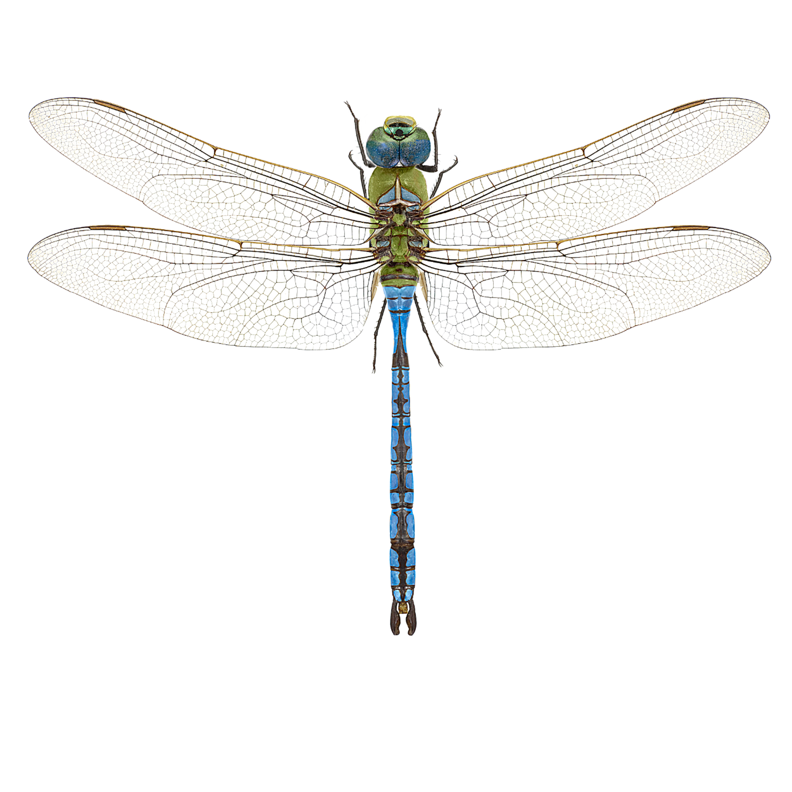
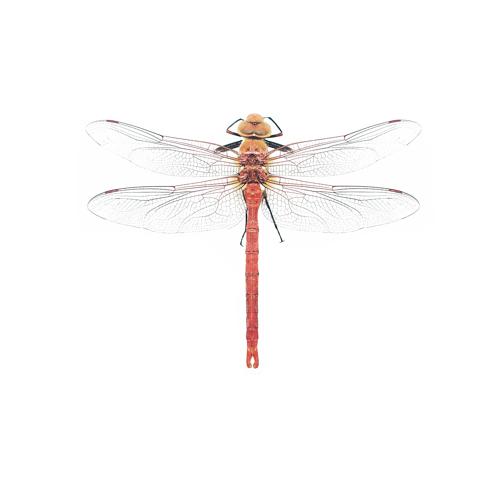
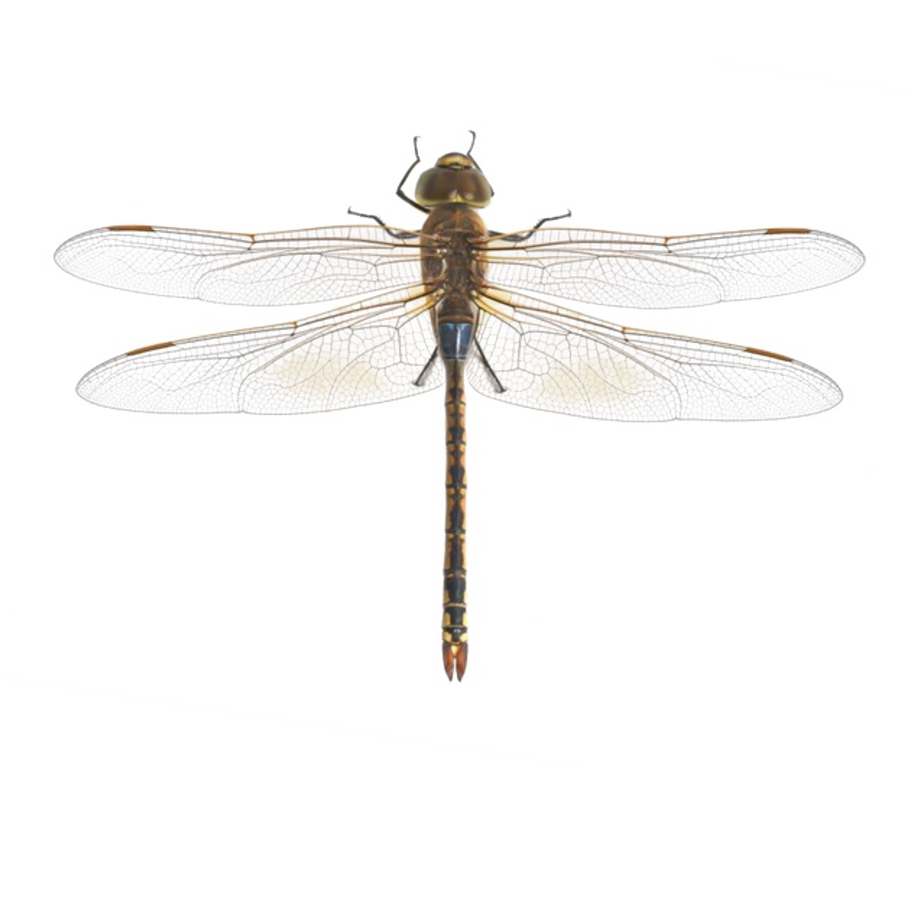
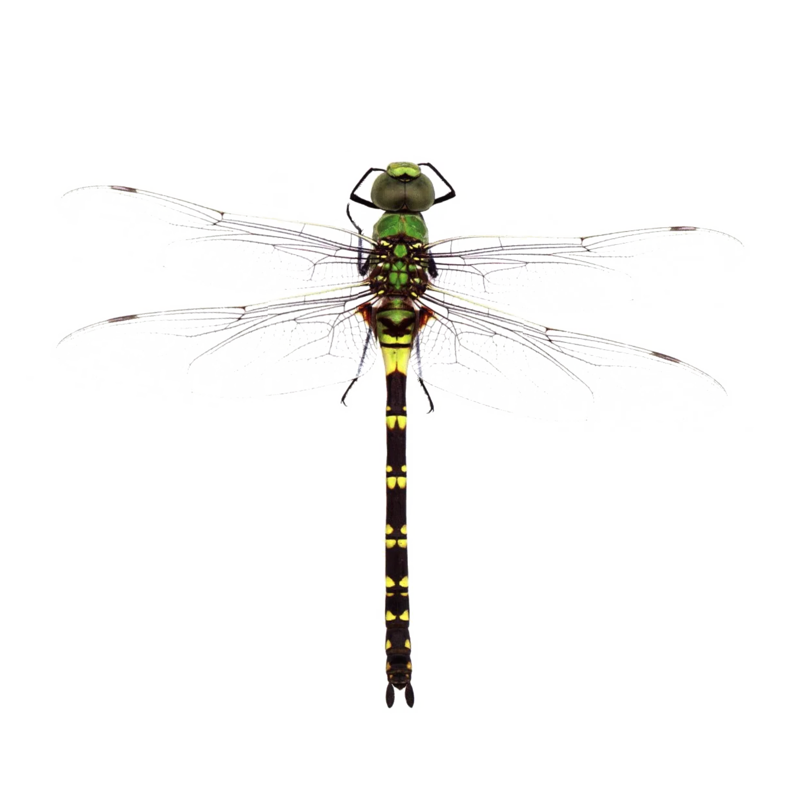
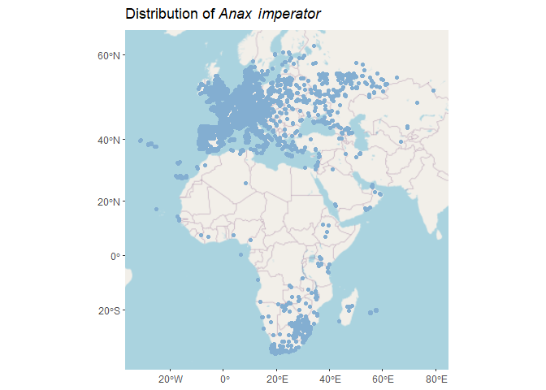
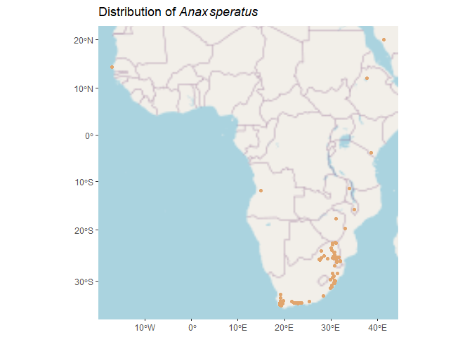
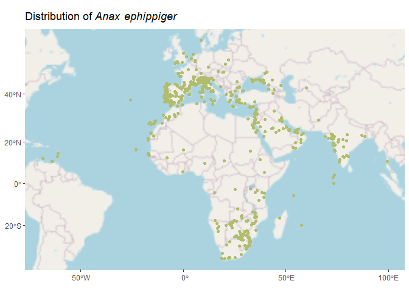
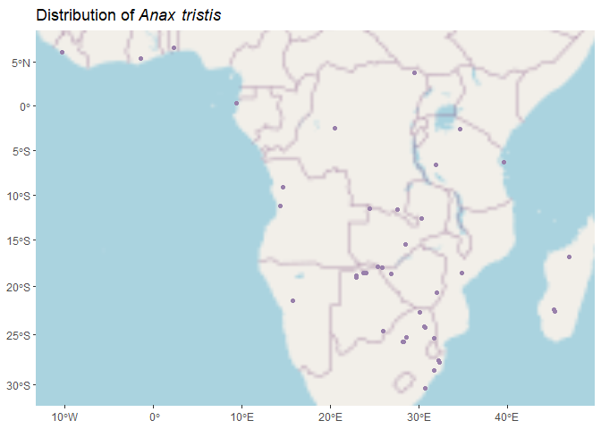

# The global distribution of South Africa's four *Anax* species

There are four species of *Anax* (Emperor dragonflies) found in South Africa. Their ranges are extensive. This is a handy bit of code to visualize their distributions using R and GIS wizardry.

First, let's set up our work space. These are the packages that we'll need to run this code, check that they're installed and in your library:


``` r
my_packages <- c("rmarkdown", "tidyverse", "sf", "rinat", "raster", "lwgeom", "leaflet","leafpop","rosm", "ggspatial", "prettymapr", "mapview", "rnaturalearth","readxl","htmltools","bslib") 
lapply(my_packages, require, character.only = TRUE)
```

# Acquire Data

We'll need some data. iNaturalist is a great place to find observational data on organisms around the world, including dragonflies. The data for this exercise was downloaded and stored in the GitHub repository - you can find it [here](https://github.com/EntoAmy/Dragonfly_GIS/tree/main/iNatData). <br> The four species of dragonflies are:

| Common Name     | Scientific Name     |                                       |
|:--------------------|:-------------------------|:-----------------------:|
| Blue Emperor    | *Anax* *imperator*  |      |
| Orange Emperor  | *Anax* *speratus*   |     |
| Vagrant Emperor | *Anax* *ephippiger* |  |
| Black Emperor   | *Anax* *tristis*    |       |

<br> The species names will be used for the respective data sets below: <br> We'll begin by reading in the data: <br>


``` r
imperator <- read.csv("iNatData/obs_imperator.csv")
speratus <- read.csv("iNatData/obs_speratus.csv")
ephippiger <-read.csv("iNatData/obs_ephippiger.csv")
tristis <- read.csv("iNatData/obs_tristis.csv")
```

<br> Then we'll clean it up. Because iNaturalist makes use of citizen scientists to log their observations, the data isn't always accurate or complete.\
We're filtering the data frames to remove observations without locations, and those with positional accuracy grater than 500m (dragonflies move around freely, so I've allowed for quite a bit inaccuracy here). We'll also only include 'research grade' data, which has been somewhat verified by other users. <br>


``` r
imperator <- imperator %>% filter(positional_accuracy < 500 & !is.na(latitude) & quality_grade == "research")
speratus <- speratus %>% filter(positional_accuracy < 500 & !is.na(latitude) & quality_grade == "research")
ephippiger <- ephippiger %>% filter(positional_accuracy < 500 & !is.na(latitude) & quality_grade == "research")
tristis <- tristis %>% filter(positional_accuracy < 500 & !is.na(latitude) & quality_grade == "research")
```

<br> In order for the GIS wizardry to work, we'll convert these tabular data frames to spatial objects using the Sf package: <br>


``` r
imperatorSf <- st_as_sf(imperator, coords = c("longitude", "latitude"), crs = 4326) 
speratusSf <- st_as_sf(speratus, coords = c("longitude", "latitude"), crs = 4326) 
ephippigerSf <- st_as_sf(ephippiger, coords = c("longitude", "latitude"), crs = 4326) 
tristisSf <- st_as_sf(tristis, coords = c("longitude", "latitude"), crs = 4326)
```

<br> Then we'll use the following code to check that the data is indeed of the Sf class, and that the correct co-ordinate reference system is used for each: <br>


``` r
cat("<details><summary>Click to expand the meaty results of these checks</summary>\n")
```

<details><summary>Click to expand the meaty results of these checks</summary>

``` r
class(imperatorSf) 
```

[1] "sf"         "data.frame"

``` r
class(speratusSf) 
```

[1] "sf"         "data.frame"

``` r
class(ephippigerSf) 
```

[1] "sf"         "data.frame"

``` r
class(tristisSf)
```

[1] "sf"         "data.frame"

``` r
st_crs(imperatorSf) 
```

Coordinate Reference System:
  User input: EPSG:4326 
  wkt:
GEOGCRS["WGS 84",
    ENSEMBLE["World Geodetic System 1984 ensemble",
        MEMBER["World Geodetic System 1984 (Transit)"],
        MEMBER["World Geodetic System 1984 (G730)"],
        MEMBER["World Geodetic System 1984 (G873)"],
        MEMBER["World Geodetic System 1984 (G1150)"],
        MEMBER["World Geodetic System 1984 (G1674)"],
        MEMBER["World Geodetic System 1984 (G1762)"],
        MEMBER["World Geodetic System 1984 (G2139)"],
        MEMBER["World Geodetic System 1984 (G2296)"],
        ELLIPSOID["WGS 84",6378137,298.257223563,
            LENGTHUNIT["metre",1]],
        ENSEMBLEACCURACY[2.0]],
    PRIMEM["Greenwich",0,
        ANGLEUNIT["degree",0.0174532925199433]],
    CS[ellipsoidal,2],
        AXIS["geodetic latitude (Lat)",north,
            ORDER[1],
            ANGLEUNIT["degree",0.0174532925199433]],
        AXIS["geodetic longitude (Lon)",east,
            ORDER[2],
            ANGLEUNIT["degree",0.0174532925199433]],
    USAGE[
        SCOPE["Horizontal component of 3D system."],
        AREA["World."],
        BBOX[-90,-180,90,180]],
    ID["EPSG",4326]]

``` r
st_crs(speratusSf) 
```

Coordinate Reference System:
  User input: EPSG:4326 
  wkt:
GEOGCRS["WGS 84",
    ENSEMBLE["World Geodetic System 1984 ensemble",
        MEMBER["World Geodetic System 1984 (Transit)"],
        MEMBER["World Geodetic System 1984 (G730)"],
        MEMBER["World Geodetic System 1984 (G873)"],
        MEMBER["World Geodetic System 1984 (G1150)"],
        MEMBER["World Geodetic System 1984 (G1674)"],
        MEMBER["World Geodetic System 1984 (G1762)"],
        MEMBER["World Geodetic System 1984 (G2139)"],
        MEMBER["World Geodetic System 1984 (G2296)"],
        ELLIPSOID["WGS 84",6378137,298.257223563,
            LENGTHUNIT["metre",1]],
        ENSEMBLEACCURACY[2.0]],
    PRIMEM["Greenwich",0,
        ANGLEUNIT["degree",0.0174532925199433]],
    CS[ellipsoidal,2],
        AXIS["geodetic latitude (Lat)",north,
            ORDER[1],
            ANGLEUNIT["degree",0.0174532925199433]],
        AXIS["geodetic longitude (Lon)",east,
            ORDER[2],
            ANGLEUNIT["degree",0.0174532925199433]],
    USAGE[
        SCOPE["Horizontal component of 3D system."],
        AREA["World."],
        BBOX[-90,-180,90,180]],
    ID["EPSG",4326]]

``` r
st_crs(ephippigerSf) 
```

Coordinate Reference System:
  User input: EPSG:4326 
  wkt:
GEOGCRS["WGS 84",
    ENSEMBLE["World Geodetic System 1984 ensemble",
        MEMBER["World Geodetic System 1984 (Transit)"],
        MEMBER["World Geodetic System 1984 (G730)"],
        MEMBER["World Geodetic System 1984 (G873)"],
        MEMBER["World Geodetic System 1984 (G1150)"],
        MEMBER["World Geodetic System 1984 (G1674)"],
        MEMBER["World Geodetic System 1984 (G1762)"],
        MEMBER["World Geodetic System 1984 (G2139)"],
        MEMBER["World Geodetic System 1984 (G2296)"],
        ELLIPSOID["WGS 84",6378137,298.257223563,
            LENGTHUNIT["metre",1]],
        ENSEMBLEACCURACY[2.0]],
    PRIMEM["Greenwich",0,
        ANGLEUNIT["degree",0.0174532925199433]],
    CS[ellipsoidal,2],
        AXIS["geodetic latitude (Lat)",north,
            ORDER[1],
            ANGLEUNIT["degree",0.0174532925199433]],
        AXIS["geodetic longitude (Lon)",east,
            ORDER[2],
            ANGLEUNIT["degree",0.0174532925199433]],
    USAGE[
        SCOPE["Horizontal component of 3D system."],
        AREA["World."],
        BBOX[-90,-180,90,180]],
    ID["EPSG",4326]]

``` r
st_crs(tristisSf)
```

Coordinate Reference System:
  User input: EPSG:4326 
  wkt:
GEOGCRS["WGS 84",
    ENSEMBLE["World Geodetic System 1984 ensemble",
        MEMBER["World Geodetic System 1984 (Transit)"],
        MEMBER["World Geodetic System 1984 (G730)"],
        MEMBER["World Geodetic System 1984 (G873)"],
        MEMBER["World Geodetic System 1984 (G1150)"],
        MEMBER["World Geodetic System 1984 (G1674)"],
        MEMBER["World Geodetic System 1984 (G1762)"],
        MEMBER["World Geodetic System 1984 (G2139)"],
        MEMBER["World Geodetic System 1984 (G2296)"],
        ELLIPSOID["WGS 84",6378137,298.257223563,
            LENGTHUNIT["metre",1]],
        ENSEMBLEACCURACY[2.0]],
    PRIMEM["Greenwich",0,
        ANGLEUNIT["degree",0.0174532925199433]],
    CS[ellipsoidal,2],
        AXIS["geodetic latitude (Lat)",north,
            ORDER[1],
            ANGLEUNIT["degree",0.0174532925199433]],
        AXIS["geodetic longitude (Lon)",east,
            ORDER[2],
            ANGLEUNIT["degree",0.0174532925199433]],
    USAGE[
        SCOPE["Horizontal component of 3D system."],
        AREA["World."],
        BBOX[-90,-180,90,180]],
    ID["EPSG",4326]]

``` r
cat("</details>\n")
```

</details>
<br> 
Now that we're confident that our data are accurate, research grade, and spatial objects, we can visualize them on a map: 
<br>

``` r
ggplot() + 
  annotation_map_tile(type = "osm", progress = "none") + 
  geom_sf(data = imperatorSf, color = "#83aed1") + 
  ggtitle(expression("Distribution of " * italic("Anax") * italic(" imperator")))
```



``` r
ggplot() + 
  annotation_map_tile(type = "osm", progress = "none") + 
  geom_sf(data = speratusSf, color = "#e1a56d") + 
  ggtitle(expression("Distribution of " * italic("Anax") *  italic("speratus")))
```



``` r
ggplot() + 
  annotation_map_tile(type = "osm", progress = "none") + 
  geom_sf(data = ephippigerSf, color = "#afbd6c") + 
  ggtitle(expression("Distribution of " * italic("Anax") * italic(" ephippiger")))
```



``` r
ggplot() + 
  annotation_map_tile(type = "osm", progress = "none") + 
  geom_sf(data = tristisSf, color = "#9980ab") + 
  ggtitle(expression("Distribution of " * italic("Anax") * italic(" tristis")))
```


<br> 
Great! These maps show the distribution of these species well, and the colour coding helps to differentiate them. However, these maps aren't actually very useful to look at the observational data of one species in relation to another, nor does it allow us to visulise the data on any meaningful scale. 
<br> 
An interactive map, with all the species on it, would be much more useful! 
So we'll use the Leaflet package to create a better map:
<br> 

``` r
leaflet() %>%
  addTiles(group = "Default") %>%
  addCircleMarkers(data = imperatorSf, 
                   group = "Anax imperator", 
                   radius = 2, 
                   color = "#83aed1") %>%
  addCircleMarkers(data = speratusSf, 
                   group = "Anax speratus", 
                   radius = 2, 
                   color = "#e1a56d") %>%
  addCircleMarkers(data = ephippigerSf, 
                   group = "Anax ephippiger", 
                   radius = 2, 
                   color = "#afbd6c") %>%
  addCircleMarkers(data = tristisSf, 
                   group = "Anax tristis", 
                   radius = 2, 
                   color = "#9980ab") %>%
  addLegend(position = "topright", 
            colors = c("#83aed1", "#e1a56d", "#afbd6c", "#9980ab"), 
            labels = c("Blue Emperor", "Orange Emperor", "Vagrant Emperor", "Black Emperor"))
```

```{=html}
<div class="leaflet html-widget html-fill-item" id="htmlwidget-7732f7f0645636adb4af" style="width:672px;height:480px;"></div>
<script type="application/json" data-for="htmlwidget-7732f7f0645636adb4af">{"x":{"options":{"crs":{"crsClass":"L.CRS.EPSG3857","code":null,"proj4def":null,"projectedBounds":null,"options":{}}},"calls":[{"method":"addTiles","args":["https://{s}.tile.openstreetmap.org/{z}/{x}/{y}.png",null,"Default",{"minZoom":0,"maxZoom":18,"tileSize":256,"subdomains":"abc","errorTileUrl":"","tms":false,"noWrap":false,"zoomOffset":0,"zoomReverse":false,"opacity":1,"zIndex":1,"detectRetina":false,"attribution":"&copy; <a href=\"https://openstreetmap.org/copyright/\">OpenStreetMap<\/a>,  <a href=\"https://opendatacommons.org/licenses/odbl/\">ODbL<\/a>"}]},{"method":"addCircleMarkers","args":[[48.1631922,44.737562,38.738084,38.759973,35.891655,50.36241,38.111917,38.170122,38.170194,25.394402,25.382533,44.249101,39.242113,41.039372,44.905305,44.161572,52.035249,37.809621,45.033229,37.863199,37.901266,37.82496,37.834822,50.688193,50.688139,37.834097,51.872828,39.477055,41.040466,39.486747,25.396612,43.161925,45.2348754095,28.529518,45.397261,38.195261,37.737978,45.5915442772,45.5378767848,45.4873238578,45.537902,42.292675,37.7632811444,45.538993,45.539008,38.112443,45.53231,45.1857399991,44.6686835314,44.79745193,41.323992,43.825518,43.825239,43.825378,43.825378,45.4478301937,47.650062223,45.53938,46.7059216667,37.9428369803,44.3555850635,44.8613881021,44.6118808573,43.825355,43.825193,45.7489772812,36.806613,7.496121,43.1622182105,43.15,44.8338314794,45.079856,40.1854926365,45.646465262,39.303897133,45.7376516667,45.7222729174,45.53918604,41.4151194413,45.673991556,45.5390923772,45.4538291478,45.7182406753,45.4349261597,49.4473780766,49.4464613051,51.4337575874,49.35209736,39.3011792318,39.3011584761,45.7160974403,48.4179155837,48.4178612887,39.3403798451,45.72676718,39.1707966667,48.5065827517,51.4529859639,45.4345304034,45.4345304034,46.7088,45.7760994944,41.5866321843,49.4174597434,48.5285423877,45.9791604109,49.3488238,50.1541758874,49.4173997795,47.7277483333,-1.3364343,48.1088986743,37.0237876058,36.983876,45.4003107179,49.4149899073,26.2378180955,53.913011,-3.226924804,37.0251692012,43.718028743,43.718028743,49.4149545181,45.7154499109,45.708920073,45.7180271888,36.4273215255,37.0240556661,37.0106405677,37.0104178194,45.435324,55.539122335,38.597893,50.0971884589,38.2545279903,28.6980602008,-27.3904766667,37.0193101102,42.227398,52.5245248292,51.789205,51.2742395355,45.992072,45.431749,-17.3538999935,-28.9803866742,36.908,-28.27,51.1538950803,34.9985476437,-22.558633,51.4411888245,51.8812066841,43.299908,45.76773,-30.2817434803,-34.0532283213,48.2117113248,-34.0464271306,-33.954351397,-30.2816312741,-25.22706,-26.0896,-28.61294,-28.60254,-34.053372,-34.1991598729,-33.6623510403,-34.04651,-21.507,-33.94698,-33.8011169434,-27.5515945,-30.29948,-30.29948,-27.57752,-20.4134748,-19.8461611111,-33.945594,-28.2605,-33.9472,-34.06234,-33.9472,-33.94615,-33.0261354444,-33.9454926,-33.947418,-34.03226,-27.9607235,-33.98886,-22.19546,-33.94356,-33.939908,-30.29948,-33.8883,-33.947293,-34.0755939,-33.2319212,-24.9947565,-33.2319579,-30.29948,-30.94939,-33.96941,-33.94555,-28.9599836,-28.963928,-33.9455433333,-29.5595877,-34.225331,-33.9454533333,-28.2833752,-34.07484,-30.299936,-28.33002,28.0805966091,35.3364703904,-34.1934166031,-32.4412904,-33.8892243377,48.288886,47.2180119595,45.62022164,45.6196145362,49.4174998409,49.417374526,45.7180646427,49.4148884637,49.4148564194,49.4976082701,48.4709919746,48.232301745,40.4628173997,49.7996981326,52.2748276131,49.7996291138,45.53795368,49.4174012545,52.26557,52.2748144837,52.2765245561,46.0957268027,51.2013988,45.726940238,51.789066,45.4278962656,49.4174179103,49.4148564194,49.4150185441,45.4380419084,45.7220658814,45.5575341,49.4174323217,49.4152690098,51.5030750047,-28.9649694461,-27.338915562,49.7995937191,49.4174931913,47.4125662621,47.8465323969,47.5829644925,47.5837030686,47.7274244821,47.718704893,45.1394306503,52.2748272438,45.7265809937,50.5253711052,50.7285373585,45.4336588398,49.7995882102,50.1214273898,50.568869457,51.79903,50.1152859931,37.0184872446,45.623485311,49.4174419054,51.6240450836,43.9526216667,45.7345405701,45.7265300774,53.2175533333,48.5390711076,51.5173455422,51.6058604096,43.038309,49.4150099876,51.4336879001,45.1867569218,51.5177528,51.5177528,51.8746715731,45.1671980617,49.4149866763,49.4175444,52.3801633445,51.9942141,45.6208277533,51.6182083001,43.8624833333,51.0050983333,49.7996234947,46.0378694031,49.4175369894,51.1527573097,52.2765774375,48.1632278333,50.9850196186,45.7276833455,51.981333656,49.4173757027,51.981234557,44.63134022,49.5093216667,46.0969366179,46.0928475346,49.7996620037,49.4174478742,38.9893766667,38.8138775037,46.1651349941,39.4985877925,39.4617956254,47.660431056,52.0728009243,52.075645406,-9.312848880700001,39.3000121241,39.301390744,51.8382,45.7177583615,51.060431,35.1906595605,52.3084933958,52.0611055531,49.4148628413,55.68575,40.6491886,45.3592231051,40.9955629564,41.5691172712,40.4396453019,40.4396453019,45.7268207063,35.742327,38.87512,51.4765405,-25.7757384153,-9.3286116774,28.4079327,50.6751449,43.4047685348,51.0937009641,51.0937009641,51.0937009641,39.3384841398,38.525479014,38.5254706219,-30.2999838857,36.3310062034,39.130942164,49.2472813032,37.0239808141,49.631936,40.94506049,-34.0630287562,47.7275689775,-30.2930283482,-18.7411462595,-34.05006864,45.6927196794,-33.7352419019,32.6626580523,37.0218963374,51.4804773162,-33.9765290852,-34.0494779628,-33.9887287004,-29.6637301133,7.057728314,45.607085505,39.1467240822,-34.0761561074,51.1632257633,51.163167606,51.1631248105,-11.8624968295,-33.8718715852,-34.1965239419,-34.1934406068,51.129527,51.128048,51.092325,47.5492697765,49.9173573588,45.3515400235,28.4549633333,-33.988905,37.244327,51.060315,54.5466404798,42.5613382747,51.108759,51.092828,51.195548,41.4705513609,51.171818,51.171864,51.171904,51.171974,51.171889,54.5387703085,-34.0496509597,53.5528011313,27.9760991706,48.5820608405,-33.7503773844,-25.371911463,51.110173,-30.774528837,50.6697271718,39.13249547,51.039141,41.8107786378,51.11013,-33.94557,-33.4886597819,-33.8844446465,41.1537575,28.5011995553,-25.8816924416,45.23398217,52.6322606261,52.5967709426,36.7935680325,49.2262008021,39.63558911,50.1243913156,38.3011894753,43.71075,44.8240033513,-18.4369907664,-4.0626945,-34.031238739,51.8148712806,47.268155289,39.548695,52.3105532906,-33.838726363,-34.0574735605,-33.9963633333,-33.8401524935,-34.0945947765,-33.94162,-34.0496342753,38.6649147191,-34.098297052,47.7950336772,35.8998319166,38.7367476,-28.9641870424,-33.9104812434,45.5379305996,45.7199105557,44.7892099135,44.7891838698,49.4475815706,46.5058440128,48.9678207116,38.6647233931,52.5737416667,51.1272722245,45.2784974724,44.7892453736,52.193837363,49.4148229664,45.7264311555,40.8060526,8.763982007899999,51.5177528,28.3490636257,51.458692,36.5197966667,51.0773837744,45.7799277846,45.7802623964,45.7802364404,37.6003789822,51.3804833333,36.8429587364,43.7100230253,44.2225377893,-34.0037908599,56.0150304021,51.556752276,51.556752276,51.556752276,51.556752276,52.0836448776,55.6423683594,52.8293646119,52.763433,45.722289537,50.7125,49.0999536255,45.5305566667,51.3987555055,50.9647633333,47.5392982962,50.9645633333,48.9053527531,28.372356,49.802325,45.5306359408,51.515918,41.2674204091,48.8571485512,48.8571388451,51.041625,57.6685,51.1892322528,50.777745,51.39877726,55.928403,45.431678785,48.197563838,49.799051853,37.0149879463,50.9759597574,28.6067,54.4186842491,52.1261882959,41.829651,41.829836,50.1219565932,55.7778245842,55.7956406151,50.045519735,52.6578877489,52.1073795534,40.2834354629,52.632314,50.7330633333,52.012895695,51.412495105,45.9871002735,48.1820460121,48.1815309486,48.180672498,48.1815426222,51.6055810961,55.8070857603,52.1678501108,45.6019566161,45.1158,38.4124261515,48.5287388438,52.6322606261,41.819386,50.1242867272,45.6053174939,45.5162237253,45.5212,45.5211908016,46.9636238075,52.3292126513,48.0610225201,48.0610619578,45.5130795331,39.3722683218,51.4635083333,44.8107258266,43.7425596,47.8577899522,51.4341616667,53.5774492135,54.3141191935,52.1107585023,53.6082481099,40.0030649008,43.4401736885,-33.7258888889,54.0613660521,51.6661,50.9332451603,52.9221643166,50.1155231061,52.4129334301,42.0534850525,52.1975588223,57.7448166667,52.1994152154,52.1988102641,54.1845142468,49.4973552311,49.4149816244,49.4150242569,49.4148690288,52.0721145145,52.8609583333,51.800040235,54.244014,51.8144692649,54.244368,45.2552331707,51.451582,51.367112,50.9347062736,43.34823709,48.2647776884,49.5174866667,44.7892623316,39.5577469413,48.190094725,51.0728363421,50.6506833333,45.5231007479,51.548129,45.3842872592,52.0836580576,-33.7503773844,53.4703999334,53.3376282,51.7974666667,42.2276593133,42.2276593133,51.426477187,51.8202763553,52.1725804124,53.6082564646,55.6009325578,39.7327192824,45.3555016664,45.3555016664,52.0830515036,54.253601,52.08297898,51.8144427342,52.1032016043,44.7938266495,47.4315123492,38.522703581,40.365837065,50.115110361,50.1152401576,41.5058378229,42.20566718,51.5037883333,52.2131176591,45.431678785,51.5548926576,54.2128730599,44.261854864,55.9750994342,51.2152792488,51.454105,46.3831275562,51.40788774,51.4078074318,51.4150378867,51.4151315648,51.4153858336,50.5999833333,38.6653495899,45.3413790336,45.3413790336,45.7195098728,51.0322638333,51.0765337549,52.2953995788,51.7083557481,51.6667,-33.8296231348,56.1596456073,52.1987946017,53.7145453721,53.2699523801,51.5484399388,36.552345,51.4063575846,53.1687383333,43.3301572016,51.650038,51.478755,51.323688,43.3710497533,53.6079485,53.2955189814,-34.3095332733,43.0943111667,45.5648300706,50.1190384314,41.1536334,50.928712987,56.4441962278,51.3004813284,51.0359586615,41.4509211678,39.8378333333,50.9331866667,39.7645262,40.9227760781,46.7858545925,53.2703654307,52.3692663261,45.6653319744,53.6137527991,53.6190145596,53.7490864792,50.6702005969,50.6570624358,50.7099825488,53.0213827741,53.7030559379,46.5373698226,51.615344,28.4107901802,42.9879003293,35.8948062777,45.7943152855,55.805505,41.3622559955,41.3622559955,41.3622559955,33.041425,47.3502635699,45.5295317444,50.8532666667,45.5080100059,55.4809030356,28.1922436126,50.4740218131,46.1588874674,54.7222494932,45.6869649897,53.7138074443,38.7686201111,40.7418402,51.5163635267,39.2787993512,45.925528005,45.300819,46.0175562695,44.7402102437,43.9201089235,53.4133818014,53.2702852967,47.7272229214,47.6527607508,46.704655965,44.789260616,-30.3000046827,43.1860657542,41.0087773484,28.6750126027,54.9912924736,46.2356874394,41.0065583233,-25.9050757698,38.7367224619,48.1308118791,38.400813,38.401028,-26.106351341,51.06910375,-20.5794335885,50.7813219024,38.6640564832,36.864681678,50.1274152888,48.1028658624,-20.1074973576,-20.1071779341,-22.6927646166,-33.4344298213,28.2918723528,51.4572079445,-33.753401546,53.7065998287,-33.8814168766,-33.8791328483,28.3044499669,-27.6400493,-33.9002368131,46.705771508,40.62097127,41.76605757,-33.986197472,-33.5509649121,45.620575,51.3016201144,42.1930133156,-34.2585188049,-25.6760250993,-18.9827208194,-18.9985572573,-33.7905180023,31.0887721961,-33.945545884,44.1101027194,50.107469273,55.6991279245,55.7581024105,-30.2942221628,44.442703,44.515396,44.476746,44.515244,-33.9456408885,-32.8493320791,44.7692464849,44.7694639979,54.8533281134,-33.8497156479,44.8557655796,54.4157397915,38.4425063008,36.3981625114,48.3809408475,44.4418055651,48.1847389948,48.4501504167,48.4481808519,48.3304354948,45.9338675803,48.3809259718,43.6342555993,48.3318157943,-25.8132061599,-25.6380840826,-28.6736369385,-25.8235577142,-34.013408,-28.3727,52.5778009128,54.7491006396,47.0185360425,-15.792302665,45.0393511914,50.1267485128,55.3266021622,55.3266021622,55.3266021622,48.0780643792,-33.9960033313,-33.9950376558,48.1497422506,50.115299309,-28.974107393,-29.845193848,51.1862260888,39.4363234259,-33.9888903342,28.07899717,-34.0543513873,55.9452691597,-25.876831,-34.0861924977,50.1260608345,-25.63255,-34.039368964,42.7424806066,50.1268423923,-25.8169019427,-25.7562876547,50.7125,52.3854373425,50.7125,-32.6967322962,-30.3011441995,-33.9723746365,61.6759121096,22.6197692314,47.3586286455,51.5638377762,-30.3011370206,50.92699,28.3762269204,50.1241026448,51.602150408,48.6606837979,48.3953639997,-33.9966397167,-15.3696397011,-34.0600863167,45.0332530715,50.0482880842,-26.1564395,45.59678,36.8391351348,45.67428997,-25.5867065915,39.9070873715,42.735213938,-33.6655196833,-26.0334775248,-33.386379,42.7384794081,-34.0479974,36.7218242613,39.5657548,53.4857631149,41.3055772661,-34.09159717,38.19535,40.4135478704,37.176079952,51.5812395156,37.6003789822,-34.0468538132,-34.0174274161,-33.9354180096,-33.9354122812,-34.0624159639,-33.9356339319,-34.06324,-33.813074285,43.6252715895,27.9740457502,-34.05343477,55.0893717898,43.7864979097,-33.9803680329,-17.7163943132,-28.8653493634,45.8808279998,48.4163802994,37.1490427682,51.6764418112,41.202087437,43.8678676038,43.867839565,43.8678550347,55.645992026,39.9304897276,53.9044515303,45.0331216704,43.0960370783,54.188987488,-15.3697498306,45.5811708241,41.331101,39.277255,43.8338507377,46.4609183344,48.5753103278,51.995343288,-24.22758333,46.7073455143,43.1318424503,41.1974493264,39.8330790089,50.8464387678,45.5305907557,46.2362303932,46.3041566945,45.6658627184,46.2363259384,39.2791056151,49.9929435189,-34.0609033372,46.2358715175,51.2423139456,41.2381006575,28.6895407435,-32.6773108617,44.8424330879,50.7153624834,50.83258,52.220855,44.7920466858,49.4148524073,39.2323026451,50.896889592,51.35598333,39.2159726172,51.1322082233,45.7824395821,53.2585638805,43.6883746898,51.466943965,51.6234612676,46.579525,44.4150079598,44.4150397547,44.4150511466,44.4150312059,49.9799354298,49.991628989,49.9916437154,51.0252893889,45.25173833,51.44442833,52.70070333,50.8708341,51.3942638412,51.381985,51.449438,51.100739,51.1554738338,53.66318759,43.8678667647,50.8168574083,46.21281333,53.6701371217,52.9935057171,51.4044143795,51.0448688271,43.56152,49.540674911,55.73053,49.5698111,52.871575832,38.4992767451,48.8385985105,50.8693483231,51.4526938884,39.2185452925,47.7169661205,46.7072053189,51.4115417719,46.2924939714,46.2926125854,51.0086070401,45.1746642649,48.8046084718,36.9933929637,52.3187502157,36.9930169172,36.9824009349,36.9890769931,45.2521487888,50.4327548539,43.554678331,43.3798477442,-30.2999939145,44.4150290344,44.415050109,52.0994290421,51.589665,44.4150089136,-32.6981580101,48.3675771242,51.5305954119,49.6439146953,51.450561402,51.859025,52.800699758,39.5736969341,52.01580555,56.050168929,45.542913289,45.5253893381,45.5352361066,56.2302160682,51.013745,51.5201695404,45.5759041224,41.7693150654,46.5684337008,51.5760537652,51.7493744941,48.1731853556,43.8678646012,40.285267811,51.8932210191,52.3414906601,45.1744228627,41.4349640656,41.889359,45.8156514696,53.2137614098,44.3860364318,50.847454107,49.9652369732,48.7183233274,40.6595450169,56.1976918334,55.745955,44.4313692044,45.2547857773,46.982125,49.6386588804,52.3359684,49.5826605019,53.584498529,52.30834167,51.546862,47.3586535936,47.358654394,47.358654394,47.358654394,53.6611041999,45.431678785,50.5845155083,42.3139688029,50.9653499035,46.2923753572,50.9275428928,50.10955,56.8985782,51.8235882478,45.1746450967,42.34140531,38.1632993387,51.6246676175,48.8336164805,41.889355,53.4894892616,50.0838129358,50.6419168458,51.1655280261,-15.3597330319,51.0668217053,43.8679177549,51.3516628282,39.0628407,40.689867722,42.9380185226,51.451019,43.3640631376,50.9264034121,51.9768608681,51.7374916268,47.4059402,52.4482618159,51.4570652556,48.7055316055,50.6885368,51.2540819024,49.262579251,52.2747000115,51.450175,51.1118232544,43.6376630491,54.3350873843,42.1491519138,42.140774963,45.1762121722,51.8213914598,53.9848724948,38.0372437361,51.8943176513,49.991650651,49.9915802244,51.0693721797,42.5856214979,46.2924643179,46.295806309,51.4561134034,38.5771083146,56.09711383,44.415034782,51.8088120384,55.0775678328,51.54635,50.6885348,43.2968919197,52.6140302308,50.8602469955,51.1534679261,49.997195879,51.3750026723,49.3873698227,49.3842218357,45.7607362465,52.7471291049,55.854504411,51.8166557957,52.1832598153,46.5145104856,52.432031,51.5177528,51.5221835206,51.2282886462,50.5212722414,42.7806138087,51.9030508621,55.8614228,51.6539440886,49.625355,47.1169273305,47.1169197,53.6085236137,56.2024,52.3043910563,53.4876872575,52.4879296085,49.941414881,48.1808626769,50.1641139045,52.0838520843,44.552455069,51.2049361406,52.4839418496,45.431678785,55.4809030356,37.1446044873,51.4813801817,52.0464252316,50.8790798,57.0759863289,48.0501556896,56.4516762635,56.12287783,47.3774887993,51.451221,55.5742026574,45.3726401677,55.6464782943,45.596290691,54.6949949297,51.54863,53.2208801006,53.220417592,55.69071167,59.4397518312,43.2784135868,53.3348310389,45.8808279998,47.7658008739,41.825682,41.829825,55.6522808,56.22448,50.9289852768,45.5627376715,50.9520604056,-32.6979200208,51.45712,45.0885976546,43.5598730271,48.0208023468,51.0757942947,44.4150444341,47.7588988802,44.4150972862,51.18902,56.0155813831,52.3224453778,52.3216241894,51.545982,53.8213798989,51.4570857299,50.5848814573,50.417645,50.0183366117,52.2230363833,49.9916462944,55.0615428443,47.4789085429,42.999177594,50.72146667,49.6821486654,50.0372702834,51.547751,48.4326064492,51.5510592071,41.4469820736,41.4470464095,41.4470464095,53.7040838103,39.2792717126,51.6033980248,53.7888012482,45.8549575482,50.7768683964,-32.1390238667,53.0141357676,42.5121084,52.1286701259,45.1746586314,45.1746586314,45.1746586314,45.1746586314,47.6204255863,56.1018423082,48.2269366249,47.3972805955,45.244017116,55.71122167,45.7674244671,43.359396,50.657875,50.8787,50.87879167,50.7280905349,52.0035321503,52.00361388,49.9915768955,49.9928911883,54.114875,49.4150081781,49.4148650897,42.3630399229,42.3630399229,50.644342997,46.198929054,47.3580389164,51.2376468519,53.38566167,47.3441574,52.5828797957,53.6151906546,47.6224759462,44.9001430205,50.4700071784,51.4116906338,46.2956523507,46.3041762124,44.8754918199,54.2084151709,53.2311448217,51.5446537117,51.2609520579,57.634705,45.7070590415,44.1109860518,41.3658349619,47.5837844502,48.3913459593,51.563519,46.2360067194,46.2363842626,42.6118481424,52.0811974344,48.3666903326,48.3675680135,47.1210495168,51.7984116735,48.6077477109,43.5535552654,44.4151089467,50.87918,51.7410021,42.3869610984,55.55079498,50.4930933068,50.4930933068,56.980954,51.0585468904,50.94912167,53.1149678156,51.9876684,51.988097048,50.7907162717,49.2610154,46.2362690055,51.0662473018,43.0986539581,51.376652,51.505527,53.4082605133,52.2647542583,51.6215893943,51.5447738131,49.6812763098,52.3146490739,52.3146490739,41.1042635134,50.6425365652,55.70935,55.71109667,45.3943636156,55.890483,52.8098516469,51.4414995357,46.2363198406,51.9853562303,52.8469928462,47.7274861077,47.7277950835,51.8309789036,45.2559864591,51.0730793885,56.50189667,45.7392026159,36.9901439949,43.3550964855,51.5225840674,51.5243753093,51.6649776,49.9916463868,45.8891920068,49.9916444458,39.8165944697,39.8160129759,48.07432217,43.825299972,49.9223441224,50.9889465528,56.2831947289,53.7887280012,45.5279145455,52.275775,51.4116456061,45.6197149256,50.0924527876,50.0411354765,51.1995922894,45.480304611,56.08063883,52.3268438657,40.4081570903,39.8843111006,52.2217300466,53.3126166332,52.3931282805,52.2083412749,55.1254860692,40.4860312054,50.8787496263,49.9799268049,46.9676595694,48.1760352387,51.377882,55.7882658308,60.5007870386,50.4876458821,50.4871504035,53.3125182808,43.1074452557,50.3084969337,52.3913297523,45.12418617,50.9344426235,51.4646476587,43.4049160008,51.5177528,42.5462390194,48.3594461884,46.4117547335,43.3519811781,38.1680204892,52.9849857449,51.3034082784,55.2468504,49.7802551267,45.4417138047,38.21497167,47.4410011197,47.4410011197,45.6293592014,51.5223971516,46.165194611,50.7009811668,47.7588855972,45.6628000114,55.08952217,53.1214489311,43.5546195298,42.36460258,55.6293134066,36.7811783095,51.7327989733,46.7851202028,41.9613948067,43.6507786685,52.2408356261,55.0926607202,49.2782069005,51.7806129892,53.2798109,50.5476017943,47.398331282,39.8379641724,53.383205,44.793927494,44.7938573696,44.7938250114,51.6394093431,45.796579826,46.2363026082,48.8123674722,-20.1402945,41.2269841028,56.2948196127,46.2363177111,53.3438418,51.8147491101,48.8121908456,52.9287246054,-34.0570350152,49.6387666124,31.779192529,47.7687541533,43.8223784336,-28.3762,37.0898177202,43.5241479037,41.0713378182,40.2776941323,52.63284167,35.0037539612,43.4578451862,43.562658152,43.5469253097,31.779192529,50.9609461087,41.4470170688,48.1913052521,51.9880955184,49.7245468128,36.79463667,50.8782900948,42.3244455157,-26.0724138889,40.7448366139,55.9029451906,41.15316383,55.43426,43.829685,53.2333105958,28.504530506,-33.9455592341,53.1129484626,51.2049361406,51.103655,40.5321723339,37.070211785,55.8027483333,-33.9456960761,44.7511996982,40.291627661,50.056593,43.5570545418,-33.9455303081,-32.33068,37.128451883,52.8188263788,53.1698890579,-15.0248277373,44.8249,44.676,45.7802440624,48.0758195689,51.0958883905,-29.9600929797,51.163123062,28.6340615639,45.7046234185,45.7031820805,35.2968890084,25.057529,51.0625754415,-33.9455814848,-26.061278906,37.2172222,50.9961337471,40.422956,41.5696707538,42.2130843549,47.5323068425,55.646298,54.2158207448,-15.3570544415,-33.8405967904,-34.0616166573,51.2951196008,39.6757627808,-33.9470633723,51.2987878462,-34.059226513,52.3923839976,17.0994077927,34.663804,40.2880632152,-33.8879923585,55.9365724509,-33.8385125623,-33.9455436585,-34.1079028333,28.4115443,28.4115443,-33.9457173019,37.0594372204,51.341922385,55.3283453094,32.6489478883,51.2813763537,52.3257370431,48.2191197979,36.6920801328,-33.1263272394,-33.7378883333,-34.1291867465,-25.4300299012,51.2200599157,48.2111619783,45.55877096,51.1900965379,-33.4271979071,-26.1056086282,45.563295,-28.2939263889,48.8239278274,-28.9575935477,51.1901099862,44.1398744,-33.9455369832,46.0860005404,-33.9455013821,48.066500738,51.3396397293,-33.9463535826,39.675442174,48.22238886,37.8469336259,55.3274908276,-33.9887936231,47.2761361932,50.5686396397,11.3258411559,51.1960018228,48.0301058565,51.1899092524,51.2312985069,51.2008632537,51.1876420935,51.2870365864,-33.9454791313,51.2200089573,51.284996695,51.2407477118,-33.9183513,51.1907151578,41.5194693363,51.190728606,-32.6898328634,-33.5144730504,51.1901158965,51.190728606,-34.0528623321,-33.2318816386,53.6323795977,51.3396872229,51.3419659565,44.4923658905,54.983584,54.523761,-28.858165695,-30.30048955,51.9624215924,56.1977848523,56.1034714373,49.5344027349,55.843783312,55.667408059,-33.9455058322,49.5252970066,-33.9353109795,46.6549648394,-33.97101338,56.1851440002,-33.9455547839,-33.3880374286,43.9512023851,44.0771789534,37.1442786407,-34.5773271144,51.1862260888,43.3740187828,56.9325720574,35.5327196995,46.2390131122,54.9638298016,54.9258821354,51.9455528022,51.5800433945,51.5658188251,51.9427627782,49.1495600206,47.419460033,45.9917405117,51.1416110861,-33.9455147323,-32.1790729856,-34.0736074202,-33.9474950239,50.8562571975,51.4901166667,-34.5086348348,50.5965233479,-25.2481678521,-25.249299487,32.4677251252,32.4676372108,47.8040853891,33.1674527844,45.2064819879,-33.945499157,51.5015161305,-34.0076666667,41.6414187591,-29.7946642329,41.3541105184,55.1792568757,55.1790419466,-33.7696781651,45.4832263138,27.8476778786,27.8476778786,-25.7322123129,50.0537656432,50.3293041106,45.4294067776,54.79,-33.7753436765,-25.2619865696,28.4121406867,51.4371235028,35.8524488886,-33.8232997168,-33.6214857084,40.6363358036,40.6363358036,-22.55848,52.8213505971,39.4020435225,-21.0056027646,51.4054434301,51.4442224578,51.4027124108,-33.9875333238,-15.4964573008,37.1751133406,55.6458957419,-34.0589017928,-33.8292616667,45.390832,54.3621040213,-16.8374595803,39.3550754756,-34.0206579369,37.39697,50.8380805308,45.484956572,35.5302287239,-18.9748286909,41.1540589542,49.3323689436,-34.0542211091,49.2544854571,37.1534167961,46.9526642448,-26.1564395,35.8918894524,-33.4425840903,48.8167307029,39.2788751543,-34.0801,-33.8882718,43.7877514503,51.0356157563,-33.8887298645,43.6449845081,43.5838840053,43.5827795058,43.6985829268,-18.9334587283,38.768209888,-26.1564395,35.7373018279,37.2032373575,43.7689407267,-28.3317,38.5730266159,50.7790535244,25.5425194514,-34.0385591587,38.7781655857,-33.3921564427,37.1616567,28.3883210625,49.351502928,54.5088146562,43.3710015899,51.2891805824,42.0411916901,37.2007442454,-22.3501376601,-29.3423749344,-34.0887956886,-34.0873033795,-33.9357916667,36.8362858637,41.2371846984,45.56328379,41.3573029231,-33.3920924528,-33.3920924528,41.2204976191,-33.8148077879,48.7656045599,45.551758265,45.5515056351,41.4178463299,53.1628665179,-28.9599287711,38.661160554,45.5632257636,45.5634179328,45.563378694,42.1181241037,48.7955787359,41.4018159986,46.4940174451,51.1523968,45.7127063843,-29.7095123222,37.6603206678,40.712292576,45.563379,45.563379,45.563379,45.563379,38.5467424337,-22.6716389,38.6647233519,-24.1897343988,40.2880587332,38.6809905464,51.5107347072,44.7995739808,42.0350952148,47.094485,47.0945466667,41.6460712,51.4664130622,45.5390375887,44.7996418794,43.8868271075,43.8868263244,43.8868427228,50.7737403079,41.4144289988,38.2539799061,50.0731049419,47.249165031,45.7747014275,44.7996373124,40.9810167793,43.7836946031,49.6057489194,49.6055633333,53.1580979131,49.9909963527,46.1207001852,49.8428316305,46.6647429049,49.8534614273,49.8056174535,11.5836212617,52.5558774453,47.48222,49.7197290372,53.1974764065,44.7996965781,49.1898166667,41.8377574495,53.8153817845,45.1745690987,45.1745501905,53.1436589685,50.3623916667,43.7438044255,40.5968136135,46.5145252522,49.9139818,56.0682301128,46.1207745096,42.0708932054,50.5029471635,48.3031918,48.3031138731,49.6055633333,40.653907104,48.2321463948,51.0462431181,53.1437172494,46.708195595,45.466791256,42.9928557431,42.9954505144,41.8406052827,53.5337788848,51.4745416667,40.4908216668,48.0224305,55.8729383409,41.5818791212,52.0735621,50.0865027333,55.3331625056,48.0225611667,52.2622558618,48.3813944537,48.3813322657,48.2646783333,43.5571484187,43.4497412607,53.2840146503,52.1393180397,53.1453974177,51.4342932717,41.3154270857,41.8087210314,41.8087497895,48.3805140283,40.6537788007,40.653827162,53.5114343016,46.7114378451,40.4599640593,45.9413511537,51.9001655579,45.6915497113,49.9423738309,57.2694948277,48.0520043189,55.9973480815,45.1349302855,53.1581297941,53.1662973311,-28.3173,43.4309196479,45.1746586314,51.2009666365,46.3655248442,36.9845383183,52.9758764,50.4262994018,43.2524818151,54.3462698553,49.9423580806,49.9420772891,45.5408332241,47.4926795959,47.4682583333,55.9546984223,39.6476170595,51.8871171759,55.3439833333,54.7007651375,51.505404381,53.582440473,51.4745328398,49.4748583333,49.5491481907,48.9108573076,49.9915794143,53.4481883333,52.1740412845,40.8850595815,47.0285970685,57.4816605514,51.9990550397,50.3622585519,43.2180325368,53.1632640889,49.9915216451,53.6563384301,50.4053922223,51.4771098221,56.0153888833,48.7097522571,55.32935,55.327961,51.2951026916,48.2258104571,56.0070833333,-28.069520405,51.5412063599,52.2198388555,51.7889058357,53.1979806243,51.4146463038,49.8075117218,49.8075410197,47.8011577177,48.3179025856,55.2474859673,50.4664795357,43.3173871382,53.1881380113,41.4754979568,48.3807092853,51.0660355084,52.4028091431,52.4028015137,54.9501946546,52.1392010016,48.1878892978,50.6496002764,51.5472010506,51.5587475836,51.4392461165,55.68803,51.6474226413,49.48423,51.4487805102,52.6541092207,56.2967966603,45.4086575511,53.3458334081,53.3462561319,49.9799296332,49.9910664605,44.7993097359,52.4215530366,55.8131975222,47.0285239209,44.7992843859,51.5392302522,53.4729258002,55.9310479047,47.8036097768,-18.8667779824,46.7071609969,49.9423220158,49.9420604949,49.9423448389,47.399692107,49.6317215981,49.9783721523,50.7920487599,47.763773965,-23.7872828372,45.4086524459,51.5177528,51.3199469014,48.8545074098,49.6316846641,47.3583093652,49.7550564538,50.9923003392,49.9916531348,49.9910491955,49.9916470102,54.1491753868,49.323558226,49.5414767264,52.3359259589,52.3357620673,52.5742887553,54.7204123275,52.5048760627,52.4181415417,48.489541043,41.4329324622,55.7096033333,48.2241643,43.5375180448,53.6575909839,48.9978377135,50.148617945,48.9972492452,44.4150854544,52.0908,56.259419,56.259412,56.249687,56.259578,51.5477989232,51.4811687,27.887032,27.9140167247,51.332024201,48.2259611634,51.6660280195,54.2412950934,55.2817317777,53.8518392113,50.8513516526,51.5790828865,52.5248957793,53.8223537587,50.0671055,55.8719344444,53.6957335805,51.2907505972,51.2660688824,51.2641173131,51.263760671,45.5489932361,49.11464362,49.9423257344,50.4220557308,54.0568140021,-15.3765924,52.3404333792,51.4342283333,40.4910575237,50.831484406,51.5931054374,44.8015278617,48.306435369,53.1073357864,49.780306113,52.2747705822,49.1146055,48.7071749162,48.7071749162,53.1645320581,53.1901975557,49.9910224539,49.9915219804,49.4148662788,49.4150058773,53.1182675636,41.4144289988,54.7231954825,54.9331099934,53.0270745152,56.1658539283,44.1692666667,53.6084668992,52.7214323777,55.7751216667,48.0514889654,55.9642308225,39.5928971,47.6513161866,54.2616150934,42.8109804076,50.4703316998,42.0765246336,53.5337788848,17.1609425032,46.5681349,55.2479752274,50.4603418877,51.5760494,55.2844467163,55.2844772339,47.0001271075,51.241482294,42.1923001988,48.8916023507,51.7505133333,46.2516893772,47.6335988715,45.4174461144,43.1968629824,54.1197551933,48.2080920835,51.2048435162,53.5135790506,49.6533281642,51.3254968984,47.9252958423,47.0001271075,38.0366055833,53.46024,54.1813028252,46.1496014571,46.6748003626,52.4320127688,42.867332,52.1015651853,56.6805819013,48.1983966667,42.0661023742,42.0512727722,53.1882436349,48.0929211491,48.3551793,53.24346667,54.7047579741,49.9916489636,51.929260354,51.9296872755,51.4801869309,55.75773016,56.3570803243,50.1481753878,52.7321561309,45.7786905029,55.2888828696,46.3922353184,48.144925,51.9093242527,51.9093552633,55.9312171936,51.0185508271,56.2026278698,51.570948703,47.6919895876,47.9879306192,49.3475826302,49.3467229143,49.3474159741,51.90168,51.4106252145,42.0847161079,52.7684667326,43.1818191704,43.1874445151,43.1881709412,39.3530254993,46.1819409346,48.3856155581,45.9394946977,55.5339606474,55.5339905351,49.9928575771,49.9914638217,55.3826797255,43.301848404,51.910815,49.9082461184,56.22395,56.3014,53.8524283333,51.4423591874,56.149666928,50.1241673965,54.7087197338,48.1773902058,41.4470131769,56.223045,52.3370576978,51.9937428,51.9937428,52.0453638889,53.6881307611,52.4092533333,49.9423698765,41.6761719048,43.1880245071,45.8064817789,43.1811779914,42.0845770054,51.3144629676,55.581665642,49.1897783333,53.37476699,44.4750883333,53.5418070461,53.2317962596,53.2354167334,42.1922994536,49.415026601,49.4148516431,48.1447434728,40.5100635865,51.2494479812,48.8827921607,51.4353166667,50.77851571,55.7304283333,46.1426059487,46.1426948183,46.709267042,46.7082767409,46.7057820964,46.7057471053,46.7084478787,53.1295887185,60.0829325033,51.5582635244,51.45041934,36.9808695501,53.4768631594,53.4767690318,53.4747590458,48.3921470739,55.63070414,51.9994098759,48.3864699056,48.3864699056,48.4423847033,55.5011028749,40.6538565576,54.8250240654,51.548616397,50.1707934294,49.228895,51.0299174128,52.706295,56.6805819013,51.5521226962,47.3161942089,45.7161656283,55.9109166667,52.2087782954,52.43857266,52.5491121441,51.5583308049,53.500941929,52.4966541314,52.2688767176,52.8565818471,52.1998573568,53.3635101318,52.2688681949,53.3636741638,50.3337776742,52.3269783333,51.5483493286,48.244380419,50.624262401,50.624576695,48.1724324196,51.332895,45.58001582,51.2353497103,46.2386927414,55.7680431304,51.4150428772,51.49443,51.4957277588,51.235795167,47.65578,48.1611073584,52.5976774912,48.2499497875,42.0647250821,50.2214971736,47.869768603,41.1528190136,49.5346029951,51.5177528,51.3790845292,48.6729027678,52.134831692,43.301848404,53.2677501501,54.2116809,53.1092912575,43.5463126658,48.2907452373,39.6991551,51.383557312,48.8098592532,54.9746355051,50.7927627563,51.6446877166,42.6099107389,42.7370275462,48.7588283333,42.7608210473,51.3788010074,47.2433336242,43.1294840356,53.486408815,53.6056065601,41.3159222222,54.3086633575,52.2710826585,51.3790663745,51.3792377906,51.4029074001,48.3675931468,48.3674760337,51.4820466667,53.6152348076,52.644302232,52.145950729,55.4813233771,52.6391700632,50.8118450967,50.1380771416,50.1380771416,50.1380771416,51.81388,48.0139302381,48.8118941059,53.6138726007,40.7182429718,46.2363989536,55.2476816721,49.4149779397,55.6816125422,51.5173160772,53.2739112312,51.8950830948,51.8951909719,51.5929710242,50.5405060403,51.6505252214,45.8569150929,50.1381343123,50.1381343123,56.3130804577,49.7218168041,54.3049522156,50.6278423762,47.0288018314,50.7839701564,55.688970918,51.3783665345,45.5549227884,48.2425231061,51.3732199253,48.8122756442,48.2914901679,51.1475179899,40.4144817747,56.1678947618,46.7328215204,53.6328075146,44.5737863017,51.1119638333,56.0158641728,50.8538560812,48.1827452728,47.0001271075,51.3799344327,51.5442416749,51.557729508,52.2699666667,44.953455,51.5929710242,47.3225524064,51.3808638696,51.3799344327,47.5154416503,47.7340890316,49.9424114476,55.7105216667,52.7964014261,41.1385869281,39.7022042153,51.141975,39.9086217927,45.1961383121,43.5824360174,49.991528347,49.99163798,51.2917556763,51.870757533,47.9008697523,52.1344913258,40.6797412505,36.9932893651,56.2776947021,50.0287682681,51.437242656,52.5806666667,55.6880416667,51.3809240934,48.0367950661,46.4196303272,48.2044641573,56.7846372619,51.3588013874,-28.3762,47.8691771534,51.0371826,56.8863309641,43.0255991867,53.1573490527,56.7153973467,50.0743247605,38.768211814,46.2541727983,42.4947545515,51.1897430904,40.7767184456,50.8614462535,53.5334585185,37.7559666726,50.4591850657,53.6959004409,54.5625975601,54.563191101,49.9799254245,52.8058821949,44.9968792716,45.8340894128,40.8678472747,49.9423841494,42.8115123647,49.7850684162,51.0660635374,47.7685846918,43.4717552036,40.6173316789,53.5130816305,40.2923662396,50.9305747901,51.6031034737,50.2275215217,52.1109914451,52.6969446372,51.0456215628,35.8666457761,51.1138451916,50.7699977332,45.9250352718,46.2364032786,37.0729718354,47.7588781593,49.9595365189,51.5622805025,45.418879735,43.33545828,52.1588666667,51.1810410954,41.10581332,52.6793908988,52.86093,51.3791958154,51.5929710242,49.9423024241,49.9424162426,51.4419697892,51.3766583333,51.3139836769,43.3790087045,40.7478633543,47.4147652685,51.1430483336,47.4144189564,51.1735892188,45.7682571413,46.5051048675,51.0360278926,39.368922,47.6731136059,47.6726186987,47.6736547001,42.8728980775,56.2252628062,56.2252571005,53.837738072,31.8412571091,47.2583934271,52.6765170608,45.883166003,45.88663168,41.6721391365,47.3592180147,46.5507781516,50.7338223631,48.8120635815,48.8120635815,51.2413908821,50.740304997,51.135002596,52.2999992371,43.2000594018,41.8600976848,-33.8451413297,50.3863322185,50.7876792,44.6829641281,51.2571132362,37.4052180572,45.78227,42.9914043828,42.991351411,41.4677837,52.3765646312,52.5861156874,51.6666381016,41.8661194444,36.6806023717,39.3138558889,51.5177528,51.5177528,37.1538245887,55.799124474,51.557729508,49.5997319745,39.7243903,41.4771924223,41.5373731391,52.0120800358,45.0545904089,48.9184992824,43.6660762424,56.22525,49.5463669549,39.9563646802,40.4516369489,40.4909718998,45.9508879204,53.4308940104,39.3850887,52.1287949169,39.9623288467,42.4993238554,55.8003347361,52.2062567495,52.2062567495,39.7643741273,39.7646310452,36.8358896278,35.296889,47.4347421,38.7020300898,-26.1029845283,-25.16942,-33.992725,51.1230547945,43.7720029783,51.3688854585,-29.7818278599,51.54311167,-1.2231515353,53.5199666667,53.5066388889,-29.8069237674,55.328,55.3280416667,55.329425,42.0027725748,50.953222,50.768273,31.7795194505,41.8370197508,41.8370197508,41.5296984963,41.7199651157,40.8677793297,41.637372102,46.799842081,52.050935167,28.3937653255,44.0628588151,54.5624919776,42.7564132446,51.8773196048,39.7673980558,-27.2976383333,40.9284641601,43.5527796526,-22.098,46.1660716114,46.1656419049,49.3251501803,46.1650525904,51.5328444444,51.0788527778,51.0776861111,51.0776361111,51.5888527778,51.5888555556,51.6346361111,51.6356583333,51.636925,51.6372027778,52.1281361111,52.1279222222,52.1280444444,52.1501777778,53.2690861111,54.5415122832,54.0754972222,54.0722888889,43.5638094631,54.0507277778,54.0540972222,54.0540583333,54.0543472222,54.1294444444,-15.7403416667,-31.0565466401,31.7791896789,51.3297972222,28.5340766746,41.8654472222,41.568875,41.5689138889,41.8222361111,41.8223833333,41.8229972222,-34.0704957113,46.9260371038,51.1819515787,-34.065057273,-15.7380916667,-25.304,43.1450944444,53.1435771474,-34.0675139529,-34.0598883299,-26.1512170282,50.4215025295,-33.8596240581,43.3596118539,28.5543966667,52.4545175877,52.7752154652,41.8531944444,51.0776524333,48.2866917364,51.6361283167,37.0460760055,52.0627673715,43.6938476137,53.3570626743,48.8443454449,53.2740062241,53.2739003646,53.2738789135,42.3254882126,52.15190445,-19.0849492047,-28.3762,28.4485033333,28.469737,54.5222472222,37.3951187305,-19.0849957789,30.8290161536,40.9490853692,43.9513122687,44.227450336,45.2351156087,51.3592893443,28.0736636,44.3646051644,-28.3858947867,-33.8149845558,50.1707757253,41.9199788245,42.3251444189,-33.9716929165,-25.266067,37.1070637115,51.4359916217,51.4408880256,52.3317542764,48.1506345963,43.7289877122,-27.6672511888,-27.6677668367,-27.3416471895,-33.5325782968,48.8360168751,54.415604049,46.8408332328,46.7184716955,48.2889871024,48.2889898438,28.5603001878,-25.266069,51.2764290281,51.8098392437,51.8145901612,-3.3816945723,55.7134945046,-33.970805,31.49684385,-15.4964573008,51.4261869737,-34.0116490628,48.8914077193,48.833728457,48.838033219,48.327348064,48.4087186854,48.3681308427,48.5136768399,53.3046905937,48.3695406263,48.3590104252,50.7392974349,51.3967791086,-32.9827087453,-34.0001831055,-33.9455180556,51.4945546904,51.4944996537,-34.1232083333,48.4009433619,-29.181900883,50.8494802284,48.8158735192,48.5345475931,52.5507112308,-33.8292764173,-16.5092665739,-23.8242370034,-28.7909855309,-27.9551270186,-33.8981354017,-34.038669,-34.060511458,-34.3716948617,28.6807348361,28.1300537288,28.1306592658,48.2005239324,48.6698085258,48.6690986564,28.0849142603,51.0787753248,51.4535966667,-33.9966078522,51.6354510529,52.1258316938,52.1501059738,45.3790852691,45.3316416538,37.6730492514,51.6371164348,52.1527815786,53.2725909178,54.0749465345,54.0537662618,54.0542424908,35.476866667,54.959303911,28.1872659838,53.506664807,28.1293417971,28.1293796435,54.7500649923,-29.1575729091,55.782486491,44.4397574423,44.4396941266,-25.9094116667,-34.0698875355,-34.0698875355,51.8167714191,45.1454758423,28.0839147563,-34.0608192136,-34.0608192136,-32.61395,44.4608721633,44.0288799733,-27.3488804418,-28.3457483601,-33.8423448522,0.353622,-29.8371787359,53.3573902435,-33.4002718974,-33.9423786333,-25.4834658326,39.4760755605,39.512660907,45.9075240748,-34.0755028162,50.1823998258,-1.2218750944,-28.2882,-4.64783,50.9279793933,-26.1353737556,44.8553048938,48.6350805227,44.632538956,-34.0768039746,-29.3615812054,-18.9315651112,28.3892034553,49.2927973,36.2834983572,51.7547820464,-33.8420741333,-33.8122139149,42.4575341,-25.9167355275,52.2879003218,-33.9428579344,43.4997382102,41.8991423018,52.7355428187,28.3894027778,44.7195629687,43.301931298,28.4008,28.4009083333,-28.3572,-28.9569879082,-33.4103951292,36.7600413845,53.946517427,28.3276262437,28.3883989313,36.2836911988,31.7590384986,-34.0608192136,51.528009,-34.0098526,51.6822392286,38.2636215017,51.7825082089,-28.9457163041,50.516048402,-29.4317765,-34.4800076529,-34.1114963889,-34.0698677359,35.9219033893,46.0658434132,-33.3940939806,40.2141191372,-34.0736119833,-34.08435225,40.1737366667,38.892898661,41.3671678074,39.67775548,46.7644355447,40.3383513161,38.7614574,41.415524935,41.3672341101,31.7589236133,39.4042885991,40.801231745,-24.9842760191,-18.9201803355,41.1591582258,48.9882499335,-25.6081129078,46.1471292063,45.0379397692,46.7848317958,39.9037469112,45.6834216667,49.005046503,39.7772431166,39.6537891819,38.6995874406,45.5341606699,39.4050393217,51.4967934719,31.75927,51.1723530069,51.0473568455,39.563290885,43.3319041955,43.3701112381,43.3709075853,40.8093524773,41.3890276546,45.4930870814,45.4931140746,48.2251496613,41.4847912276,51.4808402229,49.3244538506,41.3670963702,41.7433737713,45.548758,45.5483248606,41.4468249046,40.3018884015,50.9454231262,50.0552520752,49.4772950156,48.5153426259,53.5188688957,47.4822538062,53.5252438456,43.3722606508,49.9798848516,-29.7209324,49.9916270233,45.0861114662,45.0857630141,48.1809987708,51.89880487,48.7588,37.6603206678,53.1882105434,52.1316932185,51.4835948,40.6958196302,40.6958196302,45.7715251903,41.2456318763,45.4475698649,45.4407230691,45.4239785798,28.2586311641,36.9931532402,48.4254583333,51.1761500321,51.9523454627,49.9549901689,48.3583930948,47.624741767,40.5467248384,45.6307197735,45.6307179295,45.6306839408,55.4880979965,50.9521404858,48.6111553927,48.0109826275,43.630645,48.0938214693,50.5819279877,43.301931298,55.9407078987,51.7113989283,41.5811839594,45.7451608163,45.0379490662,45.7090432365,51.1636857011,48.3829269356,45.4766283049,45.6287530168,51.157974657,49.6753245217,49.675300633,50.9185783333,49.6196985847,36.5137407753,47.6624146061,47.4370869951,53.0693220426,37.177005,38.664245833,47.3605609343,47.3605609343,50.9206966667,51.3894583413,49.7912703167,40.4318412003,51.1353758571,51.5682123125,53.7733442764,48.295144,46.1533166667,43.1061522425,44.1180804335,48.3833941849,43.5525869628,46.3036719164,47.953043107,47.9519447659,51.5961351401,51.5959530896,51.4415083333,38.6959780679,44.197526347,42.8772785827,48.8474599434,47.3591898523,51.2281654575,51.2240086057,50.662138639,50.8084983826,28.4987383333,45.1164588351,39.0733995774,-33.984607822,40.4935333333,50.9151850966,48.4371896573,52.0741683333,47.371171698,51.1157785794,50.7276583333,47.8556583333,46.1703967097,40.7450646187,45.545534512,47.1170521322,44.4273787017,37.176655,46.1664280745,46.1695745002,40.7013410099,41.7413033333,38.9741866667,50.8608574808,43.1097985111,50.8608756808,45.7103082753,47.021953407,47.4066139386,45.0936532837,46.9071807861,47.7192533333,51.4974288046,40.7767466276,50.4172541033,47.7188103104,47.7188103104,47.7203616667,28.3817342576,47.7198783949,47.7198783949,48.8927912069,47.7204366667,47.0298541773,51.2145462036,47.1171856035,46.1459138919,45.5272460975,45.2278801,49.2907633333,41.8881457179,45.4438289143,51.1998666667,-24.124889,44.039640498,51.2541537607,48.753045,51.5398314227,40.7802311937,54.7340416311,51.6840472217,39.25525,49.7101310067,40.0407329775,55.65647292,46.2138840712,50.1438945,46.2363013206,46.2363365702,45.4696784233,45.9551093493,44.1873663649,52.2302376124,50.1916105934,54.7752030415,50.7839866667,48.354985349,50.8599366772,46.0753326416,45.4905104044,49.9915987218,48.8465355149,46.2924045444,46.2924045444,45.755462461,45.7570852328,50.6866243901,50.0018630303,50.839884104,32.6624061,45.7801062609,47.117004847,50.1168415524,48.3989604007,47.7192566667,45.7585016454,41.8643226117,48.0710029697,51.8004961163,48.2577684429,40.6441422,49.7651835,42.8626911969,42.186158351,49.4148395442,43.3795158421,45.6642250966,51.58345,45.0379681453,51.0284361667,55.6566047668,50.7265727,48.2611032226,53.1113023203,53.4060103321,52.0401184017,47.6109070406,48.2235607276,52.3256216667,55.9737713611,55.9737082897,42.8772540132,42.8772454139,51.4422216667,56.9963133333,-20.20084,45.7787417121,44.8249,45.6438707191,50.2155740993,47.0176734924,49.8660413387,55.6615383333,51.3743616971,46.6563634157,39.3818265557,49.954345,45.7448128977,51.503981809,45.085930302,52.9537382435,48.0160236058,53.2959124724,43.7133575866,43.7133575866,52.2748132909,55.0066986084,53.3207135803,46.995473273,46.995473273,41.4666283333,48.891602,45.033143,49.9667585177,56.048822054,48.078059498,51.6928703701,47.0746221035,52.3309113788,51.8856692504,52.9537363807,43.7353468404,49.7912649673,-18.9402330624,49.9423837164,48.1389656433,44.4312059042,38.010780768,50.099068,47.5660366667,50.1707555287,49.320474002,45.2881801027,49.7188764612,53.4150484782,46.7855612203,51.3592070227,42.8722686657,42.9005350922,52.2386598717,39.930745164,51.1846426092,51.1846560592,46.7068670278,46.7067932154,46.7065561412,46.705853256,46.7060836391,46.7057274109,46.7057611694,46.7075441015,46.7076466999,46.7084643152,50.7159044678,52.9847525945,50.5852342926,53.2053017327,45.7446617501,50.7246735842,56.066480206,51.1847575155,54.33611562,48.7561046663,45.2191116667,50.4079142227,43.0728244131,47.383975,37.1718475609,52.188857184,52.7631372224,40.7813251448,49.9915113021,51.9994909986,54.0130723457,51.8065202663,50.583362643,50.3529175317,55.5622379907,48.0749479374,53.1882834945,43.667023972,45.2714630963,51.3345633333,48.2871656383,51.5627063919,52.5532593641,45.0378785571,50.9217833333,43.3317885457,49.3772083333,50.9406798029,51.4101536153,53.5771436232,49.2736084995,46.1590602956,48.4433052487,58.3601662078,58.3664914615,47.0176200867,44.8021766997,43.4778745425,48.3796677214,45.275812006,45.6858966667,48.3823131775,48.3804877102,48.3793404296,48.3802026738,48.3809793946,45.7585438595,45.6808499096,40.5456359498,45.7069206355,54.94295643,47.5821035251,50.0379307336,41.8091230174,58.3602472876,58.3602759558,58.3602713829,38.8563721116,43.46990379,47.1273805,52.8849017808,52.0442470864,55.6768116667,48.1091695,-20.8865731168,44.9625873095,36.651943517,45.924297306,58.3682154228,58.3682636024,58.3682439086,46.8516507845,43.3348444749,53.176225726,51.1925314989,51.1910387868,46.8698687702,37.8793005276,39.6309659267,53.6030139208,58.3688229391,58.3686405973,58.3690140715,58.3690715693,58.3689345943,58.3694154991,53.5953595025,52.1701807309,51.6946468956,50.3241437865,50.409735,52.3802034079,55.4398583333,51.4339600416,53.6074216117,52.3767340413,47.6186278112,48.2008510628,53.6200949708,58.3685458215,58.369113242,58.3694402915,58.3665737577,58.3694042459,55.1150256843,50.9826567721,39.9824278498,52.3653850207,55.9200404303,52.218125,55.3969383333,58.3682827688,58.3682435569,32.6790810243,55.2481297879,55.6958828205,53.22066167,47.5886625439,44.4972521923,57.0212361667,51.52835,48.5205457227,52.484836823,40.2238780151,45.708357241,45.7161985867,45.7161985867,55.9149283085,51.4722858456,58.3685750104,58.36851294,49.3424569875,52.6388426198,49.5386746367,45.3998059952,55.6879916667,41.5429662618,45.954948346,39.3609706876,42.8027658192,54.5111936421,52.8036915166,41.2103516809,43.9030278537,52.4888190482,51.407105289,49.9916203284,44.0386349398,51.5739568333,51.5740091356,55.9110281988,58.3690988236,47.3711831366,58.3686986233,58.3688141473,58.3688018388,53.1299703966,50.984088854,51.5301633333,50.954307086,41.2799377405,51.9705602779,51.3228281692,45.2893847322,51.0830901784,53.5337788848,58.3688210049,58.368640949,58.3687387138,58.3686159803,58.3684906087,58.3690770202,58.3687023158,47.3773234142,56.2590038985,50.3491830328,55.9109276634,38.897533547,44.3644967397,52.2712394478,40.7663735982,47.9338910877,47.1185513893,51.3099471672,56.5013122559,51.5030533333,58.3660601063,51.4960823059,58.3685467007,58.3688220599,58.3689201759,58.3687640342,54.0554432584,51.450195,49.5368139979,40.2891940061,58.6773154878,53.582805,58.6773078011,49.4552011464,52.7266853728,52.7969688237,55.910622191,41.2801483612,58.3689968398,39.82323196,58.3686896556,58.3688122131,56.2013178727,51.6864140916,50.7961880677,50.63287,52.3906459302,53.6598225619,55.9108521274,51.3989294275,58.3682604374,58.3684941255,58.3687879478,58.3688964381,53.8942452836,48.2980107196,52.1701807309,55.9106740243,55.9129061254,50.4032941799,58.1618007958,46.7966,47.5519765175,49.4104519124,47.5580807415,55.866240527,52.8947562731,45.9767954274,45.7439092819,58.3692862621,58.3685488107,58.3690483592,51.3789610357,42.8633377689,46.841181349,52.8778415888,48.2428549793,45.9416231778,55.9983770383,55.9107738024,55.9104439648,38.6538948761,44.7429584125,51.8058174948,54.2010371078,52.2101533333,47.7422477935,46.9747567686,58.3687336146,47.2147036388,52.531075,46.1649797152,50.9895592705,56.78415,47.1035877366,47.2594342621,56.2526005364,55.0394695,51.435945,48.5596352571,50.1267361667,28.6113143322,55.9986636865,54.639105,46.9408266888,44.8015107229,51.7836067102,51.6448147684,53.0117815491,52.155028985,48.1820863,48.8391188852,48.8374470553,48.8374266963,39.6670916667,51.5779948597,52.70235744,41.6360938074,51.6857767801,45.1802707262,55.0879142231,45.6681888082,51.9992854049,47.32237,42.2448283333,45.5340799731,43.3403844,48.345063199,59.8748190162,41.6394056193,53.5593194328,45.7257578779,52.4881848211,55.6061633333,52.5020559504,50.7908650579,48.8586333938,57.339871741,49.0249223935,55.298319625,42.4643165761,39.2361073767,38.7874325453,49.7274987709,45.474573177,43.5304562426,51.1908493528,53.299904376,45.6426534509,50.0725166667,55.6910833333,51.5546282153,53.41233,52.5575570311,51.4396857903,52.4896917811,45.6082626212,38.8898332529,43.1644369803,46.9996002784,51.554606799,45.4954596118,41.5423505451,56.5689369194,43.6304709858,47.7660064697,46.165557,46.165557,46.165557,46.165557,50.4992637634,55.3810895383,49.2392710844,43.5631798568,55.5740607208,52.7286838966,48.3494216504,40.4080720494,52.8289461457,52.6200985163,52.073565113,48.7585533333,43.4768518133,47.2875406316,36.6920344976,36.9817624672,42.1482076833,54.8576075595,50.7819595206,42.99202361,42.9919345888,42.9919718649,42.9967432652,42.9954335396,45.1659322972,42.992855204,42.9919669602,46.2827087579,49.9916291249,49.9917308843,52.713550894,53.657972529,54.9588437594,54.9588591597,54.9592380041,54.9586897561,54.9588191189,52.0967688799,43.9599667237,43.5302010025,52.6070237315,55.5133735436,45.1364394059,51.8501888612,50.6941201723,45.7223039781,51.5177528,45.6791719562,56.9080435303,48.85793,49.5841558912,49.9422981882,50.1880601619,50.1347192312,47.6965865603,44.4589962307,49.5846544751,49.5850023406,56.0464319842,48.2585912098,52.1362391683,48.3534406613,43.8528946121,55.8689283169,48.6618403146,52.3473749948,51.5159845493,51.5746343395,52.1293543676,50.7481943275,54.735493665,42.6115267252,48.2408936021,47.6742464006,47.4127107088,42.5276566154,47.7923301629,55.4956741333,44.7906785438,43.5170290779,53.4078030211,45.6686226914,50.093967706,45.7231494681,51.0228729248,49.4831021338,49.9255814,55.5914115906,50.8444915136,47.6925620344,55.9110256053,55.9110256053,36.9999065474,51.6634678983,45.5480569546,51.4961113249,55.6016616821,55.9103958577,46.706515251,47.0303660852,47.0302344567,52.0893583333,47.653856039,37.1720669598,43.4941083345,45.7265109082,45.7323939301,52.5054085124,52.2400610988,55.2741759129,43.016848377,43.0168721554,40.3026172435,51.0895029067,40.5450775405,43.3798094857,40.4940664393,41.3343135383,53.5337788848,53.5337788848,51.6834724385,40.2841827863,53.6369597985,52.0095038808,52.0094356839,51.5223762377,51.1249778777,41.4502661263,50.2296327783,47.6720581439,41.4390488744,49.629939193,48.3829996787,48.3831991933,53.1630085053,40.8224447811,40.7505368347,51.8485634228,50.6605874181,43.0169042685,43.0169358913,51.8501888612,47.9651681356,51.8501888612,43.3881289603,50.0511754308,56.1145564,56.1145564,55.603229,51.8501888612,55.9269601,51.8501888612,53.7815766642,55.5782283333,45.6275248677,45.6423141896,43.5669311866,48.3710645582,45.7213382121,55.7603792758,49.8083073763,52.7754605504,55.9125228358,51.5094807423,50.7884966017,42.5571770843,43.8478219819,52.4852883333,51.3758542379,43.0985984578,55.5879859924,54.9454264939,49.9916437882,53.2223472636,46.2515231093,51.5928076639,53.140062928,53.8223051912,44.6055765,49.1159217029,51.8669185061,49.6815438853,41.7606853158,47.0557159654,53.5251168586,54.8631487799,39.05465,40.184264826,60.1265262828,52.4908833333,50.7962821977,42.9881454216,51.4767404571,45.6721892551,48.8769917071,54.3932286183,46.1651397676,46.0922807962,41.5215575447,52.1009502205,27.9758551755,48.7071749162,48.7071749162,59.3558009125,52.0095155559,52.0095291162,40.9639926842,55.8624609165,51.1962033845,48.8124483981,48.8123993148,48.8127631584,43.1861450272,48.8127379028,37.881523366,41.7577563638,51.0776924224,55.8002375943,40.7636993981,43.3437441237,28.2583124215,41.44620113,51.0792056111,56.848155,45.5340252539,49.4982682,43.2464768286,52.4238316828,52.4238200897,50.9156595994,50.915451998,51.8501888612,51.7652371477,47.7588799624,40.7956925916,45.5339477939,54.9283817156,45.8196121773,45.9513441217,48.231729437,41.718583782,48.2907452373,50.8706322695,51.4039478222,48.6907465929,52.6761652655,51.3865515621,51.3858284458,53.2048284688,55.4283076383,43.4731755505,52.0220924994,48.6798386877,37.0068333333,52.7886056518,52.4490176863,48.7077019849,49.5048465489,55.4159666667,42.8525830661,42.8518776526,55.0806950308,43.5206198753,40.6412490129,54.1966928607,52.0693301473,53.6309897706,43.3071574367,45.896758546,45.1061953532,48.2176866606,45.4061245671,45.4082343578,51.8501853,55.4159666667,-33.8585223784,51.9291155771,51.0785528333,51.8501853,50.6641631985,46.2362525352,55.8328495066,51.8501853,51.6246005829,60.50071068,47.8412569915,52.44628034,52.44628034,39.9289872244,48.103360506,46.6550711685,52.2062702131,48.2265465187,48.1795600442,-20.4255964567,54.2944222917,40.2730361487,40.2738843187,40.2727473337,40.2736897532,51.4779254688,45.0498690964,51.8070666667,53.5131111838,51.359602399,37.7870966667,45.7875394139,53.6957307194,49.49711367,55.9128833333,55.9130444444,55.9134972222,55.9135555556,55.9135083333,55.9119333333,55.911925,55.9130861111,59.3585609951,53.5337788848,53.6116616667,52.5191416667,48.3651670213,38.2319388058,46.7829648051,40.5304680664,53.5130848817,50.1096089884,53.5426197468,55.7042161706,52.1685553938,50.5817509834,45.5582556315,46.1433138333,41.334265973,50.2655920183,50.2491325481,46.7114296,40.9202427034,40.963522145,51.8471471895,50.3414583333,51.5741032361,51.5380191783,53.0647084589,-24.0881825414,51.8474016997,54.3755803624,43.5595430065,42.8339085691,53.0648853508,48.4198467327,50.51797775,45.4602623251,51.1530083333,53.7276637603,52.3225349829,51.8501853,42.1413040619,50.719605,51.8471983204,-34.0340690357,48.9570221723,51.3793445982,53.8222439511,51.4538800925,45.541794618,48.1629669214,40.6562359595,46.0981740342,53.0689606708,54.3427638551,49.5163073742,45.7582787835,37.831825,50.9841333333,53.0661708017,51.5559180091,56.1143446479,53.0648325653,42.0815913593,39.8551678296,43.301931298,42.0812576692,47.3773968618,55.7465816679,47.6732573902,44.7456816854,28.7242,52.5300394766,41.4803613723,47.8312616667,53.4943465436,39.4462396984,41.3622728409,51.2183946094,40.1555687862,46.2369147083,43.4555796083,43.547720916,-30.2866429999,48.803749325,48.0163486,51.2580401712,53.9828950484,56.7229578159,47.9160203471,41.523055,51.2579441591,51.2594347029,46.9481580232,56.1088562012,45.139768,42.8442614175,40.4786057769,41.2455064904,43.5648486303,43.6520264874,38.9736355946,52.8729578788,43.6300539325,44.3468769788,51.554608348,41.311315469,55.9995233333,40.6525310092,55.0287231023,55.0286563754,43.0961121009,41.73490333,52.0095291162,45.3705957203,43.6017118712,-30.2868973857,55.2294639954,37.24562711,38.974155,51.5173500046,55.9106027778,55.9112194444,55.9112277778,55.9112361111,55.9108888889,55.6959694444,55.6959805556,55.696075,55.6960361111,55.6960333333,44.5693642677,45.5676687922,51.424605,51.1320276705,49.4980583681,-25.7531779697,44.24158112,38.4675853286,17.1292306599,38.7165317119,42.1925471298,52.5043164844,45.1368356351,41.4086794724,53.1688545304,-25.5498012711,47.7112832112,53.3734292766,-30.2813636246,-30.2813636246,38.6961421713,38.3775533333,50.660969131,55.225881418,46.5928082,46.9741546076,46.9741312524,39.3017508713,44.5505194644,-33.8178663889,44.3998335284,41.9268488549,38.7097005403,48.4432601929,53.3450076754,52.6437889207,38.103767021,53.4608721375,42.0941833411,50.4219597,-30.2730305592,55.6694366667,46.0936431499,35.4753481,52.1701807309,46.4114429204,52.1701807309,38.699948824,50.7056782084,42.3917373675,-30.2870898876,-30.2870898876,51.732751,-6.3170302859,40.9637107146,40.9635798553,51.8136303888,28.4902627226,37.1565266154,40.7514760883,43.7446933805,42.6425195714,-28.8015751567,43.7453453882,38.7486062098,47.9352078375,47.8494506614,47.8632676285,42.8049928576,50.293920719,46.0515721881,55.6963055556,38.9736273646,38.9736273646,45.5716314085,45.3531280624,-0.7888488845,48.0780341441,43.1176288657,35.9449688031,-20.1079925115,42.5274582438,43.8733403713,45.7091966954,43.4943136506,50.695125,51.3136027778,39.523356388,42.4545968897,42.4550353081,42.4532290888,-33.4246934719,36.2046625518,-29.8123090194,46.5638071442,51.9039658145,42.2133422406,42.2147669383,-22.5373823883,41.0488085801,-24.2060284992,-30.2739698605,41.3787418818,38.79100942,38.7280451779,40.1187904054,53.3418306209,37.3796634042,-30.2820662949,-31.5555020283,43.8167054159,41.4841616007,47.5376510611,47.5376510611,41.3472441989,43.4335026904,38.6831332067,37.8550424498,42.2251332493,55.6961777778,41.4939130997,43.917586066,51.2433865717,52.1184396969,45.1059527778,45.1061583333,55.5473255393,49.2053384257,48.6264083333,46.1726648499,36.6051659417,-24.1617611667,-34.07012,-34.0701387977,47.1189207657,-30.3739755,-30.3739755,-34.0688156816,-34.4096083291,38.6467834696,-34.0620672105,37.1368113678,51.4458039922,-34.061359,-34.0567903931,40.4888817248,50.4189782104,-33.8084964761,52.2941953258,-34.0666102816,-34.0665247418,45.2747540481,52.3269505078,-29.9383366667,55.2871583333,51.2856866667,51.4503301024,49.920383204,49.920383204,46.1586438175,-34.0771055,-34.1152634403,43.6289211999,46.0625693169,-14.031943613,-20.209947383,-16.2930992,-33.7567866667,-34.3154113631,-30.8882381975,-25.90915,51.6104428799,-34.5879974539,-28.6308950465,49.3190734297,40.3021111954,28.4996398494,-34.2057509844,53.33601939,41.0538175543,52.0356690885,32.0160804443,-29.1103546533,-33.9961345167,50.4979715999,-15.899740307,51.6341263172,51.5142001027,43.1820501637,43.1825298391,43.1826062836,28.1881043288,-34.0702754239,-34.0702282025,37.0420020504,37.9918304824,54.7954065886,51.4947395683,-34.0754999752,-34.0739251258,39.3838841503,39.3838841503,51.2341728755,54.0329612735,-30.2870719122,-21.2890340792,47.2714079829,41.819236265,-29.5782161258,-29.9137061849,-25.906877543,48.8369886751,48.8370046154,51.2899653129,53.2494305013,51.6856631963,48.4566964828,48.2831040247,48.5973053396,48.4476454846,48.5783178153,48.5783178153,47.8084574952,48.8185761831,47.1569134448,43.5570055782,43.5690624652,43.5690657576,45.8345215478,46.3139609668,-33.892486,-34.0784949149,56.095047,46.839759711,60.5671028869,55.9054565878,-33.6449203491,-25.4315219354,47.4113133,28.4100870573,51.607832605,-21.2872793967,-24.6167214989,49.2040705993,49.1272584405,49.0426141217,44.17737,47.1571076387,51.5519174185,46.5714144596,41.4073747,-23.5220592903,-33.9912444586,53.7439903952,-25.3590625018,-34.2192256815,51.4325295117,-21.1751459156,51.6235684916,-25.6128537803,51.2640785677,51.4307636501,50.9980548106,46.298024,-21.0943842755,-21.0700590857,-21.0689077561,28.0628560798,-21.1956780627,54.335881673,-34.1243626748,46.1723835437,-33.9836317362,28.4080133333,-33.9804916228,-34.1279898174,-34.0258077615,-34.30935468,-33.8917524855,50.8741076522,-25.8111883333,52.5960624545,-33.9429845144,-33.7657866667,-33.77755,45.6977895597,-27.5044621981,43.5010405,51.6680591385,43.5695292054,-33.8879414673,-28.3877383333,-33.8895280328,28.0360064988,-33.8446802447,-30.6880188925,-32.1322927124,-34.6027795688,-34.5986228871,-34.5986228871,-33.8883711,42.2246587795,-26.4992554989,-33.875145,-33.8408331612,-34.1275278333,51.8486330965,38.3475076064,43.3765585111,42.4510472222,42.4500416667,51.1320276705,-28.387705,-34.0698677359,-4.64728,50.8420759,51.8754626786,41.863275,41.8633611111,41.8632166667,7.5402661292,-34.3946633333,47.5361696225,49.9056061711,17.5977286241,-24.3930124,-34.025182,-33.84093787,-34.0568204121,52.8717149835,55.1759317792,55.8324990365,-30.2870138235,-33.9455191823,28.409882467,-34.0258077615,-34.0258077615,-33.9455617121,51.0168519019,-34.0258077615,50.9570934927,51.237326609,51.4812233333,28.1864530127,55.8325274087,-34.0258077615,-34.0258077615,-34.0664519452,-34.0664519452,-29.4201282401,52.6594763816,48.9157236146,46.0402037404,28.0661441827,-30.6879671709,-34.0758543858,-34.0758543858,-34.0758543858,-26.1097361667,50.2618620184,50.2620049839,28.4965040192,52.364500938,-26.956253861,50.6895426562,45.5942053583,-33.945492378,-33.9455617121,-33.9455617121,48.1070851412,38.7677222,-34.0008777783,50.2629599056,-33.8369936895,-25.3645305556,37.251155633,-34.0258077615,-33.8369936895,50.4067540411,-33.9786251533,28.1440029312,-34.0664852137,-34.0608192136,-34.056732241,48.1735471564,-18.9299952462,-29.5486677313,-24.8890604706,48.8295402581,-34.4093316667,-33.9253156975,47.3443355215,47.3444475855,47.34472747,47.3442403974,47.344534722,47.3449018423,47.3448686493,47.3448577448,47.3449995035,47.3449024106,47.3449242197,47.3441100093,47.3441515003,47.3447403497,47.3449875191,47.3449838893,47.3450565859,47.3449820744,47.3450111531,47.3451492766,47.3440760853,47.3450478066,47.3451495818,47.3449898019,47.3451206558,47.3451133861,47.3446408566,47.3444809225,47.3447426325,47.3449898019,40.2231946266,13.3921624198,28.1172972423,56.6883972807,51.4366833333,36.6999303967,-25.9306159895,42.6421633609,44.4702594994,42.7338413629,-33.9970602,46.9418247169,-30.3783179967,-33.8897800956,-34.35142355,-34.3508333,-33.7665380333,-33.88844226,-30.2745528405,40.513905,-34.4163561454,38.7500389398,51.4366833333,43.3559657965,-30.6880560107,-34.1280138333,-34.026227,43.7296118151,51.4366833333,51.313298,-34.0723024257,-25.3588328443,52.5418345598,45.1198378951,-33.889832226,-29.4314982087,40.5993255,28.103076455,-34.0598986198,51.5193728613,37.1352845518,-29.6307315725,27.9047997916,41.2503996271,53.0067842916,38.7063352284,38.7063379407,-32.6734755364,52.5006415957,50.9682833333,51.36655,46.313745,-34.0664782935,-34.0639494829,-25.3591184499,-27.3308747755,-34.0685125616,-34.0681032057,-34.0681032057,-34.0681032057,-34.0681032057,28.423117424,-33.8898211243,37.1692357789,23.1913510495,46.4484449995,-34.0704724388,-34.0704724388,-34.08851928,-33.8113228216,-29.8035693347,46.7927447751,13.4637866667,40.934421568,40.9343734989,40.9343734989,48.3332982652,46.7029294676,49.4843482527,36.9196466667,-25.3588136615,-25.3587787938,-25.9068441305,28.0579778966,-33.9711111606,47.0253266758,47.4505502247,-33.9966550499,38.9645903,-28.7815992358,38.7490061987,48.3126938849,-28.2951,41.8216833333,-34.0613214977,-34.0613214977,-34.056732241,-34.0704724388,38.6963485541,47.707223,-26.3089197,41.3671678074,-34.0666166667,41.0754521008,38.7371316667,38.73646085,28.0327945,-24.7310263711,36.4460434962,35.3335829317,-34.0533994177,36.9941333333,36.9941583333,51.4366833333,-20.4694166667,41.2278032313,38.9155387792,38.6987067138,40.1712371973,-33.8363928,-29.9384984744,-34.0704724388,41.6333440212,28.4811062394,44.3102494651,-29.8646025,38.2088593539,-34.0704724388,-34.0704724388,51.4366833333,40.499405,-34.08569233,38.9152643036,-30.2750978916,39.2934217075,-34.0875939686,-33.984313,39.3740205219,-34.08564915,40.6293530993,43.5714134653,41.8328639893,44.0297722356,39.5367903607,36.3908283333,44.7420460709,44.0298074722,47.5147734844,39.7644699541,39.7657104,39.7644699541,25.2909213627,40.4034894471,43.7255865029,43.7257997178,43.5638584014,-28.2914,37.5702529509,42.3761916412,39.3740536963,40.597580246,40.597580246,38.249295,41.387494365,41.4471136753,-28.183,36.5337407364,37.3061212107,45.8114802643,28.4116764814,-25.2497292811,44.4001978792,51.1025888333,39.3037939718,46.6588870862,46.3734120029,42.5275038747,42.5307834711,46.7114296,45.6313358991,37.9061002459,55.910885,41.8829533333,45.3568269472,50.4850697152,47.392670189,47.08636408,47.0864733656,41.1013683437,41.1012443448,49.2909466667,-28.7023440377,49.1711710982,48.2350487624,46.0626912134,37.954125061,38.982615294,40.3745461443,45.856513256,42.1123591454,-33.886655822,51.6715,25.0083145004,45.8062466667,40.732693424,41.347236144,36.7172616667,52.000415449,41.3237351141,50.7355596243,51.2585159223,50.0073226242,39.9665625923,41.4471441816,44.7850538228,51.7665165265,45.8422021589,44.6301186,44.6301186,50.9509574375,28.5009001111,45.5512743287,46.6086131626,47.4073486328,38.1646944399,50.7244949776,45.5555708062,42.7594874986,47.5347387354,49.5404290711,52.6107309797,52.6107309797,46.2314276752,46.3133,52.9989551656,47.2426068678,46.6118971619,49.48956224,45.411209,48.0226278333,35.5343467428,48.0476114464,56.9059220928,43.239995062,48.2158366667,48.1950869196,51.5187663118,49.7644970097,41.4149209765,28.103076455,53.1747499965,51.5382616667,41.8145,41.8145,40.8405457413,41.253880214,46.55178,43.8623585948,50.8558585237,48.7543602287,50.8437916667,50.5622999682,50.3855966667,48.4783083296,52.3442616667,49.9698867119,52.0346430418,45.685345,55.910851998,54.7401341387,46.0931594092,53.1167347697,39.7935119393,28.0965054027,49.5431758305,48.1972110678,45.585485,44.7849932509,44.7848567965,50.8563846659,47.0645264305,49.331202815,48.033771463,-34.3417554305,53.5178576409,53.5178169776,50.9224977064,49.8609031,43.8908922627,47.9032947922,48.8557976987,51.6466191558,45.7155968691,49.8593121685,41.3672904838,53.4899261982,51.4419557875,52.9961973627,48.416180119,54.2648070399,50.5621652599,51.3892515581,51.5081742353,52.385055,48.4194022,41.74654,49.4837289017,50.7323608398,51.4578972222,51.4778246326,51.2442036646,49.3437102675,51.0323555,43.2770708136,43.2772752343,51.5637767874,51.0182696258,45.7544635303,43.4362429011,51.4313389004,48.215575111,41.3673533,42.0999706215,49.7970815253,54.8642583333,54.9658716667,49.3473530818,42.2003484637,45.9393200629,51.1272773743,50.7622277724,43.5048606343,50.764794,51.6760593008,47.3559799194,51.153837161,49.6784615434,43.6647301028,48.8911695,50.934795,56.1159526482,56.1158759394,53.1298102679,51.4511435051,55.613072817,42.9762074503,50.9832404691,52.2138671875,45.7219206266,43.6967146002,51.0786555,51.7572657268,50.7237982524,54.8620837499,46.3092166385,47.4857532727,53.516551629,53.5142297231,50.9724800659,43.0410127027,43.0410127027,43.0410127027,43.0410127027,48.3150626267,48.0113906065,45.4344501925,53.04258017,49.6076785992,38.8914416893,45.820205,50.9336045894,53.2756304384,54.83893,47.6730052205,55.9110313928,55.9705069908,48.4107857591,53.3117220663,54.839305,53.7534758482,51.4295444513,51.4295444513,43.5673026438,52.3832926573,49.9935393296,49.9925654998,50.0362678394,45.2909181221,51.3164834016,51.1671591993,46.2363060362,46.2363075801,51.1252461716,47.381627645,51.1958177247,54.1874347698,52.4449216667,48.8207546257,43.200007099,40.6775849895,51.3774917698,49.6815081996,50.8776444444,43.2336138938,51.576205,47.202842786,52.8402936034,52.0724146495,46.2362865272,51.4571780784,51.8501853404,52.1007577,48.7836563,48.1568839882,51.4640625555,51.4639799721,55.2885440815,52.1342166,52.0675219364,52.0675318294,52.9507939103,49.8566482174,44.6553801278,54.3439333333,52.1349008892,39.395705,52.25910934,49.1613140208,49.1522751894,49.142301063,52.2042784002,53.8203618925,37.4837803452,55.999612,51.4638605633,50.1344850893,40.8981382017,51.9841692743,51.4959335784,55.8058313871,52.5375752373,47.1255014746,47.1255142493,48.142669172,54.8749635258,41.4390488744,50.85723,52.7988739612,51.574945,48.7823716158,44.925971988,51.1669653329,41.676673952,49.9915110674,49.9916270227,52.2615908286,48.3701053688,45.8076083555,45.5209369714,38.8535755581,45.856513,50.9628956077,50.6456269109,53.6598351924,47.3123948529,49.5383405658,52.6857529628,51.4146936223,51.4148055713,53.2007138747,52.61135,50.7240642454,46.6090896705,55.9108807678,51.6042064203,53.708705,51.5101613695,52.3028582778,50.2482310004,48.1595502427,52.2092490605,52.3843725975,52.2768038171,32.6572883333,46.6209984,51.5087278516,53.3995395833,45.7220133324,45.7221134704,51.1524948736,51.7734624,52.9062982441,51.5760493996,51.5760494,56.1145564,51.102651745,55.2833463005,47.5376510611,51.8421295436,45.7959198,45.5145880397,51.9011965415,56.0405954691,51.1024828443,56.0844132531,56.0836667502,45.1864090914,49.7044957061,52.2594416667,53.8205085993,51.5797656186,46.610720542,51.4777756261,52.0124956041,51.887682119,45.6314820918,53.2774367288,54.3948283333,55.4177612338,44.0223083333,51.5430201121,43.9464601253,45.6946214332,45.6646200706,45.7816936282,45.7566204678,45.7483908403,45.6259503786,45.1509300749,49.7651564069,53.6205997891,56.0845848958,56.0853259781,45.6402406564,55.68827,45.6791686767,43.3817591725,43.5132303214,53.4480428888,56.2073327313,51.0105329089,50.1881091172,51.0660602741,50.8569255008,54.8549515652,49.6803302683,42.8392906146,56.1160021475,56.112702281,56.1145314723,56.1155290115,46.1439959657,47.196225,48.8145621648,49.9927421818,49.990973509,51.176195511,51.011909636,52.0673427383,51.055569207,46.8408911073,45.6850935442,28.3213893419,50.1278998975,50.1809430108,54.2261937693,-33.8383895768,50.1253238532,55.8103948741,43.952749342,49.9544691246,53.6284227588,49.800106186,43.2402332808,53.2814686241,51.4272169245,44.225379523,50.8554579197,46.61054366,40.8512326045,51.5911483157,51.5910949918,52.5461228286,50.9446745723,46.6118970339,46.6116581984,51.6128203221,49.4772950156,53.2354316085,53.2355209857,56.1618176428,49.6113961889,53.6307524184,53.0489185341,48.2498084834,46.6118970339,55.8225755909,55.8114402017,55.8004112118,56.0832132511,51.4417106152,50.9743408087,40.1251178332,51.1088905334,49.9917403961,42.321316797,43.4780900307,48.8019454651,50.2281976614,53.4245216667,-33.8896098675,45.7139519,53.4480730405,42.1869602558,52.20888,52.2088133333,48.1853355157,37.1767836317,51.4821446809,55.9004151841,42.1792908197,53.1054657842,51.586476351,54.9335984839,54.934207612,54.9332899933,49.039752069,53.2177602181,51.1955187941,52.6799866667,41.8147066998,53.3215713501,47.9190042434,51.1090393066,50.3450145358,51.999650973,40.4906189987,49.902510528,51.8461549547,51.3566287459,55.8371362841,53.6087207305,53.6087843843,41.1076023906,51.1154464338,51.8471336318,51.3696435725,51.1238732111,51.4396021258,52.530945,40.6272083333,49.1683756112,51.4986833333,43.089891361,56.0164350375,42.6417892834,39.6121800666,51.2011976045,45.6091691754,48.1087641171,52.3151036491,51.2561264485,49.9916268855,49.990984897,49.9915037055,49.9916361884,56.1978149414,48.3655024718,51.210932,53.1440849226,55.210455,52.1051483369,51.7016239733,51.700892587,51.7009840079,43.9322698476,32.6660227194,48.3622537206,47.4220468167,48.8340005707,52.1052200856,51.5826868139,48.9350812111,48.9347920884,48.9345279066,48.9322276222,52.412651805,51.1025962144,47.8037306009,48.00718857,48.8155572047,48.276789956,52.6364263417,48.4152295883,50.5413585878,51.1488823734,45.9369460532,47.0611244761,48.8391401677,50.1318783307,48.3824474671,48.3833737286,55.2474448248,50.7774976355,48.0283202784,49.8544478777,52.4117169462,53.2048394535,52.3047519788,45.2028267311,48.3119389617,51.6614020903,55.1894408015,51.8363338,55.59748539,51.5908783706,53.5001220374,51.1668033333,52.7334609959,46.0586797251,55.191141112,55.1903532718,51.2274424516,53.3080860258,45.857478148,45.8574632056,45.8575229768,53.6161929626,45.8578965802,50.5419318414,47.0476781798,52.539817692,32.8137067399,47.8627430974,48.0630750396,40.9238263765,49.6521416667,50.4094858943,58.9380035946,36.7932978147,54.9509315925,54.9354648236,54.9418271874,54.9010215673,51.1694622235,48.4972008309,51.5339041896,48.8760278763,48.443645,55.1907108151,38.3742047979,45.7153043616,41.0582541845,56.2233166667,48.2741978637,48.4791459113,43.6534605603,54.9424773561,47.7864482294,47.1169675213,53.7979815274,43.8898173256,51.4780595215,45.587836085,51.9438716665,53.2052274422,51.1649756035,49.6834807231,52.5205302961,49.5418379817,45.5380660278,47.9422616667,51.7725005004,52.3260068163,53.6163101592,51.7358920897,39.6544507999,43.5547078574,41.7762527822,51.4752355343,51.4788981138,51.1097363096,51.778001562,50.287612892,54.9110963162,52.4136981,49.586727454,45.2774396778,49.8544795497,48.3853057069,52.5711204193,51.8726421889,48.7066264823,45.6994446574,42.4246618015,51.8679433073,41.8168457594,41.5810111635,46.5866,37.2333316651,51.6756937452,51.6755836665,51.1227409635,56.5237216667,55.4087896811,51.4426742551,45.807189699,48.1208138333,43.3753467167,55.4377301745,45.4903046986,39.7935119393,52.0717176806,48.45213,48.2386618075,48.2386618075,48.7092675415,51.1772711935,49.5028487007,56.1126260357,52.9946883333,49.9942976029,45.529493151,44.22495,53.1042861667,51.8917179807,48.9458552295,51.0118576501,50.4287460153,41.0488114702,51.050025,41.2342176871,49.988504523,49.7971498331,55.978409664,55.9788658771,49.9914156952,52.7374993128,52.9320411714,47.9310181712,48.2622288169,51.591144991,56.1380705772,46.898400937,45.1933088668,39.374965988,49.0449290836,51.4758454049,47.6018918646,51.5897,55.7083366667,49.8485781763,51.2724041533,48.0287617142,51.346315,45.8061433922,49.1569914627,44.8947024228,45.5061132918,45.5069689494,45.5075181337,45.507423929,54.654675,45.3688029297,52.9851935943,51.4814858342,48.4552788029,51.2074166667,48.1737363988,51.0173555,52.3189987873,58.1645245809,39.51788,48.8402808903,48.8397308992,51.9635353684,53.1153217282,51.3548722637,52.3941528,50.8039737525,53.7582355816,55.7552185059,44.387463133,49.6397783333,56.1123247119,48.5689432768,55.0830422145,51.5753387,47.8183089571,55.9079141009,46.4976201393,47.1325636206,52.7620509924,51.9881739871,48.324516481,48.8379793624,52.3722348867,50.41169413,45.4588043708,50.8556683682,50.8558754558,50.8561447109,51.4791104553,55.8376794918,46.5866083333,48.195006593,52.1875728863,53.1299911744,49.9916357269,50.8283562159,49.9915204534,45.7876790947,36.9817663837,50.3113406865,47.1037811098,47.2198072756,50.0757695763,42.9744278859,42.8906783333,47.3998137047,56.0838478187,56.0836185425,56.0873874509,56.0835245512,48.8641549202,53.7657832195,48.4442162766,56.0714986014,54.1100833333,51.421545,52.4427696324,47.4103425418,56.1443227276,50.9753833333,43.2176909097,52.713550894,36.5928880758,48.6604254153,52.3564091523,50.0002291282,50.7645023845,17.1907885835,43.7120147678,48.6600454086,53.8099154207,50.7645242273,44.3845874417,57.0087888833,43.9622095699,48.5460466667,51.4710833333,48.4097435049,52.7763962422,55.0633995991,55.063045545,47.1169466756,45.6232836058,46.7592780274,54.32043,56.0893484694,56.0888869199,50.9153032788,50.9155061998,48.8754838803,57.4796884442,49.4077849757,48.7071749162,45.6196848483,44.1548962741,47.2107899285,55.02842793,55.0286739071,48.3832171725,52.0322080703,48.1226354473,45.2599616667,51.9996305081,49.7310852703,50.2159955563,46.5897828943,54.8549610222,45.9524558873,42.6678629349,46.222655,55.6626113879,52.3335888052,50.7660272067,47.656902856,46.9194815228,47.8928112875,56.2646831865,53.3386083333,45.2388480633,51.5382367115,51.169736244,51.4288237992,44.0407672546,55.3840852239,44.0792619877,-34.0664782935,-34.0664782935,-34.0664782935,38.7912088518,47.5343624222,52.2616137281,36.5303640031,46.6643447426,36.9933486031,53.739875,38.9732961265,45.6249271347,45.6248403787,45.6246365013,46.9527726977,52.0924256,42.9913940642,48.2602184073,-34.0664782935,45.7323563796,51.3818602806,47.7480387684,56.0870833271,48.1206413054,48.1689917,52.0110052453,50.7625554,50.7626063238,50.7625113146,50.7625384601,51.017307783,51.5887333333,55.6233466667,37.1757687641,37.1758442419,52.5319118068,-34.0664782935,50.2005542955,37.1766170505,50.6720247082,38.7842845452,44.9829116667,48.0713133521,40.1815699581,-34.0758543858,-34.0704122484,51.4366833333,46.9622883333,-34.0704122484,50.7914811256,60.05154807,55.2291345,47.1515271764,50.1980200369,51.2541312267,51.2541520403,49.9915456065,53.1174326892,38.7696691124,48.4269349568,37.1519274064,42.2060799218,42.675355031,47.7589052061,51.442475,56.1129597651,56.1128749891,49.5252582665,51.513886332,45.8560175699,48.2382938576,49.2355810444,52.6243608081,47.7511709164,53.3032861371,40.4906907912,41.2693933291,41.2920210722,48.8066636729,53.3417966667,53.6087911589,52.6689350522,39.3585253214,35.4184719,48.8530645403,40.179716338,28.3227467595,51.0730105983,48.3832906868,35.4755556,48.2982298622,50.8647545851,50.0497444088,45.2903086447,55.6766966667,45.722061915,55.2833744985,41.6870204672,56.0887088033,45.6435302412,48.2889864917,45.6465484982,54.3129783333,52.8289461457,55.0619305,46.5754885678,46.5750944362,38.522349,54.0621581913,50.9827059225,50.5882429251,46.6117505544,41.7464094696,-34.0704122484,45.6435501351,52.5053401869,50.782058306,50.1700465741,52.0466865717,51.158848562,50.7646648622,50.7643881142,50.7644419466,56.0833449553,-28.4309200487,48.1899339186,50.0472551813,47.5081570594,30.8327727,50.9565617139,50.0060766445,54.9241193314,50.7997570321,46.6098195667,52.5790368864,36.8403526841,53.2593672467,52.9275468574,52.1222330365,51.5564833333,50.7717714172,47.3420936744,28.6892735394,54.6929293382,54.6362152191,52.8371860702,47.24543,50.7643501344,51.4079222222,43.347658187,41.8138726825,36.8295765,43.3362159495,43.3362159495,50.0288379265,46.1636877439,54.4837525319,43.3468333333,47.017900447,52.0959660219,47.6140306776,50.9509574375,40.0278147777,51.5554216667,45.9772847997,48.0582275291,54.6222542918,37.9259874578,49.9547644366,32.75962,53.6238208988,40.7664066092,42.7893936269,48.2907452373,47.1176315536,46.6130718501,42.8597572284,38.5239870342,51.4378068031,46.6126503773,40.7665726797,49.73645032,-28.6625292858,38.3641863589,56.0978356896,36.1792510573,52.4428317106,50.5906116,56.225638512,56.1145564,56.1145564,49.9423706667,42.6396723609,43.3288993338,45.6857975,45.8027611469,55.795821661,52.451755,55.9657702403,51.4824250027,47.7849610985,46.4090039831,46.4940445866,50.1692255833,60.2672287504,41.6749732644,51.6439688433,-34.0704122484,-34.0704122484,-34.5619598604,55.6728172302,43.3076326175,35.068589,50.8563512085,41.3368406999,53.8059012059,55.2787302557,48.1454041971,52.1242835256,47.677895,55.3223329727,38.4610769392,51.9200175841,53.3762466667,53.3762283333,49.4833688121,41.8902443766,42.1632947282,28.0213403287,-34.056732241,51.4658853755,51.4630754743,52.4882705989,52.4882625734,-34.0665615948,-34.0613214977,38.9160609063,51.5442312904,55.7987626329,28.3800368529,53.7671583333,-34.0681032057,56.4471115103,49.0140907722,-28.7948816241,-28.6966358284,53.7213057072,53.012953294,28.38888,46.542765313,55.9924583333,50.214505,-26.8527016685,55.8001656925,39.3796937588,36.5308138984,42.3007692545,53.19472151,55.6159980076,48.8126642326,48.8124593162,48.812643019,48.59075984,-34.0613214977,-34.0613214977,55.2493641681,46.6107525147,52.8289461457,52.5941535592,55.4426055451,-24.733491,45.7826747897,51.8153692366,51.8109901582,42.6115089949,43.3461305267,-28.7805557056,42.0510486776,40.5231426749,53.9563773724,31.7588918402,45.2756645,45.2748239001,-28.1992719,41.9012162334,41.9147685896,42.362783024,55.6532892232,46.2251595821,50.7424627712,43.2762516837,45.2052611663,43.4822127187,51.1823360478,46.1328618298,50.0212343612,28.0830241582,51.3791908884,39.9449783374,50.5403414725,50.2252152371,56.174667504,45.68090386,-28.6912347592,37.7726264783,37.7725200536,47.42245,44.2619709501,48.3912137523,51.6104183251,55.6160790806,41.488003058,53.6084954615,45.9023300935,45.5496713157,42.1364782396,50.0362876515,46.5228350877,52.0965878803,39.133350683,53.7676394069,-28.6545174054,42.7454738173,53.7982348819,53.6203926553,40.2776583641,46.096295274,42.2575648563,35.069151,-32.162386445,36.8794137855,36.8777991282,45.7218462729,49.9883473774,42.9987138889,42.9986277778,52.0762622391,45.2373810349,38.5770615573,49.5292859387,45.6633290016,41.988436,47.9083537509,52.0715220972,42.5695658881,43.0516312279,53.6105740679,49.5360994547,46.2039414078,42.2005895087,35.0082124,46.6106775105,28.4521005709,52.4112573729,52.9865614942,41.4463328475,51.4945654542,51.379612,55.9058884828,41.82215,52.201345,52.4879998817,37.7183819629,43.8464366326,50.856530299,50.8571155017,51.5087666667,-34.0662661377,36.8778248748,45.4737186857,43.0312152256,53.8634620138,53.7991039556,43.7116406021,-28.7317289918,-28.7317289918,-28.781595253,37.1965192743,-28.7024174585,47.6294215512,-1.2739627372,36.8186439986,45.8686137243,52.5031936425,31.8402921568,53.8223315967,31.8381581882,49.4928298374,47.5309416667,52.3276045545,46.9573792908,51.2185368303,41.0659382156,43.704279398,52.3632563068,48.4865589665,50.7646271076,49.7495243097,42.9350383333,-17.777628606,45.541846771,40.4167767302,49.5320103111,44.6221459355,45.4807851132,52.3770905791,-3.2109184659,40.5717491098,-33.9136171665,43.5431783333,41.3620305175,-28.7805463901,50.231961135,49.9613132129,41.3671678074,52.4386010841,52.4407967174,51.0430267433,51.7059133333,52.1029344747,51.3625533551,-28.8005256452,53.3529245691,51.6049288713,51.5027505909,44.9481522862,48.4046893545,46.1007118824,41.3674851987,46.1452799154,45.0763826791,45.476738048,51.4771638823,42.106705029,51.7441323964,41.2502786322,-28.8012477822,45.5589422724,-28.8116201512,-28.7687295595,45.230065,43.5579116025,38.5771047315,55.9086886119,-27.5444701503,36.9596959862,46.230845845,-28.8017732769,55.2734852675,50.7785668783,43.191375,-28.7943194832,-28.7935391871,49.6789205862,-28.9614168513,-28.8013180572,42.265338438,41.3672934515,41.3672934515,41.3672934515,41.3672934515,39.165422128,-25.259,52.2402770391,38.02796,50.7937337214,38.5771885248,-25.4258294203,28.0659832075,39.4058633333,36.848991546,45.5139548218,42.539844627,52.4437244041,51.3687704826,-26.1905667257,-24.9754445391,45.7205252376,-34.063965076,42.1353883,49.8259832851,-29.789715,41.3092643445,48.7851751034,48.7849261699,50.9815922869,-29.6264179713,45.4781655865,46.0766361793,45.5141283052,41.3621881,-28.3145,45.5117826155,36.91402,28.02717678,42.583336075,45.341389,-34.0609748821,47.291433374,38.6063623293,43.2472412556,46.45066,-25.8147599612,53.7659782145,38.2430696,-29.8305793456,50.8083270859,51.5718651099,42.4495972222,42.4496222222,42.4495361111,42.4493777778,42.4496333333,42.5823277778,42.5826527778,49.5644896336,51.4366833333,44.0080862759,37.1076023681,-30.2089704271,-28.0564682361,41.8650361111,-34.0665615948,43.552647953,-20.9904923007,-20.5015603204,-21.1779126762,43.5608647792,48.8376535738,48.1903906592,50.5599071473,40.3025176263,44.7421643323,39.7013105708,-21.095832919,48.0509383192,48.0508463433,-25.2536116667,45.4830367916,-34.0623213827,-34.0626735806,-34.0625154055,28.3295383333,42.8772758167,48.2803353331,42.8772668667,47.6211194685,52.2913606995,52.2913606995,52.2935003154,52.2935003154,-34.0613214977,-34.0613214977,-34.0613214977,-34.0613214977,50.8268998072,-34.0665615948,-25.0493778916,43.5600479576,-33.81478,52.1229726618,16.897915134,43.9173089389,35.8721595952,38.7036268664,48.2908883333,47.7941032478,-32.34081,-33.9842213883,45.9596309,45.9555874824,39.0104854668,45.568743815,-25.3649883878,-28.7315919559,35.47617,43.5572627131,-34.0685125616,41.1988121508,40.7529786632,40.7268080007,-28.0564884675,50.8525756108,-33.8893781598,47.2808199097,47.2815268083,-34.0665615948,-34.0665615948,-34.0704122484,-34.0704122484,-33.9491704112,42.1530096083,41.8649846055,41.8649422264,41.8648740996,41.9853785343,-32.6877666667,41.8662567362,42.4502522564,42.4502142209,42.4501469941,42.4501566501,42.4501924229,45.7596659883,28.3783327356,51.9820261893,46.1660097524,43.7966718846,45.4975577777,43.3958521134,-28.1936534415,-33.931619014,-27.330662481,-25.3590704607,-34.0625154055,-34.0625154055,-34.0625154055,-26.986545,-34.0681247444,-11.3193283333,49.9738397786,-34.0681247444,45.6343283174,-34.0704122484,-34.0642846187,-34.0625154055,-34.0625154055,40.2278122381,-29.8484080556,45.6245857002,45.5752566109,45.3840446842,45.7997178327,28.3753916667,50.6830196178,-33.6745915694,42.4288601867,42.4314053229,43.5595996655,43.348535337,43.3478266638,43.5260588702,43.5251658998,-34.0748717837,-34.0748717837,45.0235170749,45.0234867417,51.3369964366,51.3369964366,45.064751114,45.0622048983,47.6154156173,-28.1993,-33.9490122261,-30.8026349346,52.7266021262,52.7266977902,50.3465277517,51.596023324,-33.9422222222,-34.2701880651,-34.1283333333,-34.0747158461,51.0045283767,-34.2057509844,-34.2057509844,45.5745590913,43.1492288625,42.9997243783,-34.5486993374,-34.5486993374,-34.5736887326,-34.5602586987,-34.5602586987,-34.5602586987,-34.5879974539,50.2436212649,-33.9979697243,-34.4288677892,-34.4288677892,45.6725802675,51.3088498804,51.3102243114,39.3609968619,28.4107573412,28.4107573412,28.4107573412,-33.8907949745,49.4188281994,41.228102879,-34.36460875,-34.0665615948,-34.0665615948,55.641699885,-32.7099353149,-24.1852327432,-24.1900575013,49.5132448146,45.6390325919,50.7647544624,-28.2467699906,52.7151171755,-33.9979697243,-25.8495512406,50.7645879777,55.6248264978,-34.30958205,-33.9589560153,43.8912994463,53.2543005344,-27.5542903,-27.5542903,-34.0470949459,-4.647205,-12.9299842211,44.1177595713,49.6378,-25.7508490367,52.1690705435,-27.54444448,53.8995537739,50.5732214018,51.444996,51.9447759724,53.8999716648,54.283655254,28.2530861794,-33.8593539757,49.1780772962,-34.0876323774,51.4136861111,-28.7315781445,43.667927194,53.8997840534,53.8995790597,-33.9924978432,-33.9308687904,-33.9308687904,44.60117,53.3656971255,-33.4852600849,54.2362974167,55.9105859579,55.9105859579,-30.9427533333,48.4659165449,48.7491843169,48.7500590694,44.553230555,50.9866521974,-31.2454531444,-33.769823,-33.9555581389,28.5126883333,28.410131169,48.3301734937,-33.7695409722,43.3771435758,0.2860375104,50.3984604167,-34.0772932,-34.0704122484,43.6216559789,54.868062497,-33.9465054412,-33.7641689368,-34.6042994157,-34.5602586987,49.5851312194,-34.0704122484,51.4082916667,-26.6535057644,-34.3719253028,28.0641870444,36.6176566667,46.7089333333,47.7885487222,51.530899613,51.530899613,51.530899613,43.3418471652,-24.6443816667,-32.3314436,43.1805774581,50.2375677833,-34.0478161177,37.0738437268,-33.844439478,28.0627475376,45.7984544713,-27.6787,-33.0962416667,50.6849243944,-34.0613214977,-34.0613214977,-34.056732241,-34.0665615948,-34.5693498058,-34.5693498058,50.3821216667,51.8978944643,-33.8897809294,-25.7587586856,51.4366833333,-20.901221,56.2076138889,-33.8564091171,54.8485404002,48.1059096055,-18.9869518214,46.2740933602,-34.04381828,-33.9383716667,46.7114296,-18.7907870835,47.3449189008,47.344878236,47.3448982276,-34.0324254376,-34.0255152957,51.4945654542,-27.6120253506,-34.0762181182,-34.0762181182,-34.0762181182,-33.888794893,-26.0834629653,50.0126674884,50.0051629604,28.4131228926,49.9867569104,28.4126783422,37.0192849604,-34.19555,-34.0613214977,-34.0613214977,-26.9753383333,-17.5189608181,-34.0642846187,-34.0625154055,28.29614745,35.368050122,47.8562332992,52.7249695238,-34.0697247569,-34.0704122484,-34.0665615948,-29.9102633333,52.9589481454,47.1166373423,48.9326704984,-33.8604077665,-29.7898608414,-34.0704122484,-34.0871270812,43.7556030796,-29.4231929467,-1.3739388889,-30.2038163205,40.5141614315,52.675742,39.621776,-28.3726018985,-27.0396807824,-34.1274611667,53.2374205111,53.2457046805,-33.9455550399,-34.6181614648,-34.6181614648,-34.6242207545,-34.6242207545,-6.370454,-33.6230666941,-19.0562445,51.4366833333,-34.0762181182,-34.0762181182,-34.0665615948,-34.1907937096,41.4102075814,53.220963791,53.3165519203,53.3180763138,-25.3612083333,-25.3612027778,-33.987454428,53.2207182712,38.7832726584,51.4366833333,28.3210756642,53.2272371245,-34.0532061499,-3.375410507,-25.3587673546,-25.3589771661,-25.3862909818,-25.386762887,-25.3868067211,-25.3617324027,-33.8614104262,47.0922445,-34.1276083333,44.924197126,40.4819589885,40.595540345,-25.3588326139,-34.0697247569,-34.0697247569,-34.0697247569,53.6003234306,53.6009346241,-1.2245671359,-34.0704122484,-25.3609788904,-25.3610273221,-25.3611799842,-25.358764987,-34.281572418,-34.4100608296,32.8109312623,-34.0665615948,-34.0685125616,-34.0685125616,-25.0113229201,-25.0120715682,-34.0613214977,53.2558584653,-25.3591151766,-25.3609989941,-25.3610896436,38.73606843,43.3062195757,37.4801177862,-25.3590376625,-25.3586921609,-25.3587260935,-25.3587709331,-25.3588242559,-29.0739364195,40.4464803015,48.0700551199,53.3419871754,-33.9889632,52.0361587701,48.8048803089,49.8858049063,-33.8682402633,51.4366833333,-33.9889891648,-33.9457752949,-22.6676783236,28.391295,48.5593110692,-26.1318805,40.7533641306,40.753030676,40.753030676,40.753030676,-26.7607833333,-33.8886650635,36.8793413677,-33.8898185341,-33.8745014758,-34.0704122484,-33.8889047626,-33.8884954697,-33.8897455684,45.6878030684,-34.0499010173,38.0834485916,-32.08381788,-28.7865226015,-28.7865226015,39.4359987715,36.1865990944,28.4283342474,38.0834616667,-24.6803716948,48.0905760837,-34.0585532747,44.4582086828,37.2398668607,-34.0665615948,39.0549666812,39.7662553897,39.7686488068,43.8657690002,28.4440604737,-33.9042813341,43.8212968964,5.8597222,52.0078717045,-34.0762181182,-34.0762181182,44.6378861111,22.3719,-34.0704122484,-34.0704122484,-34.0704122484,-34.0685125616,38.7005886307,39.0425012835,40.2044600722,39.05437621,44.1692116667,28.476685472,-33.8328083333,44.6377125435,-34.1273695,36.7329494102,55.0759418075,55.2717067139,54.8681211402,42.5295437561,39.5888694123,43.91375,44.6916257022,42.2124731257,-34.0704122484,-34.0704122484,-33.9890970908,-34.0665615948,46.138540437,35.5866513497,-29.3149023506,41.2639439174,39.982285,45.766832688,28.1814418185,38.2091636546,41.0740402936,37.9822440705,38.7315459046,45.2773391735,43.2525963791,-28.6905086028,-28.787227101,44.1252880116,38.2087345886,43.6875630556,-29.2129529687,-34.0851133865,40.4618875686,-33.5699180556,38.5059402323,38.2093588767,43.20929,-29.4962452084,43.5458251776,43.3417857636,43.3417862309,39.3335011383,44.1691589355,50.9512916023,-6.2528274817,48.3912137523,-24.660193705,42.835243368,48.1895446777,-19.0187063401,39.0764111667,-34.0704122484,46.9534716728,45.1224657974,46.5590873835,50.1326048579,43.5196688865,51.188921755,39.4760180372,51.4627226099,41.0418635998,47.6213620964,47.6211499433,41.8077415079,42.1411816365,51.1394776161,48.0776154776,40.4927286415,44.6602699824,41.7007916667,51.46142,49.0628299414,-34.0704122484,-34.0704122484,48.0142865,51.4775017739,48.2907452373,46.84527826,45.7219128482,51.477427226,50.6962,-34.3504371836,51.3952216667,47.9995633333,-27.6100378726,48.3228759728,53.4112981365,45.2906626199,48.5909585,39.0551299798,51.0403416667,53.6186324691,-18.9628443073,41.4897914973,45.4658335957,45.5235775541,38.4424087823,35.2114016797,52.1280817453,51.5753555616,50.027239357,49.1255638432,-24.4520633333,50.3485973698,46.7756772546,48.1293626092,-33.9842213883,-33.9842213883,46.8982268,50.6050135024,45.82480718,50.9566475037,45.4913281,45.4913281,50.6049975914,50.6049018703,50.6039033767,50.6037732585,51.2096565267,50.9573796846,50.6034443123,47.8484302725,38.577394322,50.8376679972,53.3877065917,45.8547699898,49.6408202961,51.3566287459,45.7328275578,45.7315282073,-26.705863437,47.465739535,49.0129,-25.2573966667,51.4366833333,51.826775,-33.8778329,53.6541661796,54.4341847342,55.18852,37.185645,46.5865783333,50.0426688019,52.8019716667,53.6787297064,48.7143520976,45.4746444444,54.642271448,53.1068135406,48.8340315084,44.6343024111,45.1225290576,47.3064208769,43.3706541124,39.7243247765,45.4988691366,51.4366833333,45.7047520357,50.4119021665,47.4654083333,40.1000049777,52.4067916667,37.0284370905,52.4478130454,51.427025,50.2915672699,41.7828515493,50.8694533333,45.9378846371,43.4289168034,45.9379583333,52.2611616667,40.5015542271,47.2769483333,51.3607166643,53.1014420932,53.1014705736,41.015672,45.7209689638,48.0124250534,53.2495139612,45.200388,50.2990648929,39.4753480509,46.6126538819,55.4980164617,41.8357517279,51.316136237,53.722633007,51.5508992776,47.116925,50.157851467,45.539401046,39.9764536383,54.6472987067,57.0826504548,48.1999045498,51.99947694,48.2911106911,47.6472655064,48.6297978863,48.9015232306,51.45704522,45.074641903,52.806683057,55.8292916667,45.8330783333,45.5209966123,40.8191319,-34.03631023,51.549175591,41.2570668555,42.9623603726,51.0341073531,41.0582730872,36.9751751321,55.9583524174,55.9583519008,51.0441945,46.6101146971,46.6126607482,48.1409662603,48.1543284629,51.5513165786,43.5540847271,47.3122420307,47.312412519,47.0711326649,55.6723866667,54.6521863667,51.5437074948,51.5510984235,52.2564906654,40.4768399894,51.5027090779,50.1440595556,53.8323969039,48.322332807,52.2564233333,52.2564616667,50.3334293998,50.28037,43.3926534558,48.8422238339,51.3034333333,33.0551649816,52.5217859835,55.7680587621,37.855262185,37.8551899244,44.6269055612,53.5137753674,49.5038132411,51.2623560173,46.8457817948,46.8460152967,51.3307843049,55.5880576757,53.6074633619,44.1304575599,45.1548363428,47.4202228476,43.6537538714,53.2340487728,48.1918585,51.1728307642,55.4085389614,48.3333502088,41.6347198705,53.8268597349,53.8324329569,47.5561364664,-23.5311529533,55.6534670004,56.0848248923,50.6024611118,50.6024194404,50.9386333333,54.632859221,50.6022818631,50.6022236683,50.6024426895,50.6022051186,48.43839,48.6132738921,52.3231166667,-28.0574598324,38.6326165317,49.1897883333,52.4738340052,52.4785360565,-28.0567712496,49.5066981515,53.3934716667,58.3685507449,58.3682115543,53.1390406537,50.7916835388,45.5223751294,41.372945762,48.7750705018,48.8678746185,37.9651912008,53.0655861667,53.1060947324,50.8551850905,47.0294015412,54.9877208668,51.6365083333,52.3318732051,50.3784360599,35.3406097304,41.1976026,50.7246473887,50.7246473887,41.1976026,41.1976026,51.9867415753,44.7455671753,44.3451670909,50.9283864487,53.73595,52.3218273172,42.9829606892,48.86823526,45.4156950376,52.5367083333,50.904245,50.1347584514,58.368246722,48.1312702938,58.3687355488,58.369113242,58.3682658883,50.2385441933,42.8684106164,49.8266736088,45.569355779,50.7259514636,50.9371501737,51.5304945129,55.0248710704,52.1342252692,50.4133944878,46.7000219195,45.4737849411,51.4416358442,49.4465318648,42.2795557452,53.055152611,47.4985525765,42.1334008113,40.4361639754,48.1454004559,43.5366654663,47.9498013682,51.7961784547,51.449005,49.0102258975,48.2677955994,42.0798430702,42.0798430702,48.5877807619,49.2989618662,51.5510813262,50.4023290692,50.4893116667,45.7893848866,49.9799377333,47.0307698647,50.8259440047,45.6827767007,55.545807,51.9993694177,51.4570931616,46.093983683,52.3523161722,50.1953531556,51.2306261287,54.1120212374,53.2230411996,49.9039908079,52.0921471667,52.5660533333,50.2449390094,50.2450128184,47.5120229484,50.7908101536,50.7907423309,55.9423227994,50.9144356147,46.6139333865,51.31342,49.0125061033,-4.6475333333,51.1862185897,46.8973397447,49.3122931579,47.7390808225,51.4428111942,57.7199532193,57.7200425277,51.5074941523,45.5031732845,41.8478579661,45.9356678412,45.9377696036,45.9381227817,45.9377173068,45.9381145997,45.937749177,44.973285859,55.9589083333,58.3710329441,58.3710556254,58.3703630471,43.539689086,58.368504324,45.78949676,51.3738965691,44.3841373092,48.6696661862,46.4478476523,46.4340844538,53.8800204797,47.2343772333,49.0125584251,53.487447273,57.7444616667,50.0287750575,45.4736753835,47.2938012241,47.2938012241,47.2938012241,47.2938012241,47.2938012241,47.2938012241,47.2938012241,47.2938012241,47.2938012241,47.2938012241,47.2938012241,47.2938012241,51.5382310223,40.7475394,51.0868282979,43.7406651732,43.9699404849,50.5016797604,50.5006592048,47.4657592773,50.4767416667,56.3174781799,47.3736290521,56.0866504439,56.087048891,49.0558805,52.4197178416,44.2282823642,51.502920075,45.8289564539,50.9042605091,31.7162433032,43.489804707,43.4900207031,40.3090597291,-28.7366543593,52.930311102,47.2937100458,48.0886192322,48.0886192322,43.4246183333,-8.706157177,48.7638282776,52.4294609585,59.8784698083,52.4438585719,48.9127533333,53.8290132399,46.3859811258,53.831871813,47.4804149861,54.2258,49.4150108994,50.389,45.4161673826,52.0427778333,51.215144255,53.0937721667,41.4572665177,54.921239228,54.9212740129,46.9344470116,43.3024989348,51.4561858588,51.4575827008,52.8885844037,51.499375,50.7971035344,47.25038846,45.3653082988,37.6165847422,52.1485684745,51.305222,56.4547132097,56.1129799851,56.1134884465,56.1145564,52.6621363628,46.6106719106,54.2874772569,48.4314609381,48.0999847591,-13.9466712095,51.0817111667,51.5837966667,54.1215386716,50.8982589785,53.8323300945,53.832402081,41.6870269067,58.3686170353,58.368751374,58.368581868,38.7099568348,51.5905258006,55.6765666667,45.4703829147,50.3816924922,50.7926717328,28.3798591829,50.7915261165,58.3688872947,58.3684529796,55.2804479491,44.2282819796,42.2634243444,53.9876321223,45.2894328508,43.6926212651,43.6924915707,43.6925480622,41.0259170923,51.3182999862,55.2216705962,51.7768963401,58.3682483045,58.3647106145,54.9363511547,54.9362761981,-28.3866836155,51.2151311249,40.3822253367,55.2408890968,55.2786850489,54.4480158934,55.2784949969,55.2785011079,47.5890943654,54.8979635661,-25.4966800044,50.123101,51.3556333333,51.4865697976,51.0992611667,52.0677517244,41.0508272698,44.827009667,53.8270813749,49.9314283488,49.9314739691,42.8128199612,56.1145564442,56.1145564442,56.1145564442,56.1145564442,47.3522368366,50.12380262,42.158914182,50.0678471667,52.097471722,52.3120310362,-33.8895849154,46.6107485933,56.0808106511,47.361155,55.6700116384,37.3268562459,52.5563814985,51.0901626863,55.65162,55.1742581203,49.3318739312,49.0127158912,46.6106887961,54.8208933333,51.1617055,51.2996478726,43.4840031787,41.0771200735,58.369267448,58.3691454196,58.3690884494,58.3691192203,58.3690961861,58.3686861389,55.8294123598,54.3175997365,51.1138635735,53.8291704429,46.0511000201,48.7439479611,51.3777808266,50.1285909872,48.0914347785,56.0843626544,50.7027923535,50.3757160475,50.3756279694,50.3757651664,50.3757446632,47.2586020897,55.2487628036,55.2487628036,55.2487628036,56.85828,41.3460836828,46.6088831733,51.2697616667,55.0255926014,45.9359826081,52.8404206928,51.5145576087,56.1719166667,46.6088880558,46.6141897558,45.9241913406,37.1766866667,56.285352439,55.2493896,34.9310892056,52.9296671,49.9097607247,51.4552466667,48.4438083333,46.6102723785,41.9960118376,43.7578251785,50.83696855,50.83704909,50.7885675094,52.2488987,51.5443869248,51.5513981651,52.5083137,52.5083137,50.83698154,52.3264283333,52.5083137,50.8650777919,57.0287225546,48.5247254754,56.084432769,56.0845414685,56.0845347466,53.1121136519,51.7569833593,45.9152396192,52.9218427581,52.9141934063,47.619089069,53.6202964783,51.56783,41.0773673982,55.5354003906,51.1958506727,46.3383710542,52.4455901663,55.9872590192,51.4123641511,49.246945,48.9004583333,53.5141919623,49.1154340801,48.5682305436,50.3657690769,50.4890266667,48.3861884997,49.3656336278,53.7623477469,53.8211188721,50.1710582642,53.7581989524,49.4846439764,49.4766285907,52.3828773499,45.6053322721,53.0825400119,55.2742550345,54.9858883333,47.2083283333,42.6119876307,43.5192015167,58.3686820947,-25.3541366667,-25.3939683333,52.8776960349,47.5125732422,49.012488949,49.0124747585,49.0124817955,49.0124487793,49.0124497916,49.0124585879,49.0124480324,48.4145983172,58.57032,46.6103884598,55.2742245805,-25.2591558167,51.1079640166,54.3693951934,51.3018616667,51.3018783333,49.3469137404,52.536479219,49.3475033574,53.8317459527,53.5150226974,48.8239364124,52.277566997,45.5639205996,36.7747951299,50.1490973107,51.5303385177,48.4438969236,53.0393397027,51.4128945639,56.1155392339,56.115236914,54.0884939319,45.4705722222,48.194630675,52.2192247992,53.1420495,52.4379766882,52.0078609169,50.4890799216,56.1158971476,52.4639967895,52.9332275391,56.1669847823,50.2505489417,53.7338741109,52.1673937377,53.2784931465,55.570727323,55.5747892212,49.46034526,53.2372308843,50.3757660371,52.8789318813,51.5440756638,50.339311084,53.1054845,53.8222230647,51.0460697255,45.72208715,45.7221315282,48.4441999511,50.8146645043,50.8125043763,50.812780407,55.0892555,49.5162061956,49.4469158802,43.9029335089,56.2514924958,51.3213375275,56.0152814409,51.375461204,50.2413050146,51.261456012,45.7221121654,41.4097806294,41.4097952209,44.8067558511,52.2261955647,45.778220539,50.830461856,52.0430645021,48.3222489863,49.9916290519,45.7590666591,51.3864301218,41.7864683326,43.2599970857,49.0126061445,45.5941648496,56.0644258878,41.4097192362,50.6042279148,49.0129882363,57.4852833333,41.1530412705,50.6023282432,50.6314276847,56.2690924288,43.9117177102,53.3263247804,48.9387014107,37.0808939484,49.7537866667,50.8192541046,38.1134831572,39.0105611,56.1123546221,49.202545246,51.7383069014,49.7272304833,49.7272441622,51.1700533711,53.9473470468,51.3039088204,53.5141859483,52.2636009667,50.7648019648,50.7648833972,48.3270021263,50.7715034046,49.7238940792,41.2592,56.3073335589,41.2592,41.2592,56.0322060337,49.7238961838,54.2934883333,43.710186856,43.784861,55.3678033537,46.3952637636,46.3093581244,44.8980833507,50.7917833333,49.8575864381,52.8189430975,40.8681717995,49.670778231,56.0718744878,55.8788146973,51.6770833497,58.5201885493,43.665586753,52.444180906,52.4444563535,52.3645755544,58.5199569407,54.1820504039,51.807163398,58.5202485248,47.8119004,36.1080352453,50.0790721146,52.2763,58.519714254,56.0718979843,56.071812241,56.0748062928,55.7144052722,46.4658008667,46.4833318662,46.8023183333,45.5155529472,48.5539028127,35.627955456,43.8532219316,52.0827861667,43.3272360817,50.938788899,51.4469116667,48.0540780635,50.1017551086,49.314,50.4141778945,59.4683524074,59.4683602423,48.8400026782,42.7576998158,42.8674711478,45.2504301928,51.4033219658,48.3814705271,51.5059686971,51.1896801105,54.0048856082,54.9238238934,54.816045,48.3933844695,54.3811333333,51.3783088188,48.796151699,45.7047547687,52.9332054931,48.8399242988,52.5594653056,55.0109008848,42.8731212671,46.2648066667,49.7687999194,50.828350036,46.6363671444,46.9094003586,48.0571966595,46.5582370884,38.6514216799,50.8504152334,50.8504152334,51.1621778333,51.4053868295,53.832554112,53.1687910184,51.1939279689,49.9142439838,54.4244827717,48.4654036731,52.3929747795,51.7641394405,50.7926229987,52.3306485639,52.3306311295,52.3279265763,52.33087058,52.3278384051,52.3888244629,52.3279894051,55.0257417051,52.3299976305,52.3300086719,52.4022843884,48.7182883333,52.3307483333,48.44379407,46.55003477,46.5160311943,50.8048326432,43.1431813695,52.6142985505,47.544366533,45.7939769906,53.6221652902,57.7472916667,54.9155816762,54.9155816762,27.9791515628,41.052119,43.3527176584,49.5416753271,49.5403155695,56.0834733749,43.5831185415,57.652325,48.7508407409,55.5834385706,55.025789587,52.4562255601,50.9285507378,56.0516968302,52.4719467163,51.7505116667,52.0156890721,45.7221963793,53.1458949811,50.9408651161,55.979727955,48.052925686,48.0534826045,52.8289461457,-33.9745948624,46.0910793068,48.3603406262,49.5293682189,50.0383104807,48.2011994493,43.6908579475,55.9750376001,43.1731947878,47.0827920037,46.2879833333,52.6107309797,58.3925317337,58.3925317337,46.2362618104,46.2363156593,52.4314083333,52.4314083333,52.9340508116,49.4968059068,50.0646367558,49.9643835796,51.4514300375,51.5871584161,47.4666303635,44.7888232755,46.0836013967,52.5213616667,36.7253110823,52.1448191116,56.3514623837,56.3536259734,56.3536788944,56.3541081074,40.6793799437,53.2363369643,56.0725539428,52.7296500254,50.8137609988,55.7186583333,46.5098253667,47.3593613247,56.2315949179,50.8301387127,39.8681740341,46.5332123253,47.3898924593,58.4536155841,39.2677305762,58.3935034299,56.1125931939,46.173595,50.8363487852,45.0982771692,56.0726773943,52.0886940532,51.3852784281,41.882976465,55.4168128885,50.7201,49.8563680175,49.87582045,49.285949707,47.5008887258,50.8545961775,50.8552257901,51.4621412411,51.3307021369,47.218296861,51.0599197742,51.0601943102,52.5390238643,52.5389325072,50.2029078109,49.1827233664,49.3128642471,56.0718170502,54.6089016289,52.2469680285,46.1240123014,50.6829997166,39.4203012239,39.4254757469,52.5393474484,51.3115877576,51.3112777936,52.0904388889,45.606889085,47.6359497004,47.6359497004,47.6197100319,50.8305036763,44.6018923247,46.9416601383,37.8556774316,42.6894789016,45.9465756174,47.3896416667,52.3508722091,49.4975850687,52.3871443433,40.285189842,48.3912137523,49.5089091064,53.7983445831,53.7983588408,54.1492248106,43.6666774101,54.4317420476,46.8978918917,52.7780373837,49.7826240358,47.268796201,54.0628966029,38.6092436194,53.412784875,50.1234985244,46.6118970339,54.8546703615,47.4135722252,46.1251215233,38.6440780719,49.0373864167,56.0687974175,48.7071749162,48.6309544139,39.0547189185,45.6769677171,49.4575848664,48.2907452373,45.7595361767,53.268242688,52.8326202036,52.7906981171,53.1353129988,53.5838801769,46.5866083333,56.1097729841,53.51502,53.0410445373,43.7215388982,45.248463326,39.0538027895,52.6419378984,18.2254824205,45.8533566126,47.246431721,50.8216598689,45.9215373482,45.8555024463,54.2128287271,56.8904024301,50.754739495,51.5197396631,45.799109433,46.5895402705,53.6937450352,47.0032414985,51.5416870117,53.2274671134,51.3760172016,50.7887583333,53.8226105849,51.5419197083,43.2235075611,52.3898808637,52.38672895,51.5262729749,51.357031283,52.4966490411,52.9752458709,51.0425366731,51.3592155712,49.9901966667,52.4444401238,47.6154047688,48.91857721,48.9168305197,48.9181934793,51.194645,43.3706088967,43.3639813183,53.7341527628,45.648813186,48.839891491,52.2884427184,50.93888523,49.7238794124,53.8267678958,50.3266840009,51.2488956472,39.3060346071,49.9916660957,49.9929621037,51.2295053487,51.2295016236,51.1655590013,51.1667474737,52.0223240275,49.8735662732,44.0278555,47.817326084,53.5169085909,53.5168783411,44.0141098069,43.1202012612,43.1203167365,52.5381296241,48.5099903518,45.5226331356,53.2178546409,55.0187388333,55.4945112791,50.6686514862,43.474324422,47.3460711573,53.6085513135,49.3494880601,49.3495393171,49.349343125,51.81797,46.4269235429,43.1177838738,51.322783146,54.6532859649,54.6007335,28.5194333333,54.1280166667,50.0708906055,50.1337905075,53.6990220908,50.7273386457,49.146603,53.9470233643,45.5242098725,51.2365721905,56.4916642831,48.829961,37.1624359663,51.4421616667,52.5380166667,45.9516205627,46.7124805371,38.7367476,45.9573083333,52.238147891,53.1007911497,53.9255514744,48.2256476275,56.3067899455,56.3098211481,41.5632508393,53.5139440881,55.0274963235,51.43070889,46.6105098382,48.6763189265,50.2113133333,52.7945054208,50.8214390033,43.788555,46.2874859443,48.8398334441,45.6593797885,48.166173,48.166171,48.166163,48.166167,53.0912588176,55.7387402753,55.8142499934,49.2551527623,49.532879797,-3.22808803,51.5263783333,51.7715576142,54.0131918103,45.703846379,46.8106517621,49.7269782512,55.832636188,55.8332093342,52.3104353993,53.6159145726,48.5868323266,53.8891112122,55.7167410013,55.5062653678,42.4334710525,42.6583208754,50.9304060638,53.5527778,51.5560336,51.2213557628,47.3898370752,47.3898370752,52.2501058879,45.486004962,51.79068,51.5837216667,48.8230349669,51.7505047546,56.7955887986,43.784155,50.0477222222,45.9183680435,52.1624403855,52.1624403855,53.8213246595,52.4555056686,36.7565837446,53.5950017181,38.8144435051,45.855555294,48.1981974889,43.3167356,43.2710234093,49.9714286982,51.5374926601,51.3902466667,49.697229188,46.1034080455,-30.8954414149,48.2144142461,44.0115694444,51.4366833333,53.4109753396,49.1272416667,50.8535116667,43.5464374176,49.3503701797,49.3512345219,55.7507383333,51.81539,43.738543179,56.4161373256,52.9847616667,47.456860896,50.6028873463,50.6031409995,52.6373243776,46.3579376962,42.2734451798,50.6023222048,54.013275,50.6033510534,46.5592486629,50.6022982326,50.6023414928,51.759395,52.9589417939,46.6098073597,44.9415860672,50.0369262695,50.0364724203,28.7768780958,55.6015366667,45.7233325943,52.9070700931,45.9417215348,51.6106476136,51.0430207243,43.4318682215,43.3258544922,45.5877563808,55.9098416821,28.6113811462,48.8201384785,50.7715001941,51.2746616667,50.7245173711,46.3860198941,53.1300652118,41.0485067063,51.4366833333,50.6982517869,50.4951147484,52.4215973922,49.808295938,54.8480577599,42.9826672291,53.0168445,55.1968768671,43.301931298,50.823795,54.0601369773,42.0510627596,50.6982288282,43.4035616667,56.38969854,56.3897683215,53.3232869354,56.314709787,56.3138883067,56.3127988279,41.733055,48.9131245645,31.7623743852,51.5072434297,51.5215691895,55.1474450067,51.8246892506,50.6163063049,51.4958098996,51.4958098996,51.3917297354,56.1203086017,52.7060966667,52.9017778297,49.1483147265,53.8212207735,51.5005806863,48.8287690435,37.8552389516,52.8784593503,53.3217556443,52.9070700931,43.2870727548,52.7238670699,52.7174179299,52.0092076467,50.8120989948,41.7400955426,53.5466475377,50.8146395494,51.653905,50.4898333333,51.6496799102,55.3836217226,56.3207333522,51.5215396199,39.3643180026,45.86506425,53.7842351,51.833836861,46.5372237835,52.315015514,52.7119003635,46.1723466652,53.0761774852,42.4436344407,55.6991661448,52.378162108,45.8524500849,46.6743241211,48.6838548106,50.762013901,51.476141,51.8424541449,50.832507001,50.8329294744,52.0297113989,45.6084146874,50.9024303731,48.8037030911,51.0356971667,45.8941285304,55.2705355125,50.8214390033,53.2751511754,43.3024972448,43.2989991338,48.7585565849,28.1675283447,52.6278731729,51.472406731,46.1651272109,-32.9939036823,37.1718655564,47.8476496574,48.6694180824,51.495816804,35.4767372363,48.3603517142,43.2434712551,48.671155,47.1819046661,48.8291506431,50.8137968183,50.938655,50.8137803704,47.1071682667,38.5315475086,56.7975455973,51.0589009179,52.9017616667,50.7649269127,38.6909318928,52.3318264498,52.2470284097,52.2470308276,52.5946293211,43.3227076578,50.7649642358,48.8298121214,50.6037589544,52.996391688,46.610492334,51.3747014963,39.9607524429,40.6784579797,50.6040945773,48.2393783335,49.4726531129,55.0456999694,55.3886416667,52.8289461457,52.5751108556,42.8674666667,41.1531528333,41.1531333333,54.509635378,51.4788138067,45.9134019339,-24.4539083333,42.551972175,47.7981446525,43.3044658922,44.7258386623,44.7278911028,44.7248954318,51.6156643163,47.0292920884,55.025768,46.0376144657,50.6041137925,47.7040621841,45.8170283333,51.720075,52.4657500305,46.6118970339,51.7246166667,53.694352305,36.7611315183,36.7269666667,45.24272405,47.9891007701,47.5376510611,43.3704980354,43.3015884861,43.3025630188,46.6726970034,46.6606209065,45.5227369748,46.6118970339,45.466744069,48.7915683088,41.3177290212,46.6107102157,43.2306268803,41.4444366667,50.8214390033,45.949434219,53.1461863684,47.7984962196,47.154958004,46.0958982683,43.301931298,50.7647358008,51.2261730151,46.6118970339,56.0596736359,47.4599130577,45.4744486907,45.0458498278,55.9751606131,38.9043821035,50.8036019633,52.0650799705,49.4966734387,47.3819894856,52.4668961587,46.6185094071,52.3875854347,46.9884332533,46.9902072068,48.3806704972,45.5511738865,45.5499021773,46.8429337695,40.2058712515,40.2051699223,48.6037866667,46.833068,43.4249338343,56.15527978,30.8408351811,49.0342588776,45.4247961763,50.7925571058,52.662902885,52.6624343736,40.4994004359,54.3784654159,51.2678011236,45.7426502183,46.1113827095,46.1663215963,50.456753697,-24.4538833333,52.7928649331,50.8558406831,50.0945050741,42.2744310966,51.3115383333,41.4151996,46.0788672012,27.9667187,45.8059582369,49.8017812594,52.9529050118,40.4600993749,50.7421919024,50.7425194442,51.4375668125,51.2771089135,-14.0153162254,51.4431162388,55.67775,47.5032937381,49.7237961131,45.67190433,50.7425353044,42.8739503134,43.4923237821,-26.27107024,41.8761646624,43.4076877725,51.182045,39.6687778,43.4246708506,45.6068666859,43.7442445567,45.6067890493,51.5190203032,51.3817883333,46.4340812922,-26.6851313034,53.1663832182,50.8151906914,46.6180373031,45.3450293807,48.8404190276,53.7387061257,45.7902082865,53.0289146696,53.0678704243,-26.2168018871,45.339835323,51.3592667164,-29.041227363,-29.041227363,-29.041227363,-29.041227363,43.3530962913,50.1226300138,53.5584559819,42.3070875319,45.1224075879,56.1600036621,56.0013644031,50.603886125,45.5380025807,49.8760002106,42.5720586748,43.265210932,52.2619431281,46.3763197484,42.4865045013,58.7311427966,50.8151452739,53.8207483935,46.6182517002,51.3905833333,40.4573407089,51.8154416667,49.5413501809,51.5190220535,42.0941426739,42.0457181996,49.5160487464,38.0835298072,40.9095974203,50.3128323523,44.3098558224,46.4163952132,39.4987166667,49.4148657547,28.3719551538,28.3681532177,43.3074316028,53.8207942111,42.6271049655,42.6272944118,42.6273575673,42.6292830069,42.6289994851,47.3641314397,45.6878004475,45.6123476768,-30.2811776859,47.3934439309,39.8800070006,43.6846414628,42.6512120102,-26.9602541,54.3315822233,50.9378775388,44.7100449161,42.6292026756,42.6313813654,42.6323127906,40.9628765382,49.0259778572,49.0261826631,46.4167687292,46.4167687292,42.3195823713,45.6340063763,46.5683422074,37.0962875697,46.1656018871,45.4880772411,45.4946812298,46.4175135691,45.5262063085,49.5291922497,46.7122776981,53.0892684107,46.6104448881,47.4729178878,49.9243091463,51.4422510753,51.6953666667,53.6284804216,43.2403609122,49.2208110963,51.7686637454,-22.6868181346,51.3601051159,47.2636899765,41.3057748976,51.3822917853,42.9564783333,54.3485085403,-26.9708269,49.3488123467,49.346730023,42.7512808615,48.7905548348,-29.7288863888,37.86566446,52.9246277,52.9018550631,46.9413843043,45.0352411252,53.7179092381,41.1906777821,53.5549178466,37.1592985559,53.4406958509,47.7264785875,53.2156631222,55.7256590963,43.9325698449,46.707537989,45.8510966667,46.5693352097,46.539786,35.0318341147,51.1529161,46.53979,51.8173675101,37.1799674029,45.8510334583,45.7715303185,51.4465679523,37.0920135877,28.0909499,37.0117518334,54.2442394272,48.0016995367,41.1684719428,45.6656129993,48.4077067462,50.7417246379,48.4805046988,49.4977885794,42.3630399229,44.6098262645,57.3629248965,47.4790491,42.0566215147,45.7968328721,43.5540773737,-25.734365,48.4326088474,50.492019,45.4767641681,41.5848218819,28.0561147756,-33.9726338472,43.0876805,45.9522438578,45.4765846488,-14.0315966775,38.6724961784,45.81135033,51.3346437145,51.235861414,56.19405244,46.5514769181,50.9246312874,53.51355,53.51355,18.8956412263,18.8956412263,18.8956412263,18.8956412263,40.9645191403,53.5353,49.8479977254,44.223209,49.5411562835,39.5437985,50.7211859692,47.5308559,41.0280234509,43.6554728405,51.3112493272,53.0887497058,50.9724216667,44.4172047659,49.9252544873,-20.1387053938,-20.1397025328,52.7908586,52.2266458171,50.161842817,43.2142571,55.5090427,49.4148301455,51.3839060863,35.7584555051,-20.1365566,52.3149497504,50.6211866667,45.5332672639,54.235356,38.6965085448,50.860717171,50.8526457234,41.1989747839,41.199126449,-26.3578504988,38.8627745826,48.897833388,53.6761280912,42.5427290111,53.3575196224,-20.0357607749,43.9086090225,-33.984108399,41.8326485578,43.7437212162,43.7441826321,52.9082356755,45.7348987636,40.9645191403,41.3670852939,41.3671309923,41.0279947198,36.9704280188,45.5318660721,41.2173705207,41.5278058506,36.5320065697,41.0149377741,37.7718830553,47.3940311326,37.452264844,55.2254641335,45.5051516257,45.5015121898,49.0558805,52.3917230017,51.5054978261,51.2571055556,-28.8579077272,44.8714587022,45.5051328393,39.8343070707,36.9395351891,45.5309641828,53.357550477,53.3575235986,45.5028130888,45.5021889682,50.5256417644,45.5126367153,-34.0214583333,52.5365979928,49.1926619635,56.3540527778,40.2851461122,35.758511,56.3538694444,35.9020080566,45.8384040622,48.4905267415,45.7951953936,45.5107186233,-33.8308822939,-33.9444426507,37.1443270759,53.8828978309,-33.9842213883,39.7007550198,54.0417120316,54.0312435982,41.7309926961,47.6195880635,45.7636752398,-19.9314116667,-24.7494559757,45.7655268293,43.1749877762,39.6970627613,43.1735366162,48.501754789,50.335325,-33.7350374713,51.0781292,50.7122172,36.8411795052,39.3200490329,43.5416685782,-31.9166735188,51.2308937516,-21.1337397,50.9830083333,52.011587,-29.848252,45.429737,50.7309926951,50.7344345391,41.2099659018,53.3575381347,28.3797793344,50.7334964562,-33.93603,-33.9100324506,-14.0316148889,50.7306837124,34.7719925306,-34.0893753321,-33.1264886496,49.0156736,50.7308752685,-18.0355666667,-34.06097,-29.9385942225,46.7189931045,-33.8737426926,37.2020909643,38.307639713,38.3072992777,38.307068564,-34.0607281439,-33.9073272615,-33.8813924283,-33.937828919,-34.0626018205,51.7167883333,-24.4973308189,14.54712993,-33.9475091635,51.9887004337,51.8070740829,32.4001984598,51.9168309536,51.9889675049,51.8808741147,51.8854963025,51.9174007088,28.4901716667,51.9845725488,28.1641583333,41.2502362779,47.0713349931,51.2295819893,50.7693885159,-34.0666164328,-34.0610737089,-34.0608857157,-34.0608275872,-33.9682134111,51.3222333226,48.8313114597,25.2817216667,-34.0174666667,-34.4122716667,37.8952079014,49.0185642991,36.7996856961,-25.2660884821,-34.0595821923,52.1710956784,48.1999987361,32.6788996728,-34.0759274041,-34.0766282194,-28.2468309889,48.78381826,28.3398437247,52.5681704775,-34.0407849794,31.4088620744,31.7791950358,51.4134021,48.3511519607,54.1684094133,50.7048537445,48.3511519607,52.0405069466,-34.1273888333,52.0294899205,48.997276124,51.4366833333,-21.2924909961,51.4366833333,-23.6722199239,45.5225710828,45.5227141208,47.337696076,45.5226314703,45.5226212633,45.6841769111,51.433889,-30.0362647,-30.0362647,-30.0362647,13.1083908251,51.4366833333,-30.0362647,-33.988999583,-33.989001807,-30.0362647,43.7473795147,-30.0362647,51.4366833333,56.1312235547,56.1309859505,56.1310001393,56.3523282384,56.3522799378,56.3523193213,56.3523549894,56.3523683649,56.3522606176,56.3522338664,56.3523077618,56.3522126816,56.3521658845,56.3517344981,56.35168103,56.3517274997,56.3518047817,56.3517901361,56.3526780835,56.3533415997,56.3531163028,56.3532411383,56.3533964483,56.3531736307,56.3532395486,56.3531761086,56.3532012982,56.3532066673,56.3531860001,56.3529708517,56.3529322117,56.3528930846,56.3514941579,56.3537314824,56.3536286115,56.3516974134,-33.9736205204,52.0601552672,52.043184,52.043222,-33.9891022795,56.8283856588,44.6346356664,-30.0362647,-30.0362647,49.0182036069,51.4366833333,-30.0362647,-30.0362647,48.9974165524,51.4366833333,37.5652966667,-30.0362647,48.0777176,-28.786686791,51.822317461,51.4366833333,51.9175057678,-30.0362647,55.1743337298,17.4775158309,51.495769,43.5827224048,51.4366833333,-33.9455342553,-33.9893900169,47.5510133055,-34.6705529864,-34.6704937238,-30.0362647,-30.0362647,-30.0362758893,-30.0362647,-30.0362647,-30.0362647,48.5738359234,48.5737281745,-30.0362647,48.5236351639,-30.0362647,52.7431627811,-30.0362647,-30.0362647,-28.5057472115,-30.0362647,52.0604711551,48.3511519607,-30.0362647,-30.0362647,52.0450633482,-30.0362647,-30.0362647,-30.0362647,-30.0362647,-30.0362647,-30.0362647,-30.0362647,6.9300251462,-30.0362647,50.95501369,-30.0362647,-30.0362647,51.530899613,47.5213399937,-33.8893583792,36.7477270055,-33.9034461184,-33.9035436804,51.9893059619,13.1070086308,47.5866024546,51.8574987137,51.8603906004,52.0556886822,-30.0362647,-30.0362647,44.3974400244,51.8590359422,52.2413746511,-24.9855845138,46.8166014439,44.4014020121,28.3853599412,48.2010807036,53.1789833483,53.1789679807,53.1789615657,53.1789615657,47.6123209,47.5060206991,7.5619680302,47.5389313769,53.3999235295,-25.358595,42.1965405493,56.121125,56.1211388889,56.3519694444,56.3523833333,56.353225,56.3538583333,47.5136593606,44.014222886,-17.8050726599,-28.6920162267,-28.3802878812,47.5430464189,47.5407281361,44.1843212766,47.5474398527,-33.9831083805,47.9074887228,43.6749063602,28.0640004766,-32.3612638144,-33.9882297995,-33.6217,32.6487571449,32.6400991977,-34.0095721015,-34.6017346639,47.4763053211,47.5432048451,48.8555045244,50.7870511503,49.9520677198,52.9874791052,47.9466338162,47.9430450065,27.7668178381,51.4366833333,40.8244788529,-34.0902333333,49.8636145553,-34.6027597866,52.4293474438,28.3275479871,-34.0665155018,44.280020356,52.6532551763,-34.0703231266,-34.0604672853,-19.0758225479,-33.4814143692,28.0421157773,-28.3849383333,-34.0642846187,-34.064229007,-33.8411458562,-13.472864,-13.471904,-34.0760858065,-28.7318488036,45.1481286472,36.6023512157,53.7440881563,53.8120297879,-34.4430460266,-34.443210944,-30.0362647,-30.0362647,-30.0362647,-30.0362647,-30.0362647,-30.0362647,-30.0362647,-30.0362647,28.0657020172,-34.066512505,-34.0663876266,-30.0362647,48.691310661,-34.0702599612,-30.0362647,-30.0362647,-30.0362647,-30.0362647,-30.0362647,-33.9455674167,-34.0187617019,-34.0610672554,-34.0607335717,-34.0607689557,-34.0612579628,-34.0613622341,-30.0362647,-30.0362647,-30.0362647,-30.0362647,46.4685281018,-34.1439913889,39.3635099773,-30.0362647,-30.0362647,54.2354620957,53.2817042032,-34.0708181791,38.1780916667,-34.0879356017,-34.0749110222,-34.0745182673,24.8644720499,43.7830432947,-34.3090896667,47.5136663806,47.5472809866,-26.0596471667,-33.9455123033,51.0956578095,48.1630972222,-28.7108333,-33.4881722222,-33.945513801,-34.3189661811,47.4814036053,-29.2200107028,-33.8940406827,47.5087145847,47.5407075398,47.5405502377,44.58914845,-33.9971996688,-4.6486058734,47.91528,47.91528,47.91528,47.91528,47.91528,47.91528,47.90301,47.90301,-23.9072995,28.5318192949,-34.605029757,-34.5895444879,-30.9858678986,43.6229348444,48.7749611111,-34.3523030245,-33.98892833,45.7027783333,-24.139618,49.4422004298,49.4414323385,-34.0664542839,-34.0702685155,-34.0702717348,41.1996113916,-24.6493101587,28.5411172654,44.8765327876,44.3976544814,41.0785998835,-34.0664120676,-34.061084643,52.2771214724,45.4870176181,45.4856594584,45.4860308665,45.4846995092,28.5695302989,-33.988814407,32.6466317775,45.4871743073,45.4868407684,49.7775334691,47.4814552677,45.237112103,51.6757726444,45.516192306,45.5186429232,28.5523083333,-34.0762181182,-34.0762181182,-34.0765241497,-34.0765354038,45.5061666549,47.5090214529,43.6064831419,47.6335676929,47.2923265783,-26.9595043268,-25.2347724814,14.547113,47.5474774192,52.2248118804,-26.0758083333,-33.73887,-34.0255567129,51.2405870369,-26.1917757753,-25.8768091941,46.6274448409,46.6596426313,36.8010252531,56.3599316174,-25.2123405328,45.5067162811,45.5185639931,-27.5524910952,-33.9466052422,-25.7765518075,-24.6442010769,-25.2702988483],[11.4991566,4.967918,-27.268882,-27.347717,14.388485,6.451507,13.374358,13.350996,13.350942,56.266659,56.257918,19.92605,-8.675013999999999,0.726176,7.248107,19.980774,23.721828,13.309422,8.657076,13.302383,13.412676,14.002955,14.000359,6.598095,6.597955,14.006367,5.997655,-0.367699,0.7241340000000001,-0.382462,56.269631,12.320319,8.835068543,-16.280537,9.820790000000001,13.335436,13.410616,9.39653313,9.207255933400001,9.2977516264,9.207269999999999,27.749061,13.9908836481,9.209300000000001,9.209172000000001,13.37388,9.206365999999999,8.002501369100001,7.4096750045,7.24993227,13.367754,11.232212,11.232104,11.232158,11.232115,8.051949799100001,9.1874012464,9.207616,0.5210916667,14.6760520956,7.7840280533,7.6618480682,14.824491627,11.232185,11.232609,9.4029658537,-4.698615,3.9074969,-7.8815156221,11.536,11.6061329842,10.370901,9.5036467909,9.1920449069,-9.2170974612,7.4286533333,9.6505451202,9.20852687,2.0973236673,9.361558220199999,9.2096172017,9.2323123628,9.815543890000001,11.0328269005,8.6822115543,8.687136521699999,-0.3001324438,8.696456980700001,-9.217979908,-9.2179423571,9.4247087815,2.0016789436,2.0016749203,-9.205566644699999,9.451165830000001,9.383758333299999,1.9686555862,-1.2703303748,11.0359382629,11.0359382629,0.5185,9.1637292157,13.2281720638,8.6708800793,2.0392084122,12.633855829,8.122495799999999,8.7840298967,8.6710345745,9.140840000000001,36.7775917,-1.6902124509,-4.5979702441,-4.533409,9.8217666149,8.667977519000001,8.6128413765,23.392463,36.8944080267,-4.5395582914,7.0197097957,7.0197097957,8.6618801503,9.0562901208,9.497479742199999,9.8151952028,-5.4564536024,-4.5977032185,-4.5990228653,-4.5989584923,11.033182,12.922668457,25.993695,-5.2822057778,26.0332846642,-17.8625249863,32.1425633333,-4.5978856087,-4.21948,0.6082820892,5.925145,4.4797182083,12.237713,11.021831,13.8805603981,31.736240387,25.974,32.4827,-0.8515747491,25.7949328423,17.102973,5.5302536488,5.8884143829,-2.9538367,11.695165,30.7520762086,18.4566020966,16.2620830536,18.813532994,18.9104234931,30.7520684211,30.98769,27.8446,32.23731,32.22612,18.456514,18.9057724535,20.1331589606,18.81299,35.465,22.46329,19.8959407806,32.6671493,30.74273,30.74273,32.62022,22.8655851,23.3974658333,22.463712,32.4736,22.46405,18.8726248,22.464,22.463291,19.0754648056,22.4637458,22.463954,23.04462,26.7356881,18.432,29.43322,22.476052,22.476879,30.74273,18.5136,22.464239,22.1811379,18.1357911,31.5921736,18.1359163,30.74273,30.29808,22.08776,22.463725,31.7564052,31.7575291,22.4637166667,30.2816516,19.428729,22.4637116667,32.4710315,18.39863,30.749517,32.43461,-16.6954475641,25.0557482243,18.9867138863,19.19116795,18.6295294762,16.073964,8.6815595734,9.564711409999999,9.6750127186,8.670870472100001,8.6708243868,9.815302491200001,8.667182434700001,8.667198040200001,6.0947728157,1.9985950552,16.4190244675,-8.2485222816,15.9611606598,10.5979979038,15.9609031677,9.2071994609,8.6708023196,10.535669,10.5980408192,10.5781120062,11.0555199087,2.974055,9.4507972224,5.922012,9.2350387589,8.6708387733,8.6671453714,8.667936623099999,9.0105216788,9.020533603700001,10.5721259,8.670871779400001,8.669127,-0.3023584962,31.7632027861,32.7153990362,15.9609846472,8.6708714463,16.2901061491,8.8577129523,8.8658602845,8.8681600871,9.1396556324,17.0666403693,7.3680277228,10.5980025071,9.4505831285,3.9230632782,-1.9549176469,11.0328519344,15.9608446867,8.658328066899999,4.7673603122,-4.7449533333,-5.537200527,-4.5983019472,9.095121240299999,8.670838011400001,-0.497860724,0.215475,8.5537776807,9.4501963588,-4.1658805,9.0368664265,-3.2461929881,-0.5037914192,-2.2879,8.6678764517,-0.2769635508,6.8346497666,-3.245986,-3.245986,1.2864852985,7.305436265,8.6679221857,8.670844242299999,10.4332014716,5.7184671712,9.517546342199999,-0.5028620987,6.7388633333,4.1351133333,15.9611722391,9.1605473698,8.6708936916,-2.785440445,10.5783773681,11.4972783333,2.8719647761,9.449526827,1.1264930089,8.671089764,1.1264865959,10.9308172372,6.00463055,9.342955153,11.0543698348,15.9610342024,8.670912596799999,-6.1913266667,-9.3772984296,10.1498661189,-8.872212250500001,-8.7530628607,8.856320978899999,1.1051980593,1.1026671003,13.1451639587,-9.2175384534,-9.2179032339,4.7100216667,9.813418396199999,0.0869599722,25.4344982769,0.2885592325,1.1577042639,8.667183976,12.5907533333,14.6117112,7.9501953274,-7.9309240915,-6.8877152087,-8.7550622111,-8.7550622111,9.4508829838,6.260781,16.7295533333,-0.2354679,28.2778027852,13.1583467401,-16.5647606,-3.4828246,6.7131653132,3.5767645079,3.5767645079,3.5767645079,-0.3204254687,-9.1440208881,-9.1440584391,30.7495615579,6.843412613,9.5219687372,17.346307163,-4.5999446317,17.924335,-8.6386871338,18.8728046785,9.1399010424,30.7447995237,22.2083127988,18.8101783225,9.838198691900001,18.9463022537,-16.8682625323,-4.5822691856,-0.2327938889,18.9420909091,18.8080452113,18.4319427586,29.9720288342,38.468937669,9.4530850407,23.1979268154,18.8899363209,-0.7112368325,-0.7112966781,-0.7113135661,25.5560334171,18.6128900231,19.0221815415,19.0254913101,0.258478,0.247974,0.243472,9.6902726236,36.2093390904,-0.5173279351,-16.4358466667,18.43191,-1.914419,0.087727,23.3364072324,2.2918033161,0.130011,0.226175,0.346462,14.0923364676,0.314141,0.314068,0.314057,0.314061,0.314059,23.4236702204,18.808231196,9.9958737122,-15.529330144,16.9115345289,20.1975857121,31.7644934198,0.222751,27.3609497817,-3.4773190016,9.433547667899999,0.084994,-6.9942632024,0.222803,22.46366,22.0333567912,18.4867258119,-8.6425514,-16.4171459153,28.2685791679,15.2422840814,4.7517953212,4.6171788854,-3.8930973467,1.3096908107,-8.307405620000001,8.656427410299999,15.9814519063,7.283669,14.7999826913,23.708151664,36.0839888333,22.8397840562,-2.5383358332,21.2527792376,2.3822466667,4.9911085144,18.4969012603,18.5033848509,22.5930033333,18.4972412675,18.4760194315,18.471587,18.8082960242,-9.1686644778,18.8252583146,1.0896850983,14.4010216911,-9.194654699999999,31.7650480869,19.8843005884,9.2072660795,9.017821701900001,-0.5740475259,-0.5742790919,8.682254153900001,3.6740763769,38.4638478754,-9.168480772200001,39.6216083333,-2.7304419568,9.7624485283,-0.5739883147,0.1252655867,8.6669896559,9.4508835275,14.3474288,38.9734088069,-3.245986,-16.4703529049,-0.510371,7.7019016667,16.9823490456,8.7248506614,8.724757408,8.724788887600001,-8.204251471799999,-2.3868283333,-4.8955067211,7.2828024868,7.6636991388,23.2573526567,9.695239772300001,9.957408475099999,9.957408475099999,9.957408475099999,9.957408475099999,0.6728074927,12.0784207061,12.0823047131,0.480637,9.6505258575,4.4821,8.5481046799,9.175974999999999,7.4517244846,3.722755,7.5333002266,3.7227133333,9.200460250800001,-13.904508,6.3974783333,9.175554205399999,-3.739836,1.8710611844,2.712122204,2.7121141574,3.7172883333,11.9654,-0.3905441924,2.7289283333,7.452462092,11.6076527,11.0359954834,16.4849495081,15.960788306,-4.6019920644,-2.4792518746,-17.9085716667,23.4266313792,4.4699454407,13.17858,13.17862,8.658399917000001,12.4837108875,12.5750128604,14.3682640406,-1.086719297,4.4542554091,20.0314584511,4.751754,-1.2690883333,4.7072888911,-0.6450158642,8.844316709099999,16.3011787031,16.3025734518,16.3024017904,16.3031707381,-0.5035127576,12.5505924952,0.0952615232,9.0484363385,7.4754666667,-28.3173941198,2.0393226619,4.7517953212,13.203204,8.656421037599999,-0.6646982487,8.0127866412,8.07325,8.073244321700001,-0.9264519604,7.6484155907,16.3647630499,16.3647684144,8.024987529500001,66.9943558513,-0.9014616667000001,10.3213977484,7.43081692,16.0725399493,-0.3259133333,-3.0808234445,-1.6228633344,4.3998489694,-2.6548062265,-8.4820630662,-4.8695081807,26.5854027778,-1.4394882174,-4.1219,-1.3967747614,-2.6598286629,14.4049822831,-2.2450418025,-7.9428172949,7.5413209557,10.6353166667,7.5436577056,7.5436364835,7.8829586506,11.0515838416,8.6679200564,8.6679104148,8.6671459926,4.232356885,-4.678595,5.9276889118,-2.830995,-2.5391707671,-2.831084,7.9908195448,-0.543557,-1.123948,-1.3980320469,17.80393001,-1.8345436268,6.1930783333,-0.5740218673,21.7603950862,18.6124810168,0.4489997123,-3.3675966667,11.521066463,-0.5400239999999999,11.4699199879,0.6727002207,20.1975857121,-2.8113484037,-2.8834571,-4.1662888333,9.058945779,9.058945779,-0.5966463866,-2.2258625025,-0.7495051077,-2.6546754688,12.5496723528,-7.8760576944,11.4113496808,11.4113496808,0.6773994383,-0.684707,0.6772385235,-2.538784529,4.4439146805,13.9123455808,-0.5197973549,-9.145261533599999,15.2513505891,14.4066272049,14.406364881,-8.157372327999999,1.11099002,-2.55952,7.8148768726,11.0359954834,0.8177135754,-1.5710398927,1.4080463101,10.2313523367,3.4482218443,-0.9645583333,8.976949062199999,-3.1827501514,-3.1821064212,-3.1824909455,-3.1827698952,-3.1825982347,3.3943383333,-9.1650333028,11.44010802,11.44010802,9.736970253300001,3.7805716667,0.4515031562,7.6223638652,-1.2271461636,-4.0101,18.4849742521,10.7242017392,7.8424648507,-2.6667715609,-2.2656741073,-4.2029240774,6.7149616667,-3.1711675909,-1.3080916667,3.5246938426,-0.329681,-0.232002,-0.882332,-4.5552780879,-3.0642659,-2.2006237064,18.4497822699,-0.3782716667,7.9947172478,14.4054816458,-8.642681,-1.4125424623,10.4834344873,9.4060451822,3.7225023939,-8.2722935635,18.2072283333,-0.4877533333,2.7089765,-8.2751994249,6.6641657968,-2.2633111382,-6.3643478975,10.2371656895,0.1428126355,0.131071397,-1.3966653479,-2.0843585128,-1.957020625,-2.2084129998,-1.1854243018,-1.7946390404,6.6378405802,-3.973429,-16.5342537222,0.6727168713,14.51206371,6.2272456955,12.5572533333,2.1584116032,2.1584116032,2.1584116032,-16.3559866667,6.0295931117,11.4712590894,-2.156175,8.020372241700001,9.2692077335,-16.6644621572,6.0813228512,9.3886532028,25.2618111348,9.047818896200001,-2.661607638,-9.3973616883,14.6552431,-3.734124318,-9.2926801183,11.0803556442,8.259948,11.0395364933,14.473156929,2.1428945661,-2.0082614349,-2.2654105737,9.1399980561,9.1852621918,0.5225255245,-0.5739484724,30.7495512667,-7.5670667734,-8.6357047688,-17.9499807523,15.0831676527,6.0746882577,-8.637632522700001,28.3085391991,-9.153913334,-3.1719455954,-8.771962,-8.766517,27.8374613415,0.6856149,25.0458098646,0.0959218922,-9.1692318585,7.2486624867,8.6583754347,14.9290474903,57.5811006673,57.5809033564,31.0158315923,18.8227038022,-16.8613971372,-2.6021836326,18.4937179031,56.0811731941,18.6027417115,18.6047757044,-16.8405616487,32.1583418,19.1586863331,0.5208897835,-8.6577532813,12.6959051794,22.7302053016,18.6466678283,10.561804,-0.645227084,-7.2432137748,19.2251513033,30.3681838613,22.9420184047,22.9225724845,20.1149376484,-9.6670439728,22.4633668497,4.7231250301,14.411066678,12.5545959547,37.4623586612,30.7505096887,40.139787,39.108685,38.149319,39.108528,22.4636465717,27.5069245431,34.5218650502,34.5227003532,47.1610488535,18.9334686108,37.3916628491,38.1627711376,21.3634219766,6.6644109411,11.8412116628,40.1394239992,11.4100345837,11.8265795451,11.9507325712,11.9001990552,38.2754704726,11.8413518086,41.3916754994,11.625930914,28.2886338772,29.1039235532,24.7738198333,28.2776394773,18.466439,32.391,6.6471917438,20.5103544467,6.996907331,35.0411882568,7.7074077735,8.657772813699999,47.202336852,47.202336852,47.202336852,11.5329763476,18.7333899607,18.7344220721,16.9037221219,14.4063893451,31.7463561857,30.9195527528,13.9372276491,-31.2386406334,18.4317778621,-16.60418,22.0291764289,36.2127409308,28.280304,18.5137300034,8.659604293999999,28.39255333,22.8178663651,11.6850475586,8.657893054400001,28.2911648601,28.3183777302,4.4821,9.720778833100001,4.4821,28.3307505816,30.7424904528,18.8183864951,34.2180205605,59.0938179697,8.561116308000001,-0.0370724492,30.7424180331,5.37961,-16.6240037713,8.656556564800001,-4.2026137762,1.6378715228,2.5769723361,18.4841914,28.316113635,18.4978938167,8.657233999500001,31.2448522534,31.9823599,9.111592999999999,11.1029552668,8.68391364,28.3251420781,-8.4529962512,11.6714156979,21.8926588833,28.046131922,18.912296,11.6957806096,18.8200381,-3.5418891907,2.4002178,-3.0002833853,-8.729548621399999,18.82253,13.335526,8.930986560899999,10.2344410792,0.07557073759999999,-8.204251471799999,18.4430757165,18.4575270335,18.4769315086,18.4769382246,18.512022842,18.4769010544,18.51278,18.5131189227,6.1924301838,-15.5970470466,18.45644056,20.7342910767,7.6308965536,18.4269682358,31.1423778534,18.9522657072,10.1627785545,0.075997762,-8.599185454700001,36.6054520599,-8.6798715973,3.7922337243,3.7923356482,3.7922511586,37.4527312058,-8.472629682899999,-1.347617469,8.6574610509,2.8185168352,46.1679076818,28.3159913917,9.7090870142,1.233651,16.17438833,7.8600986602,6.8567768717,15.8305427805,7.6919408106,30.91476667,0.5194273205,2.5951802727,1.0000783908,-8.9144827764,3.2035937574,9.1757212928,6.0742215534,6.1394327233,9.6425393074,6.0742114951,-9.292192102,8.2441710063,18.4961321898,6.0746453424,7.1777861017,-8.507434227299999,-17.9059932371,28.3531024779,-0.7164300978,-2.0255912636,6.11066383,1.26504667,-0.5927829444,8.6671611116,-8.8986808525,0.6504687108,-2.95958833,-8.884900141699999,-2.7503079548,1.2368013882,13.5997794372,11.296658485,-0.1229189506,-1.329495062,3.365045,8.308209551399999,8.308217126100001,8.3082551344,8.308178378399999,8.233415317,8.242037721799999,8.2419787132,-4.2297745496,0.33086667,-0.552325,0.65165833,0.0181432,-2.362640707,-0.618563,-0.544312,-0.599821,3.762958536,-2.8213588193,3.7922091053,12.9857017672,4.96067,-2.8187770729,-2.1145707559,-2.4963770274,3.7712126748,1.63937,8.5455960477,11.12197217,14.5372655,-1.5467268126,-9.0746370762,2.4249150831,5.7688801835,-0.0233724139,-8.8889903069,7.668396011,0.5198742116,-0.6404002109,6.1367719706,6.1364286479,2.3864581454,13.8462661082,12.8843121976,-3.1204235167,9.774713929000001,-3.1203758305,-3.1239264816,-3.1254553408,5.4052523265,4.037078619,-7.2323767841,-7.0982810855,30.7495297571,8.3081827294,8.308241738,1.3182259351,-0.594109,8.308099368200001,28.3500245168,11.6840058274,-0.5400458556,36.6892095292,-0.0257957579,-5.0894945,17.2835282609,2.4141959846,-0.54937833,12.7784742086,9.7246924415,10.8725972775,10.8497927817,10.1645135321,-2.34217125,-3.2423167381,9.737088270499999,2.4680973228,12.4909276596,-2.82558918,4.8133558996,11.3800546603,3.792234575,17.8327802586,4.0424694794,9.8094439693,13.8467233736,-8.266150617999999,13.100627,8.908494232800001,11.0257018422,7.5511465967,0.2393449573,8.0281477815,15.9270904628,-7.9003427433,16.3994758576,12.38178333,7.605605498,7.9912821437,-0.214225,6.2756127734,5.9282616,6.3238562235,9.6951318371,0.64958667,-0.542799,8.561198084100001,8.561115591,8.561115591,8.561115591,-2.8218208557,11.0359954834,4.0890019747,12.1680802479,0.3586331909,6.1368578013,-1.4094357938,14.366825,9.2339135,36.1967746034,13.8463234338,-0.79829578,23.8942337155,-0.1210360229,2.4188112223,13.100633,-1.3010830714,5.4104450057,3.1619342797,3.0817051823,28.4457338581,0.698252644,3.7920282963,0.0956711269,9.016791400000001,-3.7417248264,17.1499696746,-0.543205,-4.9572537599,-3.4807026386,4.168456666,-2.4125106141,15.1742749,4.5989109738,-2.602128658,-3.727141939,-1.5375306,-2.6529521723,2.2632459551,10.5980713293,13.86421667,0.2191908271,3.4035767242,45.846979936,-7.6212171279,-7.6273654215,7.5597893495,-0.6631124777,-0.7835774271,23.9057923481,4.6067557603,8.241988791700001,8.241941771500001,4.3077216023,-1.0788548738,6.1367290553,6.1478373922,-0.1496208714,-9.1607392207,9.728671670000001,8.3080727588,39.4138951743,24.2631521076,-0.544142,-1.5375309,-6.9758094102,-3.0540919054,0.3198286307,-2.7804747973,8.4498277679,-2.5313757362,8.562302170900001,8.5608104248,9.0254003941,-1.8804714897,47.2572922498,-4.4313300662,-2.587861307,6.7031655461,36.319943,-3.245986,-3.7326291581,-1.4724468558,30.5234144729,-2.683656693,4.078850642,9.854367099999999,-3.5194644389,6.15374167,15.4208135605,15.4208394,-2.654020004,10.20222833,0.6240831214,-3.0004179105,-2.1009826244,9.184187064,7.632501845,8.514420514999999,0.6764806266,7.6034063703,-3.5097014939,13.4735062751,11.0359954834,9.2692077335,-3.7060544636,-2.62965817,0.0992150945,0.1551337,8.626043603499999,-2.1985664981,9.820697754599999,10.16334717,8.6491360441,-0.543695,12.5739256995,7.904171845,12.5758450607,9.2751672864,20.5381247133,-0.542536,-2.5298601627,-2.5294417381,11.10202217,29.7692084312,-8.2199745253,-2.8764542565,10.1627785545,41.0160689421,13.236296,13.178877,12.5773943,10.56270833,0.9249689732,9.7403072566,0.3440934527,28.3491062058,-2.60192,7.6734868437,-7.1123395488,7.5950774165,0.4511537458,8.30802568,12.749027388,8.3081975862,3.275405,9.695265746,35.351761661,35.3547991812,-0.542785,-1.6475275651,-2.6020393437,-3.668536452,5.08288883,14.4828180765,-2.1912014135,8.242011698000001,26.0324245159,-0.5804978269,2.3715748607,-3.557705,5.7590863406,14.4658168101,-0.54272,10.0147547963,46.2404749952,-8.273815493900001,-8.273815493900001,-8.2737511209,-2.6582102292,-9.292087495900001,36.271685231,-0.6581862643,9.011898546099999,-1.9406281784,19.296721,7.0195877552,2.0698144,4.3310899999,13.8464406383,13.8464406383,13.8464406383,13.8464406383,7.5369694456,47.5430524064,4.7005833685,8.544440652400001,13.9362340974,11.12373333,9.6292505906,5.468089,5.5932183,0.21286667,0.20852833,12.5514898895,-0.4110937429,-0.410995,8.2419207655,8.2442143666,-1.57228333,8.6679016771,8.667198533800001,-8.6748563871,-8.6748563871,7.2225266695,6.0748972356,8.561293360100001,24.7995882109,-2.626905,7.89041265,-1.7198709771,-2.5172628835,9.527882337599999,15.6110571065,30.6082382088,-0.640790018,6.1478870468,6.1580579814,15.6086480091,-2.9793290421,-2.8909068408,-3.240492564,0.1945741475,10.42985833,4.5563893641,4.4392207222,2.1525918298,8.8682753136,16.2380569329,-0.487905,6.0744307657,6.0740659853,-8.7234541456,-0.2570126206,11.6834318741,11.6839377703,15.608891976,-3.04167783,7.7696779521,-7.1337382123,8.3083016473,0.21318833,-2.4037446,-8.5059449449,11.41286,30.5018028205,30.5018028205,9.794714799999999,0.08589368930000001,-2.52165833,8.8569094051,5.6672716,5.6667448612,0.0080882013,3.6948978,6.0745864176,0.6992036191,2.8125208323,-0.788554,-0.656942,-2.4762285013,5.4425629453,-1.4129732452,-3.2395698841,5.7595062721,-0.0409339338,-0.0409339338,29.0331364944,3.041425134,11.12025283,11.12205833,4.7148520499,-2.895768,-6.1320843815,-3.3032379232,6.0742031937,4.124974357,13.8349893317,9.140153592000001,9.140671516599999,0.1662269958,13.8917882968,0.0436701067,10.82059167,10.4666333646,-3.1180529898,-5.841085524,-3.7323716259,-3.4549780634,-4.1252012,8.241991889399999,4.6448176186,8.24197069,-1.2416817248,-1.2413742766,11.59061333,11.2320413698,7.8986499922,0.3793400532,10.4712993001,-0.6634486057,9.0172358055,13.0606195,-0.6405448894,9.518771493899999,5.4071929213,8.4329745157,3.2851952977,10.9021600708,10.18808833,35.3444233909,-7.7111456726,18.1249560072,0.08064176300000001,-6.3661582209,0.2513547479,0.1019276282,14.746799916,-6.9452884619,0.2128631435,8.2333610548,7.2878709039,11.2110960762,-0.786895,46.7984374843,22.5893742131,3.9809087799,3.9803763012,-6.3672284223,2.7136358107,4.1114066132,7.6972674807,5.225775,0.9346267822,5.4367232377,-3.827886288,-3.245986,-1.1892177165,2.1512137726,11.174178169,-6.9225058705,13.1774565205,-1.1678887084,1.1657250181,9.5276551,7.7681697447,8.824495948299999,26.74249167,8.1843060074,8.1843060074,8.036967068899999,-3.7333586788,10.1501876681,-2.3104488394,12.7490520643,13.9887382573,10.34614167,-2.859906166,-6.975457035,-0.79924431,8.2734326273,11.993691735,-2.4426059051,13.5590975267,-6.7711698532,3.3604237836,0.216855424,8.525258540799999,13.5130850226,-2.0548204281,-3.8056666,-4.9371401284,8.544777358599999,-1.145943962,-1.491655,13.9122223883,13.9123779564,13.9123538165,4.9405922234,9.4234542399,6.074247362,15.0136994175,57.75108333,-8.714965185800001,12.4974962957,6.0741482506,-2.8930756,-2.5393066183,15.0132273735,-6.1474973336,18.5223622664,6.2755516917,35.2061471343,16.7657462507,15.9436961263,32.4181,-3.7998046979,-7.0155102037,-3.5258173944,18.008292444,4.72916333,25.5867495015,3.7712717075,-6.9496149093,-7.0117604755,35.2061471343,3.9111734501,-8.2737834751,16.4804551152,4.1123645192,31.5344953537,-2.58438833,0.2145168556,11.5804793313,28.1439722222,17.2043710721,8.589129128,-8.64207,9.426824,7.5358418,-2.1379408691,-16.3258277447,22.4637262645,-2.4285568418,-3.5097014939,10.292656,-7.343100495,-3.6714442619,21.0664333333,22.4636726203,-0.4442064771,17.7651520602,-5.688395,-6.6747227676,22.46374504,22.50036,-7.6012326575,1.2320378269,-1.318498802,35.2371998273,6.5273,6.61,9.4332925603,11.6487384189,-0.5957693359,30.557955169,-0.7113781384,-14.0225905358,8.708414125299999,8.7165599851,24.3669837713,56.048213,-1.6316728264,22.463669938,27.9358834573,-7.5086111,5.997269787,-3.723758,13.3375552808,3.0954260773,7.0372014687,37.453236,-0.3003005925,35.3057155879,19.7519174371,18.4969565987,-0.3879148021,-31.1081813672,22.4633936706,-0.3845678326,18.5000503516,13.5326052851,54.3264879665,50.038265,17.8235968031,18.5165260205,37.3648956036,18.4961837755,22.4636645737,18.83288,-16.5357766,-16.5357766,22.4636945692,-8.0002006888,-0.506250043,47.1917742291,-16.9761521369,4.3965160327,1.6805063991,16.2292414498,-2.7015660152,18.0587971346,18.9608366667,18.4331041842,30.2546639425,4.7351274055,16.2616218523,8.945284746600001,4.702409277,18.9027642186,27.9927125604,10.71942,32.3836997222,2.4598096311,27.426873707,4.7023234463,7.8588223,22.463704807,11.2187054279,22.4637209001,11.6548841334,-0.5148741603,22.4634821835,-31.1082582503,16.2413353809,-1.3949169979,47.1837061321,18.9619648727,15.9726086708,6.1731451543,39.6883128286,4.8727166346,38.614945944,4.7029359488,5.0374954393,4.8741762888,4.8568151789,5.1559988978,22.4637128535,4.6051664931,5.2177111628,5.1930559145,18.6749715,4.6943413599,1.5705740443,4.6942126139,28.345040313,21.6871118546,4.7023128851,4.6942233427,18.8145369911,18.135805766,-3.0382638797,-0.5145431456,-0.5059493478,5.3395754564,39.048994,38.593154,29.999207912,30.7376102226,4.9794574747,39.1770705479,38.6472599046,5.8623688228,37.5137587182,36.7113542816,22.4637209001,5.8354510846,22.6448959485,15.5225237639,18.83378437,38.0268493295,22.4636967602,18.916017908,43.1519137323,43.0996542424,-8.6084243972,19.6931967439,13.9372276491,43.7249244377,10.1902112888,24.0578767092,20.0156144807,20.4901008819,9.428449581700001,4.9969204874,5.2760201807,5.2640080168,5.9266537408,2.6851610489,12.8469321029,14.3403740491,0.2711424697,22.4637021248,21.1987020982,18.5145720393,22.4639676614,5.8509778315,-2.5493,19.574800618,4.2494476613,30.2531416242,30.2541323774,35.5235654859,35.5236488626,16.9130877033,35.6077325142,13.5976766344,22.4637021246,-0.0395715199,18.432745,-6.5390919742,31.0400113285,-8.609534376799999,38.2198016629,38.2198680771,19.8644283305,10.7838887148,-15.4513452388,-15.4513452388,27.2191286528,8.448627716400001,28.3916165521,9.2105133756,25.7179305556,18.9215289665,28.4502886204,-16.5360246234,-2.7120702754,51.4807708903,19.8650835634,19.7265706944,-7.4730249363,-7.4730249363,17.1030305,18.7355484113,-8.8771358522,55.4594631391,21.9680365337,21.972093857,21.9676781112,18.4333113474,28.4534245073,-3.5904526723,37.452647388,18.499497742,18.4812,29.561813,48.2832985984,28.3893931582,22.9269909026,18.458099775,25.267655,4.3797145542,10.7855780456,46.147882612,22.5675317651,-8.642405346,10.9533537179,22.0292082801,7.0374014578,-7.7181663716,7.4748717057,31.9823599,14.3901821849,25.7502604285,2.6383185272,-9.292763412499999,18.45267,18.5164068667,11.2362220944,3.7222087349,18.5158628225,3.5393024932,3.4934863648,3.491066797,3.5675324468,47.5681966916,-9.3972465048,31.9823599,51.1794927977,-8.432149149000001,3.7226925167,32.4306,-9.182497208899999,-1.0839641467,56.1567881786,22.8147979243,-9.1500006616,18.9194487515,-8.485382,-16.5417264774,12.2154373303,25.4180777801,-8.4297680559,-1.0777940511,11.9160116874,-8.0050038546,31.1188698484,31.3724899292,18.8201601505,18.8098355264,18.8644216667,-2.6036794297,-8.709723071000001,10.7192694205,-8.606676181099999,18.9195822744,18.9195822744,-8.6640141766,18.4812492505,14.3108652253,12.7063477594,12.7103777606,2.1696921811,8.169595446500001,31.7565829623,-0.09407394920000001,10.7192342956,10.7192981243,10.719176163,2.45512486,9.199930932199999,2.1030635127,11.3467144181,-3.0647954,24.0766185522,31.0952534866,-8.469082116799999,-8.623182784200001,10.719176,10.719176,10.719176,10.719176,-8.1449774584,28.4980278,-9.1685655713,30.5959244534,17.8235942939,15.9051338754,-0.1753629718,-0.600693709,1.8812761307,15.4954116667,15.4953316667,2.2945106,-2.7822812274,9.2087848188,-0.6007549386,3.5111283688,3.5111317296,3.5111239147,7.0881473646,2.0977223374,15.7230368257,30.9027855131,39.6673651412,9.439259100899999,-0.6007075884999999,19.5014880134,7.5551242656,6.123208354,6.1239028333,8.1792086363,8.241457284699999,-1.1196767017,31.5469986627,11.1644291505,31.5456012922,31.5354887716,37.4128877078,43.8534121517,8.773944999999999,31.5249420289,8.232109129199999,-0.6006959081,8.0995138333,2.8776655473,-3.0256125703,13.8466444862,13.8463896763,8.2734956143,-3.921945,11.1809545755,-3.9207976977,6.7031038553,8.754741900000001,12.110150878,-1.1196491016,11.8537659198,-4.2458419874,4.1106472,4.1104499437,6.1239028333,-8.0739881716,15.6646682019,3.7356392995,8.2734140349,0.5213795067,9.2666183972,-7.5355255835,-7.5335280176,2.8727165529,-2.1854136971,-2.6471,-3.6324335262,14.7886583333,47.3283543522,-7.7736043363,1.4728114,14.3265655048,10.0352092061,14.7887866667,13.4569313005,11.8414551867,11.8414613676,25.9464333333,-7.177281864,-3.8576186085,-6.1370515949,4.4026794905,8.2714779355,-0.9879321279,-8.330860398700001,2.9220688689,2.9221229799,11.8411268578,-8.0736217591,-8.073335517,-3.0611689617,0.5177632347,-8.6989358302,14.5477709172,4.1560540199,9.1587112933,8.256593330199999,9.652080898099999,16.447057637,12.7905572867,7.9341180995,8.179271185699999,8.056614920499999,32.4335,-3.8397606788,13.8464406383,6.8227816746,6.163629932,-4.5340605329,5.6490691,7.4164581299,69.438193275,10.1311983168,8.256161563599999,8.253767013599999,9.206666350400001,12.0482740402,8.8223633333,12.0275934715,2.8982529044,4.1712412584,10.7504,11.7794307128,-0.1859737098,9.7392488162,-2.6471140091,6.0473416667,11.0438572789,9.254153582100001,8.2419351995,-1.0080861167,-7.2584247217,16.9479701668,8.311125043300001,9.994890653200001,-5.0449293852,-3.9218880955,-8.417539335800001,8.1697154561,8.242033275300001,-2.800180178,7.5324740633,-2.6259899139,9.695600000000001,5.7202750097,38.787417,38.795168,4.5748668909,16.2909221649,12.0460028333,32.2885676367,-1.8004615307,5.7038805201,5.9250241202,8.231791292400001,-3.1833971187,6.0516422491,6.0516020448,7.588662801,16.3172827118,9.519573471299999,30.5451317132,2.8730180115,8.237525254399999,-6.0186642337,11.8416502066,3.6828109175,5.2743959427,5.2743411064,47.6717905891,4.4026630839,18.6158089386,-2.0941541658,-0.5427976855,-0.5782413483,-0.557231263,11.1030695,-0.3252291301,6.362406,-0.5430844441,5.0519160805,43.7284978107,9.2580069082,7.8534664306,7.8504870391,8.2333616012,8.2418149862,-0.6015002527,9.8580064829,12.9481016363,8.311446913499999,-0.6014518221,5.5430977818,9.7971880218,12.4938723896,16.9127530977,47.5189161301,0.519884567,8.256164633299999,8.253669024300001,8.2565491498,9.5815248415,6.2607088758,8.2592962272,7.1625360847,10.6033351645,28.0875547636,9.258037210099999,-3.245986,12.354060434,-1.2124912441,6.2607031517,8.5619071323,6.6862682998,-3.2471116096,8.241996005900001,8.241762788799999,8.241988023899999,12.9005496886,10.9754903242,5.8209123311,4.5549879711,4.5539901893,13.6711580415,20.4607547075,-1.7950764298,13.2786623153,15.6969996169,-8.267866896499999,11.1212971667,16.9559688,69.2309597575,-2.5915066085,2.9771296669,8.7906384951,2.9756800613,8.308301806299999,5.1251,37.498612,37.494054,37.489456,37.500557,-1.8142370592,-0.2906984,-15.564015,-15.5390061066,4.653797932,16.9537751432,-4.0096178556,12.557277635,10.6796506781,-1.0484301722,-0.4082640633,3.5371021181,-1.6851176711,-1.6422890872,35.2828116667,47.3298606043,-0.4748159696,-0.3871171644,40.3874321182,40.3738813486,40.3752467739,8.706051842400001,12.20007604,8.256188055799999,7.514096573,9.746151790000001,25.9866443,4.5359286937,-0.3259533333,-0.4072334245,4.5342231693,9.9104131214,-0.6043151454,11.5234384686,8.849808273400001,7.7727802839,13.5029358789,12.2000166667,15.8428228876,15.8428228876,7.5228432273,7.4999978034,8.241811569399999,8.2419966815,8.667172644200001,8.667930071800001,7.5700521469,2.0977223374,8.5662617907,20.4094406264,6.0538386673,10.207067281,9.8445,-2.6541859055,13.1335689772,12.5129333333,7.6453457284,49.0657692902,-0.9731058,9.578521437899999,37.5045853481,-1.6422227025,30.5443535373,-7.7611649036,-2.1854136971,-25.0972063759,11.5639653,9.516826889300001,30.5376040674,-2.8255892,38.8029327393,38.8029403687,15.9398464965,6.8046758144,-7.7962019295,38.5236192495,-1.2481083333,6.3038862124,9.5785428956,12.3745288593,-8.347554132300001,-0.8991577936,15.3527319707,-2.838232778,-2.9833436385,6.1486942263,9.1130763033,13.8077256829,15.9398464965,23.9059634199,9.969105000000001,17.8329639961,9.4190532972,-0.5866932592,36.3200411349,11.1659351,-2.1759346873,10.0781888142,16.4901916667,-7.8054696558,-7.8261845279,8.2375357958,16.2511209176,14.3972365,6.619675,11.7732817378,8.2419628644,-8.5708000883,-8.570743761999999,-0.2334498335,8.912739459999999,43.8275987282,8.7894127896,21.4287427035,8.9078521729,11.8170666777,6.1385184538,15.931775,10.3313615943,10.3313134645,9.8510932922,-0.4493290186,8.7800402194,45.9132549135,14.1298673674,7.7791251879,12.2233190015,12.2295729071,12.2232157364,4.28701167,0.09710511300000001,-8.518498300499999,-1.1915357341,-8.3080021091,-8.4112429698,-8.410994835,-9.0905218452,2.9513772076,11.8858498342,8.5778848082,9.7860937982,9.785980740899999,8.2442509778,8.242080635800001,13.1239836619,-8.614169115899999,10.329724,5.1453046873,10.5622366667,9.772328333300001,-1.4887866667,-3.3045455389,10.1674570273,8.656694953600001,11.5986325349,11.4227129843,-8.2736217496,10.5853916667,4.5531401003,5.5488148,5.5488148,0.2639944444,10.0222140385,-6.3710366667,8.2565430943,2.1326686442,-8.4109493436,9.492823854099999,-8.3080240098,-8.5182512709,-0.4752463584,46.8921798872,8.099497166700001,9.097926190000001,4.3393666667,-0.0267647579,-2.1397873254,-2.1390585518,-7.7962019295,8.6679091915,8.6671556922,15.9320151403,-7.0932894945,3.8610851622,8.6828751862,-2.6666666667,5.69990059,11.1142888333,14.6311176291,14.631317398,0.5183667128,0.5188274342,0.5176616007,0.5169674054,0.5192210114,8.164153178599999,19.4209611009,-0.5784692578,-0.5438797579,-3.1237645272,6.1461764191,6.1464059976,6.1517109658,11.8843214906,8.46905606,-5.0447748229,11.8848478179,11.8848478179,-1.8645141769,8.5150550832,-8.073628228,11.1484300117,-0.5413183468,8.631334668099999,-2.0727,0.2361104112,0.6505133333000001,10.0781888142,-3.0321162567,8.3675848451,9.4246571695,10.64287,35.3088421499,13.044710933,13.0702367914,-0.5788523755,-2.3943009418,-2.1172861352,-1.4925490909,-6.915618293,0.1058506966,-0.5756860971,-1.4925468911,-0.5752156376999999,2.6957327127,4.506445,-0.5411786521,-3.3834802935,3.7831298643,3.782254151,-3.0006292808,-2.70618,9.710807986600001,-1.4705596492,20.0155018984,8.3004456076,-0.3522053063,0.0140083333,0.0157871207,-1.4701120555,9.129202833300001,16.9261180493,-1.9516071892,16.3929786077,-7.8076691586,5.9017829428,13.9463736437,0.9291850981999999,11.1341835365,-3.245986,22.1919861096,2.4713146314,4.3466632068,-8.614169115899999,-1.5717776242,-0.3046582,8.2382208109,-7.0120876282,16.3507184842,-8.3519305,-2.3825552853,15.0134848741,12.5491132632,30.6952438354,-4.8721096284,-8.722722710499999,-8.5124191164,1.7320383333,-8.548907776,22.1929574516,7.7415587227,-8.299905069099999,-3.0009568922,-2.4994788694,-7.9961444444,-2.9002129287,10.5644477053,22.1927815845,22.1926879096,21.96886644,11.6840073569,11.6838356549,-0.28857,-2.5172528252,-1.9410597156,-2.4040718463,9.267151914899999,-2.48627197,2.9231700618,8.754586871200001,8.754586871200001,8.754586871200001,-2.5448583333,16.2985805422,15.0140856795,0.1423740512,16.4129938003,6.0740475964,9.519058487200001,8.661688101799999,12.5420620864,-0.7114220783,-1.9189325723,-8.519535143700001,-8.526763749400001,-0.6098452085,1.6141234569,-0.3279947795,12.1424105018,8.754711325400001,8.754711325400001,13.1282778705,6.6115304043,48.3608653149,1.652386576,8.310588621100001,2.3054808341,13.2270432843,22.1934158298,10.172678688,-2.9955502977,-2.356726639,15.0134204814,10.9500043874,-3.9851846356,-3.6043977663,10.0766803232,-1.3693057559,-3.0378760946,34.2989659158,-0.1129278333,9.6953593428,-0.4102545977,-3.1429034617,15.9398464965,-1.0939595424,-0.5463409424,-0.5781126022,-7.1052583333,-0.7242533333,-0.6098452085,8.711897435899999,-1.0872229403,-1.0939595424,14.0826171497,16.7671178336,8.2569419265,11.1215166667,5.9531254041,0.9480561538,-8.7876365706,0.0989,32.9440641135,29.1062008247,7.1094380169,8.241354233199999,8.241964337800001,3.5873169899,-2.3007503087,-4.2405802904,-2.4079175201,-8.126183040400001,-3.1205047259,10.2648048401,14.490944483,5.5379659001,0.5706216667,11.1020695,22.190446457,-4.7300415645,0.7833856344,16.3658144233,8.254680331699999,12.3447532311,32.4181,-3.7322521091,13.752444,10.2172235865,11.6182947904,8.100423105100001,8.2382666041,41.5516547997,-9.3976058381,8.6946148798,-8.6208819598,-0.7999397493,0.0670880824,3.6293883359,-2.3941847898,-25.4085833333,-3.7734704476,10.0652503967,11.962885923,11.9633749511,8.2334202445,1.5117315575,10.861439509,5.7534981973,0.3084114227,8.256844807,-8.610038792399999,13.3914058578,3.6827466365,16.7598453909,-3.9246382664,-8.5967031273,-2.1847995118,17.7651441597,3.3812587358,-0.1321648592,-3.6562032261,-2.4911258342,-1.4099232852,12.5442161068,14.5697748954,5.6698026846,2.8247882053,8.5613277526,6.0739264061,-8.806376159199999,12.7490391003,5.9764922008,-0.1301956662,10.655580908,3.2114559286,0.183,-0.0153532412,1.0200383113,-1.1069607223,-4.6786716667,22.192192706,-0.6098452085,8.255854294500001,8.2569945723,-3.303319104,-0.3523466667,-0.4731756722,-2.9773027593,-8.472079900200001,3.7581455777,6.8830258202,3.7575498841,11.8052396601,14.3559589419,6.0887052809,3.7226131063,8.6159356,9.0813605781,9.081275966,9.087942507699999,-8.5238529731,10.302555298,10.3025599968,-2.9977682233,35.3527677857,11.4346459508,-1.1883231997,9.7701997334,8.349634134900001,-8.825080014799999,8.561146818099999,6.5376751288,-2.9099710141,15.0141282846,15.0141282846,5.1959180406,-0.7730119675,4.1193969548,0.9300000072,-8.385725319400001,48.5635384943,18.496293966,-3.8633939596,3.5196962,34.4037519023,5.4150730423,-7.6451292355,9.044866666700001,-7.5365822017,-7.5366549566,9.2668432,1.0134612823,13.7159877745,-4.1176635772,48.5542722222,-4.4734835543,-9.390951532900001,-3.245986,-3.245986,-1.825757282,47.2338363103,-0.5781126022,34.5921559312,3.0884805,-7.6995237453,-7.7908592082,-2.577456349,14.6496713716,2.2871689126,-8.0493078503,10.3025616667,34.6239305727,-8.409562468100001,-8.7923943198,9.7984405247,6.6392114946,7.892366535,-8.533652500000001,-2.5329592559,-8.5128870927,-8.6133627221,47.2261218444,21.025363125,21.025363125,2.7094950843,2.7096560176,-3.5860366314,24.3669839,19.2033441,-9.3151055894,27.8299744416,28.1526,22.5826180556,5.8522165721,3.8622633896,-1.4281037978,30.8441222541,46.05058333,36.8962510331,57.6948888889,57.6859166667,30.8250846991,38.7950833333,38.7950833333,38.7875277778,11.9890236855,7.951444,7.974494,35.2061846065,-5.6120667354,-5.6120667354,-5.6041926758,8.809281492,0.308774896,-8.6142634146,11.236834593,6.1096350874,-14.0892978768,7.6117572021,11.9632670063,-9.097837081,-2.0249453122,3.1055261861,30.1221388333,-8.468474671199999,-7.2312998772,35.468,8.947093261599999,8.945636649200001,12.2149830312,8.9451329063,55.0457694444,55.0466638889,55.0527583333,55.0523,55.02625,55.0262861111,55.0424222222,55.0392527778,55.0392111111,55.0393138889,56.7263138889,56.7248777778,56.7246694444,56.8600583333,59.1124166667,25.1868683665,61.2441055556,61.2450222222,7.1238940007,61.6170472222,61.6168333333,61.617,61.6166888889,61.2919666667,34.9934,30.1842057124,35.2061471343,-2.7135611111,-16.3162789632,48.5546305556,47.3653805556,47.365425,48.1937222222,48.1939361111,48.1953194444,18.817153484,16.1744085842,0.3438081705,18.8707653876,34.99388,28.617,46.856475,8.273484824600001,18.8528243047,18.4988700933,31.9801615446,41.0305044942,18.5809361833,5.4681472799,-16.250005,13.1964400821,13.2702023853,48.5499277778,55.0524056667,7.6816538359,55.0389716833,-8.915135430399999,4.7444883366,-8.0328791341,-2.0802924306,2.3593493819,-1.9189715717,-1.9191278662,-1.9190772189,3.2856902853,56.8667765,22.3712812923,32.4181,-16.377775,-16.38651,38.5952944444,-8.731684684799999,22.3715903874,34.7673249374,-8.639430538499999,4.5474225719,4.3657534774,15.2415254895,-2.6201853265,-15.5464305,38.5398331034,32.4079254447,18.8070287768,8.6313555658,2.7197346432,3.2938269445,18.4141919231,27.117686,-4.306862961,13.9724460817,13.977400731,4.8095625595,11.7846442584,3.8286120887,32.3046684265,32.3079448518,30.142330326,18.9640322327,2.4559324872,38.1724826485,9.4653370891,35.8621592253,16.3269064857,16.3268878335,-16.3025199607,27.117642,13.8630138205,39.3804091838,39.3831136179,36.8713459279,43.3151927666,18.453695,-9.7471256833,28.4534245073,13.9543533963,21.8405315128,2.3139362815,2.3846612326,2.442618399,2.7786325067,2.6298492431,2.7500598279,3.2381460266,-2.0781434629,2.9133346064,2.898559156,13.7214853163,14.1613900948,19.0298311399,22.5301322937,22.4637197222,46.06116669,46.0612122875,18.374525,11.7276088524,27.490367965,-1.8498434499,3.0092177121,3.3033218814,7.4063104551,18.4858686849,28.5344572288,27.9532895311,32.0996906678,28.3428019881,18.647898398,19.61843,18.4945463017,21.40887402,-17.7673585783,-15.4865674801,-15.4868249722,11.4854254183,11.3452409281,11.3458336641,-15.4767751097,55.048205542,-2.6066583333,22.5879524076,55.0385983937,56.7264190045,56.8599214773,4.6876784987,37.1558854364,-7.8480159355,55.0394053978,56.866965549,59.1100064187,61.2454546399,61.6168481076,61.6159987627,23.9315365891,60.3457720531,-14.1570336795,57.6851931127,-15.4900836016,-15.488088038,32.0870156035,27.4079282655,12.5633049594,11.4437911116,11.4440481163,28.1734116667,18.8160409957,18.8160409957,39.3855948617,5.7448055595,-15.4758894298,18.8280558586,18.8280558586,18.303,11.3871803419,11.697689145,30.1147125196,32.4215561897,18.6102625821,6.540459,31.0078143504,-2.079225132,18.9018746993,22.4611695833,31.004033632,-9.0842103106,-9.1322908027,8.8763864261,18.4512228714,8.9338994046,36.8961330159,32.4633,39.3865966667,-3.3559021354,28.2727050183,37.3913982059,2.5702467329,39.1200518326,18.4487809743,31.3028966635,47.5325372185,-16.5243388899,10.4476191,28.1754000859,-1.272049159,18.6103690167,18.5536751701,-3.4694014,27.847699821,10.7093129384,22.4618004391,3.4203346696,-7.5158734937,-2.0008496143,-16.6333638889,37.4484794324,-8.6142475959,-16.5469333333,-16.546875,32.4254,31.7455456406,18.7340622032,-4.4261216372,61.2421106547,-16.396618908,-16.5721014887,28.1751241806,35.1957914606,18.8280558586,-0.349234,18.8128461,36.1593190382,15.2383971959,36.1496985127,31.7783242468,28.038629517,31.2475054,19.5732907821,22.102875,18.8159398294,14.3654410914,-1.0805677995,18.9124762137,-8.4480724779,18.5161150667,18.5132998333,-5.330505,-9.124981351200001,2.1647179598,-8.4386188164,5.4851486161,15.8990047956,-9.396940000000001,2.1702829749,2.1640791851,35.196162276,-9.257918655499999,14.173786222,31.5817884294,47.5548610836,-8.658107445900001,21.2806763334,30.3520684505,-0.424377434,13.6912271657,3.5026311887,3.0774963349,8.966004999999999,7.9657111958,2.7364969507,-8.411162451399999,-9.202517690900001,10.1732674241,-8.538163640100001,13.602122427,35.1987755,6.166743947,6.5449192375,-8.457953488299999,-8.5001381522,-8.4290037364,-8.429780731199999,0.0112495199,2.1154587478,4.9008074425,4.9006021894,16.9545702959,2.268300578,-2.5777332857,8.2676350633,2.1644296175,1.8333508819,8.252416999999999,8.2552122705,2.204674201,17.7520890863,-0.4910112023,14.4384202957,6.1127043836,3.2381039933,7.8699252243,-0.5900257219,7.8578861314,-7.3397503048,8.233412368,31.0504626,8.241970522200001,13.6747826753,13.6739136396,-3.1330931174,4.5326991299,1.7321216667,-8.469082116799999,8.2375988796,5.0261985138,-2.55075519,-3.8197875185,-3.8197875185,9.7070854157,13.6803909436,8.1093277075,8.104781731599999,8.137303665999999,-16.4618829595,-3.1202821597,12.4091916667,6.4523002133,8.270081944499999,8.3200379484,2.7104990937,7.0532017255,-1.6782239825,9.7401207592,9.7401209269,9.740135930499999,11.9762997619,0.344089861,1.9670895115,7.8329475224,1.4704083333,-0.4163798007,5.5934910849,-8.6142475959,12.2649322171,6.5625485218,13.3532655984,9.571777023399999,13.6910760758,9.6155269324,12.3170190151,11.8423604965,10.514488332,9.7406672986,-2.7765306504,3.6418338935,3.6416705609,6.8068616667,10.7263984609,-4.8834228495,6.9649316719,9.694114301799999,11.4101390083,-3.58533,-9.169218559799999,8.454612493500001,8.454612493500001,-4.1610778333,-2.6955166667,9.9404344906,-3.5802589912,-2.7019504725,5.3032571909,10.1652217186,16.328553,9.8673,2.6286047164,12.0646140812,11.8428837651,-7.2331261262,-0.5276263878,12.4162597342,12.4172775553,5.3702303759,5.3707466601,-3.3035866667,-9.326627883800001,4.0533677677,-8.5528581217,9.2211283208,8.561094515000001,6.117102979,6.101634635,4.5557736518,-3.2939095497,-16.41922,5.3274855991,16.569355242,22.6181277488,-3.6294304579,11.5374523187,11.735659794,-1.172595,-0.6745873484,-2.6069212212,7.1286,16.4515333333,-1.075665318,-0.0551391765,9.370943605900001,15.4208400473,8.822199272000001,-3.5850883333,-1.1101422871,-1.0781753326,-3.8071251451,1.8331283333,-1.859375,2.3307735845,1.227954428,2.3307232931,0.1453272712,15.259994893,8.505318629,7.7226650101,4.999686718,17.067575,-0.2092299719,0.0670726597,-4.7376480858,17.0668218199,17.0668218199,17.0701471667,-16.6290343925,17.0681163665,17.0681163665,2.3222025202,17.0701138333,8.307745457599999,-2.8413207531,15.4209942743,-0.424861908,2.1204900713,29.2520133,8.656663333299999,12.4447809532,8.3947752712,1.40195,30.570746,1.52577964,1.3566987169,1.7810216667,-2.9097806689,-0.0506716222,11.5740064904,-1.222155555,26.0877555,7.7665933594,15.4572030902,12.43674354,9.422482906899999,-5.0427528333,6.0741983752,6.0741983752,10.9901749334,5.262100473,8.340116031499999,0.1124856343,27.4429239975,11.8674465622,-2.6415866667,14.3969791755,12.849021703,5.1402688026,3.8604427502,8.241890591300001,9.210863184600001,6.136514504,6.136514504,5.3608853533,5.3617636261,-2.0405964758,8.515184833999999,0.1392101449,-16.8947544,5.3613376393,15.4208281962,14.4098943472,11.8425667389,17.0677733333,5.3624499395,2.725424015,14.7434485208,-2.4001634578,12.8370424438,14.6110523,9.931683700000001,-8.187668323500001,0.89999713,8.667161932599999,-6.3272960647,8.885739706500001,-0.0167221667,13.691175313,0.0677305,9.582241058299999,7.0925613,12.835655796,8.2444279713,7.7893499516,-2.4673269195,10.2647442455,15.245933868,-0.1089388333,12.5183423525,12.5181987137,-8.553038165,-8.5532017797,-0.3288216667,8.476916666699999,28.62002,8.907598033499999,6.5273,9.3328445032,5.289636935,4.8538503647,30.8332734425,12.4515383333,-2.3861999729,15.5222547977,-8.3682245621,8.7248916667,8.847367353699999,12.2539557693,13.6746443998,6.159305846,16.2281312669,45.0617357343,4.4156107307,4.4156107307,10.597979336,8.7335500717,-1.1350897327,15.9398035812,15.9398035812,2.0280945,2.312991,8.657135999999999,4.7867463922,10.2673705523,11.5329720989,38.2224785631,15.4443392158,14.5648850036,5.876215154,6.159235934,6.0816460848,9.9404255455,22.5643429509,8.256926828299999,15.9311950914,11.4017918979,15.7469366491,5.940403,19.0524388333,8.631268375499999,-1.2715561932,5.8998070657,6.0606517675,7.6997626896,15.4294082103,12.3450459925,-8.130989894300001,-8.1200548634,-7.158534593,-8.897700194800001,6.8043933124,6.8044040411,0.5207193689,0.5208868509,0.5208183588999999,0.520634746,0.5198496753,0.5170898906,0.5171786789,0.5167708083,0.5169165082,0.5188391202,-2.4008912221,8.195342112100001,30.5644017085,-0.5915813539,7.4021418393,7.0914608985,8.387710778900001,-3.2354478166,23.1986506128,2.501000514,2.8557633333,30.5339011134,-1.7122169584,8.330391666700001,-3.5864771633,7.46038455,0.4889063537,0.0085354596,8.241986106600001,-5.0448837876,-2.7903447493,5.8644900569,-3.7534490973,30.4958198033,10.3863313712,9.6046387092,-0.6375989697,-8.0488314531,18.7946309896,-2.87658,16.4055446385,3.6377862096,1.5311657162,7.6770018516,-0.4513722222,-8.418431033499999,6.7528883333,5.9878104048,-0.3370108455,-1.1185941473,17.5219602285,0.0514850038,11.7091754079,33.8702239841,33.8820749894,4.8538665771,5.7071873843,5.6067510689,11.8410439885,8.983800262200001,7.689355,11.8420441602,11.8409605478,11.8410249209,11.8416532209,11.8418141538,14.0414251077,0.270833645,21.3919412345,9.6597314883,23.41635154,6.9656799657,7.2325336931,3.0309467203,33.8698907197,33.8698964193,33.86964228,-0.3111295402,5.3289614723,15.60145,5.9823476896,-2.5878724799,11.1227638333,11.459316,55.4511986151,34.1007087029,-4.7429170087,9.530074068499999,33.8790880144,33.8788127527,33.8787443563,15.7453297764,2.5445651024,8.2825677642,41.6866247082,41.6771404171,6.6121042014,14.0021938615,-0.9200513014,-2.8573342392,33.877918236,33.8789897785,33.8770837337,33.8784965873,33.8789002597,33.8768470287,-2.6271708825,35.4662369192,-2.9560218767,9.0157574415,30.524245,-1.5688791563,10.329695,-0.5827650866,-2.622654463,-1.5584966509,9.147132039100001,16.3035171479,-3.051002039,33.8793699816,33.8769600168,33.8777469099,33.8815817982,33.8784690946,14.7101609409,0.2819709107,-8.452356915499999,20.2690588527,37.7284356547,-1.87453,10.2887416667,33.8809893653,33.8803067431,-17.0891457927,9.517100666199999,37.5192431578,6.51526667,1.3486867624,7.7857047692,9.865363333299999,46.0243333333,2.2255130151,13.4727261045,9.515757669899999,9.4294589001,9.448597192099999,9.448597192099999,37.7035342919,45.8847732469,33.878977038,33.8792636991,5.7540665363,19.4003603215,6.0862436782,9.1896945627,11.1029971667,1.5202542767,9.501119470100001,-9.1382086797,-1.776994653,23.436117,-2.0909697926,0.976914838,11.8088211574,-1.7619663637,-0.5801594525,8.2419425831,8.115254482199999,-0.0933083802,-0.09260027699999999,37.6920533169,33.8694300503,-0.6758092512,33.8688195124,33.8690122962,33.8689522818,8.162814304199999,-2.8953819021,-0.1575778333,7.9537458235,23.1384560274,-1.6212106621,1.0862085188,5.8995066583,21.4337388824,-2.1854136971,33.8690397888,33.868814148,33.8689509407,33.868868798,33.8688543811,33.8694444671,33.8688245416,-0.6636262814,37.4969293177,32.4830324697,37.6946463436,-9.1214223951,7.4818091225,10.5838827789,-0.0132249668,9.3269169766,15.5970414481,-0.4569800198,10.8214082718,-0.1299416667,33.88087973,14.0513448715,33.8688838854,33.868916072,33.8692272082,33.869013302,9.746987968699999,-0.0512278333,6.1318580654,9.497987157400001,23.1727884038,-2.7324966667,23.1728141648,0.2248026966,8.393890883099999,0.0850934163,37.6928273356,23.1373065728,33.8691792637,4.22962112,33.8688822091,33.8689717278,44.1752119576,36.1163905566,30.3730697575,-4.731505,13.410340324,-2.6759689594,37.6946690616,-2.4462393467,33.867671527,33.8685197756,33.8690086082,33.8690870628,27.4262600851,16.3633345719,35.4662369192,37.6927170115,37.700216477,7.4945432693,22.2521025568,1.3061033333,7.1159447561,8.719062669099999,7.1057510385,36.8501694937,-1.2304792621,12.7289172607,4.8155998439,33.8690267131,33.8688406348,33.8694132864,22.1931032593,-8.187719956,-1.9327623183,0.4500868821,11.3075506942,9.4173889405,44.7422885257,37.6946978667,37.6925733313,-9.063939214399999,4.5831472054,36.2792171106,-2.8954188153,13.058325,9.126594689499999,7.0531971753,33.8688902557,15.6504471973,79.268111,10.1497294601,3.7384971613,14.4825166667,15.4132459902,5.646614499,10.3066153202,22.3549416667,-0.322155,11.0582579247,8.663946666699999,-17.773020342,44.7412168639,11.9555733333,-2.1550890112,-0.6608141586,-0.5028913156,5.0480181688,8.242828247,4.3498989806,16.3027845,2.4421801419,2.4423787558,2.4424002135,-0.4045466667,-1.7729358003,1.61329489,1.8184324354,36.3112582644,8.277366648399999,20.7332301437,9.3671596795,-5.0446561351,8.7114033333,3.1017833333,10.1733161957,5.4456326,8.404058985600001,30.4268059209,-7.5989495963,-2.3018164203,-0.60178836,13.8516116515,13.0831611667,9.5956580173,5.9401350841,2.5616956875,18.7187606051,7.4438072741,47.6049200861,-7.6281553357,-8.5823631797,-9.4176798618,31.5296569839,11.5410918166,3.6825999257,36.311983847,-1.5453368839,13.8654826657,8.667070000000001,9.348953333300001,0.8177381519,-2.3149916667,13.1158910339,-2.6447637007,13.0502758466,5.3975613645,-7.7044376614,40.3371225546,15.940533143,0.8177507000000001,5.9867870808,-7.7850293122,8.3091123374,5.1539431629,2.016974926,10.1602942,10.1602942,10.1602942,10.1602942,2.646851778,10.2893819287,2.8834423881,-7.177436091,12.5741763359,7.1666459202,10.2605091181,-7.7111618227,0.4804252165,1.2571387963,4.5310349339,1.7321216667,-6.7317985764,0.7173838229,-2.7022595977,-3.1266309589,2.0005242827,-1.7555963248,12.973065488,-7.5354898721,-7.5356699154,-7.5357342884,-7.5331493095,-7.5336646289,7.5836663265,-7.5355378166,-7.5357668102,11.5159764808,8.2420418561,8.241963204299999,0.5157342054,-2.5924675873,8.8501113662,8.850207925699999,8.8499933491,8.8506370792,8.850100636800001,-2.4800882189,15.9867930641,-6.4415200095,1.4542219788,9.7645711899,8.424333023200001,-0.5441722646,-2.0307329719,9.6505718699,-3.245986,8.817096278099999,8.6314905387,2.5603305,34.4974320754,8.256177255400001,27.3154908489,5.9831712187,0.7350006074,7.7987150875,34.4965074587,34.496947341,10.2700540366,11.4851123736,-2.4082823776,-1.8165987559,7.6247588273,49.7482260531,6.1549927667,9.7164305672,-2.5474675745,-2.826774546,4.3321927526,-2.0166759853,25.3761953273,-8.722662254999999,16.1280349054,0.4485563855,0.9713414728,-8.757350150200001,7.5901528433,9.4127979279,-0.5948137119,3.6043833542,-2.4736075282,13.8470303104,14.5729493046,5.2897084504,0.1981302053,6.0260599767,11.5842161,9.2792921066,12.9158536345,8.418394939800001,37.6934784708,37.6934784708,-3.5749321649,-3.988472429,10.1848596052,-0.1472495869,9.4273967743,37.6927533746,0.5199948979,8.307520156100001,8.3072626678,4.27992,15.8234037343,-3.587019164,-6.7262767863,9.7173463547,9.6290941047,13.5287437685,16.9106007791,9.4886883413,-7.5291769579,-7.529219538,-3.8607005992,-2.5101827631,14.2232061135,-7.0982552692,-3.628819565,-8.336306667000001,-2.1854136971,-2.1854136971,36.3865267298,-4.6023444459,-2.8369094617,1.4324592048,1.432482221,0.2676710486,-3.0365445837,2.1333517031,27.9261016996,9.5258459778,2.1466530728,-1.2359548733,11.8424634865,11.8426458768,8.169719651299999,-0.0767990202,0.0737453252,35.9127431163,-1.2226102129,-7.529235296,-7.529242672,-0.5441722646,7.6053280999,-0.5441722646,-6.3303397482,19.8433883375,47.1475176,47.1475176,47.7289277,-0.5441722646,46.2017893,-0.5441722646,-2.7617297228,12.924945,8.896530432500001,8.83159985,-6.4682654996,14.3627522139,-0.5869062731,37.4652617997,0.7615518357,0.5154754202,37.6975813658,-3.2363882661,13.7693679588,-8.7085791305,7.6252688157,60.1867716667,4.9863127246,2.8121888638,12.9918012619,-2.6841394918,8.2419519015,-2.884093523,-0.7616288627,-0.054362677,8.2962495237,-1.6419372668,-0.8481546,1.839595526,6.0130535365,9.570878586499999,-6.7049892856,21.9308608751,7.8578750038,11.9089656667,-7.8227583333,-3.5686298752,19.5161678129,-0.229605,1.6176204222,2.7563196351,-0.2352332438,7.6726986095,9.6409012377,23.222686326,10.1506909317,11.0523771025,-8.288252461500001,8.7660230108,-15.5286540058,15.8428228876,15.8428228876,28.5499146142,1.4323591419,1.4324795884,-8.646989961599999,47.2775002415,-2.7146268661,15.0141096844,15.0138092795,15.0141929816,-8.419535681199999,15.0141450011,-4.7818304971,-8.823710265200001,12.2872536587,47.2297142826,9.655330516399999,-8.4732305956,-16.9093268325,-8.2797757241,12.2849353639,9.815329999999999,10.1735827276,6.3602448,-7.261265181,25.3571200169,25.3571282968,11.5460031036,11.5399925472,-0.5441722646,4.7753142203,12.7490348535,0.0289256126,10.1735269157,-3.1945295237,4.6717330394,11.0197730596,16.1476561249,44.8732076213,16.3507184842,7.3827194548,21.9686657519,9.063314348500001,13.2080128816,5.4102158723,5.4182839568,-0.5945583709,8.6899226904,-3.8028639121,0.2229864523,12.7166993466,-3.0096611167,13.2737866279,13.3187961999,9.2154237628,5.8917642584,14.2247783333,-2.5609163852,-2.5609805355,11.7607677746,-5.6211738288,-8.1401921435,-3.2584592316,4.4202527881,-1.5863230987,-8.5245927882,8.8208198729,41.0640476724,26.2737304824,8.825152753199999,8.8235737805,-0.5441723000000001,14.2247783333,18.509596789,4.5990904843,-2.5347583333,-0.5441723000000001,2.8018858284,6.0742674404,47.2479111435,-0.5441723000000001,14.5420765618,22.5897023,12.9962848237,13.2386856,13.2386856,-8.8975582325,10.1614389175,-1.3863772189,21.0249808664,-3.1124971393,-3.1316725568,57.7234561102,23.7613804808,9.3458391083,9.346753104499999,9.345685447499999,9.346612411300001,-0.1569894187,8.8881808519,34.8318133333,-2.184811072,12.3443838881,-25.278345,5.0122359395,10.0652830313,6.3606275669,37.6952138889,37.6952555556,37.694825,37.6948388889,37.6949222222,37.6951138889,37.6955527778,37.6932722222,28.5537163034,-2.1854136971,0.1449,13.6032,-3.7474885541,-7.2737384193,6.6477109925,-7.474544454,-2.1848352119,8.965153819199999,-2.2163096641,13.2025055067,9.7650061512,2.742853963,8.6919951208,6.7958416667,-8.336863964400001,8.8566157124,8.860690289500001,0.5177633,8.208866950899999,-8.646845299900001,-0.5443422496,4.9071527778,-2.8318185556,-2.9095584269,-0.8526479662000001,43.7545741719,-0.5459532868,-5.5798725039,-7.1121054443,45.7403131574,-0.8525974545,9.965605351100001,-2.45452705,8.3074302945,-2.7868283333,-2.6563849431,9.8934697803,-0.5441723000000001,11.9777461965,-2.29912,-0.5448612129,22.8594687259,8.2334684058,22.1922053184,-1.6420082077,-2.5378099456,8.642915995699999,11.4972932506,-8.574881404599999,11.0569181781,-6.0377008684,-5.6420397384,6.025464815,4.9261919731,24.9156333333,-2.8953966667,-0.8561369089999999,9.956085332700001,47.1470026159,-0.8527582511,-8.397220171700001,-8.869272284199999,-8.6142475959,-8.3964425576,-0.6636322047,52.3336197072,9.081884055,6.5821623802,-17.8761633333,-6.2171150858,-7.6998029687,13.50627,9.9967324926,-8.3187853882,2.1583371074,-1.4836994895,-8.8660667092,20.0104632684,3.6324659498,-6.542516984,30.7381699042,-3.5778009288,15.1592865,6.856563984,37.1615066668,8.4777456775,13.802644144,9.0832555,6.8568748301,6.8562740153,4.6241532922,10.2079963684,8.432473999999999,-8.2043955848,-8.7264388632,-7.9172709366,-6.916565448,-8.046458899299999,-1.8598626526,6.0619224608,6.9492759928,1.1937445976,0.8176901148,-8.336400166200001,12.3091416667,14.6243792882,47.8929355704,47.8928443753,2.8187116608,12.66234167,1.4324795884,10.7768618233,-8.1546143816,30.7376098022,9.4010720049,-1.8832886835,-1.8600616667,-3.246254802,37.6906361111,37.69325,37.6932361111,37.6932444444,37.6947444444,37.5194694444,37.5192083333,37.5193472222,37.5194388889,37.5194388889,34.3281032777,12.8045496717,-0.98883,-1.9471948474,6.3549562933,28.2985922322,9.486050909999999,-28.1965064822,54.2361366749,-9.2025082338,-7.8026108925,10.9448446702,8.5611877218,2.2143928707,7.9048673913,31.5111641586,-0.1758637279,-2.9552267978,30.751053504,30.751053504,-9.3260102507,20.539005,-1.1385916919,9.415617922599999,-1.4026464,7.0515206719,7.0522073174,-9.2176538716,4.2545411696,23.8963963889,4.3849490757,-7.4912806973,-27.1223369148,-4.4568953514,7.8549183209,4.6489584229,12.677872325,56.0460614549,0.820150942,-3.5705199,30.7381125584,11.34263,11.0525430922,23.9315603,35.4662369192,-1.4847826198,35.4662369192,-9.313787743400001,-3.3377412078,18.7146085041,30.7378850181,30.7378850181,36.114669,39.2753298362,-8.646915480800001,-8.6468463445,39.3842559659,-16.3262669742,-3.6933134892,13.872820884,5.7769654664,3.0298923499,32.0387535578,3.6084838215,-9.4102567726,6.6710822157,6.6758688075,6.9095064913,1.372321885,28.6679762798,14.4951649378,37.5190916667,-1.8599849577,-1.8599849577,8.690009469,9.316516217,36.4138786086,11.5329657623,6.0172764212,14.382019044,57.5801061161,-8.8706274814,5.8791067155,9.615806553600001,3.5302352162,-2.029075,-2.9348222222,9.608459226100001,-8.845866897600001,-8.8475094721,-8.8490620427,18.8393000781,-5.3355802879,30.8907053094,14.3408824912,36.2937561407,3.100894221,3.1002670266,16.952162801,-3.5242553988,30.5407047272,30.7388663291,-0.6360037173,-6.2686631565,-9.1524894801,43.5790195451,-2.2524127248,27.4292946607,30.7399650157,19.1264830073,3.7938687157,-7.6917446434,7.714414098,7.714414098,-8.5968220301,-3.8403396173,-9.314446914199999,-25.7879506849,3.0937916952,37.519675,2.1136377728,7.9851419881,0.5657973375999999,1.3207683315,41.0680194444,41.0640222222,49.1378830927,16.5241063344,2.00619445,8.879253348400001,-3.4512302482,30.2542533333,18.816041,18.8160176135,15.4337386148,30.6989178,30.6989178,18.8181448682,19.5252108757,0.0670051575,18.8723395092,-3.7825315708,-0.594573319,18.828376,18.8288664266,-7.5761271444,41.0298181155,18.6552719772,42.4448097852,18.8108143719,18.8106441387,8.985936579400001,35.3447109995,30.9703633333,8.863863333299999,1.29137,-0.5463029444,-6.3062186082,-6.3062186082,8.803541668499999,18.8903366667,19.7972887593,7.004052213,11.1133160764,34.8296520688,28.5901837951,35.1818798,18.4652366667,18.9624457756,30.3508895797,28.1735533333,5.0518263868,19.4047415254,28.9768343791,-1.2804265338,17.7792193046,-16.2203931488,19.1463589668,-2.1438478045,-1.602450076,5.8277458345,-6.7210973449,31.6003342093,18.4843221167,8.8963773474,34.7160432523,5.1347972229,5.0263858821,-8.308128136900001,-8.3059859663,-8.3056873587,-17.2624192499,18.816602598,18.8169956731,15.2348791517,-1.1483445391,9.909374083299999,5.0212625368,18.8890666785,18.8909050619,-7.3806825724,-7.3806825724,5.5945642012,-2.9058249769,30.7376977694,55.3893151923,11.3975261324,1.756144166,30.29261737,30.9380404963,28.3084773127,2.4497587959,2.4497634833,-2.8452664949,-2.2386941688,5.2028186689,-1.7527683203,-1.9012062117,-2.0372514428,-1.9504875343,-2.1035814285,-2.1035814285,-2.4743619779,2.1123916502,23.8117652088,3.688890777,3.6812528499,3.6812301053,5.7492112601,6.0973931162,22.995824,20.2829695351,8.831799,7.1666685428,24.7520809248,44.8043037907,19.0016784668,30.2518761624,16.2867658,-16.5347416745,-1.7432967201,55.4499977187,28.6911648116,8.0359592121,8.355371804300001,8.0454110249,8.327436666700001,23.8114939016,5.2440445919,6.0873206332,-8.511130400000001,31.3971617473,20.4739191569,20.443024653,31.7639596958,18.9607648621,13.9597871801,55.6853010656,5.134634326,28.9847124023,14.3536082831,13.9691427251,13.874802747,-0.693068,55.6431149252,55.4005068736,55.4012793498,-15.4627527765,55.5197061621,24.0428438429,18.4500616026,8.8788724626,22.6515994572,-16.5657583333,22.7999574358,24.5614563464,22.8346485559,18.4496262817,22.9962744865,0.5041834567,28.27057,-0.3516590595,22.4624836706,18.4890283333,18.4485833333,5.1691029221,32.6604597272,-5.2740996,35.9834088287,4.8312718561,18.51513934,32.4082866667,18.5150040268,-16.7070573298,18.4937950952,30.4885113876,24.2556687444,19.4071070055,19.5922155467,19.5922155467,18.5158928,-8.905396790899999,28.3395642334,22.462859,18.4957874054,18.9177133333,5.9777080476,16.4509562293,6.5325697585,47.0309027778,47.0314166667,-1.9471948474,32.4083116667,18.8159398294,39.3857533333,-0.7973383000000001,6.0094732021,48.5613027778,48.5609861111,48.5608777778,-8.5004469814,19.27105,7.5505345099,37.7679513972,55.2520795613,31.7798085,18.46046,18.49572949,18.8286657516,5.5290041757,24.0969800494,47.2475260276,30.738108619,22.4636779847,-16.5342465111,22.8346485559,22.8346485559,22.4638652801,-3.0952034891,22.8346485559,1.8020870537,-2.2488784738,-0.2889883333,-16.4610907527,47.2476597801,22.8346485559,22.8346485559,18.8106885552,18.8106885552,31.2524501506,-1.0757288466,-1.5639436382,9.7022298703,-15.4613161632,30.4885442446,18.889660922,18.889660922,18.889660922,27.951895,1.5852199052,1.5835735519,-16.3128287718,-0.0395943672,32.8309470442,-3.2431799795,1.0379337153,22.4636718889,22.4638652801,22.4638652801,14.8699430573,16.5665096,18.44665,1.580241059,18.4939558804,31.7588444444,-1.8842937448,22.8346485559,18.4939558804,3.5016644374,22.7189400428,-17.2080824656,18.8106667394,18.8280558586,18.8289033629,16.2588100923,47.5260829926,31.203313013,28.2422331938,2.0994120749,19.5257883333,19.8853760385,5.9349982325,5.9351135675,5.9351725761,5.9349043552,5.9351063254,5.93529408,5.9354103544,5.9351680842,5.9355060425,5.9352373859,5.9353339455,5.9347975037,5.9345260157,5.9351412901,5.9356240877,5.9354291047,5.9357616986,5.9354120796,5.9359699791,5.9361384922,5.9345597794,5.9356326631,5.9358794263,5.9353966287,5.936222749,5.9357606221,5.9352670956,5.9351383496,5.9352885533,5.9353421975,-8.453734983,-16.6505779958,-16.7710849653,16.654844239,-1.0648333333,-2.8514037654,27.5368417707,9.443578732800001,7.8033110145,9.4610349305,18.4837522,-2.1539165398,30.6868428615,18.5149965762,19.6787431999,18.9269444,18.474781392,18.51308447,30.738150153,-7.58893,19.2976087229,-9.2511264425,-1.0648333333,5.7470534448,30.488524128,18.9197716667,18.486816,3.8313479452,-1.0648333333,1.354616,20.4405678809,31.764044545,19.3086103088,5.7440232869,18.5149750869,31.2539433315,-7.0322213,-15.7109132409,18.4988827914,-0.0039860636,-8.6163673454,30.9917563945,-15.6853554388,13.4498133878,-2.1434440836,-0.0977462977,-0.0977462977,19.2250720922,43.182416819,-0.1329611111,-1.1240166667,16.545701,18.8106724751,18.81103941,31.7641504862,32.747289921,18.8217595873,18.8203515737,18.8203515737,18.8203515737,18.8203515737,-14.0583826437,18.5149620514,-8.484350324399999,57.212090604,17.6593712803,18.8170441927,18.8170441927,18.8151213396,18.5038883105,31.0407405719,7.2147250799,-16.7051116667,-8.574982499100001,-8.575286326600001,-8.575286326600001,16.1217085432,17.2585791755,8.5000062235,-3.4624583333,31.7640494661,31.7639793766,28.3084509861,-17.2396231815,22.4355783908,15.3930329159,8.5675131115,18.4715971333,-9.302669699999999,32.0423437426,-9.410292822000001,16.2710516132,32.463,-8.295833333299999,18.827865803,18.827865803,18.8289033629,18.8170441927,-9.327735024400001,-0.440982,27.3636973997,2.1647179598,18.87128,-7.8449984113,-9.1525033333,-9.1533301,-15.4606116667,25.864156669,-5.1353354801,25.0484462426,18.45636067,-3.0858055,-3.0858138333,-1.0648333333,47.2299633333,1.7851740934,-7.7922549145,-9.3115102127,-8.889797553399999,18.4943311,30.9927788579,18.8170441927,12.455314677,-16.3143868764,7.3356565316,30.9869151,15.2491376309,18.8170441927,18.8170441927,-1.0648333333,-3.76538,18.81062485,-7.7899678598,30.7406215224,-9.2541255826,18.8123187912,22.676267,16.231878062,18.8106028667,-8.663280456400001,6.6369391233,2.8086050961,4.074429262,-8.9458637444,28.0551111667,-1.2122723876,4.0743163118,8.7650634348,2.7094109729,2.7090247,2.7094109729,56.244600849,0.4193647292,3.9131574983,3.913012659,6.5598510951,32.4631,-6.3877176493,10.8910986409,16.2310841282,-3.9214577615,-3.9214577615,15.4458166667,2.1178953291,-8.273800318399999,32.534,-4.6667702887,-8.0919093773,5.8286880076,-16.55655507,27.3217307031,1.671650894,0.77378,-9.092562256700001,17.2502940753,6.1568308886,-8.757142736800001,-8.7575411253,0.5177633,4.8108643174,22.8779920104,37.69475,-8.250516666699999,-0.1585825905,8.120963797,0.6961593766,-2.03572875,-2.0351703465,-8.1243911833,-8.1242373814,8.6568,31.9912868276,-2.0827976614,16.4813539898,11.1135255894,13.4534116698,-9.1500365362,0.4016210679,12.1457546195,-8.826685510600001,18.5159506949,8.290063333299999,56.3188753822,4.8857383333,-8.5682719712,-8.5968262622,-4.92572,-2.421046769,-8.7371533089,-2.0487849066,12.3894610974,14.3782651294,-8.2236490689,-8.2741405464,-0.6249205437000001,-2.3610580925,12.1096131155,10.9315468,10.9315468,-4.5318567251,-16.3946638803,9.1022211742,14.2480154411,4.9439144135,14.9302912987,7.094346683,-1.0707754011,-9.092964827999999,-1.8555680184,5.8153497365,4.7187851489,4.7187851489,6.2384859006,7.6737866667,6.3478311896,6.0456857085,14.2478353153,6.00707841,12.373003,14.7888283333,23.7239218131,-2.1386777579,23.4499186186,3.3097999064,16.471525,16.2959276088,-0.0022715915,9.930891062200001,2.097539268,-15.7109132409,8.2692487165,9.9359283333,0.636622,0.636622,-8.640423419699999,22.7053801477,6.6372783333,3.7999701129,-1.1696125929,2.4652442289,6.9943133333,8.660189062400001,-4.1476778333,2.6432104849,5.5308666667,8.277939761900001,-2.3234416868,8.385745,37.6945015985,25.4177202179,11.051992853,-2.895703625,15.8299382734,-17.3398310422,5.1599365051,16.2944401219,8.7907966667,-0.6248522766,-0.6249734759,7.3060946416,15.498274397,5.2491953042,10.1337754572,19.0372661501,-2.5217165122,-2.5217676591,-1.3298804706,8.7517111,3.7815373643,11.4587431092,17.0762163028,4.586266265,9.4247861213,11.493963875,2.1640214292,-2.5473730531,-3.3033258095,6.3837134466,16.4676177129,10.0804373653,8.6603391661,14.3392387733,12.4741843343,5.1699216667,9.966662400000001,44.6259478,6.0613281183,-1.9429036379,-0.48115,-2.6256497004,-1.0943503305,5.7530646724,4.4820533333,-8.2677916373,-8.2675851072,5.1824726899,-2.1246668551,8.5206380622,-4.8763374612,13.9596369764,11.6033692863,2.1651338,12.8266232512,9.920911302,21.170855,21.3976916667,2.1381064239,8.9260107149,6.1043345556,-2.7485961914,0.1323492413,6.3757871836,-1.97107,36.0737279778,7.88854599,-0.7028153644,6.1414562855,-8.0519329365,2.32539513,-1.3979166667,47.1473942184,47.147710719,6.884370558,-0.052579008,50.0386765986,-7.906745486,0.0871473178,0.1104658768,9.651297291800001,3.7797052116,-2.53405,-0.186404016,7.093722701,11.8872314138,8.2380811125,7.9696620444,-2.5204451656,-2.5175086527,-1.3095630017,-2.2846169767,-2.2846169767,-2.2846169767,-2.2846169767,15.9470590196,16.231444197,5.1586361004,6.11783235,8.2366800486,-9.4258804392,3.0667278333,-2.7321694853,-2.5026524219,8.91497,9.1159888142,37.6946443319,12.2409431264,10.0140273571,-3.3292982402,8.9153866667,-1.4088242118,13.9328312881,13.9328312881,-6.4681727462,-1.5598074465,20.5138163445,20.5143742129,14.3498058245,18.0189516772,-2.8192447498,-2.8511811411,6.0742352803,6.0742151271,-3.0381629616,8.432168001300001,-2.5903994895,-2.8412944935,1.0232,2.4598971382,-8.430378064499999,8.2261065652,22.1930618772,9.570757597,5.9392055556,6.2104528025,-0.0863555,42.9720587847,6.500360705,1.2179471925,6.0742847496,-0.9675373896,-0.5441722646,10.32283893,2.0781731,15.7030740438,-0.2675445766,-0.2676106341,11.8202255536,5.2769909001,4.2599154235,4.2599502922,-1.1817702278,24.1347391663,6.1099953689,10.1904216667,5.1118041325,-7.3768383333,7.4327062815,7.7561442763,7.7559063008,7.7205264574,-2.0449569944,-1.5548644249,-4.4552534446,12.763606,-0.2675023374,16.2402190268,26.0524178669,4.5660350891,13.6067863905,12.5592312439,13.1479260155,9.3191500573,9.3191594451,9.4154258523,43.4392634152,2.1466530728,-0.0291583333,4.6944846958,7.5544966667,2.7163336263,9.1501894817,-2.9730241978,-4.5668629001,8.2420863628,8.2419954556,-0.6669464086,14.3624877878,8.884114391500001,8.1911939034,-0.1353972405,12.145755,6.9272825494,3.0468236608,-2.6762083193,15.8139851243,6.30727619,-3.880151622,-3.1833932746,-3.183564687,50.4370132889,0.3672466667,7.0937552069,7.0490628853,37.6947038971,5.088103324,-0.132701,-0.175162577,14.2204416437,-4.9462386607,16.9529510675,-2.9958960889,-1.5636292401,10.5811137893,-17.00501945,3.7782179,-2.6517991349,-2.2118715245,9.6510744946,9.650939325,-2.7840046184,-2.5712427,-1.200328432,-2.8287434834,-2.8255892,47.1475176,-0.026324149,47.6276935111,7.714414098,-0.5491776221,10.9753484,1.1553494461,4.0690850185,43.8192889631,-0.0267984119,47.2649941489,47.2644386482,5.7678366825,14.492207061,-0.6676472221999999,-1.55473575,5.2697568272,14.2513114656,-2.6256388084,1.4336690042,0.1718219742,8.256786569699999,-3.8004302718,18.575405,65.45065281949999,4.937055,46.0511906018,3.3971679022,8.586641884700001,8.571711197200001,8.725938666299999,8.4131600929,8.525617091299999,8.4867102916,5.6816314906,9.9315783629,-2.6553198647,47.2636985545,47.2636185941,8.468794581899999,11.1019278333,8.816908188199999,-2.9765083641,3.6233062775,-2.1715563163,42.7234847127,21.6112339414,15.8619361544,3.6625879258,-1.1724396412,-1.7427354679,5.9967977054,-8.722015321300001,47.1470712432,47.1473030307,47.1468308072,47.1487406873,-0.4042483773,7.7023383333,9.3845239654,8.2441034436,8.241907573300001,-2.0426646589,-2.1614771389,4.430426554,6.5635724638,15.1656560238,10.9842276528,-16.4125111851,27.7246267882,8.512927405499999,38.9616155685,18.50679775,9.8821965082,52.5427920185,-0.3336902708,4.8469683824,-2.6871347466,7.7452944416,-7.548064068,45.0654167309,-2.6696718855,3.4998224356,-1.1698914893,14.2514616609,-1.9985715804,0.7118146235,0.7122008616,6.726253714,8.8026207666,14.2478352785,14.2482446507,35.4219446852,6.1127043836,-2.1390581597,-2.1386153239,15.8672368249,6.1379276013,10.2133070976,-9.139463882499999,16.3954545944,14.2478352785,47.2360132335,47.2157972829,47.2321392992,47.2640298183,7.265947336,-0.3446391304,-8.2375059764,-3.0039744377,8.2420601516,27.7287038275,-6.7172034131,10.6777143488,5.2672593668,50.1205016667,18.5150110627,6.0855835874,11.5287165232,18.9709426652,0.08390549999999999,0.0839138333,16.3688762113,-3.5887422324,-0.2907574522,47.2634162618,14.6850828203,-1.595354788,-0.0511693011,36.3970092485,36.3976133941,36.4068677478,6.6989977907,-0.6551398947,41.689586708,17.1264833333,-6.7408859196,-0.6759523153,0.1349385524,-2.9800066948,4.8463764314,-5.0468240306,-3.6329556345,10.5210453934,-0.5422776122,-2.9845707099,37.5453444839,-2.6545890897,-2.6551899045,16.8829416967,-3.0975470692,-0.545083475,0.8135129884,-3.0032843187,5.5356166923,-1.0555388333,-7.6509866667,5.8833605787,-0.2378116667,5.8829610576,9.6977433969,9.4445694734,20.6580459327,-2.7742116238,11.7905873401,7.5810488108,4.8340234679,-2.9015593976,8.241979728800001,8.241465766099999,8.2419864269,8.241947871400001,16.3992595673,10.5966105434,-2.955671,48.4626922756,14.9642916667,-1.3319638744,5.7503784132,5.7505051879,5.7506446628,3.4794204695,-16.8791356813,16.2293214312,-0.0473454881,2.457890781,-1.3319407083,-2.7819288178,24.6882453376,24.6865621247,24.686345254,24.687711225,1.6994129875,-0.0265362787,9.724081309700001,16.2613082346,9.5477182791,16.3553172871,-1.9884711505,7.9811204715,8.6460666127,-3.3962195046,14.548617489,15.4755545666,2.4440507756,4.8061935873,-1.9396653433,-1.939948215,9.5196755868,5.7068727538,13.756595946,8.625954137900001,1.6972614379,-0.5951823373,0.642662082,15.7935369156,-0.9279616605,36.0128036384,44.9932756608,-1.8037005,12.6560826972,0.7117225458000001,-2.3990291331,-2.58107,12.2114857048,8.1113755703,45.0012717929,45.0024958733,0.4981884733,-4.6874340534,12.1415622288,12.1415407803,12.1405751796,-2.6244766123,12.1393735338,9.669405103200001,-1.9787636261,24.9737296253,-17.1491227672,12.3940675892,-3.9116878735,14.7903703898,8.611578333300001,-3.9988125488,24.9732023213,-2.5860397518,47.7098885386,47.6710094918,47.641004414,47.6591805694,-2.8219594806,3.4183406008,7.5429508613,8.715780861700001,11.70853,44.988157513,26.1087478952,9.380491428899999,-1.602822671,10.5858833333,7.7004111863,0.4489306214,-1.1333563643,47.6430693476,7.5913544729,15.4207099141,-0.3149557114,3.6068339238,-0.1568042859,9.7172898852,-2.178855314,-0.5945620208,-2.8518087789,5.9405777321,0.6856025652,5.8267283555,8.699312940900001,16.8526583333,-1.3230306331,4.8924824206,-2.6243517791,-5.2466583406,-8.8203286175,3.297277784,1.841164356,-0.218499107,-0.1681714877,17.0387436012,-2.389980775,30.0576512124,43.339841517,1.7007454,6.1321340337,8.9867362753,8.6258739413,-1.9415048604,-1.8568269163,-2.3045474747,7.9613623023,9.811422675799999,18.7712339312,4.5280321687,-1.7861956358,-8.2717931271,14.3816216667,-7.9357796498,36.035147939,36.0351440446,-2.7397056855,10.4117416667,55.4363537774,-0.3569182009,4.998331368,16.26538,-1.6595831596,37.5067253512,11.0831351658,15.8299382734,-0.8178858574,11.7045866667,16.4737781333,16.4737781333,16.3917091742,5.9500327706,5.817470625,47.147501483,-2.7267866667,14.5641474175,10.5376326813,9.5494783333,-2.6810866667,-1.1787674949,2.7946023361,11.301380513,-3.8452091883,-3.5243780586,-3.9936,-7.7460202311,-5.2264931425,9.920535782,47.380963811,47.380451959,8.2420057475,-1.1765737832,1.1277712201,-2.2003920869,7.7188433334,0.7115079691,36.0100832493,7.5237609074,9.1257835729,16.2318351467,-0.7088775453,-2.6470415667,7.5477683544,-4.0181195,11.1330833333,24.0527363767,6.9119212004,13.7574198138,0.8893132,8.882478205,5.8877121253,9.3840022758,5.1660856541,5.1663411905,5.1661569368,5.1661613428,-1.4671033333,9.638856612,10.5884037095,-2.5625097379,11.6967339223,-3.1166388333,16.3318309924,-4.2620116667,-0.2701161169,52.5737739172,-8.524636666699999,2.4399673182,2.4328087458,7.6099804429,8.1403426568,-2.1996712763,-1.5502618,14.0455014063,-0.3410748549,12.4163131714,4.6613079663,6.01548055,47.1473942184,7.7300011028,11.765188057,0.6490423,-2.2765659031,13.0962343725,11.163691093,15.3180189839,-1.6837821901,4.1124973144,16.3208409098,2.454018391,9.818513813799999,-5.069715381,11.6234455222,-1.170537299,-1.1703099673,-1.1707351541,-0.295744646,47.1412727609,14.3816383333,16.4597733674,0.1738436893,8.162820185199999,8.2419941338,4.5255086721,8.241981904299999,8.7257767916,-3.1266334758,5.6576705056,15.4141730975,9.617816142200001,-5.0879664347,-0.2468009698,-8.188219999999999,13.7773507926,47.2659288334,47.264834481,47.2825457848,47.2651027019,2.5563365335,-0.3089183848,11.7088476206,47.3704488049,54.2203833333,-0.5356616667,1.0259411401,14.2113460735,10.5152906477,-2.7103966667,5.1863135684,0.5157342054,-4.5282291167,6.1528703484,7.6326993314,14.7265834346,4.4283790514,-25.1101686772,-7.9554594308,6.1523593274,-1.6038205102,4.4281752035,5.2015823312,10.19447,3.4382270907,-4.1588055,9.949838333300001,-2.0107226987,0.5120987479,-1.5363096446,-1.5359619632,15.4208477638,9.516626066000001,11.686952904,56.5552366667,46.8039605206,46.8090889043,11.5370747285,11.5407654705,10.712020956,9.9822680234,1.5222297236,15.8428228876,8.207873381200001,5.3166073418,9.286316878999999,47.8934505546,47.8932788932,-1.9568522713,-8.099120209700001,16.6162316492,8.993095,0.7508462869,21.7182254785,14.8334132195,14.2592386543,-1.7427267507,11.0202026367,23.307472989,8.7359333333,37.6712920894,4.8107738794,13.7295425194,34.6204287382,11.9148230553,7.743434987,9.2448762174,-0.9657383333,-0.3677305207,9.9355991706,-0.7028502896,13.9465477964,3.5081598992,8.4349944815,5.0948060064,18.8106724751,18.8106724751,18.8106724751,-9.419599157,16.1549742402,-0.6669618466,29.1813673483,6.3559811378,-3.1203077293,-1.3115283333,-1.8600207016,10.5673736149,10.5675117588,10.5675883781,7.4448320534,0.8683267,-6.4899105357,10.4718181597,18.8106724751,9.6289824666,0.3048358432,16.8365202911,47.5297396891,-1.6758529097,16.2194085,1.4317258775,-0.7866976,-0.7866439558,-0.7866439558,-0.7866439558,-2.1257893562,-3.1203195,9.851900000000001,-3.6807237141,-3.5868066947,17.7322060985,18.8106724751,1.5552640613,-3.585022416,4.619701411,-9.4265089458,7.6047633333,14.743584755,44.6179180481,18.889660922,18.8169440525,-1.0648333333,7.4661966667,18.8169440525,4.4146633886,19.4550709149,11.771937,14.7263607401,27.4072177713,5.5921220929,5.5919638426,8.2419801353,17.834722884,-9.158356167799999,-2.1943284478,26.8575224653,-7.248182036,12.3315988285,12.7490500526,-3.3031583333,47.1472708302,47.1469487096,5.8356491263,6.174104694,12.1488403961,14.3771607568,16.5671628714,1.5018744394,9.0401387469,50.1639369875,-3.6239072911,-8.2552854843,-8.224142904500001,2.9054112712,-2.8713283333,-2.6549540833,24.0114427761,-9.134383984999999,23.9396374,2.5371362167,44.6226356612,-16.412242502,-0.7351173833,-1.9592489064,23.9336111,16.3627221503,10.8531939663,-5.0779396668,18.0188981801,9.191736666700001,9.651027669299999,47.6276045883,44.8073127378,46.806481373,9.7383066851,16.3268530369,9.7363047829,-2.7313283333,0.4804252165,14.909275,6.095265268,6.091365921,-9.143312699999999,-1.4366783202,0.282247274,4.5356917219,14.2482500151,44.6261794957,18.8169440525,9.737240746099999,19.3147498947,5.9450864419,8.631924761000001,27.9939422381,12.3252210084,4.4309741064,4.4288120058,4.4283951746,47.2638236139,32.2998057267,16.4862877594,-5.0805135816,3.9903992194,34.7712374,4.6337267643,20.2852630091,43.2984731201,4.4207340851,14.2520872504,13.2014084487,-2.4704445231,-1.6705499869,0.971271833,-0.2613987029,9.957428333299999,4.4546435773,0.4810769927,-17.8699861028,10.0217229225,11.954797022,30.9587592355,-2.26805,4.4286813237,-3.180875,-2.658506701,-1.7918597907,-2.4047747,-8.406568844200001,-8.406568844200001,27.4122689942,14.656331161,53.4574506059,6.408945,5.7649305709,8.735109375,-2.7429601955,-4.5318567251,9.2196797148,-0.0288833333,8.775051531800001,11.0312253478,11.9635346532,24.0006637598,30.1551700383,-17.1952116667,9.522071331699999,-0.0131133199,-4.8619019947,16.3507184842,6.6654227159,10.6534951553,-2.6424834786,-7.8164511411,14.6033020671,14.2566766372,-0.0128286704,5.91107577,31.7303849437,-7.4704376324,47.3772294067,-5.3580989604,1.0258273813,-4.6806514,10.1695843649,47.1475176,47.1475176,8.256707298,9.3637285754,-8.425416587200001,7.6903339,7.6097866201,12.5518610302,0.5323083333,49.5409348253,-0.1518636569,16.8385589018,11.2897717763,11.3466658071,8.6308768714,25.0180477649,1.6591582115,-1.9884685646,18.8169440525,18.8169440525,19.491103824,12.4272756577,-8.487955553300001,24.755819,-1.1717100707,-0.6884646785,21.6496109962,47.3976694398,-3.0028121173,24.3515644607,11.5815466667,29.2993324836,-8.861983933699999,24.68566659,8.089977833300001,8.0899583333,11.0896298276,-8.2586802153,-7.6829254195,-16.7008539849,18.8289033629,-0.9277707221,-0.9351447863,-2.18686522,-2.1868153701,18.8106882993,18.827865803,-9.083929356700001,-3.6252556502,12.4992552673,-16.5879969299,-0.19377,18.8203515737,10.9528658637,5.7962735526,32.0998126039,31.9912416445,10.1671724618,-3.3090962467,-16.524745,4.8499161052,12.5543366667,14.8342383333,32.2060556374,12.5474216425,-9.2150661679,-4.6445473497,-3.6202263072,-1.7768610747,9.844713583600001,15.0142143866,15.0139569375,15.0141285857,15.6583918553,18.827865803,18.827865803,9.515599420299999,14.2518086255,0.4804252165,9.7709847718,44.5215859698,31.558849,8.4626678873,39.3850688406,39.3914924365,-8.869987593399999,-8.3923345766,32.0396662923,-7.8265780823,-7.6388699591,-0.4392670626,35.195572898,8.9922895,8.9856938,32.4167768,-7.4654510245,-7.4704013765,-8.6744302511,43.6180777547,6.1467714654,4.2810658768,10.5116977768,6.8790465805,-3.5475101895,-0.841541882,11.101184155,-5.1036137715,-15.4529116383,22.1921514438,4.2592440022,-4.825386554,-3.7848230042,10.1337443954,12.22209399,32.0015849377,-25.3157389679,-25.3159249543,9.041444500000001,6.027792628,-2.0522374291,5.0514721632,12.4915195055,-4.6563383192,-2.6545918603,-1.1529079825,10.8974971186,11.9763958002,1.3639277592,6.5829134165,-2.3150780318,8.505086302800001,-0.3464530312,31.7435446562,-8.153409138300001,-0.3304518055,0.131801159,18.0083131266,11.0554683394,-2.5596971021,24.752657,25.4664993169,30.6572103524,30.6570599911,9.651356785400001,-5.2260113508,47.2284777778,47.22755,27.7522530566,-0.3674522251,-9.1447324838,6.2020519014,11.2114789896,13.073143,11.5230666509,1.468276754,-8.9778305656,-6.1071304232,-3.0582247712,6.0918947721,11.7921684707,-8.7707995923,25.8235793,14.2516466975,-16.2564137642,12.969154003,-1.165728769,14.2407472059,-2.6127838836,-0.784182,47.2568063404,48.1939388889,13.1466611667,-2.1010075246,-7.3419924766,7.6250365895,-1.1715437834,-1.172745413,-2.65427,18.8747564703,30.6570438978,9.0969334915,-8.1493321806,25.2491620127,25.4415750934,-7.954921133,32.0761541892,32.0761541892,32.042741187,-1.9038722048,31.9913180858,28.8923798718,36.8144248053,15.1086569339,4.4838614347,42.6289204879,35.3485613031,-1.6422359313,35.3348720903,6.3628076389,7.8139366667,42.5370641829,0.6888410464,9.4503273454,-4.7232114868,3.5575895423,42.5983953674,8.990130076,4.4305633372,36.1703401084,16.9478283333,25.1609873619,8.6431613706,17.2211856511,6.1797336806,-0.8679022627,8.056653142,42.6033811273,35.6015446443,17.7532212809,25.2123023649,-6.533495,1.9842759475,32.0397062664,5.7540744546,11.0837474192,2.1647179598,42.631755312,42.4400515218,41.527602105,-1.6891866667,5.677427797,9.0593432358,32.037790706,-2.1186161204,43.2636852195,43.4627972951,7.4027488677,-4.4481576288,11.0569636977,2.1635623276,-1.1528016844,7.5971325981,7.7882347566,5.5509813027,-8.2998711616,-0.06086234,13.4496309976,32.0384833933,8.6909274304,32.0816800274,31.9638281914,8.184776666699999,1.4760995847,-9.144762612499999,37.6933872408,31.2816627336,-3.6501041424,6.2253787929,32.0388445762,30.1067349667,4.2485591764,-2.4609216667,32.0758510591,32.0582295585,18.0304507166,31.7677666708,32.0385350222,13.6039853115,2.1645037198,2.1645037198,2.1645037198,2.1645037198,-1.819444247,27.081,10.642161038,23.7979286,4.4175461239,-9.1444715061,31.4477174484,-15.4616723237,-8.4924666667,-2.0407601644,9.052317500799999,-9.022481068999999,4.608277389,12.1459786045,28.5447948799,31.4807066694,4.802022544,18.8111581762,12.0831746,24.003652744,30.800497,2.1191987359,2.0309182262,2.0111644365,13.5686392964,30.7530870771,8.7777084177,6.4319668494,9.0542205663,2.1574698,32.43807,9.0498646777,-3.4912216667,-17.2006915882,-9.044187062100001,12.325369,18.8720690594,10.9778353778,-9.3039132435,2.9370166297,12.18416,28.2913278043,27.7448352711,-0.5286487643,30.5299762705,4.4824373815,-0.1467087037,47.0312722222,47.0312777778,47.0313805556,47.0316472222,47.0317166667,46.9659777778,46.9660805556,8.210888433599999,-1.0648333333,1.4109749819,-8.344211534899999,30.7904532552,32.2774371491,48.5563805556,18.8106882993,-7.2317216545,55.2895953335,57.4115823883,55.5361378631,-7.2035279498,2.442055819,16.2682100851,8.661241308599999,-8.2325151147,8.820442738300001,-31.0847956617,55.6443693,7.7070865157,7.7070153041,30.9973283333,10.7826124737,18.8726530346,18.8721881163,18.8723384038,-16.8215,-8.5530174667,7.6799987774,-8.552985550000001,7.5358134608,-6.5095254865,-6.5095254865,-6.5055566874,-6.5055566874,18.827865803,18.827865803,18.827865803,18.827865803,4.5369309918,18.8106882993,24.8726676158,-7.1124133095,18.4730883333,-0.2594060465,53.7724055046,4.8911804693,12.8614644124,-27.0461248308,2.6117133333,7.8947046685,22.5820097222,22.6762962341,12.6263821,12.6559946237,-9.347407221799999,8.7491365129,31.7589408303,32.075538045,23.9316116667,-6.6746498354,18.8217595873,-8.5546750662,13.8729221374,17.376130224,32.2774746269,16.3130549313,18.51454,11.1845761952,11.1853134287,18.8106882993,18.8106882993,18.8169440525,18.8169440525,18.8482890407,12.0095891495,48.5567681318,48.556461786,48.5561764901,2.8288381193,18.2408616667,48.5539460478,47.0303769979,47.0305822312,47.0311730188,47.0313001472,47.0317886739,5.7402325952,-16.6008376703,17.8038240279,8.869193408599999,3.4555737338,11.5075726463,6.454337779,32.4188361887,22.7064346097,32.7469154605,31.76413867,18.8723384038,18.8723384038,18.8723384038,32.429945,18.894897502,25.1114833333,8.379181835600001,18.894897502,11.5087866168,18.8169440525,18.8734532608,18.8723384038,18.8723384038,8.4912258129,31.0065813889,11.501253572,11.4736032574,11.4785264592,11.34966079,-16.6518833333,8.6405717403,26.6555551018,0.0821730633,0.0790861122,-1.4919885002,-1.8143181955,-1.7930993686,-1.5200142248,-1.5213841481,18.8903230222,18.8903230222,35.3543452032,35.3542808302,46.0091624785,46.0091624785,36.301007134,36.323087101,-3.1683956087,32.4166,22.7012238152,22.3213531796,41.4628958267,41.4635174523,20.6701399374,-4.2899914831,22.0605555556,21.837224894,18.9198083333,18.3971271956,9.266356841,19.1463589668,19.1463589668,11.4736254517,6.3511226407,47.2376588245,19.4714185825,19.4714185825,19.4782209294,19.492702119,19.492702119,19.492702119,19.4047415254,15.8341915905,22.8254284781,19.4648026953,19.4648026953,11.3657222988,9.6791233365,9.672884078399999,-9.13862024,-16.5350977336,-16.5350977336,-16.5350977336,18.8956947997,21.8552538482,1.7850586825,18.8972644722,18.8106882993,18.8106882993,37.3093748774,19.2235770576,30.6000920646,30.5916321277,21.7396171371,5.876690688,4.4298180572,32.3953564318,41.4698217037,22.8254284781,28.2684740104,4.4296960166,12.6107937949,18.4496950833,18.8502963116,7.4733656678,-4.2958856857,32.666787,32.666787,21.8610984832,39.3848116667,32.0010062927,6.1881046819,6.2743,25.9754504127,0.0948651551,32.6622265793,30.4119729996,8.6388802513,-0.048205,8.280676556,30.4105195347,48.3435121802,-14.016043793,18.6174454715,44.0110477433,18.8121017711,-3.1834861111,32.0755369839,5.3250273491,30.4121531003,30.4117584229,18.4806162491,22.7141506613,22.7141506613,5.45949,-2.6372084967,21.2625147334,51.1459638737,37.6929496428,37.6929496428,23.0015972217,15.9825408831,2.5229243562,2.5294163078,15.227180555,6.0632273873,30.0462390683,19.8645959722,21.30816725,-14.0315221667,-16.534735061,16.0361862283,19.8644749722,-8.437391497,6.6095204118,3.1968913333,18.8917315,18.8169440525,7.1278511262,10.332384398,22.6123288144,19.0437436849,19.4041880439,19.492702119,20.634952113,18.8169440525,-3.2500138889,29.3818224594,21.4086706765,-15.4624048981,-4.70559,0.5196216667,0.994938612,14.002537822,14.002537822,14.002537822,5.9674308964,28.6969816667,22.5021100967,-1.3340109088,38.1230672709,21.8609113991,-8.804400297600001,18.4938972865,-15.4628350491,4.9411047623,32.2506,18.0318555,-1.5414268517,18.827865803,18.827865803,18.8289033629,18.8106882993,19.4673657419,19.4673657419,3.2536833333,8.393665839900001,18.5149575378,28.2173737697,-1.0648333333,34.287163,42.7232777778,18.5104091319,25.561093254,11.458064998,47.8768323365,11.1839770898,18.44858371,18.4946533333,0.5177633,48.4276881641,5.9353557229,5.9352454171,5.9352765977,22.8494489192,22.8354254342,-2.6127838836,32.0331884868,18.8891428503,18.8891428503,18.8891428503,18.5158820163,32.9535827932,6.6705167764,6.6035087602,-16.5484931028,6.6977051823,-16.5484945142,-8.9277094903,19.481225,18.827865803,18.827865803,30.2946283333,24.8249261137,18.8734532608,18.8723384038,-16.81545478,24.4783814854,9.3753669038,1.5154942321,18.8159430027,18.8169440525,18.8106882993,26.4455716667,0.5182669797,6.663400121,1.137176156,18.508184664,30.7986408628,18.8169440525,18.4536868706,7.1585097536,31.2572090083,36.8637388889,30.0880185887,-7.5885265326,6.561525,-0.2592059,32.4141630158,32.4824962039,18.9166366667,50.1099639013,50.1242939383,22.4636697381,19.8155159758,19.8155159758,19.805922648,19.805922648,39.57299,18.8404687867,22.387795,-1.0648333333,18.8891428503,18.8891428503,18.8106882993,24.8370364915,2.1360314637,50.1417581365,50.3476874158,50.3488488123,31.7632055556,31.7631305556,18.4327566504,7.910612836,-9.4325903725,-1.0648333333,-16.4128567278,8.081584812099999,18.4403164344,39.9891803866,31.7641255192,31.7641722969,31.75809457,31.7584162047,31.7583755944,31.7620432908,22.4469733817,15.40918,18.9204283333,1.7414564759,17.1978036187,-4.1648735841,31.7641261512,18.8159430027,18.8159430027,18.8159430027,-3.0637530559,-3.0654696696,36.8973371794,18.8169440525,31.7627813682,31.7629053366,31.7628892433,31.7640951431,19.1843570635,19.1563314199,-17.2515197799,18.8106882993,18.8217595873,18.8217595873,34.040958633,34.0398911138,18.827865803,-1.7028389499,31.7640841526,31.7631416302,31.7631507651,-9.17297544,10.4886468977,-4.6925159097,31.7642897295,31.7639054244,31.7639228588,31.7638905046,31.7639602421,26.1388464845,-8.799115005999999,11.49445721,-3.0150167014,18.4299824,8.4904239416,9.2006383745,21.7466376403,18.5823604837,-1.0648333333,18.4319756155,22.4643373488,14.8189365864,-16.626247,12.1141819244,28.3362633333,13.8725245033,13.8728870668,13.8728870668,13.8728870668,27.690795,18.5132900765,30.6569558254,18.5149747945,18.6044529572,18.8169440525,18.5158926259,18.5136561754,18.5152613755,10.9852484892,18.807675983,-7.0320125017,18.35733773,32.1039586765,32.1039586765,-9.1730056424,29.8293946311,-16.473974213,-7.031615,27.1647274929,11.511285389,18.504819819,-1.2489909533,-1.9114934204,18.8106882993,-7.8270842455,3.1344489133,3.1381638973,7.8741328359,-16.3419173285,18.4029027849,11.2241887674,10.1988889,33.2806235279,18.8891428503,18.8891428503,39.1283722222,59.1651,18.8169440525,18.8169440525,18.8169440525,18.8217595873,-8.3105459113,-6.2272768092,17.9253881561,-7.828091383,9.844445,-16.3203438825,18.49462,39.1283113446,18.92018,-4.1156010418,11.6551125371,8.947935296000001,10.332356718,-8.757672836199999,-0.3947886452,3.10376,0.7329230873,-8.731529116600001,18.8169440525,18.8169440525,22.7121021992,18.8106882993,7.0334766255,6.3870591328,29.9879762158,28.8455610082,-8.555529999999999,4.8351246038,-16.7941303877,15.2558245735,-8.584601059600001,23.9516849893,-9.154706262099999,9.761632494600001,-1.8895055356,31.9990265246,32.1032087624,15.6246623029,15.2563402769,4.7685797737,31.4176353626,18.5190730914,17.2700690154,22.4213280556,15.9191713611,15.2564726779,6.666473,30.1792629808,16.4188893512,5.9673840849,5.967380628,-9.180713472100001,9.8446540833,-4.5321825817,39.2402554171,-2.0522374291,28.6730830971,-8.3797718212,16.3977222443,46.730469726,16.16693,18.8169440525,7.4451,12.2565123242,14.2289102823,-5.6977048594,4.1559115146,6.8013048917,-8.217329499,14.0202267041,-7.4842058579,7.5355766355,7.5356678306,2.8916319134,11.9780164666,4.5708519593,14.7543553635,-3.6300805584,-0.4856393542,9.0629778333,5.8054283333,-1.563308326,18.8169440525,18.8169440525,16.2713653,-2.6262215897,16.3507184842,15.89483239,9.651257126400001,-2.6261679456,4.4965,18.9278308546,-0.69723,7.73792,32.0331666699,-3.5467895865,6.6660008579,18.0194578893,-2.9170922,-7.8251830868,-1.70007,9.9482229488,22.4067343179,12.5915829465,9.100537087799999,9.253372326499999,20.5526437156,25.6897741556,5.5660426989,4.7822788931,14.5447859913,1.9381166667,31.9780216667,24.2212643847,-0.1948663521,16.2502299002,22.6762962341,22.6762962341,7.2152432,4.1774197151,5.65264052,4.633738691,10.2630815,10.2630815,4.1775485752,4.1773441428,4.1759528429,4.1758581009,13.4641426088,1.8032604341,4.1752024933,16.5172002575,-9.144940031899999,25.4893514189,-3.0474915917,11.0143346884,10.9401116603,-2.9845707099,5.3362200215,5.3350827808,27.1071733765,19.0317875633,1.993845,27.0069783333,-1.0648333333,-1.1291694444,18.5998181,9.968869936400001,10.0564353911,9.069327833299999,-7.9111283333,14.3816133333,14.3799085766,5.9468466667,8.8001437951,2.1949956435,9.235913888900001,11.9614625593,8.2458856702,2.4364593253,14.2478381491,12.2564348951,16.7319653566,-8.429505109999999,-8.486426958799999,4.8299536854,-1.0648333333,9.6339640371,30.5654613535,19.0319638333,-8.234160057,9.6628383333,34.76842217,13.4282145649,0.2004,18.9802533882,2.8163194656,-0.1070666667,14.5486453876,-3.8425468692,14.5511116667,-0.2456783333,-6.0868475586,10.9683666667,30.1403540398,8.842460922900001,8.8425031677,-8.3372598,9.8128943257,10.3963859752,28.8172674191,5.7679,38.0274079724,-8.2180165533,14.2567319538,24.946858892,-1.7614881322,0.446398397,-0.8024638125,7.7584436623,15.420995,4.9743809619,8.910768213000001,3.9659511298,23.8886959194,8.862821867499999,16.4206435078,23.59911036,16.3503637069,34.6240642063,10.4481355726,9.1974629043,-0.21550778,7.4676328018,12.8335201365,11.543075,5.7463366667,8.1911068169,23.3423254,19.61446525,26.0655328631,-7.3746375747,-6.4517282699,11.0265060048,0.8852991180999999,34.8543820208,12.4294285684,12.4294080083,3.7292616667,14.2527008478,14.2567570906,12.6341982186,16.5643165032,5.2439232938,-7.2320897877,15.8137085661,15.813773945,15.1462206138,12.5201466667,23.9766874909,5.3363944655,5.3278143196,-0.2390860792,-8.736621363699999,-2.637527436,4.9419124424,27.5270712375,16.2122243811,-0.239205,-0.2391066667,30.4888683488,-3.6484366667,5.6903654337,2.4221307314,5.5851333333,-16.3384851068,13.1414005905,12.4157093362,-25.7857947983,-25.7855976834,11.7986561961,-2.9835030758,5.9500838142,-2.1822148561,7.1729365796,7.1764018643,1.0947717066,13.7848366161,-2.6230009273,10.4187374935,7.4442900717,39.7834424302,11.0680902377,-3.8014017562,15.58504446,-3.2069512065,11.5969665183,17.3823254183,2.7048693225,27.5278471687,27.5265097314,12.108502686,31.4109392384,12.5871864135,10.2231047331,4.1749888567,4.1751378282,0.9399133333,23.8885919275,4.1750678757,4.175520224,4.1750198532,4.1753166748,-2.8418359,0.8396670277,-0.1728616667,32.2931647147,-0.0139717658,8.099608333300001,42.5882277804,42.586735999,32.2933964793,6.3430819072,12.87758,33.8782139495,33.8689097017,6.5886397462,0.2573413542,8.154382295,-8.301378833299999,9.1168995202,14.7786838317,16.0837915912,-0.9149716667,23.1058989217,-0.6590700836,8.308378494399999,24.0632186344,-1.1968916667,0.0182765722,30.4779453948,24.6531162555,-8.5555035,7.09456394,7.09456394,-8.5555035,-8.5555035,5.6711299717,0.6711997111,1.1982295299,0.9412507653,9.855544999999999,9.8851435856,-8.0121455714,2.2645494097,4.9764552712,-0.2911383333,-1.4980366667,5.9845169261,33.8798229396,-1.6476660013,33.8780000433,33.8777744025,33.8689117134,27.9373937036,-8.5504547739,5.1344053489,8.9521877862,-2.1233888239,-0.1787690138,21.8623817628,12.2977435632,5.2770336127,30.372607234,5.5330749974,9.096779057299999,21.9583805446,8.6871479452,-0.6865711258,9.325012618500001,7.9538152938,11.9717293687,-3.7734597526,16.2469893844,-5.6398789252,14.8902880454,5.9237216844,4.9321716667,12.1292277661,10.0309743122,12.9422875031,12.9422875031,8.8753515109,6.1823102906,5.3277169674,8.898498374500001,4.95578,9.277746437499999,8.233542611400001,15.4497526965,8.8036266697,8.8072750345,9.4316221,-5.0449984521,-0.3835812673,11.0536471089,10.0598814913,27.3155906734,7.1526351401,48.2205467136,50.1633140445,9.842070484900001,5.7304366667,4.6400716667,3.6398429453,3.6397979096,8.7190132488,4.4149100476,4.4148027592,46.2124754757,0.1546880632,14.2651291414,-0.4768833333,8.4192866709,39.3867216667,4.8537563923,7.2146423852,8.2879708212,9.1287551699,21.9612704653,10.5719988201,10.5719998386,-2.5143969432,9.449398890099999,12.5618815296,14.5506169341,14.5502560908,14.5504014678,14.549608557,14.5490979518,14.5488828864,14.7044520259,12.2157883333,33.8733665273,33.8736156374,33.8722644746,-8.2882002874,33.8684929535,4.6988227914,-2.3564939573,4.2798688263,13.9120138244,11.3435917552,11.3460907247,25.2600894891,18.6544514125,8.419279083599999,7.7776859701,10.6398666667,14.4243115559,9.0967908526,11.4056775391,11.4056775391,11.4056775391,11.4056775391,11.4056775391,11.4056775391,11.4056775391,11.4056775391,11.4056775391,11.4056775391,11.4056775391,11.4056775391,9.9356496494,14.5257416,-4.0403421968,3.7029500438,1.789886329,3.6759278672,3.6706631713,-0.5285280943,1.7491883333,10.2930498123,40.1376841217,47.2828682939,47.2816452066,2.0347,-2.002132237,3.9984720058,-0.2567098662,4.8011324535,6.941214958,34.7714991433,-8.3139421633,-8.313212765899999,-3.660630919,32.0667644635,-4.0516016196,11.4056204393,-1.7395505905,-1.7395505905,5.353345,29.906896286,5.588768959,13.4503526958,30.4236286506,42.6312741046,8.187258333300001,27.5482661732,11.2596083029,27.5263545057,-0.5548967421,-0.4261616667,8.6679215402,30.4967283333,10.2770172805,-0.789005,5.178398382,6.6462866667,1.5830949201,-2.9218348861,-2.9218949843,16.0707687959,-7.6861522347,43.1048411386,43.1016994079,-2.843186321,-0.23885,0.1528878448,11.4251917,4.7644942606,30.8996017387,-2.4701594454,1.373926,9.1692548977,47.1470857643,47.1481613302,47.1475176,-1.9461853092,14.2519031838,48.3400057075,15.6016906031,16.2710382789,33.2929565439,-2.7191916667,-0.1321583333,47.8978090611,-4.0607279912,27.5260436682,27.5265541291,44.8071025678,33.8688302413,33.8688295707,33.8688205183,-9.249673906,-0.3725615144,13.3964916667,10.990537175,30.4783597961,4.4115128534,-16.5880508807,4.4144474217,33.8690478355,33.8682937995,47.6749743233,3.9984741242,-1.7081277265,-8.187383107300001,5.8994278684,1.6586128355,1.6566747741,1.6580498513,-7.4814750622,-0.9165000916,44.8890856334,-1.5845377743,33.8734024018,33.8488729298,9.770379097499999,9.7703074905,32.4064525228,5.1779074155,-1.0650795556,25.560669564,47.3825495874,23.2202087904,47.3978273674,47.3978595539,-0.467975746,43.416477189,31.0161878718,8.6564253,4.4971666667,5.4109553941,-3.0485916667,8.690265228199999,-7.4630929037,1.2735641375,27.5276603249,5.9204155772,5.9203745701,-2.564206024,47.1475173533,47.1475173533,47.1475173533,47.1475173533,11.5568457116,8.6565969612,12.0873521443,7.3928466667,-1.8339933251,0.2885788506,18.5150113025,14.2516242806,47.3628539683,8.4557366667,12.1177223608,-8.527998397499999,21.3678368926,-4.2128314657,11.3070366667,9.3394392902,12.1080265641,8.4190872048,14.2517962307,56.0527033333,-3.2093116667,5.5966819405,-5.6024946029,-7.4641790123,33.8697723672,33.8695618138,33.869622834,33.8697666675,33.869552426,33.8687762618,11.5406668,44.331123287,5.6697974879,27.5455718298,14.6215021554,5.9944695402,22.1928625699,27.7249856538,-0.1432567835,47.2661004836,-3.0357268605,-4.1775554759,-4.1773041201,-4.177534961,-4.1775467433,11.4123041555,9.516114419899999,9.516114419899999,9.516114419899999,9.6661633333,-8.580228013099999,14.5313564463,-2.776905,47.9001377721,14.5517536005,6.5007503955,-3.7418435924,10.1822666667,14.5314068371,14.2565263063,13.0743297781,-3.585075,49.0520463981,9.5138391,36.3811869336,-4.0549421,14.2988759738,-0.8984533333,11.70858,14.2522183433,1.4388579503,11.2487061694,-4.1515751,-4.15160747,5.9423167259,0.843889,42.9582093366,43.0791215118,-2.4079585,-2.4079585,-4.15157926,4.5333216667,-2.4079585,-1.6178689152,53.1788905019,0.2515607236,47.2656517625,47.2658663392,47.2659199834,6.4276016212,5.5055924132,9.5267734842,-2.7563373076,-2.7699610704,9.524953700599999,-1.4166909456,0.0422028333,-3.4671226202,9.9994220734,41.7228907719,6.1462690226,0.5038477072999999,9.714063601599999,4.4082471183,-1.17802,2.0562971667,-2.9843917148,-0.2061811255,-0.0497309617,30.5412872846,4.3078316667,11.8887363641,5.1883579099,-0.4082140195,-1.643493441,8.542645826599999,-0.3409805149,5.9623000595,6.0657024012,9.718194007899999,11.5020630836,-2.5282140076,9.488581480200001,12.5265716667,8.9530716667,-8.723510706900001,1.4124683903,33.8688030839,28.397395,28.4382183333,4.962861159,7.6243243217,8.4190845225,8.419074330200001,8.419077012400001,8.4190807341,8.419089317199999,8.4190732241,8.419086634999999,2.8600553203,23.5516783333,14.2519732565,9.488769097700001,27.080997175,-2.8673018888,-0.5251509071,0.9549616667,0.9549666667,5.4023657415,8.1279191002,5.4038114917,27.5267466642,-1.3602456742,2.3631299147,10.4592056257,8.6080105558,-4.9363137781,27.6901449968,21.8635697291,11.7085823099,9.1124051437,6.876155287,47.1465276163,47.14688898,-8.490687861,13.8833083333,16.4850282717,0.1600734583,-0.1721184,42.6216715472,-5.0138945505,4.3079431728,47.1477986448,42.6057146615,-1.2129894495,9.615921012699999,8.859997938599999,-1.3487360626,21.022058531,-3.8025207818,47.2737397626,47.2795775905,17.4664592679,-2.0745304227,-4.1775497608,4.9500258388,-3.6218974739,30.4868845249,8.8320341,-1.642027678,-0.2720947657,9.651003774199999,9.6509674521,11.7086745993,4.4411077394,4.4114419552,4.4114165121,22.9745803,6.0304923811,8.6859171465,3.6108344478,9.774781018500001,0.4481580213,9.695089149399999,-2.394153513,3.6422658642,-0.3209155798,9.650864241900001,-8.5080790567,-8.508057049,0.6216961518,-0.2676441317,10.9527432016,4.4327009244,-1.0252187401,10.1872889497,8.242028023,8.957988694300001,4.4356193371,27.208184352,44.2612949753,8.418775498900001,10.877606118,12.5435376609,-8.5081311807,4.1760220756,8.419263362500001,10.506625,-8.642765885599999,4.1750999213,4.190350039,47.287161858,20.2342610791,45.3203887833,9.2225654131,22.356765773,6.1100866667,-1.6206963818,13.373640468,-0.1920304,47.1477885031,16.7513598874,0.6740659293,-2.1753615223,-2.1754138254,6.1111634597,-7.7970283134,-2.7392643749,-2.9843650476,-0.2911936122,4.4322508208,4.4322146109,16.4471430704,4.4528573008,-2.1744773527,1.890775,9.6260459907,1.890775,1.890775,9.3693334335,-2.1739798601,8.828696666700001,-7.9777544724,11.19583,10.2242498472,14.1246709835,14.121090166,-0.7877282046,0.25725,8.637861684500001,-3.0202127234,-8.263035115199999,5.5870103881,47.3689136269,9.7079353333,35.9508464102,50.1515193128,3.7203167751,42.6264260906,42.6277446077,42.6029399966,50.1554388484,-2.8066207,39.4139545532,50.1544007467,6.3795754,-5.7915534991,14.3982916519,-1.556488,50.1519713421,47.3687794109,47.3678781887,47.3559369942,12.5048346073,15.3343695511,15.3156884732,17.7450766667,11.6250831411,15.8914578642,35.9176920153,6.0103626922,-0.2641033333,-2.9695449736,-1.4691246418,-0.1424138333,23.3670539036,27.7239819824,2.46063,30.6476877885,25.652176626,25.6521715969,2.4434220964,-9.095773877299999,-7.9892411828,3.7123244069,21.9688293143,0.6608866859,-0.06309693650000001,-0.7999124962,24.0921049323,43.2977844797,-1.3210583333,11.8847638009,-1.4820533333,-2.4112407457,9.6664222264,10.9603026425,-1.115481779,2.4466584497,-1.1507166177,46.5955005009,-8.5240708744,12.3394766667,73.1826760462,4.4344135337,11.1967863142,11.9512967393,23.3587943763,16.2188359726,-27.2244845331,0.0927462899,0.0927462899,-3.26898,4.7668820876,27.5270533179,-1.3087262213,6.4600933716,8.754541536,23.0515774475,11.6845896095,0.2499791149,-0.06320055569999999,4.4149744206,10.5823811609,10.5824388284,10.5831217021,10.58299964,10.583050875,4.5871591568,10.5832275655,47.901734742,10.5780457109,10.572898577,9.653096231699999,2.2297166667,10.5827783333,11.70866519,13.73833492,14.7704199528,4.2603440492,-6.8861458892,1.7179292008,7.6815399448,8.4425718697,9.924283190400001,10.6411466667,-3.1642590045,-3.1642590045,-15.7802171633,-8.6469342,-8.3441800083,5.8171906282,5.8153013905,47.2647466279,-7.3540847003,10.3900116667,2.5320723653,46.8941944465,47.9008499533,13.304198059,11.8711781397,14.6150350571,9.7062559128,-1.2480883333,4.352801986,9.650897819300001,9.890406652199999,5.9880686271,47.3796503693,23.3647552505,23.3669385687,0.4804252165,18.7814335467,11.0501476627,11.6736917943,6.2018532984,10.1757185378,23.1950844079,4.7660470381,10.2312188451,3.1772552803,15.4413776379,15.1839133333,4.7187851489,26.5545227866,26.5545227866,6.0741393225,6.0742095184,13.2194633333,13.2194633333,1.1234740913,6.3634928144,10.2408205342,10.874585061,5.4002779727,-0.4308826698,-0.5781034499,-0.5751332573,11.2261022996,-3.984395,-3.5422616825,1.0788958383,42.738627502,42.741571166,42.739707913,42.7413806027,-8.1260643527,-4.1632746062,47.3919371674,-1.7253656746,4.4354491234,11.1114445,11.2698436528,8.560222126499999,10.1748501185,4.4325072577,2.9181852457,11.3001650199,13.6630949378,34.8765425384,-9.2548728678,26.5477044212,47.1470056503,5.9904883333,0.0286222191,6.9052850427,47.3907487278,0.9160773611,14.1533562265,-1.1442645041,65.4227060843,2.6585666667,3.311191065,5.9904214,17.1746520996,7.5906582177,-0.6593853482000001,-0.6594934494,-3.4508315373,-0.0335192308,0.0559831429,0.08771548060000001,0.0872875667,4.6211700425,4.6213417039,8.518962734700001,7.8396889154,7.0674172416,47.3686155108,23.488859986,1.6204928891,11.1814561043,8.6404681215,-6.5023679088,-6.4990101337,4.6210741623,-0.4727986827,-0.4734487832,0.0550527778,10.9241865176,9.581747893299999,9.581747893299999,9.5239654431,8.8062727275,-0.4256716154,7.3838917539,-25.785684586,2.8129112925,9.0600589011,13.6632472222,7.6291274652,6.3557271128,9.7030783277,17.8326591313,-2.0522374291,5.952536948,-0.3303901937,-0.3302882697,13.7882754387,3.3533936747,23.2628673286,7.2150976583,33.0697076395,6.6408516088,14.6876391023,-1.4368499632,-8.6553517978,9.092334703100001,-5.6707104803,14.2478352785,-1.7424377427,8.559318557399999,11.1839479776,-27.0810305499,9.3162701338,10.1790471166,15.8428228876,10.1749274233,-7.8252156641,10.9596124283,-1.8218381703,16.3507184842,9.6561897204,9.981499703700001,10.0922507288,10.1273494781,-2.9261364602,-3.0721495194,14.3816416667,10.5354773315,-2.1755883333,44.82021211,11.7286184058,8.194172163399999,-7.824074807,1.254298204,42.4254736249,9.538381509500001,8.6507744007,-1.2464771648,11.0836097361,11.0181954667,-1.5710099652,8.7676114188,11.7481130512,0.262751006,9.4254504517,14.2599933967,-1.67072872,7.1066371724,-2.914607048,-0.5486379857,-2.3872080431,-1.0814138333,-1.6423062965,-2.9149382114,-8.4096476063,9.6936739393,9.692579599,-3.256966717,-0.0559099764,-2.1188984143,0.5480527505,13.7571647018,0.0369745865,-5.221595,-1.7563404154,-3.168432489,-1.562087349,-1.563815399,-1.5633364278,17.1827139,-8.429479879000001,-8.441461783899999,-0.3979240335,5.8814929014,2.4465624525,0.06429147910000001,-1.46907293,-2.1741131919,27.5253724552,-4.9333920702,0.6257816531,-9.221822162500001,8.2420133693,8.244655012300001,-0.750169018,-0.7486649094,-0.713840155,-0.7039690768,0.0519948732,8.130171736299999,4.0720028333,-3.6328781551,-2.5622904227,-2.5623396196,7.3105367854,-7.6352261326,-7.6352868229,19.2501282692,-4.0263588237,8.7001341458,-0.6553759612,-1.523755,10.2617162839,-2.0808049318,-3.8497060947,8.5083375075,-2.6541401237,2.2799256209,2.2795845107,2.2798781991,-2.2236783333,5.6290309838,-7.6232222803,0.4532233238,11.9604459209,-1.2231499,-16.3322972222,-1.0455528333,8.6826339937,5.9817291957,-2.7374996176,-3.4735042872,1.936227,-1.0288401204,9.1868460479,-2.3391299889,8.124853486599999,2.41484757,-3.6890518418,-3.30332,19.2476083333,11.0196368024,-0.0410824772,-9.194654699999999,5.262105,-0.3824682307,-1.6690143283,-2.8455863893,16.5080882236,58.0808031997,58.0944391042,-7.8190131068,-2.9842720181,-1.6080878201,6.99473514,14.2518193647,-3.4111654983,5.2911333333,-2.128837941,-2.7213110471,41.6921283333,11.2334960327,2.4451993542,9.395018778700001,11.499141,11.499127,11.499117,11.499118,9.838707448599999,13.1631182783,12.9501450032,8.374453189,4.767136012,36.8944528848,-0.038375,-2.1945274184,-2.7903424593,3.216885353,13.7807054445,-2.1656355419,47.2476677462,47.248453781,0.0029789408,0.1392388002,16.0621676196,-0.4039616615,13.3706510022,12.9370558267,-2.2797998786,12.3651468381,-1.6761426585,9.259722200000001,0.0031202,-2.6725296077,13.6632424593,13.6632424593,0.8464631562,11.4230767128,-1.3236166667,-0.1321083333,2.4593819414,-1.2481067303,16.6938170675,7.5114166667,8.5281722222,6.6599436217,4.3633831229,4.3633831229,-1.6478006983,13.3035050586,-3.40392409,7.26360742,-9.3779157087,11.0178061723,6.4222025752,-8.413153299999999,-8.270040661099999,4.5703124974,9.968430809699999,11.9893466667,6.1780237642,11.0573713105,24.6278147876,7.7345384744,16.0334333333,-1.0648333333,-2.8633841221,8.91295,2.88262,16.0760203105,7.1123017274,7.1155604376,11.6103966667,-0.8057233333,4.6849261839,10.4584633559,-4.4406133333,11.2371017637,4.1750973647,4.1755587046,-1.9650174897,6.1827732124,0.4026208201,4.1750088518,9.9337716667,4.1754202367,11.5834160294,4.1749744873,4.1750168146,0.7585883333,0.8501372846,14.2527132109,33.793889453,1.9672279358,1.9656407833,-17.9801668869,9.4271216667,3.2147481142,1.1324390941,9.4172774255,5.0531923224,4.3878030125,-4.0204861929,-8.4088425117,9.7168372571,-2.1766847,-17.7725938708,2.7030963468,4.4528828814,-0.9215,7.0931325853,11.2596462294,-0.7840596495,-7.5387632195,-1.0648333333,-2.3422410695,-4.2252701148,9.856353007199999,7.8741366857,-1.4268953278,1.931895477,-0.8589366667,59.612230524,-8.6142475959,0.165075,10.3230032589,-8.884870000199999,-2.3419198076,3.6738383333,12.8784662009,12.8785632585,-2.2702069141,13.1361754865,13.1348290175,13.1284554772,12.2840283333,2.8441112113,35.1953588527,-0.0238156242,6.1763685889,11.149754352,0.8494941123999999,-2.4946396351,-0.1782841976,-0.1782841976,-0.1421383023,8.9147431712,4.64678,-2.9189050069,16.6430393329,-1.6434372526,3.5174797475,9.1342496377,-25.7857441698,0.4511907029,-2.2737025567,1.1324390941,0.0822461696,1.6874409671,1.5116365245,1.4339215318,-4.5397145028,44.7792635313,-6.4625683799,4.4410312336,26.0233566667,-4.7275033333,26.0197820887,11.3928066043,9.0188147857,9.904249177100001,-9.2800768696,9.528825469299999,-0.6559045,-2.2252352548,6.6386544838,7.4224330857,-3.1040402805,8.8786928253,-0.9678211436,1.983976985,12.3675589511,-1.5762088448,9.0107353404,40.4112815905,3.1074702019,-0.7865757945,-0.234665,-0.54938268,4.4313892107,4.4312064635,-1.0140723788,8.0318533036,-4.5351976669,9.452562220400001,-2.6665666667,10.0520248711,8.9404937941,-2.7213110471,-3.7986456603,-8.480122010100001,-8.4825896983,9.1077266117,-16.6293516652,9.924923014199999,0.4736927327,10.1493823528,17.9736653343,-3.5865124315,12.0477917516,-3.9078563587,-0.1782382342,23.9316597484,11.6737156035,-7.5497396321,-3.422382,16.6822516817,2.4156705509,4.4353097475,0.9380166666999999,4.4353199129,4.9578576662,-0.7561247796,9.2634144886,0.0888897479,-2.9189283333,4.4298851124,-28.2130498022,-0.5628559467000001,1.6204404361,1.6204935536,9.7715271015,-8.4520837763,4.4312959543,2.1040241425,4.1754165475,8.8494534418,14.2519300058,-0.111377053,-8.3423082474,-8.546972349300001,4.1756967712,11.6687462827,6.0698172084,-1.598812936,12.8188966667,0.4804252165,10.6590954248,-7.9893033333,-8.6436833333,-8.643691666700001,23.9213460823,-0.2326909526,6.8484116669,31.9807366667,2.0151508542,-0.9345788509,-8.787947559799999,3.8339796536,3.8324309705,3.8347893937,-0.4593491281,15.6331989169,47.901302,11.2375000502,4.1757491415,17.067972887,13.9221366667,25.83437,13.3032882842,14.2478352785,25.8435483333,-0.4721866599,-4.4260047418,-4.4266216667,5.1184316,10.1316783708,7.714414098,-8.4294358656,-7.6864177303,-7.6860997059,16.0019489587,16.0216695546,13.5824846908,14.2478352785,13.611064731,9.324996024400001,-8.634892629299999,14.2520828918,10.5305708245,2.0577028333,-2.7213110471,9.848956838299999,-4.3924438208,-0.9349332377,23.7986548485,11.0556277325,-8.6142475959,4.4297456375,-1.1419481412,14.2478352785,10.1855278014,11.8905222781,5.1672847196,7.8879141808,10.2306371927,-9.1871881183,4.4271202891,4.4258642451,8.5151419044,8.566959584099999,-2.188322135,14.2609921255,9.700098430400001,15.9591041658,15.9604431689,11.8417112167,13.7557505042,13.7550165719,6.1676592984,9.518671813499999,9.5190831063,2.470445,12.769694,6.8166795464,9.536505829999999,41.1818855674,-1.5810269619,8.5072264418,4.4122362771,-1.9415787251,-1.9417074704,-6.781566423,-5.5416082076,1.3742136955,9.7665715695,8.5303273007,8.8690786167,7.8306313756,31.9795883333,7.8142086044,-1.1704461186,14.4135591102,14.4484350085,-0.4738383333,2.0974362,11.2195473398,-15.5835797,5.0030708314,6.4095181436,0.9888011042,-8.7492594446,4.2813520239,4.2813155866,14.6012853615,14.9344769001,34.8500017449,-3.3032369614,11.1160388333,9.688075015600001,-2.1733029787,8.0846449564,4.2812915972,-8.153563700599999,-8.3161186284,31.9825619665,-5.5606098839,-3.8269892294,-3.5327166667,-0.893927,6.8176407472,10.9245169535,5.7789983942,10.9243325517,9.9055165307,-2.9542833333,11.3458549232,15.1411948577,8.1681840211,4.2773658018,14.2597664148,37.1408832907,2.4426472189,-0.4010847916,12.0518820474,34.5708870407,-6.0396697573,31.2043399434,37.1562698703,0.0362828933,26.2007943597,26.2007943597,26.2007943597,26.2007943597,-8.344575204,14.4183658955,9.984411440600001,9.1707245544,12.2565039258,10.0518445969,10.5601992846,4.1750896689,8.699263035,21.7473906616,9.4886821881,5.9397968629,-0.7053394988,11.3362733889,-5.7215421063,11.1819794392,4.2771703061,-1.6477689398,14.2599739507,25.8170716667,-8.678155504199999,-2.5396533333,5.8809422876,9.9118140712,-8.0618565761,-8.0448268741,6.0246736187,-8.785355016600001,-8.2634903491,30.2312350273,1.2216585441,0.3169413233,-8.8724333333,8.6671837763,-13.9038817877,-13.8959246904,-8.488855272,-1.6475979119,-9.042159954600001,-9.041816641700001,-9.0423315918,-9.0427003704,-9.0433616508,8.708246536600001,10.9853944876,9.4868615035,30.7511221194,0.6498395969,-7.1743908786,4.7787757963,-8.5120935738,32.8258385,-5.5984169617,0.9408069078,37.5872828811,-9.041699917200001,-9.040948977599999,-9.041335180300001,14.0131329373,12.0508137704,12.0518533511,0.3164980311,0.3164980311,3.090861972,11.00132254,12.4909046831,-8.335474804,10.1515970156,8.639828078400001,8.634176328800001,11.2871844,8.2548853079,6.2023133885,12.3239739902,-2.1420830063,14.2519601807,11.4661992654,11.5851711854,-0.4465435445,0.06401949999999999,0.1238965988,-7.5544295786,5.3340693038,-1.3450627736,14.5333393895,3.3462326908,10.7660606762,2.1232229041,-2.4140073631,0.63423,23.9643148099,27.2109609,5.4007060107,5.4047539692,10.9469164163,11.3216432393,30.8418878533,-25.76251799,1.0455873,-2.9189968274,7.3842488229,14.5583484974,-0.1670275256,-1.7882829189,-3.0960429516,-3.7964715291,34.4871340861,-3.4912925885,9.242821186800001,38.1091287732,15.5056924,0.5171671246,5.799495,-1.6012311727,6.663052,25.9089103652,-2.7890686,6.663077,5.0208229981,-8.4572349312,5.7994145096,9.7070802364,-0.4754242301,-3.7278768148,-16.6267055,-4.5699174088,-2.8328844237,10.3348084912,-8.6737356615,9.644598411500001,7.8588078517,-1.9644505531,10.2375209885,6.3603229847,-8.6748563871,40.1167340819,9.6968796104,7.6170412,-8.795258067500001,11.4409079955,-6.9749716548,27.2148633333,11.6337321286,30.500272,4.7864901544,2.3376772935,-16.6195182502,22.6184938555,12.1507611667,11.0198177281,4.7857030379,34.8291998729,15.8903303467,8.933364339200001,12.027996423,12.0734728697,47.4390553476,11.3268105179,0.9378889482,-3.0601278333,-3.0601278333,42.2029647233,42.2029647233,42.2029647233,42.2029647233,14.0178965405,-3.0833528333,24.0519378057,8.415926000000001,5.8168653849,-8.273318700000001,-3.0613657144,7.8125089,-8.622891705900001,5.6180561905,-0.4739191864,0.3336341408,-3.2335883333,4.8655740917,10.5331171885,57.739756934,57.7390638227,10.1268265,6.039698399,-5.1142690067,5.5395415,9.6936368,8.667222345300001,-0.2548611537,51.5412305295,57.7331934,35.3559154809,-1.9662916667,8.8861862496,56.39795,-9.317250192099999,-1.6109729558,16.313376646,-8.555105599999999,-8.5551049697,28.5153209617,-9.0505836746,9.393517360700001,10.2637106796,-9.0305783005,-2.0811246211,57.6972304685,15.9780134939,22.3261125676,2.8087123956,5.779527113,5.7765911033,1.3589614078,12.4040100351,14.0178965405,2.1645266554,2.164397104,-8.6228729304,-3.0983039919,10.1177024173,-8.618446604900001,-8.609541112500001,-4.6326942557,16.9144635843,-25.3119970579,9.5603030086,-7.6682619005,11.6170396503,10.2495845222,10.2474816703,2.0347,4.9371355072,7.4222243181,-2.9572,29.9992132161,7.681676051,10.2498259742,4.1979819909,-3.3094735941,10.117981367,-2.0798504874,-2.0797988274,10.2682848997,10.2688749781,18.0413343675,10.2522244783,23.379995,-6.9591439178,10.6932490929,42.7417055556,20.0310158427,51.541189,42.7399305556,14.4244260788,10.2399114926,34.9435075745,9.9757941045,10.3389193894,20.3492903263,20.3599866179,15.2159839869,-0.4350723046,22.6762962341,-31.0849681869,-1.0042374531,-0.9917585796,-8.1845755766,7.5469750911,8.4249663255,23.51135,25.5159830012,8.4191524033,3.1787465885,-31.0876658186,3.1769699603,12.0478630397,30.145525,18.4549177972,-2.5466751,16.856836,-2.471723333,-9.198218733099999,-8.284956022599999,18.6985041574,-2.697815088,55.4765872,0.2828616667,1.014238,31.008291,11.03254,-2.0328134968,-2.0381479286,1.6807829928,-2.0798391152,-16.5881685913,-2.0388915348,18.6186376667,19.1251382061,34.8292846944,-2.0604723178,35.9308679402,18.9376707283,18.0589430485,8.4020808,-2.0327114501,20.85987,18.4961,30.9927037566,15.5636136979,20.2409564529,-6.1743526409,-5.6182177719,-5.6184907809,-5.618522305,18.4970966387,20.3936462258,20.3885993138,23.4446197003,18.8718495874,13.7501716667,17.8695655352,-17.1069608637,23.4527612105,17.8483568946,18.0021933384,35.5266915634,17.8163416349,17.8479555908,17.7774563913,17.9385656842,17.8168898156,-16.4271,17.9481689334,-16.6352116667,13.4495066583,32.1089440532,-0.750659827,-1.9808520317,18.8106563757,18.827228451,18.8273995478,18.8274667345,18.9403246448,-0.8854936058,2.5164830969,56.3174033333,18.4687716667,19.1576028333,-4.7850306718,12.0322726905,2.9879843121,27.1180563558,18.4982133927,6.0202852547,11.4726562151,-17.0887381956,18.8896461153,18.8886541162,32.3950703274,2.8644332331,-16.5847960487,-3.9156984919,18.4620800921,30.7712690203,35.2062441267,-3.1838194,16.2598769208,-2.7929743953,-3.420020835,16.2598769208,17.9893688226,18.9201616667,17.9594867567,12.0948641201,-1.0648333333,55.392215303,-1.0648333333,30.0235991017,8.699596532999999,8.7000210674,-0.5128047024,8.6998850187,8.700177783899999,4.2008620723,-1.059244,30.8924734,30.8924734,30.8924734,-16.764498353,-1.0648333333,30.8924734,18.4330030175,18.4330045262,30.8924734,5.240073368,30.8924734,-1.0648333333,37.3467274667,37.3463387144,37.3464136234,42.754653965,42.7545600877,42.7546070263,42.7546459184,42.754692857,42.7545506999,42.7544286594,42.7585155957,42.7581897073,42.7580817484,42.7425105408,42.7428015604,42.7420978158,42.741894916,42.7416006903,42.7415715113,42.7393720999,42.7395491257,42.7395330324,42.73953829,42.7394982608,42.7394237524,42.7394260991,42.7394447038,42.7394955163,42.739589274,42.7391100076,42.739022494,42.7390028458,42.7386838622,42.7391645799,42.7390972026,42.742698388,18.9382077711,17.9859318265,17.966062,17.96631,18.4319478907,8.260814175,26.1727843434,30.8924734,30.8924734,12.0317045607,-1.0648333333,30.8924734,30.8924734,12.0951579992,-1.0648333333,22.8051333333,30.8924734,12.11561139,32.104101408,17.8561482243,-1.0648333333,17.8156693017,30.8924734,38.2273785362,53.3529123122,-0.178353,7.0081670556,-1.0648333333,22.4637664315,18.4316892335,8.0613453314,19.5426405843,19.5429583244,30.8924734,30.8924734,30.8925170723,30.8924734,30.8924734,30.8924734,13.0169655005,13.0167825363,30.8924734,3.5554226115,30.8924734,4.9687772225,30.8924734,30.8924734,21.1863614598,30.8924734,17.9850168923,16.2598769208,30.8924734,30.8924734,17.9701678097,30.8924734,30.8924734,30.8924734,30.8924734,30.8924734,30.8924734,30.8924734,-5.4780859032,30.8924734,4.6370592032,30.8924734,30.8924734,14.002537822,8.0258784816,18.514895718,-2.8370578432,18.4017870677,18.401533359,17.8493940823,-16.7645396685,7.641585726,17.9319014327,17.9349412702,17.7938503332,30.8924734,30.8924734,6.5349674765,17.7880403821,0.1263778442,31.5796419853,7.0049315613,26.1330702611,-16.6230064631,2.3934537866,9.9733537806,9.973410837299999,9.9733974262,9.9733545109,-0.5944731,7.8053232993,-8.5039660396,7.7545829291,18.4292526171,31.8924866667,11.8788575452,37.3956722222,37.395625,42.7378611111,42.7386472222,42.7393611111,42.7396361111,8.0133428425,7.3105357401,25.1474973327,32.0003122023,32.4140610918,7.9963862523,8.008588291700001,5.2777669932,8.027245737599999,22.6783382893,12.8892742842,4.9396827529,-15.4623317059,22.5404189693,22.7162004739,21.94839,-16.9260248654,-16.9254630661,18.4397975743,19.7927728319,8.115262426399999,7.9959064722,-0.8673345298,-3.1531848013,18.9983707666,10.5356441216,7.6768314743,7.6433272271,-15.5684488979,-1.0648333333,16.4097571634,18.80963,20.7709998524,19.4004231692,17.9296726005,-16.8068963662,18.8105321083,3.8151097299,1.2443058525,18.8166887062,18.8280782339,32.6865426823,21.2594299242,-15.7215385286,32.4078666667,18.8734532608,18.8735731555,18.4956379607,34.864425,34.863512,18.889796263,32.0768616252,37.9136556896,3.5782847954,20.4427742365,20.4617038717,19.4540512923,19.4544243876,30.8924734,30.8924734,30.8924734,30.8924734,30.8924734,30.8924734,30.8924734,30.8924734,-15.4622974908,18.810525211,18.8106319939,30.8924734,13.3158776237,18.8165801412,30.8924734,30.8924734,30.8924734,30.8924734,30.8924734,22.4637623472,18.468787875,18.8272501069,18.8276864387,18.8275245933,18.8277961075,18.8281629048,30.8924734,30.8924734,30.8924734,30.8924734,32.4010859057,22.11014,-8.9455553344,30.8924734,30.8924734,18.4524450918,-8.9907837671,18.8173329938,-0.777325,18.8096548947,18.8931954353,18.8931678464,56.1219937528,6.9748612018,19.5646357164,8.013311997100001,7.9613559321,28.0410111667,22.4636980383,-0.5958648603,11.4984194444,29.451944,27.0874361111,22.4637164036,18.9639510366,8.0356370285,29.9374881692,18.5507925224,8.0409729481,8.008996657999999,8.0086124316,7.59602955,18.4095720436,39.386754334,13.89491,13.89491,13.89491,13.89491,13.89491,13.89491,13.9358,13.9358,29.5242504,-16.3352346476,19.4027826502,19.3960361309,30.2742487192,3.8399335151,9.1171472222,18.9271797756,18.4321,4.7278383333,30.588039,5.1834533254,5.1839575807,18.8107258712,18.8166726954,18.8165320489,-8.555052244400001,28.6739853211,-16.1581244857,21.4232667536,6.5363216269,-8.6565447886,18.8107607399,18.8272435724,6.5137616017,8.642121570700001,8.6317528531,8.5912278001,8.6197162115,-16.332356576,18.4319764712,-16.8271213441,8.6420890632,8.642164165000001,13.5460674535,8.0357979611,-0.3676520711,-0.4159137234,8.664362711400001,8.6665076039,-16.3460916667,18.8891428503,18.8891428503,18.8888124941,18.8888317979,8.648014996600001,8.041345439900001,7.0672624604,-3.0368017405,-2.3463860527,32.8258538526,28.5084661778,-17.106839,8.0271823704,0.1071264222,28.0708278333,18.4536283333,22.835545319,1.1239651058,28.2905049864,28.2800220495,11.1735396541,11.1851722808,-2.5977775306,16.4147694287,28.5293516061,8.643735811499999,8.666355810700001,32.673840064,22.4646753073,28.3653259127,28.6965541178,28.4712965403],2,null,"Anax imperator",{"interactive":true,"className":"","stroke":true,"color":"#83aed1","weight":5,"opacity":0.5,"fill":true,"fillColor":"#83aed1","fillOpacity":0.2},null,null,null,null,null,{"interactive":false,"permanent":false,"direction":"auto","opacity":1,"offset":[0,0],"textsize":"10px","textOnly":false,"className":"","sticky":true},null]},{"method":"addCircleMarkers","args":[[-30.3753373427,-34.4004767348,-33.97258,-30.3012,-30.29948,-32.4723438889,-25.7582,-34.32212,-28.5011613,-29.7378259,-28.582945,-34.338705038,-11.8589970295,-29.3232413384,-25.73532,-32.4417220999,-33.0558579347,-33.5686270759,-25.0938819629,-25.0004497801,-25.4263026367,-34.3155635982,-33.6191820419,-26.1564395,-33.9939166667,-33.9875837882,-33.96902,-3.8162097707,-25.5452426323,-32.6958674858,-33.6216280764,-32.6960463907,-24.5152034036,-29.7908892,-33.6935916667,-29.7855484425,-19.7637,-25.8365329462,-33.8886154749,-33.99386903,-34.0357526305,-32.7116733275,-24.4895306083,-24.491394534,-25.6059230643,-31.00611915,-30.2869332263,-30.2726063055,-30.2867300071,-30.286531922,-30.2870588003,-30.2870187694,-30.2870588518,-30.2869774385,-24.4875586352,-24.0504497798,-24.24971563,-34.2194286188,-11.4165069256,-33.9684236358,-33.9908005398,-33.931619014,-25.8145323989,-30.2870138235,-30.2870138235,-33.8883012505,-29.1019638333,-33.898058351,-33.8883012505,-29.7899664674,-34.3205087272,14.4488806,-33.9908005398,-27.0013143495,-33.9806776345,-33.9806553943,-33.980637601,-33.990767056,-33.9984376855,-34.0297893144,-34.0297893144,-34.0297893144,-25.34310235,12.1426111667,-34.1853164044,-34.1853164044,-33.9684053302,-34.3204624965,-25.4258294203,-30.274138289,-30.7584917176,-33.931463233,-33.898058351,-33.891156556,-33.891156556,-33.9467893269,-33.9908005398,-33.97056,-33.9465527745,-25.3892111111,-25.3891555556,-22.894505,-25.3898233829,-25.3897288124,-25.3898613459,-25.9719963,-25.2121832688,-33.9684268509,-33.9684268509,-15.7796344245,20.0603401676,-22.5261311,-26.235049,-26.235049,-26.235049,-26.218596358,-26.218596358,-26.4431010837,-26.2131470042,-26.18911,-31.29261533,-31.2926633333,-34.3188846739,-23.6718894039,-30.0362647,-30.0362647,-30.0362647,-30.0362647,-30.0362647,-30.0362647,-26.2727096896,-30.0362647,-30.0362647,-30.0362647,-30.0362647,-30.0362647,-30.0362647,-30.0362647,-30.0362647,-30.0362647,-22.691895,-34.3195255949,-32.431459515,-33.92462,-33.7273,-34.3374500193,-33.9366066435,-30.0362647,-30.0362647,-30.0362647,-30.0362647,-30.0362647,-34.319006799,-22.6314058204,-25.3568929469,-17.7753620784],[30.7010069489,19.3154990673,23.74731,30.7427,30.74273,19.2297583889,29.3064,18.97356,30.3716987,29.9134192,31.382345,18.94137873,14.9710270352,30.2624828741,30.59696,19.1879441889,19.2074783705,19.1459259916,30.7678402792,30.8159637451,30.7728278951,18.9623751122,19.130117856,31.9823599,18.9750333167,18.961879042,22.08751,38.6712093093,27.8659757358,28.3381661702,19.7265063213,28.3341624685,30.8107869117,30.800541,25.2913083333,30.7962882162,33.08988,27.4746760075,22.9616782442,18.97509529,19.6159919724,28.336692014,30.7007283345,30.6990925223,30.3968581303,30.17162507,30.7377262273,30.6915641341,30.7380409446,30.7379544224,30.7377040736,30.7378602533,30.738065739,30.7377784127,30.6839186977,30.1153127477,27.84442166,18.9608265739,33.9920101874,23.5594755008,23.0406040005,22.7064346097,31.0941503397,30.738108619,30.738108619,22.9663181305,30.5992166667,22.9911057694,22.9663181305,30.8002003079,18.9648727866,-17.0354343,23.0406040005,30.724988496,22.6511528828,22.6511636116,22.6511636116,23.0403931578,22.8263305009,22.93840477,22.93840477,22.93840477,30.9427707443,37.75245,19.4022368878,19.4022368878,23.5596902139,18.9644765796,31.4477174484,30.7372396186,30.1460873592,22.7067189239,22.9911057694,22.9649277642,22.9649277642,22.612408087,23.0406040005,22.54799,22.6124891894,31.7595833333,31.7594777778,30.3779916667,31.7594855623,31.7594046423,31.759477364,27.5377998,28.5648887105,22.5966970047,22.5966970047,34.9705164477,41.3952840764,30.9589496,31.178731,31.178731,31.178731,31.1900833668,31.1900833668,31.1603093147,31.2440242767,31.999689,29.82364821,29.8243033333,18.963956519,30.0239902608,30.8924734,30.8924734,30.8924734,30.8924734,30.8924734,30.8924734,31.1865172825,30.8924734,30.8924734,30.8924734,30.8924734,30.8924734,30.8924734,30.8924734,30.8924734,30.8924734,31.0172416667,18.9640910529,19.1484060339,22.6469316667,21.5065,18.9423585604,22.5213724807,30.8924734,30.8924734,30.8924734,30.8924734,30.8924734,18.9639126685,30.3993674399,30.5238540317,31.0255659744],2,null,"Anax speratus",{"interactive":true,"className":"","stroke":true,"color":"#e1a56d","weight":5,"opacity":0.5,"fill":true,"fillColor":"#e1a56d","fillOpacity":0.2},null,null,null,null,null,{"interactive":false,"permanent":false,"direction":"auto","opacity":1,"offset":[0,0],"textsize":"10px","textOnly":false,"className":"","sticky":true},null]},{"method":"addCircleMarkers","args":[[43.459336,-2.699011,-2.699011,39.242113,39.242113,45.573295,37.991428,-4.192731,45.020674,45.209134,44.9014492318,45.0823887808,44.8595193282,40.6401027798,42.6267552716,45.1179633397,45.4742521813,45.1694633333,45.0225172172,37.4185114962,30.4507454674,30.45237327,30.4496355864,-28.9636336525,-28.9803280152,-28.977303514,-28.9721130856,43.456454764,31.4911116667,-24.4065,-33.9461,-26.9580828,-28.9579977,-28.959994,-26.484,-28.957419,-24.71596,26.7333366645,-4.6484376959,30.4512392177,37.2948881689,45.3239654191,45.487155,44.3058778505,45.3622069976,45.168922,45.0108611167,45.8595666667,53.180321,37.4755796958,43.844617583,43.8434528312,-12.1842246816,-30.2817021664,5.3340314279,37.1019304492,-15.6809348382,-14.12049324,-22.58291,25.4074216667,-24.677653,24.2631827339,45.6280878532,40.7997421312,27.8820052551,32.1944666667,35.7236733325,10.6023620839,29.333255,29.2965823707,-6.666675,29.1846610102,51.238999,22.9926266438,44.8107258266,41.2902633333,41.3237964354,18.9806616048,22.9929409715,20.9999555729,29.5820692107,45.5656512603,45.329497,45.5186205666,45.0875166667,45.5929429,45.1210447077,36.9026269019,45.6911666667,42.4679473638,44.0573925644,45.5309788558,45.5311324598,45.19602,45.125626,45.01267,44.942514,45.4127462708,44.9741583384,45.1467443076,45.0743324,44.6903790028,50.901548,15.5963016667,43.2983598624,13.0105273097,45.1252333333,51.9192679683,44.9771616291,39.3946163612,44.980595,44.39016891,45.2167070832,39.8357505855,38.5696517972,33.805232181,22.4283250259,-17.533371,28.0228913203,44.3079749888,43.1198887114,44.3967924407,10.7529143428,23.6176138136,-18.796597078,-20.0736540909,24.4042572996,25.3385480552,29.27506037,30.4513055015,47.563615,44.9300357032,-19.9945872,44.519670062,44.7582985371,25.87766167,29.29444031,-24.6481001176,14.4431809859,-30.3012597569,25.25436667,-14.0302407878,-28.974107393,24.0875991778,14.3033855892,25.1559250793,-25.36265,-18.437714418,-18.5879318576,30.4513372257,-32.6796750856,29.2604671321,-18.5648213772,44.9584885391,-32.6795738498,14.4611177701,-19.2263158889,-32.6780288269,30.4512820801,30.0976033868,-32.6702138419,-5.6998996274,-18.7966080141,-21.011415,25.6816205054,42.7587365816,-4.1666667,40.7123504609,-18.98015,21.7556045371,5.6541640608,13.0987390524,-19.12429,19.172700381,21.7772374214,39.3116408603,30.4512620382,45.7594846472,45.218076,45.3900210898,45.4257706901,44.727379521,44.8025352641,18.4049302,44.9874357947,-19.8961861702,44.68858667,44.8471116743,44.8477586028,44.7578337339,21.7772374214,44.9873228883,44.9665111194,37.1009379852,45.2918134,45.2918134,-24.1523583333,-19.2252436596,40.6649146129,-33.9432774866,38.19894143,12.3020278566,37.1283663437,22.3095846532,-30.2855300485,21.7772374214,38.7640633333,38.9188367706,44.7723754608,38.6995133381,38.7012073969,37.1843218294,44.5485039282,16.2693683836,16.2693757864,44.411001449,44.410997921,11.6768105449,40.965798504,40.9655447056,35.18038833,38.6280780173,38.6280780173,43.6936194444,50.9702807771,-4.2731463,-28.8371548112,-29.5129584207,-28.9566497418,-30.2950899959,-24.8425239299,38.6636994889,-13.77972,42.2642738,-15.9740387772,20.884044951,20.8855035654,12.9900033333,-15.4964573008,-16.2147416667,45.1915449153,-15.73668,28.3443422765,-34.3413526214,-19.9385061498,-16.5068183613,44.66949,44.670615,44.671488,43.1688035,-32.6766261109,52.4358138889,29.28191793,29.18477037,45.1852306922,-21.1611513889,35.9029619105,-15.3596109369,33.954755027,29.5639230426,29.9796720233,36.4016116781,28.1873736495,-32.6791825791,40.341768896,36.3907924632,37.050562573,51.4100230824,28.1866679478,-20.1674083333,25.863975,25.32198333,37.3152102185,37.5252483,38.1654583333,42.2247746,-16.42808899,45.6899453363,20.9896302191,37.624854,44.9307528627,44.6377027778,44.6376416667,-26.1564395,-28.3547,40.6234674733,29.184650693,-23.7916889035,41.40355,43.4635846191,45.5509178055,47.3226176903,41.5117399957,44.9840103762,45.5637568867,37.06169404,44.466768648,12.5437889389,42.2433959284,45.677405,41.9015972877,43.7121384712,42.1486568075,43.3711750001,40.2137735196,44.8891500902,40.4597690382,40.1419971727,42.7223021351,20.3966416,11.5983620441,44.6173157408,37.1969685783,41.6170578003,-22.135,37.1965924589,37.196691106,37.1986692175,43.4746901274,37.1988952638,41.1670818264,-26.5391540248,30.6711482432,40.9282188416,42.2245768192,37.1335639904,42.4505690513,0.2035522023,44.4332435713,28.4698638465,44.5479169805,-25.163288,-25.162931,44.5194521301,-15.4964573008,30.4510047662,-32.6779123058,-29.8217050685,28.0830742136,-28.1877,42.0111683038,44.9820361817,44.3175333349,57.0644310616,38.696496662,28.511863805,43.4488203865,44.5777979115,44.5777979115,28.1356525195,36.637909,45.0416916667,44.6808414829,35.152823,44.6867696799,44.6924331375,44.6798037087,44.7166,44.7166,44.7166,40.9940597546,45.3226659141,41.6824296,44.6717722222,44.6714972222,45.1819007155,42.2288269478,37.3799873708,37.0837689317,42.856989222,43.5312127962,45.3829050494,41.3593989965,45.1659763414,41.5201754539,37.1253166199,45.1221654185,37.045612,21.5705145382,44.6624422894,-30.2864947679,-30.2789841086,-30.2869270055,39.3739901519,49.2634707288,45.7227624197,45.3227262086,45.6137044424,-30.2813636246,42.6742873864,45.1663296824,24.9331,38.7089741881,39.7105916667,43.2814386164,38.67648172,38.6762427,38.6763702147,24.2383212306,37.1015091191,19.1833860625,10.8887916667,-26.947113821,-31.9863449014,44.6701450304,31.2130300915,42.4973100785,38.1871035676,40.119556,13.7079142227,13.7078152019,-28.8008266716,50.8099684931,-29.1104064091,-24.1068659834,37.0307858555,3.0785304596,13.7077712288,51.3527952778,51.3594773045,13.7098115705,47.4855834743,-24.4982669303,-29.9137061849,38.1654174447,-15.359931262,25.4263738,13.7572245789,23.0154722167,19.4547731767,-25.213953,-27.2027559959,-25.964655,-33.7521208567,-15.7831651652,-25.6952952909,28.9476216272,-22.5731875,-24.8086162663,28.4616545953,-17.8349876088,18.490400915,28.1416049874,13.0049527833,29.28135799,23.4555667912,-30.2810182433,-24.3022420738,-29.4220216667,-29.4219883333,43.5026324743,25.119475,38.5223713098,29.0621338364,28.5773299185,28.8663511,-34.1819396823,30.8532455454,32.4816483333,37.1967372279,40.5722231409,28.9491162012,28.0518138333,-25.365265498,-25.3651567999,37.346355045,-18.0127623677,29.8115105536,30.907138377,35.8805366667,26.998670578,30.4510281717,41.387494365,42.256133188,42.2577722195,44.3725571824,45.7809395655,36.5008142115,-25.0048513537,39.8149711534,39.8156592729,42.2420914815,37.4170430068,42.6140228366,41.7116031046,39.3948746139,42.2296778949,42.2315573216,40.3739943495,43.5234344253,37.6137704802,33.259185791,42.6349271516,42.3317851911,39.6338288107,42.1278223135,43.539203579,37.1524710011,41.4827986976,42.0461056522,43.4696046956,40.7328610751,47.3061004482,34.6737426413,43.4591277,43.4020883333,5.6586916667,-25.3628960694,43.6183664203,37.696001,40.6620843919,43.5488927862,39.0548451005,44.694673168,37.696418,42.0760997297,42.0764703823,42.0791170403,43.5601091831,43.5239260204,-22.4033932917,43.57808,37.6003789822,29.5727545808,43.5491135763,40.3199275107,40.312568284,40.3536246199,40.3576724523,40.3576724523,40.3536246199,45.7994214824,42.8674696734,42.9058573037,43.7005887404,43.7057214656,43.7076708454,43.6116377484,41.6751262861,38.1871035676,-25.3654181962,40.4140790203,42.2092116477,41.3542536635,41.6866236163,38.8624867883,46.1552122685,43.7055821177,43.7056512885,43.7067265679,41.0140643149,42.9207757138,37.1245492539,41.3890276546,31.2129082778,34.7584164959,39.450795,39.4023017252,41.6680288018,42.2977742012,42.2985623066,43.4636994133,43.55948915,41.1039793187,43.6847983315,25.3703129774,43.7756212733,43.5143473574,44.072807622,40.9267162581,43.4546752946,42.8736441606,44.0985071807,37.1282195229,38.9147180019,38.9147180019,38.914951743,24.2958980847,44.974789547,43.4086508041,42.7501087544,43.5964474948,43.5963911624,43.5962590725,40.7079791892,42.8149394366,42.6279152461,29.1954765574,9.975408265,43.5467073772,39.6696893143,45.1703861029,29.0520231887,25.1931831018,42.3440937266,36.8427652083,39.0547844778,39.0548677919,41.6824296,25.6159106355,45.0071536248,40.413601293,26.72495,41.6266871533,32.1719008557,45.2166821435,36.9740732635,44.2225255911,27.395095,36.7320166667,39.3644042426,39.2666487602,38.69279238,44.5439979412,39.3224192814,37.1532092856,36.2560385474,43.4628873513,52.468211159,38.2492916667,47.5124439878,43.8125278172,46.0115143349,-34.0704122484,18.4049301595,45.6511318501,45.6758023281,45.7488194905,45.6920331566,44.1523416357,43.5033459193,-23.531209324,-28.4308344323,44.8612513434,37.1410615984,39.1051906184,39.1087491439,-28.7667028559,-28.791236866,-28.791841925,28.8629866667,-34.063965076,14.3842869362,-28.7688230626,37.0911239721,39.8184186107,44.0110414923,28.1110282993,42.4975667746,-28.6545174054,37.5480979611,36.894155,45.301505084,23.0159006214,45.5337663461,13.0191914641,45.6775069312,42.3701551162,37.1462956129,45.4737255038,43.8554963821,23.152944879,32.82593,43.3670163034,44.1189593118,41.6468860745,35.2895083333,45.068876352,45.2107999293,37.176551661,-28.8011339392,43.9809782782,22.4238683765,42.2921443419,43.5604483522,40.0869260147,39.1728026301,-28.8006660582,-28.8006934618,45.3024971815,45.5366337723,29.4044769907,41.0316572188,44.3354033333,22.3149936527,37.0828825607,16.2529366667,-25.4258294203,-25.4258294203,45.4696059035,45.5146398496,44.9940098918,37.0878083457,41.6824296,19.8395611431,19.8395368592,44.1647356911,50.0787583403,50.375675,37.6545280571,39.3781864143,43.043002762,39.0274557788,46.2434101125,37.1964613302,37.1965972428,43.9191783485,43.9192816477,43.9192630774,43.919329948,43.9193126442,43.9191930026,43.9193300008,43.9194249032,36.4127905151,-25.3610156548,-23.1071632874,45.6149021153,-25.0495503532,50.678602412,37.5494133333,39.3896882053,45.6158720531,45.6149200177,48.4022996668,45.6891607605,27.7940310688,-25.9015515666,44.2017135992,37.144983,-27.5537496759,-26.5373083333,28.1571,28.1570153544,28.155387809,28.1588767386,23.8936653449,-2.5056147084,43.4507274295,-17.672675,37.2351576277,-20.4800763994,36.1418888333,43.3718843092,29.5730349696,37.0931557031,37.6468591612,39.3782626567,37.0737333333,20.7709244332,36.1208,36.725756094,4.2691548916,36.5288525794,41.3616712807,14.5468726563,43.7449224123,36.1418888333,29.0930070372,22.473643065,29.583,29.583,40.9616147542,26.2896636147,29.4774735874,43.4557065965,41.2842361927,42.2133593058,39.1336528333,43.1198287017,38.1872596839,41.5839009821,42.9062916667,43.1198813783,41.7115937803,41.7115937803,37.2051956145,21.3151640802,43.5938966322,40.724087263,32.061414621,36.2305453895,42.5334586602,43.5826555059,45.621756,42.2218473346,44.4029373859,47.7669161516,50.5189635048,30.0212805,25.0089492888,-14.0331558757,37.1369388253,36.9983011209,29.5002778,29.5002778,47.4960036111,34.998270767,34.9940939327,34.9959624884,34.9949781165,34.9963492027,41.7952465505,45.6080062321,32.071869919,39.3206595717,43.457775,43.6267243236,47.5480441656,44.5044943166,39.7536175841,46.0189388333,43.4498140872,38.1059977376,44.3694643553,44.8833047284,45.646075844,47.2369254781,45.0591176194,36.7710536161,12.910865137,44.4135890579,43.9810957827,43.28052304,43.2861620203,18.4432734753,44.86719587,17.0117506528,23.0278793693,45.3027104659,-30.2811776859,43.9811499266,37.8902138517,44.7879769816,44.7580517213,47.5665916001,45.3029051365,21.75128,45.4707641602,45.4701843262,42.3505544645,44.9572838,44.5802635986,22.24,44.9572701,27.9384299582,23.3742945805,37.7498304619,36.090257648,23.0320627047,42.7038583333,23.0331672503,23.0331609641,21.5012320435,41.6512865997,43.9854698311,43.9854999978,19.4851813019,41.2711158758,-28.7681228249,12.7343929354,18.44287275,23.0177445,23.6129478505,39.4138026274,39.5213568884,43.4273017006,23.0170093998,38.8679199491,37.3347383333,17.5972485506,36.6265550257,36.6286282042,24.4621023375,-27.5935759491,53.4812438888,-28.6441,-25.6315236771,36.070188884,-3.3673523735,36.5055583333,28.575318657,-24.6189042299,-23.6605916667,-30.0362647,-30.0362647,-30.0362647,-30.0362647,23.0589402399,36.0703263082,-30.0362647,26.2030333333,-30.0362647,31.10152365,39.1372897767,-8.189954699999999,17.4695179622,17.4696103163,39.6887842964,39.6885057684,39.6884035821,39.688431126,39.6888002335,39.6884061851,39.6884716282,-26.533595,-28.5049543225,-30.0362647,-4.6470364267,-30.0362647,-30.0362647,-30.0362647,37.4829249889,-19.8608716667,-27.411405,-23.2835954398,-26.1022896378,-26.0143472167,50.3754522439,-28.7803577481,-29.8161488732,36.9266258858,-28.7575096,17.0927567033,40.7334154317,-17.78431,16.1530686872,10.645831,-19.03645,28.0359805,38.9201421531,-25.50618,16.5955916667,-24.8445389,27.7398173123,-17.6764388,-28.7864821478,37.1750727078,-18.038089,-18.040531,-18.040531,-19.733464,-19.733464,25.0117246793,-28.7575096,21.5144500763,32.2457479094,-30.0362647,-28.786686791,-30.0362647,-30.0362647,-30.0362647,-30.0362647,22.3095787017,31.0968575,-28.7788475117,41.0270695953,-30.0362647,10.579867115,24.4566295855,-18.9778794974,26.6005881317,-19.4045916667,31.0780525655,36.8292489921,17.0533866527,15.567133231,-25.50618,30.4513501906,27.7948091994,35.7732166667,31.3541216667,37.2037896773,37.210085629,27.2408866685,26.1274583333,22.6781498974,35.0309362444,35.056722361,-18.1318594172,37.1104712106,39.0158215613,-22.6196319033,38.6954342638,-22.4301632306,38.725395,47.3168006985,32.2029666024,37.3455366726,29.8541583422,30.9684826271,31.3539416667,31.353945,28.4797691904,31.8906783333,35.8830616667,30.9816883423,37.40433,35.2125666725,43.9443624921,43.9443398866,38.7285616667,24.4820287243,39.2668072044,39.2675218055,27.9242724138,30.968495,37.9046853475,37.2046217045,36.1690585426,32.0986278716,28.4859286356,31.35392,48.5158913105],[4.44839,25.143847,25.143847,-8.675013999999999,-8.675013999999999,8.304449,13.564749,35.026477,10.255651,8.132597000000001,7.6960945129,10.380263979,7.7013516426,0.7396030426,-9.0400528908,10.5414676666,9.1975607657,8.11753,6.9846666957,15.0877624017,47.8103542328,47.8129291534,47.8192806244,31.7576122284,31.7348563671,31.7432355881,31.7509281635,4.4399785995,-9.771655000000001,30.8127,22.4641,32.8261748,31.7597499,31.756386,28.3906,31.7611742,28.45855,50.0694467886,39.3863569539,47.8186354526,-7.5465251505,8.408465338899999,9.195195,7.7401330212,7.9508693335,8.30916,7.67185,10.6907283333,4.861465,15.0660823658,10.248514608,10.2480299671,26.4682125281,30.7520914007,39.5806347765,-8.848303955900001,28.2677734137,34.93089811,27.4321216667,51.4086283333,25.878267,54.6044283855,9.003489714300001,13.4275332176,34.3184280291,35.837825,-0.5577540444,99.2728788176,48.0223278333,47.9438747878,39.20897,47.8155735301,5.62499,87.0069648082,10.3213977484,1.98228,-8.7375484449,72.81699657439999,87.0067168257,77.70604961079999,34.8870791358,9.2449158907,7.897376,8.077273591100001,7.7570783333,8.250543,8.2370347818,25.9778546356,9.22612,9.4747955751,8.1827542725,10.872801996,10.8718558467,8.2999966667,8.446073999999999,7.676117,7.695453,7.805979355,7.6802308203,8.404057592999999,7.6145402,12.2386705605,5.697465,32.5749366667,3.5017886375,80.27559646660001,7.5183216667,3.9920638047,8.868629354999999,-3.2335769758,37.2551166667,8.974475180000001,8.172955758200001,-8.9162377448,-8.743252740100001,35.7409957791,69.0238866583,24.548309,-16.6972277966,3.6189462815,6.0167815536,8.9512033761,-63.9427203951,58.4881094809,22.9483829396,23.3568433088,39.6700313609,55.2100612758,48.08555085,47.8101991447,40.668273,37.3454171906,57.6367635,33.5648061121,37.386623424,48.75674667,48.07366768,25.9387491213,-17.0220922504,30.7426446798,55.32813667,34.8320223618,31.7463561857,55.6299031085,-16.9320917366,51.2891434558,27.72227833,23.7057350148,23.736376616,47.8102582433,28.3542602212,48.0896716041,24.0634395182,35.2531286679,28.3540207769,-60.9105845972,22.7777071089,28.3809834285,47.8102763081,35.1512265385,28.3788581155,53.6583909765,22.9482938437,23.8924233333,51.5558266748,10.9190195075,38.1666667,8.556751348100001,34.35201,72.125726603,-0.1876738295,77.652734088,33.48099,72.9599616677,72.1718542278,-0.4165601358,47.810334573,9.656169543800001,8.229279,8.1281758728,8.068313741800001,33.5854776576,38.2846412386,72.9379696,37.264488343,23.1449783363,34.41517833,38.2282911202,38.2277010342,37.386612913,72.1718542278,37.2643535448,37.2728341073,-8.335044572399999,10.1685462,10.1685462,30.3030416667,22.7762905734,22.982257976,22.4760694691,-0.76011505,-68.3847708477,-7.6012755722,39.1046333313,30.7320014667,72.1718542278,-9.1147805,8.913439884800001,8.7907134938,-9.314142132800001,-9.313548021000001,-8.777960329100001,10.7876238583,73.67842559180001,73.67842559170001,33.9602569077,33.9602595898,76.2886657864,-8.645502822199999,-8.645541885,24.23348667,-9.083511158,-9.083511158,7.2861583333,-2.7647519264,15.2777925,30.0024723316,30.5104916543,27.4168457955,30.7501659898,28.120324058,-9.1691992432,33.78095333,60.0699307,35.6540405686,57.1637528762,57.1633330708,77.66244500000001,28.4534245073,34.783025,33.337533921,34.9929083333,-10.3919058666,20.306139039,23.4991429017,28.5387487678,37.91839,37.920081,37.918268,-2.9140763,28.3795079076,1.7303166667,47.92570793,47.81567302,10.6760327661,16.80747,14.4216263314,28.4458031134,35.5989418423,34.9679882097,34.9759697404,28.2258970769,-14.1570854187,28.3825327347,-3.7457635626,28.2298111161,-7.9792766488,21.9588745303,-14.1573742232,23.5546533333,43.0672388333,51.52623333,-8.5877585235,15.0866128,-0.7260450000000001,3.0920507,46.75850401,11.7254062123,75.5437792093,-7.665085,35.1476168276,39.1245888889,39.1245388889,31.9823599,32.3901,-8.656809814300001,47.8157317848,28.0836389,2.1575278333,4.2165734154,13.754815603,8.7120200608,1.4508283138,7.4608044326,8.6088871211,-8.835782849999999,7.7862324648,-7.9421942309,3.0350519344,10.561436,12.8268760443,3.8905261198,2.9126559602,6.2926192536,-8.4483260061,37.2976606339,-8.7016422674,-8.458116666700001,10.9764151834,79.36224319999999,37.4104559793,11.648016555,-1.9055177002,0.8689604998,35.446,-1.9042632672,-1.9040816706,-1.913439696,4.9541473389,-1.9136881828,-8.6774671749,28.8579549531,-8.538325242699999,-4.0923523903,3.0925655365,-6.4714771239,-8.855691589399999,73.18467070379999,7.6005220413,-13.8841575988,38.0563280869,28.083027,28.082961,33.562648631,28.4534245073,47.8105921924,28.3811229019,30.9322152576,-15.4732681125,32.491,12.0038294792,37.2698539394,11.0282990256,8.656651956199999,-9.3285942078,-14.0314616121,4.6621524858,37.9701058567,37.9701058567,-14.2460806054,-6.226048,38.99473,37.5567628361,24.473288,37.5320606985,37.5118295223,37.5648071656,37.45,37.45,37.45,28.7298713252,9.941282900399999,0.9477174,37.9057611111,37.9048722222,33.3584886793,3.0637733722,-5.9084286913,-8.8267321502,10.793133977,3.8157946989,9.226134821300001,14.3971268927,7.5611140003,-7.7934069093,26.8366699219,36.719038567,-6.5665943,71.79165612910001,37.9225157574,30.738384481,30.7497961202,30.7376878963,-8.325784540000001,12.1306902925,9.6466669642,9.9404677129,9.3336828839,30.751053504,9.4391380478,10.8271128684,35.8697,-8.970157733900001,2.797105,5.4485783067,-9.323524219999999,-9.3231413,-9.323746953200001,35.4122683056,14.3411009244,73.2445534319,19.8186083333,32.8141021979,19.0033043049,37.9196283271,-3.9874553441,27.4720142485,-0.7881617582,43.579631,79.5940579847,79.5939433202,32.0381089666,-0.3655188898,31.600076716,28.0155352833,-8.962454638900001,72.96457137909999,79.5939527079,5.600100821,5.6168125674,79.5939161628,-0.6093186868,30.6974342465,30.9380404963,-0.726605393,28.445630946,55.4991327,-16.5157208136,72.4466333333,54.6217378104,27.19349,22.4689030937,32.4648166667,25.3430159574,34.9962622508,27.9925203323,-13.5981774286,17.1314673,28.3123507443,-16.2651402799,25.8581287439,73.8022899628,-10.1336468422,-61.2379083333,47.92563003,57.8054626286,30.7531075672,30.7867017194,31.2557966667,31.2558533333,4.6793242777,55.34618,-8.839171780299999,-13.7744454772,-16.3184034079,-13.8463319,22.1475456655,34.7833066061,35.4737833333,-1.9017733147,8.161743235399999,-13.5953022938,-14.3252883333,31.7632760316,31.7634352594,-5.9783568978,30.6688209457,39.8655572534,-6.8378591313,-5.3351783333,33.8971939087,47.8102287855,2.1178953291,11.1039634421,11.1060475186,8.620109446500001,4.8672644372,-4.7097860277,31.7769090566,-7.5138131731,-7.5144998186,3.1042220483,-5.9957173448,2.9843162745,0.8790295245,-3.2334901812,3.1126118506,3.1041509991,-3.5044282661,3.8200014647,-7.8048017827,44.2126083374,18.1893517604,3.1055524573,20.8964969963,-0.4043701664,4.7536331773,14.3888806507,2.185094431,3.1847505479,5.3288705221,-8.589925017600001,-2.4558634311,32.8634856909,3.7694222,3.6860616667,-0.18375,31.7640617746,4.0977567105,26.635608,-8.5466570046,-6.5592136913,-7.8268161679,11.7672744964,26.63479,-7.7622492703,-7.7617090568,-7.7699123764,13.3213711157,4.6854492685,31.0523058999,4.315525,-8.204251471799999,34.9721343873,3.9051939786,-3.7932090516,-3.5276638213,-3.4808769889,-3.8011132714,-3.8011132714,-3.4808769889,4.9615570154,-7.9893286899,-8.1431171671,-8.004301716400001,-8.029279903999999,-8.0334026172,4.3443659825,-0.9012470403,-0.7881617582,31.7640056951,-3.604455918,3.0984221353,1.9781023206,0.9359800727000001,-9.051321335100001,-1.1685278267,-8.0288777327,-8.0426924175,-8.036533692100001,29.0466388687,3.0573182199,-6.4992992619,2.1154587478,-3.9875650351,32.4066232776,-3.3418033333,-8.065919110899999,-0.9166362424,-1.7967283353,-1.7943150178,3.8002382841,-6.6735164076,29.0309431391,5.4377610236,51.4838108048,4.0663927756,4.6669008583,0.5169220516,-7.5147140702,3.8134899007,-8.126474395400001,4.7514269166,-6.4816835237,-6.3485377575,-6.3485377575,-6.3484519268,45.0178192322,10.3494607285,-3.8246472326,-2.7442162528,4.7942673634,4.7947206568,4.7948472282,-8.6035450154,-8.6105140401,-9.043269908199999,-13.4821070552,10.3448131308,3.9071179875,20.9199089929,5.2369659995,-13.5610975506,51.619630786,10.9222622216,10.1968631147,-7.826465964,-7.8264874217,0.9477174,56.0004305107,14.6242806315,-3.5992056444,50.0700278333,44.1448078305,34.8249642279,8.1639404967,34.8557368165,12.385645872,33.6781533333,-4.5499466667,-8.0254023682,-5.2370767462,-9.314427289999999,12.2398558259,-7.9358512046,-7.5422460213,6.5557268634,-6.6117569,1.6910909948,-0.8133833333,-0.5100574101000001,5.8289124293,5.4304512095,18.8169440525,72.9379695654,8.635381263199999,8.426433532700001,8.4995341604,8.5356725362,4.1796872814,5.6097395793,31.410557325,32.2999278828,37.3300053924,-7.5765491538,26.0119552696,25.9900970078,32.0809373629,32.1005451416,32.1005650582,-13.8224533333,18.8111581762,-16.807162532,31.9636161009,-8.400016799599999,23.8009603456,39.1767770252,35.1094291222,9.4091054052,31.7435446562,26.1010202468,22.229855,10.364311114,72.54571459020001,9.214920513299999,80.2646893635,10.5613626099,3.1534460443,-8.6079598195,9.0969395265,39.4114398838,79.897579439,34.9606533333,5.4516314526,9.7254914045,41.6280277446,-2.9466783333,7.5650686036,8.494619395699999,-7.4663283049,32.0383619115,39.2385640283,73.6097532883,3.1000713632,-7.1130754799,-8.275228136500001,23.3432351069,32.0379742796,32.0380152106,8.494331194900001,8.5381541645,34.9794223532,25.1752741719,7.41015,73.1895712698,-1.8555743247,-0.0215111667,31.4477174484,31.4477174484,8.7665710491,9.0530508757,7.6042837037,-7.853253417,0.9477174,75.3083241731,75.30833154920001,8.289675774199999,20.4041437292,-4.1380138333,-1.1970899999,-9.2136036604,47.4376011303,-8.967893421599999,-1.5318544802,-1.8999242253,-1.9000174037,4.8882945922,4.8883800466,4.8883790362,4.8884104588,4.8884287295,4.8883375208,4.8883711579,4.8880593106,28.1115087765,31.7627721676,31.4375560236,11.4133940511,24.8710169788,-3.241378545,22.8151866667,-9.2012581534,11.4298092771,11.4134124949,6.3252935042,11.300177369,-15.4745441939,28.3151145128,7.5965064488,-6.306733,32.6659387566,29.1854833333,-14.2336216667,-14.2339357429,-14.2349336358,-14.2322286886,-15.7709470641,32.7436131361,4.4276766973,31.4104116667,-5.9763499349,17.2792598256,-5.3446533333,0.6366499661,34.9725357041,-7.7053769678,-7.8175791982,-9.2135862477,-8.2974888889,-17.0491247826,-5.345655,-4.4745187461,73.4897172906,-4.6304962412,2.1586737444,-17.1062248573,4.494440214,-5.3446533333,48.0876249075,88.3129990061,34.887,34.887,14.630988451,50.1214535408,65.7778742909,4.5614080218,2.0591866324,3.1005490762,-3.69798,6.0170579806,-0.7881094179,9.2864825204,3.0529833333,6.0177636658,0.869776232,0.869776232,-6.1666774747,72.8772531904,4.2048510692,9.7123163939,34.8841970667,29.9610063889,27.4927931854,4.4492966712,12.920014,26.3092926172,26.1255228534,16.8600834094,-2.4528534472,31.4977666667,55.3032813544,34.8312903631,-7.6423161925,34.8845134824,46.96,46.96,-0.5483205523,34.04221237,34.0389510265,34.0412255397,34.0422125927,34.0380068889,9.2242077538,11.3935480233,34.8157309582,-9.232969750600001,4.285025,4.0945293716,19.6100856643,33.4846113714,3.1763046731,4.98842,3.8068783038,-8.785691914799999,38.3880121261,43.4463533074,11.4066253483,39.657113951,7.6724351486,27.0534655027,77.6127993688,38.2523969561,39.2385086383,41.61927568,41.62241254,72.904551588,38.1541066507,54.1817477722,72.4675587192,8.4938969073,30.7511221194,39.2384574234,27.2480014939,37.3941463158,37.3868776113,19.2586189153,8.6979507903,72.1426555,9.179314613300001,9.1787967682,-8.635047376199999,37.2907072,37.9804036219,73.18600000000001,37.290856,34.3798460734,72.0389568188,-25.656513758,-5.4838147424,72.5513878296,-0.06353616669999999,72.5523419221,72.5523219422,70.4540076479,41.6263520345,39.2270074582,39.2275438679,57.3130398989,-8.7438948457,32.0801314746,78.18365223710001,73.79965561,72.533905,-15.7235134499,-9.073463783899999,-9.119685279500001,10.4527153989,72.5740633291,-9.046548296899999,-7.18803,78.1271394342,-6.3767051697,-6.3807978854,54.3119888482,32.2200460091,0.1394237241,32.266,28.2488234057,-5.6902240277,35.8819545301,-6.2699633333,36.572163118,25.9668495961,29.4240216667,30.8924734,30.8924734,30.8924734,30.8924734,57.4670085665,-5.6900124965,30.8924734,34.2166166667,30.8924734,-4.0480598,-3.7018005032,36.693542,53.3374118245,53.337491498,-6.4823221058,-6.481965577,-6.4818672358,-6.4818557876,-6.4808701747,-6.4818210075,-6.4819302387,29.1857716667,21.1807265816,30.8924734,39.386047344,30.8924734,30.8924734,30.8924734,-7.6448260993,20.912945,32.6797216667,31.5322637941,27.9666497968,28.0265445,-4.1404680535,32.0931417183,30.7670867229,10.271828926,32.0632306,54.4476337785,-8.5679927278,31.06987,-22.8891232296,-63.489235,16.4720916667,-16.608825,-1.7258987642,26.7815366667,-22.9276166667,28.7149639,-15.5849401137,15.488977,32.1041103124,-7.4748528376,35.204566,35.201193,35.201193,33.337854,33.337854,46.6095725074,32.0632306,-16.9298039004,34.8516233268,30.8924734,32.104101408,30.8924734,30.8924734,30.8924734,30.8924734,39.0986589167,-4.04536989,32.0870055455,-8.622368675100001,30.8924734,76.0042092204,54.3653383688,34.3519467115,37.4629579671,22.5622416667,-4.0449405708,-2.4054637179,54.6101406589,73.837945573,26.7815366667,47.8098081005,-15.4747283337,-5.7979383333,-4.1178945,-6.1717113107,-7.4650414506,33.84863141,43.6091116667,-14.4911412559,33.9739442004,32.3451453831,35.1203709746,-6.3591122255,-5.9784743295,30.1390768784,-9.308401867700001,31.3062592942,-9.150136166699999,-2.0310072228,-2.5221310928,-5.98123,-7.2773666667,-6.7268058105,-4.1175528333,-4.1175583333,34.4923466555,-4.3462366667,-5.33153,-3.943855,-5.9914166667,-6.1344361667,11.3926757767,11.3927297512,-7.2771633333,54.3547525822,-5.7620424405,-5.7626130804,34.3383301422,-6.72677,-8.044259028200001,-6.1755769985,-5.4390512474,34.8189079016,34.4867705857,-4.1175638333,2.6169411677],2,null,"Anax ephippiger",{"interactive":true,"className":"","stroke":true,"color":"#afbd6c","weight":5,"opacity":0.5,"fill":true,"fillColor":"#afbd6c","fillOpacity":0.2},null,null,null,null,null,{"interactive":false,"permanent":false,"direction":"auto","opacity":1,"offset":[0,0],"textsize":"10px","textOnly":false,"className":"","sticky":true},null]},{"method":"addCircleMarkers","args":[[-12.588388,-2.525,3.7520588938,-18.6282842024,-9.114671895100001,-11.2000342095,0.3407663362,-18.9827208194,-18.796597078,-21.4640126395,-24.6493770486,-18.5879318576,-11.4874582477,-24.6551564855,-22.4661901784,-18.5497404188,-15.4964573008,-15.4964573008,-16.7719718883,-25.304,-25.304,-25.304,-15.4964573008,-27.6347685466,-20.673803394,-15.4964573008,-27.6288231389,-27.6289587502,-25.7350386,-30.3927702677,-17.9193669177,-6.611355,-25.3590625018,-27.8361460372,-25.7413133333,-24.2800928513,-28.6520859773,-18.5647,-27.6287720658,6.6258623867,6.625865051,6.1158666203,-11.63635779,-24.1902032593,-15.4884464864,5.3609546283,-25.3668222222,-6.370296,-18.5651883333,-2.5969421102,-2.5976866667,-22.6470982258,-17.840496987,-22.6590601632],[30.251292,20.482,29.5192263043,26.8723367886,14.6636532652,14.3402216758,9.343422995399999,22.9420184047,22.9483829396,15.7843929766,25.9410558719,23.736376616,24.4631971678,25.9513779135,45.2626751247,24.0814823156,28.4534245073,28.4534245073,46.9630020761,28.617,28.617,28.617,28.4534245073,32.1833467921,31.9942241907,28.4534245073,32.2347256263,32.2344716107,28.2196409,30.6818841574,25.8214837853,31.920845,31.7639596958,32.3630932774,28.24818,30.7355601775,31.7344485961,34.87314,32.2366309538,2.3109741809,2.3109661343,-10.3583061654,27.57445103,30.5916702747,28.4514960704,-1.3976022811,31.7573,39.573114,24.0571166667,34.6790645644,34.675305,45.3323667859,25.3725592016,30.09420112],2,null,"Anax tristis",{"interactive":true,"className":"","stroke":true,"color":"#9980ab","weight":5,"opacity":0.5,"fill":true,"fillColor":"#9980ab","fillOpacity":0.2},null,null,null,null,null,{"interactive":false,"permanent":false,"direction":"auto","opacity":1,"offset":[0,0],"textsize":"10px","textOnly":false,"className":"","sticky":true},null]},{"method":"addLegend","args":[{"colors":["#83aed1","#e1a56d","#afbd6c","#9980ab"],"labels":["Blue Emperor","Orange Emperor","Vagrant Emperor","Black Emperor"],"na_color":null,"na_label":"NA","opacity":0.5,"position":"topright","type":"unknown","title":null,"extra":null,"layerId":null,"className":"info legend","group":null}]}],"limits":{"lat":[-34.6705529864,61.6759121096],"lng":[-68.3847708477,99.2728788176]}},"evals":[],"jsHooks":[]}</script>
```
<br> 
Much better! 
<br> 
Although, it would be easier to visualize this data if we could choose which species to display. So lets do that again, adding a layer control to choose which species' data we'd like to see: 
And while we're at it, it would make sense to see more details for each observation - perhaps even a clickable link to the iNaturalist page? 
<br> 
This chunk of code will create clickable links for us to add to popup labels: 

``` r
limperatorSf <- imperatorSf %>% mutate(click_url = paste("<b><a href='", url, "'>Link to iNat observation</a></b>")) 
lsperatusSf <- speratusSf %>% mutate(click_url = paste("<b><a href='", url, "'>Link to iNat observation</a></b>")) 
lephippigerSf <- ephippigerSf %>% mutate(click_url = paste("<b><a href='", url, "'>Link to iNat observation</a></b>")) 
ltristisSf <- tristisSf %>% mutate(click_url = paste("<b><a href='", url, "'>Link to iNat observation</a></b>"))
```
<br> 
And now we're ready to create our user-friendly, and very pretty, interactive map: 

``` r
leaflet() %>%
 addTiles(group = "Default") %>%
 addCircleMarkers(data = imperatorSf, 
                  group = "Anax imperator", 
                  radius = 2, 
                  color = "#83aed1", 
                  popup = popupTable(limperatorSf,zcol = c("click_url"))) %>%
 addCircleMarkers(data = speratusSf, 
                  group = "Anax speratus", 
                  radius = 2, 
                  color = "#e1a56d", 
                  popup = popupTable(lsperatusSf,zcol = c("click_url"))) %>%
 addCircleMarkers(data = ephippigerSf, 
                  group = "Anax ephippiger", 
                  radius = 2, 
                  color = "#afbd6c", 
                  popup = popupTable(lephippigerSf,zcol = c("click_url"))) %>%
 addCircleMarkers(data = tristisSf, 
                  group = "Anax tristis", 
                  radius = 2, 
                  color = "#9980ab", 
                  popup = popupTable(ltristisSf,zcol = c("click_url"))) %>%
 addLayersControl( overlayGroups = c("Blue Emperor", "Orange Emperor", "Vagrant Emperor", "Black Emperor"), 
                   options = layersControlOptions(collapsed = FALSE) ) %>% 
 addLegend(position = "topright", 
           colors = c("#83aed1", "#e1a56d", "#afbd6c", "#9980ab"), 
           labels = c("Blue Emperor", "Orange Emperor", "Vagrant Emperor", "Black Emperor"))
```

```{=html}
<div class="leaflet html-widget html-fill-item" id="htmlwidget-b6f81a33eabfecd18676" style="width:960px;height:768px;"></div>
<script type="application/json" data-for="htmlwidget-b6f81a33eabfecd18676">{"x":{"options":{"crs":{"crsClass":"L.CRS.EPSG3857","code":null,"proj4def":null,"projectedBounds":null,"options":{}}},"calls":[{"method":"addTiles","args":["https://{s}.tile.openstreetmap.org/{z}/{x}/{y}.png",null,"Default",{"minZoom":0,"maxZoom":18,"tileSize":256,"subdomains":"abc","errorTileUrl":"","tms":false,"noWrap":false,"zoomOffset":0,"zoomReverse":false,"opacity":1,"zIndex":1,"detectRetina":false,"attribution":"&copy; <a href=\"https://openstreetmap.org/copyright/\">OpenStreetMap<\/a>,  <a href=\"https://opendatacommons.org/licenses/odbl/\">ODbL<\/a>"}]},{"method":"addCircleMarkers","args":[[48.1631922,44.737562,38.738084,38.759973,35.891655,50.36241,38.111917,38.170122,38.170194,25.394402,25.382533,44.249101,39.242113,41.039372,44.905305,44.161572,52.035249,37.809621,45.033229,37.863199,37.901266,37.82496,37.834822,50.688193,50.688139,37.834097,51.872828,39.477055,41.040466,39.486747,25.396612,43.161925,45.2348754095,28.529518,45.397261,38.195261,37.737978,45.5915442772,45.5378767848,45.4873238578,45.537902,42.292675,37.7632811444,45.538993,45.539008,38.112443,45.53231,45.1857399991,44.6686835314,44.79745193,41.323992,43.825518,43.825239,43.825378,43.825378,45.4478301937,47.650062223,45.53938,46.7059216667,37.9428369803,44.3555850635,44.8613881021,44.6118808573,43.825355,43.825193,45.7489772812,36.806613,7.496121,43.1622182105,43.15,44.8338314794,45.079856,40.1854926365,45.646465262,39.303897133,45.7376516667,45.7222729174,45.53918604,41.4151194413,45.673991556,45.5390923772,45.4538291478,45.7182406753,45.4349261597,49.4473780766,49.4464613051,51.4337575874,49.35209736,39.3011792318,39.3011584761,45.7160974403,48.4179155837,48.4178612887,39.3403798451,45.72676718,39.1707966667,48.5065827517,51.4529859639,45.4345304034,45.4345304034,46.7088,45.7760994944,41.5866321843,49.4174597434,48.5285423877,45.9791604109,49.3488238,50.1541758874,49.4173997795,47.7277483333,-1.3364343,48.1088986743,37.0237876058,36.983876,45.4003107179,49.4149899073,26.2378180955,53.913011,-3.226924804,37.0251692012,43.718028743,43.718028743,49.4149545181,45.7154499109,45.708920073,45.7180271888,36.4273215255,37.0240556661,37.0106405677,37.0104178194,45.435324,55.539122335,38.597893,50.0971884589,38.2545279903,28.6980602008,-27.3904766667,37.0193101102,42.227398,52.5245248292,51.789205,51.2742395355,45.992072,45.431749,-17.3538999935,-28.9803866742,36.908,-28.27,51.1538950803,34.9985476437,-22.558633,51.4411888245,51.8812066841,43.299908,45.76773,-30.2817434803,-34.0532283213,48.2117113248,-34.0464271306,-33.954351397,-30.2816312741,-25.22706,-26.0896,-28.61294,-28.60254,-34.053372,-34.1991598729,-33.6623510403,-34.04651,-21.507,-33.94698,-33.8011169434,-27.5515945,-30.29948,-30.29948,-27.57752,-20.4134748,-19.8461611111,-33.945594,-28.2605,-33.9472,-34.06234,-33.9472,-33.94615,-33.0261354444,-33.9454926,-33.947418,-34.03226,-27.9607235,-33.98886,-22.19546,-33.94356,-33.939908,-30.29948,-33.8883,-33.947293,-34.0755939,-33.2319212,-24.9947565,-33.2319579,-30.29948,-30.94939,-33.96941,-33.94555,-28.9599836,-28.963928,-33.9455433333,-29.5595877,-34.225331,-33.9454533333,-28.2833752,-34.07484,-30.299936,-28.33002,28.0805966091,35.3364703904,-34.1934166031,-32.4412904,-33.8892243377,48.288886,47.2180119595,45.62022164,45.6196145362,49.4174998409,49.417374526,45.7180646427,49.4148884637,49.4148564194,49.4976082701,48.4709919746,48.232301745,40.4628173997,49.7996981326,52.2748276131,49.7996291138,45.53795368,49.4174012545,52.26557,52.2748144837,52.2765245561,46.0957268027,51.2013988,45.726940238,51.789066,45.4278962656,49.4174179103,49.4148564194,49.4150185441,45.4380419084,45.7220658814,45.5575341,49.4174323217,49.4152690098,51.5030750047,-28.9649694461,-27.338915562,49.7995937191,49.4174931913,47.4125662621,47.8465323969,47.5829644925,47.5837030686,47.7274244821,47.718704893,45.1394306503,52.2748272438,45.7265809937,50.5253711052,50.7285373585,45.4336588398,49.7995882102,50.1214273898,50.568869457,51.79903,50.1152859931,37.0184872446,45.623485311,49.4174419054,51.6240450836,43.9526216667,45.7345405701,45.7265300774,53.2175533333,48.5390711076,51.5173455422,51.6058604096,43.038309,49.4150099876,51.4336879001,45.1867569218,51.5177528,51.5177528,51.8746715731,45.1671980617,49.4149866763,49.4175444,52.3801633445,51.9942141,45.6208277533,51.6182083001,43.8624833333,51.0050983333,49.7996234947,46.0378694031,49.4175369894,51.1527573097,52.2765774375,48.1632278333,50.9850196186,45.7276833455,51.981333656,49.4173757027,51.981234557,44.63134022,49.5093216667,46.0969366179,46.0928475346,49.7996620037,49.4174478742,38.9893766667,38.8138775037,46.1651349941,39.4985877925,39.4617956254,47.660431056,52.0728009243,52.075645406,-9.312848880700001,39.3000121241,39.301390744,51.8382,45.7177583615,51.060431,35.1906595605,52.3084933958,52.0611055531,49.4148628413,55.68575,40.6491886,45.3592231051,40.9955629564,41.5691172712,40.4396453019,40.4396453019,45.7268207063,35.742327,38.87512,51.4765405,-25.7757384153,-9.3286116774,28.4079327,50.6751449,43.4047685348,51.0937009641,51.0937009641,51.0937009641,39.3384841398,38.525479014,38.5254706219,-30.2999838857,36.3310062034,39.130942164,49.2472813032,37.0239808141,49.631936,40.94506049,-34.0630287562,47.7275689775,-30.2930283482,-18.7411462595,-34.05006864,45.6927196794,-33.7352419019,32.6626580523,37.0218963374,51.4804773162,-33.9765290852,-34.0494779628,-33.9887287004,-29.6637301133,7.057728314,45.607085505,39.1467240822,-34.0761561074,51.1632257633,51.163167606,51.1631248105,-11.8624968295,-33.8718715852,-34.1965239419,-34.1934406068,51.129527,51.128048,51.092325,47.5492697765,49.9173573588,45.3515400235,28.4549633333,-33.988905,37.244327,51.060315,54.5466404798,42.5613382747,51.108759,51.092828,51.195548,41.4705513609,51.171818,51.171864,51.171904,51.171974,51.171889,54.5387703085,-34.0496509597,53.5528011313,27.9760991706,48.5820608405,-33.7503773844,-25.371911463,51.110173,-30.774528837,50.6697271718,39.13249547,51.039141,41.8107786378,51.11013,-33.94557,-33.4886597819,-33.8844446465,41.1537575,28.5011995553,-25.8816924416,45.23398217,52.6322606261,52.5967709426,36.7935680325,49.2262008021,39.63558911,50.1243913156,38.3011894753,43.71075,44.8240033513,-18.4369907664,-4.0626945,-34.031238739,51.8148712806,47.268155289,39.548695,52.3105532906,-33.838726363,-34.0574735605,-33.9963633333,-33.8401524935,-34.0945947765,-33.94162,-34.0496342753,38.6649147191,-34.098297052,47.7950336772,35.8998319166,38.7367476,-28.9641870424,-33.9104812434,45.5379305996,45.7199105557,44.7892099135,44.7891838698,49.4475815706,46.5058440128,48.9678207116,38.6647233931,52.5737416667,51.1272722245,45.2784974724,44.7892453736,52.193837363,49.4148229664,45.7264311555,40.8060526,8.763982007899999,51.5177528,28.3490636257,51.458692,36.5197966667,51.0773837744,45.7799277846,45.7802623964,45.7802364404,37.6003789822,51.3804833333,36.8429587364,43.7100230253,44.2225377893,-34.0037908599,56.0150304021,51.556752276,51.556752276,51.556752276,51.556752276,52.0836448776,55.6423683594,52.8293646119,52.763433,45.722289537,50.7125,49.0999536255,45.5305566667,51.3987555055,50.9647633333,47.5392982962,50.9645633333,48.9053527531,28.372356,49.802325,45.5306359408,51.515918,41.2674204091,48.8571485512,48.8571388451,51.041625,57.6685,51.1892322528,50.777745,51.39877726,55.928403,45.431678785,48.197563838,49.799051853,37.0149879463,50.9759597574,28.6067,54.4186842491,52.1261882959,41.829651,41.829836,50.1219565932,55.7778245842,55.7956406151,50.045519735,52.6578877489,52.1073795534,40.2834354629,52.632314,50.7330633333,52.012895695,51.412495105,45.9871002735,48.1820460121,48.1815309486,48.180672498,48.1815426222,51.6055810961,55.8070857603,52.1678501108,45.6019566161,45.1158,38.4124261515,48.5287388438,52.6322606261,41.819386,50.1242867272,45.6053174939,45.5162237253,45.5212,45.5211908016,46.9636238075,52.3292126513,48.0610225201,48.0610619578,45.5130795331,39.3722683218,51.4635083333,44.8107258266,43.7425596,47.8577899522,51.4341616667,53.5774492135,54.3141191935,52.1107585023,53.6082481099,40.0030649008,43.4401736885,-33.7258888889,54.0613660521,51.6661,50.9332451603,52.9221643166,50.1155231061,52.4129334301,42.0534850525,52.1975588223,57.7448166667,52.1994152154,52.1988102641,54.1845142468,49.4973552311,49.4149816244,49.4150242569,49.4148690288,52.0721145145,52.8609583333,51.800040235,54.244014,51.8144692649,54.244368,45.2552331707,51.451582,51.367112,50.9347062736,43.34823709,48.2647776884,49.5174866667,44.7892623316,39.5577469413,48.190094725,51.0728363421,50.6506833333,45.5231007479,51.548129,45.3842872592,52.0836580576,-33.7503773844,53.4703999334,53.3376282,51.7974666667,42.2276593133,42.2276593133,51.426477187,51.8202763553,52.1725804124,53.6082564646,55.6009325578,39.7327192824,45.3555016664,45.3555016664,52.0830515036,54.253601,52.08297898,51.8144427342,52.1032016043,44.7938266495,47.4315123492,38.522703581,40.365837065,50.115110361,50.1152401576,41.5058378229,42.20566718,51.5037883333,52.2131176591,45.431678785,51.5548926576,54.2128730599,44.261854864,55.9750994342,51.2152792488,51.454105,46.3831275562,51.40788774,51.4078074318,51.4150378867,51.4151315648,51.4153858336,50.5999833333,38.6653495899,45.3413790336,45.3413790336,45.7195098728,51.0322638333,51.0765337549,52.2953995788,51.7083557481,51.6667,-33.8296231348,56.1596456073,52.1987946017,53.7145453721,53.2699523801,51.5484399388,36.552345,51.4063575846,53.1687383333,43.3301572016,51.650038,51.478755,51.323688,43.3710497533,53.6079485,53.2955189814,-34.3095332733,43.0943111667,45.5648300706,50.1190384314,41.1536334,50.928712987,56.4441962278,51.3004813284,51.0359586615,41.4509211678,39.8378333333,50.9331866667,39.7645262,40.9227760781,46.7858545925,53.2703654307,52.3692663261,45.6653319744,53.6137527991,53.6190145596,53.7490864792,50.6702005969,50.6570624358,50.7099825488,53.0213827741,53.7030559379,46.5373698226,51.615344,28.4107901802,42.9879003293,35.8948062777,45.7943152855,55.805505,41.3622559955,41.3622559955,41.3622559955,33.041425,47.3502635699,45.5295317444,50.8532666667,45.5080100059,55.4809030356,28.1922436126,50.4740218131,46.1588874674,54.7222494932,45.6869649897,53.7138074443,38.7686201111,40.7418402,51.5163635267,39.2787993512,45.925528005,45.300819,46.0175562695,44.7402102437,43.9201089235,53.4133818014,53.2702852967,47.7272229214,47.6527607508,46.704655965,44.789260616,-30.3000046827,43.1860657542,41.0087773484,28.6750126027,54.9912924736,46.2356874394,41.0065583233,-25.9050757698,38.7367224619,48.1308118791,38.400813,38.401028,-26.106351341,51.06910375,-20.5794335885,50.7813219024,38.6640564832,36.864681678,50.1274152888,48.1028658624,-20.1074973576,-20.1071779341,-22.6927646166,-33.4344298213,28.2918723528,51.4572079445,-33.753401546,53.7065998287,-33.8814168766,-33.8791328483,28.3044499669,-27.6400493,-33.9002368131,46.705771508,40.62097127,41.76605757,-33.986197472,-33.5509649121,45.620575,51.3016201144,42.1930133156,-34.2585188049,-25.6760250993,-18.9827208194,-18.9985572573,-33.7905180023,31.0887721961,-33.945545884,44.1101027194,50.107469273,55.6991279245,55.7581024105,-30.2942221628,44.442703,44.515396,44.476746,44.515244,-33.9456408885,-32.8493320791,44.7692464849,44.7694639979,54.8533281134,-33.8497156479,44.8557655796,54.4157397915,38.4425063008,36.3981625114,48.3809408475,44.4418055651,48.1847389948,48.4501504167,48.4481808519,48.3304354948,45.9338675803,48.3809259718,43.6342555993,48.3318157943,-25.8132061599,-25.6380840826,-28.6736369385,-25.8235577142,-34.013408,-28.3727,52.5778009128,54.7491006396,47.0185360425,-15.792302665,45.0393511914,50.1267485128,55.3266021622,55.3266021622,55.3266021622,48.0780643792,-33.9960033313,-33.9950376558,48.1497422506,50.115299309,-28.974107393,-29.845193848,51.1862260888,39.4363234259,-33.9888903342,28.07899717,-34.0543513873,55.9452691597,-25.876831,-34.0861924977,50.1260608345,-25.63255,-34.039368964,42.7424806066,50.1268423923,-25.8169019427,-25.7562876547,50.7125,52.3854373425,50.7125,-32.6967322962,-30.3011441995,-33.9723746365,61.6759121096,22.6197692314,47.3586286455,51.5638377762,-30.3011370206,50.92699,28.3762269204,50.1241026448,51.602150408,48.6606837979,48.3953639997,-33.9966397167,-15.3696397011,-34.0600863167,45.0332530715,50.0482880842,-26.1564395,45.59678,36.8391351348,45.67428997,-25.5867065915,39.9070873715,42.735213938,-33.6655196833,-26.0334775248,-33.386379,42.7384794081,-34.0479974,36.7218242613,39.5657548,53.4857631149,41.3055772661,-34.09159717,38.19535,40.4135478704,37.176079952,51.5812395156,37.6003789822,-34.0468538132,-34.0174274161,-33.9354180096,-33.9354122812,-34.0624159639,-33.9356339319,-34.06324,-33.813074285,43.6252715895,27.9740457502,-34.05343477,55.0893717898,43.7864979097,-33.9803680329,-17.7163943132,-28.8653493634,45.8808279998,48.4163802994,37.1490427682,51.6764418112,41.202087437,43.8678676038,43.867839565,43.8678550347,55.645992026,39.9304897276,53.9044515303,45.0331216704,43.0960370783,54.188987488,-15.3697498306,45.5811708241,41.331101,39.277255,43.8338507377,46.4609183344,48.5753103278,51.995343288,-24.22758333,46.7073455143,43.1318424503,41.1974493264,39.8330790089,50.8464387678,45.5305907557,46.2362303932,46.3041566945,45.6658627184,46.2363259384,39.2791056151,49.9929435189,-34.0609033372,46.2358715175,51.2423139456,41.2381006575,28.6895407435,-32.6773108617,44.8424330879,50.7153624834,50.83258,52.220855,44.7920466858,49.4148524073,39.2323026451,50.896889592,51.35598333,39.2159726172,51.1322082233,45.7824395821,53.2585638805,43.6883746898,51.466943965,51.6234612676,46.579525,44.4150079598,44.4150397547,44.4150511466,44.4150312059,49.9799354298,49.991628989,49.9916437154,51.0252893889,45.25173833,51.44442833,52.70070333,50.8708341,51.3942638412,51.381985,51.449438,51.100739,51.1554738338,53.66318759,43.8678667647,50.8168574083,46.21281333,53.6701371217,52.9935057171,51.4044143795,51.0448688271,43.56152,49.540674911,55.73053,49.5698111,52.871575832,38.4992767451,48.8385985105,50.8693483231,51.4526938884,39.2185452925,47.7169661205,46.7072053189,51.4115417719,46.2924939714,46.2926125854,51.0086070401,45.1746642649,48.8046084718,36.9933929637,52.3187502157,36.9930169172,36.9824009349,36.9890769931,45.2521487888,50.4327548539,43.554678331,43.3798477442,-30.2999939145,44.4150290344,44.415050109,52.0994290421,51.589665,44.4150089136,-32.6981580101,48.3675771242,51.5305954119,49.6439146953,51.450561402,51.859025,52.800699758,39.5736969341,52.01580555,56.050168929,45.542913289,45.5253893381,45.5352361066,56.2302160682,51.013745,51.5201695404,45.5759041224,41.7693150654,46.5684337008,51.5760537652,51.7493744941,48.1731853556,43.8678646012,40.285267811,51.8932210191,52.3414906601,45.1744228627,41.4349640656,41.889359,45.8156514696,53.2137614098,44.3860364318,50.847454107,49.9652369732,48.7183233274,40.6595450169,56.1976918334,55.745955,44.4313692044,45.2547857773,46.982125,49.6386588804,52.3359684,49.5826605019,53.584498529,52.30834167,51.546862,47.3586535936,47.358654394,47.358654394,47.358654394,53.6611041999,45.431678785,50.5845155083,42.3139688029,50.9653499035,46.2923753572,50.9275428928,50.10955,56.8985782,51.8235882478,45.1746450967,42.34140531,38.1632993387,51.6246676175,48.8336164805,41.889355,53.4894892616,50.0838129358,50.6419168458,51.1655280261,-15.3597330319,51.0668217053,43.8679177549,51.3516628282,39.0628407,40.689867722,42.9380185226,51.451019,43.3640631376,50.9264034121,51.9768608681,51.7374916268,47.4059402,52.4482618159,51.4570652556,48.7055316055,50.6885368,51.2540819024,49.262579251,52.2747000115,51.450175,51.1118232544,43.6376630491,54.3350873843,42.1491519138,42.140774963,45.1762121722,51.8213914598,53.9848724948,38.0372437361,51.8943176513,49.991650651,49.9915802244,51.0693721797,42.5856214979,46.2924643179,46.295806309,51.4561134034,38.5771083146,56.09711383,44.415034782,51.8088120384,55.0775678328,51.54635,50.6885348,43.2968919197,52.6140302308,50.8602469955,51.1534679261,49.997195879,51.3750026723,49.3873698227,49.3842218357,45.7607362465,52.7471291049,55.854504411,51.8166557957,52.1832598153,46.5145104856,52.432031,51.5177528,51.5221835206,51.2282886462,50.5212722414,42.7806138087,51.9030508621,55.8614228,51.6539440886,49.625355,47.1169273305,47.1169197,53.6085236137,56.2024,52.3043910563,53.4876872575,52.4879296085,49.941414881,48.1808626769,50.1641139045,52.0838520843,44.552455069,51.2049361406,52.4839418496,45.431678785,55.4809030356,37.1446044873,51.4813801817,52.0464252316,50.8790798,57.0759863289,48.0501556896,56.4516762635,56.12287783,47.3774887993,51.451221,55.5742026574,45.3726401677,55.6464782943,45.596290691,54.6949949297,51.54863,53.2208801006,53.220417592,55.69071167,59.4397518312,43.2784135868,53.3348310389,45.8808279998,47.7658008739,41.825682,41.829825,55.6522808,56.22448,50.9289852768,45.5627376715,50.9520604056,-32.6979200208,51.45712,45.0885976546,43.5598730271,48.0208023468,51.0757942947,44.4150444341,47.7588988802,44.4150972862,51.18902,56.0155813831,52.3224453778,52.3216241894,51.545982,53.8213798989,51.4570857299,50.5848814573,50.417645,50.0183366117,52.2230363833,49.9916462944,55.0615428443,47.4789085429,42.999177594,50.72146667,49.6821486654,50.0372702834,51.547751,48.4326064492,51.5510592071,41.4469820736,41.4470464095,41.4470464095,53.7040838103,39.2792717126,51.6033980248,53.7888012482,45.8549575482,50.7768683964,-32.1390238667,53.0141357676,42.5121084,52.1286701259,45.1746586314,45.1746586314,45.1746586314,45.1746586314,47.6204255863,56.1018423082,48.2269366249,47.3972805955,45.244017116,55.71122167,45.7674244671,43.359396,50.657875,50.8787,50.87879167,50.7280905349,52.0035321503,52.00361388,49.9915768955,49.9928911883,54.114875,49.4150081781,49.4148650897,42.3630399229,42.3630399229,50.644342997,46.198929054,47.3580389164,51.2376468519,53.38566167,47.3441574,52.5828797957,53.6151906546,47.6224759462,44.9001430205,50.4700071784,51.4116906338,46.2956523507,46.3041762124,44.8754918199,54.2084151709,53.2311448217,51.5446537117,51.2609520579,57.634705,45.7070590415,44.1109860518,41.3658349619,47.5837844502,48.3913459593,51.563519,46.2360067194,46.2363842626,42.6118481424,52.0811974344,48.3666903326,48.3675680135,47.1210495168,51.7984116735,48.6077477109,43.5535552654,44.4151089467,50.87918,51.7410021,42.3869610984,55.55079498,50.4930933068,50.4930933068,56.980954,51.0585468904,50.94912167,53.1149678156,51.9876684,51.988097048,50.7907162717,49.2610154,46.2362690055,51.0662473018,43.0986539581,51.376652,51.505527,53.4082605133,52.2647542583,51.6215893943,51.5447738131,49.6812763098,52.3146490739,52.3146490739,41.1042635134,50.6425365652,55.70935,55.71109667,45.3943636156,55.890483,52.8098516469,51.4414995357,46.2363198406,51.9853562303,52.8469928462,47.7274861077,47.7277950835,51.8309789036,45.2559864591,51.0730793885,56.50189667,45.7392026159,36.9901439949,43.3550964855,51.5225840674,51.5243753093,51.6649776,49.9916463868,45.8891920068,49.9916444458,39.8165944697,39.8160129759,48.07432217,43.825299972,49.9223441224,50.9889465528,56.2831947289,53.7887280012,45.5279145455,52.275775,51.4116456061,45.6197149256,50.0924527876,50.0411354765,51.1995922894,45.480304611,56.08063883,52.3268438657,40.4081570903,39.8843111006,52.2217300466,53.3126166332,52.3931282805,52.2083412749,55.1254860692,40.4860312054,50.8787496263,49.9799268049,46.9676595694,48.1760352387,51.377882,55.7882658308,60.5007870386,50.4876458821,50.4871504035,53.3125182808,43.1074452557,50.3084969337,52.3913297523,45.12418617,50.9344426235,51.4646476587,43.4049160008,51.5177528,42.5462390194,48.3594461884,46.4117547335,43.3519811781,38.1680204892,52.9849857449,51.3034082784,55.2468504,49.7802551267,45.4417138047,38.21497167,47.4410011197,47.4410011197,45.6293592014,51.5223971516,46.165194611,50.7009811668,47.7588855972,45.6628000114,55.08952217,53.1214489311,43.5546195298,42.36460258,55.6293134066,36.7811783095,51.7327989733,46.7851202028,41.9613948067,43.6507786685,52.2408356261,55.0926607202,49.2782069005,51.7806129892,53.2798109,50.5476017943,47.398331282,39.8379641724,53.383205,44.793927494,44.7938573696,44.7938250114,51.6394093431,45.796579826,46.2363026082,48.8123674722,-20.1402945,41.2269841028,56.2948196127,46.2363177111,53.3438418,51.8147491101,48.8121908456,52.9287246054,-34.0570350152,49.6387666124,31.779192529,47.7687541533,43.8223784336,-28.3762,37.0898177202,43.5241479037,41.0713378182,40.2776941323,52.63284167,35.0037539612,43.4578451862,43.562658152,43.5469253097,31.779192529,50.9609461087,41.4470170688,48.1913052521,51.9880955184,49.7245468128,36.79463667,50.8782900948,42.3244455157,-26.0724138889,40.7448366139,55.9029451906,41.15316383,55.43426,43.829685,53.2333105958,28.504530506,-33.9455592341,53.1129484626,51.2049361406,51.103655,40.5321723339,37.070211785,55.8027483333,-33.9456960761,44.7511996982,40.291627661,50.056593,43.5570545418,-33.9455303081,-32.33068,37.128451883,52.8188263788,53.1698890579,-15.0248277373,44.8249,44.676,45.7802440624,48.0758195689,51.0958883905,-29.9600929797,51.163123062,28.6340615639,45.7046234185,45.7031820805,35.2968890084,25.057529,51.0625754415,-33.9455814848,-26.061278906,37.2172222,50.9961337471,40.422956,41.5696707538,42.2130843549,47.5323068425,55.646298,54.2158207448,-15.3570544415,-33.8405967904,-34.0616166573,51.2951196008,39.6757627808,-33.9470633723,51.2987878462,-34.059226513,52.3923839976,17.0994077927,34.663804,40.2880632152,-33.8879923585,55.9365724509,-33.8385125623,-33.9455436585,-34.1079028333,28.4115443,28.4115443,-33.9457173019,37.0594372204,51.341922385,55.3283453094,32.6489478883,51.2813763537,52.3257370431,48.2191197979,36.6920801328,-33.1263272394,-33.7378883333,-34.1291867465,-25.4300299012,51.2200599157,48.2111619783,45.55877096,51.1900965379,-33.4271979071,-26.1056086282,45.563295,-28.2939263889,48.8239278274,-28.9575935477,51.1901099862,44.1398744,-33.9455369832,46.0860005404,-33.9455013821,48.066500738,51.3396397293,-33.9463535826,39.675442174,48.22238886,37.8469336259,55.3274908276,-33.9887936231,47.2761361932,50.5686396397,11.3258411559,51.1960018228,48.0301058565,51.1899092524,51.2312985069,51.2008632537,51.1876420935,51.2870365864,-33.9454791313,51.2200089573,51.284996695,51.2407477118,-33.9183513,51.1907151578,41.5194693363,51.190728606,-32.6898328634,-33.5144730504,51.1901158965,51.190728606,-34.0528623321,-33.2318816386,53.6323795977,51.3396872229,51.3419659565,44.4923658905,54.983584,54.523761,-28.858165695,-30.30048955,51.9624215924,56.1977848523,56.1034714373,49.5344027349,55.843783312,55.667408059,-33.9455058322,49.5252970066,-33.9353109795,46.6549648394,-33.97101338,56.1851440002,-33.9455547839,-33.3880374286,43.9512023851,44.0771789534,37.1442786407,-34.5773271144,51.1862260888,43.3740187828,56.9325720574,35.5327196995,46.2390131122,54.9638298016,54.9258821354,51.9455528022,51.5800433945,51.5658188251,51.9427627782,49.1495600206,47.419460033,45.9917405117,51.1416110861,-33.9455147323,-32.1790729856,-34.0736074202,-33.9474950239,50.8562571975,51.4901166667,-34.5086348348,50.5965233479,-25.2481678521,-25.249299487,32.4677251252,32.4676372108,47.8040853891,33.1674527844,45.2064819879,-33.945499157,51.5015161305,-34.0076666667,41.6414187591,-29.7946642329,41.3541105184,55.1792568757,55.1790419466,-33.7696781651,45.4832263138,27.8476778786,27.8476778786,-25.7322123129,50.0537656432,50.3293041106,45.4294067776,54.79,-33.7753436765,-25.2619865696,28.4121406867,51.4371235028,35.8524488886,-33.8232997168,-33.6214857084,40.6363358036,40.6363358036,-22.55848,52.8213505971,39.4020435225,-21.0056027646,51.4054434301,51.4442224578,51.4027124108,-33.9875333238,-15.4964573008,37.1751133406,55.6458957419,-34.0589017928,-33.8292616667,45.390832,54.3621040213,-16.8374595803,39.3550754756,-34.0206579369,37.39697,50.8380805308,45.484956572,35.5302287239,-18.9748286909,41.1540589542,49.3323689436,-34.0542211091,49.2544854571,37.1534167961,46.9526642448,-26.1564395,35.8918894524,-33.4425840903,48.8167307029,39.2788751543,-34.0801,-33.8882718,43.7877514503,51.0356157563,-33.8887298645,43.6449845081,43.5838840053,43.5827795058,43.6985829268,-18.9334587283,38.768209888,-26.1564395,35.7373018279,37.2032373575,43.7689407267,-28.3317,38.5730266159,50.7790535244,25.5425194514,-34.0385591587,38.7781655857,-33.3921564427,37.1616567,28.3883210625,49.351502928,54.5088146562,43.3710015899,51.2891805824,42.0411916901,37.2007442454,-22.3501376601,-29.3423749344,-34.0887956886,-34.0873033795,-33.9357916667,36.8362858637,41.2371846984,45.56328379,41.3573029231,-33.3920924528,-33.3920924528,41.2204976191,-33.8148077879,48.7656045599,45.551758265,45.5515056351,41.4178463299,53.1628665179,-28.9599287711,38.661160554,45.5632257636,45.5634179328,45.563378694,42.1181241037,48.7955787359,41.4018159986,46.4940174451,51.1523968,45.7127063843,-29.7095123222,37.6603206678,40.712292576,45.563379,45.563379,45.563379,45.563379,38.5467424337,-22.6716389,38.6647233519,-24.1897343988,40.2880587332,38.6809905464,51.5107347072,44.7995739808,42.0350952148,47.094485,47.0945466667,41.6460712,51.4664130622,45.5390375887,44.7996418794,43.8868271075,43.8868263244,43.8868427228,50.7737403079,41.4144289988,38.2539799061,50.0731049419,47.249165031,45.7747014275,44.7996373124,40.9810167793,43.7836946031,49.6057489194,49.6055633333,53.1580979131,49.9909963527,46.1207001852,49.8428316305,46.6647429049,49.8534614273,49.8056174535,11.5836212617,52.5558774453,47.48222,49.7197290372,53.1974764065,44.7996965781,49.1898166667,41.8377574495,53.8153817845,45.1745690987,45.1745501905,53.1436589685,50.3623916667,43.7438044255,40.5968136135,46.5145252522,49.9139818,56.0682301128,46.1207745096,42.0708932054,50.5029471635,48.3031918,48.3031138731,49.6055633333,40.653907104,48.2321463948,51.0462431181,53.1437172494,46.708195595,45.466791256,42.9928557431,42.9954505144,41.8406052827,53.5337788848,51.4745416667,40.4908216668,48.0224305,55.8729383409,41.5818791212,52.0735621,50.0865027333,55.3331625056,48.0225611667,52.2622558618,48.3813944537,48.3813322657,48.2646783333,43.5571484187,43.4497412607,53.2840146503,52.1393180397,53.1453974177,51.4342932717,41.3154270857,41.8087210314,41.8087497895,48.3805140283,40.6537788007,40.653827162,53.5114343016,46.7114378451,40.4599640593,45.9413511537,51.9001655579,45.6915497113,49.9423738309,57.2694948277,48.0520043189,55.9973480815,45.1349302855,53.1581297941,53.1662973311,-28.3173,43.4309196479,45.1746586314,51.2009666365,46.3655248442,36.9845383183,52.9758764,50.4262994018,43.2524818151,54.3462698553,49.9423580806,49.9420772891,45.5408332241,47.4926795959,47.4682583333,55.9546984223,39.6476170595,51.8871171759,55.3439833333,54.7007651375,51.505404381,53.582440473,51.4745328398,49.4748583333,49.5491481907,48.9108573076,49.9915794143,53.4481883333,52.1740412845,40.8850595815,47.0285970685,57.4816605514,51.9990550397,50.3622585519,43.2180325368,53.1632640889,49.9915216451,53.6563384301,50.4053922223,51.4771098221,56.0153888833,48.7097522571,55.32935,55.327961,51.2951026916,48.2258104571,56.0070833333,-28.069520405,51.5412063599,52.2198388555,51.7889058357,53.1979806243,51.4146463038,49.8075117218,49.8075410197,47.8011577177,48.3179025856,55.2474859673,50.4664795357,43.3173871382,53.1881380113,41.4754979568,48.3807092853,51.0660355084,52.4028091431,52.4028015137,54.9501946546,52.1392010016,48.1878892978,50.6496002764,51.5472010506,51.5587475836,51.4392461165,55.68803,51.6474226413,49.48423,51.4487805102,52.6541092207,56.2967966603,45.4086575511,53.3458334081,53.3462561319,49.9799296332,49.9910664605,44.7993097359,52.4215530366,55.8131975222,47.0285239209,44.7992843859,51.5392302522,53.4729258002,55.9310479047,47.8036097768,-18.8667779824,46.7071609969,49.9423220158,49.9420604949,49.9423448389,47.399692107,49.6317215981,49.9783721523,50.7920487599,47.763773965,-23.7872828372,45.4086524459,51.5177528,51.3199469014,48.8545074098,49.6316846641,47.3583093652,49.7550564538,50.9923003392,49.9916531348,49.9910491955,49.9916470102,54.1491753868,49.323558226,49.5414767264,52.3359259589,52.3357620673,52.5742887553,54.7204123275,52.5048760627,52.4181415417,48.489541043,41.4329324622,55.7096033333,48.2241643,43.5375180448,53.6575909839,48.9978377135,50.148617945,48.9972492452,44.4150854544,52.0908,56.259419,56.259412,56.249687,56.259578,51.5477989232,51.4811687,27.887032,27.9140167247,51.332024201,48.2259611634,51.6660280195,54.2412950934,55.2817317777,53.8518392113,50.8513516526,51.5790828865,52.5248957793,53.8223537587,50.0671055,55.8719344444,53.6957335805,51.2907505972,51.2660688824,51.2641173131,51.263760671,45.5489932361,49.11464362,49.9423257344,50.4220557308,54.0568140021,-15.3765924,52.3404333792,51.4342283333,40.4910575237,50.831484406,51.5931054374,44.8015278617,48.306435369,53.1073357864,49.780306113,52.2747705822,49.1146055,48.7071749162,48.7071749162,53.1645320581,53.1901975557,49.9910224539,49.9915219804,49.4148662788,49.4150058773,53.1182675636,41.4144289988,54.7231954825,54.9331099934,53.0270745152,56.1658539283,44.1692666667,53.6084668992,52.7214323777,55.7751216667,48.0514889654,55.9642308225,39.5928971,47.6513161866,54.2616150934,42.8109804076,50.4703316998,42.0765246336,53.5337788848,17.1609425032,46.5681349,55.2479752274,50.4603418877,51.5760494,55.2844467163,55.2844772339,47.0001271075,51.241482294,42.1923001988,48.8916023507,51.7505133333,46.2516893772,47.6335988715,45.4174461144,43.1968629824,54.1197551933,48.2080920835,51.2048435162,53.5135790506,49.6533281642,51.3254968984,47.9252958423,47.0001271075,38.0366055833,53.46024,54.1813028252,46.1496014571,46.6748003626,52.4320127688,42.867332,52.1015651853,56.6805819013,48.1983966667,42.0661023742,42.0512727722,53.1882436349,48.0929211491,48.3551793,53.24346667,54.7047579741,49.9916489636,51.929260354,51.9296872755,51.4801869309,55.75773016,56.3570803243,50.1481753878,52.7321561309,45.7786905029,55.2888828696,46.3922353184,48.144925,51.9093242527,51.9093552633,55.9312171936,51.0185508271,56.2026278698,51.570948703,47.6919895876,47.9879306192,49.3475826302,49.3467229143,49.3474159741,51.90168,51.4106252145,42.0847161079,52.7684667326,43.1818191704,43.1874445151,43.1881709412,39.3530254993,46.1819409346,48.3856155581,45.9394946977,55.5339606474,55.5339905351,49.9928575771,49.9914638217,55.3826797255,43.301848404,51.910815,49.9082461184,56.22395,56.3014,53.8524283333,51.4423591874,56.149666928,50.1241673965,54.7087197338,48.1773902058,41.4470131769,56.223045,52.3370576978,51.9937428,51.9937428,52.0453638889,53.6881307611,52.4092533333,49.9423698765,41.6761719048,43.1880245071,45.8064817789,43.1811779914,42.0845770054,51.3144629676,55.581665642,49.1897783333,53.37476699,44.4750883333,53.5418070461,53.2317962596,53.2354167334,42.1922994536,49.415026601,49.4148516431,48.1447434728,40.5100635865,51.2494479812,48.8827921607,51.4353166667,50.77851571,55.7304283333,46.1426059487,46.1426948183,46.709267042,46.7082767409,46.7057820964,46.7057471053,46.7084478787,53.1295887185,60.0829325033,51.5582635244,51.45041934,36.9808695501,53.4768631594,53.4767690318,53.4747590458,48.3921470739,55.63070414,51.9994098759,48.3864699056,48.3864699056,48.4423847033,55.5011028749,40.6538565576,54.8250240654,51.548616397,50.1707934294,49.228895,51.0299174128,52.706295,56.6805819013,51.5521226962,47.3161942089,45.7161656283,55.9109166667,52.2087782954,52.43857266,52.5491121441,51.5583308049,53.500941929,52.4966541314,52.2688767176,52.8565818471,52.1998573568,53.3635101318,52.2688681949,53.3636741638,50.3337776742,52.3269783333,51.5483493286,48.244380419,50.624262401,50.624576695,48.1724324196,51.332895,45.58001582,51.2353497103,46.2386927414,55.7680431304,51.4150428772,51.49443,51.4957277588,51.235795167,47.65578,48.1611073584,52.5976774912,48.2499497875,42.0647250821,50.2214971736,47.869768603,41.1528190136,49.5346029951,51.5177528,51.3790845292,48.6729027678,52.134831692,43.301848404,53.2677501501,54.2116809,53.1092912575,43.5463126658,48.2907452373,39.6991551,51.383557312,48.8098592532,54.9746355051,50.7927627563,51.6446877166,42.6099107389,42.7370275462,48.7588283333,42.7608210473,51.3788010074,47.2433336242,43.1294840356,53.486408815,53.6056065601,41.3159222222,54.3086633575,52.2710826585,51.3790663745,51.3792377906,51.4029074001,48.3675931468,48.3674760337,51.4820466667,53.6152348076,52.644302232,52.145950729,55.4813233771,52.6391700632,50.8118450967,50.1380771416,50.1380771416,50.1380771416,51.81388,48.0139302381,48.8118941059,53.6138726007,40.7182429718,46.2363989536,55.2476816721,49.4149779397,55.6816125422,51.5173160772,53.2739112312,51.8950830948,51.8951909719,51.5929710242,50.5405060403,51.6505252214,45.8569150929,50.1381343123,50.1381343123,56.3130804577,49.7218168041,54.3049522156,50.6278423762,47.0288018314,50.7839701564,55.688970918,51.3783665345,45.5549227884,48.2425231061,51.3732199253,48.8122756442,48.2914901679,51.1475179899,40.4144817747,56.1678947618,46.7328215204,53.6328075146,44.5737863017,51.1119638333,56.0158641728,50.8538560812,48.1827452728,47.0001271075,51.3799344327,51.5442416749,51.557729508,52.2699666667,44.953455,51.5929710242,47.3225524064,51.3808638696,51.3799344327,47.5154416503,47.7340890316,49.9424114476,55.7105216667,52.7964014261,41.1385869281,39.7022042153,51.141975,39.9086217927,45.1961383121,43.5824360174,49.991528347,49.99163798,51.2917556763,51.870757533,47.9008697523,52.1344913258,40.6797412505,36.9932893651,56.2776947021,50.0287682681,51.437242656,52.5806666667,55.6880416667,51.3809240934,48.0367950661,46.4196303272,48.2044641573,56.7846372619,51.3588013874,-28.3762,47.8691771534,51.0371826,56.8863309641,43.0255991867,53.1573490527,56.7153973467,50.0743247605,38.768211814,46.2541727983,42.4947545515,51.1897430904,40.7767184456,50.8614462535,53.5334585185,37.7559666726,50.4591850657,53.6959004409,54.5625975601,54.563191101,49.9799254245,52.8058821949,44.9968792716,45.8340894128,40.8678472747,49.9423841494,42.8115123647,49.7850684162,51.0660635374,47.7685846918,43.4717552036,40.6173316789,53.5130816305,40.2923662396,50.9305747901,51.6031034737,50.2275215217,52.1109914451,52.6969446372,51.0456215628,35.8666457761,51.1138451916,50.7699977332,45.9250352718,46.2364032786,37.0729718354,47.7588781593,49.9595365189,51.5622805025,45.418879735,43.33545828,52.1588666667,51.1810410954,41.10581332,52.6793908988,52.86093,51.3791958154,51.5929710242,49.9423024241,49.9424162426,51.4419697892,51.3766583333,51.3139836769,43.3790087045,40.7478633543,47.4147652685,51.1430483336,47.4144189564,51.1735892188,45.7682571413,46.5051048675,51.0360278926,39.368922,47.6731136059,47.6726186987,47.6736547001,42.8728980775,56.2252628062,56.2252571005,53.837738072,31.8412571091,47.2583934271,52.6765170608,45.883166003,45.88663168,41.6721391365,47.3592180147,46.5507781516,50.7338223631,48.8120635815,48.8120635815,51.2413908821,50.740304997,51.135002596,52.2999992371,43.2000594018,41.8600976848,-33.8451413297,50.3863322185,50.7876792,44.6829641281,51.2571132362,37.4052180572,45.78227,42.9914043828,42.991351411,41.4677837,52.3765646312,52.5861156874,51.6666381016,41.8661194444,36.6806023717,39.3138558889,51.5177528,51.5177528,37.1538245887,55.799124474,51.557729508,49.5997319745,39.7243903,41.4771924223,41.5373731391,52.0120800358,45.0545904089,48.9184992824,43.6660762424,56.22525,49.5463669549,39.9563646802,40.4516369489,40.4909718998,45.9508879204,53.4308940104,39.3850887,52.1287949169,39.9623288467,42.4993238554,55.8003347361,52.2062567495,52.2062567495,39.7643741273,39.7646310452,36.8358896278,35.296889,47.4347421,38.7020300898,-26.1029845283,-25.16942,-33.992725,51.1230547945,43.7720029783,51.3688854585,-29.7818278599,51.54311167,-1.2231515353,53.5199666667,53.5066388889,-29.8069237674,55.328,55.3280416667,55.329425,42.0027725748,50.953222,50.768273,31.7795194505,41.8370197508,41.8370197508,41.5296984963,41.7199651157,40.8677793297,41.637372102,46.799842081,52.050935167,28.3937653255,44.0628588151,54.5624919776,42.7564132446,51.8773196048,39.7673980558,-27.2976383333,40.9284641601,43.5527796526,-22.098,46.1660716114,46.1656419049,49.3251501803,46.1650525904,51.5328444444,51.0788527778,51.0776861111,51.0776361111,51.5888527778,51.5888555556,51.6346361111,51.6356583333,51.636925,51.6372027778,52.1281361111,52.1279222222,52.1280444444,52.1501777778,53.2690861111,54.5415122832,54.0754972222,54.0722888889,43.5638094631,54.0507277778,54.0540972222,54.0540583333,54.0543472222,54.1294444444,-15.7403416667,-31.0565466401,31.7791896789,51.3297972222,28.5340766746,41.8654472222,41.568875,41.5689138889,41.8222361111,41.8223833333,41.8229972222,-34.0704957113,46.9260371038,51.1819515787,-34.065057273,-15.7380916667,-25.304,43.1450944444,53.1435771474,-34.0675139529,-34.0598883299,-26.1512170282,50.4215025295,-33.8596240581,43.3596118539,28.5543966667,52.4545175877,52.7752154652,41.8531944444,51.0776524333,48.2866917364,51.6361283167,37.0460760055,52.0627673715,43.6938476137,53.3570626743,48.8443454449,53.2740062241,53.2739003646,53.2738789135,42.3254882126,52.15190445,-19.0849492047,-28.3762,28.4485033333,28.469737,54.5222472222,37.3951187305,-19.0849957789,30.8290161536,40.9490853692,43.9513122687,44.227450336,45.2351156087,51.3592893443,28.0736636,44.3646051644,-28.3858947867,-33.8149845558,50.1707757253,41.9199788245,42.3251444189,-33.9716929165,-25.266067,37.1070637115,51.4359916217,51.4408880256,52.3317542764,48.1506345963,43.7289877122,-27.6672511888,-27.6677668367,-27.3416471895,-33.5325782968,48.8360168751,54.415604049,46.8408332328,46.7184716955,48.2889871024,48.2889898438,28.5603001878,-25.266069,51.2764290281,51.8098392437,51.8145901612,-3.3816945723,55.7134945046,-33.970805,31.49684385,-15.4964573008,51.4261869737,-34.0116490628,48.8914077193,48.833728457,48.838033219,48.327348064,48.4087186854,48.3681308427,48.5136768399,53.3046905937,48.3695406263,48.3590104252,50.7392974349,51.3967791086,-32.9827087453,-34.0001831055,-33.9455180556,51.4945546904,51.4944996537,-34.1232083333,48.4009433619,-29.181900883,50.8494802284,48.8158735192,48.5345475931,52.5507112308,-33.8292764173,-16.5092665739,-23.8242370034,-28.7909855309,-27.9551270186,-33.8981354017,-34.038669,-34.060511458,-34.3716948617,28.6807348361,28.1300537288,28.1306592658,48.2005239324,48.6698085258,48.6690986564,28.0849142603,51.0787753248,51.4535966667,-33.9966078522,51.6354510529,52.1258316938,52.1501059738,45.3790852691,45.3316416538,37.6730492514,51.6371164348,52.1527815786,53.2725909178,54.0749465345,54.0537662618,54.0542424908,35.476866667,54.959303911,28.1872659838,53.506664807,28.1293417971,28.1293796435,54.7500649923,-29.1575729091,55.782486491,44.4397574423,44.4396941266,-25.9094116667,-34.0698875355,-34.0698875355,51.8167714191,45.1454758423,28.0839147563,-34.0608192136,-34.0608192136,-32.61395,44.4608721633,44.0288799733,-27.3488804418,-28.3457483601,-33.8423448522,0.353622,-29.8371787359,53.3573902435,-33.4002718974,-33.9423786333,-25.4834658326,39.4760755605,39.512660907,45.9075240748,-34.0755028162,50.1823998258,-1.2218750944,-28.2882,-4.64783,50.9279793933,-26.1353737556,44.8553048938,48.6350805227,44.632538956,-34.0768039746,-29.3615812054,-18.9315651112,28.3892034553,49.2927973,36.2834983572,51.7547820464,-33.8420741333,-33.8122139149,42.4575341,-25.9167355275,52.2879003218,-33.9428579344,43.4997382102,41.8991423018,52.7355428187,28.3894027778,44.7195629687,43.301931298,28.4008,28.4009083333,-28.3572,-28.9569879082,-33.4103951292,36.7600413845,53.946517427,28.3276262437,28.3883989313,36.2836911988,31.7590384986,-34.0608192136,51.528009,-34.0098526,51.6822392286,38.2636215017,51.7825082089,-28.9457163041,50.516048402,-29.4317765,-34.4800076529,-34.1114963889,-34.0698677359,35.9219033893,46.0658434132,-33.3940939806,40.2141191372,-34.0736119833,-34.08435225,40.1737366667,38.892898661,41.3671678074,39.67775548,46.7644355447,40.3383513161,38.7614574,41.415524935,41.3672341101,31.7589236133,39.4042885991,40.801231745,-24.9842760191,-18.9201803355,41.1591582258,48.9882499335,-25.6081129078,46.1471292063,45.0379397692,46.7848317958,39.9037469112,45.6834216667,49.005046503,39.7772431166,39.6537891819,38.6995874406,45.5341606699,39.4050393217,51.4967934719,31.75927,51.1723530069,51.0473568455,39.563290885,43.3319041955,43.3701112381,43.3709075853,40.8093524773,41.3890276546,45.4930870814,45.4931140746,48.2251496613,41.4847912276,51.4808402229,49.3244538506,41.3670963702,41.7433737713,45.548758,45.5483248606,41.4468249046,40.3018884015,50.9454231262,50.0552520752,49.4772950156,48.5153426259,53.5188688957,47.4822538062,53.5252438456,43.3722606508,49.9798848516,-29.7209324,49.9916270233,45.0861114662,45.0857630141,48.1809987708,51.89880487,48.7588,37.6603206678,53.1882105434,52.1316932185,51.4835948,40.6958196302,40.6958196302,45.7715251903,41.2456318763,45.4475698649,45.4407230691,45.4239785798,28.2586311641,36.9931532402,48.4254583333,51.1761500321,51.9523454627,49.9549901689,48.3583930948,47.624741767,40.5467248384,45.6307197735,45.6307179295,45.6306839408,55.4880979965,50.9521404858,48.6111553927,48.0109826275,43.630645,48.0938214693,50.5819279877,43.301931298,55.9407078987,51.7113989283,41.5811839594,45.7451608163,45.0379490662,45.7090432365,51.1636857011,48.3829269356,45.4766283049,45.6287530168,51.157974657,49.6753245217,49.675300633,50.9185783333,49.6196985847,36.5137407753,47.6624146061,47.4370869951,53.0693220426,37.177005,38.664245833,47.3605609343,47.3605609343,50.9206966667,51.3894583413,49.7912703167,40.4318412003,51.1353758571,51.5682123125,53.7733442764,48.295144,46.1533166667,43.1061522425,44.1180804335,48.3833941849,43.5525869628,46.3036719164,47.953043107,47.9519447659,51.5961351401,51.5959530896,51.4415083333,38.6959780679,44.197526347,42.8772785827,48.8474599434,47.3591898523,51.2281654575,51.2240086057,50.662138639,50.8084983826,28.4987383333,45.1164588351,39.0733995774,-33.984607822,40.4935333333,50.9151850966,48.4371896573,52.0741683333,47.371171698,51.1157785794,50.7276583333,47.8556583333,46.1703967097,40.7450646187,45.545534512,47.1170521322,44.4273787017,37.176655,46.1664280745,46.1695745002,40.7013410099,41.7413033333,38.9741866667,50.8608574808,43.1097985111,50.8608756808,45.7103082753,47.021953407,47.4066139386,45.0936532837,46.9071807861,47.7192533333,51.4974288046,40.7767466276,50.4172541033,47.7188103104,47.7188103104,47.7203616667,28.3817342576,47.7198783949,47.7198783949,48.8927912069,47.7204366667,47.0298541773,51.2145462036,47.1171856035,46.1459138919,45.5272460975,45.2278801,49.2907633333,41.8881457179,45.4438289143,51.1998666667,-24.124889,44.039640498,51.2541537607,48.753045,51.5398314227,40.7802311937,54.7340416311,51.6840472217,39.25525,49.7101310067,40.0407329775,55.65647292,46.2138840712,50.1438945,46.2363013206,46.2363365702,45.4696784233,45.9551093493,44.1873663649,52.2302376124,50.1916105934,54.7752030415,50.7839866667,48.354985349,50.8599366772,46.0753326416,45.4905104044,49.9915987218,48.8465355149,46.2924045444,46.2924045444,45.755462461,45.7570852328,50.6866243901,50.0018630303,50.839884104,32.6624061,45.7801062609,47.117004847,50.1168415524,48.3989604007,47.7192566667,45.7585016454,41.8643226117,48.0710029697,51.8004961163,48.2577684429,40.6441422,49.7651835,42.8626911969,42.186158351,49.4148395442,43.3795158421,45.6642250966,51.58345,45.0379681453,51.0284361667,55.6566047668,50.7265727,48.2611032226,53.1113023203,53.4060103321,52.0401184017,47.6109070406,48.2235607276,52.3256216667,55.9737713611,55.9737082897,42.8772540132,42.8772454139,51.4422216667,56.9963133333,-20.20084,45.7787417121,44.8249,45.6438707191,50.2155740993,47.0176734924,49.8660413387,55.6615383333,51.3743616971,46.6563634157,39.3818265557,49.954345,45.7448128977,51.503981809,45.085930302,52.9537382435,48.0160236058,53.2959124724,43.7133575866,43.7133575866,52.2748132909,55.0066986084,53.3207135803,46.995473273,46.995473273,41.4666283333,48.891602,45.033143,49.9667585177,56.048822054,48.078059498,51.6928703701,47.0746221035,52.3309113788,51.8856692504,52.9537363807,43.7353468404,49.7912649673,-18.9402330624,49.9423837164,48.1389656433,44.4312059042,38.010780768,50.099068,47.5660366667,50.1707555287,49.320474002,45.2881801027,49.7188764612,53.4150484782,46.7855612203,51.3592070227,42.8722686657,42.9005350922,52.2386598717,39.930745164,51.1846426092,51.1846560592,46.7068670278,46.7067932154,46.7065561412,46.705853256,46.7060836391,46.7057274109,46.7057611694,46.7075441015,46.7076466999,46.7084643152,50.7159044678,52.9847525945,50.5852342926,53.2053017327,45.7446617501,50.7246735842,56.066480206,51.1847575155,54.33611562,48.7561046663,45.2191116667,50.4079142227,43.0728244131,47.383975,37.1718475609,52.188857184,52.7631372224,40.7813251448,49.9915113021,51.9994909986,54.0130723457,51.8065202663,50.583362643,50.3529175317,55.5622379907,48.0749479374,53.1882834945,43.667023972,45.2714630963,51.3345633333,48.2871656383,51.5627063919,52.5532593641,45.0378785571,50.9217833333,43.3317885457,49.3772083333,50.9406798029,51.4101536153,53.5771436232,49.2736084995,46.1590602956,48.4433052487,58.3601662078,58.3664914615,47.0176200867,44.8021766997,43.4778745425,48.3796677214,45.275812006,45.6858966667,48.3823131775,48.3804877102,48.3793404296,48.3802026738,48.3809793946,45.7585438595,45.6808499096,40.5456359498,45.7069206355,54.94295643,47.5821035251,50.0379307336,41.8091230174,58.3602472876,58.3602759558,58.3602713829,38.8563721116,43.46990379,47.1273805,52.8849017808,52.0442470864,55.6768116667,48.1091695,-20.8865731168,44.9625873095,36.651943517,45.924297306,58.3682154228,58.3682636024,58.3682439086,46.8516507845,43.3348444749,53.176225726,51.1925314989,51.1910387868,46.8698687702,37.8793005276,39.6309659267,53.6030139208,58.3688229391,58.3686405973,58.3690140715,58.3690715693,58.3689345943,58.3694154991,53.5953595025,52.1701807309,51.6946468956,50.3241437865,50.409735,52.3802034079,55.4398583333,51.4339600416,53.6074216117,52.3767340413,47.6186278112,48.2008510628,53.6200949708,58.3685458215,58.369113242,58.3694402915,58.3665737577,58.3694042459,55.1150256843,50.9826567721,39.9824278498,52.3653850207,55.9200404303,52.218125,55.3969383333,58.3682827688,58.3682435569,32.6790810243,55.2481297879,55.6958828205,53.22066167,47.5886625439,44.4972521923,57.0212361667,51.52835,48.5205457227,52.484836823,40.2238780151,45.708357241,45.7161985867,45.7161985867,55.9149283085,51.4722858456,58.3685750104,58.36851294,49.3424569875,52.6388426198,49.5386746367,45.3998059952,55.6879916667,41.5429662618,45.954948346,39.3609706876,42.8027658192,54.5111936421,52.8036915166,41.2103516809,43.9030278537,52.4888190482,51.407105289,49.9916203284,44.0386349398,51.5739568333,51.5740091356,55.9110281988,58.3690988236,47.3711831366,58.3686986233,58.3688141473,58.3688018388,53.1299703966,50.984088854,51.5301633333,50.954307086,41.2799377405,51.9705602779,51.3228281692,45.2893847322,51.0830901784,53.5337788848,58.3688210049,58.368640949,58.3687387138,58.3686159803,58.3684906087,58.3690770202,58.3687023158,47.3773234142,56.2590038985,50.3491830328,55.9109276634,38.897533547,44.3644967397,52.2712394478,40.7663735982,47.9338910877,47.1185513893,51.3099471672,56.5013122559,51.5030533333,58.3660601063,51.4960823059,58.3685467007,58.3688220599,58.3689201759,58.3687640342,54.0554432584,51.450195,49.5368139979,40.2891940061,58.6773154878,53.582805,58.6773078011,49.4552011464,52.7266853728,52.7969688237,55.910622191,41.2801483612,58.3689968398,39.82323196,58.3686896556,58.3688122131,56.2013178727,51.6864140916,50.7961880677,50.63287,52.3906459302,53.6598225619,55.9108521274,51.3989294275,58.3682604374,58.3684941255,58.3687879478,58.3688964381,53.8942452836,48.2980107196,52.1701807309,55.9106740243,55.9129061254,50.4032941799,58.1618007958,46.7966,47.5519765175,49.4104519124,47.5580807415,55.866240527,52.8947562731,45.9767954274,45.7439092819,58.3692862621,58.3685488107,58.3690483592,51.3789610357,42.8633377689,46.841181349,52.8778415888,48.2428549793,45.9416231778,55.9983770383,55.9107738024,55.9104439648,38.6538948761,44.7429584125,51.8058174948,54.2010371078,52.2101533333,47.7422477935,46.9747567686,58.3687336146,47.2147036388,52.531075,46.1649797152,50.9895592705,56.78415,47.1035877366,47.2594342621,56.2526005364,55.0394695,51.435945,48.5596352571,50.1267361667,28.6113143322,55.9986636865,54.639105,46.9408266888,44.8015107229,51.7836067102,51.6448147684,53.0117815491,52.155028985,48.1820863,48.8391188852,48.8374470553,48.8374266963,39.6670916667,51.5779948597,52.70235744,41.6360938074,51.6857767801,45.1802707262,55.0879142231,45.6681888082,51.9992854049,47.32237,42.2448283333,45.5340799731,43.3403844,48.345063199,59.8748190162,41.6394056193,53.5593194328,45.7257578779,52.4881848211,55.6061633333,52.5020559504,50.7908650579,48.8586333938,57.339871741,49.0249223935,55.298319625,42.4643165761,39.2361073767,38.7874325453,49.7274987709,45.474573177,43.5304562426,51.1908493528,53.299904376,45.6426534509,50.0725166667,55.6910833333,51.5546282153,53.41233,52.5575570311,51.4396857903,52.4896917811,45.6082626212,38.8898332529,43.1644369803,46.9996002784,51.554606799,45.4954596118,41.5423505451,56.5689369194,43.6304709858,47.7660064697,46.165557,46.165557,46.165557,46.165557,50.4992637634,55.3810895383,49.2392710844,43.5631798568,55.5740607208,52.7286838966,48.3494216504,40.4080720494,52.8289461457,52.6200985163,52.073565113,48.7585533333,43.4768518133,47.2875406316,36.6920344976,36.9817624672,42.1482076833,54.8576075595,50.7819595206,42.99202361,42.9919345888,42.9919718649,42.9967432652,42.9954335396,45.1659322972,42.992855204,42.9919669602,46.2827087579,49.9916291249,49.9917308843,52.713550894,53.657972529,54.9588437594,54.9588591597,54.9592380041,54.9586897561,54.9588191189,52.0967688799,43.9599667237,43.5302010025,52.6070237315,55.5133735436,45.1364394059,51.8501888612,50.6941201723,45.7223039781,51.5177528,45.6791719562,56.9080435303,48.85793,49.5841558912,49.9422981882,50.1880601619,50.1347192312,47.6965865603,44.4589962307,49.5846544751,49.5850023406,56.0464319842,48.2585912098,52.1362391683,48.3534406613,43.8528946121,55.8689283169,48.6618403146,52.3473749948,51.5159845493,51.5746343395,52.1293543676,50.7481943275,54.735493665,42.6115267252,48.2408936021,47.6742464006,47.4127107088,42.5276566154,47.7923301629,55.4956741333,44.7906785438,43.5170290779,53.4078030211,45.6686226914,50.093967706,45.7231494681,51.0228729248,49.4831021338,49.9255814,55.5914115906,50.8444915136,47.6925620344,55.9110256053,55.9110256053,36.9999065474,51.6634678983,45.5480569546,51.4961113249,55.6016616821,55.9103958577,46.706515251,47.0303660852,47.0302344567,52.0893583333,47.653856039,37.1720669598,43.4941083345,45.7265109082,45.7323939301,52.5054085124,52.2400610988,55.2741759129,43.016848377,43.0168721554,40.3026172435,51.0895029067,40.5450775405,43.3798094857,40.4940664393,41.3343135383,53.5337788848,53.5337788848,51.6834724385,40.2841827863,53.6369597985,52.0095038808,52.0094356839,51.5223762377,51.1249778777,41.4502661263,50.2296327783,47.6720581439,41.4390488744,49.629939193,48.3829996787,48.3831991933,53.1630085053,40.8224447811,40.7505368347,51.8485634228,50.6605874181,43.0169042685,43.0169358913,51.8501888612,47.9651681356,51.8501888612,43.3881289603,50.0511754308,56.1145564,56.1145564,55.603229,51.8501888612,55.9269601,51.8501888612,53.7815766642,55.5782283333,45.6275248677,45.6423141896,43.5669311866,48.3710645582,45.7213382121,55.7603792758,49.8083073763,52.7754605504,55.9125228358,51.5094807423,50.7884966017,42.5571770843,43.8478219819,52.4852883333,51.3758542379,43.0985984578,55.5879859924,54.9454264939,49.9916437882,53.2223472636,46.2515231093,51.5928076639,53.140062928,53.8223051912,44.6055765,49.1159217029,51.8669185061,49.6815438853,41.7606853158,47.0557159654,53.5251168586,54.8631487799,39.05465,40.184264826,60.1265262828,52.4908833333,50.7962821977,42.9881454216,51.4767404571,45.6721892551,48.8769917071,54.3932286183,46.1651397676,46.0922807962,41.5215575447,52.1009502205,27.9758551755,48.7071749162,48.7071749162,59.3558009125,52.0095155559,52.0095291162,40.9639926842,55.8624609165,51.1962033845,48.8124483981,48.8123993148,48.8127631584,43.1861450272,48.8127379028,37.881523366,41.7577563638,51.0776924224,55.8002375943,40.7636993981,43.3437441237,28.2583124215,41.44620113,51.0792056111,56.848155,45.5340252539,49.4982682,43.2464768286,52.4238316828,52.4238200897,50.9156595994,50.915451998,51.8501888612,51.7652371477,47.7588799624,40.7956925916,45.5339477939,54.9283817156,45.8196121773,45.9513441217,48.231729437,41.718583782,48.2907452373,50.8706322695,51.4039478222,48.6907465929,52.6761652655,51.3865515621,51.3858284458,53.2048284688,55.4283076383,43.4731755505,52.0220924994,48.6798386877,37.0068333333,52.7886056518,52.4490176863,48.7077019849,49.5048465489,55.4159666667,42.8525830661,42.8518776526,55.0806950308,43.5206198753,40.6412490129,54.1966928607,52.0693301473,53.6309897706,43.3071574367,45.896758546,45.1061953532,48.2176866606,45.4061245671,45.4082343578,51.8501853,55.4159666667,-33.8585223784,51.9291155771,51.0785528333,51.8501853,50.6641631985,46.2362525352,55.8328495066,51.8501853,51.6246005829,60.50071068,47.8412569915,52.44628034,52.44628034,39.9289872244,48.103360506,46.6550711685,52.2062702131,48.2265465187,48.1795600442,-20.4255964567,54.2944222917,40.2730361487,40.2738843187,40.2727473337,40.2736897532,51.4779254688,45.0498690964,51.8070666667,53.5131111838,51.359602399,37.7870966667,45.7875394139,53.6957307194,49.49711367,55.9128833333,55.9130444444,55.9134972222,55.9135555556,55.9135083333,55.9119333333,55.911925,55.9130861111,59.3585609951,53.5337788848,53.6116616667,52.5191416667,48.3651670213,38.2319388058,46.7829648051,40.5304680664,53.5130848817,50.1096089884,53.5426197468,55.7042161706,52.1685553938,50.5817509834,45.5582556315,46.1433138333,41.334265973,50.2655920183,50.2491325481,46.7114296,40.9202427034,40.963522145,51.8471471895,50.3414583333,51.5741032361,51.5380191783,53.0647084589,-24.0881825414,51.8474016997,54.3755803624,43.5595430065,42.8339085691,53.0648853508,48.4198467327,50.51797775,45.4602623251,51.1530083333,53.7276637603,52.3225349829,51.8501853,42.1413040619,50.719605,51.8471983204,-34.0340690357,48.9570221723,51.3793445982,53.8222439511,51.4538800925,45.541794618,48.1629669214,40.6562359595,46.0981740342,53.0689606708,54.3427638551,49.5163073742,45.7582787835,37.831825,50.9841333333,53.0661708017,51.5559180091,56.1143446479,53.0648325653,42.0815913593,39.8551678296,43.301931298,42.0812576692,47.3773968618,55.7465816679,47.6732573902,44.7456816854,28.7242,52.5300394766,41.4803613723,47.8312616667,53.4943465436,39.4462396984,41.3622728409,51.2183946094,40.1555687862,46.2369147083,43.4555796083,43.547720916,-30.2866429999,48.803749325,48.0163486,51.2580401712,53.9828950484,56.7229578159,47.9160203471,41.523055,51.2579441591,51.2594347029,46.9481580232,56.1088562012,45.139768,42.8442614175,40.4786057769,41.2455064904,43.5648486303,43.6520264874,38.9736355946,52.8729578788,43.6300539325,44.3468769788,51.554608348,41.311315469,55.9995233333,40.6525310092,55.0287231023,55.0286563754,43.0961121009,41.73490333,52.0095291162,45.3705957203,43.6017118712,-30.2868973857,55.2294639954,37.24562711,38.974155,51.5173500046,55.9106027778,55.9112194444,55.9112277778,55.9112361111,55.9108888889,55.6959694444,55.6959805556,55.696075,55.6960361111,55.6960333333,44.5693642677,45.5676687922,51.424605,51.1320276705,49.4980583681,-25.7531779697,44.24158112,38.4675853286,17.1292306599,38.7165317119,42.1925471298,52.5043164844,45.1368356351,41.4086794724,53.1688545304,-25.5498012711,47.7112832112,53.3734292766,-30.2813636246,-30.2813636246,38.6961421713,38.3775533333,50.660969131,55.225881418,46.5928082,46.9741546076,46.9741312524,39.3017508713,44.5505194644,-33.8178663889,44.3998335284,41.9268488549,38.7097005403,48.4432601929,53.3450076754,52.6437889207,38.103767021,53.4608721375,42.0941833411,50.4219597,-30.2730305592,55.6694366667,46.0936431499,35.4753481,52.1701807309,46.4114429204,52.1701807309,38.699948824,50.7056782084,42.3917373675,-30.2870898876,-30.2870898876,51.732751,-6.3170302859,40.9637107146,40.9635798553,51.8136303888,28.4902627226,37.1565266154,40.7514760883,43.7446933805,42.6425195714,-28.8015751567,43.7453453882,38.7486062098,47.9352078375,47.8494506614,47.8632676285,42.8049928576,50.293920719,46.0515721881,55.6963055556,38.9736273646,38.9736273646,45.5716314085,45.3531280624,-0.7888488845,48.0780341441,43.1176288657,35.9449688031,-20.1079925115,42.5274582438,43.8733403713,45.7091966954,43.4943136506,50.695125,51.3136027778,39.523356388,42.4545968897,42.4550353081,42.4532290888,-33.4246934719,36.2046625518,-29.8123090194,46.5638071442,51.9039658145,42.2133422406,42.2147669383,-22.5373823883,41.0488085801,-24.2060284992,-30.2739698605,41.3787418818,38.79100942,38.7280451779,40.1187904054,53.3418306209,37.3796634042,-30.2820662949,-31.5555020283,43.8167054159,41.4841616007,47.5376510611,47.5376510611,41.3472441989,43.4335026904,38.6831332067,37.8550424498,42.2251332493,55.6961777778,41.4939130997,43.917586066,51.2433865717,52.1184396969,45.1059527778,45.1061583333,55.5473255393,49.2053384257,48.6264083333,46.1726648499,36.6051659417,-24.1617611667,-34.07012,-34.0701387977,47.1189207657,-30.3739755,-30.3739755,-34.0688156816,-34.4096083291,38.6467834696,-34.0620672105,37.1368113678,51.4458039922,-34.061359,-34.0567903931,40.4888817248,50.4189782104,-33.8084964761,52.2941953258,-34.0666102816,-34.0665247418,45.2747540481,52.3269505078,-29.9383366667,55.2871583333,51.2856866667,51.4503301024,49.920383204,49.920383204,46.1586438175,-34.0771055,-34.1152634403,43.6289211999,46.0625693169,-14.031943613,-20.209947383,-16.2930992,-33.7567866667,-34.3154113631,-30.8882381975,-25.90915,51.6104428799,-34.5879974539,-28.6308950465,49.3190734297,40.3021111954,28.4996398494,-34.2057509844,53.33601939,41.0538175543,52.0356690885,32.0160804443,-29.1103546533,-33.9961345167,50.4979715999,-15.899740307,51.6341263172,51.5142001027,43.1820501637,43.1825298391,43.1826062836,28.1881043288,-34.0702754239,-34.0702282025,37.0420020504,37.9918304824,54.7954065886,51.4947395683,-34.0754999752,-34.0739251258,39.3838841503,39.3838841503,51.2341728755,54.0329612735,-30.2870719122,-21.2890340792,47.2714079829,41.819236265,-29.5782161258,-29.9137061849,-25.906877543,48.8369886751,48.8370046154,51.2899653129,53.2494305013,51.6856631963,48.4566964828,48.2831040247,48.5973053396,48.4476454846,48.5783178153,48.5783178153,47.8084574952,48.8185761831,47.1569134448,43.5570055782,43.5690624652,43.5690657576,45.8345215478,46.3139609668,-33.892486,-34.0784949149,56.095047,46.839759711,60.5671028869,55.9054565878,-33.6449203491,-25.4315219354,47.4113133,28.4100870573,51.607832605,-21.2872793967,-24.6167214989,49.2040705993,49.1272584405,49.0426141217,44.17737,47.1571076387,51.5519174185,46.5714144596,41.4073747,-23.5220592903,-33.9912444586,53.7439903952,-25.3590625018,-34.2192256815,51.4325295117,-21.1751459156,51.6235684916,-25.6128537803,51.2640785677,51.4307636501,50.9980548106,46.298024,-21.0943842755,-21.0700590857,-21.0689077561,28.0628560798,-21.1956780627,54.335881673,-34.1243626748,46.1723835437,-33.9836317362,28.4080133333,-33.9804916228,-34.1279898174,-34.0258077615,-34.30935468,-33.8917524855,50.8741076522,-25.8111883333,52.5960624545,-33.9429845144,-33.7657866667,-33.77755,45.6977895597,-27.5044621981,43.5010405,51.6680591385,43.5695292054,-33.8879414673,-28.3877383333,-33.8895280328,28.0360064988,-33.8446802447,-30.6880188925,-32.1322927124,-34.6027795688,-34.5986228871,-34.5986228871,-33.8883711,42.2246587795,-26.4992554989,-33.875145,-33.8408331612,-34.1275278333,51.8486330965,38.3475076064,43.3765585111,42.4510472222,42.4500416667,51.1320276705,-28.387705,-34.0698677359,-4.64728,50.8420759,51.8754626786,41.863275,41.8633611111,41.8632166667,7.5402661292,-34.3946633333,47.5361696225,49.9056061711,17.5977286241,-24.3930124,-34.025182,-33.84093787,-34.0568204121,52.8717149835,55.1759317792,55.8324990365,-30.2870138235,-33.9455191823,28.409882467,-34.0258077615,-34.0258077615,-33.9455617121,51.0168519019,-34.0258077615,50.9570934927,51.237326609,51.4812233333,28.1864530127,55.8325274087,-34.0258077615,-34.0258077615,-34.0664519452,-34.0664519452,-29.4201282401,52.6594763816,48.9157236146,46.0402037404,28.0661441827,-30.6879671709,-34.0758543858,-34.0758543858,-34.0758543858,-26.1097361667,50.2618620184,50.2620049839,28.4965040192,52.364500938,-26.956253861,50.6895426562,45.5942053583,-33.945492378,-33.9455617121,-33.9455617121,48.1070851412,38.7677222,-34.0008777783,50.2629599056,-33.8369936895,-25.3645305556,37.251155633,-34.0258077615,-33.8369936895,50.4067540411,-33.9786251533,28.1440029312,-34.0664852137,-34.0608192136,-34.056732241,48.1735471564,-18.9299952462,-29.5486677313,-24.8890604706,48.8295402581,-34.4093316667,-33.9253156975,47.3443355215,47.3444475855,47.34472747,47.3442403974,47.344534722,47.3449018423,47.3448686493,47.3448577448,47.3449995035,47.3449024106,47.3449242197,47.3441100093,47.3441515003,47.3447403497,47.3449875191,47.3449838893,47.3450565859,47.3449820744,47.3450111531,47.3451492766,47.3440760853,47.3450478066,47.3451495818,47.3449898019,47.3451206558,47.3451133861,47.3446408566,47.3444809225,47.3447426325,47.3449898019,40.2231946266,13.3921624198,28.1172972423,56.6883972807,51.4366833333,36.6999303967,-25.9306159895,42.6421633609,44.4702594994,42.7338413629,-33.9970602,46.9418247169,-30.3783179967,-33.8897800956,-34.35142355,-34.3508333,-33.7665380333,-33.88844226,-30.2745528405,40.513905,-34.4163561454,38.7500389398,51.4366833333,43.3559657965,-30.6880560107,-34.1280138333,-34.026227,43.7296118151,51.4366833333,51.313298,-34.0723024257,-25.3588328443,52.5418345598,45.1198378951,-33.889832226,-29.4314982087,40.5993255,28.103076455,-34.0598986198,51.5193728613,37.1352845518,-29.6307315725,27.9047997916,41.2503996271,53.0067842916,38.7063352284,38.7063379407,-32.6734755364,52.5006415957,50.9682833333,51.36655,46.313745,-34.0664782935,-34.0639494829,-25.3591184499,-27.3308747755,-34.0685125616,-34.0681032057,-34.0681032057,-34.0681032057,-34.0681032057,28.423117424,-33.8898211243,37.1692357789,23.1913510495,46.4484449995,-34.0704724388,-34.0704724388,-34.08851928,-33.8113228216,-29.8035693347,46.7927447751,13.4637866667,40.934421568,40.9343734989,40.9343734989,48.3332982652,46.7029294676,49.4843482527,36.9196466667,-25.3588136615,-25.3587787938,-25.9068441305,28.0579778966,-33.9711111606,47.0253266758,47.4505502247,-33.9966550499,38.9645903,-28.7815992358,38.7490061987,48.3126938849,-28.2951,41.8216833333,-34.0613214977,-34.0613214977,-34.056732241,-34.0704724388,38.6963485541,47.707223,-26.3089197,41.3671678074,-34.0666166667,41.0754521008,38.7371316667,38.73646085,28.0327945,-24.7310263711,36.4460434962,35.3335829317,-34.0533994177,36.9941333333,36.9941583333,51.4366833333,-20.4694166667,41.2278032313,38.9155387792,38.6987067138,40.1712371973,-33.8363928,-29.9384984744,-34.0704724388,41.6333440212,28.4811062394,44.3102494651,-29.8646025,38.2088593539,-34.0704724388,-34.0704724388,51.4366833333,40.499405,-34.08569233,38.9152643036,-30.2750978916,39.2934217075,-34.0875939686,-33.984313,39.3740205219,-34.08564915,40.6293530993,43.5714134653,41.8328639893,44.0297722356,39.5367903607,36.3908283333,44.7420460709,44.0298074722,47.5147734844,39.7644699541,39.7657104,39.7644699541,25.2909213627,40.4034894471,43.7255865029,43.7257997178,43.5638584014,-28.2914,37.5702529509,42.3761916412,39.3740536963,40.597580246,40.597580246,38.249295,41.387494365,41.4471136753,-28.183,36.5337407364,37.3061212107,45.8114802643,28.4116764814,-25.2497292811,44.4001978792,51.1025888333,39.3037939718,46.6588870862,46.3734120029,42.5275038747,42.5307834711,46.7114296,45.6313358991,37.9061002459,55.910885,41.8829533333,45.3568269472,50.4850697152,47.392670189,47.08636408,47.0864733656,41.1013683437,41.1012443448,49.2909466667,-28.7023440377,49.1711710982,48.2350487624,46.0626912134,37.954125061,38.982615294,40.3745461443,45.856513256,42.1123591454,-33.886655822,51.6715,25.0083145004,45.8062466667,40.732693424,41.347236144,36.7172616667,52.000415449,41.3237351141,50.7355596243,51.2585159223,50.0073226242,39.9665625923,41.4471441816,44.7850538228,51.7665165265,45.8422021589,44.6301186,44.6301186,50.9509574375,28.5009001111,45.5512743287,46.6086131626,47.4073486328,38.1646944399,50.7244949776,45.5555708062,42.7594874986,47.5347387354,49.5404290711,52.6107309797,52.6107309797,46.2314276752,46.3133,52.9989551656,47.2426068678,46.6118971619,49.48956224,45.411209,48.0226278333,35.5343467428,48.0476114464,56.9059220928,43.239995062,48.2158366667,48.1950869196,51.5187663118,49.7644970097,41.4149209765,28.103076455,53.1747499965,51.5382616667,41.8145,41.8145,40.8405457413,41.253880214,46.55178,43.8623585948,50.8558585237,48.7543602287,50.8437916667,50.5622999682,50.3855966667,48.4783083296,52.3442616667,49.9698867119,52.0346430418,45.685345,55.910851998,54.7401341387,46.0931594092,53.1167347697,39.7935119393,28.0965054027,49.5431758305,48.1972110678,45.585485,44.7849932509,44.7848567965,50.8563846659,47.0645264305,49.331202815,48.033771463,-34.3417554305,53.5178576409,53.5178169776,50.9224977064,49.8609031,43.8908922627,47.9032947922,48.8557976987,51.6466191558,45.7155968691,49.8593121685,41.3672904838,53.4899261982,51.4419557875,52.9961973627,48.416180119,54.2648070399,50.5621652599,51.3892515581,51.5081742353,52.385055,48.4194022,41.74654,49.4837289017,50.7323608398,51.4578972222,51.4778246326,51.2442036646,49.3437102675,51.0323555,43.2770708136,43.2772752343,51.5637767874,51.0182696258,45.7544635303,43.4362429011,51.4313389004,48.215575111,41.3673533,42.0999706215,49.7970815253,54.8642583333,54.9658716667,49.3473530818,42.2003484637,45.9393200629,51.1272773743,50.7622277724,43.5048606343,50.764794,51.6760593008,47.3559799194,51.153837161,49.6784615434,43.6647301028,48.8911695,50.934795,56.1159526482,56.1158759394,53.1298102679,51.4511435051,55.613072817,42.9762074503,50.9832404691,52.2138671875,45.7219206266,43.6967146002,51.0786555,51.7572657268,50.7237982524,54.8620837499,46.3092166385,47.4857532727,53.516551629,53.5142297231,50.9724800659,43.0410127027,43.0410127027,43.0410127027,43.0410127027,48.3150626267,48.0113906065,45.4344501925,53.04258017,49.6076785992,38.8914416893,45.820205,50.9336045894,53.2756304384,54.83893,47.6730052205,55.9110313928,55.9705069908,48.4107857591,53.3117220663,54.839305,53.7534758482,51.4295444513,51.4295444513,43.5673026438,52.3832926573,49.9935393296,49.9925654998,50.0362678394,45.2909181221,51.3164834016,51.1671591993,46.2363060362,46.2363075801,51.1252461716,47.381627645,51.1958177247,54.1874347698,52.4449216667,48.8207546257,43.200007099,40.6775849895,51.3774917698,49.6815081996,50.8776444444,43.2336138938,51.576205,47.202842786,52.8402936034,52.0724146495,46.2362865272,51.4571780784,51.8501853404,52.1007577,48.7836563,48.1568839882,51.4640625555,51.4639799721,55.2885440815,52.1342166,52.0675219364,52.0675318294,52.9507939103,49.8566482174,44.6553801278,54.3439333333,52.1349008892,39.395705,52.25910934,49.1613140208,49.1522751894,49.142301063,52.2042784002,53.8203618925,37.4837803452,55.999612,51.4638605633,50.1344850893,40.8981382017,51.9841692743,51.4959335784,55.8058313871,52.5375752373,47.1255014746,47.1255142493,48.142669172,54.8749635258,41.4390488744,50.85723,52.7988739612,51.574945,48.7823716158,44.925971988,51.1669653329,41.676673952,49.9915110674,49.9916270227,52.2615908286,48.3701053688,45.8076083555,45.5209369714,38.8535755581,45.856513,50.9628956077,50.6456269109,53.6598351924,47.3123948529,49.5383405658,52.6857529628,51.4146936223,51.4148055713,53.2007138747,52.61135,50.7240642454,46.6090896705,55.9108807678,51.6042064203,53.708705,51.5101613695,52.3028582778,50.2482310004,48.1595502427,52.2092490605,52.3843725975,52.2768038171,32.6572883333,46.6209984,51.5087278516,53.3995395833,45.7220133324,45.7221134704,51.1524948736,51.7734624,52.9062982441,51.5760493996,51.5760494,56.1145564,51.102651745,55.2833463005,47.5376510611,51.8421295436,45.7959198,45.5145880397,51.9011965415,56.0405954691,51.1024828443,56.0844132531,56.0836667502,45.1864090914,49.7044957061,52.2594416667,53.8205085993,51.5797656186,46.610720542,51.4777756261,52.0124956041,51.887682119,45.6314820918,53.2774367288,54.3948283333,55.4177612338,44.0223083333,51.5430201121,43.9464601253,45.6946214332,45.6646200706,45.7816936282,45.7566204678,45.7483908403,45.6259503786,45.1509300749,49.7651564069,53.6205997891,56.0845848958,56.0853259781,45.6402406564,55.68827,45.6791686767,43.3817591725,43.5132303214,53.4480428888,56.2073327313,51.0105329089,50.1881091172,51.0660602741,50.8569255008,54.8549515652,49.6803302683,42.8392906146,56.1160021475,56.112702281,56.1145314723,56.1155290115,46.1439959657,47.196225,48.8145621648,49.9927421818,49.990973509,51.176195511,51.011909636,52.0673427383,51.055569207,46.8408911073,45.6850935442,28.3213893419,50.1278998975,50.1809430108,54.2261937693,-33.8383895768,50.1253238532,55.8103948741,43.952749342,49.9544691246,53.6284227588,49.800106186,43.2402332808,53.2814686241,51.4272169245,44.225379523,50.8554579197,46.61054366,40.8512326045,51.5911483157,51.5910949918,52.5461228286,50.9446745723,46.6118970339,46.6116581984,51.6128203221,49.4772950156,53.2354316085,53.2355209857,56.1618176428,49.6113961889,53.6307524184,53.0489185341,48.2498084834,46.6118970339,55.8225755909,55.8114402017,55.8004112118,56.0832132511,51.4417106152,50.9743408087,40.1251178332,51.1088905334,49.9917403961,42.321316797,43.4780900307,48.8019454651,50.2281976614,53.4245216667,-33.8896098675,45.7139519,53.4480730405,42.1869602558,52.20888,52.2088133333,48.1853355157,37.1767836317,51.4821446809,55.9004151841,42.1792908197,53.1054657842,51.586476351,54.9335984839,54.934207612,54.9332899933,49.039752069,53.2177602181,51.1955187941,52.6799866667,41.8147066998,53.3215713501,47.9190042434,51.1090393066,50.3450145358,51.999650973,40.4906189987,49.902510528,51.8461549547,51.3566287459,55.8371362841,53.6087207305,53.6087843843,41.1076023906,51.1154464338,51.8471336318,51.3696435725,51.1238732111,51.4396021258,52.530945,40.6272083333,49.1683756112,51.4986833333,43.089891361,56.0164350375,42.6417892834,39.6121800666,51.2011976045,45.6091691754,48.1087641171,52.3151036491,51.2561264485,49.9916268855,49.990984897,49.9915037055,49.9916361884,56.1978149414,48.3655024718,51.210932,53.1440849226,55.210455,52.1051483369,51.7016239733,51.700892587,51.7009840079,43.9322698476,32.6660227194,48.3622537206,47.4220468167,48.8340005707,52.1052200856,51.5826868139,48.9350812111,48.9347920884,48.9345279066,48.9322276222,52.412651805,51.1025962144,47.8037306009,48.00718857,48.8155572047,48.276789956,52.6364263417,48.4152295883,50.5413585878,51.1488823734,45.9369460532,47.0611244761,48.8391401677,50.1318783307,48.3824474671,48.3833737286,55.2474448248,50.7774976355,48.0283202784,49.8544478777,52.4117169462,53.2048394535,52.3047519788,45.2028267311,48.3119389617,51.6614020903,55.1894408015,51.8363338,55.59748539,51.5908783706,53.5001220374,51.1668033333,52.7334609959,46.0586797251,55.191141112,55.1903532718,51.2274424516,53.3080860258,45.857478148,45.8574632056,45.8575229768,53.6161929626,45.8578965802,50.5419318414,47.0476781798,52.539817692,32.8137067399,47.8627430974,48.0630750396,40.9238263765,49.6521416667,50.4094858943,58.9380035946,36.7932978147,54.9509315925,54.9354648236,54.9418271874,54.9010215673,51.1694622235,48.4972008309,51.5339041896,48.8760278763,48.443645,55.1907108151,38.3742047979,45.7153043616,41.0582541845,56.2233166667,48.2741978637,48.4791459113,43.6534605603,54.9424773561,47.7864482294,47.1169675213,53.7979815274,43.8898173256,51.4780595215,45.587836085,51.9438716665,53.2052274422,51.1649756035,49.6834807231,52.5205302961,49.5418379817,45.5380660278,47.9422616667,51.7725005004,52.3260068163,53.6163101592,51.7358920897,39.6544507999,43.5547078574,41.7762527822,51.4752355343,51.4788981138,51.1097363096,51.778001562,50.287612892,54.9110963162,52.4136981,49.586727454,45.2774396778,49.8544795497,48.3853057069,52.5711204193,51.8726421889,48.7066264823,45.6994446574,42.4246618015,51.8679433073,41.8168457594,41.5810111635,46.5866,37.2333316651,51.6756937452,51.6755836665,51.1227409635,56.5237216667,55.4087896811,51.4426742551,45.807189699,48.1208138333,43.3753467167,55.4377301745,45.4903046986,39.7935119393,52.0717176806,48.45213,48.2386618075,48.2386618075,48.7092675415,51.1772711935,49.5028487007,56.1126260357,52.9946883333,49.9942976029,45.529493151,44.22495,53.1042861667,51.8917179807,48.9458552295,51.0118576501,50.4287460153,41.0488114702,51.050025,41.2342176871,49.988504523,49.7971498331,55.978409664,55.9788658771,49.9914156952,52.7374993128,52.9320411714,47.9310181712,48.2622288169,51.591144991,56.1380705772,46.898400937,45.1933088668,39.374965988,49.0449290836,51.4758454049,47.6018918646,51.5897,55.7083366667,49.8485781763,51.2724041533,48.0287617142,51.346315,45.8061433922,49.1569914627,44.8947024228,45.5061132918,45.5069689494,45.5075181337,45.507423929,54.654675,45.3688029297,52.9851935943,51.4814858342,48.4552788029,51.2074166667,48.1737363988,51.0173555,52.3189987873,58.1645245809,39.51788,48.8402808903,48.8397308992,51.9635353684,53.1153217282,51.3548722637,52.3941528,50.8039737525,53.7582355816,55.7552185059,44.387463133,49.6397783333,56.1123247119,48.5689432768,55.0830422145,51.5753387,47.8183089571,55.9079141009,46.4976201393,47.1325636206,52.7620509924,51.9881739871,48.324516481,48.8379793624,52.3722348867,50.41169413,45.4588043708,50.8556683682,50.8558754558,50.8561447109,51.4791104553,55.8376794918,46.5866083333,48.195006593,52.1875728863,53.1299911744,49.9916357269,50.8283562159,49.9915204534,45.7876790947,36.9817663837,50.3113406865,47.1037811098,47.2198072756,50.0757695763,42.9744278859,42.8906783333,47.3998137047,56.0838478187,56.0836185425,56.0873874509,56.0835245512,48.8641549202,53.7657832195,48.4442162766,56.0714986014,54.1100833333,51.421545,52.4427696324,47.4103425418,56.1443227276,50.9753833333,43.2176909097,52.713550894,36.5928880758,48.6604254153,52.3564091523,50.0002291282,50.7645023845,17.1907885835,43.7120147678,48.6600454086,53.8099154207,50.7645242273,44.3845874417,57.0087888833,43.9622095699,48.5460466667,51.4710833333,48.4097435049,52.7763962422,55.0633995991,55.063045545,47.1169466756,45.6232836058,46.7592780274,54.32043,56.0893484694,56.0888869199,50.9153032788,50.9155061998,48.8754838803,57.4796884442,49.4077849757,48.7071749162,45.6196848483,44.1548962741,47.2107899285,55.02842793,55.0286739071,48.3832171725,52.0322080703,48.1226354473,45.2599616667,51.9996305081,49.7310852703,50.2159955563,46.5897828943,54.8549610222,45.9524558873,42.6678629349,46.222655,55.6626113879,52.3335888052,50.7660272067,47.656902856,46.9194815228,47.8928112875,56.2646831865,53.3386083333,45.2388480633,51.5382367115,51.169736244,51.4288237992,44.0407672546,55.3840852239,44.0792619877,-34.0664782935,-34.0664782935,-34.0664782935,38.7912088518,47.5343624222,52.2616137281,36.5303640031,46.6643447426,36.9933486031,53.739875,38.9732961265,45.6249271347,45.6248403787,45.6246365013,46.9527726977,52.0924256,42.9913940642,48.2602184073,-34.0664782935,45.7323563796,51.3818602806,47.7480387684,56.0870833271,48.1206413054,48.1689917,52.0110052453,50.7625554,50.7626063238,50.7625113146,50.7625384601,51.017307783,51.5887333333,55.6233466667,37.1757687641,37.1758442419,52.5319118068,-34.0664782935,50.2005542955,37.1766170505,50.6720247082,38.7842845452,44.9829116667,48.0713133521,40.1815699581,-34.0758543858,-34.0704122484,51.4366833333,46.9622883333,-34.0704122484,50.7914811256,60.05154807,55.2291345,47.1515271764,50.1980200369,51.2541312267,51.2541520403,49.9915456065,53.1174326892,38.7696691124,48.4269349568,37.1519274064,42.2060799218,42.675355031,47.7589052061,51.442475,56.1129597651,56.1128749891,49.5252582665,51.513886332,45.8560175699,48.2382938576,49.2355810444,52.6243608081,47.7511709164,53.3032861371,40.4906907912,41.2693933291,41.2920210722,48.8066636729,53.3417966667,53.6087911589,52.6689350522,39.3585253214,35.4184719,48.8530645403,40.179716338,28.3227467595,51.0730105983,48.3832906868,35.4755556,48.2982298622,50.8647545851,50.0497444088,45.2903086447,55.6766966667,45.722061915,55.2833744985,41.6870204672,56.0887088033,45.6435302412,48.2889864917,45.6465484982,54.3129783333,52.8289461457,55.0619305,46.5754885678,46.5750944362,38.522349,54.0621581913,50.9827059225,50.5882429251,46.6117505544,41.7464094696,-34.0704122484,45.6435501351,52.5053401869,50.782058306,50.1700465741,52.0466865717,51.158848562,50.7646648622,50.7643881142,50.7644419466,56.0833449553,-28.4309200487,48.1899339186,50.0472551813,47.5081570594,30.8327727,50.9565617139,50.0060766445,54.9241193314,50.7997570321,46.6098195667,52.5790368864,36.8403526841,53.2593672467,52.9275468574,52.1222330365,51.5564833333,50.7717714172,47.3420936744,28.6892735394,54.6929293382,54.6362152191,52.8371860702,47.24543,50.7643501344,51.4079222222,43.347658187,41.8138726825,36.8295765,43.3362159495,43.3362159495,50.0288379265,46.1636877439,54.4837525319,43.3468333333,47.017900447,52.0959660219,47.6140306776,50.9509574375,40.0278147777,51.5554216667,45.9772847997,48.0582275291,54.6222542918,37.9259874578,49.9547644366,32.75962,53.6238208988,40.7664066092,42.7893936269,48.2907452373,47.1176315536,46.6130718501,42.8597572284,38.5239870342,51.4378068031,46.6126503773,40.7665726797,49.73645032,-28.6625292858,38.3641863589,56.0978356896,36.1792510573,52.4428317106,50.5906116,56.225638512,56.1145564,56.1145564,49.9423706667,42.6396723609,43.3288993338,45.6857975,45.8027611469,55.795821661,52.451755,55.9657702403,51.4824250027,47.7849610985,46.4090039831,46.4940445866,50.1692255833,60.2672287504,41.6749732644,51.6439688433,-34.0704122484,-34.0704122484,-34.5619598604,55.6728172302,43.3076326175,35.068589,50.8563512085,41.3368406999,53.8059012059,55.2787302557,48.1454041971,52.1242835256,47.677895,55.3223329727,38.4610769392,51.9200175841,53.3762466667,53.3762283333,49.4833688121,41.8902443766,42.1632947282,28.0213403287,-34.056732241,51.4658853755,51.4630754743,52.4882705989,52.4882625734,-34.0665615948,-34.0613214977,38.9160609063,51.5442312904,55.7987626329,28.3800368529,53.7671583333,-34.0681032057,56.4471115103,49.0140907722,-28.7948816241,-28.6966358284,53.7213057072,53.012953294,28.38888,46.542765313,55.9924583333,50.214505,-26.8527016685,55.8001656925,39.3796937588,36.5308138984,42.3007692545,53.19472151,55.6159980076,48.8126642326,48.8124593162,48.812643019,48.59075984,-34.0613214977,-34.0613214977,55.2493641681,46.6107525147,52.8289461457,52.5941535592,55.4426055451,-24.733491,45.7826747897,51.8153692366,51.8109901582,42.6115089949,43.3461305267,-28.7805557056,42.0510486776,40.5231426749,53.9563773724,31.7588918402,45.2756645,45.2748239001,-28.1992719,41.9012162334,41.9147685896,42.362783024,55.6532892232,46.2251595821,50.7424627712,43.2762516837,45.2052611663,43.4822127187,51.1823360478,46.1328618298,50.0212343612,28.0830241582,51.3791908884,39.9449783374,50.5403414725,50.2252152371,56.174667504,45.68090386,-28.6912347592,37.7726264783,37.7725200536,47.42245,44.2619709501,48.3912137523,51.6104183251,55.6160790806,41.488003058,53.6084954615,45.9023300935,45.5496713157,42.1364782396,50.0362876515,46.5228350877,52.0965878803,39.133350683,53.7676394069,-28.6545174054,42.7454738173,53.7982348819,53.6203926553,40.2776583641,46.096295274,42.2575648563,35.069151,-32.162386445,36.8794137855,36.8777991282,45.7218462729,49.9883473774,42.9987138889,42.9986277778,52.0762622391,45.2373810349,38.5770615573,49.5292859387,45.6633290016,41.988436,47.9083537509,52.0715220972,42.5695658881,43.0516312279,53.6105740679,49.5360994547,46.2039414078,42.2005895087,35.0082124,46.6106775105,28.4521005709,52.4112573729,52.9865614942,41.4463328475,51.4945654542,51.379612,55.9058884828,41.82215,52.201345,52.4879998817,37.7183819629,43.8464366326,50.856530299,50.8571155017,51.5087666667,-34.0662661377,36.8778248748,45.4737186857,43.0312152256,53.8634620138,53.7991039556,43.7116406021,-28.7317289918,-28.7317289918,-28.781595253,37.1965192743,-28.7024174585,47.6294215512,-1.2739627372,36.8186439986,45.8686137243,52.5031936425,31.8402921568,53.8223315967,31.8381581882,49.4928298374,47.5309416667,52.3276045545,46.9573792908,51.2185368303,41.0659382156,43.704279398,52.3632563068,48.4865589665,50.7646271076,49.7495243097,42.9350383333,-17.777628606,45.541846771,40.4167767302,49.5320103111,44.6221459355,45.4807851132,52.3770905791,-3.2109184659,40.5717491098,-33.9136171665,43.5431783333,41.3620305175,-28.7805463901,50.231961135,49.9613132129,41.3671678074,52.4386010841,52.4407967174,51.0430267433,51.7059133333,52.1029344747,51.3625533551,-28.8005256452,53.3529245691,51.6049288713,51.5027505909,44.9481522862,48.4046893545,46.1007118824,41.3674851987,46.1452799154,45.0763826791,45.476738048,51.4771638823,42.106705029,51.7441323964,41.2502786322,-28.8012477822,45.5589422724,-28.8116201512,-28.7687295595,45.230065,43.5579116025,38.5771047315,55.9086886119,-27.5444701503,36.9596959862,46.230845845,-28.8017732769,55.2734852675,50.7785668783,43.191375,-28.7943194832,-28.7935391871,49.6789205862,-28.9614168513,-28.8013180572,42.265338438,41.3672934515,41.3672934515,41.3672934515,41.3672934515,39.165422128,-25.259,52.2402770391,38.02796,50.7937337214,38.5771885248,-25.4258294203,28.0659832075,39.4058633333,36.848991546,45.5139548218,42.539844627,52.4437244041,51.3687704826,-26.1905667257,-24.9754445391,45.7205252376,-34.063965076,42.1353883,49.8259832851,-29.789715,41.3092643445,48.7851751034,48.7849261699,50.9815922869,-29.6264179713,45.4781655865,46.0766361793,45.5141283052,41.3621881,-28.3145,45.5117826155,36.91402,28.02717678,42.583336075,45.341389,-34.0609748821,47.291433374,38.6063623293,43.2472412556,46.45066,-25.8147599612,53.7659782145,38.2430696,-29.8305793456,50.8083270859,51.5718651099,42.4495972222,42.4496222222,42.4495361111,42.4493777778,42.4496333333,42.5823277778,42.5826527778,49.5644896336,51.4366833333,44.0080862759,37.1076023681,-30.2089704271,-28.0564682361,41.8650361111,-34.0665615948,43.552647953,-20.9904923007,-20.5015603204,-21.1779126762,43.5608647792,48.8376535738,48.1903906592,50.5599071473,40.3025176263,44.7421643323,39.7013105708,-21.095832919,48.0509383192,48.0508463433,-25.2536116667,45.4830367916,-34.0623213827,-34.0626735806,-34.0625154055,28.3295383333,42.8772758167,48.2803353331,42.8772668667,47.6211194685,52.2913606995,52.2913606995,52.2935003154,52.2935003154,-34.0613214977,-34.0613214977,-34.0613214977,-34.0613214977,50.8268998072,-34.0665615948,-25.0493778916,43.5600479576,-33.81478,52.1229726618,16.897915134,43.9173089389,35.8721595952,38.7036268664,48.2908883333,47.7941032478,-32.34081,-33.9842213883,45.9596309,45.9555874824,39.0104854668,45.568743815,-25.3649883878,-28.7315919559,35.47617,43.5572627131,-34.0685125616,41.1988121508,40.7529786632,40.7268080007,-28.0564884675,50.8525756108,-33.8893781598,47.2808199097,47.2815268083,-34.0665615948,-34.0665615948,-34.0704122484,-34.0704122484,-33.9491704112,42.1530096083,41.8649846055,41.8649422264,41.8648740996,41.9853785343,-32.6877666667,41.8662567362,42.4502522564,42.4502142209,42.4501469941,42.4501566501,42.4501924229,45.7596659883,28.3783327356,51.9820261893,46.1660097524,43.7966718846,45.4975577777,43.3958521134,-28.1936534415,-33.931619014,-27.330662481,-25.3590704607,-34.0625154055,-34.0625154055,-34.0625154055,-26.986545,-34.0681247444,-11.3193283333,49.9738397786,-34.0681247444,45.6343283174,-34.0704122484,-34.0642846187,-34.0625154055,-34.0625154055,40.2278122381,-29.8484080556,45.6245857002,45.5752566109,45.3840446842,45.7997178327,28.3753916667,50.6830196178,-33.6745915694,42.4288601867,42.4314053229,43.5595996655,43.348535337,43.3478266638,43.5260588702,43.5251658998,-34.0748717837,-34.0748717837,45.0235170749,45.0234867417,51.3369964366,51.3369964366,45.064751114,45.0622048983,47.6154156173,-28.1993,-33.9490122261,-30.8026349346,52.7266021262,52.7266977902,50.3465277517,51.596023324,-33.9422222222,-34.2701880651,-34.1283333333,-34.0747158461,51.0045283767,-34.2057509844,-34.2057509844,45.5745590913,43.1492288625,42.9997243783,-34.5486993374,-34.5486993374,-34.5736887326,-34.5602586987,-34.5602586987,-34.5602586987,-34.5879974539,50.2436212649,-33.9979697243,-34.4288677892,-34.4288677892,45.6725802675,51.3088498804,51.3102243114,39.3609968619,28.4107573412,28.4107573412,28.4107573412,-33.8907949745,49.4188281994,41.228102879,-34.36460875,-34.0665615948,-34.0665615948,55.641699885,-32.7099353149,-24.1852327432,-24.1900575013,49.5132448146,45.6390325919,50.7647544624,-28.2467699906,52.7151171755,-33.9979697243,-25.8495512406,50.7645879777,55.6248264978,-34.30958205,-33.9589560153,43.8912994463,53.2543005344,-27.5542903,-27.5542903,-34.0470949459,-4.647205,-12.9299842211,44.1177595713,49.6378,-25.7508490367,52.1690705435,-27.54444448,53.8995537739,50.5732214018,51.444996,51.9447759724,53.8999716648,54.283655254,28.2530861794,-33.8593539757,49.1780772962,-34.0876323774,51.4136861111,-28.7315781445,43.667927194,53.8997840534,53.8995790597,-33.9924978432,-33.9308687904,-33.9308687904,44.60117,53.3656971255,-33.4852600849,54.2362974167,55.9105859579,55.9105859579,-30.9427533333,48.4659165449,48.7491843169,48.7500590694,44.553230555,50.9866521974,-31.2454531444,-33.769823,-33.9555581389,28.5126883333,28.410131169,48.3301734937,-33.7695409722,43.3771435758,0.2860375104,50.3984604167,-34.0772932,-34.0704122484,43.6216559789,54.868062497,-33.9465054412,-33.7641689368,-34.6042994157,-34.5602586987,49.5851312194,-34.0704122484,51.4082916667,-26.6535057644,-34.3719253028,28.0641870444,36.6176566667,46.7089333333,47.7885487222,51.530899613,51.530899613,51.530899613,43.3418471652,-24.6443816667,-32.3314436,43.1805774581,50.2375677833,-34.0478161177,37.0738437268,-33.844439478,28.0627475376,45.7984544713,-27.6787,-33.0962416667,50.6849243944,-34.0613214977,-34.0613214977,-34.056732241,-34.0665615948,-34.5693498058,-34.5693498058,50.3821216667,51.8978944643,-33.8897809294,-25.7587586856,51.4366833333,-20.901221,56.2076138889,-33.8564091171,54.8485404002,48.1059096055,-18.9869518214,46.2740933602,-34.04381828,-33.9383716667,46.7114296,-18.7907870835,47.3449189008,47.344878236,47.3448982276,-34.0324254376,-34.0255152957,51.4945654542,-27.6120253506,-34.0762181182,-34.0762181182,-34.0762181182,-33.888794893,-26.0834629653,50.0126674884,50.0051629604,28.4131228926,49.9867569104,28.4126783422,37.0192849604,-34.19555,-34.0613214977,-34.0613214977,-26.9753383333,-17.5189608181,-34.0642846187,-34.0625154055,28.29614745,35.368050122,47.8562332992,52.7249695238,-34.0697247569,-34.0704122484,-34.0665615948,-29.9102633333,52.9589481454,47.1166373423,48.9326704984,-33.8604077665,-29.7898608414,-34.0704122484,-34.0871270812,43.7556030796,-29.4231929467,-1.3739388889,-30.2038163205,40.5141614315,52.675742,39.621776,-28.3726018985,-27.0396807824,-34.1274611667,53.2374205111,53.2457046805,-33.9455550399,-34.6181614648,-34.6181614648,-34.6242207545,-34.6242207545,-6.370454,-33.6230666941,-19.0562445,51.4366833333,-34.0762181182,-34.0762181182,-34.0665615948,-34.1907937096,41.4102075814,53.220963791,53.3165519203,53.3180763138,-25.3612083333,-25.3612027778,-33.987454428,53.2207182712,38.7832726584,51.4366833333,28.3210756642,53.2272371245,-34.0532061499,-3.375410507,-25.3587673546,-25.3589771661,-25.3862909818,-25.386762887,-25.3868067211,-25.3617324027,-33.8614104262,47.0922445,-34.1276083333,44.924197126,40.4819589885,40.595540345,-25.3588326139,-34.0697247569,-34.0697247569,-34.0697247569,53.6003234306,53.6009346241,-1.2245671359,-34.0704122484,-25.3609788904,-25.3610273221,-25.3611799842,-25.358764987,-34.281572418,-34.4100608296,32.8109312623,-34.0665615948,-34.0685125616,-34.0685125616,-25.0113229201,-25.0120715682,-34.0613214977,53.2558584653,-25.3591151766,-25.3609989941,-25.3610896436,38.73606843,43.3062195757,37.4801177862,-25.3590376625,-25.3586921609,-25.3587260935,-25.3587709331,-25.3588242559,-29.0739364195,40.4464803015,48.0700551199,53.3419871754,-33.9889632,52.0361587701,48.8048803089,49.8858049063,-33.8682402633,51.4366833333,-33.9889891648,-33.9457752949,-22.6676783236,28.391295,48.5593110692,-26.1318805,40.7533641306,40.753030676,40.753030676,40.753030676,-26.7607833333,-33.8886650635,36.8793413677,-33.8898185341,-33.8745014758,-34.0704122484,-33.8889047626,-33.8884954697,-33.8897455684,45.6878030684,-34.0499010173,38.0834485916,-32.08381788,-28.7865226015,-28.7865226015,39.4359987715,36.1865990944,28.4283342474,38.0834616667,-24.6803716948,48.0905760837,-34.0585532747,44.4582086828,37.2398668607,-34.0665615948,39.0549666812,39.7662553897,39.7686488068,43.8657690002,28.4440604737,-33.9042813341,43.8212968964,5.8597222,52.0078717045,-34.0762181182,-34.0762181182,44.6378861111,22.3719,-34.0704122484,-34.0704122484,-34.0704122484,-34.0685125616,38.7005886307,39.0425012835,40.2044600722,39.05437621,44.1692116667,28.476685472,-33.8328083333,44.6377125435,-34.1273695,36.7329494102,55.0759418075,55.2717067139,54.8681211402,42.5295437561,39.5888694123,43.91375,44.6916257022,42.2124731257,-34.0704122484,-34.0704122484,-33.9890970908,-34.0665615948,46.138540437,35.5866513497,-29.3149023506,41.2639439174,39.982285,45.766832688,28.1814418185,38.2091636546,41.0740402936,37.9822440705,38.7315459046,45.2773391735,43.2525963791,-28.6905086028,-28.787227101,44.1252880116,38.2087345886,43.6875630556,-29.2129529687,-34.0851133865,40.4618875686,-33.5699180556,38.5059402323,38.2093588767,43.20929,-29.4962452084,43.5458251776,43.3417857636,43.3417862309,39.3335011383,44.1691589355,50.9512916023,-6.2528274817,48.3912137523,-24.660193705,42.835243368,48.1895446777,-19.0187063401,39.0764111667,-34.0704122484,46.9534716728,45.1224657974,46.5590873835,50.1326048579,43.5196688865,51.188921755,39.4760180372,51.4627226099,41.0418635998,47.6213620964,47.6211499433,41.8077415079,42.1411816365,51.1394776161,48.0776154776,40.4927286415,44.6602699824,41.7007916667,51.46142,49.0628299414,-34.0704122484,-34.0704122484,48.0142865,51.4775017739,48.2907452373,46.84527826,45.7219128482,51.477427226,50.6962,-34.3504371836,51.3952216667,47.9995633333,-27.6100378726,48.3228759728,53.4112981365,45.2906626199,48.5909585,39.0551299798,51.0403416667,53.6186324691,-18.9628443073,41.4897914973,45.4658335957,45.5235775541,38.4424087823,35.2114016797,52.1280817453,51.5753555616,50.027239357,49.1255638432,-24.4520633333,50.3485973698,46.7756772546,48.1293626092,-33.9842213883,-33.9842213883,46.8982268,50.6050135024,45.82480718,50.9566475037,45.4913281,45.4913281,50.6049975914,50.6049018703,50.6039033767,50.6037732585,51.2096565267,50.9573796846,50.6034443123,47.8484302725,38.577394322,50.8376679972,53.3877065917,45.8547699898,49.6408202961,51.3566287459,45.7328275578,45.7315282073,-26.705863437,47.465739535,49.0129,-25.2573966667,51.4366833333,51.826775,-33.8778329,53.6541661796,54.4341847342,55.18852,37.185645,46.5865783333,50.0426688019,52.8019716667,53.6787297064,48.7143520976,45.4746444444,54.642271448,53.1068135406,48.8340315084,44.6343024111,45.1225290576,47.3064208769,43.3706541124,39.7243247765,45.4988691366,51.4366833333,45.7047520357,50.4119021665,47.4654083333,40.1000049777,52.4067916667,37.0284370905,52.4478130454,51.427025,50.2915672699,41.7828515493,50.8694533333,45.9378846371,43.4289168034,45.9379583333,52.2611616667,40.5015542271,47.2769483333,51.3607166643,53.1014420932,53.1014705736,41.015672,45.7209689638,48.0124250534,53.2495139612,45.200388,50.2990648929,39.4753480509,46.6126538819,55.4980164617,41.8357517279,51.316136237,53.722633007,51.5508992776,47.116925,50.157851467,45.539401046,39.9764536383,54.6472987067,57.0826504548,48.1999045498,51.99947694,48.2911106911,47.6472655064,48.6297978863,48.9015232306,51.45704522,45.074641903,52.806683057,55.8292916667,45.8330783333,45.5209966123,40.8191319,-34.03631023,51.549175591,41.2570668555,42.9623603726,51.0341073531,41.0582730872,36.9751751321,55.9583524174,55.9583519008,51.0441945,46.6101146971,46.6126607482,48.1409662603,48.1543284629,51.5513165786,43.5540847271,47.3122420307,47.312412519,47.0711326649,55.6723866667,54.6521863667,51.5437074948,51.5510984235,52.2564906654,40.4768399894,51.5027090779,50.1440595556,53.8323969039,48.322332807,52.2564233333,52.2564616667,50.3334293998,50.28037,43.3926534558,48.8422238339,51.3034333333,33.0551649816,52.5217859835,55.7680587621,37.855262185,37.8551899244,44.6269055612,53.5137753674,49.5038132411,51.2623560173,46.8457817948,46.8460152967,51.3307843049,55.5880576757,53.6074633619,44.1304575599,45.1548363428,47.4202228476,43.6537538714,53.2340487728,48.1918585,51.1728307642,55.4085389614,48.3333502088,41.6347198705,53.8268597349,53.8324329569,47.5561364664,-23.5311529533,55.6534670004,56.0848248923,50.6024611118,50.6024194404,50.9386333333,54.632859221,50.6022818631,50.6022236683,50.6024426895,50.6022051186,48.43839,48.6132738921,52.3231166667,-28.0574598324,38.6326165317,49.1897883333,52.4738340052,52.4785360565,-28.0567712496,49.5066981515,53.3934716667,58.3685507449,58.3682115543,53.1390406537,50.7916835388,45.5223751294,41.372945762,48.7750705018,48.8678746185,37.9651912008,53.0655861667,53.1060947324,50.8551850905,47.0294015412,54.9877208668,51.6365083333,52.3318732051,50.3784360599,35.3406097304,41.1976026,50.7246473887,50.7246473887,41.1976026,41.1976026,51.9867415753,44.7455671753,44.3451670909,50.9283864487,53.73595,52.3218273172,42.9829606892,48.86823526,45.4156950376,52.5367083333,50.904245,50.1347584514,58.368246722,48.1312702938,58.3687355488,58.369113242,58.3682658883,50.2385441933,42.8684106164,49.8266736088,45.569355779,50.7259514636,50.9371501737,51.5304945129,55.0248710704,52.1342252692,50.4133944878,46.7000219195,45.4737849411,51.4416358442,49.4465318648,42.2795557452,53.055152611,47.4985525765,42.1334008113,40.4361639754,48.1454004559,43.5366654663,47.9498013682,51.7961784547,51.449005,49.0102258975,48.2677955994,42.0798430702,42.0798430702,48.5877807619,49.2989618662,51.5510813262,50.4023290692,50.4893116667,45.7893848866,49.9799377333,47.0307698647,50.8259440047,45.6827767007,55.545807,51.9993694177,51.4570931616,46.093983683,52.3523161722,50.1953531556,51.2306261287,54.1120212374,53.2230411996,49.9039908079,52.0921471667,52.5660533333,50.2449390094,50.2450128184,47.5120229484,50.7908101536,50.7907423309,55.9423227994,50.9144356147,46.6139333865,51.31342,49.0125061033,-4.6475333333,51.1862185897,46.8973397447,49.3122931579,47.7390808225,51.4428111942,57.7199532193,57.7200425277,51.5074941523,45.5031732845,41.8478579661,45.9356678412,45.9377696036,45.9381227817,45.9377173068,45.9381145997,45.937749177,44.973285859,55.9589083333,58.3710329441,58.3710556254,58.3703630471,43.539689086,58.368504324,45.78949676,51.3738965691,44.3841373092,48.6696661862,46.4478476523,46.4340844538,53.8800204797,47.2343772333,49.0125584251,53.487447273,57.7444616667,50.0287750575,45.4736753835,47.2938012241,47.2938012241,47.2938012241,47.2938012241,47.2938012241,47.2938012241,47.2938012241,47.2938012241,47.2938012241,47.2938012241,47.2938012241,47.2938012241,51.5382310223,40.7475394,51.0868282979,43.7406651732,43.9699404849,50.5016797604,50.5006592048,47.4657592773,50.4767416667,56.3174781799,47.3736290521,56.0866504439,56.087048891,49.0558805,52.4197178416,44.2282823642,51.502920075,45.8289564539,50.9042605091,31.7162433032,43.489804707,43.4900207031,40.3090597291,-28.7366543593,52.930311102,47.2937100458,48.0886192322,48.0886192322,43.4246183333,-8.706157177,48.7638282776,52.4294609585,59.8784698083,52.4438585719,48.9127533333,53.8290132399,46.3859811258,53.831871813,47.4804149861,54.2258,49.4150108994,50.389,45.4161673826,52.0427778333,51.215144255,53.0937721667,41.4572665177,54.921239228,54.9212740129,46.9344470116,43.3024989348,51.4561858588,51.4575827008,52.8885844037,51.499375,50.7971035344,47.25038846,45.3653082988,37.6165847422,52.1485684745,51.305222,56.4547132097,56.1129799851,56.1134884465,56.1145564,52.6621363628,46.6106719106,54.2874772569,48.4314609381,48.0999847591,-13.9466712095,51.0817111667,51.5837966667,54.1215386716,50.8982589785,53.8323300945,53.832402081,41.6870269067,58.3686170353,58.368751374,58.368581868,38.7099568348,51.5905258006,55.6765666667,45.4703829147,50.3816924922,50.7926717328,28.3798591829,50.7915261165,58.3688872947,58.3684529796,55.2804479491,44.2282819796,42.2634243444,53.9876321223,45.2894328508,43.6926212651,43.6924915707,43.6925480622,41.0259170923,51.3182999862,55.2216705962,51.7768963401,58.3682483045,58.3647106145,54.9363511547,54.9362761981,-28.3866836155,51.2151311249,40.3822253367,55.2408890968,55.2786850489,54.4480158934,55.2784949969,55.2785011079,47.5890943654,54.8979635661,-25.4966800044,50.123101,51.3556333333,51.4865697976,51.0992611667,52.0677517244,41.0508272698,44.827009667,53.8270813749,49.9314283488,49.9314739691,42.8128199612,56.1145564442,56.1145564442,56.1145564442,56.1145564442,47.3522368366,50.12380262,42.158914182,50.0678471667,52.097471722,52.3120310362,-33.8895849154,46.6107485933,56.0808106511,47.361155,55.6700116384,37.3268562459,52.5563814985,51.0901626863,55.65162,55.1742581203,49.3318739312,49.0127158912,46.6106887961,54.8208933333,51.1617055,51.2996478726,43.4840031787,41.0771200735,58.369267448,58.3691454196,58.3690884494,58.3691192203,58.3690961861,58.3686861389,55.8294123598,54.3175997365,51.1138635735,53.8291704429,46.0511000201,48.7439479611,51.3777808266,50.1285909872,48.0914347785,56.0843626544,50.7027923535,50.3757160475,50.3756279694,50.3757651664,50.3757446632,47.2586020897,55.2487628036,55.2487628036,55.2487628036,56.85828,41.3460836828,46.6088831733,51.2697616667,55.0255926014,45.9359826081,52.8404206928,51.5145576087,56.1719166667,46.6088880558,46.6141897558,45.9241913406,37.1766866667,56.285352439,55.2493896,34.9310892056,52.9296671,49.9097607247,51.4552466667,48.4438083333,46.6102723785,41.9960118376,43.7578251785,50.83696855,50.83704909,50.7885675094,52.2488987,51.5443869248,51.5513981651,52.5083137,52.5083137,50.83698154,52.3264283333,52.5083137,50.8650777919,57.0287225546,48.5247254754,56.084432769,56.0845414685,56.0845347466,53.1121136519,51.7569833593,45.9152396192,52.9218427581,52.9141934063,47.619089069,53.6202964783,51.56783,41.0773673982,55.5354003906,51.1958506727,46.3383710542,52.4455901663,55.9872590192,51.4123641511,49.246945,48.9004583333,53.5141919623,49.1154340801,48.5682305436,50.3657690769,50.4890266667,48.3861884997,49.3656336278,53.7623477469,53.8211188721,50.1710582642,53.7581989524,49.4846439764,49.4766285907,52.3828773499,45.6053322721,53.0825400119,55.2742550345,54.9858883333,47.2083283333,42.6119876307,43.5192015167,58.3686820947,-25.3541366667,-25.3939683333,52.8776960349,47.5125732422,49.012488949,49.0124747585,49.0124817955,49.0124487793,49.0124497916,49.0124585879,49.0124480324,48.4145983172,58.57032,46.6103884598,55.2742245805,-25.2591558167,51.1079640166,54.3693951934,51.3018616667,51.3018783333,49.3469137404,52.536479219,49.3475033574,53.8317459527,53.5150226974,48.8239364124,52.277566997,45.5639205996,36.7747951299,50.1490973107,51.5303385177,48.4438969236,53.0393397027,51.4128945639,56.1155392339,56.115236914,54.0884939319,45.4705722222,48.194630675,52.2192247992,53.1420495,52.4379766882,52.0078609169,50.4890799216,56.1158971476,52.4639967895,52.9332275391,56.1669847823,50.2505489417,53.7338741109,52.1673937377,53.2784931465,55.570727323,55.5747892212,49.46034526,53.2372308843,50.3757660371,52.8789318813,51.5440756638,50.339311084,53.1054845,53.8222230647,51.0460697255,45.72208715,45.7221315282,48.4441999511,50.8146645043,50.8125043763,50.812780407,55.0892555,49.5162061956,49.4469158802,43.9029335089,56.2514924958,51.3213375275,56.0152814409,51.375461204,50.2413050146,51.261456012,45.7221121654,41.4097806294,41.4097952209,44.8067558511,52.2261955647,45.778220539,50.830461856,52.0430645021,48.3222489863,49.9916290519,45.7590666591,51.3864301218,41.7864683326,43.2599970857,49.0126061445,45.5941648496,56.0644258878,41.4097192362,50.6042279148,49.0129882363,57.4852833333,41.1530412705,50.6023282432,50.6314276847,56.2690924288,43.9117177102,53.3263247804,48.9387014107,37.0808939484,49.7537866667,50.8192541046,38.1134831572,39.0105611,56.1123546221,49.202545246,51.7383069014,49.7272304833,49.7272441622,51.1700533711,53.9473470468,51.3039088204,53.5141859483,52.2636009667,50.7648019648,50.7648833972,48.3270021263,50.7715034046,49.7238940792,41.2592,56.3073335589,41.2592,41.2592,56.0322060337,49.7238961838,54.2934883333,43.710186856,43.784861,55.3678033537,46.3952637636,46.3093581244,44.8980833507,50.7917833333,49.8575864381,52.8189430975,40.8681717995,49.670778231,56.0718744878,55.8788146973,51.6770833497,58.5201885493,43.665586753,52.444180906,52.4444563535,52.3645755544,58.5199569407,54.1820504039,51.807163398,58.5202485248,47.8119004,36.1080352453,50.0790721146,52.2763,58.519714254,56.0718979843,56.071812241,56.0748062928,55.7144052722,46.4658008667,46.4833318662,46.8023183333,45.5155529472,48.5539028127,35.627955456,43.8532219316,52.0827861667,43.3272360817,50.938788899,51.4469116667,48.0540780635,50.1017551086,49.314,50.4141778945,59.4683524074,59.4683602423,48.8400026782,42.7576998158,42.8674711478,45.2504301928,51.4033219658,48.3814705271,51.5059686971,51.1896801105,54.0048856082,54.9238238934,54.816045,48.3933844695,54.3811333333,51.3783088188,48.796151699,45.7047547687,52.9332054931,48.8399242988,52.5594653056,55.0109008848,42.8731212671,46.2648066667,49.7687999194,50.828350036,46.6363671444,46.9094003586,48.0571966595,46.5582370884,38.6514216799,50.8504152334,50.8504152334,51.1621778333,51.4053868295,53.832554112,53.1687910184,51.1939279689,49.9142439838,54.4244827717,48.4654036731,52.3929747795,51.7641394405,50.7926229987,52.3306485639,52.3306311295,52.3279265763,52.33087058,52.3278384051,52.3888244629,52.3279894051,55.0257417051,52.3299976305,52.3300086719,52.4022843884,48.7182883333,52.3307483333,48.44379407,46.55003477,46.5160311943,50.8048326432,43.1431813695,52.6142985505,47.544366533,45.7939769906,53.6221652902,57.7472916667,54.9155816762,54.9155816762,27.9791515628,41.052119,43.3527176584,49.5416753271,49.5403155695,56.0834733749,43.5831185415,57.652325,48.7508407409,55.5834385706,55.025789587,52.4562255601,50.9285507378,56.0516968302,52.4719467163,51.7505116667,52.0156890721,45.7221963793,53.1458949811,50.9408651161,55.979727955,48.052925686,48.0534826045,52.8289461457,-33.9745948624,46.0910793068,48.3603406262,49.5293682189,50.0383104807,48.2011994493,43.6908579475,55.9750376001,43.1731947878,47.0827920037,46.2879833333,52.6107309797,58.3925317337,58.3925317337,46.2362618104,46.2363156593,52.4314083333,52.4314083333,52.9340508116,49.4968059068,50.0646367558,49.9643835796,51.4514300375,51.5871584161,47.4666303635,44.7888232755,46.0836013967,52.5213616667,36.7253110823,52.1448191116,56.3514623837,56.3536259734,56.3536788944,56.3541081074,40.6793799437,53.2363369643,56.0725539428,52.7296500254,50.8137609988,55.7186583333,46.5098253667,47.3593613247,56.2315949179,50.8301387127,39.8681740341,46.5332123253,47.3898924593,58.4536155841,39.2677305762,58.3935034299,56.1125931939,46.173595,50.8363487852,45.0982771692,56.0726773943,52.0886940532,51.3852784281,41.882976465,55.4168128885,50.7201,49.8563680175,49.87582045,49.285949707,47.5008887258,50.8545961775,50.8552257901,51.4621412411,51.3307021369,47.218296861,51.0599197742,51.0601943102,52.5390238643,52.5389325072,50.2029078109,49.1827233664,49.3128642471,56.0718170502,54.6089016289,52.2469680285,46.1240123014,50.6829997166,39.4203012239,39.4254757469,52.5393474484,51.3115877576,51.3112777936,52.0904388889,45.606889085,47.6359497004,47.6359497004,47.6197100319,50.8305036763,44.6018923247,46.9416601383,37.8556774316,42.6894789016,45.9465756174,47.3896416667,52.3508722091,49.4975850687,52.3871443433,40.285189842,48.3912137523,49.5089091064,53.7983445831,53.7983588408,54.1492248106,43.6666774101,54.4317420476,46.8978918917,52.7780373837,49.7826240358,47.268796201,54.0628966029,38.6092436194,53.412784875,50.1234985244,46.6118970339,54.8546703615,47.4135722252,46.1251215233,38.6440780719,49.0373864167,56.0687974175,48.7071749162,48.6309544139,39.0547189185,45.6769677171,49.4575848664,48.2907452373,45.7595361767,53.268242688,52.8326202036,52.7906981171,53.1353129988,53.5838801769,46.5866083333,56.1097729841,53.51502,53.0410445373,43.7215388982,45.248463326,39.0538027895,52.6419378984,18.2254824205,45.8533566126,47.246431721,50.8216598689,45.9215373482,45.8555024463,54.2128287271,56.8904024301,50.754739495,51.5197396631,45.799109433,46.5895402705,53.6937450352,47.0032414985,51.5416870117,53.2274671134,51.3760172016,50.7887583333,53.8226105849,51.5419197083,43.2235075611,52.3898808637,52.38672895,51.5262729749,51.357031283,52.4966490411,52.9752458709,51.0425366731,51.3592155712,49.9901966667,52.4444401238,47.6154047688,48.91857721,48.9168305197,48.9181934793,51.194645,43.3706088967,43.3639813183,53.7341527628,45.648813186,48.839891491,52.2884427184,50.93888523,49.7238794124,53.8267678958,50.3266840009,51.2488956472,39.3060346071,49.9916660957,49.9929621037,51.2295053487,51.2295016236,51.1655590013,51.1667474737,52.0223240275,49.8735662732,44.0278555,47.817326084,53.5169085909,53.5168783411,44.0141098069,43.1202012612,43.1203167365,52.5381296241,48.5099903518,45.5226331356,53.2178546409,55.0187388333,55.4945112791,50.6686514862,43.474324422,47.3460711573,53.6085513135,49.3494880601,49.3495393171,49.349343125,51.81797,46.4269235429,43.1177838738,51.322783146,54.6532859649,54.6007335,28.5194333333,54.1280166667,50.0708906055,50.1337905075,53.6990220908,50.7273386457,49.146603,53.9470233643,45.5242098725,51.2365721905,56.4916642831,48.829961,37.1624359663,51.4421616667,52.5380166667,45.9516205627,46.7124805371,38.7367476,45.9573083333,52.238147891,53.1007911497,53.9255514744,48.2256476275,56.3067899455,56.3098211481,41.5632508393,53.5139440881,55.0274963235,51.43070889,46.6105098382,48.6763189265,50.2113133333,52.7945054208,50.8214390033,43.788555,46.2874859443,48.8398334441,45.6593797885,48.166173,48.166171,48.166163,48.166167,53.0912588176,55.7387402753,55.8142499934,49.2551527623,49.532879797,-3.22808803,51.5263783333,51.7715576142,54.0131918103,45.703846379,46.8106517621,49.7269782512,55.832636188,55.8332093342,52.3104353993,53.6159145726,48.5868323266,53.8891112122,55.7167410013,55.5062653678,42.4334710525,42.6583208754,50.9304060638,53.5527778,51.5560336,51.2213557628,47.3898370752,47.3898370752,52.2501058879,45.486004962,51.79068,51.5837216667,48.8230349669,51.7505047546,56.7955887986,43.784155,50.0477222222,45.9183680435,52.1624403855,52.1624403855,53.8213246595,52.4555056686,36.7565837446,53.5950017181,38.8144435051,45.855555294,48.1981974889,43.3167356,43.2710234093,49.9714286982,51.5374926601,51.3902466667,49.697229188,46.1034080455,-30.8954414149,48.2144142461,44.0115694444,51.4366833333,53.4109753396,49.1272416667,50.8535116667,43.5464374176,49.3503701797,49.3512345219,55.7507383333,51.81539,43.738543179,56.4161373256,52.9847616667,47.456860896,50.6028873463,50.6031409995,52.6373243776,46.3579376962,42.2734451798,50.6023222048,54.013275,50.6033510534,46.5592486629,50.6022982326,50.6023414928,51.759395,52.9589417939,46.6098073597,44.9415860672,50.0369262695,50.0364724203,28.7768780958,55.6015366667,45.7233325943,52.9070700931,45.9417215348,51.6106476136,51.0430207243,43.4318682215,43.3258544922,45.5877563808,55.9098416821,28.6113811462,48.8201384785,50.7715001941,51.2746616667,50.7245173711,46.3860198941,53.1300652118,41.0485067063,51.4366833333,50.6982517869,50.4951147484,52.4215973922,49.808295938,54.8480577599,42.9826672291,53.0168445,55.1968768671,43.301931298,50.823795,54.0601369773,42.0510627596,50.6982288282,43.4035616667,56.38969854,56.3897683215,53.3232869354,56.314709787,56.3138883067,56.3127988279,41.733055,48.9131245645,31.7623743852,51.5072434297,51.5215691895,55.1474450067,51.8246892506,50.6163063049,51.4958098996,51.4958098996,51.3917297354,56.1203086017,52.7060966667,52.9017778297,49.1483147265,53.8212207735,51.5005806863,48.8287690435,37.8552389516,52.8784593503,53.3217556443,52.9070700931,43.2870727548,52.7238670699,52.7174179299,52.0092076467,50.8120989948,41.7400955426,53.5466475377,50.8146395494,51.653905,50.4898333333,51.6496799102,55.3836217226,56.3207333522,51.5215396199,39.3643180026,45.86506425,53.7842351,51.833836861,46.5372237835,52.315015514,52.7119003635,46.1723466652,53.0761774852,42.4436344407,55.6991661448,52.378162108,45.8524500849,46.6743241211,48.6838548106,50.762013901,51.476141,51.8424541449,50.832507001,50.8329294744,52.0297113989,45.6084146874,50.9024303731,48.8037030911,51.0356971667,45.8941285304,55.2705355125,50.8214390033,53.2751511754,43.3024972448,43.2989991338,48.7585565849,28.1675283447,52.6278731729,51.472406731,46.1651272109,-32.9939036823,37.1718655564,47.8476496574,48.6694180824,51.495816804,35.4767372363,48.3603517142,43.2434712551,48.671155,47.1819046661,48.8291506431,50.8137968183,50.938655,50.8137803704,47.1071682667,38.5315475086,56.7975455973,51.0589009179,52.9017616667,50.7649269127,38.6909318928,52.3318264498,52.2470284097,52.2470308276,52.5946293211,43.3227076578,50.7649642358,48.8298121214,50.6037589544,52.996391688,46.610492334,51.3747014963,39.9607524429,40.6784579797,50.6040945773,48.2393783335,49.4726531129,55.0456999694,55.3886416667,52.8289461457,52.5751108556,42.8674666667,41.1531528333,41.1531333333,54.509635378,51.4788138067,45.9134019339,-24.4539083333,42.551972175,47.7981446525,43.3044658922,44.7258386623,44.7278911028,44.7248954318,51.6156643163,47.0292920884,55.025768,46.0376144657,50.6041137925,47.7040621841,45.8170283333,51.720075,52.4657500305,46.6118970339,51.7246166667,53.694352305,36.7611315183,36.7269666667,45.24272405,47.9891007701,47.5376510611,43.3704980354,43.3015884861,43.3025630188,46.6726970034,46.6606209065,45.5227369748,46.6118970339,45.466744069,48.7915683088,41.3177290212,46.6107102157,43.2306268803,41.4444366667,50.8214390033,45.949434219,53.1461863684,47.7984962196,47.154958004,46.0958982683,43.301931298,50.7647358008,51.2261730151,46.6118970339,56.0596736359,47.4599130577,45.4744486907,45.0458498278,55.9751606131,38.9043821035,50.8036019633,52.0650799705,49.4966734387,47.3819894856,52.4668961587,46.6185094071,52.3875854347,46.9884332533,46.9902072068,48.3806704972,45.5511738865,45.5499021773,46.8429337695,40.2058712515,40.2051699223,48.6037866667,46.833068,43.4249338343,56.15527978,30.8408351811,49.0342588776,45.4247961763,50.7925571058,52.662902885,52.6624343736,40.4994004359,54.3784654159,51.2678011236,45.7426502183,46.1113827095,46.1663215963,50.456753697,-24.4538833333,52.7928649331,50.8558406831,50.0945050741,42.2744310966,51.3115383333,41.4151996,46.0788672012,27.9667187,45.8059582369,49.8017812594,52.9529050118,40.4600993749,50.7421919024,50.7425194442,51.4375668125,51.2771089135,-14.0153162254,51.4431162388,55.67775,47.5032937381,49.7237961131,45.67190433,50.7425353044,42.8739503134,43.4923237821,-26.27107024,41.8761646624,43.4076877725,51.182045,39.6687778,43.4246708506,45.6068666859,43.7442445567,45.6067890493,51.5190203032,51.3817883333,46.4340812922,-26.6851313034,53.1663832182,50.8151906914,46.6180373031,45.3450293807,48.8404190276,53.7387061257,45.7902082865,53.0289146696,53.0678704243,-26.2168018871,45.339835323,51.3592667164,-29.041227363,-29.041227363,-29.041227363,-29.041227363,43.3530962913,50.1226300138,53.5584559819,42.3070875319,45.1224075879,56.1600036621,56.0013644031,50.603886125,45.5380025807,49.8760002106,42.5720586748,43.265210932,52.2619431281,46.3763197484,42.4865045013,58.7311427966,50.8151452739,53.8207483935,46.6182517002,51.3905833333,40.4573407089,51.8154416667,49.5413501809,51.5190220535,42.0941426739,42.0457181996,49.5160487464,38.0835298072,40.9095974203,50.3128323523,44.3098558224,46.4163952132,39.4987166667,49.4148657547,28.3719551538,28.3681532177,43.3074316028,53.8207942111,42.6271049655,42.6272944118,42.6273575673,42.6292830069,42.6289994851,47.3641314397,45.6878004475,45.6123476768,-30.2811776859,47.3934439309,39.8800070006,43.6846414628,42.6512120102,-26.9602541,54.3315822233,50.9378775388,44.7100449161,42.6292026756,42.6313813654,42.6323127906,40.9628765382,49.0259778572,49.0261826631,46.4167687292,46.4167687292,42.3195823713,45.6340063763,46.5683422074,37.0962875697,46.1656018871,45.4880772411,45.4946812298,46.4175135691,45.5262063085,49.5291922497,46.7122776981,53.0892684107,46.6104448881,47.4729178878,49.9243091463,51.4422510753,51.6953666667,53.6284804216,43.2403609122,49.2208110963,51.7686637454,-22.6868181346,51.3601051159,47.2636899765,41.3057748976,51.3822917853,42.9564783333,54.3485085403,-26.9708269,49.3488123467,49.346730023,42.7512808615,48.7905548348,-29.7288863888,37.86566446,52.9246277,52.9018550631,46.9413843043,45.0352411252,53.7179092381,41.1906777821,53.5549178466,37.1592985559,53.4406958509,47.7264785875,53.2156631222,55.7256590963,43.9325698449,46.707537989,45.8510966667,46.5693352097,46.539786,35.0318341147,51.1529161,46.53979,51.8173675101,37.1799674029,45.8510334583,45.7715303185,51.4465679523,37.0920135877,28.0909499,37.0117518334,54.2442394272,48.0016995367,41.1684719428,45.6656129993,48.4077067462,50.7417246379,48.4805046988,49.4977885794,42.3630399229,44.6098262645,57.3629248965,47.4790491,42.0566215147,45.7968328721,43.5540773737,-25.734365,48.4326088474,50.492019,45.4767641681,41.5848218819,28.0561147756,-33.9726338472,43.0876805,45.9522438578,45.4765846488,-14.0315966775,38.6724961784,45.81135033,51.3346437145,51.235861414,56.19405244,46.5514769181,50.9246312874,53.51355,53.51355,18.8956412263,18.8956412263,18.8956412263,18.8956412263,40.9645191403,53.5353,49.8479977254,44.223209,49.5411562835,39.5437985,50.7211859692,47.5308559,41.0280234509,43.6554728405,51.3112493272,53.0887497058,50.9724216667,44.4172047659,49.9252544873,-20.1387053938,-20.1397025328,52.7908586,52.2266458171,50.161842817,43.2142571,55.5090427,49.4148301455,51.3839060863,35.7584555051,-20.1365566,52.3149497504,50.6211866667,45.5332672639,54.235356,38.6965085448,50.860717171,50.8526457234,41.1989747839,41.199126449,-26.3578504988,38.8627745826,48.897833388,53.6761280912,42.5427290111,53.3575196224,-20.0357607749,43.9086090225,-33.984108399,41.8326485578,43.7437212162,43.7441826321,52.9082356755,45.7348987636,40.9645191403,41.3670852939,41.3671309923,41.0279947198,36.9704280188,45.5318660721,41.2173705207,41.5278058506,36.5320065697,41.0149377741,37.7718830553,47.3940311326,37.452264844,55.2254641335,45.5051516257,45.5015121898,49.0558805,52.3917230017,51.5054978261,51.2571055556,-28.8579077272,44.8714587022,45.5051328393,39.8343070707,36.9395351891,45.5309641828,53.357550477,53.3575235986,45.5028130888,45.5021889682,50.5256417644,45.5126367153,-34.0214583333,52.5365979928,49.1926619635,56.3540527778,40.2851461122,35.758511,56.3538694444,35.9020080566,45.8384040622,48.4905267415,45.7951953936,45.5107186233,-33.8308822939,-33.9444426507,37.1443270759,53.8828978309,-33.9842213883,39.7007550198,54.0417120316,54.0312435982,41.7309926961,47.6195880635,45.7636752398,-19.9314116667,-24.7494559757,45.7655268293,43.1749877762,39.6970627613,43.1735366162,48.501754789,50.335325,-33.7350374713,51.0781292,50.7122172,36.8411795052,39.3200490329,43.5416685782,-31.9166735188,51.2308937516,-21.1337397,50.9830083333,52.011587,-29.848252,45.429737,50.7309926951,50.7344345391,41.2099659018,53.3575381347,28.3797793344,50.7334964562,-33.93603,-33.9100324506,-14.0316148889,50.7306837124,34.7719925306,-34.0893753321,-33.1264886496,49.0156736,50.7308752685,-18.0355666667,-34.06097,-29.9385942225,46.7189931045,-33.8737426926,37.2020909643,38.307639713,38.3072992777,38.307068564,-34.0607281439,-33.9073272615,-33.8813924283,-33.937828919,-34.0626018205,51.7167883333,-24.4973308189,14.54712993,-33.9475091635,51.9887004337,51.8070740829,32.4001984598,51.9168309536,51.9889675049,51.8808741147,51.8854963025,51.9174007088,28.4901716667,51.9845725488,28.1641583333,41.2502362779,47.0713349931,51.2295819893,50.7693885159,-34.0666164328,-34.0610737089,-34.0608857157,-34.0608275872,-33.9682134111,51.3222333226,48.8313114597,25.2817216667,-34.0174666667,-34.4122716667,37.8952079014,49.0185642991,36.7996856961,-25.2660884821,-34.0595821923,52.1710956784,48.1999987361,32.6788996728,-34.0759274041,-34.0766282194,-28.2468309889,48.78381826,28.3398437247,52.5681704775,-34.0407849794,31.4088620744,31.7791950358,51.4134021,48.3511519607,54.1684094133,50.7048537445,48.3511519607,52.0405069466,-34.1273888333,52.0294899205,48.997276124,51.4366833333,-21.2924909961,51.4366833333,-23.6722199239,45.5225710828,45.5227141208,47.337696076,45.5226314703,45.5226212633,45.6841769111,51.433889,-30.0362647,-30.0362647,-30.0362647,13.1083908251,51.4366833333,-30.0362647,-33.988999583,-33.989001807,-30.0362647,43.7473795147,-30.0362647,51.4366833333,56.1312235547,56.1309859505,56.1310001393,56.3523282384,56.3522799378,56.3523193213,56.3523549894,56.3523683649,56.3522606176,56.3522338664,56.3523077618,56.3522126816,56.3521658845,56.3517344981,56.35168103,56.3517274997,56.3518047817,56.3517901361,56.3526780835,56.3533415997,56.3531163028,56.3532411383,56.3533964483,56.3531736307,56.3532395486,56.3531761086,56.3532012982,56.3532066673,56.3531860001,56.3529708517,56.3529322117,56.3528930846,56.3514941579,56.3537314824,56.3536286115,56.3516974134,-33.9736205204,52.0601552672,52.043184,52.043222,-33.9891022795,56.8283856588,44.6346356664,-30.0362647,-30.0362647,49.0182036069,51.4366833333,-30.0362647,-30.0362647,48.9974165524,51.4366833333,37.5652966667,-30.0362647,48.0777176,-28.786686791,51.822317461,51.4366833333,51.9175057678,-30.0362647,55.1743337298,17.4775158309,51.495769,43.5827224048,51.4366833333,-33.9455342553,-33.9893900169,47.5510133055,-34.6705529864,-34.6704937238,-30.0362647,-30.0362647,-30.0362758893,-30.0362647,-30.0362647,-30.0362647,48.5738359234,48.5737281745,-30.0362647,48.5236351639,-30.0362647,52.7431627811,-30.0362647,-30.0362647,-28.5057472115,-30.0362647,52.0604711551,48.3511519607,-30.0362647,-30.0362647,52.0450633482,-30.0362647,-30.0362647,-30.0362647,-30.0362647,-30.0362647,-30.0362647,-30.0362647,6.9300251462,-30.0362647,50.95501369,-30.0362647,-30.0362647,51.530899613,47.5213399937,-33.8893583792,36.7477270055,-33.9034461184,-33.9035436804,51.9893059619,13.1070086308,47.5866024546,51.8574987137,51.8603906004,52.0556886822,-30.0362647,-30.0362647,44.3974400244,51.8590359422,52.2413746511,-24.9855845138,46.8166014439,44.4014020121,28.3853599412,48.2010807036,53.1789833483,53.1789679807,53.1789615657,53.1789615657,47.6123209,47.5060206991,7.5619680302,47.5389313769,53.3999235295,-25.358595,42.1965405493,56.121125,56.1211388889,56.3519694444,56.3523833333,56.353225,56.3538583333,47.5136593606,44.014222886,-17.8050726599,-28.6920162267,-28.3802878812,47.5430464189,47.5407281361,44.1843212766,47.5474398527,-33.9831083805,47.9074887228,43.6749063602,28.0640004766,-32.3612638144,-33.9882297995,-33.6217,32.6487571449,32.6400991977,-34.0095721015,-34.6017346639,47.4763053211,47.5432048451,48.8555045244,50.7870511503,49.9520677198,52.9874791052,47.9466338162,47.9430450065,27.7668178381,51.4366833333,40.8244788529,-34.0902333333,49.8636145553,-34.6027597866,52.4293474438,28.3275479871,-34.0665155018,44.280020356,52.6532551763,-34.0703231266,-34.0604672853,-19.0758225479,-33.4814143692,28.0421157773,-28.3849383333,-34.0642846187,-34.064229007,-33.8411458562,-13.472864,-13.471904,-34.0760858065,-28.7318488036,45.1481286472,36.6023512157,53.7440881563,53.8120297879,-34.4430460266,-34.443210944,-30.0362647,-30.0362647,-30.0362647,-30.0362647,-30.0362647,-30.0362647,-30.0362647,-30.0362647,28.0657020172,-34.066512505,-34.0663876266,-30.0362647,48.691310661,-34.0702599612,-30.0362647,-30.0362647,-30.0362647,-30.0362647,-30.0362647,-33.9455674167,-34.0187617019,-34.0610672554,-34.0607335717,-34.0607689557,-34.0612579628,-34.0613622341,-30.0362647,-30.0362647,-30.0362647,-30.0362647,46.4685281018,-34.1439913889,39.3635099773,-30.0362647,-30.0362647,54.2354620957,53.2817042032,-34.0708181791,38.1780916667,-34.0879356017,-34.0749110222,-34.0745182673,24.8644720499,43.7830432947,-34.3090896667,47.5136663806,47.5472809866,-26.0596471667,-33.9455123033,51.0956578095,48.1630972222,-28.7108333,-33.4881722222,-33.945513801,-34.3189661811,47.4814036053,-29.2200107028,-33.8940406827,47.5087145847,47.5407075398,47.5405502377,44.58914845,-33.9971996688,-4.6486058734,47.91528,47.91528,47.91528,47.91528,47.91528,47.91528,47.90301,47.90301,-23.9072995,28.5318192949,-34.605029757,-34.5895444879,-30.9858678986,43.6229348444,48.7749611111,-34.3523030245,-33.98892833,45.7027783333,-24.139618,49.4422004298,49.4414323385,-34.0664542839,-34.0702685155,-34.0702717348,41.1996113916,-24.6493101587,28.5411172654,44.8765327876,44.3976544814,41.0785998835,-34.0664120676,-34.061084643,52.2771214724,45.4870176181,45.4856594584,45.4860308665,45.4846995092,28.5695302989,-33.988814407,32.6466317775,45.4871743073,45.4868407684,49.7775334691,47.4814552677,45.237112103,51.6757726444,45.516192306,45.5186429232,28.5523083333,-34.0762181182,-34.0762181182,-34.0765241497,-34.0765354038,45.5061666549,47.5090214529,43.6064831419,47.6335676929,47.2923265783,-26.9595043268,-25.2347724814,14.547113,47.5474774192,52.2248118804,-26.0758083333,-33.73887,-34.0255567129,51.2405870369,-26.1917757753,-25.8768091941,46.6274448409,46.6596426313,36.8010252531,56.3599316174,-25.2123405328,45.5067162811,45.5185639931,-27.5524910952,-33.9466052422,-25.7765518075,-24.6442010769,-25.2702988483],[11.4991566,4.967918,-27.268882,-27.347717,14.388485,6.451507,13.374358,13.350996,13.350942,56.266659,56.257918,19.92605,-8.675013999999999,0.726176,7.248107,19.980774,23.721828,13.309422,8.657076,13.302383,13.412676,14.002955,14.000359,6.598095,6.597955,14.006367,5.997655,-0.367699,0.7241340000000001,-0.382462,56.269631,12.320319,8.835068543,-16.280537,9.820790000000001,13.335436,13.410616,9.39653313,9.207255933400001,9.2977516264,9.207269999999999,27.749061,13.9908836481,9.209300000000001,9.209172000000001,13.37388,9.206365999999999,8.002501369100001,7.4096750045,7.24993227,13.367754,11.232212,11.232104,11.232158,11.232115,8.051949799100001,9.1874012464,9.207616,0.5210916667,14.6760520956,7.7840280533,7.6618480682,14.824491627,11.232185,11.232609,9.4029658537,-4.698615,3.9074969,-7.8815156221,11.536,11.6061329842,10.370901,9.5036467909,9.1920449069,-9.2170974612,7.4286533333,9.6505451202,9.20852687,2.0973236673,9.361558220199999,9.2096172017,9.2323123628,9.815543890000001,11.0328269005,8.6822115543,8.687136521699999,-0.3001324438,8.696456980700001,-9.217979908,-9.2179423571,9.4247087815,2.0016789436,2.0016749203,-9.205566644699999,9.451165830000001,9.383758333299999,1.9686555862,-1.2703303748,11.0359382629,11.0359382629,0.5185,9.1637292157,13.2281720638,8.6708800793,2.0392084122,12.633855829,8.122495799999999,8.7840298967,8.6710345745,9.140840000000001,36.7775917,-1.6902124509,-4.5979702441,-4.533409,9.8217666149,8.667977519000001,8.6128413765,23.392463,36.8944080267,-4.5395582914,7.0197097957,7.0197097957,8.6618801503,9.0562901208,9.497479742199999,9.8151952028,-5.4564536024,-4.5977032185,-4.5990228653,-4.5989584923,11.033182,12.922668457,25.993695,-5.2822057778,26.0332846642,-17.8625249863,32.1425633333,-4.5978856087,-4.21948,0.6082820892,5.925145,4.4797182083,12.237713,11.021831,13.8805603981,31.736240387,25.974,32.4827,-0.8515747491,25.7949328423,17.102973,5.5302536488,5.8884143829,-2.9538367,11.695165,30.7520762086,18.4566020966,16.2620830536,18.813532994,18.9104234931,30.7520684211,30.98769,27.8446,32.23731,32.22612,18.456514,18.9057724535,20.1331589606,18.81299,35.465,22.46329,19.8959407806,32.6671493,30.74273,30.74273,32.62022,22.8655851,23.3974658333,22.463712,32.4736,22.46405,18.8726248,22.464,22.463291,19.0754648056,22.4637458,22.463954,23.04462,26.7356881,18.432,29.43322,22.476052,22.476879,30.74273,18.5136,22.464239,22.1811379,18.1357911,31.5921736,18.1359163,30.74273,30.29808,22.08776,22.463725,31.7564052,31.7575291,22.4637166667,30.2816516,19.428729,22.4637116667,32.4710315,18.39863,30.749517,32.43461,-16.6954475641,25.0557482243,18.9867138863,19.19116795,18.6295294762,16.073964,8.6815595734,9.564711409999999,9.6750127186,8.670870472100001,8.6708243868,9.815302491200001,8.667182434700001,8.667198040200001,6.0947728157,1.9985950552,16.4190244675,-8.2485222816,15.9611606598,10.5979979038,15.9609031677,9.2071994609,8.6708023196,10.535669,10.5980408192,10.5781120062,11.0555199087,2.974055,9.4507972224,5.922012,9.2350387589,8.6708387733,8.6671453714,8.667936623099999,9.0105216788,9.020533603700001,10.5721259,8.670871779400001,8.669127,-0.3023584962,31.7632027861,32.7153990362,15.9609846472,8.6708714463,16.2901061491,8.8577129523,8.8658602845,8.8681600871,9.1396556324,17.0666403693,7.3680277228,10.5980025071,9.4505831285,3.9230632782,-1.9549176469,11.0328519344,15.9608446867,8.658328066899999,4.7673603122,-4.7449533333,-5.537200527,-4.5983019472,9.095121240299999,8.670838011400001,-0.497860724,0.215475,8.5537776807,9.4501963588,-4.1658805,9.0368664265,-3.2461929881,-0.5037914192,-2.2879,8.6678764517,-0.2769635508,6.8346497666,-3.245986,-3.245986,1.2864852985,7.305436265,8.6679221857,8.670844242299999,10.4332014716,5.7184671712,9.517546342199999,-0.5028620987,6.7388633333,4.1351133333,15.9611722391,9.1605473698,8.6708936916,-2.785440445,10.5783773681,11.4972783333,2.8719647761,9.449526827,1.1264930089,8.671089764,1.1264865959,10.9308172372,6.00463055,9.342955153,11.0543698348,15.9610342024,8.670912596799999,-6.1913266667,-9.3772984296,10.1498661189,-8.872212250500001,-8.7530628607,8.856320978899999,1.1051980593,1.1026671003,13.1451639587,-9.2175384534,-9.2179032339,4.7100216667,9.813418396199999,0.0869599722,25.4344982769,0.2885592325,1.1577042639,8.667183976,12.5907533333,14.6117112,7.9501953274,-7.9309240915,-6.8877152087,-8.7550622111,-8.7550622111,9.4508829838,6.260781,16.7295533333,-0.2354679,28.2778027852,13.1583467401,-16.5647606,-3.4828246,6.7131653132,3.5767645079,3.5767645079,3.5767645079,-0.3204254687,-9.1440208881,-9.1440584391,30.7495615579,6.843412613,9.5219687372,17.346307163,-4.5999446317,17.924335,-8.6386871338,18.8728046785,9.1399010424,30.7447995237,22.2083127988,18.8101783225,9.838198691900001,18.9463022537,-16.8682625323,-4.5822691856,-0.2327938889,18.9420909091,18.8080452113,18.4319427586,29.9720288342,38.468937669,9.4530850407,23.1979268154,18.8899363209,-0.7112368325,-0.7112966781,-0.7113135661,25.5560334171,18.6128900231,19.0221815415,19.0254913101,0.258478,0.247974,0.243472,9.6902726236,36.2093390904,-0.5173279351,-16.4358466667,18.43191,-1.914419,0.087727,23.3364072324,2.2918033161,0.130011,0.226175,0.346462,14.0923364676,0.314141,0.314068,0.314057,0.314061,0.314059,23.4236702204,18.808231196,9.9958737122,-15.529330144,16.9115345289,20.1975857121,31.7644934198,0.222751,27.3609497817,-3.4773190016,9.433547667899999,0.084994,-6.9942632024,0.222803,22.46366,22.0333567912,18.4867258119,-8.6425514,-16.4171459153,28.2685791679,15.2422840814,4.7517953212,4.6171788854,-3.8930973467,1.3096908107,-8.307405620000001,8.656427410299999,15.9814519063,7.283669,14.7999826913,23.708151664,36.0839888333,22.8397840562,-2.5383358332,21.2527792376,2.3822466667,4.9911085144,18.4969012603,18.5033848509,22.5930033333,18.4972412675,18.4760194315,18.471587,18.8082960242,-9.1686644778,18.8252583146,1.0896850983,14.4010216911,-9.194654699999999,31.7650480869,19.8843005884,9.2072660795,9.017821701900001,-0.5740475259,-0.5742790919,8.682254153900001,3.6740763769,38.4638478754,-9.168480772200001,39.6216083333,-2.7304419568,9.7624485283,-0.5739883147,0.1252655867,8.6669896559,9.4508835275,14.3474288,38.9734088069,-3.245986,-16.4703529049,-0.510371,7.7019016667,16.9823490456,8.7248506614,8.724757408,8.724788887600001,-8.204251471799999,-2.3868283333,-4.8955067211,7.2828024868,7.6636991388,23.2573526567,9.695239772300001,9.957408475099999,9.957408475099999,9.957408475099999,9.957408475099999,0.6728074927,12.0784207061,12.0823047131,0.480637,9.6505258575,4.4821,8.5481046799,9.175974999999999,7.4517244846,3.722755,7.5333002266,3.7227133333,9.200460250800001,-13.904508,6.3974783333,9.175554205399999,-3.739836,1.8710611844,2.712122204,2.7121141574,3.7172883333,11.9654,-0.3905441924,2.7289283333,7.452462092,11.6076527,11.0359954834,16.4849495081,15.960788306,-4.6019920644,-2.4792518746,-17.9085716667,23.4266313792,4.4699454407,13.17858,13.17862,8.658399917000001,12.4837108875,12.5750128604,14.3682640406,-1.086719297,4.4542554091,20.0314584511,4.751754,-1.2690883333,4.7072888911,-0.6450158642,8.844316709099999,16.3011787031,16.3025734518,16.3024017904,16.3031707381,-0.5035127576,12.5505924952,0.0952615232,9.0484363385,7.4754666667,-28.3173941198,2.0393226619,4.7517953212,13.203204,8.656421037599999,-0.6646982487,8.0127866412,8.07325,8.073244321700001,-0.9264519604,7.6484155907,16.3647630499,16.3647684144,8.024987529500001,66.9943558513,-0.9014616667000001,10.3213977484,7.43081692,16.0725399493,-0.3259133333,-3.0808234445,-1.6228633344,4.3998489694,-2.6548062265,-8.4820630662,-4.8695081807,26.5854027778,-1.4394882174,-4.1219,-1.3967747614,-2.6598286629,14.4049822831,-2.2450418025,-7.9428172949,7.5413209557,10.6353166667,7.5436577056,7.5436364835,7.8829586506,11.0515838416,8.6679200564,8.6679104148,8.6671459926,4.232356885,-4.678595,5.9276889118,-2.830995,-2.5391707671,-2.831084,7.9908195448,-0.543557,-1.123948,-1.3980320469,17.80393001,-1.8345436268,6.1930783333,-0.5740218673,21.7603950862,18.6124810168,0.4489997123,-3.3675966667,11.521066463,-0.5400239999999999,11.4699199879,0.6727002207,20.1975857121,-2.8113484037,-2.8834571,-4.1662888333,9.058945779,9.058945779,-0.5966463866,-2.2258625025,-0.7495051077,-2.6546754688,12.5496723528,-7.8760576944,11.4113496808,11.4113496808,0.6773994383,-0.684707,0.6772385235,-2.538784529,4.4439146805,13.9123455808,-0.5197973549,-9.145261533599999,15.2513505891,14.4066272049,14.406364881,-8.157372327999999,1.11099002,-2.55952,7.8148768726,11.0359954834,0.8177135754,-1.5710398927,1.4080463101,10.2313523367,3.4482218443,-0.9645583333,8.976949062199999,-3.1827501514,-3.1821064212,-3.1824909455,-3.1827698952,-3.1825982347,3.3943383333,-9.1650333028,11.44010802,11.44010802,9.736970253300001,3.7805716667,0.4515031562,7.6223638652,-1.2271461636,-4.0101,18.4849742521,10.7242017392,7.8424648507,-2.6667715609,-2.2656741073,-4.2029240774,6.7149616667,-3.1711675909,-1.3080916667,3.5246938426,-0.329681,-0.232002,-0.882332,-4.5552780879,-3.0642659,-2.2006237064,18.4497822699,-0.3782716667,7.9947172478,14.4054816458,-8.642681,-1.4125424623,10.4834344873,9.4060451822,3.7225023939,-8.2722935635,18.2072283333,-0.4877533333,2.7089765,-8.2751994249,6.6641657968,-2.2633111382,-6.3643478975,10.2371656895,0.1428126355,0.131071397,-1.3966653479,-2.0843585128,-1.957020625,-2.2084129998,-1.1854243018,-1.7946390404,6.6378405802,-3.973429,-16.5342537222,0.6727168713,14.51206371,6.2272456955,12.5572533333,2.1584116032,2.1584116032,2.1584116032,-16.3559866667,6.0295931117,11.4712590894,-2.156175,8.020372241700001,9.2692077335,-16.6644621572,6.0813228512,9.3886532028,25.2618111348,9.047818896200001,-2.661607638,-9.3973616883,14.6552431,-3.734124318,-9.2926801183,11.0803556442,8.259948,11.0395364933,14.473156929,2.1428945661,-2.0082614349,-2.2654105737,9.1399980561,9.1852621918,0.5225255245,-0.5739484724,30.7495512667,-7.5670667734,-8.6357047688,-17.9499807523,15.0831676527,6.0746882577,-8.637632522700001,28.3085391991,-9.153913334,-3.1719455954,-8.771962,-8.766517,27.8374613415,0.6856149,25.0458098646,0.0959218922,-9.1692318585,7.2486624867,8.6583754347,14.9290474903,57.5811006673,57.5809033564,31.0158315923,18.8227038022,-16.8613971372,-2.6021836326,18.4937179031,56.0811731941,18.6027417115,18.6047757044,-16.8405616487,32.1583418,19.1586863331,0.5208897835,-8.6577532813,12.6959051794,22.7302053016,18.6466678283,10.561804,-0.645227084,-7.2432137748,19.2251513033,30.3681838613,22.9420184047,22.9225724845,20.1149376484,-9.6670439728,22.4633668497,4.7231250301,14.411066678,12.5545959547,37.4623586612,30.7505096887,40.139787,39.108685,38.149319,39.108528,22.4636465717,27.5069245431,34.5218650502,34.5227003532,47.1610488535,18.9334686108,37.3916628491,38.1627711376,21.3634219766,6.6644109411,11.8412116628,40.1394239992,11.4100345837,11.8265795451,11.9507325712,11.9001990552,38.2754704726,11.8413518086,41.3916754994,11.625930914,28.2886338772,29.1039235532,24.7738198333,28.2776394773,18.466439,32.391,6.6471917438,20.5103544467,6.996907331,35.0411882568,7.7074077735,8.657772813699999,47.202336852,47.202336852,47.202336852,11.5329763476,18.7333899607,18.7344220721,16.9037221219,14.4063893451,31.7463561857,30.9195527528,13.9372276491,-31.2386406334,18.4317778621,-16.60418,22.0291764289,36.2127409308,28.280304,18.5137300034,8.659604293999999,28.39255333,22.8178663651,11.6850475586,8.657893054400001,28.2911648601,28.3183777302,4.4821,9.720778833100001,4.4821,28.3307505816,30.7424904528,18.8183864951,34.2180205605,59.0938179697,8.561116308000001,-0.0370724492,30.7424180331,5.37961,-16.6240037713,8.656556564800001,-4.2026137762,1.6378715228,2.5769723361,18.4841914,28.316113635,18.4978938167,8.657233999500001,31.2448522534,31.9823599,9.111592999999999,11.1029552668,8.68391364,28.3251420781,-8.4529962512,11.6714156979,21.8926588833,28.046131922,18.912296,11.6957806096,18.8200381,-3.5418891907,2.4002178,-3.0002833853,-8.729548621399999,18.82253,13.335526,8.930986560899999,10.2344410792,0.07557073759999999,-8.204251471799999,18.4430757165,18.4575270335,18.4769315086,18.4769382246,18.512022842,18.4769010544,18.51278,18.5131189227,6.1924301838,-15.5970470466,18.45644056,20.7342910767,7.6308965536,18.4269682358,31.1423778534,18.9522657072,10.1627785545,0.075997762,-8.599185454700001,36.6054520599,-8.6798715973,3.7922337243,3.7923356482,3.7922511586,37.4527312058,-8.472629682899999,-1.347617469,8.6574610509,2.8185168352,46.1679076818,28.3159913917,9.7090870142,1.233651,16.17438833,7.8600986602,6.8567768717,15.8305427805,7.6919408106,30.91476667,0.5194273205,2.5951802727,1.0000783908,-8.9144827764,3.2035937574,9.1757212928,6.0742215534,6.1394327233,9.6425393074,6.0742114951,-9.292192102,8.2441710063,18.4961321898,6.0746453424,7.1777861017,-8.507434227299999,-17.9059932371,28.3531024779,-0.7164300978,-2.0255912636,6.11066383,1.26504667,-0.5927829444,8.6671611116,-8.8986808525,0.6504687108,-2.95958833,-8.884900141699999,-2.7503079548,1.2368013882,13.5997794372,11.296658485,-0.1229189506,-1.329495062,3.365045,8.308209551399999,8.308217126100001,8.3082551344,8.308178378399999,8.233415317,8.242037721799999,8.2419787132,-4.2297745496,0.33086667,-0.552325,0.65165833,0.0181432,-2.362640707,-0.618563,-0.544312,-0.599821,3.762958536,-2.8213588193,3.7922091053,12.9857017672,4.96067,-2.8187770729,-2.1145707559,-2.4963770274,3.7712126748,1.63937,8.5455960477,11.12197217,14.5372655,-1.5467268126,-9.0746370762,2.4249150831,5.7688801835,-0.0233724139,-8.8889903069,7.668396011,0.5198742116,-0.6404002109,6.1367719706,6.1364286479,2.3864581454,13.8462661082,12.8843121976,-3.1204235167,9.774713929000001,-3.1203758305,-3.1239264816,-3.1254553408,5.4052523265,4.037078619,-7.2323767841,-7.0982810855,30.7495297571,8.3081827294,8.308241738,1.3182259351,-0.594109,8.308099368200001,28.3500245168,11.6840058274,-0.5400458556,36.6892095292,-0.0257957579,-5.0894945,17.2835282609,2.4141959846,-0.54937833,12.7784742086,9.7246924415,10.8725972775,10.8497927817,10.1645135321,-2.34217125,-3.2423167381,9.737088270499999,2.4680973228,12.4909276596,-2.82558918,4.8133558996,11.3800546603,3.792234575,17.8327802586,4.0424694794,9.8094439693,13.8467233736,-8.266150617999999,13.100627,8.908494232800001,11.0257018422,7.5511465967,0.2393449573,8.0281477815,15.9270904628,-7.9003427433,16.3994758576,12.38178333,7.605605498,7.9912821437,-0.214225,6.2756127734,5.9282616,6.3238562235,9.6951318371,0.64958667,-0.542799,8.561198084100001,8.561115591,8.561115591,8.561115591,-2.8218208557,11.0359954834,4.0890019747,12.1680802479,0.3586331909,6.1368578013,-1.4094357938,14.366825,9.2339135,36.1967746034,13.8463234338,-0.79829578,23.8942337155,-0.1210360229,2.4188112223,13.100633,-1.3010830714,5.4104450057,3.1619342797,3.0817051823,28.4457338581,0.698252644,3.7920282963,0.0956711269,9.016791400000001,-3.7417248264,17.1499696746,-0.543205,-4.9572537599,-3.4807026386,4.168456666,-2.4125106141,15.1742749,4.5989109738,-2.602128658,-3.727141939,-1.5375306,-2.6529521723,2.2632459551,10.5980713293,13.86421667,0.2191908271,3.4035767242,45.846979936,-7.6212171279,-7.6273654215,7.5597893495,-0.6631124777,-0.7835774271,23.9057923481,4.6067557603,8.241988791700001,8.241941771500001,4.3077216023,-1.0788548738,6.1367290553,6.1478373922,-0.1496208714,-9.1607392207,9.728671670000001,8.3080727588,39.4138951743,24.2631521076,-0.544142,-1.5375309,-6.9758094102,-3.0540919054,0.3198286307,-2.7804747973,8.4498277679,-2.5313757362,8.562302170900001,8.5608104248,9.0254003941,-1.8804714897,47.2572922498,-4.4313300662,-2.587861307,6.7031655461,36.319943,-3.245986,-3.7326291581,-1.4724468558,30.5234144729,-2.683656693,4.078850642,9.854367099999999,-3.5194644389,6.15374167,15.4208135605,15.4208394,-2.654020004,10.20222833,0.6240831214,-3.0004179105,-2.1009826244,9.184187064,7.632501845,8.514420514999999,0.6764806266,7.6034063703,-3.5097014939,13.4735062751,11.0359954834,9.2692077335,-3.7060544636,-2.62965817,0.0992150945,0.1551337,8.626043603499999,-2.1985664981,9.820697754599999,10.16334717,8.6491360441,-0.543695,12.5739256995,7.904171845,12.5758450607,9.2751672864,20.5381247133,-0.542536,-2.5298601627,-2.5294417381,11.10202217,29.7692084312,-8.2199745253,-2.8764542565,10.1627785545,41.0160689421,13.236296,13.178877,12.5773943,10.56270833,0.9249689732,9.7403072566,0.3440934527,28.3491062058,-2.60192,7.6734868437,-7.1123395488,7.5950774165,0.4511537458,8.30802568,12.749027388,8.3081975862,3.275405,9.695265746,35.351761661,35.3547991812,-0.542785,-1.6475275651,-2.6020393437,-3.668536452,5.08288883,14.4828180765,-2.1912014135,8.242011698000001,26.0324245159,-0.5804978269,2.3715748607,-3.557705,5.7590863406,14.4658168101,-0.54272,10.0147547963,46.2404749952,-8.273815493900001,-8.273815493900001,-8.2737511209,-2.6582102292,-9.292087495900001,36.271685231,-0.6581862643,9.011898546099999,-1.9406281784,19.296721,7.0195877552,2.0698144,4.3310899999,13.8464406383,13.8464406383,13.8464406383,13.8464406383,7.5369694456,47.5430524064,4.7005833685,8.544440652400001,13.9362340974,11.12373333,9.6292505906,5.468089,5.5932183,0.21286667,0.20852833,12.5514898895,-0.4110937429,-0.410995,8.2419207655,8.2442143666,-1.57228333,8.6679016771,8.667198533800001,-8.6748563871,-8.6748563871,7.2225266695,6.0748972356,8.561293360100001,24.7995882109,-2.626905,7.89041265,-1.7198709771,-2.5172628835,9.527882337599999,15.6110571065,30.6082382088,-0.640790018,6.1478870468,6.1580579814,15.6086480091,-2.9793290421,-2.8909068408,-3.240492564,0.1945741475,10.42985833,4.5563893641,4.4392207222,2.1525918298,8.8682753136,16.2380569329,-0.487905,6.0744307657,6.0740659853,-8.7234541456,-0.2570126206,11.6834318741,11.6839377703,15.608891976,-3.04167783,7.7696779521,-7.1337382123,8.3083016473,0.21318833,-2.4037446,-8.5059449449,11.41286,30.5018028205,30.5018028205,9.794714799999999,0.08589368930000001,-2.52165833,8.8569094051,5.6672716,5.6667448612,0.0080882013,3.6948978,6.0745864176,0.6992036191,2.8125208323,-0.788554,-0.656942,-2.4762285013,5.4425629453,-1.4129732452,-3.2395698841,5.7595062721,-0.0409339338,-0.0409339338,29.0331364944,3.041425134,11.12025283,11.12205833,4.7148520499,-2.895768,-6.1320843815,-3.3032379232,6.0742031937,4.124974357,13.8349893317,9.140153592000001,9.140671516599999,0.1662269958,13.8917882968,0.0436701067,10.82059167,10.4666333646,-3.1180529898,-5.841085524,-3.7323716259,-3.4549780634,-4.1252012,8.241991889399999,4.6448176186,8.24197069,-1.2416817248,-1.2413742766,11.59061333,11.2320413698,7.8986499922,0.3793400532,10.4712993001,-0.6634486057,9.0172358055,13.0606195,-0.6405448894,9.518771493899999,5.4071929213,8.4329745157,3.2851952977,10.9021600708,10.18808833,35.3444233909,-7.7111456726,18.1249560072,0.08064176300000001,-6.3661582209,0.2513547479,0.1019276282,14.746799916,-6.9452884619,0.2128631435,8.2333610548,7.2878709039,11.2110960762,-0.786895,46.7984374843,22.5893742131,3.9809087799,3.9803763012,-6.3672284223,2.7136358107,4.1114066132,7.6972674807,5.225775,0.9346267822,5.4367232377,-3.827886288,-3.245986,-1.1892177165,2.1512137726,11.174178169,-6.9225058705,13.1774565205,-1.1678887084,1.1657250181,9.5276551,7.7681697447,8.824495948299999,26.74249167,8.1843060074,8.1843060074,8.036967068899999,-3.7333586788,10.1501876681,-2.3104488394,12.7490520643,13.9887382573,10.34614167,-2.859906166,-6.975457035,-0.79924431,8.2734326273,11.993691735,-2.4426059051,13.5590975267,-6.7711698532,3.3604237836,0.216855424,8.525258540799999,13.5130850226,-2.0548204281,-3.8056666,-4.9371401284,8.544777358599999,-1.145943962,-1.491655,13.9122223883,13.9123779564,13.9123538165,4.9405922234,9.4234542399,6.074247362,15.0136994175,57.75108333,-8.714965185800001,12.4974962957,6.0741482506,-2.8930756,-2.5393066183,15.0132273735,-6.1474973336,18.5223622664,6.2755516917,35.2061471343,16.7657462507,15.9436961263,32.4181,-3.7998046979,-7.0155102037,-3.5258173944,18.008292444,4.72916333,25.5867495015,3.7712717075,-6.9496149093,-7.0117604755,35.2061471343,3.9111734501,-8.2737834751,16.4804551152,4.1123645192,31.5344953537,-2.58438833,0.2145168556,11.5804793313,28.1439722222,17.2043710721,8.589129128,-8.64207,9.426824,7.5358418,-2.1379408691,-16.3258277447,22.4637262645,-2.4285568418,-3.5097014939,10.292656,-7.343100495,-3.6714442619,21.0664333333,22.4636726203,-0.4442064771,17.7651520602,-5.688395,-6.6747227676,22.46374504,22.50036,-7.6012326575,1.2320378269,-1.318498802,35.2371998273,6.5273,6.61,9.4332925603,11.6487384189,-0.5957693359,30.557955169,-0.7113781384,-14.0225905358,8.708414125299999,8.7165599851,24.3669837713,56.048213,-1.6316728264,22.463669938,27.9358834573,-7.5086111,5.997269787,-3.723758,13.3375552808,3.0954260773,7.0372014687,37.453236,-0.3003005925,35.3057155879,19.7519174371,18.4969565987,-0.3879148021,-31.1081813672,22.4633936706,-0.3845678326,18.5000503516,13.5326052851,54.3264879665,50.038265,17.8235968031,18.5165260205,37.3648956036,18.4961837755,22.4636645737,18.83288,-16.5357766,-16.5357766,22.4636945692,-8.0002006888,-0.506250043,47.1917742291,-16.9761521369,4.3965160327,1.6805063991,16.2292414498,-2.7015660152,18.0587971346,18.9608366667,18.4331041842,30.2546639425,4.7351274055,16.2616218523,8.945284746600001,4.702409277,18.9027642186,27.9927125604,10.71942,32.3836997222,2.4598096311,27.426873707,4.7023234463,7.8588223,22.463704807,11.2187054279,22.4637209001,11.6548841334,-0.5148741603,22.4634821835,-31.1082582503,16.2413353809,-1.3949169979,47.1837061321,18.9619648727,15.9726086708,6.1731451543,39.6883128286,4.8727166346,38.614945944,4.7029359488,5.0374954393,4.8741762888,4.8568151789,5.1559988978,22.4637128535,4.6051664931,5.2177111628,5.1930559145,18.6749715,4.6943413599,1.5705740443,4.6942126139,28.345040313,21.6871118546,4.7023128851,4.6942233427,18.8145369911,18.135805766,-3.0382638797,-0.5145431456,-0.5059493478,5.3395754564,39.048994,38.593154,29.999207912,30.7376102226,4.9794574747,39.1770705479,38.6472599046,5.8623688228,37.5137587182,36.7113542816,22.4637209001,5.8354510846,22.6448959485,15.5225237639,18.83378437,38.0268493295,22.4636967602,18.916017908,43.1519137323,43.0996542424,-8.6084243972,19.6931967439,13.9372276491,43.7249244377,10.1902112888,24.0578767092,20.0156144807,20.4901008819,9.428449581700001,4.9969204874,5.2760201807,5.2640080168,5.9266537408,2.6851610489,12.8469321029,14.3403740491,0.2711424697,22.4637021248,21.1987020982,18.5145720393,22.4639676614,5.8509778315,-2.5493,19.574800618,4.2494476613,30.2531416242,30.2541323774,35.5235654859,35.5236488626,16.9130877033,35.6077325142,13.5976766344,22.4637021246,-0.0395715199,18.432745,-6.5390919742,31.0400113285,-8.609534376799999,38.2198016629,38.2198680771,19.8644283305,10.7838887148,-15.4513452388,-15.4513452388,27.2191286528,8.448627716400001,28.3916165521,9.2105133756,25.7179305556,18.9215289665,28.4502886204,-16.5360246234,-2.7120702754,51.4807708903,19.8650835634,19.7265706944,-7.4730249363,-7.4730249363,17.1030305,18.7355484113,-8.8771358522,55.4594631391,21.9680365337,21.972093857,21.9676781112,18.4333113474,28.4534245073,-3.5904526723,37.452647388,18.499497742,18.4812,29.561813,48.2832985984,28.3893931582,22.9269909026,18.458099775,25.267655,4.3797145542,10.7855780456,46.147882612,22.5675317651,-8.642405346,10.9533537179,22.0292082801,7.0374014578,-7.7181663716,7.4748717057,31.9823599,14.3901821849,25.7502604285,2.6383185272,-9.292763412499999,18.45267,18.5164068667,11.2362220944,3.7222087349,18.5158628225,3.5393024932,3.4934863648,3.491066797,3.5675324468,47.5681966916,-9.3972465048,31.9823599,51.1794927977,-8.432149149000001,3.7226925167,32.4306,-9.182497208899999,-1.0839641467,56.1567881786,22.8147979243,-9.1500006616,18.9194487515,-8.485382,-16.5417264774,12.2154373303,25.4180777801,-8.4297680559,-1.0777940511,11.9160116874,-8.0050038546,31.1188698484,31.3724899292,18.8201601505,18.8098355264,18.8644216667,-2.6036794297,-8.709723071000001,10.7192694205,-8.606676181099999,18.9195822744,18.9195822744,-8.6640141766,18.4812492505,14.3108652253,12.7063477594,12.7103777606,2.1696921811,8.169595446500001,31.7565829623,-0.09407394920000001,10.7192342956,10.7192981243,10.719176163,2.45512486,9.199930932199999,2.1030635127,11.3467144181,-3.0647954,24.0766185522,31.0952534866,-8.469082116799999,-8.623182784200001,10.719176,10.719176,10.719176,10.719176,-8.1449774584,28.4980278,-9.1685655713,30.5959244534,17.8235942939,15.9051338754,-0.1753629718,-0.600693709,1.8812761307,15.4954116667,15.4953316667,2.2945106,-2.7822812274,9.2087848188,-0.6007549386,3.5111283688,3.5111317296,3.5111239147,7.0881473646,2.0977223374,15.7230368257,30.9027855131,39.6673651412,9.439259100899999,-0.6007075884999999,19.5014880134,7.5551242656,6.123208354,6.1239028333,8.1792086363,8.241457284699999,-1.1196767017,31.5469986627,11.1644291505,31.5456012922,31.5354887716,37.4128877078,43.8534121517,8.773944999999999,31.5249420289,8.232109129199999,-0.6006959081,8.0995138333,2.8776655473,-3.0256125703,13.8466444862,13.8463896763,8.2734956143,-3.921945,11.1809545755,-3.9207976977,6.7031038553,8.754741900000001,12.110150878,-1.1196491016,11.8537659198,-4.2458419874,4.1106472,4.1104499437,6.1239028333,-8.0739881716,15.6646682019,3.7356392995,8.2734140349,0.5213795067,9.2666183972,-7.5355255835,-7.5335280176,2.8727165529,-2.1854136971,-2.6471,-3.6324335262,14.7886583333,47.3283543522,-7.7736043363,1.4728114,14.3265655048,10.0352092061,14.7887866667,13.4569313005,11.8414551867,11.8414613676,25.9464333333,-7.177281864,-3.8576186085,-6.1370515949,4.4026794905,8.2714779355,-0.9879321279,-8.330860398700001,2.9220688689,2.9221229799,11.8411268578,-8.0736217591,-8.073335517,-3.0611689617,0.5177632347,-8.6989358302,14.5477709172,4.1560540199,9.1587112933,8.256593330199999,9.652080898099999,16.447057637,12.7905572867,7.9341180995,8.179271185699999,8.056614920499999,32.4335,-3.8397606788,13.8464406383,6.8227816746,6.163629932,-4.5340605329,5.6490691,7.4164581299,69.438193275,10.1311983168,8.256161563599999,8.253767013599999,9.206666350400001,12.0482740402,8.8223633333,12.0275934715,2.8982529044,4.1712412584,10.7504,11.7794307128,-0.1859737098,9.7392488162,-2.6471140091,6.0473416667,11.0438572789,9.254153582100001,8.2419351995,-1.0080861167,-7.2584247217,16.9479701668,8.311125043300001,9.994890653200001,-5.0449293852,-3.9218880955,-8.417539335800001,8.1697154561,8.242033275300001,-2.800180178,7.5324740633,-2.6259899139,9.695600000000001,5.7202750097,38.787417,38.795168,4.5748668909,16.2909221649,12.0460028333,32.2885676367,-1.8004615307,5.7038805201,5.9250241202,8.231791292400001,-3.1833971187,6.0516422491,6.0516020448,7.588662801,16.3172827118,9.519573471299999,30.5451317132,2.8730180115,8.237525254399999,-6.0186642337,11.8416502066,3.6828109175,5.2743959427,5.2743411064,47.6717905891,4.4026630839,18.6158089386,-2.0941541658,-0.5427976855,-0.5782413483,-0.557231263,11.1030695,-0.3252291301,6.362406,-0.5430844441,5.0519160805,43.7284978107,9.2580069082,7.8534664306,7.8504870391,8.2333616012,8.2418149862,-0.6015002527,9.8580064829,12.9481016363,8.311446913499999,-0.6014518221,5.5430977818,9.7971880218,12.4938723896,16.9127530977,47.5189161301,0.519884567,8.256164633299999,8.253669024300001,8.2565491498,9.5815248415,6.2607088758,8.2592962272,7.1625360847,10.6033351645,28.0875547636,9.258037210099999,-3.245986,12.354060434,-1.2124912441,6.2607031517,8.5619071323,6.6862682998,-3.2471116096,8.241996005900001,8.241762788799999,8.241988023899999,12.9005496886,10.9754903242,5.8209123311,4.5549879711,4.5539901893,13.6711580415,20.4607547075,-1.7950764298,13.2786623153,15.6969996169,-8.267866896499999,11.1212971667,16.9559688,69.2309597575,-2.5915066085,2.9771296669,8.7906384951,2.9756800613,8.308301806299999,5.1251,37.498612,37.494054,37.489456,37.500557,-1.8142370592,-0.2906984,-15.564015,-15.5390061066,4.653797932,16.9537751432,-4.0096178556,12.557277635,10.6796506781,-1.0484301722,-0.4082640633,3.5371021181,-1.6851176711,-1.6422890872,35.2828116667,47.3298606043,-0.4748159696,-0.3871171644,40.3874321182,40.3738813486,40.3752467739,8.706051842400001,12.20007604,8.256188055799999,7.514096573,9.746151790000001,25.9866443,4.5359286937,-0.3259533333,-0.4072334245,4.5342231693,9.9104131214,-0.6043151454,11.5234384686,8.849808273400001,7.7727802839,13.5029358789,12.2000166667,15.8428228876,15.8428228876,7.5228432273,7.4999978034,8.241811569399999,8.2419966815,8.667172644200001,8.667930071800001,7.5700521469,2.0977223374,8.5662617907,20.4094406264,6.0538386673,10.207067281,9.8445,-2.6541859055,13.1335689772,12.5129333333,7.6453457284,49.0657692902,-0.9731058,9.578521437899999,37.5045853481,-1.6422227025,30.5443535373,-7.7611649036,-2.1854136971,-25.0972063759,11.5639653,9.516826889300001,30.5376040674,-2.8255892,38.8029327393,38.8029403687,15.9398464965,6.8046758144,-7.7962019295,38.5236192495,-1.2481083333,6.3038862124,9.5785428956,12.3745288593,-8.347554132300001,-0.8991577936,15.3527319707,-2.838232778,-2.9833436385,6.1486942263,9.1130763033,13.8077256829,15.9398464965,23.9059634199,9.969105000000001,17.8329639961,9.4190532972,-0.5866932592,36.3200411349,11.1659351,-2.1759346873,10.0781888142,16.4901916667,-7.8054696558,-7.8261845279,8.2375357958,16.2511209176,14.3972365,6.619675,11.7732817378,8.2419628644,-8.5708000883,-8.570743761999999,-0.2334498335,8.912739459999999,43.8275987282,8.7894127896,21.4287427035,8.9078521729,11.8170666777,6.1385184538,15.931775,10.3313615943,10.3313134645,9.8510932922,-0.4493290186,8.7800402194,45.9132549135,14.1298673674,7.7791251879,12.2233190015,12.2295729071,12.2232157364,4.28701167,0.09710511300000001,-8.518498300499999,-1.1915357341,-8.3080021091,-8.4112429698,-8.410994835,-9.0905218452,2.9513772076,11.8858498342,8.5778848082,9.7860937982,9.785980740899999,8.2442509778,8.242080635800001,13.1239836619,-8.614169115899999,10.329724,5.1453046873,10.5622366667,9.772328333300001,-1.4887866667,-3.3045455389,10.1674570273,8.656694953600001,11.5986325349,11.4227129843,-8.2736217496,10.5853916667,4.5531401003,5.5488148,5.5488148,0.2639944444,10.0222140385,-6.3710366667,8.2565430943,2.1326686442,-8.4109493436,9.492823854099999,-8.3080240098,-8.5182512709,-0.4752463584,46.8921798872,8.099497166700001,9.097926190000001,4.3393666667,-0.0267647579,-2.1397873254,-2.1390585518,-7.7962019295,8.6679091915,8.6671556922,15.9320151403,-7.0932894945,3.8610851622,8.6828751862,-2.6666666667,5.69990059,11.1142888333,14.6311176291,14.631317398,0.5183667128,0.5188274342,0.5176616007,0.5169674054,0.5192210114,8.164153178599999,19.4209611009,-0.5784692578,-0.5438797579,-3.1237645272,6.1461764191,6.1464059976,6.1517109658,11.8843214906,8.46905606,-5.0447748229,11.8848478179,11.8848478179,-1.8645141769,8.5150550832,-8.073628228,11.1484300117,-0.5413183468,8.631334668099999,-2.0727,0.2361104112,0.6505133333000001,10.0781888142,-3.0321162567,8.3675848451,9.4246571695,10.64287,35.3088421499,13.044710933,13.0702367914,-0.5788523755,-2.3943009418,-2.1172861352,-1.4925490909,-6.915618293,0.1058506966,-0.5756860971,-1.4925468911,-0.5752156376999999,2.6957327127,4.506445,-0.5411786521,-3.3834802935,3.7831298643,3.782254151,-3.0006292808,-2.70618,9.710807986600001,-1.4705596492,20.0155018984,8.3004456076,-0.3522053063,0.0140083333,0.0157871207,-1.4701120555,9.129202833300001,16.9261180493,-1.9516071892,16.3929786077,-7.8076691586,5.9017829428,13.9463736437,0.9291850981999999,11.1341835365,-3.245986,22.1919861096,2.4713146314,4.3466632068,-8.614169115899999,-1.5717776242,-0.3046582,8.2382208109,-7.0120876282,16.3507184842,-8.3519305,-2.3825552853,15.0134848741,12.5491132632,30.6952438354,-4.8721096284,-8.722722710499999,-8.5124191164,1.7320383333,-8.548907776,22.1929574516,7.7415587227,-8.299905069099999,-3.0009568922,-2.4994788694,-7.9961444444,-2.9002129287,10.5644477053,22.1927815845,22.1926879096,21.96886644,11.6840073569,11.6838356549,-0.28857,-2.5172528252,-1.9410597156,-2.4040718463,9.267151914899999,-2.48627197,2.9231700618,8.754586871200001,8.754586871200001,8.754586871200001,-2.5448583333,16.2985805422,15.0140856795,0.1423740512,16.4129938003,6.0740475964,9.519058487200001,8.661688101799999,12.5420620864,-0.7114220783,-1.9189325723,-8.519535143700001,-8.526763749400001,-0.6098452085,1.6141234569,-0.3279947795,12.1424105018,8.754711325400001,8.754711325400001,13.1282778705,6.6115304043,48.3608653149,1.652386576,8.310588621100001,2.3054808341,13.2270432843,22.1934158298,10.172678688,-2.9955502977,-2.356726639,15.0134204814,10.9500043874,-3.9851846356,-3.6043977663,10.0766803232,-1.3693057559,-3.0378760946,34.2989659158,-0.1129278333,9.6953593428,-0.4102545977,-3.1429034617,15.9398464965,-1.0939595424,-0.5463409424,-0.5781126022,-7.1052583333,-0.7242533333,-0.6098452085,8.711897435899999,-1.0872229403,-1.0939595424,14.0826171497,16.7671178336,8.2569419265,11.1215166667,5.9531254041,0.9480561538,-8.7876365706,0.0989,32.9440641135,29.1062008247,7.1094380169,8.241354233199999,8.241964337800001,3.5873169899,-2.3007503087,-4.2405802904,-2.4079175201,-8.126183040400001,-3.1205047259,10.2648048401,14.490944483,5.5379659001,0.5706216667,11.1020695,22.190446457,-4.7300415645,0.7833856344,16.3658144233,8.254680331699999,12.3447532311,32.4181,-3.7322521091,13.752444,10.2172235865,11.6182947904,8.100423105100001,8.2382666041,41.5516547997,-9.3976058381,8.6946148798,-8.6208819598,-0.7999397493,0.0670880824,3.6293883359,-2.3941847898,-25.4085833333,-3.7734704476,10.0652503967,11.962885923,11.9633749511,8.2334202445,1.5117315575,10.861439509,5.7534981973,0.3084114227,8.256844807,-8.610038792399999,13.3914058578,3.6827466365,16.7598453909,-3.9246382664,-8.5967031273,-2.1847995118,17.7651441597,3.3812587358,-0.1321648592,-3.6562032261,-2.4911258342,-1.4099232852,12.5442161068,14.5697748954,5.6698026846,2.8247882053,8.5613277526,6.0739264061,-8.806376159199999,12.7490391003,5.9764922008,-0.1301956662,10.655580908,3.2114559286,0.183,-0.0153532412,1.0200383113,-1.1069607223,-4.6786716667,22.192192706,-0.6098452085,8.255854294500001,8.2569945723,-3.303319104,-0.3523466667,-0.4731756722,-2.9773027593,-8.472079900200001,3.7581455777,6.8830258202,3.7575498841,11.8052396601,14.3559589419,6.0887052809,3.7226131063,8.6159356,9.0813605781,9.081275966,9.087942507699999,-8.5238529731,10.302555298,10.3025599968,-2.9977682233,35.3527677857,11.4346459508,-1.1883231997,9.7701997334,8.349634134900001,-8.825080014799999,8.561146818099999,6.5376751288,-2.9099710141,15.0141282846,15.0141282846,5.1959180406,-0.7730119675,4.1193969548,0.9300000072,-8.385725319400001,48.5635384943,18.496293966,-3.8633939596,3.5196962,34.4037519023,5.4150730423,-7.6451292355,9.044866666700001,-7.5365822017,-7.5366549566,9.2668432,1.0134612823,13.7159877745,-4.1176635772,48.5542722222,-4.4734835543,-9.390951532900001,-3.245986,-3.245986,-1.825757282,47.2338363103,-0.5781126022,34.5921559312,3.0884805,-7.6995237453,-7.7908592082,-2.577456349,14.6496713716,2.2871689126,-8.0493078503,10.3025616667,34.6239305727,-8.409562468100001,-8.7923943198,9.7984405247,6.6392114946,7.892366535,-8.533652500000001,-2.5329592559,-8.5128870927,-8.6133627221,47.2261218444,21.025363125,21.025363125,2.7094950843,2.7096560176,-3.5860366314,24.3669839,19.2033441,-9.3151055894,27.8299744416,28.1526,22.5826180556,5.8522165721,3.8622633896,-1.4281037978,30.8441222541,46.05058333,36.8962510331,57.6948888889,57.6859166667,30.8250846991,38.7950833333,38.7950833333,38.7875277778,11.9890236855,7.951444,7.974494,35.2061846065,-5.6120667354,-5.6120667354,-5.6041926758,8.809281492,0.308774896,-8.6142634146,11.236834593,6.1096350874,-14.0892978768,7.6117572021,11.9632670063,-9.097837081,-2.0249453122,3.1055261861,30.1221388333,-8.468474671199999,-7.2312998772,35.468,8.947093261599999,8.945636649200001,12.2149830312,8.9451329063,55.0457694444,55.0466638889,55.0527583333,55.0523,55.02625,55.0262861111,55.0424222222,55.0392527778,55.0392111111,55.0393138889,56.7263138889,56.7248777778,56.7246694444,56.8600583333,59.1124166667,25.1868683665,61.2441055556,61.2450222222,7.1238940007,61.6170472222,61.6168333333,61.617,61.6166888889,61.2919666667,34.9934,30.1842057124,35.2061471343,-2.7135611111,-16.3162789632,48.5546305556,47.3653805556,47.365425,48.1937222222,48.1939361111,48.1953194444,18.817153484,16.1744085842,0.3438081705,18.8707653876,34.99388,28.617,46.856475,8.273484824600001,18.8528243047,18.4988700933,31.9801615446,41.0305044942,18.5809361833,5.4681472799,-16.250005,13.1964400821,13.2702023853,48.5499277778,55.0524056667,7.6816538359,55.0389716833,-8.915135430399999,4.7444883366,-8.0328791341,-2.0802924306,2.3593493819,-1.9189715717,-1.9191278662,-1.9190772189,3.2856902853,56.8667765,22.3712812923,32.4181,-16.377775,-16.38651,38.5952944444,-8.731684684799999,22.3715903874,34.7673249374,-8.639430538499999,4.5474225719,4.3657534774,15.2415254895,-2.6201853265,-15.5464305,38.5398331034,32.4079254447,18.8070287768,8.6313555658,2.7197346432,3.2938269445,18.4141919231,27.117686,-4.306862961,13.9724460817,13.977400731,4.8095625595,11.7846442584,3.8286120887,32.3046684265,32.3079448518,30.142330326,18.9640322327,2.4559324872,38.1724826485,9.4653370891,35.8621592253,16.3269064857,16.3268878335,-16.3025199607,27.117642,13.8630138205,39.3804091838,39.3831136179,36.8713459279,43.3151927666,18.453695,-9.7471256833,28.4534245073,13.9543533963,21.8405315128,2.3139362815,2.3846612326,2.442618399,2.7786325067,2.6298492431,2.7500598279,3.2381460266,-2.0781434629,2.9133346064,2.898559156,13.7214853163,14.1613900948,19.0298311399,22.5301322937,22.4637197222,46.06116669,46.0612122875,18.374525,11.7276088524,27.490367965,-1.8498434499,3.0092177121,3.3033218814,7.4063104551,18.4858686849,28.5344572288,27.9532895311,32.0996906678,28.3428019881,18.647898398,19.61843,18.4945463017,21.40887402,-17.7673585783,-15.4865674801,-15.4868249722,11.4854254183,11.3452409281,11.3458336641,-15.4767751097,55.048205542,-2.6066583333,22.5879524076,55.0385983937,56.7264190045,56.8599214773,4.6876784987,37.1558854364,-7.8480159355,55.0394053978,56.866965549,59.1100064187,61.2454546399,61.6168481076,61.6159987627,23.9315365891,60.3457720531,-14.1570336795,57.6851931127,-15.4900836016,-15.488088038,32.0870156035,27.4079282655,12.5633049594,11.4437911116,11.4440481163,28.1734116667,18.8160409957,18.8160409957,39.3855948617,5.7448055595,-15.4758894298,18.8280558586,18.8280558586,18.303,11.3871803419,11.697689145,30.1147125196,32.4215561897,18.6102625821,6.540459,31.0078143504,-2.079225132,18.9018746993,22.4611695833,31.004033632,-9.0842103106,-9.1322908027,8.8763864261,18.4512228714,8.9338994046,36.8961330159,32.4633,39.3865966667,-3.3559021354,28.2727050183,37.3913982059,2.5702467329,39.1200518326,18.4487809743,31.3028966635,47.5325372185,-16.5243388899,10.4476191,28.1754000859,-1.272049159,18.6103690167,18.5536751701,-3.4694014,27.847699821,10.7093129384,22.4618004391,3.4203346696,-7.5158734937,-2.0008496143,-16.6333638889,37.4484794324,-8.6142475959,-16.5469333333,-16.546875,32.4254,31.7455456406,18.7340622032,-4.4261216372,61.2421106547,-16.396618908,-16.5721014887,28.1751241806,35.1957914606,18.8280558586,-0.349234,18.8128461,36.1593190382,15.2383971959,36.1496985127,31.7783242468,28.038629517,31.2475054,19.5732907821,22.102875,18.8159398294,14.3654410914,-1.0805677995,18.9124762137,-8.4480724779,18.5161150667,18.5132998333,-5.330505,-9.124981351200001,2.1647179598,-8.4386188164,5.4851486161,15.8990047956,-9.396940000000001,2.1702829749,2.1640791851,35.196162276,-9.257918655499999,14.173786222,31.5817884294,47.5548610836,-8.658107445900001,21.2806763334,30.3520684505,-0.424377434,13.6912271657,3.5026311887,3.0774963349,8.966004999999999,7.9657111958,2.7364969507,-8.411162451399999,-9.202517690900001,10.1732674241,-8.538163640100001,13.602122427,35.1987755,6.166743947,6.5449192375,-8.457953488299999,-8.5001381522,-8.4290037364,-8.429780731199999,0.0112495199,2.1154587478,4.9008074425,4.9006021894,16.9545702959,2.268300578,-2.5777332857,8.2676350633,2.1644296175,1.8333508819,8.252416999999999,8.2552122705,2.204674201,17.7520890863,-0.4910112023,14.4384202957,6.1127043836,3.2381039933,7.8699252243,-0.5900257219,7.8578861314,-7.3397503048,8.233412368,31.0504626,8.241970522200001,13.6747826753,13.6739136396,-3.1330931174,4.5326991299,1.7321216667,-8.469082116799999,8.2375988796,5.0261985138,-2.55075519,-3.8197875185,-3.8197875185,9.7070854157,13.6803909436,8.1093277075,8.104781731599999,8.137303665999999,-16.4618829595,-3.1202821597,12.4091916667,6.4523002133,8.270081944499999,8.3200379484,2.7104990937,7.0532017255,-1.6782239825,9.7401207592,9.7401209269,9.740135930499999,11.9762997619,0.344089861,1.9670895115,7.8329475224,1.4704083333,-0.4163798007,5.5934910849,-8.6142475959,12.2649322171,6.5625485218,13.3532655984,9.571777023399999,13.6910760758,9.6155269324,12.3170190151,11.8423604965,10.514488332,9.7406672986,-2.7765306504,3.6418338935,3.6416705609,6.8068616667,10.7263984609,-4.8834228495,6.9649316719,9.694114301799999,11.4101390083,-3.58533,-9.169218559799999,8.454612493500001,8.454612493500001,-4.1610778333,-2.6955166667,9.9404344906,-3.5802589912,-2.7019504725,5.3032571909,10.1652217186,16.328553,9.8673,2.6286047164,12.0646140812,11.8428837651,-7.2331261262,-0.5276263878,12.4162597342,12.4172775553,5.3702303759,5.3707466601,-3.3035866667,-9.326627883800001,4.0533677677,-8.5528581217,9.2211283208,8.561094515000001,6.117102979,6.101634635,4.5557736518,-3.2939095497,-16.41922,5.3274855991,16.569355242,22.6181277488,-3.6294304579,11.5374523187,11.735659794,-1.172595,-0.6745873484,-2.6069212212,7.1286,16.4515333333,-1.075665318,-0.0551391765,9.370943605900001,15.4208400473,8.822199272000001,-3.5850883333,-1.1101422871,-1.0781753326,-3.8071251451,1.8331283333,-1.859375,2.3307735845,1.227954428,2.3307232931,0.1453272712,15.259994893,8.505318629,7.7226650101,4.999686718,17.067575,-0.2092299719,0.0670726597,-4.7376480858,17.0668218199,17.0668218199,17.0701471667,-16.6290343925,17.0681163665,17.0681163665,2.3222025202,17.0701138333,8.307745457599999,-2.8413207531,15.4209942743,-0.424861908,2.1204900713,29.2520133,8.656663333299999,12.4447809532,8.3947752712,1.40195,30.570746,1.52577964,1.3566987169,1.7810216667,-2.9097806689,-0.0506716222,11.5740064904,-1.222155555,26.0877555,7.7665933594,15.4572030902,12.43674354,9.422482906899999,-5.0427528333,6.0741983752,6.0741983752,10.9901749334,5.262100473,8.340116031499999,0.1124856343,27.4429239975,11.8674465622,-2.6415866667,14.3969791755,12.849021703,5.1402688026,3.8604427502,8.241890591300001,9.210863184600001,6.136514504,6.136514504,5.3608853533,5.3617636261,-2.0405964758,8.515184833999999,0.1392101449,-16.8947544,5.3613376393,15.4208281962,14.4098943472,11.8425667389,17.0677733333,5.3624499395,2.725424015,14.7434485208,-2.4001634578,12.8370424438,14.6110523,9.931683700000001,-8.187668323500001,0.89999713,8.667161932599999,-6.3272960647,8.885739706500001,-0.0167221667,13.691175313,0.0677305,9.582241058299999,7.0925613,12.835655796,8.2444279713,7.7893499516,-2.4673269195,10.2647442455,15.245933868,-0.1089388333,12.5183423525,12.5181987137,-8.553038165,-8.5532017797,-0.3288216667,8.476916666699999,28.62002,8.907598033499999,6.5273,9.3328445032,5.289636935,4.8538503647,30.8332734425,12.4515383333,-2.3861999729,15.5222547977,-8.3682245621,8.7248916667,8.847367353699999,12.2539557693,13.6746443998,6.159305846,16.2281312669,45.0617357343,4.4156107307,4.4156107307,10.597979336,8.7335500717,-1.1350897327,15.9398035812,15.9398035812,2.0280945,2.312991,8.657135999999999,4.7867463922,10.2673705523,11.5329720989,38.2224785631,15.4443392158,14.5648850036,5.876215154,6.159235934,6.0816460848,9.9404255455,22.5643429509,8.256926828299999,15.9311950914,11.4017918979,15.7469366491,5.940403,19.0524388333,8.631268375499999,-1.2715561932,5.8998070657,6.0606517675,7.6997626896,15.4294082103,12.3450459925,-8.130989894300001,-8.1200548634,-7.158534593,-8.897700194800001,6.8043933124,6.8044040411,0.5207193689,0.5208868509,0.5208183588999999,0.520634746,0.5198496753,0.5170898906,0.5171786789,0.5167708083,0.5169165082,0.5188391202,-2.4008912221,8.195342112100001,30.5644017085,-0.5915813539,7.4021418393,7.0914608985,8.387710778900001,-3.2354478166,23.1986506128,2.501000514,2.8557633333,30.5339011134,-1.7122169584,8.330391666700001,-3.5864771633,7.46038455,0.4889063537,0.0085354596,8.241986106600001,-5.0448837876,-2.7903447493,5.8644900569,-3.7534490973,30.4958198033,10.3863313712,9.6046387092,-0.6375989697,-8.0488314531,18.7946309896,-2.87658,16.4055446385,3.6377862096,1.5311657162,7.6770018516,-0.4513722222,-8.418431033499999,6.7528883333,5.9878104048,-0.3370108455,-1.1185941473,17.5219602285,0.0514850038,11.7091754079,33.8702239841,33.8820749894,4.8538665771,5.7071873843,5.6067510689,11.8410439885,8.983800262200001,7.689355,11.8420441602,11.8409605478,11.8410249209,11.8416532209,11.8418141538,14.0414251077,0.270833645,21.3919412345,9.6597314883,23.41635154,6.9656799657,7.2325336931,3.0309467203,33.8698907197,33.8698964193,33.86964228,-0.3111295402,5.3289614723,15.60145,5.9823476896,-2.5878724799,11.1227638333,11.459316,55.4511986151,34.1007087029,-4.7429170087,9.530074068499999,33.8790880144,33.8788127527,33.8787443563,15.7453297764,2.5445651024,8.2825677642,41.6866247082,41.6771404171,6.6121042014,14.0021938615,-0.9200513014,-2.8573342392,33.877918236,33.8789897785,33.8770837337,33.8784965873,33.8789002597,33.8768470287,-2.6271708825,35.4662369192,-2.9560218767,9.0157574415,30.524245,-1.5688791563,10.329695,-0.5827650866,-2.622654463,-1.5584966509,9.147132039100001,16.3035171479,-3.051002039,33.8793699816,33.8769600168,33.8777469099,33.8815817982,33.8784690946,14.7101609409,0.2819709107,-8.452356915499999,20.2690588527,37.7284356547,-1.87453,10.2887416667,33.8809893653,33.8803067431,-17.0891457927,9.517100666199999,37.5192431578,6.51526667,1.3486867624,7.7857047692,9.865363333299999,46.0243333333,2.2255130151,13.4727261045,9.515757669899999,9.4294589001,9.448597192099999,9.448597192099999,37.7035342919,45.8847732469,33.878977038,33.8792636991,5.7540665363,19.4003603215,6.0862436782,9.1896945627,11.1029971667,1.5202542767,9.501119470100001,-9.1382086797,-1.776994653,23.436117,-2.0909697926,0.976914838,11.8088211574,-1.7619663637,-0.5801594525,8.2419425831,8.115254482199999,-0.0933083802,-0.09260027699999999,37.6920533169,33.8694300503,-0.6758092512,33.8688195124,33.8690122962,33.8689522818,8.162814304199999,-2.8953819021,-0.1575778333,7.9537458235,23.1384560274,-1.6212106621,1.0862085188,5.8995066583,21.4337388824,-2.1854136971,33.8690397888,33.868814148,33.8689509407,33.868868798,33.8688543811,33.8694444671,33.8688245416,-0.6636262814,37.4969293177,32.4830324697,37.6946463436,-9.1214223951,7.4818091225,10.5838827789,-0.0132249668,9.3269169766,15.5970414481,-0.4569800198,10.8214082718,-0.1299416667,33.88087973,14.0513448715,33.8688838854,33.868916072,33.8692272082,33.869013302,9.746987968699999,-0.0512278333,6.1318580654,9.497987157400001,23.1727884038,-2.7324966667,23.1728141648,0.2248026966,8.393890883099999,0.0850934163,37.6928273356,23.1373065728,33.8691792637,4.22962112,33.8688822091,33.8689717278,44.1752119576,36.1163905566,30.3730697575,-4.731505,13.410340324,-2.6759689594,37.6946690616,-2.4462393467,33.867671527,33.8685197756,33.8690086082,33.8690870628,27.4262600851,16.3633345719,35.4662369192,37.6927170115,37.700216477,7.4945432693,22.2521025568,1.3061033333,7.1159447561,8.719062669099999,7.1057510385,36.8501694937,-1.2304792621,12.7289172607,4.8155998439,33.8690267131,33.8688406348,33.8694132864,22.1931032593,-8.187719956,-1.9327623183,0.4500868821,11.3075506942,9.4173889405,44.7422885257,37.6946978667,37.6925733313,-9.063939214399999,4.5831472054,36.2792171106,-2.8954188153,13.058325,9.126594689499999,7.0531971753,33.8688902557,15.6504471973,79.268111,10.1497294601,3.7384971613,14.4825166667,15.4132459902,5.646614499,10.3066153202,22.3549416667,-0.322155,11.0582579247,8.663946666699999,-17.773020342,44.7412168639,11.9555733333,-2.1550890112,-0.6608141586,-0.5028913156,5.0480181688,8.242828247,4.3498989806,16.3027845,2.4421801419,2.4423787558,2.4424002135,-0.4045466667,-1.7729358003,1.61329489,1.8184324354,36.3112582644,8.277366648399999,20.7332301437,9.3671596795,-5.0446561351,8.7114033333,3.1017833333,10.1733161957,5.4456326,8.404058985600001,30.4268059209,-7.5989495963,-2.3018164203,-0.60178836,13.8516116515,13.0831611667,9.5956580173,5.9401350841,2.5616956875,18.7187606051,7.4438072741,47.6049200861,-7.6281553357,-8.5823631797,-9.4176798618,31.5296569839,11.5410918166,3.6825999257,36.311983847,-1.5453368839,13.8654826657,8.667070000000001,9.348953333300001,0.8177381519,-2.3149916667,13.1158910339,-2.6447637007,13.0502758466,5.3975613645,-7.7044376614,40.3371225546,15.940533143,0.8177507000000001,5.9867870808,-7.7850293122,8.3091123374,5.1539431629,2.016974926,10.1602942,10.1602942,10.1602942,10.1602942,2.646851778,10.2893819287,2.8834423881,-7.177436091,12.5741763359,7.1666459202,10.2605091181,-7.7111618227,0.4804252165,1.2571387963,4.5310349339,1.7321216667,-6.7317985764,0.7173838229,-2.7022595977,-3.1266309589,2.0005242827,-1.7555963248,12.973065488,-7.5354898721,-7.5356699154,-7.5357342884,-7.5331493095,-7.5336646289,7.5836663265,-7.5355378166,-7.5357668102,11.5159764808,8.2420418561,8.241963204299999,0.5157342054,-2.5924675873,8.8501113662,8.850207925699999,8.8499933491,8.8506370792,8.850100636800001,-2.4800882189,15.9867930641,-6.4415200095,1.4542219788,9.7645711899,8.424333023200001,-0.5441722646,-2.0307329719,9.6505718699,-3.245986,8.817096278099999,8.6314905387,2.5603305,34.4974320754,8.256177255400001,27.3154908489,5.9831712187,0.7350006074,7.7987150875,34.4965074587,34.496947341,10.2700540366,11.4851123736,-2.4082823776,-1.8165987559,7.6247588273,49.7482260531,6.1549927667,9.7164305672,-2.5474675745,-2.826774546,4.3321927526,-2.0166759853,25.3761953273,-8.722662254999999,16.1280349054,0.4485563855,0.9713414728,-8.757350150200001,7.5901528433,9.4127979279,-0.5948137119,3.6043833542,-2.4736075282,13.8470303104,14.5729493046,5.2897084504,0.1981302053,6.0260599767,11.5842161,9.2792921066,12.9158536345,8.418394939800001,37.6934784708,37.6934784708,-3.5749321649,-3.988472429,10.1848596052,-0.1472495869,9.4273967743,37.6927533746,0.5199948979,8.307520156100001,8.3072626678,4.27992,15.8234037343,-3.587019164,-6.7262767863,9.7173463547,9.6290941047,13.5287437685,16.9106007791,9.4886883413,-7.5291769579,-7.529219538,-3.8607005992,-2.5101827631,14.2232061135,-7.0982552692,-3.628819565,-8.336306667000001,-2.1854136971,-2.1854136971,36.3865267298,-4.6023444459,-2.8369094617,1.4324592048,1.432482221,0.2676710486,-3.0365445837,2.1333517031,27.9261016996,9.5258459778,2.1466530728,-1.2359548733,11.8424634865,11.8426458768,8.169719651299999,-0.0767990202,0.0737453252,35.9127431163,-1.2226102129,-7.529235296,-7.529242672,-0.5441722646,7.6053280999,-0.5441722646,-6.3303397482,19.8433883375,47.1475176,47.1475176,47.7289277,-0.5441722646,46.2017893,-0.5441722646,-2.7617297228,12.924945,8.896530432500001,8.83159985,-6.4682654996,14.3627522139,-0.5869062731,37.4652617997,0.7615518357,0.5154754202,37.6975813658,-3.2363882661,13.7693679588,-8.7085791305,7.6252688157,60.1867716667,4.9863127246,2.8121888638,12.9918012619,-2.6841394918,8.2419519015,-2.884093523,-0.7616288627,-0.054362677,8.2962495237,-1.6419372668,-0.8481546,1.839595526,6.0130535365,9.570878586499999,-6.7049892856,21.9308608751,7.8578750038,11.9089656667,-7.8227583333,-3.5686298752,19.5161678129,-0.229605,1.6176204222,2.7563196351,-0.2352332438,7.6726986095,9.6409012377,23.222686326,10.1506909317,11.0523771025,-8.288252461500001,8.7660230108,-15.5286540058,15.8428228876,15.8428228876,28.5499146142,1.4323591419,1.4324795884,-8.646989961599999,47.2775002415,-2.7146268661,15.0141096844,15.0138092795,15.0141929816,-8.419535681199999,15.0141450011,-4.7818304971,-8.823710265200001,12.2872536587,47.2297142826,9.655330516399999,-8.4732305956,-16.9093268325,-8.2797757241,12.2849353639,9.815329999999999,10.1735827276,6.3602448,-7.261265181,25.3571200169,25.3571282968,11.5460031036,11.5399925472,-0.5441722646,4.7753142203,12.7490348535,0.0289256126,10.1735269157,-3.1945295237,4.6717330394,11.0197730596,16.1476561249,44.8732076213,16.3507184842,7.3827194548,21.9686657519,9.063314348500001,13.2080128816,5.4102158723,5.4182839568,-0.5945583709,8.6899226904,-3.8028639121,0.2229864523,12.7166993466,-3.0096611167,13.2737866279,13.3187961999,9.2154237628,5.8917642584,14.2247783333,-2.5609163852,-2.5609805355,11.7607677746,-5.6211738288,-8.1401921435,-3.2584592316,4.4202527881,-1.5863230987,-8.5245927882,8.8208198729,41.0640476724,26.2737304824,8.825152753199999,8.8235737805,-0.5441723000000001,14.2247783333,18.509596789,4.5990904843,-2.5347583333,-0.5441723000000001,2.8018858284,6.0742674404,47.2479111435,-0.5441723000000001,14.5420765618,22.5897023,12.9962848237,13.2386856,13.2386856,-8.8975582325,10.1614389175,-1.3863772189,21.0249808664,-3.1124971393,-3.1316725568,57.7234561102,23.7613804808,9.3458391083,9.346753104499999,9.345685447499999,9.346612411300001,-0.1569894187,8.8881808519,34.8318133333,-2.184811072,12.3443838881,-25.278345,5.0122359395,10.0652830313,6.3606275669,37.6952138889,37.6952555556,37.694825,37.6948388889,37.6949222222,37.6951138889,37.6955527778,37.6932722222,28.5537163034,-2.1854136971,0.1449,13.6032,-3.7474885541,-7.2737384193,6.6477109925,-7.474544454,-2.1848352119,8.965153819199999,-2.2163096641,13.2025055067,9.7650061512,2.742853963,8.6919951208,6.7958416667,-8.336863964400001,8.8566157124,8.860690289500001,0.5177633,8.208866950899999,-8.646845299900001,-0.5443422496,4.9071527778,-2.8318185556,-2.9095584269,-0.8526479662000001,43.7545741719,-0.5459532868,-5.5798725039,-7.1121054443,45.7403131574,-0.8525974545,9.965605351100001,-2.45452705,8.3074302945,-2.7868283333,-2.6563849431,9.8934697803,-0.5441723000000001,11.9777461965,-2.29912,-0.5448612129,22.8594687259,8.2334684058,22.1922053184,-1.6420082077,-2.5378099456,8.642915995699999,11.4972932506,-8.574881404599999,11.0569181781,-6.0377008684,-5.6420397384,6.025464815,4.9261919731,24.9156333333,-2.8953966667,-0.8561369089999999,9.956085332700001,47.1470026159,-0.8527582511,-8.397220171700001,-8.869272284199999,-8.6142475959,-8.3964425576,-0.6636322047,52.3336197072,9.081884055,6.5821623802,-17.8761633333,-6.2171150858,-7.6998029687,13.50627,9.9967324926,-8.3187853882,2.1583371074,-1.4836994895,-8.8660667092,20.0104632684,3.6324659498,-6.542516984,30.7381699042,-3.5778009288,15.1592865,6.856563984,37.1615066668,8.4777456775,13.802644144,9.0832555,6.8568748301,6.8562740153,4.6241532922,10.2079963684,8.432473999999999,-8.2043955848,-8.7264388632,-7.9172709366,-6.916565448,-8.046458899299999,-1.8598626526,6.0619224608,6.9492759928,1.1937445976,0.8176901148,-8.336400166200001,12.3091416667,14.6243792882,47.8929355704,47.8928443753,2.8187116608,12.66234167,1.4324795884,10.7768618233,-8.1546143816,30.7376098022,9.4010720049,-1.8832886835,-1.8600616667,-3.246254802,37.6906361111,37.69325,37.6932361111,37.6932444444,37.6947444444,37.5194694444,37.5192083333,37.5193472222,37.5194388889,37.5194388889,34.3281032777,12.8045496717,-0.98883,-1.9471948474,6.3549562933,28.2985922322,9.486050909999999,-28.1965064822,54.2361366749,-9.2025082338,-7.8026108925,10.9448446702,8.5611877218,2.2143928707,7.9048673913,31.5111641586,-0.1758637279,-2.9552267978,30.751053504,30.751053504,-9.3260102507,20.539005,-1.1385916919,9.415617922599999,-1.4026464,7.0515206719,7.0522073174,-9.2176538716,4.2545411696,23.8963963889,4.3849490757,-7.4912806973,-27.1223369148,-4.4568953514,7.8549183209,4.6489584229,12.677872325,56.0460614549,0.820150942,-3.5705199,30.7381125584,11.34263,11.0525430922,23.9315603,35.4662369192,-1.4847826198,35.4662369192,-9.313787743400001,-3.3377412078,18.7146085041,30.7378850181,30.7378850181,36.114669,39.2753298362,-8.646915480800001,-8.6468463445,39.3842559659,-16.3262669742,-3.6933134892,13.872820884,5.7769654664,3.0298923499,32.0387535578,3.6084838215,-9.4102567726,6.6710822157,6.6758688075,6.9095064913,1.372321885,28.6679762798,14.4951649378,37.5190916667,-1.8599849577,-1.8599849577,8.690009469,9.316516217,36.4138786086,11.5329657623,6.0172764212,14.382019044,57.5801061161,-8.8706274814,5.8791067155,9.615806553600001,3.5302352162,-2.029075,-2.9348222222,9.608459226100001,-8.845866897600001,-8.8475094721,-8.8490620427,18.8393000781,-5.3355802879,30.8907053094,14.3408824912,36.2937561407,3.100894221,3.1002670266,16.952162801,-3.5242553988,30.5407047272,30.7388663291,-0.6360037173,-6.2686631565,-9.1524894801,43.5790195451,-2.2524127248,27.4292946607,30.7399650157,19.1264830073,3.7938687157,-7.6917446434,7.714414098,7.714414098,-8.5968220301,-3.8403396173,-9.314446914199999,-25.7879506849,3.0937916952,37.519675,2.1136377728,7.9851419881,0.5657973375999999,1.3207683315,41.0680194444,41.0640222222,49.1378830927,16.5241063344,2.00619445,8.879253348400001,-3.4512302482,30.2542533333,18.816041,18.8160176135,15.4337386148,30.6989178,30.6989178,18.8181448682,19.5252108757,0.0670051575,18.8723395092,-3.7825315708,-0.594573319,18.828376,18.8288664266,-7.5761271444,41.0298181155,18.6552719772,42.4448097852,18.8108143719,18.8106441387,8.985936579400001,35.3447109995,30.9703633333,8.863863333299999,1.29137,-0.5463029444,-6.3062186082,-6.3062186082,8.803541668499999,18.8903366667,19.7972887593,7.004052213,11.1133160764,34.8296520688,28.5901837951,35.1818798,18.4652366667,18.9624457756,30.3508895797,28.1735533333,5.0518263868,19.4047415254,28.9768343791,-1.2804265338,17.7792193046,-16.2203931488,19.1463589668,-2.1438478045,-1.602450076,5.8277458345,-6.7210973449,31.6003342093,18.4843221167,8.8963773474,34.7160432523,5.1347972229,5.0263858821,-8.308128136900001,-8.3059859663,-8.3056873587,-17.2624192499,18.816602598,18.8169956731,15.2348791517,-1.1483445391,9.909374083299999,5.0212625368,18.8890666785,18.8909050619,-7.3806825724,-7.3806825724,5.5945642012,-2.9058249769,30.7376977694,55.3893151923,11.3975261324,1.756144166,30.29261737,30.9380404963,28.3084773127,2.4497587959,2.4497634833,-2.8452664949,-2.2386941688,5.2028186689,-1.7527683203,-1.9012062117,-2.0372514428,-1.9504875343,-2.1035814285,-2.1035814285,-2.4743619779,2.1123916502,23.8117652088,3.688890777,3.6812528499,3.6812301053,5.7492112601,6.0973931162,22.995824,20.2829695351,8.831799,7.1666685428,24.7520809248,44.8043037907,19.0016784668,30.2518761624,16.2867658,-16.5347416745,-1.7432967201,55.4499977187,28.6911648116,8.0359592121,8.355371804300001,8.0454110249,8.327436666700001,23.8114939016,5.2440445919,6.0873206332,-8.511130400000001,31.3971617473,20.4739191569,20.443024653,31.7639596958,18.9607648621,13.9597871801,55.6853010656,5.134634326,28.9847124023,14.3536082831,13.9691427251,13.874802747,-0.693068,55.6431149252,55.4005068736,55.4012793498,-15.4627527765,55.5197061621,24.0428438429,18.4500616026,8.8788724626,22.6515994572,-16.5657583333,22.7999574358,24.5614563464,22.8346485559,18.4496262817,22.9962744865,0.5041834567,28.27057,-0.3516590595,22.4624836706,18.4890283333,18.4485833333,5.1691029221,32.6604597272,-5.2740996,35.9834088287,4.8312718561,18.51513934,32.4082866667,18.5150040268,-16.7070573298,18.4937950952,30.4885113876,24.2556687444,19.4071070055,19.5922155467,19.5922155467,18.5158928,-8.905396790899999,28.3395642334,22.462859,18.4957874054,18.9177133333,5.9777080476,16.4509562293,6.5325697585,47.0309027778,47.0314166667,-1.9471948474,32.4083116667,18.8159398294,39.3857533333,-0.7973383000000001,6.0094732021,48.5613027778,48.5609861111,48.5608777778,-8.5004469814,19.27105,7.5505345099,37.7679513972,55.2520795613,31.7798085,18.46046,18.49572949,18.8286657516,5.5290041757,24.0969800494,47.2475260276,30.738108619,22.4636779847,-16.5342465111,22.8346485559,22.8346485559,22.4638652801,-3.0952034891,22.8346485559,1.8020870537,-2.2488784738,-0.2889883333,-16.4610907527,47.2476597801,22.8346485559,22.8346485559,18.8106885552,18.8106885552,31.2524501506,-1.0757288466,-1.5639436382,9.7022298703,-15.4613161632,30.4885442446,18.889660922,18.889660922,18.889660922,27.951895,1.5852199052,1.5835735519,-16.3128287718,-0.0395943672,32.8309470442,-3.2431799795,1.0379337153,22.4636718889,22.4638652801,22.4638652801,14.8699430573,16.5665096,18.44665,1.580241059,18.4939558804,31.7588444444,-1.8842937448,22.8346485559,18.4939558804,3.5016644374,22.7189400428,-17.2080824656,18.8106667394,18.8280558586,18.8289033629,16.2588100923,47.5260829926,31.203313013,28.2422331938,2.0994120749,19.5257883333,19.8853760385,5.9349982325,5.9351135675,5.9351725761,5.9349043552,5.9351063254,5.93529408,5.9354103544,5.9351680842,5.9355060425,5.9352373859,5.9353339455,5.9347975037,5.9345260157,5.9351412901,5.9356240877,5.9354291047,5.9357616986,5.9354120796,5.9359699791,5.9361384922,5.9345597794,5.9356326631,5.9358794263,5.9353966287,5.936222749,5.9357606221,5.9352670956,5.9351383496,5.9352885533,5.9353421975,-8.453734983,-16.6505779958,-16.7710849653,16.654844239,-1.0648333333,-2.8514037654,27.5368417707,9.443578732800001,7.8033110145,9.4610349305,18.4837522,-2.1539165398,30.6868428615,18.5149965762,19.6787431999,18.9269444,18.474781392,18.51308447,30.738150153,-7.58893,19.2976087229,-9.2511264425,-1.0648333333,5.7470534448,30.488524128,18.9197716667,18.486816,3.8313479452,-1.0648333333,1.354616,20.4405678809,31.764044545,19.3086103088,5.7440232869,18.5149750869,31.2539433315,-7.0322213,-15.7109132409,18.4988827914,-0.0039860636,-8.6163673454,30.9917563945,-15.6853554388,13.4498133878,-2.1434440836,-0.0977462977,-0.0977462977,19.2250720922,43.182416819,-0.1329611111,-1.1240166667,16.545701,18.8106724751,18.81103941,31.7641504862,32.747289921,18.8217595873,18.8203515737,18.8203515737,18.8203515737,18.8203515737,-14.0583826437,18.5149620514,-8.484350324399999,57.212090604,17.6593712803,18.8170441927,18.8170441927,18.8151213396,18.5038883105,31.0407405719,7.2147250799,-16.7051116667,-8.574982499100001,-8.575286326600001,-8.575286326600001,16.1217085432,17.2585791755,8.5000062235,-3.4624583333,31.7640494661,31.7639793766,28.3084509861,-17.2396231815,22.4355783908,15.3930329159,8.5675131115,18.4715971333,-9.302669699999999,32.0423437426,-9.410292822000001,16.2710516132,32.463,-8.295833333299999,18.827865803,18.827865803,18.8289033629,18.8170441927,-9.327735024400001,-0.440982,27.3636973997,2.1647179598,18.87128,-7.8449984113,-9.1525033333,-9.1533301,-15.4606116667,25.864156669,-5.1353354801,25.0484462426,18.45636067,-3.0858055,-3.0858138333,-1.0648333333,47.2299633333,1.7851740934,-7.7922549145,-9.3115102127,-8.889797553399999,18.4943311,30.9927788579,18.8170441927,12.455314677,-16.3143868764,7.3356565316,30.9869151,15.2491376309,18.8170441927,18.8170441927,-1.0648333333,-3.76538,18.81062485,-7.7899678598,30.7406215224,-9.2541255826,18.8123187912,22.676267,16.231878062,18.8106028667,-8.663280456400001,6.6369391233,2.8086050961,4.074429262,-8.9458637444,28.0551111667,-1.2122723876,4.0743163118,8.7650634348,2.7094109729,2.7090247,2.7094109729,56.244600849,0.4193647292,3.9131574983,3.913012659,6.5598510951,32.4631,-6.3877176493,10.8910986409,16.2310841282,-3.9214577615,-3.9214577615,15.4458166667,2.1178953291,-8.273800318399999,32.534,-4.6667702887,-8.0919093773,5.8286880076,-16.55655507,27.3217307031,1.671650894,0.77378,-9.092562256700001,17.2502940753,6.1568308886,-8.757142736800001,-8.7575411253,0.5177633,4.8108643174,22.8779920104,37.69475,-8.250516666699999,-0.1585825905,8.120963797,0.6961593766,-2.03572875,-2.0351703465,-8.1243911833,-8.1242373814,8.6568,31.9912868276,-2.0827976614,16.4813539898,11.1135255894,13.4534116698,-9.1500365362,0.4016210679,12.1457546195,-8.826685510600001,18.5159506949,8.290063333299999,56.3188753822,4.8857383333,-8.5682719712,-8.5968262622,-4.92572,-2.421046769,-8.7371533089,-2.0487849066,12.3894610974,14.3782651294,-8.2236490689,-8.2741405464,-0.6249205437000001,-2.3610580925,12.1096131155,10.9315468,10.9315468,-4.5318567251,-16.3946638803,9.1022211742,14.2480154411,4.9439144135,14.9302912987,7.094346683,-1.0707754011,-9.092964827999999,-1.8555680184,5.8153497365,4.7187851489,4.7187851489,6.2384859006,7.6737866667,6.3478311896,6.0456857085,14.2478353153,6.00707841,12.373003,14.7888283333,23.7239218131,-2.1386777579,23.4499186186,3.3097999064,16.471525,16.2959276088,-0.0022715915,9.930891062200001,2.097539268,-15.7109132409,8.2692487165,9.9359283333,0.636622,0.636622,-8.640423419699999,22.7053801477,6.6372783333,3.7999701129,-1.1696125929,2.4652442289,6.9943133333,8.660189062400001,-4.1476778333,2.6432104849,5.5308666667,8.277939761900001,-2.3234416868,8.385745,37.6945015985,25.4177202179,11.051992853,-2.895703625,15.8299382734,-17.3398310422,5.1599365051,16.2944401219,8.7907966667,-0.6248522766,-0.6249734759,7.3060946416,15.498274397,5.2491953042,10.1337754572,19.0372661501,-2.5217165122,-2.5217676591,-1.3298804706,8.7517111,3.7815373643,11.4587431092,17.0762163028,4.586266265,9.4247861213,11.493963875,2.1640214292,-2.5473730531,-3.3033258095,6.3837134466,16.4676177129,10.0804373653,8.6603391661,14.3392387733,12.4741843343,5.1699216667,9.966662400000001,44.6259478,6.0613281183,-1.9429036379,-0.48115,-2.6256497004,-1.0943503305,5.7530646724,4.4820533333,-8.2677916373,-8.2675851072,5.1824726899,-2.1246668551,8.5206380622,-4.8763374612,13.9596369764,11.6033692863,2.1651338,12.8266232512,9.920911302,21.170855,21.3976916667,2.1381064239,8.9260107149,6.1043345556,-2.7485961914,0.1323492413,6.3757871836,-1.97107,36.0737279778,7.88854599,-0.7028153644,6.1414562855,-8.0519329365,2.32539513,-1.3979166667,47.1473942184,47.147710719,6.884370558,-0.052579008,50.0386765986,-7.906745486,0.0871473178,0.1104658768,9.651297291800001,3.7797052116,-2.53405,-0.186404016,7.093722701,11.8872314138,8.2380811125,7.9696620444,-2.5204451656,-2.5175086527,-1.3095630017,-2.2846169767,-2.2846169767,-2.2846169767,-2.2846169767,15.9470590196,16.231444197,5.1586361004,6.11783235,8.2366800486,-9.4258804392,3.0667278333,-2.7321694853,-2.5026524219,8.91497,9.1159888142,37.6946443319,12.2409431264,10.0140273571,-3.3292982402,8.9153866667,-1.4088242118,13.9328312881,13.9328312881,-6.4681727462,-1.5598074465,20.5138163445,20.5143742129,14.3498058245,18.0189516772,-2.8192447498,-2.8511811411,6.0742352803,6.0742151271,-3.0381629616,8.432168001300001,-2.5903994895,-2.8412944935,1.0232,2.4598971382,-8.430378064499999,8.2261065652,22.1930618772,9.570757597,5.9392055556,6.2104528025,-0.0863555,42.9720587847,6.500360705,1.2179471925,6.0742847496,-0.9675373896,-0.5441722646,10.32283893,2.0781731,15.7030740438,-0.2675445766,-0.2676106341,11.8202255536,5.2769909001,4.2599154235,4.2599502922,-1.1817702278,24.1347391663,6.1099953689,10.1904216667,5.1118041325,-7.3768383333,7.4327062815,7.7561442763,7.7559063008,7.7205264574,-2.0449569944,-1.5548644249,-4.4552534446,12.763606,-0.2675023374,16.2402190268,26.0524178669,4.5660350891,13.6067863905,12.5592312439,13.1479260155,9.3191500573,9.3191594451,9.4154258523,43.4392634152,2.1466530728,-0.0291583333,4.6944846958,7.5544966667,2.7163336263,9.1501894817,-2.9730241978,-4.5668629001,8.2420863628,8.2419954556,-0.6669464086,14.3624877878,8.884114391500001,8.1911939034,-0.1353972405,12.145755,6.9272825494,3.0468236608,-2.6762083193,15.8139851243,6.30727619,-3.880151622,-3.1833932746,-3.183564687,50.4370132889,0.3672466667,7.0937552069,7.0490628853,37.6947038971,5.088103324,-0.132701,-0.175162577,14.2204416437,-4.9462386607,16.9529510675,-2.9958960889,-1.5636292401,10.5811137893,-17.00501945,3.7782179,-2.6517991349,-2.2118715245,9.6510744946,9.650939325,-2.7840046184,-2.5712427,-1.200328432,-2.8287434834,-2.8255892,47.1475176,-0.026324149,47.6276935111,7.714414098,-0.5491776221,10.9753484,1.1553494461,4.0690850185,43.8192889631,-0.0267984119,47.2649941489,47.2644386482,5.7678366825,14.492207061,-0.6676472221999999,-1.55473575,5.2697568272,14.2513114656,-2.6256388084,1.4336690042,0.1718219742,8.256786569699999,-3.8004302718,18.575405,65.45065281949999,4.937055,46.0511906018,3.3971679022,8.586641884700001,8.571711197200001,8.725938666299999,8.4131600929,8.525617091299999,8.4867102916,5.6816314906,9.9315783629,-2.6553198647,47.2636985545,47.2636185941,8.468794581899999,11.1019278333,8.816908188199999,-2.9765083641,3.6233062775,-2.1715563163,42.7234847127,21.6112339414,15.8619361544,3.6625879258,-1.1724396412,-1.7427354679,5.9967977054,-8.722015321300001,47.1470712432,47.1473030307,47.1468308072,47.1487406873,-0.4042483773,7.7023383333,9.3845239654,8.2441034436,8.241907573300001,-2.0426646589,-2.1614771389,4.430426554,6.5635724638,15.1656560238,10.9842276528,-16.4125111851,27.7246267882,8.512927405499999,38.9616155685,18.50679775,9.8821965082,52.5427920185,-0.3336902708,4.8469683824,-2.6871347466,7.7452944416,-7.548064068,45.0654167309,-2.6696718855,3.4998224356,-1.1698914893,14.2514616609,-1.9985715804,0.7118146235,0.7122008616,6.726253714,8.8026207666,14.2478352785,14.2482446507,35.4219446852,6.1127043836,-2.1390581597,-2.1386153239,15.8672368249,6.1379276013,10.2133070976,-9.139463882499999,16.3954545944,14.2478352785,47.2360132335,47.2157972829,47.2321392992,47.2640298183,7.265947336,-0.3446391304,-8.2375059764,-3.0039744377,8.2420601516,27.7287038275,-6.7172034131,10.6777143488,5.2672593668,50.1205016667,18.5150110627,6.0855835874,11.5287165232,18.9709426652,0.08390549999999999,0.0839138333,16.3688762113,-3.5887422324,-0.2907574522,47.2634162618,14.6850828203,-1.595354788,-0.0511693011,36.3970092485,36.3976133941,36.4068677478,6.6989977907,-0.6551398947,41.689586708,17.1264833333,-6.7408859196,-0.6759523153,0.1349385524,-2.9800066948,4.8463764314,-5.0468240306,-3.6329556345,10.5210453934,-0.5422776122,-2.9845707099,37.5453444839,-2.6545890897,-2.6551899045,16.8829416967,-3.0975470692,-0.545083475,0.8135129884,-3.0032843187,5.5356166923,-1.0555388333,-7.6509866667,5.8833605787,-0.2378116667,5.8829610576,9.6977433969,9.4445694734,20.6580459327,-2.7742116238,11.7905873401,7.5810488108,4.8340234679,-2.9015593976,8.241979728800001,8.241465766099999,8.2419864269,8.241947871400001,16.3992595673,10.5966105434,-2.955671,48.4626922756,14.9642916667,-1.3319638744,5.7503784132,5.7505051879,5.7506446628,3.4794204695,-16.8791356813,16.2293214312,-0.0473454881,2.457890781,-1.3319407083,-2.7819288178,24.6882453376,24.6865621247,24.686345254,24.687711225,1.6994129875,-0.0265362787,9.724081309700001,16.2613082346,9.5477182791,16.3553172871,-1.9884711505,7.9811204715,8.6460666127,-3.3962195046,14.548617489,15.4755545666,2.4440507756,4.8061935873,-1.9396653433,-1.939948215,9.5196755868,5.7068727538,13.756595946,8.625954137900001,1.6972614379,-0.5951823373,0.642662082,15.7935369156,-0.9279616605,36.0128036384,44.9932756608,-1.8037005,12.6560826972,0.7117225458000001,-2.3990291331,-2.58107,12.2114857048,8.1113755703,45.0012717929,45.0024958733,0.4981884733,-4.6874340534,12.1415622288,12.1415407803,12.1405751796,-2.6244766123,12.1393735338,9.669405103200001,-1.9787636261,24.9737296253,-17.1491227672,12.3940675892,-3.9116878735,14.7903703898,8.611578333300001,-3.9988125488,24.9732023213,-2.5860397518,47.7098885386,47.6710094918,47.641004414,47.6591805694,-2.8219594806,3.4183406008,7.5429508613,8.715780861700001,11.70853,44.988157513,26.1087478952,9.380491428899999,-1.602822671,10.5858833333,7.7004111863,0.4489306214,-1.1333563643,47.6430693476,7.5913544729,15.4207099141,-0.3149557114,3.6068339238,-0.1568042859,9.7172898852,-2.178855314,-0.5945620208,-2.8518087789,5.9405777321,0.6856025652,5.8267283555,8.699312940900001,16.8526583333,-1.3230306331,4.8924824206,-2.6243517791,-5.2466583406,-8.8203286175,3.297277784,1.841164356,-0.218499107,-0.1681714877,17.0387436012,-2.389980775,30.0576512124,43.339841517,1.7007454,6.1321340337,8.9867362753,8.6258739413,-1.9415048604,-1.8568269163,-2.3045474747,7.9613623023,9.811422675799999,18.7712339312,4.5280321687,-1.7861956358,-8.2717931271,14.3816216667,-7.9357796498,36.035147939,36.0351440446,-2.7397056855,10.4117416667,55.4363537774,-0.3569182009,4.998331368,16.26538,-1.6595831596,37.5067253512,11.0831351658,15.8299382734,-0.8178858574,11.7045866667,16.4737781333,16.4737781333,16.3917091742,5.9500327706,5.817470625,47.147501483,-2.7267866667,14.5641474175,10.5376326813,9.5494783333,-2.6810866667,-1.1787674949,2.7946023361,11.301380513,-3.8452091883,-3.5243780586,-3.9936,-7.7460202311,-5.2264931425,9.920535782,47.380963811,47.380451959,8.2420057475,-1.1765737832,1.1277712201,-2.2003920869,7.7188433334,0.7115079691,36.0100832493,7.5237609074,9.1257835729,16.2318351467,-0.7088775453,-2.6470415667,7.5477683544,-4.0181195,11.1330833333,24.0527363767,6.9119212004,13.7574198138,0.8893132,8.882478205,5.8877121253,9.3840022758,5.1660856541,5.1663411905,5.1661569368,5.1661613428,-1.4671033333,9.638856612,10.5884037095,-2.5625097379,11.6967339223,-3.1166388333,16.3318309924,-4.2620116667,-0.2701161169,52.5737739172,-8.524636666699999,2.4399673182,2.4328087458,7.6099804429,8.1403426568,-2.1996712763,-1.5502618,14.0455014063,-0.3410748549,12.4163131714,4.6613079663,6.01548055,47.1473942184,7.7300011028,11.765188057,0.6490423,-2.2765659031,13.0962343725,11.163691093,15.3180189839,-1.6837821901,4.1124973144,16.3208409098,2.454018391,9.818513813799999,-5.069715381,11.6234455222,-1.170537299,-1.1703099673,-1.1707351541,-0.295744646,47.1412727609,14.3816383333,16.4597733674,0.1738436893,8.162820185199999,8.2419941338,4.5255086721,8.241981904299999,8.7257767916,-3.1266334758,5.6576705056,15.4141730975,9.617816142200001,-5.0879664347,-0.2468009698,-8.188219999999999,13.7773507926,47.2659288334,47.264834481,47.2825457848,47.2651027019,2.5563365335,-0.3089183848,11.7088476206,47.3704488049,54.2203833333,-0.5356616667,1.0259411401,14.2113460735,10.5152906477,-2.7103966667,5.1863135684,0.5157342054,-4.5282291167,6.1528703484,7.6326993314,14.7265834346,4.4283790514,-25.1101686772,-7.9554594308,6.1523593274,-1.6038205102,4.4281752035,5.2015823312,10.19447,3.4382270907,-4.1588055,9.949838333300001,-2.0107226987,0.5120987479,-1.5363096446,-1.5359619632,15.4208477638,9.516626066000001,11.686952904,56.5552366667,46.8039605206,46.8090889043,11.5370747285,11.5407654705,10.712020956,9.9822680234,1.5222297236,15.8428228876,8.207873381200001,5.3166073418,9.286316878999999,47.8934505546,47.8932788932,-1.9568522713,-8.099120209700001,16.6162316492,8.993095,0.7508462869,21.7182254785,14.8334132195,14.2592386543,-1.7427267507,11.0202026367,23.307472989,8.7359333333,37.6712920894,4.8107738794,13.7295425194,34.6204287382,11.9148230553,7.743434987,9.2448762174,-0.9657383333,-0.3677305207,9.9355991706,-0.7028502896,13.9465477964,3.5081598992,8.4349944815,5.0948060064,18.8106724751,18.8106724751,18.8106724751,-9.419599157,16.1549742402,-0.6669618466,29.1813673483,6.3559811378,-3.1203077293,-1.3115283333,-1.8600207016,10.5673736149,10.5675117588,10.5675883781,7.4448320534,0.8683267,-6.4899105357,10.4718181597,18.8106724751,9.6289824666,0.3048358432,16.8365202911,47.5297396891,-1.6758529097,16.2194085,1.4317258775,-0.7866976,-0.7866439558,-0.7866439558,-0.7866439558,-2.1257893562,-3.1203195,9.851900000000001,-3.6807237141,-3.5868066947,17.7322060985,18.8106724751,1.5552640613,-3.585022416,4.619701411,-9.4265089458,7.6047633333,14.743584755,44.6179180481,18.889660922,18.8169440525,-1.0648333333,7.4661966667,18.8169440525,4.4146633886,19.4550709149,11.771937,14.7263607401,27.4072177713,5.5921220929,5.5919638426,8.2419801353,17.834722884,-9.158356167799999,-2.1943284478,26.8575224653,-7.248182036,12.3315988285,12.7490500526,-3.3031583333,47.1472708302,47.1469487096,5.8356491263,6.174104694,12.1488403961,14.3771607568,16.5671628714,1.5018744394,9.0401387469,50.1639369875,-3.6239072911,-8.2552854843,-8.224142904500001,2.9054112712,-2.8713283333,-2.6549540833,24.0114427761,-9.134383984999999,23.9396374,2.5371362167,44.6226356612,-16.412242502,-0.7351173833,-1.9592489064,23.9336111,16.3627221503,10.8531939663,-5.0779396668,18.0188981801,9.191736666700001,9.651027669299999,47.6276045883,44.8073127378,46.806481373,9.7383066851,16.3268530369,9.7363047829,-2.7313283333,0.4804252165,14.909275,6.095265268,6.091365921,-9.143312699999999,-1.4366783202,0.282247274,4.5356917219,14.2482500151,44.6261794957,18.8169440525,9.737240746099999,19.3147498947,5.9450864419,8.631924761000001,27.9939422381,12.3252210084,4.4309741064,4.4288120058,4.4283951746,47.2638236139,32.2998057267,16.4862877594,-5.0805135816,3.9903992194,34.7712374,4.6337267643,20.2852630091,43.2984731201,4.4207340851,14.2520872504,13.2014084487,-2.4704445231,-1.6705499869,0.971271833,-0.2613987029,9.957428333299999,4.4546435773,0.4810769927,-17.8699861028,10.0217229225,11.954797022,30.9587592355,-2.26805,4.4286813237,-3.180875,-2.658506701,-1.7918597907,-2.4047747,-8.406568844200001,-8.406568844200001,27.4122689942,14.656331161,53.4574506059,6.408945,5.7649305709,8.735109375,-2.7429601955,-4.5318567251,9.2196797148,-0.0288833333,8.775051531800001,11.0312253478,11.9635346532,24.0006637598,30.1551700383,-17.1952116667,9.522071331699999,-0.0131133199,-4.8619019947,16.3507184842,6.6654227159,10.6534951553,-2.6424834786,-7.8164511411,14.6033020671,14.2566766372,-0.0128286704,5.91107577,31.7303849437,-7.4704376324,47.3772294067,-5.3580989604,1.0258273813,-4.6806514,10.1695843649,47.1475176,47.1475176,8.256707298,9.3637285754,-8.425416587200001,7.6903339,7.6097866201,12.5518610302,0.5323083333,49.5409348253,-0.1518636569,16.8385589018,11.2897717763,11.3466658071,8.6308768714,25.0180477649,1.6591582115,-1.9884685646,18.8169440525,18.8169440525,19.491103824,12.4272756577,-8.487955553300001,24.755819,-1.1717100707,-0.6884646785,21.6496109962,47.3976694398,-3.0028121173,24.3515644607,11.5815466667,29.2993324836,-8.861983933699999,24.68566659,8.089977833300001,8.0899583333,11.0896298276,-8.2586802153,-7.6829254195,-16.7008539849,18.8289033629,-0.9277707221,-0.9351447863,-2.18686522,-2.1868153701,18.8106882993,18.827865803,-9.083929356700001,-3.6252556502,12.4992552673,-16.5879969299,-0.19377,18.8203515737,10.9528658637,5.7962735526,32.0998126039,31.9912416445,10.1671724618,-3.3090962467,-16.524745,4.8499161052,12.5543366667,14.8342383333,32.2060556374,12.5474216425,-9.2150661679,-4.6445473497,-3.6202263072,-1.7768610747,9.844713583600001,15.0142143866,15.0139569375,15.0141285857,15.6583918553,18.827865803,18.827865803,9.515599420299999,14.2518086255,0.4804252165,9.7709847718,44.5215859698,31.558849,8.4626678873,39.3850688406,39.3914924365,-8.869987593399999,-8.3923345766,32.0396662923,-7.8265780823,-7.6388699591,-0.4392670626,35.195572898,8.9922895,8.9856938,32.4167768,-7.4654510245,-7.4704013765,-8.6744302511,43.6180777547,6.1467714654,4.2810658768,10.5116977768,6.8790465805,-3.5475101895,-0.841541882,11.101184155,-5.1036137715,-15.4529116383,22.1921514438,4.2592440022,-4.825386554,-3.7848230042,10.1337443954,12.22209399,32.0015849377,-25.3157389679,-25.3159249543,9.041444500000001,6.027792628,-2.0522374291,5.0514721632,12.4915195055,-4.6563383192,-2.6545918603,-1.1529079825,10.8974971186,11.9763958002,1.3639277592,6.5829134165,-2.3150780318,8.505086302800001,-0.3464530312,31.7435446562,-8.153409138300001,-0.3304518055,0.131801159,18.0083131266,11.0554683394,-2.5596971021,24.752657,25.4664993169,30.6572103524,30.6570599911,9.651356785400001,-5.2260113508,47.2284777778,47.22755,27.7522530566,-0.3674522251,-9.1447324838,6.2020519014,11.2114789896,13.073143,11.5230666509,1.468276754,-8.9778305656,-6.1071304232,-3.0582247712,6.0918947721,11.7921684707,-8.7707995923,25.8235793,14.2516466975,-16.2564137642,12.969154003,-1.165728769,14.2407472059,-2.6127838836,-0.784182,47.2568063404,48.1939388889,13.1466611667,-2.1010075246,-7.3419924766,7.6250365895,-1.1715437834,-1.172745413,-2.65427,18.8747564703,30.6570438978,9.0969334915,-8.1493321806,25.2491620127,25.4415750934,-7.954921133,32.0761541892,32.0761541892,32.042741187,-1.9038722048,31.9913180858,28.8923798718,36.8144248053,15.1086569339,4.4838614347,42.6289204879,35.3485613031,-1.6422359313,35.3348720903,6.3628076389,7.8139366667,42.5370641829,0.6888410464,9.4503273454,-4.7232114868,3.5575895423,42.5983953674,8.990130076,4.4305633372,36.1703401084,16.9478283333,25.1609873619,8.6431613706,17.2211856511,6.1797336806,-0.8679022627,8.056653142,42.6033811273,35.6015446443,17.7532212809,25.2123023649,-6.533495,1.9842759475,32.0397062664,5.7540744546,11.0837474192,2.1647179598,42.631755312,42.4400515218,41.527602105,-1.6891866667,5.677427797,9.0593432358,32.037790706,-2.1186161204,43.2636852195,43.4627972951,7.4027488677,-4.4481576288,11.0569636977,2.1635623276,-1.1528016844,7.5971325981,7.7882347566,5.5509813027,-8.2998711616,-0.06086234,13.4496309976,32.0384833933,8.6909274304,32.0816800274,31.9638281914,8.184776666699999,1.4760995847,-9.144762612499999,37.6933872408,31.2816627336,-3.6501041424,6.2253787929,32.0388445762,30.1067349667,4.2485591764,-2.4609216667,32.0758510591,32.0582295585,18.0304507166,31.7677666708,32.0385350222,13.6039853115,2.1645037198,2.1645037198,2.1645037198,2.1645037198,-1.819444247,27.081,10.642161038,23.7979286,4.4175461239,-9.1444715061,31.4477174484,-15.4616723237,-8.4924666667,-2.0407601644,9.052317500799999,-9.022481068999999,4.608277389,12.1459786045,28.5447948799,31.4807066694,4.802022544,18.8111581762,12.0831746,24.003652744,30.800497,2.1191987359,2.0309182262,2.0111644365,13.5686392964,30.7530870771,8.7777084177,6.4319668494,9.0542205663,2.1574698,32.43807,9.0498646777,-3.4912216667,-17.2006915882,-9.044187062100001,12.325369,18.8720690594,10.9778353778,-9.3039132435,2.9370166297,12.18416,28.2913278043,27.7448352711,-0.5286487643,30.5299762705,4.4824373815,-0.1467087037,47.0312722222,47.0312777778,47.0313805556,47.0316472222,47.0317166667,46.9659777778,46.9660805556,8.210888433599999,-1.0648333333,1.4109749819,-8.344211534899999,30.7904532552,32.2774371491,48.5563805556,18.8106882993,-7.2317216545,55.2895953335,57.4115823883,55.5361378631,-7.2035279498,2.442055819,16.2682100851,8.661241308599999,-8.2325151147,8.820442738300001,-31.0847956617,55.6443693,7.7070865157,7.7070153041,30.9973283333,10.7826124737,18.8726530346,18.8721881163,18.8723384038,-16.8215,-8.5530174667,7.6799987774,-8.552985550000001,7.5358134608,-6.5095254865,-6.5095254865,-6.5055566874,-6.5055566874,18.827865803,18.827865803,18.827865803,18.827865803,4.5369309918,18.8106882993,24.8726676158,-7.1124133095,18.4730883333,-0.2594060465,53.7724055046,4.8911804693,12.8614644124,-27.0461248308,2.6117133333,7.8947046685,22.5820097222,22.6762962341,12.6263821,12.6559946237,-9.347407221799999,8.7491365129,31.7589408303,32.075538045,23.9316116667,-6.6746498354,18.8217595873,-8.5546750662,13.8729221374,17.376130224,32.2774746269,16.3130549313,18.51454,11.1845761952,11.1853134287,18.8106882993,18.8106882993,18.8169440525,18.8169440525,18.8482890407,12.0095891495,48.5567681318,48.556461786,48.5561764901,2.8288381193,18.2408616667,48.5539460478,47.0303769979,47.0305822312,47.0311730188,47.0313001472,47.0317886739,5.7402325952,-16.6008376703,17.8038240279,8.869193408599999,3.4555737338,11.5075726463,6.454337779,32.4188361887,22.7064346097,32.7469154605,31.76413867,18.8723384038,18.8723384038,18.8723384038,32.429945,18.894897502,25.1114833333,8.379181835600001,18.894897502,11.5087866168,18.8169440525,18.8734532608,18.8723384038,18.8723384038,8.4912258129,31.0065813889,11.501253572,11.4736032574,11.4785264592,11.34966079,-16.6518833333,8.6405717403,26.6555551018,0.0821730633,0.0790861122,-1.4919885002,-1.8143181955,-1.7930993686,-1.5200142248,-1.5213841481,18.8903230222,18.8903230222,35.3543452032,35.3542808302,46.0091624785,46.0091624785,36.301007134,36.323087101,-3.1683956087,32.4166,22.7012238152,22.3213531796,41.4628958267,41.4635174523,20.6701399374,-4.2899914831,22.0605555556,21.837224894,18.9198083333,18.3971271956,9.266356841,19.1463589668,19.1463589668,11.4736254517,6.3511226407,47.2376588245,19.4714185825,19.4714185825,19.4782209294,19.492702119,19.492702119,19.492702119,19.4047415254,15.8341915905,22.8254284781,19.4648026953,19.4648026953,11.3657222988,9.6791233365,9.672884078399999,-9.13862024,-16.5350977336,-16.5350977336,-16.5350977336,18.8956947997,21.8552538482,1.7850586825,18.8972644722,18.8106882993,18.8106882993,37.3093748774,19.2235770576,30.6000920646,30.5916321277,21.7396171371,5.876690688,4.4298180572,32.3953564318,41.4698217037,22.8254284781,28.2684740104,4.4296960166,12.6107937949,18.4496950833,18.8502963116,7.4733656678,-4.2958856857,32.666787,32.666787,21.8610984832,39.3848116667,32.0010062927,6.1881046819,6.2743,25.9754504127,0.0948651551,32.6622265793,30.4119729996,8.6388802513,-0.048205,8.280676556,30.4105195347,48.3435121802,-14.016043793,18.6174454715,44.0110477433,18.8121017711,-3.1834861111,32.0755369839,5.3250273491,30.4121531003,30.4117584229,18.4806162491,22.7141506613,22.7141506613,5.45949,-2.6372084967,21.2625147334,51.1459638737,37.6929496428,37.6929496428,23.0015972217,15.9825408831,2.5229243562,2.5294163078,15.227180555,6.0632273873,30.0462390683,19.8645959722,21.30816725,-14.0315221667,-16.534735061,16.0361862283,19.8644749722,-8.437391497,6.6095204118,3.1968913333,18.8917315,18.8169440525,7.1278511262,10.332384398,22.6123288144,19.0437436849,19.4041880439,19.492702119,20.634952113,18.8169440525,-3.2500138889,29.3818224594,21.4086706765,-15.4624048981,-4.70559,0.5196216667,0.994938612,14.002537822,14.002537822,14.002537822,5.9674308964,28.6969816667,22.5021100967,-1.3340109088,38.1230672709,21.8609113991,-8.804400297600001,18.4938972865,-15.4628350491,4.9411047623,32.2506,18.0318555,-1.5414268517,18.827865803,18.827865803,18.8289033629,18.8106882993,19.4673657419,19.4673657419,3.2536833333,8.393665839900001,18.5149575378,28.2173737697,-1.0648333333,34.287163,42.7232777778,18.5104091319,25.561093254,11.458064998,47.8768323365,11.1839770898,18.44858371,18.4946533333,0.5177633,48.4276881641,5.9353557229,5.9352454171,5.9352765977,22.8494489192,22.8354254342,-2.6127838836,32.0331884868,18.8891428503,18.8891428503,18.8891428503,18.5158820163,32.9535827932,6.6705167764,6.6035087602,-16.5484931028,6.6977051823,-16.5484945142,-8.9277094903,19.481225,18.827865803,18.827865803,30.2946283333,24.8249261137,18.8734532608,18.8723384038,-16.81545478,24.4783814854,9.3753669038,1.5154942321,18.8159430027,18.8169440525,18.8106882993,26.4455716667,0.5182669797,6.663400121,1.137176156,18.508184664,30.7986408628,18.8169440525,18.4536868706,7.1585097536,31.2572090083,36.8637388889,30.0880185887,-7.5885265326,6.561525,-0.2592059,32.4141630158,32.4824962039,18.9166366667,50.1099639013,50.1242939383,22.4636697381,19.8155159758,19.8155159758,19.805922648,19.805922648,39.57299,18.8404687867,22.387795,-1.0648333333,18.8891428503,18.8891428503,18.8106882993,24.8370364915,2.1360314637,50.1417581365,50.3476874158,50.3488488123,31.7632055556,31.7631305556,18.4327566504,7.910612836,-9.4325903725,-1.0648333333,-16.4128567278,8.081584812099999,18.4403164344,39.9891803866,31.7641255192,31.7641722969,31.75809457,31.7584162047,31.7583755944,31.7620432908,22.4469733817,15.40918,18.9204283333,1.7414564759,17.1978036187,-4.1648735841,31.7641261512,18.8159430027,18.8159430027,18.8159430027,-3.0637530559,-3.0654696696,36.8973371794,18.8169440525,31.7627813682,31.7629053366,31.7628892433,31.7640951431,19.1843570635,19.1563314199,-17.2515197799,18.8106882993,18.8217595873,18.8217595873,34.040958633,34.0398911138,18.827865803,-1.7028389499,31.7640841526,31.7631416302,31.7631507651,-9.17297544,10.4886468977,-4.6925159097,31.7642897295,31.7639054244,31.7639228588,31.7638905046,31.7639602421,26.1388464845,-8.799115005999999,11.49445721,-3.0150167014,18.4299824,8.4904239416,9.2006383745,21.7466376403,18.5823604837,-1.0648333333,18.4319756155,22.4643373488,14.8189365864,-16.626247,12.1141819244,28.3362633333,13.8725245033,13.8728870668,13.8728870668,13.8728870668,27.690795,18.5132900765,30.6569558254,18.5149747945,18.6044529572,18.8169440525,18.5158926259,18.5136561754,18.5152613755,10.9852484892,18.807675983,-7.0320125017,18.35733773,32.1039586765,32.1039586765,-9.1730056424,29.8293946311,-16.473974213,-7.031615,27.1647274929,11.511285389,18.504819819,-1.2489909533,-1.9114934204,18.8106882993,-7.8270842455,3.1344489133,3.1381638973,7.8741328359,-16.3419173285,18.4029027849,11.2241887674,10.1988889,33.2806235279,18.8891428503,18.8891428503,39.1283722222,59.1651,18.8169440525,18.8169440525,18.8169440525,18.8217595873,-8.3105459113,-6.2272768092,17.9253881561,-7.828091383,9.844445,-16.3203438825,18.49462,39.1283113446,18.92018,-4.1156010418,11.6551125371,8.947935296000001,10.332356718,-8.757672836199999,-0.3947886452,3.10376,0.7329230873,-8.731529116600001,18.8169440525,18.8169440525,22.7121021992,18.8106882993,7.0334766255,6.3870591328,29.9879762158,28.8455610082,-8.555529999999999,4.8351246038,-16.7941303877,15.2558245735,-8.584601059600001,23.9516849893,-9.154706262099999,9.761632494600001,-1.8895055356,31.9990265246,32.1032087624,15.6246623029,15.2563402769,4.7685797737,31.4176353626,18.5190730914,17.2700690154,22.4213280556,15.9191713611,15.2564726779,6.666473,30.1792629808,16.4188893512,5.9673840849,5.967380628,-9.180713472100001,9.8446540833,-4.5321825817,39.2402554171,-2.0522374291,28.6730830971,-8.3797718212,16.3977222443,46.730469726,16.16693,18.8169440525,7.4451,12.2565123242,14.2289102823,-5.6977048594,4.1559115146,6.8013048917,-8.217329499,14.0202267041,-7.4842058579,7.5355766355,7.5356678306,2.8916319134,11.9780164666,4.5708519593,14.7543553635,-3.6300805584,-0.4856393542,9.0629778333,5.8054283333,-1.563308326,18.8169440525,18.8169440525,16.2713653,-2.6262215897,16.3507184842,15.89483239,9.651257126400001,-2.6261679456,4.4965,18.9278308546,-0.69723,7.73792,32.0331666699,-3.5467895865,6.6660008579,18.0194578893,-2.9170922,-7.8251830868,-1.70007,9.9482229488,22.4067343179,12.5915829465,9.100537087799999,9.253372326499999,20.5526437156,25.6897741556,5.5660426989,4.7822788931,14.5447859913,1.9381166667,31.9780216667,24.2212643847,-0.1948663521,16.2502299002,22.6762962341,22.6762962341,7.2152432,4.1774197151,5.65264052,4.633738691,10.2630815,10.2630815,4.1775485752,4.1773441428,4.1759528429,4.1758581009,13.4641426088,1.8032604341,4.1752024933,16.5172002575,-9.144940031899999,25.4893514189,-3.0474915917,11.0143346884,10.9401116603,-2.9845707099,5.3362200215,5.3350827808,27.1071733765,19.0317875633,1.993845,27.0069783333,-1.0648333333,-1.1291694444,18.5998181,9.968869936400001,10.0564353911,9.069327833299999,-7.9111283333,14.3816133333,14.3799085766,5.9468466667,8.8001437951,2.1949956435,9.235913888900001,11.9614625593,8.2458856702,2.4364593253,14.2478381491,12.2564348951,16.7319653566,-8.429505109999999,-8.486426958799999,4.8299536854,-1.0648333333,9.6339640371,30.5654613535,19.0319638333,-8.234160057,9.6628383333,34.76842217,13.4282145649,0.2004,18.9802533882,2.8163194656,-0.1070666667,14.5486453876,-3.8425468692,14.5511116667,-0.2456783333,-6.0868475586,10.9683666667,30.1403540398,8.842460922900001,8.8425031677,-8.3372598,9.8128943257,10.3963859752,28.8172674191,5.7679,38.0274079724,-8.2180165533,14.2567319538,24.946858892,-1.7614881322,0.446398397,-0.8024638125,7.7584436623,15.420995,4.9743809619,8.910768213000001,3.9659511298,23.8886959194,8.862821867499999,16.4206435078,23.59911036,16.3503637069,34.6240642063,10.4481355726,9.1974629043,-0.21550778,7.4676328018,12.8335201365,11.543075,5.7463366667,8.1911068169,23.3423254,19.61446525,26.0655328631,-7.3746375747,-6.4517282699,11.0265060048,0.8852991180999999,34.8543820208,12.4294285684,12.4294080083,3.7292616667,14.2527008478,14.2567570906,12.6341982186,16.5643165032,5.2439232938,-7.2320897877,15.8137085661,15.813773945,15.1462206138,12.5201466667,23.9766874909,5.3363944655,5.3278143196,-0.2390860792,-8.736621363699999,-2.637527436,4.9419124424,27.5270712375,16.2122243811,-0.239205,-0.2391066667,30.4888683488,-3.6484366667,5.6903654337,2.4221307314,5.5851333333,-16.3384851068,13.1414005905,12.4157093362,-25.7857947983,-25.7855976834,11.7986561961,-2.9835030758,5.9500838142,-2.1822148561,7.1729365796,7.1764018643,1.0947717066,13.7848366161,-2.6230009273,10.4187374935,7.4442900717,39.7834424302,11.0680902377,-3.8014017562,15.58504446,-3.2069512065,11.5969665183,17.3823254183,2.7048693225,27.5278471687,27.5265097314,12.108502686,31.4109392384,12.5871864135,10.2231047331,4.1749888567,4.1751378282,0.9399133333,23.8885919275,4.1750678757,4.175520224,4.1750198532,4.1753166748,-2.8418359,0.8396670277,-0.1728616667,32.2931647147,-0.0139717658,8.099608333300001,42.5882277804,42.586735999,32.2933964793,6.3430819072,12.87758,33.8782139495,33.8689097017,6.5886397462,0.2573413542,8.154382295,-8.301378833299999,9.1168995202,14.7786838317,16.0837915912,-0.9149716667,23.1058989217,-0.6590700836,8.308378494399999,24.0632186344,-1.1968916667,0.0182765722,30.4779453948,24.6531162555,-8.5555035,7.09456394,7.09456394,-8.5555035,-8.5555035,5.6711299717,0.6711997111,1.1982295299,0.9412507653,9.855544999999999,9.8851435856,-8.0121455714,2.2645494097,4.9764552712,-0.2911383333,-1.4980366667,5.9845169261,33.8798229396,-1.6476660013,33.8780000433,33.8777744025,33.8689117134,27.9373937036,-8.5504547739,5.1344053489,8.9521877862,-2.1233888239,-0.1787690138,21.8623817628,12.2977435632,5.2770336127,30.372607234,5.5330749974,9.096779057299999,21.9583805446,8.6871479452,-0.6865711258,9.325012618500001,7.9538152938,11.9717293687,-3.7734597526,16.2469893844,-5.6398789252,14.8902880454,5.9237216844,4.9321716667,12.1292277661,10.0309743122,12.9422875031,12.9422875031,8.8753515109,6.1823102906,5.3277169674,8.898498374500001,4.95578,9.277746437499999,8.233542611400001,15.4497526965,8.8036266697,8.8072750345,9.4316221,-5.0449984521,-0.3835812673,11.0536471089,10.0598814913,27.3155906734,7.1526351401,48.2205467136,50.1633140445,9.842070484900001,5.7304366667,4.6400716667,3.6398429453,3.6397979096,8.7190132488,4.4149100476,4.4148027592,46.2124754757,0.1546880632,14.2651291414,-0.4768833333,8.4192866709,39.3867216667,4.8537563923,7.2146423852,8.2879708212,9.1287551699,21.9612704653,10.5719988201,10.5719998386,-2.5143969432,9.449398890099999,12.5618815296,14.5506169341,14.5502560908,14.5504014678,14.549608557,14.5490979518,14.5488828864,14.7044520259,12.2157883333,33.8733665273,33.8736156374,33.8722644746,-8.2882002874,33.8684929535,4.6988227914,-2.3564939573,4.2798688263,13.9120138244,11.3435917552,11.3460907247,25.2600894891,18.6544514125,8.419279083599999,7.7776859701,10.6398666667,14.4243115559,9.0967908526,11.4056775391,11.4056775391,11.4056775391,11.4056775391,11.4056775391,11.4056775391,11.4056775391,11.4056775391,11.4056775391,11.4056775391,11.4056775391,11.4056775391,9.9356496494,14.5257416,-4.0403421968,3.7029500438,1.789886329,3.6759278672,3.6706631713,-0.5285280943,1.7491883333,10.2930498123,40.1376841217,47.2828682939,47.2816452066,2.0347,-2.002132237,3.9984720058,-0.2567098662,4.8011324535,6.941214958,34.7714991433,-8.3139421633,-8.313212765899999,-3.660630919,32.0667644635,-4.0516016196,11.4056204393,-1.7395505905,-1.7395505905,5.353345,29.906896286,5.588768959,13.4503526958,30.4236286506,42.6312741046,8.187258333300001,27.5482661732,11.2596083029,27.5263545057,-0.5548967421,-0.4261616667,8.6679215402,30.4967283333,10.2770172805,-0.789005,5.178398382,6.6462866667,1.5830949201,-2.9218348861,-2.9218949843,16.0707687959,-7.6861522347,43.1048411386,43.1016994079,-2.843186321,-0.23885,0.1528878448,11.4251917,4.7644942606,30.8996017387,-2.4701594454,1.373926,9.1692548977,47.1470857643,47.1481613302,47.1475176,-1.9461853092,14.2519031838,48.3400057075,15.6016906031,16.2710382789,33.2929565439,-2.7191916667,-0.1321583333,47.8978090611,-4.0607279912,27.5260436682,27.5265541291,44.8071025678,33.8688302413,33.8688295707,33.8688205183,-9.249673906,-0.3725615144,13.3964916667,10.990537175,30.4783597961,4.4115128534,-16.5880508807,4.4144474217,33.8690478355,33.8682937995,47.6749743233,3.9984741242,-1.7081277265,-8.187383107300001,5.8994278684,1.6586128355,1.6566747741,1.6580498513,-7.4814750622,-0.9165000916,44.8890856334,-1.5845377743,33.8734024018,33.8488729298,9.770379097499999,9.7703074905,32.4064525228,5.1779074155,-1.0650795556,25.560669564,47.3825495874,23.2202087904,47.3978273674,47.3978595539,-0.467975746,43.416477189,31.0161878718,8.6564253,4.4971666667,5.4109553941,-3.0485916667,8.690265228199999,-7.4630929037,1.2735641375,27.5276603249,5.9204155772,5.9203745701,-2.564206024,47.1475173533,47.1475173533,47.1475173533,47.1475173533,11.5568457116,8.6565969612,12.0873521443,7.3928466667,-1.8339933251,0.2885788506,18.5150113025,14.2516242806,47.3628539683,8.4557366667,12.1177223608,-8.527998397499999,21.3678368926,-4.2128314657,11.3070366667,9.3394392902,12.1080265641,8.4190872048,14.2517962307,56.0527033333,-3.2093116667,5.5966819405,-5.6024946029,-7.4641790123,33.8697723672,33.8695618138,33.869622834,33.8697666675,33.869552426,33.8687762618,11.5406668,44.331123287,5.6697974879,27.5455718298,14.6215021554,5.9944695402,22.1928625699,27.7249856538,-0.1432567835,47.2661004836,-3.0357268605,-4.1775554759,-4.1773041201,-4.177534961,-4.1775467433,11.4123041555,9.516114419899999,9.516114419899999,9.516114419899999,9.6661633333,-8.580228013099999,14.5313564463,-2.776905,47.9001377721,14.5517536005,6.5007503955,-3.7418435924,10.1822666667,14.5314068371,14.2565263063,13.0743297781,-3.585075,49.0520463981,9.5138391,36.3811869336,-4.0549421,14.2988759738,-0.8984533333,11.70858,14.2522183433,1.4388579503,11.2487061694,-4.1515751,-4.15160747,5.9423167259,0.843889,42.9582093366,43.0791215118,-2.4079585,-2.4079585,-4.15157926,4.5333216667,-2.4079585,-1.6178689152,53.1788905019,0.2515607236,47.2656517625,47.2658663392,47.2659199834,6.4276016212,5.5055924132,9.5267734842,-2.7563373076,-2.7699610704,9.524953700599999,-1.4166909456,0.0422028333,-3.4671226202,9.9994220734,41.7228907719,6.1462690226,0.5038477072999999,9.714063601599999,4.4082471183,-1.17802,2.0562971667,-2.9843917148,-0.2061811255,-0.0497309617,30.5412872846,4.3078316667,11.8887363641,5.1883579099,-0.4082140195,-1.643493441,8.542645826599999,-0.3409805149,5.9623000595,6.0657024012,9.718194007899999,11.5020630836,-2.5282140076,9.488581480200001,12.5265716667,8.9530716667,-8.723510706900001,1.4124683903,33.8688030839,28.397395,28.4382183333,4.962861159,7.6243243217,8.4190845225,8.419074330200001,8.419077012400001,8.4190807341,8.419089317199999,8.4190732241,8.419086634999999,2.8600553203,23.5516783333,14.2519732565,9.488769097700001,27.080997175,-2.8673018888,-0.5251509071,0.9549616667,0.9549666667,5.4023657415,8.1279191002,5.4038114917,27.5267466642,-1.3602456742,2.3631299147,10.4592056257,8.6080105558,-4.9363137781,27.6901449968,21.8635697291,11.7085823099,9.1124051437,6.876155287,47.1465276163,47.14688898,-8.490687861,13.8833083333,16.4850282717,0.1600734583,-0.1721184,42.6216715472,-5.0138945505,4.3079431728,47.1477986448,42.6057146615,-1.2129894495,9.615921012699999,8.859997938599999,-1.3487360626,21.022058531,-3.8025207818,47.2737397626,47.2795775905,17.4664592679,-2.0745304227,-4.1775497608,4.9500258388,-3.6218974739,30.4868845249,8.8320341,-1.642027678,-0.2720947657,9.651003774199999,9.6509674521,11.7086745993,4.4411077394,4.4114419552,4.4114165121,22.9745803,6.0304923811,8.6859171465,3.6108344478,9.774781018500001,0.4481580213,9.695089149399999,-2.394153513,3.6422658642,-0.3209155798,9.650864241900001,-8.5080790567,-8.508057049,0.6216961518,-0.2676441317,10.9527432016,4.4327009244,-1.0252187401,10.1872889497,8.242028023,8.957988694300001,4.4356193371,27.208184352,44.2612949753,8.418775498900001,10.877606118,12.5435376609,-8.5081311807,4.1760220756,8.419263362500001,10.506625,-8.642765885599999,4.1750999213,4.190350039,47.287161858,20.2342610791,45.3203887833,9.2225654131,22.356765773,6.1100866667,-1.6206963818,13.373640468,-0.1920304,47.1477885031,16.7513598874,0.6740659293,-2.1753615223,-2.1754138254,6.1111634597,-7.7970283134,-2.7392643749,-2.9843650476,-0.2911936122,4.4322508208,4.4322146109,16.4471430704,4.4528573008,-2.1744773527,1.890775,9.6260459907,1.890775,1.890775,9.3693334335,-2.1739798601,8.828696666700001,-7.9777544724,11.19583,10.2242498472,14.1246709835,14.121090166,-0.7877282046,0.25725,8.637861684500001,-3.0202127234,-8.263035115199999,5.5870103881,47.3689136269,9.7079353333,35.9508464102,50.1515193128,3.7203167751,42.6264260906,42.6277446077,42.6029399966,50.1554388484,-2.8066207,39.4139545532,50.1544007467,6.3795754,-5.7915534991,14.3982916519,-1.556488,50.1519713421,47.3687794109,47.3678781887,47.3559369942,12.5048346073,15.3343695511,15.3156884732,17.7450766667,11.6250831411,15.8914578642,35.9176920153,6.0103626922,-0.2641033333,-2.9695449736,-1.4691246418,-0.1424138333,23.3670539036,27.7239819824,2.46063,30.6476877885,25.652176626,25.6521715969,2.4434220964,-9.095773877299999,-7.9892411828,3.7123244069,21.9688293143,0.6608866859,-0.06309693650000001,-0.7999124962,24.0921049323,43.2977844797,-1.3210583333,11.8847638009,-1.4820533333,-2.4112407457,9.6664222264,10.9603026425,-1.115481779,2.4466584497,-1.1507166177,46.5955005009,-8.5240708744,12.3394766667,73.1826760462,4.4344135337,11.1967863142,11.9512967393,23.3587943763,16.2188359726,-27.2244845331,0.0927462899,0.0927462899,-3.26898,4.7668820876,27.5270533179,-1.3087262213,6.4600933716,8.754541536,23.0515774475,11.6845896095,0.2499791149,-0.06320055569999999,4.4149744206,10.5823811609,10.5824388284,10.5831217021,10.58299964,10.583050875,4.5871591568,10.5832275655,47.901734742,10.5780457109,10.572898577,9.653096231699999,2.2297166667,10.5827783333,11.70866519,13.73833492,14.7704199528,4.2603440492,-6.8861458892,1.7179292008,7.6815399448,8.4425718697,9.924283190400001,10.6411466667,-3.1642590045,-3.1642590045,-15.7802171633,-8.6469342,-8.3441800083,5.8171906282,5.8153013905,47.2647466279,-7.3540847003,10.3900116667,2.5320723653,46.8941944465,47.9008499533,13.304198059,11.8711781397,14.6150350571,9.7062559128,-1.2480883333,4.352801986,9.650897819300001,9.890406652199999,5.9880686271,47.3796503693,23.3647552505,23.3669385687,0.4804252165,18.7814335467,11.0501476627,11.6736917943,6.2018532984,10.1757185378,23.1950844079,4.7660470381,10.2312188451,3.1772552803,15.4413776379,15.1839133333,4.7187851489,26.5545227866,26.5545227866,6.0741393225,6.0742095184,13.2194633333,13.2194633333,1.1234740913,6.3634928144,10.2408205342,10.874585061,5.4002779727,-0.4308826698,-0.5781034499,-0.5751332573,11.2261022996,-3.984395,-3.5422616825,1.0788958383,42.738627502,42.741571166,42.739707913,42.7413806027,-8.1260643527,-4.1632746062,47.3919371674,-1.7253656746,4.4354491234,11.1114445,11.2698436528,8.560222126499999,10.1748501185,4.4325072577,2.9181852457,11.3001650199,13.6630949378,34.8765425384,-9.2548728678,26.5477044212,47.1470056503,5.9904883333,0.0286222191,6.9052850427,47.3907487278,0.9160773611,14.1533562265,-1.1442645041,65.4227060843,2.6585666667,3.311191065,5.9904214,17.1746520996,7.5906582177,-0.6593853482000001,-0.6594934494,-3.4508315373,-0.0335192308,0.0559831429,0.08771548060000001,0.0872875667,4.6211700425,4.6213417039,8.518962734700001,7.8396889154,7.0674172416,47.3686155108,23.488859986,1.6204928891,11.1814561043,8.6404681215,-6.5023679088,-6.4990101337,4.6210741623,-0.4727986827,-0.4734487832,0.0550527778,10.9241865176,9.581747893299999,9.581747893299999,9.5239654431,8.8062727275,-0.4256716154,7.3838917539,-25.785684586,2.8129112925,9.0600589011,13.6632472222,7.6291274652,6.3557271128,9.7030783277,17.8326591313,-2.0522374291,5.952536948,-0.3303901937,-0.3302882697,13.7882754387,3.3533936747,23.2628673286,7.2150976583,33.0697076395,6.6408516088,14.6876391023,-1.4368499632,-8.6553517978,9.092334703100001,-5.6707104803,14.2478352785,-1.7424377427,8.559318557399999,11.1839479776,-27.0810305499,9.3162701338,10.1790471166,15.8428228876,10.1749274233,-7.8252156641,10.9596124283,-1.8218381703,16.3507184842,9.6561897204,9.981499703700001,10.0922507288,10.1273494781,-2.9261364602,-3.0721495194,14.3816416667,10.5354773315,-2.1755883333,44.82021211,11.7286184058,8.194172163399999,-7.824074807,1.254298204,42.4254736249,9.538381509500001,8.6507744007,-1.2464771648,11.0836097361,11.0181954667,-1.5710099652,8.7676114188,11.7481130512,0.262751006,9.4254504517,14.2599933967,-1.67072872,7.1066371724,-2.914607048,-0.5486379857,-2.3872080431,-1.0814138333,-1.6423062965,-2.9149382114,-8.4096476063,9.6936739393,9.692579599,-3.256966717,-0.0559099764,-2.1188984143,0.5480527505,13.7571647018,0.0369745865,-5.221595,-1.7563404154,-3.168432489,-1.562087349,-1.563815399,-1.5633364278,17.1827139,-8.429479879000001,-8.441461783899999,-0.3979240335,5.8814929014,2.4465624525,0.06429147910000001,-1.46907293,-2.1741131919,27.5253724552,-4.9333920702,0.6257816531,-9.221822162500001,8.2420133693,8.244655012300001,-0.750169018,-0.7486649094,-0.713840155,-0.7039690768,0.0519948732,8.130171736299999,4.0720028333,-3.6328781551,-2.5622904227,-2.5623396196,7.3105367854,-7.6352261326,-7.6352868229,19.2501282692,-4.0263588237,8.7001341458,-0.6553759612,-1.523755,10.2617162839,-2.0808049318,-3.8497060947,8.5083375075,-2.6541401237,2.2799256209,2.2795845107,2.2798781991,-2.2236783333,5.6290309838,-7.6232222803,0.4532233238,11.9604459209,-1.2231499,-16.3322972222,-1.0455528333,8.6826339937,5.9817291957,-2.7374996176,-3.4735042872,1.936227,-1.0288401204,9.1868460479,-2.3391299889,8.124853486599999,2.41484757,-3.6890518418,-3.30332,19.2476083333,11.0196368024,-0.0410824772,-9.194654699999999,5.262105,-0.3824682307,-1.6690143283,-2.8455863893,16.5080882236,58.0808031997,58.0944391042,-7.8190131068,-2.9842720181,-1.6080878201,6.99473514,14.2518193647,-3.4111654983,5.2911333333,-2.128837941,-2.7213110471,41.6921283333,11.2334960327,2.4451993542,9.395018778700001,11.499141,11.499127,11.499117,11.499118,9.838707448599999,13.1631182783,12.9501450032,8.374453189,4.767136012,36.8944528848,-0.038375,-2.1945274184,-2.7903424593,3.216885353,13.7807054445,-2.1656355419,47.2476677462,47.248453781,0.0029789408,0.1392388002,16.0621676196,-0.4039616615,13.3706510022,12.9370558267,-2.2797998786,12.3651468381,-1.6761426585,9.259722200000001,0.0031202,-2.6725296077,13.6632424593,13.6632424593,0.8464631562,11.4230767128,-1.3236166667,-0.1321083333,2.4593819414,-1.2481067303,16.6938170675,7.5114166667,8.5281722222,6.6599436217,4.3633831229,4.3633831229,-1.6478006983,13.3035050586,-3.40392409,7.26360742,-9.3779157087,11.0178061723,6.4222025752,-8.413153299999999,-8.270040661099999,4.5703124974,9.968430809699999,11.9893466667,6.1780237642,11.0573713105,24.6278147876,7.7345384744,16.0334333333,-1.0648333333,-2.8633841221,8.91295,2.88262,16.0760203105,7.1123017274,7.1155604376,11.6103966667,-0.8057233333,4.6849261839,10.4584633559,-4.4406133333,11.2371017637,4.1750973647,4.1755587046,-1.9650174897,6.1827732124,0.4026208201,4.1750088518,9.9337716667,4.1754202367,11.5834160294,4.1749744873,4.1750168146,0.7585883333,0.8501372846,14.2527132109,33.793889453,1.9672279358,1.9656407833,-17.9801668869,9.4271216667,3.2147481142,1.1324390941,9.4172774255,5.0531923224,4.3878030125,-4.0204861929,-8.4088425117,9.7168372571,-2.1766847,-17.7725938708,2.7030963468,4.4528828814,-0.9215,7.0931325853,11.2596462294,-0.7840596495,-7.5387632195,-1.0648333333,-2.3422410695,-4.2252701148,9.856353007199999,7.8741366857,-1.4268953278,1.931895477,-0.8589366667,59.612230524,-8.6142475959,0.165075,10.3230032589,-8.884870000199999,-2.3419198076,3.6738383333,12.8784662009,12.8785632585,-2.2702069141,13.1361754865,13.1348290175,13.1284554772,12.2840283333,2.8441112113,35.1953588527,-0.0238156242,6.1763685889,11.149754352,0.8494941123999999,-2.4946396351,-0.1782841976,-0.1782841976,-0.1421383023,8.9147431712,4.64678,-2.9189050069,16.6430393329,-1.6434372526,3.5174797475,9.1342496377,-25.7857441698,0.4511907029,-2.2737025567,1.1324390941,0.0822461696,1.6874409671,1.5116365245,1.4339215318,-4.5397145028,44.7792635313,-6.4625683799,4.4410312336,26.0233566667,-4.7275033333,26.0197820887,11.3928066043,9.0188147857,9.904249177100001,-9.2800768696,9.528825469299999,-0.6559045,-2.2252352548,6.6386544838,7.4224330857,-3.1040402805,8.8786928253,-0.9678211436,1.983976985,12.3675589511,-1.5762088448,9.0107353404,40.4112815905,3.1074702019,-0.7865757945,-0.234665,-0.54938268,4.4313892107,4.4312064635,-1.0140723788,8.0318533036,-4.5351976669,9.452562220400001,-2.6665666667,10.0520248711,8.9404937941,-2.7213110471,-3.7986456603,-8.480122010100001,-8.4825896983,9.1077266117,-16.6293516652,9.924923014199999,0.4736927327,10.1493823528,17.9736653343,-3.5865124315,12.0477917516,-3.9078563587,-0.1782382342,23.9316597484,11.6737156035,-7.5497396321,-3.422382,16.6822516817,2.4156705509,4.4353097475,0.9380166666999999,4.4353199129,4.9578576662,-0.7561247796,9.2634144886,0.0888897479,-2.9189283333,4.4298851124,-28.2130498022,-0.5628559467000001,1.6204404361,1.6204935536,9.7715271015,-8.4520837763,4.4312959543,2.1040241425,4.1754165475,8.8494534418,14.2519300058,-0.111377053,-8.3423082474,-8.546972349300001,4.1756967712,11.6687462827,6.0698172084,-1.598812936,12.8188966667,0.4804252165,10.6590954248,-7.9893033333,-8.6436833333,-8.643691666700001,23.9213460823,-0.2326909526,6.8484116669,31.9807366667,2.0151508542,-0.9345788509,-8.787947559799999,3.8339796536,3.8324309705,3.8347893937,-0.4593491281,15.6331989169,47.901302,11.2375000502,4.1757491415,17.067972887,13.9221366667,25.83437,13.3032882842,14.2478352785,25.8435483333,-0.4721866599,-4.4260047418,-4.4266216667,5.1184316,10.1316783708,7.714414098,-8.4294358656,-7.6864177303,-7.6860997059,16.0019489587,16.0216695546,13.5824846908,14.2478352785,13.611064731,9.324996024400001,-8.634892629299999,14.2520828918,10.5305708245,2.0577028333,-2.7213110471,9.848956838299999,-4.3924438208,-0.9349332377,23.7986548485,11.0556277325,-8.6142475959,4.4297456375,-1.1419481412,14.2478352785,10.1855278014,11.8905222781,5.1672847196,7.8879141808,10.2306371927,-9.1871881183,4.4271202891,4.4258642451,8.5151419044,8.566959584099999,-2.188322135,14.2609921255,9.700098430400001,15.9591041658,15.9604431689,11.8417112167,13.7557505042,13.7550165719,6.1676592984,9.518671813499999,9.5190831063,2.470445,12.769694,6.8166795464,9.536505829999999,41.1818855674,-1.5810269619,8.5072264418,4.4122362771,-1.9415787251,-1.9417074704,-6.781566423,-5.5416082076,1.3742136955,9.7665715695,8.5303273007,8.8690786167,7.8306313756,31.9795883333,7.8142086044,-1.1704461186,14.4135591102,14.4484350085,-0.4738383333,2.0974362,11.2195473398,-15.5835797,5.0030708314,6.4095181436,0.9888011042,-8.7492594446,4.2813520239,4.2813155866,14.6012853615,14.9344769001,34.8500017449,-3.3032369614,11.1160388333,9.688075015600001,-2.1733029787,8.0846449564,4.2812915972,-8.153563700599999,-8.3161186284,31.9825619665,-5.5606098839,-3.8269892294,-3.5327166667,-0.893927,6.8176407472,10.9245169535,5.7789983942,10.9243325517,9.9055165307,-2.9542833333,11.3458549232,15.1411948577,8.1681840211,4.2773658018,14.2597664148,37.1408832907,2.4426472189,-0.4010847916,12.0518820474,34.5708870407,-6.0396697573,31.2043399434,37.1562698703,0.0362828933,26.2007943597,26.2007943597,26.2007943597,26.2007943597,-8.344575204,14.4183658955,9.984411440600001,9.1707245544,12.2565039258,10.0518445969,10.5601992846,4.1750896689,8.699263035,21.7473906616,9.4886821881,5.9397968629,-0.7053394988,11.3362733889,-5.7215421063,11.1819794392,4.2771703061,-1.6477689398,14.2599739507,25.8170716667,-8.678155504199999,-2.5396533333,5.8809422876,9.9118140712,-8.0618565761,-8.0448268741,6.0246736187,-8.785355016600001,-8.2634903491,30.2312350273,1.2216585441,0.3169413233,-8.8724333333,8.6671837763,-13.9038817877,-13.8959246904,-8.488855272,-1.6475979119,-9.042159954600001,-9.041816641700001,-9.0423315918,-9.0427003704,-9.0433616508,8.708246536600001,10.9853944876,9.4868615035,30.7511221194,0.6498395969,-7.1743908786,4.7787757963,-8.5120935738,32.8258385,-5.5984169617,0.9408069078,37.5872828811,-9.041699917200001,-9.040948977599999,-9.041335180300001,14.0131329373,12.0508137704,12.0518533511,0.3164980311,0.3164980311,3.090861972,11.00132254,12.4909046831,-8.335474804,10.1515970156,8.639828078400001,8.634176328800001,11.2871844,8.2548853079,6.2023133885,12.3239739902,-2.1420830063,14.2519601807,11.4661992654,11.5851711854,-0.4465435445,0.06401949999999999,0.1238965988,-7.5544295786,5.3340693038,-1.3450627736,14.5333393895,3.3462326908,10.7660606762,2.1232229041,-2.4140073631,0.63423,23.9643148099,27.2109609,5.4007060107,5.4047539692,10.9469164163,11.3216432393,30.8418878533,-25.76251799,1.0455873,-2.9189968274,7.3842488229,14.5583484974,-0.1670275256,-1.7882829189,-3.0960429516,-3.7964715291,34.4871340861,-3.4912925885,9.242821186800001,38.1091287732,15.5056924,0.5171671246,5.799495,-1.6012311727,6.663052,25.9089103652,-2.7890686,6.663077,5.0208229981,-8.4572349312,5.7994145096,9.7070802364,-0.4754242301,-3.7278768148,-16.6267055,-4.5699174088,-2.8328844237,10.3348084912,-8.6737356615,9.644598411500001,7.8588078517,-1.9644505531,10.2375209885,6.3603229847,-8.6748563871,40.1167340819,9.6968796104,7.6170412,-8.795258067500001,11.4409079955,-6.9749716548,27.2148633333,11.6337321286,30.500272,4.7864901544,2.3376772935,-16.6195182502,22.6184938555,12.1507611667,11.0198177281,4.7857030379,34.8291998729,15.8903303467,8.933364339200001,12.027996423,12.0734728697,47.4390553476,11.3268105179,0.9378889482,-3.0601278333,-3.0601278333,42.2029647233,42.2029647233,42.2029647233,42.2029647233,14.0178965405,-3.0833528333,24.0519378057,8.415926000000001,5.8168653849,-8.273318700000001,-3.0613657144,7.8125089,-8.622891705900001,5.6180561905,-0.4739191864,0.3336341408,-3.2335883333,4.8655740917,10.5331171885,57.739756934,57.7390638227,10.1268265,6.039698399,-5.1142690067,5.5395415,9.6936368,8.667222345300001,-0.2548611537,51.5412305295,57.7331934,35.3559154809,-1.9662916667,8.8861862496,56.39795,-9.317250192099999,-1.6109729558,16.313376646,-8.555105599999999,-8.5551049697,28.5153209617,-9.0505836746,9.393517360700001,10.2637106796,-9.0305783005,-2.0811246211,57.6972304685,15.9780134939,22.3261125676,2.8087123956,5.779527113,5.7765911033,1.3589614078,12.4040100351,14.0178965405,2.1645266554,2.164397104,-8.6228729304,-3.0983039919,10.1177024173,-8.618446604900001,-8.609541112500001,-4.6326942557,16.9144635843,-25.3119970579,9.5603030086,-7.6682619005,11.6170396503,10.2495845222,10.2474816703,2.0347,4.9371355072,7.4222243181,-2.9572,29.9992132161,7.681676051,10.2498259742,4.1979819909,-3.3094735941,10.117981367,-2.0798504874,-2.0797988274,10.2682848997,10.2688749781,18.0413343675,10.2522244783,23.379995,-6.9591439178,10.6932490929,42.7417055556,20.0310158427,51.541189,42.7399305556,14.4244260788,10.2399114926,34.9435075745,9.9757941045,10.3389193894,20.3492903263,20.3599866179,15.2159839869,-0.4350723046,22.6762962341,-31.0849681869,-1.0042374531,-0.9917585796,-8.1845755766,7.5469750911,8.4249663255,23.51135,25.5159830012,8.4191524033,3.1787465885,-31.0876658186,3.1769699603,12.0478630397,30.145525,18.4549177972,-2.5466751,16.856836,-2.471723333,-9.198218733099999,-8.284956022599999,18.6985041574,-2.697815088,55.4765872,0.2828616667,1.014238,31.008291,11.03254,-2.0328134968,-2.0381479286,1.6807829928,-2.0798391152,-16.5881685913,-2.0388915348,18.6186376667,19.1251382061,34.8292846944,-2.0604723178,35.9308679402,18.9376707283,18.0589430485,8.4020808,-2.0327114501,20.85987,18.4961,30.9927037566,15.5636136979,20.2409564529,-6.1743526409,-5.6182177719,-5.6184907809,-5.618522305,18.4970966387,20.3936462258,20.3885993138,23.4446197003,18.8718495874,13.7501716667,17.8695655352,-17.1069608637,23.4527612105,17.8483568946,18.0021933384,35.5266915634,17.8163416349,17.8479555908,17.7774563913,17.9385656842,17.8168898156,-16.4271,17.9481689334,-16.6352116667,13.4495066583,32.1089440532,-0.750659827,-1.9808520317,18.8106563757,18.827228451,18.8273995478,18.8274667345,18.9403246448,-0.8854936058,2.5164830969,56.3174033333,18.4687716667,19.1576028333,-4.7850306718,12.0322726905,2.9879843121,27.1180563558,18.4982133927,6.0202852547,11.4726562151,-17.0887381956,18.8896461153,18.8886541162,32.3950703274,2.8644332331,-16.5847960487,-3.9156984919,18.4620800921,30.7712690203,35.2062441267,-3.1838194,16.2598769208,-2.7929743953,-3.420020835,16.2598769208,17.9893688226,18.9201616667,17.9594867567,12.0948641201,-1.0648333333,55.392215303,-1.0648333333,30.0235991017,8.699596532999999,8.7000210674,-0.5128047024,8.6998850187,8.700177783899999,4.2008620723,-1.059244,30.8924734,30.8924734,30.8924734,-16.764498353,-1.0648333333,30.8924734,18.4330030175,18.4330045262,30.8924734,5.240073368,30.8924734,-1.0648333333,37.3467274667,37.3463387144,37.3464136234,42.754653965,42.7545600877,42.7546070263,42.7546459184,42.754692857,42.7545506999,42.7544286594,42.7585155957,42.7581897073,42.7580817484,42.7425105408,42.7428015604,42.7420978158,42.741894916,42.7416006903,42.7415715113,42.7393720999,42.7395491257,42.7395330324,42.73953829,42.7394982608,42.7394237524,42.7394260991,42.7394447038,42.7394955163,42.739589274,42.7391100076,42.739022494,42.7390028458,42.7386838622,42.7391645799,42.7390972026,42.742698388,18.9382077711,17.9859318265,17.966062,17.96631,18.4319478907,8.260814175,26.1727843434,30.8924734,30.8924734,12.0317045607,-1.0648333333,30.8924734,30.8924734,12.0951579992,-1.0648333333,22.8051333333,30.8924734,12.11561139,32.104101408,17.8561482243,-1.0648333333,17.8156693017,30.8924734,38.2273785362,53.3529123122,-0.178353,7.0081670556,-1.0648333333,22.4637664315,18.4316892335,8.0613453314,19.5426405843,19.5429583244,30.8924734,30.8924734,30.8925170723,30.8924734,30.8924734,30.8924734,13.0169655005,13.0167825363,30.8924734,3.5554226115,30.8924734,4.9687772225,30.8924734,30.8924734,21.1863614598,30.8924734,17.9850168923,16.2598769208,30.8924734,30.8924734,17.9701678097,30.8924734,30.8924734,30.8924734,30.8924734,30.8924734,30.8924734,30.8924734,-5.4780859032,30.8924734,4.6370592032,30.8924734,30.8924734,14.002537822,8.0258784816,18.514895718,-2.8370578432,18.4017870677,18.401533359,17.8493940823,-16.7645396685,7.641585726,17.9319014327,17.9349412702,17.7938503332,30.8924734,30.8924734,6.5349674765,17.7880403821,0.1263778442,31.5796419853,7.0049315613,26.1330702611,-16.6230064631,2.3934537866,9.9733537806,9.973410837299999,9.9733974262,9.9733545109,-0.5944731,7.8053232993,-8.5039660396,7.7545829291,18.4292526171,31.8924866667,11.8788575452,37.3956722222,37.395625,42.7378611111,42.7386472222,42.7393611111,42.7396361111,8.0133428425,7.3105357401,25.1474973327,32.0003122023,32.4140610918,7.9963862523,8.008588291700001,5.2777669932,8.027245737599999,22.6783382893,12.8892742842,4.9396827529,-15.4623317059,22.5404189693,22.7162004739,21.94839,-16.9260248654,-16.9254630661,18.4397975743,19.7927728319,8.115262426399999,7.9959064722,-0.8673345298,-3.1531848013,18.9983707666,10.5356441216,7.6768314743,7.6433272271,-15.5684488979,-1.0648333333,16.4097571634,18.80963,20.7709998524,19.4004231692,17.9296726005,-16.8068963662,18.8105321083,3.8151097299,1.2443058525,18.8166887062,18.8280782339,32.6865426823,21.2594299242,-15.7215385286,32.4078666667,18.8734532608,18.8735731555,18.4956379607,34.864425,34.863512,18.889796263,32.0768616252,37.9136556896,3.5782847954,20.4427742365,20.4617038717,19.4540512923,19.4544243876,30.8924734,30.8924734,30.8924734,30.8924734,30.8924734,30.8924734,30.8924734,30.8924734,-15.4622974908,18.810525211,18.8106319939,30.8924734,13.3158776237,18.8165801412,30.8924734,30.8924734,30.8924734,30.8924734,30.8924734,22.4637623472,18.468787875,18.8272501069,18.8276864387,18.8275245933,18.8277961075,18.8281629048,30.8924734,30.8924734,30.8924734,30.8924734,32.4010859057,22.11014,-8.9455553344,30.8924734,30.8924734,18.4524450918,-8.9907837671,18.8173329938,-0.777325,18.8096548947,18.8931954353,18.8931678464,56.1219937528,6.9748612018,19.5646357164,8.013311997100001,7.9613559321,28.0410111667,22.4636980383,-0.5958648603,11.4984194444,29.451944,27.0874361111,22.4637164036,18.9639510366,8.0356370285,29.9374881692,18.5507925224,8.0409729481,8.008996657999999,8.0086124316,7.59602955,18.4095720436,39.386754334,13.89491,13.89491,13.89491,13.89491,13.89491,13.89491,13.9358,13.9358,29.5242504,-16.3352346476,19.4027826502,19.3960361309,30.2742487192,3.8399335151,9.1171472222,18.9271797756,18.4321,4.7278383333,30.588039,5.1834533254,5.1839575807,18.8107258712,18.8166726954,18.8165320489,-8.555052244400001,28.6739853211,-16.1581244857,21.4232667536,6.5363216269,-8.6565447886,18.8107607399,18.8272435724,6.5137616017,8.642121570700001,8.6317528531,8.5912278001,8.6197162115,-16.332356576,18.4319764712,-16.8271213441,8.6420890632,8.642164165000001,13.5460674535,8.0357979611,-0.3676520711,-0.4159137234,8.664362711400001,8.6665076039,-16.3460916667,18.8891428503,18.8891428503,18.8888124941,18.8888317979,8.648014996600001,8.041345439900001,7.0672624604,-3.0368017405,-2.3463860527,32.8258538526,28.5084661778,-17.106839,8.0271823704,0.1071264222,28.0708278333,18.4536283333,22.835545319,1.1239651058,28.2905049864,28.2800220495,11.1735396541,11.1851722808,-2.5977775306,16.4147694287,28.5293516061,8.643735811499999,8.666355810700001,32.673840064,22.4646753073,28.3653259127,28.6965541178,28.4712965403],2,null,"Anax imperator",{"interactive":true,"className":"","stroke":true,"color":"#83aed1","weight":5,"opacity":0.5,"fill":true,"fillColor":"#83aed1","fillOpacity":0.2},null,null,["<div class='scrollableContainer'><table class= id='popup'><tr class='coord'><td><\/td><th><b>Feature ID&emsp;<\/b><\/th><td>1&emsp;<\/td><\/tr><tr><td>1<\/td><th>click_url&emsp;<\/th><td><b><a href=' http://www.inaturalist.org/observations/94888 '>Link to iNat observation<\/a><\/b>&emsp;<\/td><\/tr><\/table><\/div>","<div class='scrollableContainer'><table class= id='popup'><tr class='coord'><td><\/td><th><b>Feature ID&emsp;<\/b><\/th><td>2&emsp;<\/td><\/tr><tr><td>1<\/td><th>click_url&emsp;<\/th><td><b><a href=' http://www.inaturalist.org/observations/271366 '>Link to iNat observation<\/a><\/b>&emsp;<\/td><\/tr><\/table><\/div>","<div class='scrollableContainer'><table class= id='popup'><tr class='coord'><td><\/td><th><b>Feature ID&emsp;<\/b><\/th><td>3&emsp;<\/td><\/tr><tr><td>1<\/td><th>click_url&emsp;<\/th><td><b><a href=' http://www.inaturalist.org/observations/344127 '>Link to iNat observation<\/a><\/b>&emsp;<\/td><\/tr><\/table><\/div>","<div class='scrollableContainer'><table class= id='popup'><tr class='coord'><td><\/td><th><b>Feature ID&emsp;<\/b><\/th><td>4&emsp;<\/td><\/tr><tr><td>1<\/td><th>click_url&emsp;<\/th><td><b><a href=' http://www.inaturalist.org/observations/344236 '>Link to iNat observation<\/a><\/b>&emsp;<\/td><\/tr><\/table><\/div>","<div class='scrollableContainer'><table class= id='popup'><tr class='coord'><td><\/td><th><b>Feature ID&emsp;<\/b><\/th><td>5&emsp;<\/td><\/tr><tr><td>1<\/td><th>click_url&emsp;<\/th><td><b><a href=' http://www.inaturalist.org/observations/410270 '>Link to iNat observation<\/a><\/b>&emsp;<\/td><\/tr><\/table><\/div>","<div class='scrollableContainer'><table class= id='popup'><tr class='coord'><td><\/td><th><b>Feature ID&emsp;<\/b><\/th><td>6&emsp;<\/td><\/tr><tr><td>1<\/td><th>click_url&emsp;<\/th><td><b><a href=' http://www.inaturalist.org/observations/788805 '>Link to iNat observation<\/a><\/b>&emsp;<\/td><\/tr><\/table><\/div>","<div class='scrollableContainer'><table class= id='popup'><tr class='coord'><td><\/td><th><b>Feature ID&emsp;<\/b><\/th><td>7&emsp;<\/td><\/tr><tr><td>1<\/td><th>click_url&emsp;<\/th><td><b><a href=' http://www.inaturalist.org/observations/818239 '>Link to iNat observation<\/a><\/b>&emsp;<\/td><\/tr><\/table><\/div>","<div class='scrollableContainer'><table class= id='popup'><tr class='coord'><td><\/td><th><b>Feature ID&emsp;<\/b><\/th><td>8&emsp;<\/td><\/tr><tr><td>1<\/td><th>click_url&emsp;<\/th><td><b><a href=' http://www.inaturalist.org/observations/841938 '>Link to iNat observation<\/a><\/b>&emsp;<\/td><\/tr><\/table><\/div>","<div class='scrollableContainer'><table class= id='popup'><tr class='coord'><td><\/td><th><b>Feature ID&emsp;<\/b><\/th><td>9&emsp;<\/td><\/tr><tr><td>1<\/td><th>click_url&emsp;<\/th><td><b><a href=' http://www.inaturalist.org/observations/841977 '>Link to iNat observation<\/a><\/b>&emsp;<\/td><\/tr><\/table><\/div>","<div class='scrollableContainer'><table class= id='popup'><tr class='coord'><td><\/td><th><b>Feature ID&emsp;<\/b><\/th><td>10&emsp;<\/td><\/tr><tr><td>1<\/td><th>click_url&emsp;<\/th><td><b><a href=' http://www.inaturalist.org/observations/1144839 '>Link to iNat observation<\/a><\/b>&emsp;<\/td><\/tr><\/table><\/div>","<div class='scrollableContainer'><table class= id='popup'><tr class='coord'><td><\/td><th><b>Feature ID&emsp;<\/b><\/th><td>11&emsp;<\/td><\/tr><tr><td>1<\/td><th>click_url&emsp;<\/th><td><b><a href=' http://www.inaturalist.org/observations/1268245 '>Link to iNat observation<\/a><\/b>&emsp;<\/td><\/tr><\/table><\/div>","<div class='scrollableContainer'><table class= id='popup'><tr class='coord'><td><\/td><th><b>Feature ID&emsp;<\/b><\/th><td>12&emsp;<\/td><\/tr><tr><td>1<\/td><th>click_url&emsp;<\/th><td><b><a href=' http://www.inaturalist.org/observations/1408660 '>Link to iNat observation<\/a><\/b>&emsp;<\/td><\/tr><\/table><\/div>","<div class='scrollableContainer'><table class= id='popup'><tr class='coord'><td><\/td><th><b>Feature ID&emsp;<\/b><\/th><td>13&emsp;<\/td><\/tr><tr><td>1<\/td><th>click_url&emsp;<\/th><td><b><a href=' http://www.inaturalist.org/observations/1513277 '>Link to iNat observation<\/a><\/b>&emsp;<\/td><\/tr><\/table><\/div>","<div class='scrollableContainer'><table class= id='popup'><tr class='coord'><td><\/td><th><b>Feature ID&emsp;<\/b><\/th><td>14&emsp;<\/td><\/tr><tr><td>1<\/td><th>click_url&emsp;<\/th><td><b><a href=' http://www.inaturalist.org/observations/1544061 '>Link to iNat observation<\/a><\/b>&emsp;<\/td><\/tr><\/table><\/div>","<div class='scrollableContainer'><table class= id='popup'><tr class='coord'><td><\/td><th><b>Feature ID&emsp;<\/b><\/th><td>15&emsp;<\/td><\/tr><tr><td>1<\/td><th>click_url&emsp;<\/th><td><b><a href=' http://www.inaturalist.org/observations/1573950 '>Link to iNat observation<\/a><\/b>&emsp;<\/td><\/tr><\/table><\/div>","<div class='scrollableContainer'><table class= id='popup'><tr class='coord'><td><\/td><th><b>Feature ID&emsp;<\/b><\/th><td>16&emsp;<\/td><\/tr><tr><td>1<\/td><th>click_url&emsp;<\/th><td><b><a href=' http://www.inaturalist.org/observations/1595634 '>Link to iNat observation<\/a><\/b>&emsp;<\/td><\/tr><\/table><\/div>","<div class='scrollableContainer'><table class= id='popup'><tr class='coord'><td><\/td><th><b>Feature ID&emsp;<\/b><\/th><td>17&emsp;<\/td><\/tr><tr><td>1<\/td><th>click_url&emsp;<\/th><td><b><a href=' http://www.inaturalist.org/observations/1599723 '>Link to iNat observation<\/a><\/b>&emsp;<\/td><\/tr><\/table><\/div>","<div class='scrollableContainer'><table class= id='popup'><tr class='coord'><td><\/td><th><b>Feature ID&emsp;<\/b><\/th><td>18&emsp;<\/td><\/tr><tr><td>1<\/td><th>click_url&emsp;<\/th><td><b><a href=' http://www.inaturalist.org/observations/1647417 '>Link to iNat observation<\/a><\/b>&emsp;<\/td><\/tr><\/table><\/div>","<div class='scrollableContainer'><table class= id='popup'><tr class='coord'><td><\/td><th><b>Feature ID&emsp;<\/b><\/th><td>19&emsp;<\/td><\/tr><tr><td>1<\/td><th>click_url&emsp;<\/th><td><b><a href=' http://www.inaturalist.org/observations/1718182 '>Link to iNat observation<\/a><\/b>&emsp;<\/td><\/tr><\/table><\/div>","<div class='scrollableContainer'><table class= id='popup'><tr class='coord'><td><\/td><th><b>Feature ID&emsp;<\/b><\/th><td>20&emsp;<\/td><\/tr><tr><td>1<\/td><th>click_url&emsp;<\/th><td><b><a href=' http://www.inaturalist.org/observations/1782579 '>Link to iNat observation<\/a><\/b>&emsp;<\/td><\/tr><\/table><\/div>","<div class='scrollableContainer'><table class= id='popup'><tr class='coord'><td><\/td><th><b>Feature ID&emsp;<\/b><\/th><td>21&emsp;<\/td><\/tr><tr><td>1<\/td><th>click_url&emsp;<\/th><td><b><a href=' http://www.inaturalist.org/observations/1813023 '>Link to iNat observation<\/a><\/b>&emsp;<\/td><\/tr><\/table><\/div>","<div class='scrollableContainer'><table class= id='popup'><tr class='coord'><td><\/td><th><b>Feature ID&emsp;<\/b><\/th><td>22&emsp;<\/td><\/tr><tr><td>1<\/td><th>click_url&emsp;<\/th><td><b><a href=' http://www.inaturalist.org/observations/1825226 '>Link to iNat observation<\/a><\/b>&emsp;<\/td><\/tr><\/table><\/div>","<div class='scrollableContainer'><table class= id='popup'><tr class='coord'><td><\/td><th><b>Feature ID&emsp;<\/b><\/th><td>23&emsp;<\/td><\/tr><tr><td>1<\/td><th>click_url&emsp;<\/th><td><b><a href=' http://www.inaturalist.org/observations/1825269 '>Link to iNat observation<\/a><\/b>&emsp;<\/td><\/tr><\/table><\/div>","<div class='scrollableContainer'><table class= id='popup'><tr class='coord'><td><\/td><th><b>Feature ID&emsp;<\/b><\/th><td>24&emsp;<\/td><\/tr><tr><td>1<\/td><th>click_url&emsp;<\/th><td><b><a href=' http://www.inaturalist.org/observations/1825582 '>Link to iNat observation<\/a><\/b>&emsp;<\/td><\/tr><\/table><\/div>","<div class='scrollableContainer'><table class= id='popup'><tr class='coord'><td><\/td><th><b>Feature ID&emsp;<\/b><\/th><td>25&emsp;<\/td><\/tr><tr><td>1<\/td><th>click_url&emsp;<\/th><td><b><a href=' http://www.inaturalist.org/observations/1825780 '>Link to iNat observation<\/a><\/b>&emsp;<\/td><\/tr><\/table><\/div>","<div class='scrollableContainer'><table class= id='popup'><tr class='coord'><td><\/td><th><b>Feature ID&emsp;<\/b><\/th><td>26&emsp;<\/td><\/tr><tr><td>1<\/td><th>click_url&emsp;<\/th><td><b><a href=' http://www.inaturalist.org/observations/1827524 '>Link to iNat observation<\/a><\/b>&emsp;<\/td><\/tr><\/table><\/div>","<div class='scrollableContainer'><table class= id='popup'><tr class='coord'><td><\/td><th><b>Feature ID&emsp;<\/b><\/th><td>27&emsp;<\/td><\/tr><tr><td>1<\/td><th>click_url&emsp;<\/th><td><b><a href=' http://www.inaturalist.org/observations/1908408 '>Link to iNat observation<\/a><\/b>&emsp;<\/td><\/tr><\/table><\/div>","<div class='scrollableContainer'><table class= id='popup'><tr class='coord'><td><\/td><th><b>Feature ID&emsp;<\/b><\/th><td>28&emsp;<\/td><\/tr><tr><td>1<\/td><th>click_url&emsp;<\/th><td><b><a href=' http://www.inaturalist.org/observations/1957513 '>Link to iNat observation<\/a><\/b>&emsp;<\/td><\/tr><\/table><\/div>","<div class='scrollableContainer'><table class= id='popup'><tr class='coord'><td><\/td><th><b>Feature ID&emsp;<\/b><\/th><td>29&emsp;<\/td><\/tr><tr><td>1<\/td><th>click_url&emsp;<\/th><td><b><a href=' http://www.inaturalist.org/observations/2084417 '>Link to iNat observation<\/a><\/b>&emsp;<\/td><\/tr><\/table><\/div>","<div class='scrollableContainer'><table class= id='popup'><tr class='coord'><td><\/td><th><b>Feature ID&emsp;<\/b><\/th><td>30&emsp;<\/td><\/tr><tr><td>1<\/td><th>click_url&emsp;<\/th><td><b><a href=' http://www.inaturalist.org/observations/2086629 '>Link to iNat observation<\/a><\/b>&emsp;<\/td><\/tr><\/table><\/div>","<div class='scrollableContainer'><table class= id='popup'><tr class='coord'><td><\/td><th><b>Feature ID&emsp;<\/b><\/th><td>31&emsp;<\/td><\/tr><tr><td>1<\/td><th>click_url&emsp;<\/th><td><b><a href=' http://www.inaturalist.org/observations/2258162 '>Link to iNat observation<\/a><\/b>&emsp;<\/td><\/tr><\/table><\/div>","<div class='scrollableContainer'><table class= id='popup'><tr class='coord'><td><\/td><th><b>Feature ID&emsp;<\/b><\/th><td>32&emsp;<\/td><\/tr><tr><td>1<\/td><th>click_url&emsp;<\/th><td><b><a href=' http://www.inaturalist.org/observations/2383292 '>Link to iNat observation<\/a><\/b>&emsp;<\/td><\/tr><\/table><\/div>","<div class='scrollableContainer'><table class= id='popup'><tr class='coord'><td><\/td><th><b>Feature ID&emsp;<\/b><\/th><td>33&emsp;<\/td><\/tr><tr><td>1<\/td><th>click_url&emsp;<\/th><td><b><a href=' http://www.inaturalist.org/observations/2425427 '>Link to iNat observation<\/a><\/b>&emsp;<\/td><\/tr><\/table><\/div>","<div class='scrollableContainer'><table class= id='popup'><tr class='coord'><td><\/td><th><b>Feature ID&emsp;<\/b><\/th><td>34&emsp;<\/td><\/tr><tr><td>1<\/td><th>click_url&emsp;<\/th><td><b><a href=' http://www.inaturalist.org/observations/2647842 '>Link to iNat observation<\/a><\/b>&emsp;<\/td><\/tr><\/table><\/div>","<div class='scrollableContainer'><table class= id='popup'><tr class='coord'><td><\/td><th><b>Feature ID&emsp;<\/b><\/th><td>35&emsp;<\/td><\/tr><tr><td>1<\/td><th>click_url&emsp;<\/th><td><b><a href=' http://www.inaturalist.org/observations/2706860 '>Link to iNat observation<\/a><\/b>&emsp;<\/td><\/tr><\/table><\/div>","<div class='scrollableContainer'><table class= id='popup'><tr class='coord'><td><\/td><th><b>Feature ID&emsp;<\/b><\/th><td>36&emsp;<\/td><\/tr><tr><td>1<\/td><th>click_url&emsp;<\/th><td><b><a href=' http://www.inaturalist.org/observations/2884236 '>Link to iNat observation<\/a><\/b>&emsp;<\/td><\/tr><\/table><\/div>","<div class='scrollableContainer'><table class= id='popup'><tr class='coord'><td><\/td><th><b>Feature ID&emsp;<\/b><\/th><td>37&emsp;<\/td><\/tr><tr><td>1<\/td><th>click_url&emsp;<\/th><td><b><a href=' http://www.inaturalist.org/observations/3216133 '>Link to iNat observation<\/a><\/b>&emsp;<\/td><\/tr><\/table><\/div>","<div class='scrollableContainer'><table class= id='popup'><tr class='coord'><td><\/td><th><b>Feature ID&emsp;<\/b><\/th><td>38&emsp;<\/td><\/tr><tr><td>1<\/td><th>click_url&emsp;<\/th><td><b><a href=' http://www.inaturalist.org/observations/3248929 '>Link to iNat observation<\/a><\/b>&emsp;<\/td><\/tr><\/table><\/div>","<div class='scrollableContainer'><table class= id='popup'><tr class='coord'><td><\/td><th><b>Feature ID&emsp;<\/b><\/th><td>39&emsp;<\/td><\/tr><tr><td>1<\/td><th>click_url&emsp;<\/th><td><b><a href=' http://www.inaturalist.org/observations/3266178 '>Link to iNat observation<\/a><\/b>&emsp;<\/td><\/tr><\/table><\/div>","<div class='scrollableContainer'><table class= id='popup'><tr class='coord'><td><\/td><th><b>Feature ID&emsp;<\/b><\/th><td>40&emsp;<\/td><\/tr><tr><td>1<\/td><th>click_url&emsp;<\/th><td><b><a href=' http://www.inaturalist.org/observations/3323240 '>Link to iNat observation<\/a><\/b>&emsp;<\/td><\/tr><\/table><\/div>","<div class='scrollableContainer'><table class= id='popup'><tr class='coord'><td><\/td><th><b>Feature ID&emsp;<\/b><\/th><td>41&emsp;<\/td><\/tr><tr><td>1<\/td><th>click_url&emsp;<\/th><td><b><a href=' http://www.inaturalist.org/observations/3332218 '>Link to iNat observation<\/a><\/b>&emsp;<\/td><\/tr><\/table><\/div>","<div class='scrollableContainer'><table class= id='popup'><tr class='coord'><td><\/td><th><b>Feature ID&emsp;<\/b><\/th><td>42&emsp;<\/td><\/tr><tr><td>1<\/td><th>click_url&emsp;<\/th><td><b><a href=' http://www.inaturalist.org/observations/3387926 '>Link to iNat observation<\/a><\/b>&emsp;<\/td><\/tr><\/table><\/div>","<div class='scrollableContainer'><table class= id='popup'><tr class='coord'><td><\/td><th><b>Feature ID&emsp;<\/b><\/th><td>43&emsp;<\/td><\/tr><tr><td>1<\/td><th>click_url&emsp;<\/th><td><b><a href=' http://www.inaturalist.org/observations/3405119 '>Link to iNat observation<\/a><\/b>&emsp;<\/td><\/tr><\/table><\/div>","<div class='scrollableContainer'><table class= id='popup'><tr class='coord'><td><\/td><th><b>Feature ID&emsp;<\/b><\/th><td>44&emsp;<\/td><\/tr><tr><td>1<\/td><th>click_url&emsp;<\/th><td><b><a href=' http://www.inaturalist.org/observations/3420870 '>Link to iNat observation<\/a><\/b>&emsp;<\/td><\/tr><\/table><\/div>","<div class='scrollableContainer'><table class= id='popup'><tr class='coord'><td><\/td><th><b>Feature ID&emsp;<\/b><\/th><td>45&emsp;<\/td><\/tr><tr><td>1<\/td><th>click_url&emsp;<\/th><td><b><a href=' http://www.inaturalist.org/observations/3420886 '>Link to iNat observation<\/a><\/b>&emsp;<\/td><\/tr><\/table><\/div>","<div class='scrollableContainer'><table class= id='popup'><tr class='coord'><td><\/td><th><b>Feature ID&emsp;<\/b><\/th><td>46&emsp;<\/td><\/tr><tr><td>1<\/td><th>click_url&emsp;<\/th><td><b><a href=' http://www.inaturalist.org/observations/3471818 '>Link to iNat observation<\/a><\/b>&emsp;<\/td><\/tr><\/table><\/div>","<div class='scrollableContainer'><table class= id='popup'><tr class='coord'><td><\/td><th><b>Feature ID&emsp;<\/b><\/th><td>47&emsp;<\/td><\/tr><tr><td>1<\/td><th>click_url&emsp;<\/th><td><b><a href=' http://www.inaturalist.org/observations/3476182 '>Link to iNat observation<\/a><\/b>&emsp;<\/td><\/tr><\/table><\/div>","<div class='scrollableContainer'><table class= id='popup'><tr class='coord'><td><\/td><th><b>Feature ID&emsp;<\/b><\/th><td>48&emsp;<\/td><\/tr><tr><td>1<\/td><th>click_url&emsp;<\/th><td><b><a href=' http://www.inaturalist.org/observations/3518215 '>Link to iNat observation<\/a><\/b>&emsp;<\/td><\/tr><\/table><\/div>","<div class='scrollableContainer'><table class= id='popup'><tr class='coord'><td><\/td><th><b>Feature ID&emsp;<\/b><\/th><td>49&emsp;<\/td><\/tr><tr><td>1<\/td><th>click_url&emsp;<\/th><td><b><a href=' http://www.inaturalist.org/observations/3579407 '>Link to iNat observation<\/a><\/b>&emsp;<\/td><\/tr><\/table><\/div>","<div class='scrollableContainer'><table class= id='popup'><tr class='coord'><td><\/td><th><b>Feature ID&emsp;<\/b><\/th><td>50&emsp;<\/td><\/tr><tr><td>1<\/td><th>click_url&emsp;<\/th><td><b><a href=' http://www.inaturalist.org/observations/3634267 '>Link to iNat observation<\/a><\/b>&emsp;<\/td><\/tr><\/table><\/div>","<div class='scrollableContainer'><table class= id='popup'><tr class='coord'><td><\/td><th><b>Feature ID&emsp;<\/b><\/th><td>51&emsp;<\/td><\/tr><tr><td>1<\/td><th>click_url&emsp;<\/th><td><b><a href=' http://www.inaturalist.org/observations/3739408 '>Link to iNat observation<\/a><\/b>&emsp;<\/td><\/tr><\/table><\/div>","<div class='scrollableContainer'><table class= id='popup'><tr class='coord'><td><\/td><th><b>Feature ID&emsp;<\/b><\/th><td>52&emsp;<\/td><\/tr><tr><td>1<\/td><th>click_url&emsp;<\/th><td><b><a href=' http://www.inaturalist.org/observations/3743701 '>Link to iNat observation<\/a><\/b>&emsp;<\/td><\/tr><\/table><\/div>","<div class='scrollableContainer'><table class= id='popup'><tr class='coord'><td><\/td><th><b>Feature ID&emsp;<\/b><\/th><td>53&emsp;<\/td><\/tr><tr><td>1<\/td><th>click_url&emsp;<\/th><td><b><a href=' http://www.inaturalist.org/observations/3743739 '>Link to iNat observation<\/a><\/b>&emsp;<\/td><\/tr><\/table><\/div>","<div class='scrollableContainer'><table class= id='popup'><tr class='coord'><td><\/td><th><b>Feature ID&emsp;<\/b><\/th><td>54&emsp;<\/td><\/tr><tr><td>1<\/td><th>click_url&emsp;<\/th><td><b><a href=' http://www.inaturalist.org/observations/3743745 '>Link to iNat observation<\/a><\/b>&emsp;<\/td><\/tr><\/table><\/div>","<div class='scrollableContainer'><table class= id='popup'><tr class='coord'><td><\/td><th><b>Feature ID&emsp;<\/b><\/th><td>55&emsp;<\/td><\/tr><tr><td>1<\/td><th>click_url&emsp;<\/th><td><b><a href=' http://www.inaturalist.org/observations/3743759 '>Link to iNat observation<\/a><\/b>&emsp;<\/td><\/tr><\/table><\/div>","<div class='scrollableContainer'><table class= id='popup'><tr class='coord'><td><\/td><th><b>Feature ID&emsp;<\/b><\/th><td>56&emsp;<\/td><\/tr><tr><td>1<\/td><th>click_url&emsp;<\/th><td><b><a href=' http://www.inaturalist.org/observations/3758632 '>Link to iNat observation<\/a><\/b>&emsp;<\/td><\/tr><\/table><\/div>","<div class='scrollableContainer'><table class= id='popup'><tr class='coord'><td><\/td><th><b>Feature ID&emsp;<\/b><\/th><td>57&emsp;<\/td><\/tr><tr><td>1<\/td><th>click_url&emsp;<\/th><td><b><a href=' http://www.inaturalist.org/observations/3777277 '>Link to iNat observation<\/a><\/b>&emsp;<\/td><\/tr><\/table><\/div>","<div class='scrollableContainer'><table class= id='popup'><tr class='coord'><td><\/td><th><b>Feature ID&emsp;<\/b><\/th><td>58&emsp;<\/td><\/tr><tr><td>1<\/td><th>click_url&emsp;<\/th><td><b><a href=' http://www.inaturalist.org/observations/3778839 '>Link to iNat observation<\/a><\/b>&emsp;<\/td><\/tr><\/table><\/div>","<div class='scrollableContainer'><table class= id='popup'><tr class='coord'><td><\/td><th><b>Feature ID&emsp;<\/b><\/th><td>59&emsp;<\/td><\/tr><tr><td>1<\/td><th>click_url&emsp;<\/th><td><b><a href=' http://www.inaturalist.org/observations/3812219 '>Link to iNat observation<\/a><\/b>&emsp;<\/td><\/tr><\/table><\/div>","<div class='scrollableContainer'><table class= id='popup'><tr class='coord'><td><\/td><th><b>Feature ID&emsp;<\/b><\/th><td>60&emsp;<\/td><\/tr><tr><td>1<\/td><th>click_url&emsp;<\/th><td><b><a href=' http://www.inaturalist.org/observations/3820701 '>Link to iNat observation<\/a><\/b>&emsp;<\/td><\/tr><\/table><\/div>","<div class='scrollableContainer'><table class= id='popup'><tr class='coord'><td><\/td><th><b>Feature ID&emsp;<\/b><\/th><td>61&emsp;<\/td><\/tr><tr><td>1<\/td><th>click_url&emsp;<\/th><td><b><a href=' http://www.inaturalist.org/observations/3972961 '>Link to iNat observation<\/a><\/b>&emsp;<\/td><\/tr><\/table><\/div>","<div class='scrollableContainer'><table class= id='popup'><tr class='coord'><td><\/td><th><b>Feature ID&emsp;<\/b><\/th><td>62&emsp;<\/td><\/tr><tr><td>1<\/td><th>click_url&emsp;<\/th><td><b><a href=' http://www.inaturalist.org/observations/4024177 '>Link to iNat observation<\/a><\/b>&emsp;<\/td><\/tr><\/table><\/div>","<div class='scrollableContainer'><table class= id='popup'><tr class='coord'><td><\/td><th><b>Feature ID&emsp;<\/b><\/th><td>63&emsp;<\/td><\/tr><tr><td>1<\/td><th>click_url&emsp;<\/th><td><b><a href=' http://www.inaturalist.org/observations/4039793 '>Link to iNat observation<\/a><\/b>&emsp;<\/td><\/tr><\/table><\/div>","<div class='scrollableContainer'><table class= id='popup'><tr class='coord'><td><\/td><th><b>Feature ID&emsp;<\/b><\/th><td>64&emsp;<\/td><\/tr><tr><td>1<\/td><th>click_url&emsp;<\/th><td><b><a href=' http://www.inaturalist.org/observations/4066154 '>Link to iNat observation<\/a><\/b>&emsp;<\/td><\/tr><\/table><\/div>","<div class='scrollableContainer'><table class= id='popup'><tr class='coord'><td><\/td><th><b>Feature ID&emsp;<\/b><\/th><td>65&emsp;<\/td><\/tr><tr><td>1<\/td><th>click_url&emsp;<\/th><td><b><a href=' http://www.inaturalist.org/observations/4066406 '>Link to iNat observation<\/a><\/b>&emsp;<\/td><\/tr><\/table><\/div>","<div class='scrollableContainer'><table class= id='popup'><tr class='coord'><td><\/td><th><b>Feature ID&emsp;<\/b><\/th><td>66&emsp;<\/td><\/tr><tr><td>1<\/td><th>click_url&emsp;<\/th><td><b><a href=' http://www.inaturalist.org/observations/4138620 '>Link to iNat observation<\/a><\/b>&emsp;<\/td><\/tr><\/table><\/div>","<div class='scrollableContainer'><table class= id='popup'><tr class='coord'><td><\/td><th><b>Feature ID&emsp;<\/b><\/th><td>67&emsp;<\/td><\/tr><tr><td>1<\/td><th>click_url&emsp;<\/th><td><b><a href=' http://www.inaturalist.org/observations/4138940 '>Link to iNat observation<\/a><\/b>&emsp;<\/td><\/tr><\/table><\/div>","<div class='scrollableContainer'><table class= id='popup'><tr class='coord'><td><\/td><th><b>Feature ID&emsp;<\/b><\/th><td>68&emsp;<\/td><\/tr><tr><td>1<\/td><th>click_url&emsp;<\/th><td><b><a href=' http://www.inaturalist.org/observations/4370971 '>Link to iNat observation<\/a><\/b>&emsp;<\/td><\/tr><\/table><\/div>","<div class='scrollableContainer'><table class= id='popup'><tr class='coord'><td><\/td><th><b>Feature ID&emsp;<\/b><\/th><td>69&emsp;<\/td><\/tr><tr><td>1<\/td><th>click_url&emsp;<\/th><td><b><a href=' http://www.inaturalist.org/observations/4726230 '>Link to iNat observation<\/a><\/b>&emsp;<\/td><\/tr><\/table><\/div>","<div class='scrollableContainer'><table class= id='popup'><tr class='coord'><td><\/td><th><b>Feature ID&emsp;<\/b><\/th><td>70&emsp;<\/td><\/tr><tr><td>1<\/td><th>click_url&emsp;<\/th><td><b><a href=' http://www.inaturalist.org/observations/4750816 '>Link to iNat observation<\/a><\/b>&emsp;<\/td><\/tr><\/table><\/div>","<div class='scrollableContainer'><table class= id='popup'><tr class='coord'><td><\/td><th><b>Feature ID&emsp;<\/b><\/th><td>71&emsp;<\/td><\/tr><tr><td>1<\/td><th>click_url&emsp;<\/th><td><b><a href=' https://www.inaturalist.org/observations/4867383 '>Link to iNat observation<\/a><\/b>&emsp;<\/td><\/tr><\/table><\/div>","<div class='scrollableContainer'><table class= id='popup'><tr class='coord'><td><\/td><th><b>Feature ID&emsp;<\/b><\/th><td>72&emsp;<\/td><\/tr><tr><td>1<\/td><th>click_url&emsp;<\/th><td><b><a href=' https://www.inaturalist.org/observations/4872900 '>Link to iNat observation<\/a><\/b>&emsp;<\/td><\/tr><\/table><\/div>","<div class='scrollableContainer'><table class= id='popup'><tr class='coord'><td><\/td><th><b>Feature ID&emsp;<\/b><\/th><td>73&emsp;<\/td><\/tr><tr><td>1<\/td><th>click_url&emsp;<\/th><td><b><a href=' https://www.inaturalist.org/observations/4945041 '>Link to iNat observation<\/a><\/b>&emsp;<\/td><\/tr><\/table><\/div>","<div class='scrollableContainer'><table class= id='popup'><tr class='coord'><td><\/td><th><b>Feature ID&emsp;<\/b><\/th><td>74&emsp;<\/td><\/tr><tr><td>1<\/td><th>click_url&emsp;<\/th><td><b><a href=' https://www.inaturalist.org/observations/5954691 '>Link to iNat observation<\/a><\/b>&emsp;<\/td><\/tr><\/table><\/div>","<div class='scrollableContainer'><table class= id='popup'><tr class='coord'><td><\/td><th><b>Feature ID&emsp;<\/b><\/th><td>75&emsp;<\/td><\/tr><tr><td>1<\/td><th>click_url&emsp;<\/th><td><b><a href=' https://www.inaturalist.org/observations/6105849 '>Link to iNat observation<\/a><\/b>&emsp;<\/td><\/tr><\/table><\/div>","<div class='scrollableContainer'><table class= id='popup'><tr class='coord'><td><\/td><th><b>Feature ID&emsp;<\/b><\/th><td>76&emsp;<\/td><\/tr><tr><td>1<\/td><th>click_url&emsp;<\/th><td><b><a href=' https://www.inaturalist.org/observations/6191186 '>Link to iNat observation<\/a><\/b>&emsp;<\/td><\/tr><\/table><\/div>","<div class='scrollableContainer'><table class= id='popup'><tr class='coord'><td><\/td><th><b>Feature ID&emsp;<\/b><\/th><td>77&emsp;<\/td><\/tr><tr><td>1<\/td><th>click_url&emsp;<\/th><td><b><a href=' https://www.inaturalist.org/observations/6284415 '>Link to iNat observation<\/a><\/b>&emsp;<\/td><\/tr><\/table><\/div>","<div class='scrollableContainer'><table class= id='popup'><tr class='coord'><td><\/td><th><b>Feature ID&emsp;<\/b><\/th><td>78&emsp;<\/td><\/tr><tr><td>1<\/td><th>click_url&emsp;<\/th><td><b><a href=' https://www.inaturalist.org/observations/6299997 '>Link to iNat observation<\/a><\/b>&emsp;<\/td><\/tr><\/table><\/div>","<div class='scrollableContainer'><table class= id='popup'><tr class='coord'><td><\/td><th><b>Feature ID&emsp;<\/b><\/th><td>79&emsp;<\/td><\/tr><tr><td>1<\/td><th>click_url&emsp;<\/th><td><b><a href=' https://www.inaturalist.org/observations/6301219 '>Link to iNat observation<\/a><\/b>&emsp;<\/td><\/tr><\/table><\/div>","<div class='scrollableContainer'><table class= id='popup'><tr class='coord'><td><\/td><th><b>Feature ID&emsp;<\/b><\/th><td>80&emsp;<\/td><\/tr><tr><td>1<\/td><th>click_url&emsp;<\/th><td><b><a href=' https://www.inaturalist.org/observations/6301242 '>Link to iNat observation<\/a><\/b>&emsp;<\/td><\/tr><\/table><\/div>","<div class='scrollableContainer'><table class= id='popup'><tr class='coord'><td><\/td><th><b>Feature ID&emsp;<\/b><\/th><td>81&emsp;<\/td><\/tr><tr><td>1<\/td><th>click_url&emsp;<\/th><td><b><a href=' https://www.inaturalist.org/observations/6301245 '>Link to iNat observation<\/a><\/b>&emsp;<\/td><\/tr><\/table><\/div>","<div class='scrollableContainer'><table class= id='popup'><tr class='coord'><td><\/td><th><b>Feature ID&emsp;<\/b><\/th><td>82&emsp;<\/td><\/tr><tr><td>1<\/td><th>click_url&emsp;<\/th><td><b><a href=' https://www.inaturalist.org/observations/6303554 '>Link to iNat observation<\/a><\/b>&emsp;<\/td><\/tr><\/table><\/div>","<div class='scrollableContainer'><table class= id='popup'><tr class='coord'><td><\/td><th><b>Feature ID&emsp;<\/b><\/th><td>83&emsp;<\/td><\/tr><tr><td>1<\/td><th>click_url&emsp;<\/th><td><b><a href=' https://www.inaturalist.org/observations/6316160 '>Link to iNat observation<\/a><\/b>&emsp;<\/td><\/tr><\/table><\/div>","<div class='scrollableContainer'><table class= id='popup'><tr class='coord'><td><\/td><th><b>Feature ID&emsp;<\/b><\/th><td>84&emsp;<\/td><\/tr><tr><td>1<\/td><th>click_url&emsp;<\/th><td><b><a href=' https://www.inaturalist.org/observations/6399030 '>Link to iNat observation<\/a><\/b>&emsp;<\/td><\/tr><\/table><\/div>","<div class='scrollableContainer'><table class= id='popup'><tr class='coord'><td><\/td><th><b>Feature ID&emsp;<\/b><\/th><td>85&emsp;<\/td><\/tr><tr><td>1<\/td><th>click_url&emsp;<\/th><td><b><a href=' https://www.inaturalist.org/observations/6400569 '>Link to iNat observation<\/a><\/b>&emsp;<\/td><\/tr><\/table><\/div>","<div class='scrollableContainer'><table class= id='popup'><tr class='coord'><td><\/td><th><b>Feature ID&emsp;<\/b><\/th><td>86&emsp;<\/td><\/tr><tr><td>1<\/td><th>click_url&emsp;<\/th><td><b><a href=' https://www.inaturalist.org/observations/6400587 '>Link to iNat observation<\/a><\/b>&emsp;<\/td><\/tr><\/table><\/div>","<div class='scrollableContainer'><table class= id='popup'><tr class='coord'><td><\/td><th><b>Feature ID&emsp;<\/b><\/th><td>87&emsp;<\/td><\/tr><tr><td>1<\/td><th>click_url&emsp;<\/th><td><b><a href=' https://www.inaturalist.org/observations/6458490 '>Link to iNat observation<\/a><\/b>&emsp;<\/td><\/tr><\/table><\/div>","<div class='scrollableContainer'><table class= id='popup'><tr class='coord'><td><\/td><th><b>Feature ID&emsp;<\/b><\/th><td>88&emsp;<\/td><\/tr><tr><td>1<\/td><th>click_url&emsp;<\/th><td><b><a href=' https://www.inaturalist.org/observations/6509965 '>Link to iNat observation<\/a><\/b>&emsp;<\/td><\/tr><\/table><\/div>","<div class='scrollableContainer'><table class= id='popup'><tr class='coord'><td><\/td><th><b>Feature ID&emsp;<\/b><\/th><td>89&emsp;<\/td><\/tr><tr><td>1<\/td><th>click_url&emsp;<\/th><td><b><a href=' https://www.inaturalist.org/observations/6527619 '>Link to iNat observation<\/a><\/b>&emsp;<\/td><\/tr><\/table><\/div>","<div class='scrollableContainer'><table class= id='popup'><tr class='coord'><td><\/td><th><b>Feature ID&emsp;<\/b><\/th><td>90&emsp;<\/td><\/tr><tr><td>1<\/td><th>click_url&emsp;<\/th><td><b><a href=' https://www.inaturalist.org/observations/6527620 '>Link to iNat observation<\/a><\/b>&emsp;<\/td><\/tr><\/table><\/div>","<div class='scrollableContainer'><table class= id='popup'><tr class='coord'><td><\/td><th><b>Feature ID&emsp;<\/b><\/th><td>91&emsp;<\/td><\/tr><tr><td>1<\/td><th>click_url&emsp;<\/th><td><b><a href=' https://www.inaturalist.org/observations/6549934 '>Link to iNat observation<\/a><\/b>&emsp;<\/td><\/tr><\/table><\/div>","<div class='scrollableContainer'><table class= id='popup'><tr class='coord'><td><\/td><th><b>Feature ID&emsp;<\/b><\/th><td>92&emsp;<\/td><\/tr><tr><td>1<\/td><th>click_url&emsp;<\/th><td><b><a href=' https://www.inaturalist.org/observations/6587499 '>Link to iNat observation<\/a><\/b>&emsp;<\/td><\/tr><\/table><\/div>","<div class='scrollableContainer'><table class= id='popup'><tr class='coord'><td><\/td><th><b>Feature ID&emsp;<\/b><\/th><td>93&emsp;<\/td><\/tr><tr><td>1<\/td><th>click_url&emsp;<\/th><td><b><a href=' https://www.inaturalist.org/observations/6587587 '>Link to iNat observation<\/a><\/b>&emsp;<\/td><\/tr><\/table><\/div>","<div class='scrollableContainer'><table class= id='popup'><tr class='coord'><td><\/td><th><b>Feature ID&emsp;<\/b><\/th><td>94&emsp;<\/td><\/tr><tr><td>1<\/td><th>click_url&emsp;<\/th><td><b><a href=' https://www.inaturalist.org/observations/6588462 '>Link to iNat observation<\/a><\/b>&emsp;<\/td><\/tr><\/table><\/div>","<div class='scrollableContainer'><table class= id='popup'><tr class='coord'><td><\/td><th><b>Feature ID&emsp;<\/b><\/th><td>95&emsp;<\/td><\/tr><tr><td>1<\/td><th>click_url&emsp;<\/th><td><b><a href=' https://www.inaturalist.org/observations/6590396 '>Link to iNat observation<\/a><\/b>&emsp;<\/td><\/tr><\/table><\/div>","<div class='scrollableContainer'><table class= id='popup'><tr class='coord'><td><\/td><th><b>Feature ID&emsp;<\/b><\/th><td>96&emsp;<\/td><\/tr><tr><td>1<\/td><th>click_url&emsp;<\/th><td><b><a href=' https://www.inaturalist.org/observations/6620069 '>Link to iNat observation<\/a><\/b>&emsp;<\/td><\/tr><\/table><\/div>","<div class='scrollableContainer'><table class= id='popup'><tr class='coord'><td><\/td><th><b>Feature ID&emsp;<\/b><\/th><td>97&emsp;<\/td><\/tr><tr><td>1<\/td><th>click_url&emsp;<\/th><td><b><a href=' https://www.inaturalist.org/observations/6668383 '>Link to iNat observation<\/a><\/b>&emsp;<\/td><\/tr><\/table><\/div>","<div class='scrollableContainer'><table class= id='popup'><tr class='coord'><td><\/td><th><b>Feature ID&emsp;<\/b><\/th><td>98&emsp;<\/td><\/tr><tr><td>1<\/td><th>click_url&emsp;<\/th><td><b><a href=' https://www.inaturalist.org/observations/6690597 '>Link to iNat observation<\/a><\/b>&emsp;<\/td><\/tr><\/table><\/div>","<div class='scrollableContainer'><table class= id='popup'><tr class='coord'><td><\/td><th><b>Feature ID&emsp;<\/b><\/th><td>99&emsp;<\/td><\/tr><tr><td>1<\/td><th>click_url&emsp;<\/th><td><b><a href=' https://www.inaturalist.org/observations/6705081 '>Link to iNat observation<\/a><\/b>&emsp;<\/td><\/tr><\/table><\/div>","<div class='scrollableContainer'><table class= id='popup'><tr class='coord'><td><\/td><th><b>Feature ID&emsp;<\/b><\/th><td>100&emsp;<\/td><\/tr><tr><td>1<\/td><th>click_url&emsp;<\/th><td><b><a href=' https://www.inaturalist.org/observations/6705083 '>Link to iNat observation<\/a><\/b>&emsp;<\/td><\/tr><\/table><\/div>","<div class='scrollableContainer'><table class= id='popup'><tr class='coord'><td><\/td><th><b>Feature ID&emsp;<\/b><\/th><td>101&emsp;<\/td><\/tr><tr><td>1<\/td><th>click_url&emsp;<\/th><td><b><a href=' https://www.inaturalist.org/observations/6734169 '>Link to iNat observation<\/a><\/b>&emsp;<\/td><\/tr><\/table><\/div>","<div class='scrollableContainer'><table class= id='popup'><tr class='coord'><td><\/td><th><b>Feature ID&emsp;<\/b><\/th><td>102&emsp;<\/td><\/tr><tr><td>1<\/td><th>click_url&emsp;<\/th><td><b><a href=' https://www.inaturalist.org/observations/6745625 '>Link to iNat observation<\/a><\/b>&emsp;<\/td><\/tr><\/table><\/div>","<div class='scrollableContainer'><table class= id='popup'><tr class='coord'><td><\/td><th><b>Feature ID&emsp;<\/b><\/th><td>103&emsp;<\/td><\/tr><tr><td>1<\/td><th>click_url&emsp;<\/th><td><b><a href=' https://www.inaturalist.org/observations/6778859 '>Link to iNat observation<\/a><\/b>&emsp;<\/td><\/tr><\/table><\/div>","<div class='scrollableContainer'><table class= id='popup'><tr class='coord'><td><\/td><th><b>Feature ID&emsp;<\/b><\/th><td>104&emsp;<\/td><\/tr><tr><td>1<\/td><th>click_url&emsp;<\/th><td><b><a href=' https://www.inaturalist.org/observations/6792002 '>Link to iNat observation<\/a><\/b>&emsp;<\/td><\/tr><\/table><\/div>","<div class='scrollableContainer'><table class= id='popup'><tr class='coord'><td><\/td><th><b>Feature ID&emsp;<\/b><\/th><td>105&emsp;<\/td><\/tr><tr><td>1<\/td><th>click_url&emsp;<\/th><td><b><a href=' https://www.inaturalist.org/observations/6863002 '>Link to iNat observation<\/a><\/b>&emsp;<\/td><\/tr><\/table><\/div>","<div class='scrollableContainer'><table class= id='popup'><tr class='coord'><td><\/td><th><b>Feature ID&emsp;<\/b><\/th><td>106&emsp;<\/td><\/tr><tr><td>1<\/td><th>click_url&emsp;<\/th><td><b><a href=' https://www.inaturalist.org/observations/6900249 '>Link to iNat observation<\/a><\/b>&emsp;<\/td><\/tr><\/table><\/div>","<div class='scrollableContainer'><table class= id='popup'><tr class='coord'><td><\/td><th><b>Feature ID&emsp;<\/b><\/th><td>107&emsp;<\/td><\/tr><tr><td>1<\/td><th>click_url&emsp;<\/th><td><b><a href=' https://www.inaturalist.org/observations/6903041 '>Link to iNat observation<\/a><\/b>&emsp;<\/td><\/tr><\/table><\/div>","<div class='scrollableContainer'><table class= id='popup'><tr class='coord'><td><\/td><th><b>Feature ID&emsp;<\/b><\/th><td>108&emsp;<\/td><\/tr><tr><td>1<\/td><th>click_url&emsp;<\/th><td><b><a href=' https://www.inaturalist.org/observations/6978725 '>Link to iNat observation<\/a><\/b>&emsp;<\/td><\/tr><\/table><\/div>","<div class='scrollableContainer'><table class= id='popup'><tr class='coord'><td><\/td><th><b>Feature ID&emsp;<\/b><\/th><td>109&emsp;<\/td><\/tr><tr><td>1<\/td><th>click_url&emsp;<\/th><td><b><a href=' https://www.inaturalist.org/observations/6980434 '>Link to iNat observation<\/a><\/b>&emsp;<\/td><\/tr><\/table><\/div>","<div class='scrollableContainer'><table class= id='popup'><tr class='coord'><td><\/td><th><b>Feature ID&emsp;<\/b><\/th><td>110&emsp;<\/td><\/tr><tr><td>1<\/td><th>click_url&emsp;<\/th><td><b><a href=' https://www.inaturalist.org/observations/7047455 '>Link to iNat observation<\/a><\/b>&emsp;<\/td><\/tr><\/table><\/div>","<div class='scrollableContainer'><table class= id='popup'><tr class='coord'><td><\/td><th><b>Feature ID&emsp;<\/b><\/th><td>111&emsp;<\/td><\/tr><tr><td>1<\/td><th>click_url&emsp;<\/th><td><b><a href=' https://www.inaturalist.org/observations/7093216 '>Link to iNat observation<\/a><\/b>&emsp;<\/td><\/tr><\/table><\/div>","<div class='scrollableContainer'><table class= id='popup'><tr class='coord'><td><\/td><th><b>Feature ID&emsp;<\/b><\/th><td>112&emsp;<\/td><\/tr><tr><td>1<\/td><th>click_url&emsp;<\/th><td><b><a href=' https://www.inaturalist.org/observations/7149506 '>Link to iNat observation<\/a><\/b>&emsp;<\/td><\/tr><\/table><\/div>","<div class='scrollableContainer'><table class= id='popup'><tr class='coord'><td><\/td><th><b>Feature ID&emsp;<\/b><\/th><td>113&emsp;<\/td><\/tr><tr><td>1<\/td><th>click_url&emsp;<\/th><td><b><a href=' http://naturewatch.org.nz/observations/7224201 '>Link to iNat observation<\/a><\/b>&emsp;<\/td><\/tr><\/table><\/div>","<div class='scrollableContainer'><table class= id='popup'><tr class='coord'><td><\/td><th><b>Feature ID&emsp;<\/b><\/th><td>114&emsp;<\/td><\/tr><tr><td>1<\/td><th>click_url&emsp;<\/th><td><b><a href=' https://www.inaturalist.org/observations/7230416 '>Link to iNat observation<\/a><\/b>&emsp;<\/td><\/tr><\/table><\/div>","<div class='scrollableContainer'><table class= id='popup'><tr class='coord'><td><\/td><th><b>Feature ID&emsp;<\/b><\/th><td>115&emsp;<\/td><\/tr><tr><td>1<\/td><th>click_url&emsp;<\/th><td><b><a href=' https://www.inaturalist.org/observations/7239200 '>Link to iNat observation<\/a><\/b>&emsp;<\/td><\/tr><\/table><\/div>","<div class='scrollableContainer'><table class= id='popup'><tr class='coord'><td><\/td><th><b>Feature ID&emsp;<\/b><\/th><td>116&emsp;<\/td><\/tr><tr><td>1<\/td><th>click_url&emsp;<\/th><td><b><a href=' https://www.inaturalist.org/observations/7274354 '>Link to iNat observation<\/a><\/b>&emsp;<\/td><\/tr><\/table><\/div>","<div class='scrollableContainer'><table class= id='popup'><tr class='coord'><td><\/td><th><b>Feature ID&emsp;<\/b><\/th><td>117&emsp;<\/td><\/tr><tr><td>1<\/td><th>click_url&emsp;<\/th><td><b><a href=' https://www.inaturalist.org/observations/7364030 '>Link to iNat observation<\/a><\/b>&emsp;<\/td><\/tr><\/table><\/div>","<div class='scrollableContainer'><table class= id='popup'><tr class='coord'><td><\/td><th><b>Feature ID&emsp;<\/b><\/th><td>118&emsp;<\/td><\/tr><tr><td>1<\/td><th>click_url&emsp;<\/th><td><b><a href=' https://www.inaturalist.org/observations/7383720 '>Link to iNat observation<\/a><\/b>&emsp;<\/td><\/tr><\/table><\/div>","<div class='scrollableContainer'><table class= id='popup'><tr class='coord'><td><\/td><th><b>Feature ID&emsp;<\/b><\/th><td>119&emsp;<\/td><\/tr><tr><td>1<\/td><th>click_url&emsp;<\/th><td><b><a href=' https://www.inaturalist.org/observations/7459682 '>Link to iNat observation<\/a><\/b>&emsp;<\/td><\/tr><\/table><\/div>","<div class='scrollableContainer'><table class= id='popup'><tr class='coord'><td><\/td><th><b>Feature ID&emsp;<\/b><\/th><td>120&emsp;<\/td><\/tr><tr><td>1<\/td><th>click_url&emsp;<\/th><td><b><a href=' https://www.inaturalist.org/observations/7545762 '>Link to iNat observation<\/a><\/b>&emsp;<\/td><\/tr><\/table><\/div>","<div class='scrollableContainer'><table class= id='popup'><tr class='coord'><td><\/td><th><b>Feature ID&emsp;<\/b><\/th><td>121&emsp;<\/td><\/tr><tr><td>1<\/td><th>click_url&emsp;<\/th><td><b><a href=' https://www.inaturalist.org/observations/7552861 '>Link to iNat observation<\/a><\/b>&emsp;<\/td><\/tr><\/table><\/div>","<div class='scrollableContainer'><table class= id='popup'><tr class='coord'><td><\/td><th><b>Feature ID&emsp;<\/b><\/th><td>122&emsp;<\/td><\/tr><tr><td>1<\/td><th>click_url&emsp;<\/th><td><b><a href=' https://www.inaturalist.org/observations/7552862 '>Link to iNat observation<\/a><\/b>&emsp;<\/td><\/tr><\/table><\/div>","<div class='scrollableContainer'><table class= id='popup'><tr class='coord'><td><\/td><th><b>Feature ID&emsp;<\/b><\/th><td>123&emsp;<\/td><\/tr><tr><td>1<\/td><th>click_url&emsp;<\/th><td><b><a href=' https://www.inaturalist.org/observations/7648655 '>Link to iNat observation<\/a><\/b>&emsp;<\/td><\/tr><\/table><\/div>","<div class='scrollableContainer'><table class= id='popup'><tr class='coord'><td><\/td><th><b>Feature ID&emsp;<\/b><\/th><td>124&emsp;<\/td><\/tr><tr><td>1<\/td><th>click_url&emsp;<\/th><td><b><a href=' https://www.inaturalist.org/observations/7698860 '>Link to iNat observation<\/a><\/b>&emsp;<\/td><\/tr><\/table><\/div>","<div class='scrollableContainer'><table class= id='popup'><tr class='coord'><td><\/td><th><b>Feature ID&emsp;<\/b><\/th><td>125&emsp;<\/td><\/tr><tr><td>1<\/td><th>click_url&emsp;<\/th><td><b><a href=' https://www.inaturalist.org/observations/7698863 '>Link to iNat observation<\/a><\/b>&emsp;<\/td><\/tr><\/table><\/div>","<div class='scrollableContainer'><table class= id='popup'><tr class='coord'><td><\/td><th><b>Feature ID&emsp;<\/b><\/th><td>126&emsp;<\/td><\/tr><tr><td>1<\/td><th>click_url&emsp;<\/th><td><b><a href=' https://www.inaturalist.org/observations/7714225 '>Link to iNat observation<\/a><\/b>&emsp;<\/td><\/tr><\/table><\/div>","<div class='scrollableContainer'><table class= id='popup'><tr class='coord'><td><\/td><th><b>Feature ID&emsp;<\/b><\/th><td>127&emsp;<\/td><\/tr><tr><td>1<\/td><th>click_url&emsp;<\/th><td><b><a href=' https://www.inaturalist.org/observations/7793710 '>Link to iNat observation<\/a><\/b>&emsp;<\/td><\/tr><\/table><\/div>","<div class='scrollableContainer'><table class= id='popup'><tr class='coord'><td><\/td><th><b>Feature ID&emsp;<\/b><\/th><td>128&emsp;<\/td><\/tr><tr><td>1<\/td><th>click_url&emsp;<\/th><td><b><a href=' https://www.inaturalist.org/observations/7879516 '>Link to iNat observation<\/a><\/b>&emsp;<\/td><\/tr><\/table><\/div>","<div class='scrollableContainer'><table class= id='popup'><tr class='coord'><td><\/td><th><b>Feature ID&emsp;<\/b><\/th><td>129&emsp;<\/td><\/tr><tr><td>1<\/td><th>click_url&emsp;<\/th><td><b><a href=' https://www.inaturalist.org/observations/7879519 '>Link to iNat observation<\/a><\/b>&emsp;<\/td><\/tr><\/table><\/div>","<div class='scrollableContainer'><table class= id='popup'><tr class='coord'><td><\/td><th><b>Feature ID&emsp;<\/b><\/th><td>130&emsp;<\/td><\/tr><tr><td>1<\/td><th>click_url&emsp;<\/th><td><b><a href=' https://www.inaturalist.org/observations/7879520 '>Link to iNat observation<\/a><\/b>&emsp;<\/td><\/tr><\/table><\/div>","<div class='scrollableContainer'><table class= id='popup'><tr class='coord'><td><\/td><th><b>Feature ID&emsp;<\/b><\/th><td>131&emsp;<\/td><\/tr><tr><td>1<\/td><th>click_url&emsp;<\/th><td><b><a href=' https://www.inaturalist.org/observations/7943493 '>Link to iNat observation<\/a><\/b>&emsp;<\/td><\/tr><\/table><\/div>","<div class='scrollableContainer'><table class= id='popup'><tr class='coord'><td><\/td><th><b>Feature ID&emsp;<\/b><\/th><td>132&emsp;<\/td><\/tr><tr><td>1<\/td><th>click_url&emsp;<\/th><td><b><a href=' https://www.inaturalist.org/observations/7959987 '>Link to iNat observation<\/a><\/b>&emsp;<\/td><\/tr><\/table><\/div>","<div class='scrollableContainer'><table class= id='popup'><tr class='coord'><td><\/td><th><b>Feature ID&emsp;<\/b><\/th><td>133&emsp;<\/td><\/tr><tr><td>1<\/td><th>click_url&emsp;<\/th><td><b><a href=' https://www.inaturalist.org/observations/7977341 '>Link to iNat observation<\/a><\/b>&emsp;<\/td><\/tr><\/table><\/div>","<div class='scrollableContainer'><table class= id='popup'><tr class='coord'><td><\/td><th><b>Feature ID&emsp;<\/b><\/th><td>134&emsp;<\/td><\/tr><tr><td>1<\/td><th>click_url&emsp;<\/th><td><b><a href=' https://www.inaturalist.org/observations/8302786 '>Link to iNat observation<\/a><\/b>&emsp;<\/td><\/tr><\/table><\/div>","<div class='scrollableContainer'><table class= id='popup'><tr class='coord'><td><\/td><th><b>Feature ID&emsp;<\/b><\/th><td>135&emsp;<\/td><\/tr><tr><td>1<\/td><th>click_url&emsp;<\/th><td><b><a href=' https://www.inaturalist.org/observations/8463711 '>Link to iNat observation<\/a><\/b>&emsp;<\/td><\/tr><\/table><\/div>","<div class='scrollableContainer'><table class= id='popup'><tr class='coord'><td><\/td><th><b>Feature ID&emsp;<\/b><\/th><td>136&emsp;<\/td><\/tr><tr><td>1<\/td><th>click_url&emsp;<\/th><td><b><a href=' https://www.inaturalist.org/observations/8714082 '>Link to iNat observation<\/a><\/b>&emsp;<\/td><\/tr><\/table><\/div>","<div class='scrollableContainer'><table class= id='popup'><tr class='coord'><td><\/td><th><b>Feature ID&emsp;<\/b><\/th><td>137&emsp;<\/td><\/tr><tr><td>1<\/td><th>click_url&emsp;<\/th><td><b><a href=' https://www.inaturalist.org/observations/8804929 '>Link to iNat observation<\/a><\/b>&emsp;<\/td><\/tr><\/table><\/div>","<div class='scrollableContainer'><table class= id='popup'><tr class='coord'><td><\/td><th><b>Feature ID&emsp;<\/b><\/th><td>138&emsp;<\/td><\/tr><tr><td>1<\/td><th>click_url&emsp;<\/th><td><b><a href=' https://www.inaturalist.org/observations/8877939 '>Link to iNat observation<\/a><\/b>&emsp;<\/td><\/tr><\/table><\/div>","<div class='scrollableContainer'><table class= id='popup'><tr class='coord'><td><\/td><th><b>Feature ID&emsp;<\/b><\/th><td>139&emsp;<\/td><\/tr><tr><td>1<\/td><th>click_url&emsp;<\/th><td><b><a href=' https://www.inaturalist.org/observations/8897622 '>Link to iNat observation<\/a><\/b>&emsp;<\/td><\/tr><\/table><\/div>","<div class='scrollableContainer'><table class= id='popup'><tr class='coord'><td><\/td><th><b>Feature ID&emsp;<\/b><\/th><td>140&emsp;<\/td><\/tr><tr><td>1<\/td><th>click_url&emsp;<\/th><td><b><a href=' https://www.inaturalist.org/observations/8944643 '>Link to iNat observation<\/a><\/b>&emsp;<\/td><\/tr><\/table><\/div>","<div class='scrollableContainer'><table class= id='popup'><tr class='coord'><td><\/td><th><b>Feature ID&emsp;<\/b><\/th><td>141&emsp;<\/td><\/tr><tr><td>1<\/td><th>click_url&emsp;<\/th><td><b><a href=' https://www.inaturalist.org/observations/9123249 '>Link to iNat observation<\/a><\/b>&emsp;<\/td><\/tr><\/table><\/div>","<div class='scrollableContainer'><table class= id='popup'><tr class='coord'><td><\/td><th><b>Feature ID&emsp;<\/b><\/th><td>142&emsp;<\/td><\/tr><tr><td>1<\/td><th>click_url&emsp;<\/th><td><b><a href=' https://www.inaturalist.org/observations/9180518 '>Link to iNat observation<\/a><\/b>&emsp;<\/td><\/tr><\/table><\/div>","<div class='scrollableContainer'><table class= id='popup'><tr class='coord'><td><\/td><th><b>Feature ID&emsp;<\/b><\/th><td>143&emsp;<\/td><\/tr><tr><td>1<\/td><th>click_url&emsp;<\/th><td><b><a href=' https://www.inaturalist.org/observations/9216426 '>Link to iNat observation<\/a><\/b>&emsp;<\/td><\/tr><\/table><\/div>","<div class='scrollableContainer'><table class= id='popup'><tr class='coord'><td><\/td><th><b>Feature ID&emsp;<\/b><\/th><td>144&emsp;<\/td><\/tr><tr><td>1<\/td><th>click_url&emsp;<\/th><td><b><a href=' https://www.inaturalist.org/observations/9220598 '>Link to iNat observation<\/a><\/b>&emsp;<\/td><\/tr><\/table><\/div>","<div class='scrollableContainer'><table class= id='popup'><tr class='coord'><td><\/td><th><b>Feature ID&emsp;<\/b><\/th><td>145&emsp;<\/td><\/tr><tr><td>1<\/td><th>click_url&emsp;<\/th><td><b><a href=' https://www.inaturalist.org/observations/9304343 '>Link to iNat observation<\/a><\/b>&emsp;<\/td><\/tr><\/table><\/div>","<div class='scrollableContainer'><table class= id='popup'><tr class='coord'><td><\/td><th><b>Feature ID&emsp;<\/b><\/th><td>146&emsp;<\/td><\/tr><tr><td>1<\/td><th>click_url&emsp;<\/th><td><b><a href=' https://www.inaturalist.org/observations/9332875 '>Link to iNat observation<\/a><\/b>&emsp;<\/td><\/tr><\/table><\/div>","<div class='scrollableContainer'><table class= id='popup'><tr class='coord'><td><\/td><th><b>Feature ID&emsp;<\/b><\/th><td>147&emsp;<\/td><\/tr><tr><td>1<\/td><th>click_url&emsp;<\/th><td><b><a href=' https://www.inaturalist.org/observations/9400474 '>Link to iNat observation<\/a><\/b>&emsp;<\/td><\/tr><\/table><\/div>","<div class='scrollableContainer'><table class= id='popup'><tr class='coord'><td><\/td><th><b>Feature ID&emsp;<\/b><\/th><td>148&emsp;<\/td><\/tr><tr><td>1<\/td><th>click_url&emsp;<\/th><td><b><a href=' https://www.inaturalist.org/observations/9422784 '>Link to iNat observation<\/a><\/b>&emsp;<\/td><\/tr><\/table><\/div>","<div class='scrollableContainer'><table class= id='popup'><tr class='coord'><td><\/td><th><b>Feature ID&emsp;<\/b><\/th><td>149&emsp;<\/td><\/tr><tr><td>1<\/td><th>click_url&emsp;<\/th><td><b><a href=' https://www.inaturalist.org/observations/9500825 '>Link to iNat observation<\/a><\/b>&emsp;<\/td><\/tr><\/table><\/div>","<div class='scrollableContainer'><table class= id='popup'><tr class='coord'><td><\/td><th><b>Feature ID&emsp;<\/b><\/th><td>150&emsp;<\/td><\/tr><tr><td>1<\/td><th>click_url&emsp;<\/th><td><b><a href=' https://www.inaturalist.org/observations/9734502 '>Link to iNat observation<\/a><\/b>&emsp;<\/td><\/tr><\/table><\/div>","<div class='scrollableContainer'><table class= id='popup'><tr class='coord'><td><\/td><th><b>Feature ID&emsp;<\/b><\/th><td>151&emsp;<\/td><\/tr><tr><td>1<\/td><th>click_url&emsp;<\/th><td><b><a href=' https://www.inaturalist.org/observations/9844456 '>Link to iNat observation<\/a><\/b>&emsp;<\/td><\/tr><\/table><\/div>","<div class='scrollableContainer'><table class= id='popup'><tr class='coord'><td><\/td><th><b>Feature ID&emsp;<\/b><\/th><td>152&emsp;<\/td><\/tr><tr><td>1<\/td><th>click_url&emsp;<\/th><td><b><a href=' https://www.inaturalist.org/observations/9895731 '>Link to iNat observation<\/a><\/b>&emsp;<\/td><\/tr><\/table><\/div>","<div class='scrollableContainer'><table class= id='popup'><tr class='coord'><td><\/td><th><b>Feature ID&emsp;<\/b><\/th><td>153&emsp;<\/td><\/tr><tr><td>1<\/td><th>click_url&emsp;<\/th><td><b><a href=' https://www.inaturalist.org/observations/9947198 '>Link to iNat observation<\/a><\/b>&emsp;<\/td><\/tr><\/table><\/div>","<div class='scrollableContainer'><table class= id='popup'><tr class='coord'><td><\/td><th><b>Feature ID&emsp;<\/b><\/th><td>154&emsp;<\/td><\/tr><tr><td>1<\/td><th>click_url&emsp;<\/th><td><b><a href=' https://www.inaturalist.org/observations/9955548 '>Link to iNat observation<\/a><\/b>&emsp;<\/td><\/tr><\/table><\/div>","<div class='scrollableContainer'><table class= id='popup'><tr class='coord'><td><\/td><th><b>Feature ID&emsp;<\/b><\/th><td>155&emsp;<\/td><\/tr><tr><td>1<\/td><th>click_url&emsp;<\/th><td><b><a href=' https://www.inaturalist.org/observations/9957581 '>Link to iNat observation<\/a><\/b>&emsp;<\/td><\/tr><\/table><\/div>","<div class='scrollableContainer'><table class= id='popup'><tr class='coord'><td><\/td><th><b>Feature ID&emsp;<\/b><\/th><td>156&emsp;<\/td><\/tr><tr><td>1<\/td><th>click_url&emsp;<\/th><td><b><a href=' https://www.inaturalist.org/observations/10217555 '>Link to iNat observation<\/a><\/b>&emsp;<\/td><\/tr><\/table><\/div>","<div class='scrollableContainer'><table class= id='popup'><tr class='coord'><td><\/td><th><b>Feature ID&emsp;<\/b><\/th><td>157&emsp;<\/td><\/tr><tr><td>1<\/td><th>click_url&emsp;<\/th><td><b><a href=' https://www.inaturalist.org/observations/10230992 '>Link to iNat observation<\/a><\/b>&emsp;<\/td><\/tr><\/table><\/div>","<div class='scrollableContainer'><table class= id='popup'><tr class='coord'><td><\/td><th><b>Feature ID&emsp;<\/b><\/th><td>158&emsp;<\/td><\/tr><tr><td>1<\/td><th>click_url&emsp;<\/th><td><b><a href=' https://www.inaturalist.org/observations/10399633 '>Link to iNat observation<\/a><\/b>&emsp;<\/td><\/tr><\/table><\/div>","<div class='scrollableContainer'><table class= id='popup'><tr class='coord'><td><\/td><th><b>Feature ID&emsp;<\/b><\/th><td>159&emsp;<\/td><\/tr><tr><td>1<\/td><th>click_url&emsp;<\/th><td><b><a href=' https://www.inaturalist.org/observations/10566448 '>Link to iNat observation<\/a><\/b>&emsp;<\/td><\/tr><\/table><\/div>","<div class='scrollableContainer'><table class= id='popup'><tr class='coord'><td><\/td><th><b>Feature ID&emsp;<\/b><\/th><td>160&emsp;<\/td><\/tr><tr><td>1<\/td><th>click_url&emsp;<\/th><td><b><a href=' https://www.inaturalist.org/observations/10566463 '>Link to iNat observation<\/a><\/b>&emsp;<\/td><\/tr><\/table><\/div>","<div class='scrollableContainer'><table class= id='popup'><tr class='coord'><td><\/td><th><b>Feature ID&emsp;<\/b><\/th><td>161&emsp;<\/td><\/tr><tr><td>1<\/td><th>click_url&emsp;<\/th><td><b><a href=' https://www.inaturalist.org/observations/10695780 '>Link to iNat observation<\/a><\/b>&emsp;<\/td><\/tr><\/table><\/div>","<div class='scrollableContainer'><table class= id='popup'><tr class='coord'><td><\/td><th><b>Feature ID&emsp;<\/b><\/th><td>162&emsp;<\/td><\/tr><tr><td>1<\/td><th>click_url&emsp;<\/th><td><b><a href=' https://www.inaturalist.org/observations/10804278 '>Link to iNat observation<\/a><\/b>&emsp;<\/td><\/tr><\/table><\/div>","<div class='scrollableContainer'><table class= id='popup'><tr class='coord'><td><\/td><th><b>Feature ID&emsp;<\/b><\/th><td>163&emsp;<\/td><\/tr><tr><td>1<\/td><th>click_url&emsp;<\/th><td><b><a href=' https://www.inaturalist.org/observations/10806814 '>Link to iNat observation<\/a><\/b>&emsp;<\/td><\/tr><\/table><\/div>","<div class='scrollableContainer'><table class= id='popup'><tr class='coord'><td><\/td><th><b>Feature ID&emsp;<\/b><\/th><td>164&emsp;<\/td><\/tr><tr><td>1<\/td><th>click_url&emsp;<\/th><td><b><a href=' https://www.inaturalist.org/observations/10809029 '>Link to iNat observation<\/a><\/b>&emsp;<\/td><\/tr><\/table><\/div>","<div class='scrollableContainer'><table class= id='popup'><tr class='coord'><td><\/td><th><b>Feature ID&emsp;<\/b><\/th><td>165&emsp;<\/td><\/tr><tr><td>1<\/td><th>click_url&emsp;<\/th><td><b><a href=' https://www.inaturalist.org/observations/10809258 '>Link to iNat observation<\/a><\/b>&emsp;<\/td><\/tr><\/table><\/div>","<div class='scrollableContainer'><table class= id='popup'><tr class='coord'><td><\/td><th><b>Feature ID&emsp;<\/b><\/th><td>166&emsp;<\/td><\/tr><tr><td>1<\/td><th>click_url&emsp;<\/th><td><b><a href=' https://www.inaturalist.org/observations/10828485 '>Link to iNat observation<\/a><\/b>&emsp;<\/td><\/tr><\/table><\/div>","<div class='scrollableContainer'><table class= id='popup'><tr class='coord'><td><\/td><th><b>Feature ID&emsp;<\/b><\/th><td>167&emsp;<\/td><\/tr><tr><td>1<\/td><th>click_url&emsp;<\/th><td><b><a href=' https://www.inaturalist.org/observations/10830195 '>Link to iNat observation<\/a><\/b>&emsp;<\/td><\/tr><\/table><\/div>","<div class='scrollableContainer'><table class= id='popup'><tr class='coord'><td><\/td><th><b>Feature ID&emsp;<\/b><\/th><td>168&emsp;<\/td><\/tr><tr><td>1<\/td><th>click_url&emsp;<\/th><td><b><a href=' https://www.inaturalist.org/observations/10837362 '>Link to iNat observation<\/a><\/b>&emsp;<\/td><\/tr><\/table><\/div>","<div class='scrollableContainer'><table class= id='popup'><tr class='coord'><td><\/td><th><b>Feature ID&emsp;<\/b><\/th><td>169&emsp;<\/td><\/tr><tr><td>1<\/td><th>click_url&emsp;<\/th><td><b><a href=' https://www.inaturalist.org/observations/10848604 '>Link to iNat observation<\/a><\/b>&emsp;<\/td><\/tr><\/table><\/div>","<div class='scrollableContainer'><table class= id='popup'><tr class='coord'><td><\/td><th><b>Feature ID&emsp;<\/b><\/th><td>170&emsp;<\/td><\/tr><tr><td>1<\/td><th>click_url&emsp;<\/th><td><b><a href=' https://www.inaturalist.org/observations/10879146 '>Link to iNat observation<\/a><\/b>&emsp;<\/td><\/tr><\/table><\/div>","<div class='scrollableContainer'><table class= id='popup'><tr class='coord'><td><\/td><th><b>Feature ID&emsp;<\/b><\/th><td>171&emsp;<\/td><\/tr><tr><td>1<\/td><th>click_url&emsp;<\/th><td><b><a href=' https://www.inaturalist.org/observations/10934529 '>Link to iNat observation<\/a><\/b>&emsp;<\/td><\/tr><\/table><\/div>","<div class='scrollableContainer'><table class= id='popup'><tr class='coord'><td><\/td><th><b>Feature ID&emsp;<\/b><\/th><td>172&emsp;<\/td><\/tr><tr><td>1<\/td><th>click_url&emsp;<\/th><td><b><a href=' https://www.inaturalist.org/observations/10937450 '>Link to iNat observation<\/a><\/b>&emsp;<\/td><\/tr><\/table><\/div>","<div class='scrollableContainer'><table class= id='popup'><tr class='coord'><td><\/td><th><b>Feature ID&emsp;<\/b><\/th><td>173&emsp;<\/td><\/tr><tr><td>1<\/td><th>click_url&emsp;<\/th><td><b><a href=' https://www.inaturalist.org/observations/10949996 '>Link to iNat observation<\/a><\/b>&emsp;<\/td><\/tr><\/table><\/div>","<div class='scrollableContainer'><table class= id='popup'><tr class='coord'><td><\/td><th><b>Feature ID&emsp;<\/b><\/th><td>174&emsp;<\/td><\/tr><tr><td>1<\/td><th>click_url&emsp;<\/th><td><b><a href=' https://www.inaturalist.org/observations/10961706 '>Link to iNat observation<\/a><\/b>&emsp;<\/td><\/tr><\/table><\/div>","<div class='scrollableContainer'><table class= id='popup'><tr class='coord'><td><\/td><th><b>Feature ID&emsp;<\/b><\/th><td>175&emsp;<\/td><\/tr><tr><td>1<\/td><th>click_url&emsp;<\/th><td><b><a href=' https://www.inaturalist.org/observations/10999941 '>Link to iNat observation<\/a><\/b>&emsp;<\/td><\/tr><\/table><\/div>","<div class='scrollableContainer'><table class= id='popup'><tr class='coord'><td><\/td><th><b>Feature ID&emsp;<\/b><\/th><td>176&emsp;<\/td><\/tr><tr><td>1<\/td><th>click_url&emsp;<\/th><td><b><a href=' https://www.inaturalist.org/observations/11007288 '>Link to iNat observation<\/a><\/b>&emsp;<\/td><\/tr><\/table><\/div>","<div class='scrollableContainer'><table class= id='popup'><tr class='coord'><td><\/td><th><b>Feature ID&emsp;<\/b><\/th><td>177&emsp;<\/td><\/tr><tr><td>1<\/td><th>click_url&emsp;<\/th><td><b><a href=' https://www.inaturalist.org/observations/11009339 '>Link to iNat observation<\/a><\/b>&emsp;<\/td><\/tr><\/table><\/div>","<div class='scrollableContainer'><table class= id='popup'><tr class='coord'><td><\/td><th><b>Feature ID&emsp;<\/b><\/th><td>178&emsp;<\/td><\/tr><tr><td>1<\/td><th>click_url&emsp;<\/th><td><b><a href=' https://www.inaturalist.org/observations/11013726 '>Link to iNat observation<\/a><\/b>&emsp;<\/td><\/tr><\/table><\/div>","<div class='scrollableContainer'><table class= id='popup'><tr class='coord'><td><\/td><th><b>Feature ID&emsp;<\/b><\/th><td>179&emsp;<\/td><\/tr><tr><td>1<\/td><th>click_url&emsp;<\/th><td><b><a href=' https://www.inaturalist.org/observations/11036361 '>Link to iNat observation<\/a><\/b>&emsp;<\/td><\/tr><\/table><\/div>","<div class='scrollableContainer'><table class= id='popup'><tr class='coord'><td><\/td><th><b>Feature ID&emsp;<\/b><\/th><td>180&emsp;<\/td><\/tr><tr><td>1<\/td><th>click_url&emsp;<\/th><td><b><a href=' https://www.inaturalist.org/observations/11041089 '>Link to iNat observation<\/a><\/b>&emsp;<\/td><\/tr><\/table><\/div>","<div class='scrollableContainer'><table class= id='popup'><tr class='coord'><td><\/td><th><b>Feature ID&emsp;<\/b><\/th><td>181&emsp;<\/td><\/tr><tr><td>1<\/td><th>click_url&emsp;<\/th><td><b><a href=' https://www.inaturalist.org/observations/11050043 '>Link to iNat observation<\/a><\/b>&emsp;<\/td><\/tr><\/table><\/div>","<div class='scrollableContainer'><table class= id='popup'><tr class='coord'><td><\/td><th><b>Feature ID&emsp;<\/b><\/th><td>182&emsp;<\/td><\/tr><tr><td>1<\/td><th>click_url&emsp;<\/th><td><b><a href=' https://www.inaturalist.org/observations/11071427 '>Link to iNat observation<\/a><\/b>&emsp;<\/td><\/tr><\/table><\/div>","<div class='scrollableContainer'><table class= id='popup'><tr class='coord'><td><\/td><th><b>Feature ID&emsp;<\/b><\/th><td>183&emsp;<\/td><\/tr><tr><td>1<\/td><th>click_url&emsp;<\/th><td><b><a href=' https://www.inaturalist.org/observations/11080119 '>Link to iNat observation<\/a><\/b>&emsp;<\/td><\/tr><\/table><\/div>","<div class='scrollableContainer'><table class= id='popup'><tr class='coord'><td><\/td><th><b>Feature ID&emsp;<\/b><\/th><td>184&emsp;<\/td><\/tr><tr><td>1<\/td><th>click_url&emsp;<\/th><td><b><a href=' https://www.inaturalist.org/observations/11082402 '>Link to iNat observation<\/a><\/b>&emsp;<\/td><\/tr><\/table><\/div>","<div class='scrollableContainer'><table class= id='popup'><tr class='coord'><td><\/td><th><b>Feature ID&emsp;<\/b><\/th><td>185&emsp;<\/td><\/tr><tr><td>1<\/td><th>click_url&emsp;<\/th><td><b><a href=' https://www.inaturalist.org/observations/11098803 '>Link to iNat observation<\/a><\/b>&emsp;<\/td><\/tr><\/table><\/div>","<div class='scrollableContainer'><table class= id='popup'><tr class='coord'><td><\/td><th><b>Feature ID&emsp;<\/b><\/th><td>186&emsp;<\/td><\/tr><tr><td>1<\/td><th>click_url&emsp;<\/th><td><b><a href=' https://www.inaturalist.org/observations/11103577 '>Link to iNat observation<\/a><\/b>&emsp;<\/td><\/tr><\/table><\/div>","<div class='scrollableContainer'><table class= id='popup'><tr class='coord'><td><\/td><th><b>Feature ID&emsp;<\/b><\/th><td>187&emsp;<\/td><\/tr><tr><td>1<\/td><th>click_url&emsp;<\/th><td><b><a href=' https://www.inaturalist.org/observations/11110402 '>Link to iNat observation<\/a><\/b>&emsp;<\/td><\/tr><\/table><\/div>","<div class='scrollableContainer'><table class= id='popup'><tr class='coord'><td><\/td><th><b>Feature ID&emsp;<\/b><\/th><td>188&emsp;<\/td><\/tr><tr><td>1<\/td><th>click_url&emsp;<\/th><td><b><a href=' https://www.inaturalist.org/observations/11133241 '>Link to iNat observation<\/a><\/b>&emsp;<\/td><\/tr><\/table><\/div>","<div class='scrollableContainer'><table class= id='popup'><tr class='coord'><td><\/td><th><b>Feature ID&emsp;<\/b><\/th><td>189&emsp;<\/td><\/tr><tr><td>1<\/td><th>click_url&emsp;<\/th><td><b><a href=' https://www.inaturalist.org/observations/11153319 '>Link to iNat observation<\/a><\/b>&emsp;<\/td><\/tr><\/table><\/div>","<div class='scrollableContainer'><table class= id='popup'><tr class='coord'><td><\/td><th><b>Feature ID&emsp;<\/b><\/th><td>190&emsp;<\/td><\/tr><tr><td>1<\/td><th>click_url&emsp;<\/th><td><b><a href=' https://www.inaturalist.org/observations/11153900 '>Link to iNat observation<\/a><\/b>&emsp;<\/td><\/tr><\/table><\/div>","<div class='scrollableContainer'><table class= id='popup'><tr class='coord'><td><\/td><th><b>Feature ID&emsp;<\/b><\/th><td>191&emsp;<\/td><\/tr><tr><td>1<\/td><th>click_url&emsp;<\/th><td><b><a href=' https://www.inaturalist.org/observations/11163746 '>Link to iNat observation<\/a><\/b>&emsp;<\/td><\/tr><\/table><\/div>","<div class='scrollableContainer'><table class= id='popup'><tr class='coord'><td><\/td><th><b>Feature ID&emsp;<\/b><\/th><td>192&emsp;<\/td><\/tr><tr><td>1<\/td><th>click_url&emsp;<\/th><td><b><a href=' https://www.inaturalist.org/observations/11169248 '>Link to iNat observation<\/a><\/b>&emsp;<\/td><\/tr><\/table><\/div>","<div class='scrollableContainer'><table class= id='popup'><tr class='coord'><td><\/td><th><b>Feature ID&emsp;<\/b><\/th><td>193&emsp;<\/td><\/tr><tr><td>1<\/td><th>click_url&emsp;<\/th><td><b><a href=' https://www.inaturalist.org/observations/11172951 '>Link to iNat observation<\/a><\/b>&emsp;<\/td><\/tr><\/table><\/div>","<div class='scrollableContainer'><table class= id='popup'><tr class='coord'><td><\/td><th><b>Feature ID&emsp;<\/b><\/th><td>194&emsp;<\/td><\/tr><tr><td>1<\/td><th>click_url&emsp;<\/th><td><b><a href=' https://www.inaturalist.org/observations/11173876 '>Link to iNat observation<\/a><\/b>&emsp;<\/td><\/tr><\/table><\/div>","<div class='scrollableContainer'><table class= id='popup'><tr class='coord'><td><\/td><th><b>Feature ID&emsp;<\/b><\/th><td>195&emsp;<\/td><\/tr><tr><td>1<\/td><th>click_url&emsp;<\/th><td><b><a href=' https://www.inaturalist.org/observations/11178131 '>Link to iNat observation<\/a><\/b>&emsp;<\/td><\/tr><\/table><\/div>","<div class='scrollableContainer'><table class= id='popup'><tr class='coord'><td><\/td><th><b>Feature ID&emsp;<\/b><\/th><td>196&emsp;<\/td><\/tr><tr><td>1<\/td><th>click_url&emsp;<\/th><td><b><a href=' https://www.inaturalist.org/observations/11181111 '>Link to iNat observation<\/a><\/b>&emsp;<\/td><\/tr><\/table><\/div>","<div class='scrollableContainer'><table class= id='popup'><tr class='coord'><td><\/td><th><b>Feature ID&emsp;<\/b><\/th><td>197&emsp;<\/td><\/tr><tr><td>1<\/td><th>click_url&emsp;<\/th><td><b><a href=' https://www.inaturalist.org/observations/11189381 '>Link to iNat observation<\/a><\/b>&emsp;<\/td><\/tr><\/table><\/div>","<div class='scrollableContainer'><table class= id='popup'><tr class='coord'><td><\/td><th><b>Feature ID&emsp;<\/b><\/th><td>198&emsp;<\/td><\/tr><tr><td>1<\/td><th>click_url&emsp;<\/th><td><b><a href=' https://www.inaturalist.org/observations/11197506 '>Link to iNat observation<\/a><\/b>&emsp;<\/td><\/tr><\/table><\/div>","<div class='scrollableContainer'><table class= id='popup'><tr class='coord'><td><\/td><th><b>Feature ID&emsp;<\/b><\/th><td>199&emsp;<\/td><\/tr><tr><td>1<\/td><th>click_url&emsp;<\/th><td><b><a href=' https://www.inaturalist.org/observations/11199551 '>Link to iNat observation<\/a><\/b>&emsp;<\/td><\/tr><\/table><\/div>","<div class='scrollableContainer'><table class= id='popup'><tr class='coord'><td><\/td><th><b>Feature ID&emsp;<\/b><\/th><td>200&emsp;<\/td><\/tr><tr><td>1<\/td><th>click_url&emsp;<\/th><td><b><a href=' https://www.inaturalist.org/observations/11199940 '>Link to iNat observation<\/a><\/b>&emsp;<\/td><\/tr><\/table><\/div>","<div class='scrollableContainer'><table class= id='popup'><tr class='coord'><td><\/td><th><b>Feature ID&emsp;<\/b><\/th><td>201&emsp;<\/td><\/tr><tr><td>1<\/td><th>click_url&emsp;<\/th><td><b><a href=' https://www.inaturalist.org/observations/11210033 '>Link to iNat observation<\/a><\/b>&emsp;<\/td><\/tr><\/table><\/div>","<div class='scrollableContainer'><table class= id='popup'><tr class='coord'><td><\/td><th><b>Feature ID&emsp;<\/b><\/th><td>202&emsp;<\/td><\/tr><tr><td>1<\/td><th>click_url&emsp;<\/th><td><b><a href=' https://www.inaturalist.org/observations/11210072 '>Link to iNat observation<\/a><\/b>&emsp;<\/td><\/tr><\/table><\/div>","<div class='scrollableContainer'><table class= id='popup'><tr class='coord'><td><\/td><th><b>Feature ID&emsp;<\/b><\/th><td>203&emsp;<\/td><\/tr><tr><td>1<\/td><th>click_url&emsp;<\/th><td><b><a href=' https://www.inaturalist.org/observations/11215452 '>Link to iNat observation<\/a><\/b>&emsp;<\/td><\/tr><\/table><\/div>","<div class='scrollableContainer'><table class= id='popup'><tr class='coord'><td><\/td><th><b>Feature ID&emsp;<\/b><\/th><td>204&emsp;<\/td><\/tr><tr><td>1<\/td><th>click_url&emsp;<\/th><td><b><a href=' https://www.inaturalist.org/observations/11216418 '>Link to iNat observation<\/a><\/b>&emsp;<\/td><\/tr><\/table><\/div>","<div class='scrollableContainer'><table class= id='popup'><tr class='coord'><td><\/td><th><b>Feature ID&emsp;<\/b><\/th><td>205&emsp;<\/td><\/tr><tr><td>1<\/td><th>click_url&emsp;<\/th><td><b><a href=' https://www.inaturalist.org/observations/11224881 '>Link to iNat observation<\/a><\/b>&emsp;<\/td><\/tr><\/table><\/div>","<div class='scrollableContainer'><table class= id='popup'><tr class='coord'><td><\/td><th><b>Feature ID&emsp;<\/b><\/th><td>206&emsp;<\/td><\/tr><tr><td>1<\/td><th>click_url&emsp;<\/th><td><b><a href=' https://www.inaturalist.org/observations/11226887 '>Link to iNat observation<\/a><\/b>&emsp;<\/td><\/tr><\/table><\/div>","<div class='scrollableContainer'><table class= id='popup'><tr class='coord'><td><\/td><th><b>Feature ID&emsp;<\/b><\/th><td>207&emsp;<\/td><\/tr><tr><td>1<\/td><th>click_url&emsp;<\/th><td><b><a href=' https://www.inaturalist.org/observations/11256797 '>Link to iNat observation<\/a><\/b>&emsp;<\/td><\/tr><\/table><\/div>","<div class='scrollableContainer'><table class= id='popup'><tr class='coord'><td><\/td><th><b>Feature ID&emsp;<\/b><\/th><td>208&emsp;<\/td><\/tr><tr><td>1<\/td><th>click_url&emsp;<\/th><td><b><a href=' https://www.inaturalist.org/observations/11258014 '>Link to iNat observation<\/a><\/b>&emsp;<\/td><\/tr><\/table><\/div>","<div class='scrollableContainer'><table class= id='popup'><tr class='coord'><td><\/td><th><b>Feature ID&emsp;<\/b><\/th><td>209&emsp;<\/td><\/tr><tr><td>1<\/td><th>click_url&emsp;<\/th><td><b><a href=' https://www.inaturalist.org/observations/11260540 '>Link to iNat observation<\/a><\/b>&emsp;<\/td><\/tr><\/table><\/div>","<div class='scrollableContainer'><table class= id='popup'><tr class='coord'><td><\/td><th><b>Feature ID&emsp;<\/b><\/th><td>210&emsp;<\/td><\/tr><tr><td>1<\/td><th>click_url&emsp;<\/th><td><b><a href=' https://www.inaturalist.org/observations/11271548 '>Link to iNat observation<\/a><\/b>&emsp;<\/td><\/tr><\/table><\/div>","<div class='scrollableContainer'><table class= id='popup'><tr class='coord'><td><\/td><th><b>Feature ID&emsp;<\/b><\/th><td>211&emsp;<\/td><\/tr><tr><td>1<\/td><th>click_url&emsp;<\/th><td><b><a href=' https://www.inaturalist.org/observations/11277176 '>Link to iNat observation<\/a><\/b>&emsp;<\/td><\/tr><\/table><\/div>","<div class='scrollableContainer'><table class= id='popup'><tr class='coord'><td><\/td><th><b>Feature ID&emsp;<\/b><\/th><td>212&emsp;<\/td><\/tr><tr><td>1<\/td><th>click_url&emsp;<\/th><td><b><a href=' https://www.inaturalist.org/observations/11302588 '>Link to iNat observation<\/a><\/b>&emsp;<\/td><\/tr><\/table><\/div>","<div class='scrollableContainer'><table class= id='popup'><tr class='coord'><td><\/td><th><b>Feature ID&emsp;<\/b><\/th><td>213&emsp;<\/td><\/tr><tr><td>1<\/td><th>click_url&emsp;<\/th><td><b><a href=' https://www.inaturalist.org/observations/11321990 '>Link to iNat observation<\/a><\/b>&emsp;<\/td><\/tr><\/table><\/div>","<div class='scrollableContainer'><table class= id='popup'><tr class='coord'><td><\/td><th><b>Feature ID&emsp;<\/b><\/th><td>214&emsp;<\/td><\/tr><tr><td>1<\/td><th>click_url&emsp;<\/th><td><b><a href=' https://www.inaturalist.org/observations/11326784 '>Link to iNat observation<\/a><\/b>&emsp;<\/td><\/tr><\/table><\/div>","<div class='scrollableContainer'><table class= id='popup'><tr class='coord'><td><\/td><th><b>Feature ID&emsp;<\/b><\/th><td>215&emsp;<\/td><\/tr><tr><td>1<\/td><th>click_url&emsp;<\/th><td><b><a href=' https://www.inaturalist.org/observations/11423279 '>Link to iNat observation<\/a><\/b>&emsp;<\/td><\/tr><\/table><\/div>","<div class='scrollableContainer'><table class= id='popup'><tr class='coord'><td><\/td><th><b>Feature ID&emsp;<\/b><\/th><td>216&emsp;<\/td><\/tr><tr><td>1<\/td><th>click_url&emsp;<\/th><td><b><a href=' https://www.inaturalist.org/observations/11583174 '>Link to iNat observation<\/a><\/b>&emsp;<\/td><\/tr><\/table><\/div>","<div class='scrollableContainer'><table class= id='popup'><tr class='coord'><td><\/td><th><b>Feature ID&emsp;<\/b><\/th><td>217&emsp;<\/td><\/tr><tr><td>1<\/td><th>click_url&emsp;<\/th><td><b><a href=' https://www.inaturalist.org/observations/12034190 '>Link to iNat observation<\/a><\/b>&emsp;<\/td><\/tr><\/table><\/div>","<div class='scrollableContainer'><table class= id='popup'><tr class='coord'><td><\/td><th><b>Feature ID&emsp;<\/b><\/th><td>218&emsp;<\/td><\/tr><tr><td>1<\/td><th>click_url&emsp;<\/th><td><b><a href=' https://www.inaturalist.org/observations/12397525 '>Link to iNat observation<\/a><\/b>&emsp;<\/td><\/tr><\/table><\/div>","<div class='scrollableContainer'><table class= id='popup'><tr class='coord'><td><\/td><th><b>Feature ID&emsp;<\/b><\/th><td>219&emsp;<\/td><\/tr><tr><td>1<\/td><th>click_url&emsp;<\/th><td><b><a href=' https://www.inaturalist.org/observations/12415535 '>Link to iNat observation<\/a><\/b>&emsp;<\/td><\/tr><\/table><\/div>","<div class='scrollableContainer'><table class= id='popup'><tr class='coord'><td><\/td><th><b>Feature ID&emsp;<\/b><\/th><td>220&emsp;<\/td><\/tr><tr><td>1<\/td><th>click_url&emsp;<\/th><td><b><a href=' https://www.inaturalist.org/observations/12420258 '>Link to iNat observation<\/a><\/b>&emsp;<\/td><\/tr><\/table><\/div>","<div class='scrollableContainer'><table class= id='popup'><tr class='coord'><td><\/td><th><b>Feature ID&emsp;<\/b><\/th><td>221&emsp;<\/td><\/tr><tr><td>1<\/td><th>click_url&emsp;<\/th><td><b><a href=' https://www.inaturalist.org/observations/12584451 '>Link to iNat observation<\/a><\/b>&emsp;<\/td><\/tr><\/table><\/div>","<div class='scrollableContainer'><table class= id='popup'><tr class='coord'><td><\/td><th><b>Feature ID&emsp;<\/b><\/th><td>222&emsp;<\/td><\/tr><tr><td>1<\/td><th>click_url&emsp;<\/th><td><b><a href=' https://www.inaturalist.org/observations/12605098 '>Link to iNat observation<\/a><\/b>&emsp;<\/td><\/tr><\/table><\/div>","<div class='scrollableContainer'><table class= id='popup'><tr class='coord'><td><\/td><th><b>Feature ID&emsp;<\/b><\/th><td>223&emsp;<\/td><\/tr><tr><td>1<\/td><th>click_url&emsp;<\/th><td><b><a href=' https://www.inaturalist.org/observations/12640277 '>Link to iNat observation<\/a><\/b>&emsp;<\/td><\/tr><\/table><\/div>","<div class='scrollableContainer'><table class= id='popup'><tr class='coord'><td><\/td><th><b>Feature ID&emsp;<\/b><\/th><td>224&emsp;<\/td><\/tr><tr><td>1<\/td><th>click_url&emsp;<\/th><td><b><a href=' https://www.inaturalist.org/observations/12679962 '>Link to iNat observation<\/a><\/b>&emsp;<\/td><\/tr><\/table><\/div>","<div class='scrollableContainer'><table class= id='popup'><tr class='coord'><td><\/td><th><b>Feature ID&emsp;<\/b><\/th><td>225&emsp;<\/td><\/tr><tr><td>1<\/td><th>click_url&emsp;<\/th><td><b><a href=' https://www.inaturalist.org/observations/12679964 '>Link to iNat observation<\/a><\/b>&emsp;<\/td><\/tr><\/table><\/div>","<div class='scrollableContainer'><table class= id='popup'><tr class='coord'><td><\/td><th><b>Feature ID&emsp;<\/b><\/th><td>226&emsp;<\/td><\/tr><tr><td>1<\/td><th>click_url&emsp;<\/th><td><b><a href=' https://www.inaturalist.org/observations/12680317 '>Link to iNat observation<\/a><\/b>&emsp;<\/td><\/tr><\/table><\/div>","<div class='scrollableContainer'><table class= id='popup'><tr class='coord'><td><\/td><th><b>Feature ID&emsp;<\/b><\/th><td>227&emsp;<\/td><\/tr><tr><td>1<\/td><th>click_url&emsp;<\/th><td><b><a href=' https://www.inaturalist.org/observations/12680599 '>Link to iNat observation<\/a><\/b>&emsp;<\/td><\/tr><\/table><\/div>","<div class='scrollableContainer'><table class= id='popup'><tr class='coord'><td><\/td><th><b>Feature ID&emsp;<\/b><\/th><td>228&emsp;<\/td><\/tr><tr><td>1<\/td><th>click_url&emsp;<\/th><td><b><a href=' https://www.inaturalist.org/observations/12680600 '>Link to iNat observation<\/a><\/b>&emsp;<\/td><\/tr><\/table><\/div>","<div class='scrollableContainer'><table class= id='popup'><tr class='coord'><td><\/td><th><b>Feature ID&emsp;<\/b><\/th><td>229&emsp;<\/td><\/tr><tr><td>1<\/td><th>click_url&emsp;<\/th><td><b><a href=' https://www.inaturalist.org/observations/12715323 '>Link to iNat observation<\/a><\/b>&emsp;<\/td><\/tr><\/table><\/div>","<div class='scrollableContainer'><table class= id='popup'><tr class='coord'><td><\/td><th><b>Feature ID&emsp;<\/b><\/th><td>230&emsp;<\/td><\/tr><tr><td>1<\/td><th>click_url&emsp;<\/th><td><b><a href=' https://www.inaturalist.org/observations/12745416 '>Link to iNat observation<\/a><\/b>&emsp;<\/td><\/tr><\/table><\/div>","<div class='scrollableContainer'><table class= id='popup'><tr class='coord'><td><\/td><th><b>Feature ID&emsp;<\/b><\/th><td>231&emsp;<\/td><\/tr><tr><td>1<\/td><th>click_url&emsp;<\/th><td><b><a href=' https://www.inaturalist.org/observations/12763918 '>Link to iNat observation<\/a><\/b>&emsp;<\/td><\/tr><\/table><\/div>","<div class='scrollableContainer'><table class= id='popup'><tr class='coord'><td><\/td><th><b>Feature ID&emsp;<\/b><\/th><td>232&emsp;<\/td><\/tr><tr><td>1<\/td><th>click_url&emsp;<\/th><td><b><a href=' https://www.inaturalist.org/observations/12764312 '>Link to iNat observation<\/a><\/b>&emsp;<\/td><\/tr><\/table><\/div>","<div class='scrollableContainer'><table class= id='popup'><tr class='coord'><td><\/td><th><b>Feature ID&emsp;<\/b><\/th><td>233&emsp;<\/td><\/tr><tr><td>1<\/td><th>click_url&emsp;<\/th><td><b><a href=' https://www.inaturalist.org/observations/12806206 '>Link to iNat observation<\/a><\/b>&emsp;<\/td><\/tr><\/table><\/div>","<div class='scrollableContainer'><table class= id='popup'><tr class='coord'><td><\/td><th><b>Feature ID&emsp;<\/b><\/th><td>234&emsp;<\/td><\/tr><tr><td>1<\/td><th>click_url&emsp;<\/th><td><b><a href=' https://www.inaturalist.org/observations/12821666 '>Link to iNat observation<\/a><\/b>&emsp;<\/td><\/tr><\/table><\/div>","<div class='scrollableContainer'><table class= id='popup'><tr class='coord'><td><\/td><th><b>Feature ID&emsp;<\/b><\/th><td>235&emsp;<\/td><\/tr><tr><td>1<\/td><th>click_url&emsp;<\/th><td><b><a href=' https://www.inaturalist.org/observations/12834838 '>Link to iNat observation<\/a><\/b>&emsp;<\/td><\/tr><\/table><\/div>","<div class='scrollableContainer'><table class= id='popup'><tr class='coord'><td><\/td><th><b>Feature ID&emsp;<\/b><\/th><td>236&emsp;<\/td><\/tr><tr><td>1<\/td><th>click_url&emsp;<\/th><td><b><a href=' https://www.inaturalist.org/observations/12853740 '>Link to iNat observation<\/a><\/b>&emsp;<\/td><\/tr><\/table><\/div>","<div class='scrollableContainer'><table class= id='popup'><tr class='coord'><td><\/td><th><b>Feature ID&emsp;<\/b><\/th><td>237&emsp;<\/td><\/tr><tr><td>1<\/td><th>click_url&emsp;<\/th><td><b><a href=' https://www.inaturalist.org/observations/12859651 '>Link to iNat observation<\/a><\/b>&emsp;<\/td><\/tr><\/table><\/div>","<div class='scrollableContainer'><table class= id='popup'><tr class='coord'><td><\/td><th><b>Feature ID&emsp;<\/b><\/th><td>238&emsp;<\/td><\/tr><tr><td>1<\/td><th>click_url&emsp;<\/th><td><b><a href=' https://www.inaturalist.org/observations/12904005 '>Link to iNat observation<\/a><\/b>&emsp;<\/td><\/tr><\/table><\/div>","<div class='scrollableContainer'><table class= id='popup'><tr class='coord'><td><\/td><th><b>Feature ID&emsp;<\/b><\/th><td>239&emsp;<\/td><\/tr><tr><td>1<\/td><th>click_url&emsp;<\/th><td><b><a href=' https://www.inaturalist.org/observations/12904700 '>Link to iNat observation<\/a><\/b>&emsp;<\/td><\/tr><\/table><\/div>","<div class='scrollableContainer'><table class= id='popup'><tr class='coord'><td><\/td><th><b>Feature ID&emsp;<\/b><\/th><td>240&emsp;<\/td><\/tr><tr><td>1<\/td><th>click_url&emsp;<\/th><td><b><a href=' https://www.inaturalist.org/observations/12905463 '>Link to iNat observation<\/a><\/b>&emsp;<\/td><\/tr><\/table><\/div>","<div class='scrollableContainer'><table class= id='popup'><tr class='coord'><td><\/td><th><b>Feature ID&emsp;<\/b><\/th><td>241&emsp;<\/td><\/tr><tr><td>1<\/td><th>click_url&emsp;<\/th><td><b><a href=' https://www.inaturalist.org/observations/12931094 '>Link to iNat observation<\/a><\/b>&emsp;<\/td><\/tr><\/table><\/div>","<div class='scrollableContainer'><table class= id='popup'><tr class='coord'><td><\/td><th><b>Feature ID&emsp;<\/b><\/th><td>242&emsp;<\/td><\/tr><tr><td>1<\/td><th>click_url&emsp;<\/th><td><b><a href=' https://www.inaturalist.org/observations/12950087 '>Link to iNat observation<\/a><\/b>&emsp;<\/td><\/tr><\/table><\/div>","<div class='scrollableContainer'><table class= id='popup'><tr class='coord'><td><\/td><th><b>Feature ID&emsp;<\/b><\/th><td>243&emsp;<\/td><\/tr><tr><td>1<\/td><th>click_url&emsp;<\/th><td><b><a href=' https://www.inaturalist.org/observations/12956028 '>Link to iNat observation<\/a><\/b>&emsp;<\/td><\/tr><\/table><\/div>","<div class='scrollableContainer'><table class= id='popup'><tr class='coord'><td><\/td><th><b>Feature ID&emsp;<\/b><\/th><td>244&emsp;<\/td><\/tr><tr><td>1<\/td><th>click_url&emsp;<\/th><td><b><a href=' https://www.inaturalist.org/observations/12978663 '>Link to iNat observation<\/a><\/b>&emsp;<\/td><\/tr><\/table><\/div>","<div class='scrollableContainer'><table class= id='popup'><tr class='coord'><td><\/td><th><b>Feature ID&emsp;<\/b><\/th><td>245&emsp;<\/td><\/tr><tr><td>1<\/td><th>click_url&emsp;<\/th><td><b><a href=' https://www.inaturalist.org/observations/12981458 '>Link to iNat observation<\/a><\/b>&emsp;<\/td><\/tr><\/table><\/div>","<div class='scrollableContainer'><table class= id='popup'><tr class='coord'><td><\/td><th><b>Feature ID&emsp;<\/b><\/th><td>246&emsp;<\/td><\/tr><tr><td>1<\/td><th>click_url&emsp;<\/th><td><b><a href=' https://www.inaturalist.org/observations/12984008 '>Link to iNat observation<\/a><\/b>&emsp;<\/td><\/tr><\/table><\/div>","<div class='scrollableContainer'><table class= id='popup'><tr class='coord'><td><\/td><th><b>Feature ID&emsp;<\/b><\/th><td>247&emsp;<\/td><\/tr><tr><td>1<\/td><th>click_url&emsp;<\/th><td><b><a href=' https://www.inaturalist.org/observations/12984637 '>Link to iNat observation<\/a><\/b>&emsp;<\/td><\/tr><\/table><\/div>","<div class='scrollableContainer'><table class= id='popup'><tr class='coord'><td><\/td><th><b>Feature ID&emsp;<\/b><\/th><td>248&emsp;<\/td><\/tr><tr><td>1<\/td><th>click_url&emsp;<\/th><td><b><a href=' https://www.inaturalist.org/observations/12984643 '>Link to iNat observation<\/a><\/b>&emsp;<\/td><\/tr><\/table><\/div>","<div class='scrollableContainer'><table class= id='popup'><tr class='coord'><td><\/td><th><b>Feature ID&emsp;<\/b><\/th><td>249&emsp;<\/td><\/tr><tr><td>1<\/td><th>click_url&emsp;<\/th><td><b><a href=' https://www.inaturalist.org/observations/12992120 '>Link to iNat observation<\/a><\/b>&emsp;<\/td><\/tr><\/table><\/div>","<div class='scrollableContainer'><table class= id='popup'><tr class='coord'><td><\/td><th><b>Feature ID&emsp;<\/b><\/th><td>250&emsp;<\/td><\/tr><tr><td>1<\/td><th>click_url&emsp;<\/th><td><b><a href=' https://www.inaturalist.org/observations/12992124 '>Link to iNat observation<\/a><\/b>&emsp;<\/td><\/tr><\/table><\/div>","<div class='scrollableContainer'><table class= id='popup'><tr class='coord'><td><\/td><th><b>Feature ID&emsp;<\/b><\/th><td>251&emsp;<\/td><\/tr><tr><td>1<\/td><th>click_url&emsp;<\/th><td><b><a href=' https://www.inaturalist.org/observations/13035573 '>Link to iNat observation<\/a><\/b>&emsp;<\/td><\/tr><\/table><\/div>","<div class='scrollableContainer'><table class= id='popup'><tr class='coord'><td><\/td><th><b>Feature ID&emsp;<\/b><\/th><td>252&emsp;<\/td><\/tr><tr><td>1<\/td><th>click_url&emsp;<\/th><td><b><a href=' https://www.inaturalist.org/observations/13039618 '>Link to iNat observation<\/a><\/b>&emsp;<\/td><\/tr><\/table><\/div>","<div class='scrollableContainer'><table class= id='popup'><tr class='coord'><td><\/td><th><b>Feature ID&emsp;<\/b><\/th><td>253&emsp;<\/td><\/tr><tr><td>1<\/td><th>click_url&emsp;<\/th><td><b><a href=' https://www.inaturalist.org/observations/13040326 '>Link to iNat observation<\/a><\/b>&emsp;<\/td><\/tr><\/table><\/div>","<div class='scrollableContainer'><table class= id='popup'><tr class='coord'><td><\/td><th><b>Feature ID&emsp;<\/b><\/th><td>254&emsp;<\/td><\/tr><tr><td>1<\/td><th>click_url&emsp;<\/th><td><b><a href=' https://www.inaturalist.org/observations/13043478 '>Link to iNat observation<\/a><\/b>&emsp;<\/td><\/tr><\/table><\/div>","<div class='scrollableContainer'><table class= id='popup'><tr class='coord'><td><\/td><th><b>Feature ID&emsp;<\/b><\/th><td>255&emsp;<\/td><\/tr><tr><td>1<\/td><th>click_url&emsp;<\/th><td><b><a href=' https://www.inaturalist.org/observations/13049442 '>Link to iNat observation<\/a><\/b>&emsp;<\/td><\/tr><\/table><\/div>","<div class='scrollableContainer'><table class= id='popup'><tr class='coord'><td><\/td><th><b>Feature ID&emsp;<\/b><\/th><td>256&emsp;<\/td><\/tr><tr><td>1<\/td><th>click_url&emsp;<\/th><td><b><a href=' https://www.inaturalist.org/observations/13050483 '>Link to iNat observation<\/a><\/b>&emsp;<\/td><\/tr><\/table><\/div>","<div class='scrollableContainer'><table class= id='popup'><tr class='coord'><td><\/td><th><b>Feature ID&emsp;<\/b><\/th><td>257&emsp;<\/td><\/tr><tr><td>1<\/td><th>click_url&emsp;<\/th><td><b><a href=' https://www.inaturalist.org/observations/13052689 '>Link to iNat observation<\/a><\/b>&emsp;<\/td><\/tr><\/table><\/div>","<div class='scrollableContainer'><table class= id='popup'><tr class='coord'><td><\/td><th><b>Feature ID&emsp;<\/b><\/th><td>258&emsp;<\/td><\/tr><tr><td>1<\/td><th>click_url&emsp;<\/th><td><b><a href=' https://www.inaturalist.org/observations/13085638 '>Link to iNat observation<\/a><\/b>&emsp;<\/td><\/tr><\/table><\/div>","<div class='scrollableContainer'><table class= id='popup'><tr class='coord'><td><\/td><th><b>Feature ID&emsp;<\/b><\/th><td>259&emsp;<\/td><\/tr><tr><td>1<\/td><th>click_url&emsp;<\/th><td><b><a href=' https://www.inaturalist.org/observations/13109077 '>Link to iNat observation<\/a><\/b>&emsp;<\/td><\/tr><\/table><\/div>","<div class='scrollableContainer'><table class= id='popup'><tr class='coord'><td><\/td><th><b>Feature ID&emsp;<\/b><\/th><td>260&emsp;<\/td><\/tr><tr><td>1<\/td><th>click_url&emsp;<\/th><td><b><a href=' https://www.inaturalist.org/observations/13122013 '>Link to iNat observation<\/a><\/b>&emsp;<\/td><\/tr><\/table><\/div>","<div class='scrollableContainer'><table class= id='popup'><tr class='coord'><td><\/td><th><b>Feature ID&emsp;<\/b><\/th><td>261&emsp;<\/td><\/tr><tr><td>1<\/td><th>click_url&emsp;<\/th><td><b><a href=' https://www.inaturalist.org/observations/13123604 '>Link to iNat observation<\/a><\/b>&emsp;<\/td><\/tr><\/table><\/div>","<div class='scrollableContainer'><table class= id='popup'><tr class='coord'><td><\/td><th><b>Feature ID&emsp;<\/b><\/th><td>262&emsp;<\/td><\/tr><tr><td>1<\/td><th>click_url&emsp;<\/th><td><b><a href=' https://www.inaturalist.org/observations/13123611 '>Link to iNat observation<\/a><\/b>&emsp;<\/td><\/tr><\/table><\/div>","<div class='scrollableContainer'><table class= id='popup'><tr class='coord'><td><\/td><th><b>Feature ID&emsp;<\/b><\/th><td>263&emsp;<\/td><\/tr><tr><td>1<\/td><th>click_url&emsp;<\/th><td><b><a href=' https://www.inaturalist.org/observations/13150421 '>Link to iNat observation<\/a><\/b>&emsp;<\/td><\/tr><\/table><\/div>","<div class='scrollableContainer'><table class= id='popup'><tr class='coord'><td><\/td><th><b>Feature ID&emsp;<\/b><\/th><td>264&emsp;<\/td><\/tr><tr><td>1<\/td><th>click_url&emsp;<\/th><td><b><a href=' https://www.inaturalist.org/observations/13174333 '>Link to iNat observation<\/a><\/b>&emsp;<\/td><\/tr><\/table><\/div>","<div class='scrollableContainer'><table class= id='popup'><tr class='coord'><td><\/td><th><b>Feature ID&emsp;<\/b><\/th><td>265&emsp;<\/td><\/tr><tr><td>1<\/td><th>click_url&emsp;<\/th><td><b><a href=' https://www.inaturalist.org/observations/13182169 '>Link to iNat observation<\/a><\/b>&emsp;<\/td><\/tr><\/table><\/div>","<div class='scrollableContainer'><table class= id='popup'><tr class='coord'><td><\/td><th><b>Feature ID&emsp;<\/b><\/th><td>266&emsp;<\/td><\/tr><tr><td>1<\/td><th>click_url&emsp;<\/th><td><b><a href=' https://www.inaturalist.org/observations/13208018 '>Link to iNat observation<\/a><\/b>&emsp;<\/td><\/tr><\/table><\/div>","<div class='scrollableContainer'><table class= id='popup'><tr class='coord'><td><\/td><th><b>Feature ID&emsp;<\/b><\/th><td>267&emsp;<\/td><\/tr><tr><td>1<\/td><th>click_url&emsp;<\/th><td><b><a href=' https://www.inaturalist.org/observations/13211637 '>Link to iNat observation<\/a><\/b>&emsp;<\/td><\/tr><\/table><\/div>","<div class='scrollableContainer'><table class= id='popup'><tr class='coord'><td><\/td><th><b>Feature ID&emsp;<\/b><\/th><td>268&emsp;<\/td><\/tr><tr><td>1<\/td><th>click_url&emsp;<\/th><td><b><a href=' https://www.inaturalist.org/observations/13254976 '>Link to iNat observation<\/a><\/b>&emsp;<\/td><\/tr><\/table><\/div>","<div class='scrollableContainer'><table class= id='popup'><tr class='coord'><td><\/td><th><b>Feature ID&emsp;<\/b><\/th><td>269&emsp;<\/td><\/tr><tr><td>1<\/td><th>click_url&emsp;<\/th><td><b><a href=' https://www.inaturalist.org/observations/13256348 '>Link to iNat observation<\/a><\/b>&emsp;<\/td><\/tr><\/table><\/div>","<div class='scrollableContainer'><table class= id='popup'><tr class='coord'><td><\/td><th><b>Feature ID&emsp;<\/b><\/th><td>270&emsp;<\/td><\/tr><tr><td>1<\/td><th>click_url&emsp;<\/th><td><b><a href=' https://www.inaturalist.org/observations/13261190 '>Link to iNat observation<\/a><\/b>&emsp;<\/td><\/tr><\/table><\/div>","<div class='scrollableContainer'><table class= id='popup'><tr class='coord'><td><\/td><th><b>Feature ID&emsp;<\/b><\/th><td>271&emsp;<\/td><\/tr><tr><td>1<\/td><th>click_url&emsp;<\/th><td><b><a href=' https://www.inaturalist.org/observations/13267215 '>Link to iNat observation<\/a><\/b>&emsp;<\/td><\/tr><\/table><\/div>","<div class='scrollableContainer'><table class= id='popup'><tr class='coord'><td><\/td><th><b>Feature ID&emsp;<\/b><\/th><td>272&emsp;<\/td><\/tr><tr><td>1<\/td><th>click_url&emsp;<\/th><td><b><a href=' https://www.inaturalist.org/observations/13293333 '>Link to iNat observation<\/a><\/b>&emsp;<\/td><\/tr><\/table><\/div>","<div class='scrollableContainer'><table class= id='popup'><tr class='coord'><td><\/td><th><b>Feature ID&emsp;<\/b><\/th><td>273&emsp;<\/td><\/tr><tr><td>1<\/td><th>click_url&emsp;<\/th><td><b><a href=' https://www.inaturalist.org/observations/13328189 '>Link to iNat observation<\/a><\/b>&emsp;<\/td><\/tr><\/table><\/div>","<div class='scrollableContainer'><table class= id='popup'><tr class='coord'><td><\/td><th><b>Feature ID&emsp;<\/b><\/th><td>274&emsp;<\/td><\/tr><tr><td>1<\/td><th>click_url&emsp;<\/th><td><b><a href=' https://www.inaturalist.org/observations/13360002 '>Link to iNat observation<\/a><\/b>&emsp;<\/td><\/tr><\/table><\/div>","<div class='scrollableContainer'><table class= id='popup'><tr class='coord'><td><\/td><th><b>Feature ID&emsp;<\/b><\/th><td>275&emsp;<\/td><\/tr><tr><td>1<\/td><th>click_url&emsp;<\/th><td><b><a href=' https://www.inaturalist.org/observations/13379016 '>Link to iNat observation<\/a><\/b>&emsp;<\/td><\/tr><\/table><\/div>","<div class='scrollableContainer'><table class= id='popup'><tr class='coord'><td><\/td><th><b>Feature ID&emsp;<\/b><\/th><td>276&emsp;<\/td><\/tr><tr><td>1<\/td><th>click_url&emsp;<\/th><td><b><a href=' https://www.inaturalist.org/observations/13420927 '>Link to iNat observation<\/a><\/b>&emsp;<\/td><\/tr><\/table><\/div>","<div class='scrollableContainer'><table class= id='popup'><tr class='coord'><td><\/td><th><b>Feature ID&emsp;<\/b><\/th><td>277&emsp;<\/td><\/tr><tr><td>1<\/td><th>click_url&emsp;<\/th><td><b><a href=' https://www.inaturalist.org/observations/13445652 '>Link to iNat observation<\/a><\/b>&emsp;<\/td><\/tr><\/table><\/div>","<div class='scrollableContainer'><table class= id='popup'><tr class='coord'><td><\/td><th><b>Feature ID&emsp;<\/b><\/th><td>278&emsp;<\/td><\/tr><tr><td>1<\/td><th>click_url&emsp;<\/th><td><b><a href=' https://www.inaturalist.org/observations/13481947 '>Link to iNat observation<\/a><\/b>&emsp;<\/td><\/tr><\/table><\/div>","<div class='scrollableContainer'><table class= id='popup'><tr class='coord'><td><\/td><th><b>Feature ID&emsp;<\/b><\/th><td>279&emsp;<\/td><\/tr><tr><td>1<\/td><th>click_url&emsp;<\/th><td><b><a href=' https://www.inaturalist.org/observations/13486672 '>Link to iNat observation<\/a><\/b>&emsp;<\/td><\/tr><\/table><\/div>","<div class='scrollableContainer'><table class= id='popup'><tr class='coord'><td><\/td><th><b>Feature ID&emsp;<\/b><\/th><td>280&emsp;<\/td><\/tr><tr><td>1<\/td><th>click_url&emsp;<\/th><td><b><a href=' https://www.inaturalist.org/observations/13508683 '>Link to iNat observation<\/a><\/b>&emsp;<\/td><\/tr><\/table><\/div>","<div class='scrollableContainer'><table class= id='popup'><tr class='coord'><td><\/td><th><b>Feature ID&emsp;<\/b><\/th><td>281&emsp;<\/td><\/tr><tr><td>1<\/td><th>click_url&emsp;<\/th><td><b><a href=' https://www.inaturalist.org/observations/13553371 '>Link to iNat observation<\/a><\/b>&emsp;<\/td><\/tr><\/table><\/div>","<div class='scrollableContainer'><table class= id='popup'><tr class='coord'><td><\/td><th><b>Feature ID&emsp;<\/b><\/th><td>282&emsp;<\/td><\/tr><tr><td>1<\/td><th>click_url&emsp;<\/th><td><b><a href=' https://www.inaturalist.org/observations/13573400 '>Link to iNat observation<\/a><\/b>&emsp;<\/td><\/tr><\/table><\/div>","<div class='scrollableContainer'><table class= id='popup'><tr class='coord'><td><\/td><th><b>Feature ID&emsp;<\/b><\/th><td>283&emsp;<\/td><\/tr><tr><td>1<\/td><th>click_url&emsp;<\/th><td><b><a href=' https://www.inaturalist.org/observations/13589391 '>Link to iNat observation<\/a><\/b>&emsp;<\/td><\/tr><\/table><\/div>","<div class='scrollableContainer'><table class= id='popup'><tr class='coord'><td><\/td><th><b>Feature ID&emsp;<\/b><\/th><td>284&emsp;<\/td><\/tr><tr><td>1<\/td><th>click_url&emsp;<\/th><td><b><a href=' https://www.inaturalist.org/observations/13612733 '>Link to iNat observation<\/a><\/b>&emsp;<\/td><\/tr><\/table><\/div>","<div class='scrollableContainer'><table class= id='popup'><tr class='coord'><td><\/td><th><b>Feature ID&emsp;<\/b><\/th><td>285&emsp;<\/td><\/tr><tr><td>1<\/td><th>click_url&emsp;<\/th><td><b><a href=' https://www.inaturalist.org/observations/13636476 '>Link to iNat observation<\/a><\/b>&emsp;<\/td><\/tr><\/table><\/div>","<div class='scrollableContainer'><table class= id='popup'><tr class='coord'><td><\/td><th><b>Feature ID&emsp;<\/b><\/th><td>286&emsp;<\/td><\/tr><tr><td>1<\/td><th>click_url&emsp;<\/th><td><b><a href=' https://www.inaturalist.org/observations/13670398 '>Link to iNat observation<\/a><\/b>&emsp;<\/td><\/tr><\/table><\/div>","<div class='scrollableContainer'><table class= id='popup'><tr class='coord'><td><\/td><th><b>Feature ID&emsp;<\/b><\/th><td>287&emsp;<\/td><\/tr><tr><td>1<\/td><th>click_url&emsp;<\/th><td><b><a href=' https://www.inaturalist.org/observations/13682438 '>Link to iNat observation<\/a><\/b>&emsp;<\/td><\/tr><\/table><\/div>","<div class='scrollableContainer'><table class= id='popup'><tr class='coord'><td><\/td><th><b>Feature ID&emsp;<\/b><\/th><td>288&emsp;<\/td><\/tr><tr><td>1<\/td><th>click_url&emsp;<\/th><td><b><a href=' https://www.inaturalist.org/observations/13729563 '>Link to iNat observation<\/a><\/b>&emsp;<\/td><\/tr><\/table><\/div>","<div class='scrollableContainer'><table class= id='popup'><tr class='coord'><td><\/td><th><b>Feature ID&emsp;<\/b><\/th><td>289&emsp;<\/td><\/tr><tr><td>1<\/td><th>click_url&emsp;<\/th><td><b><a href=' https://www.inaturalist.org/observations/13740468 '>Link to iNat observation<\/a><\/b>&emsp;<\/td><\/tr><\/table><\/div>","<div class='scrollableContainer'><table class= id='popup'><tr class='coord'><td><\/td><th><b>Feature ID&emsp;<\/b><\/th><td>290&emsp;<\/td><\/tr><tr><td>1<\/td><th>click_url&emsp;<\/th><td><b><a href=' https://www.inaturalist.org/observations/13777655 '>Link to iNat observation<\/a><\/b>&emsp;<\/td><\/tr><\/table><\/div>","<div class='scrollableContainer'><table class= id='popup'><tr class='coord'><td><\/td><th><b>Feature ID&emsp;<\/b><\/th><td>291&emsp;<\/td><\/tr><tr><td>1<\/td><th>click_url&emsp;<\/th><td><b><a href=' https://www.inaturalist.org/observations/13813599 '>Link to iNat observation<\/a><\/b>&emsp;<\/td><\/tr><\/table><\/div>","<div class='scrollableContainer'><table class= id='popup'><tr class='coord'><td><\/td><th><b>Feature ID&emsp;<\/b><\/th><td>292&emsp;<\/td><\/tr><tr><td>1<\/td><th>click_url&emsp;<\/th><td><b><a href=' https://www.inaturalist.org/observations/13813618 '>Link to iNat observation<\/a><\/b>&emsp;<\/td><\/tr><\/table><\/div>","<div class='scrollableContainer'><table class= id='popup'><tr class='coord'><td><\/td><th><b>Feature ID&emsp;<\/b><\/th><td>293&emsp;<\/td><\/tr><tr><td>1<\/td><th>click_url&emsp;<\/th><td><b><a href=' https://www.inaturalist.org/observations/13839064 '>Link to iNat observation<\/a><\/b>&emsp;<\/td><\/tr><\/table><\/div>","<div class='scrollableContainer'><table class= id='popup'><tr class='coord'><td><\/td><th><b>Feature ID&emsp;<\/b><\/th><td>294&emsp;<\/td><\/tr><tr><td>1<\/td><th>click_url&emsp;<\/th><td><b><a href=' https://www.inaturalist.org/observations/13868623 '>Link to iNat observation<\/a><\/b>&emsp;<\/td><\/tr><\/table><\/div>","<div class='scrollableContainer'><table class= id='popup'><tr class='coord'><td><\/td><th><b>Feature ID&emsp;<\/b><\/th><td>295&emsp;<\/td><\/tr><tr><td>1<\/td><th>click_url&emsp;<\/th><td><b><a href=' https://www.inaturalist.org/observations/13910743 '>Link to iNat observation<\/a><\/b>&emsp;<\/td><\/tr><\/table><\/div>","<div class='scrollableContainer'><table class= id='popup'><tr class='coord'><td><\/td><th><b>Feature ID&emsp;<\/b><\/th><td>296&emsp;<\/td><\/tr><tr><td>1<\/td><th>click_url&emsp;<\/th><td><b><a href=' https://www.inaturalist.org/observations/13915143 '>Link to iNat observation<\/a><\/b>&emsp;<\/td><\/tr><\/table><\/div>","<div class='scrollableContainer'><table class= id='popup'><tr class='coord'><td><\/td><th><b>Feature ID&emsp;<\/b><\/th><td>297&emsp;<\/td><\/tr><tr><td>1<\/td><th>click_url&emsp;<\/th><td><b><a href=' https://www.inaturalist.org/observations/13943732 '>Link to iNat observation<\/a><\/b>&emsp;<\/td><\/tr><\/table><\/div>","<div class='scrollableContainer'><table class= id='popup'><tr class='coord'><td><\/td><th><b>Feature ID&emsp;<\/b><\/th><td>298&emsp;<\/td><\/tr><tr><td>1<\/td><th>click_url&emsp;<\/th><td><b><a href=' https://www.inaturalist.org/observations/13951913 '>Link to iNat observation<\/a><\/b>&emsp;<\/td><\/tr><\/table><\/div>","<div class='scrollableContainer'><table class= id='popup'><tr class='coord'><td><\/td><th><b>Feature ID&emsp;<\/b><\/th><td>299&emsp;<\/td><\/tr><tr><td>1<\/td><th>click_url&emsp;<\/th><td><b><a href=' https://www.inaturalist.org/observations/14012853 '>Link to iNat observation<\/a><\/b>&emsp;<\/td><\/tr><\/table><\/div>","<div class='scrollableContainer'><table class= id='popup'><tr class='coord'><td><\/td><th><b>Feature ID&emsp;<\/b><\/th><td>300&emsp;<\/td><\/tr><tr><td>1<\/td><th>click_url&emsp;<\/th><td><b><a href=' https://www.inaturalist.org/observations/14013526 '>Link to iNat observation<\/a><\/b>&emsp;<\/td><\/tr><\/table><\/div>","<div class='scrollableContainer'><table class= id='popup'><tr class='coord'><td><\/td><th><b>Feature ID&emsp;<\/b><\/th><td>301&emsp;<\/td><\/tr><tr><td>1<\/td><th>click_url&emsp;<\/th><td><b><a href=' https://www.inaturalist.org/observations/14048890 '>Link to iNat observation<\/a><\/b>&emsp;<\/td><\/tr><\/table><\/div>","<div class='scrollableContainer'><table class= id='popup'><tr class='coord'><td><\/td><th><b>Feature ID&emsp;<\/b><\/th><td>302&emsp;<\/td><\/tr><tr><td>1<\/td><th>click_url&emsp;<\/th><td><b><a href=' https://www.inaturalist.org/observations/14089804 '>Link to iNat observation<\/a><\/b>&emsp;<\/td><\/tr><\/table><\/div>","<div class='scrollableContainer'><table class= id='popup'><tr class='coord'><td><\/td><th><b>Feature ID&emsp;<\/b><\/th><td>303&emsp;<\/td><\/tr><tr><td>1<\/td><th>click_url&emsp;<\/th><td><b><a href=' https://www.inaturalist.org/observations/14098267 '>Link to iNat observation<\/a><\/b>&emsp;<\/td><\/tr><\/table><\/div>","<div class='scrollableContainer'><table class= id='popup'><tr class='coord'><td><\/td><th><b>Feature ID&emsp;<\/b><\/th><td>304&emsp;<\/td><\/tr><tr><td>1<\/td><th>click_url&emsp;<\/th><td><b><a href=' https://www.inaturalist.org/observations/14112363 '>Link to iNat observation<\/a><\/b>&emsp;<\/td><\/tr><\/table><\/div>","<div class='scrollableContainer'><table class= id='popup'><tr class='coord'><td><\/td><th><b>Feature ID&emsp;<\/b><\/th><td>305&emsp;<\/td><\/tr><tr><td>1<\/td><th>click_url&emsp;<\/th><td><b><a href=' https://www.inaturalist.org/observations/14134075 '>Link to iNat observation<\/a><\/b>&emsp;<\/td><\/tr><\/table><\/div>","<div class='scrollableContainer'><table class= id='popup'><tr class='coord'><td><\/td><th><b>Feature ID&emsp;<\/b><\/th><td>306&emsp;<\/td><\/tr><tr><td>1<\/td><th>click_url&emsp;<\/th><td><b><a href=' https://www.inaturalist.org/observations/14137947 '>Link to iNat observation<\/a><\/b>&emsp;<\/td><\/tr><\/table><\/div>","<div class='scrollableContainer'><table class= id='popup'><tr class='coord'><td><\/td><th><b>Feature ID&emsp;<\/b><\/th><td>307&emsp;<\/td><\/tr><tr><td>1<\/td><th>click_url&emsp;<\/th><td><b><a href=' https://www.inaturalist.org/observations/14172881 '>Link to iNat observation<\/a><\/b>&emsp;<\/td><\/tr><\/table><\/div>","<div class='scrollableContainer'><table class= id='popup'><tr class='coord'><td><\/td><th><b>Feature ID&emsp;<\/b><\/th><td>308&emsp;<\/td><\/tr><tr><td>1<\/td><th>click_url&emsp;<\/th><td><b><a href=' https://www.inaturalist.org/observations/14173746 '>Link to iNat observation<\/a><\/b>&emsp;<\/td><\/tr><\/table><\/div>","<div class='scrollableContainer'><table class= id='popup'><tr class='coord'><td><\/td><th><b>Feature ID&emsp;<\/b><\/th><td>309&emsp;<\/td><\/tr><tr><td>1<\/td><th>click_url&emsp;<\/th><td><b><a href=' https://www.inaturalist.org/observations/14225790 '>Link to iNat observation<\/a><\/b>&emsp;<\/td><\/tr><\/table><\/div>","<div class='scrollableContainer'><table class= id='popup'><tr class='coord'><td><\/td><th><b>Feature ID&emsp;<\/b><\/th><td>310&emsp;<\/td><\/tr><tr><td>1<\/td><th>click_url&emsp;<\/th><td><b><a href=' https://www.inaturalist.org/observations/14234095 '>Link to iNat observation<\/a><\/b>&emsp;<\/td><\/tr><\/table><\/div>","<div class='scrollableContainer'><table class= id='popup'><tr class='coord'><td><\/td><th><b>Feature ID&emsp;<\/b><\/th><td>311&emsp;<\/td><\/tr><tr><td>1<\/td><th>click_url&emsp;<\/th><td><b><a href=' https://www.inaturalist.org/observations/14295460 '>Link to iNat observation<\/a><\/b>&emsp;<\/td><\/tr><\/table><\/div>","<div class='scrollableContainer'><table class= id='popup'><tr class='coord'><td><\/td><th><b>Feature ID&emsp;<\/b><\/th><td>312&emsp;<\/td><\/tr><tr><td>1<\/td><th>click_url&emsp;<\/th><td><b><a href=' https://www.inaturalist.org/observations/14357862 '>Link to iNat observation<\/a><\/b>&emsp;<\/td><\/tr><\/table><\/div>","<div class='scrollableContainer'><table class= id='popup'><tr class='coord'><td><\/td><th><b>Feature ID&emsp;<\/b><\/th><td>313&emsp;<\/td><\/tr><tr><td>1<\/td><th>click_url&emsp;<\/th><td><b><a href=' https://www.inaturalist.org/observations/14424856 '>Link to iNat observation<\/a><\/b>&emsp;<\/td><\/tr><\/table><\/div>","<div class='scrollableContainer'><table class= id='popup'><tr class='coord'><td><\/td><th><b>Feature ID&emsp;<\/b><\/th><td>314&emsp;<\/td><\/tr><tr><td>1<\/td><th>click_url&emsp;<\/th><td><b><a href=' https://www.inaturalist.org/observations/14440149 '>Link to iNat observation<\/a><\/b>&emsp;<\/td><\/tr><\/table><\/div>","<div class='scrollableContainer'><table class= id='popup'><tr class='coord'><td><\/td><th><b>Feature ID&emsp;<\/b><\/th><td>315&emsp;<\/td><\/tr><tr><td>1<\/td><th>click_url&emsp;<\/th><td><b><a href=' https://www.inaturalist.org/observations/14472648 '>Link to iNat observation<\/a><\/b>&emsp;<\/td><\/tr><\/table><\/div>","<div class='scrollableContainer'><table class= id='popup'><tr class='coord'><td><\/td><th><b>Feature ID&emsp;<\/b><\/th><td>316&emsp;<\/td><\/tr><tr><td>1<\/td><th>click_url&emsp;<\/th><td><b><a href=' https://www.inaturalist.org/observations/14512369 '>Link to iNat observation<\/a><\/b>&emsp;<\/td><\/tr><\/table><\/div>","<div class='scrollableContainer'><table class= id='popup'><tr class='coord'><td><\/td><th><b>Feature ID&emsp;<\/b><\/th><td>317&emsp;<\/td><\/tr><tr><td>1<\/td><th>click_url&emsp;<\/th><td><b><a href=' https://www.inaturalist.org/observations/14525319 '>Link to iNat observation<\/a><\/b>&emsp;<\/td><\/tr><\/table><\/div>","<div class='scrollableContainer'><table class= id='popup'><tr class='coord'><td><\/td><th><b>Feature ID&emsp;<\/b><\/th><td>318&emsp;<\/td><\/tr><tr><td>1<\/td><th>click_url&emsp;<\/th><td><b><a href=' https://www.inaturalist.org/observations/14599348 '>Link to iNat observation<\/a><\/b>&emsp;<\/td><\/tr><\/table><\/div>","<div class='scrollableContainer'><table class= id='popup'><tr class='coord'><td><\/td><th><b>Feature ID&emsp;<\/b><\/th><td>319&emsp;<\/td><\/tr><tr><td>1<\/td><th>click_url&emsp;<\/th><td><b><a href=' https://www.inaturalist.org/observations/14606005 '>Link to iNat observation<\/a><\/b>&emsp;<\/td><\/tr><\/table><\/div>","<div class='scrollableContainer'><table class= id='popup'><tr class='coord'><td><\/td><th><b>Feature ID&emsp;<\/b><\/th><td>320&emsp;<\/td><\/tr><tr><td>1<\/td><th>click_url&emsp;<\/th><td><b><a href=' https://www.inaturalist.org/observations/14667035 '>Link to iNat observation<\/a><\/b>&emsp;<\/td><\/tr><\/table><\/div>","<div class='scrollableContainer'><table class= id='popup'><tr class='coord'><td><\/td><th><b>Feature ID&emsp;<\/b><\/th><td>321&emsp;<\/td><\/tr><tr><td>1<\/td><th>click_url&emsp;<\/th><td><b><a href=' https://www.inaturalist.org/observations/14745524 '>Link to iNat observation<\/a><\/b>&emsp;<\/td><\/tr><\/table><\/div>","<div class='scrollableContainer'><table class= id='popup'><tr class='coord'><td><\/td><th><b>Feature ID&emsp;<\/b><\/th><td>322&emsp;<\/td><\/tr><tr><td>1<\/td><th>click_url&emsp;<\/th><td><b><a href=' https://www.inaturalist.org/observations/14788784 '>Link to iNat observation<\/a><\/b>&emsp;<\/td><\/tr><\/table><\/div>","<div class='scrollableContainer'><table class= id='popup'><tr class='coord'><td><\/td><th><b>Feature ID&emsp;<\/b><\/th><td>323&emsp;<\/td><\/tr><tr><td>1<\/td><th>click_url&emsp;<\/th><td><b><a href=' https://www.inaturalist.org/observations/14794384 '>Link to iNat observation<\/a><\/b>&emsp;<\/td><\/tr><\/table><\/div>","<div class='scrollableContainer'><table class= id='popup'><tr class='coord'><td><\/td><th><b>Feature ID&emsp;<\/b><\/th><td>324&emsp;<\/td><\/tr><tr><td>1<\/td><th>click_url&emsp;<\/th><td><b><a href=' https://www.inaturalist.org/observations/14802929 '>Link to iNat observation<\/a><\/b>&emsp;<\/td><\/tr><\/table><\/div>","<div class='scrollableContainer'><table class= id='popup'><tr class='coord'><td><\/td><th><b>Feature ID&emsp;<\/b><\/th><td>325&emsp;<\/td><\/tr><tr><td>1<\/td><th>click_url&emsp;<\/th><td><b><a href=' https://www.inaturalist.org/observations/14838418 '>Link to iNat observation<\/a><\/b>&emsp;<\/td><\/tr><\/table><\/div>","<div class='scrollableContainer'><table class= id='popup'><tr class='coord'><td><\/td><th><b>Feature ID&emsp;<\/b><\/th><td>326&emsp;<\/td><\/tr><tr><td>1<\/td><th>click_url&emsp;<\/th><td><b><a href=' https://www.inaturalist.org/observations/14899543 '>Link to iNat observation<\/a><\/b>&emsp;<\/td><\/tr><\/table><\/div>","<div class='scrollableContainer'><table class= id='popup'><tr class='coord'><td><\/td><th><b>Feature ID&emsp;<\/b><\/th><td>327&emsp;<\/td><\/tr><tr><td>1<\/td><th>click_url&emsp;<\/th><td><b><a href=' https://www.inaturalist.org/observations/14899554 '>Link to iNat observation<\/a><\/b>&emsp;<\/td><\/tr><\/table><\/div>","<div class='scrollableContainer'><table class= id='popup'><tr class='coord'><td><\/td><th><b>Feature ID&emsp;<\/b><\/th><td>328&emsp;<\/td><\/tr><tr><td>1<\/td><th>click_url&emsp;<\/th><td><b><a href=' https://www.inaturalist.org/observations/14901841 '>Link to iNat observation<\/a><\/b>&emsp;<\/td><\/tr><\/table><\/div>","<div class='scrollableContainer'><table class= id='popup'><tr class='coord'><td><\/td><th><b>Feature ID&emsp;<\/b><\/th><td>329&emsp;<\/td><\/tr><tr><td>1<\/td><th>click_url&emsp;<\/th><td><b><a href=' https://www.inaturalist.org/observations/14912844 '>Link to iNat observation<\/a><\/b>&emsp;<\/td><\/tr><\/table><\/div>","<div class='scrollableContainer'><table class= id='popup'><tr class='coord'><td><\/td><th><b>Feature ID&emsp;<\/b><\/th><td>330&emsp;<\/td><\/tr><tr><td>1<\/td><th>click_url&emsp;<\/th><td><b><a href=' https://www.inaturalist.org/observations/14949348 '>Link to iNat observation<\/a><\/b>&emsp;<\/td><\/tr><\/table><\/div>","<div class='scrollableContainer'><table class= id='popup'><tr class='coord'><td><\/td><th><b>Feature ID&emsp;<\/b><\/th><td>331&emsp;<\/td><\/tr><tr><td>1<\/td><th>click_url&emsp;<\/th><td><b><a href=' https://www.inaturalist.org/observations/15038814 '>Link to iNat observation<\/a><\/b>&emsp;<\/td><\/tr><\/table><\/div>","<div class='scrollableContainer'><table class= id='popup'><tr class='coord'><td><\/td><th><b>Feature ID&emsp;<\/b><\/th><td>332&emsp;<\/td><\/tr><tr><td>1<\/td><th>click_url&emsp;<\/th><td><b><a href=' https://www.inaturalist.org/observations/15068891 '>Link to iNat observation<\/a><\/b>&emsp;<\/td><\/tr><\/table><\/div>","<div class='scrollableContainer'><table class= id='popup'><tr class='coord'><td><\/td><th><b>Feature ID&emsp;<\/b><\/th><td>333&emsp;<\/td><\/tr><tr><td>1<\/td><th>click_url&emsp;<\/th><td><b><a href=' https://www.inaturalist.org/observations/15071238 '>Link to iNat observation<\/a><\/b>&emsp;<\/td><\/tr><\/table><\/div>","<div class='scrollableContainer'><table class= id='popup'><tr class='coord'><td><\/td><th><b>Feature ID&emsp;<\/b><\/th><td>334&emsp;<\/td><\/tr><tr><td>1<\/td><th>click_url&emsp;<\/th><td><b><a href=' https://www.inaturalist.org/observations/15096383 '>Link to iNat observation<\/a><\/b>&emsp;<\/td><\/tr><\/table><\/div>","<div class='scrollableContainer'><table class= id='popup'><tr class='coord'><td><\/td><th><b>Feature ID&emsp;<\/b><\/th><td>335&emsp;<\/td><\/tr><tr><td>1<\/td><th>click_url&emsp;<\/th><td><b><a href=' https://www.inaturalist.org/observations/15098671 '>Link to iNat observation<\/a><\/b>&emsp;<\/td><\/tr><\/table><\/div>","<div class='scrollableContainer'><table class= id='popup'><tr class='coord'><td><\/td><th><b>Feature ID&emsp;<\/b><\/th><td>336&emsp;<\/td><\/tr><tr><td>1<\/td><th>click_url&emsp;<\/th><td><b><a href=' https://www.inaturalist.org/observations/15098787 '>Link to iNat observation<\/a><\/b>&emsp;<\/td><\/tr><\/table><\/div>","<div class='scrollableContainer'><table class= id='popup'><tr class='coord'><td><\/td><th><b>Feature ID&emsp;<\/b><\/th><td>337&emsp;<\/td><\/tr><tr><td>1<\/td><th>click_url&emsp;<\/th><td><b><a href=' https://www.inaturalist.org/observations/15105639 '>Link to iNat observation<\/a><\/b>&emsp;<\/td><\/tr><\/table><\/div>","<div class='scrollableContainer'><table class= id='popup'><tr class='coord'><td><\/td><th><b>Feature ID&emsp;<\/b><\/th><td>338&emsp;<\/td><\/tr><tr><td>1<\/td><th>click_url&emsp;<\/th><td><b><a href=' https://www.inaturalist.org/observations/15170710 '>Link to iNat observation<\/a><\/b>&emsp;<\/td><\/tr><\/table><\/div>","<div class='scrollableContainer'><table class= id='popup'><tr class='coord'><td><\/td><th><b>Feature ID&emsp;<\/b><\/th><td>339&emsp;<\/td><\/tr><tr><td>1<\/td><th>click_url&emsp;<\/th><td><b><a href=' https://www.inaturalist.org/observations/15196156 '>Link to iNat observation<\/a><\/b>&emsp;<\/td><\/tr><\/table><\/div>","<div class='scrollableContainer'><table class= id='popup'><tr class='coord'><td><\/td><th><b>Feature ID&emsp;<\/b><\/th><td>340&emsp;<\/td><\/tr><tr><td>1<\/td><th>click_url&emsp;<\/th><td><b><a href=' https://www.inaturalist.org/observations/15454522 '>Link to iNat observation<\/a><\/b>&emsp;<\/td><\/tr><\/table><\/div>","<div class='scrollableContainer'><table class= id='popup'><tr class='coord'><td><\/td><th><b>Feature ID&emsp;<\/b><\/th><td>341&emsp;<\/td><\/tr><tr><td>1<\/td><th>click_url&emsp;<\/th><td><b><a href=' https://www.inaturalist.org/observations/15470212 '>Link to iNat observation<\/a><\/b>&emsp;<\/td><\/tr><\/table><\/div>","<div class='scrollableContainer'><table class= id='popup'><tr class='coord'><td><\/td><th><b>Feature ID&emsp;<\/b><\/th><td>342&emsp;<\/td><\/tr><tr><td>1<\/td><th>click_url&emsp;<\/th><td><b><a href=' https://www.inaturalist.org/observations/15470286 '>Link to iNat observation<\/a><\/b>&emsp;<\/td><\/tr><\/table><\/div>","<div class='scrollableContainer'><table class= id='popup'><tr class='coord'><td><\/td><th><b>Feature ID&emsp;<\/b><\/th><td>343&emsp;<\/td><\/tr><tr><td>1<\/td><th>click_url&emsp;<\/th><td><b><a href=' https://www.inaturalist.org/observations/15471379 '>Link to iNat observation<\/a><\/b>&emsp;<\/td><\/tr><\/table><\/div>","<div class='scrollableContainer'><table class= id='popup'><tr class='coord'><td><\/td><th><b>Feature ID&emsp;<\/b><\/th><td>344&emsp;<\/td><\/tr><tr><td>1<\/td><th>click_url&emsp;<\/th><td><b><a href=' https://www.inaturalist.org/observations/15471989 '>Link to iNat observation<\/a><\/b>&emsp;<\/td><\/tr><\/table><\/div>","<div class='scrollableContainer'><table class= id='popup'><tr class='coord'><td><\/td><th><b>Feature ID&emsp;<\/b><\/th><td>345&emsp;<\/td><\/tr><tr><td>1<\/td><th>click_url&emsp;<\/th><td><b><a href=' https://www.inaturalist.org/observations/15756691 '>Link to iNat observation<\/a><\/b>&emsp;<\/td><\/tr><\/table><\/div>","<div class='scrollableContainer'><table class= id='popup'><tr class='coord'><td><\/td><th><b>Feature ID&emsp;<\/b><\/th><td>346&emsp;<\/td><\/tr><tr><td>1<\/td><th>click_url&emsp;<\/th><td><b><a href=' https://www.inaturalist.org/observations/15811224 '>Link to iNat observation<\/a><\/b>&emsp;<\/td><\/tr><\/table><\/div>","<div class='scrollableContainer'><table class= id='popup'><tr class='coord'><td><\/td><th><b>Feature ID&emsp;<\/b><\/th><td>347&emsp;<\/td><\/tr><tr><td>1<\/td><th>click_url&emsp;<\/th><td><b><a href=' https://www.inaturalist.org/observations/15906190 '>Link to iNat observation<\/a><\/b>&emsp;<\/td><\/tr><\/table><\/div>","<div class='scrollableContainer'><table class= id='popup'><tr class='coord'><td><\/td><th><b>Feature ID&emsp;<\/b><\/th><td>348&emsp;<\/td><\/tr><tr><td>1<\/td><th>click_url&emsp;<\/th><td><b><a href=' https://www.inaturalist.org/observations/15994356 '>Link to iNat observation<\/a><\/b>&emsp;<\/td><\/tr><\/table><\/div>","<div class='scrollableContainer'><table class= id='popup'><tr class='coord'><td><\/td><th><b>Feature ID&emsp;<\/b><\/th><td>349&emsp;<\/td><\/tr><tr><td>1<\/td><th>click_url&emsp;<\/th><td><b><a href=' https://www.inaturalist.org/observations/16097175 '>Link to iNat observation<\/a><\/b>&emsp;<\/td><\/tr><\/table><\/div>","<div class='scrollableContainer'><table class= id='popup'><tr class='coord'><td><\/td><th><b>Feature ID&emsp;<\/b><\/th><td>350&emsp;<\/td><\/tr><tr><td>1<\/td><th>click_url&emsp;<\/th><td><b><a href=' https://www.inaturalist.org/observations/16212618 '>Link to iNat observation<\/a><\/b>&emsp;<\/td><\/tr><\/table><\/div>","<div class='scrollableContainer'><table class= id='popup'><tr class='coord'><td><\/td><th><b>Feature ID&emsp;<\/b><\/th><td>351&emsp;<\/td><\/tr><tr><td>1<\/td><th>click_url&emsp;<\/th><td><b><a href=' https://www.inaturalist.org/observations/16259661 '>Link to iNat observation<\/a><\/b>&emsp;<\/td><\/tr><\/table><\/div>","<div class='scrollableContainer'><table class= id='popup'><tr class='coord'><td><\/td><th><b>Feature ID&emsp;<\/b><\/th><td>352&emsp;<\/td><\/tr><tr><td>1<\/td><th>click_url&emsp;<\/th><td><b><a href=' https://www.inaturalist.org/observations/16259748 '>Link to iNat observation<\/a><\/b>&emsp;<\/td><\/tr><\/table><\/div>","<div class='scrollableContainer'><table class= id='popup'><tr class='coord'><td><\/td><th><b>Feature ID&emsp;<\/b><\/th><td>353&emsp;<\/td><\/tr><tr><td>1<\/td><th>click_url&emsp;<\/th><td><b><a href=' https://www.inaturalist.org/observations/16286215 '>Link to iNat observation<\/a><\/b>&emsp;<\/td><\/tr><\/table><\/div>","<div class='scrollableContainer'><table class= id='popup'><tr class='coord'><td><\/td><th><b>Feature ID&emsp;<\/b><\/th><td>354&emsp;<\/td><\/tr><tr><td>1<\/td><th>click_url&emsp;<\/th><td><b><a href=' https://www.inaturalist.org/observations/16298764 '>Link to iNat observation<\/a><\/b>&emsp;<\/td><\/tr><\/table><\/div>","<div class='scrollableContainer'><table class= id='popup'><tr class='coord'><td><\/td><th><b>Feature ID&emsp;<\/b><\/th><td>355&emsp;<\/td><\/tr><tr><td>1<\/td><th>click_url&emsp;<\/th><td><b><a href=' https://www.inaturalist.org/observations/16298779 '>Link to iNat observation<\/a><\/b>&emsp;<\/td><\/tr><\/table><\/div>","<div class='scrollableContainer'><table class= id='popup'><tr class='coord'><td><\/td><th><b>Feature ID&emsp;<\/b><\/th><td>356&emsp;<\/td><\/tr><tr><td>1<\/td><th>click_url&emsp;<\/th><td><b><a href=' https://www.inaturalist.org/observations/16298785 '>Link to iNat observation<\/a><\/b>&emsp;<\/td><\/tr><\/table><\/div>","<div class='scrollableContainer'><table class= id='popup'><tr class='coord'><td><\/td><th><b>Feature ID&emsp;<\/b><\/th><td>357&emsp;<\/td><\/tr><tr><td>1<\/td><th>click_url&emsp;<\/th><td><b><a href=' https://www.inaturalist.org/observations/16313104 '>Link to iNat observation<\/a><\/b>&emsp;<\/td><\/tr><\/table><\/div>","<div class='scrollableContainer'><table class= id='popup'><tr class='coord'><td><\/td><th><b>Feature ID&emsp;<\/b><\/th><td>358&emsp;<\/td><\/tr><tr><td>1<\/td><th>click_url&emsp;<\/th><td><b><a href=' https://www.inaturalist.org/observations/16390496 '>Link to iNat observation<\/a><\/b>&emsp;<\/td><\/tr><\/table><\/div>","<div class='scrollableContainer'><table class= id='popup'><tr class='coord'><td><\/td><th><b>Feature ID&emsp;<\/b><\/th><td>359&emsp;<\/td><\/tr><tr><td>1<\/td><th>click_url&emsp;<\/th><td><b><a href=' https://www.inaturalist.org/observations/16390497 '>Link to iNat observation<\/a><\/b>&emsp;<\/td><\/tr><\/table><\/div>","<div class='scrollableContainer'><table class= id='popup'><tr class='coord'><td><\/td><th><b>Feature ID&emsp;<\/b><\/th><td>360&emsp;<\/td><\/tr><tr><td>1<\/td><th>click_url&emsp;<\/th><td><b><a href=' https://www.inaturalist.org/observations/16513210 '>Link to iNat observation<\/a><\/b>&emsp;<\/td><\/tr><\/table><\/div>","<div class='scrollableContainer'><table class= id='popup'><tr class='coord'><td><\/td><th><b>Feature ID&emsp;<\/b><\/th><td>361&emsp;<\/td><\/tr><tr><td>1<\/td><th>click_url&emsp;<\/th><td><b><a href=' https://www.inaturalist.org/observations/16830311 '>Link to iNat observation<\/a><\/b>&emsp;<\/td><\/tr><\/table><\/div>","<div class='scrollableContainer'><table class= id='popup'><tr class='coord'><td><\/td><th><b>Feature ID&emsp;<\/b><\/th><td>362&emsp;<\/td><\/tr><tr><td>1<\/td><th>click_url&emsp;<\/th><td><b><a href=' https://www.inaturalist.org/observations/16882644 '>Link to iNat observation<\/a><\/b>&emsp;<\/td><\/tr><\/table><\/div>","<div class='scrollableContainer'><table class= id='popup'><tr class='coord'><td><\/td><th><b>Feature ID&emsp;<\/b><\/th><td>363&emsp;<\/td><\/tr><tr><td>1<\/td><th>click_url&emsp;<\/th><td><b><a href=' https://www.inaturalist.org/observations/16959186 '>Link to iNat observation<\/a><\/b>&emsp;<\/td><\/tr><\/table><\/div>","<div class='scrollableContainer'><table class= id='popup'><tr class='coord'><td><\/td><th><b>Feature ID&emsp;<\/b><\/th><td>364&emsp;<\/td><\/tr><tr><td>1<\/td><th>click_url&emsp;<\/th><td><b><a href=' https://www.inaturalist.org/observations/17004082 '>Link to iNat observation<\/a><\/b>&emsp;<\/td><\/tr><\/table><\/div>","<div class='scrollableContainer'><table class= id='popup'><tr class='coord'><td><\/td><th><b>Feature ID&emsp;<\/b><\/th><td>365&emsp;<\/td><\/tr><tr><td>1<\/td><th>click_url&emsp;<\/th><td><b><a href=' https://www.inaturalist.org/observations/17021430 '>Link to iNat observation<\/a><\/b>&emsp;<\/td><\/tr><\/table><\/div>","<div class='scrollableContainer'><table class= id='popup'><tr class='coord'><td><\/td><th><b>Feature ID&emsp;<\/b><\/th><td>366&emsp;<\/td><\/tr><tr><td>1<\/td><th>click_url&emsp;<\/th><td><b><a href=' https://www.inaturalist.org/observations/17028756 '>Link to iNat observation<\/a><\/b>&emsp;<\/td><\/tr><\/table><\/div>","<div class='scrollableContainer'><table class= id='popup'><tr class='coord'><td><\/td><th><b>Feature ID&emsp;<\/b><\/th><td>367&emsp;<\/td><\/tr><tr><td>1<\/td><th>click_url&emsp;<\/th><td><b><a href=' https://www.inaturalist.org/observations/17092524 '>Link to iNat observation<\/a><\/b>&emsp;<\/td><\/tr><\/table><\/div>","<div class='scrollableContainer'><table class= id='popup'><tr class='coord'><td><\/td><th><b>Feature ID&emsp;<\/b><\/th><td>368&emsp;<\/td><\/tr><tr><td>1<\/td><th>click_url&emsp;<\/th><td><b><a href=' https://www.inaturalist.org/observations/17196128 '>Link to iNat observation<\/a><\/b>&emsp;<\/td><\/tr><\/table><\/div>","<div class='scrollableContainer'><table class= id='popup'><tr class='coord'><td><\/td><th><b>Feature ID&emsp;<\/b><\/th><td>369&emsp;<\/td><\/tr><tr><td>1<\/td><th>click_url&emsp;<\/th><td><b><a href=' https://www.inaturalist.org/observations/17206998 '>Link to iNat observation<\/a><\/b>&emsp;<\/td><\/tr><\/table><\/div>","<div class='scrollableContainer'><table class= id='popup'><tr class='coord'><td><\/td><th><b>Feature ID&emsp;<\/b><\/th><td>370&emsp;<\/td><\/tr><tr><td>1<\/td><th>click_url&emsp;<\/th><td><b><a href=' https://www.inaturalist.org/observations/17224153 '>Link to iNat observation<\/a><\/b>&emsp;<\/td><\/tr><\/table><\/div>","<div class='scrollableContainer'><table class= id='popup'><tr class='coord'><td><\/td><th><b>Feature ID&emsp;<\/b><\/th><td>371&emsp;<\/td><\/tr><tr><td>1<\/td><th>click_url&emsp;<\/th><td><b><a href=' https://www.inaturalist.org/observations/17310236 '>Link to iNat observation<\/a><\/b>&emsp;<\/td><\/tr><\/table><\/div>","<div class='scrollableContainer'><table class= id='popup'><tr class='coord'><td><\/td><th><b>Feature ID&emsp;<\/b><\/th><td>372&emsp;<\/td><\/tr><tr><td>1<\/td><th>click_url&emsp;<\/th><td><b><a href=' https://www.inaturalist.org/observations/17771594 '>Link to iNat observation<\/a><\/b>&emsp;<\/td><\/tr><\/table><\/div>","<div class='scrollableContainer'><table class= id='popup'><tr class='coord'><td><\/td><th><b>Feature ID&emsp;<\/b><\/th><td>373&emsp;<\/td><\/tr><tr><td>1<\/td><th>click_url&emsp;<\/th><td><b><a href=' https://www.inaturalist.org/observations/17832315 '>Link to iNat observation<\/a><\/b>&emsp;<\/td><\/tr><\/table><\/div>","<div class='scrollableContainer'><table class= id='popup'><tr class='coord'><td><\/td><th><b>Feature ID&emsp;<\/b><\/th><td>374&emsp;<\/td><\/tr><tr><td>1<\/td><th>click_url&emsp;<\/th><td><b><a href=' https://www.inaturalist.org/observations/17880962 '>Link to iNat observation<\/a><\/b>&emsp;<\/td><\/tr><\/table><\/div>","<div class='scrollableContainer'><table class= id='popup'><tr class='coord'><td><\/td><th><b>Feature ID&emsp;<\/b><\/th><td>375&emsp;<\/td><\/tr><tr><td>1<\/td><th>click_url&emsp;<\/th><td><b><a href=' https://www.inaturalist.org/observations/17988693 '>Link to iNat observation<\/a><\/b>&emsp;<\/td><\/tr><\/table><\/div>","<div class='scrollableContainer'><table class= id='popup'><tr class='coord'><td><\/td><th><b>Feature ID&emsp;<\/b><\/th><td>376&emsp;<\/td><\/tr><tr><td>1<\/td><th>click_url&emsp;<\/th><td><b><a href=' https://www.inaturalist.org/observations/18326823 '>Link to iNat observation<\/a><\/b>&emsp;<\/td><\/tr><\/table><\/div>","<div class='scrollableContainer'><table class= id='popup'><tr class='coord'><td><\/td><th><b>Feature ID&emsp;<\/b><\/th><td>377&emsp;<\/td><\/tr><tr><td>1<\/td><th>click_url&emsp;<\/th><td><b><a href=' https://www.inaturalist.org/observations/18389151 '>Link to iNat observation<\/a><\/b>&emsp;<\/td><\/tr><\/table><\/div>","<div class='scrollableContainer'><table class= id='popup'><tr class='coord'><td><\/td><th><b>Feature ID&emsp;<\/b><\/th><td>378&emsp;<\/td><\/tr><tr><td>1<\/td><th>click_url&emsp;<\/th><td><b><a href=' https://www.inaturalist.org/observations/18389671 '>Link to iNat observation<\/a><\/b>&emsp;<\/td><\/tr><\/table><\/div>","<div class='scrollableContainer'><table class= id='popup'><tr class='coord'><td><\/td><th><b>Feature ID&emsp;<\/b><\/th><td>379&emsp;<\/td><\/tr><tr><td>1<\/td><th>click_url&emsp;<\/th><td><b><a href=' https://www.inaturalist.org/observations/18389789 '>Link to iNat observation<\/a><\/b>&emsp;<\/td><\/tr><\/table><\/div>","<div class='scrollableContainer'><table class= id='popup'><tr class='coord'><td><\/td><th><b>Feature ID&emsp;<\/b><\/th><td>380&emsp;<\/td><\/tr><tr><td>1<\/td><th>click_url&emsp;<\/th><td><b><a href=' https://www.inaturalist.org/observations/18391912 '>Link to iNat observation<\/a><\/b>&emsp;<\/td><\/tr><\/table><\/div>","<div class='scrollableContainer'><table class= id='popup'><tr class='coord'><td><\/td><th><b>Feature ID&emsp;<\/b><\/th><td>381&emsp;<\/td><\/tr><tr><td>1<\/td><th>click_url&emsp;<\/th><td><b><a href=' https://www.inaturalist.org/observations/18443921 '>Link to iNat observation<\/a><\/b>&emsp;<\/td><\/tr><\/table><\/div>","<div class='scrollableContainer'><table class= id='popup'><tr class='coord'><td><\/td><th><b>Feature ID&emsp;<\/b><\/th><td>382&emsp;<\/td><\/tr><tr><td>1<\/td><th>click_url&emsp;<\/th><td><b><a href=' https://www.inaturalist.org/observations/18574076 '>Link to iNat observation<\/a><\/b>&emsp;<\/td><\/tr><\/table><\/div>","<div class='scrollableContainer'><table class= id='popup'><tr class='coord'><td><\/td><th><b>Feature ID&emsp;<\/b><\/th><td>383&emsp;<\/td><\/tr><tr><td>1<\/td><th>click_url&emsp;<\/th><td><b><a href=' https://www.inaturalist.org/observations/18780798 '>Link to iNat observation<\/a><\/b>&emsp;<\/td><\/tr><\/table><\/div>","<div class='scrollableContainer'><table class= id='popup'><tr class='coord'><td><\/td><th><b>Feature ID&emsp;<\/b><\/th><td>384&emsp;<\/td><\/tr><tr><td>1<\/td><th>click_url&emsp;<\/th><td><b><a href=' https://www.inaturalist.org/observations/18795786 '>Link to iNat observation<\/a><\/b>&emsp;<\/td><\/tr><\/table><\/div>","<div class='scrollableContainer'><table class= id='popup'><tr class='coord'><td><\/td><th><b>Feature ID&emsp;<\/b><\/th><td>385&emsp;<\/td><\/tr><tr><td>1<\/td><th>click_url&emsp;<\/th><td><b><a href=' https://www.inaturalist.org/observations/18831484 '>Link to iNat observation<\/a><\/b>&emsp;<\/td><\/tr><\/table><\/div>","<div class='scrollableContainer'><table class= id='popup'><tr class='coord'><td><\/td><th><b>Feature ID&emsp;<\/b><\/th><td>386&emsp;<\/td><\/tr><tr><td>1<\/td><th>click_url&emsp;<\/th><td><b><a href=' https://www.inaturalist.org/observations/18831502 '>Link to iNat observation<\/a><\/b>&emsp;<\/td><\/tr><\/table><\/div>","<div class='scrollableContainer'><table class= id='popup'><tr class='coord'><td><\/td><th><b>Feature ID&emsp;<\/b><\/th><td>387&emsp;<\/td><\/tr><tr><td>1<\/td><th>click_url&emsp;<\/th><td><b><a href=' https://www.inaturalist.org/observations/18831600 '>Link to iNat observation<\/a><\/b>&emsp;<\/td><\/tr><\/table><\/div>","<div class='scrollableContainer'><table class= id='popup'><tr class='coord'><td><\/td><th><b>Feature ID&emsp;<\/b><\/th><td>388&emsp;<\/td><\/tr><tr><td>1<\/td><th>click_url&emsp;<\/th><td><b><a href=' https://www.inaturalist.org/observations/18922523 '>Link to iNat observation<\/a><\/b>&emsp;<\/td><\/tr><\/table><\/div>","<div class='scrollableContainer'><table class= id='popup'><tr class='coord'><td><\/td><th><b>Feature ID&emsp;<\/b><\/th><td>389&emsp;<\/td><\/tr><tr><td>1<\/td><th>click_url&emsp;<\/th><td><b><a href=' https://www.inaturalist.org/observations/18966758 '>Link to iNat observation<\/a><\/b>&emsp;<\/td><\/tr><\/table><\/div>","<div class='scrollableContainer'><table class= id='popup'><tr class='coord'><td><\/td><th><b>Feature ID&emsp;<\/b><\/th><td>390&emsp;<\/td><\/tr><tr><td>1<\/td><th>click_url&emsp;<\/th><td><b><a href=' https://www.inaturalist.org/observations/19010144 '>Link to iNat observation<\/a><\/b>&emsp;<\/td><\/tr><\/table><\/div>","<div class='scrollableContainer'><table class= id='popup'><tr class='coord'><td><\/td><th><b>Feature ID&emsp;<\/b><\/th><td>391&emsp;<\/td><\/tr><tr><td>1<\/td><th>click_url&emsp;<\/th><td><b><a href=' https://www.inaturalist.org/observations/19010172 '>Link to iNat observation<\/a><\/b>&emsp;<\/td><\/tr><\/table><\/div>","<div class='scrollableContainer'><table class= id='popup'><tr class='coord'><td><\/td><th><b>Feature ID&emsp;<\/b><\/th><td>392&emsp;<\/td><\/tr><tr><td>1<\/td><th>click_url&emsp;<\/th><td><b><a href=' https://www.inaturalist.org/observations/19069342 '>Link to iNat observation<\/a><\/b>&emsp;<\/td><\/tr><\/table><\/div>","<div class='scrollableContainer'><table class= id='popup'><tr class='coord'><td><\/td><th><b>Feature ID&emsp;<\/b><\/th><td>393&emsp;<\/td><\/tr><tr><td>1<\/td><th>click_url&emsp;<\/th><td><b><a href=' https://www.inaturalist.org/observations/19069430 '>Link to iNat observation<\/a><\/b>&emsp;<\/td><\/tr><\/table><\/div>","<div class='scrollableContainer'><table class= id='popup'><tr class='coord'><td><\/td><th><b>Feature ID&emsp;<\/b><\/th><td>394&emsp;<\/td><\/tr><tr><td>1<\/td><th>click_url&emsp;<\/th><td><b><a href=' https://www.inaturalist.org/observations/19100733 '>Link to iNat observation<\/a><\/b>&emsp;<\/td><\/tr><\/table><\/div>","<div class='scrollableContainer'><table class= id='popup'><tr class='coord'><td><\/td><th><b>Feature ID&emsp;<\/b><\/th><td>395&emsp;<\/td><\/tr><tr><td>1<\/td><th>click_url&emsp;<\/th><td><b><a href=' https://www.inaturalist.org/observations/19106390 '>Link to iNat observation<\/a><\/b>&emsp;<\/td><\/tr><\/table><\/div>","<div class='scrollableContainer'><table class= id='popup'><tr class='coord'><td><\/td><th><b>Feature ID&emsp;<\/b><\/th><td>396&emsp;<\/td><\/tr><tr><td>1<\/td><th>click_url&emsp;<\/th><td><b><a href=' https://www.inaturalist.org/observations/19137142 '>Link to iNat observation<\/a><\/b>&emsp;<\/td><\/tr><\/table><\/div>","<div class='scrollableContainer'><table class= id='popup'><tr class='coord'><td><\/td><th><b>Feature ID&emsp;<\/b><\/th><td>397&emsp;<\/td><\/tr><tr><td>1<\/td><th>click_url&emsp;<\/th><td><b><a href=' https://www.inaturalist.org/observations/19237785 '>Link to iNat observation<\/a><\/b>&emsp;<\/td><\/tr><\/table><\/div>","<div class='scrollableContainer'><table class= id='popup'><tr class='coord'><td><\/td><th><b>Feature ID&emsp;<\/b><\/th><td>398&emsp;<\/td><\/tr><tr><td>1<\/td><th>click_url&emsp;<\/th><td><b><a href=' https://www.inaturalist.org/observations/19311133 '>Link to iNat observation<\/a><\/b>&emsp;<\/td><\/tr><\/table><\/div>","<div class='scrollableContainer'><table class= id='popup'><tr class='coord'><td><\/td><th><b>Feature ID&emsp;<\/b><\/th><td>399&emsp;<\/td><\/tr><tr><td>1<\/td><th>click_url&emsp;<\/th><td><b><a href=' https://www.inaturalist.org/observations/19372808 '>Link to iNat observation<\/a><\/b>&emsp;<\/td><\/tr><\/table><\/div>","<div class='scrollableContainer'><table class= id='popup'><tr class='coord'><td><\/td><th><b>Feature ID&emsp;<\/b><\/th><td>400&emsp;<\/td><\/tr><tr><td>1<\/td><th>click_url&emsp;<\/th><td><b><a href=' https://www.inaturalist.org/observations/19373706 '>Link to iNat observation<\/a><\/b>&emsp;<\/td><\/tr><\/table><\/div>","<div class='scrollableContainer'><table class= id='popup'><tr class='coord'><td><\/td><th><b>Feature ID&emsp;<\/b><\/th><td>401&emsp;<\/td><\/tr><tr><td>1<\/td><th>click_url&emsp;<\/th><td><b><a href=' https://www.inaturalist.org/observations/19400637 '>Link to iNat observation<\/a><\/b>&emsp;<\/td><\/tr><\/table><\/div>","<div class='scrollableContainer'><table class= id='popup'><tr class='coord'><td><\/td><th><b>Feature ID&emsp;<\/b><\/th><td>402&emsp;<\/td><\/tr><tr><td>1<\/td><th>click_url&emsp;<\/th><td><b><a href=' https://www.inaturalist.org/observations/19424261 '>Link to iNat observation<\/a><\/b>&emsp;<\/td><\/tr><\/table><\/div>","<div class='scrollableContainer'><table class= id='popup'><tr class='coord'><td><\/td><th><b>Feature ID&emsp;<\/b><\/th><td>403&emsp;<\/td><\/tr><tr><td>1<\/td><th>click_url&emsp;<\/th><td><b><a href=' https://www.inaturalist.org/observations/19449808 '>Link to iNat observation<\/a><\/b>&emsp;<\/td><\/tr><\/table><\/div>","<div class='scrollableContainer'><table class= id='popup'><tr class='coord'><td><\/td><th><b>Feature ID&emsp;<\/b><\/th><td>404&emsp;<\/td><\/tr><tr><td>1<\/td><th>click_url&emsp;<\/th><td><b><a href=' https://www.inaturalist.org/observations/19491688 '>Link to iNat observation<\/a><\/b>&emsp;<\/td><\/tr><\/table><\/div>","<div class='scrollableContainer'><table class= id='popup'><tr class='coord'><td><\/td><th><b>Feature ID&emsp;<\/b><\/th><td>405&emsp;<\/td><\/tr><tr><td>1<\/td><th>click_url&emsp;<\/th><td><b><a href=' https://www.inaturalist.org/observations/19511136 '>Link to iNat observation<\/a><\/b>&emsp;<\/td><\/tr><\/table><\/div>","<div class='scrollableContainer'><table class= id='popup'><tr class='coord'><td><\/td><th><b>Feature ID&emsp;<\/b><\/th><td>406&emsp;<\/td><\/tr><tr><td>1<\/td><th>click_url&emsp;<\/th><td><b><a href=' https://www.inaturalist.org/observations/19511832 '>Link to iNat observation<\/a><\/b>&emsp;<\/td><\/tr><\/table><\/div>","<div class='scrollableContainer'><table class= id='popup'><tr class='coord'><td><\/td><th><b>Feature ID&emsp;<\/b><\/th><td>407&emsp;<\/td><\/tr><tr><td>1<\/td><th>click_url&emsp;<\/th><td><b><a href=' https://www.inaturalist.org/observations/19513857 '>Link to iNat observation<\/a><\/b>&emsp;<\/td><\/tr><\/table><\/div>","<div class='scrollableContainer'><table class= id='popup'><tr class='coord'><td><\/td><th><b>Feature ID&emsp;<\/b><\/th><td>408&emsp;<\/td><\/tr><tr><td>1<\/td><th>click_url&emsp;<\/th><td><b><a href=' https://www.inaturalist.org/observations/19532685 '>Link to iNat observation<\/a><\/b>&emsp;<\/td><\/tr><\/table><\/div>","<div class='scrollableContainer'><table class= id='popup'><tr class='coord'><td><\/td><th><b>Feature ID&emsp;<\/b><\/th><td>409&emsp;<\/td><\/tr><tr><td>1<\/td><th>click_url&emsp;<\/th><td><b><a href=' https://www.inaturalist.org/observations/19532694 '>Link to iNat observation<\/a><\/b>&emsp;<\/td><\/tr><\/table><\/div>","<div class='scrollableContainer'><table class= id='popup'><tr class='coord'><td><\/td><th><b>Feature ID&emsp;<\/b><\/th><td>410&emsp;<\/td><\/tr><tr><td>1<\/td><th>click_url&emsp;<\/th><td><b><a href=' https://www.inaturalist.org/observations/19532698 '>Link to iNat observation<\/a><\/b>&emsp;<\/td><\/tr><\/table><\/div>","<div class='scrollableContainer'><table class= id='popup'><tr class='coord'><td><\/td><th><b>Feature ID&emsp;<\/b><\/th><td>411&emsp;<\/td><\/tr><tr><td>1<\/td><th>click_url&emsp;<\/th><td><b><a href=' https://www.inaturalist.org/observations/19532709 '>Link to iNat observation<\/a><\/b>&emsp;<\/td><\/tr><\/table><\/div>","<div class='scrollableContainer'><table class= id='popup'><tr class='coord'><td><\/td><th><b>Feature ID&emsp;<\/b><\/th><td>412&emsp;<\/td><\/tr><tr><td>1<\/td><th>click_url&emsp;<\/th><td><b><a href=' https://www.inaturalist.org/observations/19532732 '>Link to iNat observation<\/a><\/b>&emsp;<\/td><\/tr><\/table><\/div>","<div class='scrollableContainer'><table class= id='popup'><tr class='coord'><td><\/td><th><b>Feature ID&emsp;<\/b><\/th><td>413&emsp;<\/td><\/tr><tr><td>1<\/td><th>click_url&emsp;<\/th><td><b><a href=' https://www.inaturalist.org/observations/19538992 '>Link to iNat observation<\/a><\/b>&emsp;<\/td><\/tr><\/table><\/div>","<div class='scrollableContainer'><table class= id='popup'><tr class='coord'><td><\/td><th><b>Feature ID&emsp;<\/b><\/th><td>414&emsp;<\/td><\/tr><tr><td>1<\/td><th>click_url&emsp;<\/th><td><b><a href=' https://www.inaturalist.org/observations/19549728 '>Link to iNat observation<\/a><\/b>&emsp;<\/td><\/tr><\/table><\/div>","<div class='scrollableContainer'><table class= id='popup'><tr class='coord'><td><\/td><th><b>Feature ID&emsp;<\/b><\/th><td>415&emsp;<\/td><\/tr><tr><td>1<\/td><th>click_url&emsp;<\/th><td><b><a href=' https://www.inaturalist.org/observations/19553469 '>Link to iNat observation<\/a><\/b>&emsp;<\/td><\/tr><\/table><\/div>","<div class='scrollableContainer'><table class= id='popup'><tr class='coord'><td><\/td><th><b>Feature ID&emsp;<\/b><\/th><td>416&emsp;<\/td><\/tr><tr><td>1<\/td><th>click_url&emsp;<\/th><td><b><a href=' https://www.inaturalist.org/observations/19586534 '>Link to iNat observation<\/a><\/b>&emsp;<\/td><\/tr><\/table><\/div>","<div class='scrollableContainer'><table class= id='popup'><tr class='coord'><td><\/td><th><b>Feature ID&emsp;<\/b><\/th><td>417&emsp;<\/td><\/tr><tr><td>1<\/td><th>click_url&emsp;<\/th><td><b><a href=' https://www.inaturalist.org/observations/19672396 '>Link to iNat observation<\/a><\/b>&emsp;<\/td><\/tr><\/table><\/div>","<div class='scrollableContainer'><table class= id='popup'><tr class='coord'><td><\/td><th><b>Feature ID&emsp;<\/b><\/th><td>418&emsp;<\/td><\/tr><tr><td>1<\/td><th>click_url&emsp;<\/th><td><b><a href=' https://www.inaturalist.org/observations/19710062 '>Link to iNat observation<\/a><\/b>&emsp;<\/td><\/tr><\/table><\/div>","<div class='scrollableContainer'><table class= id='popup'><tr class='coord'><td><\/td><th><b>Feature ID&emsp;<\/b><\/th><td>419&emsp;<\/td><\/tr><tr><td>1<\/td><th>click_url&emsp;<\/th><td><b><a href=' https://www.inaturalist.org/observations/19872891 '>Link to iNat observation<\/a><\/b>&emsp;<\/td><\/tr><\/table><\/div>","<div class='scrollableContainer'><table class= id='popup'><tr class='coord'><td><\/td><th><b>Feature ID&emsp;<\/b><\/th><td>420&emsp;<\/td><\/tr><tr><td>1<\/td><th>click_url&emsp;<\/th><td><b><a href=' https://www.inaturalist.org/observations/19929476 '>Link to iNat observation<\/a><\/b>&emsp;<\/td><\/tr><\/table><\/div>","<div class='scrollableContainer'><table class= id='popup'><tr class='coord'><td><\/td><th><b>Feature ID&emsp;<\/b><\/th><td>421&emsp;<\/td><\/tr><tr><td>1<\/td><th>click_url&emsp;<\/th><td><b><a href=' https://www.inaturalist.org/observations/19968241 '>Link to iNat observation<\/a><\/b>&emsp;<\/td><\/tr><\/table><\/div>","<div class='scrollableContainer'><table class= id='popup'><tr class='coord'><td><\/td><th><b>Feature ID&emsp;<\/b><\/th><td>422&emsp;<\/td><\/tr><tr><td>1<\/td><th>click_url&emsp;<\/th><td><b><a href=' https://www.inaturalist.org/observations/19972984 '>Link to iNat observation<\/a><\/b>&emsp;<\/td><\/tr><\/table><\/div>","<div class='scrollableContainer'><table class= id='popup'><tr class='coord'><td><\/td><th><b>Feature ID&emsp;<\/b><\/th><td>423&emsp;<\/td><\/tr><tr><td>1<\/td><th>click_url&emsp;<\/th><td><b><a href=' https://www.inaturalist.org/observations/19995385 '>Link to iNat observation<\/a><\/b>&emsp;<\/td><\/tr><\/table><\/div>","<div class='scrollableContainer'><table class= id='popup'><tr class='coord'><td><\/td><th><b>Feature ID&emsp;<\/b><\/th><td>424&emsp;<\/td><\/tr><tr><td>1<\/td><th>click_url&emsp;<\/th><td><b><a href=' https://www.inaturalist.org/observations/20080618 '>Link to iNat observation<\/a><\/b>&emsp;<\/td><\/tr><\/table><\/div>","<div class='scrollableContainer'><table class= id='popup'><tr class='coord'><td><\/td><th><b>Feature ID&emsp;<\/b><\/th><td>425&emsp;<\/td><\/tr><tr><td>1<\/td><th>click_url&emsp;<\/th><td><b><a href=' https://www.inaturalist.org/observations/20089640 '>Link to iNat observation<\/a><\/b>&emsp;<\/td><\/tr><\/table><\/div>","<div class='scrollableContainer'><table class= id='popup'><tr class='coord'><td><\/td><th><b>Feature ID&emsp;<\/b><\/th><td>426&emsp;<\/td><\/tr><tr><td>1<\/td><th>click_url&emsp;<\/th><td><b><a href=' https://www.inaturalist.org/observations/20155460 '>Link to iNat observation<\/a><\/b>&emsp;<\/td><\/tr><\/table><\/div>","<div class='scrollableContainer'><table class= id='popup'><tr class='coord'><td><\/td><th><b>Feature ID&emsp;<\/b><\/th><td>427&emsp;<\/td><\/tr><tr><td>1<\/td><th>click_url&emsp;<\/th><td><b><a href=' https://www.inaturalist.org/observations/20175043 '>Link to iNat observation<\/a><\/b>&emsp;<\/td><\/tr><\/table><\/div>","<div class='scrollableContainer'><table class= id='popup'><tr class='coord'><td><\/td><th><b>Feature ID&emsp;<\/b><\/th><td>428&emsp;<\/td><\/tr><tr><td>1<\/td><th>click_url&emsp;<\/th><td><b><a href=' https://www.inaturalist.org/observations/20281765 '>Link to iNat observation<\/a><\/b>&emsp;<\/td><\/tr><\/table><\/div>","<div class='scrollableContainer'><table class= id='popup'><tr class='coord'><td><\/td><th><b>Feature ID&emsp;<\/b><\/th><td>429&emsp;<\/td><\/tr><tr><td>1<\/td><th>click_url&emsp;<\/th><td><b><a href=' https://www.inaturalist.org/observations/20302436 '>Link to iNat observation<\/a><\/b>&emsp;<\/td><\/tr><\/table><\/div>","<div class='scrollableContainer'><table class= id='popup'><tr class='coord'><td><\/td><th><b>Feature ID&emsp;<\/b><\/th><td>430&emsp;<\/td><\/tr><tr><td>1<\/td><th>click_url&emsp;<\/th><td><b><a href=' https://www.inaturalist.org/observations/20432537 '>Link to iNat observation<\/a><\/b>&emsp;<\/td><\/tr><\/table><\/div>","<div class='scrollableContainer'><table class= id='popup'><tr class='coord'><td><\/td><th><b>Feature ID&emsp;<\/b><\/th><td>431&emsp;<\/td><\/tr><tr><td>1<\/td><th>click_url&emsp;<\/th><td><b><a href=' https://www.inaturalist.org/observations/20484683 '>Link to iNat observation<\/a><\/b>&emsp;<\/td><\/tr><\/table><\/div>","<div class='scrollableContainer'><table class= id='popup'><tr class='coord'><td><\/td><th><b>Feature ID&emsp;<\/b><\/th><td>432&emsp;<\/td><\/tr><tr><td>1<\/td><th>click_url&emsp;<\/th><td><b><a href=' https://www.inaturalist.org/observations/20621062 '>Link to iNat observation<\/a><\/b>&emsp;<\/td><\/tr><\/table><\/div>","<div class='scrollableContainer'><table class= id='popup'><tr class='coord'><td><\/td><th><b>Feature ID&emsp;<\/b><\/th><td>433&emsp;<\/td><\/tr><tr><td>1<\/td><th>click_url&emsp;<\/th><td><b><a href=' https://www.inaturalist.org/observations/21127081 '>Link to iNat observation<\/a><\/b>&emsp;<\/td><\/tr><\/table><\/div>","<div class='scrollableContainer'><table class= id='popup'><tr class='coord'><td><\/td><th><b>Feature ID&emsp;<\/b><\/th><td>434&emsp;<\/td><\/tr><tr><td>1<\/td><th>click_url&emsp;<\/th><td><b><a href=' https://www.inaturalist.org/observations/21146567 '>Link to iNat observation<\/a><\/b>&emsp;<\/td><\/tr><\/table><\/div>","<div class='scrollableContainer'><table class= id='popup'><tr class='coord'><td><\/td><th><b>Feature ID&emsp;<\/b><\/th><td>435&emsp;<\/td><\/tr><tr><td>1<\/td><th>click_url&emsp;<\/th><td><b><a href=' https://www.inaturalist.org/observations/21212619 '>Link to iNat observation<\/a><\/b>&emsp;<\/td><\/tr><\/table><\/div>","<div class='scrollableContainer'><table class= id='popup'><tr class='coord'><td><\/td><th><b>Feature ID&emsp;<\/b><\/th><td>436&emsp;<\/td><\/tr><tr><td>1<\/td><th>click_url&emsp;<\/th><td><b><a href=' https://www.inaturalist.org/observations/21324028 '>Link to iNat observation<\/a><\/b>&emsp;<\/td><\/tr><\/table><\/div>","<div class='scrollableContainer'><table class= id='popup'><tr class='coord'><td><\/td><th><b>Feature ID&emsp;<\/b><\/th><td>437&emsp;<\/td><\/tr><tr><td>1<\/td><th>click_url&emsp;<\/th><td><b><a href=' https://www.inaturalist.org/observations/21509267 '>Link to iNat observation<\/a><\/b>&emsp;<\/td><\/tr><\/table><\/div>","<div class='scrollableContainer'><table class= id='popup'><tr class='coord'><td><\/td><th><b>Feature ID&emsp;<\/b><\/th><td>438&emsp;<\/td><\/tr><tr><td>1<\/td><th>click_url&emsp;<\/th><td><b><a href=' https://www.inaturalist.org/observations/21551870 '>Link to iNat observation<\/a><\/b>&emsp;<\/td><\/tr><\/table><\/div>","<div class='scrollableContainer'><table class= id='popup'><tr class='coord'><td><\/td><th><b>Feature ID&emsp;<\/b><\/th><td>439&emsp;<\/td><\/tr><tr><td>1<\/td><th>click_url&emsp;<\/th><td><b><a href=' https://www.inaturalist.org/observations/21635983 '>Link to iNat observation<\/a><\/b>&emsp;<\/td><\/tr><\/table><\/div>","<div class='scrollableContainer'><table class= id='popup'><tr class='coord'><td><\/td><th><b>Feature ID&emsp;<\/b><\/th><td>440&emsp;<\/td><\/tr><tr><td>1<\/td><th>click_url&emsp;<\/th><td><b><a href=' https://www.inaturalist.org/observations/21666741 '>Link to iNat observation<\/a><\/b>&emsp;<\/td><\/tr><\/table><\/div>","<div class='scrollableContainer'><table class= id='popup'><tr class='coord'><td><\/td><th><b>Feature ID&emsp;<\/b><\/th><td>441&emsp;<\/td><\/tr><tr><td>1<\/td><th>click_url&emsp;<\/th><td><b><a href=' https://www.inaturalist.org/observations/21704354 '>Link to iNat observation<\/a><\/b>&emsp;<\/td><\/tr><\/table><\/div>","<div class='scrollableContainer'><table class= id='popup'><tr class='coord'><td><\/td><th><b>Feature ID&emsp;<\/b><\/th><td>442&emsp;<\/td><\/tr><tr><td>1<\/td><th>click_url&emsp;<\/th><td><b><a href=' https://www.inaturalist.org/observations/21749383 '>Link to iNat observation<\/a><\/b>&emsp;<\/td><\/tr><\/table><\/div>","<div class='scrollableContainer'><table class= id='popup'><tr class='coord'><td><\/td><th><b>Feature ID&emsp;<\/b><\/th><td>443&emsp;<\/td><\/tr><tr><td>1<\/td><th>click_url&emsp;<\/th><td><b><a href=' https://www.inaturalist.org/observations/21905270 '>Link to iNat observation<\/a><\/b>&emsp;<\/td><\/tr><\/table><\/div>","<div class='scrollableContainer'><table class= id='popup'><tr class='coord'><td><\/td><th><b>Feature ID&emsp;<\/b><\/th><td>444&emsp;<\/td><\/tr><tr><td>1<\/td><th>click_url&emsp;<\/th><td><b><a href=' https://www.inaturalist.org/observations/21976277 '>Link to iNat observation<\/a><\/b>&emsp;<\/td><\/tr><\/table><\/div>","<div class='scrollableContainer'><table class= id='popup'><tr class='coord'><td><\/td><th><b>Feature ID&emsp;<\/b><\/th><td>445&emsp;<\/td><\/tr><tr><td>1<\/td><th>click_url&emsp;<\/th><td><b><a href=' https://www.inaturalist.org/observations/22249167 '>Link to iNat observation<\/a><\/b>&emsp;<\/td><\/tr><\/table><\/div>","<div class='scrollableContainer'><table class= id='popup'><tr class='coord'><td><\/td><th><b>Feature ID&emsp;<\/b><\/th><td>446&emsp;<\/td><\/tr><tr><td>1<\/td><th>click_url&emsp;<\/th><td><b><a href=' https://www.inaturalist.org/observations/22455057 '>Link to iNat observation<\/a><\/b>&emsp;<\/td><\/tr><\/table><\/div>","<div class='scrollableContainer'><table class= id='popup'><tr class='coord'><td><\/td><th><b>Feature ID&emsp;<\/b><\/th><td>447&emsp;<\/td><\/tr><tr><td>1<\/td><th>click_url&emsp;<\/th><td><b><a href=' https://www.inaturalist.org/observations/22457592 '>Link to iNat observation<\/a><\/b>&emsp;<\/td><\/tr><\/table><\/div>","<div class='scrollableContainer'><table class= id='popup'><tr class='coord'><td><\/td><th><b>Feature ID&emsp;<\/b><\/th><td>448&emsp;<\/td><\/tr><tr><td>1<\/td><th>click_url&emsp;<\/th><td><b><a href=' https://www.inaturalist.org/observations/22813883 '>Link to iNat observation<\/a><\/b>&emsp;<\/td><\/tr><\/table><\/div>","<div class='scrollableContainer'><table class= id='popup'><tr class='coord'><td><\/td><th><b>Feature ID&emsp;<\/b><\/th><td>449&emsp;<\/td><\/tr><tr><td>1<\/td><th>click_url&emsp;<\/th><td><b><a href=' https://www.inaturalist.org/observations/23043925 '>Link to iNat observation<\/a><\/b>&emsp;<\/td><\/tr><\/table><\/div>","<div class='scrollableContainer'><table class= id='popup'><tr class='coord'><td><\/td><th><b>Feature ID&emsp;<\/b><\/th><td>450&emsp;<\/td><\/tr><tr><td>1<\/td><th>click_url&emsp;<\/th><td><b><a href=' https://www.inaturalist.org/observations/23138265 '>Link to iNat observation<\/a><\/b>&emsp;<\/td><\/tr><\/table><\/div>","<div class='scrollableContainer'><table class= id='popup'><tr class='coord'><td><\/td><th><b>Feature ID&emsp;<\/b><\/th><td>451&emsp;<\/td><\/tr><tr><td>1<\/td><th>click_url&emsp;<\/th><td><b><a href=' https://www.inaturalist.org/observations/23207866 '>Link to iNat observation<\/a><\/b>&emsp;<\/td><\/tr><\/table><\/div>","<div class='scrollableContainer'><table class= id='popup'><tr class='coord'><td><\/td><th><b>Feature ID&emsp;<\/b><\/th><td>452&emsp;<\/td><\/tr><tr><td>1<\/td><th>click_url&emsp;<\/th><td><b><a href=' https://www.inaturalist.org/observations/23311769 '>Link to iNat observation<\/a><\/b>&emsp;<\/td><\/tr><\/table><\/div>","<div class='scrollableContainer'><table class= id='popup'><tr class='coord'><td><\/td><th><b>Feature ID&emsp;<\/b><\/th><td>453&emsp;<\/td><\/tr><tr><td>1<\/td><th>click_url&emsp;<\/th><td><b><a href=' https://www.inaturalist.org/observations/23418528 '>Link to iNat observation<\/a><\/b>&emsp;<\/td><\/tr><\/table><\/div>","<div class='scrollableContainer'><table class= id='popup'><tr class='coord'><td><\/td><th><b>Feature ID&emsp;<\/b><\/th><td>454&emsp;<\/td><\/tr><tr><td>1<\/td><th>click_url&emsp;<\/th><td><b><a href=' https://www.inaturalist.org/observations/23607191 '>Link to iNat observation<\/a><\/b>&emsp;<\/td><\/tr><\/table><\/div>","<div class='scrollableContainer'><table class= id='popup'><tr class='coord'><td><\/td><th><b>Feature ID&emsp;<\/b><\/th><td>455&emsp;<\/td><\/tr><tr><td>1<\/td><th>click_url&emsp;<\/th><td><b><a href=' https://www.inaturalist.org/observations/23683558 '>Link to iNat observation<\/a><\/b>&emsp;<\/td><\/tr><\/table><\/div>","<div class='scrollableContainer'><table class= id='popup'><tr class='coord'><td><\/td><th><b>Feature ID&emsp;<\/b><\/th><td>456&emsp;<\/td><\/tr><tr><td>1<\/td><th>click_url&emsp;<\/th><td><b><a href=' https://www.inaturalist.org/observations/23683867 '>Link to iNat observation<\/a><\/b>&emsp;<\/td><\/tr><\/table><\/div>","<div class='scrollableContainer'><table class= id='popup'><tr class='coord'><td><\/td><th><b>Feature ID&emsp;<\/b><\/th><td>457&emsp;<\/td><\/tr><tr><td>1<\/td><th>click_url&emsp;<\/th><td><b><a href=' https://www.inaturalist.org/observations/24180646 '>Link to iNat observation<\/a><\/b>&emsp;<\/td><\/tr><\/table><\/div>","<div class='scrollableContainer'><table class= id='popup'><tr class='coord'><td><\/td><th><b>Feature ID&emsp;<\/b><\/th><td>458&emsp;<\/td><\/tr><tr><td>1<\/td><th>click_url&emsp;<\/th><td><b><a href=' https://www.inaturalist.org/observations/24431659 '>Link to iNat observation<\/a><\/b>&emsp;<\/td><\/tr><\/table><\/div>","<div class='scrollableContainer'><table class= id='popup'><tr class='coord'><td><\/td><th><b>Feature ID&emsp;<\/b><\/th><td>459&emsp;<\/td><\/tr><tr><td>1<\/td><th>click_url&emsp;<\/th><td><b><a href=' https://www.inaturalist.org/observations/24886080 '>Link to iNat observation<\/a><\/b>&emsp;<\/td><\/tr><\/table><\/div>","<div class='scrollableContainer'><table class= id='popup'><tr class='coord'><td><\/td><th><b>Feature ID&emsp;<\/b><\/th><td>460&emsp;<\/td><\/tr><tr><td>1<\/td><th>click_url&emsp;<\/th><td><b><a href=' https://www.inaturalist.org/observations/24951255 '>Link to iNat observation<\/a><\/b>&emsp;<\/td><\/tr><\/table><\/div>","<div class='scrollableContainer'><table class= id='popup'><tr class='coord'><td><\/td><th><b>Feature ID&emsp;<\/b><\/th><td>461&emsp;<\/td><\/tr><tr><td>1<\/td><th>click_url&emsp;<\/th><td><b><a href=' https://www.inaturalist.org/observations/25278289 '>Link to iNat observation<\/a><\/b>&emsp;<\/td><\/tr><\/table><\/div>","<div class='scrollableContainer'><table class= id='popup'><tr class='coord'><td><\/td><th><b>Feature ID&emsp;<\/b><\/th><td>462&emsp;<\/td><\/tr><tr><td>1<\/td><th>click_url&emsp;<\/th><td><b><a href=' https://www.inaturalist.org/observations/25370285 '>Link to iNat observation<\/a><\/b>&emsp;<\/td><\/tr><\/table><\/div>","<div class='scrollableContainer'><table class= id='popup'><tr class='coord'><td><\/td><th><b>Feature ID&emsp;<\/b><\/th><td>463&emsp;<\/td><\/tr><tr><td>1<\/td><th>click_url&emsp;<\/th><td><b><a href=' https://www.inaturalist.org/observations/25430621 '>Link to iNat observation<\/a><\/b>&emsp;<\/td><\/tr><\/table><\/div>","<div class='scrollableContainer'><table class= id='popup'><tr class='coord'><td><\/td><th><b>Feature ID&emsp;<\/b><\/th><td>464&emsp;<\/td><\/tr><tr><td>1<\/td><th>click_url&emsp;<\/th><td><b><a href=' https://www.inaturalist.org/observations/25432171 '>Link to iNat observation<\/a><\/b>&emsp;<\/td><\/tr><\/table><\/div>","<div class='scrollableContainer'><table class= id='popup'><tr class='coord'><td><\/td><th><b>Feature ID&emsp;<\/b><\/th><td>465&emsp;<\/td><\/tr><tr><td>1<\/td><th>click_url&emsp;<\/th><td><b><a href=' https://www.inaturalist.org/observations/25574919 '>Link to iNat observation<\/a><\/b>&emsp;<\/td><\/tr><\/table><\/div>","<div class='scrollableContainer'><table class= id='popup'><tr class='coord'><td><\/td><th><b>Feature ID&emsp;<\/b><\/th><td>466&emsp;<\/td><\/tr><tr><td>1<\/td><th>click_url&emsp;<\/th><td><b><a href=' https://www.inaturalist.org/observations/25605382 '>Link to iNat observation<\/a><\/b>&emsp;<\/td><\/tr><\/table><\/div>","<div class='scrollableContainer'><table class= id='popup'><tr class='coord'><td><\/td><th><b>Feature ID&emsp;<\/b><\/th><td>467&emsp;<\/td><\/tr><tr><td>1<\/td><th>click_url&emsp;<\/th><td><b><a href=' https://www.inaturalist.org/observations/25605466 '>Link to iNat observation<\/a><\/b>&emsp;<\/td><\/tr><\/table><\/div>","<div class='scrollableContainer'><table class= id='popup'><tr class='coord'><td><\/td><th><b>Feature ID&emsp;<\/b><\/th><td>468&emsp;<\/td><\/tr><tr><td>1<\/td><th>click_url&emsp;<\/th><td><b><a href=' https://www.inaturalist.org/observations/25678623 '>Link to iNat observation<\/a><\/b>&emsp;<\/td><\/tr><\/table><\/div>","<div class='scrollableContainer'><table class= id='popup'><tr class='coord'><td><\/td><th><b>Feature ID&emsp;<\/b><\/th><td>469&emsp;<\/td><\/tr><tr><td>1<\/td><th>click_url&emsp;<\/th><td><b><a href=' https://www.inaturalist.org/observations/25684925 '>Link to iNat observation<\/a><\/b>&emsp;<\/td><\/tr><\/table><\/div>","<div class='scrollableContainer'><table class= id='popup'><tr class='coord'><td><\/td><th><b>Feature ID&emsp;<\/b><\/th><td>470&emsp;<\/td><\/tr><tr><td>1<\/td><th>click_url&emsp;<\/th><td><b><a href=' https://www.inaturalist.org/observations/25691069 '>Link to iNat observation<\/a><\/b>&emsp;<\/td><\/tr><\/table><\/div>","<div class='scrollableContainer'><table class= id='popup'><tr class='coord'><td><\/td><th><b>Feature ID&emsp;<\/b><\/th><td>471&emsp;<\/td><\/tr><tr><td>1<\/td><th>click_url&emsp;<\/th><td><b><a href=' https://www.inaturalist.org/observations/25725581 '>Link to iNat observation<\/a><\/b>&emsp;<\/td><\/tr><\/table><\/div>","<div class='scrollableContainer'><table class= id='popup'><tr class='coord'><td><\/td><th><b>Feature ID&emsp;<\/b><\/th><td>472&emsp;<\/td><\/tr><tr><td>1<\/td><th>click_url&emsp;<\/th><td><b><a href=' https://www.inaturalist.org/observations/25866243 '>Link to iNat observation<\/a><\/b>&emsp;<\/td><\/tr><\/table><\/div>","<div class='scrollableContainer'><table class= id='popup'><tr class='coord'><td><\/td><th><b>Feature ID&emsp;<\/b><\/th><td>473&emsp;<\/td><\/tr><tr><td>1<\/td><th>click_url&emsp;<\/th><td><b><a href=' https://www.inaturalist.org/observations/25936503 '>Link to iNat observation<\/a><\/b>&emsp;<\/td><\/tr><\/table><\/div>","<div class='scrollableContainer'><table class= id='popup'><tr class='coord'><td><\/td><th><b>Feature ID&emsp;<\/b><\/th><td>474&emsp;<\/td><\/tr><tr><td>1<\/td><th>click_url&emsp;<\/th><td><b><a href=' https://www.inaturalist.org/observations/25992617 '>Link to iNat observation<\/a><\/b>&emsp;<\/td><\/tr><\/table><\/div>","<div class='scrollableContainer'><table class= id='popup'><tr class='coord'><td><\/td><th><b>Feature ID&emsp;<\/b><\/th><td>475&emsp;<\/td><\/tr><tr><td>1<\/td><th>click_url&emsp;<\/th><td><b><a href=' https://www.inaturalist.org/observations/25997678 '>Link to iNat observation<\/a><\/b>&emsp;<\/td><\/tr><\/table><\/div>","<div class='scrollableContainer'><table class= id='popup'><tr class='coord'><td><\/td><th><b>Feature ID&emsp;<\/b><\/th><td>476&emsp;<\/td><\/tr><tr><td>1<\/td><th>click_url&emsp;<\/th><td><b><a href=' https://www.inaturalist.org/observations/26012693 '>Link to iNat observation<\/a><\/b>&emsp;<\/td><\/tr><\/table><\/div>","<div class='scrollableContainer'><table class= id='popup'><tr class='coord'><td><\/td><th><b>Feature ID&emsp;<\/b><\/th><td>477&emsp;<\/td><\/tr><tr><td>1<\/td><th>click_url&emsp;<\/th><td><b><a href=' https://www.inaturalist.org/observations/26062952 '>Link to iNat observation<\/a><\/b>&emsp;<\/td><\/tr><\/table><\/div>","<div class='scrollableContainer'><table class= id='popup'><tr class='coord'><td><\/td><th><b>Feature ID&emsp;<\/b><\/th><td>478&emsp;<\/td><\/tr><tr><td>1<\/td><th>click_url&emsp;<\/th><td><b><a href=' https://www.inaturalist.org/observations/26101992 '>Link to iNat observation<\/a><\/b>&emsp;<\/td><\/tr><\/table><\/div>","<div class='scrollableContainer'><table class= id='popup'><tr class='coord'><td><\/td><th><b>Feature ID&emsp;<\/b><\/th><td>479&emsp;<\/td><\/tr><tr><td>1<\/td><th>click_url&emsp;<\/th><td><b><a href=' https://www.inaturalist.org/observations/26115403 '>Link to iNat observation<\/a><\/b>&emsp;<\/td><\/tr><\/table><\/div>","<div class='scrollableContainer'><table class= id='popup'><tr class='coord'><td><\/td><th><b>Feature ID&emsp;<\/b><\/th><td>480&emsp;<\/td><\/tr><tr><td>1<\/td><th>click_url&emsp;<\/th><td><b><a href=' https://www.inaturalist.org/observations/26135103 '>Link to iNat observation<\/a><\/b>&emsp;<\/td><\/tr><\/table><\/div>","<div class='scrollableContainer'><table class= id='popup'><tr class='coord'><td><\/td><th><b>Feature ID&emsp;<\/b><\/th><td>481&emsp;<\/td><\/tr><tr><td>1<\/td><th>click_url&emsp;<\/th><td><b><a href=' https://www.inaturalist.org/observations/26157489 '>Link to iNat observation<\/a><\/b>&emsp;<\/td><\/tr><\/table><\/div>","<div class='scrollableContainer'><table class= id='popup'><tr class='coord'><td><\/td><th><b>Feature ID&emsp;<\/b><\/th><td>482&emsp;<\/td><\/tr><tr><td>1<\/td><th>click_url&emsp;<\/th><td><b><a href=' https://www.inaturalist.org/observations/26190814 '>Link to iNat observation<\/a><\/b>&emsp;<\/td><\/tr><\/table><\/div>","<div class='scrollableContainer'><table class= id='popup'><tr class='coord'><td><\/td><th><b>Feature ID&emsp;<\/b><\/th><td>483&emsp;<\/td><\/tr><tr><td>1<\/td><th>click_url&emsp;<\/th><td><b><a href=' https://www.inaturalist.org/observations/26198332 '>Link to iNat observation<\/a><\/b>&emsp;<\/td><\/tr><\/table><\/div>","<div class='scrollableContainer'><table class= id='popup'><tr class='coord'><td><\/td><th><b>Feature ID&emsp;<\/b><\/th><td>484&emsp;<\/td><\/tr><tr><td>1<\/td><th>click_url&emsp;<\/th><td><b><a href=' https://www.inaturalist.org/observations/26201189 '>Link to iNat observation<\/a><\/b>&emsp;<\/td><\/tr><\/table><\/div>","<div class='scrollableContainer'><table class= id='popup'><tr class='coord'><td><\/td><th><b>Feature ID&emsp;<\/b><\/th><td>485&emsp;<\/td><\/tr><tr><td>1<\/td><th>click_url&emsp;<\/th><td><b><a href=' https://www.inaturalist.org/observations/26236698 '>Link to iNat observation<\/a><\/b>&emsp;<\/td><\/tr><\/table><\/div>","<div class='scrollableContainer'><table class= id='popup'><tr class='coord'><td><\/td><th><b>Feature ID&emsp;<\/b><\/th><td>486&emsp;<\/td><\/tr><tr><td>1<\/td><th>click_url&emsp;<\/th><td><b><a href=' https://www.inaturalist.org/observations/26240641 '>Link to iNat observation<\/a><\/b>&emsp;<\/td><\/tr><\/table><\/div>","<div class='scrollableContainer'><table class= id='popup'><tr class='coord'><td><\/td><th><b>Feature ID&emsp;<\/b><\/th><td>487&emsp;<\/td><\/tr><tr><td>1<\/td><th>click_url&emsp;<\/th><td><b><a href=' https://www.inaturalist.org/observations/26240652 '>Link to iNat observation<\/a><\/b>&emsp;<\/td><\/tr><\/table><\/div>","<div class='scrollableContainer'><table class= id='popup'><tr class='coord'><td><\/td><th><b>Feature ID&emsp;<\/b><\/th><td>488&emsp;<\/td><\/tr><tr><td>1<\/td><th>click_url&emsp;<\/th><td><b><a href=' https://www.inaturalist.org/observations/26240661 '>Link to iNat observation<\/a><\/b>&emsp;<\/td><\/tr><\/table><\/div>","<div class='scrollableContainer'><table class= id='popup'><tr class='coord'><td><\/td><th><b>Feature ID&emsp;<\/b><\/th><td>489&emsp;<\/td><\/tr><tr><td>1<\/td><th>click_url&emsp;<\/th><td><b><a href=' https://www.inaturalist.org/observations/26258092 '>Link to iNat observation<\/a><\/b>&emsp;<\/td><\/tr><\/table><\/div>","<div class='scrollableContainer'><table class= id='popup'><tr class='coord'><td><\/td><th><b>Feature ID&emsp;<\/b><\/th><td>490&emsp;<\/td><\/tr><tr><td>1<\/td><th>click_url&emsp;<\/th><td><b><a href=' https://www.inaturalist.org/observations/26260181 '>Link to iNat observation<\/a><\/b>&emsp;<\/td><\/tr><\/table><\/div>","<div class='scrollableContainer'><table class= id='popup'><tr class='coord'><td><\/td><th><b>Feature ID&emsp;<\/b><\/th><td>491&emsp;<\/td><\/tr><tr><td>1<\/td><th>click_url&emsp;<\/th><td><b><a href=' https://www.inaturalist.org/observations/26338312 '>Link to iNat observation<\/a><\/b>&emsp;<\/td><\/tr><\/table><\/div>","<div class='scrollableContainer'><table class= id='popup'><tr class='coord'><td><\/td><th><b>Feature ID&emsp;<\/b><\/th><td>492&emsp;<\/td><\/tr><tr><td>1<\/td><th>click_url&emsp;<\/th><td><b><a href=' https://www.inaturalist.org/observations/26382463 '>Link to iNat observation<\/a><\/b>&emsp;<\/td><\/tr><\/table><\/div>","<div class='scrollableContainer'><table class= id='popup'><tr class='coord'><td><\/td><th><b>Feature ID&emsp;<\/b><\/th><td>493&emsp;<\/td><\/tr><tr><td>1<\/td><th>click_url&emsp;<\/th><td><b><a href=' https://www.inaturalist.org/observations/26429730 '>Link to iNat observation<\/a><\/b>&emsp;<\/td><\/tr><\/table><\/div>","<div class='scrollableContainer'><table class= id='popup'><tr class='coord'><td><\/td><th><b>Feature ID&emsp;<\/b><\/th><td>494&emsp;<\/td><\/tr><tr><td>1<\/td><th>click_url&emsp;<\/th><td><b><a href=' https://www.inaturalist.org/observations/26432999 '>Link to iNat observation<\/a><\/b>&emsp;<\/td><\/tr><\/table><\/div>","<div class='scrollableContainer'><table class= id='popup'><tr class='coord'><td><\/td><th><b>Feature ID&emsp;<\/b><\/th><td>495&emsp;<\/td><\/tr><tr><td>1<\/td><th>click_url&emsp;<\/th><td><b><a href=' https://www.inaturalist.org/observations/26438586 '>Link to iNat observation<\/a><\/b>&emsp;<\/td><\/tr><\/table><\/div>","<div class='scrollableContainer'><table class= id='popup'><tr class='coord'><td><\/td><th><b>Feature ID&emsp;<\/b><\/th><td>496&emsp;<\/td><\/tr><tr><td>1<\/td><th>click_url&emsp;<\/th><td><b><a href=' https://www.inaturalist.org/observations/26487106 '>Link to iNat observation<\/a><\/b>&emsp;<\/td><\/tr><\/table><\/div>","<div class='scrollableContainer'><table class= id='popup'><tr class='coord'><td><\/td><th><b>Feature ID&emsp;<\/b><\/th><td>497&emsp;<\/td><\/tr><tr><td>1<\/td><th>click_url&emsp;<\/th><td><b><a href=' https://www.inaturalist.org/observations/26487108 '>Link to iNat observation<\/a><\/b>&emsp;<\/td><\/tr><\/table><\/div>","<div class='scrollableContainer'><table class= id='popup'><tr class='coord'><td><\/td><th><b>Feature ID&emsp;<\/b><\/th><td>498&emsp;<\/td><\/tr><tr><td>1<\/td><th>click_url&emsp;<\/th><td><b><a href=' https://www.inaturalist.org/observations/26487109 '>Link to iNat observation<\/a><\/b>&emsp;<\/td><\/tr><\/table><\/div>","<div class='scrollableContainer'><table class= id='popup'><tr class='coord'><td><\/td><th><b>Feature ID&emsp;<\/b><\/th><td>499&emsp;<\/td><\/tr><tr><td>1<\/td><th>click_url&emsp;<\/th><td><b><a href=' https://www.inaturalist.org/observations/26487110 '>Link to iNat observation<\/a><\/b>&emsp;<\/td><\/tr><\/table><\/div>","<div class='scrollableContainer'><table class= id='popup'><tr class='coord'><td><\/td><th><b>Feature ID&emsp;<\/b><\/th><td>500&emsp;<\/td><\/tr><tr><td>1<\/td><th>click_url&emsp;<\/th><td><b><a href=' https://www.inaturalist.org/observations/26516441 '>Link to iNat observation<\/a><\/b>&emsp;<\/td><\/tr><\/table><\/div>","<div class='scrollableContainer'><table class= id='popup'><tr class='coord'><td><\/td><th><b>Feature ID&emsp;<\/b><\/th><td>501&emsp;<\/td><\/tr><tr><td>1<\/td><th>click_url&emsp;<\/th><td><b><a href=' https://www.inaturalist.org/observations/26538760 '>Link to iNat observation<\/a><\/b>&emsp;<\/td><\/tr><\/table><\/div>","<div class='scrollableContainer'><table class= id='popup'><tr class='coord'><td><\/td><th><b>Feature ID&emsp;<\/b><\/th><td>502&emsp;<\/td><\/tr><tr><td>1<\/td><th>click_url&emsp;<\/th><td><b><a href=' https://www.inaturalist.org/observations/26542402 '>Link to iNat observation<\/a><\/b>&emsp;<\/td><\/tr><\/table><\/div>","<div class='scrollableContainer'><table class= id='popup'><tr class='coord'><td><\/td><th><b>Feature ID&emsp;<\/b><\/th><td>503&emsp;<\/td><\/tr><tr><td>1<\/td><th>click_url&emsp;<\/th><td><b><a href=' https://www.inaturalist.org/observations/26555000 '>Link to iNat observation<\/a><\/b>&emsp;<\/td><\/tr><\/table><\/div>","<div class='scrollableContainer'><table class= id='popup'><tr class='coord'><td><\/td><th><b>Feature ID&emsp;<\/b><\/th><td>504&emsp;<\/td><\/tr><tr><td>1<\/td><th>click_url&emsp;<\/th><td><b><a href=' https://www.inaturalist.org/observations/26555306 '>Link to iNat observation<\/a><\/b>&emsp;<\/td><\/tr><\/table><\/div>","<div class='scrollableContainer'><table class= id='popup'><tr class='coord'><td><\/td><th><b>Feature ID&emsp;<\/b><\/th><td>505&emsp;<\/td><\/tr><tr><td>1<\/td><th>click_url&emsp;<\/th><td><b><a href=' https://www.inaturalist.org/observations/26596329 '>Link to iNat observation<\/a><\/b>&emsp;<\/td><\/tr><\/table><\/div>","<div class='scrollableContainer'><table class= id='popup'><tr class='coord'><td><\/td><th><b>Feature ID&emsp;<\/b><\/th><td>506&emsp;<\/td><\/tr><tr><td>1<\/td><th>click_url&emsp;<\/th><td><b><a href=' https://www.inaturalist.org/observations/26604910 '>Link to iNat observation<\/a><\/b>&emsp;<\/td><\/tr><\/table><\/div>","<div class='scrollableContainer'><table class= id='popup'><tr class='coord'><td><\/td><th><b>Feature ID&emsp;<\/b><\/th><td>507&emsp;<\/td><\/tr><tr><td>1<\/td><th>click_url&emsp;<\/th><td><b><a href=' https://www.inaturalist.org/observations/26636353 '>Link to iNat observation<\/a><\/b>&emsp;<\/td><\/tr><\/table><\/div>","<div class='scrollableContainer'><table class= id='popup'><tr class='coord'><td><\/td><th><b>Feature ID&emsp;<\/b><\/th><td>508&emsp;<\/td><\/tr><tr><td>1<\/td><th>click_url&emsp;<\/th><td><b><a href=' https://www.inaturalist.org/observations/26661554 '>Link to iNat observation<\/a><\/b>&emsp;<\/td><\/tr><\/table><\/div>","<div class='scrollableContainer'><table class= id='popup'><tr class='coord'><td><\/td><th><b>Feature ID&emsp;<\/b><\/th><td>509&emsp;<\/td><\/tr><tr><td>1<\/td><th>click_url&emsp;<\/th><td><b><a href=' https://www.inaturalist.org/observations/26665190 '>Link to iNat observation<\/a><\/b>&emsp;<\/td><\/tr><\/table><\/div>","<div class='scrollableContainer'><table class= id='popup'><tr class='coord'><td><\/td><th><b>Feature ID&emsp;<\/b><\/th><td>510&emsp;<\/td><\/tr><tr><td>1<\/td><th>click_url&emsp;<\/th><td><b><a href=' https://www.inaturalist.org/observations/26668985 '>Link to iNat observation<\/a><\/b>&emsp;<\/td><\/tr><\/table><\/div>","<div class='scrollableContainer'><table class= id='popup'><tr class='coord'><td><\/td><th><b>Feature ID&emsp;<\/b><\/th><td>511&emsp;<\/td><\/tr><tr><td>1<\/td><th>click_url&emsp;<\/th><td><b><a href=' https://www.inaturalist.org/observations/26683469 '>Link to iNat observation<\/a><\/b>&emsp;<\/td><\/tr><\/table><\/div>","<div class='scrollableContainer'><table class= id='popup'><tr class='coord'><td><\/td><th><b>Feature ID&emsp;<\/b><\/th><td>512&emsp;<\/td><\/tr><tr><td>1<\/td><th>click_url&emsp;<\/th><td><b><a href=' https://www.inaturalist.org/observations/26683934 '>Link to iNat observation<\/a><\/b>&emsp;<\/td><\/tr><\/table><\/div>","<div class='scrollableContainer'><table class= id='popup'><tr class='coord'><td><\/td><th><b>Feature ID&emsp;<\/b><\/th><td>513&emsp;<\/td><\/tr><tr><td>1<\/td><th>click_url&emsp;<\/th><td><b><a href=' https://www.inaturalist.org/observations/26684161 '>Link to iNat observation<\/a><\/b>&emsp;<\/td><\/tr><\/table><\/div>","<div class='scrollableContainer'><table class= id='popup'><tr class='coord'><td><\/td><th><b>Feature ID&emsp;<\/b><\/th><td>514&emsp;<\/td><\/tr><tr><td>1<\/td><th>click_url&emsp;<\/th><td><b><a href=' https://www.inaturalist.org/observations/26705961 '>Link to iNat observation<\/a><\/b>&emsp;<\/td><\/tr><\/table><\/div>","<div class='scrollableContainer'><table class= id='popup'><tr class='coord'><td><\/td><th><b>Feature ID&emsp;<\/b><\/th><td>515&emsp;<\/td><\/tr><tr><td>1<\/td><th>click_url&emsp;<\/th><td><b><a href=' https://www.inaturalist.org/observations/26734120 '>Link to iNat observation<\/a><\/b>&emsp;<\/td><\/tr><\/table><\/div>","<div class='scrollableContainer'><table class= id='popup'><tr class='coord'><td><\/td><th><b>Feature ID&emsp;<\/b><\/th><td>516&emsp;<\/td><\/tr><tr><td>1<\/td><th>click_url&emsp;<\/th><td><b><a href=' https://www.inaturalist.org/observations/26746036 '>Link to iNat observation<\/a><\/b>&emsp;<\/td><\/tr><\/table><\/div>","<div class='scrollableContainer'><table class= id='popup'><tr class='coord'><td><\/td><th><b>Feature ID&emsp;<\/b><\/th><td>517&emsp;<\/td><\/tr><tr><td>1<\/td><th>click_url&emsp;<\/th><td><b><a href=' https://www.inaturalist.org/observations/26757809 '>Link to iNat observation<\/a><\/b>&emsp;<\/td><\/tr><\/table><\/div>","<div class='scrollableContainer'><table class= id='popup'><tr class='coord'><td><\/td><th><b>Feature ID&emsp;<\/b><\/th><td>518&emsp;<\/td><\/tr><tr><td>1<\/td><th>click_url&emsp;<\/th><td><b><a href=' https://www.inaturalist.org/observations/26767549 '>Link to iNat observation<\/a><\/b>&emsp;<\/td><\/tr><\/table><\/div>","<div class='scrollableContainer'><table class= id='popup'><tr class='coord'><td><\/td><th><b>Feature ID&emsp;<\/b><\/th><td>519&emsp;<\/td><\/tr><tr><td>1<\/td><th>click_url&emsp;<\/th><td><b><a href=' https://www.inaturalist.org/observations/26768174 '>Link to iNat observation<\/a><\/b>&emsp;<\/td><\/tr><\/table><\/div>","<div class='scrollableContainer'><table class= id='popup'><tr class='coord'><td><\/td><th><b>Feature ID&emsp;<\/b><\/th><td>520&emsp;<\/td><\/tr><tr><td>1<\/td><th>click_url&emsp;<\/th><td><b><a href=' https://www.inaturalist.org/observations/26822511 '>Link to iNat observation<\/a><\/b>&emsp;<\/td><\/tr><\/table><\/div>","<div class='scrollableContainer'><table class= id='popup'><tr class='coord'><td><\/td><th><b>Feature ID&emsp;<\/b><\/th><td>521&emsp;<\/td><\/tr><tr><td>1<\/td><th>click_url&emsp;<\/th><td><b><a href=' https://www.inaturalist.org/observations/26851121 '>Link to iNat observation<\/a><\/b>&emsp;<\/td><\/tr><\/table><\/div>","<div class='scrollableContainer'><table class= id='popup'><tr class='coord'><td><\/td><th><b>Feature ID&emsp;<\/b><\/th><td>522&emsp;<\/td><\/tr><tr><td>1<\/td><th>click_url&emsp;<\/th><td><b><a href=' https://www.inaturalist.org/observations/26856597 '>Link to iNat observation<\/a><\/b>&emsp;<\/td><\/tr><\/table><\/div>","<div class='scrollableContainer'><table class= id='popup'><tr class='coord'><td><\/td><th><b>Feature ID&emsp;<\/b><\/th><td>523&emsp;<\/td><\/tr><tr><td>1<\/td><th>click_url&emsp;<\/th><td><b><a href=' https://www.inaturalist.org/observations/26905292 '>Link to iNat observation<\/a><\/b>&emsp;<\/td><\/tr><\/table><\/div>","<div class='scrollableContainer'><table class= id='popup'><tr class='coord'><td><\/td><th><b>Feature ID&emsp;<\/b><\/th><td>524&emsp;<\/td><\/tr><tr><td>1<\/td><th>click_url&emsp;<\/th><td><b><a href=' https://www.inaturalist.org/observations/26906210 '>Link to iNat observation<\/a><\/b>&emsp;<\/td><\/tr><\/table><\/div>","<div class='scrollableContainer'><table class= id='popup'><tr class='coord'><td><\/td><th><b>Feature ID&emsp;<\/b><\/th><td>525&emsp;<\/td><\/tr><tr><td>1<\/td><th>click_url&emsp;<\/th><td><b><a href=' https://www.inaturalist.org/observations/26911185 '>Link to iNat observation<\/a><\/b>&emsp;<\/td><\/tr><\/table><\/div>","<div class='scrollableContainer'><table class= id='popup'><tr class='coord'><td><\/td><th><b>Feature ID&emsp;<\/b><\/th><td>526&emsp;<\/td><\/tr><tr><td>1<\/td><th>click_url&emsp;<\/th><td><b><a href=' https://www.inaturalist.org/observations/26912900 '>Link to iNat observation<\/a><\/b>&emsp;<\/td><\/tr><\/table><\/div>","<div class='scrollableContainer'><table class= id='popup'><tr class='coord'><td><\/td><th><b>Feature ID&emsp;<\/b><\/th><td>527&emsp;<\/td><\/tr><tr><td>1<\/td><th>click_url&emsp;<\/th><td><b><a href=' https://www.inaturalist.org/observations/27027476 '>Link to iNat observation<\/a><\/b>&emsp;<\/td><\/tr><\/table><\/div>","<div class='scrollableContainer'><table class= id='popup'><tr class='coord'><td><\/td><th><b>Feature ID&emsp;<\/b><\/th><td>528&emsp;<\/td><\/tr><tr><td>1<\/td><th>click_url&emsp;<\/th><td><b><a href=' https://www.inaturalist.org/observations/27041948 '>Link to iNat observation<\/a><\/b>&emsp;<\/td><\/tr><\/table><\/div>","<div class='scrollableContainer'><table class= id='popup'><tr class='coord'><td><\/td><th><b>Feature ID&emsp;<\/b><\/th><td>529&emsp;<\/td><\/tr><tr><td>1<\/td><th>click_url&emsp;<\/th><td><b><a href=' https://www.inaturalist.org/observations/27052296 '>Link to iNat observation<\/a><\/b>&emsp;<\/td><\/tr><\/table><\/div>","<div class='scrollableContainer'><table class= id='popup'><tr class='coord'><td><\/td><th><b>Feature ID&emsp;<\/b><\/th><td>530&emsp;<\/td><\/tr><tr><td>1<\/td><th>click_url&emsp;<\/th><td><b><a href=' https://www.inaturalist.org/observations/27084565 '>Link to iNat observation<\/a><\/b>&emsp;<\/td><\/tr><\/table><\/div>","<div class='scrollableContainer'><table class= id='popup'><tr class='coord'><td><\/td><th><b>Feature ID&emsp;<\/b><\/th><td>531&emsp;<\/td><\/tr><tr><td>1<\/td><th>click_url&emsp;<\/th><td><b><a href=' https://www.inaturalist.org/observations/27096948 '>Link to iNat observation<\/a><\/b>&emsp;<\/td><\/tr><\/table><\/div>","<div class='scrollableContainer'><table class= id='popup'><tr class='coord'><td><\/td><th><b>Feature ID&emsp;<\/b><\/th><td>532&emsp;<\/td><\/tr><tr><td>1<\/td><th>click_url&emsp;<\/th><td><b><a href=' https://www.inaturalist.org/observations/27107571 '>Link to iNat observation<\/a><\/b>&emsp;<\/td><\/tr><\/table><\/div>","<div class='scrollableContainer'><table class= id='popup'><tr class='coord'><td><\/td><th><b>Feature ID&emsp;<\/b><\/th><td>533&emsp;<\/td><\/tr><tr><td>1<\/td><th>click_url&emsp;<\/th><td><b><a href=' https://www.inaturalist.org/observations/27144250 '>Link to iNat observation<\/a><\/b>&emsp;<\/td><\/tr><\/table><\/div>","<div class='scrollableContainer'><table class= id='popup'><tr class='coord'><td><\/td><th><b>Feature ID&emsp;<\/b><\/th><td>534&emsp;<\/td><\/tr><tr><td>1<\/td><th>click_url&emsp;<\/th><td><b><a href=' https://www.inaturalist.org/observations/27147036 '>Link to iNat observation<\/a><\/b>&emsp;<\/td><\/tr><\/table><\/div>","<div class='scrollableContainer'><table class= id='popup'><tr class='coord'><td><\/td><th><b>Feature ID&emsp;<\/b><\/th><td>535&emsp;<\/td><\/tr><tr><td>1<\/td><th>click_url&emsp;<\/th><td><b><a href=' https://www.inaturalist.org/observations/27148288 '>Link to iNat observation<\/a><\/b>&emsp;<\/td><\/tr><\/table><\/div>","<div class='scrollableContainer'><table class= id='popup'><tr class='coord'><td><\/td><th><b>Feature ID&emsp;<\/b><\/th><td>536&emsp;<\/td><\/tr><tr><td>1<\/td><th>click_url&emsp;<\/th><td><b><a href=' https://www.inaturalist.org/observations/27152720 '>Link to iNat observation<\/a><\/b>&emsp;<\/td><\/tr><\/table><\/div>","<div class='scrollableContainer'><table class= id='popup'><tr class='coord'><td><\/td><th><b>Feature ID&emsp;<\/b><\/th><td>537&emsp;<\/td><\/tr><tr><td>1<\/td><th>click_url&emsp;<\/th><td><b><a href=' https://www.inaturalist.org/observations/27170563 '>Link to iNat observation<\/a><\/b>&emsp;<\/td><\/tr><\/table><\/div>","<div class='scrollableContainer'><table class= id='popup'><tr class='coord'><td><\/td><th><b>Feature ID&emsp;<\/b><\/th><td>538&emsp;<\/td><\/tr><tr><td>1<\/td><th>click_url&emsp;<\/th><td><b><a href=' https://www.inaturalist.org/observations/27173047 '>Link to iNat observation<\/a><\/b>&emsp;<\/td><\/tr><\/table><\/div>","<div class='scrollableContainer'><table class= id='popup'><tr class='coord'><td><\/td><th><b>Feature ID&emsp;<\/b><\/th><td>539&emsp;<\/td><\/tr><tr><td>1<\/td><th>click_url&emsp;<\/th><td><b><a href=' https://www.inaturalist.org/observations/27178415 '>Link to iNat observation<\/a><\/b>&emsp;<\/td><\/tr><\/table><\/div>","<div class='scrollableContainer'><table class= id='popup'><tr class='coord'><td><\/td><th><b>Feature ID&emsp;<\/b><\/th><td>540&emsp;<\/td><\/tr><tr><td>1<\/td><th>click_url&emsp;<\/th><td><b><a href=' https://www.inaturalist.org/observations/27204232 '>Link to iNat observation<\/a><\/b>&emsp;<\/td><\/tr><\/table><\/div>","<div class='scrollableContainer'><table class= id='popup'><tr class='coord'><td><\/td><th><b>Feature ID&emsp;<\/b><\/th><td>541&emsp;<\/td><\/tr><tr><td>1<\/td><th>click_url&emsp;<\/th><td><b><a href=' https://www.inaturalist.org/observations/27223146 '>Link to iNat observation<\/a><\/b>&emsp;<\/td><\/tr><\/table><\/div>","<div class='scrollableContainer'><table class= id='popup'><tr class='coord'><td><\/td><th><b>Feature ID&emsp;<\/b><\/th><td>542&emsp;<\/td><\/tr><tr><td>1<\/td><th>click_url&emsp;<\/th><td><b><a href=' https://www.inaturalist.org/observations/27239218 '>Link to iNat observation<\/a><\/b>&emsp;<\/td><\/tr><\/table><\/div>","<div class='scrollableContainer'><table class= id='popup'><tr class='coord'><td><\/td><th><b>Feature ID&emsp;<\/b><\/th><td>543&emsp;<\/td><\/tr><tr><td>1<\/td><th>click_url&emsp;<\/th><td><b><a href=' https://www.inaturalist.org/observations/27270431 '>Link to iNat observation<\/a><\/b>&emsp;<\/td><\/tr><\/table><\/div>","<div class='scrollableContainer'><table class= id='popup'><tr class='coord'><td><\/td><th><b>Feature ID&emsp;<\/b><\/th><td>544&emsp;<\/td><\/tr><tr><td>1<\/td><th>click_url&emsp;<\/th><td><b><a href=' https://www.inaturalist.org/observations/27314697 '>Link to iNat observation<\/a><\/b>&emsp;<\/td><\/tr><\/table><\/div>","<div class='scrollableContainer'><table class= id='popup'><tr class='coord'><td><\/td><th><b>Feature ID&emsp;<\/b><\/th><td>545&emsp;<\/td><\/tr><tr><td>1<\/td><th>click_url&emsp;<\/th><td><b><a href=' https://www.inaturalist.org/observations/27317757 '>Link to iNat observation<\/a><\/b>&emsp;<\/td><\/tr><\/table><\/div>","<div class='scrollableContainer'><table class= id='popup'><tr class='coord'><td><\/td><th><b>Feature ID&emsp;<\/b><\/th><td>546&emsp;<\/td><\/tr><tr><td>1<\/td><th>click_url&emsp;<\/th><td><b><a href=' https://www.inaturalist.org/observations/27341147 '>Link to iNat observation<\/a><\/b>&emsp;<\/td><\/tr><\/table><\/div>","<div class='scrollableContainer'><table class= id='popup'><tr class='coord'><td><\/td><th><b>Feature ID&emsp;<\/b><\/th><td>547&emsp;<\/td><\/tr><tr><td>1<\/td><th>click_url&emsp;<\/th><td><b><a href=' https://www.inaturalist.org/observations/27397737 '>Link to iNat observation<\/a><\/b>&emsp;<\/td><\/tr><\/table><\/div>","<div class='scrollableContainer'><table class= id='popup'><tr class='coord'><td><\/td><th><b>Feature ID&emsp;<\/b><\/th><td>548&emsp;<\/td><\/tr><tr><td>1<\/td><th>click_url&emsp;<\/th><td><b><a href=' https://www.inaturalist.org/observations/27443762 '>Link to iNat observation<\/a><\/b>&emsp;<\/td><\/tr><\/table><\/div>","<div class='scrollableContainer'><table class= id='popup'><tr class='coord'><td><\/td><th><b>Feature ID&emsp;<\/b><\/th><td>549&emsp;<\/td><\/tr><tr><td>1<\/td><th>click_url&emsp;<\/th><td><b><a href=' https://www.inaturalist.org/observations/27444581 '>Link to iNat observation<\/a><\/b>&emsp;<\/td><\/tr><\/table><\/div>","<div class='scrollableContainer'><table class= id='popup'><tr class='coord'><td><\/td><th><b>Feature ID&emsp;<\/b><\/th><td>550&emsp;<\/td><\/tr><tr><td>1<\/td><th>click_url&emsp;<\/th><td><b><a href=' https://www.inaturalist.org/observations/27446769 '>Link to iNat observation<\/a><\/b>&emsp;<\/td><\/tr><\/table><\/div>","<div class='scrollableContainer'><table class= id='popup'><tr class='coord'><td><\/td><th><b>Feature ID&emsp;<\/b><\/th><td>551&emsp;<\/td><\/tr><tr><td>1<\/td><th>click_url&emsp;<\/th><td><b><a href=' https://www.inaturalist.org/observations/27447915 '>Link to iNat observation<\/a><\/b>&emsp;<\/td><\/tr><\/table><\/div>","<div class='scrollableContainer'><table class= id='popup'><tr class='coord'><td><\/td><th><b>Feature ID&emsp;<\/b><\/th><td>552&emsp;<\/td><\/tr><tr><td>1<\/td><th>click_url&emsp;<\/th><td><b><a href=' https://www.inaturalist.org/observations/27455498 '>Link to iNat observation<\/a><\/b>&emsp;<\/td><\/tr><\/table><\/div>","<div class='scrollableContainer'><table class= id='popup'><tr class='coord'><td><\/td><th><b>Feature ID&emsp;<\/b><\/th><td>553&emsp;<\/td><\/tr><tr><td>1<\/td><th>click_url&emsp;<\/th><td><b><a href=' https://www.inaturalist.org/observations/27518583 '>Link to iNat observation<\/a><\/b>&emsp;<\/td><\/tr><\/table><\/div>","<div class='scrollableContainer'><table class= id='popup'><tr class='coord'><td><\/td><th><b>Feature ID&emsp;<\/b><\/th><td>554&emsp;<\/td><\/tr><tr><td>1<\/td><th>click_url&emsp;<\/th><td><b><a href=' https://www.inaturalist.org/observations/27566942 '>Link to iNat observation<\/a><\/b>&emsp;<\/td><\/tr><\/table><\/div>","<div class='scrollableContainer'><table class= id='popup'><tr class='coord'><td><\/td><th><b>Feature ID&emsp;<\/b><\/th><td>555&emsp;<\/td><\/tr><tr><td>1<\/td><th>click_url&emsp;<\/th><td><b><a href=' https://www.inaturalist.org/observations/27581161 '>Link to iNat observation<\/a><\/b>&emsp;<\/td><\/tr><\/table><\/div>","<div class='scrollableContainer'><table class= id='popup'><tr class='coord'><td><\/td><th><b>Feature ID&emsp;<\/b><\/th><td>556&emsp;<\/td><\/tr><tr><td>1<\/td><th>click_url&emsp;<\/th><td><b><a href=' https://www.inaturalist.org/observations/27586118 '>Link to iNat observation<\/a><\/b>&emsp;<\/td><\/tr><\/table><\/div>","<div class='scrollableContainer'><table class= id='popup'><tr class='coord'><td><\/td><th><b>Feature ID&emsp;<\/b><\/th><td>557&emsp;<\/td><\/tr><tr><td>1<\/td><th>click_url&emsp;<\/th><td><b><a href=' https://www.inaturalist.org/observations/27634886 '>Link to iNat observation<\/a><\/b>&emsp;<\/td><\/tr><\/table><\/div>","<div class='scrollableContainer'><table class= id='popup'><tr class='coord'><td><\/td><th><b>Feature ID&emsp;<\/b><\/th><td>558&emsp;<\/td><\/tr><tr><td>1<\/td><th>click_url&emsp;<\/th><td><b><a href=' https://www.inaturalist.org/observations/27648076 '>Link to iNat observation<\/a><\/b>&emsp;<\/td><\/tr><\/table><\/div>","<div class='scrollableContainer'><table class= id='popup'><tr class='coord'><td><\/td><th><b>Feature ID&emsp;<\/b><\/th><td>559&emsp;<\/td><\/tr><tr><td>1<\/td><th>click_url&emsp;<\/th><td><b><a href=' https://www.inaturalist.org/observations/27702408 '>Link to iNat observation<\/a><\/b>&emsp;<\/td><\/tr><\/table><\/div>","<div class='scrollableContainer'><table class= id='popup'><tr class='coord'><td><\/td><th><b>Feature ID&emsp;<\/b><\/th><td>560&emsp;<\/td><\/tr><tr><td>1<\/td><th>click_url&emsp;<\/th><td><b><a href=' https://www.inaturalist.org/observations/27800659 '>Link to iNat observation<\/a><\/b>&emsp;<\/td><\/tr><\/table><\/div>","<div class='scrollableContainer'><table class= id='popup'><tr class='coord'><td><\/td><th><b>Feature ID&emsp;<\/b><\/th><td>561&emsp;<\/td><\/tr><tr><td>1<\/td><th>click_url&emsp;<\/th><td><b><a href=' https://www.inaturalist.org/observations/27802932 '>Link to iNat observation<\/a><\/b>&emsp;<\/td><\/tr><\/table><\/div>","<div class='scrollableContainer'><table class= id='popup'><tr class='coord'><td><\/td><th><b>Feature ID&emsp;<\/b><\/th><td>562&emsp;<\/td><\/tr><tr><td>1<\/td><th>click_url&emsp;<\/th><td><b><a href=' https://www.inaturalist.org/observations/27804935 '>Link to iNat observation<\/a><\/b>&emsp;<\/td><\/tr><\/table><\/div>","<div class='scrollableContainer'><table class= id='popup'><tr class='coord'><td><\/td><th><b>Feature ID&emsp;<\/b><\/th><td>563&emsp;<\/td><\/tr><tr><td>1<\/td><th>click_url&emsp;<\/th><td><b><a href=' https://www.inaturalist.org/observations/27816858 '>Link to iNat observation<\/a><\/b>&emsp;<\/td><\/tr><\/table><\/div>","<div class='scrollableContainer'><table class= id='popup'><tr class='coord'><td><\/td><th><b>Feature ID&emsp;<\/b><\/th><td>564&emsp;<\/td><\/tr><tr><td>1<\/td><th>click_url&emsp;<\/th><td><b><a href=' https://www.inaturalist.org/observations/27817708 '>Link to iNat observation<\/a><\/b>&emsp;<\/td><\/tr><\/table><\/div>","<div class='scrollableContainer'><table class= id='popup'><tr class='coord'><td><\/td><th><b>Feature ID&emsp;<\/b><\/th><td>565&emsp;<\/td><\/tr><tr><td>1<\/td><th>click_url&emsp;<\/th><td><b><a href=' https://www.inaturalist.org/observations/27819319 '>Link to iNat observation<\/a><\/b>&emsp;<\/td><\/tr><\/table><\/div>","<div class='scrollableContainer'><table class= id='popup'><tr class='coord'><td><\/td><th><b>Feature ID&emsp;<\/b><\/th><td>566&emsp;<\/td><\/tr><tr><td>1<\/td><th>click_url&emsp;<\/th><td><b><a href=' https://www.inaturalist.org/observations/27825531 '>Link to iNat observation<\/a><\/b>&emsp;<\/td><\/tr><\/table><\/div>","<div class='scrollableContainer'><table class= id='popup'><tr class='coord'><td><\/td><th><b>Feature ID&emsp;<\/b><\/th><td>567&emsp;<\/td><\/tr><tr><td>1<\/td><th>click_url&emsp;<\/th><td><b><a href=' https://www.inaturalist.org/observations/27877888 '>Link to iNat observation<\/a><\/b>&emsp;<\/td><\/tr><\/table><\/div>","<div class='scrollableContainer'><table class= id='popup'><tr class='coord'><td><\/td><th><b>Feature ID&emsp;<\/b><\/th><td>568&emsp;<\/td><\/tr><tr><td>1<\/td><th>click_url&emsp;<\/th><td><b><a href=' https://www.inaturalist.org/observations/27882358 '>Link to iNat observation<\/a><\/b>&emsp;<\/td><\/tr><\/table><\/div>","<div class='scrollableContainer'><table class= id='popup'><tr class='coord'><td><\/td><th><b>Feature ID&emsp;<\/b><\/th><td>569&emsp;<\/td><\/tr><tr><td>1<\/td><th>click_url&emsp;<\/th><td><b><a href=' https://www.inaturalist.org/observations/27886058 '>Link to iNat observation<\/a><\/b>&emsp;<\/td><\/tr><\/table><\/div>","<div class='scrollableContainer'><table class= id='popup'><tr class='coord'><td><\/td><th><b>Feature ID&emsp;<\/b><\/th><td>570&emsp;<\/td><\/tr><tr><td>1<\/td><th>click_url&emsp;<\/th><td><b><a href=' https://www.inaturalist.org/observations/27896001 '>Link to iNat observation<\/a><\/b>&emsp;<\/td><\/tr><\/table><\/div>","<div class='scrollableContainer'><table class= id='popup'><tr class='coord'><td><\/td><th><b>Feature ID&emsp;<\/b><\/th><td>571&emsp;<\/td><\/tr><tr><td>1<\/td><th>click_url&emsp;<\/th><td><b><a href=' https://www.inaturalist.org/observations/27920615 '>Link to iNat observation<\/a><\/b>&emsp;<\/td><\/tr><\/table><\/div>","<div class='scrollableContainer'><table class= id='popup'><tr class='coord'><td><\/td><th><b>Feature ID&emsp;<\/b><\/th><td>572&emsp;<\/td><\/tr><tr><td>1<\/td><th>click_url&emsp;<\/th><td><b><a href=' https://www.inaturalist.org/observations/27934371 '>Link to iNat observation<\/a><\/b>&emsp;<\/td><\/tr><\/table><\/div>","<div class='scrollableContainer'><table class= id='popup'><tr class='coord'><td><\/td><th><b>Feature ID&emsp;<\/b><\/th><td>573&emsp;<\/td><\/tr><tr><td>1<\/td><th>click_url&emsp;<\/th><td><b><a href=' https://www.inaturalist.org/observations/27960098 '>Link to iNat observation<\/a><\/b>&emsp;<\/td><\/tr><\/table><\/div>","<div class='scrollableContainer'><table class= id='popup'><tr class='coord'><td><\/td><th><b>Feature ID&emsp;<\/b><\/th><td>574&emsp;<\/td><\/tr><tr><td>1<\/td><th>click_url&emsp;<\/th><td><b><a href=' https://www.inaturalist.org/observations/27979057 '>Link to iNat observation<\/a><\/b>&emsp;<\/td><\/tr><\/table><\/div>","<div class='scrollableContainer'><table class= id='popup'><tr class='coord'><td><\/td><th><b>Feature ID&emsp;<\/b><\/th><td>575&emsp;<\/td><\/tr><tr><td>1<\/td><th>click_url&emsp;<\/th><td><b><a href=' https://www.inaturalist.org/observations/27983136 '>Link to iNat observation<\/a><\/b>&emsp;<\/td><\/tr><\/table><\/div>","<div class='scrollableContainer'><table class= id='popup'><tr class='coord'><td><\/td><th><b>Feature ID&emsp;<\/b><\/th><td>576&emsp;<\/td><\/tr><tr><td>1<\/td><th>click_url&emsp;<\/th><td><b><a href=' https://www.inaturalist.org/observations/28000893 '>Link to iNat observation<\/a><\/b>&emsp;<\/td><\/tr><\/table><\/div>","<div class='scrollableContainer'><table class= id='popup'><tr class='coord'><td><\/td><th><b>Feature ID&emsp;<\/b><\/th><td>577&emsp;<\/td><\/tr><tr><td>1<\/td><th>click_url&emsp;<\/th><td><b><a href=' https://www.inaturalist.org/observations/28016553 '>Link to iNat observation<\/a><\/b>&emsp;<\/td><\/tr><\/table><\/div>","<div class='scrollableContainer'><table class= id='popup'><tr class='coord'><td><\/td><th><b>Feature ID&emsp;<\/b><\/th><td>578&emsp;<\/td><\/tr><tr><td>1<\/td><th>click_url&emsp;<\/th><td><b><a href=' https://www.inaturalist.org/observations/28046252 '>Link to iNat observation<\/a><\/b>&emsp;<\/td><\/tr><\/table><\/div>","<div class='scrollableContainer'><table class= id='popup'><tr class='coord'><td><\/td><th><b>Feature ID&emsp;<\/b><\/th><td>579&emsp;<\/td><\/tr><tr><td>1<\/td><th>click_url&emsp;<\/th><td><b><a href=' https://www.inaturalist.org/observations/28065551 '>Link to iNat observation<\/a><\/b>&emsp;<\/td><\/tr><\/table><\/div>","<div class='scrollableContainer'><table class= id='popup'><tr class='coord'><td><\/td><th><b>Feature ID&emsp;<\/b><\/th><td>580&emsp;<\/td><\/tr><tr><td>1<\/td><th>click_url&emsp;<\/th><td><b><a href=' https://www.inaturalist.org/observations/28067804 '>Link to iNat observation<\/a><\/b>&emsp;<\/td><\/tr><\/table><\/div>","<div class='scrollableContainer'><table class= id='popup'><tr class='coord'><td><\/td><th><b>Feature ID&emsp;<\/b><\/th><td>581&emsp;<\/td><\/tr><tr><td>1<\/td><th>click_url&emsp;<\/th><td><b><a href=' https://www.inaturalist.org/observations/28110579 '>Link to iNat observation<\/a><\/b>&emsp;<\/td><\/tr><\/table><\/div>","<div class='scrollableContainer'><table class= id='popup'><tr class='coord'><td><\/td><th><b>Feature ID&emsp;<\/b><\/th><td>582&emsp;<\/td><\/tr><tr><td>1<\/td><th>click_url&emsp;<\/th><td><b><a href=' https://www.inaturalist.org/observations/28117060 '>Link to iNat observation<\/a><\/b>&emsp;<\/td><\/tr><\/table><\/div>","<div class='scrollableContainer'><table class= id='popup'><tr class='coord'><td><\/td><th><b>Feature ID&emsp;<\/b><\/th><td>583&emsp;<\/td><\/tr><tr><td>1<\/td><th>click_url&emsp;<\/th><td><b><a href=' https://www.inaturalist.org/observations/28117292 '>Link to iNat observation<\/a><\/b>&emsp;<\/td><\/tr><\/table><\/div>","<div class='scrollableContainer'><table class= id='popup'><tr class='coord'><td><\/td><th><b>Feature ID&emsp;<\/b><\/th><td>584&emsp;<\/td><\/tr><tr><td>1<\/td><th>click_url&emsp;<\/th><td><b><a href=' https://www.inaturalist.org/observations/28122670 '>Link to iNat observation<\/a><\/b>&emsp;<\/td><\/tr><\/table><\/div>","<div class='scrollableContainer'><table class= id='popup'><tr class='coord'><td><\/td><th><b>Feature ID&emsp;<\/b><\/th><td>585&emsp;<\/td><\/tr><tr><td>1<\/td><th>click_url&emsp;<\/th><td><b><a href=' https://www.inaturalist.org/observations/28122882 '>Link to iNat observation<\/a><\/b>&emsp;<\/td><\/tr><\/table><\/div>","<div class='scrollableContainer'><table class= id='popup'><tr class='coord'><td><\/td><th><b>Feature ID&emsp;<\/b><\/th><td>586&emsp;<\/td><\/tr><tr><td>1<\/td><th>click_url&emsp;<\/th><td><b><a href=' https://www.inaturalist.org/observations/28132316 '>Link to iNat observation<\/a><\/b>&emsp;<\/td><\/tr><\/table><\/div>","<div class='scrollableContainer'><table class= id='popup'><tr class='coord'><td><\/td><th><b>Feature ID&emsp;<\/b><\/th><td>587&emsp;<\/td><\/tr><tr><td>1<\/td><th>click_url&emsp;<\/th><td><b><a href=' https://www.inaturalist.org/observations/28140562 '>Link to iNat observation<\/a><\/b>&emsp;<\/td><\/tr><\/table><\/div>","<div class='scrollableContainer'><table class= id='popup'><tr class='coord'><td><\/td><th><b>Feature ID&emsp;<\/b><\/th><td>588&emsp;<\/td><\/tr><tr><td>1<\/td><th>click_url&emsp;<\/th><td><b><a href=' https://www.inaturalist.org/observations/28167912 '>Link to iNat observation<\/a><\/b>&emsp;<\/td><\/tr><\/table><\/div>","<div class='scrollableContainer'><table class= id='popup'><tr class='coord'><td><\/td><th><b>Feature ID&emsp;<\/b><\/th><td>589&emsp;<\/td><\/tr><tr><td>1<\/td><th>click_url&emsp;<\/th><td><b><a href=' https://www.inaturalist.org/observations/28177949 '>Link to iNat observation<\/a><\/b>&emsp;<\/td><\/tr><\/table><\/div>","<div class='scrollableContainer'><table class= id='popup'><tr class='coord'><td><\/td><th><b>Feature ID&emsp;<\/b><\/th><td>590&emsp;<\/td><\/tr><tr><td>1<\/td><th>click_url&emsp;<\/th><td><b><a href=' https://www.inaturalist.org/observations/28195913 '>Link to iNat observation<\/a><\/b>&emsp;<\/td><\/tr><\/table><\/div>","<div class='scrollableContainer'><table class= id='popup'><tr class='coord'><td><\/td><th><b>Feature ID&emsp;<\/b><\/th><td>591&emsp;<\/td><\/tr><tr><td>1<\/td><th>click_url&emsp;<\/th><td><b><a href=' https://www.inaturalist.org/observations/28224454 '>Link to iNat observation<\/a><\/b>&emsp;<\/td><\/tr><\/table><\/div>","<div class='scrollableContainer'><table class= id='popup'><tr class='coord'><td><\/td><th><b>Feature ID&emsp;<\/b><\/th><td>592&emsp;<\/td><\/tr><tr><td>1<\/td><th>click_url&emsp;<\/th><td><b><a href=' https://www.inaturalist.org/observations/28224541 '>Link to iNat observation<\/a><\/b>&emsp;<\/td><\/tr><\/table><\/div>","<div class='scrollableContainer'><table class= id='popup'><tr class='coord'><td><\/td><th><b>Feature ID&emsp;<\/b><\/th><td>593&emsp;<\/td><\/tr><tr><td>1<\/td><th>click_url&emsp;<\/th><td><b><a href=' https://www.inaturalist.org/observations/28225626 '>Link to iNat observation<\/a><\/b>&emsp;<\/td><\/tr><\/table><\/div>","<div class='scrollableContainer'><table class= id='popup'><tr class='coord'><td><\/td><th><b>Feature ID&emsp;<\/b><\/th><td>594&emsp;<\/td><\/tr><tr><td>1<\/td><th>click_url&emsp;<\/th><td><b><a href=' https://www.inaturalist.org/observations/28254422 '>Link to iNat observation<\/a><\/b>&emsp;<\/td><\/tr><\/table><\/div>","<div class='scrollableContainer'><table class= id='popup'><tr class='coord'><td><\/td><th><b>Feature ID&emsp;<\/b><\/th><td>595&emsp;<\/td><\/tr><tr><td>1<\/td><th>click_url&emsp;<\/th><td><b><a href=' https://www.inaturalist.org/observations/28278561 '>Link to iNat observation<\/a><\/b>&emsp;<\/td><\/tr><\/table><\/div>","<div class='scrollableContainer'><table class= id='popup'><tr class='coord'><td><\/td><th><b>Feature ID&emsp;<\/b><\/th><td>596&emsp;<\/td><\/tr><tr><td>1<\/td><th>click_url&emsp;<\/th><td><b><a href=' https://www.inaturalist.org/observations/28279099 '>Link to iNat observation<\/a><\/b>&emsp;<\/td><\/tr><\/table><\/div>","<div class='scrollableContainer'><table class= id='popup'><tr class='coord'><td><\/td><th><b>Feature ID&emsp;<\/b><\/th><td>597&emsp;<\/td><\/tr><tr><td>1<\/td><th>click_url&emsp;<\/th><td><b><a href=' https://www.inaturalist.org/observations/28289804 '>Link to iNat observation<\/a><\/b>&emsp;<\/td><\/tr><\/table><\/div>","<div class='scrollableContainer'><table class= id='popup'><tr class='coord'><td><\/td><th><b>Feature ID&emsp;<\/b><\/th><td>598&emsp;<\/td><\/tr><tr><td>1<\/td><th>click_url&emsp;<\/th><td><b><a href=' https://www.inaturalist.org/observations/28289808 '>Link to iNat observation<\/a><\/b>&emsp;<\/td><\/tr><\/table><\/div>","<div class='scrollableContainer'><table class= id='popup'><tr class='coord'><td><\/td><th><b>Feature ID&emsp;<\/b><\/th><td>599&emsp;<\/td><\/tr><tr><td>1<\/td><th>click_url&emsp;<\/th><td><b><a href=' https://www.inaturalist.org/observations/28289811 '>Link to iNat observation<\/a><\/b>&emsp;<\/td><\/tr><\/table><\/div>","<div class='scrollableContainer'><table class= id='popup'><tr class='coord'><td><\/td><th><b>Feature ID&emsp;<\/b><\/th><td>600&emsp;<\/td><\/tr><tr><td>1<\/td><th>click_url&emsp;<\/th><td><b><a href=' https://www.inaturalist.org/observations/28308088 '>Link to iNat observation<\/a><\/b>&emsp;<\/td><\/tr><\/table><\/div>","<div class='scrollableContainer'><table class= id='popup'><tr class='coord'><td><\/td><th><b>Feature ID&emsp;<\/b><\/th><td>601&emsp;<\/td><\/tr><tr><td>1<\/td><th>click_url&emsp;<\/th><td><b><a href=' https://www.inaturalist.org/observations/28349428 '>Link to iNat observation<\/a><\/b>&emsp;<\/td><\/tr><\/table><\/div>","<div class='scrollableContainer'><table class= id='popup'><tr class='coord'><td><\/td><th><b>Feature ID&emsp;<\/b><\/th><td>602&emsp;<\/td><\/tr><tr><td>1<\/td><th>click_url&emsp;<\/th><td><b><a href=' https://www.inaturalist.org/observations/28350831 '>Link to iNat observation<\/a><\/b>&emsp;<\/td><\/tr><\/table><\/div>","<div class='scrollableContainer'><table class= id='popup'><tr class='coord'><td><\/td><th><b>Feature ID&emsp;<\/b><\/th><td>603&emsp;<\/td><\/tr><tr><td>1<\/td><th>click_url&emsp;<\/th><td><b><a href=' https://www.inaturalist.org/observations/28351714 '>Link to iNat observation<\/a><\/b>&emsp;<\/td><\/tr><\/table><\/div>","<div class='scrollableContainer'><table class= id='popup'><tr class='coord'><td><\/td><th><b>Feature ID&emsp;<\/b><\/th><td>604&emsp;<\/td><\/tr><tr><td>1<\/td><th>click_url&emsp;<\/th><td><b><a href=' https://www.inaturalist.org/observations/28351854 '>Link to iNat observation<\/a><\/b>&emsp;<\/td><\/tr><\/table><\/div>","<div class='scrollableContainer'><table class= id='popup'><tr class='coord'><td><\/td><th><b>Feature ID&emsp;<\/b><\/th><td>605&emsp;<\/td><\/tr><tr><td>1<\/td><th>click_url&emsp;<\/th><td><b><a href=' https://www.inaturalist.org/observations/28352061 '>Link to iNat observation<\/a><\/b>&emsp;<\/td><\/tr><\/table><\/div>","<div class='scrollableContainer'><table class= id='popup'><tr class='coord'><td><\/td><th><b>Feature ID&emsp;<\/b><\/th><td>606&emsp;<\/td><\/tr><tr><td>1<\/td><th>click_url&emsp;<\/th><td><b><a href=' https://www.inaturalist.org/observations/28358962 '>Link to iNat observation<\/a><\/b>&emsp;<\/td><\/tr><\/table><\/div>","<div class='scrollableContainer'><table class= id='popup'><tr class='coord'><td><\/td><th><b>Feature ID&emsp;<\/b><\/th><td>607&emsp;<\/td><\/tr><tr><td>1<\/td><th>click_url&emsp;<\/th><td><b><a href=' https://www.inaturalist.org/observations/28370333 '>Link to iNat observation<\/a><\/b>&emsp;<\/td><\/tr><\/table><\/div>","<div class='scrollableContainer'><table class= id='popup'><tr class='coord'><td><\/td><th><b>Feature ID&emsp;<\/b><\/th><td>608&emsp;<\/td><\/tr><tr><td>1<\/td><th>click_url&emsp;<\/th><td><b><a href=' https://www.inaturalist.org/observations/28381614 '>Link to iNat observation<\/a><\/b>&emsp;<\/td><\/tr><\/table><\/div>","<div class='scrollableContainer'><table class= id='popup'><tr class='coord'><td><\/td><th><b>Feature ID&emsp;<\/b><\/th><td>609&emsp;<\/td><\/tr><tr><td>1<\/td><th>click_url&emsp;<\/th><td><b><a href=' https://www.inaturalist.org/observations/28437448 '>Link to iNat observation<\/a><\/b>&emsp;<\/td><\/tr><\/table><\/div>","<div class='scrollableContainer'><table class= id='popup'><tr class='coord'><td><\/td><th><b>Feature ID&emsp;<\/b><\/th><td>610&emsp;<\/td><\/tr><tr><td>1<\/td><th>click_url&emsp;<\/th><td><b><a href=' https://www.inaturalist.org/observations/28494911 '>Link to iNat observation<\/a><\/b>&emsp;<\/td><\/tr><\/table><\/div>","<div class='scrollableContainer'><table class= id='popup'><tr class='coord'><td><\/td><th><b>Feature ID&emsp;<\/b><\/th><td>611&emsp;<\/td><\/tr><tr><td>1<\/td><th>click_url&emsp;<\/th><td><b><a href=' https://www.inaturalist.org/observations/28511484 '>Link to iNat observation<\/a><\/b>&emsp;<\/td><\/tr><\/table><\/div>","<div class='scrollableContainer'><table class= id='popup'><tr class='coord'><td><\/td><th><b>Feature ID&emsp;<\/b><\/th><td>612&emsp;<\/td><\/tr><tr><td>1<\/td><th>click_url&emsp;<\/th><td><b><a href=' https://www.inaturalist.org/observations/28520542 '>Link to iNat observation<\/a><\/b>&emsp;<\/td><\/tr><\/table><\/div>","<div class='scrollableContainer'><table class= id='popup'><tr class='coord'><td><\/td><th><b>Feature ID&emsp;<\/b><\/th><td>613&emsp;<\/td><\/tr><tr><td>1<\/td><th>click_url&emsp;<\/th><td><b><a href=' https://www.inaturalist.org/observations/28553200 '>Link to iNat observation<\/a><\/b>&emsp;<\/td><\/tr><\/table><\/div>","<div class='scrollableContainer'><table class= id='popup'><tr class='coord'><td><\/td><th><b>Feature ID&emsp;<\/b><\/th><td>614&emsp;<\/td><\/tr><tr><td>1<\/td><th>click_url&emsp;<\/th><td><b><a href=' https://www.inaturalist.org/observations/28559892 '>Link to iNat observation<\/a><\/b>&emsp;<\/td><\/tr><\/table><\/div>","<div class='scrollableContainer'><table class= id='popup'><tr class='coord'><td><\/td><th><b>Feature ID&emsp;<\/b><\/th><td>615&emsp;<\/td><\/tr><tr><td>1<\/td><th>click_url&emsp;<\/th><td><b><a href=' https://www.inaturalist.org/observations/28602161 '>Link to iNat observation<\/a><\/b>&emsp;<\/td><\/tr><\/table><\/div>","<div class='scrollableContainer'><table class= id='popup'><tr class='coord'><td><\/td><th><b>Feature ID&emsp;<\/b><\/th><td>616&emsp;<\/td><\/tr><tr><td>1<\/td><th>click_url&emsp;<\/th><td><b><a href=' https://www.inaturalist.org/observations/28605611 '>Link to iNat observation<\/a><\/b>&emsp;<\/td><\/tr><\/table><\/div>","<div class='scrollableContainer'><table class= id='popup'><tr class='coord'><td><\/td><th><b>Feature ID&emsp;<\/b><\/th><td>617&emsp;<\/td><\/tr><tr><td>1<\/td><th>click_url&emsp;<\/th><td><b><a href=' https://www.inaturalist.org/observations/28619299 '>Link to iNat observation<\/a><\/b>&emsp;<\/td><\/tr><\/table><\/div>","<div class='scrollableContainer'><table class= id='popup'><tr class='coord'><td><\/td><th><b>Feature ID&emsp;<\/b><\/th><td>618&emsp;<\/td><\/tr><tr><td>1<\/td><th>click_url&emsp;<\/th><td><b><a href=' https://www.inaturalist.org/observations/28621376 '>Link to iNat observation<\/a><\/b>&emsp;<\/td><\/tr><\/table><\/div>","<div class='scrollableContainer'><table class= id='popup'><tr class='coord'><td><\/td><th><b>Feature ID&emsp;<\/b><\/th><td>619&emsp;<\/td><\/tr><tr><td>1<\/td><th>click_url&emsp;<\/th><td><b><a href=' https://www.inaturalist.org/observations/28624985 '>Link to iNat observation<\/a><\/b>&emsp;<\/td><\/tr><\/table><\/div>","<div class='scrollableContainer'><table class= id='popup'><tr class='coord'><td><\/td><th><b>Feature ID&emsp;<\/b><\/th><td>620&emsp;<\/td><\/tr><tr><td>1<\/td><th>click_url&emsp;<\/th><td><b><a href=' https://www.inaturalist.org/observations/28625375 '>Link to iNat observation<\/a><\/b>&emsp;<\/td><\/tr><\/table><\/div>","<div class='scrollableContainer'><table class= id='popup'><tr class='coord'><td><\/td><th><b>Feature ID&emsp;<\/b><\/th><td>621&emsp;<\/td><\/tr><tr><td>1<\/td><th>click_url&emsp;<\/th><td><b><a href=' https://www.inaturalist.org/observations/28632904 '>Link to iNat observation<\/a><\/b>&emsp;<\/td><\/tr><\/table><\/div>","<div class='scrollableContainer'><table class= id='popup'><tr class='coord'><td><\/td><th><b>Feature ID&emsp;<\/b><\/th><td>622&emsp;<\/td><\/tr><tr><td>1<\/td><th>click_url&emsp;<\/th><td><b><a href=' https://www.inaturalist.org/observations/28673169 '>Link to iNat observation<\/a><\/b>&emsp;<\/td><\/tr><\/table><\/div>","<div class='scrollableContainer'><table class= id='popup'><tr class='coord'><td><\/td><th><b>Feature ID&emsp;<\/b><\/th><td>623&emsp;<\/td><\/tr><tr><td>1<\/td><th>click_url&emsp;<\/th><td><b><a href=' https://www.inaturalist.org/observations/28731364 '>Link to iNat observation<\/a><\/b>&emsp;<\/td><\/tr><\/table><\/div>","<div class='scrollableContainer'><table class= id='popup'><tr class='coord'><td><\/td><th><b>Feature ID&emsp;<\/b><\/th><td>624&emsp;<\/td><\/tr><tr><td>1<\/td><th>click_url&emsp;<\/th><td><b><a href=' https://www.inaturalist.org/observations/28746982 '>Link to iNat observation<\/a><\/b>&emsp;<\/td><\/tr><\/table><\/div>","<div class='scrollableContainer'><table class= id='popup'><tr class='coord'><td><\/td><th><b>Feature ID&emsp;<\/b><\/th><td>625&emsp;<\/td><\/tr><tr><td>1<\/td><th>click_url&emsp;<\/th><td><b><a href=' https://www.inaturalist.org/observations/28756383 '>Link to iNat observation<\/a><\/b>&emsp;<\/td><\/tr><\/table><\/div>","<div class='scrollableContainer'><table class= id='popup'><tr class='coord'><td><\/td><th><b>Feature ID&emsp;<\/b><\/th><td>626&emsp;<\/td><\/tr><tr><td>1<\/td><th>click_url&emsp;<\/th><td><b><a href=' https://www.inaturalist.org/observations/28786738 '>Link to iNat observation<\/a><\/b>&emsp;<\/td><\/tr><\/table><\/div>","<div class='scrollableContainer'><table class= id='popup'><tr class='coord'><td><\/td><th><b>Feature ID&emsp;<\/b><\/th><td>627&emsp;<\/td><\/tr><tr><td>1<\/td><th>click_url&emsp;<\/th><td><b><a href=' https://www.inaturalist.org/observations/28786742 '>Link to iNat observation<\/a><\/b>&emsp;<\/td><\/tr><\/table><\/div>","<div class='scrollableContainer'><table class= id='popup'><tr class='coord'><td><\/td><th><b>Feature ID&emsp;<\/b><\/th><td>628&emsp;<\/td><\/tr><tr><td>1<\/td><th>click_url&emsp;<\/th><td><b><a href=' https://www.inaturalist.org/observations/28787438 '>Link to iNat observation<\/a><\/b>&emsp;<\/td><\/tr><\/table><\/div>","<div class='scrollableContainer'><table class= id='popup'><tr class='coord'><td><\/td><th><b>Feature ID&emsp;<\/b><\/th><td>629&emsp;<\/td><\/tr><tr><td>1<\/td><th>click_url&emsp;<\/th><td><b><a href=' https://www.inaturalist.org/observations/28830692 '>Link to iNat observation<\/a><\/b>&emsp;<\/td><\/tr><\/table><\/div>","<div class='scrollableContainer'><table class= id='popup'><tr class='coord'><td><\/td><th><b>Feature ID&emsp;<\/b><\/th><td>630&emsp;<\/td><\/tr><tr><td>1<\/td><th>click_url&emsp;<\/th><td><b><a href=' https://www.inaturalist.org/observations/28861195 '>Link to iNat observation<\/a><\/b>&emsp;<\/td><\/tr><\/table><\/div>","<div class='scrollableContainer'><table class= id='popup'><tr class='coord'><td><\/td><th><b>Feature ID&emsp;<\/b><\/th><td>631&emsp;<\/td><\/tr><tr><td>1<\/td><th>click_url&emsp;<\/th><td><b><a href=' https://www.inaturalist.org/observations/28889715 '>Link to iNat observation<\/a><\/b>&emsp;<\/td><\/tr><\/table><\/div>","<div class='scrollableContainer'><table class= id='popup'><tr class='coord'><td><\/td><th><b>Feature ID&emsp;<\/b><\/th><td>632&emsp;<\/td><\/tr><tr><td>1<\/td><th>click_url&emsp;<\/th><td><b><a href=' https://www.inaturalist.org/observations/28894127 '>Link to iNat observation<\/a><\/b>&emsp;<\/td><\/tr><\/table><\/div>","<div class='scrollableContainer'><table class= id='popup'><tr class='coord'><td><\/td><th><b>Feature ID&emsp;<\/b><\/th><td>633&emsp;<\/td><\/tr><tr><td>1<\/td><th>click_url&emsp;<\/th><td><b><a href=' https://www.inaturalist.org/observations/28929514 '>Link to iNat observation<\/a><\/b>&emsp;<\/td><\/tr><\/table><\/div>","<div class='scrollableContainer'><table class= id='popup'><tr class='coord'><td><\/td><th><b>Feature ID&emsp;<\/b><\/th><td>634&emsp;<\/td><\/tr><tr><td>1<\/td><th>click_url&emsp;<\/th><td><b><a href=' https://www.inaturalist.org/observations/28938508 '>Link to iNat observation<\/a><\/b>&emsp;<\/td><\/tr><\/table><\/div>","<div class='scrollableContainer'><table class= id='popup'><tr class='coord'><td><\/td><th><b>Feature ID&emsp;<\/b><\/th><td>635&emsp;<\/td><\/tr><tr><td>1<\/td><th>click_url&emsp;<\/th><td><b><a href=' https://www.inaturalist.org/observations/28938520 '>Link to iNat observation<\/a><\/b>&emsp;<\/td><\/tr><\/table><\/div>","<div class='scrollableContainer'><table class= id='popup'><tr class='coord'><td><\/td><th><b>Feature ID&emsp;<\/b><\/th><td>636&emsp;<\/td><\/tr><tr><td>1<\/td><th>click_url&emsp;<\/th><td><b><a href=' https://www.inaturalist.org/observations/28945221 '>Link to iNat observation<\/a><\/b>&emsp;<\/td><\/tr><\/table><\/div>","<div class='scrollableContainer'><table class= id='popup'><tr class='coord'><td><\/td><th><b>Feature ID&emsp;<\/b><\/th><td>637&emsp;<\/td><\/tr><tr><td>1<\/td><th>click_url&emsp;<\/th><td><b><a href=' https://www.inaturalist.org/observations/28945310 '>Link to iNat observation<\/a><\/b>&emsp;<\/td><\/tr><\/table><\/div>","<div class='scrollableContainer'><table class= id='popup'><tr class='coord'><td><\/td><th><b>Feature ID&emsp;<\/b><\/th><td>638&emsp;<\/td><\/tr><tr><td>1<\/td><th>click_url&emsp;<\/th><td><b><a href=' https://www.inaturalist.org/observations/28946313 '>Link to iNat observation<\/a><\/b>&emsp;<\/td><\/tr><\/table><\/div>","<div class='scrollableContainer'><table class= id='popup'><tr class='coord'><td><\/td><th><b>Feature ID&emsp;<\/b><\/th><td>639&emsp;<\/td><\/tr><tr><td>1<\/td><th>click_url&emsp;<\/th><td><b><a href=' https://www.inaturalist.org/observations/28958433 '>Link to iNat observation<\/a><\/b>&emsp;<\/td><\/tr><\/table><\/div>","<div class='scrollableContainer'><table class= id='popup'><tr class='coord'><td><\/td><th><b>Feature ID&emsp;<\/b><\/th><td>640&emsp;<\/td><\/tr><tr><td>1<\/td><th>click_url&emsp;<\/th><td><b><a href=' https://www.inaturalist.org/observations/28988273 '>Link to iNat observation<\/a><\/b>&emsp;<\/td><\/tr><\/table><\/div>","<div class='scrollableContainer'><table class= id='popup'><tr class='coord'><td><\/td><th><b>Feature ID&emsp;<\/b><\/th><td>641&emsp;<\/td><\/tr><tr><td>1<\/td><th>click_url&emsp;<\/th><td><b><a href=' https://www.inaturalist.org/observations/28993177 '>Link to iNat observation<\/a><\/b>&emsp;<\/td><\/tr><\/table><\/div>","<div class='scrollableContainer'><table class= id='popup'><tr class='coord'><td><\/td><th><b>Feature ID&emsp;<\/b><\/th><td>642&emsp;<\/td><\/tr><tr><td>1<\/td><th>click_url&emsp;<\/th><td><b><a href=' https://www.inaturalist.org/observations/29009245 '>Link to iNat observation<\/a><\/b>&emsp;<\/td><\/tr><\/table><\/div>","<div class='scrollableContainer'><table class= id='popup'><tr class='coord'><td><\/td><th><b>Feature ID&emsp;<\/b><\/th><td>643&emsp;<\/td><\/tr><tr><td>1<\/td><th>click_url&emsp;<\/th><td><b><a href=' https://www.inaturalist.org/observations/29018395 '>Link to iNat observation<\/a><\/b>&emsp;<\/td><\/tr><\/table><\/div>","<div class='scrollableContainer'><table class= id='popup'><tr class='coord'><td><\/td><th><b>Feature ID&emsp;<\/b><\/th><td>644&emsp;<\/td><\/tr><tr><td>1<\/td><th>click_url&emsp;<\/th><td><b><a href=' https://www.inaturalist.org/observations/29036246 '>Link to iNat observation<\/a><\/b>&emsp;<\/td><\/tr><\/table><\/div>","<div class='scrollableContainer'><table class= id='popup'><tr class='coord'><td><\/td><th><b>Feature ID&emsp;<\/b><\/th><td>645&emsp;<\/td><\/tr><tr><td>1<\/td><th>click_url&emsp;<\/th><td><b><a href=' https://www.inaturalist.org/observations/29041768 '>Link to iNat observation<\/a><\/b>&emsp;<\/td><\/tr><\/table><\/div>","<div class='scrollableContainer'><table class= id='popup'><tr class='coord'><td><\/td><th><b>Feature ID&emsp;<\/b><\/th><td>646&emsp;<\/td><\/tr><tr><td>1<\/td><th>click_url&emsp;<\/th><td><b><a href=' https://www.inaturalist.org/observations/29041786 '>Link to iNat observation<\/a><\/b>&emsp;<\/td><\/tr><\/table><\/div>","<div class='scrollableContainer'><table class= id='popup'><tr class='coord'><td><\/td><th><b>Feature ID&emsp;<\/b><\/th><td>647&emsp;<\/td><\/tr><tr><td>1<\/td><th>click_url&emsp;<\/th><td><b><a href=' https://www.inaturalist.org/observations/29060809 '>Link to iNat observation<\/a><\/b>&emsp;<\/td><\/tr><\/table><\/div>","<div class='scrollableContainer'><table class= id='popup'><tr class='coord'><td><\/td><th><b>Feature ID&emsp;<\/b><\/th><td>648&emsp;<\/td><\/tr><tr><td>1<\/td><th>click_url&emsp;<\/th><td><b><a href=' https://www.inaturalist.org/observations/29085483 '>Link to iNat observation<\/a><\/b>&emsp;<\/td><\/tr><\/table><\/div>","<div class='scrollableContainer'><table class= id='popup'><tr class='coord'><td><\/td><th><b>Feature ID&emsp;<\/b><\/th><td>649&emsp;<\/td><\/tr><tr><td>1<\/td><th>click_url&emsp;<\/th><td><b><a href=' https://www.inaturalist.org/observations/29141122 '>Link to iNat observation<\/a><\/b>&emsp;<\/td><\/tr><\/table><\/div>","<div class='scrollableContainer'><table class= id='popup'><tr class='coord'><td><\/td><th><b>Feature ID&emsp;<\/b><\/th><td>650&emsp;<\/td><\/tr><tr><td>1<\/td><th>click_url&emsp;<\/th><td><b><a href=' https://www.inaturalist.org/observations/29161294 '>Link to iNat observation<\/a><\/b>&emsp;<\/td><\/tr><\/table><\/div>","<div class='scrollableContainer'><table class= id='popup'><tr class='coord'><td><\/td><th><b>Feature ID&emsp;<\/b><\/th><td>651&emsp;<\/td><\/tr><tr><td>1<\/td><th>click_url&emsp;<\/th><td><b><a href=' https://www.inaturalist.org/observations/29166879 '>Link to iNat observation<\/a><\/b>&emsp;<\/td><\/tr><\/table><\/div>","<div class='scrollableContainer'><table class= id='popup'><tr class='coord'><td><\/td><th><b>Feature ID&emsp;<\/b><\/th><td>652&emsp;<\/td><\/tr><tr><td>1<\/td><th>click_url&emsp;<\/th><td><b><a href=' https://www.inaturalist.org/observations/29194482 '>Link to iNat observation<\/a><\/b>&emsp;<\/td><\/tr><\/table><\/div>","<div class='scrollableContainer'><table class= id='popup'><tr class='coord'><td><\/td><th><b>Feature ID&emsp;<\/b><\/th><td>653&emsp;<\/td><\/tr><tr><td>1<\/td><th>click_url&emsp;<\/th><td><b><a href=' https://www.inaturalist.org/observations/29245673 '>Link to iNat observation<\/a><\/b>&emsp;<\/td><\/tr><\/table><\/div>","<div class='scrollableContainer'><table class= id='popup'><tr class='coord'><td><\/td><th><b>Feature ID&emsp;<\/b><\/th><td>654&emsp;<\/td><\/tr><tr><td>1<\/td><th>click_url&emsp;<\/th><td><b><a href=' https://www.inaturalist.org/observations/29249014 '>Link to iNat observation<\/a><\/b>&emsp;<\/td><\/tr><\/table><\/div>","<div class='scrollableContainer'><table class= id='popup'><tr class='coord'><td><\/td><th><b>Feature ID&emsp;<\/b><\/th><td>655&emsp;<\/td><\/tr><tr><td>1<\/td><th>click_url&emsp;<\/th><td><b><a href=' https://www.inaturalist.org/observations/29306106 '>Link to iNat observation<\/a><\/b>&emsp;<\/td><\/tr><\/table><\/div>","<div class='scrollableContainer'><table class= id='popup'><tr class='coord'><td><\/td><th><b>Feature ID&emsp;<\/b><\/th><td>656&emsp;<\/td><\/tr><tr><td>1<\/td><th>click_url&emsp;<\/th><td><b><a href=' https://www.inaturalist.org/observations/29317723 '>Link to iNat observation<\/a><\/b>&emsp;<\/td><\/tr><\/table><\/div>","<div class='scrollableContainer'><table class= id='popup'><tr class='coord'><td><\/td><th><b>Feature ID&emsp;<\/b><\/th><td>657&emsp;<\/td><\/tr><tr><td>1<\/td><th>click_url&emsp;<\/th><td><b><a href=' https://www.inaturalist.org/observations/29378225 '>Link to iNat observation<\/a><\/b>&emsp;<\/td><\/tr><\/table><\/div>","<div class='scrollableContainer'><table class= id='popup'><tr class='coord'><td><\/td><th><b>Feature ID&emsp;<\/b><\/th><td>658&emsp;<\/td><\/tr><tr><td>1<\/td><th>click_url&emsp;<\/th><td><b><a href=' https://www.inaturalist.org/observations/29378924 '>Link to iNat observation<\/a><\/b>&emsp;<\/td><\/tr><\/table><\/div>","<div class='scrollableContainer'><table class= id='popup'><tr class='coord'><td><\/td><th><b>Feature ID&emsp;<\/b><\/th><td>659&emsp;<\/td><\/tr><tr><td>1<\/td><th>click_url&emsp;<\/th><td><b><a href=' https://www.inaturalist.org/observations/29432870 '>Link to iNat observation<\/a><\/b>&emsp;<\/td><\/tr><\/table><\/div>","<div class='scrollableContainer'><table class= id='popup'><tr class='coord'><td><\/td><th><b>Feature ID&emsp;<\/b><\/th><td>660&emsp;<\/td><\/tr><tr><td>1<\/td><th>click_url&emsp;<\/th><td><b><a href=' https://www.inaturalist.org/observations/29432882 '>Link to iNat observation<\/a><\/b>&emsp;<\/td><\/tr><\/table><\/div>","<div class='scrollableContainer'><table class= id='popup'><tr class='coord'><td><\/td><th><b>Feature ID&emsp;<\/b><\/th><td>661&emsp;<\/td><\/tr><tr><td>1<\/td><th>click_url&emsp;<\/th><td><b><a href=' https://www.inaturalist.org/observations/29433955 '>Link to iNat observation<\/a><\/b>&emsp;<\/td><\/tr><\/table><\/div>","<div class='scrollableContainer'><table class= id='popup'><tr class='coord'><td><\/td><th><b>Feature ID&emsp;<\/b><\/th><td>662&emsp;<\/td><\/tr><tr><td>1<\/td><th>click_url&emsp;<\/th><td><b><a href=' https://www.inaturalist.org/observations/29433977 '>Link to iNat observation<\/a><\/b>&emsp;<\/td><\/tr><\/table><\/div>","<div class='scrollableContainer'><table class= id='popup'><tr class='coord'><td><\/td><th><b>Feature ID&emsp;<\/b><\/th><td>663&emsp;<\/td><\/tr><tr><td>1<\/td><th>click_url&emsp;<\/th><td><b><a href=' https://www.inaturalist.org/observations/29433990 '>Link to iNat observation<\/a><\/b>&emsp;<\/td><\/tr><\/table><\/div>","<div class='scrollableContainer'><table class= id='popup'><tr class='coord'><td><\/td><th><b>Feature ID&emsp;<\/b><\/th><td>664&emsp;<\/td><\/tr><tr><td>1<\/td><th>click_url&emsp;<\/th><td><b><a href=' https://www.inaturalist.org/observations/29435443 '>Link to iNat observation<\/a><\/b>&emsp;<\/td><\/tr><\/table><\/div>","<div class='scrollableContainer'><table class= id='popup'><tr class='coord'><td><\/td><th><b>Feature ID&emsp;<\/b><\/th><td>665&emsp;<\/td><\/tr><tr><td>1<\/td><th>click_url&emsp;<\/th><td><b><a href=' https://www.inaturalist.org/observations/29450535 '>Link to iNat observation<\/a><\/b>&emsp;<\/td><\/tr><\/table><\/div>","<div class='scrollableContainer'><table class= id='popup'><tr class='coord'><td><\/td><th><b>Feature ID&emsp;<\/b><\/th><td>666&emsp;<\/td><\/tr><tr><td>1<\/td><th>click_url&emsp;<\/th><td><b><a href=' https://www.inaturalist.org/observations/29467062 '>Link to iNat observation<\/a><\/b>&emsp;<\/td><\/tr><\/table><\/div>","<div class='scrollableContainer'><table class= id='popup'><tr class='coord'><td><\/td><th><b>Feature ID&emsp;<\/b><\/th><td>667&emsp;<\/td><\/tr><tr><td>1<\/td><th>click_url&emsp;<\/th><td><b><a href=' https://www.inaturalist.org/observations/29467070 '>Link to iNat observation<\/a><\/b>&emsp;<\/td><\/tr><\/table><\/div>","<div class='scrollableContainer'><table class= id='popup'><tr class='coord'><td><\/td><th><b>Feature ID&emsp;<\/b><\/th><td>668&emsp;<\/td><\/tr><tr><td>1<\/td><th>click_url&emsp;<\/th><td><b><a href=' https://www.inaturalist.org/observations/29496122 '>Link to iNat observation<\/a><\/b>&emsp;<\/td><\/tr><\/table><\/div>","<div class='scrollableContainer'><table class= id='popup'><tr class='coord'><td><\/td><th><b>Feature ID&emsp;<\/b><\/th><td>669&emsp;<\/td><\/tr><tr><td>1<\/td><th>click_url&emsp;<\/th><td><b><a href=' https://www.inaturalist.org/observations/29496231 '>Link to iNat observation<\/a><\/b>&emsp;<\/td><\/tr><\/table><\/div>","<div class='scrollableContainer'><table class= id='popup'><tr class='coord'><td><\/td><th><b>Feature ID&emsp;<\/b><\/th><td>670&emsp;<\/td><\/tr><tr><td>1<\/td><th>click_url&emsp;<\/th><td><b><a href=' https://www.inaturalist.org/observations/29500602 '>Link to iNat observation<\/a><\/b>&emsp;<\/td><\/tr><\/table><\/div>","<div class='scrollableContainer'><table class= id='popup'><tr class='coord'><td><\/td><th><b>Feature ID&emsp;<\/b><\/th><td>671&emsp;<\/td><\/tr><tr><td>1<\/td><th>click_url&emsp;<\/th><td><b><a href=' https://www.inaturalist.org/observations/29504382 '>Link to iNat observation<\/a><\/b>&emsp;<\/td><\/tr><\/table><\/div>","<div class='scrollableContainer'><table class= id='popup'><tr class='coord'><td><\/td><th><b>Feature ID&emsp;<\/b><\/th><td>672&emsp;<\/td><\/tr><tr><td>1<\/td><th>click_url&emsp;<\/th><td><b><a href=' https://www.inaturalist.org/observations/29528026 '>Link to iNat observation<\/a><\/b>&emsp;<\/td><\/tr><\/table><\/div>","<div class='scrollableContainer'><table class= id='popup'><tr class='coord'><td><\/td><th><b>Feature ID&emsp;<\/b><\/th><td>673&emsp;<\/td><\/tr><tr><td>1<\/td><th>click_url&emsp;<\/th><td><b><a href=' https://www.inaturalist.org/observations/29572662 '>Link to iNat observation<\/a><\/b>&emsp;<\/td><\/tr><\/table><\/div>","<div class='scrollableContainer'><table class= id='popup'><tr class='coord'><td><\/td><th><b>Feature ID&emsp;<\/b><\/th><td>674&emsp;<\/td><\/tr><tr><td>1<\/td><th>click_url&emsp;<\/th><td><b><a href=' https://www.inaturalist.org/observations/29582733 '>Link to iNat observation<\/a><\/b>&emsp;<\/td><\/tr><\/table><\/div>","<div class='scrollableContainer'><table class= id='popup'><tr class='coord'><td><\/td><th><b>Feature ID&emsp;<\/b><\/th><td>675&emsp;<\/td><\/tr><tr><td>1<\/td><th>click_url&emsp;<\/th><td><b><a href=' https://www.inaturalist.org/observations/29593590 '>Link to iNat observation<\/a><\/b>&emsp;<\/td><\/tr><\/table><\/div>","<div class='scrollableContainer'><table class= id='popup'><tr class='coord'><td><\/td><th><b>Feature ID&emsp;<\/b><\/th><td>676&emsp;<\/td><\/tr><tr><td>1<\/td><th>click_url&emsp;<\/th><td><b><a href=' https://www.inaturalist.org/observations/29599801 '>Link to iNat observation<\/a><\/b>&emsp;<\/td><\/tr><\/table><\/div>","<div class='scrollableContainer'><table class= id='popup'><tr class='coord'><td><\/td><th><b>Feature ID&emsp;<\/b><\/th><td>677&emsp;<\/td><\/tr><tr><td>1<\/td><th>click_url&emsp;<\/th><td><b><a href=' https://www.inaturalist.org/observations/29625172 '>Link to iNat observation<\/a><\/b>&emsp;<\/td><\/tr><\/table><\/div>","<div class='scrollableContainer'><table class= id='popup'><tr class='coord'><td><\/td><th><b>Feature ID&emsp;<\/b><\/th><td>678&emsp;<\/td><\/tr><tr><td>1<\/td><th>click_url&emsp;<\/th><td><b><a href=' https://www.inaturalist.org/observations/29669893 '>Link to iNat observation<\/a><\/b>&emsp;<\/td><\/tr><\/table><\/div>","<div class='scrollableContainer'><table class= id='popup'><tr class='coord'><td><\/td><th><b>Feature ID&emsp;<\/b><\/th><td>679&emsp;<\/td><\/tr><tr><td>1<\/td><th>click_url&emsp;<\/th><td><b><a href=' https://www.inaturalist.org/observations/29701971 '>Link to iNat observation<\/a><\/b>&emsp;<\/td><\/tr><\/table><\/div>","<div class='scrollableContainer'><table class= id='popup'><tr class='coord'><td><\/td><th><b>Feature ID&emsp;<\/b><\/th><td>680&emsp;<\/td><\/tr><tr><td>1<\/td><th>click_url&emsp;<\/th><td><b><a href=' https://www.inaturalist.org/observations/29773637 '>Link to iNat observation<\/a><\/b>&emsp;<\/td><\/tr><\/table><\/div>","<div class='scrollableContainer'><table class= id='popup'><tr class='coord'><td><\/td><th><b>Feature ID&emsp;<\/b><\/th><td>681&emsp;<\/td><\/tr><tr><td>1<\/td><th>click_url&emsp;<\/th><td><b><a href=' https://www.inaturalist.org/observations/29783765 '>Link to iNat observation<\/a><\/b>&emsp;<\/td><\/tr><\/table><\/div>","<div class='scrollableContainer'><table class= id='popup'><tr class='coord'><td><\/td><th><b>Feature ID&emsp;<\/b><\/th><td>682&emsp;<\/td><\/tr><tr><td>1<\/td><th>click_url&emsp;<\/th><td><b><a href=' https://www.inaturalist.org/observations/29838560 '>Link to iNat observation<\/a><\/b>&emsp;<\/td><\/tr><\/table><\/div>","<div class='scrollableContainer'><table class= id='popup'><tr class='coord'><td><\/td><th><b>Feature ID&emsp;<\/b><\/th><td>683&emsp;<\/td><\/tr><tr><td>1<\/td><th>click_url&emsp;<\/th><td><b><a href=' https://www.inaturalist.org/observations/29841737 '>Link to iNat observation<\/a><\/b>&emsp;<\/td><\/tr><\/table><\/div>","<div class='scrollableContainer'><table class= id='popup'><tr class='coord'><td><\/td><th><b>Feature ID&emsp;<\/b><\/th><td>684&emsp;<\/td><\/tr><tr><td>1<\/td><th>click_url&emsp;<\/th><td><b><a href=' https://www.inaturalist.org/observations/29857239 '>Link to iNat observation<\/a><\/b>&emsp;<\/td><\/tr><\/table><\/div>","<div class='scrollableContainer'><table class= id='popup'><tr class='coord'><td><\/td><th><b>Feature ID&emsp;<\/b><\/th><td>685&emsp;<\/td><\/tr><tr><td>1<\/td><th>click_url&emsp;<\/th><td><b><a href=' https://www.inaturalist.org/observations/29857420 '>Link to iNat observation<\/a><\/b>&emsp;<\/td><\/tr><\/table><\/div>","<div class='scrollableContainer'><table class= id='popup'><tr class='coord'><td><\/td><th><b>Feature ID&emsp;<\/b><\/th><td>686&emsp;<\/td><\/tr><tr><td>1<\/td><th>click_url&emsp;<\/th><td><b><a href=' https://www.inaturalist.org/observations/29858884 '>Link to iNat observation<\/a><\/b>&emsp;<\/td><\/tr><\/table><\/div>","<div class='scrollableContainer'><table class= id='popup'><tr class='coord'><td><\/td><th><b>Feature ID&emsp;<\/b><\/th><td>687&emsp;<\/td><\/tr><tr><td>1<\/td><th>click_url&emsp;<\/th><td><b><a href=' https://www.inaturalist.org/observations/29876600 '>Link to iNat observation<\/a><\/b>&emsp;<\/td><\/tr><\/table><\/div>","<div class='scrollableContainer'><table class= id='popup'><tr class='coord'><td><\/td><th><b>Feature ID&emsp;<\/b><\/th><td>688&emsp;<\/td><\/tr><tr><td>1<\/td><th>click_url&emsp;<\/th><td><b><a href=' https://www.inaturalist.org/observations/29876704 '>Link to iNat observation<\/a><\/b>&emsp;<\/td><\/tr><\/table><\/div>","<div class='scrollableContainer'><table class= id='popup'><tr class='coord'><td><\/td><th><b>Feature ID&emsp;<\/b><\/th><td>689&emsp;<\/td><\/tr><tr><td>1<\/td><th>click_url&emsp;<\/th><td><b><a href=' https://www.inaturalist.org/observations/29924224 '>Link to iNat observation<\/a><\/b>&emsp;<\/td><\/tr><\/table><\/div>","<div class='scrollableContainer'><table class= id='popup'><tr class='coord'><td><\/td><th><b>Feature ID&emsp;<\/b><\/th><td>690&emsp;<\/td><\/tr><tr><td>1<\/td><th>click_url&emsp;<\/th><td><b><a href=' https://www.inaturalist.org/observations/29929554 '>Link to iNat observation<\/a><\/b>&emsp;<\/td><\/tr><\/table><\/div>","<div class='scrollableContainer'><table class= id='popup'><tr class='coord'><td><\/td><th><b>Feature ID&emsp;<\/b><\/th><td>691&emsp;<\/td><\/tr><tr><td>1<\/td><th>click_url&emsp;<\/th><td><b><a href=' https://www.inaturalist.org/observations/29979391 '>Link to iNat observation<\/a><\/b>&emsp;<\/td><\/tr><\/table><\/div>","<div class='scrollableContainer'><table class= id='popup'><tr class='coord'><td><\/td><th><b>Feature ID&emsp;<\/b><\/th><td>692&emsp;<\/td><\/tr><tr><td>1<\/td><th>click_url&emsp;<\/th><td><b><a href=' https://www.inaturalist.org/observations/30112835 '>Link to iNat observation<\/a><\/b>&emsp;<\/td><\/tr><\/table><\/div>","<div class='scrollableContainer'><table class= id='popup'><tr class='coord'><td><\/td><th><b>Feature ID&emsp;<\/b><\/th><td>693&emsp;<\/td><\/tr><tr><td>1<\/td><th>click_url&emsp;<\/th><td><b><a href=' https://www.inaturalist.org/observations/30151895 '>Link to iNat observation<\/a><\/b>&emsp;<\/td><\/tr><\/table><\/div>","<div class='scrollableContainer'><table class= id='popup'><tr class='coord'><td><\/td><th><b>Feature ID&emsp;<\/b><\/th><td>694&emsp;<\/td><\/tr><tr><td>1<\/td><th>click_url&emsp;<\/th><td><b><a href=' https://www.inaturalist.org/observations/30163768 '>Link to iNat observation<\/a><\/b>&emsp;<\/td><\/tr><\/table><\/div>","<div class='scrollableContainer'><table class= id='popup'><tr class='coord'><td><\/td><th><b>Feature ID&emsp;<\/b><\/th><td>695&emsp;<\/td><\/tr><tr><td>1<\/td><th>click_url&emsp;<\/th><td><b><a href=' https://www.inaturalist.org/observations/30202349 '>Link to iNat observation<\/a><\/b>&emsp;<\/td><\/tr><\/table><\/div>","<div class='scrollableContainer'><table class= id='popup'><tr class='coord'><td><\/td><th><b>Feature ID&emsp;<\/b><\/th><td>696&emsp;<\/td><\/tr><tr><td>1<\/td><th>click_url&emsp;<\/th><td><b><a href=' https://www.inaturalist.org/observations/30232372 '>Link to iNat observation<\/a><\/b>&emsp;<\/td><\/tr><\/table><\/div>","<div class='scrollableContainer'><table class= id='popup'><tr class='coord'><td><\/td><th><b>Feature ID&emsp;<\/b><\/th><td>697&emsp;<\/td><\/tr><tr><td>1<\/td><th>click_url&emsp;<\/th><td><b><a href=' https://www.inaturalist.org/observations/30241873 '>Link to iNat observation<\/a><\/b>&emsp;<\/td><\/tr><\/table><\/div>","<div class='scrollableContainer'><table class= id='popup'><tr class='coord'><td><\/td><th><b>Feature ID&emsp;<\/b><\/th><td>698&emsp;<\/td><\/tr><tr><td>1<\/td><th>click_url&emsp;<\/th><td><b><a href=' https://www.inaturalist.org/observations/30251086 '>Link to iNat observation<\/a><\/b>&emsp;<\/td><\/tr><\/table><\/div>","<div class='scrollableContainer'><table class= id='popup'><tr class='coord'><td><\/td><th><b>Feature ID&emsp;<\/b><\/th><td>699&emsp;<\/td><\/tr><tr><td>1<\/td><th>click_url&emsp;<\/th><td><b><a href=' https://www.inaturalist.org/observations/30257139 '>Link to iNat observation<\/a><\/b>&emsp;<\/td><\/tr><\/table><\/div>","<div class='scrollableContainer'><table class= id='popup'><tr class='coord'><td><\/td><th><b>Feature ID&emsp;<\/b><\/th><td>700&emsp;<\/td><\/tr><tr><td>1<\/td><th>click_url&emsp;<\/th><td><b><a href=' https://www.inaturalist.org/observations/30297897 '>Link to iNat observation<\/a><\/b>&emsp;<\/td><\/tr><\/table><\/div>","<div class='scrollableContainer'><table class= id='popup'><tr class='coord'><td><\/td><th><b>Feature ID&emsp;<\/b><\/th><td>701&emsp;<\/td><\/tr><tr><td>1<\/td><th>click_url&emsp;<\/th><td><b><a href=' https://www.inaturalist.org/observations/30303138 '>Link to iNat observation<\/a><\/b>&emsp;<\/td><\/tr><\/table><\/div>","<div class='scrollableContainer'><table class= id='popup'><tr class='coord'><td><\/td><th><b>Feature ID&emsp;<\/b><\/th><td>702&emsp;<\/td><\/tr><tr><td>1<\/td><th>click_url&emsp;<\/th><td><b><a href=' https://www.inaturalist.org/observations/30317164 '>Link to iNat observation<\/a><\/b>&emsp;<\/td><\/tr><\/table><\/div>","<div class='scrollableContainer'><table class= id='popup'><tr class='coord'><td><\/td><th><b>Feature ID&emsp;<\/b><\/th><td>703&emsp;<\/td><\/tr><tr><td>1<\/td><th>click_url&emsp;<\/th><td><b><a href=' https://www.inaturalist.org/observations/30336573 '>Link to iNat observation<\/a><\/b>&emsp;<\/td><\/tr><\/table><\/div>","<div class='scrollableContainer'><table class= id='popup'><tr class='coord'><td><\/td><th><b>Feature ID&emsp;<\/b><\/th><td>704&emsp;<\/td><\/tr><tr><td>1<\/td><th>click_url&emsp;<\/th><td><b><a href=' https://www.inaturalist.org/observations/30352499 '>Link to iNat observation<\/a><\/b>&emsp;<\/td><\/tr><\/table><\/div>","<div class='scrollableContainer'><table class= id='popup'><tr class='coord'><td><\/td><th><b>Feature ID&emsp;<\/b><\/th><td>705&emsp;<\/td><\/tr><tr><td>1<\/td><th>click_url&emsp;<\/th><td><b><a href=' https://www.inaturalist.org/observations/30383139 '>Link to iNat observation<\/a><\/b>&emsp;<\/td><\/tr><\/table><\/div>","<div class='scrollableContainer'><table class= id='popup'><tr class='coord'><td><\/td><th><b>Feature ID&emsp;<\/b><\/th><td>706&emsp;<\/td><\/tr><tr><td>1<\/td><th>click_url&emsp;<\/th><td><b><a href=' https://www.inaturalist.org/observations/30416760 '>Link to iNat observation<\/a><\/b>&emsp;<\/td><\/tr><\/table><\/div>","<div class='scrollableContainer'><table class= id='popup'><tr class='coord'><td><\/td><th><b>Feature ID&emsp;<\/b><\/th><td>707&emsp;<\/td><\/tr><tr><td>1<\/td><th>click_url&emsp;<\/th><td><b><a href=' https://www.inaturalist.org/observations/30431046 '>Link to iNat observation<\/a><\/b>&emsp;<\/td><\/tr><\/table><\/div>","<div class='scrollableContainer'><table class= id='popup'><tr class='coord'><td><\/td><th><b>Feature ID&emsp;<\/b><\/th><td>708&emsp;<\/td><\/tr><tr><td>1<\/td><th>click_url&emsp;<\/th><td><b><a href=' https://www.inaturalist.org/observations/30470429 '>Link to iNat observation<\/a><\/b>&emsp;<\/td><\/tr><\/table><\/div>","<div class='scrollableContainer'><table class= id='popup'><tr class='coord'><td><\/td><th><b>Feature ID&emsp;<\/b><\/th><td>709&emsp;<\/td><\/tr><tr><td>1<\/td><th>click_url&emsp;<\/th><td><b><a href=' https://www.inaturalist.org/observations/30473783 '>Link to iNat observation<\/a><\/b>&emsp;<\/td><\/tr><\/table><\/div>","<div class='scrollableContainer'><table class= id='popup'><tr class='coord'><td><\/td><th><b>Feature ID&emsp;<\/b><\/th><td>710&emsp;<\/td><\/tr><tr><td>1<\/td><th>click_url&emsp;<\/th><td><b><a href=' https://www.inaturalist.org/observations/30473944 '>Link to iNat observation<\/a><\/b>&emsp;<\/td><\/tr><\/table><\/div>","<div class='scrollableContainer'><table class= id='popup'><tr class='coord'><td><\/td><th><b>Feature ID&emsp;<\/b><\/th><td>711&emsp;<\/td><\/tr><tr><td>1<\/td><th>click_url&emsp;<\/th><td><b><a href=' https://www.inaturalist.org/observations/30474595 '>Link to iNat observation<\/a><\/b>&emsp;<\/td><\/tr><\/table><\/div>","<div class='scrollableContainer'><table class= id='popup'><tr class='coord'><td><\/td><th><b>Feature ID&emsp;<\/b><\/th><td>712&emsp;<\/td><\/tr><tr><td>1<\/td><th>click_url&emsp;<\/th><td><b><a href=' https://www.inaturalist.org/observations/30475102 '>Link to iNat observation<\/a><\/b>&emsp;<\/td><\/tr><\/table><\/div>","<div class='scrollableContainer'><table class= id='popup'><tr class='coord'><td><\/td><th><b>Feature ID&emsp;<\/b><\/th><td>713&emsp;<\/td><\/tr><tr><td>1<\/td><th>click_url&emsp;<\/th><td><b><a href=' https://www.inaturalist.org/observations/30476015 '>Link to iNat observation<\/a><\/b>&emsp;<\/td><\/tr><\/table><\/div>","<div class='scrollableContainer'><table class= id='popup'><tr class='coord'><td><\/td><th><b>Feature ID&emsp;<\/b><\/th><td>714&emsp;<\/td><\/tr><tr><td>1<\/td><th>click_url&emsp;<\/th><td><b><a href=' https://www.inaturalist.org/observations/30477997 '>Link to iNat observation<\/a><\/b>&emsp;<\/td><\/tr><\/table><\/div>","<div class='scrollableContainer'><table class= id='popup'><tr class='coord'><td><\/td><th><b>Feature ID&emsp;<\/b><\/th><td>715&emsp;<\/td><\/tr><tr><td>1<\/td><th>click_url&emsp;<\/th><td><b><a href=' https://www.inaturalist.org/observations/30489884 '>Link to iNat observation<\/a><\/b>&emsp;<\/td><\/tr><\/table><\/div>","<div class='scrollableContainer'><table class= id='popup'><tr class='coord'><td><\/td><th><b>Feature ID&emsp;<\/b><\/th><td>716&emsp;<\/td><\/tr><tr><td>1<\/td><th>click_url&emsp;<\/th><td><b><a href=' https://www.inaturalist.org/observations/30501119 '>Link to iNat observation<\/a><\/b>&emsp;<\/td><\/tr><\/table><\/div>","<div class='scrollableContainer'><table class= id='popup'><tr class='coord'><td><\/td><th><b>Feature ID&emsp;<\/b><\/th><td>717&emsp;<\/td><\/tr><tr><td>1<\/td><th>click_url&emsp;<\/th><td><b><a href=' https://www.inaturalist.org/observations/30548813 '>Link to iNat observation<\/a><\/b>&emsp;<\/td><\/tr><\/table><\/div>","<div class='scrollableContainer'><table class= id='popup'><tr class='coord'><td><\/td><th><b>Feature ID&emsp;<\/b><\/th><td>718&emsp;<\/td><\/tr><tr><td>1<\/td><th>click_url&emsp;<\/th><td><b><a href=' https://www.inaturalist.org/observations/30558120 '>Link to iNat observation<\/a><\/b>&emsp;<\/td><\/tr><\/table><\/div>","<div class='scrollableContainer'><table class= id='popup'><tr class='coord'><td><\/td><th><b>Feature ID&emsp;<\/b><\/th><td>719&emsp;<\/td><\/tr><tr><td>1<\/td><th>click_url&emsp;<\/th><td><b><a href=' https://www.inaturalist.org/observations/30570926 '>Link to iNat observation<\/a><\/b>&emsp;<\/td><\/tr><\/table><\/div>","<div class='scrollableContainer'><table class= id='popup'><tr class='coord'><td><\/td><th><b>Feature ID&emsp;<\/b><\/th><td>720&emsp;<\/td><\/tr><tr><td>1<\/td><th>click_url&emsp;<\/th><td><b><a href=' https://www.inaturalist.org/observations/30604363 '>Link to iNat observation<\/a><\/b>&emsp;<\/td><\/tr><\/table><\/div>","<div class='scrollableContainer'><table class= id='popup'><tr class='coord'><td><\/td><th><b>Feature ID&emsp;<\/b><\/th><td>721&emsp;<\/td><\/tr><tr><td>1<\/td><th>click_url&emsp;<\/th><td><b><a href=' https://www.inaturalist.org/observations/30703802 '>Link to iNat observation<\/a><\/b>&emsp;<\/td><\/tr><\/table><\/div>","<div class='scrollableContainer'><table class= id='popup'><tr class='coord'><td><\/td><th><b>Feature ID&emsp;<\/b><\/th><td>722&emsp;<\/td><\/tr><tr><td>1<\/td><th>click_url&emsp;<\/th><td><b><a href=' https://www.inaturalist.org/observations/30705745 '>Link to iNat observation<\/a><\/b>&emsp;<\/td><\/tr><\/table><\/div>","<div class='scrollableContainer'><table class= id='popup'><tr class='coord'><td><\/td><th><b>Feature ID&emsp;<\/b><\/th><td>723&emsp;<\/td><\/tr><tr><td>1<\/td><th>click_url&emsp;<\/th><td><b><a href=' https://www.inaturalist.org/observations/30731501 '>Link to iNat observation<\/a><\/b>&emsp;<\/td><\/tr><\/table><\/div>","<div class='scrollableContainer'><table class= id='popup'><tr class='coord'><td><\/td><th><b>Feature ID&emsp;<\/b><\/th><td>724&emsp;<\/td><\/tr><tr><td>1<\/td><th>click_url&emsp;<\/th><td><b><a href=' https://www.inaturalist.org/observations/30731507 '>Link to iNat observation<\/a><\/b>&emsp;<\/td><\/tr><\/table><\/div>","<div class='scrollableContainer'><table class= id='popup'><tr class='coord'><td><\/td><th><b>Feature ID&emsp;<\/b><\/th><td>725&emsp;<\/td><\/tr><tr><td>1<\/td><th>click_url&emsp;<\/th><td><b><a href=' https://www.inaturalist.org/observations/30731508 '>Link to iNat observation<\/a><\/b>&emsp;<\/td><\/tr><\/table><\/div>","<div class='scrollableContainer'><table class= id='popup'><tr class='coord'><td><\/td><th><b>Feature ID&emsp;<\/b><\/th><td>726&emsp;<\/td><\/tr><tr><td>1<\/td><th>click_url&emsp;<\/th><td><b><a href=' https://www.inaturalist.org/observations/30740074 '>Link to iNat observation<\/a><\/b>&emsp;<\/td><\/tr><\/table><\/div>","<div class='scrollableContainer'><table class= id='popup'><tr class='coord'><td><\/td><th><b>Feature ID&emsp;<\/b><\/th><td>727&emsp;<\/td><\/tr><tr><td>1<\/td><th>click_url&emsp;<\/th><td><b><a href=' https://www.inaturalist.org/observations/30762250 '>Link to iNat observation<\/a><\/b>&emsp;<\/td><\/tr><\/table><\/div>","<div class='scrollableContainer'><table class= id='popup'><tr class='coord'><td><\/td><th><b>Feature ID&emsp;<\/b><\/th><td>728&emsp;<\/td><\/tr><tr><td>1<\/td><th>click_url&emsp;<\/th><td><b><a href=' https://www.inaturalist.org/observations/30830729 '>Link to iNat observation<\/a><\/b>&emsp;<\/td><\/tr><\/table><\/div>","<div class='scrollableContainer'><table class= id='popup'><tr class='coord'><td><\/td><th><b>Feature ID&emsp;<\/b><\/th><td>729&emsp;<\/td><\/tr><tr><td>1<\/td><th>click_url&emsp;<\/th><td><b><a href=' https://www.inaturalist.org/observations/30871971 '>Link to iNat observation<\/a><\/b>&emsp;<\/td><\/tr><\/table><\/div>","<div class='scrollableContainer'><table class= id='popup'><tr class='coord'><td><\/td><th><b>Feature ID&emsp;<\/b><\/th><td>730&emsp;<\/td><\/tr><tr><td>1<\/td><th>click_url&emsp;<\/th><td><b><a href=' https://www.inaturalist.org/observations/30879401 '>Link to iNat observation<\/a><\/b>&emsp;<\/td><\/tr><\/table><\/div>","<div class='scrollableContainer'><table class= id='popup'><tr class='coord'><td><\/td><th><b>Feature ID&emsp;<\/b><\/th><td>731&emsp;<\/td><\/tr><tr><td>1<\/td><th>click_url&emsp;<\/th><td><b><a href=' https://www.inaturalist.org/observations/30979041 '>Link to iNat observation<\/a><\/b>&emsp;<\/td><\/tr><\/table><\/div>","<div class='scrollableContainer'><table class= id='popup'><tr class='coord'><td><\/td><th><b>Feature ID&emsp;<\/b><\/th><td>732&emsp;<\/td><\/tr><tr><td>1<\/td><th>click_url&emsp;<\/th><td><b><a href=' https://www.inaturalist.org/observations/30990571 '>Link to iNat observation<\/a><\/b>&emsp;<\/td><\/tr><\/table><\/div>","<div class='scrollableContainer'><table class= id='popup'><tr class='coord'><td><\/td><th><b>Feature ID&emsp;<\/b><\/th><td>733&emsp;<\/td><\/tr><tr><td>1<\/td><th>click_url&emsp;<\/th><td><b><a href=' https://www.inaturalist.org/observations/31107825 '>Link to iNat observation<\/a><\/b>&emsp;<\/td><\/tr><\/table><\/div>","<div class='scrollableContainer'><table class= id='popup'><tr class='coord'><td><\/td><th><b>Feature ID&emsp;<\/b><\/th><td>734&emsp;<\/td><\/tr><tr><td>1<\/td><th>click_url&emsp;<\/th><td><b><a href=' https://www.inaturalist.org/observations/31119473 '>Link to iNat observation<\/a><\/b>&emsp;<\/td><\/tr><\/table><\/div>","<div class='scrollableContainer'><table class= id='popup'><tr class='coord'><td><\/td><th><b>Feature ID&emsp;<\/b><\/th><td>735&emsp;<\/td><\/tr><tr><td>1<\/td><th>click_url&emsp;<\/th><td><b><a href=' https://www.inaturalist.org/observations/31164608 '>Link to iNat observation<\/a><\/b>&emsp;<\/td><\/tr><\/table><\/div>","<div class='scrollableContainer'><table class= id='popup'><tr class='coord'><td><\/td><th><b>Feature ID&emsp;<\/b><\/th><td>736&emsp;<\/td><\/tr><tr><td>1<\/td><th>click_url&emsp;<\/th><td><b><a href=' https://www.inaturalist.org/observations/31169466 '>Link to iNat observation<\/a><\/b>&emsp;<\/td><\/tr><\/table><\/div>","<div class='scrollableContainer'><table class= id='popup'><tr class='coord'><td><\/td><th><b>Feature ID&emsp;<\/b><\/th><td>737&emsp;<\/td><\/tr><tr><td>1<\/td><th>click_url&emsp;<\/th><td><b><a href=' https://www.inaturalist.org/observations/31186009 '>Link to iNat observation<\/a><\/b>&emsp;<\/td><\/tr><\/table><\/div>","<div class='scrollableContainer'><table class= id='popup'><tr class='coord'><td><\/td><th><b>Feature ID&emsp;<\/b><\/th><td>738&emsp;<\/td><\/tr><tr><td>1<\/td><th>click_url&emsp;<\/th><td><b><a href=' https://www.inaturalist.org/observations/31187591 '>Link to iNat observation<\/a><\/b>&emsp;<\/td><\/tr><\/table><\/div>","<div class='scrollableContainer'><table class= id='popup'><tr class='coord'><td><\/td><th><b>Feature ID&emsp;<\/b><\/th><td>739&emsp;<\/td><\/tr><tr><td>1<\/td><th>click_url&emsp;<\/th><td><b><a href=' https://www.inaturalist.org/observations/31223792 '>Link to iNat observation<\/a><\/b>&emsp;<\/td><\/tr><\/table><\/div>","<div class='scrollableContainer'><table class= id='popup'><tr class='coord'><td><\/td><th><b>Feature ID&emsp;<\/b><\/th><td>740&emsp;<\/td><\/tr><tr><td>1<\/td><th>click_url&emsp;<\/th><td><b><a href=' https://www.inaturalist.org/observations/31368510 '>Link to iNat observation<\/a><\/b>&emsp;<\/td><\/tr><\/table><\/div>","<div class='scrollableContainer'><table class= id='popup'><tr class='coord'><td><\/td><th><b>Feature ID&emsp;<\/b><\/th><td>741&emsp;<\/td><\/tr><tr><td>1<\/td><th>click_url&emsp;<\/th><td><b><a href=' https://www.inaturalist.org/observations/31497538 '>Link to iNat observation<\/a><\/b>&emsp;<\/td><\/tr><\/table><\/div>","<div class='scrollableContainer'><table class= id='popup'><tr class='coord'><td><\/td><th><b>Feature ID&emsp;<\/b><\/th><td>742&emsp;<\/td><\/tr><tr><td>1<\/td><th>click_url&emsp;<\/th><td><b><a href=' https://www.inaturalist.org/observations/31627670 '>Link to iNat observation<\/a><\/b>&emsp;<\/td><\/tr><\/table><\/div>","<div class='scrollableContainer'><table class= id='popup'><tr class='coord'><td><\/td><th><b>Feature ID&emsp;<\/b><\/th><td>743&emsp;<\/td><\/tr><tr><td>1<\/td><th>click_url&emsp;<\/th><td><b><a href=' https://www.inaturalist.org/observations/31777102 '>Link to iNat observation<\/a><\/b>&emsp;<\/td><\/tr><\/table><\/div>","<div class='scrollableContainer'><table class= id='popup'><tr class='coord'><td><\/td><th><b>Feature ID&emsp;<\/b><\/th><td>744&emsp;<\/td><\/tr><tr><td>1<\/td><th>click_url&emsp;<\/th><td><b><a href=' https://www.inaturalist.org/observations/31815929 '>Link to iNat observation<\/a><\/b>&emsp;<\/td><\/tr><\/table><\/div>","<div class='scrollableContainer'><table class= id='popup'><tr class='coord'><td><\/td><th><b>Feature ID&emsp;<\/b><\/th><td>745&emsp;<\/td><\/tr><tr><td>1<\/td><th>click_url&emsp;<\/th><td><b><a href=' https://www.inaturalist.org/observations/31867158 '>Link to iNat observation<\/a><\/b>&emsp;<\/td><\/tr><\/table><\/div>","<div class='scrollableContainer'><table class= id='popup'><tr class='coord'><td><\/td><th><b>Feature ID&emsp;<\/b><\/th><td>746&emsp;<\/td><\/tr><tr><td>1<\/td><th>click_url&emsp;<\/th><td><b><a href=' https://www.inaturalist.org/observations/32155290 '>Link to iNat observation<\/a><\/b>&emsp;<\/td><\/tr><\/table><\/div>","<div class='scrollableContainer'><table class= id='popup'><tr class='coord'><td><\/td><th><b>Feature ID&emsp;<\/b><\/th><td>747&emsp;<\/td><\/tr><tr><td>1<\/td><th>click_url&emsp;<\/th><td><b><a href=' https://www.inaturalist.org/observations/32181964 '>Link to iNat observation<\/a><\/b>&emsp;<\/td><\/tr><\/table><\/div>","<div class='scrollableContainer'><table class= id='popup'><tr class='coord'><td><\/td><th><b>Feature ID&emsp;<\/b><\/th><td>748&emsp;<\/td><\/tr><tr><td>1<\/td><th>click_url&emsp;<\/th><td><b><a href=' https://www.inaturalist.org/observations/32241940 '>Link to iNat observation<\/a><\/b>&emsp;<\/td><\/tr><\/table><\/div>","<div class='scrollableContainer'><table class= id='popup'><tr class='coord'><td><\/td><th><b>Feature ID&emsp;<\/b><\/th><td>749&emsp;<\/td><\/tr><tr><td>1<\/td><th>click_url&emsp;<\/th><td><b><a href=' https://www.inaturalist.org/observations/32262505 '>Link to iNat observation<\/a><\/b>&emsp;<\/td><\/tr><\/table><\/div>","<div class='scrollableContainer'><table class= id='popup'><tr class='coord'><td><\/td><th><b>Feature ID&emsp;<\/b><\/th><td>750&emsp;<\/td><\/tr><tr><td>1<\/td><th>click_url&emsp;<\/th><td><b><a href=' https://www.inaturalist.org/observations/32272925 '>Link to iNat observation<\/a><\/b>&emsp;<\/td><\/tr><\/table><\/div>","<div class='scrollableContainer'><table class= id='popup'><tr class='coord'><td><\/td><th><b>Feature ID&emsp;<\/b><\/th><td>751&emsp;<\/td><\/tr><tr><td>1<\/td><th>click_url&emsp;<\/th><td><b><a href=' https://www.inaturalist.org/observations/32346369 '>Link to iNat observation<\/a><\/b>&emsp;<\/td><\/tr><\/table><\/div>","<div class='scrollableContainer'><table class= id='popup'><tr class='coord'><td><\/td><th><b>Feature ID&emsp;<\/b><\/th><td>752&emsp;<\/td><\/tr><tr><td>1<\/td><th>click_url&emsp;<\/th><td><b><a href=' https://www.inaturalist.org/observations/32525990 '>Link to iNat observation<\/a><\/b>&emsp;<\/td><\/tr><\/table><\/div>","<div class='scrollableContainer'><table class= id='popup'><tr class='coord'><td><\/td><th><b>Feature ID&emsp;<\/b><\/th><td>753&emsp;<\/td><\/tr><tr><td>1<\/td><th>click_url&emsp;<\/th><td><b><a href=' https://www.inaturalist.org/observations/32627597 '>Link to iNat observation<\/a><\/b>&emsp;<\/td><\/tr><\/table><\/div>","<div class='scrollableContainer'><table class= id='popup'><tr class='coord'><td><\/td><th><b>Feature ID&emsp;<\/b><\/th><td>754&emsp;<\/td><\/tr><tr><td>1<\/td><th>click_url&emsp;<\/th><td><b><a href=' https://www.inaturalist.org/observations/32712194 '>Link to iNat observation<\/a><\/b>&emsp;<\/td><\/tr><\/table><\/div>","<div class='scrollableContainer'><table class= id='popup'><tr class='coord'><td><\/td><th><b>Feature ID&emsp;<\/b><\/th><td>755&emsp;<\/td><\/tr><tr><td>1<\/td><th>click_url&emsp;<\/th><td><b><a href=' https://www.inaturalist.org/observations/33094528 '>Link to iNat observation<\/a><\/b>&emsp;<\/td><\/tr><\/table><\/div>","<div class='scrollableContainer'><table class= id='popup'><tr class='coord'><td><\/td><th><b>Feature ID&emsp;<\/b><\/th><td>756&emsp;<\/td><\/tr><tr><td>1<\/td><th>click_url&emsp;<\/th><td><b><a href=' https://www.inaturalist.org/observations/33153755 '>Link to iNat observation<\/a><\/b>&emsp;<\/td><\/tr><\/table><\/div>","<div class='scrollableContainer'><table class= id='popup'><tr class='coord'><td><\/td><th><b>Feature ID&emsp;<\/b><\/th><td>757&emsp;<\/td><\/tr><tr><td>1<\/td><th>click_url&emsp;<\/th><td><b><a href=' https://www.inaturalist.org/observations/33157624 '>Link to iNat observation<\/a><\/b>&emsp;<\/td><\/tr><\/table><\/div>","<div class='scrollableContainer'><table class= id='popup'><tr class='coord'><td><\/td><th><b>Feature ID&emsp;<\/b><\/th><td>758&emsp;<\/td><\/tr><tr><td>1<\/td><th>click_url&emsp;<\/th><td><b><a href=' https://www.inaturalist.org/observations/33469936 '>Link to iNat observation<\/a><\/b>&emsp;<\/td><\/tr><\/table><\/div>","<div class='scrollableContainer'><table class= id='popup'><tr class='coord'><td><\/td><th><b>Feature ID&emsp;<\/b><\/th><td>759&emsp;<\/td><\/tr><tr><td>1<\/td><th>click_url&emsp;<\/th><td><b><a href=' https://www.inaturalist.org/observations/33504642 '>Link to iNat observation<\/a><\/b>&emsp;<\/td><\/tr><\/table><\/div>","<div class='scrollableContainer'><table class= id='popup'><tr class='coord'><td><\/td><th><b>Feature ID&emsp;<\/b><\/th><td>760&emsp;<\/td><\/tr><tr><td>1<\/td><th>click_url&emsp;<\/th><td><b><a href=' https://www.inaturalist.org/observations/33652881 '>Link to iNat observation<\/a><\/b>&emsp;<\/td><\/tr><\/table><\/div>","<div class='scrollableContainer'><table class= id='popup'><tr class='coord'><td><\/td><th><b>Feature ID&emsp;<\/b><\/th><td>761&emsp;<\/td><\/tr><tr><td>1<\/td><th>click_url&emsp;<\/th><td><b><a href=' https://www.inaturalist.org/observations/33862491 '>Link to iNat observation<\/a><\/b>&emsp;<\/td><\/tr><\/table><\/div>","<div class='scrollableContainer'><table class= id='popup'><tr class='coord'><td><\/td><th><b>Feature ID&emsp;<\/b><\/th><td>762&emsp;<\/td><\/tr><tr><td>1<\/td><th>click_url&emsp;<\/th><td><b><a href=' https://www.inaturalist.org/observations/33896142 '>Link to iNat observation<\/a><\/b>&emsp;<\/td><\/tr><\/table><\/div>","<div class='scrollableContainer'><table class= id='popup'><tr class='coord'><td><\/td><th><b>Feature ID&emsp;<\/b><\/th><td>763&emsp;<\/td><\/tr><tr><td>1<\/td><th>click_url&emsp;<\/th><td><b><a href=' https://www.inaturalist.org/observations/33914279 '>Link to iNat observation<\/a><\/b>&emsp;<\/td><\/tr><\/table><\/div>","<div class='scrollableContainer'><table class= id='popup'><tr class='coord'><td><\/td><th><b>Feature ID&emsp;<\/b><\/th><td>764&emsp;<\/td><\/tr><tr><td>1<\/td><th>click_url&emsp;<\/th><td><b><a href=' https://www.inaturalist.org/observations/33915238 '>Link to iNat observation<\/a><\/b>&emsp;<\/td><\/tr><\/table><\/div>","<div class='scrollableContainer'><table class= id='popup'><tr class='coord'><td><\/td><th><b>Feature ID&emsp;<\/b><\/th><td>765&emsp;<\/td><\/tr><tr><td>1<\/td><th>click_url&emsp;<\/th><td><b><a href=' https://www.inaturalist.org/observations/33935115 '>Link to iNat observation<\/a><\/b>&emsp;<\/td><\/tr><\/table><\/div>","<div class='scrollableContainer'><table class= id='popup'><tr class='coord'><td><\/td><th><b>Feature ID&emsp;<\/b><\/th><td>766&emsp;<\/td><\/tr><tr><td>1<\/td><th>click_url&emsp;<\/th><td><b><a href=' https://www.inaturalist.org/observations/33943357 '>Link to iNat observation<\/a><\/b>&emsp;<\/td><\/tr><\/table><\/div>","<div class='scrollableContainer'><table class= id='popup'><tr class='coord'><td><\/td><th><b>Feature ID&emsp;<\/b><\/th><td>767&emsp;<\/td><\/tr><tr><td>1<\/td><th>click_url&emsp;<\/th><td><b><a href=' https://www.inaturalist.org/observations/34013893 '>Link to iNat observation<\/a><\/b>&emsp;<\/td><\/tr><\/table><\/div>","<div class='scrollableContainer'><table class= id='popup'><tr class='coord'><td><\/td><th><b>Feature ID&emsp;<\/b><\/th><td>768&emsp;<\/td><\/tr><tr><td>1<\/td><th>click_url&emsp;<\/th><td><b><a href=' https://www.inaturalist.org/observations/34063325 '>Link to iNat observation<\/a><\/b>&emsp;<\/td><\/tr><\/table><\/div>","<div class='scrollableContainer'><table class= id='popup'><tr class='coord'><td><\/td><th><b>Feature ID&emsp;<\/b><\/th><td>769&emsp;<\/td><\/tr><tr><td>1<\/td><th>click_url&emsp;<\/th><td><b><a href=' https://www.inaturalist.org/observations/34195990 '>Link to iNat observation<\/a><\/b>&emsp;<\/td><\/tr><\/table><\/div>","<div class='scrollableContainer'><table class= id='popup'><tr class='coord'><td><\/td><th><b>Feature ID&emsp;<\/b><\/th><td>770&emsp;<\/td><\/tr><tr><td>1<\/td><th>click_url&emsp;<\/th><td><b><a href=' https://www.inaturalist.org/observations/34495865 '>Link to iNat observation<\/a><\/b>&emsp;<\/td><\/tr><\/table><\/div>","<div class='scrollableContainer'><table class= id='popup'><tr class='coord'><td><\/td><th><b>Feature ID&emsp;<\/b><\/th><td>771&emsp;<\/td><\/tr><tr><td>1<\/td><th>click_url&emsp;<\/th><td><b><a href=' https://www.inaturalist.org/observations/34535185 '>Link to iNat observation<\/a><\/b>&emsp;<\/td><\/tr><\/table><\/div>","<div class='scrollableContainer'><table class= id='popup'><tr class='coord'><td><\/td><th><b>Feature ID&emsp;<\/b><\/th><td>772&emsp;<\/td><\/tr><tr><td>1<\/td><th>click_url&emsp;<\/th><td><b><a href=' https://www.inaturalist.org/observations/34553046 '>Link to iNat observation<\/a><\/b>&emsp;<\/td><\/tr><\/table><\/div>","<div class='scrollableContainer'><table class= id='popup'><tr class='coord'><td><\/td><th><b>Feature ID&emsp;<\/b><\/th><td>773&emsp;<\/td><\/tr><tr><td>1<\/td><th>click_url&emsp;<\/th><td><b><a href=' https://www.inaturalist.org/observations/34650436 '>Link to iNat observation<\/a><\/b>&emsp;<\/td><\/tr><\/table><\/div>","<div class='scrollableContainer'><table class= id='popup'><tr class='coord'><td><\/td><th><b>Feature ID&emsp;<\/b><\/th><td>774&emsp;<\/td><\/tr><tr><td>1<\/td><th>click_url&emsp;<\/th><td><b><a href=' https://www.inaturalist.org/observations/34650437 '>Link to iNat observation<\/a><\/b>&emsp;<\/td><\/tr><\/table><\/div>","<div class='scrollableContainer'><table class= id='popup'><tr class='coord'><td><\/td><th><b>Feature ID&emsp;<\/b><\/th><td>775&emsp;<\/td><\/tr><tr><td>1<\/td><th>click_url&emsp;<\/th><td><b><a href=' https://www.inaturalist.org/observations/34686595 '>Link to iNat observation<\/a><\/b>&emsp;<\/td><\/tr><\/table><\/div>","<div class='scrollableContainer'><table class= id='popup'><tr class='coord'><td><\/td><th><b>Feature ID&emsp;<\/b><\/th><td>776&emsp;<\/td><\/tr><tr><td>1<\/td><th>click_url&emsp;<\/th><td><b><a href=' https://www.inaturalist.org/observations/34688214 '>Link to iNat observation<\/a><\/b>&emsp;<\/td><\/tr><\/table><\/div>","<div class='scrollableContainer'><table class= id='popup'><tr class='coord'><td><\/td><th><b>Feature ID&emsp;<\/b><\/th><td>777&emsp;<\/td><\/tr><tr><td>1<\/td><th>click_url&emsp;<\/th><td><b><a href=' https://www.inaturalist.org/observations/35057749 '>Link to iNat observation<\/a><\/b>&emsp;<\/td><\/tr><\/table><\/div>","<div class='scrollableContainer'><table class= id='popup'><tr class='coord'><td><\/td><th><b>Feature ID&emsp;<\/b><\/th><td>778&emsp;<\/td><\/tr><tr><td>1<\/td><th>click_url&emsp;<\/th><td><b><a href=' https://www.inaturalist.org/observations/35197752 '>Link to iNat observation<\/a><\/b>&emsp;<\/td><\/tr><\/table><\/div>","<div class='scrollableContainer'><table class= id='popup'><tr class='coord'><td><\/td><th><b>Feature ID&emsp;<\/b><\/th><td>779&emsp;<\/td><\/tr><tr><td>1<\/td><th>click_url&emsp;<\/th><td><b><a href=' https://www.inaturalist.org/observations/35333488 '>Link to iNat observation<\/a><\/b>&emsp;<\/td><\/tr><\/table><\/div>","<div class='scrollableContainer'><table class= id='popup'><tr class='coord'><td><\/td><th><b>Feature ID&emsp;<\/b><\/th><td>780&emsp;<\/td><\/tr><tr><td>1<\/td><th>click_url&emsp;<\/th><td><b><a href=' https://www.inaturalist.org/observations/35374337 '>Link to iNat observation<\/a><\/b>&emsp;<\/td><\/tr><\/table><\/div>","<div class='scrollableContainer'><table class= id='popup'><tr class='coord'><td><\/td><th><b>Feature ID&emsp;<\/b><\/th><td>781&emsp;<\/td><\/tr><tr><td>1<\/td><th>click_url&emsp;<\/th><td><b><a href=' https://www.inaturalist.org/observations/35418298 '>Link to iNat observation<\/a><\/b>&emsp;<\/td><\/tr><\/table><\/div>","<div class='scrollableContainer'><table class= id='popup'><tr class='coord'><td><\/td><th><b>Feature ID&emsp;<\/b><\/th><td>782&emsp;<\/td><\/tr><tr><td>1<\/td><th>click_url&emsp;<\/th><td><b><a href=' https://www.inaturalist.org/observations/35418321 '>Link to iNat observation<\/a><\/b>&emsp;<\/td><\/tr><\/table><\/div>","<div class='scrollableContainer'><table class= id='popup'><tr class='coord'><td><\/td><th><b>Feature ID&emsp;<\/b><\/th><td>783&emsp;<\/td><\/tr><tr><td>1<\/td><th>click_url&emsp;<\/th><td><b><a href=' https://www.inaturalist.org/observations/35586415 '>Link to iNat observation<\/a><\/b>&emsp;<\/td><\/tr><\/table><\/div>","<div class='scrollableContainer'><table class= id='popup'><tr class='coord'><td><\/td><th><b>Feature ID&emsp;<\/b><\/th><td>784&emsp;<\/td><\/tr><tr><td>1<\/td><th>click_url&emsp;<\/th><td><b><a href=' https://www.inaturalist.org/observations/35716078 '>Link to iNat observation<\/a><\/b>&emsp;<\/td><\/tr><\/table><\/div>","<div class='scrollableContainer'><table class= id='popup'><tr class='coord'><td><\/td><th><b>Feature ID&emsp;<\/b><\/th><td>785&emsp;<\/td><\/tr><tr><td>1<\/td><th>click_url&emsp;<\/th><td><b><a href=' https://www.inaturalist.org/observations/35779396 '>Link to iNat observation<\/a><\/b>&emsp;<\/td><\/tr><\/table><\/div>","<div class='scrollableContainer'><table class= id='popup'><tr class='coord'><td><\/td><th><b>Feature ID&emsp;<\/b><\/th><td>786&emsp;<\/td><\/tr><tr><td>1<\/td><th>click_url&emsp;<\/th><td><b><a href=' https://www.inaturalist.org/observations/35957728 '>Link to iNat observation<\/a><\/b>&emsp;<\/td><\/tr><\/table><\/div>","<div class='scrollableContainer'><table class= id='popup'><tr class='coord'><td><\/td><th><b>Feature ID&emsp;<\/b><\/th><td>787&emsp;<\/td><\/tr><tr><td>1<\/td><th>click_url&emsp;<\/th><td><b><a href=' https://www.inaturalist.org/observations/36108648 '>Link to iNat observation<\/a><\/b>&emsp;<\/td><\/tr><\/table><\/div>","<div class='scrollableContainer'><table class= id='popup'><tr class='coord'><td><\/td><th><b>Feature ID&emsp;<\/b><\/th><td>788&emsp;<\/td><\/tr><tr><td>1<\/td><th>click_url&emsp;<\/th><td><b><a href=' https://www.inaturalist.org/observations/36111221 '>Link to iNat observation<\/a><\/b>&emsp;<\/td><\/tr><\/table><\/div>","<div class='scrollableContainer'><table class= id='popup'><tr class='coord'><td><\/td><th><b>Feature ID&emsp;<\/b><\/th><td>789&emsp;<\/td><\/tr><tr><td>1<\/td><th>click_url&emsp;<\/th><td><b><a href=' https://www.inaturalist.org/observations/36184522 '>Link to iNat observation<\/a><\/b>&emsp;<\/td><\/tr><\/table><\/div>","<div class='scrollableContainer'><table class= id='popup'><tr class='coord'><td><\/td><th><b>Feature ID&emsp;<\/b><\/th><td>790&emsp;<\/td><\/tr><tr><td>1<\/td><th>click_url&emsp;<\/th><td><b><a href=' https://www.inaturalist.org/observations/36262723 '>Link to iNat observation<\/a><\/b>&emsp;<\/td><\/tr><\/table><\/div>","<div class='scrollableContainer'><table class= id='popup'><tr class='coord'><td><\/td><th><b>Feature ID&emsp;<\/b><\/th><td>791&emsp;<\/td><\/tr><tr><td>1<\/td><th>click_url&emsp;<\/th><td><b><a href=' https://www.inaturalist.org/observations/36319679 '>Link to iNat observation<\/a><\/b>&emsp;<\/td><\/tr><\/table><\/div>","<div class='scrollableContainer'><table class= id='popup'><tr class='coord'><td><\/td><th><b>Feature ID&emsp;<\/b><\/th><td>792&emsp;<\/td><\/tr><tr><td>1<\/td><th>click_url&emsp;<\/th><td><b><a href=' https://www.inaturalist.org/observations/36390398 '>Link to iNat observation<\/a><\/b>&emsp;<\/td><\/tr><\/table><\/div>","<div class='scrollableContainer'><table class= id='popup'><tr class='coord'><td><\/td><th><b>Feature ID&emsp;<\/b><\/th><td>793&emsp;<\/td><\/tr><tr><td>1<\/td><th>click_url&emsp;<\/th><td><b><a href=' https://www.inaturalist.org/observations/36429988 '>Link to iNat observation<\/a><\/b>&emsp;<\/td><\/tr><\/table><\/div>","<div class='scrollableContainer'><table class= id='popup'><tr class='coord'><td><\/td><th><b>Feature ID&emsp;<\/b><\/th><td>794&emsp;<\/td><\/tr><tr><td>1<\/td><th>click_url&emsp;<\/th><td><b><a href=' https://www.inaturalist.org/observations/36468098 '>Link to iNat observation<\/a><\/b>&emsp;<\/td><\/tr><\/table><\/div>","<div class='scrollableContainer'><table class= id='popup'><tr class='coord'><td><\/td><th><b>Feature ID&emsp;<\/b><\/th><td>795&emsp;<\/td><\/tr><tr><td>1<\/td><th>click_url&emsp;<\/th><td><b><a href=' https://www.inaturalist.org/observations/36503858 '>Link to iNat observation<\/a><\/b>&emsp;<\/td><\/tr><\/table><\/div>","<div class='scrollableContainer'><table class= id='popup'><tr class='coord'><td><\/td><th><b>Feature ID&emsp;<\/b><\/th><td>796&emsp;<\/td><\/tr><tr><td>1<\/td><th>click_url&emsp;<\/th><td><b><a href=' https://www.inaturalist.org/observations/36594472 '>Link to iNat observation<\/a><\/b>&emsp;<\/td><\/tr><\/table><\/div>","<div class='scrollableContainer'><table class= id='popup'><tr class='coord'><td><\/td><th><b>Feature ID&emsp;<\/b><\/th><td>797&emsp;<\/td><\/tr><tr><td>1<\/td><th>click_url&emsp;<\/th><td><b><a href=' https://www.inaturalist.org/observations/36595749 '>Link to iNat observation<\/a><\/b>&emsp;<\/td><\/tr><\/table><\/div>","<div class='scrollableContainer'><table class= id='popup'><tr class='coord'><td><\/td><th><b>Feature ID&emsp;<\/b><\/th><td>798&emsp;<\/td><\/tr><tr><td>1<\/td><th>click_url&emsp;<\/th><td><b><a href=' https://www.inaturalist.org/observations/36706466 '>Link to iNat observation<\/a><\/b>&emsp;<\/td><\/tr><\/table><\/div>","<div class='scrollableContainer'><table class= id='popup'><tr class='coord'><td><\/td><th><b>Feature ID&emsp;<\/b><\/th><td>799&emsp;<\/td><\/tr><tr><td>1<\/td><th>click_url&emsp;<\/th><td><b><a href=' https://www.inaturalist.org/observations/36821715 '>Link to iNat observation<\/a><\/b>&emsp;<\/td><\/tr><\/table><\/div>","<div class='scrollableContainer'><table class= id='popup'><tr class='coord'><td><\/td><th><b>Feature ID&emsp;<\/b><\/th><td>800&emsp;<\/td><\/tr><tr><td>1<\/td><th>click_url&emsp;<\/th><td><b><a href=' https://www.inaturalist.org/observations/36964508 '>Link to iNat observation<\/a><\/b>&emsp;<\/td><\/tr><\/table><\/div>","<div class='scrollableContainer'><table class= id='popup'><tr class='coord'><td><\/td><th><b>Feature ID&emsp;<\/b><\/th><td>801&emsp;<\/td><\/tr><tr><td>1<\/td><th>click_url&emsp;<\/th><td><b><a href=' https://www.inaturalist.org/observations/36965658 '>Link to iNat observation<\/a><\/b>&emsp;<\/td><\/tr><\/table><\/div>","<div class='scrollableContainer'><table class= id='popup'><tr class='coord'><td><\/td><th><b>Feature ID&emsp;<\/b><\/th><td>802&emsp;<\/td><\/tr><tr><td>1<\/td><th>click_url&emsp;<\/th><td><b><a href=' https://www.inaturalist.org/observations/37219135 '>Link to iNat observation<\/a><\/b>&emsp;<\/td><\/tr><\/table><\/div>","<div class='scrollableContainer'><table class= id='popup'><tr class='coord'><td><\/td><th><b>Feature ID&emsp;<\/b><\/th><td>803&emsp;<\/td><\/tr><tr><td>1<\/td><th>click_url&emsp;<\/th><td><b><a href=' https://www.inaturalist.org/observations/37368479 '>Link to iNat observation<\/a><\/b>&emsp;<\/td><\/tr><\/table><\/div>","<div class='scrollableContainer'><table class= id='popup'><tr class='coord'><td><\/td><th><b>Feature ID&emsp;<\/b><\/th><td>804&emsp;<\/td><\/tr><tr><td>1<\/td><th>click_url&emsp;<\/th><td><b><a href=' https://www.inaturalist.org/observations/37408552 '>Link to iNat observation<\/a><\/b>&emsp;<\/td><\/tr><\/table><\/div>","<div class='scrollableContainer'><table class= id='popup'><tr class='coord'><td><\/td><th><b>Feature ID&emsp;<\/b><\/th><td>805&emsp;<\/td><\/tr><tr><td>1<\/td><th>click_url&emsp;<\/th><td><b><a href=' https://www.inaturalist.org/observations/37446081 '>Link to iNat observation<\/a><\/b>&emsp;<\/td><\/tr><\/table><\/div>","<div class='scrollableContainer'><table class= id='popup'><tr class='coord'><td><\/td><th><b>Feature ID&emsp;<\/b><\/th><td>806&emsp;<\/td><\/tr><tr><td>1<\/td><th>click_url&emsp;<\/th><td><b><a href=' https://www.inaturalist.org/observations/37462700 '>Link to iNat observation<\/a><\/b>&emsp;<\/td><\/tr><\/table><\/div>","<div class='scrollableContainer'><table class= id='popup'><tr class='coord'><td><\/td><th><b>Feature ID&emsp;<\/b><\/th><td>807&emsp;<\/td><\/tr><tr><td>1<\/td><th>click_url&emsp;<\/th><td><b><a href=' https://www.inaturalist.org/observations/37462739 '>Link to iNat observation<\/a><\/b>&emsp;<\/td><\/tr><\/table><\/div>","<div class='scrollableContainer'><table class= id='popup'><tr class='coord'><td><\/td><th><b>Feature ID&emsp;<\/b><\/th><td>808&emsp;<\/td><\/tr><tr><td>1<\/td><th>click_url&emsp;<\/th><td><b><a href=' https://www.inaturalist.org/observations/37462768 '>Link to iNat observation<\/a><\/b>&emsp;<\/td><\/tr><\/table><\/div>","<div class='scrollableContainer'><table class= id='popup'><tr class='coord'><td><\/td><th><b>Feature ID&emsp;<\/b><\/th><td>809&emsp;<\/td><\/tr><tr><td>1<\/td><th>click_url&emsp;<\/th><td><b><a href=' https://www.inaturalist.org/observations/37462787 '>Link to iNat observation<\/a><\/b>&emsp;<\/td><\/tr><\/table><\/div>","<div class='scrollableContainer'><table class= id='popup'><tr class='coord'><td><\/td><th><b>Feature ID&emsp;<\/b><\/th><td>810&emsp;<\/td><\/tr><tr><td>1<\/td><th>click_url&emsp;<\/th><td><b><a href=' https://www.inaturalist.org/observations/37488896 '>Link to iNat observation<\/a><\/b>&emsp;<\/td><\/tr><\/table><\/div>","<div class='scrollableContainer'><table class= id='popup'><tr class='coord'><td><\/td><th><b>Feature ID&emsp;<\/b><\/th><td>811&emsp;<\/td><\/tr><tr><td>1<\/td><th>click_url&emsp;<\/th><td><b><a href=' https://www.inaturalist.org/observations/37580791 '>Link to iNat observation<\/a><\/b>&emsp;<\/td><\/tr><\/table><\/div>","<div class='scrollableContainer'><table class= id='popup'><tr class='coord'><td><\/td><th><b>Feature ID&emsp;<\/b><\/th><td>812&emsp;<\/td><\/tr><tr><td>1<\/td><th>click_url&emsp;<\/th><td><b><a href=' https://www.inaturalist.org/observations/37586700 '>Link to iNat observation<\/a><\/b>&emsp;<\/td><\/tr><\/table><\/div>","<div class='scrollableContainer'><table class= id='popup'><tr class='coord'><td><\/td><th><b>Feature ID&emsp;<\/b><\/th><td>813&emsp;<\/td><\/tr><tr><td>1<\/td><th>click_url&emsp;<\/th><td><b><a href=' https://www.inaturalist.org/observations/37586744 '>Link to iNat observation<\/a><\/b>&emsp;<\/td><\/tr><\/table><\/div>","<div class='scrollableContainer'><table class= id='popup'><tr class='coord'><td><\/td><th><b>Feature ID&emsp;<\/b><\/th><td>814&emsp;<\/td><\/tr><tr><td>1<\/td><th>click_url&emsp;<\/th><td><b><a href=' https://www.inaturalist.org/observations/37591166 '>Link to iNat observation<\/a><\/b>&emsp;<\/td><\/tr><\/table><\/div>","<div class='scrollableContainer'><table class= id='popup'><tr class='coord'><td><\/td><th><b>Feature ID&emsp;<\/b><\/th><td>815&emsp;<\/td><\/tr><tr><td>1<\/td><th>click_url&emsp;<\/th><td><b><a href=' https://www.inaturalist.org/observations/37592678 '>Link to iNat observation<\/a><\/b>&emsp;<\/td><\/tr><\/table><\/div>","<div class='scrollableContainer'><table class= id='popup'><tr class='coord'><td><\/td><th><b>Feature ID&emsp;<\/b><\/th><td>816&emsp;<\/td><\/tr><tr><td>1<\/td><th>click_url&emsp;<\/th><td><b><a href=' https://www.inaturalist.org/observations/37611097 '>Link to iNat observation<\/a><\/b>&emsp;<\/td><\/tr><\/table><\/div>","<div class='scrollableContainer'><table class= id='popup'><tr class='coord'><td><\/td><th><b>Feature ID&emsp;<\/b><\/th><td>817&emsp;<\/td><\/tr><tr><td>1<\/td><th>click_url&emsp;<\/th><td><b><a href=' https://www.inaturalist.org/observations/37611110 '>Link to iNat observation<\/a><\/b>&emsp;<\/td><\/tr><\/table><\/div>","<div class='scrollableContainer'><table class= id='popup'><tr class='coord'><td><\/td><th><b>Feature ID&emsp;<\/b><\/th><td>818&emsp;<\/td><\/tr><tr><td>1<\/td><th>click_url&emsp;<\/th><td><b><a href=' https://www.inaturalist.org/observations/37661909 '>Link to iNat observation<\/a><\/b>&emsp;<\/td><\/tr><\/table><\/div>","<div class='scrollableContainer'><table class= id='popup'><tr class='coord'><td><\/td><th><b>Feature ID&emsp;<\/b><\/th><td>819&emsp;<\/td><\/tr><tr><td>1<\/td><th>click_url&emsp;<\/th><td><b><a href=' https://www.inaturalist.org/observations/37695396 '>Link to iNat observation<\/a><\/b>&emsp;<\/td><\/tr><\/table><\/div>","<div class='scrollableContainer'><table class= id='popup'><tr class='coord'><td><\/td><th><b>Feature ID&emsp;<\/b><\/th><td>820&emsp;<\/td><\/tr><tr><td>1<\/td><th>click_url&emsp;<\/th><td><b><a href=' https://www.inaturalist.org/observations/37747066 '>Link to iNat observation<\/a><\/b>&emsp;<\/td><\/tr><\/table><\/div>","<div class='scrollableContainer'><table class= id='popup'><tr class='coord'><td><\/td><th><b>Feature ID&emsp;<\/b><\/th><td>821&emsp;<\/td><\/tr><tr><td>1<\/td><th>click_url&emsp;<\/th><td><b><a href=' https://www.inaturalist.org/observations/37778188 '>Link to iNat observation<\/a><\/b>&emsp;<\/td><\/tr><\/table><\/div>","<div class='scrollableContainer'><table class= id='popup'><tr class='coord'><td><\/td><th><b>Feature ID&emsp;<\/b><\/th><td>822&emsp;<\/td><\/tr><tr><td>1<\/td><th>click_url&emsp;<\/th><td><b><a href=' https://www.inaturalist.org/observations/37839410 '>Link to iNat observation<\/a><\/b>&emsp;<\/td><\/tr><\/table><\/div>","<div class='scrollableContainer'><table class= id='popup'><tr class='coord'><td><\/td><th><b>Feature ID&emsp;<\/b><\/th><td>823&emsp;<\/td><\/tr><tr><td>1<\/td><th>click_url&emsp;<\/th><td><b><a href=' https://www.inaturalist.org/observations/37839678 '>Link to iNat observation<\/a><\/b>&emsp;<\/td><\/tr><\/table><\/div>","<div class='scrollableContainer'><table class= id='popup'><tr class='coord'><td><\/td><th><b>Feature ID&emsp;<\/b><\/th><td>824&emsp;<\/td><\/tr><tr><td>1<\/td><th>click_url&emsp;<\/th><td><b><a href=' https://www.inaturalist.org/observations/37839865 '>Link to iNat observation<\/a><\/b>&emsp;<\/td><\/tr><\/table><\/div>","<div class='scrollableContainer'><table class= id='popup'><tr class='coord'><td><\/td><th><b>Feature ID&emsp;<\/b><\/th><td>825&emsp;<\/td><\/tr><tr><td>1<\/td><th>click_url&emsp;<\/th><td><b><a href=' https://www.inaturalist.org/observations/37840961 '>Link to iNat observation<\/a><\/b>&emsp;<\/td><\/tr><\/table><\/div>","<div class='scrollableContainer'><table class= id='popup'><tr class='coord'><td><\/td><th><b>Feature ID&emsp;<\/b><\/th><td>826&emsp;<\/td><\/tr><tr><td>1<\/td><th>click_url&emsp;<\/th><td><b><a href=' https://www.inaturalist.org/observations/37844255 '>Link to iNat observation<\/a><\/b>&emsp;<\/td><\/tr><\/table><\/div>","<div class='scrollableContainer'><table class= id='popup'><tr class='coord'><td><\/td><th><b>Feature ID&emsp;<\/b><\/th><td>827&emsp;<\/td><\/tr><tr><td>1<\/td><th>click_url&emsp;<\/th><td><b><a href=' https://www.inaturalist.org/observations/37844285 '>Link to iNat observation<\/a><\/b>&emsp;<\/td><\/tr><\/table><\/div>","<div class='scrollableContainer'><table class= id='popup'><tr class='coord'><td><\/td><th><b>Feature ID&emsp;<\/b><\/th><td>828&emsp;<\/td><\/tr><tr><td>1<\/td><th>click_url&emsp;<\/th><td><b><a href=' https://www.inaturalist.org/observations/37844315 '>Link to iNat observation<\/a><\/b>&emsp;<\/td><\/tr><\/table><\/div>","<div class='scrollableContainer'><table class= id='popup'><tr class='coord'><td><\/td><th><b>Feature ID&emsp;<\/b><\/th><td>829&emsp;<\/td><\/tr><tr><td>1<\/td><th>click_url&emsp;<\/th><td><b><a href=' https://www.inaturalist.org/observations/37846361 '>Link to iNat observation<\/a><\/b>&emsp;<\/td><\/tr><\/table><\/div>","<div class='scrollableContainer'><table class= id='popup'><tr class='coord'><td><\/td><th><b>Feature ID&emsp;<\/b><\/th><td>830&emsp;<\/td><\/tr><tr><td>1<\/td><th>click_url&emsp;<\/th><td><b><a href=' https://www.inaturalist.org/observations/37918173 '>Link to iNat observation<\/a><\/b>&emsp;<\/td><\/tr><\/table><\/div>","<div class='scrollableContainer'><table class= id='popup'><tr class='coord'><td><\/td><th><b>Feature ID&emsp;<\/b><\/th><td>831&emsp;<\/td><\/tr><tr><td>1<\/td><th>click_url&emsp;<\/th><td><b><a href=' https://www.inaturalist.org/observations/37918174 '>Link to iNat observation<\/a><\/b>&emsp;<\/td><\/tr><\/table><\/div>","<div class='scrollableContainer'><table class= id='popup'><tr class='coord'><td><\/td><th><b>Feature ID&emsp;<\/b><\/th><td>832&emsp;<\/td><\/tr><tr><td>1<\/td><th>click_url&emsp;<\/th><td><b><a href=' https://www.inaturalist.org/observations/37918175 '>Link to iNat observation<\/a><\/b>&emsp;<\/td><\/tr><\/table><\/div>","<div class='scrollableContainer'><table class= id='popup'><tr class='coord'><td><\/td><th><b>Feature ID&emsp;<\/b><\/th><td>833&emsp;<\/td><\/tr><tr><td>1<\/td><th>click_url&emsp;<\/th><td><b><a href=' https://www.inaturalist.org/observations/37918176 '>Link to iNat observation<\/a><\/b>&emsp;<\/td><\/tr><\/table><\/div>","<div class='scrollableContainer'><table class= id='popup'><tr class='coord'><td><\/td><th><b>Feature ID&emsp;<\/b><\/th><td>834&emsp;<\/td><\/tr><tr><td>1<\/td><th>click_url&emsp;<\/th><td><b><a href=' https://www.inaturalist.org/observations/37919915 '>Link to iNat observation<\/a><\/b>&emsp;<\/td><\/tr><\/table><\/div>","<div class='scrollableContainer'><table class= id='popup'><tr class='coord'><td><\/td><th><b>Feature ID&emsp;<\/b><\/th><td>835&emsp;<\/td><\/tr><tr><td>1<\/td><th>click_url&emsp;<\/th><td><b><a href=' https://www.inaturalist.org/observations/37925881 '>Link to iNat observation<\/a><\/b>&emsp;<\/td><\/tr><\/table><\/div>","<div class='scrollableContainer'><table class= id='popup'><tr class='coord'><td><\/td><th><b>Feature ID&emsp;<\/b><\/th><td>836&emsp;<\/td><\/tr><tr><td>1<\/td><th>click_url&emsp;<\/th><td><b><a href=' https://www.inaturalist.org/observations/37961255 '>Link to iNat observation<\/a><\/b>&emsp;<\/td><\/tr><\/table><\/div>","<div class='scrollableContainer'><table class= id='popup'><tr class='coord'><td><\/td><th><b>Feature ID&emsp;<\/b><\/th><td>837&emsp;<\/td><\/tr><tr><td>1<\/td><th>click_url&emsp;<\/th><td><b><a href=' https://www.inaturalist.org/observations/37981379 '>Link to iNat observation<\/a><\/b>&emsp;<\/td><\/tr><\/table><\/div>","<div class='scrollableContainer'><table class= id='popup'><tr class='coord'><td><\/td><th><b>Feature ID&emsp;<\/b><\/th><td>838&emsp;<\/td><\/tr><tr><td>1<\/td><th>click_url&emsp;<\/th><td><b><a href=' https://www.inaturalist.org/observations/38123057 '>Link to iNat observation<\/a><\/b>&emsp;<\/td><\/tr><\/table><\/div>","<div class='scrollableContainer'><table class= id='popup'><tr class='coord'><td><\/td><th><b>Feature ID&emsp;<\/b><\/th><td>839&emsp;<\/td><\/tr><tr><td>1<\/td><th>click_url&emsp;<\/th><td><b><a href=' https://www.inaturalist.org/observations/38176047 '>Link to iNat observation<\/a><\/b>&emsp;<\/td><\/tr><\/table><\/div>","<div class='scrollableContainer'><table class= id='popup'><tr class='coord'><td><\/td><th><b>Feature ID&emsp;<\/b><\/th><td>840&emsp;<\/td><\/tr><tr><td>1<\/td><th>click_url&emsp;<\/th><td><b><a href=' https://www.inaturalist.org/observations/38181452 '>Link to iNat observation<\/a><\/b>&emsp;<\/td><\/tr><\/table><\/div>","<div class='scrollableContainer'><table class= id='popup'><tr class='coord'><td><\/td><th><b>Feature ID&emsp;<\/b><\/th><td>841&emsp;<\/td><\/tr><tr><td>1<\/td><th>click_url&emsp;<\/th><td><b><a href=' https://www.inaturalist.org/observations/38183225 '>Link to iNat observation<\/a><\/b>&emsp;<\/td><\/tr><\/table><\/div>","<div class='scrollableContainer'><table class= id='popup'><tr class='coord'><td><\/td><th><b>Feature ID&emsp;<\/b><\/th><td>842&emsp;<\/td><\/tr><tr><td>1<\/td><th>click_url&emsp;<\/th><td><b><a href=' https://www.inaturalist.org/observations/38223684 '>Link to iNat observation<\/a><\/b>&emsp;<\/td><\/tr><\/table><\/div>","<div class='scrollableContainer'><table class= id='popup'><tr class='coord'><td><\/td><th><b>Feature ID&emsp;<\/b><\/th><td>843&emsp;<\/td><\/tr><tr><td>1<\/td><th>click_url&emsp;<\/th><td><b><a href=' https://www.inaturalist.org/observations/38223685 '>Link to iNat observation<\/a><\/b>&emsp;<\/td><\/tr><\/table><\/div>","<div class='scrollableContainer'><table class= id='popup'><tr class='coord'><td><\/td><th><b>Feature ID&emsp;<\/b><\/th><td>844&emsp;<\/td><\/tr><tr><td>1<\/td><th>click_url&emsp;<\/th><td><b><a href=' https://www.inaturalist.org/observations/38223686 '>Link to iNat observation<\/a><\/b>&emsp;<\/td><\/tr><\/table><\/div>","<div class='scrollableContainer'><table class= id='popup'><tr class='coord'><td><\/td><th><b>Feature ID&emsp;<\/b><\/th><td>845&emsp;<\/td><\/tr><tr><td>1<\/td><th>click_url&emsp;<\/th><td><b><a href=' https://www.inaturalist.org/observations/38236584 '>Link to iNat observation<\/a><\/b>&emsp;<\/td><\/tr><\/table><\/div>","<div class='scrollableContainer'><table class= id='popup'><tr class='coord'><td><\/td><th><b>Feature ID&emsp;<\/b><\/th><td>846&emsp;<\/td><\/tr><tr><td>1<\/td><th>click_url&emsp;<\/th><td><b><a href=' https://www.inaturalist.org/observations/38247410 '>Link to iNat observation<\/a><\/b>&emsp;<\/td><\/tr><\/table><\/div>","<div class='scrollableContainer'><table class= id='popup'><tr class='coord'><td><\/td><th><b>Feature ID&emsp;<\/b><\/th><td>847&emsp;<\/td><\/tr><tr><td>1<\/td><th>click_url&emsp;<\/th><td><b><a href=' https://www.inaturalist.org/observations/38247428 '>Link to iNat observation<\/a><\/b>&emsp;<\/td><\/tr><\/table><\/div>","<div class='scrollableContainer'><table class= id='popup'><tr class='coord'><td><\/td><th><b>Feature ID&emsp;<\/b><\/th><td>848&emsp;<\/td><\/tr><tr><td>1<\/td><th>click_url&emsp;<\/th><td><b><a href=' https://www.inaturalist.org/observations/38307973 '>Link to iNat observation<\/a><\/b>&emsp;<\/td><\/tr><\/table><\/div>","<div class='scrollableContainer'><table class= id='popup'><tr class='coord'><td><\/td><th><b>Feature ID&emsp;<\/b><\/th><td>849&emsp;<\/td><\/tr><tr><td>1<\/td><th>click_url&emsp;<\/th><td><b><a href=' https://www.inaturalist.org/observations/38369932 '>Link to iNat observation<\/a><\/b>&emsp;<\/td><\/tr><\/table><\/div>","<div class='scrollableContainer'><table class= id='popup'><tr class='coord'><td><\/td><th><b>Feature ID&emsp;<\/b><\/th><td>850&emsp;<\/td><\/tr><tr><td>1<\/td><th>click_url&emsp;<\/th><td><b><a href=' https://www.inaturalist.org/observations/38383525 '>Link to iNat observation<\/a><\/b>&emsp;<\/td><\/tr><\/table><\/div>","<div class='scrollableContainer'><table class= id='popup'><tr class='coord'><td><\/td><th><b>Feature ID&emsp;<\/b><\/th><td>851&emsp;<\/td><\/tr><tr><td>1<\/td><th>click_url&emsp;<\/th><td><b><a href=' https://www.inaturalist.org/observations/38417850 '>Link to iNat observation<\/a><\/b>&emsp;<\/td><\/tr><\/table><\/div>","<div class='scrollableContainer'><table class= id='popup'><tr class='coord'><td><\/td><th><b>Feature ID&emsp;<\/b><\/th><td>852&emsp;<\/td><\/tr><tr><td>1<\/td><th>click_url&emsp;<\/th><td><b><a href=' https://www.inaturalist.org/observations/38476837 '>Link to iNat observation<\/a><\/b>&emsp;<\/td><\/tr><\/table><\/div>","<div class='scrollableContainer'><table class= id='popup'><tr class='coord'><td><\/td><th><b>Feature ID&emsp;<\/b><\/th><td>853&emsp;<\/td><\/tr><tr><td>1<\/td><th>click_url&emsp;<\/th><td><b><a href=' https://www.inaturalist.org/observations/38543334 '>Link to iNat observation<\/a><\/b>&emsp;<\/td><\/tr><\/table><\/div>","<div class='scrollableContainer'><table class= id='popup'><tr class='coord'><td><\/td><th><b>Feature ID&emsp;<\/b><\/th><td>854&emsp;<\/td><\/tr><tr><td>1<\/td><th>click_url&emsp;<\/th><td><b><a href=' https://www.inaturalist.org/observations/38612140 '>Link to iNat observation<\/a><\/b>&emsp;<\/td><\/tr><\/table><\/div>","<div class='scrollableContainer'><table class= id='popup'><tr class='coord'><td><\/td><th><b>Feature ID&emsp;<\/b><\/th><td>855&emsp;<\/td><\/tr><tr><td>1<\/td><th>click_url&emsp;<\/th><td><b><a href=' https://www.inaturalist.org/observations/38714663 '>Link to iNat observation<\/a><\/b>&emsp;<\/td><\/tr><\/table><\/div>","<div class='scrollableContainer'><table class= id='popup'><tr class='coord'><td><\/td><th><b>Feature ID&emsp;<\/b><\/th><td>856&emsp;<\/td><\/tr><tr><td>1<\/td><th>click_url&emsp;<\/th><td><b><a href=' https://www.inaturalist.org/observations/38751328 '>Link to iNat observation<\/a><\/b>&emsp;<\/td><\/tr><\/table><\/div>","<div class='scrollableContainer'><table class= id='popup'><tr class='coord'><td><\/td><th><b>Feature ID&emsp;<\/b><\/th><td>857&emsp;<\/td><\/tr><tr><td>1<\/td><th>click_url&emsp;<\/th><td><b><a href=' https://www.inaturalist.org/observations/38826109 '>Link to iNat observation<\/a><\/b>&emsp;<\/td><\/tr><\/table><\/div>","<div class='scrollableContainer'><table class= id='popup'><tr class='coord'><td><\/td><th><b>Feature ID&emsp;<\/b><\/th><td>858&emsp;<\/td><\/tr><tr><td>1<\/td><th>click_url&emsp;<\/th><td><b><a href=' https://www.inaturalist.org/observations/39072829 '>Link to iNat observation<\/a><\/b>&emsp;<\/td><\/tr><\/table><\/div>","<div class='scrollableContainer'><table class= id='popup'><tr class='coord'><td><\/td><th><b>Feature ID&emsp;<\/b><\/th><td>859&emsp;<\/td><\/tr><tr><td>1<\/td><th>click_url&emsp;<\/th><td><b><a href=' https://www.inaturalist.org/observations/39093103 '>Link to iNat observation<\/a><\/b>&emsp;<\/td><\/tr><\/table><\/div>","<div class='scrollableContainer'><table class= id='popup'><tr class='coord'><td><\/td><th><b>Feature ID&emsp;<\/b><\/th><td>860&emsp;<\/td><\/tr><tr><td>1<\/td><th>click_url&emsp;<\/th><td><b><a href=' https://www.inaturalist.org/observations/39113914 '>Link to iNat observation<\/a><\/b>&emsp;<\/td><\/tr><\/table><\/div>","<div class='scrollableContainer'><table class= id='popup'><tr class='coord'><td><\/td><th><b>Feature ID&emsp;<\/b><\/th><td>861&emsp;<\/td><\/tr><tr><td>1<\/td><th>click_url&emsp;<\/th><td><b><a href=' https://www.inaturalist.org/observations/39237311 '>Link to iNat observation<\/a><\/b>&emsp;<\/td><\/tr><\/table><\/div>","<div class='scrollableContainer'><table class= id='popup'><tr class='coord'><td><\/td><th><b>Feature ID&emsp;<\/b><\/th><td>862&emsp;<\/td><\/tr><tr><td>1<\/td><th>click_url&emsp;<\/th><td><b><a href=' https://www.inaturalist.org/observations/39242522 '>Link to iNat observation<\/a><\/b>&emsp;<\/td><\/tr><\/table><\/div>","<div class='scrollableContainer'><table class= id='popup'><tr class='coord'><td><\/td><th><b>Feature ID&emsp;<\/b><\/th><td>863&emsp;<\/td><\/tr><tr><td>1<\/td><th>click_url&emsp;<\/th><td><b><a href=' https://www.inaturalist.org/observations/39245130 '>Link to iNat observation<\/a><\/b>&emsp;<\/td><\/tr><\/table><\/div>","<div class='scrollableContainer'><table class= id='popup'><tr class='coord'><td><\/td><th><b>Feature ID&emsp;<\/b><\/th><td>864&emsp;<\/td><\/tr><tr><td>1<\/td><th>click_url&emsp;<\/th><td><b><a href=' https://www.inaturalist.org/observations/39311538 '>Link to iNat observation<\/a><\/b>&emsp;<\/td><\/tr><\/table><\/div>","<div class='scrollableContainer'><table class= id='popup'><tr class='coord'><td><\/td><th><b>Feature ID&emsp;<\/b><\/th><td>865&emsp;<\/td><\/tr><tr><td>1<\/td><th>click_url&emsp;<\/th><td><b><a href=' https://www.inaturalist.org/observations/39314761 '>Link to iNat observation<\/a><\/b>&emsp;<\/td><\/tr><\/table><\/div>","<div class='scrollableContainer'><table class= id='popup'><tr class='coord'><td><\/td><th><b>Feature ID&emsp;<\/b><\/th><td>866&emsp;<\/td><\/tr><tr><td>1<\/td><th>click_url&emsp;<\/th><td><b><a href=' https://www.inaturalist.org/observations/39517552 '>Link to iNat observation<\/a><\/b>&emsp;<\/td><\/tr><\/table><\/div>","<div class='scrollableContainer'><table class= id='popup'><tr class='coord'><td><\/td><th><b>Feature ID&emsp;<\/b><\/th><td>867&emsp;<\/td><\/tr><tr><td>1<\/td><th>click_url&emsp;<\/th><td><b><a href=' https://www.inaturalist.org/observations/39541492 '>Link to iNat observation<\/a><\/b>&emsp;<\/td><\/tr><\/table><\/div>","<div class='scrollableContainer'><table class= id='popup'><tr class='coord'><td><\/td><th><b>Feature ID&emsp;<\/b><\/th><td>868&emsp;<\/td><\/tr><tr><td>1<\/td><th>click_url&emsp;<\/th><td><b><a href=' https://www.inaturalist.org/observations/39578987 '>Link to iNat observation<\/a><\/b>&emsp;<\/td><\/tr><\/table><\/div>","<div class='scrollableContainer'><table class= id='popup'><tr class='coord'><td><\/td><th><b>Feature ID&emsp;<\/b><\/th><td>869&emsp;<\/td><\/tr><tr><td>1<\/td><th>click_url&emsp;<\/th><td><b><a href=' https://www.inaturalist.org/observations/39579122 '>Link to iNat observation<\/a><\/b>&emsp;<\/td><\/tr><\/table><\/div>","<div class='scrollableContainer'><table class= id='popup'><tr class='coord'><td><\/td><th><b>Feature ID&emsp;<\/b><\/th><td>870&emsp;<\/td><\/tr><tr><td>1<\/td><th>click_url&emsp;<\/th><td><b><a href=' https://www.inaturalist.org/observations/39606738 '>Link to iNat observation<\/a><\/b>&emsp;<\/td><\/tr><\/table><\/div>","<div class='scrollableContainer'><table class= id='popup'><tr class='coord'><td><\/td><th><b>Feature ID&emsp;<\/b><\/th><td>871&emsp;<\/td><\/tr><tr><td>1<\/td><th>click_url&emsp;<\/th><td><b><a href=' https://www.inaturalist.org/observations/39740411 '>Link to iNat observation<\/a><\/b>&emsp;<\/td><\/tr><\/table><\/div>","<div class='scrollableContainer'><table class= id='popup'><tr class='coord'><td><\/td><th><b>Feature ID&emsp;<\/b><\/th><td>872&emsp;<\/td><\/tr><tr><td>1<\/td><th>click_url&emsp;<\/th><td><b><a href=' https://www.inaturalist.org/observations/39794597 '>Link to iNat observation<\/a><\/b>&emsp;<\/td><\/tr><\/table><\/div>","<div class='scrollableContainer'><table class= id='popup'><tr class='coord'><td><\/td><th><b>Feature ID&emsp;<\/b><\/th><td>873&emsp;<\/td><\/tr><tr><td>1<\/td><th>click_url&emsp;<\/th><td><b><a href=' https://www.inaturalist.org/observations/39876503 '>Link to iNat observation<\/a><\/b>&emsp;<\/td><\/tr><\/table><\/div>","<div class='scrollableContainer'><table class= id='popup'><tr class='coord'><td><\/td><th><b>Feature ID&emsp;<\/b><\/th><td>874&emsp;<\/td><\/tr><tr><td>1<\/td><th>click_url&emsp;<\/th><td><b><a href=' https://www.inaturalist.org/observations/39938070 '>Link to iNat observation<\/a><\/b>&emsp;<\/td><\/tr><\/table><\/div>","<div class='scrollableContainer'><table class= id='popup'><tr class='coord'><td><\/td><th><b>Feature ID&emsp;<\/b><\/th><td>875&emsp;<\/td><\/tr><tr><td>1<\/td><th>click_url&emsp;<\/th><td><b><a href=' https://www.inaturalist.org/observations/40038587 '>Link to iNat observation<\/a><\/b>&emsp;<\/td><\/tr><\/table><\/div>","<div class='scrollableContainer'><table class= id='popup'><tr class='coord'><td><\/td><th><b>Feature ID&emsp;<\/b><\/th><td>876&emsp;<\/td><\/tr><tr><td>1<\/td><th>click_url&emsp;<\/th><td><b><a href=' https://www.inaturalist.org/observations/40045970 '>Link to iNat observation<\/a><\/b>&emsp;<\/td><\/tr><\/table><\/div>","<div class='scrollableContainer'><table class= id='popup'><tr class='coord'><td><\/td><th><b>Feature ID&emsp;<\/b><\/th><td>877&emsp;<\/td><\/tr><tr><td>1<\/td><th>click_url&emsp;<\/th><td><b><a href=' https://www.inaturalist.org/observations/40066516 '>Link to iNat observation<\/a><\/b>&emsp;<\/td><\/tr><\/table><\/div>","<div class='scrollableContainer'><table class= id='popup'><tr class='coord'><td><\/td><th><b>Feature ID&emsp;<\/b><\/th><td>878&emsp;<\/td><\/tr><tr><td>1<\/td><th>click_url&emsp;<\/th><td><b><a href=' https://www.inaturalist.org/observations/40074763 '>Link to iNat observation<\/a><\/b>&emsp;<\/td><\/tr><\/table><\/div>","<div class='scrollableContainer'><table class= id='popup'><tr class='coord'><td><\/td><th><b>Feature ID&emsp;<\/b><\/th><td>879&emsp;<\/td><\/tr><tr><td>1<\/td><th>click_url&emsp;<\/th><td><b><a href=' https://www.inaturalist.org/observations/40091292 '>Link to iNat observation<\/a><\/b>&emsp;<\/td><\/tr><\/table><\/div>","<div class='scrollableContainer'><table class= id='popup'><tr class='coord'><td><\/td><th><b>Feature ID&emsp;<\/b><\/th><td>880&emsp;<\/td><\/tr><tr><td>1<\/td><th>click_url&emsp;<\/th><td><b><a href=' https://www.inaturalist.org/observations/40145416 '>Link to iNat observation<\/a><\/b>&emsp;<\/td><\/tr><\/table><\/div>","<div class='scrollableContainer'><table class= id='popup'><tr class='coord'><td><\/td><th><b>Feature ID&emsp;<\/b><\/th><td>881&emsp;<\/td><\/tr><tr><td>1<\/td><th>click_url&emsp;<\/th><td><b><a href=' https://www.inaturalist.org/observations/40736821 '>Link to iNat observation<\/a><\/b>&emsp;<\/td><\/tr><\/table><\/div>","<div class='scrollableContainer'><table class= id='popup'><tr class='coord'><td><\/td><th><b>Feature ID&emsp;<\/b><\/th><td>882&emsp;<\/td><\/tr><tr><td>1<\/td><th>click_url&emsp;<\/th><td><b><a href=' https://www.inaturalist.org/observations/40806193 '>Link to iNat observation<\/a><\/b>&emsp;<\/td><\/tr><\/table><\/div>","<div class='scrollableContainer'><table class= id='popup'><tr class='coord'><td><\/td><th><b>Feature ID&emsp;<\/b><\/th><td>883&emsp;<\/td><\/tr><tr><td>1<\/td><th>click_url&emsp;<\/th><td><b><a href=' https://www.inaturalist.org/observations/40868766 '>Link to iNat observation<\/a><\/b>&emsp;<\/td><\/tr><\/table><\/div>","<div class='scrollableContainer'><table class= id='popup'><tr class='coord'><td><\/td><th><b>Feature ID&emsp;<\/b><\/th><td>884&emsp;<\/td><\/tr><tr><td>1<\/td><th>click_url&emsp;<\/th><td><b><a href=' https://www.inaturalist.org/observations/40881853 '>Link to iNat observation<\/a><\/b>&emsp;<\/td><\/tr><\/table><\/div>","<div class='scrollableContainer'><table class= id='popup'><tr class='coord'><td><\/td><th><b>Feature ID&emsp;<\/b><\/th><td>885&emsp;<\/td><\/tr><tr><td>1<\/td><th>click_url&emsp;<\/th><td><b><a href=' https://www.inaturalist.org/observations/41017039 '>Link to iNat observation<\/a><\/b>&emsp;<\/td><\/tr><\/table><\/div>","<div class='scrollableContainer'><table class= id='popup'><tr class='coord'><td><\/td><th><b>Feature ID&emsp;<\/b><\/th><td>886&emsp;<\/td><\/tr><tr><td>1<\/td><th>click_url&emsp;<\/th><td><b><a href=' https://www.inaturalist.org/observations/41049957 '>Link to iNat observation<\/a><\/b>&emsp;<\/td><\/tr><\/table><\/div>","<div class='scrollableContainer'><table class= id='popup'><tr class='coord'><td><\/td><th><b>Feature ID&emsp;<\/b><\/th><td>887&emsp;<\/td><\/tr><tr><td>1<\/td><th>click_url&emsp;<\/th><td><b><a href=' https://www.inaturalist.org/observations/41075706 '>Link to iNat observation<\/a><\/b>&emsp;<\/td><\/tr><\/table><\/div>","<div class='scrollableContainer'><table class= id='popup'><tr class='coord'><td><\/td><th><b>Feature ID&emsp;<\/b><\/th><td>888&emsp;<\/td><\/tr><tr><td>1<\/td><th>click_url&emsp;<\/th><td><b><a href=' https://www.inaturalist.org/observations/41428874 '>Link to iNat observation<\/a><\/b>&emsp;<\/td><\/tr><\/table><\/div>","<div class='scrollableContainer'><table class= id='popup'><tr class='coord'><td><\/td><th><b>Feature ID&emsp;<\/b><\/th><td>889&emsp;<\/td><\/tr><tr><td>1<\/td><th>click_url&emsp;<\/th><td><b><a href=' https://www.inaturalist.org/observations/41432095 '>Link to iNat observation<\/a><\/b>&emsp;<\/td><\/tr><\/table><\/div>","<div class='scrollableContainer'><table class= id='popup'><tr class='coord'><td><\/td><th><b>Feature ID&emsp;<\/b><\/th><td>890&emsp;<\/td><\/tr><tr><td>1<\/td><th>click_url&emsp;<\/th><td><b><a href=' https://www.inaturalist.org/observations/41442690 '>Link to iNat observation<\/a><\/b>&emsp;<\/td><\/tr><\/table><\/div>","<div class='scrollableContainer'><table class= id='popup'><tr class='coord'><td><\/td><th><b>Feature ID&emsp;<\/b><\/th><td>891&emsp;<\/td><\/tr><tr><td>1<\/td><th>click_url&emsp;<\/th><td><b><a href=' https://www.inaturalist.org/observations/41448080 '>Link to iNat observation<\/a><\/b>&emsp;<\/td><\/tr><\/table><\/div>","<div class='scrollableContainer'><table class= id='popup'><tr class='coord'><td><\/td><th><b>Feature ID&emsp;<\/b><\/th><td>892&emsp;<\/td><\/tr><tr><td>1<\/td><th>click_url&emsp;<\/th><td><b><a href=' https://www.inaturalist.org/observations/41523569 '>Link to iNat observation<\/a><\/b>&emsp;<\/td><\/tr><\/table><\/div>","<div class='scrollableContainer'><table class= id='popup'><tr class='coord'><td><\/td><th><b>Feature ID&emsp;<\/b><\/th><td>893&emsp;<\/td><\/tr><tr><td>1<\/td><th>click_url&emsp;<\/th><td><b><a href=' https://www.inaturalist.org/observations/41605312 '>Link to iNat observation<\/a><\/b>&emsp;<\/td><\/tr><\/table><\/div>","<div class='scrollableContainer'><table class= id='popup'><tr class='coord'><td><\/td><th><b>Feature ID&emsp;<\/b><\/th><td>894&emsp;<\/td><\/tr><tr><td>1<\/td><th>click_url&emsp;<\/th><td><b><a href=' https://www.inaturalist.org/observations/41632453 '>Link to iNat observation<\/a><\/b>&emsp;<\/td><\/tr><\/table><\/div>","<div class='scrollableContainer'><table class= id='popup'><tr class='coord'><td><\/td><th><b>Feature ID&emsp;<\/b><\/th><td>895&emsp;<\/td><\/tr><tr><td>1<\/td><th>click_url&emsp;<\/th><td><b><a href=' https://www.inaturalist.org/observations/41672725 '>Link to iNat observation<\/a><\/b>&emsp;<\/td><\/tr><\/table><\/div>","<div class='scrollableContainer'><table class= id='popup'><tr class='coord'><td><\/td><th><b>Feature ID&emsp;<\/b><\/th><td>896&emsp;<\/td><\/tr><tr><td>1<\/td><th>click_url&emsp;<\/th><td><b><a href=' https://www.inaturalist.org/observations/41696133 '>Link to iNat observation<\/a><\/b>&emsp;<\/td><\/tr><\/table><\/div>","<div class='scrollableContainer'><table class= id='popup'><tr class='coord'><td><\/td><th><b>Feature ID&emsp;<\/b><\/th><td>897&emsp;<\/td><\/tr><tr><td>1<\/td><th>click_url&emsp;<\/th><td><b><a href=' https://www.inaturalist.org/observations/41936970 '>Link to iNat observation<\/a><\/b>&emsp;<\/td><\/tr><\/table><\/div>","<div class='scrollableContainer'><table class= id='popup'><tr class='coord'><td><\/td><th><b>Feature ID&emsp;<\/b><\/th><td>898&emsp;<\/td><\/tr><tr><td>1<\/td><th>click_url&emsp;<\/th><td><b><a href=' https://www.inaturalist.org/observations/41982053 '>Link to iNat observation<\/a><\/b>&emsp;<\/td><\/tr><\/table><\/div>","<div class='scrollableContainer'><table class= id='popup'><tr class='coord'><td><\/td><th><b>Feature ID&emsp;<\/b><\/th><td>899&emsp;<\/td><\/tr><tr><td>1<\/td><th>click_url&emsp;<\/th><td><b><a href=' https://www.inaturalist.org/observations/41993347 '>Link to iNat observation<\/a><\/b>&emsp;<\/td><\/tr><\/table><\/div>","<div class='scrollableContainer'><table class= id='popup'><tr class='coord'><td><\/td><th><b>Feature ID&emsp;<\/b><\/th><td>900&emsp;<\/td><\/tr><tr><td>1<\/td><th>click_url&emsp;<\/th><td><b><a href=' https://www.inaturalist.org/observations/42221698 '>Link to iNat observation<\/a><\/b>&emsp;<\/td><\/tr><\/table><\/div>","<div class='scrollableContainer'><table class= id='popup'><tr class='coord'><td><\/td><th><b>Feature ID&emsp;<\/b><\/th><td>901&emsp;<\/td><\/tr><tr><td>1<\/td><th>click_url&emsp;<\/th><td><b><a href=' https://www.inaturalist.org/observations/42236151 '>Link to iNat observation<\/a><\/b>&emsp;<\/td><\/tr><\/table><\/div>","<div class='scrollableContainer'><table class= id='popup'><tr class='coord'><td><\/td><th><b>Feature ID&emsp;<\/b><\/th><td>902&emsp;<\/td><\/tr><tr><td>1<\/td><th>click_url&emsp;<\/th><td><b><a href=' https://www.inaturalist.org/observations/42389933 '>Link to iNat observation<\/a><\/b>&emsp;<\/td><\/tr><\/table><\/div>","<div class='scrollableContainer'><table class= id='popup'><tr class='coord'><td><\/td><th><b>Feature ID&emsp;<\/b><\/th><td>903&emsp;<\/td><\/tr><tr><td>1<\/td><th>click_url&emsp;<\/th><td><b><a href=' https://www.inaturalist.org/observations/42431419 '>Link to iNat observation<\/a><\/b>&emsp;<\/td><\/tr><\/table><\/div>","<div class='scrollableContainer'><table class= id='popup'><tr class='coord'><td><\/td><th><b>Feature ID&emsp;<\/b><\/th><td>904&emsp;<\/td><\/tr><tr><td>1<\/td><th>click_url&emsp;<\/th><td><b><a href=' https://www.inaturalist.org/observations/42444566 '>Link to iNat observation<\/a><\/b>&emsp;<\/td><\/tr><\/table><\/div>","<div class='scrollableContainer'><table class= id='popup'><tr class='coord'><td><\/td><th><b>Feature ID&emsp;<\/b><\/th><td>905&emsp;<\/td><\/tr><tr><td>1<\/td><th>click_url&emsp;<\/th><td><b><a href=' https://www.inaturalist.org/observations/42458144 '>Link to iNat observation<\/a><\/b>&emsp;<\/td><\/tr><\/table><\/div>","<div class='scrollableContainer'><table class= id='popup'><tr class='coord'><td><\/td><th><b>Feature ID&emsp;<\/b><\/th><td>906&emsp;<\/td><\/tr><tr><td>1<\/td><th>click_url&emsp;<\/th><td><b><a href=' https://www.inaturalist.org/observations/42459289 '>Link to iNat observation<\/a><\/b>&emsp;<\/td><\/tr><\/table><\/div>","<div class='scrollableContainer'><table class= id='popup'><tr class='coord'><td><\/td><th><b>Feature ID&emsp;<\/b><\/th><td>907&emsp;<\/td><\/tr><tr><td>1<\/td><th>click_url&emsp;<\/th><td><b><a href=' https://www.inaturalist.org/observations/42686723 '>Link to iNat observation<\/a><\/b>&emsp;<\/td><\/tr><\/table><\/div>","<div class='scrollableContainer'><table class= id='popup'><tr class='coord'><td><\/td><th><b>Feature ID&emsp;<\/b><\/th><td>908&emsp;<\/td><\/tr><tr><td>1<\/td><th>click_url&emsp;<\/th><td><b><a href=' https://www.inaturalist.org/observations/42777008 '>Link to iNat observation<\/a><\/b>&emsp;<\/td><\/tr><\/table><\/div>","<div class='scrollableContainer'><table class= id='popup'><tr class='coord'><td><\/td><th><b>Feature ID&emsp;<\/b><\/th><td>909&emsp;<\/td><\/tr><tr><td>1<\/td><th>click_url&emsp;<\/th><td><b><a href=' https://www.inaturalist.org/observations/42841313 '>Link to iNat observation<\/a><\/b>&emsp;<\/td><\/tr><\/table><\/div>","<div class='scrollableContainer'><table class= id='popup'><tr class='coord'><td><\/td><th><b>Feature ID&emsp;<\/b><\/th><td>910&emsp;<\/td><\/tr><tr><td>1<\/td><th>click_url&emsp;<\/th><td><b><a href=' https://www.inaturalist.org/observations/43048683 '>Link to iNat observation<\/a><\/b>&emsp;<\/td><\/tr><\/table><\/div>","<div class='scrollableContainer'><table class= id='popup'><tr class='coord'><td><\/td><th><b>Feature ID&emsp;<\/b><\/th><td>911&emsp;<\/td><\/tr><tr><td>1<\/td><th>click_url&emsp;<\/th><td><b><a href=' https://www.inaturalist.org/observations/43053345 '>Link to iNat observation<\/a><\/b>&emsp;<\/td><\/tr><\/table><\/div>","<div class='scrollableContainer'><table class= id='popup'><tr class='coord'><td><\/td><th><b>Feature ID&emsp;<\/b><\/th><td>912&emsp;<\/td><\/tr><tr><td>1<\/td><th>click_url&emsp;<\/th><td><b><a href=' https://www.inaturalist.org/observations/43647402 '>Link to iNat observation<\/a><\/b>&emsp;<\/td><\/tr><\/table><\/div>","<div class='scrollableContainer'><table class= id='popup'><tr class='coord'><td><\/td><th><b>Feature ID&emsp;<\/b><\/th><td>913&emsp;<\/td><\/tr><tr><td>1<\/td><th>click_url&emsp;<\/th><td><b><a href=' https://www.inaturalist.org/observations/43853181 '>Link to iNat observation<\/a><\/b>&emsp;<\/td><\/tr><\/table><\/div>","<div class='scrollableContainer'><table class= id='popup'><tr class='coord'><td><\/td><th><b>Feature ID&emsp;<\/b><\/th><td>914&emsp;<\/td><\/tr><tr><td>1<\/td><th>click_url&emsp;<\/th><td><b><a href=' https://www.inaturalist.org/observations/43853183 '>Link to iNat observation<\/a><\/b>&emsp;<\/td><\/tr><\/table><\/div>","<div class='scrollableContainer'><table class= id='popup'><tr class='coord'><td><\/td><th><b>Feature ID&emsp;<\/b><\/th><td>915&emsp;<\/td><\/tr><tr><td>1<\/td><th>click_url&emsp;<\/th><td><b><a href=' https://www.inaturalist.org/observations/43863689 '>Link to iNat observation<\/a><\/b>&emsp;<\/td><\/tr><\/table><\/div>","<div class='scrollableContainer'><table class= id='popup'><tr class='coord'><td><\/td><th><b>Feature ID&emsp;<\/b><\/th><td>916&emsp;<\/td><\/tr><tr><td>1<\/td><th>click_url&emsp;<\/th><td><b><a href=' https://www.inaturalist.org/observations/43880982 '>Link to iNat observation<\/a><\/b>&emsp;<\/td><\/tr><\/table><\/div>","<div class='scrollableContainer'><table class= id='popup'><tr class='coord'><td><\/td><th><b>Feature ID&emsp;<\/b><\/th><td>917&emsp;<\/td><\/tr><tr><td>1<\/td><th>click_url&emsp;<\/th><td><b><a href=' https://www.inaturalist.org/observations/43910971 '>Link to iNat observation<\/a><\/b>&emsp;<\/td><\/tr><\/table><\/div>","<div class='scrollableContainer'><table class= id='popup'><tr class='coord'><td><\/td><th><b>Feature ID&emsp;<\/b><\/th><td>918&emsp;<\/td><\/tr><tr><td>1<\/td><th>click_url&emsp;<\/th><td><b><a href=' https://www.inaturalist.org/observations/43924265 '>Link to iNat observation<\/a><\/b>&emsp;<\/td><\/tr><\/table><\/div>","<div class='scrollableContainer'><table class= id='popup'><tr class='coord'><td><\/td><th><b>Feature ID&emsp;<\/b><\/th><td>919&emsp;<\/td><\/tr><tr><td>1<\/td><th>click_url&emsp;<\/th><td><b><a href=' https://www.inaturalist.org/observations/44023202 '>Link to iNat observation<\/a><\/b>&emsp;<\/td><\/tr><\/table><\/div>","<div class='scrollableContainer'><table class= id='popup'><tr class='coord'><td><\/td><th><b>Feature ID&emsp;<\/b><\/th><td>920&emsp;<\/td><\/tr><tr><td>1<\/td><th>click_url&emsp;<\/th><td><b><a href=' https://www.inaturalist.org/observations/44110735 '>Link to iNat observation<\/a><\/b>&emsp;<\/td><\/tr><\/table><\/div>","<div class='scrollableContainer'><table class= id='popup'><tr class='coord'><td><\/td><th><b>Feature ID&emsp;<\/b><\/th><td>921&emsp;<\/td><\/tr><tr><td>1<\/td><th>click_url&emsp;<\/th><td><b><a href=' https://www.inaturalist.org/observations/44165343 '>Link to iNat observation<\/a><\/b>&emsp;<\/td><\/tr><\/table><\/div>","<div class='scrollableContainer'><table class= id='popup'><tr class='coord'><td><\/td><th><b>Feature ID&emsp;<\/b><\/th><td>922&emsp;<\/td><\/tr><tr><td>1<\/td><th>click_url&emsp;<\/th><td><b><a href=' https://www.inaturalist.org/observations/44419643 '>Link to iNat observation<\/a><\/b>&emsp;<\/td><\/tr><\/table><\/div>","<div class='scrollableContainer'><table class= id='popup'><tr class='coord'><td><\/td><th><b>Feature ID&emsp;<\/b><\/th><td>923&emsp;<\/td><\/tr><tr><td>1<\/td><th>click_url&emsp;<\/th><td><b><a href=' https://www.inaturalist.org/observations/44566669 '>Link to iNat observation<\/a><\/b>&emsp;<\/td><\/tr><\/table><\/div>","<div class='scrollableContainer'><table class= id='popup'><tr class='coord'><td><\/td><th><b>Feature ID&emsp;<\/b><\/th><td>924&emsp;<\/td><\/tr><tr><td>1<\/td><th>click_url&emsp;<\/th><td><b><a href=' https://www.inaturalist.org/observations/44630160 '>Link to iNat observation<\/a><\/b>&emsp;<\/td><\/tr><\/table><\/div>","<div class='scrollableContainer'><table class= id='popup'><tr class='coord'><td><\/td><th><b>Feature ID&emsp;<\/b><\/th><td>925&emsp;<\/td><\/tr><tr><td>1<\/td><th>click_url&emsp;<\/th><td><b><a href=' https://www.inaturalist.org/observations/44839793 '>Link to iNat observation<\/a><\/b>&emsp;<\/td><\/tr><\/table><\/div>","<div class='scrollableContainer'><table class= id='popup'><tr class='coord'><td><\/td><th><b>Feature ID&emsp;<\/b><\/th><td>926&emsp;<\/td><\/tr><tr><td>1<\/td><th>click_url&emsp;<\/th><td><b><a href=' https://www.inaturalist.org/observations/44967216 '>Link to iNat observation<\/a><\/b>&emsp;<\/td><\/tr><\/table><\/div>","<div class='scrollableContainer'><table class= id='popup'><tr class='coord'><td><\/td><th><b>Feature ID&emsp;<\/b><\/th><td>927&emsp;<\/td><\/tr><tr><td>1<\/td><th>click_url&emsp;<\/th><td><b><a href=' https://www.inaturalist.org/observations/45020113 '>Link to iNat observation<\/a><\/b>&emsp;<\/td><\/tr><\/table><\/div>","<div class='scrollableContainer'><table class= id='popup'><tr class='coord'><td><\/td><th><b>Feature ID&emsp;<\/b><\/th><td>928&emsp;<\/td><\/tr><tr><td>1<\/td><th>click_url&emsp;<\/th><td><b><a href=' https://www.inaturalist.org/observations/45065037 '>Link to iNat observation<\/a><\/b>&emsp;<\/td><\/tr><\/table><\/div>","<div class='scrollableContainer'><table class= id='popup'><tr class='coord'><td><\/td><th><b>Feature ID&emsp;<\/b><\/th><td>929&emsp;<\/td><\/tr><tr><td>1<\/td><th>click_url&emsp;<\/th><td><b><a href=' https://www.inaturalist.org/observations/45065497 '>Link to iNat observation<\/a><\/b>&emsp;<\/td><\/tr><\/table><\/div>","<div class='scrollableContainer'><table class= id='popup'><tr class='coord'><td><\/td><th><b>Feature ID&emsp;<\/b><\/th><td>930&emsp;<\/td><\/tr><tr><td>1<\/td><th>click_url&emsp;<\/th><td><b><a href=' https://www.inaturalist.org/observations/45148276 '>Link to iNat observation<\/a><\/b>&emsp;<\/td><\/tr><\/table><\/div>","<div class='scrollableContainer'><table class= id='popup'><tr class='coord'><td><\/td><th><b>Feature ID&emsp;<\/b><\/th><td>931&emsp;<\/td><\/tr><tr><td>1<\/td><th>click_url&emsp;<\/th><td><b><a href=' https://www.inaturalist.org/observations/45155260 '>Link to iNat observation<\/a><\/b>&emsp;<\/td><\/tr><\/table><\/div>","<div class='scrollableContainer'><table class= id='popup'><tr class='coord'><td><\/td><th><b>Feature ID&emsp;<\/b><\/th><td>932&emsp;<\/td><\/tr><tr><td>1<\/td><th>click_url&emsp;<\/th><td><b><a href=' https://www.inaturalist.org/observations/45161054 '>Link to iNat observation<\/a><\/b>&emsp;<\/td><\/tr><\/table><\/div>","<div class='scrollableContainer'><table class= id='popup'><tr class='coord'><td><\/td><th><b>Feature ID&emsp;<\/b><\/th><td>933&emsp;<\/td><\/tr><tr><td>1<\/td><th>click_url&emsp;<\/th><td><b><a href=' https://www.inaturalist.org/observations/45161056 '>Link to iNat observation<\/a><\/b>&emsp;<\/td><\/tr><\/table><\/div>","<div class='scrollableContainer'><table class= id='popup'><tr class='coord'><td><\/td><th><b>Feature ID&emsp;<\/b><\/th><td>934&emsp;<\/td><\/tr><tr><td>1<\/td><th>click_url&emsp;<\/th><td><b><a href=' https://www.inaturalist.org/observations/45161059 '>Link to iNat observation<\/a><\/b>&emsp;<\/td><\/tr><\/table><\/div>","<div class='scrollableContainer'><table class= id='popup'><tr class='coord'><td><\/td><th><b>Feature ID&emsp;<\/b><\/th><td>935&emsp;<\/td><\/tr><tr><td>1<\/td><th>click_url&emsp;<\/th><td><b><a href=' https://www.inaturalist.org/observations/45174618 '>Link to iNat observation<\/a><\/b>&emsp;<\/td><\/tr><\/table><\/div>","<div class='scrollableContainer'><table class= id='popup'><tr class='coord'><td><\/td><th><b>Feature ID&emsp;<\/b><\/th><td>936&emsp;<\/td><\/tr><tr><td>1<\/td><th>click_url&emsp;<\/th><td><b><a href=' https://www.inaturalist.org/observations/45191455 '>Link to iNat observation<\/a><\/b>&emsp;<\/td><\/tr><\/table><\/div>","<div class='scrollableContainer'><table class= id='popup'><tr class='coord'><td><\/td><th><b>Feature ID&emsp;<\/b><\/th><td>937&emsp;<\/td><\/tr><tr><td>1<\/td><th>click_url&emsp;<\/th><td><b><a href=' https://www.inaturalist.org/observations/45264206 '>Link to iNat observation<\/a><\/b>&emsp;<\/td><\/tr><\/table><\/div>","<div class='scrollableContainer'><table class= id='popup'><tr class='coord'><td><\/td><th><b>Feature ID&emsp;<\/b><\/th><td>938&emsp;<\/td><\/tr><tr><td>1<\/td><th>click_url&emsp;<\/th><td><b><a href=' https://www.inaturalist.org/observations/45282729 '>Link to iNat observation<\/a><\/b>&emsp;<\/td><\/tr><\/table><\/div>","<div class='scrollableContainer'><table class= id='popup'><tr class='coord'><td><\/td><th><b>Feature ID&emsp;<\/b><\/th><td>939&emsp;<\/td><\/tr><tr><td>1<\/td><th>click_url&emsp;<\/th><td><b><a href=' https://www.inaturalist.org/observations/45286660 '>Link to iNat observation<\/a><\/b>&emsp;<\/td><\/tr><\/table><\/div>","<div class='scrollableContainer'><table class= id='popup'><tr class='coord'><td><\/td><th><b>Feature ID&emsp;<\/b><\/th><td>940&emsp;<\/td><\/tr><tr><td>1<\/td><th>click_url&emsp;<\/th><td><b><a href=' https://www.inaturalist.org/observations/45294855 '>Link to iNat observation<\/a><\/b>&emsp;<\/td><\/tr><\/table><\/div>","<div class='scrollableContainer'><table class= id='popup'><tr class='coord'><td><\/td><th><b>Feature ID&emsp;<\/b><\/th><td>941&emsp;<\/td><\/tr><tr><td>1<\/td><th>click_url&emsp;<\/th><td><b><a href=' https://www.inaturalist.org/observations/45344571 '>Link to iNat observation<\/a><\/b>&emsp;<\/td><\/tr><\/table><\/div>","<div class='scrollableContainer'><table class= id='popup'><tr class='coord'><td><\/td><th><b>Feature ID&emsp;<\/b><\/th><td>942&emsp;<\/td><\/tr><tr><td>1<\/td><th>click_url&emsp;<\/th><td><b><a href=' https://www.inaturalist.org/observations/45402414 '>Link to iNat observation<\/a><\/b>&emsp;<\/td><\/tr><\/table><\/div>","<div class='scrollableContainer'><table class= id='popup'><tr class='coord'><td><\/td><th><b>Feature ID&emsp;<\/b><\/th><td>943&emsp;<\/td><\/tr><tr><td>1<\/td><th>click_url&emsp;<\/th><td><b><a href=' https://www.inaturalist.org/observations/45427475 '>Link to iNat observation<\/a><\/b>&emsp;<\/td><\/tr><\/table><\/div>","<div class='scrollableContainer'><table class= id='popup'><tr class='coord'><td><\/td><th><b>Feature ID&emsp;<\/b><\/th><td>944&emsp;<\/td><\/tr><tr><td>1<\/td><th>click_url&emsp;<\/th><td><b><a href=' https://www.inaturalist.org/observations/45477547 '>Link to iNat observation<\/a><\/b>&emsp;<\/td><\/tr><\/table><\/div>","<div class='scrollableContainer'><table class= id='popup'><tr class='coord'><td><\/td><th><b>Feature ID&emsp;<\/b><\/th><td>945&emsp;<\/td><\/tr><tr><td>1<\/td><th>click_url&emsp;<\/th><td><b><a href=' https://www.inaturalist.org/observations/45607434 '>Link to iNat observation<\/a><\/b>&emsp;<\/td><\/tr><\/table><\/div>","<div class='scrollableContainer'><table class= id='popup'><tr class='coord'><td><\/td><th><b>Feature ID&emsp;<\/b><\/th><td>946&emsp;<\/td><\/tr><tr><td>1<\/td><th>click_url&emsp;<\/th><td><b><a href=' https://www.inaturalist.org/observations/45677460 '>Link to iNat observation<\/a><\/b>&emsp;<\/td><\/tr><\/table><\/div>","<div class='scrollableContainer'><table class= id='popup'><tr class='coord'><td><\/td><th><b>Feature ID&emsp;<\/b><\/th><td>947&emsp;<\/td><\/tr><tr><td>1<\/td><th>click_url&emsp;<\/th><td><b><a href=' https://www.inaturalist.org/observations/45711256 '>Link to iNat observation<\/a><\/b>&emsp;<\/td><\/tr><\/table><\/div>","<div class='scrollableContainer'><table class= id='popup'><tr class='coord'><td><\/td><th><b>Feature ID&emsp;<\/b><\/th><td>948&emsp;<\/td><\/tr><tr><td>1<\/td><th>click_url&emsp;<\/th><td><b><a href=' https://www.inaturalist.org/observations/45757720 '>Link to iNat observation<\/a><\/b>&emsp;<\/td><\/tr><\/table><\/div>","<div class='scrollableContainer'><table class= id='popup'><tr class='coord'><td><\/td><th><b>Feature ID&emsp;<\/b><\/th><td>949&emsp;<\/td><\/tr><tr><td>1<\/td><th>click_url&emsp;<\/th><td><b><a href=' https://www.inaturalist.org/observations/45807257 '>Link to iNat observation<\/a><\/b>&emsp;<\/td><\/tr><\/table><\/div>","<div class='scrollableContainer'><table class= id='popup'><tr class='coord'><td><\/td><th><b>Feature ID&emsp;<\/b><\/th><td>950&emsp;<\/td><\/tr><tr><td>1<\/td><th>click_url&emsp;<\/th><td><b><a href=' https://www.inaturalist.org/observations/45893497 '>Link to iNat observation<\/a><\/b>&emsp;<\/td><\/tr><\/table><\/div>","<div class='scrollableContainer'><table class= id='popup'><tr class='coord'><td><\/td><th><b>Feature ID&emsp;<\/b><\/th><td>951&emsp;<\/td><\/tr><tr><td>1<\/td><th>click_url&emsp;<\/th><td><b><a href=' https://www.inaturalist.org/observations/45965007 '>Link to iNat observation<\/a><\/b>&emsp;<\/td><\/tr><\/table><\/div>","<div class='scrollableContainer'><table class= id='popup'><tr class='coord'><td><\/td><th><b>Feature ID&emsp;<\/b><\/th><td>952&emsp;<\/td><\/tr><tr><td>1<\/td><th>click_url&emsp;<\/th><td><b><a href=' https://www.inaturalist.org/observations/46108960 '>Link to iNat observation<\/a><\/b>&emsp;<\/td><\/tr><\/table><\/div>","<div class='scrollableContainer'><table class= id='popup'><tr class='coord'><td><\/td><th><b>Feature ID&emsp;<\/b><\/th><td>953&emsp;<\/td><\/tr><tr><td>1<\/td><th>click_url&emsp;<\/th><td><b><a href=' https://www.inaturalist.org/observations/46139925 '>Link to iNat observation<\/a><\/b>&emsp;<\/td><\/tr><\/table><\/div>","<div class='scrollableContainer'><table class= id='popup'><tr class='coord'><td><\/td><th><b>Feature ID&emsp;<\/b><\/th><td>954&emsp;<\/td><\/tr><tr><td>1<\/td><th>click_url&emsp;<\/th><td><b><a href=' https://www.inaturalist.org/observations/46215861 '>Link to iNat observation<\/a><\/b>&emsp;<\/td><\/tr><\/table><\/div>","<div class='scrollableContainer'><table class= id='popup'><tr class='coord'><td><\/td><th><b>Feature ID&emsp;<\/b><\/th><td>955&emsp;<\/td><\/tr><tr><td>1<\/td><th>click_url&emsp;<\/th><td><b><a href=' https://www.inaturalist.org/observations/46247100 '>Link to iNat observation<\/a><\/b>&emsp;<\/td><\/tr><\/table><\/div>","<div class='scrollableContainer'><table class= id='popup'><tr class='coord'><td><\/td><th><b>Feature ID&emsp;<\/b><\/th><td>956&emsp;<\/td><\/tr><tr><td>1<\/td><th>click_url&emsp;<\/th><td><b><a href=' https://www.inaturalist.org/observations/46256456 '>Link to iNat observation<\/a><\/b>&emsp;<\/td><\/tr><\/table><\/div>","<div class='scrollableContainer'><table class= id='popup'><tr class='coord'><td><\/td><th><b>Feature ID&emsp;<\/b><\/th><td>957&emsp;<\/td><\/tr><tr><td>1<\/td><th>click_url&emsp;<\/th><td><b><a href=' https://www.inaturalist.org/observations/46267468 '>Link to iNat observation<\/a><\/b>&emsp;<\/td><\/tr><\/table><\/div>","<div class='scrollableContainer'><table class= id='popup'><tr class='coord'><td><\/td><th><b>Feature ID&emsp;<\/b><\/th><td>958&emsp;<\/td><\/tr><tr><td>1<\/td><th>click_url&emsp;<\/th><td><b><a href=' https://www.inaturalist.org/observations/46283052 '>Link to iNat observation<\/a><\/b>&emsp;<\/td><\/tr><\/table><\/div>","<div class='scrollableContainer'><table class= id='popup'><tr class='coord'><td><\/td><th><b>Feature ID&emsp;<\/b><\/th><td>959&emsp;<\/td><\/tr><tr><td>1<\/td><th>click_url&emsp;<\/th><td><b><a href=' https://www.inaturalist.org/observations/46401765 '>Link to iNat observation<\/a><\/b>&emsp;<\/td><\/tr><\/table><\/div>","<div class='scrollableContainer'><table class= id='popup'><tr class='coord'><td><\/td><th><b>Feature ID&emsp;<\/b><\/th><td>960&emsp;<\/td><\/tr><tr><td>1<\/td><th>click_url&emsp;<\/th><td><b><a href=' https://www.inaturalist.org/observations/46409132 '>Link to iNat observation<\/a><\/b>&emsp;<\/td><\/tr><\/table><\/div>","<div class='scrollableContainer'><table class= id='popup'><tr class='coord'><td><\/td><th><b>Feature ID&emsp;<\/b><\/th><td>961&emsp;<\/td><\/tr><tr><td>1<\/td><th>click_url&emsp;<\/th><td><b><a href=' https://www.inaturalist.org/observations/46502826 '>Link to iNat observation<\/a><\/b>&emsp;<\/td><\/tr><\/table><\/div>","<div class='scrollableContainer'><table class= id='popup'><tr class='coord'><td><\/td><th><b>Feature ID&emsp;<\/b><\/th><td>962&emsp;<\/td><\/tr><tr><td>1<\/td><th>click_url&emsp;<\/th><td><b><a href=' https://www.inaturalist.org/observations/46647277 '>Link to iNat observation<\/a><\/b>&emsp;<\/td><\/tr><\/table><\/div>","<div class='scrollableContainer'><table class= id='popup'><tr class='coord'><td><\/td><th><b>Feature ID&emsp;<\/b><\/th><td>963&emsp;<\/td><\/tr><tr><td>1<\/td><th>click_url&emsp;<\/th><td><b><a href=' https://www.inaturalist.org/observations/46720518 '>Link to iNat observation<\/a><\/b>&emsp;<\/td><\/tr><\/table><\/div>","<div class='scrollableContainer'><table class= id='popup'><tr class='coord'><td><\/td><th><b>Feature ID&emsp;<\/b><\/th><td>964&emsp;<\/td><\/tr><tr><td>1<\/td><th>click_url&emsp;<\/th><td><b><a href=' https://www.inaturalist.org/observations/46812507 '>Link to iNat observation<\/a><\/b>&emsp;<\/td><\/tr><\/table><\/div>","<div class='scrollableContainer'><table class= id='popup'><tr class='coord'><td><\/td><th><b>Feature ID&emsp;<\/b><\/th><td>965&emsp;<\/td><\/tr><tr><td>1<\/td><th>click_url&emsp;<\/th><td><b><a href=' https://www.inaturalist.org/observations/46839599 '>Link to iNat observation<\/a><\/b>&emsp;<\/td><\/tr><\/table><\/div>","<div class='scrollableContainer'><table class= id='popup'><tr class='coord'><td><\/td><th><b>Feature ID&emsp;<\/b><\/th><td>966&emsp;<\/td><\/tr><tr><td>1<\/td><th>click_url&emsp;<\/th><td><b><a href=' https://www.inaturalist.org/observations/46839938 '>Link to iNat observation<\/a><\/b>&emsp;<\/td><\/tr><\/table><\/div>","<div class='scrollableContainer'><table class= id='popup'><tr class='coord'><td><\/td><th><b>Feature ID&emsp;<\/b><\/th><td>967&emsp;<\/td><\/tr><tr><td>1<\/td><th>click_url&emsp;<\/th><td><b><a href=' https://www.inaturalist.org/observations/46854351 '>Link to iNat observation<\/a><\/b>&emsp;<\/td><\/tr><\/table><\/div>","<div class='scrollableContainer'><table class= id='popup'><tr class='coord'><td><\/td><th><b>Feature ID&emsp;<\/b><\/th><td>968&emsp;<\/td><\/tr><tr><td>1<\/td><th>click_url&emsp;<\/th><td><b><a href=' https://www.inaturalist.org/observations/46887637 '>Link to iNat observation<\/a><\/b>&emsp;<\/td><\/tr><\/table><\/div>","<div class='scrollableContainer'><table class= id='popup'><tr class='coord'><td><\/td><th><b>Feature ID&emsp;<\/b><\/th><td>969&emsp;<\/td><\/tr><tr><td>1<\/td><th>click_url&emsp;<\/th><td><b><a href=' https://www.inaturalist.org/observations/46971455 '>Link to iNat observation<\/a><\/b>&emsp;<\/td><\/tr><\/table><\/div>","<div class='scrollableContainer'><table class= id='popup'><tr class='coord'><td><\/td><th><b>Feature ID&emsp;<\/b><\/th><td>970&emsp;<\/td><\/tr><tr><td>1<\/td><th>click_url&emsp;<\/th><td><b><a href=' https://www.inaturalist.org/observations/47078028 '>Link to iNat observation<\/a><\/b>&emsp;<\/td><\/tr><\/table><\/div>","<div class='scrollableContainer'><table class= id='popup'><tr class='coord'><td><\/td><th><b>Feature ID&emsp;<\/b><\/th><td>971&emsp;<\/td><\/tr><tr><td>1<\/td><th>click_url&emsp;<\/th><td><b><a href=' https://www.inaturalist.org/observations/47099767 '>Link to iNat observation<\/a><\/b>&emsp;<\/td><\/tr><\/table><\/div>","<div class='scrollableContainer'><table class= id='popup'><tr class='coord'><td><\/td><th><b>Feature ID&emsp;<\/b><\/th><td>972&emsp;<\/td><\/tr><tr><td>1<\/td><th>click_url&emsp;<\/th><td><b><a href=' https://www.inaturalist.org/observations/47106921 '>Link to iNat observation<\/a><\/b>&emsp;<\/td><\/tr><\/table><\/div>","<div class='scrollableContainer'><table class= id='popup'><tr class='coord'><td><\/td><th><b>Feature ID&emsp;<\/b><\/th><td>973&emsp;<\/td><\/tr><tr><td>1<\/td><th>click_url&emsp;<\/th><td><b><a href=' https://www.inaturalist.org/observations/47154041 '>Link to iNat observation<\/a><\/b>&emsp;<\/td><\/tr><\/table><\/div>","<div class='scrollableContainer'><table class= id='popup'><tr class='coord'><td><\/td><th><b>Feature ID&emsp;<\/b><\/th><td>974&emsp;<\/td><\/tr><tr><td>1<\/td><th>click_url&emsp;<\/th><td><b><a href=' https://www.inaturalist.org/observations/47344481 '>Link to iNat observation<\/a><\/b>&emsp;<\/td><\/tr><\/table><\/div>","<div class='scrollableContainer'><table class= id='popup'><tr class='coord'><td><\/td><th><b>Feature ID&emsp;<\/b><\/th><td>975&emsp;<\/td><\/tr><tr><td>1<\/td><th>click_url&emsp;<\/th><td><b><a href=' https://www.inaturalist.org/observations/47388531 '>Link to iNat observation<\/a><\/b>&emsp;<\/td><\/tr><\/table><\/div>","<div class='scrollableContainer'><table class= id='popup'><tr class='coord'><td><\/td><th><b>Feature ID&emsp;<\/b><\/th><td>976&emsp;<\/td><\/tr><tr><td>1<\/td><th>click_url&emsp;<\/th><td><b><a href=' https://www.inaturalist.org/observations/47397045 '>Link to iNat observation<\/a><\/b>&emsp;<\/td><\/tr><\/table><\/div>","<div class='scrollableContainer'><table class= id='popup'><tr class='coord'><td><\/td><th><b>Feature ID&emsp;<\/b><\/th><td>977&emsp;<\/td><\/tr><tr><td>1<\/td><th>click_url&emsp;<\/th><td><b><a href=' https://www.inaturalist.org/observations/47460989 '>Link to iNat observation<\/a><\/b>&emsp;<\/td><\/tr><\/table><\/div>","<div class='scrollableContainer'><table class= id='popup'><tr class='coord'><td><\/td><th><b>Feature ID&emsp;<\/b><\/th><td>978&emsp;<\/td><\/tr><tr><td>1<\/td><th>click_url&emsp;<\/th><td><b><a href=' https://www.inaturalist.org/observations/47552525 '>Link to iNat observation<\/a><\/b>&emsp;<\/td><\/tr><\/table><\/div>","<div class='scrollableContainer'><table class= id='popup'><tr class='coord'><td><\/td><th><b>Feature ID&emsp;<\/b><\/th><td>979&emsp;<\/td><\/tr><tr><td>1<\/td><th>click_url&emsp;<\/th><td><b><a href=' https://www.inaturalist.org/observations/47600860 '>Link to iNat observation<\/a><\/b>&emsp;<\/td><\/tr><\/table><\/div>","<div class='scrollableContainer'><table class= id='popup'><tr class='coord'><td><\/td><th><b>Feature ID&emsp;<\/b><\/th><td>980&emsp;<\/td><\/tr><tr><td>1<\/td><th>click_url&emsp;<\/th><td><b><a href=' https://www.inaturalist.org/observations/47606745 '>Link to iNat observation<\/a><\/b>&emsp;<\/td><\/tr><\/table><\/div>","<div class='scrollableContainer'><table class= id='popup'><tr class='coord'><td><\/td><th><b>Feature ID&emsp;<\/b><\/th><td>981&emsp;<\/td><\/tr><tr><td>1<\/td><th>click_url&emsp;<\/th><td><b><a href=' https://www.inaturalist.org/observations/47609408 '>Link to iNat observation<\/a><\/b>&emsp;<\/td><\/tr><\/table><\/div>","<div class='scrollableContainer'><table class= id='popup'><tr class='coord'><td><\/td><th><b>Feature ID&emsp;<\/b><\/th><td>982&emsp;<\/td><\/tr><tr><td>1<\/td><th>click_url&emsp;<\/th><td><b><a href=' https://www.inaturalist.org/observations/47616957 '>Link to iNat observation<\/a><\/b>&emsp;<\/td><\/tr><\/table><\/div>","<div class='scrollableContainer'><table class= id='popup'><tr class='coord'><td><\/td><th><b>Feature ID&emsp;<\/b><\/th><td>983&emsp;<\/td><\/tr><tr><td>1<\/td><th>click_url&emsp;<\/th><td><b><a href=' https://www.inaturalist.org/observations/47628383 '>Link to iNat observation<\/a><\/b>&emsp;<\/td><\/tr><\/table><\/div>","<div class='scrollableContainer'><table class= id='popup'><tr class='coord'><td><\/td><th><b>Feature ID&emsp;<\/b><\/th><td>984&emsp;<\/td><\/tr><tr><td>1<\/td><th>click_url&emsp;<\/th><td><b><a href=' https://www.inaturalist.org/observations/47724954 '>Link to iNat observation<\/a><\/b>&emsp;<\/td><\/tr><\/table><\/div>","<div class='scrollableContainer'><table class= id='popup'><tr class='coord'><td><\/td><th><b>Feature ID&emsp;<\/b><\/th><td>985&emsp;<\/td><\/tr><tr><td>1<\/td><th>click_url&emsp;<\/th><td><b><a href=' https://www.inaturalist.org/observations/47731635 '>Link to iNat observation<\/a><\/b>&emsp;<\/td><\/tr><\/table><\/div>","<div class='scrollableContainer'><table class= id='popup'><tr class='coord'><td><\/td><th><b>Feature ID&emsp;<\/b><\/th><td>986&emsp;<\/td><\/tr><tr><td>1<\/td><th>click_url&emsp;<\/th><td><b><a href=' https://www.inaturalist.org/observations/47735437 '>Link to iNat observation<\/a><\/b>&emsp;<\/td><\/tr><\/table><\/div>","<div class='scrollableContainer'><table class= id='popup'><tr class='coord'><td><\/td><th><b>Feature ID&emsp;<\/b><\/th><td>987&emsp;<\/td><\/tr><tr><td>1<\/td><th>click_url&emsp;<\/th><td><b><a href=' https://www.inaturalist.org/observations/47738170 '>Link to iNat observation<\/a><\/b>&emsp;<\/td><\/tr><\/table><\/div>","<div class='scrollableContainer'><table class= id='popup'><tr class='coord'><td><\/td><th><b>Feature ID&emsp;<\/b><\/th><td>988&emsp;<\/td><\/tr><tr><td>1<\/td><th>click_url&emsp;<\/th><td><b><a href=' https://www.inaturalist.org/observations/47739023 '>Link to iNat observation<\/a><\/b>&emsp;<\/td><\/tr><\/table><\/div>","<div class='scrollableContainer'><table class= id='popup'><tr class='coord'><td><\/td><th><b>Feature ID&emsp;<\/b><\/th><td>989&emsp;<\/td><\/tr><tr><td>1<\/td><th>click_url&emsp;<\/th><td><b><a href=' https://www.inaturalist.org/observations/47741912 '>Link to iNat observation<\/a><\/b>&emsp;<\/td><\/tr><\/table><\/div>","<div class='scrollableContainer'><table class= id='popup'><tr class='coord'><td><\/td><th><b>Feature ID&emsp;<\/b><\/th><td>990&emsp;<\/td><\/tr><tr><td>1<\/td><th>click_url&emsp;<\/th><td><b><a href=' https://www.inaturalist.org/observations/47742383 '>Link to iNat observation<\/a><\/b>&emsp;<\/td><\/tr><\/table><\/div>","<div class='scrollableContainer'><table class= id='popup'><tr class='coord'><td><\/td><th><b>Feature ID&emsp;<\/b><\/th><td>991&emsp;<\/td><\/tr><tr><td>1<\/td><th>click_url&emsp;<\/th><td><b><a href=' https://www.inaturalist.org/observations/47742384 '>Link to iNat observation<\/a><\/b>&emsp;<\/td><\/tr><\/table><\/div>","<div class='scrollableContainer'><table class= id='popup'><tr class='coord'><td><\/td><th><b>Feature ID&emsp;<\/b><\/th><td>992&emsp;<\/td><\/tr><tr><td>1<\/td><th>click_url&emsp;<\/th><td><b><a href=' https://www.inaturalist.org/observations/47759467 '>Link to iNat observation<\/a><\/b>&emsp;<\/td><\/tr><\/table><\/div>","<div class='scrollableContainer'><table class= id='popup'><tr class='coord'><td><\/td><th><b>Feature ID&emsp;<\/b><\/th><td>993&emsp;<\/td><\/tr><tr><td>1<\/td><th>click_url&emsp;<\/th><td><b><a href=' https://www.inaturalist.org/observations/47823259 '>Link to iNat observation<\/a><\/b>&emsp;<\/td><\/tr><\/table><\/div>","<div class='scrollableContainer'><table class= id='popup'><tr class='coord'><td><\/td><th><b>Feature ID&emsp;<\/b><\/th><td>994&emsp;<\/td><\/tr><tr><td>1<\/td><th>click_url&emsp;<\/th><td><b><a href=' https://www.inaturalist.org/observations/47830817 '>Link to iNat observation<\/a><\/b>&emsp;<\/td><\/tr><\/table><\/div>","<div class='scrollableContainer'><table class= id='popup'><tr class='coord'><td><\/td><th><b>Feature ID&emsp;<\/b><\/th><td>995&emsp;<\/td><\/tr><tr><td>1<\/td><th>click_url&emsp;<\/th><td><b><a href=' https://www.inaturalist.org/observations/47834282 '>Link to iNat observation<\/a><\/b>&emsp;<\/td><\/tr><\/table><\/div>","<div class='scrollableContainer'><table class= id='popup'><tr class='coord'><td><\/td><th><b>Feature ID&emsp;<\/b><\/th><td>996&emsp;<\/td><\/tr><tr><td>1<\/td><th>click_url&emsp;<\/th><td><b><a href=' https://www.inaturalist.org/observations/47849940 '>Link to iNat observation<\/a><\/b>&emsp;<\/td><\/tr><\/table><\/div>","<div class='scrollableContainer'><table class= id='popup'><tr class='coord'><td><\/td><th><b>Feature ID&emsp;<\/b><\/th><td>997&emsp;<\/td><\/tr><tr><td>1<\/td><th>click_url&emsp;<\/th><td><b><a href=' https://www.inaturalist.org/observations/47850704 '>Link to iNat observation<\/a><\/b>&emsp;<\/td><\/tr><\/table><\/div>","<div class='scrollableContainer'><table class= id='popup'><tr class='coord'><td><\/td><th><b>Feature ID&emsp;<\/b><\/th><td>998&emsp;<\/td><\/tr><tr><td>1<\/td><th>click_url&emsp;<\/th><td><b><a href=' https://www.inaturalist.org/observations/47868771 '>Link to iNat observation<\/a><\/b>&emsp;<\/td><\/tr><\/table><\/div>","<div class='scrollableContainer'><table class= id='popup'><tr class='coord'><td><\/td><th><b>Feature ID&emsp;<\/b><\/th><td>999&emsp;<\/td><\/tr><tr><td>1<\/td><th>click_url&emsp;<\/th><td><b><a href=' https://www.inaturalist.org/observations/47871644 '>Link to iNat observation<\/a><\/b>&emsp;<\/td><\/tr><\/table><\/div>","<div class='scrollableContainer'><table class= id='popup'><tr class='coord'><td><\/td><th><b>Feature ID&emsp;<\/b><\/th><td>1000&emsp;<\/td><\/tr><tr><td>1<\/td><th>click_url&emsp;<\/th><td><b><a href=' https://www.inaturalist.org/observations/47883091 '>Link to iNat observation<\/a><\/b>&emsp;<\/td><\/tr><\/table><\/div>","<div class='scrollableContainer'><table class= id='popup'><tr class='coord'><td><\/td><th><b>Feature ID&emsp;<\/b><\/th><td>1001&emsp;<\/td><\/tr><tr><td>1<\/td><th>click_url&emsp;<\/th><td><b><a href=' https://www.inaturalist.org/observations/47970521 '>Link to iNat observation<\/a><\/b>&emsp;<\/td><\/tr><\/table><\/div>","<div class='scrollableContainer'><table class= id='popup'><tr class='coord'><td><\/td><th><b>Feature ID&emsp;<\/b><\/th><td>1002&emsp;<\/td><\/tr><tr><td>1<\/td><th>click_url&emsp;<\/th><td><b><a href=' https://www.inaturalist.org/observations/47977897 '>Link to iNat observation<\/a><\/b>&emsp;<\/td><\/tr><\/table><\/div>","<div class='scrollableContainer'><table class= id='popup'><tr class='coord'><td><\/td><th><b>Feature ID&emsp;<\/b><\/th><td>1003&emsp;<\/td><\/tr><tr><td>1<\/td><th>click_url&emsp;<\/th><td><b><a href=' https://www.inaturalist.org/observations/47985920 '>Link to iNat observation<\/a><\/b>&emsp;<\/td><\/tr><\/table><\/div>","<div class='scrollableContainer'><table class= id='popup'><tr class='coord'><td><\/td><th><b>Feature ID&emsp;<\/b><\/th><td>1004&emsp;<\/td><\/tr><tr><td>1<\/td><th>click_url&emsp;<\/th><td><b><a href=' https://www.inaturalist.org/observations/48006232 '>Link to iNat observation<\/a><\/b>&emsp;<\/td><\/tr><\/table><\/div>","<div class='scrollableContainer'><table class= id='popup'><tr class='coord'><td><\/td><th><b>Feature ID&emsp;<\/b><\/th><td>1005&emsp;<\/td><\/tr><tr><td>1<\/td><th>click_url&emsp;<\/th><td><b><a href=' https://www.inaturalist.org/observations/48016316 '>Link to iNat observation<\/a><\/b>&emsp;<\/td><\/tr><\/table><\/div>","<div class='scrollableContainer'><table class= id='popup'><tr class='coord'><td><\/td><th><b>Feature ID&emsp;<\/b><\/th><td>1006&emsp;<\/td><\/tr><tr><td>1<\/td><th>click_url&emsp;<\/th><td><b><a href=' https://www.inaturalist.org/observations/48019229 '>Link to iNat observation<\/a><\/b>&emsp;<\/td><\/tr><\/table><\/div>","<div class='scrollableContainer'><table class= id='popup'><tr class='coord'><td><\/td><th><b>Feature ID&emsp;<\/b><\/th><td>1007&emsp;<\/td><\/tr><tr><td>1<\/td><th>click_url&emsp;<\/th><td><b><a href=' https://www.inaturalist.org/observations/48048422 '>Link to iNat observation<\/a><\/b>&emsp;<\/td><\/tr><\/table><\/div>","<div class='scrollableContainer'><table class= id='popup'><tr class='coord'><td><\/td><th><b>Feature ID&emsp;<\/b><\/th><td>1008&emsp;<\/td><\/tr><tr><td>1<\/td><th>click_url&emsp;<\/th><td><b><a href=' https://www.inaturalist.org/observations/48050935 '>Link to iNat observation<\/a><\/b>&emsp;<\/td><\/tr><\/table><\/div>","<div class='scrollableContainer'><table class= id='popup'><tr class='coord'><td><\/td><th><b>Feature ID&emsp;<\/b><\/th><td>1009&emsp;<\/td><\/tr><tr><td>1<\/td><th>click_url&emsp;<\/th><td><b><a href=' https://www.inaturalist.org/observations/48091363 '>Link to iNat observation<\/a><\/b>&emsp;<\/td><\/tr><\/table><\/div>","<div class='scrollableContainer'><table class= id='popup'><tr class='coord'><td><\/td><th><b>Feature ID&emsp;<\/b><\/th><td>1010&emsp;<\/td><\/tr><tr><td>1<\/td><th>click_url&emsp;<\/th><td><b><a href=' https://www.inaturalist.org/observations/48093673 '>Link to iNat observation<\/a><\/b>&emsp;<\/td><\/tr><\/table><\/div>","<div class='scrollableContainer'><table class= id='popup'><tr class='coord'><td><\/td><th><b>Feature ID&emsp;<\/b><\/th><td>1011&emsp;<\/td><\/tr><tr><td>1<\/td><th>click_url&emsp;<\/th><td><b><a href=' https://www.inaturalist.org/observations/48098730 '>Link to iNat observation<\/a><\/b>&emsp;<\/td><\/tr><\/table><\/div>","<div class='scrollableContainer'><table class= id='popup'><tr class='coord'><td><\/td><th><b>Feature ID&emsp;<\/b><\/th><td>1012&emsp;<\/td><\/tr><tr><td>1<\/td><th>click_url&emsp;<\/th><td><b><a href=' https://www.inaturalist.org/observations/48103575 '>Link to iNat observation<\/a><\/b>&emsp;<\/td><\/tr><\/table><\/div>","<div class='scrollableContainer'><table class= id='popup'><tr class='coord'><td><\/td><th><b>Feature ID&emsp;<\/b><\/th><td>1013&emsp;<\/td><\/tr><tr><td>1<\/td><th>click_url&emsp;<\/th><td><b><a href=' https://www.inaturalist.org/observations/48106312 '>Link to iNat observation<\/a><\/b>&emsp;<\/td><\/tr><\/table><\/div>","<div class='scrollableContainer'><table class= id='popup'><tr class='coord'><td><\/td><th><b>Feature ID&emsp;<\/b><\/th><td>1014&emsp;<\/td><\/tr><tr><td>1<\/td><th>click_url&emsp;<\/th><td><b><a href=' https://www.inaturalist.org/observations/48107826 '>Link to iNat observation<\/a><\/b>&emsp;<\/td><\/tr><\/table><\/div>","<div class='scrollableContainer'><table class= id='popup'><tr class='coord'><td><\/td><th><b>Feature ID&emsp;<\/b><\/th><td>1015&emsp;<\/td><\/tr><tr><td>1<\/td><th>click_url&emsp;<\/th><td><b><a href=' https://www.inaturalist.org/observations/48140088 '>Link to iNat observation<\/a><\/b>&emsp;<\/td><\/tr><\/table><\/div>","<div class='scrollableContainer'><table class= id='popup'><tr class='coord'><td><\/td><th><b>Feature ID&emsp;<\/b><\/th><td>1016&emsp;<\/td><\/tr><tr><td>1<\/td><th>click_url&emsp;<\/th><td><b><a href=' https://www.inaturalist.org/observations/48155970 '>Link to iNat observation<\/a><\/b>&emsp;<\/td><\/tr><\/table><\/div>","<div class='scrollableContainer'><table class= id='popup'><tr class='coord'><td><\/td><th><b>Feature ID&emsp;<\/b><\/th><td>1017&emsp;<\/td><\/tr><tr><td>1<\/td><th>click_url&emsp;<\/th><td><b><a href=' https://www.inaturalist.org/observations/48170567 '>Link to iNat observation<\/a><\/b>&emsp;<\/td><\/tr><\/table><\/div>","<div class='scrollableContainer'><table class= id='popup'><tr class='coord'><td><\/td><th><b>Feature ID&emsp;<\/b><\/th><td>1018&emsp;<\/td><\/tr><tr><td>1<\/td><th>click_url&emsp;<\/th><td><b><a href=' https://www.inaturalist.org/observations/48174477 '>Link to iNat observation<\/a><\/b>&emsp;<\/td><\/tr><\/table><\/div>","<div class='scrollableContainer'><table class= id='popup'><tr class='coord'><td><\/td><th><b>Feature ID&emsp;<\/b><\/th><td>1019&emsp;<\/td><\/tr><tr><td>1<\/td><th>click_url&emsp;<\/th><td><b><a href=' https://www.inaturalist.org/observations/48187990 '>Link to iNat observation<\/a><\/b>&emsp;<\/td><\/tr><\/table><\/div>","<div class='scrollableContainer'><table class= id='popup'><tr class='coord'><td><\/td><th><b>Feature ID&emsp;<\/b><\/th><td>1020&emsp;<\/td><\/tr><tr><td>1<\/td><th>click_url&emsp;<\/th><td><b><a href=' https://www.inaturalist.org/observations/48209041 '>Link to iNat observation<\/a><\/b>&emsp;<\/td><\/tr><\/table><\/div>","<div class='scrollableContainer'><table class= id='popup'><tr class='coord'><td><\/td><th><b>Feature ID&emsp;<\/b><\/th><td>1021&emsp;<\/td><\/tr><tr><td>1<\/td><th>click_url&emsp;<\/th><td><b><a href=' https://www.inaturalist.org/observations/48229712 '>Link to iNat observation<\/a><\/b>&emsp;<\/td><\/tr><\/table><\/div>","<div class='scrollableContainer'><table class= id='popup'><tr class='coord'><td><\/td><th><b>Feature ID&emsp;<\/b><\/th><td>1022&emsp;<\/td><\/tr><tr><td>1<\/td><th>click_url&emsp;<\/th><td><b><a href=' https://www.inaturalist.org/observations/48244355 '>Link to iNat observation<\/a><\/b>&emsp;<\/td><\/tr><\/table><\/div>","<div class='scrollableContainer'><table class= id='popup'><tr class='coord'><td><\/td><th><b>Feature ID&emsp;<\/b><\/th><td>1023&emsp;<\/td><\/tr><tr><td>1<\/td><th>click_url&emsp;<\/th><td><b><a href=' https://www.inaturalist.org/observations/48244362 '>Link to iNat observation<\/a><\/b>&emsp;<\/td><\/tr><\/table><\/div>","<div class='scrollableContainer'><table class= id='popup'><tr class='coord'><td><\/td><th><b>Feature ID&emsp;<\/b><\/th><td>1024&emsp;<\/td><\/tr><tr><td>1<\/td><th>click_url&emsp;<\/th><td><b><a href=' https://www.inaturalist.org/observations/48244586 '>Link to iNat observation<\/a><\/b>&emsp;<\/td><\/tr><\/table><\/div>","<div class='scrollableContainer'><table class= id='popup'><tr class='coord'><td><\/td><th><b>Feature ID&emsp;<\/b><\/th><td>1025&emsp;<\/td><\/tr><tr><td>1<\/td><th>click_url&emsp;<\/th><td><b><a href=' https://www.inaturalist.org/observations/48266209 '>Link to iNat observation<\/a><\/b>&emsp;<\/td><\/tr><\/table><\/div>","<div class='scrollableContainer'><table class= id='popup'><tr class='coord'><td><\/td><th><b>Feature ID&emsp;<\/b><\/th><td>1026&emsp;<\/td><\/tr><tr><td>1<\/td><th>click_url&emsp;<\/th><td><b><a href=' https://www.inaturalist.org/observations/48278162 '>Link to iNat observation<\/a><\/b>&emsp;<\/td><\/tr><\/table><\/div>","<div class='scrollableContainer'><table class= id='popup'><tr class='coord'><td><\/td><th><b>Feature ID&emsp;<\/b><\/th><td>1027&emsp;<\/td><\/tr><tr><td>1<\/td><th>click_url&emsp;<\/th><td><b><a href=' https://www.inaturalist.org/observations/48308709 '>Link to iNat observation<\/a><\/b>&emsp;<\/td><\/tr><\/table><\/div>","<div class='scrollableContainer'><table class= id='popup'><tr class='coord'><td><\/td><th><b>Feature ID&emsp;<\/b><\/th><td>1028&emsp;<\/td><\/tr><tr><td>1<\/td><th>click_url&emsp;<\/th><td><b><a href=' https://www.inaturalist.org/observations/48315207 '>Link to iNat observation<\/a><\/b>&emsp;<\/td><\/tr><\/table><\/div>","<div class='scrollableContainer'><table class= id='popup'><tr class='coord'><td><\/td><th><b>Feature ID&emsp;<\/b><\/th><td>1029&emsp;<\/td><\/tr><tr><td>1<\/td><th>click_url&emsp;<\/th><td><b><a href=' https://www.inaturalist.org/observations/48315573 '>Link to iNat observation<\/a><\/b>&emsp;<\/td><\/tr><\/table><\/div>","<div class='scrollableContainer'><table class= id='popup'><tr class='coord'><td><\/td><th><b>Feature ID&emsp;<\/b><\/th><td>1030&emsp;<\/td><\/tr><tr><td>1<\/td><th>click_url&emsp;<\/th><td><b><a href=' https://www.inaturalist.org/observations/48317721 '>Link to iNat observation<\/a><\/b>&emsp;<\/td><\/tr><\/table><\/div>","<div class='scrollableContainer'><table class= id='popup'><tr class='coord'><td><\/td><th><b>Feature ID&emsp;<\/b><\/th><td>1031&emsp;<\/td><\/tr><tr><td>1<\/td><th>click_url&emsp;<\/th><td><b><a href=' https://www.inaturalist.org/observations/48318064 '>Link to iNat observation<\/a><\/b>&emsp;<\/td><\/tr><\/table><\/div>","<div class='scrollableContainer'><table class= id='popup'><tr class='coord'><td><\/td><th><b>Feature ID&emsp;<\/b><\/th><td>1032&emsp;<\/td><\/tr><tr><td>1<\/td><th>click_url&emsp;<\/th><td><b><a href=' https://www.inaturalist.org/observations/48318215 '>Link to iNat observation<\/a><\/b>&emsp;<\/td><\/tr><\/table><\/div>","<div class='scrollableContainer'><table class= id='popup'><tr class='coord'><td><\/td><th><b>Feature ID&emsp;<\/b><\/th><td>1033&emsp;<\/td><\/tr><tr><td>1<\/td><th>click_url&emsp;<\/th><td><b><a href=' https://www.inaturalist.org/observations/48337311 '>Link to iNat observation<\/a><\/b>&emsp;<\/td><\/tr><\/table><\/div>","<div class='scrollableContainer'><table class= id='popup'><tr class='coord'><td><\/td><th><b>Feature ID&emsp;<\/b><\/th><td>1034&emsp;<\/td><\/tr><tr><td>1<\/td><th>click_url&emsp;<\/th><td><b><a href=' https://www.inaturalist.org/observations/48368002 '>Link to iNat observation<\/a><\/b>&emsp;<\/td><\/tr><\/table><\/div>","<div class='scrollableContainer'><table class= id='popup'><tr class='coord'><td><\/td><th><b>Feature ID&emsp;<\/b><\/th><td>1035&emsp;<\/td><\/tr><tr><td>1<\/td><th>click_url&emsp;<\/th><td><b><a href=' https://www.inaturalist.org/observations/48376278 '>Link to iNat observation<\/a><\/b>&emsp;<\/td><\/tr><\/table><\/div>","<div class='scrollableContainer'><table class= id='popup'><tr class='coord'><td><\/td><th><b>Feature ID&emsp;<\/b><\/th><td>1036&emsp;<\/td><\/tr><tr><td>1<\/td><th>click_url&emsp;<\/th><td><b><a href=' https://www.inaturalist.org/observations/48377296 '>Link to iNat observation<\/a><\/b>&emsp;<\/td><\/tr><\/table><\/div>","<div class='scrollableContainer'><table class= id='popup'><tr class='coord'><td><\/td><th><b>Feature ID&emsp;<\/b><\/th><td>1037&emsp;<\/td><\/tr><tr><td>1<\/td><th>click_url&emsp;<\/th><td><b><a href=' https://www.inaturalist.org/observations/48411729 '>Link to iNat observation<\/a><\/b>&emsp;<\/td><\/tr><\/table><\/div>","<div class='scrollableContainer'><table class= id='popup'><tr class='coord'><td><\/td><th><b>Feature ID&emsp;<\/b><\/th><td>1038&emsp;<\/td><\/tr><tr><td>1<\/td><th>click_url&emsp;<\/th><td><b><a href=' https://www.inaturalist.org/observations/48418151 '>Link to iNat observation<\/a><\/b>&emsp;<\/td><\/tr><\/table><\/div>","<div class='scrollableContainer'><table class= id='popup'><tr class='coord'><td><\/td><th><b>Feature ID&emsp;<\/b><\/th><td>1039&emsp;<\/td><\/tr><tr><td>1<\/td><th>click_url&emsp;<\/th><td><b><a href=' https://www.inaturalist.org/observations/48418156 '>Link to iNat observation<\/a><\/b>&emsp;<\/td><\/tr><\/table><\/div>","<div class='scrollableContainer'><table class= id='popup'><tr class='coord'><td><\/td><th><b>Feature ID&emsp;<\/b><\/th><td>1040&emsp;<\/td><\/tr><tr><td>1<\/td><th>click_url&emsp;<\/th><td><b><a href=' https://www.inaturalist.org/observations/48418292 '>Link to iNat observation<\/a><\/b>&emsp;<\/td><\/tr><\/table><\/div>","<div class='scrollableContainer'><table class= id='popup'><tr class='coord'><td><\/td><th><b>Feature ID&emsp;<\/b><\/th><td>1041&emsp;<\/td><\/tr><tr><td>1<\/td><th>click_url&emsp;<\/th><td><b><a href=' https://www.inaturalist.org/observations/48419080 '>Link to iNat observation<\/a><\/b>&emsp;<\/td><\/tr><\/table><\/div>","<div class='scrollableContainer'><table class= id='popup'><tr class='coord'><td><\/td><th><b>Feature ID&emsp;<\/b><\/th><td>1042&emsp;<\/td><\/tr><tr><td>1<\/td><th>click_url&emsp;<\/th><td><b><a href=' https://www.inaturalist.org/observations/48422388 '>Link to iNat observation<\/a><\/b>&emsp;<\/td><\/tr><\/table><\/div>","<div class='scrollableContainer'><table class= id='popup'><tr class='coord'><td><\/td><th><b>Feature ID&emsp;<\/b><\/th><td>1043&emsp;<\/td><\/tr><tr><td>1<\/td><th>click_url&emsp;<\/th><td><b><a href=' https://www.inaturalist.org/observations/48425300 '>Link to iNat observation<\/a><\/b>&emsp;<\/td><\/tr><\/table><\/div>","<div class='scrollableContainer'><table class= id='popup'><tr class='coord'><td><\/td><th><b>Feature ID&emsp;<\/b><\/th><td>1044&emsp;<\/td><\/tr><tr><td>1<\/td><th>click_url&emsp;<\/th><td><b><a href=' https://www.inaturalist.org/observations/48430622 '>Link to iNat observation<\/a><\/b>&emsp;<\/td><\/tr><\/table><\/div>","<div class='scrollableContainer'><table class= id='popup'><tr class='coord'><td><\/td><th><b>Feature ID&emsp;<\/b><\/th><td>1045&emsp;<\/td><\/tr><tr><td>1<\/td><th>click_url&emsp;<\/th><td><b><a href=' https://www.inaturalist.org/observations/48468205 '>Link to iNat observation<\/a><\/b>&emsp;<\/td><\/tr><\/table><\/div>","<div class='scrollableContainer'><table class= id='popup'><tr class='coord'><td><\/td><th><b>Feature ID&emsp;<\/b><\/th><td>1046&emsp;<\/td><\/tr><tr><td>1<\/td><th>click_url&emsp;<\/th><td><b><a href=' https://www.inaturalist.org/observations/48478675 '>Link to iNat observation<\/a><\/b>&emsp;<\/td><\/tr><\/table><\/div>","<div class='scrollableContainer'><table class= id='popup'><tr class='coord'><td><\/td><th><b>Feature ID&emsp;<\/b><\/th><td>1047&emsp;<\/td><\/tr><tr><td>1<\/td><th>click_url&emsp;<\/th><td><b><a href=' https://www.inaturalist.org/observations/48520570 '>Link to iNat observation<\/a><\/b>&emsp;<\/td><\/tr><\/table><\/div>","<div class='scrollableContainer'><table class= id='popup'><tr class='coord'><td><\/td><th><b>Feature ID&emsp;<\/b><\/th><td>1048&emsp;<\/td><\/tr><tr><td>1<\/td><th>click_url&emsp;<\/th><td><b><a href=' https://www.inaturalist.org/observations/48533154 '>Link to iNat observation<\/a><\/b>&emsp;<\/td><\/tr><\/table><\/div>","<div class='scrollableContainer'><table class= id='popup'><tr class='coord'><td><\/td><th><b>Feature ID&emsp;<\/b><\/th><td>1049&emsp;<\/td><\/tr><tr><td>1<\/td><th>click_url&emsp;<\/th><td><b><a href=' https://www.inaturalist.org/observations/48582888 '>Link to iNat observation<\/a><\/b>&emsp;<\/td><\/tr><\/table><\/div>","<div class='scrollableContainer'><table class= id='popup'><tr class='coord'><td><\/td><th><b>Feature ID&emsp;<\/b><\/th><td>1050&emsp;<\/td><\/tr><tr><td>1<\/td><th>click_url&emsp;<\/th><td><b><a href=' https://www.inaturalist.org/observations/48635487 '>Link to iNat observation<\/a><\/b>&emsp;<\/td><\/tr><\/table><\/div>","<div class='scrollableContainer'><table class= id='popup'><tr class='coord'><td><\/td><th><b>Feature ID&emsp;<\/b><\/th><td>1051&emsp;<\/td><\/tr><tr><td>1<\/td><th>click_url&emsp;<\/th><td><b><a href=' https://www.inaturalist.org/observations/48645094 '>Link to iNat observation<\/a><\/b>&emsp;<\/td><\/tr><\/table><\/div>","<div class='scrollableContainer'><table class= id='popup'><tr class='coord'><td><\/td><th><b>Feature ID&emsp;<\/b><\/th><td>1052&emsp;<\/td><\/tr><tr><td>1<\/td><th>click_url&emsp;<\/th><td><b><a href=' https://www.inaturalist.org/observations/48673531 '>Link to iNat observation<\/a><\/b>&emsp;<\/td><\/tr><\/table><\/div>","<div class='scrollableContainer'><table class= id='popup'><tr class='coord'><td><\/td><th><b>Feature ID&emsp;<\/b><\/th><td>1053&emsp;<\/td><\/tr><tr><td>1<\/td><th>click_url&emsp;<\/th><td><b><a href=' https://www.inaturalist.org/observations/48711306 '>Link to iNat observation<\/a><\/b>&emsp;<\/td><\/tr><\/table><\/div>","<div class='scrollableContainer'><table class= id='popup'><tr class='coord'><td><\/td><th><b>Feature ID&emsp;<\/b><\/th><td>1054&emsp;<\/td><\/tr><tr><td>1<\/td><th>click_url&emsp;<\/th><td><b><a href=' https://www.inaturalist.org/observations/48766131 '>Link to iNat observation<\/a><\/b>&emsp;<\/td><\/tr><\/table><\/div>","<div class='scrollableContainer'><table class= id='popup'><tr class='coord'><td><\/td><th><b>Feature ID&emsp;<\/b><\/th><td>1055&emsp;<\/td><\/tr><tr><td>1<\/td><th>click_url&emsp;<\/th><td><b><a href=' https://www.inaturalist.org/observations/48767454 '>Link to iNat observation<\/a><\/b>&emsp;<\/td><\/tr><\/table><\/div>","<div class='scrollableContainer'><table class= id='popup'><tr class='coord'><td><\/td><th><b>Feature ID&emsp;<\/b><\/th><td>1056&emsp;<\/td><\/tr><tr><td>1<\/td><th>click_url&emsp;<\/th><td><b><a href=' https://www.inaturalist.org/observations/48779913 '>Link to iNat observation<\/a><\/b>&emsp;<\/td><\/tr><\/table><\/div>","<div class='scrollableContainer'><table class= id='popup'><tr class='coord'><td><\/td><th><b>Feature ID&emsp;<\/b><\/th><td>1057&emsp;<\/td><\/tr><tr><td>1<\/td><th>click_url&emsp;<\/th><td><b><a href=' https://www.inaturalist.org/observations/48788568 '>Link to iNat observation<\/a><\/b>&emsp;<\/td><\/tr><\/table><\/div>","<div class='scrollableContainer'><table class= id='popup'><tr class='coord'><td><\/td><th><b>Feature ID&emsp;<\/b><\/th><td>1058&emsp;<\/td><\/tr><tr><td>1<\/td><th>click_url&emsp;<\/th><td><b><a href=' https://www.inaturalist.org/observations/48788789 '>Link to iNat observation<\/a><\/b>&emsp;<\/td><\/tr><\/table><\/div>","<div class='scrollableContainer'><table class= id='popup'><tr class='coord'><td><\/td><th><b>Feature ID&emsp;<\/b><\/th><td>1059&emsp;<\/td><\/tr><tr><td>1<\/td><th>click_url&emsp;<\/th><td><b><a href=' https://www.inaturalist.org/observations/48798253 '>Link to iNat observation<\/a><\/b>&emsp;<\/td><\/tr><\/table><\/div>","<div class='scrollableContainer'><table class= id='popup'><tr class='coord'><td><\/td><th><b>Feature ID&emsp;<\/b><\/th><td>1060&emsp;<\/td><\/tr><tr><td>1<\/td><th>click_url&emsp;<\/th><td><b><a href=' https://www.inaturalist.org/observations/48807448 '>Link to iNat observation<\/a><\/b>&emsp;<\/td><\/tr><\/table><\/div>","<div class='scrollableContainer'><table class= id='popup'><tr class='coord'><td><\/td><th><b>Feature ID&emsp;<\/b><\/th><td>1061&emsp;<\/td><\/tr><tr><td>1<\/td><th>click_url&emsp;<\/th><td><b><a href=' https://www.inaturalist.org/observations/48902099 '>Link to iNat observation<\/a><\/b>&emsp;<\/td><\/tr><\/table><\/div>","<div class='scrollableContainer'><table class= id='popup'><tr class='coord'><td><\/td><th><b>Feature ID&emsp;<\/b><\/th><td>1062&emsp;<\/td><\/tr><tr><td>1<\/td><th>click_url&emsp;<\/th><td><b><a href=' https://www.inaturalist.org/observations/48903072 '>Link to iNat observation<\/a><\/b>&emsp;<\/td><\/tr><\/table><\/div>","<div class='scrollableContainer'><table class= id='popup'><tr class='coord'><td><\/td><th><b>Feature ID&emsp;<\/b><\/th><td>1063&emsp;<\/td><\/tr><tr><td>1<\/td><th>click_url&emsp;<\/th><td><b><a href=' https://www.inaturalist.org/observations/48908690 '>Link to iNat observation<\/a><\/b>&emsp;<\/td><\/tr><\/table><\/div>","<div class='scrollableContainer'><table class= id='popup'><tr class='coord'><td><\/td><th><b>Feature ID&emsp;<\/b><\/th><td>1064&emsp;<\/td><\/tr><tr><td>1<\/td><th>click_url&emsp;<\/th><td><b><a href=' https://www.inaturalist.org/observations/48911638 '>Link to iNat observation<\/a><\/b>&emsp;<\/td><\/tr><\/table><\/div>","<div class='scrollableContainer'><table class= id='popup'><tr class='coord'><td><\/td><th><b>Feature ID&emsp;<\/b><\/th><td>1065&emsp;<\/td><\/tr><tr><td>1<\/td><th>click_url&emsp;<\/th><td><b><a href=' https://www.inaturalist.org/observations/48914991 '>Link to iNat observation<\/a><\/b>&emsp;<\/td><\/tr><\/table><\/div>","<div class='scrollableContainer'><table class= id='popup'><tr class='coord'><td><\/td><th><b>Feature ID&emsp;<\/b><\/th><td>1066&emsp;<\/td><\/tr><tr><td>1<\/td><th>click_url&emsp;<\/th><td><b><a href=' https://www.inaturalist.org/observations/48924460 '>Link to iNat observation<\/a><\/b>&emsp;<\/td><\/tr><\/table><\/div>","<div class='scrollableContainer'><table class= id='popup'><tr class='coord'><td><\/td><th><b>Feature ID&emsp;<\/b><\/th><td>1067&emsp;<\/td><\/tr><tr><td>1<\/td><th>click_url&emsp;<\/th><td><b><a href=' https://www.inaturalist.org/observations/48951982 '>Link to iNat observation<\/a><\/b>&emsp;<\/td><\/tr><\/table><\/div>","<div class='scrollableContainer'><table class= id='popup'><tr class='coord'><td><\/td><th><b>Feature ID&emsp;<\/b><\/th><td>1068&emsp;<\/td><\/tr><tr><td>1<\/td><th>click_url&emsp;<\/th><td><b><a href=' https://www.inaturalist.org/observations/49037224 '>Link to iNat observation<\/a><\/b>&emsp;<\/td><\/tr><\/table><\/div>","<div class='scrollableContainer'><table class= id='popup'><tr class='coord'><td><\/td><th><b>Feature ID&emsp;<\/b><\/th><td>1069&emsp;<\/td><\/tr><tr><td>1<\/td><th>click_url&emsp;<\/th><td><b><a href=' https://www.inaturalist.org/observations/49043240 '>Link to iNat observation<\/a><\/b>&emsp;<\/td><\/tr><\/table><\/div>","<div class='scrollableContainer'><table class= id='popup'><tr class='coord'><td><\/td><th><b>Feature ID&emsp;<\/b><\/th><td>1070&emsp;<\/td><\/tr><tr><td>1<\/td><th>click_url&emsp;<\/th><td><b><a href=' https://www.inaturalist.org/observations/49123141 '>Link to iNat observation<\/a><\/b>&emsp;<\/td><\/tr><\/table><\/div>","<div class='scrollableContainer'><table class= id='popup'><tr class='coord'><td><\/td><th><b>Feature ID&emsp;<\/b><\/th><td>1071&emsp;<\/td><\/tr><tr><td>1<\/td><th>click_url&emsp;<\/th><td><b><a href=' https://www.inaturalist.org/observations/49140036 '>Link to iNat observation<\/a><\/b>&emsp;<\/td><\/tr><\/table><\/div>","<div class='scrollableContainer'><table class= id='popup'><tr class='coord'><td><\/td><th><b>Feature ID&emsp;<\/b><\/th><td>1072&emsp;<\/td><\/tr><tr><td>1<\/td><th>click_url&emsp;<\/th><td><b><a href=' https://www.inaturalist.org/observations/49147482 '>Link to iNat observation<\/a><\/b>&emsp;<\/td><\/tr><\/table><\/div>","<div class='scrollableContainer'><table class= id='popup'><tr class='coord'><td><\/td><th><b>Feature ID&emsp;<\/b><\/th><td>1073&emsp;<\/td><\/tr><tr><td>1<\/td><th>click_url&emsp;<\/th><td><b><a href=' https://www.inaturalist.org/observations/49172792 '>Link to iNat observation<\/a><\/b>&emsp;<\/td><\/tr><\/table><\/div>","<div class='scrollableContainer'><table class= id='popup'><tr class='coord'><td><\/td><th><b>Feature ID&emsp;<\/b><\/th><td>1074&emsp;<\/td><\/tr><tr><td>1<\/td><th>click_url&emsp;<\/th><td><b><a href=' https://www.inaturalist.org/observations/49212613 '>Link to iNat observation<\/a><\/b>&emsp;<\/td><\/tr><\/table><\/div>","<div class='scrollableContainer'><table class= id='popup'><tr class='coord'><td><\/td><th><b>Feature ID&emsp;<\/b><\/th><td>1075&emsp;<\/td><\/tr><tr><td>1<\/td><th>click_url&emsp;<\/th><td><b><a href=' https://www.inaturalist.org/observations/49230553 '>Link to iNat observation<\/a><\/b>&emsp;<\/td><\/tr><\/table><\/div>","<div class='scrollableContainer'><table class= id='popup'><tr class='coord'><td><\/td><th><b>Feature ID&emsp;<\/b><\/th><td>1076&emsp;<\/td><\/tr><tr><td>1<\/td><th>click_url&emsp;<\/th><td><b><a href=' https://www.inaturalist.org/observations/49231536 '>Link to iNat observation<\/a><\/b>&emsp;<\/td><\/tr><\/table><\/div>","<div class='scrollableContainer'><table class= id='popup'><tr class='coord'><td><\/td><th><b>Feature ID&emsp;<\/b><\/th><td>1077&emsp;<\/td><\/tr><tr><td>1<\/td><th>click_url&emsp;<\/th><td><b><a href=' https://www.inaturalist.org/observations/49232239 '>Link to iNat observation<\/a><\/b>&emsp;<\/td><\/tr><\/table><\/div>","<div class='scrollableContainer'><table class= id='popup'><tr class='coord'><td><\/td><th><b>Feature ID&emsp;<\/b><\/th><td>1078&emsp;<\/td><\/tr><tr><td>1<\/td><th>click_url&emsp;<\/th><td><b><a href=' https://www.inaturalist.org/observations/49236129 '>Link to iNat observation<\/a><\/b>&emsp;<\/td><\/tr><\/table><\/div>","<div class='scrollableContainer'><table class= id='popup'><tr class='coord'><td><\/td><th><b>Feature ID&emsp;<\/b><\/th><td>1079&emsp;<\/td><\/tr><tr><td>1<\/td><th>click_url&emsp;<\/th><td><b><a href=' https://www.inaturalist.org/observations/49240807 '>Link to iNat observation<\/a><\/b>&emsp;<\/td><\/tr><\/table><\/div>","<div class='scrollableContainer'><table class= id='popup'><tr class='coord'><td><\/td><th><b>Feature ID&emsp;<\/b><\/th><td>1080&emsp;<\/td><\/tr><tr><td>1<\/td><th>click_url&emsp;<\/th><td><b><a href=' https://www.inaturalist.org/observations/49268357 '>Link to iNat observation<\/a><\/b>&emsp;<\/td><\/tr><\/table><\/div>","<div class='scrollableContainer'><table class= id='popup'><tr class='coord'><td><\/td><th><b>Feature ID&emsp;<\/b><\/th><td>1081&emsp;<\/td><\/tr><tr><td>1<\/td><th>click_url&emsp;<\/th><td><b><a href=' https://www.inaturalist.org/observations/49312704 '>Link to iNat observation<\/a><\/b>&emsp;<\/td><\/tr><\/table><\/div>","<div class='scrollableContainer'><table class= id='popup'><tr class='coord'><td><\/td><th><b>Feature ID&emsp;<\/b><\/th><td>1082&emsp;<\/td><\/tr><tr><td>1<\/td><th>click_url&emsp;<\/th><td><b><a href=' https://www.inaturalist.org/observations/49340788 '>Link to iNat observation<\/a><\/b>&emsp;<\/td><\/tr><\/table><\/div>","<div class='scrollableContainer'><table class= id='popup'><tr class='coord'><td><\/td><th><b>Feature ID&emsp;<\/b><\/th><td>1083&emsp;<\/td><\/tr><tr><td>1<\/td><th>click_url&emsp;<\/th><td><b><a href=' https://www.inaturalist.org/observations/49415984 '>Link to iNat observation<\/a><\/b>&emsp;<\/td><\/tr><\/table><\/div>","<div class='scrollableContainer'><table class= id='popup'><tr class='coord'><td><\/td><th><b>Feature ID&emsp;<\/b><\/th><td>1084&emsp;<\/td><\/tr><tr><td>1<\/td><th>click_url&emsp;<\/th><td><b><a href=' https://www.inaturalist.org/observations/49416105 '>Link to iNat observation<\/a><\/b>&emsp;<\/td><\/tr><\/table><\/div>","<div class='scrollableContainer'><table class= id='popup'><tr class='coord'><td><\/td><th><b>Feature ID&emsp;<\/b><\/th><td>1085&emsp;<\/td><\/tr><tr><td>1<\/td><th>click_url&emsp;<\/th><td><b><a href=' https://www.inaturalist.org/observations/49418561 '>Link to iNat observation<\/a><\/b>&emsp;<\/td><\/tr><\/table><\/div>","<div class='scrollableContainer'><table class= id='popup'><tr class='coord'><td><\/td><th><b>Feature ID&emsp;<\/b><\/th><td>1086&emsp;<\/td><\/tr><tr><td>1<\/td><th>click_url&emsp;<\/th><td><b><a href=' https://www.inaturalist.org/observations/49422696 '>Link to iNat observation<\/a><\/b>&emsp;<\/td><\/tr><\/table><\/div>","<div class='scrollableContainer'><table class= id='popup'><tr class='coord'><td><\/td><th><b>Feature ID&emsp;<\/b><\/th><td>1087&emsp;<\/td><\/tr><tr><td>1<\/td><th>click_url&emsp;<\/th><td><b><a href=' https://www.inaturalist.org/observations/49428534 '>Link to iNat observation<\/a><\/b>&emsp;<\/td><\/tr><\/table><\/div>","<div class='scrollableContainer'><table class= id='popup'><tr class='coord'><td><\/td><th><b>Feature ID&emsp;<\/b><\/th><td>1088&emsp;<\/td><\/tr><tr><td>1<\/td><th>click_url&emsp;<\/th><td><b><a href=' https://www.inaturalist.org/observations/49468811 '>Link to iNat observation<\/a><\/b>&emsp;<\/td><\/tr><\/table><\/div>","<div class='scrollableContainer'><table class= id='popup'><tr class='coord'><td><\/td><th><b>Feature ID&emsp;<\/b><\/th><td>1089&emsp;<\/td><\/tr><tr><td>1<\/td><th>click_url&emsp;<\/th><td><b><a href=' https://www.inaturalist.org/observations/49485606 '>Link to iNat observation<\/a><\/b>&emsp;<\/td><\/tr><\/table><\/div>","<div class='scrollableContainer'><table class= id='popup'><tr class='coord'><td><\/td><th><b>Feature ID&emsp;<\/b><\/th><td>1090&emsp;<\/td><\/tr><tr><td>1<\/td><th>click_url&emsp;<\/th><td><b><a href=' https://www.inaturalist.org/observations/49487614 '>Link to iNat observation<\/a><\/b>&emsp;<\/td><\/tr><\/table><\/div>","<div class='scrollableContainer'><table class= id='popup'><tr class='coord'><td><\/td><th><b>Feature ID&emsp;<\/b><\/th><td>1091&emsp;<\/td><\/tr><tr><td>1<\/td><th>click_url&emsp;<\/th><td><b><a href=' https://www.inaturalist.org/observations/49487673 '>Link to iNat observation<\/a><\/b>&emsp;<\/td><\/tr><\/table><\/div>","<div class='scrollableContainer'><table class= id='popup'><tr class='coord'><td><\/td><th><b>Feature ID&emsp;<\/b><\/th><td>1092&emsp;<\/td><\/tr><tr><td>1<\/td><th>click_url&emsp;<\/th><td><b><a href=' https://www.inaturalist.org/observations/49487690 '>Link to iNat observation<\/a><\/b>&emsp;<\/td><\/tr><\/table><\/div>","<div class='scrollableContainer'><table class= id='popup'><tr class='coord'><td><\/td><th><b>Feature ID&emsp;<\/b><\/th><td>1093&emsp;<\/td><\/tr><tr><td>1<\/td><th>click_url&emsp;<\/th><td><b><a href=' https://www.inaturalist.org/observations/49487698 '>Link to iNat observation<\/a><\/b>&emsp;<\/td><\/tr><\/table><\/div>","<div class='scrollableContainer'><table class= id='popup'><tr class='coord'><td><\/td><th><b>Feature ID&emsp;<\/b><\/th><td>1094&emsp;<\/td><\/tr><tr><td>1<\/td><th>click_url&emsp;<\/th><td><b><a href=' https://www.inaturalist.org/observations/49494030 '>Link to iNat observation<\/a><\/b>&emsp;<\/td><\/tr><\/table><\/div>","<div class='scrollableContainer'><table class= id='popup'><tr class='coord'><td><\/td><th><b>Feature ID&emsp;<\/b><\/th><td>1095&emsp;<\/td><\/tr><tr><td>1<\/td><th>click_url&emsp;<\/th><td><b><a href=' https://www.inaturalist.org/observations/49495976 '>Link to iNat observation<\/a><\/b>&emsp;<\/td><\/tr><\/table><\/div>","<div class='scrollableContainer'><table class= id='popup'><tr class='coord'><td><\/td><th><b>Feature ID&emsp;<\/b><\/th><td>1096&emsp;<\/td><\/tr><tr><td>1<\/td><th>click_url&emsp;<\/th><td><b><a href=' https://www.inaturalist.org/observations/49508205 '>Link to iNat observation<\/a><\/b>&emsp;<\/td><\/tr><\/table><\/div>","<div class='scrollableContainer'><table class= id='popup'><tr class='coord'><td><\/td><th><b>Feature ID&emsp;<\/b><\/th><td>1097&emsp;<\/td><\/tr><tr><td>1<\/td><th>click_url&emsp;<\/th><td><b><a href=' https://www.inaturalist.org/observations/49555122 '>Link to iNat observation<\/a><\/b>&emsp;<\/td><\/tr><\/table><\/div>","<div class='scrollableContainer'><table class= id='popup'><tr class='coord'><td><\/td><th><b>Feature ID&emsp;<\/b><\/th><td>1098&emsp;<\/td><\/tr><tr><td>1<\/td><th>click_url&emsp;<\/th><td><b><a href=' https://www.inaturalist.org/observations/49555873 '>Link to iNat observation<\/a><\/b>&emsp;<\/td><\/tr><\/table><\/div>","<div class='scrollableContainer'><table class= id='popup'><tr class='coord'><td><\/td><th><b>Feature ID&emsp;<\/b><\/th><td>1099&emsp;<\/td><\/tr><tr><td>1<\/td><th>click_url&emsp;<\/th><td><b><a href=' https://www.inaturalist.org/observations/49593485 '>Link to iNat observation<\/a><\/b>&emsp;<\/td><\/tr><\/table><\/div>","<div class='scrollableContainer'><table class= id='popup'><tr class='coord'><td><\/td><th><b>Feature ID&emsp;<\/b><\/th><td>1100&emsp;<\/td><\/tr><tr><td>1<\/td><th>click_url&emsp;<\/th><td><b><a href=' https://www.inaturalist.org/observations/49600857 '>Link to iNat observation<\/a><\/b>&emsp;<\/td><\/tr><\/table><\/div>","<div class='scrollableContainer'><table class= id='popup'><tr class='coord'><td><\/td><th><b>Feature ID&emsp;<\/b><\/th><td>1101&emsp;<\/td><\/tr><tr><td>1<\/td><th>click_url&emsp;<\/th><td><b><a href=' https://www.inaturalist.org/observations/49604686 '>Link to iNat observation<\/a><\/b>&emsp;<\/td><\/tr><\/table><\/div>","<div class='scrollableContainer'><table class= id='popup'><tr class='coord'><td><\/td><th><b>Feature ID&emsp;<\/b><\/th><td>1102&emsp;<\/td><\/tr><tr><td>1<\/td><th>click_url&emsp;<\/th><td><b><a href=' https://www.inaturalist.org/observations/49611113 '>Link to iNat observation<\/a><\/b>&emsp;<\/td><\/tr><\/table><\/div>","<div class='scrollableContainer'><table class= id='popup'><tr class='coord'><td><\/td><th><b>Feature ID&emsp;<\/b><\/th><td>1103&emsp;<\/td><\/tr><tr><td>1<\/td><th>click_url&emsp;<\/th><td><b><a href=' https://www.inaturalist.org/observations/49616995 '>Link to iNat observation<\/a><\/b>&emsp;<\/td><\/tr><\/table><\/div>","<div class='scrollableContainer'><table class= id='popup'><tr class='coord'><td><\/td><th><b>Feature ID&emsp;<\/b><\/th><td>1104&emsp;<\/td><\/tr><tr><td>1<\/td><th>click_url&emsp;<\/th><td><b><a href=' https://www.inaturalist.org/observations/49618549 '>Link to iNat observation<\/a><\/b>&emsp;<\/td><\/tr><\/table><\/div>","<div class='scrollableContainer'><table class= id='popup'><tr class='coord'><td><\/td><th><b>Feature ID&emsp;<\/b><\/th><td>1105&emsp;<\/td><\/tr><tr><td>1<\/td><th>click_url&emsp;<\/th><td><b><a href=' https://www.inaturalist.org/observations/49640417 '>Link to iNat observation<\/a><\/b>&emsp;<\/td><\/tr><\/table><\/div>","<div class='scrollableContainer'><table class= id='popup'><tr class='coord'><td><\/td><th><b>Feature ID&emsp;<\/b><\/th><td>1106&emsp;<\/td><\/tr><tr><td>1<\/td><th>click_url&emsp;<\/th><td><b><a href=' https://www.inaturalist.org/observations/49660004 '>Link to iNat observation<\/a><\/b>&emsp;<\/td><\/tr><\/table><\/div>","<div class='scrollableContainer'><table class= id='popup'><tr class='coord'><td><\/td><th><b>Feature ID&emsp;<\/b><\/th><td>1107&emsp;<\/td><\/tr><tr><td>1<\/td><th>click_url&emsp;<\/th><td><b><a href=' https://www.inaturalist.org/observations/49700788 '>Link to iNat observation<\/a><\/b>&emsp;<\/td><\/tr><\/table><\/div>","<div class='scrollableContainer'><table class= id='popup'><tr class='coord'><td><\/td><th><b>Feature ID&emsp;<\/b><\/th><td>1108&emsp;<\/td><\/tr><tr><td>1<\/td><th>click_url&emsp;<\/th><td><b><a href=' https://www.inaturalist.org/observations/49706200 '>Link to iNat observation<\/a><\/b>&emsp;<\/td><\/tr><\/table><\/div>","<div class='scrollableContainer'><table class= id='popup'><tr class='coord'><td><\/td><th><b>Feature ID&emsp;<\/b><\/th><td>1109&emsp;<\/td><\/tr><tr><td>1<\/td><th>click_url&emsp;<\/th><td><b><a href=' https://www.inaturalist.org/observations/49750618 '>Link to iNat observation<\/a><\/b>&emsp;<\/td><\/tr><\/table><\/div>","<div class='scrollableContainer'><table class= id='popup'><tr class='coord'><td><\/td><th><b>Feature ID&emsp;<\/b><\/th><td>1110&emsp;<\/td><\/tr><tr><td>1<\/td><th>click_url&emsp;<\/th><td><b><a href=' https://www.inaturalist.org/observations/49753777 '>Link to iNat observation<\/a><\/b>&emsp;<\/td><\/tr><\/table><\/div>","<div class='scrollableContainer'><table class= id='popup'><tr class='coord'><td><\/td><th><b>Feature ID&emsp;<\/b><\/th><td>1111&emsp;<\/td><\/tr><tr><td>1<\/td><th>click_url&emsp;<\/th><td><b><a href=' https://www.inaturalist.org/observations/49756880 '>Link to iNat observation<\/a><\/b>&emsp;<\/td><\/tr><\/table><\/div>","<div class='scrollableContainer'><table class= id='popup'><tr class='coord'><td><\/td><th><b>Feature ID&emsp;<\/b><\/th><td>1112&emsp;<\/td><\/tr><tr><td>1<\/td><th>click_url&emsp;<\/th><td><b><a href=' https://www.inaturalist.org/observations/49765690 '>Link to iNat observation<\/a><\/b>&emsp;<\/td><\/tr><\/table><\/div>","<div class='scrollableContainer'><table class= id='popup'><tr class='coord'><td><\/td><th><b>Feature ID&emsp;<\/b><\/th><td>1113&emsp;<\/td><\/tr><tr><td>1<\/td><th>click_url&emsp;<\/th><td><b><a href=' https://www.inaturalist.org/observations/49808503 '>Link to iNat observation<\/a><\/b>&emsp;<\/td><\/tr><\/table><\/div>","<div class='scrollableContainer'><table class= id='popup'><tr class='coord'><td><\/td><th><b>Feature ID&emsp;<\/b><\/th><td>1114&emsp;<\/td><\/tr><tr><td>1<\/td><th>click_url&emsp;<\/th><td><b><a href=' https://www.inaturalist.org/observations/49814720 '>Link to iNat observation<\/a><\/b>&emsp;<\/td><\/tr><\/table><\/div>","<div class='scrollableContainer'><table class= id='popup'><tr class='coord'><td><\/td><th><b>Feature ID&emsp;<\/b><\/th><td>1115&emsp;<\/td><\/tr><tr><td>1<\/td><th>click_url&emsp;<\/th><td><b><a href=' https://www.inaturalist.org/observations/49817060 '>Link to iNat observation<\/a><\/b>&emsp;<\/td><\/tr><\/table><\/div>","<div class='scrollableContainer'><table class= id='popup'><tr class='coord'><td><\/td><th><b>Feature ID&emsp;<\/b><\/th><td>1116&emsp;<\/td><\/tr><tr><td>1<\/td><th>click_url&emsp;<\/th><td><b><a href=' https://www.inaturalist.org/observations/49837653 '>Link to iNat observation<\/a><\/b>&emsp;<\/td><\/tr><\/table><\/div>","<div class='scrollableContainer'><table class= id='popup'><tr class='coord'><td><\/td><th><b>Feature ID&emsp;<\/b><\/th><td>1117&emsp;<\/td><\/tr><tr><td>1<\/td><th>click_url&emsp;<\/th><td><b><a href=' https://www.inaturalist.org/observations/49843370 '>Link to iNat observation<\/a><\/b>&emsp;<\/td><\/tr><\/table><\/div>","<div class='scrollableContainer'><table class= id='popup'><tr class='coord'><td><\/td><th><b>Feature ID&emsp;<\/b><\/th><td>1118&emsp;<\/td><\/tr><tr><td>1<\/td><th>click_url&emsp;<\/th><td><b><a href=' https://www.inaturalist.org/observations/49856202 '>Link to iNat observation<\/a><\/b>&emsp;<\/td><\/tr><\/table><\/div>","<div class='scrollableContainer'><table class= id='popup'><tr class='coord'><td><\/td><th><b>Feature ID&emsp;<\/b><\/th><td>1119&emsp;<\/td><\/tr><tr><td>1<\/td><th>click_url&emsp;<\/th><td><b><a href=' https://www.inaturalist.org/observations/49861680 '>Link to iNat observation<\/a><\/b>&emsp;<\/td><\/tr><\/table><\/div>","<div class='scrollableContainer'><table class= id='popup'><tr class='coord'><td><\/td><th><b>Feature ID&emsp;<\/b><\/th><td>1120&emsp;<\/td><\/tr><tr><td>1<\/td><th>click_url&emsp;<\/th><td><b><a href=' https://www.inaturalist.org/observations/49862606 '>Link to iNat observation<\/a><\/b>&emsp;<\/td><\/tr><\/table><\/div>","<div class='scrollableContainer'><table class= id='popup'><tr class='coord'><td><\/td><th><b>Feature ID&emsp;<\/b><\/th><td>1121&emsp;<\/td><\/tr><tr><td>1<\/td><th>click_url&emsp;<\/th><td><b><a href=' https://www.inaturalist.org/observations/49863002 '>Link to iNat observation<\/a><\/b>&emsp;<\/td><\/tr><\/table><\/div>","<div class='scrollableContainer'><table class= id='popup'><tr class='coord'><td><\/td><th><b>Feature ID&emsp;<\/b><\/th><td>1122&emsp;<\/td><\/tr><tr><td>1<\/td><th>click_url&emsp;<\/th><td><b><a href=' https://www.inaturalist.org/observations/49871735 '>Link to iNat observation<\/a><\/b>&emsp;<\/td><\/tr><\/table><\/div>","<div class='scrollableContainer'><table class= id='popup'><tr class='coord'><td><\/td><th><b>Feature ID&emsp;<\/b><\/th><td>1123&emsp;<\/td><\/tr><tr><td>1<\/td><th>click_url&emsp;<\/th><td><b><a href=' https://www.inaturalist.org/observations/49874624 '>Link to iNat observation<\/a><\/b>&emsp;<\/td><\/tr><\/table><\/div>","<div class='scrollableContainer'><table class= id='popup'><tr class='coord'><td><\/td><th><b>Feature ID&emsp;<\/b><\/th><td>1124&emsp;<\/td><\/tr><tr><td>1<\/td><th>click_url&emsp;<\/th><td><b><a href=' https://www.inaturalist.org/observations/49925770 '>Link to iNat observation<\/a><\/b>&emsp;<\/td><\/tr><\/table><\/div>","<div class='scrollableContainer'><table class= id='popup'><tr class='coord'><td><\/td><th><b>Feature ID&emsp;<\/b><\/th><td>1125&emsp;<\/td><\/tr><tr><td>1<\/td><th>click_url&emsp;<\/th><td><b><a href=' https://www.inaturalist.org/observations/49926897 '>Link to iNat observation<\/a><\/b>&emsp;<\/td><\/tr><\/table><\/div>","<div class='scrollableContainer'><table class= id='popup'><tr class='coord'><td><\/td><th><b>Feature ID&emsp;<\/b><\/th><td>1126&emsp;<\/td><\/tr><tr><td>1<\/td><th>click_url&emsp;<\/th><td><b><a href=' https://www.inaturalist.org/observations/49937891 '>Link to iNat observation<\/a><\/b>&emsp;<\/td><\/tr><\/table><\/div>","<div class='scrollableContainer'><table class= id='popup'><tr class='coord'><td><\/td><th><b>Feature ID&emsp;<\/b><\/th><td>1127&emsp;<\/td><\/tr><tr><td>1<\/td><th>click_url&emsp;<\/th><td><b><a href=' https://www.inaturalist.org/observations/49944589 '>Link to iNat observation<\/a><\/b>&emsp;<\/td><\/tr><\/table><\/div>","<div class='scrollableContainer'><table class= id='popup'><tr class='coord'><td><\/td><th><b>Feature ID&emsp;<\/b><\/th><td>1128&emsp;<\/td><\/tr><tr><td>1<\/td><th>click_url&emsp;<\/th><td><b><a href=' https://www.inaturalist.org/observations/49957871 '>Link to iNat observation<\/a><\/b>&emsp;<\/td><\/tr><\/table><\/div>","<div class='scrollableContainer'><table class= id='popup'><tr class='coord'><td><\/td><th><b>Feature ID&emsp;<\/b><\/th><td>1129&emsp;<\/td><\/tr><tr><td>1<\/td><th>click_url&emsp;<\/th><td><b><a href=' https://www.inaturalist.org/observations/49964738 '>Link to iNat observation<\/a><\/b>&emsp;<\/td><\/tr><\/table><\/div>","<div class='scrollableContainer'><table class= id='popup'><tr class='coord'><td><\/td><th><b>Feature ID&emsp;<\/b><\/th><td>1130&emsp;<\/td><\/tr><tr><td>1<\/td><th>click_url&emsp;<\/th><td><b><a href=' https://www.inaturalist.org/observations/49990228 '>Link to iNat observation<\/a><\/b>&emsp;<\/td><\/tr><\/table><\/div>","<div class='scrollableContainer'><table class= id='popup'><tr class='coord'><td><\/td><th><b>Feature ID&emsp;<\/b><\/th><td>1131&emsp;<\/td><\/tr><tr><td>1<\/td><th>click_url&emsp;<\/th><td><b><a href=' https://www.inaturalist.org/observations/50027607 '>Link to iNat observation<\/a><\/b>&emsp;<\/td><\/tr><\/table><\/div>","<div class='scrollableContainer'><table class= id='popup'><tr class='coord'><td><\/td><th><b>Feature ID&emsp;<\/b><\/th><td>1132&emsp;<\/td><\/tr><tr><td>1<\/td><th>click_url&emsp;<\/th><td><b><a href=' https://www.inaturalist.org/observations/50039103 '>Link to iNat observation<\/a><\/b>&emsp;<\/td><\/tr><\/table><\/div>","<div class='scrollableContainer'><table class= id='popup'><tr class='coord'><td><\/td><th><b>Feature ID&emsp;<\/b><\/th><td>1133&emsp;<\/td><\/tr><tr><td>1<\/td><th>click_url&emsp;<\/th><td><b><a href=' https://www.inaturalist.org/observations/50050189 '>Link to iNat observation<\/a><\/b>&emsp;<\/td><\/tr><\/table><\/div>","<div class='scrollableContainer'><table class= id='popup'><tr class='coord'><td><\/td><th><b>Feature ID&emsp;<\/b><\/th><td>1134&emsp;<\/td><\/tr><tr><td>1<\/td><th>click_url&emsp;<\/th><td><b><a href=' https://www.inaturalist.org/observations/50088615 '>Link to iNat observation<\/a><\/b>&emsp;<\/td><\/tr><\/table><\/div>","<div class='scrollableContainer'><table class= id='popup'><tr class='coord'><td><\/td><th><b>Feature ID&emsp;<\/b><\/th><td>1135&emsp;<\/td><\/tr><tr><td>1<\/td><th>click_url&emsp;<\/th><td><b><a href=' https://www.inaturalist.org/observations/50126868 '>Link to iNat observation<\/a><\/b>&emsp;<\/td><\/tr><\/table><\/div>","<div class='scrollableContainer'><table class= id='popup'><tr class='coord'><td><\/td><th><b>Feature ID&emsp;<\/b><\/th><td>1136&emsp;<\/td><\/tr><tr><td>1<\/td><th>click_url&emsp;<\/th><td><b><a href=' https://www.inaturalist.org/observations/50135856 '>Link to iNat observation<\/a><\/b>&emsp;<\/td><\/tr><\/table><\/div>","<div class='scrollableContainer'><table class= id='popup'><tr class='coord'><td><\/td><th><b>Feature ID&emsp;<\/b><\/th><td>1137&emsp;<\/td><\/tr><tr><td>1<\/td><th>click_url&emsp;<\/th><td><b><a href=' https://www.inaturalist.org/observations/50148215 '>Link to iNat observation<\/a><\/b>&emsp;<\/td><\/tr><\/table><\/div>","<div class='scrollableContainer'><table class= id='popup'><tr class='coord'><td><\/td><th><b>Feature ID&emsp;<\/b><\/th><td>1138&emsp;<\/td><\/tr><tr><td>1<\/td><th>click_url&emsp;<\/th><td><b><a href=' https://www.inaturalist.org/observations/50203770 '>Link to iNat observation<\/a><\/b>&emsp;<\/td><\/tr><\/table><\/div>","<div class='scrollableContainer'><table class= id='popup'><tr class='coord'><td><\/td><th><b>Feature ID&emsp;<\/b><\/th><td>1139&emsp;<\/td><\/tr><tr><td>1<\/td><th>click_url&emsp;<\/th><td><b><a href=' https://www.inaturalist.org/observations/50204164 '>Link to iNat observation<\/a><\/b>&emsp;<\/td><\/tr><\/table><\/div>","<div class='scrollableContainer'><table class= id='popup'><tr class='coord'><td><\/td><th><b>Feature ID&emsp;<\/b><\/th><td>1140&emsp;<\/td><\/tr><tr><td>1<\/td><th>click_url&emsp;<\/th><td><b><a href=' https://www.inaturalist.org/observations/50259803 '>Link to iNat observation<\/a><\/b>&emsp;<\/td><\/tr><\/table><\/div>","<div class='scrollableContainer'><table class= id='popup'><tr class='coord'><td><\/td><th><b>Feature ID&emsp;<\/b><\/th><td>1141&emsp;<\/td><\/tr><tr><td>1<\/td><th>click_url&emsp;<\/th><td><b><a href=' https://www.inaturalist.org/observations/50270497 '>Link to iNat observation<\/a><\/b>&emsp;<\/td><\/tr><\/table><\/div>","<div class='scrollableContainer'><table class= id='popup'><tr class='coord'><td><\/td><th><b>Feature ID&emsp;<\/b><\/th><td>1142&emsp;<\/td><\/tr><tr><td>1<\/td><th>click_url&emsp;<\/th><td><b><a href=' https://www.inaturalist.org/observations/50333705 '>Link to iNat observation<\/a><\/b>&emsp;<\/td><\/tr><\/table><\/div>","<div class='scrollableContainer'><table class= id='popup'><tr class='coord'><td><\/td><th><b>Feature ID&emsp;<\/b><\/th><td>1143&emsp;<\/td><\/tr><tr><td>1<\/td><th>click_url&emsp;<\/th><td><b><a href=' https://www.inaturalist.org/observations/50344921 '>Link to iNat observation<\/a><\/b>&emsp;<\/td><\/tr><\/table><\/div>","<div class='scrollableContainer'><table class= id='popup'><tr class='coord'><td><\/td><th><b>Feature ID&emsp;<\/b><\/th><td>1144&emsp;<\/td><\/tr><tr><td>1<\/td><th>click_url&emsp;<\/th><td><b><a href=' https://www.inaturalist.org/observations/50383870 '>Link to iNat observation<\/a><\/b>&emsp;<\/td><\/tr><\/table><\/div>","<div class='scrollableContainer'><table class= id='popup'><tr class='coord'><td><\/td><th><b>Feature ID&emsp;<\/b><\/th><td>1145&emsp;<\/td><\/tr><tr><td>1<\/td><th>click_url&emsp;<\/th><td><b><a href=' https://www.inaturalist.org/observations/50410586 '>Link to iNat observation<\/a><\/b>&emsp;<\/td><\/tr><\/table><\/div>","<div class='scrollableContainer'><table class= id='popup'><tr class='coord'><td><\/td><th><b>Feature ID&emsp;<\/b><\/th><td>1146&emsp;<\/td><\/tr><tr><td>1<\/td><th>click_url&emsp;<\/th><td><b><a href=' https://www.inaturalist.org/observations/50410602 '>Link to iNat observation<\/a><\/b>&emsp;<\/td><\/tr><\/table><\/div>","<div class='scrollableContainer'><table class= id='popup'><tr class='coord'><td><\/td><th><b>Feature ID&emsp;<\/b><\/th><td>1147&emsp;<\/td><\/tr><tr><td>1<\/td><th>click_url&emsp;<\/th><td><b><a href=' https://www.inaturalist.org/observations/50418753 '>Link to iNat observation<\/a><\/b>&emsp;<\/td><\/tr><\/table><\/div>","<div class='scrollableContainer'><table class= id='popup'><tr class='coord'><td><\/td><th><b>Feature ID&emsp;<\/b><\/th><td>1148&emsp;<\/td><\/tr><tr><td>1<\/td><th>click_url&emsp;<\/th><td><b><a href=' https://www.inaturalist.org/observations/50425811 '>Link to iNat observation<\/a><\/b>&emsp;<\/td><\/tr><\/table><\/div>","<div class='scrollableContainer'><table class= id='popup'><tr class='coord'><td><\/td><th><b>Feature ID&emsp;<\/b><\/th><td>1149&emsp;<\/td><\/tr><tr><td>1<\/td><th>click_url&emsp;<\/th><td><b><a href=' https://www.inaturalist.org/observations/50455890 '>Link to iNat observation<\/a><\/b>&emsp;<\/td><\/tr><\/table><\/div>","<div class='scrollableContainer'><table class= id='popup'><tr class='coord'><td><\/td><th><b>Feature ID&emsp;<\/b><\/th><td>1150&emsp;<\/td><\/tr><tr><td>1<\/td><th>click_url&emsp;<\/th><td><b><a href=' https://www.inaturalist.org/observations/50460891 '>Link to iNat observation<\/a><\/b>&emsp;<\/td><\/tr><\/table><\/div>","<div class='scrollableContainer'><table class= id='popup'><tr class='coord'><td><\/td><th><b>Feature ID&emsp;<\/b><\/th><td>1151&emsp;<\/td><\/tr><tr><td>1<\/td><th>click_url&emsp;<\/th><td><b><a href=' https://www.inaturalist.org/observations/50476881 '>Link to iNat observation<\/a><\/b>&emsp;<\/td><\/tr><\/table><\/div>","<div class='scrollableContainer'><table class= id='popup'><tr class='coord'><td><\/td><th><b>Feature ID&emsp;<\/b><\/th><td>1152&emsp;<\/td><\/tr><tr><td>1<\/td><th>click_url&emsp;<\/th><td><b><a href=' https://www.inaturalist.org/observations/50542705 '>Link to iNat observation<\/a><\/b>&emsp;<\/td><\/tr><\/table><\/div>","<div class='scrollableContainer'><table class= id='popup'><tr class='coord'><td><\/td><th><b>Feature ID&emsp;<\/b><\/th><td>1153&emsp;<\/td><\/tr><tr><td>1<\/td><th>click_url&emsp;<\/th><td><b><a href=' https://www.inaturalist.org/observations/50542830 '>Link to iNat observation<\/a><\/b>&emsp;<\/td><\/tr><\/table><\/div>","<div class='scrollableContainer'><table class= id='popup'><tr class='coord'><td><\/td><th><b>Feature ID&emsp;<\/b><\/th><td>1154&emsp;<\/td><\/tr><tr><td>1<\/td><th>click_url&emsp;<\/th><td><b><a href=' https://www.inaturalist.org/observations/50563318 '>Link to iNat observation<\/a><\/b>&emsp;<\/td><\/tr><\/table><\/div>","<div class='scrollableContainer'><table class= id='popup'><tr class='coord'><td><\/td><th><b>Feature ID&emsp;<\/b><\/th><td>1155&emsp;<\/td><\/tr><tr><td>1<\/td><th>click_url&emsp;<\/th><td><b><a href=' https://www.inaturalist.org/observations/50568573 '>Link to iNat observation<\/a><\/b>&emsp;<\/td><\/tr><\/table><\/div>","<div class='scrollableContainer'><table class= id='popup'><tr class='coord'><td><\/td><th><b>Feature ID&emsp;<\/b><\/th><td>1156&emsp;<\/td><\/tr><tr><td>1<\/td><th>click_url&emsp;<\/th><td><b><a href=' https://www.inaturalist.org/observations/50582993 '>Link to iNat observation<\/a><\/b>&emsp;<\/td><\/tr><\/table><\/div>","<div class='scrollableContainer'><table class= id='popup'><tr class='coord'><td><\/td><th><b>Feature ID&emsp;<\/b><\/th><td>1157&emsp;<\/td><\/tr><tr><td>1<\/td><th>click_url&emsp;<\/th><td><b><a href=' https://www.inaturalist.org/observations/50585543 '>Link to iNat observation<\/a><\/b>&emsp;<\/td><\/tr><\/table><\/div>","<div class='scrollableContainer'><table class= id='popup'><tr class='coord'><td><\/td><th><b>Feature ID&emsp;<\/b><\/th><td>1158&emsp;<\/td><\/tr><tr><td>1<\/td><th>click_url&emsp;<\/th><td><b><a href=' https://www.inaturalist.org/observations/50596426 '>Link to iNat observation<\/a><\/b>&emsp;<\/td><\/tr><\/table><\/div>","<div class='scrollableContainer'><table class= id='popup'><tr class='coord'><td><\/td><th><b>Feature ID&emsp;<\/b><\/th><td>1159&emsp;<\/td><\/tr><tr><td>1<\/td><th>click_url&emsp;<\/th><td><b><a href=' https://www.inaturalist.org/observations/50599245 '>Link to iNat observation<\/a><\/b>&emsp;<\/td><\/tr><\/table><\/div>","<div class='scrollableContainer'><table class= id='popup'><tr class='coord'><td><\/td><th><b>Feature ID&emsp;<\/b><\/th><td>1160&emsp;<\/td><\/tr><tr><td>1<\/td><th>click_url&emsp;<\/th><td><b><a href=' https://www.inaturalist.org/observations/50648819 '>Link to iNat observation<\/a><\/b>&emsp;<\/td><\/tr><\/table><\/div>","<div class='scrollableContainer'><table class= id='popup'><tr class='coord'><td><\/td><th><b>Feature ID&emsp;<\/b><\/th><td>1161&emsp;<\/td><\/tr><tr><td>1<\/td><th>click_url&emsp;<\/th><td><b><a href=' https://www.inaturalist.org/observations/50652914 '>Link to iNat observation<\/a><\/b>&emsp;<\/td><\/tr><\/table><\/div>","<div class='scrollableContainer'><table class= id='popup'><tr class='coord'><td><\/td><th><b>Feature ID&emsp;<\/b><\/th><td>1162&emsp;<\/td><\/tr><tr><td>1<\/td><th>click_url&emsp;<\/th><td><b><a href=' https://www.inaturalist.org/observations/50656028 '>Link to iNat observation<\/a><\/b>&emsp;<\/td><\/tr><\/table><\/div>","<div class='scrollableContainer'><table class= id='popup'><tr class='coord'><td><\/td><th><b>Feature ID&emsp;<\/b><\/th><td>1163&emsp;<\/td><\/tr><tr><td>1<\/td><th>click_url&emsp;<\/th><td><b><a href=' https://www.inaturalist.org/observations/50656902 '>Link to iNat observation<\/a><\/b>&emsp;<\/td><\/tr><\/table><\/div>","<div class='scrollableContainer'><table class= id='popup'><tr class='coord'><td><\/td><th><b>Feature ID&emsp;<\/b><\/th><td>1164&emsp;<\/td><\/tr><tr><td>1<\/td><th>click_url&emsp;<\/th><td><b><a href=' https://www.inaturalist.org/observations/50692555 '>Link to iNat observation<\/a><\/b>&emsp;<\/td><\/tr><\/table><\/div>","<div class='scrollableContainer'><table class= id='popup'><tr class='coord'><td><\/td><th><b>Feature ID&emsp;<\/b><\/th><td>1165&emsp;<\/td><\/tr><tr><td>1<\/td><th>click_url&emsp;<\/th><td><b><a href=' https://www.inaturalist.org/observations/50694540 '>Link to iNat observation<\/a><\/b>&emsp;<\/td><\/tr><\/table><\/div>","<div class='scrollableContainer'><table class= id='popup'><tr class='coord'><td><\/td><th><b>Feature ID&emsp;<\/b><\/th><td>1166&emsp;<\/td><\/tr><tr><td>1<\/td><th>click_url&emsp;<\/th><td><b><a href=' https://www.inaturalist.org/observations/50694566 '>Link to iNat observation<\/a><\/b>&emsp;<\/td><\/tr><\/table><\/div>","<div class='scrollableContainer'><table class= id='popup'><tr class='coord'><td><\/td><th><b>Feature ID&emsp;<\/b><\/th><td>1167&emsp;<\/td><\/tr><tr><td>1<\/td><th>click_url&emsp;<\/th><td><b><a href=' https://www.inaturalist.org/observations/50695216 '>Link to iNat observation<\/a><\/b>&emsp;<\/td><\/tr><\/table><\/div>","<div class='scrollableContainer'><table class= id='popup'><tr class='coord'><td><\/td><th><b>Feature ID&emsp;<\/b><\/th><td>1168&emsp;<\/td><\/tr><tr><td>1<\/td><th>click_url&emsp;<\/th><td><b><a href=' https://www.inaturalist.org/observations/50696805 '>Link to iNat observation<\/a><\/b>&emsp;<\/td><\/tr><\/table><\/div>","<div class='scrollableContainer'><table class= id='popup'><tr class='coord'><td><\/td><th><b>Feature ID&emsp;<\/b><\/th><td>1169&emsp;<\/td><\/tr><tr><td>1<\/td><th>click_url&emsp;<\/th><td><b><a href=' https://www.inaturalist.org/observations/50701535 '>Link to iNat observation<\/a><\/b>&emsp;<\/td><\/tr><\/table><\/div>","<div class='scrollableContainer'><table class= id='popup'><tr class='coord'><td><\/td><th><b>Feature ID&emsp;<\/b><\/th><td>1170&emsp;<\/td><\/tr><tr><td>1<\/td><th>click_url&emsp;<\/th><td><b><a href=' https://www.inaturalist.org/observations/50718736 '>Link to iNat observation<\/a><\/b>&emsp;<\/td><\/tr><\/table><\/div>","<div class='scrollableContainer'><table class= id='popup'><tr class='coord'><td><\/td><th><b>Feature ID&emsp;<\/b><\/th><td>1171&emsp;<\/td><\/tr><tr><td>1<\/td><th>click_url&emsp;<\/th><td><b><a href=' https://www.inaturalist.org/observations/50756245 '>Link to iNat observation<\/a><\/b>&emsp;<\/td><\/tr><\/table><\/div>","<div class='scrollableContainer'><table class= id='popup'><tr class='coord'><td><\/td><th><b>Feature ID&emsp;<\/b><\/th><td>1172&emsp;<\/td><\/tr><tr><td>1<\/td><th>click_url&emsp;<\/th><td><b><a href=' https://www.inaturalist.org/observations/50758779 '>Link to iNat observation<\/a><\/b>&emsp;<\/td><\/tr><\/table><\/div>","<div class='scrollableContainer'><table class= id='popup'><tr class='coord'><td><\/td><th><b>Feature ID&emsp;<\/b><\/th><td>1173&emsp;<\/td><\/tr><tr><td>1<\/td><th>click_url&emsp;<\/th><td><b><a href=' https://www.inaturalist.org/observations/50766672 '>Link to iNat observation<\/a><\/b>&emsp;<\/td><\/tr><\/table><\/div>","<div class='scrollableContainer'><table class= id='popup'><tr class='coord'><td><\/td><th><b>Feature ID&emsp;<\/b><\/th><td>1174&emsp;<\/td><\/tr><tr><td>1<\/td><th>click_url&emsp;<\/th><td><b><a href=' https://www.inaturalist.org/observations/50785429 '>Link to iNat observation<\/a><\/b>&emsp;<\/td><\/tr><\/table><\/div>","<div class='scrollableContainer'><table class= id='popup'><tr class='coord'><td><\/td><th><b>Feature ID&emsp;<\/b><\/th><td>1175&emsp;<\/td><\/tr><tr><td>1<\/td><th>click_url&emsp;<\/th><td><b><a href=' https://www.inaturalist.org/observations/50787820 '>Link to iNat observation<\/a><\/b>&emsp;<\/td><\/tr><\/table><\/div>","<div class='scrollableContainer'><table class= id='popup'><tr class='coord'><td><\/td><th><b>Feature ID&emsp;<\/b><\/th><td>1176&emsp;<\/td><\/tr><tr><td>1<\/td><th>click_url&emsp;<\/th><td><b><a href=' https://www.inaturalist.org/observations/50794117 '>Link to iNat observation<\/a><\/b>&emsp;<\/td><\/tr><\/table><\/div>","<div class='scrollableContainer'><table class= id='popup'><tr class='coord'><td><\/td><th><b>Feature ID&emsp;<\/b><\/th><td>1177&emsp;<\/td><\/tr><tr><td>1<\/td><th>click_url&emsp;<\/th><td><b><a href=' https://www.inaturalist.org/observations/50796851 '>Link to iNat observation<\/a><\/b>&emsp;<\/td><\/tr><\/table><\/div>","<div class='scrollableContainer'><table class= id='popup'><tr class='coord'><td><\/td><th><b>Feature ID&emsp;<\/b><\/th><td>1178&emsp;<\/td><\/tr><tr><td>1<\/td><th>click_url&emsp;<\/th><td><b><a href=' https://www.inaturalist.org/observations/50816063 '>Link to iNat observation<\/a><\/b>&emsp;<\/td><\/tr><\/table><\/div>","<div class='scrollableContainer'><table class= id='popup'><tr class='coord'><td><\/td><th><b>Feature ID&emsp;<\/b><\/th><td>1179&emsp;<\/td><\/tr><tr><td>1<\/td><th>click_url&emsp;<\/th><td><b><a href=' https://www.inaturalist.org/observations/50822742 '>Link to iNat observation<\/a><\/b>&emsp;<\/td><\/tr><\/table><\/div>","<div class='scrollableContainer'><table class= id='popup'><tr class='coord'><td><\/td><th><b>Feature ID&emsp;<\/b><\/th><td>1180&emsp;<\/td><\/tr><tr><td>1<\/td><th>click_url&emsp;<\/th><td><b><a href=' https://www.inaturalist.org/observations/50868966 '>Link to iNat observation<\/a><\/b>&emsp;<\/td><\/tr><\/table><\/div>","<div class='scrollableContainer'><table class= id='popup'><tr class='coord'><td><\/td><th><b>Feature ID&emsp;<\/b><\/th><td>1181&emsp;<\/td><\/tr><tr><td>1<\/td><th>click_url&emsp;<\/th><td><b><a href=' https://www.inaturalist.org/observations/50876930 '>Link to iNat observation<\/a><\/b>&emsp;<\/td><\/tr><\/table><\/div>","<div class='scrollableContainer'><table class= id='popup'><tr class='coord'><td><\/td><th><b>Feature ID&emsp;<\/b><\/th><td>1182&emsp;<\/td><\/tr><tr><td>1<\/td><th>click_url&emsp;<\/th><td><b><a href=' https://www.inaturalist.org/observations/50888676 '>Link to iNat observation<\/a><\/b>&emsp;<\/td><\/tr><\/table><\/div>","<div class='scrollableContainer'><table class= id='popup'><tr class='coord'><td><\/td><th><b>Feature ID&emsp;<\/b><\/th><td>1183&emsp;<\/td><\/tr><tr><td>1<\/td><th>click_url&emsp;<\/th><td><b><a href=' https://www.inaturalist.org/observations/50891776 '>Link to iNat observation<\/a><\/b>&emsp;<\/td><\/tr><\/table><\/div>","<div class='scrollableContainer'><table class= id='popup'><tr class='coord'><td><\/td><th><b>Feature ID&emsp;<\/b><\/th><td>1184&emsp;<\/td><\/tr><tr><td>1<\/td><th>click_url&emsp;<\/th><td><b><a href=' https://www.inaturalist.org/observations/50894455 '>Link to iNat observation<\/a><\/b>&emsp;<\/td><\/tr><\/table><\/div>","<div class='scrollableContainer'><table class= id='popup'><tr class='coord'><td><\/td><th><b>Feature ID&emsp;<\/b><\/th><td>1185&emsp;<\/td><\/tr><tr><td>1<\/td><th>click_url&emsp;<\/th><td><b><a href=' https://www.inaturalist.org/observations/50905218 '>Link to iNat observation<\/a><\/b>&emsp;<\/td><\/tr><\/table><\/div>","<div class='scrollableContainer'><table class= id='popup'><tr class='coord'><td><\/td><th><b>Feature ID&emsp;<\/b><\/th><td>1186&emsp;<\/td><\/tr><tr><td>1<\/td><th>click_url&emsp;<\/th><td><b><a href=' https://www.inaturalist.org/observations/50913746 '>Link to iNat observation<\/a><\/b>&emsp;<\/td><\/tr><\/table><\/div>","<div class='scrollableContainer'><table class= id='popup'><tr class='coord'><td><\/td><th><b>Feature ID&emsp;<\/b><\/th><td>1187&emsp;<\/td><\/tr><tr><td>1<\/td><th>click_url&emsp;<\/th><td><b><a href=' https://www.inaturalist.org/observations/50916564 '>Link to iNat observation<\/a><\/b>&emsp;<\/td><\/tr><\/table><\/div>","<div class='scrollableContainer'><table class= id='popup'><tr class='coord'><td><\/td><th><b>Feature ID&emsp;<\/b><\/th><td>1188&emsp;<\/td><\/tr><tr><td>1<\/td><th>click_url&emsp;<\/th><td><b><a href=' https://www.inaturalist.org/observations/50921327 '>Link to iNat observation<\/a><\/b>&emsp;<\/td><\/tr><\/table><\/div>","<div class='scrollableContainer'><table class= id='popup'><tr class='coord'><td><\/td><th><b>Feature ID&emsp;<\/b><\/th><td>1189&emsp;<\/td><\/tr><tr><td>1<\/td><th>click_url&emsp;<\/th><td><b><a href=' https://www.inaturalist.org/observations/50921914 '>Link to iNat observation<\/a><\/b>&emsp;<\/td><\/tr><\/table><\/div>","<div class='scrollableContainer'><table class= id='popup'><tr class='coord'><td><\/td><th><b>Feature ID&emsp;<\/b><\/th><td>1190&emsp;<\/td><\/tr><tr><td>1<\/td><th>click_url&emsp;<\/th><td><b><a href=' https://www.inaturalist.org/observations/50973120 '>Link to iNat observation<\/a><\/b>&emsp;<\/td><\/tr><\/table><\/div>","<div class='scrollableContainer'><table class= id='popup'><tr class='coord'><td><\/td><th><b>Feature ID&emsp;<\/b><\/th><td>1191&emsp;<\/td><\/tr><tr><td>1<\/td><th>click_url&emsp;<\/th><td><b><a href=' https://www.inaturalist.org/observations/50973246 '>Link to iNat observation<\/a><\/b>&emsp;<\/td><\/tr><\/table><\/div>","<div class='scrollableContainer'><table class= id='popup'><tr class='coord'><td><\/td><th><b>Feature ID&emsp;<\/b><\/th><td>1192&emsp;<\/td><\/tr><tr><td>1<\/td><th>click_url&emsp;<\/th><td><b><a href=' https://www.inaturalist.org/observations/50973329 '>Link to iNat observation<\/a><\/b>&emsp;<\/td><\/tr><\/table><\/div>","<div class='scrollableContainer'><table class= id='popup'><tr class='coord'><td><\/td><th><b>Feature ID&emsp;<\/b><\/th><td>1193&emsp;<\/td><\/tr><tr><td>1<\/td><th>click_url&emsp;<\/th><td><b><a href=' https://www.inaturalist.org/observations/50984378 '>Link to iNat observation<\/a><\/b>&emsp;<\/td><\/tr><\/table><\/div>","<div class='scrollableContainer'><table class= id='popup'><tr class='coord'><td><\/td><th><b>Feature ID&emsp;<\/b><\/th><td>1194&emsp;<\/td><\/tr><tr><td>1<\/td><th>click_url&emsp;<\/th><td><b><a href=' https://www.inaturalist.org/observations/50989638 '>Link to iNat observation<\/a><\/b>&emsp;<\/td><\/tr><\/table><\/div>","<div class='scrollableContainer'><table class= id='popup'><tr class='coord'><td><\/td><th><b>Feature ID&emsp;<\/b><\/th><td>1195&emsp;<\/td><\/tr><tr><td>1<\/td><th>click_url&emsp;<\/th><td><b><a href=' https://www.inaturalist.org/observations/50994163 '>Link to iNat observation<\/a><\/b>&emsp;<\/td><\/tr><\/table><\/div>","<div class='scrollableContainer'><table class= id='popup'><tr class='coord'><td><\/td><th><b>Feature ID&emsp;<\/b><\/th><td>1196&emsp;<\/td><\/tr><tr><td>1<\/td><th>click_url&emsp;<\/th><td><b><a href=' https://www.inaturalist.org/observations/51005320 '>Link to iNat observation<\/a><\/b>&emsp;<\/td><\/tr><\/table><\/div>","<div class='scrollableContainer'><table class= id='popup'><tr class='coord'><td><\/td><th><b>Feature ID&emsp;<\/b><\/th><td>1197&emsp;<\/td><\/tr><tr><td>1<\/td><th>click_url&emsp;<\/th><td><b><a href=' https://www.inaturalist.org/observations/51013339 '>Link to iNat observation<\/a><\/b>&emsp;<\/td><\/tr><\/table><\/div>","<div class='scrollableContainer'><table class= id='popup'><tr class='coord'><td><\/td><th><b>Feature ID&emsp;<\/b><\/th><td>1198&emsp;<\/td><\/tr><tr><td>1<\/td><th>click_url&emsp;<\/th><td><b><a href=' https://www.inaturalist.org/observations/51029128 '>Link to iNat observation<\/a><\/b>&emsp;<\/td><\/tr><\/table><\/div>","<div class='scrollableContainer'><table class= id='popup'><tr class='coord'><td><\/td><th><b>Feature ID&emsp;<\/b><\/th><td>1199&emsp;<\/td><\/tr><tr><td>1<\/td><th>click_url&emsp;<\/th><td><b><a href=' https://www.inaturalist.org/observations/51086245 '>Link to iNat observation<\/a><\/b>&emsp;<\/td><\/tr><\/table><\/div>","<div class='scrollableContainer'><table class= id='popup'><tr class='coord'><td><\/td><th><b>Feature ID&emsp;<\/b><\/th><td>1200&emsp;<\/td><\/tr><tr><td>1<\/td><th>click_url&emsp;<\/th><td><b><a href=' https://www.inaturalist.org/observations/51096667 '>Link to iNat observation<\/a><\/b>&emsp;<\/td><\/tr><\/table><\/div>","<div class='scrollableContainer'><table class= id='popup'><tr class='coord'><td><\/td><th><b>Feature ID&emsp;<\/b><\/th><td>1201&emsp;<\/td><\/tr><tr><td>1<\/td><th>click_url&emsp;<\/th><td><b><a href=' https://www.inaturalist.org/observations/51107077 '>Link to iNat observation<\/a><\/b>&emsp;<\/td><\/tr><\/table><\/div>","<div class='scrollableContainer'><table class= id='popup'><tr class='coord'><td><\/td><th><b>Feature ID&emsp;<\/b><\/th><td>1202&emsp;<\/td><\/tr><tr><td>1<\/td><th>click_url&emsp;<\/th><td><b><a href=' https://www.inaturalist.org/observations/51110298 '>Link to iNat observation<\/a><\/b>&emsp;<\/td><\/tr><\/table><\/div>","<div class='scrollableContainer'><table class= id='popup'><tr class='coord'><td><\/td><th><b>Feature ID&emsp;<\/b><\/th><td>1203&emsp;<\/td><\/tr><tr><td>1<\/td><th>click_url&emsp;<\/th><td><b><a href=' https://www.inaturalist.org/observations/51130942 '>Link to iNat observation<\/a><\/b>&emsp;<\/td><\/tr><\/table><\/div>","<div class='scrollableContainer'><table class= id='popup'><tr class='coord'><td><\/td><th><b>Feature ID&emsp;<\/b><\/th><td>1204&emsp;<\/td><\/tr><tr><td>1<\/td><th>click_url&emsp;<\/th><td><b><a href=' https://www.inaturalist.org/observations/51143318 '>Link to iNat observation<\/a><\/b>&emsp;<\/td><\/tr><\/table><\/div>","<div class='scrollableContainer'><table class= id='popup'><tr class='coord'><td><\/td><th><b>Feature ID&emsp;<\/b><\/th><td>1205&emsp;<\/td><\/tr><tr><td>1<\/td><th>click_url&emsp;<\/th><td><b><a href=' https://www.inaturalist.org/observations/51202707 '>Link to iNat observation<\/a><\/b>&emsp;<\/td><\/tr><\/table><\/div>","<div class='scrollableContainer'><table class= id='popup'><tr class='coord'><td><\/td><th><b>Feature ID&emsp;<\/b><\/th><td>1206&emsp;<\/td><\/tr><tr><td>1<\/td><th>click_url&emsp;<\/th><td><b><a href=' https://www.inaturalist.org/observations/51206622 '>Link to iNat observation<\/a><\/b>&emsp;<\/td><\/tr><\/table><\/div>","<div class='scrollableContainer'><table class= id='popup'><tr class='coord'><td><\/td><th><b>Feature ID&emsp;<\/b><\/th><td>1207&emsp;<\/td><\/tr><tr><td>1<\/td><th>click_url&emsp;<\/th><td><b><a href=' https://www.inaturalist.org/observations/51207072 '>Link to iNat observation<\/a><\/b>&emsp;<\/td><\/tr><\/table><\/div>","<div class='scrollableContainer'><table class= id='popup'><tr class='coord'><td><\/td><th><b>Feature ID&emsp;<\/b><\/th><td>1208&emsp;<\/td><\/tr><tr><td>1<\/td><th>click_url&emsp;<\/th><td><b><a href=' https://www.inaturalist.org/observations/51223616 '>Link to iNat observation<\/a><\/b>&emsp;<\/td><\/tr><\/table><\/div>","<div class='scrollableContainer'><table class= id='popup'><tr class='coord'><td><\/td><th><b>Feature ID&emsp;<\/b><\/th><td>1209&emsp;<\/td><\/tr><tr><td>1<\/td><th>click_url&emsp;<\/th><td><b><a href=' https://www.inaturalist.org/observations/51240768 '>Link to iNat observation<\/a><\/b>&emsp;<\/td><\/tr><\/table><\/div>","<div class='scrollableContainer'><table class= id='popup'><tr class='coord'><td><\/td><th><b>Feature ID&emsp;<\/b><\/th><td>1210&emsp;<\/td><\/tr><tr><td>1<\/td><th>click_url&emsp;<\/th><td><b><a href=' https://www.inaturalist.org/observations/51246616 '>Link to iNat observation<\/a><\/b>&emsp;<\/td><\/tr><\/table><\/div>","<div class='scrollableContainer'><table class= id='popup'><tr class='coord'><td><\/td><th><b>Feature ID&emsp;<\/b><\/th><td>1211&emsp;<\/td><\/tr><tr><td>1<\/td><th>click_url&emsp;<\/th><td><b><a href=' https://www.inaturalist.org/observations/51261919 '>Link to iNat observation<\/a><\/b>&emsp;<\/td><\/tr><\/table><\/div>","<div class='scrollableContainer'><table class= id='popup'><tr class='coord'><td><\/td><th><b>Feature ID&emsp;<\/b><\/th><td>1212&emsp;<\/td><\/tr><tr><td>1<\/td><th>click_url&emsp;<\/th><td><b><a href=' https://www.inaturalist.org/observations/51263580 '>Link to iNat observation<\/a><\/b>&emsp;<\/td><\/tr><\/table><\/div>","<div class='scrollableContainer'><table class= id='popup'><tr class='coord'><td><\/td><th><b>Feature ID&emsp;<\/b><\/th><td>1213&emsp;<\/td><\/tr><tr><td>1<\/td><th>click_url&emsp;<\/th><td><b><a href=' https://www.inaturalist.org/observations/51293007 '>Link to iNat observation<\/a><\/b>&emsp;<\/td><\/tr><\/table><\/div>","<div class='scrollableContainer'><table class= id='popup'><tr class='coord'><td><\/td><th><b>Feature ID&emsp;<\/b><\/th><td>1214&emsp;<\/td><\/tr><tr><td>1<\/td><th>click_url&emsp;<\/th><td><b><a href=' https://www.inaturalist.org/observations/51344100 '>Link to iNat observation<\/a><\/b>&emsp;<\/td><\/tr><\/table><\/div>","<div class='scrollableContainer'><table class= id='popup'><tr class='coord'><td><\/td><th><b>Feature ID&emsp;<\/b><\/th><td>1215&emsp;<\/td><\/tr><tr><td>1<\/td><th>click_url&emsp;<\/th><td><b><a href=' https://www.inaturalist.org/observations/51356284 '>Link to iNat observation<\/a><\/b>&emsp;<\/td><\/tr><\/table><\/div>","<div class='scrollableContainer'><table class= id='popup'><tr class='coord'><td><\/td><th><b>Feature ID&emsp;<\/b><\/th><td>1216&emsp;<\/td><\/tr><tr><td>1<\/td><th>click_url&emsp;<\/th><td><b><a href=' https://www.inaturalist.org/observations/51356297 '>Link to iNat observation<\/a><\/b>&emsp;<\/td><\/tr><\/table><\/div>","<div class='scrollableContainer'><table class= id='popup'><tr class='coord'><td><\/td><th><b>Feature ID&emsp;<\/b><\/th><td>1217&emsp;<\/td><\/tr><tr><td>1<\/td><th>click_url&emsp;<\/th><td><b><a href=' https://www.inaturalist.org/observations/51356389 '>Link to iNat observation<\/a><\/b>&emsp;<\/td><\/tr><\/table><\/div>","<div class='scrollableContainer'><table class= id='popup'><tr class='coord'><td><\/td><th><b>Feature ID&emsp;<\/b><\/th><td>1218&emsp;<\/td><\/tr><tr><td>1<\/td><th>click_url&emsp;<\/th><td><b><a href=' https://www.inaturalist.org/observations/51382085 '>Link to iNat observation<\/a><\/b>&emsp;<\/td><\/tr><\/table><\/div>","<div class='scrollableContainer'><table class= id='popup'><tr class='coord'><td><\/td><th><b>Feature ID&emsp;<\/b><\/th><td>1219&emsp;<\/td><\/tr><tr><td>1<\/td><th>click_url&emsp;<\/th><td><b><a href=' https://www.inaturalist.org/observations/51386288 '>Link to iNat observation<\/a><\/b>&emsp;<\/td><\/tr><\/table><\/div>","<div class='scrollableContainer'><table class= id='popup'><tr class='coord'><td><\/td><th><b>Feature ID&emsp;<\/b><\/th><td>1220&emsp;<\/td><\/tr><tr><td>1<\/td><th>click_url&emsp;<\/th><td><b><a href=' https://www.inaturalist.org/observations/51417679 '>Link to iNat observation<\/a><\/b>&emsp;<\/td><\/tr><\/table><\/div>","<div class='scrollableContainer'><table class= id='popup'><tr class='coord'><td><\/td><th><b>Feature ID&emsp;<\/b><\/th><td>1221&emsp;<\/td><\/tr><tr><td>1<\/td><th>click_url&emsp;<\/th><td><b><a href=' https://www.inaturalist.org/observations/51452107 '>Link to iNat observation<\/a><\/b>&emsp;<\/td><\/tr><\/table><\/div>","<div class='scrollableContainer'><table class= id='popup'><tr class='coord'><td><\/td><th><b>Feature ID&emsp;<\/b><\/th><td>1222&emsp;<\/td><\/tr><tr><td>1<\/td><th>click_url&emsp;<\/th><td><b><a href=' https://www.inaturalist.org/observations/51458518 '>Link to iNat observation<\/a><\/b>&emsp;<\/td><\/tr><\/table><\/div>","<div class='scrollableContainer'><table class= id='popup'><tr class='coord'><td><\/td><th><b>Feature ID&emsp;<\/b><\/th><td>1223&emsp;<\/td><\/tr><tr><td>1<\/td><th>click_url&emsp;<\/th><td><b><a href=' https://www.inaturalist.org/observations/51464024 '>Link to iNat observation<\/a><\/b>&emsp;<\/td><\/tr><\/table><\/div>","<div class='scrollableContainer'><table class= id='popup'><tr class='coord'><td><\/td><th><b>Feature ID&emsp;<\/b><\/th><td>1224&emsp;<\/td><\/tr><tr><td>1<\/td><th>click_url&emsp;<\/th><td><b><a href=' https://www.inaturalist.org/observations/51478143 '>Link to iNat observation<\/a><\/b>&emsp;<\/td><\/tr><\/table><\/div>","<div class='scrollableContainer'><table class= id='popup'><tr class='coord'><td><\/td><th><b>Feature ID&emsp;<\/b><\/th><td>1225&emsp;<\/td><\/tr><tr><td>1<\/td><th>click_url&emsp;<\/th><td><b><a href=' https://www.inaturalist.org/observations/51484734 '>Link to iNat observation<\/a><\/b>&emsp;<\/td><\/tr><\/table><\/div>","<div class='scrollableContainer'><table class= id='popup'><tr class='coord'><td><\/td><th><b>Feature ID&emsp;<\/b><\/th><td>1226&emsp;<\/td><\/tr><tr><td>1<\/td><th>click_url&emsp;<\/th><td><b><a href=' https://www.inaturalist.org/observations/51500010 '>Link to iNat observation<\/a><\/b>&emsp;<\/td><\/tr><\/table><\/div>","<div class='scrollableContainer'><table class= id='popup'><tr class='coord'><td><\/td><th><b>Feature ID&emsp;<\/b><\/th><td>1227&emsp;<\/td><\/tr><tr><td>1<\/td><th>click_url&emsp;<\/th><td><b><a href=' https://www.inaturalist.org/observations/51502799 '>Link to iNat observation<\/a><\/b>&emsp;<\/td><\/tr><\/table><\/div>","<div class='scrollableContainer'><table class= id='popup'><tr class='coord'><td><\/td><th><b>Feature ID&emsp;<\/b><\/th><td>1228&emsp;<\/td><\/tr><tr><td>1<\/td><th>click_url&emsp;<\/th><td><b><a href=' https://www.inaturalist.org/observations/51508256 '>Link to iNat observation<\/a><\/b>&emsp;<\/td><\/tr><\/table><\/div>","<div class='scrollableContainer'><table class= id='popup'><tr class='coord'><td><\/td><th><b>Feature ID&emsp;<\/b><\/th><td>1229&emsp;<\/td><\/tr><tr><td>1<\/td><th>click_url&emsp;<\/th><td><b><a href=' https://www.inaturalist.org/observations/51569797 '>Link to iNat observation<\/a><\/b>&emsp;<\/td><\/tr><\/table><\/div>","<div class='scrollableContainer'><table class= id='popup'><tr class='coord'><td><\/td><th><b>Feature ID&emsp;<\/b><\/th><td>1230&emsp;<\/td><\/tr><tr><td>1<\/td><th>click_url&emsp;<\/th><td><b><a href=' https://www.inaturalist.org/observations/51570369 '>Link to iNat observation<\/a><\/b>&emsp;<\/td><\/tr><\/table><\/div>","<div class='scrollableContainer'><table class= id='popup'><tr class='coord'><td><\/td><th><b>Feature ID&emsp;<\/b><\/th><td>1231&emsp;<\/td><\/tr><tr><td>1<\/td><th>click_url&emsp;<\/th><td><b><a href=' https://www.inaturalist.org/observations/51572660 '>Link to iNat observation<\/a><\/b>&emsp;<\/td><\/tr><\/table><\/div>","<div class='scrollableContainer'><table class= id='popup'><tr class='coord'><td><\/td><th><b>Feature ID&emsp;<\/b><\/th><td>1232&emsp;<\/td><\/tr><tr><td>1<\/td><th>click_url&emsp;<\/th><td><b><a href=' https://www.inaturalist.org/observations/51599268 '>Link to iNat observation<\/a><\/b>&emsp;<\/td><\/tr><\/table><\/div>","<div class='scrollableContainer'><table class= id='popup'><tr class='coord'><td><\/td><th><b>Feature ID&emsp;<\/b><\/th><td>1233&emsp;<\/td><\/tr><tr><td>1<\/td><th>click_url&emsp;<\/th><td><b><a href=' https://www.inaturalist.org/observations/51623560 '>Link to iNat observation<\/a><\/b>&emsp;<\/td><\/tr><\/table><\/div>","<div class='scrollableContainer'><table class= id='popup'><tr class='coord'><td><\/td><th><b>Feature ID&emsp;<\/b><\/th><td>1234&emsp;<\/td><\/tr><tr><td>1<\/td><th>click_url&emsp;<\/th><td><b><a href=' https://www.inaturalist.org/observations/51672542 '>Link to iNat observation<\/a><\/b>&emsp;<\/td><\/tr><\/table><\/div>","<div class='scrollableContainer'><table class= id='popup'><tr class='coord'><td><\/td><th><b>Feature ID&emsp;<\/b><\/th><td>1235&emsp;<\/td><\/tr><tr><td>1<\/td><th>click_url&emsp;<\/th><td><b><a href=' https://www.inaturalist.org/observations/51679331 '>Link to iNat observation<\/a><\/b>&emsp;<\/td><\/tr><\/table><\/div>","<div class='scrollableContainer'><table class= id='popup'><tr class='coord'><td><\/td><th><b>Feature ID&emsp;<\/b><\/th><td>1236&emsp;<\/td><\/tr><tr><td>1<\/td><th>click_url&emsp;<\/th><td><b><a href=' https://www.inaturalist.org/observations/51680590 '>Link to iNat observation<\/a><\/b>&emsp;<\/td><\/tr><\/table><\/div>","<div class='scrollableContainer'><table class= id='popup'><tr class='coord'><td><\/td><th><b>Feature ID&emsp;<\/b><\/th><td>1237&emsp;<\/td><\/tr><tr><td>1<\/td><th>click_url&emsp;<\/th><td><b><a href=' https://www.inaturalist.org/observations/51680652 '>Link to iNat observation<\/a><\/b>&emsp;<\/td><\/tr><\/table><\/div>","<div class='scrollableContainer'><table class= id='popup'><tr class='coord'><td><\/td><th><b>Feature ID&emsp;<\/b><\/th><td>1238&emsp;<\/td><\/tr><tr><td>1<\/td><th>click_url&emsp;<\/th><td><b><a href=' https://www.inaturalist.org/observations/51682526 '>Link to iNat observation<\/a><\/b>&emsp;<\/td><\/tr><\/table><\/div>","<div class='scrollableContainer'><table class= id='popup'><tr class='coord'><td><\/td><th><b>Feature ID&emsp;<\/b><\/th><td>1239&emsp;<\/td><\/tr><tr><td>1<\/td><th>click_url&emsp;<\/th><td><b><a href=' https://www.inaturalist.org/observations/51683011 '>Link to iNat observation<\/a><\/b>&emsp;<\/td><\/tr><\/table><\/div>","<div class='scrollableContainer'><table class= id='popup'><tr class='coord'><td><\/td><th><b>Feature ID&emsp;<\/b><\/th><td>1240&emsp;<\/td><\/tr><tr><td>1<\/td><th>click_url&emsp;<\/th><td><b><a href=' https://www.inaturalist.org/observations/51686148 '>Link to iNat observation<\/a><\/b>&emsp;<\/td><\/tr><\/table><\/div>","<div class='scrollableContainer'><table class= id='popup'><tr class='coord'><td><\/td><th><b>Feature ID&emsp;<\/b><\/th><td>1241&emsp;<\/td><\/tr><tr><td>1<\/td><th>click_url&emsp;<\/th><td><b><a href=' https://www.inaturalist.org/observations/51702948 '>Link to iNat observation<\/a><\/b>&emsp;<\/td><\/tr><\/table><\/div>","<div class='scrollableContainer'><table class= id='popup'><tr class='coord'><td><\/td><th><b>Feature ID&emsp;<\/b><\/th><td>1242&emsp;<\/td><\/tr><tr><td>1<\/td><th>click_url&emsp;<\/th><td><b><a href=' https://www.inaturalist.org/observations/51715728 '>Link to iNat observation<\/a><\/b>&emsp;<\/td><\/tr><\/table><\/div>","<div class='scrollableContainer'><table class= id='popup'><tr class='coord'><td><\/td><th><b>Feature ID&emsp;<\/b><\/th><td>1243&emsp;<\/td><\/tr><tr><td>1<\/td><th>click_url&emsp;<\/th><td><b><a href=' https://www.inaturalist.org/observations/51718997 '>Link to iNat observation<\/a><\/b>&emsp;<\/td><\/tr><\/table><\/div>","<div class='scrollableContainer'><table class= id='popup'><tr class='coord'><td><\/td><th><b>Feature ID&emsp;<\/b><\/th><td>1244&emsp;<\/td><\/tr><tr><td>1<\/td><th>click_url&emsp;<\/th><td><b><a href=' https://www.inaturalist.org/observations/51725297 '>Link to iNat observation<\/a><\/b>&emsp;<\/td><\/tr><\/table><\/div>","<div class='scrollableContainer'><table class= id='popup'><tr class='coord'><td><\/td><th><b>Feature ID&emsp;<\/b><\/th><td>1245&emsp;<\/td><\/tr><tr><td>1<\/td><th>click_url&emsp;<\/th><td><b><a href=' https://www.inaturalist.org/observations/51727743 '>Link to iNat observation<\/a><\/b>&emsp;<\/td><\/tr><\/table><\/div>","<div class='scrollableContainer'><table class= id='popup'><tr class='coord'><td><\/td><th><b>Feature ID&emsp;<\/b><\/th><td>1246&emsp;<\/td><\/tr><tr><td>1<\/td><th>click_url&emsp;<\/th><td><b><a href=' https://www.inaturalist.org/observations/51782880 '>Link to iNat observation<\/a><\/b>&emsp;<\/td><\/tr><\/table><\/div>","<div class='scrollableContainer'><table class= id='popup'><tr class='coord'><td><\/td><th><b>Feature ID&emsp;<\/b><\/th><td>1247&emsp;<\/td><\/tr><tr><td>1<\/td><th>click_url&emsp;<\/th><td><b><a href=' https://www.inaturalist.org/observations/51796094 '>Link to iNat observation<\/a><\/b>&emsp;<\/td><\/tr><\/table><\/div>","<div class='scrollableContainer'><table class= id='popup'><tr class='coord'><td><\/td><th><b>Feature ID&emsp;<\/b><\/th><td>1248&emsp;<\/td><\/tr><tr><td>1<\/td><th>click_url&emsp;<\/th><td><b><a href=' https://www.inaturalist.org/observations/51804917 '>Link to iNat observation<\/a><\/b>&emsp;<\/td><\/tr><\/table><\/div>","<div class='scrollableContainer'><table class= id='popup'><tr class='coord'><td><\/td><th><b>Feature ID&emsp;<\/b><\/th><td>1249&emsp;<\/td><\/tr><tr><td>1<\/td><th>click_url&emsp;<\/th><td><b><a href=' https://www.inaturalist.org/observations/51890505 '>Link to iNat observation<\/a><\/b>&emsp;<\/td><\/tr><\/table><\/div>","<div class='scrollableContainer'><table class= id='popup'><tr class='coord'><td><\/td><th><b>Feature ID&emsp;<\/b><\/th><td>1250&emsp;<\/td><\/tr><tr><td>1<\/td><th>click_url&emsp;<\/th><td><b><a href=' https://www.inaturalist.org/observations/51897573 '>Link to iNat observation<\/a><\/b>&emsp;<\/td><\/tr><\/table><\/div>","<div class='scrollableContainer'><table class= id='popup'><tr class='coord'><td><\/td><th><b>Feature ID&emsp;<\/b><\/th><td>1251&emsp;<\/td><\/tr><tr><td>1<\/td><th>click_url&emsp;<\/th><td><b><a href=' https://www.inaturalist.org/observations/51910450 '>Link to iNat observation<\/a><\/b>&emsp;<\/td><\/tr><\/table><\/div>","<div class='scrollableContainer'><table class= id='popup'><tr class='coord'><td><\/td><th><b>Feature ID&emsp;<\/b><\/th><td>1252&emsp;<\/td><\/tr><tr><td>1<\/td><th>click_url&emsp;<\/th><td><b><a href=' https://www.inaturalist.org/observations/51926902 '>Link to iNat observation<\/a><\/b>&emsp;<\/td><\/tr><\/table><\/div>","<div class='scrollableContainer'><table class= id='popup'><tr class='coord'><td><\/td><th><b>Feature ID&emsp;<\/b><\/th><td>1253&emsp;<\/td><\/tr><tr><td>1<\/td><th>click_url&emsp;<\/th><td><b><a href=' https://www.inaturalist.org/observations/51995378 '>Link to iNat observation<\/a><\/b>&emsp;<\/td><\/tr><\/table><\/div>","<div class='scrollableContainer'><table class= id='popup'><tr class='coord'><td><\/td><th><b>Feature ID&emsp;<\/b><\/th><td>1254&emsp;<\/td><\/tr><tr><td>1<\/td><th>click_url&emsp;<\/th><td><b><a href=' https://www.inaturalist.org/observations/52008702 '>Link to iNat observation<\/a><\/b>&emsp;<\/td><\/tr><\/table><\/div>","<div class='scrollableContainer'><table class= id='popup'><tr class='coord'><td><\/td><th><b>Feature ID&emsp;<\/b><\/th><td>1255&emsp;<\/td><\/tr><tr><td>1<\/td><th>click_url&emsp;<\/th><td><b><a href=' https://www.inaturalist.org/observations/52017555 '>Link to iNat observation<\/a><\/b>&emsp;<\/td><\/tr><\/table><\/div>","<div class='scrollableContainer'><table class= id='popup'><tr class='coord'><td><\/td><th><b>Feature ID&emsp;<\/b><\/th><td>1256&emsp;<\/td><\/tr><tr><td>1<\/td><th>click_url&emsp;<\/th><td><b><a href=' https://www.inaturalist.org/observations/52029089 '>Link to iNat observation<\/a><\/b>&emsp;<\/td><\/tr><\/table><\/div>","<div class='scrollableContainer'><table class= id='popup'><tr class='coord'><td><\/td><th><b>Feature ID&emsp;<\/b><\/th><td>1257&emsp;<\/td><\/tr><tr><td>1<\/td><th>click_url&emsp;<\/th><td><b><a href=' https://www.inaturalist.org/observations/52053949 '>Link to iNat observation<\/a><\/b>&emsp;<\/td><\/tr><\/table><\/div>","<div class='scrollableContainer'><table class= id='popup'><tr class='coord'><td><\/td><th><b>Feature ID&emsp;<\/b><\/th><td>1258&emsp;<\/td><\/tr><tr><td>1<\/td><th>click_url&emsp;<\/th><td><b><a href=' https://www.inaturalist.org/observations/52058541 '>Link to iNat observation<\/a><\/b>&emsp;<\/td><\/tr><\/table><\/div>","<div class='scrollableContainer'><table class= id='popup'><tr class='coord'><td><\/td><th><b>Feature ID&emsp;<\/b><\/th><td>1259&emsp;<\/td><\/tr><tr><td>1<\/td><th>click_url&emsp;<\/th><td><b><a href=' https://www.inaturalist.org/observations/52133883 '>Link to iNat observation<\/a><\/b>&emsp;<\/td><\/tr><\/table><\/div>","<div class='scrollableContainer'><table class= id='popup'><tr class='coord'><td><\/td><th><b>Feature ID&emsp;<\/b><\/th><td>1260&emsp;<\/td><\/tr><tr><td>1<\/td><th>click_url&emsp;<\/th><td><b><a href=' https://www.inaturalist.org/observations/52141324 '>Link to iNat observation<\/a><\/b>&emsp;<\/td><\/tr><\/table><\/div>","<div class='scrollableContainer'><table class= id='popup'><tr class='coord'><td><\/td><th><b>Feature ID&emsp;<\/b><\/th><td>1261&emsp;<\/td><\/tr><tr><td>1<\/td><th>click_url&emsp;<\/th><td><b><a href=' https://www.inaturalist.org/observations/52141334 '>Link to iNat observation<\/a><\/b>&emsp;<\/td><\/tr><\/table><\/div>","<div class='scrollableContainer'><table class= id='popup'><tr class='coord'><td><\/td><th><b>Feature ID&emsp;<\/b><\/th><td>1262&emsp;<\/td><\/tr><tr><td>1<\/td><th>click_url&emsp;<\/th><td><b><a href=' https://www.inaturalist.org/observations/52141345 '>Link to iNat observation<\/a><\/b>&emsp;<\/td><\/tr><\/table><\/div>","<div class='scrollableContainer'><table class= id='popup'><tr class='coord'><td><\/td><th><b>Feature ID&emsp;<\/b><\/th><td>1263&emsp;<\/td><\/tr><tr><td>1<\/td><th>click_url&emsp;<\/th><td><b><a href=' https://www.inaturalist.org/observations/52178279 '>Link to iNat observation<\/a><\/b>&emsp;<\/td><\/tr><\/table><\/div>","<div class='scrollableContainer'><table class= id='popup'><tr class='coord'><td><\/td><th><b>Feature ID&emsp;<\/b><\/th><td>1264&emsp;<\/td><\/tr><tr><td>1<\/td><th>click_url&emsp;<\/th><td><b><a href=' https://www.inaturalist.org/observations/52186518 '>Link to iNat observation<\/a><\/b>&emsp;<\/td><\/tr><\/table><\/div>","<div class='scrollableContainer'><table class= id='popup'><tr class='coord'><td><\/td><th><b>Feature ID&emsp;<\/b><\/th><td>1265&emsp;<\/td><\/tr><tr><td>1<\/td><th>click_url&emsp;<\/th><td><b><a href=' https://www.inaturalist.org/observations/52189574 '>Link to iNat observation<\/a><\/b>&emsp;<\/td><\/tr><\/table><\/div>","<div class='scrollableContainer'><table class= id='popup'><tr class='coord'><td><\/td><th><b>Feature ID&emsp;<\/b><\/th><td>1266&emsp;<\/td><\/tr><tr><td>1<\/td><th>click_url&emsp;<\/th><td><b><a href=' https://www.inaturalist.org/observations/52240946 '>Link to iNat observation<\/a><\/b>&emsp;<\/td><\/tr><\/table><\/div>","<div class='scrollableContainer'><table class= id='popup'><tr class='coord'><td><\/td><th><b>Feature ID&emsp;<\/b><\/th><td>1267&emsp;<\/td><\/tr><tr><td>1<\/td><th>click_url&emsp;<\/th><td><b><a href=' https://www.inaturalist.org/observations/52248003 '>Link to iNat observation<\/a><\/b>&emsp;<\/td><\/tr><\/table><\/div>","<div class='scrollableContainer'><table class= id='popup'><tr class='coord'><td><\/td><th><b>Feature ID&emsp;<\/b><\/th><td>1268&emsp;<\/td><\/tr><tr><td>1<\/td><th>click_url&emsp;<\/th><td><b><a href=' https://www.inaturalist.org/observations/52248239 '>Link to iNat observation<\/a><\/b>&emsp;<\/td><\/tr><\/table><\/div>","<div class='scrollableContainer'><table class= id='popup'><tr class='coord'><td><\/td><th><b>Feature ID&emsp;<\/b><\/th><td>1269&emsp;<\/td><\/tr><tr><td>1<\/td><th>click_url&emsp;<\/th><td><b><a href=' https://www.inaturalist.org/observations/52249790 '>Link to iNat observation<\/a><\/b>&emsp;<\/td><\/tr><\/table><\/div>","<div class='scrollableContainer'><table class= id='popup'><tr class='coord'><td><\/td><th><b>Feature ID&emsp;<\/b><\/th><td>1270&emsp;<\/td><\/tr><tr><td>1<\/td><th>click_url&emsp;<\/th><td><b><a href=' https://www.inaturalist.org/observations/52260188 '>Link to iNat observation<\/a><\/b>&emsp;<\/td><\/tr><\/table><\/div>","<div class='scrollableContainer'><table class= id='popup'><tr class='coord'><td><\/td><th><b>Feature ID&emsp;<\/b><\/th><td>1271&emsp;<\/td><\/tr><tr><td>1<\/td><th>click_url&emsp;<\/th><td><b><a href=' https://www.inaturalist.org/observations/52266231 '>Link to iNat observation<\/a><\/b>&emsp;<\/td><\/tr><\/table><\/div>","<div class='scrollableContainer'><table class= id='popup'><tr class='coord'><td><\/td><th><b>Feature ID&emsp;<\/b><\/th><td>1272&emsp;<\/td><\/tr><tr><td>1<\/td><th>click_url&emsp;<\/th><td><b><a href=' https://www.inaturalist.org/observations/52286233 '>Link to iNat observation<\/a><\/b>&emsp;<\/td><\/tr><\/table><\/div>","<div class='scrollableContainer'><table class= id='popup'><tr class='coord'><td><\/td><th><b>Feature ID&emsp;<\/b><\/th><td>1273&emsp;<\/td><\/tr><tr><td>1<\/td><th>click_url&emsp;<\/th><td><b><a href=' https://www.inaturalist.org/observations/52296011 '>Link to iNat observation<\/a><\/b>&emsp;<\/td><\/tr><\/table><\/div>","<div class='scrollableContainer'><table class= id='popup'><tr class='coord'><td><\/td><th><b>Feature ID&emsp;<\/b><\/th><td>1274&emsp;<\/td><\/tr><tr><td>1<\/td><th>click_url&emsp;<\/th><td><b><a href=' https://www.inaturalist.org/observations/52296018 '>Link to iNat observation<\/a><\/b>&emsp;<\/td><\/tr><\/table><\/div>","<div class='scrollableContainer'><table class= id='popup'><tr class='coord'><td><\/td><th><b>Feature ID&emsp;<\/b><\/th><td>1275&emsp;<\/td><\/tr><tr><td>1<\/td><th>click_url&emsp;<\/th><td><b><a href=' https://www.inaturalist.org/observations/52296034 '>Link to iNat observation<\/a><\/b>&emsp;<\/td><\/tr><\/table><\/div>","<div class='scrollableContainer'><table class= id='popup'><tr class='coord'><td><\/td><th><b>Feature ID&emsp;<\/b><\/th><td>1276&emsp;<\/td><\/tr><tr><td>1<\/td><th>click_url&emsp;<\/th><td><b><a href=' https://www.inaturalist.org/observations/52296048 '>Link to iNat observation<\/a><\/b>&emsp;<\/td><\/tr><\/table><\/div>","<div class='scrollableContainer'><table class= id='popup'><tr class='coord'><td><\/td><th><b>Feature ID&emsp;<\/b><\/th><td>1277&emsp;<\/td><\/tr><tr><td>1<\/td><th>click_url&emsp;<\/th><td><b><a href=' https://www.inaturalist.org/observations/52298571 '>Link to iNat observation<\/a><\/b>&emsp;<\/td><\/tr><\/table><\/div>","<div class='scrollableContainer'><table class= id='popup'><tr class='coord'><td><\/td><th><b>Feature ID&emsp;<\/b><\/th><td>1278&emsp;<\/td><\/tr><tr><td>1<\/td><th>click_url&emsp;<\/th><td><b><a href=' https://www.inaturalist.org/observations/52353878 '>Link to iNat observation<\/a><\/b>&emsp;<\/td><\/tr><\/table><\/div>","<div class='scrollableContainer'><table class= id='popup'><tr class='coord'><td><\/td><th><b>Feature ID&emsp;<\/b><\/th><td>1279&emsp;<\/td><\/tr><tr><td>1<\/td><th>click_url&emsp;<\/th><td><b><a href=' https://www.inaturalist.org/observations/52361677 '>Link to iNat observation<\/a><\/b>&emsp;<\/td><\/tr><\/table><\/div>","<div class='scrollableContainer'><table class= id='popup'><tr class='coord'><td><\/td><th><b>Feature ID&emsp;<\/b><\/th><td>1280&emsp;<\/td><\/tr><tr><td>1<\/td><th>click_url&emsp;<\/th><td><b><a href=' https://www.inaturalist.org/observations/52400291 '>Link to iNat observation<\/a><\/b>&emsp;<\/td><\/tr><\/table><\/div>","<div class='scrollableContainer'><table class= id='popup'><tr class='coord'><td><\/td><th><b>Feature ID&emsp;<\/b><\/th><td>1281&emsp;<\/td><\/tr><tr><td>1<\/td><th>click_url&emsp;<\/th><td><b><a href=' https://www.inaturalist.org/observations/52412769 '>Link to iNat observation<\/a><\/b>&emsp;<\/td><\/tr><\/table><\/div>","<div class='scrollableContainer'><table class= id='popup'><tr class='coord'><td><\/td><th><b>Feature ID&emsp;<\/b><\/th><td>1282&emsp;<\/td><\/tr><tr><td>1<\/td><th>click_url&emsp;<\/th><td><b><a href=' https://www.inaturalist.org/observations/52468892 '>Link to iNat observation<\/a><\/b>&emsp;<\/td><\/tr><\/table><\/div>","<div class='scrollableContainer'><table class= id='popup'><tr class='coord'><td><\/td><th><b>Feature ID&emsp;<\/b><\/th><td>1283&emsp;<\/td><\/tr><tr><td>1<\/td><th>click_url&emsp;<\/th><td><b><a href=' https://www.inaturalist.org/observations/52502856 '>Link to iNat observation<\/a><\/b>&emsp;<\/td><\/tr><\/table><\/div>","<div class='scrollableContainer'><table class= id='popup'><tr class='coord'><td><\/td><th><b>Feature ID&emsp;<\/b><\/th><td>1284&emsp;<\/td><\/tr><tr><td>1<\/td><th>click_url&emsp;<\/th><td><b><a href=' https://www.inaturalist.org/observations/52565256 '>Link to iNat observation<\/a><\/b>&emsp;<\/td><\/tr><\/table><\/div>","<div class='scrollableContainer'><table class= id='popup'><tr class='coord'><td><\/td><th><b>Feature ID&emsp;<\/b><\/th><td>1285&emsp;<\/td><\/tr><tr><td>1<\/td><th>click_url&emsp;<\/th><td><b><a href=' https://www.inaturalist.org/observations/52566318 '>Link to iNat observation<\/a><\/b>&emsp;<\/td><\/tr><\/table><\/div>","<div class='scrollableContainer'><table class= id='popup'><tr class='coord'><td><\/td><th><b>Feature ID&emsp;<\/b><\/th><td>1286&emsp;<\/td><\/tr><tr><td>1<\/td><th>click_url&emsp;<\/th><td><b><a href=' https://www.inaturalist.org/observations/52610528 '>Link to iNat observation<\/a><\/b>&emsp;<\/td><\/tr><\/table><\/div>","<div class='scrollableContainer'><table class= id='popup'><tr class='coord'><td><\/td><th><b>Feature ID&emsp;<\/b><\/th><td>1287&emsp;<\/td><\/tr><tr><td>1<\/td><th>click_url&emsp;<\/th><td><b><a href=' https://www.inaturalist.org/observations/52610647 '>Link to iNat observation<\/a><\/b>&emsp;<\/td><\/tr><\/table><\/div>","<div class='scrollableContainer'><table class= id='popup'><tr class='coord'><td><\/td><th><b>Feature ID&emsp;<\/b><\/th><td>1288&emsp;<\/td><\/tr><tr><td>1<\/td><th>click_url&emsp;<\/th><td><b><a href=' https://www.inaturalist.org/observations/52668784 '>Link to iNat observation<\/a><\/b>&emsp;<\/td><\/tr><\/table><\/div>","<div class='scrollableContainer'><table class= id='popup'><tr class='coord'><td><\/td><th><b>Feature ID&emsp;<\/b><\/th><td>1289&emsp;<\/td><\/tr><tr><td>1<\/td><th>click_url&emsp;<\/th><td><b><a href=' https://www.inaturalist.org/observations/52672602 '>Link to iNat observation<\/a><\/b>&emsp;<\/td><\/tr><\/table><\/div>","<div class='scrollableContainer'><table class= id='popup'><tr class='coord'><td><\/td><th><b>Feature ID&emsp;<\/b><\/th><td>1290&emsp;<\/td><\/tr><tr><td>1<\/td><th>click_url&emsp;<\/th><td><b><a href=' https://www.inaturalist.org/observations/52673212 '>Link to iNat observation<\/a><\/b>&emsp;<\/td><\/tr><\/table><\/div>","<div class='scrollableContainer'><table class= id='popup'><tr class='coord'><td><\/td><th><b>Feature ID&emsp;<\/b><\/th><td>1291&emsp;<\/td><\/tr><tr><td>1<\/td><th>click_url&emsp;<\/th><td><b><a href=' https://www.inaturalist.org/observations/52676981 '>Link to iNat observation<\/a><\/b>&emsp;<\/td><\/tr><\/table><\/div>","<div class='scrollableContainer'><table class= id='popup'><tr class='coord'><td><\/td><th><b>Feature ID&emsp;<\/b><\/th><td>1292&emsp;<\/td><\/tr><tr><td>1<\/td><th>click_url&emsp;<\/th><td><b><a href=' https://www.inaturalist.org/observations/52677779 '>Link to iNat observation<\/a><\/b>&emsp;<\/td><\/tr><\/table><\/div>","<div class='scrollableContainer'><table class= id='popup'><tr class='coord'><td><\/td><th><b>Feature ID&emsp;<\/b><\/th><td>1293&emsp;<\/td><\/tr><tr><td>1<\/td><th>click_url&emsp;<\/th><td><b><a href=' https://www.inaturalist.org/observations/52679996 '>Link to iNat observation<\/a><\/b>&emsp;<\/td><\/tr><\/table><\/div>","<div class='scrollableContainer'><table class= id='popup'><tr class='coord'><td><\/td><th><b>Feature ID&emsp;<\/b><\/th><td>1294&emsp;<\/td><\/tr><tr><td>1<\/td><th>click_url&emsp;<\/th><td><b><a href=' https://www.inaturalist.org/observations/52683432 '>Link to iNat observation<\/a><\/b>&emsp;<\/td><\/tr><\/table><\/div>","<div class='scrollableContainer'><table class= id='popup'><tr class='coord'><td><\/td><th><b>Feature ID&emsp;<\/b><\/th><td>1295&emsp;<\/td><\/tr><tr><td>1<\/td><th>click_url&emsp;<\/th><td><b><a href=' https://www.inaturalist.org/observations/52683482 '>Link to iNat observation<\/a><\/b>&emsp;<\/td><\/tr><\/table><\/div>","<div class='scrollableContainer'><table class= id='popup'><tr class='coord'><td><\/td><th><b>Feature ID&emsp;<\/b><\/th><td>1296&emsp;<\/td><\/tr><tr><td>1<\/td><th>click_url&emsp;<\/th><td><b><a href=' https://www.inaturalist.org/observations/52711884 '>Link to iNat observation<\/a><\/b>&emsp;<\/td><\/tr><\/table><\/div>","<div class='scrollableContainer'><table class= id='popup'><tr class='coord'><td><\/td><th><b>Feature ID&emsp;<\/b><\/th><td>1297&emsp;<\/td><\/tr><tr><td>1<\/td><th>click_url&emsp;<\/th><td><b><a href=' https://www.inaturalist.org/observations/52718094 '>Link to iNat observation<\/a><\/b>&emsp;<\/td><\/tr><\/table><\/div>","<div class='scrollableContainer'><table class= id='popup'><tr class='coord'><td><\/td><th><b>Feature ID&emsp;<\/b><\/th><td>1298&emsp;<\/td><\/tr><tr><td>1<\/td><th>click_url&emsp;<\/th><td><b><a href=' https://www.inaturalist.org/observations/52722923 '>Link to iNat observation<\/a><\/b>&emsp;<\/td><\/tr><\/table><\/div>","<div class='scrollableContainer'><table class= id='popup'><tr class='coord'><td><\/td><th><b>Feature ID&emsp;<\/b><\/th><td>1299&emsp;<\/td><\/tr><tr><td>1<\/td><th>click_url&emsp;<\/th><td><b><a href=' https://www.inaturalist.org/observations/52723881 '>Link to iNat observation<\/a><\/b>&emsp;<\/td><\/tr><\/table><\/div>","<div class='scrollableContainer'><table class= id='popup'><tr class='coord'><td><\/td><th><b>Feature ID&emsp;<\/b><\/th><td>1300&emsp;<\/td><\/tr><tr><td>1<\/td><th>click_url&emsp;<\/th><td><b><a href=' https://www.inaturalist.org/observations/52765026 '>Link to iNat observation<\/a><\/b>&emsp;<\/td><\/tr><\/table><\/div>","<div class='scrollableContainer'><table class= id='popup'><tr class='coord'><td><\/td><th><b>Feature ID&emsp;<\/b><\/th><td>1301&emsp;<\/td><\/tr><tr><td>1<\/td><th>click_url&emsp;<\/th><td><b><a href=' https://www.inaturalist.org/observations/52779545 '>Link to iNat observation<\/a><\/b>&emsp;<\/td><\/tr><\/table><\/div>","<div class='scrollableContainer'><table class= id='popup'><tr class='coord'><td><\/td><th><b>Feature ID&emsp;<\/b><\/th><td>1302&emsp;<\/td><\/tr><tr><td>1<\/td><th>click_url&emsp;<\/th><td><b><a href=' https://www.inaturalist.org/observations/52784521 '>Link to iNat observation<\/a><\/b>&emsp;<\/td><\/tr><\/table><\/div>","<div class='scrollableContainer'><table class= id='popup'><tr class='coord'><td><\/td><th><b>Feature ID&emsp;<\/b><\/th><td>1303&emsp;<\/td><\/tr><tr><td>1<\/td><th>click_url&emsp;<\/th><td><b><a href=' https://www.inaturalist.org/observations/52786605 '>Link to iNat observation<\/a><\/b>&emsp;<\/td><\/tr><\/table><\/div>","<div class='scrollableContainer'><table class= id='popup'><tr class='coord'><td><\/td><th><b>Feature ID&emsp;<\/b><\/th><td>1304&emsp;<\/td><\/tr><tr><td>1<\/td><th>click_url&emsp;<\/th><td><b><a href=' https://www.inaturalist.org/observations/52807638 '>Link to iNat observation<\/a><\/b>&emsp;<\/td><\/tr><\/table><\/div>","<div class='scrollableContainer'><table class= id='popup'><tr class='coord'><td><\/td><th><b>Feature ID&emsp;<\/b><\/th><td>1305&emsp;<\/td><\/tr><tr><td>1<\/td><th>click_url&emsp;<\/th><td><b><a href=' https://www.inaturalist.org/observations/52808335 '>Link to iNat observation<\/a><\/b>&emsp;<\/td><\/tr><\/table><\/div>","<div class='scrollableContainer'><table class= id='popup'><tr class='coord'><td><\/td><th><b>Feature ID&emsp;<\/b><\/th><td>1306&emsp;<\/td><\/tr><tr><td>1<\/td><th>click_url&emsp;<\/th><td><b><a href=' https://www.inaturalist.org/observations/52809040 '>Link to iNat observation<\/a><\/b>&emsp;<\/td><\/tr><\/table><\/div>","<div class='scrollableContainer'><table class= id='popup'><tr class='coord'><td><\/td><th><b>Feature ID&emsp;<\/b><\/th><td>1307&emsp;<\/td><\/tr><tr><td>1<\/td><th>click_url&emsp;<\/th><td><b><a href=' https://www.inaturalist.org/observations/52835703 '>Link to iNat observation<\/a><\/b>&emsp;<\/td><\/tr><\/table><\/div>","<div class='scrollableContainer'><table class= id='popup'><tr class='coord'><td><\/td><th><b>Feature ID&emsp;<\/b><\/th><td>1308&emsp;<\/td><\/tr><tr><td>1<\/td><th>click_url&emsp;<\/th><td><b><a href=' https://www.inaturalist.org/observations/52839274 '>Link to iNat observation<\/a><\/b>&emsp;<\/td><\/tr><\/table><\/div>","<div class='scrollableContainer'><table class= id='popup'><tr class='coord'><td><\/td><th><b>Feature ID&emsp;<\/b><\/th><td>1309&emsp;<\/td><\/tr><tr><td>1<\/td><th>click_url&emsp;<\/th><td><b><a href=' https://www.inaturalist.org/observations/52846370 '>Link to iNat observation<\/a><\/b>&emsp;<\/td><\/tr><\/table><\/div>","<div class='scrollableContainer'><table class= id='popup'><tr class='coord'><td><\/td><th><b>Feature ID&emsp;<\/b><\/th><td>1310&emsp;<\/td><\/tr><tr><td>1<\/td><th>click_url&emsp;<\/th><td><b><a href=' https://www.inaturalist.org/observations/52852381 '>Link to iNat observation<\/a><\/b>&emsp;<\/td><\/tr><\/table><\/div>","<div class='scrollableContainer'><table class= id='popup'><tr class='coord'><td><\/td><th><b>Feature ID&emsp;<\/b><\/th><td>1311&emsp;<\/td><\/tr><tr><td>1<\/td><th>click_url&emsp;<\/th><td><b><a href=' https://www.inaturalist.org/observations/52853586 '>Link to iNat observation<\/a><\/b>&emsp;<\/td><\/tr><\/table><\/div>","<div class='scrollableContainer'><table class= id='popup'><tr class='coord'><td><\/td><th><b>Feature ID&emsp;<\/b><\/th><td>1312&emsp;<\/td><\/tr><tr><td>1<\/td><th>click_url&emsp;<\/th><td><b><a href=' https://www.inaturalist.org/observations/52872528 '>Link to iNat observation<\/a><\/b>&emsp;<\/td><\/tr><\/table><\/div>","<div class='scrollableContainer'><table class= id='popup'><tr class='coord'><td><\/td><th><b>Feature ID&emsp;<\/b><\/th><td>1313&emsp;<\/td><\/tr><tr><td>1<\/td><th>click_url&emsp;<\/th><td><b><a href=' https://www.inaturalist.org/observations/52907385 '>Link to iNat observation<\/a><\/b>&emsp;<\/td><\/tr><\/table><\/div>","<div class='scrollableContainer'><table class= id='popup'><tr class='coord'><td><\/td><th><b>Feature ID&emsp;<\/b><\/th><td>1314&emsp;<\/td><\/tr><tr><td>1<\/td><th>click_url&emsp;<\/th><td><b><a href=' https://www.inaturalist.org/observations/52916644 '>Link to iNat observation<\/a><\/b>&emsp;<\/td><\/tr><\/table><\/div>","<div class='scrollableContainer'><table class= id='popup'><tr class='coord'><td><\/td><th><b>Feature ID&emsp;<\/b><\/th><td>1315&emsp;<\/td><\/tr><tr><td>1<\/td><th>click_url&emsp;<\/th><td><b><a href=' https://www.inaturalist.org/observations/52919377 '>Link to iNat observation<\/a><\/b>&emsp;<\/td><\/tr><\/table><\/div>","<div class='scrollableContainer'><table class= id='popup'><tr class='coord'><td><\/td><th><b>Feature ID&emsp;<\/b><\/th><td>1316&emsp;<\/td><\/tr><tr><td>1<\/td><th>click_url&emsp;<\/th><td><b><a href=' https://www.inaturalist.org/observations/52944982 '>Link to iNat observation<\/a><\/b>&emsp;<\/td><\/tr><\/table><\/div>","<div class='scrollableContainer'><table class= id='popup'><tr class='coord'><td><\/td><th><b>Feature ID&emsp;<\/b><\/th><td>1317&emsp;<\/td><\/tr><tr><td>1<\/td><th>click_url&emsp;<\/th><td><b><a href=' https://www.inaturalist.org/observations/52970149 '>Link to iNat observation<\/a><\/b>&emsp;<\/td><\/tr><\/table><\/div>","<div class='scrollableContainer'><table class= id='popup'><tr class='coord'><td><\/td><th><b>Feature ID&emsp;<\/b><\/th><td>1318&emsp;<\/td><\/tr><tr><td>1<\/td><th>click_url&emsp;<\/th><td><b><a href=' https://www.inaturalist.org/observations/52975976 '>Link to iNat observation<\/a><\/b>&emsp;<\/td><\/tr><\/table><\/div>","<div class='scrollableContainer'><table class= id='popup'><tr class='coord'><td><\/td><th><b>Feature ID&emsp;<\/b><\/th><td>1319&emsp;<\/td><\/tr><tr><td>1<\/td><th>click_url&emsp;<\/th><td><b><a href=' https://www.inaturalist.org/observations/53028013 '>Link to iNat observation<\/a><\/b>&emsp;<\/td><\/tr><\/table><\/div>","<div class='scrollableContainer'><table class= id='popup'><tr class='coord'><td><\/td><th><b>Feature ID&emsp;<\/b><\/th><td>1320&emsp;<\/td><\/tr><tr><td>1<\/td><th>click_url&emsp;<\/th><td><b><a href=' https://www.inaturalist.org/observations/53046188 '>Link to iNat observation<\/a><\/b>&emsp;<\/td><\/tr><\/table><\/div>","<div class='scrollableContainer'><table class= id='popup'><tr class='coord'><td><\/td><th><b>Feature ID&emsp;<\/b><\/th><td>1321&emsp;<\/td><\/tr><tr><td>1<\/td><th>click_url&emsp;<\/th><td><b><a href=' https://www.inaturalist.org/observations/53054284 '>Link to iNat observation<\/a><\/b>&emsp;<\/td><\/tr><\/table><\/div>","<div class='scrollableContainer'><table class= id='popup'><tr class='coord'><td><\/td><th><b>Feature ID&emsp;<\/b><\/th><td>1322&emsp;<\/td><\/tr><tr><td>1<\/td><th>click_url&emsp;<\/th><td><b><a href=' https://www.inaturalist.org/observations/53061872 '>Link to iNat observation<\/a><\/b>&emsp;<\/td><\/tr><\/table><\/div>","<div class='scrollableContainer'><table class= id='popup'><tr class='coord'><td><\/td><th><b>Feature ID&emsp;<\/b><\/th><td>1323&emsp;<\/td><\/tr><tr><td>1<\/td><th>click_url&emsp;<\/th><td><b><a href=' https://www.inaturalist.org/observations/53065301 '>Link to iNat observation<\/a><\/b>&emsp;<\/td><\/tr><\/table><\/div>","<div class='scrollableContainer'><table class= id='popup'><tr class='coord'><td><\/td><th><b>Feature ID&emsp;<\/b><\/th><td>1324&emsp;<\/td><\/tr><tr><td>1<\/td><th>click_url&emsp;<\/th><td><b><a href=' https://www.inaturalist.org/observations/53073084 '>Link to iNat observation<\/a><\/b>&emsp;<\/td><\/tr><\/table><\/div>","<div class='scrollableContainer'><table class= id='popup'><tr class='coord'><td><\/td><th><b>Feature ID&emsp;<\/b><\/th><td>1325&emsp;<\/td><\/tr><tr><td>1<\/td><th>click_url&emsp;<\/th><td><b><a href=' https://www.inaturalist.org/observations/53073102 '>Link to iNat observation<\/a><\/b>&emsp;<\/td><\/tr><\/table><\/div>","<div class='scrollableContainer'><table class= id='popup'><tr class='coord'><td><\/td><th><b>Feature ID&emsp;<\/b><\/th><td>1326&emsp;<\/td><\/tr><tr><td>1<\/td><th>click_url&emsp;<\/th><td><b><a href=' https://www.inaturalist.org/observations/53079181 '>Link to iNat observation<\/a><\/b>&emsp;<\/td><\/tr><\/table><\/div>","<div class='scrollableContainer'><table class= id='popup'><tr class='coord'><td><\/td><th><b>Feature ID&emsp;<\/b><\/th><td>1327&emsp;<\/td><\/tr><tr><td>1<\/td><th>click_url&emsp;<\/th><td><b><a href=' https://www.inaturalist.org/observations/53136060 '>Link to iNat observation<\/a><\/b>&emsp;<\/td><\/tr><\/table><\/div>","<div class='scrollableContainer'><table class= id='popup'><tr class='coord'><td><\/td><th><b>Feature ID&emsp;<\/b><\/th><td>1328&emsp;<\/td><\/tr><tr><td>1<\/td><th>click_url&emsp;<\/th><td><b><a href=' https://www.inaturalist.org/observations/53140371 '>Link to iNat observation<\/a><\/b>&emsp;<\/td><\/tr><\/table><\/div>","<div class='scrollableContainer'><table class= id='popup'><tr class='coord'><td><\/td><th><b>Feature ID&emsp;<\/b><\/th><td>1329&emsp;<\/td><\/tr><tr><td>1<\/td><th>click_url&emsp;<\/th><td><b><a href=' https://www.inaturalist.org/observations/53141219 '>Link to iNat observation<\/a><\/b>&emsp;<\/td><\/tr><\/table><\/div>","<div class='scrollableContainer'><table class= id='popup'><tr class='coord'><td><\/td><th><b>Feature ID&emsp;<\/b><\/th><td>1330&emsp;<\/td><\/tr><tr><td>1<\/td><th>click_url&emsp;<\/th><td><b><a href=' https://www.inaturalist.org/observations/53161539 '>Link to iNat observation<\/a><\/b>&emsp;<\/td><\/tr><\/table><\/div>","<div class='scrollableContainer'><table class= id='popup'><tr class='coord'><td><\/td><th><b>Feature ID&emsp;<\/b><\/th><td>1331&emsp;<\/td><\/tr><tr><td>1<\/td><th>click_url&emsp;<\/th><td><b><a href=' https://www.inaturalist.org/observations/53174127 '>Link to iNat observation<\/a><\/b>&emsp;<\/td><\/tr><\/table><\/div>","<div class='scrollableContainer'><table class= id='popup'><tr class='coord'><td><\/td><th><b>Feature ID&emsp;<\/b><\/th><td>1332&emsp;<\/td><\/tr><tr><td>1<\/td><th>click_url&emsp;<\/th><td><b><a href=' https://www.inaturalist.org/observations/53192142 '>Link to iNat observation<\/a><\/b>&emsp;<\/td><\/tr><\/table><\/div>","<div class='scrollableContainer'><table class= id='popup'><tr class='coord'><td><\/td><th><b>Feature ID&emsp;<\/b><\/th><td>1333&emsp;<\/td><\/tr><tr><td>1<\/td><th>click_url&emsp;<\/th><td><b><a href=' https://www.inaturalist.org/observations/53198600 '>Link to iNat observation<\/a><\/b>&emsp;<\/td><\/tr><\/table><\/div>","<div class='scrollableContainer'><table class= id='popup'><tr class='coord'><td><\/td><th><b>Feature ID&emsp;<\/b><\/th><td>1334&emsp;<\/td><\/tr><tr><td>1<\/td><th>click_url&emsp;<\/th><td><b><a href=' https://www.inaturalist.org/observations/53206521 '>Link to iNat observation<\/a><\/b>&emsp;<\/td><\/tr><\/table><\/div>","<div class='scrollableContainer'><table class= id='popup'><tr class='coord'><td><\/td><th><b>Feature ID&emsp;<\/b><\/th><td>1335&emsp;<\/td><\/tr><tr><td>1<\/td><th>click_url&emsp;<\/th><td><b><a href=' https://www.inaturalist.org/observations/53235434 '>Link to iNat observation<\/a><\/b>&emsp;<\/td><\/tr><\/table><\/div>","<div class='scrollableContainer'><table class= id='popup'><tr class='coord'><td><\/td><th><b>Feature ID&emsp;<\/b><\/th><td>1336&emsp;<\/td><\/tr><tr><td>1<\/td><th>click_url&emsp;<\/th><td><b><a href=' https://www.inaturalist.org/observations/53239284 '>Link to iNat observation<\/a><\/b>&emsp;<\/td><\/tr><\/table><\/div>","<div class='scrollableContainer'><table class= id='popup'><tr class='coord'><td><\/td><th><b>Feature ID&emsp;<\/b><\/th><td>1337&emsp;<\/td><\/tr><tr><td>1<\/td><th>click_url&emsp;<\/th><td><b><a href=' https://www.inaturalist.org/observations/53254688 '>Link to iNat observation<\/a><\/b>&emsp;<\/td><\/tr><\/table><\/div>","<div class='scrollableContainer'><table class= id='popup'><tr class='coord'><td><\/td><th><b>Feature ID&emsp;<\/b><\/th><td>1338&emsp;<\/td><\/tr><tr><td>1<\/td><th>click_url&emsp;<\/th><td><b><a href=' https://www.inaturalist.org/observations/53261918 '>Link to iNat observation<\/a><\/b>&emsp;<\/td><\/tr><\/table><\/div>","<div class='scrollableContainer'><table class= id='popup'><tr class='coord'><td><\/td><th><b>Feature ID&emsp;<\/b><\/th><td>1339&emsp;<\/td><\/tr><tr><td>1<\/td><th>click_url&emsp;<\/th><td><b><a href=' https://www.inaturalist.org/observations/53262387 '>Link to iNat observation<\/a><\/b>&emsp;<\/td><\/tr><\/table><\/div>","<div class='scrollableContainer'><table class= id='popup'><tr class='coord'><td><\/td><th><b>Feature ID&emsp;<\/b><\/th><td>1340&emsp;<\/td><\/tr><tr><td>1<\/td><th>click_url&emsp;<\/th><td><b><a href=' https://www.inaturalist.org/observations/53262389 '>Link to iNat observation<\/a><\/b>&emsp;<\/td><\/tr><\/table><\/div>","<div class='scrollableContainer'><table class= id='popup'><tr class='coord'><td><\/td><th><b>Feature ID&emsp;<\/b><\/th><td>1341&emsp;<\/td><\/tr><tr><td>1<\/td><th>click_url&emsp;<\/th><td><b><a href=' https://www.inaturalist.org/observations/53271239 '>Link to iNat observation<\/a><\/b>&emsp;<\/td><\/tr><\/table><\/div>","<div class='scrollableContainer'><table class= id='popup'><tr class='coord'><td><\/td><th><b>Feature ID&emsp;<\/b><\/th><td>1342&emsp;<\/td><\/tr><tr><td>1<\/td><th>click_url&emsp;<\/th><td><b><a href=' https://www.inaturalist.org/observations/53349918 '>Link to iNat observation<\/a><\/b>&emsp;<\/td><\/tr><\/table><\/div>","<div class='scrollableContainer'><table class= id='popup'><tr class='coord'><td><\/td><th><b>Feature ID&emsp;<\/b><\/th><td>1343&emsp;<\/td><\/tr><tr><td>1<\/td><th>click_url&emsp;<\/th><td><b><a href=' https://www.inaturalist.org/observations/53390898 '>Link to iNat observation<\/a><\/b>&emsp;<\/td><\/tr><\/table><\/div>","<div class='scrollableContainer'><table class= id='popup'><tr class='coord'><td><\/td><th><b>Feature ID&emsp;<\/b><\/th><td>1344&emsp;<\/td><\/tr><tr><td>1<\/td><th>click_url&emsp;<\/th><td><b><a href=' https://www.inaturalist.org/observations/53445828 '>Link to iNat observation<\/a><\/b>&emsp;<\/td><\/tr><\/table><\/div>","<div class='scrollableContainer'><table class= id='popup'><tr class='coord'><td><\/td><th><b>Feature ID&emsp;<\/b><\/th><td>1345&emsp;<\/td><\/tr><tr><td>1<\/td><th>click_url&emsp;<\/th><td><b><a href=' https://www.inaturalist.org/observations/53447550 '>Link to iNat observation<\/a><\/b>&emsp;<\/td><\/tr><\/table><\/div>","<div class='scrollableContainer'><table class= id='popup'><tr class='coord'><td><\/td><th><b>Feature ID&emsp;<\/b><\/th><td>1346&emsp;<\/td><\/tr><tr><td>1<\/td><th>click_url&emsp;<\/th><td><b><a href=' https://www.inaturalist.org/observations/53462370 '>Link to iNat observation<\/a><\/b>&emsp;<\/td><\/tr><\/table><\/div>","<div class='scrollableContainer'><table class= id='popup'><tr class='coord'><td><\/td><th><b>Feature ID&emsp;<\/b><\/th><td>1347&emsp;<\/td><\/tr><tr><td>1<\/td><th>click_url&emsp;<\/th><td><b><a href=' https://www.inaturalist.org/observations/53475198 '>Link to iNat observation<\/a><\/b>&emsp;<\/td><\/tr><\/table><\/div>","<div class='scrollableContainer'><table class= id='popup'><tr class='coord'><td><\/td><th><b>Feature ID&emsp;<\/b><\/th><td>1348&emsp;<\/td><\/tr><tr><td>1<\/td><th>click_url&emsp;<\/th><td><b><a href=' https://www.inaturalist.org/observations/53494774 '>Link to iNat observation<\/a><\/b>&emsp;<\/td><\/tr><\/table><\/div>","<div class='scrollableContainer'><table class= id='popup'><tr class='coord'><td><\/td><th><b>Feature ID&emsp;<\/b><\/th><td>1349&emsp;<\/td><\/tr><tr><td>1<\/td><th>click_url&emsp;<\/th><td><b><a href=' https://www.inaturalist.org/observations/53574147 '>Link to iNat observation<\/a><\/b>&emsp;<\/td><\/tr><\/table><\/div>","<div class='scrollableContainer'><table class= id='popup'><tr class='coord'><td><\/td><th><b>Feature ID&emsp;<\/b><\/th><td>1350&emsp;<\/td><\/tr><tr><td>1<\/td><th>click_url&emsp;<\/th><td><b><a href=' https://www.inaturalist.org/observations/53574595 '>Link to iNat observation<\/a><\/b>&emsp;<\/td><\/tr><\/table><\/div>","<div class='scrollableContainer'><table class= id='popup'><tr class='coord'><td><\/td><th><b>Feature ID&emsp;<\/b><\/th><td>1351&emsp;<\/td><\/tr><tr><td>1<\/td><th>click_url&emsp;<\/th><td><b><a href=' https://www.inaturalist.org/observations/53605217 '>Link to iNat observation<\/a><\/b>&emsp;<\/td><\/tr><\/table><\/div>","<div class='scrollableContainer'><table class= id='popup'><tr class='coord'><td><\/td><th><b>Feature ID&emsp;<\/b><\/th><td>1352&emsp;<\/td><\/tr><tr><td>1<\/td><th>click_url&emsp;<\/th><td><b><a href=' https://www.inaturalist.org/observations/53615188 '>Link to iNat observation<\/a><\/b>&emsp;<\/td><\/tr><\/table><\/div>","<div class='scrollableContainer'><table class= id='popup'><tr class='coord'><td><\/td><th><b>Feature ID&emsp;<\/b><\/th><td>1353&emsp;<\/td><\/tr><tr><td>1<\/td><th>click_url&emsp;<\/th><td><b><a href=' https://www.inaturalist.org/observations/53621093 '>Link to iNat observation<\/a><\/b>&emsp;<\/td><\/tr><\/table><\/div>","<div class='scrollableContainer'><table class= id='popup'><tr class='coord'><td><\/td><th><b>Feature ID&emsp;<\/b><\/th><td>1354&emsp;<\/td><\/tr><tr><td>1<\/td><th>click_url&emsp;<\/th><td><b><a href=' https://www.inaturalist.org/observations/53644701 '>Link to iNat observation<\/a><\/b>&emsp;<\/td><\/tr><\/table><\/div>","<div class='scrollableContainer'><table class= id='popup'><tr class='coord'><td><\/td><th><b>Feature ID&emsp;<\/b><\/th><td>1355&emsp;<\/td><\/tr><tr><td>1<\/td><th>click_url&emsp;<\/th><td><b><a href=' https://www.inaturalist.org/observations/53658750 '>Link to iNat observation<\/a><\/b>&emsp;<\/td><\/tr><\/table><\/div>","<div class='scrollableContainer'><table class= id='popup'><tr class='coord'><td><\/td><th><b>Feature ID&emsp;<\/b><\/th><td>1356&emsp;<\/td><\/tr><tr><td>1<\/td><th>click_url&emsp;<\/th><td><b><a href=' https://www.inaturalist.org/observations/53702989 '>Link to iNat observation<\/a><\/b>&emsp;<\/td><\/tr><\/table><\/div>","<div class='scrollableContainer'><table class= id='popup'><tr class='coord'><td><\/td><th><b>Feature ID&emsp;<\/b><\/th><td>1357&emsp;<\/td><\/tr><tr><td>1<\/td><th>click_url&emsp;<\/th><td><b><a href=' https://www.inaturalist.org/observations/53708125 '>Link to iNat observation<\/a><\/b>&emsp;<\/td><\/tr><\/table><\/div>","<div class='scrollableContainer'><table class= id='popup'><tr class='coord'><td><\/td><th><b>Feature ID&emsp;<\/b><\/th><td>1358&emsp;<\/td><\/tr><tr><td>1<\/td><th>click_url&emsp;<\/th><td><b><a href=' https://www.inaturalist.org/observations/53710894 '>Link to iNat observation<\/a><\/b>&emsp;<\/td><\/tr><\/table><\/div>","<div class='scrollableContainer'><table class= id='popup'><tr class='coord'><td><\/td><th><b>Feature ID&emsp;<\/b><\/th><td>1359&emsp;<\/td><\/tr><tr><td>1<\/td><th>click_url&emsp;<\/th><td><b><a href=' https://www.inaturalist.org/observations/53732645 '>Link to iNat observation<\/a><\/b>&emsp;<\/td><\/tr><\/table><\/div>","<div class='scrollableContainer'><table class= id='popup'><tr class='coord'><td><\/td><th><b>Feature ID&emsp;<\/b><\/th><td>1360&emsp;<\/td><\/tr><tr><td>1<\/td><th>click_url&emsp;<\/th><td><b><a href=' https://www.inaturalist.org/observations/53732996 '>Link to iNat observation<\/a><\/b>&emsp;<\/td><\/tr><\/table><\/div>","<div class='scrollableContainer'><table class= id='popup'><tr class='coord'><td><\/td><th><b>Feature ID&emsp;<\/b><\/th><td>1361&emsp;<\/td><\/tr><tr><td>1<\/td><th>click_url&emsp;<\/th><td><b><a href=' https://www.inaturalist.org/observations/53782294 '>Link to iNat observation<\/a><\/b>&emsp;<\/td><\/tr><\/table><\/div>","<div class='scrollableContainer'><table class= id='popup'><tr class='coord'><td><\/td><th><b>Feature ID&emsp;<\/b><\/th><td>1362&emsp;<\/td><\/tr><tr><td>1<\/td><th>click_url&emsp;<\/th><td><b><a href=' https://www.inaturalist.org/observations/53829610 '>Link to iNat observation<\/a><\/b>&emsp;<\/td><\/tr><\/table><\/div>","<div class='scrollableContainer'><table class= id='popup'><tr class='coord'><td><\/td><th><b>Feature ID&emsp;<\/b><\/th><td>1363&emsp;<\/td><\/tr><tr><td>1<\/td><th>click_url&emsp;<\/th><td><b><a href=' https://www.inaturalist.org/observations/53849869 '>Link to iNat observation<\/a><\/b>&emsp;<\/td><\/tr><\/table><\/div>","<div class='scrollableContainer'><table class= id='popup'><tr class='coord'><td><\/td><th><b>Feature ID&emsp;<\/b><\/th><td>1364&emsp;<\/td><\/tr><tr><td>1<\/td><th>click_url&emsp;<\/th><td><b><a href=' https://www.inaturalist.org/observations/53849912 '>Link to iNat observation<\/a><\/b>&emsp;<\/td><\/tr><\/table><\/div>","<div class='scrollableContainer'><table class= id='popup'><tr class='coord'><td><\/td><th><b>Feature ID&emsp;<\/b><\/th><td>1365&emsp;<\/td><\/tr><tr><td>1<\/td><th>click_url&emsp;<\/th><td><b><a href=' https://www.inaturalist.org/observations/53918006 '>Link to iNat observation<\/a><\/b>&emsp;<\/td><\/tr><\/table><\/div>","<div class='scrollableContainer'><table class= id='popup'><tr class='coord'><td><\/td><th><b>Feature ID&emsp;<\/b><\/th><td>1366&emsp;<\/td><\/tr><tr><td>1<\/td><th>click_url&emsp;<\/th><td><b><a href=' https://www.inaturalist.org/observations/53923693 '>Link to iNat observation<\/a><\/b>&emsp;<\/td><\/tr><\/table><\/div>","<div class='scrollableContainer'><table class= id='popup'><tr class='coord'><td><\/td><th><b>Feature ID&emsp;<\/b><\/th><td>1367&emsp;<\/td><\/tr><tr><td>1<\/td><th>click_url&emsp;<\/th><td><b><a href=' https://www.inaturalist.org/observations/53950050 '>Link to iNat observation<\/a><\/b>&emsp;<\/td><\/tr><\/table><\/div>","<div class='scrollableContainer'><table class= id='popup'><tr class='coord'><td><\/td><th><b>Feature ID&emsp;<\/b><\/th><td>1368&emsp;<\/td><\/tr><tr><td>1<\/td><th>click_url&emsp;<\/th><td><b><a href=' https://www.inaturalist.org/observations/53954037 '>Link to iNat observation<\/a><\/b>&emsp;<\/td><\/tr><\/table><\/div>","<div class='scrollableContainer'><table class= id='popup'><tr class='coord'><td><\/td><th><b>Feature ID&emsp;<\/b><\/th><td>1369&emsp;<\/td><\/tr><tr><td>1<\/td><th>click_url&emsp;<\/th><td><b><a href=' https://www.inaturalist.org/observations/53954089 '>Link to iNat observation<\/a><\/b>&emsp;<\/td><\/tr><\/table><\/div>","<div class='scrollableContainer'><table class= id='popup'><tr class='coord'><td><\/td><th><b>Feature ID&emsp;<\/b><\/th><td>1370&emsp;<\/td><\/tr><tr><td>1<\/td><th>click_url&emsp;<\/th><td><b><a href=' https://www.inaturalist.org/observations/53956656 '>Link to iNat observation<\/a><\/b>&emsp;<\/td><\/tr><\/table><\/div>","<div class='scrollableContainer'><table class= id='popup'><tr class='coord'><td><\/td><th><b>Feature ID&emsp;<\/b><\/th><td>1371&emsp;<\/td><\/tr><tr><td>1<\/td><th>click_url&emsp;<\/th><td><b><a href=' https://www.inaturalist.org/observations/53972538 '>Link to iNat observation<\/a><\/b>&emsp;<\/td><\/tr><\/table><\/div>","<div class='scrollableContainer'><table class= id='popup'><tr class='coord'><td><\/td><th><b>Feature ID&emsp;<\/b><\/th><td>1372&emsp;<\/td><\/tr><tr><td>1<\/td><th>click_url&emsp;<\/th><td><b><a href=' https://www.inaturalist.org/observations/53982859 '>Link to iNat observation<\/a><\/b>&emsp;<\/td><\/tr><\/table><\/div>","<div class='scrollableContainer'><table class= id='popup'><tr class='coord'><td><\/td><th><b>Feature ID&emsp;<\/b><\/th><td>1373&emsp;<\/td><\/tr><tr><td>1<\/td><th>click_url&emsp;<\/th><td><b><a href=' https://www.inaturalist.org/observations/53982867 '>Link to iNat observation<\/a><\/b>&emsp;<\/td><\/tr><\/table><\/div>","<div class='scrollableContainer'><table class= id='popup'><tr class='coord'><td><\/td><th><b>Feature ID&emsp;<\/b><\/th><td>1374&emsp;<\/td><\/tr><tr><td>1<\/td><th>click_url&emsp;<\/th><td><b><a href=' https://www.inaturalist.org/observations/53993116 '>Link to iNat observation<\/a><\/b>&emsp;<\/td><\/tr><\/table><\/div>","<div class='scrollableContainer'><table class= id='popup'><tr class='coord'><td><\/td><th><b>Feature ID&emsp;<\/b><\/th><td>1375&emsp;<\/td><\/tr><tr><td>1<\/td><th>click_url&emsp;<\/th><td><b><a href=' https://www.inaturalist.org/observations/53997404 '>Link to iNat observation<\/a><\/b>&emsp;<\/td><\/tr><\/table><\/div>","<div class='scrollableContainer'><table class= id='popup'><tr class='coord'><td><\/td><th><b>Feature ID&emsp;<\/b><\/th><td>1376&emsp;<\/td><\/tr><tr><td>1<\/td><th>click_url&emsp;<\/th><td><b><a href=' https://www.inaturalist.org/observations/54030974 '>Link to iNat observation<\/a><\/b>&emsp;<\/td><\/tr><\/table><\/div>","<div class='scrollableContainer'><table class= id='popup'><tr class='coord'><td><\/td><th><b>Feature ID&emsp;<\/b><\/th><td>1377&emsp;<\/td><\/tr><tr><td>1<\/td><th>click_url&emsp;<\/th><td><b><a href=' https://www.inaturalist.org/observations/54079347 '>Link to iNat observation<\/a><\/b>&emsp;<\/td><\/tr><\/table><\/div>","<div class='scrollableContainer'><table class= id='popup'><tr class='coord'><td><\/td><th><b>Feature ID&emsp;<\/b><\/th><td>1378&emsp;<\/td><\/tr><tr><td>1<\/td><th>click_url&emsp;<\/th><td><b><a href=' https://www.inaturalist.org/observations/54083621 '>Link to iNat observation<\/a><\/b>&emsp;<\/td><\/tr><\/table><\/div>","<div class='scrollableContainer'><table class= id='popup'><tr class='coord'><td><\/td><th><b>Feature ID&emsp;<\/b><\/th><td>1379&emsp;<\/td><\/tr><tr><td>1<\/td><th>click_url&emsp;<\/th><td><b><a href=' https://www.inaturalist.org/observations/54139347 '>Link to iNat observation<\/a><\/b>&emsp;<\/td><\/tr><\/table><\/div>","<div class='scrollableContainer'><table class= id='popup'><tr class='coord'><td><\/td><th><b>Feature ID&emsp;<\/b><\/th><td>1380&emsp;<\/td><\/tr><tr><td>1<\/td><th>click_url&emsp;<\/th><td><b><a href=' https://www.inaturalist.org/observations/54141131 '>Link to iNat observation<\/a><\/b>&emsp;<\/td><\/tr><\/table><\/div>","<div class='scrollableContainer'><table class= id='popup'><tr class='coord'><td><\/td><th><b>Feature ID&emsp;<\/b><\/th><td>1381&emsp;<\/td><\/tr><tr><td>1<\/td><th>click_url&emsp;<\/th><td><b><a href=' https://www.inaturalist.org/observations/54160410 '>Link to iNat observation<\/a><\/b>&emsp;<\/td><\/tr><\/table><\/div>","<div class='scrollableContainer'><table class= id='popup'><tr class='coord'><td><\/td><th><b>Feature ID&emsp;<\/b><\/th><td>1382&emsp;<\/td><\/tr><tr><td>1<\/td><th>click_url&emsp;<\/th><td><b><a href=' https://www.inaturalist.org/observations/54160678 '>Link to iNat observation<\/a><\/b>&emsp;<\/td><\/tr><\/table><\/div>","<div class='scrollableContainer'><table class= id='popup'><tr class='coord'><td><\/td><th><b>Feature ID&emsp;<\/b><\/th><td>1383&emsp;<\/td><\/tr><tr><td>1<\/td><th>click_url&emsp;<\/th><td><b><a href=' https://www.inaturalist.org/observations/54160739 '>Link to iNat observation<\/a><\/b>&emsp;<\/td><\/tr><\/table><\/div>","<div class='scrollableContainer'><table class= id='popup'><tr class='coord'><td><\/td><th><b>Feature ID&emsp;<\/b><\/th><td>1384&emsp;<\/td><\/tr><tr><td>1<\/td><th>click_url&emsp;<\/th><td><b><a href=' https://www.inaturalist.org/observations/54167732 '>Link to iNat observation<\/a><\/b>&emsp;<\/td><\/tr><\/table><\/div>","<div class='scrollableContainer'><table class= id='popup'><tr class='coord'><td><\/td><th><b>Feature ID&emsp;<\/b><\/th><td>1385&emsp;<\/td><\/tr><tr><td>1<\/td><th>click_url&emsp;<\/th><td><b><a href=' https://www.inaturalist.org/observations/54209508 '>Link to iNat observation<\/a><\/b>&emsp;<\/td><\/tr><\/table><\/div>","<div class='scrollableContainer'><table class= id='popup'><tr class='coord'><td><\/td><th><b>Feature ID&emsp;<\/b><\/th><td>1386&emsp;<\/td><\/tr><tr><td>1<\/td><th>click_url&emsp;<\/th><td><b><a href=' https://www.inaturalist.org/observations/54261092 '>Link to iNat observation<\/a><\/b>&emsp;<\/td><\/tr><\/table><\/div>","<div class='scrollableContainer'><table class= id='popup'><tr class='coord'><td><\/td><th><b>Feature ID&emsp;<\/b><\/th><td>1387&emsp;<\/td><\/tr><tr><td>1<\/td><th>click_url&emsp;<\/th><td><b><a href=' https://www.inaturalist.org/observations/54302712 '>Link to iNat observation<\/a><\/b>&emsp;<\/td><\/tr><\/table><\/div>","<div class='scrollableContainer'><table class= id='popup'><tr class='coord'><td><\/td><th><b>Feature ID&emsp;<\/b><\/th><td>1388&emsp;<\/td><\/tr><tr><td>1<\/td><th>click_url&emsp;<\/th><td><b><a href=' https://www.inaturalist.org/observations/54306964 '>Link to iNat observation<\/a><\/b>&emsp;<\/td><\/tr><\/table><\/div>","<div class='scrollableContainer'><table class= id='popup'><tr class='coord'><td><\/td><th><b>Feature ID&emsp;<\/b><\/th><td>1389&emsp;<\/td><\/tr><tr><td>1<\/td><th>click_url&emsp;<\/th><td><b><a href=' https://www.inaturalist.org/observations/54381424 '>Link to iNat observation<\/a><\/b>&emsp;<\/td><\/tr><\/table><\/div>","<div class='scrollableContainer'><table class= id='popup'><tr class='coord'><td><\/td><th><b>Feature ID&emsp;<\/b><\/th><td>1390&emsp;<\/td><\/tr><tr><td>1<\/td><th>click_url&emsp;<\/th><td><b><a href=' https://www.inaturalist.org/observations/54388009 '>Link to iNat observation<\/a><\/b>&emsp;<\/td><\/tr><\/table><\/div>","<div class='scrollableContainer'><table class= id='popup'><tr class='coord'><td><\/td><th><b>Feature ID&emsp;<\/b><\/th><td>1391&emsp;<\/td><\/tr><tr><td>1<\/td><th>click_url&emsp;<\/th><td><b><a href=' https://www.inaturalist.org/observations/54395200 '>Link to iNat observation<\/a><\/b>&emsp;<\/td><\/tr><\/table><\/div>","<div class='scrollableContainer'><table class= id='popup'><tr class='coord'><td><\/td><th><b>Feature ID&emsp;<\/b><\/th><td>1392&emsp;<\/td><\/tr><tr><td>1<\/td><th>click_url&emsp;<\/th><td><b><a href=' https://www.inaturalist.org/observations/54401281 '>Link to iNat observation<\/a><\/b>&emsp;<\/td><\/tr><\/table><\/div>","<div class='scrollableContainer'><table class= id='popup'><tr class='coord'><td><\/td><th><b>Feature ID&emsp;<\/b><\/th><td>1393&emsp;<\/td><\/tr><tr><td>1<\/td><th>click_url&emsp;<\/th><td><b><a href=' https://www.inaturalist.org/observations/54416911 '>Link to iNat observation<\/a><\/b>&emsp;<\/td><\/tr><\/table><\/div>","<div class='scrollableContainer'><table class= id='popup'><tr class='coord'><td><\/td><th><b>Feature ID&emsp;<\/b><\/th><td>1394&emsp;<\/td><\/tr><tr><td>1<\/td><th>click_url&emsp;<\/th><td><b><a href=' https://www.inaturalist.org/observations/54438119 '>Link to iNat observation<\/a><\/b>&emsp;<\/td><\/tr><\/table><\/div>","<div class='scrollableContainer'><table class= id='popup'><tr class='coord'><td><\/td><th><b>Feature ID&emsp;<\/b><\/th><td>1395&emsp;<\/td><\/tr><tr><td>1<\/td><th>click_url&emsp;<\/th><td><b><a href=' https://www.inaturalist.org/observations/54447780 '>Link to iNat observation<\/a><\/b>&emsp;<\/td><\/tr><\/table><\/div>","<div class='scrollableContainer'><table class= id='popup'><tr class='coord'><td><\/td><th><b>Feature ID&emsp;<\/b><\/th><td>1396&emsp;<\/td><\/tr><tr><td>1<\/td><th>click_url&emsp;<\/th><td><b><a href=' https://www.inaturalist.org/observations/54451174 '>Link to iNat observation<\/a><\/b>&emsp;<\/td><\/tr><\/table><\/div>","<div class='scrollableContainer'><table class= id='popup'><tr class='coord'><td><\/td><th><b>Feature ID&emsp;<\/b><\/th><td>1397&emsp;<\/td><\/tr><tr><td>1<\/td><th>click_url&emsp;<\/th><td><b><a href=' https://www.inaturalist.org/observations/54503127 '>Link to iNat observation<\/a><\/b>&emsp;<\/td><\/tr><\/table><\/div>","<div class='scrollableContainer'><table class= id='popup'><tr class='coord'><td><\/td><th><b>Feature ID&emsp;<\/b><\/th><td>1398&emsp;<\/td><\/tr><tr><td>1<\/td><th>click_url&emsp;<\/th><td><b><a href=' https://www.inaturalist.org/observations/54532714 '>Link to iNat observation<\/a><\/b>&emsp;<\/td><\/tr><\/table><\/div>","<div class='scrollableContainer'><table class= id='popup'><tr class='coord'><td><\/td><th><b>Feature ID&emsp;<\/b><\/th><td>1399&emsp;<\/td><\/tr><tr><td>1<\/td><th>click_url&emsp;<\/th><td><b><a href=' https://www.inaturalist.org/observations/54632494 '>Link to iNat observation<\/a><\/b>&emsp;<\/td><\/tr><\/table><\/div>","<div class='scrollableContainer'><table class= id='popup'><tr class='coord'><td><\/td><th><b>Feature ID&emsp;<\/b><\/th><td>1400&emsp;<\/td><\/tr><tr><td>1<\/td><th>click_url&emsp;<\/th><td><b><a href=' https://www.inaturalist.org/observations/54641566 '>Link to iNat observation<\/a><\/b>&emsp;<\/td><\/tr><\/table><\/div>","<div class='scrollableContainer'><table class= id='popup'><tr class='coord'><td><\/td><th><b>Feature ID&emsp;<\/b><\/th><td>1401&emsp;<\/td><\/tr><tr><td>1<\/td><th>click_url&emsp;<\/th><td><b><a href=' https://www.inaturalist.org/observations/54652852 '>Link to iNat observation<\/a><\/b>&emsp;<\/td><\/tr><\/table><\/div>","<div class='scrollableContainer'><table class= id='popup'><tr class='coord'><td><\/td><th><b>Feature ID&emsp;<\/b><\/th><td>1402&emsp;<\/td><\/tr><tr><td>1<\/td><th>click_url&emsp;<\/th><td><b><a href=' https://www.inaturalist.org/observations/54675286 '>Link to iNat observation<\/a><\/b>&emsp;<\/td><\/tr><\/table><\/div>","<div class='scrollableContainer'><table class= id='popup'><tr class='coord'><td><\/td><th><b>Feature ID&emsp;<\/b><\/th><td>1403&emsp;<\/td><\/tr><tr><td>1<\/td><th>click_url&emsp;<\/th><td><b><a href=' https://www.inaturalist.org/observations/54727265 '>Link to iNat observation<\/a><\/b>&emsp;<\/td><\/tr><\/table><\/div>","<div class='scrollableContainer'><table class= id='popup'><tr class='coord'><td><\/td><th><b>Feature ID&emsp;<\/b><\/th><td>1404&emsp;<\/td><\/tr><tr><td>1<\/td><th>click_url&emsp;<\/th><td><b><a href=' https://www.inaturalist.org/observations/54738978 '>Link to iNat observation<\/a><\/b>&emsp;<\/td><\/tr><\/table><\/div>","<div class='scrollableContainer'><table class= id='popup'><tr class='coord'><td><\/td><th><b>Feature ID&emsp;<\/b><\/th><td>1405&emsp;<\/td><\/tr><tr><td>1<\/td><th>click_url&emsp;<\/th><td><b><a href=' https://www.inaturalist.org/observations/54751972 '>Link to iNat observation<\/a><\/b>&emsp;<\/td><\/tr><\/table><\/div>","<div class='scrollableContainer'><table class= id='popup'><tr class='coord'><td><\/td><th><b>Feature ID&emsp;<\/b><\/th><td>1406&emsp;<\/td><\/tr><tr><td>1<\/td><th>click_url&emsp;<\/th><td><b><a href=' https://www.inaturalist.org/observations/54773221 '>Link to iNat observation<\/a><\/b>&emsp;<\/td><\/tr><\/table><\/div>","<div class='scrollableContainer'><table class= id='popup'><tr class='coord'><td><\/td><th><b>Feature ID&emsp;<\/b><\/th><td>1407&emsp;<\/td><\/tr><tr><td>1<\/td><th>click_url&emsp;<\/th><td><b><a href=' https://www.inaturalist.org/observations/54822945 '>Link to iNat observation<\/a><\/b>&emsp;<\/td><\/tr><\/table><\/div>","<div class='scrollableContainer'><table class= id='popup'><tr class='coord'><td><\/td><th><b>Feature ID&emsp;<\/b><\/th><td>1408&emsp;<\/td><\/tr><tr><td>1<\/td><th>click_url&emsp;<\/th><td><b><a href=' https://www.inaturalist.org/observations/54835050 '>Link to iNat observation<\/a><\/b>&emsp;<\/td><\/tr><\/table><\/div>","<div class='scrollableContainer'><table class= id='popup'><tr class='coord'><td><\/td><th><b>Feature ID&emsp;<\/b><\/th><td>1409&emsp;<\/td><\/tr><tr><td>1<\/td><th>click_url&emsp;<\/th><td><b><a href=' https://www.inaturalist.org/observations/54928245 '>Link to iNat observation<\/a><\/b>&emsp;<\/td><\/tr><\/table><\/div>","<div class='scrollableContainer'><table class= id='popup'><tr class='coord'><td><\/td><th><b>Feature ID&emsp;<\/b><\/th><td>1410&emsp;<\/td><\/tr><tr><td>1<\/td><th>click_url&emsp;<\/th><td><b><a href=' https://www.inaturalist.org/observations/54942397 '>Link to iNat observation<\/a><\/b>&emsp;<\/td><\/tr><\/table><\/div>","<div class='scrollableContainer'><table class= id='popup'><tr class='coord'><td><\/td><th><b>Feature ID&emsp;<\/b><\/th><td>1411&emsp;<\/td><\/tr><tr><td>1<\/td><th>click_url&emsp;<\/th><td><b><a href=' https://www.inaturalist.org/observations/55018660 '>Link to iNat observation<\/a><\/b>&emsp;<\/td><\/tr><\/table><\/div>","<div class='scrollableContainer'><table class= id='popup'><tr class='coord'><td><\/td><th><b>Feature ID&emsp;<\/b><\/th><td>1412&emsp;<\/td><\/tr><tr><td>1<\/td><th>click_url&emsp;<\/th><td><b><a href=' https://www.inaturalist.org/observations/55026331 '>Link to iNat observation<\/a><\/b>&emsp;<\/td><\/tr><\/table><\/div>","<div class='scrollableContainer'><table class= id='popup'><tr class='coord'><td><\/td><th><b>Feature ID&emsp;<\/b><\/th><td>1413&emsp;<\/td><\/tr><tr><td>1<\/td><th>click_url&emsp;<\/th><td><b><a href=' https://www.inaturalist.org/observations/55026958 '>Link to iNat observation<\/a><\/b>&emsp;<\/td><\/tr><\/table><\/div>","<div class='scrollableContainer'><table class= id='popup'><tr class='coord'><td><\/td><th><b>Feature ID&emsp;<\/b><\/th><td>1414&emsp;<\/td><\/tr><tr><td>1<\/td><th>click_url&emsp;<\/th><td><b><a href=' https://www.inaturalist.org/observations/55030352 '>Link to iNat observation<\/a><\/b>&emsp;<\/td><\/tr><\/table><\/div>","<div class='scrollableContainer'><table class= id='popup'><tr class='coord'><td><\/td><th><b>Feature ID&emsp;<\/b><\/th><td>1415&emsp;<\/td><\/tr><tr><td>1<\/td><th>click_url&emsp;<\/th><td><b><a href=' https://www.inaturalist.org/observations/55034073 '>Link to iNat observation<\/a><\/b>&emsp;<\/td><\/tr><\/table><\/div>","<div class='scrollableContainer'><table class= id='popup'><tr class='coord'><td><\/td><th><b>Feature ID&emsp;<\/b><\/th><td>1416&emsp;<\/td><\/tr><tr><td>1<\/td><th>click_url&emsp;<\/th><td><b><a href=' https://www.inaturalist.org/observations/55134343 '>Link to iNat observation<\/a><\/b>&emsp;<\/td><\/tr><\/table><\/div>","<div class='scrollableContainer'><table class= id='popup'><tr class='coord'><td><\/td><th><b>Feature ID&emsp;<\/b><\/th><td>1417&emsp;<\/td><\/tr><tr><td>1<\/td><th>click_url&emsp;<\/th><td><b><a href=' https://www.inaturalist.org/observations/55173949 '>Link to iNat observation<\/a><\/b>&emsp;<\/td><\/tr><\/table><\/div>","<div class='scrollableContainer'><table class= id='popup'><tr class='coord'><td><\/td><th><b>Feature ID&emsp;<\/b><\/th><td>1418&emsp;<\/td><\/tr><tr><td>1<\/td><th>click_url&emsp;<\/th><td><b><a href=' https://www.inaturalist.org/observations/55186265 '>Link to iNat observation<\/a><\/b>&emsp;<\/td><\/tr><\/table><\/div>","<div class='scrollableContainer'><table class= id='popup'><tr class='coord'><td><\/td><th><b>Feature ID&emsp;<\/b><\/th><td>1419&emsp;<\/td><\/tr><tr><td>1<\/td><th>click_url&emsp;<\/th><td><b><a href=' https://www.inaturalist.org/observations/55214042 '>Link to iNat observation<\/a><\/b>&emsp;<\/td><\/tr><\/table><\/div>","<div class='scrollableContainer'><table class= id='popup'><tr class='coord'><td><\/td><th><b>Feature ID&emsp;<\/b><\/th><td>1420&emsp;<\/td><\/tr><tr><td>1<\/td><th>click_url&emsp;<\/th><td><b><a href=' https://www.inaturalist.org/observations/55267029 '>Link to iNat observation<\/a><\/b>&emsp;<\/td><\/tr><\/table><\/div>","<div class='scrollableContainer'><table class= id='popup'><tr class='coord'><td><\/td><th><b>Feature ID&emsp;<\/b><\/th><td>1421&emsp;<\/td><\/tr><tr><td>1<\/td><th>click_url&emsp;<\/th><td><b><a href=' https://www.inaturalist.org/observations/55267032 '>Link to iNat observation<\/a><\/b>&emsp;<\/td><\/tr><\/table><\/div>","<div class='scrollableContainer'><table class= id='popup'><tr class='coord'><td><\/td><th><b>Feature ID&emsp;<\/b><\/th><td>1422&emsp;<\/td><\/tr><tr><td>1<\/td><th>click_url&emsp;<\/th><td><b><a href=' https://www.inaturalist.org/observations/55291151 '>Link to iNat observation<\/a><\/b>&emsp;<\/td><\/tr><\/table><\/div>","<div class='scrollableContainer'><table class= id='popup'><tr class='coord'><td><\/td><th><b>Feature ID&emsp;<\/b><\/th><td>1423&emsp;<\/td><\/tr><tr><td>1<\/td><th>click_url&emsp;<\/th><td><b><a href=' https://www.inaturalist.org/observations/55298921 '>Link to iNat observation<\/a><\/b>&emsp;<\/td><\/tr><\/table><\/div>","<div class='scrollableContainer'><table class= id='popup'><tr class='coord'><td><\/td><th><b>Feature ID&emsp;<\/b><\/th><td>1424&emsp;<\/td><\/tr><tr><td>1<\/td><th>click_url&emsp;<\/th><td><b><a href=' https://www.inaturalist.org/observations/55302752 '>Link to iNat observation<\/a><\/b>&emsp;<\/td><\/tr><\/table><\/div>","<div class='scrollableContainer'><table class= id='popup'><tr class='coord'><td><\/td><th><b>Feature ID&emsp;<\/b><\/th><td>1425&emsp;<\/td><\/tr><tr><td>1<\/td><th>click_url&emsp;<\/th><td><b><a href=' https://www.inaturalist.org/observations/55308854 '>Link to iNat observation<\/a><\/b>&emsp;<\/td><\/tr><\/table><\/div>","<div class='scrollableContainer'><table class= id='popup'><tr class='coord'><td><\/td><th><b>Feature ID&emsp;<\/b><\/th><td>1426&emsp;<\/td><\/tr><tr><td>1<\/td><th>click_url&emsp;<\/th><td><b><a href=' https://www.inaturalist.org/observations/55417964 '>Link to iNat observation<\/a><\/b>&emsp;<\/td><\/tr><\/table><\/div>","<div class='scrollableContainer'><table class= id='popup'><tr class='coord'><td><\/td><th><b>Feature ID&emsp;<\/b><\/th><td>1427&emsp;<\/td><\/tr><tr><td>1<\/td><th>click_url&emsp;<\/th><td><b><a href=' https://www.inaturalist.org/observations/55474435 '>Link to iNat observation<\/a><\/b>&emsp;<\/td><\/tr><\/table><\/div>","<div class='scrollableContainer'><table class= id='popup'><tr class='coord'><td><\/td><th><b>Feature ID&emsp;<\/b><\/th><td>1428&emsp;<\/td><\/tr><tr><td>1<\/td><th>click_url&emsp;<\/th><td><b><a href=' https://www.inaturalist.org/observations/55488475 '>Link to iNat observation<\/a><\/b>&emsp;<\/td><\/tr><\/table><\/div>","<div class='scrollableContainer'><table class= id='popup'><tr class='coord'><td><\/td><th><b>Feature ID&emsp;<\/b><\/th><td>1429&emsp;<\/td><\/tr><tr><td>1<\/td><th>click_url&emsp;<\/th><td><b><a href=' https://www.inaturalist.org/observations/55509984 '>Link to iNat observation<\/a><\/b>&emsp;<\/td><\/tr><\/table><\/div>","<div class='scrollableContainer'><table class= id='popup'><tr class='coord'><td><\/td><th><b>Feature ID&emsp;<\/b><\/th><td>1430&emsp;<\/td><\/tr><tr><td>1<\/td><th>click_url&emsp;<\/th><td><b><a href=' https://www.inaturalist.org/observations/55527608 '>Link to iNat observation<\/a><\/b>&emsp;<\/td><\/tr><\/table><\/div>","<div class='scrollableContainer'><table class= id='popup'><tr class='coord'><td><\/td><th><b>Feature ID&emsp;<\/b><\/th><td>1431&emsp;<\/td><\/tr><tr><td>1<\/td><th>click_url&emsp;<\/th><td><b><a href=' https://www.inaturalist.org/observations/55581095 '>Link to iNat observation<\/a><\/b>&emsp;<\/td><\/tr><\/table><\/div>","<div class='scrollableContainer'><table class= id='popup'><tr class='coord'><td><\/td><th><b>Feature ID&emsp;<\/b><\/th><td>1432&emsp;<\/td><\/tr><tr><td>1<\/td><th>click_url&emsp;<\/th><td><b><a href=' https://www.inaturalist.org/observations/55588964 '>Link to iNat observation<\/a><\/b>&emsp;<\/td><\/tr><\/table><\/div>","<div class='scrollableContainer'><table class= id='popup'><tr class='coord'><td><\/td><th><b>Feature ID&emsp;<\/b><\/th><td>1433&emsp;<\/td><\/tr><tr><td>1<\/td><th>click_url&emsp;<\/th><td><b><a href=' https://www.inaturalist.org/observations/55591406 '>Link to iNat observation<\/a><\/b>&emsp;<\/td><\/tr><\/table><\/div>","<div class='scrollableContainer'><table class= id='popup'><tr class='coord'><td><\/td><th><b>Feature ID&emsp;<\/b><\/th><td>1434&emsp;<\/td><\/tr><tr><td>1<\/td><th>click_url&emsp;<\/th><td><b><a href=' https://www.inaturalist.org/observations/55625469 '>Link to iNat observation<\/a><\/b>&emsp;<\/td><\/tr><\/table><\/div>","<div class='scrollableContainer'><table class= id='popup'><tr class='coord'><td><\/td><th><b>Feature ID&emsp;<\/b><\/th><td>1435&emsp;<\/td><\/tr><tr><td>1<\/td><th>click_url&emsp;<\/th><td><b><a href=' https://www.inaturalist.org/observations/55687955 '>Link to iNat observation<\/a><\/b>&emsp;<\/td><\/tr><\/table><\/div>","<div class='scrollableContainer'><table class= id='popup'><tr class='coord'><td><\/td><th><b>Feature ID&emsp;<\/b><\/th><td>1436&emsp;<\/td><\/tr><tr><td>1<\/td><th>click_url&emsp;<\/th><td><b><a href=' https://www.inaturalist.org/observations/55702456 '>Link to iNat observation<\/a><\/b>&emsp;<\/td><\/tr><\/table><\/div>","<div class='scrollableContainer'><table class= id='popup'><tr class='coord'><td><\/td><th><b>Feature ID&emsp;<\/b><\/th><td>1437&emsp;<\/td><\/tr><tr><td>1<\/td><th>click_url&emsp;<\/th><td><b><a href=' https://www.inaturalist.org/observations/55710792 '>Link to iNat observation<\/a><\/b>&emsp;<\/td><\/tr><\/table><\/div>","<div class='scrollableContainer'><table class= id='popup'><tr class='coord'><td><\/td><th><b>Feature ID&emsp;<\/b><\/th><td>1438&emsp;<\/td><\/tr><tr><td>1<\/td><th>click_url&emsp;<\/th><td><b><a href=' https://www.inaturalist.org/observations/55718297 '>Link to iNat observation<\/a><\/b>&emsp;<\/td><\/tr><\/table><\/div>","<div class='scrollableContainer'><table class= id='popup'><tr class='coord'><td><\/td><th><b>Feature ID&emsp;<\/b><\/th><td>1439&emsp;<\/td><\/tr><tr><td>1<\/td><th>click_url&emsp;<\/th><td><b><a href=' https://www.inaturalist.org/observations/55794400 '>Link to iNat observation<\/a><\/b>&emsp;<\/td><\/tr><\/table><\/div>","<div class='scrollableContainer'><table class= id='popup'><tr class='coord'><td><\/td><th><b>Feature ID&emsp;<\/b><\/th><td>1440&emsp;<\/td><\/tr><tr><td>1<\/td><th>click_url&emsp;<\/th><td><b><a href=' https://www.inaturalist.org/observations/55823124 '>Link to iNat observation<\/a><\/b>&emsp;<\/td><\/tr><\/table><\/div>","<div class='scrollableContainer'><table class= id='popup'><tr class='coord'><td><\/td><th><b>Feature ID&emsp;<\/b><\/th><td>1441&emsp;<\/td><\/tr><tr><td>1<\/td><th>click_url&emsp;<\/th><td><b><a href=' https://www.inaturalist.org/observations/55884937 '>Link to iNat observation<\/a><\/b>&emsp;<\/td><\/tr><\/table><\/div>","<div class='scrollableContainer'><table class= id='popup'><tr class='coord'><td><\/td><th><b>Feature ID&emsp;<\/b><\/th><td>1442&emsp;<\/td><\/tr><tr><td>1<\/td><th>click_url&emsp;<\/th><td><b><a href=' https://www.inaturalist.org/observations/55887415 '>Link to iNat observation<\/a><\/b>&emsp;<\/td><\/tr><\/table><\/div>","<div class='scrollableContainer'><table class= id='popup'><tr class='coord'><td><\/td><th><b>Feature ID&emsp;<\/b><\/th><td>1443&emsp;<\/td><\/tr><tr><td>1<\/td><th>click_url&emsp;<\/th><td><b><a href=' https://www.inaturalist.org/observations/55887416 '>Link to iNat observation<\/a><\/b>&emsp;<\/td><\/tr><\/table><\/div>","<div class='scrollableContainer'><table class= id='popup'><tr class='coord'><td><\/td><th><b>Feature ID&emsp;<\/b><\/th><td>1444&emsp;<\/td><\/tr><tr><td>1<\/td><th>click_url&emsp;<\/th><td><b><a href=' https://www.inaturalist.org/observations/55936087 '>Link to iNat observation<\/a><\/b>&emsp;<\/td><\/tr><\/table><\/div>","<div class='scrollableContainer'><table class= id='popup'><tr class='coord'><td><\/td><th><b>Feature ID&emsp;<\/b><\/th><td>1445&emsp;<\/td><\/tr><tr><td>1<\/td><th>click_url&emsp;<\/th><td><b><a href=' https://www.inaturalist.org/observations/56033053 '>Link to iNat observation<\/a><\/b>&emsp;<\/td><\/tr><\/table><\/div>","<div class='scrollableContainer'><table class= id='popup'><tr class='coord'><td><\/td><th><b>Feature ID&emsp;<\/b><\/th><td>1446&emsp;<\/td><\/tr><tr><td>1<\/td><th>click_url&emsp;<\/th><td><b><a href=' https://www.inaturalist.org/observations/56036738 '>Link to iNat observation<\/a><\/b>&emsp;<\/td><\/tr><\/table><\/div>","<div class='scrollableContainer'><table class= id='popup'><tr class='coord'><td><\/td><th><b>Feature ID&emsp;<\/b><\/th><td>1447&emsp;<\/td><\/tr><tr><td>1<\/td><th>click_url&emsp;<\/th><td><b><a href=' https://www.inaturalist.org/observations/56059658 '>Link to iNat observation<\/a><\/b>&emsp;<\/td><\/tr><\/table><\/div>","<div class='scrollableContainer'><table class= id='popup'><tr class='coord'><td><\/td><th><b>Feature ID&emsp;<\/b><\/th><td>1448&emsp;<\/td><\/tr><tr><td>1<\/td><th>click_url&emsp;<\/th><td><b><a href=' https://www.inaturalist.org/observations/56112685 '>Link to iNat observation<\/a><\/b>&emsp;<\/td><\/tr><\/table><\/div>","<div class='scrollableContainer'><table class= id='popup'><tr class='coord'><td><\/td><th><b>Feature ID&emsp;<\/b><\/th><td>1449&emsp;<\/td><\/tr><tr><td>1<\/td><th>click_url&emsp;<\/th><td><b><a href=' https://www.inaturalist.org/observations/56153918 '>Link to iNat observation<\/a><\/b>&emsp;<\/td><\/tr><\/table><\/div>","<div class='scrollableContainer'><table class= id='popup'><tr class='coord'><td><\/td><th><b>Feature ID&emsp;<\/b><\/th><td>1450&emsp;<\/td><\/tr><tr><td>1<\/td><th>click_url&emsp;<\/th><td><b><a href=' https://www.inaturalist.org/observations/56195948 '>Link to iNat observation<\/a><\/b>&emsp;<\/td><\/tr><\/table><\/div>","<div class='scrollableContainer'><table class= id='popup'><tr class='coord'><td><\/td><th><b>Feature ID&emsp;<\/b><\/th><td>1451&emsp;<\/td><\/tr><tr><td>1<\/td><th>click_url&emsp;<\/th><td><b><a href=' https://www.inaturalist.org/observations/56204662 '>Link to iNat observation<\/a><\/b>&emsp;<\/td><\/tr><\/table><\/div>","<div class='scrollableContainer'><table class= id='popup'><tr class='coord'><td><\/td><th><b>Feature ID&emsp;<\/b><\/th><td>1452&emsp;<\/td><\/tr><tr><td>1<\/td><th>click_url&emsp;<\/th><td><b><a href=' https://www.inaturalist.org/observations/56267955 '>Link to iNat observation<\/a><\/b>&emsp;<\/td><\/tr><\/table><\/div>","<div class='scrollableContainer'><table class= id='popup'><tr class='coord'><td><\/td><th><b>Feature ID&emsp;<\/b><\/th><td>1453&emsp;<\/td><\/tr><tr><td>1<\/td><th>click_url&emsp;<\/th><td><b><a href=' https://www.inaturalist.org/observations/56279553 '>Link to iNat observation<\/a><\/b>&emsp;<\/td><\/tr><\/table><\/div>","<div class='scrollableContainer'><table class= id='popup'><tr class='coord'><td><\/td><th><b>Feature ID&emsp;<\/b><\/th><td>1454&emsp;<\/td><\/tr><tr><td>1<\/td><th>click_url&emsp;<\/th><td><b><a href=' https://www.inaturalist.org/observations/56307163 '>Link to iNat observation<\/a><\/b>&emsp;<\/td><\/tr><\/table><\/div>","<div class='scrollableContainer'><table class= id='popup'><tr class='coord'><td><\/td><th><b>Feature ID&emsp;<\/b><\/th><td>1455&emsp;<\/td><\/tr><tr><td>1<\/td><th>click_url&emsp;<\/th><td><b><a href=' https://www.inaturalist.org/observations/56336029 '>Link to iNat observation<\/a><\/b>&emsp;<\/td><\/tr><\/table><\/div>","<div class='scrollableContainer'><table class= id='popup'><tr class='coord'><td><\/td><th><b>Feature ID&emsp;<\/b><\/th><td>1456&emsp;<\/td><\/tr><tr><td>1<\/td><th>click_url&emsp;<\/th><td><b><a href=' https://www.inaturalist.org/observations/56362171 '>Link to iNat observation<\/a><\/b>&emsp;<\/td><\/tr><\/table><\/div>","<div class='scrollableContainer'><table class= id='popup'><tr class='coord'><td><\/td><th><b>Feature ID&emsp;<\/b><\/th><td>1457&emsp;<\/td><\/tr><tr><td>1<\/td><th>click_url&emsp;<\/th><td><b><a href=' https://www.inaturalist.org/observations/56397928 '>Link to iNat observation<\/a><\/b>&emsp;<\/td><\/tr><\/table><\/div>","<div class='scrollableContainer'><table class= id='popup'><tr class='coord'><td><\/td><th><b>Feature ID&emsp;<\/b><\/th><td>1458&emsp;<\/td><\/tr><tr><td>1<\/td><th>click_url&emsp;<\/th><td><b><a href=' https://www.inaturalist.org/observations/56406694 '>Link to iNat observation<\/a><\/b>&emsp;<\/td><\/tr><\/table><\/div>","<div class='scrollableContainer'><table class= id='popup'><tr class='coord'><td><\/td><th><b>Feature ID&emsp;<\/b><\/th><td>1459&emsp;<\/td><\/tr><tr><td>1<\/td><th>click_url&emsp;<\/th><td><b><a href=' https://www.inaturalist.org/observations/56413989 '>Link to iNat observation<\/a><\/b>&emsp;<\/td><\/tr><\/table><\/div>","<div class='scrollableContainer'><table class= id='popup'><tr class='coord'><td><\/td><th><b>Feature ID&emsp;<\/b><\/th><td>1460&emsp;<\/td><\/tr><tr><td>1<\/td><th>click_url&emsp;<\/th><td><b><a href=' https://www.inaturalist.org/observations/56428621 '>Link to iNat observation<\/a><\/b>&emsp;<\/td><\/tr><\/table><\/div>","<div class='scrollableContainer'><table class= id='popup'><tr class='coord'><td><\/td><th><b>Feature ID&emsp;<\/b><\/th><td>1461&emsp;<\/td><\/tr><tr><td>1<\/td><th>click_url&emsp;<\/th><td><b><a href=' https://www.inaturalist.org/observations/56547207 '>Link to iNat observation<\/a><\/b>&emsp;<\/td><\/tr><\/table><\/div>","<div class='scrollableContainer'><table class= id='popup'><tr class='coord'><td><\/td><th><b>Feature ID&emsp;<\/b><\/th><td>1462&emsp;<\/td><\/tr><tr><td>1<\/td><th>click_url&emsp;<\/th><td><b><a href=' https://www.inaturalist.org/observations/56548166 '>Link to iNat observation<\/a><\/b>&emsp;<\/td><\/tr><\/table><\/div>","<div class='scrollableContainer'><table class= id='popup'><tr class='coord'><td><\/td><th><b>Feature ID&emsp;<\/b><\/th><td>1463&emsp;<\/td><\/tr><tr><td>1<\/td><th>click_url&emsp;<\/th><td><b><a href=' https://www.inaturalist.org/observations/56618558 '>Link to iNat observation<\/a><\/b>&emsp;<\/td><\/tr><\/table><\/div>","<div class='scrollableContainer'><table class= id='popup'><tr class='coord'><td><\/td><th><b>Feature ID&emsp;<\/b><\/th><td>1464&emsp;<\/td><\/tr><tr><td>1<\/td><th>click_url&emsp;<\/th><td><b><a href=' https://www.inaturalist.org/observations/56621632 '>Link to iNat observation<\/a><\/b>&emsp;<\/td><\/tr><\/table><\/div>","<div class='scrollableContainer'><table class= id='popup'><tr class='coord'><td><\/td><th><b>Feature ID&emsp;<\/b><\/th><td>1465&emsp;<\/td><\/tr><tr><td>1<\/td><th>click_url&emsp;<\/th><td><b><a href=' https://www.inaturalist.org/observations/56679744 '>Link to iNat observation<\/a><\/b>&emsp;<\/td><\/tr><\/table><\/div>","<div class='scrollableContainer'><table class= id='popup'><tr class='coord'><td><\/td><th><b>Feature ID&emsp;<\/b><\/th><td>1466&emsp;<\/td><\/tr><tr><td>1<\/td><th>click_url&emsp;<\/th><td><b><a href=' https://www.inaturalist.org/observations/56725516 '>Link to iNat observation<\/a><\/b>&emsp;<\/td><\/tr><\/table><\/div>","<div class='scrollableContainer'><table class= id='popup'><tr class='coord'><td><\/td><th><b>Feature ID&emsp;<\/b><\/th><td>1467&emsp;<\/td><\/tr><tr><td>1<\/td><th>click_url&emsp;<\/th><td><b><a href=' https://www.inaturalist.org/observations/56734626 '>Link to iNat observation<\/a><\/b>&emsp;<\/td><\/tr><\/table><\/div>","<div class='scrollableContainer'><table class= id='popup'><tr class='coord'><td><\/td><th><b>Feature ID&emsp;<\/b><\/th><td>1468&emsp;<\/td><\/tr><tr><td>1<\/td><th>click_url&emsp;<\/th><td><b><a href=' https://www.inaturalist.org/observations/56766793 '>Link to iNat observation<\/a><\/b>&emsp;<\/td><\/tr><\/table><\/div>","<div class='scrollableContainer'><table class= id='popup'><tr class='coord'><td><\/td><th><b>Feature ID&emsp;<\/b><\/th><td>1469&emsp;<\/td><\/tr><tr><td>1<\/td><th>click_url&emsp;<\/th><td><b><a href=' https://www.inaturalist.org/observations/56819702 '>Link to iNat observation<\/a><\/b>&emsp;<\/td><\/tr><\/table><\/div>","<div class='scrollableContainer'><table class= id='popup'><tr class='coord'><td><\/td><th><b>Feature ID&emsp;<\/b><\/th><td>1470&emsp;<\/td><\/tr><tr><td>1<\/td><th>click_url&emsp;<\/th><td><b><a href=' https://www.inaturalist.org/observations/56819705 '>Link to iNat observation<\/a><\/b>&emsp;<\/td><\/tr><\/table><\/div>","<div class='scrollableContainer'><table class= id='popup'><tr class='coord'><td><\/td><th><b>Feature ID&emsp;<\/b><\/th><td>1471&emsp;<\/td><\/tr><tr><td>1<\/td><th>click_url&emsp;<\/th><td><b><a href=' https://www.inaturalist.org/observations/56819711 '>Link to iNat observation<\/a><\/b>&emsp;<\/td><\/tr><\/table><\/div>","<div class='scrollableContainer'><table class= id='popup'><tr class='coord'><td><\/td><th><b>Feature ID&emsp;<\/b><\/th><td>1472&emsp;<\/td><\/tr><tr><td>1<\/td><th>click_url&emsp;<\/th><td><b><a href=' https://www.inaturalist.org/observations/56918414 '>Link to iNat observation<\/a><\/b>&emsp;<\/td><\/tr><\/table><\/div>","<div class='scrollableContainer'><table class= id='popup'><tr class='coord'><td><\/td><th><b>Feature ID&emsp;<\/b><\/th><td>1473&emsp;<\/td><\/tr><tr><td>1<\/td><th>click_url&emsp;<\/th><td><b><a href=' https://www.inaturalist.org/observations/57029208 '>Link to iNat observation<\/a><\/b>&emsp;<\/td><\/tr><\/table><\/div>","<div class='scrollableContainer'><table class= id='popup'><tr class='coord'><td><\/td><th><b>Feature ID&emsp;<\/b><\/th><td>1474&emsp;<\/td><\/tr><tr><td>1<\/td><th>click_url&emsp;<\/th><td><b><a href=' https://www.inaturalist.org/observations/57030044 '>Link to iNat observation<\/a><\/b>&emsp;<\/td><\/tr><\/table><\/div>","<div class='scrollableContainer'><table class= id='popup'><tr class='coord'><td><\/td><th><b>Feature ID&emsp;<\/b><\/th><td>1475&emsp;<\/td><\/tr><tr><td>1<\/td><th>click_url&emsp;<\/th><td><b><a href=' https://www.inaturalist.org/observations/57058929 '>Link to iNat observation<\/a><\/b>&emsp;<\/td><\/tr><\/table><\/div>","<div class='scrollableContainer'><table class= id='popup'><tr class='coord'><td><\/td><th><b>Feature ID&emsp;<\/b><\/th><td>1476&emsp;<\/td><\/tr><tr><td>1<\/td><th>click_url&emsp;<\/th><td><b><a href=' https://www.inaturalist.org/observations/57117756 '>Link to iNat observation<\/a><\/b>&emsp;<\/td><\/tr><\/table><\/div>","<div class='scrollableContainer'><table class= id='popup'><tr class='coord'><td><\/td><th><b>Feature ID&emsp;<\/b><\/th><td>1477&emsp;<\/td><\/tr><tr><td>1<\/td><th>click_url&emsp;<\/th><td><b><a href=' https://www.inaturalist.org/observations/57216754 '>Link to iNat observation<\/a><\/b>&emsp;<\/td><\/tr><\/table><\/div>","<div class='scrollableContainer'><table class= id='popup'><tr class='coord'><td><\/td><th><b>Feature ID&emsp;<\/b><\/th><td>1478&emsp;<\/td><\/tr><tr><td>1<\/td><th>click_url&emsp;<\/th><td><b><a href=' https://www.inaturalist.org/observations/57246992 '>Link to iNat observation<\/a><\/b>&emsp;<\/td><\/tr><\/table><\/div>","<div class='scrollableContainer'><table class= id='popup'><tr class='coord'><td><\/td><th><b>Feature ID&emsp;<\/b><\/th><td>1479&emsp;<\/td><\/tr><tr><td>1<\/td><th>click_url&emsp;<\/th><td><b><a href=' https://www.inaturalist.org/observations/57329342 '>Link to iNat observation<\/a><\/b>&emsp;<\/td><\/tr><\/table><\/div>","<div class='scrollableContainer'><table class= id='popup'><tr class='coord'><td><\/td><th><b>Feature ID&emsp;<\/b><\/th><td>1480&emsp;<\/td><\/tr><tr><td>1<\/td><th>click_url&emsp;<\/th><td><b><a href=' https://www.inaturalist.org/observations/57337967 '>Link to iNat observation<\/a><\/b>&emsp;<\/td><\/tr><\/table><\/div>","<div class='scrollableContainer'><table class= id='popup'><tr class='coord'><td><\/td><th><b>Feature ID&emsp;<\/b><\/th><td>1481&emsp;<\/td><\/tr><tr><td>1<\/td><th>click_url&emsp;<\/th><td><b><a href=' https://www.inaturalist.org/observations/57364455 '>Link to iNat observation<\/a><\/b>&emsp;<\/td><\/tr><\/table><\/div>","<div class='scrollableContainer'><table class= id='popup'><tr class='coord'><td><\/td><th><b>Feature ID&emsp;<\/b><\/th><td>1482&emsp;<\/td><\/tr><tr><td>1<\/td><th>click_url&emsp;<\/th><td><b><a href=' https://www.inaturalist.org/observations/57429290 '>Link to iNat observation<\/a><\/b>&emsp;<\/td><\/tr><\/table><\/div>","<div class='scrollableContainer'><table class= id='popup'><tr class='coord'><td><\/td><th><b>Feature ID&emsp;<\/b><\/th><td>1483&emsp;<\/td><\/tr><tr><td>1<\/td><th>click_url&emsp;<\/th><td><b><a href=' https://www.inaturalist.org/observations/57437259 '>Link to iNat observation<\/a><\/b>&emsp;<\/td><\/tr><\/table><\/div>","<div class='scrollableContainer'><table class= id='popup'><tr class='coord'><td><\/td><th><b>Feature ID&emsp;<\/b><\/th><td>1484&emsp;<\/td><\/tr><tr><td>1<\/td><th>click_url&emsp;<\/th><td><b><a href=' https://www.inaturalist.org/observations/57463541 '>Link to iNat observation<\/a><\/b>&emsp;<\/td><\/tr><\/table><\/div>","<div class='scrollableContainer'><table class= id='popup'><tr class='coord'><td><\/td><th><b>Feature ID&emsp;<\/b><\/th><td>1485&emsp;<\/td><\/tr><tr><td>1<\/td><th>click_url&emsp;<\/th><td><b><a href=' https://www.inaturalist.org/observations/57545567 '>Link to iNat observation<\/a><\/b>&emsp;<\/td><\/tr><\/table><\/div>","<div class='scrollableContainer'><table class= id='popup'><tr class='coord'><td><\/td><th><b>Feature ID&emsp;<\/b><\/th><td>1486&emsp;<\/td><\/tr><tr><td>1<\/td><th>click_url&emsp;<\/th><td><b><a href=' https://www.inaturalist.org/observations/57719620 '>Link to iNat observation<\/a><\/b>&emsp;<\/td><\/tr><\/table><\/div>","<div class='scrollableContainer'><table class= id='popup'><tr class='coord'><td><\/td><th><b>Feature ID&emsp;<\/b><\/th><td>1487&emsp;<\/td><\/tr><tr><td>1<\/td><th>click_url&emsp;<\/th><td><b><a href=' https://www.inaturalist.org/observations/57727490 '>Link to iNat observation<\/a><\/b>&emsp;<\/td><\/tr><\/table><\/div>","<div class='scrollableContainer'><table class= id='popup'><tr class='coord'><td><\/td><th><b>Feature ID&emsp;<\/b><\/th><td>1488&emsp;<\/td><\/tr><tr><td>1<\/td><th>click_url&emsp;<\/th><td><b><a href=' https://www.inaturalist.org/observations/57730200 '>Link to iNat observation<\/a><\/b>&emsp;<\/td><\/tr><\/table><\/div>","<div class='scrollableContainer'><table class= id='popup'><tr class='coord'><td><\/td><th><b>Feature ID&emsp;<\/b><\/th><td>1489&emsp;<\/td><\/tr><tr><td>1<\/td><th>click_url&emsp;<\/th><td><b><a href=' https://www.inaturalist.org/observations/57757489 '>Link to iNat observation<\/a><\/b>&emsp;<\/td><\/tr><\/table><\/div>","<div class='scrollableContainer'><table class= id='popup'><tr class='coord'><td><\/td><th><b>Feature ID&emsp;<\/b><\/th><td>1490&emsp;<\/td><\/tr><tr><td>1<\/td><th>click_url&emsp;<\/th><td><b><a href=' https://www.inaturalist.org/observations/57776299 '>Link to iNat observation<\/a><\/b>&emsp;<\/td><\/tr><\/table><\/div>","<div class='scrollableContainer'><table class= id='popup'><tr class='coord'><td><\/td><th><b>Feature ID&emsp;<\/b><\/th><td>1491&emsp;<\/td><\/tr><tr><td>1<\/td><th>click_url&emsp;<\/th><td><b><a href=' https://www.inaturalist.org/observations/57863002 '>Link to iNat observation<\/a><\/b>&emsp;<\/td><\/tr><\/table><\/div>","<div class='scrollableContainer'><table class= id='popup'><tr class='coord'><td><\/td><th><b>Feature ID&emsp;<\/b><\/th><td>1492&emsp;<\/td><\/tr><tr><td>1<\/td><th>click_url&emsp;<\/th><td><b><a href=' https://www.inaturalist.org/observations/57909731 '>Link to iNat observation<\/a><\/b>&emsp;<\/td><\/tr><\/table><\/div>","<div class='scrollableContainer'><table class= id='popup'><tr class='coord'><td><\/td><th><b>Feature ID&emsp;<\/b><\/th><td>1493&emsp;<\/td><\/tr><tr><td>1<\/td><th>click_url&emsp;<\/th><td><b><a href=' https://www.inaturalist.org/observations/57912219 '>Link to iNat observation<\/a><\/b>&emsp;<\/td><\/tr><\/table><\/div>","<div class='scrollableContainer'><table class= id='popup'><tr class='coord'><td><\/td><th><b>Feature ID&emsp;<\/b><\/th><td>1494&emsp;<\/td><\/tr><tr><td>1<\/td><th>click_url&emsp;<\/th><td><b><a href=' https://www.inaturalist.org/observations/57920836 '>Link to iNat observation<\/a><\/b>&emsp;<\/td><\/tr><\/table><\/div>","<div class='scrollableContainer'><table class= id='popup'><tr class='coord'><td><\/td><th><b>Feature ID&emsp;<\/b><\/th><td>1495&emsp;<\/td><\/tr><tr><td>1<\/td><th>click_url&emsp;<\/th><td><b><a href=' https://www.inaturalist.org/observations/58020528 '>Link to iNat observation<\/a><\/b>&emsp;<\/td><\/tr><\/table><\/div>","<div class='scrollableContainer'><table class= id='popup'><tr class='coord'><td><\/td><th><b>Feature ID&emsp;<\/b><\/th><td>1496&emsp;<\/td><\/tr><tr><td>1<\/td><th>click_url&emsp;<\/th><td><b><a href=' https://www.inaturalist.org/observations/58053026 '>Link to iNat observation<\/a><\/b>&emsp;<\/td><\/tr><\/table><\/div>","<div class='scrollableContainer'><table class= id='popup'><tr class='coord'><td><\/td><th><b>Feature ID&emsp;<\/b><\/th><td>1497&emsp;<\/td><\/tr><tr><td>1<\/td><th>click_url&emsp;<\/th><td><b><a href=' https://www.inaturalist.org/observations/58072593 '>Link to iNat observation<\/a><\/b>&emsp;<\/td><\/tr><\/table><\/div>","<div class='scrollableContainer'><table class= id='popup'><tr class='coord'><td><\/td><th><b>Feature ID&emsp;<\/b><\/th><td>1498&emsp;<\/td><\/tr><tr><td>1<\/td><th>click_url&emsp;<\/th><td><b><a href=' https://www.inaturalist.org/observations/58072753 '>Link to iNat observation<\/a><\/b>&emsp;<\/td><\/tr><\/table><\/div>","<div class='scrollableContainer'><table class= id='popup'><tr class='coord'><td><\/td><th><b>Feature ID&emsp;<\/b><\/th><td>1499&emsp;<\/td><\/tr><tr><td>1<\/td><th>click_url&emsp;<\/th><td><b><a href=' https://www.inaturalist.org/observations/58130260 '>Link to iNat observation<\/a><\/b>&emsp;<\/td><\/tr><\/table><\/div>","<div class='scrollableContainer'><table class= id='popup'><tr class='coord'><td><\/td><th><b>Feature ID&emsp;<\/b><\/th><td>1500&emsp;<\/td><\/tr><tr><td>1<\/td><th>click_url&emsp;<\/th><td><b><a href=' https://www.inaturalist.org/observations/58132817 '>Link to iNat observation<\/a><\/b>&emsp;<\/td><\/tr><\/table><\/div>","<div class='scrollableContainer'><table class= id='popup'><tr class='coord'><td><\/td><th><b>Feature ID&emsp;<\/b><\/th><td>1501&emsp;<\/td><\/tr><tr><td>1<\/td><th>click_url&emsp;<\/th><td><b><a href=' https://www.inaturalist.org/observations/58329743 '>Link to iNat observation<\/a><\/b>&emsp;<\/td><\/tr><\/table><\/div>","<div class='scrollableContainer'><table class= id='popup'><tr class='coord'><td><\/td><th><b>Feature ID&emsp;<\/b><\/th><td>1502&emsp;<\/td><\/tr><tr><td>1<\/td><th>click_url&emsp;<\/th><td><b><a href=' https://www.inaturalist.org/observations/58346817 '>Link to iNat observation<\/a><\/b>&emsp;<\/td><\/tr><\/table><\/div>","<div class='scrollableContainer'><table class= id='popup'><tr class='coord'><td><\/td><th><b>Feature ID&emsp;<\/b><\/th><td>1503&emsp;<\/td><\/tr><tr><td>1<\/td><th>click_url&emsp;<\/th><td><b><a href=' https://www.inaturalist.org/observations/58367996 '>Link to iNat observation<\/a><\/b>&emsp;<\/td><\/tr><\/table><\/div>","<div class='scrollableContainer'><table class= id='popup'><tr class='coord'><td><\/td><th><b>Feature ID&emsp;<\/b><\/th><td>1504&emsp;<\/td><\/tr><tr><td>1<\/td><th>click_url&emsp;<\/th><td><b><a href=' https://www.inaturalist.org/observations/58465424 '>Link to iNat observation<\/a><\/b>&emsp;<\/td><\/tr><\/table><\/div>","<div class='scrollableContainer'><table class= id='popup'><tr class='coord'><td><\/td><th><b>Feature ID&emsp;<\/b><\/th><td>1505&emsp;<\/td><\/tr><tr><td>1<\/td><th>click_url&emsp;<\/th><td><b><a href=' https://www.inaturalist.org/observations/58549756 '>Link to iNat observation<\/a><\/b>&emsp;<\/td><\/tr><\/table><\/div>","<div class='scrollableContainer'><table class= id='popup'><tr class='coord'><td><\/td><th><b>Feature ID&emsp;<\/b><\/th><td>1506&emsp;<\/td><\/tr><tr><td>1<\/td><th>click_url&emsp;<\/th><td><b><a href=' https://www.inaturalist.org/observations/58580048 '>Link to iNat observation<\/a><\/b>&emsp;<\/td><\/tr><\/table><\/div>","<div class='scrollableContainer'><table class= id='popup'><tr class='coord'><td><\/td><th><b>Feature ID&emsp;<\/b><\/th><td>1507&emsp;<\/td><\/tr><tr><td>1<\/td><th>click_url&emsp;<\/th><td><b><a href=' https://www.inaturalist.org/observations/58587028 '>Link to iNat observation<\/a><\/b>&emsp;<\/td><\/tr><\/table><\/div>","<div class='scrollableContainer'><table class= id='popup'><tr class='coord'><td><\/td><th><b>Feature ID&emsp;<\/b><\/th><td>1508&emsp;<\/td><\/tr><tr><td>1<\/td><th>click_url&emsp;<\/th><td><b><a href=' https://www.inaturalist.org/observations/58619648 '>Link to iNat observation<\/a><\/b>&emsp;<\/td><\/tr><\/table><\/div>","<div class='scrollableContainer'><table class= id='popup'><tr class='coord'><td><\/td><th><b>Feature ID&emsp;<\/b><\/th><td>1509&emsp;<\/td><\/tr><tr><td>1<\/td><th>click_url&emsp;<\/th><td><b><a href=' https://www.inaturalist.org/observations/58693174 '>Link to iNat observation<\/a><\/b>&emsp;<\/td><\/tr><\/table><\/div>","<div class='scrollableContainer'><table class= id='popup'><tr class='coord'><td><\/td><th><b>Feature ID&emsp;<\/b><\/th><td>1510&emsp;<\/td><\/tr><tr><td>1<\/td><th>click_url&emsp;<\/th><td><b><a href=' https://www.inaturalist.org/observations/58715488 '>Link to iNat observation<\/a><\/b>&emsp;<\/td><\/tr><\/table><\/div>","<div class='scrollableContainer'><table class= id='popup'><tr class='coord'><td><\/td><th><b>Feature ID&emsp;<\/b><\/th><td>1511&emsp;<\/td><\/tr><tr><td>1<\/td><th>click_url&emsp;<\/th><td><b><a href=' https://www.inaturalist.org/observations/58727207 '>Link to iNat observation<\/a><\/b>&emsp;<\/td><\/tr><\/table><\/div>","<div class='scrollableContainer'><table class= id='popup'><tr class='coord'><td><\/td><th><b>Feature ID&emsp;<\/b><\/th><td>1512&emsp;<\/td><\/tr><tr><td>1<\/td><th>click_url&emsp;<\/th><td><b><a href=' https://www.inaturalist.org/observations/58736575 '>Link to iNat observation<\/a><\/b>&emsp;<\/td><\/tr><\/table><\/div>","<div class='scrollableContainer'><table class= id='popup'><tr class='coord'><td><\/td><th><b>Feature ID&emsp;<\/b><\/th><td>1513&emsp;<\/td><\/tr><tr><td>1<\/td><th>click_url&emsp;<\/th><td><b><a href=' https://www.inaturalist.org/observations/58841601 '>Link to iNat observation<\/a><\/b>&emsp;<\/td><\/tr><\/table><\/div>","<div class='scrollableContainer'><table class= id='popup'><tr class='coord'><td><\/td><th><b>Feature ID&emsp;<\/b><\/th><td>1514&emsp;<\/td><\/tr><tr><td>1<\/td><th>click_url&emsp;<\/th><td><b><a href=' https://www.inaturalist.org/observations/58864563 '>Link to iNat observation<\/a><\/b>&emsp;<\/td><\/tr><\/table><\/div>","<div class='scrollableContainer'><table class= id='popup'><tr class='coord'><td><\/td><th><b>Feature ID&emsp;<\/b><\/th><td>1515&emsp;<\/td><\/tr><tr><td>1<\/td><th>click_url&emsp;<\/th><td><b><a href=' https://www.inaturalist.org/observations/58943897 '>Link to iNat observation<\/a><\/b>&emsp;<\/td><\/tr><\/table><\/div>","<div class='scrollableContainer'><table class= id='popup'><tr class='coord'><td><\/td><th><b>Feature ID&emsp;<\/b><\/th><td>1516&emsp;<\/td><\/tr><tr><td>1<\/td><th>click_url&emsp;<\/th><td><b><a href=' https://www.inaturalist.org/observations/58963077 '>Link to iNat observation<\/a><\/b>&emsp;<\/td><\/tr><\/table><\/div>","<div class='scrollableContainer'><table class= id='popup'><tr class='coord'><td><\/td><th><b>Feature ID&emsp;<\/b><\/th><td>1517&emsp;<\/td><\/tr><tr><td>1<\/td><th>click_url&emsp;<\/th><td><b><a href=' https://www.inaturalist.org/observations/59055762 '>Link to iNat observation<\/a><\/b>&emsp;<\/td><\/tr><\/table><\/div>","<div class='scrollableContainer'><table class= id='popup'><tr class='coord'><td><\/td><th><b>Feature ID&emsp;<\/b><\/th><td>1518&emsp;<\/td><\/tr><tr><td>1<\/td><th>click_url&emsp;<\/th><td><b><a href=' https://www.inaturalist.org/observations/59076678 '>Link to iNat observation<\/a><\/b>&emsp;<\/td><\/tr><\/table><\/div>","<div class='scrollableContainer'><table class= id='popup'><tr class='coord'><td><\/td><th><b>Feature ID&emsp;<\/b><\/th><td>1519&emsp;<\/td><\/tr><tr><td>1<\/td><th>click_url&emsp;<\/th><td><b><a href=' https://www.inaturalist.org/observations/59163748 '>Link to iNat observation<\/a><\/b>&emsp;<\/td><\/tr><\/table><\/div>","<div class='scrollableContainer'><table class= id='popup'><tr class='coord'><td><\/td><th><b>Feature ID&emsp;<\/b><\/th><td>1520&emsp;<\/td><\/tr><tr><td>1<\/td><th>click_url&emsp;<\/th><td><b><a href=' https://www.inaturalist.org/observations/59279011 '>Link to iNat observation<\/a><\/b>&emsp;<\/td><\/tr><\/table><\/div>","<div class='scrollableContainer'><table class= id='popup'><tr class='coord'><td><\/td><th><b>Feature ID&emsp;<\/b><\/th><td>1521&emsp;<\/td><\/tr><tr><td>1<\/td><th>click_url&emsp;<\/th><td><b><a href=' https://www.inaturalist.org/observations/59301392 '>Link to iNat observation<\/a><\/b>&emsp;<\/td><\/tr><\/table><\/div>","<div class='scrollableContainer'><table class= id='popup'><tr class='coord'><td><\/td><th><b>Feature ID&emsp;<\/b><\/th><td>1522&emsp;<\/td><\/tr><tr><td>1<\/td><th>click_url&emsp;<\/th><td><b><a href=' https://www.inaturalist.org/observations/59308433 '>Link to iNat observation<\/a><\/b>&emsp;<\/td><\/tr><\/table><\/div>","<div class='scrollableContainer'><table class= id='popup'><tr class='coord'><td><\/td><th><b>Feature ID&emsp;<\/b><\/th><td>1523&emsp;<\/td><\/tr><tr><td>1<\/td><th>click_url&emsp;<\/th><td><b><a href=' https://www.inaturalist.org/observations/59308683 '>Link to iNat observation<\/a><\/b>&emsp;<\/td><\/tr><\/table><\/div>","<div class='scrollableContainer'><table class= id='popup'><tr class='coord'><td><\/td><th><b>Feature ID&emsp;<\/b><\/th><td>1524&emsp;<\/td><\/tr><tr><td>1<\/td><th>click_url&emsp;<\/th><td><b><a href=' https://www.inaturalist.org/observations/59309800 '>Link to iNat observation<\/a><\/b>&emsp;<\/td><\/tr><\/table><\/div>","<div class='scrollableContainer'><table class= id='popup'><tr class='coord'><td><\/td><th><b>Feature ID&emsp;<\/b><\/th><td>1525&emsp;<\/td><\/tr><tr><td>1<\/td><th>click_url&emsp;<\/th><td><b><a href=' https://www.inaturalist.org/observations/59484423 '>Link to iNat observation<\/a><\/b>&emsp;<\/td><\/tr><\/table><\/div>","<div class='scrollableContainer'><table class= id='popup'><tr class='coord'><td><\/td><th><b>Feature ID&emsp;<\/b><\/th><td>1526&emsp;<\/td><\/tr><tr><td>1<\/td><th>click_url&emsp;<\/th><td><b><a href=' https://www.inaturalist.org/observations/59485933 '>Link to iNat observation<\/a><\/b>&emsp;<\/td><\/tr><\/table><\/div>","<div class='scrollableContainer'><table class= id='popup'><tr class='coord'><td><\/td><th><b>Feature ID&emsp;<\/b><\/th><td>1527&emsp;<\/td><\/tr><tr><td>1<\/td><th>click_url&emsp;<\/th><td><b><a href=' https://www.inaturalist.org/observations/59506034 '>Link to iNat observation<\/a><\/b>&emsp;<\/td><\/tr><\/table><\/div>","<div class='scrollableContainer'><table class= id='popup'><tr class='coord'><td><\/td><th><b>Feature ID&emsp;<\/b><\/th><td>1528&emsp;<\/td><\/tr><tr><td>1<\/td><th>click_url&emsp;<\/th><td><b><a href=' https://www.inaturalist.org/observations/59587884 '>Link to iNat observation<\/a><\/b>&emsp;<\/td><\/tr><\/table><\/div>","<div class='scrollableContainer'><table class= id='popup'><tr class='coord'><td><\/td><th><b>Feature ID&emsp;<\/b><\/th><td>1529&emsp;<\/td><\/tr><tr><td>1<\/td><th>click_url&emsp;<\/th><td><b><a href=' https://www.inaturalist.org/observations/59761450 '>Link to iNat observation<\/a><\/b>&emsp;<\/td><\/tr><\/table><\/div>","<div class='scrollableContainer'><table class= id='popup'><tr class='coord'><td><\/td><th><b>Feature ID&emsp;<\/b><\/th><td>1530&emsp;<\/td><\/tr><tr><td>1<\/td><th>click_url&emsp;<\/th><td><b><a href=' https://www.inaturalist.org/observations/59892999 '>Link to iNat observation<\/a><\/b>&emsp;<\/td><\/tr><\/table><\/div>","<div class='scrollableContainer'><table class= id='popup'><tr class='coord'><td><\/td><th><b>Feature ID&emsp;<\/b><\/th><td>1531&emsp;<\/td><\/tr><tr><td>1<\/td><th>click_url&emsp;<\/th><td><b><a href=' https://www.inaturalist.org/observations/60000055 '>Link to iNat observation<\/a><\/b>&emsp;<\/td><\/tr><\/table><\/div>","<div class='scrollableContainer'><table class= id='popup'><tr class='coord'><td><\/td><th><b>Feature ID&emsp;<\/b><\/th><td>1532&emsp;<\/td><\/tr><tr><td>1<\/td><th>click_url&emsp;<\/th><td><b><a href=' https://www.inaturalist.org/observations/60064347 '>Link to iNat observation<\/a><\/b>&emsp;<\/td><\/tr><\/table><\/div>","<div class='scrollableContainer'><table class= id='popup'><tr class='coord'><td><\/td><th><b>Feature ID&emsp;<\/b><\/th><td>1533&emsp;<\/td><\/tr><tr><td>1<\/td><th>click_url&emsp;<\/th><td><b><a href=' https://www.inaturalist.org/observations/60427259 '>Link to iNat observation<\/a><\/b>&emsp;<\/td><\/tr><\/table><\/div>","<div class='scrollableContainer'><table class= id='popup'><tr class='coord'><td><\/td><th><b>Feature ID&emsp;<\/b><\/th><td>1534&emsp;<\/td><\/tr><tr><td>1<\/td><th>click_url&emsp;<\/th><td><b><a href=' https://www.inaturalist.org/observations/60735685 '>Link to iNat observation<\/a><\/b>&emsp;<\/td><\/tr><\/table><\/div>","<div class='scrollableContainer'><table class= id='popup'><tr class='coord'><td><\/td><th><b>Feature ID&emsp;<\/b><\/th><td>1535&emsp;<\/td><\/tr><tr><td>1<\/td><th>click_url&emsp;<\/th><td><b><a href=' https://www.inaturalist.org/observations/60745067 '>Link to iNat observation<\/a><\/b>&emsp;<\/td><\/tr><\/table><\/div>","<div class='scrollableContainer'><table class= id='popup'><tr class='coord'><td><\/td><th><b>Feature ID&emsp;<\/b><\/th><td>1536&emsp;<\/td><\/tr><tr><td>1<\/td><th>click_url&emsp;<\/th><td><b><a href=' https://www.inaturalist.org/observations/60820920 '>Link to iNat observation<\/a><\/b>&emsp;<\/td><\/tr><\/table><\/div>","<div class='scrollableContainer'><table class= id='popup'><tr class='coord'><td><\/td><th><b>Feature ID&emsp;<\/b><\/th><td>1537&emsp;<\/td><\/tr><tr><td>1<\/td><th>click_url&emsp;<\/th><td><b><a href=' https://www.inaturalist.org/observations/61092481 '>Link to iNat observation<\/a><\/b>&emsp;<\/td><\/tr><\/table><\/div>","<div class='scrollableContainer'><table class= id='popup'><tr class='coord'><td><\/td><th><b>Feature ID&emsp;<\/b><\/th><td>1538&emsp;<\/td><\/tr><tr><td>1<\/td><th>click_url&emsp;<\/th><td><b><a href=' https://www.inaturalist.org/observations/61308276 '>Link to iNat observation<\/a><\/b>&emsp;<\/td><\/tr><\/table><\/div>","<div class='scrollableContainer'><table class= id='popup'><tr class='coord'><td><\/td><th><b>Feature ID&emsp;<\/b><\/th><td>1539&emsp;<\/td><\/tr><tr><td>1<\/td><th>click_url&emsp;<\/th><td><b><a href=' https://www.inaturalist.org/observations/61369210 '>Link to iNat observation<\/a><\/b>&emsp;<\/td><\/tr><\/table><\/div>","<div class='scrollableContainer'><table class= id='popup'><tr class='coord'><td><\/td><th><b>Feature ID&emsp;<\/b><\/th><td>1540&emsp;<\/td><\/tr><tr><td>1<\/td><th>click_url&emsp;<\/th><td><b><a href=' https://www.inaturalist.org/observations/61606669 '>Link to iNat observation<\/a><\/b>&emsp;<\/td><\/tr><\/table><\/div>","<div class='scrollableContainer'><table class= id='popup'><tr class='coord'><td><\/td><th><b>Feature ID&emsp;<\/b><\/th><td>1541&emsp;<\/td><\/tr><tr><td>1<\/td><th>click_url&emsp;<\/th><td><b><a href=' https://www.inaturalist.org/observations/61680444 '>Link to iNat observation<\/a><\/b>&emsp;<\/td><\/tr><\/table><\/div>","<div class='scrollableContainer'><table class= id='popup'><tr class='coord'><td><\/td><th><b>Feature ID&emsp;<\/b><\/th><td>1542&emsp;<\/td><\/tr><tr><td>1<\/td><th>click_url&emsp;<\/th><td><b><a href=' https://www.inaturalist.org/observations/61689695 '>Link to iNat observation<\/a><\/b>&emsp;<\/td><\/tr><\/table><\/div>","<div class='scrollableContainer'><table class= id='popup'><tr class='coord'><td><\/td><th><b>Feature ID&emsp;<\/b><\/th><td>1543&emsp;<\/td><\/tr><tr><td>1<\/td><th>click_url&emsp;<\/th><td><b><a href=' https://www.inaturalist.org/observations/61711657 '>Link to iNat observation<\/a><\/b>&emsp;<\/td><\/tr><\/table><\/div>","<div class='scrollableContainer'><table class= id='popup'><tr class='coord'><td><\/td><th><b>Feature ID&emsp;<\/b><\/th><td>1544&emsp;<\/td><\/tr><tr><td>1<\/td><th>click_url&emsp;<\/th><td><b><a href=' https://www.inaturalist.org/observations/62027023 '>Link to iNat observation<\/a><\/b>&emsp;<\/td><\/tr><\/table><\/div>","<div class='scrollableContainer'><table class= id='popup'><tr class='coord'><td><\/td><th><b>Feature ID&emsp;<\/b><\/th><td>1545&emsp;<\/td><\/tr><tr><td>1<\/td><th>click_url&emsp;<\/th><td><b><a href=' https://www.inaturalist.org/observations/62041129 '>Link to iNat observation<\/a><\/b>&emsp;<\/td><\/tr><\/table><\/div>","<div class='scrollableContainer'><table class= id='popup'><tr class='coord'><td><\/td><th><b>Feature ID&emsp;<\/b><\/th><td>1546&emsp;<\/td><\/tr><tr><td>1<\/td><th>click_url&emsp;<\/th><td><b><a href=' https://www.inaturalist.org/observations/62185423 '>Link to iNat observation<\/a><\/b>&emsp;<\/td><\/tr><\/table><\/div>","<div class='scrollableContainer'><table class= id='popup'><tr class='coord'><td><\/td><th><b>Feature ID&emsp;<\/b><\/th><td>1547&emsp;<\/td><\/tr><tr><td>1<\/td><th>click_url&emsp;<\/th><td><b><a href=' https://www.inaturalist.org/observations/62405525 '>Link to iNat observation<\/a><\/b>&emsp;<\/td><\/tr><\/table><\/div>","<div class='scrollableContainer'><table class= id='popup'><tr class='coord'><td><\/td><th><b>Feature ID&emsp;<\/b><\/th><td>1548&emsp;<\/td><\/tr><tr><td>1<\/td><th>click_url&emsp;<\/th><td><b><a href=' https://www.inaturalist.org/observations/62480697 '>Link to iNat observation<\/a><\/b>&emsp;<\/td><\/tr><\/table><\/div>","<div class='scrollableContainer'><table class= id='popup'><tr class='coord'><td><\/td><th><b>Feature ID&emsp;<\/b><\/th><td>1549&emsp;<\/td><\/tr><tr><td>1<\/td><th>click_url&emsp;<\/th><td><b><a href=' https://www.inaturalist.org/observations/62501136 '>Link to iNat observation<\/a><\/b>&emsp;<\/td><\/tr><\/table><\/div>","<div class='scrollableContainer'><table class= id='popup'><tr class='coord'><td><\/td><th><b>Feature ID&emsp;<\/b><\/th><td>1550&emsp;<\/td><\/tr><tr><td>1<\/td><th>click_url&emsp;<\/th><td><b><a href=' https://www.inaturalist.org/observations/62787086 '>Link to iNat observation<\/a><\/b>&emsp;<\/td><\/tr><\/table><\/div>","<div class='scrollableContainer'><table class= id='popup'><tr class='coord'><td><\/td><th><b>Feature ID&emsp;<\/b><\/th><td>1551&emsp;<\/td><\/tr><tr><td>1<\/td><th>click_url&emsp;<\/th><td><b><a href=' https://www.inaturalist.org/observations/62916904 '>Link to iNat observation<\/a><\/b>&emsp;<\/td><\/tr><\/table><\/div>","<div class='scrollableContainer'><table class= id='popup'><tr class='coord'><td><\/td><th><b>Feature ID&emsp;<\/b><\/th><td>1552&emsp;<\/td><\/tr><tr><td>1<\/td><th>click_url&emsp;<\/th><td><b><a href=' https://www.inaturalist.org/observations/63002046 '>Link to iNat observation<\/a><\/b>&emsp;<\/td><\/tr><\/table><\/div>","<div class='scrollableContainer'><table class= id='popup'><tr class='coord'><td><\/td><th><b>Feature ID&emsp;<\/b><\/th><td>1553&emsp;<\/td><\/tr><tr><td>1<\/td><th>click_url&emsp;<\/th><td><b><a href=' https://www.inaturalist.org/observations/63036689 '>Link to iNat observation<\/a><\/b>&emsp;<\/td><\/tr><\/table><\/div>","<div class='scrollableContainer'><table class= id='popup'><tr class='coord'><td><\/td><th><b>Feature ID&emsp;<\/b><\/th><td>1554&emsp;<\/td><\/tr><tr><td>1<\/td><th>click_url&emsp;<\/th><td><b><a href=' https://www.inaturalist.org/observations/63080349 '>Link to iNat observation<\/a><\/b>&emsp;<\/td><\/tr><\/table><\/div>","<div class='scrollableContainer'><table class= id='popup'><tr class='coord'><td><\/td><th><b>Feature ID&emsp;<\/b><\/th><td>1555&emsp;<\/td><\/tr><tr><td>1<\/td><th>click_url&emsp;<\/th><td><b><a href=' https://www.inaturalist.org/observations/63235690 '>Link to iNat observation<\/a><\/b>&emsp;<\/td><\/tr><\/table><\/div>","<div class='scrollableContainer'><table class= id='popup'><tr class='coord'><td><\/td><th><b>Feature ID&emsp;<\/b><\/th><td>1556&emsp;<\/td><\/tr><tr><td>1<\/td><th>click_url&emsp;<\/th><td><b><a href=' https://www.inaturalist.org/observations/63237178 '>Link to iNat observation<\/a><\/b>&emsp;<\/td><\/tr><\/table><\/div>","<div class='scrollableContainer'><table class= id='popup'><tr class='coord'><td><\/td><th><b>Feature ID&emsp;<\/b><\/th><td>1557&emsp;<\/td><\/tr><tr><td>1<\/td><th>click_url&emsp;<\/th><td><b><a href=' https://www.inaturalist.org/observations/63484942 '>Link to iNat observation<\/a><\/b>&emsp;<\/td><\/tr><\/table><\/div>","<div class='scrollableContainer'><table class= id='popup'><tr class='coord'><td><\/td><th><b>Feature ID&emsp;<\/b><\/th><td>1558&emsp;<\/td><\/tr><tr><td>1<\/td><th>click_url&emsp;<\/th><td><b><a href=' https://www.inaturalist.org/observations/63564898 '>Link to iNat observation<\/a><\/b>&emsp;<\/td><\/tr><\/table><\/div>","<div class='scrollableContainer'><table class= id='popup'><tr class='coord'><td><\/td><th><b>Feature ID&emsp;<\/b><\/th><td>1559&emsp;<\/td><\/tr><tr><td>1<\/td><th>click_url&emsp;<\/th><td><b><a href=' https://www.inaturalist.org/observations/63577397 '>Link to iNat observation<\/a><\/b>&emsp;<\/td><\/tr><\/table><\/div>","<div class='scrollableContainer'><table class= id='popup'><tr class='coord'><td><\/td><th><b>Feature ID&emsp;<\/b><\/th><td>1560&emsp;<\/td><\/tr><tr><td>1<\/td><th>click_url&emsp;<\/th><td><b><a href=' https://www.inaturalist.org/observations/63595574 '>Link to iNat observation<\/a><\/b>&emsp;<\/td><\/tr><\/table><\/div>","<div class='scrollableContainer'><table class= id='popup'><tr class='coord'><td><\/td><th><b>Feature ID&emsp;<\/b><\/th><td>1561&emsp;<\/td><\/tr><tr><td>1<\/td><th>click_url&emsp;<\/th><td><b><a href=' https://www.inaturalist.org/observations/63652851 '>Link to iNat observation<\/a><\/b>&emsp;<\/td><\/tr><\/table><\/div>","<div class='scrollableContainer'><table class= id='popup'><tr class='coord'><td><\/td><th><b>Feature ID&emsp;<\/b><\/th><td>1562&emsp;<\/td><\/tr><tr><td>1<\/td><th>click_url&emsp;<\/th><td><b><a href=' https://www.inaturalist.org/observations/63676946 '>Link to iNat observation<\/a><\/b>&emsp;<\/td><\/tr><\/table><\/div>","<div class='scrollableContainer'><table class= id='popup'><tr class='coord'><td><\/td><th><b>Feature ID&emsp;<\/b><\/th><td>1563&emsp;<\/td><\/tr><tr><td>1<\/td><th>click_url&emsp;<\/th><td><b><a href=' https://www.inaturalist.org/observations/63709918 '>Link to iNat observation<\/a><\/b>&emsp;<\/td><\/tr><\/table><\/div>","<div class='scrollableContainer'><table class= id='popup'><tr class='coord'><td><\/td><th><b>Feature ID&emsp;<\/b><\/th><td>1564&emsp;<\/td><\/tr><tr><td>1<\/td><th>click_url&emsp;<\/th><td><b><a href=' https://www.inaturalist.org/observations/63757854 '>Link to iNat observation<\/a><\/b>&emsp;<\/td><\/tr><\/table><\/div>","<div class='scrollableContainer'><table class= id='popup'><tr class='coord'><td><\/td><th><b>Feature ID&emsp;<\/b><\/th><td>1565&emsp;<\/td><\/tr><tr><td>1<\/td><th>click_url&emsp;<\/th><td><b><a href=' https://www.inaturalist.org/observations/63819951 '>Link to iNat observation<\/a><\/b>&emsp;<\/td><\/tr><\/table><\/div>","<div class='scrollableContainer'><table class= id='popup'><tr class='coord'><td><\/td><th><b>Feature ID&emsp;<\/b><\/th><td>1566&emsp;<\/td><\/tr><tr><td>1<\/td><th>click_url&emsp;<\/th><td><b><a href=' https://www.inaturalist.org/observations/63848180 '>Link to iNat observation<\/a><\/b>&emsp;<\/td><\/tr><\/table><\/div>","<div class='scrollableContainer'><table class= id='popup'><tr class='coord'><td><\/td><th><b>Feature ID&emsp;<\/b><\/th><td>1567&emsp;<\/td><\/tr><tr><td>1<\/td><th>click_url&emsp;<\/th><td><b><a href=' https://www.inaturalist.org/observations/63951992 '>Link to iNat observation<\/a><\/b>&emsp;<\/td><\/tr><\/table><\/div>","<div class='scrollableContainer'><table class= id='popup'><tr class='coord'><td><\/td><th><b>Feature ID&emsp;<\/b><\/th><td>1568&emsp;<\/td><\/tr><tr><td>1<\/td><th>click_url&emsp;<\/th><td><b><a href=' https://www.inaturalist.org/observations/63992609 '>Link to iNat observation<\/a><\/b>&emsp;<\/td><\/tr><\/table><\/div>","<div class='scrollableContainer'><table class= id='popup'><tr class='coord'><td><\/td><th><b>Feature ID&emsp;<\/b><\/th><td>1569&emsp;<\/td><\/tr><tr><td>1<\/td><th>click_url&emsp;<\/th><td><b><a href=' https://www.inaturalist.org/observations/64112250 '>Link to iNat observation<\/a><\/b>&emsp;<\/td><\/tr><\/table><\/div>","<div class='scrollableContainer'><table class= id='popup'><tr class='coord'><td><\/td><th><b>Feature ID&emsp;<\/b><\/th><td>1570&emsp;<\/td><\/tr><tr><td>1<\/td><th>click_url&emsp;<\/th><td><b><a href=' https://www.inaturalist.org/observations/64166372 '>Link to iNat observation<\/a><\/b>&emsp;<\/td><\/tr><\/table><\/div>","<div class='scrollableContainer'><table class= id='popup'><tr class='coord'><td><\/td><th><b>Feature ID&emsp;<\/b><\/th><td>1571&emsp;<\/td><\/tr><tr><td>1<\/td><th>click_url&emsp;<\/th><td><b><a href=' https://www.inaturalist.org/observations/64310212 '>Link to iNat observation<\/a><\/b>&emsp;<\/td><\/tr><\/table><\/div>","<div class='scrollableContainer'><table class= id='popup'><tr class='coord'><td><\/td><th><b>Feature ID&emsp;<\/b><\/th><td>1572&emsp;<\/td><\/tr><tr><td>1<\/td><th>click_url&emsp;<\/th><td><b><a href=' https://www.inaturalist.org/observations/64427981 '>Link to iNat observation<\/a><\/b>&emsp;<\/td><\/tr><\/table><\/div>","<div class='scrollableContainer'><table class= id='popup'><tr class='coord'><td><\/td><th><b>Feature ID&emsp;<\/b><\/th><td>1573&emsp;<\/td><\/tr><tr><td>1<\/td><th>click_url&emsp;<\/th><td><b><a href=' https://www.inaturalist.org/observations/64507016 '>Link to iNat observation<\/a><\/b>&emsp;<\/td><\/tr><\/table><\/div>","<div class='scrollableContainer'><table class= id='popup'><tr class='coord'><td><\/td><th><b>Feature ID&emsp;<\/b><\/th><td>1574&emsp;<\/td><\/tr><tr><td>1<\/td><th>click_url&emsp;<\/th><td><b><a href=' https://www.inaturalist.org/observations/64513458 '>Link to iNat observation<\/a><\/b>&emsp;<\/td><\/tr><\/table><\/div>","<div class='scrollableContainer'><table class= id='popup'><tr class='coord'><td><\/td><th><b>Feature ID&emsp;<\/b><\/th><td>1575&emsp;<\/td><\/tr><tr><td>1<\/td><th>click_url&emsp;<\/th><td><b><a href=' https://www.inaturalist.org/observations/64513460 '>Link to iNat observation<\/a><\/b>&emsp;<\/td><\/tr><\/table><\/div>","<div class='scrollableContainer'><table class= id='popup'><tr class='coord'><td><\/td><th><b>Feature ID&emsp;<\/b><\/th><td>1576&emsp;<\/td><\/tr><tr><td>1<\/td><th>click_url&emsp;<\/th><td><b><a href=' https://www.inaturalist.org/observations/64526100 '>Link to iNat observation<\/a><\/b>&emsp;<\/td><\/tr><\/table><\/div>","<div class='scrollableContainer'><table class= id='popup'><tr class='coord'><td><\/td><th><b>Feature ID&emsp;<\/b><\/th><td>1577&emsp;<\/td><\/tr><tr><td>1<\/td><th>click_url&emsp;<\/th><td><b><a href=' https://www.inaturalist.org/observations/64529347 '>Link to iNat observation<\/a><\/b>&emsp;<\/td><\/tr><\/table><\/div>","<div class='scrollableContainer'><table class= id='popup'><tr class='coord'><td><\/td><th><b>Feature ID&emsp;<\/b><\/th><td>1578&emsp;<\/td><\/tr><tr><td>1<\/td><th>click_url&emsp;<\/th><td><b><a href=' https://www.inaturalist.org/observations/64552379 '>Link to iNat observation<\/a><\/b>&emsp;<\/td><\/tr><\/table><\/div>","<div class='scrollableContainer'><table class= id='popup'><tr class='coord'><td><\/td><th><b>Feature ID&emsp;<\/b><\/th><td>1579&emsp;<\/td><\/tr><tr><td>1<\/td><th>click_url&emsp;<\/th><td><b><a href=' https://www.inaturalist.org/observations/64581770 '>Link to iNat observation<\/a><\/b>&emsp;<\/td><\/tr><\/table><\/div>","<div class='scrollableContainer'><table class= id='popup'><tr class='coord'><td><\/td><th><b>Feature ID&emsp;<\/b><\/th><td>1580&emsp;<\/td><\/tr><tr><td>1<\/td><th>click_url&emsp;<\/th><td><b><a href=' https://www.inaturalist.org/observations/64591956 '>Link to iNat observation<\/a><\/b>&emsp;<\/td><\/tr><\/table><\/div>","<div class='scrollableContainer'><table class= id='popup'><tr class='coord'><td><\/td><th><b>Feature ID&emsp;<\/b><\/th><td>1581&emsp;<\/td><\/tr><tr><td>1<\/td><th>click_url&emsp;<\/th><td><b><a href=' https://www.inaturalist.org/observations/64739018 '>Link to iNat observation<\/a><\/b>&emsp;<\/td><\/tr><\/table><\/div>","<div class='scrollableContainer'><table class= id='popup'><tr class='coord'><td><\/td><th><b>Feature ID&emsp;<\/b><\/th><td>1582&emsp;<\/td><\/tr><tr><td>1<\/td><th>click_url&emsp;<\/th><td><b><a href=' https://www.inaturalist.org/observations/64784361 '>Link to iNat observation<\/a><\/b>&emsp;<\/td><\/tr><\/table><\/div>","<div class='scrollableContainer'><table class= id='popup'><tr class='coord'><td><\/td><th><b>Feature ID&emsp;<\/b><\/th><td>1583&emsp;<\/td><\/tr><tr><td>1<\/td><th>click_url&emsp;<\/th><td><b><a href=' https://www.inaturalist.org/observations/64807779 '>Link to iNat observation<\/a><\/b>&emsp;<\/td><\/tr><\/table><\/div>","<div class='scrollableContainer'><table class= id='popup'><tr class='coord'><td><\/td><th><b>Feature ID&emsp;<\/b><\/th><td>1584&emsp;<\/td><\/tr><tr><td>1<\/td><th>click_url&emsp;<\/th><td><b><a href=' https://www.inaturalist.org/observations/64957300 '>Link to iNat observation<\/a><\/b>&emsp;<\/td><\/tr><\/table><\/div>","<div class='scrollableContainer'><table class= id='popup'><tr class='coord'><td><\/td><th><b>Feature ID&emsp;<\/b><\/th><td>1585&emsp;<\/td><\/tr><tr><td>1<\/td><th>click_url&emsp;<\/th><td><b><a href=' https://www.inaturalist.org/observations/65020214 '>Link to iNat observation<\/a><\/b>&emsp;<\/td><\/tr><\/table><\/div>","<div class='scrollableContainer'><table class= id='popup'><tr class='coord'><td><\/td><th><b>Feature ID&emsp;<\/b><\/th><td>1586&emsp;<\/td><\/tr><tr><td>1<\/td><th>click_url&emsp;<\/th><td><b><a href=' https://www.inaturalist.org/observations/65021458 '>Link to iNat observation<\/a><\/b>&emsp;<\/td><\/tr><\/table><\/div>","<div class='scrollableContainer'><table class= id='popup'><tr class='coord'><td><\/td><th><b>Feature ID&emsp;<\/b><\/th><td>1587&emsp;<\/td><\/tr><tr><td>1<\/td><th>click_url&emsp;<\/th><td><b><a href=' https://www.inaturalist.org/observations/65071435 '>Link to iNat observation<\/a><\/b>&emsp;<\/td><\/tr><\/table><\/div>","<div class='scrollableContainer'><table class= id='popup'><tr class='coord'><td><\/td><th><b>Feature ID&emsp;<\/b><\/th><td>1588&emsp;<\/td><\/tr><tr><td>1<\/td><th>click_url&emsp;<\/th><td><b><a href=' https://www.inaturalist.org/observations/65203014 '>Link to iNat observation<\/a><\/b>&emsp;<\/td><\/tr><\/table><\/div>","<div class='scrollableContainer'><table class= id='popup'><tr class='coord'><td><\/td><th><b>Feature ID&emsp;<\/b><\/th><td>1589&emsp;<\/td><\/tr><tr><td>1<\/td><th>click_url&emsp;<\/th><td><b><a href=' https://www.inaturalist.org/observations/65218892 '>Link to iNat observation<\/a><\/b>&emsp;<\/td><\/tr><\/table><\/div>","<div class='scrollableContainer'><table class= id='popup'><tr class='coord'><td><\/td><th><b>Feature ID&emsp;<\/b><\/th><td>1590&emsp;<\/td><\/tr><tr><td>1<\/td><th>click_url&emsp;<\/th><td><b><a href=' https://www.inaturalist.org/observations/65235223 '>Link to iNat observation<\/a><\/b>&emsp;<\/td><\/tr><\/table><\/div>","<div class='scrollableContainer'><table class= id='popup'><tr class='coord'><td><\/td><th><b>Feature ID&emsp;<\/b><\/th><td>1591&emsp;<\/td><\/tr><tr><td>1<\/td><th>click_url&emsp;<\/th><td><b><a href=' https://www.inaturalist.org/observations/65330634 '>Link to iNat observation<\/a><\/b>&emsp;<\/td><\/tr><\/table><\/div>","<div class='scrollableContainer'><table class= id='popup'><tr class='coord'><td><\/td><th><b>Feature ID&emsp;<\/b><\/th><td>1592&emsp;<\/td><\/tr><tr><td>1<\/td><th>click_url&emsp;<\/th><td><b><a href=' https://www.inaturalist.org/observations/65414695 '>Link to iNat observation<\/a><\/b>&emsp;<\/td><\/tr><\/table><\/div>","<div class='scrollableContainer'><table class= id='popup'><tr class='coord'><td><\/td><th><b>Feature ID&emsp;<\/b><\/th><td>1593&emsp;<\/td><\/tr><tr><td>1<\/td><th>click_url&emsp;<\/th><td><b><a href=' https://www.inaturalist.org/observations/65417094 '>Link to iNat observation<\/a><\/b>&emsp;<\/td><\/tr><\/table><\/div>","<div class='scrollableContainer'><table class= id='popup'><tr class='coord'><td><\/td><th><b>Feature ID&emsp;<\/b><\/th><td>1594&emsp;<\/td><\/tr><tr><td>1<\/td><th>click_url&emsp;<\/th><td><b><a href=' https://www.inaturalist.org/observations/65462271 '>Link to iNat observation<\/a><\/b>&emsp;<\/td><\/tr><\/table><\/div>","<div class='scrollableContainer'><table class= id='popup'><tr class='coord'><td><\/td><th><b>Feature ID&emsp;<\/b><\/th><td>1595&emsp;<\/td><\/tr><tr><td>1<\/td><th>click_url&emsp;<\/th><td><b><a href=' https://www.inaturalist.org/observations/65491021 '>Link to iNat observation<\/a><\/b>&emsp;<\/td><\/tr><\/table><\/div>","<div class='scrollableContainer'><table class= id='popup'><tr class='coord'><td><\/td><th><b>Feature ID&emsp;<\/b><\/th><td>1596&emsp;<\/td><\/tr><tr><td>1<\/td><th>click_url&emsp;<\/th><td><b><a href=' https://www.inaturalist.org/observations/65523515 '>Link to iNat observation<\/a><\/b>&emsp;<\/td><\/tr><\/table><\/div>","<div class='scrollableContainer'><table class= id='popup'><tr class='coord'><td><\/td><th><b>Feature ID&emsp;<\/b><\/th><td>1597&emsp;<\/td><\/tr><tr><td>1<\/td><th>click_url&emsp;<\/th><td><b><a href=' https://www.inaturalist.org/observations/65537454 '>Link to iNat observation<\/a><\/b>&emsp;<\/td><\/tr><\/table><\/div>","<div class='scrollableContainer'><table class= id='popup'><tr class='coord'><td><\/td><th><b>Feature ID&emsp;<\/b><\/th><td>1598&emsp;<\/td><\/tr><tr><td>1<\/td><th>click_url&emsp;<\/th><td><b><a href=' https://www.inaturalist.org/observations/65577010 '>Link to iNat observation<\/a><\/b>&emsp;<\/td><\/tr><\/table><\/div>","<div class='scrollableContainer'><table class= id='popup'><tr class='coord'><td><\/td><th><b>Feature ID&emsp;<\/b><\/th><td>1599&emsp;<\/td><\/tr><tr><td>1<\/td><th>click_url&emsp;<\/th><td><b><a href=' https://www.inaturalist.org/observations/65591368 '>Link to iNat observation<\/a><\/b>&emsp;<\/td><\/tr><\/table><\/div>","<div class='scrollableContainer'><table class= id='popup'><tr class='coord'><td><\/td><th><b>Feature ID&emsp;<\/b><\/th><td>1600&emsp;<\/td><\/tr><tr><td>1<\/td><th>click_url&emsp;<\/th><td><b><a href=' https://www.inaturalist.org/observations/65743680 '>Link to iNat observation<\/a><\/b>&emsp;<\/td><\/tr><\/table><\/div>","<div class='scrollableContainer'><table class= id='popup'><tr class='coord'><td><\/td><th><b>Feature ID&emsp;<\/b><\/th><td>1601&emsp;<\/td><\/tr><tr><td>1<\/td><th>click_url&emsp;<\/th><td><b><a href=' https://www.inaturalist.org/observations/65745117 '>Link to iNat observation<\/a><\/b>&emsp;<\/td><\/tr><\/table><\/div>","<div class='scrollableContainer'><table class= id='popup'><tr class='coord'><td><\/td><th><b>Feature ID&emsp;<\/b><\/th><td>1602&emsp;<\/td><\/tr><tr><td>1<\/td><th>click_url&emsp;<\/th><td><b><a href=' https://www.inaturalist.org/observations/65769305 '>Link to iNat observation<\/a><\/b>&emsp;<\/td><\/tr><\/table><\/div>","<div class='scrollableContainer'><table class= id='popup'><tr class='coord'><td><\/td><th><b>Feature ID&emsp;<\/b><\/th><td>1603&emsp;<\/td><\/tr><tr><td>1<\/td><th>click_url&emsp;<\/th><td><b><a href=' https://www.inaturalist.org/observations/65814112 '>Link to iNat observation<\/a><\/b>&emsp;<\/td><\/tr><\/table><\/div>","<div class='scrollableContainer'><table class= id='popup'><tr class='coord'><td><\/td><th><b>Feature ID&emsp;<\/b><\/th><td>1604&emsp;<\/td><\/tr><tr><td>1<\/td><th>click_url&emsp;<\/th><td><b><a href=' https://www.inaturalist.org/observations/65823309 '>Link to iNat observation<\/a><\/b>&emsp;<\/td><\/tr><\/table><\/div>","<div class='scrollableContainer'><table class= id='popup'><tr class='coord'><td><\/td><th><b>Feature ID&emsp;<\/b><\/th><td>1605&emsp;<\/td><\/tr><tr><td>1<\/td><th>click_url&emsp;<\/th><td><b><a href=' https://www.inaturalist.org/observations/65895800 '>Link to iNat observation<\/a><\/b>&emsp;<\/td><\/tr><\/table><\/div>","<div class='scrollableContainer'><table class= id='popup'><tr class='coord'><td><\/td><th><b>Feature ID&emsp;<\/b><\/th><td>1606&emsp;<\/td><\/tr><tr><td>1<\/td><th>click_url&emsp;<\/th><td><b><a href=' https://www.inaturalist.org/observations/65934733 '>Link to iNat observation<\/a><\/b>&emsp;<\/td><\/tr><\/table><\/div>","<div class='scrollableContainer'><table class= id='popup'><tr class='coord'><td><\/td><th><b>Feature ID&emsp;<\/b><\/th><td>1607&emsp;<\/td><\/tr><tr><td>1<\/td><th>click_url&emsp;<\/th><td><b><a href=' https://www.inaturalist.org/observations/65961840 '>Link to iNat observation<\/a><\/b>&emsp;<\/td><\/tr><\/table><\/div>","<div class='scrollableContainer'><table class= id='popup'><tr class='coord'><td><\/td><th><b>Feature ID&emsp;<\/b><\/th><td>1608&emsp;<\/td><\/tr><tr><td>1<\/td><th>click_url&emsp;<\/th><td><b><a href=' https://www.inaturalist.org/observations/66010934 '>Link to iNat observation<\/a><\/b>&emsp;<\/td><\/tr><\/table><\/div>","<div class='scrollableContainer'><table class= id='popup'><tr class='coord'><td><\/td><th><b>Feature ID&emsp;<\/b><\/th><td>1609&emsp;<\/td><\/tr><tr><td>1<\/td><th>click_url&emsp;<\/th><td><b><a href=' https://www.inaturalist.org/observations/66018755 '>Link to iNat observation<\/a><\/b>&emsp;<\/td><\/tr><\/table><\/div>","<div class='scrollableContainer'><table class= id='popup'><tr class='coord'><td><\/td><th><b>Feature ID&emsp;<\/b><\/th><td>1610&emsp;<\/td><\/tr><tr><td>1<\/td><th>click_url&emsp;<\/th><td><b><a href=' https://www.inaturalist.org/observations/66050378 '>Link to iNat observation<\/a><\/b>&emsp;<\/td><\/tr><\/table><\/div>","<div class='scrollableContainer'><table class= id='popup'><tr class='coord'><td><\/td><th><b>Feature ID&emsp;<\/b><\/th><td>1611&emsp;<\/td><\/tr><tr><td>1<\/td><th>click_url&emsp;<\/th><td><b><a href=' https://www.inaturalist.org/observations/66092469 '>Link to iNat observation<\/a><\/b>&emsp;<\/td><\/tr><\/table><\/div>","<div class='scrollableContainer'><table class= id='popup'><tr class='coord'><td><\/td><th><b>Feature ID&emsp;<\/b><\/th><td>1612&emsp;<\/td><\/tr><tr><td>1<\/td><th>click_url&emsp;<\/th><td><b><a href=' https://www.inaturalist.org/observations/66102071 '>Link to iNat observation<\/a><\/b>&emsp;<\/td><\/tr><\/table><\/div>","<div class='scrollableContainer'><table class= id='popup'><tr class='coord'><td><\/td><th><b>Feature ID&emsp;<\/b><\/th><td>1613&emsp;<\/td><\/tr><tr><td>1<\/td><th>click_url&emsp;<\/th><td><b><a href=' https://www.inaturalist.org/observations/66144036 '>Link to iNat observation<\/a><\/b>&emsp;<\/td><\/tr><\/table><\/div>","<div class='scrollableContainer'><table class= id='popup'><tr class='coord'><td><\/td><th><b>Feature ID&emsp;<\/b><\/th><td>1614&emsp;<\/td><\/tr><tr><td>1<\/td><th>click_url&emsp;<\/th><td><b><a href=' https://www.inaturalist.org/observations/66172600 '>Link to iNat observation<\/a><\/b>&emsp;<\/td><\/tr><\/table><\/div>","<div class='scrollableContainer'><table class= id='popup'><tr class='coord'><td><\/td><th><b>Feature ID&emsp;<\/b><\/th><td>1615&emsp;<\/td><\/tr><tr><td>1<\/td><th>click_url&emsp;<\/th><td><b><a href=' https://www.inaturalist.org/observations/66197010 '>Link to iNat observation<\/a><\/b>&emsp;<\/td><\/tr><\/table><\/div>","<div class='scrollableContainer'><table class= id='popup'><tr class='coord'><td><\/td><th><b>Feature ID&emsp;<\/b><\/th><td>1616&emsp;<\/td><\/tr><tr><td>1<\/td><th>click_url&emsp;<\/th><td><b><a href=' https://www.inaturalist.org/observations/66212442 '>Link to iNat observation<\/a><\/b>&emsp;<\/td><\/tr><\/table><\/div>","<div class='scrollableContainer'><table class= id='popup'><tr class='coord'><td><\/td><th><b>Feature ID&emsp;<\/b><\/th><td>1617&emsp;<\/td><\/tr><tr><td>1<\/td><th>click_url&emsp;<\/th><td><b><a href=' https://www.inaturalist.org/observations/66220051 '>Link to iNat observation<\/a><\/b>&emsp;<\/td><\/tr><\/table><\/div>","<div class='scrollableContainer'><table class= id='popup'><tr class='coord'><td><\/td><th><b>Feature ID&emsp;<\/b><\/th><td>1618&emsp;<\/td><\/tr><tr><td>1<\/td><th>click_url&emsp;<\/th><td><b><a href=' https://www.inaturalist.org/observations/66221929 '>Link to iNat observation<\/a><\/b>&emsp;<\/td><\/tr><\/table><\/div>","<div class='scrollableContainer'><table class= id='popup'><tr class='coord'><td><\/td><th><b>Feature ID&emsp;<\/b><\/th><td>1619&emsp;<\/td><\/tr><tr><td>1<\/td><th>click_url&emsp;<\/th><td><b><a href=' https://www.inaturalist.org/observations/66244868 '>Link to iNat observation<\/a><\/b>&emsp;<\/td><\/tr><\/table><\/div>","<div class='scrollableContainer'><table class= id='popup'><tr class='coord'><td><\/td><th><b>Feature ID&emsp;<\/b><\/th><td>1620&emsp;<\/td><\/tr><tr><td>1<\/td><th>click_url&emsp;<\/th><td><b><a href=' https://www.inaturalist.org/observations/66257922 '>Link to iNat observation<\/a><\/b>&emsp;<\/td><\/tr><\/table><\/div>","<div class='scrollableContainer'><table class= id='popup'><tr class='coord'><td><\/td><th><b>Feature ID&emsp;<\/b><\/th><td>1621&emsp;<\/td><\/tr><tr><td>1<\/td><th>click_url&emsp;<\/th><td><b><a href=' https://www.inaturalist.org/observations/66289104 '>Link to iNat observation<\/a><\/b>&emsp;<\/td><\/tr><\/table><\/div>","<div class='scrollableContainer'><table class= id='popup'><tr class='coord'><td><\/td><th><b>Feature ID&emsp;<\/b><\/th><td>1622&emsp;<\/td><\/tr><tr><td>1<\/td><th>click_url&emsp;<\/th><td><b><a href=' https://www.inaturalist.org/observations/66294759 '>Link to iNat observation<\/a><\/b>&emsp;<\/td><\/tr><\/table><\/div>","<div class='scrollableContainer'><table class= id='popup'><tr class='coord'><td><\/td><th><b>Feature ID&emsp;<\/b><\/th><td>1623&emsp;<\/td><\/tr><tr><td>1<\/td><th>click_url&emsp;<\/th><td><b><a href=' https://www.inaturalist.org/observations/66376099 '>Link to iNat observation<\/a><\/b>&emsp;<\/td><\/tr><\/table><\/div>","<div class='scrollableContainer'><table class= id='popup'><tr class='coord'><td><\/td><th><b>Feature ID&emsp;<\/b><\/th><td>1624&emsp;<\/td><\/tr><tr><td>1<\/td><th>click_url&emsp;<\/th><td><b><a href=' https://www.inaturalist.org/observations/66379796 '>Link to iNat observation<\/a><\/b>&emsp;<\/td><\/tr><\/table><\/div>","<div class='scrollableContainer'><table class= id='popup'><tr class='coord'><td><\/td><th><b>Feature ID&emsp;<\/b><\/th><td>1625&emsp;<\/td><\/tr><tr><td>1<\/td><th>click_url&emsp;<\/th><td><b><a href=' https://www.inaturalist.org/observations/66417008 '>Link to iNat observation<\/a><\/b>&emsp;<\/td><\/tr><\/table><\/div>","<div class='scrollableContainer'><table class= id='popup'><tr class='coord'><td><\/td><th><b>Feature ID&emsp;<\/b><\/th><td>1626&emsp;<\/td><\/tr><tr><td>1<\/td><th>click_url&emsp;<\/th><td><b><a href=' https://www.inaturalist.org/observations/66455893 '>Link to iNat observation<\/a><\/b>&emsp;<\/td><\/tr><\/table><\/div>","<div class='scrollableContainer'><table class= id='popup'><tr class='coord'><td><\/td><th><b>Feature ID&emsp;<\/b><\/th><td>1627&emsp;<\/td><\/tr><tr><td>1<\/td><th>click_url&emsp;<\/th><td><b><a href=' https://www.inaturalist.org/observations/66470726 '>Link to iNat observation<\/a><\/b>&emsp;<\/td><\/tr><\/table><\/div>","<div class='scrollableContainer'><table class= id='popup'><tr class='coord'><td><\/td><th><b>Feature ID&emsp;<\/b><\/th><td>1628&emsp;<\/td><\/tr><tr><td>1<\/td><th>click_url&emsp;<\/th><td><b><a href=' https://www.inaturalist.org/observations/66475271 '>Link to iNat observation<\/a><\/b>&emsp;<\/td><\/tr><\/table><\/div>","<div class='scrollableContainer'><table class= id='popup'><tr class='coord'><td><\/td><th><b>Feature ID&emsp;<\/b><\/th><td>1629&emsp;<\/td><\/tr><tr><td>1<\/td><th>click_url&emsp;<\/th><td><b><a href=' https://www.inaturalist.org/observations/66477675 '>Link to iNat observation<\/a><\/b>&emsp;<\/td><\/tr><\/table><\/div>","<div class='scrollableContainer'><table class= id='popup'><tr class='coord'><td><\/td><th><b>Feature ID&emsp;<\/b><\/th><td>1630&emsp;<\/td><\/tr><tr><td>1<\/td><th>click_url&emsp;<\/th><td><b><a href=' https://www.inaturalist.org/observations/66563664 '>Link to iNat observation<\/a><\/b>&emsp;<\/td><\/tr><\/table><\/div>","<div class='scrollableContainer'><table class= id='popup'><tr class='coord'><td><\/td><th><b>Feature ID&emsp;<\/b><\/th><td>1631&emsp;<\/td><\/tr><tr><td>1<\/td><th>click_url&emsp;<\/th><td><b><a href=' https://www.inaturalist.org/observations/66623498 '>Link to iNat observation<\/a><\/b>&emsp;<\/td><\/tr><\/table><\/div>","<div class='scrollableContainer'><table class= id='popup'><tr class='coord'><td><\/td><th><b>Feature ID&emsp;<\/b><\/th><td>1632&emsp;<\/td><\/tr><tr><td>1<\/td><th>click_url&emsp;<\/th><td><b><a href=' https://www.inaturalist.org/observations/66701504 '>Link to iNat observation<\/a><\/b>&emsp;<\/td><\/tr><\/table><\/div>","<div class='scrollableContainer'><table class= id='popup'><tr class='coord'><td><\/td><th><b>Feature ID&emsp;<\/b><\/th><td>1633&emsp;<\/td><\/tr><tr><td>1<\/td><th>click_url&emsp;<\/th><td><b><a href=' https://www.inaturalist.org/observations/66702501 '>Link to iNat observation<\/a><\/b>&emsp;<\/td><\/tr><\/table><\/div>","<div class='scrollableContainer'><table class= id='popup'><tr class='coord'><td><\/td><th><b>Feature ID&emsp;<\/b><\/th><td>1634&emsp;<\/td><\/tr><tr><td>1<\/td><th>click_url&emsp;<\/th><td><b><a href=' https://www.inaturalist.org/observations/66704902 '>Link to iNat observation<\/a><\/b>&emsp;<\/td><\/tr><\/table><\/div>","<div class='scrollableContainer'><table class= id='popup'><tr class='coord'><td><\/td><th><b>Feature ID&emsp;<\/b><\/th><td>1635&emsp;<\/td><\/tr><tr><td>1<\/td><th>click_url&emsp;<\/th><td><b><a href=' https://www.inaturalist.org/observations/66767880 '>Link to iNat observation<\/a><\/b>&emsp;<\/td><\/tr><\/table><\/div>","<div class='scrollableContainer'><table class= id='popup'><tr class='coord'><td><\/td><th><b>Feature ID&emsp;<\/b><\/th><td>1636&emsp;<\/td><\/tr><tr><td>1<\/td><th>click_url&emsp;<\/th><td><b><a href=' https://www.inaturalist.org/observations/66779487 '>Link to iNat observation<\/a><\/b>&emsp;<\/td><\/tr><\/table><\/div>","<div class='scrollableContainer'><table class= id='popup'><tr class='coord'><td><\/td><th><b>Feature ID&emsp;<\/b><\/th><td>1637&emsp;<\/td><\/tr><tr><td>1<\/td><th>click_url&emsp;<\/th><td><b><a href=' https://www.inaturalist.org/observations/66817306 '>Link to iNat observation<\/a><\/b>&emsp;<\/td><\/tr><\/table><\/div>","<div class='scrollableContainer'><table class= id='popup'><tr class='coord'><td><\/td><th><b>Feature ID&emsp;<\/b><\/th><td>1638&emsp;<\/td><\/tr><tr><td>1<\/td><th>click_url&emsp;<\/th><td><b><a href=' https://www.inaturalist.org/observations/66817765 '>Link to iNat observation<\/a><\/b>&emsp;<\/td><\/tr><\/table><\/div>","<div class='scrollableContainer'><table class= id='popup'><tr class='coord'><td><\/td><th><b>Feature ID&emsp;<\/b><\/th><td>1639&emsp;<\/td><\/tr><tr><td>1<\/td><th>click_url&emsp;<\/th><td><b><a href=' https://www.inaturalist.org/observations/66872540 '>Link to iNat observation<\/a><\/b>&emsp;<\/td><\/tr><\/table><\/div>","<div class='scrollableContainer'><table class= id='popup'><tr class='coord'><td><\/td><th><b>Feature ID&emsp;<\/b><\/th><td>1640&emsp;<\/td><\/tr><tr><td>1<\/td><th>click_url&emsp;<\/th><td><b><a href=' https://www.inaturalist.org/observations/66889749 '>Link to iNat observation<\/a><\/b>&emsp;<\/td><\/tr><\/table><\/div>","<div class='scrollableContainer'><table class= id='popup'><tr class='coord'><td><\/td><th><b>Feature ID&emsp;<\/b><\/th><td>1641&emsp;<\/td><\/tr><tr><td>1<\/td><th>click_url&emsp;<\/th><td><b><a href=' https://www.inaturalist.org/observations/66890358 '>Link to iNat observation<\/a><\/b>&emsp;<\/td><\/tr><\/table><\/div>","<div class='scrollableContainer'><table class= id='popup'><tr class='coord'><td><\/td><th><b>Feature ID&emsp;<\/b><\/th><td>1642&emsp;<\/td><\/tr><tr><td>1<\/td><th>click_url&emsp;<\/th><td><b><a href=' https://www.inaturalist.org/observations/66914903 '>Link to iNat observation<\/a><\/b>&emsp;<\/td><\/tr><\/table><\/div>","<div class='scrollableContainer'><table class= id='popup'><tr class='coord'><td><\/td><th><b>Feature ID&emsp;<\/b><\/th><td>1643&emsp;<\/td><\/tr><tr><td>1<\/td><th>click_url&emsp;<\/th><td><b><a href=' https://www.inaturalist.org/observations/66950230 '>Link to iNat observation<\/a><\/b>&emsp;<\/td><\/tr><\/table><\/div>","<div class='scrollableContainer'><table class= id='popup'><tr class='coord'><td><\/td><th><b>Feature ID&emsp;<\/b><\/th><td>1644&emsp;<\/td><\/tr><tr><td>1<\/td><th>click_url&emsp;<\/th><td><b><a href=' https://www.inaturalist.org/observations/66955869 '>Link to iNat observation<\/a><\/b>&emsp;<\/td><\/tr><\/table><\/div>","<div class='scrollableContainer'><table class= id='popup'><tr class='coord'><td><\/td><th><b>Feature ID&emsp;<\/b><\/th><td>1645&emsp;<\/td><\/tr><tr><td>1<\/td><th>click_url&emsp;<\/th><td><b><a href=' https://www.inaturalist.org/observations/66963977 '>Link to iNat observation<\/a><\/b>&emsp;<\/td><\/tr><\/table><\/div>","<div class='scrollableContainer'><table class= id='popup'><tr class='coord'><td><\/td><th><b>Feature ID&emsp;<\/b><\/th><td>1646&emsp;<\/td><\/tr><tr><td>1<\/td><th>click_url&emsp;<\/th><td><b><a href=' https://www.inaturalist.org/observations/66964017 '>Link to iNat observation<\/a><\/b>&emsp;<\/td><\/tr><\/table><\/div>","<div class='scrollableContainer'><table class= id='popup'><tr class='coord'><td><\/td><th><b>Feature ID&emsp;<\/b><\/th><td>1647&emsp;<\/td><\/tr><tr><td>1<\/td><th>click_url&emsp;<\/th><td><b><a href=' https://www.inaturalist.org/observations/67007791 '>Link to iNat observation<\/a><\/b>&emsp;<\/td><\/tr><\/table><\/div>","<div class='scrollableContainer'><table class= id='popup'><tr class='coord'><td><\/td><th><b>Feature ID&emsp;<\/b><\/th><td>1648&emsp;<\/td><\/tr><tr><td>1<\/td><th>click_url&emsp;<\/th><td><b><a href=' https://www.inaturalist.org/observations/67008040 '>Link to iNat observation<\/a><\/b>&emsp;<\/td><\/tr><\/table><\/div>","<div class='scrollableContainer'><table class= id='popup'><tr class='coord'><td><\/td><th><b>Feature ID&emsp;<\/b><\/th><td>1649&emsp;<\/td><\/tr><tr><td>1<\/td><th>click_url&emsp;<\/th><td><b><a href=' https://www.inaturalist.org/observations/67183341 '>Link to iNat observation<\/a><\/b>&emsp;<\/td><\/tr><\/table><\/div>","<div class='scrollableContainer'><table class= id='popup'><tr class='coord'><td><\/td><th><b>Feature ID&emsp;<\/b><\/th><td>1650&emsp;<\/td><\/tr><tr><td>1<\/td><th>click_url&emsp;<\/th><td><b><a href=' https://www.inaturalist.org/observations/67194280 '>Link to iNat observation<\/a><\/b>&emsp;<\/td><\/tr><\/table><\/div>","<div class='scrollableContainer'><table class= id='popup'><tr class='coord'><td><\/td><th><b>Feature ID&emsp;<\/b><\/th><td>1651&emsp;<\/td><\/tr><tr><td>1<\/td><th>click_url&emsp;<\/th><td><b><a href=' https://www.inaturalist.org/observations/67245017 '>Link to iNat observation<\/a><\/b>&emsp;<\/td><\/tr><\/table><\/div>","<div class='scrollableContainer'><table class= id='popup'><tr class='coord'><td><\/td><th><b>Feature ID&emsp;<\/b><\/th><td>1652&emsp;<\/td><\/tr><tr><td>1<\/td><th>click_url&emsp;<\/th><td><b><a href=' https://www.inaturalist.org/observations/67301530 '>Link to iNat observation<\/a><\/b>&emsp;<\/td><\/tr><\/table><\/div>","<div class='scrollableContainer'><table class= id='popup'><tr class='coord'><td><\/td><th><b>Feature ID&emsp;<\/b><\/th><td>1653&emsp;<\/td><\/tr><tr><td>1<\/td><th>click_url&emsp;<\/th><td><b><a href=' https://www.inaturalist.org/observations/67319767 '>Link to iNat observation<\/a><\/b>&emsp;<\/td><\/tr><\/table><\/div>","<div class='scrollableContainer'><table class= id='popup'><tr class='coord'><td><\/td><th><b>Feature ID&emsp;<\/b><\/th><td>1654&emsp;<\/td><\/tr><tr><td>1<\/td><th>click_url&emsp;<\/th><td><b><a href=' https://www.inaturalist.org/observations/67362363 '>Link to iNat observation<\/a><\/b>&emsp;<\/td><\/tr><\/table><\/div>","<div class='scrollableContainer'><table class= id='popup'><tr class='coord'><td><\/td><th><b>Feature ID&emsp;<\/b><\/th><td>1655&emsp;<\/td><\/tr><tr><td>1<\/td><th>click_url&emsp;<\/th><td><b><a href=' https://www.inaturalist.org/observations/67454241 '>Link to iNat observation<\/a><\/b>&emsp;<\/td><\/tr><\/table><\/div>","<div class='scrollableContainer'><table class= id='popup'><tr class='coord'><td><\/td><th><b>Feature ID&emsp;<\/b><\/th><td>1656&emsp;<\/td><\/tr><tr><td>1<\/td><th>click_url&emsp;<\/th><td><b><a href=' https://www.inaturalist.org/observations/67458452 '>Link to iNat observation<\/a><\/b>&emsp;<\/td><\/tr><\/table><\/div>","<div class='scrollableContainer'><table class= id='popup'><tr class='coord'><td><\/td><th><b>Feature ID&emsp;<\/b><\/th><td>1657&emsp;<\/td><\/tr><tr><td>1<\/td><th>click_url&emsp;<\/th><td><b><a href=' https://www.inaturalist.org/observations/67515824 '>Link to iNat observation<\/a><\/b>&emsp;<\/td><\/tr><\/table><\/div>","<div class='scrollableContainer'><table class= id='popup'><tr class='coord'><td><\/td><th><b>Feature ID&emsp;<\/b><\/th><td>1658&emsp;<\/td><\/tr><tr><td>1<\/td><th>click_url&emsp;<\/th><td><b><a href=' https://www.inaturalist.org/observations/67530723 '>Link to iNat observation<\/a><\/b>&emsp;<\/td><\/tr><\/table><\/div>","<div class='scrollableContainer'><table class= id='popup'><tr class='coord'><td><\/td><th><b>Feature ID&emsp;<\/b><\/th><td>1659&emsp;<\/td><\/tr><tr><td>1<\/td><th>click_url&emsp;<\/th><td><b><a href=' https://www.inaturalist.org/observations/67535768 '>Link to iNat observation<\/a><\/b>&emsp;<\/td><\/tr><\/table><\/div>","<div class='scrollableContainer'><table class= id='popup'><tr class='coord'><td><\/td><th><b>Feature ID&emsp;<\/b><\/th><td>1660&emsp;<\/td><\/tr><tr><td>1<\/td><th>click_url&emsp;<\/th><td><b><a href=' https://www.inaturalist.org/observations/67536110 '>Link to iNat observation<\/a><\/b>&emsp;<\/td><\/tr><\/table><\/div>","<div class='scrollableContainer'><table class= id='popup'><tr class='coord'><td><\/td><th><b>Feature ID&emsp;<\/b><\/th><td>1661&emsp;<\/td><\/tr><tr><td>1<\/td><th>click_url&emsp;<\/th><td><b><a href=' https://www.inaturalist.org/observations/67563766 '>Link to iNat observation<\/a><\/b>&emsp;<\/td><\/tr><\/table><\/div>","<div class='scrollableContainer'><table class= id='popup'><tr class='coord'><td><\/td><th><b>Feature ID&emsp;<\/b><\/th><td>1662&emsp;<\/td><\/tr><tr><td>1<\/td><th>click_url&emsp;<\/th><td><b><a href=' https://www.inaturalist.org/observations/67581412 '>Link to iNat observation<\/a><\/b>&emsp;<\/td><\/tr><\/table><\/div>","<div class='scrollableContainer'><table class= id='popup'><tr class='coord'><td><\/td><th><b>Feature ID&emsp;<\/b><\/th><td>1663&emsp;<\/td><\/tr><tr><td>1<\/td><th>click_url&emsp;<\/th><td><b><a href=' https://www.inaturalist.org/observations/67582128 '>Link to iNat observation<\/a><\/b>&emsp;<\/td><\/tr><\/table><\/div>","<div class='scrollableContainer'><table class= id='popup'><tr class='coord'><td><\/td><th><b>Feature ID&emsp;<\/b><\/th><td>1664&emsp;<\/td><\/tr><tr><td>1<\/td><th>click_url&emsp;<\/th><td><b><a href=' https://www.inaturalist.org/observations/67663620 '>Link to iNat observation<\/a><\/b>&emsp;<\/td><\/tr><\/table><\/div>","<div class='scrollableContainer'><table class= id='popup'><tr class='coord'><td><\/td><th><b>Feature ID&emsp;<\/b><\/th><td>1665&emsp;<\/td><\/tr><tr><td>1<\/td><th>click_url&emsp;<\/th><td><b><a href=' https://www.inaturalist.org/observations/67668076 '>Link to iNat observation<\/a><\/b>&emsp;<\/td><\/tr><\/table><\/div>","<div class='scrollableContainer'><table class= id='popup'><tr class='coord'><td><\/td><th><b>Feature ID&emsp;<\/b><\/th><td>1666&emsp;<\/td><\/tr><tr><td>1<\/td><th>click_url&emsp;<\/th><td><b><a href=' https://www.inaturalist.org/observations/67678045 '>Link to iNat observation<\/a><\/b>&emsp;<\/td><\/tr><\/table><\/div>","<div class='scrollableContainer'><table class= id='popup'><tr class='coord'><td><\/td><th><b>Feature ID&emsp;<\/b><\/th><td>1667&emsp;<\/td><\/tr><tr><td>1<\/td><th>click_url&emsp;<\/th><td><b><a href=' https://www.inaturalist.org/observations/67742385 '>Link to iNat observation<\/a><\/b>&emsp;<\/td><\/tr><\/table><\/div>","<div class='scrollableContainer'><table class= id='popup'><tr class='coord'><td><\/td><th><b>Feature ID&emsp;<\/b><\/th><td>1668&emsp;<\/td><\/tr><tr><td>1<\/td><th>click_url&emsp;<\/th><td><b><a href=' https://www.inaturalist.org/observations/67809174 '>Link to iNat observation<\/a><\/b>&emsp;<\/td><\/tr><\/table><\/div>","<div class='scrollableContainer'><table class= id='popup'><tr class='coord'><td><\/td><th><b>Feature ID&emsp;<\/b><\/th><td>1669&emsp;<\/td><\/tr><tr><td>1<\/td><th>click_url&emsp;<\/th><td><b><a href=' https://www.inaturalist.org/observations/67850043 '>Link to iNat observation<\/a><\/b>&emsp;<\/td><\/tr><\/table><\/div>","<div class='scrollableContainer'><table class= id='popup'><tr class='coord'><td><\/td><th><b>Feature ID&emsp;<\/b><\/th><td>1670&emsp;<\/td><\/tr><tr><td>1<\/td><th>click_url&emsp;<\/th><td><b><a href=' https://www.inaturalist.org/observations/67863832 '>Link to iNat observation<\/a><\/b>&emsp;<\/td><\/tr><\/table><\/div>","<div class='scrollableContainer'><table class= id='popup'><tr class='coord'><td><\/td><th><b>Feature ID&emsp;<\/b><\/th><td>1671&emsp;<\/td><\/tr><tr><td>1<\/td><th>click_url&emsp;<\/th><td><b><a href=' https://www.inaturalist.org/observations/67864365 '>Link to iNat observation<\/a><\/b>&emsp;<\/td><\/tr><\/table><\/div>","<div class='scrollableContainer'><table class= id='popup'><tr class='coord'><td><\/td><th><b>Feature ID&emsp;<\/b><\/th><td>1672&emsp;<\/td><\/tr><tr><td>1<\/td><th>click_url&emsp;<\/th><td><b><a href=' https://www.inaturalist.org/observations/67962224 '>Link to iNat observation<\/a><\/b>&emsp;<\/td><\/tr><\/table><\/div>","<div class='scrollableContainer'><table class= id='popup'><tr class='coord'><td><\/td><th><b>Feature ID&emsp;<\/b><\/th><td>1673&emsp;<\/td><\/tr><tr><td>1<\/td><th>click_url&emsp;<\/th><td><b><a href=' https://www.inaturalist.org/observations/68004141 '>Link to iNat observation<\/a><\/b>&emsp;<\/td><\/tr><\/table><\/div>","<div class='scrollableContainer'><table class= id='popup'><tr class='coord'><td><\/td><th><b>Feature ID&emsp;<\/b><\/th><td>1674&emsp;<\/td><\/tr><tr><td>1<\/td><th>click_url&emsp;<\/th><td><b><a href=' https://www.inaturalist.org/observations/68106592 '>Link to iNat observation<\/a><\/b>&emsp;<\/td><\/tr><\/table><\/div>","<div class='scrollableContainer'><table class= id='popup'><tr class='coord'><td><\/td><th><b>Feature ID&emsp;<\/b><\/th><td>1675&emsp;<\/td><\/tr><tr><td>1<\/td><th>click_url&emsp;<\/th><td><b><a href=' https://www.inaturalist.org/observations/68144018 '>Link to iNat observation<\/a><\/b>&emsp;<\/td><\/tr><\/table><\/div>","<div class='scrollableContainer'><table class= id='popup'><tr class='coord'><td><\/td><th><b>Feature ID&emsp;<\/b><\/th><td>1676&emsp;<\/td><\/tr><tr><td>1<\/td><th>click_url&emsp;<\/th><td><b><a href=' https://www.inaturalist.org/observations/68145176 '>Link to iNat observation<\/a><\/b>&emsp;<\/td><\/tr><\/table><\/div>","<div class='scrollableContainer'><table class= id='popup'><tr class='coord'><td><\/td><th><b>Feature ID&emsp;<\/b><\/th><td>1677&emsp;<\/td><\/tr><tr><td>1<\/td><th>click_url&emsp;<\/th><td><b><a href=' https://www.inaturalist.org/observations/68153627 '>Link to iNat observation<\/a><\/b>&emsp;<\/td><\/tr><\/table><\/div>","<div class='scrollableContainer'><table class= id='popup'><tr class='coord'><td><\/td><th><b>Feature ID&emsp;<\/b><\/th><td>1678&emsp;<\/td><\/tr><tr><td>1<\/td><th>click_url&emsp;<\/th><td><b><a href=' https://www.inaturalist.org/observations/68170447 '>Link to iNat observation<\/a><\/b>&emsp;<\/td><\/tr><\/table><\/div>","<div class='scrollableContainer'><table class= id='popup'><tr class='coord'><td><\/td><th><b>Feature ID&emsp;<\/b><\/th><td>1679&emsp;<\/td><\/tr><tr><td>1<\/td><th>click_url&emsp;<\/th><td><b><a href=' https://www.inaturalist.org/observations/68215041 '>Link to iNat observation<\/a><\/b>&emsp;<\/td><\/tr><\/table><\/div>","<div class='scrollableContainer'><table class= id='popup'><tr class='coord'><td><\/td><th><b>Feature ID&emsp;<\/b><\/th><td>1680&emsp;<\/td><\/tr><tr><td>1<\/td><th>click_url&emsp;<\/th><td><b><a href=' https://www.inaturalist.org/observations/68323768 '>Link to iNat observation<\/a><\/b>&emsp;<\/td><\/tr><\/table><\/div>","<div class='scrollableContainer'><table class= id='popup'><tr class='coord'><td><\/td><th><b>Feature ID&emsp;<\/b><\/th><td>1681&emsp;<\/td><\/tr><tr><td>1<\/td><th>click_url&emsp;<\/th><td><b><a href=' https://www.inaturalist.org/observations/68420741 '>Link to iNat observation<\/a><\/b>&emsp;<\/td><\/tr><\/table><\/div>","<div class='scrollableContainer'><table class= id='popup'><tr class='coord'><td><\/td><th><b>Feature ID&emsp;<\/b><\/th><td>1682&emsp;<\/td><\/tr><tr><td>1<\/td><th>click_url&emsp;<\/th><td><b><a href=' https://www.inaturalist.org/observations/68487384 '>Link to iNat observation<\/a><\/b>&emsp;<\/td><\/tr><\/table><\/div>","<div class='scrollableContainer'><table class= id='popup'><tr class='coord'><td><\/td><th><b>Feature ID&emsp;<\/b><\/th><td>1683&emsp;<\/td><\/tr><tr><td>1<\/td><th>click_url&emsp;<\/th><td><b><a href=' https://www.inaturalist.org/observations/68495893 '>Link to iNat observation<\/a><\/b>&emsp;<\/td><\/tr><\/table><\/div>","<div class='scrollableContainer'><table class= id='popup'><tr class='coord'><td><\/td><th><b>Feature ID&emsp;<\/b><\/th><td>1684&emsp;<\/td><\/tr><tr><td>1<\/td><th>click_url&emsp;<\/th><td><b><a href=' https://www.inaturalist.org/observations/68508970 '>Link to iNat observation<\/a><\/b>&emsp;<\/td><\/tr><\/table><\/div>","<div class='scrollableContainer'><table class= id='popup'><tr class='coord'><td><\/td><th><b>Feature ID&emsp;<\/b><\/th><td>1685&emsp;<\/td><\/tr><tr><td>1<\/td><th>click_url&emsp;<\/th><td><b><a href=' https://www.inaturalist.org/observations/68587356 '>Link to iNat observation<\/a><\/b>&emsp;<\/td><\/tr><\/table><\/div>","<div class='scrollableContainer'><table class= id='popup'><tr class='coord'><td><\/td><th><b>Feature ID&emsp;<\/b><\/th><td>1686&emsp;<\/td><\/tr><tr><td>1<\/td><th>click_url&emsp;<\/th><td><b><a href=' https://www.inaturalist.org/observations/68587365 '>Link to iNat observation<\/a><\/b>&emsp;<\/td><\/tr><\/table><\/div>","<div class='scrollableContainer'><table class= id='popup'><tr class='coord'><td><\/td><th><b>Feature ID&emsp;<\/b><\/th><td>1687&emsp;<\/td><\/tr><tr><td>1<\/td><th>click_url&emsp;<\/th><td><b><a href=' https://www.inaturalist.org/observations/68693500 '>Link to iNat observation<\/a><\/b>&emsp;<\/td><\/tr><\/table><\/div>","<div class='scrollableContainer'><table class= id='popup'><tr class='coord'><td><\/td><th><b>Feature ID&emsp;<\/b><\/th><td>1688&emsp;<\/td><\/tr><tr><td>1<\/td><th>click_url&emsp;<\/th><td><b><a href=' https://www.inaturalist.org/observations/68695831 '>Link to iNat observation<\/a><\/b>&emsp;<\/td><\/tr><\/table><\/div>","<div class='scrollableContainer'><table class= id='popup'><tr class='coord'><td><\/td><th><b>Feature ID&emsp;<\/b><\/th><td>1689&emsp;<\/td><\/tr><tr><td>1<\/td><th>click_url&emsp;<\/th><td><b><a href=' https://www.inaturalist.org/observations/68697988 '>Link to iNat observation<\/a><\/b>&emsp;<\/td><\/tr><\/table><\/div>","<div class='scrollableContainer'><table class= id='popup'><tr class='coord'><td><\/td><th><b>Feature ID&emsp;<\/b><\/th><td>1690&emsp;<\/td><\/tr><tr><td>1<\/td><th>click_url&emsp;<\/th><td><b><a href=' https://www.inaturalist.org/observations/68718158 '>Link to iNat observation<\/a><\/b>&emsp;<\/td><\/tr><\/table><\/div>","<div class='scrollableContainer'><table class= id='popup'><tr class='coord'><td><\/td><th><b>Feature ID&emsp;<\/b><\/th><td>1691&emsp;<\/td><\/tr><tr><td>1<\/td><th>click_url&emsp;<\/th><td><b><a href=' https://www.inaturalist.org/observations/68825911 '>Link to iNat observation<\/a><\/b>&emsp;<\/td><\/tr><\/table><\/div>","<div class='scrollableContainer'><table class= id='popup'><tr class='coord'><td><\/td><th><b>Feature ID&emsp;<\/b><\/th><td>1692&emsp;<\/td><\/tr><tr><td>1<\/td><th>click_url&emsp;<\/th><td><b><a href=' https://www.inaturalist.org/observations/68829516 '>Link to iNat observation<\/a><\/b>&emsp;<\/td><\/tr><\/table><\/div>","<div class='scrollableContainer'><table class= id='popup'><tr class='coord'><td><\/td><th><b>Feature ID&emsp;<\/b><\/th><td>1693&emsp;<\/td><\/tr><tr><td>1<\/td><th>click_url&emsp;<\/th><td><b><a href=' https://www.inaturalist.org/observations/68917382 '>Link to iNat observation<\/a><\/b>&emsp;<\/td><\/tr><\/table><\/div>","<div class='scrollableContainer'><table class= id='popup'><tr class='coord'><td><\/td><th><b>Feature ID&emsp;<\/b><\/th><td>1694&emsp;<\/td><\/tr><tr><td>1<\/td><th>click_url&emsp;<\/th><td><b><a href=' https://www.inaturalist.org/observations/68956428 '>Link to iNat observation<\/a><\/b>&emsp;<\/td><\/tr><\/table><\/div>","<div class='scrollableContainer'><table class= id='popup'><tr class='coord'><td><\/td><th><b>Feature ID&emsp;<\/b><\/th><td>1695&emsp;<\/td><\/tr><tr><td>1<\/td><th>click_url&emsp;<\/th><td><b><a href=' https://www.inaturalist.org/observations/68959951 '>Link to iNat observation<\/a><\/b>&emsp;<\/td><\/tr><\/table><\/div>","<div class='scrollableContainer'><table class= id='popup'><tr class='coord'><td><\/td><th><b>Feature ID&emsp;<\/b><\/th><td>1696&emsp;<\/td><\/tr><tr><td>1<\/td><th>click_url&emsp;<\/th><td><b><a href=' https://www.inaturalist.org/observations/69141761 '>Link to iNat observation<\/a><\/b>&emsp;<\/td><\/tr><\/table><\/div>","<div class='scrollableContainer'><table class= id='popup'><tr class='coord'><td><\/td><th><b>Feature ID&emsp;<\/b><\/th><td>1697&emsp;<\/td><\/tr><tr><td>1<\/td><th>click_url&emsp;<\/th><td><b><a href=' https://www.inaturalist.org/observations/69142243 '>Link to iNat observation<\/a><\/b>&emsp;<\/td><\/tr><\/table><\/div>","<div class='scrollableContainer'><table class= id='popup'><tr class='coord'><td><\/td><th><b>Feature ID&emsp;<\/b><\/th><td>1698&emsp;<\/td><\/tr><tr><td>1<\/td><th>click_url&emsp;<\/th><td><b><a href=' https://www.inaturalist.org/observations/69145186 '>Link to iNat observation<\/a><\/b>&emsp;<\/td><\/tr><\/table><\/div>","<div class='scrollableContainer'><table class= id='popup'><tr class='coord'><td><\/td><th><b>Feature ID&emsp;<\/b><\/th><td>1699&emsp;<\/td><\/tr><tr><td>1<\/td><th>click_url&emsp;<\/th><td><b><a href=' https://www.inaturalist.org/observations/69146026 '>Link to iNat observation<\/a><\/b>&emsp;<\/td><\/tr><\/table><\/div>","<div class='scrollableContainer'><table class= id='popup'><tr class='coord'><td><\/td><th><b>Feature ID&emsp;<\/b><\/th><td>1700&emsp;<\/td><\/tr><tr><td>1<\/td><th>click_url&emsp;<\/th><td><b><a href=' https://www.inaturalist.org/observations/69146912 '>Link to iNat observation<\/a><\/b>&emsp;<\/td><\/tr><\/table><\/div>","<div class='scrollableContainer'><table class= id='popup'><tr class='coord'><td><\/td><th><b>Feature ID&emsp;<\/b><\/th><td>1701&emsp;<\/td><\/tr><tr><td>1<\/td><th>click_url&emsp;<\/th><td><b><a href=' https://www.inaturalist.org/observations/69160464 '>Link to iNat observation<\/a><\/b>&emsp;<\/td><\/tr><\/table><\/div>","<div class='scrollableContainer'><table class= id='popup'><tr class='coord'><td><\/td><th><b>Feature ID&emsp;<\/b><\/th><td>1702&emsp;<\/td><\/tr><tr><td>1<\/td><th>click_url&emsp;<\/th><td><b><a href=' https://www.inaturalist.org/observations/69363463 '>Link to iNat observation<\/a><\/b>&emsp;<\/td><\/tr><\/table><\/div>","<div class='scrollableContainer'><table class= id='popup'><tr class='coord'><td><\/td><th><b>Feature ID&emsp;<\/b><\/th><td>1703&emsp;<\/td><\/tr><tr><td>1<\/td><th>click_url&emsp;<\/th><td><b><a href=' https://www.inaturalist.org/observations/69363464 '>Link to iNat observation<\/a><\/b>&emsp;<\/td><\/tr><\/table><\/div>","<div class='scrollableContainer'><table class= id='popup'><tr class='coord'><td><\/td><th><b>Feature ID&emsp;<\/b><\/th><td>1704&emsp;<\/td><\/tr><tr><td>1<\/td><th>click_url&emsp;<\/th><td><b><a href=' https://www.inaturalist.org/observations/69365310 '>Link to iNat observation<\/a><\/b>&emsp;<\/td><\/tr><\/table><\/div>","<div class='scrollableContainer'><table class= id='popup'><tr class='coord'><td><\/td><th><b>Feature ID&emsp;<\/b><\/th><td>1705&emsp;<\/td><\/tr><tr><td>1<\/td><th>click_url&emsp;<\/th><td><b><a href=' https://www.inaturalist.org/observations/69368339 '>Link to iNat observation<\/a><\/b>&emsp;<\/td><\/tr><\/table><\/div>","<div class='scrollableContainer'><table class= id='popup'><tr class='coord'><td><\/td><th><b>Feature ID&emsp;<\/b><\/th><td>1706&emsp;<\/td><\/tr><tr><td>1<\/td><th>click_url&emsp;<\/th><td><b><a href=' https://www.inaturalist.org/observations/69419347 '>Link to iNat observation<\/a><\/b>&emsp;<\/td><\/tr><\/table><\/div>","<div class='scrollableContainer'><table class= id='popup'><tr class='coord'><td><\/td><th><b>Feature ID&emsp;<\/b><\/th><td>1707&emsp;<\/td><\/tr><tr><td>1<\/td><th>click_url&emsp;<\/th><td><b><a href=' https://www.inaturalist.org/observations/69615839 '>Link to iNat observation<\/a><\/b>&emsp;<\/td><\/tr><\/table><\/div>","<div class='scrollableContainer'><table class= id='popup'><tr class='coord'><td><\/td><th><b>Feature ID&emsp;<\/b><\/th><td>1708&emsp;<\/td><\/tr><tr><td>1<\/td><th>click_url&emsp;<\/th><td><b><a href=' https://www.inaturalist.org/observations/69715241 '>Link to iNat observation<\/a><\/b>&emsp;<\/td><\/tr><\/table><\/div>","<div class='scrollableContainer'><table class= id='popup'><tr class='coord'><td><\/td><th><b>Feature ID&emsp;<\/b><\/th><td>1709&emsp;<\/td><\/tr><tr><td>1<\/td><th>click_url&emsp;<\/th><td><b><a href=' https://www.inaturalist.org/observations/69809224 '>Link to iNat observation<\/a><\/b>&emsp;<\/td><\/tr><\/table><\/div>","<div class='scrollableContainer'><table class= id='popup'><tr class='coord'><td><\/td><th><b>Feature ID&emsp;<\/b><\/th><td>1710&emsp;<\/td><\/tr><tr><td>1<\/td><th>click_url&emsp;<\/th><td><b><a href=' https://www.inaturalist.org/observations/69859424 '>Link to iNat observation<\/a><\/b>&emsp;<\/td><\/tr><\/table><\/div>","<div class='scrollableContainer'><table class= id='popup'><tr class='coord'><td><\/td><th><b>Feature ID&emsp;<\/b><\/th><td>1711&emsp;<\/td><\/tr><tr><td>1<\/td><th>click_url&emsp;<\/th><td><b><a href=' https://www.inaturalist.org/observations/69870813 '>Link to iNat observation<\/a><\/b>&emsp;<\/td><\/tr><\/table><\/div>","<div class='scrollableContainer'><table class= id='popup'><tr class='coord'><td><\/td><th><b>Feature ID&emsp;<\/b><\/th><td>1712&emsp;<\/td><\/tr><tr><td>1<\/td><th>click_url&emsp;<\/th><td><b><a href=' https://www.inaturalist.org/observations/69882202 '>Link to iNat observation<\/a><\/b>&emsp;<\/td><\/tr><\/table><\/div>","<div class='scrollableContainer'><table class= id='popup'><tr class='coord'><td><\/td><th><b>Feature ID&emsp;<\/b><\/th><td>1713&emsp;<\/td><\/tr><tr><td>1<\/td><th>click_url&emsp;<\/th><td><b><a href=' https://www.inaturalist.org/observations/69976879 '>Link to iNat observation<\/a><\/b>&emsp;<\/td><\/tr><\/table><\/div>","<div class='scrollableContainer'><table class= id='popup'><tr class='coord'><td><\/td><th><b>Feature ID&emsp;<\/b><\/th><td>1714&emsp;<\/td><\/tr><tr><td>1<\/td><th>click_url&emsp;<\/th><td><b><a href=' https://www.inaturalist.org/observations/69981421 '>Link to iNat observation<\/a><\/b>&emsp;<\/td><\/tr><\/table><\/div>","<div class='scrollableContainer'><table class= id='popup'><tr class='coord'><td><\/td><th><b>Feature ID&emsp;<\/b><\/th><td>1715&emsp;<\/td><\/tr><tr><td>1<\/td><th>click_url&emsp;<\/th><td><b><a href=' https://www.inaturalist.org/observations/69984000 '>Link to iNat observation<\/a><\/b>&emsp;<\/td><\/tr><\/table><\/div>","<div class='scrollableContainer'><table class= id='popup'><tr class='coord'><td><\/td><th><b>Feature ID&emsp;<\/b><\/th><td>1716&emsp;<\/td><\/tr><tr><td>1<\/td><th>click_url&emsp;<\/th><td><b><a href=' https://www.inaturalist.org/observations/69991432 '>Link to iNat observation<\/a><\/b>&emsp;<\/td><\/tr><\/table><\/div>","<div class='scrollableContainer'><table class= id='popup'><tr class='coord'><td><\/td><th><b>Feature ID&emsp;<\/b><\/th><td>1717&emsp;<\/td><\/tr><tr><td>1<\/td><th>click_url&emsp;<\/th><td><b><a href=' https://www.inaturalist.org/observations/69993095 '>Link to iNat observation<\/a><\/b>&emsp;<\/td><\/tr><\/table><\/div>","<div class='scrollableContainer'><table class= id='popup'><tr class='coord'><td><\/td><th><b>Feature ID&emsp;<\/b><\/th><td>1718&emsp;<\/td><\/tr><tr><td>1<\/td><th>click_url&emsp;<\/th><td><b><a href=' https://www.inaturalist.org/observations/70052550 '>Link to iNat observation<\/a><\/b>&emsp;<\/td><\/tr><\/table><\/div>","<div class='scrollableContainer'><table class= id='popup'><tr class='coord'><td><\/td><th><b>Feature ID&emsp;<\/b><\/th><td>1719&emsp;<\/td><\/tr><tr><td>1<\/td><th>click_url&emsp;<\/th><td><b><a href=' https://www.inaturalist.org/observations/70091673 '>Link to iNat observation<\/a><\/b>&emsp;<\/td><\/tr><\/table><\/div>","<div class='scrollableContainer'><table class= id='popup'><tr class='coord'><td><\/td><th><b>Feature ID&emsp;<\/b><\/th><td>1720&emsp;<\/td><\/tr><tr><td>1<\/td><th>click_url&emsp;<\/th><td><b><a href=' https://www.inaturalist.org/observations/70102386 '>Link to iNat observation<\/a><\/b>&emsp;<\/td><\/tr><\/table><\/div>","<div class='scrollableContainer'><table class= id='popup'><tr class='coord'><td><\/td><th><b>Feature ID&emsp;<\/b><\/th><td>1721&emsp;<\/td><\/tr><tr><td>1<\/td><th>click_url&emsp;<\/th><td><b><a href=' https://www.inaturalist.org/observations/70273430 '>Link to iNat observation<\/a><\/b>&emsp;<\/td><\/tr><\/table><\/div>","<div class='scrollableContainer'><table class= id='popup'><tr class='coord'><td><\/td><th><b>Feature ID&emsp;<\/b><\/th><td>1722&emsp;<\/td><\/tr><tr><td>1<\/td><th>click_url&emsp;<\/th><td><b><a href=' https://www.inaturalist.org/observations/70493439 '>Link to iNat observation<\/a><\/b>&emsp;<\/td><\/tr><\/table><\/div>","<div class='scrollableContainer'><table class= id='popup'><tr class='coord'><td><\/td><th><b>Feature ID&emsp;<\/b><\/th><td>1723&emsp;<\/td><\/tr><tr><td>1<\/td><th>click_url&emsp;<\/th><td><b><a href=' https://www.inaturalist.org/observations/70493485 '>Link to iNat observation<\/a><\/b>&emsp;<\/td><\/tr><\/table><\/div>","<div class='scrollableContainer'><table class= id='popup'><tr class='coord'><td><\/td><th><b>Feature ID&emsp;<\/b><\/th><td>1724&emsp;<\/td><\/tr><tr><td>1<\/td><th>click_url&emsp;<\/th><td><b><a href=' https://www.inaturalist.org/observations/70493526 '>Link to iNat observation<\/a><\/b>&emsp;<\/td><\/tr><\/table><\/div>","<div class='scrollableContainer'><table class= id='popup'><tr class='coord'><td><\/td><th><b>Feature ID&emsp;<\/b><\/th><td>1725&emsp;<\/td><\/tr><tr><td>1<\/td><th>click_url&emsp;<\/th><td><b><a href=' https://www.inaturalist.org/observations/70503463 '>Link to iNat observation<\/a><\/b>&emsp;<\/td><\/tr><\/table><\/div>","<div class='scrollableContainer'><table class= id='popup'><tr class='coord'><td><\/td><th><b>Feature ID&emsp;<\/b><\/th><td>1726&emsp;<\/td><\/tr><tr><td>1<\/td><th>click_url&emsp;<\/th><td><b><a href=' https://www.inaturalist.org/observations/70593000 '>Link to iNat observation<\/a><\/b>&emsp;<\/td><\/tr><\/table><\/div>","<div class='scrollableContainer'><table class= id='popup'><tr class='coord'><td><\/td><th><b>Feature ID&emsp;<\/b><\/th><td>1727&emsp;<\/td><\/tr><tr><td>1<\/td><th>click_url&emsp;<\/th><td><b><a href=' https://www.inaturalist.org/observations/70623277 '>Link to iNat observation<\/a><\/b>&emsp;<\/td><\/tr><\/table><\/div>","<div class='scrollableContainer'><table class= id='popup'><tr class='coord'><td><\/td><th><b>Feature ID&emsp;<\/b><\/th><td>1728&emsp;<\/td><\/tr><tr><td>1<\/td><th>click_url&emsp;<\/th><td><b><a href=' https://www.inaturalist.org/observations/70671930 '>Link to iNat observation<\/a><\/b>&emsp;<\/td><\/tr><\/table><\/div>","<div class='scrollableContainer'><table class= id='popup'><tr class='coord'><td><\/td><th><b>Feature ID&emsp;<\/b><\/th><td>1729&emsp;<\/td><\/tr><tr><td>1<\/td><th>click_url&emsp;<\/th><td><b><a href=' https://www.inaturalist.org/observations/70677549 '>Link to iNat observation<\/a><\/b>&emsp;<\/td><\/tr><\/table><\/div>","<div class='scrollableContainer'><table class= id='popup'><tr class='coord'><td><\/td><th><b>Feature ID&emsp;<\/b><\/th><td>1730&emsp;<\/td><\/tr><tr><td>1<\/td><th>click_url&emsp;<\/th><td><b><a href=' https://www.inaturalist.org/observations/70757588 '>Link to iNat observation<\/a><\/b>&emsp;<\/td><\/tr><\/table><\/div>","<div class='scrollableContainer'><table class= id='popup'><tr class='coord'><td><\/td><th><b>Feature ID&emsp;<\/b><\/th><td>1731&emsp;<\/td><\/tr><tr><td>1<\/td><th>click_url&emsp;<\/th><td><b><a href=' https://www.inaturalist.org/observations/70817659 '>Link to iNat observation<\/a><\/b>&emsp;<\/td><\/tr><\/table><\/div>","<div class='scrollableContainer'><table class= id='popup'><tr class='coord'><td><\/td><th><b>Feature ID&emsp;<\/b><\/th><td>1732&emsp;<\/td><\/tr><tr><td>1<\/td><th>click_url&emsp;<\/th><td><b><a href=' https://www.inaturalist.org/observations/70820123 '>Link to iNat observation<\/a><\/b>&emsp;<\/td><\/tr><\/table><\/div>","<div class='scrollableContainer'><table class= id='popup'><tr class='coord'><td><\/td><th><b>Feature ID&emsp;<\/b><\/th><td>1733&emsp;<\/td><\/tr><tr><td>1<\/td><th>click_url&emsp;<\/th><td><b><a href=' https://www.inaturalist.org/observations/70887308 '>Link to iNat observation<\/a><\/b>&emsp;<\/td><\/tr><\/table><\/div>","<div class='scrollableContainer'><table class= id='popup'><tr class='coord'><td><\/td><th><b>Feature ID&emsp;<\/b><\/th><td>1734&emsp;<\/td><\/tr><tr><td>1<\/td><th>click_url&emsp;<\/th><td><b><a href=' https://www.inaturalist.org/observations/70929942 '>Link to iNat observation<\/a><\/b>&emsp;<\/td><\/tr><\/table><\/div>","<div class='scrollableContainer'><table class= id='popup'><tr class='coord'><td><\/td><th><b>Feature ID&emsp;<\/b><\/th><td>1735&emsp;<\/td><\/tr><tr><td>1<\/td><th>click_url&emsp;<\/th><td><b><a href=' https://www.inaturalist.org/observations/71075175 '>Link to iNat observation<\/a><\/b>&emsp;<\/td><\/tr><\/table><\/div>","<div class='scrollableContainer'><table class= id='popup'><tr class='coord'><td><\/td><th><b>Feature ID&emsp;<\/b><\/th><td>1736&emsp;<\/td><\/tr><tr><td>1<\/td><th>click_url&emsp;<\/th><td><b><a href=' https://www.inaturalist.org/observations/71171960 '>Link to iNat observation<\/a><\/b>&emsp;<\/td><\/tr><\/table><\/div>","<div class='scrollableContainer'><table class= id='popup'><tr class='coord'><td><\/td><th><b>Feature ID&emsp;<\/b><\/th><td>1737&emsp;<\/td><\/tr><tr><td>1<\/td><th>click_url&emsp;<\/th><td><b><a href=' https://www.inaturalist.org/observations/71212212 '>Link to iNat observation<\/a><\/b>&emsp;<\/td><\/tr><\/table><\/div>","<div class='scrollableContainer'><table class= id='popup'><tr class='coord'><td><\/td><th><b>Feature ID&emsp;<\/b><\/th><td>1738&emsp;<\/td><\/tr><tr><td>1<\/td><th>click_url&emsp;<\/th><td><b><a href=' https://www.inaturalist.org/observations/71249276 '>Link to iNat observation<\/a><\/b>&emsp;<\/td><\/tr><\/table><\/div>","<div class='scrollableContainer'><table class= id='popup'><tr class='coord'><td><\/td><th><b>Feature ID&emsp;<\/b><\/th><td>1739&emsp;<\/td><\/tr><tr><td>1<\/td><th>click_url&emsp;<\/th><td><b><a href=' https://www.inaturalist.org/observations/71383890 '>Link to iNat observation<\/a><\/b>&emsp;<\/td><\/tr><\/table><\/div>","<div class='scrollableContainer'><table class= id='popup'><tr class='coord'><td><\/td><th><b>Feature ID&emsp;<\/b><\/th><td>1740&emsp;<\/td><\/tr><tr><td>1<\/td><th>click_url&emsp;<\/th><td><b><a href=' https://www.inaturalist.org/observations/71484785 '>Link to iNat observation<\/a><\/b>&emsp;<\/td><\/tr><\/table><\/div>","<div class='scrollableContainer'><table class= id='popup'><tr class='coord'><td><\/td><th><b>Feature ID&emsp;<\/b><\/th><td>1741&emsp;<\/td><\/tr><tr><td>1<\/td><th>click_url&emsp;<\/th><td><b><a href=' https://www.inaturalist.org/observations/71551935 '>Link to iNat observation<\/a><\/b>&emsp;<\/td><\/tr><\/table><\/div>","<div class='scrollableContainer'><table class= id='popup'><tr class='coord'><td><\/td><th><b>Feature ID&emsp;<\/b><\/th><td>1742&emsp;<\/td><\/tr><tr><td>1<\/td><th>click_url&emsp;<\/th><td><b><a href=' https://www.inaturalist.org/observations/71635037 '>Link to iNat observation<\/a><\/b>&emsp;<\/td><\/tr><\/table><\/div>","<div class='scrollableContainer'><table class= id='popup'><tr class='coord'><td><\/td><th><b>Feature ID&emsp;<\/b><\/th><td>1743&emsp;<\/td><\/tr><tr><td>1<\/td><th>click_url&emsp;<\/th><td><b><a href=' https://www.inaturalist.org/observations/71814180 '>Link to iNat observation<\/a><\/b>&emsp;<\/td><\/tr><\/table><\/div>","<div class='scrollableContainer'><table class= id='popup'><tr class='coord'><td><\/td><th><b>Feature ID&emsp;<\/b><\/th><td>1744&emsp;<\/td><\/tr><tr><td>1<\/td><th>click_url&emsp;<\/th><td><b><a href=' https://www.inaturalist.org/observations/71817648 '>Link to iNat observation<\/a><\/b>&emsp;<\/td><\/tr><\/table><\/div>","<div class='scrollableContainer'><table class= id='popup'><tr class='coord'><td><\/td><th><b>Feature ID&emsp;<\/b><\/th><td>1745&emsp;<\/td><\/tr><tr><td>1<\/td><th>click_url&emsp;<\/th><td><b><a href=' https://www.inaturalist.org/observations/71924017 '>Link to iNat observation<\/a><\/b>&emsp;<\/td><\/tr><\/table><\/div>","<div class='scrollableContainer'><table class= id='popup'><tr class='coord'><td><\/td><th><b>Feature ID&emsp;<\/b><\/th><td>1746&emsp;<\/td><\/tr><tr><td>1<\/td><th>click_url&emsp;<\/th><td><b><a href=' https://www.inaturalist.org/observations/71930168 '>Link to iNat observation<\/a><\/b>&emsp;<\/td><\/tr><\/table><\/div>","<div class='scrollableContainer'><table class= id='popup'><tr class='coord'><td><\/td><th><b>Feature ID&emsp;<\/b><\/th><td>1747&emsp;<\/td><\/tr><tr><td>1<\/td><th>click_url&emsp;<\/th><td><b><a href=' https://www.inaturalist.org/observations/72154412 '>Link to iNat observation<\/a><\/b>&emsp;<\/td><\/tr><\/table><\/div>","<div class='scrollableContainer'><table class= id='popup'><tr class='coord'><td><\/td><th><b>Feature ID&emsp;<\/b><\/th><td>1748&emsp;<\/td><\/tr><tr><td>1<\/td><th>click_url&emsp;<\/th><td><b><a href=' https://www.inaturalist.org/observations/72278172 '>Link to iNat observation<\/a><\/b>&emsp;<\/td><\/tr><\/table><\/div>","<div class='scrollableContainer'><table class= id='popup'><tr class='coord'><td><\/td><th><b>Feature ID&emsp;<\/b><\/th><td>1749&emsp;<\/td><\/tr><tr><td>1<\/td><th>click_url&emsp;<\/th><td><b><a href=' https://www.inaturalist.org/observations/72281423 '>Link to iNat observation<\/a><\/b>&emsp;<\/td><\/tr><\/table><\/div>","<div class='scrollableContainer'><table class= id='popup'><tr class='coord'><td><\/td><th><b>Feature ID&emsp;<\/b><\/th><td>1750&emsp;<\/td><\/tr><tr><td>1<\/td><th>click_url&emsp;<\/th><td><b><a href=' https://www.inaturalist.org/observations/72289594 '>Link to iNat observation<\/a><\/b>&emsp;<\/td><\/tr><\/table><\/div>","<div class='scrollableContainer'><table class= id='popup'><tr class='coord'><td><\/td><th><b>Feature ID&emsp;<\/b><\/th><td>1751&emsp;<\/td><\/tr><tr><td>1<\/td><th>click_url&emsp;<\/th><td><b><a href=' https://www.inaturalist.org/observations/72376934 '>Link to iNat observation<\/a><\/b>&emsp;<\/td><\/tr><\/table><\/div>","<div class='scrollableContainer'><table class= id='popup'><tr class='coord'><td><\/td><th><b>Feature ID&emsp;<\/b><\/th><td>1752&emsp;<\/td><\/tr><tr><td>1<\/td><th>click_url&emsp;<\/th><td><b><a href=' https://www.inaturalist.org/observations/72378975 '>Link to iNat observation<\/a><\/b>&emsp;<\/td><\/tr><\/table><\/div>","<div class='scrollableContainer'><table class= id='popup'><tr class='coord'><td><\/td><th><b>Feature ID&emsp;<\/b><\/th><td>1753&emsp;<\/td><\/tr><tr><td>1<\/td><th>click_url&emsp;<\/th><td><b><a href=' https://www.inaturalist.org/observations/72552591 '>Link to iNat observation<\/a><\/b>&emsp;<\/td><\/tr><\/table><\/div>","<div class='scrollableContainer'><table class= id='popup'><tr class='coord'><td><\/td><th><b>Feature ID&emsp;<\/b><\/th><td>1754&emsp;<\/td><\/tr><tr><td>1<\/td><th>click_url&emsp;<\/th><td><b><a href=' https://www.inaturalist.org/observations/72632583 '>Link to iNat observation<\/a><\/b>&emsp;<\/td><\/tr><\/table><\/div>","<div class='scrollableContainer'><table class= id='popup'><tr class='coord'><td><\/td><th><b>Feature ID&emsp;<\/b><\/th><td>1755&emsp;<\/td><\/tr><tr><td>1<\/td><th>click_url&emsp;<\/th><td><b><a href=' https://www.inaturalist.org/observations/72768237 '>Link to iNat observation<\/a><\/b>&emsp;<\/td><\/tr><\/table><\/div>","<div class='scrollableContainer'><table class= id='popup'><tr class='coord'><td><\/td><th><b>Feature ID&emsp;<\/b><\/th><td>1756&emsp;<\/td><\/tr><tr><td>1<\/td><th>click_url&emsp;<\/th><td><b><a href=' https://www.inaturalist.org/observations/72808612 '>Link to iNat observation<\/a><\/b>&emsp;<\/td><\/tr><\/table><\/div>","<div class='scrollableContainer'><table class= id='popup'><tr class='coord'><td><\/td><th><b>Feature ID&emsp;<\/b><\/th><td>1757&emsp;<\/td><\/tr><tr><td>1<\/td><th>click_url&emsp;<\/th><td><b><a href=' https://www.inaturalist.org/observations/72810814 '>Link to iNat observation<\/a><\/b>&emsp;<\/td><\/tr><\/table><\/div>","<div class='scrollableContainer'><table class= id='popup'><tr class='coord'><td><\/td><th><b>Feature ID&emsp;<\/b><\/th><td>1758&emsp;<\/td><\/tr><tr><td>1<\/td><th>click_url&emsp;<\/th><td><b><a href=' https://www.inaturalist.org/observations/72811006 '>Link to iNat observation<\/a><\/b>&emsp;<\/td><\/tr><\/table><\/div>","<div class='scrollableContainer'><table class= id='popup'><tr class='coord'><td><\/td><th><b>Feature ID&emsp;<\/b><\/th><td>1759&emsp;<\/td><\/tr><tr><td>1<\/td><th>click_url&emsp;<\/th><td><b><a href=' https://www.inaturalist.org/observations/72812831 '>Link to iNat observation<\/a><\/b>&emsp;<\/td><\/tr><\/table><\/div>","<div class='scrollableContainer'><table class= id='popup'><tr class='coord'><td><\/td><th><b>Feature ID&emsp;<\/b><\/th><td>1760&emsp;<\/td><\/tr><tr><td>1<\/td><th>click_url&emsp;<\/th><td><b><a href=' https://www.inaturalist.org/observations/72869790 '>Link to iNat observation<\/a><\/b>&emsp;<\/td><\/tr><\/table><\/div>","<div class='scrollableContainer'><table class= id='popup'><tr class='coord'><td><\/td><th><b>Feature ID&emsp;<\/b><\/th><td>1761&emsp;<\/td><\/tr><tr><td>1<\/td><th>click_url&emsp;<\/th><td><b><a href=' https://www.inaturalist.org/observations/73182231 '>Link to iNat observation<\/a><\/b>&emsp;<\/td><\/tr><\/table><\/div>","<div class='scrollableContainer'><table class= id='popup'><tr class='coord'><td><\/td><th><b>Feature ID&emsp;<\/b><\/th><td>1762&emsp;<\/td><\/tr><tr><td>1<\/td><th>click_url&emsp;<\/th><td><b><a href=' https://www.inaturalist.org/observations/73427703 '>Link to iNat observation<\/a><\/b>&emsp;<\/td><\/tr><\/table><\/div>","<div class='scrollableContainer'><table class= id='popup'><tr class='coord'><td><\/td><th><b>Feature ID&emsp;<\/b><\/th><td>1763&emsp;<\/td><\/tr><tr><td>1<\/td><th>click_url&emsp;<\/th><td><b><a href=' https://www.inaturalist.org/observations/73475386 '>Link to iNat observation<\/a><\/b>&emsp;<\/td><\/tr><\/table><\/div>","<div class='scrollableContainer'><table class= id='popup'><tr class='coord'><td><\/td><th><b>Feature ID&emsp;<\/b><\/th><td>1764&emsp;<\/td><\/tr><tr><td>1<\/td><th>click_url&emsp;<\/th><td><b><a href=' https://www.inaturalist.org/observations/73497574 '>Link to iNat observation<\/a><\/b>&emsp;<\/td><\/tr><\/table><\/div>","<div class='scrollableContainer'><table class= id='popup'><tr class='coord'><td><\/td><th><b>Feature ID&emsp;<\/b><\/th><td>1765&emsp;<\/td><\/tr><tr><td>1<\/td><th>click_url&emsp;<\/th><td><b><a href=' https://www.inaturalist.org/observations/73642587 '>Link to iNat observation<\/a><\/b>&emsp;<\/td><\/tr><\/table><\/div>","<div class='scrollableContainer'><table class= id='popup'><tr class='coord'><td><\/td><th><b>Feature ID&emsp;<\/b><\/th><td>1766&emsp;<\/td><\/tr><tr><td>1<\/td><th>click_url&emsp;<\/th><td><b><a href=' https://www.inaturalist.org/observations/73770787 '>Link to iNat observation<\/a><\/b>&emsp;<\/td><\/tr><\/table><\/div>","<div class='scrollableContainer'><table class= id='popup'><tr class='coord'><td><\/td><th><b>Feature ID&emsp;<\/b><\/th><td>1767&emsp;<\/td><\/tr><tr><td>1<\/td><th>click_url&emsp;<\/th><td><b><a href=' https://www.inaturalist.org/observations/73771708 '>Link to iNat observation<\/a><\/b>&emsp;<\/td><\/tr><\/table><\/div>","<div class='scrollableContainer'><table class= id='popup'><tr class='coord'><td><\/td><th><b>Feature ID&emsp;<\/b><\/th><td>1768&emsp;<\/td><\/tr><tr><td>1<\/td><th>click_url&emsp;<\/th><td><b><a href=' https://www.inaturalist.org/observations/73828058 '>Link to iNat observation<\/a><\/b>&emsp;<\/td><\/tr><\/table><\/div>","<div class='scrollableContainer'><table class= id='popup'><tr class='coord'><td><\/td><th><b>Feature ID&emsp;<\/b><\/th><td>1769&emsp;<\/td><\/tr><tr><td>1<\/td><th>click_url&emsp;<\/th><td><b><a href=' https://www.inaturalist.org/observations/73875000 '>Link to iNat observation<\/a><\/b>&emsp;<\/td><\/tr><\/table><\/div>","<div class='scrollableContainer'><table class= id='popup'><tr class='coord'><td><\/td><th><b>Feature ID&emsp;<\/b><\/th><td>1770&emsp;<\/td><\/tr><tr><td>1<\/td><th>click_url&emsp;<\/th><td><b><a href=' https://www.inaturalist.org/observations/74021864 '>Link to iNat observation<\/a><\/b>&emsp;<\/td><\/tr><\/table><\/div>","<div class='scrollableContainer'><table class= id='popup'><tr class='coord'><td><\/td><th><b>Feature ID&emsp;<\/b><\/th><td>1771&emsp;<\/td><\/tr><tr><td>1<\/td><th>click_url&emsp;<\/th><td><b><a href=' https://www.inaturalist.org/observations/74224577 '>Link to iNat observation<\/a><\/b>&emsp;<\/td><\/tr><\/table><\/div>","<div class='scrollableContainer'><table class= id='popup'><tr class='coord'><td><\/td><th><b>Feature ID&emsp;<\/b><\/th><td>1772&emsp;<\/td><\/tr><tr><td>1<\/td><th>click_url&emsp;<\/th><td><b><a href=' https://www.inaturalist.org/observations/74231690 '>Link to iNat observation<\/a><\/b>&emsp;<\/td><\/tr><\/table><\/div>","<div class='scrollableContainer'><table class= id='popup'><tr class='coord'><td><\/td><th><b>Feature ID&emsp;<\/b><\/th><td>1773&emsp;<\/td><\/tr><tr><td>1<\/td><th>click_url&emsp;<\/th><td><b><a href=' https://www.inaturalist.org/observations/74244674 '>Link to iNat observation<\/a><\/b>&emsp;<\/td><\/tr><\/table><\/div>","<div class='scrollableContainer'><table class= id='popup'><tr class='coord'><td><\/td><th><b>Feature ID&emsp;<\/b><\/th><td>1774&emsp;<\/td><\/tr><tr><td>1<\/td><th>click_url&emsp;<\/th><td><b><a href=' https://www.inaturalist.org/observations/74247210 '>Link to iNat observation<\/a><\/b>&emsp;<\/td><\/tr><\/table><\/div>","<div class='scrollableContainer'><table class= id='popup'><tr class='coord'><td><\/td><th><b>Feature ID&emsp;<\/b><\/th><td>1775&emsp;<\/td><\/tr><tr><td>1<\/td><th>click_url&emsp;<\/th><td><b><a href=' https://www.inaturalist.org/observations/74560380 '>Link to iNat observation<\/a><\/b>&emsp;<\/td><\/tr><\/table><\/div>","<div class='scrollableContainer'><table class= id='popup'><tr class='coord'><td><\/td><th><b>Feature ID&emsp;<\/b><\/th><td>1776&emsp;<\/td><\/tr><tr><td>1<\/td><th>click_url&emsp;<\/th><td><b><a href=' https://www.inaturalist.org/observations/74876644 '>Link to iNat observation<\/a><\/b>&emsp;<\/td><\/tr><\/table><\/div>","<div class='scrollableContainer'><table class= id='popup'><tr class='coord'><td><\/td><th><b>Feature ID&emsp;<\/b><\/th><td>1777&emsp;<\/td><\/tr><tr><td>1<\/td><th>click_url&emsp;<\/th><td><b><a href=' https://www.inaturalist.org/observations/75014367 '>Link to iNat observation<\/a><\/b>&emsp;<\/td><\/tr><\/table><\/div>","<div class='scrollableContainer'><table class= id='popup'><tr class='coord'><td><\/td><th><b>Feature ID&emsp;<\/b><\/th><td>1778&emsp;<\/td><\/tr><tr><td>1<\/td><th>click_url&emsp;<\/th><td><b><a href=' https://www.inaturalist.org/observations/75155588 '>Link to iNat observation<\/a><\/b>&emsp;<\/td><\/tr><\/table><\/div>","<div class='scrollableContainer'><table class= id='popup'><tr class='coord'><td><\/td><th><b>Feature ID&emsp;<\/b><\/th><td>1779&emsp;<\/td><\/tr><tr><td>1<\/td><th>click_url&emsp;<\/th><td><b><a href=' https://www.inaturalist.org/observations/75210244 '>Link to iNat observation<\/a><\/b>&emsp;<\/td><\/tr><\/table><\/div>","<div class='scrollableContainer'><table class= id='popup'><tr class='coord'><td><\/td><th><b>Feature ID&emsp;<\/b><\/th><td>1780&emsp;<\/td><\/tr><tr><td>1<\/td><th>click_url&emsp;<\/th><td><b><a href=' https://www.inaturalist.org/observations/75333679 '>Link to iNat observation<\/a><\/b>&emsp;<\/td><\/tr><\/table><\/div>","<div class='scrollableContainer'><table class= id='popup'><tr class='coord'><td><\/td><th><b>Feature ID&emsp;<\/b><\/th><td>1781&emsp;<\/td><\/tr><tr><td>1<\/td><th>click_url&emsp;<\/th><td><b><a href=' https://www.inaturalist.org/observations/75568372 '>Link to iNat observation<\/a><\/b>&emsp;<\/td><\/tr><\/table><\/div>","<div class='scrollableContainer'><table class= id='popup'><tr class='coord'><td><\/td><th><b>Feature ID&emsp;<\/b><\/th><td>1782&emsp;<\/td><\/tr><tr><td>1<\/td><th>click_url&emsp;<\/th><td><b><a href=' https://www.inaturalist.org/observations/75775507 '>Link to iNat observation<\/a><\/b>&emsp;<\/td><\/tr><\/table><\/div>","<div class='scrollableContainer'><table class= id='popup'><tr class='coord'><td><\/td><th><b>Feature ID&emsp;<\/b><\/th><td>1783&emsp;<\/td><\/tr><tr><td>1<\/td><th>click_url&emsp;<\/th><td><b><a href=' https://www.inaturalist.org/observations/75830758 '>Link to iNat observation<\/a><\/b>&emsp;<\/td><\/tr><\/table><\/div>","<div class='scrollableContainer'><table class= id='popup'><tr class='coord'><td><\/td><th><b>Feature ID&emsp;<\/b><\/th><td>1784&emsp;<\/td><\/tr><tr><td>1<\/td><th>click_url&emsp;<\/th><td><b><a href=' https://www.inaturalist.org/observations/76450802 '>Link to iNat observation<\/a><\/b>&emsp;<\/td><\/tr><\/table><\/div>","<div class='scrollableContainer'><table class= id='popup'><tr class='coord'><td><\/td><th><b>Feature ID&emsp;<\/b><\/th><td>1785&emsp;<\/td><\/tr><tr><td>1<\/td><th>click_url&emsp;<\/th><td><b><a href=' https://www.inaturalist.org/observations/76674534 '>Link to iNat observation<\/a><\/b>&emsp;<\/td><\/tr><\/table><\/div>","<div class='scrollableContainer'><table class= id='popup'><tr class='coord'><td><\/td><th><b>Feature ID&emsp;<\/b><\/th><td>1786&emsp;<\/td><\/tr><tr><td>1<\/td><th>click_url&emsp;<\/th><td><b><a href=' https://www.inaturalist.org/observations/76876094 '>Link to iNat observation<\/a><\/b>&emsp;<\/td><\/tr><\/table><\/div>","<div class='scrollableContainer'><table class= id='popup'><tr class='coord'><td><\/td><th><b>Feature ID&emsp;<\/b><\/th><td>1787&emsp;<\/td><\/tr><tr><td>1<\/td><th>click_url&emsp;<\/th><td><b><a href=' https://www.inaturalist.org/observations/76876335 '>Link to iNat observation<\/a><\/b>&emsp;<\/td><\/tr><\/table><\/div>","<div class='scrollableContainer'><table class= id='popup'><tr class='coord'><td><\/td><th><b>Feature ID&emsp;<\/b><\/th><td>1788&emsp;<\/td><\/tr><tr><td>1<\/td><th>click_url&emsp;<\/th><td><b><a href=' https://www.inaturalist.org/observations/77044239 '>Link to iNat observation<\/a><\/b>&emsp;<\/td><\/tr><\/table><\/div>","<div class='scrollableContainer'><table class= id='popup'><tr class='coord'><td><\/td><th><b>Feature ID&emsp;<\/b><\/th><td>1789&emsp;<\/td><\/tr><tr><td>1<\/td><th>click_url&emsp;<\/th><td><b><a href=' https://www.inaturalist.org/observations/77315947 '>Link to iNat observation<\/a><\/b>&emsp;<\/td><\/tr><\/table><\/div>","<div class='scrollableContainer'><table class= id='popup'><tr class='coord'><td><\/td><th><b>Feature ID&emsp;<\/b><\/th><td>1790&emsp;<\/td><\/tr><tr><td>1<\/td><th>click_url&emsp;<\/th><td><b><a href=' https://www.inaturalist.org/observations/77330654 '>Link to iNat observation<\/a><\/b>&emsp;<\/td><\/tr><\/table><\/div>","<div class='scrollableContainer'><table class= id='popup'><tr class='coord'><td><\/td><th><b>Feature ID&emsp;<\/b><\/th><td>1791&emsp;<\/td><\/tr><tr><td>1<\/td><th>click_url&emsp;<\/th><td><b><a href=' https://www.inaturalist.org/observations/77423019 '>Link to iNat observation<\/a><\/b>&emsp;<\/td><\/tr><\/table><\/div>","<div class='scrollableContainer'><table class= id='popup'><tr class='coord'><td><\/td><th><b>Feature ID&emsp;<\/b><\/th><td>1792&emsp;<\/td><\/tr><tr><td>1<\/td><th>click_url&emsp;<\/th><td><b><a href=' https://www.inaturalist.org/observations/77423021 '>Link to iNat observation<\/a><\/b>&emsp;<\/td><\/tr><\/table><\/div>","<div class='scrollableContainer'><table class= id='popup'><tr class='coord'><td><\/td><th><b>Feature ID&emsp;<\/b><\/th><td>1793&emsp;<\/td><\/tr><tr><td>1<\/td><th>click_url&emsp;<\/th><td><b><a href=' https://www.inaturalist.org/observations/77621341 '>Link to iNat observation<\/a><\/b>&emsp;<\/td><\/tr><\/table><\/div>","<div class='scrollableContainer'><table class= id='popup'><tr class='coord'><td><\/td><th><b>Feature ID&emsp;<\/b><\/th><td>1794&emsp;<\/td><\/tr><tr><td>1<\/td><th>click_url&emsp;<\/th><td><b><a href=' https://www.inaturalist.org/observations/77665570 '>Link to iNat observation<\/a><\/b>&emsp;<\/td><\/tr><\/table><\/div>","<div class='scrollableContainer'><table class= id='popup'><tr class='coord'><td><\/td><th><b>Feature ID&emsp;<\/b><\/th><td>1795&emsp;<\/td><\/tr><tr><td>1<\/td><th>click_url&emsp;<\/th><td><b><a href=' https://www.inaturalist.org/observations/78055610 '>Link to iNat observation<\/a><\/b>&emsp;<\/td><\/tr><\/table><\/div>","<div class='scrollableContainer'><table class= id='popup'><tr class='coord'><td><\/td><th><b>Feature ID&emsp;<\/b><\/th><td>1796&emsp;<\/td><\/tr><tr><td>1<\/td><th>click_url&emsp;<\/th><td><b><a href=' https://www.inaturalist.org/observations/78069050 '>Link to iNat observation<\/a><\/b>&emsp;<\/td><\/tr><\/table><\/div>","<div class='scrollableContainer'><table class= id='popup'><tr class='coord'><td><\/td><th><b>Feature ID&emsp;<\/b><\/th><td>1797&emsp;<\/td><\/tr><tr><td>1<\/td><th>click_url&emsp;<\/th><td><b><a href=' https://www.inaturalist.org/observations/78069396 '>Link to iNat observation<\/a><\/b>&emsp;<\/td><\/tr><\/table><\/div>","<div class='scrollableContainer'><table class= id='popup'><tr class='coord'><td><\/td><th><b>Feature ID&emsp;<\/b><\/th><td>1798&emsp;<\/td><\/tr><tr><td>1<\/td><th>click_url&emsp;<\/th><td><b><a href=' https://www.inaturalist.org/observations/78083575 '>Link to iNat observation<\/a><\/b>&emsp;<\/td><\/tr><\/table><\/div>","<div class='scrollableContainer'><table class= id='popup'><tr class='coord'><td><\/td><th><b>Feature ID&emsp;<\/b><\/th><td>1799&emsp;<\/td><\/tr><tr><td>1<\/td><th>click_url&emsp;<\/th><td><b><a href=' https://www.inaturalist.org/observations/78096371 '>Link to iNat observation<\/a><\/b>&emsp;<\/td><\/tr><\/table><\/div>","<div class='scrollableContainer'><table class= id='popup'><tr class='coord'><td><\/td><th><b>Feature ID&emsp;<\/b><\/th><td>1800&emsp;<\/td><\/tr><tr><td>1<\/td><th>click_url&emsp;<\/th><td><b><a href=' https://www.inaturalist.org/observations/78104469 '>Link to iNat observation<\/a><\/b>&emsp;<\/td><\/tr><\/table><\/div>","<div class='scrollableContainer'><table class= id='popup'><tr class='coord'><td><\/td><th><b>Feature ID&emsp;<\/b><\/th><td>1801&emsp;<\/td><\/tr><tr><td>1<\/td><th>click_url&emsp;<\/th><td><b><a href=' https://www.inaturalist.org/observations/78134284 '>Link to iNat observation<\/a><\/b>&emsp;<\/td><\/tr><\/table><\/div>","<div class='scrollableContainer'><table class= id='popup'><tr class='coord'><td><\/td><th><b>Feature ID&emsp;<\/b><\/th><td>1802&emsp;<\/td><\/tr><tr><td>1<\/td><th>click_url&emsp;<\/th><td><b><a href=' https://www.inaturalist.org/observations/78326287 '>Link to iNat observation<\/a><\/b>&emsp;<\/td><\/tr><\/table><\/div>","<div class='scrollableContainer'><table class= id='popup'><tr class='coord'><td><\/td><th><b>Feature ID&emsp;<\/b><\/th><td>1803&emsp;<\/td><\/tr><tr><td>1<\/td><th>click_url&emsp;<\/th><td><b><a href=' https://www.inaturalist.org/observations/78326531 '>Link to iNat observation<\/a><\/b>&emsp;<\/td><\/tr><\/table><\/div>","<div class='scrollableContainer'><table class= id='popup'><tr class='coord'><td><\/td><th><b>Feature ID&emsp;<\/b><\/th><td>1804&emsp;<\/td><\/tr><tr><td>1<\/td><th>click_url&emsp;<\/th><td><b><a href=' https://www.inaturalist.org/observations/78327453 '>Link to iNat observation<\/a><\/b>&emsp;<\/td><\/tr><\/table><\/div>","<div class='scrollableContainer'><table class= id='popup'><tr class='coord'><td><\/td><th><b>Feature ID&emsp;<\/b><\/th><td>1805&emsp;<\/td><\/tr><tr><td>1<\/td><th>click_url&emsp;<\/th><td><b><a href=' https://www.inaturalist.org/observations/78393718 '>Link to iNat observation<\/a><\/b>&emsp;<\/td><\/tr><\/table><\/div>","<div class='scrollableContainer'><table class= id='popup'><tr class='coord'><td><\/td><th><b>Feature ID&emsp;<\/b><\/th><td>1806&emsp;<\/td><\/tr><tr><td>1<\/td><th>click_url&emsp;<\/th><td><b><a href=' https://www.inaturalist.org/observations/78439479 '>Link to iNat observation<\/a><\/b>&emsp;<\/td><\/tr><\/table><\/div>","<div class='scrollableContainer'><table class= id='popup'><tr class='coord'><td><\/td><th><b>Feature ID&emsp;<\/b><\/th><td>1807&emsp;<\/td><\/tr><tr><td>1<\/td><th>click_url&emsp;<\/th><td><b><a href=' https://www.inaturalist.org/observations/78446887 '>Link to iNat observation<\/a><\/b>&emsp;<\/td><\/tr><\/table><\/div>","<div class='scrollableContainer'><table class= id='popup'><tr class='coord'><td><\/td><th><b>Feature ID&emsp;<\/b><\/th><td>1808&emsp;<\/td><\/tr><tr><td>1<\/td><th>click_url&emsp;<\/th><td><b><a href=' https://www.inaturalist.org/observations/78484925 '>Link to iNat observation<\/a><\/b>&emsp;<\/td><\/tr><\/table><\/div>","<div class='scrollableContainer'><table class= id='popup'><tr class='coord'><td><\/td><th><b>Feature ID&emsp;<\/b><\/th><td>1809&emsp;<\/td><\/tr><tr><td>1<\/td><th>click_url&emsp;<\/th><td><b><a href=' https://www.inaturalist.org/observations/78559017 '>Link to iNat observation<\/a><\/b>&emsp;<\/td><\/tr><\/table><\/div>","<div class='scrollableContainer'><table class= id='popup'><tr class='coord'><td><\/td><th><b>Feature ID&emsp;<\/b><\/th><td>1810&emsp;<\/td><\/tr><tr><td>1<\/td><th>click_url&emsp;<\/th><td><b><a href=' https://www.inaturalist.org/observations/78618481 '>Link to iNat observation<\/a><\/b>&emsp;<\/td><\/tr><\/table><\/div>","<div class='scrollableContainer'><table class= id='popup'><tr class='coord'><td><\/td><th><b>Feature ID&emsp;<\/b><\/th><td>1811&emsp;<\/td><\/tr><tr><td>1<\/td><th>click_url&emsp;<\/th><td><b><a href=' https://www.inaturalist.org/observations/78805668 '>Link to iNat observation<\/a><\/b>&emsp;<\/td><\/tr><\/table><\/div>","<div class='scrollableContainer'><table class= id='popup'><tr class='coord'><td><\/td><th><b>Feature ID&emsp;<\/b><\/th><td>1812&emsp;<\/td><\/tr><tr><td>1<\/td><th>click_url&emsp;<\/th><td><b><a href=' https://www.inaturalist.org/observations/78912264 '>Link to iNat observation<\/a><\/b>&emsp;<\/td><\/tr><\/table><\/div>","<div class='scrollableContainer'><table class= id='popup'><tr class='coord'><td><\/td><th><b>Feature ID&emsp;<\/b><\/th><td>1813&emsp;<\/td><\/tr><tr><td>1<\/td><th>click_url&emsp;<\/th><td><b><a href=' https://www.inaturalist.org/observations/79060704 '>Link to iNat observation<\/a><\/b>&emsp;<\/td><\/tr><\/table><\/div>","<div class='scrollableContainer'><table class= id='popup'><tr class='coord'><td><\/td><th><b>Feature ID&emsp;<\/b><\/th><td>1814&emsp;<\/td><\/tr><tr><td>1<\/td><th>click_url&emsp;<\/th><td><b><a href=' https://www.inaturalist.org/observations/79256972 '>Link to iNat observation<\/a><\/b>&emsp;<\/td><\/tr><\/table><\/div>","<div class='scrollableContainer'><table class= id='popup'><tr class='coord'><td><\/td><th><b>Feature ID&emsp;<\/b><\/th><td>1815&emsp;<\/td><\/tr><tr><td>1<\/td><th>click_url&emsp;<\/th><td><b><a href=' https://www.inaturalist.org/observations/79256973 '>Link to iNat observation<\/a><\/b>&emsp;<\/td><\/tr><\/table><\/div>","<div class='scrollableContainer'><table class= id='popup'><tr class='coord'><td><\/td><th><b>Feature ID&emsp;<\/b><\/th><td>1816&emsp;<\/td><\/tr><tr><td>1<\/td><th>click_url&emsp;<\/th><td><b><a href=' https://www.inaturalist.org/observations/79256974 '>Link to iNat observation<\/a><\/b>&emsp;<\/td><\/tr><\/table><\/div>","<div class='scrollableContainer'><table class= id='popup'><tr class='coord'><td><\/td><th><b>Feature ID&emsp;<\/b><\/th><td>1817&emsp;<\/td><\/tr><tr><td>1<\/td><th>click_url&emsp;<\/th><td><b><a href=' https://www.inaturalist.org/observations/79264181 '>Link to iNat observation<\/a><\/b>&emsp;<\/td><\/tr><\/table><\/div>","<div class='scrollableContainer'><table class= id='popup'><tr class='coord'><td><\/td><th><b>Feature ID&emsp;<\/b><\/th><td>1818&emsp;<\/td><\/tr><tr><td>1<\/td><th>click_url&emsp;<\/th><td><b><a href=' https://www.inaturalist.org/observations/79531658 '>Link to iNat observation<\/a><\/b>&emsp;<\/td><\/tr><\/table><\/div>","<div class='scrollableContainer'><table class= id='popup'><tr class='coord'><td><\/td><th><b>Feature ID&emsp;<\/b><\/th><td>1819&emsp;<\/td><\/tr><tr><td>1<\/td><th>click_url&emsp;<\/th><td><b><a href=' https://www.inaturalist.org/observations/79613846 '>Link to iNat observation<\/a><\/b>&emsp;<\/td><\/tr><\/table><\/div>","<div class='scrollableContainer'><table class= id='popup'><tr class='coord'><td><\/td><th><b>Feature ID&emsp;<\/b><\/th><td>1820&emsp;<\/td><\/tr><tr><td>1<\/td><th>click_url&emsp;<\/th><td><b><a href=' https://www.inaturalist.org/observations/79675139 '>Link to iNat observation<\/a><\/b>&emsp;<\/td><\/tr><\/table><\/div>","<div class='scrollableContainer'><table class= id='popup'><tr class='coord'><td><\/td><th><b>Feature ID&emsp;<\/b><\/th><td>1821&emsp;<\/td><\/tr><tr><td>1<\/td><th>click_url&emsp;<\/th><td><b><a href=' https://www.inaturalist.org/observations/79830133 '>Link to iNat observation<\/a><\/b>&emsp;<\/td><\/tr><\/table><\/div>","<div class='scrollableContainer'><table class= id='popup'><tr class='coord'><td><\/td><th><b>Feature ID&emsp;<\/b><\/th><td>1822&emsp;<\/td><\/tr><tr><td>1<\/td><th>click_url&emsp;<\/th><td><b><a href=' https://www.inaturalist.org/observations/79913032 '>Link to iNat observation<\/a><\/b>&emsp;<\/td><\/tr><\/table><\/div>","<div class='scrollableContainer'><table class= id='popup'><tr class='coord'><td><\/td><th><b>Feature ID&emsp;<\/b><\/th><td>1823&emsp;<\/td><\/tr><tr><td>1<\/td><th>click_url&emsp;<\/th><td><b><a href=' https://www.inaturalist.org/observations/79977344 '>Link to iNat observation<\/a><\/b>&emsp;<\/td><\/tr><\/table><\/div>","<div class='scrollableContainer'><table class= id='popup'><tr class='coord'><td><\/td><th><b>Feature ID&emsp;<\/b><\/th><td>1824&emsp;<\/td><\/tr><tr><td>1<\/td><th>click_url&emsp;<\/th><td><b><a href=' https://www.inaturalist.org/observations/80026316 '>Link to iNat observation<\/a><\/b>&emsp;<\/td><\/tr><\/table><\/div>","<div class='scrollableContainer'><table class= id='popup'><tr class='coord'><td><\/td><th><b>Feature ID&emsp;<\/b><\/th><td>1825&emsp;<\/td><\/tr><tr><td>1<\/td><th>click_url&emsp;<\/th><td><b><a href=' https://www.inaturalist.org/observations/80074091 '>Link to iNat observation<\/a><\/b>&emsp;<\/td><\/tr><\/table><\/div>","<div class='scrollableContainer'><table class= id='popup'><tr class='coord'><td><\/td><th><b>Feature ID&emsp;<\/b><\/th><td>1826&emsp;<\/td><\/tr><tr><td>1<\/td><th>click_url&emsp;<\/th><td><b><a href=' https://www.inaturalist.org/observations/80092807 '>Link to iNat observation<\/a><\/b>&emsp;<\/td><\/tr><\/table><\/div>","<div class='scrollableContainer'><table class= id='popup'><tr class='coord'><td><\/td><th><b>Feature ID&emsp;<\/b><\/th><td>1827&emsp;<\/td><\/tr><tr><td>1<\/td><th>click_url&emsp;<\/th><td><b><a href=' https://www.inaturalist.org/observations/80366812 '>Link to iNat observation<\/a><\/b>&emsp;<\/td><\/tr><\/table><\/div>","<div class='scrollableContainer'><table class= id='popup'><tr class='coord'><td><\/td><th><b>Feature ID&emsp;<\/b><\/th><td>1828&emsp;<\/td><\/tr><tr><td>1<\/td><th>click_url&emsp;<\/th><td><b><a href=' https://www.inaturalist.org/observations/80482901 '>Link to iNat observation<\/a><\/b>&emsp;<\/td><\/tr><\/table><\/div>","<div class='scrollableContainer'><table class= id='popup'><tr class='coord'><td><\/td><th><b>Feature ID&emsp;<\/b><\/th><td>1829&emsp;<\/td><\/tr><tr><td>1<\/td><th>click_url&emsp;<\/th><td><b><a href=' https://www.inaturalist.org/observations/80487625 '>Link to iNat observation<\/a><\/b>&emsp;<\/td><\/tr><\/table><\/div>","<div class='scrollableContainer'><table class= id='popup'><tr class='coord'><td><\/td><th><b>Feature ID&emsp;<\/b><\/th><td>1830&emsp;<\/td><\/tr><tr><td>1<\/td><th>click_url&emsp;<\/th><td><b><a href=' https://www.inaturalist.org/observations/80573963 '>Link to iNat observation<\/a><\/b>&emsp;<\/td><\/tr><\/table><\/div>","<div class='scrollableContainer'><table class= id='popup'><tr class='coord'><td><\/td><th><b>Feature ID&emsp;<\/b><\/th><td>1831&emsp;<\/td><\/tr><tr><td>1<\/td><th>click_url&emsp;<\/th><td><b><a href=' https://www.inaturalist.org/observations/80632127 '>Link to iNat observation<\/a><\/b>&emsp;<\/td><\/tr><\/table><\/div>","<div class='scrollableContainer'><table class= id='popup'><tr class='coord'><td><\/td><th><b>Feature ID&emsp;<\/b><\/th><td>1832&emsp;<\/td><\/tr><tr><td>1<\/td><th>click_url&emsp;<\/th><td><b><a href=' https://www.inaturalist.org/observations/80634598 '>Link to iNat observation<\/a><\/b>&emsp;<\/td><\/tr><\/table><\/div>","<div class='scrollableContainer'><table class= id='popup'><tr class='coord'><td><\/td><th><b>Feature ID&emsp;<\/b><\/th><td>1833&emsp;<\/td><\/tr><tr><td>1<\/td><th>click_url&emsp;<\/th><td><b><a href=' https://www.inaturalist.org/observations/80663374 '>Link to iNat observation<\/a><\/b>&emsp;<\/td><\/tr><\/table><\/div>","<div class='scrollableContainer'><table class= id='popup'><tr class='coord'><td><\/td><th><b>Feature ID&emsp;<\/b><\/th><td>1834&emsp;<\/td><\/tr><tr><td>1<\/td><th>click_url&emsp;<\/th><td><b><a href=' https://www.inaturalist.org/observations/80663404 '>Link to iNat observation<\/a><\/b>&emsp;<\/td><\/tr><\/table><\/div>","<div class='scrollableContainer'><table class= id='popup'><tr class='coord'><td><\/td><th><b>Feature ID&emsp;<\/b><\/th><td>1835&emsp;<\/td><\/tr><tr><td>1<\/td><th>click_url&emsp;<\/th><td><b><a href=' https://www.inaturalist.org/observations/80663405 '>Link to iNat observation<\/a><\/b>&emsp;<\/td><\/tr><\/table><\/div>","<div class='scrollableContainer'><table class= id='popup'><tr class='coord'><td><\/td><th><b>Feature ID&emsp;<\/b><\/th><td>1836&emsp;<\/td><\/tr><tr><td>1<\/td><th>click_url&emsp;<\/th><td><b><a href=' https://www.inaturalist.org/observations/80707075 '>Link to iNat observation<\/a><\/b>&emsp;<\/td><\/tr><\/table><\/div>","<div class='scrollableContainer'><table class= id='popup'><tr class='coord'><td><\/td><th><b>Feature ID&emsp;<\/b><\/th><td>1837&emsp;<\/td><\/tr><tr><td>1<\/td><th>click_url&emsp;<\/th><td><b><a href=' https://www.inaturalist.org/observations/80737794 '>Link to iNat observation<\/a><\/b>&emsp;<\/td><\/tr><\/table><\/div>","<div class='scrollableContainer'><table class= id='popup'><tr class='coord'><td><\/td><th><b>Feature ID&emsp;<\/b><\/th><td>1838&emsp;<\/td><\/tr><tr><td>1<\/td><th>click_url&emsp;<\/th><td><b><a href=' https://www.inaturalist.org/observations/80871317 '>Link to iNat observation<\/a><\/b>&emsp;<\/td><\/tr><\/table><\/div>","<div class='scrollableContainer'><table class= id='popup'><tr class='coord'><td><\/td><th><b>Feature ID&emsp;<\/b><\/th><td>1839&emsp;<\/td><\/tr><tr><td>1<\/td><th>click_url&emsp;<\/th><td><b><a href=' https://www.inaturalist.org/observations/80928254 '>Link to iNat observation<\/a><\/b>&emsp;<\/td><\/tr><\/table><\/div>","<div class='scrollableContainer'><table class= id='popup'><tr class='coord'><td><\/td><th><b>Feature ID&emsp;<\/b><\/th><td>1840&emsp;<\/td><\/tr><tr><td>1<\/td><th>click_url&emsp;<\/th><td><b><a href=' https://www.inaturalist.org/observations/81023173 '>Link to iNat observation<\/a><\/b>&emsp;<\/td><\/tr><\/table><\/div>","<div class='scrollableContainer'><table class= id='popup'><tr class='coord'><td><\/td><th><b>Feature ID&emsp;<\/b><\/th><td>1841&emsp;<\/td><\/tr><tr><td>1<\/td><th>click_url&emsp;<\/th><td><b><a href=' https://www.inaturalist.org/observations/81054004 '>Link to iNat observation<\/a><\/b>&emsp;<\/td><\/tr><\/table><\/div>","<div class='scrollableContainer'><table class= id='popup'><tr class='coord'><td><\/td><th><b>Feature ID&emsp;<\/b><\/th><td>1842&emsp;<\/td><\/tr><tr><td>1<\/td><th>click_url&emsp;<\/th><td><b><a href=' https://www.inaturalist.org/observations/81155344 '>Link to iNat observation<\/a><\/b>&emsp;<\/td><\/tr><\/table><\/div>","<div class='scrollableContainer'><table class= id='popup'><tr class='coord'><td><\/td><th><b>Feature ID&emsp;<\/b><\/th><td>1843&emsp;<\/td><\/tr><tr><td>1<\/td><th>click_url&emsp;<\/th><td><b><a href=' https://www.inaturalist.org/observations/81183640 '>Link to iNat observation<\/a><\/b>&emsp;<\/td><\/tr><\/table><\/div>","<div class='scrollableContainer'><table class= id='popup'><tr class='coord'><td><\/td><th><b>Feature ID&emsp;<\/b><\/th><td>1844&emsp;<\/td><\/tr><tr><td>1<\/td><th>click_url&emsp;<\/th><td><b><a href=' https://www.inaturalist.org/observations/81242658 '>Link to iNat observation<\/a><\/b>&emsp;<\/td><\/tr><\/table><\/div>","<div class='scrollableContainer'><table class= id='popup'><tr class='coord'><td><\/td><th><b>Feature ID&emsp;<\/b><\/th><td>1845&emsp;<\/td><\/tr><tr><td>1<\/td><th>click_url&emsp;<\/th><td><b><a href=' https://www.inaturalist.org/observations/81292599 '>Link to iNat observation<\/a><\/b>&emsp;<\/td><\/tr><\/table><\/div>","<div class='scrollableContainer'><table class= id='popup'><tr class='coord'><td><\/td><th><b>Feature ID&emsp;<\/b><\/th><td>1846&emsp;<\/td><\/tr><tr><td>1<\/td><th>click_url&emsp;<\/th><td><b><a href=' https://www.inaturalist.org/observations/81292626 '>Link to iNat observation<\/a><\/b>&emsp;<\/td><\/tr><\/table><\/div>","<div class='scrollableContainer'><table class= id='popup'><tr class='coord'><td><\/td><th><b>Feature ID&emsp;<\/b><\/th><td>1847&emsp;<\/td><\/tr><tr><td>1<\/td><th>click_url&emsp;<\/th><td><b><a href=' https://www.inaturalist.org/observations/81313056 '>Link to iNat observation<\/a><\/b>&emsp;<\/td><\/tr><\/table><\/div>","<div class='scrollableContainer'><table class= id='popup'><tr class='coord'><td><\/td><th><b>Feature ID&emsp;<\/b><\/th><td>1848&emsp;<\/td><\/tr><tr><td>1<\/td><th>click_url&emsp;<\/th><td><b><a href=' https://www.inaturalist.org/observations/81315038 '>Link to iNat observation<\/a><\/b>&emsp;<\/td><\/tr><\/table><\/div>","<div class='scrollableContainer'><table class= id='popup'><tr class='coord'><td><\/td><th><b>Feature ID&emsp;<\/b><\/th><td>1849&emsp;<\/td><\/tr><tr><td>1<\/td><th>click_url&emsp;<\/th><td><b><a href=' https://www.inaturalist.org/observations/81347534 '>Link to iNat observation<\/a><\/b>&emsp;<\/td><\/tr><\/table><\/div>","<div class='scrollableContainer'><table class= id='popup'><tr class='coord'><td><\/td><th><b>Feature ID&emsp;<\/b><\/th><td>1850&emsp;<\/td><\/tr><tr><td>1<\/td><th>click_url&emsp;<\/th><td><b><a href=' https://www.inaturalist.org/observations/81395561 '>Link to iNat observation<\/a><\/b>&emsp;<\/td><\/tr><\/table><\/div>","<div class='scrollableContainer'><table class= id='popup'><tr class='coord'><td><\/td><th><b>Feature ID&emsp;<\/b><\/th><td>1851&emsp;<\/td><\/tr><tr><td>1<\/td><th>click_url&emsp;<\/th><td><b><a href=' https://www.inaturalist.org/observations/81400043 '>Link to iNat observation<\/a><\/b>&emsp;<\/td><\/tr><\/table><\/div>","<div class='scrollableContainer'><table class= id='popup'><tr class='coord'><td><\/td><th><b>Feature ID&emsp;<\/b><\/th><td>1852&emsp;<\/td><\/tr><tr><td>1<\/td><th>click_url&emsp;<\/th><td><b><a href=' https://www.inaturalist.org/observations/81407137 '>Link to iNat observation<\/a><\/b>&emsp;<\/td><\/tr><\/table><\/div>","<div class='scrollableContainer'><table class= id='popup'><tr class='coord'><td><\/td><th><b>Feature ID&emsp;<\/b><\/th><td>1853&emsp;<\/td><\/tr><tr><td>1<\/td><th>click_url&emsp;<\/th><td><b><a href=' https://www.inaturalist.org/observations/81416702 '>Link to iNat observation<\/a><\/b>&emsp;<\/td><\/tr><\/table><\/div>","<div class='scrollableContainer'><table class= id='popup'><tr class='coord'><td><\/td><th><b>Feature ID&emsp;<\/b><\/th><td>1854&emsp;<\/td><\/tr><tr><td>1<\/td><th>click_url&emsp;<\/th><td><b><a href=' https://www.inaturalist.org/observations/81445657 '>Link to iNat observation<\/a><\/b>&emsp;<\/td><\/tr><\/table><\/div>","<div class='scrollableContainer'><table class= id='popup'><tr class='coord'><td><\/td><th><b>Feature ID&emsp;<\/b><\/th><td>1855&emsp;<\/td><\/tr><tr><td>1<\/td><th>click_url&emsp;<\/th><td><b><a href=' https://www.inaturalist.org/observations/81452450 '>Link to iNat observation<\/a><\/b>&emsp;<\/td><\/tr><\/table><\/div>","<div class='scrollableContainer'><table class= id='popup'><tr class='coord'><td><\/td><th><b>Feature ID&emsp;<\/b><\/th><td>1856&emsp;<\/td><\/tr><tr><td>1<\/td><th>click_url&emsp;<\/th><td><b><a href=' https://www.inaturalist.org/observations/81474810 '>Link to iNat observation<\/a><\/b>&emsp;<\/td><\/tr><\/table><\/div>","<div class='scrollableContainer'><table class= id='popup'><tr class='coord'><td><\/td><th><b>Feature ID&emsp;<\/b><\/th><td>1857&emsp;<\/td><\/tr><tr><td>1<\/td><th>click_url&emsp;<\/th><td><b><a href=' https://www.inaturalist.org/observations/81534233 '>Link to iNat observation<\/a><\/b>&emsp;<\/td><\/tr><\/table><\/div>","<div class='scrollableContainer'><table class= id='popup'><tr class='coord'><td><\/td><th><b>Feature ID&emsp;<\/b><\/th><td>1858&emsp;<\/td><\/tr><tr><td>1<\/td><th>click_url&emsp;<\/th><td><b><a href=' https://www.inaturalist.org/observations/81544548 '>Link to iNat observation<\/a><\/b>&emsp;<\/td><\/tr><\/table><\/div>","<div class='scrollableContainer'><table class= id='popup'><tr class='coord'><td><\/td><th><b>Feature ID&emsp;<\/b><\/th><td>1859&emsp;<\/td><\/tr><tr><td>1<\/td><th>click_url&emsp;<\/th><td><b><a href=' https://www.inaturalist.org/observations/81548112 '>Link to iNat observation<\/a><\/b>&emsp;<\/td><\/tr><\/table><\/div>","<div class='scrollableContainer'><table class= id='popup'><tr class='coord'><td><\/td><th><b>Feature ID&emsp;<\/b><\/th><td>1860&emsp;<\/td><\/tr><tr><td>1<\/td><th>click_url&emsp;<\/th><td><b><a href=' https://www.inaturalist.org/observations/81566169 '>Link to iNat observation<\/a><\/b>&emsp;<\/td><\/tr><\/table><\/div>","<div class='scrollableContainer'><table class= id='popup'><tr class='coord'><td><\/td><th><b>Feature ID&emsp;<\/b><\/th><td>1861&emsp;<\/td><\/tr><tr><td>1<\/td><th>click_url&emsp;<\/th><td><b><a href=' https://www.inaturalist.org/observations/81572578 '>Link to iNat observation<\/a><\/b>&emsp;<\/td><\/tr><\/table><\/div>","<div class='scrollableContainer'><table class= id='popup'><tr class='coord'><td><\/td><th><b>Feature ID&emsp;<\/b><\/th><td>1862&emsp;<\/td><\/tr><tr><td>1<\/td><th>click_url&emsp;<\/th><td><b><a href=' https://www.inaturalist.org/observations/81598923 '>Link to iNat observation<\/a><\/b>&emsp;<\/td><\/tr><\/table><\/div>","<div class='scrollableContainer'><table class= id='popup'><tr class='coord'><td><\/td><th><b>Feature ID&emsp;<\/b><\/th><td>1863&emsp;<\/td><\/tr><tr><td>1<\/td><th>click_url&emsp;<\/th><td><b><a href=' https://www.inaturalist.org/observations/81604319 '>Link to iNat observation<\/a><\/b>&emsp;<\/td><\/tr><\/table><\/div>","<div class='scrollableContainer'><table class= id='popup'><tr class='coord'><td><\/td><th><b>Feature ID&emsp;<\/b><\/th><td>1864&emsp;<\/td><\/tr><tr><td>1<\/td><th>click_url&emsp;<\/th><td><b><a href=' https://www.inaturalist.org/observations/81604320 '>Link to iNat observation<\/a><\/b>&emsp;<\/td><\/tr><\/table><\/div>","<div class='scrollableContainer'><table class= id='popup'><tr class='coord'><td><\/td><th><b>Feature ID&emsp;<\/b><\/th><td>1865&emsp;<\/td><\/tr><tr><td>1<\/td><th>click_url&emsp;<\/th><td><b><a href=' https://www.inaturalist.org/observations/81670250 '>Link to iNat observation<\/a><\/b>&emsp;<\/td><\/tr><\/table><\/div>","<div class='scrollableContainer'><table class= id='popup'><tr class='coord'><td><\/td><th><b>Feature ID&emsp;<\/b><\/th><td>1866&emsp;<\/td><\/tr><tr><td>1<\/td><th>click_url&emsp;<\/th><td><b><a href=' https://www.inaturalist.org/observations/81671856 '>Link to iNat observation<\/a><\/b>&emsp;<\/td><\/tr><\/table><\/div>","<div class='scrollableContainer'><table class= id='popup'><tr class='coord'><td><\/td><th><b>Feature ID&emsp;<\/b><\/th><td>1867&emsp;<\/td><\/tr><tr><td>1<\/td><th>click_url&emsp;<\/th><td><b><a href=' https://www.inaturalist.org/observations/81684402 '>Link to iNat observation<\/a><\/b>&emsp;<\/td><\/tr><\/table><\/div>","<div class='scrollableContainer'><table class= id='popup'><tr class='coord'><td><\/td><th><b>Feature ID&emsp;<\/b><\/th><td>1868&emsp;<\/td><\/tr><tr><td>1<\/td><th>click_url&emsp;<\/th><td><b><a href=' https://www.inaturalist.org/observations/81687475 '>Link to iNat observation<\/a><\/b>&emsp;<\/td><\/tr><\/table><\/div>","<div class='scrollableContainer'><table class= id='popup'><tr class='coord'><td><\/td><th><b>Feature ID&emsp;<\/b><\/th><td>1869&emsp;<\/td><\/tr><tr><td>1<\/td><th>click_url&emsp;<\/th><td><b><a href=' https://www.inaturalist.org/observations/81699120 '>Link to iNat observation<\/a><\/b>&emsp;<\/td><\/tr><\/table><\/div>","<div class='scrollableContainer'><table class= id='popup'><tr class='coord'><td><\/td><th><b>Feature ID&emsp;<\/b><\/th><td>1870&emsp;<\/td><\/tr><tr><td>1<\/td><th>click_url&emsp;<\/th><td><b><a href=' https://www.inaturalist.org/observations/81736112 '>Link to iNat observation<\/a><\/b>&emsp;<\/td><\/tr><\/table><\/div>","<div class='scrollableContainer'><table class= id='popup'><tr class='coord'><td><\/td><th><b>Feature ID&emsp;<\/b><\/th><td>1871&emsp;<\/td><\/tr><tr><td>1<\/td><th>click_url&emsp;<\/th><td><b><a href=' https://www.inaturalist.org/observations/81737355 '>Link to iNat observation<\/a><\/b>&emsp;<\/td><\/tr><\/table><\/div>","<div class='scrollableContainer'><table class= id='popup'><tr class='coord'><td><\/td><th><b>Feature ID&emsp;<\/b><\/th><td>1872&emsp;<\/td><\/tr><tr><td>1<\/td><th>click_url&emsp;<\/th><td><b><a href=' https://www.inaturalist.org/observations/81766462 '>Link to iNat observation<\/a><\/b>&emsp;<\/td><\/tr><\/table><\/div>","<div class='scrollableContainer'><table class= id='popup'><tr class='coord'><td><\/td><th><b>Feature ID&emsp;<\/b><\/th><td>1873&emsp;<\/td><\/tr><tr><td>1<\/td><th>click_url&emsp;<\/th><td><b><a href=' https://www.inaturalist.org/observations/81821452 '>Link to iNat observation<\/a><\/b>&emsp;<\/td><\/tr><\/table><\/div>","<div class='scrollableContainer'><table class= id='popup'><tr class='coord'><td><\/td><th><b>Feature ID&emsp;<\/b><\/th><td>1874&emsp;<\/td><\/tr><tr><td>1<\/td><th>click_url&emsp;<\/th><td><b><a href=' https://www.inaturalist.org/observations/81826212 '>Link to iNat observation<\/a><\/b>&emsp;<\/td><\/tr><\/table><\/div>","<div class='scrollableContainer'><table class= id='popup'><tr class='coord'><td><\/td><th><b>Feature ID&emsp;<\/b><\/th><td>1875&emsp;<\/td><\/tr><tr><td>1<\/td><th>click_url&emsp;<\/th><td><b><a href=' https://www.inaturalist.org/observations/81827733 '>Link to iNat observation<\/a><\/b>&emsp;<\/td><\/tr><\/table><\/div>","<div class='scrollableContainer'><table class= id='popup'><tr class='coord'><td><\/td><th><b>Feature ID&emsp;<\/b><\/th><td>1876&emsp;<\/td><\/tr><tr><td>1<\/td><th>click_url&emsp;<\/th><td><b><a href=' https://www.inaturalist.org/observations/81827763 '>Link to iNat observation<\/a><\/b>&emsp;<\/td><\/tr><\/table><\/div>","<div class='scrollableContainer'><table class= id='popup'><tr class='coord'><td><\/td><th><b>Feature ID&emsp;<\/b><\/th><td>1877&emsp;<\/td><\/tr><tr><td>1<\/td><th>click_url&emsp;<\/th><td><b><a href=' https://www.inaturalist.org/observations/81828125 '>Link to iNat observation<\/a><\/b>&emsp;<\/td><\/tr><\/table><\/div>","<div class='scrollableContainer'><table class= id='popup'><tr class='coord'><td><\/td><th><b>Feature ID&emsp;<\/b><\/th><td>1878&emsp;<\/td><\/tr><tr><td>1<\/td><th>click_url&emsp;<\/th><td><b><a href=' https://www.inaturalist.org/observations/81857704 '>Link to iNat observation<\/a><\/b>&emsp;<\/td><\/tr><\/table><\/div>","<div class='scrollableContainer'><table class= id='popup'><tr class='coord'><td><\/td><th><b>Feature ID&emsp;<\/b><\/th><td>1879&emsp;<\/td><\/tr><tr><td>1<\/td><th>click_url&emsp;<\/th><td><b><a href=' https://www.inaturalist.org/observations/81859355 '>Link to iNat observation<\/a><\/b>&emsp;<\/td><\/tr><\/table><\/div>","<div class='scrollableContainer'><table class= id='popup'><tr class='coord'><td><\/td><th><b>Feature ID&emsp;<\/b><\/th><td>1880&emsp;<\/td><\/tr><tr><td>1<\/td><th>click_url&emsp;<\/th><td><b><a href=' https://www.inaturalist.org/observations/81875464 '>Link to iNat observation<\/a><\/b>&emsp;<\/td><\/tr><\/table><\/div>","<div class='scrollableContainer'><table class= id='popup'><tr class='coord'><td><\/td><th><b>Feature ID&emsp;<\/b><\/th><td>1881&emsp;<\/td><\/tr><tr><td>1<\/td><th>click_url&emsp;<\/th><td><b><a href=' https://www.inaturalist.org/observations/81876874 '>Link to iNat observation<\/a><\/b>&emsp;<\/td><\/tr><\/table><\/div>","<div class='scrollableContainer'><table class= id='popup'><tr class='coord'><td><\/td><th><b>Feature ID&emsp;<\/b><\/th><td>1882&emsp;<\/td><\/tr><tr><td>1<\/td><th>click_url&emsp;<\/th><td><b><a href=' https://www.inaturalist.org/observations/81880989 '>Link to iNat observation<\/a><\/b>&emsp;<\/td><\/tr><\/table><\/div>","<div class='scrollableContainer'><table class= id='popup'><tr class='coord'><td><\/td><th><b>Feature ID&emsp;<\/b><\/th><td>1883&emsp;<\/td><\/tr><tr><td>1<\/td><th>click_url&emsp;<\/th><td><b><a href=' https://www.inaturalist.org/observations/81903395 '>Link to iNat observation<\/a><\/b>&emsp;<\/td><\/tr><\/table><\/div>","<div class='scrollableContainer'><table class= id='popup'><tr class='coord'><td><\/td><th><b>Feature ID&emsp;<\/b><\/th><td>1884&emsp;<\/td><\/tr><tr><td>1<\/td><th>click_url&emsp;<\/th><td><b><a href=' https://www.inaturalist.org/observations/81969093 '>Link to iNat observation<\/a><\/b>&emsp;<\/td><\/tr><\/table><\/div>","<div class='scrollableContainer'><table class= id='popup'><tr class='coord'><td><\/td><th><b>Feature ID&emsp;<\/b><\/th><td>1885&emsp;<\/td><\/tr><tr><td>1<\/td><th>click_url&emsp;<\/th><td><b><a href=' https://www.inaturalist.org/observations/81969108 '>Link to iNat observation<\/a><\/b>&emsp;<\/td><\/tr><\/table><\/div>","<div class='scrollableContainer'><table class= id='popup'><tr class='coord'><td><\/td><th><b>Feature ID&emsp;<\/b><\/th><td>1886&emsp;<\/td><\/tr><tr><td>1<\/td><th>click_url&emsp;<\/th><td><b><a href=' https://www.inaturalist.org/observations/82051860 '>Link to iNat observation<\/a><\/b>&emsp;<\/td><\/tr><\/table><\/div>","<div class='scrollableContainer'><table class= id='popup'><tr class='coord'><td><\/td><th><b>Feature ID&emsp;<\/b><\/th><td>1887&emsp;<\/td><\/tr><tr><td>1<\/td><th>click_url&emsp;<\/th><td><b><a href=' https://www.inaturalist.org/observations/82064906 '>Link to iNat observation<\/a><\/b>&emsp;<\/td><\/tr><\/table><\/div>","<div class='scrollableContainer'><table class= id='popup'><tr class='coord'><td><\/td><th><b>Feature ID&emsp;<\/b><\/th><td>1888&emsp;<\/td><\/tr><tr><td>1<\/td><th>click_url&emsp;<\/th><td><b><a href=' https://www.inaturalist.org/observations/82090005 '>Link to iNat observation<\/a><\/b>&emsp;<\/td><\/tr><\/table><\/div>","<div class='scrollableContainer'><table class= id='popup'><tr class='coord'><td><\/td><th><b>Feature ID&emsp;<\/b><\/th><td>1889&emsp;<\/td><\/tr><tr><td>1<\/td><th>click_url&emsp;<\/th><td><b><a href=' https://www.inaturalist.org/observations/82115246 '>Link to iNat observation<\/a><\/b>&emsp;<\/td><\/tr><\/table><\/div>","<div class='scrollableContainer'><table class= id='popup'><tr class='coord'><td><\/td><th><b>Feature ID&emsp;<\/b><\/th><td>1890&emsp;<\/td><\/tr><tr><td>1<\/td><th>click_url&emsp;<\/th><td><b><a href=' https://www.inaturalist.org/observations/82147426 '>Link to iNat observation<\/a><\/b>&emsp;<\/td><\/tr><\/table><\/div>","<div class='scrollableContainer'><table class= id='popup'><tr class='coord'><td><\/td><th><b>Feature ID&emsp;<\/b><\/th><td>1891&emsp;<\/td><\/tr><tr><td>1<\/td><th>click_url&emsp;<\/th><td><b><a href=' https://www.inaturalist.org/observations/82171470 '>Link to iNat observation<\/a><\/b>&emsp;<\/td><\/tr><\/table><\/div>","<div class='scrollableContainer'><table class= id='popup'><tr class='coord'><td><\/td><th><b>Feature ID&emsp;<\/b><\/th><td>1892&emsp;<\/td><\/tr><tr><td>1<\/td><th>click_url&emsp;<\/th><td><b><a href=' https://www.inaturalist.org/observations/82185234 '>Link to iNat observation<\/a><\/b>&emsp;<\/td><\/tr><\/table><\/div>","<div class='scrollableContainer'><table class= id='popup'><tr class='coord'><td><\/td><th><b>Feature ID&emsp;<\/b><\/th><td>1893&emsp;<\/td><\/tr><tr><td>1<\/td><th>click_url&emsp;<\/th><td><b><a href=' https://www.inaturalist.org/observations/82193445 '>Link to iNat observation<\/a><\/b>&emsp;<\/td><\/tr><\/table><\/div>","<div class='scrollableContainer'><table class= id='popup'><tr class='coord'><td><\/td><th><b>Feature ID&emsp;<\/b><\/th><td>1894&emsp;<\/td><\/tr><tr><td>1<\/td><th>click_url&emsp;<\/th><td><b><a href=' https://www.inaturalist.org/observations/82266355 '>Link to iNat observation<\/a><\/b>&emsp;<\/td><\/tr><\/table><\/div>","<div class='scrollableContainer'><table class= id='popup'><tr class='coord'><td><\/td><th><b>Feature ID&emsp;<\/b><\/th><td>1895&emsp;<\/td><\/tr><tr><td>1<\/td><th>click_url&emsp;<\/th><td><b><a href=' https://www.inaturalist.org/observations/82275066 '>Link to iNat observation<\/a><\/b>&emsp;<\/td><\/tr><\/table><\/div>","<div class='scrollableContainer'><table class= id='popup'><tr class='coord'><td><\/td><th><b>Feature ID&emsp;<\/b><\/th><td>1896&emsp;<\/td><\/tr><tr><td>1<\/td><th>click_url&emsp;<\/th><td><b><a href=' https://www.inaturalist.org/observations/82275186 '>Link to iNat observation<\/a><\/b>&emsp;<\/td><\/tr><\/table><\/div>","<div class='scrollableContainer'><table class= id='popup'><tr class='coord'><td><\/td><th><b>Feature ID&emsp;<\/b><\/th><td>1897&emsp;<\/td><\/tr><tr><td>1<\/td><th>click_url&emsp;<\/th><td><b><a href=' https://www.inaturalist.org/observations/82299822 '>Link to iNat observation<\/a><\/b>&emsp;<\/td><\/tr><\/table><\/div>","<div class='scrollableContainer'><table class= id='popup'><tr class='coord'><td><\/td><th><b>Feature ID&emsp;<\/b><\/th><td>1898&emsp;<\/td><\/tr><tr><td>1<\/td><th>click_url&emsp;<\/th><td><b><a href=' https://www.inaturalist.org/observations/82322000 '>Link to iNat observation<\/a><\/b>&emsp;<\/td><\/tr><\/table><\/div>","<div class='scrollableContainer'><table class= id='popup'><tr class='coord'><td><\/td><th><b>Feature ID&emsp;<\/b><\/th><td>1899&emsp;<\/td><\/tr><tr><td>1<\/td><th>click_url&emsp;<\/th><td><b><a href=' https://www.inaturalist.org/observations/82322008 '>Link to iNat observation<\/a><\/b>&emsp;<\/td><\/tr><\/table><\/div>","<div class='scrollableContainer'><table class= id='popup'><tr class='coord'><td><\/td><th><b>Feature ID&emsp;<\/b><\/th><td>1900&emsp;<\/td><\/tr><tr><td>1<\/td><th>click_url&emsp;<\/th><td><b><a href=' https://www.inaturalist.org/observations/82331556 '>Link to iNat observation<\/a><\/b>&emsp;<\/td><\/tr><\/table><\/div>","<div class='scrollableContainer'><table class= id='popup'><tr class='coord'><td><\/td><th><b>Feature ID&emsp;<\/b><\/th><td>1901&emsp;<\/td><\/tr><tr><td>1<\/td><th>click_url&emsp;<\/th><td><b><a href=' https://www.inaturalist.org/observations/82334149 '>Link to iNat observation<\/a><\/b>&emsp;<\/td><\/tr><\/table><\/div>","<div class='scrollableContainer'><table class= id='popup'><tr class='coord'><td><\/td><th><b>Feature ID&emsp;<\/b><\/th><td>1902&emsp;<\/td><\/tr><tr><td>1<\/td><th>click_url&emsp;<\/th><td><b><a href=' https://www.inaturalist.org/observations/82337792 '>Link to iNat observation<\/a><\/b>&emsp;<\/td><\/tr><\/table><\/div>","<div class='scrollableContainer'><table class= id='popup'><tr class='coord'><td><\/td><th><b>Feature ID&emsp;<\/b><\/th><td>1903&emsp;<\/td><\/tr><tr><td>1<\/td><th>click_url&emsp;<\/th><td><b><a href=' https://www.inaturalist.org/observations/82417480 '>Link to iNat observation<\/a><\/b>&emsp;<\/td><\/tr><\/table><\/div>","<div class='scrollableContainer'><table class= id='popup'><tr class='coord'><td><\/td><th><b>Feature ID&emsp;<\/b><\/th><td>1904&emsp;<\/td><\/tr><tr><td>1<\/td><th>click_url&emsp;<\/th><td><b><a href=' https://www.inaturalist.org/observations/82432874 '>Link to iNat observation<\/a><\/b>&emsp;<\/td><\/tr><\/table><\/div>","<div class='scrollableContainer'><table class= id='popup'><tr class='coord'><td><\/td><th><b>Feature ID&emsp;<\/b><\/th><td>1905&emsp;<\/td><\/tr><tr><td>1<\/td><th>click_url&emsp;<\/th><td><b><a href=' https://www.inaturalist.org/observations/82432944 '>Link to iNat observation<\/a><\/b>&emsp;<\/td><\/tr><\/table><\/div>","<div class='scrollableContainer'><table class= id='popup'><tr class='coord'><td><\/td><th><b>Feature ID&emsp;<\/b><\/th><td>1906&emsp;<\/td><\/tr><tr><td>1<\/td><th>click_url&emsp;<\/th><td><b><a href=' https://www.inaturalist.org/observations/82436909 '>Link to iNat observation<\/a><\/b>&emsp;<\/td><\/tr><\/table><\/div>","<div class='scrollableContainer'><table class= id='popup'><tr class='coord'><td><\/td><th><b>Feature ID&emsp;<\/b><\/th><td>1907&emsp;<\/td><\/tr><tr><td>1<\/td><th>click_url&emsp;<\/th><td><b><a href=' https://www.inaturalist.org/observations/82446160 '>Link to iNat observation<\/a><\/b>&emsp;<\/td><\/tr><\/table><\/div>","<div class='scrollableContainer'><table class= id='popup'><tr class='coord'><td><\/td><th><b>Feature ID&emsp;<\/b><\/th><td>1908&emsp;<\/td><\/tr><tr><td>1<\/td><th>click_url&emsp;<\/th><td><b><a href=' https://www.inaturalist.org/observations/82463094 '>Link to iNat observation<\/a><\/b>&emsp;<\/td><\/tr><\/table><\/div>","<div class='scrollableContainer'><table class= id='popup'><tr class='coord'><td><\/td><th><b>Feature ID&emsp;<\/b><\/th><td>1909&emsp;<\/td><\/tr><tr><td>1<\/td><th>click_url&emsp;<\/th><td><b><a href=' https://www.inaturalist.org/observations/82463642 '>Link to iNat observation<\/a><\/b>&emsp;<\/td><\/tr><\/table><\/div>","<div class='scrollableContainer'><table class= id='popup'><tr class='coord'><td><\/td><th><b>Feature ID&emsp;<\/b><\/th><td>1910&emsp;<\/td><\/tr><tr><td>1<\/td><th>click_url&emsp;<\/th><td><b><a href=' https://www.inaturalist.org/observations/82464596 '>Link to iNat observation<\/a><\/b>&emsp;<\/td><\/tr><\/table><\/div>","<div class='scrollableContainer'><table class= id='popup'><tr class='coord'><td><\/td><th><b>Feature ID&emsp;<\/b><\/th><td>1911&emsp;<\/td><\/tr><tr><td>1<\/td><th>click_url&emsp;<\/th><td><b><a href=' https://www.inaturalist.org/observations/82469078 '>Link to iNat observation<\/a><\/b>&emsp;<\/td><\/tr><\/table><\/div>","<div class='scrollableContainer'><table class= id='popup'><tr class='coord'><td><\/td><th><b>Feature ID&emsp;<\/b><\/th><td>1912&emsp;<\/td><\/tr><tr><td>1<\/td><th>click_url&emsp;<\/th><td><b><a href=' https://www.inaturalist.org/observations/82469080 '>Link to iNat observation<\/a><\/b>&emsp;<\/td><\/tr><\/table><\/div>","<div class='scrollableContainer'><table class= id='popup'><tr class='coord'><td><\/td><th><b>Feature ID&emsp;<\/b><\/th><td>1913&emsp;<\/td><\/tr><tr><td>1<\/td><th>click_url&emsp;<\/th><td><b><a href=' https://www.inaturalist.org/observations/82477435 '>Link to iNat observation<\/a><\/b>&emsp;<\/td><\/tr><\/table><\/div>","<div class='scrollableContainer'><table class= id='popup'><tr class='coord'><td><\/td><th><b>Feature ID&emsp;<\/b><\/th><td>1914&emsp;<\/td><\/tr><tr><td>1<\/td><th>click_url&emsp;<\/th><td><b><a href=' https://www.inaturalist.org/observations/82546108 '>Link to iNat observation<\/a><\/b>&emsp;<\/td><\/tr><\/table><\/div>","<div class='scrollableContainer'><table class= id='popup'><tr class='coord'><td><\/td><th><b>Feature ID&emsp;<\/b><\/th><td>1915&emsp;<\/td><\/tr><tr><td>1<\/td><th>click_url&emsp;<\/th><td><b><a href=' https://www.inaturalist.org/observations/82554584 '>Link to iNat observation<\/a><\/b>&emsp;<\/td><\/tr><\/table><\/div>","<div class='scrollableContainer'><table class= id='popup'><tr class='coord'><td><\/td><th><b>Feature ID&emsp;<\/b><\/th><td>1916&emsp;<\/td><\/tr><tr><td>1<\/td><th>click_url&emsp;<\/th><td><b><a href=' https://www.inaturalist.org/observations/82561440 '>Link to iNat observation<\/a><\/b>&emsp;<\/td><\/tr><\/table><\/div>","<div class='scrollableContainer'><table class= id='popup'><tr class='coord'><td><\/td><th><b>Feature ID&emsp;<\/b><\/th><td>1917&emsp;<\/td><\/tr><tr><td>1<\/td><th>click_url&emsp;<\/th><td><b><a href=' https://www.inaturalist.org/observations/82576511 '>Link to iNat observation<\/a><\/b>&emsp;<\/td><\/tr><\/table><\/div>","<div class='scrollableContainer'><table class= id='popup'><tr class='coord'><td><\/td><th><b>Feature ID&emsp;<\/b><\/th><td>1918&emsp;<\/td><\/tr><tr><td>1<\/td><th>click_url&emsp;<\/th><td><b><a href=' https://www.inaturalist.org/observations/82577215 '>Link to iNat observation<\/a><\/b>&emsp;<\/td><\/tr><\/table><\/div>","<div class='scrollableContainer'><table class= id='popup'><tr class='coord'><td><\/td><th><b>Feature ID&emsp;<\/b><\/th><td>1919&emsp;<\/td><\/tr><tr><td>1<\/td><th>click_url&emsp;<\/th><td><b><a href=' https://www.inaturalist.org/observations/82579816 '>Link to iNat observation<\/a><\/b>&emsp;<\/td><\/tr><\/table><\/div>","<div class='scrollableContainer'><table class= id='popup'><tr class='coord'><td><\/td><th><b>Feature ID&emsp;<\/b><\/th><td>1920&emsp;<\/td><\/tr><tr><td>1<\/td><th>click_url&emsp;<\/th><td><b><a href=' https://www.inaturalist.org/observations/82656668 '>Link to iNat observation<\/a><\/b>&emsp;<\/td><\/tr><\/table><\/div>","<div class='scrollableContainer'><table class= id='popup'><tr class='coord'><td><\/td><th><b>Feature ID&emsp;<\/b><\/th><td>1921&emsp;<\/td><\/tr><tr><td>1<\/td><th>click_url&emsp;<\/th><td><b><a href=' https://www.inaturalist.org/observations/82669296 '>Link to iNat observation<\/a><\/b>&emsp;<\/td><\/tr><\/table><\/div>","<div class='scrollableContainer'><table class= id='popup'><tr class='coord'><td><\/td><th><b>Feature ID&emsp;<\/b><\/th><td>1922&emsp;<\/td><\/tr><tr><td>1<\/td><th>click_url&emsp;<\/th><td><b><a href=' https://www.inaturalist.org/observations/82683146 '>Link to iNat observation<\/a><\/b>&emsp;<\/td><\/tr><\/table><\/div>","<div class='scrollableContainer'><table class= id='popup'><tr class='coord'><td><\/td><th><b>Feature ID&emsp;<\/b><\/th><td>1923&emsp;<\/td><\/tr><tr><td>1<\/td><th>click_url&emsp;<\/th><td><b><a href=' https://www.inaturalist.org/observations/82687910 '>Link to iNat observation<\/a><\/b>&emsp;<\/td><\/tr><\/table><\/div>","<div class='scrollableContainer'><table class= id='popup'><tr class='coord'><td><\/td><th><b>Feature ID&emsp;<\/b><\/th><td>1924&emsp;<\/td><\/tr><tr><td>1<\/td><th>click_url&emsp;<\/th><td><b><a href=' https://www.inaturalist.org/observations/82709516 '>Link to iNat observation<\/a><\/b>&emsp;<\/td><\/tr><\/table><\/div>","<div class='scrollableContainer'><table class= id='popup'><tr class='coord'><td><\/td><th><b>Feature ID&emsp;<\/b><\/th><td>1925&emsp;<\/td><\/tr><tr><td>1<\/td><th>click_url&emsp;<\/th><td><b><a href=' https://www.inaturalist.org/observations/82710765 '>Link to iNat observation<\/a><\/b>&emsp;<\/td><\/tr><\/table><\/div>","<div class='scrollableContainer'><table class= id='popup'><tr class='coord'><td><\/td><th><b>Feature ID&emsp;<\/b><\/th><td>1926&emsp;<\/td><\/tr><tr><td>1<\/td><th>click_url&emsp;<\/th><td><b><a href=' https://www.inaturalist.org/observations/82719730 '>Link to iNat observation<\/a><\/b>&emsp;<\/td><\/tr><\/table><\/div>","<div class='scrollableContainer'><table class= id='popup'><tr class='coord'><td><\/td><th><b>Feature ID&emsp;<\/b><\/th><td>1927&emsp;<\/td><\/tr><tr><td>1<\/td><th>click_url&emsp;<\/th><td><b><a href=' https://www.inaturalist.org/observations/82723621 '>Link to iNat observation<\/a><\/b>&emsp;<\/td><\/tr><\/table><\/div>","<div class='scrollableContainer'><table class= id='popup'><tr class='coord'><td><\/td><th><b>Feature ID&emsp;<\/b><\/th><td>1928&emsp;<\/td><\/tr><tr><td>1<\/td><th>click_url&emsp;<\/th><td><b><a href=' https://www.inaturalist.org/observations/82730105 '>Link to iNat observation<\/a><\/b>&emsp;<\/td><\/tr><\/table><\/div>","<div class='scrollableContainer'><table class= id='popup'><tr class='coord'><td><\/td><th><b>Feature ID&emsp;<\/b><\/th><td>1929&emsp;<\/td><\/tr><tr><td>1<\/td><th>click_url&emsp;<\/th><td><b><a href=' https://www.inaturalist.org/observations/82747859 '>Link to iNat observation<\/a><\/b>&emsp;<\/td><\/tr><\/table><\/div>","<div class='scrollableContainer'><table class= id='popup'><tr class='coord'><td><\/td><th><b>Feature ID&emsp;<\/b><\/th><td>1930&emsp;<\/td><\/tr><tr><td>1<\/td><th>click_url&emsp;<\/th><td><b><a href=' https://www.inaturalist.org/observations/82814201 '>Link to iNat observation<\/a><\/b>&emsp;<\/td><\/tr><\/table><\/div>","<div class='scrollableContainer'><table class= id='popup'><tr class='coord'><td><\/td><th><b>Feature ID&emsp;<\/b><\/th><td>1931&emsp;<\/td><\/tr><tr><td>1<\/td><th>click_url&emsp;<\/th><td><b><a href=' https://www.inaturalist.org/observations/82815194 '>Link to iNat observation<\/a><\/b>&emsp;<\/td><\/tr><\/table><\/div>","<div class='scrollableContainer'><table class= id='popup'><tr class='coord'><td><\/td><th><b>Feature ID&emsp;<\/b><\/th><td>1932&emsp;<\/td><\/tr><tr><td>1<\/td><th>click_url&emsp;<\/th><td><b><a href=' https://www.inaturalist.org/observations/82823597 '>Link to iNat observation<\/a><\/b>&emsp;<\/td><\/tr><\/table><\/div>","<div class='scrollableContainer'><table class= id='popup'><tr class='coord'><td><\/td><th><b>Feature ID&emsp;<\/b><\/th><td>1933&emsp;<\/td><\/tr><tr><td>1<\/td><th>click_url&emsp;<\/th><td><b><a href=' https://www.inaturalist.org/observations/82827873 '>Link to iNat observation<\/a><\/b>&emsp;<\/td><\/tr><\/table><\/div>","<div class='scrollableContainer'><table class= id='popup'><tr class='coord'><td><\/td><th><b>Feature ID&emsp;<\/b><\/th><td>1934&emsp;<\/td><\/tr><tr><td>1<\/td><th>click_url&emsp;<\/th><td><b><a href=' https://www.inaturalist.org/observations/82829436 '>Link to iNat observation<\/a><\/b>&emsp;<\/td><\/tr><\/table><\/div>","<div class='scrollableContainer'><table class= id='popup'><tr class='coord'><td><\/td><th><b>Feature ID&emsp;<\/b><\/th><td>1935&emsp;<\/td><\/tr><tr><td>1<\/td><th>click_url&emsp;<\/th><td><b><a href=' https://www.inaturalist.org/observations/82835190 '>Link to iNat observation<\/a><\/b>&emsp;<\/td><\/tr><\/table><\/div>","<div class='scrollableContainer'><table class= id='popup'><tr class='coord'><td><\/td><th><b>Feature ID&emsp;<\/b><\/th><td>1936&emsp;<\/td><\/tr><tr><td>1<\/td><th>click_url&emsp;<\/th><td><b><a href=' https://www.inaturalist.org/observations/82845880 '>Link to iNat observation<\/a><\/b>&emsp;<\/td><\/tr><\/table><\/div>","<div class='scrollableContainer'><table class= id='popup'><tr class='coord'><td><\/td><th><b>Feature ID&emsp;<\/b><\/th><td>1937&emsp;<\/td><\/tr><tr><td>1<\/td><th>click_url&emsp;<\/th><td><b><a href=' https://www.inaturalist.org/observations/82845937 '>Link to iNat observation<\/a><\/b>&emsp;<\/td><\/tr><\/table><\/div>","<div class='scrollableContainer'><table class= id='popup'><tr class='coord'><td><\/td><th><b>Feature ID&emsp;<\/b><\/th><td>1938&emsp;<\/td><\/tr><tr><td>1<\/td><th>click_url&emsp;<\/th><td><b><a href=' https://www.inaturalist.org/observations/82854496 '>Link to iNat observation<\/a><\/b>&emsp;<\/td><\/tr><\/table><\/div>","<div class='scrollableContainer'><table class= id='popup'><tr class='coord'><td><\/td><th><b>Feature ID&emsp;<\/b><\/th><td>1939&emsp;<\/td><\/tr><tr><td>1<\/td><th>click_url&emsp;<\/th><td><b><a href=' https://www.inaturalist.org/observations/82859453 '>Link to iNat observation<\/a><\/b>&emsp;<\/td><\/tr><\/table><\/div>","<div class='scrollableContainer'><table class= id='popup'><tr class='coord'><td><\/td><th><b>Feature ID&emsp;<\/b><\/th><td>1940&emsp;<\/td><\/tr><tr><td>1<\/td><th>click_url&emsp;<\/th><td><b><a href=' https://www.inaturalist.org/observations/82859951 '>Link to iNat observation<\/a><\/b>&emsp;<\/td><\/tr><\/table><\/div>","<div class='scrollableContainer'><table class= id='popup'><tr class='coord'><td><\/td><th><b>Feature ID&emsp;<\/b><\/th><td>1941&emsp;<\/td><\/tr><tr><td>1<\/td><th>click_url&emsp;<\/th><td><b><a href=' https://www.inaturalist.org/observations/82868531 '>Link to iNat observation<\/a><\/b>&emsp;<\/td><\/tr><\/table><\/div>","<div class='scrollableContainer'><table class= id='popup'><tr class='coord'><td><\/td><th><b>Feature ID&emsp;<\/b><\/th><td>1942&emsp;<\/td><\/tr><tr><td>1<\/td><th>click_url&emsp;<\/th><td><b><a href=' https://www.inaturalist.org/observations/82870703 '>Link to iNat observation<\/a><\/b>&emsp;<\/td><\/tr><\/table><\/div>","<div class='scrollableContainer'><table class= id='popup'><tr class='coord'><td><\/td><th><b>Feature ID&emsp;<\/b><\/th><td>1943&emsp;<\/td><\/tr><tr><td>1<\/td><th>click_url&emsp;<\/th><td><b><a href=' https://www.inaturalist.org/observations/82904001 '>Link to iNat observation<\/a><\/b>&emsp;<\/td><\/tr><\/table><\/div>","<div class='scrollableContainer'><table class= id='popup'><tr class='coord'><td><\/td><th><b>Feature ID&emsp;<\/b><\/th><td>1944&emsp;<\/td><\/tr><tr><td>1<\/td><th>click_url&emsp;<\/th><td><b><a href=' https://www.inaturalist.org/observations/82976186 '>Link to iNat observation<\/a><\/b>&emsp;<\/td><\/tr><\/table><\/div>","<div class='scrollableContainer'><table class= id='popup'><tr class='coord'><td><\/td><th><b>Feature ID&emsp;<\/b><\/th><td>1945&emsp;<\/td><\/tr><tr><td>1<\/td><th>click_url&emsp;<\/th><td><b><a href=' https://www.inaturalist.org/observations/82976578 '>Link to iNat observation<\/a><\/b>&emsp;<\/td><\/tr><\/table><\/div>","<div class='scrollableContainer'><table class= id='popup'><tr class='coord'><td><\/td><th><b>Feature ID&emsp;<\/b><\/th><td>1946&emsp;<\/td><\/tr><tr><td>1<\/td><th>click_url&emsp;<\/th><td><b><a href=' https://www.inaturalist.org/observations/82984061 '>Link to iNat observation<\/a><\/b>&emsp;<\/td><\/tr><\/table><\/div>","<div class='scrollableContainer'><table class= id='popup'><tr class='coord'><td><\/td><th><b>Feature ID&emsp;<\/b><\/th><td>1947&emsp;<\/td><\/tr><tr><td>1<\/td><th>click_url&emsp;<\/th><td><b><a href=' https://www.inaturalist.org/observations/82987038 '>Link to iNat observation<\/a><\/b>&emsp;<\/td><\/tr><\/table><\/div>","<div class='scrollableContainer'><table class= id='popup'><tr class='coord'><td><\/td><th><b>Feature ID&emsp;<\/b><\/th><td>1948&emsp;<\/td><\/tr><tr><td>1<\/td><th>click_url&emsp;<\/th><td><b><a href=' https://www.inaturalist.org/observations/83009650 '>Link to iNat observation<\/a><\/b>&emsp;<\/td><\/tr><\/table><\/div>","<div class='scrollableContainer'><table class= id='popup'><tr class='coord'><td><\/td><th><b>Feature ID&emsp;<\/b><\/th><td>1949&emsp;<\/td><\/tr><tr><td>1<\/td><th>click_url&emsp;<\/th><td><b><a href=' https://www.inaturalist.org/observations/83021780 '>Link to iNat observation<\/a><\/b>&emsp;<\/td><\/tr><\/table><\/div>","<div class='scrollableContainer'><table class= id='popup'><tr class='coord'><td><\/td><th><b>Feature ID&emsp;<\/b><\/th><td>1950&emsp;<\/td><\/tr><tr><td>1<\/td><th>click_url&emsp;<\/th><td><b><a href=' https://www.inaturalist.org/observations/83023131 '>Link to iNat observation<\/a><\/b>&emsp;<\/td><\/tr><\/table><\/div>","<div class='scrollableContainer'><table class= id='popup'><tr class='coord'><td><\/td><th><b>Feature ID&emsp;<\/b><\/th><td>1951&emsp;<\/td><\/tr><tr><td>1<\/td><th>click_url&emsp;<\/th><td><b><a href=' https://www.inaturalist.org/observations/83034030 '>Link to iNat observation<\/a><\/b>&emsp;<\/td><\/tr><\/table><\/div>","<div class='scrollableContainer'><table class= id='popup'><tr class='coord'><td><\/td><th><b>Feature ID&emsp;<\/b><\/th><td>1952&emsp;<\/td><\/tr><tr><td>1<\/td><th>click_url&emsp;<\/th><td><b><a href=' https://www.inaturalist.org/observations/83036497 '>Link to iNat observation<\/a><\/b>&emsp;<\/td><\/tr><\/table><\/div>","<div class='scrollableContainer'><table class= id='popup'><tr class='coord'><td><\/td><th><b>Feature ID&emsp;<\/b><\/th><td>1953&emsp;<\/td><\/tr><tr><td>1<\/td><th>click_url&emsp;<\/th><td><b><a href=' https://www.inaturalist.org/observations/83046448 '>Link to iNat observation<\/a><\/b>&emsp;<\/td><\/tr><\/table><\/div>","<div class='scrollableContainer'><table class= id='popup'><tr class='coord'><td><\/td><th><b>Feature ID&emsp;<\/b><\/th><td>1954&emsp;<\/td><\/tr><tr><td>1<\/td><th>click_url&emsp;<\/th><td><b><a href=' https://www.inaturalist.org/observations/83052565 '>Link to iNat observation<\/a><\/b>&emsp;<\/td><\/tr><\/table><\/div>","<div class='scrollableContainer'><table class= id='popup'><tr class='coord'><td><\/td><th><b>Feature ID&emsp;<\/b><\/th><td>1955&emsp;<\/td><\/tr><tr><td>1<\/td><th>click_url&emsp;<\/th><td><b><a href=' https://www.inaturalist.org/observations/83063810 '>Link to iNat observation<\/a><\/b>&emsp;<\/td><\/tr><\/table><\/div>","<div class='scrollableContainer'><table class= id='popup'><tr class='coord'><td><\/td><th><b>Feature ID&emsp;<\/b><\/th><td>1956&emsp;<\/td><\/tr><tr><td>1<\/td><th>click_url&emsp;<\/th><td><b><a href=' https://www.inaturalist.org/observations/83104136 '>Link to iNat observation<\/a><\/b>&emsp;<\/td><\/tr><\/table><\/div>","<div class='scrollableContainer'><table class= id='popup'><tr class='coord'><td><\/td><th><b>Feature ID&emsp;<\/b><\/th><td>1957&emsp;<\/td><\/tr><tr><td>1<\/td><th>click_url&emsp;<\/th><td><b><a href=' https://www.inaturalist.org/observations/83105366 '>Link to iNat observation<\/a><\/b>&emsp;<\/td><\/tr><\/table><\/div>","<div class='scrollableContainer'><table class= id='popup'><tr class='coord'><td><\/td><th><b>Feature ID&emsp;<\/b><\/th><td>1958&emsp;<\/td><\/tr><tr><td>1<\/td><th>click_url&emsp;<\/th><td><b><a href=' https://www.inaturalist.org/observations/83108400 '>Link to iNat observation<\/a><\/b>&emsp;<\/td><\/tr><\/table><\/div>","<div class='scrollableContainer'><table class= id='popup'><tr class='coord'><td><\/td><th><b>Feature ID&emsp;<\/b><\/th><td>1959&emsp;<\/td><\/tr><tr><td>1<\/td><th>click_url&emsp;<\/th><td><b><a href=' https://www.inaturalist.org/observations/83120274 '>Link to iNat observation<\/a><\/b>&emsp;<\/td><\/tr><\/table><\/div>","<div class='scrollableContainer'><table class= id='popup'><tr class='coord'><td><\/td><th><b>Feature ID&emsp;<\/b><\/th><td>1960&emsp;<\/td><\/tr><tr><td>1<\/td><th>click_url&emsp;<\/th><td><b><a href=' https://www.inaturalist.org/observations/83133409 '>Link to iNat observation<\/a><\/b>&emsp;<\/td><\/tr><\/table><\/div>","<div class='scrollableContainer'><table class= id='popup'><tr class='coord'><td><\/td><th><b>Feature ID&emsp;<\/b><\/th><td>1961&emsp;<\/td><\/tr><tr><td>1<\/td><th>click_url&emsp;<\/th><td><b><a href=' https://www.inaturalist.org/observations/83141371 '>Link to iNat observation<\/a><\/b>&emsp;<\/td><\/tr><\/table><\/div>","<div class='scrollableContainer'><table class= id='popup'><tr class='coord'><td><\/td><th><b>Feature ID&emsp;<\/b><\/th><td>1962&emsp;<\/td><\/tr><tr><td>1<\/td><th>click_url&emsp;<\/th><td><b><a href=' https://www.inaturalist.org/observations/83141928 '>Link to iNat observation<\/a><\/b>&emsp;<\/td><\/tr><\/table><\/div>","<div class='scrollableContainer'><table class= id='popup'><tr class='coord'><td><\/td><th><b>Feature ID&emsp;<\/b><\/th><td>1963&emsp;<\/td><\/tr><tr><td>1<\/td><th>click_url&emsp;<\/th><td><b><a href=' https://www.inaturalist.org/observations/83154013 '>Link to iNat observation<\/a><\/b>&emsp;<\/td><\/tr><\/table><\/div>","<div class='scrollableContainer'><table class= id='popup'><tr class='coord'><td><\/td><th><b>Feature ID&emsp;<\/b><\/th><td>1964&emsp;<\/td><\/tr><tr><td>1<\/td><th>click_url&emsp;<\/th><td><b><a href=' https://www.inaturalist.org/observations/83157328 '>Link to iNat observation<\/a><\/b>&emsp;<\/td><\/tr><\/table><\/div>","<div class='scrollableContainer'><table class= id='popup'><tr class='coord'><td><\/td><th><b>Feature ID&emsp;<\/b><\/th><td>1965&emsp;<\/td><\/tr><tr><td>1<\/td><th>click_url&emsp;<\/th><td><b><a href=' https://www.inaturalist.org/observations/83160965 '>Link to iNat observation<\/a><\/b>&emsp;<\/td><\/tr><\/table><\/div>","<div class='scrollableContainer'><table class= id='popup'><tr class='coord'><td><\/td><th><b>Feature ID&emsp;<\/b><\/th><td>1966&emsp;<\/td><\/tr><tr><td>1<\/td><th>click_url&emsp;<\/th><td><b><a href=' https://www.inaturalist.org/observations/83163146 '>Link to iNat observation<\/a><\/b>&emsp;<\/td><\/tr><\/table><\/div>","<div class='scrollableContainer'><table class= id='popup'><tr class='coord'><td><\/td><th><b>Feature ID&emsp;<\/b><\/th><td>1967&emsp;<\/td><\/tr><tr><td>1<\/td><th>click_url&emsp;<\/th><td><b><a href=' https://www.inaturalist.org/observations/83174360 '>Link to iNat observation<\/a><\/b>&emsp;<\/td><\/tr><\/table><\/div>","<div class='scrollableContainer'><table class= id='popup'><tr class='coord'><td><\/td><th><b>Feature ID&emsp;<\/b><\/th><td>1968&emsp;<\/td><\/tr><tr><td>1<\/td><th>click_url&emsp;<\/th><td><b><a href=' https://www.inaturalist.org/observations/83191392 '>Link to iNat observation<\/a><\/b>&emsp;<\/td><\/tr><\/table><\/div>","<div class='scrollableContainer'><table class= id='popup'><tr class='coord'><td><\/td><th><b>Feature ID&emsp;<\/b><\/th><td>1969&emsp;<\/td><\/tr><tr><td>1<\/td><th>click_url&emsp;<\/th><td><b><a href=' https://www.inaturalist.org/observations/83191419 '>Link to iNat observation<\/a><\/b>&emsp;<\/td><\/tr><\/table><\/div>","<div class='scrollableContainer'><table class= id='popup'><tr class='coord'><td><\/td><th><b>Feature ID&emsp;<\/b><\/th><td>1970&emsp;<\/td><\/tr><tr><td>1<\/td><th>click_url&emsp;<\/th><td><b><a href=' https://www.inaturalist.org/observations/83230255 '>Link to iNat observation<\/a><\/b>&emsp;<\/td><\/tr><\/table><\/div>","<div class='scrollableContainer'><table class= id='popup'><tr class='coord'><td><\/td><th><b>Feature ID&emsp;<\/b><\/th><td>1971&emsp;<\/td><\/tr><tr><td>1<\/td><th>click_url&emsp;<\/th><td><b><a href=' https://www.inaturalist.org/observations/83238565 '>Link to iNat observation<\/a><\/b>&emsp;<\/td><\/tr><\/table><\/div>","<div class='scrollableContainer'><table class= id='popup'><tr class='coord'><td><\/td><th><b>Feature ID&emsp;<\/b><\/th><td>1972&emsp;<\/td><\/tr><tr><td>1<\/td><th>click_url&emsp;<\/th><td><b><a href=' https://www.inaturalist.org/observations/83241854 '>Link to iNat observation<\/a><\/b>&emsp;<\/td><\/tr><\/table><\/div>","<div class='scrollableContainer'><table class= id='popup'><tr class='coord'><td><\/td><th><b>Feature ID&emsp;<\/b><\/th><td>1973&emsp;<\/td><\/tr><tr><td>1<\/td><th>click_url&emsp;<\/th><td><b><a href=' https://www.inaturalist.org/observations/83242779 '>Link to iNat observation<\/a><\/b>&emsp;<\/td><\/tr><\/table><\/div>","<div class='scrollableContainer'><table class= id='popup'><tr class='coord'><td><\/td><th><b>Feature ID&emsp;<\/b><\/th><td>1974&emsp;<\/td><\/tr><tr><td>1<\/td><th>click_url&emsp;<\/th><td><b><a href=' https://www.inaturalist.org/observations/83245720 '>Link to iNat observation<\/a><\/b>&emsp;<\/td><\/tr><\/table><\/div>","<div class='scrollableContainer'><table class= id='popup'><tr class='coord'><td><\/td><th><b>Feature ID&emsp;<\/b><\/th><td>1975&emsp;<\/td><\/tr><tr><td>1<\/td><th>click_url&emsp;<\/th><td><b><a href=' https://www.inaturalist.org/observations/83245921 '>Link to iNat observation<\/a><\/b>&emsp;<\/td><\/tr><\/table><\/div>","<div class='scrollableContainer'><table class= id='popup'><tr class='coord'><td><\/td><th><b>Feature ID&emsp;<\/b><\/th><td>1976&emsp;<\/td><\/tr><tr><td>1<\/td><th>click_url&emsp;<\/th><td><b><a href=' https://www.inaturalist.org/observations/83250542 '>Link to iNat observation<\/a><\/b>&emsp;<\/td><\/tr><\/table><\/div>","<div class='scrollableContainer'><table class= id='popup'><tr class='coord'><td><\/td><th><b>Feature ID&emsp;<\/b><\/th><td>1977&emsp;<\/td><\/tr><tr><td>1<\/td><th>click_url&emsp;<\/th><td><b><a href=' https://www.inaturalist.org/observations/83269192 '>Link to iNat observation<\/a><\/b>&emsp;<\/td><\/tr><\/table><\/div>","<div class='scrollableContainer'><table class= id='popup'><tr class='coord'><td><\/td><th><b>Feature ID&emsp;<\/b><\/th><td>1978&emsp;<\/td><\/tr><tr><td>1<\/td><th>click_url&emsp;<\/th><td><b><a href=' https://www.inaturalist.org/observations/83269765 '>Link to iNat observation<\/a><\/b>&emsp;<\/td><\/tr><\/table><\/div>","<div class='scrollableContainer'><table class= id='popup'><tr class='coord'><td><\/td><th><b>Feature ID&emsp;<\/b><\/th><td>1979&emsp;<\/td><\/tr><tr><td>1<\/td><th>click_url&emsp;<\/th><td><b><a href=' https://www.inaturalist.org/observations/83275652 '>Link to iNat observation<\/a><\/b>&emsp;<\/td><\/tr><\/table><\/div>","<div class='scrollableContainer'><table class= id='popup'><tr class='coord'><td><\/td><th><b>Feature ID&emsp;<\/b><\/th><td>1980&emsp;<\/td><\/tr><tr><td>1<\/td><th>click_url&emsp;<\/th><td><b><a href=' https://www.inaturalist.org/observations/83275828 '>Link to iNat observation<\/a><\/b>&emsp;<\/td><\/tr><\/table><\/div>","<div class='scrollableContainer'><table class= id='popup'><tr class='coord'><td><\/td><th><b>Feature ID&emsp;<\/b><\/th><td>1981&emsp;<\/td><\/tr><tr><td>1<\/td><th>click_url&emsp;<\/th><td><b><a href=' https://www.inaturalist.org/observations/83281886 '>Link to iNat observation<\/a><\/b>&emsp;<\/td><\/tr><\/table><\/div>","<div class='scrollableContainer'><table class= id='popup'><tr class='coord'><td><\/td><th><b>Feature ID&emsp;<\/b><\/th><td>1982&emsp;<\/td><\/tr><tr><td>1<\/td><th>click_url&emsp;<\/th><td><b><a href=' https://www.inaturalist.org/observations/83290885 '>Link to iNat observation<\/a><\/b>&emsp;<\/td><\/tr><\/table><\/div>","<div class='scrollableContainer'><table class= id='popup'><tr class='coord'><td><\/td><th><b>Feature ID&emsp;<\/b><\/th><td>1983&emsp;<\/td><\/tr><tr><td>1<\/td><th>click_url&emsp;<\/th><td><b><a href=' https://www.inaturalist.org/observations/83308368 '>Link to iNat observation<\/a><\/b>&emsp;<\/td><\/tr><\/table><\/div>","<div class='scrollableContainer'><table class= id='popup'><tr class='coord'><td><\/td><th><b>Feature ID&emsp;<\/b><\/th><td>1984&emsp;<\/td><\/tr><tr><td>1<\/td><th>click_url&emsp;<\/th><td><b><a href=' https://www.inaturalist.org/observations/83346951 '>Link to iNat observation<\/a><\/b>&emsp;<\/td><\/tr><\/table><\/div>","<div class='scrollableContainer'><table class= id='popup'><tr class='coord'><td><\/td><th><b>Feature ID&emsp;<\/b><\/th><td>1985&emsp;<\/td><\/tr><tr><td>1<\/td><th>click_url&emsp;<\/th><td><b><a href=' https://www.inaturalist.org/observations/83356666 '>Link to iNat observation<\/a><\/b>&emsp;<\/td><\/tr><\/table><\/div>","<div class='scrollableContainer'><table class= id='popup'><tr class='coord'><td><\/td><th><b>Feature ID&emsp;<\/b><\/th><td>1986&emsp;<\/td><\/tr><tr><td>1<\/td><th>click_url&emsp;<\/th><td><b><a href=' https://www.inaturalist.org/observations/83358231 '>Link to iNat observation<\/a><\/b>&emsp;<\/td><\/tr><\/table><\/div>","<div class='scrollableContainer'><table class= id='popup'><tr class='coord'><td><\/td><th><b>Feature ID&emsp;<\/b><\/th><td>1987&emsp;<\/td><\/tr><tr><td>1<\/td><th>click_url&emsp;<\/th><td><b><a href=' https://www.inaturalist.org/observations/83367897 '>Link to iNat observation<\/a><\/b>&emsp;<\/td><\/tr><\/table><\/div>","<div class='scrollableContainer'><table class= id='popup'><tr class='coord'><td><\/td><th><b>Feature ID&emsp;<\/b><\/th><td>1988&emsp;<\/td><\/tr><tr><td>1<\/td><th>click_url&emsp;<\/th><td><b><a href=' https://www.inaturalist.org/observations/83370272 '>Link to iNat observation<\/a><\/b>&emsp;<\/td><\/tr><\/table><\/div>","<div class='scrollableContainer'><table class= id='popup'><tr class='coord'><td><\/td><th><b>Feature ID&emsp;<\/b><\/th><td>1989&emsp;<\/td><\/tr><tr><td>1<\/td><th>click_url&emsp;<\/th><td><b><a href=' https://www.inaturalist.org/observations/83374709 '>Link to iNat observation<\/a><\/b>&emsp;<\/td><\/tr><\/table><\/div>","<div class='scrollableContainer'><table class= id='popup'><tr class='coord'><td><\/td><th><b>Feature ID&emsp;<\/b><\/th><td>1990&emsp;<\/td><\/tr><tr><td>1<\/td><th>click_url&emsp;<\/th><td><b><a href=' https://www.inaturalist.org/observations/83398724 '>Link to iNat observation<\/a><\/b>&emsp;<\/td><\/tr><\/table><\/div>","<div class='scrollableContainer'><table class= id='popup'><tr class='coord'><td><\/td><th><b>Feature ID&emsp;<\/b><\/th><td>1991&emsp;<\/td><\/tr><tr><td>1<\/td><th>click_url&emsp;<\/th><td><b><a href=' https://www.inaturalist.org/observations/83398802 '>Link to iNat observation<\/a><\/b>&emsp;<\/td><\/tr><\/table><\/div>","<div class='scrollableContainer'><table class= id='popup'><tr class='coord'><td><\/td><th><b>Feature ID&emsp;<\/b><\/th><td>1992&emsp;<\/td><\/tr><tr><td>1<\/td><th>click_url&emsp;<\/th><td><b><a href=' https://www.inaturalist.org/observations/83399594 '>Link to iNat observation<\/a><\/b>&emsp;<\/td><\/tr><\/table><\/div>","<div class='scrollableContainer'><table class= id='popup'><tr class='coord'><td><\/td><th><b>Feature ID&emsp;<\/b><\/th><td>1993&emsp;<\/td><\/tr><tr><td>1<\/td><th>click_url&emsp;<\/th><td><b><a href=' https://www.inaturalist.org/observations/83413126 '>Link to iNat observation<\/a><\/b>&emsp;<\/td><\/tr><\/table><\/div>","<div class='scrollableContainer'><table class= id='popup'><tr class='coord'><td><\/td><th><b>Feature ID&emsp;<\/b><\/th><td>1994&emsp;<\/td><\/tr><tr><td>1<\/td><th>click_url&emsp;<\/th><td><b><a href=' https://www.inaturalist.org/observations/83433725 '>Link to iNat observation<\/a><\/b>&emsp;<\/td><\/tr><\/table><\/div>","<div class='scrollableContainer'><table class= id='popup'><tr class='coord'><td><\/td><th><b>Feature ID&emsp;<\/b><\/th><td>1995&emsp;<\/td><\/tr><tr><td>1<\/td><th>click_url&emsp;<\/th><td><b><a href=' https://www.inaturalist.org/observations/83480847 '>Link to iNat observation<\/a><\/b>&emsp;<\/td><\/tr><\/table><\/div>","<div class='scrollableContainer'><table class= id='popup'><tr class='coord'><td><\/td><th><b>Feature ID&emsp;<\/b><\/th><td>1996&emsp;<\/td><\/tr><tr><td>1<\/td><th>click_url&emsp;<\/th><td><b><a href=' https://www.inaturalist.org/observations/83488730 '>Link to iNat observation<\/a><\/b>&emsp;<\/td><\/tr><\/table><\/div>","<div class='scrollableContainer'><table class= id='popup'><tr class='coord'><td><\/td><th><b>Feature ID&emsp;<\/b><\/th><td>1997&emsp;<\/td><\/tr><tr><td>1<\/td><th>click_url&emsp;<\/th><td><b><a href=' https://www.inaturalist.org/observations/83489929 '>Link to iNat observation<\/a><\/b>&emsp;<\/td><\/tr><\/table><\/div>","<div class='scrollableContainer'><table class= id='popup'><tr class='coord'><td><\/td><th><b>Feature ID&emsp;<\/b><\/th><td>1998&emsp;<\/td><\/tr><tr><td>1<\/td><th>click_url&emsp;<\/th><td><b><a href=' https://www.inaturalist.org/observations/83495181 '>Link to iNat observation<\/a><\/b>&emsp;<\/td><\/tr><\/table><\/div>","<div class='scrollableContainer'><table class= id='popup'><tr class='coord'><td><\/td><th><b>Feature ID&emsp;<\/b><\/th><td>1999&emsp;<\/td><\/tr><tr><td>1<\/td><th>click_url&emsp;<\/th><td><b><a href=' https://www.inaturalist.org/observations/83495798 '>Link to iNat observation<\/a><\/b>&emsp;<\/td><\/tr><\/table><\/div>","<div class='scrollableContainer'><table class= id='popup'><tr class='coord'><td><\/td><th><b>Feature ID&emsp;<\/b><\/th><td>2000&emsp;<\/td><\/tr><tr><td>1<\/td><th>click_url&emsp;<\/th><td><b><a href=' https://www.inaturalist.org/observations/83501972 '>Link to iNat observation<\/a><\/b>&emsp;<\/td><\/tr><\/table><\/div>","<div class='scrollableContainer'><table class= id='popup'><tr class='coord'><td><\/td><th><b>Feature ID&emsp;<\/b><\/th><td>2001&emsp;<\/td><\/tr><tr><td>1<\/td><th>click_url&emsp;<\/th><td><b><a href=' https://www.inaturalist.org/observations/83502595 '>Link to iNat observation<\/a><\/b>&emsp;<\/td><\/tr><\/table><\/div>","<div class='scrollableContainer'><table class= id='popup'><tr class='coord'><td><\/td><th><b>Feature ID&emsp;<\/b><\/th><td>2002&emsp;<\/td><\/tr><tr><td>1<\/td><th>click_url&emsp;<\/th><td><b><a href=' https://www.inaturalist.org/observations/83503897 '>Link to iNat observation<\/a><\/b>&emsp;<\/td><\/tr><\/table><\/div>","<div class='scrollableContainer'><table class= id='popup'><tr class='coord'><td><\/td><th><b>Feature ID&emsp;<\/b><\/th><td>2003&emsp;<\/td><\/tr><tr><td>1<\/td><th>click_url&emsp;<\/th><td><b><a href=' https://www.inaturalist.org/observations/83505374 '>Link to iNat observation<\/a><\/b>&emsp;<\/td><\/tr><\/table><\/div>","<div class='scrollableContainer'><table class= id='popup'><tr class='coord'><td><\/td><th><b>Feature ID&emsp;<\/b><\/th><td>2004&emsp;<\/td><\/tr><tr><td>1<\/td><th>click_url&emsp;<\/th><td><b><a href=' https://www.inaturalist.org/observations/83517721 '>Link to iNat observation<\/a><\/b>&emsp;<\/td><\/tr><\/table><\/div>","<div class='scrollableContainer'><table class= id='popup'><tr class='coord'><td><\/td><th><b>Feature ID&emsp;<\/b><\/th><td>2005&emsp;<\/td><\/tr><tr><td>1<\/td><th>click_url&emsp;<\/th><td><b><a href=' https://www.inaturalist.org/observations/83631693 '>Link to iNat observation<\/a><\/b>&emsp;<\/td><\/tr><\/table><\/div>","<div class='scrollableContainer'><table class= id='popup'><tr class='coord'><td><\/td><th><b>Feature ID&emsp;<\/b><\/th><td>2006&emsp;<\/td><\/tr><tr><td>1<\/td><th>click_url&emsp;<\/th><td><b><a href=' https://www.inaturalist.org/observations/83635762 '>Link to iNat observation<\/a><\/b>&emsp;<\/td><\/tr><\/table><\/div>","<div class='scrollableContainer'><table class= id='popup'><tr class='coord'><td><\/td><th><b>Feature ID&emsp;<\/b><\/th><td>2007&emsp;<\/td><\/tr><tr><td>1<\/td><th>click_url&emsp;<\/th><td><b><a href=' https://www.inaturalist.org/observations/83635764 '>Link to iNat observation<\/a><\/b>&emsp;<\/td><\/tr><\/table><\/div>","<div class='scrollableContainer'><table class= id='popup'><tr class='coord'><td><\/td><th><b>Feature ID&emsp;<\/b><\/th><td>2008&emsp;<\/td><\/tr><tr><td>1<\/td><th>click_url&emsp;<\/th><td><b><a href=' https://www.inaturalist.org/observations/83636084 '>Link to iNat observation<\/a><\/b>&emsp;<\/td><\/tr><\/table><\/div>","<div class='scrollableContainer'><table class= id='popup'><tr class='coord'><td><\/td><th><b>Feature ID&emsp;<\/b><\/th><td>2009&emsp;<\/td><\/tr><tr><td>1<\/td><th>click_url&emsp;<\/th><td><b><a href=' https://www.inaturalist.org/observations/83636767 '>Link to iNat observation<\/a><\/b>&emsp;<\/td><\/tr><\/table><\/div>","<div class='scrollableContainer'><table class= id='popup'><tr class='coord'><td><\/td><th><b>Feature ID&emsp;<\/b><\/th><td>2010&emsp;<\/td><\/tr><tr><td>1<\/td><th>click_url&emsp;<\/th><td><b><a href=' https://www.inaturalist.org/observations/83649675 '>Link to iNat observation<\/a><\/b>&emsp;<\/td><\/tr><\/table><\/div>","<div class='scrollableContainer'><table class= id='popup'><tr class='coord'><td><\/td><th><b>Feature ID&emsp;<\/b><\/th><td>2011&emsp;<\/td><\/tr><tr><td>1<\/td><th>click_url&emsp;<\/th><td><b><a href=' https://www.inaturalist.org/observations/83666031 '>Link to iNat observation<\/a><\/b>&emsp;<\/td><\/tr><\/table><\/div>","<div class='scrollableContainer'><table class= id='popup'><tr class='coord'><td><\/td><th><b>Feature ID&emsp;<\/b><\/th><td>2012&emsp;<\/td><\/tr><tr><td>1<\/td><th>click_url&emsp;<\/th><td><b><a href=' https://www.inaturalist.org/observations/83672873 '>Link to iNat observation<\/a><\/b>&emsp;<\/td><\/tr><\/table><\/div>","<div class='scrollableContainer'><table class= id='popup'><tr class='coord'><td><\/td><th><b>Feature ID&emsp;<\/b><\/th><td>2013&emsp;<\/td><\/tr><tr><td>1<\/td><th>click_url&emsp;<\/th><td><b><a href=' https://www.inaturalist.org/observations/83695213 '>Link to iNat observation<\/a><\/b>&emsp;<\/td><\/tr><\/table><\/div>","<div class='scrollableContainer'><table class= id='popup'><tr class='coord'><td><\/td><th><b>Feature ID&emsp;<\/b><\/th><td>2014&emsp;<\/td><\/tr><tr><td>1<\/td><th>click_url&emsp;<\/th><td><b><a href=' https://www.inaturalist.org/observations/83699808 '>Link to iNat observation<\/a><\/b>&emsp;<\/td><\/tr><\/table><\/div>","<div class='scrollableContainer'><table class= id='popup'><tr class='coord'><td><\/td><th><b>Feature ID&emsp;<\/b><\/th><td>2015&emsp;<\/td><\/tr><tr><td>1<\/td><th>click_url&emsp;<\/th><td><b><a href=' https://www.inaturalist.org/observations/83708715 '>Link to iNat observation<\/a><\/b>&emsp;<\/td><\/tr><\/table><\/div>","<div class='scrollableContainer'><table class= id='popup'><tr class='coord'><td><\/td><th><b>Feature ID&emsp;<\/b><\/th><td>2016&emsp;<\/td><\/tr><tr><td>1<\/td><th>click_url&emsp;<\/th><td><b><a href=' https://www.inaturalist.org/observations/83743896 '>Link to iNat observation<\/a><\/b>&emsp;<\/td><\/tr><\/table><\/div>","<div class='scrollableContainer'><table class= id='popup'><tr class='coord'><td><\/td><th><b>Feature ID&emsp;<\/b><\/th><td>2017&emsp;<\/td><\/tr><tr><td>1<\/td><th>click_url&emsp;<\/th><td><b><a href=' https://www.inaturalist.org/observations/83750340 '>Link to iNat observation<\/a><\/b>&emsp;<\/td><\/tr><\/table><\/div>","<div class='scrollableContainer'><table class= id='popup'><tr class='coord'><td><\/td><th><b>Feature ID&emsp;<\/b><\/th><td>2018&emsp;<\/td><\/tr><tr><td>1<\/td><th>click_url&emsp;<\/th><td><b><a href=' https://www.inaturalist.org/observations/83758680 '>Link to iNat observation<\/a><\/b>&emsp;<\/td><\/tr><\/table><\/div>","<div class='scrollableContainer'><table class= id='popup'><tr class='coord'><td><\/td><th><b>Feature ID&emsp;<\/b><\/th><td>2019&emsp;<\/td><\/tr><tr><td>1<\/td><th>click_url&emsp;<\/th><td><b><a href=' https://www.inaturalist.org/observations/83774714 '>Link to iNat observation<\/a><\/b>&emsp;<\/td><\/tr><\/table><\/div>","<div class='scrollableContainer'><table class= id='popup'><tr class='coord'><td><\/td><th><b>Feature ID&emsp;<\/b><\/th><td>2020&emsp;<\/td><\/tr><tr><td>1<\/td><th>click_url&emsp;<\/th><td><b><a href=' https://www.inaturalist.org/observations/83777824 '>Link to iNat observation<\/a><\/b>&emsp;<\/td><\/tr><\/table><\/div>","<div class='scrollableContainer'><table class= id='popup'><tr class='coord'><td><\/td><th><b>Feature ID&emsp;<\/b><\/th><td>2021&emsp;<\/td><\/tr><tr><td>1<\/td><th>click_url&emsp;<\/th><td><b><a href=' https://www.inaturalist.org/observations/83782210 '>Link to iNat observation<\/a><\/b>&emsp;<\/td><\/tr><\/table><\/div>","<div class='scrollableContainer'><table class= id='popup'><tr class='coord'><td><\/td><th><b>Feature ID&emsp;<\/b><\/th><td>2022&emsp;<\/td><\/tr><tr><td>1<\/td><th>click_url&emsp;<\/th><td><b><a href=' https://www.inaturalist.org/observations/83782218 '>Link to iNat observation<\/a><\/b>&emsp;<\/td><\/tr><\/table><\/div>","<div class='scrollableContainer'><table class= id='popup'><tr class='coord'><td><\/td><th><b>Feature ID&emsp;<\/b><\/th><td>2023&emsp;<\/td><\/tr><tr><td>1<\/td><th>click_url&emsp;<\/th><td><b><a href=' https://www.inaturalist.org/observations/83782226 '>Link to iNat observation<\/a><\/b>&emsp;<\/td><\/tr><\/table><\/div>","<div class='scrollableContainer'><table class= id='popup'><tr class='coord'><td><\/td><th><b>Feature ID&emsp;<\/b><\/th><td>2024&emsp;<\/td><\/tr><tr><td>1<\/td><th>click_url&emsp;<\/th><td><b><a href=' https://www.inaturalist.org/observations/83794547 '>Link to iNat observation<\/a><\/b>&emsp;<\/td><\/tr><\/table><\/div>","<div class='scrollableContainer'><table class= id='popup'><tr class='coord'><td><\/td><th><b>Feature ID&emsp;<\/b><\/th><td>2025&emsp;<\/td><\/tr><tr><td>1<\/td><th>click_url&emsp;<\/th><td><b><a href=' https://www.inaturalist.org/observations/83794575 '>Link to iNat observation<\/a><\/b>&emsp;<\/td><\/tr><\/table><\/div>","<div class='scrollableContainer'><table class= id='popup'><tr class='coord'><td><\/td><th><b>Feature ID&emsp;<\/b><\/th><td>2026&emsp;<\/td><\/tr><tr><td>1<\/td><th>click_url&emsp;<\/th><td><b><a href=' https://www.inaturalist.org/observations/83797318 '>Link to iNat observation<\/a><\/b>&emsp;<\/td><\/tr><\/table><\/div>","<div class='scrollableContainer'><table class= id='popup'><tr class='coord'><td><\/td><th><b>Feature ID&emsp;<\/b><\/th><td>2027&emsp;<\/td><\/tr><tr><td>1<\/td><th>click_url&emsp;<\/th><td><b><a href=' https://www.inaturalist.org/observations/83816278 '>Link to iNat observation<\/a><\/b>&emsp;<\/td><\/tr><\/table><\/div>","<div class='scrollableContainer'><table class= id='popup'><tr class='coord'><td><\/td><th><b>Feature ID&emsp;<\/b><\/th><td>2028&emsp;<\/td><\/tr><tr><td>1<\/td><th>click_url&emsp;<\/th><td><b><a href=' https://www.inaturalist.org/observations/83816637 '>Link to iNat observation<\/a><\/b>&emsp;<\/td><\/tr><\/table><\/div>","<div class='scrollableContainer'><table class= id='popup'><tr class='coord'><td><\/td><th><b>Feature ID&emsp;<\/b><\/th><td>2029&emsp;<\/td><\/tr><tr><td>1<\/td><th>click_url&emsp;<\/th><td><b><a href=' https://www.inaturalist.org/observations/83866059 '>Link to iNat observation<\/a><\/b>&emsp;<\/td><\/tr><\/table><\/div>","<div class='scrollableContainer'><table class= id='popup'><tr class='coord'><td><\/td><th><b>Feature ID&emsp;<\/b><\/th><td>2030&emsp;<\/td><\/tr><tr><td>1<\/td><th>click_url&emsp;<\/th><td><b><a href=' https://www.inaturalist.org/observations/83906392 '>Link to iNat observation<\/a><\/b>&emsp;<\/td><\/tr><\/table><\/div>","<div class='scrollableContainer'><table class= id='popup'><tr class='coord'><td><\/td><th><b>Feature ID&emsp;<\/b><\/th><td>2031&emsp;<\/td><\/tr><tr><td>1<\/td><th>click_url&emsp;<\/th><td><b><a href=' https://www.inaturalist.org/observations/83907561 '>Link to iNat observation<\/a><\/b>&emsp;<\/td><\/tr><\/table><\/div>","<div class='scrollableContainer'><table class= id='popup'><tr class='coord'><td><\/td><th><b>Feature ID&emsp;<\/b><\/th><td>2032&emsp;<\/td><\/tr><tr><td>1<\/td><th>click_url&emsp;<\/th><td><b><a href=' https://www.inaturalist.org/observations/83908291 '>Link to iNat observation<\/a><\/b>&emsp;<\/td><\/tr><\/table><\/div>","<div class='scrollableContainer'><table class= id='popup'><tr class='coord'><td><\/td><th><b>Feature ID&emsp;<\/b><\/th><td>2033&emsp;<\/td><\/tr><tr><td>1<\/td><th>click_url&emsp;<\/th><td><b><a href=' https://www.inaturalist.org/observations/83914463 '>Link to iNat observation<\/a><\/b>&emsp;<\/td><\/tr><\/table><\/div>","<div class='scrollableContainer'><table class= id='popup'><tr class='coord'><td><\/td><th><b>Feature ID&emsp;<\/b><\/th><td>2034&emsp;<\/td><\/tr><tr><td>1<\/td><th>click_url&emsp;<\/th><td><b><a href=' https://www.inaturalist.org/observations/83927740 '>Link to iNat observation<\/a><\/b>&emsp;<\/td><\/tr><\/table><\/div>","<div class='scrollableContainer'><table class= id='popup'><tr class='coord'><td><\/td><th><b>Feature ID&emsp;<\/b><\/th><td>2035&emsp;<\/td><\/tr><tr><td>1<\/td><th>click_url&emsp;<\/th><td><b><a href=' https://www.inaturalist.org/observations/83938031 '>Link to iNat observation<\/a><\/b>&emsp;<\/td><\/tr><\/table><\/div>","<div class='scrollableContainer'><table class= id='popup'><tr class='coord'><td><\/td><th><b>Feature ID&emsp;<\/b><\/th><td>2036&emsp;<\/td><\/tr><tr><td>1<\/td><th>click_url&emsp;<\/th><td><b><a href=' https://www.inaturalist.org/observations/83946055 '>Link to iNat observation<\/a><\/b>&emsp;<\/td><\/tr><\/table><\/div>","<div class='scrollableContainer'><table class= id='popup'><tr class='coord'><td><\/td><th><b>Feature ID&emsp;<\/b><\/th><td>2037&emsp;<\/td><\/tr><tr><td>1<\/td><th>click_url&emsp;<\/th><td><b><a href=' https://www.inaturalist.org/observations/83953482 '>Link to iNat observation<\/a><\/b>&emsp;<\/td><\/tr><\/table><\/div>","<div class='scrollableContainer'><table class= id='popup'><tr class='coord'><td><\/td><th><b>Feature ID&emsp;<\/b><\/th><td>2038&emsp;<\/td><\/tr><tr><td>1<\/td><th>click_url&emsp;<\/th><td><b><a href=' https://www.inaturalist.org/observations/83961042 '>Link to iNat observation<\/a><\/b>&emsp;<\/td><\/tr><\/table><\/div>","<div class='scrollableContainer'><table class= id='popup'><tr class='coord'><td><\/td><th><b>Feature ID&emsp;<\/b><\/th><td>2039&emsp;<\/td><\/tr><tr><td>1<\/td><th>click_url&emsp;<\/th><td><b><a href=' https://www.inaturalist.org/observations/83961048 '>Link to iNat observation<\/a><\/b>&emsp;<\/td><\/tr><\/table><\/div>","<div class='scrollableContainer'><table class= id='popup'><tr class='coord'><td><\/td><th><b>Feature ID&emsp;<\/b><\/th><td>2040&emsp;<\/td><\/tr><tr><td>1<\/td><th>click_url&emsp;<\/th><td><b><a href=' https://www.inaturalist.org/observations/83961055 '>Link to iNat observation<\/a><\/b>&emsp;<\/td><\/tr><\/table><\/div>","<div class='scrollableContainer'><table class= id='popup'><tr class='coord'><td><\/td><th><b>Feature ID&emsp;<\/b><\/th><td>2041&emsp;<\/td><\/tr><tr><td>1<\/td><th>click_url&emsp;<\/th><td><b><a href=' https://www.inaturalist.org/observations/83963761 '>Link to iNat observation<\/a><\/b>&emsp;<\/td><\/tr><\/table><\/div>","<div class='scrollableContainer'><table class= id='popup'><tr class='coord'><td><\/td><th><b>Feature ID&emsp;<\/b><\/th><td>2042&emsp;<\/td><\/tr><tr><td>1<\/td><th>click_url&emsp;<\/th><td><b><a href=' https://www.inaturalist.org/observations/83968193 '>Link to iNat observation<\/a><\/b>&emsp;<\/td><\/tr><\/table><\/div>","<div class='scrollableContainer'><table class= id='popup'><tr class='coord'><td><\/td><th><b>Feature ID&emsp;<\/b><\/th><td>2043&emsp;<\/td><\/tr><tr><td>1<\/td><th>click_url&emsp;<\/th><td><b><a href=' https://www.inaturalist.org/observations/83979745 '>Link to iNat observation<\/a><\/b>&emsp;<\/td><\/tr><\/table><\/div>","<div class='scrollableContainer'><table class= id='popup'><tr class='coord'><td><\/td><th><b>Feature ID&emsp;<\/b><\/th><td>2044&emsp;<\/td><\/tr><tr><td>1<\/td><th>click_url&emsp;<\/th><td><b><a href=' https://www.inaturalist.org/observations/83980384 '>Link to iNat observation<\/a><\/b>&emsp;<\/td><\/tr><\/table><\/div>","<div class='scrollableContainer'><table class= id='popup'><tr class='coord'><td><\/td><th><b>Feature ID&emsp;<\/b><\/th><td>2045&emsp;<\/td><\/tr><tr><td>1<\/td><th>click_url&emsp;<\/th><td><b><a href=' https://www.inaturalist.org/observations/83981752 '>Link to iNat observation<\/a><\/b>&emsp;<\/td><\/tr><\/table><\/div>","<div class='scrollableContainer'><table class= id='popup'><tr class='coord'><td><\/td><th><b>Feature ID&emsp;<\/b><\/th><td>2046&emsp;<\/td><\/tr><tr><td>1<\/td><th>click_url&emsp;<\/th><td><b><a href=' https://www.inaturalist.org/observations/84031946 '>Link to iNat observation<\/a><\/b>&emsp;<\/td><\/tr><\/table><\/div>","<div class='scrollableContainer'><table class= id='popup'><tr class='coord'><td><\/td><th><b>Feature ID&emsp;<\/b><\/th><td>2047&emsp;<\/td><\/tr><tr><td>1<\/td><th>click_url&emsp;<\/th><td><b><a href=' https://www.inaturalist.org/observations/84034796 '>Link to iNat observation<\/a><\/b>&emsp;<\/td><\/tr><\/table><\/div>","<div class='scrollableContainer'><table class= id='popup'><tr class='coord'><td><\/td><th><b>Feature ID&emsp;<\/b><\/th><td>2048&emsp;<\/td><\/tr><tr><td>1<\/td><th>click_url&emsp;<\/th><td><b><a href=' https://www.inaturalist.org/observations/84041381 '>Link to iNat observation<\/a><\/b>&emsp;<\/td><\/tr><\/table><\/div>","<div class='scrollableContainer'><table class= id='popup'><tr class='coord'><td><\/td><th><b>Feature ID&emsp;<\/b><\/th><td>2049&emsp;<\/td><\/tr><tr><td>1<\/td><th>click_url&emsp;<\/th><td><b><a href=' https://www.inaturalist.org/observations/84042758 '>Link to iNat observation<\/a><\/b>&emsp;<\/td><\/tr><\/table><\/div>","<div class='scrollableContainer'><table class= id='popup'><tr class='coord'><td><\/td><th><b>Feature ID&emsp;<\/b><\/th><td>2050&emsp;<\/td><\/tr><tr><td>1<\/td><th>click_url&emsp;<\/th><td><b><a href=' https://www.inaturalist.org/observations/84050300 '>Link to iNat observation<\/a><\/b>&emsp;<\/td><\/tr><\/table><\/div>","<div class='scrollableContainer'><table class= id='popup'><tr class='coord'><td><\/td><th><b>Feature ID&emsp;<\/b><\/th><td>2051&emsp;<\/td><\/tr><tr><td>1<\/td><th>click_url&emsp;<\/th><td><b><a href=' https://www.inaturalist.org/observations/84051230 '>Link to iNat observation<\/a><\/b>&emsp;<\/td><\/tr><\/table><\/div>","<div class='scrollableContainer'><table class= id='popup'><tr class='coord'><td><\/td><th><b>Feature ID&emsp;<\/b><\/th><td>2052&emsp;<\/td><\/tr><tr><td>1<\/td><th>click_url&emsp;<\/th><td><b><a href=' https://www.inaturalist.org/observations/84058134 '>Link to iNat observation<\/a><\/b>&emsp;<\/td><\/tr><\/table><\/div>","<div class='scrollableContainer'><table class= id='popup'><tr class='coord'><td><\/td><th><b>Feature ID&emsp;<\/b><\/th><td>2053&emsp;<\/td><\/tr><tr><td>1<\/td><th>click_url&emsp;<\/th><td><b><a href=' https://www.inaturalist.org/observations/84061200 '>Link to iNat observation<\/a><\/b>&emsp;<\/td><\/tr><\/table><\/div>","<div class='scrollableContainer'><table class= id='popup'><tr class='coord'><td><\/td><th><b>Feature ID&emsp;<\/b><\/th><td>2054&emsp;<\/td><\/tr><tr><td>1<\/td><th>click_url&emsp;<\/th><td><b><a href=' https://www.inaturalist.org/observations/84065838 '>Link to iNat observation<\/a><\/b>&emsp;<\/td><\/tr><\/table><\/div>","<div class='scrollableContainer'><table class= id='popup'><tr class='coord'><td><\/td><th><b>Feature ID&emsp;<\/b><\/th><td>2055&emsp;<\/td><\/tr><tr><td>1<\/td><th>click_url&emsp;<\/th><td><b><a href=' https://www.inaturalist.org/observations/84078631 '>Link to iNat observation<\/a><\/b>&emsp;<\/td><\/tr><\/table><\/div>","<div class='scrollableContainer'><table class= id='popup'><tr class='coord'><td><\/td><th><b>Feature ID&emsp;<\/b><\/th><td>2056&emsp;<\/td><\/tr><tr><td>1<\/td><th>click_url&emsp;<\/th><td><b><a href=' https://www.inaturalist.org/observations/84083314 '>Link to iNat observation<\/a><\/b>&emsp;<\/td><\/tr><\/table><\/div>","<div class='scrollableContainer'><table class= id='popup'><tr class='coord'><td><\/td><th><b>Feature ID&emsp;<\/b><\/th><td>2057&emsp;<\/td><\/tr><tr><td>1<\/td><th>click_url&emsp;<\/th><td><b><a href=' https://www.inaturalist.org/observations/84086709 '>Link to iNat observation<\/a><\/b>&emsp;<\/td><\/tr><\/table><\/div>","<div class='scrollableContainer'><table class= id='popup'><tr class='coord'><td><\/td><th><b>Feature ID&emsp;<\/b><\/th><td>2058&emsp;<\/td><\/tr><tr><td>1<\/td><th>click_url&emsp;<\/th><td><b><a href=' https://www.inaturalist.org/observations/84096032 '>Link to iNat observation<\/a><\/b>&emsp;<\/td><\/tr><\/table><\/div>","<div class='scrollableContainer'><table class= id='popup'><tr class='coord'><td><\/td><th><b>Feature ID&emsp;<\/b><\/th><td>2059&emsp;<\/td><\/tr><tr><td>1<\/td><th>click_url&emsp;<\/th><td><b><a href=' https://www.inaturalist.org/observations/84102135 '>Link to iNat observation<\/a><\/b>&emsp;<\/td><\/tr><\/table><\/div>","<div class='scrollableContainer'><table class= id='popup'><tr class='coord'><td><\/td><th><b>Feature ID&emsp;<\/b><\/th><td>2060&emsp;<\/td><\/tr><tr><td>1<\/td><th>click_url&emsp;<\/th><td><b><a href=' https://www.inaturalist.org/observations/84108506 '>Link to iNat observation<\/a><\/b>&emsp;<\/td><\/tr><\/table><\/div>","<div class='scrollableContainer'><table class= id='popup'><tr class='coord'><td><\/td><th><b>Feature ID&emsp;<\/b><\/th><td>2061&emsp;<\/td><\/tr><tr><td>1<\/td><th>click_url&emsp;<\/th><td><b><a href=' https://www.inaturalist.org/observations/84112508 '>Link to iNat observation<\/a><\/b>&emsp;<\/td><\/tr><\/table><\/div>","<div class='scrollableContainer'><table class= id='popup'><tr class='coord'><td><\/td><th><b>Feature ID&emsp;<\/b><\/th><td>2062&emsp;<\/td><\/tr><tr><td>1<\/td><th>click_url&emsp;<\/th><td><b><a href=' https://www.inaturalist.org/observations/84113398 '>Link to iNat observation<\/a><\/b>&emsp;<\/td><\/tr><\/table><\/div>","<div class='scrollableContainer'><table class= id='popup'><tr class='coord'><td><\/td><th><b>Feature ID&emsp;<\/b><\/th><td>2063&emsp;<\/td><\/tr><tr><td>1<\/td><th>click_url&emsp;<\/th><td><b><a href=' https://www.inaturalist.org/observations/84113426 '>Link to iNat observation<\/a><\/b>&emsp;<\/td><\/tr><\/table><\/div>","<div class='scrollableContainer'><table class= id='popup'><tr class='coord'><td><\/td><th><b>Feature ID&emsp;<\/b><\/th><td>2064&emsp;<\/td><\/tr><tr><td>1<\/td><th>click_url&emsp;<\/th><td><b><a href=' https://www.inaturalist.org/observations/84113461 '>Link to iNat observation<\/a><\/b>&emsp;<\/td><\/tr><\/table><\/div>","<div class='scrollableContainer'><table class= id='popup'><tr class='coord'><td><\/td><th><b>Feature ID&emsp;<\/b><\/th><td>2065&emsp;<\/td><\/tr><tr><td>1<\/td><th>click_url&emsp;<\/th><td><b><a href=' https://www.inaturalist.org/observations/84158784 '>Link to iNat observation<\/a><\/b>&emsp;<\/td><\/tr><\/table><\/div>","<div class='scrollableContainer'><table class= id='popup'><tr class='coord'><td><\/td><th><b>Feature ID&emsp;<\/b><\/th><td>2066&emsp;<\/td><\/tr><tr><td>1<\/td><th>click_url&emsp;<\/th><td><b><a href=' https://www.inaturalist.org/observations/84164505 '>Link to iNat observation<\/a><\/b>&emsp;<\/td><\/tr><\/table><\/div>","<div class='scrollableContainer'><table class= id='popup'><tr class='coord'><td><\/td><th><b>Feature ID&emsp;<\/b><\/th><td>2067&emsp;<\/td><\/tr><tr><td>1<\/td><th>click_url&emsp;<\/th><td><b><a href=' https://www.inaturalist.org/observations/84169361 '>Link to iNat observation<\/a><\/b>&emsp;<\/td><\/tr><\/table><\/div>","<div class='scrollableContainer'><table class= id='popup'><tr class='coord'><td><\/td><th><b>Feature ID&emsp;<\/b><\/th><td>2068&emsp;<\/td><\/tr><tr><td>1<\/td><th>click_url&emsp;<\/th><td><b><a href=' https://www.inaturalist.org/observations/84172605 '>Link to iNat observation<\/a><\/b>&emsp;<\/td><\/tr><\/table><\/div>","<div class='scrollableContainer'><table class= id='popup'><tr class='coord'><td><\/td><th><b>Feature ID&emsp;<\/b><\/th><td>2069&emsp;<\/td><\/tr><tr><td>1<\/td><th>click_url&emsp;<\/th><td><b><a href=' https://www.inaturalist.org/observations/84180397 '>Link to iNat observation<\/a><\/b>&emsp;<\/td><\/tr><\/table><\/div>","<div class='scrollableContainer'><table class= id='popup'><tr class='coord'><td><\/td><th><b>Feature ID&emsp;<\/b><\/th><td>2070&emsp;<\/td><\/tr><tr><td>1<\/td><th>click_url&emsp;<\/th><td><b><a href=' https://www.inaturalist.org/observations/84185739 '>Link to iNat observation<\/a><\/b>&emsp;<\/td><\/tr><\/table><\/div>","<div class='scrollableContainer'><table class= id='popup'><tr class='coord'><td><\/td><th><b>Feature ID&emsp;<\/b><\/th><td>2071&emsp;<\/td><\/tr><tr><td>1<\/td><th>click_url&emsp;<\/th><td><b><a href=' https://www.inaturalist.org/observations/84189482 '>Link to iNat observation<\/a><\/b>&emsp;<\/td><\/tr><\/table><\/div>","<div class='scrollableContainer'><table class= id='popup'><tr class='coord'><td><\/td><th><b>Feature ID&emsp;<\/b><\/th><td>2072&emsp;<\/td><\/tr><tr><td>1<\/td><th>click_url&emsp;<\/th><td><b><a href=' https://www.inaturalist.org/observations/84192553 '>Link to iNat observation<\/a><\/b>&emsp;<\/td><\/tr><\/table><\/div>","<div class='scrollableContainer'><table class= id='popup'><tr class='coord'><td><\/td><th><b>Feature ID&emsp;<\/b><\/th><td>2073&emsp;<\/td><\/tr><tr><td>1<\/td><th>click_url&emsp;<\/th><td><b><a href=' https://www.inaturalist.org/observations/84202785 '>Link to iNat observation<\/a><\/b>&emsp;<\/td><\/tr><\/table><\/div>","<div class='scrollableContainer'><table class= id='popup'><tr class='coord'><td><\/td><th><b>Feature ID&emsp;<\/b><\/th><td>2074&emsp;<\/td><\/tr><tr><td>1<\/td><th>click_url&emsp;<\/th><td><b><a href=' https://www.inaturalist.org/observations/84203082 '>Link to iNat observation<\/a><\/b>&emsp;<\/td><\/tr><\/table><\/div>","<div class='scrollableContainer'><table class= id='popup'><tr class='coord'><td><\/td><th><b>Feature ID&emsp;<\/b><\/th><td>2075&emsp;<\/td><\/tr><tr><td>1<\/td><th>click_url&emsp;<\/th><td><b><a href=' https://www.inaturalist.org/observations/84205552 '>Link to iNat observation<\/a><\/b>&emsp;<\/td><\/tr><\/table><\/div>","<div class='scrollableContainer'><table class= id='popup'><tr class='coord'><td><\/td><th><b>Feature ID&emsp;<\/b><\/th><td>2076&emsp;<\/td><\/tr><tr><td>1<\/td><th>click_url&emsp;<\/th><td><b><a href=' https://www.inaturalist.org/observations/84211368 '>Link to iNat observation<\/a><\/b>&emsp;<\/td><\/tr><\/table><\/div>","<div class='scrollableContainer'><table class= id='popup'><tr class='coord'><td><\/td><th><b>Feature ID&emsp;<\/b><\/th><td>2077&emsp;<\/td><\/tr><tr><td>1<\/td><th>click_url&emsp;<\/th><td><b><a href=' https://www.inaturalist.org/observations/84218100 '>Link to iNat observation<\/a><\/b>&emsp;<\/td><\/tr><\/table><\/div>","<div class='scrollableContainer'><table class= id='popup'><tr class='coord'><td><\/td><th><b>Feature ID&emsp;<\/b><\/th><td>2078&emsp;<\/td><\/tr><tr><td>1<\/td><th>click_url&emsp;<\/th><td><b><a href=' https://www.inaturalist.org/observations/84220192 '>Link to iNat observation<\/a><\/b>&emsp;<\/td><\/tr><\/table><\/div>","<div class='scrollableContainer'><table class= id='popup'><tr class='coord'><td><\/td><th><b>Feature ID&emsp;<\/b><\/th><td>2079&emsp;<\/td><\/tr><tr><td>1<\/td><th>click_url&emsp;<\/th><td><b><a href=' https://www.inaturalist.org/observations/84279475 '>Link to iNat observation<\/a><\/b>&emsp;<\/td><\/tr><\/table><\/div>","<div class='scrollableContainer'><table class= id='popup'><tr class='coord'><td><\/td><th><b>Feature ID&emsp;<\/b><\/th><td>2080&emsp;<\/td><\/tr><tr><td>1<\/td><th>click_url&emsp;<\/th><td><b><a href=' https://www.inaturalist.org/observations/84283349 '>Link to iNat observation<\/a><\/b>&emsp;<\/td><\/tr><\/table><\/div>","<div class='scrollableContainer'><table class= id='popup'><tr class='coord'><td><\/td><th><b>Feature ID&emsp;<\/b><\/th><td>2081&emsp;<\/td><\/tr><tr><td>1<\/td><th>click_url&emsp;<\/th><td><b><a href=' https://www.inaturalist.org/observations/84294663 '>Link to iNat observation<\/a><\/b>&emsp;<\/td><\/tr><\/table><\/div>","<div class='scrollableContainer'><table class= id='popup'><tr class='coord'><td><\/td><th><b>Feature ID&emsp;<\/b><\/th><td>2082&emsp;<\/td><\/tr><tr><td>1<\/td><th>click_url&emsp;<\/th><td><b><a href=' https://www.inaturalist.org/observations/84346727 '>Link to iNat observation<\/a><\/b>&emsp;<\/td><\/tr><\/table><\/div>","<div class='scrollableContainer'><table class= id='popup'><tr class='coord'><td><\/td><th><b>Feature ID&emsp;<\/b><\/th><td>2083&emsp;<\/td><\/tr><tr><td>1<\/td><th>click_url&emsp;<\/th><td><b><a href=' https://www.inaturalist.org/observations/84432213 '>Link to iNat observation<\/a><\/b>&emsp;<\/td><\/tr><\/table><\/div>","<div class='scrollableContainer'><table class= id='popup'><tr class='coord'><td><\/td><th><b>Feature ID&emsp;<\/b><\/th><td>2084&emsp;<\/td><\/tr><tr><td>1<\/td><th>click_url&emsp;<\/th><td><b><a href=' https://www.inaturalist.org/observations/84432225 '>Link to iNat observation<\/a><\/b>&emsp;<\/td><\/tr><\/table><\/div>","<div class='scrollableContainer'><table class= id='popup'><tr class='coord'><td><\/td><th><b>Feature ID&emsp;<\/b><\/th><td>2085&emsp;<\/td><\/tr><tr><td>1<\/td><th>click_url&emsp;<\/th><td><b><a href=' https://www.inaturalist.org/observations/84432230 '>Link to iNat observation<\/a><\/b>&emsp;<\/td><\/tr><\/table><\/div>","<div class='scrollableContainer'><table class= id='popup'><tr class='coord'><td><\/td><th><b>Feature ID&emsp;<\/b><\/th><td>2086&emsp;<\/td><\/tr><tr><td>1<\/td><th>click_url&emsp;<\/th><td><b><a href=' https://www.inaturalist.org/observations/84442235 '>Link to iNat observation<\/a><\/b>&emsp;<\/td><\/tr><\/table><\/div>","<div class='scrollableContainer'><table class= id='popup'><tr class='coord'><td><\/td><th><b>Feature ID&emsp;<\/b><\/th><td>2087&emsp;<\/td><\/tr><tr><td>1<\/td><th>click_url&emsp;<\/th><td><b><a href=' https://www.inaturalist.org/observations/84447877 '>Link to iNat observation<\/a><\/b>&emsp;<\/td><\/tr><\/table><\/div>","<div class='scrollableContainer'><table class= id='popup'><tr class='coord'><td><\/td><th><b>Feature ID&emsp;<\/b><\/th><td>2088&emsp;<\/td><\/tr><tr><td>1<\/td><th>click_url&emsp;<\/th><td><b><a href=' https://www.inaturalist.org/observations/84449273 '>Link to iNat observation<\/a><\/b>&emsp;<\/td><\/tr><\/table><\/div>","<div class='scrollableContainer'><table class= id='popup'><tr class='coord'><td><\/td><th><b>Feature ID&emsp;<\/b><\/th><td>2089&emsp;<\/td><\/tr><tr><td>1<\/td><th>click_url&emsp;<\/th><td><b><a href=' https://www.inaturalist.org/observations/84454158 '>Link to iNat observation<\/a><\/b>&emsp;<\/td><\/tr><\/table><\/div>","<div class='scrollableContainer'><table class= id='popup'><tr class='coord'><td><\/td><th><b>Feature ID&emsp;<\/b><\/th><td>2090&emsp;<\/td><\/tr><tr><td>1<\/td><th>click_url&emsp;<\/th><td><b><a href=' https://www.inaturalist.org/observations/84542301 '>Link to iNat observation<\/a><\/b>&emsp;<\/td><\/tr><\/table><\/div>","<div class='scrollableContainer'><table class= id='popup'><tr class='coord'><td><\/td><th><b>Feature ID&emsp;<\/b><\/th><td>2091&emsp;<\/td><\/tr><tr><td>1<\/td><th>click_url&emsp;<\/th><td><b><a href=' https://www.inaturalist.org/observations/84542851 '>Link to iNat observation<\/a><\/b>&emsp;<\/td><\/tr><\/table><\/div>","<div class='scrollableContainer'><table class= id='popup'><tr class='coord'><td><\/td><th><b>Feature ID&emsp;<\/b><\/th><td>2092&emsp;<\/td><\/tr><tr><td>1<\/td><th>click_url&emsp;<\/th><td><b><a href=' https://www.inaturalist.org/observations/84543674 '>Link to iNat observation<\/a><\/b>&emsp;<\/td><\/tr><\/table><\/div>","<div class='scrollableContainer'><table class= id='popup'><tr class='coord'><td><\/td><th><b>Feature ID&emsp;<\/b><\/th><td>2093&emsp;<\/td><\/tr><tr><td>1<\/td><th>click_url&emsp;<\/th><td><b><a href=' https://www.inaturalist.org/observations/84545739 '>Link to iNat observation<\/a><\/b>&emsp;<\/td><\/tr><\/table><\/div>","<div class='scrollableContainer'><table class= id='popup'><tr class='coord'><td><\/td><th><b>Feature ID&emsp;<\/b><\/th><td>2094&emsp;<\/td><\/tr><tr><td>1<\/td><th>click_url&emsp;<\/th><td><b><a href=' https://www.inaturalist.org/observations/84552214 '>Link to iNat observation<\/a><\/b>&emsp;<\/td><\/tr><\/table><\/div>","<div class='scrollableContainer'><table class= id='popup'><tr class='coord'><td><\/td><th><b>Feature ID&emsp;<\/b><\/th><td>2095&emsp;<\/td><\/tr><tr><td>1<\/td><th>click_url&emsp;<\/th><td><b><a href=' https://www.inaturalist.org/observations/84554117 '>Link to iNat observation<\/a><\/b>&emsp;<\/td><\/tr><\/table><\/div>","<div class='scrollableContainer'><table class= id='popup'><tr class='coord'><td><\/td><th><b>Feature ID&emsp;<\/b><\/th><td>2096&emsp;<\/td><\/tr><tr><td>1<\/td><th>click_url&emsp;<\/th><td><b><a href=' https://www.inaturalist.org/observations/84559531 '>Link to iNat observation<\/a><\/b>&emsp;<\/td><\/tr><\/table><\/div>","<div class='scrollableContainer'><table class= id='popup'><tr class='coord'><td><\/td><th><b>Feature ID&emsp;<\/b><\/th><td>2097&emsp;<\/td><\/tr><tr><td>1<\/td><th>click_url&emsp;<\/th><td><b><a href=' https://www.inaturalist.org/observations/84561924 '>Link to iNat observation<\/a><\/b>&emsp;<\/td><\/tr><\/table><\/div>","<div class='scrollableContainer'><table class= id='popup'><tr class='coord'><td><\/td><th><b>Feature ID&emsp;<\/b><\/th><td>2098&emsp;<\/td><\/tr><tr><td>1<\/td><th>click_url&emsp;<\/th><td><b><a href=' https://www.inaturalist.org/observations/84564862 '>Link to iNat observation<\/a><\/b>&emsp;<\/td><\/tr><\/table><\/div>","<div class='scrollableContainer'><table class= id='popup'><tr class='coord'><td><\/td><th><b>Feature ID&emsp;<\/b><\/th><td>2099&emsp;<\/td><\/tr><tr><td>1<\/td><th>click_url&emsp;<\/th><td><b><a href=' https://www.inaturalist.org/observations/84570178 '>Link to iNat observation<\/a><\/b>&emsp;<\/td><\/tr><\/table><\/div>","<div class='scrollableContainer'><table class= id='popup'><tr class='coord'><td><\/td><th><b>Feature ID&emsp;<\/b><\/th><td>2100&emsp;<\/td><\/tr><tr><td>1<\/td><th>click_url&emsp;<\/th><td><b><a href=' https://www.inaturalist.org/observations/84580296 '>Link to iNat observation<\/a><\/b>&emsp;<\/td><\/tr><\/table><\/div>","<div class='scrollableContainer'><table class= id='popup'><tr class='coord'><td><\/td><th><b>Feature ID&emsp;<\/b><\/th><td>2101&emsp;<\/td><\/tr><tr><td>1<\/td><th>click_url&emsp;<\/th><td><b><a href=' https://www.inaturalist.org/observations/84584407 '>Link to iNat observation<\/a><\/b>&emsp;<\/td><\/tr><\/table><\/div>","<div class='scrollableContainer'><table class= id='popup'><tr class='coord'><td><\/td><th><b>Feature ID&emsp;<\/b><\/th><td>2102&emsp;<\/td><\/tr><tr><td>1<\/td><th>click_url&emsp;<\/th><td><b><a href=' https://www.inaturalist.org/observations/84673556 '>Link to iNat observation<\/a><\/b>&emsp;<\/td><\/tr><\/table><\/div>","<div class='scrollableContainer'><table class= id='popup'><tr class='coord'><td><\/td><th><b>Feature ID&emsp;<\/b><\/th><td>2103&emsp;<\/td><\/tr><tr><td>1<\/td><th>click_url&emsp;<\/th><td><b><a href=' https://www.inaturalist.org/observations/84676153 '>Link to iNat observation<\/a><\/b>&emsp;<\/td><\/tr><\/table><\/div>","<div class='scrollableContainer'><table class= id='popup'><tr class='coord'><td><\/td><th><b>Feature ID&emsp;<\/b><\/th><td>2104&emsp;<\/td><\/tr><tr><td>1<\/td><th>click_url&emsp;<\/th><td><b><a href=' https://www.inaturalist.org/observations/84676154 '>Link to iNat observation<\/a><\/b>&emsp;<\/td><\/tr><\/table><\/div>","<div class='scrollableContainer'><table class= id='popup'><tr class='coord'><td><\/td><th><b>Feature ID&emsp;<\/b><\/th><td>2105&emsp;<\/td><\/tr><tr><td>1<\/td><th>click_url&emsp;<\/th><td><b><a href=' https://www.inaturalist.org/observations/84680379 '>Link to iNat observation<\/a><\/b>&emsp;<\/td><\/tr><\/table><\/div>","<div class='scrollableContainer'><table class= id='popup'><tr class='coord'><td><\/td><th><b>Feature ID&emsp;<\/b><\/th><td>2106&emsp;<\/td><\/tr><tr><td>1<\/td><th>click_url&emsp;<\/th><td><b><a href=' https://www.inaturalist.org/observations/84682024 '>Link to iNat observation<\/a><\/b>&emsp;<\/td><\/tr><\/table><\/div>","<div class='scrollableContainer'><table class= id='popup'><tr class='coord'><td><\/td><th><b>Feature ID&emsp;<\/b><\/th><td>2107&emsp;<\/td><\/tr><tr><td>1<\/td><th>click_url&emsp;<\/th><td><b><a href=' https://www.inaturalist.org/observations/84689995 '>Link to iNat observation<\/a><\/b>&emsp;<\/td><\/tr><\/table><\/div>","<div class='scrollableContainer'><table class= id='popup'><tr class='coord'><td><\/td><th><b>Feature ID&emsp;<\/b><\/th><td>2108&emsp;<\/td><\/tr><tr><td>1<\/td><th>click_url&emsp;<\/th><td><b><a href=' https://www.inaturalist.org/observations/84690002 '>Link to iNat observation<\/a><\/b>&emsp;<\/td><\/tr><\/table><\/div>","<div class='scrollableContainer'><table class= id='popup'><tr class='coord'><td><\/td><th><b>Feature ID&emsp;<\/b><\/th><td>2109&emsp;<\/td><\/tr><tr><td>1<\/td><th>click_url&emsp;<\/th><td><b><a href=' https://www.inaturalist.org/observations/84707995 '>Link to iNat observation<\/a><\/b>&emsp;<\/td><\/tr><\/table><\/div>","<div class='scrollableContainer'><table class= id='popup'><tr class='coord'><td><\/td><th><b>Feature ID&emsp;<\/b><\/th><td>2110&emsp;<\/td><\/tr><tr><td>1<\/td><th>click_url&emsp;<\/th><td><b><a href=' https://www.inaturalist.org/observations/84708009 '>Link to iNat observation<\/a><\/b>&emsp;<\/td><\/tr><\/table><\/div>","<div class='scrollableContainer'><table class= id='popup'><tr class='coord'><td><\/td><th><b>Feature ID&emsp;<\/b><\/th><td>2111&emsp;<\/td><\/tr><tr><td>1<\/td><th>click_url&emsp;<\/th><td><b><a href=' https://www.inaturalist.org/observations/84755514 '>Link to iNat observation<\/a><\/b>&emsp;<\/td><\/tr><\/table><\/div>","<div class='scrollableContainer'><table class= id='popup'><tr class='coord'><td><\/td><th><b>Feature ID&emsp;<\/b><\/th><td>2112&emsp;<\/td><\/tr><tr><td>1<\/td><th>click_url&emsp;<\/th><td><b><a href=' https://www.inaturalist.org/observations/84757578 '>Link to iNat observation<\/a><\/b>&emsp;<\/td><\/tr><\/table><\/div>","<div class='scrollableContainer'><table class= id='popup'><tr class='coord'><td><\/td><th><b>Feature ID&emsp;<\/b><\/th><td>2113&emsp;<\/td><\/tr><tr><td>1<\/td><th>click_url&emsp;<\/th><td><b><a href=' https://www.inaturalist.org/observations/84761725 '>Link to iNat observation<\/a><\/b>&emsp;<\/td><\/tr><\/table><\/div>","<div class='scrollableContainer'><table class= id='popup'><tr class='coord'><td><\/td><th><b>Feature ID&emsp;<\/b><\/th><td>2114&emsp;<\/td><\/tr><tr><td>1<\/td><th>click_url&emsp;<\/th><td><b><a href=' https://www.inaturalist.org/observations/84775585 '>Link to iNat observation<\/a><\/b>&emsp;<\/td><\/tr><\/table><\/div>","<div class='scrollableContainer'><table class= id='popup'><tr class='coord'><td><\/td><th><b>Feature ID&emsp;<\/b><\/th><td>2115&emsp;<\/td><\/tr><tr><td>1<\/td><th>click_url&emsp;<\/th><td><b><a href=' https://www.inaturalist.org/observations/84778542 '>Link to iNat observation<\/a><\/b>&emsp;<\/td><\/tr><\/table><\/div>","<div class='scrollableContainer'><table class= id='popup'><tr class='coord'><td><\/td><th><b>Feature ID&emsp;<\/b><\/th><td>2116&emsp;<\/td><\/tr><tr><td>1<\/td><th>click_url&emsp;<\/th><td><b><a href=' https://www.inaturalist.org/observations/84818106 '>Link to iNat observation<\/a><\/b>&emsp;<\/td><\/tr><\/table><\/div>","<div class='scrollableContainer'><table class= id='popup'><tr class='coord'><td><\/td><th><b>Feature ID&emsp;<\/b><\/th><td>2117&emsp;<\/td><\/tr><tr><td>1<\/td><th>click_url&emsp;<\/th><td><b><a href=' https://www.inaturalist.org/observations/84843517 '>Link to iNat observation<\/a><\/b>&emsp;<\/td><\/tr><\/table><\/div>","<div class='scrollableContainer'><table class= id='popup'><tr class='coord'><td><\/td><th><b>Feature ID&emsp;<\/b><\/th><td>2118&emsp;<\/td><\/tr><tr><td>1<\/td><th>click_url&emsp;<\/th><td><b><a href=' https://www.inaturalist.org/observations/84850870 '>Link to iNat observation<\/a><\/b>&emsp;<\/td><\/tr><\/table><\/div>","<div class='scrollableContainer'><table class= id='popup'><tr class='coord'><td><\/td><th><b>Feature ID&emsp;<\/b><\/th><td>2119&emsp;<\/td><\/tr><tr><td>1<\/td><th>click_url&emsp;<\/th><td><b><a href=' https://www.inaturalist.org/observations/84872537 '>Link to iNat observation<\/a><\/b>&emsp;<\/td><\/tr><\/table><\/div>","<div class='scrollableContainer'><table class= id='popup'><tr class='coord'><td><\/td><th><b>Feature ID&emsp;<\/b><\/th><td>2120&emsp;<\/td><\/tr><tr><td>1<\/td><th>click_url&emsp;<\/th><td><b><a href=' https://www.inaturalist.org/observations/84891073 '>Link to iNat observation<\/a><\/b>&emsp;<\/td><\/tr><\/table><\/div>","<div class='scrollableContainer'><table class= id='popup'><tr class='coord'><td><\/td><th><b>Feature ID&emsp;<\/b><\/th><td>2121&emsp;<\/td><\/tr><tr><td>1<\/td><th>click_url&emsp;<\/th><td><b><a href=' https://www.inaturalist.org/observations/84894221 '>Link to iNat observation<\/a><\/b>&emsp;<\/td><\/tr><\/table><\/div>","<div class='scrollableContainer'><table class= id='popup'><tr class='coord'><td><\/td><th><b>Feature ID&emsp;<\/b><\/th><td>2122&emsp;<\/td><\/tr><tr><td>1<\/td><th>click_url&emsp;<\/th><td><b><a href=' https://www.inaturalist.org/observations/84899370 '>Link to iNat observation<\/a><\/b>&emsp;<\/td><\/tr><\/table><\/div>","<div class='scrollableContainer'><table class= id='popup'><tr class='coord'><td><\/td><th><b>Feature ID&emsp;<\/b><\/th><td>2123&emsp;<\/td><\/tr><tr><td>1<\/td><th>click_url&emsp;<\/th><td><b><a href=' https://www.inaturalist.org/observations/84947302 '>Link to iNat observation<\/a><\/b>&emsp;<\/td><\/tr><\/table><\/div>","<div class='scrollableContainer'><table class= id='popup'><tr class='coord'><td><\/td><th><b>Feature ID&emsp;<\/b><\/th><td>2124&emsp;<\/td><\/tr><tr><td>1<\/td><th>click_url&emsp;<\/th><td><b><a href=' https://www.inaturalist.org/observations/84951849 '>Link to iNat observation<\/a><\/b>&emsp;<\/td><\/tr><\/table><\/div>","<div class='scrollableContainer'><table class= id='popup'><tr class='coord'><td><\/td><th><b>Feature ID&emsp;<\/b><\/th><td>2125&emsp;<\/td><\/tr><tr><td>1<\/td><th>click_url&emsp;<\/th><td><b><a href=' https://www.inaturalist.org/observations/84957171 '>Link to iNat observation<\/a><\/b>&emsp;<\/td><\/tr><\/table><\/div>","<div class='scrollableContainer'><table class= id='popup'><tr class='coord'><td><\/td><th><b>Feature ID&emsp;<\/b><\/th><td>2126&emsp;<\/td><\/tr><tr><td>1<\/td><th>click_url&emsp;<\/th><td><b><a href=' https://www.inaturalist.org/observations/84961939 '>Link to iNat observation<\/a><\/b>&emsp;<\/td><\/tr><\/table><\/div>","<div class='scrollableContainer'><table class= id='popup'><tr class='coord'><td><\/td><th><b>Feature ID&emsp;<\/b><\/th><td>2127&emsp;<\/td><\/tr><tr><td>1<\/td><th>click_url&emsp;<\/th><td><b><a href=' https://www.inaturalist.org/observations/84963481 '>Link to iNat observation<\/a><\/b>&emsp;<\/td><\/tr><\/table><\/div>","<div class='scrollableContainer'><table class= id='popup'><tr class='coord'><td><\/td><th><b>Feature ID&emsp;<\/b><\/th><td>2128&emsp;<\/td><\/tr><tr><td>1<\/td><th>click_url&emsp;<\/th><td><b><a href=' https://www.inaturalist.org/observations/84971705 '>Link to iNat observation<\/a><\/b>&emsp;<\/td><\/tr><\/table><\/div>","<div class='scrollableContainer'><table class= id='popup'><tr class='coord'><td><\/td><th><b>Feature ID&emsp;<\/b><\/th><td>2129&emsp;<\/td><\/tr><tr><td>1<\/td><th>click_url&emsp;<\/th><td><b><a href=' https://www.inaturalist.org/observations/84982217 '>Link to iNat observation<\/a><\/b>&emsp;<\/td><\/tr><\/table><\/div>","<div class='scrollableContainer'><table class= id='popup'><tr class='coord'><td><\/td><th><b>Feature ID&emsp;<\/b><\/th><td>2130&emsp;<\/td><\/tr><tr><td>1<\/td><th>click_url&emsp;<\/th><td><b><a href=' https://www.inaturalist.org/observations/84982942 '>Link to iNat observation<\/a><\/b>&emsp;<\/td><\/tr><\/table><\/div>","<div class='scrollableContainer'><table class= id='popup'><tr class='coord'><td><\/td><th><b>Feature ID&emsp;<\/b><\/th><td>2131&emsp;<\/td><\/tr><tr><td>1<\/td><th>click_url&emsp;<\/th><td><b><a href=' https://www.inaturalist.org/observations/84998238 '>Link to iNat observation<\/a><\/b>&emsp;<\/td><\/tr><\/table><\/div>","<div class='scrollableContainer'><table class= id='popup'><tr class='coord'><td><\/td><th><b>Feature ID&emsp;<\/b><\/th><td>2132&emsp;<\/td><\/tr><tr><td>1<\/td><th>click_url&emsp;<\/th><td><b><a href=' https://www.inaturalist.org/observations/85002324 '>Link to iNat observation<\/a><\/b>&emsp;<\/td><\/tr><\/table><\/div>","<div class='scrollableContainer'><table class= id='popup'><tr class='coord'><td><\/td><th><b>Feature ID&emsp;<\/b><\/th><td>2133&emsp;<\/td><\/tr><tr><td>1<\/td><th>click_url&emsp;<\/th><td><b><a href=' https://www.inaturalist.org/observations/85002515 '>Link to iNat observation<\/a><\/b>&emsp;<\/td><\/tr><\/table><\/div>","<div class='scrollableContainer'><table class= id='popup'><tr class='coord'><td><\/td><th><b>Feature ID&emsp;<\/b><\/th><td>2134&emsp;<\/td><\/tr><tr><td>1<\/td><th>click_url&emsp;<\/th><td><b><a href=' https://www.inaturalist.org/observations/85070537 '>Link to iNat observation<\/a><\/b>&emsp;<\/td><\/tr><\/table><\/div>","<div class='scrollableContainer'><table class= id='popup'><tr class='coord'><td><\/td><th><b>Feature ID&emsp;<\/b><\/th><td>2135&emsp;<\/td><\/tr><tr><td>1<\/td><th>click_url&emsp;<\/th><td><b><a href=' https://www.inaturalist.org/observations/85077337 '>Link to iNat observation<\/a><\/b>&emsp;<\/td><\/tr><\/table><\/div>","<div class='scrollableContainer'><table class= id='popup'><tr class='coord'><td><\/td><th><b>Feature ID&emsp;<\/b><\/th><td>2136&emsp;<\/td><\/tr><tr><td>1<\/td><th>click_url&emsp;<\/th><td><b><a href=' https://www.inaturalist.org/observations/85077396 '>Link to iNat observation<\/a><\/b>&emsp;<\/td><\/tr><\/table><\/div>","<div class='scrollableContainer'><table class= id='popup'><tr class='coord'><td><\/td><th><b>Feature ID&emsp;<\/b><\/th><td>2137&emsp;<\/td><\/tr><tr><td>1<\/td><th>click_url&emsp;<\/th><td><b><a href=' https://www.inaturalist.org/observations/85085034 '>Link to iNat observation<\/a><\/b>&emsp;<\/td><\/tr><\/table><\/div>","<div class='scrollableContainer'><table class= id='popup'><tr class='coord'><td><\/td><th><b>Feature ID&emsp;<\/b><\/th><td>2138&emsp;<\/td><\/tr><tr><td>1<\/td><th>click_url&emsp;<\/th><td><b><a href=' https://www.inaturalist.org/observations/85092113 '>Link to iNat observation<\/a><\/b>&emsp;<\/td><\/tr><\/table><\/div>","<div class='scrollableContainer'><table class= id='popup'><tr class='coord'><td><\/td><th><b>Feature ID&emsp;<\/b><\/th><td>2139&emsp;<\/td><\/tr><tr><td>1<\/td><th>click_url&emsp;<\/th><td><b><a href=' https://www.inaturalist.org/observations/85127825 '>Link to iNat observation<\/a><\/b>&emsp;<\/td><\/tr><\/table><\/div>","<div class='scrollableContainer'><table class= id='popup'><tr class='coord'><td><\/td><th><b>Feature ID&emsp;<\/b><\/th><td>2140&emsp;<\/td><\/tr><tr><td>1<\/td><th>click_url&emsp;<\/th><td><b><a href=' https://www.inaturalist.org/observations/85160546 '>Link to iNat observation<\/a><\/b>&emsp;<\/td><\/tr><\/table><\/div>","<div class='scrollableContainer'><table class= id='popup'><tr class='coord'><td><\/td><th><b>Feature ID&emsp;<\/b><\/th><td>2141&emsp;<\/td><\/tr><tr><td>1<\/td><th>click_url&emsp;<\/th><td><b><a href=' https://www.inaturalist.org/observations/85198716 '>Link to iNat observation<\/a><\/b>&emsp;<\/td><\/tr><\/table><\/div>","<div class='scrollableContainer'><table class= id='popup'><tr class='coord'><td><\/td><th><b>Feature ID&emsp;<\/b><\/th><td>2142&emsp;<\/td><\/tr><tr><td>1<\/td><th>click_url&emsp;<\/th><td><b><a href=' https://www.inaturalist.org/observations/85202439 '>Link to iNat observation<\/a><\/b>&emsp;<\/td><\/tr><\/table><\/div>","<div class='scrollableContainer'><table class= id='popup'><tr class='coord'><td><\/td><th><b>Feature ID&emsp;<\/b><\/th><td>2143&emsp;<\/td><\/tr><tr><td>1<\/td><th>click_url&emsp;<\/th><td><b><a href=' https://www.inaturalist.org/observations/85202982 '>Link to iNat observation<\/a><\/b>&emsp;<\/td><\/tr><\/table><\/div>","<div class='scrollableContainer'><table class= id='popup'><tr class='coord'><td><\/td><th><b>Feature ID&emsp;<\/b><\/th><td>2144&emsp;<\/td><\/tr><tr><td>1<\/td><th>click_url&emsp;<\/th><td><b><a href=' https://www.inaturalist.org/observations/85204951 '>Link to iNat observation<\/a><\/b>&emsp;<\/td><\/tr><\/table><\/div>","<div class='scrollableContainer'><table class= id='popup'><tr class='coord'><td><\/td><th><b>Feature ID&emsp;<\/b><\/th><td>2145&emsp;<\/td><\/tr><tr><td>1<\/td><th>click_url&emsp;<\/th><td><b><a href=' https://www.inaturalist.org/observations/85211924 '>Link to iNat observation<\/a><\/b>&emsp;<\/td><\/tr><\/table><\/div>","<div class='scrollableContainer'><table class= id='popup'><tr class='coord'><td><\/td><th><b>Feature ID&emsp;<\/b><\/th><td>2146&emsp;<\/td><\/tr><tr><td>1<\/td><th>click_url&emsp;<\/th><td><b><a href=' https://www.inaturalist.org/observations/85218218 '>Link to iNat observation<\/a><\/b>&emsp;<\/td><\/tr><\/table><\/div>","<div class='scrollableContainer'><table class= id='popup'><tr class='coord'><td><\/td><th><b>Feature ID&emsp;<\/b><\/th><td>2147&emsp;<\/td><\/tr><tr><td>1<\/td><th>click_url&emsp;<\/th><td><b><a href=' https://www.inaturalist.org/observations/85236411 '>Link to iNat observation<\/a><\/b>&emsp;<\/td><\/tr><\/table><\/div>","<div class='scrollableContainer'><table class= id='popup'><tr class='coord'><td><\/td><th><b>Feature ID&emsp;<\/b><\/th><td>2148&emsp;<\/td><\/tr><tr><td>1<\/td><th>click_url&emsp;<\/th><td><b><a href=' https://www.inaturalist.org/observations/85240408 '>Link to iNat observation<\/a><\/b>&emsp;<\/td><\/tr><\/table><\/div>","<div class='scrollableContainer'><table class= id='popup'><tr class='coord'><td><\/td><th><b>Feature ID&emsp;<\/b><\/th><td>2149&emsp;<\/td><\/tr><tr><td>1<\/td><th>click_url&emsp;<\/th><td><b><a href=' https://www.inaturalist.org/observations/85250955 '>Link to iNat observation<\/a><\/b>&emsp;<\/td><\/tr><\/table><\/div>","<div class='scrollableContainer'><table class= id='popup'><tr class='coord'><td><\/td><th><b>Feature ID&emsp;<\/b><\/th><td>2150&emsp;<\/td><\/tr><tr><td>1<\/td><th>click_url&emsp;<\/th><td><b><a href=' https://www.inaturalist.org/observations/85253847 '>Link to iNat observation<\/a><\/b>&emsp;<\/td><\/tr><\/table><\/div>","<div class='scrollableContainer'><table class= id='popup'><tr class='coord'><td><\/td><th><b>Feature ID&emsp;<\/b><\/th><td>2151&emsp;<\/td><\/tr><tr><td>1<\/td><th>click_url&emsp;<\/th><td><b><a href=' https://www.inaturalist.org/observations/85267410 '>Link to iNat observation<\/a><\/b>&emsp;<\/td><\/tr><\/table><\/div>","<div class='scrollableContainer'><table class= id='popup'><tr class='coord'><td><\/td><th><b>Feature ID&emsp;<\/b><\/th><td>2152&emsp;<\/td><\/tr><tr><td>1<\/td><th>click_url&emsp;<\/th><td><b><a href=' https://www.inaturalist.org/observations/85316831 '>Link to iNat observation<\/a><\/b>&emsp;<\/td><\/tr><\/table><\/div>","<div class='scrollableContainer'><table class= id='popup'><tr class='coord'><td><\/td><th><b>Feature ID&emsp;<\/b><\/th><td>2153&emsp;<\/td><\/tr><tr><td>1<\/td><th>click_url&emsp;<\/th><td><b><a href=' https://www.inaturalist.org/observations/85351013 '>Link to iNat observation<\/a><\/b>&emsp;<\/td><\/tr><\/table><\/div>","<div class='scrollableContainer'><table class= id='popup'><tr class='coord'><td><\/td><th><b>Feature ID&emsp;<\/b><\/th><td>2154&emsp;<\/td><\/tr><tr><td>1<\/td><th>click_url&emsp;<\/th><td><b><a href=' https://www.inaturalist.org/observations/85377327 '>Link to iNat observation<\/a><\/b>&emsp;<\/td><\/tr><\/table><\/div>","<div class='scrollableContainer'><table class= id='popup'><tr class='coord'><td><\/td><th><b>Feature ID&emsp;<\/b><\/th><td>2155&emsp;<\/td><\/tr><tr><td>1<\/td><th>click_url&emsp;<\/th><td><b><a href=' https://www.inaturalist.org/observations/85384419 '>Link to iNat observation<\/a><\/b>&emsp;<\/td><\/tr><\/table><\/div>","<div class='scrollableContainer'><table class= id='popup'><tr class='coord'><td><\/td><th><b>Feature ID&emsp;<\/b><\/th><td>2156&emsp;<\/td><\/tr><tr><td>1<\/td><th>click_url&emsp;<\/th><td><b><a href=' https://www.inaturalist.org/observations/85444572 '>Link to iNat observation<\/a><\/b>&emsp;<\/td><\/tr><\/table><\/div>","<div class='scrollableContainer'><table class= id='popup'><tr class='coord'><td><\/td><th><b>Feature ID&emsp;<\/b><\/th><td>2157&emsp;<\/td><\/tr><tr><td>1<\/td><th>click_url&emsp;<\/th><td><b><a href=' https://www.inaturalist.org/observations/85445722 '>Link to iNat observation<\/a><\/b>&emsp;<\/td><\/tr><\/table><\/div>","<div class='scrollableContainer'><table class= id='popup'><tr class='coord'><td><\/td><th><b>Feature ID&emsp;<\/b><\/th><td>2158&emsp;<\/td><\/tr><tr><td>1<\/td><th>click_url&emsp;<\/th><td><b><a href=' https://www.inaturalist.org/observations/85461747 '>Link to iNat observation<\/a><\/b>&emsp;<\/td><\/tr><\/table><\/div>","<div class='scrollableContainer'><table class= id='popup'><tr class='coord'><td><\/td><th><b>Feature ID&emsp;<\/b><\/th><td>2159&emsp;<\/td><\/tr><tr><td>1<\/td><th>click_url&emsp;<\/th><td><b><a href=' https://www.inaturalist.org/observations/85463596 '>Link to iNat observation<\/a><\/b>&emsp;<\/td><\/tr><\/table><\/div>","<div class='scrollableContainer'><table class= id='popup'><tr class='coord'><td><\/td><th><b>Feature ID&emsp;<\/b><\/th><td>2160&emsp;<\/td><\/tr><tr><td>1<\/td><th>click_url&emsp;<\/th><td><b><a href=' https://www.inaturalist.org/observations/85465906 '>Link to iNat observation<\/a><\/b>&emsp;<\/td><\/tr><\/table><\/div>","<div class='scrollableContainer'><table class= id='popup'><tr class='coord'><td><\/td><th><b>Feature ID&emsp;<\/b><\/th><td>2161&emsp;<\/td><\/tr><tr><td>1<\/td><th>click_url&emsp;<\/th><td><b><a href=' https://www.inaturalist.org/observations/85466974 '>Link to iNat observation<\/a><\/b>&emsp;<\/td><\/tr><\/table><\/div>","<div class='scrollableContainer'><table class= id='popup'><tr class='coord'><td><\/td><th><b>Feature ID&emsp;<\/b><\/th><td>2162&emsp;<\/td><\/tr><tr><td>1<\/td><th>click_url&emsp;<\/th><td><b><a href=' https://www.inaturalist.org/observations/85484660 '>Link to iNat observation<\/a><\/b>&emsp;<\/td><\/tr><\/table><\/div>","<div class='scrollableContainer'><table class= id='popup'><tr class='coord'><td><\/td><th><b>Feature ID&emsp;<\/b><\/th><td>2163&emsp;<\/td><\/tr><tr><td>1<\/td><th>click_url&emsp;<\/th><td><b><a href=' https://www.inaturalist.org/observations/85488301 '>Link to iNat observation<\/a><\/b>&emsp;<\/td><\/tr><\/table><\/div>","<div class='scrollableContainer'><table class= id='popup'><tr class='coord'><td><\/td><th><b>Feature ID&emsp;<\/b><\/th><td>2164&emsp;<\/td><\/tr><tr><td>1<\/td><th>click_url&emsp;<\/th><td><b><a href=' https://www.inaturalist.org/observations/85561242 '>Link to iNat observation<\/a><\/b>&emsp;<\/td><\/tr><\/table><\/div>","<div class='scrollableContainer'><table class= id='popup'><tr class='coord'><td><\/td><th><b>Feature ID&emsp;<\/b><\/th><td>2165&emsp;<\/td><\/tr><tr><td>1<\/td><th>click_url&emsp;<\/th><td><b><a href=' https://www.inaturalist.org/observations/85561249 '>Link to iNat observation<\/a><\/b>&emsp;<\/td><\/tr><\/table><\/div>","<div class='scrollableContainer'><table class= id='popup'><tr class='coord'><td><\/td><th><b>Feature ID&emsp;<\/b><\/th><td>2166&emsp;<\/td><\/tr><tr><td>1<\/td><th>click_url&emsp;<\/th><td><b><a href=' https://www.inaturalist.org/observations/85586298 '>Link to iNat observation<\/a><\/b>&emsp;<\/td><\/tr><\/table><\/div>","<div class='scrollableContainer'><table class= id='popup'><tr class='coord'><td><\/td><th><b>Feature ID&emsp;<\/b><\/th><td>2167&emsp;<\/td><\/tr><tr><td>1<\/td><th>click_url&emsp;<\/th><td><b><a href=' https://www.inaturalist.org/observations/85589366 '>Link to iNat observation<\/a><\/b>&emsp;<\/td><\/tr><\/table><\/div>","<div class='scrollableContainer'><table class= id='popup'><tr class='coord'><td><\/td><th><b>Feature ID&emsp;<\/b><\/th><td>2168&emsp;<\/td><\/tr><tr><td>1<\/td><th>click_url&emsp;<\/th><td><b><a href=' https://www.inaturalist.org/observations/85591080 '>Link to iNat observation<\/a><\/b>&emsp;<\/td><\/tr><\/table><\/div>","<div class='scrollableContainer'><table class= id='popup'><tr class='coord'><td><\/td><th><b>Feature ID&emsp;<\/b><\/th><td>2169&emsp;<\/td><\/tr><tr><td>1<\/td><th>click_url&emsp;<\/th><td><b><a href=' https://www.inaturalist.org/observations/85592288 '>Link to iNat observation<\/a><\/b>&emsp;<\/td><\/tr><\/table><\/div>","<div class='scrollableContainer'><table class= id='popup'><tr class='coord'><td><\/td><th><b>Feature ID&emsp;<\/b><\/th><td>2170&emsp;<\/td><\/tr><tr><td>1<\/td><th>click_url&emsp;<\/th><td><b><a href=' https://www.inaturalist.org/observations/85593165 '>Link to iNat observation<\/a><\/b>&emsp;<\/td><\/tr><\/table><\/div>","<div class='scrollableContainer'><table class= id='popup'><tr class='coord'><td><\/td><th><b>Feature ID&emsp;<\/b><\/th><td>2171&emsp;<\/td><\/tr><tr><td>1<\/td><th>click_url&emsp;<\/th><td><b><a href=' https://www.inaturalist.org/observations/85595677 '>Link to iNat observation<\/a><\/b>&emsp;<\/td><\/tr><\/table><\/div>","<div class='scrollableContainer'><table class= id='popup'><tr class='coord'><td><\/td><th><b>Feature ID&emsp;<\/b><\/th><td>2172&emsp;<\/td><\/tr><tr><td>1<\/td><th>click_url&emsp;<\/th><td><b><a href=' https://www.inaturalist.org/observations/85604402 '>Link to iNat observation<\/a><\/b>&emsp;<\/td><\/tr><\/table><\/div>","<div class='scrollableContainer'><table class= id='popup'><tr class='coord'><td><\/td><th><b>Feature ID&emsp;<\/b><\/th><td>2173&emsp;<\/td><\/tr><tr><td>1<\/td><th>click_url&emsp;<\/th><td><b><a href=' https://www.inaturalist.org/observations/85604556 '>Link to iNat observation<\/a><\/b>&emsp;<\/td><\/tr><\/table><\/div>","<div class='scrollableContainer'><table class= id='popup'><tr class='coord'><td><\/td><th><b>Feature ID&emsp;<\/b><\/th><td>2174&emsp;<\/td><\/tr><tr><td>1<\/td><th>click_url&emsp;<\/th><td><b><a href=' https://www.inaturalist.org/observations/85605868 '>Link to iNat observation<\/a><\/b>&emsp;<\/td><\/tr><\/table><\/div>","<div class='scrollableContainer'><table class= id='popup'><tr class='coord'><td><\/td><th><b>Feature ID&emsp;<\/b><\/th><td>2175&emsp;<\/td><\/tr><tr><td>1<\/td><th>click_url&emsp;<\/th><td><b><a href=' https://www.inaturalist.org/observations/85616732 '>Link to iNat observation<\/a><\/b>&emsp;<\/td><\/tr><\/table><\/div>","<div class='scrollableContainer'><table class= id='popup'><tr class='coord'><td><\/td><th><b>Feature ID&emsp;<\/b><\/th><td>2176&emsp;<\/td><\/tr><tr><td>1<\/td><th>click_url&emsp;<\/th><td><b><a href=' https://www.inaturalist.org/observations/85621109 '>Link to iNat observation<\/a><\/b>&emsp;<\/td><\/tr><\/table><\/div>","<div class='scrollableContainer'><table class= id='popup'><tr class='coord'><td><\/td><th><b>Feature ID&emsp;<\/b><\/th><td>2177&emsp;<\/td><\/tr><tr><td>1<\/td><th>click_url&emsp;<\/th><td><b><a href=' https://www.inaturalist.org/observations/85622219 '>Link to iNat observation<\/a><\/b>&emsp;<\/td><\/tr><\/table><\/div>","<div class='scrollableContainer'><table class= id='popup'><tr class='coord'><td><\/td><th><b>Feature ID&emsp;<\/b><\/th><td>2178&emsp;<\/td><\/tr><tr><td>1<\/td><th>click_url&emsp;<\/th><td><b><a href=' https://www.inaturalist.org/observations/85622812 '>Link to iNat observation<\/a><\/b>&emsp;<\/td><\/tr><\/table><\/div>","<div class='scrollableContainer'><table class= id='popup'><tr class='coord'><td><\/td><th><b>Feature ID&emsp;<\/b><\/th><td>2179&emsp;<\/td><\/tr><tr><td>1<\/td><th>click_url&emsp;<\/th><td><b><a href=' https://www.inaturalist.org/observations/85629649 '>Link to iNat observation<\/a><\/b>&emsp;<\/td><\/tr><\/table><\/div>","<div class='scrollableContainer'><table class= id='popup'><tr class='coord'><td><\/td><th><b>Feature ID&emsp;<\/b><\/th><td>2180&emsp;<\/td><\/tr><tr><td>1<\/td><th>click_url&emsp;<\/th><td><b><a href=' https://www.inaturalist.org/observations/85637064 '>Link to iNat observation<\/a><\/b>&emsp;<\/td><\/tr><\/table><\/div>","<div class='scrollableContainer'><table class= id='popup'><tr class='coord'><td><\/td><th><b>Feature ID&emsp;<\/b><\/th><td>2181&emsp;<\/td><\/tr><tr><td>1<\/td><th>click_url&emsp;<\/th><td><b><a href=' https://www.inaturalist.org/observations/85656515 '>Link to iNat observation<\/a><\/b>&emsp;<\/td><\/tr><\/table><\/div>","<div class='scrollableContainer'><table class= id='popup'><tr class='coord'><td><\/td><th><b>Feature ID&emsp;<\/b><\/th><td>2182&emsp;<\/td><\/tr><tr><td>1<\/td><th>click_url&emsp;<\/th><td><b><a href=' https://www.inaturalist.org/observations/85683438 '>Link to iNat observation<\/a><\/b>&emsp;<\/td><\/tr><\/table><\/div>","<div class='scrollableContainer'><table class= id='popup'><tr class='coord'><td><\/td><th><b>Feature ID&emsp;<\/b><\/th><td>2183&emsp;<\/td><\/tr><tr><td>1<\/td><th>click_url&emsp;<\/th><td><b><a href=' https://www.inaturalist.org/observations/85685996 '>Link to iNat observation<\/a><\/b>&emsp;<\/td><\/tr><\/table><\/div>","<div class='scrollableContainer'><table class= id='popup'><tr class='coord'><td><\/td><th><b>Feature ID&emsp;<\/b><\/th><td>2184&emsp;<\/td><\/tr><tr><td>1<\/td><th>click_url&emsp;<\/th><td><b><a href=' https://www.inaturalist.org/observations/85686011 '>Link to iNat observation<\/a><\/b>&emsp;<\/td><\/tr><\/table><\/div>","<div class='scrollableContainer'><table class= id='popup'><tr class='coord'><td><\/td><th><b>Feature ID&emsp;<\/b><\/th><td>2185&emsp;<\/td><\/tr><tr><td>1<\/td><th>click_url&emsp;<\/th><td><b><a href=' https://www.inaturalist.org/observations/85733464 '>Link to iNat observation<\/a><\/b>&emsp;<\/td><\/tr><\/table><\/div>","<div class='scrollableContainer'><table class= id='popup'><tr class='coord'><td><\/td><th><b>Feature ID&emsp;<\/b><\/th><td>2186&emsp;<\/td><\/tr><tr><td>1<\/td><th>click_url&emsp;<\/th><td><b><a href=' https://www.inaturalist.org/observations/85751114 '>Link to iNat observation<\/a><\/b>&emsp;<\/td><\/tr><\/table><\/div>","<div class='scrollableContainer'><table class= id='popup'><tr class='coord'><td><\/td><th><b>Feature ID&emsp;<\/b><\/th><td>2187&emsp;<\/td><\/tr><tr><td>1<\/td><th>click_url&emsp;<\/th><td><b><a href=' https://www.inaturalist.org/observations/85763480 '>Link to iNat observation<\/a><\/b>&emsp;<\/td><\/tr><\/table><\/div>","<div class='scrollableContainer'><table class= id='popup'><tr class='coord'><td><\/td><th><b>Feature ID&emsp;<\/b><\/th><td>2188&emsp;<\/td><\/tr><tr><td>1<\/td><th>click_url&emsp;<\/th><td><b><a href=' https://www.inaturalist.org/observations/85795719 '>Link to iNat observation<\/a><\/b>&emsp;<\/td><\/tr><\/table><\/div>","<div class='scrollableContainer'><table class= id='popup'><tr class='coord'><td><\/td><th><b>Feature ID&emsp;<\/b><\/th><td>2189&emsp;<\/td><\/tr><tr><td>1<\/td><th>click_url&emsp;<\/th><td><b><a href=' https://www.inaturalist.org/observations/85808455 '>Link to iNat observation<\/a><\/b>&emsp;<\/td><\/tr><\/table><\/div>","<div class='scrollableContainer'><table class= id='popup'><tr class='coord'><td><\/td><th><b>Feature ID&emsp;<\/b><\/th><td>2190&emsp;<\/td><\/tr><tr><td>1<\/td><th>click_url&emsp;<\/th><td><b><a href=' https://www.inaturalist.org/observations/85814726 '>Link to iNat observation<\/a><\/b>&emsp;<\/td><\/tr><\/table><\/div>","<div class='scrollableContainer'><table class= id='popup'><tr class='coord'><td><\/td><th><b>Feature ID&emsp;<\/b><\/th><td>2191&emsp;<\/td><\/tr><tr><td>1<\/td><th>click_url&emsp;<\/th><td><b><a href=' https://www.inaturalist.org/observations/85821358 '>Link to iNat observation<\/a><\/b>&emsp;<\/td><\/tr><\/table><\/div>","<div class='scrollableContainer'><table class= id='popup'><tr class='coord'><td><\/td><th><b>Feature ID&emsp;<\/b><\/th><td>2192&emsp;<\/td><\/tr><tr><td>1<\/td><th>click_url&emsp;<\/th><td><b><a href=' https://www.inaturalist.org/observations/85825249 '>Link to iNat observation<\/a><\/b>&emsp;<\/td><\/tr><\/table><\/div>","<div class='scrollableContainer'><table class= id='popup'><tr class='coord'><td><\/td><th><b>Feature ID&emsp;<\/b><\/th><td>2193&emsp;<\/td><\/tr><tr><td>1<\/td><th>click_url&emsp;<\/th><td><b><a href=' https://www.inaturalist.org/observations/85825391 '>Link to iNat observation<\/a><\/b>&emsp;<\/td><\/tr><\/table><\/div>","<div class='scrollableContainer'><table class= id='popup'><tr class='coord'><td><\/td><th><b>Feature ID&emsp;<\/b><\/th><td>2194&emsp;<\/td><\/tr><tr><td>1<\/td><th>click_url&emsp;<\/th><td><b><a href=' https://www.inaturalist.org/observations/85886409 '>Link to iNat observation<\/a><\/b>&emsp;<\/td><\/tr><\/table><\/div>","<div class='scrollableContainer'><table class= id='popup'><tr class='coord'><td><\/td><th><b>Feature ID&emsp;<\/b><\/th><td>2195&emsp;<\/td><\/tr><tr><td>1<\/td><th>click_url&emsp;<\/th><td><b><a href=' https://www.inaturalist.org/observations/85905557 '>Link to iNat observation<\/a><\/b>&emsp;<\/td><\/tr><\/table><\/div>","<div class='scrollableContainer'><table class= id='popup'><tr class='coord'><td><\/td><th><b>Feature ID&emsp;<\/b><\/th><td>2196&emsp;<\/td><\/tr><tr><td>1<\/td><th>click_url&emsp;<\/th><td><b><a href=' https://www.inaturalist.org/observations/85914478 '>Link to iNat observation<\/a><\/b>&emsp;<\/td><\/tr><\/table><\/div>","<div class='scrollableContainer'><table class= id='popup'><tr class='coord'><td><\/td><th><b>Feature ID&emsp;<\/b><\/th><td>2197&emsp;<\/td><\/tr><tr><td>1<\/td><th>click_url&emsp;<\/th><td><b><a href=' https://www.inaturalist.org/observations/85918320 '>Link to iNat observation<\/a><\/b>&emsp;<\/td><\/tr><\/table><\/div>","<div class='scrollableContainer'><table class= id='popup'><tr class='coord'><td><\/td><th><b>Feature ID&emsp;<\/b><\/th><td>2198&emsp;<\/td><\/tr><tr><td>1<\/td><th>click_url&emsp;<\/th><td><b><a href=' https://www.inaturalist.org/observations/85926185 '>Link to iNat observation<\/a><\/b>&emsp;<\/td><\/tr><\/table><\/div>","<div class='scrollableContainer'><table class= id='popup'><tr class='coord'><td><\/td><th><b>Feature ID&emsp;<\/b><\/th><td>2199&emsp;<\/td><\/tr><tr><td>1<\/td><th>click_url&emsp;<\/th><td><b><a href=' https://www.inaturalist.org/observations/85937007 '>Link to iNat observation<\/a><\/b>&emsp;<\/td><\/tr><\/table><\/div>","<div class='scrollableContainer'><table class= id='popup'><tr class='coord'><td><\/td><th><b>Feature ID&emsp;<\/b><\/th><td>2200&emsp;<\/td><\/tr><tr><td>1<\/td><th>click_url&emsp;<\/th><td><b><a href=' https://www.inaturalist.org/observations/85937020 '>Link to iNat observation<\/a><\/b>&emsp;<\/td><\/tr><\/table><\/div>","<div class='scrollableContainer'><table class= id='popup'><tr class='coord'><td><\/td><th><b>Feature ID&emsp;<\/b><\/th><td>2201&emsp;<\/td><\/tr><tr><td>1<\/td><th>click_url&emsp;<\/th><td><b><a href=' https://www.inaturalist.org/observations/85945039 '>Link to iNat observation<\/a><\/b>&emsp;<\/td><\/tr><\/table><\/div>","<div class='scrollableContainer'><table class= id='popup'><tr class='coord'><td><\/td><th><b>Feature ID&emsp;<\/b><\/th><td>2202&emsp;<\/td><\/tr><tr><td>1<\/td><th>click_url&emsp;<\/th><td><b><a href=' https://www.inaturalist.org/observations/85959003 '>Link to iNat observation<\/a><\/b>&emsp;<\/td><\/tr><\/table><\/div>","<div class='scrollableContainer'><table class= id='popup'><tr class='coord'><td><\/td><th><b>Feature ID&emsp;<\/b><\/th><td>2203&emsp;<\/td><\/tr><tr><td>1<\/td><th>click_url&emsp;<\/th><td><b><a href=' https://www.inaturalist.org/observations/86022889 '>Link to iNat observation<\/a><\/b>&emsp;<\/td><\/tr><\/table><\/div>","<div class='scrollableContainer'><table class= id='popup'><tr class='coord'><td><\/td><th><b>Feature ID&emsp;<\/b><\/th><td>2204&emsp;<\/td><\/tr><tr><td>1<\/td><th>click_url&emsp;<\/th><td><b><a href=' https://www.inaturalist.org/observations/86034536 '>Link to iNat observation<\/a><\/b>&emsp;<\/td><\/tr><\/table><\/div>","<div class='scrollableContainer'><table class= id='popup'><tr class='coord'><td><\/td><th><b>Feature ID&emsp;<\/b><\/th><td>2205&emsp;<\/td><\/tr><tr><td>1<\/td><th>click_url&emsp;<\/th><td><b><a href=' https://www.inaturalist.org/observations/86036712 '>Link to iNat observation<\/a><\/b>&emsp;<\/td><\/tr><\/table><\/div>","<div class='scrollableContainer'><table class= id='popup'><tr class='coord'><td><\/td><th><b>Feature ID&emsp;<\/b><\/th><td>2206&emsp;<\/td><\/tr><tr><td>1<\/td><th>click_url&emsp;<\/th><td><b><a href=' https://www.inaturalist.org/observations/86038037 '>Link to iNat observation<\/a><\/b>&emsp;<\/td><\/tr><\/table><\/div>","<div class='scrollableContainer'><table class= id='popup'><tr class='coord'><td><\/td><th><b>Feature ID&emsp;<\/b><\/th><td>2207&emsp;<\/td><\/tr><tr><td>1<\/td><th>click_url&emsp;<\/th><td><b><a href=' https://www.inaturalist.org/observations/86064747 '>Link to iNat observation<\/a><\/b>&emsp;<\/td><\/tr><\/table><\/div>","<div class='scrollableContainer'><table class= id='popup'><tr class='coord'><td><\/td><th><b>Feature ID&emsp;<\/b><\/th><td>2208&emsp;<\/td><\/tr><tr><td>1<\/td><th>click_url&emsp;<\/th><td><b><a href=' https://www.inaturalist.org/observations/86064774 '>Link to iNat observation<\/a><\/b>&emsp;<\/td><\/tr><\/table><\/div>","<div class='scrollableContainer'><table class= id='popup'><tr class='coord'><td><\/td><th><b>Feature ID&emsp;<\/b><\/th><td>2209&emsp;<\/td><\/tr><tr><td>1<\/td><th>click_url&emsp;<\/th><td><b><a href=' https://www.inaturalist.org/observations/86071917 '>Link to iNat observation<\/a><\/b>&emsp;<\/td><\/tr><\/table><\/div>","<div class='scrollableContainer'><table class= id='popup'><tr class='coord'><td><\/td><th><b>Feature ID&emsp;<\/b><\/th><td>2210&emsp;<\/td><\/tr><tr><td>1<\/td><th>click_url&emsp;<\/th><td><b><a href=' https://www.inaturalist.org/observations/86077360 '>Link to iNat observation<\/a><\/b>&emsp;<\/td><\/tr><\/table><\/div>","<div class='scrollableContainer'><table class= id='popup'><tr class='coord'><td><\/td><th><b>Feature ID&emsp;<\/b><\/th><td>2211&emsp;<\/td><\/tr><tr><td>1<\/td><th>click_url&emsp;<\/th><td><b><a href=' https://www.inaturalist.org/observations/86091960 '>Link to iNat observation<\/a><\/b>&emsp;<\/td><\/tr><\/table><\/div>","<div class='scrollableContainer'><table class= id='popup'><tr class='coord'><td><\/td><th><b>Feature ID&emsp;<\/b><\/th><td>2212&emsp;<\/td><\/tr><tr><td>1<\/td><th>click_url&emsp;<\/th><td><b><a href=' https://www.inaturalist.org/observations/86125946 '>Link to iNat observation<\/a><\/b>&emsp;<\/td><\/tr><\/table><\/div>","<div class='scrollableContainer'><table class= id='popup'><tr class='coord'><td><\/td><th><b>Feature ID&emsp;<\/b><\/th><td>2213&emsp;<\/td><\/tr><tr><td>1<\/td><th>click_url&emsp;<\/th><td><b><a href=' https://www.inaturalist.org/observations/86141282 '>Link to iNat observation<\/a><\/b>&emsp;<\/td><\/tr><\/table><\/div>","<div class='scrollableContainer'><table class= id='popup'><tr class='coord'><td><\/td><th><b>Feature ID&emsp;<\/b><\/th><td>2214&emsp;<\/td><\/tr><tr><td>1<\/td><th>click_url&emsp;<\/th><td><b><a href=' https://www.inaturalist.org/observations/86143801 '>Link to iNat observation<\/a><\/b>&emsp;<\/td><\/tr><\/table><\/div>","<div class='scrollableContainer'><table class= id='popup'><tr class='coord'><td><\/td><th><b>Feature ID&emsp;<\/b><\/th><td>2215&emsp;<\/td><\/tr><tr><td>1<\/td><th>click_url&emsp;<\/th><td><b><a href=' https://www.inaturalist.org/observations/86144791 '>Link to iNat observation<\/a><\/b>&emsp;<\/td><\/tr><\/table><\/div>","<div class='scrollableContainer'><table class= id='popup'><tr class='coord'><td><\/td><th><b>Feature ID&emsp;<\/b><\/th><td>2216&emsp;<\/td><\/tr><tr><td>1<\/td><th>click_url&emsp;<\/th><td><b><a href=' https://www.inaturalist.org/observations/86147876 '>Link to iNat observation<\/a><\/b>&emsp;<\/td><\/tr><\/table><\/div>","<div class='scrollableContainer'><table class= id='popup'><tr class='coord'><td><\/td><th><b>Feature ID&emsp;<\/b><\/th><td>2217&emsp;<\/td><\/tr><tr><td>1<\/td><th>click_url&emsp;<\/th><td><b><a href=' https://www.inaturalist.org/observations/86155600 '>Link to iNat observation<\/a><\/b>&emsp;<\/td><\/tr><\/table><\/div>","<div class='scrollableContainer'><table class= id='popup'><tr class='coord'><td><\/td><th><b>Feature ID&emsp;<\/b><\/th><td>2218&emsp;<\/td><\/tr><tr><td>1<\/td><th>click_url&emsp;<\/th><td><b><a href=' https://www.inaturalist.org/observations/86169006 '>Link to iNat observation<\/a><\/b>&emsp;<\/td><\/tr><\/table><\/div>","<div class='scrollableContainer'><table class= id='popup'><tr class='coord'><td><\/td><th><b>Feature ID&emsp;<\/b><\/th><td>2219&emsp;<\/td><\/tr><tr><td>1<\/td><th>click_url&emsp;<\/th><td><b><a href=' https://www.inaturalist.org/observations/86170384 '>Link to iNat observation<\/a><\/b>&emsp;<\/td><\/tr><\/table><\/div>","<div class='scrollableContainer'><table class= id='popup'><tr class='coord'><td><\/td><th><b>Feature ID&emsp;<\/b><\/th><td>2220&emsp;<\/td><\/tr><tr><td>1<\/td><th>click_url&emsp;<\/th><td><b><a href=' https://www.inaturalist.org/observations/86187698 '>Link to iNat observation<\/a><\/b>&emsp;<\/td><\/tr><\/table><\/div>","<div class='scrollableContainer'><table class= id='popup'><tr class='coord'><td><\/td><th><b>Feature ID&emsp;<\/b><\/th><td>2221&emsp;<\/td><\/tr><tr><td>1<\/td><th>click_url&emsp;<\/th><td><b><a href=' https://www.inaturalist.org/observations/86197241 '>Link to iNat observation<\/a><\/b>&emsp;<\/td><\/tr><\/table><\/div>","<div class='scrollableContainer'><table class= id='popup'><tr class='coord'><td><\/td><th><b>Feature ID&emsp;<\/b><\/th><td>2222&emsp;<\/td><\/tr><tr><td>1<\/td><th>click_url&emsp;<\/th><td><b><a href=' https://www.inaturalist.org/observations/86204314 '>Link to iNat observation<\/a><\/b>&emsp;<\/td><\/tr><\/table><\/div>","<div class='scrollableContainer'><table class= id='popup'><tr class='coord'><td><\/td><th><b>Feature ID&emsp;<\/b><\/th><td>2223&emsp;<\/td><\/tr><tr><td>1<\/td><th>click_url&emsp;<\/th><td><b><a href=' https://www.inaturalist.org/observations/86204455 '>Link to iNat observation<\/a><\/b>&emsp;<\/td><\/tr><\/table><\/div>","<div class='scrollableContainer'><table class= id='popup'><tr class='coord'><td><\/td><th><b>Feature ID&emsp;<\/b><\/th><td>2224&emsp;<\/td><\/tr><tr><td>1<\/td><th>click_url&emsp;<\/th><td><b><a href=' https://www.inaturalist.org/observations/86256906 '>Link to iNat observation<\/a><\/b>&emsp;<\/td><\/tr><\/table><\/div>","<div class='scrollableContainer'><table class= id='popup'><tr class='coord'><td><\/td><th><b>Feature ID&emsp;<\/b><\/th><td>2225&emsp;<\/td><\/tr><tr><td>1<\/td><th>click_url&emsp;<\/th><td><b><a href=' https://www.inaturalist.org/observations/86256910 '>Link to iNat observation<\/a><\/b>&emsp;<\/td><\/tr><\/table><\/div>","<div class='scrollableContainer'><table class= id='popup'><tr class='coord'><td><\/td><th><b>Feature ID&emsp;<\/b><\/th><td>2226&emsp;<\/td><\/tr><tr><td>1<\/td><th>click_url&emsp;<\/th><td><b><a href=' https://www.inaturalist.org/observations/86257311 '>Link to iNat observation<\/a><\/b>&emsp;<\/td><\/tr><\/table><\/div>","<div class='scrollableContainer'><table class= id='popup'><tr class='coord'><td><\/td><th><b>Feature ID&emsp;<\/b><\/th><td>2227&emsp;<\/td><\/tr><tr><td>1<\/td><th>click_url&emsp;<\/th><td><b><a href=' https://www.inaturalist.org/observations/86259675 '>Link to iNat observation<\/a><\/b>&emsp;<\/td><\/tr><\/table><\/div>","<div class='scrollableContainer'><table class= id='popup'><tr class='coord'><td><\/td><th><b>Feature ID&emsp;<\/b><\/th><td>2228&emsp;<\/td><\/tr><tr><td>1<\/td><th>click_url&emsp;<\/th><td><b><a href=' https://www.inaturalist.org/observations/86297224 '>Link to iNat observation<\/a><\/b>&emsp;<\/td><\/tr><\/table><\/div>","<div class='scrollableContainer'><table class= id='popup'><tr class='coord'><td><\/td><th><b>Feature ID&emsp;<\/b><\/th><td>2229&emsp;<\/td><\/tr><tr><td>1<\/td><th>click_url&emsp;<\/th><td><b><a href=' https://www.inaturalist.org/observations/86303980 '>Link to iNat observation<\/a><\/b>&emsp;<\/td><\/tr><\/table><\/div>","<div class='scrollableContainer'><table class= id='popup'><tr class='coord'><td><\/td><th><b>Feature ID&emsp;<\/b><\/th><td>2230&emsp;<\/td><\/tr><tr><td>1<\/td><th>click_url&emsp;<\/th><td><b><a href=' https://www.inaturalist.org/observations/86321320 '>Link to iNat observation<\/a><\/b>&emsp;<\/td><\/tr><\/table><\/div>","<div class='scrollableContainer'><table class= id='popup'><tr class='coord'><td><\/td><th><b>Feature ID&emsp;<\/b><\/th><td>2231&emsp;<\/td><\/tr><tr><td>1<\/td><th>click_url&emsp;<\/th><td><b><a href=' https://www.inaturalist.org/observations/86335701 '>Link to iNat observation<\/a><\/b>&emsp;<\/td><\/tr><\/table><\/div>","<div class='scrollableContainer'><table class= id='popup'><tr class='coord'><td><\/td><th><b>Feature ID&emsp;<\/b><\/th><td>2232&emsp;<\/td><\/tr><tr><td>1<\/td><th>click_url&emsp;<\/th><td><b><a href=' https://www.inaturalist.org/observations/86335882 '>Link to iNat observation<\/a><\/b>&emsp;<\/td><\/tr><\/table><\/div>","<div class='scrollableContainer'><table class= id='popup'><tr class='coord'><td><\/td><th><b>Feature ID&emsp;<\/b><\/th><td>2233&emsp;<\/td><\/tr><tr><td>1<\/td><th>click_url&emsp;<\/th><td><b><a href=' https://www.inaturalist.org/observations/86336713 '>Link to iNat observation<\/a><\/b>&emsp;<\/td><\/tr><\/table><\/div>","<div class='scrollableContainer'><table class= id='popup'><tr class='coord'><td><\/td><th><b>Feature ID&emsp;<\/b><\/th><td>2234&emsp;<\/td><\/tr><tr><td>1<\/td><th>click_url&emsp;<\/th><td><b><a href=' https://www.inaturalist.org/observations/86338322 '>Link to iNat observation<\/a><\/b>&emsp;<\/td><\/tr><\/table><\/div>","<div class='scrollableContainer'><table class= id='popup'><tr class='coord'><td><\/td><th><b>Feature ID&emsp;<\/b><\/th><td>2235&emsp;<\/td><\/tr><tr><td>1<\/td><th>click_url&emsp;<\/th><td><b><a href=' https://www.inaturalist.org/observations/86376866 '>Link to iNat observation<\/a><\/b>&emsp;<\/td><\/tr><\/table><\/div>","<div class='scrollableContainer'><table class= id='popup'><tr class='coord'><td><\/td><th><b>Feature ID&emsp;<\/b><\/th><td>2236&emsp;<\/td><\/tr><tr><td>1<\/td><th>click_url&emsp;<\/th><td><b><a href=' https://www.inaturalist.org/observations/86379759 '>Link to iNat observation<\/a><\/b>&emsp;<\/td><\/tr><\/table><\/div>","<div class='scrollableContainer'><table class= id='popup'><tr class='coord'><td><\/td><th><b>Feature ID&emsp;<\/b><\/th><td>2237&emsp;<\/td><\/tr><tr><td>1<\/td><th>click_url&emsp;<\/th><td><b><a href=' https://www.inaturalist.org/observations/86380527 '>Link to iNat observation<\/a><\/b>&emsp;<\/td><\/tr><\/table><\/div>","<div class='scrollableContainer'><table class= id='popup'><tr class='coord'><td><\/td><th><b>Feature ID&emsp;<\/b><\/th><td>2238&emsp;<\/td><\/tr><tr><td>1<\/td><th>click_url&emsp;<\/th><td><b><a href=' https://www.inaturalist.org/observations/86382540 '>Link to iNat observation<\/a><\/b>&emsp;<\/td><\/tr><\/table><\/div>","<div class='scrollableContainer'><table class= id='popup'><tr class='coord'><td><\/td><th><b>Feature ID&emsp;<\/b><\/th><td>2239&emsp;<\/td><\/tr><tr><td>1<\/td><th>click_url&emsp;<\/th><td><b><a href=' https://www.inaturalist.org/observations/86389456 '>Link to iNat observation<\/a><\/b>&emsp;<\/td><\/tr><\/table><\/div>","<div class='scrollableContainer'><table class= id='popup'><tr class='coord'><td><\/td><th><b>Feature ID&emsp;<\/b><\/th><td>2240&emsp;<\/td><\/tr><tr><td>1<\/td><th>click_url&emsp;<\/th><td><b><a href=' https://www.inaturalist.org/observations/86419663 '>Link to iNat observation<\/a><\/b>&emsp;<\/td><\/tr><\/table><\/div>","<div class='scrollableContainer'><table class= id='popup'><tr class='coord'><td><\/td><th><b>Feature ID&emsp;<\/b><\/th><td>2241&emsp;<\/td><\/tr><tr><td>1<\/td><th>click_url&emsp;<\/th><td><b><a href=' https://www.inaturalist.org/observations/86420101 '>Link to iNat observation<\/a><\/b>&emsp;<\/td><\/tr><\/table><\/div>","<div class='scrollableContainer'><table class= id='popup'><tr class='coord'><td><\/td><th><b>Feature ID&emsp;<\/b><\/th><td>2242&emsp;<\/td><\/tr><tr><td>1<\/td><th>click_url&emsp;<\/th><td><b><a href=' https://www.inaturalist.org/observations/86420119 '>Link to iNat observation<\/a><\/b>&emsp;<\/td><\/tr><\/table><\/div>","<div class='scrollableContainer'><table class= id='popup'><tr class='coord'><td><\/td><th><b>Feature ID&emsp;<\/b><\/th><td>2243&emsp;<\/td><\/tr><tr><td>1<\/td><th>click_url&emsp;<\/th><td><b><a href=' https://www.inaturalist.org/observations/86420363 '>Link to iNat observation<\/a><\/b>&emsp;<\/td><\/tr><\/table><\/div>","<div class='scrollableContainer'><table class= id='popup'><tr class='coord'><td><\/td><th><b>Feature ID&emsp;<\/b><\/th><td>2244&emsp;<\/td><\/tr><tr><td>1<\/td><th>click_url&emsp;<\/th><td><b><a href=' https://www.inaturalist.org/observations/86459639 '>Link to iNat observation<\/a><\/b>&emsp;<\/td><\/tr><\/table><\/div>","<div class='scrollableContainer'><table class= id='popup'><tr class='coord'><td><\/td><th><b>Feature ID&emsp;<\/b><\/th><td>2245&emsp;<\/td><\/tr><tr><td>1<\/td><th>click_url&emsp;<\/th><td><b><a href=' https://www.inaturalist.org/observations/86459651 '>Link to iNat observation<\/a><\/b>&emsp;<\/td><\/tr><\/table><\/div>","<div class='scrollableContainer'><table class= id='popup'><tr class='coord'><td><\/td><th><b>Feature ID&emsp;<\/b><\/th><td>2246&emsp;<\/td><\/tr><tr><td>1<\/td><th>click_url&emsp;<\/th><td><b><a href=' https://www.inaturalist.org/observations/86467306 '>Link to iNat observation<\/a><\/b>&emsp;<\/td><\/tr><\/table><\/div>","<div class='scrollableContainer'><table class= id='popup'><tr class='coord'><td><\/td><th><b>Feature ID&emsp;<\/b><\/th><td>2247&emsp;<\/td><\/tr><tr><td>1<\/td><th>click_url&emsp;<\/th><td><b><a href=' https://www.inaturalist.org/observations/86494666 '>Link to iNat observation<\/a><\/b>&emsp;<\/td><\/tr><\/table><\/div>","<div class='scrollableContainer'><table class= id='popup'><tr class='coord'><td><\/td><th><b>Feature ID&emsp;<\/b><\/th><td>2248&emsp;<\/td><\/tr><tr><td>1<\/td><th>click_url&emsp;<\/th><td><b><a href=' https://www.inaturalist.org/observations/86523321 '>Link to iNat observation<\/a><\/b>&emsp;<\/td><\/tr><\/table><\/div>","<div class='scrollableContainer'><table class= id='popup'><tr class='coord'><td><\/td><th><b>Feature ID&emsp;<\/b><\/th><td>2249&emsp;<\/td><\/tr><tr><td>1<\/td><th>click_url&emsp;<\/th><td><b><a href=' https://www.inaturalist.org/observations/86524588 '>Link to iNat observation<\/a><\/b>&emsp;<\/td><\/tr><\/table><\/div>","<div class='scrollableContainer'><table class= id='popup'><tr class='coord'><td><\/td><th><b>Feature ID&emsp;<\/b><\/th><td>2250&emsp;<\/td><\/tr><tr><td>1<\/td><th>click_url&emsp;<\/th><td><b><a href=' https://www.inaturalist.org/observations/86526753 '>Link to iNat observation<\/a><\/b>&emsp;<\/td><\/tr><\/table><\/div>","<div class='scrollableContainer'><table class= id='popup'><tr class='coord'><td><\/td><th><b>Feature ID&emsp;<\/b><\/th><td>2251&emsp;<\/td><\/tr><tr><td>1<\/td><th>click_url&emsp;<\/th><td><b><a href=' https://www.inaturalist.org/observations/86540832 '>Link to iNat observation<\/a><\/b>&emsp;<\/td><\/tr><\/table><\/div>","<div class='scrollableContainer'><table class= id='popup'><tr class='coord'><td><\/td><th><b>Feature ID&emsp;<\/b><\/th><td>2252&emsp;<\/td><\/tr><tr><td>1<\/td><th>click_url&emsp;<\/th><td><b><a href=' https://www.inaturalist.org/observations/86561090 '>Link to iNat observation<\/a><\/b>&emsp;<\/td><\/tr><\/table><\/div>","<div class='scrollableContainer'><table class= id='popup'><tr class='coord'><td><\/td><th><b>Feature ID&emsp;<\/b><\/th><td>2253&emsp;<\/td><\/tr><tr><td>1<\/td><th>click_url&emsp;<\/th><td><b><a href=' https://www.inaturalist.org/observations/86594685 '>Link to iNat observation<\/a><\/b>&emsp;<\/td><\/tr><\/table><\/div>","<div class='scrollableContainer'><table class= id='popup'><tr class='coord'><td><\/td><th><b>Feature ID&emsp;<\/b><\/th><td>2254&emsp;<\/td><\/tr><tr><td>1<\/td><th>click_url&emsp;<\/th><td><b><a href=' https://www.inaturalist.org/observations/86594707 '>Link to iNat observation<\/a><\/b>&emsp;<\/td><\/tr><\/table><\/div>","<div class='scrollableContainer'><table class= id='popup'><tr class='coord'><td><\/td><th><b>Feature ID&emsp;<\/b><\/th><td>2255&emsp;<\/td><\/tr><tr><td>1<\/td><th>click_url&emsp;<\/th><td><b><a href=' https://www.inaturalist.org/observations/86612087 '>Link to iNat observation<\/a><\/b>&emsp;<\/td><\/tr><\/table><\/div>","<div class='scrollableContainer'><table class= id='popup'><tr class='coord'><td><\/td><th><b>Feature ID&emsp;<\/b><\/th><td>2256&emsp;<\/td><\/tr><tr><td>1<\/td><th>click_url&emsp;<\/th><td><b><a href=' https://www.inaturalist.org/observations/86612104 '>Link to iNat observation<\/a><\/b>&emsp;<\/td><\/tr><\/table><\/div>","<div class='scrollableContainer'><table class= id='popup'><tr class='coord'><td><\/td><th><b>Feature ID&emsp;<\/b><\/th><td>2257&emsp;<\/td><\/tr><tr><td>1<\/td><th>click_url&emsp;<\/th><td><b><a href=' https://www.inaturalist.org/observations/86612113 '>Link to iNat observation<\/a><\/b>&emsp;<\/td><\/tr><\/table><\/div>","<div class='scrollableContainer'><table class= id='popup'><tr class='coord'><td><\/td><th><b>Feature ID&emsp;<\/b><\/th><td>2258&emsp;<\/td><\/tr><tr><td>1<\/td><th>click_url&emsp;<\/th><td><b><a href=' https://www.inaturalist.org/observations/86612115 '>Link to iNat observation<\/a><\/b>&emsp;<\/td><\/tr><\/table><\/div>","<div class='scrollableContainer'><table class= id='popup'><tr class='coord'><td><\/td><th><b>Feature ID&emsp;<\/b><\/th><td>2259&emsp;<\/td><\/tr><tr><td>1<\/td><th>click_url&emsp;<\/th><td><b><a href=' https://www.inaturalist.org/observations/86612139 '>Link to iNat observation<\/a><\/b>&emsp;<\/td><\/tr><\/table><\/div>","<div class='scrollableContainer'><table class= id='popup'><tr class='coord'><td><\/td><th><b>Feature ID&emsp;<\/b><\/th><td>2260&emsp;<\/td><\/tr><tr><td>1<\/td><th>click_url&emsp;<\/th><td><b><a href=' https://www.inaturalist.org/observations/86616281 '>Link to iNat observation<\/a><\/b>&emsp;<\/td><\/tr><\/table><\/div>","<div class='scrollableContainer'><table class= id='popup'><tr class='coord'><td><\/td><th><b>Feature ID&emsp;<\/b><\/th><td>2261&emsp;<\/td><\/tr><tr><td>1<\/td><th>click_url&emsp;<\/th><td><b><a href=' https://www.inaturalist.org/observations/86653794 '>Link to iNat observation<\/a><\/b>&emsp;<\/td><\/tr><\/table><\/div>","<div class='scrollableContainer'><table class= id='popup'><tr class='coord'><td><\/td><th><b>Feature ID&emsp;<\/b><\/th><td>2262&emsp;<\/td><\/tr><tr><td>1<\/td><th>click_url&emsp;<\/th><td><b><a href=' https://www.inaturalist.org/observations/86687379 '>Link to iNat observation<\/a><\/b>&emsp;<\/td><\/tr><\/table><\/div>","<div class='scrollableContainer'><table class= id='popup'><tr class='coord'><td><\/td><th><b>Feature ID&emsp;<\/b><\/th><td>2263&emsp;<\/td><\/tr><tr><td>1<\/td><th>click_url&emsp;<\/th><td><b><a href=' https://www.inaturalist.org/observations/86720904 '>Link to iNat observation<\/a><\/b>&emsp;<\/td><\/tr><\/table><\/div>","<div class='scrollableContainer'><table class= id='popup'><tr class='coord'><td><\/td><th><b>Feature ID&emsp;<\/b><\/th><td>2264&emsp;<\/td><\/tr><tr><td>1<\/td><th>click_url&emsp;<\/th><td><b><a href=' https://www.inaturalist.org/observations/86734314 '>Link to iNat observation<\/a><\/b>&emsp;<\/td><\/tr><\/table><\/div>","<div class='scrollableContainer'><table class= id='popup'><tr class='coord'><td><\/td><th><b>Feature ID&emsp;<\/b><\/th><td>2265&emsp;<\/td><\/tr><tr><td>1<\/td><th>click_url&emsp;<\/th><td><b><a href=' https://www.inaturalist.org/observations/86736562 '>Link to iNat observation<\/a><\/b>&emsp;<\/td><\/tr><\/table><\/div>","<div class='scrollableContainer'><table class= id='popup'><tr class='coord'><td><\/td><th><b>Feature ID&emsp;<\/b><\/th><td>2266&emsp;<\/td><\/tr><tr><td>1<\/td><th>click_url&emsp;<\/th><td><b><a href=' https://www.inaturalist.org/observations/86736612 '>Link to iNat observation<\/a><\/b>&emsp;<\/td><\/tr><\/table><\/div>","<div class='scrollableContainer'><table class= id='popup'><tr class='coord'><td><\/td><th><b>Feature ID&emsp;<\/b><\/th><td>2267&emsp;<\/td><\/tr><tr><td>1<\/td><th>click_url&emsp;<\/th><td><b><a href=' https://www.inaturalist.org/observations/86736746 '>Link to iNat observation<\/a><\/b>&emsp;<\/td><\/tr><\/table><\/div>","<div class='scrollableContainer'><table class= id='popup'><tr class='coord'><td><\/td><th><b>Feature ID&emsp;<\/b><\/th><td>2268&emsp;<\/td><\/tr><tr><td>1<\/td><th>click_url&emsp;<\/th><td><b><a href=' https://www.inaturalist.org/observations/86748511 '>Link to iNat observation<\/a><\/b>&emsp;<\/td><\/tr><\/table><\/div>","<div class='scrollableContainer'><table class= id='popup'><tr class='coord'><td><\/td><th><b>Feature ID&emsp;<\/b><\/th><td>2269&emsp;<\/td><\/tr><tr><td>1<\/td><th>click_url&emsp;<\/th><td><b><a href=' https://www.inaturalist.org/observations/86752484 '>Link to iNat observation<\/a><\/b>&emsp;<\/td><\/tr><\/table><\/div>","<div class='scrollableContainer'><table class= id='popup'><tr class='coord'><td><\/td><th><b>Feature ID&emsp;<\/b><\/th><td>2270&emsp;<\/td><\/tr><tr><td>1<\/td><th>click_url&emsp;<\/th><td><b><a href=' https://www.inaturalist.org/observations/86755656 '>Link to iNat observation<\/a><\/b>&emsp;<\/td><\/tr><\/table><\/div>","<div class='scrollableContainer'><table class= id='popup'><tr class='coord'><td><\/td><th><b>Feature ID&emsp;<\/b><\/th><td>2271&emsp;<\/td><\/tr><tr><td>1<\/td><th>click_url&emsp;<\/th><td><b><a href=' https://www.inaturalist.org/observations/86757317 '>Link to iNat observation<\/a><\/b>&emsp;<\/td><\/tr><\/table><\/div>","<div class='scrollableContainer'><table class= id='popup'><tr class='coord'><td><\/td><th><b>Feature ID&emsp;<\/b><\/th><td>2272&emsp;<\/td><\/tr><tr><td>1<\/td><th>click_url&emsp;<\/th><td><b><a href=' https://www.inaturalist.org/observations/86757329 '>Link to iNat observation<\/a><\/b>&emsp;<\/td><\/tr><\/table><\/div>","<div class='scrollableContainer'><table class= id='popup'><tr class='coord'><td><\/td><th><b>Feature ID&emsp;<\/b><\/th><td>2273&emsp;<\/td><\/tr><tr><td>1<\/td><th>click_url&emsp;<\/th><td><b><a href=' https://www.inaturalist.org/observations/86767068 '>Link to iNat observation<\/a><\/b>&emsp;<\/td><\/tr><\/table><\/div>","<div class='scrollableContainer'><table class= id='popup'><tr class='coord'><td><\/td><th><b>Feature ID&emsp;<\/b><\/th><td>2274&emsp;<\/td><\/tr><tr><td>1<\/td><th>click_url&emsp;<\/th><td><b><a href=' https://www.inaturalist.org/observations/86770831 '>Link to iNat observation<\/a><\/b>&emsp;<\/td><\/tr><\/table><\/div>","<div class='scrollableContainer'><table class= id='popup'><tr class='coord'><td><\/td><th><b>Feature ID&emsp;<\/b><\/th><td>2275&emsp;<\/td><\/tr><tr><td>1<\/td><th>click_url&emsp;<\/th><td><b><a href=' https://www.inaturalist.org/observations/86778271 '>Link to iNat observation<\/a><\/b>&emsp;<\/td><\/tr><\/table><\/div>","<div class='scrollableContainer'><table class= id='popup'><tr class='coord'><td><\/td><th><b>Feature ID&emsp;<\/b><\/th><td>2276&emsp;<\/td><\/tr><tr><td>1<\/td><th>click_url&emsp;<\/th><td><b><a href=' https://www.inaturalist.org/observations/86822563 '>Link to iNat observation<\/a><\/b>&emsp;<\/td><\/tr><\/table><\/div>","<div class='scrollableContainer'><table class= id='popup'><tr class='coord'><td><\/td><th><b>Feature ID&emsp;<\/b><\/th><td>2277&emsp;<\/td><\/tr><tr><td>1<\/td><th>click_url&emsp;<\/th><td><b><a href=' https://www.inaturalist.org/observations/86834614 '>Link to iNat observation<\/a><\/b>&emsp;<\/td><\/tr><\/table><\/div>","<div class='scrollableContainer'><table class= id='popup'><tr class='coord'><td><\/td><th><b>Feature ID&emsp;<\/b><\/th><td>2278&emsp;<\/td><\/tr><tr><td>1<\/td><th>click_url&emsp;<\/th><td><b><a href=' https://www.inaturalist.org/observations/86835858 '>Link to iNat observation<\/a><\/b>&emsp;<\/td><\/tr><\/table><\/div>","<div class='scrollableContainer'><table class= id='popup'><tr class='coord'><td><\/td><th><b>Feature ID&emsp;<\/b><\/th><td>2279&emsp;<\/td><\/tr><tr><td>1<\/td><th>click_url&emsp;<\/th><td><b><a href=' https://www.inaturalist.org/observations/86837445 '>Link to iNat observation<\/a><\/b>&emsp;<\/td><\/tr><\/table><\/div>","<div class='scrollableContainer'><table class= id='popup'><tr class='coord'><td><\/td><th><b>Feature ID&emsp;<\/b><\/th><td>2280&emsp;<\/td><\/tr><tr><td>1<\/td><th>click_url&emsp;<\/th><td><b><a href=' https://www.inaturalist.org/observations/86853261 '>Link to iNat observation<\/a><\/b>&emsp;<\/td><\/tr><\/table><\/div>","<div class='scrollableContainer'><table class= id='popup'><tr class='coord'><td><\/td><th><b>Feature ID&emsp;<\/b><\/th><td>2281&emsp;<\/td><\/tr><tr><td>1<\/td><th>click_url&emsp;<\/th><td><b><a href=' https://www.inaturalist.org/observations/86873747 '>Link to iNat observation<\/a><\/b>&emsp;<\/td><\/tr><\/table><\/div>","<div class='scrollableContainer'><table class= id='popup'><tr class='coord'><td><\/td><th><b>Feature ID&emsp;<\/b><\/th><td>2282&emsp;<\/td><\/tr><tr><td>1<\/td><th>click_url&emsp;<\/th><td><b><a href=' https://www.inaturalist.org/observations/86890138 '>Link to iNat observation<\/a><\/b>&emsp;<\/td><\/tr><\/table><\/div>","<div class='scrollableContainer'><table class= id='popup'><tr class='coord'><td><\/td><th><b>Feature ID&emsp;<\/b><\/th><td>2283&emsp;<\/td><\/tr><tr><td>1<\/td><th>click_url&emsp;<\/th><td><b><a href=' https://www.inaturalist.org/observations/86989308 '>Link to iNat observation<\/a><\/b>&emsp;<\/td><\/tr><\/table><\/div>","<div class='scrollableContainer'><table class= id='popup'><tr class='coord'><td><\/td><th><b>Feature ID&emsp;<\/b><\/th><td>2284&emsp;<\/td><\/tr><tr><td>1<\/td><th>click_url&emsp;<\/th><td><b><a href=' https://www.inaturalist.org/observations/87028648 '>Link to iNat observation<\/a><\/b>&emsp;<\/td><\/tr><\/table><\/div>","<div class='scrollableContainer'><table class= id='popup'><tr class='coord'><td><\/td><th><b>Feature ID&emsp;<\/b><\/th><td>2285&emsp;<\/td><\/tr><tr><td>1<\/td><th>click_url&emsp;<\/th><td><b><a href=' https://www.inaturalist.org/observations/87092732 '>Link to iNat observation<\/a><\/b>&emsp;<\/td><\/tr><\/table><\/div>","<div class='scrollableContainer'><table class= id='popup'><tr class='coord'><td><\/td><th><b>Feature ID&emsp;<\/b><\/th><td>2286&emsp;<\/td><\/tr><tr><td>1<\/td><th>click_url&emsp;<\/th><td><b><a href=' https://www.inaturalist.org/observations/87139655 '>Link to iNat observation<\/a><\/b>&emsp;<\/td><\/tr><\/table><\/div>","<div class='scrollableContainer'><table class= id='popup'><tr class='coord'><td><\/td><th><b>Feature ID&emsp;<\/b><\/th><td>2287&emsp;<\/td><\/tr><tr><td>1<\/td><th>click_url&emsp;<\/th><td><b><a href=' https://www.inaturalist.org/observations/87141836 '>Link to iNat observation<\/a><\/b>&emsp;<\/td><\/tr><\/table><\/div>","<div class='scrollableContainer'><table class= id='popup'><tr class='coord'><td><\/td><th><b>Feature ID&emsp;<\/b><\/th><td>2288&emsp;<\/td><\/tr><tr><td>1<\/td><th>click_url&emsp;<\/th><td><b><a href=' https://www.inaturalist.org/observations/87151234 '>Link to iNat observation<\/a><\/b>&emsp;<\/td><\/tr><\/table><\/div>","<div class='scrollableContainer'><table class= id='popup'><tr class='coord'><td><\/td><th><b>Feature ID&emsp;<\/b><\/th><td>2289&emsp;<\/td><\/tr><tr><td>1<\/td><th>click_url&emsp;<\/th><td><b><a href=' https://www.inaturalist.org/observations/87151252 '>Link to iNat observation<\/a><\/b>&emsp;<\/td><\/tr><\/table><\/div>","<div class='scrollableContainer'><table class= id='popup'><tr class='coord'><td><\/td><th><b>Feature ID&emsp;<\/b><\/th><td>2290&emsp;<\/td><\/tr><tr><td>1<\/td><th>click_url&emsp;<\/th><td><b><a href=' https://www.inaturalist.org/observations/87161077 '>Link to iNat observation<\/a><\/b>&emsp;<\/td><\/tr><\/table><\/div>","<div class='scrollableContainer'><table class= id='popup'><tr class='coord'><td><\/td><th><b>Feature ID&emsp;<\/b><\/th><td>2291&emsp;<\/td><\/tr><tr><td>1<\/td><th>click_url&emsp;<\/th><td><b><a href=' https://www.inaturalist.org/observations/87162969 '>Link to iNat observation<\/a><\/b>&emsp;<\/td><\/tr><\/table><\/div>","<div class='scrollableContainer'><table class= id='popup'><tr class='coord'><td><\/td><th><b>Feature ID&emsp;<\/b><\/th><td>2292&emsp;<\/td><\/tr><tr><td>1<\/td><th>click_url&emsp;<\/th><td><b><a href=' https://www.inaturalist.org/observations/87166146 '>Link to iNat observation<\/a><\/b>&emsp;<\/td><\/tr><\/table><\/div>","<div class='scrollableContainer'><table class= id='popup'><tr class='coord'><td><\/td><th><b>Feature ID&emsp;<\/b><\/th><td>2293&emsp;<\/td><\/tr><tr><td>1<\/td><th>click_url&emsp;<\/th><td><b><a href=' https://www.inaturalist.org/observations/87178791 '>Link to iNat observation<\/a><\/b>&emsp;<\/td><\/tr><\/table><\/div>","<div class='scrollableContainer'><table class= id='popup'><tr class='coord'><td><\/td><th><b>Feature ID&emsp;<\/b><\/th><td>2294&emsp;<\/td><\/tr><tr><td>1<\/td><th>click_url&emsp;<\/th><td><b><a href=' https://www.inaturalist.org/observations/87190513 '>Link to iNat observation<\/a><\/b>&emsp;<\/td><\/tr><\/table><\/div>","<div class='scrollableContainer'><table class= id='popup'><tr class='coord'><td><\/td><th><b>Feature ID&emsp;<\/b><\/th><td>2295&emsp;<\/td><\/tr><tr><td>1<\/td><th>click_url&emsp;<\/th><td><b><a href=' https://www.inaturalist.org/observations/87245020 '>Link to iNat observation<\/a><\/b>&emsp;<\/td><\/tr><\/table><\/div>","<div class='scrollableContainer'><table class= id='popup'><tr class='coord'><td><\/td><th><b>Feature ID&emsp;<\/b><\/th><td>2296&emsp;<\/td><\/tr><tr><td>1<\/td><th>click_url&emsp;<\/th><td><b><a href=' https://www.inaturalist.org/observations/87253480 '>Link to iNat observation<\/a><\/b>&emsp;<\/td><\/tr><\/table><\/div>","<div class='scrollableContainer'><table class= id='popup'><tr class='coord'><td><\/td><th><b>Feature ID&emsp;<\/b><\/th><td>2297&emsp;<\/td><\/tr><tr><td>1<\/td><th>click_url&emsp;<\/th><td><b><a href=' https://www.inaturalist.org/observations/87257203 '>Link to iNat observation<\/a><\/b>&emsp;<\/td><\/tr><\/table><\/div>","<div class='scrollableContainer'><table class= id='popup'><tr class='coord'><td><\/td><th><b>Feature ID&emsp;<\/b><\/th><td>2298&emsp;<\/td><\/tr><tr><td>1<\/td><th>click_url&emsp;<\/th><td><b><a href=' https://www.inaturalist.org/observations/87261992 '>Link to iNat observation<\/a><\/b>&emsp;<\/td><\/tr><\/table><\/div>","<div class='scrollableContainer'><table class= id='popup'><tr class='coord'><td><\/td><th><b>Feature ID&emsp;<\/b><\/th><td>2299&emsp;<\/td><\/tr><tr><td>1<\/td><th>click_url&emsp;<\/th><td><b><a href=' https://www.inaturalist.org/observations/87273614 '>Link to iNat observation<\/a><\/b>&emsp;<\/td><\/tr><\/table><\/div>","<div class='scrollableContainer'><table class= id='popup'><tr class='coord'><td><\/td><th><b>Feature ID&emsp;<\/b><\/th><td>2300&emsp;<\/td><\/tr><tr><td>1<\/td><th>click_url&emsp;<\/th><td><b><a href=' https://www.inaturalist.org/observations/87287970 '>Link to iNat observation<\/a><\/b>&emsp;<\/td><\/tr><\/table><\/div>","<div class='scrollableContainer'><table class= id='popup'><tr class='coord'><td><\/td><th><b>Feature ID&emsp;<\/b><\/th><td>2301&emsp;<\/td><\/tr><tr><td>1<\/td><th>click_url&emsp;<\/th><td><b><a href=' https://www.inaturalist.org/observations/87288541 '>Link to iNat observation<\/a><\/b>&emsp;<\/td><\/tr><\/table><\/div>","<div class='scrollableContainer'><table class= id='popup'><tr class='coord'><td><\/td><th><b>Feature ID&emsp;<\/b><\/th><td>2302&emsp;<\/td><\/tr><tr><td>1<\/td><th>click_url&emsp;<\/th><td><b><a href=' https://www.inaturalist.org/observations/87288675 '>Link to iNat observation<\/a><\/b>&emsp;<\/td><\/tr><\/table><\/div>","<div class='scrollableContainer'><table class= id='popup'><tr class='coord'><td><\/td><th><b>Feature ID&emsp;<\/b><\/th><td>2303&emsp;<\/td><\/tr><tr><td>1<\/td><th>click_url&emsp;<\/th><td><b><a href=' https://www.inaturalist.org/observations/87292157 '>Link to iNat observation<\/a><\/b>&emsp;<\/td><\/tr><\/table><\/div>","<div class='scrollableContainer'><table class= id='popup'><tr class='coord'><td><\/td><th><b>Feature ID&emsp;<\/b><\/th><td>2304&emsp;<\/td><\/tr><tr><td>1<\/td><th>click_url&emsp;<\/th><td><b><a href=' https://www.inaturalist.org/observations/87292161 '>Link to iNat observation<\/a><\/b>&emsp;<\/td><\/tr><\/table><\/div>","<div class='scrollableContainer'><table class= id='popup'><tr class='coord'><td><\/td><th><b>Feature ID&emsp;<\/b><\/th><td>2305&emsp;<\/td><\/tr><tr><td>1<\/td><th>click_url&emsp;<\/th><td><b><a href=' https://www.inaturalist.org/observations/87295661 '>Link to iNat observation<\/a><\/b>&emsp;<\/td><\/tr><\/table><\/div>","<div class='scrollableContainer'><table class= id='popup'><tr class='coord'><td><\/td><th><b>Feature ID&emsp;<\/b><\/th><td>2306&emsp;<\/td><\/tr><tr><td>1<\/td><th>click_url&emsp;<\/th><td><b><a href=' https://www.inaturalist.org/observations/87311013 '>Link to iNat observation<\/a><\/b>&emsp;<\/td><\/tr><\/table><\/div>","<div class='scrollableContainer'><table class= id='popup'><tr class='coord'><td><\/td><th><b>Feature ID&emsp;<\/b><\/th><td>2307&emsp;<\/td><\/tr><tr><td>1<\/td><th>click_url&emsp;<\/th><td><b><a href=' https://www.inaturalist.org/observations/87379872 '>Link to iNat observation<\/a><\/b>&emsp;<\/td><\/tr><\/table><\/div>","<div class='scrollableContainer'><table class= id='popup'><tr class='coord'><td><\/td><th><b>Feature ID&emsp;<\/b><\/th><td>2308&emsp;<\/td><\/tr><tr><td>1<\/td><th>click_url&emsp;<\/th><td><b><a href=' https://www.inaturalist.org/observations/87380047 '>Link to iNat observation<\/a><\/b>&emsp;<\/td><\/tr><\/table><\/div>","<div class='scrollableContainer'><table class= id='popup'><tr class='coord'><td><\/td><th><b>Feature ID&emsp;<\/b><\/th><td>2309&emsp;<\/td><\/tr><tr><td>1<\/td><th>click_url&emsp;<\/th><td><b><a href=' https://www.inaturalist.org/observations/87395664 '>Link to iNat observation<\/a><\/b>&emsp;<\/td><\/tr><\/table><\/div>","<div class='scrollableContainer'><table class= id='popup'><tr class='coord'><td><\/td><th><b>Feature ID&emsp;<\/b><\/th><td>2310&emsp;<\/td><\/tr><tr><td>1<\/td><th>click_url&emsp;<\/th><td><b><a href=' https://www.inaturalist.org/observations/87400605 '>Link to iNat observation<\/a><\/b>&emsp;<\/td><\/tr><\/table><\/div>","<div class='scrollableContainer'><table class= id='popup'><tr class='coord'><td><\/td><th><b>Feature ID&emsp;<\/b><\/th><td>2311&emsp;<\/td><\/tr><tr><td>1<\/td><th>click_url&emsp;<\/th><td><b><a href=' https://www.inaturalist.org/observations/87408809 '>Link to iNat observation<\/a><\/b>&emsp;<\/td><\/tr><\/table><\/div>","<div class='scrollableContainer'><table class= id='popup'><tr class='coord'><td><\/td><th><b>Feature ID&emsp;<\/b><\/th><td>2312&emsp;<\/td><\/tr><tr><td>1<\/td><th>click_url&emsp;<\/th><td><b><a href=' https://www.inaturalist.org/observations/87413097 '>Link to iNat observation<\/a><\/b>&emsp;<\/td><\/tr><\/table><\/div>","<div class='scrollableContainer'><table class= id='popup'><tr class='coord'><td><\/td><th><b>Feature ID&emsp;<\/b><\/th><td>2313&emsp;<\/td><\/tr><tr><td>1<\/td><th>click_url&emsp;<\/th><td><b><a href=' https://www.inaturalist.org/observations/87413347 '>Link to iNat observation<\/a><\/b>&emsp;<\/td><\/tr><\/table><\/div>","<div class='scrollableContainer'><table class= id='popup'><tr class='coord'><td><\/td><th><b>Feature ID&emsp;<\/b><\/th><td>2314&emsp;<\/td><\/tr><tr><td>1<\/td><th>click_url&emsp;<\/th><td><b><a href=' https://www.inaturalist.org/observations/87425736 '>Link to iNat observation<\/a><\/b>&emsp;<\/td><\/tr><\/table><\/div>","<div class='scrollableContainer'><table class= id='popup'><tr class='coord'><td><\/td><th><b>Feature ID&emsp;<\/b><\/th><td>2315&emsp;<\/td><\/tr><tr><td>1<\/td><th>click_url&emsp;<\/th><td><b><a href=' https://www.inaturalist.org/observations/87435902 '>Link to iNat observation<\/a><\/b>&emsp;<\/td><\/tr><\/table><\/div>","<div class='scrollableContainer'><table class= id='popup'><tr class='coord'><td><\/td><th><b>Feature ID&emsp;<\/b><\/th><td>2316&emsp;<\/td><\/tr><tr><td>1<\/td><th>click_url&emsp;<\/th><td><b><a href=' https://www.inaturalist.org/observations/87437378 '>Link to iNat observation<\/a><\/b>&emsp;<\/td><\/tr><\/table><\/div>","<div class='scrollableContainer'><table class= id='popup'><tr class='coord'><td><\/td><th><b>Feature ID&emsp;<\/b><\/th><td>2317&emsp;<\/td><\/tr><tr><td>1<\/td><th>click_url&emsp;<\/th><td><b><a href=' https://www.inaturalist.org/observations/87444950 '>Link to iNat observation<\/a><\/b>&emsp;<\/td><\/tr><\/table><\/div>","<div class='scrollableContainer'><table class= id='popup'><tr class='coord'><td><\/td><th><b>Feature ID&emsp;<\/b><\/th><td>2318&emsp;<\/td><\/tr><tr><td>1<\/td><th>click_url&emsp;<\/th><td><b><a href=' https://www.inaturalist.org/observations/87462385 '>Link to iNat observation<\/a><\/b>&emsp;<\/td><\/tr><\/table><\/div>","<div class='scrollableContainer'><table class= id='popup'><tr class='coord'><td><\/td><th><b>Feature ID&emsp;<\/b><\/th><td>2319&emsp;<\/td><\/tr><tr><td>1<\/td><th>click_url&emsp;<\/th><td><b><a href=' https://www.inaturalist.org/observations/87479537 '>Link to iNat observation<\/a><\/b>&emsp;<\/td><\/tr><\/table><\/div>","<div class='scrollableContainer'><table class= id='popup'><tr class='coord'><td><\/td><th><b>Feature ID&emsp;<\/b><\/th><td>2320&emsp;<\/td><\/tr><tr><td>1<\/td><th>click_url&emsp;<\/th><td><b><a href=' https://www.inaturalist.org/observations/87529489 '>Link to iNat observation<\/a><\/b>&emsp;<\/td><\/tr><\/table><\/div>","<div class='scrollableContainer'><table class= id='popup'><tr class='coord'><td><\/td><th><b>Feature ID&emsp;<\/b><\/th><td>2321&emsp;<\/td><\/tr><tr><td>1<\/td><th>click_url&emsp;<\/th><td><b><a href=' https://www.inaturalist.org/observations/87546321 '>Link to iNat observation<\/a><\/b>&emsp;<\/td><\/tr><\/table><\/div>","<div class='scrollableContainer'><table class= id='popup'><tr class='coord'><td><\/td><th><b>Feature ID&emsp;<\/b><\/th><td>2322&emsp;<\/td><\/tr><tr><td>1<\/td><th>click_url&emsp;<\/th><td><b><a href=' https://www.inaturalist.org/observations/87550535 '>Link to iNat observation<\/a><\/b>&emsp;<\/td><\/tr><\/table><\/div>","<div class='scrollableContainer'><table class= id='popup'><tr class='coord'><td><\/td><th><b>Feature ID&emsp;<\/b><\/th><td>2323&emsp;<\/td><\/tr><tr><td>1<\/td><th>click_url&emsp;<\/th><td><b><a href=' https://www.inaturalist.org/observations/87602287 '>Link to iNat observation<\/a><\/b>&emsp;<\/td><\/tr><\/table><\/div>","<div class='scrollableContainer'><table class= id='popup'><tr class='coord'><td><\/td><th><b>Feature ID&emsp;<\/b><\/th><td>2324&emsp;<\/td><\/tr><tr><td>1<\/td><th>click_url&emsp;<\/th><td><b><a href=' https://www.inaturalist.org/observations/87681552 '>Link to iNat observation<\/a><\/b>&emsp;<\/td><\/tr><\/table><\/div>","<div class='scrollableContainer'><table class= id='popup'><tr class='coord'><td><\/td><th><b>Feature ID&emsp;<\/b><\/th><td>2325&emsp;<\/td><\/tr><tr><td>1<\/td><th>click_url&emsp;<\/th><td><b><a href=' https://www.inaturalist.org/observations/87686771 '>Link to iNat observation<\/a><\/b>&emsp;<\/td><\/tr><\/table><\/div>","<div class='scrollableContainer'><table class= id='popup'><tr class='coord'><td><\/td><th><b>Feature ID&emsp;<\/b><\/th><td>2326&emsp;<\/td><\/tr><tr><td>1<\/td><th>click_url&emsp;<\/th><td><b><a href=' https://www.inaturalist.org/observations/87719255 '>Link to iNat observation<\/a><\/b>&emsp;<\/td><\/tr><\/table><\/div>","<div class='scrollableContainer'><table class= id='popup'><tr class='coord'><td><\/td><th><b>Feature ID&emsp;<\/b><\/th><td>2327&emsp;<\/td><\/tr><tr><td>1<\/td><th>click_url&emsp;<\/th><td><b><a href=' https://www.inaturalist.org/observations/87724996 '>Link to iNat observation<\/a><\/b>&emsp;<\/td><\/tr><\/table><\/div>","<div class='scrollableContainer'><table class= id='popup'><tr class='coord'><td><\/td><th><b>Feature ID&emsp;<\/b><\/th><td>2328&emsp;<\/td><\/tr><tr><td>1<\/td><th>click_url&emsp;<\/th><td><b><a href=' https://www.inaturalist.org/observations/87733792 '>Link to iNat observation<\/a><\/b>&emsp;<\/td><\/tr><\/table><\/div>","<div class='scrollableContainer'><table class= id='popup'><tr class='coord'><td><\/td><th><b>Feature ID&emsp;<\/b><\/th><td>2329&emsp;<\/td><\/tr><tr><td>1<\/td><th>click_url&emsp;<\/th><td><b><a href=' https://www.inaturalist.org/observations/87743025 '>Link to iNat observation<\/a><\/b>&emsp;<\/td><\/tr><\/table><\/div>","<div class='scrollableContainer'><table class= id='popup'><tr class='coord'><td><\/td><th><b>Feature ID&emsp;<\/b><\/th><td>2330&emsp;<\/td><\/tr><tr><td>1<\/td><th>click_url&emsp;<\/th><td><b><a href=' https://www.inaturalist.org/observations/87755941 '>Link to iNat observation<\/a><\/b>&emsp;<\/td><\/tr><\/table><\/div>","<div class='scrollableContainer'><table class= id='popup'><tr class='coord'><td><\/td><th><b>Feature ID&emsp;<\/b><\/th><td>2331&emsp;<\/td><\/tr><tr><td>1<\/td><th>click_url&emsp;<\/th><td><b><a href=' https://www.inaturalist.org/observations/87756256 '>Link to iNat observation<\/a><\/b>&emsp;<\/td><\/tr><\/table><\/div>","<div class='scrollableContainer'><table class= id='popup'><tr class='coord'><td><\/td><th><b>Feature ID&emsp;<\/b><\/th><td>2332&emsp;<\/td><\/tr><tr><td>1<\/td><th>click_url&emsp;<\/th><td><b><a href=' https://www.inaturalist.org/observations/87771087 '>Link to iNat observation<\/a><\/b>&emsp;<\/td><\/tr><\/table><\/div>","<div class='scrollableContainer'><table class= id='popup'><tr class='coord'><td><\/td><th><b>Feature ID&emsp;<\/b><\/th><td>2333&emsp;<\/td><\/tr><tr><td>1<\/td><th>click_url&emsp;<\/th><td><b><a href=' https://www.inaturalist.org/observations/87786131 '>Link to iNat observation<\/a><\/b>&emsp;<\/td><\/tr><\/table><\/div>","<div class='scrollableContainer'><table class= id='popup'><tr class='coord'><td><\/td><th><b>Feature ID&emsp;<\/b><\/th><td>2334&emsp;<\/td><\/tr><tr><td>1<\/td><th>click_url&emsp;<\/th><td><b><a href=' https://www.inaturalist.org/observations/87786393 '>Link to iNat observation<\/a><\/b>&emsp;<\/td><\/tr><\/table><\/div>","<div class='scrollableContainer'><table class= id='popup'><tr class='coord'><td><\/td><th><b>Feature ID&emsp;<\/b><\/th><td>2335&emsp;<\/td><\/tr><tr><td>1<\/td><th>click_url&emsp;<\/th><td><b><a href=' https://www.inaturalist.org/observations/87795168 '>Link to iNat observation<\/a><\/b>&emsp;<\/td><\/tr><\/table><\/div>","<div class='scrollableContainer'><table class= id='popup'><tr class='coord'><td><\/td><th><b>Feature ID&emsp;<\/b><\/th><td>2336&emsp;<\/td><\/tr><tr><td>1<\/td><th>click_url&emsp;<\/th><td><b><a href=' https://www.inaturalist.org/observations/87834800 '>Link to iNat observation<\/a><\/b>&emsp;<\/td><\/tr><\/table><\/div>","<div class='scrollableContainer'><table class= id='popup'><tr class='coord'><td><\/td><th><b>Feature ID&emsp;<\/b><\/th><td>2337&emsp;<\/td><\/tr><tr><td>1<\/td><th>click_url&emsp;<\/th><td><b><a href=' https://www.inaturalist.org/observations/87855451 '>Link to iNat observation<\/a><\/b>&emsp;<\/td><\/tr><\/table><\/div>","<div class='scrollableContainer'><table class= id='popup'><tr class='coord'><td><\/td><th><b>Feature ID&emsp;<\/b><\/th><td>2338&emsp;<\/td><\/tr><tr><td>1<\/td><th>click_url&emsp;<\/th><td><b><a href=' https://www.inaturalist.org/observations/87874609 '>Link to iNat observation<\/a><\/b>&emsp;<\/td><\/tr><\/table><\/div>","<div class='scrollableContainer'><table class= id='popup'><tr class='coord'><td><\/td><th><b>Feature ID&emsp;<\/b><\/th><td>2339&emsp;<\/td><\/tr><tr><td>1<\/td><th>click_url&emsp;<\/th><td><b><a href=' https://www.inaturalist.org/observations/87876238 '>Link to iNat observation<\/a><\/b>&emsp;<\/td><\/tr><\/table><\/div>","<div class='scrollableContainer'><table class= id='popup'><tr class='coord'><td><\/td><th><b>Feature ID&emsp;<\/b><\/th><td>2340&emsp;<\/td><\/tr><tr><td>1<\/td><th>click_url&emsp;<\/th><td><b><a href=' https://www.inaturalist.org/observations/87890762 '>Link to iNat observation<\/a><\/b>&emsp;<\/td><\/tr><\/table><\/div>","<div class='scrollableContainer'><table class= id='popup'><tr class='coord'><td><\/td><th><b>Feature ID&emsp;<\/b><\/th><td>2341&emsp;<\/td><\/tr><tr><td>1<\/td><th>click_url&emsp;<\/th><td><b><a href=' https://www.inaturalist.org/observations/87891012 '>Link to iNat observation<\/a><\/b>&emsp;<\/td><\/tr><\/table><\/div>","<div class='scrollableContainer'><table class= id='popup'><tr class='coord'><td><\/td><th><b>Feature ID&emsp;<\/b><\/th><td>2342&emsp;<\/td><\/tr><tr><td>1<\/td><th>click_url&emsp;<\/th><td><b><a href=' https://www.inaturalist.org/observations/87895902 '>Link to iNat observation<\/a><\/b>&emsp;<\/td><\/tr><\/table><\/div>","<div class='scrollableContainer'><table class= id='popup'><tr class='coord'><td><\/td><th><b>Feature ID&emsp;<\/b><\/th><td>2343&emsp;<\/td><\/tr><tr><td>1<\/td><th>click_url&emsp;<\/th><td><b><a href=' https://www.inaturalist.org/observations/87901964 '>Link to iNat observation<\/a><\/b>&emsp;<\/td><\/tr><\/table><\/div>","<div class='scrollableContainer'><table class= id='popup'><tr class='coord'><td><\/td><th><b>Feature ID&emsp;<\/b><\/th><td>2344&emsp;<\/td><\/tr><tr><td>1<\/td><th>click_url&emsp;<\/th><td><b><a href=' https://www.inaturalist.org/observations/87906864 '>Link to iNat observation<\/a><\/b>&emsp;<\/td><\/tr><\/table><\/div>","<div class='scrollableContainer'><table class= id='popup'><tr class='coord'><td><\/td><th><b>Feature ID&emsp;<\/b><\/th><td>2345&emsp;<\/td><\/tr><tr><td>1<\/td><th>click_url&emsp;<\/th><td><b><a href=' https://www.inaturalist.org/observations/87974919 '>Link to iNat observation<\/a><\/b>&emsp;<\/td><\/tr><\/table><\/div>","<div class='scrollableContainer'><table class= id='popup'><tr class='coord'><td><\/td><th><b>Feature ID&emsp;<\/b><\/th><td>2346&emsp;<\/td><\/tr><tr><td>1<\/td><th>click_url&emsp;<\/th><td><b><a href=' https://www.inaturalist.org/observations/87985032 '>Link to iNat observation<\/a><\/b>&emsp;<\/td><\/tr><\/table><\/div>","<div class='scrollableContainer'><table class= id='popup'><tr class='coord'><td><\/td><th><b>Feature ID&emsp;<\/b><\/th><td>2347&emsp;<\/td><\/tr><tr><td>1<\/td><th>click_url&emsp;<\/th><td><b><a href=' https://www.inaturalist.org/observations/88005300 '>Link to iNat observation<\/a><\/b>&emsp;<\/td><\/tr><\/table><\/div>","<div class='scrollableContainer'><table class= id='popup'><tr class='coord'><td><\/td><th><b>Feature ID&emsp;<\/b><\/th><td>2348&emsp;<\/td><\/tr><tr><td>1<\/td><th>click_url&emsp;<\/th><td><b><a href=' https://www.inaturalist.org/observations/88018648 '>Link to iNat observation<\/a><\/b>&emsp;<\/td><\/tr><\/table><\/div>","<div class='scrollableContainer'><table class= id='popup'><tr class='coord'><td><\/td><th><b>Feature ID&emsp;<\/b><\/th><td>2349&emsp;<\/td><\/tr><tr><td>1<\/td><th>click_url&emsp;<\/th><td><b><a href=' https://www.inaturalist.org/observations/88032147 '>Link to iNat observation<\/a><\/b>&emsp;<\/td><\/tr><\/table><\/div>","<div class='scrollableContainer'><table class= id='popup'><tr class='coord'><td><\/td><th><b>Feature ID&emsp;<\/b><\/th><td>2350&emsp;<\/td><\/tr><tr><td>1<\/td><th>click_url&emsp;<\/th><td><b><a href=' https://www.inaturalist.org/observations/88041121 '>Link to iNat observation<\/a><\/b>&emsp;<\/td><\/tr><\/table><\/div>","<div class='scrollableContainer'><table class= id='popup'><tr class='coord'><td><\/td><th><b>Feature ID&emsp;<\/b><\/th><td>2351&emsp;<\/td><\/tr><tr><td>1<\/td><th>click_url&emsp;<\/th><td><b><a href=' https://www.inaturalist.org/observations/88047805 '>Link to iNat observation<\/a><\/b>&emsp;<\/td><\/tr><\/table><\/div>","<div class='scrollableContainer'><table class= id='popup'><tr class='coord'><td><\/td><th><b>Feature ID&emsp;<\/b><\/th><td>2352&emsp;<\/td><\/tr><tr><td>1<\/td><th>click_url&emsp;<\/th><td><b><a href=' https://www.inaturalist.org/observations/88097259 '>Link to iNat observation<\/a><\/b>&emsp;<\/td><\/tr><\/table><\/div>","<div class='scrollableContainer'><table class= id='popup'><tr class='coord'><td><\/td><th><b>Feature ID&emsp;<\/b><\/th><td>2353&emsp;<\/td><\/tr><tr><td>1<\/td><th>click_url&emsp;<\/th><td><b><a href=' https://www.inaturalist.org/observations/88097626 '>Link to iNat observation<\/a><\/b>&emsp;<\/td><\/tr><\/table><\/div>","<div class='scrollableContainer'><table class= id='popup'><tr class='coord'><td><\/td><th><b>Feature ID&emsp;<\/b><\/th><td>2354&emsp;<\/td><\/tr><tr><td>1<\/td><th>click_url&emsp;<\/th><td><b><a href=' https://www.inaturalist.org/observations/88098378 '>Link to iNat observation<\/a><\/b>&emsp;<\/td><\/tr><\/table><\/div>","<div class='scrollableContainer'><table class= id='popup'><tr class='coord'><td><\/td><th><b>Feature ID&emsp;<\/b><\/th><td>2355&emsp;<\/td><\/tr><tr><td>1<\/td><th>click_url&emsp;<\/th><td><b><a href=' https://www.inaturalist.org/observations/88110319 '>Link to iNat observation<\/a><\/b>&emsp;<\/td><\/tr><\/table><\/div>","<div class='scrollableContainer'><table class= id='popup'><tr class='coord'><td><\/td><th><b>Feature ID&emsp;<\/b><\/th><td>2356&emsp;<\/td><\/tr><tr><td>1<\/td><th>click_url&emsp;<\/th><td><b><a href=' https://www.inaturalist.org/observations/88110859 '>Link to iNat observation<\/a><\/b>&emsp;<\/td><\/tr><\/table><\/div>","<div class='scrollableContainer'><table class= id='popup'><tr class='coord'><td><\/td><th><b>Feature ID&emsp;<\/b><\/th><td>2357&emsp;<\/td><\/tr><tr><td>1<\/td><th>click_url&emsp;<\/th><td><b><a href=' https://www.inaturalist.org/observations/88113000 '>Link to iNat observation<\/a><\/b>&emsp;<\/td><\/tr><\/table><\/div>","<div class='scrollableContainer'><table class= id='popup'><tr class='coord'><td><\/td><th><b>Feature ID&emsp;<\/b><\/th><td>2358&emsp;<\/td><\/tr><tr><td>1<\/td><th>click_url&emsp;<\/th><td><b><a href=' https://www.inaturalist.org/observations/88137122 '>Link to iNat observation<\/a><\/b>&emsp;<\/td><\/tr><\/table><\/div>","<div class='scrollableContainer'><table class= id='popup'><tr class='coord'><td><\/td><th><b>Feature ID&emsp;<\/b><\/th><td>2359&emsp;<\/td><\/tr><tr><td>1<\/td><th>click_url&emsp;<\/th><td><b><a href=' https://www.inaturalist.org/observations/88147279 '>Link to iNat observation<\/a><\/b>&emsp;<\/td><\/tr><\/table><\/div>","<div class='scrollableContainer'><table class= id='popup'><tr class='coord'><td><\/td><th><b>Feature ID&emsp;<\/b><\/th><td>2360&emsp;<\/td><\/tr><tr><td>1<\/td><th>click_url&emsp;<\/th><td><b><a href=' https://www.inaturalist.org/observations/88226231 '>Link to iNat observation<\/a><\/b>&emsp;<\/td><\/tr><\/table><\/div>","<div class='scrollableContainer'><table class= id='popup'><tr class='coord'><td><\/td><th><b>Feature ID&emsp;<\/b><\/th><td>2361&emsp;<\/td><\/tr><tr><td>1<\/td><th>click_url&emsp;<\/th><td><b><a href=' https://www.inaturalist.org/observations/88238225 '>Link to iNat observation<\/a><\/b>&emsp;<\/td><\/tr><\/table><\/div>","<div class='scrollableContainer'><table class= id='popup'><tr class='coord'><td><\/td><th><b>Feature ID&emsp;<\/b><\/th><td>2362&emsp;<\/td><\/tr><tr><td>1<\/td><th>click_url&emsp;<\/th><td><b><a href=' https://www.inaturalist.org/observations/88275285 '>Link to iNat observation<\/a><\/b>&emsp;<\/td><\/tr><\/table><\/div>","<div class='scrollableContainer'><table class= id='popup'><tr class='coord'><td><\/td><th><b>Feature ID&emsp;<\/b><\/th><td>2363&emsp;<\/td><\/tr><tr><td>1<\/td><th>click_url&emsp;<\/th><td><b><a href=' https://www.inaturalist.org/observations/88302162 '>Link to iNat observation<\/a><\/b>&emsp;<\/td><\/tr><\/table><\/div>","<div class='scrollableContainer'><table class= id='popup'><tr class='coord'><td><\/td><th><b>Feature ID&emsp;<\/b><\/th><td>2364&emsp;<\/td><\/tr><tr><td>1<\/td><th>click_url&emsp;<\/th><td><b><a href=' https://www.inaturalist.org/observations/88303381 '>Link to iNat observation<\/a><\/b>&emsp;<\/td><\/tr><\/table><\/div>","<div class='scrollableContainer'><table class= id='popup'><tr class='coord'><td><\/td><th><b>Feature ID&emsp;<\/b><\/th><td>2365&emsp;<\/td><\/tr><tr><td>1<\/td><th>click_url&emsp;<\/th><td><b><a href=' https://www.inaturalist.org/observations/88303385 '>Link to iNat observation<\/a><\/b>&emsp;<\/td><\/tr><\/table><\/div>","<div class='scrollableContainer'><table class= id='popup'><tr class='coord'><td><\/td><th><b>Feature ID&emsp;<\/b><\/th><td>2366&emsp;<\/td><\/tr><tr><td>1<\/td><th>click_url&emsp;<\/th><td><b><a href=' https://www.inaturalist.org/observations/88303386 '>Link to iNat observation<\/a><\/b>&emsp;<\/td><\/tr><\/table><\/div>","<div class='scrollableContainer'><table class= id='popup'><tr class='coord'><td><\/td><th><b>Feature ID&emsp;<\/b><\/th><td>2367&emsp;<\/td><\/tr><tr><td>1<\/td><th>click_url&emsp;<\/th><td><b><a href=' https://www.inaturalist.org/observations/88353478 '>Link to iNat observation<\/a><\/b>&emsp;<\/td><\/tr><\/table><\/div>","<div class='scrollableContainer'><table class= id='popup'><tr class='coord'><td><\/td><th><b>Feature ID&emsp;<\/b><\/th><td>2368&emsp;<\/td><\/tr><tr><td>1<\/td><th>click_url&emsp;<\/th><td><b><a href=' https://www.inaturalist.org/observations/88363703 '>Link to iNat observation<\/a><\/b>&emsp;<\/td><\/tr><\/table><\/div>","<div class='scrollableContainer'><table class= id='popup'><tr class='coord'><td><\/td><th><b>Feature ID&emsp;<\/b><\/th><td>2369&emsp;<\/td><\/tr><tr><td>1<\/td><th>click_url&emsp;<\/th><td><b><a href=' https://www.inaturalist.org/observations/88367851 '>Link to iNat observation<\/a><\/b>&emsp;<\/td><\/tr><\/table><\/div>","<div class='scrollableContainer'><table class= id='popup'><tr class='coord'><td><\/td><th><b>Feature ID&emsp;<\/b><\/th><td>2370&emsp;<\/td><\/tr><tr><td>1<\/td><th>click_url&emsp;<\/th><td><b><a href=' https://www.inaturalist.org/observations/88404909 '>Link to iNat observation<\/a><\/b>&emsp;<\/td><\/tr><\/table><\/div>","<div class='scrollableContainer'><table class= id='popup'><tr class='coord'><td><\/td><th><b>Feature ID&emsp;<\/b><\/th><td>2371&emsp;<\/td><\/tr><tr><td>1<\/td><th>click_url&emsp;<\/th><td><b><a href=' https://www.inaturalist.org/observations/88418709 '>Link to iNat observation<\/a><\/b>&emsp;<\/td><\/tr><\/table><\/div>","<div class='scrollableContainer'><table class= id='popup'><tr class='coord'><td><\/td><th><b>Feature ID&emsp;<\/b><\/th><td>2372&emsp;<\/td><\/tr><tr><td>1<\/td><th>click_url&emsp;<\/th><td><b><a href=' https://www.inaturalist.org/observations/88425571 '>Link to iNat observation<\/a><\/b>&emsp;<\/td><\/tr><\/table><\/div>","<div class='scrollableContainer'><table class= id='popup'><tr class='coord'><td><\/td><th><b>Feature ID&emsp;<\/b><\/th><td>2373&emsp;<\/td><\/tr><tr><td>1<\/td><th>click_url&emsp;<\/th><td><b><a href=' https://www.inaturalist.org/observations/88442482 '>Link to iNat observation<\/a><\/b>&emsp;<\/td><\/tr><\/table><\/div>","<div class='scrollableContainer'><table class= id='popup'><tr class='coord'><td><\/td><th><b>Feature ID&emsp;<\/b><\/th><td>2374&emsp;<\/td><\/tr><tr><td>1<\/td><th>click_url&emsp;<\/th><td><b><a href=' https://www.inaturalist.org/observations/88503346 '>Link to iNat observation<\/a><\/b>&emsp;<\/td><\/tr><\/table><\/div>","<div class='scrollableContainer'><table class= id='popup'><tr class='coord'><td><\/td><th><b>Feature ID&emsp;<\/b><\/th><td>2375&emsp;<\/td><\/tr><tr><td>1<\/td><th>click_url&emsp;<\/th><td><b><a href=' https://www.inaturalist.org/observations/88531844 '>Link to iNat observation<\/a><\/b>&emsp;<\/td><\/tr><\/table><\/div>","<div class='scrollableContainer'><table class= id='popup'><tr class='coord'><td><\/td><th><b>Feature ID&emsp;<\/b><\/th><td>2376&emsp;<\/td><\/tr><tr><td>1<\/td><th>click_url&emsp;<\/th><td><b><a href=' https://www.inaturalist.org/observations/88549918 '>Link to iNat observation<\/a><\/b>&emsp;<\/td><\/tr><\/table><\/div>","<div class='scrollableContainer'><table class= id='popup'><tr class='coord'><td><\/td><th><b>Feature ID&emsp;<\/b><\/th><td>2377&emsp;<\/td><\/tr><tr><td>1<\/td><th>click_url&emsp;<\/th><td><b><a href=' https://www.inaturalist.org/observations/88561441 '>Link to iNat observation<\/a><\/b>&emsp;<\/td><\/tr><\/table><\/div>","<div class='scrollableContainer'><table class= id='popup'><tr class='coord'><td><\/td><th><b>Feature ID&emsp;<\/b><\/th><td>2378&emsp;<\/td><\/tr><tr><td>1<\/td><th>click_url&emsp;<\/th><td><b><a href=' https://www.inaturalist.org/observations/88562883 '>Link to iNat observation<\/a><\/b>&emsp;<\/td><\/tr><\/table><\/div>","<div class='scrollableContainer'><table class= id='popup'><tr class='coord'><td><\/td><th><b>Feature ID&emsp;<\/b><\/th><td>2379&emsp;<\/td><\/tr><tr><td>1<\/td><th>click_url&emsp;<\/th><td><b><a href=' https://www.inaturalist.org/observations/88564946 '>Link to iNat observation<\/a><\/b>&emsp;<\/td><\/tr><\/table><\/div>","<div class='scrollableContainer'><table class= id='popup'><tr class='coord'><td><\/td><th><b>Feature ID&emsp;<\/b><\/th><td>2380&emsp;<\/td><\/tr><tr><td>1<\/td><th>click_url&emsp;<\/th><td><b><a href=' https://www.inaturalist.org/observations/88565604 '>Link to iNat observation<\/a><\/b>&emsp;<\/td><\/tr><\/table><\/div>","<div class='scrollableContainer'><table class= id='popup'><tr class='coord'><td><\/td><th><b>Feature ID&emsp;<\/b><\/th><td>2381&emsp;<\/td><\/tr><tr><td>1<\/td><th>click_url&emsp;<\/th><td><b><a href=' https://www.inaturalist.org/observations/88566422 '>Link to iNat observation<\/a><\/b>&emsp;<\/td><\/tr><\/table><\/div>","<div class='scrollableContainer'><table class= id='popup'><tr class='coord'><td><\/td><th><b>Feature ID&emsp;<\/b><\/th><td>2382&emsp;<\/td><\/tr><tr><td>1<\/td><th>click_url&emsp;<\/th><td><b><a href=' https://www.inaturalist.org/observations/88583663 '>Link to iNat observation<\/a><\/b>&emsp;<\/td><\/tr><\/table><\/div>","<div class='scrollableContainer'><table class= id='popup'><tr class='coord'><td><\/td><th><b>Feature ID&emsp;<\/b><\/th><td>2383&emsp;<\/td><\/tr><tr><td>1<\/td><th>click_url&emsp;<\/th><td><b><a href=' https://www.inaturalist.org/observations/88591491 '>Link to iNat observation<\/a><\/b>&emsp;<\/td><\/tr><\/table><\/div>","<div class='scrollableContainer'><table class= id='popup'><tr class='coord'><td><\/td><th><b>Feature ID&emsp;<\/b><\/th><td>2384&emsp;<\/td><\/tr><tr><td>1<\/td><th>click_url&emsp;<\/th><td><b><a href=' https://www.inaturalist.org/observations/88602089 '>Link to iNat observation<\/a><\/b>&emsp;<\/td><\/tr><\/table><\/div>","<div class='scrollableContainer'><table class= id='popup'><tr class='coord'><td><\/td><th><b>Feature ID&emsp;<\/b><\/th><td>2385&emsp;<\/td><\/tr><tr><td>1<\/td><th>click_url&emsp;<\/th><td><b><a href=' https://www.inaturalist.org/observations/88602090 '>Link to iNat observation<\/a><\/b>&emsp;<\/td><\/tr><\/table><\/div>","<div class='scrollableContainer'><table class= id='popup'><tr class='coord'><td><\/td><th><b>Feature ID&emsp;<\/b><\/th><td>2386&emsp;<\/td><\/tr><tr><td>1<\/td><th>click_url&emsp;<\/th><td><b><a href=' https://www.inaturalist.org/observations/88675390 '>Link to iNat observation<\/a><\/b>&emsp;<\/td><\/tr><\/table><\/div>","<div class='scrollableContainer'><table class= id='popup'><tr class='coord'><td><\/td><th><b>Feature ID&emsp;<\/b><\/th><td>2387&emsp;<\/td><\/tr><tr><td>1<\/td><th>click_url&emsp;<\/th><td><b><a href=' https://www.inaturalist.org/observations/88680563 '>Link to iNat observation<\/a><\/b>&emsp;<\/td><\/tr><\/table><\/div>","<div class='scrollableContainer'><table class= id='popup'><tr class='coord'><td><\/td><th><b>Feature ID&emsp;<\/b><\/th><td>2388&emsp;<\/td><\/tr><tr><td>1<\/td><th>click_url&emsp;<\/th><td><b><a href=' https://www.inaturalist.org/observations/88686812 '>Link to iNat observation<\/a><\/b>&emsp;<\/td><\/tr><\/table><\/div>","<div class='scrollableContainer'><table class= id='popup'><tr class='coord'><td><\/td><th><b>Feature ID&emsp;<\/b><\/th><td>2389&emsp;<\/td><\/tr><tr><td>1<\/td><th>click_url&emsp;<\/th><td><b><a href=' https://www.inaturalist.org/observations/88711590 '>Link to iNat observation<\/a><\/b>&emsp;<\/td><\/tr><\/table><\/div>","<div class='scrollableContainer'><table class= id='popup'><tr class='coord'><td><\/td><th><b>Feature ID&emsp;<\/b><\/th><td>2390&emsp;<\/td><\/tr><tr><td>1<\/td><th>click_url&emsp;<\/th><td><b><a href=' https://www.inaturalist.org/observations/88730378 '>Link to iNat observation<\/a><\/b>&emsp;<\/td><\/tr><\/table><\/div>","<div class='scrollableContainer'><table class= id='popup'><tr class='coord'><td><\/td><th><b>Feature ID&emsp;<\/b><\/th><td>2391&emsp;<\/td><\/tr><tr><td>1<\/td><th>click_url&emsp;<\/th><td><b><a href=' https://www.inaturalist.org/observations/88730738 '>Link to iNat observation<\/a><\/b>&emsp;<\/td><\/tr><\/table><\/div>","<div class='scrollableContainer'><table class= id='popup'><tr class='coord'><td><\/td><th><b>Feature ID&emsp;<\/b><\/th><td>2392&emsp;<\/td><\/tr><tr><td>1<\/td><th>click_url&emsp;<\/th><td><b><a href=' https://www.inaturalist.org/observations/88731369 '>Link to iNat observation<\/a><\/b>&emsp;<\/td><\/tr><\/table><\/div>","<div class='scrollableContainer'><table class= id='popup'><tr class='coord'><td><\/td><th><b>Feature ID&emsp;<\/b><\/th><td>2393&emsp;<\/td><\/tr><tr><td>1<\/td><th>click_url&emsp;<\/th><td><b><a href=' https://www.inaturalist.org/observations/88738112 '>Link to iNat observation<\/a><\/b>&emsp;<\/td><\/tr><\/table><\/div>","<div class='scrollableContainer'><table class= id='popup'><tr class='coord'><td><\/td><th><b>Feature ID&emsp;<\/b><\/th><td>2394&emsp;<\/td><\/tr><tr><td>1<\/td><th>click_url&emsp;<\/th><td><b><a href=' https://www.inaturalist.org/observations/88744496 '>Link to iNat observation<\/a><\/b>&emsp;<\/td><\/tr><\/table><\/div>","<div class='scrollableContainer'><table class= id='popup'><tr class='coord'><td><\/td><th><b>Feature ID&emsp;<\/b><\/th><td>2395&emsp;<\/td><\/tr><tr><td>1<\/td><th>click_url&emsp;<\/th><td><b><a href=' https://www.inaturalist.org/observations/88789714 '>Link to iNat observation<\/a><\/b>&emsp;<\/td><\/tr><\/table><\/div>","<div class='scrollableContainer'><table class= id='popup'><tr class='coord'><td><\/td><th><b>Feature ID&emsp;<\/b><\/th><td>2396&emsp;<\/td><\/tr><tr><td>1<\/td><th>click_url&emsp;<\/th><td><b><a href=' https://www.inaturalist.org/observations/88801984 '>Link to iNat observation<\/a><\/b>&emsp;<\/td><\/tr><\/table><\/div>","<div class='scrollableContainer'><table class= id='popup'><tr class='coord'><td><\/td><th><b>Feature ID&emsp;<\/b><\/th><td>2397&emsp;<\/td><\/tr><tr><td>1<\/td><th>click_url&emsp;<\/th><td><b><a href=' https://www.inaturalist.org/observations/88802069 '>Link to iNat observation<\/a><\/b>&emsp;<\/td><\/tr><\/table><\/div>","<div class='scrollableContainer'><table class= id='popup'><tr class='coord'><td><\/td><th><b>Feature ID&emsp;<\/b><\/th><td>2398&emsp;<\/td><\/tr><tr><td>1<\/td><th>click_url&emsp;<\/th><td><b><a href=' https://www.inaturalist.org/observations/88817637 '>Link to iNat observation<\/a><\/b>&emsp;<\/td><\/tr><\/table><\/div>","<div class='scrollableContainer'><table class= id='popup'><tr class='coord'><td><\/td><th><b>Feature ID&emsp;<\/b><\/th><td>2399&emsp;<\/td><\/tr><tr><td>1<\/td><th>click_url&emsp;<\/th><td><b><a href=' https://www.inaturalist.org/observations/88847245 '>Link to iNat observation<\/a><\/b>&emsp;<\/td><\/tr><\/table><\/div>","<div class='scrollableContainer'><table class= id='popup'><tr class='coord'><td><\/td><th><b>Feature ID&emsp;<\/b><\/th><td>2400&emsp;<\/td><\/tr><tr><td>1<\/td><th>click_url&emsp;<\/th><td><b><a href=' https://www.inaturalist.org/observations/88934933 '>Link to iNat observation<\/a><\/b>&emsp;<\/td><\/tr><\/table><\/div>","<div class='scrollableContainer'><table class= id='popup'><tr class='coord'><td><\/td><th><b>Feature ID&emsp;<\/b><\/th><td>2401&emsp;<\/td><\/tr><tr><td>1<\/td><th>click_url&emsp;<\/th><td><b><a href=' https://www.inaturalist.org/observations/88942770 '>Link to iNat observation<\/a><\/b>&emsp;<\/td><\/tr><\/table><\/div>","<div class='scrollableContainer'><table class= id='popup'><tr class='coord'><td><\/td><th><b>Feature ID&emsp;<\/b><\/th><td>2402&emsp;<\/td><\/tr><tr><td>1<\/td><th>click_url&emsp;<\/th><td><b><a href=' https://www.inaturalist.org/observations/88954412 '>Link to iNat observation<\/a><\/b>&emsp;<\/td><\/tr><\/table><\/div>","<div class='scrollableContainer'><table class= id='popup'><tr class='coord'><td><\/td><th><b>Feature ID&emsp;<\/b><\/th><td>2403&emsp;<\/td><\/tr><tr><td>1<\/td><th>click_url&emsp;<\/th><td><b><a href=' https://www.inaturalist.org/observations/88955155 '>Link to iNat observation<\/a><\/b>&emsp;<\/td><\/tr><\/table><\/div>","<div class='scrollableContainer'><table class= id='popup'><tr class='coord'><td><\/td><th><b>Feature ID&emsp;<\/b><\/th><td>2404&emsp;<\/td><\/tr><tr><td>1<\/td><th>click_url&emsp;<\/th><td><b><a href=' https://www.inaturalist.org/observations/89043088 '>Link to iNat observation<\/a><\/b>&emsp;<\/td><\/tr><\/table><\/div>","<div class='scrollableContainer'><table class= id='popup'><tr class='coord'><td><\/td><th><b>Feature ID&emsp;<\/b><\/th><td>2405&emsp;<\/td><\/tr><tr><td>1<\/td><th>click_url&emsp;<\/th><td><b><a href=' https://www.inaturalist.org/observations/89045739 '>Link to iNat observation<\/a><\/b>&emsp;<\/td><\/tr><\/table><\/div>","<div class='scrollableContainer'><table class= id='popup'><tr class='coord'><td><\/td><th><b>Feature ID&emsp;<\/b><\/th><td>2406&emsp;<\/td><\/tr><tr><td>1<\/td><th>click_url&emsp;<\/th><td><b><a href=' https://www.inaturalist.org/observations/89056274 '>Link to iNat observation<\/a><\/b>&emsp;<\/td><\/tr><\/table><\/div>","<div class='scrollableContainer'><table class= id='popup'><tr class='coord'><td><\/td><th><b>Feature ID&emsp;<\/b><\/th><td>2407&emsp;<\/td><\/tr><tr><td>1<\/td><th>click_url&emsp;<\/th><td><b><a href=' https://www.inaturalist.org/observations/89057014 '>Link to iNat observation<\/a><\/b>&emsp;<\/td><\/tr><\/table><\/div>","<div class='scrollableContainer'><table class= id='popup'><tr class='coord'><td><\/td><th><b>Feature ID&emsp;<\/b><\/th><td>2408&emsp;<\/td><\/tr><tr><td>1<\/td><th>click_url&emsp;<\/th><td><b><a href=' https://www.inaturalist.org/observations/89163414 '>Link to iNat observation<\/a><\/b>&emsp;<\/td><\/tr><\/table><\/div>","<div class='scrollableContainer'><table class= id='popup'><tr class='coord'><td><\/td><th><b>Feature ID&emsp;<\/b><\/th><td>2409&emsp;<\/td><\/tr><tr><td>1<\/td><th>click_url&emsp;<\/th><td><b><a href=' https://www.inaturalist.org/observations/89164958 '>Link to iNat observation<\/a><\/b>&emsp;<\/td><\/tr><\/table><\/div>","<div class='scrollableContainer'><table class= id='popup'><tr class='coord'><td><\/td><th><b>Feature ID&emsp;<\/b><\/th><td>2410&emsp;<\/td><\/tr><tr><td>1<\/td><th>click_url&emsp;<\/th><td><b><a href=' https://www.inaturalist.org/observations/89171891 '>Link to iNat observation<\/a><\/b>&emsp;<\/td><\/tr><\/table><\/div>","<div class='scrollableContainer'><table class= id='popup'><tr class='coord'><td><\/td><th><b>Feature ID&emsp;<\/b><\/th><td>2411&emsp;<\/td><\/tr><tr><td>1<\/td><th>click_url&emsp;<\/th><td><b><a href=' https://www.inaturalist.org/observations/89180775 '>Link to iNat observation<\/a><\/b>&emsp;<\/td><\/tr><\/table><\/div>","<div class='scrollableContainer'><table class= id='popup'><tr class='coord'><td><\/td><th><b>Feature ID&emsp;<\/b><\/th><td>2412&emsp;<\/td><\/tr><tr><td>1<\/td><th>click_url&emsp;<\/th><td><b><a href=' https://www.inaturalist.org/observations/89183355 '>Link to iNat observation<\/a><\/b>&emsp;<\/td><\/tr><\/table><\/div>","<div class='scrollableContainer'><table class= id='popup'><tr class='coord'><td><\/td><th><b>Feature ID&emsp;<\/b><\/th><td>2413&emsp;<\/td><\/tr><tr><td>1<\/td><th>click_url&emsp;<\/th><td><b><a href=' https://www.inaturalist.org/observations/89187007 '>Link to iNat observation<\/a><\/b>&emsp;<\/td><\/tr><\/table><\/div>","<div class='scrollableContainer'><table class= id='popup'><tr class='coord'><td><\/td><th><b>Feature ID&emsp;<\/b><\/th><td>2414&emsp;<\/td><\/tr><tr><td>1<\/td><th>click_url&emsp;<\/th><td><b><a href=' https://www.inaturalist.org/observations/89188521 '>Link to iNat observation<\/a><\/b>&emsp;<\/td><\/tr><\/table><\/div>","<div class='scrollableContainer'><table class= id='popup'><tr class='coord'><td><\/td><th><b>Feature ID&emsp;<\/b><\/th><td>2415&emsp;<\/td><\/tr><tr><td>1<\/td><th>click_url&emsp;<\/th><td><b><a href=' https://www.inaturalist.org/observations/89194381 '>Link to iNat observation<\/a><\/b>&emsp;<\/td><\/tr><\/table><\/div>","<div class='scrollableContainer'><table class= id='popup'><tr class='coord'><td><\/td><th><b>Feature ID&emsp;<\/b><\/th><td>2416&emsp;<\/td><\/tr><tr><td>1<\/td><th>click_url&emsp;<\/th><td><b><a href=' https://www.inaturalist.org/observations/89197290 '>Link to iNat observation<\/a><\/b>&emsp;<\/td><\/tr><\/table><\/div>","<div class='scrollableContainer'><table class= id='popup'><tr class='coord'><td><\/td><th><b>Feature ID&emsp;<\/b><\/th><td>2417&emsp;<\/td><\/tr><tr><td>1<\/td><th>click_url&emsp;<\/th><td><b><a href=' https://www.inaturalist.org/observations/89202796 '>Link to iNat observation<\/a><\/b>&emsp;<\/td><\/tr><\/table><\/div>","<div class='scrollableContainer'><table class= id='popup'><tr class='coord'><td><\/td><th><b>Feature ID&emsp;<\/b><\/th><td>2418&emsp;<\/td><\/tr><tr><td>1<\/td><th>click_url&emsp;<\/th><td><b><a href=' https://www.inaturalist.org/observations/89206614 '>Link to iNat observation<\/a><\/b>&emsp;<\/td><\/tr><\/table><\/div>","<div class='scrollableContainer'><table class= id='popup'><tr class='coord'><td><\/td><th><b>Feature ID&emsp;<\/b><\/th><td>2419&emsp;<\/td><\/tr><tr><td>1<\/td><th>click_url&emsp;<\/th><td><b><a href=' https://www.inaturalist.org/observations/89206878 '>Link to iNat observation<\/a><\/b>&emsp;<\/td><\/tr><\/table><\/div>","<div class='scrollableContainer'><table class= id='popup'><tr class='coord'><td><\/td><th><b>Feature ID&emsp;<\/b><\/th><td>2420&emsp;<\/td><\/tr><tr><td>1<\/td><th>click_url&emsp;<\/th><td><b><a href=' https://www.inaturalist.org/observations/89215778 '>Link to iNat observation<\/a><\/b>&emsp;<\/td><\/tr><\/table><\/div>","<div class='scrollableContainer'><table class= id='popup'><tr class='coord'><td><\/td><th><b>Feature ID&emsp;<\/b><\/th><td>2421&emsp;<\/td><\/tr><tr><td>1<\/td><th>click_url&emsp;<\/th><td><b><a href=' https://www.inaturalist.org/observations/89222420 '>Link to iNat observation<\/a><\/b>&emsp;<\/td><\/tr><\/table><\/div>","<div class='scrollableContainer'><table class= id='popup'><tr class='coord'><td><\/td><th><b>Feature ID&emsp;<\/b><\/th><td>2422&emsp;<\/td><\/tr><tr><td>1<\/td><th>click_url&emsp;<\/th><td><b><a href=' https://www.inaturalist.org/observations/89229682 '>Link to iNat observation<\/a><\/b>&emsp;<\/td><\/tr><\/table><\/div>","<div class='scrollableContainer'><table class= id='popup'><tr class='coord'><td><\/td><th><b>Feature ID&emsp;<\/b><\/th><td>2423&emsp;<\/td><\/tr><tr><td>1<\/td><th>click_url&emsp;<\/th><td><b><a href=' https://www.inaturalist.org/observations/89296109 '>Link to iNat observation<\/a><\/b>&emsp;<\/td><\/tr><\/table><\/div>","<div class='scrollableContainer'><table class= id='popup'><tr class='coord'><td><\/td><th><b>Feature ID&emsp;<\/b><\/th><td>2424&emsp;<\/td><\/tr><tr><td>1<\/td><th>click_url&emsp;<\/th><td><b><a href=' https://www.inaturalist.org/observations/89303265 '>Link to iNat observation<\/a><\/b>&emsp;<\/td><\/tr><\/table><\/div>","<div class='scrollableContainer'><table class= id='popup'><tr class='coord'><td><\/td><th><b>Feature ID&emsp;<\/b><\/th><td>2425&emsp;<\/td><\/tr><tr><td>1<\/td><th>click_url&emsp;<\/th><td><b><a href=' https://www.inaturalist.org/observations/89311733 '>Link to iNat observation<\/a><\/b>&emsp;<\/td><\/tr><\/table><\/div>","<div class='scrollableContainer'><table class= id='popup'><tr class='coord'><td><\/td><th><b>Feature ID&emsp;<\/b><\/th><td>2426&emsp;<\/td><\/tr><tr><td>1<\/td><th>click_url&emsp;<\/th><td><b><a href=' https://www.inaturalist.org/observations/89315852 '>Link to iNat observation<\/a><\/b>&emsp;<\/td><\/tr><\/table><\/div>","<div class='scrollableContainer'><table class= id='popup'><tr class='coord'><td><\/td><th><b>Feature ID&emsp;<\/b><\/th><td>2427&emsp;<\/td><\/tr><tr><td>1<\/td><th>click_url&emsp;<\/th><td><b><a href=' https://www.inaturalist.org/observations/89318656 '>Link to iNat observation<\/a><\/b>&emsp;<\/td><\/tr><\/table><\/div>","<div class='scrollableContainer'><table class= id='popup'><tr class='coord'><td><\/td><th><b>Feature ID&emsp;<\/b><\/th><td>2428&emsp;<\/td><\/tr><tr><td>1<\/td><th>click_url&emsp;<\/th><td><b><a href=' https://www.inaturalist.org/observations/89331568 '>Link to iNat observation<\/a><\/b>&emsp;<\/td><\/tr><\/table><\/div>","<div class='scrollableContainer'><table class= id='popup'><tr class='coord'><td><\/td><th><b>Feature ID&emsp;<\/b><\/th><td>2429&emsp;<\/td><\/tr><tr><td>1<\/td><th>click_url&emsp;<\/th><td><b><a href=' https://www.inaturalist.org/observations/89444631 '>Link to iNat observation<\/a><\/b>&emsp;<\/td><\/tr><\/table><\/div>","<div class='scrollableContainer'><table class= id='popup'><tr class='coord'><td><\/td><th><b>Feature ID&emsp;<\/b><\/th><td>2430&emsp;<\/td><\/tr><tr><td>1<\/td><th>click_url&emsp;<\/th><td><b><a href=' https://www.inaturalist.org/observations/89474064 '>Link to iNat observation<\/a><\/b>&emsp;<\/td><\/tr><\/table><\/div>","<div class='scrollableContainer'><table class= id='popup'><tr class='coord'><td><\/td><th><b>Feature ID&emsp;<\/b><\/th><td>2431&emsp;<\/td><\/tr><tr><td>1<\/td><th>click_url&emsp;<\/th><td><b><a href=' https://www.inaturalist.org/observations/89474077 '>Link to iNat observation<\/a><\/b>&emsp;<\/td><\/tr><\/table><\/div>","<div class='scrollableContainer'><table class= id='popup'><tr class='coord'><td><\/td><th><b>Feature ID&emsp;<\/b><\/th><td>2432&emsp;<\/td><\/tr><tr><td>1<\/td><th>click_url&emsp;<\/th><td><b><a href=' https://www.inaturalist.org/observations/89481568 '>Link to iNat observation<\/a><\/b>&emsp;<\/td><\/tr><\/table><\/div>","<div class='scrollableContainer'><table class= id='popup'><tr class='coord'><td><\/td><th><b>Feature ID&emsp;<\/b><\/th><td>2433&emsp;<\/td><\/tr><tr><td>1<\/td><th>click_url&emsp;<\/th><td><b><a href=' https://www.inaturalist.org/observations/89508341 '>Link to iNat observation<\/a><\/b>&emsp;<\/td><\/tr><\/table><\/div>","<div class='scrollableContainer'><table class= id='popup'><tr class='coord'><td><\/td><th><b>Feature ID&emsp;<\/b><\/th><td>2434&emsp;<\/td><\/tr><tr><td>1<\/td><th>click_url&emsp;<\/th><td><b><a href=' https://www.inaturalist.org/observations/89514280 '>Link to iNat observation<\/a><\/b>&emsp;<\/td><\/tr><\/table><\/div>","<div class='scrollableContainer'><table class= id='popup'><tr class='coord'><td><\/td><th><b>Feature ID&emsp;<\/b><\/th><td>2435&emsp;<\/td><\/tr><tr><td>1<\/td><th>click_url&emsp;<\/th><td><b><a href=' https://www.inaturalist.org/observations/89519701 '>Link to iNat observation<\/a><\/b>&emsp;<\/td><\/tr><\/table><\/div>","<div class='scrollableContainer'><table class= id='popup'><tr class='coord'><td><\/td><th><b>Feature ID&emsp;<\/b><\/th><td>2436&emsp;<\/td><\/tr><tr><td>1<\/td><th>click_url&emsp;<\/th><td><b><a href=' https://www.inaturalist.org/observations/89547759 '>Link to iNat observation<\/a><\/b>&emsp;<\/td><\/tr><\/table><\/div>","<div class='scrollableContainer'><table class= id='popup'><tr class='coord'><td><\/td><th><b>Feature ID&emsp;<\/b><\/th><td>2437&emsp;<\/td><\/tr><tr><td>1<\/td><th>click_url&emsp;<\/th><td><b><a href=' https://www.inaturalist.org/observations/89617037 '>Link to iNat observation<\/a><\/b>&emsp;<\/td><\/tr><\/table><\/div>","<div class='scrollableContainer'><table class= id='popup'><tr class='coord'><td><\/td><th><b>Feature ID&emsp;<\/b><\/th><td>2438&emsp;<\/td><\/tr><tr><td>1<\/td><th>click_url&emsp;<\/th><td><b><a href=' https://www.inaturalist.org/observations/89618275 '>Link to iNat observation<\/a><\/b>&emsp;<\/td><\/tr><\/table><\/div>","<div class='scrollableContainer'><table class= id='popup'><tr class='coord'><td><\/td><th><b>Feature ID&emsp;<\/b><\/th><td>2439&emsp;<\/td><\/tr><tr><td>1<\/td><th>click_url&emsp;<\/th><td><b><a href=' https://www.inaturalist.org/observations/89618785 '>Link to iNat observation<\/a><\/b>&emsp;<\/td><\/tr><\/table><\/div>","<div class='scrollableContainer'><table class= id='popup'><tr class='coord'><td><\/td><th><b>Feature ID&emsp;<\/b><\/th><td>2440&emsp;<\/td><\/tr><tr><td>1<\/td><th>click_url&emsp;<\/th><td><b><a href=' https://www.inaturalist.org/observations/89619013 '>Link to iNat observation<\/a><\/b>&emsp;<\/td><\/tr><\/table><\/div>","<div class='scrollableContainer'><table class= id='popup'><tr class='coord'><td><\/td><th><b>Feature ID&emsp;<\/b><\/th><td>2441&emsp;<\/td><\/tr><tr><td>1<\/td><th>click_url&emsp;<\/th><td><b><a href=' https://www.inaturalist.org/observations/89629457 '>Link to iNat observation<\/a><\/b>&emsp;<\/td><\/tr><\/table><\/div>","<div class='scrollableContainer'><table class= id='popup'><tr class='coord'><td><\/td><th><b>Feature ID&emsp;<\/b><\/th><td>2442&emsp;<\/td><\/tr><tr><td>1<\/td><th>click_url&emsp;<\/th><td><b><a href=' https://www.inaturalist.org/observations/89650934 '>Link to iNat observation<\/a><\/b>&emsp;<\/td><\/tr><\/table><\/div>","<div class='scrollableContainer'><table class= id='popup'><tr class='coord'><td><\/td><th><b>Feature ID&emsp;<\/b><\/th><td>2443&emsp;<\/td><\/tr><tr><td>1<\/td><th>click_url&emsp;<\/th><td><b><a href=' https://www.inaturalist.org/observations/89659188 '>Link to iNat observation<\/a><\/b>&emsp;<\/td><\/tr><\/table><\/div>","<div class='scrollableContainer'><table class= id='popup'><tr class='coord'><td><\/td><th><b>Feature ID&emsp;<\/b><\/th><td>2444&emsp;<\/td><\/tr><tr><td>1<\/td><th>click_url&emsp;<\/th><td><b><a href=' https://www.inaturalist.org/observations/89663515 '>Link to iNat observation<\/a><\/b>&emsp;<\/td><\/tr><\/table><\/div>","<div class='scrollableContainer'><table class= id='popup'><tr class='coord'><td><\/td><th><b>Feature ID&emsp;<\/b><\/th><td>2445&emsp;<\/td><\/tr><tr><td>1<\/td><th>click_url&emsp;<\/th><td><b><a href=' https://www.inaturalist.org/observations/89665743 '>Link to iNat observation<\/a><\/b>&emsp;<\/td><\/tr><\/table><\/div>","<div class='scrollableContainer'><table class= id='popup'><tr class='coord'><td><\/td><th><b>Feature ID&emsp;<\/b><\/th><td>2446&emsp;<\/td><\/tr><tr><td>1<\/td><th>click_url&emsp;<\/th><td><b><a href=' https://www.inaturalist.org/observations/89758424 '>Link to iNat observation<\/a><\/b>&emsp;<\/td><\/tr><\/table><\/div>","<div class='scrollableContainer'><table class= id='popup'><tr class='coord'><td><\/td><th><b>Feature ID&emsp;<\/b><\/th><td>2447&emsp;<\/td><\/tr><tr><td>1<\/td><th>click_url&emsp;<\/th><td><b><a href=' https://www.inaturalist.org/observations/89778613 '>Link to iNat observation<\/a><\/b>&emsp;<\/td><\/tr><\/table><\/div>","<div class='scrollableContainer'><table class= id='popup'><tr class='coord'><td><\/td><th><b>Feature ID&emsp;<\/b><\/th><td>2448&emsp;<\/td><\/tr><tr><td>1<\/td><th>click_url&emsp;<\/th><td><b><a href=' https://www.inaturalist.org/observations/89804852 '>Link to iNat observation<\/a><\/b>&emsp;<\/td><\/tr><\/table><\/div>","<div class='scrollableContainer'><table class= id='popup'><tr class='coord'><td><\/td><th><b>Feature ID&emsp;<\/b><\/th><td>2449&emsp;<\/td><\/tr><tr><td>1<\/td><th>click_url&emsp;<\/th><td><b><a href=' https://www.inaturalist.org/observations/89813265 '>Link to iNat observation<\/a><\/b>&emsp;<\/td><\/tr><\/table><\/div>","<div class='scrollableContainer'><table class= id='popup'><tr class='coord'><td><\/td><th><b>Feature ID&emsp;<\/b><\/th><td>2450&emsp;<\/td><\/tr><tr><td>1<\/td><th>click_url&emsp;<\/th><td><b><a href=' https://www.inaturalist.org/observations/89828558 '>Link to iNat observation<\/a><\/b>&emsp;<\/td><\/tr><\/table><\/div>","<div class='scrollableContainer'><table class= id='popup'><tr class='coord'><td><\/td><th><b>Feature ID&emsp;<\/b><\/th><td>2451&emsp;<\/td><\/tr><tr><td>1<\/td><th>click_url&emsp;<\/th><td><b><a href=' https://www.inaturalist.org/observations/89914743 '>Link to iNat observation<\/a><\/b>&emsp;<\/td><\/tr><\/table><\/div>","<div class='scrollableContainer'><table class= id='popup'><tr class='coord'><td><\/td><th><b>Feature ID&emsp;<\/b><\/th><td>2452&emsp;<\/td><\/tr><tr><td>1<\/td><th>click_url&emsp;<\/th><td><b><a href=' https://www.inaturalist.org/observations/89922076 '>Link to iNat observation<\/a><\/b>&emsp;<\/td><\/tr><\/table><\/div>","<div class='scrollableContainer'><table class= id='popup'><tr class='coord'><td><\/td><th><b>Feature ID&emsp;<\/b><\/th><td>2453&emsp;<\/td><\/tr><tr><td>1<\/td><th>click_url&emsp;<\/th><td><b><a href=' https://www.inaturalist.org/observations/90016390 '>Link to iNat observation<\/a><\/b>&emsp;<\/td><\/tr><\/table><\/div>","<div class='scrollableContainer'><table class= id='popup'><tr class='coord'><td><\/td><th><b>Feature ID&emsp;<\/b><\/th><td>2454&emsp;<\/td><\/tr><tr><td>1<\/td><th>click_url&emsp;<\/th><td><b><a href=' https://www.inaturalist.org/observations/90021844 '>Link to iNat observation<\/a><\/b>&emsp;<\/td><\/tr><\/table><\/div>","<div class='scrollableContainer'><table class= id='popup'><tr class='coord'><td><\/td><th><b>Feature ID&emsp;<\/b><\/th><td>2455&emsp;<\/td><\/tr><tr><td>1<\/td><th>click_url&emsp;<\/th><td><b><a href=' https://www.inaturalist.org/observations/90026988 '>Link to iNat observation<\/a><\/b>&emsp;<\/td><\/tr><\/table><\/div>","<div class='scrollableContainer'><table class= id='popup'><tr class='coord'><td><\/td><th><b>Feature ID&emsp;<\/b><\/th><td>2456&emsp;<\/td><\/tr><tr><td>1<\/td><th>click_url&emsp;<\/th><td><b><a href=' https://www.inaturalist.org/observations/90052545 '>Link to iNat observation<\/a><\/b>&emsp;<\/td><\/tr><\/table><\/div>","<div class='scrollableContainer'><table class= id='popup'><tr class='coord'><td><\/td><th><b>Feature ID&emsp;<\/b><\/th><td>2457&emsp;<\/td><\/tr><tr><td>1<\/td><th>click_url&emsp;<\/th><td><b><a href=' https://www.inaturalist.org/observations/90059427 '>Link to iNat observation<\/a><\/b>&emsp;<\/td><\/tr><\/table><\/div>","<div class='scrollableContainer'><table class= id='popup'><tr class='coord'><td><\/td><th><b>Feature ID&emsp;<\/b><\/th><td>2458&emsp;<\/td><\/tr><tr><td>1<\/td><th>click_url&emsp;<\/th><td><b><a href=' https://www.inaturalist.org/observations/90082580 '>Link to iNat observation<\/a><\/b>&emsp;<\/td><\/tr><\/table><\/div>","<div class='scrollableContainer'><table class= id='popup'><tr class='coord'><td><\/td><th><b>Feature ID&emsp;<\/b><\/th><td>2459&emsp;<\/td><\/tr><tr><td>1<\/td><th>click_url&emsp;<\/th><td><b><a href=' https://www.inaturalist.org/observations/90129356 '>Link to iNat observation<\/a><\/b>&emsp;<\/td><\/tr><\/table><\/div>","<div class='scrollableContainer'><table class= id='popup'><tr class='coord'><td><\/td><th><b>Feature ID&emsp;<\/b><\/th><td>2460&emsp;<\/td><\/tr><tr><td>1<\/td><th>click_url&emsp;<\/th><td><b><a href=' https://www.inaturalist.org/observations/90132343 '>Link to iNat observation<\/a><\/b>&emsp;<\/td><\/tr><\/table><\/div>","<div class='scrollableContainer'><table class= id='popup'><tr class='coord'><td><\/td><th><b>Feature ID&emsp;<\/b><\/th><td>2461&emsp;<\/td><\/tr><tr><td>1<\/td><th>click_url&emsp;<\/th><td><b><a href=' https://www.inaturalist.org/observations/90152214 '>Link to iNat observation<\/a><\/b>&emsp;<\/td><\/tr><\/table><\/div>","<div class='scrollableContainer'><table class= id='popup'><tr class='coord'><td><\/td><th><b>Feature ID&emsp;<\/b><\/th><td>2462&emsp;<\/td><\/tr><tr><td>1<\/td><th>click_url&emsp;<\/th><td><b><a href=' https://www.inaturalist.org/observations/90174837 '>Link to iNat observation<\/a><\/b>&emsp;<\/td><\/tr><\/table><\/div>","<div class='scrollableContainer'><table class= id='popup'><tr class='coord'><td><\/td><th><b>Feature ID&emsp;<\/b><\/th><td>2463&emsp;<\/td><\/tr><tr><td>1<\/td><th>click_url&emsp;<\/th><td><b><a href=' https://www.inaturalist.org/observations/90175148 '>Link to iNat observation<\/a><\/b>&emsp;<\/td><\/tr><\/table><\/div>","<div class='scrollableContainer'><table class= id='popup'><tr class='coord'><td><\/td><th><b>Feature ID&emsp;<\/b><\/th><td>2464&emsp;<\/td><\/tr><tr><td>1<\/td><th>click_url&emsp;<\/th><td><b><a href=' https://www.inaturalist.org/observations/90186152 '>Link to iNat observation<\/a><\/b>&emsp;<\/td><\/tr><\/table><\/div>","<div class='scrollableContainer'><table class= id='popup'><tr class='coord'><td><\/td><th><b>Feature ID&emsp;<\/b><\/th><td>2465&emsp;<\/td><\/tr><tr><td>1<\/td><th>click_url&emsp;<\/th><td><b><a href=' https://www.inaturalist.org/observations/90249278 '>Link to iNat observation<\/a><\/b>&emsp;<\/td><\/tr><\/table><\/div>","<div class='scrollableContainer'><table class= id='popup'><tr class='coord'><td><\/td><th><b>Feature ID&emsp;<\/b><\/th><td>2466&emsp;<\/td><\/tr><tr><td>1<\/td><th>click_url&emsp;<\/th><td><b><a href=' https://www.inaturalist.org/observations/90254740 '>Link to iNat observation<\/a><\/b>&emsp;<\/td><\/tr><\/table><\/div>","<div class='scrollableContainer'><table class= id='popup'><tr class='coord'><td><\/td><th><b>Feature ID&emsp;<\/b><\/th><td>2467&emsp;<\/td><\/tr><tr><td>1<\/td><th>click_url&emsp;<\/th><td><b><a href=' https://www.inaturalist.org/observations/90256757 '>Link to iNat observation<\/a><\/b>&emsp;<\/td><\/tr><\/table><\/div>","<div class='scrollableContainer'><table class= id='popup'><tr class='coord'><td><\/td><th><b>Feature ID&emsp;<\/b><\/th><td>2468&emsp;<\/td><\/tr><tr><td>1<\/td><th>click_url&emsp;<\/th><td><b><a href=' https://www.inaturalist.org/observations/90267445 '>Link to iNat observation<\/a><\/b>&emsp;<\/td><\/tr><\/table><\/div>","<div class='scrollableContainer'><table class= id='popup'><tr class='coord'><td><\/td><th><b>Feature ID&emsp;<\/b><\/th><td>2469&emsp;<\/td><\/tr><tr><td>1<\/td><th>click_url&emsp;<\/th><td><b><a href=' https://www.inaturalist.org/observations/90267761 '>Link to iNat observation<\/a><\/b>&emsp;<\/td><\/tr><\/table><\/div>","<div class='scrollableContainer'><table class= id='popup'><tr class='coord'><td><\/td><th><b>Feature ID&emsp;<\/b><\/th><td>2470&emsp;<\/td><\/tr><tr><td>1<\/td><th>click_url&emsp;<\/th><td><b><a href=' https://www.inaturalist.org/observations/90302396 '>Link to iNat observation<\/a><\/b>&emsp;<\/td><\/tr><\/table><\/div>","<div class='scrollableContainer'><table class= id='popup'><tr class='coord'><td><\/td><th><b>Feature ID&emsp;<\/b><\/th><td>2471&emsp;<\/td><\/tr><tr><td>1<\/td><th>click_url&emsp;<\/th><td><b><a href=' https://www.inaturalist.org/observations/90305326 '>Link to iNat observation<\/a><\/b>&emsp;<\/td><\/tr><\/table><\/div>","<div class='scrollableContainer'><table class= id='popup'><tr class='coord'><td><\/td><th><b>Feature ID&emsp;<\/b><\/th><td>2472&emsp;<\/td><\/tr><tr><td>1<\/td><th>click_url&emsp;<\/th><td><b><a href=' https://www.inaturalist.org/observations/90364964 '>Link to iNat observation<\/a><\/b>&emsp;<\/td><\/tr><\/table><\/div>","<div class='scrollableContainer'><table class= id='popup'><tr class='coord'><td><\/td><th><b>Feature ID&emsp;<\/b><\/th><td>2473&emsp;<\/td><\/tr><tr><td>1<\/td><th>click_url&emsp;<\/th><td><b><a href=' https://www.inaturalist.org/observations/90367528 '>Link to iNat observation<\/a><\/b>&emsp;<\/td><\/tr><\/table><\/div>","<div class='scrollableContainer'><table class= id='popup'><tr class='coord'><td><\/td><th><b>Feature ID&emsp;<\/b><\/th><td>2474&emsp;<\/td><\/tr><tr><td>1<\/td><th>click_url&emsp;<\/th><td><b><a href=' https://www.inaturalist.org/observations/90375243 '>Link to iNat observation<\/a><\/b>&emsp;<\/td><\/tr><\/table><\/div>","<div class='scrollableContainer'><table class= id='popup'><tr class='coord'><td><\/td><th><b>Feature ID&emsp;<\/b><\/th><td>2475&emsp;<\/td><\/tr><tr><td>1<\/td><th>click_url&emsp;<\/th><td><b><a href=' https://www.inaturalist.org/observations/90377480 '>Link to iNat observation<\/a><\/b>&emsp;<\/td><\/tr><\/table><\/div>","<div class='scrollableContainer'><table class= id='popup'><tr class='coord'><td><\/td><th><b>Feature ID&emsp;<\/b><\/th><td>2476&emsp;<\/td><\/tr><tr><td>1<\/td><th>click_url&emsp;<\/th><td><b><a href=' https://www.inaturalist.org/observations/90452378 '>Link to iNat observation<\/a><\/b>&emsp;<\/td><\/tr><\/table><\/div>","<div class='scrollableContainer'><table class= id='popup'><tr class='coord'><td><\/td><th><b>Feature ID&emsp;<\/b><\/th><td>2477&emsp;<\/td><\/tr><tr><td>1<\/td><th>click_url&emsp;<\/th><td><b><a href=' https://www.inaturalist.org/observations/90458083 '>Link to iNat observation<\/a><\/b>&emsp;<\/td><\/tr><\/table><\/div>","<div class='scrollableContainer'><table class= id='popup'><tr class='coord'><td><\/td><th><b>Feature ID&emsp;<\/b><\/th><td>2478&emsp;<\/td><\/tr><tr><td>1<\/td><th>click_url&emsp;<\/th><td><b><a href=' https://www.inaturalist.org/observations/90502087 '>Link to iNat observation<\/a><\/b>&emsp;<\/td><\/tr><\/table><\/div>","<div class='scrollableContainer'><table class= id='popup'><tr class='coord'><td><\/td><th><b>Feature ID&emsp;<\/b><\/th><td>2479&emsp;<\/td><\/tr><tr><td>1<\/td><th>click_url&emsp;<\/th><td><b><a href=' https://www.inaturalist.org/observations/90505363 '>Link to iNat observation<\/a><\/b>&emsp;<\/td><\/tr><\/table><\/div>","<div class='scrollableContainer'><table class= id='popup'><tr class='coord'><td><\/td><th><b>Feature ID&emsp;<\/b><\/th><td>2480&emsp;<\/td><\/tr><tr><td>1<\/td><th>click_url&emsp;<\/th><td><b><a href=' https://www.inaturalist.org/observations/90532351 '>Link to iNat observation<\/a><\/b>&emsp;<\/td><\/tr><\/table><\/div>","<div class='scrollableContainer'><table class= id='popup'><tr class='coord'><td><\/td><th><b>Feature ID&emsp;<\/b><\/th><td>2481&emsp;<\/td><\/tr><tr><td>1<\/td><th>click_url&emsp;<\/th><td><b><a href=' https://www.inaturalist.org/observations/90546514 '>Link to iNat observation<\/a><\/b>&emsp;<\/td><\/tr><\/table><\/div>","<div class='scrollableContainer'><table class= id='popup'><tr class='coord'><td><\/td><th><b>Feature ID&emsp;<\/b><\/th><td>2482&emsp;<\/td><\/tr><tr><td>1<\/td><th>click_url&emsp;<\/th><td><b><a href=' https://www.inaturalist.org/observations/90593612 '>Link to iNat observation<\/a><\/b>&emsp;<\/td><\/tr><\/table><\/div>","<div class='scrollableContainer'><table class= id='popup'><tr class='coord'><td><\/td><th><b>Feature ID&emsp;<\/b><\/th><td>2483&emsp;<\/td><\/tr><tr><td>1<\/td><th>click_url&emsp;<\/th><td><b><a href=' https://www.inaturalist.org/observations/90638400 '>Link to iNat observation<\/a><\/b>&emsp;<\/td><\/tr><\/table><\/div>","<div class='scrollableContainer'><table class= id='popup'><tr class='coord'><td><\/td><th><b>Feature ID&emsp;<\/b><\/th><td>2484&emsp;<\/td><\/tr><tr><td>1<\/td><th>click_url&emsp;<\/th><td><b><a href=' https://www.inaturalist.org/observations/90640754 '>Link to iNat observation<\/a><\/b>&emsp;<\/td><\/tr><\/table><\/div>","<div class='scrollableContainer'><table class= id='popup'><tr class='coord'><td><\/td><th><b>Feature ID&emsp;<\/b><\/th><td>2485&emsp;<\/td><\/tr><tr><td>1<\/td><th>click_url&emsp;<\/th><td><b><a href=' https://www.inaturalist.org/observations/90690969 '>Link to iNat observation<\/a><\/b>&emsp;<\/td><\/tr><\/table><\/div>","<div class='scrollableContainer'><table class= id='popup'><tr class='coord'><td><\/td><th><b>Feature ID&emsp;<\/b><\/th><td>2486&emsp;<\/td><\/tr><tr><td>1<\/td><th>click_url&emsp;<\/th><td><b><a href=' https://www.inaturalist.org/observations/90691371 '>Link to iNat observation<\/a><\/b>&emsp;<\/td><\/tr><\/table><\/div>","<div class='scrollableContainer'><table class= id='popup'><tr class='coord'><td><\/td><th><b>Feature ID&emsp;<\/b><\/th><td>2487&emsp;<\/td><\/tr><tr><td>1<\/td><th>click_url&emsp;<\/th><td><b><a href=' https://www.inaturalist.org/observations/90768932 '>Link to iNat observation<\/a><\/b>&emsp;<\/td><\/tr><\/table><\/div>","<div class='scrollableContainer'><table class= id='popup'><tr class='coord'><td><\/td><th><b>Feature ID&emsp;<\/b><\/th><td>2488&emsp;<\/td><\/tr><tr><td>1<\/td><th>click_url&emsp;<\/th><td><b><a href=' https://www.inaturalist.org/observations/90777725 '>Link to iNat observation<\/a><\/b>&emsp;<\/td><\/tr><\/table><\/div>","<div class='scrollableContainer'><table class= id='popup'><tr class='coord'><td><\/td><th><b>Feature ID&emsp;<\/b><\/th><td>2489&emsp;<\/td><\/tr><tr><td>1<\/td><th>click_url&emsp;<\/th><td><b><a href=' https://www.inaturalist.org/observations/90783361 '>Link to iNat observation<\/a><\/b>&emsp;<\/td><\/tr><\/table><\/div>","<div class='scrollableContainer'><table class= id='popup'><tr class='coord'><td><\/td><th><b>Feature ID&emsp;<\/b><\/th><td>2490&emsp;<\/td><\/tr><tr><td>1<\/td><th>click_url&emsp;<\/th><td><b><a href=' https://www.inaturalist.org/observations/90814148 '>Link to iNat observation<\/a><\/b>&emsp;<\/td><\/tr><\/table><\/div>","<div class='scrollableContainer'><table class= id='popup'><tr class='coord'><td><\/td><th><b>Feature ID&emsp;<\/b><\/th><td>2491&emsp;<\/td><\/tr><tr><td>1<\/td><th>click_url&emsp;<\/th><td><b><a href=' https://www.inaturalist.org/observations/90870398 '>Link to iNat observation<\/a><\/b>&emsp;<\/td><\/tr><\/table><\/div>","<div class='scrollableContainer'><table class= id='popup'><tr class='coord'><td><\/td><th><b>Feature ID&emsp;<\/b><\/th><td>2492&emsp;<\/td><\/tr><tr><td>1<\/td><th>click_url&emsp;<\/th><td><b><a href=' https://www.inaturalist.org/observations/90870422 '>Link to iNat observation<\/a><\/b>&emsp;<\/td><\/tr><\/table><\/div>","<div class='scrollableContainer'><table class= id='popup'><tr class='coord'><td><\/td><th><b>Feature ID&emsp;<\/b><\/th><td>2493&emsp;<\/td><\/tr><tr><td>1<\/td><th>click_url&emsp;<\/th><td><b><a href=' https://www.inaturalist.org/observations/90879557 '>Link to iNat observation<\/a><\/b>&emsp;<\/td><\/tr><\/table><\/div>","<div class='scrollableContainer'><table class= id='popup'><tr class='coord'><td><\/td><th><b>Feature ID&emsp;<\/b><\/th><td>2494&emsp;<\/td><\/tr><tr><td>1<\/td><th>click_url&emsp;<\/th><td><b><a href=' https://www.inaturalist.org/observations/90880382 '>Link to iNat observation<\/a><\/b>&emsp;<\/td><\/tr><\/table><\/div>","<div class='scrollableContainer'><table class= id='popup'><tr class='coord'><td><\/td><th><b>Feature ID&emsp;<\/b><\/th><td>2495&emsp;<\/td><\/tr><tr><td>1<\/td><th>click_url&emsp;<\/th><td><b><a href=' https://www.inaturalist.org/observations/90898837 '>Link to iNat observation<\/a><\/b>&emsp;<\/td><\/tr><\/table><\/div>","<div class='scrollableContainer'><table class= id='popup'><tr class='coord'><td><\/td><th><b>Feature ID&emsp;<\/b><\/th><td>2496&emsp;<\/td><\/tr><tr><td>1<\/td><th>click_url&emsp;<\/th><td><b><a href=' https://www.inaturalist.org/observations/90930038 '>Link to iNat observation<\/a><\/b>&emsp;<\/td><\/tr><\/table><\/div>","<div class='scrollableContainer'><table class= id='popup'><tr class='coord'><td><\/td><th><b>Feature ID&emsp;<\/b><\/th><td>2497&emsp;<\/td><\/tr><tr><td>1<\/td><th>click_url&emsp;<\/th><td><b><a href=' https://www.inaturalist.org/observations/90989240 '>Link to iNat observation<\/a><\/b>&emsp;<\/td><\/tr><\/table><\/div>","<div class='scrollableContainer'><table class= id='popup'><tr class='coord'><td><\/td><th><b>Feature ID&emsp;<\/b><\/th><td>2498&emsp;<\/td><\/tr><tr><td>1<\/td><th>click_url&emsp;<\/th><td><b><a href=' https://www.inaturalist.org/observations/91009694 '>Link to iNat observation<\/a><\/b>&emsp;<\/td><\/tr><\/table><\/div>","<div class='scrollableContainer'><table class= id='popup'><tr class='coord'><td><\/td><th><b>Feature ID&emsp;<\/b><\/th><td>2499&emsp;<\/td><\/tr><tr><td>1<\/td><th>click_url&emsp;<\/th><td><b><a href=' https://www.inaturalist.org/observations/91036487 '>Link to iNat observation<\/a><\/b>&emsp;<\/td><\/tr><\/table><\/div>","<div class='scrollableContainer'><table class= id='popup'><tr class='coord'><td><\/td><th><b>Feature ID&emsp;<\/b><\/th><td>2500&emsp;<\/td><\/tr><tr><td>1<\/td><th>click_url&emsp;<\/th><td><b><a href=' https://www.inaturalist.org/observations/91098069 '>Link to iNat observation<\/a><\/b>&emsp;<\/td><\/tr><\/table><\/div>","<div class='scrollableContainer'><table class= id='popup'><tr class='coord'><td><\/td><th><b>Feature ID&emsp;<\/b><\/th><td>2501&emsp;<\/td><\/tr><tr><td>1<\/td><th>click_url&emsp;<\/th><td><b><a href=' https://www.inaturalist.org/observations/91101358 '>Link to iNat observation<\/a><\/b>&emsp;<\/td><\/tr><\/table><\/div>","<div class='scrollableContainer'><table class= id='popup'><tr class='coord'><td><\/td><th><b>Feature ID&emsp;<\/b><\/th><td>2502&emsp;<\/td><\/tr><tr><td>1<\/td><th>click_url&emsp;<\/th><td><b><a href=' https://www.inaturalist.org/observations/91133156 '>Link to iNat observation<\/a><\/b>&emsp;<\/td><\/tr><\/table><\/div>","<div class='scrollableContainer'><table class= id='popup'><tr class='coord'><td><\/td><th><b>Feature ID&emsp;<\/b><\/th><td>2503&emsp;<\/td><\/tr><tr><td>1<\/td><th>click_url&emsp;<\/th><td><b><a href=' https://www.inaturalist.org/observations/91175994 '>Link to iNat observation<\/a><\/b>&emsp;<\/td><\/tr><\/table><\/div>","<div class='scrollableContainer'><table class= id='popup'><tr class='coord'><td><\/td><th><b>Feature ID&emsp;<\/b><\/th><td>2504&emsp;<\/td><\/tr><tr><td>1<\/td><th>click_url&emsp;<\/th><td><b><a href=' https://www.inaturalist.org/observations/91181659 '>Link to iNat observation<\/a><\/b>&emsp;<\/td><\/tr><\/table><\/div>","<div class='scrollableContainer'><table class= id='popup'><tr class='coord'><td><\/td><th><b>Feature ID&emsp;<\/b><\/th><td>2505&emsp;<\/td><\/tr><tr><td>1<\/td><th>click_url&emsp;<\/th><td><b><a href=' https://www.inaturalist.org/observations/91224171 '>Link to iNat observation<\/a><\/b>&emsp;<\/td><\/tr><\/table><\/div>","<div class='scrollableContainer'><table class= id='popup'><tr class='coord'><td><\/td><th><b>Feature ID&emsp;<\/b><\/th><td>2506&emsp;<\/td><\/tr><tr><td>1<\/td><th>click_url&emsp;<\/th><td><b><a href=' https://www.inaturalist.org/observations/91236939 '>Link to iNat observation<\/a><\/b>&emsp;<\/td><\/tr><\/table><\/div>","<div class='scrollableContainer'><table class= id='popup'><tr class='coord'><td><\/td><th><b>Feature ID&emsp;<\/b><\/th><td>2507&emsp;<\/td><\/tr><tr><td>1<\/td><th>click_url&emsp;<\/th><td><b><a href=' https://www.inaturalist.org/observations/91251940 '>Link to iNat observation<\/a><\/b>&emsp;<\/td><\/tr><\/table><\/div>","<div class='scrollableContainer'><table class= id='popup'><tr class='coord'><td><\/td><th><b>Feature ID&emsp;<\/b><\/th><td>2508&emsp;<\/td><\/tr><tr><td>1<\/td><th>click_url&emsp;<\/th><td><b><a href=' https://www.inaturalist.org/observations/91251944 '>Link to iNat observation<\/a><\/b>&emsp;<\/td><\/tr><\/table><\/div>","<div class='scrollableContainer'><table class= id='popup'><tr class='coord'><td><\/td><th><b>Feature ID&emsp;<\/b><\/th><td>2509&emsp;<\/td><\/tr><tr><td>1<\/td><th>click_url&emsp;<\/th><td><b><a href=' https://www.inaturalist.org/observations/91380259 '>Link to iNat observation<\/a><\/b>&emsp;<\/td><\/tr><\/table><\/div>","<div class='scrollableContainer'><table class= id='popup'><tr class='coord'><td><\/td><th><b>Feature ID&emsp;<\/b><\/th><td>2510&emsp;<\/td><\/tr><tr><td>1<\/td><th>click_url&emsp;<\/th><td><b><a href=' https://www.inaturalist.org/observations/91404002 '>Link to iNat observation<\/a><\/b>&emsp;<\/td><\/tr><\/table><\/div>","<div class='scrollableContainer'><table class= id='popup'><tr class='coord'><td><\/td><th><b>Feature ID&emsp;<\/b><\/th><td>2511&emsp;<\/td><\/tr><tr><td>1<\/td><th>click_url&emsp;<\/th><td><b><a href=' https://www.inaturalist.org/observations/91412946 '>Link to iNat observation<\/a><\/b>&emsp;<\/td><\/tr><\/table><\/div>","<div class='scrollableContainer'><table class= id='popup'><tr class='coord'><td><\/td><th><b>Feature ID&emsp;<\/b><\/th><td>2512&emsp;<\/td><\/tr><tr><td>1<\/td><th>click_url&emsp;<\/th><td><b><a href=' https://www.inaturalist.org/observations/91434344 '>Link to iNat observation<\/a><\/b>&emsp;<\/td><\/tr><\/table><\/div>","<div class='scrollableContainer'><table class= id='popup'><tr class='coord'><td><\/td><th><b>Feature ID&emsp;<\/b><\/th><td>2513&emsp;<\/td><\/tr><tr><td>1<\/td><th>click_url&emsp;<\/th><td><b><a href=' https://www.inaturalist.org/observations/91459321 '>Link to iNat observation<\/a><\/b>&emsp;<\/td><\/tr><\/table><\/div>","<div class='scrollableContainer'><table class= id='popup'><tr class='coord'><td><\/td><th><b>Feature ID&emsp;<\/b><\/th><td>2514&emsp;<\/td><\/tr><tr><td>1<\/td><th>click_url&emsp;<\/th><td><b><a href=' https://www.inaturalist.org/observations/91514207 '>Link to iNat observation<\/a><\/b>&emsp;<\/td><\/tr><\/table><\/div>","<div class='scrollableContainer'><table class= id='popup'><tr class='coord'><td><\/td><th><b>Feature ID&emsp;<\/b><\/th><td>2515&emsp;<\/td><\/tr><tr><td>1<\/td><th>click_url&emsp;<\/th><td><b><a href=' https://www.inaturalist.org/observations/91518310 '>Link to iNat observation<\/a><\/b>&emsp;<\/td><\/tr><\/table><\/div>","<div class='scrollableContainer'><table class= id='popup'><tr class='coord'><td><\/td><th><b>Feature ID&emsp;<\/b><\/th><td>2516&emsp;<\/td><\/tr><tr><td>1<\/td><th>click_url&emsp;<\/th><td><b><a href=' https://www.inaturalist.org/observations/91534434 '>Link to iNat observation<\/a><\/b>&emsp;<\/td><\/tr><\/table><\/div>","<div class='scrollableContainer'><table class= id='popup'><tr class='coord'><td><\/td><th><b>Feature ID&emsp;<\/b><\/th><td>2517&emsp;<\/td><\/tr><tr><td>1<\/td><th>click_url&emsp;<\/th><td><b><a href=' https://www.inaturalist.org/observations/91550120 '>Link to iNat observation<\/a><\/b>&emsp;<\/td><\/tr><\/table><\/div>","<div class='scrollableContainer'><table class= id='popup'><tr class='coord'><td><\/td><th><b>Feature ID&emsp;<\/b><\/th><td>2518&emsp;<\/td><\/tr><tr><td>1<\/td><th>click_url&emsp;<\/th><td><b><a href=' https://www.inaturalist.org/observations/91550373 '>Link to iNat observation<\/a><\/b>&emsp;<\/td><\/tr><\/table><\/div>","<div class='scrollableContainer'><table class= id='popup'><tr class='coord'><td><\/td><th><b>Feature ID&emsp;<\/b><\/th><td>2519&emsp;<\/td><\/tr><tr><td>1<\/td><th>click_url&emsp;<\/th><td><b><a href=' https://www.inaturalist.org/observations/91570559 '>Link to iNat observation<\/a><\/b>&emsp;<\/td><\/tr><\/table><\/div>","<div class='scrollableContainer'><table class= id='popup'><tr class='coord'><td><\/td><th><b>Feature ID&emsp;<\/b><\/th><td>2520&emsp;<\/td><\/tr><tr><td>1<\/td><th>click_url&emsp;<\/th><td><b><a href=' https://www.inaturalist.org/observations/91629746 '>Link to iNat observation<\/a><\/b>&emsp;<\/td><\/tr><\/table><\/div>","<div class='scrollableContainer'><table class= id='popup'><tr class='coord'><td><\/td><th><b>Feature ID&emsp;<\/b><\/th><td>2521&emsp;<\/td><\/tr><tr><td>1<\/td><th>click_url&emsp;<\/th><td><b><a href=' https://www.inaturalist.org/observations/91636040 '>Link to iNat observation<\/a><\/b>&emsp;<\/td><\/tr><\/table><\/div>","<div class='scrollableContainer'><table class= id='popup'><tr class='coord'><td><\/td><th><b>Feature ID&emsp;<\/b><\/th><td>2522&emsp;<\/td><\/tr><tr><td>1<\/td><th>click_url&emsp;<\/th><td><b><a href=' https://www.inaturalist.org/observations/91642572 '>Link to iNat observation<\/a><\/b>&emsp;<\/td><\/tr><\/table><\/div>","<div class='scrollableContainer'><table class= id='popup'><tr class='coord'><td><\/td><th><b>Feature ID&emsp;<\/b><\/th><td>2523&emsp;<\/td><\/tr><tr><td>1<\/td><th>click_url&emsp;<\/th><td><b><a href=' https://www.inaturalist.org/observations/91642587 '>Link to iNat observation<\/a><\/b>&emsp;<\/td><\/tr><\/table><\/div>","<div class='scrollableContainer'><table class= id='popup'><tr class='coord'><td><\/td><th><b>Feature ID&emsp;<\/b><\/th><td>2524&emsp;<\/td><\/tr><tr><td>1<\/td><th>click_url&emsp;<\/th><td><b><a href=' https://www.inaturalist.org/observations/91642623 '>Link to iNat observation<\/a><\/b>&emsp;<\/td><\/tr><\/table><\/div>","<div class='scrollableContainer'><table class= id='popup'><tr class='coord'><td><\/td><th><b>Feature ID&emsp;<\/b><\/th><td>2525&emsp;<\/td><\/tr><tr><td>1<\/td><th>click_url&emsp;<\/th><td><b><a href=' https://www.inaturalist.org/observations/91685213 '>Link to iNat observation<\/a><\/b>&emsp;<\/td><\/tr><\/table><\/div>","<div class='scrollableContainer'><table class= id='popup'><tr class='coord'><td><\/td><th><b>Feature ID&emsp;<\/b><\/th><td>2526&emsp;<\/td><\/tr><tr><td>1<\/td><th>click_url&emsp;<\/th><td><b><a href=' https://www.inaturalist.org/observations/91730808 '>Link to iNat observation<\/a><\/b>&emsp;<\/td><\/tr><\/table><\/div>","<div class='scrollableContainer'><table class= id='popup'><tr class='coord'><td><\/td><th><b>Feature ID&emsp;<\/b><\/th><td>2527&emsp;<\/td><\/tr><tr><td>1<\/td><th>click_url&emsp;<\/th><td><b><a href=' https://www.inaturalist.org/observations/91730858 '>Link to iNat observation<\/a><\/b>&emsp;<\/td><\/tr><\/table><\/div>","<div class='scrollableContainer'><table class= id='popup'><tr class='coord'><td><\/td><th><b>Feature ID&emsp;<\/b><\/th><td>2528&emsp;<\/td><\/tr><tr><td>1<\/td><th>click_url&emsp;<\/th><td><b><a href=' https://www.inaturalist.org/observations/91769013 '>Link to iNat observation<\/a><\/b>&emsp;<\/td><\/tr><\/table><\/div>","<div class='scrollableContainer'><table class= id='popup'><tr class='coord'><td><\/td><th><b>Feature ID&emsp;<\/b><\/th><td>2529&emsp;<\/td><\/tr><tr><td>1<\/td><th>click_url&emsp;<\/th><td><b><a href=' https://www.inaturalist.org/observations/91831623 '>Link to iNat observation<\/a><\/b>&emsp;<\/td><\/tr><\/table><\/div>","<div class='scrollableContainer'><table class= id='popup'><tr class='coord'><td><\/td><th><b>Feature ID&emsp;<\/b><\/th><td>2530&emsp;<\/td><\/tr><tr><td>1<\/td><th>click_url&emsp;<\/th><td><b><a href=' https://www.inaturalist.org/observations/91836734 '>Link to iNat observation<\/a><\/b>&emsp;<\/td><\/tr><\/table><\/div>","<div class='scrollableContainer'><table class= id='popup'><tr class='coord'><td><\/td><th><b>Feature ID&emsp;<\/b><\/th><td>2531&emsp;<\/td><\/tr><tr><td>1<\/td><th>click_url&emsp;<\/th><td><b><a href=' https://www.inaturalist.org/observations/91909344 '>Link to iNat observation<\/a><\/b>&emsp;<\/td><\/tr><\/table><\/div>","<div class='scrollableContainer'><table class= id='popup'><tr class='coord'><td><\/td><th><b>Feature ID&emsp;<\/b><\/th><td>2532&emsp;<\/td><\/tr><tr><td>1<\/td><th>click_url&emsp;<\/th><td><b><a href=' https://www.inaturalist.org/observations/91935202 '>Link to iNat observation<\/a><\/b>&emsp;<\/td><\/tr><\/table><\/div>","<div class='scrollableContainer'><table class= id='popup'><tr class='coord'><td><\/td><th><b>Feature ID&emsp;<\/b><\/th><td>2533&emsp;<\/td><\/tr><tr><td>1<\/td><th>click_url&emsp;<\/th><td><b><a href=' https://www.inaturalist.org/observations/91935711 '>Link to iNat observation<\/a><\/b>&emsp;<\/td><\/tr><\/table><\/div>","<div class='scrollableContainer'><table class= id='popup'><tr class='coord'><td><\/td><th><b>Feature ID&emsp;<\/b><\/th><td>2534&emsp;<\/td><\/tr><tr><td>1<\/td><th>click_url&emsp;<\/th><td><b><a href=' https://www.inaturalist.org/observations/91946206 '>Link to iNat observation<\/a><\/b>&emsp;<\/td><\/tr><\/table><\/div>","<div class='scrollableContainer'><table class= id='popup'><tr class='coord'><td><\/td><th><b>Feature ID&emsp;<\/b><\/th><td>2535&emsp;<\/td><\/tr><tr><td>1<\/td><th>click_url&emsp;<\/th><td><b><a href=' https://www.inaturalist.org/observations/92059832 '>Link to iNat observation<\/a><\/b>&emsp;<\/td><\/tr><\/table><\/div>","<div class='scrollableContainer'><table class= id='popup'><tr class='coord'><td><\/td><th><b>Feature ID&emsp;<\/b><\/th><td>2536&emsp;<\/td><\/tr><tr><td>1<\/td><th>click_url&emsp;<\/th><td><b><a href=' https://www.inaturalist.org/observations/92120643 '>Link to iNat observation<\/a><\/b>&emsp;<\/td><\/tr><\/table><\/div>","<div class='scrollableContainer'><table class= id='popup'><tr class='coord'><td><\/td><th><b>Feature ID&emsp;<\/b><\/th><td>2537&emsp;<\/td><\/tr><tr><td>1<\/td><th>click_url&emsp;<\/th><td><b><a href=' https://www.inaturalist.org/observations/92121881 '>Link to iNat observation<\/a><\/b>&emsp;<\/td><\/tr><\/table><\/div>","<div class='scrollableContainer'><table class= id='popup'><tr class='coord'><td><\/td><th><b>Feature ID&emsp;<\/b><\/th><td>2538&emsp;<\/td><\/tr><tr><td>1<\/td><th>click_url&emsp;<\/th><td><b><a href=' https://www.inaturalist.org/observations/92241704 '>Link to iNat observation<\/a><\/b>&emsp;<\/td><\/tr><\/table><\/div>","<div class='scrollableContainer'><table class= id='popup'><tr class='coord'><td><\/td><th><b>Feature ID&emsp;<\/b><\/th><td>2539&emsp;<\/td><\/tr><tr><td>1<\/td><th>click_url&emsp;<\/th><td><b><a href=' https://www.inaturalist.org/observations/92241733 '>Link to iNat observation<\/a><\/b>&emsp;<\/td><\/tr><\/table><\/div>","<div class='scrollableContainer'><table class= id='popup'><tr class='coord'><td><\/td><th><b>Feature ID&emsp;<\/b><\/th><td>2540&emsp;<\/td><\/tr><tr><td>1<\/td><th>click_url&emsp;<\/th><td><b><a href=' https://www.inaturalist.org/observations/92285247 '>Link to iNat observation<\/a><\/b>&emsp;<\/td><\/tr><\/table><\/div>","<div class='scrollableContainer'><table class= id='popup'><tr class='coord'><td><\/td><th><b>Feature ID&emsp;<\/b><\/th><td>2541&emsp;<\/td><\/tr><tr><td>1<\/td><th>click_url&emsp;<\/th><td><b><a href=' https://www.inaturalist.org/observations/92332986 '>Link to iNat observation<\/a><\/b>&emsp;<\/td><\/tr><\/table><\/div>","<div class='scrollableContainer'><table class= id='popup'><tr class='coord'><td><\/td><th><b>Feature ID&emsp;<\/b><\/th><td>2542&emsp;<\/td><\/tr><tr><td>1<\/td><th>click_url&emsp;<\/th><td><b><a href=' https://www.inaturalist.org/observations/92339738 '>Link to iNat observation<\/a><\/b>&emsp;<\/td><\/tr><\/table><\/div>","<div class='scrollableContainer'><table class= id='popup'><tr class='coord'><td><\/td><th><b>Feature ID&emsp;<\/b><\/th><td>2543&emsp;<\/td><\/tr><tr><td>1<\/td><th>click_url&emsp;<\/th><td><b><a href=' https://www.inaturalist.org/observations/92352081 '>Link to iNat observation<\/a><\/b>&emsp;<\/td><\/tr><\/table><\/div>","<div class='scrollableContainer'><table class= id='popup'><tr class='coord'><td><\/td><th><b>Feature ID&emsp;<\/b><\/th><td>2544&emsp;<\/td><\/tr><tr><td>1<\/td><th>click_url&emsp;<\/th><td><b><a href=' https://www.inaturalist.org/observations/92368644 '>Link to iNat observation<\/a><\/b>&emsp;<\/td><\/tr><\/table><\/div>","<div class='scrollableContainer'><table class= id='popup'><tr class='coord'><td><\/td><th><b>Feature ID&emsp;<\/b><\/th><td>2545&emsp;<\/td><\/tr><tr><td>1<\/td><th>click_url&emsp;<\/th><td><b><a href=' https://www.inaturalist.org/observations/92552384 '>Link to iNat observation<\/a><\/b>&emsp;<\/td><\/tr><\/table><\/div>","<div class='scrollableContainer'><table class= id='popup'><tr class='coord'><td><\/td><th><b>Feature ID&emsp;<\/b><\/th><td>2546&emsp;<\/td><\/tr><tr><td>1<\/td><th>click_url&emsp;<\/th><td><b><a href=' https://www.inaturalist.org/observations/92553652 '>Link to iNat observation<\/a><\/b>&emsp;<\/td><\/tr><\/table><\/div>","<div class='scrollableContainer'><table class= id='popup'><tr class='coord'><td><\/td><th><b>Feature ID&emsp;<\/b><\/th><td>2547&emsp;<\/td><\/tr><tr><td>1<\/td><th>click_url&emsp;<\/th><td><b><a href=' https://www.inaturalist.org/observations/92560043 '>Link to iNat observation<\/a><\/b>&emsp;<\/td><\/tr><\/table><\/div>","<div class='scrollableContainer'><table class= id='popup'><tr class='coord'><td><\/td><th><b>Feature ID&emsp;<\/b><\/th><td>2548&emsp;<\/td><\/tr><tr><td>1<\/td><th>click_url&emsp;<\/th><td><b><a href=' https://www.inaturalist.org/observations/92575667 '>Link to iNat observation<\/a><\/b>&emsp;<\/td><\/tr><\/table><\/div>","<div class='scrollableContainer'><table class= id='popup'><tr class='coord'><td><\/td><th><b>Feature ID&emsp;<\/b><\/th><td>2549&emsp;<\/td><\/tr><tr><td>1<\/td><th>click_url&emsp;<\/th><td><b><a href=' https://www.inaturalist.org/observations/92587401 '>Link to iNat observation<\/a><\/b>&emsp;<\/td><\/tr><\/table><\/div>","<div class='scrollableContainer'><table class= id='popup'><tr class='coord'><td><\/td><th><b>Feature ID&emsp;<\/b><\/th><td>2550&emsp;<\/td><\/tr><tr><td>1<\/td><th>click_url&emsp;<\/th><td><b><a href=' https://www.inaturalist.org/observations/92597489 '>Link to iNat observation<\/a><\/b>&emsp;<\/td><\/tr><\/table><\/div>","<div class='scrollableContainer'><table class= id='popup'><tr class='coord'><td><\/td><th><b>Feature ID&emsp;<\/b><\/th><td>2551&emsp;<\/td><\/tr><tr><td>1<\/td><th>click_url&emsp;<\/th><td><b><a href=' https://www.inaturalist.org/observations/92603964 '>Link to iNat observation<\/a><\/b>&emsp;<\/td><\/tr><\/table><\/div>","<div class='scrollableContainer'><table class= id='popup'><tr class='coord'><td><\/td><th><b>Feature ID&emsp;<\/b><\/th><td>2552&emsp;<\/td><\/tr><tr><td>1<\/td><th>click_url&emsp;<\/th><td><b><a href=' https://www.inaturalist.org/observations/92656825 '>Link to iNat observation<\/a><\/b>&emsp;<\/td><\/tr><\/table><\/div>","<div class='scrollableContainer'><table class= id='popup'><tr class='coord'><td><\/td><th><b>Feature ID&emsp;<\/b><\/th><td>2553&emsp;<\/td><\/tr><tr><td>1<\/td><th>click_url&emsp;<\/th><td><b><a href=' https://www.inaturalist.org/observations/92669057 '>Link to iNat observation<\/a><\/b>&emsp;<\/td><\/tr><\/table><\/div>","<div class='scrollableContainer'><table class= id='popup'><tr class='coord'><td><\/td><th><b>Feature ID&emsp;<\/b><\/th><td>2554&emsp;<\/td><\/tr><tr><td>1<\/td><th>click_url&emsp;<\/th><td><b><a href=' https://www.inaturalist.org/observations/92669148 '>Link to iNat observation<\/a><\/b>&emsp;<\/td><\/tr><\/table><\/div>","<div class='scrollableContainer'><table class= id='popup'><tr class='coord'><td><\/td><th><b>Feature ID&emsp;<\/b><\/th><td>2555&emsp;<\/td><\/tr><tr><td>1<\/td><th>click_url&emsp;<\/th><td><b><a href=' https://www.inaturalist.org/observations/92760024 '>Link to iNat observation<\/a><\/b>&emsp;<\/td><\/tr><\/table><\/div>","<div class='scrollableContainer'><table class= id='popup'><tr class='coord'><td><\/td><th><b>Feature ID&emsp;<\/b><\/th><td>2556&emsp;<\/td><\/tr><tr><td>1<\/td><th>click_url&emsp;<\/th><td><b><a href=' https://www.inaturalist.org/observations/92805003 '>Link to iNat observation<\/a><\/b>&emsp;<\/td><\/tr><\/table><\/div>","<div class='scrollableContainer'><table class= id='popup'><tr class='coord'><td><\/td><th><b>Feature ID&emsp;<\/b><\/th><td>2557&emsp;<\/td><\/tr><tr><td>1<\/td><th>click_url&emsp;<\/th><td><b><a href=' https://www.inaturalist.org/observations/92891667 '>Link to iNat observation<\/a><\/b>&emsp;<\/td><\/tr><\/table><\/div>","<div class='scrollableContainer'><table class= id='popup'><tr class='coord'><td><\/td><th><b>Feature ID&emsp;<\/b><\/th><td>2558&emsp;<\/td><\/tr><tr><td>1<\/td><th>click_url&emsp;<\/th><td><b><a href=' https://www.inaturalist.org/observations/92897286 '>Link to iNat observation<\/a><\/b>&emsp;<\/td><\/tr><\/table><\/div>","<div class='scrollableContainer'><table class= id='popup'><tr class='coord'><td><\/td><th><b>Feature ID&emsp;<\/b><\/th><td>2559&emsp;<\/td><\/tr><tr><td>1<\/td><th>click_url&emsp;<\/th><td><b><a href=' https://www.inaturalist.org/observations/93059091 '>Link to iNat observation<\/a><\/b>&emsp;<\/td><\/tr><\/table><\/div>","<div class='scrollableContainer'><table class= id='popup'><tr class='coord'><td><\/td><th><b>Feature ID&emsp;<\/b><\/th><td>2560&emsp;<\/td><\/tr><tr><td>1<\/td><th>click_url&emsp;<\/th><td><b><a href=' https://www.inaturalist.org/observations/93091272 '>Link to iNat observation<\/a><\/b>&emsp;<\/td><\/tr><\/table><\/div>","<div class='scrollableContainer'><table class= id='popup'><tr class='coord'><td><\/td><th><b>Feature ID&emsp;<\/b><\/th><td>2561&emsp;<\/td><\/tr><tr><td>1<\/td><th>click_url&emsp;<\/th><td><b><a href=' https://www.inaturalist.org/observations/93112628 '>Link to iNat observation<\/a><\/b>&emsp;<\/td><\/tr><\/table><\/div>","<div class='scrollableContainer'><table class= id='popup'><tr class='coord'><td><\/td><th><b>Feature ID&emsp;<\/b><\/th><td>2562&emsp;<\/td><\/tr><tr><td>1<\/td><th>click_url&emsp;<\/th><td><b><a href=' https://www.inaturalist.org/observations/93133122 '>Link to iNat observation<\/a><\/b>&emsp;<\/td><\/tr><\/table><\/div>","<div class='scrollableContainer'><table class= id='popup'><tr class='coord'><td><\/td><th><b>Feature ID&emsp;<\/b><\/th><td>2563&emsp;<\/td><\/tr><tr><td>1<\/td><th>click_url&emsp;<\/th><td><b><a href=' https://www.inaturalist.org/observations/93133336 '>Link to iNat observation<\/a><\/b>&emsp;<\/td><\/tr><\/table><\/div>","<div class='scrollableContainer'><table class= id='popup'><tr class='coord'><td><\/td><th><b>Feature ID&emsp;<\/b><\/th><td>2564&emsp;<\/td><\/tr><tr><td>1<\/td><th>click_url&emsp;<\/th><td><b><a href=' https://www.inaturalist.org/observations/93240378 '>Link to iNat observation<\/a><\/b>&emsp;<\/td><\/tr><\/table><\/div>","<div class='scrollableContainer'><table class= id='popup'><tr class='coord'><td><\/td><th><b>Feature ID&emsp;<\/b><\/th><td>2565&emsp;<\/td><\/tr><tr><td>1<\/td><th>click_url&emsp;<\/th><td><b><a href=' https://www.inaturalist.org/observations/93261192 '>Link to iNat observation<\/a><\/b>&emsp;<\/td><\/tr><\/table><\/div>","<div class='scrollableContainer'><table class= id='popup'><tr class='coord'><td><\/td><th><b>Feature ID&emsp;<\/b><\/th><td>2566&emsp;<\/td><\/tr><tr><td>1<\/td><th>click_url&emsp;<\/th><td><b><a href=' https://www.inaturalist.org/observations/93280357 '>Link to iNat observation<\/a><\/b>&emsp;<\/td><\/tr><\/table><\/div>","<div class='scrollableContainer'><table class= id='popup'><tr class='coord'><td><\/td><th><b>Feature ID&emsp;<\/b><\/th><td>2567&emsp;<\/td><\/tr><tr><td>1<\/td><th>click_url&emsp;<\/th><td><b><a href=' https://www.inaturalist.org/observations/93354986 '>Link to iNat observation<\/a><\/b>&emsp;<\/td><\/tr><\/table><\/div>","<div class='scrollableContainer'><table class= id='popup'><tr class='coord'><td><\/td><th><b>Feature ID&emsp;<\/b><\/th><td>2568&emsp;<\/td><\/tr><tr><td>1<\/td><th>click_url&emsp;<\/th><td><b><a href=' https://www.inaturalist.org/observations/93402393 '>Link to iNat observation<\/a><\/b>&emsp;<\/td><\/tr><\/table><\/div>","<div class='scrollableContainer'><table class= id='popup'><tr class='coord'><td><\/td><th><b>Feature ID&emsp;<\/b><\/th><td>2569&emsp;<\/td><\/tr><tr><td>1<\/td><th>click_url&emsp;<\/th><td><b><a href=' https://www.inaturalist.org/observations/93409516 '>Link to iNat observation<\/a><\/b>&emsp;<\/td><\/tr><\/table><\/div>","<div class='scrollableContainer'><table class= id='popup'><tr class='coord'><td><\/td><th><b>Feature ID&emsp;<\/b><\/th><td>2570&emsp;<\/td><\/tr><tr><td>1<\/td><th>click_url&emsp;<\/th><td><b><a href=' https://www.inaturalist.org/observations/93416561 '>Link to iNat observation<\/a><\/b>&emsp;<\/td><\/tr><\/table><\/div>","<div class='scrollableContainer'><table class= id='popup'><tr class='coord'><td><\/td><th><b>Feature ID&emsp;<\/b><\/th><td>2571&emsp;<\/td><\/tr><tr><td>1<\/td><th>click_url&emsp;<\/th><td><b><a href=' https://www.inaturalist.org/observations/93457854 '>Link to iNat observation<\/a><\/b>&emsp;<\/td><\/tr><\/table><\/div>","<div class='scrollableContainer'><table class= id='popup'><tr class='coord'><td><\/td><th><b>Feature ID&emsp;<\/b><\/th><td>2572&emsp;<\/td><\/tr><tr><td>1<\/td><th>click_url&emsp;<\/th><td><b><a href=' https://www.inaturalist.org/observations/93507239 '>Link to iNat observation<\/a><\/b>&emsp;<\/td><\/tr><\/table><\/div>","<div class='scrollableContainer'><table class= id='popup'><tr class='coord'><td><\/td><th><b>Feature ID&emsp;<\/b><\/th><td>2573&emsp;<\/td><\/tr><tr><td>1<\/td><th>click_url&emsp;<\/th><td><b><a href=' https://www.inaturalist.org/observations/93557508 '>Link to iNat observation<\/a><\/b>&emsp;<\/td><\/tr><\/table><\/div>","<div class='scrollableContainer'><table class= id='popup'><tr class='coord'><td><\/td><th><b>Feature ID&emsp;<\/b><\/th><td>2574&emsp;<\/td><\/tr><tr><td>1<\/td><th>click_url&emsp;<\/th><td><b><a href=' https://www.inaturalist.org/observations/93564441 '>Link to iNat observation<\/a><\/b>&emsp;<\/td><\/tr><\/table><\/div>","<div class='scrollableContainer'><table class= id='popup'><tr class='coord'><td><\/td><th><b>Feature ID&emsp;<\/b><\/th><td>2575&emsp;<\/td><\/tr><tr><td>1<\/td><th>click_url&emsp;<\/th><td><b><a href=' https://www.inaturalist.org/observations/93705367 '>Link to iNat observation<\/a><\/b>&emsp;<\/td><\/tr><\/table><\/div>","<div class='scrollableContainer'><table class= id='popup'><tr class='coord'><td><\/td><th><b>Feature ID&emsp;<\/b><\/th><td>2576&emsp;<\/td><\/tr><tr><td>1<\/td><th>click_url&emsp;<\/th><td><b><a href=' https://www.inaturalist.org/observations/93826856 '>Link to iNat observation<\/a><\/b>&emsp;<\/td><\/tr><\/table><\/div>","<div class='scrollableContainer'><table class= id='popup'><tr class='coord'><td><\/td><th><b>Feature ID&emsp;<\/b><\/th><td>2577&emsp;<\/td><\/tr><tr><td>1<\/td><th>click_url&emsp;<\/th><td><b><a href=' https://www.inaturalist.org/observations/93846052 '>Link to iNat observation<\/a><\/b>&emsp;<\/td><\/tr><\/table><\/div>","<div class='scrollableContainer'><table class= id='popup'><tr class='coord'><td><\/td><th><b>Feature ID&emsp;<\/b><\/th><td>2578&emsp;<\/td><\/tr><tr><td>1<\/td><th>click_url&emsp;<\/th><td><b><a href=' https://www.inaturalist.org/observations/93883548 '>Link to iNat observation<\/a><\/b>&emsp;<\/td><\/tr><\/table><\/div>","<div class='scrollableContainer'><table class= id='popup'><tr class='coord'><td><\/td><th><b>Feature ID&emsp;<\/b><\/th><td>2579&emsp;<\/td><\/tr><tr><td>1<\/td><th>click_url&emsp;<\/th><td><b><a href=' https://www.inaturalist.org/observations/94100874 '>Link to iNat observation<\/a><\/b>&emsp;<\/td><\/tr><\/table><\/div>","<div class='scrollableContainer'><table class= id='popup'><tr class='coord'><td><\/td><th><b>Feature ID&emsp;<\/b><\/th><td>2580&emsp;<\/td><\/tr><tr><td>1<\/td><th>click_url&emsp;<\/th><td><b><a href=' https://www.inaturalist.org/observations/94112148 '>Link to iNat observation<\/a><\/b>&emsp;<\/td><\/tr><\/table><\/div>","<div class='scrollableContainer'><table class= id='popup'><tr class='coord'><td><\/td><th><b>Feature ID&emsp;<\/b><\/th><td>2581&emsp;<\/td><\/tr><tr><td>1<\/td><th>click_url&emsp;<\/th><td><b><a href=' https://www.inaturalist.org/observations/94129054 '>Link to iNat observation<\/a><\/b>&emsp;<\/td><\/tr><\/table><\/div>","<div class='scrollableContainer'><table class= id='popup'><tr class='coord'><td><\/td><th><b>Feature ID&emsp;<\/b><\/th><td>2582&emsp;<\/td><\/tr><tr><td>1<\/td><th>click_url&emsp;<\/th><td><b><a href=' https://www.inaturalist.org/observations/94157124 '>Link to iNat observation<\/a><\/b>&emsp;<\/td><\/tr><\/table><\/div>","<div class='scrollableContainer'><table class= id='popup'><tr class='coord'><td><\/td><th><b>Feature ID&emsp;<\/b><\/th><td>2583&emsp;<\/td><\/tr><tr><td>1<\/td><th>click_url&emsp;<\/th><td><b><a href=' https://www.inaturalist.org/observations/94198807 '>Link to iNat observation<\/a><\/b>&emsp;<\/td><\/tr><\/table><\/div>","<div class='scrollableContainer'><table class= id='popup'><tr class='coord'><td><\/td><th><b>Feature ID&emsp;<\/b><\/th><td>2584&emsp;<\/td><\/tr><tr><td>1<\/td><th>click_url&emsp;<\/th><td><b><a href=' https://www.inaturalist.org/observations/94345390 '>Link to iNat observation<\/a><\/b>&emsp;<\/td><\/tr><\/table><\/div>","<div class='scrollableContainer'><table class= id='popup'><tr class='coord'><td><\/td><th><b>Feature ID&emsp;<\/b><\/th><td>2585&emsp;<\/td><\/tr><tr><td>1<\/td><th>click_url&emsp;<\/th><td><b><a href=' https://www.inaturalist.org/observations/94431907 '>Link to iNat observation<\/a><\/b>&emsp;<\/td><\/tr><\/table><\/div>","<div class='scrollableContainer'><table class= id='popup'><tr class='coord'><td><\/td><th><b>Feature ID&emsp;<\/b><\/th><td>2586&emsp;<\/td><\/tr><tr><td>1<\/td><th>click_url&emsp;<\/th><td><b><a href=' https://www.inaturalist.org/observations/94472350 '>Link to iNat observation<\/a><\/b>&emsp;<\/td><\/tr><\/table><\/div>","<div class='scrollableContainer'><table class= id='popup'><tr class='coord'><td><\/td><th><b>Feature ID&emsp;<\/b><\/th><td>2587&emsp;<\/td><\/tr><tr><td>1<\/td><th>click_url&emsp;<\/th><td><b><a href=' https://www.inaturalist.org/observations/94552164 '>Link to iNat observation<\/a><\/b>&emsp;<\/td><\/tr><\/table><\/div>","<div class='scrollableContainer'><table class= id='popup'><tr class='coord'><td><\/td><th><b>Feature ID&emsp;<\/b><\/th><td>2588&emsp;<\/td><\/tr><tr><td>1<\/td><th>click_url&emsp;<\/th><td><b><a href=' https://www.inaturalist.org/observations/94552172 '>Link to iNat observation<\/a><\/b>&emsp;<\/td><\/tr><\/table><\/div>","<div class='scrollableContainer'><table class= id='popup'><tr class='coord'><td><\/td><th><b>Feature ID&emsp;<\/b><\/th><td>2589&emsp;<\/td><\/tr><tr><td>1<\/td><th>click_url&emsp;<\/th><td><b><a href=' https://www.inaturalist.org/observations/94713808 '>Link to iNat observation<\/a><\/b>&emsp;<\/td><\/tr><\/table><\/div>","<div class='scrollableContainer'><table class= id='popup'><tr class='coord'><td><\/td><th><b>Feature ID&emsp;<\/b><\/th><td>2590&emsp;<\/td><\/tr><tr><td>1<\/td><th>click_url&emsp;<\/th><td><b><a href=' https://www.inaturalist.org/observations/94717678 '>Link to iNat observation<\/a><\/b>&emsp;<\/td><\/tr><\/table><\/div>","<div class='scrollableContainer'><table class= id='popup'><tr class='coord'><td><\/td><th><b>Feature ID&emsp;<\/b><\/th><td>2591&emsp;<\/td><\/tr><tr><td>1<\/td><th>click_url&emsp;<\/th><td><b><a href=' https://www.inaturalist.org/observations/94825981 '>Link to iNat observation<\/a><\/b>&emsp;<\/td><\/tr><\/table><\/div>","<div class='scrollableContainer'><table class= id='popup'><tr class='coord'><td><\/td><th><b>Feature ID&emsp;<\/b><\/th><td>2592&emsp;<\/td><\/tr><tr><td>1<\/td><th>click_url&emsp;<\/th><td><b><a href=' https://www.inaturalist.org/observations/94845183 '>Link to iNat observation<\/a><\/b>&emsp;<\/td><\/tr><\/table><\/div>","<div class='scrollableContainer'><table class= id='popup'><tr class='coord'><td><\/td><th><b>Feature ID&emsp;<\/b><\/th><td>2593&emsp;<\/td><\/tr><tr><td>1<\/td><th>click_url&emsp;<\/th><td><b><a href=' https://www.inaturalist.org/observations/95021936 '>Link to iNat observation<\/a><\/b>&emsp;<\/td><\/tr><\/table><\/div>","<div class='scrollableContainer'><table class= id='popup'><tr class='coord'><td><\/td><th><b>Feature ID&emsp;<\/b><\/th><td>2594&emsp;<\/td><\/tr><tr><td>1<\/td><th>click_url&emsp;<\/th><td><b><a href=' https://www.inaturalist.org/observations/95057121 '>Link to iNat observation<\/a><\/b>&emsp;<\/td><\/tr><\/table><\/div>","<div class='scrollableContainer'><table class= id='popup'><tr class='coord'><td><\/td><th><b>Feature ID&emsp;<\/b><\/th><td>2595&emsp;<\/td><\/tr><tr><td>1<\/td><th>click_url&emsp;<\/th><td><b><a href=' https://www.inaturalist.org/observations/95271831 '>Link to iNat observation<\/a><\/b>&emsp;<\/td><\/tr><\/table><\/div>","<div class='scrollableContainer'><table class= id='popup'><tr class='coord'><td><\/td><th><b>Feature ID&emsp;<\/b><\/th><td>2596&emsp;<\/td><\/tr><tr><td>1<\/td><th>click_url&emsp;<\/th><td><b><a href=' https://www.inaturalist.org/observations/95384295 '>Link to iNat observation<\/a><\/b>&emsp;<\/td><\/tr><\/table><\/div>","<div class='scrollableContainer'><table class= id='popup'><tr class='coord'><td><\/td><th><b>Feature ID&emsp;<\/b><\/th><td>2597&emsp;<\/td><\/tr><tr><td>1<\/td><th>click_url&emsp;<\/th><td><b><a href=' https://www.inaturalist.org/observations/95560366 '>Link to iNat observation<\/a><\/b>&emsp;<\/td><\/tr><\/table><\/div>","<div class='scrollableContainer'><table class= id='popup'><tr class='coord'><td><\/td><th><b>Feature ID&emsp;<\/b><\/th><td>2598&emsp;<\/td><\/tr><tr><td>1<\/td><th>click_url&emsp;<\/th><td><b><a href=' https://www.inaturalist.org/observations/95657986 '>Link to iNat observation<\/a><\/b>&emsp;<\/td><\/tr><\/table><\/div>","<div class='scrollableContainer'><table class= id='popup'><tr class='coord'><td><\/td><th><b>Feature ID&emsp;<\/b><\/th><td>2599&emsp;<\/td><\/tr><tr><td>1<\/td><th>click_url&emsp;<\/th><td><b><a href=' https://www.inaturalist.org/observations/95689205 '>Link to iNat observation<\/a><\/b>&emsp;<\/td><\/tr><\/table><\/div>","<div class='scrollableContainer'><table class= id='popup'><tr class='coord'><td><\/td><th><b>Feature ID&emsp;<\/b><\/th><td>2600&emsp;<\/td><\/tr><tr><td>1<\/td><th>click_url&emsp;<\/th><td><b><a href=' https://www.inaturalist.org/observations/95697707 '>Link to iNat observation<\/a><\/b>&emsp;<\/td><\/tr><\/table><\/div>","<div class='scrollableContainer'><table class= id='popup'><tr class='coord'><td><\/td><th><b>Feature ID&emsp;<\/b><\/th><td>2601&emsp;<\/td><\/tr><tr><td>1<\/td><th>click_url&emsp;<\/th><td><b><a href=' https://www.inaturalist.org/observations/95783521 '>Link to iNat observation<\/a><\/b>&emsp;<\/td><\/tr><\/table><\/div>","<div class='scrollableContainer'><table class= id='popup'><tr class='coord'><td><\/td><th><b>Feature ID&emsp;<\/b><\/th><td>2602&emsp;<\/td><\/tr><tr><td>1<\/td><th>click_url&emsp;<\/th><td><b><a href=' https://www.inaturalist.org/observations/95784499 '>Link to iNat observation<\/a><\/b>&emsp;<\/td><\/tr><\/table><\/div>","<div class='scrollableContainer'><table class= id='popup'><tr class='coord'><td><\/td><th><b>Feature ID&emsp;<\/b><\/th><td>2603&emsp;<\/td><\/tr><tr><td>1<\/td><th>click_url&emsp;<\/th><td><b><a href=' https://www.inaturalist.org/observations/95925349 '>Link to iNat observation<\/a><\/b>&emsp;<\/td><\/tr><\/table><\/div>","<div class='scrollableContainer'><table class= id='popup'><tr class='coord'><td><\/td><th><b>Feature ID&emsp;<\/b><\/th><td>2604&emsp;<\/td><\/tr><tr><td>1<\/td><th>click_url&emsp;<\/th><td><b><a href=' https://www.inaturalist.org/observations/95977826 '>Link to iNat observation<\/a><\/b>&emsp;<\/td><\/tr><\/table><\/div>","<div class='scrollableContainer'><table class= id='popup'><tr class='coord'><td><\/td><th><b>Feature ID&emsp;<\/b><\/th><td>2605&emsp;<\/td><\/tr><tr><td>1<\/td><th>click_url&emsp;<\/th><td><b><a href=' https://www.inaturalist.org/observations/95979398 '>Link to iNat observation<\/a><\/b>&emsp;<\/td><\/tr><\/table><\/div>","<div class='scrollableContainer'><table class= id='popup'><tr class='coord'><td><\/td><th><b>Feature ID&emsp;<\/b><\/th><td>2606&emsp;<\/td><\/tr><tr><td>1<\/td><th>click_url&emsp;<\/th><td><b><a href=' https://www.inaturalist.org/observations/95996914 '>Link to iNat observation<\/a><\/b>&emsp;<\/td><\/tr><\/table><\/div>","<div class='scrollableContainer'><table class= id='popup'><tr class='coord'><td><\/td><th><b>Feature ID&emsp;<\/b><\/th><td>2607&emsp;<\/td><\/tr><tr><td>1<\/td><th>click_url&emsp;<\/th><td><b><a href=' https://www.inaturalist.org/observations/96078169 '>Link to iNat observation<\/a><\/b>&emsp;<\/td><\/tr><\/table><\/div>","<div class='scrollableContainer'><table class= id='popup'><tr class='coord'><td><\/td><th><b>Feature ID&emsp;<\/b><\/th><td>2608&emsp;<\/td><\/tr><tr><td>1<\/td><th>click_url&emsp;<\/th><td><b><a href=' https://www.inaturalist.org/observations/96078241 '>Link to iNat observation<\/a><\/b>&emsp;<\/td><\/tr><\/table><\/div>","<div class='scrollableContainer'><table class= id='popup'><tr class='coord'><td><\/td><th><b>Feature ID&emsp;<\/b><\/th><td>2609&emsp;<\/td><\/tr><tr><td>1<\/td><th>click_url&emsp;<\/th><td><b><a href=' https://www.inaturalist.org/observations/96191424 '>Link to iNat observation<\/a><\/b>&emsp;<\/td><\/tr><\/table><\/div>","<div class='scrollableContainer'><table class= id='popup'><tr class='coord'><td><\/td><th><b>Feature ID&emsp;<\/b><\/th><td>2610&emsp;<\/td><\/tr><tr><td>1<\/td><th>click_url&emsp;<\/th><td><b><a href=' https://www.inaturalist.org/observations/96210143 '>Link to iNat observation<\/a><\/b>&emsp;<\/td><\/tr><\/table><\/div>","<div class='scrollableContainer'><table class= id='popup'><tr class='coord'><td><\/td><th><b>Feature ID&emsp;<\/b><\/th><td>2611&emsp;<\/td><\/tr><tr><td>1<\/td><th>click_url&emsp;<\/th><td><b><a href=' https://www.inaturalist.org/observations/96371766 '>Link to iNat observation<\/a><\/b>&emsp;<\/td><\/tr><\/table><\/div>","<div class='scrollableContainer'><table class= id='popup'><tr class='coord'><td><\/td><th><b>Feature ID&emsp;<\/b><\/th><td>2612&emsp;<\/td><\/tr><tr><td>1<\/td><th>click_url&emsp;<\/th><td><b><a href=' https://www.inaturalist.org/observations/96376779 '>Link to iNat observation<\/a><\/b>&emsp;<\/td><\/tr><\/table><\/div>","<div class='scrollableContainer'><table class= id='popup'><tr class='coord'><td><\/td><th><b>Feature ID&emsp;<\/b><\/th><td>2613&emsp;<\/td><\/tr><tr><td>1<\/td><th>click_url&emsp;<\/th><td><b><a href=' https://www.inaturalist.org/observations/96471679 '>Link to iNat observation<\/a><\/b>&emsp;<\/td><\/tr><\/table><\/div>","<div class='scrollableContainer'><table class= id='popup'><tr class='coord'><td><\/td><th><b>Feature ID&emsp;<\/b><\/th><td>2614&emsp;<\/td><\/tr><tr><td>1<\/td><th>click_url&emsp;<\/th><td><b><a href=' https://www.inaturalist.org/observations/96716077 '>Link to iNat observation<\/a><\/b>&emsp;<\/td><\/tr><\/table><\/div>","<div class='scrollableContainer'><table class= id='popup'><tr class='coord'><td><\/td><th><b>Feature ID&emsp;<\/b><\/th><td>2615&emsp;<\/td><\/tr><tr><td>1<\/td><th>click_url&emsp;<\/th><td><b><a href=' https://www.inaturalist.org/observations/96716083 '>Link to iNat observation<\/a><\/b>&emsp;<\/td><\/tr><\/table><\/div>","<div class='scrollableContainer'><table class= id='popup'><tr class='coord'><td><\/td><th><b>Feature ID&emsp;<\/b><\/th><td>2616&emsp;<\/td><\/tr><tr><td>1<\/td><th>click_url&emsp;<\/th><td><b><a href=' https://www.inaturalist.org/observations/96723405 '>Link to iNat observation<\/a><\/b>&emsp;<\/td><\/tr><\/table><\/div>","<div class='scrollableContainer'><table class= id='popup'><tr class='coord'><td><\/td><th><b>Feature ID&emsp;<\/b><\/th><td>2617&emsp;<\/td><\/tr><tr><td>1<\/td><th>click_url&emsp;<\/th><td><b><a href=' https://www.inaturalist.org/observations/96821833 '>Link to iNat observation<\/a><\/b>&emsp;<\/td><\/tr><\/table><\/div>","<div class='scrollableContainer'><table class= id='popup'><tr class='coord'><td><\/td><th><b>Feature ID&emsp;<\/b><\/th><td>2618&emsp;<\/td><\/tr><tr><td>1<\/td><th>click_url&emsp;<\/th><td><b><a href=' https://www.inaturalist.org/observations/96904150 '>Link to iNat observation<\/a><\/b>&emsp;<\/td><\/tr><\/table><\/div>","<div class='scrollableContainer'><table class= id='popup'><tr class='coord'><td><\/td><th><b>Feature ID&emsp;<\/b><\/th><td>2619&emsp;<\/td><\/tr><tr><td>1<\/td><th>click_url&emsp;<\/th><td><b><a href=' https://www.inaturalist.org/observations/96922212 '>Link to iNat observation<\/a><\/b>&emsp;<\/td><\/tr><\/table><\/div>","<div class='scrollableContainer'><table class= id='popup'><tr class='coord'><td><\/td><th><b>Feature ID&emsp;<\/b><\/th><td>2620&emsp;<\/td><\/tr><tr><td>1<\/td><th>click_url&emsp;<\/th><td><b><a href=' https://www.inaturalist.org/observations/97182293 '>Link to iNat observation<\/a><\/b>&emsp;<\/td><\/tr><\/table><\/div>","<div class='scrollableContainer'><table class= id='popup'><tr class='coord'><td><\/td><th><b>Feature ID&emsp;<\/b><\/th><td>2621&emsp;<\/td><\/tr><tr><td>1<\/td><th>click_url&emsp;<\/th><td><b><a href=' https://www.inaturalist.org/observations/97220596 '>Link to iNat observation<\/a><\/b>&emsp;<\/td><\/tr><\/table><\/div>","<div class='scrollableContainer'><table class= id='popup'><tr class='coord'><td><\/td><th><b>Feature ID&emsp;<\/b><\/th><td>2622&emsp;<\/td><\/tr><tr><td>1<\/td><th>click_url&emsp;<\/th><td><b><a href=' https://www.inaturalist.org/observations/97249573 '>Link to iNat observation<\/a><\/b>&emsp;<\/td><\/tr><\/table><\/div>","<div class='scrollableContainer'><table class= id='popup'><tr class='coord'><td><\/td><th><b>Feature ID&emsp;<\/b><\/th><td>2623&emsp;<\/td><\/tr><tr><td>1<\/td><th>click_url&emsp;<\/th><td><b><a href=' https://www.inaturalist.org/observations/97377835 '>Link to iNat observation<\/a><\/b>&emsp;<\/td><\/tr><\/table><\/div>","<div class='scrollableContainer'><table class= id='popup'><tr class='coord'><td><\/td><th><b>Feature ID&emsp;<\/b><\/th><td>2624&emsp;<\/td><\/tr><tr><td>1<\/td><th>click_url&emsp;<\/th><td><b><a href=' https://www.inaturalist.org/observations/97383880 '>Link to iNat observation<\/a><\/b>&emsp;<\/td><\/tr><\/table><\/div>","<div class='scrollableContainer'><table class= id='popup'><tr class='coord'><td><\/td><th><b>Feature ID&emsp;<\/b><\/th><td>2625&emsp;<\/td><\/tr><tr><td>1<\/td><th>click_url&emsp;<\/th><td><b><a href=' https://www.inaturalist.org/observations/97383954 '>Link to iNat observation<\/a><\/b>&emsp;<\/td><\/tr><\/table><\/div>","<div class='scrollableContainer'><table class= id='popup'><tr class='coord'><td><\/td><th><b>Feature ID&emsp;<\/b><\/th><td>2626&emsp;<\/td><\/tr><tr><td>1<\/td><th>click_url&emsp;<\/th><td><b><a href=' https://www.inaturalist.org/observations/97478493 '>Link to iNat observation<\/a><\/b>&emsp;<\/td><\/tr><\/table><\/div>","<div class='scrollableContainer'><table class= id='popup'><tr class='coord'><td><\/td><th><b>Feature ID&emsp;<\/b><\/th><td>2627&emsp;<\/td><\/tr><tr><td>1<\/td><th>click_url&emsp;<\/th><td><b><a href=' https://www.inaturalist.org/observations/97631093 '>Link to iNat observation<\/a><\/b>&emsp;<\/td><\/tr><\/table><\/div>","<div class='scrollableContainer'><table class= id='popup'><tr class='coord'><td><\/td><th><b>Feature ID&emsp;<\/b><\/th><td>2628&emsp;<\/td><\/tr><tr><td>1<\/td><th>click_url&emsp;<\/th><td><b><a href=' https://www.inaturalist.org/observations/97753648 '>Link to iNat observation<\/a><\/b>&emsp;<\/td><\/tr><\/table><\/div>","<div class='scrollableContainer'><table class= id='popup'><tr class='coord'><td><\/td><th><b>Feature ID&emsp;<\/b><\/th><td>2629&emsp;<\/td><\/tr><tr><td>1<\/td><th>click_url&emsp;<\/th><td><b><a href=' https://www.inaturalist.org/observations/97890494 '>Link to iNat observation<\/a><\/b>&emsp;<\/td><\/tr><\/table><\/div>","<div class='scrollableContainer'><table class= id='popup'><tr class='coord'><td><\/td><th><b>Feature ID&emsp;<\/b><\/th><td>2630&emsp;<\/td><\/tr><tr><td>1<\/td><th>click_url&emsp;<\/th><td><b><a href=' https://www.inaturalist.org/observations/97935138 '>Link to iNat observation<\/a><\/b>&emsp;<\/td><\/tr><\/table><\/div>","<div class='scrollableContainer'><table class= id='popup'><tr class='coord'><td><\/td><th><b>Feature ID&emsp;<\/b><\/th><td>2631&emsp;<\/td><\/tr><tr><td>1<\/td><th>click_url&emsp;<\/th><td><b><a href=' https://www.inaturalist.org/observations/97982154 '>Link to iNat observation<\/a><\/b>&emsp;<\/td><\/tr><\/table><\/div>","<div class='scrollableContainer'><table class= id='popup'><tr class='coord'><td><\/td><th><b>Feature ID&emsp;<\/b><\/th><td>2632&emsp;<\/td><\/tr><tr><td>1<\/td><th>click_url&emsp;<\/th><td><b><a href=' https://www.inaturalist.org/observations/98005264 '>Link to iNat observation<\/a><\/b>&emsp;<\/td><\/tr><\/table><\/div>","<div class='scrollableContainer'><table class= id='popup'><tr class='coord'><td><\/td><th><b>Feature ID&emsp;<\/b><\/th><td>2633&emsp;<\/td><\/tr><tr><td>1<\/td><th>click_url&emsp;<\/th><td><b><a href=' https://www.inaturalist.org/observations/98018956 '>Link to iNat observation<\/a><\/b>&emsp;<\/td><\/tr><\/table><\/div>","<div class='scrollableContainer'><table class= id='popup'><tr class='coord'><td><\/td><th><b>Feature ID&emsp;<\/b><\/th><td>2634&emsp;<\/td><\/tr><tr><td>1<\/td><th>click_url&emsp;<\/th><td><b><a href=' https://www.inaturalist.org/observations/98028790 '>Link to iNat observation<\/a><\/b>&emsp;<\/td><\/tr><\/table><\/div>","<div class='scrollableContainer'><table class= id='popup'><tr class='coord'><td><\/td><th><b>Feature ID&emsp;<\/b><\/th><td>2635&emsp;<\/td><\/tr><tr><td>1<\/td><th>click_url&emsp;<\/th><td><b><a href=' https://www.inaturalist.org/observations/98121731 '>Link to iNat observation<\/a><\/b>&emsp;<\/td><\/tr><\/table><\/div>","<div class='scrollableContainer'><table class= id='popup'><tr class='coord'><td><\/td><th><b>Feature ID&emsp;<\/b><\/th><td>2636&emsp;<\/td><\/tr><tr><td>1<\/td><th>click_url&emsp;<\/th><td><b><a href=' https://www.inaturalist.org/observations/98270439 '>Link to iNat observation<\/a><\/b>&emsp;<\/td><\/tr><\/table><\/div>","<div class='scrollableContainer'><table class= id='popup'><tr class='coord'><td><\/td><th><b>Feature ID&emsp;<\/b><\/th><td>2637&emsp;<\/td><\/tr><tr><td>1<\/td><th>click_url&emsp;<\/th><td><b><a href=' https://www.inaturalist.org/observations/98275372 '>Link to iNat observation<\/a><\/b>&emsp;<\/td><\/tr><\/table><\/div>","<div class='scrollableContainer'><table class= id='popup'><tr class='coord'><td><\/td><th><b>Feature ID&emsp;<\/b><\/th><td>2638&emsp;<\/td><\/tr><tr><td>1<\/td><th>click_url&emsp;<\/th><td><b><a href=' https://www.inaturalist.org/observations/98280242 '>Link to iNat observation<\/a><\/b>&emsp;<\/td><\/tr><\/table><\/div>","<div class='scrollableContainer'><table class= id='popup'><tr class='coord'><td><\/td><th><b>Feature ID&emsp;<\/b><\/th><td>2639&emsp;<\/td><\/tr><tr><td>1<\/td><th>click_url&emsp;<\/th><td><b><a href=' https://www.inaturalist.org/observations/98280351 '>Link to iNat observation<\/a><\/b>&emsp;<\/td><\/tr><\/table><\/div>","<div class='scrollableContainer'><table class= id='popup'><tr class='coord'><td><\/td><th><b>Feature ID&emsp;<\/b><\/th><td>2640&emsp;<\/td><\/tr><tr><td>1<\/td><th>click_url&emsp;<\/th><td><b><a href=' https://www.inaturalist.org/observations/98280925 '>Link to iNat observation<\/a><\/b>&emsp;<\/td><\/tr><\/table><\/div>","<div class='scrollableContainer'><table class= id='popup'><tr class='coord'><td><\/td><th><b>Feature ID&emsp;<\/b><\/th><td>2641&emsp;<\/td><\/tr><tr><td>1<\/td><th>click_url&emsp;<\/th><td><b><a href=' https://www.inaturalist.org/observations/98281153 '>Link to iNat observation<\/a><\/b>&emsp;<\/td><\/tr><\/table><\/div>","<div class='scrollableContainer'><table class= id='popup'><tr class='coord'><td><\/td><th><b>Feature ID&emsp;<\/b><\/th><td>2642&emsp;<\/td><\/tr><tr><td>1<\/td><th>click_url&emsp;<\/th><td><b><a href=' https://www.inaturalist.org/observations/98286200 '>Link to iNat observation<\/a><\/b>&emsp;<\/td><\/tr><\/table><\/div>","<div class='scrollableContainer'><table class= id='popup'><tr class='coord'><td><\/td><th><b>Feature ID&emsp;<\/b><\/th><td>2643&emsp;<\/td><\/tr><tr><td>1<\/td><th>click_url&emsp;<\/th><td><b><a href=' https://www.inaturalist.org/observations/98286938 '>Link to iNat observation<\/a><\/b>&emsp;<\/td><\/tr><\/table><\/div>","<div class='scrollableContainer'><table class= id='popup'><tr class='coord'><td><\/td><th><b>Feature ID&emsp;<\/b><\/th><td>2644&emsp;<\/td><\/tr><tr><td>1<\/td><th>click_url&emsp;<\/th><td><b><a href=' https://www.inaturalist.org/observations/98287163 '>Link to iNat observation<\/a><\/b>&emsp;<\/td><\/tr><\/table><\/div>","<div class='scrollableContainer'><table class= id='popup'><tr class='coord'><td><\/td><th><b>Feature ID&emsp;<\/b><\/th><td>2645&emsp;<\/td><\/tr><tr><td>1<\/td><th>click_url&emsp;<\/th><td><b><a href=' https://www.inaturalist.org/observations/98287265 '>Link to iNat observation<\/a><\/b>&emsp;<\/td><\/tr><\/table><\/div>","<div class='scrollableContainer'><table class= id='popup'><tr class='coord'><td><\/td><th><b>Feature ID&emsp;<\/b><\/th><td>2646&emsp;<\/td><\/tr><tr><td>1<\/td><th>click_url&emsp;<\/th><td><b><a href=' https://www.inaturalist.org/observations/98354715 '>Link to iNat observation<\/a><\/b>&emsp;<\/td><\/tr><\/table><\/div>","<div class='scrollableContainer'><table class= id='popup'><tr class='coord'><td><\/td><th><b>Feature ID&emsp;<\/b><\/th><td>2647&emsp;<\/td><\/tr><tr><td>1<\/td><th>click_url&emsp;<\/th><td><b><a href=' https://www.inaturalist.org/observations/98354794 '>Link to iNat observation<\/a><\/b>&emsp;<\/td><\/tr><\/table><\/div>","<div class='scrollableContainer'><table class= id='popup'><tr class='coord'><td><\/td><th><b>Feature ID&emsp;<\/b><\/th><td>2648&emsp;<\/td><\/tr><tr><td>1<\/td><th>click_url&emsp;<\/th><td><b><a href=' https://www.inaturalist.org/observations/98354826 '>Link to iNat observation<\/a><\/b>&emsp;<\/td><\/tr><\/table><\/div>","<div class='scrollableContainer'><table class= id='popup'><tr class='coord'><td><\/td><th><b>Feature ID&emsp;<\/b><\/th><td>2649&emsp;<\/td><\/tr><tr><td>1<\/td><th>click_url&emsp;<\/th><td><b><a href=' https://www.inaturalist.org/observations/98356550 '>Link to iNat observation<\/a><\/b>&emsp;<\/td><\/tr><\/table><\/div>","<div class='scrollableContainer'><table class= id='popup'><tr class='coord'><td><\/td><th><b>Feature ID&emsp;<\/b><\/th><td>2650&emsp;<\/td><\/tr><tr><td>1<\/td><th>click_url&emsp;<\/th><td><b><a href=' https://www.inaturalist.org/observations/98472931 '>Link to iNat observation<\/a><\/b>&emsp;<\/td><\/tr><\/table><\/div>","<div class='scrollableContainer'><table class= id='popup'><tr class='coord'><td><\/td><th><b>Feature ID&emsp;<\/b><\/th><td>2651&emsp;<\/td><\/tr><tr><td>1<\/td><th>click_url&emsp;<\/th><td><b><a href=' https://www.inaturalist.org/observations/98473218 '>Link to iNat observation<\/a><\/b>&emsp;<\/td><\/tr><\/table><\/div>","<div class='scrollableContainer'><table class= id='popup'><tr class='coord'><td><\/td><th><b>Feature ID&emsp;<\/b><\/th><td>2652&emsp;<\/td><\/tr><tr><td>1<\/td><th>click_url&emsp;<\/th><td><b><a href=' https://www.inaturalist.org/observations/98586884 '>Link to iNat observation<\/a><\/b>&emsp;<\/td><\/tr><\/table><\/div>","<div class='scrollableContainer'><table class= id='popup'><tr class='coord'><td><\/td><th><b>Feature ID&emsp;<\/b><\/th><td>2653&emsp;<\/td><\/tr><tr><td>1<\/td><th>click_url&emsp;<\/th><td><b><a href=' https://www.inaturalist.org/observations/98587212 '>Link to iNat observation<\/a><\/b>&emsp;<\/td><\/tr><\/table><\/div>","<div class='scrollableContainer'><table class= id='popup'><tr class='coord'><td><\/td><th><b>Feature ID&emsp;<\/b><\/th><td>2654&emsp;<\/td><\/tr><tr><td>1<\/td><th>click_url&emsp;<\/th><td><b><a href=' https://www.inaturalist.org/observations/98593042 '>Link to iNat observation<\/a><\/b>&emsp;<\/td><\/tr><\/table><\/div>","<div class='scrollableContainer'><table class= id='popup'><tr class='coord'><td><\/td><th><b>Feature ID&emsp;<\/b><\/th><td>2655&emsp;<\/td><\/tr><tr><td>1<\/td><th>click_url&emsp;<\/th><td><b><a href=' https://www.inaturalist.org/observations/98600160 '>Link to iNat observation<\/a><\/b>&emsp;<\/td><\/tr><\/table><\/div>","<div class='scrollableContainer'><table class= id='popup'><tr class='coord'><td><\/td><th><b>Feature ID&emsp;<\/b><\/th><td>2656&emsp;<\/td><\/tr><tr><td>1<\/td><th>click_url&emsp;<\/th><td><b><a href=' https://www.inaturalist.org/observations/98601897 '>Link to iNat observation<\/a><\/b>&emsp;<\/td><\/tr><\/table><\/div>","<div class='scrollableContainer'><table class= id='popup'><tr class='coord'><td><\/td><th><b>Feature ID&emsp;<\/b><\/th><td>2657&emsp;<\/td><\/tr><tr><td>1<\/td><th>click_url&emsp;<\/th><td><b><a href=' https://www.inaturalist.org/observations/98690830 '>Link to iNat observation<\/a><\/b>&emsp;<\/td><\/tr><\/table><\/div>","<div class='scrollableContainer'><table class= id='popup'><tr class='coord'><td><\/td><th><b>Feature ID&emsp;<\/b><\/th><td>2658&emsp;<\/td><\/tr><tr><td>1<\/td><th>click_url&emsp;<\/th><td><b><a href=' https://www.inaturalist.org/observations/98690894 '>Link to iNat observation<\/a><\/b>&emsp;<\/td><\/tr><\/table><\/div>","<div class='scrollableContainer'><table class= id='popup'><tr class='coord'><td><\/td><th><b>Feature ID&emsp;<\/b><\/th><td>2659&emsp;<\/td><\/tr><tr><td>1<\/td><th>click_url&emsp;<\/th><td><b><a href=' https://www.inaturalist.org/observations/98691054 '>Link to iNat observation<\/a><\/b>&emsp;<\/td><\/tr><\/table><\/div>","<div class='scrollableContainer'><table class= id='popup'><tr class='coord'><td><\/td><th><b>Feature ID&emsp;<\/b><\/th><td>2660&emsp;<\/td><\/tr><tr><td>1<\/td><th>click_url&emsp;<\/th><td><b><a href=' https://www.inaturalist.org/observations/98700015 '>Link to iNat observation<\/a><\/b>&emsp;<\/td><\/tr><\/table><\/div>","<div class='scrollableContainer'><table class= id='popup'><tr class='coord'><td><\/td><th><b>Feature ID&emsp;<\/b><\/th><td>2661&emsp;<\/td><\/tr><tr><td>1<\/td><th>click_url&emsp;<\/th><td><b><a href=' https://www.inaturalist.org/observations/98786908 '>Link to iNat observation<\/a><\/b>&emsp;<\/td><\/tr><\/table><\/div>","<div class='scrollableContainer'><table class= id='popup'><tr class='coord'><td><\/td><th><b>Feature ID&emsp;<\/b><\/th><td>2662&emsp;<\/td><\/tr><tr><td>1<\/td><th>click_url&emsp;<\/th><td><b><a href=' https://www.inaturalist.org/observations/98867402 '>Link to iNat observation<\/a><\/b>&emsp;<\/td><\/tr><\/table><\/div>","<div class='scrollableContainer'><table class= id='popup'><tr class='coord'><td><\/td><th><b>Feature ID&emsp;<\/b><\/th><td>2663&emsp;<\/td><\/tr><tr><td>1<\/td><th>click_url&emsp;<\/th><td><b><a href=' https://www.inaturalist.org/observations/98881506 '>Link to iNat observation<\/a><\/b>&emsp;<\/td><\/tr><\/table><\/div>","<div class='scrollableContainer'><table class= id='popup'><tr class='coord'><td><\/td><th><b>Feature ID&emsp;<\/b><\/th><td>2664&emsp;<\/td><\/tr><tr><td>1<\/td><th>click_url&emsp;<\/th><td><b><a href=' https://www.inaturalist.org/observations/98923219 '>Link to iNat observation<\/a><\/b>&emsp;<\/td><\/tr><\/table><\/div>","<div class='scrollableContainer'><table class= id='popup'><tr class='coord'><td><\/td><th><b>Feature ID&emsp;<\/b><\/th><td>2665&emsp;<\/td><\/tr><tr><td>1<\/td><th>click_url&emsp;<\/th><td><b><a href=' https://www.inaturalist.org/observations/98962689 '>Link to iNat observation<\/a><\/b>&emsp;<\/td><\/tr><\/table><\/div>","<div class='scrollableContainer'><table class= id='popup'><tr class='coord'><td><\/td><th><b>Feature ID&emsp;<\/b><\/th><td>2666&emsp;<\/td><\/tr><tr><td>1<\/td><th>click_url&emsp;<\/th><td><b><a href=' https://www.inaturalist.org/observations/98965149 '>Link to iNat observation<\/a><\/b>&emsp;<\/td><\/tr><\/table><\/div>","<div class='scrollableContainer'><table class= id='popup'><tr class='coord'><td><\/td><th><b>Feature ID&emsp;<\/b><\/th><td>2667&emsp;<\/td><\/tr><tr><td>1<\/td><th>click_url&emsp;<\/th><td><b><a href=' https://www.inaturalist.org/observations/98965208 '>Link to iNat observation<\/a><\/b>&emsp;<\/td><\/tr><\/table><\/div>","<div class='scrollableContainer'><table class= id='popup'><tr class='coord'><td><\/td><th><b>Feature ID&emsp;<\/b><\/th><td>2668&emsp;<\/td><\/tr><tr><td>1<\/td><th>click_url&emsp;<\/th><td><b><a href=' https://www.inaturalist.org/observations/99318345 '>Link to iNat observation<\/a><\/b>&emsp;<\/td><\/tr><\/table><\/div>","<div class='scrollableContainer'><table class= id='popup'><tr class='coord'><td><\/td><th><b>Feature ID&emsp;<\/b><\/th><td>2669&emsp;<\/td><\/tr><tr><td>1<\/td><th>click_url&emsp;<\/th><td><b><a href=' https://www.inaturalist.org/observations/99318382 '>Link to iNat observation<\/a><\/b>&emsp;<\/td><\/tr><\/table><\/div>","<div class='scrollableContainer'><table class= id='popup'><tr class='coord'><td><\/td><th><b>Feature ID&emsp;<\/b><\/th><td>2670&emsp;<\/td><\/tr><tr><td>1<\/td><th>click_url&emsp;<\/th><td><b><a href=' https://www.inaturalist.org/observations/99318473 '>Link to iNat observation<\/a><\/b>&emsp;<\/td><\/tr><\/table><\/div>","<div class='scrollableContainer'><table class= id='popup'><tr class='coord'><td><\/td><th><b>Feature ID&emsp;<\/b><\/th><td>2671&emsp;<\/td><\/tr><tr><td>1<\/td><th>click_url&emsp;<\/th><td><b><a href=' https://www.inaturalist.org/observations/99356598 '>Link to iNat observation<\/a><\/b>&emsp;<\/td><\/tr><\/table><\/div>","<div class='scrollableContainer'><table class= id='popup'><tr class='coord'><td><\/td><th><b>Feature ID&emsp;<\/b><\/th><td>2672&emsp;<\/td><\/tr><tr><td>1<\/td><th>click_url&emsp;<\/th><td><b><a href=' https://www.inaturalist.org/observations/99385176 '>Link to iNat observation<\/a><\/b>&emsp;<\/td><\/tr><\/table><\/div>","<div class='scrollableContainer'><table class= id='popup'><tr class='coord'><td><\/td><th><b>Feature ID&emsp;<\/b><\/th><td>2673&emsp;<\/td><\/tr><tr><td>1<\/td><th>click_url&emsp;<\/th><td><b><a href=' https://www.inaturalist.org/observations/99525495 '>Link to iNat observation<\/a><\/b>&emsp;<\/td><\/tr><\/table><\/div>","<div class='scrollableContainer'><table class= id='popup'><tr class='coord'><td><\/td><th><b>Feature ID&emsp;<\/b><\/th><td>2674&emsp;<\/td><\/tr><tr><td>1<\/td><th>click_url&emsp;<\/th><td><b><a href=' https://www.inaturalist.org/observations/99529809 '>Link to iNat observation<\/a><\/b>&emsp;<\/td><\/tr><\/table><\/div>","<div class='scrollableContainer'><table class= id='popup'><tr class='coord'><td><\/td><th><b>Feature ID&emsp;<\/b><\/th><td>2675&emsp;<\/td><\/tr><tr><td>1<\/td><th>click_url&emsp;<\/th><td><b><a href=' https://www.inaturalist.org/observations/99537232 '>Link to iNat observation<\/a><\/b>&emsp;<\/td><\/tr><\/table><\/div>","<div class='scrollableContainer'><table class= id='popup'><tr class='coord'><td><\/td><th><b>Feature ID&emsp;<\/b><\/th><td>2676&emsp;<\/td><\/tr><tr><td>1<\/td><th>click_url&emsp;<\/th><td><b><a href=' https://www.inaturalist.org/observations/99605887 '>Link to iNat observation<\/a><\/b>&emsp;<\/td><\/tr><\/table><\/div>","<div class='scrollableContainer'><table class= id='popup'><tr class='coord'><td><\/td><th><b>Feature ID&emsp;<\/b><\/th><td>2677&emsp;<\/td><\/tr><tr><td>1<\/td><th>click_url&emsp;<\/th><td><b><a href=' https://www.inaturalist.org/observations/99699566 '>Link to iNat observation<\/a><\/b>&emsp;<\/td><\/tr><\/table><\/div>","<div class='scrollableContainer'><table class= id='popup'><tr class='coord'><td><\/td><th><b>Feature ID&emsp;<\/b><\/th><td>2678&emsp;<\/td><\/tr><tr><td>1<\/td><th>click_url&emsp;<\/th><td><b><a href=' https://www.inaturalist.org/observations/99722581 '>Link to iNat observation<\/a><\/b>&emsp;<\/td><\/tr><\/table><\/div>","<div class='scrollableContainer'><table class= id='popup'><tr class='coord'><td><\/td><th><b>Feature ID&emsp;<\/b><\/th><td>2679&emsp;<\/td><\/tr><tr><td>1<\/td><th>click_url&emsp;<\/th><td><b><a href=' https://www.inaturalist.org/observations/99963221 '>Link to iNat observation<\/a><\/b>&emsp;<\/td><\/tr><\/table><\/div>","<div class='scrollableContainer'><table class= id='popup'><tr class='coord'><td><\/td><th><b>Feature ID&emsp;<\/b><\/th><td>2680&emsp;<\/td><\/tr><tr><td>1<\/td><th>click_url&emsp;<\/th><td><b><a href=' https://www.inaturalist.org/observations/99971857 '>Link to iNat observation<\/a><\/b>&emsp;<\/td><\/tr><\/table><\/div>","<div class='scrollableContainer'><table class= id='popup'><tr class='coord'><td><\/td><th><b>Feature ID&emsp;<\/b><\/th><td>2681&emsp;<\/td><\/tr><tr><td>1<\/td><th>click_url&emsp;<\/th><td><b><a href=' https://www.inaturalist.org/observations/100135619 '>Link to iNat observation<\/a><\/b>&emsp;<\/td><\/tr><\/table><\/div>","<div class='scrollableContainer'><table class= id='popup'><tr class='coord'><td><\/td><th><b>Feature ID&emsp;<\/b><\/th><td>2682&emsp;<\/td><\/tr><tr><td>1<\/td><th>click_url&emsp;<\/th><td><b><a href=' https://www.inaturalist.org/observations/100138513 '>Link to iNat observation<\/a><\/b>&emsp;<\/td><\/tr><\/table><\/div>","<div class='scrollableContainer'><table class= id='popup'><tr class='coord'><td><\/td><th><b>Feature ID&emsp;<\/b><\/th><td>2683&emsp;<\/td><\/tr><tr><td>1<\/td><th>click_url&emsp;<\/th><td><b><a href=' https://www.inaturalist.org/observations/100301631 '>Link to iNat observation<\/a><\/b>&emsp;<\/td><\/tr><\/table><\/div>","<div class='scrollableContainer'><table class= id='popup'><tr class='coord'><td><\/td><th><b>Feature ID&emsp;<\/b><\/th><td>2684&emsp;<\/td><\/tr><tr><td>1<\/td><th>click_url&emsp;<\/th><td><b><a href=' https://www.inaturalist.org/observations/100312705 '>Link to iNat observation<\/a><\/b>&emsp;<\/td><\/tr><\/table><\/div>","<div class='scrollableContainer'><table class= id='popup'><tr class='coord'><td><\/td><th><b>Feature ID&emsp;<\/b><\/th><td>2685&emsp;<\/td><\/tr><tr><td>1<\/td><th>click_url&emsp;<\/th><td><b><a href=' https://www.inaturalist.org/observations/100444516 '>Link to iNat observation<\/a><\/b>&emsp;<\/td><\/tr><\/table><\/div>","<div class='scrollableContainer'><table class= id='popup'><tr class='coord'><td><\/td><th><b>Feature ID&emsp;<\/b><\/th><td>2686&emsp;<\/td><\/tr><tr><td>1<\/td><th>click_url&emsp;<\/th><td><b><a href=' https://www.inaturalist.org/observations/100501508 '>Link to iNat observation<\/a><\/b>&emsp;<\/td><\/tr><\/table><\/div>","<div class='scrollableContainer'><table class= id='popup'><tr class='coord'><td><\/td><th><b>Feature ID&emsp;<\/b><\/th><td>2687&emsp;<\/td><\/tr><tr><td>1<\/td><th>click_url&emsp;<\/th><td><b><a href=' https://www.inaturalist.org/observations/100508957 '>Link to iNat observation<\/a><\/b>&emsp;<\/td><\/tr><\/table><\/div>","<div class='scrollableContainer'><table class= id='popup'><tr class='coord'><td><\/td><th><b>Feature ID&emsp;<\/b><\/th><td>2688&emsp;<\/td><\/tr><tr><td>1<\/td><th>click_url&emsp;<\/th><td><b><a href=' https://www.inaturalist.org/observations/100832621 '>Link to iNat observation<\/a><\/b>&emsp;<\/td><\/tr><\/table><\/div>","<div class='scrollableContainer'><table class= id='popup'><tr class='coord'><td><\/td><th><b>Feature ID&emsp;<\/b><\/th><td>2689&emsp;<\/td><\/tr><tr><td>1<\/td><th>click_url&emsp;<\/th><td><b><a href=' https://www.inaturalist.org/observations/100900465 '>Link to iNat observation<\/a><\/b>&emsp;<\/td><\/tr><\/table><\/div>","<div class='scrollableContainer'><table class= id='popup'><tr class='coord'><td><\/td><th><b>Feature ID&emsp;<\/b><\/th><td>2690&emsp;<\/td><\/tr><tr><td>1<\/td><th>click_url&emsp;<\/th><td><b><a href=' https://www.inaturalist.org/observations/100937998 '>Link to iNat observation<\/a><\/b>&emsp;<\/td><\/tr><\/table><\/div>","<div class='scrollableContainer'><table class= id='popup'><tr class='coord'><td><\/td><th><b>Feature ID&emsp;<\/b><\/th><td>2691&emsp;<\/td><\/tr><tr><td>1<\/td><th>click_url&emsp;<\/th><td><b><a href=' https://www.inaturalist.org/observations/100992062 '>Link to iNat observation<\/a><\/b>&emsp;<\/td><\/tr><\/table><\/div>","<div class='scrollableContainer'><table class= id='popup'><tr class='coord'><td><\/td><th><b>Feature ID&emsp;<\/b><\/th><td>2692&emsp;<\/td><\/tr><tr><td>1<\/td><th>click_url&emsp;<\/th><td><b><a href=' https://www.inaturalist.org/observations/101120635 '>Link to iNat observation<\/a><\/b>&emsp;<\/td><\/tr><\/table><\/div>","<div class='scrollableContainer'><table class= id='popup'><tr class='coord'><td><\/td><th><b>Feature ID&emsp;<\/b><\/th><td>2693&emsp;<\/td><\/tr><tr><td>1<\/td><th>click_url&emsp;<\/th><td><b><a href=' https://www.inaturalist.org/observations/101154475 '>Link to iNat observation<\/a><\/b>&emsp;<\/td><\/tr><\/table><\/div>","<div class='scrollableContainer'><table class= id='popup'><tr class='coord'><td><\/td><th><b>Feature ID&emsp;<\/b><\/th><td>2694&emsp;<\/td><\/tr><tr><td>1<\/td><th>click_url&emsp;<\/th><td><b><a href=' https://www.inaturalist.org/observations/101188706 '>Link to iNat observation<\/a><\/b>&emsp;<\/td><\/tr><\/table><\/div>","<div class='scrollableContainer'><table class= id='popup'><tr class='coord'><td><\/td><th><b>Feature ID&emsp;<\/b><\/th><td>2695&emsp;<\/td><\/tr><tr><td>1<\/td><th>click_url&emsp;<\/th><td><b><a href=' https://www.inaturalist.org/observations/101206662 '>Link to iNat observation<\/a><\/b>&emsp;<\/td><\/tr><\/table><\/div>","<div class='scrollableContainer'><table class= id='popup'><tr class='coord'><td><\/td><th><b>Feature ID&emsp;<\/b><\/th><td>2696&emsp;<\/td><\/tr><tr><td>1<\/td><th>click_url&emsp;<\/th><td><b><a href=' https://www.inaturalist.org/observations/101272811 '>Link to iNat observation<\/a><\/b>&emsp;<\/td><\/tr><\/table><\/div>","<div class='scrollableContainer'><table class= id='popup'><tr class='coord'><td><\/td><th><b>Feature ID&emsp;<\/b><\/th><td>2697&emsp;<\/td><\/tr><tr><td>1<\/td><th>click_url&emsp;<\/th><td><b><a href=' https://www.inaturalist.org/observations/101272944 '>Link to iNat observation<\/a><\/b>&emsp;<\/td><\/tr><\/table><\/div>","<div class='scrollableContainer'><table class= id='popup'><tr class='coord'><td><\/td><th><b>Feature ID&emsp;<\/b><\/th><td>2698&emsp;<\/td><\/tr><tr><td>1<\/td><th>click_url&emsp;<\/th><td><b><a href=' https://www.inaturalist.org/observations/101272946 '>Link to iNat observation<\/a><\/b>&emsp;<\/td><\/tr><\/table><\/div>","<div class='scrollableContainer'><table class= id='popup'><tr class='coord'><td><\/td><th><b>Feature ID&emsp;<\/b><\/th><td>2699&emsp;<\/td><\/tr><tr><td>1<\/td><th>click_url&emsp;<\/th><td><b><a href=' https://www.inaturalist.org/observations/101272947 '>Link to iNat observation<\/a><\/b>&emsp;<\/td><\/tr><\/table><\/div>","<div class='scrollableContainer'><table class= id='popup'><tr class='coord'><td><\/td><th><b>Feature ID&emsp;<\/b><\/th><td>2700&emsp;<\/td><\/tr><tr><td>1<\/td><th>click_url&emsp;<\/th><td><b><a href=' https://www.inaturalist.org/observations/101365221 '>Link to iNat observation<\/a><\/b>&emsp;<\/td><\/tr><\/table><\/div>","<div class='scrollableContainer'><table class= id='popup'><tr class='coord'><td><\/td><th><b>Feature ID&emsp;<\/b><\/th><td>2701&emsp;<\/td><\/tr><tr><td>1<\/td><th>click_url&emsp;<\/th><td><b><a href=' https://www.inaturalist.org/observations/101372950 '>Link to iNat observation<\/a><\/b>&emsp;<\/td><\/tr><\/table><\/div>","<div class='scrollableContainer'><table class= id='popup'><tr class='coord'><td><\/td><th><b>Feature ID&emsp;<\/b><\/th><td>2702&emsp;<\/td><\/tr><tr><td>1<\/td><th>click_url&emsp;<\/th><td><b><a href=' https://www.inaturalist.org/observations/101406926 '>Link to iNat observation<\/a><\/b>&emsp;<\/td><\/tr><\/table><\/div>","<div class='scrollableContainer'><table class= id='popup'><tr class='coord'><td><\/td><th><b>Feature ID&emsp;<\/b><\/th><td>2703&emsp;<\/td><\/tr><tr><td>1<\/td><th>click_url&emsp;<\/th><td><b><a href=' https://www.inaturalist.org/observations/101412582 '>Link to iNat observation<\/a><\/b>&emsp;<\/td><\/tr><\/table><\/div>","<div class='scrollableContainer'><table class= id='popup'><tr class='coord'><td><\/td><th><b>Feature ID&emsp;<\/b><\/th><td>2704&emsp;<\/td><\/tr><tr><td>1<\/td><th>click_url&emsp;<\/th><td><b><a href=' https://www.inaturalist.org/observations/101462791 '>Link to iNat observation<\/a><\/b>&emsp;<\/td><\/tr><\/table><\/div>","<div class='scrollableContainer'><table class= id='popup'><tr class='coord'><td><\/td><th><b>Feature ID&emsp;<\/b><\/th><td>2705&emsp;<\/td><\/tr><tr><td>1<\/td><th>click_url&emsp;<\/th><td><b><a href=' https://www.inaturalist.org/observations/101483769 '>Link to iNat observation<\/a><\/b>&emsp;<\/td><\/tr><\/table><\/div>","<div class='scrollableContainer'><table class= id='popup'><tr class='coord'><td><\/td><th><b>Feature ID&emsp;<\/b><\/th><td>2706&emsp;<\/td><\/tr><tr><td>1<\/td><th>click_url&emsp;<\/th><td><b><a href=' https://www.inaturalist.org/observations/101691494 '>Link to iNat observation<\/a><\/b>&emsp;<\/td><\/tr><\/table><\/div>","<div class='scrollableContainer'><table class= id='popup'><tr class='coord'><td><\/td><th><b>Feature ID&emsp;<\/b><\/th><td>2707&emsp;<\/td><\/tr><tr><td>1<\/td><th>click_url&emsp;<\/th><td><b><a href=' https://www.inaturalist.org/observations/101724475 '>Link to iNat observation<\/a><\/b>&emsp;<\/td><\/tr><\/table><\/div>","<div class='scrollableContainer'><table class= id='popup'><tr class='coord'><td><\/td><th><b>Feature ID&emsp;<\/b><\/th><td>2708&emsp;<\/td><\/tr><tr><td>1<\/td><th>click_url&emsp;<\/th><td><b><a href=' https://www.inaturalist.org/observations/101827117 '>Link to iNat observation<\/a><\/b>&emsp;<\/td><\/tr><\/table><\/div>","<div class='scrollableContainer'><table class= id='popup'><tr class='coord'><td><\/td><th><b>Feature ID&emsp;<\/b><\/th><td>2709&emsp;<\/td><\/tr><tr><td>1<\/td><th>click_url&emsp;<\/th><td><b><a href=' https://www.inaturalist.org/observations/101845124 '>Link to iNat observation<\/a><\/b>&emsp;<\/td><\/tr><\/table><\/div>","<div class='scrollableContainer'><table class= id='popup'><tr class='coord'><td><\/td><th><b>Feature ID&emsp;<\/b><\/th><td>2710&emsp;<\/td><\/tr><tr><td>1<\/td><th>click_url&emsp;<\/th><td><b><a href=' https://www.inaturalist.org/observations/102000440 '>Link to iNat observation<\/a><\/b>&emsp;<\/td><\/tr><\/table><\/div>","<div class='scrollableContainer'><table class= id='popup'><tr class='coord'><td><\/td><th><b>Feature ID&emsp;<\/b><\/th><td>2711&emsp;<\/td><\/tr><tr><td>1<\/td><th>click_url&emsp;<\/th><td><b><a href=' https://www.inaturalist.org/observations/102025230 '>Link to iNat observation<\/a><\/b>&emsp;<\/td><\/tr><\/table><\/div>","<div class='scrollableContainer'><table class= id='popup'><tr class='coord'><td><\/td><th><b>Feature ID&emsp;<\/b><\/th><td>2712&emsp;<\/td><\/tr><tr><td>1<\/td><th>click_url&emsp;<\/th><td><b><a href=' https://www.inaturalist.org/observations/102182518 '>Link to iNat observation<\/a><\/b>&emsp;<\/td><\/tr><\/table><\/div>","<div class='scrollableContainer'><table class= id='popup'><tr class='coord'><td><\/td><th><b>Feature ID&emsp;<\/b><\/th><td>2713&emsp;<\/td><\/tr><tr><td>1<\/td><th>click_url&emsp;<\/th><td><b><a href=' https://www.inaturalist.org/observations/102197807 '>Link to iNat observation<\/a><\/b>&emsp;<\/td><\/tr><\/table><\/div>","<div class='scrollableContainer'><table class= id='popup'><tr class='coord'><td><\/td><th><b>Feature ID&emsp;<\/b><\/th><td>2714&emsp;<\/td><\/tr><tr><td>1<\/td><th>click_url&emsp;<\/th><td><b><a href=' https://www.inaturalist.org/observations/102199461 '>Link to iNat observation<\/a><\/b>&emsp;<\/td><\/tr><\/table><\/div>","<div class='scrollableContainer'><table class= id='popup'><tr class='coord'><td><\/td><th><b>Feature ID&emsp;<\/b><\/th><td>2715&emsp;<\/td><\/tr><tr><td>1<\/td><th>click_url&emsp;<\/th><td><b><a href=' https://www.inaturalist.org/observations/102249067 '>Link to iNat observation<\/a><\/b>&emsp;<\/td><\/tr><\/table><\/div>","<div class='scrollableContainer'><table class= id='popup'><tr class='coord'><td><\/td><th><b>Feature ID&emsp;<\/b><\/th><td>2716&emsp;<\/td><\/tr><tr><td>1<\/td><th>click_url&emsp;<\/th><td><b><a href=' https://www.inaturalist.org/observations/102341065 '>Link to iNat observation<\/a><\/b>&emsp;<\/td><\/tr><\/table><\/div>","<div class='scrollableContainer'><table class= id='popup'><tr class='coord'><td><\/td><th><b>Feature ID&emsp;<\/b><\/th><td>2717&emsp;<\/td><\/tr><tr><td>1<\/td><th>click_url&emsp;<\/th><td><b><a href=' https://www.inaturalist.org/observations/102679018 '>Link to iNat observation<\/a><\/b>&emsp;<\/td><\/tr><\/table><\/div>","<div class='scrollableContainer'><table class= id='popup'><tr class='coord'><td><\/td><th><b>Feature ID&emsp;<\/b><\/th><td>2718&emsp;<\/td><\/tr><tr><td>1<\/td><th>click_url&emsp;<\/th><td><b><a href=' https://www.inaturalist.org/observations/102706077 '>Link to iNat observation<\/a><\/b>&emsp;<\/td><\/tr><\/table><\/div>","<div class='scrollableContainer'><table class= id='popup'><tr class='coord'><td><\/td><th><b>Feature ID&emsp;<\/b><\/th><td>2719&emsp;<\/td><\/tr><tr><td>1<\/td><th>click_url&emsp;<\/th><td><b><a href=' https://www.inaturalist.org/observations/102715798 '>Link to iNat observation<\/a><\/b>&emsp;<\/td><\/tr><\/table><\/div>","<div class='scrollableContainer'><table class= id='popup'><tr class='coord'><td><\/td><th><b>Feature ID&emsp;<\/b><\/th><td>2720&emsp;<\/td><\/tr><tr><td>1<\/td><th>click_url&emsp;<\/th><td><b><a href=' https://www.inaturalist.org/observations/102733485 '>Link to iNat observation<\/a><\/b>&emsp;<\/td><\/tr><\/table><\/div>","<div class='scrollableContainer'><table class= id='popup'><tr class='coord'><td><\/td><th><b>Feature ID&emsp;<\/b><\/th><td>2721&emsp;<\/td><\/tr><tr><td>1<\/td><th>click_url&emsp;<\/th><td><b><a href=' https://www.inaturalist.org/observations/102737027 '>Link to iNat observation<\/a><\/b>&emsp;<\/td><\/tr><\/table><\/div>","<div class='scrollableContainer'><table class= id='popup'><tr class='coord'><td><\/td><th><b>Feature ID&emsp;<\/b><\/th><td>2722&emsp;<\/td><\/tr><tr><td>1<\/td><th>click_url&emsp;<\/th><td><b><a href=' https://www.inaturalist.org/observations/102774577 '>Link to iNat observation<\/a><\/b>&emsp;<\/td><\/tr><\/table><\/div>","<div class='scrollableContainer'><table class= id='popup'><tr class='coord'><td><\/td><th><b>Feature ID&emsp;<\/b><\/th><td>2723&emsp;<\/td><\/tr><tr><td>1<\/td><th>click_url&emsp;<\/th><td><b><a href=' https://www.inaturalist.org/observations/102779581 '>Link to iNat observation<\/a><\/b>&emsp;<\/td><\/tr><\/table><\/div>","<div class='scrollableContainer'><table class= id='popup'><tr class='coord'><td><\/td><th><b>Feature ID&emsp;<\/b><\/th><td>2724&emsp;<\/td><\/tr><tr><td>1<\/td><th>click_url&emsp;<\/th><td><b><a href=' https://www.inaturalist.org/observations/102780264 '>Link to iNat observation<\/a><\/b>&emsp;<\/td><\/tr><\/table><\/div>","<div class='scrollableContainer'><table class= id='popup'><tr class='coord'><td><\/td><th><b>Feature ID&emsp;<\/b><\/th><td>2725&emsp;<\/td><\/tr><tr><td>1<\/td><th>click_url&emsp;<\/th><td><b><a href=' https://www.inaturalist.org/observations/102868525 '>Link to iNat observation<\/a><\/b>&emsp;<\/td><\/tr><\/table><\/div>","<div class='scrollableContainer'><table class= id='popup'><tr class='coord'><td><\/td><th><b>Feature ID&emsp;<\/b><\/th><td>2726&emsp;<\/td><\/tr><tr><td>1<\/td><th>click_url&emsp;<\/th><td><b><a href=' https://www.inaturalist.org/observations/102868651 '>Link to iNat observation<\/a><\/b>&emsp;<\/td><\/tr><\/table><\/div>","<div class='scrollableContainer'><table class= id='popup'><tr class='coord'><td><\/td><th><b>Feature ID&emsp;<\/b><\/th><td>2727&emsp;<\/td><\/tr><tr><td>1<\/td><th>click_url&emsp;<\/th><td><b><a href=' https://www.inaturalist.org/observations/102869130 '>Link to iNat observation<\/a><\/b>&emsp;<\/td><\/tr><\/table><\/div>","<div class='scrollableContainer'><table class= id='popup'><tr class='coord'><td><\/td><th><b>Feature ID&emsp;<\/b><\/th><td>2728&emsp;<\/td><\/tr><tr><td>1<\/td><th>click_url&emsp;<\/th><td><b><a href=' https://www.inaturalist.org/observations/102875578 '>Link to iNat observation<\/a><\/b>&emsp;<\/td><\/tr><\/table><\/div>","<div class='scrollableContainer'><table class= id='popup'><tr class='coord'><td><\/td><th><b>Feature ID&emsp;<\/b><\/th><td>2729&emsp;<\/td><\/tr><tr><td>1<\/td><th>click_url&emsp;<\/th><td><b><a href=' https://www.inaturalist.org/observations/102936799 '>Link to iNat observation<\/a><\/b>&emsp;<\/td><\/tr><\/table><\/div>","<div class='scrollableContainer'><table class= id='popup'><tr class='coord'><td><\/td><th><b>Feature ID&emsp;<\/b><\/th><td>2730&emsp;<\/td><\/tr><tr><td>1<\/td><th>click_url&emsp;<\/th><td><b><a href=' https://www.inaturalist.org/observations/102991612 '>Link to iNat observation<\/a><\/b>&emsp;<\/td><\/tr><\/table><\/div>","<div class='scrollableContainer'><table class= id='popup'><tr class='coord'><td><\/td><th><b>Feature ID&emsp;<\/b><\/th><td>2731&emsp;<\/td><\/tr><tr><td>1<\/td><th>click_url&emsp;<\/th><td><b><a href=' https://www.inaturalist.org/observations/102992597 '>Link to iNat observation<\/a><\/b>&emsp;<\/td><\/tr><\/table><\/div>","<div class='scrollableContainer'><table class= id='popup'><tr class='coord'><td><\/td><th><b>Feature ID&emsp;<\/b><\/th><td>2732&emsp;<\/td><\/tr><tr><td>1<\/td><th>click_url&emsp;<\/th><td><b><a href=' https://www.inaturalist.org/observations/103047696 '>Link to iNat observation<\/a><\/b>&emsp;<\/td><\/tr><\/table><\/div>","<div class='scrollableContainer'><table class= id='popup'><tr class='coord'><td><\/td><th><b>Feature ID&emsp;<\/b><\/th><td>2733&emsp;<\/td><\/tr><tr><td>1<\/td><th>click_url&emsp;<\/th><td><b><a href=' https://www.inaturalist.org/observations/103094562 '>Link to iNat observation<\/a><\/b>&emsp;<\/td><\/tr><\/table><\/div>","<div class='scrollableContainer'><table class= id='popup'><tr class='coord'><td><\/td><th><b>Feature ID&emsp;<\/b><\/th><td>2734&emsp;<\/td><\/tr><tr><td>1<\/td><th>click_url&emsp;<\/th><td><b><a href=' https://www.inaturalist.org/observations/103210282 '>Link to iNat observation<\/a><\/b>&emsp;<\/td><\/tr><\/table><\/div>","<div class='scrollableContainer'><table class= id='popup'><tr class='coord'><td><\/td><th><b>Feature ID&emsp;<\/b><\/th><td>2735&emsp;<\/td><\/tr><tr><td>1<\/td><th>click_url&emsp;<\/th><td><b><a href=' https://www.inaturalist.org/observations/103233714 '>Link to iNat observation<\/a><\/b>&emsp;<\/td><\/tr><\/table><\/div>","<div class='scrollableContainer'><table class= id='popup'><tr class='coord'><td><\/td><th><b>Feature ID&emsp;<\/b><\/th><td>2736&emsp;<\/td><\/tr><tr><td>1<\/td><th>click_url&emsp;<\/th><td><b><a href=' https://www.inaturalist.org/observations/103260984 '>Link to iNat observation<\/a><\/b>&emsp;<\/td><\/tr><\/table><\/div>","<div class='scrollableContainer'><table class= id='popup'><tr class='coord'><td><\/td><th><b>Feature ID&emsp;<\/b><\/th><td>2737&emsp;<\/td><\/tr><tr><td>1<\/td><th>click_url&emsp;<\/th><td><b><a href=' https://www.inaturalist.org/observations/103306724 '>Link to iNat observation<\/a><\/b>&emsp;<\/td><\/tr><\/table><\/div>","<div class='scrollableContainer'><table class= id='popup'><tr class='coord'><td><\/td><th><b>Feature ID&emsp;<\/b><\/th><td>2738&emsp;<\/td><\/tr><tr><td>1<\/td><th>click_url&emsp;<\/th><td><b><a href=' https://www.inaturalist.org/observations/103336256 '>Link to iNat observation<\/a><\/b>&emsp;<\/td><\/tr><\/table><\/div>","<div class='scrollableContainer'><table class= id='popup'><tr class='coord'><td><\/td><th><b>Feature ID&emsp;<\/b><\/th><td>2739&emsp;<\/td><\/tr><tr><td>1<\/td><th>click_url&emsp;<\/th><td><b><a href=' https://www.inaturalist.org/observations/103336257 '>Link to iNat observation<\/a><\/b>&emsp;<\/td><\/tr><\/table><\/div>","<div class='scrollableContainer'><table class= id='popup'><tr class='coord'><td><\/td><th><b>Feature ID&emsp;<\/b><\/th><td>2740&emsp;<\/td><\/tr><tr><td>1<\/td><th>click_url&emsp;<\/th><td><b><a href=' https://www.inaturalist.org/observations/103374752 '>Link to iNat observation<\/a><\/b>&emsp;<\/td><\/tr><\/table><\/div>","<div class='scrollableContainer'><table class= id='popup'><tr class='coord'><td><\/td><th><b>Feature ID&emsp;<\/b><\/th><td>2741&emsp;<\/td><\/tr><tr><td>1<\/td><th>click_url&emsp;<\/th><td><b><a href=' https://www.inaturalist.org/observations/103389769 '>Link to iNat observation<\/a><\/b>&emsp;<\/td><\/tr><\/table><\/div>","<div class='scrollableContainer'><table class= id='popup'><tr class='coord'><td><\/td><th><b>Feature ID&emsp;<\/b><\/th><td>2742&emsp;<\/td><\/tr><tr><td>1<\/td><th>click_url&emsp;<\/th><td><b><a href=' https://www.inaturalist.org/observations/103487777 '>Link to iNat observation<\/a><\/b>&emsp;<\/td><\/tr><\/table><\/div>","<div class='scrollableContainer'><table class= id='popup'><tr class='coord'><td><\/td><th><b>Feature ID&emsp;<\/b><\/th><td>2743&emsp;<\/td><\/tr><tr><td>1<\/td><th>click_url&emsp;<\/th><td><b><a href=' https://www.inaturalist.org/observations/103488714 '>Link to iNat observation<\/a><\/b>&emsp;<\/td><\/tr><\/table><\/div>","<div class='scrollableContainer'><table class= id='popup'><tr class='coord'><td><\/td><th><b>Feature ID&emsp;<\/b><\/th><td>2744&emsp;<\/td><\/tr><tr><td>1<\/td><th>click_url&emsp;<\/th><td><b><a href=' https://www.inaturalist.org/observations/103488787 '>Link to iNat observation<\/a><\/b>&emsp;<\/td><\/tr><\/table><\/div>","<div class='scrollableContainer'><table class= id='popup'><tr class='coord'><td><\/td><th><b>Feature ID&emsp;<\/b><\/th><td>2745&emsp;<\/td><\/tr><tr><td>1<\/td><th>click_url&emsp;<\/th><td><b><a href=' https://www.inaturalist.org/observations/103553098 '>Link to iNat observation<\/a><\/b>&emsp;<\/td><\/tr><\/table><\/div>","<div class='scrollableContainer'><table class= id='popup'><tr class='coord'><td><\/td><th><b>Feature ID&emsp;<\/b><\/th><td>2746&emsp;<\/td><\/tr><tr><td>1<\/td><th>click_url&emsp;<\/th><td><b><a href=' https://www.inaturalist.org/observations/103637415 '>Link to iNat observation<\/a><\/b>&emsp;<\/td><\/tr><\/table><\/div>","<div class='scrollableContainer'><table class= id='popup'><tr class='coord'><td><\/td><th><b>Feature ID&emsp;<\/b><\/th><td>2747&emsp;<\/td><\/tr><tr><td>1<\/td><th>click_url&emsp;<\/th><td><b><a href=' https://www.inaturalist.org/observations/103642590 '>Link to iNat observation<\/a><\/b>&emsp;<\/td><\/tr><\/table><\/div>","<div class='scrollableContainer'><table class= id='popup'><tr class='coord'><td><\/td><th><b>Feature ID&emsp;<\/b><\/th><td>2748&emsp;<\/td><\/tr><tr><td>1<\/td><th>click_url&emsp;<\/th><td><b><a href=' https://www.inaturalist.org/observations/103668617 '>Link to iNat observation<\/a><\/b>&emsp;<\/td><\/tr><\/table><\/div>","<div class='scrollableContainer'><table class= id='popup'><tr class='coord'><td><\/td><th><b>Feature ID&emsp;<\/b><\/th><td>2749&emsp;<\/td><\/tr><tr><td>1<\/td><th>click_url&emsp;<\/th><td><b><a href=' https://www.inaturalist.org/observations/103673247 '>Link to iNat observation<\/a><\/b>&emsp;<\/td><\/tr><\/table><\/div>","<div class='scrollableContainer'><table class= id='popup'><tr class='coord'><td><\/td><th><b>Feature ID&emsp;<\/b><\/th><td>2750&emsp;<\/td><\/tr><tr><td>1<\/td><th>click_url&emsp;<\/th><td><b><a href=' https://www.inaturalist.org/observations/103756435 '>Link to iNat observation<\/a><\/b>&emsp;<\/td><\/tr><\/table><\/div>","<div class='scrollableContainer'><table class= id='popup'><tr class='coord'><td><\/td><th><b>Feature ID&emsp;<\/b><\/th><td>2751&emsp;<\/td><\/tr><tr><td>1<\/td><th>click_url&emsp;<\/th><td><b><a href=' https://www.inaturalist.org/observations/103947280 '>Link to iNat observation<\/a><\/b>&emsp;<\/td><\/tr><\/table><\/div>","<div class='scrollableContainer'><table class= id='popup'><tr class='coord'><td><\/td><th><b>Feature ID&emsp;<\/b><\/th><td>2752&emsp;<\/td><\/tr><tr><td>1<\/td><th>click_url&emsp;<\/th><td><b><a href=' https://www.inaturalist.org/observations/104101383 '>Link to iNat observation<\/a><\/b>&emsp;<\/td><\/tr><\/table><\/div>","<div class='scrollableContainer'><table class= id='popup'><tr class='coord'><td><\/td><th><b>Feature ID&emsp;<\/b><\/th><td>2753&emsp;<\/td><\/tr><tr><td>1<\/td><th>click_url&emsp;<\/th><td><b><a href=' https://www.inaturalist.org/observations/104102080 '>Link to iNat observation<\/a><\/b>&emsp;<\/td><\/tr><\/table><\/div>","<div class='scrollableContainer'><table class= id='popup'><tr class='coord'><td><\/td><th><b>Feature ID&emsp;<\/b><\/th><td>2754&emsp;<\/td><\/tr><tr><td>1<\/td><th>click_url&emsp;<\/th><td><b><a href=' https://www.inaturalist.org/observations/104102353 '>Link to iNat observation<\/a><\/b>&emsp;<\/td><\/tr><\/table><\/div>","<div class='scrollableContainer'><table class= id='popup'><tr class='coord'><td><\/td><th><b>Feature ID&emsp;<\/b><\/th><td>2755&emsp;<\/td><\/tr><tr><td>1<\/td><th>click_url&emsp;<\/th><td><b><a href=' https://www.inaturalist.org/observations/104116978 '>Link to iNat observation<\/a><\/b>&emsp;<\/td><\/tr><\/table><\/div>","<div class='scrollableContainer'><table class= id='popup'><tr class='coord'><td><\/td><th><b>Feature ID&emsp;<\/b><\/th><td>2756&emsp;<\/td><\/tr><tr><td>1<\/td><th>click_url&emsp;<\/th><td><b><a href=' https://www.inaturalist.org/observations/104125923 '>Link to iNat observation<\/a><\/b>&emsp;<\/td><\/tr><\/table><\/div>","<div class='scrollableContainer'><table class= id='popup'><tr class='coord'><td><\/td><th><b>Feature ID&emsp;<\/b><\/th><td>2757&emsp;<\/td><\/tr><tr><td>1<\/td><th>click_url&emsp;<\/th><td><b><a href=' https://www.inaturalist.org/observations/104134248 '>Link to iNat observation<\/a><\/b>&emsp;<\/td><\/tr><\/table><\/div>","<div class='scrollableContainer'><table class= id='popup'><tr class='coord'><td><\/td><th><b>Feature ID&emsp;<\/b><\/th><td>2758&emsp;<\/td><\/tr><tr><td>1<\/td><th>click_url&emsp;<\/th><td><b><a href=' https://www.inaturalist.org/observations/104172889 '>Link to iNat observation<\/a><\/b>&emsp;<\/td><\/tr><\/table><\/div>","<div class='scrollableContainer'><table class= id='popup'><tr class='coord'><td><\/td><th><b>Feature ID&emsp;<\/b><\/th><td>2759&emsp;<\/td><\/tr><tr><td>1<\/td><th>click_url&emsp;<\/th><td><b><a href=' https://www.inaturalist.org/observations/104189879 '>Link to iNat observation<\/a><\/b>&emsp;<\/td><\/tr><\/table><\/div>","<div class='scrollableContainer'><table class= id='popup'><tr class='coord'><td><\/td><th><b>Feature ID&emsp;<\/b><\/th><td>2760&emsp;<\/td><\/tr><tr><td>1<\/td><th>click_url&emsp;<\/th><td><b><a href=' https://www.inaturalist.org/observations/104192066 '>Link to iNat observation<\/a><\/b>&emsp;<\/td><\/tr><\/table><\/div>","<div class='scrollableContainer'><table class= id='popup'><tr class='coord'><td><\/td><th><b>Feature ID&emsp;<\/b><\/th><td>2761&emsp;<\/td><\/tr><tr><td>1<\/td><th>click_url&emsp;<\/th><td><b><a href=' https://www.inaturalist.org/observations/104193013 '>Link to iNat observation<\/a><\/b>&emsp;<\/td><\/tr><\/table><\/div>","<div class='scrollableContainer'><table class= id='popup'><tr class='coord'><td><\/td><th><b>Feature ID&emsp;<\/b><\/th><td>2762&emsp;<\/td><\/tr><tr><td>1<\/td><th>click_url&emsp;<\/th><td><b><a href=' https://www.inaturalist.org/observations/104206509 '>Link to iNat observation<\/a><\/b>&emsp;<\/td><\/tr><\/table><\/div>","<div class='scrollableContainer'><table class= id='popup'><tr class='coord'><td><\/td><th><b>Feature ID&emsp;<\/b><\/th><td>2763&emsp;<\/td><\/tr><tr><td>1<\/td><th>click_url&emsp;<\/th><td><b><a href=' https://www.inaturalist.org/observations/104206812 '>Link to iNat observation<\/a><\/b>&emsp;<\/td><\/tr><\/table><\/div>","<div class='scrollableContainer'><table class= id='popup'><tr class='coord'><td><\/td><th><b>Feature ID&emsp;<\/b><\/th><td>2764&emsp;<\/td><\/tr><tr><td>1<\/td><th>click_url&emsp;<\/th><td><b><a href=' https://www.inaturalist.org/observations/104351192 '>Link to iNat observation<\/a><\/b>&emsp;<\/td><\/tr><\/table><\/div>","<div class='scrollableContainer'><table class= id='popup'><tr class='coord'><td><\/td><th><b>Feature ID&emsp;<\/b><\/th><td>2765&emsp;<\/td><\/tr><tr><td>1<\/td><th>click_url&emsp;<\/th><td><b><a href=' https://www.inaturalist.org/observations/104403880 '>Link to iNat observation<\/a><\/b>&emsp;<\/td><\/tr><\/table><\/div>","<div class='scrollableContainer'><table class= id='popup'><tr class='coord'><td><\/td><th><b>Feature ID&emsp;<\/b><\/th><td>2766&emsp;<\/td><\/tr><tr><td>1<\/td><th>click_url&emsp;<\/th><td><b><a href=' https://www.inaturalist.org/observations/104415445 '>Link to iNat observation<\/a><\/b>&emsp;<\/td><\/tr><\/table><\/div>","<div class='scrollableContainer'><table class= id='popup'><tr class='coord'><td><\/td><th><b>Feature ID&emsp;<\/b><\/th><td>2767&emsp;<\/td><\/tr><tr><td>1<\/td><th>click_url&emsp;<\/th><td><b><a href=' https://www.inaturalist.org/observations/104567185 '>Link to iNat observation<\/a><\/b>&emsp;<\/td><\/tr><\/table><\/div>","<div class='scrollableContainer'><table class= id='popup'><tr class='coord'><td><\/td><th><b>Feature ID&emsp;<\/b><\/th><td>2768&emsp;<\/td><\/tr><tr><td>1<\/td><th>click_url&emsp;<\/th><td><b><a href=' https://www.inaturalist.org/observations/104567186 '>Link to iNat observation<\/a><\/b>&emsp;<\/td><\/tr><\/table><\/div>","<div class='scrollableContainer'><table class= id='popup'><tr class='coord'><td><\/td><th><b>Feature ID&emsp;<\/b><\/th><td>2769&emsp;<\/td><\/tr><tr><td>1<\/td><th>click_url&emsp;<\/th><td><b><a href=' https://www.inaturalist.org/observations/104580438 '>Link to iNat observation<\/a><\/b>&emsp;<\/td><\/tr><\/table><\/div>","<div class='scrollableContainer'><table class= id='popup'><tr class='coord'><td><\/td><th><b>Feature ID&emsp;<\/b><\/th><td>2770&emsp;<\/td><\/tr><tr><td>1<\/td><th>click_url&emsp;<\/th><td><b><a href=' https://www.inaturalist.org/observations/104592168 '>Link to iNat observation<\/a><\/b>&emsp;<\/td><\/tr><\/table><\/div>","<div class='scrollableContainer'><table class= id='popup'><tr class='coord'><td><\/td><th><b>Feature ID&emsp;<\/b><\/th><td>2771&emsp;<\/td><\/tr><tr><td>1<\/td><th>click_url&emsp;<\/th><td><b><a href=' https://www.inaturalist.org/observations/104643531 '>Link to iNat observation<\/a><\/b>&emsp;<\/td><\/tr><\/table><\/div>","<div class='scrollableContainer'><table class= id='popup'><tr class='coord'><td><\/td><th><b>Feature ID&emsp;<\/b><\/th><td>2772&emsp;<\/td><\/tr><tr><td>1<\/td><th>click_url&emsp;<\/th><td><b><a href=' https://www.inaturalist.org/observations/104776023 '>Link to iNat observation<\/a><\/b>&emsp;<\/td><\/tr><\/table><\/div>","<div class='scrollableContainer'><table class= id='popup'><tr class='coord'><td><\/td><th><b>Feature ID&emsp;<\/b><\/th><td>2773&emsp;<\/td><\/tr><tr><td>1<\/td><th>click_url&emsp;<\/th><td><b><a href=' https://www.inaturalist.org/observations/104778993 '>Link to iNat observation<\/a><\/b>&emsp;<\/td><\/tr><\/table><\/div>","<div class='scrollableContainer'><table class= id='popup'><tr class='coord'><td><\/td><th><b>Feature ID&emsp;<\/b><\/th><td>2774&emsp;<\/td><\/tr><tr><td>1<\/td><th>click_url&emsp;<\/th><td><b><a href=' https://www.inaturalist.org/observations/104778997 '>Link to iNat observation<\/a><\/b>&emsp;<\/td><\/tr><\/table><\/div>","<div class='scrollableContainer'><table class= id='popup'><tr class='coord'><td><\/td><th><b>Feature ID&emsp;<\/b><\/th><td>2775&emsp;<\/td><\/tr><tr><td>1<\/td><th>click_url&emsp;<\/th><td><b><a href=' https://www.inaturalist.org/observations/104813024 '>Link to iNat observation<\/a><\/b>&emsp;<\/td><\/tr><\/table><\/div>","<div class='scrollableContainer'><table class= id='popup'><tr class='coord'><td><\/td><th><b>Feature ID&emsp;<\/b><\/th><td>2776&emsp;<\/td><\/tr><tr><td>1<\/td><th>click_url&emsp;<\/th><td><b><a href=' https://www.inaturalist.org/observations/104814266 '>Link to iNat observation<\/a><\/b>&emsp;<\/td><\/tr><\/table><\/div>","<div class='scrollableContainer'><table class= id='popup'><tr class='coord'><td><\/td><th><b>Feature ID&emsp;<\/b><\/th><td>2777&emsp;<\/td><\/tr><tr><td>1<\/td><th>click_url&emsp;<\/th><td><b><a href=' https://www.inaturalist.org/observations/104874377 '>Link to iNat observation<\/a><\/b>&emsp;<\/td><\/tr><\/table><\/div>","<div class='scrollableContainer'><table class= id='popup'><tr class='coord'><td><\/td><th><b>Feature ID&emsp;<\/b><\/th><td>2778&emsp;<\/td><\/tr><tr><td>1<\/td><th>click_url&emsp;<\/th><td><b><a href=' https://www.inaturalist.org/observations/104913375 '>Link to iNat observation<\/a><\/b>&emsp;<\/td><\/tr><\/table><\/div>","<div class='scrollableContainer'><table class= id='popup'><tr class='coord'><td><\/td><th><b>Feature ID&emsp;<\/b><\/th><td>2779&emsp;<\/td><\/tr><tr><td>1<\/td><th>click_url&emsp;<\/th><td><b><a href=' https://www.inaturalist.org/observations/104917041 '>Link to iNat observation<\/a><\/b>&emsp;<\/td><\/tr><\/table><\/div>","<div class='scrollableContainer'><table class= id='popup'><tr class='coord'><td><\/td><th><b>Feature ID&emsp;<\/b><\/th><td>2780&emsp;<\/td><\/tr><tr><td>1<\/td><th>click_url&emsp;<\/th><td><b><a href=' https://www.inaturalist.org/observations/105019126 '>Link to iNat observation<\/a><\/b>&emsp;<\/td><\/tr><\/table><\/div>","<div class='scrollableContainer'><table class= id='popup'><tr class='coord'><td><\/td><th><b>Feature ID&emsp;<\/b><\/th><td>2781&emsp;<\/td><\/tr><tr><td>1<\/td><th>click_url&emsp;<\/th><td><b><a href=' https://www.inaturalist.org/observations/105026862 '>Link to iNat observation<\/a><\/b>&emsp;<\/td><\/tr><\/table><\/div>","<div class='scrollableContainer'><table class= id='popup'><tr class='coord'><td><\/td><th><b>Feature ID&emsp;<\/b><\/th><td>2782&emsp;<\/td><\/tr><tr><td>1<\/td><th>click_url&emsp;<\/th><td><b><a href=' https://www.inaturalist.org/observations/105087801 '>Link to iNat observation<\/a><\/b>&emsp;<\/td><\/tr><\/table><\/div>","<div class='scrollableContainer'><table class= id='popup'><tr class='coord'><td><\/td><th><b>Feature ID&emsp;<\/b><\/th><td>2783&emsp;<\/td><\/tr><tr><td>1<\/td><th>click_url&emsp;<\/th><td><b><a href=' https://www.inaturalist.org/observations/105213739 '>Link to iNat observation<\/a><\/b>&emsp;<\/td><\/tr><\/table><\/div>","<div class='scrollableContainer'><table class= id='popup'><tr class='coord'><td><\/td><th><b>Feature ID&emsp;<\/b><\/th><td>2784&emsp;<\/td><\/tr><tr><td>1<\/td><th>click_url&emsp;<\/th><td><b><a href=' https://www.inaturalist.org/observations/105213751 '>Link to iNat observation<\/a><\/b>&emsp;<\/td><\/tr><\/table><\/div>","<div class='scrollableContainer'><table class= id='popup'><tr class='coord'><td><\/td><th><b>Feature ID&emsp;<\/b><\/th><td>2785&emsp;<\/td><\/tr><tr><td>1<\/td><th>click_url&emsp;<\/th><td><b><a href=' https://www.inaturalist.org/observations/105215903 '>Link to iNat observation<\/a><\/b>&emsp;<\/td><\/tr><\/table><\/div>","<div class='scrollableContainer'><table class= id='popup'><tr class='coord'><td><\/td><th><b>Feature ID&emsp;<\/b><\/th><td>2786&emsp;<\/td><\/tr><tr><td>1<\/td><th>click_url&emsp;<\/th><td><b><a href=' https://www.inaturalist.org/observations/105271549 '>Link to iNat observation<\/a><\/b>&emsp;<\/td><\/tr><\/table><\/div>","<div class='scrollableContainer'><table class= id='popup'><tr class='coord'><td><\/td><th><b>Feature ID&emsp;<\/b><\/th><td>2787&emsp;<\/td><\/tr><tr><td>1<\/td><th>click_url&emsp;<\/th><td><b><a href=' https://www.inaturalist.org/observations/105271550 '>Link to iNat observation<\/a><\/b>&emsp;<\/td><\/tr><\/table><\/div>","<div class='scrollableContainer'><table class= id='popup'><tr class='coord'><td><\/td><th><b>Feature ID&emsp;<\/b><\/th><td>2788&emsp;<\/td><\/tr><tr><td>1<\/td><th>click_url&emsp;<\/th><td><b><a href=' https://www.inaturalist.org/observations/105279207 '>Link to iNat observation<\/a><\/b>&emsp;<\/td><\/tr><\/table><\/div>","<div class='scrollableContainer'><table class= id='popup'><tr class='coord'><td><\/td><th><b>Feature ID&emsp;<\/b><\/th><td>2789&emsp;<\/td><\/tr><tr><td>1<\/td><th>click_url&emsp;<\/th><td><b><a href=' https://www.inaturalist.org/observations/105322032 '>Link to iNat observation<\/a><\/b>&emsp;<\/td><\/tr><\/table><\/div>","<div class='scrollableContainer'><table class= id='popup'><tr class='coord'><td><\/td><th><b>Feature ID&emsp;<\/b><\/th><td>2790&emsp;<\/td><\/tr><tr><td>1<\/td><th>click_url&emsp;<\/th><td><b><a href=' https://www.inaturalist.org/observations/105322106 '>Link to iNat observation<\/a><\/b>&emsp;<\/td><\/tr><\/table><\/div>","<div class='scrollableContainer'><table class= id='popup'><tr class='coord'><td><\/td><th><b>Feature ID&emsp;<\/b><\/th><td>2791&emsp;<\/td><\/tr><tr><td>1<\/td><th>click_url&emsp;<\/th><td><b><a href=' https://www.inaturalist.org/observations/105350473 '>Link to iNat observation<\/a><\/b>&emsp;<\/td><\/tr><\/table><\/div>","<div class='scrollableContainer'><table class= id='popup'><tr class='coord'><td><\/td><th><b>Feature ID&emsp;<\/b><\/th><td>2792&emsp;<\/td><\/tr><tr><td>1<\/td><th>click_url&emsp;<\/th><td><b><a href=' https://www.inaturalist.org/observations/105372526 '>Link to iNat observation<\/a><\/b>&emsp;<\/td><\/tr><\/table><\/div>","<div class='scrollableContainer'><table class= id='popup'><tr class='coord'><td><\/td><th><b>Feature ID&emsp;<\/b><\/th><td>2793&emsp;<\/td><\/tr><tr><td>1<\/td><th>click_url&emsp;<\/th><td><b><a href=' https://www.inaturalist.org/observations/105404804 '>Link to iNat observation<\/a><\/b>&emsp;<\/td><\/tr><\/table><\/div>","<div class='scrollableContainer'><table class= id='popup'><tr class='coord'><td><\/td><th><b>Feature ID&emsp;<\/b><\/th><td>2794&emsp;<\/td><\/tr><tr><td>1<\/td><th>click_url&emsp;<\/th><td><b><a href=' https://www.inaturalist.org/observations/105416783 '>Link to iNat observation<\/a><\/b>&emsp;<\/td><\/tr><\/table><\/div>","<div class='scrollableContainer'><table class= id='popup'><tr class='coord'><td><\/td><th><b>Feature ID&emsp;<\/b><\/th><td>2795&emsp;<\/td><\/tr><tr><td>1<\/td><th>click_url&emsp;<\/th><td><b><a href=' https://www.inaturalist.org/observations/105448342 '>Link to iNat observation<\/a><\/b>&emsp;<\/td><\/tr><\/table><\/div>","<div class='scrollableContainer'><table class= id='popup'><tr class='coord'><td><\/td><th><b>Feature ID&emsp;<\/b><\/th><td>2796&emsp;<\/td><\/tr><tr><td>1<\/td><th>click_url&emsp;<\/th><td><b><a href=' https://www.inaturalist.org/observations/105563229 '>Link to iNat observation<\/a><\/b>&emsp;<\/td><\/tr><\/table><\/div>","<div class='scrollableContainer'><table class= id='popup'><tr class='coord'><td><\/td><th><b>Feature ID&emsp;<\/b><\/th><td>2797&emsp;<\/td><\/tr><tr><td>1<\/td><th>click_url&emsp;<\/th><td><b><a href=' https://www.inaturalist.org/observations/105563248 '>Link to iNat observation<\/a><\/b>&emsp;<\/td><\/tr><\/table><\/div>","<div class='scrollableContainer'><table class= id='popup'><tr class='coord'><td><\/td><th><b>Feature ID&emsp;<\/b><\/th><td>2798&emsp;<\/td><\/tr><tr><td>1<\/td><th>click_url&emsp;<\/th><td><b><a href=' https://www.inaturalist.org/observations/105723929 '>Link to iNat observation<\/a><\/b>&emsp;<\/td><\/tr><\/table><\/div>","<div class='scrollableContainer'><table class= id='popup'><tr class='coord'><td><\/td><th><b>Feature ID&emsp;<\/b><\/th><td>2799&emsp;<\/td><\/tr><tr><td>1<\/td><th>click_url&emsp;<\/th><td><b><a href=' https://www.inaturalist.org/observations/105728068 '>Link to iNat observation<\/a><\/b>&emsp;<\/td><\/tr><\/table><\/div>","<div class='scrollableContainer'><table class= id='popup'><tr class='coord'><td><\/td><th><b>Feature ID&emsp;<\/b><\/th><td>2800&emsp;<\/td><\/tr><tr><td>1<\/td><th>click_url&emsp;<\/th><td><b><a href=' https://www.inaturalist.org/observations/105784924 '>Link to iNat observation<\/a><\/b>&emsp;<\/td><\/tr><\/table><\/div>","<div class='scrollableContainer'><table class= id='popup'><tr class='coord'><td><\/td><th><b>Feature ID&emsp;<\/b><\/th><td>2801&emsp;<\/td><\/tr><tr><td>1<\/td><th>click_url&emsp;<\/th><td><b><a href=' https://www.inaturalist.org/observations/105785338 '>Link to iNat observation<\/a><\/b>&emsp;<\/td><\/tr><\/table><\/div>","<div class='scrollableContainer'><table class= id='popup'><tr class='coord'><td><\/td><th><b>Feature ID&emsp;<\/b><\/th><td>2802&emsp;<\/td><\/tr><tr><td>1<\/td><th>click_url&emsp;<\/th><td><b><a href=' https://www.inaturalist.org/observations/105785339 '>Link to iNat observation<\/a><\/b>&emsp;<\/td><\/tr><\/table><\/div>","<div class='scrollableContainer'><table class= id='popup'><tr class='coord'><td><\/td><th><b>Feature ID&emsp;<\/b><\/th><td>2803&emsp;<\/td><\/tr><tr><td>1<\/td><th>click_url&emsp;<\/th><td><b><a href=' https://www.inaturalist.org/observations/105787829 '>Link to iNat observation<\/a><\/b>&emsp;<\/td><\/tr><\/table><\/div>","<div class='scrollableContainer'><table class= id='popup'><tr class='coord'><td><\/td><th><b>Feature ID&emsp;<\/b><\/th><td>2804&emsp;<\/td><\/tr><tr><td>1<\/td><th>click_url&emsp;<\/th><td><b><a href=' https://www.inaturalist.org/observations/105788888 '>Link to iNat observation<\/a><\/b>&emsp;<\/td><\/tr><\/table><\/div>","<div class='scrollableContainer'><table class= id='popup'><tr class='coord'><td><\/td><th><b>Feature ID&emsp;<\/b><\/th><td>2805&emsp;<\/td><\/tr><tr><td>1<\/td><th>click_url&emsp;<\/th><td><b><a href=' https://www.inaturalist.org/observations/105788922 '>Link to iNat observation<\/a><\/b>&emsp;<\/td><\/tr><\/table><\/div>","<div class='scrollableContainer'><table class= id='popup'><tr class='coord'><td><\/td><th><b>Feature ID&emsp;<\/b><\/th><td>2806&emsp;<\/td><\/tr><tr><td>1<\/td><th>click_url&emsp;<\/th><td><b><a href=' https://www.inaturalist.org/observations/105788924 '>Link to iNat observation<\/a><\/b>&emsp;<\/td><\/tr><\/table><\/div>","<div class='scrollableContainer'><table class= id='popup'><tr class='coord'><td><\/td><th><b>Feature ID&emsp;<\/b><\/th><td>2807&emsp;<\/td><\/tr><tr><td>1<\/td><th>click_url&emsp;<\/th><td><b><a href=' https://www.inaturalist.org/observations/105831960 '>Link to iNat observation<\/a><\/b>&emsp;<\/td><\/tr><\/table><\/div>","<div class='scrollableContainer'><table class= id='popup'><tr class='coord'><td><\/td><th><b>Feature ID&emsp;<\/b><\/th><td>2808&emsp;<\/td><\/tr><tr><td>1<\/td><th>click_url&emsp;<\/th><td><b><a href=' https://www.inaturalist.org/observations/105849048 '>Link to iNat observation<\/a><\/b>&emsp;<\/td><\/tr><\/table><\/div>","<div class='scrollableContainer'><table class= id='popup'><tr class='coord'><td><\/td><th><b>Feature ID&emsp;<\/b><\/th><td>2809&emsp;<\/td><\/tr><tr><td>1<\/td><th>click_url&emsp;<\/th><td><b><a href=' https://www.inaturalist.org/observations/105908243 '>Link to iNat observation<\/a><\/b>&emsp;<\/td><\/tr><\/table><\/div>","<div class='scrollableContainer'><table class= id='popup'><tr class='coord'><td><\/td><th><b>Feature ID&emsp;<\/b><\/th><td>2810&emsp;<\/td><\/tr><tr><td>1<\/td><th>click_url&emsp;<\/th><td><b><a href=' https://www.inaturalist.org/observations/105917005 '>Link to iNat observation<\/a><\/b>&emsp;<\/td><\/tr><\/table><\/div>","<div class='scrollableContainer'><table class= id='popup'><tr class='coord'><td><\/td><th><b>Feature ID&emsp;<\/b><\/th><td>2811&emsp;<\/td><\/tr><tr><td>1<\/td><th>click_url&emsp;<\/th><td><b><a href=' https://www.inaturalist.org/observations/106064245 '>Link to iNat observation<\/a><\/b>&emsp;<\/td><\/tr><\/table><\/div>","<div class='scrollableContainer'><table class= id='popup'><tr class='coord'><td><\/td><th><b>Feature ID&emsp;<\/b><\/th><td>2812&emsp;<\/td><\/tr><tr><td>1<\/td><th>click_url&emsp;<\/th><td><b><a href=' https://www.inaturalist.org/observations/106064246 '>Link to iNat observation<\/a><\/b>&emsp;<\/td><\/tr><\/table><\/div>","<div class='scrollableContainer'><table class= id='popup'><tr class='coord'><td><\/td><th><b>Feature ID&emsp;<\/b><\/th><td>2813&emsp;<\/td><\/tr><tr><td>1<\/td><th>click_url&emsp;<\/th><td><b><a href=' https://www.inaturalist.org/observations/106123916 '>Link to iNat observation<\/a><\/b>&emsp;<\/td><\/tr><\/table><\/div>","<div class='scrollableContainer'><table class= id='popup'><tr class='coord'><td><\/td><th><b>Feature ID&emsp;<\/b><\/th><td>2814&emsp;<\/td><\/tr><tr><td>1<\/td><th>click_url&emsp;<\/th><td><b><a href=' https://www.inaturalist.org/observations/106247853 '>Link to iNat observation<\/a><\/b>&emsp;<\/td><\/tr><\/table><\/div>","<div class='scrollableContainer'><table class= id='popup'><tr class='coord'><td><\/td><th><b>Feature ID&emsp;<\/b><\/th><td>2815&emsp;<\/td><\/tr><tr><td>1<\/td><th>click_url&emsp;<\/th><td><b><a href=' https://www.inaturalist.org/observations/106254532 '>Link to iNat observation<\/a><\/b>&emsp;<\/td><\/tr><\/table><\/div>","<div class='scrollableContainer'><table class= id='popup'><tr class='coord'><td><\/td><th><b>Feature ID&emsp;<\/b><\/th><td>2816&emsp;<\/td><\/tr><tr><td>1<\/td><th>click_url&emsp;<\/th><td><b><a href=' https://www.inaturalist.org/observations/106260554 '>Link to iNat observation<\/a><\/b>&emsp;<\/td><\/tr><\/table><\/div>","<div class='scrollableContainer'><table class= id='popup'><tr class='coord'><td><\/td><th><b>Feature ID&emsp;<\/b><\/th><td>2817&emsp;<\/td><\/tr><tr><td>1<\/td><th>click_url&emsp;<\/th><td><b><a href=' https://www.inaturalist.org/observations/106262175 '>Link to iNat observation<\/a><\/b>&emsp;<\/td><\/tr><\/table><\/div>","<div class='scrollableContainer'><table class= id='popup'><tr class='coord'><td><\/td><th><b>Feature ID&emsp;<\/b><\/th><td>2818&emsp;<\/td><\/tr><tr><td>1<\/td><th>click_url&emsp;<\/th><td><b><a href=' https://www.inaturalist.org/observations/106307925 '>Link to iNat observation<\/a><\/b>&emsp;<\/td><\/tr><\/table><\/div>","<div class='scrollableContainer'><table class= id='popup'><tr class='coord'><td><\/td><th><b>Feature ID&emsp;<\/b><\/th><td>2819&emsp;<\/td><\/tr><tr><td>1<\/td><th>click_url&emsp;<\/th><td><b><a href=' https://www.inaturalist.org/observations/106330163 '>Link to iNat observation<\/a><\/b>&emsp;<\/td><\/tr><\/table><\/div>","<div class='scrollableContainer'><table class= id='popup'><tr class='coord'><td><\/td><th><b>Feature ID&emsp;<\/b><\/th><td>2820&emsp;<\/td><\/tr><tr><td>1<\/td><th>click_url&emsp;<\/th><td><b><a href=' https://www.inaturalist.org/observations/106330322 '>Link to iNat observation<\/a><\/b>&emsp;<\/td><\/tr><\/table><\/div>","<div class='scrollableContainer'><table class= id='popup'><tr class='coord'><td><\/td><th><b>Feature ID&emsp;<\/b><\/th><td>2821&emsp;<\/td><\/tr><tr><td>1<\/td><th>click_url&emsp;<\/th><td><b><a href=' https://www.inaturalist.org/observations/106347482 '>Link to iNat observation<\/a><\/b>&emsp;<\/td><\/tr><\/table><\/div>","<div class='scrollableContainer'><table class= id='popup'><tr class='coord'><td><\/td><th><b>Feature ID&emsp;<\/b><\/th><td>2822&emsp;<\/td><\/tr><tr><td>1<\/td><th>click_url&emsp;<\/th><td><b><a href=' https://www.inaturalist.org/observations/106362506 '>Link to iNat observation<\/a><\/b>&emsp;<\/td><\/tr><\/table><\/div>","<div class='scrollableContainer'><table class= id='popup'><tr class='coord'><td><\/td><th><b>Feature ID&emsp;<\/b><\/th><td>2823&emsp;<\/td><\/tr><tr><td>1<\/td><th>click_url&emsp;<\/th><td><b><a href=' https://www.inaturalist.org/observations/106429081 '>Link to iNat observation<\/a><\/b>&emsp;<\/td><\/tr><\/table><\/div>","<div class='scrollableContainer'><table class= id='popup'><tr class='coord'><td><\/td><th><b>Feature ID&emsp;<\/b><\/th><td>2824&emsp;<\/td><\/tr><tr><td>1<\/td><th>click_url&emsp;<\/th><td><b><a href=' https://www.inaturalist.org/observations/106430376 '>Link to iNat observation<\/a><\/b>&emsp;<\/td><\/tr><\/table><\/div>","<div class='scrollableContainer'><table class= id='popup'><tr class='coord'><td><\/td><th><b>Feature ID&emsp;<\/b><\/th><td>2825&emsp;<\/td><\/tr><tr><td>1<\/td><th>click_url&emsp;<\/th><td><b><a href=' https://www.inaturalist.org/observations/106430404 '>Link to iNat observation<\/a><\/b>&emsp;<\/td><\/tr><\/table><\/div>","<div class='scrollableContainer'><table class= id='popup'><tr class='coord'><td><\/td><th><b>Feature ID&emsp;<\/b><\/th><td>2826&emsp;<\/td><\/tr><tr><td>1<\/td><th>click_url&emsp;<\/th><td><b><a href=' https://www.inaturalist.org/observations/106560090 '>Link to iNat observation<\/a><\/b>&emsp;<\/td><\/tr><\/table><\/div>","<div class='scrollableContainer'><table class= id='popup'><tr class='coord'><td><\/td><th><b>Feature ID&emsp;<\/b><\/th><td>2827&emsp;<\/td><\/tr><tr><td>1<\/td><th>click_url&emsp;<\/th><td><b><a href=' https://www.inaturalist.org/observations/106623956 '>Link to iNat observation<\/a><\/b>&emsp;<\/td><\/tr><\/table><\/div>","<div class='scrollableContainer'><table class= id='popup'><tr class='coord'><td><\/td><th><b>Feature ID&emsp;<\/b><\/th><td>2828&emsp;<\/td><\/tr><tr><td>1<\/td><th>click_url&emsp;<\/th><td><b><a href=' https://www.inaturalist.org/observations/106670631 '>Link to iNat observation<\/a><\/b>&emsp;<\/td><\/tr><\/table><\/div>","<div class='scrollableContainer'><table class= id='popup'><tr class='coord'><td><\/td><th><b>Feature ID&emsp;<\/b><\/th><td>2829&emsp;<\/td><\/tr><tr><td>1<\/td><th>click_url&emsp;<\/th><td><b><a href=' https://www.inaturalist.org/observations/106751878 '>Link to iNat observation<\/a><\/b>&emsp;<\/td><\/tr><\/table><\/div>","<div class='scrollableContainer'><table class= id='popup'><tr class='coord'><td><\/td><th><b>Feature ID&emsp;<\/b><\/th><td>2830&emsp;<\/td><\/tr><tr><td>1<\/td><th>click_url&emsp;<\/th><td><b><a href=' https://www.inaturalist.org/observations/107093752 '>Link to iNat observation<\/a><\/b>&emsp;<\/td><\/tr><\/table><\/div>","<div class='scrollableContainer'><table class= id='popup'><tr class='coord'><td><\/td><th><b>Feature ID&emsp;<\/b><\/th><td>2831&emsp;<\/td><\/tr><tr><td>1<\/td><th>click_url&emsp;<\/th><td><b><a href=' https://www.inaturalist.org/observations/107111000 '>Link to iNat observation<\/a><\/b>&emsp;<\/td><\/tr><\/table><\/div>","<div class='scrollableContainer'><table class= id='popup'><tr class='coord'><td><\/td><th><b>Feature ID&emsp;<\/b><\/th><td>2832&emsp;<\/td><\/tr><tr><td>1<\/td><th>click_url&emsp;<\/th><td><b><a href=' https://www.inaturalist.org/observations/107535034 '>Link to iNat observation<\/a><\/b>&emsp;<\/td><\/tr><\/table><\/div>","<div class='scrollableContainer'><table class= id='popup'><tr class='coord'><td><\/td><th><b>Feature ID&emsp;<\/b><\/th><td>2833&emsp;<\/td><\/tr><tr><td>1<\/td><th>click_url&emsp;<\/th><td><b><a href=' https://www.inaturalist.org/observations/107558574 '>Link to iNat observation<\/a><\/b>&emsp;<\/td><\/tr><\/table><\/div>","<div class='scrollableContainer'><table class= id='popup'><tr class='coord'><td><\/td><th><b>Feature ID&emsp;<\/b><\/th><td>2834&emsp;<\/td><\/tr><tr><td>1<\/td><th>click_url&emsp;<\/th><td><b><a href=' https://www.inaturalist.org/observations/107577607 '>Link to iNat observation<\/a><\/b>&emsp;<\/td><\/tr><\/table><\/div>","<div class='scrollableContainer'><table class= id='popup'><tr class='coord'><td><\/td><th><b>Feature ID&emsp;<\/b><\/th><td>2835&emsp;<\/td><\/tr><tr><td>1<\/td><th>click_url&emsp;<\/th><td><b><a href=' https://www.inaturalist.org/observations/107689876 '>Link to iNat observation<\/a><\/b>&emsp;<\/td><\/tr><\/table><\/div>","<div class='scrollableContainer'><table class= id='popup'><tr class='coord'><td><\/td><th><b>Feature ID&emsp;<\/b><\/th><td>2836&emsp;<\/td><\/tr><tr><td>1<\/td><th>click_url&emsp;<\/th><td><b><a href=' https://www.inaturalist.org/observations/107873025 '>Link to iNat observation<\/a><\/b>&emsp;<\/td><\/tr><\/table><\/div>","<div class='scrollableContainer'><table class= id='popup'><tr class='coord'><td><\/td><th><b>Feature ID&emsp;<\/b><\/th><td>2837&emsp;<\/td><\/tr><tr><td>1<\/td><th>click_url&emsp;<\/th><td><b><a href=' https://www.inaturalist.org/observations/107905181 '>Link to iNat observation<\/a><\/b>&emsp;<\/td><\/tr><\/table><\/div>","<div class='scrollableContainer'><table class= id='popup'><tr class='coord'><td><\/td><th><b>Feature ID&emsp;<\/b><\/th><td>2838&emsp;<\/td><\/tr><tr><td>1<\/td><th>click_url&emsp;<\/th><td><b><a href=' https://www.inaturalist.org/observations/107972356 '>Link to iNat observation<\/a><\/b>&emsp;<\/td><\/tr><\/table><\/div>","<div class='scrollableContainer'><table class= id='popup'><tr class='coord'><td><\/td><th><b>Feature ID&emsp;<\/b><\/th><td>2839&emsp;<\/td><\/tr><tr><td>1<\/td><th>click_url&emsp;<\/th><td><b><a href=' https://www.inaturalist.org/observations/107993162 '>Link to iNat observation<\/a><\/b>&emsp;<\/td><\/tr><\/table><\/div>","<div class='scrollableContainer'><table class= id='popup'><tr class='coord'><td><\/td><th><b>Feature ID&emsp;<\/b><\/th><td>2840&emsp;<\/td><\/tr><tr><td>1<\/td><th>click_url&emsp;<\/th><td><b><a href=' https://www.inaturalist.org/observations/108019956 '>Link to iNat observation<\/a><\/b>&emsp;<\/td><\/tr><\/table><\/div>","<div class='scrollableContainer'><table class= id='popup'><tr class='coord'><td><\/td><th><b>Feature ID&emsp;<\/b><\/th><td>2841&emsp;<\/td><\/tr><tr><td>1<\/td><th>click_url&emsp;<\/th><td><b><a href=' https://www.inaturalist.org/observations/108169622 '>Link to iNat observation<\/a><\/b>&emsp;<\/td><\/tr><\/table><\/div>","<div class='scrollableContainer'><table class= id='popup'><tr class='coord'><td><\/td><th><b>Feature ID&emsp;<\/b><\/th><td>2842&emsp;<\/td><\/tr><tr><td>1<\/td><th>click_url&emsp;<\/th><td><b><a href=' https://www.inaturalist.org/observations/108177145 '>Link to iNat observation<\/a><\/b>&emsp;<\/td><\/tr><\/table><\/div>","<div class='scrollableContainer'><table class= id='popup'><tr class='coord'><td><\/td><th><b>Feature ID&emsp;<\/b><\/th><td>2843&emsp;<\/td><\/tr><tr><td>1<\/td><th>click_url&emsp;<\/th><td><b><a href=' https://www.inaturalist.org/observations/108435020 '>Link to iNat observation<\/a><\/b>&emsp;<\/td><\/tr><\/table><\/div>","<div class='scrollableContainer'><table class= id='popup'><tr class='coord'><td><\/td><th><b>Feature ID&emsp;<\/b><\/th><td>2844&emsp;<\/td><\/tr><tr><td>1<\/td><th>click_url&emsp;<\/th><td><b><a href=' https://www.inaturalist.org/observations/108518069 '>Link to iNat observation<\/a><\/b>&emsp;<\/td><\/tr><\/table><\/div>","<div class='scrollableContainer'><table class= id='popup'><tr class='coord'><td><\/td><th><b>Feature ID&emsp;<\/b><\/th><td>2845&emsp;<\/td><\/tr><tr><td>1<\/td><th>click_url&emsp;<\/th><td><b><a href=' https://www.inaturalist.org/observations/108600131 '>Link to iNat observation<\/a><\/b>&emsp;<\/td><\/tr><\/table><\/div>","<div class='scrollableContainer'><table class= id='popup'><tr class='coord'><td><\/td><th><b>Feature ID&emsp;<\/b><\/th><td>2846&emsp;<\/td><\/tr><tr><td>1<\/td><th>click_url&emsp;<\/th><td><b><a href=' https://www.inaturalist.org/observations/108653664 '>Link to iNat observation<\/a><\/b>&emsp;<\/td><\/tr><\/table><\/div>","<div class='scrollableContainer'><table class= id='popup'><tr class='coord'><td><\/td><th><b>Feature ID&emsp;<\/b><\/th><td>2847&emsp;<\/td><\/tr><tr><td>1<\/td><th>click_url&emsp;<\/th><td><b><a href=' https://www.inaturalist.org/observations/108792112 '>Link to iNat observation<\/a><\/b>&emsp;<\/td><\/tr><\/table><\/div>","<div class='scrollableContainer'><table class= id='popup'><tr class='coord'><td><\/td><th><b>Feature ID&emsp;<\/b><\/th><td>2848&emsp;<\/td><\/tr><tr><td>1<\/td><th>click_url&emsp;<\/th><td><b><a href=' https://www.inaturalist.org/observations/108800393 '>Link to iNat observation<\/a><\/b>&emsp;<\/td><\/tr><\/table><\/div>","<div class='scrollableContainer'><table class= id='popup'><tr class='coord'><td><\/td><th><b>Feature ID&emsp;<\/b><\/th><td>2849&emsp;<\/td><\/tr><tr><td>1<\/td><th>click_url&emsp;<\/th><td><b><a href=' https://www.inaturalist.org/observations/108912133 '>Link to iNat observation<\/a><\/b>&emsp;<\/td><\/tr><\/table><\/div>","<div class='scrollableContainer'><table class= id='popup'><tr class='coord'><td><\/td><th><b>Feature ID&emsp;<\/b><\/th><td>2850&emsp;<\/td><\/tr><tr><td>1<\/td><th>click_url&emsp;<\/th><td><b><a href=' https://www.inaturalist.org/observations/108930602 '>Link to iNat observation<\/a><\/b>&emsp;<\/td><\/tr><\/table><\/div>","<div class='scrollableContainer'><table class= id='popup'><tr class='coord'><td><\/td><th><b>Feature ID&emsp;<\/b><\/th><td>2851&emsp;<\/td><\/tr><tr><td>1<\/td><th>click_url&emsp;<\/th><td><b><a href=' https://www.inaturalist.org/observations/109045606 '>Link to iNat observation<\/a><\/b>&emsp;<\/td><\/tr><\/table><\/div>","<div class='scrollableContainer'><table class= id='popup'><tr class='coord'><td><\/td><th><b>Feature ID&emsp;<\/b><\/th><td>2852&emsp;<\/td><\/tr><tr><td>1<\/td><th>click_url&emsp;<\/th><td><b><a href=' https://www.inaturalist.org/observations/109163682 '>Link to iNat observation<\/a><\/b>&emsp;<\/td><\/tr><\/table><\/div>","<div class='scrollableContainer'><table class= id='popup'><tr class='coord'><td><\/td><th><b>Feature ID&emsp;<\/b><\/th><td>2853&emsp;<\/td><\/tr><tr><td>1<\/td><th>click_url&emsp;<\/th><td><b><a href=' https://www.inaturalist.org/observations/109216566 '>Link to iNat observation<\/a><\/b>&emsp;<\/td><\/tr><\/table><\/div>","<div class='scrollableContainer'><table class= id='popup'><tr class='coord'><td><\/td><th><b>Feature ID&emsp;<\/b><\/th><td>2854&emsp;<\/td><\/tr><tr><td>1<\/td><th>click_url&emsp;<\/th><td><b><a href=' https://www.inaturalist.org/observations/109362216 '>Link to iNat observation<\/a><\/b>&emsp;<\/td><\/tr><\/table><\/div>","<div class='scrollableContainer'><table class= id='popup'><tr class='coord'><td><\/td><th><b>Feature ID&emsp;<\/b><\/th><td>2855&emsp;<\/td><\/tr><tr><td>1<\/td><th>click_url&emsp;<\/th><td><b><a href=' https://www.inaturalist.org/observations/109491024 '>Link to iNat observation<\/a><\/b>&emsp;<\/td><\/tr><\/table><\/div>","<div class='scrollableContainer'><table class= id='popup'><tr class='coord'><td><\/td><th><b>Feature ID&emsp;<\/b><\/th><td>2856&emsp;<\/td><\/tr><tr><td>1<\/td><th>click_url&emsp;<\/th><td><b><a href=' https://www.inaturalist.org/observations/109590645 '>Link to iNat observation<\/a><\/b>&emsp;<\/td><\/tr><\/table><\/div>","<div class='scrollableContainer'><table class= id='popup'><tr class='coord'><td><\/td><th><b>Feature ID&emsp;<\/b><\/th><td>2857&emsp;<\/td><\/tr><tr><td>1<\/td><th>click_url&emsp;<\/th><td><b><a href=' https://www.inaturalist.org/observations/109658327 '>Link to iNat observation<\/a><\/b>&emsp;<\/td><\/tr><\/table><\/div>","<div class='scrollableContainer'><table class= id='popup'><tr class='coord'><td><\/td><th><b>Feature ID&emsp;<\/b><\/th><td>2858&emsp;<\/td><\/tr><tr><td>1<\/td><th>click_url&emsp;<\/th><td><b><a href=' https://www.inaturalist.org/observations/109759816 '>Link to iNat observation<\/a><\/b>&emsp;<\/td><\/tr><\/table><\/div>","<div class='scrollableContainer'><table class= id='popup'><tr class='coord'><td><\/td><th><b>Feature ID&emsp;<\/b><\/th><td>2859&emsp;<\/td><\/tr><tr><td>1<\/td><th>click_url&emsp;<\/th><td><b><a href=' https://www.inaturalist.org/observations/109817583 '>Link to iNat observation<\/a><\/b>&emsp;<\/td><\/tr><\/table><\/div>","<div class='scrollableContainer'><table class= id='popup'><tr class='coord'><td><\/td><th><b>Feature ID&emsp;<\/b><\/th><td>2860&emsp;<\/td><\/tr><tr><td>1<\/td><th>click_url&emsp;<\/th><td><b><a href=' https://www.inaturalist.org/observations/109818855 '>Link to iNat observation<\/a><\/b>&emsp;<\/td><\/tr><\/table><\/div>","<div class='scrollableContainer'><table class= id='popup'><tr class='coord'><td><\/td><th><b>Feature ID&emsp;<\/b><\/th><td>2861&emsp;<\/td><\/tr><tr><td>1<\/td><th>click_url&emsp;<\/th><td><b><a href=' https://www.inaturalist.org/observations/109889276 '>Link to iNat observation<\/a><\/b>&emsp;<\/td><\/tr><\/table><\/div>","<div class='scrollableContainer'><table class= id='popup'><tr class='coord'><td><\/td><th><b>Feature ID&emsp;<\/b><\/th><td>2862&emsp;<\/td><\/tr><tr><td>1<\/td><th>click_url&emsp;<\/th><td><b><a href=' https://www.inaturalist.org/observations/110086899 '>Link to iNat observation<\/a><\/b>&emsp;<\/td><\/tr><\/table><\/div>","<div class='scrollableContainer'><table class= id='popup'><tr class='coord'><td><\/td><th><b>Feature ID&emsp;<\/b><\/th><td>2863&emsp;<\/td><\/tr><tr><td>1<\/td><th>click_url&emsp;<\/th><td><b><a href=' https://www.inaturalist.org/observations/110154214 '>Link to iNat observation<\/a><\/b>&emsp;<\/td><\/tr><\/table><\/div>","<div class='scrollableContainer'><table class= id='popup'><tr class='coord'><td><\/td><th><b>Feature ID&emsp;<\/b><\/th><td>2864&emsp;<\/td><\/tr><tr><td>1<\/td><th>click_url&emsp;<\/th><td><b><a href=' https://www.inaturalist.org/observations/110167046 '>Link to iNat observation<\/a><\/b>&emsp;<\/td><\/tr><\/table><\/div>","<div class='scrollableContainer'><table class= id='popup'><tr class='coord'><td><\/td><th><b>Feature ID&emsp;<\/b><\/th><td>2865&emsp;<\/td><\/tr><tr><td>1<\/td><th>click_url&emsp;<\/th><td><b><a href=' https://www.inaturalist.org/observations/110676308 '>Link to iNat observation<\/a><\/b>&emsp;<\/td><\/tr><\/table><\/div>","<div class='scrollableContainer'><table class= id='popup'><tr class='coord'><td><\/td><th><b>Feature ID&emsp;<\/b><\/th><td>2866&emsp;<\/td><\/tr><tr><td>1<\/td><th>click_url&emsp;<\/th><td><b><a href=' https://www.inaturalist.org/observations/110740412 '>Link to iNat observation<\/a><\/b>&emsp;<\/td><\/tr><\/table><\/div>","<div class='scrollableContainer'><table class= id='popup'><tr class='coord'><td><\/td><th><b>Feature ID&emsp;<\/b><\/th><td>2867&emsp;<\/td><\/tr><tr><td>1<\/td><th>click_url&emsp;<\/th><td><b><a href=' https://www.inaturalist.org/observations/110891016 '>Link to iNat observation<\/a><\/b>&emsp;<\/td><\/tr><\/table><\/div>","<div class='scrollableContainer'><table class= id='popup'><tr class='coord'><td><\/td><th><b>Feature ID&emsp;<\/b><\/th><td>2868&emsp;<\/td><\/tr><tr><td>1<\/td><th>click_url&emsp;<\/th><td><b><a href=' https://www.inaturalist.org/observations/111089832 '>Link to iNat observation<\/a><\/b>&emsp;<\/td><\/tr><\/table><\/div>","<div class='scrollableContainer'><table class= id='popup'><tr class='coord'><td><\/td><th><b>Feature ID&emsp;<\/b><\/th><td>2869&emsp;<\/td><\/tr><tr><td>1<\/td><th>click_url&emsp;<\/th><td><b><a href=' https://www.inaturalist.org/observations/111143109 '>Link to iNat observation<\/a><\/b>&emsp;<\/td><\/tr><\/table><\/div>","<div class='scrollableContainer'><table class= id='popup'><tr class='coord'><td><\/td><th><b>Feature ID&emsp;<\/b><\/th><td>2870&emsp;<\/td><\/tr><tr><td>1<\/td><th>click_url&emsp;<\/th><td><b><a href=' https://www.inaturalist.org/observations/111522783 '>Link to iNat observation<\/a><\/b>&emsp;<\/td><\/tr><\/table><\/div>","<div class='scrollableContainer'><table class= id='popup'><tr class='coord'><td><\/td><th><b>Feature ID&emsp;<\/b><\/th><td>2871&emsp;<\/td><\/tr><tr><td>1<\/td><th>click_url&emsp;<\/th><td><b><a href=' https://www.inaturalist.org/observations/111529983 '>Link to iNat observation<\/a><\/b>&emsp;<\/td><\/tr><\/table><\/div>","<div class='scrollableContainer'><table class= id='popup'><tr class='coord'><td><\/td><th><b>Feature ID&emsp;<\/b><\/th><td>2872&emsp;<\/td><\/tr><tr><td>1<\/td><th>click_url&emsp;<\/th><td><b><a href=' https://www.inaturalist.org/observations/111551737 '>Link to iNat observation<\/a><\/b>&emsp;<\/td><\/tr><\/table><\/div>","<div class='scrollableContainer'><table class= id='popup'><tr class='coord'><td><\/td><th><b>Feature ID&emsp;<\/b><\/th><td>2873&emsp;<\/td><\/tr><tr><td>1<\/td><th>click_url&emsp;<\/th><td><b><a href=' https://www.inaturalist.org/observations/111610833 '>Link to iNat observation<\/a><\/b>&emsp;<\/td><\/tr><\/table><\/div>","<div class='scrollableContainer'><table class= id='popup'><tr class='coord'><td><\/td><th><b>Feature ID&emsp;<\/b><\/th><td>2874&emsp;<\/td><\/tr><tr><td>1<\/td><th>click_url&emsp;<\/th><td><b><a href=' https://www.inaturalist.org/observations/111782645 '>Link to iNat observation<\/a><\/b>&emsp;<\/td><\/tr><\/table><\/div>","<div class='scrollableContainer'><table class= id='popup'><tr class='coord'><td><\/td><th><b>Feature ID&emsp;<\/b><\/th><td>2875&emsp;<\/td><\/tr><tr><td>1<\/td><th>click_url&emsp;<\/th><td><b><a href=' https://www.inaturalist.org/observations/111836043 '>Link to iNat observation<\/a><\/b>&emsp;<\/td><\/tr><\/table><\/div>","<div class='scrollableContainer'><table class= id='popup'><tr class='coord'><td><\/td><th><b>Feature ID&emsp;<\/b><\/th><td>2876&emsp;<\/td><\/tr><tr><td>1<\/td><th>click_url&emsp;<\/th><td><b><a href=' https://www.inaturalist.org/observations/111961377 '>Link to iNat observation<\/a><\/b>&emsp;<\/td><\/tr><\/table><\/div>","<div class='scrollableContainer'><table class= id='popup'><tr class='coord'><td><\/td><th><b>Feature ID&emsp;<\/b><\/th><td>2877&emsp;<\/td><\/tr><tr><td>1<\/td><th>click_url&emsp;<\/th><td><b><a href=' https://www.inaturalist.org/observations/112068004 '>Link to iNat observation<\/a><\/b>&emsp;<\/td><\/tr><\/table><\/div>","<div class='scrollableContainer'><table class= id='popup'><tr class='coord'><td><\/td><th><b>Feature ID&emsp;<\/b><\/th><td>2878&emsp;<\/td><\/tr><tr><td>1<\/td><th>click_url&emsp;<\/th><td><b><a href=' https://www.inaturalist.org/observations/112267954 '>Link to iNat observation<\/a><\/b>&emsp;<\/td><\/tr><\/table><\/div>","<div class='scrollableContainer'><table class= id='popup'><tr class='coord'><td><\/td><th><b>Feature ID&emsp;<\/b><\/th><td>2879&emsp;<\/td><\/tr><tr><td>1<\/td><th>click_url&emsp;<\/th><td><b><a href=' https://www.inaturalist.org/observations/112890578 '>Link to iNat observation<\/a><\/b>&emsp;<\/td><\/tr><\/table><\/div>","<div class='scrollableContainer'><table class= id='popup'><tr class='coord'><td><\/td><th><b>Feature ID&emsp;<\/b><\/th><td>2880&emsp;<\/td><\/tr><tr><td>1<\/td><th>click_url&emsp;<\/th><td><b><a href=' https://www.inaturalist.org/observations/113125223 '>Link to iNat observation<\/a><\/b>&emsp;<\/td><\/tr><\/table><\/div>","<div class='scrollableContainer'><table class= id='popup'><tr class='coord'><td><\/td><th><b>Feature ID&emsp;<\/b><\/th><td>2881&emsp;<\/td><\/tr><tr><td>1<\/td><th>click_url&emsp;<\/th><td><b><a href=' https://www.inaturalist.org/observations/113255169 '>Link to iNat observation<\/a><\/b>&emsp;<\/td><\/tr><\/table><\/div>","<div class='scrollableContainer'><table class= id='popup'><tr class='coord'><td><\/td><th><b>Feature ID&emsp;<\/b><\/th><td>2882&emsp;<\/td><\/tr><tr><td>1<\/td><th>click_url&emsp;<\/th><td><b><a href=' https://www.inaturalist.org/observations/113266906 '>Link to iNat observation<\/a><\/b>&emsp;<\/td><\/tr><\/table><\/div>","<div class='scrollableContainer'><table class= id='popup'><tr class='coord'><td><\/td><th><b>Feature ID&emsp;<\/b><\/th><td>2883&emsp;<\/td><\/tr><tr><td>1<\/td><th>click_url&emsp;<\/th><td><b><a href=' https://www.inaturalist.org/observations/113324622 '>Link to iNat observation<\/a><\/b>&emsp;<\/td><\/tr><\/table><\/div>","<div class='scrollableContainer'><table class= id='popup'><tr class='coord'><td><\/td><th><b>Feature ID&emsp;<\/b><\/th><td>2884&emsp;<\/td><\/tr><tr><td>1<\/td><th>click_url&emsp;<\/th><td><b><a href=' https://www.inaturalist.org/observations/113335682 '>Link to iNat observation<\/a><\/b>&emsp;<\/td><\/tr><\/table><\/div>","<div class='scrollableContainer'><table class= id='popup'><tr class='coord'><td><\/td><th><b>Feature ID&emsp;<\/b><\/th><td>2885&emsp;<\/td><\/tr><tr><td>1<\/td><th>click_url&emsp;<\/th><td><b><a href=' https://www.inaturalist.org/observations/113366330 '>Link to iNat observation<\/a><\/b>&emsp;<\/td><\/tr><\/table><\/div>","<div class='scrollableContainer'><table class= id='popup'><tr class='coord'><td><\/td><th><b>Feature ID&emsp;<\/b><\/th><td>2886&emsp;<\/td><\/tr><tr><td>1<\/td><th>click_url&emsp;<\/th><td><b><a href=' https://www.inaturalist.org/observations/113700772 '>Link to iNat observation<\/a><\/b>&emsp;<\/td><\/tr><\/table><\/div>","<div class='scrollableContainer'><table class= id='popup'><tr class='coord'><td><\/td><th><b>Feature ID&emsp;<\/b><\/th><td>2887&emsp;<\/td><\/tr><tr><td>1<\/td><th>click_url&emsp;<\/th><td><b><a href=' https://www.inaturalist.org/observations/113741483 '>Link to iNat observation<\/a><\/b>&emsp;<\/td><\/tr><\/table><\/div>","<div class='scrollableContainer'><table class= id='popup'><tr class='coord'><td><\/td><th><b>Feature ID&emsp;<\/b><\/th><td>2888&emsp;<\/td><\/tr><tr><td>1<\/td><th>click_url&emsp;<\/th><td><b><a href=' https://www.inaturalist.org/observations/113744368 '>Link to iNat observation<\/a><\/b>&emsp;<\/td><\/tr><\/table><\/div>","<div class='scrollableContainer'><table class= id='popup'><tr class='coord'><td><\/td><th><b>Feature ID&emsp;<\/b><\/th><td>2889&emsp;<\/td><\/tr><tr><td>1<\/td><th>click_url&emsp;<\/th><td><b><a href=' https://www.inaturalist.org/observations/113750123 '>Link to iNat observation<\/a><\/b>&emsp;<\/td><\/tr><\/table><\/div>","<div class='scrollableContainer'><table class= id='popup'><tr class='coord'><td><\/td><th><b>Feature ID&emsp;<\/b><\/th><td>2890&emsp;<\/td><\/tr><tr><td>1<\/td><th>click_url&emsp;<\/th><td><b><a href=' https://www.inaturalist.org/observations/114287994 '>Link to iNat observation<\/a><\/b>&emsp;<\/td><\/tr><\/table><\/div>","<div class='scrollableContainer'><table class= id='popup'><tr class='coord'><td><\/td><th><b>Feature ID&emsp;<\/b><\/th><td>2891&emsp;<\/td><\/tr><tr><td>1<\/td><th>click_url&emsp;<\/th><td><b><a href=' https://www.inaturalist.org/observations/114359927 '>Link to iNat observation<\/a><\/b>&emsp;<\/td><\/tr><\/table><\/div>","<div class='scrollableContainer'><table class= id='popup'><tr class='coord'><td><\/td><th><b>Feature ID&emsp;<\/b><\/th><td>2892&emsp;<\/td><\/tr><tr><td>1<\/td><th>click_url&emsp;<\/th><td><b><a href=' https://www.inaturalist.org/observations/115127489 '>Link to iNat observation<\/a><\/b>&emsp;<\/td><\/tr><\/table><\/div>","<div class='scrollableContainer'><table class= id='popup'><tr class='coord'><td><\/td><th><b>Feature ID&emsp;<\/b><\/th><td>2893&emsp;<\/td><\/tr><tr><td>1<\/td><th>click_url&emsp;<\/th><td><b><a href=' https://www.inaturalist.org/observations/115163141 '>Link to iNat observation<\/a><\/b>&emsp;<\/td><\/tr><\/table><\/div>","<div class='scrollableContainer'><table class= id='popup'><tr class='coord'><td><\/td><th><b>Feature ID&emsp;<\/b><\/th><td>2894&emsp;<\/td><\/tr><tr><td>1<\/td><th>click_url&emsp;<\/th><td><b><a href=' https://www.inaturalist.org/observations/115315123 '>Link to iNat observation<\/a><\/b>&emsp;<\/td><\/tr><\/table><\/div>","<div class='scrollableContainer'><table class= id='popup'><tr class='coord'><td><\/td><th><b>Feature ID&emsp;<\/b><\/th><td>2895&emsp;<\/td><\/tr><tr><td>1<\/td><th>click_url&emsp;<\/th><td><b><a href=' https://www.inaturalist.org/observations/115415601 '>Link to iNat observation<\/a><\/b>&emsp;<\/td><\/tr><\/table><\/div>","<div class='scrollableContainer'><table class= id='popup'><tr class='coord'><td><\/td><th><b>Feature ID&emsp;<\/b><\/th><td>2896&emsp;<\/td><\/tr><tr><td>1<\/td><th>click_url&emsp;<\/th><td><b><a href=' https://www.inaturalist.org/observations/115555433 '>Link to iNat observation<\/a><\/b>&emsp;<\/td><\/tr><\/table><\/div>","<div class='scrollableContainer'><table class= id='popup'><tr class='coord'><td><\/td><th><b>Feature ID&emsp;<\/b><\/th><td>2897&emsp;<\/td><\/tr><tr><td>1<\/td><th>click_url&emsp;<\/th><td><b><a href=' https://www.inaturalist.org/observations/115635321 '>Link to iNat observation<\/a><\/b>&emsp;<\/td><\/tr><\/table><\/div>","<div class='scrollableContainer'><table class= id='popup'><tr class='coord'><td><\/td><th><b>Feature ID&emsp;<\/b><\/th><td>2898&emsp;<\/td><\/tr><tr><td>1<\/td><th>click_url&emsp;<\/th><td><b><a href=' https://www.inaturalist.org/observations/115637184 '>Link to iNat observation<\/a><\/b>&emsp;<\/td><\/tr><\/table><\/div>","<div class='scrollableContainer'><table class= id='popup'><tr class='coord'><td><\/td><th><b>Feature ID&emsp;<\/b><\/th><td>2899&emsp;<\/td><\/tr><tr><td>1<\/td><th>click_url&emsp;<\/th><td><b><a href=' https://www.inaturalist.org/observations/115688316 '>Link to iNat observation<\/a><\/b>&emsp;<\/td><\/tr><\/table><\/div>","<div class='scrollableContainer'><table class= id='popup'><tr class='coord'><td><\/td><th><b>Feature ID&emsp;<\/b><\/th><td>2900&emsp;<\/td><\/tr><tr><td>1<\/td><th>click_url&emsp;<\/th><td><b><a href=' https://www.inaturalist.org/observations/115689342 '>Link to iNat observation<\/a><\/b>&emsp;<\/td><\/tr><\/table><\/div>","<div class='scrollableContainer'><table class= id='popup'><tr class='coord'><td><\/td><th><b>Feature ID&emsp;<\/b><\/th><td>2901&emsp;<\/td><\/tr><tr><td>1<\/td><th>click_url&emsp;<\/th><td><b><a href=' https://www.inaturalist.org/observations/115800189 '>Link to iNat observation<\/a><\/b>&emsp;<\/td><\/tr><\/table><\/div>","<div class='scrollableContainer'><table class= id='popup'><tr class='coord'><td><\/td><th><b>Feature ID&emsp;<\/b><\/th><td>2902&emsp;<\/td><\/tr><tr><td>1<\/td><th>click_url&emsp;<\/th><td><b><a href=' https://www.inaturalist.org/observations/115843994 '>Link to iNat observation<\/a><\/b>&emsp;<\/td><\/tr><\/table><\/div>","<div class='scrollableContainer'><table class= id='popup'><tr class='coord'><td><\/td><th><b>Feature ID&emsp;<\/b><\/th><td>2903&emsp;<\/td><\/tr><tr><td>1<\/td><th>click_url&emsp;<\/th><td><b><a href=' https://www.inaturalist.org/observations/115872045 '>Link to iNat observation<\/a><\/b>&emsp;<\/td><\/tr><\/table><\/div>","<div class='scrollableContainer'><table class= id='popup'><tr class='coord'><td><\/td><th><b>Feature ID&emsp;<\/b><\/th><td>2904&emsp;<\/td><\/tr><tr><td>1<\/td><th>click_url&emsp;<\/th><td><b><a href=' https://www.inaturalist.org/observations/115915875 '>Link to iNat observation<\/a><\/b>&emsp;<\/td><\/tr><\/table><\/div>","<div class='scrollableContainer'><table class= id='popup'><tr class='coord'><td><\/td><th><b>Feature ID&emsp;<\/b><\/th><td>2905&emsp;<\/td><\/tr><tr><td>1<\/td><th>click_url&emsp;<\/th><td><b><a href=' https://www.inaturalist.org/observations/115936224 '>Link to iNat observation<\/a><\/b>&emsp;<\/td><\/tr><\/table><\/div>","<div class='scrollableContainer'><table class= id='popup'><tr class='coord'><td><\/td><th><b>Feature ID&emsp;<\/b><\/th><td>2906&emsp;<\/td><\/tr><tr><td>1<\/td><th>click_url&emsp;<\/th><td><b><a href=' https://www.inaturalist.org/observations/115953558 '>Link to iNat observation<\/a><\/b>&emsp;<\/td><\/tr><\/table><\/div>","<div class='scrollableContainer'><table class= id='popup'><tr class='coord'><td><\/td><th><b>Feature ID&emsp;<\/b><\/th><td>2907&emsp;<\/td><\/tr><tr><td>1<\/td><th>click_url&emsp;<\/th><td><b><a href=' https://www.inaturalist.org/observations/115956514 '>Link to iNat observation<\/a><\/b>&emsp;<\/td><\/tr><\/table><\/div>","<div class='scrollableContainer'><table class= id='popup'><tr class='coord'><td><\/td><th><b>Feature ID&emsp;<\/b><\/th><td>2908&emsp;<\/td><\/tr><tr><td>1<\/td><th>click_url&emsp;<\/th><td><b><a href=' https://www.inaturalist.org/observations/115964146 '>Link to iNat observation<\/a><\/b>&emsp;<\/td><\/tr><\/table><\/div>","<div class='scrollableContainer'><table class= id='popup'><tr class='coord'><td><\/td><th><b>Feature ID&emsp;<\/b><\/th><td>2909&emsp;<\/td><\/tr><tr><td>1<\/td><th>click_url&emsp;<\/th><td><b><a href=' https://www.inaturalist.org/observations/115974859 '>Link to iNat observation<\/a><\/b>&emsp;<\/td><\/tr><\/table><\/div>","<div class='scrollableContainer'><table class= id='popup'><tr class='coord'><td><\/td><th><b>Feature ID&emsp;<\/b><\/th><td>2910&emsp;<\/td><\/tr><tr><td>1<\/td><th>click_url&emsp;<\/th><td><b><a href=' https://www.inaturalist.org/observations/116042807 '>Link to iNat observation<\/a><\/b>&emsp;<\/td><\/tr><\/table><\/div>","<div class='scrollableContainer'><table class= id='popup'><tr class='coord'><td><\/td><th><b>Feature ID&emsp;<\/b><\/th><td>2911&emsp;<\/td><\/tr><tr><td>1<\/td><th>click_url&emsp;<\/th><td><b><a href=' https://www.inaturalist.org/observations/116116786 '>Link to iNat observation<\/a><\/b>&emsp;<\/td><\/tr><\/table><\/div>","<div class='scrollableContainer'><table class= id='popup'><tr class='coord'><td><\/td><th><b>Feature ID&emsp;<\/b><\/th><td>2912&emsp;<\/td><\/tr><tr><td>1<\/td><th>click_url&emsp;<\/th><td><b><a href=' https://www.inaturalist.org/observations/116174102 '>Link to iNat observation<\/a><\/b>&emsp;<\/td><\/tr><\/table><\/div>","<div class='scrollableContainer'><table class= id='popup'><tr class='coord'><td><\/td><th><b>Feature ID&emsp;<\/b><\/th><td>2913&emsp;<\/td><\/tr><tr><td>1<\/td><th>click_url&emsp;<\/th><td><b><a href=' https://www.inaturalist.org/observations/116174599 '>Link to iNat observation<\/a><\/b>&emsp;<\/td><\/tr><\/table><\/div>","<div class='scrollableContainer'><table class= id='popup'><tr class='coord'><td><\/td><th><b>Feature ID&emsp;<\/b><\/th><td>2914&emsp;<\/td><\/tr><tr><td>1<\/td><th>click_url&emsp;<\/th><td><b><a href=' https://www.inaturalist.org/observations/116244942 '>Link to iNat observation<\/a><\/b>&emsp;<\/td><\/tr><\/table><\/div>","<div class='scrollableContainer'><table class= id='popup'><tr class='coord'><td><\/td><th><b>Feature ID&emsp;<\/b><\/th><td>2915&emsp;<\/td><\/tr><tr><td>1<\/td><th>click_url&emsp;<\/th><td><b><a href=' https://www.inaturalist.org/observations/116278267 '>Link to iNat observation<\/a><\/b>&emsp;<\/td><\/tr><\/table><\/div>","<div class='scrollableContainer'><table class= id='popup'><tr class='coord'><td><\/td><th><b>Feature ID&emsp;<\/b><\/th><td>2916&emsp;<\/td><\/tr><tr><td>1<\/td><th>click_url&emsp;<\/th><td><b><a href=' https://www.inaturalist.org/observations/116328455 '>Link to iNat observation<\/a><\/b>&emsp;<\/td><\/tr><\/table><\/div>","<div class='scrollableContainer'><table class= id='popup'><tr class='coord'><td><\/td><th><b>Feature ID&emsp;<\/b><\/th><td>2917&emsp;<\/td><\/tr><tr><td>1<\/td><th>click_url&emsp;<\/th><td><b><a href=' https://www.inaturalist.org/observations/116557488 '>Link to iNat observation<\/a><\/b>&emsp;<\/td><\/tr><\/table><\/div>","<div class='scrollableContainer'><table class= id='popup'><tr class='coord'><td><\/td><th><b>Feature ID&emsp;<\/b><\/th><td>2918&emsp;<\/td><\/tr><tr><td>1<\/td><th>click_url&emsp;<\/th><td><b><a href=' https://www.inaturalist.org/observations/116604942 '>Link to iNat observation<\/a><\/b>&emsp;<\/td><\/tr><\/table><\/div>","<div class='scrollableContainer'><table class= id='popup'><tr class='coord'><td><\/td><th><b>Feature ID&emsp;<\/b><\/th><td>2919&emsp;<\/td><\/tr><tr><td>1<\/td><th>click_url&emsp;<\/th><td><b><a href=' https://www.inaturalist.org/observations/116604999 '>Link to iNat observation<\/a><\/b>&emsp;<\/td><\/tr><\/table><\/div>","<div class='scrollableContainer'><table class= id='popup'><tr class='coord'><td><\/td><th><b>Feature ID&emsp;<\/b><\/th><td>2920&emsp;<\/td><\/tr><tr><td>1<\/td><th>click_url&emsp;<\/th><td><b><a href=' https://www.inaturalist.org/observations/116619996 '>Link to iNat observation<\/a><\/b>&emsp;<\/td><\/tr><\/table><\/div>","<div class='scrollableContainer'><table class= id='popup'><tr class='coord'><td><\/td><th><b>Feature ID&emsp;<\/b><\/th><td>2921&emsp;<\/td><\/tr><tr><td>1<\/td><th>click_url&emsp;<\/th><td><b><a href=' https://www.inaturalist.org/observations/116635846 '>Link to iNat observation<\/a><\/b>&emsp;<\/td><\/tr><\/table><\/div>","<div class='scrollableContainer'><table class= id='popup'><tr class='coord'><td><\/td><th><b>Feature ID&emsp;<\/b><\/th><td>2922&emsp;<\/td><\/tr><tr><td>1<\/td><th>click_url&emsp;<\/th><td><b><a href=' https://www.inaturalist.org/observations/116690554 '>Link to iNat observation<\/a><\/b>&emsp;<\/td><\/tr><\/table><\/div>","<div class='scrollableContainer'><table class= id='popup'><tr class='coord'><td><\/td><th><b>Feature ID&emsp;<\/b><\/th><td>2923&emsp;<\/td><\/tr><tr><td>1<\/td><th>click_url&emsp;<\/th><td><b><a href=' https://www.inaturalist.org/observations/116755215 '>Link to iNat observation<\/a><\/b>&emsp;<\/td><\/tr><\/table><\/div>","<div class='scrollableContainer'><table class= id='popup'><tr class='coord'><td><\/td><th><b>Feature ID&emsp;<\/b><\/th><td>2924&emsp;<\/td><\/tr><tr><td>1<\/td><th>click_url&emsp;<\/th><td><b><a href=' https://www.inaturalist.org/observations/116759324 '>Link to iNat observation<\/a><\/b>&emsp;<\/td><\/tr><\/table><\/div>","<div class='scrollableContainer'><table class= id='popup'><tr class='coord'><td><\/td><th><b>Feature ID&emsp;<\/b><\/th><td>2925&emsp;<\/td><\/tr><tr><td>1<\/td><th>click_url&emsp;<\/th><td><b><a href=' https://www.inaturalist.org/observations/116814560 '>Link to iNat observation<\/a><\/b>&emsp;<\/td><\/tr><\/table><\/div>","<div class='scrollableContainer'><table class= id='popup'><tr class='coord'><td><\/td><th><b>Feature ID&emsp;<\/b><\/th><td>2926&emsp;<\/td><\/tr><tr><td>1<\/td><th>click_url&emsp;<\/th><td><b><a href=' https://www.inaturalist.org/observations/116832294 '>Link to iNat observation<\/a><\/b>&emsp;<\/td><\/tr><\/table><\/div>","<div class='scrollableContainer'><table class= id='popup'><tr class='coord'><td><\/td><th><b>Feature ID&emsp;<\/b><\/th><td>2927&emsp;<\/td><\/tr><tr><td>1<\/td><th>click_url&emsp;<\/th><td><b><a href=' https://www.inaturalist.org/observations/116878826 '>Link to iNat observation<\/a><\/b>&emsp;<\/td><\/tr><\/table><\/div>","<div class='scrollableContainer'><table class= id='popup'><tr class='coord'><td><\/td><th><b>Feature ID&emsp;<\/b><\/th><td>2928&emsp;<\/td><\/tr><tr><td>1<\/td><th>click_url&emsp;<\/th><td><b><a href=' https://www.inaturalist.org/observations/116917534 '>Link to iNat observation<\/a><\/b>&emsp;<\/td><\/tr><\/table><\/div>","<div class='scrollableContainer'><table class= id='popup'><tr class='coord'><td><\/td><th><b>Feature ID&emsp;<\/b><\/th><td>2929&emsp;<\/td><\/tr><tr><td>1<\/td><th>click_url&emsp;<\/th><td><b><a href=' https://www.inaturalist.org/observations/116944606 '>Link to iNat observation<\/a><\/b>&emsp;<\/td><\/tr><\/table><\/div>","<div class='scrollableContainer'><table class= id='popup'><tr class='coord'><td><\/td><th><b>Feature ID&emsp;<\/b><\/th><td>2930&emsp;<\/td><\/tr><tr><td>1<\/td><th>click_url&emsp;<\/th><td><b><a href=' https://www.inaturalist.org/observations/116945846 '>Link to iNat observation<\/a><\/b>&emsp;<\/td><\/tr><\/table><\/div>","<div class='scrollableContainer'><table class= id='popup'><tr class='coord'><td><\/td><th><b>Feature ID&emsp;<\/b><\/th><td>2931&emsp;<\/td><\/tr><tr><td>1<\/td><th>click_url&emsp;<\/th><td><b><a href=' https://www.inaturalist.org/observations/116976204 '>Link to iNat observation<\/a><\/b>&emsp;<\/td><\/tr><\/table><\/div>","<div class='scrollableContainer'><table class= id='popup'><tr class='coord'><td><\/td><th><b>Feature ID&emsp;<\/b><\/th><td>2932&emsp;<\/td><\/tr><tr><td>1<\/td><th>click_url&emsp;<\/th><td><b><a href=' https://www.inaturalist.org/observations/117036432 '>Link to iNat observation<\/a><\/b>&emsp;<\/td><\/tr><\/table><\/div>","<div class='scrollableContainer'><table class= id='popup'><tr class='coord'><td><\/td><th><b>Feature ID&emsp;<\/b><\/th><td>2933&emsp;<\/td><\/tr><tr><td>1<\/td><th>click_url&emsp;<\/th><td><b><a href=' https://www.inaturalist.org/observations/117099733 '>Link to iNat observation<\/a><\/b>&emsp;<\/td><\/tr><\/table><\/div>","<div class='scrollableContainer'><table class= id='popup'><tr class='coord'><td><\/td><th><b>Feature ID&emsp;<\/b><\/th><td>2934&emsp;<\/td><\/tr><tr><td>1<\/td><th>click_url&emsp;<\/th><td><b><a href=' https://www.inaturalist.org/observations/117099737 '>Link to iNat observation<\/a><\/b>&emsp;<\/td><\/tr><\/table><\/div>","<div class='scrollableContainer'><table class= id='popup'><tr class='coord'><td><\/td><th><b>Feature ID&emsp;<\/b><\/th><td>2935&emsp;<\/td><\/tr><tr><td>1<\/td><th>click_url&emsp;<\/th><td><b><a href=' https://www.inaturalist.org/observations/117122811 '>Link to iNat observation<\/a><\/b>&emsp;<\/td><\/tr><\/table><\/div>","<div class='scrollableContainer'><table class= id='popup'><tr class='coord'><td><\/td><th><b>Feature ID&emsp;<\/b><\/th><td>2936&emsp;<\/td><\/tr><tr><td>1<\/td><th>click_url&emsp;<\/th><td><b><a href=' https://www.inaturalist.org/observations/117137039 '>Link to iNat observation<\/a><\/b>&emsp;<\/td><\/tr><\/table><\/div>","<div class='scrollableContainer'><table class= id='popup'><tr class='coord'><td><\/td><th><b>Feature ID&emsp;<\/b><\/th><td>2937&emsp;<\/td><\/tr><tr><td>1<\/td><th>click_url&emsp;<\/th><td><b><a href=' https://www.inaturalist.org/observations/117282663 '>Link to iNat observation<\/a><\/b>&emsp;<\/td><\/tr><\/table><\/div>","<div class='scrollableContainer'><table class= id='popup'><tr class='coord'><td><\/td><th><b>Feature ID&emsp;<\/b><\/th><td>2938&emsp;<\/td><\/tr><tr><td>1<\/td><th>click_url&emsp;<\/th><td><b><a href=' https://www.inaturalist.org/observations/117283137 '>Link to iNat observation<\/a><\/b>&emsp;<\/td><\/tr><\/table><\/div>","<div class='scrollableContainer'><table class= id='popup'><tr class='coord'><td><\/td><th><b>Feature ID&emsp;<\/b><\/th><td>2939&emsp;<\/td><\/tr><tr><td>1<\/td><th>click_url&emsp;<\/th><td><b><a href=' https://www.inaturalist.org/observations/117313599 '>Link to iNat observation<\/a><\/b>&emsp;<\/td><\/tr><\/table><\/div>","<div class='scrollableContainer'><table class= id='popup'><tr class='coord'><td><\/td><th><b>Feature ID&emsp;<\/b><\/th><td>2940&emsp;<\/td><\/tr><tr><td>1<\/td><th>click_url&emsp;<\/th><td><b><a href=' https://www.inaturalist.org/observations/117326888 '>Link to iNat observation<\/a><\/b>&emsp;<\/td><\/tr><\/table><\/div>","<div class='scrollableContainer'><table class= id='popup'><tr class='coord'><td><\/td><th><b>Feature ID&emsp;<\/b><\/th><td>2941&emsp;<\/td><\/tr><tr><td>1<\/td><th>click_url&emsp;<\/th><td><b><a href=' https://www.inaturalist.org/observations/117329011 '>Link to iNat observation<\/a><\/b>&emsp;<\/td><\/tr><\/table><\/div>","<div class='scrollableContainer'><table class= id='popup'><tr class='coord'><td><\/td><th><b>Feature ID&emsp;<\/b><\/th><td>2942&emsp;<\/td><\/tr><tr><td>1<\/td><th>click_url&emsp;<\/th><td><b><a href=' https://www.inaturalist.org/observations/117336392 '>Link to iNat observation<\/a><\/b>&emsp;<\/td><\/tr><\/table><\/div>","<div class='scrollableContainer'><table class= id='popup'><tr class='coord'><td><\/td><th><b>Feature ID&emsp;<\/b><\/th><td>2943&emsp;<\/td><\/tr><tr><td>1<\/td><th>click_url&emsp;<\/th><td><b><a href=' https://www.inaturalist.org/observations/117347048 '>Link to iNat observation<\/a><\/b>&emsp;<\/td><\/tr><\/table><\/div>","<div class='scrollableContainer'><table class= id='popup'><tr class='coord'><td><\/td><th><b>Feature ID&emsp;<\/b><\/th><td>2944&emsp;<\/td><\/tr><tr><td>1<\/td><th>click_url&emsp;<\/th><td><b><a href=' https://www.inaturalist.org/observations/117434869 '>Link to iNat observation<\/a><\/b>&emsp;<\/td><\/tr><\/table><\/div>","<div class='scrollableContainer'><table class= id='popup'><tr class='coord'><td><\/td><th><b>Feature ID&emsp;<\/b><\/th><td>2945&emsp;<\/td><\/tr><tr><td>1<\/td><th>click_url&emsp;<\/th><td><b><a href=' https://www.inaturalist.org/observations/117450897 '>Link to iNat observation<\/a><\/b>&emsp;<\/td><\/tr><\/table><\/div>","<div class='scrollableContainer'><table class= id='popup'><tr class='coord'><td><\/td><th><b>Feature ID&emsp;<\/b><\/th><td>2946&emsp;<\/td><\/tr><tr><td>1<\/td><th>click_url&emsp;<\/th><td><b><a href=' https://www.inaturalist.org/observations/117450901 '>Link to iNat observation<\/a><\/b>&emsp;<\/td><\/tr><\/table><\/div>","<div class='scrollableContainer'><table class= id='popup'><tr class='coord'><td><\/td><th><b>Feature ID&emsp;<\/b><\/th><td>2947&emsp;<\/td><\/tr><tr><td>1<\/td><th>click_url&emsp;<\/th><td><b><a href=' https://www.inaturalist.org/observations/117490998 '>Link to iNat observation<\/a><\/b>&emsp;<\/td><\/tr><\/table><\/div>","<div class='scrollableContainer'><table class= id='popup'><tr class='coord'><td><\/td><th><b>Feature ID&emsp;<\/b><\/th><td>2948&emsp;<\/td><\/tr><tr><td>1<\/td><th>click_url&emsp;<\/th><td><b><a href=' https://www.inaturalist.org/observations/117494764 '>Link to iNat observation<\/a><\/b>&emsp;<\/td><\/tr><\/table><\/div>","<div class='scrollableContainer'><table class= id='popup'><tr class='coord'><td><\/td><th><b>Feature ID&emsp;<\/b><\/th><td>2949&emsp;<\/td><\/tr><tr><td>1<\/td><th>click_url&emsp;<\/th><td><b><a href=' https://www.inaturalist.org/observations/117499888 '>Link to iNat observation<\/a><\/b>&emsp;<\/td><\/tr><\/table><\/div>","<div class='scrollableContainer'><table class= id='popup'><tr class='coord'><td><\/td><th><b>Feature ID&emsp;<\/b><\/th><td>2950&emsp;<\/td><\/tr><tr><td>1<\/td><th>click_url&emsp;<\/th><td><b><a href=' https://www.inaturalist.org/observations/117566834 '>Link to iNat observation<\/a><\/b>&emsp;<\/td><\/tr><\/table><\/div>","<div class='scrollableContainer'><table class= id='popup'><tr class='coord'><td><\/td><th><b>Feature ID&emsp;<\/b><\/th><td>2951&emsp;<\/td><\/tr><tr><td>1<\/td><th>click_url&emsp;<\/th><td><b><a href=' https://www.inaturalist.org/observations/117573249 '>Link to iNat observation<\/a><\/b>&emsp;<\/td><\/tr><\/table><\/div>","<div class='scrollableContainer'><table class= id='popup'><tr class='coord'><td><\/td><th><b>Feature ID&emsp;<\/b><\/th><td>2952&emsp;<\/td><\/tr><tr><td>1<\/td><th>click_url&emsp;<\/th><td><b><a href=' https://www.inaturalist.org/observations/117611863 '>Link to iNat observation<\/a><\/b>&emsp;<\/td><\/tr><\/table><\/div>","<div class='scrollableContainer'><table class= id='popup'><tr class='coord'><td><\/td><th><b>Feature ID&emsp;<\/b><\/th><td>2953&emsp;<\/td><\/tr><tr><td>1<\/td><th>click_url&emsp;<\/th><td><b><a href=' https://www.inaturalist.org/observations/117617984 '>Link to iNat observation<\/a><\/b>&emsp;<\/td><\/tr><\/table><\/div>","<div class='scrollableContainer'><table class= id='popup'><tr class='coord'><td><\/td><th><b>Feature ID&emsp;<\/b><\/th><td>2954&emsp;<\/td><\/tr><tr><td>1<\/td><th>click_url&emsp;<\/th><td><b><a href=' https://www.inaturalist.org/observations/117619202 '>Link to iNat observation<\/a><\/b>&emsp;<\/td><\/tr><\/table><\/div>","<div class='scrollableContainer'><table class= id='popup'><tr class='coord'><td><\/td><th><b>Feature ID&emsp;<\/b><\/th><td>2955&emsp;<\/td><\/tr><tr><td>1<\/td><th>click_url&emsp;<\/th><td><b><a href=' https://www.inaturalist.org/observations/117619730 '>Link to iNat observation<\/a><\/b>&emsp;<\/td><\/tr><\/table><\/div>","<div class='scrollableContainer'><table class= id='popup'><tr class='coord'><td><\/td><th><b>Feature ID&emsp;<\/b><\/th><td>2956&emsp;<\/td><\/tr><tr><td>1<\/td><th>click_url&emsp;<\/th><td><b><a href=' https://www.inaturalist.org/observations/117622956 '>Link to iNat observation<\/a><\/b>&emsp;<\/td><\/tr><\/table><\/div>","<div class='scrollableContainer'><table class= id='popup'><tr class='coord'><td><\/td><th><b>Feature ID&emsp;<\/b><\/th><td>2957&emsp;<\/td><\/tr><tr><td>1<\/td><th>click_url&emsp;<\/th><td><b><a href=' https://www.inaturalist.org/observations/117625785 '>Link to iNat observation<\/a><\/b>&emsp;<\/td><\/tr><\/table><\/div>","<div class='scrollableContainer'><table class= id='popup'><tr class='coord'><td><\/td><th><b>Feature ID&emsp;<\/b><\/th><td>2958&emsp;<\/td><\/tr><tr><td>1<\/td><th>click_url&emsp;<\/th><td><b><a href=' https://www.inaturalist.org/observations/117719634 '>Link to iNat observation<\/a><\/b>&emsp;<\/td><\/tr><\/table><\/div>","<div class='scrollableContainer'><table class= id='popup'><tr class='coord'><td><\/td><th><b>Feature ID&emsp;<\/b><\/th><td>2959&emsp;<\/td><\/tr><tr><td>1<\/td><th>click_url&emsp;<\/th><td><b><a href=' https://www.inaturalist.org/observations/117746941 '>Link to iNat observation<\/a><\/b>&emsp;<\/td><\/tr><\/table><\/div>","<div class='scrollableContainer'><table class= id='popup'><tr class='coord'><td><\/td><th><b>Feature ID&emsp;<\/b><\/th><td>2960&emsp;<\/td><\/tr><tr><td>1<\/td><th>click_url&emsp;<\/th><td><b><a href=' https://www.inaturalist.org/observations/117749931 '>Link to iNat observation<\/a><\/b>&emsp;<\/td><\/tr><\/table><\/div>","<div class='scrollableContainer'><table class= id='popup'><tr class='coord'><td><\/td><th><b>Feature ID&emsp;<\/b><\/th><td>2961&emsp;<\/td><\/tr><tr><td>1<\/td><th>click_url&emsp;<\/th><td><b><a href=' https://www.inaturalist.org/observations/117749935 '>Link to iNat observation<\/a><\/b>&emsp;<\/td><\/tr><\/table><\/div>","<div class='scrollableContainer'><table class= id='popup'><tr class='coord'><td><\/td><th><b>Feature ID&emsp;<\/b><\/th><td>2962&emsp;<\/td><\/tr><tr><td>1<\/td><th>click_url&emsp;<\/th><td><b><a href=' https://www.inaturalist.org/observations/117759438 '>Link to iNat observation<\/a><\/b>&emsp;<\/td><\/tr><\/table><\/div>","<div class='scrollableContainer'><table class= id='popup'><tr class='coord'><td><\/td><th><b>Feature ID&emsp;<\/b><\/th><td>2963&emsp;<\/td><\/tr><tr><td>1<\/td><th>click_url&emsp;<\/th><td><b><a href=' https://www.inaturalist.org/observations/117769425 '>Link to iNat observation<\/a><\/b>&emsp;<\/td><\/tr><\/table><\/div>","<div class='scrollableContainer'><table class= id='popup'><tr class='coord'><td><\/td><th><b>Feature ID&emsp;<\/b><\/th><td>2964&emsp;<\/td><\/tr><tr><td>1<\/td><th>click_url&emsp;<\/th><td><b><a href=' https://www.inaturalist.org/observations/117776317 '>Link to iNat observation<\/a><\/b>&emsp;<\/td><\/tr><\/table><\/div>","<div class='scrollableContainer'><table class= id='popup'><tr class='coord'><td><\/td><th><b>Feature ID&emsp;<\/b><\/th><td>2965&emsp;<\/td><\/tr><tr><td>1<\/td><th>click_url&emsp;<\/th><td><b><a href=' https://www.inaturalist.org/observations/117777179 '>Link to iNat observation<\/a><\/b>&emsp;<\/td><\/tr><\/table><\/div>","<div class='scrollableContainer'><table class= id='popup'><tr class='coord'><td><\/td><th><b>Feature ID&emsp;<\/b><\/th><td>2966&emsp;<\/td><\/tr><tr><td>1<\/td><th>click_url&emsp;<\/th><td><b><a href=' https://www.inaturalist.org/observations/117851770 '>Link to iNat observation<\/a><\/b>&emsp;<\/td><\/tr><\/table><\/div>","<div class='scrollableContainer'><table class= id='popup'><tr class='coord'><td><\/td><th><b>Feature ID&emsp;<\/b><\/th><td>2967&emsp;<\/td><\/tr><tr><td>1<\/td><th>click_url&emsp;<\/th><td><b><a href=' https://www.inaturalist.org/observations/117856701 '>Link to iNat observation<\/a><\/b>&emsp;<\/td><\/tr><\/table><\/div>","<div class='scrollableContainer'><table class= id='popup'><tr class='coord'><td><\/td><th><b>Feature ID&emsp;<\/b><\/th><td>2968&emsp;<\/td><\/tr><tr><td>1<\/td><th>click_url&emsp;<\/th><td><b><a href=' https://www.inaturalist.org/observations/117880611 '>Link to iNat observation<\/a><\/b>&emsp;<\/td><\/tr><\/table><\/div>","<div class='scrollableContainer'><table class= id='popup'><tr class='coord'><td><\/td><th><b>Feature ID&emsp;<\/b><\/th><td>2969&emsp;<\/td><\/tr><tr><td>1<\/td><th>click_url&emsp;<\/th><td><b><a href=' https://www.inaturalist.org/observations/117881142 '>Link to iNat observation<\/a><\/b>&emsp;<\/td><\/tr><\/table><\/div>","<div class='scrollableContainer'><table class= id='popup'><tr class='coord'><td><\/td><th><b>Feature ID&emsp;<\/b><\/th><td>2970&emsp;<\/td><\/tr><tr><td>1<\/td><th>click_url&emsp;<\/th><td><b><a href=' https://www.inaturalist.org/observations/117881165 '>Link to iNat observation<\/a><\/b>&emsp;<\/td><\/tr><\/table><\/div>","<div class='scrollableContainer'><table class= id='popup'><tr class='coord'><td><\/td><th><b>Feature ID&emsp;<\/b><\/th><td>2971&emsp;<\/td><\/tr><tr><td>1<\/td><th>click_url&emsp;<\/th><td><b><a href=' https://www.inaturalist.org/observations/117882245 '>Link to iNat observation<\/a><\/b>&emsp;<\/td><\/tr><\/table><\/div>","<div class='scrollableContainer'><table class= id='popup'><tr class='coord'><td><\/td><th><b>Feature ID&emsp;<\/b><\/th><td>2972&emsp;<\/td><\/tr><tr><td>1<\/td><th>click_url&emsp;<\/th><td><b><a href=' https://www.inaturalist.org/observations/117902995 '>Link to iNat observation<\/a><\/b>&emsp;<\/td><\/tr><\/table><\/div>","<div class='scrollableContainer'><table class= id='popup'><tr class='coord'><td><\/td><th><b>Feature ID&emsp;<\/b><\/th><td>2973&emsp;<\/td><\/tr><tr><td>1<\/td><th>click_url&emsp;<\/th><td><b><a href=' https://www.inaturalist.org/observations/117903005 '>Link to iNat observation<\/a><\/b>&emsp;<\/td><\/tr><\/table><\/div>","<div class='scrollableContainer'><table class= id='popup'><tr class='coord'><td><\/td><th><b>Feature ID&emsp;<\/b><\/th><td>2974&emsp;<\/td><\/tr><tr><td>1<\/td><th>click_url&emsp;<\/th><td><b><a href=' https://www.inaturalist.org/observations/117903010 '>Link to iNat observation<\/a><\/b>&emsp;<\/td><\/tr><\/table><\/div>","<div class='scrollableContainer'><table class= id='popup'><tr class='coord'><td><\/td><th><b>Feature ID&emsp;<\/b><\/th><td>2975&emsp;<\/td><\/tr><tr><td>1<\/td><th>click_url&emsp;<\/th><td><b><a href=' https://www.inaturalist.org/observations/117903020 '>Link to iNat observation<\/a><\/b>&emsp;<\/td><\/tr><\/table><\/div>","<div class='scrollableContainer'><table class= id='popup'><tr class='coord'><td><\/td><th><b>Feature ID&emsp;<\/b><\/th><td>2976&emsp;<\/td><\/tr><tr><td>1<\/td><th>click_url&emsp;<\/th><td><b><a href=' https://www.inaturalist.org/observations/117972079 '>Link to iNat observation<\/a><\/b>&emsp;<\/td><\/tr><\/table><\/div>","<div class='scrollableContainer'><table class= id='popup'><tr class='coord'><td><\/td><th><b>Feature ID&emsp;<\/b><\/th><td>2977&emsp;<\/td><\/tr><tr><td>1<\/td><th>click_url&emsp;<\/th><td><b><a href=' https://www.inaturalist.org/observations/117988107 '>Link to iNat observation<\/a><\/b>&emsp;<\/td><\/tr><\/table><\/div>","<div class='scrollableContainer'><table class= id='popup'><tr class='coord'><td><\/td><th><b>Feature ID&emsp;<\/b><\/th><td>2978&emsp;<\/td><\/tr><tr><td>1<\/td><th>click_url&emsp;<\/th><td><b><a href=' https://www.inaturalist.org/observations/118005711 '>Link to iNat observation<\/a><\/b>&emsp;<\/td><\/tr><\/table><\/div>","<div class='scrollableContainer'><table class= id='popup'><tr class='coord'><td><\/td><th><b>Feature ID&emsp;<\/b><\/th><td>2979&emsp;<\/td><\/tr><tr><td>1<\/td><th>click_url&emsp;<\/th><td><b><a href=' https://www.inaturalist.org/observations/118008959 '>Link to iNat observation<\/a><\/b>&emsp;<\/td><\/tr><\/table><\/div>","<div class='scrollableContainer'><table class= id='popup'><tr class='coord'><td><\/td><th><b>Feature ID&emsp;<\/b><\/th><td>2980&emsp;<\/td><\/tr><tr><td>1<\/td><th>click_url&emsp;<\/th><td><b><a href=' https://www.inaturalist.org/observations/118022313 '>Link to iNat observation<\/a><\/b>&emsp;<\/td><\/tr><\/table><\/div>","<div class='scrollableContainer'><table class= id='popup'><tr class='coord'><td><\/td><th><b>Feature ID&emsp;<\/b><\/th><td>2981&emsp;<\/td><\/tr><tr><td>1<\/td><th>click_url&emsp;<\/th><td><b><a href=' https://www.inaturalist.org/observations/118048356 '>Link to iNat observation<\/a><\/b>&emsp;<\/td><\/tr><\/table><\/div>","<div class='scrollableContainer'><table class= id='popup'><tr class='coord'><td><\/td><th><b>Feature ID&emsp;<\/b><\/th><td>2982&emsp;<\/td><\/tr><tr><td>1<\/td><th>click_url&emsp;<\/th><td><b><a href=' https://www.inaturalist.org/observations/118057881 '>Link to iNat observation<\/a><\/b>&emsp;<\/td><\/tr><\/table><\/div>","<div class='scrollableContainer'><table class= id='popup'><tr class='coord'><td><\/td><th><b>Feature ID&emsp;<\/b><\/th><td>2983&emsp;<\/td><\/tr><tr><td>1<\/td><th>click_url&emsp;<\/th><td><b><a href=' https://www.inaturalist.org/observations/118080432 '>Link to iNat observation<\/a><\/b>&emsp;<\/td><\/tr><\/table><\/div>","<div class='scrollableContainer'><table class= id='popup'><tr class='coord'><td><\/td><th><b>Feature ID&emsp;<\/b><\/th><td>2984&emsp;<\/td><\/tr><tr><td>1<\/td><th>click_url&emsp;<\/th><td><b><a href=' https://www.inaturalist.org/observations/118083263 '>Link to iNat observation<\/a><\/b>&emsp;<\/td><\/tr><\/table><\/div>","<div class='scrollableContainer'><table class= id='popup'><tr class='coord'><td><\/td><th><b>Feature ID&emsp;<\/b><\/th><td>2985&emsp;<\/td><\/tr><tr><td>1<\/td><th>click_url&emsp;<\/th><td><b><a href=' https://www.inaturalist.org/observations/118141551 '>Link to iNat observation<\/a><\/b>&emsp;<\/td><\/tr><\/table><\/div>","<div class='scrollableContainer'><table class= id='popup'><tr class='coord'><td><\/td><th><b>Feature ID&emsp;<\/b><\/th><td>2986&emsp;<\/td><\/tr><tr><td>1<\/td><th>click_url&emsp;<\/th><td><b><a href=' https://www.inaturalist.org/observations/118141673 '>Link to iNat observation<\/a><\/b>&emsp;<\/td><\/tr><\/table><\/div>","<div class='scrollableContainer'><table class= id='popup'><tr class='coord'><td><\/td><th><b>Feature ID&emsp;<\/b><\/th><td>2987&emsp;<\/td><\/tr><tr><td>1<\/td><th>click_url&emsp;<\/th><td><b><a href=' https://www.inaturalist.org/observations/118141935 '>Link to iNat observation<\/a><\/b>&emsp;<\/td><\/tr><\/table><\/div>","<div class='scrollableContainer'><table class= id='popup'><tr class='coord'><td><\/td><th><b>Feature ID&emsp;<\/b><\/th><td>2988&emsp;<\/td><\/tr><tr><td>1<\/td><th>click_url&emsp;<\/th><td><b><a href=' https://www.inaturalist.org/observations/118143787 '>Link to iNat observation<\/a><\/b>&emsp;<\/td><\/tr><\/table><\/div>","<div class='scrollableContainer'><table class= id='popup'><tr class='coord'><td><\/td><th><b>Feature ID&emsp;<\/b><\/th><td>2989&emsp;<\/td><\/tr><tr><td>1<\/td><th>click_url&emsp;<\/th><td><b><a href=' https://www.inaturalist.org/observations/118146459 '>Link to iNat observation<\/a><\/b>&emsp;<\/td><\/tr><\/table><\/div>","<div class='scrollableContainer'><table class= id='popup'><tr class='coord'><td><\/td><th><b>Feature ID&emsp;<\/b><\/th><td>2990&emsp;<\/td><\/tr><tr><td>1<\/td><th>click_url&emsp;<\/th><td><b><a href=' https://www.inaturalist.org/observations/118177391 '>Link to iNat observation<\/a><\/b>&emsp;<\/td><\/tr><\/table><\/div>","<div class='scrollableContainer'><table class= id='popup'><tr class='coord'><td><\/td><th><b>Feature ID&emsp;<\/b><\/th><td>2991&emsp;<\/td><\/tr><tr><td>1<\/td><th>click_url&emsp;<\/th><td><b><a href=' https://www.inaturalist.org/observations/118181250 '>Link to iNat observation<\/a><\/b>&emsp;<\/td><\/tr><\/table><\/div>","<div class='scrollableContainer'><table class= id='popup'><tr class='coord'><td><\/td><th><b>Feature ID&emsp;<\/b><\/th><td>2992&emsp;<\/td><\/tr><tr><td>1<\/td><th>click_url&emsp;<\/th><td><b><a href=' https://www.inaturalist.org/observations/118202049 '>Link to iNat observation<\/a><\/b>&emsp;<\/td><\/tr><\/table><\/div>","<div class='scrollableContainer'><table class= id='popup'><tr class='coord'><td><\/td><th><b>Feature ID&emsp;<\/b><\/th><td>2993&emsp;<\/td><\/tr><tr><td>1<\/td><th>click_url&emsp;<\/th><td><b><a href=' https://www.inaturalist.org/observations/118215326 '>Link to iNat observation<\/a><\/b>&emsp;<\/td><\/tr><\/table><\/div>","<div class='scrollableContainer'><table class= id='popup'><tr class='coord'><td><\/td><th><b>Feature ID&emsp;<\/b><\/th><td>2994&emsp;<\/td><\/tr><tr><td>1<\/td><th>click_url&emsp;<\/th><td><b><a href=' https://www.inaturalist.org/observations/118217839 '>Link to iNat observation<\/a><\/b>&emsp;<\/td><\/tr><\/table><\/div>","<div class='scrollableContainer'><table class= id='popup'><tr class='coord'><td><\/td><th><b>Feature ID&emsp;<\/b><\/th><td>2995&emsp;<\/td><\/tr><tr><td>1<\/td><th>click_url&emsp;<\/th><td><b><a href=' https://www.inaturalist.org/observations/118248144 '>Link to iNat observation<\/a><\/b>&emsp;<\/td><\/tr><\/table><\/div>","<div class='scrollableContainer'><table class= id='popup'><tr class='coord'><td><\/td><th><b>Feature ID&emsp;<\/b><\/th><td>2996&emsp;<\/td><\/tr><tr><td>1<\/td><th>click_url&emsp;<\/th><td><b><a href=' https://www.inaturalist.org/observations/118337670 '>Link to iNat observation<\/a><\/b>&emsp;<\/td><\/tr><\/table><\/div>","<div class='scrollableContainer'><table class= id='popup'><tr class='coord'><td><\/td><th><b>Feature ID&emsp;<\/b><\/th><td>2997&emsp;<\/td><\/tr><tr><td>1<\/td><th>click_url&emsp;<\/th><td><b><a href=' https://www.inaturalist.org/observations/118345258 '>Link to iNat observation<\/a><\/b>&emsp;<\/td><\/tr><\/table><\/div>","<div class='scrollableContainer'><table class= id='popup'><tr class='coord'><td><\/td><th><b>Feature ID&emsp;<\/b><\/th><td>2998&emsp;<\/td><\/tr><tr><td>1<\/td><th>click_url&emsp;<\/th><td><b><a href=' https://www.inaturalist.org/observations/118350935 '>Link to iNat observation<\/a><\/b>&emsp;<\/td><\/tr><\/table><\/div>","<div class='scrollableContainer'><table class= id='popup'><tr class='coord'><td><\/td><th><b>Feature ID&emsp;<\/b><\/th><td>2999&emsp;<\/td><\/tr><tr><td>1<\/td><th>click_url&emsp;<\/th><td><b><a href=' https://www.inaturalist.org/observations/118404054 '>Link to iNat observation<\/a><\/b>&emsp;<\/td><\/tr><\/table><\/div>","<div class='scrollableContainer'><table class= id='popup'><tr class='coord'><td><\/td><th><b>Feature ID&emsp;<\/b><\/th><td>3000&emsp;<\/td><\/tr><tr><td>1<\/td><th>click_url&emsp;<\/th><td><b><a href=' https://www.inaturalist.org/observations/118494100 '>Link to iNat observation<\/a><\/b>&emsp;<\/td><\/tr><\/table><\/div>","<div class='scrollableContainer'><table class= id='popup'><tr class='coord'><td><\/td><th><b>Feature ID&emsp;<\/b><\/th><td>3001&emsp;<\/td><\/tr><tr><td>1<\/td><th>click_url&emsp;<\/th><td><b><a href=' https://www.inaturalist.org/observations/118505297 '>Link to iNat observation<\/a><\/b>&emsp;<\/td><\/tr><\/table><\/div>","<div class='scrollableContainer'><table class= id='popup'><tr class='coord'><td><\/td><th><b>Feature ID&emsp;<\/b><\/th><td>3002&emsp;<\/td><\/tr><tr><td>1<\/td><th>click_url&emsp;<\/th><td><b><a href=' https://www.inaturalist.org/observations/118505885 '>Link to iNat observation<\/a><\/b>&emsp;<\/td><\/tr><\/table><\/div>","<div class='scrollableContainer'><table class= id='popup'><tr class='coord'><td><\/td><th><b>Feature ID&emsp;<\/b><\/th><td>3003&emsp;<\/td><\/tr><tr><td>1<\/td><th>click_url&emsp;<\/th><td><b><a href=' https://www.inaturalist.org/observations/118531508 '>Link to iNat observation<\/a><\/b>&emsp;<\/td><\/tr><\/table><\/div>","<div class='scrollableContainer'><table class= id='popup'><tr class='coord'><td><\/td><th><b>Feature ID&emsp;<\/b><\/th><td>3004&emsp;<\/td><\/tr><tr><td>1<\/td><th>click_url&emsp;<\/th><td><b><a href=' https://www.inaturalist.org/observations/118576635 '>Link to iNat observation<\/a><\/b>&emsp;<\/td><\/tr><\/table><\/div>","<div class='scrollableContainer'><table class= id='popup'><tr class='coord'><td><\/td><th><b>Feature ID&emsp;<\/b><\/th><td>3005&emsp;<\/td><\/tr><tr><td>1<\/td><th>click_url&emsp;<\/th><td><b><a href=' https://www.inaturalist.org/observations/118628681 '>Link to iNat observation<\/a><\/b>&emsp;<\/td><\/tr><\/table><\/div>","<div class='scrollableContainer'><table class= id='popup'><tr class='coord'><td><\/td><th><b>Feature ID&emsp;<\/b><\/th><td>3006&emsp;<\/td><\/tr><tr><td>1<\/td><th>click_url&emsp;<\/th><td><b><a href=' https://www.inaturalist.org/observations/118631592 '>Link to iNat observation<\/a><\/b>&emsp;<\/td><\/tr><\/table><\/div>","<div class='scrollableContainer'><table class= id='popup'><tr class='coord'><td><\/td><th><b>Feature ID&emsp;<\/b><\/th><td>3007&emsp;<\/td><\/tr><tr><td>1<\/td><th>click_url&emsp;<\/th><td><b><a href=' https://www.inaturalist.org/observations/118647160 '>Link to iNat observation<\/a><\/b>&emsp;<\/td><\/tr><\/table><\/div>","<div class='scrollableContainer'><table class= id='popup'><tr class='coord'><td><\/td><th><b>Feature ID&emsp;<\/b><\/th><td>3008&emsp;<\/td><\/tr><tr><td>1<\/td><th>click_url&emsp;<\/th><td><b><a href=' https://www.inaturalist.org/observations/118647236 '>Link to iNat observation<\/a><\/b>&emsp;<\/td><\/tr><\/table><\/div>","<div class='scrollableContainer'><table class= id='popup'><tr class='coord'><td><\/td><th><b>Feature ID&emsp;<\/b><\/th><td>3009&emsp;<\/td><\/tr><tr><td>1<\/td><th>click_url&emsp;<\/th><td><b><a href=' https://www.inaturalist.org/observations/118662313 '>Link to iNat observation<\/a><\/b>&emsp;<\/td><\/tr><\/table><\/div>","<div class='scrollableContainer'><table class= id='popup'><tr class='coord'><td><\/td><th><b>Feature ID&emsp;<\/b><\/th><td>3010&emsp;<\/td><\/tr><tr><td>1<\/td><th>click_url&emsp;<\/th><td><b><a href=' https://www.inaturalist.org/observations/118665863 '>Link to iNat observation<\/a><\/b>&emsp;<\/td><\/tr><\/table><\/div>","<div class='scrollableContainer'><table class= id='popup'><tr class='coord'><td><\/td><th><b>Feature ID&emsp;<\/b><\/th><td>3011&emsp;<\/td><\/tr><tr><td>1<\/td><th>click_url&emsp;<\/th><td><b><a href=' https://www.inaturalist.org/observations/118676661 '>Link to iNat observation<\/a><\/b>&emsp;<\/td><\/tr><\/table><\/div>","<div class='scrollableContainer'><table class= id='popup'><tr class='coord'><td><\/td><th><b>Feature ID&emsp;<\/b><\/th><td>3012&emsp;<\/td><\/tr><tr><td>1<\/td><th>click_url&emsp;<\/th><td><b><a href=' https://www.inaturalist.org/observations/118677269 '>Link to iNat observation<\/a><\/b>&emsp;<\/td><\/tr><\/table><\/div>","<div class='scrollableContainer'><table class= id='popup'><tr class='coord'><td><\/td><th><b>Feature ID&emsp;<\/b><\/th><td>3013&emsp;<\/td><\/tr><tr><td>1<\/td><th>click_url&emsp;<\/th><td><b><a href=' https://www.inaturalist.org/observations/118753769 '>Link to iNat observation<\/a><\/b>&emsp;<\/td><\/tr><\/table><\/div>","<div class='scrollableContainer'><table class= id='popup'><tr class='coord'><td><\/td><th><b>Feature ID&emsp;<\/b><\/th><td>3014&emsp;<\/td><\/tr><tr><td>1<\/td><th>click_url&emsp;<\/th><td><b><a href=' https://www.inaturalist.org/observations/118770412 '>Link to iNat observation<\/a><\/b>&emsp;<\/td><\/tr><\/table><\/div>","<div class='scrollableContainer'><table class= id='popup'><tr class='coord'><td><\/td><th><b>Feature ID&emsp;<\/b><\/th><td>3015&emsp;<\/td><\/tr><tr><td>1<\/td><th>click_url&emsp;<\/th><td><b><a href=' https://www.inaturalist.org/observations/118770456 '>Link to iNat observation<\/a><\/b>&emsp;<\/td><\/tr><\/table><\/div>","<div class='scrollableContainer'><table class= id='popup'><tr class='coord'><td><\/td><th><b>Feature ID&emsp;<\/b><\/th><td>3016&emsp;<\/td><\/tr><tr><td>1<\/td><th>click_url&emsp;<\/th><td><b><a href=' https://www.inaturalist.org/observations/118773906 '>Link to iNat observation<\/a><\/b>&emsp;<\/td><\/tr><\/table><\/div>","<div class='scrollableContainer'><table class= id='popup'><tr class='coord'><td><\/td><th><b>Feature ID&emsp;<\/b><\/th><td>3017&emsp;<\/td><\/tr><tr><td>1<\/td><th>click_url&emsp;<\/th><td><b><a href=' https://www.inaturalist.org/observations/118785526 '>Link to iNat observation<\/a><\/b>&emsp;<\/td><\/tr><\/table><\/div>","<div class='scrollableContainer'><table class= id='popup'><tr class='coord'><td><\/td><th><b>Feature ID&emsp;<\/b><\/th><td>3018&emsp;<\/td><\/tr><tr><td>1<\/td><th>click_url&emsp;<\/th><td><b><a href=' https://www.inaturalist.org/observations/118785925 '>Link to iNat observation<\/a><\/b>&emsp;<\/td><\/tr><\/table><\/div>","<div class='scrollableContainer'><table class= id='popup'><tr class='coord'><td><\/td><th><b>Feature ID&emsp;<\/b><\/th><td>3019&emsp;<\/td><\/tr><tr><td>1<\/td><th>click_url&emsp;<\/th><td><b><a href=' https://www.inaturalist.org/observations/118790282 '>Link to iNat observation<\/a><\/b>&emsp;<\/td><\/tr><\/table><\/div>","<div class='scrollableContainer'><table class= id='popup'><tr class='coord'><td><\/td><th><b>Feature ID&emsp;<\/b><\/th><td>3020&emsp;<\/td><\/tr><tr><td>1<\/td><th>click_url&emsp;<\/th><td><b><a href=' https://www.inaturalist.org/observations/118810531 '>Link to iNat observation<\/a><\/b>&emsp;<\/td><\/tr><\/table><\/div>","<div class='scrollableContainer'><table class= id='popup'><tr class='coord'><td><\/td><th><b>Feature ID&emsp;<\/b><\/th><td>3021&emsp;<\/td><\/tr><tr><td>1<\/td><th>click_url&emsp;<\/th><td><b><a href=' https://www.inaturalist.org/observations/118812133 '>Link to iNat observation<\/a><\/b>&emsp;<\/td><\/tr><\/table><\/div>","<div class='scrollableContainer'><table class= id='popup'><tr class='coord'><td><\/td><th><b>Feature ID&emsp;<\/b><\/th><td>3022&emsp;<\/td><\/tr><tr><td>1<\/td><th>click_url&emsp;<\/th><td><b><a href=' https://www.inaturalist.org/observations/118814792 '>Link to iNat observation<\/a><\/b>&emsp;<\/td><\/tr><\/table><\/div>","<div class='scrollableContainer'><table class= id='popup'><tr class='coord'><td><\/td><th><b>Feature ID&emsp;<\/b><\/th><td>3023&emsp;<\/td><\/tr><tr><td>1<\/td><th>click_url&emsp;<\/th><td><b><a href=' https://www.inaturalist.org/observations/118817866 '>Link to iNat observation<\/a><\/b>&emsp;<\/td><\/tr><\/table><\/div>","<div class='scrollableContainer'><table class= id='popup'><tr class='coord'><td><\/td><th><b>Feature ID&emsp;<\/b><\/th><td>3024&emsp;<\/td><\/tr><tr><td>1<\/td><th>click_url&emsp;<\/th><td><b><a href=' https://www.inaturalist.org/observations/118830637 '>Link to iNat observation<\/a><\/b>&emsp;<\/td><\/tr><\/table><\/div>","<div class='scrollableContainer'><table class= id='popup'><tr class='coord'><td><\/td><th><b>Feature ID&emsp;<\/b><\/th><td>3025&emsp;<\/td><\/tr><tr><td>1<\/td><th>click_url&emsp;<\/th><td><b><a href=' https://www.inaturalist.org/observations/118896582 '>Link to iNat observation<\/a><\/b>&emsp;<\/td><\/tr><\/table><\/div>","<div class='scrollableContainer'><table class= id='popup'><tr class='coord'><td><\/td><th><b>Feature ID&emsp;<\/b><\/th><td>3026&emsp;<\/td><\/tr><tr><td>1<\/td><th>click_url&emsp;<\/th><td><b><a href=' https://www.inaturalist.org/observations/118900397 '>Link to iNat observation<\/a><\/b>&emsp;<\/td><\/tr><\/table><\/div>","<div class='scrollableContainer'><table class= id='popup'><tr class='coord'><td><\/td><th><b>Feature ID&emsp;<\/b><\/th><td>3027&emsp;<\/td><\/tr><tr><td>1<\/td><th>click_url&emsp;<\/th><td><b><a href=' https://www.inaturalist.org/observations/118901590 '>Link to iNat observation<\/a><\/b>&emsp;<\/td><\/tr><\/table><\/div>","<div class='scrollableContainer'><table class= id='popup'><tr class='coord'><td><\/td><th><b>Feature ID&emsp;<\/b><\/th><td>3028&emsp;<\/td><\/tr><tr><td>1<\/td><th>click_url&emsp;<\/th><td><b><a href=' https://www.inaturalist.org/observations/118918402 '>Link to iNat observation<\/a><\/b>&emsp;<\/td><\/tr><\/table><\/div>","<div class='scrollableContainer'><table class= id='popup'><tr class='coord'><td><\/td><th><b>Feature ID&emsp;<\/b><\/th><td>3029&emsp;<\/td><\/tr><tr><td>1<\/td><th>click_url&emsp;<\/th><td><b><a href=' https://www.inaturalist.org/observations/118930699 '>Link to iNat observation<\/a><\/b>&emsp;<\/td><\/tr><\/table><\/div>","<div class='scrollableContainer'><table class= id='popup'><tr class='coord'><td><\/td><th><b>Feature ID&emsp;<\/b><\/th><td>3030&emsp;<\/td><\/tr><tr><td>1<\/td><th>click_url&emsp;<\/th><td><b><a href=' https://www.inaturalist.org/observations/118947095 '>Link to iNat observation<\/a><\/b>&emsp;<\/td><\/tr><\/table><\/div>","<div class='scrollableContainer'><table class= id='popup'><tr class='coord'><td><\/td><th><b>Feature ID&emsp;<\/b><\/th><td>3031&emsp;<\/td><\/tr><tr><td>1<\/td><th>click_url&emsp;<\/th><td><b><a href=' https://www.inaturalist.org/observations/118963410 '>Link to iNat observation<\/a><\/b>&emsp;<\/td><\/tr><\/table><\/div>","<div class='scrollableContainer'><table class= id='popup'><tr class='coord'><td><\/td><th><b>Feature ID&emsp;<\/b><\/th><td>3032&emsp;<\/td><\/tr><tr><td>1<\/td><th>click_url&emsp;<\/th><td><b><a href=' https://www.inaturalist.org/observations/118973886 '>Link to iNat observation<\/a><\/b>&emsp;<\/td><\/tr><\/table><\/div>","<div class='scrollableContainer'><table class= id='popup'><tr class='coord'><td><\/td><th><b>Feature ID&emsp;<\/b><\/th><td>3033&emsp;<\/td><\/tr><tr><td>1<\/td><th>click_url&emsp;<\/th><td><b><a href=' https://www.inaturalist.org/observations/119025319 '>Link to iNat observation<\/a><\/b>&emsp;<\/td><\/tr><\/table><\/div>","<div class='scrollableContainer'><table class= id='popup'><tr class='coord'><td><\/td><th><b>Feature ID&emsp;<\/b><\/th><td>3034&emsp;<\/td><\/tr><tr><td>1<\/td><th>click_url&emsp;<\/th><td><b><a href=' https://www.inaturalist.org/observations/119025320 '>Link to iNat observation<\/a><\/b>&emsp;<\/td><\/tr><\/table><\/div>","<div class='scrollableContainer'><table class= id='popup'><tr class='coord'><td><\/td><th><b>Feature ID&emsp;<\/b><\/th><td>3035&emsp;<\/td><\/tr><tr><td>1<\/td><th>click_url&emsp;<\/th><td><b><a href=' https://www.inaturalist.org/observations/119033771 '>Link to iNat observation<\/a><\/b>&emsp;<\/td><\/tr><\/table><\/div>","<div class='scrollableContainer'><table class= id='popup'><tr class='coord'><td><\/td><th><b>Feature ID&emsp;<\/b><\/th><td>3036&emsp;<\/td><\/tr><tr><td>1<\/td><th>click_url&emsp;<\/th><td><b><a href=' https://www.inaturalist.org/observations/119040524 '>Link to iNat observation<\/a><\/b>&emsp;<\/td><\/tr><\/table><\/div>","<div class='scrollableContainer'><table class= id='popup'><tr class='coord'><td><\/td><th><b>Feature ID&emsp;<\/b><\/th><td>3037&emsp;<\/td><\/tr><tr><td>1<\/td><th>click_url&emsp;<\/th><td><b><a href=' https://www.inaturalist.org/observations/119044258 '>Link to iNat observation<\/a><\/b>&emsp;<\/td><\/tr><\/table><\/div>","<div class='scrollableContainer'><table class= id='popup'><tr class='coord'><td><\/td><th><b>Feature ID&emsp;<\/b><\/th><td>3038&emsp;<\/td><\/tr><tr><td>1<\/td><th>click_url&emsp;<\/th><td><b><a href=' https://www.inaturalist.org/observations/119046478 '>Link to iNat observation<\/a><\/b>&emsp;<\/td><\/tr><\/table><\/div>","<div class='scrollableContainer'><table class= id='popup'><tr class='coord'><td><\/td><th><b>Feature ID&emsp;<\/b><\/th><td>3039&emsp;<\/td><\/tr><tr><td>1<\/td><th>click_url&emsp;<\/th><td><b><a href=' https://www.inaturalist.org/observations/119071499 '>Link to iNat observation<\/a><\/b>&emsp;<\/td><\/tr><\/table><\/div>","<div class='scrollableContainer'><table class= id='popup'><tr class='coord'><td><\/td><th><b>Feature ID&emsp;<\/b><\/th><td>3040&emsp;<\/td><\/tr><tr><td>1<\/td><th>click_url&emsp;<\/th><td><b><a href=' https://www.inaturalist.org/observations/119073759 '>Link to iNat observation<\/a><\/b>&emsp;<\/td><\/tr><\/table><\/div>","<div class='scrollableContainer'><table class= id='popup'><tr class='coord'><td><\/td><th><b>Feature ID&emsp;<\/b><\/th><td>3041&emsp;<\/td><\/tr><tr><td>1<\/td><th>click_url&emsp;<\/th><td><b><a href=' https://www.inaturalist.org/observations/119101031 '>Link to iNat observation<\/a><\/b>&emsp;<\/td><\/tr><\/table><\/div>","<div class='scrollableContainer'><table class= id='popup'><tr class='coord'><td><\/td><th><b>Feature ID&emsp;<\/b><\/th><td>3042&emsp;<\/td><\/tr><tr><td>1<\/td><th>click_url&emsp;<\/th><td><b><a href=' https://www.inaturalist.org/observations/119183983 '>Link to iNat observation<\/a><\/b>&emsp;<\/td><\/tr><\/table><\/div>","<div class='scrollableContainer'><table class= id='popup'><tr class='coord'><td><\/td><th><b>Feature ID&emsp;<\/b><\/th><td>3043&emsp;<\/td><\/tr><tr><td>1<\/td><th>click_url&emsp;<\/th><td><b><a href=' https://www.inaturalist.org/observations/119203816 '>Link to iNat observation<\/a><\/b>&emsp;<\/td><\/tr><\/table><\/div>","<div class='scrollableContainer'><table class= id='popup'><tr class='coord'><td><\/td><th><b>Feature ID&emsp;<\/b><\/th><td>3044&emsp;<\/td><\/tr><tr><td>1<\/td><th>click_url&emsp;<\/th><td><b><a href=' https://www.inaturalist.org/observations/119204087 '>Link to iNat observation<\/a><\/b>&emsp;<\/td><\/tr><\/table><\/div>","<div class='scrollableContainer'><table class= id='popup'><tr class='coord'><td><\/td><th><b>Feature ID&emsp;<\/b><\/th><td>3045&emsp;<\/td><\/tr><tr><td>1<\/td><th>click_url&emsp;<\/th><td><b><a href=' https://www.inaturalist.org/observations/119207997 '>Link to iNat observation<\/a><\/b>&emsp;<\/td><\/tr><\/table><\/div>","<div class='scrollableContainer'><table class= id='popup'><tr class='coord'><td><\/td><th><b>Feature ID&emsp;<\/b><\/th><td>3046&emsp;<\/td><\/tr><tr><td>1<\/td><th>click_url&emsp;<\/th><td><b><a href=' https://www.inaturalist.org/observations/119221025 '>Link to iNat observation<\/a><\/b>&emsp;<\/td><\/tr><\/table><\/div>","<div class='scrollableContainer'><table class= id='popup'><tr class='coord'><td><\/td><th><b>Feature ID&emsp;<\/b><\/th><td>3047&emsp;<\/td><\/tr><tr><td>1<\/td><th>click_url&emsp;<\/th><td><b><a href=' https://www.inaturalist.org/observations/119226434 '>Link to iNat observation<\/a><\/b>&emsp;<\/td><\/tr><\/table><\/div>","<div class='scrollableContainer'><table class= id='popup'><tr class='coord'><td><\/td><th><b>Feature ID&emsp;<\/b><\/th><td>3048&emsp;<\/td><\/tr><tr><td>1<\/td><th>click_url&emsp;<\/th><td><b><a href=' https://www.inaturalist.org/observations/119232942 '>Link to iNat observation<\/a><\/b>&emsp;<\/td><\/tr><\/table><\/div>","<div class='scrollableContainer'><table class= id='popup'><tr class='coord'><td><\/td><th><b>Feature ID&emsp;<\/b><\/th><td>3049&emsp;<\/td><\/tr><tr><td>1<\/td><th>click_url&emsp;<\/th><td><b><a href=' https://www.inaturalist.org/observations/119233236 '>Link to iNat observation<\/a><\/b>&emsp;<\/td><\/tr><\/table><\/div>","<div class='scrollableContainer'><table class= id='popup'><tr class='coord'><td><\/td><th><b>Feature ID&emsp;<\/b><\/th><td>3050&emsp;<\/td><\/tr><tr><td>1<\/td><th>click_url&emsp;<\/th><td><b><a href=' https://www.inaturalist.org/observations/119254729 '>Link to iNat observation<\/a><\/b>&emsp;<\/td><\/tr><\/table><\/div>","<div class='scrollableContainer'><table class= id='popup'><tr class='coord'><td><\/td><th><b>Feature ID&emsp;<\/b><\/th><td>3051&emsp;<\/td><\/tr><tr><td>1<\/td><th>click_url&emsp;<\/th><td><b><a href=' https://www.inaturalist.org/observations/119273984 '>Link to iNat observation<\/a><\/b>&emsp;<\/td><\/tr><\/table><\/div>","<div class='scrollableContainer'><table class= id='popup'><tr class='coord'><td><\/td><th><b>Feature ID&emsp;<\/b><\/th><td>3052&emsp;<\/td><\/tr><tr><td>1<\/td><th>click_url&emsp;<\/th><td><b><a href=' https://www.inaturalist.org/observations/119384544 '>Link to iNat observation<\/a><\/b>&emsp;<\/td><\/tr><\/table><\/div>","<div class='scrollableContainer'><table class= id='popup'><tr class='coord'><td><\/td><th><b>Feature ID&emsp;<\/b><\/th><td>3053&emsp;<\/td><\/tr><tr><td>1<\/td><th>click_url&emsp;<\/th><td><b><a href=' https://www.inaturalist.org/observations/119384828 '>Link to iNat observation<\/a><\/b>&emsp;<\/td><\/tr><\/table><\/div>","<div class='scrollableContainer'><table class= id='popup'><tr class='coord'><td><\/td><th><b>Feature ID&emsp;<\/b><\/th><td>3054&emsp;<\/td><\/tr><tr><td>1<\/td><th>click_url&emsp;<\/th><td><b><a href=' https://www.inaturalist.org/observations/119407013 '>Link to iNat observation<\/a><\/b>&emsp;<\/td><\/tr><\/table><\/div>","<div class='scrollableContainer'><table class= id='popup'><tr class='coord'><td><\/td><th><b>Feature ID&emsp;<\/b><\/th><td>3055&emsp;<\/td><\/tr><tr><td>1<\/td><th>click_url&emsp;<\/th><td><b><a href=' https://www.inaturalist.org/observations/119445100 '>Link to iNat observation<\/a><\/b>&emsp;<\/td><\/tr><\/table><\/div>","<div class='scrollableContainer'><table class= id='popup'><tr class='coord'><td><\/td><th><b>Feature ID&emsp;<\/b><\/th><td>3056&emsp;<\/td><\/tr><tr><td>1<\/td><th>click_url&emsp;<\/th><td><b><a href=' https://www.inaturalist.org/observations/119447638 '>Link to iNat observation<\/a><\/b>&emsp;<\/td><\/tr><\/table><\/div>","<div class='scrollableContainer'><table class= id='popup'><tr class='coord'><td><\/td><th><b>Feature ID&emsp;<\/b><\/th><td>3057&emsp;<\/td><\/tr><tr><td>1<\/td><th>click_url&emsp;<\/th><td><b><a href=' https://www.inaturalist.org/observations/119448462 '>Link to iNat observation<\/a><\/b>&emsp;<\/td><\/tr><\/table><\/div>","<div class='scrollableContainer'><table class= id='popup'><tr class='coord'><td><\/td><th><b>Feature ID&emsp;<\/b><\/th><td>3058&emsp;<\/td><\/tr><tr><td>1<\/td><th>click_url&emsp;<\/th><td><b><a href=' https://www.inaturalist.org/observations/119475840 '>Link to iNat observation<\/a><\/b>&emsp;<\/td><\/tr><\/table><\/div>","<div class='scrollableContainer'><table class= id='popup'><tr class='coord'><td><\/td><th><b>Feature ID&emsp;<\/b><\/th><td>3059&emsp;<\/td><\/tr><tr><td>1<\/td><th>click_url&emsp;<\/th><td><b><a href=' https://www.inaturalist.org/observations/119494338 '>Link to iNat observation<\/a><\/b>&emsp;<\/td><\/tr><\/table><\/div>","<div class='scrollableContainer'><table class= id='popup'><tr class='coord'><td><\/td><th><b>Feature ID&emsp;<\/b><\/th><td>3060&emsp;<\/td><\/tr><tr><td>1<\/td><th>click_url&emsp;<\/th><td><b><a href=' https://www.inaturalist.org/observations/119579640 '>Link to iNat observation<\/a><\/b>&emsp;<\/td><\/tr><\/table><\/div>","<div class='scrollableContainer'><table class= id='popup'><tr class='coord'><td><\/td><th><b>Feature ID&emsp;<\/b><\/th><td>3061&emsp;<\/td><\/tr><tr><td>1<\/td><th>click_url&emsp;<\/th><td><b><a href=' https://www.inaturalist.org/observations/119581487 '>Link to iNat observation<\/a><\/b>&emsp;<\/td><\/tr><\/table><\/div>","<div class='scrollableContainer'><table class= id='popup'><tr class='coord'><td><\/td><th><b>Feature ID&emsp;<\/b><\/th><td>3062&emsp;<\/td><\/tr><tr><td>1<\/td><th>click_url&emsp;<\/th><td><b><a href=' https://www.inaturalist.org/observations/119582780 '>Link to iNat observation<\/a><\/b>&emsp;<\/td><\/tr><\/table><\/div>","<div class='scrollableContainer'><table class= id='popup'><tr class='coord'><td><\/td><th><b>Feature ID&emsp;<\/b><\/th><td>3063&emsp;<\/td><\/tr><tr><td>1<\/td><th>click_url&emsp;<\/th><td><b><a href=' https://www.inaturalist.org/observations/119598186 '>Link to iNat observation<\/a><\/b>&emsp;<\/td><\/tr><\/table><\/div>","<div class='scrollableContainer'><table class= id='popup'><tr class='coord'><td><\/td><th><b>Feature ID&emsp;<\/b><\/th><td>3064&emsp;<\/td><\/tr><tr><td>1<\/td><th>click_url&emsp;<\/th><td><b><a href=' https://www.inaturalist.org/observations/119603951 '>Link to iNat observation<\/a><\/b>&emsp;<\/td><\/tr><\/table><\/div>","<div class='scrollableContainer'><table class= id='popup'><tr class='coord'><td><\/td><th><b>Feature ID&emsp;<\/b><\/th><td>3065&emsp;<\/td><\/tr><tr><td>1<\/td><th>click_url&emsp;<\/th><td><b><a href=' https://www.inaturalist.org/observations/119624327 '>Link to iNat observation<\/a><\/b>&emsp;<\/td><\/tr><\/table><\/div>","<div class='scrollableContainer'><table class= id='popup'><tr class='coord'><td><\/td><th><b>Feature ID&emsp;<\/b><\/th><td>3066&emsp;<\/td><\/tr><tr><td>1<\/td><th>click_url&emsp;<\/th><td><b><a href=' https://www.inaturalist.org/observations/119624385 '>Link to iNat observation<\/a><\/b>&emsp;<\/td><\/tr><\/table><\/div>","<div class='scrollableContainer'><table class= id='popup'><tr class='coord'><td><\/td><th><b>Feature ID&emsp;<\/b><\/th><td>3067&emsp;<\/td><\/tr><tr><td>1<\/td><th>click_url&emsp;<\/th><td><b><a href=' https://www.inaturalist.org/observations/119704390 '>Link to iNat observation<\/a><\/b>&emsp;<\/td><\/tr><\/table><\/div>","<div class='scrollableContainer'><table class= id='popup'><tr class='coord'><td><\/td><th><b>Feature ID&emsp;<\/b><\/th><td>3068&emsp;<\/td><\/tr><tr><td>1<\/td><th>click_url&emsp;<\/th><td><b><a href=' https://www.inaturalist.org/observations/119720934 '>Link to iNat observation<\/a><\/b>&emsp;<\/td><\/tr><\/table><\/div>","<div class='scrollableContainer'><table class= id='popup'><tr class='coord'><td><\/td><th><b>Feature ID&emsp;<\/b><\/th><td>3069&emsp;<\/td><\/tr><tr><td>1<\/td><th>click_url&emsp;<\/th><td><b><a href=' https://www.inaturalist.org/observations/119730682 '>Link to iNat observation<\/a><\/b>&emsp;<\/td><\/tr><\/table><\/div>","<div class='scrollableContainer'><table class= id='popup'><tr class='coord'><td><\/td><th><b>Feature ID&emsp;<\/b><\/th><td>3070&emsp;<\/td><\/tr><tr><td>1<\/td><th>click_url&emsp;<\/th><td><b><a href=' https://www.inaturalist.org/observations/119741346 '>Link to iNat observation<\/a><\/b>&emsp;<\/td><\/tr><\/table><\/div>","<div class='scrollableContainer'><table class= id='popup'><tr class='coord'><td><\/td><th><b>Feature ID&emsp;<\/b><\/th><td>3071&emsp;<\/td><\/tr><tr><td>1<\/td><th>click_url&emsp;<\/th><td><b><a href=' https://www.inaturalist.org/observations/119742237 '>Link to iNat observation<\/a><\/b>&emsp;<\/td><\/tr><\/table><\/div>","<div class='scrollableContainer'><table class= id='popup'><tr class='coord'><td><\/td><th><b>Feature ID&emsp;<\/b><\/th><td>3072&emsp;<\/td><\/tr><tr><td>1<\/td><th>click_url&emsp;<\/th><td><b><a href=' https://www.inaturalist.org/observations/119744218 '>Link to iNat observation<\/a><\/b>&emsp;<\/td><\/tr><\/table><\/div>","<div class='scrollableContainer'><table class= id='popup'><tr class='coord'><td><\/td><th><b>Feature ID&emsp;<\/b><\/th><td>3073&emsp;<\/td><\/tr><tr><td>1<\/td><th>click_url&emsp;<\/th><td><b><a href=' https://www.inaturalist.org/observations/119787049 '>Link to iNat observation<\/a><\/b>&emsp;<\/td><\/tr><\/table><\/div>","<div class='scrollableContainer'><table class= id='popup'><tr class='coord'><td><\/td><th><b>Feature ID&emsp;<\/b><\/th><td>3074&emsp;<\/td><\/tr><tr><td>1<\/td><th>click_url&emsp;<\/th><td><b><a href=' https://www.inaturalist.org/observations/119843657 '>Link to iNat observation<\/a><\/b>&emsp;<\/td><\/tr><\/table><\/div>","<div class='scrollableContainer'><table class= id='popup'><tr class='coord'><td><\/td><th><b>Feature ID&emsp;<\/b><\/th><td>3075&emsp;<\/td><\/tr><tr><td>1<\/td><th>click_url&emsp;<\/th><td><b><a href=' https://www.inaturalist.org/observations/119846041 '>Link to iNat observation<\/a><\/b>&emsp;<\/td><\/tr><\/table><\/div>","<div class='scrollableContainer'><table class= id='popup'><tr class='coord'><td><\/td><th><b>Feature ID&emsp;<\/b><\/th><td>3076&emsp;<\/td><\/tr><tr><td>1<\/td><th>click_url&emsp;<\/th><td><b><a href=' https://www.inaturalist.org/observations/119852133 '>Link to iNat observation<\/a><\/b>&emsp;<\/td><\/tr><\/table><\/div>","<div class='scrollableContainer'><table class= id='popup'><tr class='coord'><td><\/td><th><b>Feature ID&emsp;<\/b><\/th><td>3077&emsp;<\/td><\/tr><tr><td>1<\/td><th>click_url&emsp;<\/th><td><b><a href=' https://www.inaturalist.org/observations/119853954 '>Link to iNat observation<\/a><\/b>&emsp;<\/td><\/tr><\/table><\/div>","<div class='scrollableContainer'><table class= id='popup'><tr class='coord'><td><\/td><th><b>Feature ID&emsp;<\/b><\/th><td>3078&emsp;<\/td><\/tr><tr><td>1<\/td><th>click_url&emsp;<\/th><td><b><a href=' https://www.inaturalist.org/observations/119856738 '>Link to iNat observation<\/a><\/b>&emsp;<\/td><\/tr><\/table><\/div>","<div class='scrollableContainer'><table class= id='popup'><tr class='coord'><td><\/td><th><b>Feature ID&emsp;<\/b><\/th><td>3079&emsp;<\/td><\/tr><tr><td>1<\/td><th>click_url&emsp;<\/th><td><b><a href=' https://www.inaturalist.org/observations/119865307 '>Link to iNat observation<\/a><\/b>&emsp;<\/td><\/tr><\/table><\/div>","<div class='scrollableContainer'><table class= id='popup'><tr class='coord'><td><\/td><th><b>Feature ID&emsp;<\/b><\/th><td>3080&emsp;<\/td><\/tr><tr><td>1<\/td><th>click_url&emsp;<\/th><td><b><a href=' https://www.inaturalist.org/observations/119865750 '>Link to iNat observation<\/a><\/b>&emsp;<\/td><\/tr><\/table><\/div>","<div class='scrollableContainer'><table class= id='popup'><tr class='coord'><td><\/td><th><b>Feature ID&emsp;<\/b><\/th><td>3081&emsp;<\/td><\/tr><tr><td>1<\/td><th>click_url&emsp;<\/th><td><b><a href=' https://www.inaturalist.org/observations/119874634 '>Link to iNat observation<\/a><\/b>&emsp;<\/td><\/tr><\/table><\/div>","<div class='scrollableContainer'><table class= id='popup'><tr class='coord'><td><\/td><th><b>Feature ID&emsp;<\/b><\/th><td>3082&emsp;<\/td><\/tr><tr><td>1<\/td><th>click_url&emsp;<\/th><td><b><a href=' https://www.inaturalist.org/observations/119916522 '>Link to iNat observation<\/a><\/b>&emsp;<\/td><\/tr><\/table><\/div>","<div class='scrollableContainer'><table class= id='popup'><tr class='coord'><td><\/td><th><b>Feature ID&emsp;<\/b><\/th><td>3083&emsp;<\/td><\/tr><tr><td>1<\/td><th>click_url&emsp;<\/th><td><b><a href=' https://www.inaturalist.org/observations/119916524 '>Link to iNat observation<\/a><\/b>&emsp;<\/td><\/tr><\/table><\/div>","<div class='scrollableContainer'><table class= id='popup'><tr class='coord'><td><\/td><th><b>Feature ID&emsp;<\/b><\/th><td>3084&emsp;<\/td><\/tr><tr><td>1<\/td><th>click_url&emsp;<\/th><td><b><a href=' https://www.inaturalist.org/observations/119918966 '>Link to iNat observation<\/a><\/b>&emsp;<\/td><\/tr><\/table><\/div>","<div class='scrollableContainer'><table class= id='popup'><tr class='coord'><td><\/td><th><b>Feature ID&emsp;<\/b><\/th><td>3085&emsp;<\/td><\/tr><tr><td>1<\/td><th>click_url&emsp;<\/th><td><b><a href=' https://www.inaturalist.org/observations/119918980 '>Link to iNat observation<\/a><\/b>&emsp;<\/td><\/tr><\/table><\/div>","<div class='scrollableContainer'><table class= id='popup'><tr class='coord'><td><\/td><th><b>Feature ID&emsp;<\/b><\/th><td>3086&emsp;<\/td><\/tr><tr><td>1<\/td><th>click_url&emsp;<\/th><td><b><a href=' https://www.inaturalist.org/observations/119942469 '>Link to iNat observation<\/a><\/b>&emsp;<\/td><\/tr><\/table><\/div>","<div class='scrollableContainer'><table class= id='popup'><tr class='coord'><td><\/td><th><b>Feature ID&emsp;<\/b><\/th><td>3087&emsp;<\/td><\/tr><tr><td>1<\/td><th>click_url&emsp;<\/th><td><b><a href=' https://www.inaturalist.org/observations/119942474 '>Link to iNat observation<\/a><\/b>&emsp;<\/td><\/tr><\/table><\/div>","<div class='scrollableContainer'><table class= id='popup'><tr class='coord'><td><\/td><th><b>Feature ID&emsp;<\/b><\/th><td>3088&emsp;<\/td><\/tr><tr><td>1<\/td><th>click_url&emsp;<\/th><td><b><a href=' https://www.inaturalist.org/observations/119970209 '>Link to iNat observation<\/a><\/b>&emsp;<\/td><\/tr><\/table><\/div>","<div class='scrollableContainer'><table class= id='popup'><tr class='coord'><td><\/td><th><b>Feature ID&emsp;<\/b><\/th><td>3089&emsp;<\/td><\/tr><tr><td>1<\/td><th>click_url&emsp;<\/th><td><b><a href=' https://www.inaturalist.org/observations/119975099 '>Link to iNat observation<\/a><\/b>&emsp;<\/td><\/tr><\/table><\/div>","<div class='scrollableContainer'><table class= id='popup'><tr class='coord'><td><\/td><th><b>Feature ID&emsp;<\/b><\/th><td>3090&emsp;<\/td><\/tr><tr><td>1<\/td><th>click_url&emsp;<\/th><td><b><a href=' https://www.inaturalist.org/observations/119979871 '>Link to iNat observation<\/a><\/b>&emsp;<\/td><\/tr><\/table><\/div>","<div class='scrollableContainer'><table class= id='popup'><tr class='coord'><td><\/td><th><b>Feature ID&emsp;<\/b><\/th><td>3091&emsp;<\/td><\/tr><tr><td>1<\/td><th>click_url&emsp;<\/th><td><b><a href=' https://www.inaturalist.org/observations/119987740 '>Link to iNat observation<\/a><\/b>&emsp;<\/td><\/tr><\/table><\/div>","<div class='scrollableContainer'><table class= id='popup'><tr class='coord'><td><\/td><th><b>Feature ID&emsp;<\/b><\/th><td>3092&emsp;<\/td><\/tr><tr><td>1<\/td><th>click_url&emsp;<\/th><td><b><a href=' https://www.inaturalist.org/observations/119996391 '>Link to iNat observation<\/a><\/b>&emsp;<\/td><\/tr><\/table><\/div>","<div class='scrollableContainer'><table class= id='popup'><tr class='coord'><td><\/td><th><b>Feature ID&emsp;<\/b><\/th><td>3093&emsp;<\/td><\/tr><tr><td>1<\/td><th>click_url&emsp;<\/th><td><b><a href=' https://www.inaturalist.org/observations/120000721 '>Link to iNat observation<\/a><\/b>&emsp;<\/td><\/tr><\/table><\/div>","<div class='scrollableContainer'><table class= id='popup'><tr class='coord'><td><\/td><th><b>Feature ID&emsp;<\/b><\/th><td>3094&emsp;<\/td><\/tr><tr><td>1<\/td><th>click_url&emsp;<\/th><td><b><a href=' https://www.inaturalist.org/observations/120000735 '>Link to iNat observation<\/a><\/b>&emsp;<\/td><\/tr><\/table><\/div>","<div class='scrollableContainer'><table class= id='popup'><tr class='coord'><td><\/td><th><b>Feature ID&emsp;<\/b><\/th><td>3095&emsp;<\/td><\/tr><tr><td>1<\/td><th>click_url&emsp;<\/th><td><b><a href=' https://www.inaturalist.org/observations/120014297 '>Link to iNat observation<\/a><\/b>&emsp;<\/td><\/tr><\/table><\/div>","<div class='scrollableContainer'><table class= id='popup'><tr class='coord'><td><\/td><th><b>Feature ID&emsp;<\/b><\/th><td>3096&emsp;<\/td><\/tr><tr><td>1<\/td><th>click_url&emsp;<\/th><td><b><a href=' https://www.inaturalist.org/observations/120018934 '>Link to iNat observation<\/a><\/b>&emsp;<\/td><\/tr><\/table><\/div>","<div class='scrollableContainer'><table class= id='popup'><tr class='coord'><td><\/td><th><b>Feature ID&emsp;<\/b><\/th><td>3097&emsp;<\/td><\/tr><tr><td>1<\/td><th>click_url&emsp;<\/th><td><b><a href=' https://www.inaturalist.org/observations/120029893 '>Link to iNat observation<\/a><\/b>&emsp;<\/td><\/tr><\/table><\/div>","<div class='scrollableContainer'><table class= id='popup'><tr class='coord'><td><\/td><th><b>Feature ID&emsp;<\/b><\/th><td>3098&emsp;<\/td><\/tr><tr><td>1<\/td><th>click_url&emsp;<\/th><td><b><a href=' https://www.inaturalist.org/observations/120040739 '>Link to iNat observation<\/a><\/b>&emsp;<\/td><\/tr><\/table><\/div>","<div class='scrollableContainer'><table class= id='popup'><tr class='coord'><td><\/td><th><b>Feature ID&emsp;<\/b><\/th><td>3099&emsp;<\/td><\/tr><tr><td>1<\/td><th>click_url&emsp;<\/th><td><b><a href=' https://www.inaturalist.org/observations/120061252 '>Link to iNat observation<\/a><\/b>&emsp;<\/td><\/tr><\/table><\/div>","<div class='scrollableContainer'><table class= id='popup'><tr class='coord'><td><\/td><th><b>Feature ID&emsp;<\/b><\/th><td>3100&emsp;<\/td><\/tr><tr><td>1<\/td><th>click_url&emsp;<\/th><td><b><a href=' https://www.inaturalist.org/observations/120139423 '>Link to iNat observation<\/a><\/b>&emsp;<\/td><\/tr><\/table><\/div>","<div class='scrollableContainer'><table class= id='popup'><tr class='coord'><td><\/td><th><b>Feature ID&emsp;<\/b><\/th><td>3101&emsp;<\/td><\/tr><tr><td>1<\/td><th>click_url&emsp;<\/th><td><b><a href=' https://www.inaturalist.org/observations/120150036 '>Link to iNat observation<\/a><\/b>&emsp;<\/td><\/tr><\/table><\/div>","<div class='scrollableContainer'><table class= id='popup'><tr class='coord'><td><\/td><th><b>Feature ID&emsp;<\/b><\/th><td>3102&emsp;<\/td><\/tr><tr><td>1<\/td><th>click_url&emsp;<\/th><td><b><a href=' https://www.inaturalist.org/observations/120163339 '>Link to iNat observation<\/a><\/b>&emsp;<\/td><\/tr><\/table><\/div>","<div class='scrollableContainer'><table class= id='popup'><tr class='coord'><td><\/td><th><b>Feature ID&emsp;<\/b><\/th><td>3103&emsp;<\/td><\/tr><tr><td>1<\/td><th>click_url&emsp;<\/th><td><b><a href=' https://www.inaturalist.org/observations/120164622 '>Link to iNat observation<\/a><\/b>&emsp;<\/td><\/tr><\/table><\/div>","<div class='scrollableContainer'><table class= id='popup'><tr class='coord'><td><\/td><th><b>Feature ID&emsp;<\/b><\/th><td>3104&emsp;<\/td><\/tr><tr><td>1<\/td><th>click_url&emsp;<\/th><td><b><a href=' https://www.inaturalist.org/observations/120193448 '>Link to iNat observation<\/a><\/b>&emsp;<\/td><\/tr><\/table><\/div>","<div class='scrollableContainer'><table class= id='popup'><tr class='coord'><td><\/td><th><b>Feature ID&emsp;<\/b><\/th><td>3105&emsp;<\/td><\/tr><tr><td>1<\/td><th>click_url&emsp;<\/th><td><b><a href=' https://www.inaturalist.org/observations/120208834 '>Link to iNat observation<\/a><\/b>&emsp;<\/td><\/tr><\/table><\/div>","<div class='scrollableContainer'><table class= id='popup'><tr class='coord'><td><\/td><th><b>Feature ID&emsp;<\/b><\/th><td>3106&emsp;<\/td><\/tr><tr><td>1<\/td><th>click_url&emsp;<\/th><td><b><a href=' https://www.inaturalist.org/observations/120211675 '>Link to iNat observation<\/a><\/b>&emsp;<\/td><\/tr><\/table><\/div>","<div class='scrollableContainer'><table class= id='popup'><tr class='coord'><td><\/td><th><b>Feature ID&emsp;<\/b><\/th><td>3107&emsp;<\/td><\/tr><tr><td>1<\/td><th>click_url&emsp;<\/th><td><b><a href=' https://www.inaturalist.org/observations/120217424 '>Link to iNat observation<\/a><\/b>&emsp;<\/td><\/tr><\/table><\/div>","<div class='scrollableContainer'><table class= id='popup'><tr class='coord'><td><\/td><th><b>Feature ID&emsp;<\/b><\/th><td>3108&emsp;<\/td><\/tr><tr><td>1<\/td><th>click_url&emsp;<\/th><td><b><a href=' https://www.inaturalist.org/observations/120229417 '>Link to iNat observation<\/a><\/b>&emsp;<\/td><\/tr><\/table><\/div>","<div class='scrollableContainer'><table class= id='popup'><tr class='coord'><td><\/td><th><b>Feature ID&emsp;<\/b><\/th><td>3109&emsp;<\/td><\/tr><tr><td>1<\/td><th>click_url&emsp;<\/th><td><b><a href=' https://www.inaturalist.org/observations/120281481 '>Link to iNat observation<\/a><\/b>&emsp;<\/td><\/tr><\/table><\/div>","<div class='scrollableContainer'><table class= id='popup'><tr class='coord'><td><\/td><th><b>Feature ID&emsp;<\/b><\/th><td>3110&emsp;<\/td><\/tr><tr><td>1<\/td><th>click_url&emsp;<\/th><td><b><a href=' https://www.inaturalist.org/observations/120297511 '>Link to iNat observation<\/a><\/b>&emsp;<\/td><\/tr><\/table><\/div>","<div class='scrollableContainer'><table class= id='popup'><tr class='coord'><td><\/td><th><b>Feature ID&emsp;<\/b><\/th><td>3111&emsp;<\/td><\/tr><tr><td>1<\/td><th>click_url&emsp;<\/th><td><b><a href=' https://www.inaturalist.org/observations/120304848 '>Link to iNat observation<\/a><\/b>&emsp;<\/td><\/tr><\/table><\/div>","<div class='scrollableContainer'><table class= id='popup'><tr class='coord'><td><\/td><th><b>Feature ID&emsp;<\/b><\/th><td>3112&emsp;<\/td><\/tr><tr><td>1<\/td><th>click_url&emsp;<\/th><td><b><a href=' https://www.inaturalist.org/observations/120320696 '>Link to iNat observation<\/a><\/b>&emsp;<\/td><\/tr><\/table><\/div>","<div class='scrollableContainer'><table class= id='popup'><tr class='coord'><td><\/td><th><b>Feature ID&emsp;<\/b><\/th><td>3113&emsp;<\/td><\/tr><tr><td>1<\/td><th>click_url&emsp;<\/th><td><b><a href=' https://www.inaturalist.org/observations/120333137 '>Link to iNat observation<\/a><\/b>&emsp;<\/td><\/tr><\/table><\/div>","<div class='scrollableContainer'><table class= id='popup'><tr class='coord'><td><\/td><th><b>Feature ID&emsp;<\/b><\/th><td>3114&emsp;<\/td><\/tr><tr><td>1<\/td><th>click_url&emsp;<\/th><td><b><a href=' https://www.inaturalist.org/observations/120334560 '>Link to iNat observation<\/a><\/b>&emsp;<\/td><\/tr><\/table><\/div>","<div class='scrollableContainer'><table class= id='popup'><tr class='coord'><td><\/td><th><b>Feature ID&emsp;<\/b><\/th><td>3115&emsp;<\/td><\/tr><tr><td>1<\/td><th>click_url&emsp;<\/th><td><b><a href=' https://www.inaturalist.org/observations/120334562 '>Link to iNat observation<\/a><\/b>&emsp;<\/td><\/tr><\/table><\/div>","<div class='scrollableContainer'><table class= id='popup'><tr class='coord'><td><\/td><th><b>Feature ID&emsp;<\/b><\/th><td>3116&emsp;<\/td><\/tr><tr><td>1<\/td><th>click_url&emsp;<\/th><td><b><a href=' https://www.inaturalist.org/observations/120337530 '>Link to iNat observation<\/a><\/b>&emsp;<\/td><\/tr><\/table><\/div>","<div class='scrollableContainer'><table class= id='popup'><tr class='coord'><td><\/td><th><b>Feature ID&emsp;<\/b><\/th><td>3117&emsp;<\/td><\/tr><tr><td>1<\/td><th>click_url&emsp;<\/th><td><b><a href=' https://www.inaturalist.org/observations/120337593 '>Link to iNat observation<\/a><\/b>&emsp;<\/td><\/tr><\/table><\/div>","<div class='scrollableContainer'><table class= id='popup'><tr class='coord'><td><\/td><th><b>Feature ID&emsp;<\/b><\/th><td>3118&emsp;<\/td><\/tr><tr><td>1<\/td><th>click_url&emsp;<\/th><td><b><a href=' https://www.inaturalist.org/observations/120343145 '>Link to iNat observation<\/a><\/b>&emsp;<\/td><\/tr><\/table><\/div>","<div class='scrollableContainer'><table class= id='popup'><tr class='coord'><td><\/td><th><b>Feature ID&emsp;<\/b><\/th><td>3119&emsp;<\/td><\/tr><tr><td>1<\/td><th>click_url&emsp;<\/th><td><b><a href=' https://www.inaturalist.org/observations/120366774 '>Link to iNat observation<\/a><\/b>&emsp;<\/td><\/tr><\/table><\/div>","<div class='scrollableContainer'><table class= id='popup'><tr class='coord'><td><\/td><th><b>Feature ID&emsp;<\/b><\/th><td>3120&emsp;<\/td><\/tr><tr><td>1<\/td><th>click_url&emsp;<\/th><td><b><a href=' https://www.inaturalist.org/observations/120388025 '>Link to iNat observation<\/a><\/b>&emsp;<\/td><\/tr><\/table><\/div>","<div class='scrollableContainer'><table class= id='popup'><tr class='coord'><td><\/td><th><b>Feature ID&emsp;<\/b><\/th><td>3121&emsp;<\/td><\/tr><tr><td>1<\/td><th>click_url&emsp;<\/th><td><b><a href=' https://www.inaturalist.org/observations/120477795 '>Link to iNat observation<\/a><\/b>&emsp;<\/td><\/tr><\/table><\/div>","<div class='scrollableContainer'><table class= id='popup'><tr class='coord'><td><\/td><th><b>Feature ID&emsp;<\/b><\/th><td>3122&emsp;<\/td><\/tr><tr><td>1<\/td><th>click_url&emsp;<\/th><td><b><a href=' https://www.inaturalist.org/observations/120486782 '>Link to iNat observation<\/a><\/b>&emsp;<\/td><\/tr><\/table><\/div>","<div class='scrollableContainer'><table class= id='popup'><tr class='coord'><td><\/td><th><b>Feature ID&emsp;<\/b><\/th><td>3123&emsp;<\/td><\/tr><tr><td>1<\/td><th>click_url&emsp;<\/th><td><b><a href=' https://www.inaturalist.org/observations/120502888 '>Link to iNat observation<\/a><\/b>&emsp;<\/td><\/tr><\/table><\/div>","<div class='scrollableContainer'><table class= id='popup'><tr class='coord'><td><\/td><th><b>Feature ID&emsp;<\/b><\/th><td>3124&emsp;<\/td><\/tr><tr><td>1<\/td><th>click_url&emsp;<\/th><td><b><a href=' https://www.inaturalist.org/observations/120513345 '>Link to iNat observation<\/a><\/b>&emsp;<\/td><\/tr><\/table><\/div>","<div class='scrollableContainer'><table class= id='popup'><tr class='coord'><td><\/td><th><b>Feature ID&emsp;<\/b><\/th><td>3125&emsp;<\/td><\/tr><tr><td>1<\/td><th>click_url&emsp;<\/th><td><b><a href=' https://www.inaturalist.org/observations/120515755 '>Link to iNat observation<\/a><\/b>&emsp;<\/td><\/tr><\/table><\/div>","<div class='scrollableContainer'><table class= id='popup'><tr class='coord'><td><\/td><th><b>Feature ID&emsp;<\/b><\/th><td>3126&emsp;<\/td><\/tr><tr><td>1<\/td><th>click_url&emsp;<\/th><td><b><a href=' https://www.inaturalist.org/observations/120519307 '>Link to iNat observation<\/a><\/b>&emsp;<\/td><\/tr><\/table><\/div>","<div class='scrollableContainer'><table class= id='popup'><tr class='coord'><td><\/td><th><b>Feature ID&emsp;<\/b><\/th><td>3127&emsp;<\/td><\/tr><tr><td>1<\/td><th>click_url&emsp;<\/th><td><b><a href=' https://www.inaturalist.org/observations/120530219 '>Link to iNat observation<\/a><\/b>&emsp;<\/td><\/tr><\/table><\/div>","<div class='scrollableContainer'><table class= id='popup'><tr class='coord'><td><\/td><th><b>Feature ID&emsp;<\/b><\/th><td>3128&emsp;<\/td><\/tr><tr><td>1<\/td><th>click_url&emsp;<\/th><td><b><a href=' https://www.inaturalist.org/observations/120530991 '>Link to iNat observation<\/a><\/b>&emsp;<\/td><\/tr><\/table><\/div>","<div class='scrollableContainer'><table class= id='popup'><tr class='coord'><td><\/td><th><b>Feature ID&emsp;<\/b><\/th><td>3129&emsp;<\/td><\/tr><tr><td>1<\/td><th>click_url&emsp;<\/th><td><b><a href=' https://www.inaturalist.org/observations/120537323 '>Link to iNat observation<\/a><\/b>&emsp;<\/td><\/tr><\/table><\/div>","<div class='scrollableContainer'><table class= id='popup'><tr class='coord'><td><\/td><th><b>Feature ID&emsp;<\/b><\/th><td>3130&emsp;<\/td><\/tr><tr><td>1<\/td><th>click_url&emsp;<\/th><td><b><a href=' https://www.inaturalist.org/observations/120537338 '>Link to iNat observation<\/a><\/b>&emsp;<\/td><\/tr><\/table><\/div>","<div class='scrollableContainer'><table class= id='popup'><tr class='coord'><td><\/td><th><b>Feature ID&emsp;<\/b><\/th><td>3131&emsp;<\/td><\/tr><tr><td>1<\/td><th>click_url&emsp;<\/th><td><b><a href=' https://www.inaturalist.org/observations/120543759 '>Link to iNat observation<\/a><\/b>&emsp;<\/td><\/tr><\/table><\/div>","<div class='scrollableContainer'><table class= id='popup'><tr class='coord'><td><\/td><th><b>Feature ID&emsp;<\/b><\/th><td>3132&emsp;<\/td><\/tr><tr><td>1<\/td><th>click_url&emsp;<\/th><td><b><a href=' https://www.inaturalist.org/observations/120543765 '>Link to iNat observation<\/a><\/b>&emsp;<\/td><\/tr><\/table><\/div>","<div class='scrollableContainer'><table class= id='popup'><tr class='coord'><td><\/td><th><b>Feature ID&emsp;<\/b><\/th><td>3133&emsp;<\/td><\/tr><tr><td>1<\/td><th>click_url&emsp;<\/th><td><b><a href=' https://www.inaturalist.org/observations/120546075 '>Link to iNat observation<\/a><\/b>&emsp;<\/td><\/tr><\/table><\/div>","<div class='scrollableContainer'><table class= id='popup'><tr class='coord'><td><\/td><th><b>Feature ID&emsp;<\/b><\/th><td>3134&emsp;<\/td><\/tr><tr><td>1<\/td><th>click_url&emsp;<\/th><td><b><a href=' https://www.inaturalist.org/observations/120546934 '>Link to iNat observation<\/a><\/b>&emsp;<\/td><\/tr><\/table><\/div>","<div class='scrollableContainer'><table class= id='popup'><tr class='coord'><td><\/td><th><b>Feature ID&emsp;<\/b><\/th><td>3135&emsp;<\/td><\/tr><tr><td>1<\/td><th>click_url&emsp;<\/th><td><b><a href=' https://www.inaturalist.org/observations/120550465 '>Link to iNat observation<\/a><\/b>&emsp;<\/td><\/tr><\/table><\/div>","<div class='scrollableContainer'><table class= id='popup'><tr class='coord'><td><\/td><th><b>Feature ID&emsp;<\/b><\/th><td>3136&emsp;<\/td><\/tr><tr><td>1<\/td><th>click_url&emsp;<\/th><td><b><a href=' https://www.inaturalist.org/observations/120581329 '>Link to iNat observation<\/a><\/b>&emsp;<\/td><\/tr><\/table><\/div>","<div class='scrollableContainer'><table class= id='popup'><tr class='coord'><td><\/td><th><b>Feature ID&emsp;<\/b><\/th><td>3137&emsp;<\/td><\/tr><tr><td>1<\/td><th>click_url&emsp;<\/th><td><b><a href=' https://www.inaturalist.org/observations/120629419 '>Link to iNat observation<\/a><\/b>&emsp;<\/td><\/tr><\/table><\/div>","<div class='scrollableContainer'><table class= id='popup'><tr class='coord'><td><\/td><th><b>Feature ID&emsp;<\/b><\/th><td>3138&emsp;<\/td><\/tr><tr><td>1<\/td><th>click_url&emsp;<\/th><td><b><a href=' https://www.inaturalist.org/observations/120632937 '>Link to iNat observation<\/a><\/b>&emsp;<\/td><\/tr><\/table><\/div>","<div class='scrollableContainer'><table class= id='popup'><tr class='coord'><td><\/td><th><b>Feature ID&emsp;<\/b><\/th><td>3139&emsp;<\/td><\/tr><tr><td>1<\/td><th>click_url&emsp;<\/th><td><b><a href=' https://www.inaturalist.org/observations/120633198 '>Link to iNat observation<\/a><\/b>&emsp;<\/td><\/tr><\/table><\/div>","<div class='scrollableContainer'><table class= id='popup'><tr class='coord'><td><\/td><th><b>Feature ID&emsp;<\/b><\/th><td>3140&emsp;<\/td><\/tr><tr><td>1<\/td><th>click_url&emsp;<\/th><td><b><a href=' https://www.inaturalist.org/observations/120638082 '>Link to iNat observation<\/a><\/b>&emsp;<\/td><\/tr><\/table><\/div>","<div class='scrollableContainer'><table class= id='popup'><tr class='coord'><td><\/td><th><b>Feature ID&emsp;<\/b><\/th><td>3141&emsp;<\/td><\/tr><tr><td>1<\/td><th>click_url&emsp;<\/th><td><b><a href=' https://www.inaturalist.org/observations/120647743 '>Link to iNat observation<\/a><\/b>&emsp;<\/td><\/tr><\/table><\/div>","<div class='scrollableContainer'><table class= id='popup'><tr class='coord'><td><\/td><th><b>Feature ID&emsp;<\/b><\/th><td>3142&emsp;<\/td><\/tr><tr><td>1<\/td><th>click_url&emsp;<\/th><td><b><a href=' https://www.inaturalist.org/observations/120649097 '>Link to iNat observation<\/a><\/b>&emsp;<\/td><\/tr><\/table><\/div>","<div class='scrollableContainer'><table class= id='popup'><tr class='coord'><td><\/td><th><b>Feature ID&emsp;<\/b><\/th><td>3143&emsp;<\/td><\/tr><tr><td>1<\/td><th>click_url&emsp;<\/th><td><b><a href=' https://www.inaturalist.org/observations/120652935 '>Link to iNat observation<\/a><\/b>&emsp;<\/td><\/tr><\/table><\/div>","<div class='scrollableContainer'><table class= id='popup'><tr class='coord'><td><\/td><th><b>Feature ID&emsp;<\/b><\/th><td>3144&emsp;<\/td><\/tr><tr><td>1<\/td><th>click_url&emsp;<\/th><td><b><a href=' https://www.inaturalist.org/observations/120656013 '>Link to iNat observation<\/a><\/b>&emsp;<\/td><\/tr><\/table><\/div>","<div class='scrollableContainer'><table class= id='popup'><tr class='coord'><td><\/td><th><b>Feature ID&emsp;<\/b><\/th><td>3145&emsp;<\/td><\/tr><tr><td>1<\/td><th>click_url&emsp;<\/th><td><b><a href=' https://www.inaturalist.org/observations/120681826 '>Link to iNat observation<\/a><\/b>&emsp;<\/td><\/tr><\/table><\/div>","<div class='scrollableContainer'><table class= id='popup'><tr class='coord'><td><\/td><th><b>Feature ID&emsp;<\/b><\/th><td>3146&emsp;<\/td><\/tr><tr><td>1<\/td><th>click_url&emsp;<\/th><td><b><a href=' https://www.inaturalist.org/observations/120694639 '>Link to iNat observation<\/a><\/b>&emsp;<\/td><\/tr><\/table><\/div>","<div class='scrollableContainer'><table class= id='popup'><tr class='coord'><td><\/td><th><b>Feature ID&emsp;<\/b><\/th><td>3147&emsp;<\/td><\/tr><tr><td>1<\/td><th>click_url&emsp;<\/th><td><b><a href=' https://www.inaturalist.org/observations/120700081 '>Link to iNat observation<\/a><\/b>&emsp;<\/td><\/tr><\/table><\/div>","<div class='scrollableContainer'><table class= id='popup'><tr class='coord'><td><\/td><th><b>Feature ID&emsp;<\/b><\/th><td>3148&emsp;<\/td><\/tr><tr><td>1<\/td><th>click_url&emsp;<\/th><td><b><a href=' https://www.inaturalist.org/observations/120701732 '>Link to iNat observation<\/a><\/b>&emsp;<\/td><\/tr><\/table><\/div>","<div class='scrollableContainer'><table class= id='popup'><tr class='coord'><td><\/td><th><b>Feature ID&emsp;<\/b><\/th><td>3149&emsp;<\/td><\/tr><tr><td>1<\/td><th>click_url&emsp;<\/th><td><b><a href=' https://www.inaturalist.org/observations/120705279 '>Link to iNat observation<\/a><\/b>&emsp;<\/td><\/tr><\/table><\/div>","<div class='scrollableContainer'><table class= id='popup'><tr class='coord'><td><\/td><th><b>Feature ID&emsp;<\/b><\/th><td>3150&emsp;<\/td><\/tr><tr><td>1<\/td><th>click_url&emsp;<\/th><td><b><a href=' https://www.inaturalist.org/observations/120706858 '>Link to iNat observation<\/a><\/b>&emsp;<\/td><\/tr><\/table><\/div>","<div class='scrollableContainer'><table class= id='popup'><tr class='coord'><td><\/td><th><b>Feature ID&emsp;<\/b><\/th><td>3151&emsp;<\/td><\/tr><tr><td>1<\/td><th>click_url&emsp;<\/th><td><b><a href=' https://www.inaturalist.org/observations/120715125 '>Link to iNat observation<\/a><\/b>&emsp;<\/td><\/tr><\/table><\/div>","<div class='scrollableContainer'><table class= id='popup'><tr class='coord'><td><\/td><th><b>Feature ID&emsp;<\/b><\/th><td>3152&emsp;<\/td><\/tr><tr><td>1<\/td><th>click_url&emsp;<\/th><td><b><a href=' https://www.inaturalist.org/observations/120787668 '>Link to iNat observation<\/a><\/b>&emsp;<\/td><\/tr><\/table><\/div>","<div class='scrollableContainer'><table class= id='popup'><tr class='coord'><td><\/td><th><b>Feature ID&emsp;<\/b><\/th><td>3153&emsp;<\/td><\/tr><tr><td>1<\/td><th>click_url&emsp;<\/th><td><b><a href=' https://www.inaturalist.org/observations/120787823 '>Link to iNat observation<\/a><\/b>&emsp;<\/td><\/tr><\/table><\/div>","<div class='scrollableContainer'><table class= id='popup'><tr class='coord'><td><\/td><th><b>Feature ID&emsp;<\/b><\/th><td>3154&emsp;<\/td><\/tr><tr><td>1<\/td><th>click_url&emsp;<\/th><td><b><a href=' https://www.inaturalist.org/observations/120793157 '>Link to iNat observation<\/a><\/b>&emsp;<\/td><\/tr><\/table><\/div>","<div class='scrollableContainer'><table class= id='popup'><tr class='coord'><td><\/td><th><b>Feature ID&emsp;<\/b><\/th><td>3155&emsp;<\/td><\/tr><tr><td>1<\/td><th>click_url&emsp;<\/th><td><b><a href=' https://www.inaturalist.org/observations/120793758 '>Link to iNat observation<\/a><\/b>&emsp;<\/td><\/tr><\/table><\/div>","<div class='scrollableContainer'><table class= id='popup'><tr class='coord'><td><\/td><th><b>Feature ID&emsp;<\/b><\/th><td>3156&emsp;<\/td><\/tr><tr><td>1<\/td><th>click_url&emsp;<\/th><td><b><a href=' https://www.inaturalist.org/observations/120814052 '>Link to iNat observation<\/a><\/b>&emsp;<\/td><\/tr><\/table><\/div>","<div class='scrollableContainer'><table class= id='popup'><tr class='coord'><td><\/td><th><b>Feature ID&emsp;<\/b><\/th><td>3157&emsp;<\/td><\/tr><tr><td>1<\/td><th>click_url&emsp;<\/th><td><b><a href=' https://www.inaturalist.org/observations/120839067 '>Link to iNat observation<\/a><\/b>&emsp;<\/td><\/tr><\/table><\/div>","<div class='scrollableContainer'><table class= id='popup'><tr class='coord'><td><\/td><th><b>Feature ID&emsp;<\/b><\/th><td>3158&emsp;<\/td><\/tr><tr><td>1<\/td><th>click_url&emsp;<\/th><td><b><a href=' https://www.inaturalist.org/observations/120841855 '>Link to iNat observation<\/a><\/b>&emsp;<\/td><\/tr><\/table><\/div>","<div class='scrollableContainer'><table class= id='popup'><tr class='coord'><td><\/td><th><b>Feature ID&emsp;<\/b><\/th><td>3159&emsp;<\/td><\/tr><tr><td>1<\/td><th>click_url&emsp;<\/th><td><b><a href=' https://www.inaturalist.org/observations/120843925 '>Link to iNat observation<\/a><\/b>&emsp;<\/td><\/tr><\/table><\/div>","<div class='scrollableContainer'><table class= id='popup'><tr class='coord'><td><\/td><th><b>Feature ID&emsp;<\/b><\/th><td>3160&emsp;<\/td><\/tr><tr><td>1<\/td><th>click_url&emsp;<\/th><td><b><a href=' https://www.inaturalist.org/observations/120844683 '>Link to iNat observation<\/a><\/b>&emsp;<\/td><\/tr><\/table><\/div>","<div class='scrollableContainer'><table class= id='popup'><tr class='coord'><td><\/td><th><b>Feature ID&emsp;<\/b><\/th><td>3161&emsp;<\/td><\/tr><tr><td>1<\/td><th>click_url&emsp;<\/th><td><b><a href=' https://www.inaturalist.org/observations/120845725 '>Link to iNat observation<\/a><\/b>&emsp;<\/td><\/tr><\/table><\/div>","<div class='scrollableContainer'><table class= id='popup'><tr class='coord'><td><\/td><th><b>Feature ID&emsp;<\/b><\/th><td>3162&emsp;<\/td><\/tr><tr><td>1<\/td><th>click_url&emsp;<\/th><td><b><a href=' https://www.inaturalist.org/observations/120864068 '>Link to iNat observation<\/a><\/b>&emsp;<\/td><\/tr><\/table><\/div>","<div class='scrollableContainer'><table class= id='popup'><tr class='coord'><td><\/td><th><b>Feature ID&emsp;<\/b><\/th><td>3163&emsp;<\/td><\/tr><tr><td>1<\/td><th>click_url&emsp;<\/th><td><b><a href=' https://www.inaturalist.org/observations/120864349 '>Link to iNat observation<\/a><\/b>&emsp;<\/td><\/tr><\/table><\/div>","<div class='scrollableContainer'><table class= id='popup'><tr class='coord'><td><\/td><th><b>Feature ID&emsp;<\/b><\/th><td>3164&emsp;<\/td><\/tr><tr><td>1<\/td><th>click_url&emsp;<\/th><td><b><a href=' https://www.inaturalist.org/observations/120866996 '>Link to iNat observation<\/a><\/b>&emsp;<\/td><\/tr><\/table><\/div>","<div class='scrollableContainer'><table class= id='popup'><tr class='coord'><td><\/td><th><b>Feature ID&emsp;<\/b><\/th><td>3165&emsp;<\/td><\/tr><tr><td>1<\/td><th>click_url&emsp;<\/th><td><b><a href=' https://www.inaturalist.org/observations/120930174 '>Link to iNat observation<\/a><\/b>&emsp;<\/td><\/tr><\/table><\/div>","<div class='scrollableContainer'><table class= id='popup'><tr class='coord'><td><\/td><th><b>Feature ID&emsp;<\/b><\/th><td>3166&emsp;<\/td><\/tr><tr><td>1<\/td><th>click_url&emsp;<\/th><td><b><a href=' https://www.inaturalist.org/observations/120935929 '>Link to iNat observation<\/a><\/b>&emsp;<\/td><\/tr><\/table><\/div>","<div class='scrollableContainer'><table class= id='popup'><tr class='coord'><td><\/td><th><b>Feature ID&emsp;<\/b><\/th><td>3167&emsp;<\/td><\/tr><tr><td>1<\/td><th>click_url&emsp;<\/th><td><b><a href=' https://www.inaturalist.org/observations/120936026 '>Link to iNat observation<\/a><\/b>&emsp;<\/td><\/tr><\/table><\/div>","<div class='scrollableContainer'><table class= id='popup'><tr class='coord'><td><\/td><th><b>Feature ID&emsp;<\/b><\/th><td>3168&emsp;<\/td><\/tr><tr><td>1<\/td><th>click_url&emsp;<\/th><td><b><a href=' https://www.inaturalist.org/observations/120941462 '>Link to iNat observation<\/a><\/b>&emsp;<\/td><\/tr><\/table><\/div>","<div class='scrollableContainer'><table class= id='popup'><tr class='coord'><td><\/td><th><b>Feature ID&emsp;<\/b><\/th><td>3169&emsp;<\/td><\/tr><tr><td>1<\/td><th>click_url&emsp;<\/th><td><b><a href=' https://www.inaturalist.org/observations/120941596 '>Link to iNat observation<\/a><\/b>&emsp;<\/td><\/tr><\/table><\/div>","<div class='scrollableContainer'><table class= id='popup'><tr class='coord'><td><\/td><th><b>Feature ID&emsp;<\/b><\/th><td>3170&emsp;<\/td><\/tr><tr><td>1<\/td><th>click_url&emsp;<\/th><td><b><a href=' https://www.inaturalist.org/observations/120943661 '>Link to iNat observation<\/a><\/b>&emsp;<\/td><\/tr><\/table><\/div>","<div class='scrollableContainer'><table class= id='popup'><tr class='coord'><td><\/td><th><b>Feature ID&emsp;<\/b><\/th><td>3171&emsp;<\/td><\/tr><tr><td>1<\/td><th>click_url&emsp;<\/th><td><b><a href=' https://www.inaturalist.org/observations/120948483 '>Link to iNat observation<\/a><\/b>&emsp;<\/td><\/tr><\/table><\/div>","<div class='scrollableContainer'><table class= id='popup'><tr class='coord'><td><\/td><th><b>Feature ID&emsp;<\/b><\/th><td>3172&emsp;<\/td><\/tr><tr><td>1<\/td><th>click_url&emsp;<\/th><td><b><a href=' https://www.inaturalist.org/observations/120950325 '>Link to iNat observation<\/a><\/b>&emsp;<\/td><\/tr><\/table><\/div>","<div class='scrollableContainer'><table class= id='popup'><tr class='coord'><td><\/td><th><b>Feature ID&emsp;<\/b><\/th><td>3173&emsp;<\/td><\/tr><tr><td>1<\/td><th>click_url&emsp;<\/th><td><b><a href=' https://www.inaturalist.org/observations/120960255 '>Link to iNat observation<\/a><\/b>&emsp;<\/td><\/tr><\/table><\/div>","<div class='scrollableContainer'><table class= id='popup'><tr class='coord'><td><\/td><th><b>Feature ID&emsp;<\/b><\/th><td>3174&emsp;<\/td><\/tr><tr><td>1<\/td><th>click_url&emsp;<\/th><td><b><a href=' https://www.inaturalist.org/observations/121005969 '>Link to iNat observation<\/a><\/b>&emsp;<\/td><\/tr><\/table><\/div>","<div class='scrollableContainer'><table class= id='popup'><tr class='coord'><td><\/td><th><b>Feature ID&emsp;<\/b><\/th><td>3175&emsp;<\/td><\/tr><tr><td>1<\/td><th>click_url&emsp;<\/th><td><b><a href=' https://www.inaturalist.org/observations/121006345 '>Link to iNat observation<\/a><\/b>&emsp;<\/td><\/tr><\/table><\/div>","<div class='scrollableContainer'><table class= id='popup'><tr class='coord'><td><\/td><th><b>Feature ID&emsp;<\/b><\/th><td>3176&emsp;<\/td><\/tr><tr><td>1<\/td><th>click_url&emsp;<\/th><td><b><a href=' https://www.inaturalist.org/observations/121009095 '>Link to iNat observation<\/a><\/b>&emsp;<\/td><\/tr><\/table><\/div>","<div class='scrollableContainer'><table class= id='popup'><tr class='coord'><td><\/td><th><b>Feature ID&emsp;<\/b><\/th><td>3177&emsp;<\/td><\/tr><tr><td>1<\/td><th>click_url&emsp;<\/th><td><b><a href=' https://www.inaturalist.org/observations/121066755 '>Link to iNat observation<\/a><\/b>&emsp;<\/td><\/tr><\/table><\/div>","<div class='scrollableContainer'><table class= id='popup'><tr class='coord'><td><\/td><th><b>Feature ID&emsp;<\/b><\/th><td>3178&emsp;<\/td><\/tr><tr><td>1<\/td><th>click_url&emsp;<\/th><td><b><a href=' https://www.inaturalist.org/observations/121067888 '>Link to iNat observation<\/a><\/b>&emsp;<\/td><\/tr><\/table><\/div>","<div class='scrollableContainer'><table class= id='popup'><tr class='coord'><td><\/td><th><b>Feature ID&emsp;<\/b><\/th><td>3179&emsp;<\/td><\/tr><tr><td>1<\/td><th>click_url&emsp;<\/th><td><b><a href=' https://www.inaturalist.org/observations/121070628 '>Link to iNat observation<\/a><\/b>&emsp;<\/td><\/tr><\/table><\/div>","<div class='scrollableContainer'><table class= id='popup'><tr class='coord'><td><\/td><th><b>Feature ID&emsp;<\/b><\/th><td>3180&emsp;<\/td><\/tr><tr><td>1<\/td><th>click_url&emsp;<\/th><td><b><a href=' https://www.inaturalist.org/observations/121081564 '>Link to iNat observation<\/a><\/b>&emsp;<\/td><\/tr><\/table><\/div>","<div class='scrollableContainer'><table class= id='popup'><tr class='coord'><td><\/td><th><b>Feature ID&emsp;<\/b><\/th><td>3181&emsp;<\/td><\/tr><tr><td>1<\/td><th>click_url&emsp;<\/th><td><b><a href=' https://www.inaturalist.org/observations/121089563 '>Link to iNat observation<\/a><\/b>&emsp;<\/td><\/tr><\/table><\/div>","<div class='scrollableContainer'><table class= id='popup'><tr class='coord'><td><\/td><th><b>Feature ID&emsp;<\/b><\/th><td>3182&emsp;<\/td><\/tr><tr><td>1<\/td><th>click_url&emsp;<\/th><td><b><a href=' https://www.inaturalist.org/observations/121094259 '>Link to iNat observation<\/a><\/b>&emsp;<\/td><\/tr><\/table><\/div>","<div class='scrollableContainer'><table class= id='popup'><tr class='coord'><td><\/td><th><b>Feature ID&emsp;<\/b><\/th><td>3183&emsp;<\/td><\/tr><tr><td>1<\/td><th>click_url&emsp;<\/th><td><b><a href=' https://www.inaturalist.org/observations/121095829 '>Link to iNat observation<\/a><\/b>&emsp;<\/td><\/tr><\/table><\/div>","<div class='scrollableContainer'><table class= id='popup'><tr class='coord'><td><\/td><th><b>Feature ID&emsp;<\/b><\/th><td>3184&emsp;<\/td><\/tr><tr><td>1<\/td><th>click_url&emsp;<\/th><td><b><a href=' https://www.inaturalist.org/observations/121138132 '>Link to iNat observation<\/a><\/b>&emsp;<\/td><\/tr><\/table><\/div>","<div class='scrollableContainer'><table class= id='popup'><tr class='coord'><td><\/td><th><b>Feature ID&emsp;<\/b><\/th><td>3185&emsp;<\/td><\/tr><tr><td>1<\/td><th>click_url&emsp;<\/th><td><b><a href=' https://www.inaturalist.org/observations/121195341 '>Link to iNat observation<\/a><\/b>&emsp;<\/td><\/tr><\/table><\/div>","<div class='scrollableContainer'><table class= id='popup'><tr class='coord'><td><\/td><th><b>Feature ID&emsp;<\/b><\/th><td>3186&emsp;<\/td><\/tr><tr><td>1<\/td><th>click_url&emsp;<\/th><td><b><a href=' https://www.inaturalist.org/observations/121208615 '>Link to iNat observation<\/a><\/b>&emsp;<\/td><\/tr><\/table><\/div>","<div class='scrollableContainer'><table class= id='popup'><tr class='coord'><td><\/td><th><b>Feature ID&emsp;<\/b><\/th><td>3187&emsp;<\/td><\/tr><tr><td>1<\/td><th>click_url&emsp;<\/th><td><b><a href=' https://www.inaturalist.org/observations/121214217 '>Link to iNat observation<\/a><\/b>&emsp;<\/td><\/tr><\/table><\/div>","<div class='scrollableContainer'><table class= id='popup'><tr class='coord'><td><\/td><th><b>Feature ID&emsp;<\/b><\/th><td>3188&emsp;<\/td><\/tr><tr><td>1<\/td><th>click_url&emsp;<\/th><td><b><a href=' https://www.inaturalist.org/observations/121217431 '>Link to iNat observation<\/a><\/b>&emsp;<\/td><\/tr><\/table><\/div>","<div class='scrollableContainer'><table class= id='popup'><tr class='coord'><td><\/td><th><b>Feature ID&emsp;<\/b><\/th><td>3189&emsp;<\/td><\/tr><tr><td>1<\/td><th>click_url&emsp;<\/th><td><b><a href=' https://www.inaturalist.org/observations/121218900 '>Link to iNat observation<\/a><\/b>&emsp;<\/td><\/tr><\/table><\/div>","<div class='scrollableContainer'><table class= id='popup'><tr class='coord'><td><\/td><th><b>Feature ID&emsp;<\/b><\/th><td>3190&emsp;<\/td><\/tr><tr><td>1<\/td><th>click_url&emsp;<\/th><td><b><a href=' https://www.inaturalist.org/observations/121222785 '>Link to iNat observation<\/a><\/b>&emsp;<\/td><\/tr><\/table><\/div>","<div class='scrollableContainer'><table class= id='popup'><tr class='coord'><td><\/td><th><b>Feature ID&emsp;<\/b><\/th><td>3191&emsp;<\/td><\/tr><tr><td>1<\/td><th>click_url&emsp;<\/th><td><b><a href=' https://www.inaturalist.org/observations/121222787 '>Link to iNat observation<\/a><\/b>&emsp;<\/td><\/tr><\/table><\/div>","<div class='scrollableContainer'><table class= id='popup'><tr class='coord'><td><\/td><th><b>Feature ID&emsp;<\/b><\/th><td>3192&emsp;<\/td><\/tr><tr><td>1<\/td><th>click_url&emsp;<\/th><td><b><a href=' https://www.inaturalist.org/observations/121228868 '>Link to iNat observation<\/a><\/b>&emsp;<\/td><\/tr><\/table><\/div>","<div class='scrollableContainer'><table class= id='popup'><tr class='coord'><td><\/td><th><b>Feature ID&emsp;<\/b><\/th><td>3193&emsp;<\/td><\/tr><tr><td>1<\/td><th>click_url&emsp;<\/th><td><b><a href=' https://www.inaturalist.org/observations/121231927 '>Link to iNat observation<\/a><\/b>&emsp;<\/td><\/tr><\/table><\/div>","<div class='scrollableContainer'><table class= id='popup'><tr class='coord'><td><\/td><th><b>Feature ID&emsp;<\/b><\/th><td>3194&emsp;<\/td><\/tr><tr><td>1<\/td><th>click_url&emsp;<\/th><td><b><a href=' https://www.inaturalist.org/observations/121232648 '>Link to iNat observation<\/a><\/b>&emsp;<\/td><\/tr><\/table><\/div>","<div class='scrollableContainer'><table class= id='popup'><tr class='coord'><td><\/td><th><b>Feature ID&emsp;<\/b><\/th><td>3195&emsp;<\/td><\/tr><tr><td>1<\/td><th>click_url&emsp;<\/th><td><b><a href=' https://www.inaturalist.org/observations/121235117 '>Link to iNat observation<\/a><\/b>&emsp;<\/td><\/tr><\/table><\/div>","<div class='scrollableContainer'><table class= id='popup'><tr class='coord'><td><\/td><th><b>Feature ID&emsp;<\/b><\/th><td>3196&emsp;<\/td><\/tr><tr><td>1<\/td><th>click_url&emsp;<\/th><td><b><a href=' https://www.inaturalist.org/observations/121235128 '>Link to iNat observation<\/a><\/b>&emsp;<\/td><\/tr><\/table><\/div>","<div class='scrollableContainer'><table class= id='popup'><tr class='coord'><td><\/td><th><b>Feature ID&emsp;<\/b><\/th><td>3197&emsp;<\/td><\/tr><tr><td>1<\/td><th>click_url&emsp;<\/th><td><b><a href=' https://www.inaturalist.org/observations/121237626 '>Link to iNat observation<\/a><\/b>&emsp;<\/td><\/tr><\/table><\/div>","<div class='scrollableContainer'><table class= id='popup'><tr class='coord'><td><\/td><th><b>Feature ID&emsp;<\/b><\/th><td>3198&emsp;<\/td><\/tr><tr><td>1<\/td><th>click_url&emsp;<\/th><td><b><a href=' https://www.inaturalist.org/observations/121241426 '>Link to iNat observation<\/a><\/b>&emsp;<\/td><\/tr><\/table><\/div>","<div class='scrollableContainer'><table class= id='popup'><tr class='coord'><td><\/td><th><b>Feature ID&emsp;<\/b><\/th><td>3199&emsp;<\/td><\/tr><tr><td>1<\/td><th>click_url&emsp;<\/th><td><b><a href=' https://www.inaturalist.org/observations/121245560 '>Link to iNat observation<\/a><\/b>&emsp;<\/td><\/tr><\/table><\/div>","<div class='scrollableContainer'><table class= id='popup'><tr class='coord'><td><\/td><th><b>Feature ID&emsp;<\/b><\/th><td>3200&emsp;<\/td><\/tr><tr><td>1<\/td><th>click_url&emsp;<\/th><td><b><a href=' https://www.inaturalist.org/observations/121250782 '>Link to iNat observation<\/a><\/b>&emsp;<\/td><\/tr><\/table><\/div>","<div class='scrollableContainer'><table class= id='popup'><tr class='coord'><td><\/td><th><b>Feature ID&emsp;<\/b><\/th><td>3201&emsp;<\/td><\/tr><tr><td>1<\/td><th>click_url&emsp;<\/th><td><b><a href=' https://www.inaturalist.org/observations/121250906 '>Link to iNat observation<\/a><\/b>&emsp;<\/td><\/tr><\/table><\/div>","<div class='scrollableContainer'><table class= id='popup'><tr class='coord'><td><\/td><th><b>Feature ID&emsp;<\/b><\/th><td>3202&emsp;<\/td><\/tr><tr><td>1<\/td><th>click_url&emsp;<\/th><td><b><a href=' https://www.inaturalist.org/observations/121254711 '>Link to iNat observation<\/a><\/b>&emsp;<\/td><\/tr><\/table><\/div>","<div class='scrollableContainer'><table class= id='popup'><tr class='coord'><td><\/td><th><b>Feature ID&emsp;<\/b><\/th><td>3203&emsp;<\/td><\/tr><tr><td>1<\/td><th>click_url&emsp;<\/th><td><b><a href=' https://www.inaturalist.org/observations/121271391 '>Link to iNat observation<\/a><\/b>&emsp;<\/td><\/tr><\/table><\/div>","<div class='scrollableContainer'><table class= id='popup'><tr class='coord'><td><\/td><th><b>Feature ID&emsp;<\/b><\/th><td>3204&emsp;<\/td><\/tr><tr><td>1<\/td><th>click_url&emsp;<\/th><td><b><a href=' https://www.inaturalist.org/observations/121295274 '>Link to iNat observation<\/a><\/b>&emsp;<\/td><\/tr><\/table><\/div>","<div class='scrollableContainer'><table class= id='popup'><tr class='coord'><td><\/td><th><b>Feature ID&emsp;<\/b><\/th><td>3205&emsp;<\/td><\/tr><tr><td>1<\/td><th>click_url&emsp;<\/th><td><b><a href=' https://www.inaturalist.org/observations/121366498 '>Link to iNat observation<\/a><\/b>&emsp;<\/td><\/tr><\/table><\/div>","<div class='scrollableContainer'><table class= id='popup'><tr class='coord'><td><\/td><th><b>Feature ID&emsp;<\/b><\/th><td>3206&emsp;<\/td><\/tr><tr><td>1<\/td><th>click_url&emsp;<\/th><td><b><a href=' https://www.inaturalist.org/observations/121375763 '>Link to iNat observation<\/a><\/b>&emsp;<\/td><\/tr><\/table><\/div>","<div class='scrollableContainer'><table class= id='popup'><tr class='coord'><td><\/td><th><b>Feature ID&emsp;<\/b><\/th><td>3207&emsp;<\/td><\/tr><tr><td>1<\/td><th>click_url&emsp;<\/th><td><b><a href=' https://www.inaturalist.org/observations/121383967 '>Link to iNat observation<\/a><\/b>&emsp;<\/td><\/tr><\/table><\/div>","<div class='scrollableContainer'><table class= id='popup'><tr class='coord'><td><\/td><th><b>Feature ID&emsp;<\/b><\/th><td>3208&emsp;<\/td><\/tr><tr><td>1<\/td><th>click_url&emsp;<\/th><td><b><a href=' https://www.inaturalist.org/observations/121387494 '>Link to iNat observation<\/a><\/b>&emsp;<\/td><\/tr><\/table><\/div>","<div class='scrollableContainer'><table class= id='popup'><tr class='coord'><td><\/td><th><b>Feature ID&emsp;<\/b><\/th><td>3209&emsp;<\/td><\/tr><tr><td>1<\/td><th>click_url&emsp;<\/th><td><b><a href=' https://www.inaturalist.org/observations/121396915 '>Link to iNat observation<\/a><\/b>&emsp;<\/td><\/tr><\/table><\/div>","<div class='scrollableContainer'><table class= id='popup'><tr class='coord'><td><\/td><th><b>Feature ID&emsp;<\/b><\/th><td>3210&emsp;<\/td><\/tr><tr><td>1<\/td><th>click_url&emsp;<\/th><td><b><a href=' https://www.inaturalist.org/observations/121400778 '>Link to iNat observation<\/a><\/b>&emsp;<\/td><\/tr><\/table><\/div>","<div class='scrollableContainer'><table class= id='popup'><tr class='coord'><td><\/td><th><b>Feature ID&emsp;<\/b><\/th><td>3211&emsp;<\/td><\/tr><tr><td>1<\/td><th>click_url&emsp;<\/th><td><b><a href=' https://www.inaturalist.org/observations/121407145 '>Link to iNat observation<\/a><\/b>&emsp;<\/td><\/tr><\/table><\/div>","<div class='scrollableContainer'><table class= id='popup'><tr class='coord'><td><\/td><th><b>Feature ID&emsp;<\/b><\/th><td>3212&emsp;<\/td><\/tr><tr><td>1<\/td><th>click_url&emsp;<\/th><td><b><a href=' https://www.inaturalist.org/observations/121410062 '>Link to iNat observation<\/a><\/b>&emsp;<\/td><\/tr><\/table><\/div>","<div class='scrollableContainer'><table class= id='popup'><tr class='coord'><td><\/td><th><b>Feature ID&emsp;<\/b><\/th><td>3213&emsp;<\/td><\/tr><tr><td>1<\/td><th>click_url&emsp;<\/th><td><b><a href=' https://www.inaturalist.org/observations/121411925 '>Link to iNat observation<\/a><\/b>&emsp;<\/td><\/tr><\/table><\/div>","<div class='scrollableContainer'><table class= id='popup'><tr class='coord'><td><\/td><th><b>Feature ID&emsp;<\/b><\/th><td>3214&emsp;<\/td><\/tr><tr><td>1<\/td><th>click_url&emsp;<\/th><td><b><a href=' https://www.inaturalist.org/observations/121414379 '>Link to iNat observation<\/a><\/b>&emsp;<\/td><\/tr><\/table><\/div>","<div class='scrollableContainer'><table class= id='popup'><tr class='coord'><td><\/td><th><b>Feature ID&emsp;<\/b><\/th><td>3215&emsp;<\/td><\/tr><tr><td>1<\/td><th>click_url&emsp;<\/th><td><b><a href=' https://www.inaturalist.org/observations/121429869 '>Link to iNat observation<\/a><\/b>&emsp;<\/td><\/tr><\/table><\/div>","<div class='scrollableContainer'><table class= id='popup'><tr class='coord'><td><\/td><th><b>Feature ID&emsp;<\/b><\/th><td>3216&emsp;<\/td><\/tr><tr><td>1<\/td><th>click_url&emsp;<\/th><td><b><a href=' https://www.inaturalist.org/observations/121430822 '>Link to iNat observation<\/a><\/b>&emsp;<\/td><\/tr><\/table><\/div>","<div class='scrollableContainer'><table class= id='popup'><tr class='coord'><td><\/td><th><b>Feature ID&emsp;<\/b><\/th><td>3217&emsp;<\/td><\/tr><tr><td>1<\/td><th>click_url&emsp;<\/th><td><b><a href=' https://www.inaturalist.org/observations/121435506 '>Link to iNat observation<\/a><\/b>&emsp;<\/td><\/tr><\/table><\/div>","<div class='scrollableContainer'><table class= id='popup'><tr class='coord'><td><\/td><th><b>Feature ID&emsp;<\/b><\/th><td>3218&emsp;<\/td><\/tr><tr><td>1<\/td><th>click_url&emsp;<\/th><td><b><a href=' https://www.inaturalist.org/observations/121437595 '>Link to iNat observation<\/a><\/b>&emsp;<\/td><\/tr><\/table><\/div>","<div class='scrollableContainer'><table class= id='popup'><tr class='coord'><td><\/td><th><b>Feature ID&emsp;<\/b><\/th><td>3219&emsp;<\/td><\/tr><tr><td>1<\/td><th>click_url&emsp;<\/th><td><b><a href=' https://www.inaturalist.org/observations/121438749 '>Link to iNat observation<\/a><\/b>&emsp;<\/td><\/tr><\/table><\/div>","<div class='scrollableContainer'><table class= id='popup'><tr class='coord'><td><\/td><th><b>Feature ID&emsp;<\/b><\/th><td>3220&emsp;<\/td><\/tr><tr><td>1<\/td><th>click_url&emsp;<\/th><td><b><a href=' https://www.inaturalist.org/observations/121444329 '>Link to iNat observation<\/a><\/b>&emsp;<\/td><\/tr><\/table><\/div>","<div class='scrollableContainer'><table class= id='popup'><tr class='coord'><td><\/td><th><b>Feature ID&emsp;<\/b><\/th><td>3221&emsp;<\/td><\/tr><tr><td>1<\/td><th>click_url&emsp;<\/th><td><b><a href=' https://www.inaturalist.org/observations/121450333 '>Link to iNat observation<\/a><\/b>&emsp;<\/td><\/tr><\/table><\/div>","<div class='scrollableContainer'><table class= id='popup'><tr class='coord'><td><\/td><th><b>Feature ID&emsp;<\/b><\/th><td>3222&emsp;<\/td><\/tr><tr><td>1<\/td><th>click_url&emsp;<\/th><td><b><a href=' https://www.inaturalist.org/observations/121462945 '>Link to iNat observation<\/a><\/b>&emsp;<\/td><\/tr><\/table><\/div>","<div class='scrollableContainer'><table class= id='popup'><tr class='coord'><td><\/td><th><b>Feature ID&emsp;<\/b><\/th><td>3223&emsp;<\/td><\/tr><tr><td>1<\/td><th>click_url&emsp;<\/th><td><b><a href=' https://www.inaturalist.org/observations/121473635 '>Link to iNat observation<\/a><\/b>&emsp;<\/td><\/tr><\/table><\/div>","<div class='scrollableContainer'><table class= id='popup'><tr class='coord'><td><\/td><th><b>Feature ID&emsp;<\/b><\/th><td>3224&emsp;<\/td><\/tr><tr><td>1<\/td><th>click_url&emsp;<\/th><td><b><a href=' https://www.inaturalist.org/observations/121495828 '>Link to iNat observation<\/a><\/b>&emsp;<\/td><\/tr><\/table><\/div>","<div class='scrollableContainer'><table class= id='popup'><tr class='coord'><td><\/td><th><b>Feature ID&emsp;<\/b><\/th><td>3225&emsp;<\/td><\/tr><tr><td>1<\/td><th>click_url&emsp;<\/th><td><b><a href=' https://www.inaturalist.org/observations/121497575 '>Link to iNat observation<\/a><\/b>&emsp;<\/td><\/tr><\/table><\/div>","<div class='scrollableContainer'><table class= id='popup'><tr class='coord'><td><\/td><th><b>Feature ID&emsp;<\/b><\/th><td>3226&emsp;<\/td><\/tr><tr><td>1<\/td><th>click_url&emsp;<\/th><td><b><a href=' https://www.inaturalist.org/observations/121524659 '>Link to iNat observation<\/a><\/b>&emsp;<\/td><\/tr><\/table><\/div>","<div class='scrollableContainer'><table class= id='popup'><tr class='coord'><td><\/td><th><b>Feature ID&emsp;<\/b><\/th><td>3227&emsp;<\/td><\/tr><tr><td>1<\/td><th>click_url&emsp;<\/th><td><b><a href=' https://www.inaturalist.org/observations/121561949 '>Link to iNat observation<\/a><\/b>&emsp;<\/td><\/tr><\/table><\/div>","<div class='scrollableContainer'><table class= id='popup'><tr class='coord'><td><\/td><th><b>Feature ID&emsp;<\/b><\/th><td>3228&emsp;<\/td><\/tr><tr><td>1<\/td><th>click_url&emsp;<\/th><td><b><a href=' https://www.inaturalist.org/observations/121565423 '>Link to iNat observation<\/a><\/b>&emsp;<\/td><\/tr><\/table><\/div>","<div class='scrollableContainer'><table class= id='popup'><tr class='coord'><td><\/td><th><b>Feature ID&emsp;<\/b><\/th><td>3229&emsp;<\/td><\/tr><tr><td>1<\/td><th>click_url&emsp;<\/th><td><b><a href=' https://www.inaturalist.org/observations/121565424 '>Link to iNat observation<\/a><\/b>&emsp;<\/td><\/tr><\/table><\/div>","<div class='scrollableContainer'><table class= id='popup'><tr class='coord'><td><\/td><th><b>Feature ID&emsp;<\/b><\/th><td>3230&emsp;<\/td><\/tr><tr><td>1<\/td><th>click_url&emsp;<\/th><td><b><a href=' https://www.inaturalist.org/observations/121587160 '>Link to iNat observation<\/a><\/b>&emsp;<\/td><\/tr><\/table><\/div>","<div class='scrollableContainer'><table class= id='popup'><tr class='coord'><td><\/td><th><b>Feature ID&emsp;<\/b><\/th><td>3231&emsp;<\/td><\/tr><tr><td>1<\/td><th>click_url&emsp;<\/th><td><b><a href=' https://www.inaturalist.org/observations/121587163 '>Link to iNat observation<\/a><\/b>&emsp;<\/td><\/tr><\/table><\/div>","<div class='scrollableContainer'><table class= id='popup'><tr class='coord'><td><\/td><th><b>Feature ID&emsp;<\/b><\/th><td>3232&emsp;<\/td><\/tr><tr><td>1<\/td><th>click_url&emsp;<\/th><td><b><a href=' https://www.inaturalist.org/observations/121587172 '>Link to iNat observation<\/a><\/b>&emsp;<\/td><\/tr><\/table><\/div>","<div class='scrollableContainer'><table class= id='popup'><tr class='coord'><td><\/td><th><b>Feature ID&emsp;<\/b><\/th><td>3233&emsp;<\/td><\/tr><tr><td>1<\/td><th>click_url&emsp;<\/th><td><b><a href=' https://www.inaturalist.org/observations/121587179 '>Link to iNat observation<\/a><\/b>&emsp;<\/td><\/tr><\/table><\/div>","<div class='scrollableContainer'><table class= id='popup'><tr class='coord'><td><\/td><th><b>Feature ID&emsp;<\/b><\/th><td>3234&emsp;<\/td><\/tr><tr><td>1<\/td><th>click_url&emsp;<\/th><td><b><a href=' https://www.inaturalist.org/observations/121587183 '>Link to iNat observation<\/a><\/b>&emsp;<\/td><\/tr><\/table><\/div>","<div class='scrollableContainer'><table class= id='popup'><tr class='coord'><td><\/td><th><b>Feature ID&emsp;<\/b><\/th><td>3235&emsp;<\/td><\/tr><tr><td>1<\/td><th>click_url&emsp;<\/th><td><b><a href=' https://www.inaturalist.org/observations/121587190 '>Link to iNat observation<\/a><\/b>&emsp;<\/td><\/tr><\/table><\/div>","<div class='scrollableContainer'><table class= id='popup'><tr class='coord'><td><\/td><th><b>Feature ID&emsp;<\/b><\/th><td>3236&emsp;<\/td><\/tr><tr><td>1<\/td><th>click_url&emsp;<\/th><td><b><a href=' https://www.inaturalist.org/observations/121587192 '>Link to iNat observation<\/a><\/b>&emsp;<\/td><\/tr><\/table><\/div>","<div class='scrollableContainer'><table class= id='popup'><tr class='coord'><td><\/td><th><b>Feature ID&emsp;<\/b><\/th><td>3237&emsp;<\/td><\/tr><tr><td>1<\/td><th>click_url&emsp;<\/th><td><b><a href=' https://www.inaturalist.org/observations/121587203 '>Link to iNat observation<\/a><\/b>&emsp;<\/td><\/tr><\/table><\/div>","<div class='scrollableContainer'><table class= id='popup'><tr class='coord'><td><\/td><th><b>Feature ID&emsp;<\/b><\/th><td>3238&emsp;<\/td><\/tr><tr><td>1<\/td><th>click_url&emsp;<\/th><td><b><a href=' https://www.inaturalist.org/observations/121587204 '>Link to iNat observation<\/a><\/b>&emsp;<\/td><\/tr><\/table><\/div>","<div class='scrollableContainer'><table class= id='popup'><tr class='coord'><td><\/td><th><b>Feature ID&emsp;<\/b><\/th><td>3239&emsp;<\/td><\/tr><tr><td>1<\/td><th>click_url&emsp;<\/th><td><b><a href=' https://www.inaturalist.org/observations/121587219 '>Link to iNat observation<\/a><\/b>&emsp;<\/td><\/tr><\/table><\/div>","<div class='scrollableContainer'><table class= id='popup'><tr class='coord'><td><\/td><th><b>Feature ID&emsp;<\/b><\/th><td>3240&emsp;<\/td><\/tr><tr><td>1<\/td><th>click_url&emsp;<\/th><td><b><a href=' https://www.inaturalist.org/observations/121594780 '>Link to iNat observation<\/a><\/b>&emsp;<\/td><\/tr><\/table><\/div>","<div class='scrollableContainer'><table class= id='popup'><tr class='coord'><td><\/td><th><b>Feature ID&emsp;<\/b><\/th><td>3241&emsp;<\/td><\/tr><tr><td>1<\/td><th>click_url&emsp;<\/th><td><b><a href=' https://www.inaturalist.org/observations/121615261 '>Link to iNat observation<\/a><\/b>&emsp;<\/td><\/tr><\/table><\/div>","<div class='scrollableContainer'><table class= id='popup'><tr class='coord'><td><\/td><th><b>Feature ID&emsp;<\/b><\/th><td>3242&emsp;<\/td><\/tr><tr><td>1<\/td><th>click_url&emsp;<\/th><td><b><a href=' https://www.inaturalist.org/observations/121621649 '>Link to iNat observation<\/a><\/b>&emsp;<\/td><\/tr><\/table><\/div>","<div class='scrollableContainer'><table class= id='popup'><tr class='coord'><td><\/td><th><b>Feature ID&emsp;<\/b><\/th><td>3243&emsp;<\/td><\/tr><tr><td>1<\/td><th>click_url&emsp;<\/th><td><b><a href=' https://www.inaturalist.org/observations/121622174 '>Link to iNat observation<\/a><\/b>&emsp;<\/td><\/tr><\/table><\/div>","<div class='scrollableContainer'><table class= id='popup'><tr class='coord'><td><\/td><th><b>Feature ID&emsp;<\/b><\/th><td>3244&emsp;<\/td><\/tr><tr><td>1<\/td><th>click_url&emsp;<\/th><td><b><a href=' https://www.inaturalist.org/observations/121635061 '>Link to iNat observation<\/a><\/b>&emsp;<\/td><\/tr><\/table><\/div>","<div class='scrollableContainer'><table class= id='popup'><tr class='coord'><td><\/td><th><b>Feature ID&emsp;<\/b><\/th><td>3245&emsp;<\/td><\/tr><tr><td>1<\/td><th>click_url&emsp;<\/th><td><b><a href=' https://www.inaturalist.org/observations/121635258 '>Link to iNat observation<\/a><\/b>&emsp;<\/td><\/tr><\/table><\/div>","<div class='scrollableContainer'><table class= id='popup'><tr class='coord'><td><\/td><th><b>Feature ID&emsp;<\/b><\/th><td>3246&emsp;<\/td><\/tr><tr><td>1<\/td><th>click_url&emsp;<\/th><td><b><a href=' https://www.inaturalist.org/observations/121640638 '>Link to iNat observation<\/a><\/b>&emsp;<\/td><\/tr><\/table><\/div>","<div class='scrollableContainer'><table class= id='popup'><tr class='coord'><td><\/td><th><b>Feature ID&emsp;<\/b><\/th><td>3247&emsp;<\/td><\/tr><tr><td>1<\/td><th>click_url&emsp;<\/th><td><b><a href=' https://www.inaturalist.org/observations/121649663 '>Link to iNat observation<\/a><\/b>&emsp;<\/td><\/tr><\/table><\/div>","<div class='scrollableContainer'><table class= id='popup'><tr class='coord'><td><\/td><th><b>Feature ID&emsp;<\/b><\/th><td>3248&emsp;<\/td><\/tr><tr><td>1<\/td><th>click_url&emsp;<\/th><td><b><a href=' https://www.inaturalist.org/observations/121718666 '>Link to iNat observation<\/a><\/b>&emsp;<\/td><\/tr><\/table><\/div>","<div class='scrollableContainer'><table class= id='popup'><tr class='coord'><td><\/td><th><b>Feature ID&emsp;<\/b><\/th><td>3249&emsp;<\/td><\/tr><tr><td>1<\/td><th>click_url&emsp;<\/th><td><b><a href=' https://www.inaturalist.org/observations/121721687 '>Link to iNat observation<\/a><\/b>&emsp;<\/td><\/tr><\/table><\/div>","<div class='scrollableContainer'><table class= id='popup'><tr class='coord'><td><\/td><th><b>Feature ID&emsp;<\/b><\/th><td>3250&emsp;<\/td><\/tr><tr><td>1<\/td><th>click_url&emsp;<\/th><td><b><a href=' https://www.inaturalist.org/observations/121731756 '>Link to iNat observation<\/a><\/b>&emsp;<\/td><\/tr><\/table><\/div>","<div class='scrollableContainer'><table class= id='popup'><tr class='coord'><td><\/td><th><b>Feature ID&emsp;<\/b><\/th><td>3251&emsp;<\/td><\/tr><tr><td>1<\/td><th>click_url&emsp;<\/th><td><b><a href=' https://www.inaturalist.org/observations/121869884 '>Link to iNat observation<\/a><\/b>&emsp;<\/td><\/tr><\/table><\/div>","<div class='scrollableContainer'><table class= id='popup'><tr class='coord'><td><\/td><th><b>Feature ID&emsp;<\/b><\/th><td>3252&emsp;<\/td><\/tr><tr><td>1<\/td><th>click_url&emsp;<\/th><td><b><a href=' https://www.inaturalist.org/observations/121888028 '>Link to iNat observation<\/a><\/b>&emsp;<\/td><\/tr><\/table><\/div>","<div class='scrollableContainer'><table class= id='popup'><tr class='coord'><td><\/td><th><b>Feature ID&emsp;<\/b><\/th><td>3253&emsp;<\/td><\/tr><tr><td>1<\/td><th>click_url&emsp;<\/th><td><b><a href=' https://www.inaturalist.org/observations/121895427 '>Link to iNat observation<\/a><\/b>&emsp;<\/td><\/tr><\/table><\/div>","<div class='scrollableContainer'><table class= id='popup'><tr class='coord'><td><\/td><th><b>Feature ID&emsp;<\/b><\/th><td>3254&emsp;<\/td><\/tr><tr><td>1<\/td><th>click_url&emsp;<\/th><td><b><a href=' https://www.inaturalist.org/observations/121899237 '>Link to iNat observation<\/a><\/b>&emsp;<\/td><\/tr><\/table><\/div>","<div class='scrollableContainer'><table class= id='popup'><tr class='coord'><td><\/td><th><b>Feature ID&emsp;<\/b><\/th><td>3255&emsp;<\/td><\/tr><tr><td>1<\/td><th>click_url&emsp;<\/th><td><b><a href=' https://www.inaturalist.org/observations/121903906 '>Link to iNat observation<\/a><\/b>&emsp;<\/td><\/tr><\/table><\/div>","<div class='scrollableContainer'><table class= id='popup'><tr class='coord'><td><\/td><th><b>Feature ID&emsp;<\/b><\/th><td>3256&emsp;<\/td><\/tr><tr><td>1<\/td><th>click_url&emsp;<\/th><td><b><a href=' https://www.inaturalist.org/observations/121936139 '>Link to iNat observation<\/a><\/b>&emsp;<\/td><\/tr><\/table><\/div>","<div class='scrollableContainer'><table class= id='popup'><tr class='coord'><td><\/td><th><b>Feature ID&emsp;<\/b><\/th><td>3257&emsp;<\/td><\/tr><tr><td>1<\/td><th>click_url&emsp;<\/th><td><b><a href=' https://www.inaturalist.org/observations/121983934 '>Link to iNat observation<\/a><\/b>&emsp;<\/td><\/tr><\/table><\/div>","<div class='scrollableContainer'><table class= id='popup'><tr class='coord'><td><\/td><th><b>Feature ID&emsp;<\/b><\/th><td>3258&emsp;<\/td><\/tr><tr><td>1<\/td><th>click_url&emsp;<\/th><td><b><a href=' https://www.inaturalist.org/observations/122019165 '>Link to iNat observation<\/a><\/b>&emsp;<\/td><\/tr><\/table><\/div>","<div class='scrollableContainer'><table class= id='popup'><tr class='coord'><td><\/td><th><b>Feature ID&emsp;<\/b><\/th><td>3259&emsp;<\/td><\/tr><tr><td>1<\/td><th>click_url&emsp;<\/th><td><b><a href=' https://www.inaturalist.org/observations/122022591 '>Link to iNat observation<\/a><\/b>&emsp;<\/td><\/tr><\/table><\/div>","<div class='scrollableContainer'><table class= id='popup'><tr class='coord'><td><\/td><th><b>Feature ID&emsp;<\/b><\/th><td>3260&emsp;<\/td><\/tr><tr><td>1<\/td><th>click_url&emsp;<\/th><td><b><a href=' https://www.inaturalist.org/observations/122049816 '>Link to iNat observation<\/a><\/b>&emsp;<\/td><\/tr><\/table><\/div>","<div class='scrollableContainer'><table class= id='popup'><tr class='coord'><td><\/td><th><b>Feature ID&emsp;<\/b><\/th><td>3261&emsp;<\/td><\/tr><tr><td>1<\/td><th>click_url&emsp;<\/th><td><b><a href=' https://www.inaturalist.org/observations/122050862 '>Link to iNat observation<\/a><\/b>&emsp;<\/td><\/tr><\/table><\/div>","<div class='scrollableContainer'><table class= id='popup'><tr class='coord'><td><\/td><th><b>Feature ID&emsp;<\/b><\/th><td>3262&emsp;<\/td><\/tr><tr><td>1<\/td><th>click_url&emsp;<\/th><td><b><a href=' https://www.inaturalist.org/observations/122058374 '>Link to iNat observation<\/a><\/b>&emsp;<\/td><\/tr><\/table><\/div>","<div class='scrollableContainer'><table class= id='popup'><tr class='coord'><td><\/td><th><b>Feature ID&emsp;<\/b><\/th><td>3263&emsp;<\/td><\/tr><tr><td>1<\/td><th>click_url&emsp;<\/th><td><b><a href=' https://www.inaturalist.org/observations/122064753 '>Link to iNat observation<\/a><\/b>&emsp;<\/td><\/tr><\/table><\/div>","<div class='scrollableContainer'><table class= id='popup'><tr class='coord'><td><\/td><th><b>Feature ID&emsp;<\/b><\/th><td>3264&emsp;<\/td><\/tr><tr><td>1<\/td><th>click_url&emsp;<\/th><td><b><a href=' https://www.inaturalist.org/observations/122067609 '>Link to iNat observation<\/a><\/b>&emsp;<\/td><\/tr><\/table><\/div>","<div class='scrollableContainer'><table class= id='popup'><tr class='coord'><td><\/td><th><b>Feature ID&emsp;<\/b><\/th><td>3265&emsp;<\/td><\/tr><tr><td>1<\/td><th>click_url&emsp;<\/th><td><b><a href=' https://www.inaturalist.org/observations/122069529 '>Link to iNat observation<\/a><\/b>&emsp;<\/td><\/tr><\/table><\/div>","<div class='scrollableContainer'><table class= id='popup'><tr class='coord'><td><\/td><th><b>Feature ID&emsp;<\/b><\/th><td>3266&emsp;<\/td><\/tr><tr><td>1<\/td><th>click_url&emsp;<\/th><td><b><a href=' https://www.inaturalist.org/observations/122071719 '>Link to iNat observation<\/a><\/b>&emsp;<\/td><\/tr><\/table><\/div>","<div class='scrollableContainer'><table class= id='popup'><tr class='coord'><td><\/td><th><b>Feature ID&emsp;<\/b><\/th><td>3267&emsp;<\/td><\/tr><tr><td>1<\/td><th>click_url&emsp;<\/th><td><b><a href=' https://www.inaturalist.org/observations/122075320 '>Link to iNat observation<\/a><\/b>&emsp;<\/td><\/tr><\/table><\/div>","<div class='scrollableContainer'><table class= id='popup'><tr class='coord'><td><\/td><th><b>Feature ID&emsp;<\/b><\/th><td>3268&emsp;<\/td><\/tr><tr><td>1<\/td><th>click_url&emsp;<\/th><td><b><a href=' https://www.inaturalist.org/observations/122078960 '>Link to iNat observation<\/a><\/b>&emsp;<\/td><\/tr><\/table><\/div>","<div class='scrollableContainer'><table class= id='popup'><tr class='coord'><td><\/td><th><b>Feature ID&emsp;<\/b><\/th><td>3269&emsp;<\/td><\/tr><tr><td>1<\/td><th>click_url&emsp;<\/th><td><b><a href=' https://www.inaturalist.org/observations/122144968 '>Link to iNat observation<\/a><\/b>&emsp;<\/td><\/tr><\/table><\/div>","<div class='scrollableContainer'><table class= id='popup'><tr class='coord'><td><\/td><th><b>Feature ID&emsp;<\/b><\/th><td>3270&emsp;<\/td><\/tr><tr><td>1<\/td><th>click_url&emsp;<\/th><td><b><a href=' https://www.inaturalist.org/observations/122158967 '>Link to iNat observation<\/a><\/b>&emsp;<\/td><\/tr><\/table><\/div>","<div class='scrollableContainer'><table class= id='popup'><tr class='coord'><td><\/td><th><b>Feature ID&emsp;<\/b><\/th><td>3271&emsp;<\/td><\/tr><tr><td>1<\/td><th>click_url&emsp;<\/th><td><b><a href=' https://www.inaturalist.org/observations/122200806 '>Link to iNat observation<\/a><\/b>&emsp;<\/td><\/tr><\/table><\/div>","<div class='scrollableContainer'><table class= id='popup'><tr class='coord'><td><\/td><th><b>Feature ID&emsp;<\/b><\/th><td>3272&emsp;<\/td><\/tr><tr><td>1<\/td><th>click_url&emsp;<\/th><td><b><a href=' https://www.inaturalist.org/observations/122205430 '>Link to iNat observation<\/a><\/b>&emsp;<\/td><\/tr><\/table><\/div>","<div class='scrollableContainer'><table class= id='popup'><tr class='coord'><td><\/td><th><b>Feature ID&emsp;<\/b><\/th><td>3273&emsp;<\/td><\/tr><tr><td>1<\/td><th>click_url&emsp;<\/th><td><b><a href=' https://www.inaturalist.org/observations/122279900 '>Link to iNat observation<\/a><\/b>&emsp;<\/td><\/tr><\/table><\/div>","<div class='scrollableContainer'><table class= id='popup'><tr class='coord'><td><\/td><th><b>Feature ID&emsp;<\/b><\/th><td>3274&emsp;<\/td><\/tr><tr><td>1<\/td><th>click_url&emsp;<\/th><td><b><a href=' https://www.inaturalist.org/observations/122288155 '>Link to iNat observation<\/a><\/b>&emsp;<\/td><\/tr><\/table><\/div>","<div class='scrollableContainer'><table class= id='popup'><tr class='coord'><td><\/td><th><b>Feature ID&emsp;<\/b><\/th><td>3275&emsp;<\/td><\/tr><tr><td>1<\/td><th>click_url&emsp;<\/th><td><b><a href=' https://www.inaturalist.org/observations/122289228 '>Link to iNat observation<\/a><\/b>&emsp;<\/td><\/tr><\/table><\/div>","<div class='scrollableContainer'><table class= id='popup'><tr class='coord'><td><\/td><th><b>Feature ID&emsp;<\/b><\/th><td>3276&emsp;<\/td><\/tr><tr><td>1<\/td><th>click_url&emsp;<\/th><td><b><a href=' https://www.inaturalist.org/observations/122292942 '>Link to iNat observation<\/a><\/b>&emsp;<\/td><\/tr><\/table><\/div>","<div class='scrollableContainer'><table class= id='popup'><tr class='coord'><td><\/td><th><b>Feature ID&emsp;<\/b><\/th><td>3277&emsp;<\/td><\/tr><tr><td>1<\/td><th>click_url&emsp;<\/th><td><b><a href=' https://www.inaturalist.org/observations/122297513 '>Link to iNat observation<\/a><\/b>&emsp;<\/td><\/tr><\/table><\/div>","<div class='scrollableContainer'><table class= id='popup'><tr class='coord'><td><\/td><th><b>Feature ID&emsp;<\/b><\/th><td>3278&emsp;<\/td><\/tr><tr><td>1<\/td><th>click_url&emsp;<\/th><td><b><a href=' https://www.inaturalist.org/observations/122299324 '>Link to iNat observation<\/a><\/b>&emsp;<\/td><\/tr><\/table><\/div>","<div class='scrollableContainer'><table class= id='popup'><tr class='coord'><td><\/td><th><b>Feature ID&emsp;<\/b><\/th><td>3279&emsp;<\/td><\/tr><tr><td>1<\/td><th>click_url&emsp;<\/th><td><b><a href=' https://www.inaturalist.org/observations/122299825 '>Link to iNat observation<\/a><\/b>&emsp;<\/td><\/tr><\/table><\/div>","<div class='scrollableContainer'><table class= id='popup'><tr class='coord'><td><\/td><th><b>Feature ID&emsp;<\/b><\/th><td>3280&emsp;<\/td><\/tr><tr><td>1<\/td><th>click_url&emsp;<\/th><td><b><a href=' https://www.inaturalist.org/observations/122305831 '>Link to iNat observation<\/a><\/b>&emsp;<\/td><\/tr><\/table><\/div>","<div class='scrollableContainer'><table class= id='popup'><tr class='coord'><td><\/td><th><b>Feature ID&emsp;<\/b><\/th><td>3281&emsp;<\/td><\/tr><tr><td>1<\/td><th>click_url&emsp;<\/th><td><b><a href=' https://www.inaturalist.org/observations/122308667 '>Link to iNat observation<\/a><\/b>&emsp;<\/td><\/tr><\/table><\/div>","<div class='scrollableContainer'><table class= id='popup'><tr class='coord'><td><\/td><th><b>Feature ID&emsp;<\/b><\/th><td>3282&emsp;<\/td><\/tr><tr><td>1<\/td><th>click_url&emsp;<\/th><td><b><a href=' https://www.inaturalist.org/observations/122309952 '>Link to iNat observation<\/a><\/b>&emsp;<\/td><\/tr><\/table><\/div>","<div class='scrollableContainer'><table class= id='popup'><tr class='coord'><td><\/td><th><b>Feature ID&emsp;<\/b><\/th><td>3283&emsp;<\/td><\/tr><tr><td>1<\/td><th>click_url&emsp;<\/th><td><b><a href=' https://www.inaturalist.org/observations/122315651 '>Link to iNat observation<\/a><\/b>&emsp;<\/td><\/tr><\/table><\/div>","<div class='scrollableContainer'><table class= id='popup'><tr class='coord'><td><\/td><th><b>Feature ID&emsp;<\/b><\/th><td>3284&emsp;<\/td><\/tr><tr><td>1<\/td><th>click_url&emsp;<\/th><td><b><a href=' https://www.inaturalist.org/observations/122315775 '>Link to iNat observation<\/a><\/b>&emsp;<\/td><\/tr><\/table><\/div>","<div class='scrollableContainer'><table class= id='popup'><tr class='coord'><td><\/td><th><b>Feature ID&emsp;<\/b><\/th><td>3285&emsp;<\/td><\/tr><tr><td>1<\/td><th>click_url&emsp;<\/th><td><b><a href=' https://www.inaturalist.org/observations/122321453 '>Link to iNat observation<\/a><\/b>&emsp;<\/td><\/tr><\/table><\/div>","<div class='scrollableContainer'><table class= id='popup'><tr class='coord'><td><\/td><th><b>Feature ID&emsp;<\/b><\/th><td>3286&emsp;<\/td><\/tr><tr><td>1<\/td><th>click_url&emsp;<\/th><td><b><a href=' https://www.inaturalist.org/observations/122331409 '>Link to iNat observation<\/a><\/b>&emsp;<\/td><\/tr><\/table><\/div>","<div class='scrollableContainer'><table class= id='popup'><tr class='coord'><td><\/td><th><b>Feature ID&emsp;<\/b><\/th><td>3287&emsp;<\/td><\/tr><tr><td>1<\/td><th>click_url&emsp;<\/th><td><b><a href=' https://www.inaturalist.org/observations/122344911 '>Link to iNat observation<\/a><\/b>&emsp;<\/td><\/tr><\/table><\/div>","<div class='scrollableContainer'><table class= id='popup'><tr class='coord'><td><\/td><th><b>Feature ID&emsp;<\/b><\/th><td>3288&emsp;<\/td><\/tr><tr><td>1<\/td><th>click_url&emsp;<\/th><td><b><a href=' https://www.inaturalist.org/observations/122355287 '>Link to iNat observation<\/a><\/b>&emsp;<\/td><\/tr><\/table><\/div>","<div class='scrollableContainer'><table class= id='popup'><tr class='coord'><td><\/td><th><b>Feature ID&emsp;<\/b><\/th><td>3289&emsp;<\/td><\/tr><tr><td>1<\/td><th>click_url&emsp;<\/th><td><b><a href=' https://www.inaturalist.org/observations/122364576 '>Link to iNat observation<\/a><\/b>&emsp;<\/td><\/tr><\/table><\/div>","<div class='scrollableContainer'><table class= id='popup'><tr class='coord'><td><\/td><th><b>Feature ID&emsp;<\/b><\/th><td>3290&emsp;<\/td><\/tr><tr><td>1<\/td><th>click_url&emsp;<\/th><td><b><a href=' https://www.inaturalist.org/observations/122370753 '>Link to iNat observation<\/a><\/b>&emsp;<\/td><\/tr><\/table><\/div>","<div class='scrollableContainer'><table class= id='popup'><tr class='coord'><td><\/td><th><b>Feature ID&emsp;<\/b><\/th><td>3291&emsp;<\/td><\/tr><tr><td>1<\/td><th>click_url&emsp;<\/th><td><b><a href=' https://www.inaturalist.org/observations/122413952 '>Link to iNat observation<\/a><\/b>&emsp;<\/td><\/tr><\/table><\/div>","<div class='scrollableContainer'><table class= id='popup'><tr class='coord'><td><\/td><th><b>Feature ID&emsp;<\/b><\/th><td>3292&emsp;<\/td><\/tr><tr><td>1<\/td><th>click_url&emsp;<\/th><td><b><a href=' https://www.inaturalist.org/observations/122413979 '>Link to iNat observation<\/a><\/b>&emsp;<\/td><\/tr><\/table><\/div>","<div class='scrollableContainer'><table class= id='popup'><tr class='coord'><td><\/td><th><b>Feature ID&emsp;<\/b><\/th><td>3293&emsp;<\/td><\/tr><tr><td>1<\/td><th>click_url&emsp;<\/th><td><b><a href=' https://www.inaturalist.org/observations/122414015 '>Link to iNat observation<\/a><\/b>&emsp;<\/td><\/tr><\/table><\/div>","<div class='scrollableContainer'><table class= id='popup'><tr class='coord'><td><\/td><th><b>Feature ID&emsp;<\/b><\/th><td>3294&emsp;<\/td><\/tr><tr><td>1<\/td><th>click_url&emsp;<\/th><td><b><a href=' https://www.inaturalist.org/observations/122414090 '>Link to iNat observation<\/a><\/b>&emsp;<\/td><\/tr><\/table><\/div>","<div class='scrollableContainer'><table class= id='popup'><tr class='coord'><td><\/td><th><b>Feature ID&emsp;<\/b><\/th><td>3295&emsp;<\/td><\/tr><tr><td>1<\/td><th>click_url&emsp;<\/th><td><b><a href=' https://www.inaturalist.org/observations/122414105 '>Link to iNat observation<\/a><\/b>&emsp;<\/td><\/tr><\/table><\/div>","<div class='scrollableContainer'><table class= id='popup'><tr class='coord'><td><\/td><th><b>Feature ID&emsp;<\/b><\/th><td>3296&emsp;<\/td><\/tr><tr><td>1<\/td><th>click_url&emsp;<\/th><td><b><a href=' https://www.inaturalist.org/observations/122429836 '>Link to iNat observation<\/a><\/b>&emsp;<\/td><\/tr><\/table><\/div>","<div class='scrollableContainer'><table class= id='popup'><tr class='coord'><td><\/td><th><b>Feature ID&emsp;<\/b><\/th><td>3297&emsp;<\/td><\/tr><tr><td>1<\/td><th>click_url&emsp;<\/th><td><b><a href=' https://www.inaturalist.org/observations/122450388 '>Link to iNat observation<\/a><\/b>&emsp;<\/td><\/tr><\/table><\/div>","<div class='scrollableContainer'><table class= id='popup'><tr class='coord'><td><\/td><th><b>Feature ID&emsp;<\/b><\/th><td>3298&emsp;<\/td><\/tr><tr><td>1<\/td><th>click_url&emsp;<\/th><td><b><a href=' https://www.inaturalist.org/observations/122450552 '>Link to iNat observation<\/a><\/b>&emsp;<\/td><\/tr><\/table><\/div>","<div class='scrollableContainer'><table class= id='popup'><tr class='coord'><td><\/td><th><b>Feature ID&emsp;<\/b><\/th><td>3299&emsp;<\/td><\/tr><tr><td>1<\/td><th>click_url&emsp;<\/th><td><b><a href=' https://www.inaturalist.org/observations/122450933 '>Link to iNat observation<\/a><\/b>&emsp;<\/td><\/tr><\/table><\/div>","<div class='scrollableContainer'><table class= id='popup'><tr class='coord'><td><\/td><th><b>Feature ID&emsp;<\/b><\/th><td>3300&emsp;<\/td><\/tr><tr><td>1<\/td><th>click_url&emsp;<\/th><td><b><a href=' https://www.inaturalist.org/observations/122461880 '>Link to iNat observation<\/a><\/b>&emsp;<\/td><\/tr><\/table><\/div>","<div class='scrollableContainer'><table class= id='popup'><tr class='coord'><td><\/td><th><b>Feature ID&emsp;<\/b><\/th><td>3301&emsp;<\/td><\/tr><tr><td>1<\/td><th>click_url&emsp;<\/th><td><b><a href=' https://www.inaturalist.org/observations/122469808 '>Link to iNat observation<\/a><\/b>&emsp;<\/td><\/tr><\/table><\/div>","<div class='scrollableContainer'><table class= id='popup'><tr class='coord'><td><\/td><th><b>Feature ID&emsp;<\/b><\/th><td>3302&emsp;<\/td><\/tr><tr><td>1<\/td><th>click_url&emsp;<\/th><td><b><a href=' https://www.inaturalist.org/observations/122470926 '>Link to iNat observation<\/a><\/b>&emsp;<\/td><\/tr><\/table><\/div>","<div class='scrollableContainer'><table class= id='popup'><tr class='coord'><td><\/td><th><b>Feature ID&emsp;<\/b><\/th><td>3303&emsp;<\/td><\/tr><tr><td>1<\/td><th>click_url&emsp;<\/th><td><b><a href=' https://www.inaturalist.org/observations/122485677 '>Link to iNat observation<\/a><\/b>&emsp;<\/td><\/tr><\/table><\/div>","<div class='scrollableContainer'><table class= id='popup'><tr class='coord'><td><\/td><th><b>Feature ID&emsp;<\/b><\/th><td>3304&emsp;<\/td><\/tr><tr><td>1<\/td><th>click_url&emsp;<\/th><td><b><a href=' https://www.inaturalist.org/observations/122511376 '>Link to iNat observation<\/a><\/b>&emsp;<\/td><\/tr><\/table><\/div>","<div class='scrollableContainer'><table class= id='popup'><tr class='coord'><td><\/td><th><b>Feature ID&emsp;<\/b><\/th><td>3305&emsp;<\/td><\/tr><tr><td>1<\/td><th>click_url&emsp;<\/th><td><b><a href=' https://www.inaturalist.org/observations/122511458 '>Link to iNat observation<\/a><\/b>&emsp;<\/td><\/tr><\/table><\/div>","<div class='scrollableContainer'><table class= id='popup'><tr class='coord'><td><\/td><th><b>Feature ID&emsp;<\/b><\/th><td>3306&emsp;<\/td><\/tr><tr><td>1<\/td><th>click_url&emsp;<\/th><td><b><a href=' https://www.inaturalist.org/observations/122511566 '>Link to iNat observation<\/a><\/b>&emsp;<\/td><\/tr><\/table><\/div>","<div class='scrollableContainer'><table class= id='popup'><tr class='coord'><td><\/td><th><b>Feature ID&emsp;<\/b><\/th><td>3307&emsp;<\/td><\/tr><tr><td>1<\/td><th>click_url&emsp;<\/th><td><b><a href=' https://www.inaturalist.org/observations/122516906 '>Link to iNat observation<\/a><\/b>&emsp;<\/td><\/tr><\/table><\/div>","<div class='scrollableContainer'><table class= id='popup'><tr class='coord'><td><\/td><th><b>Feature ID&emsp;<\/b><\/th><td>3308&emsp;<\/td><\/tr><tr><td>1<\/td><th>click_url&emsp;<\/th><td><b><a href=' https://www.inaturalist.org/observations/122519321 '>Link to iNat observation<\/a><\/b>&emsp;<\/td><\/tr><\/table><\/div>","<div class='scrollableContainer'><table class= id='popup'><tr class='coord'><td><\/td><th><b>Feature ID&emsp;<\/b><\/th><td>3309&emsp;<\/td><\/tr><tr><td>1<\/td><th>click_url&emsp;<\/th><td><b><a href=' https://www.inaturalist.org/observations/122522277 '>Link to iNat observation<\/a><\/b>&emsp;<\/td><\/tr><\/table><\/div>","<div class='scrollableContainer'><table class= id='popup'><tr class='coord'><td><\/td><th><b>Feature ID&emsp;<\/b><\/th><td>3310&emsp;<\/td><\/tr><tr><td>1<\/td><th>click_url&emsp;<\/th><td><b><a href=' https://www.inaturalist.org/observations/122609408 '>Link to iNat observation<\/a><\/b>&emsp;<\/td><\/tr><\/table><\/div>","<div class='scrollableContainer'><table class= id='popup'><tr class='coord'><td><\/td><th><b>Feature ID&emsp;<\/b><\/th><td>3311&emsp;<\/td><\/tr><tr><td>1<\/td><th>click_url&emsp;<\/th><td><b><a href=' https://www.inaturalist.org/observations/122625480 '>Link to iNat observation<\/a><\/b>&emsp;<\/td><\/tr><\/table><\/div>","<div class='scrollableContainer'><table class= id='popup'><tr class='coord'><td><\/td><th><b>Feature ID&emsp;<\/b><\/th><td>3312&emsp;<\/td><\/tr><tr><td>1<\/td><th>click_url&emsp;<\/th><td><b><a href=' https://www.inaturalist.org/observations/122630059 '>Link to iNat observation<\/a><\/b>&emsp;<\/td><\/tr><\/table><\/div>","<div class='scrollableContainer'><table class= id='popup'><tr class='coord'><td><\/td><th><b>Feature ID&emsp;<\/b><\/th><td>3313&emsp;<\/td><\/tr><tr><td>1<\/td><th>click_url&emsp;<\/th><td><b><a href=' https://www.inaturalist.org/observations/122633748 '>Link to iNat observation<\/a><\/b>&emsp;<\/td><\/tr><\/table><\/div>","<div class='scrollableContainer'><table class= id='popup'><tr class='coord'><td><\/td><th><b>Feature ID&emsp;<\/b><\/th><td>3314&emsp;<\/td><\/tr><tr><td>1<\/td><th>click_url&emsp;<\/th><td><b><a href=' https://www.inaturalist.org/observations/122634151 '>Link to iNat observation<\/a><\/b>&emsp;<\/td><\/tr><\/table><\/div>","<div class='scrollableContainer'><table class= id='popup'><tr class='coord'><td><\/td><th><b>Feature ID&emsp;<\/b><\/th><td>3315&emsp;<\/td><\/tr><tr><td>1<\/td><th>click_url&emsp;<\/th><td><b><a href=' https://www.inaturalist.org/observations/122644938 '>Link to iNat observation<\/a><\/b>&emsp;<\/td><\/tr><\/table><\/div>","<div class='scrollableContainer'><table class= id='popup'><tr class='coord'><td><\/td><th><b>Feature ID&emsp;<\/b><\/th><td>3316&emsp;<\/td><\/tr><tr><td>1<\/td><th>click_url&emsp;<\/th><td><b><a href=' https://www.inaturalist.org/observations/122647456 '>Link to iNat observation<\/a><\/b>&emsp;<\/td><\/tr><\/table><\/div>","<div class='scrollableContainer'><table class= id='popup'><tr class='coord'><td><\/td><th><b>Feature ID&emsp;<\/b><\/th><td>3317&emsp;<\/td><\/tr><tr><td>1<\/td><th>click_url&emsp;<\/th><td><b><a href=' https://www.inaturalist.org/observations/122649700 '>Link to iNat observation<\/a><\/b>&emsp;<\/td><\/tr><\/table><\/div>","<div class='scrollableContainer'><table class= id='popup'><tr class='coord'><td><\/td><th><b>Feature ID&emsp;<\/b><\/th><td>3318&emsp;<\/td><\/tr><tr><td>1<\/td><th>click_url&emsp;<\/th><td><b><a href=' https://www.inaturalist.org/observations/122656760 '>Link to iNat observation<\/a><\/b>&emsp;<\/td><\/tr><\/table><\/div>","<div class='scrollableContainer'><table class= id='popup'><tr class='coord'><td><\/td><th><b>Feature ID&emsp;<\/b><\/th><td>3319&emsp;<\/td><\/tr><tr><td>1<\/td><th>click_url&emsp;<\/th><td><b><a href=' https://www.inaturalist.org/observations/122656879 '>Link to iNat observation<\/a><\/b>&emsp;<\/td><\/tr><\/table><\/div>","<div class='scrollableContainer'><table class= id='popup'><tr class='coord'><td><\/td><th><b>Feature ID&emsp;<\/b><\/th><td>3320&emsp;<\/td><\/tr><tr><td>1<\/td><th>click_url&emsp;<\/th><td><b><a href=' https://www.inaturalist.org/observations/122659241 '>Link to iNat observation<\/a><\/b>&emsp;<\/td><\/tr><\/table><\/div>","<div class='scrollableContainer'><table class= id='popup'><tr class='coord'><td><\/td><th><b>Feature ID&emsp;<\/b><\/th><td>3321&emsp;<\/td><\/tr><tr><td>1<\/td><th>click_url&emsp;<\/th><td><b><a href=' https://www.inaturalist.org/observations/122701635 '>Link to iNat observation<\/a><\/b>&emsp;<\/td><\/tr><\/table><\/div>","<div class='scrollableContainer'><table class= id='popup'><tr class='coord'><td><\/td><th><b>Feature ID&emsp;<\/b><\/th><td>3322&emsp;<\/td><\/tr><tr><td>1<\/td><th>click_url&emsp;<\/th><td><b><a href=' https://www.inaturalist.org/observations/122710013 '>Link to iNat observation<\/a><\/b>&emsp;<\/td><\/tr><\/table><\/div>","<div class='scrollableContainer'><table class= id='popup'><tr class='coord'><td><\/td><th><b>Feature ID&emsp;<\/b><\/th><td>3323&emsp;<\/td><\/tr><tr><td>1<\/td><th>click_url&emsp;<\/th><td><b><a href=' https://www.inaturalist.org/observations/122775238 '>Link to iNat observation<\/a><\/b>&emsp;<\/td><\/tr><\/table><\/div>","<div class='scrollableContainer'><table class= id='popup'><tr class='coord'><td><\/td><th><b>Feature ID&emsp;<\/b><\/th><td>3324&emsp;<\/td><\/tr><tr><td>1<\/td><th>click_url&emsp;<\/th><td><b><a href=' https://www.inaturalist.org/observations/122778900 '>Link to iNat observation<\/a><\/b>&emsp;<\/td><\/tr><\/table><\/div>","<div class='scrollableContainer'><table class= id='popup'><tr class='coord'><td><\/td><th><b>Feature ID&emsp;<\/b><\/th><td>3325&emsp;<\/td><\/tr><tr><td>1<\/td><th>click_url&emsp;<\/th><td><b><a href=' https://www.inaturalist.org/observations/122778931 '>Link to iNat observation<\/a><\/b>&emsp;<\/td><\/tr><\/table><\/div>","<div class='scrollableContainer'><table class= id='popup'><tr class='coord'><td><\/td><th><b>Feature ID&emsp;<\/b><\/th><td>3326&emsp;<\/td><\/tr><tr><td>1<\/td><th>click_url&emsp;<\/th><td><b><a href=' https://www.inaturalist.org/observations/122780240 '>Link to iNat observation<\/a><\/b>&emsp;<\/td><\/tr><\/table><\/div>","<div class='scrollableContainer'><table class= id='popup'><tr class='coord'><td><\/td><th><b>Feature ID&emsp;<\/b><\/th><td>3327&emsp;<\/td><\/tr><tr><td>1<\/td><th>click_url&emsp;<\/th><td><b><a href=' https://www.inaturalist.org/observations/122780260 '>Link to iNat observation<\/a><\/b>&emsp;<\/td><\/tr><\/table><\/div>","<div class='scrollableContainer'><table class= id='popup'><tr class='coord'><td><\/td><th><b>Feature ID&emsp;<\/b><\/th><td>3328&emsp;<\/td><\/tr><tr><td>1<\/td><th>click_url&emsp;<\/th><td><b><a href=' https://www.inaturalist.org/observations/122784228 '>Link to iNat observation<\/a><\/b>&emsp;<\/td><\/tr><\/table><\/div>","<div class='scrollableContainer'><table class= id='popup'><tr class='coord'><td><\/td><th><b>Feature ID&emsp;<\/b><\/th><td>3329&emsp;<\/td><\/tr><tr><td>1<\/td><th>click_url&emsp;<\/th><td><b><a href=' https://www.inaturalist.org/observations/122804695 '>Link to iNat observation<\/a><\/b>&emsp;<\/td><\/tr><\/table><\/div>","<div class='scrollableContainer'><table class= id='popup'><tr class='coord'><td><\/td><th><b>Feature ID&emsp;<\/b><\/th><td>3330&emsp;<\/td><\/tr><tr><td>1<\/td><th>click_url&emsp;<\/th><td><b><a href=' https://www.inaturalist.org/observations/122805228 '>Link to iNat observation<\/a><\/b>&emsp;<\/td><\/tr><\/table><\/div>","<div class='scrollableContainer'><table class= id='popup'><tr class='coord'><td><\/td><th><b>Feature ID&emsp;<\/b><\/th><td>3331&emsp;<\/td><\/tr><tr><td>1<\/td><th>click_url&emsp;<\/th><td><b><a href=' https://www.inaturalist.org/observations/122805405 '>Link to iNat observation<\/a><\/b>&emsp;<\/td><\/tr><\/table><\/div>","<div class='scrollableContainer'><table class= id='popup'><tr class='coord'><td><\/td><th><b>Feature ID&emsp;<\/b><\/th><td>3332&emsp;<\/td><\/tr><tr><td>1<\/td><th>click_url&emsp;<\/th><td><b><a href=' https://www.inaturalist.org/observations/122805534 '>Link to iNat observation<\/a><\/b>&emsp;<\/td><\/tr><\/table><\/div>","<div class='scrollableContainer'><table class= id='popup'><tr class='coord'><td><\/td><th><b>Feature ID&emsp;<\/b><\/th><td>3333&emsp;<\/td><\/tr><tr><td>1<\/td><th>click_url&emsp;<\/th><td><b><a href=' https://www.inaturalist.org/observations/122805690 '>Link to iNat observation<\/a><\/b>&emsp;<\/td><\/tr><\/table><\/div>","<div class='scrollableContainer'><table class= id='popup'><tr class='coord'><td><\/td><th><b>Feature ID&emsp;<\/b><\/th><td>3334&emsp;<\/td><\/tr><tr><td>1<\/td><th>click_url&emsp;<\/th><td><b><a href=' https://www.inaturalist.org/observations/122806087 '>Link to iNat observation<\/a><\/b>&emsp;<\/td><\/tr><\/table><\/div>","<div class='scrollableContainer'><table class= id='popup'><tr class='coord'><td><\/td><th><b>Feature ID&emsp;<\/b><\/th><td>3335&emsp;<\/td><\/tr><tr><td>1<\/td><th>click_url&emsp;<\/th><td><b><a href=' https://www.inaturalist.org/observations/122806193 '>Link to iNat observation<\/a><\/b>&emsp;<\/td><\/tr><\/table><\/div>","<div class='scrollableContainer'><table class= id='popup'><tr class='coord'><td><\/td><th><b>Feature ID&emsp;<\/b><\/th><td>3336&emsp;<\/td><\/tr><tr><td>1<\/td><th>click_url&emsp;<\/th><td><b><a href=' https://www.inaturalist.org/observations/122826661 '>Link to iNat observation<\/a><\/b>&emsp;<\/td><\/tr><\/table><\/div>","<div class='scrollableContainer'><table class= id='popup'><tr class='coord'><td><\/td><th><b>Feature ID&emsp;<\/b><\/th><td>3337&emsp;<\/td><\/tr><tr><td>1<\/td><th>click_url&emsp;<\/th><td><b><a href=' https://www.inaturalist.org/observations/122832206 '>Link to iNat observation<\/a><\/b>&emsp;<\/td><\/tr><\/table><\/div>","<div class='scrollableContainer'><table class= id='popup'><tr class='coord'><td><\/td><th><b>Feature ID&emsp;<\/b><\/th><td>3338&emsp;<\/td><\/tr><tr><td>1<\/td><th>click_url&emsp;<\/th><td><b><a href=' https://www.inaturalist.org/observations/122838389 '>Link to iNat observation<\/a><\/b>&emsp;<\/td><\/tr><\/table><\/div>","<div class='scrollableContainer'><table class= id='popup'><tr class='coord'><td><\/td><th><b>Feature ID&emsp;<\/b><\/th><td>3339&emsp;<\/td><\/tr><tr><td>1<\/td><th>click_url&emsp;<\/th><td><b><a href=' https://www.inaturalist.org/observations/122839084 '>Link to iNat observation<\/a><\/b>&emsp;<\/td><\/tr><\/table><\/div>","<div class='scrollableContainer'><table class= id='popup'><tr class='coord'><td><\/td><th><b>Feature ID&emsp;<\/b><\/th><td>3340&emsp;<\/td><\/tr><tr><td>1<\/td><th>click_url&emsp;<\/th><td><b><a href=' https://www.inaturalist.org/observations/122853638 '>Link to iNat observation<\/a><\/b>&emsp;<\/td><\/tr><\/table><\/div>","<div class='scrollableContainer'><table class= id='popup'><tr class='coord'><td><\/td><th><b>Feature ID&emsp;<\/b><\/th><td>3341&emsp;<\/td><\/tr><tr><td>1<\/td><th>click_url&emsp;<\/th><td><b><a href=' https://www.inaturalist.org/observations/122925503 '>Link to iNat observation<\/a><\/b>&emsp;<\/td><\/tr><\/table><\/div>","<div class='scrollableContainer'><table class= id='popup'><tr class='coord'><td><\/td><th><b>Feature ID&emsp;<\/b><\/th><td>3342&emsp;<\/td><\/tr><tr><td>1<\/td><th>click_url&emsp;<\/th><td><b><a href=' https://www.inaturalist.org/observations/122936881 '>Link to iNat observation<\/a><\/b>&emsp;<\/td><\/tr><\/table><\/div>","<div class='scrollableContainer'><table class= id='popup'><tr class='coord'><td><\/td><th><b>Feature ID&emsp;<\/b><\/th><td>3343&emsp;<\/td><\/tr><tr><td>1<\/td><th>click_url&emsp;<\/th><td><b><a href=' https://www.inaturalist.org/observations/122944461 '>Link to iNat observation<\/a><\/b>&emsp;<\/td><\/tr><\/table><\/div>","<div class='scrollableContainer'><table class= id='popup'><tr class='coord'><td><\/td><th><b>Feature ID&emsp;<\/b><\/th><td>3344&emsp;<\/td><\/tr><tr><td>1<\/td><th>click_url&emsp;<\/th><td><b><a href=' https://www.inaturalist.org/observations/122947077 '>Link to iNat observation<\/a><\/b>&emsp;<\/td><\/tr><\/table><\/div>","<div class='scrollableContainer'><table class= id='popup'><tr class='coord'><td><\/td><th><b>Feature ID&emsp;<\/b><\/th><td>3345&emsp;<\/td><\/tr><tr><td>1<\/td><th>click_url&emsp;<\/th><td><b><a href=' https://www.inaturalist.org/observations/122949554 '>Link to iNat observation<\/a><\/b>&emsp;<\/td><\/tr><\/table><\/div>","<div class='scrollableContainer'><table class= id='popup'><tr class='coord'><td><\/td><th><b>Feature ID&emsp;<\/b><\/th><td>3346&emsp;<\/td><\/tr><tr><td>1<\/td><th>click_url&emsp;<\/th><td><b><a href=' https://www.inaturalist.org/observations/122971500 '>Link to iNat observation<\/a><\/b>&emsp;<\/td><\/tr><\/table><\/div>","<div class='scrollableContainer'><table class= id='popup'><tr class='coord'><td><\/td><th><b>Feature ID&emsp;<\/b><\/th><td>3347&emsp;<\/td><\/tr><tr><td>1<\/td><th>click_url&emsp;<\/th><td><b><a href=' https://www.inaturalist.org/observations/122977683 '>Link to iNat observation<\/a><\/b>&emsp;<\/td><\/tr><\/table><\/div>","<div class='scrollableContainer'><table class= id='popup'><tr class='coord'><td><\/td><th><b>Feature ID&emsp;<\/b><\/th><td>3348&emsp;<\/td><\/tr><tr><td>1<\/td><th>click_url&emsp;<\/th><td><b><a href=' https://www.inaturalist.org/observations/122978749 '>Link to iNat observation<\/a><\/b>&emsp;<\/td><\/tr><\/table><\/div>","<div class='scrollableContainer'><table class= id='popup'><tr class='coord'><td><\/td><th><b>Feature ID&emsp;<\/b><\/th><td>3349&emsp;<\/td><\/tr><tr><td>1<\/td><th>click_url&emsp;<\/th><td><b><a href=' https://www.inaturalist.org/observations/122978916 '>Link to iNat observation<\/a><\/b>&emsp;<\/td><\/tr><\/table><\/div>","<div class='scrollableContainer'><table class= id='popup'><tr class='coord'><td><\/td><th><b>Feature ID&emsp;<\/b><\/th><td>3350&emsp;<\/td><\/tr><tr><td>1<\/td><th>click_url&emsp;<\/th><td><b><a href=' https://www.inaturalist.org/observations/122978970 '>Link to iNat observation<\/a><\/b>&emsp;<\/td><\/tr><\/table><\/div>","<div class='scrollableContainer'><table class= id='popup'><tr class='coord'><td><\/td><th><b>Feature ID&emsp;<\/b><\/th><td>3351&emsp;<\/td><\/tr><tr><td>1<\/td><th>click_url&emsp;<\/th><td><b><a href=' https://www.inaturalist.org/observations/122979154 '>Link to iNat observation<\/a><\/b>&emsp;<\/td><\/tr><\/table><\/div>","<div class='scrollableContainer'><table class= id='popup'><tr class='coord'><td><\/td><th><b>Feature ID&emsp;<\/b><\/th><td>3352&emsp;<\/td><\/tr><tr><td>1<\/td><th>click_url&emsp;<\/th><td><b><a href=' https://www.inaturalist.org/observations/122979262 '>Link to iNat observation<\/a><\/b>&emsp;<\/td><\/tr><\/table><\/div>","<div class='scrollableContainer'><table class= id='popup'><tr class='coord'><td><\/td><th><b>Feature ID&emsp;<\/b><\/th><td>3353&emsp;<\/td><\/tr><tr><td>1<\/td><th>click_url&emsp;<\/th><td><b><a href=' https://www.inaturalist.org/observations/122979685 '>Link to iNat observation<\/a><\/b>&emsp;<\/td><\/tr><\/table><\/div>","<div class='scrollableContainer'><table class= id='popup'><tr class='coord'><td><\/td><th><b>Feature ID&emsp;<\/b><\/th><td>3354&emsp;<\/td><\/tr><tr><td>1<\/td><th>click_url&emsp;<\/th><td><b><a href=' https://www.inaturalist.org/observations/122985306 '>Link to iNat observation<\/a><\/b>&emsp;<\/td><\/tr><\/table><\/div>","<div class='scrollableContainer'><table class= id='popup'><tr class='coord'><td><\/td><th><b>Feature ID&emsp;<\/b><\/th><td>3355&emsp;<\/td><\/tr><tr><td>1<\/td><th>click_url&emsp;<\/th><td><b><a href=' https://www.inaturalist.org/observations/122988882 '>Link to iNat observation<\/a><\/b>&emsp;<\/td><\/tr><\/table><\/div>","<div class='scrollableContainer'><table class= id='popup'><tr class='coord'><td><\/td><th><b>Feature ID&emsp;<\/b><\/th><td>3356&emsp;<\/td><\/tr><tr><td>1<\/td><th>click_url&emsp;<\/th><td><b><a href=' https://www.inaturalist.org/observations/122990780 '>Link to iNat observation<\/a><\/b>&emsp;<\/td><\/tr><\/table><\/div>","<div class='scrollableContainer'><table class= id='popup'><tr class='coord'><td><\/td><th><b>Feature ID&emsp;<\/b><\/th><td>3357&emsp;<\/td><\/tr><tr><td>1<\/td><th>click_url&emsp;<\/th><td><b><a href=' https://www.inaturalist.org/observations/123002252 '>Link to iNat observation<\/a><\/b>&emsp;<\/td><\/tr><\/table><\/div>","<div class='scrollableContainer'><table class= id='popup'><tr class='coord'><td><\/td><th><b>Feature ID&emsp;<\/b><\/th><td>3358&emsp;<\/td><\/tr><tr><td>1<\/td><th>click_url&emsp;<\/th><td><b><a href=' https://www.inaturalist.org/observations/123063088 '>Link to iNat observation<\/a><\/b>&emsp;<\/td><\/tr><\/table><\/div>","<div class='scrollableContainer'><table class= id='popup'><tr class='coord'><td><\/td><th><b>Feature ID&emsp;<\/b><\/th><td>3359&emsp;<\/td><\/tr><tr><td>1<\/td><th>click_url&emsp;<\/th><td><b><a href=' https://www.inaturalist.org/observations/123067104 '>Link to iNat observation<\/a><\/b>&emsp;<\/td><\/tr><\/table><\/div>","<div class='scrollableContainer'><table class= id='popup'><tr class='coord'><td><\/td><th><b>Feature ID&emsp;<\/b><\/th><td>3360&emsp;<\/td><\/tr><tr><td>1<\/td><th>click_url&emsp;<\/th><td><b><a href=' https://www.inaturalist.org/observations/123067994 '>Link to iNat observation<\/a><\/b>&emsp;<\/td><\/tr><\/table><\/div>","<div class='scrollableContainer'><table class= id='popup'><tr class='coord'><td><\/td><th><b>Feature ID&emsp;<\/b><\/th><td>3361&emsp;<\/td><\/tr><tr><td>1<\/td><th>click_url&emsp;<\/th><td><b><a href=' https://www.inaturalist.org/observations/123082412 '>Link to iNat observation<\/a><\/b>&emsp;<\/td><\/tr><\/table><\/div>","<div class='scrollableContainer'><table class= id='popup'><tr class='coord'><td><\/td><th><b>Feature ID&emsp;<\/b><\/th><td>3362&emsp;<\/td><\/tr><tr><td>1<\/td><th>click_url&emsp;<\/th><td><b><a href=' https://www.inaturalist.org/observations/123083228 '>Link to iNat observation<\/a><\/b>&emsp;<\/td><\/tr><\/table><\/div>","<div class='scrollableContainer'><table class= id='popup'><tr class='coord'><td><\/td><th><b>Feature ID&emsp;<\/b><\/th><td>3363&emsp;<\/td><\/tr><tr><td>1<\/td><th>click_url&emsp;<\/th><td><b><a href=' https://www.inaturalist.org/observations/123089482 '>Link to iNat observation<\/a><\/b>&emsp;<\/td><\/tr><\/table><\/div>","<div class='scrollableContainer'><table class= id='popup'><tr class='coord'><td><\/td><th><b>Feature ID&emsp;<\/b><\/th><td>3364&emsp;<\/td><\/tr><tr><td>1<\/td><th>click_url&emsp;<\/th><td><b><a href=' https://www.inaturalist.org/observations/123094881 '>Link to iNat observation<\/a><\/b>&emsp;<\/td><\/tr><\/table><\/div>","<div class='scrollableContainer'><table class= id='popup'><tr class='coord'><td><\/td><th><b>Feature ID&emsp;<\/b><\/th><td>3365&emsp;<\/td><\/tr><tr><td>1<\/td><th>click_url&emsp;<\/th><td><b><a href=' https://www.inaturalist.org/observations/123097508 '>Link to iNat observation<\/a><\/b>&emsp;<\/td><\/tr><\/table><\/div>","<div class='scrollableContainer'><table class= id='popup'><tr class='coord'><td><\/td><th><b>Feature ID&emsp;<\/b><\/th><td>3366&emsp;<\/td><\/tr><tr><td>1<\/td><th>click_url&emsp;<\/th><td><b><a href=' https://www.inaturalist.org/observations/123104580 '>Link to iNat observation<\/a><\/b>&emsp;<\/td><\/tr><\/table><\/div>","<div class='scrollableContainer'><table class= id='popup'><tr class='coord'><td><\/td><th><b>Feature ID&emsp;<\/b><\/th><td>3367&emsp;<\/td><\/tr><tr><td>1<\/td><th>click_url&emsp;<\/th><td><b><a href=' https://www.inaturalist.org/observations/123113108 '>Link to iNat observation<\/a><\/b>&emsp;<\/td><\/tr><\/table><\/div>","<div class='scrollableContainer'><table class= id='popup'><tr class='coord'><td><\/td><th><b>Feature ID&emsp;<\/b><\/th><td>3368&emsp;<\/td><\/tr><tr><td>1<\/td><th>click_url&emsp;<\/th><td><b><a href=' https://www.inaturalist.org/observations/123122502 '>Link to iNat observation<\/a><\/b>&emsp;<\/td><\/tr><\/table><\/div>","<div class='scrollableContainer'><table class= id='popup'><tr class='coord'><td><\/td><th><b>Feature ID&emsp;<\/b><\/th><td>3369&emsp;<\/td><\/tr><tr><td>1<\/td><th>click_url&emsp;<\/th><td><b><a href=' https://www.inaturalist.org/observations/123130435 '>Link to iNat observation<\/a><\/b>&emsp;<\/td><\/tr><\/table><\/div>","<div class='scrollableContainer'><table class= id='popup'><tr class='coord'><td><\/td><th><b>Feature ID&emsp;<\/b><\/th><td>3370&emsp;<\/td><\/tr><tr><td>1<\/td><th>click_url&emsp;<\/th><td><b><a href=' https://www.inaturalist.org/observations/123182078 '>Link to iNat observation<\/a><\/b>&emsp;<\/td><\/tr><\/table><\/div>","<div class='scrollableContainer'><table class= id='popup'><tr class='coord'><td><\/td><th><b>Feature ID&emsp;<\/b><\/th><td>3371&emsp;<\/td><\/tr><tr><td>1<\/td><th>click_url&emsp;<\/th><td><b><a href=' https://www.inaturalist.org/observations/123197263 '>Link to iNat observation<\/a><\/b>&emsp;<\/td><\/tr><\/table><\/div>","<div class='scrollableContainer'><table class= id='popup'><tr class='coord'><td><\/td><th><b>Feature ID&emsp;<\/b><\/th><td>3372&emsp;<\/td><\/tr><tr><td>1<\/td><th>click_url&emsp;<\/th><td><b><a href=' https://www.inaturalist.org/observations/123201332 '>Link to iNat observation<\/a><\/b>&emsp;<\/td><\/tr><\/table><\/div>","<div class='scrollableContainer'><table class= id='popup'><tr class='coord'><td><\/td><th><b>Feature ID&emsp;<\/b><\/th><td>3373&emsp;<\/td><\/tr><tr><td>1<\/td><th>click_url&emsp;<\/th><td><b><a href=' https://www.inaturalist.org/observations/123203060 '>Link to iNat observation<\/a><\/b>&emsp;<\/td><\/tr><\/table><\/div>","<div class='scrollableContainer'><table class= id='popup'><tr class='coord'><td><\/td><th><b>Feature ID&emsp;<\/b><\/th><td>3374&emsp;<\/td><\/tr><tr><td>1<\/td><th>click_url&emsp;<\/th><td><b><a href=' https://www.inaturalist.org/observations/123204223 '>Link to iNat observation<\/a><\/b>&emsp;<\/td><\/tr><\/table><\/div>","<div class='scrollableContainer'><table class= id='popup'><tr class='coord'><td><\/td><th><b>Feature ID&emsp;<\/b><\/th><td>3375&emsp;<\/td><\/tr><tr><td>1<\/td><th>click_url&emsp;<\/th><td><b><a href=' https://www.inaturalist.org/observations/123204979 '>Link to iNat observation<\/a><\/b>&emsp;<\/td><\/tr><\/table><\/div>","<div class='scrollableContainer'><table class= id='popup'><tr class='coord'><td><\/td><th><b>Feature ID&emsp;<\/b><\/th><td>3376&emsp;<\/td><\/tr><tr><td>1<\/td><th>click_url&emsp;<\/th><td><b><a href=' https://www.inaturalist.org/observations/123204981 '>Link to iNat observation<\/a><\/b>&emsp;<\/td><\/tr><\/table><\/div>","<div class='scrollableContainer'><table class= id='popup'><tr class='coord'><td><\/td><th><b>Feature ID&emsp;<\/b><\/th><td>3377&emsp;<\/td><\/tr><tr><td>1<\/td><th>click_url&emsp;<\/th><td><b><a href=' https://www.inaturalist.org/observations/123218806 '>Link to iNat observation<\/a><\/b>&emsp;<\/td><\/tr><\/table><\/div>","<div class='scrollableContainer'><table class= id='popup'><tr class='coord'><td><\/td><th><b>Feature ID&emsp;<\/b><\/th><td>3378&emsp;<\/td><\/tr><tr><td>1<\/td><th>click_url&emsp;<\/th><td><b><a href=' https://www.inaturalist.org/observations/123249941 '>Link to iNat observation<\/a><\/b>&emsp;<\/td><\/tr><\/table><\/div>","<div class='scrollableContainer'><table class= id='popup'><tr class='coord'><td><\/td><th><b>Feature ID&emsp;<\/b><\/th><td>3379&emsp;<\/td><\/tr><tr><td>1<\/td><th>click_url&emsp;<\/th><td><b><a href=' https://www.inaturalist.org/observations/123252196 '>Link to iNat observation<\/a><\/b>&emsp;<\/td><\/tr><\/table><\/div>","<div class='scrollableContainer'><table class= id='popup'><tr class='coord'><td><\/td><th><b>Feature ID&emsp;<\/b><\/th><td>3380&emsp;<\/td><\/tr><tr><td>1<\/td><th>click_url&emsp;<\/th><td><b><a href=' https://www.inaturalist.org/observations/123254964 '>Link to iNat observation<\/a><\/b>&emsp;<\/td><\/tr><\/table><\/div>","<div class='scrollableContainer'><table class= id='popup'><tr class='coord'><td><\/td><th><b>Feature ID&emsp;<\/b><\/th><td>3381&emsp;<\/td><\/tr><tr><td>1<\/td><th>click_url&emsp;<\/th><td><b><a href=' https://www.inaturalist.org/observations/123282903 '>Link to iNat observation<\/a><\/b>&emsp;<\/td><\/tr><\/table><\/div>","<div class='scrollableContainer'><table class= id='popup'><tr class='coord'><td><\/td><th><b>Feature ID&emsp;<\/b><\/th><td>3382&emsp;<\/td><\/tr><tr><td>1<\/td><th>click_url&emsp;<\/th><td><b><a href=' https://www.inaturalist.org/observations/123283377 '>Link to iNat observation<\/a><\/b>&emsp;<\/td><\/tr><\/table><\/div>","<div class='scrollableContainer'><table class= id='popup'><tr class='coord'><td><\/td><th><b>Feature ID&emsp;<\/b><\/th><td>3383&emsp;<\/td><\/tr><tr><td>1<\/td><th>click_url&emsp;<\/th><td><b><a href=' https://www.inaturalist.org/observations/123334368 '>Link to iNat observation<\/a><\/b>&emsp;<\/td><\/tr><\/table><\/div>","<div class='scrollableContainer'><table class= id='popup'><tr class='coord'><td><\/td><th><b>Feature ID&emsp;<\/b><\/th><td>3384&emsp;<\/td><\/tr><tr><td>1<\/td><th>click_url&emsp;<\/th><td><b><a href=' https://www.inaturalist.org/observations/123340944 '>Link to iNat observation<\/a><\/b>&emsp;<\/td><\/tr><\/table><\/div>","<div class='scrollableContainer'><table class= id='popup'><tr class='coord'><td><\/td><th><b>Feature ID&emsp;<\/b><\/th><td>3385&emsp;<\/td><\/tr><tr><td>1<\/td><th>click_url&emsp;<\/th><td><b><a href=' https://www.inaturalist.org/observations/123371119 '>Link to iNat observation<\/a><\/b>&emsp;<\/td><\/tr><\/table><\/div>","<div class='scrollableContainer'><table class= id='popup'><tr class='coord'><td><\/td><th><b>Feature ID&emsp;<\/b><\/th><td>3386&emsp;<\/td><\/tr><tr><td>1<\/td><th>click_url&emsp;<\/th><td><b><a href=' https://www.inaturalist.org/observations/123380721 '>Link to iNat observation<\/a><\/b>&emsp;<\/td><\/tr><\/table><\/div>","<div class='scrollableContainer'><table class= id='popup'><tr class='coord'><td><\/td><th><b>Feature ID&emsp;<\/b><\/th><td>3387&emsp;<\/td><\/tr><tr><td>1<\/td><th>click_url&emsp;<\/th><td><b><a href=' https://www.inaturalist.org/observations/123380789 '>Link to iNat observation<\/a><\/b>&emsp;<\/td><\/tr><\/table><\/div>","<div class='scrollableContainer'><table class= id='popup'><tr class='coord'><td><\/td><th><b>Feature ID&emsp;<\/b><\/th><td>3388&emsp;<\/td><\/tr><tr><td>1<\/td><th>click_url&emsp;<\/th><td><b><a href=' https://www.inaturalist.org/observations/123413031 '>Link to iNat observation<\/a><\/b>&emsp;<\/td><\/tr><\/table><\/div>","<div class='scrollableContainer'><table class= id='popup'><tr class='coord'><td><\/td><th><b>Feature ID&emsp;<\/b><\/th><td>3389&emsp;<\/td><\/tr><tr><td>1<\/td><th>click_url&emsp;<\/th><td><b><a href=' https://www.inaturalist.org/observations/123415786 '>Link to iNat observation<\/a><\/b>&emsp;<\/td><\/tr><\/table><\/div>","<div class='scrollableContainer'><table class= id='popup'><tr class='coord'><td><\/td><th><b>Feature ID&emsp;<\/b><\/th><td>3390&emsp;<\/td><\/tr><tr><td>1<\/td><th>click_url&emsp;<\/th><td><b><a href=' https://www.inaturalist.org/observations/123417947 '>Link to iNat observation<\/a><\/b>&emsp;<\/td><\/tr><\/table><\/div>","<div class='scrollableContainer'><table class= id='popup'><tr class='coord'><td><\/td><th><b>Feature ID&emsp;<\/b><\/th><td>3391&emsp;<\/td><\/tr><tr><td>1<\/td><th>click_url&emsp;<\/th><td><b><a href=' https://www.inaturalist.org/observations/123418103 '>Link to iNat observation<\/a><\/b>&emsp;<\/td><\/tr><\/table><\/div>","<div class='scrollableContainer'><table class= id='popup'><tr class='coord'><td><\/td><th><b>Feature ID&emsp;<\/b><\/th><td>3392&emsp;<\/td><\/tr><tr><td>1<\/td><th>click_url&emsp;<\/th><td><b><a href=' https://www.inaturalist.org/observations/123420298 '>Link to iNat observation<\/a><\/b>&emsp;<\/td><\/tr><\/table><\/div>","<div class='scrollableContainer'><table class= id='popup'><tr class='coord'><td><\/td><th><b>Feature ID&emsp;<\/b><\/th><td>3393&emsp;<\/td><\/tr><tr><td>1<\/td><th>click_url&emsp;<\/th><td><b><a href=' https://www.inaturalist.org/observations/123425766 '>Link to iNat observation<\/a><\/b>&emsp;<\/td><\/tr><\/table><\/div>","<div class='scrollableContainer'><table class= id='popup'><tr class='coord'><td><\/td><th><b>Feature ID&emsp;<\/b><\/th><td>3394&emsp;<\/td><\/tr><tr><td>1<\/td><th>click_url&emsp;<\/th><td><b><a href=' https://www.inaturalist.org/observations/123486944 '>Link to iNat observation<\/a><\/b>&emsp;<\/td><\/tr><\/table><\/div>","<div class='scrollableContainer'><table class= id='popup'><tr class='coord'><td><\/td><th><b>Feature ID&emsp;<\/b><\/th><td>3395&emsp;<\/td><\/tr><tr><td>1<\/td><th>click_url&emsp;<\/th><td><b><a href=' https://www.inaturalist.org/observations/123506854 '>Link to iNat observation<\/a><\/b>&emsp;<\/td><\/tr><\/table><\/div>","<div class='scrollableContainer'><table class= id='popup'><tr class='coord'><td><\/td><th><b>Feature ID&emsp;<\/b><\/th><td>3396&emsp;<\/td><\/tr><tr><td>1<\/td><th>click_url&emsp;<\/th><td><b><a href=' https://www.inaturalist.org/observations/123514723 '>Link to iNat observation<\/a><\/b>&emsp;<\/td><\/tr><\/table><\/div>","<div class='scrollableContainer'><table class= id='popup'><tr class='coord'><td><\/td><th><b>Feature ID&emsp;<\/b><\/th><td>3397&emsp;<\/td><\/tr><tr><td>1<\/td><th>click_url&emsp;<\/th><td><b><a href=' https://www.inaturalist.org/observations/123518010 '>Link to iNat observation<\/a><\/b>&emsp;<\/td><\/tr><\/table><\/div>","<div class='scrollableContainer'><table class= id='popup'><tr class='coord'><td><\/td><th><b>Feature ID&emsp;<\/b><\/th><td>3398&emsp;<\/td><\/tr><tr><td>1<\/td><th>click_url&emsp;<\/th><td><b><a href=' https://www.inaturalist.org/observations/123520624 '>Link to iNat observation<\/a><\/b>&emsp;<\/td><\/tr><\/table><\/div>","<div class='scrollableContainer'><table class= id='popup'><tr class='coord'><td><\/td><th><b>Feature ID&emsp;<\/b><\/th><td>3399&emsp;<\/td><\/tr><tr><td>1<\/td><th>click_url&emsp;<\/th><td><b><a href=' https://www.inaturalist.org/observations/123520626 '>Link to iNat observation<\/a><\/b>&emsp;<\/td><\/tr><\/table><\/div>","<div class='scrollableContainer'><table class= id='popup'><tr class='coord'><td><\/td><th><b>Feature ID&emsp;<\/b><\/th><td>3400&emsp;<\/td><\/tr><tr><td>1<\/td><th>click_url&emsp;<\/th><td><b><a href=' https://www.inaturalist.org/observations/123525280 '>Link to iNat observation<\/a><\/b>&emsp;<\/td><\/tr><\/table><\/div>","<div class='scrollableContainer'><table class= id='popup'><tr class='coord'><td><\/td><th><b>Feature ID&emsp;<\/b><\/th><td>3401&emsp;<\/td><\/tr><tr><td>1<\/td><th>click_url&emsp;<\/th><td><b><a href=' https://www.inaturalist.org/observations/123529349 '>Link to iNat observation<\/a><\/b>&emsp;<\/td><\/tr><\/table><\/div>","<div class='scrollableContainer'><table class= id='popup'><tr class='coord'><td><\/td><th><b>Feature ID&emsp;<\/b><\/th><td>3402&emsp;<\/td><\/tr><tr><td>1<\/td><th>click_url&emsp;<\/th><td><b><a href=' https://www.inaturalist.org/observations/123529392 '>Link to iNat observation<\/a><\/b>&emsp;<\/td><\/tr><\/table><\/div>","<div class='scrollableContainer'><table class= id='popup'><tr class='coord'><td><\/td><th><b>Feature ID&emsp;<\/b><\/th><td>3403&emsp;<\/td><\/tr><tr><td>1<\/td><th>click_url&emsp;<\/th><td><b><a href=' https://www.inaturalist.org/observations/123529530 '>Link to iNat observation<\/a><\/b>&emsp;<\/td><\/tr><\/table><\/div>","<div class='scrollableContainer'><table class= id='popup'><tr class='coord'><td><\/td><th><b>Feature ID&emsp;<\/b><\/th><td>3404&emsp;<\/td><\/tr><tr><td>1<\/td><th>click_url&emsp;<\/th><td><b><a href=' https://www.inaturalist.org/observations/123529662 '>Link to iNat observation<\/a><\/b>&emsp;<\/td><\/tr><\/table><\/div>","<div class='scrollableContainer'><table class= id='popup'><tr class='coord'><td><\/td><th><b>Feature ID&emsp;<\/b><\/th><td>3405&emsp;<\/td><\/tr><tr><td>1<\/td><th>click_url&emsp;<\/th><td><b><a href=' https://www.inaturalist.org/observations/123529788 '>Link to iNat observation<\/a><\/b>&emsp;<\/td><\/tr><\/table><\/div>","<div class='scrollableContainer'><table class= id='popup'><tr class='coord'><td><\/td><th><b>Feature ID&emsp;<\/b><\/th><td>3406&emsp;<\/td><\/tr><tr><td>1<\/td><th>click_url&emsp;<\/th><td><b><a href=' https://www.inaturalist.org/observations/123534560 '>Link to iNat observation<\/a><\/b>&emsp;<\/td><\/tr><\/table><\/div>","<div class='scrollableContainer'><table class= id='popup'><tr class='coord'><td><\/td><th><b>Feature ID&emsp;<\/b><\/th><td>3407&emsp;<\/td><\/tr><tr><td>1<\/td><th>click_url&emsp;<\/th><td><b><a href=' https://www.inaturalist.org/observations/123536207 '>Link to iNat observation<\/a><\/b>&emsp;<\/td><\/tr><\/table><\/div>","<div class='scrollableContainer'><table class= id='popup'><tr class='coord'><td><\/td><th><b>Feature ID&emsp;<\/b><\/th><td>3408&emsp;<\/td><\/tr><tr><td>1<\/td><th>click_url&emsp;<\/th><td><b><a href=' https://www.inaturalist.org/observations/123538091 '>Link to iNat observation<\/a><\/b>&emsp;<\/td><\/tr><\/table><\/div>","<div class='scrollableContainer'><table class= id='popup'><tr class='coord'><td><\/td><th><b>Feature ID&emsp;<\/b><\/th><td>3409&emsp;<\/td><\/tr><tr><td>1<\/td><th>click_url&emsp;<\/th><td><b><a href=' https://www.inaturalist.org/observations/123539256 '>Link to iNat observation<\/a><\/b>&emsp;<\/td><\/tr><\/table><\/div>","<div class='scrollableContainer'><table class= id='popup'><tr class='coord'><td><\/td><th><b>Feature ID&emsp;<\/b><\/th><td>3410&emsp;<\/td><\/tr><tr><td>1<\/td><th>click_url&emsp;<\/th><td><b><a href=' https://www.inaturalist.org/observations/123545334 '>Link to iNat observation<\/a><\/b>&emsp;<\/td><\/tr><\/table><\/div>","<div class='scrollableContainer'><table class= id='popup'><tr class='coord'><td><\/td><th><b>Feature ID&emsp;<\/b><\/th><td>3411&emsp;<\/td><\/tr><tr><td>1<\/td><th>click_url&emsp;<\/th><td><b><a href=' https://www.inaturalist.org/observations/123561918 '>Link to iNat observation<\/a><\/b>&emsp;<\/td><\/tr><\/table><\/div>","<div class='scrollableContainer'><table class= id='popup'><tr class='coord'><td><\/td><th><b>Feature ID&emsp;<\/b><\/th><td>3412&emsp;<\/td><\/tr><tr><td>1<\/td><th>click_url&emsp;<\/th><td><b><a href=' https://www.inaturalist.org/observations/123563142 '>Link to iNat observation<\/a><\/b>&emsp;<\/td><\/tr><\/table><\/div>","<div class='scrollableContainer'><table class= id='popup'><tr class='coord'><td><\/td><th><b>Feature ID&emsp;<\/b><\/th><td>3413&emsp;<\/td><\/tr><tr><td>1<\/td><th>click_url&emsp;<\/th><td><b><a href=' https://www.inaturalist.org/observations/123575123 '>Link to iNat observation<\/a><\/b>&emsp;<\/td><\/tr><\/table><\/div>","<div class='scrollableContainer'><table class= id='popup'><tr class='coord'><td><\/td><th><b>Feature ID&emsp;<\/b><\/th><td>3414&emsp;<\/td><\/tr><tr><td>1<\/td><th>click_url&emsp;<\/th><td><b><a href=' https://www.inaturalist.org/observations/123593134 '>Link to iNat observation<\/a><\/b>&emsp;<\/td><\/tr><\/table><\/div>","<div class='scrollableContainer'><table class= id='popup'><tr class='coord'><td><\/td><th><b>Feature ID&emsp;<\/b><\/th><td>3415&emsp;<\/td><\/tr><tr><td>1<\/td><th>click_url&emsp;<\/th><td><b><a href=' https://www.inaturalist.org/observations/123671427 '>Link to iNat observation<\/a><\/b>&emsp;<\/td><\/tr><\/table><\/div>","<div class='scrollableContainer'><table class= id='popup'><tr class='coord'><td><\/td><th><b>Feature ID&emsp;<\/b><\/th><td>3416&emsp;<\/td><\/tr><tr><td>1<\/td><th>click_url&emsp;<\/th><td><b><a href=' https://www.inaturalist.org/observations/123694040 '>Link to iNat observation<\/a><\/b>&emsp;<\/td><\/tr><\/table><\/div>","<div class='scrollableContainer'><table class= id='popup'><tr class='coord'><td><\/td><th><b>Feature ID&emsp;<\/b><\/th><td>3417&emsp;<\/td><\/tr><tr><td>1<\/td><th>click_url&emsp;<\/th><td><b><a href=' https://www.inaturalist.org/observations/123694099 '>Link to iNat observation<\/a><\/b>&emsp;<\/td><\/tr><\/table><\/div>","<div class='scrollableContainer'><table class= id='popup'><tr class='coord'><td><\/td><th><b>Feature ID&emsp;<\/b><\/th><td>3418&emsp;<\/td><\/tr><tr><td>1<\/td><th>click_url&emsp;<\/th><td><b><a href=' https://www.inaturalist.org/observations/123695320 '>Link to iNat observation<\/a><\/b>&emsp;<\/td><\/tr><\/table><\/div>","<div class='scrollableContainer'><table class= id='popup'><tr class='coord'><td><\/td><th><b>Feature ID&emsp;<\/b><\/th><td>3419&emsp;<\/td><\/tr><tr><td>1<\/td><th>click_url&emsp;<\/th><td><b><a href=' https://www.inaturalist.org/observations/123695548 '>Link to iNat observation<\/a><\/b>&emsp;<\/td><\/tr><\/table><\/div>","<div class='scrollableContainer'><table class= id='popup'><tr class='coord'><td><\/td><th><b>Feature ID&emsp;<\/b><\/th><td>3420&emsp;<\/td><\/tr><tr><td>1<\/td><th>click_url&emsp;<\/th><td><b><a href=' https://www.inaturalist.org/observations/123695671 '>Link to iNat observation<\/a><\/b>&emsp;<\/td><\/tr><\/table><\/div>","<div class='scrollableContainer'><table class= id='popup'><tr class='coord'><td><\/td><th><b>Feature ID&emsp;<\/b><\/th><td>3421&emsp;<\/td><\/tr><tr><td>1<\/td><th>click_url&emsp;<\/th><td><b><a href=' https://www.inaturalist.org/observations/123695774 '>Link to iNat observation<\/a><\/b>&emsp;<\/td><\/tr><\/table><\/div>","<div class='scrollableContainer'><table class= id='popup'><tr class='coord'><td><\/td><th><b>Feature ID&emsp;<\/b><\/th><td>3422&emsp;<\/td><\/tr><tr><td>1<\/td><th>click_url&emsp;<\/th><td><b><a href=' https://www.inaturalist.org/observations/123695877 '>Link to iNat observation<\/a><\/b>&emsp;<\/td><\/tr><\/table><\/div>","<div class='scrollableContainer'><table class= id='popup'><tr class='coord'><td><\/td><th><b>Feature ID&emsp;<\/b><\/th><td>3423&emsp;<\/td><\/tr><tr><td>1<\/td><th>click_url&emsp;<\/th><td><b><a href=' https://www.inaturalist.org/observations/123711412 '>Link to iNat observation<\/a><\/b>&emsp;<\/td><\/tr><\/table><\/div>","<div class='scrollableContainer'><table class= id='popup'><tr class='coord'><td><\/td><th><b>Feature ID&emsp;<\/b><\/th><td>3424&emsp;<\/td><\/tr><tr><td>1<\/td><th>click_url&emsp;<\/th><td><b><a href=' https://www.inaturalist.org/observations/123722610 '>Link to iNat observation<\/a><\/b>&emsp;<\/td><\/tr><\/table><\/div>","<div class='scrollableContainer'><table class= id='popup'><tr class='coord'><td><\/td><th><b>Feature ID&emsp;<\/b><\/th><td>3425&emsp;<\/td><\/tr><tr><td>1<\/td><th>click_url&emsp;<\/th><td><b><a href=' https://www.inaturalist.org/observations/123723724 '>Link to iNat observation<\/a><\/b>&emsp;<\/td><\/tr><\/table><\/div>","<div class='scrollableContainer'><table class= id='popup'><tr class='coord'><td><\/td><th><b>Feature ID&emsp;<\/b><\/th><td>3426&emsp;<\/td><\/tr><tr><td>1<\/td><th>click_url&emsp;<\/th><td><b><a href=' https://www.inaturalist.org/observations/123727533 '>Link to iNat observation<\/a><\/b>&emsp;<\/td><\/tr><\/table><\/div>","<div class='scrollableContainer'><table class= id='popup'><tr class='coord'><td><\/td><th><b>Feature ID&emsp;<\/b><\/th><td>3427&emsp;<\/td><\/tr><tr><td>1<\/td><th>click_url&emsp;<\/th><td><b><a href=' https://www.inaturalist.org/observations/123791662 '>Link to iNat observation<\/a><\/b>&emsp;<\/td><\/tr><\/table><\/div>","<div class='scrollableContainer'><table class= id='popup'><tr class='coord'><td><\/td><th><b>Feature ID&emsp;<\/b><\/th><td>3428&emsp;<\/td><\/tr><tr><td>1<\/td><th>click_url&emsp;<\/th><td><b><a href=' https://www.inaturalist.org/observations/123810651 '>Link to iNat observation<\/a><\/b>&emsp;<\/td><\/tr><\/table><\/div>","<div class='scrollableContainer'><table class= id='popup'><tr class='coord'><td><\/td><th><b>Feature ID&emsp;<\/b><\/th><td>3429&emsp;<\/td><\/tr><tr><td>1<\/td><th>click_url&emsp;<\/th><td><b><a href=' https://www.inaturalist.org/observations/123810792 '>Link to iNat observation<\/a><\/b>&emsp;<\/td><\/tr><\/table><\/div>","<div class='scrollableContainer'><table class= id='popup'><tr class='coord'><td><\/td><th><b>Feature ID&emsp;<\/b><\/th><td>3430&emsp;<\/td><\/tr><tr><td>1<\/td><th>click_url&emsp;<\/th><td><b><a href=' https://www.inaturalist.org/observations/123824359 '>Link to iNat observation<\/a><\/b>&emsp;<\/td><\/tr><\/table><\/div>","<div class='scrollableContainer'><table class= id='popup'><tr class='coord'><td><\/td><th><b>Feature ID&emsp;<\/b><\/th><td>3431&emsp;<\/td><\/tr><tr><td>1<\/td><th>click_url&emsp;<\/th><td><b><a href=' https://www.inaturalist.org/observations/123830106 '>Link to iNat observation<\/a><\/b>&emsp;<\/td><\/tr><\/table><\/div>","<div class='scrollableContainer'><table class= id='popup'><tr class='coord'><td><\/td><th><b>Feature ID&emsp;<\/b><\/th><td>3432&emsp;<\/td><\/tr><tr><td>1<\/td><th>click_url&emsp;<\/th><td><b><a href=' https://www.inaturalist.org/observations/123835098 '>Link to iNat observation<\/a><\/b>&emsp;<\/td><\/tr><\/table><\/div>","<div class='scrollableContainer'><table class= id='popup'><tr class='coord'><td><\/td><th><b>Feature ID&emsp;<\/b><\/th><td>3433&emsp;<\/td><\/tr><tr><td>1<\/td><th>click_url&emsp;<\/th><td><b><a href=' https://www.inaturalist.org/observations/123837331 '>Link to iNat observation<\/a><\/b>&emsp;<\/td><\/tr><\/table><\/div>","<div class='scrollableContainer'><table class= id='popup'><tr class='coord'><td><\/td><th><b>Feature ID&emsp;<\/b><\/th><td>3434&emsp;<\/td><\/tr><tr><td>1<\/td><th>click_url&emsp;<\/th><td><b><a href=' https://www.inaturalist.org/observations/123839326 '>Link to iNat observation<\/a><\/b>&emsp;<\/td><\/tr><\/table><\/div>","<div class='scrollableContainer'><table class= id='popup'><tr class='coord'><td><\/td><th><b>Feature ID&emsp;<\/b><\/th><td>3435&emsp;<\/td><\/tr><tr><td>1<\/td><th>click_url&emsp;<\/th><td><b><a href=' https://www.inaturalist.org/observations/123844478 '>Link to iNat observation<\/a><\/b>&emsp;<\/td><\/tr><\/table><\/div>","<div class='scrollableContainer'><table class= id='popup'><tr class='coord'><td><\/td><th><b>Feature ID&emsp;<\/b><\/th><td>3436&emsp;<\/td><\/tr><tr><td>1<\/td><th>click_url&emsp;<\/th><td><b><a href=' https://www.inaturalist.org/observations/123859751 '>Link to iNat observation<\/a><\/b>&emsp;<\/td><\/tr><\/table><\/div>","<div class='scrollableContainer'><table class= id='popup'><tr class='coord'><td><\/td><th><b>Feature ID&emsp;<\/b><\/th><td>3437&emsp;<\/td><\/tr><tr><td>1<\/td><th>click_url&emsp;<\/th><td><b><a href=' https://www.inaturalist.org/observations/123859864 '>Link to iNat observation<\/a><\/b>&emsp;<\/td><\/tr><\/table><\/div>","<div class='scrollableContainer'><table class= id='popup'><tr class='coord'><td><\/td><th><b>Feature ID&emsp;<\/b><\/th><td>3438&emsp;<\/td><\/tr><tr><td>1<\/td><th>click_url&emsp;<\/th><td><b><a href=' https://www.inaturalist.org/observations/123860153 '>Link to iNat observation<\/a><\/b>&emsp;<\/td><\/tr><\/table><\/div>","<div class='scrollableContainer'><table class= id='popup'><tr class='coord'><td><\/td><th><b>Feature ID&emsp;<\/b><\/th><td>3439&emsp;<\/td><\/tr><tr><td>1<\/td><th>click_url&emsp;<\/th><td><b><a href=' https://www.inaturalist.org/observations/123860339 '>Link to iNat observation<\/a><\/b>&emsp;<\/td><\/tr><\/table><\/div>","<div class='scrollableContainer'><table class= id='popup'><tr class='coord'><td><\/td><th><b>Feature ID&emsp;<\/b><\/th><td>3440&emsp;<\/td><\/tr><tr><td>1<\/td><th>click_url&emsp;<\/th><td><b><a href=' https://www.inaturalist.org/observations/123860611 '>Link to iNat observation<\/a><\/b>&emsp;<\/td><\/tr><\/table><\/div>","<div class='scrollableContainer'><table class= id='popup'><tr class='coord'><td><\/td><th><b>Feature ID&emsp;<\/b><\/th><td>3441&emsp;<\/td><\/tr><tr><td>1<\/td><th>click_url&emsp;<\/th><td><b><a href=' https://www.inaturalist.org/observations/123860634 '>Link to iNat observation<\/a><\/b>&emsp;<\/td><\/tr><\/table><\/div>","<div class='scrollableContainer'><table class= id='popup'><tr class='coord'><td><\/td><th><b>Feature ID&emsp;<\/b><\/th><td>3442&emsp;<\/td><\/tr><tr><td>1<\/td><th>click_url&emsp;<\/th><td><b><a href=' https://www.inaturalist.org/observations/123877878 '>Link to iNat observation<\/a><\/b>&emsp;<\/td><\/tr><\/table><\/div>","<div class='scrollableContainer'><table class= id='popup'><tr class='coord'><td><\/td><th><b>Feature ID&emsp;<\/b><\/th><td>3443&emsp;<\/td><\/tr><tr><td>1<\/td><th>click_url&emsp;<\/th><td><b><a href=' https://www.inaturalist.org/observations/123878236 '>Link to iNat observation<\/a><\/b>&emsp;<\/td><\/tr><\/table><\/div>","<div class='scrollableContainer'><table class= id='popup'><tr class='coord'><td><\/td><th><b>Feature ID&emsp;<\/b><\/th><td>3444&emsp;<\/td><\/tr><tr><td>1<\/td><th>click_url&emsp;<\/th><td><b><a href=' https://www.inaturalist.org/observations/123884035 '>Link to iNat observation<\/a><\/b>&emsp;<\/td><\/tr><\/table><\/div>","<div class='scrollableContainer'><table class= id='popup'><tr class='coord'><td><\/td><th><b>Feature ID&emsp;<\/b><\/th><td>3445&emsp;<\/td><\/tr><tr><td>1<\/td><th>click_url&emsp;<\/th><td><b><a href=' https://www.inaturalist.org/observations/123930087 '>Link to iNat observation<\/a><\/b>&emsp;<\/td><\/tr><\/table><\/div>","<div class='scrollableContainer'><table class= id='popup'><tr class='coord'><td><\/td><th><b>Feature ID&emsp;<\/b><\/th><td>3446&emsp;<\/td><\/tr><tr><td>1<\/td><th>click_url&emsp;<\/th><td><b><a href=' https://www.inaturalist.org/observations/123944467 '>Link to iNat observation<\/a><\/b>&emsp;<\/td><\/tr><\/table><\/div>","<div class='scrollableContainer'><table class= id='popup'><tr class='coord'><td><\/td><th><b>Feature ID&emsp;<\/b><\/th><td>3447&emsp;<\/td><\/tr><tr><td>1<\/td><th>click_url&emsp;<\/th><td><b><a href=' https://www.inaturalist.org/observations/123944547 '>Link to iNat observation<\/a><\/b>&emsp;<\/td><\/tr><\/table><\/div>","<div class='scrollableContainer'><table class= id='popup'><tr class='coord'><td><\/td><th><b>Feature ID&emsp;<\/b><\/th><td>3448&emsp;<\/td><\/tr><tr><td>1<\/td><th>click_url&emsp;<\/th><td><b><a href=' https://www.inaturalist.org/observations/123944587 '>Link to iNat observation<\/a><\/b>&emsp;<\/td><\/tr><\/table><\/div>","<div class='scrollableContainer'><table class= id='popup'><tr class='coord'><td><\/td><th><b>Feature ID&emsp;<\/b><\/th><td>3449&emsp;<\/td><\/tr><tr><td>1<\/td><th>click_url&emsp;<\/th><td><b><a href=' https://www.inaturalist.org/observations/123944841 '>Link to iNat observation<\/a><\/b>&emsp;<\/td><\/tr><\/table><\/div>","<div class='scrollableContainer'><table class= id='popup'><tr class='coord'><td><\/td><th><b>Feature ID&emsp;<\/b><\/th><td>3450&emsp;<\/td><\/tr><tr><td>1<\/td><th>click_url&emsp;<\/th><td><b><a href=' https://www.inaturalist.org/observations/123951747 '>Link to iNat observation<\/a><\/b>&emsp;<\/td><\/tr><\/table><\/div>","<div class='scrollableContainer'><table class= id='popup'><tr class='coord'><td><\/td><th><b>Feature ID&emsp;<\/b><\/th><td>3451&emsp;<\/td><\/tr><tr><td>1<\/td><th>click_url&emsp;<\/th><td><b><a href=' https://www.inaturalist.org/observations/123954089 '>Link to iNat observation<\/a><\/b>&emsp;<\/td><\/tr><\/table><\/div>","<div class='scrollableContainer'><table class= id='popup'><tr class='coord'><td><\/td><th><b>Feature ID&emsp;<\/b><\/th><td>3452&emsp;<\/td><\/tr><tr><td>1<\/td><th>click_url&emsp;<\/th><td><b><a href=' https://www.inaturalist.org/observations/123956614 '>Link to iNat observation<\/a><\/b>&emsp;<\/td><\/tr><\/table><\/div>","<div class='scrollableContainer'><table class= id='popup'><tr class='coord'><td><\/td><th><b>Feature ID&emsp;<\/b><\/th><td>3453&emsp;<\/td><\/tr><tr><td>1<\/td><th>click_url&emsp;<\/th><td><b><a href=' https://www.inaturalist.org/observations/123978804 '>Link to iNat observation<\/a><\/b>&emsp;<\/td><\/tr><\/table><\/div>","<div class='scrollableContainer'><table class= id='popup'><tr class='coord'><td><\/td><th><b>Feature ID&emsp;<\/b><\/th><td>3454&emsp;<\/td><\/tr><tr><td>1<\/td><th>click_url&emsp;<\/th><td><b><a href=' https://www.inaturalist.org/observations/123991897 '>Link to iNat observation<\/a><\/b>&emsp;<\/td><\/tr><\/table><\/div>","<div class='scrollableContainer'><table class= id='popup'><tr class='coord'><td><\/td><th><b>Feature ID&emsp;<\/b><\/th><td>3455&emsp;<\/td><\/tr><tr><td>1<\/td><th>click_url&emsp;<\/th><td><b><a href=' https://www.inaturalist.org/observations/123992098 '>Link to iNat observation<\/a><\/b>&emsp;<\/td><\/tr><\/table><\/div>","<div class='scrollableContainer'><table class= id='popup'><tr class='coord'><td><\/td><th><b>Feature ID&emsp;<\/b><\/th><td>3456&emsp;<\/td><\/tr><tr><td>1<\/td><th>click_url&emsp;<\/th><td><b><a href=' https://www.inaturalist.org/observations/123992677 '>Link to iNat observation<\/a><\/b>&emsp;<\/td><\/tr><\/table><\/div>","<div class='scrollableContainer'><table class= id='popup'><tr class='coord'><td><\/td><th><b>Feature ID&emsp;<\/b><\/th><td>3457&emsp;<\/td><\/tr><tr><td>1<\/td><th>click_url&emsp;<\/th><td><b><a href=' https://www.inaturalist.org/observations/123993449 '>Link to iNat observation<\/a><\/b>&emsp;<\/td><\/tr><\/table><\/div>","<div class='scrollableContainer'><table class= id='popup'><tr class='coord'><td><\/td><th><b>Feature ID&emsp;<\/b><\/th><td>3458&emsp;<\/td><\/tr><tr><td>1<\/td><th>click_url&emsp;<\/th><td><b><a href=' https://www.inaturalist.org/observations/124029723 '>Link to iNat observation<\/a><\/b>&emsp;<\/td><\/tr><\/table><\/div>","<div class='scrollableContainer'><table class= id='popup'><tr class='coord'><td><\/td><th><b>Feature ID&emsp;<\/b><\/th><td>3459&emsp;<\/td><\/tr><tr><td>1<\/td><th>click_url&emsp;<\/th><td><b><a href=' https://www.inaturalist.org/observations/124063876 '>Link to iNat observation<\/a><\/b>&emsp;<\/td><\/tr><\/table><\/div>","<div class='scrollableContainer'><table class= id='popup'><tr class='coord'><td><\/td><th><b>Feature ID&emsp;<\/b><\/th><td>3460&emsp;<\/td><\/tr><tr><td>1<\/td><th>click_url&emsp;<\/th><td><b><a href=' https://www.inaturalist.org/observations/124094381 '>Link to iNat observation<\/a><\/b>&emsp;<\/td><\/tr><\/table><\/div>","<div class='scrollableContainer'><table class= id='popup'><tr class='coord'><td><\/td><th><b>Feature ID&emsp;<\/b><\/th><td>3461&emsp;<\/td><\/tr><tr><td>1<\/td><th>click_url&emsp;<\/th><td><b><a href=' https://www.inaturalist.org/observations/124095230 '>Link to iNat observation<\/a><\/b>&emsp;<\/td><\/tr><\/table><\/div>","<div class='scrollableContainer'><table class= id='popup'><tr class='coord'><td><\/td><th><b>Feature ID&emsp;<\/b><\/th><td>3462&emsp;<\/td><\/tr><tr><td>1<\/td><th>click_url&emsp;<\/th><td><b><a href=' https://www.inaturalist.org/observations/124095717 '>Link to iNat observation<\/a><\/b>&emsp;<\/td><\/tr><\/table><\/div>","<div class='scrollableContainer'><table class= id='popup'><tr class='coord'><td><\/td><th><b>Feature ID&emsp;<\/b><\/th><td>3463&emsp;<\/td><\/tr><tr><td>1<\/td><th>click_url&emsp;<\/th><td><b><a href=' https://www.inaturalist.org/observations/124122926 '>Link to iNat observation<\/a><\/b>&emsp;<\/td><\/tr><\/table><\/div>","<div class='scrollableContainer'><table class= id='popup'><tr class='coord'><td><\/td><th><b>Feature ID&emsp;<\/b><\/th><td>3464&emsp;<\/td><\/tr><tr><td>1<\/td><th>click_url&emsp;<\/th><td><b><a href=' https://www.inaturalist.org/observations/124134971 '>Link to iNat observation<\/a><\/b>&emsp;<\/td><\/tr><\/table><\/div>","<div class='scrollableContainer'><table class= id='popup'><tr class='coord'><td><\/td><th><b>Feature ID&emsp;<\/b><\/th><td>3465&emsp;<\/td><\/tr><tr><td>1<\/td><th>click_url&emsp;<\/th><td><b><a href=' https://www.inaturalist.org/observations/124139186 '>Link to iNat observation<\/a><\/b>&emsp;<\/td><\/tr><\/table><\/div>","<div class='scrollableContainer'><table class= id='popup'><tr class='coord'><td><\/td><th><b>Feature ID&emsp;<\/b><\/th><td>3466&emsp;<\/td><\/tr><tr><td>1<\/td><th>click_url&emsp;<\/th><td><b><a href=' https://www.inaturalist.org/observations/124139735 '>Link to iNat observation<\/a><\/b>&emsp;<\/td><\/tr><\/table><\/div>","<div class='scrollableContainer'><table class= id='popup'><tr class='coord'><td><\/td><th><b>Feature ID&emsp;<\/b><\/th><td>3467&emsp;<\/td><\/tr><tr><td>1<\/td><th>click_url&emsp;<\/th><td><b><a href=' https://www.inaturalist.org/observations/124140266 '>Link to iNat observation<\/a><\/b>&emsp;<\/td><\/tr><\/table><\/div>","<div class='scrollableContainer'><table class= id='popup'><tr class='coord'><td><\/td><th><b>Feature ID&emsp;<\/b><\/th><td>3468&emsp;<\/td><\/tr><tr><td>1<\/td><th>click_url&emsp;<\/th><td><b><a href=' https://www.inaturalist.org/observations/124140317 '>Link to iNat observation<\/a><\/b>&emsp;<\/td><\/tr><\/table><\/div>","<div class='scrollableContainer'><table class= id='popup'><tr class='coord'><td><\/td><th><b>Feature ID&emsp;<\/b><\/th><td>3469&emsp;<\/td><\/tr><tr><td>1<\/td><th>click_url&emsp;<\/th><td><b><a href=' https://www.inaturalist.org/observations/124140413 '>Link to iNat observation<\/a><\/b>&emsp;<\/td><\/tr><\/table><\/div>","<div class='scrollableContainer'><table class= id='popup'><tr class='coord'><td><\/td><th><b>Feature ID&emsp;<\/b><\/th><td>3470&emsp;<\/td><\/tr><tr><td>1<\/td><th>click_url&emsp;<\/th><td><b><a href=' https://www.inaturalist.org/observations/124210499 '>Link to iNat observation<\/a><\/b>&emsp;<\/td><\/tr><\/table><\/div>","<div class='scrollableContainer'><table class= id='popup'><tr class='coord'><td><\/td><th><b>Feature ID&emsp;<\/b><\/th><td>3471&emsp;<\/td><\/tr><tr><td>1<\/td><th>click_url&emsp;<\/th><td><b><a href=' https://www.inaturalist.org/observations/124242485 '>Link to iNat observation<\/a><\/b>&emsp;<\/td><\/tr><\/table><\/div>","<div class='scrollableContainer'><table class= id='popup'><tr class='coord'><td><\/td><th><b>Feature ID&emsp;<\/b><\/th><td>3472&emsp;<\/td><\/tr><tr><td>1<\/td><th>click_url&emsp;<\/th><td><b><a href=' https://www.inaturalist.org/observations/124244094 '>Link to iNat observation<\/a><\/b>&emsp;<\/td><\/tr><\/table><\/div>","<div class='scrollableContainer'><table class= id='popup'><tr class='coord'><td><\/td><th><b>Feature ID&emsp;<\/b><\/th><td>3473&emsp;<\/td><\/tr><tr><td>1<\/td><th>click_url&emsp;<\/th><td><b><a href=' https://www.inaturalist.org/observations/124251089 '>Link to iNat observation<\/a><\/b>&emsp;<\/td><\/tr><\/table><\/div>","<div class='scrollableContainer'><table class= id='popup'><tr class='coord'><td><\/td><th><b>Feature ID&emsp;<\/b><\/th><td>3474&emsp;<\/td><\/tr><tr><td>1<\/td><th>click_url&emsp;<\/th><td><b><a href=' https://www.inaturalist.org/observations/124251121 '>Link to iNat observation<\/a><\/b>&emsp;<\/td><\/tr><\/table><\/div>","<div class='scrollableContainer'><table class= id='popup'><tr class='coord'><td><\/td><th><b>Feature ID&emsp;<\/b><\/th><td>3475&emsp;<\/td><\/tr><tr><td>1<\/td><th>click_url&emsp;<\/th><td><b><a href=' https://www.inaturalist.org/observations/124253547 '>Link to iNat observation<\/a><\/b>&emsp;<\/td><\/tr><\/table><\/div>","<div class='scrollableContainer'><table class= id='popup'><tr class='coord'><td><\/td><th><b>Feature ID&emsp;<\/b><\/th><td>3476&emsp;<\/td><\/tr><tr><td>1<\/td><th>click_url&emsp;<\/th><td><b><a href=' https://www.inaturalist.org/observations/124255019 '>Link to iNat observation<\/a><\/b>&emsp;<\/td><\/tr><\/table><\/div>","<div class='scrollableContainer'><table class= id='popup'><tr class='coord'><td><\/td><th><b>Feature ID&emsp;<\/b><\/th><td>3477&emsp;<\/td><\/tr><tr><td>1<\/td><th>click_url&emsp;<\/th><td><b><a href=' https://www.inaturalist.org/observations/124267666 '>Link to iNat observation<\/a><\/b>&emsp;<\/td><\/tr><\/table><\/div>","<div class='scrollableContainer'><table class= id='popup'><tr class='coord'><td><\/td><th><b>Feature ID&emsp;<\/b><\/th><td>3478&emsp;<\/td><\/tr><tr><td>1<\/td><th>click_url&emsp;<\/th><td><b><a href=' https://www.inaturalist.org/observations/124285570 '>Link to iNat observation<\/a><\/b>&emsp;<\/td><\/tr><\/table><\/div>","<div class='scrollableContainer'><table class= id='popup'><tr class='coord'><td><\/td><th><b>Feature ID&emsp;<\/b><\/th><td>3479&emsp;<\/td><\/tr><tr><td>1<\/td><th>click_url&emsp;<\/th><td><b><a href=' https://www.inaturalist.org/observations/124288019 '>Link to iNat observation<\/a><\/b>&emsp;<\/td><\/tr><\/table><\/div>","<div class='scrollableContainer'><table class= id='popup'><tr class='coord'><td><\/td><th><b>Feature ID&emsp;<\/b><\/th><td>3480&emsp;<\/td><\/tr><tr><td>1<\/td><th>click_url&emsp;<\/th><td><b><a href=' https://www.inaturalist.org/observations/124295973 '>Link to iNat observation<\/a><\/b>&emsp;<\/td><\/tr><\/table><\/div>","<div class='scrollableContainer'><table class= id='popup'><tr class='coord'><td><\/td><th><b>Feature ID&emsp;<\/b><\/th><td>3481&emsp;<\/td><\/tr><tr><td>1<\/td><th>click_url&emsp;<\/th><td><b><a href=' https://www.inaturalist.org/observations/124301253 '>Link to iNat observation<\/a><\/b>&emsp;<\/td><\/tr><\/table><\/div>","<div class='scrollableContainer'><table class= id='popup'><tr class='coord'><td><\/td><th><b>Feature ID&emsp;<\/b><\/th><td>3482&emsp;<\/td><\/tr><tr><td>1<\/td><th>click_url&emsp;<\/th><td><b><a href=' https://www.inaturalist.org/observations/124305779 '>Link to iNat observation<\/a><\/b>&emsp;<\/td><\/tr><\/table><\/div>","<div class='scrollableContainer'><table class= id='popup'><tr class='coord'><td><\/td><th><b>Feature ID&emsp;<\/b><\/th><td>3483&emsp;<\/td><\/tr><tr><td>1<\/td><th>click_url&emsp;<\/th><td><b><a href=' https://www.inaturalist.org/observations/124367760 '>Link to iNat observation<\/a><\/b>&emsp;<\/td><\/tr><\/table><\/div>","<div class='scrollableContainer'><table class= id='popup'><tr class='coord'><td><\/td><th><b>Feature ID&emsp;<\/b><\/th><td>3484&emsp;<\/td><\/tr><tr><td>1<\/td><th>click_url&emsp;<\/th><td><b><a href=' https://www.inaturalist.org/observations/124372697 '>Link to iNat observation<\/a><\/b>&emsp;<\/td><\/tr><\/table><\/div>","<div class='scrollableContainer'><table class= id='popup'><tr class='coord'><td><\/td><th><b>Feature ID&emsp;<\/b><\/th><td>3485&emsp;<\/td><\/tr><tr><td>1<\/td><th>click_url&emsp;<\/th><td><b><a href=' https://www.inaturalist.org/observations/124382859 '>Link to iNat observation<\/a><\/b>&emsp;<\/td><\/tr><\/table><\/div>","<div class='scrollableContainer'><table class= id='popup'><tr class='coord'><td><\/td><th><b>Feature ID&emsp;<\/b><\/th><td>3486&emsp;<\/td><\/tr><tr><td>1<\/td><th>click_url&emsp;<\/th><td><b><a href=' https://www.inaturalist.org/observations/124382980 '>Link to iNat observation<\/a><\/b>&emsp;<\/td><\/tr><\/table><\/div>","<div class='scrollableContainer'><table class= id='popup'><tr class='coord'><td><\/td><th><b>Feature ID&emsp;<\/b><\/th><td>3487&emsp;<\/td><\/tr><tr><td>1<\/td><th>click_url&emsp;<\/th><td><b><a href=' https://www.inaturalist.org/observations/124383059 '>Link to iNat observation<\/a><\/b>&emsp;<\/td><\/tr><\/table><\/div>","<div class='scrollableContainer'><table class= id='popup'><tr class='coord'><td><\/td><th><b>Feature ID&emsp;<\/b><\/th><td>3488&emsp;<\/td><\/tr><tr><td>1<\/td><th>click_url&emsp;<\/th><td><b><a href=' https://www.inaturalist.org/observations/124394089 '>Link to iNat observation<\/a><\/b>&emsp;<\/td><\/tr><\/table><\/div>","<div class='scrollableContainer'><table class= id='popup'><tr class='coord'><td><\/td><th><b>Feature ID&emsp;<\/b><\/th><td>3489&emsp;<\/td><\/tr><tr><td>1<\/td><th>click_url&emsp;<\/th><td><b><a href=' https://www.inaturalist.org/observations/124404524 '>Link to iNat observation<\/a><\/b>&emsp;<\/td><\/tr><\/table><\/div>","<div class='scrollableContainer'><table class= id='popup'><tr class='coord'><td><\/td><th><b>Feature ID&emsp;<\/b><\/th><td>3490&emsp;<\/td><\/tr><tr><td>1<\/td><th>click_url&emsp;<\/th><td><b><a href=' https://www.inaturalist.org/observations/124404962 '>Link to iNat observation<\/a><\/b>&emsp;<\/td><\/tr><\/table><\/div>","<div class='scrollableContainer'><table class= id='popup'><tr class='coord'><td><\/td><th><b>Feature ID&emsp;<\/b><\/th><td>3491&emsp;<\/td><\/tr><tr><td>1<\/td><th>click_url&emsp;<\/th><td><b><a href=' https://www.inaturalist.org/observations/124413119 '>Link to iNat observation<\/a><\/b>&emsp;<\/td><\/tr><\/table><\/div>","<div class='scrollableContainer'><table class= id='popup'><tr class='coord'><td><\/td><th><b>Feature ID&emsp;<\/b><\/th><td>3492&emsp;<\/td><\/tr><tr><td>1<\/td><th>click_url&emsp;<\/th><td><b><a href=' https://www.inaturalist.org/observations/124419322 '>Link to iNat observation<\/a><\/b>&emsp;<\/td><\/tr><\/table><\/div>","<div class='scrollableContainer'><table class= id='popup'><tr class='coord'><td><\/td><th><b>Feature ID&emsp;<\/b><\/th><td>3493&emsp;<\/td><\/tr><tr><td>1<\/td><th>click_url&emsp;<\/th><td><b><a href=' https://www.inaturalist.org/observations/124420901 '>Link to iNat observation<\/a><\/b>&emsp;<\/td><\/tr><\/table><\/div>","<div class='scrollableContainer'><table class= id='popup'><tr class='coord'><td><\/td><th><b>Feature ID&emsp;<\/b><\/th><td>3494&emsp;<\/td><\/tr><tr><td>1<\/td><th>click_url&emsp;<\/th><td><b><a href=' https://www.inaturalist.org/observations/124430993 '>Link to iNat observation<\/a><\/b>&emsp;<\/td><\/tr><\/table><\/div>","<div class='scrollableContainer'><table class= id='popup'><tr class='coord'><td><\/td><th><b>Feature ID&emsp;<\/b><\/th><td>3495&emsp;<\/td><\/tr><tr><td>1<\/td><th>click_url&emsp;<\/th><td><b><a href=' https://www.inaturalist.org/observations/124434535 '>Link to iNat observation<\/a><\/b>&emsp;<\/td><\/tr><\/table><\/div>","<div class='scrollableContainer'><table class= id='popup'><tr class='coord'><td><\/td><th><b>Feature ID&emsp;<\/b><\/th><td>3496&emsp;<\/td><\/tr><tr><td>1<\/td><th>click_url&emsp;<\/th><td><b><a href=' https://www.inaturalist.org/observations/124435754 '>Link to iNat observation<\/a><\/b>&emsp;<\/td><\/tr><\/table><\/div>","<div class='scrollableContainer'><table class= id='popup'><tr class='coord'><td><\/td><th><b>Feature ID&emsp;<\/b><\/th><td>3497&emsp;<\/td><\/tr><tr><td>1<\/td><th>click_url&emsp;<\/th><td><b><a href=' https://www.inaturalist.org/observations/124448775 '>Link to iNat observation<\/a><\/b>&emsp;<\/td><\/tr><\/table><\/div>","<div class='scrollableContainer'><table class= id='popup'><tr class='coord'><td><\/td><th><b>Feature ID&emsp;<\/b><\/th><td>3498&emsp;<\/td><\/tr><tr><td>1<\/td><th>click_url&emsp;<\/th><td><b><a href=' https://www.inaturalist.org/observations/124460314 '>Link to iNat observation<\/a><\/b>&emsp;<\/td><\/tr><\/table><\/div>","<div class='scrollableContainer'><table class= id='popup'><tr class='coord'><td><\/td><th><b>Feature ID&emsp;<\/b><\/th><td>3499&emsp;<\/td><\/tr><tr><td>1<\/td><th>click_url&emsp;<\/th><td><b><a href=' https://www.inaturalist.org/observations/124514371 '>Link to iNat observation<\/a><\/b>&emsp;<\/td><\/tr><\/table><\/div>","<div class='scrollableContainer'><table class= id='popup'><tr class='coord'><td><\/td><th><b>Feature ID&emsp;<\/b><\/th><td>3500&emsp;<\/td><\/tr><tr><td>1<\/td><th>click_url&emsp;<\/th><td><b><a href=' https://www.inaturalist.org/observations/124517338 '>Link to iNat observation<\/a><\/b>&emsp;<\/td><\/tr><\/table><\/div>","<div class='scrollableContainer'><table class= id='popup'><tr class='coord'><td><\/td><th><b>Feature ID&emsp;<\/b><\/th><td>3501&emsp;<\/td><\/tr><tr><td>1<\/td><th>click_url&emsp;<\/th><td><b><a href=' https://www.inaturalist.org/observations/124518244 '>Link to iNat observation<\/a><\/b>&emsp;<\/td><\/tr><\/table><\/div>","<div class='scrollableContainer'><table class= id='popup'><tr class='coord'><td><\/td><th><b>Feature ID&emsp;<\/b><\/th><td>3502&emsp;<\/td><\/tr><tr><td>1<\/td><th>click_url&emsp;<\/th><td><b><a href=' https://www.inaturalist.org/observations/124520630 '>Link to iNat observation<\/a><\/b>&emsp;<\/td><\/tr><\/table><\/div>","<div class='scrollableContainer'><table class= id='popup'><tr class='coord'><td><\/td><th><b>Feature ID&emsp;<\/b><\/th><td>3503&emsp;<\/td><\/tr><tr><td>1<\/td><th>click_url&emsp;<\/th><td><b><a href=' https://www.inaturalist.org/observations/124526340 '>Link to iNat observation<\/a><\/b>&emsp;<\/td><\/tr><\/table><\/div>","<div class='scrollableContainer'><table class= id='popup'><tr class='coord'><td><\/td><th><b>Feature ID&emsp;<\/b><\/th><td>3504&emsp;<\/td><\/tr><tr><td>1<\/td><th>click_url&emsp;<\/th><td><b><a href=' https://www.inaturalist.org/observations/124527568 '>Link to iNat observation<\/a><\/b>&emsp;<\/td><\/tr><\/table><\/div>","<div class='scrollableContainer'><table class= id='popup'><tr class='coord'><td><\/td><th><b>Feature ID&emsp;<\/b><\/th><td>3505&emsp;<\/td><\/tr><tr><td>1<\/td><th>click_url&emsp;<\/th><td><b><a href=' https://www.inaturalist.org/observations/124531262 '>Link to iNat observation<\/a><\/b>&emsp;<\/td><\/tr><\/table><\/div>","<div class='scrollableContainer'><table class= id='popup'><tr class='coord'><td><\/td><th><b>Feature ID&emsp;<\/b><\/th><td>3506&emsp;<\/td><\/tr><tr><td>1<\/td><th>click_url&emsp;<\/th><td><b><a href=' https://www.inaturalist.org/observations/124537924 '>Link to iNat observation<\/a><\/b>&emsp;<\/td><\/tr><\/table><\/div>","<div class='scrollableContainer'><table class= id='popup'><tr class='coord'><td><\/td><th><b>Feature ID&emsp;<\/b><\/th><td>3507&emsp;<\/td><\/tr><tr><td>1<\/td><th>click_url&emsp;<\/th><td><b><a href=' https://www.inaturalist.org/observations/124544754 '>Link to iNat observation<\/a><\/b>&emsp;<\/td><\/tr><\/table><\/div>","<div class='scrollableContainer'><table class= id='popup'><tr class='coord'><td><\/td><th><b>Feature ID&emsp;<\/b><\/th><td>3508&emsp;<\/td><\/tr><tr><td>1<\/td><th>click_url&emsp;<\/th><td><b><a href=' https://www.inaturalist.org/observations/124545360 '>Link to iNat observation<\/a><\/b>&emsp;<\/td><\/tr><\/table><\/div>","<div class='scrollableContainer'><table class= id='popup'><tr class='coord'><td><\/td><th><b>Feature ID&emsp;<\/b><\/th><td>3509&emsp;<\/td><\/tr><tr><td>1<\/td><th>click_url&emsp;<\/th><td><b><a href=' https://www.inaturalist.org/observations/124548886 '>Link to iNat observation<\/a><\/b>&emsp;<\/td><\/tr><\/table><\/div>","<div class='scrollableContainer'><table class= id='popup'><tr class='coord'><td><\/td><th><b>Feature ID&emsp;<\/b><\/th><td>3510&emsp;<\/td><\/tr><tr><td>1<\/td><th>click_url&emsp;<\/th><td><b><a href=' https://www.inaturalist.org/observations/124565112 '>Link to iNat observation<\/a><\/b>&emsp;<\/td><\/tr><\/table><\/div>","<div class='scrollableContainer'><table class= id='popup'><tr class='coord'><td><\/td><th><b>Feature ID&emsp;<\/b><\/th><td>3511&emsp;<\/td><\/tr><tr><td>1<\/td><th>click_url&emsp;<\/th><td><b><a href=' https://www.inaturalist.org/observations/124565201 '>Link to iNat observation<\/a><\/b>&emsp;<\/td><\/tr><\/table><\/div>","<div class='scrollableContainer'><table class= id='popup'><tr class='coord'><td><\/td><th><b>Feature ID&emsp;<\/b><\/th><td>3512&emsp;<\/td><\/tr><tr><td>1<\/td><th>click_url&emsp;<\/th><td><b><a href=' https://www.inaturalist.org/observations/124567350 '>Link to iNat observation<\/a><\/b>&emsp;<\/td><\/tr><\/table><\/div>","<div class='scrollableContainer'><table class= id='popup'><tr class='coord'><td><\/td><th><b>Feature ID&emsp;<\/b><\/th><td>3513&emsp;<\/td><\/tr><tr><td>1<\/td><th>click_url&emsp;<\/th><td><b><a href=' https://www.inaturalist.org/observations/124582332 '>Link to iNat observation<\/a><\/b>&emsp;<\/td><\/tr><\/table><\/div>","<div class='scrollableContainer'><table class= id='popup'><tr class='coord'><td><\/td><th><b>Feature ID&emsp;<\/b><\/th><td>3514&emsp;<\/td><\/tr><tr><td>1<\/td><th>click_url&emsp;<\/th><td><b><a href=' https://www.inaturalist.org/observations/124583756 '>Link to iNat observation<\/a><\/b>&emsp;<\/td><\/tr><\/table><\/div>","<div class='scrollableContainer'><table class= id='popup'><tr class='coord'><td><\/td><th><b>Feature ID&emsp;<\/b><\/th><td>3515&emsp;<\/td><\/tr><tr><td>1<\/td><th>click_url&emsp;<\/th><td><b><a href=' https://www.inaturalist.org/observations/124583999 '>Link to iNat observation<\/a><\/b>&emsp;<\/td><\/tr><\/table><\/div>","<div class='scrollableContainer'><table class= id='popup'><tr class='coord'><td><\/td><th><b>Feature ID&emsp;<\/b><\/th><td>3516&emsp;<\/td><\/tr><tr><td>1<\/td><th>click_url&emsp;<\/th><td><b><a href=' https://www.inaturalist.org/observations/124586049 '>Link to iNat observation<\/a><\/b>&emsp;<\/td><\/tr><\/table><\/div>","<div class='scrollableContainer'><table class= id='popup'><tr class='coord'><td><\/td><th><b>Feature ID&emsp;<\/b><\/th><td>3517&emsp;<\/td><\/tr><tr><td>1<\/td><th>click_url&emsp;<\/th><td><b><a href=' https://www.inaturalist.org/observations/124614235 '>Link to iNat observation<\/a><\/b>&emsp;<\/td><\/tr><\/table><\/div>","<div class='scrollableContainer'><table class= id='popup'><tr class='coord'><td><\/td><th><b>Feature ID&emsp;<\/b><\/th><td>3518&emsp;<\/td><\/tr><tr><td>1<\/td><th>click_url&emsp;<\/th><td><b><a href=' https://www.inaturalist.org/observations/124619184 '>Link to iNat observation<\/a><\/b>&emsp;<\/td><\/tr><\/table><\/div>","<div class='scrollableContainer'><table class= id='popup'><tr class='coord'><td><\/td><th><b>Feature ID&emsp;<\/b><\/th><td>3519&emsp;<\/td><\/tr><tr><td>1<\/td><th>click_url&emsp;<\/th><td><b><a href=' https://www.inaturalist.org/observations/124619486 '>Link to iNat observation<\/a><\/b>&emsp;<\/td><\/tr><\/table><\/div>","<div class='scrollableContainer'><table class= id='popup'><tr class='coord'><td><\/td><th><b>Feature ID&emsp;<\/b><\/th><td>3520&emsp;<\/td><\/tr><tr><td>1<\/td><th>click_url&emsp;<\/th><td><b><a href=' https://www.inaturalist.org/observations/124622465 '>Link to iNat observation<\/a><\/b>&emsp;<\/td><\/tr><\/table><\/div>","<div class='scrollableContainer'><table class= id='popup'><tr class='coord'><td><\/td><th><b>Feature ID&emsp;<\/b><\/th><td>3521&emsp;<\/td><\/tr><tr><td>1<\/td><th>click_url&emsp;<\/th><td><b><a href=' https://www.inaturalist.org/observations/124706789 '>Link to iNat observation<\/a><\/b>&emsp;<\/td><\/tr><\/table><\/div>","<div class='scrollableContainer'><table class= id='popup'><tr class='coord'><td><\/td><th><b>Feature ID&emsp;<\/b><\/th><td>3522&emsp;<\/td><\/tr><tr><td>1<\/td><th>click_url&emsp;<\/th><td><b><a href=' https://www.inaturalist.org/observations/124723957 '>Link to iNat observation<\/a><\/b>&emsp;<\/td><\/tr><\/table><\/div>","<div class='scrollableContainer'><table class= id='popup'><tr class='coord'><td><\/td><th><b>Feature ID&emsp;<\/b><\/th><td>3523&emsp;<\/td><\/tr><tr><td>1<\/td><th>click_url&emsp;<\/th><td><b><a href=' https://www.inaturalist.org/observations/124726814 '>Link to iNat observation<\/a><\/b>&emsp;<\/td><\/tr><\/table><\/div>","<div class='scrollableContainer'><table class= id='popup'><tr class='coord'><td><\/td><th><b>Feature ID&emsp;<\/b><\/th><td>3524&emsp;<\/td><\/tr><tr><td>1<\/td><th>click_url&emsp;<\/th><td><b><a href=' https://www.inaturalist.org/observations/124742849 '>Link to iNat observation<\/a><\/b>&emsp;<\/td><\/tr><\/table><\/div>","<div class='scrollableContainer'><table class= id='popup'><tr class='coord'><td><\/td><th><b>Feature ID&emsp;<\/b><\/th><td>3525&emsp;<\/td><\/tr><tr><td>1<\/td><th>click_url&emsp;<\/th><td><b><a href=' https://www.inaturalist.org/observations/124781040 '>Link to iNat observation<\/a><\/b>&emsp;<\/td><\/tr><\/table><\/div>","<div class='scrollableContainer'><table class= id='popup'><tr class='coord'><td><\/td><th><b>Feature ID&emsp;<\/b><\/th><td>3526&emsp;<\/td><\/tr><tr><td>1<\/td><th>click_url&emsp;<\/th><td><b><a href=' https://www.inaturalist.org/observations/124786275 '>Link to iNat observation<\/a><\/b>&emsp;<\/td><\/tr><\/table><\/div>","<div class='scrollableContainer'><table class= id='popup'><tr class='coord'><td><\/td><th><b>Feature ID&emsp;<\/b><\/th><td>3527&emsp;<\/td><\/tr><tr><td>1<\/td><th>click_url&emsp;<\/th><td><b><a href=' https://www.inaturalist.org/observations/124788106 '>Link to iNat observation<\/a><\/b>&emsp;<\/td><\/tr><\/table><\/div>","<div class='scrollableContainer'><table class= id='popup'><tr class='coord'><td><\/td><th><b>Feature ID&emsp;<\/b><\/th><td>3528&emsp;<\/td><\/tr><tr><td>1<\/td><th>click_url&emsp;<\/th><td><b><a href=' https://www.inaturalist.org/observations/124788129 '>Link to iNat observation<\/a><\/b>&emsp;<\/td><\/tr><\/table><\/div>","<div class='scrollableContainer'><table class= id='popup'><tr class='coord'><td><\/td><th><b>Feature ID&emsp;<\/b><\/th><td>3529&emsp;<\/td><\/tr><tr><td>1<\/td><th>click_url&emsp;<\/th><td><b><a href=' https://www.inaturalist.org/observations/124788132 '>Link to iNat observation<\/a><\/b>&emsp;<\/td><\/tr><\/table><\/div>","<div class='scrollableContainer'><table class= id='popup'><tr class='coord'><td><\/td><th><b>Feature ID&emsp;<\/b><\/th><td>3530&emsp;<\/td><\/tr><tr><td>1<\/td><th>click_url&emsp;<\/th><td><b><a href=' https://www.inaturalist.org/observations/124798699 '>Link to iNat observation<\/a><\/b>&emsp;<\/td><\/tr><\/table><\/div>","<div class='scrollableContainer'><table class= id='popup'><tr class='coord'><td><\/td><th><b>Feature ID&emsp;<\/b><\/th><td>3531&emsp;<\/td><\/tr><tr><td>1<\/td><th>click_url&emsp;<\/th><td><b><a href=' https://www.inaturalist.org/observations/124857114 '>Link to iNat observation<\/a><\/b>&emsp;<\/td><\/tr><\/table><\/div>","<div class='scrollableContainer'><table class= id='popup'><tr class='coord'><td><\/td><th><b>Feature ID&emsp;<\/b><\/th><td>3532&emsp;<\/td><\/tr><tr><td>1<\/td><th>click_url&emsp;<\/th><td><b><a href=' https://www.inaturalist.org/observations/124858284 '>Link to iNat observation<\/a><\/b>&emsp;<\/td><\/tr><\/table><\/div>","<div class='scrollableContainer'><table class= id='popup'><tr class='coord'><td><\/td><th><b>Feature ID&emsp;<\/b><\/th><td>3533&emsp;<\/td><\/tr><tr><td>1<\/td><th>click_url&emsp;<\/th><td><b><a href=' https://www.inaturalist.org/observations/124863740 '>Link to iNat observation<\/a><\/b>&emsp;<\/td><\/tr><\/table><\/div>","<div class='scrollableContainer'><table class= id='popup'><tr class='coord'><td><\/td><th><b>Feature ID&emsp;<\/b><\/th><td>3534&emsp;<\/td><\/tr><tr><td>1<\/td><th>click_url&emsp;<\/th><td><b><a href=' https://www.inaturalist.org/observations/124866422 '>Link to iNat observation<\/a><\/b>&emsp;<\/td><\/tr><\/table><\/div>","<div class='scrollableContainer'><table class= id='popup'><tr class='coord'><td><\/td><th><b>Feature ID&emsp;<\/b><\/th><td>3535&emsp;<\/td><\/tr><tr><td>1<\/td><th>click_url&emsp;<\/th><td><b><a href=' https://www.inaturalist.org/observations/124869737 '>Link to iNat observation<\/a><\/b>&emsp;<\/td><\/tr><\/table><\/div>","<div class='scrollableContainer'><table class= id='popup'><tr class='coord'><td><\/td><th><b>Feature ID&emsp;<\/b><\/th><td>3536&emsp;<\/td><\/tr><tr><td>1<\/td><th>click_url&emsp;<\/th><td><b><a href=' https://www.inaturalist.org/observations/124877527 '>Link to iNat observation<\/a><\/b>&emsp;<\/td><\/tr><\/table><\/div>","<div class='scrollableContainer'><table class= id='popup'><tr class='coord'><td><\/td><th><b>Feature ID&emsp;<\/b><\/th><td>3537&emsp;<\/td><\/tr><tr><td>1<\/td><th>click_url&emsp;<\/th><td><b><a href=' https://www.inaturalist.org/observations/124893411 '>Link to iNat observation<\/a><\/b>&emsp;<\/td><\/tr><\/table><\/div>","<div class='scrollableContainer'><table class= id='popup'><tr class='coord'><td><\/td><th><b>Feature ID&emsp;<\/b><\/th><td>3538&emsp;<\/td><\/tr><tr><td>1<\/td><th>click_url&emsp;<\/th><td><b><a href=' https://www.inaturalist.org/observations/124894445 '>Link to iNat observation<\/a><\/b>&emsp;<\/td><\/tr><\/table><\/div>","<div class='scrollableContainer'><table class= id='popup'><tr class='coord'><td><\/td><th><b>Feature ID&emsp;<\/b><\/th><td>3539&emsp;<\/td><\/tr><tr><td>1<\/td><th>click_url&emsp;<\/th><td><b><a href=' https://www.inaturalist.org/observations/124902544 '>Link to iNat observation<\/a><\/b>&emsp;<\/td><\/tr><\/table><\/div>","<div class='scrollableContainer'><table class= id='popup'><tr class='coord'><td><\/td><th><b>Feature ID&emsp;<\/b><\/th><td>3540&emsp;<\/td><\/tr><tr><td>1<\/td><th>click_url&emsp;<\/th><td><b><a href=' https://www.inaturalist.org/observations/124906907 '>Link to iNat observation<\/a><\/b>&emsp;<\/td><\/tr><\/table><\/div>","<div class='scrollableContainer'><table class= id='popup'><tr class='coord'><td><\/td><th><b>Feature ID&emsp;<\/b><\/th><td>3541&emsp;<\/td><\/tr><tr><td>1<\/td><th>click_url&emsp;<\/th><td><b><a href=' https://www.inaturalist.org/observations/124909594 '>Link to iNat observation<\/a><\/b>&emsp;<\/td><\/tr><\/table><\/div>","<div class='scrollableContainer'><table class= id='popup'><tr class='coord'><td><\/td><th><b>Feature ID&emsp;<\/b><\/th><td>3542&emsp;<\/td><\/tr><tr><td>1<\/td><th>click_url&emsp;<\/th><td><b><a href=' https://www.inaturalist.org/observations/124915110 '>Link to iNat observation<\/a><\/b>&emsp;<\/td><\/tr><\/table><\/div>","<div class='scrollableContainer'><table class= id='popup'><tr class='coord'><td><\/td><th><b>Feature ID&emsp;<\/b><\/th><td>3543&emsp;<\/td><\/tr><tr><td>1<\/td><th>click_url&emsp;<\/th><td><b><a href=' https://www.inaturalist.org/observations/124933333 '>Link to iNat observation<\/a><\/b>&emsp;<\/td><\/tr><\/table><\/div>","<div class='scrollableContainer'><table class= id='popup'><tr class='coord'><td><\/td><th><b>Feature ID&emsp;<\/b><\/th><td>3544&emsp;<\/td><\/tr><tr><td>1<\/td><th>click_url&emsp;<\/th><td><b><a href=' https://www.inaturalist.org/observations/125004618 '>Link to iNat observation<\/a><\/b>&emsp;<\/td><\/tr><\/table><\/div>","<div class='scrollableContainer'><table class= id='popup'><tr class='coord'><td><\/td><th><b>Feature ID&emsp;<\/b><\/th><td>3545&emsp;<\/td><\/tr><tr><td>1<\/td><th>click_url&emsp;<\/th><td><b><a href=' https://www.inaturalist.org/observations/125006552 '>Link to iNat observation<\/a><\/b>&emsp;<\/td><\/tr><\/table><\/div>","<div class='scrollableContainer'><table class= id='popup'><tr class='coord'><td><\/td><th><b>Feature ID&emsp;<\/b><\/th><td>3546&emsp;<\/td><\/tr><tr><td>1<\/td><th>click_url&emsp;<\/th><td><b><a href=' https://www.inaturalist.org/observations/125013107 '>Link to iNat observation<\/a><\/b>&emsp;<\/td><\/tr><\/table><\/div>","<div class='scrollableContainer'><table class= id='popup'><tr class='coord'><td><\/td><th><b>Feature ID&emsp;<\/b><\/th><td>3547&emsp;<\/td><\/tr><tr><td>1<\/td><th>click_url&emsp;<\/th><td><b><a href=' https://www.inaturalist.org/observations/125018544 '>Link to iNat observation<\/a><\/b>&emsp;<\/td><\/tr><\/table><\/div>","<div class='scrollableContainer'><table class= id='popup'><tr class='coord'><td><\/td><th><b>Feature ID&emsp;<\/b><\/th><td>3548&emsp;<\/td><\/tr><tr><td>1<\/td><th>click_url&emsp;<\/th><td><b><a href=' https://www.inaturalist.org/observations/125023050 '>Link to iNat observation<\/a><\/b>&emsp;<\/td><\/tr><\/table><\/div>","<div class='scrollableContainer'><table class= id='popup'><tr class='coord'><td><\/td><th><b>Feature ID&emsp;<\/b><\/th><td>3549&emsp;<\/td><\/tr><tr><td>1<\/td><th>click_url&emsp;<\/th><td><b><a href=' https://www.inaturalist.org/observations/125025434 '>Link to iNat observation<\/a><\/b>&emsp;<\/td><\/tr><\/table><\/div>","<div class='scrollableContainer'><table class= id='popup'><tr class='coord'><td><\/td><th><b>Feature ID&emsp;<\/b><\/th><td>3550&emsp;<\/td><\/tr><tr><td>1<\/td><th>click_url&emsp;<\/th><td><b><a href=' https://www.inaturalist.org/observations/125040902 '>Link to iNat observation<\/a><\/b>&emsp;<\/td><\/tr><\/table><\/div>","<div class='scrollableContainer'><table class= id='popup'><tr class='coord'><td><\/td><th><b>Feature ID&emsp;<\/b><\/th><td>3551&emsp;<\/td><\/tr><tr><td>1<\/td><th>click_url&emsp;<\/th><td><b><a href=' https://www.inaturalist.org/observations/125046116 '>Link to iNat observation<\/a><\/b>&emsp;<\/td><\/tr><\/table><\/div>","<div class='scrollableContainer'><table class= id='popup'><tr class='coord'><td><\/td><th><b>Feature ID&emsp;<\/b><\/th><td>3552&emsp;<\/td><\/tr><tr><td>1<\/td><th>click_url&emsp;<\/th><td><b><a href=' https://www.inaturalist.org/observations/125047746 '>Link to iNat observation<\/a><\/b>&emsp;<\/td><\/tr><\/table><\/div>","<div class='scrollableContainer'><table class= id='popup'><tr class='coord'><td><\/td><th><b>Feature ID&emsp;<\/b><\/th><td>3553&emsp;<\/td><\/tr><tr><td>1<\/td><th>click_url&emsp;<\/th><td><b><a href=' https://www.inaturalist.org/observations/125053921 '>Link to iNat observation<\/a><\/b>&emsp;<\/td><\/tr><\/table><\/div>","<div class='scrollableContainer'><table class= id='popup'><tr class='coord'><td><\/td><th><b>Feature ID&emsp;<\/b><\/th><td>3554&emsp;<\/td><\/tr><tr><td>1<\/td><th>click_url&emsp;<\/th><td><b><a href=' https://www.inaturalist.org/observations/125077577 '>Link to iNat observation<\/a><\/b>&emsp;<\/td><\/tr><\/table><\/div>","<div class='scrollableContainer'><table class= id='popup'><tr class='coord'><td><\/td><th><b>Feature ID&emsp;<\/b><\/th><td>3555&emsp;<\/td><\/tr><tr><td>1<\/td><th>click_url&emsp;<\/th><td><b><a href=' https://www.inaturalist.org/observations/125147094 '>Link to iNat observation<\/a><\/b>&emsp;<\/td><\/tr><\/table><\/div>","<div class='scrollableContainer'><table class= id='popup'><tr class='coord'><td><\/td><th><b>Feature ID&emsp;<\/b><\/th><td>3556&emsp;<\/td><\/tr><tr><td>1<\/td><th>click_url&emsp;<\/th><td><b><a href=' https://www.inaturalist.org/observations/125166166 '>Link to iNat observation<\/a><\/b>&emsp;<\/td><\/tr><\/table><\/div>","<div class='scrollableContainer'><table class= id='popup'><tr class='coord'><td><\/td><th><b>Feature ID&emsp;<\/b><\/th><td>3557&emsp;<\/td><\/tr><tr><td>1<\/td><th>click_url&emsp;<\/th><td><b><a href=' https://www.inaturalist.org/observations/125176215 '>Link to iNat observation<\/a><\/b>&emsp;<\/td><\/tr><\/table><\/div>","<div class='scrollableContainer'><table class= id='popup'><tr class='coord'><td><\/td><th><b>Feature ID&emsp;<\/b><\/th><td>3558&emsp;<\/td><\/tr><tr><td>1<\/td><th>click_url&emsp;<\/th><td><b><a href=' https://www.inaturalist.org/observations/125211564 '>Link to iNat observation<\/a><\/b>&emsp;<\/td><\/tr><\/table><\/div>","<div class='scrollableContainer'><table class= id='popup'><tr class='coord'><td><\/td><th><b>Feature ID&emsp;<\/b><\/th><td>3559&emsp;<\/td><\/tr><tr><td>1<\/td><th>click_url&emsp;<\/th><td><b><a href=' https://www.inaturalist.org/observations/125270435 '>Link to iNat observation<\/a><\/b>&emsp;<\/td><\/tr><\/table><\/div>","<div class='scrollableContainer'><table class= id='popup'><tr class='coord'><td><\/td><th><b>Feature ID&emsp;<\/b><\/th><td>3560&emsp;<\/td><\/tr><tr><td>1<\/td><th>click_url&emsp;<\/th><td><b><a href=' https://www.inaturalist.org/observations/125282923 '>Link to iNat observation<\/a><\/b>&emsp;<\/td><\/tr><\/table><\/div>","<div class='scrollableContainer'><table class= id='popup'><tr class='coord'><td><\/td><th><b>Feature ID&emsp;<\/b><\/th><td>3561&emsp;<\/td><\/tr><tr><td>1<\/td><th>click_url&emsp;<\/th><td><b><a href=' https://www.inaturalist.org/observations/125287937 '>Link to iNat observation<\/a><\/b>&emsp;<\/td><\/tr><\/table><\/div>","<div class='scrollableContainer'><table class= id='popup'><tr class='coord'><td><\/td><th><b>Feature ID&emsp;<\/b><\/th><td>3562&emsp;<\/td><\/tr><tr><td>1<\/td><th>click_url&emsp;<\/th><td><b><a href=' https://www.inaturalist.org/observations/125290691 '>Link to iNat observation<\/a><\/b>&emsp;<\/td><\/tr><\/table><\/div>","<div class='scrollableContainer'><table class= id='popup'><tr class='coord'><td><\/td><th><b>Feature ID&emsp;<\/b><\/th><td>3563&emsp;<\/td><\/tr><tr><td>1<\/td><th>click_url&emsp;<\/th><td><b><a href=' https://www.inaturalist.org/observations/125302528 '>Link to iNat observation<\/a><\/b>&emsp;<\/td><\/tr><\/table><\/div>","<div class='scrollableContainer'><table class= id='popup'><tr class='coord'><td><\/td><th><b>Feature ID&emsp;<\/b><\/th><td>3564&emsp;<\/td><\/tr><tr><td>1<\/td><th>click_url&emsp;<\/th><td><b><a href=' https://www.inaturalist.org/observations/125307420 '>Link to iNat observation<\/a><\/b>&emsp;<\/td><\/tr><\/table><\/div>","<div class='scrollableContainer'><table class= id='popup'><tr class='coord'><td><\/td><th><b>Feature ID&emsp;<\/b><\/th><td>3565&emsp;<\/td><\/tr><tr><td>1<\/td><th>click_url&emsp;<\/th><td><b><a href=' https://www.inaturalist.org/observations/125318618 '>Link to iNat observation<\/a><\/b>&emsp;<\/td><\/tr><\/table><\/div>","<div class='scrollableContainer'><table class= id='popup'><tr class='coord'><td><\/td><th><b>Feature ID&emsp;<\/b><\/th><td>3566&emsp;<\/td><\/tr><tr><td>1<\/td><th>click_url&emsp;<\/th><td><b><a href=' https://www.inaturalist.org/observations/125321142 '>Link to iNat observation<\/a><\/b>&emsp;<\/td><\/tr><\/table><\/div>","<div class='scrollableContainer'><table class= id='popup'><tr class='coord'><td><\/td><th><b>Feature ID&emsp;<\/b><\/th><td>3567&emsp;<\/td><\/tr><tr><td>1<\/td><th>click_url&emsp;<\/th><td><b><a href=' https://www.inaturalist.org/observations/125328920 '>Link to iNat observation<\/a><\/b>&emsp;<\/td><\/tr><\/table><\/div>","<div class='scrollableContainer'><table class= id='popup'><tr class='coord'><td><\/td><th><b>Feature ID&emsp;<\/b><\/th><td>3568&emsp;<\/td><\/tr><tr><td>1<\/td><th>click_url&emsp;<\/th><td><b><a href=' https://www.inaturalist.org/observations/125425910 '>Link to iNat observation<\/a><\/b>&emsp;<\/td><\/tr><\/table><\/div>","<div class='scrollableContainer'><table class= id='popup'><tr class='coord'><td><\/td><th><b>Feature ID&emsp;<\/b><\/th><td>3569&emsp;<\/td><\/tr><tr><td>1<\/td><th>click_url&emsp;<\/th><td><b><a href=' https://www.inaturalist.org/observations/125432737 '>Link to iNat observation<\/a><\/b>&emsp;<\/td><\/tr><\/table><\/div>","<div class='scrollableContainer'><table class= id='popup'><tr class='coord'><td><\/td><th><b>Feature ID&emsp;<\/b><\/th><td>3570&emsp;<\/td><\/tr><tr><td>1<\/td><th>click_url&emsp;<\/th><td><b><a href=' https://www.inaturalist.org/observations/125435280 '>Link to iNat observation<\/a><\/b>&emsp;<\/td><\/tr><\/table><\/div>","<div class='scrollableContainer'><table class= id='popup'><tr class='coord'><td><\/td><th><b>Feature ID&emsp;<\/b><\/th><td>3571&emsp;<\/td><\/tr><tr><td>1<\/td><th>click_url&emsp;<\/th><td><b><a href=' https://www.inaturalist.org/observations/125437191 '>Link to iNat observation<\/a><\/b>&emsp;<\/td><\/tr><\/table><\/div>","<div class='scrollableContainer'><table class= id='popup'><tr class='coord'><td><\/td><th><b>Feature ID&emsp;<\/b><\/th><td>3572&emsp;<\/td><\/tr><tr><td>1<\/td><th>click_url&emsp;<\/th><td><b><a href=' https://www.inaturalist.org/observations/125464366 '>Link to iNat observation<\/a><\/b>&emsp;<\/td><\/tr><\/table><\/div>","<div class='scrollableContainer'><table class= id='popup'><tr class='coord'><td><\/td><th><b>Feature ID&emsp;<\/b><\/th><td>3573&emsp;<\/td><\/tr><tr><td>1<\/td><th>click_url&emsp;<\/th><td><b><a href=' https://www.inaturalist.org/observations/125465299 '>Link to iNat observation<\/a><\/b>&emsp;<\/td><\/tr><\/table><\/div>","<div class='scrollableContainer'><table class= id='popup'><tr class='coord'><td><\/td><th><b>Feature ID&emsp;<\/b><\/th><td>3574&emsp;<\/td><\/tr><tr><td>1<\/td><th>click_url&emsp;<\/th><td><b><a href=' https://www.inaturalist.org/observations/125474648 '>Link to iNat observation<\/a><\/b>&emsp;<\/td><\/tr><\/table><\/div>","<div class='scrollableContainer'><table class= id='popup'><tr class='coord'><td><\/td><th><b>Feature ID&emsp;<\/b><\/th><td>3575&emsp;<\/td><\/tr><tr><td>1<\/td><th>click_url&emsp;<\/th><td><b><a href=' https://www.inaturalist.org/observations/125475070 '>Link to iNat observation<\/a><\/b>&emsp;<\/td><\/tr><\/table><\/div>","<div class='scrollableContainer'><table class= id='popup'><tr class='coord'><td><\/td><th><b>Feature ID&emsp;<\/b><\/th><td>3576&emsp;<\/td><\/tr><tr><td>1<\/td><th>click_url&emsp;<\/th><td><b><a href=' https://www.inaturalist.org/observations/125475660 '>Link to iNat observation<\/a><\/b>&emsp;<\/td><\/tr><\/table><\/div>","<div class='scrollableContainer'><table class= id='popup'><tr class='coord'><td><\/td><th><b>Feature ID&emsp;<\/b><\/th><td>3577&emsp;<\/td><\/tr><tr><td>1<\/td><th>click_url&emsp;<\/th><td><b><a href=' https://www.inaturalist.org/observations/125486952 '>Link to iNat observation<\/a><\/b>&emsp;<\/td><\/tr><\/table><\/div>","<div class='scrollableContainer'><table class= id='popup'><tr class='coord'><td><\/td><th><b>Feature ID&emsp;<\/b><\/th><td>3578&emsp;<\/td><\/tr><tr><td>1<\/td><th>click_url&emsp;<\/th><td><b><a href=' https://www.inaturalist.org/observations/125525974 '>Link to iNat observation<\/a><\/b>&emsp;<\/td><\/tr><\/table><\/div>","<div class='scrollableContainer'><table class= id='popup'><tr class='coord'><td><\/td><th><b>Feature ID&emsp;<\/b><\/th><td>3579&emsp;<\/td><\/tr><tr><td>1<\/td><th>click_url&emsp;<\/th><td><b><a href=' https://www.inaturalist.org/observations/125576336 '>Link to iNat observation<\/a><\/b>&emsp;<\/td><\/tr><\/table><\/div>","<div class='scrollableContainer'><table class= id='popup'><tr class='coord'><td><\/td><th><b>Feature ID&emsp;<\/b><\/th><td>3580&emsp;<\/td><\/tr><tr><td>1<\/td><th>click_url&emsp;<\/th><td><b><a href=' https://www.inaturalist.org/observations/125581333 '>Link to iNat observation<\/a><\/b>&emsp;<\/td><\/tr><\/table><\/div>","<div class='scrollableContainer'><table class= id='popup'><tr class='coord'><td><\/td><th><b>Feature ID&emsp;<\/b><\/th><td>3581&emsp;<\/td><\/tr><tr><td>1<\/td><th>click_url&emsp;<\/th><td><b><a href=' https://www.inaturalist.org/observations/125587468 '>Link to iNat observation<\/a><\/b>&emsp;<\/td><\/tr><\/table><\/div>","<div class='scrollableContainer'><table class= id='popup'><tr class='coord'><td><\/td><th><b>Feature ID&emsp;<\/b><\/th><td>3582&emsp;<\/td><\/tr><tr><td>1<\/td><th>click_url&emsp;<\/th><td><b><a href=' https://www.inaturalist.org/observations/125591071 '>Link to iNat observation<\/a><\/b>&emsp;<\/td><\/tr><\/table><\/div>","<div class='scrollableContainer'><table class= id='popup'><tr class='coord'><td><\/td><th><b>Feature ID&emsp;<\/b><\/th><td>3583&emsp;<\/td><\/tr><tr><td>1<\/td><th>click_url&emsp;<\/th><td><b><a href=' https://www.inaturalist.org/observations/125591072 '>Link to iNat observation<\/a><\/b>&emsp;<\/td><\/tr><\/table><\/div>","<div class='scrollableContainer'><table class= id='popup'><tr class='coord'><td><\/td><th><b>Feature ID&emsp;<\/b><\/th><td>3584&emsp;<\/td><\/tr><tr><td>1<\/td><th>click_url&emsp;<\/th><td><b><a href=' https://www.inaturalist.org/observations/125591079 '>Link to iNat observation<\/a><\/b>&emsp;<\/td><\/tr><\/table><\/div>","<div class='scrollableContainer'><table class= id='popup'><tr class='coord'><td><\/td><th><b>Feature ID&emsp;<\/b><\/th><td>3585&emsp;<\/td><\/tr><tr><td>1<\/td><th>click_url&emsp;<\/th><td><b><a href=' https://www.inaturalist.org/observations/125591145 '>Link to iNat observation<\/a><\/b>&emsp;<\/td><\/tr><\/table><\/div>","<div class='scrollableContainer'><table class= id='popup'><tr class='coord'><td><\/td><th><b>Feature ID&emsp;<\/b><\/th><td>3586&emsp;<\/td><\/tr><tr><td>1<\/td><th>click_url&emsp;<\/th><td><b><a href=' https://www.inaturalist.org/observations/125594591 '>Link to iNat observation<\/a><\/b>&emsp;<\/td><\/tr><\/table><\/div>","<div class='scrollableContainer'><table class= id='popup'><tr class='coord'><td><\/td><th><b>Feature ID&emsp;<\/b><\/th><td>3587&emsp;<\/td><\/tr><tr><td>1<\/td><th>click_url&emsp;<\/th><td><b><a href=' https://www.inaturalist.org/observations/125599970 '>Link to iNat observation<\/a><\/b>&emsp;<\/td><\/tr><\/table><\/div>","<div class='scrollableContainer'><table class= id='popup'><tr class='coord'><td><\/td><th><b>Feature ID&emsp;<\/b><\/th><td>3588&emsp;<\/td><\/tr><tr><td>1<\/td><th>click_url&emsp;<\/th><td><b><a href=' https://www.inaturalist.org/observations/125609534 '>Link to iNat observation<\/a><\/b>&emsp;<\/td><\/tr><\/table><\/div>","<div class='scrollableContainer'><table class= id='popup'><tr class='coord'><td><\/td><th><b>Feature ID&emsp;<\/b><\/th><td>3589&emsp;<\/td><\/tr><tr><td>1<\/td><th>click_url&emsp;<\/th><td><b><a href=' https://www.inaturalist.org/observations/125628821 '>Link to iNat observation<\/a><\/b>&emsp;<\/td><\/tr><\/table><\/div>","<div class='scrollableContainer'><table class= id='popup'><tr class='coord'><td><\/td><th><b>Feature ID&emsp;<\/b><\/th><td>3590&emsp;<\/td><\/tr><tr><td>1<\/td><th>click_url&emsp;<\/th><td><b><a href=' https://www.inaturalist.org/observations/125633821 '>Link to iNat observation<\/a><\/b>&emsp;<\/td><\/tr><\/table><\/div>","<div class='scrollableContainer'><table class= id='popup'><tr class='coord'><td><\/td><th><b>Feature ID&emsp;<\/b><\/th><td>3591&emsp;<\/td><\/tr><tr><td>1<\/td><th>click_url&emsp;<\/th><td><b><a href=' https://www.inaturalist.org/observations/125652030 '>Link to iNat observation<\/a><\/b>&emsp;<\/td><\/tr><\/table><\/div>","<div class='scrollableContainer'><table class= id='popup'><tr class='coord'><td><\/td><th><b>Feature ID&emsp;<\/b><\/th><td>3592&emsp;<\/td><\/tr><tr><td>1<\/td><th>click_url&emsp;<\/th><td><b><a href=' https://www.inaturalist.org/observations/125654485 '>Link to iNat observation<\/a><\/b>&emsp;<\/td><\/tr><\/table><\/div>","<div class='scrollableContainer'><table class= id='popup'><tr class='coord'><td><\/td><th><b>Feature ID&emsp;<\/b><\/th><td>3593&emsp;<\/td><\/tr><tr><td>1<\/td><th>click_url&emsp;<\/th><td><b><a href=' https://www.inaturalist.org/observations/125654798 '>Link to iNat observation<\/a><\/b>&emsp;<\/td><\/tr><\/table><\/div>","<div class='scrollableContainer'><table class= id='popup'><tr class='coord'><td><\/td><th><b>Feature ID&emsp;<\/b><\/th><td>3594&emsp;<\/td><\/tr><tr><td>1<\/td><th>click_url&emsp;<\/th><td><b><a href=' https://www.inaturalist.org/observations/125655122 '>Link to iNat observation<\/a><\/b>&emsp;<\/td><\/tr><\/table><\/div>","<div class='scrollableContainer'><table class= id='popup'><tr class='coord'><td><\/td><th><b>Feature ID&emsp;<\/b><\/th><td>3595&emsp;<\/td><\/tr><tr><td>1<\/td><th>click_url&emsp;<\/th><td><b><a href=' https://www.inaturalist.org/observations/125660071 '>Link to iNat observation<\/a><\/b>&emsp;<\/td><\/tr><\/table><\/div>","<div class='scrollableContainer'><table class= id='popup'><tr class='coord'><td><\/td><th><b>Feature ID&emsp;<\/b><\/th><td>3596&emsp;<\/td><\/tr><tr><td>1<\/td><th>click_url&emsp;<\/th><td><b><a href=' https://www.inaturalist.org/observations/125674557 '>Link to iNat observation<\/a><\/b>&emsp;<\/td><\/tr><\/table><\/div>","<div class='scrollableContainer'><table class= id='popup'><tr class='coord'><td><\/td><th><b>Feature ID&emsp;<\/b><\/th><td>3597&emsp;<\/td><\/tr><tr><td>1<\/td><th>click_url&emsp;<\/th><td><b><a href=' https://www.inaturalist.org/observations/125679417 '>Link to iNat observation<\/a><\/b>&emsp;<\/td><\/tr><\/table><\/div>","<div class='scrollableContainer'><table class= id='popup'><tr class='coord'><td><\/td><th><b>Feature ID&emsp;<\/b><\/th><td>3598&emsp;<\/td><\/tr><tr><td>1<\/td><th>click_url&emsp;<\/th><td><b><a href=' https://www.inaturalist.org/observations/125693495 '>Link to iNat observation<\/a><\/b>&emsp;<\/td><\/tr><\/table><\/div>","<div class='scrollableContainer'><table class= id='popup'><tr class='coord'><td><\/td><th><b>Feature ID&emsp;<\/b><\/th><td>3599&emsp;<\/td><\/tr><tr><td>1<\/td><th>click_url&emsp;<\/th><td><b><a href=' https://www.inaturalist.org/observations/125748823 '>Link to iNat observation<\/a><\/b>&emsp;<\/td><\/tr><\/table><\/div>","<div class='scrollableContainer'><table class= id='popup'><tr class='coord'><td><\/td><th><b>Feature ID&emsp;<\/b><\/th><td>3600&emsp;<\/td><\/tr><tr><td>1<\/td><th>click_url&emsp;<\/th><td><b><a href=' https://www.inaturalist.org/observations/125752533 '>Link to iNat observation<\/a><\/b>&emsp;<\/td><\/tr><\/table><\/div>","<div class='scrollableContainer'><table class= id='popup'><tr class='coord'><td><\/td><th><b>Feature ID&emsp;<\/b><\/th><td>3601&emsp;<\/td><\/tr><tr><td>1<\/td><th>click_url&emsp;<\/th><td><b><a href=' https://www.inaturalist.org/observations/125757206 '>Link to iNat observation<\/a><\/b>&emsp;<\/td><\/tr><\/table><\/div>","<div class='scrollableContainer'><table class= id='popup'><tr class='coord'><td><\/td><th><b>Feature ID&emsp;<\/b><\/th><td>3602&emsp;<\/td><\/tr><tr><td>1<\/td><th>click_url&emsp;<\/th><td><b><a href=' https://www.inaturalist.org/observations/125764382 '>Link to iNat observation<\/a><\/b>&emsp;<\/td><\/tr><\/table><\/div>","<div class='scrollableContainer'><table class= id='popup'><tr class='coord'><td><\/td><th><b>Feature ID&emsp;<\/b><\/th><td>3603&emsp;<\/td><\/tr><tr><td>1<\/td><th>click_url&emsp;<\/th><td><b><a href=' https://www.inaturalist.org/observations/125780530 '>Link to iNat observation<\/a><\/b>&emsp;<\/td><\/tr><\/table><\/div>","<div class='scrollableContainer'><table class= id='popup'><tr class='coord'><td><\/td><th><b>Feature ID&emsp;<\/b><\/th><td>3604&emsp;<\/td><\/tr><tr><td>1<\/td><th>click_url&emsp;<\/th><td><b><a href=' https://www.inaturalist.org/observations/125781998 '>Link to iNat observation<\/a><\/b>&emsp;<\/td><\/tr><\/table><\/div>","<div class='scrollableContainer'><table class= id='popup'><tr class='coord'><td><\/td><th><b>Feature ID&emsp;<\/b><\/th><td>3605&emsp;<\/td><\/tr><tr><td>1<\/td><th>click_url&emsp;<\/th><td><b><a href=' https://www.inaturalist.org/observations/125790164 '>Link to iNat observation<\/a><\/b>&emsp;<\/td><\/tr><\/table><\/div>","<div class='scrollableContainer'><table class= id='popup'><tr class='coord'><td><\/td><th><b>Feature ID&emsp;<\/b><\/th><td>3606&emsp;<\/td><\/tr><tr><td>1<\/td><th>click_url&emsp;<\/th><td><b><a href=' https://www.inaturalist.org/observations/125790243 '>Link to iNat observation<\/a><\/b>&emsp;<\/td><\/tr><\/table><\/div>","<div class='scrollableContainer'><table class= id='popup'><tr class='coord'><td><\/td><th><b>Feature ID&emsp;<\/b><\/th><td>3607&emsp;<\/td><\/tr><tr><td>1<\/td><th>click_url&emsp;<\/th><td><b><a href=' https://www.inaturalist.org/observations/125790347 '>Link to iNat observation<\/a><\/b>&emsp;<\/td><\/tr><\/table><\/div>","<div class='scrollableContainer'><table class= id='popup'><tr class='coord'><td><\/td><th><b>Feature ID&emsp;<\/b><\/th><td>3608&emsp;<\/td><\/tr><tr><td>1<\/td><th>click_url&emsp;<\/th><td><b><a href=' https://www.inaturalist.org/observations/125790477 '>Link to iNat observation<\/a><\/b>&emsp;<\/td><\/tr><\/table><\/div>","<div class='scrollableContainer'><table class= id='popup'><tr class='coord'><td><\/td><th><b>Feature ID&emsp;<\/b><\/th><td>3609&emsp;<\/td><\/tr><tr><td>1<\/td><th>click_url&emsp;<\/th><td><b><a href=' https://www.inaturalist.org/observations/125790583 '>Link to iNat observation<\/a><\/b>&emsp;<\/td><\/tr><\/table><\/div>","<div class='scrollableContainer'><table class= id='popup'><tr class='coord'><td><\/td><th><b>Feature ID&emsp;<\/b><\/th><td>3610&emsp;<\/td><\/tr><tr><td>1<\/td><th>click_url&emsp;<\/th><td><b><a href=' https://www.inaturalist.org/observations/125790635 '>Link to iNat observation<\/a><\/b>&emsp;<\/td><\/tr><\/table><\/div>","<div class='scrollableContainer'><table class= id='popup'><tr class='coord'><td><\/td><th><b>Feature ID&emsp;<\/b><\/th><td>3611&emsp;<\/td><\/tr><tr><td>1<\/td><th>click_url&emsp;<\/th><td><b><a href=' https://www.inaturalist.org/observations/125790724 '>Link to iNat observation<\/a><\/b>&emsp;<\/td><\/tr><\/table><\/div>","<div class='scrollableContainer'><table class= id='popup'><tr class='coord'><td><\/td><th><b>Feature ID&emsp;<\/b><\/th><td>3612&emsp;<\/td><\/tr><tr><td>1<\/td><th>click_url&emsp;<\/th><td><b><a href=' https://www.inaturalist.org/observations/125790797 '>Link to iNat observation<\/a><\/b>&emsp;<\/td><\/tr><\/table><\/div>","<div class='scrollableContainer'><table class= id='popup'><tr class='coord'><td><\/td><th><b>Feature ID&emsp;<\/b><\/th><td>3613&emsp;<\/td><\/tr><tr><td>1<\/td><th>click_url&emsp;<\/th><td><b><a href=' https://www.inaturalist.org/observations/125792709 '>Link to iNat observation<\/a><\/b>&emsp;<\/td><\/tr><\/table><\/div>","<div class='scrollableContainer'><table class= id='popup'><tr class='coord'><td><\/td><th><b>Feature ID&emsp;<\/b><\/th><td>3614&emsp;<\/td><\/tr><tr><td>1<\/td><th>click_url&emsp;<\/th><td><b><a href=' https://www.inaturalist.org/observations/125803326 '>Link to iNat observation<\/a><\/b>&emsp;<\/td><\/tr><\/table><\/div>","<div class='scrollableContainer'><table class= id='popup'><tr class='coord'><td><\/td><th><b>Feature ID&emsp;<\/b><\/th><td>3615&emsp;<\/td><\/tr><tr><td>1<\/td><th>click_url&emsp;<\/th><td><b><a href=' https://www.inaturalist.org/observations/125803343 '>Link to iNat observation<\/a><\/b>&emsp;<\/td><\/tr><\/table><\/div>","<div class='scrollableContainer'><table class= id='popup'><tr class='coord'><td><\/td><th><b>Feature ID&emsp;<\/b><\/th><td>3616&emsp;<\/td><\/tr><tr><td>1<\/td><th>click_url&emsp;<\/th><td><b><a href=' https://www.inaturalist.org/observations/125813384 '>Link to iNat observation<\/a><\/b>&emsp;<\/td><\/tr><\/table><\/div>","<div class='scrollableContainer'><table class= id='popup'><tr class='coord'><td><\/td><th><b>Feature ID&emsp;<\/b><\/th><td>3617&emsp;<\/td><\/tr><tr><td>1<\/td><th>click_url&emsp;<\/th><td><b><a href=' https://www.inaturalist.org/observations/125817320 '>Link to iNat observation<\/a><\/b>&emsp;<\/td><\/tr><\/table><\/div>","<div class='scrollableContainer'><table class= id='popup'><tr class='coord'><td><\/td><th><b>Feature ID&emsp;<\/b><\/th><td>3618&emsp;<\/td><\/tr><tr><td>1<\/td><th>click_url&emsp;<\/th><td><b><a href=' https://www.inaturalist.org/observations/125820918 '>Link to iNat observation<\/a><\/b>&emsp;<\/td><\/tr><\/table><\/div>","<div class='scrollableContainer'><table class= id='popup'><tr class='coord'><td><\/td><th><b>Feature ID&emsp;<\/b><\/th><td>3619&emsp;<\/td><\/tr><tr><td>1<\/td><th>click_url&emsp;<\/th><td><b><a href=' https://www.inaturalist.org/observations/125821160 '>Link to iNat observation<\/a><\/b>&emsp;<\/td><\/tr><\/table><\/div>","<div class='scrollableContainer'><table class= id='popup'><tr class='coord'><td><\/td><th><b>Feature ID&emsp;<\/b><\/th><td>3620&emsp;<\/td><\/tr><tr><td>1<\/td><th>click_url&emsp;<\/th><td><b><a href=' https://www.inaturalist.org/observations/125821242 '>Link to iNat observation<\/a><\/b>&emsp;<\/td><\/tr><\/table><\/div>","<div class='scrollableContainer'><table class= id='popup'><tr class='coord'><td><\/td><th><b>Feature ID&emsp;<\/b><\/th><td>3621&emsp;<\/td><\/tr><tr><td>1<\/td><th>click_url&emsp;<\/th><td><b><a href=' https://www.inaturalist.org/observations/125826997 '>Link to iNat observation<\/a><\/b>&emsp;<\/td><\/tr><\/table><\/div>","<div class='scrollableContainer'><table class= id='popup'><tr class='coord'><td><\/td><th><b>Feature ID&emsp;<\/b><\/th><td>3622&emsp;<\/td><\/tr><tr><td>1<\/td><th>click_url&emsp;<\/th><td><b><a href=' https://www.inaturalist.org/observations/125827254 '>Link to iNat observation<\/a><\/b>&emsp;<\/td><\/tr><\/table><\/div>","<div class='scrollableContainer'><table class= id='popup'><tr class='coord'><td><\/td><th><b>Feature ID&emsp;<\/b><\/th><td>3623&emsp;<\/td><\/tr><tr><td>1<\/td><th>click_url&emsp;<\/th><td><b><a href=' https://www.inaturalist.org/observations/125831213 '>Link to iNat observation<\/a><\/b>&emsp;<\/td><\/tr><\/table><\/div>","<div class='scrollableContainer'><table class= id='popup'><tr class='coord'><td><\/td><th><b>Feature ID&emsp;<\/b><\/th><td>3624&emsp;<\/td><\/tr><tr><td>1<\/td><th>click_url&emsp;<\/th><td><b><a href=' https://www.inaturalist.org/observations/125838644 '>Link to iNat observation<\/a><\/b>&emsp;<\/td><\/tr><\/table><\/div>","<div class='scrollableContainer'><table class= id='popup'><tr class='coord'><td><\/td><th><b>Feature ID&emsp;<\/b><\/th><td>3625&emsp;<\/td><\/tr><tr><td>1<\/td><th>click_url&emsp;<\/th><td><b><a href=' https://www.inaturalist.org/observations/125847300 '>Link to iNat observation<\/a><\/b>&emsp;<\/td><\/tr><\/table><\/div>","<div class='scrollableContainer'><table class= id='popup'><tr class='coord'><td><\/td><th><b>Feature ID&emsp;<\/b><\/th><td>3626&emsp;<\/td><\/tr><tr><td>1<\/td><th>click_url&emsp;<\/th><td><b><a href=' https://www.inaturalist.org/observations/125849699 '>Link to iNat observation<\/a><\/b>&emsp;<\/td><\/tr><\/table><\/div>","<div class='scrollableContainer'><table class= id='popup'><tr class='coord'><td><\/td><th><b>Feature ID&emsp;<\/b><\/th><td>3627&emsp;<\/td><\/tr><tr><td>1<\/td><th>click_url&emsp;<\/th><td><b><a href=' https://www.inaturalist.org/observations/125888128 '>Link to iNat observation<\/a><\/b>&emsp;<\/td><\/tr><\/table><\/div>","<div class='scrollableContainer'><table class= id='popup'><tr class='coord'><td><\/td><th><b>Feature ID&emsp;<\/b><\/th><td>3628&emsp;<\/td><\/tr><tr><td>1<\/td><th>click_url&emsp;<\/th><td><b><a href=' https://www.inaturalist.org/observations/125904430 '>Link to iNat observation<\/a><\/b>&emsp;<\/td><\/tr><\/table><\/div>","<div class='scrollableContainer'><table class= id='popup'><tr class='coord'><td><\/td><th><b>Feature ID&emsp;<\/b><\/th><td>3629&emsp;<\/td><\/tr><tr><td>1<\/td><th>click_url&emsp;<\/th><td><b><a href=' https://www.inaturalist.org/observations/125904555 '>Link to iNat observation<\/a><\/b>&emsp;<\/td><\/tr><\/table><\/div>","<div class='scrollableContainer'><table class= id='popup'><tr class='coord'><td><\/td><th><b>Feature ID&emsp;<\/b><\/th><td>3630&emsp;<\/td><\/tr><tr><td>1<\/td><th>click_url&emsp;<\/th><td><b><a href=' https://www.inaturalist.org/observations/125907254 '>Link to iNat observation<\/a><\/b>&emsp;<\/td><\/tr><\/table><\/div>","<div class='scrollableContainer'><table class= id='popup'><tr class='coord'><td><\/td><th><b>Feature ID&emsp;<\/b><\/th><td>3631&emsp;<\/td><\/tr><tr><td>1<\/td><th>click_url&emsp;<\/th><td><b><a href=' https://www.inaturalist.org/observations/125921200 '>Link to iNat observation<\/a><\/b>&emsp;<\/td><\/tr><\/table><\/div>","<div class='scrollableContainer'><table class= id='popup'><tr class='coord'><td><\/td><th><b>Feature ID&emsp;<\/b><\/th><td>3632&emsp;<\/td><\/tr><tr><td>1<\/td><th>click_url&emsp;<\/th><td><b><a href=' https://www.inaturalist.org/observations/125921274 '>Link to iNat observation<\/a><\/b>&emsp;<\/td><\/tr><\/table><\/div>","<div class='scrollableContainer'><table class= id='popup'><tr class='coord'><td><\/td><th><b>Feature ID&emsp;<\/b><\/th><td>3633&emsp;<\/td><\/tr><tr><td>1<\/td><th>click_url&emsp;<\/th><td><b><a href=' https://www.inaturalist.org/observations/125923964 '>Link to iNat observation<\/a><\/b>&emsp;<\/td><\/tr><\/table><\/div>","<div class='scrollableContainer'><table class= id='popup'><tr class='coord'><td><\/td><th><b>Feature ID&emsp;<\/b><\/th><td>3634&emsp;<\/td><\/tr><tr><td>1<\/td><th>click_url&emsp;<\/th><td><b><a href=' https://www.inaturalist.org/observations/125928197 '>Link to iNat observation<\/a><\/b>&emsp;<\/td><\/tr><\/table><\/div>","<div class='scrollableContainer'><table class= id='popup'><tr class='coord'><td><\/td><th><b>Feature ID&emsp;<\/b><\/th><td>3635&emsp;<\/td><\/tr><tr><td>1<\/td><th>click_url&emsp;<\/th><td><b><a href=' https://www.inaturalist.org/observations/125935487 '>Link to iNat observation<\/a><\/b>&emsp;<\/td><\/tr><\/table><\/div>","<div class='scrollableContainer'><table class= id='popup'><tr class='coord'><td><\/td><th><b>Feature ID&emsp;<\/b><\/th><td>3636&emsp;<\/td><\/tr><tr><td>1<\/td><th>click_url&emsp;<\/th><td><b><a href=' https://www.inaturalist.org/observations/125948500 '>Link to iNat observation<\/a><\/b>&emsp;<\/td><\/tr><\/table><\/div>","<div class='scrollableContainer'><table class= id='popup'><tr class='coord'><td><\/td><th><b>Feature ID&emsp;<\/b><\/th><td>3637&emsp;<\/td><\/tr><tr><td>1<\/td><th>click_url&emsp;<\/th><td><b><a href=' https://www.inaturalist.org/observations/125949094 '>Link to iNat observation<\/a><\/b>&emsp;<\/td><\/tr><\/table><\/div>","<div class='scrollableContainer'><table class= id='popup'><tr class='coord'><td><\/td><th><b>Feature ID&emsp;<\/b><\/th><td>3638&emsp;<\/td><\/tr><tr><td>1<\/td><th>click_url&emsp;<\/th><td><b><a href=' https://www.inaturalist.org/observations/125970828 '>Link to iNat observation<\/a><\/b>&emsp;<\/td><\/tr><\/table><\/div>","<div class='scrollableContainer'><table class= id='popup'><tr class='coord'><td><\/td><th><b>Feature ID&emsp;<\/b><\/th><td>3639&emsp;<\/td><\/tr><tr><td>1<\/td><th>click_url&emsp;<\/th><td><b><a href=' https://www.inaturalist.org/observations/125973447 '>Link to iNat observation<\/a><\/b>&emsp;<\/td><\/tr><\/table><\/div>","<div class='scrollableContainer'><table class= id='popup'><tr class='coord'><td><\/td><th><b>Feature ID&emsp;<\/b><\/th><td>3640&emsp;<\/td><\/tr><tr><td>1<\/td><th>click_url&emsp;<\/th><td><b><a href=' https://www.inaturalist.org/observations/125974333 '>Link to iNat observation<\/a><\/b>&emsp;<\/td><\/tr><\/table><\/div>","<div class='scrollableContainer'><table class= id='popup'><tr class='coord'><td><\/td><th><b>Feature ID&emsp;<\/b><\/th><td>3641&emsp;<\/td><\/tr><tr><td>1<\/td><th>click_url&emsp;<\/th><td><b><a href=' https://www.inaturalist.org/observations/125984647 '>Link to iNat observation<\/a><\/b>&emsp;<\/td><\/tr><\/table><\/div>","<div class='scrollableContainer'><table class= id='popup'><tr class='coord'><td><\/td><th><b>Feature ID&emsp;<\/b><\/th><td>3642&emsp;<\/td><\/tr><tr><td>1<\/td><th>click_url&emsp;<\/th><td><b><a href=' https://www.inaturalist.org/observations/125994203 '>Link to iNat observation<\/a><\/b>&emsp;<\/td><\/tr><\/table><\/div>","<div class='scrollableContainer'><table class= id='popup'><tr class='coord'><td><\/td><th><b>Feature ID&emsp;<\/b><\/th><td>3643&emsp;<\/td><\/tr><tr><td>1<\/td><th>click_url&emsp;<\/th><td><b><a href=' https://www.inaturalist.org/observations/125994207 '>Link to iNat observation<\/a><\/b>&emsp;<\/td><\/tr><\/table><\/div>","<div class='scrollableContainer'><table class= id='popup'><tr class='coord'><td><\/td><th><b>Feature ID&emsp;<\/b><\/th><td>3644&emsp;<\/td><\/tr><tr><td>1<\/td><th>click_url&emsp;<\/th><td><b><a href=' https://www.inaturalist.org/observations/126046799 '>Link to iNat observation<\/a><\/b>&emsp;<\/td><\/tr><\/table><\/div>","<div class='scrollableContainer'><table class= id='popup'><tr class='coord'><td><\/td><th><b>Feature ID&emsp;<\/b><\/th><td>3645&emsp;<\/td><\/tr><tr><td>1<\/td><th>click_url&emsp;<\/th><td><b><a href=' https://www.inaturalist.org/observations/126054815 '>Link to iNat observation<\/a><\/b>&emsp;<\/td><\/tr><\/table><\/div>","<div class='scrollableContainer'><table class= id='popup'><tr class='coord'><td><\/td><th><b>Feature ID&emsp;<\/b><\/th><td>3646&emsp;<\/td><\/tr><tr><td>1<\/td><th>click_url&emsp;<\/th><td><b><a href=' https://www.inaturalist.org/observations/126062410 '>Link to iNat observation<\/a><\/b>&emsp;<\/td><\/tr><\/table><\/div>","<div class='scrollableContainer'><table class= id='popup'><tr class='coord'><td><\/td><th><b>Feature ID&emsp;<\/b><\/th><td>3647&emsp;<\/td><\/tr><tr><td>1<\/td><th>click_url&emsp;<\/th><td><b><a href=' https://www.inaturalist.org/observations/126069891 '>Link to iNat observation<\/a><\/b>&emsp;<\/td><\/tr><\/table><\/div>","<div class='scrollableContainer'><table class= id='popup'><tr class='coord'><td><\/td><th><b>Feature ID&emsp;<\/b><\/th><td>3648&emsp;<\/td><\/tr><tr><td>1<\/td><th>click_url&emsp;<\/th><td><b><a href=' https://www.inaturalist.org/observations/126079559 '>Link to iNat observation<\/a><\/b>&emsp;<\/td><\/tr><\/table><\/div>","<div class='scrollableContainer'><table class= id='popup'><tr class='coord'><td><\/td><th><b>Feature ID&emsp;<\/b><\/th><td>3649&emsp;<\/td><\/tr><tr><td>1<\/td><th>click_url&emsp;<\/th><td><b><a href=' https://www.inaturalist.org/observations/126094448 '>Link to iNat observation<\/a><\/b>&emsp;<\/td><\/tr><\/table><\/div>","<div class='scrollableContainer'><table class= id='popup'><tr class='coord'><td><\/td><th><b>Feature ID&emsp;<\/b><\/th><td>3650&emsp;<\/td><\/tr><tr><td>1<\/td><th>click_url&emsp;<\/th><td><b><a href=' https://www.inaturalist.org/observations/126095186 '>Link to iNat observation<\/a><\/b>&emsp;<\/td><\/tr><\/table><\/div>","<div class='scrollableContainer'><table class= id='popup'><tr class='coord'><td><\/td><th><b>Feature ID&emsp;<\/b><\/th><td>3651&emsp;<\/td><\/tr><tr><td>1<\/td><th>click_url&emsp;<\/th><td><b><a href=' https://www.inaturalist.org/observations/126097662 '>Link to iNat observation<\/a><\/b>&emsp;<\/td><\/tr><\/table><\/div>","<div class='scrollableContainer'><table class= id='popup'><tr class='coord'><td><\/td><th><b>Feature ID&emsp;<\/b><\/th><td>3652&emsp;<\/td><\/tr><tr><td>1<\/td><th>click_url&emsp;<\/th><td><b><a href=' https://www.inaturalist.org/observations/126098586 '>Link to iNat observation<\/a><\/b>&emsp;<\/td><\/tr><\/table><\/div>","<div class='scrollableContainer'><table class= id='popup'><tr class='coord'><td><\/td><th><b>Feature ID&emsp;<\/b><\/th><td>3653&emsp;<\/td><\/tr><tr><td>1<\/td><th>click_url&emsp;<\/th><td><b><a href=' https://www.inaturalist.org/observations/126116516 '>Link to iNat observation<\/a><\/b>&emsp;<\/td><\/tr><\/table><\/div>","<div class='scrollableContainer'><table class= id='popup'><tr class='coord'><td><\/td><th><b>Feature ID&emsp;<\/b><\/th><td>3654&emsp;<\/td><\/tr><tr><td>1<\/td><th>click_url&emsp;<\/th><td><b><a href=' https://www.inaturalist.org/observations/126167115 '>Link to iNat observation<\/a><\/b>&emsp;<\/td><\/tr><\/table><\/div>","<div class='scrollableContainer'><table class= id='popup'><tr class='coord'><td><\/td><th><b>Feature ID&emsp;<\/b><\/th><td>3655&emsp;<\/td><\/tr><tr><td>1<\/td><th>click_url&emsp;<\/th><td><b><a href=' https://www.inaturalist.org/observations/126190502 '>Link to iNat observation<\/a><\/b>&emsp;<\/td><\/tr><\/table><\/div>","<div class='scrollableContainer'><table class= id='popup'><tr class='coord'><td><\/td><th><b>Feature ID&emsp;<\/b><\/th><td>3656&emsp;<\/td><\/tr><tr><td>1<\/td><th>click_url&emsp;<\/th><td><b><a href=' https://www.inaturalist.org/observations/126235566 '>Link to iNat observation<\/a><\/b>&emsp;<\/td><\/tr><\/table><\/div>","<div class='scrollableContainer'><table class= id='popup'><tr class='coord'><td><\/td><th><b>Feature ID&emsp;<\/b><\/th><td>3657&emsp;<\/td><\/tr><tr><td>1<\/td><th>click_url&emsp;<\/th><td><b><a href=' https://www.inaturalist.org/observations/126238392 '>Link to iNat observation<\/a><\/b>&emsp;<\/td><\/tr><\/table><\/div>","<div class='scrollableContainer'><table class= id='popup'><tr class='coord'><td><\/td><th><b>Feature ID&emsp;<\/b><\/th><td>3658&emsp;<\/td><\/tr><tr><td>1<\/td><th>click_url&emsp;<\/th><td><b><a href=' https://www.inaturalist.org/observations/126252550 '>Link to iNat observation<\/a><\/b>&emsp;<\/td><\/tr><\/table><\/div>","<div class='scrollableContainer'><table class= id='popup'><tr class='coord'><td><\/td><th><b>Feature ID&emsp;<\/b><\/th><td>3659&emsp;<\/td><\/tr><tr><td>1<\/td><th>click_url&emsp;<\/th><td><b><a href=' https://www.inaturalist.org/observations/126265297 '>Link to iNat observation<\/a><\/b>&emsp;<\/td><\/tr><\/table><\/div>","<div class='scrollableContainer'><table class= id='popup'><tr class='coord'><td><\/td><th><b>Feature ID&emsp;<\/b><\/th><td>3660&emsp;<\/td><\/tr><tr><td>1<\/td><th>click_url&emsp;<\/th><td><b><a href=' https://www.inaturalist.org/observations/126265436 '>Link to iNat observation<\/a><\/b>&emsp;<\/td><\/tr><\/table><\/div>","<div class='scrollableContainer'><table class= id='popup'><tr class='coord'><td><\/td><th><b>Feature ID&emsp;<\/b><\/th><td>3661&emsp;<\/td><\/tr><tr><td>1<\/td><th>click_url&emsp;<\/th><td><b><a href=' https://www.inaturalist.org/observations/126267901 '>Link to iNat observation<\/a><\/b>&emsp;<\/td><\/tr><\/table><\/div>","<div class='scrollableContainer'><table class= id='popup'><tr class='coord'><td><\/td><th><b>Feature ID&emsp;<\/b><\/th><td>3662&emsp;<\/td><\/tr><tr><td>1<\/td><th>click_url&emsp;<\/th><td><b><a href=' https://www.inaturalist.org/observations/126321940 '>Link to iNat observation<\/a><\/b>&emsp;<\/td><\/tr><\/table><\/div>","<div class='scrollableContainer'><table class= id='popup'><tr class='coord'><td><\/td><th><b>Feature ID&emsp;<\/b><\/th><td>3663&emsp;<\/td><\/tr><tr><td>1<\/td><th>click_url&emsp;<\/th><td><b><a href=' https://www.inaturalist.org/observations/126322535 '>Link to iNat observation<\/a><\/b>&emsp;<\/td><\/tr><\/table><\/div>","<div class='scrollableContainer'><table class= id='popup'><tr class='coord'><td><\/td><th><b>Feature ID&emsp;<\/b><\/th><td>3664&emsp;<\/td><\/tr><tr><td>1<\/td><th>click_url&emsp;<\/th><td><b><a href=' https://www.inaturalist.org/observations/126334659 '>Link to iNat observation<\/a><\/b>&emsp;<\/td><\/tr><\/table><\/div>","<div class='scrollableContainer'><table class= id='popup'><tr class='coord'><td><\/td><th><b>Feature ID&emsp;<\/b><\/th><td>3665&emsp;<\/td><\/tr><tr><td>1<\/td><th>click_url&emsp;<\/th><td><b><a href=' https://www.inaturalist.org/observations/126338490 '>Link to iNat observation<\/a><\/b>&emsp;<\/td><\/tr><\/table><\/div>","<div class='scrollableContainer'><table class= id='popup'><tr class='coord'><td><\/td><th><b>Feature ID&emsp;<\/b><\/th><td>3666&emsp;<\/td><\/tr><tr><td>1<\/td><th>click_url&emsp;<\/th><td><b><a href=' https://www.inaturalist.org/observations/126355492 '>Link to iNat observation<\/a><\/b>&emsp;<\/td><\/tr><\/table><\/div>","<div class='scrollableContainer'><table class= id='popup'><tr class='coord'><td><\/td><th><b>Feature ID&emsp;<\/b><\/th><td>3667&emsp;<\/td><\/tr><tr><td>1<\/td><th>click_url&emsp;<\/th><td><b><a href=' https://www.inaturalist.org/observations/126372475 '>Link to iNat observation<\/a><\/b>&emsp;<\/td><\/tr><\/table><\/div>","<div class='scrollableContainer'><table class= id='popup'><tr class='coord'><td><\/td><th><b>Feature ID&emsp;<\/b><\/th><td>3668&emsp;<\/td><\/tr><tr><td>1<\/td><th>click_url&emsp;<\/th><td><b><a href=' https://www.inaturalist.org/observations/126372991 '>Link to iNat observation<\/a><\/b>&emsp;<\/td><\/tr><\/table><\/div>","<div class='scrollableContainer'><table class= id='popup'><tr class='coord'><td><\/td><th><b>Feature ID&emsp;<\/b><\/th><td>3669&emsp;<\/td><\/tr><tr><td>1<\/td><th>click_url&emsp;<\/th><td><b><a href=' https://www.inaturalist.org/observations/126459343 '>Link to iNat observation<\/a><\/b>&emsp;<\/td><\/tr><\/table><\/div>","<div class='scrollableContainer'><table class= id='popup'><tr class='coord'><td><\/td><th><b>Feature ID&emsp;<\/b><\/th><td>3670&emsp;<\/td><\/tr><tr><td>1<\/td><th>click_url&emsp;<\/th><td><b><a href=' https://www.inaturalist.org/observations/126459616 '>Link to iNat observation<\/a><\/b>&emsp;<\/td><\/tr><\/table><\/div>","<div class='scrollableContainer'><table class= id='popup'><tr class='coord'><td><\/td><th><b>Feature ID&emsp;<\/b><\/th><td>3671&emsp;<\/td><\/tr><tr><td>1<\/td><th>click_url&emsp;<\/th><td><b><a href=' https://www.inaturalist.org/observations/126467541 '>Link to iNat observation<\/a><\/b>&emsp;<\/td><\/tr><\/table><\/div>","<div class='scrollableContainer'><table class= id='popup'><tr class='coord'><td><\/td><th><b>Feature ID&emsp;<\/b><\/th><td>3672&emsp;<\/td><\/tr><tr><td>1<\/td><th>click_url&emsp;<\/th><td><b><a href=' https://www.inaturalist.org/observations/126469036 '>Link to iNat observation<\/a><\/b>&emsp;<\/td><\/tr><\/table><\/div>","<div class='scrollableContainer'><table class= id='popup'><tr class='coord'><td><\/td><th><b>Feature ID&emsp;<\/b><\/th><td>3673&emsp;<\/td><\/tr><tr><td>1<\/td><th>click_url&emsp;<\/th><td><b><a href=' https://www.inaturalist.org/observations/126485792 '>Link to iNat observation<\/a><\/b>&emsp;<\/td><\/tr><\/table><\/div>","<div class='scrollableContainer'><table class= id='popup'><tr class='coord'><td><\/td><th><b>Feature ID&emsp;<\/b><\/th><td>3674&emsp;<\/td><\/tr><tr><td>1<\/td><th>click_url&emsp;<\/th><td><b><a href=' https://www.inaturalist.org/observations/126553601 '>Link to iNat observation<\/a><\/b>&emsp;<\/td><\/tr><\/table><\/div>","<div class='scrollableContainer'><table class= id='popup'><tr class='coord'><td><\/td><th><b>Feature ID&emsp;<\/b><\/th><td>3675&emsp;<\/td><\/tr><tr><td>1<\/td><th>click_url&emsp;<\/th><td><b><a href=' https://www.inaturalist.org/observations/126605490 '>Link to iNat observation<\/a><\/b>&emsp;<\/td><\/tr><\/table><\/div>","<div class='scrollableContainer'><table class= id='popup'><tr class='coord'><td><\/td><th><b>Feature ID&emsp;<\/b><\/th><td>3676&emsp;<\/td><\/tr><tr><td>1<\/td><th>click_url&emsp;<\/th><td><b><a href=' https://www.inaturalist.org/observations/126609067 '>Link to iNat observation<\/a><\/b>&emsp;<\/td><\/tr><\/table><\/div>","<div class='scrollableContainer'><table class= id='popup'><tr class='coord'><td><\/td><th><b>Feature ID&emsp;<\/b><\/th><td>3677&emsp;<\/td><\/tr><tr><td>1<\/td><th>click_url&emsp;<\/th><td><b><a href=' https://www.inaturalist.org/observations/126609069 '>Link to iNat observation<\/a><\/b>&emsp;<\/td><\/tr><\/table><\/div>","<div class='scrollableContainer'><table class= id='popup'><tr class='coord'><td><\/td><th><b>Feature ID&emsp;<\/b><\/th><td>3678&emsp;<\/td><\/tr><tr><td>1<\/td><th>click_url&emsp;<\/th><td><b><a href=' https://www.inaturalist.org/observations/126617778 '>Link to iNat observation<\/a><\/b>&emsp;<\/td><\/tr><\/table><\/div>","<div class='scrollableContainer'><table class= id='popup'><tr class='coord'><td><\/td><th><b>Feature ID&emsp;<\/b><\/th><td>3679&emsp;<\/td><\/tr><tr><td>1<\/td><th>click_url&emsp;<\/th><td><b><a href=' https://www.inaturalist.org/observations/126621308 '>Link to iNat observation<\/a><\/b>&emsp;<\/td><\/tr><\/table><\/div>","<div class='scrollableContainer'><table class= id='popup'><tr class='coord'><td><\/td><th><b>Feature ID&emsp;<\/b><\/th><td>3680&emsp;<\/td><\/tr><tr><td>1<\/td><th>click_url&emsp;<\/th><td><b><a href=' https://www.inaturalist.org/observations/126627826 '>Link to iNat observation<\/a><\/b>&emsp;<\/td><\/tr><\/table><\/div>","<div class='scrollableContainer'><table class= id='popup'><tr class='coord'><td><\/td><th><b>Feature ID&emsp;<\/b><\/th><td>3681&emsp;<\/td><\/tr><tr><td>1<\/td><th>click_url&emsp;<\/th><td><b><a href=' https://www.inaturalist.org/observations/126633993 '>Link to iNat observation<\/a><\/b>&emsp;<\/td><\/tr><\/table><\/div>","<div class='scrollableContainer'><table class= id='popup'><tr class='coord'><td><\/td><th><b>Feature ID&emsp;<\/b><\/th><td>3682&emsp;<\/td><\/tr><tr><td>1<\/td><th>click_url&emsp;<\/th><td><b><a href=' https://www.inaturalist.org/observations/126652047 '>Link to iNat observation<\/a><\/b>&emsp;<\/td><\/tr><\/table><\/div>","<div class='scrollableContainer'><table class= id='popup'><tr class='coord'><td><\/td><th><b>Feature ID&emsp;<\/b><\/th><td>3683&emsp;<\/td><\/tr><tr><td>1<\/td><th>click_url&emsp;<\/th><td><b><a href=' https://www.inaturalist.org/observations/126689220 '>Link to iNat observation<\/a><\/b>&emsp;<\/td><\/tr><\/table><\/div>","<div class='scrollableContainer'><table class= id='popup'><tr class='coord'><td><\/td><th><b>Feature ID&emsp;<\/b><\/th><td>3684&emsp;<\/td><\/tr><tr><td>1<\/td><th>click_url&emsp;<\/th><td><b><a href=' https://www.inaturalist.org/observations/126692134 '>Link to iNat observation<\/a><\/b>&emsp;<\/td><\/tr><\/table><\/div>","<div class='scrollableContainer'><table class= id='popup'><tr class='coord'><td><\/td><th><b>Feature ID&emsp;<\/b><\/th><td>3685&emsp;<\/td><\/tr><tr><td>1<\/td><th>click_url&emsp;<\/th><td><b><a href=' https://www.inaturalist.org/observations/126700253 '>Link to iNat observation<\/a><\/b>&emsp;<\/td><\/tr><\/table><\/div>","<div class='scrollableContainer'><table class= id='popup'><tr class='coord'><td><\/td><th><b>Feature ID&emsp;<\/b><\/th><td>3686&emsp;<\/td><\/tr><tr><td>1<\/td><th>click_url&emsp;<\/th><td><b><a href=' https://www.inaturalist.org/observations/126700807 '>Link to iNat observation<\/a><\/b>&emsp;<\/td><\/tr><\/table><\/div>","<div class='scrollableContainer'><table class= id='popup'><tr class='coord'><td><\/td><th><b>Feature ID&emsp;<\/b><\/th><td>3687&emsp;<\/td><\/tr><tr><td>1<\/td><th>click_url&emsp;<\/th><td><b><a href=' https://www.inaturalist.org/observations/126703551 '>Link to iNat observation<\/a><\/b>&emsp;<\/td><\/tr><\/table><\/div>","<div class='scrollableContainer'><table class= id='popup'><tr class='coord'><td><\/td><th><b>Feature ID&emsp;<\/b><\/th><td>3688&emsp;<\/td><\/tr><tr><td>1<\/td><th>click_url&emsp;<\/th><td><b><a href=' https://www.inaturalist.org/observations/126716799 '>Link to iNat observation<\/a><\/b>&emsp;<\/td><\/tr><\/table><\/div>","<div class='scrollableContainer'><table class= id='popup'><tr class='coord'><td><\/td><th><b>Feature ID&emsp;<\/b><\/th><td>3689&emsp;<\/td><\/tr><tr><td>1<\/td><th>click_url&emsp;<\/th><td><b><a href=' https://www.inaturalist.org/observations/126718395 '>Link to iNat observation<\/a><\/b>&emsp;<\/td><\/tr><\/table><\/div>","<div class='scrollableContainer'><table class= id='popup'><tr class='coord'><td><\/td><th><b>Feature ID&emsp;<\/b><\/th><td>3690&emsp;<\/td><\/tr><tr><td>1<\/td><th>click_url&emsp;<\/th><td><b><a href=' https://www.inaturalist.org/observations/126720096 '>Link to iNat observation<\/a><\/b>&emsp;<\/td><\/tr><\/table><\/div>","<div class='scrollableContainer'><table class= id='popup'><tr class='coord'><td><\/td><th><b>Feature ID&emsp;<\/b><\/th><td>3691&emsp;<\/td><\/tr><tr><td>1<\/td><th>click_url&emsp;<\/th><td><b><a href=' https://www.inaturalist.org/observations/126786852 '>Link to iNat observation<\/a><\/b>&emsp;<\/td><\/tr><\/table><\/div>","<div class='scrollableContainer'><table class= id='popup'><tr class='coord'><td><\/td><th><b>Feature ID&emsp;<\/b><\/th><td>3692&emsp;<\/td><\/tr><tr><td>1<\/td><th>click_url&emsp;<\/th><td><b><a href=' https://www.inaturalist.org/observations/126787648 '>Link to iNat observation<\/a><\/b>&emsp;<\/td><\/tr><\/table><\/div>","<div class='scrollableContainer'><table class= id='popup'><tr class='coord'><td><\/td><th><b>Feature ID&emsp;<\/b><\/th><td>3693&emsp;<\/td><\/tr><tr><td>1<\/td><th>click_url&emsp;<\/th><td><b><a href=' https://www.inaturalist.org/observations/126789258 '>Link to iNat observation<\/a><\/b>&emsp;<\/td><\/tr><\/table><\/div>","<div class='scrollableContainer'><table class= id='popup'><tr class='coord'><td><\/td><th><b>Feature ID&emsp;<\/b><\/th><td>3694&emsp;<\/td><\/tr><tr><td>1<\/td><th>click_url&emsp;<\/th><td><b><a href=' https://www.inaturalist.org/observations/126790693 '>Link to iNat observation<\/a><\/b>&emsp;<\/td><\/tr><\/table><\/div>","<div class='scrollableContainer'><table class= id='popup'><tr class='coord'><td><\/td><th><b>Feature ID&emsp;<\/b><\/th><td>3695&emsp;<\/td><\/tr><tr><td>1<\/td><th>click_url&emsp;<\/th><td><b><a href=' https://www.inaturalist.org/observations/126799035 '>Link to iNat observation<\/a><\/b>&emsp;<\/td><\/tr><\/table><\/div>","<div class='scrollableContainer'><table class= id='popup'><tr class='coord'><td><\/td><th><b>Feature ID&emsp;<\/b><\/th><td>3696&emsp;<\/td><\/tr><tr><td>1<\/td><th>click_url&emsp;<\/th><td><b><a href=' https://www.inaturalist.org/observations/126804439 '>Link to iNat observation<\/a><\/b>&emsp;<\/td><\/tr><\/table><\/div>","<div class='scrollableContainer'><table class= id='popup'><tr class='coord'><td><\/td><th><b>Feature ID&emsp;<\/b><\/th><td>3697&emsp;<\/td><\/tr><tr><td>1<\/td><th>click_url&emsp;<\/th><td><b><a href=' https://www.inaturalist.org/observations/126804810 '>Link to iNat observation<\/a><\/b>&emsp;<\/td><\/tr><\/table><\/div>","<div class='scrollableContainer'><table class= id='popup'><tr class='coord'><td><\/td><th><b>Feature ID&emsp;<\/b><\/th><td>3698&emsp;<\/td><\/tr><tr><td>1<\/td><th>click_url&emsp;<\/th><td><b><a href=' https://www.inaturalist.org/observations/126825914 '>Link to iNat observation<\/a><\/b>&emsp;<\/td><\/tr><\/table><\/div>","<div class='scrollableContainer'><table class= id='popup'><tr class='coord'><td><\/td><th><b>Feature ID&emsp;<\/b><\/th><td>3699&emsp;<\/td><\/tr><tr><td>1<\/td><th>click_url&emsp;<\/th><td><b><a href=' https://www.inaturalist.org/observations/126835058 '>Link to iNat observation<\/a><\/b>&emsp;<\/td><\/tr><\/table><\/div>","<div class='scrollableContainer'><table class= id='popup'><tr class='coord'><td><\/td><th><b>Feature ID&emsp;<\/b><\/th><td>3700&emsp;<\/td><\/tr><tr><td>1<\/td><th>click_url&emsp;<\/th><td><b><a href=' https://www.inaturalist.org/observations/126853664 '>Link to iNat observation<\/a><\/b>&emsp;<\/td><\/tr><\/table><\/div>","<div class='scrollableContainer'><table class= id='popup'><tr class='coord'><td><\/td><th><b>Feature ID&emsp;<\/b><\/th><td>3701&emsp;<\/td><\/tr><tr><td>1<\/td><th>click_url&emsp;<\/th><td><b><a href=' https://www.inaturalist.org/observations/126855550 '>Link to iNat observation<\/a><\/b>&emsp;<\/td><\/tr><\/table><\/div>","<div class='scrollableContainer'><table class= id='popup'><tr class='coord'><td><\/td><th><b>Feature ID&emsp;<\/b><\/th><td>3702&emsp;<\/td><\/tr><tr><td>1<\/td><th>click_url&emsp;<\/th><td><b><a href=' https://www.inaturalist.org/observations/126877752 '>Link to iNat observation<\/a><\/b>&emsp;<\/td><\/tr><\/table><\/div>","<div class='scrollableContainer'><table class= id='popup'><tr class='coord'><td><\/td><th><b>Feature ID&emsp;<\/b><\/th><td>3703&emsp;<\/td><\/tr><tr><td>1<\/td><th>click_url&emsp;<\/th><td><b><a href=' https://www.inaturalist.org/observations/126882317 '>Link to iNat observation<\/a><\/b>&emsp;<\/td><\/tr><\/table><\/div>","<div class='scrollableContainer'><table class= id='popup'><tr class='coord'><td><\/td><th><b>Feature ID&emsp;<\/b><\/th><td>3704&emsp;<\/td><\/tr><tr><td>1<\/td><th>click_url&emsp;<\/th><td><b><a href=' https://www.inaturalist.org/observations/126891424 '>Link to iNat observation<\/a><\/b>&emsp;<\/td><\/tr><\/table><\/div>","<div class='scrollableContainer'><table class= id='popup'><tr class='coord'><td><\/td><th><b>Feature ID&emsp;<\/b><\/th><td>3705&emsp;<\/td><\/tr><tr><td>1<\/td><th>click_url&emsp;<\/th><td><b><a href=' https://www.inaturalist.org/observations/126891428 '>Link to iNat observation<\/a><\/b>&emsp;<\/td><\/tr><\/table><\/div>","<div class='scrollableContainer'><table class= id='popup'><tr class='coord'><td><\/td><th><b>Feature ID&emsp;<\/b><\/th><td>3706&emsp;<\/td><\/tr><tr><td>1<\/td><th>click_url&emsp;<\/th><td><b><a href=' https://www.inaturalist.org/observations/126922360 '>Link to iNat observation<\/a><\/b>&emsp;<\/td><\/tr><\/table><\/div>","<div class='scrollableContainer'><table class= id='popup'><tr class='coord'><td><\/td><th><b>Feature ID&emsp;<\/b><\/th><td>3707&emsp;<\/td><\/tr><tr><td>1<\/td><th>click_url&emsp;<\/th><td><b><a href=' https://www.inaturalist.org/observations/126945220 '>Link to iNat observation<\/a><\/b>&emsp;<\/td><\/tr><\/table><\/div>","<div class='scrollableContainer'><table class= id='popup'><tr class='coord'><td><\/td><th><b>Feature ID&emsp;<\/b><\/th><td>3708&emsp;<\/td><\/tr><tr><td>1<\/td><th>click_url&emsp;<\/th><td><b><a href=' https://www.inaturalist.org/observations/126952799 '>Link to iNat observation<\/a><\/b>&emsp;<\/td><\/tr><\/table><\/div>","<div class='scrollableContainer'><table class= id='popup'><tr class='coord'><td><\/td><th><b>Feature ID&emsp;<\/b><\/th><td>3709&emsp;<\/td><\/tr><tr><td>1<\/td><th>click_url&emsp;<\/th><td><b><a href=' https://www.inaturalist.org/observations/126959433 '>Link to iNat observation<\/a><\/b>&emsp;<\/td><\/tr><\/table><\/div>","<div class='scrollableContainer'><table class= id='popup'><tr class='coord'><td><\/td><th><b>Feature ID&emsp;<\/b><\/th><td>3710&emsp;<\/td><\/tr><tr><td>1<\/td><th>click_url&emsp;<\/th><td><b><a href=' https://www.inaturalist.org/observations/126960964 '>Link to iNat observation<\/a><\/b>&emsp;<\/td><\/tr><\/table><\/div>","<div class='scrollableContainer'><table class= id='popup'><tr class='coord'><td><\/td><th><b>Feature ID&emsp;<\/b><\/th><td>3711&emsp;<\/td><\/tr><tr><td>1<\/td><th>click_url&emsp;<\/th><td><b><a href=' https://www.inaturalist.org/observations/126962044 '>Link to iNat observation<\/a><\/b>&emsp;<\/td><\/tr><\/table><\/div>","<div class='scrollableContainer'><table class= id='popup'><tr class='coord'><td><\/td><th><b>Feature ID&emsp;<\/b><\/th><td>3712&emsp;<\/td><\/tr><tr><td>1<\/td><th>click_url&emsp;<\/th><td><b><a href=' https://www.inaturalist.org/observations/126971282 '>Link to iNat observation<\/a><\/b>&emsp;<\/td><\/tr><\/table><\/div>","<div class='scrollableContainer'><table class= id='popup'><tr class='coord'><td><\/td><th><b>Feature ID&emsp;<\/b><\/th><td>3713&emsp;<\/td><\/tr><tr><td>1<\/td><th>click_url&emsp;<\/th><td><b><a href=' https://www.inaturalist.org/observations/126975077 '>Link to iNat observation<\/a><\/b>&emsp;<\/td><\/tr><\/table><\/div>","<div class='scrollableContainer'><table class= id='popup'><tr class='coord'><td><\/td><th><b>Feature ID&emsp;<\/b><\/th><td>3714&emsp;<\/td><\/tr><tr><td>1<\/td><th>click_url&emsp;<\/th><td><b><a href=' https://www.inaturalist.org/observations/126981973 '>Link to iNat observation<\/a><\/b>&emsp;<\/td><\/tr><\/table><\/div>","<div class='scrollableContainer'><table class= id='popup'><tr class='coord'><td><\/td><th><b>Feature ID&emsp;<\/b><\/th><td>3715&emsp;<\/td><\/tr><tr><td>1<\/td><th>click_url&emsp;<\/th><td><b><a href=' https://www.inaturalist.org/observations/127001625 '>Link to iNat observation<\/a><\/b>&emsp;<\/td><\/tr><\/table><\/div>","<div class='scrollableContainer'><table class= id='popup'><tr class='coord'><td><\/td><th><b>Feature ID&emsp;<\/b><\/th><td>3716&emsp;<\/td><\/tr><tr><td>1<\/td><th>click_url&emsp;<\/th><td><b><a href=' https://www.inaturalist.org/observations/127001680 '>Link to iNat observation<\/a><\/b>&emsp;<\/td><\/tr><\/table><\/div>","<div class='scrollableContainer'><table class= id='popup'><tr class='coord'><td><\/td><th><b>Feature ID&emsp;<\/b><\/th><td>3717&emsp;<\/td><\/tr><tr><td>1<\/td><th>click_url&emsp;<\/th><td><b><a href=' https://www.inaturalist.org/observations/127010572 '>Link to iNat observation<\/a><\/b>&emsp;<\/td><\/tr><\/table><\/div>","<div class='scrollableContainer'><table class= id='popup'><tr class='coord'><td><\/td><th><b>Feature ID&emsp;<\/b><\/th><td>3718&emsp;<\/td><\/tr><tr><td>1<\/td><th>click_url&emsp;<\/th><td><b><a href=' https://www.inaturalist.org/observations/127043962 '>Link to iNat observation<\/a><\/b>&emsp;<\/td><\/tr><\/table><\/div>","<div class='scrollableContainer'><table class= id='popup'><tr class='coord'><td><\/td><th><b>Feature ID&emsp;<\/b><\/th><td>3719&emsp;<\/td><\/tr><tr><td>1<\/td><th>click_url&emsp;<\/th><td><b><a href=' https://www.inaturalist.org/observations/127043973 '>Link to iNat observation<\/a><\/b>&emsp;<\/td><\/tr><\/table><\/div>","<div class='scrollableContainer'><table class= id='popup'><tr class='coord'><td><\/td><th><b>Feature ID&emsp;<\/b><\/th><td>3720&emsp;<\/td><\/tr><tr><td>1<\/td><th>click_url&emsp;<\/th><td><b><a href=' https://www.inaturalist.org/observations/127053519 '>Link to iNat observation<\/a><\/b>&emsp;<\/td><\/tr><\/table><\/div>","<div class='scrollableContainer'><table class= id='popup'><tr class='coord'><td><\/td><th><b>Feature ID&emsp;<\/b><\/th><td>3721&emsp;<\/td><\/tr><tr><td>1<\/td><th>click_url&emsp;<\/th><td><b><a href=' https://www.inaturalist.org/observations/127076215 '>Link to iNat observation<\/a><\/b>&emsp;<\/td><\/tr><\/table><\/div>","<div class='scrollableContainer'><table class= id='popup'><tr class='coord'><td><\/td><th><b>Feature ID&emsp;<\/b><\/th><td>3722&emsp;<\/td><\/tr><tr><td>1<\/td><th>click_url&emsp;<\/th><td><b><a href=' https://www.inaturalist.org/observations/127077773 '>Link to iNat observation<\/a><\/b>&emsp;<\/td><\/tr><\/table><\/div>","<div class='scrollableContainer'><table class= id='popup'><tr class='coord'><td><\/td><th><b>Feature ID&emsp;<\/b><\/th><td>3723&emsp;<\/td><\/tr><tr><td>1<\/td><th>click_url&emsp;<\/th><td><b><a href=' https://www.inaturalist.org/observations/127084318 '>Link to iNat observation<\/a><\/b>&emsp;<\/td><\/tr><\/table><\/div>","<div class='scrollableContainer'><table class= id='popup'><tr class='coord'><td><\/td><th><b>Feature ID&emsp;<\/b><\/th><td>3724&emsp;<\/td><\/tr><tr><td>1<\/td><th>click_url&emsp;<\/th><td><b><a href=' https://www.inaturalist.org/observations/127085263 '>Link to iNat observation<\/a><\/b>&emsp;<\/td><\/tr><\/table><\/div>","<div class='scrollableContainer'><table class= id='popup'><tr class='coord'><td><\/td><th><b>Feature ID&emsp;<\/b><\/th><td>3725&emsp;<\/td><\/tr><tr><td>1<\/td><th>click_url&emsp;<\/th><td><b><a href=' https://www.inaturalist.org/observations/127096495 '>Link to iNat observation<\/a><\/b>&emsp;<\/td><\/tr><\/table><\/div>","<div class='scrollableContainer'><table class= id='popup'><tr class='coord'><td><\/td><th><b>Feature ID&emsp;<\/b><\/th><td>3726&emsp;<\/td><\/tr><tr><td>1<\/td><th>click_url&emsp;<\/th><td><b><a href=' https://www.inaturalist.org/observations/127096578 '>Link to iNat observation<\/a><\/b>&emsp;<\/td><\/tr><\/table><\/div>","<div class='scrollableContainer'><table class= id='popup'><tr class='coord'><td><\/td><th><b>Feature ID&emsp;<\/b><\/th><td>3727&emsp;<\/td><\/tr><tr><td>1<\/td><th>click_url&emsp;<\/th><td><b><a href=' https://www.inaturalist.org/observations/127103544 '>Link to iNat observation<\/a><\/b>&emsp;<\/td><\/tr><\/table><\/div>","<div class='scrollableContainer'><table class= id='popup'><tr class='coord'><td><\/td><th><b>Feature ID&emsp;<\/b><\/th><td>3728&emsp;<\/td><\/tr><tr><td>1<\/td><th>click_url&emsp;<\/th><td><b><a href=' https://www.inaturalist.org/observations/127104144 '>Link to iNat observation<\/a><\/b>&emsp;<\/td><\/tr><\/table><\/div>","<div class='scrollableContainer'><table class= id='popup'><tr class='coord'><td><\/td><th><b>Feature ID&emsp;<\/b><\/th><td>3729&emsp;<\/td><\/tr><tr><td>1<\/td><th>click_url&emsp;<\/th><td><b><a href=' https://www.inaturalist.org/observations/127142388 '>Link to iNat observation<\/a><\/b>&emsp;<\/td><\/tr><\/table><\/div>","<div class='scrollableContainer'><table class= id='popup'><tr class='coord'><td><\/td><th><b>Feature ID&emsp;<\/b><\/th><td>3730&emsp;<\/td><\/tr><tr><td>1<\/td><th>click_url&emsp;<\/th><td><b><a href=' https://www.inaturalist.org/observations/127145696 '>Link to iNat observation<\/a><\/b>&emsp;<\/td><\/tr><\/table><\/div>","<div class='scrollableContainer'><table class= id='popup'><tr class='coord'><td><\/td><th><b>Feature ID&emsp;<\/b><\/th><td>3731&emsp;<\/td><\/tr><tr><td>1<\/td><th>click_url&emsp;<\/th><td><b><a href=' https://www.inaturalist.org/observations/127179183 '>Link to iNat observation<\/a><\/b>&emsp;<\/td><\/tr><\/table><\/div>","<div class='scrollableContainer'><table class= id='popup'><tr class='coord'><td><\/td><th><b>Feature ID&emsp;<\/b><\/th><td>3732&emsp;<\/td><\/tr><tr><td>1<\/td><th>click_url&emsp;<\/th><td><b><a href=' https://www.inaturalist.org/observations/127199425 '>Link to iNat observation<\/a><\/b>&emsp;<\/td><\/tr><\/table><\/div>","<div class='scrollableContainer'><table class= id='popup'><tr class='coord'><td><\/td><th><b>Feature ID&emsp;<\/b><\/th><td>3733&emsp;<\/td><\/tr><tr><td>1<\/td><th>click_url&emsp;<\/th><td><b><a href=' https://www.inaturalist.org/observations/127199428 '>Link to iNat observation<\/a><\/b>&emsp;<\/td><\/tr><\/table><\/div>","<div class='scrollableContainer'><table class= id='popup'><tr class='coord'><td><\/td><th><b>Feature ID&emsp;<\/b><\/th><td>3734&emsp;<\/td><\/tr><tr><td>1<\/td><th>click_url&emsp;<\/th><td><b><a href=' https://www.inaturalist.org/observations/127199642 '>Link to iNat observation<\/a><\/b>&emsp;<\/td><\/tr><\/table><\/div>","<div class='scrollableContainer'><table class= id='popup'><tr class='coord'><td><\/td><th><b>Feature ID&emsp;<\/b><\/th><td>3735&emsp;<\/td><\/tr><tr><td>1<\/td><th>click_url&emsp;<\/th><td><b><a href=' https://www.inaturalist.org/observations/127199778 '>Link to iNat observation<\/a><\/b>&emsp;<\/td><\/tr><\/table><\/div>","<div class='scrollableContainer'><table class= id='popup'><tr class='coord'><td><\/td><th><b>Feature ID&emsp;<\/b><\/th><td>3736&emsp;<\/td><\/tr><tr><td>1<\/td><th>click_url&emsp;<\/th><td><b><a href=' https://www.inaturalist.org/observations/127200674 '>Link to iNat observation<\/a><\/b>&emsp;<\/td><\/tr><\/table><\/div>","<div class='scrollableContainer'><table class= id='popup'><tr class='coord'><td><\/td><th><b>Feature ID&emsp;<\/b><\/th><td>3737&emsp;<\/td><\/tr><tr><td>1<\/td><th>click_url&emsp;<\/th><td><b><a href=' https://www.inaturalist.org/observations/127205634 '>Link to iNat observation<\/a><\/b>&emsp;<\/td><\/tr><\/table><\/div>","<div class='scrollableContainer'><table class= id='popup'><tr class='coord'><td><\/td><th><b>Feature ID&emsp;<\/b><\/th><td>3738&emsp;<\/td><\/tr><tr><td>1<\/td><th>click_url&emsp;<\/th><td><b><a href=' https://www.inaturalist.org/observations/127213556 '>Link to iNat observation<\/a><\/b>&emsp;<\/td><\/tr><\/table><\/div>","<div class='scrollableContainer'><table class= id='popup'><tr class='coord'><td><\/td><th><b>Feature ID&emsp;<\/b><\/th><td>3739&emsp;<\/td><\/tr><tr><td>1<\/td><th>click_url&emsp;<\/th><td><b><a href=' https://www.inaturalist.org/observations/127222394 '>Link to iNat observation<\/a><\/b>&emsp;<\/td><\/tr><\/table><\/div>","<div class='scrollableContainer'><table class= id='popup'><tr class='coord'><td><\/td><th><b>Feature ID&emsp;<\/b><\/th><td>3740&emsp;<\/td><\/tr><tr><td>1<\/td><th>click_url&emsp;<\/th><td><b><a href=' https://www.inaturalist.org/observations/127223865 '>Link to iNat observation<\/a><\/b>&emsp;<\/td><\/tr><\/table><\/div>","<div class='scrollableContainer'><table class= id='popup'><tr class='coord'><td><\/td><th><b>Feature ID&emsp;<\/b><\/th><td>3741&emsp;<\/td><\/tr><tr><td>1<\/td><th>click_url&emsp;<\/th><td><b><a href=' https://www.inaturalist.org/observations/127225043 '>Link to iNat observation<\/a><\/b>&emsp;<\/td><\/tr><\/table><\/div>","<div class='scrollableContainer'><table class= id='popup'><tr class='coord'><td><\/td><th><b>Feature ID&emsp;<\/b><\/th><td>3742&emsp;<\/td><\/tr><tr><td>1<\/td><th>click_url&emsp;<\/th><td><b><a href=' https://www.inaturalist.org/observations/127278355 '>Link to iNat observation<\/a><\/b>&emsp;<\/td><\/tr><\/table><\/div>","<div class='scrollableContainer'><table class= id='popup'><tr class='coord'><td><\/td><th><b>Feature ID&emsp;<\/b><\/th><td>3743&emsp;<\/td><\/tr><tr><td>1<\/td><th>click_url&emsp;<\/th><td><b><a href=' https://www.inaturalist.org/observations/127334642 '>Link to iNat observation<\/a><\/b>&emsp;<\/td><\/tr><\/table><\/div>","<div class='scrollableContainer'><table class= id='popup'><tr class='coord'><td><\/td><th><b>Feature ID&emsp;<\/b><\/th><td>3744&emsp;<\/td><\/tr><tr><td>1<\/td><th>click_url&emsp;<\/th><td><b><a href=' https://www.inaturalist.org/observations/127353744 '>Link to iNat observation<\/a><\/b>&emsp;<\/td><\/tr><\/table><\/div>","<div class='scrollableContainer'><table class= id='popup'><tr class='coord'><td><\/td><th><b>Feature ID&emsp;<\/b><\/th><td>3745&emsp;<\/td><\/tr><tr><td>1<\/td><th>click_url&emsp;<\/th><td><b><a href=' https://www.inaturalist.org/observations/127357490 '>Link to iNat observation<\/a><\/b>&emsp;<\/td><\/tr><\/table><\/div>","<div class='scrollableContainer'><table class= id='popup'><tr class='coord'><td><\/td><th><b>Feature ID&emsp;<\/b><\/th><td>3746&emsp;<\/td><\/tr><tr><td>1<\/td><th>click_url&emsp;<\/th><td><b><a href=' https://www.inaturalist.org/observations/127362721 '>Link to iNat observation<\/a><\/b>&emsp;<\/td><\/tr><\/table><\/div>","<div class='scrollableContainer'><table class= id='popup'><tr class='coord'><td><\/td><th><b>Feature ID&emsp;<\/b><\/th><td>3747&emsp;<\/td><\/tr><tr><td>1<\/td><th>click_url&emsp;<\/th><td><b><a href=' https://www.inaturalist.org/observations/127375804 '>Link to iNat observation<\/a><\/b>&emsp;<\/td><\/tr><\/table><\/div>","<div class='scrollableContainer'><table class= id='popup'><tr class='coord'><td><\/td><th><b>Feature ID&emsp;<\/b><\/th><td>3748&emsp;<\/td><\/tr><tr><td>1<\/td><th>click_url&emsp;<\/th><td><b><a href=' https://www.inaturalist.org/observations/127406658 '>Link to iNat observation<\/a><\/b>&emsp;<\/td><\/tr><\/table><\/div>","<div class='scrollableContainer'><table class= id='popup'><tr class='coord'><td><\/td><th><b>Feature ID&emsp;<\/b><\/th><td>3749&emsp;<\/td><\/tr><tr><td>1<\/td><th>click_url&emsp;<\/th><td><b><a href=' https://www.inaturalist.org/observations/127408075 '>Link to iNat observation<\/a><\/b>&emsp;<\/td><\/tr><\/table><\/div>","<div class='scrollableContainer'><table class= id='popup'><tr class='coord'><td><\/td><th><b>Feature ID&emsp;<\/b><\/th><td>3750&emsp;<\/td><\/tr><tr><td>1<\/td><th>click_url&emsp;<\/th><td><b><a href=' https://www.inaturalist.org/observations/127410425 '>Link to iNat observation<\/a><\/b>&emsp;<\/td><\/tr><\/table><\/div>","<div class='scrollableContainer'><table class= id='popup'><tr class='coord'><td><\/td><th><b>Feature ID&emsp;<\/b><\/th><td>3751&emsp;<\/td><\/tr><tr><td>1<\/td><th>click_url&emsp;<\/th><td><b><a href=' https://www.inaturalist.org/observations/127415215 '>Link to iNat observation<\/a><\/b>&emsp;<\/td><\/tr><\/table><\/div>","<div class='scrollableContainer'><table class= id='popup'><tr class='coord'><td><\/td><th><b>Feature ID&emsp;<\/b><\/th><td>3752&emsp;<\/td><\/tr><tr><td>1<\/td><th>click_url&emsp;<\/th><td><b><a href=' https://www.inaturalist.org/observations/127467839 '>Link to iNat observation<\/a><\/b>&emsp;<\/td><\/tr><\/table><\/div>","<div class='scrollableContainer'><table class= id='popup'><tr class='coord'><td><\/td><th><b>Feature ID&emsp;<\/b><\/th><td>3753&emsp;<\/td><\/tr><tr><td>1<\/td><th>click_url&emsp;<\/th><td><b><a href=' https://www.inaturalist.org/observations/127472744 '>Link to iNat observation<\/a><\/b>&emsp;<\/td><\/tr><\/table><\/div>","<div class='scrollableContainer'><table class= id='popup'><tr class='coord'><td><\/td><th><b>Feature ID&emsp;<\/b><\/th><td>3754&emsp;<\/td><\/tr><tr><td>1<\/td><th>click_url&emsp;<\/th><td><b><a href=' https://www.inaturalist.org/observations/127486215 '>Link to iNat observation<\/a><\/b>&emsp;<\/td><\/tr><\/table><\/div>","<div class='scrollableContainer'><table class= id='popup'><tr class='coord'><td><\/td><th><b>Feature ID&emsp;<\/b><\/th><td>3755&emsp;<\/td><\/tr><tr><td>1<\/td><th>click_url&emsp;<\/th><td><b><a href=' https://www.inaturalist.org/observations/127488098 '>Link to iNat observation<\/a><\/b>&emsp;<\/td><\/tr><\/table><\/div>","<div class='scrollableContainer'><table class= id='popup'><tr class='coord'><td><\/td><th><b>Feature ID&emsp;<\/b><\/th><td>3756&emsp;<\/td><\/tr><tr><td>1<\/td><th>click_url&emsp;<\/th><td><b><a href=' https://www.inaturalist.org/observations/127491193 '>Link to iNat observation<\/a><\/b>&emsp;<\/td><\/tr><\/table><\/div>","<div class='scrollableContainer'><table class= id='popup'><tr class='coord'><td><\/td><th><b>Feature ID&emsp;<\/b><\/th><td>3757&emsp;<\/td><\/tr><tr><td>1<\/td><th>click_url&emsp;<\/th><td><b><a href=' https://www.inaturalist.org/observations/127494825 '>Link to iNat observation<\/a><\/b>&emsp;<\/td><\/tr><\/table><\/div>","<div class='scrollableContainer'><table class= id='popup'><tr class='coord'><td><\/td><th><b>Feature ID&emsp;<\/b><\/th><td>3758&emsp;<\/td><\/tr><tr><td>1<\/td><th>click_url&emsp;<\/th><td><b><a href=' https://www.inaturalist.org/observations/127495694 '>Link to iNat observation<\/a><\/b>&emsp;<\/td><\/tr><\/table><\/div>","<div class='scrollableContainer'><table class= id='popup'><tr class='coord'><td><\/td><th><b>Feature ID&emsp;<\/b><\/th><td>3759&emsp;<\/td><\/tr><tr><td>1<\/td><th>click_url&emsp;<\/th><td><b><a href=' https://www.inaturalist.org/observations/127504040 '>Link to iNat observation<\/a><\/b>&emsp;<\/td><\/tr><\/table><\/div>","<div class='scrollableContainer'><table class= id='popup'><tr class='coord'><td><\/td><th><b>Feature ID&emsp;<\/b><\/th><td>3760&emsp;<\/td><\/tr><tr><td>1<\/td><th>click_url&emsp;<\/th><td><b><a href=' https://www.inaturalist.org/observations/127512665 '>Link to iNat observation<\/a><\/b>&emsp;<\/td><\/tr><\/table><\/div>","<div class='scrollableContainer'><table class= id='popup'><tr class='coord'><td><\/td><th><b>Feature ID&emsp;<\/b><\/th><td>3761&emsp;<\/td><\/tr><tr><td>1<\/td><th>click_url&emsp;<\/th><td><b><a href=' https://www.inaturalist.org/observations/127543851 '>Link to iNat observation<\/a><\/b>&emsp;<\/td><\/tr><\/table><\/div>","<div class='scrollableContainer'><table class= id='popup'><tr class='coord'><td><\/td><th><b>Feature ID&emsp;<\/b><\/th><td>3762&emsp;<\/td><\/tr><tr><td>1<\/td><th>click_url&emsp;<\/th><td><b><a href=' https://www.inaturalist.org/observations/127549363 '>Link to iNat observation<\/a><\/b>&emsp;<\/td><\/tr><\/table><\/div>","<div class='scrollableContainer'><table class= id='popup'><tr class='coord'><td><\/td><th><b>Feature ID&emsp;<\/b><\/th><td>3763&emsp;<\/td><\/tr><tr><td>1<\/td><th>click_url&emsp;<\/th><td><b><a href=' https://www.inaturalist.org/observations/127558957 '>Link to iNat observation<\/a><\/b>&emsp;<\/td><\/tr><\/table><\/div>","<div class='scrollableContainer'><table class= id='popup'><tr class='coord'><td><\/td><th><b>Feature ID&emsp;<\/b><\/th><td>3764&emsp;<\/td><\/tr><tr><td>1<\/td><th>click_url&emsp;<\/th><td><b><a href=' https://www.inaturalist.org/observations/127563418 '>Link to iNat observation<\/a><\/b>&emsp;<\/td><\/tr><\/table><\/div>","<div class='scrollableContainer'><table class= id='popup'><tr class='coord'><td><\/td><th><b>Feature ID&emsp;<\/b><\/th><td>3765&emsp;<\/td><\/tr><tr><td>1<\/td><th>click_url&emsp;<\/th><td><b><a href=' https://www.inaturalist.org/observations/127633247 '>Link to iNat observation<\/a><\/b>&emsp;<\/td><\/tr><\/table><\/div>","<div class='scrollableContainer'><table class= id='popup'><tr class='coord'><td><\/td><th><b>Feature ID&emsp;<\/b><\/th><td>3766&emsp;<\/td><\/tr><tr><td>1<\/td><th>click_url&emsp;<\/th><td><b><a href=' https://www.inaturalist.org/observations/127646530 '>Link to iNat observation<\/a><\/b>&emsp;<\/td><\/tr><\/table><\/div>","<div class='scrollableContainer'><table class= id='popup'><tr class='coord'><td><\/td><th><b>Feature ID&emsp;<\/b><\/th><td>3767&emsp;<\/td><\/tr><tr><td>1<\/td><th>click_url&emsp;<\/th><td><b><a href=' https://www.inaturalist.org/observations/127650979 '>Link to iNat observation<\/a><\/b>&emsp;<\/td><\/tr><\/table><\/div>","<div class='scrollableContainer'><table class= id='popup'><tr class='coord'><td><\/td><th><b>Feature ID&emsp;<\/b><\/th><td>3768&emsp;<\/td><\/tr><tr><td>1<\/td><th>click_url&emsp;<\/th><td><b><a href=' https://www.inaturalist.org/observations/127697783 '>Link to iNat observation<\/a><\/b>&emsp;<\/td><\/tr><\/table><\/div>","<div class='scrollableContainer'><table class= id='popup'><tr class='coord'><td><\/td><th><b>Feature ID&emsp;<\/b><\/th><td>3769&emsp;<\/td><\/tr><tr><td>1<\/td><th>click_url&emsp;<\/th><td><b><a href=' https://www.inaturalist.org/observations/127701651 '>Link to iNat observation<\/a><\/b>&emsp;<\/td><\/tr><\/table><\/div>","<div class='scrollableContainer'><table class= id='popup'><tr class='coord'><td><\/td><th><b>Feature ID&emsp;<\/b><\/th><td>3770&emsp;<\/td><\/tr><tr><td>1<\/td><th>click_url&emsp;<\/th><td><b><a href=' https://www.inaturalist.org/observations/127716728 '>Link to iNat observation<\/a><\/b>&emsp;<\/td><\/tr><\/table><\/div>","<div class='scrollableContainer'><table class= id='popup'><tr class='coord'><td><\/td><th><b>Feature ID&emsp;<\/b><\/th><td>3771&emsp;<\/td><\/tr><tr><td>1<\/td><th>click_url&emsp;<\/th><td><b><a href=' https://www.inaturalist.org/observations/127734303 '>Link to iNat observation<\/a><\/b>&emsp;<\/td><\/tr><\/table><\/div>","<div class='scrollableContainer'><table class= id='popup'><tr class='coord'><td><\/td><th><b>Feature ID&emsp;<\/b><\/th><td>3772&emsp;<\/td><\/tr><tr><td>1<\/td><th>click_url&emsp;<\/th><td><b><a href=' https://www.inaturalist.org/observations/127739310 '>Link to iNat observation<\/a><\/b>&emsp;<\/td><\/tr><\/table><\/div>","<div class='scrollableContainer'><table class= id='popup'><tr class='coord'><td><\/td><th><b>Feature ID&emsp;<\/b><\/th><td>3773&emsp;<\/td><\/tr><tr><td>1<\/td><th>click_url&emsp;<\/th><td><b><a href=' https://www.inaturalist.org/observations/127747141 '>Link to iNat observation<\/a><\/b>&emsp;<\/td><\/tr><\/table><\/div>","<div class='scrollableContainer'><table class= id='popup'><tr class='coord'><td><\/td><th><b>Feature ID&emsp;<\/b><\/th><td>3774&emsp;<\/td><\/tr><tr><td>1<\/td><th>click_url&emsp;<\/th><td><b><a href=' https://www.inaturalist.org/observations/127755504 '>Link to iNat observation<\/a><\/b>&emsp;<\/td><\/tr><\/table><\/div>","<div class='scrollableContainer'><table class= id='popup'><tr class='coord'><td><\/td><th><b>Feature ID&emsp;<\/b><\/th><td>3775&emsp;<\/td><\/tr><tr><td>1<\/td><th>click_url&emsp;<\/th><td><b><a href=' https://www.inaturalist.org/observations/127806494 '>Link to iNat observation<\/a><\/b>&emsp;<\/td><\/tr><\/table><\/div>","<div class='scrollableContainer'><table class= id='popup'><tr class='coord'><td><\/td><th><b>Feature ID&emsp;<\/b><\/th><td>3776&emsp;<\/td><\/tr><tr><td>1<\/td><th>click_url&emsp;<\/th><td><b><a href=' https://www.inaturalist.org/observations/127810010 '>Link to iNat observation<\/a><\/b>&emsp;<\/td><\/tr><\/table><\/div>","<div class='scrollableContainer'><table class= id='popup'><tr class='coord'><td><\/td><th><b>Feature ID&emsp;<\/b><\/th><td>3777&emsp;<\/td><\/tr><tr><td>1<\/td><th>click_url&emsp;<\/th><td><b><a href=' https://www.inaturalist.org/observations/127819238 '>Link to iNat observation<\/a><\/b>&emsp;<\/td><\/tr><\/table><\/div>","<div class='scrollableContainer'><table class= id='popup'><tr class='coord'><td><\/td><th><b>Feature ID&emsp;<\/b><\/th><td>3778&emsp;<\/td><\/tr><tr><td>1<\/td><th>click_url&emsp;<\/th><td><b><a href=' https://www.inaturalist.org/observations/127843674 '>Link to iNat observation<\/a><\/b>&emsp;<\/td><\/tr><\/table><\/div>","<div class='scrollableContainer'><table class= id='popup'><tr class='coord'><td><\/td><th><b>Feature ID&emsp;<\/b><\/th><td>3779&emsp;<\/td><\/tr><tr><td>1<\/td><th>click_url&emsp;<\/th><td><b><a href=' https://www.inaturalist.org/observations/127844203 '>Link to iNat observation<\/a><\/b>&emsp;<\/td><\/tr><\/table><\/div>","<div class='scrollableContainer'><table class= id='popup'><tr class='coord'><td><\/td><th><b>Feature ID&emsp;<\/b><\/th><td>3780&emsp;<\/td><\/tr><tr><td>1<\/td><th>click_url&emsp;<\/th><td><b><a href=' https://www.inaturalist.org/observations/127855314 '>Link to iNat observation<\/a><\/b>&emsp;<\/td><\/tr><\/table><\/div>","<div class='scrollableContainer'><table class= id='popup'><tr class='coord'><td><\/td><th><b>Feature ID&emsp;<\/b><\/th><td>3781&emsp;<\/td><\/tr><tr><td>1<\/td><th>click_url&emsp;<\/th><td><b><a href=' https://www.inaturalist.org/observations/127856049 '>Link to iNat observation<\/a><\/b>&emsp;<\/td><\/tr><\/table><\/div>","<div class='scrollableContainer'><table class= id='popup'><tr class='coord'><td><\/td><th><b>Feature ID&emsp;<\/b><\/th><td>3782&emsp;<\/td><\/tr><tr><td>1<\/td><th>click_url&emsp;<\/th><td><b><a href=' https://www.inaturalist.org/observations/127856765 '>Link to iNat observation<\/a><\/b>&emsp;<\/td><\/tr><\/table><\/div>","<div class='scrollableContainer'><table class= id='popup'><tr class='coord'><td><\/td><th><b>Feature ID&emsp;<\/b><\/th><td>3783&emsp;<\/td><\/tr><tr><td>1<\/td><th>click_url&emsp;<\/th><td><b><a href=' https://www.inaturalist.org/observations/127866557 '>Link to iNat observation<\/a><\/b>&emsp;<\/td><\/tr><\/table><\/div>","<div class='scrollableContainer'><table class= id='popup'><tr class='coord'><td><\/td><th><b>Feature ID&emsp;<\/b><\/th><td>3784&emsp;<\/td><\/tr><tr><td>1<\/td><th>click_url&emsp;<\/th><td><b><a href=' https://www.inaturalist.org/observations/127879216 '>Link to iNat observation<\/a><\/b>&emsp;<\/td><\/tr><\/table><\/div>","<div class='scrollableContainer'><table class= id='popup'><tr class='coord'><td><\/td><th><b>Feature ID&emsp;<\/b><\/th><td>3785&emsp;<\/td><\/tr><tr><td>1<\/td><th>click_url&emsp;<\/th><td><b><a href=' https://www.inaturalist.org/observations/127902386 '>Link to iNat observation<\/a><\/b>&emsp;<\/td><\/tr><\/table><\/div>","<div class='scrollableContainer'><table class= id='popup'><tr class='coord'><td><\/td><th><b>Feature ID&emsp;<\/b><\/th><td>3786&emsp;<\/td><\/tr><tr><td>1<\/td><th>click_url&emsp;<\/th><td><b><a href=' https://www.inaturalist.org/observations/127999408 '>Link to iNat observation<\/a><\/b>&emsp;<\/td><\/tr><\/table><\/div>","<div class='scrollableContainer'><table class= id='popup'><tr class='coord'><td><\/td><th><b>Feature ID&emsp;<\/b><\/th><td>3787&emsp;<\/td><\/tr><tr><td>1<\/td><th>click_url&emsp;<\/th><td><b><a href=' https://www.inaturalist.org/observations/128005682 '>Link to iNat observation<\/a><\/b>&emsp;<\/td><\/tr><\/table><\/div>","<div class='scrollableContainer'><table class= id='popup'><tr class='coord'><td><\/td><th><b>Feature ID&emsp;<\/b><\/th><td>3788&emsp;<\/td><\/tr><tr><td>1<\/td><th>click_url&emsp;<\/th><td><b><a href=' https://www.inaturalist.org/observations/128005683 '>Link to iNat observation<\/a><\/b>&emsp;<\/td><\/tr><\/table><\/div>","<div class='scrollableContainer'><table class= id='popup'><tr class='coord'><td><\/td><th><b>Feature ID&emsp;<\/b><\/th><td>3789&emsp;<\/td><\/tr><tr><td>1<\/td><th>click_url&emsp;<\/th><td><b><a href=' https://www.inaturalist.org/observations/128007174 '>Link to iNat observation<\/a><\/b>&emsp;<\/td><\/tr><\/table><\/div>","<div class='scrollableContainer'><table class= id='popup'><tr class='coord'><td><\/td><th><b>Feature ID&emsp;<\/b><\/th><td>3790&emsp;<\/td><\/tr><tr><td>1<\/td><th>click_url&emsp;<\/th><td><b><a href=' https://www.inaturalist.org/observations/128023518 '>Link to iNat observation<\/a><\/b>&emsp;<\/td><\/tr><\/table><\/div>","<div class='scrollableContainer'><table class= id='popup'><tr class='coord'><td><\/td><th><b>Feature ID&emsp;<\/b><\/th><td>3791&emsp;<\/td><\/tr><tr><td>1<\/td><th>click_url&emsp;<\/th><td><b><a href=' https://www.inaturalist.org/observations/128024603 '>Link to iNat observation<\/a><\/b>&emsp;<\/td><\/tr><\/table><\/div>","<div class='scrollableContainer'><table class= id='popup'><tr class='coord'><td><\/td><th><b>Feature ID&emsp;<\/b><\/th><td>3792&emsp;<\/td><\/tr><tr><td>1<\/td><th>click_url&emsp;<\/th><td><b><a href=' https://www.inaturalist.org/observations/128027241 '>Link to iNat observation<\/a><\/b>&emsp;<\/td><\/tr><\/table><\/div>","<div class='scrollableContainer'><table class= id='popup'><tr class='coord'><td><\/td><th><b>Feature ID&emsp;<\/b><\/th><td>3793&emsp;<\/td><\/tr><tr><td>1<\/td><th>click_url&emsp;<\/th><td><b><a href=' https://www.inaturalist.org/observations/128030739 '>Link to iNat observation<\/a><\/b>&emsp;<\/td><\/tr><\/table><\/div>","<div class='scrollableContainer'><table class= id='popup'><tr class='coord'><td><\/td><th><b>Feature ID&emsp;<\/b><\/th><td>3794&emsp;<\/td><\/tr><tr><td>1<\/td><th>click_url&emsp;<\/th><td><b><a href=' https://www.inaturalist.org/observations/128031535 '>Link to iNat observation<\/a><\/b>&emsp;<\/td><\/tr><\/table><\/div>","<div class='scrollableContainer'><table class= id='popup'><tr class='coord'><td><\/td><th><b>Feature ID&emsp;<\/b><\/th><td>3795&emsp;<\/td><\/tr><tr><td>1<\/td><th>click_url&emsp;<\/th><td><b><a href=' https://www.inaturalist.org/observations/128037737 '>Link to iNat observation<\/a><\/b>&emsp;<\/td><\/tr><\/table><\/div>","<div class='scrollableContainer'><table class= id='popup'><tr class='coord'><td><\/td><th><b>Feature ID&emsp;<\/b><\/th><td>3796&emsp;<\/td><\/tr><tr><td>1<\/td><th>click_url&emsp;<\/th><td><b><a href=' https://www.inaturalist.org/observations/128037748 '>Link to iNat observation<\/a><\/b>&emsp;<\/td><\/tr><\/table><\/div>","<div class='scrollableContainer'><table class= id='popup'><tr class='coord'><td><\/td><th><b>Feature ID&emsp;<\/b><\/th><td>3797&emsp;<\/td><\/tr><tr><td>1<\/td><th>click_url&emsp;<\/th><td><b><a href=' https://www.inaturalist.org/observations/128038443 '>Link to iNat observation<\/a><\/b>&emsp;<\/td><\/tr><\/table><\/div>","<div class='scrollableContainer'><table class= id='popup'><tr class='coord'><td><\/td><th><b>Feature ID&emsp;<\/b><\/th><td>3798&emsp;<\/td><\/tr><tr><td>1<\/td><th>click_url&emsp;<\/th><td><b><a href=' https://www.inaturalist.org/observations/128039432 '>Link to iNat observation<\/a><\/b>&emsp;<\/td><\/tr><\/table><\/div>","<div class='scrollableContainer'><table class= id='popup'><tr class='coord'><td><\/td><th><b>Feature ID&emsp;<\/b><\/th><td>3799&emsp;<\/td><\/tr><tr><td>1<\/td><th>click_url&emsp;<\/th><td><b><a href=' https://www.inaturalist.org/observations/128041914 '>Link to iNat observation<\/a><\/b>&emsp;<\/td><\/tr><\/table><\/div>","<div class='scrollableContainer'><table class= id='popup'><tr class='coord'><td><\/td><th><b>Feature ID&emsp;<\/b><\/th><td>3800&emsp;<\/td><\/tr><tr><td>1<\/td><th>click_url&emsp;<\/th><td><b><a href=' https://www.inaturalist.org/observations/128063155 '>Link to iNat observation<\/a><\/b>&emsp;<\/td><\/tr><\/table><\/div>","<div class='scrollableContainer'><table class= id='popup'><tr class='coord'><td><\/td><th><b>Feature ID&emsp;<\/b><\/th><td>3801&emsp;<\/td><\/tr><tr><td>1<\/td><th>click_url&emsp;<\/th><td><b><a href=' https://www.inaturalist.org/observations/128073561 '>Link to iNat observation<\/a><\/b>&emsp;<\/td><\/tr><\/table><\/div>","<div class='scrollableContainer'><table class= id='popup'><tr class='coord'><td><\/td><th><b>Feature ID&emsp;<\/b><\/th><td>3802&emsp;<\/td><\/tr><tr><td>1<\/td><th>click_url&emsp;<\/th><td><b><a href=' https://www.inaturalist.org/observations/128107216 '>Link to iNat observation<\/a><\/b>&emsp;<\/td><\/tr><\/table><\/div>","<div class='scrollableContainer'><table class= id='popup'><tr class='coord'><td><\/td><th><b>Feature ID&emsp;<\/b><\/th><td>3803&emsp;<\/td><\/tr><tr><td>1<\/td><th>click_url&emsp;<\/th><td><b><a href=' https://www.inaturalist.org/observations/128116925 '>Link to iNat observation<\/a><\/b>&emsp;<\/td><\/tr><\/table><\/div>","<div class='scrollableContainer'><table class= id='popup'><tr class='coord'><td><\/td><th><b>Feature ID&emsp;<\/b><\/th><td>3804&emsp;<\/td><\/tr><tr><td>1<\/td><th>click_url&emsp;<\/th><td><b><a href=' https://www.inaturalist.org/observations/128126382 '>Link to iNat observation<\/a><\/b>&emsp;<\/td><\/tr><\/table><\/div>","<div class='scrollableContainer'><table class= id='popup'><tr class='coord'><td><\/td><th><b>Feature ID&emsp;<\/b><\/th><td>3805&emsp;<\/td><\/tr><tr><td>1<\/td><th>click_url&emsp;<\/th><td><b><a href=' https://www.inaturalist.org/observations/128134760 '>Link to iNat observation<\/a><\/b>&emsp;<\/td><\/tr><\/table><\/div>","<div class='scrollableContainer'><table class= id='popup'><tr class='coord'><td><\/td><th><b>Feature ID&emsp;<\/b><\/th><td>3806&emsp;<\/td><\/tr><tr><td>1<\/td><th>click_url&emsp;<\/th><td><b><a href=' https://www.inaturalist.org/observations/128145079 '>Link to iNat observation<\/a><\/b>&emsp;<\/td><\/tr><\/table><\/div>","<div class='scrollableContainer'><table class= id='popup'><tr class='coord'><td><\/td><th><b>Feature ID&emsp;<\/b><\/th><td>3807&emsp;<\/td><\/tr><tr><td>1<\/td><th>click_url&emsp;<\/th><td><b><a href=' https://www.inaturalist.org/observations/128206182 '>Link to iNat observation<\/a><\/b>&emsp;<\/td><\/tr><\/table><\/div>","<div class='scrollableContainer'><table class= id='popup'><tr class='coord'><td><\/td><th><b>Feature ID&emsp;<\/b><\/th><td>3808&emsp;<\/td><\/tr><tr><td>1<\/td><th>click_url&emsp;<\/th><td><b><a href=' https://www.inaturalist.org/observations/128257954 '>Link to iNat observation<\/a><\/b>&emsp;<\/td><\/tr><\/table><\/div>","<div class='scrollableContainer'><table class= id='popup'><tr class='coord'><td><\/td><th><b>Feature ID&emsp;<\/b><\/th><td>3809&emsp;<\/td><\/tr><tr><td>1<\/td><th>click_url&emsp;<\/th><td><b><a href=' https://www.inaturalist.org/observations/128267767 '>Link to iNat observation<\/a><\/b>&emsp;<\/td><\/tr><\/table><\/div>","<div class='scrollableContainer'><table class= id='popup'><tr class='coord'><td><\/td><th><b>Feature ID&emsp;<\/b><\/th><td>3810&emsp;<\/td><\/tr><tr><td>1<\/td><th>click_url&emsp;<\/th><td><b><a href=' https://www.inaturalist.org/observations/128282218 '>Link to iNat observation<\/a><\/b>&emsp;<\/td><\/tr><\/table><\/div>","<div class='scrollableContainer'><table class= id='popup'><tr class='coord'><td><\/td><th><b>Feature ID&emsp;<\/b><\/th><td>3811&emsp;<\/td><\/tr><tr><td>1<\/td><th>click_url&emsp;<\/th><td><b><a href=' https://www.inaturalist.org/observations/128361781 '>Link to iNat observation<\/a><\/b>&emsp;<\/td><\/tr><\/table><\/div>","<div class='scrollableContainer'><table class= id='popup'><tr class='coord'><td><\/td><th><b>Feature ID&emsp;<\/b><\/th><td>3812&emsp;<\/td><\/tr><tr><td>1<\/td><th>click_url&emsp;<\/th><td><b><a href=' https://www.inaturalist.org/observations/128363806 '>Link to iNat observation<\/a><\/b>&emsp;<\/td><\/tr><\/table><\/div>","<div class='scrollableContainer'><table class= id='popup'><tr class='coord'><td><\/td><th><b>Feature ID&emsp;<\/b><\/th><td>3813&emsp;<\/td><\/tr><tr><td>1<\/td><th>click_url&emsp;<\/th><td><b><a href=' https://www.inaturalist.org/observations/128368735 '>Link to iNat observation<\/a><\/b>&emsp;<\/td><\/tr><\/table><\/div>","<div class='scrollableContainer'><table class= id='popup'><tr class='coord'><td><\/td><th><b>Feature ID&emsp;<\/b><\/th><td>3814&emsp;<\/td><\/tr><tr><td>1<\/td><th>click_url&emsp;<\/th><td><b><a href=' https://www.inaturalist.org/observations/128368737 '>Link to iNat observation<\/a><\/b>&emsp;<\/td><\/tr><\/table><\/div>","<div class='scrollableContainer'><table class= id='popup'><tr class='coord'><td><\/td><th><b>Feature ID&emsp;<\/b><\/th><td>3815&emsp;<\/td><\/tr><tr><td>1<\/td><th>click_url&emsp;<\/th><td><b><a href=' https://www.inaturalist.org/observations/128412631 '>Link to iNat observation<\/a><\/b>&emsp;<\/td><\/tr><\/table><\/div>","<div class='scrollableContainer'><table class= id='popup'><tr class='coord'><td><\/td><th><b>Feature ID&emsp;<\/b><\/th><td>3816&emsp;<\/td><\/tr><tr><td>1<\/td><th>click_url&emsp;<\/th><td><b><a href=' https://www.inaturalist.org/observations/128413410 '>Link to iNat observation<\/a><\/b>&emsp;<\/td><\/tr><\/table><\/div>","<div class='scrollableContainer'><table class= id='popup'><tr class='coord'><td><\/td><th><b>Feature ID&emsp;<\/b><\/th><td>3817&emsp;<\/td><\/tr><tr><td>1<\/td><th>click_url&emsp;<\/th><td><b><a href=' https://www.inaturalist.org/observations/128422897 '>Link to iNat observation<\/a><\/b>&emsp;<\/td><\/tr><\/table><\/div>","<div class='scrollableContainer'><table class= id='popup'><tr class='coord'><td><\/td><th><b>Feature ID&emsp;<\/b><\/th><td>3818&emsp;<\/td><\/tr><tr><td>1<\/td><th>click_url&emsp;<\/th><td><b><a href=' https://www.inaturalist.org/observations/128430388 '>Link to iNat observation<\/a><\/b>&emsp;<\/td><\/tr><\/table><\/div>","<div class='scrollableContainer'><table class= id='popup'><tr class='coord'><td><\/td><th><b>Feature ID&emsp;<\/b><\/th><td>3819&emsp;<\/td><\/tr><tr><td>1<\/td><th>click_url&emsp;<\/th><td><b><a href=' https://www.inaturalist.org/observations/128435905 '>Link to iNat observation<\/a><\/b>&emsp;<\/td><\/tr><\/table><\/div>","<div class='scrollableContainer'><table class= id='popup'><tr class='coord'><td><\/td><th><b>Feature ID&emsp;<\/b><\/th><td>3820&emsp;<\/td><\/tr><tr><td>1<\/td><th>click_url&emsp;<\/th><td><b><a href=' https://www.inaturalist.org/observations/128437234 '>Link to iNat observation<\/a><\/b>&emsp;<\/td><\/tr><\/table><\/div>","<div class='scrollableContainer'><table class= id='popup'><tr class='coord'><td><\/td><th><b>Feature ID&emsp;<\/b><\/th><td>3821&emsp;<\/td><\/tr><tr><td>1<\/td><th>click_url&emsp;<\/th><td><b><a href=' https://www.inaturalist.org/observations/128438372 '>Link to iNat observation<\/a><\/b>&emsp;<\/td><\/tr><\/table><\/div>","<div class='scrollableContainer'><table class= id='popup'><tr class='coord'><td><\/td><th><b>Feature ID&emsp;<\/b><\/th><td>3822&emsp;<\/td><\/tr><tr><td>1<\/td><th>click_url&emsp;<\/th><td><b><a href=' https://www.inaturalist.org/observations/128441833 '>Link to iNat observation<\/a><\/b>&emsp;<\/td><\/tr><\/table><\/div>","<div class='scrollableContainer'><table class= id='popup'><tr class='coord'><td><\/td><th><b>Feature ID&emsp;<\/b><\/th><td>3823&emsp;<\/td><\/tr><tr><td>1<\/td><th>click_url&emsp;<\/th><td><b><a href=' https://www.inaturalist.org/observations/128455585 '>Link to iNat observation<\/a><\/b>&emsp;<\/td><\/tr><\/table><\/div>","<div class='scrollableContainer'><table class= id='popup'><tr class='coord'><td><\/td><th><b>Feature ID&emsp;<\/b><\/th><td>3824&emsp;<\/td><\/tr><tr><td>1<\/td><th>click_url&emsp;<\/th><td><b><a href=' https://www.inaturalist.org/observations/128458145 '>Link to iNat observation<\/a><\/b>&emsp;<\/td><\/tr><\/table><\/div>","<div class='scrollableContainer'><table class= id='popup'><tr class='coord'><td><\/td><th><b>Feature ID&emsp;<\/b><\/th><td>3825&emsp;<\/td><\/tr><tr><td>1<\/td><th>click_url&emsp;<\/th><td><b><a href=' https://www.inaturalist.org/observations/128475882 '>Link to iNat observation<\/a><\/b>&emsp;<\/td><\/tr><\/table><\/div>","<div class='scrollableContainer'><table class= id='popup'><tr class='coord'><td><\/td><th><b>Feature ID&emsp;<\/b><\/th><td>3826&emsp;<\/td><\/tr><tr><td>1<\/td><th>click_url&emsp;<\/th><td><b><a href=' https://www.inaturalist.org/observations/128476755 '>Link to iNat observation<\/a><\/b>&emsp;<\/td><\/tr><\/table><\/div>","<div class='scrollableContainer'><table class= id='popup'><tr class='coord'><td><\/td><th><b>Feature ID&emsp;<\/b><\/th><td>3827&emsp;<\/td><\/tr><tr><td>1<\/td><th>click_url&emsp;<\/th><td><b><a href=' https://www.inaturalist.org/observations/128500410 '>Link to iNat observation<\/a><\/b>&emsp;<\/td><\/tr><\/table><\/div>","<div class='scrollableContainer'><table class= id='popup'><tr class='coord'><td><\/td><th><b>Feature ID&emsp;<\/b><\/th><td>3828&emsp;<\/td><\/tr><tr><td>1<\/td><th>click_url&emsp;<\/th><td><b><a href=' https://www.inaturalist.org/observations/128603233 '>Link to iNat observation<\/a><\/b>&emsp;<\/td><\/tr><\/table><\/div>","<div class='scrollableContainer'><table class= id='popup'><tr class='coord'><td><\/td><th><b>Feature ID&emsp;<\/b><\/th><td>3829&emsp;<\/td><\/tr><tr><td>1<\/td><th>click_url&emsp;<\/th><td><b><a href=' https://www.inaturalist.org/observations/128606614 '>Link to iNat observation<\/a><\/b>&emsp;<\/td><\/tr><\/table><\/div>","<div class='scrollableContainer'><table class= id='popup'><tr class='coord'><td><\/td><th><b>Feature ID&emsp;<\/b><\/th><td>3830&emsp;<\/td><\/tr><tr><td>1<\/td><th>click_url&emsp;<\/th><td><b><a href=' https://www.inaturalist.org/observations/128607523 '>Link to iNat observation<\/a><\/b>&emsp;<\/td><\/tr><\/table><\/div>","<div class='scrollableContainer'><table class= id='popup'><tr class='coord'><td><\/td><th><b>Feature ID&emsp;<\/b><\/th><td>3831&emsp;<\/td><\/tr><tr><td>1<\/td><th>click_url&emsp;<\/th><td><b><a href=' https://www.inaturalist.org/observations/128666797 '>Link to iNat observation<\/a><\/b>&emsp;<\/td><\/tr><\/table><\/div>","<div class='scrollableContainer'><table class= id='popup'><tr class='coord'><td><\/td><th><b>Feature ID&emsp;<\/b><\/th><td>3832&emsp;<\/td><\/tr><tr><td>1<\/td><th>click_url&emsp;<\/th><td><b><a href=' https://www.inaturalist.org/observations/128672087 '>Link to iNat observation<\/a><\/b>&emsp;<\/td><\/tr><\/table><\/div>","<div class='scrollableContainer'><table class= id='popup'><tr class='coord'><td><\/td><th><b>Feature ID&emsp;<\/b><\/th><td>3833&emsp;<\/td><\/tr><tr><td>1<\/td><th>click_url&emsp;<\/th><td><b><a href=' https://www.inaturalist.org/observations/128672129 '>Link to iNat observation<\/a><\/b>&emsp;<\/td><\/tr><\/table><\/div>","<div class='scrollableContainer'><table class= id='popup'><tr class='coord'><td><\/td><th><b>Feature ID&emsp;<\/b><\/th><td>3834&emsp;<\/td><\/tr><tr><td>1<\/td><th>click_url&emsp;<\/th><td><b><a href=' https://www.inaturalist.org/observations/128676675 '>Link to iNat observation<\/a><\/b>&emsp;<\/td><\/tr><\/table><\/div>","<div class='scrollableContainer'><table class= id='popup'><tr class='coord'><td><\/td><th><b>Feature ID&emsp;<\/b><\/th><td>3835&emsp;<\/td><\/tr><tr><td>1<\/td><th>click_url&emsp;<\/th><td><b><a href=' https://www.inaturalist.org/observations/128748983 '>Link to iNat observation<\/a><\/b>&emsp;<\/td><\/tr><\/table><\/div>","<div class='scrollableContainer'><table class= id='popup'><tr class='coord'><td><\/td><th><b>Feature ID&emsp;<\/b><\/th><td>3836&emsp;<\/td><\/tr><tr><td>1<\/td><th>click_url&emsp;<\/th><td><b><a href=' https://www.inaturalist.org/observations/128759778 '>Link to iNat observation<\/a><\/b>&emsp;<\/td><\/tr><\/table><\/div>","<div class='scrollableContainer'><table class= id='popup'><tr class='coord'><td><\/td><th><b>Feature ID&emsp;<\/b><\/th><td>3837&emsp;<\/td><\/tr><tr><td>1<\/td><th>click_url&emsp;<\/th><td><b><a href=' https://www.inaturalist.org/observations/128761973 '>Link to iNat observation<\/a><\/b>&emsp;<\/td><\/tr><\/table><\/div>","<div class='scrollableContainer'><table class= id='popup'><tr class='coord'><td><\/td><th><b>Feature ID&emsp;<\/b><\/th><td>3838&emsp;<\/td><\/tr><tr><td>1<\/td><th>click_url&emsp;<\/th><td><b><a href=' https://www.inaturalist.org/observations/128762889 '>Link to iNat observation<\/a><\/b>&emsp;<\/td><\/tr><\/table><\/div>","<div class='scrollableContainer'><table class= id='popup'><tr class='coord'><td><\/td><th><b>Feature ID&emsp;<\/b><\/th><td>3839&emsp;<\/td><\/tr><tr><td>1<\/td><th>click_url&emsp;<\/th><td><b><a href=' https://www.inaturalist.org/observations/128765002 '>Link to iNat observation<\/a><\/b>&emsp;<\/td><\/tr><\/table><\/div>","<div class='scrollableContainer'><table class= id='popup'><tr class='coord'><td><\/td><th><b>Feature ID&emsp;<\/b><\/th><td>3840&emsp;<\/td><\/tr><tr><td>1<\/td><th>click_url&emsp;<\/th><td><b><a href=' https://www.inaturalist.org/observations/128805717 '>Link to iNat observation<\/a><\/b>&emsp;<\/td><\/tr><\/table><\/div>","<div class='scrollableContainer'><table class= id='popup'><tr class='coord'><td><\/td><th><b>Feature ID&emsp;<\/b><\/th><td>3841&emsp;<\/td><\/tr><tr><td>1<\/td><th>click_url&emsp;<\/th><td><b><a href=' https://www.inaturalist.org/observations/128821333 '>Link to iNat observation<\/a><\/b>&emsp;<\/td><\/tr><\/table><\/div>","<div class='scrollableContainer'><table class= id='popup'><tr class='coord'><td><\/td><th><b>Feature ID&emsp;<\/b><\/th><td>3842&emsp;<\/td><\/tr><tr><td>1<\/td><th>click_url&emsp;<\/th><td><b><a href=' https://www.inaturalist.org/observations/128831041 '>Link to iNat observation<\/a><\/b>&emsp;<\/td><\/tr><\/table><\/div>","<div class='scrollableContainer'><table class= id='popup'><tr class='coord'><td><\/td><th><b>Feature ID&emsp;<\/b><\/th><td>3843&emsp;<\/td><\/tr><tr><td>1<\/td><th>click_url&emsp;<\/th><td><b><a href=' https://www.inaturalist.org/observations/128834332 '>Link to iNat observation<\/a><\/b>&emsp;<\/td><\/tr><\/table><\/div>","<div class='scrollableContainer'><table class= id='popup'><tr class='coord'><td><\/td><th><b>Feature ID&emsp;<\/b><\/th><td>3844&emsp;<\/td><\/tr><tr><td>1<\/td><th>click_url&emsp;<\/th><td><b><a href=' https://www.inaturalist.org/observations/128843121 '>Link to iNat observation<\/a><\/b>&emsp;<\/td><\/tr><\/table><\/div>","<div class='scrollableContainer'><table class= id='popup'><tr class='coord'><td><\/td><th><b>Feature ID&emsp;<\/b><\/th><td>3845&emsp;<\/td><\/tr><tr><td>1<\/td><th>click_url&emsp;<\/th><td><b><a href=' https://www.inaturalist.org/observations/128846567 '>Link to iNat observation<\/a><\/b>&emsp;<\/td><\/tr><\/table><\/div>","<div class='scrollableContainer'><table class= id='popup'><tr class='coord'><td><\/td><th><b>Feature ID&emsp;<\/b><\/th><td>3846&emsp;<\/td><\/tr><tr><td>1<\/td><th>click_url&emsp;<\/th><td><b><a href=' https://www.inaturalist.org/observations/128846599 '>Link to iNat observation<\/a><\/b>&emsp;<\/td><\/tr><\/table><\/div>","<div class='scrollableContainer'><table class= id='popup'><tr class='coord'><td><\/td><th><b>Feature ID&emsp;<\/b><\/th><td>3847&emsp;<\/td><\/tr><tr><td>1<\/td><th>click_url&emsp;<\/th><td><b><a href=' https://www.inaturalist.org/observations/128847842 '>Link to iNat observation<\/a><\/b>&emsp;<\/td><\/tr><\/table><\/div>","<div class='scrollableContainer'><table class= id='popup'><tr class='coord'><td><\/td><th><b>Feature ID&emsp;<\/b><\/th><td>3848&emsp;<\/td><\/tr><tr><td>1<\/td><th>click_url&emsp;<\/th><td><b><a href=' https://www.inaturalist.org/observations/128868723 '>Link to iNat observation<\/a><\/b>&emsp;<\/td><\/tr><\/table><\/div>","<div class='scrollableContainer'><table class= id='popup'><tr class='coord'><td><\/td><th><b>Feature ID&emsp;<\/b><\/th><td>3849&emsp;<\/td><\/tr><tr><td>1<\/td><th>click_url&emsp;<\/th><td><b><a href=' https://www.inaturalist.org/observations/128965414 '>Link to iNat observation<\/a><\/b>&emsp;<\/td><\/tr><\/table><\/div>","<div class='scrollableContainer'><table class= id='popup'><tr class='coord'><td><\/td><th><b>Feature ID&emsp;<\/b><\/th><td>3850&emsp;<\/td><\/tr><tr><td>1<\/td><th>click_url&emsp;<\/th><td><b><a href=' https://www.inaturalist.org/observations/128993075 '>Link to iNat observation<\/a><\/b>&emsp;<\/td><\/tr><\/table><\/div>","<div class='scrollableContainer'><table class= id='popup'><tr class='coord'><td><\/td><th><b>Feature ID&emsp;<\/b><\/th><td>3851&emsp;<\/td><\/tr><tr><td>1<\/td><th>click_url&emsp;<\/th><td><b><a href=' https://www.inaturalist.org/observations/128994694 '>Link to iNat observation<\/a><\/b>&emsp;<\/td><\/tr><\/table><\/div>","<div class='scrollableContainer'><table class= id='popup'><tr class='coord'><td><\/td><th><b>Feature ID&emsp;<\/b><\/th><td>3852&emsp;<\/td><\/tr><tr><td>1<\/td><th>click_url&emsp;<\/th><td><b><a href=' https://www.inaturalist.org/observations/128998681 '>Link to iNat observation<\/a><\/b>&emsp;<\/td><\/tr><\/table><\/div>","<div class='scrollableContainer'><table class= id='popup'><tr class='coord'><td><\/td><th><b>Feature ID&emsp;<\/b><\/th><td>3853&emsp;<\/td><\/tr><tr><td>1<\/td><th>click_url&emsp;<\/th><td><b><a href=' https://www.inaturalist.org/observations/129009968 '>Link to iNat observation<\/a><\/b>&emsp;<\/td><\/tr><\/table><\/div>","<div class='scrollableContainer'><table class= id='popup'><tr class='coord'><td><\/td><th><b>Feature ID&emsp;<\/b><\/th><td>3854&emsp;<\/td><\/tr><tr><td>1<\/td><th>click_url&emsp;<\/th><td><b><a href=' https://www.inaturalist.org/observations/129016827 '>Link to iNat observation<\/a><\/b>&emsp;<\/td><\/tr><\/table><\/div>","<div class='scrollableContainer'><table class= id='popup'><tr class='coord'><td><\/td><th><b>Feature ID&emsp;<\/b><\/th><td>3855&emsp;<\/td><\/tr><tr><td>1<\/td><th>click_url&emsp;<\/th><td><b><a href=' https://www.inaturalist.org/observations/129017850 '>Link to iNat observation<\/a><\/b>&emsp;<\/td><\/tr><\/table><\/div>","<div class='scrollableContainer'><table class= id='popup'><tr class='coord'><td><\/td><th><b>Feature ID&emsp;<\/b><\/th><td>3856&emsp;<\/td><\/tr><tr><td>1<\/td><th>click_url&emsp;<\/th><td><b><a href=' https://www.inaturalist.org/observations/129042339 '>Link to iNat observation<\/a><\/b>&emsp;<\/td><\/tr><\/table><\/div>","<div class='scrollableContainer'><table class= id='popup'><tr class='coord'><td><\/td><th><b>Feature ID&emsp;<\/b><\/th><td>3857&emsp;<\/td><\/tr><tr><td>1<\/td><th>click_url&emsp;<\/th><td><b><a href=' https://www.inaturalist.org/observations/129047619 '>Link to iNat observation<\/a><\/b>&emsp;<\/td><\/tr><\/table><\/div>","<div class='scrollableContainer'><table class= id='popup'><tr class='coord'><td><\/td><th><b>Feature ID&emsp;<\/b><\/th><td>3858&emsp;<\/td><\/tr><tr><td>1<\/td><th>click_url&emsp;<\/th><td><b><a href=' https://www.inaturalist.org/observations/129047652 '>Link to iNat observation<\/a><\/b>&emsp;<\/td><\/tr><\/table><\/div>","<div class='scrollableContainer'><table class= id='popup'><tr class='coord'><td><\/td><th><b>Feature ID&emsp;<\/b><\/th><td>3859&emsp;<\/td><\/tr><tr><td>1<\/td><th>click_url&emsp;<\/th><td><b><a href=' https://www.inaturalist.org/observations/129123231 '>Link to iNat observation<\/a><\/b>&emsp;<\/td><\/tr><\/table><\/div>","<div class='scrollableContainer'><table class= id='popup'><tr class='coord'><td><\/td><th><b>Feature ID&emsp;<\/b><\/th><td>3860&emsp;<\/td><\/tr><tr><td>1<\/td><th>click_url&emsp;<\/th><td><b><a href=' https://www.inaturalist.org/observations/129123928 '>Link to iNat observation<\/a><\/b>&emsp;<\/td><\/tr><\/table><\/div>","<div class='scrollableContainer'><table class= id='popup'><tr class='coord'><td><\/td><th><b>Feature ID&emsp;<\/b><\/th><td>3861&emsp;<\/td><\/tr><tr><td>1<\/td><th>click_url&emsp;<\/th><td><b><a href=' https://www.inaturalist.org/observations/129137797 '>Link to iNat observation<\/a><\/b>&emsp;<\/td><\/tr><\/table><\/div>","<div class='scrollableContainer'><table class= id='popup'><tr class='coord'><td><\/td><th><b>Feature ID&emsp;<\/b><\/th><td>3862&emsp;<\/td><\/tr><tr><td>1<\/td><th>click_url&emsp;<\/th><td><b><a href=' https://www.inaturalist.org/observations/129146044 '>Link to iNat observation<\/a><\/b>&emsp;<\/td><\/tr><\/table><\/div>","<div class='scrollableContainer'><table class= id='popup'><tr class='coord'><td><\/td><th><b>Feature ID&emsp;<\/b><\/th><td>3863&emsp;<\/td><\/tr><tr><td>1<\/td><th>click_url&emsp;<\/th><td><b><a href=' https://www.inaturalist.org/observations/129150878 '>Link to iNat observation<\/a><\/b>&emsp;<\/td><\/tr><\/table><\/div>","<div class='scrollableContainer'><table class= id='popup'><tr class='coord'><td><\/td><th><b>Feature ID&emsp;<\/b><\/th><td>3864&emsp;<\/td><\/tr><tr><td>1<\/td><th>click_url&emsp;<\/th><td><b><a href=' https://www.inaturalist.org/observations/129154286 '>Link to iNat observation<\/a><\/b>&emsp;<\/td><\/tr><\/table><\/div>","<div class='scrollableContainer'><table class= id='popup'><tr class='coord'><td><\/td><th><b>Feature ID&emsp;<\/b><\/th><td>3865&emsp;<\/td><\/tr><tr><td>1<\/td><th>click_url&emsp;<\/th><td><b><a href=' https://www.inaturalist.org/observations/129157054 '>Link to iNat observation<\/a><\/b>&emsp;<\/td><\/tr><\/table><\/div>","<div class='scrollableContainer'><table class= id='popup'><tr class='coord'><td><\/td><th><b>Feature ID&emsp;<\/b><\/th><td>3866&emsp;<\/td><\/tr><tr><td>1<\/td><th>click_url&emsp;<\/th><td><b><a href=' https://www.inaturalist.org/observations/129160992 '>Link to iNat observation<\/a><\/b>&emsp;<\/td><\/tr><\/table><\/div>","<div class='scrollableContainer'><table class= id='popup'><tr class='coord'><td><\/td><th><b>Feature ID&emsp;<\/b><\/th><td>3867&emsp;<\/td><\/tr><tr><td>1<\/td><th>click_url&emsp;<\/th><td><b><a href=' https://www.inaturalist.org/observations/129167775 '>Link to iNat observation<\/a><\/b>&emsp;<\/td><\/tr><\/table><\/div>","<div class='scrollableContainer'><table class= id='popup'><tr class='coord'><td><\/td><th><b>Feature ID&emsp;<\/b><\/th><td>3868&emsp;<\/td><\/tr><tr><td>1<\/td><th>click_url&emsp;<\/th><td><b><a href=' https://www.inaturalist.org/observations/129185522 '>Link to iNat observation<\/a><\/b>&emsp;<\/td><\/tr><\/table><\/div>","<div class='scrollableContainer'><table class= id='popup'><tr class='coord'><td><\/td><th><b>Feature ID&emsp;<\/b><\/th><td>3869&emsp;<\/td><\/tr><tr><td>1<\/td><th>click_url&emsp;<\/th><td><b><a href=' https://www.inaturalist.org/observations/129256089 '>Link to iNat observation<\/a><\/b>&emsp;<\/td><\/tr><\/table><\/div>","<div class='scrollableContainer'><table class= id='popup'><tr class='coord'><td><\/td><th><b>Feature ID&emsp;<\/b><\/th><td>3870&emsp;<\/td><\/tr><tr><td>1<\/td><th>click_url&emsp;<\/th><td><b><a href=' https://www.inaturalist.org/observations/129258367 '>Link to iNat observation<\/a><\/b>&emsp;<\/td><\/tr><\/table><\/div>","<div class='scrollableContainer'><table class= id='popup'><tr class='coord'><td><\/td><th><b>Feature ID&emsp;<\/b><\/th><td>3871&emsp;<\/td><\/tr><tr><td>1<\/td><th>click_url&emsp;<\/th><td><b><a href=' https://www.inaturalist.org/observations/129262833 '>Link to iNat observation<\/a><\/b>&emsp;<\/td><\/tr><\/table><\/div>","<div class='scrollableContainer'><table class= id='popup'><tr class='coord'><td><\/td><th><b>Feature ID&emsp;<\/b><\/th><td>3872&emsp;<\/td><\/tr><tr><td>1<\/td><th>click_url&emsp;<\/th><td><b><a href=' https://www.inaturalist.org/observations/129263604 '>Link to iNat observation<\/a><\/b>&emsp;<\/td><\/tr><\/table><\/div>","<div class='scrollableContainer'><table class= id='popup'><tr class='coord'><td><\/td><th><b>Feature ID&emsp;<\/b><\/th><td>3873&emsp;<\/td><\/tr><tr><td>1<\/td><th>click_url&emsp;<\/th><td><b><a href=' https://www.inaturalist.org/observations/129263659 '>Link to iNat observation<\/a><\/b>&emsp;<\/td><\/tr><\/table><\/div>","<div class='scrollableContainer'><table class= id='popup'><tr class='coord'><td><\/td><th><b>Feature ID&emsp;<\/b><\/th><td>3874&emsp;<\/td><\/tr><tr><td>1<\/td><th>click_url&emsp;<\/th><td><b><a href=' https://www.inaturalist.org/observations/129274220 '>Link to iNat observation<\/a><\/b>&emsp;<\/td><\/tr><\/table><\/div>","<div class='scrollableContainer'><table class= id='popup'><tr class='coord'><td><\/td><th><b>Feature ID&emsp;<\/b><\/th><td>3875&emsp;<\/td><\/tr><tr><td>1<\/td><th>click_url&emsp;<\/th><td><b><a href=' https://www.inaturalist.org/observations/129298483 '>Link to iNat observation<\/a><\/b>&emsp;<\/td><\/tr><\/table><\/div>","<div class='scrollableContainer'><table class= id='popup'><tr class='coord'><td><\/td><th><b>Feature ID&emsp;<\/b><\/th><td>3876&emsp;<\/td><\/tr><tr><td>1<\/td><th>click_url&emsp;<\/th><td><b><a href=' https://www.inaturalist.org/observations/129308259 '>Link to iNat observation<\/a><\/b>&emsp;<\/td><\/tr><\/table><\/div>","<div class='scrollableContainer'><table class= id='popup'><tr class='coord'><td><\/td><th><b>Feature ID&emsp;<\/b><\/th><td>3877&emsp;<\/td><\/tr><tr><td>1<\/td><th>click_url&emsp;<\/th><td><b><a href=' https://www.inaturalist.org/observations/129310930 '>Link to iNat observation<\/a><\/b>&emsp;<\/td><\/tr><\/table><\/div>","<div class='scrollableContainer'><table class= id='popup'><tr class='coord'><td><\/td><th><b>Feature ID&emsp;<\/b><\/th><td>3878&emsp;<\/td><\/tr><tr><td>1<\/td><th>click_url&emsp;<\/th><td><b><a href=' https://www.inaturalist.org/observations/129312610 '>Link to iNat observation<\/a><\/b>&emsp;<\/td><\/tr><\/table><\/div>","<div class='scrollableContainer'><table class= id='popup'><tr class='coord'><td><\/td><th><b>Feature ID&emsp;<\/b><\/th><td>3879&emsp;<\/td><\/tr><tr><td>1<\/td><th>click_url&emsp;<\/th><td><b><a href=' https://www.inaturalist.org/observations/129313100 '>Link to iNat observation<\/a><\/b>&emsp;<\/td><\/tr><\/table><\/div>","<div class='scrollableContainer'><table class= id='popup'><tr class='coord'><td><\/td><th><b>Feature ID&emsp;<\/b><\/th><td>3880&emsp;<\/td><\/tr><tr><td>1<\/td><th>click_url&emsp;<\/th><td><b><a href=' https://www.inaturalist.org/observations/129381854 '>Link to iNat observation<\/a><\/b>&emsp;<\/td><\/tr><\/table><\/div>","<div class='scrollableContainer'><table class= id='popup'><tr class='coord'><td><\/td><th><b>Feature ID&emsp;<\/b><\/th><td>3881&emsp;<\/td><\/tr><tr><td>1<\/td><th>click_url&emsp;<\/th><td><b><a href=' https://www.inaturalist.org/observations/129383780 '>Link to iNat observation<\/a><\/b>&emsp;<\/td><\/tr><\/table><\/div>","<div class='scrollableContainer'><table class= id='popup'><tr class='coord'><td><\/td><th><b>Feature ID&emsp;<\/b><\/th><td>3882&emsp;<\/td><\/tr><tr><td>1<\/td><th>click_url&emsp;<\/th><td><b><a href=' https://www.inaturalist.org/observations/129423978 '>Link to iNat observation<\/a><\/b>&emsp;<\/td><\/tr><\/table><\/div>","<div class='scrollableContainer'><table class= id='popup'><tr class='coord'><td><\/td><th><b>Feature ID&emsp;<\/b><\/th><td>3883&emsp;<\/td><\/tr><tr><td>1<\/td><th>click_url&emsp;<\/th><td><b><a href=' https://www.inaturalist.org/observations/129423981 '>Link to iNat observation<\/a><\/b>&emsp;<\/td><\/tr><\/table><\/div>","<div class='scrollableContainer'><table class= id='popup'><tr class='coord'><td><\/td><th><b>Feature ID&emsp;<\/b><\/th><td>3884&emsp;<\/td><\/tr><tr><td>1<\/td><th>click_url&emsp;<\/th><td><b><a href=' https://www.inaturalist.org/observations/129423985 '>Link to iNat observation<\/a><\/b>&emsp;<\/td><\/tr><\/table><\/div>","<div class='scrollableContainer'><table class= id='popup'><tr class='coord'><td><\/td><th><b>Feature ID&emsp;<\/b><\/th><td>3885&emsp;<\/td><\/tr><tr><td>1<\/td><th>click_url&emsp;<\/th><td><b><a href=' https://www.inaturalist.org/observations/129423990 '>Link to iNat observation<\/a><\/b>&emsp;<\/td><\/tr><\/table><\/div>","<div class='scrollableContainer'><table class= id='popup'><tr class='coord'><td><\/td><th><b>Feature ID&emsp;<\/b><\/th><td>3886&emsp;<\/td><\/tr><tr><td>1<\/td><th>click_url&emsp;<\/th><td><b><a href=' https://www.inaturalist.org/observations/129427472 '>Link to iNat observation<\/a><\/b>&emsp;<\/td><\/tr><\/table><\/div>","<div class='scrollableContainer'><table class= id='popup'><tr class='coord'><td><\/td><th><b>Feature ID&emsp;<\/b><\/th><td>3887&emsp;<\/td><\/tr><tr><td>1<\/td><th>click_url&emsp;<\/th><td><b><a href=' https://www.inaturalist.org/observations/129431629 '>Link to iNat observation<\/a><\/b>&emsp;<\/td><\/tr><\/table><\/div>","<div class='scrollableContainer'><table class= id='popup'><tr class='coord'><td><\/td><th><b>Feature ID&emsp;<\/b><\/th><td>3888&emsp;<\/td><\/tr><tr><td>1<\/td><th>click_url&emsp;<\/th><td><b><a href=' https://www.inaturalist.org/observations/129456155 '>Link to iNat observation<\/a><\/b>&emsp;<\/td><\/tr><\/table><\/div>","<div class='scrollableContainer'><table class= id='popup'><tr class='coord'><td><\/td><th><b>Feature ID&emsp;<\/b><\/th><td>3889&emsp;<\/td><\/tr><tr><td>1<\/td><th>click_url&emsp;<\/th><td><b><a href=' https://www.inaturalist.org/observations/129487278 '>Link to iNat observation<\/a><\/b>&emsp;<\/td><\/tr><\/table><\/div>","<div class='scrollableContainer'><table class= id='popup'><tr class='coord'><td><\/td><th><b>Feature ID&emsp;<\/b><\/th><td>3890&emsp;<\/td><\/tr><tr><td>1<\/td><th>click_url&emsp;<\/th><td><b><a href=' https://www.inaturalist.org/observations/129600365 '>Link to iNat observation<\/a><\/b>&emsp;<\/td><\/tr><\/table><\/div>","<div class='scrollableContainer'><table class= id='popup'><tr class='coord'><td><\/td><th><b>Feature ID&emsp;<\/b><\/th><td>3891&emsp;<\/td><\/tr><tr><td>1<\/td><th>click_url&emsp;<\/th><td><b><a href=' https://www.inaturalist.org/observations/129602286 '>Link to iNat observation<\/a><\/b>&emsp;<\/td><\/tr><\/table><\/div>","<div class='scrollableContainer'><table class= id='popup'><tr class='coord'><td><\/td><th><b>Feature ID&emsp;<\/b><\/th><td>3892&emsp;<\/td><\/tr><tr><td>1<\/td><th>click_url&emsp;<\/th><td><b><a href=' https://www.inaturalist.org/observations/129688847 '>Link to iNat observation<\/a><\/b>&emsp;<\/td><\/tr><\/table><\/div>","<div class='scrollableContainer'><table class= id='popup'><tr class='coord'><td><\/td><th><b>Feature ID&emsp;<\/b><\/th><td>3893&emsp;<\/td><\/tr><tr><td>1<\/td><th>click_url&emsp;<\/th><td><b><a href=' https://www.inaturalist.org/observations/129690240 '>Link to iNat observation<\/a><\/b>&emsp;<\/td><\/tr><\/table><\/div>","<div class='scrollableContainer'><table class= id='popup'><tr class='coord'><td><\/td><th><b>Feature ID&emsp;<\/b><\/th><td>3894&emsp;<\/td><\/tr><tr><td>1<\/td><th>click_url&emsp;<\/th><td><b><a href=' https://www.inaturalist.org/observations/129707585 '>Link to iNat observation<\/a><\/b>&emsp;<\/td><\/tr><\/table><\/div>","<div class='scrollableContainer'><table class= id='popup'><tr class='coord'><td><\/td><th><b>Feature ID&emsp;<\/b><\/th><td>3895&emsp;<\/td><\/tr><tr><td>1<\/td><th>click_url&emsp;<\/th><td><b><a href=' https://www.inaturalist.org/observations/129723044 '>Link to iNat observation<\/a><\/b>&emsp;<\/td><\/tr><\/table><\/div>","<div class='scrollableContainer'><table class= id='popup'><tr class='coord'><td><\/td><th><b>Feature ID&emsp;<\/b><\/th><td>3896&emsp;<\/td><\/tr><tr><td>1<\/td><th>click_url&emsp;<\/th><td><b><a href=' https://www.inaturalist.org/observations/129723178 '>Link to iNat observation<\/a><\/b>&emsp;<\/td><\/tr><\/table><\/div>","<div class='scrollableContainer'><table class= id='popup'><tr class='coord'><td><\/td><th><b>Feature ID&emsp;<\/b><\/th><td>3897&emsp;<\/td><\/tr><tr><td>1<\/td><th>click_url&emsp;<\/th><td><b><a href=' https://www.inaturalist.org/observations/129723345 '>Link to iNat observation<\/a><\/b>&emsp;<\/td><\/tr><\/table><\/div>","<div class='scrollableContainer'><table class= id='popup'><tr class='coord'><td><\/td><th><b>Feature ID&emsp;<\/b><\/th><td>3898&emsp;<\/td><\/tr><tr><td>1<\/td><th>click_url&emsp;<\/th><td><b><a href=' https://www.inaturalist.org/observations/129723445 '>Link to iNat observation<\/a><\/b>&emsp;<\/td><\/tr><\/table><\/div>","<div class='scrollableContainer'><table class= id='popup'><tr class='coord'><td><\/td><th><b>Feature ID&emsp;<\/b><\/th><td>3899&emsp;<\/td><\/tr><tr><td>1<\/td><th>click_url&emsp;<\/th><td><b><a href=' https://www.inaturalist.org/observations/129723504 '>Link to iNat observation<\/a><\/b>&emsp;<\/td><\/tr><\/table><\/div>","<div class='scrollableContainer'><table class= id='popup'><tr class='coord'><td><\/td><th><b>Feature ID&emsp;<\/b><\/th><td>3900&emsp;<\/td><\/tr><tr><td>1<\/td><th>click_url&emsp;<\/th><td><b><a href=' https://www.inaturalist.org/observations/129725128 '>Link to iNat observation<\/a><\/b>&emsp;<\/td><\/tr><\/table><\/div>","<div class='scrollableContainer'><table class= id='popup'><tr class='coord'><td><\/td><th><b>Feature ID&emsp;<\/b><\/th><td>3901&emsp;<\/td><\/tr><tr><td>1<\/td><th>click_url&emsp;<\/th><td><b><a href=' https://www.inaturalist.org/observations/129725381 '>Link to iNat observation<\/a><\/b>&emsp;<\/td><\/tr><\/table><\/div>","<div class='scrollableContainer'><table class= id='popup'><tr class='coord'><td><\/td><th><b>Feature ID&emsp;<\/b><\/th><td>3902&emsp;<\/td><\/tr><tr><td>1<\/td><th>click_url&emsp;<\/th><td><b><a href=' https://www.inaturalist.org/observations/129725691 '>Link to iNat observation<\/a><\/b>&emsp;<\/td><\/tr><\/table><\/div>","<div class='scrollableContainer'><table class= id='popup'><tr class='coord'><td><\/td><th><b>Feature ID&emsp;<\/b><\/th><td>3903&emsp;<\/td><\/tr><tr><td>1<\/td><th>click_url&emsp;<\/th><td><b><a href=' https://www.inaturalist.org/observations/129734449 '>Link to iNat observation<\/a><\/b>&emsp;<\/td><\/tr><\/table><\/div>","<div class='scrollableContainer'><table class= id='popup'><tr class='coord'><td><\/td><th><b>Feature ID&emsp;<\/b><\/th><td>3904&emsp;<\/td><\/tr><tr><td>1<\/td><th>click_url&emsp;<\/th><td><b><a href=' https://www.inaturalist.org/observations/129760144 '>Link to iNat observation<\/a><\/b>&emsp;<\/td><\/tr><\/table><\/div>","<div class='scrollableContainer'><table class= id='popup'><tr class='coord'><td><\/td><th><b>Feature ID&emsp;<\/b><\/th><td>3905&emsp;<\/td><\/tr><tr><td>1<\/td><th>click_url&emsp;<\/th><td><b><a href=' https://www.inaturalist.org/observations/129810800 '>Link to iNat observation<\/a><\/b>&emsp;<\/td><\/tr><\/table><\/div>","<div class='scrollableContainer'><table class= id='popup'><tr class='coord'><td><\/td><th><b>Feature ID&emsp;<\/b><\/th><td>3906&emsp;<\/td><\/tr><tr><td>1<\/td><th>click_url&emsp;<\/th><td><b><a href=' https://www.inaturalist.org/observations/129820103 '>Link to iNat observation<\/a><\/b>&emsp;<\/td><\/tr><\/table><\/div>","<div class='scrollableContainer'><table class= id='popup'><tr class='coord'><td><\/td><th><b>Feature ID&emsp;<\/b><\/th><td>3907&emsp;<\/td><\/tr><tr><td>1<\/td><th>click_url&emsp;<\/th><td><b><a href=' https://www.inaturalist.org/observations/129861304 '>Link to iNat observation<\/a><\/b>&emsp;<\/td><\/tr><\/table><\/div>","<div class='scrollableContainer'><table class= id='popup'><tr class='coord'><td><\/td><th><b>Feature ID&emsp;<\/b><\/th><td>3908&emsp;<\/td><\/tr><tr><td>1<\/td><th>click_url&emsp;<\/th><td><b><a href=' https://www.inaturalist.org/observations/129870771 '>Link to iNat observation<\/a><\/b>&emsp;<\/td><\/tr><\/table><\/div>","<div class='scrollableContainer'><table class= id='popup'><tr class='coord'><td><\/td><th><b>Feature ID&emsp;<\/b><\/th><td>3909&emsp;<\/td><\/tr><tr><td>1<\/td><th>click_url&emsp;<\/th><td><b><a href=' https://www.inaturalist.org/observations/129873488 '>Link to iNat observation<\/a><\/b>&emsp;<\/td><\/tr><\/table><\/div>","<div class='scrollableContainer'><table class= id='popup'><tr class='coord'><td><\/td><th><b>Feature ID&emsp;<\/b><\/th><td>3910&emsp;<\/td><\/tr><tr><td>1<\/td><th>click_url&emsp;<\/th><td><b><a href=' https://www.inaturalist.org/observations/129963223 '>Link to iNat observation<\/a><\/b>&emsp;<\/td><\/tr><\/table><\/div>","<div class='scrollableContainer'><table class= id='popup'><tr class='coord'><td><\/td><th><b>Feature ID&emsp;<\/b><\/th><td>3911&emsp;<\/td><\/tr><tr><td>1<\/td><th>click_url&emsp;<\/th><td><b><a href=' https://www.inaturalist.org/observations/129975524 '>Link to iNat observation<\/a><\/b>&emsp;<\/td><\/tr><\/table><\/div>","<div class='scrollableContainer'><table class= id='popup'><tr class='coord'><td><\/td><th><b>Feature ID&emsp;<\/b><\/th><td>3912&emsp;<\/td><\/tr><tr><td>1<\/td><th>click_url&emsp;<\/th><td><b><a href=' https://www.inaturalist.org/observations/129982722 '>Link to iNat observation<\/a><\/b>&emsp;<\/td><\/tr><\/table><\/div>","<div class='scrollableContainer'><table class= id='popup'><tr class='coord'><td><\/td><th><b>Feature ID&emsp;<\/b><\/th><td>3913&emsp;<\/td><\/tr><tr><td>1<\/td><th>click_url&emsp;<\/th><td><b><a href=' https://www.inaturalist.org/observations/129987866 '>Link to iNat observation<\/a><\/b>&emsp;<\/td><\/tr><\/table><\/div>","<div class='scrollableContainer'><table class= id='popup'><tr class='coord'><td><\/td><th><b>Feature ID&emsp;<\/b><\/th><td>3914&emsp;<\/td><\/tr><tr><td>1<\/td><th>click_url&emsp;<\/th><td><b><a href=' https://www.inaturalist.org/observations/129989819 '>Link to iNat observation<\/a><\/b>&emsp;<\/td><\/tr><\/table><\/div>","<div class='scrollableContainer'><table class= id='popup'><tr class='coord'><td><\/td><th><b>Feature ID&emsp;<\/b><\/th><td>3915&emsp;<\/td><\/tr><tr><td>1<\/td><th>click_url&emsp;<\/th><td><b><a href=' https://www.inaturalist.org/observations/129996803 '>Link to iNat observation<\/a><\/b>&emsp;<\/td><\/tr><\/table><\/div>","<div class='scrollableContainer'><table class= id='popup'><tr class='coord'><td><\/td><th><b>Feature ID&emsp;<\/b><\/th><td>3916&emsp;<\/td><\/tr><tr><td>1<\/td><th>click_url&emsp;<\/th><td><b><a href=' https://www.inaturalist.org/observations/130002097 '>Link to iNat observation<\/a><\/b>&emsp;<\/td><\/tr><\/table><\/div>","<div class='scrollableContainer'><table class= id='popup'><tr class='coord'><td><\/td><th><b>Feature ID&emsp;<\/b><\/th><td>3917&emsp;<\/td><\/tr><tr><td>1<\/td><th>click_url&emsp;<\/th><td><b><a href=' https://www.inaturalist.org/observations/130008040 '>Link to iNat observation<\/a><\/b>&emsp;<\/td><\/tr><\/table><\/div>","<div class='scrollableContainer'><table class= id='popup'><tr class='coord'><td><\/td><th><b>Feature ID&emsp;<\/b><\/th><td>3918&emsp;<\/td><\/tr><tr><td>1<\/td><th>click_url&emsp;<\/th><td><b><a href=' https://www.inaturalist.org/observations/130024072 '>Link to iNat observation<\/a><\/b>&emsp;<\/td><\/tr><\/table><\/div>","<div class='scrollableContainer'><table class= id='popup'><tr class='coord'><td><\/td><th><b>Feature ID&emsp;<\/b><\/th><td>3919&emsp;<\/td><\/tr><tr><td>1<\/td><th>click_url&emsp;<\/th><td><b><a href=' https://www.inaturalist.org/observations/130045257 '>Link to iNat observation<\/a><\/b>&emsp;<\/td><\/tr><\/table><\/div>","<div class='scrollableContainer'><table class= id='popup'><tr class='coord'><td><\/td><th><b>Feature ID&emsp;<\/b><\/th><td>3920&emsp;<\/td><\/tr><tr><td>1<\/td><th>click_url&emsp;<\/th><td><b><a href=' https://www.inaturalist.org/observations/130093365 '>Link to iNat observation<\/a><\/b>&emsp;<\/td><\/tr><\/table><\/div>","<div class='scrollableContainer'><table class= id='popup'><tr class='coord'><td><\/td><th><b>Feature ID&emsp;<\/b><\/th><td>3921&emsp;<\/td><\/tr><tr><td>1<\/td><th>click_url&emsp;<\/th><td><b><a href=' https://www.inaturalist.org/observations/130093642 '>Link to iNat observation<\/a><\/b>&emsp;<\/td><\/tr><\/table><\/div>","<div class='scrollableContainer'><table class= id='popup'><tr class='coord'><td><\/td><th><b>Feature ID&emsp;<\/b><\/th><td>3922&emsp;<\/td><\/tr><tr><td>1<\/td><th>click_url&emsp;<\/th><td><b><a href=' https://www.inaturalist.org/observations/130099158 '>Link to iNat observation<\/a><\/b>&emsp;<\/td><\/tr><\/table><\/div>","<div class='scrollableContainer'><table class= id='popup'><tr class='coord'><td><\/td><th><b>Feature ID&emsp;<\/b><\/th><td>3923&emsp;<\/td><\/tr><tr><td>1<\/td><th>click_url&emsp;<\/th><td><b><a href=' https://www.inaturalist.org/observations/130112705 '>Link to iNat observation<\/a><\/b>&emsp;<\/td><\/tr><\/table><\/div>","<div class='scrollableContainer'><table class= id='popup'><tr class='coord'><td><\/td><th><b>Feature ID&emsp;<\/b><\/th><td>3924&emsp;<\/td><\/tr><tr><td>1<\/td><th>click_url&emsp;<\/th><td><b><a href=' https://www.inaturalist.org/observations/130126017 '>Link to iNat observation<\/a><\/b>&emsp;<\/td><\/tr><\/table><\/div>","<div class='scrollableContainer'><table class= id='popup'><tr class='coord'><td><\/td><th><b>Feature ID&emsp;<\/b><\/th><td>3925&emsp;<\/td><\/tr><tr><td>1<\/td><th>click_url&emsp;<\/th><td><b><a href=' https://www.inaturalist.org/observations/130153027 '>Link to iNat observation<\/a><\/b>&emsp;<\/td><\/tr><\/table><\/div>","<div class='scrollableContainer'><table class= id='popup'><tr class='coord'><td><\/td><th><b>Feature ID&emsp;<\/b><\/th><td>3926&emsp;<\/td><\/tr><tr><td>1<\/td><th>click_url&emsp;<\/th><td><b><a href=' https://www.inaturalist.org/observations/130154093 '>Link to iNat observation<\/a><\/b>&emsp;<\/td><\/tr><\/table><\/div>","<div class='scrollableContainer'><table class= id='popup'><tr class='coord'><td><\/td><th><b>Feature ID&emsp;<\/b><\/th><td>3927&emsp;<\/td><\/tr><tr><td>1<\/td><th>click_url&emsp;<\/th><td><b><a href=' https://www.inaturalist.org/observations/130158963 '>Link to iNat observation<\/a><\/b>&emsp;<\/td><\/tr><\/table><\/div>","<div class='scrollableContainer'><table class= id='popup'><tr class='coord'><td><\/td><th><b>Feature ID&emsp;<\/b><\/th><td>3928&emsp;<\/td><\/tr><tr><td>1<\/td><th>click_url&emsp;<\/th><td><b><a href=' https://www.inaturalist.org/observations/130159583 '>Link to iNat observation<\/a><\/b>&emsp;<\/td><\/tr><\/table><\/div>","<div class='scrollableContainer'><table class= id='popup'><tr class='coord'><td><\/td><th><b>Feature ID&emsp;<\/b><\/th><td>3929&emsp;<\/td><\/tr><tr><td>1<\/td><th>click_url&emsp;<\/th><td><b><a href=' https://www.inaturalist.org/observations/130165540 '>Link to iNat observation<\/a><\/b>&emsp;<\/td><\/tr><\/table><\/div>","<div class='scrollableContainer'><table class= id='popup'><tr class='coord'><td><\/td><th><b>Feature ID&emsp;<\/b><\/th><td>3930&emsp;<\/td><\/tr><tr><td>1<\/td><th>click_url&emsp;<\/th><td><b><a href=' https://www.inaturalist.org/observations/130208569 '>Link to iNat observation<\/a><\/b>&emsp;<\/td><\/tr><\/table><\/div>","<div class='scrollableContainer'><table class= id='popup'><tr class='coord'><td><\/td><th><b>Feature ID&emsp;<\/b><\/th><td>3931&emsp;<\/td><\/tr><tr><td>1<\/td><th>click_url&emsp;<\/th><td><b><a href=' https://www.inaturalist.org/observations/130229291 '>Link to iNat observation<\/a><\/b>&emsp;<\/td><\/tr><\/table><\/div>","<div class='scrollableContainer'><table class= id='popup'><tr class='coord'><td><\/td><th><b>Feature ID&emsp;<\/b><\/th><td>3932&emsp;<\/td><\/tr><tr><td>1<\/td><th>click_url&emsp;<\/th><td><b><a href=' https://www.inaturalist.org/observations/130260850 '>Link to iNat observation<\/a><\/b>&emsp;<\/td><\/tr><\/table><\/div>","<div class='scrollableContainer'><table class= id='popup'><tr class='coord'><td><\/td><th><b>Feature ID&emsp;<\/b><\/th><td>3933&emsp;<\/td><\/tr><tr><td>1<\/td><th>click_url&emsp;<\/th><td><b><a href=' https://www.inaturalist.org/observations/130289069 '>Link to iNat observation<\/a><\/b>&emsp;<\/td><\/tr><\/table><\/div>","<div class='scrollableContainer'><table class= id='popup'><tr class='coord'><td><\/td><th><b>Feature ID&emsp;<\/b><\/th><td>3934&emsp;<\/td><\/tr><tr><td>1<\/td><th>click_url&emsp;<\/th><td><b><a href=' https://www.inaturalist.org/observations/130293633 '>Link to iNat observation<\/a><\/b>&emsp;<\/td><\/tr><\/table><\/div>","<div class='scrollableContainer'><table class= id='popup'><tr class='coord'><td><\/td><th><b>Feature ID&emsp;<\/b><\/th><td>3935&emsp;<\/td><\/tr><tr><td>1<\/td><th>click_url&emsp;<\/th><td><b><a href=' https://www.inaturalist.org/observations/130294191 '>Link to iNat observation<\/a><\/b>&emsp;<\/td><\/tr><\/table><\/div>","<div class='scrollableContainer'><table class= id='popup'><tr class='coord'><td><\/td><th><b>Feature ID&emsp;<\/b><\/th><td>3936&emsp;<\/td><\/tr><tr><td>1<\/td><th>click_url&emsp;<\/th><td><b><a href=' https://www.inaturalist.org/observations/130296601 '>Link to iNat observation<\/a><\/b>&emsp;<\/td><\/tr><\/table><\/div>","<div class='scrollableContainer'><table class= id='popup'><tr class='coord'><td><\/td><th><b>Feature ID&emsp;<\/b><\/th><td>3937&emsp;<\/td><\/tr><tr><td>1<\/td><th>click_url&emsp;<\/th><td><b><a href=' https://www.inaturalist.org/observations/130347806 '>Link to iNat observation<\/a><\/b>&emsp;<\/td><\/tr><\/table><\/div>","<div class='scrollableContainer'><table class= id='popup'><tr class='coord'><td><\/td><th><b>Feature ID&emsp;<\/b><\/th><td>3938&emsp;<\/td><\/tr><tr><td>1<\/td><th>click_url&emsp;<\/th><td><b><a href=' https://www.inaturalist.org/observations/130356748 '>Link to iNat observation<\/a><\/b>&emsp;<\/td><\/tr><\/table><\/div>","<div class='scrollableContainer'><table class= id='popup'><tr class='coord'><td><\/td><th><b>Feature ID&emsp;<\/b><\/th><td>3939&emsp;<\/td><\/tr><tr><td>1<\/td><th>click_url&emsp;<\/th><td><b><a href=' https://www.inaturalist.org/observations/130362293 '>Link to iNat observation<\/a><\/b>&emsp;<\/td><\/tr><\/table><\/div>","<div class='scrollableContainer'><table class= id='popup'><tr class='coord'><td><\/td><th><b>Feature ID&emsp;<\/b><\/th><td>3940&emsp;<\/td><\/tr><tr><td>1<\/td><th>click_url&emsp;<\/th><td><b><a href=' https://www.inaturalist.org/observations/130366561 '>Link to iNat observation<\/a><\/b>&emsp;<\/td><\/tr><\/table><\/div>","<div class='scrollableContainer'><table class= id='popup'><tr class='coord'><td><\/td><th><b>Feature ID&emsp;<\/b><\/th><td>3941&emsp;<\/td><\/tr><tr><td>1<\/td><th>click_url&emsp;<\/th><td><b><a href=' https://www.inaturalist.org/observations/130388493 '>Link to iNat observation<\/a><\/b>&emsp;<\/td><\/tr><\/table><\/div>","<div class='scrollableContainer'><table class= id='popup'><tr class='coord'><td><\/td><th><b>Feature ID&emsp;<\/b><\/th><td>3942&emsp;<\/td><\/tr><tr><td>1<\/td><th>click_url&emsp;<\/th><td><b><a href=' https://www.inaturalist.org/observations/130400004 '>Link to iNat observation<\/a><\/b>&emsp;<\/td><\/tr><\/table><\/div>","<div class='scrollableContainer'><table class= id='popup'><tr class='coord'><td><\/td><th><b>Feature ID&emsp;<\/b><\/th><td>3943&emsp;<\/td><\/tr><tr><td>1<\/td><th>click_url&emsp;<\/th><td><b><a href=' https://www.inaturalist.org/observations/130402463 '>Link to iNat observation<\/a><\/b>&emsp;<\/td><\/tr><\/table><\/div>","<div class='scrollableContainer'><table class= id='popup'><tr class='coord'><td><\/td><th><b>Feature ID&emsp;<\/b><\/th><td>3944&emsp;<\/td><\/tr><tr><td>1<\/td><th>click_url&emsp;<\/th><td><b><a href=' https://www.inaturalist.org/observations/130473269 '>Link to iNat observation<\/a><\/b>&emsp;<\/td><\/tr><\/table><\/div>","<div class='scrollableContainer'><table class= id='popup'><tr class='coord'><td><\/td><th><b>Feature ID&emsp;<\/b><\/th><td>3945&emsp;<\/td><\/tr><tr><td>1<\/td><th>click_url&emsp;<\/th><td><b><a href=' https://www.inaturalist.org/observations/130494603 '>Link to iNat observation<\/a><\/b>&emsp;<\/td><\/tr><\/table><\/div>","<div class='scrollableContainer'><table class= id='popup'><tr class='coord'><td><\/td><th><b>Feature ID&emsp;<\/b><\/th><td>3946&emsp;<\/td><\/tr><tr><td>1<\/td><th>click_url&emsp;<\/th><td><b><a href=' https://www.inaturalist.org/observations/130516313 '>Link to iNat observation<\/a><\/b>&emsp;<\/td><\/tr><\/table><\/div>","<div class='scrollableContainer'><table class= id='popup'><tr class='coord'><td><\/td><th><b>Feature ID&emsp;<\/b><\/th><td>3947&emsp;<\/td><\/tr><tr><td>1<\/td><th>click_url&emsp;<\/th><td><b><a href=' https://www.inaturalist.org/observations/130534382 '>Link to iNat observation<\/a><\/b>&emsp;<\/td><\/tr><\/table><\/div>","<div class='scrollableContainer'><table class= id='popup'><tr class='coord'><td><\/td><th><b>Feature ID&emsp;<\/b><\/th><td>3948&emsp;<\/td><\/tr><tr><td>1<\/td><th>click_url&emsp;<\/th><td><b><a href=' https://www.inaturalist.org/observations/130545377 '>Link to iNat observation<\/a><\/b>&emsp;<\/td><\/tr><\/table><\/div>","<div class='scrollableContainer'><table class= id='popup'><tr class='coord'><td><\/td><th><b>Feature ID&emsp;<\/b><\/th><td>3949&emsp;<\/td><\/tr><tr><td>1<\/td><th>click_url&emsp;<\/th><td><b><a href=' https://www.inaturalist.org/observations/130548218 '>Link to iNat observation<\/a><\/b>&emsp;<\/td><\/tr><\/table><\/div>","<div class='scrollableContainer'><table class= id='popup'><tr class='coord'><td><\/td><th><b>Feature ID&emsp;<\/b><\/th><td>3950&emsp;<\/td><\/tr><tr><td>1<\/td><th>click_url&emsp;<\/th><td><b><a href=' https://www.inaturalist.org/observations/130668991 '>Link to iNat observation<\/a><\/b>&emsp;<\/td><\/tr><\/table><\/div>","<div class='scrollableContainer'><table class= id='popup'><tr class='coord'><td><\/td><th><b>Feature ID&emsp;<\/b><\/th><td>3951&emsp;<\/td><\/tr><tr><td>1<\/td><th>click_url&emsp;<\/th><td><b><a href=' https://www.inaturalist.org/observations/130694816 '>Link to iNat observation<\/a><\/b>&emsp;<\/td><\/tr><\/table><\/div>","<div class='scrollableContainer'><table class= id='popup'><tr class='coord'><td><\/td><th><b>Feature ID&emsp;<\/b><\/th><td>3952&emsp;<\/td><\/tr><tr><td>1<\/td><th>click_url&emsp;<\/th><td><b><a href=' https://www.inaturalist.org/observations/130752436 '>Link to iNat observation<\/a><\/b>&emsp;<\/td><\/tr><\/table><\/div>","<div class='scrollableContainer'><table class= id='popup'><tr class='coord'><td><\/td><th><b>Feature ID&emsp;<\/b><\/th><td>3953&emsp;<\/td><\/tr><tr><td>1<\/td><th>click_url&emsp;<\/th><td><b><a href=' https://www.inaturalist.org/observations/130763281 '>Link to iNat observation<\/a><\/b>&emsp;<\/td><\/tr><\/table><\/div>","<div class='scrollableContainer'><table class= id='popup'><tr class='coord'><td><\/td><th><b>Feature ID&emsp;<\/b><\/th><td>3954&emsp;<\/td><\/tr><tr><td>1<\/td><th>click_url&emsp;<\/th><td><b><a href=' https://www.inaturalist.org/observations/130777408 '>Link to iNat observation<\/a><\/b>&emsp;<\/td><\/tr><\/table><\/div>","<div class='scrollableContainer'><table class= id='popup'><tr class='coord'><td><\/td><th><b>Feature ID&emsp;<\/b><\/th><td>3955&emsp;<\/td><\/tr><tr><td>1<\/td><th>click_url&emsp;<\/th><td><b><a href=' https://www.inaturalist.org/observations/130824165 '>Link to iNat observation<\/a><\/b>&emsp;<\/td><\/tr><\/table><\/div>","<div class='scrollableContainer'><table class= id='popup'><tr class='coord'><td><\/td><th><b>Feature ID&emsp;<\/b><\/th><td>3956&emsp;<\/td><\/tr><tr><td>1<\/td><th>click_url&emsp;<\/th><td><b><a href=' https://www.inaturalist.org/observations/130903669 '>Link to iNat observation<\/a><\/b>&emsp;<\/td><\/tr><\/table><\/div>","<div class='scrollableContainer'><table class= id='popup'><tr class='coord'><td><\/td><th><b>Feature ID&emsp;<\/b><\/th><td>3957&emsp;<\/td><\/tr><tr><td>1<\/td><th>click_url&emsp;<\/th><td><b><a href=' https://www.inaturalist.org/observations/130913122 '>Link to iNat observation<\/a><\/b>&emsp;<\/td><\/tr><\/table><\/div>","<div class='scrollableContainer'><table class= id='popup'><tr class='coord'><td><\/td><th><b>Feature ID&emsp;<\/b><\/th><td>3958&emsp;<\/td><\/tr><tr><td>1<\/td><th>click_url&emsp;<\/th><td><b><a href=' https://www.inaturalist.org/observations/130923441 '>Link to iNat observation<\/a><\/b>&emsp;<\/td><\/tr><\/table><\/div>","<div class='scrollableContainer'><table class= id='popup'><tr class='coord'><td><\/td><th><b>Feature ID&emsp;<\/b><\/th><td>3959&emsp;<\/td><\/tr><tr><td>1<\/td><th>click_url&emsp;<\/th><td><b><a href=' https://www.inaturalist.org/observations/130965797 '>Link to iNat observation<\/a><\/b>&emsp;<\/td><\/tr><\/table><\/div>","<div class='scrollableContainer'><table class= id='popup'><tr class='coord'><td><\/td><th><b>Feature ID&emsp;<\/b><\/th><td>3960&emsp;<\/td><\/tr><tr><td>1<\/td><th>click_url&emsp;<\/th><td><b><a href=' https://www.inaturalist.org/observations/130976202 '>Link to iNat observation<\/a><\/b>&emsp;<\/td><\/tr><\/table><\/div>","<div class='scrollableContainer'><table class= id='popup'><tr class='coord'><td><\/td><th><b>Feature ID&emsp;<\/b><\/th><td>3961&emsp;<\/td><\/tr><tr><td>1<\/td><th>click_url&emsp;<\/th><td><b><a href=' https://www.inaturalist.org/observations/130985726 '>Link to iNat observation<\/a><\/b>&emsp;<\/td><\/tr><\/table><\/div>","<div class='scrollableContainer'><table class= id='popup'><tr class='coord'><td><\/td><th><b>Feature ID&emsp;<\/b><\/th><td>3962&emsp;<\/td><\/tr><tr><td>1<\/td><th>click_url&emsp;<\/th><td><b><a href=' https://www.inaturalist.org/observations/130991867 '>Link to iNat observation<\/a><\/b>&emsp;<\/td><\/tr><\/table><\/div>","<div class='scrollableContainer'><table class= id='popup'><tr class='coord'><td><\/td><th><b>Feature ID&emsp;<\/b><\/th><td>3963&emsp;<\/td><\/tr><tr><td>1<\/td><th>click_url&emsp;<\/th><td><b><a href=' https://www.inaturalist.org/observations/131039855 '>Link to iNat observation<\/a><\/b>&emsp;<\/td><\/tr><\/table><\/div>","<div class='scrollableContainer'><table class= id='popup'><tr class='coord'><td><\/td><th><b>Feature ID&emsp;<\/b><\/th><td>3964&emsp;<\/td><\/tr><tr><td>1<\/td><th>click_url&emsp;<\/th><td><b><a href=' https://www.inaturalist.org/observations/131045440 '>Link to iNat observation<\/a><\/b>&emsp;<\/td><\/tr><\/table><\/div>","<div class='scrollableContainer'><table class= id='popup'><tr class='coord'><td><\/td><th><b>Feature ID&emsp;<\/b><\/th><td>3965&emsp;<\/td><\/tr><tr><td>1<\/td><th>click_url&emsp;<\/th><td><b><a href=' https://www.inaturalist.org/observations/131051683 '>Link to iNat observation<\/a><\/b>&emsp;<\/td><\/tr><\/table><\/div>","<div class='scrollableContainer'><table class= id='popup'><tr class='coord'><td><\/td><th><b>Feature ID&emsp;<\/b><\/th><td>3966&emsp;<\/td><\/tr><tr><td>1<\/td><th>click_url&emsp;<\/th><td><b><a href=' https://www.inaturalist.org/observations/131052001 '>Link to iNat observation<\/a><\/b>&emsp;<\/td><\/tr><\/table><\/div>","<div class='scrollableContainer'><table class= id='popup'><tr class='coord'><td><\/td><th><b>Feature ID&emsp;<\/b><\/th><td>3967&emsp;<\/td><\/tr><tr><td>1<\/td><th>click_url&emsp;<\/th><td><b><a href=' https://www.inaturalist.org/observations/131063108 '>Link to iNat observation<\/a><\/b>&emsp;<\/td><\/tr><\/table><\/div>","<div class='scrollableContainer'><table class= id='popup'><tr class='coord'><td><\/td><th><b>Feature ID&emsp;<\/b><\/th><td>3968&emsp;<\/td><\/tr><tr><td>1<\/td><th>click_url&emsp;<\/th><td><b><a href=' https://www.inaturalist.org/observations/131069086 '>Link to iNat observation<\/a><\/b>&emsp;<\/td><\/tr><\/table><\/div>","<div class='scrollableContainer'><table class= id='popup'><tr class='coord'><td><\/td><th><b>Feature ID&emsp;<\/b><\/th><td>3969&emsp;<\/td><\/tr><tr><td>1<\/td><th>click_url&emsp;<\/th><td><b><a href=' https://www.inaturalist.org/observations/131077306 '>Link to iNat observation<\/a><\/b>&emsp;<\/td><\/tr><\/table><\/div>","<div class='scrollableContainer'><table class= id='popup'><tr class='coord'><td><\/td><th><b>Feature ID&emsp;<\/b><\/th><td>3970&emsp;<\/td><\/tr><tr><td>1<\/td><th>click_url&emsp;<\/th><td><b><a href=' https://www.inaturalist.org/observations/131090963 '>Link to iNat observation<\/a><\/b>&emsp;<\/td><\/tr><\/table><\/div>","<div class='scrollableContainer'><table class= id='popup'><tr class='coord'><td><\/td><th><b>Feature ID&emsp;<\/b><\/th><td>3971&emsp;<\/td><\/tr><tr><td>1<\/td><th>click_url&emsp;<\/th><td><b><a href=' https://www.inaturalist.org/observations/131113167 '>Link to iNat observation<\/a><\/b>&emsp;<\/td><\/tr><\/table><\/div>","<div class='scrollableContainer'><table class= id='popup'><tr class='coord'><td><\/td><th><b>Feature ID&emsp;<\/b><\/th><td>3972&emsp;<\/td><\/tr><tr><td>1<\/td><th>click_url&emsp;<\/th><td><b><a href=' https://www.inaturalist.org/observations/131119365 '>Link to iNat observation<\/a><\/b>&emsp;<\/td><\/tr><\/table><\/div>","<div class='scrollableContainer'><table class= id='popup'><tr class='coord'><td><\/td><th><b>Feature ID&emsp;<\/b><\/th><td>3973&emsp;<\/td><\/tr><tr><td>1<\/td><th>click_url&emsp;<\/th><td><b><a href=' https://www.inaturalist.org/observations/131178843 '>Link to iNat observation<\/a><\/b>&emsp;<\/td><\/tr><\/table><\/div>","<div class='scrollableContainer'><table class= id='popup'><tr class='coord'><td><\/td><th><b>Feature ID&emsp;<\/b><\/th><td>3974&emsp;<\/td><\/tr><tr><td>1<\/td><th>click_url&emsp;<\/th><td><b><a href=' https://www.inaturalist.org/observations/131201504 '>Link to iNat observation<\/a><\/b>&emsp;<\/td><\/tr><\/table><\/div>","<div class='scrollableContainer'><table class= id='popup'><tr class='coord'><td><\/td><th><b>Feature ID&emsp;<\/b><\/th><td>3975&emsp;<\/td><\/tr><tr><td>1<\/td><th>click_url&emsp;<\/th><td><b><a href=' https://www.inaturalist.org/observations/131229184 '>Link to iNat observation<\/a><\/b>&emsp;<\/td><\/tr><\/table><\/div>","<div class='scrollableContainer'><table class= id='popup'><tr class='coord'><td><\/td><th><b>Feature ID&emsp;<\/b><\/th><td>3976&emsp;<\/td><\/tr><tr><td>1<\/td><th>click_url&emsp;<\/th><td><b><a href=' https://www.inaturalist.org/observations/131297896 '>Link to iNat observation<\/a><\/b>&emsp;<\/td><\/tr><\/table><\/div>","<div class='scrollableContainer'><table class= id='popup'><tr class='coord'><td><\/td><th><b>Feature ID&emsp;<\/b><\/th><td>3977&emsp;<\/td><\/tr><tr><td>1<\/td><th>click_url&emsp;<\/th><td><b><a href=' https://www.inaturalist.org/observations/131325382 '>Link to iNat observation<\/a><\/b>&emsp;<\/td><\/tr><\/table><\/div>","<div class='scrollableContainer'><table class= id='popup'><tr class='coord'><td><\/td><th><b>Feature ID&emsp;<\/b><\/th><td>3978&emsp;<\/td><\/tr><tr><td>1<\/td><th>click_url&emsp;<\/th><td><b><a href=' https://www.inaturalist.org/observations/131352514 '>Link to iNat observation<\/a><\/b>&emsp;<\/td><\/tr><\/table><\/div>","<div class='scrollableContainer'><table class= id='popup'><tr class='coord'><td><\/td><th><b>Feature ID&emsp;<\/b><\/th><td>3979&emsp;<\/td><\/tr><tr><td>1<\/td><th>click_url&emsp;<\/th><td><b><a href=' https://www.inaturalist.org/observations/131374549 '>Link to iNat observation<\/a><\/b>&emsp;<\/td><\/tr><\/table><\/div>","<div class='scrollableContainer'><table class= id='popup'><tr class='coord'><td><\/td><th><b>Feature ID&emsp;<\/b><\/th><td>3980&emsp;<\/td><\/tr><tr><td>1<\/td><th>click_url&emsp;<\/th><td><b><a href=' https://www.inaturalist.org/observations/131430391 '>Link to iNat observation<\/a><\/b>&emsp;<\/td><\/tr><\/table><\/div>","<div class='scrollableContainer'><table class= id='popup'><tr class='coord'><td><\/td><th><b>Feature ID&emsp;<\/b><\/th><td>3981&emsp;<\/td><\/tr><tr><td>1<\/td><th>click_url&emsp;<\/th><td><b><a href=' https://www.inaturalist.org/observations/131440653 '>Link to iNat observation<\/a><\/b>&emsp;<\/td><\/tr><\/table><\/div>","<div class='scrollableContainer'><table class= id='popup'><tr class='coord'><td><\/td><th><b>Feature ID&emsp;<\/b><\/th><td>3982&emsp;<\/td><\/tr><tr><td>1<\/td><th>click_url&emsp;<\/th><td><b><a href=' https://www.inaturalist.org/observations/131465298 '>Link to iNat observation<\/a><\/b>&emsp;<\/td><\/tr><\/table><\/div>","<div class='scrollableContainer'><table class= id='popup'><tr class='coord'><td><\/td><th><b>Feature ID&emsp;<\/b><\/th><td>3983&emsp;<\/td><\/tr><tr><td>1<\/td><th>click_url&emsp;<\/th><td><b><a href=' https://www.inaturalist.org/observations/131481149 '>Link to iNat observation<\/a><\/b>&emsp;<\/td><\/tr><\/table><\/div>","<div class='scrollableContainer'><table class= id='popup'><tr class='coord'><td><\/td><th><b>Feature ID&emsp;<\/b><\/th><td>3984&emsp;<\/td><\/tr><tr><td>1<\/td><th>click_url&emsp;<\/th><td><b><a href=' https://www.inaturalist.org/observations/131488649 '>Link to iNat observation<\/a><\/b>&emsp;<\/td><\/tr><\/table><\/div>","<div class='scrollableContainer'><table class= id='popup'><tr class='coord'><td><\/td><th><b>Feature ID&emsp;<\/b><\/th><td>3985&emsp;<\/td><\/tr><tr><td>1<\/td><th>click_url&emsp;<\/th><td><b><a href=' https://www.inaturalist.org/observations/131547799 '>Link to iNat observation<\/a><\/b>&emsp;<\/td><\/tr><\/table><\/div>","<div class='scrollableContainer'><table class= id='popup'><tr class='coord'><td><\/td><th><b>Feature ID&emsp;<\/b><\/th><td>3986&emsp;<\/td><\/tr><tr><td>1<\/td><th>click_url&emsp;<\/th><td><b><a href=' https://www.inaturalist.org/observations/131560011 '>Link to iNat observation<\/a><\/b>&emsp;<\/td><\/tr><\/table><\/div>","<div class='scrollableContainer'><table class= id='popup'><tr class='coord'><td><\/td><th><b>Feature ID&emsp;<\/b><\/th><td>3987&emsp;<\/td><\/tr><tr><td>1<\/td><th>click_url&emsp;<\/th><td><b><a href=' https://www.inaturalist.org/observations/131571451 '>Link to iNat observation<\/a><\/b>&emsp;<\/td><\/tr><\/table><\/div>","<div class='scrollableContainer'><table class= id='popup'><tr class='coord'><td><\/td><th><b>Feature ID&emsp;<\/b><\/th><td>3988&emsp;<\/td><\/tr><tr><td>1<\/td><th>click_url&emsp;<\/th><td><b><a href=' https://www.inaturalist.org/observations/131572278 '>Link to iNat observation<\/a><\/b>&emsp;<\/td><\/tr><\/table><\/div>","<div class='scrollableContainer'><table class= id='popup'><tr class='coord'><td><\/td><th><b>Feature ID&emsp;<\/b><\/th><td>3989&emsp;<\/td><\/tr><tr><td>1<\/td><th>click_url&emsp;<\/th><td><b><a href=' https://www.inaturalist.org/observations/131583452 '>Link to iNat observation<\/a><\/b>&emsp;<\/td><\/tr><\/table><\/div>","<div class='scrollableContainer'><table class= id='popup'><tr class='coord'><td><\/td><th><b>Feature ID&emsp;<\/b><\/th><td>3990&emsp;<\/td><\/tr><tr><td>1<\/td><th>click_url&emsp;<\/th><td><b><a href=' https://www.inaturalist.org/observations/131594479 '>Link to iNat observation<\/a><\/b>&emsp;<\/td><\/tr><\/table><\/div>","<div class='scrollableContainer'><table class= id='popup'><tr class='coord'><td><\/td><th><b>Feature ID&emsp;<\/b><\/th><td>3991&emsp;<\/td><\/tr><tr><td>1<\/td><th>click_url&emsp;<\/th><td><b><a href=' https://www.inaturalist.org/observations/131604382 '>Link to iNat observation<\/a><\/b>&emsp;<\/td><\/tr><\/table><\/div>","<div class='scrollableContainer'><table class= id='popup'><tr class='coord'><td><\/td><th><b>Feature ID&emsp;<\/b><\/th><td>3992&emsp;<\/td><\/tr><tr><td>1<\/td><th>click_url&emsp;<\/th><td><b><a href=' https://www.inaturalist.org/observations/131605121 '>Link to iNat observation<\/a><\/b>&emsp;<\/td><\/tr><\/table><\/div>","<div class='scrollableContainer'><table class= id='popup'><tr class='coord'><td><\/td><th><b>Feature ID&emsp;<\/b><\/th><td>3993&emsp;<\/td><\/tr><tr><td>1<\/td><th>click_url&emsp;<\/th><td><b><a href=' https://www.inaturalist.org/observations/131620778 '>Link to iNat observation<\/a><\/b>&emsp;<\/td><\/tr><\/table><\/div>","<div class='scrollableContainer'><table class= id='popup'><tr class='coord'><td><\/td><th><b>Feature ID&emsp;<\/b><\/th><td>3994&emsp;<\/td><\/tr><tr><td>1<\/td><th>click_url&emsp;<\/th><td><b><a href=' https://www.inaturalist.org/observations/131624207 '>Link to iNat observation<\/a><\/b>&emsp;<\/td><\/tr><\/table><\/div>","<div class='scrollableContainer'><table class= id='popup'><tr class='coord'><td><\/td><th><b>Feature ID&emsp;<\/b><\/th><td>3995&emsp;<\/td><\/tr><tr><td>1<\/td><th>click_url&emsp;<\/th><td><b><a href=' https://www.inaturalist.org/observations/131624807 '>Link to iNat observation<\/a><\/b>&emsp;<\/td><\/tr><\/table><\/div>","<div class='scrollableContainer'><table class= id='popup'><tr class='coord'><td><\/td><th><b>Feature ID&emsp;<\/b><\/th><td>3996&emsp;<\/td><\/tr><tr><td>1<\/td><th>click_url&emsp;<\/th><td><b><a href=' https://www.inaturalist.org/observations/131709695 '>Link to iNat observation<\/a><\/b>&emsp;<\/td><\/tr><\/table><\/div>","<div class='scrollableContainer'><table class= id='popup'><tr class='coord'><td><\/td><th><b>Feature ID&emsp;<\/b><\/th><td>3997&emsp;<\/td><\/tr><tr><td>1<\/td><th>click_url&emsp;<\/th><td><b><a href=' https://www.inaturalist.org/observations/131727957 '>Link to iNat observation<\/a><\/b>&emsp;<\/td><\/tr><\/table><\/div>","<div class='scrollableContainer'><table class= id='popup'><tr class='coord'><td><\/td><th><b>Feature ID&emsp;<\/b><\/th><td>3998&emsp;<\/td><\/tr><tr><td>1<\/td><th>click_url&emsp;<\/th><td><b><a href=' https://www.inaturalist.org/observations/131736853 '>Link to iNat observation<\/a><\/b>&emsp;<\/td><\/tr><\/table><\/div>","<div class='scrollableContainer'><table class= id='popup'><tr class='coord'><td><\/td><th><b>Feature ID&emsp;<\/b><\/th><td>3999&emsp;<\/td><\/tr><tr><td>1<\/td><th>click_url&emsp;<\/th><td><b><a href=' https://www.inaturalist.org/observations/131768736 '>Link to iNat observation<\/a><\/b>&emsp;<\/td><\/tr><\/table><\/div>","<div class='scrollableContainer'><table class= id='popup'><tr class='coord'><td><\/td><th><b>Feature ID&emsp;<\/b><\/th><td>4000&emsp;<\/td><\/tr><tr><td>1<\/td><th>click_url&emsp;<\/th><td><b><a href=' https://www.inaturalist.org/observations/131812271 '>Link to iNat observation<\/a><\/b>&emsp;<\/td><\/tr><\/table><\/div>","<div class='scrollableContainer'><table class= id='popup'><tr class='coord'><td><\/td><th><b>Feature ID&emsp;<\/b><\/th><td>4001&emsp;<\/td><\/tr><tr><td>1<\/td><th>click_url&emsp;<\/th><td><b><a href=' https://www.inaturalist.org/observations/131929978 '>Link to iNat observation<\/a><\/b>&emsp;<\/td><\/tr><\/table><\/div>","<div class='scrollableContainer'><table class= id='popup'><tr class='coord'><td><\/td><th><b>Feature ID&emsp;<\/b><\/th><td>4002&emsp;<\/td><\/tr><tr><td>1<\/td><th>click_url&emsp;<\/th><td><b><a href=' https://www.inaturalist.org/observations/131998184 '>Link to iNat observation<\/a><\/b>&emsp;<\/td><\/tr><\/table><\/div>","<div class='scrollableContainer'><table class= id='popup'><tr class='coord'><td><\/td><th><b>Feature ID&emsp;<\/b><\/th><td>4003&emsp;<\/td><\/tr><tr><td>1<\/td><th>click_url&emsp;<\/th><td><b><a href=' https://www.inaturalist.org/observations/132007113 '>Link to iNat observation<\/a><\/b>&emsp;<\/td><\/tr><\/table><\/div>","<div class='scrollableContainer'><table class= id='popup'><tr class='coord'><td><\/td><th><b>Feature ID&emsp;<\/b><\/th><td>4004&emsp;<\/td><\/tr><tr><td>1<\/td><th>click_url&emsp;<\/th><td><b><a href=' https://www.inaturalist.org/observations/132008130 '>Link to iNat observation<\/a><\/b>&emsp;<\/td><\/tr><\/table><\/div>","<div class='scrollableContainer'><table class= id='popup'><tr class='coord'><td><\/td><th><b>Feature ID&emsp;<\/b><\/th><td>4005&emsp;<\/td><\/tr><tr><td>1<\/td><th>click_url&emsp;<\/th><td><b><a href=' https://www.inaturalist.org/observations/132015786 '>Link to iNat observation<\/a><\/b>&emsp;<\/td><\/tr><\/table><\/div>","<div class='scrollableContainer'><table class= id='popup'><tr class='coord'><td><\/td><th><b>Feature ID&emsp;<\/b><\/th><td>4006&emsp;<\/td><\/tr><tr><td>1<\/td><th>click_url&emsp;<\/th><td><b><a href=' https://www.inaturalist.org/observations/132028340 '>Link to iNat observation<\/a><\/b>&emsp;<\/td><\/tr><\/table><\/div>","<div class='scrollableContainer'><table class= id='popup'><tr class='coord'><td><\/td><th><b>Feature ID&emsp;<\/b><\/th><td>4007&emsp;<\/td><\/tr><tr><td>1<\/td><th>click_url&emsp;<\/th><td><b><a href=' https://www.inaturalist.org/observations/132050332 '>Link to iNat observation<\/a><\/b>&emsp;<\/td><\/tr><\/table><\/div>","<div class='scrollableContainer'><table class= id='popup'><tr class='coord'><td><\/td><th><b>Feature ID&emsp;<\/b><\/th><td>4008&emsp;<\/td><\/tr><tr><td>1<\/td><th>click_url&emsp;<\/th><td><b><a href=' https://www.inaturalist.org/observations/132064142 '>Link to iNat observation<\/a><\/b>&emsp;<\/td><\/tr><\/table><\/div>","<div class='scrollableContainer'><table class= id='popup'><tr class='coord'><td><\/td><th><b>Feature ID&emsp;<\/b><\/th><td>4009&emsp;<\/td><\/tr><tr><td>1<\/td><th>click_url&emsp;<\/th><td><b><a href=' https://www.inaturalist.org/observations/132064204 '>Link to iNat observation<\/a><\/b>&emsp;<\/td><\/tr><\/table><\/div>","<div class='scrollableContainer'><table class= id='popup'><tr class='coord'><td><\/td><th><b>Feature ID&emsp;<\/b><\/th><td>4010&emsp;<\/td><\/tr><tr><td>1<\/td><th>click_url&emsp;<\/th><td><b><a href=' https://www.inaturalist.org/observations/132094885 '>Link to iNat observation<\/a><\/b>&emsp;<\/td><\/tr><\/table><\/div>","<div class='scrollableContainer'><table class= id='popup'><tr class='coord'><td><\/td><th><b>Feature ID&emsp;<\/b><\/th><td>4011&emsp;<\/td><\/tr><tr><td>1<\/td><th>click_url&emsp;<\/th><td><b><a href=' https://www.inaturalist.org/observations/132118177 '>Link to iNat observation<\/a><\/b>&emsp;<\/td><\/tr><\/table><\/div>","<div class='scrollableContainer'><table class= id='popup'><tr class='coord'><td><\/td><th><b>Feature ID&emsp;<\/b><\/th><td>4012&emsp;<\/td><\/tr><tr><td>1<\/td><th>click_url&emsp;<\/th><td><b><a href=' https://www.inaturalist.org/observations/132118179 '>Link to iNat observation<\/a><\/b>&emsp;<\/td><\/tr><\/table><\/div>","<div class='scrollableContainer'><table class= id='popup'><tr class='coord'><td><\/td><th><b>Feature ID&emsp;<\/b><\/th><td>4013&emsp;<\/td><\/tr><tr><td>1<\/td><th>click_url&emsp;<\/th><td><b><a href=' https://www.inaturalist.org/observations/132126931 '>Link to iNat observation<\/a><\/b>&emsp;<\/td><\/tr><\/table><\/div>","<div class='scrollableContainer'><table class= id='popup'><tr class='coord'><td><\/td><th><b>Feature ID&emsp;<\/b><\/th><td>4014&emsp;<\/td><\/tr><tr><td>1<\/td><th>click_url&emsp;<\/th><td><b><a href=' https://www.inaturalist.org/observations/132165662 '>Link to iNat observation<\/a><\/b>&emsp;<\/td><\/tr><\/table><\/div>","<div class='scrollableContainer'><table class= id='popup'><tr class='coord'><td><\/td><th><b>Feature ID&emsp;<\/b><\/th><td>4015&emsp;<\/td><\/tr><tr><td>1<\/td><th>click_url&emsp;<\/th><td><b><a href=' https://www.inaturalist.org/observations/132180415 '>Link to iNat observation<\/a><\/b>&emsp;<\/td><\/tr><\/table><\/div>","<div class='scrollableContainer'><table class= id='popup'><tr class='coord'><td><\/td><th><b>Feature ID&emsp;<\/b><\/th><td>4016&emsp;<\/td><\/tr><tr><td>1<\/td><th>click_url&emsp;<\/th><td><b><a href=' https://www.inaturalist.org/observations/132185516 '>Link to iNat observation<\/a><\/b>&emsp;<\/td><\/tr><\/table><\/div>","<div class='scrollableContainer'><table class= id='popup'><tr class='coord'><td><\/td><th><b>Feature ID&emsp;<\/b><\/th><td>4017&emsp;<\/td><\/tr><tr><td>1<\/td><th>click_url&emsp;<\/th><td><b><a href=' https://www.inaturalist.org/observations/132236608 '>Link to iNat observation<\/a><\/b>&emsp;<\/td><\/tr><\/table><\/div>","<div class='scrollableContainer'><table class= id='popup'><tr class='coord'><td><\/td><th><b>Feature ID&emsp;<\/b><\/th><td>4018&emsp;<\/td><\/tr><tr><td>1<\/td><th>click_url&emsp;<\/th><td><b><a href=' https://www.inaturalist.org/observations/132250555 '>Link to iNat observation<\/a><\/b>&emsp;<\/td><\/tr><\/table><\/div>","<div class='scrollableContainer'><table class= id='popup'><tr class='coord'><td><\/td><th><b>Feature ID&emsp;<\/b><\/th><td>4019&emsp;<\/td><\/tr><tr><td>1<\/td><th>click_url&emsp;<\/th><td><b><a href=' https://www.inaturalist.org/observations/132315297 '>Link to iNat observation<\/a><\/b>&emsp;<\/td><\/tr><\/table><\/div>","<div class='scrollableContainer'><table class= id='popup'><tr class='coord'><td><\/td><th><b>Feature ID&emsp;<\/b><\/th><td>4020&emsp;<\/td><\/tr><tr><td>1<\/td><th>click_url&emsp;<\/th><td><b><a href=' https://www.inaturalist.org/observations/132319179 '>Link to iNat observation<\/a><\/b>&emsp;<\/td><\/tr><\/table><\/div>","<div class='scrollableContainer'><table class= id='popup'><tr class='coord'><td><\/td><th><b>Feature ID&emsp;<\/b><\/th><td>4021&emsp;<\/td><\/tr><tr><td>1<\/td><th>click_url&emsp;<\/th><td><b><a href=' https://www.inaturalist.org/observations/132430819 '>Link to iNat observation<\/a><\/b>&emsp;<\/td><\/tr><\/table><\/div>","<div class='scrollableContainer'><table class= id='popup'><tr class='coord'><td><\/td><th><b>Feature ID&emsp;<\/b><\/th><td>4022&emsp;<\/td><\/tr><tr><td>1<\/td><th>click_url&emsp;<\/th><td><b><a href=' https://www.inaturalist.org/observations/132434251 '>Link to iNat observation<\/a><\/b>&emsp;<\/td><\/tr><\/table><\/div>","<div class='scrollableContainer'><table class= id='popup'><tr class='coord'><td><\/td><th><b>Feature ID&emsp;<\/b><\/th><td>4023&emsp;<\/td><\/tr><tr><td>1<\/td><th>click_url&emsp;<\/th><td><b><a href=' https://www.inaturalist.org/observations/132454892 '>Link to iNat observation<\/a><\/b>&emsp;<\/td><\/tr><\/table><\/div>","<div class='scrollableContainer'><table class= id='popup'><tr class='coord'><td><\/td><th><b>Feature ID&emsp;<\/b><\/th><td>4024&emsp;<\/td><\/tr><tr><td>1<\/td><th>click_url&emsp;<\/th><td><b><a href=' https://www.inaturalist.org/observations/132456105 '>Link to iNat observation<\/a><\/b>&emsp;<\/td><\/tr><\/table><\/div>","<div class='scrollableContainer'><table class= id='popup'><tr class='coord'><td><\/td><th><b>Feature ID&emsp;<\/b><\/th><td>4025&emsp;<\/td><\/tr><tr><td>1<\/td><th>click_url&emsp;<\/th><td><b><a href=' https://www.inaturalist.org/observations/132456135 '>Link to iNat observation<\/a><\/b>&emsp;<\/td><\/tr><\/table><\/div>","<div class='scrollableContainer'><table class= id='popup'><tr class='coord'><td><\/td><th><b>Feature ID&emsp;<\/b><\/th><td>4026&emsp;<\/td><\/tr><tr><td>1<\/td><th>click_url&emsp;<\/th><td><b><a href=' https://www.inaturalist.org/observations/132456235 '>Link to iNat observation<\/a><\/b>&emsp;<\/td><\/tr><\/table><\/div>","<div class='scrollableContainer'><table class= id='popup'><tr class='coord'><td><\/td><th><b>Feature ID&emsp;<\/b><\/th><td>4027&emsp;<\/td><\/tr><tr><td>1<\/td><th>click_url&emsp;<\/th><td><b><a href=' https://www.inaturalist.org/observations/132457633 '>Link to iNat observation<\/a><\/b>&emsp;<\/td><\/tr><\/table><\/div>","<div class='scrollableContainer'><table class= id='popup'><tr class='coord'><td><\/td><th><b>Feature ID&emsp;<\/b><\/th><td>4028&emsp;<\/td><\/tr><tr><td>1<\/td><th>click_url&emsp;<\/th><td><b><a href=' https://www.inaturalist.org/observations/132461902 '>Link to iNat observation<\/a><\/b>&emsp;<\/td><\/tr><\/table><\/div>","<div class='scrollableContainer'><table class= id='popup'><tr class='coord'><td><\/td><th><b>Feature ID&emsp;<\/b><\/th><td>4029&emsp;<\/td><\/tr><tr><td>1<\/td><th>click_url&emsp;<\/th><td><b><a href=' https://www.inaturalist.org/observations/132461933 '>Link to iNat observation<\/a><\/b>&emsp;<\/td><\/tr><\/table><\/div>","<div class='scrollableContainer'><table class= id='popup'><tr class='coord'><td><\/td><th><b>Feature ID&emsp;<\/b><\/th><td>4030&emsp;<\/td><\/tr><tr><td>1<\/td><th>click_url&emsp;<\/th><td><b><a href=' https://www.inaturalist.org/observations/132462732 '>Link to iNat observation<\/a><\/b>&emsp;<\/td><\/tr><\/table><\/div>","<div class='scrollableContainer'><table class= id='popup'><tr class='coord'><td><\/td><th><b>Feature ID&emsp;<\/b><\/th><td>4031&emsp;<\/td><\/tr><tr><td>1<\/td><th>click_url&emsp;<\/th><td><b><a href=' https://www.inaturalist.org/observations/132462836 '>Link to iNat observation<\/a><\/b>&emsp;<\/td><\/tr><\/table><\/div>","<div class='scrollableContainer'><table class= id='popup'><tr class='coord'><td><\/td><th><b>Feature ID&emsp;<\/b><\/th><td>4032&emsp;<\/td><\/tr><tr><td>1<\/td><th>click_url&emsp;<\/th><td><b><a href=' https://www.inaturalist.org/observations/132462884 '>Link to iNat observation<\/a><\/b>&emsp;<\/td><\/tr><\/table><\/div>","<div class='scrollableContainer'><table class= id='popup'><tr class='coord'><td><\/td><th><b>Feature ID&emsp;<\/b><\/th><td>4033&emsp;<\/td><\/tr><tr><td>1<\/td><th>click_url&emsp;<\/th><td><b><a href=' https://www.inaturalist.org/observations/132615295 '>Link to iNat observation<\/a><\/b>&emsp;<\/td><\/tr><\/table><\/div>","<div class='scrollableContainer'><table class= id='popup'><tr class='coord'><td><\/td><th><b>Feature ID&emsp;<\/b><\/th><td>4034&emsp;<\/td><\/tr><tr><td>1<\/td><th>click_url&emsp;<\/th><td><b><a href=' https://www.inaturalist.org/observations/132648345 '>Link to iNat observation<\/a><\/b>&emsp;<\/td><\/tr><\/table><\/div>","<div class='scrollableContainer'><table class= id='popup'><tr class='coord'><td><\/td><th><b>Feature ID&emsp;<\/b><\/th><td>4035&emsp;<\/td><\/tr><tr><td>1<\/td><th>click_url&emsp;<\/th><td><b><a href=' https://www.inaturalist.org/observations/132659833 '>Link to iNat observation<\/a><\/b>&emsp;<\/td><\/tr><\/table><\/div>","<div class='scrollableContainer'><table class= id='popup'><tr class='coord'><td><\/td><th><b>Feature ID&emsp;<\/b><\/th><td>4036&emsp;<\/td><\/tr><tr><td>1<\/td><th>click_url&emsp;<\/th><td><b><a href=' https://www.inaturalist.org/observations/132788670 '>Link to iNat observation<\/a><\/b>&emsp;<\/td><\/tr><\/table><\/div>","<div class='scrollableContainer'><table class= id='popup'><tr class='coord'><td><\/td><th><b>Feature ID&emsp;<\/b><\/th><td>4037&emsp;<\/td><\/tr><tr><td>1<\/td><th>click_url&emsp;<\/th><td><b><a href=' https://www.inaturalist.org/observations/132791137 '>Link to iNat observation<\/a><\/b>&emsp;<\/td><\/tr><\/table><\/div>","<div class='scrollableContainer'><table class= id='popup'><tr class='coord'><td><\/td><th><b>Feature ID&emsp;<\/b><\/th><td>4038&emsp;<\/td><\/tr><tr><td>1<\/td><th>click_url&emsp;<\/th><td><b><a href=' https://www.inaturalist.org/observations/132821295 '>Link to iNat observation<\/a><\/b>&emsp;<\/td><\/tr><\/table><\/div>","<div class='scrollableContainer'><table class= id='popup'><tr class='coord'><td><\/td><th><b>Feature ID&emsp;<\/b><\/th><td>4039&emsp;<\/td><\/tr><tr><td>1<\/td><th>click_url&emsp;<\/th><td><b><a href=' https://www.inaturalist.org/observations/132845758 '>Link to iNat observation<\/a><\/b>&emsp;<\/td><\/tr><\/table><\/div>","<div class='scrollableContainer'><table class= id='popup'><tr class='coord'><td><\/td><th><b>Feature ID&emsp;<\/b><\/th><td>4040&emsp;<\/td><\/tr><tr><td>1<\/td><th>click_url&emsp;<\/th><td><b><a href=' https://www.inaturalist.org/observations/132850199 '>Link to iNat observation<\/a><\/b>&emsp;<\/td><\/tr><\/table><\/div>","<div class='scrollableContainer'><table class= id='popup'><tr class='coord'><td><\/td><th><b>Feature ID&emsp;<\/b><\/th><td>4041&emsp;<\/td><\/tr><tr><td>1<\/td><th>click_url&emsp;<\/th><td><b><a href=' https://www.inaturalist.org/observations/132856721 '>Link to iNat observation<\/a><\/b>&emsp;<\/td><\/tr><\/table><\/div>","<div class='scrollableContainer'><table class= id='popup'><tr class='coord'><td><\/td><th><b>Feature ID&emsp;<\/b><\/th><td>4042&emsp;<\/td><\/tr><tr><td>1<\/td><th>click_url&emsp;<\/th><td><b><a href=' https://www.inaturalist.org/observations/132858271 '>Link to iNat observation<\/a><\/b>&emsp;<\/td><\/tr><\/table><\/div>","<div class='scrollableContainer'><table class= id='popup'><tr class='coord'><td><\/td><th><b>Feature ID&emsp;<\/b><\/th><td>4043&emsp;<\/td><\/tr><tr><td>1<\/td><th>click_url&emsp;<\/th><td><b><a href=' https://www.inaturalist.org/observations/132863631 '>Link to iNat observation<\/a><\/b>&emsp;<\/td><\/tr><\/table><\/div>","<div class='scrollableContainer'><table class= id='popup'><tr class='coord'><td><\/td><th><b>Feature ID&emsp;<\/b><\/th><td>4044&emsp;<\/td><\/tr><tr><td>1<\/td><th>click_url&emsp;<\/th><td><b><a href=' https://www.inaturalist.org/observations/132962305 '>Link to iNat observation<\/a><\/b>&emsp;<\/td><\/tr><\/table><\/div>","<div class='scrollableContainer'><table class= id='popup'><tr class='coord'><td><\/td><th><b>Feature ID&emsp;<\/b><\/th><td>4045&emsp;<\/td><\/tr><tr><td>1<\/td><th>click_url&emsp;<\/th><td><b><a href=' https://www.inaturalist.org/observations/132971152 '>Link to iNat observation<\/a><\/b>&emsp;<\/td><\/tr><\/table><\/div>","<div class='scrollableContainer'><table class= id='popup'><tr class='coord'><td><\/td><th><b>Feature ID&emsp;<\/b><\/th><td>4046&emsp;<\/td><\/tr><tr><td>1<\/td><th>click_url&emsp;<\/th><td><b><a href=' https://www.inaturalist.org/observations/132980266 '>Link to iNat observation<\/a><\/b>&emsp;<\/td><\/tr><\/table><\/div>","<div class='scrollableContainer'><table class= id='popup'><tr class='coord'><td><\/td><th><b>Feature ID&emsp;<\/b><\/th><td>4047&emsp;<\/td><\/tr><tr><td>1<\/td><th>click_url&emsp;<\/th><td><b><a href=' https://www.inaturalist.org/observations/132981357 '>Link to iNat observation<\/a><\/b>&emsp;<\/td><\/tr><\/table><\/div>","<div class='scrollableContainer'><table class= id='popup'><tr class='coord'><td><\/td><th><b>Feature ID&emsp;<\/b><\/th><td>4048&emsp;<\/td><\/tr><tr><td>1<\/td><th>click_url&emsp;<\/th><td><b><a href=' https://www.inaturalist.org/observations/133062609 '>Link to iNat observation<\/a><\/b>&emsp;<\/td><\/tr><\/table><\/div>","<div class='scrollableContainer'><table class= id='popup'><tr class='coord'><td><\/td><th><b>Feature ID&emsp;<\/b><\/th><td>4049&emsp;<\/td><\/tr><tr><td>1<\/td><th>click_url&emsp;<\/th><td><b><a href=' https://www.inaturalist.org/observations/133063335 '>Link to iNat observation<\/a><\/b>&emsp;<\/td><\/tr><\/table><\/div>","<div class='scrollableContainer'><table class= id='popup'><tr class='coord'><td><\/td><th><b>Feature ID&emsp;<\/b><\/th><td>4050&emsp;<\/td><\/tr><tr><td>1<\/td><th>click_url&emsp;<\/th><td><b><a href=' https://www.inaturalist.org/observations/133078595 '>Link to iNat observation<\/a><\/b>&emsp;<\/td><\/tr><\/table><\/div>","<div class='scrollableContainer'><table class= id='popup'><tr class='coord'><td><\/td><th><b>Feature ID&emsp;<\/b><\/th><td>4051&emsp;<\/td><\/tr><tr><td>1<\/td><th>click_url&emsp;<\/th><td><b><a href=' https://www.inaturalist.org/observations/133079396 '>Link to iNat observation<\/a><\/b>&emsp;<\/td><\/tr><\/table><\/div>","<div class='scrollableContainer'><table class= id='popup'><tr class='coord'><td><\/td><th><b>Feature ID&emsp;<\/b><\/th><td>4052&emsp;<\/td><\/tr><tr><td>1<\/td><th>click_url&emsp;<\/th><td><b><a href=' https://www.inaturalist.org/observations/133079398 '>Link to iNat observation<\/a><\/b>&emsp;<\/td><\/tr><\/table><\/div>","<div class='scrollableContainer'><table class= id='popup'><tr class='coord'><td><\/td><th><b>Feature ID&emsp;<\/b><\/th><td>4053&emsp;<\/td><\/tr><tr><td>1<\/td><th>click_url&emsp;<\/th><td><b><a href=' https://www.inaturalist.org/observations/133112826 '>Link to iNat observation<\/a><\/b>&emsp;<\/td><\/tr><\/table><\/div>","<div class='scrollableContainer'><table class= id='popup'><tr class='coord'><td><\/td><th><b>Feature ID&emsp;<\/b><\/th><td>4054&emsp;<\/td><\/tr><tr><td>1<\/td><th>click_url&emsp;<\/th><td><b><a href=' https://www.inaturalist.org/observations/133125556 '>Link to iNat observation<\/a><\/b>&emsp;<\/td><\/tr><\/table><\/div>","<div class='scrollableContainer'><table class= id='popup'><tr class='coord'><td><\/td><th><b>Feature ID&emsp;<\/b><\/th><td>4055&emsp;<\/td><\/tr><tr><td>1<\/td><th>click_url&emsp;<\/th><td><b><a href=' https://www.inaturalist.org/observations/133341722 '>Link to iNat observation<\/a><\/b>&emsp;<\/td><\/tr><\/table><\/div>","<div class='scrollableContainer'><table class= id='popup'><tr class='coord'><td><\/td><th><b>Feature ID&emsp;<\/b><\/th><td>4056&emsp;<\/td><\/tr><tr><td>1<\/td><th>click_url&emsp;<\/th><td><b><a href=' https://www.inaturalist.org/observations/133443918 '>Link to iNat observation<\/a><\/b>&emsp;<\/td><\/tr><\/table><\/div>","<div class='scrollableContainer'><table class= id='popup'><tr class='coord'><td><\/td><th><b>Feature ID&emsp;<\/b><\/th><td>4057&emsp;<\/td><\/tr><tr><td>1<\/td><th>click_url&emsp;<\/th><td><b><a href=' https://www.inaturalist.org/observations/133488704 '>Link to iNat observation<\/a><\/b>&emsp;<\/td><\/tr><\/table><\/div>","<div class='scrollableContainer'><table class= id='popup'><tr class='coord'><td><\/td><th><b>Feature ID&emsp;<\/b><\/th><td>4058&emsp;<\/td><\/tr><tr><td>1<\/td><th>click_url&emsp;<\/th><td><b><a href=' https://www.inaturalist.org/observations/133495791 '>Link to iNat observation<\/a><\/b>&emsp;<\/td><\/tr><\/table><\/div>","<div class='scrollableContainer'><table class= id='popup'><tr class='coord'><td><\/td><th><b>Feature ID&emsp;<\/b><\/th><td>4059&emsp;<\/td><\/tr><tr><td>1<\/td><th>click_url&emsp;<\/th><td><b><a href=' https://www.inaturalist.org/observations/133505715 '>Link to iNat observation<\/a><\/b>&emsp;<\/td><\/tr><\/table><\/div>","<div class='scrollableContainer'><table class= id='popup'><tr class='coord'><td><\/td><th><b>Feature ID&emsp;<\/b><\/th><td>4060&emsp;<\/td><\/tr><tr><td>1<\/td><th>click_url&emsp;<\/th><td><b><a href=' https://www.inaturalist.org/observations/133515015 '>Link to iNat observation<\/a><\/b>&emsp;<\/td><\/tr><\/table><\/div>","<div class='scrollableContainer'><table class= id='popup'><tr class='coord'><td><\/td><th><b>Feature ID&emsp;<\/b><\/th><td>4061&emsp;<\/td><\/tr><tr><td>1<\/td><th>click_url&emsp;<\/th><td><b><a href=' https://www.inaturalist.org/observations/133584302 '>Link to iNat observation<\/a><\/b>&emsp;<\/td><\/tr><\/table><\/div>","<div class='scrollableContainer'><table class= id='popup'><tr class='coord'><td><\/td><th><b>Feature ID&emsp;<\/b><\/th><td>4062&emsp;<\/td><\/tr><tr><td>1<\/td><th>click_url&emsp;<\/th><td><b><a href=' https://www.inaturalist.org/observations/133611742 '>Link to iNat observation<\/a><\/b>&emsp;<\/td><\/tr><\/table><\/div>","<div class='scrollableContainer'><table class= id='popup'><tr class='coord'><td><\/td><th><b>Feature ID&emsp;<\/b><\/th><td>4063&emsp;<\/td><\/tr><tr><td>1<\/td><th>click_url&emsp;<\/th><td><b><a href=' https://www.inaturalist.org/observations/133622263 '>Link to iNat observation<\/a><\/b>&emsp;<\/td><\/tr><\/table><\/div>","<div class='scrollableContainer'><table class= id='popup'><tr class='coord'><td><\/td><th><b>Feature ID&emsp;<\/b><\/th><td>4064&emsp;<\/td><\/tr><tr><td>1<\/td><th>click_url&emsp;<\/th><td><b><a href=' https://www.inaturalist.org/observations/133640881 '>Link to iNat observation<\/a><\/b>&emsp;<\/td><\/tr><\/table><\/div>","<div class='scrollableContainer'><table class= id='popup'><tr class='coord'><td><\/td><th><b>Feature ID&emsp;<\/b><\/th><td>4065&emsp;<\/td><\/tr><tr><td>1<\/td><th>click_url&emsp;<\/th><td><b><a href=' https://www.inaturalist.org/observations/133668282 '>Link to iNat observation<\/a><\/b>&emsp;<\/td><\/tr><\/table><\/div>","<div class='scrollableContainer'><table class= id='popup'><tr class='coord'><td><\/td><th><b>Feature ID&emsp;<\/b><\/th><td>4066&emsp;<\/td><\/tr><tr><td>1<\/td><th>click_url&emsp;<\/th><td><b><a href=' https://www.inaturalist.org/observations/133731002 '>Link to iNat observation<\/a><\/b>&emsp;<\/td><\/tr><\/table><\/div>","<div class='scrollableContainer'><table class= id='popup'><tr class='coord'><td><\/td><th><b>Feature ID&emsp;<\/b><\/th><td>4067&emsp;<\/td><\/tr><tr><td>1<\/td><th>click_url&emsp;<\/th><td><b><a href=' https://www.inaturalist.org/observations/133758114 '>Link to iNat observation<\/a><\/b>&emsp;<\/td><\/tr><\/table><\/div>","<div class='scrollableContainer'><table class= id='popup'><tr class='coord'><td><\/td><th><b>Feature ID&emsp;<\/b><\/th><td>4068&emsp;<\/td><\/tr><tr><td>1<\/td><th>click_url&emsp;<\/th><td><b><a href=' https://www.inaturalist.org/observations/133782963 '>Link to iNat observation<\/a><\/b>&emsp;<\/td><\/tr><\/table><\/div>","<div class='scrollableContainer'><table class= id='popup'><tr class='coord'><td><\/td><th><b>Feature ID&emsp;<\/b><\/th><td>4069&emsp;<\/td><\/tr><tr><td>1<\/td><th>click_url&emsp;<\/th><td><b><a href=' https://www.inaturalist.org/observations/133789442 '>Link to iNat observation<\/a><\/b>&emsp;<\/td><\/tr><\/table><\/div>","<div class='scrollableContainer'><table class= id='popup'><tr class='coord'><td><\/td><th><b>Feature ID&emsp;<\/b><\/th><td>4070&emsp;<\/td><\/tr><tr><td>1<\/td><th>click_url&emsp;<\/th><td><b><a href=' https://www.inaturalist.org/observations/133887030 '>Link to iNat observation<\/a><\/b>&emsp;<\/td><\/tr><\/table><\/div>","<div class='scrollableContainer'><table class= id='popup'><tr class='coord'><td><\/td><th><b>Feature ID&emsp;<\/b><\/th><td>4071&emsp;<\/td><\/tr><tr><td>1<\/td><th>click_url&emsp;<\/th><td><b><a href=' https://www.inaturalist.org/observations/133900634 '>Link to iNat observation<\/a><\/b>&emsp;<\/td><\/tr><\/table><\/div>","<div class='scrollableContainer'><table class= id='popup'><tr class='coord'><td><\/td><th><b>Feature ID&emsp;<\/b><\/th><td>4072&emsp;<\/td><\/tr><tr><td>1<\/td><th>click_url&emsp;<\/th><td><b><a href=' https://www.inaturalist.org/observations/133953083 '>Link to iNat observation<\/a><\/b>&emsp;<\/td><\/tr><\/table><\/div>","<div class='scrollableContainer'><table class= id='popup'><tr class='coord'><td><\/td><th><b>Feature ID&emsp;<\/b><\/th><td>4073&emsp;<\/td><\/tr><tr><td>1<\/td><th>click_url&emsp;<\/th><td><b><a href=' https://www.inaturalist.org/observations/134038135 '>Link to iNat observation<\/a><\/b>&emsp;<\/td><\/tr><\/table><\/div>","<div class='scrollableContainer'><table class= id='popup'><tr class='coord'><td><\/td><th><b>Feature ID&emsp;<\/b><\/th><td>4074&emsp;<\/td><\/tr><tr><td>1<\/td><th>click_url&emsp;<\/th><td><b><a href=' https://www.inaturalist.org/observations/134094688 '>Link to iNat observation<\/a><\/b>&emsp;<\/td><\/tr><\/table><\/div>","<div class='scrollableContainer'><table class= id='popup'><tr class='coord'><td><\/td><th><b>Feature ID&emsp;<\/b><\/th><td>4075&emsp;<\/td><\/tr><tr><td>1<\/td><th>click_url&emsp;<\/th><td><b><a href=' https://www.inaturalist.org/observations/134224357 '>Link to iNat observation<\/a><\/b>&emsp;<\/td><\/tr><\/table><\/div>","<div class='scrollableContainer'><table class= id='popup'><tr class='coord'><td><\/td><th><b>Feature ID&emsp;<\/b><\/th><td>4076&emsp;<\/td><\/tr><tr><td>1<\/td><th>click_url&emsp;<\/th><td><b><a href=' https://www.inaturalist.org/observations/134275850 '>Link to iNat observation<\/a><\/b>&emsp;<\/td><\/tr><\/table><\/div>","<div class='scrollableContainer'><table class= id='popup'><tr class='coord'><td><\/td><th><b>Feature ID&emsp;<\/b><\/th><td>4077&emsp;<\/td><\/tr><tr><td>1<\/td><th>click_url&emsp;<\/th><td><b><a href=' https://www.inaturalist.org/observations/134279954 '>Link to iNat observation<\/a><\/b>&emsp;<\/td><\/tr><\/table><\/div>","<div class='scrollableContainer'><table class= id='popup'><tr class='coord'><td><\/td><th><b>Feature ID&emsp;<\/b><\/th><td>4078&emsp;<\/td><\/tr><tr><td>1<\/td><th>click_url&emsp;<\/th><td><b><a href=' https://www.inaturalist.org/observations/134280413 '>Link to iNat observation<\/a><\/b>&emsp;<\/td><\/tr><\/table><\/div>","<div class='scrollableContainer'><table class= id='popup'><tr class='coord'><td><\/td><th><b>Feature ID&emsp;<\/b><\/th><td>4079&emsp;<\/td><\/tr><tr><td>1<\/td><th>click_url&emsp;<\/th><td><b><a href=' https://www.inaturalist.org/observations/134283277 '>Link to iNat observation<\/a><\/b>&emsp;<\/td><\/tr><\/table><\/div>","<div class='scrollableContainer'><table class= id='popup'><tr class='coord'><td><\/td><th><b>Feature ID&emsp;<\/b><\/th><td>4080&emsp;<\/td><\/tr><tr><td>1<\/td><th>click_url&emsp;<\/th><td><b><a href=' https://www.inaturalist.org/observations/134313688 '>Link to iNat observation<\/a><\/b>&emsp;<\/td><\/tr><\/table><\/div>","<div class='scrollableContainer'><table class= id='popup'><tr class='coord'><td><\/td><th><b>Feature ID&emsp;<\/b><\/th><td>4081&emsp;<\/td><\/tr><tr><td>1<\/td><th>click_url&emsp;<\/th><td><b><a href=' https://www.inaturalist.org/observations/134330825 '>Link to iNat observation<\/a><\/b>&emsp;<\/td><\/tr><\/table><\/div>","<div class='scrollableContainer'><table class= id='popup'><tr class='coord'><td><\/td><th><b>Feature ID&emsp;<\/b><\/th><td>4082&emsp;<\/td><\/tr><tr><td>1<\/td><th>click_url&emsp;<\/th><td><b><a href=' https://www.inaturalist.org/observations/134430771 '>Link to iNat observation<\/a><\/b>&emsp;<\/td><\/tr><\/table><\/div>","<div class='scrollableContainer'><table class= id='popup'><tr class='coord'><td><\/td><th><b>Feature ID&emsp;<\/b><\/th><td>4083&emsp;<\/td><\/tr><tr><td>1<\/td><th>click_url&emsp;<\/th><td><b><a href=' https://www.inaturalist.org/observations/134458357 '>Link to iNat observation<\/a><\/b>&emsp;<\/td><\/tr><\/table><\/div>","<div class='scrollableContainer'><table class= id='popup'><tr class='coord'><td><\/td><th><b>Feature ID&emsp;<\/b><\/th><td>4084&emsp;<\/td><\/tr><tr><td>1<\/td><th>click_url&emsp;<\/th><td><b><a href=' https://www.inaturalist.org/observations/134458362 '>Link to iNat observation<\/a><\/b>&emsp;<\/td><\/tr><\/table><\/div>","<div class='scrollableContainer'><table class= id='popup'><tr class='coord'><td><\/td><th><b>Feature ID&emsp;<\/b><\/th><td>4085&emsp;<\/td><\/tr><tr><td>1<\/td><th>click_url&emsp;<\/th><td><b><a href=' https://www.inaturalist.org/observations/134460367 '>Link to iNat observation<\/a><\/b>&emsp;<\/td><\/tr><\/table><\/div>","<div class='scrollableContainer'><table class= id='popup'><tr class='coord'><td><\/td><th><b>Feature ID&emsp;<\/b><\/th><td>4086&emsp;<\/td><\/tr><tr><td>1<\/td><th>click_url&emsp;<\/th><td><b><a href=' https://www.inaturalist.org/observations/134467905 '>Link to iNat observation<\/a><\/b>&emsp;<\/td><\/tr><\/table><\/div>","<div class='scrollableContainer'><table class= id='popup'><tr class='coord'><td><\/td><th><b>Feature ID&emsp;<\/b><\/th><td>4087&emsp;<\/td><\/tr><tr><td>1<\/td><th>click_url&emsp;<\/th><td><b><a href=' https://www.inaturalist.org/observations/134478215 '>Link to iNat observation<\/a><\/b>&emsp;<\/td><\/tr><\/table><\/div>","<div class='scrollableContainer'><table class= id='popup'><tr class='coord'><td><\/td><th><b>Feature ID&emsp;<\/b><\/th><td>4088&emsp;<\/td><\/tr><tr><td>1<\/td><th>click_url&emsp;<\/th><td><b><a href=' https://www.inaturalist.org/observations/134478384 '>Link to iNat observation<\/a><\/b>&emsp;<\/td><\/tr><\/table><\/div>","<div class='scrollableContainer'><table class= id='popup'><tr class='coord'><td><\/td><th><b>Feature ID&emsp;<\/b><\/th><td>4089&emsp;<\/td><\/tr><tr><td>1<\/td><th>click_url&emsp;<\/th><td><b><a href=' https://www.inaturalist.org/observations/134486323 '>Link to iNat observation<\/a><\/b>&emsp;<\/td><\/tr><\/table><\/div>","<div class='scrollableContainer'><table class= id='popup'><tr class='coord'><td><\/td><th><b>Feature ID&emsp;<\/b><\/th><td>4090&emsp;<\/td><\/tr><tr><td>1<\/td><th>click_url&emsp;<\/th><td><b><a href=' https://www.inaturalist.org/observations/134512134 '>Link to iNat observation<\/a><\/b>&emsp;<\/td><\/tr><\/table><\/div>","<div class='scrollableContainer'><table class= id='popup'><tr class='coord'><td><\/td><th><b>Feature ID&emsp;<\/b><\/th><td>4091&emsp;<\/td><\/tr><tr><td>1<\/td><th>click_url&emsp;<\/th><td><b><a href=' https://www.inaturalist.org/observations/134566980 '>Link to iNat observation<\/a><\/b>&emsp;<\/td><\/tr><\/table><\/div>","<div class='scrollableContainer'><table class= id='popup'><tr class='coord'><td><\/td><th><b>Feature ID&emsp;<\/b><\/th><td>4092&emsp;<\/td><\/tr><tr><td>1<\/td><th>click_url&emsp;<\/th><td><b><a href=' https://www.inaturalist.org/observations/134587012 '>Link to iNat observation<\/a><\/b>&emsp;<\/td><\/tr><\/table><\/div>","<div class='scrollableContainer'><table class= id='popup'><tr class='coord'><td><\/td><th><b>Feature ID&emsp;<\/b><\/th><td>4093&emsp;<\/td><\/tr><tr><td>1<\/td><th>click_url&emsp;<\/th><td><b><a href=' https://www.inaturalist.org/observations/134613277 '>Link to iNat observation<\/a><\/b>&emsp;<\/td><\/tr><\/table><\/div>","<div class='scrollableContainer'><table class= id='popup'><tr class='coord'><td><\/td><th><b>Feature ID&emsp;<\/b><\/th><td>4094&emsp;<\/td><\/tr><tr><td>1<\/td><th>click_url&emsp;<\/th><td><b><a href=' https://www.inaturalist.org/observations/134623702 '>Link to iNat observation<\/a><\/b>&emsp;<\/td><\/tr><\/table><\/div>","<div class='scrollableContainer'><table class= id='popup'><tr class='coord'><td><\/td><th><b>Feature ID&emsp;<\/b><\/th><td>4095&emsp;<\/td><\/tr><tr><td>1<\/td><th>click_url&emsp;<\/th><td><b><a href=' https://www.inaturalist.org/observations/134714274 '>Link to iNat observation<\/a><\/b>&emsp;<\/td><\/tr><\/table><\/div>","<div class='scrollableContainer'><table class= id='popup'><tr class='coord'><td><\/td><th><b>Feature ID&emsp;<\/b><\/th><td>4096&emsp;<\/td><\/tr><tr><td>1<\/td><th>click_url&emsp;<\/th><td><b><a href=' https://www.inaturalist.org/observations/134846727 '>Link to iNat observation<\/a><\/b>&emsp;<\/td><\/tr><\/table><\/div>","<div class='scrollableContainer'><table class= id='popup'><tr class='coord'><td><\/td><th><b>Feature ID&emsp;<\/b><\/th><td>4097&emsp;<\/td><\/tr><tr><td>1<\/td><th>click_url&emsp;<\/th><td><b><a href=' https://www.inaturalist.org/observations/134890547 '>Link to iNat observation<\/a><\/b>&emsp;<\/td><\/tr><\/table><\/div>","<div class='scrollableContainer'><table class= id='popup'><tr class='coord'><td><\/td><th><b>Feature ID&emsp;<\/b><\/th><td>4098&emsp;<\/td><\/tr><tr><td>1<\/td><th>click_url&emsp;<\/th><td><b><a href=' https://www.inaturalist.org/observations/134973035 '>Link to iNat observation<\/a><\/b>&emsp;<\/td><\/tr><\/table><\/div>","<div class='scrollableContainer'><table class= id='popup'><tr class='coord'><td><\/td><th><b>Feature ID&emsp;<\/b><\/th><td>4099&emsp;<\/td><\/tr><tr><td>1<\/td><th>click_url&emsp;<\/th><td><b><a href=' https://www.inaturalist.org/observations/134976005 '>Link to iNat observation<\/a><\/b>&emsp;<\/td><\/tr><\/table><\/div>","<div class='scrollableContainer'><table class= id='popup'><tr class='coord'><td><\/td><th><b>Feature ID&emsp;<\/b><\/th><td>4100&emsp;<\/td><\/tr><tr><td>1<\/td><th>click_url&emsp;<\/th><td><b><a href=' https://www.inaturalist.org/observations/134977806 '>Link to iNat observation<\/a><\/b>&emsp;<\/td><\/tr><\/table><\/div>","<div class='scrollableContainer'><table class= id='popup'><tr class='coord'><td><\/td><th><b>Feature ID&emsp;<\/b><\/th><td>4101&emsp;<\/td><\/tr><tr><td>1<\/td><th>click_url&emsp;<\/th><td><b><a href=' https://www.inaturalist.org/observations/135134484 '>Link to iNat observation<\/a><\/b>&emsp;<\/td><\/tr><\/table><\/div>","<div class='scrollableContainer'><table class= id='popup'><tr class='coord'><td><\/td><th><b>Feature ID&emsp;<\/b><\/th><td>4102&emsp;<\/td><\/tr><tr><td>1<\/td><th>click_url&emsp;<\/th><td><b><a href=' https://www.inaturalist.org/observations/135287062 '>Link to iNat observation<\/a><\/b>&emsp;<\/td><\/tr><\/table><\/div>","<div class='scrollableContainer'><table class= id='popup'><tr class='coord'><td><\/td><th><b>Feature ID&emsp;<\/b><\/th><td>4103&emsp;<\/td><\/tr><tr><td>1<\/td><th>click_url&emsp;<\/th><td><b><a href=' https://www.inaturalist.org/observations/135347284 '>Link to iNat observation<\/a><\/b>&emsp;<\/td><\/tr><\/table><\/div>","<div class='scrollableContainer'><table class= id='popup'><tr class='coord'><td><\/td><th><b>Feature ID&emsp;<\/b><\/th><td>4104&emsp;<\/td><\/tr><tr><td>1<\/td><th>click_url&emsp;<\/th><td><b><a href=' https://www.inaturalist.org/observations/135363524 '>Link to iNat observation<\/a><\/b>&emsp;<\/td><\/tr><\/table><\/div>","<div class='scrollableContainer'><table class= id='popup'><tr class='coord'><td><\/td><th><b>Feature ID&emsp;<\/b><\/th><td>4105&emsp;<\/td><\/tr><tr><td>1<\/td><th>click_url&emsp;<\/th><td><b><a href=' https://www.inaturalist.org/observations/135393802 '>Link to iNat observation<\/a><\/b>&emsp;<\/td><\/tr><\/table><\/div>","<div class='scrollableContainer'><table class= id='popup'><tr class='coord'><td><\/td><th><b>Feature ID&emsp;<\/b><\/th><td>4106&emsp;<\/td><\/tr><tr><td>1<\/td><th>click_url&emsp;<\/th><td><b><a href=' https://www.inaturalist.org/observations/135393807 '>Link to iNat observation<\/a><\/b>&emsp;<\/td><\/tr><\/table><\/div>","<div class='scrollableContainer'><table class= id='popup'><tr class='coord'><td><\/td><th><b>Feature ID&emsp;<\/b><\/th><td>4107&emsp;<\/td><\/tr><tr><td>1<\/td><th>click_url&emsp;<\/th><td><b><a href=' https://www.inaturalist.org/observations/135396287 '>Link to iNat observation<\/a><\/b>&emsp;<\/td><\/tr><\/table><\/div>","<div class='scrollableContainer'><table class= id='popup'><tr class='coord'><td><\/td><th><b>Feature ID&emsp;<\/b><\/th><td>4108&emsp;<\/td><\/tr><tr><td>1<\/td><th>click_url&emsp;<\/th><td><b><a href=' https://www.inaturalist.org/observations/135492775 '>Link to iNat observation<\/a><\/b>&emsp;<\/td><\/tr><\/table><\/div>","<div class='scrollableContainer'><table class= id='popup'><tr class='coord'><td><\/td><th><b>Feature ID&emsp;<\/b><\/th><td>4109&emsp;<\/td><\/tr><tr><td>1<\/td><th>click_url&emsp;<\/th><td><b><a href=' https://www.inaturalist.org/observations/135519626 '>Link to iNat observation<\/a><\/b>&emsp;<\/td><\/tr><\/table><\/div>","<div class='scrollableContainer'><table class= id='popup'><tr class='coord'><td><\/td><th><b>Feature ID&emsp;<\/b><\/th><td>4110&emsp;<\/td><\/tr><tr><td>1<\/td><th>click_url&emsp;<\/th><td><b><a href=' https://www.inaturalist.org/observations/135554323 '>Link to iNat observation<\/a><\/b>&emsp;<\/td><\/tr><\/table><\/div>","<div class='scrollableContainer'><table class= id='popup'><tr class='coord'><td><\/td><th><b>Feature ID&emsp;<\/b><\/th><td>4111&emsp;<\/td><\/tr><tr><td>1<\/td><th>click_url&emsp;<\/th><td><b><a href=' https://www.inaturalist.org/observations/135580134 '>Link to iNat observation<\/a><\/b>&emsp;<\/td><\/tr><\/table><\/div>","<div class='scrollableContainer'><table class= id='popup'><tr class='coord'><td><\/td><th><b>Feature ID&emsp;<\/b><\/th><td>4112&emsp;<\/td><\/tr><tr><td>1<\/td><th>click_url&emsp;<\/th><td><b><a href=' https://www.inaturalist.org/observations/135583547 '>Link to iNat observation<\/a><\/b>&emsp;<\/td><\/tr><\/table><\/div>","<div class='scrollableContainer'><table class= id='popup'><tr class='coord'><td><\/td><th><b>Feature ID&emsp;<\/b><\/th><td>4113&emsp;<\/td><\/tr><tr><td>1<\/td><th>click_url&emsp;<\/th><td><b><a href=' https://www.inaturalist.org/observations/135642596 '>Link to iNat observation<\/a><\/b>&emsp;<\/td><\/tr><\/table><\/div>","<div class='scrollableContainer'><table class= id='popup'><tr class='coord'><td><\/td><th><b>Feature ID&emsp;<\/b><\/th><td>4114&emsp;<\/td><\/tr><tr><td>1<\/td><th>click_url&emsp;<\/th><td><b><a href=' https://www.inaturalist.org/observations/135675109 '>Link to iNat observation<\/a><\/b>&emsp;<\/td><\/tr><\/table><\/div>","<div class='scrollableContainer'><table class= id='popup'><tr class='coord'><td><\/td><th><b>Feature ID&emsp;<\/b><\/th><td>4115&emsp;<\/td><\/tr><tr><td>1<\/td><th>click_url&emsp;<\/th><td><b><a href=' https://www.inaturalist.org/observations/135681845 '>Link to iNat observation<\/a><\/b>&emsp;<\/td><\/tr><\/table><\/div>","<div class='scrollableContainer'><table class= id='popup'><tr class='coord'><td><\/td><th><b>Feature ID&emsp;<\/b><\/th><td>4116&emsp;<\/td><\/tr><tr><td>1<\/td><th>click_url&emsp;<\/th><td><b><a href=' https://www.inaturalist.org/observations/135758672 '>Link to iNat observation<\/a><\/b>&emsp;<\/td><\/tr><\/table><\/div>","<div class='scrollableContainer'><table class= id='popup'><tr class='coord'><td><\/td><th><b>Feature ID&emsp;<\/b><\/th><td>4117&emsp;<\/td><\/tr><tr><td>1<\/td><th>click_url&emsp;<\/th><td><b><a href=' https://www.inaturalist.org/observations/135814286 '>Link to iNat observation<\/a><\/b>&emsp;<\/td><\/tr><\/table><\/div>","<div class='scrollableContainer'><table class= id='popup'><tr class='coord'><td><\/td><th><b>Feature ID&emsp;<\/b><\/th><td>4118&emsp;<\/td><\/tr><tr><td>1<\/td><th>click_url&emsp;<\/th><td><b><a href=' https://www.inaturalist.org/observations/135850834 '>Link to iNat observation<\/a><\/b>&emsp;<\/td><\/tr><\/table><\/div>","<div class='scrollableContainer'><table class= id='popup'><tr class='coord'><td><\/td><th><b>Feature ID&emsp;<\/b><\/th><td>4119&emsp;<\/td><\/tr><tr><td>1<\/td><th>click_url&emsp;<\/th><td><b><a href=' https://www.inaturalist.org/observations/135853098 '>Link to iNat observation<\/a><\/b>&emsp;<\/td><\/tr><\/table><\/div>","<div class='scrollableContainer'><table class= id='popup'><tr class='coord'><td><\/td><th><b>Feature ID&emsp;<\/b><\/th><td>4120&emsp;<\/td><\/tr><tr><td>1<\/td><th>click_url&emsp;<\/th><td><b><a href=' https://www.inaturalist.org/observations/136093169 '>Link to iNat observation<\/a><\/b>&emsp;<\/td><\/tr><\/table><\/div>","<div class='scrollableContainer'><table class= id='popup'><tr class='coord'><td><\/td><th><b>Feature ID&emsp;<\/b><\/th><td>4121&emsp;<\/td><\/tr><tr><td>1<\/td><th>click_url&emsp;<\/th><td><b><a href=' https://www.inaturalist.org/observations/136174493 '>Link to iNat observation<\/a><\/b>&emsp;<\/td><\/tr><\/table><\/div>","<div class='scrollableContainer'><table class= id='popup'><tr class='coord'><td><\/td><th><b>Feature ID&emsp;<\/b><\/th><td>4122&emsp;<\/td><\/tr><tr><td>1<\/td><th>click_url&emsp;<\/th><td><b><a href=' https://www.inaturalist.org/observations/136174500 '>Link to iNat observation<\/a><\/b>&emsp;<\/td><\/tr><\/table><\/div>","<div class='scrollableContainer'><table class= id='popup'><tr class='coord'><td><\/td><th><b>Feature ID&emsp;<\/b><\/th><td>4123&emsp;<\/td><\/tr><tr><td>1<\/td><th>click_url&emsp;<\/th><td><b><a href=' https://www.inaturalist.org/observations/136175861 '>Link to iNat observation<\/a><\/b>&emsp;<\/td><\/tr><\/table><\/div>","<div class='scrollableContainer'><table class= id='popup'><tr class='coord'><td><\/td><th><b>Feature ID&emsp;<\/b><\/th><td>4124&emsp;<\/td><\/tr><tr><td>1<\/td><th>click_url&emsp;<\/th><td><b><a href=' https://www.inaturalist.org/observations/136276598 '>Link to iNat observation<\/a><\/b>&emsp;<\/td><\/tr><\/table><\/div>","<div class='scrollableContainer'><table class= id='popup'><tr class='coord'><td><\/td><th><b>Feature ID&emsp;<\/b><\/th><td>4125&emsp;<\/td><\/tr><tr><td>1<\/td><th>click_url&emsp;<\/th><td><b><a href=' https://www.inaturalist.org/observations/136345388 '>Link to iNat observation<\/a><\/b>&emsp;<\/td><\/tr><\/table><\/div>","<div class='scrollableContainer'><table class= id='popup'><tr class='coord'><td><\/td><th><b>Feature ID&emsp;<\/b><\/th><td>4126&emsp;<\/td><\/tr><tr><td>1<\/td><th>click_url&emsp;<\/th><td><b><a href=' https://www.inaturalist.org/observations/136413454 '>Link to iNat observation<\/a><\/b>&emsp;<\/td><\/tr><\/table><\/div>","<div class='scrollableContainer'><table class= id='popup'><tr class='coord'><td><\/td><th><b>Feature ID&emsp;<\/b><\/th><td>4127&emsp;<\/td><\/tr><tr><td>1<\/td><th>click_url&emsp;<\/th><td><b><a href=' https://www.inaturalist.org/observations/136428474 '>Link to iNat observation<\/a><\/b>&emsp;<\/td><\/tr><\/table><\/div>","<div class='scrollableContainer'><table class= id='popup'><tr class='coord'><td><\/td><th><b>Feature ID&emsp;<\/b><\/th><td>4128&emsp;<\/td><\/tr><tr><td>1<\/td><th>click_url&emsp;<\/th><td><b><a href=' https://www.inaturalist.org/observations/136443168 '>Link to iNat observation<\/a><\/b>&emsp;<\/td><\/tr><\/table><\/div>","<div class='scrollableContainer'><table class= id='popup'><tr class='coord'><td><\/td><th><b>Feature ID&emsp;<\/b><\/th><td>4129&emsp;<\/td><\/tr><tr><td>1<\/td><th>click_url&emsp;<\/th><td><b><a href=' https://www.inaturalist.org/observations/136446520 '>Link to iNat observation<\/a><\/b>&emsp;<\/td><\/tr><\/table><\/div>","<div class='scrollableContainer'><table class= id='popup'><tr class='coord'><td><\/td><th><b>Feature ID&emsp;<\/b><\/th><td>4130&emsp;<\/td><\/tr><tr><td>1<\/td><th>click_url&emsp;<\/th><td><b><a href=' https://www.inaturalist.org/observations/136446531 '>Link to iNat observation<\/a><\/b>&emsp;<\/td><\/tr><\/table><\/div>","<div class='scrollableContainer'><table class= id='popup'><tr class='coord'><td><\/td><th><b>Feature ID&emsp;<\/b><\/th><td>4131&emsp;<\/td><\/tr><tr><td>1<\/td><th>click_url&emsp;<\/th><td><b><a href=' https://www.inaturalist.org/observations/136471560 '>Link to iNat observation<\/a><\/b>&emsp;<\/td><\/tr><\/table><\/div>","<div class='scrollableContainer'><table class= id='popup'><tr class='coord'><td><\/td><th><b>Feature ID&emsp;<\/b><\/th><td>4132&emsp;<\/td><\/tr><tr><td>1<\/td><th>click_url&emsp;<\/th><td><b><a href=' https://www.inaturalist.org/observations/136475219 '>Link to iNat observation<\/a><\/b>&emsp;<\/td><\/tr><\/table><\/div>","<div class='scrollableContainer'><table class= id='popup'><tr class='coord'><td><\/td><th><b>Feature ID&emsp;<\/b><\/th><td>4133&emsp;<\/td><\/tr><tr><td>1<\/td><th>click_url&emsp;<\/th><td><b><a href=' https://www.inaturalist.org/observations/136557707 '>Link to iNat observation<\/a><\/b>&emsp;<\/td><\/tr><\/table><\/div>","<div class='scrollableContainer'><table class= id='popup'><tr class='coord'><td><\/td><th><b>Feature ID&emsp;<\/b><\/th><td>4134&emsp;<\/td><\/tr><tr><td>1<\/td><th>click_url&emsp;<\/th><td><b><a href=' https://www.inaturalist.org/observations/136712205 '>Link to iNat observation<\/a><\/b>&emsp;<\/td><\/tr><\/table><\/div>","<div class='scrollableContainer'><table class= id='popup'><tr class='coord'><td><\/td><th><b>Feature ID&emsp;<\/b><\/th><td>4135&emsp;<\/td><\/tr><tr><td>1<\/td><th>click_url&emsp;<\/th><td><b><a href=' https://www.inaturalist.org/observations/136728034 '>Link to iNat observation<\/a><\/b>&emsp;<\/td><\/tr><\/table><\/div>","<div class='scrollableContainer'><table class= id='popup'><tr class='coord'><td><\/td><th><b>Feature ID&emsp;<\/b><\/th><td>4136&emsp;<\/td><\/tr><tr><td>1<\/td><th>click_url&emsp;<\/th><td><b><a href=' https://www.inaturalist.org/observations/136900364 '>Link to iNat observation<\/a><\/b>&emsp;<\/td><\/tr><\/table><\/div>","<div class='scrollableContainer'><table class= id='popup'><tr class='coord'><td><\/td><th><b>Feature ID&emsp;<\/b><\/th><td>4137&emsp;<\/td><\/tr><tr><td>1<\/td><th>click_url&emsp;<\/th><td><b><a href=' https://www.inaturalist.org/observations/136909911 '>Link to iNat observation<\/a><\/b>&emsp;<\/td><\/tr><\/table><\/div>","<div class='scrollableContainer'><table class= id='popup'><tr class='coord'><td><\/td><th><b>Feature ID&emsp;<\/b><\/th><td>4138&emsp;<\/td><\/tr><tr><td>1<\/td><th>click_url&emsp;<\/th><td><b><a href=' https://www.inaturalist.org/observations/136912350 '>Link to iNat observation<\/a><\/b>&emsp;<\/td><\/tr><\/table><\/div>","<div class='scrollableContainer'><table class= id='popup'><tr class='coord'><td><\/td><th><b>Feature ID&emsp;<\/b><\/th><td>4139&emsp;<\/td><\/tr><tr><td>1<\/td><th>click_url&emsp;<\/th><td><b><a href=' https://www.inaturalist.org/observations/136931046 '>Link to iNat observation<\/a><\/b>&emsp;<\/td><\/tr><\/table><\/div>","<div class='scrollableContainer'><table class= id='popup'><tr class='coord'><td><\/td><th><b>Feature ID&emsp;<\/b><\/th><td>4140&emsp;<\/td><\/tr><tr><td>1<\/td><th>click_url&emsp;<\/th><td><b><a href=' https://www.inaturalist.org/observations/136958392 '>Link to iNat observation<\/a><\/b>&emsp;<\/td><\/tr><\/table><\/div>","<div class='scrollableContainer'><table class= id='popup'><tr class='coord'><td><\/td><th><b>Feature ID&emsp;<\/b><\/th><td>4141&emsp;<\/td><\/tr><tr><td>1<\/td><th>click_url&emsp;<\/th><td><b><a href=' https://www.inaturalist.org/observations/137009483 '>Link to iNat observation<\/a><\/b>&emsp;<\/td><\/tr><\/table><\/div>","<div class='scrollableContainer'><table class= id='popup'><tr class='coord'><td><\/td><th><b>Feature ID&emsp;<\/b><\/th><td>4142&emsp;<\/td><\/tr><tr><td>1<\/td><th>click_url&emsp;<\/th><td><b><a href=' https://www.inaturalist.org/observations/137026332 '>Link to iNat observation<\/a><\/b>&emsp;<\/td><\/tr><\/table><\/div>","<div class='scrollableContainer'><table class= id='popup'><tr class='coord'><td><\/td><th><b>Feature ID&emsp;<\/b><\/th><td>4143&emsp;<\/td><\/tr><tr><td>1<\/td><th>click_url&emsp;<\/th><td><b><a href=' https://www.inaturalist.org/observations/137050454 '>Link to iNat observation<\/a><\/b>&emsp;<\/td><\/tr><\/table><\/div>","<div class='scrollableContainer'><table class= id='popup'><tr class='coord'><td><\/td><th><b>Feature ID&emsp;<\/b><\/th><td>4144&emsp;<\/td><\/tr><tr><td>1<\/td><th>click_url&emsp;<\/th><td><b><a href=' https://www.inaturalist.org/observations/137053278 '>Link to iNat observation<\/a><\/b>&emsp;<\/td><\/tr><\/table><\/div>","<div class='scrollableContainer'><table class= id='popup'><tr class='coord'><td><\/td><th><b>Feature ID&emsp;<\/b><\/th><td>4145&emsp;<\/td><\/tr><tr><td>1<\/td><th>click_url&emsp;<\/th><td><b><a href=' https://www.inaturalist.org/observations/137055274 '>Link to iNat observation<\/a><\/b>&emsp;<\/td><\/tr><\/table><\/div>","<div class='scrollableContainer'><table class= id='popup'><tr class='coord'><td><\/td><th><b>Feature ID&emsp;<\/b><\/th><td>4146&emsp;<\/td><\/tr><tr><td>1<\/td><th>click_url&emsp;<\/th><td><b><a href=' https://www.inaturalist.org/observations/137117739 '>Link to iNat observation<\/a><\/b>&emsp;<\/td><\/tr><\/table><\/div>","<div class='scrollableContainer'><table class= id='popup'><tr class='coord'><td><\/td><th><b>Feature ID&emsp;<\/b><\/th><td>4147&emsp;<\/td><\/tr><tr><td>1<\/td><th>click_url&emsp;<\/th><td><b><a href=' https://www.inaturalist.org/observations/137169426 '>Link to iNat observation<\/a><\/b>&emsp;<\/td><\/tr><\/table><\/div>","<div class='scrollableContainer'><table class= id='popup'><tr class='coord'><td><\/td><th><b>Feature ID&emsp;<\/b><\/th><td>4148&emsp;<\/td><\/tr><tr><td>1<\/td><th>click_url&emsp;<\/th><td><b><a href=' https://www.inaturalist.org/observations/137175924 '>Link to iNat observation<\/a><\/b>&emsp;<\/td><\/tr><\/table><\/div>","<div class='scrollableContainer'><table class= id='popup'><tr class='coord'><td><\/td><th><b>Feature ID&emsp;<\/b><\/th><td>4149&emsp;<\/td><\/tr><tr><td>1<\/td><th>click_url&emsp;<\/th><td><b><a href=' https://www.inaturalist.org/observations/137197032 '>Link to iNat observation<\/a><\/b>&emsp;<\/td><\/tr><\/table><\/div>","<div class='scrollableContainer'><table class= id='popup'><tr class='coord'><td><\/td><th><b>Feature ID&emsp;<\/b><\/th><td>4150&emsp;<\/td><\/tr><tr><td>1<\/td><th>click_url&emsp;<\/th><td><b><a href=' https://www.inaturalist.org/observations/137282704 '>Link to iNat observation<\/a><\/b>&emsp;<\/td><\/tr><\/table><\/div>","<div class='scrollableContainer'><table class= id='popup'><tr class='coord'><td><\/td><th><b>Feature ID&emsp;<\/b><\/th><td>4151&emsp;<\/td><\/tr><tr><td>1<\/td><th>click_url&emsp;<\/th><td><b><a href=' https://www.inaturalist.org/observations/137305680 '>Link to iNat observation<\/a><\/b>&emsp;<\/td><\/tr><\/table><\/div>","<div class='scrollableContainer'><table class= id='popup'><tr class='coord'><td><\/td><th><b>Feature ID&emsp;<\/b><\/th><td>4152&emsp;<\/td><\/tr><tr><td>1<\/td><th>click_url&emsp;<\/th><td><b><a href=' https://www.inaturalist.org/observations/137329129 '>Link to iNat observation<\/a><\/b>&emsp;<\/td><\/tr><\/table><\/div>","<div class='scrollableContainer'><table class= id='popup'><tr class='coord'><td><\/td><th><b>Feature ID&emsp;<\/b><\/th><td>4153&emsp;<\/td><\/tr><tr><td>1<\/td><th>click_url&emsp;<\/th><td><b><a href=' https://www.inaturalist.org/observations/137398116 '>Link to iNat observation<\/a><\/b>&emsp;<\/td><\/tr><\/table><\/div>","<div class='scrollableContainer'><table class= id='popup'><tr class='coord'><td><\/td><th><b>Feature ID&emsp;<\/b><\/th><td>4154&emsp;<\/td><\/tr><tr><td>1<\/td><th>click_url&emsp;<\/th><td><b><a href=' https://www.inaturalist.org/observations/137555271 '>Link to iNat observation<\/a><\/b>&emsp;<\/td><\/tr><\/table><\/div>","<div class='scrollableContainer'><table class= id='popup'><tr class='coord'><td><\/td><th><b>Feature ID&emsp;<\/b><\/th><td>4155&emsp;<\/td><\/tr><tr><td>1<\/td><th>click_url&emsp;<\/th><td><b><a href=' https://www.inaturalist.org/observations/137586195 '>Link to iNat observation<\/a><\/b>&emsp;<\/td><\/tr><\/table><\/div>","<div class='scrollableContainer'><table class= id='popup'><tr class='coord'><td><\/td><th><b>Feature ID&emsp;<\/b><\/th><td>4156&emsp;<\/td><\/tr><tr><td>1<\/td><th>click_url&emsp;<\/th><td><b><a href=' https://www.inaturalist.org/observations/137723604 '>Link to iNat observation<\/a><\/b>&emsp;<\/td><\/tr><\/table><\/div>","<div class='scrollableContainer'><table class= id='popup'><tr class='coord'><td><\/td><th><b>Feature ID&emsp;<\/b><\/th><td>4157&emsp;<\/td><\/tr><tr><td>1<\/td><th>click_url&emsp;<\/th><td><b><a href=' https://www.inaturalist.org/observations/137852812 '>Link to iNat observation<\/a><\/b>&emsp;<\/td><\/tr><\/table><\/div>","<div class='scrollableContainer'><table class= id='popup'><tr class='coord'><td><\/td><th><b>Feature ID&emsp;<\/b><\/th><td>4158&emsp;<\/td><\/tr><tr><td>1<\/td><th>click_url&emsp;<\/th><td><b><a href=' https://www.inaturalist.org/observations/137863185 '>Link to iNat observation<\/a><\/b>&emsp;<\/td><\/tr><\/table><\/div>","<div class='scrollableContainer'><table class= id='popup'><tr class='coord'><td><\/td><th><b>Feature ID&emsp;<\/b><\/th><td>4159&emsp;<\/td><\/tr><tr><td>1<\/td><th>click_url&emsp;<\/th><td><b><a href=' https://www.inaturalist.org/observations/138265850 '>Link to iNat observation<\/a><\/b>&emsp;<\/td><\/tr><\/table><\/div>","<div class='scrollableContainer'><table class= id='popup'><tr class='coord'><td><\/td><th><b>Feature ID&emsp;<\/b><\/th><td>4160&emsp;<\/td><\/tr><tr><td>1<\/td><th>click_url&emsp;<\/th><td><b><a href=' https://www.inaturalist.org/observations/138292356 '>Link to iNat observation<\/a><\/b>&emsp;<\/td><\/tr><\/table><\/div>","<div class='scrollableContainer'><table class= id='popup'><tr class='coord'><td><\/td><th><b>Feature ID&emsp;<\/b><\/th><td>4161&emsp;<\/td><\/tr><tr><td>1<\/td><th>click_url&emsp;<\/th><td><b><a href=' https://www.inaturalist.org/observations/138307407 '>Link to iNat observation<\/a><\/b>&emsp;<\/td><\/tr><\/table><\/div>","<div class='scrollableContainer'><table class= id='popup'><tr class='coord'><td><\/td><th><b>Feature ID&emsp;<\/b><\/th><td>4162&emsp;<\/td><\/tr><tr><td>1<\/td><th>click_url&emsp;<\/th><td><b><a href=' https://www.inaturalist.org/observations/138712053 '>Link to iNat observation<\/a><\/b>&emsp;<\/td><\/tr><\/table><\/div>","<div class='scrollableContainer'><table class= id='popup'><tr class='coord'><td><\/td><th><b>Feature ID&emsp;<\/b><\/th><td>4163&emsp;<\/td><\/tr><tr><td>1<\/td><th>click_url&emsp;<\/th><td><b><a href=' https://www.inaturalist.org/observations/138888498 '>Link to iNat observation<\/a><\/b>&emsp;<\/td><\/tr><\/table><\/div>","<div class='scrollableContainer'><table class= id='popup'><tr class='coord'><td><\/td><th><b>Feature ID&emsp;<\/b><\/th><td>4164&emsp;<\/td><\/tr><tr><td>1<\/td><th>click_url&emsp;<\/th><td><b><a href=' https://www.inaturalist.org/observations/138977838 '>Link to iNat observation<\/a><\/b>&emsp;<\/td><\/tr><\/table><\/div>","<div class='scrollableContainer'><table class= id='popup'><tr class='coord'><td><\/td><th><b>Feature ID&emsp;<\/b><\/th><td>4165&emsp;<\/td><\/tr><tr><td>1<\/td><th>click_url&emsp;<\/th><td><b><a href=' https://www.inaturalist.org/observations/139023515 '>Link to iNat observation<\/a><\/b>&emsp;<\/td><\/tr><\/table><\/div>","<div class='scrollableContainer'><table class= id='popup'><tr class='coord'><td><\/td><th><b>Feature ID&emsp;<\/b><\/th><td>4166&emsp;<\/td><\/tr><tr><td>1<\/td><th>click_url&emsp;<\/th><td><b><a href=' https://www.inaturalist.org/observations/139023916 '>Link to iNat observation<\/a><\/b>&emsp;<\/td><\/tr><\/table><\/div>","<div class='scrollableContainer'><table class= id='popup'><tr class='coord'><td><\/td><th><b>Feature ID&emsp;<\/b><\/th><td>4167&emsp;<\/td><\/tr><tr><td>1<\/td><th>click_url&emsp;<\/th><td><b><a href=' https://www.inaturalist.org/observations/139094515 '>Link to iNat observation<\/a><\/b>&emsp;<\/td><\/tr><\/table><\/div>","<div class='scrollableContainer'><table class= id='popup'><tr class='coord'><td><\/td><th><b>Feature ID&emsp;<\/b><\/th><td>4168&emsp;<\/td><\/tr><tr><td>1<\/td><th>click_url&emsp;<\/th><td><b><a href=' https://www.inaturalist.org/observations/139228902 '>Link to iNat observation<\/a><\/b>&emsp;<\/td><\/tr><\/table><\/div>","<div class='scrollableContainer'><table class= id='popup'><tr class='coord'><td><\/td><th><b>Feature ID&emsp;<\/b><\/th><td>4169&emsp;<\/td><\/tr><tr><td>1<\/td><th>click_url&emsp;<\/th><td><b><a href=' https://www.inaturalist.org/observations/139228949 '>Link to iNat observation<\/a><\/b>&emsp;<\/td><\/tr><\/table><\/div>","<div class='scrollableContainer'><table class= id='popup'><tr class='coord'><td><\/td><th><b>Feature ID&emsp;<\/b><\/th><td>4170&emsp;<\/td><\/tr><tr><td>1<\/td><th>click_url&emsp;<\/th><td><b><a href=' https://www.inaturalist.org/observations/139255709 '>Link to iNat observation<\/a><\/b>&emsp;<\/td><\/tr><\/table><\/div>","<div class='scrollableContainer'><table class= id='popup'><tr class='coord'><td><\/td><th><b>Feature ID&emsp;<\/b><\/th><td>4171&emsp;<\/td><\/tr><tr><td>1<\/td><th>click_url&emsp;<\/th><td><b><a href=' https://www.inaturalist.org/observations/139338848 '>Link to iNat observation<\/a><\/b>&emsp;<\/td><\/tr><\/table><\/div>","<div class='scrollableContainer'><table class= id='popup'><tr class='coord'><td><\/td><th><b>Feature ID&emsp;<\/b><\/th><td>4172&emsp;<\/td><\/tr><tr><td>1<\/td><th>click_url&emsp;<\/th><td><b><a href=' https://www.inaturalist.org/observations/139350801 '>Link to iNat observation<\/a><\/b>&emsp;<\/td><\/tr><\/table><\/div>","<div class='scrollableContainer'><table class= id='popup'><tr class='coord'><td><\/td><th><b>Feature ID&emsp;<\/b><\/th><td>4173&emsp;<\/td><\/tr><tr><td>1<\/td><th>click_url&emsp;<\/th><td><b><a href=' https://www.inaturalist.org/observations/139357201 '>Link to iNat observation<\/a><\/b>&emsp;<\/td><\/tr><\/table><\/div>","<div class='scrollableContainer'><table class= id='popup'><tr class='coord'><td><\/td><th><b>Feature ID&emsp;<\/b><\/th><td>4174&emsp;<\/td><\/tr><tr><td>1<\/td><th>click_url&emsp;<\/th><td><b><a href=' https://www.inaturalist.org/observations/139466500 '>Link to iNat observation<\/a><\/b>&emsp;<\/td><\/tr><\/table><\/div>","<div class='scrollableContainer'><table class= id='popup'><tr class='coord'><td><\/td><th><b>Feature ID&emsp;<\/b><\/th><td>4175&emsp;<\/td><\/tr><tr><td>1<\/td><th>click_url&emsp;<\/th><td><b><a href=' https://www.inaturalist.org/observations/139506342 '>Link to iNat observation<\/a><\/b>&emsp;<\/td><\/tr><\/table><\/div>","<div class='scrollableContainer'><table class= id='popup'><tr class='coord'><td><\/td><th><b>Feature ID&emsp;<\/b><\/th><td>4176&emsp;<\/td><\/tr><tr><td>1<\/td><th>click_url&emsp;<\/th><td><b><a href=' https://www.inaturalist.org/observations/139509086 '>Link to iNat observation<\/a><\/b>&emsp;<\/td><\/tr><\/table><\/div>","<div class='scrollableContainer'><table class= id='popup'><tr class='coord'><td><\/td><th><b>Feature ID&emsp;<\/b><\/th><td>4177&emsp;<\/td><\/tr><tr><td>1<\/td><th>click_url&emsp;<\/th><td><b><a href=' https://www.inaturalist.org/observations/139509541 '>Link to iNat observation<\/a><\/b>&emsp;<\/td><\/tr><\/table><\/div>","<div class='scrollableContainer'><table class= id='popup'><tr class='coord'><td><\/td><th><b>Feature ID&emsp;<\/b><\/th><td>4178&emsp;<\/td><\/tr><tr><td>1<\/td><th>click_url&emsp;<\/th><td><b><a href=' https://www.inaturalist.org/observations/139533607 '>Link to iNat observation<\/a><\/b>&emsp;<\/td><\/tr><\/table><\/div>","<div class='scrollableContainer'><table class= id='popup'><tr class='coord'><td><\/td><th><b>Feature ID&emsp;<\/b><\/th><td>4179&emsp;<\/td><\/tr><tr><td>1<\/td><th>click_url&emsp;<\/th><td><b><a href=' https://www.inaturalist.org/observations/139600313 '>Link to iNat observation<\/a><\/b>&emsp;<\/td><\/tr><\/table><\/div>","<div class='scrollableContainer'><table class= id='popup'><tr class='coord'><td><\/td><th><b>Feature ID&emsp;<\/b><\/th><td>4180&emsp;<\/td><\/tr><tr><td>1<\/td><th>click_url&emsp;<\/th><td><b><a href=' https://www.inaturalist.org/observations/139641057 '>Link to iNat observation<\/a><\/b>&emsp;<\/td><\/tr><\/table><\/div>","<div class='scrollableContainer'><table class= id='popup'><tr class='coord'><td><\/td><th><b>Feature ID&emsp;<\/b><\/th><td>4181&emsp;<\/td><\/tr><tr><td>1<\/td><th>click_url&emsp;<\/th><td><b><a href=' https://www.inaturalist.org/observations/139663527 '>Link to iNat observation<\/a><\/b>&emsp;<\/td><\/tr><\/table><\/div>","<div class='scrollableContainer'><table class= id='popup'><tr class='coord'><td><\/td><th><b>Feature ID&emsp;<\/b><\/th><td>4182&emsp;<\/td><\/tr><tr><td>1<\/td><th>click_url&emsp;<\/th><td><b><a href=' https://www.inaturalist.org/observations/139749162 '>Link to iNat observation<\/a><\/b>&emsp;<\/td><\/tr><\/table><\/div>","<div class='scrollableContainer'><table class= id='popup'><tr class='coord'><td><\/td><th><b>Feature ID&emsp;<\/b><\/th><td>4183&emsp;<\/td><\/tr><tr><td>1<\/td><th>click_url&emsp;<\/th><td><b><a href=' https://www.inaturalist.org/observations/139749220 '>Link to iNat observation<\/a><\/b>&emsp;<\/td><\/tr><\/table><\/div>","<div class='scrollableContainer'><table class= id='popup'><tr class='coord'><td><\/td><th><b>Feature ID&emsp;<\/b><\/th><td>4184&emsp;<\/td><\/tr><tr><td>1<\/td><th>click_url&emsp;<\/th><td><b><a href=' https://www.inaturalist.org/observations/139864865 '>Link to iNat observation<\/a><\/b>&emsp;<\/td><\/tr><\/table><\/div>","<div class='scrollableContainer'><table class= id='popup'><tr class='coord'><td><\/td><th><b>Feature ID&emsp;<\/b><\/th><td>4185&emsp;<\/td><\/tr><tr><td>1<\/td><th>click_url&emsp;<\/th><td><b><a href=' https://www.inaturalist.org/observations/139896168 '>Link to iNat observation<\/a><\/b>&emsp;<\/td><\/tr><\/table><\/div>","<div class='scrollableContainer'><table class= id='popup'><tr class='coord'><td><\/td><th><b>Feature ID&emsp;<\/b><\/th><td>4186&emsp;<\/td><\/tr><tr><td>1<\/td><th>click_url&emsp;<\/th><td><b><a href=' https://www.inaturalist.org/observations/139985824 '>Link to iNat observation<\/a><\/b>&emsp;<\/td><\/tr><\/table><\/div>","<div class='scrollableContainer'><table class= id='popup'><tr class='coord'><td><\/td><th><b>Feature ID&emsp;<\/b><\/th><td>4187&emsp;<\/td><\/tr><tr><td>1<\/td><th>click_url&emsp;<\/th><td><b><a href=' https://www.inaturalist.org/observations/140000662 '>Link to iNat observation<\/a><\/b>&emsp;<\/td><\/tr><\/table><\/div>","<div class='scrollableContainer'><table class= id='popup'><tr class='coord'><td><\/td><th><b>Feature ID&emsp;<\/b><\/th><td>4188&emsp;<\/td><\/tr><tr><td>1<\/td><th>click_url&emsp;<\/th><td><b><a href=' https://www.inaturalist.org/observations/140053346 '>Link to iNat observation<\/a><\/b>&emsp;<\/td><\/tr><\/table><\/div>","<div class='scrollableContainer'><table class= id='popup'><tr class='coord'><td><\/td><th><b>Feature ID&emsp;<\/b><\/th><td>4189&emsp;<\/td><\/tr><tr><td>1<\/td><th>click_url&emsp;<\/th><td><b><a href=' https://www.inaturalist.org/observations/140145561 '>Link to iNat observation<\/a><\/b>&emsp;<\/td><\/tr><\/table><\/div>","<div class='scrollableContainer'><table class= id='popup'><tr class='coord'><td><\/td><th><b>Feature ID&emsp;<\/b><\/th><td>4190&emsp;<\/td><\/tr><tr><td>1<\/td><th>click_url&emsp;<\/th><td><b><a href=' https://www.inaturalist.org/observations/140228697 '>Link to iNat observation<\/a><\/b>&emsp;<\/td><\/tr><\/table><\/div>","<div class='scrollableContainer'><table class= id='popup'><tr class='coord'><td><\/td><th><b>Feature ID&emsp;<\/b><\/th><td>4191&emsp;<\/td><\/tr><tr><td>1<\/td><th>click_url&emsp;<\/th><td><b><a href=' https://www.inaturalist.org/observations/140228700 '>Link to iNat observation<\/a><\/b>&emsp;<\/td><\/tr><\/table><\/div>","<div class='scrollableContainer'><table class= id='popup'><tr class='coord'><td><\/td><th><b>Feature ID&emsp;<\/b><\/th><td>4192&emsp;<\/td><\/tr><tr><td>1<\/td><th>click_url&emsp;<\/th><td><b><a href=' https://www.inaturalist.org/observations/140258330 '>Link to iNat observation<\/a><\/b>&emsp;<\/td><\/tr><\/table><\/div>","<div class='scrollableContainer'><table class= id='popup'><tr class='coord'><td><\/td><th><b>Feature ID&emsp;<\/b><\/th><td>4193&emsp;<\/td><\/tr><tr><td>1<\/td><th>click_url&emsp;<\/th><td><b><a href=' https://www.inaturalist.org/observations/140302114 '>Link to iNat observation<\/a><\/b>&emsp;<\/td><\/tr><\/table><\/div>","<div class='scrollableContainer'><table class= id='popup'><tr class='coord'><td><\/td><th><b>Feature ID&emsp;<\/b><\/th><td>4194&emsp;<\/td><\/tr><tr><td>1<\/td><th>click_url&emsp;<\/th><td><b><a href=' https://www.inaturalist.org/observations/140380986 '>Link to iNat observation<\/a><\/b>&emsp;<\/td><\/tr><\/table><\/div>","<div class='scrollableContainer'><table class= id='popup'><tr class='coord'><td><\/td><th><b>Feature ID&emsp;<\/b><\/th><td>4195&emsp;<\/td><\/tr><tr><td>1<\/td><th>click_url&emsp;<\/th><td><b><a href=' https://www.inaturalist.org/observations/140393506 '>Link to iNat observation<\/a><\/b>&emsp;<\/td><\/tr><\/table><\/div>","<div class='scrollableContainer'><table class= id='popup'><tr class='coord'><td><\/td><th><b>Feature ID&emsp;<\/b><\/th><td>4196&emsp;<\/td><\/tr><tr><td>1<\/td><th>click_url&emsp;<\/th><td><b><a href=' https://www.inaturalist.org/observations/140405543 '>Link to iNat observation<\/a><\/b>&emsp;<\/td><\/tr><\/table><\/div>","<div class='scrollableContainer'><table class= id='popup'><tr class='coord'><td><\/td><th><b>Feature ID&emsp;<\/b><\/th><td>4197&emsp;<\/td><\/tr><tr><td>1<\/td><th>click_url&emsp;<\/th><td><b><a href=' https://www.inaturalist.org/observations/140406559 '>Link to iNat observation<\/a><\/b>&emsp;<\/td><\/tr><\/table><\/div>","<div class='scrollableContainer'><table class= id='popup'><tr class='coord'><td><\/td><th><b>Feature ID&emsp;<\/b><\/th><td>4198&emsp;<\/td><\/tr><tr><td>1<\/td><th>click_url&emsp;<\/th><td><b><a href=' https://www.inaturalist.org/observations/140408061 '>Link to iNat observation<\/a><\/b>&emsp;<\/td><\/tr><\/table><\/div>","<div class='scrollableContainer'><table class= id='popup'><tr class='coord'><td><\/td><th><b>Feature ID&emsp;<\/b><\/th><td>4199&emsp;<\/td><\/tr><tr><td>1<\/td><th>click_url&emsp;<\/th><td><b><a href=' https://www.inaturalist.org/observations/140410492 '>Link to iNat observation<\/a><\/b>&emsp;<\/td><\/tr><\/table><\/div>","<div class='scrollableContainer'><table class= id='popup'><tr class='coord'><td><\/td><th><b>Feature ID&emsp;<\/b><\/th><td>4200&emsp;<\/td><\/tr><tr><td>1<\/td><th>click_url&emsp;<\/th><td><b><a href=' https://www.inaturalist.org/observations/140481110 '>Link to iNat observation<\/a><\/b>&emsp;<\/td><\/tr><\/table><\/div>","<div class='scrollableContainer'><table class= id='popup'><tr class='coord'><td><\/td><th><b>Feature ID&emsp;<\/b><\/th><td>4201&emsp;<\/td><\/tr><tr><td>1<\/td><th>click_url&emsp;<\/th><td><b><a href=' https://www.inaturalist.org/observations/140485702 '>Link to iNat observation<\/a><\/b>&emsp;<\/td><\/tr><\/table><\/div>","<div class='scrollableContainer'><table class= id='popup'><tr class='coord'><td><\/td><th><b>Feature ID&emsp;<\/b><\/th><td>4202&emsp;<\/td><\/tr><tr><td>1<\/td><th>click_url&emsp;<\/th><td><b><a href=' https://www.inaturalist.org/observations/140526640 '>Link to iNat observation<\/a><\/b>&emsp;<\/td><\/tr><\/table><\/div>","<div class='scrollableContainer'><table class= id='popup'><tr class='coord'><td><\/td><th><b>Feature ID&emsp;<\/b><\/th><td>4203&emsp;<\/td><\/tr><tr><td>1<\/td><th>click_url&emsp;<\/th><td><b><a href=' https://www.inaturalist.org/observations/140755298 '>Link to iNat observation<\/a><\/b>&emsp;<\/td><\/tr><\/table><\/div>","<div class='scrollableContainer'><table class= id='popup'><tr class='coord'><td><\/td><th><b>Feature ID&emsp;<\/b><\/th><td>4204&emsp;<\/td><\/tr><tr><td>1<\/td><th>click_url&emsp;<\/th><td><b><a href=' https://www.inaturalist.org/observations/140759390 '>Link to iNat observation<\/a><\/b>&emsp;<\/td><\/tr><\/table><\/div>","<div class='scrollableContainer'><table class= id='popup'><tr class='coord'><td><\/td><th><b>Feature ID&emsp;<\/b><\/th><td>4205&emsp;<\/td><\/tr><tr><td>1<\/td><th>click_url&emsp;<\/th><td><b><a href=' https://www.inaturalist.org/observations/140766580 '>Link to iNat observation<\/a><\/b>&emsp;<\/td><\/tr><\/table><\/div>","<div class='scrollableContainer'><table class= id='popup'><tr class='coord'><td><\/td><th><b>Feature ID&emsp;<\/b><\/th><td>4206&emsp;<\/td><\/tr><tr><td>1<\/td><th>click_url&emsp;<\/th><td><b><a href=' https://www.inaturalist.org/observations/140794305 '>Link to iNat observation<\/a><\/b>&emsp;<\/td><\/tr><\/table><\/div>","<div class='scrollableContainer'><table class= id='popup'><tr class='coord'><td><\/td><th><b>Feature ID&emsp;<\/b><\/th><td>4207&emsp;<\/td><\/tr><tr><td>1<\/td><th>click_url&emsp;<\/th><td><b><a href=' https://www.inaturalist.org/observations/140811896 '>Link to iNat observation<\/a><\/b>&emsp;<\/td><\/tr><\/table><\/div>","<div class='scrollableContainer'><table class= id='popup'><tr class='coord'><td><\/td><th><b>Feature ID&emsp;<\/b><\/th><td>4208&emsp;<\/td><\/tr><tr><td>1<\/td><th>click_url&emsp;<\/th><td><b><a href=' https://www.inaturalist.org/observations/140910460 '>Link to iNat observation<\/a><\/b>&emsp;<\/td><\/tr><\/table><\/div>","<div class='scrollableContainer'><table class= id='popup'><tr class='coord'><td><\/td><th><b>Feature ID&emsp;<\/b><\/th><td>4209&emsp;<\/td><\/tr><tr><td>1<\/td><th>click_url&emsp;<\/th><td><b><a href=' https://www.inaturalist.org/observations/140959393 '>Link to iNat observation<\/a><\/b>&emsp;<\/td><\/tr><\/table><\/div>","<div class='scrollableContainer'><table class= id='popup'><tr class='coord'><td><\/td><th><b>Feature ID&emsp;<\/b><\/th><td>4210&emsp;<\/td><\/tr><tr><td>1<\/td><th>click_url&emsp;<\/th><td><b><a href=' https://www.inaturalist.org/observations/140980886 '>Link to iNat observation<\/a><\/b>&emsp;<\/td><\/tr><\/table><\/div>","<div class='scrollableContainer'><table class= id='popup'><tr class='coord'><td><\/td><th><b>Feature ID&emsp;<\/b><\/th><td>4211&emsp;<\/td><\/tr><tr><td>1<\/td><th>click_url&emsp;<\/th><td><b><a href=' https://www.inaturalist.org/observations/140997583 '>Link to iNat observation<\/a><\/b>&emsp;<\/td><\/tr><\/table><\/div>","<div class='scrollableContainer'><table class= id='popup'><tr class='coord'><td><\/td><th><b>Feature ID&emsp;<\/b><\/th><td>4212&emsp;<\/td><\/tr><tr><td>1<\/td><th>click_url&emsp;<\/th><td><b><a href=' https://www.inaturalist.org/observations/141018427 '>Link to iNat observation<\/a><\/b>&emsp;<\/td><\/tr><\/table><\/div>","<div class='scrollableContainer'><table class= id='popup'><tr class='coord'><td><\/td><th><b>Feature ID&emsp;<\/b><\/th><td>4213&emsp;<\/td><\/tr><tr><td>1<\/td><th>click_url&emsp;<\/th><td><b><a href=' https://www.inaturalist.org/observations/141067593 '>Link to iNat observation<\/a><\/b>&emsp;<\/td><\/tr><\/table><\/div>","<div class='scrollableContainer'><table class= id='popup'><tr class='coord'><td><\/td><th><b>Feature ID&emsp;<\/b><\/th><td>4214&emsp;<\/td><\/tr><tr><td>1<\/td><th>click_url&emsp;<\/th><td><b><a href=' https://www.inaturalist.org/observations/141279645 '>Link to iNat observation<\/a><\/b>&emsp;<\/td><\/tr><\/table><\/div>","<div class='scrollableContainer'><table class= id='popup'><tr class='coord'><td><\/td><th><b>Feature ID&emsp;<\/b><\/th><td>4215&emsp;<\/td><\/tr><tr><td>1<\/td><th>click_url&emsp;<\/th><td><b><a href=' https://www.inaturalist.org/observations/141280313 '>Link to iNat observation<\/a><\/b>&emsp;<\/td><\/tr><\/table><\/div>","<div class='scrollableContainer'><table class= id='popup'><tr class='coord'><td><\/td><th><b>Feature ID&emsp;<\/b><\/th><td>4216&emsp;<\/td><\/tr><tr><td>1<\/td><th>click_url&emsp;<\/th><td><b><a href=' https://www.inaturalist.org/observations/141349522 '>Link to iNat observation<\/a><\/b>&emsp;<\/td><\/tr><\/table><\/div>","<div class='scrollableContainer'><table class= id='popup'><tr class='coord'><td><\/td><th><b>Feature ID&emsp;<\/b><\/th><td>4217&emsp;<\/td><\/tr><tr><td>1<\/td><th>click_url&emsp;<\/th><td><b><a href=' https://www.inaturalist.org/observations/141383499 '>Link to iNat observation<\/a><\/b>&emsp;<\/td><\/tr><\/table><\/div>","<div class='scrollableContainer'><table class= id='popup'><tr class='coord'><td><\/td><th><b>Feature ID&emsp;<\/b><\/th><td>4218&emsp;<\/td><\/tr><tr><td>1<\/td><th>click_url&emsp;<\/th><td><b><a href=' https://www.inaturalist.org/observations/141384793 '>Link to iNat observation<\/a><\/b>&emsp;<\/td><\/tr><\/table><\/div>","<div class='scrollableContainer'><table class= id='popup'><tr class='coord'><td><\/td><th><b>Feature ID&emsp;<\/b><\/th><td>4219&emsp;<\/td><\/tr><tr><td>1<\/td><th>click_url&emsp;<\/th><td><b><a href=' https://www.inaturalist.org/observations/141387717 '>Link to iNat observation<\/a><\/b>&emsp;<\/td><\/tr><\/table><\/div>","<div class='scrollableContainer'><table class= id='popup'><tr class='coord'><td><\/td><th><b>Feature ID&emsp;<\/b><\/th><td>4220&emsp;<\/td><\/tr><tr><td>1<\/td><th>click_url&emsp;<\/th><td><b><a href=' https://www.inaturalist.org/observations/141445172 '>Link to iNat observation<\/a><\/b>&emsp;<\/td><\/tr><\/table><\/div>","<div class='scrollableContainer'><table class= id='popup'><tr class='coord'><td><\/td><th><b>Feature ID&emsp;<\/b><\/th><td>4221&emsp;<\/td><\/tr><tr><td>1<\/td><th>click_url&emsp;<\/th><td><b><a href=' https://www.inaturalist.org/observations/141476105 '>Link to iNat observation<\/a><\/b>&emsp;<\/td><\/tr><\/table><\/div>","<div class='scrollableContainer'><table class= id='popup'><tr class='coord'><td><\/td><th><b>Feature ID&emsp;<\/b><\/th><td>4222&emsp;<\/td><\/tr><tr><td>1<\/td><th>click_url&emsp;<\/th><td><b><a href=' https://www.inaturalist.org/observations/141476110 '>Link to iNat observation<\/a><\/b>&emsp;<\/td><\/tr><\/table><\/div>","<div class='scrollableContainer'><table class= id='popup'><tr class='coord'><td><\/td><th><b>Feature ID&emsp;<\/b><\/th><td>4223&emsp;<\/td><\/tr><tr><td>1<\/td><th>click_url&emsp;<\/th><td><b><a href=' https://www.inaturalist.org/observations/141478259 '>Link to iNat observation<\/a><\/b>&emsp;<\/td><\/tr><\/table><\/div>","<div class='scrollableContainer'><table class= id='popup'><tr class='coord'><td><\/td><th><b>Feature ID&emsp;<\/b><\/th><td>4224&emsp;<\/td><\/tr><tr><td>1<\/td><th>click_url&emsp;<\/th><td><b><a href=' https://www.inaturalist.org/observations/141526117 '>Link to iNat observation<\/a><\/b>&emsp;<\/td><\/tr><\/table><\/div>","<div class='scrollableContainer'><table class= id='popup'><tr class='coord'><td><\/td><th><b>Feature ID&emsp;<\/b><\/th><td>4225&emsp;<\/td><\/tr><tr><td>1<\/td><th>click_url&emsp;<\/th><td><b><a href=' https://www.inaturalist.org/observations/141604939 '>Link to iNat observation<\/a><\/b>&emsp;<\/td><\/tr><\/table><\/div>","<div class='scrollableContainer'><table class= id='popup'><tr class='coord'><td><\/td><th><b>Feature ID&emsp;<\/b><\/th><td>4226&emsp;<\/td><\/tr><tr><td>1<\/td><th>click_url&emsp;<\/th><td><b><a href=' https://www.inaturalist.org/observations/141604940 '>Link to iNat observation<\/a><\/b>&emsp;<\/td><\/tr><\/table><\/div>","<div class='scrollableContainer'><table class= id='popup'><tr class='coord'><td><\/td><th><b>Feature ID&emsp;<\/b><\/th><td>4227&emsp;<\/td><\/tr><tr><td>1<\/td><th>click_url&emsp;<\/th><td><b><a href=' https://www.inaturalist.org/observations/141624489 '>Link to iNat observation<\/a><\/b>&emsp;<\/td><\/tr><\/table><\/div>","<div class='scrollableContainer'><table class= id='popup'><tr class='coord'><td><\/td><th><b>Feature ID&emsp;<\/b><\/th><td>4228&emsp;<\/td><\/tr><tr><td>1<\/td><th>click_url&emsp;<\/th><td><b><a href=' https://www.inaturalist.org/observations/141687555 '>Link to iNat observation<\/a><\/b>&emsp;<\/td><\/tr><\/table><\/div>","<div class='scrollableContainer'><table class= id='popup'><tr class='coord'><td><\/td><th><b>Feature ID&emsp;<\/b><\/th><td>4229&emsp;<\/td><\/tr><tr><td>1<\/td><th>click_url&emsp;<\/th><td><b><a href=' https://www.inaturalist.org/observations/141707686 '>Link to iNat observation<\/a><\/b>&emsp;<\/td><\/tr><\/table><\/div>","<div class='scrollableContainer'><table class= id='popup'><tr class='coord'><td><\/td><th><b>Feature ID&emsp;<\/b><\/th><td>4230&emsp;<\/td><\/tr><tr><td>1<\/td><th>click_url&emsp;<\/th><td><b><a href=' https://www.inaturalist.org/observations/141776800 '>Link to iNat observation<\/a><\/b>&emsp;<\/td><\/tr><\/table><\/div>","<div class='scrollableContainer'><table class= id='popup'><tr class='coord'><td><\/td><th><b>Feature ID&emsp;<\/b><\/th><td>4231&emsp;<\/td><\/tr><tr><td>1<\/td><th>click_url&emsp;<\/th><td><b><a href=' https://www.inaturalist.org/observations/141783281 '>Link to iNat observation<\/a><\/b>&emsp;<\/td><\/tr><\/table><\/div>","<div class='scrollableContainer'><table class= id='popup'><tr class='coord'><td><\/td><th><b>Feature ID&emsp;<\/b><\/th><td>4232&emsp;<\/td><\/tr><tr><td>1<\/td><th>click_url&emsp;<\/th><td><b><a href=' https://www.inaturalist.org/observations/141783885 '>Link to iNat observation<\/a><\/b>&emsp;<\/td><\/tr><\/table><\/div>","<div class='scrollableContainer'><table class= id='popup'><tr class='coord'><td><\/td><th><b>Feature ID&emsp;<\/b><\/th><td>4233&emsp;<\/td><\/tr><tr><td>1<\/td><th>click_url&emsp;<\/th><td><b><a href=' https://www.inaturalist.org/observations/142022768 '>Link to iNat observation<\/a><\/b>&emsp;<\/td><\/tr><\/table><\/div>","<div class='scrollableContainer'><table class= id='popup'><tr class='coord'><td><\/td><th><b>Feature ID&emsp;<\/b><\/th><td>4234&emsp;<\/td><\/tr><tr><td>1<\/td><th>click_url&emsp;<\/th><td><b><a href=' https://www.inaturalist.org/observations/142022788 '>Link to iNat observation<\/a><\/b>&emsp;<\/td><\/tr><\/table><\/div>","<div class='scrollableContainer'><table class= id='popup'><tr class='coord'><td><\/td><th><b>Feature ID&emsp;<\/b><\/th><td>4235&emsp;<\/td><\/tr><tr><td>1<\/td><th>click_url&emsp;<\/th><td><b><a href=' https://www.inaturalist.org/observations/142064839 '>Link to iNat observation<\/a><\/b>&emsp;<\/td><\/tr><\/table><\/div>","<div class='scrollableContainer'><table class= id='popup'><tr class='coord'><td><\/td><th><b>Feature ID&emsp;<\/b><\/th><td>4236&emsp;<\/td><\/tr><tr><td>1<\/td><th>click_url&emsp;<\/th><td><b><a href=' https://www.inaturalist.org/observations/142066419 '>Link to iNat observation<\/a><\/b>&emsp;<\/td><\/tr><\/table><\/div>","<div class='scrollableContainer'><table class= id='popup'><tr class='coord'><td><\/td><th><b>Feature ID&emsp;<\/b><\/th><td>4237&emsp;<\/td><\/tr><tr><td>1<\/td><th>click_url&emsp;<\/th><td><b><a href=' https://www.inaturalist.org/observations/142085469 '>Link to iNat observation<\/a><\/b>&emsp;<\/td><\/tr><\/table><\/div>","<div class='scrollableContainer'><table class= id='popup'><tr class='coord'><td><\/td><th><b>Feature ID&emsp;<\/b><\/th><td>4238&emsp;<\/td><\/tr><tr><td>1<\/td><th>click_url&emsp;<\/th><td><b><a href=' https://www.inaturalist.org/observations/142124695 '>Link to iNat observation<\/a><\/b>&emsp;<\/td><\/tr><\/table><\/div>","<div class='scrollableContainer'><table class= id='popup'><tr class='coord'><td><\/td><th><b>Feature ID&emsp;<\/b><\/th><td>4239&emsp;<\/td><\/tr><tr><td>1<\/td><th>click_url&emsp;<\/th><td><b><a href=' https://www.inaturalist.org/observations/142137820 '>Link to iNat observation<\/a><\/b>&emsp;<\/td><\/tr><\/table><\/div>","<div class='scrollableContainer'><table class= id='popup'><tr class='coord'><td><\/td><th><b>Feature ID&emsp;<\/b><\/th><td>4240&emsp;<\/td><\/tr><tr><td>1<\/td><th>click_url&emsp;<\/th><td><b><a href=' https://www.inaturalist.org/observations/142181509 '>Link to iNat observation<\/a><\/b>&emsp;<\/td><\/tr><\/table><\/div>","<div class='scrollableContainer'><table class= id='popup'><tr class='coord'><td><\/td><th><b>Feature ID&emsp;<\/b><\/th><td>4241&emsp;<\/td><\/tr><tr><td>1<\/td><th>click_url&emsp;<\/th><td><b><a href=' https://www.inaturalist.org/observations/142244628 '>Link to iNat observation<\/a><\/b>&emsp;<\/td><\/tr><\/table><\/div>","<div class='scrollableContainer'><table class= id='popup'><tr class='coord'><td><\/td><th><b>Feature ID&emsp;<\/b><\/th><td>4242&emsp;<\/td><\/tr><tr><td>1<\/td><th>click_url&emsp;<\/th><td><b><a href=' https://www.inaturalist.org/observations/142271481 '>Link to iNat observation<\/a><\/b>&emsp;<\/td><\/tr><\/table><\/div>","<div class='scrollableContainer'><table class= id='popup'><tr class='coord'><td><\/td><th><b>Feature ID&emsp;<\/b><\/th><td>4243&emsp;<\/td><\/tr><tr><td>1<\/td><th>click_url&emsp;<\/th><td><b><a href=' https://www.inaturalist.org/observations/142287324 '>Link to iNat observation<\/a><\/b>&emsp;<\/td><\/tr><\/table><\/div>","<div class='scrollableContainer'><table class= id='popup'><tr class='coord'><td><\/td><th><b>Feature ID&emsp;<\/b><\/th><td>4244&emsp;<\/td><\/tr><tr><td>1<\/td><th>click_url&emsp;<\/th><td><b><a href=' https://www.inaturalist.org/observations/142305632 '>Link to iNat observation<\/a><\/b>&emsp;<\/td><\/tr><\/table><\/div>","<div class='scrollableContainer'><table class= id='popup'><tr class='coord'><td><\/td><th><b>Feature ID&emsp;<\/b><\/th><td>4245&emsp;<\/td><\/tr><tr><td>1<\/td><th>click_url&emsp;<\/th><td><b><a href=' https://www.inaturalist.org/observations/142343448 '>Link to iNat observation<\/a><\/b>&emsp;<\/td><\/tr><\/table><\/div>","<div class='scrollableContainer'><table class= id='popup'><tr class='coord'><td><\/td><th><b>Feature ID&emsp;<\/b><\/th><td>4246&emsp;<\/td><\/tr><tr><td>1<\/td><th>click_url&emsp;<\/th><td><b><a href=' https://www.inaturalist.org/observations/142492454 '>Link to iNat observation<\/a><\/b>&emsp;<\/td><\/tr><\/table><\/div>","<div class='scrollableContainer'><table class= id='popup'><tr class='coord'><td><\/td><th><b>Feature ID&emsp;<\/b><\/th><td>4247&emsp;<\/td><\/tr><tr><td>1<\/td><th>click_url&emsp;<\/th><td><b><a href=' https://www.inaturalist.org/observations/142600771 '>Link to iNat observation<\/a><\/b>&emsp;<\/td><\/tr><\/table><\/div>","<div class='scrollableContainer'><table class= id='popup'><tr class='coord'><td><\/td><th><b>Feature ID&emsp;<\/b><\/th><td>4248&emsp;<\/td><\/tr><tr><td>1<\/td><th>click_url&emsp;<\/th><td><b><a href=' https://www.inaturalist.org/observations/142602025 '>Link to iNat observation<\/a><\/b>&emsp;<\/td><\/tr><\/table><\/div>","<div class='scrollableContainer'><table class= id='popup'><tr class='coord'><td><\/td><th><b>Feature ID&emsp;<\/b><\/th><td>4249&emsp;<\/td><\/tr><tr><td>1<\/td><th>click_url&emsp;<\/th><td><b><a href=' https://www.inaturalist.org/observations/142808452 '>Link to iNat observation<\/a><\/b>&emsp;<\/td><\/tr><\/table><\/div>","<div class='scrollableContainer'><table class= id='popup'><tr class='coord'><td><\/td><th><b>Feature ID&emsp;<\/b><\/th><td>4250&emsp;<\/td><\/tr><tr><td>1<\/td><th>click_url&emsp;<\/th><td><b><a href=' https://www.inaturalist.org/observations/142808476 '>Link to iNat observation<\/a><\/b>&emsp;<\/td><\/tr><\/table><\/div>","<div class='scrollableContainer'><table class= id='popup'><tr class='coord'><td><\/td><th><b>Feature ID&emsp;<\/b><\/th><td>4251&emsp;<\/td><\/tr><tr><td>1<\/td><th>click_url&emsp;<\/th><td><b><a href=' https://www.inaturalist.org/observations/142808488 '>Link to iNat observation<\/a><\/b>&emsp;<\/td><\/tr><\/table><\/div>","<div class='scrollableContainer'><table class= id='popup'><tr class='coord'><td><\/td><th><b>Feature ID&emsp;<\/b><\/th><td>4252&emsp;<\/td><\/tr><tr><td>1<\/td><th>click_url&emsp;<\/th><td><b><a href=' https://www.inaturalist.org/observations/142808500 '>Link to iNat observation<\/a><\/b>&emsp;<\/td><\/tr><\/table><\/div>","<div class='scrollableContainer'><table class= id='popup'><tr class='coord'><td><\/td><th><b>Feature ID&emsp;<\/b><\/th><td>4253&emsp;<\/td><\/tr><tr><td>1<\/td><th>click_url&emsp;<\/th><td><b><a href=' https://www.inaturalist.org/observations/142809052 '>Link to iNat observation<\/a><\/b>&emsp;<\/td><\/tr><\/table><\/div>","<div class='scrollableContainer'><table class= id='popup'><tr class='coord'><td><\/td><th><b>Feature ID&emsp;<\/b><\/th><td>4254&emsp;<\/td><\/tr><tr><td>1<\/td><th>click_url&emsp;<\/th><td><b><a href=' https://www.inaturalist.org/observations/142809072 '>Link to iNat observation<\/a><\/b>&emsp;<\/td><\/tr><\/table><\/div>","<div class='scrollableContainer'><table class= id='popup'><tr class='coord'><td><\/td><th><b>Feature ID&emsp;<\/b><\/th><td>4255&emsp;<\/td><\/tr><tr><td>1<\/td><th>click_url&emsp;<\/th><td><b><a href=' https://www.inaturalist.org/observations/142809091 '>Link to iNat observation<\/a><\/b>&emsp;<\/td><\/tr><\/table><\/div>","<div class='scrollableContainer'><table class= id='popup'><tr class='coord'><td><\/td><th><b>Feature ID&emsp;<\/b><\/th><td>4256&emsp;<\/td><\/tr><tr><td>1<\/td><th>click_url&emsp;<\/th><td><b><a href=' https://www.inaturalist.org/observations/142901442 '>Link to iNat observation<\/a><\/b>&emsp;<\/td><\/tr><\/table><\/div>","<div class='scrollableContainer'><table class= id='popup'><tr class='coord'><td><\/td><th><b>Feature ID&emsp;<\/b><\/th><td>4257&emsp;<\/td><\/tr><tr><td>1<\/td><th>click_url&emsp;<\/th><td><b><a href=' https://www.inaturalist.org/observations/142905460 '>Link to iNat observation<\/a><\/b>&emsp;<\/td><\/tr><\/table><\/div>","<div class='scrollableContainer'><table class= id='popup'><tr class='coord'><td><\/td><th><b>Feature ID&emsp;<\/b><\/th><td>4258&emsp;<\/td><\/tr><tr><td>1<\/td><th>click_url&emsp;<\/th><td><b><a href=' https://www.inaturalist.org/observations/142948105 '>Link to iNat observation<\/a><\/b>&emsp;<\/td><\/tr><\/table><\/div>","<div class='scrollableContainer'><table class= id='popup'><tr class='coord'><td><\/td><th><b>Feature ID&emsp;<\/b><\/th><td>4259&emsp;<\/td><\/tr><tr><td>1<\/td><th>click_url&emsp;<\/th><td><b><a href=' https://www.inaturalist.org/observations/142948106 '>Link to iNat observation<\/a><\/b>&emsp;<\/td><\/tr><\/table><\/div>","<div class='scrollableContainer'><table class= id='popup'><tr class='coord'><td><\/td><th><b>Feature ID&emsp;<\/b><\/th><td>4260&emsp;<\/td><\/tr><tr><td>1<\/td><th>click_url&emsp;<\/th><td><b><a href=' https://www.inaturalist.org/observations/142948107 '>Link to iNat observation<\/a><\/b>&emsp;<\/td><\/tr><\/table><\/div>","<div class='scrollableContainer'><table class= id='popup'><tr class='coord'><td><\/td><th><b>Feature ID&emsp;<\/b><\/th><td>4261&emsp;<\/td><\/tr><tr><td>1<\/td><th>click_url&emsp;<\/th><td><b><a href=' https://www.inaturalist.org/observations/142951592 '>Link to iNat observation<\/a><\/b>&emsp;<\/td><\/tr><\/table><\/div>","<div class='scrollableContainer'><table class= id='popup'><tr class='coord'><td><\/td><th><b>Feature ID&emsp;<\/b><\/th><td>4262&emsp;<\/td><\/tr><tr><td>1<\/td><th>click_url&emsp;<\/th><td><b><a href=' https://www.inaturalist.org/observations/142951593 '>Link to iNat observation<\/a><\/b>&emsp;<\/td><\/tr><\/table><\/div>","<div class='scrollableContainer'><table class= id='popup'><tr class='coord'><td><\/td><th><b>Feature ID&emsp;<\/b><\/th><td>4263&emsp;<\/td><\/tr><tr><td>1<\/td><th>click_url&emsp;<\/th><td><b><a href=' https://www.inaturalist.org/observations/143016965 '>Link to iNat observation<\/a><\/b>&emsp;<\/td><\/tr><\/table><\/div>","<div class='scrollableContainer'><table class= id='popup'><tr class='coord'><td><\/td><th><b>Feature ID&emsp;<\/b><\/th><td>4264&emsp;<\/td><\/tr><tr><td>1<\/td><th>click_url&emsp;<\/th><td><b><a href=' https://www.inaturalist.org/observations/143049249 '>Link to iNat observation<\/a><\/b>&emsp;<\/td><\/tr><\/table><\/div>","<div class='scrollableContainer'><table class= id='popup'><tr class='coord'><td><\/td><th><b>Feature ID&emsp;<\/b><\/th><td>4265&emsp;<\/td><\/tr><tr><td>1<\/td><th>click_url&emsp;<\/th><td><b><a href=' https://www.inaturalist.org/observations/143060685 '>Link to iNat observation<\/a><\/b>&emsp;<\/td><\/tr><\/table><\/div>","<div class='scrollableContainer'><table class= id='popup'><tr class='coord'><td><\/td><th><b>Feature ID&emsp;<\/b><\/th><td>4266&emsp;<\/td><\/tr><tr><td>1<\/td><th>click_url&emsp;<\/th><td><b><a href=' https://www.inaturalist.org/observations/143182590 '>Link to iNat observation<\/a><\/b>&emsp;<\/td><\/tr><\/table><\/div>","<div class='scrollableContainer'><table class= id='popup'><tr class='coord'><td><\/td><th><b>Feature ID&emsp;<\/b><\/th><td>4267&emsp;<\/td><\/tr><tr><td>1<\/td><th>click_url&emsp;<\/th><td><b><a href=' https://www.inaturalist.org/observations/143250523 '>Link to iNat observation<\/a><\/b>&emsp;<\/td><\/tr><\/table><\/div>","<div class='scrollableContainer'><table class= id='popup'><tr class='coord'><td><\/td><th><b>Feature ID&emsp;<\/b><\/th><td>4268&emsp;<\/td><\/tr><tr><td>1<\/td><th>click_url&emsp;<\/th><td><b><a href=' https://www.inaturalist.org/observations/143251275 '>Link to iNat observation<\/a><\/b>&emsp;<\/td><\/tr><\/table><\/div>","<div class='scrollableContainer'><table class= id='popup'><tr class='coord'><td><\/td><th><b>Feature ID&emsp;<\/b><\/th><td>4269&emsp;<\/td><\/tr><tr><td>1<\/td><th>click_url&emsp;<\/th><td><b><a href=' https://www.inaturalist.org/observations/143330425 '>Link to iNat observation<\/a><\/b>&emsp;<\/td><\/tr><\/table><\/div>","<div class='scrollableContainer'><table class= id='popup'><tr class='coord'><td><\/td><th><b>Feature ID&emsp;<\/b><\/th><td>4270&emsp;<\/td><\/tr><tr><td>1<\/td><th>click_url&emsp;<\/th><td><b><a href=' https://www.inaturalist.org/observations/143368782 '>Link to iNat observation<\/a><\/b>&emsp;<\/td><\/tr><\/table><\/div>","<div class='scrollableContainer'><table class= id='popup'><tr class='coord'><td><\/td><th><b>Feature ID&emsp;<\/b><\/th><td>4271&emsp;<\/td><\/tr><tr><td>1<\/td><th>click_url&emsp;<\/th><td><b><a href=' https://www.inaturalist.org/observations/143435793 '>Link to iNat observation<\/a><\/b>&emsp;<\/td><\/tr><\/table><\/div>","<div class='scrollableContainer'><table class= id='popup'><tr class='coord'><td><\/td><th><b>Feature ID&emsp;<\/b><\/th><td>4272&emsp;<\/td><\/tr><tr><td>1<\/td><th>click_url&emsp;<\/th><td><b><a href=' https://www.inaturalist.org/observations/143437728 '>Link to iNat observation<\/a><\/b>&emsp;<\/td><\/tr><\/table><\/div>","<div class='scrollableContainer'><table class= id='popup'><tr class='coord'><td><\/td><th><b>Feature ID&emsp;<\/b><\/th><td>4273&emsp;<\/td><\/tr><tr><td>1<\/td><th>click_url&emsp;<\/th><td><b><a href=' https://www.inaturalist.org/observations/143437983 '>Link to iNat observation<\/a><\/b>&emsp;<\/td><\/tr><\/table><\/div>","<div class='scrollableContainer'><table class= id='popup'><tr class='coord'><td><\/td><th><b>Feature ID&emsp;<\/b><\/th><td>4274&emsp;<\/td><\/tr><tr><td>1<\/td><th>click_url&emsp;<\/th><td><b><a href=' https://www.inaturalist.org/observations/143475882 '>Link to iNat observation<\/a><\/b>&emsp;<\/td><\/tr><\/table><\/div>","<div class='scrollableContainer'><table class= id='popup'><tr class='coord'><td><\/td><th><b>Feature ID&emsp;<\/b><\/th><td>4275&emsp;<\/td><\/tr><tr><td>1<\/td><th>click_url&emsp;<\/th><td><b><a href=' https://www.inaturalist.org/observations/143483659 '>Link to iNat observation<\/a><\/b>&emsp;<\/td><\/tr><\/table><\/div>","<div class='scrollableContainer'><table class= id='popup'><tr class='coord'><td><\/td><th><b>Feature ID&emsp;<\/b><\/th><td>4276&emsp;<\/td><\/tr><tr><td>1<\/td><th>click_url&emsp;<\/th><td><b><a href=' https://www.inaturalist.org/observations/143552939 '>Link to iNat observation<\/a><\/b>&emsp;<\/td><\/tr><\/table><\/div>","<div class='scrollableContainer'><table class= id='popup'><tr class='coord'><td><\/td><th><b>Feature ID&emsp;<\/b><\/th><td>4277&emsp;<\/td><\/tr><tr><td>1<\/td><th>click_url&emsp;<\/th><td><b><a href=' https://www.inaturalist.org/observations/143553026 '>Link to iNat observation<\/a><\/b>&emsp;<\/td><\/tr><\/table><\/div>","<div class='scrollableContainer'><table class= id='popup'><tr class='coord'><td><\/td><th><b>Feature ID&emsp;<\/b><\/th><td>4278&emsp;<\/td><\/tr><tr><td>1<\/td><th>click_url&emsp;<\/th><td><b><a href=' https://www.inaturalist.org/observations/143553089 '>Link to iNat observation<\/a><\/b>&emsp;<\/td><\/tr><\/table><\/div>","<div class='scrollableContainer'><table class= id='popup'><tr class='coord'><td><\/td><th><b>Feature ID&emsp;<\/b><\/th><td>4279&emsp;<\/td><\/tr><tr><td>1<\/td><th>click_url&emsp;<\/th><td><b><a href=' https://www.inaturalist.org/observations/143640922 '>Link to iNat observation<\/a><\/b>&emsp;<\/td><\/tr><\/table><\/div>","<div class='scrollableContainer'><table class= id='popup'><tr class='coord'><td><\/td><th><b>Feature ID&emsp;<\/b><\/th><td>4280&emsp;<\/td><\/tr><tr><td>1<\/td><th>click_url&emsp;<\/th><td><b><a href=' https://www.inaturalist.org/observations/143664978 '>Link to iNat observation<\/a><\/b>&emsp;<\/td><\/tr><\/table><\/div>","<div class='scrollableContainer'><table class= id='popup'><tr class='coord'><td><\/td><th><b>Feature ID&emsp;<\/b><\/th><td>4281&emsp;<\/td><\/tr><tr><td>1<\/td><th>click_url&emsp;<\/th><td><b><a href=' https://www.inaturalist.org/observations/143855577 '>Link to iNat observation<\/a><\/b>&emsp;<\/td><\/tr><\/table><\/div>","<div class='scrollableContainer'><table class= id='popup'><tr class='coord'><td><\/td><th><b>Feature ID&emsp;<\/b><\/th><td>4282&emsp;<\/td><\/tr><tr><td>1<\/td><th>click_url&emsp;<\/th><td><b><a href=' https://www.inaturalist.org/observations/143872047 '>Link to iNat observation<\/a><\/b>&emsp;<\/td><\/tr><\/table><\/div>","<div class='scrollableContainer'><table class= id='popup'><tr class='coord'><td><\/td><th><b>Feature ID&emsp;<\/b><\/th><td>4283&emsp;<\/td><\/tr><tr><td>1<\/td><th>click_url&emsp;<\/th><td><b><a href=' https://www.inaturalist.org/observations/143926946 '>Link to iNat observation<\/a><\/b>&emsp;<\/td><\/tr><\/table><\/div>","<div class='scrollableContainer'><table class= id='popup'><tr class='coord'><td><\/td><th><b>Feature ID&emsp;<\/b><\/th><td>4284&emsp;<\/td><\/tr><tr><td>1<\/td><th>click_url&emsp;<\/th><td><b><a href=' https://www.inaturalist.org/observations/143945247 '>Link to iNat observation<\/a><\/b>&emsp;<\/td><\/tr><\/table><\/div>","<div class='scrollableContainer'><table class= id='popup'><tr class='coord'><td><\/td><th><b>Feature ID&emsp;<\/b><\/th><td>4285&emsp;<\/td><\/tr><tr><td>1<\/td><th>click_url&emsp;<\/th><td><b><a href=' https://www.inaturalist.org/observations/143946061 '>Link to iNat observation<\/a><\/b>&emsp;<\/td><\/tr><\/table><\/div>","<div class='scrollableContainer'><table class= id='popup'><tr class='coord'><td><\/td><th><b>Feature ID&emsp;<\/b><\/th><td>4286&emsp;<\/td><\/tr><tr><td>1<\/td><th>click_url&emsp;<\/th><td><b><a href=' https://www.inaturalist.org/observations/143966630 '>Link to iNat observation<\/a><\/b>&emsp;<\/td><\/tr><\/table><\/div>","<div class='scrollableContainer'><table class= id='popup'><tr class='coord'><td><\/td><th><b>Feature ID&emsp;<\/b><\/th><td>4287&emsp;<\/td><\/tr><tr><td>1<\/td><th>click_url&emsp;<\/th><td><b><a href=' https://www.inaturalist.org/observations/143992332 '>Link to iNat observation<\/a><\/b>&emsp;<\/td><\/tr><\/table><\/div>","<div class='scrollableContainer'><table class= id='popup'><tr class='coord'><td><\/td><th><b>Feature ID&emsp;<\/b><\/th><td>4288&emsp;<\/td><\/tr><tr><td>1<\/td><th>click_url&emsp;<\/th><td><b><a href=' https://www.inaturalist.org/observations/144007904 '>Link to iNat observation<\/a><\/b>&emsp;<\/td><\/tr><\/table><\/div>","<div class='scrollableContainer'><table class= id='popup'><tr class='coord'><td><\/td><th><b>Feature ID&emsp;<\/b><\/th><td>4289&emsp;<\/td><\/tr><tr><td>1<\/td><th>click_url&emsp;<\/th><td><b><a href=' https://www.inaturalist.org/observations/144162621 '>Link to iNat observation<\/a><\/b>&emsp;<\/td><\/tr><\/table><\/div>","<div class='scrollableContainer'><table class= id='popup'><tr class='coord'><td><\/td><th><b>Feature ID&emsp;<\/b><\/th><td>4290&emsp;<\/td><\/tr><tr><td>1<\/td><th>click_url&emsp;<\/th><td><b><a href=' https://www.inaturalist.org/observations/144226564 '>Link to iNat observation<\/a><\/b>&emsp;<\/td><\/tr><\/table><\/div>","<div class='scrollableContainer'><table class= id='popup'><tr class='coord'><td><\/td><th><b>Feature ID&emsp;<\/b><\/th><td>4291&emsp;<\/td><\/tr><tr><td>1<\/td><th>click_url&emsp;<\/th><td><b><a href=' https://www.inaturalist.org/observations/144229133 '>Link to iNat observation<\/a><\/b>&emsp;<\/td><\/tr><\/table><\/div>","<div class='scrollableContainer'><table class= id='popup'><tr class='coord'><td><\/td><th><b>Feature ID&emsp;<\/b><\/th><td>4292&emsp;<\/td><\/tr><tr><td>1<\/td><th>click_url&emsp;<\/th><td><b><a href=' https://www.inaturalist.org/observations/144237746 '>Link to iNat observation<\/a><\/b>&emsp;<\/td><\/tr><\/table><\/div>","<div class='scrollableContainer'><table class= id='popup'><tr class='coord'><td><\/td><th><b>Feature ID&emsp;<\/b><\/th><td>4293&emsp;<\/td><\/tr><tr><td>1<\/td><th>click_url&emsp;<\/th><td><b><a href=' https://www.inaturalist.org/observations/144239136 '>Link to iNat observation<\/a><\/b>&emsp;<\/td><\/tr><\/table><\/div>","<div class='scrollableContainer'><table class= id='popup'><tr class='coord'><td><\/td><th><b>Feature ID&emsp;<\/b><\/th><td>4294&emsp;<\/td><\/tr><tr><td>1<\/td><th>click_url&emsp;<\/th><td><b><a href=' https://www.inaturalist.org/observations/144242309 '>Link to iNat observation<\/a><\/b>&emsp;<\/td><\/tr><\/table><\/div>","<div class='scrollableContainer'><table class= id='popup'><tr class='coord'><td><\/td><th><b>Feature ID&emsp;<\/b><\/th><td>4295&emsp;<\/td><\/tr><tr><td>1<\/td><th>click_url&emsp;<\/th><td><b><a href=' https://www.inaturalist.org/observations/144242481 '>Link to iNat observation<\/a><\/b>&emsp;<\/td><\/tr><\/table><\/div>","<div class='scrollableContainer'><table class= id='popup'><tr class='coord'><td><\/td><th><b>Feature ID&emsp;<\/b><\/th><td>4296&emsp;<\/td><\/tr><tr><td>1<\/td><th>click_url&emsp;<\/th><td><b><a href=' https://www.inaturalist.org/observations/144250901 '>Link to iNat observation<\/a><\/b>&emsp;<\/td><\/tr><\/table><\/div>","<div class='scrollableContainer'><table class= id='popup'><tr class='coord'><td><\/td><th><b>Feature ID&emsp;<\/b><\/th><td>4297&emsp;<\/td><\/tr><tr><td>1<\/td><th>click_url&emsp;<\/th><td><b><a href=' https://www.inaturalist.org/observations/144253125 '>Link to iNat observation<\/a><\/b>&emsp;<\/td><\/tr><\/table><\/div>","<div class='scrollableContainer'><table class= id='popup'><tr class='coord'><td><\/td><th><b>Feature ID&emsp;<\/b><\/th><td>4298&emsp;<\/td><\/tr><tr><td>1<\/td><th>click_url&emsp;<\/th><td><b><a href=' https://www.inaturalist.org/observations/144253190 '>Link to iNat observation<\/a><\/b>&emsp;<\/td><\/tr><\/table><\/div>","<div class='scrollableContainer'><table class= id='popup'><tr class='coord'><td><\/td><th><b>Feature ID&emsp;<\/b><\/th><td>4299&emsp;<\/td><\/tr><tr><td>1<\/td><th>click_url&emsp;<\/th><td><b><a href=' https://www.inaturalist.org/observations/144253221 '>Link to iNat observation<\/a><\/b>&emsp;<\/td><\/tr><\/table><\/div>","<div class='scrollableContainer'><table class= id='popup'><tr class='coord'><td><\/td><th><b>Feature ID&emsp;<\/b><\/th><td>4300&emsp;<\/td><\/tr><tr><td>1<\/td><th>click_url&emsp;<\/th><td><b><a href=' https://www.inaturalist.org/observations/144256609 '>Link to iNat observation<\/a><\/b>&emsp;<\/td><\/tr><\/table><\/div>","<div class='scrollableContainer'><table class= id='popup'><tr class='coord'><td><\/td><th><b>Feature ID&emsp;<\/b><\/th><td>4301&emsp;<\/td><\/tr><tr><td>1<\/td><th>click_url&emsp;<\/th><td><b><a href=' https://www.inaturalist.org/observations/144281068 '>Link to iNat observation<\/a><\/b>&emsp;<\/td><\/tr><\/table><\/div>","<div class='scrollableContainer'><table class= id='popup'><tr class='coord'><td><\/td><th><b>Feature ID&emsp;<\/b><\/th><td>4302&emsp;<\/td><\/tr><tr><td>1<\/td><th>click_url&emsp;<\/th><td><b><a href=' https://www.inaturalist.org/observations/144354897 '>Link to iNat observation<\/a><\/b>&emsp;<\/td><\/tr><\/table><\/div>","<div class='scrollableContainer'><table class= id='popup'><tr class='coord'><td><\/td><th><b>Feature ID&emsp;<\/b><\/th><td>4303&emsp;<\/td><\/tr><tr><td>1<\/td><th>click_url&emsp;<\/th><td><b><a href=' https://www.inaturalist.org/observations/144408995 '>Link to iNat observation<\/a><\/b>&emsp;<\/td><\/tr><\/table><\/div>","<div class='scrollableContainer'><table class= id='popup'><tr class='coord'><td><\/td><th><b>Feature ID&emsp;<\/b><\/th><td>4304&emsp;<\/td><\/tr><tr><td>1<\/td><th>click_url&emsp;<\/th><td><b><a href=' https://www.inaturalist.org/observations/144427088 '>Link to iNat observation<\/a><\/b>&emsp;<\/td><\/tr><\/table><\/div>","<div class='scrollableContainer'><table class= id='popup'><tr class='coord'><td><\/td><th><b>Feature ID&emsp;<\/b><\/th><td>4305&emsp;<\/td><\/tr><tr><td>1<\/td><th>click_url&emsp;<\/th><td><b><a href=' https://www.inaturalist.org/observations/144470878 '>Link to iNat observation<\/a><\/b>&emsp;<\/td><\/tr><\/table><\/div>","<div class='scrollableContainer'><table class= id='popup'><tr class='coord'><td><\/td><th><b>Feature ID&emsp;<\/b><\/th><td>4306&emsp;<\/td><\/tr><tr><td>1<\/td><th>click_url&emsp;<\/th><td><b><a href=' https://www.inaturalist.org/observations/144525562 '>Link to iNat observation<\/a><\/b>&emsp;<\/td><\/tr><\/table><\/div>","<div class='scrollableContainer'><table class= id='popup'><tr class='coord'><td><\/td><th><b>Feature ID&emsp;<\/b><\/th><td>4307&emsp;<\/td><\/tr><tr><td>1<\/td><th>click_url&emsp;<\/th><td><b><a href=' https://www.inaturalist.org/observations/144526524 '>Link to iNat observation<\/a><\/b>&emsp;<\/td><\/tr><\/table><\/div>","<div class='scrollableContainer'><table class= id='popup'><tr class='coord'><td><\/td><th><b>Feature ID&emsp;<\/b><\/th><td>4308&emsp;<\/td><\/tr><tr><td>1<\/td><th>click_url&emsp;<\/th><td><b><a href=' https://www.inaturalist.org/observations/144526973 '>Link to iNat observation<\/a><\/b>&emsp;<\/td><\/tr><\/table><\/div>","<div class='scrollableContainer'><table class= id='popup'><tr class='coord'><td><\/td><th><b>Feature ID&emsp;<\/b><\/th><td>4309&emsp;<\/td><\/tr><tr><td>1<\/td><th>click_url&emsp;<\/th><td><b><a href=' https://www.inaturalist.org/observations/144527480 '>Link to iNat observation<\/a><\/b>&emsp;<\/td><\/tr><\/table><\/div>","<div class='scrollableContainer'><table class= id='popup'><tr class='coord'><td><\/td><th><b>Feature ID&emsp;<\/b><\/th><td>4310&emsp;<\/td><\/tr><tr><td>1<\/td><th>click_url&emsp;<\/th><td><b><a href=' https://www.inaturalist.org/observations/144535885 '>Link to iNat observation<\/a><\/b>&emsp;<\/td><\/tr><\/table><\/div>","<div class='scrollableContainer'><table class= id='popup'><tr class='coord'><td><\/td><th><b>Feature ID&emsp;<\/b><\/th><td>4311&emsp;<\/td><\/tr><tr><td>1<\/td><th>click_url&emsp;<\/th><td><b><a href=' https://www.inaturalist.org/observations/144588828 '>Link to iNat observation<\/a><\/b>&emsp;<\/td><\/tr><\/table><\/div>","<div class='scrollableContainer'><table class= id='popup'><tr class='coord'><td><\/td><th><b>Feature ID&emsp;<\/b><\/th><td>4312&emsp;<\/td><\/tr><tr><td>1<\/td><th>click_url&emsp;<\/th><td><b><a href=' https://www.inaturalist.org/observations/144674224 '>Link to iNat observation<\/a><\/b>&emsp;<\/td><\/tr><\/table><\/div>","<div class='scrollableContainer'><table class= id='popup'><tr class='coord'><td><\/td><th><b>Feature ID&emsp;<\/b><\/th><td>4313&emsp;<\/td><\/tr><tr><td>1<\/td><th>click_url&emsp;<\/th><td><b><a href=' https://www.inaturalist.org/observations/144785075 '>Link to iNat observation<\/a><\/b>&emsp;<\/td><\/tr><\/table><\/div>","<div class='scrollableContainer'><table class= id='popup'><tr class='coord'><td><\/td><th><b>Feature ID&emsp;<\/b><\/th><td>4314&emsp;<\/td><\/tr><tr><td>1<\/td><th>click_url&emsp;<\/th><td><b><a href=' https://www.inaturalist.org/observations/144852243 '>Link to iNat observation<\/a><\/b>&emsp;<\/td><\/tr><\/table><\/div>","<div class='scrollableContainer'><table class= id='popup'><tr class='coord'><td><\/td><th><b>Feature ID&emsp;<\/b><\/th><td>4315&emsp;<\/td><\/tr><tr><td>1<\/td><th>click_url&emsp;<\/th><td><b><a href=' https://www.inaturalist.org/observations/144963769 '>Link to iNat observation<\/a><\/b>&emsp;<\/td><\/tr><\/table><\/div>","<div class='scrollableContainer'><table class= id='popup'><tr class='coord'><td><\/td><th><b>Feature ID&emsp;<\/b><\/th><td>4316&emsp;<\/td><\/tr><tr><td>1<\/td><th>click_url&emsp;<\/th><td><b><a href=' https://www.inaturalist.org/observations/144975873 '>Link to iNat observation<\/a><\/b>&emsp;<\/td><\/tr><\/table><\/div>","<div class='scrollableContainer'><table class= id='popup'><tr class='coord'><td><\/td><th><b>Feature ID&emsp;<\/b><\/th><td>4317&emsp;<\/td><\/tr><tr><td>1<\/td><th>click_url&emsp;<\/th><td><b><a href=' https://www.inaturalist.org/observations/144976383 '>Link to iNat observation<\/a><\/b>&emsp;<\/td><\/tr><\/table><\/div>","<div class='scrollableContainer'><table class= id='popup'><tr class='coord'><td><\/td><th><b>Feature ID&emsp;<\/b><\/th><td>4318&emsp;<\/td><\/tr><tr><td>1<\/td><th>click_url&emsp;<\/th><td><b><a href=' https://www.inaturalist.org/observations/145046250 '>Link to iNat observation<\/a><\/b>&emsp;<\/td><\/tr><\/table><\/div>","<div class='scrollableContainer'><table class= id='popup'><tr class='coord'><td><\/td><th><b>Feature ID&emsp;<\/b><\/th><td>4319&emsp;<\/td><\/tr><tr><td>1<\/td><th>click_url&emsp;<\/th><td><b><a href=' https://www.inaturalist.org/observations/145154758 '>Link to iNat observation<\/a><\/b>&emsp;<\/td><\/tr><\/table><\/div>","<div class='scrollableContainer'><table class= id='popup'><tr class='coord'><td><\/td><th><b>Feature ID&emsp;<\/b><\/th><td>4320&emsp;<\/td><\/tr><tr><td>1<\/td><th>click_url&emsp;<\/th><td><b><a href=' https://www.inaturalist.org/observations/145207498 '>Link to iNat observation<\/a><\/b>&emsp;<\/td><\/tr><\/table><\/div>","<div class='scrollableContainer'><table class= id='popup'><tr class='coord'><td><\/td><th><b>Feature ID&emsp;<\/b><\/th><td>4321&emsp;<\/td><\/tr><tr><td>1<\/td><th>click_url&emsp;<\/th><td><b><a href=' https://www.inaturalist.org/observations/145211323 '>Link to iNat observation<\/a><\/b>&emsp;<\/td><\/tr><\/table><\/div>","<div class='scrollableContainer'><table class= id='popup'><tr class='coord'><td><\/td><th><b>Feature ID&emsp;<\/b><\/th><td>4322&emsp;<\/td><\/tr><tr><td>1<\/td><th>click_url&emsp;<\/th><td><b><a href=' https://www.inaturalist.org/observations/145250476 '>Link to iNat observation<\/a><\/b>&emsp;<\/td><\/tr><\/table><\/div>","<div class='scrollableContainer'><table class= id='popup'><tr class='coord'><td><\/td><th><b>Feature ID&emsp;<\/b><\/th><td>4323&emsp;<\/td><\/tr><tr><td>1<\/td><th>click_url&emsp;<\/th><td><b><a href=' https://www.inaturalist.org/observations/145277984 '>Link to iNat observation<\/a><\/b>&emsp;<\/td><\/tr><\/table><\/div>","<div class='scrollableContainer'><table class= id='popup'><tr class='coord'><td><\/td><th><b>Feature ID&emsp;<\/b><\/th><td>4324&emsp;<\/td><\/tr><tr><td>1<\/td><th>click_url&emsp;<\/th><td><b><a href=' https://www.inaturalist.org/observations/145313548 '>Link to iNat observation<\/a><\/b>&emsp;<\/td><\/tr><\/table><\/div>","<div class='scrollableContainer'><table class= id='popup'><tr class='coord'><td><\/td><th><b>Feature ID&emsp;<\/b><\/th><td>4325&emsp;<\/td><\/tr><tr><td>1<\/td><th>click_url&emsp;<\/th><td><b><a href=' https://www.inaturalist.org/observations/145332446 '>Link to iNat observation<\/a><\/b>&emsp;<\/td><\/tr><\/table><\/div>","<div class='scrollableContainer'><table class= id='popup'><tr class='coord'><td><\/td><th><b>Feature ID&emsp;<\/b><\/th><td>4326&emsp;<\/td><\/tr><tr><td>1<\/td><th>click_url&emsp;<\/th><td><b><a href=' https://www.inaturalist.org/observations/145375256 '>Link to iNat observation<\/a><\/b>&emsp;<\/td><\/tr><\/table><\/div>","<div class='scrollableContainer'><table class= id='popup'><tr class='coord'><td><\/td><th><b>Feature ID&emsp;<\/b><\/th><td>4327&emsp;<\/td><\/tr><tr><td>1<\/td><th>click_url&emsp;<\/th><td><b><a href=' https://www.inaturalist.org/observations/145441775 '>Link to iNat observation<\/a><\/b>&emsp;<\/td><\/tr><\/table><\/div>","<div class='scrollableContainer'><table class= id='popup'><tr class='coord'><td><\/td><th><b>Feature ID&emsp;<\/b><\/th><td>4328&emsp;<\/td><\/tr><tr><td>1<\/td><th>click_url&emsp;<\/th><td><b><a href=' https://www.inaturalist.org/observations/145482856 '>Link to iNat observation<\/a><\/b>&emsp;<\/td><\/tr><\/table><\/div>","<div class='scrollableContainer'><table class= id='popup'><tr class='coord'><td><\/td><th><b>Feature ID&emsp;<\/b><\/th><td>4329&emsp;<\/td><\/tr><tr><td>1<\/td><th>click_url&emsp;<\/th><td><b><a href=' https://www.inaturalist.org/observations/145483446 '>Link to iNat observation<\/a><\/b>&emsp;<\/td><\/tr><\/table><\/div>","<div class='scrollableContainer'><table class= id='popup'><tr class='coord'><td><\/td><th><b>Feature ID&emsp;<\/b><\/th><td>4330&emsp;<\/td><\/tr><tr><td>1<\/td><th>click_url&emsp;<\/th><td><b><a href=' https://www.inaturalist.org/observations/145505769 '>Link to iNat observation<\/a><\/b>&emsp;<\/td><\/tr><\/table><\/div>","<div class='scrollableContainer'><table class= id='popup'><tr class='coord'><td><\/td><th><b>Feature ID&emsp;<\/b><\/th><td>4331&emsp;<\/td><\/tr><tr><td>1<\/td><th>click_url&emsp;<\/th><td><b><a href=' https://www.inaturalist.org/observations/145515695 '>Link to iNat observation<\/a><\/b>&emsp;<\/td><\/tr><\/table><\/div>","<div class='scrollableContainer'><table class= id='popup'><tr class='coord'><td><\/td><th><b>Feature ID&emsp;<\/b><\/th><td>4332&emsp;<\/td><\/tr><tr><td>1<\/td><th>click_url&emsp;<\/th><td><b><a href=' https://www.inaturalist.org/observations/145517639 '>Link to iNat observation<\/a><\/b>&emsp;<\/td><\/tr><\/table><\/div>","<div class='scrollableContainer'><table class= id='popup'><tr class='coord'><td><\/td><th><b>Feature ID&emsp;<\/b><\/th><td>4333&emsp;<\/td><\/tr><tr><td>1<\/td><th>click_url&emsp;<\/th><td><b><a href=' https://www.inaturalist.org/observations/145589072 '>Link to iNat observation<\/a><\/b>&emsp;<\/td><\/tr><\/table><\/div>","<div class='scrollableContainer'><table class= id='popup'><tr class='coord'><td><\/td><th><b>Feature ID&emsp;<\/b><\/th><td>4334&emsp;<\/td><\/tr><tr><td>1<\/td><th>click_url&emsp;<\/th><td><b><a href=' https://www.inaturalist.org/observations/145687658 '>Link to iNat observation<\/a><\/b>&emsp;<\/td><\/tr><\/table><\/div>","<div class='scrollableContainer'><table class= id='popup'><tr class='coord'><td><\/td><th><b>Feature ID&emsp;<\/b><\/th><td>4335&emsp;<\/td><\/tr><tr><td>1<\/td><th>click_url&emsp;<\/th><td><b><a href=' https://www.inaturalist.org/observations/145738257 '>Link to iNat observation<\/a><\/b>&emsp;<\/td><\/tr><\/table><\/div>","<div class='scrollableContainer'><table class= id='popup'><tr class='coord'><td><\/td><th><b>Feature ID&emsp;<\/b><\/th><td>4336&emsp;<\/td><\/tr><tr><td>1<\/td><th>click_url&emsp;<\/th><td><b><a href=' https://www.inaturalist.org/observations/145834291 '>Link to iNat observation<\/a><\/b>&emsp;<\/td><\/tr><\/table><\/div>","<div class='scrollableContainer'><table class= id='popup'><tr class='coord'><td><\/td><th><b>Feature ID&emsp;<\/b><\/th><td>4337&emsp;<\/td><\/tr><tr><td>1<\/td><th>click_url&emsp;<\/th><td><b><a href=' https://www.inaturalist.org/observations/145905107 '>Link to iNat observation<\/a><\/b>&emsp;<\/td><\/tr><\/table><\/div>","<div class='scrollableContainer'><table class= id='popup'><tr class='coord'><td><\/td><th><b>Feature ID&emsp;<\/b><\/th><td>4338&emsp;<\/td><\/tr><tr><td>1<\/td><th>click_url&emsp;<\/th><td><b><a href=' https://www.inaturalist.org/observations/145935978 '>Link to iNat observation<\/a><\/b>&emsp;<\/td><\/tr><\/table><\/div>","<div class='scrollableContainer'><table class= id='popup'><tr class='coord'><td><\/td><th><b>Feature ID&emsp;<\/b><\/th><td>4339&emsp;<\/td><\/tr><tr><td>1<\/td><th>click_url&emsp;<\/th><td><b><a href=' https://www.inaturalist.org/observations/145958786 '>Link to iNat observation<\/a><\/b>&emsp;<\/td><\/tr><\/table><\/div>","<div class='scrollableContainer'><table class= id='popup'><tr class='coord'><td><\/td><th><b>Feature ID&emsp;<\/b><\/th><td>4340&emsp;<\/td><\/tr><tr><td>1<\/td><th>click_url&emsp;<\/th><td><b><a href=' https://www.inaturalist.org/observations/145989691 '>Link to iNat observation<\/a><\/b>&emsp;<\/td><\/tr><\/table><\/div>","<div class='scrollableContainer'><table class= id='popup'><tr class='coord'><td><\/td><th><b>Feature ID&emsp;<\/b><\/th><td>4341&emsp;<\/td><\/tr><tr><td>1<\/td><th>click_url&emsp;<\/th><td><b><a href=' https://www.inaturalist.org/observations/146019536 '>Link to iNat observation<\/a><\/b>&emsp;<\/td><\/tr><\/table><\/div>","<div class='scrollableContainer'><table class= id='popup'><tr class='coord'><td><\/td><th><b>Feature ID&emsp;<\/b><\/th><td>4342&emsp;<\/td><\/tr><tr><td>1<\/td><th>click_url&emsp;<\/th><td><b><a href=' https://www.inaturalist.org/observations/146023924 '>Link to iNat observation<\/a><\/b>&emsp;<\/td><\/tr><\/table><\/div>","<div class='scrollableContainer'><table class= id='popup'><tr class='coord'><td><\/td><th><b>Feature ID&emsp;<\/b><\/th><td>4343&emsp;<\/td><\/tr><tr><td>1<\/td><th>click_url&emsp;<\/th><td><b><a href=' https://www.inaturalist.org/observations/146024527 '>Link to iNat observation<\/a><\/b>&emsp;<\/td><\/tr><\/table><\/div>","<div class='scrollableContainer'><table class= id='popup'><tr class='coord'><td><\/td><th><b>Feature ID&emsp;<\/b><\/th><td>4344&emsp;<\/td><\/tr><tr><td>1<\/td><th>click_url&emsp;<\/th><td><b><a href=' https://www.inaturalist.org/observations/146027595 '>Link to iNat observation<\/a><\/b>&emsp;<\/td><\/tr><\/table><\/div>","<div class='scrollableContainer'><table class= id='popup'><tr class='coord'><td><\/td><th><b>Feature ID&emsp;<\/b><\/th><td>4345&emsp;<\/td><\/tr><tr><td>1<\/td><th>click_url&emsp;<\/th><td><b><a href=' https://www.inaturalist.org/observations/146032735 '>Link to iNat observation<\/a><\/b>&emsp;<\/td><\/tr><\/table><\/div>","<div class='scrollableContainer'><table class= id='popup'><tr class='coord'><td><\/td><th><b>Feature ID&emsp;<\/b><\/th><td>4346&emsp;<\/td><\/tr><tr><td>1<\/td><th>click_url&emsp;<\/th><td><b><a href=' https://www.inaturalist.org/observations/146191425 '>Link to iNat observation<\/a><\/b>&emsp;<\/td><\/tr><\/table><\/div>","<div class='scrollableContainer'><table class= id='popup'><tr class='coord'><td><\/td><th><b>Feature ID&emsp;<\/b><\/th><td>4347&emsp;<\/td><\/tr><tr><td>1<\/td><th>click_url&emsp;<\/th><td><b><a href=' https://www.inaturalist.org/observations/146213134 '>Link to iNat observation<\/a><\/b>&emsp;<\/td><\/tr><\/table><\/div>","<div class='scrollableContainer'><table class= id='popup'><tr class='coord'><td><\/td><th><b>Feature ID&emsp;<\/b><\/th><td>4348&emsp;<\/td><\/tr><tr><td>1<\/td><th>click_url&emsp;<\/th><td><b><a href=' https://www.inaturalist.org/observations/146266214 '>Link to iNat observation<\/a><\/b>&emsp;<\/td><\/tr><\/table><\/div>","<div class='scrollableContainer'><table class= id='popup'><tr class='coord'><td><\/td><th><b>Feature ID&emsp;<\/b><\/th><td>4349&emsp;<\/td><\/tr><tr><td>1<\/td><th>click_url&emsp;<\/th><td><b><a href=' https://www.inaturalist.org/observations/146355483 '>Link to iNat observation<\/a><\/b>&emsp;<\/td><\/tr><\/table><\/div>","<div class='scrollableContainer'><table class= id='popup'><tr class='coord'><td><\/td><th><b>Feature ID&emsp;<\/b><\/th><td>4350&emsp;<\/td><\/tr><tr><td>1<\/td><th>click_url&emsp;<\/th><td><b><a href=' https://www.inaturalist.org/observations/146462143 '>Link to iNat observation<\/a><\/b>&emsp;<\/td><\/tr><\/table><\/div>","<div class='scrollableContainer'><table class= id='popup'><tr class='coord'><td><\/td><th><b>Feature ID&emsp;<\/b><\/th><td>4351&emsp;<\/td><\/tr><tr><td>1<\/td><th>click_url&emsp;<\/th><td><b><a href=' https://www.inaturalist.org/observations/146462356 '>Link to iNat observation<\/a><\/b>&emsp;<\/td><\/tr><\/table><\/div>","<div class='scrollableContainer'><table class= id='popup'><tr class='coord'><td><\/td><th><b>Feature ID&emsp;<\/b><\/th><td>4352&emsp;<\/td><\/tr><tr><td>1<\/td><th>click_url&emsp;<\/th><td><b><a href=' https://www.inaturalist.org/observations/146462600 '>Link to iNat observation<\/a><\/b>&emsp;<\/td><\/tr><\/table><\/div>","<div class='scrollableContainer'><table class= id='popup'><tr class='coord'><td><\/td><th><b>Feature ID&emsp;<\/b><\/th><td>4353&emsp;<\/td><\/tr><tr><td>1<\/td><th>click_url&emsp;<\/th><td><b><a href=' https://www.inaturalist.org/observations/146472638 '>Link to iNat observation<\/a><\/b>&emsp;<\/td><\/tr><\/table><\/div>","<div class='scrollableContainer'><table class= id='popup'><tr class='coord'><td><\/td><th><b>Feature ID&emsp;<\/b><\/th><td>4354&emsp;<\/td><\/tr><tr><td>1<\/td><th>click_url&emsp;<\/th><td><b><a href=' https://www.inaturalist.org/observations/146517571 '>Link to iNat observation<\/a><\/b>&emsp;<\/td><\/tr><\/table><\/div>","<div class='scrollableContainer'><table class= id='popup'><tr class='coord'><td><\/td><th><b>Feature ID&emsp;<\/b><\/th><td>4355&emsp;<\/td><\/tr><tr><td>1<\/td><th>click_url&emsp;<\/th><td><b><a href=' https://www.inaturalist.org/observations/146528418 '>Link to iNat observation<\/a><\/b>&emsp;<\/td><\/tr><\/table><\/div>","<div class='scrollableContainer'><table class= id='popup'><tr class='coord'><td><\/td><th><b>Feature ID&emsp;<\/b><\/th><td>4356&emsp;<\/td><\/tr><tr><td>1<\/td><th>click_url&emsp;<\/th><td><b><a href=' https://www.inaturalist.org/observations/146544300 '>Link to iNat observation<\/a><\/b>&emsp;<\/td><\/tr><\/table><\/div>","<div class='scrollableContainer'><table class= id='popup'><tr class='coord'><td><\/td><th><b>Feature ID&emsp;<\/b><\/th><td>4357&emsp;<\/td><\/tr><tr><td>1<\/td><th>click_url&emsp;<\/th><td><b><a href=' https://www.inaturalist.org/observations/146651959 '>Link to iNat observation<\/a><\/b>&emsp;<\/td><\/tr><\/table><\/div>","<div class='scrollableContainer'><table class= id='popup'><tr class='coord'><td><\/td><th><b>Feature ID&emsp;<\/b><\/th><td>4358&emsp;<\/td><\/tr><tr><td>1<\/td><th>click_url&emsp;<\/th><td><b><a href=' https://www.inaturalist.org/observations/146686074 '>Link to iNat observation<\/a><\/b>&emsp;<\/td><\/tr><\/table><\/div>","<div class='scrollableContainer'><table class= id='popup'><tr class='coord'><td><\/td><th><b>Feature ID&emsp;<\/b><\/th><td>4359&emsp;<\/td><\/tr><tr><td>1<\/td><th>click_url&emsp;<\/th><td><b><a href=' https://www.inaturalist.org/observations/146703874 '>Link to iNat observation<\/a><\/b>&emsp;<\/td><\/tr><\/table><\/div>","<div class='scrollableContainer'><table class= id='popup'><tr class='coord'><td><\/td><th><b>Feature ID&emsp;<\/b><\/th><td>4360&emsp;<\/td><\/tr><tr><td>1<\/td><th>click_url&emsp;<\/th><td><b><a href=' https://www.inaturalist.org/observations/146709282 '>Link to iNat observation<\/a><\/b>&emsp;<\/td><\/tr><\/table><\/div>","<div class='scrollableContainer'><table class= id='popup'><tr class='coord'><td><\/td><th><b>Feature ID&emsp;<\/b><\/th><td>4361&emsp;<\/td><\/tr><tr><td>1<\/td><th>click_url&emsp;<\/th><td><b><a href=' https://www.inaturalist.org/observations/146774771 '>Link to iNat observation<\/a><\/b>&emsp;<\/td><\/tr><\/table><\/div>","<div class='scrollableContainer'><table class= id='popup'><tr class='coord'><td><\/td><th><b>Feature ID&emsp;<\/b><\/th><td>4362&emsp;<\/td><\/tr><tr><td>1<\/td><th>click_url&emsp;<\/th><td><b><a href=' https://www.inaturalist.org/observations/146776700 '>Link to iNat observation<\/a><\/b>&emsp;<\/td><\/tr><\/table><\/div>","<div class='scrollableContainer'><table class= id='popup'><tr class='coord'><td><\/td><th><b>Feature ID&emsp;<\/b><\/th><td>4363&emsp;<\/td><\/tr><tr><td>1<\/td><th>click_url&emsp;<\/th><td><b><a href=' https://www.inaturalist.org/observations/146833347 '>Link to iNat observation<\/a><\/b>&emsp;<\/td><\/tr><\/table><\/div>","<div class='scrollableContainer'><table class= id='popup'><tr class='coord'><td><\/td><th><b>Feature ID&emsp;<\/b><\/th><td>4364&emsp;<\/td><\/tr><tr><td>1<\/td><th>click_url&emsp;<\/th><td><b><a href=' https://www.inaturalist.org/observations/146833714 '>Link to iNat observation<\/a><\/b>&emsp;<\/td><\/tr><\/table><\/div>","<div class='scrollableContainer'><table class= id='popup'><tr class='coord'><td><\/td><th><b>Feature ID&emsp;<\/b><\/th><td>4365&emsp;<\/td><\/tr><tr><td>1<\/td><th>click_url&emsp;<\/th><td><b><a href=' https://www.inaturalist.org/observations/146888097 '>Link to iNat observation<\/a><\/b>&emsp;<\/td><\/tr><\/table><\/div>","<div class='scrollableContainer'><table class= id='popup'><tr class='coord'><td><\/td><th><b>Feature ID&emsp;<\/b><\/th><td>4366&emsp;<\/td><\/tr><tr><td>1<\/td><th>click_url&emsp;<\/th><td><b><a href=' https://www.inaturalist.org/observations/146958411 '>Link to iNat observation<\/a><\/b>&emsp;<\/td><\/tr><\/table><\/div>","<div class='scrollableContainer'><table class= id='popup'><tr class='coord'><td><\/td><th><b>Feature ID&emsp;<\/b><\/th><td>4367&emsp;<\/td><\/tr><tr><td>1<\/td><th>click_url&emsp;<\/th><td><b><a href=' https://www.inaturalist.org/observations/146961353 '>Link to iNat observation<\/a><\/b>&emsp;<\/td><\/tr><\/table><\/div>","<div class='scrollableContainer'><table class= id='popup'><tr class='coord'><td><\/td><th><b>Feature ID&emsp;<\/b><\/th><td>4368&emsp;<\/td><\/tr><tr><td>1<\/td><th>click_url&emsp;<\/th><td><b><a href=' https://www.inaturalist.org/observations/147015624 '>Link to iNat observation<\/a><\/b>&emsp;<\/td><\/tr><\/table><\/div>","<div class='scrollableContainer'><table class= id='popup'><tr class='coord'><td><\/td><th><b>Feature ID&emsp;<\/b><\/th><td>4369&emsp;<\/td><\/tr><tr><td>1<\/td><th>click_url&emsp;<\/th><td><b><a href=' https://www.inaturalist.org/observations/147015625 '>Link to iNat observation<\/a><\/b>&emsp;<\/td><\/tr><\/table><\/div>","<div class='scrollableContainer'><table class= id='popup'><tr class='coord'><td><\/td><th><b>Feature ID&emsp;<\/b><\/th><td>4370&emsp;<\/td><\/tr><tr><td>1<\/td><th>click_url&emsp;<\/th><td><b><a href=' https://www.inaturalist.org/observations/147015632 '>Link to iNat observation<\/a><\/b>&emsp;<\/td><\/tr><\/table><\/div>","<div class='scrollableContainer'><table class= id='popup'><tr class='coord'><td><\/td><th><b>Feature ID&emsp;<\/b><\/th><td>4371&emsp;<\/td><\/tr><tr><td>1<\/td><th>click_url&emsp;<\/th><td><b><a href=' https://www.inaturalist.org/observations/147047749 '>Link to iNat observation<\/a><\/b>&emsp;<\/td><\/tr><\/table><\/div>","<div class='scrollableContainer'><table class= id='popup'><tr class='coord'><td><\/td><th><b>Feature ID&emsp;<\/b><\/th><td>4372&emsp;<\/td><\/tr><tr><td>1<\/td><th>click_url&emsp;<\/th><td><b><a href=' https://www.inaturalist.org/observations/147096975 '>Link to iNat observation<\/a><\/b>&emsp;<\/td><\/tr><\/table><\/div>","<div class='scrollableContainer'><table class= id='popup'><tr class='coord'><td><\/td><th><b>Feature ID&emsp;<\/b><\/th><td>4373&emsp;<\/td><\/tr><tr><td>1<\/td><th>click_url&emsp;<\/th><td><b><a href=' https://www.inaturalist.org/observations/147110941 '>Link to iNat observation<\/a><\/b>&emsp;<\/td><\/tr><\/table><\/div>","<div class='scrollableContainer'><table class= id='popup'><tr class='coord'><td><\/td><th><b>Feature ID&emsp;<\/b><\/th><td>4374&emsp;<\/td><\/tr><tr><td>1<\/td><th>click_url&emsp;<\/th><td><b><a href=' https://www.inaturalist.org/observations/147113146 '>Link to iNat observation<\/a><\/b>&emsp;<\/td><\/tr><\/table><\/div>","<div class='scrollableContainer'><table class= id='popup'><tr class='coord'><td><\/td><th><b>Feature ID&emsp;<\/b><\/th><td>4375&emsp;<\/td><\/tr><tr><td>1<\/td><th>click_url&emsp;<\/th><td><b><a href=' https://www.inaturalist.org/observations/147132025 '>Link to iNat observation<\/a><\/b>&emsp;<\/td><\/tr><\/table><\/div>","<div class='scrollableContainer'><table class= id='popup'><tr class='coord'><td><\/td><th><b>Feature ID&emsp;<\/b><\/th><td>4376&emsp;<\/td><\/tr><tr><td>1<\/td><th>click_url&emsp;<\/th><td><b><a href=' https://www.inaturalist.org/observations/147132241 '>Link to iNat observation<\/a><\/b>&emsp;<\/td><\/tr><\/table><\/div>","<div class='scrollableContainer'><table class= id='popup'><tr class='coord'><td><\/td><th><b>Feature ID&emsp;<\/b><\/th><td>4377&emsp;<\/td><\/tr><tr><td>1<\/td><th>click_url&emsp;<\/th><td><b><a href=' https://www.inaturalist.org/observations/147216708 '>Link to iNat observation<\/a><\/b>&emsp;<\/td><\/tr><\/table><\/div>","<div class='scrollableContainer'><table class= id='popup'><tr class='coord'><td><\/td><th><b>Feature ID&emsp;<\/b><\/th><td>4378&emsp;<\/td><\/tr><tr><td>1<\/td><th>click_url&emsp;<\/th><td><b><a href=' https://www.inaturalist.org/observations/147255095 '>Link to iNat observation<\/a><\/b>&emsp;<\/td><\/tr><\/table><\/div>","<div class='scrollableContainer'><table class= id='popup'><tr class='coord'><td><\/td><th><b>Feature ID&emsp;<\/b><\/th><td>4379&emsp;<\/td><\/tr><tr><td>1<\/td><th>click_url&emsp;<\/th><td><b><a href=' https://www.inaturalist.org/observations/147255114 '>Link to iNat observation<\/a><\/b>&emsp;<\/td><\/tr><\/table><\/div>","<div class='scrollableContainer'><table class= id='popup'><tr class='coord'><td><\/td><th><b>Feature ID&emsp;<\/b><\/th><td>4380&emsp;<\/td><\/tr><tr><td>1<\/td><th>click_url&emsp;<\/th><td><b><a href=' https://www.inaturalist.org/observations/147264820 '>Link to iNat observation<\/a><\/b>&emsp;<\/td><\/tr><\/table><\/div>","<div class='scrollableContainer'><table class= id='popup'><tr class='coord'><td><\/td><th><b>Feature ID&emsp;<\/b><\/th><td>4381&emsp;<\/td><\/tr><tr><td>1<\/td><th>click_url&emsp;<\/th><td><b><a href=' https://www.inaturalist.org/observations/147264822 '>Link to iNat observation<\/a><\/b>&emsp;<\/td><\/tr><\/table><\/div>","<div class='scrollableContainer'><table class= id='popup'><tr class='coord'><td><\/td><th><b>Feature ID&emsp;<\/b><\/th><td>4382&emsp;<\/td><\/tr><tr><td>1<\/td><th>click_url&emsp;<\/th><td><b><a href=' https://www.inaturalist.org/observations/147320153 '>Link to iNat observation<\/a><\/b>&emsp;<\/td><\/tr><\/table><\/div>","<div class='scrollableContainer'><table class= id='popup'><tr class='coord'><td><\/td><th><b>Feature ID&emsp;<\/b><\/th><td>4383&emsp;<\/td><\/tr><tr><td>1<\/td><th>click_url&emsp;<\/th><td><b><a href=' https://www.inaturalist.org/observations/147410611 '>Link to iNat observation<\/a><\/b>&emsp;<\/td><\/tr><\/table><\/div>","<div class='scrollableContainer'><table class= id='popup'><tr class='coord'><td><\/td><th><b>Feature ID&emsp;<\/b><\/th><td>4384&emsp;<\/td><\/tr><tr><td>1<\/td><th>click_url&emsp;<\/th><td><b><a href=' https://www.inaturalist.org/observations/147459276 '>Link to iNat observation<\/a><\/b>&emsp;<\/td><\/tr><\/table><\/div>","<div class='scrollableContainer'><table class= id='popup'><tr class='coord'><td><\/td><th><b>Feature ID&emsp;<\/b><\/th><td>4385&emsp;<\/td><\/tr><tr><td>1<\/td><th>click_url&emsp;<\/th><td><b><a href=' https://www.inaturalist.org/observations/147467385 '>Link to iNat observation<\/a><\/b>&emsp;<\/td><\/tr><\/table><\/div>","<div class='scrollableContainer'><table class= id='popup'><tr class='coord'><td><\/td><th><b>Feature ID&emsp;<\/b><\/th><td>4386&emsp;<\/td><\/tr><tr><td>1<\/td><th>click_url&emsp;<\/th><td><b><a href=' https://www.inaturalist.org/observations/147476309 '>Link to iNat observation<\/a><\/b>&emsp;<\/td><\/tr><\/table><\/div>","<div class='scrollableContainer'><table class= id='popup'><tr class='coord'><td><\/td><th><b>Feature ID&emsp;<\/b><\/th><td>4387&emsp;<\/td><\/tr><tr><td>1<\/td><th>click_url&emsp;<\/th><td><b><a href=' https://www.inaturalist.org/observations/147521964 '>Link to iNat observation<\/a><\/b>&emsp;<\/td><\/tr><\/table><\/div>","<div class='scrollableContainer'><table class= id='popup'><tr class='coord'><td><\/td><th><b>Feature ID&emsp;<\/b><\/th><td>4388&emsp;<\/td><\/tr><tr><td>1<\/td><th>click_url&emsp;<\/th><td><b><a href=' https://www.inaturalist.org/observations/147530465 '>Link to iNat observation<\/a><\/b>&emsp;<\/td><\/tr><\/table><\/div>","<div class='scrollableContainer'><table class= id='popup'><tr class='coord'><td><\/td><th><b>Feature ID&emsp;<\/b><\/th><td>4389&emsp;<\/td><\/tr><tr><td>1<\/td><th>click_url&emsp;<\/th><td><b><a href=' https://www.inaturalist.org/observations/147530466 '>Link to iNat observation<\/a><\/b>&emsp;<\/td><\/tr><\/table><\/div>","<div class='scrollableContainer'><table class= id='popup'><tr class='coord'><td><\/td><th><b>Feature ID&emsp;<\/b><\/th><td>4390&emsp;<\/td><\/tr><tr><td>1<\/td><th>click_url&emsp;<\/th><td><b><a href=' https://www.inaturalist.org/observations/147530467 '>Link to iNat observation<\/a><\/b>&emsp;<\/td><\/tr><\/table><\/div>","<div class='scrollableContainer'><table class= id='popup'><tr class='coord'><td><\/td><th><b>Feature ID&emsp;<\/b><\/th><td>4391&emsp;<\/td><\/tr><tr><td>1<\/td><th>click_url&emsp;<\/th><td><b><a href=' https://www.inaturalist.org/observations/147602485 '>Link to iNat observation<\/a><\/b>&emsp;<\/td><\/tr><\/table><\/div>","<div class='scrollableContainer'><table class= id='popup'><tr class='coord'><td><\/td><th><b>Feature ID&emsp;<\/b><\/th><td>4392&emsp;<\/td><\/tr><tr><td>1<\/td><th>click_url&emsp;<\/th><td><b><a href=' https://www.inaturalist.org/observations/147623346 '>Link to iNat observation<\/a><\/b>&emsp;<\/td><\/tr><\/table><\/div>","<div class='scrollableContainer'><table class= id='popup'><tr class='coord'><td><\/td><th><b>Feature ID&emsp;<\/b><\/th><td>4393&emsp;<\/td><\/tr><tr><td>1<\/td><th>click_url&emsp;<\/th><td><b><a href=' https://www.inaturalist.org/observations/147623358 '>Link to iNat observation<\/a><\/b>&emsp;<\/td><\/tr><\/table><\/div>","<div class='scrollableContainer'><table class= id='popup'><tr class='coord'><td><\/td><th><b>Feature ID&emsp;<\/b><\/th><td>4394&emsp;<\/td><\/tr><tr><td>1<\/td><th>click_url&emsp;<\/th><td><b><a href=' https://www.inaturalist.org/observations/147645283 '>Link to iNat observation<\/a><\/b>&emsp;<\/td><\/tr><\/table><\/div>","<div class='scrollableContainer'><table class= id='popup'><tr class='coord'><td><\/td><th><b>Feature ID&emsp;<\/b><\/th><td>4395&emsp;<\/td><\/tr><tr><td>1<\/td><th>click_url&emsp;<\/th><td><b><a href=' https://www.inaturalist.org/observations/147701810 '>Link to iNat observation<\/a><\/b>&emsp;<\/td><\/tr><\/table><\/div>","<div class='scrollableContainer'><table class= id='popup'><tr class='coord'><td><\/td><th><b>Feature ID&emsp;<\/b><\/th><td>4396&emsp;<\/td><\/tr><tr><td>1<\/td><th>click_url&emsp;<\/th><td><b><a href=' https://www.inaturalist.org/observations/147784082 '>Link to iNat observation<\/a><\/b>&emsp;<\/td><\/tr><\/table><\/div>","<div class='scrollableContainer'><table class= id='popup'><tr class='coord'><td><\/td><th><b>Feature ID&emsp;<\/b><\/th><td>4397&emsp;<\/td><\/tr><tr><td>1<\/td><th>click_url&emsp;<\/th><td><b><a href=' https://www.inaturalist.org/observations/147786735 '>Link to iNat observation<\/a><\/b>&emsp;<\/td><\/tr><\/table><\/div>","<div class='scrollableContainer'><table class= id='popup'><tr class='coord'><td><\/td><th><b>Feature ID&emsp;<\/b><\/th><td>4398&emsp;<\/td><\/tr><tr><td>1<\/td><th>click_url&emsp;<\/th><td><b><a href=' https://www.inaturalist.org/observations/147822158 '>Link to iNat observation<\/a><\/b>&emsp;<\/td><\/tr><\/table><\/div>","<div class='scrollableContainer'><table class= id='popup'><tr class='coord'><td><\/td><th><b>Feature ID&emsp;<\/b><\/th><td>4399&emsp;<\/td><\/tr><tr><td>1<\/td><th>click_url&emsp;<\/th><td><b><a href=' https://www.inaturalist.org/observations/147894650 '>Link to iNat observation<\/a><\/b>&emsp;<\/td><\/tr><\/table><\/div>","<div class='scrollableContainer'><table class= id='popup'><tr class='coord'><td><\/td><th><b>Feature ID&emsp;<\/b><\/th><td>4400&emsp;<\/td><\/tr><tr><td>1<\/td><th>click_url&emsp;<\/th><td><b><a href=' https://www.inaturalist.org/observations/147937095 '>Link to iNat observation<\/a><\/b>&emsp;<\/td><\/tr><\/table><\/div>","<div class='scrollableContainer'><table class= id='popup'><tr class='coord'><td><\/td><th><b>Feature ID&emsp;<\/b><\/th><td>4401&emsp;<\/td><\/tr><tr><td>1<\/td><th>click_url&emsp;<\/th><td><b><a href=' https://www.inaturalist.org/observations/147937102 '>Link to iNat observation<\/a><\/b>&emsp;<\/td><\/tr><\/table><\/div>","<div class='scrollableContainer'><table class= id='popup'><tr class='coord'><td><\/td><th><b>Feature ID&emsp;<\/b><\/th><td>4402&emsp;<\/td><\/tr><tr><td>1<\/td><th>click_url&emsp;<\/th><td><b><a href=' https://www.inaturalist.org/observations/148012503 '>Link to iNat observation<\/a><\/b>&emsp;<\/td><\/tr><\/table><\/div>","<div class='scrollableContainer'><table class= id='popup'><tr class='coord'><td><\/td><th><b>Feature ID&emsp;<\/b><\/th><td>4403&emsp;<\/td><\/tr><tr><td>1<\/td><th>click_url&emsp;<\/th><td><b><a href=' https://www.inaturalist.org/observations/148014795 '>Link to iNat observation<\/a><\/b>&emsp;<\/td><\/tr><\/table><\/div>","<div class='scrollableContainer'><table class= id='popup'><tr class='coord'><td><\/td><th><b>Feature ID&emsp;<\/b><\/th><td>4404&emsp;<\/td><\/tr><tr><td>1<\/td><th>click_url&emsp;<\/th><td><b><a href=' https://www.inaturalist.org/observations/148090897 '>Link to iNat observation<\/a><\/b>&emsp;<\/td><\/tr><\/table><\/div>","<div class='scrollableContainer'><table class= id='popup'><tr class='coord'><td><\/td><th><b>Feature ID&emsp;<\/b><\/th><td>4405&emsp;<\/td><\/tr><tr><td>1<\/td><th>click_url&emsp;<\/th><td><b><a href=' https://www.inaturalist.org/observations/148169088 '>Link to iNat observation<\/a><\/b>&emsp;<\/td><\/tr><\/table><\/div>","<div class='scrollableContainer'><table class= id='popup'><tr class='coord'><td><\/td><th><b>Feature ID&emsp;<\/b><\/th><td>4406&emsp;<\/td><\/tr><tr><td>1<\/td><th>click_url&emsp;<\/th><td><b><a href=' https://www.inaturalist.org/observations/148303733 '>Link to iNat observation<\/a><\/b>&emsp;<\/td><\/tr><\/table><\/div>","<div class='scrollableContainer'><table class= id='popup'><tr class='coord'><td><\/td><th><b>Feature ID&emsp;<\/b><\/th><td>4407&emsp;<\/td><\/tr><tr><td>1<\/td><th>click_url&emsp;<\/th><td><b><a href=' https://www.inaturalist.org/observations/148338247 '>Link to iNat observation<\/a><\/b>&emsp;<\/td><\/tr><\/table><\/div>","<div class='scrollableContainer'><table class= id='popup'><tr class='coord'><td><\/td><th><b>Feature ID&emsp;<\/b><\/th><td>4408&emsp;<\/td><\/tr><tr><td>1<\/td><th>click_url&emsp;<\/th><td><b><a href=' https://www.inaturalist.org/observations/148367444 '>Link to iNat observation<\/a><\/b>&emsp;<\/td><\/tr><\/table><\/div>","<div class='scrollableContainer'><table class= id='popup'><tr class='coord'><td><\/td><th><b>Feature ID&emsp;<\/b><\/th><td>4409&emsp;<\/td><\/tr><tr><td>1<\/td><th>click_url&emsp;<\/th><td><b><a href=' https://www.inaturalist.org/observations/148367714 '>Link to iNat observation<\/a><\/b>&emsp;<\/td><\/tr><\/table><\/div>","<div class='scrollableContainer'><table class= id='popup'><tr class='coord'><td><\/td><th><b>Feature ID&emsp;<\/b><\/th><td>4410&emsp;<\/td><\/tr><tr><td>1<\/td><th>click_url&emsp;<\/th><td><b><a href=' https://www.inaturalist.org/observations/148386089 '>Link to iNat observation<\/a><\/b>&emsp;<\/td><\/tr><\/table><\/div>","<div class='scrollableContainer'><table class= id='popup'><tr class='coord'><td><\/td><th><b>Feature ID&emsp;<\/b><\/th><td>4411&emsp;<\/td><\/tr><tr><td>1<\/td><th>click_url&emsp;<\/th><td><b><a href=' https://www.inaturalist.org/observations/148481813 '>Link to iNat observation<\/a><\/b>&emsp;<\/td><\/tr><\/table><\/div>","<div class='scrollableContainer'><table class= id='popup'><tr class='coord'><td><\/td><th><b>Feature ID&emsp;<\/b><\/th><td>4412&emsp;<\/td><\/tr><tr><td>1<\/td><th>click_url&emsp;<\/th><td><b><a href=' https://www.inaturalist.org/observations/148499454 '>Link to iNat observation<\/a><\/b>&emsp;<\/td><\/tr><\/table><\/div>","<div class='scrollableContainer'><table class= id='popup'><tr class='coord'><td><\/td><th><b>Feature ID&emsp;<\/b><\/th><td>4413&emsp;<\/td><\/tr><tr><td>1<\/td><th>click_url&emsp;<\/th><td><b><a href=' https://www.inaturalist.org/observations/148511250 '>Link to iNat observation<\/a><\/b>&emsp;<\/td><\/tr><\/table><\/div>","<div class='scrollableContainer'><table class= id='popup'><tr class='coord'><td><\/td><th><b>Feature ID&emsp;<\/b><\/th><td>4414&emsp;<\/td><\/tr><tr><td>1<\/td><th>click_url&emsp;<\/th><td><b><a href=' https://www.inaturalist.org/observations/148522512 '>Link to iNat observation<\/a><\/b>&emsp;<\/td><\/tr><\/table><\/div>","<div class='scrollableContainer'><table class= id='popup'><tr class='coord'><td><\/td><th><b>Feature ID&emsp;<\/b><\/th><td>4415&emsp;<\/td><\/tr><tr><td>1<\/td><th>click_url&emsp;<\/th><td><b><a href=' https://www.inaturalist.org/observations/148525446 '>Link to iNat observation<\/a><\/b>&emsp;<\/td><\/tr><\/table><\/div>","<div class='scrollableContainer'><table class= id='popup'><tr class='coord'><td><\/td><th><b>Feature ID&emsp;<\/b><\/th><td>4416&emsp;<\/td><\/tr><tr><td>1<\/td><th>click_url&emsp;<\/th><td><b><a href=' https://www.inaturalist.org/observations/148526326 '>Link to iNat observation<\/a><\/b>&emsp;<\/td><\/tr><\/table><\/div>","<div class='scrollableContainer'><table class= id='popup'><tr class='coord'><td><\/td><th><b>Feature ID&emsp;<\/b><\/th><td>4417&emsp;<\/td><\/tr><tr><td>1<\/td><th>click_url&emsp;<\/th><td><b><a href=' https://www.inaturalist.org/observations/148540432 '>Link to iNat observation<\/a><\/b>&emsp;<\/td><\/tr><\/table><\/div>","<div class='scrollableContainer'><table class= id='popup'><tr class='coord'><td><\/td><th><b>Feature ID&emsp;<\/b><\/th><td>4418&emsp;<\/td><\/tr><tr><td>1<\/td><th>click_url&emsp;<\/th><td><b><a href=' https://www.inaturalist.org/observations/148674176 '>Link to iNat observation<\/a><\/b>&emsp;<\/td><\/tr><\/table><\/div>","<div class='scrollableContainer'><table class= id='popup'><tr class='coord'><td><\/td><th><b>Feature ID&emsp;<\/b><\/th><td>4419&emsp;<\/td><\/tr><tr><td>1<\/td><th>click_url&emsp;<\/th><td><b><a href=' https://www.inaturalist.org/observations/148885182 '>Link to iNat observation<\/a><\/b>&emsp;<\/td><\/tr><\/table><\/div>","<div class='scrollableContainer'><table class= id='popup'><tr class='coord'><td><\/td><th><b>Feature ID&emsp;<\/b><\/th><td>4420&emsp;<\/td><\/tr><tr><td>1<\/td><th>click_url&emsp;<\/th><td><b><a href=' https://www.inaturalist.org/observations/148898338 '>Link to iNat observation<\/a><\/b>&emsp;<\/td><\/tr><\/table><\/div>","<div class='scrollableContainer'><table class= id='popup'><tr class='coord'><td><\/td><th><b>Feature ID&emsp;<\/b><\/th><td>4421&emsp;<\/td><\/tr><tr><td>1<\/td><th>click_url&emsp;<\/th><td><b><a href=' https://www.inaturalist.org/observations/148899909 '>Link to iNat observation<\/a><\/b>&emsp;<\/td><\/tr><\/table><\/div>","<div class='scrollableContainer'><table class= id='popup'><tr class='coord'><td><\/td><th><b>Feature ID&emsp;<\/b><\/th><td>4422&emsp;<\/td><\/tr><tr><td>1<\/td><th>click_url&emsp;<\/th><td><b><a href=' https://www.inaturalist.org/observations/148910413 '>Link to iNat observation<\/a><\/b>&emsp;<\/td><\/tr><\/table><\/div>","<div class='scrollableContainer'><table class= id='popup'><tr class='coord'><td><\/td><th><b>Feature ID&emsp;<\/b><\/th><td>4423&emsp;<\/td><\/tr><tr><td>1<\/td><th>click_url&emsp;<\/th><td><b><a href=' https://www.inaturalist.org/observations/149137385 '>Link to iNat observation<\/a><\/b>&emsp;<\/td><\/tr><\/table><\/div>","<div class='scrollableContainer'><table class= id='popup'><tr class='coord'><td><\/td><th><b>Feature ID&emsp;<\/b><\/th><td>4424&emsp;<\/td><\/tr><tr><td>1<\/td><th>click_url&emsp;<\/th><td><b><a href=' https://www.inaturalist.org/observations/149152237 '>Link to iNat observation<\/a><\/b>&emsp;<\/td><\/tr><\/table><\/div>","<div class='scrollableContainer'><table class= id='popup'><tr class='coord'><td><\/td><th><b>Feature ID&emsp;<\/b><\/th><td>4425&emsp;<\/td><\/tr><tr><td>1<\/td><th>click_url&emsp;<\/th><td><b><a href=' https://www.inaturalist.org/observations/149152253 '>Link to iNat observation<\/a><\/b>&emsp;<\/td><\/tr><\/table><\/div>","<div class='scrollableContainer'><table class= id='popup'><tr class='coord'><td><\/td><th><b>Feature ID&emsp;<\/b><\/th><td>4426&emsp;<\/td><\/tr><tr><td>1<\/td><th>click_url&emsp;<\/th><td><b><a href=' https://www.inaturalist.org/observations/149152258 '>Link to iNat observation<\/a><\/b>&emsp;<\/td><\/tr><\/table><\/div>","<div class='scrollableContainer'><table class= id='popup'><tr class='coord'><td><\/td><th><b>Feature ID&emsp;<\/b><\/th><td>4427&emsp;<\/td><\/tr><tr><td>1<\/td><th>click_url&emsp;<\/th><td><b><a href=' https://www.inaturalist.org/observations/149152267 '>Link to iNat observation<\/a><\/b>&emsp;<\/td><\/tr><\/table><\/div>","<div class='scrollableContainer'><table class= id='popup'><tr class='coord'><td><\/td><th><b>Feature ID&emsp;<\/b><\/th><td>4428&emsp;<\/td><\/tr><tr><td>1<\/td><th>click_url&emsp;<\/th><td><b><a href=' https://www.inaturalist.org/observations/149152273 '>Link to iNat observation<\/a><\/b>&emsp;<\/td><\/tr><\/table><\/div>","<div class='scrollableContainer'><table class= id='popup'><tr class='coord'><td><\/td><th><b>Feature ID&emsp;<\/b><\/th><td>4429&emsp;<\/td><\/tr><tr><td>1<\/td><th>click_url&emsp;<\/th><td><b><a href=' https://www.inaturalist.org/observations/149152285 '>Link to iNat observation<\/a><\/b>&emsp;<\/td><\/tr><\/table><\/div>","<div class='scrollableContainer'><table class= id='popup'><tr class='coord'><td><\/td><th><b>Feature ID&emsp;<\/b><\/th><td>4430&emsp;<\/td><\/tr><tr><td>1<\/td><th>click_url&emsp;<\/th><td><b><a href=' https://www.inaturalist.org/observations/149152298 '>Link to iNat observation<\/a><\/b>&emsp;<\/td><\/tr><\/table><\/div>","<div class='scrollableContainer'><table class= id='popup'><tr class='coord'><td><\/td><th><b>Feature ID&emsp;<\/b><\/th><td>4431&emsp;<\/td><\/tr><tr><td>1<\/td><th>click_url&emsp;<\/th><td><b><a href=' https://www.inaturalist.org/observations/149152319 '>Link to iNat observation<\/a><\/b>&emsp;<\/td><\/tr><\/table><\/div>","<div class='scrollableContainer'><table class= id='popup'><tr class='coord'><td><\/td><th><b>Feature ID&emsp;<\/b><\/th><td>4432&emsp;<\/td><\/tr><tr><td>1<\/td><th>click_url&emsp;<\/th><td><b><a href=' https://www.inaturalist.org/observations/149152333 '>Link to iNat observation<\/a><\/b>&emsp;<\/td><\/tr><\/table><\/div>","<div class='scrollableContainer'><table class= id='popup'><tr class='coord'><td><\/td><th><b>Feature ID&emsp;<\/b><\/th><td>4433&emsp;<\/td><\/tr><tr><td>1<\/td><th>click_url&emsp;<\/th><td><b><a href=' https://www.inaturalist.org/observations/149152344 '>Link to iNat observation<\/a><\/b>&emsp;<\/td><\/tr><\/table><\/div>","<div class='scrollableContainer'><table class= id='popup'><tr class='coord'><td><\/td><th><b>Feature ID&emsp;<\/b><\/th><td>4434&emsp;<\/td><\/tr><tr><td>1<\/td><th>click_url&emsp;<\/th><td><b><a href=' https://www.inaturalist.org/observations/149152363 '>Link to iNat observation<\/a><\/b>&emsp;<\/td><\/tr><\/table><\/div>","<div class='scrollableContainer'><table class= id='popup'><tr class='coord'><td><\/td><th><b>Feature ID&emsp;<\/b><\/th><td>4435&emsp;<\/td><\/tr><tr><td>1<\/td><th>click_url&emsp;<\/th><td><b><a href=' https://www.inaturalist.org/observations/149152369 '>Link to iNat observation<\/a><\/b>&emsp;<\/td><\/tr><\/table><\/div>","<div class='scrollableContainer'><table class= id='popup'><tr class='coord'><td><\/td><th><b>Feature ID&emsp;<\/b><\/th><td>4436&emsp;<\/td><\/tr><tr><td>1<\/td><th>click_url&emsp;<\/th><td><b><a href=' https://www.inaturalist.org/observations/149152377 '>Link to iNat observation<\/a><\/b>&emsp;<\/td><\/tr><\/table><\/div>","<div class='scrollableContainer'><table class= id='popup'><tr class='coord'><td><\/td><th><b>Feature ID&emsp;<\/b><\/th><td>4437&emsp;<\/td><\/tr><tr><td>1<\/td><th>click_url&emsp;<\/th><td><b><a href=' https://www.inaturalist.org/observations/149152378 '>Link to iNat observation<\/a><\/b>&emsp;<\/td><\/tr><\/table><\/div>","<div class='scrollableContainer'><table class= id='popup'><tr class='coord'><td><\/td><th><b>Feature ID&emsp;<\/b><\/th><td>4438&emsp;<\/td><\/tr><tr><td>1<\/td><th>click_url&emsp;<\/th><td><b><a href=' https://www.inaturalist.org/observations/149152379 '>Link to iNat observation<\/a><\/b>&emsp;<\/td><\/tr><\/table><\/div>","<div class='scrollableContainer'><table class= id='popup'><tr class='coord'><td><\/td><th><b>Feature ID&emsp;<\/b><\/th><td>4439&emsp;<\/td><\/tr><tr><td>1<\/td><th>click_url&emsp;<\/th><td><b><a href=' https://www.inaturalist.org/observations/149152380 '>Link to iNat observation<\/a><\/b>&emsp;<\/td><\/tr><\/table><\/div>","<div class='scrollableContainer'><table class= id='popup'><tr class='coord'><td><\/td><th><b>Feature ID&emsp;<\/b><\/th><td>4440&emsp;<\/td><\/tr><tr><td>1<\/td><th>click_url&emsp;<\/th><td><b><a href=' https://www.inaturalist.org/observations/149152381 '>Link to iNat observation<\/a><\/b>&emsp;<\/td><\/tr><\/table><\/div>","<div class='scrollableContainer'><table class= id='popup'><tr class='coord'><td><\/td><th><b>Feature ID&emsp;<\/b><\/th><td>4441&emsp;<\/td><\/tr><tr><td>1<\/td><th>click_url&emsp;<\/th><td><b><a href=' https://www.inaturalist.org/observations/149152384 '>Link to iNat observation<\/a><\/b>&emsp;<\/td><\/tr><\/table><\/div>","<div class='scrollableContainer'><table class= id='popup'><tr class='coord'><td><\/td><th><b>Feature ID&emsp;<\/b><\/th><td>4442&emsp;<\/td><\/tr><tr><td>1<\/td><th>click_url&emsp;<\/th><td><b><a href=' https://www.inaturalist.org/observations/149152389 '>Link to iNat observation<\/a><\/b>&emsp;<\/td><\/tr><\/table><\/div>","<div class='scrollableContainer'><table class= id='popup'><tr class='coord'><td><\/td><th><b>Feature ID&emsp;<\/b><\/th><td>4443&emsp;<\/td><\/tr><tr><td>1<\/td><th>click_url&emsp;<\/th><td><b><a href=' https://www.inaturalist.org/observations/149152392 '>Link to iNat observation<\/a><\/b>&emsp;<\/td><\/tr><\/table><\/div>","<div class='scrollableContainer'><table class= id='popup'><tr class='coord'><td><\/td><th><b>Feature ID&emsp;<\/b><\/th><td>4444&emsp;<\/td><\/tr><tr><td>1<\/td><th>click_url&emsp;<\/th><td><b><a href=' https://www.inaturalist.org/observations/149152393 '>Link to iNat observation<\/a><\/b>&emsp;<\/td><\/tr><\/table><\/div>","<div class='scrollableContainer'><table class= id='popup'><tr class='coord'><td><\/td><th><b>Feature ID&emsp;<\/b><\/th><td>4445&emsp;<\/td><\/tr><tr><td>1<\/td><th>click_url&emsp;<\/th><td><b><a href=' https://www.inaturalist.org/observations/149152394 '>Link to iNat observation<\/a><\/b>&emsp;<\/td><\/tr><\/table><\/div>","<div class='scrollableContainer'><table class= id='popup'><tr class='coord'><td><\/td><th><b>Feature ID&emsp;<\/b><\/th><td>4446&emsp;<\/td><\/tr><tr><td>1<\/td><th>click_url&emsp;<\/th><td><b><a href=' https://www.inaturalist.org/observations/149152400 '>Link to iNat observation<\/a><\/b>&emsp;<\/td><\/tr><\/table><\/div>","<div class='scrollableContainer'><table class= id='popup'><tr class='coord'><td><\/td><th><b>Feature ID&emsp;<\/b><\/th><td>4447&emsp;<\/td><\/tr><tr><td>1<\/td><th>click_url&emsp;<\/th><td><b><a href=' https://www.inaturalist.org/observations/149152401 '>Link to iNat observation<\/a><\/b>&emsp;<\/td><\/tr><\/table><\/div>","<div class='scrollableContainer'><table class= id='popup'><tr class='coord'><td><\/td><th><b>Feature ID&emsp;<\/b><\/th><td>4448&emsp;<\/td><\/tr><tr><td>1<\/td><th>click_url&emsp;<\/th><td><b><a href=' https://www.inaturalist.org/observations/149152402 '>Link to iNat observation<\/a><\/b>&emsp;<\/td><\/tr><\/table><\/div>","<div class='scrollableContainer'><table class= id='popup'><tr class='coord'><td><\/td><th><b>Feature ID&emsp;<\/b><\/th><td>4449&emsp;<\/td><\/tr><tr><td>1<\/td><th>click_url&emsp;<\/th><td><b><a href=' https://www.inaturalist.org/observations/149152406 '>Link to iNat observation<\/a><\/b>&emsp;<\/td><\/tr><\/table><\/div>","<div class='scrollableContainer'><table class= id='popup'><tr class='coord'><td><\/td><th><b>Feature ID&emsp;<\/b><\/th><td>4450&emsp;<\/td><\/tr><tr><td>1<\/td><th>click_url&emsp;<\/th><td><b><a href=' https://www.inaturalist.org/observations/149152407 '>Link to iNat observation<\/a><\/b>&emsp;<\/td><\/tr><\/table><\/div>","<div class='scrollableContainer'><table class= id='popup'><tr class='coord'><td><\/td><th><b>Feature ID&emsp;<\/b><\/th><td>4451&emsp;<\/td><\/tr><tr><td>1<\/td><th>click_url&emsp;<\/th><td><b><a href=' https://www.inaturalist.org/observations/149152408 '>Link to iNat observation<\/a><\/b>&emsp;<\/td><\/tr><\/table><\/div>","<div class='scrollableContainer'><table class= id='popup'><tr class='coord'><td><\/td><th><b>Feature ID&emsp;<\/b><\/th><td>4452&emsp;<\/td><\/tr><tr><td>1<\/td><th>click_url&emsp;<\/th><td><b><a href=' https://www.inaturalist.org/observations/149152409 '>Link to iNat observation<\/a><\/b>&emsp;<\/td><\/tr><\/table><\/div>","<div class='scrollableContainer'><table class= id='popup'><tr class='coord'><td><\/td><th><b>Feature ID&emsp;<\/b><\/th><td>4453&emsp;<\/td><\/tr><tr><td>1<\/td><th>click_url&emsp;<\/th><td><b><a href=' https://www.inaturalist.org/observations/149152410 '>Link to iNat observation<\/a><\/b>&emsp;<\/td><\/tr><\/table><\/div>","<div class='scrollableContainer'><table class= id='popup'><tr class='coord'><td><\/td><th><b>Feature ID&emsp;<\/b><\/th><td>4454&emsp;<\/td><\/tr><tr><td>1<\/td><th>click_url&emsp;<\/th><td><b><a href=' https://www.inaturalist.org/observations/149261576 '>Link to iNat observation<\/a><\/b>&emsp;<\/td><\/tr><\/table><\/div>","<div class='scrollableContainer'><table class= id='popup'><tr class='coord'><td><\/td><th><b>Feature ID&emsp;<\/b><\/th><td>4455&emsp;<\/td><\/tr><tr><td>1<\/td><th>click_url&emsp;<\/th><td><b><a href=' https://www.inaturalist.org/observations/149539123 '>Link to iNat observation<\/a><\/b>&emsp;<\/td><\/tr><\/table><\/div>","<div class='scrollableContainer'><table class= id='popup'><tr class='coord'><td><\/td><th><b>Feature ID&emsp;<\/b><\/th><td>4456&emsp;<\/td><\/tr><tr><td>1<\/td><th>click_url&emsp;<\/th><td><b><a href=' https://www.inaturalist.org/observations/149579603 '>Link to iNat observation<\/a><\/b>&emsp;<\/td><\/tr><\/table><\/div>","<div class='scrollableContainer'><table class= id='popup'><tr class='coord'><td><\/td><th><b>Feature ID&emsp;<\/b><\/th><td>4457&emsp;<\/td><\/tr><tr><td>1<\/td><th>click_url&emsp;<\/th><td><b><a href=' https://www.inaturalist.org/observations/149640188 '>Link to iNat observation<\/a><\/b>&emsp;<\/td><\/tr><\/table><\/div>","<div class='scrollableContainer'><table class= id='popup'><tr class='coord'><td><\/td><th><b>Feature ID&emsp;<\/b><\/th><td>4458&emsp;<\/td><\/tr><tr><td>1<\/td><th>click_url&emsp;<\/th><td><b><a href=' https://www.inaturalist.org/observations/149667949 '>Link to iNat observation<\/a><\/b>&emsp;<\/td><\/tr><\/table><\/div>","<div class='scrollableContainer'><table class= id='popup'><tr class='coord'><td><\/td><th><b>Feature ID&emsp;<\/b><\/th><td>4459&emsp;<\/td><\/tr><tr><td>1<\/td><th>click_url&emsp;<\/th><td><b><a href=' https://www.inaturalist.org/observations/149773565 '>Link to iNat observation<\/a><\/b>&emsp;<\/td><\/tr><\/table><\/div>","<div class='scrollableContainer'><table class= id='popup'><tr class='coord'><td><\/td><th><b>Feature ID&emsp;<\/b><\/th><td>4460&emsp;<\/td><\/tr><tr><td>1<\/td><th>click_url&emsp;<\/th><td><b><a href=' https://www.inaturalist.org/observations/149885487 '>Link to iNat observation<\/a><\/b>&emsp;<\/td><\/tr><\/table><\/div>","<div class='scrollableContainer'><table class= id='popup'><tr class='coord'><td><\/td><th><b>Feature ID&emsp;<\/b><\/th><td>4461&emsp;<\/td><\/tr><tr><td>1<\/td><th>click_url&emsp;<\/th><td><b><a href=' https://www.inaturalist.org/observations/149999979 '>Link to iNat observation<\/a><\/b>&emsp;<\/td><\/tr><\/table><\/div>","<div class='scrollableContainer'><table class= id='popup'><tr class='coord'><td><\/td><th><b>Feature ID&emsp;<\/b><\/th><td>4462&emsp;<\/td><\/tr><tr><td>1<\/td><th>click_url&emsp;<\/th><td><b><a href=' https://www.inaturalist.org/observations/150003774 '>Link to iNat observation<\/a><\/b>&emsp;<\/td><\/tr><\/table><\/div>","<div class='scrollableContainer'><table class= id='popup'><tr class='coord'><td><\/td><th><b>Feature ID&emsp;<\/b><\/th><td>4463&emsp;<\/td><\/tr><tr><td>1<\/td><th>click_url&emsp;<\/th><td><b><a href=' https://www.inaturalist.org/observations/150022111 '>Link to iNat observation<\/a><\/b>&emsp;<\/td><\/tr><\/table><\/div>","<div class='scrollableContainer'><table class= id='popup'><tr class='coord'><td><\/td><th><b>Feature ID&emsp;<\/b><\/th><td>4464&emsp;<\/td><\/tr><tr><td>1<\/td><th>click_url&emsp;<\/th><td><b><a href=' https://www.inaturalist.org/observations/150039137 '>Link to iNat observation<\/a><\/b>&emsp;<\/td><\/tr><\/table><\/div>","<div class='scrollableContainer'><table class= id='popup'><tr class='coord'><td><\/td><th><b>Feature ID&emsp;<\/b><\/th><td>4465&emsp;<\/td><\/tr><tr><td>1<\/td><th>click_url&emsp;<\/th><td><b><a href=' https://www.inaturalist.org/observations/150063711 '>Link to iNat observation<\/a><\/b>&emsp;<\/td><\/tr><\/table><\/div>","<div class='scrollableContainer'><table class= id='popup'><tr class='coord'><td><\/td><th><b>Feature ID&emsp;<\/b><\/th><td>4466&emsp;<\/td><\/tr><tr><td>1<\/td><th>click_url&emsp;<\/th><td><b><a href=' https://www.inaturalist.org/observations/150119108 '>Link to iNat observation<\/a><\/b>&emsp;<\/td><\/tr><\/table><\/div>","<div class='scrollableContainer'><table class= id='popup'><tr class='coord'><td><\/td><th><b>Feature ID&emsp;<\/b><\/th><td>4467&emsp;<\/td><\/tr><tr><td>1<\/td><th>click_url&emsp;<\/th><td><b><a href=' https://www.inaturalist.org/observations/150122925 '>Link to iNat observation<\/a><\/b>&emsp;<\/td><\/tr><\/table><\/div>","<div class='scrollableContainer'><table class= id='popup'><tr class='coord'><td><\/td><th><b>Feature ID&emsp;<\/b><\/th><td>4468&emsp;<\/td><\/tr><tr><td>1<\/td><th>click_url&emsp;<\/th><td><b><a href=' https://www.inaturalist.org/observations/150131008 '>Link to iNat observation<\/a><\/b>&emsp;<\/td><\/tr><\/table><\/div>","<div class='scrollableContainer'><table class= id='popup'><tr class='coord'><td><\/td><th><b>Feature ID&emsp;<\/b><\/th><td>4469&emsp;<\/td><\/tr><tr><td>1<\/td><th>click_url&emsp;<\/th><td><b><a href=' https://www.inaturalist.org/observations/150446903 '>Link to iNat observation<\/a><\/b>&emsp;<\/td><\/tr><\/table><\/div>","<div class='scrollableContainer'><table class= id='popup'><tr class='coord'><td><\/td><th><b>Feature ID&emsp;<\/b><\/th><td>4470&emsp;<\/td><\/tr><tr><td>1<\/td><th>click_url&emsp;<\/th><td><b><a href=' https://www.inaturalist.org/observations/150581633 '>Link to iNat observation<\/a><\/b>&emsp;<\/td><\/tr><\/table><\/div>","<div class='scrollableContainer'><table class= id='popup'><tr class='coord'><td><\/td><th><b>Feature ID&emsp;<\/b><\/th><td>4471&emsp;<\/td><\/tr><tr><td>1<\/td><th>click_url&emsp;<\/th><td><b><a href=' https://www.inaturalist.org/observations/150595263 '>Link to iNat observation<\/a><\/b>&emsp;<\/td><\/tr><\/table><\/div>","<div class='scrollableContainer'><table class= id='popup'><tr class='coord'><td><\/td><th><b>Feature ID&emsp;<\/b><\/th><td>4472&emsp;<\/td><\/tr><tr><td>1<\/td><th>click_url&emsp;<\/th><td><b><a href=' https://www.inaturalist.org/observations/150728935 '>Link to iNat observation<\/a><\/b>&emsp;<\/td><\/tr><\/table><\/div>","<div class='scrollableContainer'><table class= id='popup'><tr class='coord'><td><\/td><th><b>Feature ID&emsp;<\/b><\/th><td>4473&emsp;<\/td><\/tr><tr><td>1<\/td><th>click_url&emsp;<\/th><td><b><a href=' https://www.inaturalist.org/observations/150746741 '>Link to iNat observation<\/a><\/b>&emsp;<\/td><\/tr><\/table><\/div>","<div class='scrollableContainer'><table class= id='popup'><tr class='coord'><td><\/td><th><b>Feature ID&emsp;<\/b><\/th><td>4474&emsp;<\/td><\/tr><tr><td>1<\/td><th>click_url&emsp;<\/th><td><b><a href=' https://www.inaturalist.org/observations/150749553 '>Link to iNat observation<\/a><\/b>&emsp;<\/td><\/tr><\/table><\/div>","<div class='scrollableContainer'><table class= id='popup'><tr class='coord'><td><\/td><th><b>Feature ID&emsp;<\/b><\/th><td>4475&emsp;<\/td><\/tr><tr><td>1<\/td><th>click_url&emsp;<\/th><td><b><a href=' https://www.inaturalist.org/observations/150757058 '>Link to iNat observation<\/a><\/b>&emsp;<\/td><\/tr><\/table><\/div>","<div class='scrollableContainer'><table class= id='popup'><tr class='coord'><td><\/td><th><b>Feature ID&emsp;<\/b><\/th><td>4476&emsp;<\/td><\/tr><tr><td>1<\/td><th>click_url&emsp;<\/th><td><b><a href=' https://www.inaturalist.org/observations/150798183 '>Link to iNat observation<\/a><\/b>&emsp;<\/td><\/tr><\/table><\/div>","<div class='scrollableContainer'><table class= id='popup'><tr class='coord'><td><\/td><th><b>Feature ID&emsp;<\/b><\/th><td>4477&emsp;<\/td><\/tr><tr><td>1<\/td><th>click_url&emsp;<\/th><td><b><a href=' https://www.inaturalist.org/observations/150804401 '>Link to iNat observation<\/a><\/b>&emsp;<\/td><\/tr><\/table><\/div>","<div class='scrollableContainer'><table class= id='popup'><tr class='coord'><td><\/td><th><b>Feature ID&emsp;<\/b><\/th><td>4478&emsp;<\/td><\/tr><tr><td>1<\/td><th>click_url&emsp;<\/th><td><b><a href=' https://www.inaturalist.org/observations/150895966 '>Link to iNat observation<\/a><\/b>&emsp;<\/td><\/tr><\/table><\/div>","<div class='scrollableContainer'><table class= id='popup'><tr class='coord'><td><\/td><th><b>Feature ID&emsp;<\/b><\/th><td>4479&emsp;<\/td><\/tr><tr><td>1<\/td><th>click_url&emsp;<\/th><td><b><a href=' https://www.inaturalist.org/observations/150928517 '>Link to iNat observation<\/a><\/b>&emsp;<\/td><\/tr><\/table><\/div>","<div class='scrollableContainer'><table class= id='popup'><tr class='coord'><td><\/td><th><b>Feature ID&emsp;<\/b><\/th><td>4480&emsp;<\/td><\/tr><tr><td>1<\/td><th>click_url&emsp;<\/th><td><b><a href=' https://www.inaturalist.org/observations/151026403 '>Link to iNat observation<\/a><\/b>&emsp;<\/td><\/tr><\/table><\/div>","<div class='scrollableContainer'><table class= id='popup'><tr class='coord'><td><\/td><th><b>Feature ID&emsp;<\/b><\/th><td>4481&emsp;<\/td><\/tr><tr><td>1<\/td><th>click_url&emsp;<\/th><td><b><a href=' https://www.inaturalist.org/observations/151050907 '>Link to iNat observation<\/a><\/b>&emsp;<\/td><\/tr><\/table><\/div>","<div class='scrollableContainer'><table class= id='popup'><tr class='coord'><td><\/td><th><b>Feature ID&emsp;<\/b><\/th><td>4482&emsp;<\/td><\/tr><tr><td>1<\/td><th>click_url&emsp;<\/th><td><b><a href=' https://www.inaturalist.org/observations/151216211 '>Link to iNat observation<\/a><\/b>&emsp;<\/td><\/tr><\/table><\/div>","<div class='scrollableContainer'><table class= id='popup'><tr class='coord'><td><\/td><th><b>Feature ID&emsp;<\/b><\/th><td>4483&emsp;<\/td><\/tr><tr><td>1<\/td><th>click_url&emsp;<\/th><td><b><a href=' https://www.inaturalist.org/observations/151296173 '>Link to iNat observation<\/a><\/b>&emsp;<\/td><\/tr><\/table><\/div>","<div class='scrollableContainer'><table class= id='popup'><tr class='coord'><td><\/td><th><b>Feature ID&emsp;<\/b><\/th><td>4484&emsp;<\/td><\/tr><tr><td>1<\/td><th>click_url&emsp;<\/th><td><b><a href=' https://www.inaturalist.org/observations/151336685 '>Link to iNat observation<\/a><\/b>&emsp;<\/td><\/tr><\/table><\/div>","<div class='scrollableContainer'><table class= id='popup'><tr class='coord'><td><\/td><th><b>Feature ID&emsp;<\/b><\/th><td>4485&emsp;<\/td><\/tr><tr><td>1<\/td><th>click_url&emsp;<\/th><td><b><a href=' https://www.inaturalist.org/observations/151477461 '>Link to iNat observation<\/a><\/b>&emsp;<\/td><\/tr><\/table><\/div>","<div class='scrollableContainer'><table class= id='popup'><tr class='coord'><td><\/td><th><b>Feature ID&emsp;<\/b><\/th><td>4486&emsp;<\/td><\/tr><tr><td>1<\/td><th>click_url&emsp;<\/th><td><b><a href=' https://www.inaturalist.org/observations/151591034 '>Link to iNat observation<\/a><\/b>&emsp;<\/td><\/tr><\/table><\/div>","<div class='scrollableContainer'><table class= id='popup'><tr class='coord'><td><\/td><th><b>Feature ID&emsp;<\/b><\/th><td>4487&emsp;<\/td><\/tr><tr><td>1<\/td><th>click_url&emsp;<\/th><td><b><a href=' https://www.inaturalist.org/observations/151602915 '>Link to iNat observation<\/a><\/b>&emsp;<\/td><\/tr><\/table><\/div>","<div class='scrollableContainer'><table class= id='popup'><tr class='coord'><td><\/td><th><b>Feature ID&emsp;<\/b><\/th><td>4488&emsp;<\/td><\/tr><tr><td>1<\/td><th>click_url&emsp;<\/th><td><b><a href=' https://www.inaturalist.org/observations/151716932 '>Link to iNat observation<\/a><\/b>&emsp;<\/td><\/tr><\/table><\/div>","<div class='scrollableContainer'><table class= id='popup'><tr class='coord'><td><\/td><th><b>Feature ID&emsp;<\/b><\/th><td>4489&emsp;<\/td><\/tr><tr><td>1<\/td><th>click_url&emsp;<\/th><td><b><a href=' https://www.inaturalist.org/observations/151726661 '>Link to iNat observation<\/a><\/b>&emsp;<\/td><\/tr><\/table><\/div>","<div class='scrollableContainer'><table class= id='popup'><tr class='coord'><td><\/td><th><b>Feature ID&emsp;<\/b><\/th><td>4490&emsp;<\/td><\/tr><tr><td>1<\/td><th>click_url&emsp;<\/th><td><b><a href=' https://www.inaturalist.org/observations/151774367 '>Link to iNat observation<\/a><\/b>&emsp;<\/td><\/tr><\/table><\/div>","<div class='scrollableContainer'><table class= id='popup'><tr class='coord'><td><\/td><th><b>Feature ID&emsp;<\/b><\/th><td>4491&emsp;<\/td><\/tr><tr><td>1<\/td><th>click_url&emsp;<\/th><td><b><a href=' https://www.inaturalist.org/observations/151843592 '>Link to iNat observation<\/a><\/b>&emsp;<\/td><\/tr><\/table><\/div>","<div class='scrollableContainer'><table class= id='popup'><tr class='coord'><td><\/td><th><b>Feature ID&emsp;<\/b><\/th><td>4492&emsp;<\/td><\/tr><tr><td>1<\/td><th>click_url&emsp;<\/th><td><b><a href=' https://www.inaturalist.org/observations/151907082 '>Link to iNat observation<\/a><\/b>&emsp;<\/td><\/tr><\/table><\/div>","<div class='scrollableContainer'><table class= id='popup'><tr class='coord'><td><\/td><th><b>Feature ID&emsp;<\/b><\/th><td>4493&emsp;<\/td><\/tr><tr><td>1<\/td><th>click_url&emsp;<\/th><td><b><a href=' https://www.inaturalist.org/observations/151921060 '>Link to iNat observation<\/a><\/b>&emsp;<\/td><\/tr><\/table><\/div>","<div class='scrollableContainer'><table class= id='popup'><tr class='coord'><td><\/td><th><b>Feature ID&emsp;<\/b><\/th><td>4494&emsp;<\/td><\/tr><tr><td>1<\/td><th>click_url&emsp;<\/th><td><b><a href=' https://www.inaturalist.org/observations/152009075 '>Link to iNat observation<\/a><\/b>&emsp;<\/td><\/tr><\/table><\/div>","<div class='scrollableContainer'><table class= id='popup'><tr class='coord'><td><\/td><th><b>Feature ID&emsp;<\/b><\/th><td>4495&emsp;<\/td><\/tr><tr><td>1<\/td><th>click_url&emsp;<\/th><td><b><a href=' https://www.inaturalist.org/observations/152020679 '>Link to iNat observation<\/a><\/b>&emsp;<\/td><\/tr><\/table><\/div>","<div class='scrollableContainer'><table class= id='popup'><tr class='coord'><td><\/td><th><b>Feature ID&emsp;<\/b><\/th><td>4496&emsp;<\/td><\/tr><tr><td>1<\/td><th>click_url&emsp;<\/th><td><b><a href=' https://www.inaturalist.org/observations/152130723 '>Link to iNat observation<\/a><\/b>&emsp;<\/td><\/tr><\/table><\/div>","<div class='scrollableContainer'><table class= id='popup'><tr class='coord'><td><\/td><th><b>Feature ID&emsp;<\/b><\/th><td>4497&emsp;<\/td><\/tr><tr><td>1<\/td><th>click_url&emsp;<\/th><td><b><a href=' https://www.inaturalist.org/observations/152415970 '>Link to iNat observation<\/a><\/b>&emsp;<\/td><\/tr><\/table><\/div>","<div class='scrollableContainer'><table class= id='popup'><tr class='coord'><td><\/td><th><b>Feature ID&emsp;<\/b><\/th><td>4498&emsp;<\/td><\/tr><tr><td>1<\/td><th>click_url&emsp;<\/th><td><b><a href=' https://www.inaturalist.org/observations/152432472 '>Link to iNat observation<\/a><\/b>&emsp;<\/td><\/tr><\/table><\/div>","<div class='scrollableContainer'><table class= id='popup'><tr class='coord'><td><\/td><th><b>Feature ID&emsp;<\/b><\/th><td>4499&emsp;<\/td><\/tr><tr><td>1<\/td><th>click_url&emsp;<\/th><td><b><a href=' https://www.inaturalist.org/observations/152548275 '>Link to iNat observation<\/a><\/b>&emsp;<\/td><\/tr><\/table><\/div>","<div class='scrollableContainer'><table class= id='popup'><tr class='coord'><td><\/td><th><b>Feature ID&emsp;<\/b><\/th><td>4500&emsp;<\/td><\/tr><tr><td>1<\/td><th>click_url&emsp;<\/th><td><b><a href=' https://www.inaturalist.org/observations/152548277 '>Link to iNat observation<\/a><\/b>&emsp;<\/td><\/tr><\/table><\/div>","<div class='scrollableContainer'><table class= id='popup'><tr class='coord'><td><\/td><th><b>Feature ID&emsp;<\/b><\/th><td>4501&emsp;<\/td><\/tr><tr><td>1<\/td><th>click_url&emsp;<\/th><td><b><a href=' https://www.inaturalist.org/observations/152634834 '>Link to iNat observation<\/a><\/b>&emsp;<\/td><\/tr><\/table><\/div>","<div class='scrollableContainer'><table class= id='popup'><tr class='coord'><td><\/td><th><b>Feature ID&emsp;<\/b><\/th><td>4502&emsp;<\/td><\/tr><tr><td>1<\/td><th>click_url&emsp;<\/th><td><b><a href=' https://www.inaturalist.org/observations/152755232 '>Link to iNat observation<\/a><\/b>&emsp;<\/td><\/tr><\/table><\/div>","<div class='scrollableContainer'><table class= id='popup'><tr class='coord'><td><\/td><th><b>Feature ID&emsp;<\/b><\/th><td>4503&emsp;<\/td><\/tr><tr><td>1<\/td><th>click_url&emsp;<\/th><td><b><a href=' https://www.inaturalist.org/observations/152821504 '>Link to iNat observation<\/a><\/b>&emsp;<\/td><\/tr><\/table><\/div>","<div class='scrollableContainer'><table class= id='popup'><tr class='coord'><td><\/td><th><b>Feature ID&emsp;<\/b><\/th><td>4504&emsp;<\/td><\/tr><tr><td>1<\/td><th>click_url&emsp;<\/th><td><b><a href=' https://www.inaturalist.org/observations/152937377 '>Link to iNat observation<\/a><\/b>&emsp;<\/td><\/tr><\/table><\/div>","<div class='scrollableContainer'><table class= id='popup'><tr class='coord'><td><\/td><th><b>Feature ID&emsp;<\/b><\/th><td>4505&emsp;<\/td><\/tr><tr><td>1<\/td><th>click_url&emsp;<\/th><td><b><a href=' https://www.inaturalist.org/observations/152939864 '>Link to iNat observation<\/a><\/b>&emsp;<\/td><\/tr><\/table><\/div>","<div class='scrollableContainer'><table class= id='popup'><tr class='coord'><td><\/td><th><b>Feature ID&emsp;<\/b><\/th><td>4506&emsp;<\/td><\/tr><tr><td>1<\/td><th>click_url&emsp;<\/th><td><b><a href=' https://www.inaturalist.org/observations/152958854 '>Link to iNat observation<\/a><\/b>&emsp;<\/td><\/tr><\/table><\/div>","<div class='scrollableContainer'><table class= id='popup'><tr class='coord'><td><\/td><th><b>Feature ID&emsp;<\/b><\/th><td>4507&emsp;<\/td><\/tr><tr><td>1<\/td><th>click_url&emsp;<\/th><td><b><a href=' https://www.inaturalist.org/observations/152959511 '>Link to iNat observation<\/a><\/b>&emsp;<\/td><\/tr><\/table><\/div>","<div class='scrollableContainer'><table class= id='popup'><tr class='coord'><td><\/td><th><b>Feature ID&emsp;<\/b><\/th><td>4508&emsp;<\/td><\/tr><tr><td>1<\/td><th>click_url&emsp;<\/th><td><b><a href=' https://www.inaturalist.org/observations/153084110 '>Link to iNat observation<\/a><\/b>&emsp;<\/td><\/tr><\/table><\/div>","<div class='scrollableContainer'><table class= id='popup'><tr class='coord'><td><\/td><th><b>Feature ID&emsp;<\/b><\/th><td>4509&emsp;<\/td><\/tr><tr><td>1<\/td><th>click_url&emsp;<\/th><td><b><a href=' https://www.inaturalist.org/observations/153156448 '>Link to iNat observation<\/a><\/b>&emsp;<\/td><\/tr><\/table><\/div>","<div class='scrollableContainer'><table class= id='popup'><tr class='coord'><td><\/td><th><b>Feature ID&emsp;<\/b><\/th><td>4510&emsp;<\/td><\/tr><tr><td>1<\/td><th>click_url&emsp;<\/th><td><b><a href=' https://www.inaturalist.org/observations/153307061 '>Link to iNat observation<\/a><\/b>&emsp;<\/td><\/tr><\/table><\/div>","<div class='scrollableContainer'><table class= id='popup'><tr class='coord'><td><\/td><th><b>Feature ID&emsp;<\/b><\/th><td>4511&emsp;<\/td><\/tr><tr><td>1<\/td><th>click_url&emsp;<\/th><td><b><a href=' https://www.inaturalist.org/observations/153307543 '>Link to iNat observation<\/a><\/b>&emsp;<\/td><\/tr><\/table><\/div>","<div class='scrollableContainer'><table class= id='popup'><tr class='coord'><td><\/td><th><b>Feature ID&emsp;<\/b><\/th><td>4512&emsp;<\/td><\/tr><tr><td>1<\/td><th>click_url&emsp;<\/th><td><b><a href=' https://www.inaturalist.org/observations/153307544 '>Link to iNat observation<\/a><\/b>&emsp;<\/td><\/tr><\/table><\/div>","<div class='scrollableContainer'><table class= id='popup'><tr class='coord'><td><\/td><th><b>Feature ID&emsp;<\/b><\/th><td>4513&emsp;<\/td><\/tr><tr><td>1<\/td><th>click_url&emsp;<\/th><td><b><a href=' https://www.inaturalist.org/observations/153307546 '>Link to iNat observation<\/a><\/b>&emsp;<\/td><\/tr><\/table><\/div>","<div class='scrollableContainer'><table class= id='popup'><tr class='coord'><td><\/td><th><b>Feature ID&emsp;<\/b><\/th><td>4514&emsp;<\/td><\/tr><tr><td>1<\/td><th>click_url&emsp;<\/th><td><b><a href=' https://www.inaturalist.org/observations/153307547 '>Link to iNat observation<\/a><\/b>&emsp;<\/td><\/tr><\/table><\/div>","<div class='scrollableContainer'><table class= id='popup'><tr class='coord'><td><\/td><th><b>Feature ID&emsp;<\/b><\/th><td>4515&emsp;<\/td><\/tr><tr><td>1<\/td><th>click_url&emsp;<\/th><td><b><a href=' https://www.inaturalist.org/observations/153490183 '>Link to iNat observation<\/a><\/b>&emsp;<\/td><\/tr><\/table><\/div>","<div class='scrollableContainer'><table class= id='popup'><tr class='coord'><td><\/td><th><b>Feature ID&emsp;<\/b><\/th><td>4516&emsp;<\/td><\/tr><tr><td>1<\/td><th>click_url&emsp;<\/th><td><b><a href=' https://www.inaturalist.org/observations/153537425 '>Link to iNat observation<\/a><\/b>&emsp;<\/td><\/tr><\/table><\/div>","<div class='scrollableContainer'><table class= id='popup'><tr class='coord'><td><\/td><th><b>Feature ID&emsp;<\/b><\/th><td>4517&emsp;<\/td><\/tr><tr><td>1<\/td><th>click_url&emsp;<\/th><td><b><a href=' https://www.inaturalist.org/observations/153542444 '>Link to iNat observation<\/a><\/b>&emsp;<\/td><\/tr><\/table><\/div>","<div class='scrollableContainer'><table class= id='popup'><tr class='coord'><td><\/td><th><b>Feature ID&emsp;<\/b><\/th><td>4518&emsp;<\/td><\/tr><tr><td>1<\/td><th>click_url&emsp;<\/th><td><b><a href=' https://www.inaturalist.org/observations/153563687 '>Link to iNat observation<\/a><\/b>&emsp;<\/td><\/tr><\/table><\/div>","<div class='scrollableContainer'><table class= id='popup'><tr class='coord'><td><\/td><th><b>Feature ID&emsp;<\/b><\/th><td>4519&emsp;<\/td><\/tr><tr><td>1<\/td><th>click_url&emsp;<\/th><td><b><a href=' https://www.inaturalist.org/observations/153709171 '>Link to iNat observation<\/a><\/b>&emsp;<\/td><\/tr><\/table><\/div>","<div class='scrollableContainer'><table class= id='popup'><tr class='coord'><td><\/td><th><b>Feature ID&emsp;<\/b><\/th><td>4520&emsp;<\/td><\/tr><tr><td>1<\/td><th>click_url&emsp;<\/th><td><b><a href=' https://www.inaturalist.org/observations/153719696 '>Link to iNat observation<\/a><\/b>&emsp;<\/td><\/tr><\/table><\/div>","<div class='scrollableContainer'><table class= id='popup'><tr class='coord'><td><\/td><th><b>Feature ID&emsp;<\/b><\/th><td>4521&emsp;<\/td><\/tr><tr><td>1<\/td><th>click_url&emsp;<\/th><td><b><a href=' https://www.inaturalist.org/observations/153719697 '>Link to iNat observation<\/a><\/b>&emsp;<\/td><\/tr><\/table><\/div>","<div class='scrollableContainer'><table class= id='popup'><tr class='coord'><td><\/td><th><b>Feature ID&emsp;<\/b><\/th><td>4522&emsp;<\/td><\/tr><tr><td>1<\/td><th>click_url&emsp;<\/th><td><b><a href=' https://www.inaturalist.org/observations/153721095 '>Link to iNat observation<\/a><\/b>&emsp;<\/td><\/tr><\/table><\/div>","<div class='scrollableContainer'><table class= id='popup'><tr class='coord'><td><\/td><th><b>Feature ID&emsp;<\/b><\/th><td>4523&emsp;<\/td><\/tr><tr><td>1<\/td><th>click_url&emsp;<\/th><td><b><a href=' https://www.inaturalist.org/observations/153749527 '>Link to iNat observation<\/a><\/b>&emsp;<\/td><\/tr><\/table><\/div>","<div class='scrollableContainer'><table class= id='popup'><tr class='coord'><td><\/td><th><b>Feature ID&emsp;<\/b><\/th><td>4524&emsp;<\/td><\/tr><tr><td>1<\/td><th>click_url&emsp;<\/th><td><b><a href=' https://www.inaturalist.org/observations/153779126 '>Link to iNat observation<\/a><\/b>&emsp;<\/td><\/tr><\/table><\/div>","<div class='scrollableContainer'><table class= id='popup'><tr class='coord'><td><\/td><th><b>Feature ID&emsp;<\/b><\/th><td>4525&emsp;<\/td><\/tr><tr><td>1<\/td><th>click_url&emsp;<\/th><td><b><a href=' https://www.inaturalist.org/observations/153861390 '>Link to iNat observation<\/a><\/b>&emsp;<\/td><\/tr><\/table><\/div>","<div class='scrollableContainer'><table class= id='popup'><tr class='coord'><td><\/td><th><b>Feature ID&emsp;<\/b><\/th><td>4526&emsp;<\/td><\/tr><tr><td>1<\/td><th>click_url&emsp;<\/th><td><b><a href=' https://www.inaturalist.org/observations/154073338 '>Link to iNat observation<\/a><\/b>&emsp;<\/td><\/tr><\/table><\/div>","<div class='scrollableContainer'><table class= id='popup'><tr class='coord'><td><\/td><th><b>Feature ID&emsp;<\/b><\/th><td>4527&emsp;<\/td><\/tr><tr><td>1<\/td><th>click_url&emsp;<\/th><td><b><a href=' https://www.inaturalist.org/observations/154130426 '>Link to iNat observation<\/a><\/b>&emsp;<\/td><\/tr><\/table><\/div>","<div class='scrollableContainer'><table class= id='popup'><tr class='coord'><td><\/td><th><b>Feature ID&emsp;<\/b><\/th><td>4528&emsp;<\/td><\/tr><tr><td>1<\/td><th>click_url&emsp;<\/th><td><b><a href=' https://www.inaturalist.org/observations/154149620 '>Link to iNat observation<\/a><\/b>&emsp;<\/td><\/tr><\/table><\/div>","<div class='scrollableContainer'><table class= id='popup'><tr class='coord'><td><\/td><th><b>Feature ID&emsp;<\/b><\/th><td>4529&emsp;<\/td><\/tr><tr><td>1<\/td><th>click_url&emsp;<\/th><td><b><a href=' https://www.inaturalist.org/observations/154149656 '>Link to iNat observation<\/a><\/b>&emsp;<\/td><\/tr><\/table><\/div>","<div class='scrollableContainer'><table class= id='popup'><tr class='coord'><td><\/td><th><b>Feature ID&emsp;<\/b><\/th><td>4530&emsp;<\/td><\/tr><tr><td>1<\/td><th>click_url&emsp;<\/th><td><b><a href=' https://www.inaturalist.org/observations/154426998 '>Link to iNat observation<\/a><\/b>&emsp;<\/td><\/tr><\/table><\/div>","<div class='scrollableContainer'><table class= id='popup'><tr class='coord'><td><\/td><th><b>Feature ID&emsp;<\/b><\/th><td>4531&emsp;<\/td><\/tr><tr><td>1<\/td><th>click_url&emsp;<\/th><td><b><a href=' https://www.inaturalist.org/observations/154465295 '>Link to iNat observation<\/a><\/b>&emsp;<\/td><\/tr><\/table><\/div>","<div class='scrollableContainer'><table class= id='popup'><tr class='coord'><td><\/td><th><b>Feature ID&emsp;<\/b><\/th><td>4532&emsp;<\/td><\/tr><tr><td>1<\/td><th>click_url&emsp;<\/th><td><b><a href=' https://www.inaturalist.org/observations/154468945 '>Link to iNat observation<\/a><\/b>&emsp;<\/td><\/tr><\/table><\/div>","<div class='scrollableContainer'><table class= id='popup'><tr class='coord'><td><\/td><th><b>Feature ID&emsp;<\/b><\/th><td>4533&emsp;<\/td><\/tr><tr><td>1<\/td><th>click_url&emsp;<\/th><td><b><a href=' https://www.inaturalist.org/observations/154471271 '>Link to iNat observation<\/a><\/b>&emsp;<\/td><\/tr><\/table><\/div>","<div class='scrollableContainer'><table class= id='popup'><tr class='coord'><td><\/td><th><b>Feature ID&emsp;<\/b><\/th><td>4534&emsp;<\/td><\/tr><tr><td>1<\/td><th>click_url&emsp;<\/th><td><b><a href=' https://www.inaturalist.org/observations/154594460 '>Link to iNat observation<\/a><\/b>&emsp;<\/td><\/tr><\/table><\/div>","<div class='scrollableContainer'><table class= id='popup'><tr class='coord'><td><\/td><th><b>Feature ID&emsp;<\/b><\/th><td>4535&emsp;<\/td><\/tr><tr><td>1<\/td><th>click_url&emsp;<\/th><td><b><a href=' https://www.inaturalist.org/observations/154595189 '>Link to iNat observation<\/a><\/b>&emsp;<\/td><\/tr><\/table><\/div>","<div class='scrollableContainer'><table class= id='popup'><tr class='coord'><td><\/td><th><b>Feature ID&emsp;<\/b><\/th><td>4536&emsp;<\/td><\/tr><tr><td>1<\/td><th>click_url&emsp;<\/th><td><b><a href=' https://www.inaturalist.org/observations/154673355 '>Link to iNat observation<\/a><\/b>&emsp;<\/td><\/tr><\/table><\/div>","<div class='scrollableContainer'><table class= id='popup'><tr class='coord'><td><\/td><th><b>Feature ID&emsp;<\/b><\/th><td>4537&emsp;<\/td><\/tr><tr><td>1<\/td><th>click_url&emsp;<\/th><td><b><a href=' https://www.inaturalist.org/observations/154727151 '>Link to iNat observation<\/a><\/b>&emsp;<\/td><\/tr><\/table><\/div>","<div class='scrollableContainer'><table class= id='popup'><tr class='coord'><td><\/td><th><b>Feature ID&emsp;<\/b><\/th><td>4538&emsp;<\/td><\/tr><tr><td>1<\/td><th>click_url&emsp;<\/th><td><b><a href=' https://www.inaturalist.org/observations/154731270 '>Link to iNat observation<\/a><\/b>&emsp;<\/td><\/tr><\/table><\/div>","<div class='scrollableContainer'><table class= id='popup'><tr class='coord'><td><\/td><th><b>Feature ID&emsp;<\/b><\/th><td>4539&emsp;<\/td><\/tr><tr><td>1<\/td><th>click_url&emsp;<\/th><td><b><a href=' https://www.inaturalist.org/observations/154788510 '>Link to iNat observation<\/a><\/b>&emsp;<\/td><\/tr><\/table><\/div>","<div class='scrollableContainer'><table class= id='popup'><tr class='coord'><td><\/td><th><b>Feature ID&emsp;<\/b><\/th><td>4540&emsp;<\/td><\/tr><tr><td>1<\/td><th>click_url&emsp;<\/th><td><b><a href=' https://www.inaturalist.org/observations/154910634 '>Link to iNat observation<\/a><\/b>&emsp;<\/td><\/tr><\/table><\/div>","<div class='scrollableContainer'><table class= id='popup'><tr class='coord'><td><\/td><th><b>Feature ID&emsp;<\/b><\/th><td>4541&emsp;<\/td><\/tr><tr><td>1<\/td><th>click_url&emsp;<\/th><td><b><a href=' https://www.inaturalist.org/observations/154943062 '>Link to iNat observation<\/a><\/b>&emsp;<\/td><\/tr><\/table><\/div>","<div class='scrollableContainer'><table class= id='popup'><tr class='coord'><td><\/td><th><b>Feature ID&emsp;<\/b><\/th><td>4542&emsp;<\/td><\/tr><tr><td>1<\/td><th>click_url&emsp;<\/th><td><b><a href=' https://www.inaturalist.org/observations/154944198 '>Link to iNat observation<\/a><\/b>&emsp;<\/td><\/tr><\/table><\/div>","<div class='scrollableContainer'><table class= id='popup'><tr class='coord'><td><\/td><th><b>Feature ID&emsp;<\/b><\/th><td>4543&emsp;<\/td><\/tr><tr><td>1<\/td><th>click_url&emsp;<\/th><td><b><a href=' https://www.inaturalist.org/observations/154954165 '>Link to iNat observation<\/a><\/b>&emsp;<\/td><\/tr><\/table><\/div>","<div class='scrollableContainer'><table class= id='popup'><tr class='coord'><td><\/td><th><b>Feature ID&emsp;<\/b><\/th><td>4544&emsp;<\/td><\/tr><tr><td>1<\/td><th>click_url&emsp;<\/th><td><b><a href=' https://www.inaturalist.org/observations/155239834 '>Link to iNat observation<\/a><\/b>&emsp;<\/td><\/tr><\/table><\/div>","<div class='scrollableContainer'><table class= id='popup'><tr class='coord'><td><\/td><th><b>Feature ID&emsp;<\/b><\/th><td>4545&emsp;<\/td><\/tr><tr><td>1<\/td><th>click_url&emsp;<\/th><td><b><a href=' https://www.inaturalist.org/observations/155311876 '>Link to iNat observation<\/a><\/b>&emsp;<\/td><\/tr><\/table><\/div>","<div class='scrollableContainer'><table class= id='popup'><tr class='coord'><td><\/td><th><b>Feature ID&emsp;<\/b><\/th><td>4546&emsp;<\/td><\/tr><tr><td>1<\/td><th>click_url&emsp;<\/th><td><b><a href=' https://www.inaturalist.org/observations/155374267 '>Link to iNat observation<\/a><\/b>&emsp;<\/td><\/tr><\/table><\/div>","<div class='scrollableContainer'><table class= id='popup'><tr class='coord'><td><\/td><th><b>Feature ID&emsp;<\/b><\/th><td>4547&emsp;<\/td><\/tr><tr><td>1<\/td><th>click_url&emsp;<\/th><td><b><a href=' https://www.inaturalist.org/observations/155444880 '>Link to iNat observation<\/a><\/b>&emsp;<\/td><\/tr><\/table><\/div>","<div class='scrollableContainer'><table class= id='popup'><tr class='coord'><td><\/td><th><b>Feature ID&emsp;<\/b><\/th><td>4548&emsp;<\/td><\/tr><tr><td>1<\/td><th>click_url&emsp;<\/th><td><b><a href=' https://www.inaturalist.org/observations/155593992 '>Link to iNat observation<\/a><\/b>&emsp;<\/td><\/tr><\/table><\/div>","<div class='scrollableContainer'><table class= id='popup'><tr class='coord'><td><\/td><th><b>Feature ID&emsp;<\/b><\/th><td>4549&emsp;<\/td><\/tr><tr><td>1<\/td><th>click_url&emsp;<\/th><td><b><a href=' https://www.inaturalist.org/observations/155593993 '>Link to iNat observation<\/a><\/b>&emsp;<\/td><\/tr><\/table><\/div>","<div class='scrollableContainer'><table class= id='popup'><tr class='coord'><td><\/td><th><b>Feature ID&emsp;<\/b><\/th><td>4550&emsp;<\/td><\/tr><tr><td>1<\/td><th>click_url&emsp;<\/th><td><b><a href=' https://www.inaturalist.org/observations/155595321 '>Link to iNat observation<\/a><\/b>&emsp;<\/td><\/tr><\/table><\/div>","<div class='scrollableContainer'><table class= id='popup'><tr class='coord'><td><\/td><th><b>Feature ID&emsp;<\/b><\/th><td>4551&emsp;<\/td><\/tr><tr><td>1<\/td><th>click_url&emsp;<\/th><td><b><a href=' https://www.inaturalist.org/observations/155614567 '>Link to iNat observation<\/a><\/b>&emsp;<\/td><\/tr><\/table><\/div>","<div class='scrollableContainer'><table class= id='popup'><tr class='coord'><td><\/td><th><b>Feature ID&emsp;<\/b><\/th><td>4552&emsp;<\/td><\/tr><tr><td>1<\/td><th>click_url&emsp;<\/th><td><b><a href=' https://www.inaturalist.org/observations/155643873 '>Link to iNat observation<\/a><\/b>&emsp;<\/td><\/tr><\/table><\/div>","<div class='scrollableContainer'><table class= id='popup'><tr class='coord'><td><\/td><th><b>Feature ID&emsp;<\/b><\/th><td>4553&emsp;<\/td><\/tr><tr><td>1<\/td><th>click_url&emsp;<\/th><td><b><a href=' https://www.inaturalist.org/observations/155709641 '>Link to iNat observation<\/a><\/b>&emsp;<\/td><\/tr><\/table><\/div>","<div class='scrollableContainer'><table class= id='popup'><tr class='coord'><td><\/td><th><b>Feature ID&emsp;<\/b><\/th><td>4554&emsp;<\/td><\/tr><tr><td>1<\/td><th>click_url&emsp;<\/th><td><b><a href=' https://www.inaturalist.org/observations/155739129 '>Link to iNat observation<\/a><\/b>&emsp;<\/td><\/tr><\/table><\/div>","<div class='scrollableContainer'><table class= id='popup'><tr class='coord'><td><\/td><th><b>Feature ID&emsp;<\/b><\/th><td>4555&emsp;<\/td><\/tr><tr><td>1<\/td><th>click_url&emsp;<\/th><td><b><a href=' https://www.inaturalist.org/observations/155750078 '>Link to iNat observation<\/a><\/b>&emsp;<\/td><\/tr><\/table><\/div>","<div class='scrollableContainer'><table class= id='popup'><tr class='coord'><td><\/td><th><b>Feature ID&emsp;<\/b><\/th><td>4556&emsp;<\/td><\/tr><tr><td>1<\/td><th>click_url&emsp;<\/th><td><b><a href=' https://www.inaturalist.org/observations/155917214 '>Link to iNat observation<\/a><\/b>&emsp;<\/td><\/tr><\/table><\/div>","<div class='scrollableContainer'><table class= id='popup'><tr class='coord'><td><\/td><th><b>Feature ID&emsp;<\/b><\/th><td>4557&emsp;<\/td><\/tr><tr><td>1<\/td><th>click_url&emsp;<\/th><td><b><a href=' https://www.inaturalist.org/observations/155931294 '>Link to iNat observation<\/a><\/b>&emsp;<\/td><\/tr><\/table><\/div>","<div class='scrollableContainer'><table class= id='popup'><tr class='coord'><td><\/td><th><b>Feature ID&emsp;<\/b><\/th><td>4558&emsp;<\/td><\/tr><tr><td>1<\/td><th>click_url&emsp;<\/th><td><b><a href=' https://www.inaturalist.org/observations/156042181 '>Link to iNat observation<\/a><\/b>&emsp;<\/td><\/tr><\/table><\/div>","<div class='scrollableContainer'><table class= id='popup'><tr class='coord'><td><\/td><th><b>Feature ID&emsp;<\/b><\/th><td>4559&emsp;<\/td><\/tr><tr><td>1<\/td><th>click_url&emsp;<\/th><td><b><a href=' https://www.inaturalist.org/observations/156042236 '>Link to iNat observation<\/a><\/b>&emsp;<\/td><\/tr><\/table><\/div>","<div class='scrollableContainer'><table class= id='popup'><tr class='coord'><td><\/td><th><b>Feature ID&emsp;<\/b><\/th><td>4560&emsp;<\/td><\/tr><tr><td>1<\/td><th>click_url&emsp;<\/th><td><b><a href=' https://www.inaturalist.org/observations/156091886 '>Link to iNat observation<\/a><\/b>&emsp;<\/td><\/tr><\/table><\/div>","<div class='scrollableContainer'><table class= id='popup'><tr class='coord'><td><\/td><th><b>Feature ID&emsp;<\/b><\/th><td>4561&emsp;<\/td><\/tr><tr><td>1<\/td><th>click_url&emsp;<\/th><td><b><a href=' https://www.inaturalist.org/observations/156251336 '>Link to iNat observation<\/a><\/b>&emsp;<\/td><\/tr><\/table><\/div>","<div class='scrollableContainer'><table class= id='popup'><tr class='coord'><td><\/td><th><b>Feature ID&emsp;<\/b><\/th><td>4562&emsp;<\/td><\/tr><tr><td>1<\/td><th>click_url&emsp;<\/th><td><b><a href=' https://www.inaturalist.org/observations/156255567 '>Link to iNat observation<\/a><\/b>&emsp;<\/td><\/tr><\/table><\/div>","<div class='scrollableContainer'><table class= id='popup'><tr class='coord'><td><\/td><th><b>Feature ID&emsp;<\/b><\/th><td>4563&emsp;<\/td><\/tr><tr><td>1<\/td><th>click_url&emsp;<\/th><td><b><a href=' https://www.inaturalist.org/observations/156258042 '>Link to iNat observation<\/a><\/b>&emsp;<\/td><\/tr><\/table><\/div>","<div class='scrollableContainer'><table class= id='popup'><tr class='coord'><td><\/td><th><b>Feature ID&emsp;<\/b><\/th><td>4564&emsp;<\/td><\/tr><tr><td>1<\/td><th>click_url&emsp;<\/th><td><b><a href=' https://www.inaturalist.org/observations/156481894 '>Link to iNat observation<\/a><\/b>&emsp;<\/td><\/tr><\/table><\/div>","<div class='scrollableContainer'><table class= id='popup'><tr class='coord'><td><\/td><th><b>Feature ID&emsp;<\/b><\/th><td>4565&emsp;<\/td><\/tr><tr><td>1<\/td><th>click_url&emsp;<\/th><td><b><a href=' https://www.inaturalist.org/observations/156582896 '>Link to iNat observation<\/a><\/b>&emsp;<\/td><\/tr><\/table><\/div>","<div class='scrollableContainer'><table class= id='popup'><tr class='coord'><td><\/td><th><b>Feature ID&emsp;<\/b><\/th><td>4566&emsp;<\/td><\/tr><tr><td>1<\/td><th>click_url&emsp;<\/th><td><b><a href=' https://www.inaturalist.org/observations/156582970 '>Link to iNat observation<\/a><\/b>&emsp;<\/td><\/tr><\/table><\/div>","<div class='scrollableContainer'><table class= id='popup'><tr class='coord'><td><\/td><th><b>Feature ID&emsp;<\/b><\/th><td>4567&emsp;<\/td><\/tr><tr><td>1<\/td><th>click_url&emsp;<\/th><td><b><a href=' https://www.inaturalist.org/observations/156612494 '>Link to iNat observation<\/a><\/b>&emsp;<\/td><\/tr><\/table><\/div>","<div class='scrollableContainer'><table class= id='popup'><tr class='coord'><td><\/td><th><b>Feature ID&emsp;<\/b><\/th><td>4568&emsp;<\/td><\/tr><tr><td>1<\/td><th>click_url&emsp;<\/th><td><b><a href=' https://www.inaturalist.org/observations/156838976 '>Link to iNat observation<\/a><\/b>&emsp;<\/td><\/tr><\/table><\/div>","<div class='scrollableContainer'><table class= id='popup'><tr class='coord'><td><\/td><th><b>Feature ID&emsp;<\/b><\/th><td>4569&emsp;<\/td><\/tr><tr><td>1<\/td><th>click_url&emsp;<\/th><td><b><a href=' https://www.inaturalist.org/observations/156879741 '>Link to iNat observation<\/a><\/b>&emsp;<\/td><\/tr><\/table><\/div>","<div class='scrollableContainer'><table class= id='popup'><tr class='coord'><td><\/td><th><b>Feature ID&emsp;<\/b><\/th><td>4570&emsp;<\/td><\/tr><tr><td>1<\/td><th>click_url&emsp;<\/th><td><b><a href=' https://www.inaturalist.org/observations/156904480 '>Link to iNat observation<\/a><\/b>&emsp;<\/td><\/tr><\/table><\/div>","<div class='scrollableContainer'><table class= id='popup'><tr class='coord'><td><\/td><th><b>Feature ID&emsp;<\/b><\/th><td>4571&emsp;<\/td><\/tr><tr><td>1<\/td><th>click_url&emsp;<\/th><td><b><a href=' https://www.inaturalist.org/observations/157096692 '>Link to iNat observation<\/a><\/b>&emsp;<\/td><\/tr><\/table><\/div>","<div class='scrollableContainer'><table class= id='popup'><tr class='coord'><td><\/td><th><b>Feature ID&emsp;<\/b><\/th><td>4572&emsp;<\/td><\/tr><tr><td>1<\/td><th>click_url&emsp;<\/th><td><b><a href=' https://www.inaturalist.org/observations/157323191 '>Link to iNat observation<\/a><\/b>&emsp;<\/td><\/tr><\/table><\/div>","<div class='scrollableContainer'><table class= id='popup'><tr class='coord'><td><\/td><th><b>Feature ID&emsp;<\/b><\/th><td>4573&emsp;<\/td><\/tr><tr><td>1<\/td><th>click_url&emsp;<\/th><td><b><a href=' https://www.inaturalist.org/observations/157535034 '>Link to iNat observation<\/a><\/b>&emsp;<\/td><\/tr><\/table><\/div>","<div class='scrollableContainer'><table class= id='popup'><tr class='coord'><td><\/td><th><b>Feature ID&emsp;<\/b><\/th><td>4574&emsp;<\/td><\/tr><tr><td>1<\/td><th>click_url&emsp;<\/th><td><b><a href=' https://www.inaturalist.org/observations/157625120 '>Link to iNat observation<\/a><\/b>&emsp;<\/td><\/tr><\/table><\/div>","<div class='scrollableContainer'><table class= id='popup'><tr class='coord'><td><\/td><th><b>Feature ID&emsp;<\/b><\/th><td>4575&emsp;<\/td><\/tr><tr><td>1<\/td><th>click_url&emsp;<\/th><td><b><a href=' https://www.inaturalist.org/observations/158076325 '>Link to iNat observation<\/a><\/b>&emsp;<\/td><\/tr><\/table><\/div>","<div class='scrollableContainer'><table class= id='popup'><tr class='coord'><td><\/td><th><b>Feature ID&emsp;<\/b><\/th><td>4576&emsp;<\/td><\/tr><tr><td>1<\/td><th>click_url&emsp;<\/th><td><b><a href=' https://www.inaturalist.org/observations/158132876 '>Link to iNat observation<\/a><\/b>&emsp;<\/td><\/tr><\/table><\/div>","<div class='scrollableContainer'><table class= id='popup'><tr class='coord'><td><\/td><th><b>Feature ID&emsp;<\/b><\/th><td>4577&emsp;<\/td><\/tr><tr><td>1<\/td><th>click_url&emsp;<\/th><td><b><a href=' https://www.inaturalist.org/observations/158210816 '>Link to iNat observation<\/a><\/b>&emsp;<\/td><\/tr><\/table><\/div>","<div class='scrollableContainer'><table class= id='popup'><tr class='coord'><td><\/td><th><b>Feature ID&emsp;<\/b><\/th><td>4578&emsp;<\/td><\/tr><tr><td>1<\/td><th>click_url&emsp;<\/th><td><b><a href=' https://www.inaturalist.org/observations/158283163 '>Link to iNat observation<\/a><\/b>&emsp;<\/td><\/tr><\/table><\/div>","<div class='scrollableContainer'><table class= id='popup'><tr class='coord'><td><\/td><th><b>Feature ID&emsp;<\/b><\/th><td>4579&emsp;<\/td><\/tr><tr><td>1<\/td><th>click_url&emsp;<\/th><td><b><a href=' https://www.inaturalist.org/observations/158782963 '>Link to iNat observation<\/a><\/b>&emsp;<\/td><\/tr><\/table><\/div>","<div class='scrollableContainer'><table class= id='popup'><tr class='coord'><td><\/td><th><b>Feature ID&emsp;<\/b><\/th><td>4580&emsp;<\/td><\/tr><tr><td>1<\/td><th>click_url&emsp;<\/th><td><b><a href=' https://www.inaturalist.org/observations/158841739 '>Link to iNat observation<\/a><\/b>&emsp;<\/td><\/tr><\/table><\/div>","<div class='scrollableContainer'><table class= id='popup'><tr class='coord'><td><\/td><th><b>Feature ID&emsp;<\/b><\/th><td>4581&emsp;<\/td><\/tr><tr><td>1<\/td><th>click_url&emsp;<\/th><td><b><a href=' https://www.inaturalist.org/observations/159130580 '>Link to iNat observation<\/a><\/b>&emsp;<\/td><\/tr><\/table><\/div>","<div class='scrollableContainer'><table class= id='popup'><tr class='coord'><td><\/td><th><b>Feature ID&emsp;<\/b><\/th><td>4582&emsp;<\/td><\/tr><tr><td>1<\/td><th>click_url&emsp;<\/th><td><b><a href=' https://www.inaturalist.org/observations/159130714 '>Link to iNat observation<\/a><\/b>&emsp;<\/td><\/tr><\/table><\/div>","<div class='scrollableContainer'><table class= id='popup'><tr class='coord'><td><\/td><th><b>Feature ID&emsp;<\/b><\/th><td>4583&emsp;<\/td><\/tr><tr><td>1<\/td><th>click_url&emsp;<\/th><td><b><a href=' https://www.inaturalist.org/observations/159187689 '>Link to iNat observation<\/a><\/b>&emsp;<\/td><\/tr><\/table><\/div>","<div class='scrollableContainer'><table class= id='popup'><tr class='coord'><td><\/td><th><b>Feature ID&emsp;<\/b><\/th><td>4584&emsp;<\/td><\/tr><tr><td>1<\/td><th>click_url&emsp;<\/th><td><b><a href=' https://www.inaturalist.org/observations/159258119 '>Link to iNat observation<\/a><\/b>&emsp;<\/td><\/tr><\/table><\/div>","<div class='scrollableContainer'><table class= id='popup'><tr class='coord'><td><\/td><th><b>Feature ID&emsp;<\/b><\/th><td>4585&emsp;<\/td><\/tr><tr><td>1<\/td><th>click_url&emsp;<\/th><td><b><a href=' https://www.inaturalist.org/observations/159403150 '>Link to iNat observation<\/a><\/b>&emsp;<\/td><\/tr><\/table><\/div>","<div class='scrollableContainer'><table class= id='popup'><tr class='coord'><td><\/td><th><b>Feature ID&emsp;<\/b><\/th><td>4586&emsp;<\/td><\/tr><tr><td>1<\/td><th>click_url&emsp;<\/th><td><b><a href=' https://www.inaturalist.org/observations/159440909 '>Link to iNat observation<\/a><\/b>&emsp;<\/td><\/tr><\/table><\/div>","<div class='scrollableContainer'><table class= id='popup'><tr class='coord'><td><\/td><th><b>Feature ID&emsp;<\/b><\/th><td>4587&emsp;<\/td><\/tr><tr><td>1<\/td><th>click_url&emsp;<\/th><td><b><a href=' https://www.inaturalist.org/observations/159490194 '>Link to iNat observation<\/a><\/b>&emsp;<\/td><\/tr><\/table><\/div>","<div class='scrollableContainer'><table class= id='popup'><tr class='coord'><td><\/td><th><b>Feature ID&emsp;<\/b><\/th><td>4588&emsp;<\/td><\/tr><tr><td>1<\/td><th>click_url&emsp;<\/th><td><b><a href=' https://www.inaturalist.org/observations/159542829 '>Link to iNat observation<\/a><\/b>&emsp;<\/td><\/tr><\/table><\/div>","<div class='scrollableContainer'><table class= id='popup'><tr class='coord'><td><\/td><th><b>Feature ID&emsp;<\/b><\/th><td>4589&emsp;<\/td><\/tr><tr><td>1<\/td><th>click_url&emsp;<\/th><td><b><a href=' https://www.inaturalist.org/observations/159613528 '>Link to iNat observation<\/a><\/b>&emsp;<\/td><\/tr><\/table><\/div>","<div class='scrollableContainer'><table class= id='popup'><tr class='coord'><td><\/td><th><b>Feature ID&emsp;<\/b><\/th><td>4590&emsp;<\/td><\/tr><tr><td>1<\/td><th>click_url&emsp;<\/th><td><b><a href=' https://www.inaturalist.org/observations/159628666 '>Link to iNat observation<\/a><\/b>&emsp;<\/td><\/tr><\/table><\/div>","<div class='scrollableContainer'><table class= id='popup'><tr class='coord'><td><\/td><th><b>Feature ID&emsp;<\/b><\/th><td>4591&emsp;<\/td><\/tr><tr><td>1<\/td><th>click_url&emsp;<\/th><td><b><a href=' https://www.inaturalist.org/observations/159631622 '>Link to iNat observation<\/a><\/b>&emsp;<\/td><\/tr><\/table><\/div>","<div class='scrollableContainer'><table class= id='popup'><tr class='coord'><td><\/td><th><b>Feature ID&emsp;<\/b><\/th><td>4592&emsp;<\/td><\/tr><tr><td>1<\/td><th>click_url&emsp;<\/th><td><b><a href=' https://www.inaturalist.org/observations/159843995 '>Link to iNat observation<\/a><\/b>&emsp;<\/td><\/tr><\/table><\/div>","<div class='scrollableContainer'><table class= id='popup'><tr class='coord'><td><\/td><th><b>Feature ID&emsp;<\/b><\/th><td>4593&emsp;<\/td><\/tr><tr><td>1<\/td><th>click_url&emsp;<\/th><td><b><a href=' https://www.inaturalist.org/observations/159845679 '>Link to iNat observation<\/a><\/b>&emsp;<\/td><\/tr><\/table><\/div>","<div class='scrollableContainer'><table class= id='popup'><tr class='coord'><td><\/td><th><b>Feature ID&emsp;<\/b><\/th><td>4594&emsp;<\/td><\/tr><tr><td>1<\/td><th>click_url&emsp;<\/th><td><b><a href=' https://www.inaturalist.org/observations/160020789 '>Link to iNat observation<\/a><\/b>&emsp;<\/td><\/tr><\/table><\/div>","<div class='scrollableContainer'><table class= id='popup'><tr class='coord'><td><\/td><th><b>Feature ID&emsp;<\/b><\/th><td>4595&emsp;<\/td><\/tr><tr><td>1<\/td><th>click_url&emsp;<\/th><td><b><a href=' https://www.inaturalist.org/observations/160037296 '>Link to iNat observation<\/a><\/b>&emsp;<\/td><\/tr><\/table><\/div>","<div class='scrollableContainer'><table class= id='popup'><tr class='coord'><td><\/td><th><b>Feature ID&emsp;<\/b><\/th><td>4596&emsp;<\/td><\/tr><tr><td>1<\/td><th>click_url&emsp;<\/th><td><b><a href=' https://www.inaturalist.org/observations/160075297 '>Link to iNat observation<\/a><\/b>&emsp;<\/td><\/tr><\/table><\/div>","<div class='scrollableContainer'><table class= id='popup'><tr class='coord'><td><\/td><th><b>Feature ID&emsp;<\/b><\/th><td>4597&emsp;<\/td><\/tr><tr><td>1<\/td><th>click_url&emsp;<\/th><td><b><a href=' https://www.inaturalist.org/observations/160139377 '>Link to iNat observation<\/a><\/b>&emsp;<\/td><\/tr><\/table><\/div>","<div class='scrollableContainer'><table class= id='popup'><tr class='coord'><td><\/td><th><b>Feature ID&emsp;<\/b><\/th><td>4598&emsp;<\/td><\/tr><tr><td>1<\/td><th>click_url&emsp;<\/th><td><b><a href=' https://www.inaturalist.org/observations/160242801 '>Link to iNat observation<\/a><\/b>&emsp;<\/td><\/tr><\/table><\/div>","<div class='scrollableContainer'><table class= id='popup'><tr class='coord'><td><\/td><th><b>Feature ID&emsp;<\/b><\/th><td>4599&emsp;<\/td><\/tr><tr><td>1<\/td><th>click_url&emsp;<\/th><td><b><a href=' https://www.inaturalist.org/observations/160293905 '>Link to iNat observation<\/a><\/b>&emsp;<\/td><\/tr><\/table><\/div>","<div class='scrollableContainer'><table class= id='popup'><tr class='coord'><td><\/td><th><b>Feature ID&emsp;<\/b><\/th><td>4600&emsp;<\/td><\/tr><tr><td>1<\/td><th>click_url&emsp;<\/th><td><b><a href=' https://www.inaturalist.org/observations/160315075 '>Link to iNat observation<\/a><\/b>&emsp;<\/td><\/tr><\/table><\/div>","<div class='scrollableContainer'><table class= id='popup'><tr class='coord'><td><\/td><th><b>Feature ID&emsp;<\/b><\/th><td>4601&emsp;<\/td><\/tr><tr><td>1<\/td><th>click_url&emsp;<\/th><td><b><a href=' https://www.inaturalist.org/observations/160552414 '>Link to iNat observation<\/a><\/b>&emsp;<\/td><\/tr><\/table><\/div>","<div class='scrollableContainer'><table class= id='popup'><tr class='coord'><td><\/td><th><b>Feature ID&emsp;<\/b><\/th><td>4602&emsp;<\/td><\/tr><tr><td>1<\/td><th>click_url&emsp;<\/th><td><b><a href=' https://www.inaturalist.org/observations/160709176 '>Link to iNat observation<\/a><\/b>&emsp;<\/td><\/tr><\/table><\/div>","<div class='scrollableContainer'><table class= id='popup'><tr class='coord'><td><\/td><th><b>Feature ID&emsp;<\/b><\/th><td>4603&emsp;<\/td><\/tr><tr><td>1<\/td><th>click_url&emsp;<\/th><td><b><a href=' https://www.inaturalist.org/observations/160709251 '>Link to iNat observation<\/a><\/b>&emsp;<\/td><\/tr><\/table><\/div>","<div class='scrollableContainer'><table class= id='popup'><tr class='coord'><td><\/td><th><b>Feature ID&emsp;<\/b><\/th><td>4604&emsp;<\/td><\/tr><tr><td>1<\/td><th>click_url&emsp;<\/th><td><b><a href=' https://www.inaturalist.org/observations/160709288 '>Link to iNat observation<\/a><\/b>&emsp;<\/td><\/tr><\/table><\/div>","<div class='scrollableContainer'><table class= id='popup'><tr class='coord'><td><\/td><th><b>Feature ID&emsp;<\/b><\/th><td>4605&emsp;<\/td><\/tr><tr><td>1<\/td><th>click_url&emsp;<\/th><td><b><a href=' https://www.inaturalist.org/observations/160717693 '>Link to iNat observation<\/a><\/b>&emsp;<\/td><\/tr><\/table><\/div>","<div class='scrollableContainer'><table class= id='popup'><tr class='coord'><td><\/td><th><b>Feature ID&emsp;<\/b><\/th><td>4606&emsp;<\/td><\/tr><tr><td>1<\/td><th>click_url&emsp;<\/th><td><b><a href=' https://www.inaturalist.org/observations/160781424 '>Link to iNat observation<\/a><\/b>&emsp;<\/td><\/tr><\/table><\/div>","<div class='scrollableContainer'><table class= id='popup'><tr class='coord'><td><\/td><th><b>Feature ID&emsp;<\/b><\/th><td>4607&emsp;<\/td><\/tr><tr><td>1<\/td><th>click_url&emsp;<\/th><td><b><a href=' https://www.inaturalist.org/observations/160937124 '>Link to iNat observation<\/a><\/b>&emsp;<\/td><\/tr><\/table><\/div>","<div class='scrollableContainer'><table class= id='popup'><tr class='coord'><td><\/td><th><b>Feature ID&emsp;<\/b><\/th><td>4608&emsp;<\/td><\/tr><tr><td>1<\/td><th>click_url&emsp;<\/th><td><b><a href=' https://www.inaturalist.org/observations/160937126 '>Link to iNat observation<\/a><\/b>&emsp;<\/td><\/tr><\/table><\/div>","<div class='scrollableContainer'><table class= id='popup'><tr class='coord'><td><\/td><th><b>Feature ID&emsp;<\/b><\/th><td>4609&emsp;<\/td><\/tr><tr><td>1<\/td><th>click_url&emsp;<\/th><td><b><a href=' https://www.inaturalist.org/observations/160946410 '>Link to iNat observation<\/a><\/b>&emsp;<\/td><\/tr><\/table><\/div>","<div class='scrollableContainer'><table class= id='popup'><tr class='coord'><td><\/td><th><b>Feature ID&emsp;<\/b><\/th><td>4610&emsp;<\/td><\/tr><tr><td>1<\/td><th>click_url&emsp;<\/th><td><b><a href=' https://www.inaturalist.org/observations/160960552 '>Link to iNat observation<\/a><\/b>&emsp;<\/td><\/tr><\/table><\/div>","<div class='scrollableContainer'><table class= id='popup'><tr class='coord'><td><\/td><th><b>Feature ID&emsp;<\/b><\/th><td>4611&emsp;<\/td><\/tr><tr><td>1<\/td><th>click_url&emsp;<\/th><td><b><a href=' https://www.inaturalist.org/observations/160973525 '>Link to iNat observation<\/a><\/b>&emsp;<\/td><\/tr><\/table><\/div>","<div class='scrollableContainer'><table class= id='popup'><tr class='coord'><td><\/td><th><b>Feature ID&emsp;<\/b><\/th><td>4612&emsp;<\/td><\/tr><tr><td>1<\/td><th>click_url&emsp;<\/th><td><b><a href=' https://www.inaturalist.org/observations/161074544 '>Link to iNat observation<\/a><\/b>&emsp;<\/td><\/tr><\/table><\/div>","<div class='scrollableContainer'><table class= id='popup'><tr class='coord'><td><\/td><th><b>Feature ID&emsp;<\/b><\/th><td>4613&emsp;<\/td><\/tr><tr><td>1<\/td><th>click_url&emsp;<\/th><td><b><a href=' https://www.inaturalist.org/observations/161083853 '>Link to iNat observation<\/a><\/b>&emsp;<\/td><\/tr><\/table><\/div>","<div class='scrollableContainer'><table class= id='popup'><tr class='coord'><td><\/td><th><b>Feature ID&emsp;<\/b><\/th><td>4614&emsp;<\/td><\/tr><tr><td>1<\/td><th>click_url&emsp;<\/th><td><b><a href=' https://www.inaturalist.org/observations/161103038 '>Link to iNat observation<\/a><\/b>&emsp;<\/td><\/tr><\/table><\/div>","<div class='scrollableContainer'><table class= id='popup'><tr class='coord'><td><\/td><th><b>Feature ID&emsp;<\/b><\/th><td>4615&emsp;<\/td><\/tr><tr><td>1<\/td><th>click_url&emsp;<\/th><td><b><a href=' https://www.inaturalist.org/observations/161103039 '>Link to iNat observation<\/a><\/b>&emsp;<\/td><\/tr><\/table><\/div>","<div class='scrollableContainer'><table class= id='popup'><tr class='coord'><td><\/td><th><b>Feature ID&emsp;<\/b><\/th><td>4616&emsp;<\/td><\/tr><tr><td>1<\/td><th>click_url&emsp;<\/th><td><b><a href=' https://www.inaturalist.org/observations/161251049 '>Link to iNat observation<\/a><\/b>&emsp;<\/td><\/tr><\/table><\/div>","<div class='scrollableContainer'><table class= id='popup'><tr class='coord'><td><\/td><th><b>Feature ID&emsp;<\/b><\/th><td>4617&emsp;<\/td><\/tr><tr><td>1<\/td><th>click_url&emsp;<\/th><td><b><a href=' https://www.inaturalist.org/observations/161271114 '>Link to iNat observation<\/a><\/b>&emsp;<\/td><\/tr><\/table><\/div>","<div class='scrollableContainer'><table class= id='popup'><tr class='coord'><td><\/td><th><b>Feature ID&emsp;<\/b><\/th><td>4618&emsp;<\/td><\/tr><tr><td>1<\/td><th>click_url&emsp;<\/th><td><b><a href=' https://www.inaturalist.org/observations/161279398 '>Link to iNat observation<\/a><\/b>&emsp;<\/td><\/tr><\/table><\/div>","<div class='scrollableContainer'><table class= id='popup'><tr class='coord'><td><\/td><th><b>Feature ID&emsp;<\/b><\/th><td>4619&emsp;<\/td><\/tr><tr><td>1<\/td><th>click_url&emsp;<\/th><td><b><a href=' https://www.inaturalist.org/observations/161284402 '>Link to iNat observation<\/a><\/b>&emsp;<\/td><\/tr><\/table><\/div>","<div class='scrollableContainer'><table class= id='popup'><tr class='coord'><td><\/td><th><b>Feature ID&emsp;<\/b><\/th><td>4620&emsp;<\/td><\/tr><tr><td>1<\/td><th>click_url&emsp;<\/th><td><b><a href=' https://www.inaturalist.org/observations/161358174 '>Link to iNat observation<\/a><\/b>&emsp;<\/td><\/tr><\/table><\/div>","<div class='scrollableContainer'><table class= id='popup'><tr class='coord'><td><\/td><th><b>Feature ID&emsp;<\/b><\/th><td>4621&emsp;<\/td><\/tr><tr><td>1<\/td><th>click_url&emsp;<\/th><td><b><a href=' https://www.inaturalist.org/observations/161388791 '>Link to iNat observation<\/a><\/b>&emsp;<\/td><\/tr><\/table><\/div>","<div class='scrollableContainer'><table class= id='popup'><tr class='coord'><td><\/td><th><b>Feature ID&emsp;<\/b><\/th><td>4622&emsp;<\/td><\/tr><tr><td>1<\/td><th>click_url&emsp;<\/th><td><b><a href=' https://www.inaturalist.org/observations/161497940 '>Link to iNat observation<\/a><\/b>&emsp;<\/td><\/tr><\/table><\/div>","<div class='scrollableContainer'><table class= id='popup'><tr class='coord'><td><\/td><th><b>Feature ID&emsp;<\/b><\/th><td>4623&emsp;<\/td><\/tr><tr><td>1<\/td><th>click_url&emsp;<\/th><td><b><a href=' https://www.inaturalist.org/observations/161661771 '>Link to iNat observation<\/a><\/b>&emsp;<\/td><\/tr><\/table><\/div>","<div class='scrollableContainer'><table class= id='popup'><tr class='coord'><td><\/td><th><b>Feature ID&emsp;<\/b><\/th><td>4624&emsp;<\/td><\/tr><tr><td>1<\/td><th>click_url&emsp;<\/th><td><b><a href=' https://www.inaturalist.org/observations/161765626 '>Link to iNat observation<\/a><\/b>&emsp;<\/td><\/tr><\/table><\/div>","<div class='scrollableContainer'><table class= id='popup'><tr class='coord'><td><\/td><th><b>Feature ID&emsp;<\/b><\/th><td>4625&emsp;<\/td><\/tr><tr><td>1<\/td><th>click_url&emsp;<\/th><td><b><a href=' https://www.inaturalist.org/observations/161809821 '>Link to iNat observation<\/a><\/b>&emsp;<\/td><\/tr><\/table><\/div>","<div class='scrollableContainer'><table class= id='popup'><tr class='coord'><td><\/td><th><b>Feature ID&emsp;<\/b><\/th><td>4626&emsp;<\/td><\/tr><tr><td>1<\/td><th>click_url&emsp;<\/th><td><b><a href=' https://www.inaturalist.org/observations/161948304 '>Link to iNat observation<\/a><\/b>&emsp;<\/td><\/tr><\/table><\/div>","<div class='scrollableContainer'><table class= id='popup'><tr class='coord'><td><\/td><th><b>Feature ID&emsp;<\/b><\/th><td>4627&emsp;<\/td><\/tr><tr><td>1<\/td><th>click_url&emsp;<\/th><td><b><a href=' https://www.inaturalist.org/observations/162019693 '>Link to iNat observation<\/a><\/b>&emsp;<\/td><\/tr><\/table><\/div>","<div class='scrollableContainer'><table class= id='popup'><tr class='coord'><td><\/td><th><b>Feature ID&emsp;<\/b><\/th><td>4628&emsp;<\/td><\/tr><tr><td>1<\/td><th>click_url&emsp;<\/th><td><b><a href=' https://www.inaturalist.org/observations/162162463 '>Link to iNat observation<\/a><\/b>&emsp;<\/td><\/tr><\/table><\/div>","<div class='scrollableContainer'><table class= id='popup'><tr class='coord'><td><\/td><th><b>Feature ID&emsp;<\/b><\/th><td>4629&emsp;<\/td><\/tr><tr><td>1<\/td><th>click_url&emsp;<\/th><td><b><a href=' https://www.inaturalist.org/observations/162200591 '>Link to iNat observation<\/a><\/b>&emsp;<\/td><\/tr><\/table><\/div>","<div class='scrollableContainer'><table class= id='popup'><tr class='coord'><td><\/td><th><b>Feature ID&emsp;<\/b><\/th><td>4630&emsp;<\/td><\/tr><tr><td>1<\/td><th>click_url&emsp;<\/th><td><b><a href=' https://www.inaturalist.org/observations/162336009 '>Link to iNat observation<\/a><\/b>&emsp;<\/td><\/tr><\/table><\/div>","<div class='scrollableContainer'><table class= id='popup'><tr class='coord'><td><\/td><th><b>Feature ID&emsp;<\/b><\/th><td>4631&emsp;<\/td><\/tr><tr><td>1<\/td><th>click_url&emsp;<\/th><td><b><a href=' https://www.inaturalist.org/observations/162369372 '>Link to iNat observation<\/a><\/b>&emsp;<\/td><\/tr><\/table><\/div>","<div class='scrollableContainer'><table class= id='popup'><tr class='coord'><td><\/td><th><b>Feature ID&emsp;<\/b><\/th><td>4632&emsp;<\/td><\/tr><tr><td>1<\/td><th>click_url&emsp;<\/th><td><b><a href=' https://www.inaturalist.org/observations/162430628 '>Link to iNat observation<\/a><\/b>&emsp;<\/td><\/tr><\/table><\/div>","<div class='scrollableContainer'><table class= id='popup'><tr class='coord'><td><\/td><th><b>Feature ID&emsp;<\/b><\/th><td>4633&emsp;<\/td><\/tr><tr><td>1<\/td><th>click_url&emsp;<\/th><td><b><a href=' https://www.inaturalist.org/observations/162462494 '>Link to iNat observation<\/a><\/b>&emsp;<\/td><\/tr><\/table><\/div>","<div class='scrollableContainer'><table class= id='popup'><tr class='coord'><td><\/td><th><b>Feature ID&emsp;<\/b><\/th><td>4634&emsp;<\/td><\/tr><tr><td>1<\/td><th>click_url&emsp;<\/th><td><b><a href=' https://www.inaturalist.org/observations/162481299 '>Link to iNat observation<\/a><\/b>&emsp;<\/td><\/tr><\/table><\/div>","<div class='scrollableContainer'><table class= id='popup'><tr class='coord'><td><\/td><th><b>Feature ID&emsp;<\/b><\/th><td>4635&emsp;<\/td><\/tr><tr><td>1<\/td><th>click_url&emsp;<\/th><td><b><a href=' https://www.inaturalist.org/observations/162483910 '>Link to iNat observation<\/a><\/b>&emsp;<\/td><\/tr><\/table><\/div>","<div class='scrollableContainer'><table class= id='popup'><tr class='coord'><td><\/td><th><b>Feature ID&emsp;<\/b><\/th><td>4636&emsp;<\/td><\/tr><tr><td>1<\/td><th>click_url&emsp;<\/th><td><b><a href=' https://www.inaturalist.org/observations/162512463 '>Link to iNat observation<\/a><\/b>&emsp;<\/td><\/tr><\/table><\/div>","<div class='scrollableContainer'><table class= id='popup'><tr class='coord'><td><\/td><th><b>Feature ID&emsp;<\/b><\/th><td>4637&emsp;<\/td><\/tr><tr><td>1<\/td><th>click_url&emsp;<\/th><td><b><a href=' https://www.inaturalist.org/observations/162520919 '>Link to iNat observation<\/a><\/b>&emsp;<\/td><\/tr><\/table><\/div>","<div class='scrollableContainer'><table class= id='popup'><tr class='coord'><td><\/td><th><b>Feature ID&emsp;<\/b><\/th><td>4638&emsp;<\/td><\/tr><tr><td>1<\/td><th>click_url&emsp;<\/th><td><b><a href=' https://www.inaturalist.org/observations/162623254 '>Link to iNat observation<\/a><\/b>&emsp;<\/td><\/tr><\/table><\/div>","<div class='scrollableContainer'><table class= id='popup'><tr class='coord'><td><\/td><th><b>Feature ID&emsp;<\/b><\/th><td>4639&emsp;<\/td><\/tr><tr><td>1<\/td><th>click_url&emsp;<\/th><td><b><a href=' https://www.inaturalist.org/observations/162862594 '>Link to iNat observation<\/a><\/b>&emsp;<\/td><\/tr><\/table><\/div>","<div class='scrollableContainer'><table class= id='popup'><tr class='coord'><td><\/td><th><b>Feature ID&emsp;<\/b><\/th><td>4640&emsp;<\/td><\/tr><tr><td>1<\/td><th>click_url&emsp;<\/th><td><b><a href=' https://www.inaturalist.org/observations/162877279 '>Link to iNat observation<\/a><\/b>&emsp;<\/td><\/tr><\/table><\/div>","<div class='scrollableContainer'><table class= id='popup'><tr class='coord'><td><\/td><th><b>Feature ID&emsp;<\/b><\/th><td>4641&emsp;<\/td><\/tr><tr><td>1<\/td><th>click_url&emsp;<\/th><td><b><a href=' https://www.inaturalist.org/observations/162897410 '>Link to iNat observation<\/a><\/b>&emsp;<\/td><\/tr><\/table><\/div>","<div class='scrollableContainer'><table class= id='popup'><tr class='coord'><td><\/td><th><b>Feature ID&emsp;<\/b><\/th><td>4642&emsp;<\/td><\/tr><tr><td>1<\/td><th>click_url&emsp;<\/th><td><b><a href=' https://www.inaturalist.org/observations/163007256 '>Link to iNat observation<\/a><\/b>&emsp;<\/td><\/tr><\/table><\/div>","<div class='scrollableContainer'><table class= id='popup'><tr class='coord'><td><\/td><th><b>Feature ID&emsp;<\/b><\/th><td>4643&emsp;<\/td><\/tr><tr><td>1<\/td><th>click_url&emsp;<\/th><td><b><a href=' https://www.inaturalist.org/observations/163007282 '>Link to iNat observation<\/a><\/b>&emsp;<\/td><\/tr><\/table><\/div>","<div class='scrollableContainer'><table class= id='popup'><tr class='coord'><td><\/td><th><b>Feature ID&emsp;<\/b><\/th><td>4644&emsp;<\/td><\/tr><tr><td>1<\/td><th>click_url&emsp;<\/th><td><b><a href=' https://www.inaturalist.org/observations/163078511 '>Link to iNat observation<\/a><\/b>&emsp;<\/td><\/tr><\/table><\/div>","<div class='scrollableContainer'><table class= id='popup'><tr class='coord'><td><\/td><th><b>Feature ID&emsp;<\/b><\/th><td>4645&emsp;<\/td><\/tr><tr><td>1<\/td><th>click_url&emsp;<\/th><td><b><a href=' https://www.inaturalist.org/observations/163097053 '>Link to iNat observation<\/a><\/b>&emsp;<\/td><\/tr><\/table><\/div>","<div class='scrollableContainer'><table class= id='popup'><tr class='coord'><td><\/td><th><b>Feature ID&emsp;<\/b><\/th><td>4646&emsp;<\/td><\/tr><tr><td>1<\/td><th>click_url&emsp;<\/th><td><b><a href=' https://www.inaturalist.org/observations/163135500 '>Link to iNat observation<\/a><\/b>&emsp;<\/td><\/tr><\/table><\/div>","<div class='scrollableContainer'><table class= id='popup'><tr class='coord'><td><\/td><th><b>Feature ID&emsp;<\/b><\/th><td>4647&emsp;<\/td><\/tr><tr><td>1<\/td><th>click_url&emsp;<\/th><td><b><a href=' https://www.inaturalist.org/observations/163136764 '>Link to iNat observation<\/a><\/b>&emsp;<\/td><\/tr><\/table><\/div>","<div class='scrollableContainer'><table class= id='popup'><tr class='coord'><td><\/td><th><b>Feature ID&emsp;<\/b><\/th><td>4648&emsp;<\/td><\/tr><tr><td>1<\/td><th>click_url&emsp;<\/th><td><b><a href=' https://www.inaturalist.org/observations/163148611 '>Link to iNat observation<\/a><\/b>&emsp;<\/td><\/tr><\/table><\/div>","<div class='scrollableContainer'><table class= id='popup'><tr class='coord'><td><\/td><th><b>Feature ID&emsp;<\/b><\/th><td>4649&emsp;<\/td><\/tr><tr><td>1<\/td><th>click_url&emsp;<\/th><td><b><a href=' https://www.inaturalist.org/observations/163158001 '>Link to iNat observation<\/a><\/b>&emsp;<\/td><\/tr><\/table><\/div>","<div class='scrollableContainer'><table class= id='popup'><tr class='coord'><td><\/td><th><b>Feature ID&emsp;<\/b><\/th><td>4650&emsp;<\/td><\/tr><tr><td>1<\/td><th>click_url&emsp;<\/th><td><b><a href=' https://www.inaturalist.org/observations/163172191 '>Link to iNat observation<\/a><\/b>&emsp;<\/td><\/tr><\/table><\/div>","<div class='scrollableContainer'><table class= id='popup'><tr class='coord'><td><\/td><th><b>Feature ID&emsp;<\/b><\/th><td>4651&emsp;<\/td><\/tr><tr><td>1<\/td><th>click_url&emsp;<\/th><td><b><a href=' https://www.inaturalist.org/observations/163175130 '>Link to iNat observation<\/a><\/b>&emsp;<\/td><\/tr><\/table><\/div>","<div class='scrollableContainer'><table class= id='popup'><tr class='coord'><td><\/td><th><b>Feature ID&emsp;<\/b><\/th><td>4652&emsp;<\/td><\/tr><tr><td>1<\/td><th>click_url&emsp;<\/th><td><b><a href=' https://www.inaturalist.org/observations/163297342 '>Link to iNat observation<\/a><\/b>&emsp;<\/td><\/tr><\/table><\/div>","<div class='scrollableContainer'><table class= id='popup'><tr class='coord'><td><\/td><th><b>Feature ID&emsp;<\/b><\/th><td>4653&emsp;<\/td><\/tr><tr><td>1<\/td><th>click_url&emsp;<\/th><td><b><a href=' https://www.inaturalist.org/observations/163305870 '>Link to iNat observation<\/a><\/b>&emsp;<\/td><\/tr><\/table><\/div>","<div class='scrollableContainer'><table class= id='popup'><tr class='coord'><td><\/td><th><b>Feature ID&emsp;<\/b><\/th><td>4654&emsp;<\/td><\/tr><tr><td>1<\/td><th>click_url&emsp;<\/th><td><b><a href=' https://www.inaturalist.org/observations/163360140 '>Link to iNat observation<\/a><\/b>&emsp;<\/td><\/tr><\/table><\/div>","<div class='scrollableContainer'><table class= id='popup'><tr class='coord'><td><\/td><th><b>Feature ID&emsp;<\/b><\/th><td>4655&emsp;<\/td><\/tr><tr><td>1<\/td><th>click_url&emsp;<\/th><td><b><a href=' https://www.inaturalist.org/observations/163463311 '>Link to iNat observation<\/a><\/b>&emsp;<\/td><\/tr><\/table><\/div>","<div class='scrollableContainer'><table class= id='popup'><tr class='coord'><td><\/td><th><b>Feature ID&emsp;<\/b><\/th><td>4656&emsp;<\/td><\/tr><tr><td>1<\/td><th>click_url&emsp;<\/th><td><b><a href=' https://www.inaturalist.org/observations/163477014 '>Link to iNat observation<\/a><\/b>&emsp;<\/td><\/tr><\/table><\/div>","<div class='scrollableContainer'><table class= id='popup'><tr class='coord'><td><\/td><th><b>Feature ID&emsp;<\/b><\/th><td>4657&emsp;<\/td><\/tr><tr><td>1<\/td><th>click_url&emsp;<\/th><td><b><a href=' https://www.inaturalist.org/observations/163489444 '>Link to iNat observation<\/a><\/b>&emsp;<\/td><\/tr><\/table><\/div>","<div class='scrollableContainer'><table class= id='popup'><tr class='coord'><td><\/td><th><b>Feature ID&emsp;<\/b><\/th><td>4658&emsp;<\/td><\/tr><tr><td>1<\/td><th>click_url&emsp;<\/th><td><b><a href=' https://www.inaturalist.org/observations/163490378 '>Link to iNat observation<\/a><\/b>&emsp;<\/td><\/tr><\/table><\/div>","<div class='scrollableContainer'><table class= id='popup'><tr class='coord'><td><\/td><th><b>Feature ID&emsp;<\/b><\/th><td>4659&emsp;<\/td><\/tr><tr><td>1<\/td><th>click_url&emsp;<\/th><td><b><a href=' https://www.inaturalist.org/observations/163501518 '>Link to iNat observation<\/a><\/b>&emsp;<\/td><\/tr><\/table><\/div>","<div class='scrollableContainer'><table class= id='popup'><tr class='coord'><td><\/td><th><b>Feature ID&emsp;<\/b><\/th><td>4660&emsp;<\/td><\/tr><tr><td>1<\/td><th>click_url&emsp;<\/th><td><b><a href=' https://www.inaturalist.org/observations/163527936 '>Link to iNat observation<\/a><\/b>&emsp;<\/td><\/tr><\/table><\/div>","<div class='scrollableContainer'><table class= id='popup'><tr class='coord'><td><\/td><th><b>Feature ID&emsp;<\/b><\/th><td>4661&emsp;<\/td><\/tr><tr><td>1<\/td><th>click_url&emsp;<\/th><td><b><a href=' https://www.inaturalist.org/observations/163528498 '>Link to iNat observation<\/a><\/b>&emsp;<\/td><\/tr><\/table><\/div>","<div class='scrollableContainer'><table class= id='popup'><tr class='coord'><td><\/td><th><b>Feature ID&emsp;<\/b><\/th><td>4662&emsp;<\/td><\/tr><tr><td>1<\/td><th>click_url&emsp;<\/th><td><b><a href=' https://www.inaturalist.org/observations/163565286 '>Link to iNat observation<\/a><\/b>&emsp;<\/td><\/tr><\/table><\/div>","<div class='scrollableContainer'><table class= id='popup'><tr class='coord'><td><\/td><th><b>Feature ID&emsp;<\/b><\/th><td>4663&emsp;<\/td><\/tr><tr><td>1<\/td><th>click_url&emsp;<\/th><td><b><a href=' https://www.inaturalist.org/observations/163614115 '>Link to iNat observation<\/a><\/b>&emsp;<\/td><\/tr><\/table><\/div>","<div class='scrollableContainer'><table class= id='popup'><tr class='coord'><td><\/td><th><b>Feature ID&emsp;<\/b><\/th><td>4664&emsp;<\/td><\/tr><tr><td>1<\/td><th>click_url&emsp;<\/th><td><b><a href=' https://www.inaturalist.org/observations/163627690 '>Link to iNat observation<\/a><\/b>&emsp;<\/td><\/tr><\/table><\/div>","<div class='scrollableContainer'><table class= id='popup'><tr class='coord'><td><\/td><th><b>Feature ID&emsp;<\/b><\/th><td>4665&emsp;<\/td><\/tr><tr><td>1<\/td><th>click_url&emsp;<\/th><td><b><a href=' https://www.inaturalist.org/observations/163629913 '>Link to iNat observation<\/a><\/b>&emsp;<\/td><\/tr><\/table><\/div>","<div class='scrollableContainer'><table class= id='popup'><tr class='coord'><td><\/td><th><b>Feature ID&emsp;<\/b><\/th><td>4666&emsp;<\/td><\/tr><tr><td>1<\/td><th>click_url&emsp;<\/th><td><b><a href=' https://www.inaturalist.org/observations/163646060 '>Link to iNat observation<\/a><\/b>&emsp;<\/td><\/tr><\/table><\/div>","<div class='scrollableContainer'><table class= id='popup'><tr class='coord'><td><\/td><th><b>Feature ID&emsp;<\/b><\/th><td>4667&emsp;<\/td><\/tr><tr><td>1<\/td><th>click_url&emsp;<\/th><td><b><a href=' https://www.inaturalist.org/observations/163713311 '>Link to iNat observation<\/a><\/b>&emsp;<\/td><\/tr><\/table><\/div>","<div class='scrollableContainer'><table class= id='popup'><tr class='coord'><td><\/td><th><b>Feature ID&emsp;<\/b><\/th><td>4668&emsp;<\/td><\/tr><tr><td>1<\/td><th>click_url&emsp;<\/th><td><b><a href=' https://www.inaturalist.org/observations/163794840 '>Link to iNat observation<\/a><\/b>&emsp;<\/td><\/tr><\/table><\/div>","<div class='scrollableContainer'><table class= id='popup'><tr class='coord'><td><\/td><th><b>Feature ID&emsp;<\/b><\/th><td>4669&emsp;<\/td><\/tr><tr><td>1<\/td><th>click_url&emsp;<\/th><td><b><a href=' https://www.inaturalist.org/observations/163802286 '>Link to iNat observation<\/a><\/b>&emsp;<\/td><\/tr><\/table><\/div>","<div class='scrollableContainer'><table class= id='popup'><tr class='coord'><td><\/td><th><b>Feature ID&emsp;<\/b><\/th><td>4670&emsp;<\/td><\/tr><tr><td>1<\/td><th>click_url&emsp;<\/th><td><b><a href=' https://www.inaturalist.org/observations/163811301 '>Link to iNat observation<\/a><\/b>&emsp;<\/td><\/tr><\/table><\/div>","<div class='scrollableContainer'><table class= id='popup'><tr class='coord'><td><\/td><th><b>Feature ID&emsp;<\/b><\/th><td>4671&emsp;<\/td><\/tr><tr><td>1<\/td><th>click_url&emsp;<\/th><td><b><a href=' https://www.inaturalist.org/observations/163817790 '>Link to iNat observation<\/a><\/b>&emsp;<\/td><\/tr><\/table><\/div>","<div class='scrollableContainer'><table class= id='popup'><tr class='coord'><td><\/td><th><b>Feature ID&emsp;<\/b><\/th><td>4672&emsp;<\/td><\/tr><tr><td>1<\/td><th>click_url&emsp;<\/th><td><b><a href=' https://www.inaturalist.org/observations/163817793 '>Link to iNat observation<\/a><\/b>&emsp;<\/td><\/tr><\/table><\/div>","<div class='scrollableContainer'><table class= id='popup'><tr class='coord'><td><\/td><th><b>Feature ID&emsp;<\/b><\/th><td>4673&emsp;<\/td><\/tr><tr><td>1<\/td><th>click_url&emsp;<\/th><td><b><a href=' https://www.inaturalist.org/observations/163833072 '>Link to iNat observation<\/a><\/b>&emsp;<\/td><\/tr><\/table><\/div>","<div class='scrollableContainer'><table class= id='popup'><tr class='coord'><td><\/td><th><b>Feature ID&emsp;<\/b><\/th><td>4674&emsp;<\/td><\/tr><tr><td>1<\/td><th>click_url&emsp;<\/th><td><b><a href=' https://www.inaturalist.org/observations/163838121 '>Link to iNat observation<\/a><\/b>&emsp;<\/td><\/tr><\/table><\/div>","<div class='scrollableContainer'><table class= id='popup'><tr class='coord'><td><\/td><th><b>Feature ID&emsp;<\/b><\/th><td>4675&emsp;<\/td><\/tr><tr><td>1<\/td><th>click_url&emsp;<\/th><td><b><a href=' https://www.inaturalist.org/observations/163851714 '>Link to iNat observation<\/a><\/b>&emsp;<\/td><\/tr><\/table><\/div>","<div class='scrollableContainer'><table class= id='popup'><tr class='coord'><td><\/td><th><b>Feature ID&emsp;<\/b><\/th><td>4676&emsp;<\/td><\/tr><tr><td>1<\/td><th>click_url&emsp;<\/th><td><b><a href=' https://www.inaturalist.org/observations/163970434 '>Link to iNat observation<\/a><\/b>&emsp;<\/td><\/tr><\/table><\/div>","<div class='scrollableContainer'><table class= id='popup'><tr class='coord'><td><\/td><th><b>Feature ID&emsp;<\/b><\/th><td>4677&emsp;<\/td><\/tr><tr><td>1<\/td><th>click_url&emsp;<\/th><td><b><a href=' https://www.inaturalist.org/observations/164051824 '>Link to iNat observation<\/a><\/b>&emsp;<\/td><\/tr><\/table><\/div>","<div class='scrollableContainer'><table class= id='popup'><tr class='coord'><td><\/td><th><b>Feature ID&emsp;<\/b><\/th><td>4678&emsp;<\/td><\/tr><tr><td>1<\/td><th>click_url&emsp;<\/th><td><b><a href=' https://www.inaturalist.org/observations/164074681 '>Link to iNat observation<\/a><\/b>&emsp;<\/td><\/tr><\/table><\/div>","<div class='scrollableContainer'><table class= id='popup'><tr class='coord'><td><\/td><th><b>Feature ID&emsp;<\/b><\/th><td>4679&emsp;<\/td><\/tr><tr><td>1<\/td><th>click_url&emsp;<\/th><td><b><a href=' https://www.inaturalist.org/observations/164101656 '>Link to iNat observation<\/a><\/b>&emsp;<\/td><\/tr><\/table><\/div>","<div class='scrollableContainer'><table class= id='popup'><tr class='coord'><td><\/td><th><b>Feature ID&emsp;<\/b><\/th><td>4680&emsp;<\/td><\/tr><tr><td>1<\/td><th>click_url&emsp;<\/th><td><b><a href=' https://www.inaturalist.org/observations/164161905 '>Link to iNat observation<\/a><\/b>&emsp;<\/td><\/tr><\/table><\/div>","<div class='scrollableContainer'><table class= id='popup'><tr class='coord'><td><\/td><th><b>Feature ID&emsp;<\/b><\/th><td>4681&emsp;<\/td><\/tr><tr><td>1<\/td><th>click_url&emsp;<\/th><td><b><a href=' https://www.inaturalist.org/observations/164211228 '>Link to iNat observation<\/a><\/b>&emsp;<\/td><\/tr><\/table><\/div>","<div class='scrollableContainer'><table class= id='popup'><tr class='coord'><td><\/td><th><b>Feature ID&emsp;<\/b><\/th><td>4682&emsp;<\/td><\/tr><tr><td>1<\/td><th>click_url&emsp;<\/th><td><b><a href=' https://www.inaturalist.org/observations/164220009 '>Link to iNat observation<\/a><\/b>&emsp;<\/td><\/tr><\/table><\/div>","<div class='scrollableContainer'><table class= id='popup'><tr class='coord'><td><\/td><th><b>Feature ID&emsp;<\/b><\/th><td>4683&emsp;<\/td><\/tr><tr><td>1<\/td><th>click_url&emsp;<\/th><td><b><a href=' https://www.inaturalist.org/observations/164234619 '>Link to iNat observation<\/a><\/b>&emsp;<\/td><\/tr><\/table><\/div>","<div class='scrollableContainer'><table class= id='popup'><tr class='coord'><td><\/td><th><b>Feature ID&emsp;<\/b><\/th><td>4684&emsp;<\/td><\/tr><tr><td>1<\/td><th>click_url&emsp;<\/th><td><b><a href=' https://www.inaturalist.org/observations/164240073 '>Link to iNat observation<\/a><\/b>&emsp;<\/td><\/tr><\/table><\/div>","<div class='scrollableContainer'><table class= id='popup'><tr class='coord'><td><\/td><th><b>Feature ID&emsp;<\/b><\/th><td>4685&emsp;<\/td><\/tr><tr><td>1<\/td><th>click_url&emsp;<\/th><td><b><a href=' https://www.inaturalist.org/observations/164240078 '>Link to iNat observation<\/a><\/b>&emsp;<\/td><\/tr><\/table><\/div>","<div class='scrollableContainer'><table class= id='popup'><tr class='coord'><td><\/td><th><b>Feature ID&emsp;<\/b><\/th><td>4686&emsp;<\/td><\/tr><tr><td>1<\/td><th>click_url&emsp;<\/th><td><b><a href=' https://www.inaturalist.org/observations/164246338 '>Link to iNat observation<\/a><\/b>&emsp;<\/td><\/tr><\/table><\/div>","<div class='scrollableContainer'><table class= id='popup'><tr class='coord'><td><\/td><th><b>Feature ID&emsp;<\/b><\/th><td>4687&emsp;<\/td><\/tr><tr><td>1<\/td><th>click_url&emsp;<\/th><td><b><a href=' https://www.inaturalist.org/observations/164249925 '>Link to iNat observation<\/a><\/b>&emsp;<\/td><\/tr><\/table><\/div>","<div class='scrollableContainer'><table class= id='popup'><tr class='coord'><td><\/td><th><b>Feature ID&emsp;<\/b><\/th><td>4688&emsp;<\/td><\/tr><tr><td>1<\/td><th>click_url&emsp;<\/th><td><b><a href=' https://www.inaturalist.org/observations/164262797 '>Link to iNat observation<\/a><\/b>&emsp;<\/td><\/tr><\/table><\/div>","<div class='scrollableContainer'><table class= id='popup'><tr class='coord'><td><\/td><th><b>Feature ID&emsp;<\/b><\/th><td>4689&emsp;<\/td><\/tr><tr><td>1<\/td><th>click_url&emsp;<\/th><td><b><a href=' https://www.inaturalist.org/observations/164386852 '>Link to iNat observation<\/a><\/b>&emsp;<\/td><\/tr><\/table><\/div>","<div class='scrollableContainer'><table class= id='popup'><tr class='coord'><td><\/td><th><b>Feature ID&emsp;<\/b><\/th><td>4690&emsp;<\/td><\/tr><tr><td>1<\/td><th>click_url&emsp;<\/th><td><b><a href=' https://www.inaturalist.org/observations/164390043 '>Link to iNat observation<\/a><\/b>&emsp;<\/td><\/tr><\/table><\/div>","<div class='scrollableContainer'><table class= id='popup'><tr class='coord'><td><\/td><th><b>Feature ID&emsp;<\/b><\/th><td>4691&emsp;<\/td><\/tr><tr><td>1<\/td><th>click_url&emsp;<\/th><td><b><a href=' https://www.inaturalist.org/observations/164408845 '>Link to iNat observation<\/a><\/b>&emsp;<\/td><\/tr><\/table><\/div>","<div class='scrollableContainer'><table class= id='popup'><tr class='coord'><td><\/td><th><b>Feature ID&emsp;<\/b><\/th><td>4692&emsp;<\/td><\/tr><tr><td>1<\/td><th>click_url&emsp;<\/th><td><b><a href=' https://www.inaturalist.org/observations/164410077 '>Link to iNat observation<\/a><\/b>&emsp;<\/td><\/tr><\/table><\/div>","<div class='scrollableContainer'><table class= id='popup'><tr class='coord'><td><\/td><th><b>Feature ID&emsp;<\/b><\/th><td>4693&emsp;<\/td><\/tr><tr><td>1<\/td><th>click_url&emsp;<\/th><td><b><a href=' https://www.inaturalist.org/observations/164467154 '>Link to iNat observation<\/a><\/b>&emsp;<\/td><\/tr><\/table><\/div>","<div class='scrollableContainer'><table class= id='popup'><tr class='coord'><td><\/td><th><b>Feature ID&emsp;<\/b><\/th><td>4694&emsp;<\/td><\/tr><tr><td>1<\/td><th>click_url&emsp;<\/th><td><b><a href=' https://www.inaturalist.org/observations/164484073 '>Link to iNat observation<\/a><\/b>&emsp;<\/td><\/tr><\/table><\/div>","<div class='scrollableContainer'><table class= id='popup'><tr class='coord'><td><\/td><th><b>Feature ID&emsp;<\/b><\/th><td>4695&emsp;<\/td><\/tr><tr><td>1<\/td><th>click_url&emsp;<\/th><td><b><a href=' https://www.inaturalist.org/observations/164485441 '>Link to iNat observation<\/a><\/b>&emsp;<\/td><\/tr><\/table><\/div>","<div class='scrollableContainer'><table class= id='popup'><tr class='coord'><td><\/td><th><b>Feature ID&emsp;<\/b><\/th><td>4696&emsp;<\/td><\/tr><tr><td>1<\/td><th>click_url&emsp;<\/th><td><b><a href=' https://www.inaturalist.org/observations/164581829 '>Link to iNat observation<\/a><\/b>&emsp;<\/td><\/tr><\/table><\/div>","<div class='scrollableContainer'><table class= id='popup'><tr class='coord'><td><\/td><th><b>Feature ID&emsp;<\/b><\/th><td>4697&emsp;<\/td><\/tr><tr><td>1<\/td><th>click_url&emsp;<\/th><td><b><a href=' https://www.inaturalist.org/observations/164585882 '>Link to iNat observation<\/a><\/b>&emsp;<\/td><\/tr><\/table><\/div>","<div class='scrollableContainer'><table class= id='popup'><tr class='coord'><td><\/td><th><b>Feature ID&emsp;<\/b><\/th><td>4698&emsp;<\/td><\/tr><tr><td>1<\/td><th>click_url&emsp;<\/th><td><b><a href=' https://www.inaturalist.org/observations/164585975 '>Link to iNat observation<\/a><\/b>&emsp;<\/td><\/tr><\/table><\/div>","<div class='scrollableContainer'><table class= id='popup'><tr class='coord'><td><\/td><th><b>Feature ID&emsp;<\/b><\/th><td>4699&emsp;<\/td><\/tr><tr><td>1<\/td><th>click_url&emsp;<\/th><td><b><a href=' https://www.inaturalist.org/observations/164612996 '>Link to iNat observation<\/a><\/b>&emsp;<\/td><\/tr><\/table><\/div>","<div class='scrollableContainer'><table class= id='popup'><tr class='coord'><td><\/td><th><b>Feature ID&emsp;<\/b><\/th><td>4700&emsp;<\/td><\/tr><tr><td>1<\/td><th>click_url&emsp;<\/th><td><b><a href=' https://www.inaturalist.org/observations/164617077 '>Link to iNat observation<\/a><\/b>&emsp;<\/td><\/tr><\/table><\/div>","<div class='scrollableContainer'><table class= id='popup'><tr class='coord'><td><\/td><th><b>Feature ID&emsp;<\/b><\/th><td>4701&emsp;<\/td><\/tr><tr><td>1<\/td><th>click_url&emsp;<\/th><td><b><a href=' https://www.inaturalist.org/observations/164617161 '>Link to iNat observation<\/a><\/b>&emsp;<\/td><\/tr><\/table><\/div>","<div class='scrollableContainer'><table class= id='popup'><tr class='coord'><td><\/td><th><b>Feature ID&emsp;<\/b><\/th><td>4702&emsp;<\/td><\/tr><tr><td>1<\/td><th>click_url&emsp;<\/th><td><b><a href=' https://www.inaturalist.org/observations/164628787 '>Link to iNat observation<\/a><\/b>&emsp;<\/td><\/tr><\/table><\/div>","<div class='scrollableContainer'><table class= id='popup'><tr class='coord'><td><\/td><th><b>Feature ID&emsp;<\/b><\/th><td>4703&emsp;<\/td><\/tr><tr><td>1<\/td><th>click_url&emsp;<\/th><td><b><a href=' https://www.inaturalist.org/observations/164629302 '>Link to iNat observation<\/a><\/b>&emsp;<\/td><\/tr><\/table><\/div>","<div class='scrollableContainer'><table class= id='popup'><tr class='coord'><td><\/td><th><b>Feature ID&emsp;<\/b><\/th><td>4704&emsp;<\/td><\/tr><tr><td>1<\/td><th>click_url&emsp;<\/th><td><b><a href=' https://www.inaturalist.org/observations/164635304 '>Link to iNat observation<\/a><\/b>&emsp;<\/td><\/tr><\/table><\/div>","<div class='scrollableContainer'><table class= id='popup'><tr class='coord'><td><\/td><th><b>Feature ID&emsp;<\/b><\/th><td>4705&emsp;<\/td><\/tr><tr><td>1<\/td><th>click_url&emsp;<\/th><td><b><a href=' https://www.inaturalist.org/observations/164636508 '>Link to iNat observation<\/a><\/b>&emsp;<\/td><\/tr><\/table><\/div>","<div class='scrollableContainer'><table class= id='popup'><tr class='coord'><td><\/td><th><b>Feature ID&emsp;<\/b><\/th><td>4706&emsp;<\/td><\/tr><tr><td>1<\/td><th>click_url&emsp;<\/th><td><b><a href=' https://www.inaturalist.org/observations/164656011 '>Link to iNat observation<\/a><\/b>&emsp;<\/td><\/tr><\/table><\/div>","<div class='scrollableContainer'><table class= id='popup'><tr class='coord'><td><\/td><th><b>Feature ID&emsp;<\/b><\/th><td>4707&emsp;<\/td><\/tr><tr><td>1<\/td><th>click_url&emsp;<\/th><td><b><a href=' https://www.inaturalist.org/observations/164656165 '>Link to iNat observation<\/a><\/b>&emsp;<\/td><\/tr><\/table><\/div>","<div class='scrollableContainer'><table class= id='popup'><tr class='coord'><td><\/td><th><b>Feature ID&emsp;<\/b><\/th><td>4708&emsp;<\/td><\/tr><tr><td>1<\/td><th>click_url&emsp;<\/th><td><b><a href=' https://www.inaturalist.org/observations/164678550 '>Link to iNat observation<\/a><\/b>&emsp;<\/td><\/tr><\/table><\/div>","<div class='scrollableContainer'><table class= id='popup'><tr class='coord'><td><\/td><th><b>Feature ID&emsp;<\/b><\/th><td>4709&emsp;<\/td><\/tr><tr><td>1<\/td><th>click_url&emsp;<\/th><td><b><a href=' https://www.inaturalist.org/observations/164695238 '>Link to iNat observation<\/a><\/b>&emsp;<\/td><\/tr><\/table><\/div>","<div class='scrollableContainer'><table class= id='popup'><tr class='coord'><td><\/td><th><b>Feature ID&emsp;<\/b><\/th><td>4710&emsp;<\/td><\/tr><tr><td>1<\/td><th>click_url&emsp;<\/th><td><b><a href=' https://www.inaturalist.org/observations/164765305 '>Link to iNat observation<\/a><\/b>&emsp;<\/td><\/tr><\/table><\/div>","<div class='scrollableContainer'><table class= id='popup'><tr class='coord'><td><\/td><th><b>Feature ID&emsp;<\/b><\/th><td>4711&emsp;<\/td><\/tr><tr><td>1<\/td><th>click_url&emsp;<\/th><td><b><a href=' https://www.inaturalist.org/observations/164775230 '>Link to iNat observation<\/a><\/b>&emsp;<\/td><\/tr><\/table><\/div>","<div class='scrollableContainer'><table class= id='popup'><tr class='coord'><td><\/td><th><b>Feature ID&emsp;<\/b><\/th><td>4712&emsp;<\/td><\/tr><tr><td>1<\/td><th>click_url&emsp;<\/th><td><b><a href=' https://www.inaturalist.org/observations/164782343 '>Link to iNat observation<\/a><\/b>&emsp;<\/td><\/tr><\/table><\/div>","<div class='scrollableContainer'><table class= id='popup'><tr class='coord'><td><\/td><th><b>Feature ID&emsp;<\/b><\/th><td>4713&emsp;<\/td><\/tr><tr><td>1<\/td><th>click_url&emsp;<\/th><td><b><a href=' https://www.inaturalist.org/observations/164805609 '>Link to iNat observation<\/a><\/b>&emsp;<\/td><\/tr><\/table><\/div>","<div class='scrollableContainer'><table class= id='popup'><tr class='coord'><td><\/td><th><b>Feature ID&emsp;<\/b><\/th><td>4714&emsp;<\/td><\/tr><tr><td>1<\/td><th>click_url&emsp;<\/th><td><b><a href=' https://www.inaturalist.org/observations/164816226 '>Link to iNat observation<\/a><\/b>&emsp;<\/td><\/tr><\/table><\/div>","<div class='scrollableContainer'><table class= id='popup'><tr class='coord'><td><\/td><th><b>Feature ID&emsp;<\/b><\/th><td>4715&emsp;<\/td><\/tr><tr><td>1<\/td><th>click_url&emsp;<\/th><td><b><a href=' https://www.inaturalist.org/observations/164818286 '>Link to iNat observation<\/a><\/b>&emsp;<\/td><\/tr><\/table><\/div>","<div class='scrollableContainer'><table class= id='popup'><tr class='coord'><td><\/td><th><b>Feature ID&emsp;<\/b><\/th><td>4716&emsp;<\/td><\/tr><tr><td>1<\/td><th>click_url&emsp;<\/th><td><b><a href=' https://www.inaturalist.org/observations/164852294 '>Link to iNat observation<\/a><\/b>&emsp;<\/td><\/tr><\/table><\/div>","<div class='scrollableContainer'><table class= id='popup'><tr class='coord'><td><\/td><th><b>Feature ID&emsp;<\/b><\/th><td>4717&emsp;<\/td><\/tr><tr><td>1<\/td><th>click_url&emsp;<\/th><td><b><a href=' https://www.inaturalist.org/observations/164857615 '>Link to iNat observation<\/a><\/b>&emsp;<\/td><\/tr><\/table><\/div>","<div class='scrollableContainer'><table class= id='popup'><tr class='coord'><td><\/td><th><b>Feature ID&emsp;<\/b><\/th><td>4718&emsp;<\/td><\/tr><tr><td>1<\/td><th>click_url&emsp;<\/th><td><b><a href=' https://www.inaturalist.org/observations/164955746 '>Link to iNat observation<\/a><\/b>&emsp;<\/td><\/tr><\/table><\/div>","<div class='scrollableContainer'><table class= id='popup'><tr class='coord'><td><\/td><th><b>Feature ID&emsp;<\/b><\/th><td>4719&emsp;<\/td><\/tr><tr><td>1<\/td><th>click_url&emsp;<\/th><td><b><a href=' https://www.inaturalist.org/observations/164955954 '>Link to iNat observation<\/a><\/b>&emsp;<\/td><\/tr><\/table><\/div>","<div class='scrollableContainer'><table class= id='popup'><tr class='coord'><td><\/td><th><b>Feature ID&emsp;<\/b><\/th><td>4720&emsp;<\/td><\/tr><tr><td>1<\/td><th>click_url&emsp;<\/th><td><b><a href=' https://www.inaturalist.org/observations/164960237 '>Link to iNat observation<\/a><\/b>&emsp;<\/td><\/tr><\/table><\/div>","<div class='scrollableContainer'><table class= id='popup'><tr class='coord'><td><\/td><th><b>Feature ID&emsp;<\/b><\/th><td>4721&emsp;<\/td><\/tr><tr><td>1<\/td><th>click_url&emsp;<\/th><td><b><a href=' https://www.inaturalist.org/observations/164977573 '>Link to iNat observation<\/a><\/b>&emsp;<\/td><\/tr><\/table><\/div>","<div class='scrollableContainer'><table class= id='popup'><tr class='coord'><td><\/td><th><b>Feature ID&emsp;<\/b><\/th><td>4722&emsp;<\/td><\/tr><tr><td>1<\/td><th>click_url&emsp;<\/th><td><b><a href=' https://www.inaturalist.org/observations/164998043 '>Link to iNat observation<\/a><\/b>&emsp;<\/td><\/tr><\/table><\/div>","<div class='scrollableContainer'><table class= id='popup'><tr class='coord'><td><\/td><th><b>Feature ID&emsp;<\/b><\/th><td>4723&emsp;<\/td><\/tr><tr><td>1<\/td><th>click_url&emsp;<\/th><td><b><a href=' https://www.inaturalist.org/observations/165002729 '>Link to iNat observation<\/a><\/b>&emsp;<\/td><\/tr><\/table><\/div>","<div class='scrollableContainer'><table class= id='popup'><tr class='coord'><td><\/td><th><b>Feature ID&emsp;<\/b><\/th><td>4724&emsp;<\/td><\/tr><tr><td>1<\/td><th>click_url&emsp;<\/th><td><b><a href=' https://www.inaturalist.org/observations/165015612 '>Link to iNat observation<\/a><\/b>&emsp;<\/td><\/tr><\/table><\/div>","<div class='scrollableContainer'><table class= id='popup'><tr class='coord'><td><\/td><th><b>Feature ID&emsp;<\/b><\/th><td>4725&emsp;<\/td><\/tr><tr><td>1<\/td><th>click_url&emsp;<\/th><td><b><a href=' https://www.inaturalist.org/observations/165020169 '>Link to iNat observation<\/a><\/b>&emsp;<\/td><\/tr><\/table><\/div>","<div class='scrollableContainer'><table class= id='popup'><tr class='coord'><td><\/td><th><b>Feature ID&emsp;<\/b><\/th><td>4726&emsp;<\/td><\/tr><tr><td>1<\/td><th>click_url&emsp;<\/th><td><b><a href=' https://www.inaturalist.org/observations/165022281 '>Link to iNat observation<\/a><\/b>&emsp;<\/td><\/tr><\/table><\/div>","<div class='scrollableContainer'><table class= id='popup'><tr class='coord'><td><\/td><th><b>Feature ID&emsp;<\/b><\/th><td>4727&emsp;<\/td><\/tr><tr><td>1<\/td><th>click_url&emsp;<\/th><td><b><a href=' https://www.inaturalist.org/observations/165107357 '>Link to iNat observation<\/a><\/b>&emsp;<\/td><\/tr><\/table><\/div>","<div class='scrollableContainer'><table class= id='popup'><tr class='coord'><td><\/td><th><b>Feature ID&emsp;<\/b><\/th><td>4728&emsp;<\/td><\/tr><tr><td>1<\/td><th>click_url&emsp;<\/th><td><b><a href=' https://www.inaturalist.org/observations/165118924 '>Link to iNat observation<\/a><\/b>&emsp;<\/td><\/tr><\/table><\/div>","<div class='scrollableContainer'><table class= id='popup'><tr class='coord'><td><\/td><th><b>Feature ID&emsp;<\/b><\/th><td>4729&emsp;<\/td><\/tr><tr><td>1<\/td><th>click_url&emsp;<\/th><td><b><a href=' https://www.inaturalist.org/observations/165121443 '>Link to iNat observation<\/a><\/b>&emsp;<\/td><\/tr><\/table><\/div>","<div class='scrollableContainer'><table class= id='popup'><tr class='coord'><td><\/td><th><b>Feature ID&emsp;<\/b><\/th><td>4730&emsp;<\/td><\/tr><tr><td>1<\/td><th>click_url&emsp;<\/th><td><b><a href=' https://www.inaturalist.org/observations/165126257 '>Link to iNat observation<\/a><\/b>&emsp;<\/td><\/tr><\/table><\/div>","<div class='scrollableContainer'><table class= id='popup'><tr class='coord'><td><\/td><th><b>Feature ID&emsp;<\/b><\/th><td>4731&emsp;<\/td><\/tr><tr><td>1<\/td><th>click_url&emsp;<\/th><td><b><a href=' https://www.inaturalist.org/observations/165128786 '>Link to iNat observation<\/a><\/b>&emsp;<\/td><\/tr><\/table><\/div>","<div class='scrollableContainer'><table class= id='popup'><tr class='coord'><td><\/td><th><b>Feature ID&emsp;<\/b><\/th><td>4732&emsp;<\/td><\/tr><tr><td>1<\/td><th>click_url&emsp;<\/th><td><b><a href=' https://www.inaturalist.org/observations/165129450 '>Link to iNat observation<\/a><\/b>&emsp;<\/td><\/tr><\/table><\/div>","<div class='scrollableContainer'><table class= id='popup'><tr class='coord'><td><\/td><th><b>Feature ID&emsp;<\/b><\/th><td>4733&emsp;<\/td><\/tr><tr><td>1<\/td><th>click_url&emsp;<\/th><td><b><a href=' https://www.inaturalist.org/observations/165131759 '>Link to iNat observation<\/a><\/b>&emsp;<\/td><\/tr><\/table><\/div>","<div class='scrollableContainer'><table class= id='popup'><tr class='coord'><td><\/td><th><b>Feature ID&emsp;<\/b><\/th><td>4734&emsp;<\/td><\/tr><tr><td>1<\/td><th>click_url&emsp;<\/th><td><b><a href=' https://www.inaturalist.org/observations/165162249 '>Link to iNat observation<\/a><\/b>&emsp;<\/td><\/tr><\/table><\/div>","<div class='scrollableContainer'><table class= id='popup'><tr class='coord'><td><\/td><th><b>Feature ID&emsp;<\/b><\/th><td>4735&emsp;<\/td><\/tr><tr><td>1<\/td><th>click_url&emsp;<\/th><td><b><a href=' https://www.inaturalist.org/observations/165163729 '>Link to iNat observation<\/a><\/b>&emsp;<\/td><\/tr><\/table><\/div>","<div class='scrollableContainer'><table class= id='popup'><tr class='coord'><td><\/td><th><b>Feature ID&emsp;<\/b><\/th><td>4736&emsp;<\/td><\/tr><tr><td>1<\/td><th>click_url&emsp;<\/th><td><b><a href=' https://www.inaturalist.org/observations/165164821 '>Link to iNat observation<\/a><\/b>&emsp;<\/td><\/tr><\/table><\/div>","<div class='scrollableContainer'><table class= id='popup'><tr class='coord'><td><\/td><th><b>Feature ID&emsp;<\/b><\/th><td>4737&emsp;<\/td><\/tr><tr><td>1<\/td><th>click_url&emsp;<\/th><td><b><a href=' https://www.inaturalist.org/observations/165167272 '>Link to iNat observation<\/a><\/b>&emsp;<\/td><\/tr><\/table><\/div>","<div class='scrollableContainer'><table class= id='popup'><tr class='coord'><td><\/td><th><b>Feature ID&emsp;<\/b><\/th><td>4738&emsp;<\/td><\/tr><tr><td>1<\/td><th>click_url&emsp;<\/th><td><b><a href=' https://www.inaturalist.org/observations/165184701 '>Link to iNat observation<\/a><\/b>&emsp;<\/td><\/tr><\/table><\/div>","<div class='scrollableContainer'><table class= id='popup'><tr class='coord'><td><\/td><th><b>Feature ID&emsp;<\/b><\/th><td>4739&emsp;<\/td><\/tr><tr><td>1<\/td><th>click_url&emsp;<\/th><td><b><a href=' https://www.inaturalist.org/observations/165184702 '>Link to iNat observation<\/a><\/b>&emsp;<\/td><\/tr><\/table><\/div>","<div class='scrollableContainer'><table class= id='popup'><tr class='coord'><td><\/td><th><b>Feature ID&emsp;<\/b><\/th><td>4740&emsp;<\/td><\/tr><tr><td>1<\/td><th>click_url&emsp;<\/th><td><b><a href=' https://www.inaturalist.org/observations/165264617 '>Link to iNat observation<\/a><\/b>&emsp;<\/td><\/tr><\/table><\/div>","<div class='scrollableContainer'><table class= id='popup'><tr class='coord'><td><\/td><th><b>Feature ID&emsp;<\/b><\/th><td>4741&emsp;<\/td><\/tr><tr><td>1<\/td><th>click_url&emsp;<\/th><td><b><a href=' https://www.inaturalist.org/observations/165278540 '>Link to iNat observation<\/a><\/b>&emsp;<\/td><\/tr><\/table><\/div>","<div class='scrollableContainer'><table class= id='popup'><tr class='coord'><td><\/td><th><b>Feature ID&emsp;<\/b><\/th><td>4742&emsp;<\/td><\/tr><tr><td>1<\/td><th>click_url&emsp;<\/th><td><b><a href=' https://www.inaturalist.org/observations/165282677 '>Link to iNat observation<\/a><\/b>&emsp;<\/td><\/tr><\/table><\/div>","<div class='scrollableContainer'><table class= id='popup'><tr class='coord'><td><\/td><th><b>Feature ID&emsp;<\/b><\/th><td>4743&emsp;<\/td><\/tr><tr><td>1<\/td><th>click_url&emsp;<\/th><td><b><a href=' https://www.inaturalist.org/observations/165287222 '>Link to iNat observation<\/a><\/b>&emsp;<\/td><\/tr><\/table><\/div>","<div class='scrollableContainer'><table class= id='popup'><tr class='coord'><td><\/td><th><b>Feature ID&emsp;<\/b><\/th><td>4744&emsp;<\/td><\/tr><tr><td>1<\/td><th>click_url&emsp;<\/th><td><b><a href=' https://www.inaturalist.org/observations/165288466 '>Link to iNat observation<\/a><\/b>&emsp;<\/td><\/tr><\/table><\/div>","<div class='scrollableContainer'><table class= id='popup'><tr class='coord'><td><\/td><th><b>Feature ID&emsp;<\/b><\/th><td>4745&emsp;<\/td><\/tr><tr><td>1<\/td><th>click_url&emsp;<\/th><td><b><a href=' https://www.inaturalist.org/observations/165290071 '>Link to iNat observation<\/a><\/b>&emsp;<\/td><\/tr><\/table><\/div>","<div class='scrollableContainer'><table class= id='popup'><tr class='coord'><td><\/td><th><b>Feature ID&emsp;<\/b><\/th><td>4746&emsp;<\/td><\/tr><tr><td>1<\/td><th>click_url&emsp;<\/th><td><b><a href=' https://www.inaturalist.org/observations/165311416 '>Link to iNat observation<\/a><\/b>&emsp;<\/td><\/tr><\/table><\/div>","<div class='scrollableContainer'><table class= id='popup'><tr class='coord'><td><\/td><th><b>Feature ID&emsp;<\/b><\/th><td>4747&emsp;<\/td><\/tr><tr><td>1<\/td><th>click_url&emsp;<\/th><td><b><a href=' https://www.inaturalist.org/observations/165312378 '>Link to iNat observation<\/a><\/b>&emsp;<\/td><\/tr><\/table><\/div>","<div class='scrollableContainer'><table class= id='popup'><tr class='coord'><td><\/td><th><b>Feature ID&emsp;<\/b><\/th><td>4748&emsp;<\/td><\/tr><tr><td>1<\/td><th>click_url&emsp;<\/th><td><b><a href=' https://www.inaturalist.org/observations/165319438 '>Link to iNat observation<\/a><\/b>&emsp;<\/td><\/tr><\/table><\/div>","<div class='scrollableContainer'><table class= id='popup'><tr class='coord'><td><\/td><th><b>Feature ID&emsp;<\/b><\/th><td>4749&emsp;<\/td><\/tr><tr><td>1<\/td><th>click_url&emsp;<\/th><td><b><a href=' https://www.inaturalist.org/observations/165320458 '>Link to iNat observation<\/a><\/b>&emsp;<\/td><\/tr><\/table><\/div>","<div class='scrollableContainer'><table class= id='popup'><tr class='coord'><td><\/td><th><b>Feature ID&emsp;<\/b><\/th><td>4750&emsp;<\/td><\/tr><tr><td>1<\/td><th>click_url&emsp;<\/th><td><b><a href=' https://www.inaturalist.org/observations/165332283 '>Link to iNat observation<\/a><\/b>&emsp;<\/td><\/tr><\/table><\/div>","<div class='scrollableContainer'><table class= id='popup'><tr class='coord'><td><\/td><th><b>Feature ID&emsp;<\/b><\/th><td>4751&emsp;<\/td><\/tr><tr><td>1<\/td><th>click_url&emsp;<\/th><td><b><a href=' https://www.inaturalist.org/observations/165336066 '>Link to iNat observation<\/a><\/b>&emsp;<\/td><\/tr><\/table><\/div>","<div class='scrollableContainer'><table class= id='popup'><tr class='coord'><td><\/td><th><b>Feature ID&emsp;<\/b><\/th><td>4752&emsp;<\/td><\/tr><tr><td>1<\/td><th>click_url&emsp;<\/th><td><b><a href=' https://www.inaturalist.org/observations/165352224 '>Link to iNat observation<\/a><\/b>&emsp;<\/td><\/tr><\/table><\/div>","<div class='scrollableContainer'><table class= id='popup'><tr class='coord'><td><\/td><th><b>Feature ID&emsp;<\/b><\/th><td>4753&emsp;<\/td><\/tr><tr><td>1<\/td><th>click_url&emsp;<\/th><td><b><a href=' https://www.inaturalist.org/observations/165357211 '>Link to iNat observation<\/a><\/b>&emsp;<\/td><\/tr><\/table><\/div>","<div class='scrollableContainer'><table class= id='popup'><tr class='coord'><td><\/td><th><b>Feature ID&emsp;<\/b><\/th><td>4754&emsp;<\/td><\/tr><tr><td>1<\/td><th>click_url&emsp;<\/th><td><b><a href=' https://www.inaturalist.org/observations/165369849 '>Link to iNat observation<\/a><\/b>&emsp;<\/td><\/tr><\/table><\/div>","<div class='scrollableContainer'><table class= id='popup'><tr class='coord'><td><\/td><th><b>Feature ID&emsp;<\/b><\/th><td>4755&emsp;<\/td><\/tr><tr><td>1<\/td><th>click_url&emsp;<\/th><td><b><a href=' https://www.inaturalist.org/observations/165385530 '>Link to iNat observation<\/a><\/b>&emsp;<\/td><\/tr><\/table><\/div>","<div class='scrollableContainer'><table class= id='popup'><tr class='coord'><td><\/td><th><b>Feature ID&emsp;<\/b><\/th><td>4756&emsp;<\/td><\/tr><tr><td>1<\/td><th>click_url&emsp;<\/th><td><b><a href=' https://www.inaturalist.org/observations/165389438 '>Link to iNat observation<\/a><\/b>&emsp;<\/td><\/tr><\/table><\/div>","<div class='scrollableContainer'><table class= id='popup'><tr class='coord'><td><\/td><th><b>Feature ID&emsp;<\/b><\/th><td>4757&emsp;<\/td><\/tr><tr><td>1<\/td><th>click_url&emsp;<\/th><td><b><a href=' https://www.inaturalist.org/observations/165466903 '>Link to iNat observation<\/a><\/b>&emsp;<\/td><\/tr><\/table><\/div>","<div class='scrollableContainer'><table class= id='popup'><tr class='coord'><td><\/td><th><b>Feature ID&emsp;<\/b><\/th><td>4758&emsp;<\/td><\/tr><tr><td>1<\/td><th>click_url&emsp;<\/th><td><b><a href=' https://www.inaturalist.org/observations/165469232 '>Link to iNat observation<\/a><\/b>&emsp;<\/td><\/tr><\/table><\/div>","<div class='scrollableContainer'><table class= id='popup'><tr class='coord'><td><\/td><th><b>Feature ID&emsp;<\/b><\/th><td>4759&emsp;<\/td><\/tr><tr><td>1<\/td><th>click_url&emsp;<\/th><td><b><a href=' https://www.inaturalist.org/observations/165469359 '>Link to iNat observation<\/a><\/b>&emsp;<\/td><\/tr><\/table><\/div>","<div class='scrollableContainer'><table class= id='popup'><tr class='coord'><td><\/td><th><b>Feature ID&emsp;<\/b><\/th><td>4760&emsp;<\/td><\/tr><tr><td>1<\/td><th>click_url&emsp;<\/th><td><b><a href=' https://www.inaturalist.org/observations/165469929 '>Link to iNat observation<\/a><\/b>&emsp;<\/td><\/tr><\/table><\/div>","<div class='scrollableContainer'><table class= id='popup'><tr class='coord'><td><\/td><th><b>Feature ID&emsp;<\/b><\/th><td>4761&emsp;<\/td><\/tr><tr><td>1<\/td><th>click_url&emsp;<\/th><td><b><a href=' https://www.inaturalist.org/observations/165489323 '>Link to iNat observation<\/a><\/b>&emsp;<\/td><\/tr><\/table><\/div>","<div class='scrollableContainer'><table class= id='popup'><tr class='coord'><td><\/td><th><b>Feature ID&emsp;<\/b><\/th><td>4762&emsp;<\/td><\/tr><tr><td>1<\/td><th>click_url&emsp;<\/th><td><b><a href=' https://www.inaturalist.org/observations/165490937 '>Link to iNat observation<\/a><\/b>&emsp;<\/td><\/tr><\/table><\/div>","<div class='scrollableContainer'><table class= id='popup'><tr class='coord'><td><\/td><th><b>Feature ID&emsp;<\/b><\/th><td>4763&emsp;<\/td><\/tr><tr><td>1<\/td><th>click_url&emsp;<\/th><td><b><a href=' https://www.inaturalist.org/observations/165493223 '>Link to iNat observation<\/a><\/b>&emsp;<\/td><\/tr><\/table><\/div>","<div class='scrollableContainer'><table class= id='popup'><tr class='coord'><td><\/td><th><b>Feature ID&emsp;<\/b><\/th><td>4764&emsp;<\/td><\/tr><tr><td>1<\/td><th>click_url&emsp;<\/th><td><b><a href=' https://www.inaturalist.org/observations/165497849 '>Link to iNat observation<\/a><\/b>&emsp;<\/td><\/tr><\/table><\/div>","<div class='scrollableContainer'><table class= id='popup'><tr class='coord'><td><\/td><th><b>Feature ID&emsp;<\/b><\/th><td>4765&emsp;<\/td><\/tr><tr><td>1<\/td><th>click_url&emsp;<\/th><td><b><a href=' https://www.inaturalist.org/observations/165498725 '>Link to iNat observation<\/a><\/b>&emsp;<\/td><\/tr><\/table><\/div>","<div class='scrollableContainer'><table class= id='popup'><tr class='coord'><td><\/td><th><b>Feature ID&emsp;<\/b><\/th><td>4766&emsp;<\/td><\/tr><tr><td>1<\/td><th>click_url&emsp;<\/th><td><b><a href=' https://www.inaturalist.org/observations/165498990 '>Link to iNat observation<\/a><\/b>&emsp;<\/td><\/tr><\/table><\/div>","<div class='scrollableContainer'><table class= id='popup'><tr class='coord'><td><\/td><th><b>Feature ID&emsp;<\/b><\/th><td>4767&emsp;<\/td><\/tr><tr><td>1<\/td><th>click_url&emsp;<\/th><td><b><a href=' https://www.inaturalist.org/observations/165512144 '>Link to iNat observation<\/a><\/b>&emsp;<\/td><\/tr><\/table><\/div>","<div class='scrollableContainer'><table class= id='popup'><tr class='coord'><td><\/td><th><b>Feature ID&emsp;<\/b><\/th><td>4768&emsp;<\/td><\/tr><tr><td>1<\/td><th>click_url&emsp;<\/th><td><b><a href=' https://www.inaturalist.org/observations/165512147 '>Link to iNat observation<\/a><\/b>&emsp;<\/td><\/tr><\/table><\/div>","<div class='scrollableContainer'><table class= id='popup'><tr class='coord'><td><\/td><th><b>Feature ID&emsp;<\/b><\/th><td>4769&emsp;<\/td><\/tr><tr><td>1<\/td><th>click_url&emsp;<\/th><td><b><a href=' https://www.inaturalist.org/observations/165529554 '>Link to iNat observation<\/a><\/b>&emsp;<\/td><\/tr><\/table><\/div>","<div class='scrollableContainer'><table class= id='popup'><tr class='coord'><td><\/td><th><b>Feature ID&emsp;<\/b><\/th><td>4770&emsp;<\/td><\/tr><tr><td>1<\/td><th>click_url&emsp;<\/th><td><b><a href=' https://www.inaturalist.org/observations/165530539 '>Link to iNat observation<\/a><\/b>&emsp;<\/td><\/tr><\/table><\/div>","<div class='scrollableContainer'><table class= id='popup'><tr class='coord'><td><\/td><th><b>Feature ID&emsp;<\/b><\/th><td>4771&emsp;<\/td><\/tr><tr><td>1<\/td><th>click_url&emsp;<\/th><td><b><a href=' https://www.inaturalist.org/observations/165534620 '>Link to iNat observation<\/a><\/b>&emsp;<\/td><\/tr><\/table><\/div>","<div class='scrollableContainer'><table class= id='popup'><tr class='coord'><td><\/td><th><b>Feature ID&emsp;<\/b><\/th><td>4772&emsp;<\/td><\/tr><tr><td>1<\/td><th>click_url&emsp;<\/th><td><b><a href=' https://www.inaturalist.org/observations/165563138 '>Link to iNat observation<\/a><\/b>&emsp;<\/td><\/tr><\/table><\/div>","<div class='scrollableContainer'><table class= id='popup'><tr class='coord'><td><\/td><th><b>Feature ID&emsp;<\/b><\/th><td>4773&emsp;<\/td><\/tr><tr><td>1<\/td><th>click_url&emsp;<\/th><td><b><a href=' https://www.inaturalist.org/observations/165563319 '>Link to iNat observation<\/a><\/b>&emsp;<\/td><\/tr><\/table><\/div>","<div class='scrollableContainer'><table class= id='popup'><tr class='coord'><td><\/td><th><b>Feature ID&emsp;<\/b><\/th><td>4774&emsp;<\/td><\/tr><tr><td>1<\/td><th>click_url&emsp;<\/th><td><b><a href=' https://www.inaturalist.org/observations/165598199 '>Link to iNat observation<\/a><\/b>&emsp;<\/td><\/tr><\/table><\/div>","<div class='scrollableContainer'><table class= id='popup'><tr class='coord'><td><\/td><th><b>Feature ID&emsp;<\/b><\/th><td>4775&emsp;<\/td><\/tr><tr><td>1<\/td><th>click_url&emsp;<\/th><td><b><a href=' https://www.inaturalist.org/observations/165632871 '>Link to iNat observation<\/a><\/b>&emsp;<\/td><\/tr><\/table><\/div>","<div class='scrollableContainer'><table class= id='popup'><tr class='coord'><td><\/td><th><b>Feature ID&emsp;<\/b><\/th><td>4776&emsp;<\/td><\/tr><tr><td>1<\/td><th>click_url&emsp;<\/th><td><b><a href=' https://www.inaturalist.org/observations/165673709 '>Link to iNat observation<\/a><\/b>&emsp;<\/td><\/tr><\/table><\/div>","<div class='scrollableContainer'><table class= id='popup'><tr class='coord'><td><\/td><th><b>Feature ID&emsp;<\/b><\/th><td>4777&emsp;<\/td><\/tr><tr><td>1<\/td><th>click_url&emsp;<\/th><td><b><a href=' https://www.inaturalist.org/observations/165677034 '>Link to iNat observation<\/a><\/b>&emsp;<\/td><\/tr><\/table><\/div>","<div class='scrollableContainer'><table class= id='popup'><tr class='coord'><td><\/td><th><b>Feature ID&emsp;<\/b><\/th><td>4778&emsp;<\/td><\/tr><tr><td>1<\/td><th>click_url&emsp;<\/th><td><b><a href=' https://www.inaturalist.org/observations/165678181 '>Link to iNat observation<\/a><\/b>&emsp;<\/td><\/tr><\/table><\/div>","<div class='scrollableContainer'><table class= id='popup'><tr class='coord'><td><\/td><th><b>Feature ID&emsp;<\/b><\/th><td>4779&emsp;<\/td><\/tr><tr><td>1<\/td><th>click_url&emsp;<\/th><td><b><a href=' https://www.inaturalist.org/observations/165678530 '>Link to iNat observation<\/a><\/b>&emsp;<\/td><\/tr><\/table><\/div>","<div class='scrollableContainer'><table class= id='popup'><tr class='coord'><td><\/td><th><b>Feature ID&emsp;<\/b><\/th><td>4780&emsp;<\/td><\/tr><tr><td>1<\/td><th>click_url&emsp;<\/th><td><b><a href=' https://www.inaturalist.org/observations/165686163 '>Link to iNat observation<\/a><\/b>&emsp;<\/td><\/tr><\/table><\/div>","<div class='scrollableContainer'><table class= id='popup'><tr class='coord'><td><\/td><th><b>Feature ID&emsp;<\/b><\/th><td>4781&emsp;<\/td><\/tr><tr><td>1<\/td><th>click_url&emsp;<\/th><td><b><a href=' https://www.inaturalist.org/observations/165699752 '>Link to iNat observation<\/a><\/b>&emsp;<\/td><\/tr><\/table><\/div>","<div class='scrollableContainer'><table class= id='popup'><tr class='coord'><td><\/td><th><b>Feature ID&emsp;<\/b><\/th><td>4782&emsp;<\/td><\/tr><tr><td>1<\/td><th>click_url&emsp;<\/th><td><b><a href=' https://www.inaturalist.org/observations/165714467 '>Link to iNat observation<\/a><\/b>&emsp;<\/td><\/tr><\/table><\/div>","<div class='scrollableContainer'><table class= id='popup'><tr class='coord'><td><\/td><th><b>Feature ID&emsp;<\/b><\/th><td>4783&emsp;<\/td><\/tr><tr><td>1<\/td><th>click_url&emsp;<\/th><td><b><a href=' https://www.inaturalist.org/observations/165723260 '>Link to iNat observation<\/a><\/b>&emsp;<\/td><\/tr><\/table><\/div>","<div class='scrollableContainer'><table class= id='popup'><tr class='coord'><td><\/td><th><b>Feature ID&emsp;<\/b><\/th><td>4784&emsp;<\/td><\/tr><tr><td>1<\/td><th>click_url&emsp;<\/th><td><b><a href=' https://www.inaturalist.org/observations/165756619 '>Link to iNat observation<\/a><\/b>&emsp;<\/td><\/tr><\/table><\/div>","<div class='scrollableContainer'><table class= id='popup'><tr class='coord'><td><\/td><th><b>Feature ID&emsp;<\/b><\/th><td>4785&emsp;<\/td><\/tr><tr><td>1<\/td><th>click_url&emsp;<\/th><td><b><a href=' https://www.inaturalist.org/observations/165791049 '>Link to iNat observation<\/a><\/b>&emsp;<\/td><\/tr><\/table><\/div>","<div class='scrollableContainer'><table class= id='popup'><tr class='coord'><td><\/td><th><b>Feature ID&emsp;<\/b><\/th><td>4786&emsp;<\/td><\/tr><tr><td>1<\/td><th>click_url&emsp;<\/th><td><b><a href=' https://www.inaturalist.org/observations/165801348 '>Link to iNat observation<\/a><\/b>&emsp;<\/td><\/tr><\/table><\/div>","<div class='scrollableContainer'><table class= id='popup'><tr class='coord'><td><\/td><th><b>Feature ID&emsp;<\/b><\/th><td>4787&emsp;<\/td><\/tr><tr><td>1<\/td><th>click_url&emsp;<\/th><td><b><a href=' https://www.inaturalist.org/observations/165858560 '>Link to iNat observation<\/a><\/b>&emsp;<\/td><\/tr><\/table><\/div>","<div class='scrollableContainer'><table class= id='popup'><tr class='coord'><td><\/td><th><b>Feature ID&emsp;<\/b><\/th><td>4788&emsp;<\/td><\/tr><tr><td>1<\/td><th>click_url&emsp;<\/th><td><b><a href=' https://www.inaturalist.org/observations/165861158 '>Link to iNat observation<\/a><\/b>&emsp;<\/td><\/tr><\/table><\/div>","<div class='scrollableContainer'><table class= id='popup'><tr class='coord'><td><\/td><th><b>Feature ID&emsp;<\/b><\/th><td>4789&emsp;<\/td><\/tr><tr><td>1<\/td><th>click_url&emsp;<\/th><td><b><a href=' https://www.inaturalist.org/observations/165870693 '>Link to iNat observation<\/a><\/b>&emsp;<\/td><\/tr><\/table><\/div>","<div class='scrollableContainer'><table class= id='popup'><tr class='coord'><td><\/td><th><b>Feature ID&emsp;<\/b><\/th><td>4790&emsp;<\/td><\/tr><tr><td>1<\/td><th>click_url&emsp;<\/th><td><b><a href=' https://www.inaturalist.org/observations/165879314 '>Link to iNat observation<\/a><\/b>&emsp;<\/td><\/tr><\/table><\/div>","<div class='scrollableContainer'><table class= id='popup'><tr class='coord'><td><\/td><th><b>Feature ID&emsp;<\/b><\/th><td>4791&emsp;<\/td><\/tr><tr><td>1<\/td><th>click_url&emsp;<\/th><td><b><a href=' https://www.inaturalist.org/observations/165881262 '>Link to iNat observation<\/a><\/b>&emsp;<\/td><\/tr><\/table><\/div>","<div class='scrollableContainer'><table class= id='popup'><tr class='coord'><td><\/td><th><b>Feature ID&emsp;<\/b><\/th><td>4792&emsp;<\/td><\/tr><tr><td>1<\/td><th>click_url&emsp;<\/th><td><b><a href=' https://www.inaturalist.org/observations/165881827 '>Link to iNat observation<\/a><\/b>&emsp;<\/td><\/tr><\/table><\/div>","<div class='scrollableContainer'><table class= id='popup'><tr class='coord'><td><\/td><th><b>Feature ID&emsp;<\/b><\/th><td>4793&emsp;<\/td><\/tr><tr><td>1<\/td><th>click_url&emsp;<\/th><td><b><a href=' https://www.inaturalist.org/observations/165887996 '>Link to iNat observation<\/a><\/b>&emsp;<\/td><\/tr><\/table><\/div>","<div class='scrollableContainer'><table class= id='popup'><tr class='coord'><td><\/td><th><b>Feature ID&emsp;<\/b><\/th><td>4794&emsp;<\/td><\/tr><tr><td>1<\/td><th>click_url&emsp;<\/th><td><b><a href=' https://www.inaturalist.org/observations/165898375 '>Link to iNat observation<\/a><\/b>&emsp;<\/td><\/tr><\/table><\/div>","<div class='scrollableContainer'><table class= id='popup'><tr class='coord'><td><\/td><th><b>Feature ID&emsp;<\/b><\/th><td>4795&emsp;<\/td><\/tr><tr><td>1<\/td><th>click_url&emsp;<\/th><td><b><a href=' https://www.inaturalist.org/observations/165898881 '>Link to iNat observation<\/a><\/b>&emsp;<\/td><\/tr><\/table><\/div>","<div class='scrollableContainer'><table class= id='popup'><tr class='coord'><td><\/td><th><b>Feature ID&emsp;<\/b><\/th><td>4796&emsp;<\/td><\/tr><tr><td>1<\/td><th>click_url&emsp;<\/th><td><b><a href=' https://www.inaturalist.org/observations/165939382 '>Link to iNat observation<\/a><\/b>&emsp;<\/td><\/tr><\/table><\/div>","<div class='scrollableContainer'><table class= id='popup'><tr class='coord'><td><\/td><th><b>Feature ID&emsp;<\/b><\/th><td>4797&emsp;<\/td><\/tr><tr><td>1<\/td><th>click_url&emsp;<\/th><td><b><a href=' https://www.inaturalist.org/observations/165941529 '>Link to iNat observation<\/a><\/b>&emsp;<\/td><\/tr><\/table><\/div>","<div class='scrollableContainer'><table class= id='popup'><tr class='coord'><td><\/td><th><b>Feature ID&emsp;<\/b><\/th><td>4798&emsp;<\/td><\/tr><tr><td>1<\/td><th>click_url&emsp;<\/th><td><b><a href=' https://www.inaturalist.org/observations/165946128 '>Link to iNat observation<\/a><\/b>&emsp;<\/td><\/tr><\/table><\/div>","<div class='scrollableContainer'><table class= id='popup'><tr class='coord'><td><\/td><th><b>Feature ID&emsp;<\/b><\/th><td>4799&emsp;<\/td><\/tr><tr><td>1<\/td><th>click_url&emsp;<\/th><td><b><a href=' https://www.inaturalist.org/observations/165955024 '>Link to iNat observation<\/a><\/b>&emsp;<\/td><\/tr><\/table><\/div>","<div class='scrollableContainer'><table class= id='popup'><tr class='coord'><td><\/td><th><b>Feature ID&emsp;<\/b><\/th><td>4800&emsp;<\/td><\/tr><tr><td>1<\/td><th>click_url&emsp;<\/th><td><b><a href=' https://www.inaturalist.org/observations/165988529 '>Link to iNat observation<\/a><\/b>&emsp;<\/td><\/tr><\/table><\/div>","<div class='scrollableContainer'><table class= id='popup'><tr class='coord'><td><\/td><th><b>Feature ID&emsp;<\/b><\/th><td>4801&emsp;<\/td><\/tr><tr><td>1<\/td><th>click_url&emsp;<\/th><td><b><a href=' https://www.inaturalist.org/observations/166061602 '>Link to iNat observation<\/a><\/b>&emsp;<\/td><\/tr><\/table><\/div>","<div class='scrollableContainer'><table class= id='popup'><tr class='coord'><td><\/td><th><b>Feature ID&emsp;<\/b><\/th><td>4802&emsp;<\/td><\/tr><tr><td>1<\/td><th>click_url&emsp;<\/th><td><b><a href=' https://www.inaturalist.org/observations/166066384 '>Link to iNat observation<\/a><\/b>&emsp;<\/td><\/tr><\/table><\/div>","<div class='scrollableContainer'><table class= id='popup'><tr class='coord'><td><\/td><th><b>Feature ID&emsp;<\/b><\/th><td>4803&emsp;<\/td><\/tr><tr><td>1<\/td><th>click_url&emsp;<\/th><td><b><a href=' https://www.inaturalist.org/observations/166068484 '>Link to iNat observation<\/a><\/b>&emsp;<\/td><\/tr><\/table><\/div>","<div class='scrollableContainer'><table class= id='popup'><tr class='coord'><td><\/td><th><b>Feature ID&emsp;<\/b><\/th><td>4804&emsp;<\/td><\/tr><tr><td>1<\/td><th>click_url&emsp;<\/th><td><b><a href=' https://www.inaturalist.org/observations/166082050 '>Link to iNat observation<\/a><\/b>&emsp;<\/td><\/tr><\/table><\/div>","<div class='scrollableContainer'><table class= id='popup'><tr class='coord'><td><\/td><th><b>Feature ID&emsp;<\/b><\/th><td>4805&emsp;<\/td><\/tr><tr><td>1<\/td><th>click_url&emsp;<\/th><td><b><a href=' https://www.inaturalist.org/observations/166086186 '>Link to iNat observation<\/a><\/b>&emsp;<\/td><\/tr><\/table><\/div>","<div class='scrollableContainer'><table class= id='popup'><tr class='coord'><td><\/td><th><b>Feature ID&emsp;<\/b><\/th><td>4806&emsp;<\/td><\/tr><tr><td>1<\/td><th>click_url&emsp;<\/th><td><b><a href=' https://www.inaturalist.org/observations/166087528 '>Link to iNat observation<\/a><\/b>&emsp;<\/td><\/tr><\/table><\/div>","<div class='scrollableContainer'><table class= id='popup'><tr class='coord'><td><\/td><th><b>Feature ID&emsp;<\/b><\/th><td>4807&emsp;<\/td><\/tr><tr><td>1<\/td><th>click_url&emsp;<\/th><td><b><a href=' https://www.inaturalist.org/observations/166090151 '>Link to iNat observation<\/a><\/b>&emsp;<\/td><\/tr><\/table><\/div>","<div class='scrollableContainer'><table class= id='popup'><tr class='coord'><td><\/td><th><b>Feature ID&emsp;<\/b><\/th><td>4808&emsp;<\/td><\/tr><tr><td>1<\/td><th>click_url&emsp;<\/th><td><b><a href=' https://www.inaturalist.org/observations/166093210 '>Link to iNat observation<\/a><\/b>&emsp;<\/td><\/tr><\/table><\/div>","<div class='scrollableContainer'><table class= id='popup'><tr class='coord'><td><\/td><th><b>Feature ID&emsp;<\/b><\/th><td>4809&emsp;<\/td><\/tr><tr><td>1<\/td><th>click_url&emsp;<\/th><td><b><a href=' https://www.inaturalist.org/observations/166106225 '>Link to iNat observation<\/a><\/b>&emsp;<\/td><\/tr><\/table><\/div>","<div class='scrollableContainer'><table class= id='popup'><tr class='coord'><td><\/td><th><b>Feature ID&emsp;<\/b><\/th><td>4810&emsp;<\/td><\/tr><tr><td>1<\/td><th>click_url&emsp;<\/th><td><b><a href=' https://www.inaturalist.org/observations/166116330 '>Link to iNat observation<\/a><\/b>&emsp;<\/td><\/tr><\/table><\/div>","<div class='scrollableContainer'><table class= id='popup'><tr class='coord'><td><\/td><th><b>Feature ID&emsp;<\/b><\/th><td>4811&emsp;<\/td><\/tr><tr><td>1<\/td><th>click_url&emsp;<\/th><td><b><a href=' https://www.inaturalist.org/observations/166116332 '>Link to iNat observation<\/a><\/b>&emsp;<\/td><\/tr><\/table><\/div>","<div class='scrollableContainer'><table class= id='popup'><tr class='coord'><td><\/td><th><b>Feature ID&emsp;<\/b><\/th><td>4812&emsp;<\/td><\/tr><tr><td>1<\/td><th>click_url&emsp;<\/th><td><b><a href=' https://www.inaturalist.org/observations/166136873 '>Link to iNat observation<\/a><\/b>&emsp;<\/td><\/tr><\/table><\/div>","<div class='scrollableContainer'><table class= id='popup'><tr class='coord'><td><\/td><th><b>Feature ID&emsp;<\/b><\/th><td>4813&emsp;<\/td><\/tr><tr><td>1<\/td><th>click_url&emsp;<\/th><td><b><a href=' https://www.inaturalist.org/observations/166172301 '>Link to iNat observation<\/a><\/b>&emsp;<\/td><\/tr><\/table><\/div>","<div class='scrollableContainer'><table class= id='popup'><tr class='coord'><td><\/td><th><b>Feature ID&emsp;<\/b><\/th><td>4814&emsp;<\/td><\/tr><tr><td>1<\/td><th>click_url&emsp;<\/th><td><b><a href=' https://www.inaturalist.org/observations/166172302 '>Link to iNat observation<\/a><\/b>&emsp;<\/td><\/tr><\/table><\/div>","<div class='scrollableContainer'><table class= id='popup'><tr class='coord'><td><\/td><th><b>Feature ID&emsp;<\/b><\/th><td>4815&emsp;<\/td><\/tr><tr><td>1<\/td><th>click_url&emsp;<\/th><td><b><a href=' https://www.inaturalist.org/observations/166172303 '>Link to iNat observation<\/a><\/b>&emsp;<\/td><\/tr><\/table><\/div>","<div class='scrollableContainer'><table class= id='popup'><tr class='coord'><td><\/td><th><b>Feature ID&emsp;<\/b><\/th><td>4816&emsp;<\/td><\/tr><tr><td>1<\/td><th>click_url&emsp;<\/th><td><b><a href=' https://www.inaturalist.org/observations/166172305 '>Link to iNat observation<\/a><\/b>&emsp;<\/td><\/tr><\/table><\/div>","<div class='scrollableContainer'><table class= id='popup'><tr class='coord'><td><\/td><th><b>Feature ID&emsp;<\/b><\/th><td>4817&emsp;<\/td><\/tr><tr><td>1<\/td><th>click_url&emsp;<\/th><td><b><a href=' https://www.inaturalist.org/observations/166192995 '>Link to iNat observation<\/a><\/b>&emsp;<\/td><\/tr><\/table><\/div>","<div class='scrollableContainer'><table class= id='popup'><tr class='coord'><td><\/td><th><b>Feature ID&emsp;<\/b><\/th><td>4818&emsp;<\/td><\/tr><tr><td>1<\/td><th>click_url&emsp;<\/th><td><b><a href=' https://www.inaturalist.org/observations/166204199 '>Link to iNat observation<\/a><\/b>&emsp;<\/td><\/tr><\/table><\/div>","<div class='scrollableContainer'><table class= id='popup'><tr class='coord'><td><\/td><th><b>Feature ID&emsp;<\/b><\/th><td>4819&emsp;<\/td><\/tr><tr><td>1<\/td><th>click_url&emsp;<\/th><td><b><a href=' https://www.inaturalist.org/observations/166216414 '>Link to iNat observation<\/a><\/b>&emsp;<\/td><\/tr><\/table><\/div>","<div class='scrollableContainer'><table class= id='popup'><tr class='coord'><td><\/td><th><b>Feature ID&emsp;<\/b><\/th><td>4820&emsp;<\/td><\/tr><tr><td>1<\/td><th>click_url&emsp;<\/th><td><b><a href=' https://www.inaturalist.org/observations/166219674 '>Link to iNat observation<\/a><\/b>&emsp;<\/td><\/tr><\/table><\/div>","<div class='scrollableContainer'><table class= id='popup'><tr class='coord'><td><\/td><th><b>Feature ID&emsp;<\/b><\/th><td>4821&emsp;<\/td><\/tr><tr><td>1<\/td><th>click_url&emsp;<\/th><td><b><a href=' https://www.inaturalist.org/observations/166221677 '>Link to iNat observation<\/a><\/b>&emsp;<\/td><\/tr><\/table><\/div>","<div class='scrollableContainer'><table class= id='popup'><tr class='coord'><td><\/td><th><b>Feature ID&emsp;<\/b><\/th><td>4822&emsp;<\/td><\/tr><tr><td>1<\/td><th>click_url&emsp;<\/th><td><b><a href=' https://www.inaturalist.org/observations/166225837 '>Link to iNat observation<\/a><\/b>&emsp;<\/td><\/tr><\/table><\/div>","<div class='scrollableContainer'><table class= id='popup'><tr class='coord'><td><\/td><th><b>Feature ID&emsp;<\/b><\/th><td>4823&emsp;<\/td><\/tr><tr><td>1<\/td><th>click_url&emsp;<\/th><td><b><a href=' https://www.inaturalist.org/observations/166242061 '>Link to iNat observation<\/a><\/b>&emsp;<\/td><\/tr><\/table><\/div>","<div class='scrollableContainer'><table class= id='popup'><tr class='coord'><td><\/td><th><b>Feature ID&emsp;<\/b><\/th><td>4824&emsp;<\/td><\/tr><tr><td>1<\/td><th>click_url&emsp;<\/th><td><b><a href=' https://www.inaturalist.org/observations/166246330 '>Link to iNat observation<\/a><\/b>&emsp;<\/td><\/tr><\/table><\/div>","<div class='scrollableContainer'><table class= id='popup'><tr class='coord'><td><\/td><th><b>Feature ID&emsp;<\/b><\/th><td>4825&emsp;<\/td><\/tr><tr><td>1<\/td><th>click_url&emsp;<\/th><td><b><a href=' https://www.inaturalist.org/observations/166246698 '>Link to iNat observation<\/a><\/b>&emsp;<\/td><\/tr><\/table><\/div>","<div class='scrollableContainer'><table class= id='popup'><tr class='coord'><td><\/td><th><b>Feature ID&emsp;<\/b><\/th><td>4826&emsp;<\/td><\/tr><tr><td>1<\/td><th>click_url&emsp;<\/th><td><b><a href=' https://www.inaturalist.org/observations/166248623 '>Link to iNat observation<\/a><\/b>&emsp;<\/td><\/tr><\/table><\/div>","<div class='scrollableContainer'><table class= id='popup'><tr class='coord'><td><\/td><th><b>Feature ID&emsp;<\/b><\/th><td>4827&emsp;<\/td><\/tr><tr><td>1<\/td><th>click_url&emsp;<\/th><td><b><a href=' https://www.inaturalist.org/observations/166264930 '>Link to iNat observation<\/a><\/b>&emsp;<\/td><\/tr><\/table><\/div>","<div class='scrollableContainer'><table class= id='popup'><tr class='coord'><td><\/td><th><b>Feature ID&emsp;<\/b><\/th><td>4828&emsp;<\/td><\/tr><tr><td>1<\/td><th>click_url&emsp;<\/th><td><b><a href=' https://www.inaturalist.org/observations/166271502 '>Link to iNat observation<\/a><\/b>&emsp;<\/td><\/tr><\/table><\/div>","<div class='scrollableContainer'><table class= id='popup'><tr class='coord'><td><\/td><th><b>Feature ID&emsp;<\/b><\/th><td>4829&emsp;<\/td><\/tr><tr><td>1<\/td><th>click_url&emsp;<\/th><td><b><a href=' https://www.inaturalist.org/observations/166276558 '>Link to iNat observation<\/a><\/b>&emsp;<\/td><\/tr><\/table><\/div>","<div class='scrollableContainer'><table class= id='popup'><tr class='coord'><td><\/td><th><b>Feature ID&emsp;<\/b><\/th><td>4830&emsp;<\/td><\/tr><tr><td>1<\/td><th>click_url&emsp;<\/th><td><b><a href=' https://www.inaturalist.org/observations/166278649 '>Link to iNat observation<\/a><\/b>&emsp;<\/td><\/tr><\/table><\/div>","<div class='scrollableContainer'><table class= id='popup'><tr class='coord'><td><\/td><th><b>Feature ID&emsp;<\/b><\/th><td>4831&emsp;<\/td><\/tr><tr><td>1<\/td><th>click_url&emsp;<\/th><td><b><a href=' https://www.inaturalist.org/observations/166280129 '>Link to iNat observation<\/a><\/b>&emsp;<\/td><\/tr><\/table><\/div>","<div class='scrollableContainer'><table class= id='popup'><tr class='coord'><td><\/td><th><b>Feature ID&emsp;<\/b><\/th><td>4832&emsp;<\/td><\/tr><tr><td>1<\/td><th>click_url&emsp;<\/th><td><b><a href=' https://www.inaturalist.org/observations/166299225 '>Link to iNat observation<\/a><\/b>&emsp;<\/td><\/tr><\/table><\/div>","<div class='scrollableContainer'><table class= id='popup'><tr class='coord'><td><\/td><th><b>Feature ID&emsp;<\/b><\/th><td>4833&emsp;<\/td><\/tr><tr><td>1<\/td><th>click_url&emsp;<\/th><td><b><a href=' https://www.inaturalist.org/observations/166301011 '>Link to iNat observation<\/a><\/b>&emsp;<\/td><\/tr><\/table><\/div>","<div class='scrollableContainer'><table class= id='popup'><tr class='coord'><td><\/td><th><b>Feature ID&emsp;<\/b><\/th><td>4834&emsp;<\/td><\/tr><tr><td>1<\/td><th>click_url&emsp;<\/th><td><b><a href=' https://www.inaturalist.org/observations/166302296 '>Link to iNat observation<\/a><\/b>&emsp;<\/td><\/tr><\/table><\/div>","<div class='scrollableContainer'><table class= id='popup'><tr class='coord'><td><\/td><th><b>Feature ID&emsp;<\/b><\/th><td>4835&emsp;<\/td><\/tr><tr><td>1<\/td><th>click_url&emsp;<\/th><td><b><a href=' https://www.inaturalist.org/observations/166302298 '>Link to iNat observation<\/a><\/b>&emsp;<\/td><\/tr><\/table><\/div>","<div class='scrollableContainer'><table class= id='popup'><tr class='coord'><td><\/td><th><b>Feature ID&emsp;<\/b><\/th><td>4836&emsp;<\/td><\/tr><tr><td>1<\/td><th>click_url&emsp;<\/th><td><b><a href=' https://www.inaturalist.org/observations/166311470 '>Link to iNat observation<\/a><\/b>&emsp;<\/td><\/tr><\/table><\/div>","<div class='scrollableContainer'><table class= id='popup'><tr class='coord'><td><\/td><th><b>Feature ID&emsp;<\/b><\/th><td>4837&emsp;<\/td><\/tr><tr><td>1<\/td><th>click_url&emsp;<\/th><td><b><a href=' https://www.inaturalist.org/observations/166314070 '>Link to iNat observation<\/a><\/b>&emsp;<\/td><\/tr><\/table><\/div>","<div class='scrollableContainer'><table class= id='popup'><tr class='coord'><td><\/td><th><b>Feature ID&emsp;<\/b><\/th><td>4838&emsp;<\/td><\/tr><tr><td>1<\/td><th>click_url&emsp;<\/th><td><b><a href=' https://www.inaturalist.org/observations/166364773 '>Link to iNat observation<\/a><\/b>&emsp;<\/td><\/tr><\/table><\/div>","<div class='scrollableContainer'><table class= id='popup'><tr class='coord'><td><\/td><th><b>Feature ID&emsp;<\/b><\/th><td>4839&emsp;<\/td><\/tr><tr><td>1<\/td><th>click_url&emsp;<\/th><td><b><a href=' https://www.inaturalist.org/observations/166364774 '>Link to iNat observation<\/a><\/b>&emsp;<\/td><\/tr><\/table><\/div>","<div class='scrollableContainer'><table class= id='popup'><tr class='coord'><td><\/td><th><b>Feature ID&emsp;<\/b><\/th><td>4840&emsp;<\/td><\/tr><tr><td>1<\/td><th>click_url&emsp;<\/th><td><b><a href=' https://www.inaturalist.org/observations/166370320 '>Link to iNat observation<\/a><\/b>&emsp;<\/td><\/tr><\/table><\/div>","<div class='scrollableContainer'><table class= id='popup'><tr class='coord'><td><\/td><th><b>Feature ID&emsp;<\/b><\/th><td>4841&emsp;<\/td><\/tr><tr><td>1<\/td><th>click_url&emsp;<\/th><td><b><a href=' https://www.inaturalist.org/observations/166391689 '>Link to iNat observation<\/a><\/b>&emsp;<\/td><\/tr><\/table><\/div>","<div class='scrollableContainer'><table class= id='popup'><tr class='coord'><td><\/td><th><b>Feature ID&emsp;<\/b><\/th><td>4842&emsp;<\/td><\/tr><tr><td>1<\/td><th>click_url&emsp;<\/th><td><b><a href=' https://www.inaturalist.org/observations/166395109 '>Link to iNat observation<\/a><\/b>&emsp;<\/td><\/tr><\/table><\/div>","<div class='scrollableContainer'><table class= id='popup'><tr class='coord'><td><\/td><th><b>Feature ID&emsp;<\/b><\/th><td>4843&emsp;<\/td><\/tr><tr><td>1<\/td><th>click_url&emsp;<\/th><td><b><a href=' https://www.inaturalist.org/observations/166399663 '>Link to iNat observation<\/a><\/b>&emsp;<\/td><\/tr><\/table><\/div>","<div class='scrollableContainer'><table class= id='popup'><tr class='coord'><td><\/td><th><b>Feature ID&emsp;<\/b><\/th><td>4844&emsp;<\/td><\/tr><tr><td>1<\/td><th>click_url&emsp;<\/th><td><b><a href=' https://www.inaturalist.org/observations/166401673 '>Link to iNat observation<\/a><\/b>&emsp;<\/td><\/tr><\/table><\/div>","<div class='scrollableContainer'><table class= id='popup'><tr class='coord'><td><\/td><th><b>Feature ID&emsp;<\/b><\/th><td>4845&emsp;<\/td><\/tr><tr><td>1<\/td><th>click_url&emsp;<\/th><td><b><a href=' https://www.inaturalist.org/observations/166401680 '>Link to iNat observation<\/a><\/b>&emsp;<\/td><\/tr><\/table><\/div>","<div class='scrollableContainer'><table class= id='popup'><tr class='coord'><td><\/td><th><b>Feature ID&emsp;<\/b><\/th><td>4846&emsp;<\/td><\/tr><tr><td>1<\/td><th>click_url&emsp;<\/th><td><b><a href=' https://www.inaturalist.org/observations/166404896 '>Link to iNat observation<\/a><\/b>&emsp;<\/td><\/tr><\/table><\/div>","<div class='scrollableContainer'><table class= id='popup'><tr class='coord'><td><\/td><th><b>Feature ID&emsp;<\/b><\/th><td>4847&emsp;<\/td><\/tr><tr><td>1<\/td><th>click_url&emsp;<\/th><td><b><a href=' https://www.inaturalist.org/observations/166430123 '>Link to iNat observation<\/a><\/b>&emsp;<\/td><\/tr><\/table><\/div>","<div class='scrollableContainer'><table class= id='popup'><tr class='coord'><td><\/td><th><b>Feature ID&emsp;<\/b><\/th><td>4848&emsp;<\/td><\/tr><tr><td>1<\/td><th>click_url&emsp;<\/th><td><b><a href=' https://www.inaturalist.org/observations/166438990 '>Link to iNat observation<\/a><\/b>&emsp;<\/td><\/tr><\/table><\/div>","<div class='scrollableContainer'><table class= id='popup'><tr class='coord'><td><\/td><th><b>Feature ID&emsp;<\/b><\/th><td>4849&emsp;<\/td><\/tr><tr><td>1<\/td><th>click_url&emsp;<\/th><td><b><a href=' https://www.inaturalist.org/observations/166452563 '>Link to iNat observation<\/a><\/b>&emsp;<\/td><\/tr><\/table><\/div>","<div class='scrollableContainer'><table class= id='popup'><tr class='coord'><td><\/td><th><b>Feature ID&emsp;<\/b><\/th><td>4850&emsp;<\/td><\/tr><tr><td>1<\/td><th>click_url&emsp;<\/th><td><b><a href=' https://www.inaturalist.org/observations/166457386 '>Link to iNat observation<\/a><\/b>&emsp;<\/td><\/tr><\/table><\/div>","<div class='scrollableContainer'><table class= id='popup'><tr class='coord'><td><\/td><th><b>Feature ID&emsp;<\/b><\/th><td>4851&emsp;<\/td><\/tr><tr><td>1<\/td><th>click_url&emsp;<\/th><td><b><a href=' https://www.inaturalist.org/observations/166467348 '>Link to iNat observation<\/a><\/b>&emsp;<\/td><\/tr><\/table><\/div>","<div class='scrollableContainer'><table class= id='popup'><tr class='coord'><td><\/td><th><b>Feature ID&emsp;<\/b><\/th><td>4852&emsp;<\/td><\/tr><tr><td>1<\/td><th>click_url&emsp;<\/th><td><b><a href=' https://www.inaturalist.org/observations/166473554 '>Link to iNat observation<\/a><\/b>&emsp;<\/td><\/tr><\/table><\/div>","<div class='scrollableContainer'><table class= id='popup'><tr class='coord'><td><\/td><th><b>Feature ID&emsp;<\/b><\/th><td>4853&emsp;<\/td><\/tr><tr><td>1<\/td><th>click_url&emsp;<\/th><td><b><a href=' https://www.inaturalist.org/observations/166474335 '>Link to iNat observation<\/a><\/b>&emsp;<\/td><\/tr><\/table><\/div>","<div class='scrollableContainer'><table class= id='popup'><tr class='coord'><td><\/td><th><b>Feature ID&emsp;<\/b><\/th><td>4854&emsp;<\/td><\/tr><tr><td>1<\/td><th>click_url&emsp;<\/th><td><b><a href=' https://www.inaturalist.org/observations/166474364 '>Link to iNat observation<\/a><\/b>&emsp;<\/td><\/tr><\/table><\/div>","<div class='scrollableContainer'><table class= id='popup'><tr class='coord'><td><\/td><th><b>Feature ID&emsp;<\/b><\/th><td>4855&emsp;<\/td><\/tr><tr><td>1<\/td><th>click_url&emsp;<\/th><td><b><a href=' https://www.inaturalist.org/observations/166562416 '>Link to iNat observation<\/a><\/b>&emsp;<\/td><\/tr><\/table><\/div>","<div class='scrollableContainer'><table class= id='popup'><tr class='coord'><td><\/td><th><b>Feature ID&emsp;<\/b><\/th><td>4856&emsp;<\/td><\/tr><tr><td>1<\/td><th>click_url&emsp;<\/th><td><b><a href=' https://www.inaturalist.org/observations/166567252 '>Link to iNat observation<\/a><\/b>&emsp;<\/td><\/tr><\/table><\/div>","<div class='scrollableContainer'><table class= id='popup'><tr class='coord'><td><\/td><th><b>Feature ID&emsp;<\/b><\/th><td>4857&emsp;<\/td><\/tr><tr><td>1<\/td><th>click_url&emsp;<\/th><td><b><a href=' https://www.inaturalist.org/observations/166568357 '>Link to iNat observation<\/a><\/b>&emsp;<\/td><\/tr><\/table><\/div>","<div class='scrollableContainer'><table class= id='popup'><tr class='coord'><td><\/td><th><b>Feature ID&emsp;<\/b><\/th><td>4858&emsp;<\/td><\/tr><tr><td>1<\/td><th>click_url&emsp;<\/th><td><b><a href=' https://www.inaturalist.org/observations/166581009 '>Link to iNat observation<\/a><\/b>&emsp;<\/td><\/tr><\/table><\/div>","<div class='scrollableContainer'><table class= id='popup'><tr class='coord'><td><\/td><th><b>Feature ID&emsp;<\/b><\/th><td>4859&emsp;<\/td><\/tr><tr><td>1<\/td><th>click_url&emsp;<\/th><td><b><a href=' https://www.inaturalist.org/observations/166583126 '>Link to iNat observation<\/a><\/b>&emsp;<\/td><\/tr><\/table><\/div>","<div class='scrollableContainer'><table class= id='popup'><tr class='coord'><td><\/td><th><b>Feature ID&emsp;<\/b><\/th><td>4860&emsp;<\/td><\/tr><tr><td>1<\/td><th>click_url&emsp;<\/th><td><b><a href=' https://www.inaturalist.org/observations/166586980 '>Link to iNat observation<\/a><\/b>&emsp;<\/td><\/tr><\/table><\/div>","<div class='scrollableContainer'><table class= id='popup'><tr class='coord'><td><\/td><th><b>Feature ID&emsp;<\/b><\/th><td>4861&emsp;<\/td><\/tr><tr><td>1<\/td><th>click_url&emsp;<\/th><td><b><a href=' https://www.inaturalist.org/observations/166591656 '>Link to iNat observation<\/a><\/b>&emsp;<\/td><\/tr><\/table><\/div>","<div class='scrollableContainer'><table class= id='popup'><tr class='coord'><td><\/td><th><b>Feature ID&emsp;<\/b><\/th><td>4862&emsp;<\/td><\/tr><tr><td>1<\/td><th>click_url&emsp;<\/th><td><b><a href=' https://www.inaturalist.org/observations/166609421 '>Link to iNat observation<\/a><\/b>&emsp;<\/td><\/tr><\/table><\/div>","<div class='scrollableContainer'><table class= id='popup'><tr class='coord'><td><\/td><th><b>Feature ID&emsp;<\/b><\/th><td>4863&emsp;<\/td><\/tr><tr><td>1<\/td><th>click_url&emsp;<\/th><td><b><a href=' https://www.inaturalist.org/observations/166611425 '>Link to iNat observation<\/a><\/b>&emsp;<\/td><\/tr><\/table><\/div>","<div class='scrollableContainer'><table class= id='popup'><tr class='coord'><td><\/td><th><b>Feature ID&emsp;<\/b><\/th><td>4864&emsp;<\/td><\/tr><tr><td>1<\/td><th>click_url&emsp;<\/th><td><b><a href=' https://www.inaturalist.org/observations/166636155 '>Link to iNat observation<\/a><\/b>&emsp;<\/td><\/tr><\/table><\/div>","<div class='scrollableContainer'><table class= id='popup'><tr class='coord'><td><\/td><th><b>Feature ID&emsp;<\/b><\/th><td>4865&emsp;<\/td><\/tr><tr><td>1<\/td><th>click_url&emsp;<\/th><td><b><a href=' https://www.inaturalist.org/observations/166646111 '>Link to iNat observation<\/a><\/b>&emsp;<\/td><\/tr><\/table><\/div>","<div class='scrollableContainer'><table class= id='popup'><tr class='coord'><td><\/td><th><b>Feature ID&emsp;<\/b><\/th><td>4866&emsp;<\/td><\/tr><tr><td>1<\/td><th>click_url&emsp;<\/th><td><b><a href=' https://www.inaturalist.org/observations/166649027 '>Link to iNat observation<\/a><\/b>&emsp;<\/td><\/tr><\/table><\/div>","<div class='scrollableContainer'><table class= id='popup'><tr class='coord'><td><\/td><th><b>Feature ID&emsp;<\/b><\/th><td>4867&emsp;<\/td><\/tr><tr><td>1<\/td><th>click_url&emsp;<\/th><td><b><a href=' https://www.inaturalist.org/observations/166654331 '>Link to iNat observation<\/a><\/b>&emsp;<\/td><\/tr><\/table><\/div>","<div class='scrollableContainer'><table class= id='popup'><tr class='coord'><td><\/td><th><b>Feature ID&emsp;<\/b><\/th><td>4868&emsp;<\/td><\/tr><tr><td>1<\/td><th>click_url&emsp;<\/th><td><b><a href=' https://www.inaturalist.org/observations/166654493 '>Link to iNat observation<\/a><\/b>&emsp;<\/td><\/tr><\/table><\/div>","<div class='scrollableContainer'><table class= id='popup'><tr class='coord'><td><\/td><th><b>Feature ID&emsp;<\/b><\/th><td>4869&emsp;<\/td><\/tr><tr><td>1<\/td><th>click_url&emsp;<\/th><td><b><a href=' https://www.inaturalist.org/observations/166655650 '>Link to iNat observation<\/a><\/b>&emsp;<\/td><\/tr><\/table><\/div>","<div class='scrollableContainer'><table class= id='popup'><tr class='coord'><td><\/td><th><b>Feature ID&emsp;<\/b><\/th><td>4870&emsp;<\/td><\/tr><tr><td>1<\/td><th>click_url&emsp;<\/th><td><b><a href=' https://www.inaturalist.org/observations/166680689 '>Link to iNat observation<\/a><\/b>&emsp;<\/td><\/tr><\/table><\/div>","<div class='scrollableContainer'><table class= id='popup'><tr class='coord'><td><\/td><th><b>Feature ID&emsp;<\/b><\/th><td>4871&emsp;<\/td><\/tr><tr><td>1<\/td><th>click_url&emsp;<\/th><td><b><a href=' https://www.inaturalist.org/observations/166683645 '>Link to iNat observation<\/a><\/b>&emsp;<\/td><\/tr><\/table><\/div>","<div class='scrollableContainer'><table class= id='popup'><tr class='coord'><td><\/td><th><b>Feature ID&emsp;<\/b><\/th><td>4872&emsp;<\/td><\/tr><tr><td>1<\/td><th>click_url&emsp;<\/th><td><b><a href=' https://www.inaturalist.org/observations/166744831 '>Link to iNat observation<\/a><\/b>&emsp;<\/td><\/tr><\/table><\/div>","<div class='scrollableContainer'><table class= id='popup'><tr class='coord'><td><\/td><th><b>Feature ID&emsp;<\/b><\/th><td>4873&emsp;<\/td><\/tr><tr><td>1<\/td><th>click_url&emsp;<\/th><td><b><a href=' https://www.inaturalist.org/observations/166744834 '>Link to iNat observation<\/a><\/b>&emsp;<\/td><\/tr><\/table><\/div>","<div class='scrollableContainer'><table class= id='popup'><tr class='coord'><td><\/td><th><b>Feature ID&emsp;<\/b><\/th><td>4874&emsp;<\/td><\/tr><tr><td>1<\/td><th>click_url&emsp;<\/th><td><b><a href=' https://www.inaturalist.org/observations/166757203 '>Link to iNat observation<\/a><\/b>&emsp;<\/td><\/tr><\/table><\/div>","<div class='scrollableContainer'><table class= id='popup'><tr class='coord'><td><\/td><th><b>Feature ID&emsp;<\/b><\/th><td>4875&emsp;<\/td><\/tr><tr><td>1<\/td><th>click_url&emsp;<\/th><td><b><a href=' https://www.inaturalist.org/observations/166760220 '>Link to iNat observation<\/a><\/b>&emsp;<\/td><\/tr><\/table><\/div>","<div class='scrollableContainer'><table class= id='popup'><tr class='coord'><td><\/td><th><b>Feature ID&emsp;<\/b><\/th><td>4876&emsp;<\/td><\/tr><tr><td>1<\/td><th>click_url&emsp;<\/th><td><b><a href=' https://www.inaturalist.org/observations/166766842 '>Link to iNat observation<\/a><\/b>&emsp;<\/td><\/tr><\/table><\/div>","<div class='scrollableContainer'><table class= id='popup'><tr class='coord'><td><\/td><th><b>Feature ID&emsp;<\/b><\/th><td>4877&emsp;<\/td><\/tr><tr><td>1<\/td><th>click_url&emsp;<\/th><td><b><a href=' https://www.inaturalist.org/observations/166768975 '>Link to iNat observation<\/a><\/b>&emsp;<\/td><\/tr><\/table><\/div>","<div class='scrollableContainer'><table class= id='popup'><tr class='coord'><td><\/td><th><b>Feature ID&emsp;<\/b><\/th><td>4878&emsp;<\/td><\/tr><tr><td>1<\/td><th>click_url&emsp;<\/th><td><b><a href=' https://www.inaturalist.org/observations/166770639 '>Link to iNat observation<\/a><\/b>&emsp;<\/td><\/tr><\/table><\/div>","<div class='scrollableContainer'><table class= id='popup'><tr class='coord'><td><\/td><th><b>Feature ID&emsp;<\/b><\/th><td>4879&emsp;<\/td><\/tr><tr><td>1<\/td><th>click_url&emsp;<\/th><td><b><a href=' https://www.inaturalist.org/observations/166788008 '>Link to iNat observation<\/a><\/b>&emsp;<\/td><\/tr><\/table><\/div>","<div class='scrollableContainer'><table class= id='popup'><tr class='coord'><td><\/td><th><b>Feature ID&emsp;<\/b><\/th><td>4880&emsp;<\/td><\/tr><tr><td>1<\/td><th>click_url&emsp;<\/th><td><b><a href=' https://www.inaturalist.org/observations/166794149 '>Link to iNat observation<\/a><\/b>&emsp;<\/td><\/tr><\/table><\/div>","<div class='scrollableContainer'><table class= id='popup'><tr class='coord'><td><\/td><th><b>Feature ID&emsp;<\/b><\/th><td>4881&emsp;<\/td><\/tr><tr><td>1<\/td><th>click_url&emsp;<\/th><td><b><a href=' https://www.inaturalist.org/observations/166799291 '>Link to iNat observation<\/a><\/b>&emsp;<\/td><\/tr><\/table><\/div>","<div class='scrollableContainer'><table class= id='popup'><tr class='coord'><td><\/td><th><b>Feature ID&emsp;<\/b><\/th><td>4882&emsp;<\/td><\/tr><tr><td>1<\/td><th>click_url&emsp;<\/th><td><b><a href=' https://www.inaturalist.org/observations/166803273 '>Link to iNat observation<\/a><\/b>&emsp;<\/td><\/tr><\/table><\/div>","<div class='scrollableContainer'><table class= id='popup'><tr class='coord'><td><\/td><th><b>Feature ID&emsp;<\/b><\/th><td>4883&emsp;<\/td><\/tr><tr><td>1<\/td><th>click_url&emsp;<\/th><td><b><a href=' https://www.inaturalist.org/observations/166806644 '>Link to iNat observation<\/a><\/b>&emsp;<\/td><\/tr><\/table><\/div>","<div class='scrollableContainer'><table class= id='popup'><tr class='coord'><td><\/td><th><b>Feature ID&emsp;<\/b><\/th><td>4884&emsp;<\/td><\/tr><tr><td>1<\/td><th>click_url&emsp;<\/th><td><b><a href=' https://www.inaturalist.org/observations/166809751 '>Link to iNat observation<\/a><\/b>&emsp;<\/td><\/tr><\/table><\/div>","<div class='scrollableContainer'><table class= id='popup'><tr class='coord'><td><\/td><th><b>Feature ID&emsp;<\/b><\/th><td>4885&emsp;<\/td><\/tr><tr><td>1<\/td><th>click_url&emsp;<\/th><td><b><a href=' https://www.inaturalist.org/observations/166815578 '>Link to iNat observation<\/a><\/b>&emsp;<\/td><\/tr><\/table><\/div>","<div class='scrollableContainer'><table class= id='popup'><tr class='coord'><td><\/td><th><b>Feature ID&emsp;<\/b><\/th><td>4886&emsp;<\/td><\/tr><tr><td>1<\/td><th>click_url&emsp;<\/th><td><b><a href=' https://www.inaturalist.org/observations/166825206 '>Link to iNat observation<\/a><\/b>&emsp;<\/td><\/tr><\/table><\/div>","<div class='scrollableContainer'><table class= id='popup'><tr class='coord'><td><\/td><th><b>Feature ID&emsp;<\/b><\/th><td>4887&emsp;<\/td><\/tr><tr><td>1<\/td><th>click_url&emsp;<\/th><td><b><a href=' https://www.inaturalist.org/observations/166827560 '>Link to iNat observation<\/a><\/b>&emsp;<\/td><\/tr><\/table><\/div>","<div class='scrollableContainer'><table class= id='popup'><tr class='coord'><td><\/td><th><b>Feature ID&emsp;<\/b><\/th><td>4888&emsp;<\/td><\/tr><tr><td>1<\/td><th>click_url&emsp;<\/th><td><b><a href=' https://www.inaturalist.org/observations/166839263 '>Link to iNat observation<\/a><\/b>&emsp;<\/td><\/tr><\/table><\/div>","<div class='scrollableContainer'><table class= id='popup'><tr class='coord'><td><\/td><th><b>Feature ID&emsp;<\/b><\/th><td>4889&emsp;<\/td><\/tr><tr><td>1<\/td><th>click_url&emsp;<\/th><td><b><a href=' https://www.inaturalist.org/observations/166845223 '>Link to iNat observation<\/a><\/b>&emsp;<\/td><\/tr><\/table><\/div>","<div class='scrollableContainer'><table class= id='popup'><tr class='coord'><td><\/td><th><b>Feature ID&emsp;<\/b><\/th><td>4890&emsp;<\/td><\/tr><tr><td>1<\/td><th>click_url&emsp;<\/th><td><b><a href=' https://www.inaturalist.org/observations/166850192 '>Link to iNat observation<\/a><\/b>&emsp;<\/td><\/tr><\/table><\/div>","<div class='scrollableContainer'><table class= id='popup'><tr class='coord'><td><\/td><th><b>Feature ID&emsp;<\/b><\/th><td>4891&emsp;<\/td><\/tr><tr><td>1<\/td><th>click_url&emsp;<\/th><td><b><a href=' https://www.inaturalist.org/observations/166853236 '>Link to iNat observation<\/a><\/b>&emsp;<\/td><\/tr><\/table><\/div>","<div class='scrollableContainer'><table class= id='popup'><tr class='coord'><td><\/td><th><b>Feature ID&emsp;<\/b><\/th><td>4892&emsp;<\/td><\/tr><tr><td>1<\/td><th>click_url&emsp;<\/th><td><b><a href=' https://www.inaturalist.org/observations/166865565 '>Link to iNat observation<\/a><\/b>&emsp;<\/td><\/tr><\/table><\/div>","<div class='scrollableContainer'><table class= id='popup'><tr class='coord'><td><\/td><th><b>Feature ID&emsp;<\/b><\/th><td>4893&emsp;<\/td><\/tr><tr><td>1<\/td><th>click_url&emsp;<\/th><td><b><a href=' https://www.inaturalist.org/observations/166871458 '>Link to iNat observation<\/a><\/b>&emsp;<\/td><\/tr><\/table><\/div>","<div class='scrollableContainer'><table class= id='popup'><tr class='coord'><td><\/td><th><b>Feature ID&emsp;<\/b><\/th><td>4894&emsp;<\/td><\/tr><tr><td>1<\/td><th>click_url&emsp;<\/th><td><b><a href=' https://www.inaturalist.org/observations/166885937 '>Link to iNat observation<\/a><\/b>&emsp;<\/td><\/tr><\/table><\/div>","<div class='scrollableContainer'><table class= id='popup'><tr class='coord'><td><\/td><th><b>Feature ID&emsp;<\/b><\/th><td>4895&emsp;<\/td><\/tr><tr><td>1<\/td><th>click_url&emsp;<\/th><td><b><a href=' https://www.inaturalist.org/observations/166888687 '>Link to iNat observation<\/a><\/b>&emsp;<\/td><\/tr><\/table><\/div>","<div class='scrollableContainer'><table class= id='popup'><tr class='coord'><td><\/td><th><b>Feature ID&emsp;<\/b><\/th><td>4896&emsp;<\/td><\/tr><tr><td>1<\/td><th>click_url&emsp;<\/th><td><b><a href=' https://www.inaturalist.org/observations/166888694 '>Link to iNat observation<\/a><\/b>&emsp;<\/td><\/tr><\/table><\/div>","<div class='scrollableContainer'><table class= id='popup'><tr class='coord'><td><\/td><th><b>Feature ID&emsp;<\/b><\/th><td>4897&emsp;<\/td><\/tr><tr><td>1<\/td><th>click_url&emsp;<\/th><td><b><a href=' https://www.inaturalist.org/observations/166889638 '>Link to iNat observation<\/a><\/b>&emsp;<\/td><\/tr><\/table><\/div>","<div class='scrollableContainer'><table class= id='popup'><tr class='coord'><td><\/td><th><b>Feature ID&emsp;<\/b><\/th><td>4898&emsp;<\/td><\/tr><tr><td>1<\/td><th>click_url&emsp;<\/th><td><b><a href=' https://www.inaturalist.org/observations/166893592 '>Link to iNat observation<\/a><\/b>&emsp;<\/td><\/tr><\/table><\/div>","<div class='scrollableContainer'><table class= id='popup'><tr class='coord'><td><\/td><th><b>Feature ID&emsp;<\/b><\/th><td>4899&emsp;<\/td><\/tr><tr><td>1<\/td><th>click_url&emsp;<\/th><td><b><a href=' https://www.inaturalist.org/observations/166956209 '>Link to iNat observation<\/a><\/b>&emsp;<\/td><\/tr><\/table><\/div>","<div class='scrollableContainer'><table class= id='popup'><tr class='coord'><td><\/td><th><b>Feature ID&emsp;<\/b><\/th><td>4900&emsp;<\/td><\/tr><tr><td>1<\/td><th>click_url&emsp;<\/th><td><b><a href=' https://www.inaturalist.org/observations/166970925 '>Link to iNat observation<\/a><\/b>&emsp;<\/td><\/tr><\/table><\/div>","<div class='scrollableContainer'><table class= id='popup'><tr class='coord'><td><\/td><th><b>Feature ID&emsp;<\/b><\/th><td>4901&emsp;<\/td><\/tr><tr><td>1<\/td><th>click_url&emsp;<\/th><td><b><a href=' https://www.inaturalist.org/observations/166972771 '>Link to iNat observation<\/a><\/b>&emsp;<\/td><\/tr><\/table><\/div>","<div class='scrollableContainer'><table class= id='popup'><tr class='coord'><td><\/td><th><b>Feature ID&emsp;<\/b><\/th><td>4902&emsp;<\/td><\/tr><tr><td>1<\/td><th>click_url&emsp;<\/th><td><b><a href=' https://www.inaturalist.org/observations/166976417 '>Link to iNat observation<\/a><\/b>&emsp;<\/td><\/tr><\/table><\/div>","<div class='scrollableContainer'><table class= id='popup'><tr class='coord'><td><\/td><th><b>Feature ID&emsp;<\/b><\/th><td>4903&emsp;<\/td><\/tr><tr><td>1<\/td><th>click_url&emsp;<\/th><td><b><a href=' https://www.inaturalist.org/observations/166997573 '>Link to iNat observation<\/a><\/b>&emsp;<\/td><\/tr><\/table><\/div>","<div class='scrollableContainer'><table class= id='popup'><tr class='coord'><td><\/td><th><b>Feature ID&emsp;<\/b><\/th><td>4904&emsp;<\/td><\/tr><tr><td>1<\/td><th>click_url&emsp;<\/th><td><b><a href=' https://www.inaturalist.org/observations/167000975 '>Link to iNat observation<\/a><\/b>&emsp;<\/td><\/tr><\/table><\/div>","<div class='scrollableContainer'><table class= id='popup'><tr class='coord'><td><\/td><th><b>Feature ID&emsp;<\/b><\/th><td>4905&emsp;<\/td><\/tr><tr><td>1<\/td><th>click_url&emsp;<\/th><td><b><a href=' https://www.inaturalist.org/observations/167011724 '>Link to iNat observation<\/a><\/b>&emsp;<\/td><\/tr><\/table><\/div>","<div class='scrollableContainer'><table class= id='popup'><tr class='coord'><td><\/td><th><b>Feature ID&emsp;<\/b><\/th><td>4906&emsp;<\/td><\/tr><tr><td>1<\/td><th>click_url&emsp;<\/th><td><b><a href=' https://www.inaturalist.org/observations/167012451 '>Link to iNat observation<\/a><\/b>&emsp;<\/td><\/tr><\/table><\/div>","<div class='scrollableContainer'><table class= id='popup'><tr class='coord'><td><\/td><th><b>Feature ID&emsp;<\/b><\/th><td>4907&emsp;<\/td><\/tr><tr><td>1<\/td><th>click_url&emsp;<\/th><td><b><a href=' https://www.inaturalist.org/observations/167048303 '>Link to iNat observation<\/a><\/b>&emsp;<\/td><\/tr><\/table><\/div>","<div class='scrollableContainer'><table class= id='popup'><tr class='coord'><td><\/td><th><b>Feature ID&emsp;<\/b><\/th><td>4908&emsp;<\/td><\/tr><tr><td>1<\/td><th>click_url&emsp;<\/th><td><b><a href=' https://www.inaturalist.org/observations/167048305 '>Link to iNat observation<\/a><\/b>&emsp;<\/td><\/tr><\/table><\/div>","<div class='scrollableContainer'><table class= id='popup'><tr class='coord'><td><\/td><th><b>Feature ID&emsp;<\/b><\/th><td>4909&emsp;<\/td><\/tr><tr><td>1<\/td><th>click_url&emsp;<\/th><td><b><a href=' https://www.inaturalist.org/observations/167050412 '>Link to iNat observation<\/a><\/b>&emsp;<\/td><\/tr><\/table><\/div>","<div class='scrollableContainer'><table class= id='popup'><tr class='coord'><td><\/td><th><b>Feature ID&emsp;<\/b><\/th><td>4910&emsp;<\/td><\/tr><tr><td>1<\/td><th>click_url&emsp;<\/th><td><b><a href=' https://www.inaturalist.org/observations/167050904 '>Link to iNat observation<\/a><\/b>&emsp;<\/td><\/tr><\/table><\/div>","<div class='scrollableContainer'><table class= id='popup'><tr class='coord'><td><\/td><th><b>Feature ID&emsp;<\/b><\/th><td>4911&emsp;<\/td><\/tr><tr><td>1<\/td><th>click_url&emsp;<\/th><td><b><a href=' https://www.inaturalist.org/observations/167055778 '>Link to iNat observation<\/a><\/b>&emsp;<\/td><\/tr><\/table><\/div>","<div class='scrollableContainer'><table class= id='popup'><tr class='coord'><td><\/td><th><b>Feature ID&emsp;<\/b><\/th><td>4912&emsp;<\/td><\/tr><tr><td>1<\/td><th>click_url&emsp;<\/th><td><b><a href=' https://www.inaturalist.org/observations/167070605 '>Link to iNat observation<\/a><\/b>&emsp;<\/td><\/tr><\/table><\/div>","<div class='scrollableContainer'><table class= id='popup'><tr class='coord'><td><\/td><th><b>Feature ID&emsp;<\/b><\/th><td>4913&emsp;<\/td><\/tr><tr><td>1<\/td><th>click_url&emsp;<\/th><td><b><a href=' https://www.inaturalist.org/observations/167074507 '>Link to iNat observation<\/a><\/b>&emsp;<\/td><\/tr><\/table><\/div>","<div class='scrollableContainer'><table class= id='popup'><tr class='coord'><td><\/td><th><b>Feature ID&emsp;<\/b><\/th><td>4914&emsp;<\/td><\/tr><tr><td>1<\/td><th>click_url&emsp;<\/th><td><b><a href=' https://www.inaturalist.org/observations/167076595 '>Link to iNat observation<\/a><\/b>&emsp;<\/td><\/tr><\/table><\/div>","<div class='scrollableContainer'><table class= id='popup'><tr class='coord'><td><\/td><th><b>Feature ID&emsp;<\/b><\/th><td>4915&emsp;<\/td><\/tr><tr><td>1<\/td><th>click_url&emsp;<\/th><td><b><a href=' https://www.inaturalist.org/observations/167079357 '>Link to iNat observation<\/a><\/b>&emsp;<\/td><\/tr><\/table><\/div>","<div class='scrollableContainer'><table class= id='popup'><tr class='coord'><td><\/td><th><b>Feature ID&emsp;<\/b><\/th><td>4916&emsp;<\/td><\/tr><tr><td>1<\/td><th>click_url&emsp;<\/th><td><b><a href=' https://www.inaturalist.org/observations/167088353 '>Link to iNat observation<\/a><\/b>&emsp;<\/td><\/tr><\/table><\/div>","<div class='scrollableContainer'><table class= id='popup'><tr class='coord'><td><\/td><th><b>Feature ID&emsp;<\/b><\/th><td>4917&emsp;<\/td><\/tr><tr><td>1<\/td><th>click_url&emsp;<\/th><td><b><a href=' https://www.inaturalist.org/observations/167089868 '>Link to iNat observation<\/a><\/b>&emsp;<\/td><\/tr><\/table><\/div>","<div class='scrollableContainer'><table class= id='popup'><tr class='coord'><td><\/td><th><b>Feature ID&emsp;<\/b><\/th><td>4918&emsp;<\/td><\/tr><tr><td>1<\/td><th>click_url&emsp;<\/th><td><b><a href=' https://www.inaturalist.org/observations/167093902 '>Link to iNat observation<\/a><\/b>&emsp;<\/td><\/tr><\/table><\/div>","<div class='scrollableContainer'><table class= id='popup'><tr class='coord'><td><\/td><th><b>Feature ID&emsp;<\/b><\/th><td>4919&emsp;<\/td><\/tr><tr><td>1<\/td><th>click_url&emsp;<\/th><td><b><a href=' https://www.inaturalist.org/observations/167148652 '>Link to iNat observation<\/a><\/b>&emsp;<\/td><\/tr><\/table><\/div>","<div class='scrollableContainer'><table class= id='popup'><tr class='coord'><td><\/td><th><b>Feature ID&emsp;<\/b><\/th><td>4920&emsp;<\/td><\/tr><tr><td>1<\/td><th>click_url&emsp;<\/th><td><b><a href=' https://www.inaturalist.org/observations/167163073 '>Link to iNat observation<\/a><\/b>&emsp;<\/td><\/tr><\/table><\/div>","<div class='scrollableContainer'><table class= id='popup'><tr class='coord'><td><\/td><th><b>Feature ID&emsp;<\/b><\/th><td>4921&emsp;<\/td><\/tr><tr><td>1<\/td><th>click_url&emsp;<\/th><td><b><a href=' https://www.inaturalist.org/observations/167169635 '>Link to iNat observation<\/a><\/b>&emsp;<\/td><\/tr><\/table><\/div>","<div class='scrollableContainer'><table class= id='popup'><tr class='coord'><td><\/td><th><b>Feature ID&emsp;<\/b><\/th><td>4922&emsp;<\/td><\/tr><tr><td>1<\/td><th>click_url&emsp;<\/th><td><b><a href=' https://www.inaturalist.org/observations/167175813 '>Link to iNat observation<\/a><\/b>&emsp;<\/td><\/tr><\/table><\/div>","<div class='scrollableContainer'><table class= id='popup'><tr class='coord'><td><\/td><th><b>Feature ID&emsp;<\/b><\/th><td>4923&emsp;<\/td><\/tr><tr><td>1<\/td><th>click_url&emsp;<\/th><td><b><a href=' https://www.inaturalist.org/observations/167177670 '>Link to iNat observation<\/a><\/b>&emsp;<\/td><\/tr><\/table><\/div>","<div class='scrollableContainer'><table class= id='popup'><tr class='coord'><td><\/td><th><b>Feature ID&emsp;<\/b><\/th><td>4924&emsp;<\/td><\/tr><tr><td>1<\/td><th>click_url&emsp;<\/th><td><b><a href=' https://www.inaturalist.org/observations/167187513 '>Link to iNat observation<\/a><\/b>&emsp;<\/td><\/tr><\/table><\/div>","<div class='scrollableContainer'><table class= id='popup'><tr class='coord'><td><\/td><th><b>Feature ID&emsp;<\/b><\/th><td>4925&emsp;<\/td><\/tr><tr><td>1<\/td><th>click_url&emsp;<\/th><td><b><a href=' https://www.inaturalist.org/observations/167194774 '>Link to iNat observation<\/a><\/b>&emsp;<\/td><\/tr><\/table><\/div>","<div class='scrollableContainer'><table class= id='popup'><tr class='coord'><td><\/td><th><b>Feature ID&emsp;<\/b><\/th><td>4926&emsp;<\/td><\/tr><tr><td>1<\/td><th>click_url&emsp;<\/th><td><b><a href=' https://www.inaturalist.org/observations/167204853 '>Link to iNat observation<\/a><\/b>&emsp;<\/td><\/tr><\/table><\/div>","<div class='scrollableContainer'><table class= id='popup'><tr class='coord'><td><\/td><th><b>Feature ID&emsp;<\/b><\/th><td>4927&emsp;<\/td><\/tr><tr><td>1<\/td><th>click_url&emsp;<\/th><td><b><a href=' https://www.inaturalist.org/observations/167209175 '>Link to iNat observation<\/a><\/b>&emsp;<\/td><\/tr><\/table><\/div>","<div class='scrollableContainer'><table class= id='popup'><tr class='coord'><td><\/td><th><b>Feature ID&emsp;<\/b><\/th><td>4928&emsp;<\/td><\/tr><tr><td>1<\/td><th>click_url&emsp;<\/th><td><b><a href=' https://www.inaturalist.org/observations/167214497 '>Link to iNat observation<\/a><\/b>&emsp;<\/td><\/tr><\/table><\/div>","<div class='scrollableContainer'><table class= id='popup'><tr class='coord'><td><\/td><th><b>Feature ID&emsp;<\/b><\/th><td>4929&emsp;<\/td><\/tr><tr><td>1<\/td><th>click_url&emsp;<\/th><td><b><a href=' https://www.inaturalist.org/observations/167216536 '>Link to iNat observation<\/a><\/b>&emsp;<\/td><\/tr><\/table><\/div>","<div class='scrollableContainer'><table class= id='popup'><tr class='coord'><td><\/td><th><b>Feature ID&emsp;<\/b><\/th><td>4930&emsp;<\/td><\/tr><tr><td>1<\/td><th>click_url&emsp;<\/th><td><b><a href=' https://www.inaturalist.org/observations/167221629 '>Link to iNat observation<\/a><\/b>&emsp;<\/td><\/tr><\/table><\/div>","<div class='scrollableContainer'><table class= id='popup'><tr class='coord'><td><\/td><th><b>Feature ID&emsp;<\/b><\/th><td>4931&emsp;<\/td><\/tr><tr><td>1<\/td><th>click_url&emsp;<\/th><td><b><a href=' https://www.inaturalist.org/observations/167248711 '>Link to iNat observation<\/a><\/b>&emsp;<\/td><\/tr><\/table><\/div>","<div class='scrollableContainer'><table class= id='popup'><tr class='coord'><td><\/td><th><b>Feature ID&emsp;<\/b><\/th><td>4932&emsp;<\/td><\/tr><tr><td>1<\/td><th>click_url&emsp;<\/th><td><b><a href=' https://www.inaturalist.org/observations/167249253 '>Link to iNat observation<\/a><\/b>&emsp;<\/td><\/tr><\/table><\/div>","<div class='scrollableContainer'><table class= id='popup'><tr class='coord'><td><\/td><th><b>Feature ID&emsp;<\/b><\/th><td>4933&emsp;<\/td><\/tr><tr><td>1<\/td><th>click_url&emsp;<\/th><td><b><a href=' https://www.inaturalist.org/observations/167252085 '>Link to iNat observation<\/a><\/b>&emsp;<\/td><\/tr><\/table><\/div>","<div class='scrollableContainer'><table class= id='popup'><tr class='coord'><td><\/td><th><b>Feature ID&emsp;<\/b><\/th><td>4934&emsp;<\/td><\/tr><tr><td>1<\/td><th>click_url&emsp;<\/th><td><b><a href=' https://www.inaturalist.org/observations/167256337 '>Link to iNat observation<\/a><\/b>&emsp;<\/td><\/tr><\/table><\/div>","<div class='scrollableContainer'><table class= id='popup'><tr class='coord'><td><\/td><th><b>Feature ID&emsp;<\/b><\/th><td>4935&emsp;<\/td><\/tr><tr><td>1<\/td><th>click_url&emsp;<\/th><td><b><a href=' https://www.inaturalist.org/observations/167258407 '>Link to iNat observation<\/a><\/b>&emsp;<\/td><\/tr><\/table><\/div>","<div class='scrollableContainer'><table class= id='popup'><tr class='coord'><td><\/td><th><b>Feature ID&emsp;<\/b><\/th><td>4936&emsp;<\/td><\/tr><tr><td>1<\/td><th>click_url&emsp;<\/th><td><b><a href=' https://www.inaturalist.org/observations/167279335 '>Link to iNat observation<\/a><\/b>&emsp;<\/td><\/tr><\/table><\/div>","<div class='scrollableContainer'><table class= id='popup'><tr class='coord'><td><\/td><th><b>Feature ID&emsp;<\/b><\/th><td>4937&emsp;<\/td><\/tr><tr><td>1<\/td><th>click_url&emsp;<\/th><td><b><a href=' https://www.inaturalist.org/observations/167330205 '>Link to iNat observation<\/a><\/b>&emsp;<\/td><\/tr><\/table><\/div>","<div class='scrollableContainer'><table class= id='popup'><tr class='coord'><td><\/td><th><b>Feature ID&emsp;<\/b><\/th><td>4938&emsp;<\/td><\/tr><tr><td>1<\/td><th>click_url&emsp;<\/th><td><b><a href=' https://www.inaturalist.org/observations/167348505 '>Link to iNat observation<\/a><\/b>&emsp;<\/td><\/tr><\/table><\/div>","<div class='scrollableContainer'><table class= id='popup'><tr class='coord'><td><\/td><th><b>Feature ID&emsp;<\/b><\/th><td>4939&emsp;<\/td><\/tr><tr><td>1<\/td><th>click_url&emsp;<\/th><td><b><a href=' https://www.inaturalist.org/observations/167351004 '>Link to iNat observation<\/a><\/b>&emsp;<\/td><\/tr><\/table><\/div>","<div class='scrollableContainer'><table class= id='popup'><tr class='coord'><td><\/td><th><b>Feature ID&emsp;<\/b><\/th><td>4940&emsp;<\/td><\/tr><tr><td>1<\/td><th>click_url&emsp;<\/th><td><b><a href=' https://www.inaturalist.org/observations/167362909 '>Link to iNat observation<\/a><\/b>&emsp;<\/td><\/tr><\/table><\/div>","<div class='scrollableContainer'><table class= id='popup'><tr class='coord'><td><\/td><th><b>Feature ID&emsp;<\/b><\/th><td>4941&emsp;<\/td><\/tr><tr><td>1<\/td><th>click_url&emsp;<\/th><td><b><a href=' https://www.inaturalist.org/observations/167364165 '>Link to iNat observation<\/a><\/b>&emsp;<\/td><\/tr><\/table><\/div>","<div class='scrollableContainer'><table class= id='popup'><tr class='coord'><td><\/td><th><b>Feature ID&emsp;<\/b><\/th><td>4942&emsp;<\/td><\/tr><tr><td>1<\/td><th>click_url&emsp;<\/th><td><b><a href=' https://www.inaturalist.org/observations/167364184 '>Link to iNat observation<\/a><\/b>&emsp;<\/td><\/tr><\/table><\/div>","<div class='scrollableContainer'><table class= id='popup'><tr class='coord'><td><\/td><th><b>Feature ID&emsp;<\/b><\/th><td>4943&emsp;<\/td><\/tr><tr><td>1<\/td><th>click_url&emsp;<\/th><td><b><a href=' https://www.inaturalist.org/observations/167367867 '>Link to iNat observation<\/a><\/b>&emsp;<\/td><\/tr><\/table><\/div>","<div class='scrollableContainer'><table class= id='popup'><tr class='coord'><td><\/td><th><b>Feature ID&emsp;<\/b><\/th><td>4944&emsp;<\/td><\/tr><tr><td>1<\/td><th>click_url&emsp;<\/th><td><b><a href=' https://www.inaturalist.org/observations/167372579 '>Link to iNat observation<\/a><\/b>&emsp;<\/td><\/tr><\/table><\/div>","<div class='scrollableContainer'><table class= id='popup'><tr class='coord'><td><\/td><th><b>Feature ID&emsp;<\/b><\/th><td>4945&emsp;<\/td><\/tr><tr><td>1<\/td><th>click_url&emsp;<\/th><td><b><a href=' https://www.inaturalist.org/observations/167373730 '>Link to iNat observation<\/a><\/b>&emsp;<\/td><\/tr><\/table><\/div>","<div class='scrollableContainer'><table class= id='popup'><tr class='coord'><td><\/td><th><b>Feature ID&emsp;<\/b><\/th><td>4946&emsp;<\/td><\/tr><tr><td>1<\/td><th>click_url&emsp;<\/th><td><b><a href=' https://www.inaturalist.org/observations/167376329 '>Link to iNat observation<\/a><\/b>&emsp;<\/td><\/tr><\/table><\/div>","<div class='scrollableContainer'><table class= id='popup'><tr class='coord'><td><\/td><th><b>Feature ID&emsp;<\/b><\/th><td>4947&emsp;<\/td><\/tr><tr><td>1<\/td><th>click_url&emsp;<\/th><td><b><a href=' https://www.inaturalist.org/observations/167376331 '>Link to iNat observation<\/a><\/b>&emsp;<\/td><\/tr><\/table><\/div>","<div class='scrollableContainer'><table class= id='popup'><tr class='coord'><td><\/td><th><b>Feature ID&emsp;<\/b><\/th><td>4948&emsp;<\/td><\/tr><tr><td>1<\/td><th>click_url&emsp;<\/th><td><b><a href=' https://www.inaturalist.org/observations/167379376 '>Link to iNat observation<\/a><\/b>&emsp;<\/td><\/tr><\/table><\/div>","<div class='scrollableContainer'><table class= id='popup'><tr class='coord'><td><\/td><th><b>Feature ID&emsp;<\/b><\/th><td>4949&emsp;<\/td><\/tr><tr><td>1<\/td><th>click_url&emsp;<\/th><td><b><a href=' https://www.inaturalist.org/observations/167380083 '>Link to iNat observation<\/a><\/b>&emsp;<\/td><\/tr><\/table><\/div>","<div class='scrollableContainer'><table class= id='popup'><tr class='coord'><td><\/td><th><b>Feature ID&emsp;<\/b><\/th><td>4950&emsp;<\/td><\/tr><tr><td>1<\/td><th>click_url&emsp;<\/th><td><b><a href=' https://www.inaturalist.org/observations/167392622 '>Link to iNat observation<\/a><\/b>&emsp;<\/td><\/tr><\/table><\/div>","<div class='scrollableContainer'><table class= id='popup'><tr class='coord'><td><\/td><th><b>Feature ID&emsp;<\/b><\/th><td>4951&emsp;<\/td><\/tr><tr><td>1<\/td><th>click_url&emsp;<\/th><td><b><a href=' https://www.inaturalist.org/observations/167405212 '>Link to iNat observation<\/a><\/b>&emsp;<\/td><\/tr><\/table><\/div>","<div class='scrollableContainer'><table class= id='popup'><tr class='coord'><td><\/td><th><b>Feature ID&emsp;<\/b><\/th><td>4952&emsp;<\/td><\/tr><tr><td>1<\/td><th>click_url&emsp;<\/th><td><b><a href=' https://www.inaturalist.org/observations/167410618 '>Link to iNat observation<\/a><\/b>&emsp;<\/td><\/tr><\/table><\/div>","<div class='scrollableContainer'><table class= id='popup'><tr class='coord'><td><\/td><th><b>Feature ID&emsp;<\/b><\/th><td>4953&emsp;<\/td><\/tr><tr><td>1<\/td><th>click_url&emsp;<\/th><td><b><a href=' https://www.inaturalist.org/observations/167411126 '>Link to iNat observation<\/a><\/b>&emsp;<\/td><\/tr><\/table><\/div>","<div class='scrollableContainer'><table class= id='popup'><tr class='coord'><td><\/td><th><b>Feature ID&emsp;<\/b><\/th><td>4954&emsp;<\/td><\/tr><tr><td>1<\/td><th>click_url&emsp;<\/th><td><b><a href=' https://www.inaturalist.org/observations/167423346 '>Link to iNat observation<\/a><\/b>&emsp;<\/td><\/tr><\/table><\/div>","<div class='scrollableContainer'><table class= id='popup'><tr class='coord'><td><\/td><th><b>Feature ID&emsp;<\/b><\/th><td>4955&emsp;<\/td><\/tr><tr><td>1<\/td><th>click_url&emsp;<\/th><td><b><a href=' https://www.inaturalist.org/observations/167444204 '>Link to iNat observation<\/a><\/b>&emsp;<\/td><\/tr><\/table><\/div>","<div class='scrollableContainer'><table class= id='popup'><tr class='coord'><td><\/td><th><b>Feature ID&emsp;<\/b><\/th><td>4956&emsp;<\/td><\/tr><tr><td>1<\/td><th>click_url&emsp;<\/th><td><b><a href=' https://www.inaturalist.org/observations/167456067 '>Link to iNat observation<\/a><\/b>&emsp;<\/td><\/tr><\/table><\/div>","<div class='scrollableContainer'><table class= id='popup'><tr class='coord'><td><\/td><th><b>Feature ID&emsp;<\/b><\/th><td>4957&emsp;<\/td><\/tr><tr><td>1<\/td><th>click_url&emsp;<\/th><td><b><a href=' https://www.inaturalist.org/observations/167490262 '>Link to iNat observation<\/a><\/b>&emsp;<\/td><\/tr><\/table><\/div>","<div class='scrollableContainer'><table class= id='popup'><tr class='coord'><td><\/td><th><b>Feature ID&emsp;<\/b><\/th><td>4958&emsp;<\/td><\/tr><tr><td>1<\/td><th>click_url&emsp;<\/th><td><b><a href=' https://www.inaturalist.org/observations/167493677 '>Link to iNat observation<\/a><\/b>&emsp;<\/td><\/tr><\/table><\/div>","<div class='scrollableContainer'><table class= id='popup'><tr class='coord'><td><\/td><th><b>Feature ID&emsp;<\/b><\/th><td>4959&emsp;<\/td><\/tr><tr><td>1<\/td><th>click_url&emsp;<\/th><td><b><a href=' https://www.inaturalist.org/observations/167493691 '>Link to iNat observation<\/a><\/b>&emsp;<\/td><\/tr><\/table><\/div>","<div class='scrollableContainer'><table class= id='popup'><tr class='coord'><td><\/td><th><b>Feature ID&emsp;<\/b><\/th><td>4960&emsp;<\/td><\/tr><tr><td>1<\/td><th>click_url&emsp;<\/th><td><b><a href=' https://www.inaturalist.org/observations/167500867 '>Link to iNat observation<\/a><\/b>&emsp;<\/td><\/tr><\/table><\/div>","<div class='scrollableContainer'><table class= id='popup'><tr class='coord'><td><\/td><th><b>Feature ID&emsp;<\/b><\/th><td>4961&emsp;<\/td><\/tr><tr><td>1<\/td><th>click_url&emsp;<\/th><td><b><a href=' https://www.inaturalist.org/observations/167502317 '>Link to iNat observation<\/a><\/b>&emsp;<\/td><\/tr><\/table><\/div>","<div class='scrollableContainer'><table class= id='popup'><tr class='coord'><td><\/td><th><b>Feature ID&emsp;<\/b><\/th><td>4962&emsp;<\/td><\/tr><tr><td>1<\/td><th>click_url&emsp;<\/th><td><b><a href=' https://www.inaturalist.org/observations/167504716 '>Link to iNat observation<\/a><\/b>&emsp;<\/td><\/tr><\/table><\/div>","<div class='scrollableContainer'><table class= id='popup'><tr class='coord'><td><\/td><th><b>Feature ID&emsp;<\/b><\/th><td>4963&emsp;<\/td><\/tr><tr><td>1<\/td><th>click_url&emsp;<\/th><td><b><a href=' https://www.inaturalist.org/observations/167511999 '>Link to iNat observation<\/a><\/b>&emsp;<\/td><\/tr><\/table><\/div>","<div class='scrollableContainer'><table class= id='popup'><tr class='coord'><td><\/td><th><b>Feature ID&emsp;<\/b><\/th><td>4964&emsp;<\/td><\/tr><tr><td>1<\/td><th>click_url&emsp;<\/th><td><b><a href=' https://www.inaturalist.org/observations/167532705 '>Link to iNat observation<\/a><\/b>&emsp;<\/td><\/tr><\/table><\/div>","<div class='scrollableContainer'><table class= id='popup'><tr class='coord'><td><\/td><th><b>Feature ID&emsp;<\/b><\/th><td>4965&emsp;<\/td><\/tr><tr><td>1<\/td><th>click_url&emsp;<\/th><td><b><a href=' https://www.inaturalist.org/observations/167535042 '>Link to iNat observation<\/a><\/b>&emsp;<\/td><\/tr><\/table><\/div>","<div class='scrollableContainer'><table class= id='popup'><tr class='coord'><td><\/td><th><b>Feature ID&emsp;<\/b><\/th><td>4966&emsp;<\/td><\/tr><tr><td>1<\/td><th>click_url&emsp;<\/th><td><b><a href=' https://www.inaturalist.org/observations/167542122 '>Link to iNat observation<\/a><\/b>&emsp;<\/td><\/tr><\/table><\/div>","<div class='scrollableContainer'><table class= id='popup'><tr class='coord'><td><\/td><th><b>Feature ID&emsp;<\/b><\/th><td>4967&emsp;<\/td><\/tr><tr><td>1<\/td><th>click_url&emsp;<\/th><td><b><a href=' https://www.inaturalist.org/observations/167551751 '>Link to iNat observation<\/a><\/b>&emsp;<\/td><\/tr><\/table><\/div>","<div class='scrollableContainer'><table class= id='popup'><tr class='coord'><td><\/td><th><b>Feature ID&emsp;<\/b><\/th><td>4968&emsp;<\/td><\/tr><tr><td>1<\/td><th>click_url&emsp;<\/th><td><b><a href=' https://www.inaturalist.org/observations/167552696 '>Link to iNat observation<\/a><\/b>&emsp;<\/td><\/tr><\/table><\/div>","<div class='scrollableContainer'><table class= id='popup'><tr class='coord'><td><\/td><th><b>Feature ID&emsp;<\/b><\/th><td>4969&emsp;<\/td><\/tr><tr><td>1<\/td><th>click_url&emsp;<\/th><td><b><a href=' https://www.inaturalist.org/observations/167562588 '>Link to iNat observation<\/a><\/b>&emsp;<\/td><\/tr><\/table><\/div>","<div class='scrollableContainer'><table class= id='popup'><tr class='coord'><td><\/td><th><b>Feature ID&emsp;<\/b><\/th><td>4970&emsp;<\/td><\/tr><tr><td>1<\/td><th>click_url&emsp;<\/th><td><b><a href=' https://www.inaturalist.org/observations/167567851 '>Link to iNat observation<\/a><\/b>&emsp;<\/td><\/tr><\/table><\/div>","<div class='scrollableContainer'><table class= id='popup'><tr class='coord'><td><\/td><th><b>Feature ID&emsp;<\/b><\/th><td>4971&emsp;<\/td><\/tr><tr><td>1<\/td><th>click_url&emsp;<\/th><td><b><a href=' https://www.inaturalist.org/observations/167585155 '>Link to iNat observation<\/a><\/b>&emsp;<\/td><\/tr><\/table><\/div>","<div class='scrollableContainer'><table class= id='popup'><tr class='coord'><td><\/td><th><b>Feature ID&emsp;<\/b><\/th><td>4972&emsp;<\/td><\/tr><tr><td>1<\/td><th>click_url&emsp;<\/th><td><b><a href=' https://www.inaturalist.org/observations/167647892 '>Link to iNat observation<\/a><\/b>&emsp;<\/td><\/tr><\/table><\/div>","<div class='scrollableContainer'><table class= id='popup'><tr class='coord'><td><\/td><th><b>Feature ID&emsp;<\/b><\/th><td>4973&emsp;<\/td><\/tr><tr><td>1<\/td><th>click_url&emsp;<\/th><td><b><a href=' https://www.inaturalist.org/observations/167655771 '>Link to iNat observation<\/a><\/b>&emsp;<\/td><\/tr><\/table><\/div>","<div class='scrollableContainer'><table class= id='popup'><tr class='coord'><td><\/td><th><b>Feature ID&emsp;<\/b><\/th><td>4974&emsp;<\/td><\/tr><tr><td>1<\/td><th>click_url&emsp;<\/th><td><b><a href=' https://www.inaturalist.org/observations/167659242 '>Link to iNat observation<\/a><\/b>&emsp;<\/td><\/tr><\/table><\/div>","<div class='scrollableContainer'><table class= id='popup'><tr class='coord'><td><\/td><th><b>Feature ID&emsp;<\/b><\/th><td>4975&emsp;<\/td><\/tr><tr><td>1<\/td><th>click_url&emsp;<\/th><td><b><a href=' https://www.inaturalist.org/observations/167662902 '>Link to iNat observation<\/a><\/b>&emsp;<\/td><\/tr><\/table><\/div>","<div class='scrollableContainer'><table class= id='popup'><tr class='coord'><td><\/td><th><b>Feature ID&emsp;<\/b><\/th><td>4976&emsp;<\/td><\/tr><tr><td>1<\/td><th>click_url&emsp;<\/th><td><b><a href=' https://www.inaturalist.org/observations/167672509 '>Link to iNat observation<\/a><\/b>&emsp;<\/td><\/tr><\/table><\/div>","<div class='scrollableContainer'><table class= id='popup'><tr class='coord'><td><\/td><th><b>Feature ID&emsp;<\/b><\/th><td>4977&emsp;<\/td><\/tr><tr><td>1<\/td><th>click_url&emsp;<\/th><td><b><a href=' https://www.inaturalist.org/observations/167672510 '>Link to iNat observation<\/a><\/b>&emsp;<\/td><\/tr><\/table><\/div>","<div class='scrollableContainer'><table class= id='popup'><tr class='coord'><td><\/td><th><b>Feature ID&emsp;<\/b><\/th><td>4978&emsp;<\/td><\/tr><tr><td>1<\/td><th>click_url&emsp;<\/th><td><b><a href=' https://www.inaturalist.org/observations/167672511 '>Link to iNat observation<\/a><\/b>&emsp;<\/td><\/tr><\/table><\/div>","<div class='scrollableContainer'><table class= id='popup'><tr class='coord'><td><\/td><th><b>Feature ID&emsp;<\/b><\/th><td>4979&emsp;<\/td><\/tr><tr><td>1<\/td><th>click_url&emsp;<\/th><td><b><a href=' https://www.inaturalist.org/observations/167672512 '>Link to iNat observation<\/a><\/b>&emsp;<\/td><\/tr><\/table><\/div>","<div class='scrollableContainer'><table class= id='popup'><tr class='coord'><td><\/td><th><b>Feature ID&emsp;<\/b><\/th><td>4980&emsp;<\/td><\/tr><tr><td>1<\/td><th>click_url&emsp;<\/th><td><b><a href=' https://www.inaturalist.org/observations/167672517 '>Link to iNat observation<\/a><\/b>&emsp;<\/td><\/tr><\/table><\/div>","<div class='scrollableContainer'><table class= id='popup'><tr class='coord'><td><\/td><th><b>Feature ID&emsp;<\/b><\/th><td>4981&emsp;<\/td><\/tr><tr><td>1<\/td><th>click_url&emsp;<\/th><td><b><a href=' https://www.inaturalist.org/observations/167672518 '>Link to iNat observation<\/a><\/b>&emsp;<\/td><\/tr><\/table><\/div>","<div class='scrollableContainer'><table class= id='popup'><tr class='coord'><td><\/td><th><b>Feature ID&emsp;<\/b><\/th><td>4982&emsp;<\/td><\/tr><tr><td>1<\/td><th>click_url&emsp;<\/th><td><b><a href=' https://www.inaturalist.org/observations/167677414 '>Link to iNat observation<\/a><\/b>&emsp;<\/td><\/tr><\/table><\/div>","<div class='scrollableContainer'><table class= id='popup'><tr class='coord'><td><\/td><th><b>Feature ID&emsp;<\/b><\/th><td>4983&emsp;<\/td><\/tr><tr><td>1<\/td><th>click_url&emsp;<\/th><td><b><a href=' https://www.inaturalist.org/observations/167681620 '>Link to iNat observation<\/a><\/b>&emsp;<\/td><\/tr><\/table><\/div>","<div class='scrollableContainer'><table class= id='popup'><tr class='coord'><td><\/td><th><b>Feature ID&emsp;<\/b><\/th><td>4984&emsp;<\/td><\/tr><tr><td>1<\/td><th>click_url&emsp;<\/th><td><b><a href=' https://www.inaturalist.org/observations/167693236 '>Link to iNat observation<\/a><\/b>&emsp;<\/td><\/tr><\/table><\/div>","<div class='scrollableContainer'><table class= id='popup'><tr class='coord'><td><\/td><th><b>Feature ID&emsp;<\/b><\/th><td>4985&emsp;<\/td><\/tr><tr><td>1<\/td><th>click_url&emsp;<\/th><td><b><a href=' https://www.inaturalist.org/observations/167694875 '>Link to iNat observation<\/a><\/b>&emsp;<\/td><\/tr><\/table><\/div>","<div class='scrollableContainer'><table class= id='popup'><tr class='coord'><td><\/td><th><b>Feature ID&emsp;<\/b><\/th><td>4986&emsp;<\/td><\/tr><tr><td>1<\/td><th>click_url&emsp;<\/th><td><b><a href=' https://www.inaturalist.org/observations/167694876 '>Link to iNat observation<\/a><\/b>&emsp;<\/td><\/tr><\/table><\/div>","<div class='scrollableContainer'><table class= id='popup'><tr class='coord'><td><\/td><th><b>Feature ID&emsp;<\/b><\/th><td>4987&emsp;<\/td><\/tr><tr><td>1<\/td><th>click_url&emsp;<\/th><td><b><a href=' https://www.inaturalist.org/observations/167696987 '>Link to iNat observation<\/a><\/b>&emsp;<\/td><\/tr><\/table><\/div>","<div class='scrollableContainer'><table class= id='popup'><tr class='coord'><td><\/td><th><b>Feature ID&emsp;<\/b><\/th><td>4988&emsp;<\/td><\/tr><tr><td>1<\/td><th>click_url&emsp;<\/th><td><b><a href=' https://www.inaturalist.org/observations/167701059 '>Link to iNat observation<\/a><\/b>&emsp;<\/td><\/tr><\/table><\/div>","<div class='scrollableContainer'><table class= id='popup'><tr class='coord'><td><\/td><th><b>Feature ID&emsp;<\/b><\/th><td>4989&emsp;<\/td><\/tr><tr><td>1<\/td><th>click_url&emsp;<\/th><td><b><a href=' https://www.inaturalist.org/observations/167704990 '>Link to iNat observation<\/a><\/b>&emsp;<\/td><\/tr><\/table><\/div>","<div class='scrollableContainer'><table class= id='popup'><tr class='coord'><td><\/td><th><b>Feature ID&emsp;<\/b><\/th><td>4990&emsp;<\/td><\/tr><tr><td>1<\/td><th>click_url&emsp;<\/th><td><b><a href=' https://www.inaturalist.org/observations/167728126 '>Link to iNat observation<\/a><\/b>&emsp;<\/td><\/tr><\/table><\/div>","<div class='scrollableContainer'><table class= id='popup'><tr class='coord'><td><\/td><th><b>Feature ID&emsp;<\/b><\/th><td>4991&emsp;<\/td><\/tr><tr><td>1<\/td><th>click_url&emsp;<\/th><td><b><a href=' https://www.inaturalist.org/observations/167736229 '>Link to iNat observation<\/a><\/b>&emsp;<\/td><\/tr><\/table><\/div>","<div class='scrollableContainer'><table class= id='popup'><tr class='coord'><td><\/td><th><b>Feature ID&emsp;<\/b><\/th><td>4992&emsp;<\/td><\/tr><tr><td>1<\/td><th>click_url&emsp;<\/th><td><b><a href=' https://www.inaturalist.org/observations/167739170 '>Link to iNat observation<\/a><\/b>&emsp;<\/td><\/tr><\/table><\/div>","<div class='scrollableContainer'><table class= id='popup'><tr class='coord'><td><\/td><th><b>Feature ID&emsp;<\/b><\/th><td>4993&emsp;<\/td><\/tr><tr><td>1<\/td><th>click_url&emsp;<\/th><td><b><a href=' https://www.inaturalist.org/observations/167741064 '>Link to iNat observation<\/a><\/b>&emsp;<\/td><\/tr><\/table><\/div>","<div class='scrollableContainer'><table class= id='popup'><tr class='coord'><td><\/td><th><b>Feature ID&emsp;<\/b><\/th><td>4994&emsp;<\/td><\/tr><tr><td>1<\/td><th>click_url&emsp;<\/th><td><b><a href=' https://www.inaturalist.org/observations/167741390 '>Link to iNat observation<\/a><\/b>&emsp;<\/td><\/tr><\/table><\/div>","<div class='scrollableContainer'><table class= id='popup'><tr class='coord'><td><\/td><th><b>Feature ID&emsp;<\/b><\/th><td>4995&emsp;<\/td><\/tr><tr><td>1<\/td><th>click_url&emsp;<\/th><td><b><a href=' https://www.inaturalist.org/observations/167764698 '>Link to iNat observation<\/a><\/b>&emsp;<\/td><\/tr><\/table><\/div>","<div class='scrollableContainer'><table class= id='popup'><tr class='coord'><td><\/td><th><b>Feature ID&emsp;<\/b><\/th><td>4996&emsp;<\/td><\/tr><tr><td>1<\/td><th>click_url&emsp;<\/th><td><b><a href=' https://www.inaturalist.org/observations/167846551 '>Link to iNat observation<\/a><\/b>&emsp;<\/td><\/tr><\/table><\/div>","<div class='scrollableContainer'><table class= id='popup'><tr class='coord'><td><\/td><th><b>Feature ID&emsp;<\/b><\/th><td>4997&emsp;<\/td><\/tr><tr><td>1<\/td><th>click_url&emsp;<\/th><td><b><a href=' https://www.inaturalist.org/observations/167846821 '>Link to iNat observation<\/a><\/b>&emsp;<\/td><\/tr><\/table><\/div>","<div class='scrollableContainer'><table class= id='popup'><tr class='coord'><td><\/td><th><b>Feature ID&emsp;<\/b><\/th><td>4998&emsp;<\/td><\/tr><tr><td>1<\/td><th>click_url&emsp;<\/th><td><b><a href=' https://www.inaturalist.org/observations/167858292 '>Link to iNat observation<\/a><\/b>&emsp;<\/td><\/tr><\/table><\/div>","<div class='scrollableContainer'><table class= id='popup'><tr class='coord'><td><\/td><th><b>Feature ID&emsp;<\/b><\/th><td>4999&emsp;<\/td><\/tr><tr><td>1<\/td><th>click_url&emsp;<\/th><td><b><a href=' https://www.inaturalist.org/observations/167862831 '>Link to iNat observation<\/a><\/b>&emsp;<\/td><\/tr><\/table><\/div>","<div class='scrollableContainer'><table class= id='popup'><tr class='coord'><td><\/td><th><b>Feature ID&emsp;<\/b><\/th><td>5000&emsp;<\/td><\/tr><tr><td>1<\/td><th>click_url&emsp;<\/th><td><b><a href=' https://www.inaturalist.org/observations/167870102 '>Link to iNat observation<\/a><\/b>&emsp;<\/td><\/tr><\/table><\/div>","<div class='scrollableContainer'><table class= id='popup'><tr class='coord'><td><\/td><th><b>Feature ID&emsp;<\/b><\/th><td>5001&emsp;<\/td><\/tr><tr><td>1<\/td><th>click_url&emsp;<\/th><td><b><a href=' https://www.inaturalist.org/observations/167872646 '>Link to iNat observation<\/a><\/b>&emsp;<\/td><\/tr><\/table><\/div>","<div class='scrollableContainer'><table class= id='popup'><tr class='coord'><td><\/td><th><b>Feature ID&emsp;<\/b><\/th><td>5002&emsp;<\/td><\/tr><tr><td>1<\/td><th>click_url&emsp;<\/th><td><b><a href=' https://www.inaturalist.org/observations/167872654 '>Link to iNat observation<\/a><\/b>&emsp;<\/td><\/tr><\/table><\/div>","<div class='scrollableContainer'><table class= id='popup'><tr class='coord'><td><\/td><th><b>Feature ID&emsp;<\/b><\/th><td>5003&emsp;<\/td><\/tr><tr><td>1<\/td><th>click_url&emsp;<\/th><td><b><a href=' https://www.inaturalist.org/observations/167872666 '>Link to iNat observation<\/a><\/b>&emsp;<\/td><\/tr><\/table><\/div>","<div class='scrollableContainer'><table class= id='popup'><tr class='coord'><td><\/td><th><b>Feature ID&emsp;<\/b><\/th><td>5004&emsp;<\/td><\/tr><tr><td>1<\/td><th>click_url&emsp;<\/th><td><b><a href=' https://www.inaturalist.org/observations/167873122 '>Link to iNat observation<\/a><\/b>&emsp;<\/td><\/tr><\/table><\/div>","<div class='scrollableContainer'><table class= id='popup'><tr class='coord'><td><\/td><th><b>Feature ID&emsp;<\/b><\/th><td>5005&emsp;<\/td><\/tr><tr><td>1<\/td><th>click_url&emsp;<\/th><td><b><a href=' https://www.inaturalist.org/observations/167877900 '>Link to iNat observation<\/a><\/b>&emsp;<\/td><\/tr><\/table><\/div>","<div class='scrollableContainer'><table class= id='popup'><tr class='coord'><td><\/td><th><b>Feature ID&emsp;<\/b><\/th><td>5006&emsp;<\/td><\/tr><tr><td>1<\/td><th>click_url&emsp;<\/th><td><b><a href=' https://www.inaturalist.org/observations/167883958 '>Link to iNat observation<\/a><\/b>&emsp;<\/td><\/tr><\/table><\/div>","<div class='scrollableContainer'><table class= id='popup'><tr class='coord'><td><\/td><th><b>Feature ID&emsp;<\/b><\/th><td>5007&emsp;<\/td><\/tr><tr><td>1<\/td><th>click_url&emsp;<\/th><td><b><a href=' https://www.inaturalist.org/observations/167887913 '>Link to iNat observation<\/a><\/b>&emsp;<\/td><\/tr><\/table><\/div>","<div class='scrollableContainer'><table class= id='popup'><tr class='coord'><td><\/td><th><b>Feature ID&emsp;<\/b><\/th><td>5008&emsp;<\/td><\/tr><tr><td>1<\/td><th>click_url&emsp;<\/th><td><b><a href=' https://www.inaturalist.org/observations/167897898 '>Link to iNat observation<\/a><\/b>&emsp;<\/td><\/tr><\/table><\/div>","<div class='scrollableContainer'><table class= id='popup'><tr class='coord'><td><\/td><th><b>Feature ID&emsp;<\/b><\/th><td>5009&emsp;<\/td><\/tr><tr><td>1<\/td><th>click_url&emsp;<\/th><td><b><a href=' https://www.inaturalist.org/observations/167897908 '>Link to iNat observation<\/a><\/b>&emsp;<\/td><\/tr><\/table><\/div>","<div class='scrollableContainer'><table class= id='popup'><tr class='coord'><td><\/td><th><b>Feature ID&emsp;<\/b><\/th><td>5010&emsp;<\/td><\/tr><tr><td>1<\/td><th>click_url&emsp;<\/th><td><b><a href=' https://www.inaturalist.org/observations/167941904 '>Link to iNat observation<\/a><\/b>&emsp;<\/td><\/tr><\/table><\/div>","<div class='scrollableContainer'><table class= id='popup'><tr class='coord'><td><\/td><th><b>Feature ID&emsp;<\/b><\/th><td>5011&emsp;<\/td><\/tr><tr><td>1<\/td><th>click_url&emsp;<\/th><td><b><a href=' https://www.inaturalist.org/observations/167942856 '>Link to iNat observation<\/a><\/b>&emsp;<\/td><\/tr><\/table><\/div>","<div class='scrollableContainer'><table class= id='popup'><tr class='coord'><td><\/td><th><b>Feature ID&emsp;<\/b><\/th><td>5012&emsp;<\/td><\/tr><tr><td>1<\/td><th>click_url&emsp;<\/th><td><b><a href=' https://www.inaturalist.org/observations/167957523 '>Link to iNat observation<\/a><\/b>&emsp;<\/td><\/tr><\/table><\/div>","<div class='scrollableContainer'><table class= id='popup'><tr class='coord'><td><\/td><th><b>Feature ID&emsp;<\/b><\/th><td>5013&emsp;<\/td><\/tr><tr><td>1<\/td><th>click_url&emsp;<\/th><td><b><a href=' https://www.inaturalist.org/observations/167961616 '>Link to iNat observation<\/a><\/b>&emsp;<\/td><\/tr><\/table><\/div>","<div class='scrollableContainer'><table class= id='popup'><tr class='coord'><td><\/td><th><b>Feature ID&emsp;<\/b><\/th><td>5014&emsp;<\/td><\/tr><tr><td>1<\/td><th>click_url&emsp;<\/th><td><b><a href=' https://www.inaturalist.org/observations/167968433 '>Link to iNat observation<\/a><\/b>&emsp;<\/td><\/tr><\/table><\/div>","<div class='scrollableContainer'><table class= id='popup'><tr class='coord'><td><\/td><th><b>Feature ID&emsp;<\/b><\/th><td>5015&emsp;<\/td><\/tr><tr><td>1<\/td><th>click_url&emsp;<\/th><td><b><a href=' https://www.inaturalist.org/observations/167981308 '>Link to iNat observation<\/a><\/b>&emsp;<\/td><\/tr><\/table><\/div>","<div class='scrollableContainer'><table class= id='popup'><tr class='coord'><td><\/td><th><b>Feature ID&emsp;<\/b><\/th><td>5016&emsp;<\/td><\/tr><tr><td>1<\/td><th>click_url&emsp;<\/th><td><b><a href=' https://www.inaturalist.org/observations/167989187 '>Link to iNat observation<\/a><\/b>&emsp;<\/td><\/tr><\/table><\/div>","<div class='scrollableContainer'><table class= id='popup'><tr class='coord'><td><\/td><th><b>Feature ID&emsp;<\/b><\/th><td>5017&emsp;<\/td><\/tr><tr><td>1<\/td><th>click_url&emsp;<\/th><td><b><a href=' https://www.inaturalist.org/observations/168042524 '>Link to iNat observation<\/a><\/b>&emsp;<\/td><\/tr><\/table><\/div>","<div class='scrollableContainer'><table class= id='popup'><tr class='coord'><td><\/td><th><b>Feature ID&emsp;<\/b><\/th><td>5018&emsp;<\/td><\/tr><tr><td>1<\/td><th>click_url&emsp;<\/th><td><b><a href=' https://www.inaturalist.org/observations/168073259 '>Link to iNat observation<\/a><\/b>&emsp;<\/td><\/tr><\/table><\/div>","<div class='scrollableContainer'><table class= id='popup'><tr class='coord'><td><\/td><th><b>Feature ID&emsp;<\/b><\/th><td>5019&emsp;<\/td><\/tr><tr><td>1<\/td><th>click_url&emsp;<\/th><td><b><a href=' https://www.inaturalist.org/observations/168078979 '>Link to iNat observation<\/a><\/b>&emsp;<\/td><\/tr><\/table><\/div>","<div class='scrollableContainer'><table class= id='popup'><tr class='coord'><td><\/td><th><b>Feature ID&emsp;<\/b><\/th><td>5020&emsp;<\/td><\/tr><tr><td>1<\/td><th>click_url&emsp;<\/th><td><b><a href=' https://www.inaturalist.org/observations/168131690 '>Link to iNat observation<\/a><\/b>&emsp;<\/td><\/tr><\/table><\/div>","<div class='scrollableContainer'><table class= id='popup'><tr class='coord'><td><\/td><th><b>Feature ID&emsp;<\/b><\/th><td>5021&emsp;<\/td><\/tr><tr><td>1<\/td><th>click_url&emsp;<\/th><td><b><a href=' https://www.inaturalist.org/observations/168137476 '>Link to iNat observation<\/a><\/b>&emsp;<\/td><\/tr><\/table><\/div>","<div class='scrollableContainer'><table class= id='popup'><tr class='coord'><td><\/td><th><b>Feature ID&emsp;<\/b><\/th><td>5022&emsp;<\/td><\/tr><tr><td>1<\/td><th>click_url&emsp;<\/th><td><b><a href=' https://www.inaturalist.org/observations/168142479 '>Link to iNat observation<\/a><\/b>&emsp;<\/td><\/tr><\/table><\/div>","<div class='scrollableContainer'><table class= id='popup'><tr class='coord'><td><\/td><th><b>Feature ID&emsp;<\/b><\/th><td>5023&emsp;<\/td><\/tr><tr><td>1<\/td><th>click_url&emsp;<\/th><td><b><a href=' https://www.inaturalist.org/observations/168143031 '>Link to iNat observation<\/a><\/b>&emsp;<\/td><\/tr><\/table><\/div>","<div class='scrollableContainer'><table class= id='popup'><tr class='coord'><td><\/td><th><b>Feature ID&emsp;<\/b><\/th><td>5024&emsp;<\/td><\/tr><tr><td>1<\/td><th>click_url&emsp;<\/th><td><b><a href=' https://www.inaturalist.org/observations/168144780 '>Link to iNat observation<\/a><\/b>&emsp;<\/td><\/tr><\/table><\/div>","<div class='scrollableContainer'><table class= id='popup'><tr class='coord'><td><\/td><th><b>Feature ID&emsp;<\/b><\/th><td>5025&emsp;<\/td><\/tr><tr><td>1<\/td><th>click_url&emsp;<\/th><td><b><a href=' https://www.inaturalist.org/observations/168145618 '>Link to iNat observation<\/a><\/b>&emsp;<\/td><\/tr><\/table><\/div>","<div class='scrollableContainer'><table class= id='popup'><tr class='coord'><td><\/td><th><b>Feature ID&emsp;<\/b><\/th><td>5026&emsp;<\/td><\/tr><tr><td>1<\/td><th>click_url&emsp;<\/th><td><b><a href=' https://www.inaturalist.org/observations/168152217 '>Link to iNat observation<\/a><\/b>&emsp;<\/td><\/tr><\/table><\/div>","<div class='scrollableContainer'><table class= id='popup'><tr class='coord'><td><\/td><th><b>Feature ID&emsp;<\/b><\/th><td>5027&emsp;<\/td><\/tr><tr><td>1<\/td><th>click_url&emsp;<\/th><td><b><a href=' https://www.inaturalist.org/observations/168162663 '>Link to iNat observation<\/a><\/b>&emsp;<\/td><\/tr><\/table><\/div>","<div class='scrollableContainer'><table class= id='popup'><tr class='coord'><td><\/td><th><b>Feature ID&emsp;<\/b><\/th><td>5028&emsp;<\/td><\/tr><tr><td>1<\/td><th>click_url&emsp;<\/th><td><b><a href=' https://www.inaturalist.org/observations/168236465 '>Link to iNat observation<\/a><\/b>&emsp;<\/td><\/tr><\/table><\/div>","<div class='scrollableContainer'><table class= id='popup'><tr class='coord'><td><\/td><th><b>Feature ID&emsp;<\/b><\/th><td>5029&emsp;<\/td><\/tr><tr><td>1<\/td><th>click_url&emsp;<\/th><td><b><a href=' https://www.inaturalist.org/observations/168265846 '>Link to iNat observation<\/a><\/b>&emsp;<\/td><\/tr><\/table><\/div>","<div class='scrollableContainer'><table class= id='popup'><tr class='coord'><td><\/td><th><b>Feature ID&emsp;<\/b><\/th><td>5030&emsp;<\/td><\/tr><tr><td>1<\/td><th>click_url&emsp;<\/th><td><b><a href=' https://www.inaturalist.org/observations/168266774 '>Link to iNat observation<\/a><\/b>&emsp;<\/td><\/tr><\/table><\/div>","<div class='scrollableContainer'><table class= id='popup'><tr class='coord'><td><\/td><th><b>Feature ID&emsp;<\/b><\/th><td>5031&emsp;<\/td><\/tr><tr><td>1<\/td><th>click_url&emsp;<\/th><td><b><a href=' https://www.inaturalist.org/observations/168267692 '>Link to iNat observation<\/a><\/b>&emsp;<\/td><\/tr><\/table><\/div>","<div class='scrollableContainer'><table class= id='popup'><tr class='coord'><td><\/td><th><b>Feature ID&emsp;<\/b><\/th><td>5032&emsp;<\/td><\/tr><tr><td>1<\/td><th>click_url&emsp;<\/th><td><b><a href=' https://www.inaturalist.org/observations/168268883 '>Link to iNat observation<\/a><\/b>&emsp;<\/td><\/tr><\/table><\/div>","<div class='scrollableContainer'><table class= id='popup'><tr class='coord'><td><\/td><th><b>Feature ID&emsp;<\/b><\/th><td>5033&emsp;<\/td><\/tr><tr><td>1<\/td><th>click_url&emsp;<\/th><td><b><a href=' https://www.inaturalist.org/observations/168273227 '>Link to iNat observation<\/a><\/b>&emsp;<\/td><\/tr><\/table><\/div>","<div class='scrollableContainer'><table class= id='popup'><tr class='coord'><td><\/td><th><b>Feature ID&emsp;<\/b><\/th><td>5034&emsp;<\/td><\/tr><tr><td>1<\/td><th>click_url&emsp;<\/th><td><b><a href=' https://www.inaturalist.org/observations/168279910 '>Link to iNat observation<\/a><\/b>&emsp;<\/td><\/tr><\/table><\/div>","<div class='scrollableContainer'><table class= id='popup'><tr class='coord'><td><\/td><th><b>Feature ID&emsp;<\/b><\/th><td>5035&emsp;<\/td><\/tr><tr><td>1<\/td><th>click_url&emsp;<\/th><td><b><a href=' https://www.inaturalist.org/observations/168282176 '>Link to iNat observation<\/a><\/b>&emsp;<\/td><\/tr><\/table><\/div>","<div class='scrollableContainer'><table class= id='popup'><tr class='coord'><td><\/td><th><b>Feature ID&emsp;<\/b><\/th><td>5036&emsp;<\/td><\/tr><tr><td>1<\/td><th>click_url&emsp;<\/th><td><b><a href=' https://www.inaturalist.org/observations/168293009 '>Link to iNat observation<\/a><\/b>&emsp;<\/td><\/tr><\/table><\/div>","<div class='scrollableContainer'><table class= id='popup'><tr class='coord'><td><\/td><th><b>Feature ID&emsp;<\/b><\/th><td>5037&emsp;<\/td><\/tr><tr><td>1<\/td><th>click_url&emsp;<\/th><td><b><a href=' https://www.inaturalist.org/observations/168303141 '>Link to iNat observation<\/a><\/b>&emsp;<\/td><\/tr><\/table><\/div>","<div class='scrollableContainer'><table class= id='popup'><tr class='coord'><td><\/td><th><b>Feature ID&emsp;<\/b><\/th><td>5038&emsp;<\/td><\/tr><tr><td>1<\/td><th>click_url&emsp;<\/th><td><b><a href=' https://www.inaturalist.org/observations/168305762 '>Link to iNat observation<\/a><\/b>&emsp;<\/td><\/tr><\/table><\/div>","<div class='scrollableContainer'><table class= id='popup'><tr class='coord'><td><\/td><th><b>Feature ID&emsp;<\/b><\/th><td>5039&emsp;<\/td><\/tr><tr><td>1<\/td><th>click_url&emsp;<\/th><td><b><a href=' https://www.inaturalist.org/observations/168306253 '>Link to iNat observation<\/a><\/b>&emsp;<\/td><\/tr><\/table><\/div>","<div class='scrollableContainer'><table class= id='popup'><tr class='coord'><td><\/td><th><b>Feature ID&emsp;<\/b><\/th><td>5040&emsp;<\/td><\/tr><tr><td>1<\/td><th>click_url&emsp;<\/th><td><b><a href=' https://www.inaturalist.org/observations/168310406 '>Link to iNat observation<\/a><\/b>&emsp;<\/td><\/tr><\/table><\/div>","<div class='scrollableContainer'><table class= id='popup'><tr class='coord'><td><\/td><th><b>Feature ID&emsp;<\/b><\/th><td>5041&emsp;<\/td><\/tr><tr><td>1<\/td><th>click_url&emsp;<\/th><td><b><a href=' https://www.inaturalist.org/observations/168311112 '>Link to iNat observation<\/a><\/b>&emsp;<\/td><\/tr><\/table><\/div>","<div class='scrollableContainer'><table class= id='popup'><tr class='coord'><td><\/td><th><b>Feature ID&emsp;<\/b><\/th><td>5042&emsp;<\/td><\/tr><tr><td>1<\/td><th>click_url&emsp;<\/th><td><b><a href=' https://www.inaturalist.org/observations/168327321 '>Link to iNat observation<\/a><\/b>&emsp;<\/td><\/tr><\/table><\/div>","<div class='scrollableContainer'><table class= id='popup'><tr class='coord'><td><\/td><th><b>Feature ID&emsp;<\/b><\/th><td>5043&emsp;<\/td><\/tr><tr><td>1<\/td><th>click_url&emsp;<\/th><td><b><a href=' https://www.inaturalist.org/observations/168327324 '>Link to iNat observation<\/a><\/b>&emsp;<\/td><\/tr><\/table><\/div>","<div class='scrollableContainer'><table class= id='popup'><tr class='coord'><td><\/td><th><b>Feature ID&emsp;<\/b><\/th><td>5044&emsp;<\/td><\/tr><tr><td>1<\/td><th>click_url&emsp;<\/th><td><b><a href=' https://www.inaturalist.org/observations/168359728 '>Link to iNat observation<\/a><\/b>&emsp;<\/td><\/tr><\/table><\/div>","<div class='scrollableContainer'><table class= id='popup'><tr class='coord'><td><\/td><th><b>Feature ID&emsp;<\/b><\/th><td>5045&emsp;<\/td><\/tr><tr><td>1<\/td><th>click_url&emsp;<\/th><td><b><a href=' https://www.inaturalist.org/observations/168363374 '>Link to iNat observation<\/a><\/b>&emsp;<\/td><\/tr><\/table><\/div>","<div class='scrollableContainer'><table class= id='popup'><tr class='coord'><td><\/td><th><b>Feature ID&emsp;<\/b><\/th><td>5046&emsp;<\/td><\/tr><tr><td>1<\/td><th>click_url&emsp;<\/th><td><b><a href=' https://www.inaturalist.org/observations/168371613 '>Link to iNat observation<\/a><\/b>&emsp;<\/td><\/tr><\/table><\/div>","<div class='scrollableContainer'><table class= id='popup'><tr class='coord'><td><\/td><th><b>Feature ID&emsp;<\/b><\/th><td>5047&emsp;<\/td><\/tr><tr><td>1<\/td><th>click_url&emsp;<\/th><td><b><a href=' https://www.inaturalist.org/observations/168451298 '>Link to iNat observation<\/a><\/b>&emsp;<\/td><\/tr><\/table><\/div>","<div class='scrollableContainer'><table class= id='popup'><tr class='coord'><td><\/td><th><b>Feature ID&emsp;<\/b><\/th><td>5048&emsp;<\/td><\/tr><tr><td>1<\/td><th>click_url&emsp;<\/th><td><b><a href=' https://www.inaturalist.org/observations/168452428 '>Link to iNat observation<\/a><\/b>&emsp;<\/td><\/tr><\/table><\/div>","<div class='scrollableContainer'><table class= id='popup'><tr class='coord'><td><\/td><th><b>Feature ID&emsp;<\/b><\/th><td>5049&emsp;<\/td><\/tr><tr><td>1<\/td><th>click_url&emsp;<\/th><td><b><a href=' https://www.inaturalist.org/observations/168463165 '>Link to iNat observation<\/a><\/b>&emsp;<\/td><\/tr><\/table><\/div>","<div class='scrollableContainer'><table class= id='popup'><tr class='coord'><td><\/td><th><b>Feature ID&emsp;<\/b><\/th><td>5050&emsp;<\/td><\/tr><tr><td>1<\/td><th>click_url&emsp;<\/th><td><b><a href=' https://www.inaturalist.org/observations/168471091 '>Link to iNat observation<\/a><\/b>&emsp;<\/td><\/tr><\/table><\/div>","<div class='scrollableContainer'><table class= id='popup'><tr class='coord'><td><\/td><th><b>Feature ID&emsp;<\/b><\/th><td>5051&emsp;<\/td><\/tr><tr><td>1<\/td><th>click_url&emsp;<\/th><td><b><a href=' https://www.inaturalist.org/observations/168471114 '>Link to iNat observation<\/a><\/b>&emsp;<\/td><\/tr><\/table><\/div>","<div class='scrollableContainer'><table class= id='popup'><tr class='coord'><td><\/td><th><b>Feature ID&emsp;<\/b><\/th><td>5052&emsp;<\/td><\/tr><tr><td>1<\/td><th>click_url&emsp;<\/th><td><b><a href=' https://www.inaturalist.org/observations/168477958 '>Link to iNat observation<\/a><\/b>&emsp;<\/td><\/tr><\/table><\/div>","<div class='scrollableContainer'><table class= id='popup'><tr class='coord'><td><\/td><th><b>Feature ID&emsp;<\/b><\/th><td>5053&emsp;<\/td><\/tr><tr><td>1<\/td><th>click_url&emsp;<\/th><td><b><a href=' https://www.inaturalist.org/observations/168482850 '>Link to iNat observation<\/a><\/b>&emsp;<\/td><\/tr><\/table><\/div>","<div class='scrollableContainer'><table class= id='popup'><tr class='coord'><td><\/td><th><b>Feature ID&emsp;<\/b><\/th><td>5054&emsp;<\/td><\/tr><tr><td>1<\/td><th>click_url&emsp;<\/th><td><b><a href=' https://www.inaturalist.org/observations/168485155 '>Link to iNat observation<\/a><\/b>&emsp;<\/td><\/tr><\/table><\/div>","<div class='scrollableContainer'><table class= id='popup'><tr class='coord'><td><\/td><th><b>Feature ID&emsp;<\/b><\/th><td>5055&emsp;<\/td><\/tr><tr><td>1<\/td><th>click_url&emsp;<\/th><td><b><a href=' https://www.inaturalist.org/observations/168502514 '>Link to iNat observation<\/a><\/b>&emsp;<\/td><\/tr><\/table><\/div>","<div class='scrollableContainer'><table class= id='popup'><tr class='coord'><td><\/td><th><b>Feature ID&emsp;<\/b><\/th><td>5056&emsp;<\/td><\/tr><tr><td>1<\/td><th>click_url&emsp;<\/th><td><b><a href=' https://www.inaturalist.org/observations/168505220 '>Link to iNat observation<\/a><\/b>&emsp;<\/td><\/tr><\/table><\/div>","<div class='scrollableContainer'><table class= id='popup'><tr class='coord'><td><\/td><th><b>Feature ID&emsp;<\/b><\/th><td>5057&emsp;<\/td><\/tr><tr><td>1<\/td><th>click_url&emsp;<\/th><td><b><a href=' https://www.inaturalist.org/observations/168506956 '>Link to iNat observation<\/a><\/b>&emsp;<\/td><\/tr><\/table><\/div>","<div class='scrollableContainer'><table class= id='popup'><tr class='coord'><td><\/td><th><b>Feature ID&emsp;<\/b><\/th><td>5058&emsp;<\/td><\/tr><tr><td>1<\/td><th>click_url&emsp;<\/th><td><b><a href=' https://www.inaturalist.org/observations/168524551 '>Link to iNat observation<\/a><\/b>&emsp;<\/td><\/tr><\/table><\/div>","<div class='scrollableContainer'><table class= id='popup'><tr class='coord'><td><\/td><th><b>Feature ID&emsp;<\/b><\/th><td>5059&emsp;<\/td><\/tr><tr><td>1<\/td><th>click_url&emsp;<\/th><td><b><a href=' https://www.inaturalist.org/observations/168551242 '>Link to iNat observation<\/a><\/b>&emsp;<\/td><\/tr><\/table><\/div>","<div class='scrollableContainer'><table class= id='popup'><tr class='coord'><td><\/td><th><b>Feature ID&emsp;<\/b><\/th><td>5060&emsp;<\/td><\/tr><tr><td>1<\/td><th>click_url&emsp;<\/th><td><b><a href=' https://www.inaturalist.org/observations/168559792 '>Link to iNat observation<\/a><\/b>&emsp;<\/td><\/tr><\/table><\/div>","<div class='scrollableContainer'><table class= id='popup'><tr class='coord'><td><\/td><th><b>Feature ID&emsp;<\/b><\/th><td>5061&emsp;<\/td><\/tr><tr><td>1<\/td><th>click_url&emsp;<\/th><td><b><a href=' https://www.inaturalist.org/observations/168615823 '>Link to iNat observation<\/a><\/b>&emsp;<\/td><\/tr><\/table><\/div>","<div class='scrollableContainer'><table class= id='popup'><tr class='coord'><td><\/td><th><b>Feature ID&emsp;<\/b><\/th><td>5062&emsp;<\/td><\/tr><tr><td>1<\/td><th>click_url&emsp;<\/th><td><b><a href=' https://www.inaturalist.org/observations/168625124 '>Link to iNat observation<\/a><\/b>&emsp;<\/td><\/tr><\/table><\/div>","<div class='scrollableContainer'><table class= id='popup'><tr class='coord'><td><\/td><th><b>Feature ID&emsp;<\/b><\/th><td>5063&emsp;<\/td><\/tr><tr><td>1<\/td><th>click_url&emsp;<\/th><td><b><a href=' https://www.inaturalist.org/observations/168625898 '>Link to iNat observation<\/a><\/b>&emsp;<\/td><\/tr><\/table><\/div>","<div class='scrollableContainer'><table class= id='popup'><tr class='coord'><td><\/td><th><b>Feature ID&emsp;<\/b><\/th><td>5064&emsp;<\/td><\/tr><tr><td>1<\/td><th>click_url&emsp;<\/th><td><b><a href=' https://www.inaturalist.org/observations/168628584 '>Link to iNat observation<\/a><\/b>&emsp;<\/td><\/tr><\/table><\/div>","<div class='scrollableContainer'><table class= id='popup'><tr class='coord'><td><\/td><th><b>Feature ID&emsp;<\/b><\/th><td>5065&emsp;<\/td><\/tr><tr><td>1<\/td><th>click_url&emsp;<\/th><td><b><a href=' https://www.inaturalist.org/observations/168642653 '>Link to iNat observation<\/a><\/b>&emsp;<\/td><\/tr><\/table><\/div>","<div class='scrollableContainer'><table class= id='popup'><tr class='coord'><td><\/td><th><b>Feature ID&emsp;<\/b><\/th><td>5066&emsp;<\/td><\/tr><tr><td>1<\/td><th>click_url&emsp;<\/th><td><b><a href=' https://www.inaturalist.org/observations/168654976 '>Link to iNat observation<\/a><\/b>&emsp;<\/td><\/tr><\/table><\/div>","<div class='scrollableContainer'><table class= id='popup'><tr class='coord'><td><\/td><th><b>Feature ID&emsp;<\/b><\/th><td>5067&emsp;<\/td><\/tr><tr><td>1<\/td><th>click_url&emsp;<\/th><td><b><a href=' https://www.inaturalist.org/observations/168662240 '>Link to iNat observation<\/a><\/b>&emsp;<\/td><\/tr><\/table><\/div>","<div class='scrollableContainer'><table class= id='popup'><tr class='coord'><td><\/td><th><b>Feature ID&emsp;<\/b><\/th><td>5068&emsp;<\/td><\/tr><tr><td>1<\/td><th>click_url&emsp;<\/th><td><b><a href=' https://www.inaturalist.org/observations/168670670 '>Link to iNat observation<\/a><\/b>&emsp;<\/td><\/tr><\/table><\/div>","<div class='scrollableContainer'><table class= id='popup'><tr class='coord'><td><\/td><th><b>Feature ID&emsp;<\/b><\/th><td>5069&emsp;<\/td><\/tr><tr><td>1<\/td><th>click_url&emsp;<\/th><td><b><a href=' https://www.inaturalist.org/observations/168670824 '>Link to iNat observation<\/a><\/b>&emsp;<\/td><\/tr><\/table><\/div>","<div class='scrollableContainer'><table class= id='popup'><tr class='coord'><td><\/td><th><b>Feature ID&emsp;<\/b><\/th><td>5070&emsp;<\/td><\/tr><tr><td>1<\/td><th>click_url&emsp;<\/th><td><b><a href=' https://www.inaturalist.org/observations/168671011 '>Link to iNat observation<\/a><\/b>&emsp;<\/td><\/tr><\/table><\/div>","<div class='scrollableContainer'><table class= id='popup'><tr class='coord'><td><\/td><th><b>Feature ID&emsp;<\/b><\/th><td>5071&emsp;<\/td><\/tr><tr><td>1<\/td><th>click_url&emsp;<\/th><td><b><a href=' https://www.inaturalist.org/observations/168672240 '>Link to iNat observation<\/a><\/b>&emsp;<\/td><\/tr><\/table><\/div>","<div class='scrollableContainer'><table class= id='popup'><tr class='coord'><td><\/td><th><b>Feature ID&emsp;<\/b><\/th><td>5072&emsp;<\/td><\/tr><tr><td>1<\/td><th>click_url&emsp;<\/th><td><b><a href=' https://www.inaturalist.org/observations/168691738 '>Link to iNat observation<\/a><\/b>&emsp;<\/td><\/tr><\/table><\/div>","<div class='scrollableContainer'><table class= id='popup'><tr class='coord'><td><\/td><th><b>Feature ID&emsp;<\/b><\/th><td>5073&emsp;<\/td><\/tr><tr><td>1<\/td><th>click_url&emsp;<\/th><td><b><a href=' https://www.inaturalist.org/observations/168695938 '>Link to iNat observation<\/a><\/b>&emsp;<\/td><\/tr><\/table><\/div>","<div class='scrollableContainer'><table class= id='popup'><tr class='coord'><td><\/td><th><b>Feature ID&emsp;<\/b><\/th><td>5074&emsp;<\/td><\/tr><tr><td>1<\/td><th>click_url&emsp;<\/th><td><b><a href=' https://www.inaturalist.org/observations/168696813 '>Link to iNat observation<\/a><\/b>&emsp;<\/td><\/tr><\/table><\/div>","<div class='scrollableContainer'><table class= id='popup'><tr class='coord'><td><\/td><th><b>Feature ID&emsp;<\/b><\/th><td>5075&emsp;<\/td><\/tr><tr><td>1<\/td><th>click_url&emsp;<\/th><td><b><a href=' https://www.inaturalist.org/observations/168703317 '>Link to iNat observation<\/a><\/b>&emsp;<\/td><\/tr><\/table><\/div>","<div class='scrollableContainer'><table class= id='popup'><tr class='coord'><td><\/td><th><b>Feature ID&emsp;<\/b><\/th><td>5076&emsp;<\/td><\/tr><tr><td>1<\/td><th>click_url&emsp;<\/th><td><b><a href=' https://www.inaturalist.org/observations/168714427 '>Link to iNat observation<\/a><\/b>&emsp;<\/td><\/tr><\/table><\/div>","<div class='scrollableContainer'><table class= id='popup'><tr class='coord'><td><\/td><th><b>Feature ID&emsp;<\/b><\/th><td>5077&emsp;<\/td><\/tr><tr><td>1<\/td><th>click_url&emsp;<\/th><td><b><a href=' https://www.inaturalist.org/observations/168716483 '>Link to iNat observation<\/a><\/b>&emsp;<\/td><\/tr><\/table><\/div>","<div class='scrollableContainer'><table class= id='popup'><tr class='coord'><td><\/td><th><b>Feature ID&emsp;<\/b><\/th><td>5078&emsp;<\/td><\/tr><tr><td>1<\/td><th>click_url&emsp;<\/th><td><b><a href=' https://www.inaturalist.org/observations/168716492 '>Link to iNat observation<\/a><\/b>&emsp;<\/td><\/tr><\/table><\/div>","<div class='scrollableContainer'><table class= id='popup'><tr class='coord'><td><\/td><th><b>Feature ID&emsp;<\/b><\/th><td>5079&emsp;<\/td><\/tr><tr><td>1<\/td><th>click_url&emsp;<\/th><td><b><a href=' https://www.inaturalist.org/observations/168716514 '>Link to iNat observation<\/a><\/b>&emsp;<\/td><\/tr><\/table><\/div>","<div class='scrollableContainer'><table class= id='popup'><tr class='coord'><td><\/td><th><b>Feature ID&emsp;<\/b><\/th><td>5080&emsp;<\/td><\/tr><tr><td>1<\/td><th>click_url&emsp;<\/th><td><b><a href=' https://www.inaturalist.org/observations/168732526 '>Link to iNat observation<\/a><\/b>&emsp;<\/td><\/tr><\/table><\/div>","<div class='scrollableContainer'><table class= id='popup'><tr class='coord'><td><\/td><th><b>Feature ID&emsp;<\/b><\/th><td>5081&emsp;<\/td><\/tr><tr><td>1<\/td><th>click_url&emsp;<\/th><td><b><a href=' https://www.inaturalist.org/observations/168791777 '>Link to iNat observation<\/a><\/b>&emsp;<\/td><\/tr><\/table><\/div>","<div class='scrollableContainer'><table class= id='popup'><tr class='coord'><td><\/td><th><b>Feature ID&emsp;<\/b><\/th><td>5082&emsp;<\/td><\/tr><tr><td>1<\/td><th>click_url&emsp;<\/th><td><b><a href=' https://www.inaturalist.org/observations/168798556 '>Link to iNat observation<\/a><\/b>&emsp;<\/td><\/tr><\/table><\/div>","<div class='scrollableContainer'><table class= id='popup'><tr class='coord'><td><\/td><th><b>Feature ID&emsp;<\/b><\/th><td>5083&emsp;<\/td><\/tr><tr><td>1<\/td><th>click_url&emsp;<\/th><td><b><a href=' https://www.inaturalist.org/observations/168800565 '>Link to iNat observation<\/a><\/b>&emsp;<\/td><\/tr><\/table><\/div>","<div class='scrollableContainer'><table class= id='popup'><tr class='coord'><td><\/td><th><b>Feature ID&emsp;<\/b><\/th><td>5084&emsp;<\/td><\/tr><tr><td>1<\/td><th>click_url&emsp;<\/th><td><b><a href=' https://www.inaturalist.org/observations/168805723 '>Link to iNat observation<\/a><\/b>&emsp;<\/td><\/tr><\/table><\/div>","<div class='scrollableContainer'><table class= id='popup'><tr class='coord'><td><\/td><th><b>Feature ID&emsp;<\/b><\/th><td>5085&emsp;<\/td><\/tr><tr><td>1<\/td><th>click_url&emsp;<\/th><td><b><a href=' https://www.inaturalist.org/observations/168808013 '>Link to iNat observation<\/a><\/b>&emsp;<\/td><\/tr><\/table><\/div>","<div class='scrollableContainer'><table class= id='popup'><tr class='coord'><td><\/td><th><b>Feature ID&emsp;<\/b><\/th><td>5086&emsp;<\/td><\/tr><tr><td>1<\/td><th>click_url&emsp;<\/th><td><b><a href=' https://www.inaturalist.org/observations/168831496 '>Link to iNat observation<\/a><\/b>&emsp;<\/td><\/tr><\/table><\/div>","<div class='scrollableContainer'><table class= id='popup'><tr class='coord'><td><\/td><th><b>Feature ID&emsp;<\/b><\/th><td>5087&emsp;<\/td><\/tr><tr><td>1<\/td><th>click_url&emsp;<\/th><td><b><a href=' https://www.inaturalist.org/observations/168835410 '>Link to iNat observation<\/a><\/b>&emsp;<\/td><\/tr><\/table><\/div>","<div class='scrollableContainer'><table class= id='popup'><tr class='coord'><td><\/td><th><b>Feature ID&emsp;<\/b><\/th><td>5088&emsp;<\/td><\/tr><tr><td>1<\/td><th>click_url&emsp;<\/th><td><b><a href=' https://www.inaturalist.org/observations/168846196 '>Link to iNat observation<\/a><\/b>&emsp;<\/td><\/tr><\/table><\/div>","<div class='scrollableContainer'><table class= id='popup'><tr class='coord'><td><\/td><th><b>Feature ID&emsp;<\/b><\/th><td>5089&emsp;<\/td><\/tr><tr><td>1<\/td><th>click_url&emsp;<\/th><td><b><a href=' https://www.inaturalist.org/observations/168846788 '>Link to iNat observation<\/a><\/b>&emsp;<\/td><\/tr><\/table><\/div>","<div class='scrollableContainer'><table class= id='popup'><tr class='coord'><td><\/td><th><b>Feature ID&emsp;<\/b><\/th><td>5090&emsp;<\/td><\/tr><tr><td>1<\/td><th>click_url&emsp;<\/th><td><b><a href=' https://www.inaturalist.org/observations/168859548 '>Link to iNat observation<\/a><\/b>&emsp;<\/td><\/tr><\/table><\/div>","<div class='scrollableContainer'><table class= id='popup'><tr class='coord'><td><\/td><th><b>Feature ID&emsp;<\/b><\/th><td>5091&emsp;<\/td><\/tr><tr><td>1<\/td><th>click_url&emsp;<\/th><td><b><a href=' https://www.inaturalist.org/observations/168859826 '>Link to iNat observation<\/a><\/b>&emsp;<\/td><\/tr><\/table><\/div>","<div class='scrollableContainer'><table class= id='popup'><tr class='coord'><td><\/td><th><b>Feature ID&emsp;<\/b><\/th><td>5092&emsp;<\/td><\/tr><tr><td>1<\/td><th>click_url&emsp;<\/th><td><b><a href=' https://www.inaturalist.org/observations/168869773 '>Link to iNat observation<\/a><\/b>&emsp;<\/td><\/tr><\/table><\/div>","<div class='scrollableContainer'><table class= id='popup'><tr class='coord'><td><\/td><th><b>Feature ID&emsp;<\/b><\/th><td>5093&emsp;<\/td><\/tr><tr><td>1<\/td><th>click_url&emsp;<\/th><td><b><a href=' https://www.inaturalist.org/observations/168882870 '>Link to iNat observation<\/a><\/b>&emsp;<\/td><\/tr><\/table><\/div>","<div class='scrollableContainer'><table class= id='popup'><tr class='coord'><td><\/td><th><b>Feature ID&emsp;<\/b><\/th><td>5094&emsp;<\/td><\/tr><tr><td>1<\/td><th>click_url&emsp;<\/th><td><b><a href=' https://www.inaturalist.org/observations/168888946 '>Link to iNat observation<\/a><\/b>&emsp;<\/td><\/tr><\/table><\/div>","<div class='scrollableContainer'><table class= id='popup'><tr class='coord'><td><\/td><th><b>Feature ID&emsp;<\/b><\/th><td>5095&emsp;<\/td><\/tr><tr><td>1<\/td><th>click_url&emsp;<\/th><td><b><a href=' https://www.inaturalist.org/observations/168898150 '>Link to iNat observation<\/a><\/b>&emsp;<\/td><\/tr><\/table><\/div>","<div class='scrollableContainer'><table class= id='popup'><tr class='coord'><td><\/td><th><b>Feature ID&emsp;<\/b><\/th><td>5096&emsp;<\/td><\/tr><tr><td>1<\/td><th>click_url&emsp;<\/th><td><b><a href=' https://www.inaturalist.org/observations/168901479 '>Link to iNat observation<\/a><\/b>&emsp;<\/td><\/tr><\/table><\/div>","<div class='scrollableContainer'><table class= id='popup'><tr class='coord'><td><\/td><th><b>Feature ID&emsp;<\/b><\/th><td>5097&emsp;<\/td><\/tr><tr><td>1<\/td><th>click_url&emsp;<\/th><td><b><a href=' https://www.inaturalist.org/observations/168903912 '>Link to iNat observation<\/a><\/b>&emsp;<\/td><\/tr><\/table><\/div>","<div class='scrollableContainer'><table class= id='popup'><tr class='coord'><td><\/td><th><b>Feature ID&emsp;<\/b><\/th><td>5098&emsp;<\/td><\/tr><tr><td>1<\/td><th>click_url&emsp;<\/th><td><b><a href=' https://www.inaturalist.org/observations/168906708 '>Link to iNat observation<\/a><\/b>&emsp;<\/td><\/tr><\/table><\/div>","<div class='scrollableContainer'><table class= id='popup'><tr class='coord'><td><\/td><th><b>Feature ID&emsp;<\/b><\/th><td>5099&emsp;<\/td><\/tr><tr><td>1<\/td><th>click_url&emsp;<\/th><td><b><a href=' https://www.inaturalist.org/observations/168959391 '>Link to iNat observation<\/a><\/b>&emsp;<\/td><\/tr><\/table><\/div>","<div class='scrollableContainer'><table class= id='popup'><tr class='coord'><td><\/td><th><b>Feature ID&emsp;<\/b><\/th><td>5100&emsp;<\/td><\/tr><tr><td>1<\/td><th>click_url&emsp;<\/th><td><b><a href=' https://www.inaturalist.org/observations/168967726 '>Link to iNat observation<\/a><\/b>&emsp;<\/td><\/tr><\/table><\/div>","<div class='scrollableContainer'><table class= id='popup'><tr class='coord'><td><\/td><th><b>Feature ID&emsp;<\/b><\/th><td>5101&emsp;<\/td><\/tr><tr><td>1<\/td><th>click_url&emsp;<\/th><td><b><a href=' https://www.inaturalist.org/observations/168973687 '>Link to iNat observation<\/a><\/b>&emsp;<\/td><\/tr><\/table><\/div>","<div class='scrollableContainer'><table class= id='popup'><tr class='coord'><td><\/td><th><b>Feature ID&emsp;<\/b><\/th><td>5102&emsp;<\/td><\/tr><tr><td>1<\/td><th>click_url&emsp;<\/th><td><b><a href=' https://www.inaturalist.org/observations/168977365 '>Link to iNat observation<\/a><\/b>&emsp;<\/td><\/tr><\/table><\/div>","<div class='scrollableContainer'><table class= id='popup'><tr class='coord'><td><\/td><th><b>Feature ID&emsp;<\/b><\/th><td>5103&emsp;<\/td><\/tr><tr><td>1<\/td><th>click_url&emsp;<\/th><td><b><a href=' https://www.inaturalist.org/observations/168978950 '>Link to iNat observation<\/a><\/b>&emsp;<\/td><\/tr><\/table><\/div>","<div class='scrollableContainer'><table class= id='popup'><tr class='coord'><td><\/td><th><b>Feature ID&emsp;<\/b><\/th><td>5104&emsp;<\/td><\/tr><tr><td>1<\/td><th>click_url&emsp;<\/th><td><b><a href=' https://www.inaturalist.org/observations/168980126 '>Link to iNat observation<\/a><\/b>&emsp;<\/td><\/tr><\/table><\/div>","<div class='scrollableContainer'><table class= id='popup'><tr class='coord'><td><\/td><th><b>Feature ID&emsp;<\/b><\/th><td>5105&emsp;<\/td><\/tr><tr><td>1<\/td><th>click_url&emsp;<\/th><td><b><a href=' https://www.inaturalist.org/observations/168981696 '>Link to iNat observation<\/a><\/b>&emsp;<\/td><\/tr><\/table><\/div>","<div class='scrollableContainer'><table class= id='popup'><tr class='coord'><td><\/td><th><b>Feature ID&emsp;<\/b><\/th><td>5106&emsp;<\/td><\/tr><tr><td>1<\/td><th>click_url&emsp;<\/th><td><b><a href=' https://www.inaturalist.org/observations/168982392 '>Link to iNat observation<\/a><\/b>&emsp;<\/td><\/tr><\/table><\/div>","<div class='scrollableContainer'><table class= id='popup'><tr class='coord'><td><\/td><th><b>Feature ID&emsp;<\/b><\/th><td>5107&emsp;<\/td><\/tr><tr><td>1<\/td><th>click_url&emsp;<\/th><td><b><a href=' https://www.inaturalist.org/observations/168988304 '>Link to iNat observation<\/a><\/b>&emsp;<\/td><\/tr><\/table><\/div>","<div class='scrollableContainer'><table class= id='popup'><tr class='coord'><td><\/td><th><b>Feature ID&emsp;<\/b><\/th><td>5108&emsp;<\/td><\/tr><tr><td>1<\/td><th>click_url&emsp;<\/th><td><b><a href=' https://www.inaturalist.org/observations/168999333 '>Link to iNat observation<\/a><\/b>&emsp;<\/td><\/tr><\/table><\/div>","<div class='scrollableContainer'><table class= id='popup'><tr class='coord'><td><\/td><th><b>Feature ID&emsp;<\/b><\/th><td>5109&emsp;<\/td><\/tr><tr><td>1<\/td><th>click_url&emsp;<\/th><td><b><a href=' https://www.inaturalist.org/observations/169025473 '>Link to iNat observation<\/a><\/b>&emsp;<\/td><\/tr><\/table><\/div>","<div class='scrollableContainer'><table class= id='popup'><tr class='coord'><td><\/td><th><b>Feature ID&emsp;<\/b><\/th><td>5110&emsp;<\/td><\/tr><tr><td>1<\/td><th>click_url&emsp;<\/th><td><b><a href=' https://www.inaturalist.org/observations/169034231 '>Link to iNat observation<\/a><\/b>&emsp;<\/td><\/tr><\/table><\/div>","<div class='scrollableContainer'><table class= id='popup'><tr class='coord'><td><\/td><th><b>Feature ID&emsp;<\/b><\/th><td>5111&emsp;<\/td><\/tr><tr><td>1<\/td><th>click_url&emsp;<\/th><td><b><a href=' https://www.inaturalist.org/observations/169035597 '>Link to iNat observation<\/a><\/b>&emsp;<\/td><\/tr><\/table><\/div>","<div class='scrollableContainer'><table class= id='popup'><tr class='coord'><td><\/td><th><b>Feature ID&emsp;<\/b><\/th><td>5112&emsp;<\/td><\/tr><tr><td>1<\/td><th>click_url&emsp;<\/th><td><b><a href=' https://www.inaturalist.org/observations/169041585 '>Link to iNat observation<\/a><\/b>&emsp;<\/td><\/tr><\/table><\/div>","<div class='scrollableContainer'><table class= id='popup'><tr class='coord'><td><\/td><th><b>Feature ID&emsp;<\/b><\/th><td>5113&emsp;<\/td><\/tr><tr><td>1<\/td><th>click_url&emsp;<\/th><td><b><a href=' https://www.inaturalist.org/observations/169066498 '>Link to iNat observation<\/a><\/b>&emsp;<\/td><\/tr><\/table><\/div>","<div class='scrollableContainer'><table class= id='popup'><tr class='coord'><td><\/td><th><b>Feature ID&emsp;<\/b><\/th><td>5114&emsp;<\/td><\/tr><tr><td>1<\/td><th>click_url&emsp;<\/th><td><b><a href=' https://www.inaturalist.org/observations/169073327 '>Link to iNat observation<\/a><\/b>&emsp;<\/td><\/tr><\/table><\/div>","<div class='scrollableContainer'><table class= id='popup'><tr class='coord'><td><\/td><th><b>Feature ID&emsp;<\/b><\/th><td>5115&emsp;<\/td><\/tr><tr><td>1<\/td><th>click_url&emsp;<\/th><td><b><a href=' https://www.inaturalist.org/observations/169074187 '>Link to iNat observation<\/a><\/b>&emsp;<\/td><\/tr><\/table><\/div>","<div class='scrollableContainer'><table class= id='popup'><tr class='coord'><td><\/td><th><b>Feature ID&emsp;<\/b><\/th><td>5116&emsp;<\/td><\/tr><tr><td>1<\/td><th>click_url&emsp;<\/th><td><b><a href=' https://www.inaturalist.org/observations/169121999 '>Link to iNat observation<\/a><\/b>&emsp;<\/td><\/tr><\/table><\/div>","<div class='scrollableContainer'><table class= id='popup'><tr class='coord'><td><\/td><th><b>Feature ID&emsp;<\/b><\/th><td>5117&emsp;<\/td><\/tr><tr><td>1<\/td><th>click_url&emsp;<\/th><td><b><a href=' https://www.inaturalist.org/observations/169122010 '>Link to iNat observation<\/a><\/b>&emsp;<\/td><\/tr><\/table><\/div>","<div class='scrollableContainer'><table class= id='popup'><tr class='coord'><td><\/td><th><b>Feature ID&emsp;<\/b><\/th><td>5118&emsp;<\/td><\/tr><tr><td>1<\/td><th>click_url&emsp;<\/th><td><b><a href=' https://www.inaturalist.org/observations/169122018 '>Link to iNat observation<\/a><\/b>&emsp;<\/td><\/tr><\/table><\/div>","<div class='scrollableContainer'><table class= id='popup'><tr class='coord'><td><\/td><th><b>Feature ID&emsp;<\/b><\/th><td>5119&emsp;<\/td><\/tr><tr><td>1<\/td><th>click_url&emsp;<\/th><td><b><a href=' https://www.inaturalist.org/observations/169122021 '>Link to iNat observation<\/a><\/b>&emsp;<\/td><\/tr><\/table><\/div>","<div class='scrollableContainer'><table class= id='popup'><tr class='coord'><td><\/td><th><b>Feature ID&emsp;<\/b><\/th><td>5120&emsp;<\/td><\/tr><tr><td>1<\/td><th>click_url&emsp;<\/th><td><b><a href=' https://www.inaturalist.org/observations/169128448 '>Link to iNat observation<\/a><\/b>&emsp;<\/td><\/tr><\/table><\/div>","<div class='scrollableContainer'><table class= id='popup'><tr class='coord'><td><\/td><th><b>Feature ID&emsp;<\/b><\/th><td>5121&emsp;<\/td><\/tr><tr><td>1<\/td><th>click_url&emsp;<\/th><td><b><a href=' https://www.inaturalist.org/observations/169137119 '>Link to iNat observation<\/a><\/b>&emsp;<\/td><\/tr><\/table><\/div>","<div class='scrollableContainer'><table class= id='popup'><tr class='coord'><td><\/td><th><b>Feature ID&emsp;<\/b><\/th><td>5122&emsp;<\/td><\/tr><tr><td>1<\/td><th>click_url&emsp;<\/th><td><b><a href=' https://www.inaturalist.org/observations/169141778 '>Link to iNat observation<\/a><\/b>&emsp;<\/td><\/tr><\/table><\/div>","<div class='scrollableContainer'><table class= id='popup'><tr class='coord'><td><\/td><th><b>Feature ID&emsp;<\/b><\/th><td>5123&emsp;<\/td><\/tr><tr><td>1<\/td><th>click_url&emsp;<\/th><td><b><a href=' https://www.inaturalist.org/observations/169144517 '>Link to iNat observation<\/a><\/b>&emsp;<\/td><\/tr><\/table><\/div>","<div class='scrollableContainer'><table class= id='popup'><tr class='coord'><td><\/td><th><b>Feature ID&emsp;<\/b><\/th><td>5124&emsp;<\/td><\/tr><tr><td>1<\/td><th>click_url&emsp;<\/th><td><b><a href=' https://www.inaturalist.org/observations/169157200 '>Link to iNat observation<\/a><\/b>&emsp;<\/td><\/tr><\/table><\/div>","<div class='scrollableContainer'><table class= id='popup'><tr class='coord'><td><\/td><th><b>Feature ID&emsp;<\/b><\/th><td>5125&emsp;<\/td><\/tr><tr><td>1<\/td><th>click_url&emsp;<\/th><td><b><a href=' https://www.inaturalist.org/observations/169171789 '>Link to iNat observation<\/a><\/b>&emsp;<\/td><\/tr><\/table><\/div>","<div class='scrollableContainer'><table class= id='popup'><tr class='coord'><td><\/td><th><b>Feature ID&emsp;<\/b><\/th><td>5126&emsp;<\/td><\/tr><tr><td>1<\/td><th>click_url&emsp;<\/th><td><b><a href=' https://www.inaturalist.org/observations/169187978 '>Link to iNat observation<\/a><\/b>&emsp;<\/td><\/tr><\/table><\/div>","<div class='scrollableContainer'><table class= id='popup'><tr class='coord'><td><\/td><th><b>Feature ID&emsp;<\/b><\/th><td>5127&emsp;<\/td><\/tr><tr><td>1<\/td><th>click_url&emsp;<\/th><td><b><a href=' https://www.inaturalist.org/observations/169188001 '>Link to iNat observation<\/a><\/b>&emsp;<\/td><\/tr><\/table><\/div>","<div class='scrollableContainer'><table class= id='popup'><tr class='coord'><td><\/td><th><b>Feature ID&emsp;<\/b><\/th><td>5128&emsp;<\/td><\/tr><tr><td>1<\/td><th>click_url&emsp;<\/th><td><b><a href=' https://www.inaturalist.org/observations/169188003 '>Link to iNat observation<\/a><\/b>&emsp;<\/td><\/tr><\/table><\/div>","<div class='scrollableContainer'><table class= id='popup'><tr class='coord'><td><\/td><th><b>Feature ID&emsp;<\/b><\/th><td>5129&emsp;<\/td><\/tr><tr><td>1<\/td><th>click_url&emsp;<\/th><td><b><a href=' https://www.inaturalist.org/observations/169195992 '>Link to iNat observation<\/a><\/b>&emsp;<\/td><\/tr><\/table><\/div>","<div class='scrollableContainer'><table class= id='popup'><tr class='coord'><td><\/td><th><b>Feature ID&emsp;<\/b><\/th><td>5130&emsp;<\/td><\/tr><tr><td>1<\/td><th>click_url&emsp;<\/th><td><b><a href=' https://www.inaturalist.org/observations/169200799 '>Link to iNat observation<\/a><\/b>&emsp;<\/td><\/tr><\/table><\/div>","<div class='scrollableContainer'><table class= id='popup'><tr class='coord'><td><\/td><th><b>Feature ID&emsp;<\/b><\/th><td>5131&emsp;<\/td><\/tr><tr><td>1<\/td><th>click_url&emsp;<\/th><td><b><a href=' https://www.inaturalist.org/observations/169210731 '>Link to iNat observation<\/a><\/b>&emsp;<\/td><\/tr><\/table><\/div>","<div class='scrollableContainer'><table class= id='popup'><tr class='coord'><td><\/td><th><b>Feature ID&emsp;<\/b><\/th><td>5132&emsp;<\/td><\/tr><tr><td>1<\/td><th>click_url&emsp;<\/th><td><b><a href=' https://www.inaturalist.org/observations/169248976 '>Link to iNat observation<\/a><\/b>&emsp;<\/td><\/tr><\/table><\/div>","<div class='scrollableContainer'><table class= id='popup'><tr class='coord'><td><\/td><th><b>Feature ID&emsp;<\/b><\/th><td>5133&emsp;<\/td><\/tr><tr><td>1<\/td><th>click_url&emsp;<\/th><td><b><a href=' https://www.inaturalist.org/observations/169267300 '>Link to iNat observation<\/a><\/b>&emsp;<\/td><\/tr><\/table><\/div>","<div class='scrollableContainer'><table class= id='popup'><tr class='coord'><td><\/td><th><b>Feature ID&emsp;<\/b><\/th><td>5134&emsp;<\/td><\/tr><tr><td>1<\/td><th>click_url&emsp;<\/th><td><b><a href=' https://www.inaturalist.org/observations/169329392 '>Link to iNat observation<\/a><\/b>&emsp;<\/td><\/tr><\/table><\/div>","<div class='scrollableContainer'><table class= id='popup'><tr class='coord'><td><\/td><th><b>Feature ID&emsp;<\/b><\/th><td>5135&emsp;<\/td><\/tr><tr><td>1<\/td><th>click_url&emsp;<\/th><td><b><a href=' https://www.inaturalist.org/observations/169343847 '>Link to iNat observation<\/a><\/b>&emsp;<\/td><\/tr><\/table><\/div>","<div class='scrollableContainer'><table class= id='popup'><tr class='coord'><td><\/td><th><b>Feature ID&emsp;<\/b><\/th><td>5136&emsp;<\/td><\/tr><tr><td>1<\/td><th>click_url&emsp;<\/th><td><b><a href=' https://www.inaturalist.org/observations/169344442 '>Link to iNat observation<\/a><\/b>&emsp;<\/td><\/tr><\/table><\/div>","<div class='scrollableContainer'><table class= id='popup'><tr class='coord'><td><\/td><th><b>Feature ID&emsp;<\/b><\/th><td>5137&emsp;<\/td><\/tr><tr><td>1<\/td><th>click_url&emsp;<\/th><td><b><a href=' https://www.inaturalist.org/observations/169344448 '>Link to iNat observation<\/a><\/b>&emsp;<\/td><\/tr><\/table><\/div>","<div class='scrollableContainer'><table class= id='popup'><tr class='coord'><td><\/td><th><b>Feature ID&emsp;<\/b><\/th><td>5138&emsp;<\/td><\/tr><tr><td>1<\/td><th>click_url&emsp;<\/th><td><b><a href=' https://www.inaturalist.org/observations/169344450 '>Link to iNat observation<\/a><\/b>&emsp;<\/td><\/tr><\/table><\/div>","<div class='scrollableContainer'><table class= id='popup'><tr class='coord'><td><\/td><th><b>Feature ID&emsp;<\/b><\/th><td>5139&emsp;<\/td><\/tr><tr><td>1<\/td><th>click_url&emsp;<\/th><td><b><a href=' https://www.inaturalist.org/observations/169344462 '>Link to iNat observation<\/a><\/b>&emsp;<\/td><\/tr><\/table><\/div>","<div class='scrollableContainer'><table class= id='popup'><tr class='coord'><td><\/td><th><b>Feature ID&emsp;<\/b><\/th><td>5140&emsp;<\/td><\/tr><tr><td>1<\/td><th>click_url&emsp;<\/th><td><b><a href=' https://www.inaturalist.org/observations/169352490 '>Link to iNat observation<\/a><\/b>&emsp;<\/td><\/tr><\/table><\/div>","<div class='scrollableContainer'><table class= id='popup'><tr class='coord'><td><\/td><th><b>Feature ID&emsp;<\/b><\/th><td>5141&emsp;<\/td><\/tr><tr><td>1<\/td><th>click_url&emsp;<\/th><td><b><a href=' https://www.inaturalist.org/observations/169356592 '>Link to iNat observation<\/a><\/b>&emsp;<\/td><\/tr><\/table><\/div>","<div class='scrollableContainer'><table class= id='popup'><tr class='coord'><td><\/td><th><b>Feature ID&emsp;<\/b><\/th><td>5142&emsp;<\/td><\/tr><tr><td>1<\/td><th>click_url&emsp;<\/th><td><b><a href=' https://www.inaturalist.org/observations/169358313 '>Link to iNat observation<\/a><\/b>&emsp;<\/td><\/tr><\/table><\/div>","<div class='scrollableContainer'><table class= id='popup'><tr class='coord'><td><\/td><th><b>Feature ID&emsp;<\/b><\/th><td>5143&emsp;<\/td><\/tr><tr><td>1<\/td><th>click_url&emsp;<\/th><td><b><a href=' https://www.inaturalist.org/observations/169358455 '>Link to iNat observation<\/a><\/b>&emsp;<\/td><\/tr><\/table><\/div>","<div class='scrollableContainer'><table class= id='popup'><tr class='coord'><td><\/td><th><b>Feature ID&emsp;<\/b><\/th><td>5144&emsp;<\/td><\/tr><tr><td>1<\/td><th>click_url&emsp;<\/th><td><b><a href=' https://www.inaturalist.org/observations/169361688 '>Link to iNat observation<\/a><\/b>&emsp;<\/td><\/tr><\/table><\/div>","<div class='scrollableContainer'><table class= id='popup'><tr class='coord'><td><\/td><th><b>Feature ID&emsp;<\/b><\/th><td>5145&emsp;<\/td><\/tr><tr><td>1<\/td><th>click_url&emsp;<\/th><td><b><a href=' https://www.inaturalist.org/observations/169365544 '>Link to iNat observation<\/a><\/b>&emsp;<\/td><\/tr><\/table><\/div>","<div class='scrollableContainer'><table class= id='popup'><tr class='coord'><td><\/td><th><b>Feature ID&emsp;<\/b><\/th><td>5146&emsp;<\/td><\/tr><tr><td>1<\/td><th>click_url&emsp;<\/th><td><b><a href=' https://www.inaturalist.org/observations/169374131 '>Link to iNat observation<\/a><\/b>&emsp;<\/td><\/tr><\/table><\/div>","<div class='scrollableContainer'><table class= id='popup'><tr class='coord'><td><\/td><th><b>Feature ID&emsp;<\/b><\/th><td>5147&emsp;<\/td><\/tr><tr><td>1<\/td><th>click_url&emsp;<\/th><td><b><a href=' https://www.inaturalist.org/observations/169382083 '>Link to iNat observation<\/a><\/b>&emsp;<\/td><\/tr><\/table><\/div>","<div class='scrollableContainer'><table class= id='popup'><tr class='coord'><td><\/td><th><b>Feature ID&emsp;<\/b><\/th><td>5148&emsp;<\/td><\/tr><tr><td>1<\/td><th>click_url&emsp;<\/th><td><b><a href=' https://www.inaturalist.org/observations/169389741 '>Link to iNat observation<\/a><\/b>&emsp;<\/td><\/tr><\/table><\/div>","<div class='scrollableContainer'><table class= id='popup'><tr class='coord'><td><\/td><th><b>Feature ID&emsp;<\/b><\/th><td>5149&emsp;<\/td><\/tr><tr><td>1<\/td><th>click_url&emsp;<\/th><td><b><a href=' https://www.inaturalist.org/observations/169391304 '>Link to iNat observation<\/a><\/b>&emsp;<\/td><\/tr><\/table><\/div>","<div class='scrollableContainer'><table class= id='popup'><tr class='coord'><td><\/td><th><b>Feature ID&emsp;<\/b><\/th><td>5150&emsp;<\/td><\/tr><tr><td>1<\/td><th>click_url&emsp;<\/th><td><b><a href=' https://www.inaturalist.org/observations/169395504 '>Link to iNat observation<\/a><\/b>&emsp;<\/td><\/tr><\/table><\/div>","<div class='scrollableContainer'><table class= id='popup'><tr class='coord'><td><\/td><th><b>Feature ID&emsp;<\/b><\/th><td>5151&emsp;<\/td><\/tr><tr><td>1<\/td><th>click_url&emsp;<\/th><td><b><a href=' https://www.inaturalist.org/observations/169398530 '>Link to iNat observation<\/a><\/b>&emsp;<\/td><\/tr><\/table><\/div>","<div class='scrollableContainer'><table class= id='popup'><tr class='coord'><td><\/td><th><b>Feature ID&emsp;<\/b><\/th><td>5152&emsp;<\/td><\/tr><tr><td>1<\/td><th>click_url&emsp;<\/th><td><b><a href=' https://www.inaturalist.org/observations/169398556 '>Link to iNat observation<\/a><\/b>&emsp;<\/td><\/tr><\/table><\/div>","<div class='scrollableContainer'><table class= id='popup'><tr class='coord'><td><\/td><th><b>Feature ID&emsp;<\/b><\/th><td>5153&emsp;<\/td><\/tr><tr><td>1<\/td><th>click_url&emsp;<\/th><td><b><a href=' https://www.inaturalist.org/observations/169401028 '>Link to iNat observation<\/a><\/b>&emsp;<\/td><\/tr><\/table><\/div>","<div class='scrollableContainer'><table class= id='popup'><tr class='coord'><td><\/td><th><b>Feature ID&emsp;<\/b><\/th><td>5154&emsp;<\/td><\/tr><tr><td>1<\/td><th>click_url&emsp;<\/th><td><b><a href=' https://www.inaturalist.org/observations/169407933 '>Link to iNat observation<\/a><\/b>&emsp;<\/td><\/tr><\/table><\/div>","<div class='scrollableContainer'><table class= id='popup'><tr class='coord'><td><\/td><th><b>Feature ID&emsp;<\/b><\/th><td>5155&emsp;<\/td><\/tr><tr><td>1<\/td><th>click_url&emsp;<\/th><td><b><a href=' https://www.inaturalist.org/observations/169408225 '>Link to iNat observation<\/a><\/b>&emsp;<\/td><\/tr><\/table><\/div>","<div class='scrollableContainer'><table class= id='popup'><tr class='coord'><td><\/td><th><b>Feature ID&emsp;<\/b><\/th><td>5156&emsp;<\/td><\/tr><tr><td>1<\/td><th>click_url&emsp;<\/th><td><b><a href=' https://www.inaturalist.org/observations/169423183 '>Link to iNat observation<\/a><\/b>&emsp;<\/td><\/tr><\/table><\/div>","<div class='scrollableContainer'><table class= id='popup'><tr class='coord'><td><\/td><th><b>Feature ID&emsp;<\/b><\/th><td>5157&emsp;<\/td><\/tr><tr><td>1<\/td><th>click_url&emsp;<\/th><td><b><a href=' https://www.inaturalist.org/observations/169434005 '>Link to iNat observation<\/a><\/b>&emsp;<\/td><\/tr><\/table><\/div>","<div class='scrollableContainer'><table class= id='popup'><tr class='coord'><td><\/td><th><b>Feature ID&emsp;<\/b><\/th><td>5158&emsp;<\/td><\/tr><tr><td>1<\/td><th>click_url&emsp;<\/th><td><b><a href=' https://www.inaturalist.org/observations/169435634 '>Link to iNat observation<\/a><\/b>&emsp;<\/td><\/tr><\/table><\/div>","<div class='scrollableContainer'><table class= id='popup'><tr class='coord'><td><\/td><th><b>Feature ID&emsp;<\/b><\/th><td>5159&emsp;<\/td><\/tr><tr><td>1<\/td><th>click_url&emsp;<\/th><td><b><a href=' https://www.inaturalist.org/observations/169439432 '>Link to iNat observation<\/a><\/b>&emsp;<\/td><\/tr><\/table><\/div>","<div class='scrollableContainer'><table class= id='popup'><tr class='coord'><td><\/td><th><b>Feature ID&emsp;<\/b><\/th><td>5160&emsp;<\/td><\/tr><tr><td>1<\/td><th>click_url&emsp;<\/th><td><b><a href=' https://www.inaturalist.org/observations/169460718 '>Link to iNat observation<\/a><\/b>&emsp;<\/td><\/tr><\/table><\/div>","<div class='scrollableContainer'><table class= id='popup'><tr class='coord'><td><\/td><th><b>Feature ID&emsp;<\/b><\/th><td>5161&emsp;<\/td><\/tr><tr><td>1<\/td><th>click_url&emsp;<\/th><td><b><a href=' https://www.inaturalist.org/observations/169464453 '>Link to iNat observation<\/a><\/b>&emsp;<\/td><\/tr><\/table><\/div>","<div class='scrollableContainer'><table class= id='popup'><tr class='coord'><td><\/td><th><b>Feature ID&emsp;<\/b><\/th><td>5162&emsp;<\/td><\/tr><tr><td>1<\/td><th>click_url&emsp;<\/th><td><b><a href=' https://www.inaturalist.org/observations/169475354 '>Link to iNat observation<\/a><\/b>&emsp;<\/td><\/tr><\/table><\/div>","<div class='scrollableContainer'><table class= id='popup'><tr class='coord'><td><\/td><th><b>Feature ID&emsp;<\/b><\/th><td>5163&emsp;<\/td><\/tr><tr><td>1<\/td><th>click_url&emsp;<\/th><td><b><a href=' https://www.inaturalist.org/observations/169483661 '>Link to iNat observation<\/a><\/b>&emsp;<\/td><\/tr><\/table><\/div>","<div class='scrollableContainer'><table class= id='popup'><tr class='coord'><td><\/td><th><b>Feature ID&emsp;<\/b><\/th><td>5164&emsp;<\/td><\/tr><tr><td>1<\/td><th>click_url&emsp;<\/th><td><b><a href=' https://www.inaturalist.org/observations/169487689 '>Link to iNat observation<\/a><\/b>&emsp;<\/td><\/tr><\/table><\/div>","<div class='scrollableContainer'><table class= id='popup'><tr class='coord'><td><\/td><th><b>Feature ID&emsp;<\/b><\/th><td>5165&emsp;<\/td><\/tr><tr><td>1<\/td><th>click_url&emsp;<\/th><td><b><a href=' https://www.inaturalist.org/observations/169553817 '>Link to iNat observation<\/a><\/b>&emsp;<\/td><\/tr><\/table><\/div>","<div class='scrollableContainer'><table class= id='popup'><tr class='coord'><td><\/td><th><b>Feature ID&emsp;<\/b><\/th><td>5166&emsp;<\/td><\/tr><tr><td>1<\/td><th>click_url&emsp;<\/th><td><b><a href=' https://www.inaturalist.org/observations/169566994 '>Link to iNat observation<\/a><\/b>&emsp;<\/td><\/tr><\/table><\/div>","<div class='scrollableContainer'><table class= id='popup'><tr class='coord'><td><\/td><th><b>Feature ID&emsp;<\/b><\/th><td>5167&emsp;<\/td><\/tr><tr><td>1<\/td><th>click_url&emsp;<\/th><td><b><a href=' https://www.inaturalist.org/observations/169570225 '>Link to iNat observation<\/a><\/b>&emsp;<\/td><\/tr><\/table><\/div>","<div class='scrollableContainer'><table class= id='popup'><tr class='coord'><td><\/td><th><b>Feature ID&emsp;<\/b><\/th><td>5168&emsp;<\/td><\/tr><tr><td>1<\/td><th>click_url&emsp;<\/th><td><b><a href=' https://www.inaturalist.org/observations/169578408 '>Link to iNat observation<\/a><\/b>&emsp;<\/td><\/tr><\/table><\/div>","<div class='scrollableContainer'><table class= id='popup'><tr class='coord'><td><\/td><th><b>Feature ID&emsp;<\/b><\/th><td>5169&emsp;<\/td><\/tr><tr><td>1<\/td><th>click_url&emsp;<\/th><td><b><a href=' https://www.inaturalist.org/observations/169592194 '>Link to iNat observation<\/a><\/b>&emsp;<\/td><\/tr><\/table><\/div>","<div class='scrollableContainer'><table class= id='popup'><tr class='coord'><td><\/td><th><b>Feature ID&emsp;<\/b><\/th><td>5170&emsp;<\/td><\/tr><tr><td>1<\/td><th>click_url&emsp;<\/th><td><b><a href=' https://www.inaturalist.org/observations/169597959 '>Link to iNat observation<\/a><\/b>&emsp;<\/td><\/tr><\/table><\/div>","<div class='scrollableContainer'><table class= id='popup'><tr class='coord'><td><\/td><th><b>Feature ID&emsp;<\/b><\/th><td>5171&emsp;<\/td><\/tr><tr><td>1<\/td><th>click_url&emsp;<\/th><td><b><a href=' https://www.inaturalist.org/observations/169600527 '>Link to iNat observation<\/a><\/b>&emsp;<\/td><\/tr><\/table><\/div>","<div class='scrollableContainer'><table class= id='popup'><tr class='coord'><td><\/td><th><b>Feature ID&emsp;<\/b><\/th><td>5172&emsp;<\/td><\/tr><tr><td>1<\/td><th>click_url&emsp;<\/th><td><b><a href=' https://www.inaturalist.org/observations/169630178 '>Link to iNat observation<\/a><\/b>&emsp;<\/td><\/tr><\/table><\/div>","<div class='scrollableContainer'><table class= id='popup'><tr class='coord'><td><\/td><th><b>Feature ID&emsp;<\/b><\/th><td>5173&emsp;<\/td><\/tr><tr><td>1<\/td><th>click_url&emsp;<\/th><td><b><a href=' https://www.inaturalist.org/observations/169632557 '>Link to iNat observation<\/a><\/b>&emsp;<\/td><\/tr><\/table><\/div>","<div class='scrollableContainer'><table class= id='popup'><tr class='coord'><td><\/td><th><b>Feature ID&emsp;<\/b><\/th><td>5174&emsp;<\/td><\/tr><tr><td>1<\/td><th>click_url&emsp;<\/th><td><b><a href=' https://www.inaturalist.org/observations/169638054 '>Link to iNat observation<\/a><\/b>&emsp;<\/td><\/tr><\/table><\/div>","<div class='scrollableContainer'><table class= id='popup'><tr class='coord'><td><\/td><th><b>Feature ID&emsp;<\/b><\/th><td>5175&emsp;<\/td><\/tr><tr><td>1<\/td><th>click_url&emsp;<\/th><td><b><a href=' https://www.inaturalist.org/observations/169638073 '>Link to iNat observation<\/a><\/b>&emsp;<\/td><\/tr><\/table><\/div>","<div class='scrollableContainer'><table class= id='popup'><tr class='coord'><td><\/td><th><b>Feature ID&emsp;<\/b><\/th><td>5176&emsp;<\/td><\/tr><tr><td>1<\/td><th>click_url&emsp;<\/th><td><b><a href=' https://www.inaturalist.org/observations/169643260 '>Link to iNat observation<\/a><\/b>&emsp;<\/td><\/tr><\/table><\/div>","<div class='scrollableContainer'><table class= id='popup'><tr class='coord'><td><\/td><th><b>Feature ID&emsp;<\/b><\/th><td>5177&emsp;<\/td><\/tr><tr><td>1<\/td><th>click_url&emsp;<\/th><td><b><a href=' https://www.inaturalist.org/observations/169645959 '>Link to iNat observation<\/a><\/b>&emsp;<\/td><\/tr><\/table><\/div>","<div class='scrollableContainer'><table class= id='popup'><tr class='coord'><td><\/td><th><b>Feature ID&emsp;<\/b><\/th><td>5178&emsp;<\/td><\/tr><tr><td>1<\/td><th>click_url&emsp;<\/th><td><b><a href=' https://www.inaturalist.org/observations/169651554 '>Link to iNat observation<\/a><\/b>&emsp;<\/td><\/tr><\/table><\/div>","<div class='scrollableContainer'><table class= id='popup'><tr class='coord'><td><\/td><th><b>Feature ID&emsp;<\/b><\/th><td>5179&emsp;<\/td><\/tr><tr><td>1<\/td><th>click_url&emsp;<\/th><td><b><a href=' https://www.inaturalist.org/observations/169652530 '>Link to iNat observation<\/a><\/b>&emsp;<\/td><\/tr><\/table><\/div>","<div class='scrollableContainer'><table class= id='popup'><tr class='coord'><td><\/td><th><b>Feature ID&emsp;<\/b><\/th><td>5180&emsp;<\/td><\/tr><tr><td>1<\/td><th>click_url&emsp;<\/th><td><b><a href=' https://www.inaturalist.org/observations/169652982 '>Link to iNat observation<\/a><\/b>&emsp;<\/td><\/tr><\/table><\/div>","<div class='scrollableContainer'><table class= id='popup'><tr class='coord'><td><\/td><th><b>Feature ID&emsp;<\/b><\/th><td>5181&emsp;<\/td><\/tr><tr><td>1<\/td><th>click_url&emsp;<\/th><td><b><a href=' https://www.inaturalist.org/observations/169655249 '>Link to iNat observation<\/a><\/b>&emsp;<\/td><\/tr><\/table><\/div>","<div class='scrollableContainer'><table class= id='popup'><tr class='coord'><td><\/td><th><b>Feature ID&emsp;<\/b><\/th><td>5182&emsp;<\/td><\/tr><tr><td>1<\/td><th>click_url&emsp;<\/th><td><b><a href=' https://www.inaturalist.org/observations/169657231 '>Link to iNat observation<\/a><\/b>&emsp;<\/td><\/tr><\/table><\/div>","<div class='scrollableContainer'><table class= id='popup'><tr class='coord'><td><\/td><th><b>Feature ID&emsp;<\/b><\/th><td>5183&emsp;<\/td><\/tr><tr><td>1<\/td><th>click_url&emsp;<\/th><td><b><a href=' https://www.inaturalist.org/observations/169733332 '>Link to iNat observation<\/a><\/b>&emsp;<\/td><\/tr><\/table><\/div>","<div class='scrollableContainer'><table class= id='popup'><tr class='coord'><td><\/td><th><b>Feature ID&emsp;<\/b><\/th><td>5184&emsp;<\/td><\/tr><tr><td>1<\/td><th>click_url&emsp;<\/th><td><b><a href=' https://www.inaturalist.org/observations/169741584 '>Link to iNat observation<\/a><\/b>&emsp;<\/td><\/tr><\/table><\/div>","<div class='scrollableContainer'><table class= id='popup'><tr class='coord'><td><\/td><th><b>Feature ID&emsp;<\/b><\/th><td>5185&emsp;<\/td><\/tr><tr><td>1<\/td><th>click_url&emsp;<\/th><td><b><a href=' https://www.inaturalist.org/observations/169752557 '>Link to iNat observation<\/a><\/b>&emsp;<\/td><\/tr><\/table><\/div>","<div class='scrollableContainer'><table class= id='popup'><tr class='coord'><td><\/td><th><b>Feature ID&emsp;<\/b><\/th><td>5186&emsp;<\/td><\/tr><tr><td>1<\/td><th>click_url&emsp;<\/th><td><b><a href=' https://www.inaturalist.org/observations/169771553 '>Link to iNat observation<\/a><\/b>&emsp;<\/td><\/tr><\/table><\/div>","<div class='scrollableContainer'><table class= id='popup'><tr class='coord'><td><\/td><th><b>Feature ID&emsp;<\/b><\/th><td>5187&emsp;<\/td><\/tr><tr><td>1<\/td><th>click_url&emsp;<\/th><td><b><a href=' https://www.inaturalist.org/observations/169783537 '>Link to iNat observation<\/a><\/b>&emsp;<\/td><\/tr><\/table><\/div>","<div class='scrollableContainer'><table class= id='popup'><tr class='coord'><td><\/td><th><b>Feature ID&emsp;<\/b><\/th><td>5188&emsp;<\/td><\/tr><tr><td>1<\/td><th>click_url&emsp;<\/th><td><b><a href=' https://www.inaturalist.org/observations/169784157 '>Link to iNat observation<\/a><\/b>&emsp;<\/td><\/tr><\/table><\/div>","<div class='scrollableContainer'><table class= id='popup'><tr class='coord'><td><\/td><th><b>Feature ID&emsp;<\/b><\/th><td>5189&emsp;<\/td><\/tr><tr><td>1<\/td><th>click_url&emsp;<\/th><td><b><a href=' https://www.inaturalist.org/observations/169795129 '>Link to iNat observation<\/a><\/b>&emsp;<\/td><\/tr><\/table><\/div>","<div class='scrollableContainer'><table class= id='popup'><tr class='coord'><td><\/td><th><b>Feature ID&emsp;<\/b><\/th><td>5190&emsp;<\/td><\/tr><tr><td>1<\/td><th>click_url&emsp;<\/th><td><b><a href=' https://www.inaturalist.org/observations/169795942 '>Link to iNat observation<\/a><\/b>&emsp;<\/td><\/tr><\/table><\/div>","<div class='scrollableContainer'><table class= id='popup'><tr class='coord'><td><\/td><th><b>Feature ID&emsp;<\/b><\/th><td>5191&emsp;<\/td><\/tr><tr><td>1<\/td><th>click_url&emsp;<\/th><td><b><a href=' https://www.inaturalist.org/observations/169810378 '>Link to iNat observation<\/a><\/b>&emsp;<\/td><\/tr><\/table><\/div>","<div class='scrollableContainer'><table class= id='popup'><tr class='coord'><td><\/td><th><b>Feature ID&emsp;<\/b><\/th><td>5192&emsp;<\/td><\/tr><tr><td>1<\/td><th>click_url&emsp;<\/th><td><b><a href=' https://www.inaturalist.org/observations/169826671 '>Link to iNat observation<\/a><\/b>&emsp;<\/td><\/tr><\/table><\/div>","<div class='scrollableContainer'><table class= id='popup'><tr class='coord'><td><\/td><th><b>Feature ID&emsp;<\/b><\/th><td>5193&emsp;<\/td><\/tr><tr><td>1<\/td><th>click_url&emsp;<\/th><td><b><a href=' https://www.inaturalist.org/observations/169850904 '>Link to iNat observation<\/a><\/b>&emsp;<\/td><\/tr><\/table><\/div>","<div class='scrollableContainer'><table class= id='popup'><tr class='coord'><td><\/td><th><b>Feature ID&emsp;<\/b><\/th><td>5194&emsp;<\/td><\/tr><tr><td>1<\/td><th>click_url&emsp;<\/th><td><b><a href=' https://www.inaturalist.org/observations/169910807 '>Link to iNat observation<\/a><\/b>&emsp;<\/td><\/tr><\/table><\/div>","<div class='scrollableContainer'><table class= id='popup'><tr class='coord'><td><\/td><th><b>Feature ID&emsp;<\/b><\/th><td>5195&emsp;<\/td><\/tr><tr><td>1<\/td><th>click_url&emsp;<\/th><td><b><a href=' https://www.inaturalist.org/observations/169924665 '>Link to iNat observation<\/a><\/b>&emsp;<\/td><\/tr><\/table><\/div>","<div class='scrollableContainer'><table class= id='popup'><tr class='coord'><td><\/td><th><b>Feature ID&emsp;<\/b><\/th><td>5196&emsp;<\/td><\/tr><tr><td>1<\/td><th>click_url&emsp;<\/th><td><b><a href=' https://www.inaturalist.org/observations/169926837 '>Link to iNat observation<\/a><\/b>&emsp;<\/td><\/tr><\/table><\/div>","<div class='scrollableContainer'><table class= id='popup'><tr class='coord'><td><\/td><th><b>Feature ID&emsp;<\/b><\/th><td>5197&emsp;<\/td><\/tr><tr><td>1<\/td><th>click_url&emsp;<\/th><td><b><a href=' https://www.inaturalist.org/observations/169926848 '>Link to iNat observation<\/a><\/b>&emsp;<\/td><\/tr><\/table><\/div>","<div class='scrollableContainer'><table class= id='popup'><tr class='coord'><td><\/td><th><b>Feature ID&emsp;<\/b><\/th><td>5198&emsp;<\/td><\/tr><tr><td>1<\/td><th>click_url&emsp;<\/th><td><b><a href=' https://www.inaturalist.org/observations/169927016 '>Link to iNat observation<\/a><\/b>&emsp;<\/td><\/tr><\/table><\/div>","<div class='scrollableContainer'><table class= id='popup'><tr class='coord'><td><\/td><th><b>Feature ID&emsp;<\/b><\/th><td>5199&emsp;<\/td><\/tr><tr><td>1<\/td><th>click_url&emsp;<\/th><td><b><a href=' https://www.inaturalist.org/observations/169927317 '>Link to iNat observation<\/a><\/b>&emsp;<\/td><\/tr><\/table><\/div>","<div class='scrollableContainer'><table class= id='popup'><tr class='coord'><td><\/td><th><b>Feature ID&emsp;<\/b><\/th><td>5200&emsp;<\/td><\/tr><tr><td>1<\/td><th>click_url&emsp;<\/th><td><b><a href=' https://www.inaturalist.org/observations/169931077 '>Link to iNat observation<\/a><\/b>&emsp;<\/td><\/tr><\/table><\/div>","<div class='scrollableContainer'><table class= id='popup'><tr class='coord'><td><\/td><th><b>Feature ID&emsp;<\/b><\/th><td>5201&emsp;<\/td><\/tr><tr><td>1<\/td><th>click_url&emsp;<\/th><td><b><a href=' https://www.inaturalist.org/observations/169931991 '>Link to iNat observation<\/a><\/b>&emsp;<\/td><\/tr><\/table><\/div>","<div class='scrollableContainer'><table class= id='popup'><tr class='coord'><td><\/td><th><b>Feature ID&emsp;<\/b><\/th><td>5202&emsp;<\/td><\/tr><tr><td>1<\/td><th>click_url&emsp;<\/th><td><b><a href=' https://www.inaturalist.org/observations/169946903 '>Link to iNat observation<\/a><\/b>&emsp;<\/td><\/tr><\/table><\/div>","<div class='scrollableContainer'><table class= id='popup'><tr class='coord'><td><\/td><th><b>Feature ID&emsp;<\/b><\/th><td>5203&emsp;<\/td><\/tr><tr><td>1<\/td><th>click_url&emsp;<\/th><td><b><a href=' https://www.inaturalist.org/observations/169947142 '>Link to iNat observation<\/a><\/b>&emsp;<\/td><\/tr><\/table><\/div>","<div class='scrollableContainer'><table class= id='popup'><tr class='coord'><td><\/td><th><b>Feature ID&emsp;<\/b><\/th><td>5204&emsp;<\/td><\/tr><tr><td>1<\/td><th>click_url&emsp;<\/th><td><b><a href=' https://www.inaturalist.org/observations/169950590 '>Link to iNat observation<\/a><\/b>&emsp;<\/td><\/tr><\/table><\/div>","<div class='scrollableContainer'><table class= id='popup'><tr class='coord'><td><\/td><th><b>Feature ID&emsp;<\/b><\/th><td>5205&emsp;<\/td><\/tr><tr><td>1<\/td><th>click_url&emsp;<\/th><td><b><a href=' https://www.inaturalist.org/observations/169954846 '>Link to iNat observation<\/a><\/b>&emsp;<\/td><\/tr><\/table><\/div>","<div class='scrollableContainer'><table class= id='popup'><tr class='coord'><td><\/td><th><b>Feature ID&emsp;<\/b><\/th><td>5206&emsp;<\/td><\/tr><tr><td>1<\/td><th>click_url&emsp;<\/th><td><b><a href=' https://www.inaturalist.org/observations/169974888 '>Link to iNat observation<\/a><\/b>&emsp;<\/td><\/tr><\/table><\/div>","<div class='scrollableContainer'><table class= id='popup'><tr class='coord'><td><\/td><th><b>Feature ID&emsp;<\/b><\/th><td>5207&emsp;<\/td><\/tr><tr><td>1<\/td><th>click_url&emsp;<\/th><td><b><a href=' https://www.inaturalist.org/observations/169998178 '>Link to iNat observation<\/a><\/b>&emsp;<\/td><\/tr><\/table><\/div>","<div class='scrollableContainer'><table class= id='popup'><tr class='coord'><td><\/td><th><b>Feature ID&emsp;<\/b><\/th><td>5208&emsp;<\/td><\/tr><tr><td>1<\/td><th>click_url&emsp;<\/th><td><b><a href=' https://www.inaturalist.org/observations/170013654 '>Link to iNat observation<\/a><\/b>&emsp;<\/td><\/tr><\/table><\/div>","<div class='scrollableContainer'><table class= id='popup'><tr class='coord'><td><\/td><th><b>Feature ID&emsp;<\/b><\/th><td>5209&emsp;<\/td><\/tr><tr><td>1<\/td><th>click_url&emsp;<\/th><td><b><a href=' https://www.inaturalist.org/observations/170017587 '>Link to iNat observation<\/a><\/b>&emsp;<\/td><\/tr><\/table><\/div>","<div class='scrollableContainer'><table class= id='popup'><tr class='coord'><td><\/td><th><b>Feature ID&emsp;<\/b><\/th><td>5210&emsp;<\/td><\/tr><tr><td>1<\/td><th>click_url&emsp;<\/th><td><b><a href=' https://www.inaturalist.org/observations/170070387 '>Link to iNat observation<\/a><\/b>&emsp;<\/td><\/tr><\/table><\/div>","<div class='scrollableContainer'><table class= id='popup'><tr class='coord'><td><\/td><th><b>Feature ID&emsp;<\/b><\/th><td>5211&emsp;<\/td><\/tr><tr><td>1<\/td><th>click_url&emsp;<\/th><td><b><a href=' https://www.inaturalist.org/observations/170072398 '>Link to iNat observation<\/a><\/b>&emsp;<\/td><\/tr><\/table><\/div>","<div class='scrollableContainer'><table class= id='popup'><tr class='coord'><td><\/td><th><b>Feature ID&emsp;<\/b><\/th><td>5212&emsp;<\/td><\/tr><tr><td>1<\/td><th>click_url&emsp;<\/th><td><b><a href=' https://www.inaturalist.org/observations/170102955 '>Link to iNat observation<\/a><\/b>&emsp;<\/td><\/tr><\/table><\/div>","<div class='scrollableContainer'><table class= id='popup'><tr class='coord'><td><\/td><th><b>Feature ID&emsp;<\/b><\/th><td>5213&emsp;<\/td><\/tr><tr><td>1<\/td><th>click_url&emsp;<\/th><td><b><a href=' https://www.inaturalist.org/observations/170103279 '>Link to iNat observation<\/a><\/b>&emsp;<\/td><\/tr><\/table><\/div>","<div class='scrollableContainer'><table class= id='popup'><tr class='coord'><td><\/td><th><b>Feature ID&emsp;<\/b><\/th><td>5214&emsp;<\/td><\/tr><tr><td>1<\/td><th>click_url&emsp;<\/th><td><b><a href=' https://www.inaturalist.org/observations/170111447 '>Link to iNat observation<\/a><\/b>&emsp;<\/td><\/tr><\/table><\/div>","<div class='scrollableContainer'><table class= id='popup'><tr class='coord'><td><\/td><th><b>Feature ID&emsp;<\/b><\/th><td>5215&emsp;<\/td><\/tr><tr><td>1<\/td><th>click_url&emsp;<\/th><td><b><a href=' https://www.inaturalist.org/observations/170130074 '>Link to iNat observation<\/a><\/b>&emsp;<\/td><\/tr><\/table><\/div>","<div class='scrollableContainer'><table class= id='popup'><tr class='coord'><td><\/td><th><b>Feature ID&emsp;<\/b><\/th><td>5216&emsp;<\/td><\/tr><tr><td>1<\/td><th>click_url&emsp;<\/th><td><b><a href=' https://www.inaturalist.org/observations/170151889 '>Link to iNat observation<\/a><\/b>&emsp;<\/td><\/tr><\/table><\/div>","<div class='scrollableContainer'><table class= id='popup'><tr class='coord'><td><\/td><th><b>Feature ID&emsp;<\/b><\/th><td>5217&emsp;<\/td><\/tr><tr><td>1<\/td><th>click_url&emsp;<\/th><td><b><a href=' https://www.inaturalist.org/observations/170153693 '>Link to iNat observation<\/a><\/b>&emsp;<\/td><\/tr><\/table><\/div>","<div class='scrollableContainer'><table class= id='popup'><tr class='coord'><td><\/td><th><b>Feature ID&emsp;<\/b><\/th><td>5218&emsp;<\/td><\/tr><tr><td>1<\/td><th>click_url&emsp;<\/th><td><b><a href=' https://www.inaturalist.org/observations/170170686 '>Link to iNat observation<\/a><\/b>&emsp;<\/td><\/tr><\/table><\/div>","<div class='scrollableContainer'><table class= id='popup'><tr class='coord'><td><\/td><th><b>Feature ID&emsp;<\/b><\/th><td>5219&emsp;<\/td><\/tr><tr><td>1<\/td><th>click_url&emsp;<\/th><td><b><a href=' https://www.inaturalist.org/observations/170177171 '>Link to iNat observation<\/a><\/b>&emsp;<\/td><\/tr><\/table><\/div>","<div class='scrollableContainer'><table class= id='popup'><tr class='coord'><td><\/td><th><b>Feature ID&emsp;<\/b><\/th><td>5220&emsp;<\/td><\/tr><tr><td>1<\/td><th>click_url&emsp;<\/th><td><b><a href=' https://www.inaturalist.org/observations/170182645 '>Link to iNat observation<\/a><\/b>&emsp;<\/td><\/tr><\/table><\/div>","<div class='scrollableContainer'><table class= id='popup'><tr class='coord'><td><\/td><th><b>Feature ID&emsp;<\/b><\/th><td>5221&emsp;<\/td><\/tr><tr><td>1<\/td><th>click_url&emsp;<\/th><td><b><a href=' https://www.inaturalist.org/observations/170236859 '>Link to iNat observation<\/a><\/b>&emsp;<\/td><\/tr><\/table><\/div>","<div class='scrollableContainer'><table class= id='popup'><tr class='coord'><td><\/td><th><b>Feature ID&emsp;<\/b><\/th><td>5222&emsp;<\/td><\/tr><tr><td>1<\/td><th>click_url&emsp;<\/th><td><b><a href=' https://www.inaturalist.org/observations/170247933 '>Link to iNat observation<\/a><\/b>&emsp;<\/td><\/tr><\/table><\/div>","<div class='scrollableContainer'><table class= id='popup'><tr class='coord'><td><\/td><th><b>Feature ID&emsp;<\/b><\/th><td>5223&emsp;<\/td><\/tr><tr><td>1<\/td><th>click_url&emsp;<\/th><td><b><a href=' https://www.inaturalist.org/observations/170290747 '>Link to iNat observation<\/a><\/b>&emsp;<\/td><\/tr><\/table><\/div>","<div class='scrollableContainer'><table class= id='popup'><tr class='coord'><td><\/td><th><b>Feature ID&emsp;<\/b><\/th><td>5224&emsp;<\/td><\/tr><tr><td>1<\/td><th>click_url&emsp;<\/th><td><b><a href=' https://www.inaturalist.org/observations/170292540 '>Link to iNat observation<\/a><\/b>&emsp;<\/td><\/tr><\/table><\/div>","<div class='scrollableContainer'><table class= id='popup'><tr class='coord'><td><\/td><th><b>Feature ID&emsp;<\/b><\/th><td>5225&emsp;<\/td><\/tr><tr><td>1<\/td><th>click_url&emsp;<\/th><td><b><a href=' https://www.inaturalist.org/observations/170337582 '>Link to iNat observation<\/a><\/b>&emsp;<\/td><\/tr><\/table><\/div>","<div class='scrollableContainer'><table class= id='popup'><tr class='coord'><td><\/td><th><b>Feature ID&emsp;<\/b><\/th><td>5226&emsp;<\/td><\/tr><tr><td>1<\/td><th>click_url&emsp;<\/th><td><b><a href=' https://www.inaturalist.org/observations/170339228 '>Link to iNat observation<\/a><\/b>&emsp;<\/td><\/tr><\/table><\/div>","<div class='scrollableContainer'><table class= id='popup'><tr class='coord'><td><\/td><th><b>Feature ID&emsp;<\/b><\/th><td>5227&emsp;<\/td><\/tr><tr><td>1<\/td><th>click_url&emsp;<\/th><td><b><a href=' https://www.inaturalist.org/observations/170414779 '>Link to iNat observation<\/a><\/b>&emsp;<\/td><\/tr><\/table><\/div>","<div class='scrollableContainer'><table class= id='popup'><tr class='coord'><td><\/td><th><b>Feature ID&emsp;<\/b><\/th><td>5228&emsp;<\/td><\/tr><tr><td>1<\/td><th>click_url&emsp;<\/th><td><b><a href=' https://www.inaturalist.org/observations/170427756 '>Link to iNat observation<\/a><\/b>&emsp;<\/td><\/tr><\/table><\/div>","<div class='scrollableContainer'><table class= id='popup'><tr class='coord'><td><\/td><th><b>Feature ID&emsp;<\/b><\/th><td>5229&emsp;<\/td><\/tr><tr><td>1<\/td><th>click_url&emsp;<\/th><td><b><a href=' https://www.inaturalist.org/observations/170434133 '>Link to iNat observation<\/a><\/b>&emsp;<\/td><\/tr><\/table><\/div>","<div class='scrollableContainer'><table class= id='popup'><tr class='coord'><td><\/td><th><b>Feature ID&emsp;<\/b><\/th><td>5230&emsp;<\/td><\/tr><tr><td>1<\/td><th>click_url&emsp;<\/th><td><b><a href=' https://www.inaturalist.org/observations/170435880 '>Link to iNat observation<\/a><\/b>&emsp;<\/td><\/tr><\/table><\/div>","<div class='scrollableContainer'><table class= id='popup'><tr class='coord'><td><\/td><th><b>Feature ID&emsp;<\/b><\/th><td>5231&emsp;<\/td><\/tr><tr><td>1<\/td><th>click_url&emsp;<\/th><td><b><a href=' https://www.inaturalist.org/observations/170454649 '>Link to iNat observation<\/a><\/b>&emsp;<\/td><\/tr><\/table><\/div>","<div class='scrollableContainer'><table class= id='popup'><tr class='coord'><td><\/td><th><b>Feature ID&emsp;<\/b><\/th><td>5232&emsp;<\/td><\/tr><tr><td>1<\/td><th>click_url&emsp;<\/th><td><b><a href=' https://www.inaturalist.org/observations/170471143 '>Link to iNat observation<\/a><\/b>&emsp;<\/td><\/tr><\/table><\/div>","<div class='scrollableContainer'><table class= id='popup'><tr class='coord'><td><\/td><th><b>Feature ID&emsp;<\/b><\/th><td>5233&emsp;<\/td><\/tr><tr><td>1<\/td><th>click_url&emsp;<\/th><td><b><a href=' https://www.inaturalist.org/observations/170495187 '>Link to iNat observation<\/a><\/b>&emsp;<\/td><\/tr><\/table><\/div>","<div class='scrollableContainer'><table class= id='popup'><tr class='coord'><td><\/td><th><b>Feature ID&emsp;<\/b><\/th><td>5234&emsp;<\/td><\/tr><tr><td>1<\/td><th>click_url&emsp;<\/th><td><b><a href=' https://www.inaturalist.org/observations/170502804 '>Link to iNat observation<\/a><\/b>&emsp;<\/td><\/tr><\/table><\/div>","<div class='scrollableContainer'><table class= id='popup'><tr class='coord'><td><\/td><th><b>Feature ID&emsp;<\/b><\/th><td>5235&emsp;<\/td><\/tr><tr><td>1<\/td><th>click_url&emsp;<\/th><td><b><a href=' https://www.inaturalist.org/observations/170599240 '>Link to iNat observation<\/a><\/b>&emsp;<\/td><\/tr><\/table><\/div>","<div class='scrollableContainer'><table class= id='popup'><tr class='coord'><td><\/td><th><b>Feature ID&emsp;<\/b><\/th><td>5236&emsp;<\/td><\/tr><tr><td>1<\/td><th>click_url&emsp;<\/th><td><b><a href=' https://www.inaturalist.org/observations/170608855 '>Link to iNat observation<\/a><\/b>&emsp;<\/td><\/tr><\/table><\/div>","<div class='scrollableContainer'><table class= id='popup'><tr class='coord'><td><\/td><th><b>Feature ID&emsp;<\/b><\/th><td>5237&emsp;<\/td><\/tr><tr><td>1<\/td><th>click_url&emsp;<\/th><td><b><a href=' https://www.inaturalist.org/observations/170614166 '>Link to iNat observation<\/a><\/b>&emsp;<\/td><\/tr><\/table><\/div>","<div class='scrollableContainer'><table class= id='popup'><tr class='coord'><td><\/td><th><b>Feature ID&emsp;<\/b><\/th><td>5238&emsp;<\/td><\/tr><tr><td>1<\/td><th>click_url&emsp;<\/th><td><b><a href=' https://www.inaturalist.org/observations/170636657 '>Link to iNat observation<\/a><\/b>&emsp;<\/td><\/tr><\/table><\/div>","<div class='scrollableContainer'><table class= id='popup'><tr class='coord'><td><\/td><th><b>Feature ID&emsp;<\/b><\/th><td>5239&emsp;<\/td><\/tr><tr><td>1<\/td><th>click_url&emsp;<\/th><td><b><a href=' https://www.inaturalist.org/observations/170646071 '>Link to iNat observation<\/a><\/b>&emsp;<\/td><\/tr><\/table><\/div>","<div class='scrollableContainer'><table class= id='popup'><tr class='coord'><td><\/td><th><b>Feature ID&emsp;<\/b><\/th><td>5240&emsp;<\/td><\/tr><tr><td>1<\/td><th>click_url&emsp;<\/th><td><b><a href=' https://www.inaturalist.org/observations/170649803 '>Link to iNat observation<\/a><\/b>&emsp;<\/td><\/tr><\/table><\/div>","<div class='scrollableContainer'><table class= id='popup'><tr class='coord'><td><\/td><th><b>Feature ID&emsp;<\/b><\/th><td>5241&emsp;<\/td><\/tr><tr><td>1<\/td><th>click_url&emsp;<\/th><td><b><a href=' https://www.inaturalist.org/observations/170651534 '>Link to iNat observation<\/a><\/b>&emsp;<\/td><\/tr><\/table><\/div>","<div class='scrollableContainer'><table class= id='popup'><tr class='coord'><td><\/td><th><b>Feature ID&emsp;<\/b><\/th><td>5242&emsp;<\/td><\/tr><tr><td>1<\/td><th>click_url&emsp;<\/th><td><b><a href=' https://www.inaturalist.org/observations/170681554 '>Link to iNat observation<\/a><\/b>&emsp;<\/td><\/tr><\/table><\/div>","<div class='scrollableContainer'><table class= id='popup'><tr class='coord'><td><\/td><th><b>Feature ID&emsp;<\/b><\/th><td>5243&emsp;<\/td><\/tr><tr><td>1<\/td><th>click_url&emsp;<\/th><td><b><a href=' https://www.inaturalist.org/observations/170687155 '>Link to iNat observation<\/a><\/b>&emsp;<\/td><\/tr><\/table><\/div>","<div class='scrollableContainer'><table class= id='popup'><tr class='coord'><td><\/td><th><b>Feature ID&emsp;<\/b><\/th><td>5244&emsp;<\/td><\/tr><tr><td>1<\/td><th>click_url&emsp;<\/th><td><b><a href=' https://www.inaturalist.org/observations/170687309 '>Link to iNat observation<\/a><\/b>&emsp;<\/td><\/tr><\/table><\/div>","<div class='scrollableContainer'><table class= id='popup'><tr class='coord'><td><\/td><th><b>Feature ID&emsp;<\/b><\/th><td>5245&emsp;<\/td><\/tr><tr><td>1<\/td><th>click_url&emsp;<\/th><td><b><a href=' https://www.inaturalist.org/observations/170694849 '>Link to iNat observation<\/a><\/b>&emsp;<\/td><\/tr><\/table><\/div>","<div class='scrollableContainer'><table class= id='popup'><tr class='coord'><td><\/td><th><b>Feature ID&emsp;<\/b><\/th><td>5246&emsp;<\/td><\/tr><tr><td>1<\/td><th>click_url&emsp;<\/th><td><b><a href=' https://www.inaturalist.org/observations/170697219 '>Link to iNat observation<\/a><\/b>&emsp;<\/td><\/tr><\/table><\/div>","<div class='scrollableContainer'><table class= id='popup'><tr class='coord'><td><\/td><th><b>Feature ID&emsp;<\/b><\/th><td>5247&emsp;<\/td><\/tr><tr><td>1<\/td><th>click_url&emsp;<\/th><td><b><a href=' https://www.inaturalist.org/observations/170704358 '>Link to iNat observation<\/a><\/b>&emsp;<\/td><\/tr><\/table><\/div>","<div class='scrollableContainer'><table class= id='popup'><tr class='coord'><td><\/td><th><b>Feature ID&emsp;<\/b><\/th><td>5248&emsp;<\/td><\/tr><tr><td>1<\/td><th>click_url&emsp;<\/th><td><b><a href=' https://www.inaturalist.org/observations/170718267 '>Link to iNat observation<\/a><\/b>&emsp;<\/td><\/tr><\/table><\/div>","<div class='scrollableContainer'><table class= id='popup'><tr class='coord'><td><\/td><th><b>Feature ID&emsp;<\/b><\/th><td>5249&emsp;<\/td><\/tr><tr><td>1<\/td><th>click_url&emsp;<\/th><td><b><a href=' https://www.inaturalist.org/observations/170719540 '>Link to iNat observation<\/a><\/b>&emsp;<\/td><\/tr><\/table><\/div>","<div class='scrollableContainer'><table class= id='popup'><tr class='coord'><td><\/td><th><b>Feature ID&emsp;<\/b><\/th><td>5250&emsp;<\/td><\/tr><tr><td>1<\/td><th>click_url&emsp;<\/th><td><b><a href=' https://www.inaturalist.org/observations/170730671 '>Link to iNat observation<\/a><\/b>&emsp;<\/td><\/tr><\/table><\/div>","<div class='scrollableContainer'><table class= id='popup'><tr class='coord'><td><\/td><th><b>Feature ID&emsp;<\/b><\/th><td>5251&emsp;<\/td><\/tr><tr><td>1<\/td><th>click_url&emsp;<\/th><td><b><a href=' https://www.inaturalist.org/observations/170731120 '>Link to iNat observation<\/a><\/b>&emsp;<\/td><\/tr><\/table><\/div>","<div class='scrollableContainer'><table class= id='popup'><tr class='coord'><td><\/td><th><b>Feature ID&emsp;<\/b><\/th><td>5252&emsp;<\/td><\/tr><tr><td>1<\/td><th>click_url&emsp;<\/th><td><b><a href=' https://www.inaturalist.org/observations/170733159 '>Link to iNat observation<\/a><\/b>&emsp;<\/td><\/tr><\/table><\/div>","<div class='scrollableContainer'><table class= id='popup'><tr class='coord'><td><\/td><th><b>Feature ID&emsp;<\/b><\/th><td>5253&emsp;<\/td><\/tr><tr><td>1<\/td><th>click_url&emsp;<\/th><td><b><a href=' https://www.inaturalist.org/observations/170734794 '>Link to iNat observation<\/a><\/b>&emsp;<\/td><\/tr><\/table><\/div>","<div class='scrollableContainer'><table class= id='popup'><tr class='coord'><td><\/td><th><b>Feature ID&emsp;<\/b><\/th><td>5254&emsp;<\/td><\/tr><tr><td>1<\/td><th>click_url&emsp;<\/th><td><b><a href=' https://www.inaturalist.org/observations/170795812 '>Link to iNat observation<\/a><\/b>&emsp;<\/td><\/tr><\/table><\/div>","<div class='scrollableContainer'><table class= id='popup'><tr class='coord'><td><\/td><th><b>Feature ID&emsp;<\/b><\/th><td>5255&emsp;<\/td><\/tr><tr><td>1<\/td><th>click_url&emsp;<\/th><td><b><a href=' https://www.inaturalist.org/observations/170795837 '>Link to iNat observation<\/a><\/b>&emsp;<\/td><\/tr><\/table><\/div>","<div class='scrollableContainer'><table class= id='popup'><tr class='coord'><td><\/td><th><b>Feature ID&emsp;<\/b><\/th><td>5256&emsp;<\/td><\/tr><tr><td>1<\/td><th>click_url&emsp;<\/th><td><b><a href=' https://www.inaturalist.org/observations/170799504 '>Link to iNat observation<\/a><\/b>&emsp;<\/td><\/tr><\/table><\/div>","<div class='scrollableContainer'><table class= id='popup'><tr class='coord'><td><\/td><th><b>Feature ID&emsp;<\/b><\/th><td>5257&emsp;<\/td><\/tr><tr><td>1<\/td><th>click_url&emsp;<\/th><td><b><a href=' https://www.inaturalist.org/observations/170802972 '>Link to iNat observation<\/a><\/b>&emsp;<\/td><\/tr><\/table><\/div>","<div class='scrollableContainer'><table class= id='popup'><tr class='coord'><td><\/td><th><b>Feature ID&emsp;<\/b><\/th><td>5258&emsp;<\/td><\/tr><tr><td>1<\/td><th>click_url&emsp;<\/th><td><b><a href=' https://www.inaturalist.org/observations/170808592 '>Link to iNat observation<\/a><\/b>&emsp;<\/td><\/tr><\/table><\/div>","<div class='scrollableContainer'><table class= id='popup'><tr class='coord'><td><\/td><th><b>Feature ID&emsp;<\/b><\/th><td>5259&emsp;<\/td><\/tr><tr><td>1<\/td><th>click_url&emsp;<\/th><td><b><a href=' https://www.inaturalist.org/observations/170811177 '>Link to iNat observation<\/a><\/b>&emsp;<\/td><\/tr><\/table><\/div>","<div class='scrollableContainer'><table class= id='popup'><tr class='coord'><td><\/td><th><b>Feature ID&emsp;<\/b><\/th><td>5260&emsp;<\/td><\/tr><tr><td>1<\/td><th>click_url&emsp;<\/th><td><b><a href=' https://www.inaturalist.org/observations/170813170 '>Link to iNat observation<\/a><\/b>&emsp;<\/td><\/tr><\/table><\/div>","<div class='scrollableContainer'><table class= id='popup'><tr class='coord'><td><\/td><th><b>Feature ID&emsp;<\/b><\/th><td>5261&emsp;<\/td><\/tr><tr><td>1<\/td><th>click_url&emsp;<\/th><td><b><a href=' https://www.inaturalist.org/observations/170819972 '>Link to iNat observation<\/a><\/b>&emsp;<\/td><\/tr><\/table><\/div>","<div class='scrollableContainer'><table class= id='popup'><tr class='coord'><td><\/td><th><b>Feature ID&emsp;<\/b><\/th><td>5262&emsp;<\/td><\/tr><tr><td>1<\/td><th>click_url&emsp;<\/th><td><b><a href=' https://www.inaturalist.org/observations/170872742 '>Link to iNat observation<\/a><\/b>&emsp;<\/td><\/tr><\/table><\/div>","<div class='scrollableContainer'><table class= id='popup'><tr class='coord'><td><\/td><th><b>Feature ID&emsp;<\/b><\/th><td>5263&emsp;<\/td><\/tr><tr><td>1<\/td><th>click_url&emsp;<\/th><td><b><a href=' https://www.inaturalist.org/observations/170877888 '>Link to iNat observation<\/a><\/b>&emsp;<\/td><\/tr><\/table><\/div>","<div class='scrollableContainer'><table class= id='popup'><tr class='coord'><td><\/td><th><b>Feature ID&emsp;<\/b><\/th><td>5264&emsp;<\/td><\/tr><tr><td>1<\/td><th>click_url&emsp;<\/th><td><b><a href=' https://www.inaturalist.org/observations/170884794 '>Link to iNat observation<\/a><\/b>&emsp;<\/td><\/tr><\/table><\/div>","<div class='scrollableContainer'><table class= id='popup'><tr class='coord'><td><\/td><th><b>Feature ID&emsp;<\/b><\/th><td>5265&emsp;<\/td><\/tr><tr><td>1<\/td><th>click_url&emsp;<\/th><td><b><a href=' https://www.inaturalist.org/observations/170906068 '>Link to iNat observation<\/a><\/b>&emsp;<\/td><\/tr><\/table><\/div>","<div class='scrollableContainer'><table class= id='popup'><tr class='coord'><td><\/td><th><b>Feature ID&emsp;<\/b><\/th><td>5266&emsp;<\/td><\/tr><tr><td>1<\/td><th>click_url&emsp;<\/th><td><b><a href=' https://www.inaturalist.org/observations/170920414 '>Link to iNat observation<\/a><\/b>&emsp;<\/td><\/tr><\/table><\/div>","<div class='scrollableContainer'><table class= id='popup'><tr class='coord'><td><\/td><th><b>Feature ID&emsp;<\/b><\/th><td>5267&emsp;<\/td><\/tr><tr><td>1<\/td><th>click_url&emsp;<\/th><td><b><a href=' https://www.inaturalist.org/observations/170988204 '>Link to iNat observation<\/a><\/b>&emsp;<\/td><\/tr><\/table><\/div>","<div class='scrollableContainer'><table class= id='popup'><tr class='coord'><td><\/td><th><b>Feature ID&emsp;<\/b><\/th><td>5268&emsp;<\/td><\/tr><tr><td>1<\/td><th>click_url&emsp;<\/th><td><b><a href=' https://www.inaturalist.org/observations/170993207 '>Link to iNat observation<\/a><\/b>&emsp;<\/td><\/tr><\/table><\/div>","<div class='scrollableContainer'><table class= id='popup'><tr class='coord'><td><\/td><th><b>Feature ID&emsp;<\/b><\/th><td>5269&emsp;<\/td><\/tr><tr><td>1<\/td><th>click_url&emsp;<\/th><td><b><a href=' https://www.inaturalist.org/observations/170993216 '>Link to iNat observation<\/a><\/b>&emsp;<\/td><\/tr><\/table><\/div>","<div class='scrollableContainer'><table class= id='popup'><tr class='coord'><td><\/td><th><b>Feature ID&emsp;<\/b><\/th><td>5270&emsp;<\/td><\/tr><tr><td>1<\/td><th>click_url&emsp;<\/th><td><b><a href=' https://www.inaturalist.org/observations/171003136 '>Link to iNat observation<\/a><\/b>&emsp;<\/td><\/tr><\/table><\/div>","<div class='scrollableContainer'><table class= id='popup'><tr class='coord'><td><\/td><th><b>Feature ID&emsp;<\/b><\/th><td>5271&emsp;<\/td><\/tr><tr><td>1<\/td><th>click_url&emsp;<\/th><td><b><a href=' https://www.inaturalist.org/observations/171003271 '>Link to iNat observation<\/a><\/b>&emsp;<\/td><\/tr><\/table><\/div>","<div class='scrollableContainer'><table class= id='popup'><tr class='coord'><td><\/td><th><b>Feature ID&emsp;<\/b><\/th><td>5272&emsp;<\/td><\/tr><tr><td>1<\/td><th>click_url&emsp;<\/th><td><b><a href=' https://www.inaturalist.org/observations/171004522 '>Link to iNat observation<\/a><\/b>&emsp;<\/td><\/tr><\/table><\/div>","<div class='scrollableContainer'><table class= id='popup'><tr class='coord'><td><\/td><th><b>Feature ID&emsp;<\/b><\/th><td>5273&emsp;<\/td><\/tr><tr><td>1<\/td><th>click_url&emsp;<\/th><td><b><a href=' https://www.inaturalist.org/observations/171025977 '>Link to iNat observation<\/a><\/b>&emsp;<\/td><\/tr><\/table><\/div>","<div class='scrollableContainer'><table class= id='popup'><tr class='coord'><td><\/td><th><b>Feature ID&emsp;<\/b><\/th><td>5274&emsp;<\/td><\/tr><tr><td>1<\/td><th>click_url&emsp;<\/th><td><b><a href=' https://www.inaturalist.org/observations/171052198 '>Link to iNat observation<\/a><\/b>&emsp;<\/td><\/tr><\/table><\/div>","<div class='scrollableContainer'><table class= id='popup'><tr class='coord'><td><\/td><th><b>Feature ID&emsp;<\/b><\/th><td>5275&emsp;<\/td><\/tr><tr><td>1<\/td><th>click_url&emsp;<\/th><td><b><a href=' https://www.inaturalist.org/observations/171056903 '>Link to iNat observation<\/a><\/b>&emsp;<\/td><\/tr><\/table><\/div>","<div class='scrollableContainer'><table class= id='popup'><tr class='coord'><td><\/td><th><b>Feature ID&emsp;<\/b><\/th><td>5276&emsp;<\/td><\/tr><tr><td>1<\/td><th>click_url&emsp;<\/th><td><b><a href=' https://www.inaturalist.org/observations/171063951 '>Link to iNat observation<\/a><\/b>&emsp;<\/td><\/tr><\/table><\/div>","<div class='scrollableContainer'><table class= id='popup'><tr class='coord'><td><\/td><th><b>Feature ID&emsp;<\/b><\/th><td>5277&emsp;<\/td><\/tr><tr><td>1<\/td><th>click_url&emsp;<\/th><td><b><a href=' https://www.inaturalist.org/observations/171070292 '>Link to iNat observation<\/a><\/b>&emsp;<\/td><\/tr><\/table><\/div>","<div class='scrollableContainer'><table class= id='popup'><tr class='coord'><td><\/td><th><b>Feature ID&emsp;<\/b><\/th><td>5278&emsp;<\/td><\/tr><tr><td>1<\/td><th>click_url&emsp;<\/th><td><b><a href=' https://www.inaturalist.org/observations/171084727 '>Link to iNat observation<\/a><\/b>&emsp;<\/td><\/tr><\/table><\/div>","<div class='scrollableContainer'><table class= id='popup'><tr class='coord'><td><\/td><th><b>Feature ID&emsp;<\/b><\/th><td>5279&emsp;<\/td><\/tr><tr><td>1<\/td><th>click_url&emsp;<\/th><td><b><a href=' https://www.inaturalist.org/observations/171096705 '>Link to iNat observation<\/a><\/b>&emsp;<\/td><\/tr><\/table><\/div>","<div class='scrollableContainer'><table class= id='popup'><tr class='coord'><td><\/td><th><b>Feature ID&emsp;<\/b><\/th><td>5280&emsp;<\/td><\/tr><tr><td>1<\/td><th>click_url&emsp;<\/th><td><b><a href=' https://www.inaturalist.org/observations/171103954 '>Link to iNat observation<\/a><\/b>&emsp;<\/td><\/tr><\/table><\/div>","<div class='scrollableContainer'><table class= id='popup'><tr class='coord'><td><\/td><th><b>Feature ID&emsp;<\/b><\/th><td>5281&emsp;<\/td><\/tr><tr><td>1<\/td><th>click_url&emsp;<\/th><td><b><a href=' https://www.inaturalist.org/observations/171164606 '>Link to iNat observation<\/a><\/b>&emsp;<\/td><\/tr><\/table><\/div>","<div class='scrollableContainer'><table class= id='popup'><tr class='coord'><td><\/td><th><b>Feature ID&emsp;<\/b><\/th><td>5282&emsp;<\/td><\/tr><tr><td>1<\/td><th>click_url&emsp;<\/th><td><b><a href=' https://www.inaturalist.org/observations/171167255 '>Link to iNat observation<\/a><\/b>&emsp;<\/td><\/tr><\/table><\/div>","<div class='scrollableContainer'><table class= id='popup'><tr class='coord'><td><\/td><th><b>Feature ID&emsp;<\/b><\/th><td>5283&emsp;<\/td><\/tr><tr><td>1<\/td><th>click_url&emsp;<\/th><td><b><a href=' https://www.inaturalist.org/observations/171181290 '>Link to iNat observation<\/a><\/b>&emsp;<\/td><\/tr><\/table><\/div>","<div class='scrollableContainer'><table class= id='popup'><tr class='coord'><td><\/td><th><b>Feature ID&emsp;<\/b><\/th><td>5284&emsp;<\/td><\/tr><tr><td>1<\/td><th>click_url&emsp;<\/th><td><b><a href=' https://www.inaturalist.org/observations/171192862 '>Link to iNat observation<\/a><\/b>&emsp;<\/td><\/tr><\/table><\/div>","<div class='scrollableContainer'><table class= id='popup'><tr class='coord'><td><\/td><th><b>Feature ID&emsp;<\/b><\/th><td>5285&emsp;<\/td><\/tr><tr><td>1<\/td><th>click_url&emsp;<\/th><td><b><a href=' https://www.inaturalist.org/observations/171203079 '>Link to iNat observation<\/a><\/b>&emsp;<\/td><\/tr><\/table><\/div>","<div class='scrollableContainer'><table class= id='popup'><tr class='coord'><td><\/td><th><b>Feature ID&emsp;<\/b><\/th><td>5286&emsp;<\/td><\/tr><tr><td>1<\/td><th>click_url&emsp;<\/th><td><b><a href=' https://www.inaturalist.org/observations/171232037 '>Link to iNat observation<\/a><\/b>&emsp;<\/td><\/tr><\/table><\/div>","<div class='scrollableContainer'><table class= id='popup'><tr class='coord'><td><\/td><th><b>Feature ID&emsp;<\/b><\/th><td>5287&emsp;<\/td><\/tr><tr><td>1<\/td><th>click_url&emsp;<\/th><td><b><a href=' https://www.inaturalist.org/observations/171244507 '>Link to iNat observation<\/a><\/b>&emsp;<\/td><\/tr><\/table><\/div>","<div class='scrollableContainer'><table class= id='popup'><tr class='coord'><td><\/td><th><b>Feature ID&emsp;<\/b><\/th><td>5288&emsp;<\/td><\/tr><tr><td>1<\/td><th>click_url&emsp;<\/th><td><b><a href=' https://www.inaturalist.org/observations/171248268 '>Link to iNat observation<\/a><\/b>&emsp;<\/td><\/tr><\/table><\/div>","<div class='scrollableContainer'><table class= id='popup'><tr class='coord'><td><\/td><th><b>Feature ID&emsp;<\/b><\/th><td>5289&emsp;<\/td><\/tr><tr><td>1<\/td><th>click_url&emsp;<\/th><td><b><a href=' https://www.inaturalist.org/observations/171248281 '>Link to iNat observation<\/a><\/b>&emsp;<\/td><\/tr><\/table><\/div>","<div class='scrollableContainer'><table class= id='popup'><tr class='coord'><td><\/td><th><b>Feature ID&emsp;<\/b><\/th><td>5290&emsp;<\/td><\/tr><tr><td>1<\/td><th>click_url&emsp;<\/th><td><b><a href=' https://www.inaturalist.org/observations/171248842 '>Link to iNat observation<\/a><\/b>&emsp;<\/td><\/tr><\/table><\/div>","<div class='scrollableContainer'><table class= id='popup'><tr class='coord'><td><\/td><th><b>Feature ID&emsp;<\/b><\/th><td>5291&emsp;<\/td><\/tr><tr><td>1<\/td><th>click_url&emsp;<\/th><td><b><a href=' https://www.inaturalist.org/observations/171250955 '>Link to iNat observation<\/a><\/b>&emsp;<\/td><\/tr><\/table><\/div>","<div class='scrollableContainer'><table class= id='popup'><tr class='coord'><td><\/td><th><b>Feature ID&emsp;<\/b><\/th><td>5292&emsp;<\/td><\/tr><tr><td>1<\/td><th>click_url&emsp;<\/th><td><b><a href=' https://www.inaturalist.org/observations/171262661 '>Link to iNat observation<\/a><\/b>&emsp;<\/td><\/tr><\/table><\/div>","<div class='scrollableContainer'><table class= id='popup'><tr class='coord'><td><\/td><th><b>Feature ID&emsp;<\/b><\/th><td>5293&emsp;<\/td><\/tr><tr><td>1<\/td><th>click_url&emsp;<\/th><td><b><a href=' https://www.inaturalist.org/observations/171291993 '>Link to iNat observation<\/a><\/b>&emsp;<\/td><\/tr><\/table><\/div>","<div class='scrollableContainer'><table class= id='popup'><tr class='coord'><td><\/td><th><b>Feature ID&emsp;<\/b><\/th><td>5294&emsp;<\/td><\/tr><tr><td>1<\/td><th>click_url&emsp;<\/th><td><b><a href=' https://www.inaturalist.org/observations/171354072 '>Link to iNat observation<\/a><\/b>&emsp;<\/td><\/tr><\/table><\/div>","<div class='scrollableContainer'><table class= id='popup'><tr class='coord'><td><\/td><th><b>Feature ID&emsp;<\/b><\/th><td>5295&emsp;<\/td><\/tr><tr><td>1<\/td><th>click_url&emsp;<\/th><td><b><a href=' https://www.inaturalist.org/observations/171354110 '>Link to iNat observation<\/a><\/b>&emsp;<\/td><\/tr><\/table><\/div>","<div class='scrollableContainer'><table class= id='popup'><tr class='coord'><td><\/td><th><b>Feature ID&emsp;<\/b><\/th><td>5296&emsp;<\/td><\/tr><tr><td>1<\/td><th>click_url&emsp;<\/th><td><b><a href=' https://www.inaturalist.org/observations/171363212 '>Link to iNat observation<\/a><\/b>&emsp;<\/td><\/tr><\/table><\/div>","<div class='scrollableContainer'><table class= id='popup'><tr class='coord'><td><\/td><th><b>Feature ID&emsp;<\/b><\/th><td>5297&emsp;<\/td><\/tr><tr><td>1<\/td><th>click_url&emsp;<\/th><td><b><a href=' https://www.inaturalist.org/observations/171368124 '>Link to iNat observation<\/a><\/b>&emsp;<\/td><\/tr><\/table><\/div>","<div class='scrollableContainer'><table class= id='popup'><tr class='coord'><td><\/td><th><b>Feature ID&emsp;<\/b><\/th><td>5298&emsp;<\/td><\/tr><tr><td>1<\/td><th>click_url&emsp;<\/th><td><b><a href=' https://www.inaturalist.org/observations/171370355 '>Link to iNat observation<\/a><\/b>&emsp;<\/td><\/tr><\/table><\/div>","<div class='scrollableContainer'><table class= id='popup'><tr class='coord'><td><\/td><th><b>Feature ID&emsp;<\/b><\/th><td>5299&emsp;<\/td><\/tr><tr><td>1<\/td><th>click_url&emsp;<\/th><td><b><a href=' https://www.inaturalist.org/observations/171371545 '>Link to iNat observation<\/a><\/b>&emsp;<\/td><\/tr><\/table><\/div>","<div class='scrollableContainer'><table class= id='popup'><tr class='coord'><td><\/td><th><b>Feature ID&emsp;<\/b><\/th><td>5300&emsp;<\/td><\/tr><tr><td>1<\/td><th>click_url&emsp;<\/th><td><b><a href=' https://www.inaturalist.org/observations/171371547 '>Link to iNat observation<\/a><\/b>&emsp;<\/td><\/tr><\/table><\/div>","<div class='scrollableContainer'><table class= id='popup'><tr class='coord'><td><\/td><th><b>Feature ID&emsp;<\/b><\/th><td>5301&emsp;<\/td><\/tr><tr><td>1<\/td><th>click_url&emsp;<\/th><td><b><a href=' https://www.inaturalist.org/observations/171391997 '>Link to iNat observation<\/a><\/b>&emsp;<\/td><\/tr><\/table><\/div>","<div class='scrollableContainer'><table class= id='popup'><tr class='coord'><td><\/td><th><b>Feature ID&emsp;<\/b><\/th><td>5302&emsp;<\/td><\/tr><tr><td>1<\/td><th>click_url&emsp;<\/th><td><b><a href=' https://www.inaturalist.org/observations/171396556 '>Link to iNat observation<\/a><\/b>&emsp;<\/td><\/tr><\/table><\/div>","<div class='scrollableContainer'><table class= id='popup'><tr class='coord'><td><\/td><th><b>Feature ID&emsp;<\/b><\/th><td>5303&emsp;<\/td><\/tr><tr><td>1<\/td><th>click_url&emsp;<\/th><td><b><a href=' https://www.inaturalist.org/observations/171397160 '>Link to iNat observation<\/a><\/b>&emsp;<\/td><\/tr><\/table><\/div>","<div class='scrollableContainer'><table class= id='popup'><tr class='coord'><td><\/td><th><b>Feature ID&emsp;<\/b><\/th><td>5304&emsp;<\/td><\/tr><tr><td>1<\/td><th>click_url&emsp;<\/th><td><b><a href=' https://www.inaturalist.org/observations/171407528 '>Link to iNat observation<\/a><\/b>&emsp;<\/td><\/tr><\/table><\/div>","<div class='scrollableContainer'><table class= id='popup'><tr class='coord'><td><\/td><th><b>Feature ID&emsp;<\/b><\/th><td>5305&emsp;<\/td><\/tr><tr><td>1<\/td><th>click_url&emsp;<\/th><td><b><a href=' https://www.inaturalist.org/observations/171422872 '>Link to iNat observation<\/a><\/b>&emsp;<\/td><\/tr><\/table><\/div>","<div class='scrollableContainer'><table class= id='popup'><tr class='coord'><td><\/td><th><b>Feature ID&emsp;<\/b><\/th><td>5306&emsp;<\/td><\/tr><tr><td>1<\/td><th>click_url&emsp;<\/th><td><b><a href=' https://www.inaturalist.org/observations/171427299 '>Link to iNat observation<\/a><\/b>&emsp;<\/td><\/tr><\/table><\/div>","<div class='scrollableContainer'><table class= id='popup'><tr class='coord'><td><\/td><th><b>Feature ID&emsp;<\/b><\/th><td>5307&emsp;<\/td><\/tr><tr><td>1<\/td><th>click_url&emsp;<\/th><td><b><a href=' https://www.inaturalist.org/observations/171428654 '>Link to iNat observation<\/a><\/b>&emsp;<\/td><\/tr><\/table><\/div>","<div class='scrollableContainer'><table class= id='popup'><tr class='coord'><td><\/td><th><b>Feature ID&emsp;<\/b><\/th><td>5308&emsp;<\/td><\/tr><tr><td>1<\/td><th>click_url&emsp;<\/th><td><b><a href=' https://www.inaturalist.org/observations/171431251 '>Link to iNat observation<\/a><\/b>&emsp;<\/td><\/tr><\/table><\/div>","<div class='scrollableContainer'><table class= id='popup'><tr class='coord'><td><\/td><th><b>Feature ID&emsp;<\/b><\/th><td>5309&emsp;<\/td><\/tr><tr><td>1<\/td><th>click_url&emsp;<\/th><td><b><a href=' https://www.inaturalist.org/observations/171453206 '>Link to iNat observation<\/a><\/b>&emsp;<\/td><\/tr><\/table><\/div>","<div class='scrollableContainer'><table class= id='popup'><tr class='coord'><td><\/td><th><b>Feature ID&emsp;<\/b><\/th><td>5310&emsp;<\/td><\/tr><tr><td>1<\/td><th>click_url&emsp;<\/th><td><b><a href=' https://www.inaturalist.org/observations/171527913 '>Link to iNat observation<\/a><\/b>&emsp;<\/td><\/tr><\/table><\/div>","<div class='scrollableContainer'><table class= id='popup'><tr class='coord'><td><\/td><th><b>Feature ID&emsp;<\/b><\/th><td>5311&emsp;<\/td><\/tr><tr><td>1<\/td><th>click_url&emsp;<\/th><td><b><a href=' https://www.inaturalist.org/observations/171528374 '>Link to iNat observation<\/a><\/b>&emsp;<\/td><\/tr><\/table><\/div>","<div class='scrollableContainer'><table class= id='popup'><tr class='coord'><td><\/td><th><b>Feature ID&emsp;<\/b><\/th><td>5312&emsp;<\/td><\/tr><tr><td>1<\/td><th>click_url&emsp;<\/th><td><b><a href=' https://www.inaturalist.org/observations/171529591 '>Link to iNat observation<\/a><\/b>&emsp;<\/td><\/tr><\/table><\/div>","<div class='scrollableContainer'><table class= id='popup'><tr class='coord'><td><\/td><th><b>Feature ID&emsp;<\/b><\/th><td>5313&emsp;<\/td><\/tr><tr><td>1<\/td><th>click_url&emsp;<\/th><td><b><a href=' https://www.inaturalist.org/observations/171529593 '>Link to iNat observation<\/a><\/b>&emsp;<\/td><\/tr><\/table><\/div>","<div class='scrollableContainer'><table class= id='popup'><tr class='coord'><td><\/td><th><b>Feature ID&emsp;<\/b><\/th><td>5314&emsp;<\/td><\/tr><tr><td>1<\/td><th>click_url&emsp;<\/th><td><b><a href=' https://www.inaturalist.org/observations/171529594 '>Link to iNat observation<\/a><\/b>&emsp;<\/td><\/tr><\/table><\/div>","<div class='scrollableContainer'><table class= id='popup'><tr class='coord'><td><\/td><th><b>Feature ID&emsp;<\/b><\/th><td>5315&emsp;<\/td><\/tr><tr><td>1<\/td><th>click_url&emsp;<\/th><td><b><a href=' https://www.inaturalist.org/observations/171529595 '>Link to iNat observation<\/a><\/b>&emsp;<\/td><\/tr><\/table><\/div>","<div class='scrollableContainer'><table class= id='popup'><tr class='coord'><td><\/td><th><b>Feature ID&emsp;<\/b><\/th><td>5316&emsp;<\/td><\/tr><tr><td>1<\/td><th>click_url&emsp;<\/th><td><b><a href=' https://www.inaturalist.org/observations/171536775 '>Link to iNat observation<\/a><\/b>&emsp;<\/td><\/tr><\/table><\/div>","<div class='scrollableContainer'><table class= id='popup'><tr class='coord'><td><\/td><th><b>Feature ID&emsp;<\/b><\/th><td>5317&emsp;<\/td><\/tr><tr><td>1<\/td><th>click_url&emsp;<\/th><td><b><a href=' https://www.inaturalist.org/observations/171544750 '>Link to iNat observation<\/a><\/b>&emsp;<\/td><\/tr><\/table><\/div>","<div class='scrollableContainer'><table class= id='popup'><tr class='coord'><td><\/td><th><b>Feature ID&emsp;<\/b><\/th><td>5318&emsp;<\/td><\/tr><tr><td>1<\/td><th>click_url&emsp;<\/th><td><b><a href=' https://www.inaturalist.org/observations/171551593 '>Link to iNat observation<\/a><\/b>&emsp;<\/td><\/tr><\/table><\/div>","<div class='scrollableContainer'><table class= id='popup'><tr class='coord'><td><\/td><th><b>Feature ID&emsp;<\/b><\/th><td>5319&emsp;<\/td><\/tr><tr><td>1<\/td><th>click_url&emsp;<\/th><td><b><a href=' https://www.inaturalist.org/observations/171553824 '>Link to iNat observation<\/a><\/b>&emsp;<\/td><\/tr><\/table><\/div>","<div class='scrollableContainer'><table class= id='popup'><tr class='coord'><td><\/td><th><b>Feature ID&emsp;<\/b><\/th><td>5320&emsp;<\/td><\/tr><tr><td>1<\/td><th>click_url&emsp;<\/th><td><b><a href=' https://www.inaturalist.org/observations/171556111 '>Link to iNat observation<\/a><\/b>&emsp;<\/td><\/tr><\/table><\/div>","<div class='scrollableContainer'><table class= id='popup'><tr class='coord'><td><\/td><th><b>Feature ID&emsp;<\/b><\/th><td>5321&emsp;<\/td><\/tr><tr><td>1<\/td><th>click_url&emsp;<\/th><td><b><a href=' https://www.inaturalist.org/observations/171556189 '>Link to iNat observation<\/a><\/b>&emsp;<\/td><\/tr><\/table><\/div>","<div class='scrollableContainer'><table class= id='popup'><tr class='coord'><td><\/td><th><b>Feature ID&emsp;<\/b><\/th><td>5322&emsp;<\/td><\/tr><tr><td>1<\/td><th>click_url&emsp;<\/th><td><b><a href=' https://www.inaturalist.org/observations/171564171 '>Link to iNat observation<\/a><\/b>&emsp;<\/td><\/tr><\/table><\/div>","<div class='scrollableContainer'><table class= id='popup'><tr class='coord'><td><\/td><th><b>Feature ID&emsp;<\/b><\/th><td>5323&emsp;<\/td><\/tr><tr><td>1<\/td><th>click_url&emsp;<\/th><td><b><a href=' https://www.inaturalist.org/observations/171565875 '>Link to iNat observation<\/a><\/b>&emsp;<\/td><\/tr><\/table><\/div>","<div class='scrollableContainer'><table class= id='popup'><tr class='coord'><td><\/td><th><b>Feature ID&emsp;<\/b><\/th><td>5324&emsp;<\/td><\/tr><tr><td>1<\/td><th>click_url&emsp;<\/th><td><b><a href=' https://www.inaturalist.org/observations/171567707 '>Link to iNat observation<\/a><\/b>&emsp;<\/td><\/tr><\/table><\/div>","<div class='scrollableContainer'><table class= id='popup'><tr class='coord'><td><\/td><th><b>Feature ID&emsp;<\/b><\/th><td>5325&emsp;<\/td><\/tr><tr><td>1<\/td><th>click_url&emsp;<\/th><td><b><a href=' https://www.inaturalist.org/observations/171578564 '>Link to iNat observation<\/a><\/b>&emsp;<\/td><\/tr><\/table><\/div>","<div class='scrollableContainer'><table class= id='popup'><tr class='coord'><td><\/td><th><b>Feature ID&emsp;<\/b><\/th><td>5326&emsp;<\/td><\/tr><tr><td>1<\/td><th>click_url&emsp;<\/th><td><b><a href=' https://www.inaturalist.org/observations/171584397 '>Link to iNat observation<\/a><\/b>&emsp;<\/td><\/tr><\/table><\/div>","<div class='scrollableContainer'><table class= id='popup'><tr class='coord'><td><\/td><th><b>Feature ID&emsp;<\/b><\/th><td>5327&emsp;<\/td><\/tr><tr><td>1<\/td><th>click_url&emsp;<\/th><td><b><a href=' https://www.inaturalist.org/observations/171592802 '>Link to iNat observation<\/a><\/b>&emsp;<\/td><\/tr><\/table><\/div>","<div class='scrollableContainer'><table class= id='popup'><tr class='coord'><td><\/td><th><b>Feature ID&emsp;<\/b><\/th><td>5328&emsp;<\/td><\/tr><tr><td>1<\/td><th>click_url&emsp;<\/th><td><b><a href=' https://www.inaturalist.org/observations/171594913 '>Link to iNat observation<\/a><\/b>&emsp;<\/td><\/tr><\/table><\/div>","<div class='scrollableContainer'><table class= id='popup'><tr class='coord'><td><\/td><th><b>Feature ID&emsp;<\/b><\/th><td>5329&emsp;<\/td><\/tr><tr><td>1<\/td><th>click_url&emsp;<\/th><td><b><a href=' https://www.inaturalist.org/observations/171646792 '>Link to iNat observation<\/a><\/b>&emsp;<\/td><\/tr><\/table><\/div>","<div class='scrollableContainer'><table class= id='popup'><tr class='coord'><td><\/td><th><b>Feature ID&emsp;<\/b><\/th><td>5330&emsp;<\/td><\/tr><tr><td>1<\/td><th>click_url&emsp;<\/th><td><b><a href=' https://www.inaturalist.org/observations/171665103 '>Link to iNat observation<\/a><\/b>&emsp;<\/td><\/tr><\/table><\/div>","<div class='scrollableContainer'><table class= id='popup'><tr class='coord'><td><\/td><th><b>Feature ID&emsp;<\/b><\/th><td>5331&emsp;<\/td><\/tr><tr><td>1<\/td><th>click_url&emsp;<\/th><td><b><a href=' https://www.inaturalist.org/observations/171708194 '>Link to iNat observation<\/a><\/b>&emsp;<\/td><\/tr><\/table><\/div>","<div class='scrollableContainer'><table class= id='popup'><tr class='coord'><td><\/td><th><b>Feature ID&emsp;<\/b><\/th><td>5332&emsp;<\/td><\/tr><tr><td>1<\/td><th>click_url&emsp;<\/th><td><b><a href=' https://www.inaturalist.org/observations/171708335 '>Link to iNat observation<\/a><\/b>&emsp;<\/td><\/tr><\/table><\/div>","<div class='scrollableContainer'><table class= id='popup'><tr class='coord'><td><\/td><th><b>Feature ID&emsp;<\/b><\/th><td>5333&emsp;<\/td><\/tr><tr><td>1<\/td><th>click_url&emsp;<\/th><td><b><a href=' https://www.inaturalist.org/observations/171717790 '>Link to iNat observation<\/a><\/b>&emsp;<\/td><\/tr><\/table><\/div>","<div class='scrollableContainer'><table class= id='popup'><tr class='coord'><td><\/td><th><b>Feature ID&emsp;<\/b><\/th><td>5334&emsp;<\/td><\/tr><tr><td>1<\/td><th>click_url&emsp;<\/th><td><b><a href=' https://www.inaturalist.org/observations/171718318 '>Link to iNat observation<\/a><\/b>&emsp;<\/td><\/tr><\/table><\/div>","<div class='scrollableContainer'><table class= id='popup'><tr class='coord'><td><\/td><th><b>Feature ID&emsp;<\/b><\/th><td>5335&emsp;<\/td><\/tr><tr><td>1<\/td><th>click_url&emsp;<\/th><td><b><a href=' https://www.inaturalist.org/observations/171726399 '>Link to iNat observation<\/a><\/b>&emsp;<\/td><\/tr><\/table><\/div>","<div class='scrollableContainer'><table class= id='popup'><tr class='coord'><td><\/td><th><b>Feature ID&emsp;<\/b><\/th><td>5336&emsp;<\/td><\/tr><tr><td>1<\/td><th>click_url&emsp;<\/th><td><b><a href=' https://www.inaturalist.org/observations/171734728 '>Link to iNat observation<\/a><\/b>&emsp;<\/td><\/tr><\/table><\/div>","<div class='scrollableContainer'><table class= id='popup'><tr class='coord'><td><\/td><th><b>Feature ID&emsp;<\/b><\/th><td>5337&emsp;<\/td><\/tr><tr><td>1<\/td><th>click_url&emsp;<\/th><td><b><a href=' https://www.inaturalist.org/observations/171736864 '>Link to iNat observation<\/a><\/b>&emsp;<\/td><\/tr><\/table><\/div>","<div class='scrollableContainer'><table class= id='popup'><tr class='coord'><td><\/td><th><b>Feature ID&emsp;<\/b><\/th><td>5338&emsp;<\/td><\/tr><tr><td>1<\/td><th>click_url&emsp;<\/th><td><b><a href=' https://www.inaturalist.org/observations/171737098 '>Link to iNat observation<\/a><\/b>&emsp;<\/td><\/tr><\/table><\/div>","<div class='scrollableContainer'><table class= id='popup'><tr class='coord'><td><\/td><th><b>Feature ID&emsp;<\/b><\/th><td>5339&emsp;<\/td><\/tr><tr><td>1<\/td><th>click_url&emsp;<\/th><td><b><a href=' https://www.inaturalist.org/observations/171737109 '>Link to iNat observation<\/a><\/b>&emsp;<\/td><\/tr><\/table><\/div>","<div class='scrollableContainer'><table class= id='popup'><tr class='coord'><td><\/td><th><b>Feature ID&emsp;<\/b><\/th><td>5340&emsp;<\/td><\/tr><tr><td>1<\/td><th>click_url&emsp;<\/th><td><b><a href=' https://www.inaturalist.org/observations/171741351 '>Link to iNat observation<\/a><\/b>&emsp;<\/td><\/tr><\/table><\/div>","<div class='scrollableContainer'><table class= id='popup'><tr class='coord'><td><\/td><th><b>Feature ID&emsp;<\/b><\/th><td>5341&emsp;<\/td><\/tr><tr><td>1<\/td><th>click_url&emsp;<\/th><td><b><a href=' https://www.inaturalist.org/observations/171752082 '>Link to iNat observation<\/a><\/b>&emsp;<\/td><\/tr><\/table><\/div>","<div class='scrollableContainer'><table class= id='popup'><tr class='coord'><td><\/td><th><b>Feature ID&emsp;<\/b><\/th><td>5342&emsp;<\/td><\/tr><tr><td>1<\/td><th>click_url&emsp;<\/th><td><b><a href=' https://www.inaturalist.org/observations/171760169 '>Link to iNat observation<\/a><\/b>&emsp;<\/td><\/tr><\/table><\/div>","<div class='scrollableContainer'><table class= id='popup'><tr class='coord'><td><\/td><th><b>Feature ID&emsp;<\/b><\/th><td>5343&emsp;<\/td><\/tr><tr><td>1<\/td><th>click_url&emsp;<\/th><td><b><a href=' https://www.inaturalist.org/observations/171767869 '>Link to iNat observation<\/a><\/b>&emsp;<\/td><\/tr><\/table><\/div>","<div class='scrollableContainer'><table class= id='popup'><tr class='coord'><td><\/td><th><b>Feature ID&emsp;<\/b><\/th><td>5344&emsp;<\/td><\/tr><tr><td>1<\/td><th>click_url&emsp;<\/th><td><b><a href=' https://www.inaturalist.org/observations/171768880 '>Link to iNat observation<\/a><\/b>&emsp;<\/td><\/tr><\/table><\/div>","<div class='scrollableContainer'><table class= id='popup'><tr class='coord'><td><\/td><th><b>Feature ID&emsp;<\/b><\/th><td>5345&emsp;<\/td><\/tr><tr><td>1<\/td><th>click_url&emsp;<\/th><td><b><a href=' https://www.inaturalist.org/observations/171776500 '>Link to iNat observation<\/a><\/b>&emsp;<\/td><\/tr><\/table><\/div>","<div class='scrollableContainer'><table class= id='popup'><tr class='coord'><td><\/td><th><b>Feature ID&emsp;<\/b><\/th><td>5346&emsp;<\/td><\/tr><tr><td>1<\/td><th>click_url&emsp;<\/th><td><b><a href=' https://www.inaturalist.org/observations/171785938 '>Link to iNat observation<\/a><\/b>&emsp;<\/td><\/tr><\/table><\/div>","<div class='scrollableContainer'><table class= id='popup'><tr class='coord'><td><\/td><th><b>Feature ID&emsp;<\/b><\/th><td>5347&emsp;<\/td><\/tr><tr><td>1<\/td><th>click_url&emsp;<\/th><td><b><a href=' https://www.inaturalist.org/observations/171820704 '>Link to iNat observation<\/a><\/b>&emsp;<\/td><\/tr><\/table><\/div>","<div class='scrollableContainer'><table class= id='popup'><tr class='coord'><td><\/td><th><b>Feature ID&emsp;<\/b><\/th><td>5348&emsp;<\/td><\/tr><tr><td>1<\/td><th>click_url&emsp;<\/th><td><b><a href=' https://www.inaturalist.org/observations/171826539 '>Link to iNat observation<\/a><\/b>&emsp;<\/td><\/tr><\/table><\/div>","<div class='scrollableContainer'><table class= id='popup'><tr class='coord'><td><\/td><th><b>Feature ID&emsp;<\/b><\/th><td>5349&emsp;<\/td><\/tr><tr><td>1<\/td><th>click_url&emsp;<\/th><td><b><a href=' https://www.inaturalist.org/observations/171839949 '>Link to iNat observation<\/a><\/b>&emsp;<\/td><\/tr><\/table><\/div>","<div class='scrollableContainer'><table class= id='popup'><tr class='coord'><td><\/td><th><b>Feature ID&emsp;<\/b><\/th><td>5350&emsp;<\/td><\/tr><tr><td>1<\/td><th>click_url&emsp;<\/th><td><b><a href=' https://www.inaturalist.org/observations/171894683 '>Link to iNat observation<\/a><\/b>&emsp;<\/td><\/tr><\/table><\/div>","<div class='scrollableContainer'><table class= id='popup'><tr class='coord'><td><\/td><th><b>Feature ID&emsp;<\/b><\/th><td>5351&emsp;<\/td><\/tr><tr><td>1<\/td><th>click_url&emsp;<\/th><td><b><a href=' https://www.inaturalist.org/observations/171914254 '>Link to iNat observation<\/a><\/b>&emsp;<\/td><\/tr><\/table><\/div>","<div class='scrollableContainer'><table class= id='popup'><tr class='coord'><td><\/td><th><b>Feature ID&emsp;<\/b><\/th><td>5352&emsp;<\/td><\/tr><tr><td>1<\/td><th>click_url&emsp;<\/th><td><b><a href=' https://www.inaturalist.org/observations/171917035 '>Link to iNat observation<\/a><\/b>&emsp;<\/td><\/tr><\/table><\/div>","<div class='scrollableContainer'><table class= id='popup'><tr class='coord'><td><\/td><th><b>Feature ID&emsp;<\/b><\/th><td>5353&emsp;<\/td><\/tr><tr><td>1<\/td><th>click_url&emsp;<\/th><td><b><a href=' https://www.inaturalist.org/observations/171921963 '>Link to iNat observation<\/a><\/b>&emsp;<\/td><\/tr><\/table><\/div>","<div class='scrollableContainer'><table class= id='popup'><tr class='coord'><td><\/td><th><b>Feature ID&emsp;<\/b><\/th><td>5354&emsp;<\/td><\/tr><tr><td>1<\/td><th>click_url&emsp;<\/th><td><b><a href=' https://www.inaturalist.org/observations/171922625 '>Link to iNat observation<\/a><\/b>&emsp;<\/td><\/tr><\/table><\/div>","<div class='scrollableContainer'><table class= id='popup'><tr class='coord'><td><\/td><th><b>Feature ID&emsp;<\/b><\/th><td>5355&emsp;<\/td><\/tr><tr><td>1<\/td><th>click_url&emsp;<\/th><td><b><a href=' https://www.inaturalist.org/observations/171924659 '>Link to iNat observation<\/a><\/b>&emsp;<\/td><\/tr><\/table><\/div>","<div class='scrollableContainer'><table class= id='popup'><tr class='coord'><td><\/td><th><b>Feature ID&emsp;<\/b><\/th><td>5356&emsp;<\/td><\/tr><tr><td>1<\/td><th>click_url&emsp;<\/th><td><b><a href=' https://www.inaturalist.org/observations/171927089 '>Link to iNat observation<\/a><\/b>&emsp;<\/td><\/tr><\/table><\/div>","<div class='scrollableContainer'><table class= id='popup'><tr class='coord'><td><\/td><th><b>Feature ID&emsp;<\/b><\/th><td>5357&emsp;<\/td><\/tr><tr><td>1<\/td><th>click_url&emsp;<\/th><td><b><a href=' https://www.inaturalist.org/observations/171927942 '>Link to iNat observation<\/a><\/b>&emsp;<\/td><\/tr><\/table><\/div>","<div class='scrollableContainer'><table class= id='popup'><tr class='coord'><td><\/td><th><b>Feature ID&emsp;<\/b><\/th><td>5358&emsp;<\/td><\/tr><tr><td>1<\/td><th>click_url&emsp;<\/th><td><b><a href=' https://www.inaturalist.org/observations/171939397 '>Link to iNat observation<\/a><\/b>&emsp;<\/td><\/tr><\/table><\/div>","<div class='scrollableContainer'><table class= id='popup'><tr class='coord'><td><\/td><th><b>Feature ID&emsp;<\/b><\/th><td>5359&emsp;<\/td><\/tr><tr><td>1<\/td><th>click_url&emsp;<\/th><td><b><a href=' https://www.inaturalist.org/observations/171940982 '>Link to iNat observation<\/a><\/b>&emsp;<\/td><\/tr><\/table><\/div>","<div class='scrollableContainer'><table class= id='popup'><tr class='coord'><td><\/td><th><b>Feature ID&emsp;<\/b><\/th><td>5360&emsp;<\/td><\/tr><tr><td>1<\/td><th>click_url&emsp;<\/th><td><b><a href=' https://www.inaturalist.org/observations/171942697 '>Link to iNat observation<\/a><\/b>&emsp;<\/td><\/tr><\/table><\/div>","<div class='scrollableContainer'><table class= id='popup'><tr class='coord'><td><\/td><th><b>Feature ID&emsp;<\/b><\/th><td>5361&emsp;<\/td><\/tr><tr><td>1<\/td><th>click_url&emsp;<\/th><td><b><a href=' https://www.inaturalist.org/observations/171945927 '>Link to iNat observation<\/a><\/b>&emsp;<\/td><\/tr><\/table><\/div>","<div class='scrollableContainer'><table class= id='popup'><tr class='coord'><td><\/td><th><b>Feature ID&emsp;<\/b><\/th><td>5362&emsp;<\/td><\/tr><tr><td>1<\/td><th>click_url&emsp;<\/th><td><b><a href=' https://www.inaturalist.org/observations/171959357 '>Link to iNat observation<\/a><\/b>&emsp;<\/td><\/tr><\/table><\/div>","<div class='scrollableContainer'><table class= id='popup'><tr class='coord'><td><\/td><th><b>Feature ID&emsp;<\/b><\/th><td>5363&emsp;<\/td><\/tr><tr><td>1<\/td><th>click_url&emsp;<\/th><td><b><a href=' https://www.inaturalist.org/observations/171960669 '>Link to iNat observation<\/a><\/b>&emsp;<\/td><\/tr><\/table><\/div>","<div class='scrollableContainer'><table class= id='popup'><tr class='coord'><td><\/td><th><b>Feature ID&emsp;<\/b><\/th><td>5364&emsp;<\/td><\/tr><tr><td>1<\/td><th>click_url&emsp;<\/th><td><b><a href=' https://www.inaturalist.org/observations/171960860 '>Link to iNat observation<\/a><\/b>&emsp;<\/td><\/tr><\/table><\/div>","<div class='scrollableContainer'><table class= id='popup'><tr class='coord'><td><\/td><th><b>Feature ID&emsp;<\/b><\/th><td>5365&emsp;<\/td><\/tr><tr><td>1<\/td><th>click_url&emsp;<\/th><td><b><a href=' https://www.inaturalist.org/observations/171980079 '>Link to iNat observation<\/a><\/b>&emsp;<\/td><\/tr><\/table><\/div>","<div class='scrollableContainer'><table class= id='popup'><tr class='coord'><td><\/td><th><b>Feature ID&emsp;<\/b><\/th><td>5366&emsp;<\/td><\/tr><tr><td>1<\/td><th>click_url&emsp;<\/th><td><b><a href=' https://www.inaturalist.org/observations/171994928 '>Link to iNat observation<\/a><\/b>&emsp;<\/td><\/tr><\/table><\/div>","<div class='scrollableContainer'><table class= id='popup'><tr class='coord'><td><\/td><th><b>Feature ID&emsp;<\/b><\/th><td>5367&emsp;<\/td><\/tr><tr><td>1<\/td><th>click_url&emsp;<\/th><td><b><a href=' https://www.inaturalist.org/observations/172005906 '>Link to iNat observation<\/a><\/b>&emsp;<\/td><\/tr><\/table><\/div>","<div class='scrollableContainer'><table class= id='popup'><tr class='coord'><td><\/td><th><b>Feature ID&emsp;<\/b><\/th><td>5368&emsp;<\/td><\/tr><tr><td>1<\/td><th>click_url&emsp;<\/th><td><b><a href=' https://www.inaturalist.org/observations/172032160 '>Link to iNat observation<\/a><\/b>&emsp;<\/td><\/tr><\/table><\/div>","<div class='scrollableContainer'><table class= id='popup'><tr class='coord'><td><\/td><th><b>Feature ID&emsp;<\/b><\/th><td>5369&emsp;<\/td><\/tr><tr><td>1<\/td><th>click_url&emsp;<\/th><td><b><a href=' https://www.inaturalist.org/observations/172039600 '>Link to iNat observation<\/a><\/b>&emsp;<\/td><\/tr><\/table><\/div>","<div class='scrollableContainer'><table class= id='popup'><tr class='coord'><td><\/td><th><b>Feature ID&emsp;<\/b><\/th><td>5370&emsp;<\/td><\/tr><tr><td>1<\/td><th>click_url&emsp;<\/th><td><b><a href=' https://www.inaturalist.org/observations/172040605 '>Link to iNat observation<\/a><\/b>&emsp;<\/td><\/tr><\/table><\/div>","<div class='scrollableContainer'><table class= id='popup'><tr class='coord'><td><\/td><th><b>Feature ID&emsp;<\/b><\/th><td>5371&emsp;<\/td><\/tr><tr><td>1<\/td><th>click_url&emsp;<\/th><td><b><a href=' https://www.inaturalist.org/observations/172111185 '>Link to iNat observation<\/a><\/b>&emsp;<\/td><\/tr><\/table><\/div>","<div class='scrollableContainer'><table class= id='popup'><tr class='coord'><td><\/td><th><b>Feature ID&emsp;<\/b><\/th><td>5372&emsp;<\/td><\/tr><tr><td>1<\/td><th>click_url&emsp;<\/th><td><b><a href=' https://www.inaturalist.org/observations/172131962 '>Link to iNat observation<\/a><\/b>&emsp;<\/td><\/tr><\/table><\/div>","<div class='scrollableContainer'><table class= id='popup'><tr class='coord'><td><\/td><th><b>Feature ID&emsp;<\/b><\/th><td>5373&emsp;<\/td><\/tr><tr><td>1<\/td><th>click_url&emsp;<\/th><td><b><a href=' https://www.inaturalist.org/observations/172143735 '>Link to iNat observation<\/a><\/b>&emsp;<\/td><\/tr><\/table><\/div>","<div class='scrollableContainer'><table class= id='popup'><tr class='coord'><td><\/td><th><b>Feature ID&emsp;<\/b><\/th><td>5374&emsp;<\/td><\/tr><tr><td>1<\/td><th>click_url&emsp;<\/th><td><b><a href=' https://www.inaturalist.org/observations/172149299 '>Link to iNat observation<\/a><\/b>&emsp;<\/td><\/tr><\/table><\/div>","<div class='scrollableContainer'><table class= id='popup'><tr class='coord'><td><\/td><th><b>Feature ID&emsp;<\/b><\/th><td>5375&emsp;<\/td><\/tr><tr><td>1<\/td><th>click_url&emsp;<\/th><td><b><a href=' https://www.inaturalist.org/observations/172150497 '>Link to iNat observation<\/a><\/b>&emsp;<\/td><\/tr><\/table><\/div>","<div class='scrollableContainer'><table class= id='popup'><tr class='coord'><td><\/td><th><b>Feature ID&emsp;<\/b><\/th><td>5376&emsp;<\/td><\/tr><tr><td>1<\/td><th>click_url&emsp;<\/th><td><b><a href=' https://www.inaturalist.org/observations/172151533 '>Link to iNat observation<\/a><\/b>&emsp;<\/td><\/tr><\/table><\/div>","<div class='scrollableContainer'><table class= id='popup'><tr class='coord'><td><\/td><th><b>Feature ID&emsp;<\/b><\/th><td>5377&emsp;<\/td><\/tr><tr><td>1<\/td><th>click_url&emsp;<\/th><td><b><a href=' https://www.inaturalist.org/observations/172151540 '>Link to iNat observation<\/a><\/b>&emsp;<\/td><\/tr><\/table><\/div>","<div class='scrollableContainer'><table class= id='popup'><tr class='coord'><td><\/td><th><b>Feature ID&emsp;<\/b><\/th><td>5378&emsp;<\/td><\/tr><tr><td>1<\/td><th>click_url&emsp;<\/th><td><b><a href=' https://www.inaturalist.org/observations/172152958 '>Link to iNat observation<\/a><\/b>&emsp;<\/td><\/tr><\/table><\/div>","<div class='scrollableContainer'><table class= id='popup'><tr class='coord'><td><\/td><th><b>Feature ID&emsp;<\/b><\/th><td>5379&emsp;<\/td><\/tr><tr><td>1<\/td><th>click_url&emsp;<\/th><td><b><a href=' https://www.inaturalist.org/observations/172158043 '>Link to iNat observation<\/a><\/b>&emsp;<\/td><\/tr><\/table><\/div>","<div class='scrollableContainer'><table class= id='popup'><tr class='coord'><td><\/td><th><b>Feature ID&emsp;<\/b><\/th><td>5380&emsp;<\/td><\/tr><tr><td>1<\/td><th>click_url&emsp;<\/th><td><b><a href=' https://www.inaturalist.org/observations/172162276 '>Link to iNat observation<\/a><\/b>&emsp;<\/td><\/tr><\/table><\/div>","<div class='scrollableContainer'><table class= id='popup'><tr class='coord'><td><\/td><th><b>Feature ID&emsp;<\/b><\/th><td>5381&emsp;<\/td><\/tr><tr><td>1<\/td><th>click_url&emsp;<\/th><td><b><a href=' https://www.inaturalist.org/observations/172179059 '>Link to iNat observation<\/a><\/b>&emsp;<\/td><\/tr><\/table><\/div>","<div class='scrollableContainer'><table class= id='popup'><tr class='coord'><td><\/td><th><b>Feature ID&emsp;<\/b><\/th><td>5382&emsp;<\/td><\/tr><tr><td>1<\/td><th>click_url&emsp;<\/th><td><b><a href=' https://www.inaturalist.org/observations/172181503 '>Link to iNat observation<\/a><\/b>&emsp;<\/td><\/tr><\/table><\/div>","<div class='scrollableContainer'><table class= id='popup'><tr class='coord'><td><\/td><th><b>Feature ID&emsp;<\/b><\/th><td>5383&emsp;<\/td><\/tr><tr><td>1<\/td><th>click_url&emsp;<\/th><td><b><a href=' https://www.inaturalist.org/observations/172221580 '>Link to iNat observation<\/a><\/b>&emsp;<\/td><\/tr><\/table><\/div>","<div class='scrollableContainer'><table class= id='popup'><tr class='coord'><td><\/td><th><b>Feature ID&emsp;<\/b><\/th><td>5384&emsp;<\/td><\/tr><tr><td>1<\/td><th>click_url&emsp;<\/th><td><b><a href=' https://www.inaturalist.org/observations/172225675 '>Link to iNat observation<\/a><\/b>&emsp;<\/td><\/tr><\/table><\/div>","<div class='scrollableContainer'><table class= id='popup'><tr class='coord'><td><\/td><th><b>Feature ID&emsp;<\/b><\/th><td>5385&emsp;<\/td><\/tr><tr><td>1<\/td><th>click_url&emsp;<\/th><td><b><a href=' https://www.inaturalist.org/observations/172304507 '>Link to iNat observation<\/a><\/b>&emsp;<\/td><\/tr><\/table><\/div>","<div class='scrollableContainer'><table class= id='popup'><tr class='coord'><td><\/td><th><b>Feature ID&emsp;<\/b><\/th><td>5386&emsp;<\/td><\/tr><tr><td>1<\/td><th>click_url&emsp;<\/th><td><b><a href=' https://www.inaturalist.org/observations/172319417 '>Link to iNat observation<\/a><\/b>&emsp;<\/td><\/tr><\/table><\/div>","<div class='scrollableContainer'><table class= id='popup'><tr class='coord'><td><\/td><th><b>Feature ID&emsp;<\/b><\/th><td>5387&emsp;<\/td><\/tr><tr><td>1<\/td><th>click_url&emsp;<\/th><td><b><a href=' https://www.inaturalist.org/observations/172327089 '>Link to iNat observation<\/a><\/b>&emsp;<\/td><\/tr><\/table><\/div>","<div class='scrollableContainer'><table class= id='popup'><tr class='coord'><td><\/td><th><b>Feature ID&emsp;<\/b><\/th><td>5388&emsp;<\/td><\/tr><tr><td>1<\/td><th>click_url&emsp;<\/th><td><b><a href=' https://www.inaturalist.org/observations/172343921 '>Link to iNat observation<\/a><\/b>&emsp;<\/td><\/tr><\/table><\/div>","<div class='scrollableContainer'><table class= id='popup'><tr class='coord'><td><\/td><th><b>Feature ID&emsp;<\/b><\/th><td>5389&emsp;<\/td><\/tr><tr><td>1<\/td><th>click_url&emsp;<\/th><td><b><a href=' https://www.inaturalist.org/observations/172363413 '>Link to iNat observation<\/a><\/b>&emsp;<\/td><\/tr><\/table><\/div>","<div class='scrollableContainer'><table class= id='popup'><tr class='coord'><td><\/td><th><b>Feature ID&emsp;<\/b><\/th><td>5390&emsp;<\/td><\/tr><tr><td>1<\/td><th>click_url&emsp;<\/th><td><b><a href=' https://www.inaturalist.org/observations/172368319 '>Link to iNat observation<\/a><\/b>&emsp;<\/td><\/tr><\/table><\/div>","<div class='scrollableContainer'><table class= id='popup'><tr class='coord'><td><\/td><th><b>Feature ID&emsp;<\/b><\/th><td>5391&emsp;<\/td><\/tr><tr><td>1<\/td><th>click_url&emsp;<\/th><td><b><a href=' https://www.inaturalist.org/observations/172378904 '>Link to iNat observation<\/a><\/b>&emsp;<\/td><\/tr><\/table><\/div>","<div class='scrollableContainer'><table class= id='popup'><tr class='coord'><td><\/td><th><b>Feature ID&emsp;<\/b><\/th><td>5392&emsp;<\/td><\/tr><tr><td>1<\/td><th>click_url&emsp;<\/th><td><b><a href=' https://www.inaturalist.org/observations/172382527 '>Link to iNat observation<\/a><\/b>&emsp;<\/td><\/tr><\/table><\/div>","<div class='scrollableContainer'><table class= id='popup'><tr class='coord'><td><\/td><th><b>Feature ID&emsp;<\/b><\/th><td>5393&emsp;<\/td><\/tr><tr><td>1<\/td><th>click_url&emsp;<\/th><td><b><a href=' https://www.inaturalist.org/observations/172390058 '>Link to iNat observation<\/a><\/b>&emsp;<\/td><\/tr><\/table><\/div>","<div class='scrollableContainer'><table class= id='popup'><tr class='coord'><td><\/td><th><b>Feature ID&emsp;<\/b><\/th><td>5394&emsp;<\/td><\/tr><tr><td>1<\/td><th>click_url&emsp;<\/th><td><b><a href=' https://www.inaturalist.org/observations/172392668 '>Link to iNat observation<\/a><\/b>&emsp;<\/td><\/tr><\/table><\/div>","<div class='scrollableContainer'><table class= id='popup'><tr class='coord'><td><\/td><th><b>Feature ID&emsp;<\/b><\/th><td>5395&emsp;<\/td><\/tr><tr><td>1<\/td><th>click_url&emsp;<\/th><td><b><a href=' https://www.inaturalist.org/observations/172402646 '>Link to iNat observation<\/a><\/b>&emsp;<\/td><\/tr><\/table><\/div>","<div class='scrollableContainer'><table class= id='popup'><tr class='coord'><td><\/td><th><b>Feature ID&emsp;<\/b><\/th><td>5396&emsp;<\/td><\/tr><tr><td>1<\/td><th>click_url&emsp;<\/th><td><b><a href=' https://www.inaturalist.org/observations/172412545 '>Link to iNat observation<\/a><\/b>&emsp;<\/td><\/tr><\/table><\/div>","<div class='scrollableContainer'><table class= id='popup'><tr class='coord'><td><\/td><th><b>Feature ID&emsp;<\/b><\/th><td>5397&emsp;<\/td><\/tr><tr><td>1<\/td><th>click_url&emsp;<\/th><td><b><a href=' https://www.inaturalist.org/observations/172415295 '>Link to iNat observation<\/a><\/b>&emsp;<\/td><\/tr><\/table><\/div>","<div class='scrollableContainer'><table class= id='popup'><tr class='coord'><td><\/td><th><b>Feature ID&emsp;<\/b><\/th><td>5398&emsp;<\/td><\/tr><tr><td>1<\/td><th>click_url&emsp;<\/th><td><b><a href=' https://www.inaturalist.org/observations/172463511 '>Link to iNat observation<\/a><\/b>&emsp;<\/td><\/tr><\/table><\/div>","<div class='scrollableContainer'><table class= id='popup'><tr class='coord'><td><\/td><th><b>Feature ID&emsp;<\/b><\/th><td>5399&emsp;<\/td><\/tr><tr><td>1<\/td><th>click_url&emsp;<\/th><td><b><a href=' https://www.inaturalist.org/observations/172472990 '>Link to iNat observation<\/a><\/b>&emsp;<\/td><\/tr><\/table><\/div>","<div class='scrollableContainer'><table class= id='popup'><tr class='coord'><td><\/td><th><b>Feature ID&emsp;<\/b><\/th><td>5400&emsp;<\/td><\/tr><tr><td>1<\/td><th>click_url&emsp;<\/th><td><b><a href=' https://www.inaturalist.org/observations/172474200 '>Link to iNat observation<\/a><\/b>&emsp;<\/td><\/tr><\/table><\/div>","<div class='scrollableContainer'><table class= id='popup'><tr class='coord'><td><\/td><th><b>Feature ID&emsp;<\/b><\/th><td>5401&emsp;<\/td><\/tr><tr><td>1<\/td><th>click_url&emsp;<\/th><td><b><a href=' https://www.inaturalist.org/observations/172493534 '>Link to iNat observation<\/a><\/b>&emsp;<\/td><\/tr><\/table><\/div>","<div class='scrollableContainer'><table class= id='popup'><tr class='coord'><td><\/td><th><b>Feature ID&emsp;<\/b><\/th><td>5402&emsp;<\/td><\/tr><tr><td>1<\/td><th>click_url&emsp;<\/th><td><b><a href=' https://www.inaturalist.org/observations/172507899 '>Link to iNat observation<\/a><\/b>&emsp;<\/td><\/tr><\/table><\/div>","<div class='scrollableContainer'><table class= id='popup'><tr class='coord'><td><\/td><th><b>Feature ID&emsp;<\/b><\/th><td>5403&emsp;<\/td><\/tr><tr><td>1<\/td><th>click_url&emsp;<\/th><td><b><a href=' https://www.inaturalist.org/observations/172509809 '>Link to iNat observation<\/a><\/b>&emsp;<\/td><\/tr><\/table><\/div>","<div class='scrollableContainer'><table class= id='popup'><tr class='coord'><td><\/td><th><b>Feature ID&emsp;<\/b><\/th><td>5404&emsp;<\/td><\/tr><tr><td>1<\/td><th>click_url&emsp;<\/th><td><b><a href=' https://www.inaturalist.org/observations/172512782 '>Link to iNat observation<\/a><\/b>&emsp;<\/td><\/tr><\/table><\/div>","<div class='scrollableContainer'><table class= id='popup'><tr class='coord'><td><\/td><th><b>Feature ID&emsp;<\/b><\/th><td>5405&emsp;<\/td><\/tr><tr><td>1<\/td><th>click_url&emsp;<\/th><td><b><a href=' https://www.inaturalist.org/observations/172526977 '>Link to iNat observation<\/a><\/b>&emsp;<\/td><\/tr><\/table><\/div>","<div class='scrollableContainer'><table class= id='popup'><tr class='coord'><td><\/td><th><b>Feature ID&emsp;<\/b><\/th><td>5406&emsp;<\/td><\/tr><tr><td>1<\/td><th>click_url&emsp;<\/th><td><b><a href=' https://www.inaturalist.org/observations/172527215 '>Link to iNat observation<\/a><\/b>&emsp;<\/td><\/tr><\/table><\/div>","<div class='scrollableContainer'><table class= id='popup'><tr class='coord'><td><\/td><th><b>Feature ID&emsp;<\/b><\/th><td>5407&emsp;<\/td><\/tr><tr><td>1<\/td><th>click_url&emsp;<\/th><td><b><a href=' https://www.inaturalist.org/observations/172662080 '>Link to iNat observation<\/a><\/b>&emsp;<\/td><\/tr><\/table><\/div>","<div class='scrollableContainer'><table class= id='popup'><tr class='coord'><td><\/td><th><b>Feature ID&emsp;<\/b><\/th><td>5408&emsp;<\/td><\/tr><tr><td>1<\/td><th>click_url&emsp;<\/th><td><b><a href=' https://www.inaturalist.org/observations/172679769 '>Link to iNat observation<\/a><\/b>&emsp;<\/td><\/tr><\/table><\/div>","<div class='scrollableContainer'><table class= id='popup'><tr class='coord'><td><\/td><th><b>Feature ID&emsp;<\/b><\/th><td>5409&emsp;<\/td><\/tr><tr><td>1<\/td><th>click_url&emsp;<\/th><td><b><a href=' https://www.inaturalist.org/observations/172684671 '>Link to iNat observation<\/a><\/b>&emsp;<\/td><\/tr><\/table><\/div>","<div class='scrollableContainer'><table class= id='popup'><tr class='coord'><td><\/td><th><b>Feature ID&emsp;<\/b><\/th><td>5410&emsp;<\/td><\/tr><tr><td>1<\/td><th>click_url&emsp;<\/th><td><b><a href=' https://www.inaturalist.org/observations/172689184 '>Link to iNat observation<\/a><\/b>&emsp;<\/td><\/tr><\/table><\/div>","<div class='scrollableContainer'><table class= id='popup'><tr class='coord'><td><\/td><th><b>Feature ID&emsp;<\/b><\/th><td>5411&emsp;<\/td><\/tr><tr><td>1<\/td><th>click_url&emsp;<\/th><td><b><a href=' https://www.inaturalist.org/observations/172737955 '>Link to iNat observation<\/a><\/b>&emsp;<\/td><\/tr><\/table><\/div>","<div class='scrollableContainer'><table class= id='popup'><tr class='coord'><td><\/td><th><b>Feature ID&emsp;<\/b><\/th><td>5412&emsp;<\/td><\/tr><tr><td>1<\/td><th>click_url&emsp;<\/th><td><b><a href=' https://www.inaturalist.org/observations/172748194 '>Link to iNat observation<\/a><\/b>&emsp;<\/td><\/tr><\/table><\/div>","<div class='scrollableContainer'><table class= id='popup'><tr class='coord'><td><\/td><th><b>Feature ID&emsp;<\/b><\/th><td>5413&emsp;<\/td><\/tr><tr><td>1<\/td><th>click_url&emsp;<\/th><td><b><a href=' https://www.inaturalist.org/observations/172786828 '>Link to iNat observation<\/a><\/b>&emsp;<\/td><\/tr><\/table><\/div>","<div class='scrollableContainer'><table class= id='popup'><tr class='coord'><td><\/td><th><b>Feature ID&emsp;<\/b><\/th><td>5414&emsp;<\/td><\/tr><tr><td>1<\/td><th>click_url&emsp;<\/th><td><b><a href=' https://www.inaturalist.org/observations/172790571 '>Link to iNat observation<\/a><\/b>&emsp;<\/td><\/tr><\/table><\/div>","<div class='scrollableContainer'><table class= id='popup'><tr class='coord'><td><\/td><th><b>Feature ID&emsp;<\/b><\/th><td>5415&emsp;<\/td><\/tr><tr><td>1<\/td><th>click_url&emsp;<\/th><td><b><a href=' https://www.inaturalist.org/observations/172801492 '>Link to iNat observation<\/a><\/b>&emsp;<\/td><\/tr><\/table><\/div>","<div class='scrollableContainer'><table class= id='popup'><tr class='coord'><td><\/td><th><b>Feature ID&emsp;<\/b><\/th><td>5416&emsp;<\/td><\/tr><tr><td>1<\/td><th>click_url&emsp;<\/th><td><b><a href=' https://www.inaturalist.org/observations/172801564 '>Link to iNat observation<\/a><\/b>&emsp;<\/td><\/tr><\/table><\/div>","<div class='scrollableContainer'><table class= id='popup'><tr class='coord'><td><\/td><th><b>Feature ID&emsp;<\/b><\/th><td>5417&emsp;<\/td><\/tr><tr><td>1<\/td><th>click_url&emsp;<\/th><td><b><a href=' https://www.inaturalist.org/observations/172817651 '>Link to iNat observation<\/a><\/b>&emsp;<\/td><\/tr><\/table><\/div>","<div class='scrollableContainer'><table class= id='popup'><tr class='coord'><td><\/td><th><b>Feature ID&emsp;<\/b><\/th><td>5418&emsp;<\/td><\/tr><tr><td>1<\/td><th>click_url&emsp;<\/th><td><b><a href=' https://www.inaturalist.org/observations/172824990 '>Link to iNat observation<\/a><\/b>&emsp;<\/td><\/tr><\/table><\/div>","<div class='scrollableContainer'><table class= id='popup'><tr class='coord'><td><\/td><th><b>Feature ID&emsp;<\/b><\/th><td>5419&emsp;<\/td><\/tr><tr><td>1<\/td><th>click_url&emsp;<\/th><td><b><a href=' https://www.inaturalist.org/observations/172834176 '>Link to iNat observation<\/a><\/b>&emsp;<\/td><\/tr><\/table><\/div>","<div class='scrollableContainer'><table class= id='popup'><tr class='coord'><td><\/td><th><b>Feature ID&emsp;<\/b><\/th><td>5420&emsp;<\/td><\/tr><tr><td>1<\/td><th>click_url&emsp;<\/th><td><b><a href=' https://www.inaturalist.org/observations/172834707 '>Link to iNat observation<\/a><\/b>&emsp;<\/td><\/tr><\/table><\/div>","<div class='scrollableContainer'><table class= id='popup'><tr class='coord'><td><\/td><th><b>Feature ID&emsp;<\/b><\/th><td>5421&emsp;<\/td><\/tr><tr><td>1<\/td><th>click_url&emsp;<\/th><td><b><a href=' https://www.inaturalist.org/observations/172846880 '>Link to iNat observation<\/a><\/b>&emsp;<\/td><\/tr><\/table><\/div>","<div class='scrollableContainer'><table class= id='popup'><tr class='coord'><td><\/td><th><b>Feature ID&emsp;<\/b><\/th><td>5422&emsp;<\/td><\/tr><tr><td>1<\/td><th>click_url&emsp;<\/th><td><b><a href=' https://www.inaturalist.org/observations/172850486 '>Link to iNat observation<\/a><\/b>&emsp;<\/td><\/tr><\/table><\/div>","<div class='scrollableContainer'><table class= id='popup'><tr class='coord'><td><\/td><th><b>Feature ID&emsp;<\/b><\/th><td>5423&emsp;<\/td><\/tr><tr><td>1<\/td><th>click_url&emsp;<\/th><td><b><a href=' https://www.inaturalist.org/observations/172856347 '>Link to iNat observation<\/a><\/b>&emsp;<\/td><\/tr><\/table><\/div>","<div class='scrollableContainer'><table class= id='popup'><tr class='coord'><td><\/td><th><b>Feature ID&emsp;<\/b><\/th><td>5424&emsp;<\/td><\/tr><tr><td>1<\/td><th>click_url&emsp;<\/th><td><b><a href=' https://www.inaturalist.org/observations/172876864 '>Link to iNat observation<\/a><\/b>&emsp;<\/td><\/tr><\/table><\/div>","<div class='scrollableContainer'><table class= id='popup'><tr class='coord'><td><\/td><th><b>Feature ID&emsp;<\/b><\/th><td>5425&emsp;<\/td><\/tr><tr><td>1<\/td><th>click_url&emsp;<\/th><td><b><a href=' https://www.inaturalist.org/observations/172877930 '>Link to iNat observation<\/a><\/b>&emsp;<\/td><\/tr><\/table><\/div>","<div class='scrollableContainer'><table class= id='popup'><tr class='coord'><td><\/td><th><b>Feature ID&emsp;<\/b><\/th><td>5426&emsp;<\/td><\/tr><tr><td>1<\/td><th>click_url&emsp;<\/th><td><b><a href=' https://www.inaturalist.org/observations/172882240 '>Link to iNat observation<\/a><\/b>&emsp;<\/td><\/tr><\/table><\/div>","<div class='scrollableContainer'><table class= id='popup'><tr class='coord'><td><\/td><th><b>Feature ID&emsp;<\/b><\/th><td>5427&emsp;<\/td><\/tr><tr><td>1<\/td><th>click_url&emsp;<\/th><td><b><a href=' https://www.inaturalist.org/observations/172882799 '>Link to iNat observation<\/a><\/b>&emsp;<\/td><\/tr><\/table><\/div>","<div class='scrollableContainer'><table class= id='popup'><tr class='coord'><td><\/td><th><b>Feature ID&emsp;<\/b><\/th><td>5428&emsp;<\/td><\/tr><tr><td>1<\/td><th>click_url&emsp;<\/th><td><b><a href=' https://www.inaturalist.org/observations/172885550 '>Link to iNat observation<\/a><\/b>&emsp;<\/td><\/tr><\/table><\/div>","<div class='scrollableContainer'><table class= id='popup'><tr class='coord'><td><\/td><th><b>Feature ID&emsp;<\/b><\/th><td>5429&emsp;<\/td><\/tr><tr><td>1<\/td><th>click_url&emsp;<\/th><td><b><a href=' https://www.inaturalist.org/observations/172900597 '>Link to iNat observation<\/a><\/b>&emsp;<\/td><\/tr><\/table><\/div>","<div class='scrollableContainer'><table class= id='popup'><tr class='coord'><td><\/td><th><b>Feature ID&emsp;<\/b><\/th><td>5430&emsp;<\/td><\/tr><tr><td>1<\/td><th>click_url&emsp;<\/th><td><b><a href=' https://www.inaturalist.org/observations/172931129 '>Link to iNat observation<\/a><\/b>&emsp;<\/td><\/tr><\/table><\/div>","<div class='scrollableContainer'><table class= id='popup'><tr class='coord'><td><\/td><th><b>Feature ID&emsp;<\/b><\/th><td>5431&emsp;<\/td><\/tr><tr><td>1<\/td><th>click_url&emsp;<\/th><td><b><a href=' https://www.inaturalist.org/observations/172963931 '>Link to iNat observation<\/a><\/b>&emsp;<\/td><\/tr><\/table><\/div>","<div class='scrollableContainer'><table class= id='popup'><tr class='coord'><td><\/td><th><b>Feature ID&emsp;<\/b><\/th><td>5432&emsp;<\/td><\/tr><tr><td>1<\/td><th>click_url&emsp;<\/th><td><b><a href=' https://www.inaturalist.org/observations/172966133 '>Link to iNat observation<\/a><\/b>&emsp;<\/td><\/tr><\/table><\/div>","<div class='scrollableContainer'><table class= id='popup'><tr class='coord'><td><\/td><th><b>Feature ID&emsp;<\/b><\/th><td>5433&emsp;<\/td><\/tr><tr><td>1<\/td><th>click_url&emsp;<\/th><td><b><a href=' https://www.inaturalist.org/observations/172983971 '>Link to iNat observation<\/a><\/b>&emsp;<\/td><\/tr><\/table><\/div>","<div class='scrollableContainer'><table class= id='popup'><tr class='coord'><td><\/td><th><b>Feature ID&emsp;<\/b><\/th><td>5434&emsp;<\/td><\/tr><tr><td>1<\/td><th>click_url&emsp;<\/th><td><b><a href=' https://www.inaturalist.org/observations/172989473 '>Link to iNat observation<\/a><\/b>&emsp;<\/td><\/tr><\/table><\/div>","<div class='scrollableContainer'><table class= id='popup'><tr class='coord'><td><\/td><th><b>Feature ID&emsp;<\/b><\/th><td>5435&emsp;<\/td><\/tr><tr><td>1<\/td><th>click_url&emsp;<\/th><td><b><a href=' https://www.inaturalist.org/observations/172992715 '>Link to iNat observation<\/a><\/b>&emsp;<\/td><\/tr><\/table><\/div>","<div class='scrollableContainer'><table class= id='popup'><tr class='coord'><td><\/td><th><b>Feature ID&emsp;<\/b><\/th><td>5436&emsp;<\/td><\/tr><tr><td>1<\/td><th>click_url&emsp;<\/th><td><b><a href=' https://www.inaturalist.org/observations/172999802 '>Link to iNat observation<\/a><\/b>&emsp;<\/td><\/tr><\/table><\/div>","<div class='scrollableContainer'><table class= id='popup'><tr class='coord'><td><\/td><th><b>Feature ID&emsp;<\/b><\/th><td>5437&emsp;<\/td><\/tr><tr><td>1<\/td><th>click_url&emsp;<\/th><td><b><a href=' https://www.inaturalist.org/observations/173002578 '>Link to iNat observation<\/a><\/b>&emsp;<\/td><\/tr><\/table><\/div>","<div class='scrollableContainer'><table class= id='popup'><tr class='coord'><td><\/td><th><b>Feature ID&emsp;<\/b><\/th><td>5438&emsp;<\/td><\/tr><tr><td>1<\/td><th>click_url&emsp;<\/th><td><b><a href=' https://www.inaturalist.org/observations/173049138 '>Link to iNat observation<\/a><\/b>&emsp;<\/td><\/tr><\/table><\/div>","<div class='scrollableContainer'><table class= id='popup'><tr class='coord'><td><\/td><th><b>Feature ID&emsp;<\/b><\/th><td>5439&emsp;<\/td><\/tr><tr><td>1<\/td><th>click_url&emsp;<\/th><td><b><a href=' https://www.inaturalist.org/observations/173058121 '>Link to iNat observation<\/a><\/b>&emsp;<\/td><\/tr><\/table><\/div>","<div class='scrollableContainer'><table class= id='popup'><tr class='coord'><td><\/td><th><b>Feature ID&emsp;<\/b><\/th><td>5440&emsp;<\/td><\/tr><tr><td>1<\/td><th>click_url&emsp;<\/th><td><b><a href=' https://www.inaturalist.org/observations/173082065 '>Link to iNat observation<\/a><\/b>&emsp;<\/td><\/tr><\/table><\/div>","<div class='scrollableContainer'><table class= id='popup'><tr class='coord'><td><\/td><th><b>Feature ID&emsp;<\/b><\/th><td>5441&emsp;<\/td><\/tr><tr><td>1<\/td><th>click_url&emsp;<\/th><td><b><a href=' https://www.inaturalist.org/observations/173164679 '>Link to iNat observation<\/a><\/b>&emsp;<\/td><\/tr><\/table><\/div>","<div class='scrollableContainer'><table class= id='popup'><tr class='coord'><td><\/td><th><b>Feature ID&emsp;<\/b><\/th><td>5442&emsp;<\/td><\/tr><tr><td>1<\/td><th>click_url&emsp;<\/th><td><b><a href=' https://www.inaturalist.org/observations/173165963 '>Link to iNat observation<\/a><\/b>&emsp;<\/td><\/tr><\/table><\/div>","<div class='scrollableContainer'><table class= id='popup'><tr class='coord'><td><\/td><th><b>Feature ID&emsp;<\/b><\/th><td>5443&emsp;<\/td><\/tr><tr><td>1<\/td><th>click_url&emsp;<\/th><td><b><a href=' https://www.inaturalist.org/observations/173175603 '>Link to iNat observation<\/a><\/b>&emsp;<\/td><\/tr><\/table><\/div>","<div class='scrollableContainer'><table class= id='popup'><tr class='coord'><td><\/td><th><b>Feature ID&emsp;<\/b><\/th><td>5444&emsp;<\/td><\/tr><tr><td>1<\/td><th>click_url&emsp;<\/th><td><b><a href=' https://www.inaturalist.org/observations/173177612 '>Link to iNat observation<\/a><\/b>&emsp;<\/td><\/tr><\/table><\/div>","<div class='scrollableContainer'><table class= id='popup'><tr class='coord'><td><\/td><th><b>Feature ID&emsp;<\/b><\/th><td>5445&emsp;<\/td><\/tr><tr><td>1<\/td><th>click_url&emsp;<\/th><td><b><a href=' https://www.inaturalist.org/observations/173203057 '>Link to iNat observation<\/a><\/b>&emsp;<\/td><\/tr><\/table><\/div>","<div class='scrollableContainer'><table class= id='popup'><tr class='coord'><td><\/td><th><b>Feature ID&emsp;<\/b><\/th><td>5446&emsp;<\/td><\/tr><tr><td>1<\/td><th>click_url&emsp;<\/th><td><b><a href=' https://www.inaturalist.org/observations/173216600 '>Link to iNat observation<\/a><\/b>&emsp;<\/td><\/tr><\/table><\/div>","<div class='scrollableContainer'><table class= id='popup'><tr class='coord'><td><\/td><th><b>Feature ID&emsp;<\/b><\/th><td>5447&emsp;<\/td><\/tr><tr><td>1<\/td><th>click_url&emsp;<\/th><td><b><a href=' https://www.inaturalist.org/observations/173246032 '>Link to iNat observation<\/a><\/b>&emsp;<\/td><\/tr><\/table><\/div>","<div class='scrollableContainer'><table class= id='popup'><tr class='coord'><td><\/td><th><b>Feature ID&emsp;<\/b><\/th><td>5448&emsp;<\/td><\/tr><tr><td>1<\/td><th>click_url&emsp;<\/th><td><b><a href=' https://www.inaturalist.org/observations/173288196 '>Link to iNat observation<\/a><\/b>&emsp;<\/td><\/tr><\/table><\/div>","<div class='scrollableContainer'><table class= id='popup'><tr class='coord'><td><\/td><th><b>Feature ID&emsp;<\/b><\/th><td>5449&emsp;<\/td><\/tr><tr><td>1<\/td><th>click_url&emsp;<\/th><td><b><a href=' https://www.inaturalist.org/observations/173289954 '>Link to iNat observation<\/a><\/b>&emsp;<\/td><\/tr><\/table><\/div>","<div class='scrollableContainer'><table class= id='popup'><tr class='coord'><td><\/td><th><b>Feature ID&emsp;<\/b><\/th><td>5450&emsp;<\/td><\/tr><tr><td>1<\/td><th>click_url&emsp;<\/th><td><b><a href=' https://www.inaturalist.org/observations/173381017 '>Link to iNat observation<\/a><\/b>&emsp;<\/td><\/tr><\/table><\/div>","<div class='scrollableContainer'><table class= id='popup'><tr class='coord'><td><\/td><th><b>Feature ID&emsp;<\/b><\/th><td>5451&emsp;<\/td><\/tr><tr><td>1<\/td><th>click_url&emsp;<\/th><td><b><a href=' https://www.inaturalist.org/observations/173388480 '>Link to iNat observation<\/a><\/b>&emsp;<\/td><\/tr><\/table><\/div>","<div class='scrollableContainer'><table class= id='popup'><tr class='coord'><td><\/td><th><b>Feature ID&emsp;<\/b><\/th><td>5452&emsp;<\/td><\/tr><tr><td>1<\/td><th>click_url&emsp;<\/th><td><b><a href=' https://www.inaturalist.org/observations/173425921 '>Link to iNat observation<\/a><\/b>&emsp;<\/td><\/tr><\/table><\/div>","<div class='scrollableContainer'><table class= id='popup'><tr class='coord'><td><\/td><th><b>Feature ID&emsp;<\/b><\/th><td>5453&emsp;<\/td><\/tr><tr><td>1<\/td><th>click_url&emsp;<\/th><td><b><a href=' https://www.inaturalist.org/observations/173428126 '>Link to iNat observation<\/a><\/b>&emsp;<\/td><\/tr><\/table><\/div>","<div class='scrollableContainer'><table class= id='popup'><tr class='coord'><td><\/td><th><b>Feature ID&emsp;<\/b><\/th><td>5454&emsp;<\/td><\/tr><tr><td>1<\/td><th>click_url&emsp;<\/th><td><b><a href=' https://www.inaturalist.org/observations/173428127 '>Link to iNat observation<\/a><\/b>&emsp;<\/td><\/tr><\/table><\/div>","<div class='scrollableContainer'><table class= id='popup'><tr class='coord'><td><\/td><th><b>Feature ID&emsp;<\/b><\/th><td>5455&emsp;<\/td><\/tr><tr><td>1<\/td><th>click_url&emsp;<\/th><td><b><a href=' https://www.inaturalist.org/observations/173433749 '>Link to iNat observation<\/a><\/b>&emsp;<\/td><\/tr><\/table><\/div>","<div class='scrollableContainer'><table class= id='popup'><tr class='coord'><td><\/td><th><b>Feature ID&emsp;<\/b><\/th><td>5456&emsp;<\/td><\/tr><tr><td>1<\/td><th>click_url&emsp;<\/th><td><b><a href=' https://www.inaturalist.org/observations/173434117 '>Link to iNat observation<\/a><\/b>&emsp;<\/td><\/tr><\/table><\/div>","<div class='scrollableContainer'><table class= id='popup'><tr class='coord'><td><\/td><th><b>Feature ID&emsp;<\/b><\/th><td>5457&emsp;<\/td><\/tr><tr><td>1<\/td><th>click_url&emsp;<\/th><td><b><a href=' https://www.inaturalist.org/observations/173441192 '>Link to iNat observation<\/a><\/b>&emsp;<\/td><\/tr><\/table><\/div>","<div class='scrollableContainer'><table class= id='popup'><tr class='coord'><td><\/td><th><b>Feature ID&emsp;<\/b><\/th><td>5458&emsp;<\/td><\/tr><tr><td>1<\/td><th>click_url&emsp;<\/th><td><b><a href=' https://www.inaturalist.org/observations/173441767 '>Link to iNat observation<\/a><\/b>&emsp;<\/td><\/tr><\/table><\/div>","<div class='scrollableContainer'><table class= id='popup'><tr class='coord'><td><\/td><th><b>Feature ID&emsp;<\/b><\/th><td>5459&emsp;<\/td><\/tr><tr><td>1<\/td><th>click_url&emsp;<\/th><td><b><a href=' https://www.inaturalist.org/observations/173448467 '>Link to iNat observation<\/a><\/b>&emsp;<\/td><\/tr><\/table><\/div>","<div class='scrollableContainer'><table class= id='popup'><tr class='coord'><td><\/td><th><b>Feature ID&emsp;<\/b><\/th><td>5460&emsp;<\/td><\/tr><tr><td>1<\/td><th>click_url&emsp;<\/th><td><b><a href=' https://www.inaturalist.org/observations/173494988 '>Link to iNat observation<\/a><\/b>&emsp;<\/td><\/tr><\/table><\/div>","<div class='scrollableContainer'><table class= id='popup'><tr class='coord'><td><\/td><th><b>Feature ID&emsp;<\/b><\/th><td>5461&emsp;<\/td><\/tr><tr><td>1<\/td><th>click_url&emsp;<\/th><td><b><a href=' https://www.inaturalist.org/observations/173570194 '>Link to iNat observation<\/a><\/b>&emsp;<\/td><\/tr><\/table><\/div>","<div class='scrollableContainer'><table class= id='popup'><tr class='coord'><td><\/td><th><b>Feature ID&emsp;<\/b><\/th><td>5462&emsp;<\/td><\/tr><tr><td>1<\/td><th>click_url&emsp;<\/th><td><b><a href=' https://www.inaturalist.org/observations/173570583 '>Link to iNat observation<\/a><\/b>&emsp;<\/td><\/tr><\/table><\/div>","<div class='scrollableContainer'><table class= id='popup'><tr class='coord'><td><\/td><th><b>Feature ID&emsp;<\/b><\/th><td>5463&emsp;<\/td><\/tr><tr><td>1<\/td><th>click_url&emsp;<\/th><td><b><a href=' https://www.inaturalist.org/observations/173575855 '>Link to iNat observation<\/a><\/b>&emsp;<\/td><\/tr><\/table><\/div>","<div class='scrollableContainer'><table class= id='popup'><tr class='coord'><td><\/td><th><b>Feature ID&emsp;<\/b><\/th><td>5464&emsp;<\/td><\/tr><tr><td>1<\/td><th>click_url&emsp;<\/th><td><b><a href=' https://www.inaturalist.org/observations/173588527 '>Link to iNat observation<\/a><\/b>&emsp;<\/td><\/tr><\/table><\/div>","<div class='scrollableContainer'><table class= id='popup'><tr class='coord'><td><\/td><th><b>Feature ID&emsp;<\/b><\/th><td>5465&emsp;<\/td><\/tr><tr><td>1<\/td><th>click_url&emsp;<\/th><td><b><a href=' https://www.inaturalist.org/observations/173588528 '>Link to iNat observation<\/a><\/b>&emsp;<\/td><\/tr><\/table><\/div>","<div class='scrollableContainer'><table class= id='popup'><tr class='coord'><td><\/td><th><b>Feature ID&emsp;<\/b><\/th><td>5466&emsp;<\/td><\/tr><tr><td>1<\/td><th>click_url&emsp;<\/th><td><b><a href=' https://www.inaturalist.org/observations/173588534 '>Link to iNat observation<\/a><\/b>&emsp;<\/td><\/tr><\/table><\/div>","<div class='scrollableContainer'><table class= id='popup'><tr class='coord'><td><\/td><th><b>Feature ID&emsp;<\/b><\/th><td>5467&emsp;<\/td><\/tr><tr><td>1<\/td><th>click_url&emsp;<\/th><td><b><a href=' https://www.inaturalist.org/observations/173589736 '>Link to iNat observation<\/a><\/b>&emsp;<\/td><\/tr><\/table><\/div>","<div class='scrollableContainer'><table class= id='popup'><tr class='coord'><td><\/td><th><b>Feature ID&emsp;<\/b><\/th><td>5468&emsp;<\/td><\/tr><tr><td>1<\/td><th>click_url&emsp;<\/th><td><b><a href=' https://www.inaturalist.org/observations/173600126 '>Link to iNat observation<\/a><\/b>&emsp;<\/td><\/tr><\/table><\/div>","<div class='scrollableContainer'><table class= id='popup'><tr class='coord'><td><\/td><th><b>Feature ID&emsp;<\/b><\/th><td>5469&emsp;<\/td><\/tr><tr><td>1<\/td><th>click_url&emsp;<\/th><td><b><a href=' https://www.inaturalist.org/observations/173606000 '>Link to iNat observation<\/a><\/b>&emsp;<\/td><\/tr><\/table><\/div>","<div class='scrollableContainer'><table class= id='popup'><tr class='coord'><td><\/td><th><b>Feature ID&emsp;<\/b><\/th><td>5470&emsp;<\/td><\/tr><tr><td>1<\/td><th>click_url&emsp;<\/th><td><b><a href=' https://www.inaturalist.org/observations/173607646 '>Link to iNat observation<\/a><\/b>&emsp;<\/td><\/tr><\/table><\/div>","<div class='scrollableContainer'><table class= id='popup'><tr class='coord'><td><\/td><th><b>Feature ID&emsp;<\/b><\/th><td>5471&emsp;<\/td><\/tr><tr><td>1<\/td><th>click_url&emsp;<\/th><td><b><a href=' https://www.inaturalist.org/observations/173612361 '>Link to iNat observation<\/a><\/b>&emsp;<\/td><\/tr><\/table><\/div>","<div class='scrollableContainer'><table class= id='popup'><tr class='coord'><td><\/td><th><b>Feature ID&emsp;<\/b><\/th><td>5472&emsp;<\/td><\/tr><tr><td>1<\/td><th>click_url&emsp;<\/th><td><b><a href=' https://www.inaturalist.org/observations/173615786 '>Link to iNat observation<\/a><\/b>&emsp;<\/td><\/tr><\/table><\/div>","<div class='scrollableContainer'><table class= id='popup'><tr class='coord'><td><\/td><th><b>Feature ID&emsp;<\/b><\/th><td>5473&emsp;<\/td><\/tr><tr><td>1<\/td><th>click_url&emsp;<\/th><td><b><a href=' https://www.inaturalist.org/observations/173620187 '>Link to iNat observation<\/a><\/b>&emsp;<\/td><\/tr><\/table><\/div>","<div class='scrollableContainer'><table class= id='popup'><tr class='coord'><td><\/td><th><b>Feature ID&emsp;<\/b><\/th><td>5474&emsp;<\/td><\/tr><tr><td>1<\/td><th>click_url&emsp;<\/th><td><b><a href=' https://www.inaturalist.org/observations/173636887 '>Link to iNat observation<\/a><\/b>&emsp;<\/td><\/tr><\/table><\/div>","<div class='scrollableContainer'><table class= id='popup'><tr class='coord'><td><\/td><th><b>Feature ID&emsp;<\/b><\/th><td>5475&emsp;<\/td><\/tr><tr><td>1<\/td><th>click_url&emsp;<\/th><td><b><a href=' https://www.inaturalist.org/observations/173641450 '>Link to iNat observation<\/a><\/b>&emsp;<\/td><\/tr><\/table><\/div>","<div class='scrollableContainer'><table class= id='popup'><tr class='coord'><td><\/td><th><b>Feature ID&emsp;<\/b><\/th><td>5476&emsp;<\/td><\/tr><tr><td>1<\/td><th>click_url&emsp;<\/th><td><b><a href=' https://www.inaturalist.org/observations/173730467 '>Link to iNat observation<\/a><\/b>&emsp;<\/td><\/tr><\/table><\/div>","<div class='scrollableContainer'><table class= id='popup'><tr class='coord'><td><\/td><th><b>Feature ID&emsp;<\/b><\/th><td>5477&emsp;<\/td><\/tr><tr><td>1<\/td><th>click_url&emsp;<\/th><td><b><a href=' https://www.inaturalist.org/observations/173747537 '>Link to iNat observation<\/a><\/b>&emsp;<\/td><\/tr><\/table><\/div>","<div class='scrollableContainer'><table class= id='popup'><tr class='coord'><td><\/td><th><b>Feature ID&emsp;<\/b><\/th><td>5478&emsp;<\/td><\/tr><tr><td>1<\/td><th>click_url&emsp;<\/th><td><b><a href=' https://www.inaturalist.org/observations/173758778 '>Link to iNat observation<\/a><\/b>&emsp;<\/td><\/tr><\/table><\/div>","<div class='scrollableContainer'><table class= id='popup'><tr class='coord'><td><\/td><th><b>Feature ID&emsp;<\/b><\/th><td>5479&emsp;<\/td><\/tr><tr><td>1<\/td><th>click_url&emsp;<\/th><td><b><a href=' https://www.inaturalist.org/observations/173765797 '>Link to iNat observation<\/a><\/b>&emsp;<\/td><\/tr><\/table><\/div>","<div class='scrollableContainer'><table class= id='popup'><tr class='coord'><td><\/td><th><b>Feature ID&emsp;<\/b><\/th><td>5480&emsp;<\/td><\/tr><tr><td>1<\/td><th>click_url&emsp;<\/th><td><b><a href=' https://www.inaturalist.org/observations/173765799 '>Link to iNat observation<\/a><\/b>&emsp;<\/td><\/tr><\/table><\/div>","<div class='scrollableContainer'><table class= id='popup'><tr class='coord'><td><\/td><th><b>Feature ID&emsp;<\/b><\/th><td>5481&emsp;<\/td><\/tr><tr><td>1<\/td><th>click_url&emsp;<\/th><td><b><a href=' https://www.inaturalist.org/observations/173765801 '>Link to iNat observation<\/a><\/b>&emsp;<\/td><\/tr><\/table><\/div>","<div class='scrollableContainer'><table class= id='popup'><tr class='coord'><td><\/td><th><b>Feature ID&emsp;<\/b><\/th><td>5482&emsp;<\/td><\/tr><tr><td>1<\/td><th>click_url&emsp;<\/th><td><b><a href=' https://www.inaturalist.org/observations/173765802 '>Link to iNat observation<\/a><\/b>&emsp;<\/td><\/tr><\/table><\/div>","<div class='scrollableContainer'><table class= id='popup'><tr class='coord'><td><\/td><th><b>Feature ID&emsp;<\/b><\/th><td>5483&emsp;<\/td><\/tr><tr><td>1<\/td><th>click_url&emsp;<\/th><td><b><a href=' https://www.inaturalist.org/observations/173781928 '>Link to iNat observation<\/a><\/b>&emsp;<\/td><\/tr><\/table><\/div>","<div class='scrollableContainer'><table class= id='popup'><tr class='coord'><td><\/td><th><b>Feature ID&emsp;<\/b><\/th><td>5484&emsp;<\/td><\/tr><tr><td>1<\/td><th>click_url&emsp;<\/th><td><b><a href=' https://www.inaturalist.org/observations/173788022 '>Link to iNat observation<\/a><\/b>&emsp;<\/td><\/tr><\/table><\/div>","<div class='scrollableContainer'><table class= id='popup'><tr class='coord'><td><\/td><th><b>Feature ID&emsp;<\/b><\/th><td>5485&emsp;<\/td><\/tr><tr><td>1<\/td><th>click_url&emsp;<\/th><td><b><a href=' https://www.inaturalist.org/observations/173809591 '>Link to iNat observation<\/a><\/b>&emsp;<\/td><\/tr><\/table><\/div>","<div class='scrollableContainer'><table class= id='popup'><tr class='coord'><td><\/td><th><b>Feature ID&emsp;<\/b><\/th><td>5486&emsp;<\/td><\/tr><tr><td>1<\/td><th>click_url&emsp;<\/th><td><b><a href=' https://www.inaturalist.org/observations/173812655 '>Link to iNat observation<\/a><\/b>&emsp;<\/td><\/tr><\/table><\/div>","<div class='scrollableContainer'><table class= id='popup'><tr class='coord'><td><\/td><th><b>Feature ID&emsp;<\/b><\/th><td>5487&emsp;<\/td><\/tr><tr><td>1<\/td><th>click_url&emsp;<\/th><td><b><a href=' https://www.inaturalist.org/observations/173813709 '>Link to iNat observation<\/a><\/b>&emsp;<\/td><\/tr><\/table><\/div>","<div class='scrollableContainer'><table class= id='popup'><tr class='coord'><td><\/td><th><b>Feature ID&emsp;<\/b><\/th><td>5488&emsp;<\/td><\/tr><tr><td>1<\/td><th>click_url&emsp;<\/th><td><b><a href=' https://www.inaturalist.org/observations/173895114 '>Link to iNat observation<\/a><\/b>&emsp;<\/td><\/tr><\/table><\/div>","<div class='scrollableContainer'><table class= id='popup'><tr class='coord'><td><\/td><th><b>Feature ID&emsp;<\/b><\/th><td>5489&emsp;<\/td><\/tr><tr><td>1<\/td><th>click_url&emsp;<\/th><td><b><a href=' https://www.inaturalist.org/observations/173903096 '>Link to iNat observation<\/a><\/b>&emsp;<\/td><\/tr><\/table><\/div>","<div class='scrollableContainer'><table class= id='popup'><tr class='coord'><td><\/td><th><b>Feature ID&emsp;<\/b><\/th><td>5490&emsp;<\/td><\/tr><tr><td>1<\/td><th>click_url&emsp;<\/th><td><b><a href=' https://www.inaturalist.org/observations/173924430 '>Link to iNat observation<\/a><\/b>&emsp;<\/td><\/tr><\/table><\/div>","<div class='scrollableContainer'><table class= id='popup'><tr class='coord'><td><\/td><th><b>Feature ID&emsp;<\/b><\/th><td>5491&emsp;<\/td><\/tr><tr><td>1<\/td><th>click_url&emsp;<\/th><td><b><a href=' https://www.inaturalist.org/observations/173930070 '>Link to iNat observation<\/a><\/b>&emsp;<\/td><\/tr><\/table><\/div>","<div class='scrollableContainer'><table class= id='popup'><tr class='coord'><td><\/td><th><b>Feature ID&emsp;<\/b><\/th><td>5492&emsp;<\/td><\/tr><tr><td>1<\/td><th>click_url&emsp;<\/th><td><b><a href=' https://www.inaturalist.org/observations/173973757 '>Link to iNat observation<\/a><\/b>&emsp;<\/td><\/tr><\/table><\/div>","<div class='scrollableContainer'><table class= id='popup'><tr class='coord'><td><\/td><th><b>Feature ID&emsp;<\/b><\/th><td>5493&emsp;<\/td><\/tr><tr><td>1<\/td><th>click_url&emsp;<\/th><td><b><a href=' https://www.inaturalist.org/observations/173977068 '>Link to iNat observation<\/a><\/b>&emsp;<\/td><\/tr><\/table><\/div>","<div class='scrollableContainer'><table class= id='popup'><tr class='coord'><td><\/td><th><b>Feature ID&emsp;<\/b><\/th><td>5494&emsp;<\/td><\/tr><tr><td>1<\/td><th>click_url&emsp;<\/th><td><b><a href=' https://www.inaturalist.org/observations/173983284 '>Link to iNat observation<\/a><\/b>&emsp;<\/td><\/tr><\/table><\/div>","<div class='scrollableContainer'><table class= id='popup'><tr class='coord'><td><\/td><th><b>Feature ID&emsp;<\/b><\/th><td>5495&emsp;<\/td><\/tr><tr><td>1<\/td><th>click_url&emsp;<\/th><td><b><a href=' https://www.inaturalist.org/observations/174001359 '>Link to iNat observation<\/a><\/b>&emsp;<\/td><\/tr><\/table><\/div>","<div class='scrollableContainer'><table class= id='popup'><tr class='coord'><td><\/td><th><b>Feature ID&emsp;<\/b><\/th><td>5496&emsp;<\/td><\/tr><tr><td>1<\/td><th>click_url&emsp;<\/th><td><b><a href=' https://www.inaturalist.org/observations/174073116 '>Link to iNat observation<\/a><\/b>&emsp;<\/td><\/tr><\/table><\/div>","<div class='scrollableContainer'><table class= id='popup'><tr class='coord'><td><\/td><th><b>Feature ID&emsp;<\/b><\/th><td>5497&emsp;<\/td><\/tr><tr><td>1<\/td><th>click_url&emsp;<\/th><td><b><a href=' https://www.inaturalist.org/observations/174082390 '>Link to iNat observation<\/a><\/b>&emsp;<\/td><\/tr><\/table><\/div>","<div class='scrollableContainer'><table class= id='popup'><tr class='coord'><td><\/td><th><b>Feature ID&emsp;<\/b><\/th><td>5498&emsp;<\/td><\/tr><tr><td>1<\/td><th>click_url&emsp;<\/th><td><b><a href=' https://www.inaturalist.org/observations/174082702 '>Link to iNat observation<\/a><\/b>&emsp;<\/td><\/tr><\/table><\/div>","<div class='scrollableContainer'><table class= id='popup'><tr class='coord'><td><\/td><th><b>Feature ID&emsp;<\/b><\/th><td>5499&emsp;<\/td><\/tr><tr><td>1<\/td><th>click_url&emsp;<\/th><td><b><a href=' https://www.inaturalist.org/observations/174085558 '>Link to iNat observation<\/a><\/b>&emsp;<\/td><\/tr><\/table><\/div>","<div class='scrollableContainer'><table class= id='popup'><tr class='coord'><td><\/td><th><b>Feature ID&emsp;<\/b><\/th><td>5500&emsp;<\/td><\/tr><tr><td>1<\/td><th>click_url&emsp;<\/th><td><b><a href=' https://www.inaturalist.org/observations/174106749 '>Link to iNat observation<\/a><\/b>&emsp;<\/td><\/tr><\/table><\/div>","<div class='scrollableContainer'><table class= id='popup'><tr class='coord'><td><\/td><th><b>Feature ID&emsp;<\/b><\/th><td>5501&emsp;<\/td><\/tr><tr><td>1<\/td><th>click_url&emsp;<\/th><td><b><a href=' https://www.inaturalist.org/observations/174119170 '>Link to iNat observation<\/a><\/b>&emsp;<\/td><\/tr><\/table><\/div>","<div class='scrollableContainer'><table class= id='popup'><tr class='coord'><td><\/td><th><b>Feature ID&emsp;<\/b><\/th><td>5502&emsp;<\/td><\/tr><tr><td>1<\/td><th>click_url&emsp;<\/th><td><b><a href=' https://www.inaturalist.org/observations/174122635 '>Link to iNat observation<\/a><\/b>&emsp;<\/td><\/tr><\/table><\/div>","<div class='scrollableContainer'><table class= id='popup'><tr class='coord'><td><\/td><th><b>Feature ID&emsp;<\/b><\/th><td>5503&emsp;<\/td><\/tr><tr><td>1<\/td><th>click_url&emsp;<\/th><td><b><a href=' https://www.inaturalist.org/observations/174135772 '>Link to iNat observation<\/a><\/b>&emsp;<\/td><\/tr><\/table><\/div>","<div class='scrollableContainer'><table class= id='popup'><tr class='coord'><td><\/td><th><b>Feature ID&emsp;<\/b><\/th><td>5504&emsp;<\/td><\/tr><tr><td>1<\/td><th>click_url&emsp;<\/th><td><b><a href=' https://www.inaturalist.org/observations/174222515 '>Link to iNat observation<\/a><\/b>&emsp;<\/td><\/tr><\/table><\/div>","<div class='scrollableContainer'><table class= id='popup'><tr class='coord'><td><\/td><th><b>Feature ID&emsp;<\/b><\/th><td>5505&emsp;<\/td><\/tr><tr><td>1<\/td><th>click_url&emsp;<\/th><td><b><a href=' https://www.inaturalist.org/observations/174231198 '>Link to iNat observation<\/a><\/b>&emsp;<\/td><\/tr><\/table><\/div>","<div class='scrollableContainer'><table class= id='popup'><tr class='coord'><td><\/td><th><b>Feature ID&emsp;<\/b><\/th><td>5506&emsp;<\/td><\/tr><tr><td>1<\/td><th>click_url&emsp;<\/th><td><b><a href=' https://www.inaturalist.org/observations/174239857 '>Link to iNat observation<\/a><\/b>&emsp;<\/td><\/tr><\/table><\/div>","<div class='scrollableContainer'><table class= id='popup'><tr class='coord'><td><\/td><th><b>Feature ID&emsp;<\/b><\/th><td>5507&emsp;<\/td><\/tr><tr><td>1<\/td><th>click_url&emsp;<\/th><td><b><a href=' https://www.inaturalist.org/observations/174288343 '>Link to iNat observation<\/a><\/b>&emsp;<\/td><\/tr><\/table><\/div>","<div class='scrollableContainer'><table class= id='popup'><tr class='coord'><td><\/td><th><b>Feature ID&emsp;<\/b><\/th><td>5508&emsp;<\/td><\/tr><tr><td>1<\/td><th>click_url&emsp;<\/th><td><b><a href=' https://www.inaturalist.org/observations/174288348 '>Link to iNat observation<\/a><\/b>&emsp;<\/td><\/tr><\/table><\/div>","<div class='scrollableContainer'><table class= id='popup'><tr class='coord'><td><\/td><th><b>Feature ID&emsp;<\/b><\/th><td>5509&emsp;<\/td><\/tr><tr><td>1<\/td><th>click_url&emsp;<\/th><td><b><a href=' https://www.inaturalist.org/observations/174293780 '>Link to iNat observation<\/a><\/b>&emsp;<\/td><\/tr><\/table><\/div>","<div class='scrollableContainer'><table class= id='popup'><tr class='coord'><td><\/td><th><b>Feature ID&emsp;<\/b><\/th><td>5510&emsp;<\/td><\/tr><tr><td>1<\/td><th>click_url&emsp;<\/th><td><b><a href=' https://www.inaturalist.org/observations/174296635 '>Link to iNat observation<\/a><\/b>&emsp;<\/td><\/tr><\/table><\/div>","<div class='scrollableContainer'><table class= id='popup'><tr class='coord'><td><\/td><th><b>Feature ID&emsp;<\/b><\/th><td>5511&emsp;<\/td><\/tr><tr><td>1<\/td><th>click_url&emsp;<\/th><td><b><a href=' https://www.inaturalist.org/observations/174318598 '>Link to iNat observation<\/a><\/b>&emsp;<\/td><\/tr><\/table><\/div>","<div class='scrollableContainer'><table class= id='popup'><tr class='coord'><td><\/td><th><b>Feature ID&emsp;<\/b><\/th><td>5512&emsp;<\/td><\/tr><tr><td>1<\/td><th>click_url&emsp;<\/th><td><b><a href=' https://www.inaturalist.org/observations/174326799 '>Link to iNat observation<\/a><\/b>&emsp;<\/td><\/tr><\/table><\/div>","<div class='scrollableContainer'><table class= id='popup'><tr class='coord'><td><\/td><th><b>Feature ID&emsp;<\/b><\/th><td>5513&emsp;<\/td><\/tr><tr><td>1<\/td><th>click_url&emsp;<\/th><td><b><a href=' https://www.inaturalist.org/observations/174340191 '>Link to iNat observation<\/a><\/b>&emsp;<\/td><\/tr><\/table><\/div>","<div class='scrollableContainer'><table class= id='popup'><tr class='coord'><td><\/td><th><b>Feature ID&emsp;<\/b><\/th><td>5514&emsp;<\/td><\/tr><tr><td>1<\/td><th>click_url&emsp;<\/th><td><b><a href=' https://www.inaturalist.org/observations/174376984 '>Link to iNat observation<\/a><\/b>&emsp;<\/td><\/tr><\/table><\/div>","<div class='scrollableContainer'><table class= id='popup'><tr class='coord'><td><\/td><th><b>Feature ID&emsp;<\/b><\/th><td>5515&emsp;<\/td><\/tr><tr><td>1<\/td><th>click_url&emsp;<\/th><td><b><a href=' https://www.inaturalist.org/observations/174439597 '>Link to iNat observation<\/a><\/b>&emsp;<\/td><\/tr><\/table><\/div>","<div class='scrollableContainer'><table class= id='popup'><tr class='coord'><td><\/td><th><b>Feature ID&emsp;<\/b><\/th><td>5516&emsp;<\/td><\/tr><tr><td>1<\/td><th>click_url&emsp;<\/th><td><b><a href=' https://www.inaturalist.org/observations/174451661 '>Link to iNat observation<\/a><\/b>&emsp;<\/td><\/tr><\/table><\/div>","<div class='scrollableContainer'><table class= id='popup'><tr class='coord'><td><\/td><th><b>Feature ID&emsp;<\/b><\/th><td>5517&emsp;<\/td><\/tr><tr><td>1<\/td><th>click_url&emsp;<\/th><td><b><a href=' https://www.inaturalist.org/observations/174468655 '>Link to iNat observation<\/a><\/b>&emsp;<\/td><\/tr><\/table><\/div>","<div class='scrollableContainer'><table class= id='popup'><tr class='coord'><td><\/td><th><b>Feature ID&emsp;<\/b><\/th><td>5518&emsp;<\/td><\/tr><tr><td>1<\/td><th>click_url&emsp;<\/th><td><b><a href=' https://www.inaturalist.org/observations/174468687 '>Link to iNat observation<\/a><\/b>&emsp;<\/td><\/tr><\/table><\/div>","<div class='scrollableContainer'><table class= id='popup'><tr class='coord'><td><\/td><th><b>Feature ID&emsp;<\/b><\/th><td>5519&emsp;<\/td><\/tr><tr><td>1<\/td><th>click_url&emsp;<\/th><td><b><a href=' https://www.inaturalist.org/observations/174468691 '>Link to iNat observation<\/a><\/b>&emsp;<\/td><\/tr><\/table><\/div>","<div class='scrollableContainer'><table class= id='popup'><tr class='coord'><td><\/td><th><b>Feature ID&emsp;<\/b><\/th><td>5520&emsp;<\/td><\/tr><tr><td>1<\/td><th>click_url&emsp;<\/th><td><b><a href=' https://www.inaturalist.org/observations/174499557 '>Link to iNat observation<\/a><\/b>&emsp;<\/td><\/tr><\/table><\/div>","<div class='scrollableContainer'><table class= id='popup'><tr class='coord'><td><\/td><th><b>Feature ID&emsp;<\/b><\/th><td>5521&emsp;<\/td><\/tr><tr><td>1<\/td><th>click_url&emsp;<\/th><td><b><a href=' https://www.inaturalist.org/observations/174517180 '>Link to iNat observation<\/a><\/b>&emsp;<\/td><\/tr><\/table><\/div>","<div class='scrollableContainer'><table class= id='popup'><tr class='coord'><td><\/td><th><b>Feature ID&emsp;<\/b><\/th><td>5522&emsp;<\/td><\/tr><tr><td>1<\/td><th>click_url&emsp;<\/th><td><b><a href=' https://www.inaturalist.org/observations/174551581 '>Link to iNat observation<\/a><\/b>&emsp;<\/td><\/tr><\/table><\/div>","<div class='scrollableContainer'><table class= id='popup'><tr class='coord'><td><\/td><th><b>Feature ID&emsp;<\/b><\/th><td>5523&emsp;<\/td><\/tr><tr><td>1<\/td><th>click_url&emsp;<\/th><td><b><a href=' https://www.inaturalist.org/observations/174570250 '>Link to iNat observation<\/a><\/b>&emsp;<\/td><\/tr><\/table><\/div>","<div class='scrollableContainer'><table class= id='popup'><tr class='coord'><td><\/td><th><b>Feature ID&emsp;<\/b><\/th><td>5524&emsp;<\/td><\/tr><tr><td>1<\/td><th>click_url&emsp;<\/th><td><b><a href=' https://www.inaturalist.org/observations/174621228 '>Link to iNat observation<\/a><\/b>&emsp;<\/td><\/tr><\/table><\/div>","<div class='scrollableContainer'><table class= id='popup'><tr class='coord'><td><\/td><th><b>Feature ID&emsp;<\/b><\/th><td>5525&emsp;<\/td><\/tr><tr><td>1<\/td><th>click_url&emsp;<\/th><td><b><a href=' https://www.inaturalist.org/observations/174645674 '>Link to iNat observation<\/a><\/b>&emsp;<\/td><\/tr><\/table><\/div>","<div class='scrollableContainer'><table class= id='popup'><tr class='coord'><td><\/td><th><b>Feature ID&emsp;<\/b><\/th><td>5526&emsp;<\/td><\/tr><tr><td>1<\/td><th>click_url&emsp;<\/th><td><b><a href=' https://www.inaturalist.org/observations/174650358 '>Link to iNat observation<\/a><\/b>&emsp;<\/td><\/tr><\/table><\/div>","<div class='scrollableContainer'><table class= id='popup'><tr class='coord'><td><\/td><th><b>Feature ID&emsp;<\/b><\/th><td>5527&emsp;<\/td><\/tr><tr><td>1<\/td><th>click_url&emsp;<\/th><td><b><a href=' https://www.inaturalist.org/observations/174654685 '>Link to iNat observation<\/a><\/b>&emsp;<\/td><\/tr><\/table><\/div>","<div class='scrollableContainer'><table class= id='popup'><tr class='coord'><td><\/td><th><b>Feature ID&emsp;<\/b><\/th><td>5528&emsp;<\/td><\/tr><tr><td>1<\/td><th>click_url&emsp;<\/th><td><b><a href=' https://www.inaturalist.org/observations/174655501 '>Link to iNat observation<\/a><\/b>&emsp;<\/td><\/tr><\/table><\/div>","<div class='scrollableContainer'><table class= id='popup'><tr class='coord'><td><\/td><th><b>Feature ID&emsp;<\/b><\/th><td>5529&emsp;<\/td><\/tr><tr><td>1<\/td><th>click_url&emsp;<\/th><td><b><a href=' https://www.inaturalist.org/observations/174681478 '>Link to iNat observation<\/a><\/b>&emsp;<\/td><\/tr><\/table><\/div>","<div class='scrollableContainer'><table class= id='popup'><tr class='coord'><td><\/td><th><b>Feature ID&emsp;<\/b><\/th><td>5530&emsp;<\/td><\/tr><tr><td>1<\/td><th>click_url&emsp;<\/th><td><b><a href=' https://www.inaturalist.org/observations/174689088 '>Link to iNat observation<\/a><\/b>&emsp;<\/td><\/tr><\/table><\/div>","<div class='scrollableContainer'><table class= id='popup'><tr class='coord'><td><\/td><th><b>Feature ID&emsp;<\/b><\/th><td>5531&emsp;<\/td><\/tr><tr><td>1<\/td><th>click_url&emsp;<\/th><td><b><a href=' https://www.inaturalist.org/observations/174702078 '>Link to iNat observation<\/a><\/b>&emsp;<\/td><\/tr><\/table><\/div>","<div class='scrollableContainer'><table class= id='popup'><tr class='coord'><td><\/td><th><b>Feature ID&emsp;<\/b><\/th><td>5532&emsp;<\/td><\/tr><tr><td>1<\/td><th>click_url&emsp;<\/th><td><b><a href=' https://www.inaturalist.org/observations/174728181 '>Link to iNat observation<\/a><\/b>&emsp;<\/td><\/tr><\/table><\/div>","<div class='scrollableContainer'><table class= id='popup'><tr class='coord'><td><\/td><th><b>Feature ID&emsp;<\/b><\/th><td>5533&emsp;<\/td><\/tr><tr><td>1<\/td><th>click_url&emsp;<\/th><td><b><a href=' https://www.inaturalist.org/observations/174759197 '>Link to iNat observation<\/a><\/b>&emsp;<\/td><\/tr><\/table><\/div>","<div class='scrollableContainer'><table class= id='popup'><tr class='coord'><td><\/td><th><b>Feature ID&emsp;<\/b><\/th><td>5534&emsp;<\/td><\/tr><tr><td>1<\/td><th>click_url&emsp;<\/th><td><b><a href=' https://www.inaturalist.org/observations/174764397 '>Link to iNat observation<\/a><\/b>&emsp;<\/td><\/tr><\/table><\/div>","<div class='scrollableContainer'><table class= id='popup'><tr class='coord'><td><\/td><th><b>Feature ID&emsp;<\/b><\/th><td>5535&emsp;<\/td><\/tr><tr><td>1<\/td><th>click_url&emsp;<\/th><td><b><a href=' https://www.inaturalist.org/observations/174767008 '>Link to iNat observation<\/a><\/b>&emsp;<\/td><\/tr><\/table><\/div>","<div class='scrollableContainer'><table class= id='popup'><tr class='coord'><td><\/td><th><b>Feature ID&emsp;<\/b><\/th><td>5536&emsp;<\/td><\/tr><tr><td>1<\/td><th>click_url&emsp;<\/th><td><b><a href=' https://www.inaturalist.org/observations/174813165 '>Link to iNat observation<\/a><\/b>&emsp;<\/td><\/tr><\/table><\/div>","<div class='scrollableContainer'><table class= id='popup'><tr class='coord'><td><\/td><th><b>Feature ID&emsp;<\/b><\/th><td>5537&emsp;<\/td><\/tr><tr><td>1<\/td><th>click_url&emsp;<\/th><td><b><a href=' https://www.inaturalist.org/observations/174860167 '>Link to iNat observation<\/a><\/b>&emsp;<\/td><\/tr><\/table><\/div>","<div class='scrollableContainer'><table class= id='popup'><tr class='coord'><td><\/td><th><b>Feature ID&emsp;<\/b><\/th><td>5538&emsp;<\/td><\/tr><tr><td>1<\/td><th>click_url&emsp;<\/th><td><b><a href=' https://www.inaturalist.org/observations/174869046 '>Link to iNat observation<\/a><\/b>&emsp;<\/td><\/tr><\/table><\/div>","<div class='scrollableContainer'><table class= id='popup'><tr class='coord'><td><\/td><th><b>Feature ID&emsp;<\/b><\/th><td>5539&emsp;<\/td><\/tr><tr><td>1<\/td><th>click_url&emsp;<\/th><td><b><a href=' https://www.inaturalist.org/observations/174872879 '>Link to iNat observation<\/a><\/b>&emsp;<\/td><\/tr><\/table><\/div>","<div class='scrollableContainer'><table class= id='popup'><tr class='coord'><td><\/td><th><b>Feature ID&emsp;<\/b><\/th><td>5540&emsp;<\/td><\/tr><tr><td>1<\/td><th>click_url&emsp;<\/th><td><b><a href=' https://www.inaturalist.org/observations/174888346 '>Link to iNat observation<\/a><\/b>&emsp;<\/td><\/tr><\/table><\/div>","<div class='scrollableContainer'><table class= id='popup'><tr class='coord'><td><\/td><th><b>Feature ID&emsp;<\/b><\/th><td>5541&emsp;<\/td><\/tr><tr><td>1<\/td><th>click_url&emsp;<\/th><td><b><a href=' https://www.inaturalist.org/observations/174899189 '>Link to iNat observation<\/a><\/b>&emsp;<\/td><\/tr><\/table><\/div>","<div class='scrollableContainer'><table class= id='popup'><tr class='coord'><td><\/td><th><b>Feature ID&emsp;<\/b><\/th><td>5542&emsp;<\/td><\/tr><tr><td>1<\/td><th>click_url&emsp;<\/th><td><b><a href=' https://www.inaturalist.org/observations/174904154 '>Link to iNat observation<\/a><\/b>&emsp;<\/td><\/tr><\/table><\/div>","<div class='scrollableContainer'><table class= id='popup'><tr class='coord'><td><\/td><th><b>Feature ID&emsp;<\/b><\/th><td>5543&emsp;<\/td><\/tr><tr><td>1<\/td><th>click_url&emsp;<\/th><td><b><a href=' https://www.inaturalist.org/observations/174920767 '>Link to iNat observation<\/a><\/b>&emsp;<\/td><\/tr><\/table><\/div>","<div class='scrollableContainer'><table class= id='popup'><tr class='coord'><td><\/td><th><b>Feature ID&emsp;<\/b><\/th><td>5544&emsp;<\/td><\/tr><tr><td>1<\/td><th>click_url&emsp;<\/th><td><b><a href=' https://www.inaturalist.org/observations/174994851 '>Link to iNat observation<\/a><\/b>&emsp;<\/td><\/tr><\/table><\/div>","<div class='scrollableContainer'><table class= id='popup'><tr class='coord'><td><\/td><th><b>Feature ID&emsp;<\/b><\/th><td>5545&emsp;<\/td><\/tr><tr><td>1<\/td><th>click_url&emsp;<\/th><td><b><a href=' https://www.inaturalist.org/observations/174998506 '>Link to iNat observation<\/a><\/b>&emsp;<\/td><\/tr><\/table><\/div>","<div class='scrollableContainer'><table class= id='popup'><tr class='coord'><td><\/td><th><b>Feature ID&emsp;<\/b><\/th><td>5546&emsp;<\/td><\/tr><tr><td>1<\/td><th>click_url&emsp;<\/th><td><b><a href=' https://www.inaturalist.org/observations/175022870 '>Link to iNat observation<\/a><\/b>&emsp;<\/td><\/tr><\/table><\/div>","<div class='scrollableContainer'><table class= id='popup'><tr class='coord'><td><\/td><th><b>Feature ID&emsp;<\/b><\/th><td>5547&emsp;<\/td><\/tr><tr><td>1<\/td><th>click_url&emsp;<\/th><td><b><a href=' https://www.inaturalist.org/observations/175035388 '>Link to iNat observation<\/a><\/b>&emsp;<\/td><\/tr><\/table><\/div>","<div class='scrollableContainer'><table class= id='popup'><tr class='coord'><td><\/td><th><b>Feature ID&emsp;<\/b><\/th><td>5548&emsp;<\/td><\/tr><tr><td>1<\/td><th>click_url&emsp;<\/th><td><b><a href=' https://www.inaturalist.org/observations/175043800 '>Link to iNat observation<\/a><\/b>&emsp;<\/td><\/tr><\/table><\/div>","<div class='scrollableContainer'><table class= id='popup'><tr class='coord'><td><\/td><th><b>Feature ID&emsp;<\/b><\/th><td>5549&emsp;<\/td><\/tr><tr><td>1<\/td><th>click_url&emsp;<\/th><td><b><a href=' https://www.inaturalist.org/observations/175053716 '>Link to iNat observation<\/a><\/b>&emsp;<\/td><\/tr><\/table><\/div>","<div class='scrollableContainer'><table class= id='popup'><tr class='coord'><td><\/td><th><b>Feature ID&emsp;<\/b><\/th><td>5550&emsp;<\/td><\/tr><tr><td>1<\/td><th>click_url&emsp;<\/th><td><b><a href=' https://www.inaturalist.org/observations/175082015 '>Link to iNat observation<\/a><\/b>&emsp;<\/td><\/tr><\/table><\/div>","<div class='scrollableContainer'><table class= id='popup'><tr class='coord'><td><\/td><th><b>Feature ID&emsp;<\/b><\/th><td>5551&emsp;<\/td><\/tr><tr><td>1<\/td><th>click_url&emsp;<\/th><td><b><a href=' https://www.inaturalist.org/observations/175091759 '>Link to iNat observation<\/a><\/b>&emsp;<\/td><\/tr><\/table><\/div>","<div class='scrollableContainer'><table class= id='popup'><tr class='coord'><td><\/td><th><b>Feature ID&emsp;<\/b><\/th><td>5552&emsp;<\/td><\/tr><tr><td>1<\/td><th>click_url&emsp;<\/th><td><b><a href=' https://www.inaturalist.org/observations/175094836 '>Link to iNat observation<\/a><\/b>&emsp;<\/td><\/tr><\/table><\/div>","<div class='scrollableContainer'><table class= id='popup'><tr class='coord'><td><\/td><th><b>Feature ID&emsp;<\/b><\/th><td>5553&emsp;<\/td><\/tr><tr><td>1<\/td><th>click_url&emsp;<\/th><td><b><a href=' https://www.inaturalist.org/observations/175106668 '>Link to iNat observation<\/a><\/b>&emsp;<\/td><\/tr><\/table><\/div>","<div class='scrollableContainer'><table class= id='popup'><tr class='coord'><td><\/td><th><b>Feature ID&emsp;<\/b><\/th><td>5554&emsp;<\/td><\/tr><tr><td>1<\/td><th>click_url&emsp;<\/th><td><b><a href=' https://www.inaturalist.org/observations/175107322 '>Link to iNat observation<\/a><\/b>&emsp;<\/td><\/tr><\/table><\/div>","<div class='scrollableContainer'><table class= id='popup'><tr class='coord'><td><\/td><th><b>Feature ID&emsp;<\/b><\/th><td>5555&emsp;<\/td><\/tr><tr><td>1<\/td><th>click_url&emsp;<\/th><td><b><a href=' https://www.inaturalist.org/observations/175164409 '>Link to iNat observation<\/a><\/b>&emsp;<\/td><\/tr><\/table><\/div>","<div class='scrollableContainer'><table class= id='popup'><tr class='coord'><td><\/td><th><b>Feature ID&emsp;<\/b><\/th><td>5556&emsp;<\/td><\/tr><tr><td>1<\/td><th>click_url&emsp;<\/th><td><b><a href=' https://www.inaturalist.org/observations/175183654 '>Link to iNat observation<\/a><\/b>&emsp;<\/td><\/tr><\/table><\/div>","<div class='scrollableContainer'><table class= id='popup'><tr class='coord'><td><\/td><th><b>Feature ID&emsp;<\/b><\/th><td>5557&emsp;<\/td><\/tr><tr><td>1<\/td><th>click_url&emsp;<\/th><td><b><a href=' https://www.inaturalist.org/observations/175210913 '>Link to iNat observation<\/a><\/b>&emsp;<\/td><\/tr><\/table><\/div>","<div class='scrollableContainer'><table class= id='popup'><tr class='coord'><td><\/td><th><b>Feature ID&emsp;<\/b><\/th><td>5558&emsp;<\/td><\/tr><tr><td>1<\/td><th>click_url&emsp;<\/th><td><b><a href=' https://www.inaturalist.org/observations/175214964 '>Link to iNat observation<\/a><\/b>&emsp;<\/td><\/tr><\/table><\/div>","<div class='scrollableContainer'><table class= id='popup'><tr class='coord'><td><\/td><th><b>Feature ID&emsp;<\/b><\/th><td>5559&emsp;<\/td><\/tr><tr><td>1<\/td><th>click_url&emsp;<\/th><td><b><a href=' https://www.inaturalist.org/observations/175214988 '>Link to iNat observation<\/a><\/b>&emsp;<\/td><\/tr><\/table><\/div>","<div class='scrollableContainer'><table class= id='popup'><tr class='coord'><td><\/td><th><b>Feature ID&emsp;<\/b><\/th><td>5560&emsp;<\/td><\/tr><tr><td>1<\/td><th>click_url&emsp;<\/th><td><b><a href=' https://www.inaturalist.org/observations/175215520 '>Link to iNat observation<\/a><\/b>&emsp;<\/td><\/tr><\/table><\/div>","<div class='scrollableContainer'><table class= id='popup'><tr class='coord'><td><\/td><th><b>Feature ID&emsp;<\/b><\/th><td>5561&emsp;<\/td><\/tr><tr><td>1<\/td><th>click_url&emsp;<\/th><td><b><a href=' https://www.inaturalist.org/observations/175244581 '>Link to iNat observation<\/a><\/b>&emsp;<\/td><\/tr><\/table><\/div>","<div class='scrollableContainer'><table class= id='popup'><tr class='coord'><td><\/td><th><b>Feature ID&emsp;<\/b><\/th><td>5562&emsp;<\/td><\/tr><tr><td>1<\/td><th>click_url&emsp;<\/th><td><b><a href=' https://www.inaturalist.org/observations/175251301 '>Link to iNat observation<\/a><\/b>&emsp;<\/td><\/tr><\/table><\/div>","<div class='scrollableContainer'><table class= id='popup'><tr class='coord'><td><\/td><th><b>Feature ID&emsp;<\/b><\/th><td>5563&emsp;<\/td><\/tr><tr><td>1<\/td><th>click_url&emsp;<\/th><td><b><a href=' https://www.inaturalist.org/observations/175290476 '>Link to iNat observation<\/a><\/b>&emsp;<\/td><\/tr><\/table><\/div>","<div class='scrollableContainer'><table class= id='popup'><tr class='coord'><td><\/td><th><b>Feature ID&emsp;<\/b><\/th><td>5564&emsp;<\/td><\/tr><tr><td>1<\/td><th>click_url&emsp;<\/th><td><b><a href=' https://www.inaturalist.org/observations/175341136 '>Link to iNat observation<\/a><\/b>&emsp;<\/td><\/tr><\/table><\/div>","<div class='scrollableContainer'><table class= id='popup'><tr class='coord'><td><\/td><th><b>Feature ID&emsp;<\/b><\/th><td>5565&emsp;<\/td><\/tr><tr><td>1<\/td><th>click_url&emsp;<\/th><td><b><a href=' https://www.inaturalist.org/observations/175350834 '>Link to iNat observation<\/a><\/b>&emsp;<\/td><\/tr><\/table><\/div>","<div class='scrollableContainer'><table class= id='popup'><tr class='coord'><td><\/td><th><b>Feature ID&emsp;<\/b><\/th><td>5566&emsp;<\/td><\/tr><tr><td>1<\/td><th>click_url&emsp;<\/th><td><b><a href=' https://www.inaturalist.org/observations/175355769 '>Link to iNat observation<\/a><\/b>&emsp;<\/td><\/tr><\/table><\/div>","<div class='scrollableContainer'><table class= id='popup'><tr class='coord'><td><\/td><th><b>Feature ID&emsp;<\/b><\/th><td>5567&emsp;<\/td><\/tr><tr><td>1<\/td><th>click_url&emsp;<\/th><td><b><a href=' https://www.inaturalist.org/observations/175371538 '>Link to iNat observation<\/a><\/b>&emsp;<\/td><\/tr><\/table><\/div>","<div class='scrollableContainer'><table class= id='popup'><tr class='coord'><td><\/td><th><b>Feature ID&emsp;<\/b><\/th><td>5568&emsp;<\/td><\/tr><tr><td>1<\/td><th>click_url&emsp;<\/th><td><b><a href=' https://www.inaturalist.org/observations/175373347 '>Link to iNat observation<\/a><\/b>&emsp;<\/td><\/tr><\/table><\/div>","<div class='scrollableContainer'><table class= id='popup'><tr class='coord'><td><\/td><th><b>Feature ID&emsp;<\/b><\/th><td>5569&emsp;<\/td><\/tr><tr><td>1<\/td><th>click_url&emsp;<\/th><td><b><a href=' https://www.inaturalist.org/observations/175375529 '>Link to iNat observation<\/a><\/b>&emsp;<\/td><\/tr><\/table><\/div>","<div class='scrollableContainer'><table class= id='popup'><tr class='coord'><td><\/td><th><b>Feature ID&emsp;<\/b><\/th><td>5570&emsp;<\/td><\/tr><tr><td>1<\/td><th>click_url&emsp;<\/th><td><b><a href=' https://www.inaturalist.org/observations/175386287 '>Link to iNat observation<\/a><\/b>&emsp;<\/td><\/tr><\/table><\/div>","<div class='scrollableContainer'><table class= id='popup'><tr class='coord'><td><\/td><th><b>Feature ID&emsp;<\/b><\/th><td>5571&emsp;<\/td><\/tr><tr><td>1<\/td><th>click_url&emsp;<\/th><td><b><a href=' https://www.inaturalist.org/observations/175388457 '>Link to iNat observation<\/a><\/b>&emsp;<\/td><\/tr><\/table><\/div>","<div class='scrollableContainer'><table class= id='popup'><tr class='coord'><td><\/td><th><b>Feature ID&emsp;<\/b><\/th><td>5572&emsp;<\/td><\/tr><tr><td>1<\/td><th>click_url&emsp;<\/th><td><b><a href=' https://www.inaturalist.org/observations/175413170 '>Link to iNat observation<\/a><\/b>&emsp;<\/td><\/tr><\/table><\/div>","<div class='scrollableContainer'><table class= id='popup'><tr class='coord'><td><\/td><th><b>Feature ID&emsp;<\/b><\/th><td>5573&emsp;<\/td><\/tr><tr><td>1<\/td><th>click_url&emsp;<\/th><td><b><a href=' https://www.inaturalist.org/observations/175506086 '>Link to iNat observation<\/a><\/b>&emsp;<\/td><\/tr><\/table><\/div>","<div class='scrollableContainer'><table class= id='popup'><tr class='coord'><td><\/td><th><b>Feature ID&emsp;<\/b><\/th><td>5574&emsp;<\/td><\/tr><tr><td>1<\/td><th>click_url&emsp;<\/th><td><b><a href=' https://www.inaturalist.org/observations/175514720 '>Link to iNat observation<\/a><\/b>&emsp;<\/td><\/tr><\/table><\/div>","<div class='scrollableContainer'><table class= id='popup'><tr class='coord'><td><\/td><th><b>Feature ID&emsp;<\/b><\/th><td>5575&emsp;<\/td><\/tr><tr><td>1<\/td><th>click_url&emsp;<\/th><td><b><a href=' https://www.inaturalist.org/observations/175515144 '>Link to iNat observation<\/a><\/b>&emsp;<\/td><\/tr><\/table><\/div>","<div class='scrollableContainer'><table class= id='popup'><tr class='coord'><td><\/td><th><b>Feature ID&emsp;<\/b><\/th><td>5576&emsp;<\/td><\/tr><tr><td>1<\/td><th>click_url&emsp;<\/th><td><b><a href=' https://www.inaturalist.org/observations/175521015 '>Link to iNat observation<\/a><\/b>&emsp;<\/td><\/tr><\/table><\/div>","<div class='scrollableContainer'><table class= id='popup'><tr class='coord'><td><\/td><th><b>Feature ID&emsp;<\/b><\/th><td>5577&emsp;<\/td><\/tr><tr><td>1<\/td><th>click_url&emsp;<\/th><td><b><a href=' https://www.inaturalist.org/observations/175528473 '>Link to iNat observation<\/a><\/b>&emsp;<\/td><\/tr><\/table><\/div>","<div class='scrollableContainer'><table class= id='popup'><tr class='coord'><td><\/td><th><b>Feature ID&emsp;<\/b><\/th><td>5578&emsp;<\/td><\/tr><tr><td>1<\/td><th>click_url&emsp;<\/th><td><b><a href=' https://www.inaturalist.org/observations/175535085 '>Link to iNat observation<\/a><\/b>&emsp;<\/td><\/tr><\/table><\/div>","<div class='scrollableContainer'><table class= id='popup'><tr class='coord'><td><\/td><th><b>Feature ID&emsp;<\/b><\/th><td>5579&emsp;<\/td><\/tr><tr><td>1<\/td><th>click_url&emsp;<\/th><td><b><a href=' https://www.inaturalist.org/observations/175538244 '>Link to iNat observation<\/a><\/b>&emsp;<\/td><\/tr><\/table><\/div>","<div class='scrollableContainer'><table class= id='popup'><tr class='coord'><td><\/td><th><b>Feature ID&emsp;<\/b><\/th><td>5580&emsp;<\/td><\/tr><tr><td>1<\/td><th>click_url&emsp;<\/th><td><b><a href=' https://www.inaturalist.org/observations/175594981 '>Link to iNat observation<\/a><\/b>&emsp;<\/td><\/tr><\/table><\/div>","<div class='scrollableContainer'><table class= id='popup'><tr class='coord'><td><\/td><th><b>Feature ID&emsp;<\/b><\/th><td>5581&emsp;<\/td><\/tr><tr><td>1<\/td><th>click_url&emsp;<\/th><td><b><a href=' https://www.inaturalist.org/observations/175598054 '>Link to iNat observation<\/a><\/b>&emsp;<\/td><\/tr><\/table><\/div>","<div class='scrollableContainer'><table class= id='popup'><tr class='coord'><td><\/td><th><b>Feature ID&emsp;<\/b><\/th><td>5582&emsp;<\/td><\/tr><tr><td>1<\/td><th>click_url&emsp;<\/th><td><b><a href=' https://www.inaturalist.org/observations/175612745 '>Link to iNat observation<\/a><\/b>&emsp;<\/td><\/tr><\/table><\/div>","<div class='scrollableContainer'><table class= id='popup'><tr class='coord'><td><\/td><th><b>Feature ID&emsp;<\/b><\/th><td>5583&emsp;<\/td><\/tr><tr><td>1<\/td><th>click_url&emsp;<\/th><td><b><a href=' https://www.inaturalist.org/observations/175626158 '>Link to iNat observation<\/a><\/b>&emsp;<\/td><\/tr><\/table><\/div>","<div class='scrollableContainer'><table class= id='popup'><tr class='coord'><td><\/td><th><b>Feature ID&emsp;<\/b><\/th><td>5584&emsp;<\/td><\/tr><tr><td>1<\/td><th>click_url&emsp;<\/th><td><b><a href=' https://www.inaturalist.org/observations/175633872 '>Link to iNat observation<\/a><\/b>&emsp;<\/td><\/tr><\/table><\/div>","<div class='scrollableContainer'><table class= id='popup'><tr class='coord'><td><\/td><th><b>Feature ID&emsp;<\/b><\/th><td>5585&emsp;<\/td><\/tr><tr><td>1<\/td><th>click_url&emsp;<\/th><td><b><a href=' https://www.inaturalist.org/observations/175689763 '>Link to iNat observation<\/a><\/b>&emsp;<\/td><\/tr><\/table><\/div>","<div class='scrollableContainer'><table class= id='popup'><tr class='coord'><td><\/td><th><b>Feature ID&emsp;<\/b><\/th><td>5586&emsp;<\/td><\/tr><tr><td>1<\/td><th>click_url&emsp;<\/th><td><b><a href=' https://www.inaturalist.org/observations/175702786 '>Link to iNat observation<\/a><\/b>&emsp;<\/td><\/tr><\/table><\/div>","<div class='scrollableContainer'><table class= id='popup'><tr class='coord'><td><\/td><th><b>Feature ID&emsp;<\/b><\/th><td>5587&emsp;<\/td><\/tr><tr><td>1<\/td><th>click_url&emsp;<\/th><td><b><a href=' https://www.inaturalist.org/observations/175704344 '>Link to iNat observation<\/a><\/b>&emsp;<\/td><\/tr><\/table><\/div>","<div class='scrollableContainer'><table class= id='popup'><tr class='coord'><td><\/td><th><b>Feature ID&emsp;<\/b><\/th><td>5588&emsp;<\/td><\/tr><tr><td>1<\/td><th>click_url&emsp;<\/th><td><b><a href=' https://www.inaturalist.org/observations/175708996 '>Link to iNat observation<\/a><\/b>&emsp;<\/td><\/tr><\/table><\/div>","<div class='scrollableContainer'><table class= id='popup'><tr class='coord'><td><\/td><th><b>Feature ID&emsp;<\/b><\/th><td>5589&emsp;<\/td><\/tr><tr><td>1<\/td><th>click_url&emsp;<\/th><td><b><a href=' https://www.inaturalist.org/observations/175716310 '>Link to iNat observation<\/a><\/b>&emsp;<\/td><\/tr><\/table><\/div>","<div class='scrollableContainer'><table class= id='popup'><tr class='coord'><td><\/td><th><b>Feature ID&emsp;<\/b><\/th><td>5590&emsp;<\/td><\/tr><tr><td>1<\/td><th>click_url&emsp;<\/th><td><b><a href=' https://www.inaturalist.org/observations/175725946 '>Link to iNat observation<\/a><\/b>&emsp;<\/td><\/tr><\/table><\/div>","<div class='scrollableContainer'><table class= id='popup'><tr class='coord'><td><\/td><th><b>Feature ID&emsp;<\/b><\/th><td>5591&emsp;<\/td><\/tr><tr><td>1<\/td><th>click_url&emsp;<\/th><td><b><a href=' https://www.inaturalist.org/observations/175746520 '>Link to iNat observation<\/a><\/b>&emsp;<\/td><\/tr><\/table><\/div>","<div class='scrollableContainer'><table class= id='popup'><tr class='coord'><td><\/td><th><b>Feature ID&emsp;<\/b><\/th><td>5592&emsp;<\/td><\/tr><tr><td>1<\/td><th>click_url&emsp;<\/th><td><b><a href=' https://www.inaturalist.org/observations/175749378 '>Link to iNat observation<\/a><\/b>&emsp;<\/td><\/tr><\/table><\/div>","<div class='scrollableContainer'><table class= id='popup'><tr class='coord'><td><\/td><th><b>Feature ID&emsp;<\/b><\/th><td>5593&emsp;<\/td><\/tr><tr><td>1<\/td><th>click_url&emsp;<\/th><td><b><a href=' https://www.inaturalist.org/observations/175766692 '>Link to iNat observation<\/a><\/b>&emsp;<\/td><\/tr><\/table><\/div>","<div class='scrollableContainer'><table class= id='popup'><tr class='coord'><td><\/td><th><b>Feature ID&emsp;<\/b><\/th><td>5594&emsp;<\/td><\/tr><tr><td>1<\/td><th>click_url&emsp;<\/th><td><b><a href=' https://www.inaturalist.org/observations/175768842 '>Link to iNat observation<\/a><\/b>&emsp;<\/td><\/tr><\/table><\/div>","<div class='scrollableContainer'><table class= id='popup'><tr class='coord'><td><\/td><th><b>Feature ID&emsp;<\/b><\/th><td>5595&emsp;<\/td><\/tr><tr><td>1<\/td><th>click_url&emsp;<\/th><td><b><a href=' https://www.inaturalist.org/observations/175770464 '>Link to iNat observation<\/a><\/b>&emsp;<\/td><\/tr><\/table><\/div>","<div class='scrollableContainer'><table class= id='popup'><tr class='coord'><td><\/td><th><b>Feature ID&emsp;<\/b><\/th><td>5596&emsp;<\/td><\/tr><tr><td>1<\/td><th>click_url&emsp;<\/th><td><b><a href=' https://www.inaturalist.org/observations/175781474 '>Link to iNat observation<\/a><\/b>&emsp;<\/td><\/tr><\/table><\/div>","<div class='scrollableContainer'><table class= id='popup'><tr class='coord'><td><\/td><th><b>Feature ID&emsp;<\/b><\/th><td>5597&emsp;<\/td><\/tr><tr><td>1<\/td><th>click_url&emsp;<\/th><td><b><a href=' https://www.inaturalist.org/observations/175782336 '>Link to iNat observation<\/a><\/b>&emsp;<\/td><\/tr><\/table><\/div>","<div class='scrollableContainer'><table class= id='popup'><tr class='coord'><td><\/td><th><b>Feature ID&emsp;<\/b><\/th><td>5598&emsp;<\/td><\/tr><tr><td>1<\/td><th>click_url&emsp;<\/th><td><b><a href=' https://www.inaturalist.org/observations/175810642 '>Link to iNat observation<\/a><\/b>&emsp;<\/td><\/tr><\/table><\/div>","<div class='scrollableContainer'><table class= id='popup'><tr class='coord'><td><\/td><th><b>Feature ID&emsp;<\/b><\/th><td>5599&emsp;<\/td><\/tr><tr><td>1<\/td><th>click_url&emsp;<\/th><td><b><a href=' https://www.inaturalist.org/observations/175895124 '>Link to iNat observation<\/a><\/b>&emsp;<\/td><\/tr><\/table><\/div>","<div class='scrollableContainer'><table class= id='popup'><tr class='coord'><td><\/td><th><b>Feature ID&emsp;<\/b><\/th><td>5600&emsp;<\/td><\/tr><tr><td>1<\/td><th>click_url&emsp;<\/th><td><b><a href=' https://www.inaturalist.org/observations/175897704 '>Link to iNat observation<\/a><\/b>&emsp;<\/td><\/tr><\/table><\/div>","<div class='scrollableContainer'><table class= id='popup'><tr class='coord'><td><\/td><th><b>Feature ID&emsp;<\/b><\/th><td>5601&emsp;<\/td><\/tr><tr><td>1<\/td><th>click_url&emsp;<\/th><td><b><a href=' https://www.inaturalist.org/observations/175908426 '>Link to iNat observation<\/a><\/b>&emsp;<\/td><\/tr><\/table><\/div>","<div class='scrollableContainer'><table class= id='popup'><tr class='coord'><td><\/td><th><b>Feature ID&emsp;<\/b><\/th><td>5602&emsp;<\/td><\/tr><tr><td>1<\/td><th>click_url&emsp;<\/th><td><b><a href=' https://www.inaturalist.org/observations/175912285 '>Link to iNat observation<\/a><\/b>&emsp;<\/td><\/tr><\/table><\/div>","<div class='scrollableContainer'><table class= id='popup'><tr class='coord'><td><\/td><th><b>Feature ID&emsp;<\/b><\/th><td>5603&emsp;<\/td><\/tr><tr><td>1<\/td><th>click_url&emsp;<\/th><td><b><a href=' https://www.inaturalist.org/observations/175928410 '>Link to iNat observation<\/a><\/b>&emsp;<\/td><\/tr><\/table><\/div>","<div class='scrollableContainer'><table class= id='popup'><tr class='coord'><td><\/td><th><b>Feature ID&emsp;<\/b><\/th><td>5604&emsp;<\/td><\/tr><tr><td>1<\/td><th>click_url&emsp;<\/th><td><b><a href=' https://www.inaturalist.org/observations/175942016 '>Link to iNat observation<\/a><\/b>&emsp;<\/td><\/tr><\/table><\/div>","<div class='scrollableContainer'><table class= id='popup'><tr class='coord'><td><\/td><th><b>Feature ID&emsp;<\/b><\/th><td>5605&emsp;<\/td><\/tr><tr><td>1<\/td><th>click_url&emsp;<\/th><td><b><a href=' https://www.inaturalist.org/observations/175969474 '>Link to iNat observation<\/a><\/b>&emsp;<\/td><\/tr><\/table><\/div>","<div class='scrollableContainer'><table class= id='popup'><tr class='coord'><td><\/td><th><b>Feature ID&emsp;<\/b><\/th><td>5606&emsp;<\/td><\/tr><tr><td>1<\/td><th>click_url&emsp;<\/th><td><b><a href=' https://www.inaturalist.org/observations/175969501 '>Link to iNat observation<\/a><\/b>&emsp;<\/td><\/tr><\/table><\/div>","<div class='scrollableContainer'><table class= id='popup'><tr class='coord'><td><\/td><th><b>Feature ID&emsp;<\/b><\/th><td>5607&emsp;<\/td><\/tr><tr><td>1<\/td><th>click_url&emsp;<\/th><td><b><a href=' https://www.inaturalist.org/observations/175977449 '>Link to iNat observation<\/a><\/b>&emsp;<\/td><\/tr><\/table><\/div>","<div class='scrollableContainer'><table class= id='popup'><tr class='coord'><td><\/td><th><b>Feature ID&emsp;<\/b><\/th><td>5608&emsp;<\/td><\/tr><tr><td>1<\/td><th>click_url&emsp;<\/th><td><b><a href=' https://www.inaturalist.org/observations/176001242 '>Link to iNat observation<\/a><\/b>&emsp;<\/td><\/tr><\/table><\/div>","<div class='scrollableContainer'><table class= id='popup'><tr class='coord'><td><\/td><th><b>Feature ID&emsp;<\/b><\/th><td>5609&emsp;<\/td><\/tr><tr><td>1<\/td><th>click_url&emsp;<\/th><td><b><a href=' https://www.inaturalist.org/observations/176062031 '>Link to iNat observation<\/a><\/b>&emsp;<\/td><\/tr><\/table><\/div>","<div class='scrollableContainer'><table class= id='popup'><tr class='coord'><td><\/td><th><b>Feature ID&emsp;<\/b><\/th><td>5610&emsp;<\/td><\/tr><tr><td>1<\/td><th>click_url&emsp;<\/th><td><b><a href=' https://www.inaturalist.org/observations/176062193 '>Link to iNat observation<\/a><\/b>&emsp;<\/td><\/tr><\/table><\/div>","<div class='scrollableContainer'><table class= id='popup'><tr class='coord'><td><\/td><th><b>Feature ID&emsp;<\/b><\/th><td>5611&emsp;<\/td><\/tr><tr><td>1<\/td><th>click_url&emsp;<\/th><td><b><a href=' https://www.inaturalist.org/observations/176070422 '>Link to iNat observation<\/a><\/b>&emsp;<\/td><\/tr><\/table><\/div>","<div class='scrollableContainer'><table class= id='popup'><tr class='coord'><td><\/td><th><b>Feature ID&emsp;<\/b><\/th><td>5612&emsp;<\/td><\/tr><tr><td>1<\/td><th>click_url&emsp;<\/th><td><b><a href=' https://www.inaturalist.org/observations/176073833 '>Link to iNat observation<\/a><\/b>&emsp;<\/td><\/tr><\/table><\/div>","<div class='scrollableContainer'><table class= id='popup'><tr class='coord'><td><\/td><th><b>Feature ID&emsp;<\/b><\/th><td>5613&emsp;<\/td><\/tr><tr><td>1<\/td><th>click_url&emsp;<\/th><td><b><a href=' https://www.inaturalist.org/observations/176081917 '>Link to iNat observation<\/a><\/b>&emsp;<\/td><\/tr><\/table><\/div>","<div class='scrollableContainer'><table class= id='popup'><tr class='coord'><td><\/td><th><b>Feature ID&emsp;<\/b><\/th><td>5614&emsp;<\/td><\/tr><tr><td>1<\/td><th>click_url&emsp;<\/th><td><b><a href=' https://www.inaturalist.org/observations/176082192 '>Link to iNat observation<\/a><\/b>&emsp;<\/td><\/tr><\/table><\/div>","<div class='scrollableContainer'><table class= id='popup'><tr class='coord'><td><\/td><th><b>Feature ID&emsp;<\/b><\/th><td>5615&emsp;<\/td><\/tr><tr><td>1<\/td><th>click_url&emsp;<\/th><td><b><a href=' https://www.inaturalist.org/observations/176099979 '>Link to iNat observation<\/a><\/b>&emsp;<\/td><\/tr><\/table><\/div>","<div class='scrollableContainer'><table class= id='popup'><tr class='coord'><td><\/td><th><b>Feature ID&emsp;<\/b><\/th><td>5616&emsp;<\/td><\/tr><tr><td>1<\/td><th>click_url&emsp;<\/th><td><b><a href=' https://www.inaturalist.org/observations/176102684 '>Link to iNat observation<\/a><\/b>&emsp;<\/td><\/tr><\/table><\/div>","<div class='scrollableContainer'><table class= id='popup'><tr class='coord'><td><\/td><th><b>Feature ID&emsp;<\/b><\/th><td>5617&emsp;<\/td><\/tr><tr><td>1<\/td><th>click_url&emsp;<\/th><td><b><a href=' https://www.inaturalist.org/observations/176121059 '>Link to iNat observation<\/a><\/b>&emsp;<\/td><\/tr><\/table><\/div>","<div class='scrollableContainer'><table class= id='popup'><tr class='coord'><td><\/td><th><b>Feature ID&emsp;<\/b><\/th><td>5618&emsp;<\/td><\/tr><tr><td>1<\/td><th>click_url&emsp;<\/th><td><b><a href=' https://www.inaturalist.org/observations/176157411 '>Link to iNat observation<\/a><\/b>&emsp;<\/td><\/tr><\/table><\/div>","<div class='scrollableContainer'><table class= id='popup'><tr class='coord'><td><\/td><th><b>Feature ID&emsp;<\/b><\/th><td>5619&emsp;<\/td><\/tr><tr><td>1<\/td><th>click_url&emsp;<\/th><td><b><a href=' https://www.inaturalist.org/observations/176163918 '>Link to iNat observation<\/a><\/b>&emsp;<\/td><\/tr><\/table><\/div>","<div class='scrollableContainer'><table class= id='popup'><tr class='coord'><td><\/td><th><b>Feature ID&emsp;<\/b><\/th><td>5620&emsp;<\/td><\/tr><tr><td>1<\/td><th>click_url&emsp;<\/th><td><b><a href=' https://www.inaturalist.org/observations/176246626 '>Link to iNat observation<\/a><\/b>&emsp;<\/td><\/tr><\/table><\/div>","<div class='scrollableContainer'><table class= id='popup'><tr class='coord'><td><\/td><th><b>Feature ID&emsp;<\/b><\/th><td>5621&emsp;<\/td><\/tr><tr><td>1<\/td><th>click_url&emsp;<\/th><td><b><a href=' https://www.inaturalist.org/observations/176252046 '>Link to iNat observation<\/a><\/b>&emsp;<\/td><\/tr><\/table><\/div>","<div class='scrollableContainer'><table class= id='popup'><tr class='coord'><td><\/td><th><b>Feature ID&emsp;<\/b><\/th><td>5622&emsp;<\/td><\/tr><tr><td>1<\/td><th>click_url&emsp;<\/th><td><b><a href=' https://www.inaturalist.org/observations/176262938 '>Link to iNat observation<\/a><\/b>&emsp;<\/td><\/tr><\/table><\/div>","<div class='scrollableContainer'><table class= id='popup'><tr class='coord'><td><\/td><th><b>Feature ID&emsp;<\/b><\/th><td>5623&emsp;<\/td><\/tr><tr><td>1<\/td><th>click_url&emsp;<\/th><td><b><a href=' https://www.inaturalist.org/observations/176312395 '>Link to iNat observation<\/a><\/b>&emsp;<\/td><\/tr><\/table><\/div>","<div class='scrollableContainer'><table class= id='popup'><tr class='coord'><td><\/td><th><b>Feature ID&emsp;<\/b><\/th><td>5624&emsp;<\/td><\/tr><tr><td>1<\/td><th>click_url&emsp;<\/th><td><b><a href=' https://www.inaturalist.org/observations/176324876 '>Link to iNat observation<\/a><\/b>&emsp;<\/td><\/tr><\/table><\/div>","<div class='scrollableContainer'><table class= id='popup'><tr class='coord'><td><\/td><th><b>Feature ID&emsp;<\/b><\/th><td>5625&emsp;<\/td><\/tr><tr><td>1<\/td><th>click_url&emsp;<\/th><td><b><a href=' https://www.inaturalist.org/observations/176342197 '>Link to iNat observation<\/a><\/b>&emsp;<\/td><\/tr><\/table><\/div>","<div class='scrollableContainer'><table class= id='popup'><tr class='coord'><td><\/td><th><b>Feature ID&emsp;<\/b><\/th><td>5626&emsp;<\/td><\/tr><tr><td>1<\/td><th>click_url&emsp;<\/th><td><b><a href=' https://www.inaturalist.org/observations/176343979 '>Link to iNat observation<\/a><\/b>&emsp;<\/td><\/tr><\/table><\/div>","<div class='scrollableContainer'><table class= id='popup'><tr class='coord'><td><\/td><th><b>Feature ID&emsp;<\/b><\/th><td>5627&emsp;<\/td><\/tr><tr><td>1<\/td><th>click_url&emsp;<\/th><td><b><a href=' https://www.inaturalist.org/observations/176453217 '>Link to iNat observation<\/a><\/b>&emsp;<\/td><\/tr><\/table><\/div>","<div class='scrollableContainer'><table class= id='popup'><tr class='coord'><td><\/td><th><b>Feature ID&emsp;<\/b><\/th><td>5628&emsp;<\/td><\/tr><tr><td>1<\/td><th>click_url&emsp;<\/th><td><b><a href=' https://www.inaturalist.org/observations/176464485 '>Link to iNat observation<\/a><\/b>&emsp;<\/td><\/tr><\/table><\/div>","<div class='scrollableContainer'><table class= id='popup'><tr class='coord'><td><\/td><th><b>Feature ID&emsp;<\/b><\/th><td>5629&emsp;<\/td><\/tr><tr><td>1<\/td><th>click_url&emsp;<\/th><td><b><a href=' https://www.inaturalist.org/observations/176481308 '>Link to iNat observation<\/a><\/b>&emsp;<\/td><\/tr><\/table><\/div>","<div class='scrollableContainer'><table class= id='popup'><tr class='coord'><td><\/td><th><b>Feature ID&emsp;<\/b><\/th><td>5630&emsp;<\/td><\/tr><tr><td>1<\/td><th>click_url&emsp;<\/th><td><b><a href=' https://www.inaturalist.org/observations/176497307 '>Link to iNat observation<\/a><\/b>&emsp;<\/td><\/tr><\/table><\/div>","<div class='scrollableContainer'><table class= id='popup'><tr class='coord'><td><\/td><th><b>Feature ID&emsp;<\/b><\/th><td>5631&emsp;<\/td><\/tr><tr><td>1<\/td><th>click_url&emsp;<\/th><td><b><a href=' https://www.inaturalist.org/observations/176558780 '>Link to iNat observation<\/a><\/b>&emsp;<\/td><\/tr><\/table><\/div>","<div class='scrollableContainer'><table class= id='popup'><tr class='coord'><td><\/td><th><b>Feature ID&emsp;<\/b><\/th><td>5632&emsp;<\/td><\/tr><tr><td>1<\/td><th>click_url&emsp;<\/th><td><b><a href=' https://www.inaturalist.org/observations/176570799 '>Link to iNat observation<\/a><\/b>&emsp;<\/td><\/tr><\/table><\/div>","<div class='scrollableContainer'><table class= id='popup'><tr class='coord'><td><\/td><th><b>Feature ID&emsp;<\/b><\/th><td>5633&emsp;<\/td><\/tr><tr><td>1<\/td><th>click_url&emsp;<\/th><td><b><a href=' https://www.inaturalist.org/observations/176573783 '>Link to iNat observation<\/a><\/b>&emsp;<\/td><\/tr><\/table><\/div>","<div class='scrollableContainer'><table class= id='popup'><tr class='coord'><td><\/td><th><b>Feature ID&emsp;<\/b><\/th><td>5634&emsp;<\/td><\/tr><tr><td>1<\/td><th>click_url&emsp;<\/th><td><b><a href=' https://www.inaturalist.org/observations/176576553 '>Link to iNat observation<\/a><\/b>&emsp;<\/td><\/tr><\/table><\/div>","<div class='scrollableContainer'><table class= id='popup'><tr class='coord'><td><\/td><th><b>Feature ID&emsp;<\/b><\/th><td>5635&emsp;<\/td><\/tr><tr><td>1<\/td><th>click_url&emsp;<\/th><td><b><a href=' https://www.inaturalist.org/observations/176585878 '>Link to iNat observation<\/a><\/b>&emsp;<\/td><\/tr><\/table><\/div>","<div class='scrollableContainer'><table class= id='popup'><tr class='coord'><td><\/td><th><b>Feature ID&emsp;<\/b><\/th><td>5636&emsp;<\/td><\/tr><tr><td>1<\/td><th>click_url&emsp;<\/th><td><b><a href=' https://www.inaturalist.org/observations/176589976 '>Link to iNat observation<\/a><\/b>&emsp;<\/td><\/tr><\/table><\/div>","<div class='scrollableContainer'><table class= id='popup'><tr class='coord'><td><\/td><th><b>Feature ID&emsp;<\/b><\/th><td>5637&emsp;<\/td><\/tr><tr><td>1<\/td><th>click_url&emsp;<\/th><td><b><a href=' https://www.inaturalist.org/observations/176604364 '>Link to iNat observation<\/a><\/b>&emsp;<\/td><\/tr><\/table><\/div>","<div class='scrollableContainer'><table class= id='popup'><tr class='coord'><td><\/td><th><b>Feature ID&emsp;<\/b><\/th><td>5638&emsp;<\/td><\/tr><tr><td>1<\/td><th>click_url&emsp;<\/th><td><b><a href=' https://www.inaturalist.org/observations/176626801 '>Link to iNat observation<\/a><\/b>&emsp;<\/td><\/tr><\/table><\/div>","<div class='scrollableContainer'><table class= id='popup'><tr class='coord'><td><\/td><th><b>Feature ID&emsp;<\/b><\/th><td>5639&emsp;<\/td><\/tr><tr><td>1<\/td><th>click_url&emsp;<\/th><td><b><a href=' https://www.inaturalist.org/observations/176741425 '>Link to iNat observation<\/a><\/b>&emsp;<\/td><\/tr><\/table><\/div>","<div class='scrollableContainer'><table class= id='popup'><tr class='coord'><td><\/td><th><b>Feature ID&emsp;<\/b><\/th><td>5640&emsp;<\/td><\/tr><tr><td>1<\/td><th>click_url&emsp;<\/th><td><b><a href=' https://www.inaturalist.org/observations/176743371 '>Link to iNat observation<\/a><\/b>&emsp;<\/td><\/tr><\/table><\/div>","<div class='scrollableContainer'><table class= id='popup'><tr class='coord'><td><\/td><th><b>Feature ID&emsp;<\/b><\/th><td>5641&emsp;<\/td><\/tr><tr><td>1<\/td><th>click_url&emsp;<\/th><td><b><a href=' https://www.inaturalist.org/observations/176750361 '>Link to iNat observation<\/a><\/b>&emsp;<\/td><\/tr><\/table><\/div>","<div class='scrollableContainer'><table class= id='popup'><tr class='coord'><td><\/td><th><b>Feature ID&emsp;<\/b><\/th><td>5642&emsp;<\/td><\/tr><tr><td>1<\/td><th>click_url&emsp;<\/th><td><b><a href=' https://www.inaturalist.org/observations/176751823 '>Link to iNat observation<\/a><\/b>&emsp;<\/td><\/tr><\/table><\/div>","<div class='scrollableContainer'><table class= id='popup'><tr class='coord'><td><\/td><th><b>Feature ID&emsp;<\/b><\/th><td>5643&emsp;<\/td><\/tr><tr><td>1<\/td><th>click_url&emsp;<\/th><td><b><a href=' https://www.inaturalist.org/observations/176752361 '>Link to iNat observation<\/a><\/b>&emsp;<\/td><\/tr><\/table><\/div>","<div class='scrollableContainer'><table class= id='popup'><tr class='coord'><td><\/td><th><b>Feature ID&emsp;<\/b><\/th><td>5644&emsp;<\/td><\/tr><tr><td>1<\/td><th>click_url&emsp;<\/th><td><b><a href=' https://www.inaturalist.org/observations/176755840 '>Link to iNat observation<\/a><\/b>&emsp;<\/td><\/tr><\/table><\/div>","<div class='scrollableContainer'><table class= id='popup'><tr class='coord'><td><\/td><th><b>Feature ID&emsp;<\/b><\/th><td>5645&emsp;<\/td><\/tr><tr><td>1<\/td><th>click_url&emsp;<\/th><td><b><a href=' https://www.inaturalist.org/observations/176756361 '>Link to iNat observation<\/a><\/b>&emsp;<\/td><\/tr><\/table><\/div>","<div class='scrollableContainer'><table class= id='popup'><tr class='coord'><td><\/td><th><b>Feature ID&emsp;<\/b><\/th><td>5646&emsp;<\/td><\/tr><tr><td>1<\/td><th>click_url&emsp;<\/th><td><b><a href=' https://www.inaturalist.org/observations/176762662 '>Link to iNat observation<\/a><\/b>&emsp;<\/td><\/tr><\/table><\/div>","<div class='scrollableContainer'><table class= id='popup'><tr class='coord'><td><\/td><th><b>Feature ID&emsp;<\/b><\/th><td>5647&emsp;<\/td><\/tr><tr><td>1<\/td><th>click_url&emsp;<\/th><td><b><a href=' https://www.inaturalist.org/observations/176769081 '>Link to iNat observation<\/a><\/b>&emsp;<\/td><\/tr><\/table><\/div>","<div class='scrollableContainer'><table class= id='popup'><tr class='coord'><td><\/td><th><b>Feature ID&emsp;<\/b><\/th><td>5648&emsp;<\/td><\/tr><tr><td>1<\/td><th>click_url&emsp;<\/th><td><b><a href=' https://www.inaturalist.org/observations/176770282 '>Link to iNat observation<\/a><\/b>&emsp;<\/td><\/tr><\/table><\/div>","<div class='scrollableContainer'><table class= id='popup'><tr class='coord'><td><\/td><th><b>Feature ID&emsp;<\/b><\/th><td>5649&emsp;<\/td><\/tr><tr><td>1<\/td><th>click_url&emsp;<\/th><td><b><a href=' https://www.inaturalist.org/observations/176805712 '>Link to iNat observation<\/a><\/b>&emsp;<\/td><\/tr><\/table><\/div>","<div class='scrollableContainer'><table class= id='popup'><tr class='coord'><td><\/td><th><b>Feature ID&emsp;<\/b><\/th><td>5650&emsp;<\/td><\/tr><tr><td>1<\/td><th>click_url&emsp;<\/th><td><b><a href=' https://www.inaturalist.org/observations/176820621 '>Link to iNat observation<\/a><\/b>&emsp;<\/td><\/tr><\/table><\/div>","<div class='scrollableContainer'><table class= id='popup'><tr class='coord'><td><\/td><th><b>Feature ID&emsp;<\/b><\/th><td>5651&emsp;<\/td><\/tr><tr><td>1<\/td><th>click_url&emsp;<\/th><td><b><a href=' https://www.inaturalist.org/observations/176824511 '>Link to iNat observation<\/a><\/b>&emsp;<\/td><\/tr><\/table><\/div>","<div class='scrollableContainer'><table class= id='popup'><tr class='coord'><td><\/td><th><b>Feature ID&emsp;<\/b><\/th><td>5652&emsp;<\/td><\/tr><tr><td>1<\/td><th>click_url&emsp;<\/th><td><b><a href=' https://www.inaturalist.org/observations/176968517 '>Link to iNat observation<\/a><\/b>&emsp;<\/td><\/tr><\/table><\/div>","<div class='scrollableContainer'><table class= id='popup'><tr class='coord'><td><\/td><th><b>Feature ID&emsp;<\/b><\/th><td>5653&emsp;<\/td><\/tr><tr><td>1<\/td><th>click_url&emsp;<\/th><td><b><a href=' https://www.inaturalist.org/observations/177018525 '>Link to iNat observation<\/a><\/b>&emsp;<\/td><\/tr><\/table><\/div>","<div class='scrollableContainer'><table class= id='popup'><tr class='coord'><td><\/td><th><b>Feature ID&emsp;<\/b><\/th><td>5654&emsp;<\/td><\/tr><tr><td>1<\/td><th>click_url&emsp;<\/th><td><b><a href=' https://www.inaturalist.org/observations/177122799 '>Link to iNat observation<\/a><\/b>&emsp;<\/td><\/tr><\/table><\/div>","<div class='scrollableContainer'><table class= id='popup'><tr class='coord'><td><\/td><th><b>Feature ID&emsp;<\/b><\/th><td>5655&emsp;<\/td><\/tr><tr><td>1<\/td><th>click_url&emsp;<\/th><td><b><a href=' https://www.inaturalist.org/observations/177124065 '>Link to iNat observation<\/a><\/b>&emsp;<\/td><\/tr><\/table><\/div>","<div class='scrollableContainer'><table class= id='popup'><tr class='coord'><td><\/td><th><b>Feature ID&emsp;<\/b><\/th><td>5656&emsp;<\/td><\/tr><tr><td>1<\/td><th>click_url&emsp;<\/th><td><b><a href=' https://www.inaturalist.org/observations/177154811 '>Link to iNat observation<\/a><\/b>&emsp;<\/td><\/tr><\/table><\/div>","<div class='scrollableContainer'><table class= id='popup'><tr class='coord'><td><\/td><th><b>Feature ID&emsp;<\/b><\/th><td>5657&emsp;<\/td><\/tr><tr><td>1<\/td><th>click_url&emsp;<\/th><td><b><a href=' https://www.inaturalist.org/observations/177155331 '>Link to iNat observation<\/a><\/b>&emsp;<\/td><\/tr><\/table><\/div>","<div class='scrollableContainer'><table class= id='popup'><tr class='coord'><td><\/td><th><b>Feature ID&emsp;<\/b><\/th><td>5658&emsp;<\/td><\/tr><tr><td>1<\/td><th>click_url&emsp;<\/th><td><b><a href=' https://www.inaturalist.org/observations/177193327 '>Link to iNat observation<\/a><\/b>&emsp;<\/td><\/tr><\/table><\/div>","<div class='scrollableContainer'><table class= id='popup'><tr class='coord'><td><\/td><th><b>Feature ID&emsp;<\/b><\/th><td>5659&emsp;<\/td><\/tr><tr><td>1<\/td><th>click_url&emsp;<\/th><td><b><a href=' https://www.inaturalist.org/observations/177204877 '>Link to iNat observation<\/a><\/b>&emsp;<\/td><\/tr><\/table><\/div>","<div class='scrollableContainer'><table class= id='popup'><tr class='coord'><td><\/td><th><b>Feature ID&emsp;<\/b><\/th><td>5660&emsp;<\/td><\/tr><tr><td>1<\/td><th>click_url&emsp;<\/th><td><b><a href=' https://www.inaturalist.org/observations/177234324 '>Link to iNat observation<\/a><\/b>&emsp;<\/td><\/tr><\/table><\/div>","<div class='scrollableContainer'><table class= id='popup'><tr class='coord'><td><\/td><th><b>Feature ID&emsp;<\/b><\/th><td>5661&emsp;<\/td><\/tr><tr><td>1<\/td><th>click_url&emsp;<\/th><td><b><a href=' https://www.inaturalist.org/observations/177234325 '>Link to iNat observation<\/a><\/b>&emsp;<\/td><\/tr><\/table><\/div>","<div class='scrollableContainer'><table class= id='popup'><tr class='coord'><td><\/td><th><b>Feature ID&emsp;<\/b><\/th><td>5662&emsp;<\/td><\/tr><tr><td>1<\/td><th>click_url&emsp;<\/th><td><b><a href=' https://www.inaturalist.org/observations/177235520 '>Link to iNat observation<\/a><\/b>&emsp;<\/td><\/tr><\/table><\/div>","<div class='scrollableContainer'><table class= id='popup'><tr class='coord'><td><\/td><th><b>Feature ID&emsp;<\/b><\/th><td>5663&emsp;<\/td><\/tr><tr><td>1<\/td><th>click_url&emsp;<\/th><td><b><a href=' https://www.inaturalist.org/observations/177239785 '>Link to iNat observation<\/a><\/b>&emsp;<\/td><\/tr><\/table><\/div>","<div class='scrollableContainer'><table class= id='popup'><tr class='coord'><td><\/td><th><b>Feature ID&emsp;<\/b><\/th><td>5664&emsp;<\/td><\/tr><tr><td>1<\/td><th>click_url&emsp;<\/th><td><b><a href=' https://www.inaturalist.org/observations/177244164 '>Link to iNat observation<\/a><\/b>&emsp;<\/td><\/tr><\/table><\/div>","<div class='scrollableContainer'><table class= id='popup'><tr class='coord'><td><\/td><th><b>Feature ID&emsp;<\/b><\/th><td>5665&emsp;<\/td><\/tr><tr><td>1<\/td><th>click_url&emsp;<\/th><td><b><a href=' https://www.inaturalist.org/observations/177317576 '>Link to iNat observation<\/a><\/b>&emsp;<\/td><\/tr><\/table><\/div>","<div class='scrollableContainer'><table class= id='popup'><tr class='coord'><td><\/td><th><b>Feature ID&emsp;<\/b><\/th><td>5666&emsp;<\/td><\/tr><tr><td>1<\/td><th>click_url&emsp;<\/th><td><b><a href=' https://www.inaturalist.org/observations/177323102 '>Link to iNat observation<\/a><\/b>&emsp;<\/td><\/tr><\/table><\/div>","<div class='scrollableContainer'><table class= id='popup'><tr class='coord'><td><\/td><th><b>Feature ID&emsp;<\/b><\/th><td>5667&emsp;<\/td><\/tr><tr><td>1<\/td><th>click_url&emsp;<\/th><td><b><a href=' https://www.inaturalist.org/observations/177326869 '>Link to iNat observation<\/a><\/b>&emsp;<\/td><\/tr><\/table><\/div>","<div class='scrollableContainer'><table class= id='popup'><tr class='coord'><td><\/td><th><b>Feature ID&emsp;<\/b><\/th><td>5668&emsp;<\/td><\/tr><tr><td>1<\/td><th>click_url&emsp;<\/th><td><b><a href=' https://www.inaturalist.org/observations/177328654 '>Link to iNat observation<\/a><\/b>&emsp;<\/td><\/tr><\/table><\/div>","<div class='scrollableContainer'><table class= id='popup'><tr class='coord'><td><\/td><th><b>Feature ID&emsp;<\/b><\/th><td>5669&emsp;<\/td><\/tr><tr><td>1<\/td><th>click_url&emsp;<\/th><td><b><a href=' https://www.inaturalist.org/observations/177360493 '>Link to iNat observation<\/a><\/b>&emsp;<\/td><\/tr><\/table><\/div>","<div class='scrollableContainer'><table class= id='popup'><tr class='coord'><td><\/td><th><b>Feature ID&emsp;<\/b><\/th><td>5670&emsp;<\/td><\/tr><tr><td>1<\/td><th>click_url&emsp;<\/th><td><b><a href=' https://www.inaturalist.org/observations/177398425 '>Link to iNat observation<\/a><\/b>&emsp;<\/td><\/tr><\/table><\/div>","<div class='scrollableContainer'><table class= id='popup'><tr class='coord'><td><\/td><th><b>Feature ID&emsp;<\/b><\/th><td>5671&emsp;<\/td><\/tr><tr><td>1<\/td><th>click_url&emsp;<\/th><td><b><a href=' https://www.inaturalist.org/observations/177398600 '>Link to iNat observation<\/a><\/b>&emsp;<\/td><\/tr><\/table><\/div>","<div class='scrollableContainer'><table class= id='popup'><tr class='coord'><td><\/td><th><b>Feature ID&emsp;<\/b><\/th><td>5672&emsp;<\/td><\/tr><tr><td>1<\/td><th>click_url&emsp;<\/th><td><b><a href=' https://www.inaturalist.org/observations/177407423 '>Link to iNat observation<\/a><\/b>&emsp;<\/td><\/tr><\/table><\/div>","<div class='scrollableContainer'><table class= id='popup'><tr class='coord'><td><\/td><th><b>Feature ID&emsp;<\/b><\/th><td>5673&emsp;<\/td><\/tr><tr><td>1<\/td><th>click_url&emsp;<\/th><td><b><a href=' https://www.inaturalist.org/observations/177413176 '>Link to iNat observation<\/a><\/b>&emsp;<\/td><\/tr><\/table><\/div>","<div class='scrollableContainer'><table class= id='popup'><tr class='coord'><td><\/td><th><b>Feature ID&emsp;<\/b><\/th><td>5674&emsp;<\/td><\/tr><tr><td>1<\/td><th>click_url&emsp;<\/th><td><b><a href=' https://www.inaturalist.org/observations/177415953 '>Link to iNat observation<\/a><\/b>&emsp;<\/td><\/tr><\/table><\/div>","<div class='scrollableContainer'><table class= id='popup'><tr class='coord'><td><\/td><th><b>Feature ID&emsp;<\/b><\/th><td>5675&emsp;<\/td><\/tr><tr><td>1<\/td><th>click_url&emsp;<\/th><td><b><a href=' https://www.inaturalist.org/observations/177421081 '>Link to iNat observation<\/a><\/b>&emsp;<\/td><\/tr><\/table><\/div>","<div class='scrollableContainer'><table class= id='popup'><tr class='coord'><td><\/td><th><b>Feature ID&emsp;<\/b><\/th><td>5676&emsp;<\/td><\/tr><tr><td>1<\/td><th>click_url&emsp;<\/th><td><b><a href=' https://www.inaturalist.org/observations/177463896 '>Link to iNat observation<\/a><\/b>&emsp;<\/td><\/tr><\/table><\/div>","<div class='scrollableContainer'><table class= id='popup'><tr class='coord'><td><\/td><th><b>Feature ID&emsp;<\/b><\/th><td>5677&emsp;<\/td><\/tr><tr><td>1<\/td><th>click_url&emsp;<\/th><td><b><a href=' https://www.inaturalist.org/observations/177464009 '>Link to iNat observation<\/a><\/b>&emsp;<\/td><\/tr><\/table><\/div>","<div class='scrollableContainer'><table class= id='popup'><tr class='coord'><td><\/td><th><b>Feature ID&emsp;<\/b><\/th><td>5678&emsp;<\/td><\/tr><tr><td>1<\/td><th>click_url&emsp;<\/th><td><b><a href=' https://www.inaturalist.org/observations/177476967 '>Link to iNat observation<\/a><\/b>&emsp;<\/td><\/tr><\/table><\/div>","<div class='scrollableContainer'><table class= id='popup'><tr class='coord'><td><\/td><th><b>Feature ID&emsp;<\/b><\/th><td>5679&emsp;<\/td><\/tr><tr><td>1<\/td><th>click_url&emsp;<\/th><td><b><a href=' https://www.inaturalist.org/observations/177477934 '>Link to iNat observation<\/a><\/b>&emsp;<\/td><\/tr><\/table><\/div>","<div class='scrollableContainer'><table class= id='popup'><tr class='coord'><td><\/td><th><b>Feature ID&emsp;<\/b><\/th><td>5680&emsp;<\/td><\/tr><tr><td>1<\/td><th>click_url&emsp;<\/th><td><b><a href=' https://www.inaturalist.org/observations/177479548 '>Link to iNat observation<\/a><\/b>&emsp;<\/td><\/tr><\/table><\/div>","<div class='scrollableContainer'><table class= id='popup'><tr class='coord'><td><\/td><th><b>Feature ID&emsp;<\/b><\/th><td>5681&emsp;<\/td><\/tr><tr><td>1<\/td><th>click_url&emsp;<\/th><td><b><a href=' https://www.inaturalist.org/observations/177510674 '>Link to iNat observation<\/a><\/b>&emsp;<\/td><\/tr><\/table><\/div>","<div class='scrollableContainer'><table class= id='popup'><tr class='coord'><td><\/td><th><b>Feature ID&emsp;<\/b><\/th><td>5682&emsp;<\/td><\/tr><tr><td>1<\/td><th>click_url&emsp;<\/th><td><b><a href=' https://www.inaturalist.org/observations/177516188 '>Link to iNat observation<\/a><\/b>&emsp;<\/td><\/tr><\/table><\/div>","<div class='scrollableContainer'><table class= id='popup'><tr class='coord'><td><\/td><th><b>Feature ID&emsp;<\/b><\/th><td>5683&emsp;<\/td><\/tr><tr><td>1<\/td><th>click_url&emsp;<\/th><td><b><a href=' https://www.inaturalist.org/observations/177523594 '>Link to iNat observation<\/a><\/b>&emsp;<\/td><\/tr><\/table><\/div>","<div class='scrollableContainer'><table class= id='popup'><tr class='coord'><td><\/td><th><b>Feature ID&emsp;<\/b><\/th><td>5684&emsp;<\/td><\/tr><tr><td>1<\/td><th>click_url&emsp;<\/th><td><b><a href=' https://www.inaturalist.org/observations/177528161 '>Link to iNat observation<\/a><\/b>&emsp;<\/td><\/tr><\/table><\/div>","<div class='scrollableContainer'><table class= id='popup'><tr class='coord'><td><\/td><th><b>Feature ID&emsp;<\/b><\/th><td>5685&emsp;<\/td><\/tr><tr><td>1<\/td><th>click_url&emsp;<\/th><td><b><a href=' https://www.inaturalist.org/observations/177535481 '>Link to iNat observation<\/a><\/b>&emsp;<\/td><\/tr><\/table><\/div>","<div class='scrollableContainer'><table class= id='popup'><tr class='coord'><td><\/td><th><b>Feature ID&emsp;<\/b><\/th><td>5686&emsp;<\/td><\/tr><tr><td>1<\/td><th>click_url&emsp;<\/th><td><b><a href=' https://www.inaturalist.org/observations/177541807 '>Link to iNat observation<\/a><\/b>&emsp;<\/td><\/tr><\/table><\/div>","<div class='scrollableContainer'><table class= id='popup'><tr class='coord'><td><\/td><th><b>Feature ID&emsp;<\/b><\/th><td>5687&emsp;<\/td><\/tr><tr><td>1<\/td><th>click_url&emsp;<\/th><td><b><a href=' https://www.inaturalist.org/observations/177546766 '>Link to iNat observation<\/a><\/b>&emsp;<\/td><\/tr><\/table><\/div>","<div class='scrollableContainer'><table class= id='popup'><tr class='coord'><td><\/td><th><b>Feature ID&emsp;<\/b><\/th><td>5688&emsp;<\/td><\/tr><tr><td>1<\/td><th>click_url&emsp;<\/th><td><b><a href=' https://www.inaturalist.org/observations/177547906 '>Link to iNat observation<\/a><\/b>&emsp;<\/td><\/tr><\/table><\/div>","<div class='scrollableContainer'><table class= id='popup'><tr class='coord'><td><\/td><th><b>Feature ID&emsp;<\/b><\/th><td>5689&emsp;<\/td><\/tr><tr><td>1<\/td><th>click_url&emsp;<\/th><td><b><a href=' https://www.inaturalist.org/observations/177550748 '>Link to iNat observation<\/a><\/b>&emsp;<\/td><\/tr><\/table><\/div>","<div class='scrollableContainer'><table class= id='popup'><tr class='coord'><td><\/td><th><b>Feature ID&emsp;<\/b><\/th><td>5690&emsp;<\/td><\/tr><tr><td>1<\/td><th>click_url&emsp;<\/th><td><b><a href=' https://www.inaturalist.org/observations/177559560 '>Link to iNat observation<\/a><\/b>&emsp;<\/td><\/tr><\/table><\/div>","<div class='scrollableContainer'><table class= id='popup'><tr class='coord'><td><\/td><th><b>Feature ID&emsp;<\/b><\/th><td>5691&emsp;<\/td><\/tr><tr><td>1<\/td><th>click_url&emsp;<\/th><td><b><a href=' https://www.inaturalist.org/observations/177565028 '>Link to iNat observation<\/a><\/b>&emsp;<\/td><\/tr><\/table><\/div>","<div class='scrollableContainer'><table class= id='popup'><tr class='coord'><td><\/td><th><b>Feature ID&emsp;<\/b><\/th><td>5692&emsp;<\/td><\/tr><tr><td>1<\/td><th>click_url&emsp;<\/th><td><b><a href=' https://www.inaturalist.org/observations/177568331 '>Link to iNat observation<\/a><\/b>&emsp;<\/td><\/tr><\/table><\/div>","<div class='scrollableContainer'><table class= id='popup'><tr class='coord'><td><\/td><th><b>Feature ID&emsp;<\/b><\/th><td>5693&emsp;<\/td><\/tr><tr><td>1<\/td><th>click_url&emsp;<\/th><td><b><a href=' https://www.inaturalist.org/observations/177569494 '>Link to iNat observation<\/a><\/b>&emsp;<\/td><\/tr><\/table><\/div>","<div class='scrollableContainer'><table class= id='popup'><tr class='coord'><td><\/td><th><b>Feature ID&emsp;<\/b><\/th><td>5694&emsp;<\/td><\/tr><tr><td>1<\/td><th>click_url&emsp;<\/th><td><b><a href=' https://www.inaturalist.org/observations/177641210 '>Link to iNat observation<\/a><\/b>&emsp;<\/td><\/tr><\/table><\/div>","<div class='scrollableContainer'><table class= id='popup'><tr class='coord'><td><\/td><th><b>Feature ID&emsp;<\/b><\/th><td>5695&emsp;<\/td><\/tr><tr><td>1<\/td><th>click_url&emsp;<\/th><td><b><a href=' https://www.inaturalist.org/observations/177666255 '>Link to iNat observation<\/a><\/b>&emsp;<\/td><\/tr><\/table><\/div>","<div class='scrollableContainer'><table class= id='popup'><tr class='coord'><td><\/td><th><b>Feature ID&emsp;<\/b><\/th><td>5696&emsp;<\/td><\/tr><tr><td>1<\/td><th>click_url&emsp;<\/th><td><b><a href=' https://www.inaturalist.org/observations/177704403 '>Link to iNat observation<\/a><\/b>&emsp;<\/td><\/tr><\/table><\/div>","<div class='scrollableContainer'><table class= id='popup'><tr class='coord'><td><\/td><th><b>Feature ID&emsp;<\/b><\/th><td>5697&emsp;<\/td><\/tr><tr><td>1<\/td><th>click_url&emsp;<\/th><td><b><a href=' https://www.inaturalist.org/observations/177793311 '>Link to iNat observation<\/a><\/b>&emsp;<\/td><\/tr><\/table><\/div>","<div class='scrollableContainer'><table class= id='popup'><tr class='coord'><td><\/td><th><b>Feature ID&emsp;<\/b><\/th><td>5698&emsp;<\/td><\/tr><tr><td>1<\/td><th>click_url&emsp;<\/th><td><b><a href=' https://www.inaturalist.org/observations/177794991 '>Link to iNat observation<\/a><\/b>&emsp;<\/td><\/tr><\/table><\/div>","<div class='scrollableContainer'><table class= id='popup'><tr class='coord'><td><\/td><th><b>Feature ID&emsp;<\/b><\/th><td>5699&emsp;<\/td><\/tr><tr><td>1<\/td><th>click_url&emsp;<\/th><td><b><a href=' https://www.inaturalist.org/observations/177807277 '>Link to iNat observation<\/a><\/b>&emsp;<\/td><\/tr><\/table><\/div>","<div class='scrollableContainer'><table class= id='popup'><tr class='coord'><td><\/td><th><b>Feature ID&emsp;<\/b><\/th><td>5700&emsp;<\/td><\/tr><tr><td>1<\/td><th>click_url&emsp;<\/th><td><b><a href=' https://www.inaturalist.org/observations/177862881 '>Link to iNat observation<\/a><\/b>&emsp;<\/td><\/tr><\/table><\/div>","<div class='scrollableContainer'><table class= id='popup'><tr class='coord'><td><\/td><th><b>Feature ID&emsp;<\/b><\/th><td>5701&emsp;<\/td><\/tr><tr><td>1<\/td><th>click_url&emsp;<\/th><td><b><a href=' https://www.inaturalist.org/observations/177883430 '>Link to iNat observation<\/a><\/b>&emsp;<\/td><\/tr><\/table><\/div>","<div class='scrollableContainer'><table class= id='popup'><tr class='coord'><td><\/td><th><b>Feature ID&emsp;<\/b><\/th><td>5702&emsp;<\/td><\/tr><tr><td>1<\/td><th>click_url&emsp;<\/th><td><b><a href=' https://www.inaturalist.org/observations/177893316 '>Link to iNat observation<\/a><\/b>&emsp;<\/td><\/tr><\/table><\/div>","<div class='scrollableContainer'><table class= id='popup'><tr class='coord'><td><\/td><th><b>Feature ID&emsp;<\/b><\/th><td>5703&emsp;<\/td><\/tr><tr><td>1<\/td><th>click_url&emsp;<\/th><td><b><a href=' https://www.inaturalist.org/observations/177957843 '>Link to iNat observation<\/a><\/b>&emsp;<\/td><\/tr><\/table><\/div>","<div class='scrollableContainer'><table class= id='popup'><tr class='coord'><td><\/td><th><b>Feature ID&emsp;<\/b><\/th><td>5704&emsp;<\/td><\/tr><tr><td>1<\/td><th>click_url&emsp;<\/th><td><b><a href=' https://www.inaturalist.org/observations/177972375 '>Link to iNat observation<\/a><\/b>&emsp;<\/td><\/tr><\/table><\/div>","<div class='scrollableContainer'><table class= id='popup'><tr class='coord'><td><\/td><th><b>Feature ID&emsp;<\/b><\/th><td>5705&emsp;<\/td><\/tr><tr><td>1<\/td><th>click_url&emsp;<\/th><td><b><a href=' https://www.inaturalist.org/observations/177977555 '>Link to iNat observation<\/a><\/b>&emsp;<\/td><\/tr><\/table><\/div>","<div class='scrollableContainer'><table class= id='popup'><tr class='coord'><td><\/td><th><b>Feature ID&emsp;<\/b><\/th><td>5706&emsp;<\/td><\/tr><tr><td>1<\/td><th>click_url&emsp;<\/th><td><b><a href=' https://www.inaturalist.org/observations/177990944 '>Link to iNat observation<\/a><\/b>&emsp;<\/td><\/tr><\/table><\/div>","<div class='scrollableContainer'><table class= id='popup'><tr class='coord'><td><\/td><th><b>Feature ID&emsp;<\/b><\/th><td>5707&emsp;<\/td><\/tr><tr><td>1<\/td><th>click_url&emsp;<\/th><td><b><a href=' https://www.inaturalist.org/observations/178008053 '>Link to iNat observation<\/a><\/b>&emsp;<\/td><\/tr><\/table><\/div>","<div class='scrollableContainer'><table class= id='popup'><tr class='coord'><td><\/td><th><b>Feature ID&emsp;<\/b><\/th><td>5708&emsp;<\/td><\/tr><tr><td>1<\/td><th>click_url&emsp;<\/th><td><b><a href=' https://www.inaturalist.org/observations/178011325 '>Link to iNat observation<\/a><\/b>&emsp;<\/td><\/tr><\/table><\/div>","<div class='scrollableContainer'><table class= id='popup'><tr class='coord'><td><\/td><th><b>Feature ID&emsp;<\/b><\/th><td>5709&emsp;<\/td><\/tr><tr><td>1<\/td><th>click_url&emsp;<\/th><td><b><a href=' https://www.inaturalist.org/observations/178015801 '>Link to iNat observation<\/a><\/b>&emsp;<\/td><\/tr><\/table><\/div>","<div class='scrollableContainer'><table class= id='popup'><tr class='coord'><td><\/td><th><b>Feature ID&emsp;<\/b><\/th><td>5710&emsp;<\/td><\/tr><tr><td>1<\/td><th>click_url&emsp;<\/th><td><b><a href=' https://www.inaturalist.org/observations/178023267 '>Link to iNat observation<\/a><\/b>&emsp;<\/td><\/tr><\/table><\/div>","<div class='scrollableContainer'><table class= id='popup'><tr class='coord'><td><\/td><th><b>Feature ID&emsp;<\/b><\/th><td>5711&emsp;<\/td><\/tr><tr><td>1<\/td><th>click_url&emsp;<\/th><td><b><a href=' https://www.inaturalist.org/observations/178038680 '>Link to iNat observation<\/a><\/b>&emsp;<\/td><\/tr><\/table><\/div>","<div class='scrollableContainer'><table class= id='popup'><tr class='coord'><td><\/td><th><b>Feature ID&emsp;<\/b><\/th><td>5712&emsp;<\/td><\/tr><tr><td>1<\/td><th>click_url&emsp;<\/th><td><b><a href=' https://www.inaturalist.org/observations/178084912 '>Link to iNat observation<\/a><\/b>&emsp;<\/td><\/tr><\/table><\/div>","<div class='scrollableContainer'><table class= id='popup'><tr class='coord'><td><\/td><th><b>Feature ID&emsp;<\/b><\/th><td>5713&emsp;<\/td><\/tr><tr><td>1<\/td><th>click_url&emsp;<\/th><td><b><a href=' https://www.inaturalist.org/observations/178085370 '>Link to iNat observation<\/a><\/b>&emsp;<\/td><\/tr><\/table><\/div>","<div class='scrollableContainer'><table class= id='popup'><tr class='coord'><td><\/td><th><b>Feature ID&emsp;<\/b><\/th><td>5714&emsp;<\/td><\/tr><tr><td>1<\/td><th>click_url&emsp;<\/th><td><b><a href=' https://www.inaturalist.org/observations/178146917 '>Link to iNat observation<\/a><\/b>&emsp;<\/td><\/tr><\/table><\/div>","<div class='scrollableContainer'><table class= id='popup'><tr class='coord'><td><\/td><th><b>Feature ID&emsp;<\/b><\/th><td>5715&emsp;<\/td><\/tr><tr><td>1<\/td><th>click_url&emsp;<\/th><td><b><a href=' https://www.inaturalist.org/observations/178162563 '>Link to iNat observation<\/a><\/b>&emsp;<\/td><\/tr><\/table><\/div>","<div class='scrollableContainer'><table class= id='popup'><tr class='coord'><td><\/td><th><b>Feature ID&emsp;<\/b><\/th><td>5716&emsp;<\/td><\/tr><tr><td>1<\/td><th>click_url&emsp;<\/th><td><b><a href=' https://www.inaturalist.org/observations/178167154 '>Link to iNat observation<\/a><\/b>&emsp;<\/td><\/tr><\/table><\/div>","<div class='scrollableContainer'><table class= id='popup'><tr class='coord'><td><\/td><th><b>Feature ID&emsp;<\/b><\/th><td>5717&emsp;<\/td><\/tr><tr><td>1<\/td><th>click_url&emsp;<\/th><td><b><a href=' https://www.inaturalist.org/observations/178167155 '>Link to iNat observation<\/a><\/b>&emsp;<\/td><\/tr><\/table><\/div>","<div class='scrollableContainer'><table class= id='popup'><tr class='coord'><td><\/td><th><b>Feature ID&emsp;<\/b><\/th><td>5718&emsp;<\/td><\/tr><tr><td>1<\/td><th>click_url&emsp;<\/th><td><b><a href=' https://www.inaturalist.org/observations/178170120 '>Link to iNat observation<\/a><\/b>&emsp;<\/td><\/tr><\/table><\/div>","<div class='scrollableContainer'><table class= id='popup'><tr class='coord'><td><\/td><th><b>Feature ID&emsp;<\/b><\/th><td>5719&emsp;<\/td><\/tr><tr><td>1<\/td><th>click_url&emsp;<\/th><td><b><a href=' https://www.inaturalist.org/observations/178186560 '>Link to iNat observation<\/a><\/b>&emsp;<\/td><\/tr><\/table><\/div>","<div class='scrollableContainer'><table class= id='popup'><tr class='coord'><td><\/td><th><b>Feature ID&emsp;<\/b><\/th><td>5720&emsp;<\/td><\/tr><tr><td>1<\/td><th>click_url&emsp;<\/th><td><b><a href=' https://www.inaturalist.org/observations/178202348 '>Link to iNat observation<\/a><\/b>&emsp;<\/td><\/tr><\/table><\/div>","<div class='scrollableContainer'><table class= id='popup'><tr class='coord'><td><\/td><th><b>Feature ID&emsp;<\/b><\/th><td>5721&emsp;<\/td><\/tr><tr><td>1<\/td><th>click_url&emsp;<\/th><td><b><a href=' https://www.inaturalist.org/observations/178219490 '>Link to iNat observation<\/a><\/b>&emsp;<\/td><\/tr><\/table><\/div>","<div class='scrollableContainer'><table class= id='popup'><tr class='coord'><td><\/td><th><b>Feature ID&emsp;<\/b><\/th><td>5722&emsp;<\/td><\/tr><tr><td>1<\/td><th>click_url&emsp;<\/th><td><b><a href=' https://www.inaturalist.org/observations/178227195 '>Link to iNat observation<\/a><\/b>&emsp;<\/td><\/tr><\/table><\/div>","<div class='scrollableContainer'><table class= id='popup'><tr class='coord'><td><\/td><th><b>Feature ID&emsp;<\/b><\/th><td>5723&emsp;<\/td><\/tr><tr><td>1<\/td><th>click_url&emsp;<\/th><td><b><a href=' https://www.inaturalist.org/observations/178256278 '>Link to iNat observation<\/a><\/b>&emsp;<\/td><\/tr><\/table><\/div>","<div class='scrollableContainer'><table class= id='popup'><tr class='coord'><td><\/td><th><b>Feature ID&emsp;<\/b><\/th><td>5724&emsp;<\/td><\/tr><tr><td>1<\/td><th>click_url&emsp;<\/th><td><b><a href=' https://www.inaturalist.org/observations/178257959 '>Link to iNat observation<\/a><\/b>&emsp;<\/td><\/tr><\/table><\/div>","<div class='scrollableContainer'><table class= id='popup'><tr class='coord'><td><\/td><th><b>Feature ID&emsp;<\/b><\/th><td>5725&emsp;<\/td><\/tr><tr><td>1<\/td><th>click_url&emsp;<\/th><td><b><a href=' https://www.inaturalist.org/observations/178264804 '>Link to iNat observation<\/a><\/b>&emsp;<\/td><\/tr><\/table><\/div>","<div class='scrollableContainer'><table class= id='popup'><tr class='coord'><td><\/td><th><b>Feature ID&emsp;<\/b><\/th><td>5726&emsp;<\/td><\/tr><tr><td>1<\/td><th>click_url&emsp;<\/th><td><b><a href=' https://www.inaturalist.org/observations/178264876 '>Link to iNat observation<\/a><\/b>&emsp;<\/td><\/tr><\/table><\/div>","<div class='scrollableContainer'><table class= id='popup'><tr class='coord'><td><\/td><th><b>Feature ID&emsp;<\/b><\/th><td>5727&emsp;<\/td><\/tr><tr><td>1<\/td><th>click_url&emsp;<\/th><td><b><a href=' https://www.inaturalist.org/observations/178354505 '>Link to iNat observation<\/a><\/b>&emsp;<\/td><\/tr><\/table><\/div>","<div class='scrollableContainer'><table class= id='popup'><tr class='coord'><td><\/td><th><b>Feature ID&emsp;<\/b><\/th><td>5728&emsp;<\/td><\/tr><tr><td>1<\/td><th>click_url&emsp;<\/th><td><b><a href=' https://www.inaturalist.org/observations/178387618 '>Link to iNat observation<\/a><\/b>&emsp;<\/td><\/tr><\/table><\/div>","<div class='scrollableContainer'><table class= id='popup'><tr class='coord'><td><\/td><th><b>Feature ID&emsp;<\/b><\/th><td>5729&emsp;<\/td><\/tr><tr><td>1<\/td><th>click_url&emsp;<\/th><td><b><a href=' https://www.inaturalist.org/observations/178500594 '>Link to iNat observation<\/a><\/b>&emsp;<\/td><\/tr><\/table><\/div>","<div class='scrollableContainer'><table class= id='popup'><tr class='coord'><td><\/td><th><b>Feature ID&emsp;<\/b><\/th><td>5730&emsp;<\/td><\/tr><tr><td>1<\/td><th>click_url&emsp;<\/th><td><b><a href=' https://www.inaturalist.org/observations/178516861 '>Link to iNat observation<\/a><\/b>&emsp;<\/td><\/tr><\/table><\/div>","<div class='scrollableContainer'><table class= id='popup'><tr class='coord'><td><\/td><th><b>Feature ID&emsp;<\/b><\/th><td>5731&emsp;<\/td><\/tr><tr><td>1<\/td><th>click_url&emsp;<\/th><td><b><a href=' https://www.inaturalist.org/observations/178556047 '>Link to iNat observation<\/a><\/b>&emsp;<\/td><\/tr><\/table><\/div>","<div class='scrollableContainer'><table class= id='popup'><tr class='coord'><td><\/td><th><b>Feature ID&emsp;<\/b><\/th><td>5732&emsp;<\/td><\/tr><tr><td>1<\/td><th>click_url&emsp;<\/th><td><b><a href=' https://www.inaturalist.org/observations/178576307 '>Link to iNat observation<\/a><\/b>&emsp;<\/td><\/tr><\/table><\/div>","<div class='scrollableContainer'><table class= id='popup'><tr class='coord'><td><\/td><th><b>Feature ID&emsp;<\/b><\/th><td>5733&emsp;<\/td><\/tr><tr><td>1<\/td><th>click_url&emsp;<\/th><td><b><a href=' https://www.inaturalist.org/observations/178584466 '>Link to iNat observation<\/a><\/b>&emsp;<\/td><\/tr><\/table><\/div>","<div class='scrollableContainer'><table class= id='popup'><tr class='coord'><td><\/td><th><b>Feature ID&emsp;<\/b><\/th><td>5734&emsp;<\/td><\/tr><tr><td>1<\/td><th>click_url&emsp;<\/th><td><b><a href=' https://www.inaturalist.org/observations/178586124 '>Link to iNat observation<\/a><\/b>&emsp;<\/td><\/tr><\/table><\/div>","<div class='scrollableContainer'><table class= id='popup'><tr class='coord'><td><\/td><th><b>Feature ID&emsp;<\/b><\/th><td>5735&emsp;<\/td><\/tr><tr><td>1<\/td><th>click_url&emsp;<\/th><td><b><a href=' https://www.inaturalist.org/observations/178588070 '>Link to iNat observation<\/a><\/b>&emsp;<\/td><\/tr><\/table><\/div>","<div class='scrollableContainer'><table class= id='popup'><tr class='coord'><td><\/td><th><b>Feature ID&emsp;<\/b><\/th><td>5736&emsp;<\/td><\/tr><tr><td>1<\/td><th>click_url&emsp;<\/th><td><b><a href=' https://www.inaturalist.org/observations/178592411 '>Link to iNat observation<\/a><\/b>&emsp;<\/td><\/tr><\/table><\/div>","<div class='scrollableContainer'><table class= id='popup'><tr class='coord'><td><\/td><th><b>Feature ID&emsp;<\/b><\/th><td>5737&emsp;<\/td><\/tr><tr><td>1<\/td><th>click_url&emsp;<\/th><td><b><a href=' https://www.inaturalist.org/observations/178601718 '>Link to iNat observation<\/a><\/b>&emsp;<\/td><\/tr><\/table><\/div>","<div class='scrollableContainer'><table class= id='popup'><tr class='coord'><td><\/td><th><b>Feature ID&emsp;<\/b><\/th><td>5738&emsp;<\/td><\/tr><tr><td>1<\/td><th>click_url&emsp;<\/th><td><b><a href=' https://www.inaturalist.org/observations/178609542 '>Link to iNat observation<\/a><\/b>&emsp;<\/td><\/tr><\/table><\/div>","<div class='scrollableContainer'><table class= id='popup'><tr class='coord'><td><\/td><th><b>Feature ID&emsp;<\/b><\/th><td>5739&emsp;<\/td><\/tr><tr><td>1<\/td><th>click_url&emsp;<\/th><td><b><a href=' https://www.inaturalist.org/observations/178611149 '>Link to iNat observation<\/a><\/b>&emsp;<\/td><\/tr><\/table><\/div>","<div class='scrollableContainer'><table class= id='popup'><tr class='coord'><td><\/td><th><b>Feature ID&emsp;<\/b><\/th><td>5740&emsp;<\/td><\/tr><tr><td>1<\/td><th>click_url&emsp;<\/th><td><b><a href=' https://www.inaturalist.org/observations/178656632 '>Link to iNat observation<\/a><\/b>&emsp;<\/td><\/tr><\/table><\/div>","<div class='scrollableContainer'><table class= id='popup'><tr class='coord'><td><\/td><th><b>Feature ID&emsp;<\/b><\/th><td>5741&emsp;<\/td><\/tr><tr><td>1<\/td><th>click_url&emsp;<\/th><td><b><a href=' https://www.inaturalist.org/observations/178671867 '>Link to iNat observation<\/a><\/b>&emsp;<\/td><\/tr><\/table><\/div>","<div class='scrollableContainer'><table class= id='popup'><tr class='coord'><td><\/td><th><b>Feature ID&emsp;<\/b><\/th><td>5742&emsp;<\/td><\/tr><tr><td>1<\/td><th>click_url&emsp;<\/th><td><b><a href=' https://www.inaturalist.org/observations/178673332 '>Link to iNat observation<\/a><\/b>&emsp;<\/td><\/tr><\/table><\/div>","<div class='scrollableContainer'><table class= id='popup'><tr class='coord'><td><\/td><th><b>Feature ID&emsp;<\/b><\/th><td>5743&emsp;<\/td><\/tr><tr><td>1<\/td><th>click_url&emsp;<\/th><td><b><a href=' https://www.inaturalist.org/observations/178674972 '>Link to iNat observation<\/a><\/b>&emsp;<\/td><\/tr><\/table><\/div>","<div class='scrollableContainer'><table class= id='popup'><tr class='coord'><td><\/td><th><b>Feature ID&emsp;<\/b><\/th><td>5744&emsp;<\/td><\/tr><tr><td>1<\/td><th>click_url&emsp;<\/th><td><b><a href=' https://www.inaturalist.org/observations/178680967 '>Link to iNat observation<\/a><\/b>&emsp;<\/td><\/tr><\/table><\/div>","<div class='scrollableContainer'><table class= id='popup'><tr class='coord'><td><\/td><th><b>Feature ID&emsp;<\/b><\/th><td>5745&emsp;<\/td><\/tr><tr><td>1<\/td><th>click_url&emsp;<\/th><td><b><a href=' https://www.inaturalist.org/observations/178682452 '>Link to iNat observation<\/a><\/b>&emsp;<\/td><\/tr><\/table><\/div>","<div class='scrollableContainer'><table class= id='popup'><tr class='coord'><td><\/td><th><b>Feature ID&emsp;<\/b><\/th><td>5746&emsp;<\/td><\/tr><tr><td>1<\/td><th>click_url&emsp;<\/th><td><b><a href=' https://www.inaturalist.org/observations/178687963 '>Link to iNat observation<\/a><\/b>&emsp;<\/td><\/tr><\/table><\/div>","<div class='scrollableContainer'><table class= id='popup'><tr class='coord'><td><\/td><th><b>Feature ID&emsp;<\/b><\/th><td>5747&emsp;<\/td><\/tr><tr><td>1<\/td><th>click_url&emsp;<\/th><td><b><a href=' https://www.inaturalist.org/observations/178753367 '>Link to iNat observation<\/a><\/b>&emsp;<\/td><\/tr><\/table><\/div>","<div class='scrollableContainer'><table class= id='popup'><tr class='coord'><td><\/td><th><b>Feature ID&emsp;<\/b><\/th><td>5748&emsp;<\/td><\/tr><tr><td>1<\/td><th>click_url&emsp;<\/th><td><b><a href=' https://www.inaturalist.org/observations/178757756 '>Link to iNat observation<\/a><\/b>&emsp;<\/td><\/tr><\/table><\/div>","<div class='scrollableContainer'><table class= id='popup'><tr class='coord'><td><\/td><th><b>Feature ID&emsp;<\/b><\/th><td>5749&emsp;<\/td><\/tr><tr><td>1<\/td><th>click_url&emsp;<\/th><td><b><a href=' https://www.inaturalist.org/observations/178821976 '>Link to iNat observation<\/a><\/b>&emsp;<\/td><\/tr><\/table><\/div>","<div class='scrollableContainer'><table class= id='popup'><tr class='coord'><td><\/td><th><b>Feature ID&emsp;<\/b><\/th><td>5750&emsp;<\/td><\/tr><tr><td>1<\/td><th>click_url&emsp;<\/th><td><b><a href=' https://www.inaturalist.org/observations/178884304 '>Link to iNat observation<\/a><\/b>&emsp;<\/td><\/tr><\/table><\/div>","<div class='scrollableContainer'><table class= id='popup'><tr class='coord'><td><\/td><th><b>Feature ID&emsp;<\/b><\/th><td>5751&emsp;<\/td><\/tr><tr><td>1<\/td><th>click_url&emsp;<\/th><td><b><a href=' https://www.inaturalist.org/observations/178894230 '>Link to iNat observation<\/a><\/b>&emsp;<\/td><\/tr><\/table><\/div>","<div class='scrollableContainer'><table class= id='popup'><tr class='coord'><td><\/td><th><b>Feature ID&emsp;<\/b><\/th><td>5752&emsp;<\/td><\/tr><tr><td>1<\/td><th>click_url&emsp;<\/th><td><b><a href=' https://www.inaturalist.org/observations/178919921 '>Link to iNat observation<\/a><\/b>&emsp;<\/td><\/tr><\/table><\/div>","<div class='scrollableContainer'><table class= id='popup'><tr class='coord'><td><\/td><th><b>Feature ID&emsp;<\/b><\/th><td>5753&emsp;<\/td><\/tr><tr><td>1<\/td><th>click_url&emsp;<\/th><td><b><a href=' https://www.inaturalist.org/observations/178960977 '>Link to iNat observation<\/a><\/b>&emsp;<\/td><\/tr><\/table><\/div>","<div class='scrollableContainer'><table class= id='popup'><tr class='coord'><td><\/td><th><b>Feature ID&emsp;<\/b><\/th><td>5754&emsp;<\/td><\/tr><tr><td>1<\/td><th>click_url&emsp;<\/th><td><b><a href=' https://www.inaturalist.org/observations/178996136 '>Link to iNat observation<\/a><\/b>&emsp;<\/td><\/tr><\/table><\/div>","<div class='scrollableContainer'><table class= id='popup'><tr class='coord'><td><\/td><th><b>Feature ID&emsp;<\/b><\/th><td>5755&emsp;<\/td><\/tr><tr><td>1<\/td><th>click_url&emsp;<\/th><td><b><a href=' https://www.inaturalist.org/observations/179003440 '>Link to iNat observation<\/a><\/b>&emsp;<\/td><\/tr><\/table><\/div>","<div class='scrollableContainer'><table class= id='popup'><tr class='coord'><td><\/td><th><b>Feature ID&emsp;<\/b><\/th><td>5756&emsp;<\/td><\/tr><tr><td>1<\/td><th>click_url&emsp;<\/th><td><b><a href=' https://www.inaturalist.org/observations/179026737 '>Link to iNat observation<\/a><\/b>&emsp;<\/td><\/tr><\/table><\/div>","<div class='scrollableContainer'><table class= id='popup'><tr class='coord'><td><\/td><th><b>Feature ID&emsp;<\/b><\/th><td>5757&emsp;<\/td><\/tr><tr><td>1<\/td><th>click_url&emsp;<\/th><td><b><a href=' https://www.inaturalist.org/observations/179074492 '>Link to iNat observation<\/a><\/b>&emsp;<\/td><\/tr><\/table><\/div>","<div class='scrollableContainer'><table class= id='popup'><tr class='coord'><td><\/td><th><b>Feature ID&emsp;<\/b><\/th><td>5758&emsp;<\/td><\/tr><tr><td>1<\/td><th>click_url&emsp;<\/th><td><b><a href=' https://www.inaturalist.org/observations/179074718 '>Link to iNat observation<\/a><\/b>&emsp;<\/td><\/tr><\/table><\/div>","<div class='scrollableContainer'><table class= id='popup'><tr class='coord'><td><\/td><th><b>Feature ID&emsp;<\/b><\/th><td>5759&emsp;<\/td><\/tr><tr><td>1<\/td><th>click_url&emsp;<\/th><td><b><a href=' https://www.inaturalist.org/observations/179119722 '>Link to iNat observation<\/a><\/b>&emsp;<\/td><\/tr><\/table><\/div>","<div class='scrollableContainer'><table class= id='popup'><tr class='coord'><td><\/td><th><b>Feature ID&emsp;<\/b><\/th><td>5760&emsp;<\/td><\/tr><tr><td>1<\/td><th>click_url&emsp;<\/th><td><b><a href=' https://www.inaturalist.org/observations/179137066 '>Link to iNat observation<\/a><\/b>&emsp;<\/td><\/tr><\/table><\/div>","<div class='scrollableContainer'><table class= id='popup'><tr class='coord'><td><\/td><th><b>Feature ID&emsp;<\/b><\/th><td>5761&emsp;<\/td><\/tr><tr><td>1<\/td><th>click_url&emsp;<\/th><td><b><a href=' https://www.inaturalist.org/observations/179138225 '>Link to iNat observation<\/a><\/b>&emsp;<\/td><\/tr><\/table><\/div>","<div class='scrollableContainer'><table class= id='popup'><tr class='coord'><td><\/td><th><b>Feature ID&emsp;<\/b><\/th><td>5762&emsp;<\/td><\/tr><tr><td>1<\/td><th>click_url&emsp;<\/th><td><b><a href=' https://www.inaturalist.org/observations/179182467 '>Link to iNat observation<\/a><\/b>&emsp;<\/td><\/tr><\/table><\/div>","<div class='scrollableContainer'><table class= id='popup'><tr class='coord'><td><\/td><th><b>Feature ID&emsp;<\/b><\/th><td>5763&emsp;<\/td><\/tr><tr><td>1<\/td><th>click_url&emsp;<\/th><td><b><a href=' https://www.inaturalist.org/observations/179192783 '>Link to iNat observation<\/a><\/b>&emsp;<\/td><\/tr><\/table><\/div>","<div class='scrollableContainer'><table class= id='popup'><tr class='coord'><td><\/td><th><b>Feature ID&emsp;<\/b><\/th><td>5764&emsp;<\/td><\/tr><tr><td>1<\/td><th>click_url&emsp;<\/th><td><b><a href=' https://www.inaturalist.org/observations/179198246 '>Link to iNat observation<\/a><\/b>&emsp;<\/td><\/tr><\/table><\/div>","<div class='scrollableContainer'><table class= id='popup'><tr class='coord'><td><\/td><th><b>Feature ID&emsp;<\/b><\/th><td>5765&emsp;<\/td><\/tr><tr><td>1<\/td><th>click_url&emsp;<\/th><td><b><a href=' https://www.inaturalist.org/observations/179202371 '>Link to iNat observation<\/a><\/b>&emsp;<\/td><\/tr><\/table><\/div>","<div class='scrollableContainer'><table class= id='popup'><tr class='coord'><td><\/td><th><b>Feature ID&emsp;<\/b><\/th><td>5766&emsp;<\/td><\/tr><tr><td>1<\/td><th>click_url&emsp;<\/th><td><b><a href=' https://www.inaturalist.org/observations/179302822 '>Link to iNat observation<\/a><\/b>&emsp;<\/td><\/tr><\/table><\/div>","<div class='scrollableContainer'><table class= id='popup'><tr class='coord'><td><\/td><th><b>Feature ID&emsp;<\/b><\/th><td>5767&emsp;<\/td><\/tr><tr><td>1<\/td><th>click_url&emsp;<\/th><td><b><a href=' https://www.inaturalist.org/observations/179316258 '>Link to iNat observation<\/a><\/b>&emsp;<\/td><\/tr><\/table><\/div>","<div class='scrollableContainer'><table class= id='popup'><tr class='coord'><td><\/td><th><b>Feature ID&emsp;<\/b><\/th><td>5768&emsp;<\/td><\/tr><tr><td>1<\/td><th>click_url&emsp;<\/th><td><b><a href=' https://www.inaturalist.org/observations/179322089 '>Link to iNat observation<\/a><\/b>&emsp;<\/td><\/tr><\/table><\/div>","<div class='scrollableContainer'><table class= id='popup'><tr class='coord'><td><\/td><th><b>Feature ID&emsp;<\/b><\/th><td>5769&emsp;<\/td><\/tr><tr><td>1<\/td><th>click_url&emsp;<\/th><td><b><a href=' https://www.inaturalist.org/observations/179334098 '>Link to iNat observation<\/a><\/b>&emsp;<\/td><\/tr><\/table><\/div>","<div class='scrollableContainer'><table class= id='popup'><tr class='coord'><td><\/td><th><b>Feature ID&emsp;<\/b><\/th><td>5770&emsp;<\/td><\/tr><tr><td>1<\/td><th>click_url&emsp;<\/th><td><b><a href=' https://www.inaturalist.org/observations/179337979 '>Link to iNat observation<\/a><\/b>&emsp;<\/td><\/tr><\/table><\/div>","<div class='scrollableContainer'><table class= id='popup'><tr class='coord'><td><\/td><th><b>Feature ID&emsp;<\/b><\/th><td>5771&emsp;<\/td><\/tr><tr><td>1<\/td><th>click_url&emsp;<\/th><td><b><a href=' https://www.inaturalist.org/observations/179344027 '>Link to iNat observation<\/a><\/b>&emsp;<\/td><\/tr><\/table><\/div>","<div class='scrollableContainer'><table class= id='popup'><tr class='coord'><td><\/td><th><b>Feature ID&emsp;<\/b><\/th><td>5772&emsp;<\/td><\/tr><tr><td>1<\/td><th>click_url&emsp;<\/th><td><b><a href=' https://www.inaturalist.org/observations/179419556 '>Link to iNat observation<\/a><\/b>&emsp;<\/td><\/tr><\/table><\/div>","<div class='scrollableContainer'><table class= id='popup'><tr class='coord'><td><\/td><th><b>Feature ID&emsp;<\/b><\/th><td>5773&emsp;<\/td><\/tr><tr><td>1<\/td><th>click_url&emsp;<\/th><td><b><a href=' https://www.inaturalist.org/observations/179420628 '>Link to iNat observation<\/a><\/b>&emsp;<\/td><\/tr><\/table><\/div>","<div class='scrollableContainer'><table class= id='popup'><tr class='coord'><td><\/td><th><b>Feature ID&emsp;<\/b><\/th><td>5774&emsp;<\/td><\/tr><tr><td>1<\/td><th>click_url&emsp;<\/th><td><b><a href=' https://www.inaturalist.org/observations/179490973 '>Link to iNat observation<\/a><\/b>&emsp;<\/td><\/tr><\/table><\/div>","<div class='scrollableContainer'><table class= id='popup'><tr class='coord'><td><\/td><th><b>Feature ID&emsp;<\/b><\/th><td>5775&emsp;<\/td><\/tr><tr><td>1<\/td><th>click_url&emsp;<\/th><td><b><a href=' https://www.inaturalist.org/observations/179508856 '>Link to iNat observation<\/a><\/b>&emsp;<\/td><\/tr><\/table><\/div>","<div class='scrollableContainer'><table class= id='popup'><tr class='coord'><td><\/td><th><b>Feature ID&emsp;<\/b><\/th><td>5776&emsp;<\/td><\/tr><tr><td>1<\/td><th>click_url&emsp;<\/th><td><b><a href=' https://www.inaturalist.org/observations/179526778 '>Link to iNat observation<\/a><\/b>&emsp;<\/td><\/tr><\/table><\/div>","<div class='scrollableContainer'><table class= id='popup'><tr class='coord'><td><\/td><th><b>Feature ID&emsp;<\/b><\/th><td>5777&emsp;<\/td><\/tr><tr><td>1<\/td><th>click_url&emsp;<\/th><td><b><a href=' https://www.inaturalist.org/observations/179541809 '>Link to iNat observation<\/a><\/b>&emsp;<\/td><\/tr><\/table><\/div>","<div class='scrollableContainer'><table class= id='popup'><tr class='coord'><td><\/td><th><b>Feature ID&emsp;<\/b><\/th><td>5778&emsp;<\/td><\/tr><tr><td>1<\/td><th>click_url&emsp;<\/th><td><b><a href=' https://www.inaturalist.org/observations/179555150 '>Link to iNat observation<\/a><\/b>&emsp;<\/td><\/tr><\/table><\/div>","<div class='scrollableContainer'><table class= id='popup'><tr class='coord'><td><\/td><th><b>Feature ID&emsp;<\/b><\/th><td>5779&emsp;<\/td><\/tr><tr><td>1<\/td><th>click_url&emsp;<\/th><td><b><a href=' https://www.inaturalist.org/observations/179569584 '>Link to iNat observation<\/a><\/b>&emsp;<\/td><\/tr><\/table><\/div>","<div class='scrollableContainer'><table class= id='popup'><tr class='coord'><td><\/td><th><b>Feature ID&emsp;<\/b><\/th><td>5780&emsp;<\/td><\/tr><tr><td>1<\/td><th>click_url&emsp;<\/th><td><b><a href=' https://www.inaturalist.org/observations/179572191 '>Link to iNat observation<\/a><\/b>&emsp;<\/td><\/tr><\/table><\/div>","<div class='scrollableContainer'><table class= id='popup'><tr class='coord'><td><\/td><th><b>Feature ID&emsp;<\/b><\/th><td>5781&emsp;<\/td><\/tr><tr><td>1<\/td><th>click_url&emsp;<\/th><td><b><a href=' https://www.inaturalist.org/observations/179587309 '>Link to iNat observation<\/a><\/b>&emsp;<\/td><\/tr><\/table><\/div>","<div class='scrollableContainer'><table class= id='popup'><tr class='coord'><td><\/td><th><b>Feature ID&emsp;<\/b><\/th><td>5782&emsp;<\/td><\/tr><tr><td>1<\/td><th>click_url&emsp;<\/th><td><b><a href=' https://www.inaturalist.org/observations/179649386 '>Link to iNat observation<\/a><\/b>&emsp;<\/td><\/tr><\/table><\/div>","<div class='scrollableContainer'><table class= id='popup'><tr class='coord'><td><\/td><th><b>Feature ID&emsp;<\/b><\/th><td>5783&emsp;<\/td><\/tr><tr><td>1<\/td><th>click_url&emsp;<\/th><td><b><a href=' https://www.inaturalist.org/observations/179659736 '>Link to iNat observation<\/a><\/b>&emsp;<\/td><\/tr><\/table><\/div>","<div class='scrollableContainer'><table class= id='popup'><tr class='coord'><td><\/td><th><b>Feature ID&emsp;<\/b><\/th><td>5784&emsp;<\/td><\/tr><tr><td>1<\/td><th>click_url&emsp;<\/th><td><b><a href=' https://www.inaturalist.org/observations/179668080 '>Link to iNat observation<\/a><\/b>&emsp;<\/td><\/tr><\/table><\/div>","<div class='scrollableContainer'><table class= id='popup'><tr class='coord'><td><\/td><th><b>Feature ID&emsp;<\/b><\/th><td>5785&emsp;<\/td><\/tr><tr><td>1<\/td><th>click_url&emsp;<\/th><td><b><a href=' https://www.inaturalist.org/observations/179671121 '>Link to iNat observation<\/a><\/b>&emsp;<\/td><\/tr><\/table><\/div>","<div class='scrollableContainer'><table class= id='popup'><tr class='coord'><td><\/td><th><b>Feature ID&emsp;<\/b><\/th><td>5786&emsp;<\/td><\/tr><tr><td>1<\/td><th>click_url&emsp;<\/th><td><b><a href=' https://www.inaturalist.org/observations/179684557 '>Link to iNat observation<\/a><\/b>&emsp;<\/td><\/tr><\/table><\/div>","<div class='scrollableContainer'><table class= id='popup'><tr class='coord'><td><\/td><th><b>Feature ID&emsp;<\/b><\/th><td>5787&emsp;<\/td><\/tr><tr><td>1<\/td><th>click_url&emsp;<\/th><td><b><a href=' https://www.inaturalist.org/observations/179706056 '>Link to iNat observation<\/a><\/b>&emsp;<\/td><\/tr><\/table><\/div>","<div class='scrollableContainer'><table class= id='popup'><tr class='coord'><td><\/td><th><b>Feature ID&emsp;<\/b><\/th><td>5788&emsp;<\/td><\/tr><tr><td>1<\/td><th>click_url&emsp;<\/th><td><b><a href=' https://www.inaturalist.org/observations/179706175 '>Link to iNat observation<\/a><\/b>&emsp;<\/td><\/tr><\/table><\/div>","<div class='scrollableContainer'><table class= id='popup'><tr class='coord'><td><\/td><th><b>Feature ID&emsp;<\/b><\/th><td>5789&emsp;<\/td><\/tr><tr><td>1<\/td><th>click_url&emsp;<\/th><td><b><a href=' https://www.inaturalist.org/observations/179727788 '>Link to iNat observation<\/a><\/b>&emsp;<\/td><\/tr><\/table><\/div>","<div class='scrollableContainer'><table class= id='popup'><tr class='coord'><td><\/td><th><b>Feature ID&emsp;<\/b><\/th><td>5790&emsp;<\/td><\/tr><tr><td>1<\/td><th>click_url&emsp;<\/th><td><b><a href=' https://www.inaturalist.org/observations/179802319 '>Link to iNat observation<\/a><\/b>&emsp;<\/td><\/tr><\/table><\/div>","<div class='scrollableContainer'><table class= id='popup'><tr class='coord'><td><\/td><th><b>Feature ID&emsp;<\/b><\/th><td>5791&emsp;<\/td><\/tr><tr><td>1<\/td><th>click_url&emsp;<\/th><td><b><a href=' https://www.inaturalist.org/observations/179806338 '>Link to iNat observation<\/a><\/b>&emsp;<\/td><\/tr><\/table><\/div>","<div class='scrollableContainer'><table class= id='popup'><tr class='coord'><td><\/td><th><b>Feature ID&emsp;<\/b><\/th><td>5792&emsp;<\/td><\/tr><tr><td>1<\/td><th>click_url&emsp;<\/th><td><b><a href=' https://www.inaturalist.org/observations/179810848 '>Link to iNat observation<\/a><\/b>&emsp;<\/td><\/tr><\/table><\/div>","<div class='scrollableContainer'><table class= id='popup'><tr class='coord'><td><\/td><th><b>Feature ID&emsp;<\/b><\/th><td>5793&emsp;<\/td><\/tr><tr><td>1<\/td><th>click_url&emsp;<\/th><td><b><a href=' https://www.inaturalist.org/observations/179814383 '>Link to iNat observation<\/a><\/b>&emsp;<\/td><\/tr><\/table><\/div>","<div class='scrollableContainer'><table class= id='popup'><tr class='coord'><td><\/td><th><b>Feature ID&emsp;<\/b><\/th><td>5794&emsp;<\/td><\/tr><tr><td>1<\/td><th>click_url&emsp;<\/th><td><b><a href=' https://www.inaturalist.org/observations/179822973 '>Link to iNat observation<\/a><\/b>&emsp;<\/td><\/tr><\/table><\/div>","<div class='scrollableContainer'><table class= id='popup'><tr class='coord'><td><\/td><th><b>Feature ID&emsp;<\/b><\/th><td>5795&emsp;<\/td><\/tr><tr><td>1<\/td><th>click_url&emsp;<\/th><td><b><a href=' https://www.inaturalist.org/observations/179845649 '>Link to iNat observation<\/a><\/b>&emsp;<\/td><\/tr><\/table><\/div>","<div class='scrollableContainer'><table class= id='popup'><tr class='coord'><td><\/td><th><b>Feature ID&emsp;<\/b><\/th><td>5796&emsp;<\/td><\/tr><tr><td>1<\/td><th>click_url&emsp;<\/th><td><b><a href=' https://www.inaturalist.org/observations/179860948 '>Link to iNat observation<\/a><\/b>&emsp;<\/td><\/tr><\/table><\/div>","<div class='scrollableContainer'><table class= id='popup'><tr class='coord'><td><\/td><th><b>Feature ID&emsp;<\/b><\/th><td>5797&emsp;<\/td><\/tr><tr><td>1<\/td><th>click_url&emsp;<\/th><td><b><a href=' https://www.inaturalist.org/observations/179861308 '>Link to iNat observation<\/a><\/b>&emsp;<\/td><\/tr><\/table><\/div>","<div class='scrollableContainer'><table class= id='popup'><tr class='coord'><td><\/td><th><b>Feature ID&emsp;<\/b><\/th><td>5798&emsp;<\/td><\/tr><tr><td>1<\/td><th>click_url&emsp;<\/th><td><b><a href=' https://www.inaturalist.org/observations/179862058 '>Link to iNat observation<\/a><\/b>&emsp;<\/td><\/tr><\/table><\/div>","<div class='scrollableContainer'><table class= id='popup'><tr class='coord'><td><\/td><th><b>Feature ID&emsp;<\/b><\/th><td>5799&emsp;<\/td><\/tr><tr><td>1<\/td><th>click_url&emsp;<\/th><td><b><a href=' https://www.inaturalist.org/observations/179888307 '>Link to iNat observation<\/a><\/b>&emsp;<\/td><\/tr><\/table><\/div>","<div class='scrollableContainer'><table class= id='popup'><tr class='coord'><td><\/td><th><b>Feature ID&emsp;<\/b><\/th><td>5800&emsp;<\/td><\/tr><tr><td>1<\/td><th>click_url&emsp;<\/th><td><b><a href=' https://www.inaturalist.org/observations/179946191 '>Link to iNat observation<\/a><\/b>&emsp;<\/td><\/tr><\/table><\/div>","<div class='scrollableContainer'><table class= id='popup'><tr class='coord'><td><\/td><th><b>Feature ID&emsp;<\/b><\/th><td>5801&emsp;<\/td><\/tr><tr><td>1<\/td><th>click_url&emsp;<\/th><td><b><a href=' https://www.inaturalist.org/observations/180024147 '>Link to iNat observation<\/a><\/b>&emsp;<\/td><\/tr><\/table><\/div>","<div class='scrollableContainer'><table class= id='popup'><tr class='coord'><td><\/td><th><b>Feature ID&emsp;<\/b><\/th><td>5802&emsp;<\/td><\/tr><tr><td>1<\/td><th>click_url&emsp;<\/th><td><b><a href=' https://www.inaturalist.org/observations/180031162 '>Link to iNat observation<\/a><\/b>&emsp;<\/td><\/tr><\/table><\/div>","<div class='scrollableContainer'><table class= id='popup'><tr class='coord'><td><\/td><th><b>Feature ID&emsp;<\/b><\/th><td>5803&emsp;<\/td><\/tr><tr><td>1<\/td><th>click_url&emsp;<\/th><td><b><a href=' https://www.inaturalist.org/observations/180145968 '>Link to iNat observation<\/a><\/b>&emsp;<\/td><\/tr><\/table><\/div>","<div class='scrollableContainer'><table class= id='popup'><tr class='coord'><td><\/td><th><b>Feature ID&emsp;<\/b><\/th><td>5804&emsp;<\/td><\/tr><tr><td>1<\/td><th>click_url&emsp;<\/th><td><b><a href=' https://www.inaturalist.org/observations/180245151 '>Link to iNat observation<\/a><\/b>&emsp;<\/td><\/tr><\/table><\/div>","<div class='scrollableContainer'><table class= id='popup'><tr class='coord'><td><\/td><th><b>Feature ID&emsp;<\/b><\/th><td>5805&emsp;<\/td><\/tr><tr><td>1<\/td><th>click_url&emsp;<\/th><td><b><a href=' https://www.inaturalist.org/observations/180245244 '>Link to iNat observation<\/a><\/b>&emsp;<\/td><\/tr><\/table><\/div>","<div class='scrollableContainer'><table class= id='popup'><tr class='coord'><td><\/td><th><b>Feature ID&emsp;<\/b><\/th><td>5806&emsp;<\/td><\/tr><tr><td>1<\/td><th>click_url&emsp;<\/th><td><b><a href=' https://www.inaturalist.org/observations/180260103 '>Link to iNat observation<\/a><\/b>&emsp;<\/td><\/tr><\/table><\/div>","<div class='scrollableContainer'><table class= id='popup'><tr class='coord'><td><\/td><th><b>Feature ID&emsp;<\/b><\/th><td>5807&emsp;<\/td><\/tr><tr><td>1<\/td><th>click_url&emsp;<\/th><td><b><a href=' https://www.inaturalist.org/observations/180288852 '>Link to iNat observation<\/a><\/b>&emsp;<\/td><\/tr><\/table><\/div>","<div class='scrollableContainer'><table class= id='popup'><tr class='coord'><td><\/td><th><b>Feature ID&emsp;<\/b><\/th><td>5808&emsp;<\/td><\/tr><tr><td>1<\/td><th>click_url&emsp;<\/th><td><b><a href=' https://www.inaturalist.org/observations/180297987 '>Link to iNat observation<\/a><\/b>&emsp;<\/td><\/tr><\/table><\/div>","<div class='scrollableContainer'><table class= id='popup'><tr class='coord'><td><\/td><th><b>Feature ID&emsp;<\/b><\/th><td>5809&emsp;<\/td><\/tr><tr><td>1<\/td><th>click_url&emsp;<\/th><td><b><a href=' https://www.inaturalist.org/observations/180411667 '>Link to iNat observation<\/a><\/b>&emsp;<\/td><\/tr><\/table><\/div>","<div class='scrollableContainer'><table class= id='popup'><tr class='coord'><td><\/td><th><b>Feature ID&emsp;<\/b><\/th><td>5810&emsp;<\/td><\/tr><tr><td>1<\/td><th>click_url&emsp;<\/th><td><b><a href=' https://www.inaturalist.org/observations/180610932 '>Link to iNat observation<\/a><\/b>&emsp;<\/td><\/tr><\/table><\/div>","<div class='scrollableContainer'><table class= id='popup'><tr class='coord'><td><\/td><th><b>Feature ID&emsp;<\/b><\/th><td>5811&emsp;<\/td><\/tr><tr><td>1<\/td><th>click_url&emsp;<\/th><td><b><a href=' https://www.inaturalist.org/observations/180635684 '>Link to iNat observation<\/a><\/b>&emsp;<\/td><\/tr><\/table><\/div>","<div class='scrollableContainer'><table class= id='popup'><tr class='coord'><td><\/td><th><b>Feature ID&emsp;<\/b><\/th><td>5812&emsp;<\/td><\/tr><tr><td>1<\/td><th>click_url&emsp;<\/th><td><b><a href=' https://www.inaturalist.org/observations/180646729 '>Link to iNat observation<\/a><\/b>&emsp;<\/td><\/tr><\/table><\/div>","<div class='scrollableContainer'><table class= id='popup'><tr class='coord'><td><\/td><th><b>Feature ID&emsp;<\/b><\/th><td>5813&emsp;<\/td><\/tr><tr><td>1<\/td><th>click_url&emsp;<\/th><td><b><a href=' https://www.inaturalist.org/observations/180656069 '>Link to iNat observation<\/a><\/b>&emsp;<\/td><\/tr><\/table><\/div>","<div class='scrollableContainer'><table class= id='popup'><tr class='coord'><td><\/td><th><b>Feature ID&emsp;<\/b><\/th><td>5814&emsp;<\/td><\/tr><tr><td>1<\/td><th>click_url&emsp;<\/th><td><b><a href=' https://www.inaturalist.org/observations/180663742 '>Link to iNat observation<\/a><\/b>&emsp;<\/td><\/tr><\/table><\/div>","<div class='scrollableContainer'><table class= id='popup'><tr class='coord'><td><\/td><th><b>Feature ID&emsp;<\/b><\/th><td>5815&emsp;<\/td><\/tr><tr><td>1<\/td><th>click_url&emsp;<\/th><td><b><a href=' https://www.inaturalist.org/observations/180670723 '>Link to iNat observation<\/a><\/b>&emsp;<\/td><\/tr><\/table><\/div>","<div class='scrollableContainer'><table class= id='popup'><tr class='coord'><td><\/td><th><b>Feature ID&emsp;<\/b><\/th><td>5816&emsp;<\/td><\/tr><tr><td>1<\/td><th>click_url&emsp;<\/th><td><b><a href=' https://www.inaturalist.org/observations/180732019 '>Link to iNat observation<\/a><\/b>&emsp;<\/td><\/tr><\/table><\/div>","<div class='scrollableContainer'><table class= id='popup'><tr class='coord'><td><\/td><th><b>Feature ID&emsp;<\/b><\/th><td>5817&emsp;<\/td><\/tr><tr><td>1<\/td><th>click_url&emsp;<\/th><td><b><a href=' https://www.inaturalist.org/observations/180745287 '>Link to iNat observation<\/a><\/b>&emsp;<\/td><\/tr><\/table><\/div>","<div class='scrollableContainer'><table class= id='popup'><tr class='coord'><td><\/td><th><b>Feature ID&emsp;<\/b><\/th><td>5818&emsp;<\/td><\/tr><tr><td>1<\/td><th>click_url&emsp;<\/th><td><b><a href=' https://www.inaturalist.org/observations/180746523 '>Link to iNat observation<\/a><\/b>&emsp;<\/td><\/tr><\/table><\/div>","<div class='scrollableContainer'><table class= id='popup'><tr class='coord'><td><\/td><th><b>Feature ID&emsp;<\/b><\/th><td>5819&emsp;<\/td><\/tr><tr><td>1<\/td><th>click_url&emsp;<\/th><td><b><a href=' https://www.inaturalist.org/observations/180753603 '>Link to iNat observation<\/a><\/b>&emsp;<\/td><\/tr><\/table><\/div>","<div class='scrollableContainer'><table class= id='popup'><tr class='coord'><td><\/td><th><b>Feature ID&emsp;<\/b><\/th><td>5820&emsp;<\/td><\/tr><tr><td>1<\/td><th>click_url&emsp;<\/th><td><b><a href=' https://www.inaturalist.org/observations/180881549 '>Link to iNat observation<\/a><\/b>&emsp;<\/td><\/tr><\/table><\/div>","<div class='scrollableContainer'><table class= id='popup'><tr class='coord'><td><\/td><th><b>Feature ID&emsp;<\/b><\/th><td>5821&emsp;<\/td><\/tr><tr><td>1<\/td><th>click_url&emsp;<\/th><td><b><a href=' https://www.inaturalist.org/observations/180897693 '>Link to iNat observation<\/a><\/b>&emsp;<\/td><\/tr><\/table><\/div>","<div class='scrollableContainer'><table class= id='popup'><tr class='coord'><td><\/td><th><b>Feature ID&emsp;<\/b><\/th><td>5822&emsp;<\/td><\/tr><tr><td>1<\/td><th>click_url&emsp;<\/th><td><b><a href=' https://www.inaturalist.org/observations/180937362 '>Link to iNat observation<\/a><\/b>&emsp;<\/td><\/tr><\/table><\/div>","<div class='scrollableContainer'><table class= id='popup'><tr class='coord'><td><\/td><th><b>Feature ID&emsp;<\/b><\/th><td>5823&emsp;<\/td><\/tr><tr><td>1<\/td><th>click_url&emsp;<\/th><td><b><a href=' https://www.inaturalist.org/observations/180967022 '>Link to iNat observation<\/a><\/b>&emsp;<\/td><\/tr><\/table><\/div>","<div class='scrollableContainer'><table class= id='popup'><tr class='coord'><td><\/td><th><b>Feature ID&emsp;<\/b><\/th><td>5824&emsp;<\/td><\/tr><tr><td>1<\/td><th>click_url&emsp;<\/th><td><b><a href=' https://www.inaturalist.org/observations/180967114 '>Link to iNat observation<\/a><\/b>&emsp;<\/td><\/tr><\/table><\/div>","<div class='scrollableContainer'><table class= id='popup'><tr class='coord'><td><\/td><th><b>Feature ID&emsp;<\/b><\/th><td>5825&emsp;<\/td><\/tr><tr><td>1<\/td><th>click_url&emsp;<\/th><td><b><a href=' https://www.inaturalist.org/observations/180967523 '>Link to iNat observation<\/a><\/b>&emsp;<\/td><\/tr><\/table><\/div>","<div class='scrollableContainer'><table class= id='popup'><tr class='coord'><td><\/td><th><b>Feature ID&emsp;<\/b><\/th><td>5826&emsp;<\/td><\/tr><tr><td>1<\/td><th>click_url&emsp;<\/th><td><b><a href=' https://www.inaturalist.org/observations/181101486 '>Link to iNat observation<\/a><\/b>&emsp;<\/td><\/tr><\/table><\/div>","<div class='scrollableContainer'><table class= id='popup'><tr class='coord'><td><\/td><th><b>Feature ID&emsp;<\/b><\/th><td>5827&emsp;<\/td><\/tr><tr><td>1<\/td><th>click_url&emsp;<\/th><td><b><a href=' https://www.inaturalist.org/observations/181104895 '>Link to iNat observation<\/a><\/b>&emsp;<\/td><\/tr><\/table><\/div>","<div class='scrollableContainer'><table class= id='popup'><tr class='coord'><td><\/td><th><b>Feature ID&emsp;<\/b><\/th><td>5828&emsp;<\/td><\/tr><tr><td>1<\/td><th>click_url&emsp;<\/th><td><b><a href=' https://www.inaturalist.org/observations/181104915 '>Link to iNat observation<\/a><\/b>&emsp;<\/td><\/tr><\/table><\/div>","<div class='scrollableContainer'><table class= id='popup'><tr class='coord'><td><\/td><th><b>Feature ID&emsp;<\/b><\/th><td>5829&emsp;<\/td><\/tr><tr><td>1<\/td><th>click_url&emsp;<\/th><td><b><a href=' https://www.inaturalist.org/observations/181104972 '>Link to iNat observation<\/a><\/b>&emsp;<\/td><\/tr><\/table><\/div>","<div class='scrollableContainer'><table class= id='popup'><tr class='coord'><td><\/td><th><b>Feature ID&emsp;<\/b><\/th><td>5830&emsp;<\/td><\/tr><tr><td>1<\/td><th>click_url&emsp;<\/th><td><b><a href=' https://www.inaturalist.org/observations/181108678 '>Link to iNat observation<\/a><\/b>&emsp;<\/td><\/tr><\/table><\/div>","<div class='scrollableContainer'><table class= id='popup'><tr class='coord'><td><\/td><th><b>Feature ID&emsp;<\/b><\/th><td>5831&emsp;<\/td><\/tr><tr><td>1<\/td><th>click_url&emsp;<\/th><td><b><a href=' https://www.inaturalist.org/observations/181215261 '>Link to iNat observation<\/a><\/b>&emsp;<\/td><\/tr><\/table><\/div>","<div class='scrollableContainer'><table class= id='popup'><tr class='coord'><td><\/td><th><b>Feature ID&emsp;<\/b><\/th><td>5832&emsp;<\/td><\/tr><tr><td>1<\/td><th>click_url&emsp;<\/th><td><b><a href=' https://www.inaturalist.org/observations/181230856 '>Link to iNat observation<\/a><\/b>&emsp;<\/td><\/tr><\/table><\/div>","<div class='scrollableContainer'><table class= id='popup'><tr class='coord'><td><\/td><th><b>Feature ID&emsp;<\/b><\/th><td>5833&emsp;<\/td><\/tr><tr><td>1<\/td><th>click_url&emsp;<\/th><td><b><a href=' https://www.inaturalist.org/observations/181262838 '>Link to iNat observation<\/a><\/b>&emsp;<\/td><\/tr><\/table><\/div>","<div class='scrollableContainer'><table class= id='popup'><tr class='coord'><td><\/td><th><b>Feature ID&emsp;<\/b><\/th><td>5834&emsp;<\/td><\/tr><tr><td>1<\/td><th>click_url&emsp;<\/th><td><b><a href=' https://www.inaturalist.org/observations/181344250 '>Link to iNat observation<\/a><\/b>&emsp;<\/td><\/tr><\/table><\/div>","<div class='scrollableContainer'><table class= id='popup'><tr class='coord'><td><\/td><th><b>Feature ID&emsp;<\/b><\/th><td>5835&emsp;<\/td><\/tr><tr><td>1<\/td><th>click_url&emsp;<\/th><td><b><a href=' https://www.inaturalist.org/observations/181345902 '>Link to iNat observation<\/a><\/b>&emsp;<\/td><\/tr><\/table><\/div>","<div class='scrollableContainer'><table class= id='popup'><tr class='coord'><td><\/td><th><b>Feature ID&emsp;<\/b><\/th><td>5836&emsp;<\/td><\/tr><tr><td>1<\/td><th>click_url&emsp;<\/th><td><b><a href=' https://www.inaturalist.org/observations/181417895 '>Link to iNat observation<\/a><\/b>&emsp;<\/td><\/tr><\/table><\/div>","<div class='scrollableContainer'><table class= id='popup'><tr class='coord'><td><\/td><th><b>Feature ID&emsp;<\/b><\/th><td>5837&emsp;<\/td><\/tr><tr><td>1<\/td><th>click_url&emsp;<\/th><td><b><a href=' https://www.inaturalist.org/observations/181432578 '>Link to iNat observation<\/a><\/b>&emsp;<\/td><\/tr><\/table><\/div>","<div class='scrollableContainer'><table class= id='popup'><tr class='coord'><td><\/td><th><b>Feature ID&emsp;<\/b><\/th><td>5838&emsp;<\/td><\/tr><tr><td>1<\/td><th>click_url&emsp;<\/th><td><b><a href=' https://www.inaturalist.org/observations/181438017 '>Link to iNat observation<\/a><\/b>&emsp;<\/td><\/tr><\/table><\/div>","<div class='scrollableContainer'><table class= id='popup'><tr class='coord'><td><\/td><th><b>Feature ID&emsp;<\/b><\/th><td>5839&emsp;<\/td><\/tr><tr><td>1<\/td><th>click_url&emsp;<\/th><td><b><a href=' https://www.inaturalist.org/observations/181443271 '>Link to iNat observation<\/a><\/b>&emsp;<\/td><\/tr><\/table><\/div>","<div class='scrollableContainer'><table class= id='popup'><tr class='coord'><td><\/td><th><b>Feature ID&emsp;<\/b><\/th><td>5840&emsp;<\/td><\/tr><tr><td>1<\/td><th>click_url&emsp;<\/th><td><b><a href=' https://www.inaturalist.org/observations/181523627 '>Link to iNat observation<\/a><\/b>&emsp;<\/td><\/tr><\/table><\/div>","<div class='scrollableContainer'><table class= id='popup'><tr class='coord'><td><\/td><th><b>Feature ID&emsp;<\/b><\/th><td>5841&emsp;<\/td><\/tr><tr><td>1<\/td><th>click_url&emsp;<\/th><td><b><a href=' https://www.inaturalist.org/observations/181585928 '>Link to iNat observation<\/a><\/b>&emsp;<\/td><\/tr><\/table><\/div>","<div class='scrollableContainer'><table class= id='popup'><tr class='coord'><td><\/td><th><b>Feature ID&emsp;<\/b><\/th><td>5842&emsp;<\/td><\/tr><tr><td>1<\/td><th>click_url&emsp;<\/th><td><b><a href=' https://www.inaturalist.org/observations/181594717 '>Link to iNat observation<\/a><\/b>&emsp;<\/td><\/tr><\/table><\/div>","<div class='scrollableContainer'><table class= id='popup'><tr class='coord'><td><\/td><th><b>Feature ID&emsp;<\/b><\/th><td>5843&emsp;<\/td><\/tr><tr><td>1<\/td><th>click_url&emsp;<\/th><td><b><a href=' https://www.inaturalist.org/observations/181611483 '>Link to iNat observation<\/a><\/b>&emsp;<\/td><\/tr><\/table><\/div>","<div class='scrollableContainer'><table class= id='popup'><tr class='coord'><td><\/td><th><b>Feature ID&emsp;<\/b><\/th><td>5844&emsp;<\/td><\/tr><tr><td>1<\/td><th>click_url&emsp;<\/th><td><b><a href=' https://www.inaturalist.org/observations/181613228 '>Link to iNat observation<\/a><\/b>&emsp;<\/td><\/tr><\/table><\/div>","<div class='scrollableContainer'><table class= id='popup'><tr class='coord'><td><\/td><th><b>Feature ID&emsp;<\/b><\/th><td>5845&emsp;<\/td><\/tr><tr><td>1<\/td><th>click_url&emsp;<\/th><td><b><a href=' https://www.inaturalist.org/observations/181719218 '>Link to iNat observation<\/a><\/b>&emsp;<\/td><\/tr><\/table><\/div>","<div class='scrollableContainer'><table class= id='popup'><tr class='coord'><td><\/td><th><b>Feature ID&emsp;<\/b><\/th><td>5846&emsp;<\/td><\/tr><tr><td>1<\/td><th>click_url&emsp;<\/th><td><b><a href=' https://www.inaturalist.org/observations/181727287 '>Link to iNat observation<\/a><\/b>&emsp;<\/td><\/tr><\/table><\/div>","<div class='scrollableContainer'><table class= id='popup'><tr class='coord'><td><\/td><th><b>Feature ID&emsp;<\/b><\/th><td>5847&emsp;<\/td><\/tr><tr><td>1<\/td><th>click_url&emsp;<\/th><td><b><a href=' https://www.inaturalist.org/observations/181738057 '>Link to iNat observation<\/a><\/b>&emsp;<\/td><\/tr><\/table><\/div>","<div class='scrollableContainer'><table class= id='popup'><tr class='coord'><td><\/td><th><b>Feature ID&emsp;<\/b><\/th><td>5848&emsp;<\/td><\/tr><tr><td>1<\/td><th>click_url&emsp;<\/th><td><b><a href=' https://www.inaturalist.org/observations/181740789 '>Link to iNat observation<\/a><\/b>&emsp;<\/td><\/tr><\/table><\/div>","<div class='scrollableContainer'><table class= id='popup'><tr class='coord'><td><\/td><th><b>Feature ID&emsp;<\/b><\/th><td>5849&emsp;<\/td><\/tr><tr><td>1<\/td><th>click_url&emsp;<\/th><td><b><a href=' https://www.inaturalist.org/observations/181870271 '>Link to iNat observation<\/a><\/b>&emsp;<\/td><\/tr><\/table><\/div>","<div class='scrollableContainer'><table class= id='popup'><tr class='coord'><td><\/td><th><b>Feature ID&emsp;<\/b><\/th><td>5850&emsp;<\/td><\/tr><tr><td>1<\/td><th>click_url&emsp;<\/th><td><b><a href=' https://www.inaturalist.org/observations/181889480 '>Link to iNat observation<\/a><\/b>&emsp;<\/td><\/tr><\/table><\/div>","<div class='scrollableContainer'><table class= id='popup'><tr class='coord'><td><\/td><th><b>Feature ID&emsp;<\/b><\/th><td>5851&emsp;<\/td><\/tr><tr><td>1<\/td><th>click_url&emsp;<\/th><td><b><a href=' https://www.inaturalist.org/observations/181893363 '>Link to iNat observation<\/a><\/b>&emsp;<\/td><\/tr><\/table><\/div>","<div class='scrollableContainer'><table class= id='popup'><tr class='coord'><td><\/td><th><b>Feature ID&emsp;<\/b><\/th><td>5852&emsp;<\/td><\/tr><tr><td>1<\/td><th>click_url&emsp;<\/th><td><b><a href=' https://www.inaturalist.org/observations/181913542 '>Link to iNat observation<\/a><\/b>&emsp;<\/td><\/tr><\/table><\/div>","<div class='scrollableContainer'><table class= id='popup'><tr class='coord'><td><\/td><th><b>Feature ID&emsp;<\/b><\/th><td>5853&emsp;<\/td><\/tr><tr><td>1<\/td><th>click_url&emsp;<\/th><td><b><a href=' https://www.inaturalist.org/observations/181922850 '>Link to iNat observation<\/a><\/b>&emsp;<\/td><\/tr><\/table><\/div>","<div class='scrollableContainer'><table class= id='popup'><tr class='coord'><td><\/td><th><b>Feature ID&emsp;<\/b><\/th><td>5854&emsp;<\/td><\/tr><tr><td>1<\/td><th>click_url&emsp;<\/th><td><b><a href=' https://www.inaturalist.org/observations/181934253 '>Link to iNat observation<\/a><\/b>&emsp;<\/td><\/tr><\/table><\/div>","<div class='scrollableContainer'><table class= id='popup'><tr class='coord'><td><\/td><th><b>Feature ID&emsp;<\/b><\/th><td>5855&emsp;<\/td><\/tr><tr><td>1<\/td><th>click_url&emsp;<\/th><td><b><a href=' https://www.inaturalist.org/observations/181954400 '>Link to iNat observation<\/a><\/b>&emsp;<\/td><\/tr><\/table><\/div>","<div class='scrollableContainer'><table class= id='popup'><tr class='coord'><td><\/td><th><b>Feature ID&emsp;<\/b><\/th><td>5856&emsp;<\/td><\/tr><tr><td>1<\/td><th>click_url&emsp;<\/th><td><b><a href=' https://www.inaturalist.org/observations/182020980 '>Link to iNat observation<\/a><\/b>&emsp;<\/td><\/tr><\/table><\/div>","<div class='scrollableContainer'><table class= id='popup'><tr class='coord'><td><\/td><th><b>Feature ID&emsp;<\/b><\/th><td>5857&emsp;<\/td><\/tr><tr><td>1<\/td><th>click_url&emsp;<\/th><td><b><a href=' https://www.inaturalist.org/observations/182039391 '>Link to iNat observation<\/a><\/b>&emsp;<\/td><\/tr><\/table><\/div>","<div class='scrollableContainer'><table class= id='popup'><tr class='coord'><td><\/td><th><b>Feature ID&emsp;<\/b><\/th><td>5858&emsp;<\/td><\/tr><tr><td>1<\/td><th>click_url&emsp;<\/th><td><b><a href=' https://www.inaturalist.org/observations/182057143 '>Link to iNat observation<\/a><\/b>&emsp;<\/td><\/tr><\/table><\/div>","<div class='scrollableContainer'><table class= id='popup'><tr class='coord'><td><\/td><th><b>Feature ID&emsp;<\/b><\/th><td>5859&emsp;<\/td><\/tr><tr><td>1<\/td><th>click_url&emsp;<\/th><td><b><a href=' https://www.inaturalist.org/observations/182110894 '>Link to iNat observation<\/a><\/b>&emsp;<\/td><\/tr><\/table><\/div>","<div class='scrollableContainer'><table class= id='popup'><tr class='coord'><td><\/td><th><b>Feature ID&emsp;<\/b><\/th><td>5860&emsp;<\/td><\/tr><tr><td>1<\/td><th>click_url&emsp;<\/th><td><b><a href=' https://www.inaturalist.org/observations/182170717 '>Link to iNat observation<\/a><\/b>&emsp;<\/td><\/tr><\/table><\/div>","<div class='scrollableContainer'><table class= id='popup'><tr class='coord'><td><\/td><th><b>Feature ID&emsp;<\/b><\/th><td>5861&emsp;<\/td><\/tr><tr><td>1<\/td><th>click_url&emsp;<\/th><td><b><a href=' https://www.inaturalist.org/observations/182174672 '>Link to iNat observation<\/a><\/b>&emsp;<\/td><\/tr><\/table><\/div>","<div class='scrollableContainer'><table class= id='popup'><tr class='coord'><td><\/td><th><b>Feature ID&emsp;<\/b><\/th><td>5862&emsp;<\/td><\/tr><tr><td>1<\/td><th>click_url&emsp;<\/th><td><b><a href=' https://www.inaturalist.org/observations/182177328 '>Link to iNat observation<\/a><\/b>&emsp;<\/td><\/tr><\/table><\/div>","<div class='scrollableContainer'><table class= id='popup'><tr class='coord'><td><\/td><th><b>Feature ID&emsp;<\/b><\/th><td>5863&emsp;<\/td><\/tr><tr><td>1<\/td><th>click_url&emsp;<\/th><td><b><a href=' https://www.inaturalist.org/observations/182191366 '>Link to iNat observation<\/a><\/b>&emsp;<\/td><\/tr><\/table><\/div>","<div class='scrollableContainer'><table class= id='popup'><tr class='coord'><td><\/td><th><b>Feature ID&emsp;<\/b><\/th><td>5864&emsp;<\/td><\/tr><tr><td>1<\/td><th>click_url&emsp;<\/th><td><b><a href=' https://www.inaturalist.org/observations/182245513 '>Link to iNat observation<\/a><\/b>&emsp;<\/td><\/tr><\/table><\/div>","<div class='scrollableContainer'><table class= id='popup'><tr class='coord'><td><\/td><th><b>Feature ID&emsp;<\/b><\/th><td>5865&emsp;<\/td><\/tr><tr><td>1<\/td><th>click_url&emsp;<\/th><td><b><a href=' https://www.inaturalist.org/observations/182305491 '>Link to iNat observation<\/a><\/b>&emsp;<\/td><\/tr><\/table><\/div>","<div class='scrollableContainer'><table class= id='popup'><tr class='coord'><td><\/td><th><b>Feature ID&emsp;<\/b><\/th><td>5866&emsp;<\/td><\/tr><tr><td>1<\/td><th>click_url&emsp;<\/th><td><b><a href=' https://www.inaturalist.org/observations/182372265 '>Link to iNat observation<\/a><\/b>&emsp;<\/td><\/tr><\/table><\/div>","<div class='scrollableContainer'><table class= id='popup'><tr class='coord'><td><\/td><th><b>Feature ID&emsp;<\/b><\/th><td>5867&emsp;<\/td><\/tr><tr><td>1<\/td><th>click_url&emsp;<\/th><td><b><a href=' https://www.inaturalist.org/observations/182425160 '>Link to iNat observation<\/a><\/b>&emsp;<\/td><\/tr><\/table><\/div>","<div class='scrollableContainer'><table class= id='popup'><tr class='coord'><td><\/td><th><b>Feature ID&emsp;<\/b><\/th><td>5868&emsp;<\/td><\/tr><tr><td>1<\/td><th>click_url&emsp;<\/th><td><b><a href=' https://www.inaturalist.org/observations/182439466 '>Link to iNat observation<\/a><\/b>&emsp;<\/td><\/tr><\/table><\/div>","<div class='scrollableContainer'><table class= id='popup'><tr class='coord'><td><\/td><th><b>Feature ID&emsp;<\/b><\/th><td>5869&emsp;<\/td><\/tr><tr><td>1<\/td><th>click_url&emsp;<\/th><td><b><a href=' https://www.inaturalist.org/observations/182444069 '>Link to iNat observation<\/a><\/b>&emsp;<\/td><\/tr><\/table><\/div>","<div class='scrollableContainer'><table class= id='popup'><tr class='coord'><td><\/td><th><b>Feature ID&emsp;<\/b><\/th><td>5870&emsp;<\/td><\/tr><tr><td>1<\/td><th>click_url&emsp;<\/th><td><b><a href=' https://www.inaturalist.org/observations/182451789 '>Link to iNat observation<\/a><\/b>&emsp;<\/td><\/tr><\/table><\/div>","<div class='scrollableContainer'><table class= id='popup'><tr class='coord'><td><\/td><th><b>Feature ID&emsp;<\/b><\/th><td>5871&emsp;<\/td><\/tr><tr><td>1<\/td><th>click_url&emsp;<\/th><td><b><a href=' https://www.inaturalist.org/observations/182475894 '>Link to iNat observation<\/a><\/b>&emsp;<\/td><\/tr><\/table><\/div>","<div class='scrollableContainer'><table class= id='popup'><tr class='coord'><td><\/td><th><b>Feature ID&emsp;<\/b><\/th><td>5872&emsp;<\/td><\/tr><tr><td>1<\/td><th>click_url&emsp;<\/th><td><b><a href=' https://www.inaturalist.org/observations/182510535 '>Link to iNat observation<\/a><\/b>&emsp;<\/td><\/tr><\/table><\/div>","<div class='scrollableContainer'><table class= id='popup'><tr class='coord'><td><\/td><th><b>Feature ID&emsp;<\/b><\/th><td>5873&emsp;<\/td><\/tr><tr><td>1<\/td><th>click_url&emsp;<\/th><td><b><a href=' https://www.inaturalist.org/observations/182600254 '>Link to iNat observation<\/a><\/b>&emsp;<\/td><\/tr><\/table><\/div>","<div class='scrollableContainer'><table class= id='popup'><tr class='coord'><td><\/td><th><b>Feature ID&emsp;<\/b><\/th><td>5874&emsp;<\/td><\/tr><tr><td>1<\/td><th>click_url&emsp;<\/th><td><b><a href=' https://www.inaturalist.org/observations/182620732 '>Link to iNat observation<\/a><\/b>&emsp;<\/td><\/tr><\/table><\/div>","<div class='scrollableContainer'><table class= id='popup'><tr class='coord'><td><\/td><th><b>Feature ID&emsp;<\/b><\/th><td>5875&emsp;<\/td><\/tr><tr><td>1<\/td><th>click_url&emsp;<\/th><td><b><a href=' https://www.inaturalist.org/observations/182634302 '>Link to iNat observation<\/a><\/b>&emsp;<\/td><\/tr><\/table><\/div>","<div class='scrollableContainer'><table class= id='popup'><tr class='coord'><td><\/td><th><b>Feature ID&emsp;<\/b><\/th><td>5876&emsp;<\/td><\/tr><tr><td>1<\/td><th>click_url&emsp;<\/th><td><b><a href=' https://www.inaturalist.org/observations/182681561 '>Link to iNat observation<\/a><\/b>&emsp;<\/td><\/tr><\/table><\/div>","<div class='scrollableContainer'><table class= id='popup'><tr class='coord'><td><\/td><th><b>Feature ID&emsp;<\/b><\/th><td>5877&emsp;<\/td><\/tr><tr><td>1<\/td><th>click_url&emsp;<\/th><td><b><a href=' https://www.inaturalist.org/observations/182682201 '>Link to iNat observation<\/a><\/b>&emsp;<\/td><\/tr><\/table><\/div>","<div class='scrollableContainer'><table class= id='popup'><tr class='coord'><td><\/td><th><b>Feature ID&emsp;<\/b><\/th><td>5878&emsp;<\/td><\/tr><tr><td>1<\/td><th>click_url&emsp;<\/th><td><b><a href=' https://www.inaturalist.org/observations/182693248 '>Link to iNat observation<\/a><\/b>&emsp;<\/td><\/tr><\/table><\/div>","<div class='scrollableContainer'><table class= id='popup'><tr class='coord'><td><\/td><th><b>Feature ID&emsp;<\/b><\/th><td>5879&emsp;<\/td><\/tr><tr><td>1<\/td><th>click_url&emsp;<\/th><td><b><a href=' https://www.inaturalist.org/observations/182696340 '>Link to iNat observation<\/a><\/b>&emsp;<\/td><\/tr><\/table><\/div>","<div class='scrollableContainer'><table class= id='popup'><tr class='coord'><td><\/td><th><b>Feature ID&emsp;<\/b><\/th><td>5880&emsp;<\/td><\/tr><tr><td>1<\/td><th>click_url&emsp;<\/th><td><b><a href=' https://www.inaturalist.org/observations/182700721 '>Link to iNat observation<\/a><\/b>&emsp;<\/td><\/tr><\/table><\/div>","<div class='scrollableContainer'><table class= id='popup'><tr class='coord'><td><\/td><th><b>Feature ID&emsp;<\/b><\/th><td>5881&emsp;<\/td><\/tr><tr><td>1<\/td><th>click_url&emsp;<\/th><td><b><a href=' https://www.inaturalist.org/observations/182720223 '>Link to iNat observation<\/a><\/b>&emsp;<\/td><\/tr><\/table><\/div>","<div class='scrollableContainer'><table class= id='popup'><tr class='coord'><td><\/td><th><b>Feature ID&emsp;<\/b><\/th><td>5882&emsp;<\/td><\/tr><tr><td>1<\/td><th>click_url&emsp;<\/th><td><b><a href=' https://www.inaturalist.org/observations/182781167 '>Link to iNat observation<\/a><\/b>&emsp;<\/td><\/tr><\/table><\/div>","<div class='scrollableContainer'><table class= id='popup'><tr class='coord'><td><\/td><th><b>Feature ID&emsp;<\/b><\/th><td>5883&emsp;<\/td><\/tr><tr><td>1<\/td><th>click_url&emsp;<\/th><td><b><a href=' https://www.inaturalist.org/observations/182784172 '>Link to iNat observation<\/a><\/b>&emsp;<\/td><\/tr><\/table><\/div>","<div class='scrollableContainer'><table class= id='popup'><tr class='coord'><td><\/td><th><b>Feature ID&emsp;<\/b><\/th><td>5884&emsp;<\/td><\/tr><tr><td>1<\/td><th>click_url&emsp;<\/th><td><b><a href=' https://www.inaturalist.org/observations/182804276 '>Link to iNat observation<\/a><\/b>&emsp;<\/td><\/tr><\/table><\/div>","<div class='scrollableContainer'><table class= id='popup'><tr class='coord'><td><\/td><th><b>Feature ID&emsp;<\/b><\/th><td>5885&emsp;<\/td><\/tr><tr><td>1<\/td><th>click_url&emsp;<\/th><td><b><a href=' https://www.inaturalist.org/observations/182855580 '>Link to iNat observation<\/a><\/b>&emsp;<\/td><\/tr><\/table><\/div>","<div class='scrollableContainer'><table class= id='popup'><tr class='coord'><td><\/td><th><b>Feature ID&emsp;<\/b><\/th><td>5886&emsp;<\/td><\/tr><tr><td>1<\/td><th>click_url&emsp;<\/th><td><b><a href=' https://www.inaturalist.org/observations/182950857 '>Link to iNat observation<\/a><\/b>&emsp;<\/td><\/tr><\/table><\/div>","<div class='scrollableContainer'><table class= id='popup'><tr class='coord'><td><\/td><th><b>Feature ID&emsp;<\/b><\/th><td>5887&emsp;<\/td><\/tr><tr><td>1<\/td><th>click_url&emsp;<\/th><td><b><a href=' https://www.inaturalist.org/observations/183057465 '>Link to iNat observation<\/a><\/b>&emsp;<\/td><\/tr><\/table><\/div>","<div class='scrollableContainer'><table class= id='popup'><tr class='coord'><td><\/td><th><b>Feature ID&emsp;<\/b><\/th><td>5888&emsp;<\/td><\/tr><tr><td>1<\/td><th>click_url&emsp;<\/th><td><b><a href=' https://www.inaturalist.org/observations/183059369 '>Link to iNat observation<\/a><\/b>&emsp;<\/td><\/tr><\/table><\/div>","<div class='scrollableContainer'><table class= id='popup'><tr class='coord'><td><\/td><th><b>Feature ID&emsp;<\/b><\/th><td>5889&emsp;<\/td><\/tr><tr><td>1<\/td><th>click_url&emsp;<\/th><td><b><a href=' https://www.inaturalist.org/observations/183076027 '>Link to iNat observation<\/a><\/b>&emsp;<\/td><\/tr><\/table><\/div>","<div class='scrollableContainer'><table class= id='popup'><tr class='coord'><td><\/td><th><b>Feature ID&emsp;<\/b><\/th><td>5890&emsp;<\/td><\/tr><tr><td>1<\/td><th>click_url&emsp;<\/th><td><b><a href=' https://www.inaturalist.org/observations/183105107 '>Link to iNat observation<\/a><\/b>&emsp;<\/td><\/tr><\/table><\/div>","<div class='scrollableContainer'><table class= id='popup'><tr class='coord'><td><\/td><th><b>Feature ID&emsp;<\/b><\/th><td>5891&emsp;<\/td><\/tr><tr><td>1<\/td><th>click_url&emsp;<\/th><td><b><a href=' https://www.inaturalist.org/observations/183136542 '>Link to iNat observation<\/a><\/b>&emsp;<\/td><\/tr><\/table><\/div>","<div class='scrollableContainer'><table class= id='popup'><tr class='coord'><td><\/td><th><b>Feature ID&emsp;<\/b><\/th><td>5892&emsp;<\/td><\/tr><tr><td>1<\/td><th>click_url&emsp;<\/th><td><b><a href=' https://www.inaturalist.org/observations/183141363 '>Link to iNat observation<\/a><\/b>&emsp;<\/td><\/tr><\/table><\/div>","<div class='scrollableContainer'><table class= id='popup'><tr class='coord'><td><\/td><th><b>Feature ID&emsp;<\/b><\/th><td>5893&emsp;<\/td><\/tr><tr><td>1<\/td><th>click_url&emsp;<\/th><td><b><a href=' https://www.inaturalist.org/observations/183221196 '>Link to iNat observation<\/a><\/b>&emsp;<\/td><\/tr><\/table><\/div>","<div class='scrollableContainer'><table class= id='popup'><tr class='coord'><td><\/td><th><b>Feature ID&emsp;<\/b><\/th><td>5894&emsp;<\/td><\/tr><tr><td>1<\/td><th>click_url&emsp;<\/th><td><b><a href=' https://www.inaturalist.org/observations/183252740 '>Link to iNat observation<\/a><\/b>&emsp;<\/td><\/tr><\/table><\/div>","<div class='scrollableContainer'><table class= id='popup'><tr class='coord'><td><\/td><th><b>Feature ID&emsp;<\/b><\/th><td>5895&emsp;<\/td><\/tr><tr><td>1<\/td><th>click_url&emsp;<\/th><td><b><a href=' https://www.inaturalist.org/observations/183334018 '>Link to iNat observation<\/a><\/b>&emsp;<\/td><\/tr><\/table><\/div>","<div class='scrollableContainer'><table class= id='popup'><tr class='coord'><td><\/td><th><b>Feature ID&emsp;<\/b><\/th><td>5896&emsp;<\/td><\/tr><tr><td>1<\/td><th>click_url&emsp;<\/th><td><b><a href=' https://www.inaturalist.org/observations/183392787 '>Link to iNat observation<\/a><\/b>&emsp;<\/td><\/tr><\/table><\/div>","<div class='scrollableContainer'><table class= id='popup'><tr class='coord'><td><\/td><th><b>Feature ID&emsp;<\/b><\/th><td>5897&emsp;<\/td><\/tr><tr><td>1<\/td><th>click_url&emsp;<\/th><td><b><a href=' https://www.inaturalist.org/observations/183654612 '>Link to iNat observation<\/a><\/b>&emsp;<\/td><\/tr><\/table><\/div>","<div class='scrollableContainer'><table class= id='popup'><tr class='coord'><td><\/td><th><b>Feature ID&emsp;<\/b><\/th><td>5898&emsp;<\/td><\/tr><tr><td>1<\/td><th>click_url&emsp;<\/th><td><b><a href=' https://www.inaturalist.org/observations/183660116 '>Link to iNat observation<\/a><\/b>&emsp;<\/td><\/tr><\/table><\/div>","<div class='scrollableContainer'><table class= id='popup'><tr class='coord'><td><\/td><th><b>Feature ID&emsp;<\/b><\/th><td>5899&emsp;<\/td><\/tr><tr><td>1<\/td><th>click_url&emsp;<\/th><td><b><a href=' https://www.inaturalist.org/observations/183696759 '>Link to iNat observation<\/a><\/b>&emsp;<\/td><\/tr><\/table><\/div>","<div class='scrollableContainer'><table class= id='popup'><tr class='coord'><td><\/td><th><b>Feature ID&emsp;<\/b><\/th><td>5900&emsp;<\/td><\/tr><tr><td>1<\/td><th>click_url&emsp;<\/th><td><b><a href=' https://www.inaturalist.org/observations/183714573 '>Link to iNat observation<\/a><\/b>&emsp;<\/td><\/tr><\/table><\/div>","<div class='scrollableContainer'><table class= id='popup'><tr class='coord'><td><\/td><th><b>Feature ID&emsp;<\/b><\/th><td>5901&emsp;<\/td><\/tr><tr><td>1<\/td><th>click_url&emsp;<\/th><td><b><a href=' https://www.inaturalist.org/observations/183715900 '>Link to iNat observation<\/a><\/b>&emsp;<\/td><\/tr><\/table><\/div>","<div class='scrollableContainer'><table class= id='popup'><tr class='coord'><td><\/td><th><b>Feature ID&emsp;<\/b><\/th><td>5902&emsp;<\/td><\/tr><tr><td>1<\/td><th>click_url&emsp;<\/th><td><b><a href=' https://www.inaturalist.org/observations/183761834 '>Link to iNat observation<\/a><\/b>&emsp;<\/td><\/tr><\/table><\/div>","<div class='scrollableContainer'><table class= id='popup'><tr class='coord'><td><\/td><th><b>Feature ID&emsp;<\/b><\/th><td>5903&emsp;<\/td><\/tr><tr><td>1<\/td><th>click_url&emsp;<\/th><td><b><a href=' https://www.inaturalist.org/observations/183822301 '>Link to iNat observation<\/a><\/b>&emsp;<\/td><\/tr><\/table><\/div>","<div class='scrollableContainer'><table class= id='popup'><tr class='coord'><td><\/td><th><b>Feature ID&emsp;<\/b><\/th><td>5904&emsp;<\/td><\/tr><tr><td>1<\/td><th>click_url&emsp;<\/th><td><b><a href=' https://www.inaturalist.org/observations/183864126 '>Link to iNat observation<\/a><\/b>&emsp;<\/td><\/tr><\/table><\/div>","<div class='scrollableContainer'><table class= id='popup'><tr class='coord'><td><\/td><th><b>Feature ID&emsp;<\/b><\/th><td>5905&emsp;<\/td><\/tr><tr><td>1<\/td><th>click_url&emsp;<\/th><td><b><a href=' https://www.inaturalist.org/observations/183864158 '>Link to iNat observation<\/a><\/b>&emsp;<\/td><\/tr><\/table><\/div>","<div class='scrollableContainer'><table class= id='popup'><tr class='coord'><td><\/td><th><b>Feature ID&emsp;<\/b><\/th><td>5906&emsp;<\/td><\/tr><tr><td>1<\/td><th>click_url&emsp;<\/th><td><b><a href=' https://www.inaturalist.org/observations/183871708 '>Link to iNat observation<\/a><\/b>&emsp;<\/td><\/tr><\/table><\/div>","<div class='scrollableContainer'><table class= id='popup'><tr class='coord'><td><\/td><th><b>Feature ID&emsp;<\/b><\/th><td>5907&emsp;<\/td><\/tr><tr><td>1<\/td><th>click_url&emsp;<\/th><td><b><a href=' https://www.inaturalist.org/observations/183896372 '>Link to iNat observation<\/a><\/b>&emsp;<\/td><\/tr><\/table><\/div>","<div class='scrollableContainer'><table class= id='popup'><tr class='coord'><td><\/td><th><b>Feature ID&emsp;<\/b><\/th><td>5908&emsp;<\/td><\/tr><tr><td>1<\/td><th>click_url&emsp;<\/th><td><b><a href=' https://www.inaturalist.org/observations/183954672 '>Link to iNat observation<\/a><\/b>&emsp;<\/td><\/tr><\/table><\/div>","<div class='scrollableContainer'><table class= id='popup'><tr class='coord'><td><\/td><th><b>Feature ID&emsp;<\/b><\/th><td>5909&emsp;<\/td><\/tr><tr><td>1<\/td><th>click_url&emsp;<\/th><td><b><a href=' https://www.inaturalist.org/observations/184035828 '>Link to iNat observation<\/a><\/b>&emsp;<\/td><\/tr><\/table><\/div>","<div class='scrollableContainer'><table class= id='popup'><tr class='coord'><td><\/td><th><b>Feature ID&emsp;<\/b><\/th><td>5910&emsp;<\/td><\/tr><tr><td>1<\/td><th>click_url&emsp;<\/th><td><b><a href=' https://www.inaturalist.org/observations/184102896 '>Link to iNat observation<\/a><\/b>&emsp;<\/td><\/tr><\/table><\/div>","<div class='scrollableContainer'><table class= id='popup'><tr class='coord'><td><\/td><th><b>Feature ID&emsp;<\/b><\/th><td>5911&emsp;<\/td><\/tr><tr><td>1<\/td><th>click_url&emsp;<\/th><td><b><a href=' https://www.inaturalist.org/observations/184102903 '>Link to iNat observation<\/a><\/b>&emsp;<\/td><\/tr><\/table><\/div>","<div class='scrollableContainer'><table class= id='popup'><tr class='coord'><td><\/td><th><b>Feature ID&emsp;<\/b><\/th><td>5912&emsp;<\/td><\/tr><tr><td>1<\/td><th>click_url&emsp;<\/th><td><b><a href=' https://www.inaturalist.org/observations/184102904 '>Link to iNat observation<\/a><\/b>&emsp;<\/td><\/tr><\/table><\/div>","<div class='scrollableContainer'><table class= id='popup'><tr class='coord'><td><\/td><th><b>Feature ID&emsp;<\/b><\/th><td>5913&emsp;<\/td><\/tr><tr><td>1<\/td><th>click_url&emsp;<\/th><td><b><a href=' https://www.inaturalist.org/observations/184102911 '>Link to iNat observation<\/a><\/b>&emsp;<\/td><\/tr><\/table><\/div>","<div class='scrollableContainer'><table class= id='popup'><tr class='coord'><td><\/td><th><b>Feature ID&emsp;<\/b><\/th><td>5914&emsp;<\/td><\/tr><tr><td>1<\/td><th>click_url&emsp;<\/th><td><b><a href=' https://www.inaturalist.org/observations/184103802 '>Link to iNat observation<\/a><\/b>&emsp;<\/td><\/tr><\/table><\/div>","<div class='scrollableContainer'><table class= id='popup'><tr class='coord'><td><\/td><th><b>Feature ID&emsp;<\/b><\/th><td>5915&emsp;<\/td><\/tr><tr><td>1<\/td><th>click_url&emsp;<\/th><td><b><a href=' https://www.inaturalist.org/observations/184363977 '>Link to iNat observation<\/a><\/b>&emsp;<\/td><\/tr><\/table><\/div>","<div class='scrollableContainer'><table class= id='popup'><tr class='coord'><td><\/td><th><b>Feature ID&emsp;<\/b><\/th><td>5916&emsp;<\/td><\/tr><tr><td>1<\/td><th>click_url&emsp;<\/th><td><b><a href=' https://www.inaturalist.org/observations/184590962 '>Link to iNat observation<\/a><\/b>&emsp;<\/td><\/tr><\/table><\/div>","<div class='scrollableContainer'><table class= id='popup'><tr class='coord'><td><\/td><th><b>Feature ID&emsp;<\/b><\/th><td>5917&emsp;<\/td><\/tr><tr><td>1<\/td><th>click_url&emsp;<\/th><td><b><a href=' https://www.inaturalist.org/observations/184658403 '>Link to iNat observation<\/a><\/b>&emsp;<\/td><\/tr><\/table><\/div>","<div class='scrollableContainer'><table class= id='popup'><tr class='coord'><td><\/td><th><b>Feature ID&emsp;<\/b><\/th><td>5918&emsp;<\/td><\/tr><tr><td>1<\/td><th>click_url&emsp;<\/th><td><b><a href=' https://www.inaturalist.org/observations/184661638 '>Link to iNat observation<\/a><\/b>&emsp;<\/td><\/tr><\/table><\/div>","<div class='scrollableContainer'><table class= id='popup'><tr class='coord'><td><\/td><th><b>Feature ID&emsp;<\/b><\/th><td>5919&emsp;<\/td><\/tr><tr><td>1<\/td><th>click_url&emsp;<\/th><td><b><a href=' https://www.inaturalist.org/observations/184676904 '>Link to iNat observation<\/a><\/b>&emsp;<\/td><\/tr><\/table><\/div>","<div class='scrollableContainer'><table class= id='popup'><tr class='coord'><td><\/td><th><b>Feature ID&emsp;<\/b><\/th><td>5920&emsp;<\/td><\/tr><tr><td>1<\/td><th>click_url&emsp;<\/th><td><b><a href=' https://www.inaturalist.org/observations/184690967 '>Link to iNat observation<\/a><\/b>&emsp;<\/td><\/tr><\/table><\/div>","<div class='scrollableContainer'><table class= id='popup'><tr class='coord'><td><\/td><th><b>Feature ID&emsp;<\/b><\/th><td>5921&emsp;<\/td><\/tr><tr><td>1<\/td><th>click_url&emsp;<\/th><td><b><a href=' https://www.inaturalist.org/observations/184711664 '>Link to iNat observation<\/a><\/b>&emsp;<\/td><\/tr><\/table><\/div>","<div class='scrollableContainer'><table class= id='popup'><tr class='coord'><td><\/td><th><b>Feature ID&emsp;<\/b><\/th><td>5922&emsp;<\/td><\/tr><tr><td>1<\/td><th>click_url&emsp;<\/th><td><b><a href=' https://www.inaturalist.org/observations/184733707 '>Link to iNat observation<\/a><\/b>&emsp;<\/td><\/tr><\/table><\/div>","<div class='scrollableContainer'><table class= id='popup'><tr class='coord'><td><\/td><th><b>Feature ID&emsp;<\/b><\/th><td>5923&emsp;<\/td><\/tr><tr><td>1<\/td><th>click_url&emsp;<\/th><td><b><a href=' https://www.inaturalist.org/observations/184850060 '>Link to iNat observation<\/a><\/b>&emsp;<\/td><\/tr><\/table><\/div>","<div class='scrollableContainer'><table class= id='popup'><tr class='coord'><td><\/td><th><b>Feature ID&emsp;<\/b><\/th><td>5924&emsp;<\/td><\/tr><tr><td>1<\/td><th>click_url&emsp;<\/th><td><b><a href=' https://www.inaturalist.org/observations/184876194 '>Link to iNat observation<\/a><\/b>&emsp;<\/td><\/tr><\/table><\/div>","<div class='scrollableContainer'><table class= id='popup'><tr class='coord'><td><\/td><th><b>Feature ID&emsp;<\/b><\/th><td>5925&emsp;<\/td><\/tr><tr><td>1<\/td><th>click_url&emsp;<\/th><td><b><a href=' https://www.inaturalist.org/observations/184904041 '>Link to iNat observation<\/a><\/b>&emsp;<\/td><\/tr><\/table><\/div>","<div class='scrollableContainer'><table class= id='popup'><tr class='coord'><td><\/td><th><b>Feature ID&emsp;<\/b><\/th><td>5926&emsp;<\/td><\/tr><tr><td>1<\/td><th>click_url&emsp;<\/th><td><b><a href=' https://www.inaturalist.org/observations/184999487 '>Link to iNat observation<\/a><\/b>&emsp;<\/td><\/tr><\/table><\/div>","<div class='scrollableContainer'><table class= id='popup'><tr class='coord'><td><\/td><th><b>Feature ID&emsp;<\/b><\/th><td>5927&emsp;<\/td><\/tr><tr><td>1<\/td><th>click_url&emsp;<\/th><td><b><a href=' https://www.inaturalist.org/observations/185015064 '>Link to iNat observation<\/a><\/b>&emsp;<\/td><\/tr><\/table><\/div>","<div class='scrollableContainer'><table class= id='popup'><tr class='coord'><td><\/td><th><b>Feature ID&emsp;<\/b><\/th><td>5928&emsp;<\/td><\/tr><tr><td>1<\/td><th>click_url&emsp;<\/th><td><b><a href=' https://www.inaturalist.org/observations/185122221 '>Link to iNat observation<\/a><\/b>&emsp;<\/td><\/tr><\/table><\/div>","<div class='scrollableContainer'><table class= id='popup'><tr class='coord'><td><\/td><th><b>Feature ID&emsp;<\/b><\/th><td>5929&emsp;<\/td><\/tr><tr><td>1<\/td><th>click_url&emsp;<\/th><td><b><a href=' https://www.inaturalist.org/observations/185246354 '>Link to iNat observation<\/a><\/b>&emsp;<\/td><\/tr><\/table><\/div>","<div class='scrollableContainer'><table class= id='popup'><tr class='coord'><td><\/td><th><b>Feature ID&emsp;<\/b><\/th><td>5930&emsp;<\/td><\/tr><tr><td>1<\/td><th>click_url&emsp;<\/th><td><b><a href=' https://www.inaturalist.org/observations/185279514 '>Link to iNat observation<\/a><\/b>&emsp;<\/td><\/tr><\/table><\/div>","<div class='scrollableContainer'><table class= id='popup'><tr class='coord'><td><\/td><th><b>Feature ID&emsp;<\/b><\/th><td>5931&emsp;<\/td><\/tr><tr><td>1<\/td><th>click_url&emsp;<\/th><td><b><a href=' https://www.inaturalist.org/observations/185318582 '>Link to iNat observation<\/a><\/b>&emsp;<\/td><\/tr><\/table><\/div>","<div class='scrollableContainer'><table class= id='popup'><tr class='coord'><td><\/td><th><b>Feature ID&emsp;<\/b><\/th><td>5932&emsp;<\/td><\/tr><tr><td>1<\/td><th>click_url&emsp;<\/th><td><b><a href=' https://www.inaturalist.org/observations/185391721 '>Link to iNat observation<\/a><\/b>&emsp;<\/td><\/tr><\/table><\/div>","<div class='scrollableContainer'><table class= id='popup'><tr class='coord'><td><\/td><th><b>Feature ID&emsp;<\/b><\/th><td>5933&emsp;<\/td><\/tr><tr><td>1<\/td><th>click_url&emsp;<\/th><td><b><a href=' https://www.inaturalist.org/observations/185418431 '>Link to iNat observation<\/a><\/b>&emsp;<\/td><\/tr><\/table><\/div>","<div class='scrollableContainer'><table class= id='popup'><tr class='coord'><td><\/td><th><b>Feature ID&emsp;<\/b><\/th><td>5934&emsp;<\/td><\/tr><tr><td>1<\/td><th>click_url&emsp;<\/th><td><b><a href=' https://www.inaturalist.org/observations/185473715 '>Link to iNat observation<\/a><\/b>&emsp;<\/td><\/tr><\/table><\/div>","<div class='scrollableContainer'><table class= id='popup'><tr class='coord'><td><\/td><th><b>Feature ID&emsp;<\/b><\/th><td>5935&emsp;<\/td><\/tr><tr><td>1<\/td><th>click_url&emsp;<\/th><td><b><a href=' https://www.inaturalist.org/observations/185518503 '>Link to iNat observation<\/a><\/b>&emsp;<\/td><\/tr><\/table><\/div>","<div class='scrollableContainer'><table class= id='popup'><tr class='coord'><td><\/td><th><b>Feature ID&emsp;<\/b><\/th><td>5936&emsp;<\/td><\/tr><tr><td>1<\/td><th>click_url&emsp;<\/th><td><b><a href=' https://www.inaturalist.org/observations/185533727 '>Link to iNat observation<\/a><\/b>&emsp;<\/td><\/tr><\/table><\/div>","<div class='scrollableContainer'><table class= id='popup'><tr class='coord'><td><\/td><th><b>Feature ID&emsp;<\/b><\/th><td>5937&emsp;<\/td><\/tr><tr><td>1<\/td><th>click_url&emsp;<\/th><td><b><a href=' https://www.inaturalist.org/observations/185533737 '>Link to iNat observation<\/a><\/b>&emsp;<\/td><\/tr><\/table><\/div>","<div class='scrollableContainer'><table class= id='popup'><tr class='coord'><td><\/td><th><b>Feature ID&emsp;<\/b><\/th><td>5938&emsp;<\/td><\/tr><tr><td>1<\/td><th>click_url&emsp;<\/th><td><b><a href=' https://www.inaturalist.org/observations/185550714 '>Link to iNat observation<\/a><\/b>&emsp;<\/td><\/tr><\/table><\/div>","<div class='scrollableContainer'><table class= id='popup'><tr class='coord'><td><\/td><th><b>Feature ID&emsp;<\/b><\/th><td>5939&emsp;<\/td><\/tr><tr><td>1<\/td><th>click_url&emsp;<\/th><td><b><a href=' https://www.inaturalist.org/observations/185572632 '>Link to iNat observation<\/a><\/b>&emsp;<\/td><\/tr><\/table><\/div>","<div class='scrollableContainer'><table class= id='popup'><tr class='coord'><td><\/td><th><b>Feature ID&emsp;<\/b><\/th><td>5940&emsp;<\/td><\/tr><tr><td>1<\/td><th>click_url&emsp;<\/th><td><b><a href=' https://www.inaturalist.org/observations/185614206 '>Link to iNat observation<\/a><\/b>&emsp;<\/td><\/tr><\/table><\/div>","<div class='scrollableContainer'><table class= id='popup'><tr class='coord'><td><\/td><th><b>Feature ID&emsp;<\/b><\/th><td>5941&emsp;<\/td><\/tr><tr><td>1<\/td><th>click_url&emsp;<\/th><td><b><a href=' https://www.inaturalist.org/observations/185640098 '>Link to iNat observation<\/a><\/b>&emsp;<\/td><\/tr><\/table><\/div>","<div class='scrollableContainer'><table class= id='popup'><tr class='coord'><td><\/td><th><b>Feature ID&emsp;<\/b><\/th><td>5942&emsp;<\/td><\/tr><tr><td>1<\/td><th>click_url&emsp;<\/th><td><b><a href=' https://www.inaturalist.org/observations/185748053 '>Link to iNat observation<\/a><\/b>&emsp;<\/td><\/tr><\/table><\/div>","<div class='scrollableContainer'><table class= id='popup'><tr class='coord'><td><\/td><th><b>Feature ID&emsp;<\/b><\/th><td>5943&emsp;<\/td><\/tr><tr><td>1<\/td><th>click_url&emsp;<\/th><td><b><a href=' https://www.inaturalist.org/observations/185751074 '>Link to iNat observation<\/a><\/b>&emsp;<\/td><\/tr><\/table><\/div>","<div class='scrollableContainer'><table class= id='popup'><tr class='coord'><td><\/td><th><b>Feature ID&emsp;<\/b><\/th><td>5944&emsp;<\/td><\/tr><tr><td>1<\/td><th>click_url&emsp;<\/th><td><b><a href=' https://www.inaturalist.org/observations/185772157 '>Link to iNat observation<\/a><\/b>&emsp;<\/td><\/tr><\/table><\/div>","<div class='scrollableContainer'><table class= id='popup'><tr class='coord'><td><\/td><th><b>Feature ID&emsp;<\/b><\/th><td>5945&emsp;<\/td><\/tr><tr><td>1<\/td><th>click_url&emsp;<\/th><td><b><a href=' https://www.inaturalist.org/observations/185778292 '>Link to iNat observation<\/a><\/b>&emsp;<\/td><\/tr><\/table><\/div>","<div class='scrollableContainer'><table class= id='popup'><tr class='coord'><td><\/td><th><b>Feature ID&emsp;<\/b><\/th><td>5946&emsp;<\/td><\/tr><tr><td>1<\/td><th>click_url&emsp;<\/th><td><b><a href=' https://www.inaturalist.org/observations/185864553 '>Link to iNat observation<\/a><\/b>&emsp;<\/td><\/tr><\/table><\/div>","<div class='scrollableContainer'><table class= id='popup'><tr class='coord'><td><\/td><th><b>Feature ID&emsp;<\/b><\/th><td>5947&emsp;<\/td><\/tr><tr><td>1<\/td><th>click_url&emsp;<\/th><td><b><a href=' https://www.inaturalist.org/observations/185888251 '>Link to iNat observation<\/a><\/b>&emsp;<\/td><\/tr><\/table><\/div>","<div class='scrollableContainer'><table class= id='popup'><tr class='coord'><td><\/td><th><b>Feature ID&emsp;<\/b><\/th><td>5948&emsp;<\/td><\/tr><tr><td>1<\/td><th>click_url&emsp;<\/th><td><b><a href=' https://www.inaturalist.org/observations/185954295 '>Link to iNat observation<\/a><\/b>&emsp;<\/td><\/tr><\/table><\/div>","<div class='scrollableContainer'><table class= id='popup'><tr class='coord'><td><\/td><th><b>Feature ID&emsp;<\/b><\/th><td>5949&emsp;<\/td><\/tr><tr><td>1<\/td><th>click_url&emsp;<\/th><td><b><a href=' https://www.inaturalist.org/observations/185957500 '>Link to iNat observation<\/a><\/b>&emsp;<\/td><\/tr><\/table><\/div>","<div class='scrollableContainer'><table class= id='popup'><tr class='coord'><td><\/td><th><b>Feature ID&emsp;<\/b><\/th><td>5950&emsp;<\/td><\/tr><tr><td>1<\/td><th>click_url&emsp;<\/th><td><b><a href=' https://www.inaturalist.org/observations/186009294 '>Link to iNat observation<\/a><\/b>&emsp;<\/td><\/tr><\/table><\/div>","<div class='scrollableContainer'><table class= id='popup'><tr class='coord'><td><\/td><th><b>Feature ID&emsp;<\/b><\/th><td>5951&emsp;<\/td><\/tr><tr><td>1<\/td><th>click_url&emsp;<\/th><td><b><a href=' https://www.inaturalist.org/observations/186049756 '>Link to iNat observation<\/a><\/b>&emsp;<\/td><\/tr><\/table><\/div>","<div class='scrollableContainer'><table class= id='popup'><tr class='coord'><td><\/td><th><b>Feature ID&emsp;<\/b><\/th><td>5952&emsp;<\/td><\/tr><tr><td>1<\/td><th>click_url&emsp;<\/th><td><b><a href=' https://www.inaturalist.org/observations/186138431 '>Link to iNat observation<\/a><\/b>&emsp;<\/td><\/tr><\/table><\/div>","<div class='scrollableContainer'><table class= id='popup'><tr class='coord'><td><\/td><th><b>Feature ID&emsp;<\/b><\/th><td>5953&emsp;<\/td><\/tr><tr><td>1<\/td><th>click_url&emsp;<\/th><td><b><a href=' https://www.inaturalist.org/observations/186142434 '>Link to iNat observation<\/a><\/b>&emsp;<\/td><\/tr><\/table><\/div>","<div class='scrollableContainer'><table class= id='popup'><tr class='coord'><td><\/td><th><b>Feature ID&emsp;<\/b><\/th><td>5954&emsp;<\/td><\/tr><tr><td>1<\/td><th>click_url&emsp;<\/th><td><b><a href=' https://www.inaturalist.org/observations/186252693 '>Link to iNat observation<\/a><\/b>&emsp;<\/td><\/tr><\/table><\/div>","<div class='scrollableContainer'><table class= id='popup'><tr class='coord'><td><\/td><th><b>Feature ID&emsp;<\/b><\/th><td>5955&emsp;<\/td><\/tr><tr><td>1<\/td><th>click_url&emsp;<\/th><td><b><a href=' https://www.inaturalist.org/observations/186264434 '>Link to iNat observation<\/a><\/b>&emsp;<\/td><\/tr><\/table><\/div>","<div class='scrollableContainer'><table class= id='popup'><tr class='coord'><td><\/td><th><b>Feature ID&emsp;<\/b><\/th><td>5956&emsp;<\/td><\/tr><tr><td>1<\/td><th>click_url&emsp;<\/th><td><b><a href=' https://www.inaturalist.org/observations/186277201 '>Link to iNat observation<\/a><\/b>&emsp;<\/td><\/tr><\/table><\/div>","<div class='scrollableContainer'><table class= id='popup'><tr class='coord'><td><\/td><th><b>Feature ID&emsp;<\/b><\/th><td>5957&emsp;<\/td><\/tr><tr><td>1<\/td><th>click_url&emsp;<\/th><td><b><a href=' https://www.inaturalist.org/observations/186281535 '>Link to iNat observation<\/a><\/b>&emsp;<\/td><\/tr><\/table><\/div>","<div class='scrollableContainer'><table class= id='popup'><tr class='coord'><td><\/td><th><b>Feature ID&emsp;<\/b><\/th><td>5958&emsp;<\/td><\/tr><tr><td>1<\/td><th>click_url&emsp;<\/th><td><b><a href=' https://www.inaturalist.org/observations/186315725 '>Link to iNat observation<\/a><\/b>&emsp;<\/td><\/tr><\/table><\/div>","<div class='scrollableContainer'><table class= id='popup'><tr class='coord'><td><\/td><th><b>Feature ID&emsp;<\/b><\/th><td>5959&emsp;<\/td><\/tr><tr><td>1<\/td><th>click_url&emsp;<\/th><td><b><a href=' https://www.inaturalist.org/observations/186440147 '>Link to iNat observation<\/a><\/b>&emsp;<\/td><\/tr><\/table><\/div>","<div class='scrollableContainer'><table class= id='popup'><tr class='coord'><td><\/td><th><b>Feature ID&emsp;<\/b><\/th><td>5960&emsp;<\/td><\/tr><tr><td>1<\/td><th>click_url&emsp;<\/th><td><b><a href=' https://www.inaturalist.org/observations/186464744 '>Link to iNat observation<\/a><\/b>&emsp;<\/td><\/tr><\/table><\/div>","<div class='scrollableContainer'><table class= id='popup'><tr class='coord'><td><\/td><th><b>Feature ID&emsp;<\/b><\/th><td>5961&emsp;<\/td><\/tr><tr><td>1<\/td><th>click_url&emsp;<\/th><td><b><a href=' https://www.inaturalist.org/observations/186507953 '>Link to iNat observation<\/a><\/b>&emsp;<\/td><\/tr><\/table><\/div>","<div class='scrollableContainer'><table class= id='popup'><tr class='coord'><td><\/td><th><b>Feature ID&emsp;<\/b><\/th><td>5962&emsp;<\/td><\/tr><tr><td>1<\/td><th>click_url&emsp;<\/th><td><b><a href=' https://www.inaturalist.org/observations/186507975 '>Link to iNat observation<\/a><\/b>&emsp;<\/td><\/tr><\/table><\/div>","<div class='scrollableContainer'><table class= id='popup'><tr class='coord'><td><\/td><th><b>Feature ID&emsp;<\/b><\/th><td>5963&emsp;<\/td><\/tr><tr><td>1<\/td><th>click_url&emsp;<\/th><td><b><a href=' https://www.inaturalist.org/observations/186508067 '>Link to iNat observation<\/a><\/b>&emsp;<\/td><\/tr><\/table><\/div>","<div class='scrollableContainer'><table class= id='popup'><tr class='coord'><td><\/td><th><b>Feature ID&emsp;<\/b><\/th><td>5964&emsp;<\/td><\/tr><tr><td>1<\/td><th>click_url&emsp;<\/th><td><b><a href=' https://www.inaturalist.org/observations/186508133 '>Link to iNat observation<\/a><\/b>&emsp;<\/td><\/tr><\/table><\/div>","<div class='scrollableContainer'><table class= id='popup'><tr class='coord'><td><\/td><th><b>Feature ID&emsp;<\/b><\/th><td>5965&emsp;<\/td><\/tr><tr><td>1<\/td><th>click_url&emsp;<\/th><td><b><a href=' https://www.inaturalist.org/observations/186508201 '>Link to iNat observation<\/a><\/b>&emsp;<\/td><\/tr><\/table><\/div>","<div class='scrollableContainer'><table class= id='popup'><tr class='coord'><td><\/td><th><b>Feature ID&emsp;<\/b><\/th><td>5966&emsp;<\/td><\/tr><tr><td>1<\/td><th>click_url&emsp;<\/th><td><b><a href=' https://www.inaturalist.org/observations/186509207 '>Link to iNat observation<\/a><\/b>&emsp;<\/td><\/tr><\/table><\/div>","<div class='scrollableContainer'><table class= id='popup'><tr class='coord'><td><\/td><th><b>Feature ID&emsp;<\/b><\/th><td>5967&emsp;<\/td><\/tr><tr><td>1<\/td><th>click_url&emsp;<\/th><td><b><a href=' https://www.inaturalist.org/observations/186509286 '>Link to iNat observation<\/a><\/b>&emsp;<\/td><\/tr><\/table><\/div>","<div class='scrollableContainer'><table class= id='popup'><tr class='coord'><td><\/td><th><b>Feature ID&emsp;<\/b><\/th><td>5968&emsp;<\/td><\/tr><tr><td>1<\/td><th>click_url&emsp;<\/th><td><b><a href=' https://www.inaturalist.org/observations/186591145 '>Link to iNat observation<\/a><\/b>&emsp;<\/td><\/tr><\/table><\/div>","<div class='scrollableContainer'><table class= id='popup'><tr class='coord'><td><\/td><th><b>Feature ID&emsp;<\/b><\/th><td>5969&emsp;<\/td><\/tr><tr><td>1<\/td><th>click_url&emsp;<\/th><td><b><a href=' https://www.inaturalist.org/observations/186661982 '>Link to iNat observation<\/a><\/b>&emsp;<\/td><\/tr><\/table><\/div>","<div class='scrollableContainer'><table class= id='popup'><tr class='coord'><td><\/td><th><b>Feature ID&emsp;<\/b><\/th><td>5970&emsp;<\/td><\/tr><tr><td>1<\/td><th>click_url&emsp;<\/th><td><b><a href=' https://www.inaturalist.org/observations/186724960 '>Link to iNat observation<\/a><\/b>&emsp;<\/td><\/tr><\/table><\/div>","<div class='scrollableContainer'><table class= id='popup'><tr class='coord'><td><\/td><th><b>Feature ID&emsp;<\/b><\/th><td>5971&emsp;<\/td><\/tr><tr><td>1<\/td><th>click_url&emsp;<\/th><td><b><a href=' https://www.inaturalist.org/observations/186827960 '>Link to iNat observation<\/a><\/b>&emsp;<\/td><\/tr><\/table><\/div>","<div class='scrollableContainer'><table class= id='popup'><tr class='coord'><td><\/td><th><b>Feature ID&emsp;<\/b><\/th><td>5972&emsp;<\/td><\/tr><tr><td>1<\/td><th>click_url&emsp;<\/th><td><b><a href=' https://www.inaturalist.org/observations/186971169 '>Link to iNat observation<\/a><\/b>&emsp;<\/td><\/tr><\/table><\/div>","<div class='scrollableContainer'><table class= id='popup'><tr class='coord'><td><\/td><th><b>Feature ID&emsp;<\/b><\/th><td>5973&emsp;<\/td><\/tr><tr><td>1<\/td><th>click_url&emsp;<\/th><td><b><a href=' https://www.inaturalist.org/observations/186976176 '>Link to iNat observation<\/a><\/b>&emsp;<\/td><\/tr><\/table><\/div>","<div class='scrollableContainer'><table class= id='popup'><tr class='coord'><td><\/td><th><b>Feature ID&emsp;<\/b><\/th><td>5974&emsp;<\/td><\/tr><tr><td>1<\/td><th>click_url&emsp;<\/th><td><b><a href=' https://www.inaturalist.org/observations/187021745 '>Link to iNat observation<\/a><\/b>&emsp;<\/td><\/tr><\/table><\/div>","<div class='scrollableContainer'><table class= id='popup'><tr class='coord'><td><\/td><th><b>Feature ID&emsp;<\/b><\/th><td>5975&emsp;<\/td><\/tr><tr><td>1<\/td><th>click_url&emsp;<\/th><td><b><a href=' https://www.inaturalist.org/observations/187030045 '>Link to iNat observation<\/a><\/b>&emsp;<\/td><\/tr><\/table><\/div>","<div class='scrollableContainer'><table class= id='popup'><tr class='coord'><td><\/td><th><b>Feature ID&emsp;<\/b><\/th><td>5976&emsp;<\/td><\/tr><tr><td>1<\/td><th>click_url&emsp;<\/th><td><b><a href=' https://www.inaturalist.org/observations/187030942 '>Link to iNat observation<\/a><\/b>&emsp;<\/td><\/tr><\/table><\/div>","<div class='scrollableContainer'><table class= id='popup'><tr class='coord'><td><\/td><th><b>Feature ID&emsp;<\/b><\/th><td>5977&emsp;<\/td><\/tr><tr><td>1<\/td><th>click_url&emsp;<\/th><td><b><a href=' https://www.inaturalist.org/observations/187092032 '>Link to iNat observation<\/a><\/b>&emsp;<\/td><\/tr><\/table><\/div>","<div class='scrollableContainer'><table class= id='popup'><tr class='coord'><td><\/td><th><b>Feature ID&emsp;<\/b><\/th><td>5978&emsp;<\/td><\/tr><tr><td>1<\/td><th>click_url&emsp;<\/th><td><b><a href=' https://www.inaturalist.org/observations/187111488 '>Link to iNat observation<\/a><\/b>&emsp;<\/td><\/tr><\/table><\/div>","<div class='scrollableContainer'><table class= id='popup'><tr class='coord'><td><\/td><th><b>Feature ID&emsp;<\/b><\/th><td>5979&emsp;<\/td><\/tr><tr><td>1<\/td><th>click_url&emsp;<\/th><td><b><a href=' https://www.inaturalist.org/observations/187170317 '>Link to iNat observation<\/a><\/b>&emsp;<\/td><\/tr><\/table><\/div>","<div class='scrollableContainer'><table class= id='popup'><tr class='coord'><td><\/td><th><b>Feature ID&emsp;<\/b><\/th><td>5980&emsp;<\/td><\/tr><tr><td>1<\/td><th>click_url&emsp;<\/th><td><b><a href=' https://www.inaturalist.org/observations/187274838 '>Link to iNat observation<\/a><\/b>&emsp;<\/td><\/tr><\/table><\/div>","<div class='scrollableContainer'><table class= id='popup'><tr class='coord'><td><\/td><th><b>Feature ID&emsp;<\/b><\/th><td>5981&emsp;<\/td><\/tr><tr><td>1<\/td><th>click_url&emsp;<\/th><td><b><a href=' https://www.inaturalist.org/observations/187346838 '>Link to iNat observation<\/a><\/b>&emsp;<\/td><\/tr><\/table><\/div>","<div class='scrollableContainer'><table class= id='popup'><tr class='coord'><td><\/td><th><b>Feature ID&emsp;<\/b><\/th><td>5982&emsp;<\/td><\/tr><tr><td>1<\/td><th>click_url&emsp;<\/th><td><b><a href=' https://www.inaturalist.org/observations/187357566 '>Link to iNat observation<\/a><\/b>&emsp;<\/td><\/tr><\/table><\/div>","<div class='scrollableContainer'><table class= id='popup'><tr class='coord'><td><\/td><th><b>Feature ID&emsp;<\/b><\/th><td>5983&emsp;<\/td><\/tr><tr><td>1<\/td><th>click_url&emsp;<\/th><td><b><a href=' https://www.inaturalist.org/observations/187457682 '>Link to iNat observation<\/a><\/b>&emsp;<\/td><\/tr><\/table><\/div>","<div class='scrollableContainer'><table class= id='popup'><tr class='coord'><td><\/td><th><b>Feature ID&emsp;<\/b><\/th><td>5984&emsp;<\/td><\/tr><tr><td>1<\/td><th>click_url&emsp;<\/th><td><b><a href=' https://www.inaturalist.org/observations/187473220 '>Link to iNat observation<\/a><\/b>&emsp;<\/td><\/tr><\/table><\/div>","<div class='scrollableContainer'><table class= id='popup'><tr class='coord'><td><\/td><th><b>Feature ID&emsp;<\/b><\/th><td>5985&emsp;<\/td><\/tr><tr><td>1<\/td><th>click_url&emsp;<\/th><td><b><a href=' https://www.inaturalist.org/observations/187498480 '>Link to iNat observation<\/a><\/b>&emsp;<\/td><\/tr><\/table><\/div>","<div class='scrollableContainer'><table class= id='popup'><tr class='coord'><td><\/td><th><b>Feature ID&emsp;<\/b><\/th><td>5986&emsp;<\/td><\/tr><tr><td>1<\/td><th>click_url&emsp;<\/th><td><b><a href=' https://www.inaturalist.org/observations/187549711 '>Link to iNat observation<\/a><\/b>&emsp;<\/td><\/tr><\/table><\/div>","<div class='scrollableContainer'><table class= id='popup'><tr class='coord'><td><\/td><th><b>Feature ID&emsp;<\/b><\/th><td>5987&emsp;<\/td><\/tr><tr><td>1<\/td><th>click_url&emsp;<\/th><td><b><a href=' https://www.inaturalist.org/observations/187725069 '>Link to iNat observation<\/a><\/b>&emsp;<\/td><\/tr><\/table><\/div>","<div class='scrollableContainer'><table class= id='popup'><tr class='coord'><td><\/td><th><b>Feature ID&emsp;<\/b><\/th><td>5988&emsp;<\/td><\/tr><tr><td>1<\/td><th>click_url&emsp;<\/th><td><b><a href=' https://www.inaturalist.org/observations/187811676 '>Link to iNat observation<\/a><\/b>&emsp;<\/td><\/tr><\/table><\/div>","<div class='scrollableContainer'><table class= id='popup'><tr class='coord'><td><\/td><th><b>Feature ID&emsp;<\/b><\/th><td>5989&emsp;<\/td><\/tr><tr><td>1<\/td><th>click_url&emsp;<\/th><td><b><a href=' https://www.inaturalist.org/observations/187811677 '>Link to iNat observation<\/a><\/b>&emsp;<\/td><\/tr><\/table><\/div>","<div class='scrollableContainer'><table class= id='popup'><tr class='coord'><td><\/td><th><b>Feature ID&emsp;<\/b><\/th><td>5990&emsp;<\/td><\/tr><tr><td>1<\/td><th>click_url&emsp;<\/th><td><b><a href=' https://www.inaturalist.org/observations/187877280 '>Link to iNat observation<\/a><\/b>&emsp;<\/td><\/tr><\/table><\/div>","<div class='scrollableContainer'><table class= id='popup'><tr class='coord'><td><\/td><th><b>Feature ID&emsp;<\/b><\/th><td>5991&emsp;<\/td><\/tr><tr><td>1<\/td><th>click_url&emsp;<\/th><td><b><a href=' https://www.inaturalist.org/observations/187883958 '>Link to iNat observation<\/a><\/b>&emsp;<\/td><\/tr><\/table><\/div>","<div class='scrollableContainer'><table class= id='popup'><tr class='coord'><td><\/td><th><b>Feature ID&emsp;<\/b><\/th><td>5992&emsp;<\/td><\/tr><tr><td>1<\/td><th>click_url&emsp;<\/th><td><b><a href=' https://www.inaturalist.org/observations/187902922 '>Link to iNat observation<\/a><\/b>&emsp;<\/td><\/tr><\/table><\/div>","<div class='scrollableContainer'><table class= id='popup'><tr class='coord'><td><\/td><th><b>Feature ID&emsp;<\/b><\/th><td>5993&emsp;<\/td><\/tr><tr><td>1<\/td><th>click_url&emsp;<\/th><td><b><a href=' https://www.inaturalist.org/observations/187903344 '>Link to iNat observation<\/a><\/b>&emsp;<\/td><\/tr><\/table><\/div>","<div class='scrollableContainer'><table class= id='popup'><tr class='coord'><td><\/td><th><b>Feature ID&emsp;<\/b><\/th><td>5994&emsp;<\/td><\/tr><tr><td>1<\/td><th>click_url&emsp;<\/th><td><b><a href=' https://www.inaturalist.org/observations/187903345 '>Link to iNat observation<\/a><\/b>&emsp;<\/td><\/tr><\/table><\/div>","<div class='scrollableContainer'><table class= id='popup'><tr class='coord'><td><\/td><th><b>Feature ID&emsp;<\/b><\/th><td>5995&emsp;<\/td><\/tr><tr><td>1<\/td><th>click_url&emsp;<\/th><td><b><a href=' https://www.inaturalist.org/observations/187907038 '>Link to iNat observation<\/a><\/b>&emsp;<\/td><\/tr><\/table><\/div>","<div class='scrollableContainer'><table class= id='popup'><tr class='coord'><td><\/td><th><b>Feature ID&emsp;<\/b><\/th><td>5996&emsp;<\/td><\/tr><tr><td>1<\/td><th>click_url&emsp;<\/th><td><b><a href=' https://www.inaturalist.org/observations/188017868 '>Link to iNat observation<\/a><\/b>&emsp;<\/td><\/tr><\/table><\/div>","<div class='scrollableContainer'><table class= id='popup'><tr class='coord'><td><\/td><th><b>Feature ID&emsp;<\/b><\/th><td>5997&emsp;<\/td><\/tr><tr><td>1<\/td><th>click_url&emsp;<\/th><td><b><a href=' https://www.inaturalist.org/observations/188083745 '>Link to iNat observation<\/a><\/b>&emsp;<\/td><\/tr><\/table><\/div>","<div class='scrollableContainer'><table class= id='popup'><tr class='coord'><td><\/td><th><b>Feature ID&emsp;<\/b><\/th><td>5998&emsp;<\/td><\/tr><tr><td>1<\/td><th>click_url&emsp;<\/th><td><b><a href=' https://www.inaturalist.org/observations/188119733 '>Link to iNat observation<\/a><\/b>&emsp;<\/td><\/tr><\/table><\/div>","<div class='scrollableContainer'><table class= id='popup'><tr class='coord'><td><\/td><th><b>Feature ID&emsp;<\/b><\/th><td>5999&emsp;<\/td><\/tr><tr><td>1<\/td><th>click_url&emsp;<\/th><td><b><a href=' https://www.inaturalist.org/observations/188171675 '>Link to iNat observation<\/a><\/b>&emsp;<\/td><\/tr><\/table><\/div>","<div class='scrollableContainer'><table class= id='popup'><tr class='coord'><td><\/td><th><b>Feature ID&emsp;<\/b><\/th><td>6000&emsp;<\/td><\/tr><tr><td>1<\/td><th>click_url&emsp;<\/th><td><b><a href=' https://www.inaturalist.org/observations/188181332 '>Link to iNat observation<\/a><\/b>&emsp;<\/td><\/tr><\/table><\/div>","<div class='scrollableContainer'><table class= id='popup'><tr class='coord'><td><\/td><th><b>Feature ID&emsp;<\/b><\/th><td>6001&emsp;<\/td><\/tr><tr><td>1<\/td><th>click_url&emsp;<\/th><td><b><a href=' https://www.inaturalist.org/observations/188181338 '>Link to iNat observation<\/a><\/b>&emsp;<\/td><\/tr><\/table><\/div>","<div class='scrollableContainer'><table class= id='popup'><tr class='coord'><td><\/td><th><b>Feature ID&emsp;<\/b><\/th><td>6002&emsp;<\/td><\/tr><tr><td>1<\/td><th>click_url&emsp;<\/th><td><b><a href=' https://www.inaturalist.org/observations/188181375 '>Link to iNat observation<\/a><\/b>&emsp;<\/td><\/tr><\/table><\/div>","<div class='scrollableContainer'><table class= id='popup'><tr class='coord'><td><\/td><th><b>Feature ID&emsp;<\/b><\/th><td>6003&emsp;<\/td><\/tr><tr><td>1<\/td><th>click_url&emsp;<\/th><td><b><a href=' https://www.inaturalist.org/observations/188181380 '>Link to iNat observation<\/a><\/b>&emsp;<\/td><\/tr><\/table><\/div>","<div class='scrollableContainer'><table class= id='popup'><tr class='coord'><td><\/td><th><b>Feature ID&emsp;<\/b><\/th><td>6004&emsp;<\/td><\/tr><tr><td>1<\/td><th>click_url&emsp;<\/th><td><b><a href=' https://www.inaturalist.org/observations/188288524 '>Link to iNat observation<\/a><\/b>&emsp;<\/td><\/tr><\/table><\/div>","<div class='scrollableContainer'><table class= id='popup'><tr class='coord'><td><\/td><th><b>Feature ID&emsp;<\/b><\/th><td>6005&emsp;<\/td><\/tr><tr><td>1<\/td><th>click_url&emsp;<\/th><td><b><a href=' https://www.inaturalist.org/observations/188288525 '>Link to iNat observation<\/a><\/b>&emsp;<\/td><\/tr><\/table><\/div>","<div class='scrollableContainer'><table class= id='popup'><tr class='coord'><td><\/td><th><b>Feature ID&emsp;<\/b><\/th><td>6006&emsp;<\/td><\/tr><tr><td>1<\/td><th>click_url&emsp;<\/th><td><b><a href=' https://www.inaturalist.org/observations/188288528 '>Link to iNat observation<\/a><\/b>&emsp;<\/td><\/tr><\/table><\/div>","<div class='scrollableContainer'><table class= id='popup'><tr class='coord'><td><\/td><th><b>Feature ID&emsp;<\/b><\/th><td>6007&emsp;<\/td><\/tr><tr><td>1<\/td><th>click_url&emsp;<\/th><td><b><a href=' https://www.inaturalist.org/observations/188288728 '>Link to iNat observation<\/a><\/b>&emsp;<\/td><\/tr><\/table><\/div>","<div class='scrollableContainer'><table class= id='popup'><tr class='coord'><td><\/td><th><b>Feature ID&emsp;<\/b><\/th><td>6008&emsp;<\/td><\/tr><tr><td>1<\/td><th>click_url&emsp;<\/th><td><b><a href=' https://www.inaturalist.org/observations/188292093 '>Link to iNat observation<\/a><\/b>&emsp;<\/td><\/tr><\/table><\/div>","<div class='scrollableContainer'><table class= id='popup'><tr class='coord'><td><\/td><th><b>Feature ID&emsp;<\/b><\/th><td>6009&emsp;<\/td><\/tr><tr><td>1<\/td><th>click_url&emsp;<\/th><td><b><a href=' https://www.inaturalist.org/observations/188294010 '>Link to iNat observation<\/a><\/b>&emsp;<\/td><\/tr><\/table><\/div>","<div class='scrollableContainer'><table class= id='popup'><tr class='coord'><td><\/td><th><b>Feature ID&emsp;<\/b><\/th><td>6010&emsp;<\/td><\/tr><tr><td>1<\/td><th>click_url&emsp;<\/th><td><b><a href=' https://www.inaturalist.org/observations/188376384 '>Link to iNat observation<\/a><\/b>&emsp;<\/td><\/tr><\/table><\/div>","<div class='scrollableContainer'><table class= id='popup'><tr class='coord'><td><\/td><th><b>Feature ID&emsp;<\/b><\/th><td>6011&emsp;<\/td><\/tr><tr><td>1<\/td><th>click_url&emsp;<\/th><td><b><a href=' https://www.inaturalist.org/observations/188540909 '>Link to iNat observation<\/a><\/b>&emsp;<\/td><\/tr><\/table><\/div>","<div class='scrollableContainer'><table class= id='popup'><tr class='coord'><td><\/td><th><b>Feature ID&emsp;<\/b><\/th><td>6012&emsp;<\/td><\/tr><tr><td>1<\/td><th>click_url&emsp;<\/th><td><b><a href=' https://www.inaturalist.org/observations/188541868 '>Link to iNat observation<\/a><\/b>&emsp;<\/td><\/tr><\/table><\/div>","<div class='scrollableContainer'><table class= id='popup'><tr class='coord'><td><\/td><th><b>Feature ID&emsp;<\/b><\/th><td>6013&emsp;<\/td><\/tr><tr><td>1<\/td><th>click_url&emsp;<\/th><td><b><a href=' https://www.inaturalist.org/observations/188552850 '>Link to iNat observation<\/a><\/b>&emsp;<\/td><\/tr><\/table><\/div>","<div class='scrollableContainer'><table class= id='popup'><tr class='coord'><td><\/td><th><b>Feature ID&emsp;<\/b><\/th><td>6014&emsp;<\/td><\/tr><tr><td>1<\/td><th>click_url&emsp;<\/th><td><b><a href=' https://www.inaturalist.org/observations/188554277 '>Link to iNat observation<\/a><\/b>&emsp;<\/td><\/tr><\/table><\/div>","<div class='scrollableContainer'><table class= id='popup'><tr class='coord'><td><\/td><th><b>Feature ID&emsp;<\/b><\/th><td>6015&emsp;<\/td><\/tr><tr><td>1<\/td><th>click_url&emsp;<\/th><td><b><a href=' https://www.inaturalist.org/observations/188575540 '>Link to iNat observation<\/a><\/b>&emsp;<\/td><\/tr><\/table><\/div>","<div class='scrollableContainer'><table class= id='popup'><tr class='coord'><td><\/td><th><b>Feature ID&emsp;<\/b><\/th><td>6016&emsp;<\/td><\/tr><tr><td>1<\/td><th>click_url&emsp;<\/th><td><b><a href=' https://www.inaturalist.org/observations/188631668 '>Link to iNat observation<\/a><\/b>&emsp;<\/td><\/tr><\/table><\/div>","<div class='scrollableContainer'><table class= id='popup'><tr class='coord'><td><\/td><th><b>Feature ID&emsp;<\/b><\/th><td>6017&emsp;<\/td><\/tr><tr><td>1<\/td><th>click_url&emsp;<\/th><td><b><a href=' https://www.inaturalist.org/observations/188658192 '>Link to iNat observation<\/a><\/b>&emsp;<\/td><\/tr><\/table><\/div>","<div class='scrollableContainer'><table class= id='popup'><tr class='coord'><td><\/td><th><b>Feature ID&emsp;<\/b><\/th><td>6018&emsp;<\/td><\/tr><tr><td>1<\/td><th>click_url&emsp;<\/th><td><b><a href=' https://www.inaturalist.org/observations/188665533 '>Link to iNat observation<\/a><\/b>&emsp;<\/td><\/tr><\/table><\/div>","<div class='scrollableContainer'><table class= id='popup'><tr class='coord'><td><\/td><th><b>Feature ID&emsp;<\/b><\/th><td>6019&emsp;<\/td><\/tr><tr><td>1<\/td><th>click_url&emsp;<\/th><td><b><a href=' https://www.inaturalist.org/observations/188682286 '>Link to iNat observation<\/a><\/b>&emsp;<\/td><\/tr><\/table><\/div>","<div class='scrollableContainer'><table class= id='popup'><tr class='coord'><td><\/td><th><b>Feature ID&emsp;<\/b><\/th><td>6020&emsp;<\/td><\/tr><tr><td>1<\/td><th>click_url&emsp;<\/th><td><b><a href=' https://www.inaturalist.org/observations/188683967 '>Link to iNat observation<\/a><\/b>&emsp;<\/td><\/tr><\/table><\/div>","<div class='scrollableContainer'><table class= id='popup'><tr class='coord'><td><\/td><th><b>Feature ID&emsp;<\/b><\/th><td>6021&emsp;<\/td><\/tr><tr><td>1<\/td><th>click_url&emsp;<\/th><td><b><a href=' https://www.inaturalist.org/observations/188762344 '>Link to iNat observation<\/a><\/b>&emsp;<\/td><\/tr><\/table><\/div>","<div class='scrollableContainer'><table class= id='popup'><tr class='coord'><td><\/td><th><b>Feature ID&emsp;<\/b><\/th><td>6022&emsp;<\/td><\/tr><tr><td>1<\/td><th>click_url&emsp;<\/th><td><b><a href=' https://www.inaturalist.org/observations/188779340 '>Link to iNat observation<\/a><\/b>&emsp;<\/td><\/tr><\/table><\/div>","<div class='scrollableContainer'><table class= id='popup'><tr class='coord'><td><\/td><th><b>Feature ID&emsp;<\/b><\/th><td>6023&emsp;<\/td><\/tr><tr><td>1<\/td><th>click_url&emsp;<\/th><td><b><a href=' https://www.inaturalist.org/observations/188779349 '>Link to iNat observation<\/a><\/b>&emsp;<\/td><\/tr><\/table><\/div>","<div class='scrollableContainer'><table class= id='popup'><tr class='coord'><td><\/td><th><b>Feature ID&emsp;<\/b><\/th><td>6024&emsp;<\/td><\/tr><tr><td>1<\/td><th>click_url&emsp;<\/th><td><b><a href=' https://www.inaturalist.org/observations/188860271 '>Link to iNat observation<\/a><\/b>&emsp;<\/td><\/tr><\/table><\/div>","<div class='scrollableContainer'><table class= id='popup'><tr class='coord'><td><\/td><th><b>Feature ID&emsp;<\/b><\/th><td>6025&emsp;<\/td><\/tr><tr><td>1<\/td><th>click_url&emsp;<\/th><td><b><a href=' https://www.inaturalist.org/observations/188994631 '>Link to iNat observation<\/a><\/b>&emsp;<\/td><\/tr><\/table><\/div>","<div class='scrollableContainer'><table class= id='popup'><tr class='coord'><td><\/td><th><b>Feature ID&emsp;<\/b><\/th><td>6026&emsp;<\/td><\/tr><tr><td>1<\/td><th>click_url&emsp;<\/th><td><b><a href=' https://www.inaturalist.org/observations/189004629 '>Link to iNat observation<\/a><\/b>&emsp;<\/td><\/tr><\/table><\/div>","<div class='scrollableContainer'><table class= id='popup'><tr class='coord'><td><\/td><th><b>Feature ID&emsp;<\/b><\/th><td>6027&emsp;<\/td><\/tr><tr><td>1<\/td><th>click_url&emsp;<\/th><td><b><a href=' https://www.inaturalist.org/observations/189030594 '>Link to iNat observation<\/a><\/b>&emsp;<\/td><\/tr><\/table><\/div>","<div class='scrollableContainer'><table class= id='popup'><tr class='coord'><td><\/td><th><b>Feature ID&emsp;<\/b><\/th><td>6028&emsp;<\/td><\/tr><tr><td>1<\/td><th>click_url&emsp;<\/th><td><b><a href=' https://www.inaturalist.org/observations/189040821 '>Link to iNat observation<\/a><\/b>&emsp;<\/td><\/tr><\/table><\/div>","<div class='scrollableContainer'><table class= id='popup'><tr class='coord'><td><\/td><th><b>Feature ID&emsp;<\/b><\/th><td>6029&emsp;<\/td><\/tr><tr><td>1<\/td><th>click_url&emsp;<\/th><td><b><a href=' https://www.inaturalist.org/observations/189048452 '>Link to iNat observation<\/a><\/b>&emsp;<\/td><\/tr><\/table><\/div>","<div class='scrollableContainer'><table class= id='popup'><tr class='coord'><td><\/td><th><b>Feature ID&emsp;<\/b><\/th><td>6030&emsp;<\/td><\/tr><tr><td>1<\/td><th>click_url&emsp;<\/th><td><b><a href=' https://www.inaturalist.org/observations/189096840 '>Link to iNat observation<\/a><\/b>&emsp;<\/td><\/tr><\/table><\/div>","<div class='scrollableContainer'><table class= id='popup'><tr class='coord'><td><\/td><th><b>Feature ID&emsp;<\/b><\/th><td>6031&emsp;<\/td><\/tr><tr><td>1<\/td><th>click_url&emsp;<\/th><td><b><a href=' https://www.inaturalist.org/observations/189112228 '>Link to iNat observation<\/a><\/b>&emsp;<\/td><\/tr><\/table><\/div>","<div class='scrollableContainer'><table class= id='popup'><tr class='coord'><td><\/td><th><b>Feature ID&emsp;<\/b><\/th><td>6032&emsp;<\/td><\/tr><tr><td>1<\/td><th>click_url&emsp;<\/th><td><b><a href=' https://www.inaturalist.org/observations/189343954 '>Link to iNat observation<\/a><\/b>&emsp;<\/td><\/tr><\/table><\/div>","<div class='scrollableContainer'><table class= id='popup'><tr class='coord'><td><\/td><th><b>Feature ID&emsp;<\/b><\/th><td>6033&emsp;<\/td><\/tr><tr><td>1<\/td><th>click_url&emsp;<\/th><td><b><a href=' https://www.inaturalist.org/observations/189499960 '>Link to iNat observation<\/a><\/b>&emsp;<\/td><\/tr><\/table><\/div>","<div class='scrollableContainer'><table class= id='popup'><tr class='coord'><td><\/td><th><b>Feature ID&emsp;<\/b><\/th><td>6034&emsp;<\/td><\/tr><tr><td>1<\/td><th>click_url&emsp;<\/th><td><b><a href=' https://www.inaturalist.org/observations/189547057 '>Link to iNat observation<\/a><\/b>&emsp;<\/td><\/tr><\/table><\/div>","<div class='scrollableContainer'><table class= id='popup'><tr class='coord'><td><\/td><th><b>Feature ID&emsp;<\/b><\/th><td>6035&emsp;<\/td><\/tr><tr><td>1<\/td><th>click_url&emsp;<\/th><td><b><a href=' https://www.inaturalist.org/observations/189549766 '>Link to iNat observation<\/a><\/b>&emsp;<\/td><\/tr><\/table><\/div>","<div class='scrollableContainer'><table class= id='popup'><tr class='coord'><td><\/td><th><b>Feature ID&emsp;<\/b><\/th><td>6036&emsp;<\/td><\/tr><tr><td>1<\/td><th>click_url&emsp;<\/th><td><b><a href=' https://www.inaturalist.org/observations/189567029 '>Link to iNat observation<\/a><\/b>&emsp;<\/td><\/tr><\/table><\/div>","<div class='scrollableContainer'><table class= id='popup'><tr class='coord'><td><\/td><th><b>Feature ID&emsp;<\/b><\/th><td>6037&emsp;<\/td><\/tr><tr><td>1<\/td><th>click_url&emsp;<\/th><td><b><a href=' https://www.inaturalist.org/observations/189580668 '>Link to iNat observation<\/a><\/b>&emsp;<\/td><\/tr><\/table><\/div>","<div class='scrollableContainer'><table class= id='popup'><tr class='coord'><td><\/td><th><b>Feature ID&emsp;<\/b><\/th><td>6038&emsp;<\/td><\/tr><tr><td>1<\/td><th>click_url&emsp;<\/th><td><b><a href=' https://www.inaturalist.org/observations/189580936 '>Link to iNat observation<\/a><\/b>&emsp;<\/td><\/tr><\/table><\/div>","<div class='scrollableContainer'><table class= id='popup'><tr class='coord'><td><\/td><th><b>Feature ID&emsp;<\/b><\/th><td>6039&emsp;<\/td><\/tr><tr><td>1<\/td><th>click_url&emsp;<\/th><td><b><a href=' https://www.inaturalist.org/observations/189659216 '>Link to iNat observation<\/a><\/b>&emsp;<\/td><\/tr><\/table><\/div>","<div class='scrollableContainer'><table class= id='popup'><tr class='coord'><td><\/td><th><b>Feature ID&emsp;<\/b><\/th><td>6040&emsp;<\/td><\/tr><tr><td>1<\/td><th>click_url&emsp;<\/th><td><b><a href=' https://www.inaturalist.org/observations/189659217 '>Link to iNat observation<\/a><\/b>&emsp;<\/td><\/tr><\/table><\/div>","<div class='scrollableContainer'><table class= id='popup'><tr class='coord'><td><\/td><th><b>Feature ID&emsp;<\/b><\/th><td>6041&emsp;<\/td><\/tr><tr><td>1<\/td><th>click_url&emsp;<\/th><td><b><a href=' https://www.inaturalist.org/observations/189660283 '>Link to iNat observation<\/a><\/b>&emsp;<\/td><\/tr><\/table><\/div>","<div class='scrollableContainer'><table class= id='popup'><tr class='coord'><td><\/td><th><b>Feature ID&emsp;<\/b><\/th><td>6042&emsp;<\/td><\/tr><tr><td>1<\/td><th>click_url&emsp;<\/th><td><b><a href=' https://www.inaturalist.org/observations/189660284 '>Link to iNat observation<\/a><\/b>&emsp;<\/td><\/tr><\/table><\/div>","<div class='scrollableContainer'><table class= id='popup'><tr class='coord'><td><\/td><th><b>Feature ID&emsp;<\/b><\/th><td>6043&emsp;<\/td><\/tr><tr><td>1<\/td><th>click_url&emsp;<\/th><td><b><a href=' https://www.inaturalist.org/observations/189747061 '>Link to iNat observation<\/a><\/b>&emsp;<\/td><\/tr><\/table><\/div>","<div class='scrollableContainer'><table class= id='popup'><tr class='coord'><td><\/td><th><b>Feature ID&emsp;<\/b><\/th><td>6044&emsp;<\/td><\/tr><tr><td>1<\/td><th>click_url&emsp;<\/th><td><b><a href=' https://www.inaturalist.org/observations/189855377 '>Link to iNat observation<\/a><\/b>&emsp;<\/td><\/tr><\/table><\/div>","<div class='scrollableContainer'><table class= id='popup'><tr class='coord'><td><\/td><th><b>Feature ID&emsp;<\/b><\/th><td>6045&emsp;<\/td><\/tr><tr><td>1<\/td><th>click_url&emsp;<\/th><td><b><a href=' https://www.inaturalist.org/observations/189928619 '>Link to iNat observation<\/a><\/b>&emsp;<\/td><\/tr><\/table><\/div>","<div class='scrollableContainer'><table class= id='popup'><tr class='coord'><td><\/td><th><b>Feature ID&emsp;<\/b><\/th><td>6046&emsp;<\/td><\/tr><tr><td>1<\/td><th>click_url&emsp;<\/th><td><b><a href=' https://www.inaturalist.org/observations/189928678 '>Link to iNat observation<\/a><\/b>&emsp;<\/td><\/tr><\/table><\/div>","<div class='scrollableContainer'><table class= id='popup'><tr class='coord'><td><\/td><th><b>Feature ID&emsp;<\/b><\/th><td>6047&emsp;<\/td><\/tr><tr><td>1<\/td><th>click_url&emsp;<\/th><td><b><a href=' https://www.inaturalist.org/observations/189928737 '>Link to iNat observation<\/a><\/b>&emsp;<\/td><\/tr><\/table><\/div>","<div class='scrollableContainer'><table class= id='popup'><tr class='coord'><td><\/td><th><b>Feature ID&emsp;<\/b><\/th><td>6048&emsp;<\/td><\/tr><tr><td>1<\/td><th>click_url&emsp;<\/th><td><b><a href=' https://www.inaturalist.org/observations/189942903 '>Link to iNat observation<\/a><\/b>&emsp;<\/td><\/tr><\/table><\/div>","<div class='scrollableContainer'><table class= id='popup'><tr class='coord'><td><\/td><th><b>Feature ID&emsp;<\/b><\/th><td>6049&emsp;<\/td><\/tr><tr><td>1<\/td><th>click_url&emsp;<\/th><td><b><a href=' https://www.inaturalist.org/observations/190043280 '>Link to iNat observation<\/a><\/b>&emsp;<\/td><\/tr><\/table><\/div>","<div class='scrollableContainer'><table class= id='popup'><tr class='coord'><td><\/td><th><b>Feature ID&emsp;<\/b><\/th><td>6050&emsp;<\/td><\/tr><tr><td>1<\/td><th>click_url&emsp;<\/th><td><b><a href=' https://www.inaturalist.org/observations/190045533 '>Link to iNat observation<\/a><\/b>&emsp;<\/td><\/tr><\/table><\/div>","<div class='scrollableContainer'><table class= id='popup'><tr class='coord'><td><\/td><th><b>Feature ID&emsp;<\/b><\/th><td>6051&emsp;<\/td><\/tr><tr><td>1<\/td><th>click_url&emsp;<\/th><td><b><a href=' https://www.inaturalist.org/observations/190046451 '>Link to iNat observation<\/a><\/b>&emsp;<\/td><\/tr><\/table><\/div>","<div class='scrollableContainer'><table class= id='popup'><tr class='coord'><td><\/td><th><b>Feature ID&emsp;<\/b><\/th><td>6052&emsp;<\/td><\/tr><tr><td>1<\/td><th>click_url&emsp;<\/th><td><b><a href=' https://www.inaturalist.org/observations/190046557 '>Link to iNat observation<\/a><\/b>&emsp;<\/td><\/tr><\/table><\/div>","<div class='scrollableContainer'><table class= id='popup'><tr class='coord'><td><\/td><th><b>Feature ID&emsp;<\/b><\/th><td>6053&emsp;<\/td><\/tr><tr><td>1<\/td><th>click_url&emsp;<\/th><td><b><a href=' https://www.inaturalist.org/observations/190046694 '>Link to iNat observation<\/a><\/b>&emsp;<\/td><\/tr><\/table><\/div>","<div class='scrollableContainer'><table class= id='popup'><tr class='coord'><td><\/td><th><b>Feature ID&emsp;<\/b><\/th><td>6054&emsp;<\/td><\/tr><tr><td>1<\/td><th>click_url&emsp;<\/th><td><b><a href=' https://www.inaturalist.org/observations/190046718 '>Link to iNat observation<\/a><\/b>&emsp;<\/td><\/tr><\/table><\/div>","<div class='scrollableContainer'><table class= id='popup'><tr class='coord'><td><\/td><th><b>Feature ID&emsp;<\/b><\/th><td>6055&emsp;<\/td><\/tr><tr><td>1<\/td><th>click_url&emsp;<\/th><td><b><a href=' https://www.inaturalist.org/observations/190046767 '>Link to iNat observation<\/a><\/b>&emsp;<\/td><\/tr><\/table><\/div>","<div class='scrollableContainer'><table class= id='popup'><tr class='coord'><td><\/td><th><b>Feature ID&emsp;<\/b><\/th><td>6056&emsp;<\/td><\/tr><tr><td>1<\/td><th>click_url&emsp;<\/th><td><b><a href=' https://www.inaturalist.org/observations/190048226 '>Link to iNat observation<\/a><\/b>&emsp;<\/td><\/tr><\/table><\/div>","<div class='scrollableContainer'><table class= id='popup'><tr class='coord'><td><\/td><th><b>Feature ID&emsp;<\/b><\/th><td>6057&emsp;<\/td><\/tr><tr><td>1<\/td><th>click_url&emsp;<\/th><td><b><a href=' https://www.inaturalist.org/observations/190067873 '>Link to iNat observation<\/a><\/b>&emsp;<\/td><\/tr><\/table><\/div>","<div class='scrollableContainer'><table class= id='popup'><tr class='coord'><td><\/td><th><b>Feature ID&emsp;<\/b><\/th><td>6058&emsp;<\/td><\/tr><tr><td>1<\/td><th>click_url&emsp;<\/th><td><b><a href=' https://www.inaturalist.org/observations/190071011 '>Link to iNat observation<\/a><\/b>&emsp;<\/td><\/tr><\/table><\/div>","<div class='scrollableContainer'><table class= id='popup'><tr class='coord'><td><\/td><th><b>Feature ID&emsp;<\/b><\/th><td>6059&emsp;<\/td><\/tr><tr><td>1<\/td><th>click_url&emsp;<\/th><td><b><a href=' https://www.inaturalist.org/observations/190098391 '>Link to iNat observation<\/a><\/b>&emsp;<\/td><\/tr><\/table><\/div>","<div class='scrollableContainer'><table class= id='popup'><tr class='coord'><td><\/td><th><b>Feature ID&emsp;<\/b><\/th><td>6060&emsp;<\/td><\/tr><tr><td>1<\/td><th>click_url&emsp;<\/th><td><b><a href=' https://www.inaturalist.org/observations/190109855 '>Link to iNat observation<\/a><\/b>&emsp;<\/td><\/tr><\/table><\/div>","<div class='scrollableContainer'><table class= id='popup'><tr class='coord'><td><\/td><th><b>Feature ID&emsp;<\/b><\/th><td>6061&emsp;<\/td><\/tr><tr><td>1<\/td><th>click_url&emsp;<\/th><td><b><a href=' https://www.inaturalist.org/observations/190111821 '>Link to iNat observation<\/a><\/b>&emsp;<\/td><\/tr><\/table><\/div>","<div class='scrollableContainer'><table class= id='popup'><tr class='coord'><td><\/td><th><b>Feature ID&emsp;<\/b><\/th><td>6062&emsp;<\/td><\/tr><tr><td>1<\/td><th>click_url&emsp;<\/th><td><b><a href=' https://www.inaturalist.org/observations/190199228 '>Link to iNat observation<\/a><\/b>&emsp;<\/td><\/tr><\/table><\/div>","<div class='scrollableContainer'><table class= id='popup'><tr class='coord'><td><\/td><th><b>Feature ID&emsp;<\/b><\/th><td>6063&emsp;<\/td><\/tr><tr><td>1<\/td><th>click_url&emsp;<\/th><td><b><a href=' https://www.inaturalist.org/observations/190204951 '>Link to iNat observation<\/a><\/b>&emsp;<\/td><\/tr><\/table><\/div>","<div class='scrollableContainer'><table class= id='popup'><tr class='coord'><td><\/td><th><b>Feature ID&emsp;<\/b><\/th><td>6064&emsp;<\/td><\/tr><tr><td>1<\/td><th>click_url&emsp;<\/th><td><b><a href=' https://www.inaturalist.org/observations/190290614 '>Link to iNat observation<\/a><\/b>&emsp;<\/td><\/tr><\/table><\/div>","<div class='scrollableContainer'><table class= id='popup'><tr class='coord'><td><\/td><th><b>Feature ID&emsp;<\/b><\/th><td>6065&emsp;<\/td><\/tr><tr><td>1<\/td><th>click_url&emsp;<\/th><td><b><a href=' https://www.inaturalist.org/observations/190335306 '>Link to iNat observation<\/a><\/b>&emsp;<\/td><\/tr><\/table><\/div>","<div class='scrollableContainer'><table class= id='popup'><tr class='coord'><td><\/td><th><b>Feature ID&emsp;<\/b><\/th><td>6066&emsp;<\/td><\/tr><tr><td>1<\/td><th>click_url&emsp;<\/th><td><b><a href=' https://www.inaturalist.org/observations/190427120 '>Link to iNat observation<\/a><\/b>&emsp;<\/td><\/tr><\/table><\/div>","<div class='scrollableContainer'><table class= id='popup'><tr class='coord'><td><\/td><th><b>Feature ID&emsp;<\/b><\/th><td>6067&emsp;<\/td><\/tr><tr><td>1<\/td><th>click_url&emsp;<\/th><td><b><a href=' https://www.inaturalist.org/observations/190429810 '>Link to iNat observation<\/a><\/b>&emsp;<\/td><\/tr><\/table><\/div>","<div class='scrollableContainer'><table class= id='popup'><tr class='coord'><td><\/td><th><b>Feature ID&emsp;<\/b><\/th><td>6068&emsp;<\/td><\/tr><tr><td>1<\/td><th>click_url&emsp;<\/th><td><b><a href=' https://www.inaturalist.org/observations/190494252 '>Link to iNat observation<\/a><\/b>&emsp;<\/td><\/tr><\/table><\/div>","<div class='scrollableContainer'><table class= id='popup'><tr class='coord'><td><\/td><th><b>Feature ID&emsp;<\/b><\/th><td>6069&emsp;<\/td><\/tr><tr><td>1<\/td><th>click_url&emsp;<\/th><td><b><a href=' https://www.inaturalist.org/observations/190569929 '>Link to iNat observation<\/a><\/b>&emsp;<\/td><\/tr><\/table><\/div>","<div class='scrollableContainer'><table class= id='popup'><tr class='coord'><td><\/td><th><b>Feature ID&emsp;<\/b><\/th><td>6070&emsp;<\/td><\/tr><tr><td>1<\/td><th>click_url&emsp;<\/th><td><b><a href=' https://www.inaturalist.org/observations/190665456 '>Link to iNat observation<\/a><\/b>&emsp;<\/td><\/tr><\/table><\/div>","<div class='scrollableContainer'><table class= id='popup'><tr class='coord'><td><\/td><th><b>Feature ID&emsp;<\/b><\/th><td>6071&emsp;<\/td><\/tr><tr><td>1<\/td><th>click_url&emsp;<\/th><td><b><a href=' https://www.inaturalist.org/observations/190802738 '>Link to iNat observation<\/a><\/b>&emsp;<\/td><\/tr><\/table><\/div>","<div class='scrollableContainer'><table class= id='popup'><tr class='coord'><td><\/td><th><b>Feature ID&emsp;<\/b><\/th><td>6072&emsp;<\/td><\/tr><tr><td>1<\/td><th>click_url&emsp;<\/th><td><b><a href=' https://www.inaturalist.org/observations/190820415 '>Link to iNat observation<\/a><\/b>&emsp;<\/td><\/tr><\/table><\/div>","<div class='scrollableContainer'><table class= id='popup'><tr class='coord'><td><\/td><th><b>Feature ID&emsp;<\/b><\/th><td>6073&emsp;<\/td><\/tr><tr><td>1<\/td><th>click_url&emsp;<\/th><td><b><a href=' https://www.inaturalist.org/observations/190991302 '>Link to iNat observation<\/a><\/b>&emsp;<\/td><\/tr><\/table><\/div>","<div class='scrollableContainer'><table class= id='popup'><tr class='coord'><td><\/td><th><b>Feature ID&emsp;<\/b><\/th><td>6074&emsp;<\/td><\/tr><tr><td>1<\/td><th>click_url&emsp;<\/th><td><b><a href=' https://www.inaturalist.org/observations/190992012 '>Link to iNat observation<\/a><\/b>&emsp;<\/td><\/tr><\/table><\/div>","<div class='scrollableContainer'><table class= id='popup'><tr class='coord'><td><\/td><th><b>Feature ID&emsp;<\/b><\/th><td>6075&emsp;<\/td><\/tr><tr><td>1<\/td><th>click_url&emsp;<\/th><td><b><a href=' https://www.inaturalist.org/observations/191032061 '>Link to iNat observation<\/a><\/b>&emsp;<\/td><\/tr><\/table><\/div>","<div class='scrollableContainer'><table class= id='popup'><tr class='coord'><td><\/td><th><b>Feature ID&emsp;<\/b><\/th><td>6076&emsp;<\/td><\/tr><tr><td>1<\/td><th>click_url&emsp;<\/th><td><b><a href=' https://www.inaturalist.org/observations/191087772 '>Link to iNat observation<\/a><\/b>&emsp;<\/td><\/tr><\/table><\/div>","<div class='scrollableContainer'><table class= id='popup'><tr class='coord'><td><\/td><th><b>Feature ID&emsp;<\/b><\/th><td>6077&emsp;<\/td><\/tr><tr><td>1<\/td><th>click_url&emsp;<\/th><td><b><a href=' https://www.inaturalist.org/observations/191255315 '>Link to iNat observation<\/a><\/b>&emsp;<\/td><\/tr><\/table><\/div>","<div class='scrollableContainer'><table class= id='popup'><tr class='coord'><td><\/td><th><b>Feature ID&emsp;<\/b><\/th><td>6078&emsp;<\/td><\/tr><tr><td>1<\/td><th>click_url&emsp;<\/th><td><b><a href=' https://www.inaturalist.org/observations/191288657 '>Link to iNat observation<\/a><\/b>&emsp;<\/td><\/tr><\/table><\/div>","<div class='scrollableContainer'><table class= id='popup'><tr class='coord'><td><\/td><th><b>Feature ID&emsp;<\/b><\/th><td>6079&emsp;<\/td><\/tr><tr><td>1<\/td><th>click_url&emsp;<\/th><td><b><a href=' https://www.inaturalist.org/observations/191288658 '>Link to iNat observation<\/a><\/b>&emsp;<\/td><\/tr><\/table><\/div>","<div class='scrollableContainer'><table class= id='popup'><tr class='coord'><td><\/td><th><b>Feature ID&emsp;<\/b><\/th><td>6080&emsp;<\/td><\/tr><tr><td>1<\/td><th>click_url&emsp;<\/th><td><b><a href=' https://www.inaturalist.org/observations/191290001 '>Link to iNat observation<\/a><\/b>&emsp;<\/td><\/tr><\/table><\/div>","<div class='scrollableContainer'><table class= id='popup'><tr class='coord'><td><\/td><th><b>Feature ID&emsp;<\/b><\/th><td>6081&emsp;<\/td><\/tr><tr><td>1<\/td><th>click_url&emsp;<\/th><td><b><a href=' https://www.inaturalist.org/observations/191297948 '>Link to iNat observation<\/a><\/b>&emsp;<\/td><\/tr><\/table><\/div>","<div class='scrollableContainer'><table class= id='popup'><tr class='coord'><td><\/td><th><b>Feature ID&emsp;<\/b><\/th><td>6082&emsp;<\/td><\/tr><tr><td>1<\/td><th>click_url&emsp;<\/th><td><b><a href=' https://www.inaturalist.org/observations/191402072 '>Link to iNat observation<\/a><\/b>&emsp;<\/td><\/tr><\/table><\/div>","<div class='scrollableContainer'><table class= id='popup'><tr class='coord'><td><\/td><th><b>Feature ID&emsp;<\/b><\/th><td>6083&emsp;<\/td><\/tr><tr><td>1<\/td><th>click_url&emsp;<\/th><td><b><a href=' https://www.inaturalist.org/observations/191402158 '>Link to iNat observation<\/a><\/b>&emsp;<\/td><\/tr><\/table><\/div>","<div class='scrollableContainer'><table class= id='popup'><tr class='coord'><td><\/td><th><b>Feature ID&emsp;<\/b><\/th><td>6084&emsp;<\/td><\/tr><tr><td>1<\/td><th>click_url&emsp;<\/th><td><b><a href=' https://www.inaturalist.org/observations/191402218 '>Link to iNat observation<\/a><\/b>&emsp;<\/td><\/tr><\/table><\/div>","<div class='scrollableContainer'><table class= id='popup'><tr class='coord'><td><\/td><th><b>Feature ID&emsp;<\/b><\/th><td>6085&emsp;<\/td><\/tr><tr><td>1<\/td><th>click_url&emsp;<\/th><td><b><a href=' https://www.inaturalist.org/observations/191402278 '>Link to iNat observation<\/a><\/b>&emsp;<\/td><\/tr><\/table><\/div>","<div class='scrollableContainer'><table class= id='popup'><tr class='coord'><td><\/td><th><b>Feature ID&emsp;<\/b><\/th><td>6086&emsp;<\/td><\/tr><tr><td>1<\/td><th>click_url&emsp;<\/th><td><b><a href=' https://www.inaturalist.org/observations/191407313 '>Link to iNat observation<\/a><\/b>&emsp;<\/td><\/tr><\/table><\/div>","<div class='scrollableContainer'><table class= id='popup'><tr class='coord'><td><\/td><th><b>Feature ID&emsp;<\/b><\/th><td>6087&emsp;<\/td><\/tr><tr><td>1<\/td><th>click_url&emsp;<\/th><td><b><a href=' https://www.inaturalist.org/observations/191416239 '>Link to iNat observation<\/a><\/b>&emsp;<\/td><\/tr><\/table><\/div>","<div class='scrollableContainer'><table class= id='popup'><tr class='coord'><td><\/td><th><b>Feature ID&emsp;<\/b><\/th><td>6088&emsp;<\/td><\/tr><tr><td>1<\/td><th>click_url&emsp;<\/th><td><b><a href=' https://www.inaturalist.org/observations/191441923 '>Link to iNat observation<\/a><\/b>&emsp;<\/td><\/tr><\/table><\/div>","<div class='scrollableContainer'><table class= id='popup'><tr class='coord'><td><\/td><th><b>Feature ID&emsp;<\/b><\/th><td>6089&emsp;<\/td><\/tr><tr><td>1<\/td><th>click_url&emsp;<\/th><td><b><a href=' https://www.inaturalist.org/observations/191488660 '>Link to iNat observation<\/a><\/b>&emsp;<\/td><\/tr><\/table><\/div>","<div class='scrollableContainer'><table class= id='popup'><tr class='coord'><td><\/td><th><b>Feature ID&emsp;<\/b><\/th><td>6090&emsp;<\/td><\/tr><tr><td>1<\/td><th>click_url&emsp;<\/th><td><b><a href=' https://www.inaturalist.org/observations/191488779 '>Link to iNat observation<\/a><\/b>&emsp;<\/td><\/tr><\/table><\/div>","<div class='scrollableContainer'><table class= id='popup'><tr class='coord'><td><\/td><th><b>Feature ID&emsp;<\/b><\/th><td>6091&emsp;<\/td><\/tr><tr><td>1<\/td><th>click_url&emsp;<\/th><td><b><a href=' https://www.inaturalist.org/observations/191488844 '>Link to iNat observation<\/a><\/b>&emsp;<\/td><\/tr><\/table><\/div>","<div class='scrollableContainer'><table class= id='popup'><tr class='coord'><td><\/td><th><b>Feature ID&emsp;<\/b><\/th><td>6092&emsp;<\/td><\/tr><tr><td>1<\/td><th>click_url&emsp;<\/th><td><b><a href=' https://www.inaturalist.org/observations/191488910 '>Link to iNat observation<\/a><\/b>&emsp;<\/td><\/tr><\/table><\/div>","<div class='scrollableContainer'><table class= id='popup'><tr class='coord'><td><\/td><th><b>Feature ID&emsp;<\/b><\/th><td>6093&emsp;<\/td><\/tr><tr><td>1<\/td><th>click_url&emsp;<\/th><td><b><a href=' https://www.inaturalist.org/observations/191488985 '>Link to iNat observation<\/a><\/b>&emsp;<\/td><\/tr><\/table><\/div>","<div class='scrollableContainer'><table class= id='popup'><tr class='coord'><td><\/td><th><b>Feature ID&emsp;<\/b><\/th><td>6094&emsp;<\/td><\/tr><tr><td>1<\/td><th>click_url&emsp;<\/th><td><b><a href=' https://www.inaturalist.org/observations/191489075 '>Link to iNat observation<\/a><\/b>&emsp;<\/td><\/tr><\/table><\/div>","<div class='scrollableContainer'><table class= id='popup'><tr class='coord'><td><\/td><th><b>Feature ID&emsp;<\/b><\/th><td>6095&emsp;<\/td><\/tr><tr><td>1<\/td><th>click_url&emsp;<\/th><td><b><a href=' https://www.inaturalist.org/observations/191489127 '>Link to iNat observation<\/a><\/b>&emsp;<\/td><\/tr><\/table><\/div>","<div class='scrollableContainer'><table class= id='popup'><tr class='coord'><td><\/td><th><b>Feature ID&emsp;<\/b><\/th><td>6096&emsp;<\/td><\/tr><tr><td>1<\/td><th>click_url&emsp;<\/th><td><b><a href=' https://www.inaturalist.org/observations/191562173 '>Link to iNat observation<\/a><\/b>&emsp;<\/td><\/tr><\/table><\/div>","<div class='scrollableContainer'><table class= id='popup'><tr class='coord'><td><\/td><th><b>Feature ID&emsp;<\/b><\/th><td>6097&emsp;<\/td><\/tr><tr><td>1<\/td><th>click_url&emsp;<\/th><td><b><a href=' https://www.inaturalist.org/observations/191562174 '>Link to iNat observation<\/a><\/b>&emsp;<\/td><\/tr><\/table><\/div>","<div class='scrollableContainer'><table class= id='popup'><tr class='coord'><td><\/td><th><b>Feature ID&emsp;<\/b><\/th><td>6098&emsp;<\/td><\/tr><tr><td>1<\/td><th>click_url&emsp;<\/th><td><b><a href=' https://www.inaturalist.org/observations/191570119 '>Link to iNat observation<\/a><\/b>&emsp;<\/td><\/tr><\/table><\/div>","<div class='scrollableContainer'><table class= id='popup'><tr class='coord'><td><\/td><th><b>Feature ID&emsp;<\/b><\/th><td>6099&emsp;<\/td><\/tr><tr><td>1<\/td><th>click_url&emsp;<\/th><td><b><a href=' https://www.inaturalist.org/observations/191570122 '>Link to iNat observation<\/a><\/b>&emsp;<\/td><\/tr><\/table><\/div>","<div class='scrollableContainer'><table class= id='popup'><tr class='coord'><td><\/td><th><b>Feature ID&emsp;<\/b><\/th><td>6100&emsp;<\/td><\/tr><tr><td>1<\/td><th>click_url&emsp;<\/th><td><b><a href=' https://www.inaturalist.org/observations/191571170 '>Link to iNat observation<\/a><\/b>&emsp;<\/td><\/tr><\/table><\/div>","<div class='scrollableContainer'><table class= id='popup'><tr class='coord'><td><\/td><th><b>Feature ID&emsp;<\/b><\/th><td>6101&emsp;<\/td><\/tr><tr><td>1<\/td><th>click_url&emsp;<\/th><td><b><a href=' https://www.inaturalist.org/observations/191571190 '>Link to iNat observation<\/a><\/b>&emsp;<\/td><\/tr><\/table><\/div>","<div class='scrollableContainer'><table class= id='popup'><tr class='coord'><td><\/td><th><b>Feature ID&emsp;<\/b><\/th><td>6102&emsp;<\/td><\/tr><tr><td>1<\/td><th>click_url&emsp;<\/th><td><b><a href=' https://www.inaturalist.org/observations/191593567 '>Link to iNat observation<\/a><\/b>&emsp;<\/td><\/tr><\/table><\/div>","<div class='scrollableContainer'><table class= id='popup'><tr class='coord'><td><\/td><th><b>Feature ID&emsp;<\/b><\/th><td>6103&emsp;<\/td><\/tr><tr><td>1<\/td><th>click_url&emsp;<\/th><td><b><a href=' https://www.inaturalist.org/observations/191593568 '>Link to iNat observation<\/a><\/b>&emsp;<\/td><\/tr><\/table><\/div>","<div class='scrollableContainer'><table class= id='popup'><tr class='coord'><td><\/td><th><b>Feature ID&emsp;<\/b><\/th><td>6104&emsp;<\/td><\/tr><tr><td>1<\/td><th>click_url&emsp;<\/th><td><b><a href=' https://www.inaturalist.org/observations/191613617 '>Link to iNat observation<\/a><\/b>&emsp;<\/td><\/tr><\/table><\/div>","<div class='scrollableContainer'><table class= id='popup'><tr class='coord'><td><\/td><th><b>Feature ID&emsp;<\/b><\/th><td>6105&emsp;<\/td><\/tr><tr><td>1<\/td><th>click_url&emsp;<\/th><td><b><a href=' https://www.inaturalist.org/observations/191685505 '>Link to iNat observation<\/a><\/b>&emsp;<\/td><\/tr><\/table><\/div>","<div class='scrollableContainer'><table class= id='popup'><tr class='coord'><td><\/td><th><b>Feature ID&emsp;<\/b><\/th><td>6106&emsp;<\/td><\/tr><tr><td>1<\/td><th>click_url&emsp;<\/th><td><b><a href=' https://www.inaturalist.org/observations/191744074 '>Link to iNat observation<\/a><\/b>&emsp;<\/td><\/tr><\/table><\/div>","<div class='scrollableContainer'><table class= id='popup'><tr class='coord'><td><\/td><th><b>Feature ID&emsp;<\/b><\/th><td>6107&emsp;<\/td><\/tr><tr><td>1<\/td><th>click_url&emsp;<\/th><td><b><a href=' https://www.inaturalist.org/observations/191752049 '>Link to iNat observation<\/a><\/b>&emsp;<\/td><\/tr><\/table><\/div>","<div class='scrollableContainer'><table class= id='popup'><tr class='coord'><td><\/td><th><b>Feature ID&emsp;<\/b><\/th><td>6108&emsp;<\/td><\/tr><tr><td>1<\/td><th>click_url&emsp;<\/th><td><b><a href=' https://www.inaturalist.org/observations/191782327 '>Link to iNat observation<\/a><\/b>&emsp;<\/td><\/tr><\/table><\/div>","<div class='scrollableContainer'><table class= id='popup'><tr class='coord'><td><\/td><th><b>Feature ID&emsp;<\/b><\/th><td>6109&emsp;<\/td><\/tr><tr><td>1<\/td><th>click_url&emsp;<\/th><td><b><a href=' https://www.inaturalist.org/observations/191782454 '>Link to iNat observation<\/a><\/b>&emsp;<\/td><\/tr><\/table><\/div>","<div class='scrollableContainer'><table class= id='popup'><tr class='coord'><td><\/td><th><b>Feature ID&emsp;<\/b><\/th><td>6110&emsp;<\/td><\/tr><tr><td>1<\/td><th>click_url&emsp;<\/th><td><b><a href=' https://www.inaturalist.org/observations/191799057 '>Link to iNat observation<\/a><\/b>&emsp;<\/td><\/tr><\/table><\/div>","<div class='scrollableContainer'><table class= id='popup'><tr class='coord'><td><\/td><th><b>Feature ID&emsp;<\/b><\/th><td>6111&emsp;<\/td><\/tr><tr><td>1<\/td><th>click_url&emsp;<\/th><td><b><a href=' https://www.inaturalist.org/observations/191849930 '>Link to iNat observation<\/a><\/b>&emsp;<\/td><\/tr><\/table><\/div>","<div class='scrollableContainer'><table class= id='popup'><tr class='coord'><td><\/td><th><b>Feature ID&emsp;<\/b><\/th><td>6112&emsp;<\/td><\/tr><tr><td>1<\/td><th>click_url&emsp;<\/th><td><b><a href=' https://www.inaturalist.org/observations/192158451 '>Link to iNat observation<\/a><\/b>&emsp;<\/td><\/tr><\/table><\/div>","<div class='scrollableContainer'><table class= id='popup'><tr class='coord'><td><\/td><th><b>Feature ID&emsp;<\/b><\/th><td>6113&emsp;<\/td><\/tr><tr><td>1<\/td><th>click_url&emsp;<\/th><td><b><a href=' https://www.inaturalist.org/observations/192197247 '>Link to iNat observation<\/a><\/b>&emsp;<\/td><\/tr><\/table><\/div>","<div class='scrollableContainer'><table class= id='popup'><tr class='coord'><td><\/td><th><b>Feature ID&emsp;<\/b><\/th><td>6114&emsp;<\/td><\/tr><tr><td>1<\/td><th>click_url&emsp;<\/th><td><b><a href=' https://www.inaturalist.org/observations/192205935 '>Link to iNat observation<\/a><\/b>&emsp;<\/td><\/tr><\/table><\/div>","<div class='scrollableContainer'><table class= id='popup'><tr class='coord'><td><\/td><th><b>Feature ID&emsp;<\/b><\/th><td>6115&emsp;<\/td><\/tr><tr><td>1<\/td><th>click_url&emsp;<\/th><td><b><a href=' https://www.inaturalist.org/observations/192216552 '>Link to iNat observation<\/a><\/b>&emsp;<\/td><\/tr><\/table><\/div>","<div class='scrollableContainer'><table class= id='popup'><tr class='coord'><td><\/td><th><b>Feature ID&emsp;<\/b><\/th><td>6116&emsp;<\/td><\/tr><tr><td>1<\/td><th>click_url&emsp;<\/th><td><b><a href=' https://www.inaturalist.org/observations/192254754 '>Link to iNat observation<\/a><\/b>&emsp;<\/td><\/tr><\/table><\/div>","<div class='scrollableContainer'><table class= id='popup'><tr class='coord'><td><\/td><th><b>Feature ID&emsp;<\/b><\/th><td>6117&emsp;<\/td><\/tr><tr><td>1<\/td><th>click_url&emsp;<\/th><td><b><a href=' https://www.inaturalist.org/observations/192336057 '>Link to iNat observation<\/a><\/b>&emsp;<\/td><\/tr><\/table><\/div>","<div class='scrollableContainer'><table class= id='popup'><tr class='coord'><td><\/td><th><b>Feature ID&emsp;<\/b><\/th><td>6118&emsp;<\/td><\/tr><tr><td>1<\/td><th>click_url&emsp;<\/th><td><b><a href=' https://www.inaturalist.org/observations/192336058 '>Link to iNat observation<\/a><\/b>&emsp;<\/td><\/tr><\/table><\/div>","<div class='scrollableContainer'><table class= id='popup'><tr class='coord'><td><\/td><th><b>Feature ID&emsp;<\/b><\/th><td>6119&emsp;<\/td><\/tr><tr><td>1<\/td><th>click_url&emsp;<\/th><td><b><a href=' https://www.inaturalist.org/observations/192479911 '>Link to iNat observation<\/a><\/b>&emsp;<\/td><\/tr><\/table><\/div>","<div class='scrollableContainer'><table class= id='popup'><tr class='coord'><td><\/td><th><b>Feature ID&emsp;<\/b><\/th><td>6120&emsp;<\/td><\/tr><tr><td>1<\/td><th>click_url&emsp;<\/th><td><b><a href=' https://www.inaturalist.org/observations/192567604 '>Link to iNat observation<\/a><\/b>&emsp;<\/td><\/tr><\/table><\/div>","<div class='scrollableContainer'><table class= id='popup'><tr class='coord'><td><\/td><th><b>Feature ID&emsp;<\/b><\/th><td>6121&emsp;<\/td><\/tr><tr><td>1<\/td><th>click_url&emsp;<\/th><td><b><a href=' https://www.inaturalist.org/observations/192574163 '>Link to iNat observation<\/a><\/b>&emsp;<\/td><\/tr><\/table><\/div>","<div class='scrollableContainer'><table class= id='popup'><tr class='coord'><td><\/td><th><b>Feature ID&emsp;<\/b><\/th><td>6122&emsp;<\/td><\/tr><tr><td>1<\/td><th>click_url&emsp;<\/th><td><b><a href=' https://www.inaturalist.org/observations/192637214 '>Link to iNat observation<\/a><\/b>&emsp;<\/td><\/tr><\/table><\/div>","<div class='scrollableContainer'><table class= id='popup'><tr class='coord'><td><\/td><th><b>Feature ID&emsp;<\/b><\/th><td>6123&emsp;<\/td><\/tr><tr><td>1<\/td><th>click_url&emsp;<\/th><td><b><a href=' https://www.inaturalist.org/observations/192637567 '>Link to iNat observation<\/a><\/b>&emsp;<\/td><\/tr><\/table><\/div>","<div class='scrollableContainer'><table class= id='popup'><tr class='coord'><td><\/td><th><b>Feature ID&emsp;<\/b><\/th><td>6124&emsp;<\/td><\/tr><tr><td>1<\/td><th>click_url&emsp;<\/th><td><b><a href=' https://www.inaturalist.org/observations/192639335 '>Link to iNat observation<\/a><\/b>&emsp;<\/td><\/tr><\/table><\/div>","<div class='scrollableContainer'><table class= id='popup'><tr class='coord'><td><\/td><th><b>Feature ID&emsp;<\/b><\/th><td>6125&emsp;<\/td><\/tr><tr><td>1<\/td><th>click_url&emsp;<\/th><td><b><a href=' https://www.inaturalist.org/observations/192640815 '>Link to iNat observation<\/a><\/b>&emsp;<\/td><\/tr><\/table><\/div>","<div class='scrollableContainer'><table class= id='popup'><tr class='coord'><td><\/td><th><b>Feature ID&emsp;<\/b><\/th><td>6126&emsp;<\/td><\/tr><tr><td>1<\/td><th>click_url&emsp;<\/th><td><b><a href=' https://www.inaturalist.org/observations/192640817 '>Link to iNat observation<\/a><\/b>&emsp;<\/td><\/tr><\/table><\/div>","<div class='scrollableContainer'><table class= id='popup'><tr class='coord'><td><\/td><th><b>Feature ID&emsp;<\/b><\/th><td>6127&emsp;<\/td><\/tr><tr><td>1<\/td><th>click_url&emsp;<\/th><td><b><a href=' https://www.inaturalist.org/observations/192640912 '>Link to iNat observation<\/a><\/b>&emsp;<\/td><\/tr><\/table><\/div>","<div class='scrollableContainer'><table class= id='popup'><tr class='coord'><td><\/td><th><b>Feature ID&emsp;<\/b><\/th><td>6128&emsp;<\/td><\/tr><tr><td>1<\/td><th>click_url&emsp;<\/th><td><b><a href=' https://www.inaturalist.org/observations/192656644 '>Link to iNat observation<\/a><\/b>&emsp;<\/td><\/tr><\/table><\/div>","<div class='scrollableContainer'><table class= id='popup'><tr class='coord'><td><\/td><th><b>Feature ID&emsp;<\/b><\/th><td>6129&emsp;<\/td><\/tr><tr><td>1<\/td><th>click_url&emsp;<\/th><td><b><a href=' https://www.inaturalist.org/observations/192664562 '>Link to iNat observation<\/a><\/b>&emsp;<\/td><\/tr><\/table><\/div>","<div class='scrollableContainer'><table class= id='popup'><tr class='coord'><td><\/td><th><b>Feature ID&emsp;<\/b><\/th><td>6130&emsp;<\/td><\/tr><tr><td>1<\/td><th>click_url&emsp;<\/th><td><b><a href=' https://www.inaturalist.org/observations/192706623 '>Link to iNat observation<\/a><\/b>&emsp;<\/td><\/tr><\/table><\/div>","<div class='scrollableContainer'><table class= id='popup'><tr class='coord'><td><\/td><th><b>Feature ID&emsp;<\/b><\/th><td>6131&emsp;<\/td><\/tr><tr><td>1<\/td><th>click_url&emsp;<\/th><td><b><a href=' https://www.inaturalist.org/observations/192715586 '>Link to iNat observation<\/a><\/b>&emsp;<\/td><\/tr><\/table><\/div>","<div class='scrollableContainer'><table class= id='popup'><tr class='coord'><td><\/td><th><b>Feature ID&emsp;<\/b><\/th><td>6132&emsp;<\/td><\/tr><tr><td>1<\/td><th>click_url&emsp;<\/th><td><b><a href=' https://www.inaturalist.org/observations/192715991 '>Link to iNat observation<\/a><\/b>&emsp;<\/td><\/tr><\/table><\/div>","<div class='scrollableContainer'><table class= id='popup'><tr class='coord'><td><\/td><th><b>Feature ID&emsp;<\/b><\/th><td>6133&emsp;<\/td><\/tr><tr><td>1<\/td><th>click_url&emsp;<\/th><td><b><a href=' https://www.inaturalist.org/observations/192746521 '>Link to iNat observation<\/a><\/b>&emsp;<\/td><\/tr><\/table><\/div>","<div class='scrollableContainer'><table class= id='popup'><tr class='coord'><td><\/td><th><b>Feature ID&emsp;<\/b><\/th><td>6134&emsp;<\/td><\/tr><tr><td>1<\/td><th>click_url&emsp;<\/th><td><b><a href=' https://www.inaturalist.org/observations/192831491 '>Link to iNat observation<\/a><\/b>&emsp;<\/td><\/tr><\/table><\/div>","<div class='scrollableContainer'><table class= id='popup'><tr class='coord'><td><\/td><th><b>Feature ID&emsp;<\/b><\/th><td>6135&emsp;<\/td><\/tr><tr><td>1<\/td><th>click_url&emsp;<\/th><td><b><a href=' https://www.inaturalist.org/observations/192831732 '>Link to iNat observation<\/a><\/b>&emsp;<\/td><\/tr><\/table><\/div>","<div class='scrollableContainer'><table class= id='popup'><tr class='coord'><td><\/td><th><b>Feature ID&emsp;<\/b><\/th><td>6136&emsp;<\/td><\/tr><tr><td>1<\/td><th>click_url&emsp;<\/th><td><b><a href=' https://www.inaturalist.org/observations/192837379 '>Link to iNat observation<\/a><\/b>&emsp;<\/td><\/tr><\/table><\/div>","<div class='scrollableContainer'><table class= id='popup'><tr class='coord'><td><\/td><th><b>Feature ID&emsp;<\/b><\/th><td>6137&emsp;<\/td><\/tr><tr><td>1<\/td><th>click_url&emsp;<\/th><td><b><a href=' https://www.inaturalist.org/observations/192919423 '>Link to iNat observation<\/a><\/b>&emsp;<\/td><\/tr><\/table><\/div>","<div class='scrollableContainer'><table class= id='popup'><tr class='coord'><td><\/td><th><b>Feature ID&emsp;<\/b><\/th><td>6138&emsp;<\/td><\/tr><tr><td>1<\/td><th>click_url&emsp;<\/th><td><b><a href=' https://www.inaturalist.org/observations/192919426 '>Link to iNat observation<\/a><\/b>&emsp;<\/td><\/tr><\/table><\/div>","<div class='scrollableContainer'><table class= id='popup'><tr class='coord'><td><\/td><th><b>Feature ID&emsp;<\/b><\/th><td>6139&emsp;<\/td><\/tr><tr><td>1<\/td><th>click_url&emsp;<\/th><td><b><a href=' https://www.inaturalist.org/observations/192919427 '>Link to iNat observation<\/a><\/b>&emsp;<\/td><\/tr><\/table><\/div>","<div class='scrollableContainer'><table class= id='popup'><tr class='coord'><td><\/td><th><b>Feature ID&emsp;<\/b><\/th><td>6140&emsp;<\/td><\/tr><tr><td>1<\/td><th>click_url&emsp;<\/th><td><b><a href=' https://www.inaturalist.org/observations/192929055 '>Link to iNat observation<\/a><\/b>&emsp;<\/td><\/tr><\/table><\/div>","<div class='scrollableContainer'><table class= id='popup'><tr class='coord'><td><\/td><th><b>Feature ID&emsp;<\/b><\/th><td>6141&emsp;<\/td><\/tr><tr><td>1<\/td><th>click_url&emsp;<\/th><td><b><a href=' https://www.inaturalist.org/observations/192944186 '>Link to iNat observation<\/a><\/b>&emsp;<\/td><\/tr><\/table><\/div>","<div class='scrollableContainer'><table class= id='popup'><tr class='coord'><td><\/td><th><b>Feature ID&emsp;<\/b><\/th><td>6142&emsp;<\/td><\/tr><tr><td>1<\/td><th>click_url&emsp;<\/th><td><b><a href=' https://www.inaturalist.org/observations/192954845 '>Link to iNat observation<\/a><\/b>&emsp;<\/td><\/tr><\/table><\/div>","<div class='scrollableContainer'><table class= id='popup'><tr class='coord'><td><\/td><th><b>Feature ID&emsp;<\/b><\/th><td>6143&emsp;<\/td><\/tr><tr><td>1<\/td><th>click_url&emsp;<\/th><td><b><a href=' https://www.inaturalist.org/observations/193016291 '>Link to iNat observation<\/a><\/b>&emsp;<\/td><\/tr><\/table><\/div>","<div class='scrollableContainer'><table class= id='popup'><tr class='coord'><td><\/td><th><b>Feature ID&emsp;<\/b><\/th><td>6144&emsp;<\/td><\/tr><tr><td>1<\/td><th>click_url&emsp;<\/th><td><b><a href=' https://www.inaturalist.org/observations/193148607 '>Link to iNat observation<\/a><\/b>&emsp;<\/td><\/tr><\/table><\/div>","<div class='scrollableContainer'><table class= id='popup'><tr class='coord'><td><\/td><th><b>Feature ID&emsp;<\/b><\/th><td>6145&emsp;<\/td><\/tr><tr><td>1<\/td><th>click_url&emsp;<\/th><td><b><a href=' https://www.inaturalist.org/observations/193148609 '>Link to iNat observation<\/a><\/b>&emsp;<\/td><\/tr><\/table><\/div>","<div class='scrollableContainer'><table class= id='popup'><tr class='coord'><td><\/td><th><b>Feature ID&emsp;<\/b><\/th><td>6146&emsp;<\/td><\/tr><tr><td>1<\/td><th>click_url&emsp;<\/th><td><b><a href=' https://www.inaturalist.org/observations/193219922 '>Link to iNat observation<\/a><\/b>&emsp;<\/td><\/tr><\/table><\/div>","<div class='scrollableContainer'><table class= id='popup'><tr class='coord'><td><\/td><th><b>Feature ID&emsp;<\/b><\/th><td>6147&emsp;<\/td><\/tr><tr><td>1<\/td><th>click_url&emsp;<\/th><td><b><a href=' https://www.inaturalist.org/observations/193296095 '>Link to iNat observation<\/a><\/b>&emsp;<\/td><\/tr><\/table><\/div>","<div class='scrollableContainer'><table class= id='popup'><tr class='coord'><td><\/td><th><b>Feature ID&emsp;<\/b><\/th><td>6148&emsp;<\/td><\/tr><tr><td>1<\/td><th>click_url&emsp;<\/th><td><b><a href=' https://www.inaturalist.org/observations/193296993 '>Link to iNat observation<\/a><\/b>&emsp;<\/td><\/tr><\/table><\/div>","<div class='scrollableContainer'><table class= id='popup'><tr class='coord'><td><\/td><th><b>Feature ID&emsp;<\/b><\/th><td>6149&emsp;<\/td><\/tr><tr><td>1<\/td><th>click_url&emsp;<\/th><td><b><a href=' https://www.inaturalist.org/observations/193297647 '>Link to iNat observation<\/a><\/b>&emsp;<\/td><\/tr><\/table><\/div>","<div class='scrollableContainer'><table class= id='popup'><tr class='coord'><td><\/td><th><b>Feature ID&emsp;<\/b><\/th><td>6150&emsp;<\/td><\/tr><tr><td>1<\/td><th>click_url&emsp;<\/th><td><b><a href=' https://www.inaturalist.org/observations/193301710 '>Link to iNat observation<\/a><\/b>&emsp;<\/td><\/tr><\/table><\/div>","<div class='scrollableContainer'><table class= id='popup'><tr class='coord'><td><\/td><th><b>Feature ID&emsp;<\/b><\/th><td>6151&emsp;<\/td><\/tr><tr><td>1<\/td><th>click_url&emsp;<\/th><td><b><a href=' https://www.inaturalist.org/observations/193368490 '>Link to iNat observation<\/a><\/b>&emsp;<\/td><\/tr><\/table><\/div>","<div class='scrollableContainer'><table class= id='popup'><tr class='coord'><td><\/td><th><b>Feature ID&emsp;<\/b><\/th><td>6152&emsp;<\/td><\/tr><tr><td>1<\/td><th>click_url&emsp;<\/th><td><b><a href=' https://www.inaturalist.org/observations/193416681 '>Link to iNat observation<\/a><\/b>&emsp;<\/td><\/tr><\/table><\/div>","<div class='scrollableContainer'><table class= id='popup'><tr class='coord'><td><\/td><th><b>Feature ID&emsp;<\/b><\/th><td>6153&emsp;<\/td><\/tr><tr><td>1<\/td><th>click_url&emsp;<\/th><td><b><a href=' https://www.inaturalist.org/observations/193516001 '>Link to iNat observation<\/a><\/b>&emsp;<\/td><\/tr><\/table><\/div>","<div class='scrollableContainer'><table class= id='popup'><tr class='coord'><td><\/td><th><b>Feature ID&emsp;<\/b><\/th><td>6154&emsp;<\/td><\/tr><tr><td>1<\/td><th>click_url&emsp;<\/th><td><b><a href=' https://www.inaturalist.org/observations/193579525 '>Link to iNat observation<\/a><\/b>&emsp;<\/td><\/tr><\/table><\/div>","<div class='scrollableContainer'><table class= id='popup'><tr class='coord'><td><\/td><th><b>Feature ID&emsp;<\/b><\/th><td>6155&emsp;<\/td><\/tr><tr><td>1<\/td><th>click_url&emsp;<\/th><td><b><a href=' https://www.inaturalist.org/observations/193580700 '>Link to iNat observation<\/a><\/b>&emsp;<\/td><\/tr><\/table><\/div>","<div class='scrollableContainer'><table class= id='popup'><tr class='coord'><td><\/td><th><b>Feature ID&emsp;<\/b><\/th><td>6156&emsp;<\/td><\/tr><tr><td>1<\/td><th>click_url&emsp;<\/th><td><b><a href=' https://www.inaturalist.org/observations/193584014 '>Link to iNat observation<\/a><\/b>&emsp;<\/td><\/tr><\/table><\/div>","<div class='scrollableContainer'><table class= id='popup'><tr class='coord'><td><\/td><th><b>Feature ID&emsp;<\/b><\/th><td>6157&emsp;<\/td><\/tr><tr><td>1<\/td><th>click_url&emsp;<\/th><td><b><a href=' https://www.inaturalist.org/observations/193625555 '>Link to iNat observation<\/a><\/b>&emsp;<\/td><\/tr><\/table><\/div>","<div class='scrollableContainer'><table class= id='popup'><tr class='coord'><td><\/td><th><b>Feature ID&emsp;<\/b><\/th><td>6158&emsp;<\/td><\/tr><tr><td>1<\/td><th>click_url&emsp;<\/th><td><b><a href=' https://www.inaturalist.org/observations/193630998 '>Link to iNat observation<\/a><\/b>&emsp;<\/td><\/tr><\/table><\/div>","<div class='scrollableContainer'><table class= id='popup'><tr class='coord'><td><\/td><th><b>Feature ID&emsp;<\/b><\/th><td>6159&emsp;<\/td><\/tr><tr><td>1<\/td><th>click_url&emsp;<\/th><td><b><a href=' https://www.inaturalist.org/observations/193704185 '>Link to iNat observation<\/a><\/b>&emsp;<\/td><\/tr><\/table><\/div>","<div class='scrollableContainer'><table class= id='popup'><tr class='coord'><td><\/td><th><b>Feature ID&emsp;<\/b><\/th><td>6160&emsp;<\/td><\/tr><tr><td>1<\/td><th>click_url&emsp;<\/th><td><b><a href=' https://www.inaturalist.org/observations/193708099 '>Link to iNat observation<\/a><\/b>&emsp;<\/td><\/tr><\/table><\/div>","<div class='scrollableContainer'><table class= id='popup'><tr class='coord'><td><\/td><th><b>Feature ID&emsp;<\/b><\/th><td>6161&emsp;<\/td><\/tr><tr><td>1<\/td><th>click_url&emsp;<\/th><td><b><a href=' https://www.inaturalist.org/observations/193718748 '>Link to iNat observation<\/a><\/b>&emsp;<\/td><\/tr><\/table><\/div>","<div class='scrollableContainer'><table class= id='popup'><tr class='coord'><td><\/td><th><b>Feature ID&emsp;<\/b><\/th><td>6162&emsp;<\/td><\/tr><tr><td>1<\/td><th>click_url&emsp;<\/th><td><b><a href=' https://www.inaturalist.org/observations/193798232 '>Link to iNat observation<\/a><\/b>&emsp;<\/td><\/tr><\/table><\/div>","<div class='scrollableContainer'><table class= id='popup'><tr class='coord'><td><\/td><th><b>Feature ID&emsp;<\/b><\/th><td>6163&emsp;<\/td><\/tr><tr><td>1<\/td><th>click_url&emsp;<\/th><td><b><a href=' https://www.inaturalist.org/observations/193823578 '>Link to iNat observation<\/a><\/b>&emsp;<\/td><\/tr><\/table><\/div>","<div class='scrollableContainer'><table class= id='popup'><tr class='coord'><td><\/td><th><b>Feature ID&emsp;<\/b><\/th><td>6164&emsp;<\/td><\/tr><tr><td>1<\/td><th>click_url&emsp;<\/th><td><b><a href=' https://www.inaturalist.org/observations/193823642 '>Link to iNat observation<\/a><\/b>&emsp;<\/td><\/tr><\/table><\/div>","<div class='scrollableContainer'><table class= id='popup'><tr class='coord'><td><\/td><th><b>Feature ID&emsp;<\/b><\/th><td>6165&emsp;<\/td><\/tr><tr><td>1<\/td><th>click_url&emsp;<\/th><td><b><a href=' https://www.inaturalist.org/observations/193857460 '>Link to iNat observation<\/a><\/b>&emsp;<\/td><\/tr><\/table><\/div>","<div class='scrollableContainer'><table class= id='popup'><tr class='coord'><td><\/td><th><b>Feature ID&emsp;<\/b><\/th><td>6166&emsp;<\/td><\/tr><tr><td>1<\/td><th>click_url&emsp;<\/th><td><b><a href=' https://www.inaturalist.org/observations/193885272 '>Link to iNat observation<\/a><\/b>&emsp;<\/td><\/tr><\/table><\/div>","<div class='scrollableContainer'><table class= id='popup'><tr class='coord'><td><\/td><th><b>Feature ID&emsp;<\/b><\/th><td>6167&emsp;<\/td><\/tr><tr><td>1<\/td><th>click_url&emsp;<\/th><td><b><a href=' https://www.inaturalist.org/observations/193888680 '>Link to iNat observation<\/a><\/b>&emsp;<\/td><\/tr><\/table><\/div>","<div class='scrollableContainer'><table class= id='popup'><tr class='coord'><td><\/td><th><b>Feature ID&emsp;<\/b><\/th><td>6168&emsp;<\/td><\/tr><tr><td>1<\/td><th>click_url&emsp;<\/th><td><b><a href=' https://www.inaturalist.org/observations/193903243 '>Link to iNat observation<\/a><\/b>&emsp;<\/td><\/tr><\/table><\/div>","<div class='scrollableContainer'><table class= id='popup'><tr class='coord'><td><\/td><th><b>Feature ID&emsp;<\/b><\/th><td>6169&emsp;<\/td><\/tr><tr><td>1<\/td><th>click_url&emsp;<\/th><td><b><a href=' https://www.inaturalist.org/observations/193955367 '>Link to iNat observation<\/a><\/b>&emsp;<\/td><\/tr><\/table><\/div>","<div class='scrollableContainer'><table class= id='popup'><tr class='coord'><td><\/td><th><b>Feature ID&emsp;<\/b><\/th><td>6170&emsp;<\/td><\/tr><tr><td>1<\/td><th>click_url&emsp;<\/th><td><b><a href=' https://www.inaturalist.org/observations/193970187 '>Link to iNat observation<\/a><\/b>&emsp;<\/td><\/tr><\/table><\/div>","<div class='scrollableContainer'><table class= id='popup'><tr class='coord'><td><\/td><th><b>Feature ID&emsp;<\/b><\/th><td>6171&emsp;<\/td><\/tr><tr><td>1<\/td><th>click_url&emsp;<\/th><td><b><a href=' https://www.inaturalist.org/observations/194030437 '>Link to iNat observation<\/a><\/b>&emsp;<\/td><\/tr><\/table><\/div>","<div class='scrollableContainer'><table class= id='popup'><tr class='coord'><td><\/td><th><b>Feature ID&emsp;<\/b><\/th><td>6172&emsp;<\/td><\/tr><tr><td>1<\/td><th>click_url&emsp;<\/th><td><b><a href=' https://www.inaturalist.org/observations/194105200 '>Link to iNat observation<\/a><\/b>&emsp;<\/td><\/tr><\/table><\/div>","<div class='scrollableContainer'><table class= id='popup'><tr class='coord'><td><\/td><th><b>Feature ID&emsp;<\/b><\/th><td>6173&emsp;<\/td><\/tr><tr><td>1<\/td><th>click_url&emsp;<\/th><td><b><a href=' https://www.inaturalist.org/observations/194115910 '>Link to iNat observation<\/a><\/b>&emsp;<\/td><\/tr><\/table><\/div>","<div class='scrollableContainer'><table class= id='popup'><tr class='coord'><td><\/td><th><b>Feature ID&emsp;<\/b><\/th><td>6174&emsp;<\/td><\/tr><tr><td>1<\/td><th>click_url&emsp;<\/th><td><b><a href=' https://www.inaturalist.org/observations/194140576 '>Link to iNat observation<\/a><\/b>&emsp;<\/td><\/tr><\/table><\/div>","<div class='scrollableContainer'><table class= id='popup'><tr class='coord'><td><\/td><th><b>Feature ID&emsp;<\/b><\/th><td>6175&emsp;<\/td><\/tr><tr><td>1<\/td><th>click_url&emsp;<\/th><td><b><a href=' https://www.inaturalist.org/observations/194149049 '>Link to iNat observation<\/a><\/b>&emsp;<\/td><\/tr><\/table><\/div>","<div class='scrollableContainer'><table class= id='popup'><tr class='coord'><td><\/td><th><b>Feature ID&emsp;<\/b><\/th><td>6176&emsp;<\/td><\/tr><tr><td>1<\/td><th>click_url&emsp;<\/th><td><b><a href=' https://www.inaturalist.org/observations/194149443 '>Link to iNat observation<\/a><\/b>&emsp;<\/td><\/tr><\/table><\/div>","<div class='scrollableContainer'><table class= id='popup'><tr class='coord'><td><\/td><th><b>Feature ID&emsp;<\/b><\/th><td>6177&emsp;<\/td><\/tr><tr><td>1<\/td><th>click_url&emsp;<\/th><td><b><a href=' https://www.inaturalist.org/observations/194190081 '>Link to iNat observation<\/a><\/b>&emsp;<\/td><\/tr><\/table><\/div>","<div class='scrollableContainer'><table class= id='popup'><tr class='coord'><td><\/td><th><b>Feature ID&emsp;<\/b><\/th><td>6178&emsp;<\/td><\/tr><tr><td>1<\/td><th>click_url&emsp;<\/th><td><b><a href=' https://www.inaturalist.org/observations/194194140 '>Link to iNat observation<\/a><\/b>&emsp;<\/td><\/tr><\/table><\/div>","<div class='scrollableContainer'><table class= id='popup'><tr class='coord'><td><\/td><th><b>Feature ID&emsp;<\/b><\/th><td>6179&emsp;<\/td><\/tr><tr><td>1<\/td><th>click_url&emsp;<\/th><td><b><a href=' https://www.inaturalist.org/observations/194198773 '>Link to iNat observation<\/a><\/b>&emsp;<\/td><\/tr><\/table><\/div>","<div class='scrollableContainer'><table class= id='popup'><tr class='coord'><td><\/td><th><b>Feature ID&emsp;<\/b><\/th><td>6180&emsp;<\/td><\/tr><tr><td>1<\/td><th>click_url&emsp;<\/th><td><b><a href=' https://www.inaturalist.org/observations/194260242 '>Link to iNat observation<\/a><\/b>&emsp;<\/td><\/tr><\/table><\/div>","<div class='scrollableContainer'><table class= id='popup'><tr class='coord'><td><\/td><th><b>Feature ID&emsp;<\/b><\/th><td>6181&emsp;<\/td><\/tr><tr><td>1<\/td><th>click_url&emsp;<\/th><td><b><a href=' https://www.inaturalist.org/observations/194274140 '>Link to iNat observation<\/a><\/b>&emsp;<\/td><\/tr><\/table><\/div>","<div class='scrollableContainer'><table class= id='popup'><tr class='coord'><td><\/td><th><b>Feature ID&emsp;<\/b><\/th><td>6182&emsp;<\/td><\/tr><tr><td>1<\/td><th>click_url&emsp;<\/th><td><b><a href=' https://www.inaturalist.org/observations/194274937 '>Link to iNat observation<\/a><\/b>&emsp;<\/td><\/tr><\/table><\/div>","<div class='scrollableContainer'><table class= id='popup'><tr class='coord'><td><\/td><th><b>Feature ID&emsp;<\/b><\/th><td>6183&emsp;<\/td><\/tr><tr><td>1<\/td><th>click_url&emsp;<\/th><td><b><a href=' https://www.inaturalist.org/observations/194296372 '>Link to iNat observation<\/a><\/b>&emsp;<\/td><\/tr><\/table><\/div>","<div class='scrollableContainer'><table class= id='popup'><tr class='coord'><td><\/td><th><b>Feature ID&emsp;<\/b><\/th><td>6184&emsp;<\/td><\/tr><tr><td>1<\/td><th>click_url&emsp;<\/th><td><b><a href=' https://www.inaturalist.org/observations/194301174 '>Link to iNat observation<\/a><\/b>&emsp;<\/td><\/tr><\/table><\/div>","<div class='scrollableContainer'><table class= id='popup'><tr class='coord'><td><\/td><th><b>Feature ID&emsp;<\/b><\/th><td>6185&emsp;<\/td><\/tr><tr><td>1<\/td><th>click_url&emsp;<\/th><td><b><a href=' https://www.inaturalist.org/observations/194359443 '>Link to iNat observation<\/a><\/b>&emsp;<\/td><\/tr><\/table><\/div>","<div class='scrollableContainer'><table class= id='popup'><tr class='coord'><td><\/td><th><b>Feature ID&emsp;<\/b><\/th><td>6186&emsp;<\/td><\/tr><tr><td>1<\/td><th>click_url&emsp;<\/th><td><b><a href=' https://www.inaturalist.org/observations/194378799 '>Link to iNat observation<\/a><\/b>&emsp;<\/td><\/tr><\/table><\/div>","<div class='scrollableContainer'><table class= id='popup'><tr class='coord'><td><\/td><th><b>Feature ID&emsp;<\/b><\/th><td>6187&emsp;<\/td><\/tr><tr><td>1<\/td><th>click_url&emsp;<\/th><td><b><a href=' https://www.inaturalist.org/observations/194417466 '>Link to iNat observation<\/a><\/b>&emsp;<\/td><\/tr><\/table><\/div>","<div class='scrollableContainer'><table class= id='popup'><tr class='coord'><td><\/td><th><b>Feature ID&emsp;<\/b><\/th><td>6188&emsp;<\/td><\/tr><tr><td>1<\/td><th>click_url&emsp;<\/th><td><b><a href=' https://www.inaturalist.org/observations/194638383 '>Link to iNat observation<\/a><\/b>&emsp;<\/td><\/tr><\/table><\/div>","<div class='scrollableContainer'><table class= id='popup'><tr class='coord'><td><\/td><th><b>Feature ID&emsp;<\/b><\/th><td>6189&emsp;<\/td><\/tr><tr><td>1<\/td><th>click_url&emsp;<\/th><td><b><a href=' https://www.inaturalist.org/observations/194646143 '>Link to iNat observation<\/a><\/b>&emsp;<\/td><\/tr><\/table><\/div>","<div class='scrollableContainer'><table class= id='popup'><tr class='coord'><td><\/td><th><b>Feature ID&emsp;<\/b><\/th><td>6190&emsp;<\/td><\/tr><tr><td>1<\/td><th>click_url&emsp;<\/th><td><b><a href=' https://www.inaturalist.org/observations/194646147 '>Link to iNat observation<\/a><\/b>&emsp;<\/td><\/tr><\/table><\/div>","<div class='scrollableContainer'><table class= id='popup'><tr class='coord'><td><\/td><th><b>Feature ID&emsp;<\/b><\/th><td>6191&emsp;<\/td><\/tr><tr><td>1<\/td><th>click_url&emsp;<\/th><td><b><a href=' https://www.inaturalist.org/observations/194660197 '>Link to iNat observation<\/a><\/b>&emsp;<\/td><\/tr><\/table><\/div>","<div class='scrollableContainer'><table class= id='popup'><tr class='coord'><td><\/td><th><b>Feature ID&emsp;<\/b><\/th><td>6192&emsp;<\/td><\/tr><tr><td>1<\/td><th>click_url&emsp;<\/th><td><b><a href=' https://www.inaturalist.org/observations/194778532 '>Link to iNat observation<\/a><\/b>&emsp;<\/td><\/tr><\/table><\/div>","<div class='scrollableContainer'><table class= id='popup'><tr class='coord'><td><\/td><th><b>Feature ID&emsp;<\/b><\/th><td>6193&emsp;<\/td><\/tr><tr><td>1<\/td><th>click_url&emsp;<\/th><td><b><a href=' https://www.inaturalist.org/observations/194794206 '>Link to iNat observation<\/a><\/b>&emsp;<\/td><\/tr><\/table><\/div>","<div class='scrollableContainer'><table class= id='popup'><tr class='coord'><td><\/td><th><b>Feature ID&emsp;<\/b><\/th><td>6194&emsp;<\/td><\/tr><tr><td>1<\/td><th>click_url&emsp;<\/th><td><b><a href=' https://www.inaturalist.org/observations/194827868 '>Link to iNat observation<\/a><\/b>&emsp;<\/td><\/tr><\/table><\/div>","<div class='scrollableContainer'><table class= id='popup'><tr class='coord'><td><\/td><th><b>Feature ID&emsp;<\/b><\/th><td>6195&emsp;<\/td><\/tr><tr><td>1<\/td><th>click_url&emsp;<\/th><td><b><a href=' https://www.inaturalist.org/observations/194830221 '>Link to iNat observation<\/a><\/b>&emsp;<\/td><\/tr><\/table><\/div>","<div class='scrollableContainer'><table class= id='popup'><tr class='coord'><td><\/td><th><b>Feature ID&emsp;<\/b><\/th><td>6196&emsp;<\/td><\/tr><tr><td>1<\/td><th>click_url&emsp;<\/th><td><b><a href=' https://www.inaturalist.org/observations/194830244 '>Link to iNat observation<\/a><\/b>&emsp;<\/td><\/tr><\/table><\/div>","<div class='scrollableContainer'><table class= id='popup'><tr class='coord'><td><\/td><th><b>Feature ID&emsp;<\/b><\/th><td>6197&emsp;<\/td><\/tr><tr><td>1<\/td><th>click_url&emsp;<\/th><td><b><a href=' https://www.inaturalist.org/observations/194908810 '>Link to iNat observation<\/a><\/b>&emsp;<\/td><\/tr><\/table><\/div>","<div class='scrollableContainer'><table class= id='popup'><tr class='coord'><td><\/td><th><b>Feature ID&emsp;<\/b><\/th><td>6198&emsp;<\/td><\/tr><tr><td>1<\/td><th>click_url&emsp;<\/th><td><b><a href=' https://www.inaturalist.org/observations/194928459 '>Link to iNat observation<\/a><\/b>&emsp;<\/td><\/tr><\/table><\/div>","<div class='scrollableContainer'><table class= id='popup'><tr class='coord'><td><\/td><th><b>Feature ID&emsp;<\/b><\/th><td>6199&emsp;<\/td><\/tr><tr><td>1<\/td><th>click_url&emsp;<\/th><td><b><a href=' https://www.inaturalist.org/observations/194975599 '>Link to iNat observation<\/a><\/b>&emsp;<\/td><\/tr><\/table><\/div>","<div class='scrollableContainer'><table class= id='popup'><tr class='coord'><td><\/td><th><b>Feature ID&emsp;<\/b><\/th><td>6200&emsp;<\/td><\/tr><tr><td>1<\/td><th>click_url&emsp;<\/th><td><b><a href=' https://www.inaturalist.org/observations/194978126 '>Link to iNat observation<\/a><\/b>&emsp;<\/td><\/tr><\/table><\/div>","<div class='scrollableContainer'><table class= id='popup'><tr class='coord'><td><\/td><th><b>Feature ID&emsp;<\/b><\/th><td>6201&emsp;<\/td><\/tr><tr><td>1<\/td><th>click_url&emsp;<\/th><td><b><a href=' https://www.inaturalist.org/observations/195003389 '>Link to iNat observation<\/a><\/b>&emsp;<\/td><\/tr><\/table><\/div>","<div class='scrollableContainer'><table class= id='popup'><tr class='coord'><td><\/td><th><b>Feature ID&emsp;<\/b><\/th><td>6202&emsp;<\/td><\/tr><tr><td>1<\/td><th>click_url&emsp;<\/th><td><b><a href=' https://www.inaturalist.org/observations/195054765 '>Link to iNat observation<\/a><\/b>&emsp;<\/td><\/tr><\/table><\/div>","<div class='scrollableContainer'><table class= id='popup'><tr class='coord'><td><\/td><th><b>Feature ID&emsp;<\/b><\/th><td>6203&emsp;<\/td><\/tr><tr><td>1<\/td><th>click_url&emsp;<\/th><td><b><a href=' https://www.inaturalist.org/observations/195059519 '>Link to iNat observation<\/a><\/b>&emsp;<\/td><\/tr><\/table><\/div>","<div class='scrollableContainer'><table class= id='popup'><tr class='coord'><td><\/td><th><b>Feature ID&emsp;<\/b><\/th><td>6204&emsp;<\/td><\/tr><tr><td>1<\/td><th>click_url&emsp;<\/th><td><b><a href=' https://www.inaturalist.org/observations/195088825 '>Link to iNat observation<\/a><\/b>&emsp;<\/td><\/tr><\/table><\/div>","<div class='scrollableContainer'><table class= id='popup'><tr class='coord'><td><\/td><th><b>Feature ID&emsp;<\/b><\/th><td>6205&emsp;<\/td><\/tr><tr><td>1<\/td><th>click_url&emsp;<\/th><td><b><a href=' https://www.inaturalist.org/observations/195170553 '>Link to iNat observation<\/a><\/b>&emsp;<\/td><\/tr><\/table><\/div>","<div class='scrollableContainer'><table class= id='popup'><tr class='coord'><td><\/td><th><b>Feature ID&emsp;<\/b><\/th><td>6206&emsp;<\/td><\/tr><tr><td>1<\/td><th>click_url&emsp;<\/th><td><b><a href=' https://www.inaturalist.org/observations/195180879 '>Link to iNat observation<\/a><\/b>&emsp;<\/td><\/tr><\/table><\/div>","<div class='scrollableContainer'><table class= id='popup'><tr class='coord'><td><\/td><th><b>Feature ID&emsp;<\/b><\/th><td>6207&emsp;<\/td><\/tr><tr><td>1<\/td><th>click_url&emsp;<\/th><td><b><a href=' https://www.inaturalist.org/observations/195181141 '>Link to iNat observation<\/a><\/b>&emsp;<\/td><\/tr><\/table><\/div>","<div class='scrollableContainer'><table class= id='popup'><tr class='coord'><td><\/td><th><b>Feature ID&emsp;<\/b><\/th><td>6208&emsp;<\/td><\/tr><tr><td>1<\/td><th>click_url&emsp;<\/th><td><b><a href=' https://www.inaturalist.org/observations/195305907 '>Link to iNat observation<\/a><\/b>&emsp;<\/td><\/tr><\/table><\/div>","<div class='scrollableContainer'><table class= id='popup'><tr class='coord'><td><\/td><th><b>Feature ID&emsp;<\/b><\/th><td>6209&emsp;<\/td><\/tr><tr><td>1<\/td><th>click_url&emsp;<\/th><td><b><a href=' https://www.inaturalist.org/observations/195311659 '>Link to iNat observation<\/a><\/b>&emsp;<\/td><\/tr><\/table><\/div>","<div class='scrollableContainer'><table class= id='popup'><tr class='coord'><td><\/td><th><b>Feature ID&emsp;<\/b><\/th><td>6210&emsp;<\/td><\/tr><tr><td>1<\/td><th>click_url&emsp;<\/th><td><b><a href=' https://www.inaturalist.org/observations/195312963 '>Link to iNat observation<\/a><\/b>&emsp;<\/td><\/tr><\/table><\/div>","<div class='scrollableContainer'><table class= id='popup'><tr class='coord'><td><\/td><th><b>Feature ID&emsp;<\/b><\/th><td>6211&emsp;<\/td><\/tr><tr><td>1<\/td><th>click_url&emsp;<\/th><td><b><a href=' https://www.inaturalist.org/observations/195381014 '>Link to iNat observation<\/a><\/b>&emsp;<\/td><\/tr><\/table><\/div>","<div class='scrollableContainer'><table class= id='popup'><tr class='coord'><td><\/td><th><b>Feature ID&emsp;<\/b><\/th><td>6212&emsp;<\/td><\/tr><tr><td>1<\/td><th>click_url&emsp;<\/th><td><b><a href=' https://www.inaturalist.org/observations/195455062 '>Link to iNat observation<\/a><\/b>&emsp;<\/td><\/tr><\/table><\/div>","<div class='scrollableContainer'><table class= id='popup'><tr class='coord'><td><\/td><th><b>Feature ID&emsp;<\/b><\/th><td>6213&emsp;<\/td><\/tr><tr><td>1<\/td><th>click_url&emsp;<\/th><td><b><a href=' https://www.inaturalist.org/observations/195458081 '>Link to iNat observation<\/a><\/b>&emsp;<\/td><\/tr><\/table><\/div>","<div class='scrollableContainer'><table class= id='popup'><tr class='coord'><td><\/td><th><b>Feature ID&emsp;<\/b><\/th><td>6214&emsp;<\/td><\/tr><tr><td>1<\/td><th>click_url&emsp;<\/th><td><b><a href=' https://www.inaturalist.org/observations/195477689 '>Link to iNat observation<\/a><\/b>&emsp;<\/td><\/tr><\/table><\/div>","<div class='scrollableContainer'><table class= id='popup'><tr class='coord'><td><\/td><th><b>Feature ID&emsp;<\/b><\/th><td>6215&emsp;<\/td><\/tr><tr><td>1<\/td><th>click_url&emsp;<\/th><td><b><a href=' https://www.inaturalist.org/observations/195481060 '>Link to iNat observation<\/a><\/b>&emsp;<\/td><\/tr><\/table><\/div>","<div class='scrollableContainer'><table class= id='popup'><tr class='coord'><td><\/td><th><b>Feature ID&emsp;<\/b><\/th><td>6216&emsp;<\/td><\/tr><tr><td>1<\/td><th>click_url&emsp;<\/th><td><b><a href=' https://www.inaturalist.org/observations/195513801 '>Link to iNat observation<\/a><\/b>&emsp;<\/td><\/tr><\/table><\/div>","<div class='scrollableContainer'><table class= id='popup'><tr class='coord'><td><\/td><th><b>Feature ID&emsp;<\/b><\/th><td>6217&emsp;<\/td><\/tr><tr><td>1<\/td><th>click_url&emsp;<\/th><td><b><a href=' https://www.inaturalist.org/observations/195578385 '>Link to iNat observation<\/a><\/b>&emsp;<\/td><\/tr><\/table><\/div>","<div class='scrollableContainer'><table class= id='popup'><tr class='coord'><td><\/td><th><b>Feature ID&emsp;<\/b><\/th><td>6218&emsp;<\/td><\/tr><tr><td>1<\/td><th>click_url&emsp;<\/th><td><b><a href=' https://www.inaturalist.org/observations/195592210 '>Link to iNat observation<\/a><\/b>&emsp;<\/td><\/tr><\/table><\/div>","<div class='scrollableContainer'><table class= id='popup'><tr class='coord'><td><\/td><th><b>Feature ID&emsp;<\/b><\/th><td>6219&emsp;<\/td><\/tr><tr><td>1<\/td><th>click_url&emsp;<\/th><td><b><a href=' https://www.inaturalist.org/observations/195641206 '>Link to iNat observation<\/a><\/b>&emsp;<\/td><\/tr><\/table><\/div>","<div class='scrollableContainer'><table class= id='popup'><tr class='coord'><td><\/td><th><b>Feature ID&emsp;<\/b><\/th><td>6220&emsp;<\/td><\/tr><tr><td>1<\/td><th>click_url&emsp;<\/th><td><b><a href=' https://www.inaturalist.org/observations/195641614 '>Link to iNat observation<\/a><\/b>&emsp;<\/td><\/tr><\/table><\/div>","<div class='scrollableContainer'><table class= id='popup'><tr class='coord'><td><\/td><th><b>Feature ID&emsp;<\/b><\/th><td>6221&emsp;<\/td><\/tr><tr><td>1<\/td><th>click_url&emsp;<\/th><td><b><a href=' https://www.inaturalist.org/observations/195651604 '>Link to iNat observation<\/a><\/b>&emsp;<\/td><\/tr><\/table><\/div>","<div class='scrollableContainer'><table class= id='popup'><tr class='coord'><td><\/td><th><b>Feature ID&emsp;<\/b><\/th><td>6222&emsp;<\/td><\/tr><tr><td>1<\/td><th>click_url&emsp;<\/th><td><b><a href=' https://www.inaturalist.org/observations/195668582 '>Link to iNat observation<\/a><\/b>&emsp;<\/td><\/tr><\/table><\/div>","<div class='scrollableContainer'><table class= id='popup'><tr class='coord'><td><\/td><th><b>Feature ID&emsp;<\/b><\/th><td>6223&emsp;<\/td><\/tr><tr><td>1<\/td><th>click_url&emsp;<\/th><td><b><a href=' https://www.inaturalist.org/observations/195850305 '>Link to iNat observation<\/a><\/b>&emsp;<\/td><\/tr><\/table><\/div>","<div class='scrollableContainer'><table class= id='popup'><tr class='coord'><td><\/td><th><b>Feature ID&emsp;<\/b><\/th><td>6224&emsp;<\/td><\/tr><tr><td>1<\/td><th>click_url&emsp;<\/th><td><b><a href=' https://www.inaturalist.org/observations/195996178 '>Link to iNat observation<\/a><\/b>&emsp;<\/td><\/tr><\/table><\/div>","<div class='scrollableContainer'><table class= id='popup'><tr class='coord'><td><\/td><th><b>Feature ID&emsp;<\/b><\/th><td>6225&emsp;<\/td><\/tr><tr><td>1<\/td><th>click_url&emsp;<\/th><td><b><a href=' https://www.inaturalist.org/observations/195999451 '>Link to iNat observation<\/a><\/b>&emsp;<\/td><\/tr><\/table><\/div>","<div class='scrollableContainer'><table class= id='popup'><tr class='coord'><td><\/td><th><b>Feature ID&emsp;<\/b><\/th><td>6226&emsp;<\/td><\/tr><tr><td>1<\/td><th>click_url&emsp;<\/th><td><b><a href=' https://www.inaturalist.org/observations/196007484 '>Link to iNat observation<\/a><\/b>&emsp;<\/td><\/tr><\/table><\/div>","<div class='scrollableContainer'><table class= id='popup'><tr class='coord'><td><\/td><th><b>Feature ID&emsp;<\/b><\/th><td>6227&emsp;<\/td><\/tr><tr><td>1<\/td><th>click_url&emsp;<\/th><td><b><a href=' https://www.inaturalist.org/observations/196012821 '>Link to iNat observation<\/a><\/b>&emsp;<\/td><\/tr><\/table><\/div>","<div class='scrollableContainer'><table class= id='popup'><tr class='coord'><td><\/td><th><b>Feature ID&emsp;<\/b><\/th><td>6228&emsp;<\/td><\/tr><tr><td>1<\/td><th>click_url&emsp;<\/th><td><b><a href=' https://www.inaturalist.org/observations/196013324 '>Link to iNat observation<\/a><\/b>&emsp;<\/td><\/tr><\/table><\/div>","<div class='scrollableContainer'><table class= id='popup'><tr class='coord'><td><\/td><th><b>Feature ID&emsp;<\/b><\/th><td>6229&emsp;<\/td><\/tr><tr><td>1<\/td><th>click_url&emsp;<\/th><td><b><a href=' https://www.inaturalist.org/observations/196118916 '>Link to iNat observation<\/a><\/b>&emsp;<\/td><\/tr><\/table><\/div>","<div class='scrollableContainer'><table class= id='popup'><tr class='coord'><td><\/td><th><b>Feature ID&emsp;<\/b><\/th><td>6230&emsp;<\/td><\/tr><tr><td>1<\/td><th>click_url&emsp;<\/th><td><b><a href=' https://www.inaturalist.org/observations/196213757 '>Link to iNat observation<\/a><\/b>&emsp;<\/td><\/tr><\/table><\/div>","<div class='scrollableContainer'><table class= id='popup'><tr class='coord'><td><\/td><th><b>Feature ID&emsp;<\/b><\/th><td>6231&emsp;<\/td><\/tr><tr><td>1<\/td><th>click_url&emsp;<\/th><td><b><a href=' https://www.inaturalist.org/observations/196213759 '>Link to iNat observation<\/a><\/b>&emsp;<\/td><\/tr><\/table><\/div>","<div class='scrollableContainer'><table class= id='popup'><tr class='coord'><td><\/td><th><b>Feature ID&emsp;<\/b><\/th><td>6232&emsp;<\/td><\/tr><tr><td>1<\/td><th>click_url&emsp;<\/th><td><b><a href=' https://www.inaturalist.org/observations/196272910 '>Link to iNat observation<\/a><\/b>&emsp;<\/td><\/tr><\/table><\/div>","<div class='scrollableContainer'><table class= id='popup'><tr class='coord'><td><\/td><th><b>Feature ID&emsp;<\/b><\/th><td>6233&emsp;<\/td><\/tr><tr><td>1<\/td><th>click_url&emsp;<\/th><td><b><a href=' https://www.inaturalist.org/observations/196278338 '>Link to iNat observation<\/a><\/b>&emsp;<\/td><\/tr><\/table><\/div>","<div class='scrollableContainer'><table class= id='popup'><tr class='coord'><td><\/td><th><b>Feature ID&emsp;<\/b><\/th><td>6234&emsp;<\/td><\/tr><tr><td>1<\/td><th>click_url&emsp;<\/th><td><b><a href=' https://www.inaturalist.org/observations/196307664 '>Link to iNat observation<\/a><\/b>&emsp;<\/td><\/tr><\/table><\/div>","<div class='scrollableContainer'><table class= id='popup'><tr class='coord'><td><\/td><th><b>Feature ID&emsp;<\/b><\/th><td>6235&emsp;<\/td><\/tr><tr><td>1<\/td><th>click_url&emsp;<\/th><td><b><a href=' https://www.inaturalist.org/observations/196328146 '>Link to iNat observation<\/a><\/b>&emsp;<\/td><\/tr><\/table><\/div>","<div class='scrollableContainer'><table class= id='popup'><tr class='coord'><td><\/td><th><b>Feature ID&emsp;<\/b><\/th><td>6236&emsp;<\/td><\/tr><tr><td>1<\/td><th>click_url&emsp;<\/th><td><b><a href=' https://www.inaturalist.org/observations/196340846 '>Link to iNat observation<\/a><\/b>&emsp;<\/td><\/tr><\/table><\/div>","<div class='scrollableContainer'><table class= id='popup'><tr class='coord'><td><\/td><th><b>Feature ID&emsp;<\/b><\/th><td>6237&emsp;<\/td><\/tr><tr><td>1<\/td><th>click_url&emsp;<\/th><td><b><a href=' https://www.inaturalist.org/observations/196348360 '>Link to iNat observation<\/a><\/b>&emsp;<\/td><\/tr><\/table><\/div>","<div class='scrollableContainer'><table class= id='popup'><tr class='coord'><td><\/td><th><b>Feature ID&emsp;<\/b><\/th><td>6238&emsp;<\/td><\/tr><tr><td>1<\/td><th>click_url&emsp;<\/th><td><b><a href=' https://www.inaturalist.org/observations/196351926 '>Link to iNat observation<\/a><\/b>&emsp;<\/td><\/tr><\/table><\/div>","<div class='scrollableContainer'><table class= id='popup'><tr class='coord'><td><\/td><th><b>Feature ID&emsp;<\/b><\/th><td>6239&emsp;<\/td><\/tr><tr><td>1<\/td><th>click_url&emsp;<\/th><td><b><a href=' https://www.inaturalist.org/observations/196355197 '>Link to iNat observation<\/a><\/b>&emsp;<\/td><\/tr><\/table><\/div>","<div class='scrollableContainer'><table class= id='popup'><tr class='coord'><td><\/td><th><b>Feature ID&emsp;<\/b><\/th><td>6240&emsp;<\/td><\/tr><tr><td>1<\/td><th>click_url&emsp;<\/th><td><b><a href=' https://www.inaturalist.org/observations/196372858 '>Link to iNat observation<\/a><\/b>&emsp;<\/td><\/tr><\/table><\/div>","<div class='scrollableContainer'><table class= id='popup'><tr class='coord'><td><\/td><th><b>Feature ID&emsp;<\/b><\/th><td>6241&emsp;<\/td><\/tr><tr><td>1<\/td><th>click_url&emsp;<\/th><td><b><a href=' https://www.inaturalist.org/observations/196375230 '>Link to iNat observation<\/a><\/b>&emsp;<\/td><\/tr><\/table><\/div>","<div class='scrollableContainer'><table class= id='popup'><tr class='coord'><td><\/td><th><b>Feature ID&emsp;<\/b><\/th><td>6242&emsp;<\/td><\/tr><tr><td>1<\/td><th>click_url&emsp;<\/th><td><b><a href=' https://www.inaturalist.org/observations/196384342 '>Link to iNat observation<\/a><\/b>&emsp;<\/td><\/tr><\/table><\/div>","<div class='scrollableContainer'><table class= id='popup'><tr class='coord'><td><\/td><th><b>Feature ID&emsp;<\/b><\/th><td>6243&emsp;<\/td><\/tr><tr><td>1<\/td><th>click_url&emsp;<\/th><td><b><a href=' https://www.inaturalist.org/observations/196443442 '>Link to iNat observation<\/a><\/b>&emsp;<\/td><\/tr><\/table><\/div>","<div class='scrollableContainer'><table class= id='popup'><tr class='coord'><td><\/td><th><b>Feature ID&emsp;<\/b><\/th><td>6244&emsp;<\/td><\/tr><tr><td>1<\/td><th>click_url&emsp;<\/th><td><b><a href=' https://www.inaturalist.org/observations/196693038 '>Link to iNat observation<\/a><\/b>&emsp;<\/td><\/tr><\/table><\/div>","<div class='scrollableContainer'><table class= id='popup'><tr class='coord'><td><\/td><th><b>Feature ID&emsp;<\/b><\/th><td>6245&emsp;<\/td><\/tr><tr><td>1<\/td><th>click_url&emsp;<\/th><td><b><a href=' https://www.inaturalist.org/observations/196697760 '>Link to iNat observation<\/a><\/b>&emsp;<\/td><\/tr><\/table><\/div>","<div class='scrollableContainer'><table class= id='popup'><tr class='coord'><td><\/td><th><b>Feature ID&emsp;<\/b><\/th><td>6246&emsp;<\/td><\/tr><tr><td>1<\/td><th>click_url&emsp;<\/th><td><b><a href=' https://www.inaturalist.org/observations/196742268 '>Link to iNat observation<\/a><\/b>&emsp;<\/td><\/tr><\/table><\/div>","<div class='scrollableContainer'><table class= id='popup'><tr class='coord'><td><\/td><th><b>Feature ID&emsp;<\/b><\/th><td>6247&emsp;<\/td><\/tr><tr><td>1<\/td><th>click_url&emsp;<\/th><td><b><a href=' https://www.inaturalist.org/observations/196742357 '>Link to iNat observation<\/a><\/b>&emsp;<\/td><\/tr><\/table><\/div>","<div class='scrollableContainer'><table class= id='popup'><tr class='coord'><td><\/td><th><b>Feature ID&emsp;<\/b><\/th><td>6248&emsp;<\/td><\/tr><tr><td>1<\/td><th>click_url&emsp;<\/th><td><b><a href=' https://www.inaturalist.org/observations/196742732 '>Link to iNat observation<\/a><\/b>&emsp;<\/td><\/tr><\/table><\/div>","<div class='scrollableContainer'><table class= id='popup'><tr class='coord'><td><\/td><th><b>Feature ID&emsp;<\/b><\/th><td>6249&emsp;<\/td><\/tr><tr><td>1<\/td><th>click_url&emsp;<\/th><td><b><a href=' https://www.inaturalist.org/observations/196742913 '>Link to iNat observation<\/a><\/b>&emsp;<\/td><\/tr><\/table><\/div>","<div class='scrollableContainer'><table class= id='popup'><tr class='coord'><td><\/td><th><b>Feature ID&emsp;<\/b><\/th><td>6250&emsp;<\/td><\/tr><tr><td>1<\/td><th>click_url&emsp;<\/th><td><b><a href=' https://www.inaturalist.org/observations/196754581 '>Link to iNat observation<\/a><\/b>&emsp;<\/td><\/tr><\/table><\/div>","<div class='scrollableContainer'><table class= id='popup'><tr class='coord'><td><\/td><th><b>Feature ID&emsp;<\/b><\/th><td>6251&emsp;<\/td><\/tr><tr><td>1<\/td><th>click_url&emsp;<\/th><td><b><a href=' https://www.inaturalist.org/observations/196754582 '>Link to iNat observation<\/a><\/b>&emsp;<\/td><\/tr><\/table><\/div>","<div class='scrollableContainer'><table class= id='popup'><tr class='coord'><td><\/td><th><b>Feature ID&emsp;<\/b><\/th><td>6252&emsp;<\/td><\/tr><tr><td>1<\/td><th>click_url&emsp;<\/th><td><b><a href=' https://www.inaturalist.org/observations/196765815 '>Link to iNat observation<\/a><\/b>&emsp;<\/td><\/tr><\/table><\/div>","<div class='scrollableContainer'><table class= id='popup'><tr class='coord'><td><\/td><th><b>Feature ID&emsp;<\/b><\/th><td>6253&emsp;<\/td><\/tr><tr><td>1<\/td><th>click_url&emsp;<\/th><td><b><a href=' https://www.inaturalist.org/observations/196831467 '>Link to iNat observation<\/a><\/b>&emsp;<\/td><\/tr><\/table><\/div>","<div class='scrollableContainer'><table class= id='popup'><tr class='coord'><td><\/td><th><b>Feature ID&emsp;<\/b><\/th><td>6254&emsp;<\/td><\/tr><tr><td>1<\/td><th>click_url&emsp;<\/th><td><b><a href=' https://www.inaturalist.org/observations/196837042 '>Link to iNat observation<\/a><\/b>&emsp;<\/td><\/tr><\/table><\/div>","<div class='scrollableContainer'><table class= id='popup'><tr class='coord'><td><\/td><th><b>Feature ID&emsp;<\/b><\/th><td>6255&emsp;<\/td><\/tr><tr><td>1<\/td><th>click_url&emsp;<\/th><td><b><a href=' https://www.inaturalist.org/observations/196838052 '>Link to iNat observation<\/a><\/b>&emsp;<\/td><\/tr><\/table><\/div>","<div class='scrollableContainer'><table class= id='popup'><tr class='coord'><td><\/td><th><b>Feature ID&emsp;<\/b><\/th><td>6256&emsp;<\/td><\/tr><tr><td>1<\/td><th>click_url&emsp;<\/th><td><b><a href=' https://www.inaturalist.org/observations/196840694 '>Link to iNat observation<\/a><\/b>&emsp;<\/td><\/tr><\/table><\/div>","<div class='scrollableContainer'><table class= id='popup'><tr class='coord'><td><\/td><th><b>Feature ID&emsp;<\/b><\/th><td>6257&emsp;<\/td><\/tr><tr><td>1<\/td><th>click_url&emsp;<\/th><td><b><a href=' https://www.inaturalist.org/observations/196844316 '>Link to iNat observation<\/a><\/b>&emsp;<\/td><\/tr><\/table><\/div>","<div class='scrollableContainer'><table class= id='popup'><tr class='coord'><td><\/td><th><b>Feature ID&emsp;<\/b><\/th><td>6258&emsp;<\/td><\/tr><tr><td>1<\/td><th>click_url&emsp;<\/th><td><b><a href=' https://www.inaturalist.org/observations/196855494 '>Link to iNat observation<\/a><\/b>&emsp;<\/td><\/tr><\/table><\/div>","<div class='scrollableContainer'><table class= id='popup'><tr class='coord'><td><\/td><th><b>Feature ID&emsp;<\/b><\/th><td>6259&emsp;<\/td><\/tr><tr><td>1<\/td><th>click_url&emsp;<\/th><td><b><a href=' https://www.inaturalist.org/observations/196902621 '>Link to iNat observation<\/a><\/b>&emsp;<\/td><\/tr><\/table><\/div>","<div class='scrollableContainer'><table class= id='popup'><tr class='coord'><td><\/td><th><b>Feature ID&emsp;<\/b><\/th><td>6260&emsp;<\/td><\/tr><tr><td>1<\/td><th>click_url&emsp;<\/th><td><b><a href=' https://www.inaturalist.org/observations/196904786 '>Link to iNat observation<\/a><\/b>&emsp;<\/td><\/tr><\/table><\/div>","<div class='scrollableContainer'><table class= id='popup'><tr class='coord'><td><\/td><th><b>Feature ID&emsp;<\/b><\/th><td>6261&emsp;<\/td><\/tr><tr><td>1<\/td><th>click_url&emsp;<\/th><td><b><a href=' https://www.inaturalist.org/observations/196911383 '>Link to iNat observation<\/a><\/b>&emsp;<\/td><\/tr><\/table><\/div>","<div class='scrollableContainer'><table class= id='popup'><tr class='coord'><td><\/td><th><b>Feature ID&emsp;<\/b><\/th><td>6262&emsp;<\/td><\/tr><tr><td>1<\/td><th>click_url&emsp;<\/th><td><b><a href=' https://www.inaturalist.org/observations/196912436 '>Link to iNat observation<\/a><\/b>&emsp;<\/td><\/tr><\/table><\/div>","<div class='scrollableContainer'><table class= id='popup'><tr class='coord'><td><\/td><th><b>Feature ID&emsp;<\/b><\/th><td>6263&emsp;<\/td><\/tr><tr><td>1<\/td><th>click_url&emsp;<\/th><td><b><a href=' https://www.inaturalist.org/observations/196924494 '>Link to iNat observation<\/a><\/b>&emsp;<\/td><\/tr><\/table><\/div>","<div class='scrollableContainer'><table class= id='popup'><tr class='coord'><td><\/td><th><b>Feature ID&emsp;<\/b><\/th><td>6264&emsp;<\/td><\/tr><tr><td>1<\/td><th>click_url&emsp;<\/th><td><b><a href=' https://www.inaturalist.org/observations/197068854 '>Link to iNat observation<\/a><\/b>&emsp;<\/td><\/tr><\/table><\/div>","<div class='scrollableContainer'><table class= id='popup'><tr class='coord'><td><\/td><th><b>Feature ID&emsp;<\/b><\/th><td>6265&emsp;<\/td><\/tr><tr><td>1<\/td><th>click_url&emsp;<\/th><td><b><a href=' https://www.inaturalist.org/observations/197126680 '>Link to iNat observation<\/a><\/b>&emsp;<\/td><\/tr><\/table><\/div>","<div class='scrollableContainer'><table class= id='popup'><tr class='coord'><td><\/td><th><b>Feature ID&emsp;<\/b><\/th><td>6266&emsp;<\/td><\/tr><tr><td>1<\/td><th>click_url&emsp;<\/th><td><b><a href=' https://www.inaturalist.org/observations/197133839 '>Link to iNat observation<\/a><\/b>&emsp;<\/td><\/tr><\/table><\/div>","<div class='scrollableContainer'><table class= id='popup'><tr class='coord'><td><\/td><th><b>Feature ID&emsp;<\/b><\/th><td>6267&emsp;<\/td><\/tr><tr><td>1<\/td><th>click_url&emsp;<\/th><td><b><a href=' https://www.inaturalist.org/observations/197151070 '>Link to iNat observation<\/a><\/b>&emsp;<\/td><\/tr><\/table><\/div>","<div class='scrollableContainer'><table class= id='popup'><tr class='coord'><td><\/td><th><b>Feature ID&emsp;<\/b><\/th><td>6268&emsp;<\/td><\/tr><tr><td>1<\/td><th>click_url&emsp;<\/th><td><b><a href=' https://www.inaturalist.org/observations/197167256 '>Link to iNat observation<\/a><\/b>&emsp;<\/td><\/tr><\/table><\/div>","<div class='scrollableContainer'><table class= id='popup'><tr class='coord'><td><\/td><th><b>Feature ID&emsp;<\/b><\/th><td>6269&emsp;<\/td><\/tr><tr><td>1<\/td><th>click_url&emsp;<\/th><td><b><a href=' https://www.inaturalist.org/observations/197167348 '>Link to iNat observation<\/a><\/b>&emsp;<\/td><\/tr><\/table><\/div>","<div class='scrollableContainer'><table class= id='popup'><tr class='coord'><td><\/td><th><b>Feature ID&emsp;<\/b><\/th><td>6270&emsp;<\/td><\/tr><tr><td>1<\/td><th>click_url&emsp;<\/th><td><b><a href=' https://www.inaturalist.org/observations/197167414 '>Link to iNat observation<\/a><\/b>&emsp;<\/td><\/tr><\/table><\/div>","<div class='scrollableContainer'><table class= id='popup'><tr class='coord'><td><\/td><th><b>Feature ID&emsp;<\/b><\/th><td>6271&emsp;<\/td><\/tr><tr><td>1<\/td><th>click_url&emsp;<\/th><td><b><a href=' https://www.inaturalist.org/observations/197212469 '>Link to iNat observation<\/a><\/b>&emsp;<\/td><\/tr><\/table><\/div>","<div class='scrollableContainer'><table class= id='popup'><tr class='coord'><td><\/td><th><b>Feature ID&emsp;<\/b><\/th><td>6272&emsp;<\/td><\/tr><tr><td>1<\/td><th>click_url&emsp;<\/th><td><b><a href=' https://www.inaturalist.org/observations/197213289 '>Link to iNat observation<\/a><\/b>&emsp;<\/td><\/tr><\/table><\/div>","<div class='scrollableContainer'><table class= id='popup'><tr class='coord'><td><\/td><th><b>Feature ID&emsp;<\/b><\/th><td>6273&emsp;<\/td><\/tr><tr><td>1<\/td><th>click_url&emsp;<\/th><td><b><a href=' https://www.inaturalist.org/observations/197313456 '>Link to iNat observation<\/a><\/b>&emsp;<\/td><\/tr><\/table><\/div>","<div class='scrollableContainer'><table class= id='popup'><tr class='coord'><td><\/td><th><b>Feature ID&emsp;<\/b><\/th><td>6274&emsp;<\/td><\/tr><tr><td>1<\/td><th>click_url&emsp;<\/th><td><b><a href=' https://www.inaturalist.org/observations/197358673 '>Link to iNat observation<\/a><\/b>&emsp;<\/td><\/tr><\/table><\/div>","<div class='scrollableContainer'><table class= id='popup'><tr class='coord'><td><\/td><th><b>Feature ID&emsp;<\/b><\/th><td>6275&emsp;<\/td><\/tr><tr><td>1<\/td><th>click_url&emsp;<\/th><td><b><a href=' https://www.inaturalist.org/observations/197455485 '>Link to iNat observation<\/a><\/b>&emsp;<\/td><\/tr><\/table><\/div>","<div class='scrollableContainer'><table class= id='popup'><tr class='coord'><td><\/td><th><b>Feature ID&emsp;<\/b><\/th><td>6276&emsp;<\/td><\/tr><tr><td>1<\/td><th>click_url&emsp;<\/th><td><b><a href=' https://www.inaturalist.org/observations/197455617 '>Link to iNat observation<\/a><\/b>&emsp;<\/td><\/tr><\/table><\/div>","<div class='scrollableContainer'><table class= id='popup'><tr class='coord'><td><\/td><th><b>Feature ID&emsp;<\/b><\/th><td>6277&emsp;<\/td><\/tr><tr><td>1<\/td><th>click_url&emsp;<\/th><td><b><a href=' https://www.inaturalist.org/observations/197455710 '>Link to iNat observation<\/a><\/b>&emsp;<\/td><\/tr><\/table><\/div>","<div class='scrollableContainer'><table class= id='popup'><tr class='coord'><td><\/td><th><b>Feature ID&emsp;<\/b><\/th><td>6278&emsp;<\/td><\/tr><tr><td>1<\/td><th>click_url&emsp;<\/th><td><b><a href=' https://www.inaturalist.org/observations/197527234 '>Link to iNat observation<\/a><\/b>&emsp;<\/td><\/tr><\/table><\/div>","<div class='scrollableContainer'><table class= id='popup'><tr class='coord'><td><\/td><th><b>Feature ID&emsp;<\/b><\/th><td>6279&emsp;<\/td><\/tr><tr><td>1<\/td><th>click_url&emsp;<\/th><td><b><a href=' https://www.inaturalist.org/observations/197726068 '>Link to iNat observation<\/a><\/b>&emsp;<\/td><\/tr><\/table><\/div>","<div class='scrollableContainer'><table class= id='popup'><tr class='coord'><td><\/td><th><b>Feature ID&emsp;<\/b><\/th><td>6280&emsp;<\/td><\/tr><tr><td>1<\/td><th>click_url&emsp;<\/th><td><b><a href=' https://www.inaturalist.org/observations/197743815 '>Link to iNat observation<\/a><\/b>&emsp;<\/td><\/tr><\/table><\/div>","<div class='scrollableContainer'><table class= id='popup'><tr class='coord'><td><\/td><th><b>Feature ID&emsp;<\/b><\/th><td>6281&emsp;<\/td><\/tr><tr><td>1<\/td><th>click_url&emsp;<\/th><td><b><a href=' https://www.inaturalist.org/observations/197743816 '>Link to iNat observation<\/a><\/b>&emsp;<\/td><\/tr><\/table><\/div>","<div class='scrollableContainer'><table class= id='popup'><tr class='coord'><td><\/td><th><b>Feature ID&emsp;<\/b><\/th><td>6282&emsp;<\/td><\/tr><tr><td>1<\/td><th>click_url&emsp;<\/th><td><b><a href=' https://www.inaturalist.org/observations/197743817 '>Link to iNat observation<\/a><\/b>&emsp;<\/td><\/tr><\/table><\/div>","<div class='scrollableContainer'><table class= id='popup'><tr class='coord'><td><\/td><th><b>Feature ID&emsp;<\/b><\/th><td>6283&emsp;<\/td><\/tr><tr><td>1<\/td><th>click_url&emsp;<\/th><td><b><a href=' https://www.inaturalist.org/observations/197743821 '>Link to iNat observation<\/a><\/b>&emsp;<\/td><\/tr><\/table><\/div>","<div class='scrollableContainer'><table class= id='popup'><tr class='coord'><td><\/td><th><b>Feature ID&emsp;<\/b><\/th><td>6284&emsp;<\/td><\/tr><tr><td>1<\/td><th>click_url&emsp;<\/th><td><b><a href=' https://www.inaturalist.org/observations/197889113 '>Link to iNat observation<\/a><\/b>&emsp;<\/td><\/tr><\/table><\/div>","<div class='scrollableContainer'><table class= id='popup'><tr class='coord'><td><\/td><th><b>Feature ID&emsp;<\/b><\/th><td>6285&emsp;<\/td><\/tr><tr><td>1<\/td><th>click_url&emsp;<\/th><td><b><a href=' https://www.inaturalist.org/observations/197897917 '>Link to iNat observation<\/a><\/b>&emsp;<\/td><\/tr><\/table><\/div>","<div class='scrollableContainer'><table class= id='popup'><tr class='coord'><td><\/td><th><b>Feature ID&emsp;<\/b><\/th><td>6286&emsp;<\/td><\/tr><tr><td>1<\/td><th>click_url&emsp;<\/th><td><b><a href=' https://www.inaturalist.org/observations/197965073 '>Link to iNat observation<\/a><\/b>&emsp;<\/td><\/tr><\/table><\/div>","<div class='scrollableContainer'><table class= id='popup'><tr class='coord'><td><\/td><th><b>Feature ID&emsp;<\/b><\/th><td>6287&emsp;<\/td><\/tr><tr><td>1<\/td><th>click_url&emsp;<\/th><td><b><a href=' https://www.inaturalist.org/observations/197997133 '>Link to iNat observation<\/a><\/b>&emsp;<\/td><\/tr><\/table><\/div>","<div class='scrollableContainer'><table class= id='popup'><tr class='coord'><td><\/td><th><b>Feature ID&emsp;<\/b><\/th><td>6288&emsp;<\/td><\/tr><tr><td>1<\/td><th>click_url&emsp;<\/th><td><b><a href=' https://www.inaturalist.org/observations/197997135 '>Link to iNat observation<\/a><\/b>&emsp;<\/td><\/tr><\/table><\/div>","<div class='scrollableContainer'><table class= id='popup'><tr class='coord'><td><\/td><th><b>Feature ID&emsp;<\/b><\/th><td>6289&emsp;<\/td><\/tr><tr><td>1<\/td><th>click_url&emsp;<\/th><td><b><a href=' https://www.inaturalist.org/observations/198056967 '>Link to iNat observation<\/a><\/b>&emsp;<\/td><\/tr><\/table><\/div>","<div class='scrollableContainer'><table class= id='popup'><tr class='coord'><td><\/td><th><b>Feature ID&emsp;<\/b><\/th><td>6290&emsp;<\/td><\/tr><tr><td>1<\/td><th>click_url&emsp;<\/th><td><b><a href=' https://www.inaturalist.org/observations/198080066 '>Link to iNat observation<\/a><\/b>&emsp;<\/td><\/tr><\/table><\/div>","<div class='scrollableContainer'><table class= id='popup'><tr class='coord'><td><\/td><th><b>Feature ID&emsp;<\/b><\/th><td>6291&emsp;<\/td><\/tr><tr><td>1<\/td><th>click_url&emsp;<\/th><td><b><a href=' https://www.inaturalist.org/observations/198127895 '>Link to iNat observation<\/a><\/b>&emsp;<\/td><\/tr><\/table><\/div>","<div class='scrollableContainer'><table class= id='popup'><tr class='coord'><td><\/td><th><b>Feature ID&emsp;<\/b><\/th><td>6292&emsp;<\/td><\/tr><tr><td>1<\/td><th>click_url&emsp;<\/th><td><b><a href=' https://www.inaturalist.org/observations/198128244 '>Link to iNat observation<\/a><\/b>&emsp;<\/td><\/tr><\/table><\/div>","<div class='scrollableContainer'><table class= id='popup'><tr class='coord'><td><\/td><th><b>Feature ID&emsp;<\/b><\/th><td>6293&emsp;<\/td><\/tr><tr><td>1<\/td><th>click_url&emsp;<\/th><td><b><a href=' https://www.inaturalist.org/observations/198135534 '>Link to iNat observation<\/a><\/b>&emsp;<\/td><\/tr><\/table><\/div>","<div class='scrollableContainer'><table class= id='popup'><tr class='coord'><td><\/td><th><b>Feature ID&emsp;<\/b><\/th><td>6294&emsp;<\/td><\/tr><tr><td>1<\/td><th>click_url&emsp;<\/th><td><b><a href=' https://www.inaturalist.org/observations/198209221 '>Link to iNat observation<\/a><\/b>&emsp;<\/td><\/tr><\/table><\/div>","<div class='scrollableContainer'><table class= id='popup'><tr class='coord'><td><\/td><th><b>Feature ID&emsp;<\/b><\/th><td>6295&emsp;<\/td><\/tr><tr><td>1<\/td><th>click_url&emsp;<\/th><td><b><a href=' https://www.inaturalist.org/observations/198215723 '>Link to iNat observation<\/a><\/b>&emsp;<\/td><\/tr><\/table><\/div>","<div class='scrollableContainer'><table class= id='popup'><tr class='coord'><td><\/td><th><b>Feature ID&emsp;<\/b><\/th><td>6296&emsp;<\/td><\/tr><tr><td>1<\/td><th>click_url&emsp;<\/th><td><b><a href=' https://www.inaturalist.org/observations/198216773 '>Link to iNat observation<\/a><\/b>&emsp;<\/td><\/tr><\/table><\/div>","<div class='scrollableContainer'><table class= id='popup'><tr class='coord'><td><\/td><th><b>Feature ID&emsp;<\/b><\/th><td>6297&emsp;<\/td><\/tr><tr><td>1<\/td><th>click_url&emsp;<\/th><td><b><a href=' https://www.inaturalist.org/observations/198231317 '>Link to iNat observation<\/a><\/b>&emsp;<\/td><\/tr><\/table><\/div>","<div class='scrollableContainer'><table class= id='popup'><tr class='coord'><td><\/td><th><b>Feature ID&emsp;<\/b><\/th><td>6298&emsp;<\/td><\/tr><tr><td>1<\/td><th>click_url&emsp;<\/th><td><b><a href=' https://www.inaturalist.org/observations/198231508 '>Link to iNat observation<\/a><\/b>&emsp;<\/td><\/tr><\/table><\/div>","<div class='scrollableContainer'><table class= id='popup'><tr class='coord'><td><\/td><th><b>Feature ID&emsp;<\/b><\/th><td>6299&emsp;<\/td><\/tr><tr><td>1<\/td><th>click_url&emsp;<\/th><td><b><a href=' https://www.inaturalist.org/observations/198231606 '>Link to iNat observation<\/a><\/b>&emsp;<\/td><\/tr><\/table><\/div>","<div class='scrollableContainer'><table class= id='popup'><tr class='coord'><td><\/td><th><b>Feature ID&emsp;<\/b><\/th><td>6300&emsp;<\/td><\/tr><tr><td>1<\/td><th>click_url&emsp;<\/th><td><b><a href=' https://www.inaturalist.org/observations/198327642 '>Link to iNat observation<\/a><\/b>&emsp;<\/td><\/tr><\/table><\/div>","<div class='scrollableContainer'><table class= id='popup'><tr class='coord'><td><\/td><th><b>Feature ID&emsp;<\/b><\/th><td>6301&emsp;<\/td><\/tr><tr><td>1<\/td><th>click_url&emsp;<\/th><td><b><a href=' https://www.inaturalist.org/observations/198333593 '>Link to iNat observation<\/a><\/b>&emsp;<\/td><\/tr><\/table><\/div>","<div class='scrollableContainer'><table class= id='popup'><tr class='coord'><td><\/td><th><b>Feature ID&emsp;<\/b><\/th><td>6302&emsp;<\/td><\/tr><tr><td>1<\/td><th>click_url&emsp;<\/th><td><b><a href=' https://www.inaturalist.org/observations/198564137 '>Link to iNat observation<\/a><\/b>&emsp;<\/td><\/tr><\/table><\/div>","<div class='scrollableContainer'><table class= id='popup'><tr class='coord'><td><\/td><th><b>Feature ID&emsp;<\/b><\/th><td>6303&emsp;<\/td><\/tr><tr><td>1<\/td><th>click_url&emsp;<\/th><td><b><a href=' https://www.inaturalist.org/observations/198729448 '>Link to iNat observation<\/a><\/b>&emsp;<\/td><\/tr><\/table><\/div>","<div class='scrollableContainer'><table class= id='popup'><tr class='coord'><td><\/td><th><b>Feature ID&emsp;<\/b><\/th><td>6304&emsp;<\/td><\/tr><tr><td>1<\/td><th>click_url&emsp;<\/th><td><b><a href=' https://www.inaturalist.org/observations/198790606 '>Link to iNat observation<\/a><\/b>&emsp;<\/td><\/tr><\/table><\/div>","<div class='scrollableContainer'><table class= id='popup'><tr class='coord'><td><\/td><th><b>Feature ID&emsp;<\/b><\/th><td>6305&emsp;<\/td><\/tr><tr><td>1<\/td><th>click_url&emsp;<\/th><td><b><a href=' https://www.inaturalist.org/observations/198813299 '>Link to iNat observation<\/a><\/b>&emsp;<\/td><\/tr><\/table><\/div>","<div class='scrollableContainer'><table class= id='popup'><tr class='coord'><td><\/td><th><b>Feature ID&emsp;<\/b><\/th><td>6306&emsp;<\/td><\/tr><tr><td>1<\/td><th>click_url&emsp;<\/th><td><b><a href=' https://www.inaturalist.org/observations/198813506 '>Link to iNat observation<\/a><\/b>&emsp;<\/td><\/tr><\/table><\/div>","<div class='scrollableContainer'><table class= id='popup'><tr class='coord'><td><\/td><th><b>Feature ID&emsp;<\/b><\/th><td>6307&emsp;<\/td><\/tr><tr><td>1<\/td><th>click_url&emsp;<\/th><td><b><a href=' https://www.inaturalist.org/observations/198978828 '>Link to iNat observation<\/a><\/b>&emsp;<\/td><\/tr><\/table><\/div>","<div class='scrollableContainer'><table class= id='popup'><tr class='coord'><td><\/td><th><b>Feature ID&emsp;<\/b><\/th><td>6308&emsp;<\/td><\/tr><tr><td>1<\/td><th>click_url&emsp;<\/th><td><b><a href=' https://www.inaturalist.org/observations/199103556 '>Link to iNat observation<\/a><\/b>&emsp;<\/td><\/tr><\/table><\/div>","<div class='scrollableContainer'><table class= id='popup'><tr class='coord'><td><\/td><th><b>Feature ID&emsp;<\/b><\/th><td>6309&emsp;<\/td><\/tr><tr><td>1<\/td><th>click_url&emsp;<\/th><td><b><a href=' https://www.inaturalist.org/observations/199268397 '>Link to iNat observation<\/a><\/b>&emsp;<\/td><\/tr><\/table><\/div>","<div class='scrollableContainer'><table class= id='popup'><tr class='coord'><td><\/td><th><b>Feature ID&emsp;<\/b><\/th><td>6310&emsp;<\/td><\/tr><tr><td>1<\/td><th>click_url&emsp;<\/th><td><b><a href=' https://www.inaturalist.org/observations/199307204 '>Link to iNat observation<\/a><\/b>&emsp;<\/td><\/tr><\/table><\/div>","<div class='scrollableContainer'><table class= id='popup'><tr class='coord'><td><\/td><th><b>Feature ID&emsp;<\/b><\/th><td>6311&emsp;<\/td><\/tr><tr><td>1<\/td><th>click_url&emsp;<\/th><td><b><a href=' https://www.inaturalist.org/observations/199339271 '>Link to iNat observation<\/a><\/b>&emsp;<\/td><\/tr><\/table><\/div>","<div class='scrollableContainer'><table class= id='popup'><tr class='coord'><td><\/td><th><b>Feature ID&emsp;<\/b><\/th><td>6312&emsp;<\/td><\/tr><tr><td>1<\/td><th>click_url&emsp;<\/th><td><b><a href=' https://www.inaturalist.org/observations/199347785 '>Link to iNat observation<\/a><\/b>&emsp;<\/td><\/tr><\/table><\/div>","<div class='scrollableContainer'><table class= id='popup'><tr class='coord'><td><\/td><th><b>Feature ID&emsp;<\/b><\/th><td>6313&emsp;<\/td><\/tr><tr><td>1<\/td><th>click_url&emsp;<\/th><td><b><a href=' https://www.inaturalist.org/observations/199352419 '>Link to iNat observation<\/a><\/b>&emsp;<\/td><\/tr><\/table><\/div>","<div class='scrollableContainer'><table class= id='popup'><tr class='coord'><td><\/td><th><b>Feature ID&emsp;<\/b><\/th><td>6314&emsp;<\/td><\/tr><tr><td>1<\/td><th>click_url&emsp;<\/th><td><b><a href=' https://www.inaturalist.org/observations/199542429 '>Link to iNat observation<\/a><\/b>&emsp;<\/td><\/tr><\/table><\/div>","<div class='scrollableContainer'><table class= id='popup'><tr class='coord'><td><\/td><th><b>Feature ID&emsp;<\/b><\/th><td>6315&emsp;<\/td><\/tr><tr><td>1<\/td><th>click_url&emsp;<\/th><td><b><a href=' https://www.inaturalist.org/observations/199572257 '>Link to iNat observation<\/a><\/b>&emsp;<\/td><\/tr><\/table><\/div>","<div class='scrollableContainer'><table class= id='popup'><tr class='coord'><td><\/td><th><b>Feature ID&emsp;<\/b><\/th><td>6316&emsp;<\/td><\/tr><tr><td>1<\/td><th>click_url&emsp;<\/th><td><b><a href=' https://www.inaturalist.org/observations/199656657 '>Link to iNat observation<\/a><\/b>&emsp;<\/td><\/tr><\/table><\/div>","<div class='scrollableContainer'><table class= id='popup'><tr class='coord'><td><\/td><th><b>Feature ID&emsp;<\/b><\/th><td>6317&emsp;<\/td><\/tr><tr><td>1<\/td><th>click_url&emsp;<\/th><td><b><a href=' https://www.inaturalist.org/observations/199677690 '>Link to iNat observation<\/a><\/b>&emsp;<\/td><\/tr><\/table><\/div>","<div class='scrollableContainer'><table class= id='popup'><tr class='coord'><td><\/td><th><b>Feature ID&emsp;<\/b><\/th><td>6318&emsp;<\/td><\/tr><tr><td>1<\/td><th>click_url&emsp;<\/th><td><b><a href=' https://www.inaturalist.org/observations/199683384 '>Link to iNat observation<\/a><\/b>&emsp;<\/td><\/tr><\/table><\/div>","<div class='scrollableContainer'><table class= id='popup'><tr class='coord'><td><\/td><th><b>Feature ID&emsp;<\/b><\/th><td>6319&emsp;<\/td><\/tr><tr><td>1<\/td><th>click_url&emsp;<\/th><td><b><a href=' https://www.inaturalist.org/observations/199802556 '>Link to iNat observation<\/a><\/b>&emsp;<\/td><\/tr><\/table><\/div>","<div class='scrollableContainer'><table class= id='popup'><tr class='coord'><td><\/td><th><b>Feature ID&emsp;<\/b><\/th><td>6320&emsp;<\/td><\/tr><tr><td>1<\/td><th>click_url&emsp;<\/th><td><b><a href=' https://www.inaturalist.org/observations/199865704 '>Link to iNat observation<\/a><\/b>&emsp;<\/td><\/tr><\/table><\/div>","<div class='scrollableContainer'><table class= id='popup'><tr class='coord'><td><\/td><th><b>Feature ID&emsp;<\/b><\/th><td>6321&emsp;<\/td><\/tr><tr><td>1<\/td><th>click_url&emsp;<\/th><td><b><a href=' https://www.inaturalist.org/observations/199905147 '>Link to iNat observation<\/a><\/b>&emsp;<\/td><\/tr><\/table><\/div>","<div class='scrollableContainer'><table class= id='popup'><tr class='coord'><td><\/td><th><b>Feature ID&emsp;<\/b><\/th><td>6322&emsp;<\/td><\/tr><tr><td>1<\/td><th>click_url&emsp;<\/th><td><b><a href=' https://www.inaturalist.org/observations/199905149 '>Link to iNat observation<\/a><\/b>&emsp;<\/td><\/tr><\/table><\/div>","<div class='scrollableContainer'><table class= id='popup'><tr class='coord'><td><\/td><th><b>Feature ID&emsp;<\/b><\/th><td>6323&emsp;<\/td><\/tr><tr><td>1<\/td><th>click_url&emsp;<\/th><td><b><a href=' https://www.inaturalist.org/observations/200020603 '>Link to iNat observation<\/a><\/b>&emsp;<\/td><\/tr><\/table><\/div>","<div class='scrollableContainer'><table class= id='popup'><tr class='coord'><td><\/td><th><b>Feature ID&emsp;<\/b><\/th><td>6324&emsp;<\/td><\/tr><tr><td>1<\/td><th>click_url&emsp;<\/th><td><b><a href=' https://www.inaturalist.org/observations/200020604 '>Link to iNat observation<\/a><\/b>&emsp;<\/td><\/tr><\/table><\/div>","<div class='scrollableContainer'><table class= id='popup'><tr class='coord'><td><\/td><th><b>Feature ID&emsp;<\/b><\/th><td>6325&emsp;<\/td><\/tr><tr><td>1<\/td><th>click_url&emsp;<\/th><td><b><a href=' https://www.inaturalist.org/observations/200111520 '>Link to iNat observation<\/a><\/b>&emsp;<\/td><\/tr><\/table><\/div>","<div class='scrollableContainer'><table class= id='popup'><tr class='coord'><td><\/td><th><b>Feature ID&emsp;<\/b><\/th><td>6326&emsp;<\/td><\/tr><tr><td>1<\/td><th>click_url&emsp;<\/th><td><b><a href=' https://www.inaturalist.org/observations/200180547 '>Link to iNat observation<\/a><\/b>&emsp;<\/td><\/tr><\/table><\/div>","<div class='scrollableContainer'><table class= id='popup'><tr class='coord'><td><\/td><th><b>Feature ID&emsp;<\/b><\/th><td>6327&emsp;<\/td><\/tr><tr><td>1<\/td><th>click_url&emsp;<\/th><td><b><a href=' https://www.inaturalist.org/observations/200186619 '>Link to iNat observation<\/a><\/b>&emsp;<\/td><\/tr><\/table><\/div>","<div class='scrollableContainer'><table class= id='popup'><tr class='coord'><td><\/td><th><b>Feature ID&emsp;<\/b><\/th><td>6328&emsp;<\/td><\/tr><tr><td>1<\/td><th>click_url&emsp;<\/th><td><b><a href=' https://www.inaturalist.org/observations/200201299 '>Link to iNat observation<\/a><\/b>&emsp;<\/td><\/tr><\/table><\/div>","<div class='scrollableContainer'><table class= id='popup'><tr class='coord'><td><\/td><th><b>Feature ID&emsp;<\/b><\/th><td>6329&emsp;<\/td><\/tr><tr><td>1<\/td><th>click_url&emsp;<\/th><td><b><a href=' https://www.inaturalist.org/observations/200282957 '>Link to iNat observation<\/a><\/b>&emsp;<\/td><\/tr><\/table><\/div>","<div class='scrollableContainer'><table class= id='popup'><tr class='coord'><td><\/td><th><b>Feature ID&emsp;<\/b><\/th><td>6330&emsp;<\/td><\/tr><tr><td>1<\/td><th>click_url&emsp;<\/th><td><b><a href=' https://www.inaturalist.org/observations/200283761 '>Link to iNat observation<\/a><\/b>&emsp;<\/td><\/tr><\/table><\/div>","<div class='scrollableContainer'><table class= id='popup'><tr class='coord'><td><\/td><th><b>Feature ID&emsp;<\/b><\/th><td>6331&emsp;<\/td><\/tr><tr><td>1<\/td><th>click_url&emsp;<\/th><td><b><a href=' https://www.inaturalist.org/observations/200285675 '>Link to iNat observation<\/a><\/b>&emsp;<\/td><\/tr><\/table><\/div>","<div class='scrollableContainer'><table class= id='popup'><tr class='coord'><td><\/td><th><b>Feature ID&emsp;<\/b><\/th><td>6332&emsp;<\/td><\/tr><tr><td>1<\/td><th>click_url&emsp;<\/th><td><b><a href=' https://www.inaturalist.org/observations/200286808 '>Link to iNat observation<\/a><\/b>&emsp;<\/td><\/tr><\/table><\/div>","<div class='scrollableContainer'><table class= id='popup'><tr class='coord'><td><\/td><th><b>Feature ID&emsp;<\/b><\/th><td>6333&emsp;<\/td><\/tr><tr><td>1<\/td><th>click_url&emsp;<\/th><td><b><a href=' https://www.inaturalist.org/observations/200313121 '>Link to iNat observation<\/a><\/b>&emsp;<\/td><\/tr><\/table><\/div>","<div class='scrollableContainer'><table class= id='popup'><tr class='coord'><td><\/td><th><b>Feature ID&emsp;<\/b><\/th><td>6334&emsp;<\/td><\/tr><tr><td>1<\/td><th>click_url&emsp;<\/th><td><b><a href=' https://www.inaturalist.org/observations/200386371 '>Link to iNat observation<\/a><\/b>&emsp;<\/td><\/tr><\/table><\/div>","<div class='scrollableContainer'><table class= id='popup'><tr class='coord'><td><\/td><th><b>Feature ID&emsp;<\/b><\/th><td>6335&emsp;<\/td><\/tr><tr><td>1<\/td><th>click_url&emsp;<\/th><td><b><a href=' https://www.inaturalist.org/observations/200404034 '>Link to iNat observation<\/a><\/b>&emsp;<\/td><\/tr><\/table><\/div>","<div class='scrollableContainer'><table class= id='popup'><tr class='coord'><td><\/td><th><b>Feature ID&emsp;<\/b><\/th><td>6336&emsp;<\/td><\/tr><tr><td>1<\/td><th>click_url&emsp;<\/th><td><b><a href=' https://www.inaturalist.org/observations/200518915 '>Link to iNat observation<\/a><\/b>&emsp;<\/td><\/tr><\/table><\/div>","<div class='scrollableContainer'><table class= id='popup'><tr class='coord'><td><\/td><th><b>Feature ID&emsp;<\/b><\/th><td>6337&emsp;<\/td><\/tr><tr><td>1<\/td><th>click_url&emsp;<\/th><td><b><a href=' https://www.inaturalist.org/observations/200593271 '>Link to iNat observation<\/a><\/b>&emsp;<\/td><\/tr><\/table><\/div>","<div class='scrollableContainer'><table class= id='popup'><tr class='coord'><td><\/td><th><b>Feature ID&emsp;<\/b><\/th><td>6338&emsp;<\/td><\/tr><tr><td>1<\/td><th>click_url&emsp;<\/th><td><b><a href=' https://www.inaturalist.org/observations/200593305 '>Link to iNat observation<\/a><\/b>&emsp;<\/td><\/tr><\/table><\/div>","<div class='scrollableContainer'><table class= id='popup'><tr class='coord'><td><\/td><th><b>Feature ID&emsp;<\/b><\/th><td>6339&emsp;<\/td><\/tr><tr><td>1<\/td><th>click_url&emsp;<\/th><td><b><a href=' https://www.inaturalist.org/observations/200636864 '>Link to iNat observation<\/a><\/b>&emsp;<\/td><\/tr><\/table><\/div>","<div class='scrollableContainer'><table class= id='popup'><tr class='coord'><td><\/td><th><b>Feature ID&emsp;<\/b><\/th><td>6340&emsp;<\/td><\/tr><tr><td>1<\/td><th>click_url&emsp;<\/th><td><b><a href=' https://www.inaturalist.org/observations/200702840 '>Link to iNat observation<\/a><\/b>&emsp;<\/td><\/tr><\/table><\/div>","<div class='scrollableContainer'><table class= id='popup'><tr class='coord'><td><\/td><th><b>Feature ID&emsp;<\/b><\/th><td>6341&emsp;<\/td><\/tr><tr><td>1<\/td><th>click_url&emsp;<\/th><td><b><a href=' https://www.inaturalist.org/observations/200857293 '>Link to iNat observation<\/a><\/b>&emsp;<\/td><\/tr><\/table><\/div>","<div class='scrollableContainer'><table class= id='popup'><tr class='coord'><td><\/td><th><b>Feature ID&emsp;<\/b><\/th><td>6342&emsp;<\/td><\/tr><tr><td>1<\/td><th>click_url&emsp;<\/th><td><b><a href=' https://www.inaturalist.org/observations/200925619 '>Link to iNat observation<\/a><\/b>&emsp;<\/td><\/tr><\/table><\/div>","<div class='scrollableContainer'><table class= id='popup'><tr class='coord'><td><\/td><th><b>Feature ID&emsp;<\/b><\/th><td>6343&emsp;<\/td><\/tr><tr><td>1<\/td><th>click_url&emsp;<\/th><td><b><a href=' https://www.inaturalist.org/observations/201006711 '>Link to iNat observation<\/a><\/b>&emsp;<\/td><\/tr><\/table><\/div>","<div class='scrollableContainer'><table class= id='popup'><tr class='coord'><td><\/td><th><b>Feature ID&emsp;<\/b><\/th><td>6344&emsp;<\/td><\/tr><tr><td>1<\/td><th>click_url&emsp;<\/th><td><b><a href=' https://www.inaturalist.org/observations/201160402 '>Link to iNat observation<\/a><\/b>&emsp;<\/td><\/tr><\/table><\/div>","<div class='scrollableContainer'><table class= id='popup'><tr class='coord'><td><\/td><th><b>Feature ID&emsp;<\/b><\/th><td>6345&emsp;<\/td><\/tr><tr><td>1<\/td><th>click_url&emsp;<\/th><td><b><a href=' https://www.inaturalist.org/observations/201233505 '>Link to iNat observation<\/a><\/b>&emsp;<\/td><\/tr><\/table><\/div>","<div class='scrollableContainer'><table class= id='popup'><tr class='coord'><td><\/td><th><b>Feature ID&emsp;<\/b><\/th><td>6346&emsp;<\/td><\/tr><tr><td>1<\/td><th>click_url&emsp;<\/th><td><b><a href=' https://www.inaturalist.org/observations/201385603 '>Link to iNat observation<\/a><\/b>&emsp;<\/td><\/tr><\/table><\/div>","<div class='scrollableContainer'><table class= id='popup'><tr class='coord'><td><\/td><th><b>Feature ID&emsp;<\/b><\/th><td>6347&emsp;<\/td><\/tr><tr><td>1<\/td><th>click_url&emsp;<\/th><td><b><a href=' https://www.inaturalist.org/observations/201492382 '>Link to iNat observation<\/a><\/b>&emsp;<\/td><\/tr><\/table><\/div>","<div class='scrollableContainer'><table class= id='popup'><tr class='coord'><td><\/td><th><b>Feature ID&emsp;<\/b><\/th><td>6348&emsp;<\/td><\/tr><tr><td>1<\/td><th>click_url&emsp;<\/th><td><b><a href=' https://www.inaturalist.org/observations/201492452 '>Link to iNat observation<\/a><\/b>&emsp;<\/td><\/tr><\/table><\/div>","<div class='scrollableContainer'><table class= id='popup'><tr class='coord'><td><\/td><th><b>Feature ID&emsp;<\/b><\/th><td>6349&emsp;<\/td><\/tr><tr><td>1<\/td><th>click_url&emsp;<\/th><td><b><a href=' https://www.inaturalist.org/observations/201494337 '>Link to iNat observation<\/a><\/b>&emsp;<\/td><\/tr><\/table><\/div>","<div class='scrollableContainer'><table class= id='popup'><tr class='coord'><td><\/td><th><b>Feature ID&emsp;<\/b><\/th><td>6350&emsp;<\/td><\/tr><tr><td>1<\/td><th>click_url&emsp;<\/th><td><b><a href=' https://www.inaturalist.org/observations/201500708 '>Link to iNat observation<\/a><\/b>&emsp;<\/td><\/tr><\/table><\/div>","<div class='scrollableContainer'><table class= id='popup'><tr class='coord'><td><\/td><th><b>Feature ID&emsp;<\/b><\/th><td>6351&emsp;<\/td><\/tr><tr><td>1<\/td><th>click_url&emsp;<\/th><td><b><a href=' https://www.inaturalist.org/observations/201500709 '>Link to iNat observation<\/a><\/b>&emsp;<\/td><\/tr><\/table><\/div>","<div class='scrollableContainer'><table class= id='popup'><tr class='coord'><td><\/td><th><b>Feature ID&emsp;<\/b><\/th><td>6352&emsp;<\/td><\/tr><tr><td>1<\/td><th>click_url&emsp;<\/th><td><b><a href=' https://www.inaturalist.org/observations/201501582 '>Link to iNat observation<\/a><\/b>&emsp;<\/td><\/tr><\/table><\/div>","<div class='scrollableContainer'><table class= id='popup'><tr class='coord'><td><\/td><th><b>Feature ID&emsp;<\/b><\/th><td>6353&emsp;<\/td><\/tr><tr><td>1<\/td><th>click_url&emsp;<\/th><td><b><a href=' https://www.inaturalist.org/observations/201665425 '>Link to iNat observation<\/a><\/b>&emsp;<\/td><\/tr><\/table><\/div>","<div class='scrollableContainer'><table class= id='popup'><tr class='coord'><td><\/td><th><b>Feature ID&emsp;<\/b><\/th><td>6354&emsp;<\/td><\/tr><tr><td>1<\/td><th>click_url&emsp;<\/th><td><b><a href=' https://www.inaturalist.org/observations/201785123 '>Link to iNat observation<\/a><\/b>&emsp;<\/td><\/tr><\/table><\/div>","<div class='scrollableContainer'><table class= id='popup'><tr class='coord'><td><\/td><th><b>Feature ID&emsp;<\/b><\/th><td>6355&emsp;<\/td><\/tr><tr><td>1<\/td><th>click_url&emsp;<\/th><td><b><a href=' https://www.inaturalist.org/observations/201790881 '>Link to iNat observation<\/a><\/b>&emsp;<\/td><\/tr><\/table><\/div>","<div class='scrollableContainer'><table class= id='popup'><tr class='coord'><td><\/td><th><b>Feature ID&emsp;<\/b><\/th><td>6356&emsp;<\/td><\/tr><tr><td>1<\/td><th>click_url&emsp;<\/th><td><b><a href=' https://www.inaturalist.org/observations/201893865 '>Link to iNat observation<\/a><\/b>&emsp;<\/td><\/tr><\/table><\/div>","<div class='scrollableContainer'><table class= id='popup'><tr class='coord'><td><\/td><th><b>Feature ID&emsp;<\/b><\/th><td>6357&emsp;<\/td><\/tr><tr><td>1<\/td><th>click_url&emsp;<\/th><td><b><a href=' https://www.inaturalist.org/observations/201899168 '>Link to iNat observation<\/a><\/b>&emsp;<\/td><\/tr><\/table><\/div>","<div class='scrollableContainer'><table class= id='popup'><tr class='coord'><td><\/td><th><b>Feature ID&emsp;<\/b><\/th><td>6358&emsp;<\/td><\/tr><tr><td>1<\/td><th>click_url&emsp;<\/th><td><b><a href=' https://www.inaturalist.org/observations/201960479 '>Link to iNat observation<\/a><\/b>&emsp;<\/td><\/tr><\/table><\/div>","<div class='scrollableContainer'><table class= id='popup'><tr class='coord'><td><\/td><th><b>Feature ID&emsp;<\/b><\/th><td>6359&emsp;<\/td><\/tr><tr><td>1<\/td><th>click_url&emsp;<\/th><td><b><a href=' https://www.inaturalist.org/observations/202022667 '>Link to iNat observation<\/a><\/b>&emsp;<\/td><\/tr><\/table><\/div>","<div class='scrollableContainer'><table class= id='popup'><tr class='coord'><td><\/td><th><b>Feature ID&emsp;<\/b><\/th><td>6360&emsp;<\/td><\/tr><tr><td>1<\/td><th>click_url&emsp;<\/th><td><b><a href=' https://www.inaturalist.org/observations/202034339 '>Link to iNat observation<\/a><\/b>&emsp;<\/td><\/tr><\/table><\/div>","<div class='scrollableContainer'><table class= id='popup'><tr class='coord'><td><\/td><th><b>Feature ID&emsp;<\/b><\/th><td>6361&emsp;<\/td><\/tr><tr><td>1<\/td><th>click_url&emsp;<\/th><td><b><a href=' https://www.inaturalist.org/observations/202034340 '>Link to iNat observation<\/a><\/b>&emsp;<\/td><\/tr><\/table><\/div>","<div class='scrollableContainer'><table class= id='popup'><tr class='coord'><td><\/td><th><b>Feature ID&emsp;<\/b><\/th><td>6362&emsp;<\/td><\/tr><tr><td>1<\/td><th>click_url&emsp;<\/th><td><b><a href=' https://www.inaturalist.org/observations/202034342 '>Link to iNat observation<\/a><\/b>&emsp;<\/td><\/tr><\/table><\/div>","<div class='scrollableContainer'><table class= id='popup'><tr class='coord'><td><\/td><th><b>Feature ID&emsp;<\/b><\/th><td>6363&emsp;<\/td><\/tr><tr><td>1<\/td><th>click_url&emsp;<\/th><td><b><a href=' https://www.inaturalist.org/observations/202034759 '>Link to iNat observation<\/a><\/b>&emsp;<\/td><\/tr><\/table><\/div>","<div class='scrollableContainer'><table class= id='popup'><tr class='coord'><td><\/td><th><b>Feature ID&emsp;<\/b><\/th><td>6364&emsp;<\/td><\/tr><tr><td>1<\/td><th>click_url&emsp;<\/th><td><b><a href=' https://www.inaturalist.org/observations/202034760 '>Link to iNat observation<\/a><\/b>&emsp;<\/td><\/tr><\/table><\/div>","<div class='scrollableContainer'><table class= id='popup'><tr class='coord'><td><\/td><th><b>Feature ID&emsp;<\/b><\/th><td>6365&emsp;<\/td><\/tr><tr><td>1<\/td><th>click_url&emsp;<\/th><td><b><a href=' https://www.inaturalist.org/observations/202034881 '>Link to iNat observation<\/a><\/b>&emsp;<\/td><\/tr><\/table><\/div>","<div class='scrollableContainer'><table class= id='popup'><tr class='coord'><td><\/td><th><b>Feature ID&emsp;<\/b><\/th><td>6366&emsp;<\/td><\/tr><tr><td>1<\/td><th>click_url&emsp;<\/th><td><b><a href=' https://www.inaturalist.org/observations/202156037 '>Link to iNat observation<\/a><\/b>&emsp;<\/td><\/tr><\/table><\/div>","<div class='scrollableContainer'><table class= id='popup'><tr class='coord'><td><\/td><th><b>Feature ID&emsp;<\/b><\/th><td>6367&emsp;<\/td><\/tr><tr><td>1<\/td><th>click_url&emsp;<\/th><td><b><a href=' https://www.inaturalist.org/observations/202250301 '>Link to iNat observation<\/a><\/b>&emsp;<\/td><\/tr><\/table><\/div>","<div class='scrollableContainer'><table class= id='popup'><tr class='coord'><td><\/td><th><b>Feature ID&emsp;<\/b><\/th><td>6368&emsp;<\/td><\/tr><tr><td>1<\/td><th>click_url&emsp;<\/th><td><b><a href=' https://www.inaturalist.org/observations/202250313 '>Link to iNat observation<\/a><\/b>&emsp;<\/td><\/tr><\/table><\/div>","<div class='scrollableContainer'><table class= id='popup'><tr class='coord'><td><\/td><th><b>Feature ID&emsp;<\/b><\/th><td>6369&emsp;<\/td><\/tr><tr><td>1<\/td><th>click_url&emsp;<\/th><td><b><a href=' https://www.inaturalist.org/observations/202250315 '>Link to iNat observation<\/a><\/b>&emsp;<\/td><\/tr><\/table><\/div>","<div class='scrollableContainer'><table class= id='popup'><tr class='coord'><td><\/td><th><b>Feature ID&emsp;<\/b><\/th><td>6370&emsp;<\/td><\/tr><tr><td>1<\/td><th>click_url&emsp;<\/th><td><b><a href=' https://www.inaturalist.org/observations/202250533 '>Link to iNat observation<\/a><\/b>&emsp;<\/td><\/tr><\/table><\/div>","<div class='scrollableContainer'><table class= id='popup'><tr class='coord'><td><\/td><th><b>Feature ID&emsp;<\/b><\/th><td>6371&emsp;<\/td><\/tr><tr><td>1<\/td><th>click_url&emsp;<\/th><td><b><a href=' https://www.inaturalist.org/observations/202250986 '>Link to iNat observation<\/a><\/b>&emsp;<\/td><\/tr><\/table><\/div>","<div class='scrollableContainer'><table class= id='popup'><tr class='coord'><td><\/td><th><b>Feature ID&emsp;<\/b><\/th><td>6372&emsp;<\/td><\/tr><tr><td>1<\/td><th>click_url&emsp;<\/th><td><b><a href=' https://www.inaturalist.org/observations/202251409 '>Link to iNat observation<\/a><\/b>&emsp;<\/td><\/tr><\/table><\/div>","<div class='scrollableContainer'><table class= id='popup'><tr class='coord'><td><\/td><th><b>Feature ID&emsp;<\/b><\/th><td>6373&emsp;<\/td><\/tr><tr><td>1<\/td><th>click_url&emsp;<\/th><td><b><a href=' https://www.inaturalist.org/observations/202288383 '>Link to iNat observation<\/a><\/b>&emsp;<\/td><\/tr><\/table><\/div>","<div class='scrollableContainer'><table class= id='popup'><tr class='coord'><td><\/td><th><b>Feature ID&emsp;<\/b><\/th><td>6374&emsp;<\/td><\/tr><tr><td>1<\/td><th>click_url&emsp;<\/th><td><b><a href=' https://www.inaturalist.org/observations/202378468 '>Link to iNat observation<\/a><\/b>&emsp;<\/td><\/tr><\/table><\/div>","<div class='scrollableContainer'><table class= id='popup'><tr class='coord'><td><\/td><th><b>Feature ID&emsp;<\/b><\/th><td>6375&emsp;<\/td><\/tr><tr><td>1<\/td><th>click_url&emsp;<\/th><td><b><a href=' https://www.inaturalist.org/observations/202379011 '>Link to iNat observation<\/a><\/b>&emsp;<\/td><\/tr><\/table><\/div>","<div class='scrollableContainer'><table class= id='popup'><tr class='coord'><td><\/td><th><b>Feature ID&emsp;<\/b><\/th><td>6376&emsp;<\/td><\/tr><tr><td>1<\/td><th>click_url&emsp;<\/th><td><b><a href=' https://www.inaturalist.org/observations/202379096 '>Link to iNat observation<\/a><\/b>&emsp;<\/td><\/tr><\/table><\/div>","<div class='scrollableContainer'><table class= id='popup'><tr class='coord'><td><\/td><th><b>Feature ID&emsp;<\/b><\/th><td>6377&emsp;<\/td><\/tr><tr><td>1<\/td><th>click_url&emsp;<\/th><td><b><a href=' https://www.inaturalist.org/observations/202418104 '>Link to iNat observation<\/a><\/b>&emsp;<\/td><\/tr><\/table><\/div>","<div class='scrollableContainer'><table class= id='popup'><tr class='coord'><td><\/td><th><b>Feature ID&emsp;<\/b><\/th><td>6378&emsp;<\/td><\/tr><tr><td>1<\/td><th>click_url&emsp;<\/th><td><b><a href=' https://www.inaturalist.org/observations/202418149 '>Link to iNat observation<\/a><\/b>&emsp;<\/td><\/tr><\/table><\/div>","<div class='scrollableContainer'><table class= id='popup'><tr class='coord'><td><\/td><th><b>Feature ID&emsp;<\/b><\/th><td>6379&emsp;<\/td><\/tr><tr><td>1<\/td><th>click_url&emsp;<\/th><td><b><a href=' https://www.inaturalist.org/observations/202531165 '>Link to iNat observation<\/a><\/b>&emsp;<\/td><\/tr><\/table><\/div>","<div class='scrollableContainer'><table class= id='popup'><tr class='coord'><td><\/td><th><b>Feature ID&emsp;<\/b><\/th><td>6380&emsp;<\/td><\/tr><tr><td>1<\/td><th>click_url&emsp;<\/th><td><b><a href=' https://www.inaturalist.org/observations/202586772 '>Link to iNat observation<\/a><\/b>&emsp;<\/td><\/tr><\/table><\/div>","<div class='scrollableContainer'><table class= id='popup'><tr class='coord'><td><\/td><th><b>Feature ID&emsp;<\/b><\/th><td>6381&emsp;<\/td><\/tr><tr><td>1<\/td><th>click_url&emsp;<\/th><td><b><a href=' https://www.inaturalist.org/observations/202621364 '>Link to iNat observation<\/a><\/b>&emsp;<\/td><\/tr><\/table><\/div>","<div class='scrollableContainer'><table class= id='popup'><tr class='coord'><td><\/td><th><b>Feature ID&emsp;<\/b><\/th><td>6382&emsp;<\/td><\/tr><tr><td>1<\/td><th>click_url&emsp;<\/th><td><b><a href=' https://www.inaturalist.org/observations/202621372 '>Link to iNat observation<\/a><\/b>&emsp;<\/td><\/tr><\/table><\/div>","<div class='scrollableContainer'><table class= id='popup'><tr class='coord'><td><\/td><th><b>Feature ID&emsp;<\/b><\/th><td>6383&emsp;<\/td><\/tr><tr><td>1<\/td><th>click_url&emsp;<\/th><td><b><a href=' https://www.inaturalist.org/observations/202621373 '>Link to iNat observation<\/a><\/b>&emsp;<\/td><\/tr><\/table><\/div>","<div class='scrollableContainer'><table class= id='popup'><tr class='coord'><td><\/td><th><b>Feature ID&emsp;<\/b><\/th><td>6384&emsp;<\/td><\/tr><tr><td>1<\/td><th>click_url&emsp;<\/th><td><b><a href=' https://www.inaturalist.org/observations/202639647 '>Link to iNat observation<\/a><\/b>&emsp;<\/td><\/tr><\/table><\/div>","<div class='scrollableContainer'><table class= id='popup'><tr class='coord'><td><\/td><th><b>Feature ID&emsp;<\/b><\/th><td>6385&emsp;<\/td><\/tr><tr><td>1<\/td><th>click_url&emsp;<\/th><td><b><a href=' https://www.inaturalist.org/observations/202641260 '>Link to iNat observation<\/a><\/b>&emsp;<\/td><\/tr><\/table><\/div>","<div class='scrollableContainer'><table class= id='popup'><tr class='coord'><td><\/td><th><b>Feature ID&emsp;<\/b><\/th><td>6386&emsp;<\/td><\/tr><tr><td>1<\/td><th>click_url&emsp;<\/th><td><b><a href=' https://www.inaturalist.org/observations/202698347 '>Link to iNat observation<\/a><\/b>&emsp;<\/td><\/tr><\/table><\/div>","<div class='scrollableContainer'><table class= id='popup'><tr class='coord'><td><\/td><th><b>Feature ID&emsp;<\/b><\/th><td>6387&emsp;<\/td><\/tr><tr><td>1<\/td><th>click_url&emsp;<\/th><td><b><a href=' https://www.inaturalist.org/observations/202941633 '>Link to iNat observation<\/a><\/b>&emsp;<\/td><\/tr><\/table><\/div>","<div class='scrollableContainer'><table class= id='popup'><tr class='coord'><td><\/td><th><b>Feature ID&emsp;<\/b><\/th><td>6388&emsp;<\/td><\/tr><tr><td>1<\/td><th>click_url&emsp;<\/th><td><b><a href=' https://www.inaturalist.org/observations/202941962 '>Link to iNat observation<\/a><\/b>&emsp;<\/td><\/tr><\/table><\/div>","<div class='scrollableContainer'><table class= id='popup'><tr class='coord'><td><\/td><th><b>Feature ID&emsp;<\/b><\/th><td>6389&emsp;<\/td><\/tr><tr><td>1<\/td><th>click_url&emsp;<\/th><td><b><a href=' https://www.inaturalist.org/observations/202941963 '>Link to iNat observation<\/a><\/b>&emsp;<\/td><\/tr><\/table><\/div>","<div class='scrollableContainer'><table class= id='popup'><tr class='coord'><td><\/td><th><b>Feature ID&emsp;<\/b><\/th><td>6390&emsp;<\/td><\/tr><tr><td>1<\/td><th>click_url&emsp;<\/th><td><b><a href=' https://www.inaturalist.org/observations/202941964 '>Link to iNat observation<\/a><\/b>&emsp;<\/td><\/tr><\/table><\/div>","<div class='scrollableContainer'><table class= id='popup'><tr class='coord'><td><\/td><th><b>Feature ID&emsp;<\/b><\/th><td>6391&emsp;<\/td><\/tr><tr><td>1<\/td><th>click_url&emsp;<\/th><td><b><a href=' https://www.inaturalist.org/observations/202941966 '>Link to iNat observation<\/a><\/b>&emsp;<\/td><\/tr><\/table><\/div>","<div class='scrollableContainer'><table class= id='popup'><tr class='coord'><td><\/td><th><b>Feature ID&emsp;<\/b><\/th><td>6392&emsp;<\/td><\/tr><tr><td>1<\/td><th>click_url&emsp;<\/th><td><b><a href=' https://www.inaturalist.org/observations/202972091 '>Link to iNat observation<\/a><\/b>&emsp;<\/td><\/tr><\/table><\/div>","<div class='scrollableContainer'><table class= id='popup'><tr class='coord'><td><\/td><th><b>Feature ID&emsp;<\/b><\/th><td>6393&emsp;<\/td><\/tr><tr><td>1<\/td><th>click_url&emsp;<\/th><td><b><a href=' https://www.inaturalist.org/observations/203085240 '>Link to iNat observation<\/a><\/b>&emsp;<\/td><\/tr><\/table><\/div>","<div class='scrollableContainer'><table class= id='popup'><tr class='coord'><td><\/td><th><b>Feature ID&emsp;<\/b><\/th><td>6394&emsp;<\/td><\/tr><tr><td>1<\/td><th>click_url&emsp;<\/th><td><b><a href=' https://www.inaturalist.org/observations/203137227 '>Link to iNat observation<\/a><\/b>&emsp;<\/td><\/tr><\/table><\/div>","<div class='scrollableContainer'><table class= id='popup'><tr class='coord'><td><\/td><th><b>Feature ID&emsp;<\/b><\/th><td>6395&emsp;<\/td><\/tr><tr><td>1<\/td><th>click_url&emsp;<\/th><td><b><a href=' https://www.inaturalist.org/observations/203208774 '>Link to iNat observation<\/a><\/b>&emsp;<\/td><\/tr><\/table><\/div>","<div class='scrollableContainer'><table class= id='popup'><tr class='coord'><td><\/td><th><b>Feature ID&emsp;<\/b><\/th><td>6396&emsp;<\/td><\/tr><tr><td>1<\/td><th>click_url&emsp;<\/th><td><b><a href=' https://www.inaturalist.org/observations/203222332 '>Link to iNat observation<\/a><\/b>&emsp;<\/td><\/tr><\/table><\/div>","<div class='scrollableContainer'><table class= id='popup'><tr class='coord'><td><\/td><th><b>Feature ID&emsp;<\/b><\/th><td>6397&emsp;<\/td><\/tr><tr><td>1<\/td><th>click_url&emsp;<\/th><td><b><a href=' https://www.inaturalist.org/observations/203259153 '>Link to iNat observation<\/a><\/b>&emsp;<\/td><\/tr><\/table><\/div>","<div class='scrollableContainer'><table class= id='popup'><tr class='coord'><td><\/td><th><b>Feature ID&emsp;<\/b><\/th><td>6398&emsp;<\/td><\/tr><tr><td>1<\/td><th>click_url&emsp;<\/th><td><b><a href=' https://www.inaturalist.org/observations/203451654 '>Link to iNat observation<\/a><\/b>&emsp;<\/td><\/tr><\/table><\/div>","<div class='scrollableContainer'><table class= id='popup'><tr class='coord'><td><\/td><th><b>Feature ID&emsp;<\/b><\/th><td>6399&emsp;<\/td><\/tr><tr><td>1<\/td><th>click_url&emsp;<\/th><td><b><a href=' https://www.inaturalist.org/observations/203467664 '>Link to iNat observation<\/a><\/b>&emsp;<\/td><\/tr><\/table><\/div>","<div class='scrollableContainer'><table class= id='popup'><tr class='coord'><td><\/td><th><b>Feature ID&emsp;<\/b><\/th><td>6400&emsp;<\/td><\/tr><tr><td>1<\/td><th>click_url&emsp;<\/th><td><b><a href=' https://www.inaturalist.org/observations/203490910 '>Link to iNat observation<\/a><\/b>&emsp;<\/td><\/tr><\/table><\/div>","<div class='scrollableContainer'><table class= id='popup'><tr class='coord'><td><\/td><th><b>Feature ID&emsp;<\/b><\/th><td>6401&emsp;<\/td><\/tr><tr><td>1<\/td><th>click_url&emsp;<\/th><td><b><a href=' https://www.inaturalist.org/observations/203615664 '>Link to iNat observation<\/a><\/b>&emsp;<\/td><\/tr><\/table><\/div>","<div class='scrollableContainer'><table class= id='popup'><tr class='coord'><td><\/td><th><b>Feature ID&emsp;<\/b><\/th><td>6402&emsp;<\/td><\/tr><tr><td>1<\/td><th>click_url&emsp;<\/th><td><b><a href=' https://www.inaturalist.org/observations/203714123 '>Link to iNat observation<\/a><\/b>&emsp;<\/td><\/tr><\/table><\/div>","<div class='scrollableContainer'><table class= id='popup'><tr class='coord'><td><\/td><th><b>Feature ID&emsp;<\/b><\/th><td>6403&emsp;<\/td><\/tr><tr><td>1<\/td><th>click_url&emsp;<\/th><td><b><a href=' https://www.inaturalist.org/observations/203714942 '>Link to iNat observation<\/a><\/b>&emsp;<\/td><\/tr><\/table><\/div>","<div class='scrollableContainer'><table class= id='popup'><tr class='coord'><td><\/td><th><b>Feature ID&emsp;<\/b><\/th><td>6404&emsp;<\/td><\/tr><tr><td>1<\/td><th>click_url&emsp;<\/th><td><b><a href=' https://www.inaturalist.org/observations/203726337 '>Link to iNat observation<\/a><\/b>&emsp;<\/td><\/tr><\/table><\/div>","<div class='scrollableContainer'><table class= id='popup'><tr class='coord'><td><\/td><th><b>Feature ID&emsp;<\/b><\/th><td>6405&emsp;<\/td><\/tr><tr><td>1<\/td><th>click_url&emsp;<\/th><td><b><a href=' https://www.inaturalist.org/observations/203954846 '>Link to iNat observation<\/a><\/b>&emsp;<\/td><\/tr><\/table><\/div>","<div class='scrollableContainer'><table class= id='popup'><tr class='coord'><td><\/td><th><b>Feature ID&emsp;<\/b><\/th><td>6406&emsp;<\/td><\/tr><tr><td>1<\/td><th>click_url&emsp;<\/th><td><b><a href=' https://www.inaturalist.org/observations/204020803 '>Link to iNat observation<\/a><\/b>&emsp;<\/td><\/tr><\/table><\/div>","<div class='scrollableContainer'><table class= id='popup'><tr class='coord'><td><\/td><th><b>Feature ID&emsp;<\/b><\/th><td>6407&emsp;<\/td><\/tr><tr><td>1<\/td><th>click_url&emsp;<\/th><td><b><a href=' https://www.inaturalist.org/observations/204154313 '>Link to iNat observation<\/a><\/b>&emsp;<\/td><\/tr><\/table><\/div>","<div class='scrollableContainer'><table class= id='popup'><tr class='coord'><td><\/td><th><b>Feature ID&emsp;<\/b><\/th><td>6408&emsp;<\/td><\/tr><tr><td>1<\/td><th>click_url&emsp;<\/th><td><b><a href=' https://www.inaturalist.org/observations/204523279 '>Link to iNat observation<\/a><\/b>&emsp;<\/td><\/tr><\/table><\/div>","<div class='scrollableContainer'><table class= id='popup'><tr class='coord'><td><\/td><th><b>Feature ID&emsp;<\/b><\/th><td>6409&emsp;<\/td><\/tr><tr><td>1<\/td><th>click_url&emsp;<\/th><td><b><a href=' https://www.inaturalist.org/observations/204524342 '>Link to iNat observation<\/a><\/b>&emsp;<\/td><\/tr><\/table><\/div>","<div class='scrollableContainer'><table class= id='popup'><tr class='coord'><td><\/td><th><b>Feature ID&emsp;<\/b><\/th><td>6410&emsp;<\/td><\/tr><tr><td>1<\/td><th>click_url&emsp;<\/th><td><b><a href=' https://www.inaturalist.org/observations/204524359 '>Link to iNat observation<\/a><\/b>&emsp;<\/td><\/tr><\/table><\/div>","<div class='scrollableContainer'><table class= id='popup'><tr class='coord'><td><\/td><th><b>Feature ID&emsp;<\/b><\/th><td>6411&emsp;<\/td><\/tr><tr><td>1<\/td><th>click_url&emsp;<\/th><td><b><a href=' https://www.inaturalist.org/observations/204524364 '>Link to iNat observation<\/a><\/b>&emsp;<\/td><\/tr><\/table><\/div>","<div class='scrollableContainer'><table class= id='popup'><tr class='coord'><td><\/td><th><b>Feature ID&emsp;<\/b><\/th><td>6412&emsp;<\/td><\/tr><tr><td>1<\/td><th>click_url&emsp;<\/th><td><b><a href=' https://www.inaturalist.org/observations/204893679 '>Link to iNat observation<\/a><\/b>&emsp;<\/td><\/tr><\/table><\/div>","<div class='scrollableContainer'><table class= id='popup'><tr class='coord'><td><\/td><th><b>Feature ID&emsp;<\/b><\/th><td>6413&emsp;<\/td><\/tr><tr><td>1<\/td><th>click_url&emsp;<\/th><td><b><a href=' https://www.inaturalist.org/observations/204896705 '>Link to iNat observation<\/a><\/b>&emsp;<\/td><\/tr><\/table><\/div>","<div class='scrollableContainer'><table class= id='popup'><tr class='coord'><td><\/td><th><b>Feature ID&emsp;<\/b><\/th><td>6414&emsp;<\/td><\/tr><tr><td>1<\/td><th>click_url&emsp;<\/th><td><b><a href=' https://www.inaturalist.org/observations/204930379 '>Link to iNat observation<\/a><\/b>&emsp;<\/td><\/tr><\/table><\/div>","<div class='scrollableContainer'><table class= id='popup'><tr class='coord'><td><\/td><th><b>Feature ID&emsp;<\/b><\/th><td>6415&emsp;<\/td><\/tr><tr><td>1<\/td><th>click_url&emsp;<\/th><td><b><a href=' https://www.inaturalist.org/observations/205062115 '>Link to iNat observation<\/a><\/b>&emsp;<\/td><\/tr><\/table><\/div>","<div class='scrollableContainer'><table class= id='popup'><tr class='coord'><td><\/td><th><b>Feature ID&emsp;<\/b><\/th><td>6416&emsp;<\/td><\/tr><tr><td>1<\/td><th>click_url&emsp;<\/th><td><b><a href=' https://www.inaturalist.org/observations/205221086 '>Link to iNat observation<\/a><\/b>&emsp;<\/td><\/tr><\/table><\/div>","<div class='scrollableContainer'><table class= id='popup'><tr class='coord'><td><\/td><th><b>Feature ID&emsp;<\/b><\/th><td>6417&emsp;<\/td><\/tr><tr><td>1<\/td><th>click_url&emsp;<\/th><td><b><a href=' https://www.inaturalist.org/observations/205228843 '>Link to iNat observation<\/a><\/b>&emsp;<\/td><\/tr><\/table><\/div>","<div class='scrollableContainer'><table class= id='popup'><tr class='coord'><td><\/td><th><b>Feature ID&emsp;<\/b><\/th><td>6418&emsp;<\/td><\/tr><tr><td>1<\/td><th>click_url&emsp;<\/th><td><b><a href=' https://www.inaturalist.org/observations/205307716 '>Link to iNat observation<\/a><\/b>&emsp;<\/td><\/tr><\/table><\/div>","<div class='scrollableContainer'><table class= id='popup'><tr class='coord'><td><\/td><th><b>Feature ID&emsp;<\/b><\/th><td>6419&emsp;<\/td><\/tr><tr><td>1<\/td><th>click_url&emsp;<\/th><td><b><a href=' https://www.inaturalist.org/observations/205307727 '>Link to iNat observation<\/a><\/b>&emsp;<\/td><\/tr><\/table><\/div>","<div class='scrollableContainer'><table class= id='popup'><tr class='coord'><td><\/td><th><b>Feature ID&emsp;<\/b><\/th><td>6420&emsp;<\/td><\/tr><tr><td>1<\/td><th>click_url&emsp;<\/th><td><b><a href=' https://www.inaturalist.org/observations/205386029 '>Link to iNat observation<\/a><\/b>&emsp;<\/td><\/tr><\/table><\/div>","<div class='scrollableContainer'><table class= id='popup'><tr class='coord'><td><\/td><th><b>Feature ID&emsp;<\/b><\/th><td>6421&emsp;<\/td><\/tr><tr><td>1<\/td><th>click_url&emsp;<\/th><td><b><a href=' https://www.inaturalist.org/observations/205650683 '>Link to iNat observation<\/a><\/b>&emsp;<\/td><\/tr><\/table><\/div>","<div class='scrollableContainer'><table class= id='popup'><tr class='coord'><td><\/td><th><b>Feature ID&emsp;<\/b><\/th><td>6422&emsp;<\/td><\/tr><tr><td>1<\/td><th>click_url&emsp;<\/th><td><b><a href=' https://www.inaturalist.org/observations/205666910 '>Link to iNat observation<\/a><\/b>&emsp;<\/td><\/tr><\/table><\/div>","<div class='scrollableContainer'><table class= id='popup'><tr class='coord'><td><\/td><th><b>Feature ID&emsp;<\/b><\/th><td>6423&emsp;<\/td><\/tr><tr><td>1<\/td><th>click_url&emsp;<\/th><td><b><a href=' https://www.inaturalist.org/observations/205679293 '>Link to iNat observation<\/a><\/b>&emsp;<\/td><\/tr><\/table><\/div>","<div class='scrollableContainer'><table class= id='popup'><tr class='coord'><td><\/td><th><b>Feature ID&emsp;<\/b><\/th><td>6424&emsp;<\/td><\/tr><tr><td>1<\/td><th>click_url&emsp;<\/th><td><b><a href=' https://www.inaturalist.org/observations/205730756 '>Link to iNat observation<\/a><\/b>&emsp;<\/td><\/tr><\/table><\/div>","<div class='scrollableContainer'><table class= id='popup'><tr class='coord'><td><\/td><th><b>Feature ID&emsp;<\/b><\/th><td>6425&emsp;<\/td><\/tr><tr><td>1<\/td><th>click_url&emsp;<\/th><td><b><a href=' https://www.inaturalist.org/observations/205831687 '>Link to iNat observation<\/a><\/b>&emsp;<\/td><\/tr><\/table><\/div>","<div class='scrollableContainer'><table class= id='popup'><tr class='coord'><td><\/td><th><b>Feature ID&emsp;<\/b><\/th><td>6426&emsp;<\/td><\/tr><tr><td>1<\/td><th>click_url&emsp;<\/th><td><b><a href=' https://www.inaturalist.org/observations/205831758 '>Link to iNat observation<\/a><\/b>&emsp;<\/td><\/tr><\/table><\/div>","<div class='scrollableContainer'><table class= id='popup'><tr class='coord'><td><\/td><th><b>Feature ID&emsp;<\/b><\/th><td>6427&emsp;<\/td><\/tr><tr><td>1<\/td><th>click_url&emsp;<\/th><td><b><a href=' https://www.inaturalist.org/observations/205957221 '>Link to iNat observation<\/a><\/b>&emsp;<\/td><\/tr><\/table><\/div>","<div class='scrollableContainer'><table class= id='popup'><tr class='coord'><td><\/td><th><b>Feature ID&emsp;<\/b><\/th><td>6428&emsp;<\/td><\/tr><tr><td>1<\/td><th>click_url&emsp;<\/th><td><b><a href=' https://www.inaturalist.org/observations/206051048 '>Link to iNat observation<\/a><\/b>&emsp;<\/td><\/tr><\/table><\/div>","<div class='scrollableContainer'><table class= id='popup'><tr class='coord'><td><\/td><th><b>Feature ID&emsp;<\/b><\/th><td>6429&emsp;<\/td><\/tr><tr><td>1<\/td><th>click_url&emsp;<\/th><td><b><a href=' https://www.inaturalist.org/observations/206118869 '>Link to iNat observation<\/a><\/b>&emsp;<\/td><\/tr><\/table><\/div>","<div class='scrollableContainer'><table class= id='popup'><tr class='coord'><td><\/td><th><b>Feature ID&emsp;<\/b><\/th><td>6430&emsp;<\/td><\/tr><tr><td>1<\/td><th>click_url&emsp;<\/th><td><b><a href=' https://www.inaturalist.org/observations/206132738 '>Link to iNat observation<\/a><\/b>&emsp;<\/td><\/tr><\/table><\/div>","<div class='scrollableContainer'><table class= id='popup'><tr class='coord'><td><\/td><th><b>Feature ID&emsp;<\/b><\/th><td>6431&emsp;<\/td><\/tr><tr><td>1<\/td><th>click_url&emsp;<\/th><td><b><a href=' https://www.inaturalist.org/observations/206222693 '>Link to iNat observation<\/a><\/b>&emsp;<\/td><\/tr><\/table><\/div>","<div class='scrollableContainer'><table class= id='popup'><tr class='coord'><td><\/td><th><b>Feature ID&emsp;<\/b><\/th><td>6432&emsp;<\/td><\/tr><tr><td>1<\/td><th>click_url&emsp;<\/th><td><b><a href=' https://www.inaturalist.org/observations/206232950 '>Link to iNat observation<\/a><\/b>&emsp;<\/td><\/tr><\/table><\/div>","<div class='scrollableContainer'><table class= id='popup'><tr class='coord'><td><\/td><th><b>Feature ID&emsp;<\/b><\/th><td>6433&emsp;<\/td><\/tr><tr><td>1<\/td><th>click_url&emsp;<\/th><td><b><a href=' https://www.inaturalist.org/observations/206370478 '>Link to iNat observation<\/a><\/b>&emsp;<\/td><\/tr><\/table><\/div>","<div class='scrollableContainer'><table class= id='popup'><tr class='coord'><td><\/td><th><b>Feature ID&emsp;<\/b><\/th><td>6434&emsp;<\/td><\/tr><tr><td>1<\/td><th>click_url&emsp;<\/th><td><b><a href=' https://www.inaturalist.org/observations/206492504 '>Link to iNat observation<\/a><\/b>&emsp;<\/td><\/tr><\/table><\/div>","<div class='scrollableContainer'><table class= id='popup'><tr class='coord'><td><\/td><th><b>Feature ID&emsp;<\/b><\/th><td>6435&emsp;<\/td><\/tr><tr><td>1<\/td><th>click_url&emsp;<\/th><td><b><a href=' https://www.inaturalist.org/observations/206684329 '>Link to iNat observation<\/a><\/b>&emsp;<\/td><\/tr><\/table><\/div>","<div class='scrollableContainer'><table class= id='popup'><tr class='coord'><td><\/td><th><b>Feature ID&emsp;<\/b><\/th><td>6436&emsp;<\/td><\/tr><tr><td>1<\/td><th>click_url&emsp;<\/th><td><b><a href=' https://www.inaturalist.org/observations/206777229 '>Link to iNat observation<\/a><\/b>&emsp;<\/td><\/tr><\/table><\/div>","<div class='scrollableContainer'><table class= id='popup'><tr class='coord'><td><\/td><th><b>Feature ID&emsp;<\/b><\/th><td>6437&emsp;<\/td><\/tr><tr><td>1<\/td><th>click_url&emsp;<\/th><td><b><a href=' https://www.inaturalist.org/observations/206819572 '>Link to iNat observation<\/a><\/b>&emsp;<\/td><\/tr><\/table><\/div>","<div class='scrollableContainer'><table class= id='popup'><tr class='coord'><td><\/td><th><b>Feature ID&emsp;<\/b><\/th><td>6438&emsp;<\/td><\/tr><tr><td>1<\/td><th>click_url&emsp;<\/th><td><b><a href=' https://www.inaturalist.org/observations/206900078 '>Link to iNat observation<\/a><\/b>&emsp;<\/td><\/tr><\/table><\/div>","<div class='scrollableContainer'><table class= id='popup'><tr class='coord'><td><\/td><th><b>Feature ID&emsp;<\/b><\/th><td>6439&emsp;<\/td><\/tr><tr><td>1<\/td><th>click_url&emsp;<\/th><td><b><a href=' https://www.inaturalist.org/observations/206901062 '>Link to iNat observation<\/a><\/b>&emsp;<\/td><\/tr><\/table><\/div>","<div class='scrollableContainer'><table class= id='popup'><tr class='coord'><td><\/td><th><b>Feature ID&emsp;<\/b><\/th><td>6440&emsp;<\/td><\/tr><tr><td>1<\/td><th>click_url&emsp;<\/th><td><b><a href=' https://www.inaturalist.org/observations/206906928 '>Link to iNat observation<\/a><\/b>&emsp;<\/td><\/tr><\/table><\/div>","<div class='scrollableContainer'><table class= id='popup'><tr class='coord'><td><\/td><th><b>Feature ID&emsp;<\/b><\/th><td>6441&emsp;<\/td><\/tr><tr><td>1<\/td><th>click_url&emsp;<\/th><td><b><a href=' https://www.inaturalist.org/observations/207067644 '>Link to iNat observation<\/a><\/b>&emsp;<\/td><\/tr><\/table><\/div>","<div class='scrollableContainer'><table class= id='popup'><tr class='coord'><td><\/td><th><b>Feature ID&emsp;<\/b><\/th><td>6442&emsp;<\/td><\/tr><tr><td>1<\/td><th>click_url&emsp;<\/th><td><b><a href=' https://www.inaturalist.org/observations/207169425 '>Link to iNat observation<\/a><\/b>&emsp;<\/td><\/tr><\/table><\/div>","<div class='scrollableContainer'><table class= id='popup'><tr class='coord'><td><\/td><th><b>Feature ID&emsp;<\/b><\/th><td>6443&emsp;<\/td><\/tr><tr><td>1<\/td><th>click_url&emsp;<\/th><td><b><a href=' https://www.inaturalist.org/observations/207173867 '>Link to iNat observation<\/a><\/b>&emsp;<\/td><\/tr><\/table><\/div>","<div class='scrollableContainer'><table class= id='popup'><tr class='coord'><td><\/td><th><b>Feature ID&emsp;<\/b><\/th><td>6444&emsp;<\/td><\/tr><tr><td>1<\/td><th>click_url&emsp;<\/th><td><b><a href=' https://www.inaturalist.org/observations/207251129 '>Link to iNat observation<\/a><\/b>&emsp;<\/td><\/tr><\/table><\/div>","<div class='scrollableContainer'><table class= id='popup'><tr class='coord'><td><\/td><th><b>Feature ID&emsp;<\/b><\/th><td>6445&emsp;<\/td><\/tr><tr><td>1<\/td><th>click_url&emsp;<\/th><td><b><a href=' https://www.inaturalist.org/observations/207404844 '>Link to iNat observation<\/a><\/b>&emsp;<\/td><\/tr><\/table><\/div>","<div class='scrollableContainer'><table class= id='popup'><tr class='coord'><td><\/td><th><b>Feature ID&emsp;<\/b><\/th><td>6446&emsp;<\/td><\/tr><tr><td>1<\/td><th>click_url&emsp;<\/th><td><b><a href=' https://www.inaturalist.org/observations/207408783 '>Link to iNat observation<\/a><\/b>&emsp;<\/td><\/tr><\/table><\/div>","<div class='scrollableContainer'><table class= id='popup'><tr class='coord'><td><\/td><th><b>Feature ID&emsp;<\/b><\/th><td>6447&emsp;<\/td><\/tr><tr><td>1<\/td><th>click_url&emsp;<\/th><td><b><a href=' https://www.inaturalist.org/observations/207408785 '>Link to iNat observation<\/a><\/b>&emsp;<\/td><\/tr><\/table><\/div>","<div class='scrollableContainer'><table class= id='popup'><tr class='coord'><td><\/td><th><b>Feature ID&emsp;<\/b><\/th><td>6448&emsp;<\/td><\/tr><tr><td>1<\/td><th>click_url&emsp;<\/th><td><b><a href=' https://www.inaturalist.org/observations/207535575 '>Link to iNat observation<\/a><\/b>&emsp;<\/td><\/tr><\/table><\/div>","<div class='scrollableContainer'><table class= id='popup'><tr class='coord'><td><\/td><th><b>Feature ID&emsp;<\/b><\/th><td>6449&emsp;<\/td><\/tr><tr><td>1<\/td><th>click_url&emsp;<\/th><td><b><a href=' https://www.inaturalist.org/observations/207603753 '>Link to iNat observation<\/a><\/b>&emsp;<\/td><\/tr><\/table><\/div>","<div class='scrollableContainer'><table class= id='popup'><tr class='coord'><td><\/td><th><b>Feature ID&emsp;<\/b><\/th><td>6450&emsp;<\/td><\/tr><tr><td>1<\/td><th>click_url&emsp;<\/th><td><b><a href=' https://www.inaturalist.org/observations/207739323 '>Link to iNat observation<\/a><\/b>&emsp;<\/td><\/tr><\/table><\/div>","<div class='scrollableContainer'><table class= id='popup'><tr class='coord'><td><\/td><th><b>Feature ID&emsp;<\/b><\/th><td>6451&emsp;<\/td><\/tr><tr><td>1<\/td><th>click_url&emsp;<\/th><td><b><a href=' https://www.inaturalist.org/observations/207739551 '>Link to iNat observation<\/a><\/b>&emsp;<\/td><\/tr><\/table><\/div>","<div class='scrollableContainer'><table class= id='popup'><tr class='coord'><td><\/td><th><b>Feature ID&emsp;<\/b><\/th><td>6452&emsp;<\/td><\/tr><tr><td>1<\/td><th>click_url&emsp;<\/th><td><b><a href=' https://www.inaturalist.org/observations/207739552 '>Link to iNat observation<\/a><\/b>&emsp;<\/td><\/tr><\/table><\/div>","<div class='scrollableContainer'><table class= id='popup'><tr class='coord'><td><\/td><th><b>Feature ID&emsp;<\/b><\/th><td>6453&emsp;<\/td><\/tr><tr><td>1<\/td><th>click_url&emsp;<\/th><td><b><a href=' https://www.inaturalist.org/observations/207740940 '>Link to iNat observation<\/a><\/b>&emsp;<\/td><\/tr><\/table><\/div>","<div class='scrollableContainer'><table class= id='popup'><tr class='coord'><td><\/td><th><b>Feature ID&emsp;<\/b><\/th><td>6454&emsp;<\/td><\/tr><tr><td>1<\/td><th>click_url&emsp;<\/th><td><b><a href=' https://www.inaturalist.org/observations/207805034 '>Link to iNat observation<\/a><\/b>&emsp;<\/td><\/tr><\/table><\/div>","<div class='scrollableContainer'><table class= id='popup'><tr class='coord'><td><\/td><th><b>Feature ID&emsp;<\/b><\/th><td>6455&emsp;<\/td><\/tr><tr><td>1<\/td><th>click_url&emsp;<\/th><td><b><a href=' https://www.inaturalist.org/observations/207893671 '>Link to iNat observation<\/a><\/b>&emsp;<\/td><\/tr><\/table><\/div>","<div class='scrollableContainer'><table class= id='popup'><tr class='coord'><td><\/td><th><b>Feature ID&emsp;<\/b><\/th><td>6456&emsp;<\/td><\/tr><tr><td>1<\/td><th>click_url&emsp;<\/th><td><b><a href=' https://www.inaturalist.org/observations/207962122 '>Link to iNat observation<\/a><\/b>&emsp;<\/td><\/tr><\/table><\/div>","<div class='scrollableContainer'><table class= id='popup'><tr class='coord'><td><\/td><th><b>Feature ID&emsp;<\/b><\/th><td>6457&emsp;<\/td><\/tr><tr><td>1<\/td><th>click_url&emsp;<\/th><td><b><a href=' https://www.inaturalist.org/observations/207983813 '>Link to iNat observation<\/a><\/b>&emsp;<\/td><\/tr><\/table><\/div>","<div class='scrollableContainer'><table class= id='popup'><tr class='coord'><td><\/td><th><b>Feature ID&emsp;<\/b><\/th><td>6458&emsp;<\/td><\/tr><tr><td>1<\/td><th>click_url&emsp;<\/th><td><b><a href=' https://www.inaturalist.org/observations/208081404 '>Link to iNat observation<\/a><\/b>&emsp;<\/td><\/tr><\/table><\/div>","<div class='scrollableContainer'><table class= id='popup'><tr class='coord'><td><\/td><th><b>Feature ID&emsp;<\/b><\/th><td>6459&emsp;<\/td><\/tr><tr><td>1<\/td><th>click_url&emsp;<\/th><td><b><a href=' https://www.inaturalist.org/observations/208095935 '>Link to iNat observation<\/a><\/b>&emsp;<\/td><\/tr><\/table><\/div>","<div class='scrollableContainer'><table class= id='popup'><tr class='coord'><td><\/td><th><b>Feature ID&emsp;<\/b><\/th><td>6460&emsp;<\/td><\/tr><tr><td>1<\/td><th>click_url&emsp;<\/th><td><b><a href=' https://www.inaturalist.org/observations/208111085 '>Link to iNat observation<\/a><\/b>&emsp;<\/td><\/tr><\/table><\/div>","<div class='scrollableContainer'><table class= id='popup'><tr class='coord'><td><\/td><th><b>Feature ID&emsp;<\/b><\/th><td>6461&emsp;<\/td><\/tr><tr><td>1<\/td><th>click_url&emsp;<\/th><td><b><a href=' https://www.inaturalist.org/observations/208351877 '>Link to iNat observation<\/a><\/b>&emsp;<\/td><\/tr><\/table><\/div>","<div class='scrollableContainer'><table class= id='popup'><tr class='coord'><td><\/td><th><b>Feature ID&emsp;<\/b><\/th><td>6462&emsp;<\/td><\/tr><tr><td>1<\/td><th>click_url&emsp;<\/th><td><b><a href=' https://www.inaturalist.org/observations/208465346 '>Link to iNat observation<\/a><\/b>&emsp;<\/td><\/tr><\/table><\/div>","<div class='scrollableContainer'><table class= id='popup'><tr class='coord'><td><\/td><th><b>Feature ID&emsp;<\/b><\/th><td>6463&emsp;<\/td><\/tr><tr><td>1<\/td><th>click_url&emsp;<\/th><td><b><a href=' https://www.inaturalist.org/observations/208498557 '>Link to iNat observation<\/a><\/b>&emsp;<\/td><\/tr><\/table><\/div>","<div class='scrollableContainer'><table class= id='popup'><tr class='coord'><td><\/td><th><b>Feature ID&emsp;<\/b><\/th><td>6464&emsp;<\/td><\/tr><tr><td>1<\/td><th>click_url&emsp;<\/th><td><b><a href=' https://www.inaturalist.org/observations/208526186 '>Link to iNat observation<\/a><\/b>&emsp;<\/td><\/tr><\/table><\/div>","<div class='scrollableContainer'><table class= id='popup'><tr class='coord'><td><\/td><th><b>Feature ID&emsp;<\/b><\/th><td>6465&emsp;<\/td><\/tr><tr><td>1<\/td><th>click_url&emsp;<\/th><td><b><a href=' https://www.inaturalist.org/observations/208526721 '>Link to iNat observation<\/a><\/b>&emsp;<\/td><\/tr><\/table><\/div>","<div class='scrollableContainer'><table class= id='popup'><tr class='coord'><td><\/td><th><b>Feature ID&emsp;<\/b><\/th><td>6466&emsp;<\/td><\/tr><tr><td>1<\/td><th>click_url&emsp;<\/th><td><b><a href=' https://www.inaturalist.org/observations/208526907 '>Link to iNat observation<\/a><\/b>&emsp;<\/td><\/tr><\/table><\/div>","<div class='scrollableContainer'><table class= id='popup'><tr class='coord'><td><\/td><th><b>Feature ID&emsp;<\/b><\/th><td>6467&emsp;<\/td><\/tr><tr><td>1<\/td><th>click_url&emsp;<\/th><td><b><a href=' https://www.inaturalist.org/observations/208585217 '>Link to iNat observation<\/a><\/b>&emsp;<\/td><\/tr><\/table><\/div>","<div class='scrollableContainer'><table class= id='popup'><tr class='coord'><td><\/td><th><b>Feature ID&emsp;<\/b><\/th><td>6468&emsp;<\/td><\/tr><tr><td>1<\/td><th>click_url&emsp;<\/th><td><b><a href=' https://www.inaturalist.org/observations/208657244 '>Link to iNat observation<\/a><\/b>&emsp;<\/td><\/tr><\/table><\/div>","<div class='scrollableContainer'><table class= id='popup'><tr class='coord'><td><\/td><th><b>Feature ID&emsp;<\/b><\/th><td>6469&emsp;<\/td><\/tr><tr><td>1<\/td><th>click_url&emsp;<\/th><td><b><a href=' https://www.inaturalist.org/observations/208669032 '>Link to iNat observation<\/a><\/b>&emsp;<\/td><\/tr><\/table><\/div>","<div class='scrollableContainer'><table class= id='popup'><tr class='coord'><td><\/td><th><b>Feature ID&emsp;<\/b><\/th><td>6470&emsp;<\/td><\/tr><tr><td>1<\/td><th>click_url&emsp;<\/th><td><b><a href=' https://www.inaturalist.org/observations/208702906 '>Link to iNat observation<\/a><\/b>&emsp;<\/td><\/tr><\/table><\/div>","<div class='scrollableContainer'><table class= id='popup'><tr class='coord'><td><\/td><th><b>Feature ID&emsp;<\/b><\/th><td>6471&emsp;<\/td><\/tr><tr><td>1<\/td><th>click_url&emsp;<\/th><td><b><a href=' https://www.inaturalist.org/observations/208716568 '>Link to iNat observation<\/a><\/b>&emsp;<\/td><\/tr><\/table><\/div>","<div class='scrollableContainer'><table class= id='popup'><tr class='coord'><td><\/td><th><b>Feature ID&emsp;<\/b><\/th><td>6472&emsp;<\/td><\/tr><tr><td>1<\/td><th>click_url&emsp;<\/th><td><b><a href=' https://www.inaturalist.org/observations/208757680 '>Link to iNat observation<\/a><\/b>&emsp;<\/td><\/tr><\/table><\/div>","<div class='scrollableContainer'><table class= id='popup'><tr class='coord'><td><\/td><th><b>Feature ID&emsp;<\/b><\/th><td>6473&emsp;<\/td><\/tr><tr><td>1<\/td><th>click_url&emsp;<\/th><td><b><a href=' https://www.inaturalist.org/observations/208758314 '>Link to iNat observation<\/a><\/b>&emsp;<\/td><\/tr><\/table><\/div>","<div class='scrollableContainer'><table class= id='popup'><tr class='coord'><td><\/td><th><b>Feature ID&emsp;<\/b><\/th><td>6474&emsp;<\/td><\/tr><tr><td>1<\/td><th>click_url&emsp;<\/th><td><b><a href=' https://www.inaturalist.org/observations/208897427 '>Link to iNat observation<\/a><\/b>&emsp;<\/td><\/tr><\/table><\/div>","<div class='scrollableContainer'><table class= id='popup'><tr class='coord'><td><\/td><th><b>Feature ID&emsp;<\/b><\/th><td>6475&emsp;<\/td><\/tr><tr><td>1<\/td><th>click_url&emsp;<\/th><td><b><a href=' https://www.inaturalist.org/observations/208906617 '>Link to iNat observation<\/a><\/b>&emsp;<\/td><\/tr><\/table><\/div>","<div class='scrollableContainer'><table class= id='popup'><tr class='coord'><td><\/td><th><b>Feature ID&emsp;<\/b><\/th><td>6476&emsp;<\/td><\/tr><tr><td>1<\/td><th>click_url&emsp;<\/th><td><b><a href=' https://www.inaturalist.org/observations/208981095 '>Link to iNat observation<\/a><\/b>&emsp;<\/td><\/tr><\/table><\/div>","<div class='scrollableContainer'><table class= id='popup'><tr class='coord'><td><\/td><th><b>Feature ID&emsp;<\/b><\/th><td>6477&emsp;<\/td><\/tr><tr><td>1<\/td><th>click_url&emsp;<\/th><td><b><a href=' https://www.inaturalist.org/observations/209099146 '>Link to iNat observation<\/a><\/b>&emsp;<\/td><\/tr><\/table><\/div>","<div class='scrollableContainer'><table class= id='popup'><tr class='coord'><td><\/td><th><b>Feature ID&emsp;<\/b><\/th><td>6478&emsp;<\/td><\/tr><tr><td>1<\/td><th>click_url&emsp;<\/th><td><b><a href=' https://www.inaturalist.org/observations/209103364 '>Link to iNat observation<\/a><\/b>&emsp;<\/td><\/tr><\/table><\/div>","<div class='scrollableContainer'><table class= id='popup'><tr class='coord'><td><\/td><th><b>Feature ID&emsp;<\/b><\/th><td>6479&emsp;<\/td><\/tr><tr><td>1<\/td><th>click_url&emsp;<\/th><td><b><a href=' https://www.inaturalist.org/observations/209242648 '>Link to iNat observation<\/a><\/b>&emsp;<\/td><\/tr><\/table><\/div>","<div class='scrollableContainer'><table class= id='popup'><tr class='coord'><td><\/td><th><b>Feature ID&emsp;<\/b><\/th><td>6480&emsp;<\/td><\/tr><tr><td>1<\/td><th>click_url&emsp;<\/th><td><b><a href=' https://www.inaturalist.org/observations/209253951 '>Link to iNat observation<\/a><\/b>&emsp;<\/td><\/tr><\/table><\/div>","<div class='scrollableContainer'><table class= id='popup'><tr class='coord'><td><\/td><th><b>Feature ID&emsp;<\/b><\/th><td>6481&emsp;<\/td><\/tr><tr><td>1<\/td><th>click_url&emsp;<\/th><td><b><a href=' https://www.inaturalist.org/observations/209478406 '>Link to iNat observation<\/a><\/b>&emsp;<\/td><\/tr><\/table><\/div>","<div class='scrollableContainer'><table class= id='popup'><tr class='coord'><td><\/td><th><b>Feature ID&emsp;<\/b><\/th><td>6482&emsp;<\/td><\/tr><tr><td>1<\/td><th>click_url&emsp;<\/th><td><b><a href=' https://www.inaturalist.org/observations/209525862 '>Link to iNat observation<\/a><\/b>&emsp;<\/td><\/tr><\/table><\/div>","<div class='scrollableContainer'><table class= id='popup'><tr class='coord'><td><\/td><th><b>Feature ID&emsp;<\/b><\/th><td>6483&emsp;<\/td><\/tr><tr><td>1<\/td><th>click_url&emsp;<\/th><td><b><a href=' https://www.inaturalist.org/observations/209778857 '>Link to iNat observation<\/a><\/b>&emsp;<\/td><\/tr><\/table><\/div>","<div class='scrollableContainer'><table class= id='popup'><tr class='coord'><td><\/td><th><b>Feature ID&emsp;<\/b><\/th><td>6484&emsp;<\/td><\/tr><tr><td>1<\/td><th>click_url&emsp;<\/th><td><b><a href=' https://www.inaturalist.org/observations/210452615 '>Link to iNat observation<\/a><\/b>&emsp;<\/td><\/tr><\/table><\/div>","<div class='scrollableContainer'><table class= id='popup'><tr class='coord'><td><\/td><th><b>Feature ID&emsp;<\/b><\/th><td>6485&emsp;<\/td><\/tr><tr><td>1<\/td><th>click_url&emsp;<\/th><td><b><a href=' https://www.inaturalist.org/observations/210984362 '>Link to iNat observation<\/a><\/b>&emsp;<\/td><\/tr><\/table><\/div>","<div class='scrollableContainer'><table class= id='popup'><tr class='coord'><td><\/td><th><b>Feature ID&emsp;<\/b><\/th><td>6486&emsp;<\/td><\/tr><tr><td>1<\/td><th>click_url&emsp;<\/th><td><b><a href=' https://www.inaturalist.org/observations/211116352 '>Link to iNat observation<\/a><\/b>&emsp;<\/td><\/tr><\/table><\/div>","<div class='scrollableContainer'><table class= id='popup'><tr class='coord'><td><\/td><th><b>Feature ID&emsp;<\/b><\/th><td>6487&emsp;<\/td><\/tr><tr><td>1<\/td><th>click_url&emsp;<\/th><td><b><a href=' https://www.inaturalist.org/observations/211148430 '>Link to iNat observation<\/a><\/b>&emsp;<\/td><\/tr><\/table><\/div>","<div class='scrollableContainer'><table class= id='popup'><tr class='coord'><td><\/td><th><b>Feature ID&emsp;<\/b><\/th><td>6488&emsp;<\/td><\/tr><tr><td>1<\/td><th>click_url&emsp;<\/th><td><b><a href=' https://www.inaturalist.org/observations/211532374 '>Link to iNat observation<\/a><\/b>&emsp;<\/td><\/tr><\/table><\/div>","<div class='scrollableContainer'><table class= id='popup'><tr class='coord'><td><\/td><th><b>Feature ID&emsp;<\/b><\/th><td>6489&emsp;<\/td><\/tr><tr><td>1<\/td><th>click_url&emsp;<\/th><td><b><a href=' https://www.inaturalist.org/observations/211655423 '>Link to iNat observation<\/a><\/b>&emsp;<\/td><\/tr><\/table><\/div>","<div class='scrollableContainer'><table class= id='popup'><tr class='coord'><td><\/td><th><b>Feature ID&emsp;<\/b><\/th><td>6490&emsp;<\/td><\/tr><tr><td>1<\/td><th>click_url&emsp;<\/th><td><b><a href=' https://www.inaturalist.org/observations/211730503 '>Link to iNat observation<\/a><\/b>&emsp;<\/td><\/tr><\/table><\/div>","<div class='scrollableContainer'><table class= id='popup'><tr class='coord'><td><\/td><th><b>Feature ID&emsp;<\/b><\/th><td>6491&emsp;<\/td><\/tr><tr><td>1<\/td><th>click_url&emsp;<\/th><td><b><a href=' https://www.inaturalist.org/observations/212389537 '>Link to iNat observation<\/a><\/b>&emsp;<\/td><\/tr><\/table><\/div>","<div class='scrollableContainer'><table class= id='popup'><tr class='coord'><td><\/td><th><b>Feature ID&emsp;<\/b><\/th><td>6492&emsp;<\/td><\/tr><tr><td>1<\/td><th>click_url&emsp;<\/th><td><b><a href=' https://www.inaturalist.org/observations/212546417 '>Link to iNat observation<\/a><\/b>&emsp;<\/td><\/tr><\/table><\/div>","<div class='scrollableContainer'><table class= id='popup'><tr class='coord'><td><\/td><th><b>Feature ID&emsp;<\/b><\/th><td>6493&emsp;<\/td><\/tr><tr><td>1<\/td><th>click_url&emsp;<\/th><td><b><a href=' https://www.inaturalist.org/observations/212678689 '>Link to iNat observation<\/a><\/b>&emsp;<\/td><\/tr><\/table><\/div>","<div class='scrollableContainer'><table class= id='popup'><tr class='coord'><td><\/td><th><b>Feature ID&emsp;<\/b><\/th><td>6494&emsp;<\/td><\/tr><tr><td>1<\/td><th>click_url&emsp;<\/th><td><b><a href=' https://www.inaturalist.org/observations/212849172 '>Link to iNat observation<\/a><\/b>&emsp;<\/td><\/tr><\/table><\/div>","<div class='scrollableContainer'><table class= id='popup'><tr class='coord'><td><\/td><th><b>Feature ID&emsp;<\/b><\/th><td>6495&emsp;<\/td><\/tr><tr><td>1<\/td><th>click_url&emsp;<\/th><td><b><a href=' https://www.inaturalist.org/observations/212905925 '>Link to iNat observation<\/a><\/b>&emsp;<\/td><\/tr><\/table><\/div>","<div class='scrollableContainer'><table class= id='popup'><tr class='coord'><td><\/td><th><b>Feature ID&emsp;<\/b><\/th><td>6496&emsp;<\/td><\/tr><tr><td>1<\/td><th>click_url&emsp;<\/th><td><b><a href=' https://www.inaturalist.org/observations/212906738 '>Link to iNat observation<\/a><\/b>&emsp;<\/td><\/tr><\/table><\/div>","<div class='scrollableContainer'><table class= id='popup'><tr class='coord'><td><\/td><th><b>Feature ID&emsp;<\/b><\/th><td>6497&emsp;<\/td><\/tr><tr><td>1<\/td><th>click_url&emsp;<\/th><td><b><a href=' https://www.inaturalist.org/observations/212927158 '>Link to iNat observation<\/a><\/b>&emsp;<\/td><\/tr><\/table><\/div>","<div class='scrollableContainer'><table class= id='popup'><tr class='coord'><td><\/td><th><b>Feature ID&emsp;<\/b><\/th><td>6498&emsp;<\/td><\/tr><tr><td>1<\/td><th>click_url&emsp;<\/th><td><b><a href=' https://www.inaturalist.org/observations/212927585 '>Link to iNat observation<\/a><\/b>&emsp;<\/td><\/tr><\/table><\/div>","<div class='scrollableContainer'><table class= id='popup'><tr class='coord'><td><\/td><th><b>Feature ID&emsp;<\/b><\/th><td>6499&emsp;<\/td><\/tr><tr><td>1<\/td><th>click_url&emsp;<\/th><td><b><a href=' https://www.inaturalist.org/observations/212973689 '>Link to iNat observation<\/a><\/b>&emsp;<\/td><\/tr><\/table><\/div>","<div class='scrollableContainer'><table class= id='popup'><tr class='coord'><td><\/td><th><b>Feature ID&emsp;<\/b><\/th><td>6500&emsp;<\/td><\/tr><tr><td>1<\/td><th>click_url&emsp;<\/th><td><b><a href=' https://www.inaturalist.org/observations/213459992 '>Link to iNat observation<\/a><\/b>&emsp;<\/td><\/tr><\/table><\/div>","<div class='scrollableContainer'><table class= id='popup'><tr class='coord'><td><\/td><th><b>Feature ID&emsp;<\/b><\/th><td>6501&emsp;<\/td><\/tr><tr><td>1<\/td><th>click_url&emsp;<\/th><td><b><a href=' https://www.inaturalist.org/observations/213668457 '>Link to iNat observation<\/a><\/b>&emsp;<\/td><\/tr><\/table><\/div>","<div class='scrollableContainer'><table class= id='popup'><tr class='coord'><td><\/td><th><b>Feature ID&emsp;<\/b><\/th><td>6502&emsp;<\/td><\/tr><tr><td>1<\/td><th>click_url&emsp;<\/th><td><b><a href=' https://www.inaturalist.org/observations/213691067 '>Link to iNat observation<\/a><\/b>&emsp;<\/td><\/tr><\/table><\/div>","<div class='scrollableContainer'><table class= id='popup'><tr class='coord'><td><\/td><th><b>Feature ID&emsp;<\/b><\/th><td>6503&emsp;<\/td><\/tr><tr><td>1<\/td><th>click_url&emsp;<\/th><td><b><a href=' https://www.inaturalist.org/observations/213727223 '>Link to iNat observation<\/a><\/b>&emsp;<\/td><\/tr><\/table><\/div>","<div class='scrollableContainer'><table class= id='popup'><tr class='coord'><td><\/td><th><b>Feature ID&emsp;<\/b><\/th><td>6504&emsp;<\/td><\/tr><tr><td>1<\/td><th>click_url&emsp;<\/th><td><b><a href=' https://www.inaturalist.org/observations/213736904 '>Link to iNat observation<\/a><\/b>&emsp;<\/td><\/tr><\/table><\/div>","<div class='scrollableContainer'><table class= id='popup'><tr class='coord'><td><\/td><th><b>Feature ID&emsp;<\/b><\/th><td>6505&emsp;<\/td><\/tr><tr><td>1<\/td><th>click_url&emsp;<\/th><td><b><a href=' https://www.inaturalist.org/observations/213888315 '>Link to iNat observation<\/a><\/b>&emsp;<\/td><\/tr><\/table><\/div>","<div class='scrollableContainer'><table class= id='popup'><tr class='coord'><td><\/td><th><b>Feature ID&emsp;<\/b><\/th><td>6506&emsp;<\/td><\/tr><tr><td>1<\/td><th>click_url&emsp;<\/th><td><b><a href=' https://www.inaturalist.org/observations/213943194 '>Link to iNat observation<\/a><\/b>&emsp;<\/td><\/tr><\/table><\/div>","<div class='scrollableContainer'><table class= id='popup'><tr class='coord'><td><\/td><th><b>Feature ID&emsp;<\/b><\/th><td>6507&emsp;<\/td><\/tr><tr><td>1<\/td><th>click_url&emsp;<\/th><td><b><a href=' https://www.inaturalist.org/observations/213994306 '>Link to iNat observation<\/a><\/b>&emsp;<\/td><\/tr><\/table><\/div>","<div class='scrollableContainer'><table class= id='popup'><tr class='coord'><td><\/td><th><b>Feature ID&emsp;<\/b><\/th><td>6508&emsp;<\/td><\/tr><tr><td>1<\/td><th>click_url&emsp;<\/th><td><b><a href=' https://www.inaturalist.org/observations/214001463 '>Link to iNat observation<\/a><\/b>&emsp;<\/td><\/tr><\/table><\/div>","<div class='scrollableContainer'><table class= id='popup'><tr class='coord'><td><\/td><th><b>Feature ID&emsp;<\/b><\/th><td>6509&emsp;<\/td><\/tr><tr><td>1<\/td><th>click_url&emsp;<\/th><td><b><a href=' https://www.inaturalist.org/observations/214013947 '>Link to iNat observation<\/a><\/b>&emsp;<\/td><\/tr><\/table><\/div>","<div class='scrollableContainer'><table class= id='popup'><tr class='coord'><td><\/td><th><b>Feature ID&emsp;<\/b><\/th><td>6510&emsp;<\/td><\/tr><tr><td>1<\/td><th>click_url&emsp;<\/th><td><b><a href=' https://www.inaturalist.org/observations/214041257 '>Link to iNat observation<\/a><\/b>&emsp;<\/td><\/tr><\/table><\/div>","<div class='scrollableContainer'><table class= id='popup'><tr class='coord'><td><\/td><th><b>Feature ID&emsp;<\/b><\/th><td>6511&emsp;<\/td><\/tr><tr><td>1<\/td><th>click_url&emsp;<\/th><td><b><a href=' https://www.inaturalist.org/observations/214096113 '>Link to iNat observation<\/a><\/b>&emsp;<\/td><\/tr><\/table><\/div>","<div class='scrollableContainer'><table class= id='popup'><tr class='coord'><td><\/td><th><b>Feature ID&emsp;<\/b><\/th><td>6512&emsp;<\/td><\/tr><tr><td>1<\/td><th>click_url&emsp;<\/th><td><b><a href=' https://www.inaturalist.org/observations/214165035 '>Link to iNat observation<\/a><\/b>&emsp;<\/td><\/tr><\/table><\/div>","<div class='scrollableContainer'><table class= id='popup'><tr class='coord'><td><\/td><th><b>Feature ID&emsp;<\/b><\/th><td>6513&emsp;<\/td><\/tr><tr><td>1<\/td><th>click_url&emsp;<\/th><td><b><a href=' https://www.inaturalist.org/observations/214190071 '>Link to iNat observation<\/a><\/b>&emsp;<\/td><\/tr><\/table><\/div>","<div class='scrollableContainer'><table class= id='popup'><tr class='coord'><td><\/td><th><b>Feature ID&emsp;<\/b><\/th><td>6514&emsp;<\/td><\/tr><tr><td>1<\/td><th>click_url&emsp;<\/th><td><b><a href=' https://www.inaturalist.org/observations/214349360 '>Link to iNat observation<\/a><\/b>&emsp;<\/td><\/tr><\/table><\/div>","<div class='scrollableContainer'><table class= id='popup'><tr class='coord'><td><\/td><th><b>Feature ID&emsp;<\/b><\/th><td>6515&emsp;<\/td><\/tr><tr><td>1<\/td><th>click_url&emsp;<\/th><td><b><a href=' https://www.inaturalist.org/observations/214398968 '>Link to iNat observation<\/a><\/b>&emsp;<\/td><\/tr><\/table><\/div>","<div class='scrollableContainer'><table class= id='popup'><tr class='coord'><td><\/td><th><b>Feature ID&emsp;<\/b><\/th><td>6516&emsp;<\/td><\/tr><tr><td>1<\/td><th>click_url&emsp;<\/th><td><b><a href=' https://www.inaturalist.org/observations/214452202 '>Link to iNat observation<\/a><\/b>&emsp;<\/td><\/tr><\/table><\/div>","<div class='scrollableContainer'><table class= id='popup'><tr class='coord'><td><\/td><th><b>Feature ID&emsp;<\/b><\/th><td>6517&emsp;<\/td><\/tr><tr><td>1<\/td><th>click_url&emsp;<\/th><td><b><a href=' https://www.inaturalist.org/observations/214570288 '>Link to iNat observation<\/a><\/b>&emsp;<\/td><\/tr><\/table><\/div>","<div class='scrollableContainer'><table class= id='popup'><tr class='coord'><td><\/td><th><b>Feature ID&emsp;<\/b><\/th><td>6518&emsp;<\/td><\/tr><tr><td>1<\/td><th>click_url&emsp;<\/th><td><b><a href=' https://www.inaturalist.org/observations/214581027 '>Link to iNat observation<\/a><\/b>&emsp;<\/td><\/tr><\/table><\/div>","<div class='scrollableContainer'><table class= id='popup'><tr class='coord'><td><\/td><th><b>Feature ID&emsp;<\/b><\/th><td>6519&emsp;<\/td><\/tr><tr><td>1<\/td><th>click_url&emsp;<\/th><td><b><a href=' https://www.inaturalist.org/observations/214611259 '>Link to iNat observation<\/a><\/b>&emsp;<\/td><\/tr><\/table><\/div>","<div class='scrollableContainer'><table class= id='popup'><tr class='coord'><td><\/td><th><b>Feature ID&emsp;<\/b><\/th><td>6520&emsp;<\/td><\/tr><tr><td>1<\/td><th>click_url&emsp;<\/th><td><b><a href=' https://www.inaturalist.org/observations/214651578 '>Link to iNat observation<\/a><\/b>&emsp;<\/td><\/tr><\/table><\/div>","<div class='scrollableContainer'><table class= id='popup'><tr class='coord'><td><\/td><th><b>Feature ID&emsp;<\/b><\/th><td>6521&emsp;<\/td><\/tr><tr><td>1<\/td><th>click_url&emsp;<\/th><td><b><a href=' https://www.inaturalist.org/observations/214841788 '>Link to iNat observation<\/a><\/b>&emsp;<\/td><\/tr><\/table><\/div>","<div class='scrollableContainer'><table class= id='popup'><tr class='coord'><td><\/td><th><b>Feature ID&emsp;<\/b><\/th><td>6522&emsp;<\/td><\/tr><tr><td>1<\/td><th>click_url&emsp;<\/th><td><b><a href=' https://www.inaturalist.org/observations/215052252 '>Link to iNat observation<\/a><\/b>&emsp;<\/td><\/tr><\/table><\/div>","<div class='scrollableContainer'><table class= id='popup'><tr class='coord'><td><\/td><th><b>Feature ID&emsp;<\/b><\/th><td>6523&emsp;<\/td><\/tr><tr><td>1<\/td><th>click_url&emsp;<\/th><td><b><a href=' https://www.inaturalist.org/observations/215100592 '>Link to iNat observation<\/a><\/b>&emsp;<\/td><\/tr><\/table><\/div>","<div class='scrollableContainer'><table class= id='popup'><tr class='coord'><td><\/td><th><b>Feature ID&emsp;<\/b><\/th><td>6524&emsp;<\/td><\/tr><tr><td>1<\/td><th>click_url&emsp;<\/th><td><b><a href=' https://www.inaturalist.org/observations/215110019 '>Link to iNat observation<\/a><\/b>&emsp;<\/td><\/tr><\/table><\/div>","<div class='scrollableContainer'><table class= id='popup'><tr class='coord'><td><\/td><th><b>Feature ID&emsp;<\/b><\/th><td>6525&emsp;<\/td><\/tr><tr><td>1<\/td><th>click_url&emsp;<\/th><td><b><a href=' https://www.inaturalist.org/observations/215168010 '>Link to iNat observation<\/a><\/b>&emsp;<\/td><\/tr><\/table><\/div>","<div class='scrollableContainer'><table class= id='popup'><tr class='coord'><td><\/td><th><b>Feature ID&emsp;<\/b><\/th><td>6526&emsp;<\/td><\/tr><tr><td>1<\/td><th>click_url&emsp;<\/th><td><b><a href=' https://www.inaturalist.org/observations/215168011 '>Link to iNat observation<\/a><\/b>&emsp;<\/td><\/tr><\/table><\/div>","<div class='scrollableContainer'><table class= id='popup'><tr class='coord'><td><\/td><th><b>Feature ID&emsp;<\/b><\/th><td>6527&emsp;<\/td><\/tr><tr><td>1<\/td><th>click_url&emsp;<\/th><td><b><a href=' https://www.inaturalist.org/observations/215214937 '>Link to iNat observation<\/a><\/b>&emsp;<\/td><\/tr><\/table><\/div>","<div class='scrollableContainer'><table class= id='popup'><tr class='coord'><td><\/td><th><b>Feature ID&emsp;<\/b><\/th><td>6528&emsp;<\/td><\/tr><tr><td>1<\/td><th>click_url&emsp;<\/th><td><b><a href=' https://www.inaturalist.org/observations/215225776 '>Link to iNat observation<\/a><\/b>&emsp;<\/td><\/tr><\/table><\/div>","<div class='scrollableContainer'><table class= id='popup'><tr class='coord'><td><\/td><th><b>Feature ID&emsp;<\/b><\/th><td>6529&emsp;<\/td><\/tr><tr><td>1<\/td><th>click_url&emsp;<\/th><td><b><a href=' https://www.inaturalist.org/observations/215253353 '>Link to iNat observation<\/a><\/b>&emsp;<\/td><\/tr><\/table><\/div>","<div class='scrollableContainer'><table class= id='popup'><tr class='coord'><td><\/td><th><b>Feature ID&emsp;<\/b><\/th><td>6530&emsp;<\/td><\/tr><tr><td>1<\/td><th>click_url&emsp;<\/th><td><b><a href=' https://www.inaturalist.org/observations/215259046 '>Link to iNat observation<\/a><\/b>&emsp;<\/td><\/tr><\/table><\/div>","<div class='scrollableContainer'><table class= id='popup'><tr class='coord'><td><\/td><th><b>Feature ID&emsp;<\/b><\/th><td>6531&emsp;<\/td><\/tr><tr><td>1<\/td><th>click_url&emsp;<\/th><td><b><a href=' https://www.inaturalist.org/observations/215267823 '>Link to iNat observation<\/a><\/b>&emsp;<\/td><\/tr><\/table><\/div>","<div class='scrollableContainer'><table class= id='popup'><tr class='coord'><td><\/td><th><b>Feature ID&emsp;<\/b><\/th><td>6532&emsp;<\/td><\/tr><tr><td>1<\/td><th>click_url&emsp;<\/th><td><b><a href=' https://www.inaturalist.org/observations/215343821 '>Link to iNat observation<\/a><\/b>&emsp;<\/td><\/tr><\/table><\/div>","<div class='scrollableContainer'><table class= id='popup'><tr class='coord'><td><\/td><th><b>Feature ID&emsp;<\/b><\/th><td>6533&emsp;<\/td><\/tr><tr><td>1<\/td><th>click_url&emsp;<\/th><td><b><a href=' https://www.inaturalist.org/observations/215480681 '>Link to iNat observation<\/a><\/b>&emsp;<\/td><\/tr><\/table><\/div>","<div class='scrollableContainer'><table class= id='popup'><tr class='coord'><td><\/td><th><b>Feature ID&emsp;<\/b><\/th><td>6534&emsp;<\/td><\/tr><tr><td>1<\/td><th>click_url&emsp;<\/th><td><b><a href=' https://www.inaturalist.org/observations/215487700 '>Link to iNat observation<\/a><\/b>&emsp;<\/td><\/tr><\/table><\/div>","<div class='scrollableContainer'><table class= id='popup'><tr class='coord'><td><\/td><th><b>Feature ID&emsp;<\/b><\/th><td>6535&emsp;<\/td><\/tr><tr><td>1<\/td><th>click_url&emsp;<\/th><td><b><a href=' https://www.inaturalist.org/observations/215665088 '>Link to iNat observation<\/a><\/b>&emsp;<\/td><\/tr><\/table><\/div>","<div class='scrollableContainer'><table class= id='popup'><tr class='coord'><td><\/td><th><b>Feature ID&emsp;<\/b><\/th><td>6536&emsp;<\/td><\/tr><tr><td>1<\/td><th>click_url&emsp;<\/th><td><b><a href=' https://www.inaturalist.org/observations/215701957 '>Link to iNat observation<\/a><\/b>&emsp;<\/td><\/tr><\/table><\/div>","<div class='scrollableContainer'><table class= id='popup'><tr class='coord'><td><\/td><th><b>Feature ID&emsp;<\/b><\/th><td>6537&emsp;<\/td><\/tr><tr><td>1<\/td><th>click_url&emsp;<\/th><td><b><a href=' https://www.inaturalist.org/observations/215701958 '>Link to iNat observation<\/a><\/b>&emsp;<\/td><\/tr><\/table><\/div>","<div class='scrollableContainer'><table class= id='popup'><tr class='coord'><td><\/td><th><b>Feature ID&emsp;<\/b><\/th><td>6538&emsp;<\/td><\/tr><tr><td>1<\/td><th>click_url&emsp;<\/th><td><b><a href=' https://www.inaturalist.org/observations/215717250 '>Link to iNat observation<\/a><\/b>&emsp;<\/td><\/tr><\/table><\/div>","<div class='scrollableContainer'><table class= id='popup'><tr class='coord'><td><\/td><th><b>Feature ID&emsp;<\/b><\/th><td>6539&emsp;<\/td><\/tr><tr><td>1<\/td><th>click_url&emsp;<\/th><td><b><a href=' https://www.inaturalist.org/observations/215745244 '>Link to iNat observation<\/a><\/b>&emsp;<\/td><\/tr><\/table><\/div>","<div class='scrollableContainer'><table class= id='popup'><tr class='coord'><td><\/td><th><b>Feature ID&emsp;<\/b><\/th><td>6540&emsp;<\/td><\/tr><tr><td>1<\/td><th>click_url&emsp;<\/th><td><b><a href=' https://www.inaturalist.org/observations/215808766 '>Link to iNat observation<\/a><\/b>&emsp;<\/td><\/tr><\/table><\/div>","<div class='scrollableContainer'><table class= id='popup'><tr class='coord'><td><\/td><th><b>Feature ID&emsp;<\/b><\/th><td>6541&emsp;<\/td><\/tr><tr><td>1<\/td><th>click_url&emsp;<\/th><td><b><a href=' https://www.inaturalist.org/observations/215868898 '>Link to iNat observation<\/a><\/b>&emsp;<\/td><\/tr><\/table><\/div>","<div class='scrollableContainer'><table class= id='popup'><tr class='coord'><td><\/td><th><b>Feature ID&emsp;<\/b><\/th><td>6542&emsp;<\/td><\/tr><tr><td>1<\/td><th>click_url&emsp;<\/th><td><b><a href=' https://www.inaturalist.org/observations/215908721 '>Link to iNat observation<\/a><\/b>&emsp;<\/td><\/tr><\/table><\/div>","<div class='scrollableContainer'><table class= id='popup'><tr class='coord'><td><\/td><th><b>Feature ID&emsp;<\/b><\/th><td>6543&emsp;<\/td><\/tr><tr><td>1<\/td><th>click_url&emsp;<\/th><td><b><a href=' https://www.inaturalist.org/observations/215937872 '>Link to iNat observation<\/a><\/b>&emsp;<\/td><\/tr><\/table><\/div>","<div class='scrollableContainer'><table class= id='popup'><tr class='coord'><td><\/td><th><b>Feature ID&emsp;<\/b><\/th><td>6544&emsp;<\/td><\/tr><tr><td>1<\/td><th>click_url&emsp;<\/th><td><b><a href=' https://www.inaturalist.org/observations/215941274 '>Link to iNat observation<\/a><\/b>&emsp;<\/td><\/tr><\/table><\/div>","<div class='scrollableContainer'><table class= id='popup'><tr class='coord'><td><\/td><th><b>Feature ID&emsp;<\/b><\/th><td>6545&emsp;<\/td><\/tr><tr><td>1<\/td><th>click_url&emsp;<\/th><td><b><a href=' https://www.inaturalist.org/observations/215972791 '>Link to iNat observation<\/a><\/b>&emsp;<\/td><\/tr><\/table><\/div>","<div class='scrollableContainer'><table class= id='popup'><tr class='coord'><td><\/td><th><b>Feature ID&emsp;<\/b><\/th><td>6546&emsp;<\/td><\/tr><tr><td>1<\/td><th>click_url&emsp;<\/th><td><b><a href=' https://www.inaturalist.org/observations/216057240 '>Link to iNat observation<\/a><\/b>&emsp;<\/td><\/tr><\/table><\/div>","<div class='scrollableContainer'><table class= id='popup'><tr class='coord'><td><\/td><th><b>Feature ID&emsp;<\/b><\/th><td>6547&emsp;<\/td><\/tr><tr><td>1<\/td><th>click_url&emsp;<\/th><td><b><a href=' https://www.inaturalist.org/observations/216115152 '>Link to iNat observation<\/a><\/b>&emsp;<\/td><\/tr><\/table><\/div>","<div class='scrollableContainer'><table class= id='popup'><tr class='coord'><td><\/td><th><b>Feature ID&emsp;<\/b><\/th><td>6548&emsp;<\/td><\/tr><tr><td>1<\/td><th>click_url&emsp;<\/th><td><b><a href=' https://www.inaturalist.org/observations/216123300 '>Link to iNat observation<\/a><\/b>&emsp;<\/td><\/tr><\/table><\/div>","<div class='scrollableContainer'><table class= id='popup'><tr class='coord'><td><\/td><th><b>Feature ID&emsp;<\/b><\/th><td>6549&emsp;<\/td><\/tr><tr><td>1<\/td><th>click_url&emsp;<\/th><td><b><a href=' https://www.inaturalist.org/observations/216202597 '>Link to iNat observation<\/a><\/b>&emsp;<\/td><\/tr><\/table><\/div>","<div class='scrollableContainer'><table class= id='popup'><tr class='coord'><td><\/td><th><b>Feature ID&emsp;<\/b><\/th><td>6550&emsp;<\/td><\/tr><tr><td>1<\/td><th>click_url&emsp;<\/th><td><b><a href=' https://www.inaturalist.org/observations/216243960 '>Link to iNat observation<\/a><\/b>&emsp;<\/td><\/tr><\/table><\/div>","<div class='scrollableContainer'><table class= id='popup'><tr class='coord'><td><\/td><th><b>Feature ID&emsp;<\/b><\/th><td>6551&emsp;<\/td><\/tr><tr><td>1<\/td><th>click_url&emsp;<\/th><td><b><a href=' https://www.inaturalist.org/observations/216256519 '>Link to iNat observation<\/a><\/b>&emsp;<\/td><\/tr><\/table><\/div>","<div class='scrollableContainer'><table class= id='popup'><tr class='coord'><td><\/td><th><b>Feature ID&emsp;<\/b><\/th><td>6552&emsp;<\/td><\/tr><tr><td>1<\/td><th>click_url&emsp;<\/th><td><b><a href=' https://www.inaturalist.org/observations/216263723 '>Link to iNat observation<\/a><\/b>&emsp;<\/td><\/tr><\/table><\/div>","<div class='scrollableContainer'><table class= id='popup'><tr class='coord'><td><\/td><th><b>Feature ID&emsp;<\/b><\/th><td>6553&emsp;<\/td><\/tr><tr><td>1<\/td><th>click_url&emsp;<\/th><td><b><a href=' https://www.inaturalist.org/observations/216317215 '>Link to iNat observation<\/a><\/b>&emsp;<\/td><\/tr><\/table><\/div>","<div class='scrollableContainer'><table class= id='popup'><tr class='coord'><td><\/td><th><b>Feature ID&emsp;<\/b><\/th><td>6554&emsp;<\/td><\/tr><tr><td>1<\/td><th>click_url&emsp;<\/th><td><b><a href=' https://www.inaturalist.org/observations/216317663 '>Link to iNat observation<\/a><\/b>&emsp;<\/td><\/tr><\/table><\/div>","<div class='scrollableContainer'><table class= id='popup'><tr class='coord'><td><\/td><th><b>Feature ID&emsp;<\/b><\/th><td>6555&emsp;<\/td><\/tr><tr><td>1<\/td><th>click_url&emsp;<\/th><td><b><a href=' https://www.inaturalist.org/observations/216384196 '>Link to iNat observation<\/a><\/b>&emsp;<\/td><\/tr><\/table><\/div>","<div class='scrollableContainer'><table class= id='popup'><tr class='coord'><td><\/td><th><b>Feature ID&emsp;<\/b><\/th><td>6556&emsp;<\/td><\/tr><tr><td>1<\/td><th>click_url&emsp;<\/th><td><b><a href=' https://www.inaturalist.org/observations/216458468 '>Link to iNat observation<\/a><\/b>&emsp;<\/td><\/tr><\/table><\/div>","<div class='scrollableContainer'><table class= id='popup'><tr class='coord'><td><\/td><th><b>Feature ID&emsp;<\/b><\/th><td>6557&emsp;<\/td><\/tr><tr><td>1<\/td><th>click_url&emsp;<\/th><td><b><a href=' https://www.inaturalist.org/observations/216476130 '>Link to iNat observation<\/a><\/b>&emsp;<\/td><\/tr><\/table><\/div>","<div class='scrollableContainer'><table class= id='popup'><tr class='coord'><td><\/td><th><b>Feature ID&emsp;<\/b><\/th><td>6558&emsp;<\/td><\/tr><tr><td>1<\/td><th>click_url&emsp;<\/th><td><b><a href=' https://www.inaturalist.org/observations/216483479 '>Link to iNat observation<\/a><\/b>&emsp;<\/td><\/tr><\/table><\/div>","<div class='scrollableContainer'><table class= id='popup'><tr class='coord'><td><\/td><th><b>Feature ID&emsp;<\/b><\/th><td>6559&emsp;<\/td><\/tr><tr><td>1<\/td><th>click_url&emsp;<\/th><td><b><a href=' https://www.inaturalist.org/observations/216490855 '>Link to iNat observation<\/a><\/b>&emsp;<\/td><\/tr><\/table><\/div>","<div class='scrollableContainer'><table class= id='popup'><tr class='coord'><td><\/td><th><b>Feature ID&emsp;<\/b><\/th><td>6560&emsp;<\/td><\/tr><tr><td>1<\/td><th>click_url&emsp;<\/th><td><b><a href=' https://www.inaturalist.org/observations/216499568 '>Link to iNat observation<\/a><\/b>&emsp;<\/td><\/tr><\/table><\/div>","<div class='scrollableContainer'><table class= id='popup'><tr class='coord'><td><\/td><th><b>Feature ID&emsp;<\/b><\/th><td>6561&emsp;<\/td><\/tr><tr><td>1<\/td><th>click_url&emsp;<\/th><td><b><a href=' https://www.inaturalist.org/observations/216501820 '>Link to iNat observation<\/a><\/b>&emsp;<\/td><\/tr><\/table><\/div>","<div class='scrollableContainer'><table class= id='popup'><tr class='coord'><td><\/td><th><b>Feature ID&emsp;<\/b><\/th><td>6562&emsp;<\/td><\/tr><tr><td>1<\/td><th>click_url&emsp;<\/th><td><b><a href=' https://www.inaturalist.org/observations/216524904 '>Link to iNat observation<\/a><\/b>&emsp;<\/td><\/tr><\/table><\/div>","<div class='scrollableContainer'><table class= id='popup'><tr class='coord'><td><\/td><th><b>Feature ID&emsp;<\/b><\/th><td>6563&emsp;<\/td><\/tr><tr><td>1<\/td><th>click_url&emsp;<\/th><td><b><a href=' https://www.inaturalist.org/observations/216527724 '>Link to iNat observation<\/a><\/b>&emsp;<\/td><\/tr><\/table><\/div>","<div class='scrollableContainer'><table class= id='popup'><tr class='coord'><td><\/td><th><b>Feature ID&emsp;<\/b><\/th><td>6564&emsp;<\/td><\/tr><tr><td>1<\/td><th>click_url&emsp;<\/th><td><b><a href=' https://www.inaturalist.org/observations/216529625 '>Link to iNat observation<\/a><\/b>&emsp;<\/td><\/tr><\/table><\/div>","<div class='scrollableContainer'><table class= id='popup'><tr class='coord'><td><\/td><th><b>Feature ID&emsp;<\/b><\/th><td>6565&emsp;<\/td><\/tr><tr><td>1<\/td><th>click_url&emsp;<\/th><td><b><a href=' https://www.inaturalist.org/observations/216535174 '>Link to iNat observation<\/a><\/b>&emsp;<\/td><\/tr><\/table><\/div>","<div class='scrollableContainer'><table class= id='popup'><tr class='coord'><td><\/td><th><b>Feature ID&emsp;<\/b><\/th><td>6566&emsp;<\/td><\/tr><tr><td>1<\/td><th>click_url&emsp;<\/th><td><b><a href=' https://www.inaturalist.org/observations/216546676 '>Link to iNat observation<\/a><\/b>&emsp;<\/td><\/tr><\/table><\/div>","<div class='scrollableContainer'><table class= id='popup'><tr class='coord'><td><\/td><th><b>Feature ID&emsp;<\/b><\/th><td>6567&emsp;<\/td><\/tr><tr><td>1<\/td><th>click_url&emsp;<\/th><td><b><a href=' https://www.inaturalist.org/observations/216573164 '>Link to iNat observation<\/a><\/b>&emsp;<\/td><\/tr><\/table><\/div>","<div class='scrollableContainer'><table class= id='popup'><tr class='coord'><td><\/td><th><b>Feature ID&emsp;<\/b><\/th><td>6568&emsp;<\/td><\/tr><tr><td>1<\/td><th>click_url&emsp;<\/th><td><b><a href=' https://www.inaturalist.org/observations/216581868 '>Link to iNat observation<\/a><\/b>&emsp;<\/td><\/tr><\/table><\/div>","<div class='scrollableContainer'><table class= id='popup'><tr class='coord'><td><\/td><th><b>Feature ID&emsp;<\/b><\/th><td>6569&emsp;<\/td><\/tr><tr><td>1<\/td><th>click_url&emsp;<\/th><td><b><a href=' https://www.inaturalist.org/observations/216713851 '>Link to iNat observation<\/a><\/b>&emsp;<\/td><\/tr><\/table><\/div>","<div class='scrollableContainer'><table class= id='popup'><tr class='coord'><td><\/td><th><b>Feature ID&emsp;<\/b><\/th><td>6570&emsp;<\/td><\/tr><tr><td>1<\/td><th>click_url&emsp;<\/th><td><b><a href=' https://www.inaturalist.org/observations/216721356 '>Link to iNat observation<\/a><\/b>&emsp;<\/td><\/tr><\/table><\/div>","<div class='scrollableContainer'><table class= id='popup'><tr class='coord'><td><\/td><th><b>Feature ID&emsp;<\/b><\/th><td>6571&emsp;<\/td><\/tr><tr><td>1<\/td><th>click_url&emsp;<\/th><td><b><a href=' https://www.inaturalist.org/observations/216723671 '>Link to iNat observation<\/a><\/b>&emsp;<\/td><\/tr><\/table><\/div>","<div class='scrollableContainer'><table class= id='popup'><tr class='coord'><td><\/td><th><b>Feature ID&emsp;<\/b><\/th><td>6572&emsp;<\/td><\/tr><tr><td>1<\/td><th>click_url&emsp;<\/th><td><b><a href=' https://www.inaturalist.org/observations/216728806 '>Link to iNat observation<\/a><\/b>&emsp;<\/td><\/tr><\/table><\/div>","<div class='scrollableContainer'><table class= id='popup'><tr class='coord'><td><\/td><th><b>Feature ID&emsp;<\/b><\/th><td>6573&emsp;<\/td><\/tr><tr><td>1<\/td><th>click_url&emsp;<\/th><td><b><a href=' https://www.inaturalist.org/observations/216735571 '>Link to iNat observation<\/a><\/b>&emsp;<\/td><\/tr><\/table><\/div>","<div class='scrollableContainer'><table class= id='popup'><tr class='coord'><td><\/td><th><b>Feature ID&emsp;<\/b><\/th><td>6574&emsp;<\/td><\/tr><tr><td>1<\/td><th>click_url&emsp;<\/th><td><b><a href=' https://www.inaturalist.org/observations/216737325 '>Link to iNat observation<\/a><\/b>&emsp;<\/td><\/tr><\/table><\/div>","<div class='scrollableContainer'><table class= id='popup'><tr class='coord'><td><\/td><th><b>Feature ID&emsp;<\/b><\/th><td>6575&emsp;<\/td><\/tr><tr><td>1<\/td><th>click_url&emsp;<\/th><td><b><a href=' https://www.inaturalist.org/observations/216750342 '>Link to iNat observation<\/a><\/b>&emsp;<\/td><\/tr><\/table><\/div>","<div class='scrollableContainer'><table class= id='popup'><tr class='coord'><td><\/td><th><b>Feature ID&emsp;<\/b><\/th><td>6576&emsp;<\/td><\/tr><tr><td>1<\/td><th>click_url&emsp;<\/th><td><b><a href=' https://www.inaturalist.org/observations/216751813 '>Link to iNat observation<\/a><\/b>&emsp;<\/td><\/tr><\/table><\/div>","<div class='scrollableContainer'><table class= id='popup'><tr class='coord'><td><\/td><th><b>Feature ID&emsp;<\/b><\/th><td>6577&emsp;<\/td><\/tr><tr><td>1<\/td><th>click_url&emsp;<\/th><td><b><a href=' https://www.inaturalist.org/observations/216751867 '>Link to iNat observation<\/a><\/b>&emsp;<\/td><\/tr><\/table><\/div>","<div class='scrollableContainer'><table class= id='popup'><tr class='coord'><td><\/td><th><b>Feature ID&emsp;<\/b><\/th><td>6578&emsp;<\/td><\/tr><tr><td>1<\/td><th>click_url&emsp;<\/th><td><b><a href=' https://www.inaturalist.org/observations/216758122 '>Link to iNat observation<\/a><\/b>&emsp;<\/td><\/tr><\/table><\/div>","<div class='scrollableContainer'><table class= id='popup'><tr class='coord'><td><\/td><th><b>Feature ID&emsp;<\/b><\/th><td>6579&emsp;<\/td><\/tr><tr><td>1<\/td><th>click_url&emsp;<\/th><td><b><a href=' https://www.inaturalist.org/observations/216779157 '>Link to iNat observation<\/a><\/b>&emsp;<\/td><\/tr><\/table><\/div>","<div class='scrollableContainer'><table class= id='popup'><tr class='coord'><td><\/td><th><b>Feature ID&emsp;<\/b><\/th><td>6580&emsp;<\/td><\/tr><tr><td>1<\/td><th>click_url&emsp;<\/th><td><b><a href=' https://www.inaturalist.org/observations/216780732 '>Link to iNat observation<\/a><\/b>&emsp;<\/td><\/tr><\/table><\/div>","<div class='scrollableContainer'><table class= id='popup'><tr class='coord'><td><\/td><th><b>Feature ID&emsp;<\/b><\/th><td>6581&emsp;<\/td><\/tr><tr><td>1<\/td><th>click_url&emsp;<\/th><td><b><a href=' https://www.inaturalist.org/observations/216786760 '>Link to iNat observation<\/a><\/b>&emsp;<\/td><\/tr><\/table><\/div>","<div class='scrollableContainer'><table class= id='popup'><tr class='coord'><td><\/td><th><b>Feature ID&emsp;<\/b><\/th><td>6582&emsp;<\/td><\/tr><tr><td>1<\/td><th>click_url&emsp;<\/th><td><b><a href=' https://www.inaturalist.org/observations/216840763 '>Link to iNat observation<\/a><\/b>&emsp;<\/td><\/tr><\/table><\/div>","<div class='scrollableContainer'><table class= id='popup'><tr class='coord'><td><\/td><th><b>Feature ID&emsp;<\/b><\/th><td>6583&emsp;<\/td><\/tr><tr><td>1<\/td><th>click_url&emsp;<\/th><td><b><a href=' https://www.inaturalist.org/observations/216870200 '>Link to iNat observation<\/a><\/b>&emsp;<\/td><\/tr><\/table><\/div>","<div class='scrollableContainer'><table class= id='popup'><tr class='coord'><td><\/td><th><b>Feature ID&emsp;<\/b><\/th><td>6584&emsp;<\/td><\/tr><tr><td>1<\/td><th>click_url&emsp;<\/th><td><b><a href=' https://www.inaturalist.org/observations/216882413 '>Link to iNat observation<\/a><\/b>&emsp;<\/td><\/tr><\/table><\/div>","<div class='scrollableContainer'><table class= id='popup'><tr class='coord'><td><\/td><th><b>Feature ID&emsp;<\/b><\/th><td>6585&emsp;<\/td><\/tr><tr><td>1<\/td><th>click_url&emsp;<\/th><td><b><a href=' https://www.inaturalist.org/observations/217007436 '>Link to iNat observation<\/a><\/b>&emsp;<\/td><\/tr><\/table><\/div>","<div class='scrollableContainer'><table class= id='popup'><tr class='coord'><td><\/td><th><b>Feature ID&emsp;<\/b><\/th><td>6586&emsp;<\/td><\/tr><tr><td>1<\/td><th>click_url&emsp;<\/th><td><b><a href=' https://www.inaturalist.org/observations/217011581 '>Link to iNat observation<\/a><\/b>&emsp;<\/td><\/tr><\/table><\/div>","<div class='scrollableContainer'><table class= id='popup'><tr class='coord'><td><\/td><th><b>Feature ID&emsp;<\/b><\/th><td>6587&emsp;<\/td><\/tr><tr><td>1<\/td><th>click_url&emsp;<\/th><td><b><a href=' https://www.inaturalist.org/observations/217038214 '>Link to iNat observation<\/a><\/b>&emsp;<\/td><\/tr><\/table><\/div>","<div class='scrollableContainer'><table class= id='popup'><tr class='coord'><td><\/td><th><b>Feature ID&emsp;<\/b><\/th><td>6588&emsp;<\/td><\/tr><tr><td>1<\/td><th>click_url&emsp;<\/th><td><b><a href=' https://www.inaturalist.org/observations/217040015 '>Link to iNat observation<\/a><\/b>&emsp;<\/td><\/tr><\/table><\/div>","<div class='scrollableContainer'><table class= id='popup'><tr class='coord'><td><\/td><th><b>Feature ID&emsp;<\/b><\/th><td>6589&emsp;<\/td><\/tr><tr><td>1<\/td><th>click_url&emsp;<\/th><td><b><a href=' https://www.inaturalist.org/observations/217040541 '>Link to iNat observation<\/a><\/b>&emsp;<\/td><\/tr><\/table><\/div>","<div class='scrollableContainer'><table class= id='popup'><tr class='coord'><td><\/td><th><b>Feature ID&emsp;<\/b><\/th><td>6590&emsp;<\/td><\/tr><tr><td>1<\/td><th>click_url&emsp;<\/th><td><b><a href=' https://www.inaturalist.org/observations/217055430 '>Link to iNat observation<\/a><\/b>&emsp;<\/td><\/tr><\/table><\/div>","<div class='scrollableContainer'><table class= id='popup'><tr class='coord'><td><\/td><th><b>Feature ID&emsp;<\/b><\/th><td>6591&emsp;<\/td><\/tr><tr><td>1<\/td><th>click_url&emsp;<\/th><td><b><a href=' https://www.inaturalist.org/observations/217056918 '>Link to iNat observation<\/a><\/b>&emsp;<\/td><\/tr><\/table><\/div>","<div class='scrollableContainer'><table class= id='popup'><tr class='coord'><td><\/td><th><b>Feature ID&emsp;<\/b><\/th><td>6592&emsp;<\/td><\/tr><tr><td>1<\/td><th>click_url&emsp;<\/th><td><b><a href=' https://www.inaturalist.org/observations/217075578 '>Link to iNat observation<\/a><\/b>&emsp;<\/td><\/tr><\/table><\/div>","<div class='scrollableContainer'><table class= id='popup'><tr class='coord'><td><\/td><th><b>Feature ID&emsp;<\/b><\/th><td>6593&emsp;<\/td><\/tr><tr><td>1<\/td><th>click_url&emsp;<\/th><td><b><a href=' https://www.inaturalist.org/observations/217075584 '>Link to iNat observation<\/a><\/b>&emsp;<\/td><\/tr><\/table><\/div>","<div class='scrollableContainer'><table class= id='popup'><tr class='coord'><td><\/td><th><b>Feature ID&emsp;<\/b><\/th><td>6594&emsp;<\/td><\/tr><tr><td>1<\/td><th>click_url&emsp;<\/th><td><b><a href=' https://www.inaturalist.org/observations/217079910 '>Link to iNat observation<\/a><\/b>&emsp;<\/td><\/tr><\/table><\/div>","<div class='scrollableContainer'><table class= id='popup'><tr class='coord'><td><\/td><th><b>Feature ID&emsp;<\/b><\/th><td>6595&emsp;<\/td><\/tr><tr><td>1<\/td><th>click_url&emsp;<\/th><td><b><a href=' https://www.inaturalist.org/observations/217147420 '>Link to iNat observation<\/a><\/b>&emsp;<\/td><\/tr><\/table><\/div>","<div class='scrollableContainer'><table class= id='popup'><tr class='coord'><td><\/td><th><b>Feature ID&emsp;<\/b><\/th><td>6596&emsp;<\/td><\/tr><tr><td>1<\/td><th>click_url&emsp;<\/th><td><b><a href=' https://www.inaturalist.org/observations/217165667 '>Link to iNat observation<\/a><\/b>&emsp;<\/td><\/tr><\/table><\/div>","<div class='scrollableContainer'><table class= id='popup'><tr class='coord'><td><\/td><th><b>Feature ID&emsp;<\/b><\/th><td>6597&emsp;<\/td><\/tr><tr><td>1<\/td><th>click_url&emsp;<\/th><td><b><a href=' https://www.inaturalist.org/observations/217183410 '>Link to iNat observation<\/a><\/b>&emsp;<\/td><\/tr><\/table><\/div>","<div class='scrollableContainer'><table class= id='popup'><tr class='coord'><td><\/td><th><b>Feature ID&emsp;<\/b><\/th><td>6598&emsp;<\/td><\/tr><tr><td>1<\/td><th>click_url&emsp;<\/th><td><b><a href=' https://www.inaturalist.org/observations/217232421 '>Link to iNat observation<\/a><\/b>&emsp;<\/td><\/tr><\/table><\/div>","<div class='scrollableContainer'><table class= id='popup'><tr class='coord'><td><\/td><th><b>Feature ID&emsp;<\/b><\/th><td>6599&emsp;<\/td><\/tr><tr><td>1<\/td><th>click_url&emsp;<\/th><td><b><a href=' https://www.inaturalist.org/observations/217294873 '>Link to iNat observation<\/a><\/b>&emsp;<\/td><\/tr><\/table><\/div>","<div class='scrollableContainer'><table class= id='popup'><tr class='coord'><td><\/td><th><b>Feature ID&emsp;<\/b><\/th><td>6600&emsp;<\/td><\/tr><tr><td>1<\/td><th>click_url&emsp;<\/th><td><b><a href=' https://www.inaturalist.org/observations/217298729 '>Link to iNat observation<\/a><\/b>&emsp;<\/td><\/tr><\/table><\/div>","<div class='scrollableContainer'><table class= id='popup'><tr class='coord'><td><\/td><th><b>Feature ID&emsp;<\/b><\/th><td>6601&emsp;<\/td><\/tr><tr><td>1<\/td><th>click_url&emsp;<\/th><td><b><a href=' https://www.inaturalist.org/observations/217326260 '>Link to iNat observation<\/a><\/b>&emsp;<\/td><\/tr><\/table><\/div>","<div class='scrollableContainer'><table class= id='popup'><tr class='coord'><td><\/td><th><b>Feature ID&emsp;<\/b><\/th><td>6602&emsp;<\/td><\/tr><tr><td>1<\/td><th>click_url&emsp;<\/th><td><b><a href=' https://www.inaturalist.org/observations/217350785 '>Link to iNat observation<\/a><\/b>&emsp;<\/td><\/tr><\/table><\/div>","<div class='scrollableContainer'><table class= id='popup'><tr class='coord'><td><\/td><th><b>Feature ID&emsp;<\/b><\/th><td>6603&emsp;<\/td><\/tr><tr><td>1<\/td><th>click_url&emsp;<\/th><td><b><a href=' https://www.inaturalist.org/observations/217470624 '>Link to iNat observation<\/a><\/b>&emsp;<\/td><\/tr><\/table><\/div>","<div class='scrollableContainer'><table class= id='popup'><tr class='coord'><td><\/td><th><b>Feature ID&emsp;<\/b><\/th><td>6604&emsp;<\/td><\/tr><tr><td>1<\/td><th>click_url&emsp;<\/th><td><b><a href=' https://www.inaturalist.org/observations/217519804 '>Link to iNat observation<\/a><\/b>&emsp;<\/td><\/tr><\/table><\/div>","<div class='scrollableContainer'><table class= id='popup'><tr class='coord'><td><\/td><th><b>Feature ID&emsp;<\/b><\/th><td>6605&emsp;<\/td><\/tr><tr><td>1<\/td><th>click_url&emsp;<\/th><td><b><a href=' https://www.inaturalist.org/observations/217526840 '>Link to iNat observation<\/a><\/b>&emsp;<\/td><\/tr><\/table><\/div>","<div class='scrollableContainer'><table class= id='popup'><tr class='coord'><td><\/td><th><b>Feature ID&emsp;<\/b><\/th><td>6606&emsp;<\/td><\/tr><tr><td>1<\/td><th>click_url&emsp;<\/th><td><b><a href=' https://www.inaturalist.org/observations/217547489 '>Link to iNat observation<\/a><\/b>&emsp;<\/td><\/tr><\/table><\/div>","<div class='scrollableContainer'><table class= id='popup'><tr class='coord'><td><\/td><th><b>Feature ID&emsp;<\/b><\/th><td>6607&emsp;<\/td><\/tr><tr><td>1<\/td><th>click_url&emsp;<\/th><td><b><a href=' https://www.inaturalist.org/observations/217664413 '>Link to iNat observation<\/a><\/b>&emsp;<\/td><\/tr><\/table><\/div>","<div class='scrollableContainer'><table class= id='popup'><tr class='coord'><td><\/td><th><b>Feature ID&emsp;<\/b><\/th><td>6608&emsp;<\/td><\/tr><tr><td>1<\/td><th>click_url&emsp;<\/th><td><b><a href=' https://www.inaturalist.org/observations/217665132 '>Link to iNat observation<\/a><\/b>&emsp;<\/td><\/tr><\/table><\/div>","<div class='scrollableContainer'><table class= id='popup'><tr class='coord'><td><\/td><th><b>Feature ID&emsp;<\/b><\/th><td>6609&emsp;<\/td><\/tr><tr><td>1<\/td><th>click_url&emsp;<\/th><td><b><a href=' https://www.inaturalist.org/observations/217675115 '>Link to iNat observation<\/a><\/b>&emsp;<\/td><\/tr><\/table><\/div>","<div class='scrollableContainer'><table class= id='popup'><tr class='coord'><td><\/td><th><b>Feature ID&emsp;<\/b><\/th><td>6610&emsp;<\/td><\/tr><tr><td>1<\/td><th>click_url&emsp;<\/th><td><b><a href=' https://www.inaturalist.org/observations/217678156 '>Link to iNat observation<\/a><\/b>&emsp;<\/td><\/tr><\/table><\/div>","<div class='scrollableContainer'><table class= id='popup'><tr class='coord'><td><\/td><th><b>Feature ID&emsp;<\/b><\/th><td>6611&emsp;<\/td><\/tr><tr><td>1<\/td><th>click_url&emsp;<\/th><td><b><a href=' https://www.inaturalist.org/observations/217682048 '>Link to iNat observation<\/a><\/b>&emsp;<\/td><\/tr><\/table><\/div>","<div class='scrollableContainer'><table class= id='popup'><tr class='coord'><td><\/td><th><b>Feature ID&emsp;<\/b><\/th><td>6612&emsp;<\/td><\/tr><tr><td>1<\/td><th>click_url&emsp;<\/th><td><b><a href=' https://www.inaturalist.org/observations/217697684 '>Link to iNat observation<\/a><\/b>&emsp;<\/td><\/tr><\/table><\/div>","<div class='scrollableContainer'><table class= id='popup'><tr class='coord'><td><\/td><th><b>Feature ID&emsp;<\/b><\/th><td>6613&emsp;<\/td><\/tr><tr><td>1<\/td><th>click_url&emsp;<\/th><td><b><a href=' https://www.inaturalist.org/observations/217708780 '>Link to iNat observation<\/a><\/b>&emsp;<\/td><\/tr><\/table><\/div>","<div class='scrollableContainer'><table class= id='popup'><tr class='coord'><td><\/td><th><b>Feature ID&emsp;<\/b><\/th><td>6614&emsp;<\/td><\/tr><tr><td>1<\/td><th>click_url&emsp;<\/th><td><b><a href=' https://www.inaturalist.org/observations/217726444 '>Link to iNat observation<\/a><\/b>&emsp;<\/td><\/tr><\/table><\/div>","<div class='scrollableContainer'><table class= id='popup'><tr class='coord'><td><\/td><th><b>Feature ID&emsp;<\/b><\/th><td>6615&emsp;<\/td><\/tr><tr><td>1<\/td><th>click_url&emsp;<\/th><td><b><a href=' https://www.inaturalist.org/observations/217732499 '>Link to iNat observation<\/a><\/b>&emsp;<\/td><\/tr><\/table><\/div>","<div class='scrollableContainer'><table class= id='popup'><tr class='coord'><td><\/td><th><b>Feature ID&emsp;<\/b><\/th><td>6616&emsp;<\/td><\/tr><tr><td>1<\/td><th>click_url&emsp;<\/th><td><b><a href=' https://www.inaturalist.org/observations/217736108 '>Link to iNat observation<\/a><\/b>&emsp;<\/td><\/tr><\/table><\/div>","<div class='scrollableContainer'><table class= id='popup'><tr class='coord'><td><\/td><th><b>Feature ID&emsp;<\/b><\/th><td>6617&emsp;<\/td><\/tr><tr><td>1<\/td><th>click_url&emsp;<\/th><td><b><a href=' https://www.inaturalist.org/observations/217738794 '>Link to iNat observation<\/a><\/b>&emsp;<\/td><\/tr><\/table><\/div>","<div class='scrollableContainer'><table class= id='popup'><tr class='coord'><td><\/td><th><b>Feature ID&emsp;<\/b><\/th><td>6618&emsp;<\/td><\/tr><tr><td>1<\/td><th>click_url&emsp;<\/th><td><b><a href=' https://www.inaturalist.org/observations/217776915 '>Link to iNat observation<\/a><\/b>&emsp;<\/td><\/tr><\/table><\/div>","<div class='scrollableContainer'><table class= id='popup'><tr class='coord'><td><\/td><th><b>Feature ID&emsp;<\/b><\/th><td>6619&emsp;<\/td><\/tr><tr><td>1<\/td><th>click_url&emsp;<\/th><td><b><a href=' https://www.inaturalist.org/observations/217853665 '>Link to iNat observation<\/a><\/b>&emsp;<\/td><\/tr><\/table><\/div>","<div class='scrollableContainer'><table class= id='popup'><tr class='coord'><td><\/td><th><b>Feature ID&emsp;<\/b><\/th><td>6620&emsp;<\/td><\/tr><tr><td>1<\/td><th>click_url&emsp;<\/th><td><b><a href=' https://www.inaturalist.org/observations/217876250 '>Link to iNat observation<\/a><\/b>&emsp;<\/td><\/tr><\/table><\/div>","<div class='scrollableContainer'><table class= id='popup'><tr class='coord'><td><\/td><th><b>Feature ID&emsp;<\/b><\/th><td>6621&emsp;<\/td><\/tr><tr><td>1<\/td><th>click_url&emsp;<\/th><td><b><a href=' https://www.inaturalist.org/observations/217889460 '>Link to iNat observation<\/a><\/b>&emsp;<\/td><\/tr><\/table><\/div>","<div class='scrollableContainer'><table class= id='popup'><tr class='coord'><td><\/td><th><b>Feature ID&emsp;<\/b><\/th><td>6622&emsp;<\/td><\/tr><tr><td>1<\/td><th>click_url&emsp;<\/th><td><b><a href=' https://www.inaturalist.org/observations/217922412 '>Link to iNat observation<\/a><\/b>&emsp;<\/td><\/tr><\/table><\/div>","<div class='scrollableContainer'><table class= id='popup'><tr class='coord'><td><\/td><th><b>Feature ID&emsp;<\/b><\/th><td>6623&emsp;<\/td><\/tr><tr><td>1<\/td><th>click_url&emsp;<\/th><td><b><a href=' https://www.inaturalist.org/observations/217956366 '>Link to iNat observation<\/a><\/b>&emsp;<\/td><\/tr><\/table><\/div>","<div class='scrollableContainer'><table class= id='popup'><tr class='coord'><td><\/td><th><b>Feature ID&emsp;<\/b><\/th><td>6624&emsp;<\/td><\/tr><tr><td>1<\/td><th>click_url&emsp;<\/th><td><b><a href=' https://www.inaturalist.org/observations/217971345 '>Link to iNat observation<\/a><\/b>&emsp;<\/td><\/tr><\/table><\/div>","<div class='scrollableContainer'><table class= id='popup'><tr class='coord'><td><\/td><th><b>Feature ID&emsp;<\/b><\/th><td>6625&emsp;<\/td><\/tr><tr><td>1<\/td><th>click_url&emsp;<\/th><td><b><a href=' https://www.inaturalist.org/observations/218086464 '>Link to iNat observation<\/a><\/b>&emsp;<\/td><\/tr><\/table><\/div>","<div class='scrollableContainer'><table class= id='popup'><tr class='coord'><td><\/td><th><b>Feature ID&emsp;<\/b><\/th><td>6626&emsp;<\/td><\/tr><tr><td>1<\/td><th>click_url&emsp;<\/th><td><b><a href=' https://www.inaturalist.org/observations/218098715 '>Link to iNat observation<\/a><\/b>&emsp;<\/td><\/tr><\/table><\/div>","<div class='scrollableContainer'><table class= id='popup'><tr class='coord'><td><\/td><th><b>Feature ID&emsp;<\/b><\/th><td>6627&emsp;<\/td><\/tr><tr><td>1<\/td><th>click_url&emsp;<\/th><td><b><a href=' https://www.inaturalist.org/observations/218111192 '>Link to iNat observation<\/a><\/b>&emsp;<\/td><\/tr><\/table><\/div>","<div class='scrollableContainer'><table class= id='popup'><tr class='coord'><td><\/td><th><b>Feature ID&emsp;<\/b><\/th><td>6628&emsp;<\/td><\/tr><tr><td>1<\/td><th>click_url&emsp;<\/th><td><b><a href=' https://www.inaturalist.org/observations/218117698 '>Link to iNat observation<\/a><\/b>&emsp;<\/td><\/tr><\/table><\/div>","<div class='scrollableContainer'><table class= id='popup'><tr class='coord'><td><\/td><th><b>Feature ID&emsp;<\/b><\/th><td>6629&emsp;<\/td><\/tr><tr><td>1<\/td><th>click_url&emsp;<\/th><td><b><a href=' https://www.inaturalist.org/observations/218124843 '>Link to iNat observation<\/a><\/b>&emsp;<\/td><\/tr><\/table><\/div>","<div class='scrollableContainer'><table class= id='popup'><tr class='coord'><td><\/td><th><b>Feature ID&emsp;<\/b><\/th><td>6630&emsp;<\/td><\/tr><tr><td>1<\/td><th>click_url&emsp;<\/th><td><b><a href=' https://www.inaturalist.org/observations/218126752 '>Link to iNat observation<\/a><\/b>&emsp;<\/td><\/tr><\/table><\/div>","<div class='scrollableContainer'><table class= id='popup'><tr class='coord'><td><\/td><th><b>Feature ID&emsp;<\/b><\/th><td>6631&emsp;<\/td><\/tr><tr><td>1<\/td><th>click_url&emsp;<\/th><td><b><a href=' https://www.inaturalist.org/observations/218145212 '>Link to iNat observation<\/a><\/b>&emsp;<\/td><\/tr><\/table><\/div>","<div class='scrollableContainer'><table class= id='popup'><tr class='coord'><td><\/td><th><b>Feature ID&emsp;<\/b><\/th><td>6632&emsp;<\/td><\/tr><tr><td>1<\/td><th>click_url&emsp;<\/th><td><b><a href=' https://www.inaturalist.org/observations/218177420 '>Link to iNat observation<\/a><\/b>&emsp;<\/td><\/tr><\/table><\/div>","<div class='scrollableContainer'><table class= id='popup'><tr class='coord'><td><\/td><th><b>Feature ID&emsp;<\/b><\/th><td>6633&emsp;<\/td><\/tr><tr><td>1<\/td><th>click_url&emsp;<\/th><td><b><a href=' https://www.inaturalist.org/observations/218178941 '>Link to iNat observation<\/a><\/b>&emsp;<\/td><\/tr><\/table><\/div>","<div class='scrollableContainer'><table class= id='popup'><tr class='coord'><td><\/td><th><b>Feature ID&emsp;<\/b><\/th><td>6634&emsp;<\/td><\/tr><tr><td>1<\/td><th>click_url&emsp;<\/th><td><b><a href=' https://www.inaturalist.org/observations/218179729 '>Link to iNat observation<\/a><\/b>&emsp;<\/td><\/tr><\/table><\/div>","<div class='scrollableContainer'><table class= id='popup'><tr class='coord'><td><\/td><th><b>Feature ID&emsp;<\/b><\/th><td>6635&emsp;<\/td><\/tr><tr><td>1<\/td><th>click_url&emsp;<\/th><td><b><a href=' https://www.inaturalist.org/observations/218186539 '>Link to iNat observation<\/a><\/b>&emsp;<\/td><\/tr><\/table><\/div>","<div class='scrollableContainer'><table class= id='popup'><tr class='coord'><td><\/td><th><b>Feature ID&emsp;<\/b><\/th><td>6636&emsp;<\/td><\/tr><tr><td>1<\/td><th>click_url&emsp;<\/th><td><b><a href=' https://www.inaturalist.org/observations/218200289 '>Link to iNat observation<\/a><\/b>&emsp;<\/td><\/tr><\/table><\/div>","<div class='scrollableContainer'><table class= id='popup'><tr class='coord'><td><\/td><th><b>Feature ID&emsp;<\/b><\/th><td>6637&emsp;<\/td><\/tr><tr><td>1<\/td><th>click_url&emsp;<\/th><td><b><a href=' https://www.inaturalist.org/observations/218338938 '>Link to iNat observation<\/a><\/b>&emsp;<\/td><\/tr><\/table><\/div>","<div class='scrollableContainer'><table class= id='popup'><tr class='coord'><td><\/td><th><b>Feature ID&emsp;<\/b><\/th><td>6638&emsp;<\/td><\/tr><tr><td>1<\/td><th>click_url&emsp;<\/th><td><b><a href=' https://www.inaturalist.org/observations/218341962 '>Link to iNat observation<\/a><\/b>&emsp;<\/td><\/tr><\/table><\/div>","<div class='scrollableContainer'><table class= id='popup'><tr class='coord'><td><\/td><th><b>Feature ID&emsp;<\/b><\/th><td>6639&emsp;<\/td><\/tr><tr><td>1<\/td><th>click_url&emsp;<\/th><td><b><a href=' https://www.inaturalist.org/observations/218359549 '>Link to iNat observation<\/a><\/b>&emsp;<\/td><\/tr><\/table><\/div>","<div class='scrollableContainer'><table class= id='popup'><tr class='coord'><td><\/td><th><b>Feature ID&emsp;<\/b><\/th><td>6640&emsp;<\/td><\/tr><tr><td>1<\/td><th>click_url&emsp;<\/th><td><b><a href=' https://www.inaturalist.org/observations/218359677 '>Link to iNat observation<\/a><\/b>&emsp;<\/td><\/tr><\/table><\/div>","<div class='scrollableContainer'><table class= id='popup'><tr class='coord'><td><\/td><th><b>Feature ID&emsp;<\/b><\/th><td>6641&emsp;<\/td><\/tr><tr><td>1<\/td><th>click_url&emsp;<\/th><td><b><a href=' https://www.inaturalist.org/observations/218375389 '>Link to iNat observation<\/a><\/b>&emsp;<\/td><\/tr><\/table><\/div>","<div class='scrollableContainer'><table class= id='popup'><tr class='coord'><td><\/td><th><b>Feature ID&emsp;<\/b><\/th><td>6642&emsp;<\/td><\/tr><tr><td>1<\/td><th>click_url&emsp;<\/th><td><b><a href=' https://www.inaturalist.org/observations/218402989 '>Link to iNat observation<\/a><\/b>&emsp;<\/td><\/tr><\/table><\/div>","<div class='scrollableContainer'><table class= id='popup'><tr class='coord'><td><\/td><th><b>Feature ID&emsp;<\/b><\/th><td>6643&emsp;<\/td><\/tr><tr><td>1<\/td><th>click_url&emsp;<\/th><td><b><a href=' https://www.inaturalist.org/observations/218467029 '>Link to iNat observation<\/a><\/b>&emsp;<\/td><\/tr><\/table><\/div>","<div class='scrollableContainer'><table class= id='popup'><tr class='coord'><td><\/td><th><b>Feature ID&emsp;<\/b><\/th><td>6644&emsp;<\/td><\/tr><tr><td>1<\/td><th>click_url&emsp;<\/th><td><b><a href=' https://www.inaturalist.org/observations/218472811 '>Link to iNat observation<\/a><\/b>&emsp;<\/td><\/tr><\/table><\/div>","<div class='scrollableContainer'><table class= id='popup'><tr class='coord'><td><\/td><th><b>Feature ID&emsp;<\/b><\/th><td>6645&emsp;<\/td><\/tr><tr><td>1<\/td><th>click_url&emsp;<\/th><td><b><a href=' https://www.inaturalist.org/observations/218478774 '>Link to iNat observation<\/a><\/b>&emsp;<\/td><\/tr><\/table><\/div>","<div class='scrollableContainer'><table class= id='popup'><tr class='coord'><td><\/td><th><b>Feature ID&emsp;<\/b><\/th><td>6646&emsp;<\/td><\/tr><tr><td>1<\/td><th>click_url&emsp;<\/th><td><b><a href=' https://www.inaturalist.org/observations/218592942 '>Link to iNat observation<\/a><\/b>&emsp;<\/td><\/tr><\/table><\/div>","<div class='scrollableContainer'><table class= id='popup'><tr class='coord'><td><\/td><th><b>Feature ID&emsp;<\/b><\/th><td>6647&emsp;<\/td><\/tr><tr><td>1<\/td><th>click_url&emsp;<\/th><td><b><a href=' https://www.inaturalist.org/observations/218598821 '>Link to iNat observation<\/a><\/b>&emsp;<\/td><\/tr><\/table><\/div>","<div class='scrollableContainer'><table class= id='popup'><tr class='coord'><td><\/td><th><b>Feature ID&emsp;<\/b><\/th><td>6648&emsp;<\/td><\/tr><tr><td>1<\/td><th>click_url&emsp;<\/th><td><b><a href=' https://www.inaturalist.org/observations/218608115 '>Link to iNat observation<\/a><\/b>&emsp;<\/td><\/tr><\/table><\/div>","<div class='scrollableContainer'><table class= id='popup'><tr class='coord'><td><\/td><th><b>Feature ID&emsp;<\/b><\/th><td>6649&emsp;<\/td><\/tr><tr><td>1<\/td><th>click_url&emsp;<\/th><td><b><a href=' https://www.inaturalist.org/observations/218632210 '>Link to iNat observation<\/a><\/b>&emsp;<\/td><\/tr><\/table><\/div>","<div class='scrollableContainer'><table class= id='popup'><tr class='coord'><td><\/td><th><b>Feature ID&emsp;<\/b><\/th><td>6650&emsp;<\/td><\/tr><tr><td>1<\/td><th>click_url&emsp;<\/th><td><b><a href=' https://www.inaturalist.org/observations/218657958 '>Link to iNat observation<\/a><\/b>&emsp;<\/td><\/tr><\/table><\/div>","<div class='scrollableContainer'><table class= id='popup'><tr class='coord'><td><\/td><th><b>Feature ID&emsp;<\/b><\/th><td>6651&emsp;<\/td><\/tr><tr><td>1<\/td><th>click_url&emsp;<\/th><td><b><a href=' https://www.inaturalist.org/observations/218668060 '>Link to iNat observation<\/a><\/b>&emsp;<\/td><\/tr><\/table><\/div>","<div class='scrollableContainer'><table class= id='popup'><tr class='coord'><td><\/td><th><b>Feature ID&emsp;<\/b><\/th><td>6652&emsp;<\/td><\/tr><tr><td>1<\/td><th>click_url&emsp;<\/th><td><b><a href=' https://www.inaturalist.org/observations/218686339 '>Link to iNat observation<\/a><\/b>&emsp;<\/td><\/tr><\/table><\/div>","<div class='scrollableContainer'><table class= id='popup'><tr class='coord'><td><\/td><th><b>Feature ID&emsp;<\/b><\/th><td>6653&emsp;<\/td><\/tr><tr><td>1<\/td><th>click_url&emsp;<\/th><td><b><a href=' https://www.inaturalist.org/observations/218838777 '>Link to iNat observation<\/a><\/b>&emsp;<\/td><\/tr><\/table><\/div>","<div class='scrollableContainer'><table class= id='popup'><tr class='coord'><td><\/td><th><b>Feature ID&emsp;<\/b><\/th><td>6654&emsp;<\/td><\/tr><tr><td>1<\/td><th>click_url&emsp;<\/th><td><b><a href=' https://www.inaturalist.org/observations/218842029 '>Link to iNat observation<\/a><\/b>&emsp;<\/td><\/tr><\/table><\/div>","<div class='scrollableContainer'><table class= id='popup'><tr class='coord'><td><\/td><th><b>Feature ID&emsp;<\/b><\/th><td>6655&emsp;<\/td><\/tr><tr><td>1<\/td><th>click_url&emsp;<\/th><td><b><a href=' https://www.inaturalist.org/observations/218856833 '>Link to iNat observation<\/a><\/b>&emsp;<\/td><\/tr><\/table><\/div>","<div class='scrollableContainer'><table class= id='popup'><tr class='coord'><td><\/td><th><b>Feature ID&emsp;<\/b><\/th><td>6656&emsp;<\/td><\/tr><tr><td>1<\/td><th>click_url&emsp;<\/th><td><b><a href=' https://www.inaturalist.org/observations/218869920 '>Link to iNat observation<\/a><\/b>&emsp;<\/td><\/tr><\/table><\/div>","<div class='scrollableContainer'><table class= id='popup'><tr class='coord'><td><\/td><th><b>Feature ID&emsp;<\/b><\/th><td>6657&emsp;<\/td><\/tr><tr><td>1<\/td><th>click_url&emsp;<\/th><td><b><a href=' https://www.inaturalist.org/observations/218875424 '>Link to iNat observation<\/a><\/b>&emsp;<\/td><\/tr><\/table><\/div>","<div class='scrollableContainer'><table class= id='popup'><tr class='coord'><td><\/td><th><b>Feature ID&emsp;<\/b><\/th><td>6658&emsp;<\/td><\/tr><tr><td>1<\/td><th>click_url&emsp;<\/th><td><b><a href=' https://www.inaturalist.org/observations/218875575 '>Link to iNat observation<\/a><\/b>&emsp;<\/td><\/tr><\/table><\/div>","<div class='scrollableContainer'><table class= id='popup'><tr class='coord'><td><\/td><th><b>Feature ID&emsp;<\/b><\/th><td>6659&emsp;<\/td><\/tr><tr><td>1<\/td><th>click_url&emsp;<\/th><td><b><a href=' https://www.inaturalist.org/observations/218882497 '>Link to iNat observation<\/a><\/b>&emsp;<\/td><\/tr><\/table><\/div>","<div class='scrollableContainer'><table class= id='popup'><tr class='coord'><td><\/td><th><b>Feature ID&emsp;<\/b><\/th><td>6660&emsp;<\/td><\/tr><tr><td>1<\/td><th>click_url&emsp;<\/th><td><b><a href=' https://www.inaturalist.org/observations/218894386 '>Link to iNat observation<\/a><\/b>&emsp;<\/td><\/tr><\/table><\/div>","<div class='scrollableContainer'><table class= id='popup'><tr class='coord'><td><\/td><th><b>Feature ID&emsp;<\/b><\/th><td>6661&emsp;<\/td><\/tr><tr><td>1<\/td><th>click_url&emsp;<\/th><td><b><a href=' https://www.inaturalist.org/observations/218924357 '>Link to iNat observation<\/a><\/b>&emsp;<\/td><\/tr><\/table><\/div>","<div class='scrollableContainer'><table class= id='popup'><tr class='coord'><td><\/td><th><b>Feature ID&emsp;<\/b><\/th><td>6662&emsp;<\/td><\/tr><tr><td>1<\/td><th>click_url&emsp;<\/th><td><b><a href=' https://www.inaturalist.org/observations/218933462 '>Link to iNat observation<\/a><\/b>&emsp;<\/td><\/tr><\/table><\/div>","<div class='scrollableContainer'><table class= id='popup'><tr class='coord'><td><\/td><th><b>Feature ID&emsp;<\/b><\/th><td>6663&emsp;<\/td><\/tr><tr><td>1<\/td><th>click_url&emsp;<\/th><td><b><a href=' https://www.inaturalist.org/observations/218944365 '>Link to iNat observation<\/a><\/b>&emsp;<\/td><\/tr><\/table><\/div>","<div class='scrollableContainer'><table class= id='popup'><tr class='coord'><td><\/td><th><b>Feature ID&emsp;<\/b><\/th><td>6664&emsp;<\/td><\/tr><tr><td>1<\/td><th>click_url&emsp;<\/th><td><b><a href=' https://www.inaturalist.org/observations/218955548 '>Link to iNat observation<\/a><\/b>&emsp;<\/td><\/tr><\/table><\/div>","<div class='scrollableContainer'><table class= id='popup'><tr class='coord'><td><\/td><th><b>Feature ID&emsp;<\/b><\/th><td>6665&emsp;<\/td><\/tr><tr><td>1<\/td><th>click_url&emsp;<\/th><td><b><a href=' https://www.inaturalist.org/observations/218957100 '>Link to iNat observation<\/a><\/b>&emsp;<\/td><\/tr><\/table><\/div>","<div class='scrollableContainer'><table class= id='popup'><tr class='coord'><td><\/td><th><b>Feature ID&emsp;<\/b><\/th><td>6666&emsp;<\/td><\/tr><tr><td>1<\/td><th>click_url&emsp;<\/th><td><b><a href=' https://www.inaturalist.org/observations/219068508 '>Link to iNat observation<\/a><\/b>&emsp;<\/td><\/tr><\/table><\/div>","<div class='scrollableContainer'><table class= id='popup'><tr class='coord'><td><\/td><th><b>Feature ID&emsp;<\/b><\/th><td>6667&emsp;<\/td><\/tr><tr><td>1<\/td><th>click_url&emsp;<\/th><td><b><a href=' https://www.inaturalist.org/observations/219079713 '>Link to iNat observation<\/a><\/b>&emsp;<\/td><\/tr><\/table><\/div>","<div class='scrollableContainer'><table class= id='popup'><tr class='coord'><td><\/td><th><b>Feature ID&emsp;<\/b><\/th><td>6668&emsp;<\/td><\/tr><tr><td>1<\/td><th>click_url&emsp;<\/th><td><b><a href=' https://www.inaturalist.org/observations/219079839 '>Link to iNat observation<\/a><\/b>&emsp;<\/td><\/tr><\/table><\/div>","<div class='scrollableContainer'><table class= id='popup'><tr class='coord'><td><\/td><th><b>Feature ID&emsp;<\/b><\/th><td>6669&emsp;<\/td><\/tr><tr><td>1<\/td><th>click_url&emsp;<\/th><td><b><a href=' https://www.inaturalist.org/observations/219081253 '>Link to iNat observation<\/a><\/b>&emsp;<\/td><\/tr><\/table><\/div>","<div class='scrollableContainer'><table class= id='popup'><tr class='coord'><td><\/td><th><b>Feature ID&emsp;<\/b><\/th><td>6670&emsp;<\/td><\/tr><tr><td>1<\/td><th>click_url&emsp;<\/th><td><b><a href=' https://www.inaturalist.org/observations/219091165 '>Link to iNat observation<\/a><\/b>&emsp;<\/td><\/tr><\/table><\/div>","<div class='scrollableContainer'><table class= id='popup'><tr class='coord'><td><\/td><th><b>Feature ID&emsp;<\/b><\/th><td>6671&emsp;<\/td><\/tr><tr><td>1<\/td><th>click_url&emsp;<\/th><td><b><a href=' https://www.inaturalist.org/observations/219118446 '>Link to iNat observation<\/a><\/b>&emsp;<\/td><\/tr><\/table><\/div>","<div class='scrollableContainer'><table class= id='popup'><tr class='coord'><td><\/td><th><b>Feature ID&emsp;<\/b><\/th><td>6672&emsp;<\/td><\/tr><tr><td>1<\/td><th>click_url&emsp;<\/th><td><b><a href=' https://www.inaturalist.org/observations/219148263 '>Link to iNat observation<\/a><\/b>&emsp;<\/td><\/tr><\/table><\/div>","<div class='scrollableContainer'><table class= id='popup'><tr class='coord'><td><\/td><th><b>Feature ID&emsp;<\/b><\/th><td>6673&emsp;<\/td><\/tr><tr><td>1<\/td><th>click_url&emsp;<\/th><td><b><a href=' https://www.inaturalist.org/observations/219150477 '>Link to iNat observation<\/a><\/b>&emsp;<\/td><\/tr><\/table><\/div>","<div class='scrollableContainer'><table class= id='popup'><tr class='coord'><td><\/td><th><b>Feature ID&emsp;<\/b><\/th><td>6674&emsp;<\/td><\/tr><tr><td>1<\/td><th>click_url&emsp;<\/th><td><b><a href=' https://www.inaturalist.org/observations/219154047 '>Link to iNat observation<\/a><\/b>&emsp;<\/td><\/tr><\/table><\/div>","<div class='scrollableContainer'><table class= id='popup'><tr class='coord'><td><\/td><th><b>Feature ID&emsp;<\/b><\/th><td>6675&emsp;<\/td><\/tr><tr><td>1<\/td><th>click_url&emsp;<\/th><td><b><a href=' https://www.inaturalist.org/observations/219177428 '>Link to iNat observation<\/a><\/b>&emsp;<\/td><\/tr><\/table><\/div>","<div class='scrollableContainer'><table class= id='popup'><tr class='coord'><td><\/td><th><b>Feature ID&emsp;<\/b><\/th><td>6676&emsp;<\/td><\/tr><tr><td>1<\/td><th>click_url&emsp;<\/th><td><b><a href=' https://www.inaturalist.org/observations/219205519 '>Link to iNat observation<\/a><\/b>&emsp;<\/td><\/tr><\/table><\/div>","<div class='scrollableContainer'><table class= id='popup'><tr class='coord'><td><\/td><th><b>Feature ID&emsp;<\/b><\/th><td>6677&emsp;<\/td><\/tr><tr><td>1<\/td><th>click_url&emsp;<\/th><td><b><a href=' https://www.inaturalist.org/observations/219267953 '>Link to iNat observation<\/a><\/b>&emsp;<\/td><\/tr><\/table><\/div>","<div class='scrollableContainer'><table class= id='popup'><tr class='coord'><td><\/td><th><b>Feature ID&emsp;<\/b><\/th><td>6678&emsp;<\/td><\/tr><tr><td>1<\/td><th>click_url&emsp;<\/th><td><b><a href=' https://www.inaturalist.org/observations/219273583 '>Link to iNat observation<\/a><\/b>&emsp;<\/td><\/tr><\/table><\/div>","<div class='scrollableContainer'><table class= id='popup'><tr class='coord'><td><\/td><th><b>Feature ID&emsp;<\/b><\/th><td>6679&emsp;<\/td><\/tr><tr><td>1<\/td><th>click_url&emsp;<\/th><td><b><a href=' https://www.inaturalist.org/observations/219284597 '>Link to iNat observation<\/a><\/b>&emsp;<\/td><\/tr><\/table><\/div>","<div class='scrollableContainer'><table class= id='popup'><tr class='coord'><td><\/td><th><b>Feature ID&emsp;<\/b><\/th><td>6680&emsp;<\/td><\/tr><tr><td>1<\/td><th>click_url&emsp;<\/th><td><b><a href=' https://www.inaturalist.org/observations/219287606 '>Link to iNat observation<\/a><\/b>&emsp;<\/td><\/tr><\/table><\/div>","<div class='scrollableContainer'><table class= id='popup'><tr class='coord'><td><\/td><th><b>Feature ID&emsp;<\/b><\/th><td>6681&emsp;<\/td><\/tr><tr><td>1<\/td><th>click_url&emsp;<\/th><td><b><a href=' https://www.inaturalist.org/observations/219287616 '>Link to iNat observation<\/a><\/b>&emsp;<\/td><\/tr><\/table><\/div>","<div class='scrollableContainer'><table class= id='popup'><tr class='coord'><td><\/td><th><b>Feature ID&emsp;<\/b><\/th><td>6682&emsp;<\/td><\/tr><tr><td>1<\/td><th>click_url&emsp;<\/th><td><b><a href=' https://www.inaturalist.org/observations/219291315 '>Link to iNat observation<\/a><\/b>&emsp;<\/td><\/tr><\/table><\/div>","<div class='scrollableContainer'><table class= id='popup'><tr class='coord'><td><\/td><th><b>Feature ID&emsp;<\/b><\/th><td>6683&emsp;<\/td><\/tr><tr><td>1<\/td><th>click_url&emsp;<\/th><td><b><a href=' https://www.inaturalist.org/observations/219297439 '>Link to iNat observation<\/a><\/b>&emsp;<\/td><\/tr><\/table><\/div>","<div class='scrollableContainer'><table class= id='popup'><tr class='coord'><td><\/td><th><b>Feature ID&emsp;<\/b><\/th><td>6684&emsp;<\/td><\/tr><tr><td>1<\/td><th>click_url&emsp;<\/th><td><b><a href=' https://www.inaturalist.org/observations/219297441 '>Link to iNat observation<\/a><\/b>&emsp;<\/td><\/tr><\/table><\/div>","<div class='scrollableContainer'><table class= id='popup'><tr class='coord'><td><\/td><th><b>Feature ID&emsp;<\/b><\/th><td>6685&emsp;<\/td><\/tr><tr><td>1<\/td><th>click_url&emsp;<\/th><td><b><a href=' https://www.inaturalist.org/observations/219311289 '>Link to iNat observation<\/a><\/b>&emsp;<\/td><\/tr><\/table><\/div>","<div class='scrollableContainer'><table class= id='popup'><tr class='coord'><td><\/td><th><b>Feature ID&emsp;<\/b><\/th><td>6686&emsp;<\/td><\/tr><tr><td>1<\/td><th>click_url&emsp;<\/th><td><b><a href=' https://www.inaturalist.org/observations/219320481 '>Link to iNat observation<\/a><\/b>&emsp;<\/td><\/tr><\/table><\/div>","<div class='scrollableContainer'><table class= id='popup'><tr class='coord'><td><\/td><th><b>Feature ID&emsp;<\/b><\/th><td>6687&emsp;<\/td><\/tr><tr><td>1<\/td><th>click_url&emsp;<\/th><td><b><a href=' https://www.inaturalist.org/observations/219326562 '>Link to iNat observation<\/a><\/b>&emsp;<\/td><\/tr><\/table><\/div>","<div class='scrollableContainer'><table class= id='popup'><tr class='coord'><td><\/td><th><b>Feature ID&emsp;<\/b><\/th><td>6688&emsp;<\/td><\/tr><tr><td>1<\/td><th>click_url&emsp;<\/th><td><b><a href=' https://www.inaturalist.org/observations/219373293 '>Link to iNat observation<\/a><\/b>&emsp;<\/td><\/tr><\/table><\/div>","<div class='scrollableContainer'><table class= id='popup'><tr class='coord'><td><\/td><th><b>Feature ID&emsp;<\/b><\/th><td>6689&emsp;<\/td><\/tr><tr><td>1<\/td><th>click_url&emsp;<\/th><td><b><a href=' https://www.inaturalist.org/observations/219399475 '>Link to iNat observation<\/a><\/b>&emsp;<\/td><\/tr><\/table><\/div>","<div class='scrollableContainer'><table class= id='popup'><tr class='coord'><td><\/td><th><b>Feature ID&emsp;<\/b><\/th><td>6690&emsp;<\/td><\/tr><tr><td>1<\/td><th>click_url&emsp;<\/th><td><b><a href=' https://www.inaturalist.org/observations/219402281 '>Link to iNat observation<\/a><\/b>&emsp;<\/td><\/tr><\/table><\/div>","<div class='scrollableContainer'><table class= id='popup'><tr class='coord'><td><\/td><th><b>Feature ID&emsp;<\/b><\/th><td>6691&emsp;<\/td><\/tr><tr><td>1<\/td><th>click_url&emsp;<\/th><td><b><a href=' https://www.inaturalist.org/observations/219479580 '>Link to iNat observation<\/a><\/b>&emsp;<\/td><\/tr><\/table><\/div>","<div class='scrollableContainer'><table class= id='popup'><tr class='coord'><td><\/td><th><b>Feature ID&emsp;<\/b><\/th><td>6692&emsp;<\/td><\/tr><tr><td>1<\/td><th>click_url&emsp;<\/th><td><b><a href=' https://www.inaturalist.org/observations/219506233 '>Link to iNat observation<\/a><\/b>&emsp;<\/td><\/tr><\/table><\/div>","<div class='scrollableContainer'><table class= id='popup'><tr class='coord'><td><\/td><th><b>Feature ID&emsp;<\/b><\/th><td>6693&emsp;<\/td><\/tr><tr><td>1<\/td><th>click_url&emsp;<\/th><td><b><a href=' https://www.inaturalist.org/observations/219510746 '>Link to iNat observation<\/a><\/b>&emsp;<\/td><\/tr><\/table><\/div>","<div class='scrollableContainer'><table class= id='popup'><tr class='coord'><td><\/td><th><b>Feature ID&emsp;<\/b><\/th><td>6694&emsp;<\/td><\/tr><tr><td>1<\/td><th>click_url&emsp;<\/th><td><b><a href=' https://www.inaturalist.org/observations/219530209 '>Link to iNat observation<\/a><\/b>&emsp;<\/td><\/tr><\/table><\/div>","<div class='scrollableContainer'><table class= id='popup'><tr class='coord'><td><\/td><th><b>Feature ID&emsp;<\/b><\/th><td>6695&emsp;<\/td><\/tr><tr><td>1<\/td><th>click_url&emsp;<\/th><td><b><a href=' https://www.inaturalist.org/observations/219531143 '>Link to iNat observation<\/a><\/b>&emsp;<\/td><\/tr><\/table><\/div>","<div class='scrollableContainer'><table class= id='popup'><tr class='coord'><td><\/td><th><b>Feature ID&emsp;<\/b><\/th><td>6696&emsp;<\/td><\/tr><tr><td>1<\/td><th>click_url&emsp;<\/th><td><b><a href=' https://www.inaturalist.org/observations/219531642 '>Link to iNat observation<\/a><\/b>&emsp;<\/td><\/tr><\/table><\/div>","<div class='scrollableContainer'><table class= id='popup'><tr class='coord'><td><\/td><th><b>Feature ID&emsp;<\/b><\/th><td>6697&emsp;<\/td><\/tr><tr><td>1<\/td><th>click_url&emsp;<\/th><td><b><a href=' https://www.inaturalist.org/observations/219548577 '>Link to iNat observation<\/a><\/b>&emsp;<\/td><\/tr><\/table><\/div>","<div class='scrollableContainer'><table class= id='popup'><tr class='coord'><td><\/td><th><b>Feature ID&emsp;<\/b><\/th><td>6698&emsp;<\/td><\/tr><tr><td>1<\/td><th>click_url&emsp;<\/th><td><b><a href=' https://www.inaturalist.org/observations/219564411 '>Link to iNat observation<\/a><\/b>&emsp;<\/td><\/tr><\/table><\/div>","<div class='scrollableContainer'><table class= id='popup'><tr class='coord'><td><\/td><th><b>Feature ID&emsp;<\/b><\/th><td>6699&emsp;<\/td><\/tr><tr><td>1<\/td><th>click_url&emsp;<\/th><td><b><a href=' https://www.inaturalist.org/observations/219569380 '>Link to iNat observation<\/a><\/b>&emsp;<\/td><\/tr><\/table><\/div>","<div class='scrollableContainer'><table class= id='popup'><tr class='coord'><td><\/td><th><b>Feature ID&emsp;<\/b><\/th><td>6700&emsp;<\/td><\/tr><tr><td>1<\/td><th>click_url&emsp;<\/th><td><b><a href=' https://www.inaturalist.org/observations/219581144 '>Link to iNat observation<\/a><\/b>&emsp;<\/td><\/tr><\/table><\/div>","<div class='scrollableContainer'><table class= id='popup'><tr class='coord'><td><\/td><th><b>Feature ID&emsp;<\/b><\/th><td>6701&emsp;<\/td><\/tr><tr><td>1<\/td><th>click_url&emsp;<\/th><td><b><a href=' https://www.inaturalist.org/observations/219612298 '>Link to iNat observation<\/a><\/b>&emsp;<\/td><\/tr><\/table><\/div>","<div class='scrollableContainer'><table class= id='popup'><tr class='coord'><td><\/td><th><b>Feature ID&emsp;<\/b><\/th><td>6702&emsp;<\/td><\/tr><tr><td>1<\/td><th>click_url&emsp;<\/th><td><b><a href=' https://www.inaturalist.org/observations/219636943 '>Link to iNat observation<\/a><\/b>&emsp;<\/td><\/tr><\/table><\/div>","<div class='scrollableContainer'><table class= id='popup'><tr class='coord'><td><\/td><th><b>Feature ID&emsp;<\/b><\/th><td>6703&emsp;<\/td><\/tr><tr><td>1<\/td><th>click_url&emsp;<\/th><td><b><a href=' https://www.inaturalist.org/observations/219637038 '>Link to iNat observation<\/a><\/b>&emsp;<\/td><\/tr><\/table><\/div>","<div class='scrollableContainer'><table class= id='popup'><tr class='coord'><td><\/td><th><b>Feature ID&emsp;<\/b><\/th><td>6704&emsp;<\/td><\/tr><tr><td>1<\/td><th>click_url&emsp;<\/th><td><b><a href=' https://www.inaturalist.org/observations/219698410 '>Link to iNat observation<\/a><\/b>&emsp;<\/td><\/tr><\/table><\/div>","<div class='scrollableContainer'><table class= id='popup'><tr class='coord'><td><\/td><th><b>Feature ID&emsp;<\/b><\/th><td>6705&emsp;<\/td><\/tr><tr><td>1<\/td><th>click_url&emsp;<\/th><td><b><a href=' https://www.inaturalist.org/observations/219733157 '>Link to iNat observation<\/a><\/b>&emsp;<\/td><\/tr><\/table><\/div>","<div class='scrollableContainer'><table class= id='popup'><tr class='coord'><td><\/td><th><b>Feature ID&emsp;<\/b><\/th><td>6706&emsp;<\/td><\/tr><tr><td>1<\/td><th>click_url&emsp;<\/th><td><b><a href=' https://www.inaturalist.org/observations/219740006 '>Link to iNat observation<\/a><\/b>&emsp;<\/td><\/tr><\/table><\/div>","<div class='scrollableContainer'><table class= id='popup'><tr class='coord'><td><\/td><th><b>Feature ID&emsp;<\/b><\/th><td>6707&emsp;<\/td><\/tr><tr><td>1<\/td><th>click_url&emsp;<\/th><td><b><a href=' https://www.inaturalist.org/observations/219744036 '>Link to iNat observation<\/a><\/b>&emsp;<\/td><\/tr><\/table><\/div>","<div class='scrollableContainer'><table class= id='popup'><tr class='coord'><td><\/td><th><b>Feature ID&emsp;<\/b><\/th><td>6708&emsp;<\/td><\/tr><tr><td>1<\/td><th>click_url&emsp;<\/th><td><b><a href=' https://www.inaturalist.org/observations/219757783 '>Link to iNat observation<\/a><\/b>&emsp;<\/td><\/tr><\/table><\/div>","<div class='scrollableContainer'><table class= id='popup'><tr class='coord'><td><\/td><th><b>Feature ID&emsp;<\/b><\/th><td>6709&emsp;<\/td><\/tr><tr><td>1<\/td><th>click_url&emsp;<\/th><td><b><a href=' https://www.inaturalist.org/observations/219790299 '>Link to iNat observation<\/a><\/b>&emsp;<\/td><\/tr><\/table><\/div>","<div class='scrollableContainer'><table class= id='popup'><tr class='coord'><td><\/td><th><b>Feature ID&emsp;<\/b><\/th><td>6710&emsp;<\/td><\/tr><tr><td>1<\/td><th>click_url&emsp;<\/th><td><b><a href=' https://www.inaturalist.org/observations/219792615 '>Link to iNat observation<\/a><\/b>&emsp;<\/td><\/tr><\/table><\/div>","<div class='scrollableContainer'><table class= id='popup'><tr class='coord'><td><\/td><th><b>Feature ID&emsp;<\/b><\/th><td>6711&emsp;<\/td><\/tr><tr><td>1<\/td><th>click_url&emsp;<\/th><td><b><a href=' https://www.inaturalist.org/observations/219822940 '>Link to iNat observation<\/a><\/b>&emsp;<\/td><\/tr><\/table><\/div>","<div class='scrollableContainer'><table class= id='popup'><tr class='coord'><td><\/td><th><b>Feature ID&emsp;<\/b><\/th><td>6712&emsp;<\/td><\/tr><tr><td>1<\/td><th>click_url&emsp;<\/th><td><b><a href=' https://www.inaturalist.org/observations/219834353 '>Link to iNat observation<\/a><\/b>&emsp;<\/td><\/tr><\/table><\/div>","<div class='scrollableContainer'><table class= id='popup'><tr class='coord'><td><\/td><th><b>Feature ID&emsp;<\/b><\/th><td>6713&emsp;<\/td><\/tr><tr><td>1<\/td><th>click_url&emsp;<\/th><td><b><a href=' https://www.inaturalist.org/observations/219834377 '>Link to iNat observation<\/a><\/b>&emsp;<\/td><\/tr><\/table><\/div>","<div class='scrollableContainer'><table class= id='popup'><tr class='coord'><td><\/td><th><b>Feature ID&emsp;<\/b><\/th><td>6714&emsp;<\/td><\/tr><tr><td>1<\/td><th>click_url&emsp;<\/th><td><b><a href=' https://www.inaturalist.org/observations/219840873 '>Link to iNat observation<\/a><\/b>&emsp;<\/td><\/tr><\/table><\/div>","<div class='scrollableContainer'><table class= id='popup'><tr class='coord'><td><\/td><th><b>Feature ID&emsp;<\/b><\/th><td>6715&emsp;<\/td><\/tr><tr><td>1<\/td><th>click_url&emsp;<\/th><td><b><a href=' https://www.inaturalist.org/observations/219860247 '>Link to iNat observation<\/a><\/b>&emsp;<\/td><\/tr><\/table><\/div>","<div class='scrollableContainer'><table class= id='popup'><tr class='coord'><td><\/td><th><b>Feature ID&emsp;<\/b><\/th><td>6716&emsp;<\/td><\/tr><tr><td>1<\/td><th>click_url&emsp;<\/th><td><b><a href=' https://www.inaturalist.org/observations/219874249 '>Link to iNat observation<\/a><\/b>&emsp;<\/td><\/tr><\/table><\/div>","<div class='scrollableContainer'><table class= id='popup'><tr class='coord'><td><\/td><th><b>Feature ID&emsp;<\/b><\/th><td>6717&emsp;<\/td><\/tr><tr><td>1<\/td><th>click_url&emsp;<\/th><td><b><a href=' https://www.inaturalist.org/observations/219928433 '>Link to iNat observation<\/a><\/b>&emsp;<\/td><\/tr><\/table><\/div>","<div class='scrollableContainer'><table class= id='popup'><tr class='coord'><td><\/td><th><b>Feature ID&emsp;<\/b><\/th><td>6718&emsp;<\/td><\/tr><tr><td>1<\/td><th>click_url&emsp;<\/th><td><b><a href=' https://www.inaturalist.org/observations/219933812 '>Link to iNat observation<\/a><\/b>&emsp;<\/td><\/tr><\/table><\/div>","<div class='scrollableContainer'><table class= id='popup'><tr class='coord'><td><\/td><th><b>Feature ID&emsp;<\/b><\/th><td>6719&emsp;<\/td><\/tr><tr><td>1<\/td><th>click_url&emsp;<\/th><td><b><a href=' https://www.inaturalist.org/observations/219938509 '>Link to iNat observation<\/a><\/b>&emsp;<\/td><\/tr><\/table><\/div>","<div class='scrollableContainer'><table class= id='popup'><tr class='coord'><td><\/td><th><b>Feature ID&emsp;<\/b><\/th><td>6720&emsp;<\/td><\/tr><tr><td>1<\/td><th>click_url&emsp;<\/th><td><b><a href=' https://www.inaturalist.org/observations/219942913 '>Link to iNat observation<\/a><\/b>&emsp;<\/td><\/tr><\/table><\/div>","<div class='scrollableContainer'><table class= id='popup'><tr class='coord'><td><\/td><th><b>Feature ID&emsp;<\/b><\/th><td>6721&emsp;<\/td><\/tr><tr><td>1<\/td><th>click_url&emsp;<\/th><td><b><a href=' https://www.inaturalist.org/observations/219948132 '>Link to iNat observation<\/a><\/b>&emsp;<\/td><\/tr><\/table><\/div>","<div class='scrollableContainer'><table class= id='popup'><tr class='coord'><td><\/td><th><b>Feature ID&emsp;<\/b><\/th><td>6722&emsp;<\/td><\/tr><tr><td>1<\/td><th>click_url&emsp;<\/th><td><b><a href=' https://www.inaturalist.org/observations/219948988 '>Link to iNat observation<\/a><\/b>&emsp;<\/td><\/tr><\/table><\/div>","<div class='scrollableContainer'><table class= id='popup'><tr class='coord'><td><\/td><th><b>Feature ID&emsp;<\/b><\/th><td>6723&emsp;<\/td><\/tr><tr><td>1<\/td><th>click_url&emsp;<\/th><td><b><a href=' https://www.inaturalist.org/observations/219961884 '>Link to iNat observation<\/a><\/b>&emsp;<\/td><\/tr><\/table><\/div>","<div class='scrollableContainer'><table class= id='popup'><tr class='coord'><td><\/td><th><b>Feature ID&emsp;<\/b><\/th><td>6724&emsp;<\/td><\/tr><tr><td>1<\/td><th>click_url&emsp;<\/th><td><b><a href=' https://www.inaturalist.org/observations/219970630 '>Link to iNat observation<\/a><\/b>&emsp;<\/td><\/tr><\/table><\/div>","<div class='scrollableContainer'><table class= id='popup'><tr class='coord'><td><\/td><th><b>Feature ID&emsp;<\/b><\/th><td>6725&emsp;<\/td><\/tr><tr><td>1<\/td><th>click_url&emsp;<\/th><td><b><a href=' https://www.inaturalist.org/observations/219985558 '>Link to iNat observation<\/a><\/b>&emsp;<\/td><\/tr><\/table><\/div>","<div class='scrollableContainer'><table class= id='popup'><tr class='coord'><td><\/td><th><b>Feature ID&emsp;<\/b><\/th><td>6726&emsp;<\/td><\/tr><tr><td>1<\/td><th>click_url&emsp;<\/th><td><b><a href=' https://www.inaturalist.org/observations/219991952 '>Link to iNat observation<\/a><\/b>&emsp;<\/td><\/tr><\/table><\/div>","<div class='scrollableContainer'><table class= id='popup'><tr class='coord'><td><\/td><th><b>Feature ID&emsp;<\/b><\/th><td>6727&emsp;<\/td><\/tr><tr><td>1<\/td><th>click_url&emsp;<\/th><td><b><a href=' https://www.inaturalist.org/observations/219993732 '>Link to iNat observation<\/a><\/b>&emsp;<\/td><\/tr><\/table><\/div>","<div class='scrollableContainer'><table class= id='popup'><tr class='coord'><td><\/td><th><b>Feature ID&emsp;<\/b><\/th><td>6728&emsp;<\/td><\/tr><tr><td>1<\/td><th>click_url&emsp;<\/th><td><b><a href=' https://www.inaturalist.org/observations/220002924 '>Link to iNat observation<\/a><\/b>&emsp;<\/td><\/tr><\/table><\/div>","<div class='scrollableContainer'><table class= id='popup'><tr class='coord'><td><\/td><th><b>Feature ID&emsp;<\/b><\/th><td>6729&emsp;<\/td><\/tr><tr><td>1<\/td><th>click_url&emsp;<\/th><td><b><a href=' https://www.inaturalist.org/observations/220003138 '>Link to iNat observation<\/a><\/b>&emsp;<\/td><\/tr><\/table><\/div>","<div class='scrollableContainer'><table class= id='popup'><tr class='coord'><td><\/td><th><b>Feature ID&emsp;<\/b><\/th><td>6730&emsp;<\/td><\/tr><tr><td>1<\/td><th>click_url&emsp;<\/th><td><b><a href=' https://www.inaturalist.org/observations/220006851 '>Link to iNat observation<\/a><\/b>&emsp;<\/td><\/tr><\/table><\/div>","<div class='scrollableContainer'><table class= id='popup'><tr class='coord'><td><\/td><th><b>Feature ID&emsp;<\/b><\/th><td>6731&emsp;<\/td><\/tr><tr><td>1<\/td><th>click_url&emsp;<\/th><td><b><a href=' https://www.inaturalist.org/observations/220017704 '>Link to iNat observation<\/a><\/b>&emsp;<\/td><\/tr><\/table><\/div>","<div class='scrollableContainer'><table class= id='popup'><tr class='coord'><td><\/td><th><b>Feature ID&emsp;<\/b><\/th><td>6732&emsp;<\/td><\/tr><tr><td>1<\/td><th>click_url&emsp;<\/th><td><b><a href=' https://www.inaturalist.org/observations/220038247 '>Link to iNat observation<\/a><\/b>&emsp;<\/td><\/tr><\/table><\/div>","<div class='scrollableContainer'><table class= id='popup'><tr class='coord'><td><\/td><th><b>Feature ID&emsp;<\/b><\/th><td>6733&emsp;<\/td><\/tr><tr><td>1<\/td><th>click_url&emsp;<\/th><td><b><a href=' https://www.inaturalist.org/observations/220041280 '>Link to iNat observation<\/a><\/b>&emsp;<\/td><\/tr><\/table><\/div>","<div class='scrollableContainer'><table class= id='popup'><tr class='coord'><td><\/td><th><b>Feature ID&emsp;<\/b><\/th><td>6734&emsp;<\/td><\/tr><tr><td>1<\/td><th>click_url&emsp;<\/th><td><b><a href=' https://www.inaturalist.org/observations/220044059 '>Link to iNat observation<\/a><\/b>&emsp;<\/td><\/tr><\/table><\/div>","<div class='scrollableContainer'><table class= id='popup'><tr class='coord'><td><\/td><th><b>Feature ID&emsp;<\/b><\/th><td>6735&emsp;<\/td><\/tr><tr><td>1<\/td><th>click_url&emsp;<\/th><td><b><a href=' https://www.inaturalist.org/observations/220055680 '>Link to iNat observation<\/a><\/b>&emsp;<\/td><\/tr><\/table><\/div>","<div class='scrollableContainer'><table class= id='popup'><tr class='coord'><td><\/td><th><b>Feature ID&emsp;<\/b><\/th><td>6736&emsp;<\/td><\/tr><tr><td>1<\/td><th>click_url&emsp;<\/th><td><b><a href=' https://www.inaturalist.org/observations/220065478 '>Link to iNat observation<\/a><\/b>&emsp;<\/td><\/tr><\/table><\/div>","<div class='scrollableContainer'><table class= id='popup'><tr class='coord'><td><\/td><th><b>Feature ID&emsp;<\/b><\/th><td>6737&emsp;<\/td><\/tr><tr><td>1<\/td><th>click_url&emsp;<\/th><td><b><a href=' https://www.inaturalist.org/observations/220068474 '>Link to iNat observation<\/a><\/b>&emsp;<\/td><\/tr><\/table><\/div>","<div class='scrollableContainer'><table class= id='popup'><tr class='coord'><td><\/td><th><b>Feature ID&emsp;<\/b><\/th><td>6738&emsp;<\/td><\/tr><tr><td>1<\/td><th>click_url&emsp;<\/th><td><b><a href=' https://www.inaturalist.org/observations/220093680 '>Link to iNat observation<\/a><\/b>&emsp;<\/td><\/tr><\/table><\/div>","<div class='scrollableContainer'><table class= id='popup'><tr class='coord'><td><\/td><th><b>Feature ID&emsp;<\/b><\/th><td>6739&emsp;<\/td><\/tr><tr><td>1<\/td><th>click_url&emsp;<\/th><td><b><a href=' https://www.inaturalist.org/observations/220131296 '>Link to iNat observation<\/a><\/b>&emsp;<\/td><\/tr><\/table><\/div>","<div class='scrollableContainer'><table class= id='popup'><tr class='coord'><td><\/td><th><b>Feature ID&emsp;<\/b><\/th><td>6740&emsp;<\/td><\/tr><tr><td>1<\/td><th>click_url&emsp;<\/th><td><b><a href=' https://www.inaturalist.org/observations/220134849 '>Link to iNat observation<\/a><\/b>&emsp;<\/td><\/tr><\/table><\/div>","<div class='scrollableContainer'><table class= id='popup'><tr class='coord'><td><\/td><th><b>Feature ID&emsp;<\/b><\/th><td>6741&emsp;<\/td><\/tr><tr><td>1<\/td><th>click_url&emsp;<\/th><td><b><a href=' https://www.inaturalist.org/observations/220144445 '>Link to iNat observation<\/a><\/b>&emsp;<\/td><\/tr><\/table><\/div>","<div class='scrollableContainer'><table class= id='popup'><tr class='coord'><td><\/td><th><b>Feature ID&emsp;<\/b><\/th><td>6742&emsp;<\/td><\/tr><tr><td>1<\/td><th>click_url&emsp;<\/th><td><b><a href=' https://www.inaturalist.org/observations/220172656 '>Link to iNat observation<\/a><\/b>&emsp;<\/td><\/tr><\/table><\/div>","<div class='scrollableContainer'><table class= id='popup'><tr class='coord'><td><\/td><th><b>Feature ID&emsp;<\/b><\/th><td>6743&emsp;<\/td><\/tr><tr><td>1<\/td><th>click_url&emsp;<\/th><td><b><a href=' https://www.inaturalist.org/observations/220197352 '>Link to iNat observation<\/a><\/b>&emsp;<\/td><\/tr><\/table><\/div>","<div class='scrollableContainer'><table class= id='popup'><tr class='coord'><td><\/td><th><b>Feature ID&emsp;<\/b><\/th><td>6744&emsp;<\/td><\/tr><tr><td>1<\/td><th>click_url&emsp;<\/th><td><b><a href=' https://www.inaturalist.org/observations/220198210 '>Link to iNat observation<\/a><\/b>&emsp;<\/td><\/tr><\/table><\/div>","<div class='scrollableContainer'><table class= id='popup'><tr class='coord'><td><\/td><th><b>Feature ID&emsp;<\/b><\/th><td>6745&emsp;<\/td><\/tr><tr><td>1<\/td><th>click_url&emsp;<\/th><td><b><a href=' https://www.inaturalist.org/observations/220199309 '>Link to iNat observation<\/a><\/b>&emsp;<\/td><\/tr><\/table><\/div>","<div class='scrollableContainer'><table class= id='popup'><tr class='coord'><td><\/td><th><b>Feature ID&emsp;<\/b><\/th><td>6746&emsp;<\/td><\/tr><tr><td>1<\/td><th>click_url&emsp;<\/th><td><b><a href=' https://www.inaturalist.org/observations/220204344 '>Link to iNat observation<\/a><\/b>&emsp;<\/td><\/tr><\/table><\/div>","<div class='scrollableContainer'><table class= id='popup'><tr class='coord'><td><\/td><th><b>Feature ID&emsp;<\/b><\/th><td>6747&emsp;<\/td><\/tr><tr><td>1<\/td><th>click_url&emsp;<\/th><td><b><a href=' https://www.inaturalist.org/observations/220209568 '>Link to iNat observation<\/a><\/b>&emsp;<\/td><\/tr><\/table><\/div>","<div class='scrollableContainer'><table class= id='popup'><tr class='coord'><td><\/td><th><b>Feature ID&emsp;<\/b><\/th><td>6748&emsp;<\/td><\/tr><tr><td>1<\/td><th>click_url&emsp;<\/th><td><b><a href=' https://www.inaturalist.org/observations/220229833 '>Link to iNat observation<\/a><\/b>&emsp;<\/td><\/tr><\/table><\/div>","<div class='scrollableContainer'><table class= id='popup'><tr class='coord'><td><\/td><th><b>Feature ID&emsp;<\/b><\/th><td>6749&emsp;<\/td><\/tr><tr><td>1<\/td><th>click_url&emsp;<\/th><td><b><a href=' https://www.inaturalist.org/observations/220275815 '>Link to iNat observation<\/a><\/b>&emsp;<\/td><\/tr><\/table><\/div>","<div class='scrollableContainer'><table class= id='popup'><tr class='coord'><td><\/td><th><b>Feature ID&emsp;<\/b><\/th><td>6750&emsp;<\/td><\/tr><tr><td>1<\/td><th>click_url&emsp;<\/th><td><b><a href=' https://www.inaturalist.org/observations/220278086 '>Link to iNat observation<\/a><\/b>&emsp;<\/td><\/tr><\/table><\/div>","<div class='scrollableContainer'><table class= id='popup'><tr class='coord'><td><\/td><th><b>Feature ID&emsp;<\/b><\/th><td>6751&emsp;<\/td><\/tr><tr><td>1<\/td><th>click_url&emsp;<\/th><td><b><a href=' https://www.inaturalist.org/observations/220280591 '>Link to iNat observation<\/a><\/b>&emsp;<\/td><\/tr><\/table><\/div>","<div class='scrollableContainer'><table class= id='popup'><tr class='coord'><td><\/td><th><b>Feature ID&emsp;<\/b><\/th><td>6752&emsp;<\/td><\/tr><tr><td>1<\/td><th>click_url&emsp;<\/th><td><b><a href=' https://www.inaturalist.org/observations/220281135 '>Link to iNat observation<\/a><\/b>&emsp;<\/td><\/tr><\/table><\/div>","<div class='scrollableContainer'><table class= id='popup'><tr class='coord'><td><\/td><th><b>Feature ID&emsp;<\/b><\/th><td>6753&emsp;<\/td><\/tr><tr><td>1<\/td><th>click_url&emsp;<\/th><td><b><a href=' https://www.inaturalist.org/observations/220283375 '>Link to iNat observation<\/a><\/b>&emsp;<\/td><\/tr><\/table><\/div>","<div class='scrollableContainer'><table class= id='popup'><tr class='coord'><td><\/td><th><b>Feature ID&emsp;<\/b><\/th><td>6754&emsp;<\/td><\/tr><tr><td>1<\/td><th>click_url&emsp;<\/th><td><b><a href=' https://www.inaturalist.org/observations/220283382 '>Link to iNat observation<\/a><\/b>&emsp;<\/td><\/tr><\/table><\/div>","<div class='scrollableContainer'><table class= id='popup'><tr class='coord'><td><\/td><th><b>Feature ID&emsp;<\/b><\/th><td>6755&emsp;<\/td><\/tr><tr><td>1<\/td><th>click_url&emsp;<\/th><td><b><a href=' https://www.inaturalist.org/observations/220286337 '>Link to iNat observation<\/a><\/b>&emsp;<\/td><\/tr><\/table><\/div>","<div class='scrollableContainer'><table class= id='popup'><tr class='coord'><td><\/td><th><b>Feature ID&emsp;<\/b><\/th><td>6756&emsp;<\/td><\/tr><tr><td>1<\/td><th>click_url&emsp;<\/th><td><b><a href=' https://www.inaturalist.org/observations/220329452 '>Link to iNat observation<\/a><\/b>&emsp;<\/td><\/tr><\/table><\/div>","<div class='scrollableContainer'><table class= id='popup'><tr class='coord'><td><\/td><th><b>Feature ID&emsp;<\/b><\/th><td>6757&emsp;<\/td><\/tr><tr><td>1<\/td><th>click_url&emsp;<\/th><td><b><a href=' https://www.inaturalist.org/observations/220426996 '>Link to iNat observation<\/a><\/b>&emsp;<\/td><\/tr><\/table><\/div>","<div class='scrollableContainer'><table class= id='popup'><tr class='coord'><td><\/td><th><b>Feature ID&emsp;<\/b><\/th><td>6758&emsp;<\/td><\/tr><tr><td>1<\/td><th>click_url&emsp;<\/th><td><b><a href=' https://www.inaturalist.org/observations/220473838 '>Link to iNat observation<\/a><\/b>&emsp;<\/td><\/tr><\/table><\/div>","<div class='scrollableContainer'><table class= id='popup'><tr class='coord'><td><\/td><th><b>Feature ID&emsp;<\/b><\/th><td>6759&emsp;<\/td><\/tr><tr><td>1<\/td><th>click_url&emsp;<\/th><td><b><a href=' https://www.inaturalist.org/observations/220474164 '>Link to iNat observation<\/a><\/b>&emsp;<\/td><\/tr><\/table><\/div>","<div class='scrollableContainer'><table class= id='popup'><tr class='coord'><td><\/td><th><b>Feature ID&emsp;<\/b><\/th><td>6760&emsp;<\/td><\/tr><tr><td>1<\/td><th>click_url&emsp;<\/th><td><b><a href=' https://www.inaturalist.org/observations/220478931 '>Link to iNat observation<\/a><\/b>&emsp;<\/td><\/tr><\/table><\/div>","<div class='scrollableContainer'><table class= id='popup'><tr class='coord'><td><\/td><th><b>Feature ID&emsp;<\/b><\/th><td>6761&emsp;<\/td><\/tr><tr><td>1<\/td><th>click_url&emsp;<\/th><td><b><a href=' https://www.inaturalist.org/observations/220482953 '>Link to iNat observation<\/a><\/b>&emsp;<\/td><\/tr><\/table><\/div>","<div class='scrollableContainer'><table class= id='popup'><tr class='coord'><td><\/td><th><b>Feature ID&emsp;<\/b><\/th><td>6762&emsp;<\/td><\/tr><tr><td>1<\/td><th>click_url&emsp;<\/th><td><b><a href=' https://www.inaturalist.org/observations/220485721 '>Link to iNat observation<\/a><\/b>&emsp;<\/td><\/tr><\/table><\/div>","<div class='scrollableContainer'><table class= id='popup'><tr class='coord'><td><\/td><th><b>Feature ID&emsp;<\/b><\/th><td>6763&emsp;<\/td><\/tr><tr><td>1<\/td><th>click_url&emsp;<\/th><td><b><a href=' https://www.inaturalist.org/observations/220487814 '>Link to iNat observation<\/a><\/b>&emsp;<\/td><\/tr><\/table><\/div>","<div class='scrollableContainer'><table class= id='popup'><tr class='coord'><td><\/td><th><b>Feature ID&emsp;<\/b><\/th><td>6764&emsp;<\/td><\/tr><tr><td>1<\/td><th>click_url&emsp;<\/th><td><b><a href=' https://www.inaturalist.org/observations/220494388 '>Link to iNat observation<\/a><\/b>&emsp;<\/td><\/tr><\/table><\/div>","<div class='scrollableContainer'><table class= id='popup'><tr class='coord'><td><\/td><th><b>Feature ID&emsp;<\/b><\/th><td>6765&emsp;<\/td><\/tr><tr><td>1<\/td><th>click_url&emsp;<\/th><td><b><a href=' https://www.inaturalist.org/observations/220499447 '>Link to iNat observation<\/a><\/b>&emsp;<\/td><\/tr><\/table><\/div>","<div class='scrollableContainer'><table class= id='popup'><tr class='coord'><td><\/td><th><b>Feature ID&emsp;<\/b><\/th><td>6766&emsp;<\/td><\/tr><tr><td>1<\/td><th>click_url&emsp;<\/th><td><b><a href=' https://www.inaturalist.org/observations/220504718 '>Link to iNat observation<\/a><\/b>&emsp;<\/td><\/tr><\/table><\/div>","<div class='scrollableContainer'><table class= id='popup'><tr class='coord'><td><\/td><th><b>Feature ID&emsp;<\/b><\/th><td>6767&emsp;<\/td><\/tr><tr><td>1<\/td><th>click_url&emsp;<\/th><td><b><a href=' https://www.inaturalist.org/observations/220518672 '>Link to iNat observation<\/a><\/b>&emsp;<\/td><\/tr><\/table><\/div>","<div class='scrollableContainer'><table class= id='popup'><tr class='coord'><td><\/td><th><b>Feature ID&emsp;<\/b><\/th><td>6768&emsp;<\/td><\/tr><tr><td>1<\/td><th>click_url&emsp;<\/th><td><b><a href=' https://www.inaturalist.org/observations/220526733 '>Link to iNat observation<\/a><\/b>&emsp;<\/td><\/tr><\/table><\/div>","<div class='scrollableContainer'><table class= id='popup'><tr class='coord'><td><\/td><th><b>Feature ID&emsp;<\/b><\/th><td>6769&emsp;<\/td><\/tr><tr><td>1<\/td><th>click_url&emsp;<\/th><td><b><a href=' https://www.inaturalist.org/observations/220537522 '>Link to iNat observation<\/a><\/b>&emsp;<\/td><\/tr><\/table><\/div>","<div class='scrollableContainer'><table class= id='popup'><tr class='coord'><td><\/td><th><b>Feature ID&emsp;<\/b><\/th><td>6770&emsp;<\/td><\/tr><tr><td>1<\/td><th>click_url&emsp;<\/th><td><b><a href=' https://www.inaturalist.org/observations/220541473 '>Link to iNat observation<\/a><\/b>&emsp;<\/td><\/tr><\/table><\/div>","<div class='scrollableContainer'><table class= id='popup'><tr class='coord'><td><\/td><th><b>Feature ID&emsp;<\/b><\/th><td>6771&emsp;<\/td><\/tr><tr><td>1<\/td><th>click_url&emsp;<\/th><td><b><a href=' https://www.inaturalist.org/observations/220548356 '>Link to iNat observation<\/a><\/b>&emsp;<\/td><\/tr><\/table><\/div>","<div class='scrollableContainer'><table class= id='popup'><tr class='coord'><td><\/td><th><b>Feature ID&emsp;<\/b><\/th><td>6772&emsp;<\/td><\/tr><tr><td>1<\/td><th>click_url&emsp;<\/th><td><b><a href=' https://www.inaturalist.org/observations/220624782 '>Link to iNat observation<\/a><\/b>&emsp;<\/td><\/tr><\/table><\/div>","<div class='scrollableContainer'><table class= id='popup'><tr class='coord'><td><\/td><th><b>Feature ID&emsp;<\/b><\/th><td>6773&emsp;<\/td><\/tr><tr><td>1<\/td><th>click_url&emsp;<\/th><td><b><a href=' https://www.inaturalist.org/observations/220629797 '>Link to iNat observation<\/a><\/b>&emsp;<\/td><\/tr><\/table><\/div>","<div class='scrollableContainer'><table class= id='popup'><tr class='coord'><td><\/td><th><b>Feature ID&emsp;<\/b><\/th><td>6774&emsp;<\/td><\/tr><tr><td>1<\/td><th>click_url&emsp;<\/th><td><b><a href=' https://www.inaturalist.org/observations/220632543 '>Link to iNat observation<\/a><\/b>&emsp;<\/td><\/tr><\/table><\/div>","<div class='scrollableContainer'><table class= id='popup'><tr class='coord'><td><\/td><th><b>Feature ID&emsp;<\/b><\/th><td>6775&emsp;<\/td><\/tr><tr><td>1<\/td><th>click_url&emsp;<\/th><td><b><a href=' https://www.inaturalist.org/observations/220638100 '>Link to iNat observation<\/a><\/b>&emsp;<\/td><\/tr><\/table><\/div>","<div class='scrollableContainer'><table class= id='popup'><tr class='coord'><td><\/td><th><b>Feature ID&emsp;<\/b><\/th><td>6776&emsp;<\/td><\/tr><tr><td>1<\/td><th>click_url&emsp;<\/th><td><b><a href=' https://www.inaturalist.org/observations/220651149 '>Link to iNat observation<\/a><\/b>&emsp;<\/td><\/tr><\/table><\/div>","<div class='scrollableContainer'><table class= id='popup'><tr class='coord'><td><\/td><th><b>Feature ID&emsp;<\/b><\/th><td>6777&emsp;<\/td><\/tr><tr><td>1<\/td><th>click_url&emsp;<\/th><td><b><a href=' https://www.inaturalist.org/observations/220663504 '>Link to iNat observation<\/a><\/b>&emsp;<\/td><\/tr><\/table><\/div>","<div class='scrollableContainer'><table class= id='popup'><tr class='coord'><td><\/td><th><b>Feature ID&emsp;<\/b><\/th><td>6778&emsp;<\/td><\/tr><tr><td>1<\/td><th>click_url&emsp;<\/th><td><b><a href=' https://www.inaturalist.org/observations/220663510 '>Link to iNat observation<\/a><\/b>&emsp;<\/td><\/tr><\/table><\/div>","<div class='scrollableContainer'><table class= id='popup'><tr class='coord'><td><\/td><th><b>Feature ID&emsp;<\/b><\/th><td>6779&emsp;<\/td><\/tr><tr><td>1<\/td><th>click_url&emsp;<\/th><td><b><a href=' https://www.inaturalist.org/observations/220664170 '>Link to iNat observation<\/a><\/b>&emsp;<\/td><\/tr><\/table><\/div>","<div class='scrollableContainer'><table class= id='popup'><tr class='coord'><td><\/td><th><b>Feature ID&emsp;<\/b><\/th><td>6780&emsp;<\/td><\/tr><tr><td>1<\/td><th>click_url&emsp;<\/th><td><b><a href=' https://www.inaturalist.org/observations/220664697 '>Link to iNat observation<\/a><\/b>&emsp;<\/td><\/tr><\/table><\/div>","<div class='scrollableContainer'><table class= id='popup'><tr class='coord'><td><\/td><th><b>Feature ID&emsp;<\/b><\/th><td>6781&emsp;<\/td><\/tr><tr><td>1<\/td><th>click_url&emsp;<\/th><td><b><a href=' https://www.inaturalist.org/observations/220676327 '>Link to iNat observation<\/a><\/b>&emsp;<\/td><\/tr><\/table><\/div>","<div class='scrollableContainer'><table class= id='popup'><tr class='coord'><td><\/td><th><b>Feature ID&emsp;<\/b><\/th><td>6782&emsp;<\/td><\/tr><tr><td>1<\/td><th>click_url&emsp;<\/th><td><b><a href=' https://www.inaturalist.org/observations/220678474 '>Link to iNat observation<\/a><\/b>&emsp;<\/td><\/tr><\/table><\/div>","<div class='scrollableContainer'><table class= id='popup'><tr class='coord'><td><\/td><th><b>Feature ID&emsp;<\/b><\/th><td>6783&emsp;<\/td><\/tr><tr><td>1<\/td><th>click_url&emsp;<\/th><td><b><a href=' https://www.inaturalist.org/observations/220688205 '>Link to iNat observation<\/a><\/b>&emsp;<\/td><\/tr><\/table><\/div>","<div class='scrollableContainer'><table class= id='popup'><tr class='coord'><td><\/td><th><b>Feature ID&emsp;<\/b><\/th><td>6784&emsp;<\/td><\/tr><tr><td>1<\/td><th>click_url&emsp;<\/th><td><b><a href=' https://www.inaturalist.org/observations/220689867 '>Link to iNat observation<\/a><\/b>&emsp;<\/td><\/tr><\/table><\/div>","<div class='scrollableContainer'><table class= id='popup'><tr class='coord'><td><\/td><th><b>Feature ID&emsp;<\/b><\/th><td>6785&emsp;<\/td><\/tr><tr><td>1<\/td><th>click_url&emsp;<\/th><td><b><a href=' https://www.inaturalist.org/observations/220692223 '>Link to iNat observation<\/a><\/b>&emsp;<\/td><\/tr><\/table><\/div>","<div class='scrollableContainer'><table class= id='popup'><tr class='coord'><td><\/td><th><b>Feature ID&emsp;<\/b><\/th><td>6786&emsp;<\/td><\/tr><tr><td>1<\/td><th>click_url&emsp;<\/th><td><b><a href=' https://www.inaturalist.org/observations/220736978 '>Link to iNat observation<\/a><\/b>&emsp;<\/td><\/tr><\/table><\/div>","<div class='scrollableContainer'><table class= id='popup'><tr class='coord'><td><\/td><th><b>Feature ID&emsp;<\/b><\/th><td>6787&emsp;<\/td><\/tr><tr><td>1<\/td><th>click_url&emsp;<\/th><td><b><a href=' https://www.inaturalist.org/observations/220773437 '>Link to iNat observation<\/a><\/b>&emsp;<\/td><\/tr><\/table><\/div>","<div class='scrollableContainer'><table class= id='popup'><tr class='coord'><td><\/td><th><b>Feature ID&emsp;<\/b><\/th><td>6788&emsp;<\/td><\/tr><tr><td>1<\/td><th>click_url&emsp;<\/th><td><b><a href=' https://www.inaturalist.org/observations/220854451 '>Link to iNat observation<\/a><\/b>&emsp;<\/td><\/tr><\/table><\/div>","<div class='scrollableContainer'><table class= id='popup'><tr class='coord'><td><\/td><th><b>Feature ID&emsp;<\/b><\/th><td>6789&emsp;<\/td><\/tr><tr><td>1<\/td><th>click_url&emsp;<\/th><td><b><a href=' https://www.inaturalist.org/observations/220855447 '>Link to iNat observation<\/a><\/b>&emsp;<\/td><\/tr><\/table><\/div>","<div class='scrollableContainer'><table class= id='popup'><tr class='coord'><td><\/td><th><b>Feature ID&emsp;<\/b><\/th><td>6790&emsp;<\/td><\/tr><tr><td>1<\/td><th>click_url&emsp;<\/th><td><b><a href=' https://www.inaturalist.org/observations/220857540 '>Link to iNat observation<\/a><\/b>&emsp;<\/td><\/tr><\/table><\/div>","<div class='scrollableContainer'><table class= id='popup'><tr class='coord'><td><\/td><th><b>Feature ID&emsp;<\/b><\/th><td>6791&emsp;<\/td><\/tr><tr><td>1<\/td><th>click_url&emsp;<\/th><td><b><a href=' https://www.inaturalist.org/observations/220874376 '>Link to iNat observation<\/a><\/b>&emsp;<\/td><\/tr><\/table><\/div>","<div class='scrollableContainer'><table class= id='popup'><tr class='coord'><td><\/td><th><b>Feature ID&emsp;<\/b><\/th><td>6792&emsp;<\/td><\/tr><tr><td>1<\/td><th>click_url&emsp;<\/th><td><b><a href=' https://www.inaturalist.org/observations/220887011 '>Link to iNat observation<\/a><\/b>&emsp;<\/td><\/tr><\/table><\/div>","<div class='scrollableContainer'><table class= id='popup'><tr class='coord'><td><\/td><th><b>Feature ID&emsp;<\/b><\/th><td>6793&emsp;<\/td><\/tr><tr><td>1<\/td><th>click_url&emsp;<\/th><td><b><a href=' https://www.inaturalist.org/observations/220888630 '>Link to iNat observation<\/a><\/b>&emsp;<\/td><\/tr><\/table><\/div>","<div class='scrollableContainer'><table class= id='popup'><tr class='coord'><td><\/td><th><b>Feature ID&emsp;<\/b><\/th><td>6794&emsp;<\/td><\/tr><tr><td>1<\/td><th>click_url&emsp;<\/th><td><b><a href=' https://www.inaturalist.org/observations/220888749 '>Link to iNat observation<\/a><\/b>&emsp;<\/td><\/tr><\/table><\/div>","<div class='scrollableContainer'><table class= id='popup'><tr class='coord'><td><\/td><th><b>Feature ID&emsp;<\/b><\/th><td>6795&emsp;<\/td><\/tr><tr><td>1<\/td><th>click_url&emsp;<\/th><td><b><a href=' https://www.inaturalist.org/observations/220889449 '>Link to iNat observation<\/a><\/b>&emsp;<\/td><\/tr><\/table><\/div>","<div class='scrollableContainer'><table class= id='popup'><tr class='coord'><td><\/td><th><b>Feature ID&emsp;<\/b><\/th><td>6796&emsp;<\/td><\/tr><tr><td>1<\/td><th>click_url&emsp;<\/th><td><b><a href=' https://www.inaturalist.org/observations/220894219 '>Link to iNat observation<\/a><\/b>&emsp;<\/td><\/tr><\/table><\/div>","<div class='scrollableContainer'><table class= id='popup'><tr class='coord'><td><\/td><th><b>Feature ID&emsp;<\/b><\/th><td>6797&emsp;<\/td><\/tr><tr><td>1<\/td><th>click_url&emsp;<\/th><td><b><a href=' https://www.inaturalist.org/observations/220896756 '>Link to iNat observation<\/a><\/b>&emsp;<\/td><\/tr><\/table><\/div>","<div class='scrollableContainer'><table class= id='popup'><tr class='coord'><td><\/td><th><b>Feature ID&emsp;<\/b><\/th><td>6798&emsp;<\/td><\/tr><tr><td>1<\/td><th>click_url&emsp;<\/th><td><b><a href=' https://www.inaturalist.org/observations/220911958 '>Link to iNat observation<\/a><\/b>&emsp;<\/td><\/tr><\/table><\/div>","<div class='scrollableContainer'><table class= id='popup'><tr class='coord'><td><\/td><th><b>Feature ID&emsp;<\/b><\/th><td>6799&emsp;<\/td><\/tr><tr><td>1<\/td><th>click_url&emsp;<\/th><td><b><a href=' https://www.inaturalist.org/observations/220914832 '>Link to iNat observation<\/a><\/b>&emsp;<\/td><\/tr><\/table><\/div>","<div class='scrollableContainer'><table class= id='popup'><tr class='coord'><td><\/td><th><b>Feature ID&emsp;<\/b><\/th><td>6800&emsp;<\/td><\/tr><tr><td>1<\/td><th>click_url&emsp;<\/th><td><b><a href=' https://www.inaturalist.org/observations/220916180 '>Link to iNat observation<\/a><\/b>&emsp;<\/td><\/tr><\/table><\/div>","<div class='scrollableContainer'><table class= id='popup'><tr class='coord'><td><\/td><th><b>Feature ID&emsp;<\/b><\/th><td>6801&emsp;<\/td><\/tr><tr><td>1<\/td><th>click_url&emsp;<\/th><td><b><a href=' https://www.inaturalist.org/observations/220945774 '>Link to iNat observation<\/a><\/b>&emsp;<\/td><\/tr><\/table><\/div>","<div class='scrollableContainer'><table class= id='popup'><tr class='coord'><td><\/td><th><b>Feature ID&emsp;<\/b><\/th><td>6802&emsp;<\/td><\/tr><tr><td>1<\/td><th>click_url&emsp;<\/th><td><b><a href=' https://www.inaturalist.org/observations/221040485 '>Link to iNat observation<\/a><\/b>&emsp;<\/td><\/tr><\/table><\/div>","<div class='scrollableContainer'><table class= id='popup'><tr class='coord'><td><\/td><th><b>Feature ID&emsp;<\/b><\/th><td>6803&emsp;<\/td><\/tr><tr><td>1<\/td><th>click_url&emsp;<\/th><td><b><a href=' https://www.inaturalist.org/observations/221064503 '>Link to iNat observation<\/a><\/b>&emsp;<\/td><\/tr><\/table><\/div>","<div class='scrollableContainer'><table class= id='popup'><tr class='coord'><td><\/td><th><b>Feature ID&emsp;<\/b><\/th><td>6804&emsp;<\/td><\/tr><tr><td>1<\/td><th>click_url&emsp;<\/th><td><b><a href=' https://www.inaturalist.org/observations/221073773 '>Link to iNat observation<\/a><\/b>&emsp;<\/td><\/tr><\/table><\/div>","<div class='scrollableContainer'><table class= id='popup'><tr class='coord'><td><\/td><th><b>Feature ID&emsp;<\/b><\/th><td>6805&emsp;<\/td><\/tr><tr><td>1<\/td><th>click_url&emsp;<\/th><td><b><a href=' https://www.inaturalist.org/observations/221080139 '>Link to iNat observation<\/a><\/b>&emsp;<\/td><\/tr><\/table><\/div>","<div class='scrollableContainer'><table class= id='popup'><tr class='coord'><td><\/td><th><b>Feature ID&emsp;<\/b><\/th><td>6806&emsp;<\/td><\/tr><tr><td>1<\/td><th>click_url&emsp;<\/th><td><b><a href=' https://www.inaturalist.org/observations/221085436 '>Link to iNat observation<\/a><\/b>&emsp;<\/td><\/tr><\/table><\/div>","<div class='scrollableContainer'><table class= id='popup'><tr class='coord'><td><\/td><th><b>Feature ID&emsp;<\/b><\/th><td>6807&emsp;<\/td><\/tr><tr><td>1<\/td><th>click_url&emsp;<\/th><td><b><a href=' https://www.inaturalist.org/observations/221101920 '>Link to iNat observation<\/a><\/b>&emsp;<\/td><\/tr><\/table><\/div>","<div class='scrollableContainer'><table class= id='popup'><tr class='coord'><td><\/td><th><b>Feature ID&emsp;<\/b><\/th><td>6808&emsp;<\/td><\/tr><tr><td>1<\/td><th>click_url&emsp;<\/th><td><b><a href=' https://www.inaturalist.org/observations/221114355 '>Link to iNat observation<\/a><\/b>&emsp;<\/td><\/tr><\/table><\/div>","<div class='scrollableContainer'><table class= id='popup'><tr class='coord'><td><\/td><th><b>Feature ID&emsp;<\/b><\/th><td>6809&emsp;<\/td><\/tr><tr><td>1<\/td><th>click_url&emsp;<\/th><td><b><a href=' https://www.inaturalist.org/observations/221128195 '>Link to iNat observation<\/a><\/b>&emsp;<\/td><\/tr><\/table><\/div>","<div class='scrollableContainer'><table class= id='popup'><tr class='coord'><td><\/td><th><b>Feature ID&emsp;<\/b><\/th><td>6810&emsp;<\/td><\/tr><tr><td>1<\/td><th>click_url&emsp;<\/th><td><b><a href=' https://www.inaturalist.org/observations/221129953 '>Link to iNat observation<\/a><\/b>&emsp;<\/td><\/tr><\/table><\/div>","<div class='scrollableContainer'><table class= id='popup'><tr class='coord'><td><\/td><th><b>Feature ID&emsp;<\/b><\/th><td>6811&emsp;<\/td><\/tr><tr><td>1<\/td><th>click_url&emsp;<\/th><td><b><a href=' https://www.inaturalist.org/observations/221139099 '>Link to iNat observation<\/a><\/b>&emsp;<\/td><\/tr><\/table><\/div>","<div class='scrollableContainer'><table class= id='popup'><tr class='coord'><td><\/td><th><b>Feature ID&emsp;<\/b><\/th><td>6812&emsp;<\/td><\/tr><tr><td>1<\/td><th>click_url&emsp;<\/th><td><b><a href=' https://www.inaturalist.org/observations/221139228 '>Link to iNat observation<\/a><\/b>&emsp;<\/td><\/tr><\/table><\/div>","<div class='scrollableContainer'><table class= id='popup'><tr class='coord'><td><\/td><th><b>Feature ID&emsp;<\/b><\/th><td>6813&emsp;<\/td><\/tr><tr><td>1<\/td><th>click_url&emsp;<\/th><td><b><a href=' https://www.inaturalist.org/observations/221139821 '>Link to iNat observation<\/a><\/b>&emsp;<\/td><\/tr><\/table><\/div>","<div class='scrollableContainer'><table class= id='popup'><tr class='coord'><td><\/td><th><b>Feature ID&emsp;<\/b><\/th><td>6814&emsp;<\/td><\/tr><tr><td>1<\/td><th>click_url&emsp;<\/th><td><b><a href=' https://www.inaturalist.org/observations/221141848 '>Link to iNat observation<\/a><\/b>&emsp;<\/td><\/tr><\/table><\/div>","<div class='scrollableContainer'><table class= id='popup'><tr class='coord'><td><\/td><th><b>Feature ID&emsp;<\/b><\/th><td>6815&emsp;<\/td><\/tr><tr><td>1<\/td><th>click_url&emsp;<\/th><td><b><a href=' https://www.inaturalist.org/observations/221142921 '>Link to iNat observation<\/a><\/b>&emsp;<\/td><\/tr><\/table><\/div>","<div class='scrollableContainer'><table class= id='popup'><tr class='coord'><td><\/td><th><b>Feature ID&emsp;<\/b><\/th><td>6816&emsp;<\/td><\/tr><tr><td>1<\/td><th>click_url&emsp;<\/th><td><b><a href=' https://www.inaturalist.org/observations/221145633 '>Link to iNat observation<\/a><\/b>&emsp;<\/td><\/tr><\/table><\/div>","<div class='scrollableContainer'><table class= id='popup'><tr class='coord'><td><\/td><th><b>Feature ID&emsp;<\/b><\/th><td>6817&emsp;<\/td><\/tr><tr><td>1<\/td><th>click_url&emsp;<\/th><td><b><a href=' https://www.inaturalist.org/observations/221147539 '>Link to iNat observation<\/a><\/b>&emsp;<\/td><\/tr><\/table><\/div>","<div class='scrollableContainer'><table class= id='popup'><tr class='coord'><td><\/td><th><b>Feature ID&emsp;<\/b><\/th><td>6818&emsp;<\/td><\/tr><tr><td>1<\/td><th>click_url&emsp;<\/th><td><b><a href=' https://www.inaturalist.org/observations/221154744 '>Link to iNat observation<\/a><\/b>&emsp;<\/td><\/tr><\/table><\/div>","<div class='scrollableContainer'><table class= id='popup'><tr class='coord'><td><\/td><th><b>Feature ID&emsp;<\/b><\/th><td>6819&emsp;<\/td><\/tr><tr><td>1<\/td><th>click_url&emsp;<\/th><td><b><a href=' https://www.inaturalist.org/observations/221166291 '>Link to iNat observation<\/a><\/b>&emsp;<\/td><\/tr><\/table><\/div>","<div class='scrollableContainer'><table class= id='popup'><tr class='coord'><td><\/td><th><b>Feature ID&emsp;<\/b><\/th><td>6820&emsp;<\/td><\/tr><tr><td>1<\/td><th>click_url&emsp;<\/th><td><b><a href=' https://www.inaturalist.org/observations/221166436 '>Link to iNat observation<\/a><\/b>&emsp;<\/td><\/tr><\/table><\/div>","<div class='scrollableContainer'><table class= id='popup'><tr class='coord'><td><\/td><th><b>Feature ID&emsp;<\/b><\/th><td>6821&emsp;<\/td><\/tr><tr><td>1<\/td><th>click_url&emsp;<\/th><td><b><a href=' https://www.inaturalist.org/observations/221172595 '>Link to iNat observation<\/a><\/b>&emsp;<\/td><\/tr><\/table><\/div>","<div class='scrollableContainer'><table class= id='popup'><tr class='coord'><td><\/td><th><b>Feature ID&emsp;<\/b><\/th><td>6822&emsp;<\/td><\/tr><tr><td>1<\/td><th>click_url&emsp;<\/th><td><b><a href=' https://www.inaturalist.org/observations/221180475 '>Link to iNat observation<\/a><\/b>&emsp;<\/td><\/tr><\/table><\/div>","<div class='scrollableContainer'><table class= id='popup'><tr class='coord'><td><\/td><th><b>Feature ID&emsp;<\/b><\/th><td>6823&emsp;<\/td><\/tr><tr><td>1<\/td><th>click_url&emsp;<\/th><td><b><a href=' https://www.inaturalist.org/observations/221180670 '>Link to iNat observation<\/a><\/b>&emsp;<\/td><\/tr><\/table><\/div>","<div class='scrollableContainer'><table class= id='popup'><tr class='coord'><td><\/td><th><b>Feature ID&emsp;<\/b><\/th><td>6824&emsp;<\/td><\/tr><tr><td>1<\/td><th>click_url&emsp;<\/th><td><b><a href=' https://www.inaturalist.org/observations/221202421 '>Link to iNat observation<\/a><\/b>&emsp;<\/td><\/tr><\/table><\/div>","<div class='scrollableContainer'><table class= id='popup'><tr class='coord'><td><\/td><th><b>Feature ID&emsp;<\/b><\/th><td>6825&emsp;<\/td><\/tr><tr><td>1<\/td><th>click_url&emsp;<\/th><td><b><a href=' https://www.inaturalist.org/observations/221202424 '>Link to iNat observation<\/a><\/b>&emsp;<\/td><\/tr><\/table><\/div>","<div class='scrollableContainer'><table class= id='popup'><tr class='coord'><td><\/td><th><b>Feature ID&emsp;<\/b><\/th><td>6826&emsp;<\/td><\/tr><tr><td>1<\/td><th>click_url&emsp;<\/th><td><b><a href=' https://www.inaturalist.org/observations/221206359 '>Link to iNat observation<\/a><\/b>&emsp;<\/td><\/tr><\/table><\/div>","<div class='scrollableContainer'><table class= id='popup'><tr class='coord'><td><\/td><th><b>Feature ID&emsp;<\/b><\/th><td>6827&emsp;<\/td><\/tr><tr><td>1<\/td><th>click_url&emsp;<\/th><td><b><a href=' https://www.inaturalist.org/observations/221251982 '>Link to iNat observation<\/a><\/b>&emsp;<\/td><\/tr><\/table><\/div>","<div class='scrollableContainer'><table class= id='popup'><tr class='coord'><td><\/td><th><b>Feature ID&emsp;<\/b><\/th><td>6828&emsp;<\/td><\/tr><tr><td>1<\/td><th>click_url&emsp;<\/th><td><b><a href=' https://www.inaturalist.org/observations/221282943 '>Link to iNat observation<\/a><\/b>&emsp;<\/td><\/tr><\/table><\/div>","<div class='scrollableContainer'><table class= id='popup'><tr class='coord'><td><\/td><th><b>Feature ID&emsp;<\/b><\/th><td>6829&emsp;<\/td><\/tr><tr><td>1<\/td><th>click_url&emsp;<\/th><td><b><a href=' https://www.inaturalist.org/observations/221283060 '>Link to iNat observation<\/a><\/b>&emsp;<\/td><\/tr><\/table><\/div>","<div class='scrollableContainer'><table class= id='popup'><tr class='coord'><td><\/td><th><b>Feature ID&emsp;<\/b><\/th><td>6830&emsp;<\/td><\/tr><tr><td>1<\/td><th>click_url&emsp;<\/th><td><b><a href=' https://www.inaturalist.org/observations/221286201 '>Link to iNat observation<\/a><\/b>&emsp;<\/td><\/tr><\/table><\/div>","<div class='scrollableContainer'><table class= id='popup'><tr class='coord'><td><\/td><th><b>Feature ID&emsp;<\/b><\/th><td>6831&emsp;<\/td><\/tr><tr><td>1<\/td><th>click_url&emsp;<\/th><td><b><a href=' https://www.inaturalist.org/observations/221289928 '>Link to iNat observation<\/a><\/b>&emsp;<\/td><\/tr><\/table><\/div>","<div class='scrollableContainer'><table class= id='popup'><tr class='coord'><td><\/td><th><b>Feature ID&emsp;<\/b><\/th><td>6832&emsp;<\/td><\/tr><tr><td>1<\/td><th>click_url&emsp;<\/th><td><b><a href=' https://www.inaturalist.org/observations/221300144 '>Link to iNat observation<\/a><\/b>&emsp;<\/td><\/tr><\/table><\/div>","<div class='scrollableContainer'><table class= id='popup'><tr class='coord'><td><\/td><th><b>Feature ID&emsp;<\/b><\/th><td>6833&emsp;<\/td><\/tr><tr><td>1<\/td><th>click_url&emsp;<\/th><td><b><a href=' https://www.inaturalist.org/observations/221302502 '>Link to iNat observation<\/a><\/b>&emsp;<\/td><\/tr><\/table><\/div>","<div class='scrollableContainer'><table class= id='popup'><tr class='coord'><td><\/td><th><b>Feature ID&emsp;<\/b><\/th><td>6834&emsp;<\/td><\/tr><tr><td>1<\/td><th>click_url&emsp;<\/th><td><b><a href=' https://www.inaturalist.org/observations/221313628 '>Link to iNat observation<\/a><\/b>&emsp;<\/td><\/tr><\/table><\/div>","<div class='scrollableContainer'><table class= id='popup'><tr class='coord'><td><\/td><th><b>Feature ID&emsp;<\/b><\/th><td>6835&emsp;<\/td><\/tr><tr><td>1<\/td><th>click_url&emsp;<\/th><td><b><a href=' https://www.inaturalist.org/observations/221338679 '>Link to iNat observation<\/a><\/b>&emsp;<\/td><\/tr><\/table><\/div>","<div class='scrollableContainer'><table class= id='popup'><tr class='coord'><td><\/td><th><b>Feature ID&emsp;<\/b><\/th><td>6836&emsp;<\/td><\/tr><tr><td>1<\/td><th>click_url&emsp;<\/th><td><b><a href=' https://www.inaturalist.org/observations/221340934 '>Link to iNat observation<\/a><\/b>&emsp;<\/td><\/tr><\/table><\/div>","<div class='scrollableContainer'><table class= id='popup'><tr class='coord'><td><\/td><th><b>Feature ID&emsp;<\/b><\/th><td>6837&emsp;<\/td><\/tr><tr><td>1<\/td><th>click_url&emsp;<\/th><td><b><a href=' https://www.inaturalist.org/observations/221344395 '>Link to iNat observation<\/a><\/b>&emsp;<\/td><\/tr><\/table><\/div>","<div class='scrollableContainer'><table class= id='popup'><tr class='coord'><td><\/td><th><b>Feature ID&emsp;<\/b><\/th><td>6838&emsp;<\/td><\/tr><tr><td>1<\/td><th>click_url&emsp;<\/th><td><b><a href=' https://www.inaturalist.org/observations/221373238 '>Link to iNat observation<\/a><\/b>&emsp;<\/td><\/tr><\/table><\/div>","<div class='scrollableContainer'><table class= id='popup'><tr class='coord'><td><\/td><th><b>Feature ID&emsp;<\/b><\/th><td>6839&emsp;<\/td><\/tr><tr><td>1<\/td><th>click_url&emsp;<\/th><td><b><a href=' https://www.inaturalist.org/observations/221413654 '>Link to iNat observation<\/a><\/b>&emsp;<\/td><\/tr><\/table><\/div>","<div class='scrollableContainer'><table class= id='popup'><tr class='coord'><td><\/td><th><b>Feature ID&emsp;<\/b><\/th><td>6840&emsp;<\/td><\/tr><tr><td>1<\/td><th>click_url&emsp;<\/th><td><b><a href=' https://www.inaturalist.org/observations/221491428 '>Link to iNat observation<\/a><\/b>&emsp;<\/td><\/tr><\/table><\/div>","<div class='scrollableContainer'><table class= id='popup'><tr class='coord'><td><\/td><th><b>Feature ID&emsp;<\/b><\/th><td>6841&emsp;<\/td><\/tr><tr><td>1<\/td><th>click_url&emsp;<\/th><td><b><a href=' https://www.inaturalist.org/observations/221497735 '>Link to iNat observation<\/a><\/b>&emsp;<\/td><\/tr><\/table><\/div>","<div class='scrollableContainer'><table class= id='popup'><tr class='coord'><td><\/td><th><b>Feature ID&emsp;<\/b><\/th><td>6842&emsp;<\/td><\/tr><tr><td>1<\/td><th>click_url&emsp;<\/th><td><b><a href=' https://www.inaturalist.org/observations/221533178 '>Link to iNat observation<\/a><\/b>&emsp;<\/td><\/tr><\/table><\/div>","<div class='scrollableContainer'><table class= id='popup'><tr class='coord'><td><\/td><th><b>Feature ID&emsp;<\/b><\/th><td>6843&emsp;<\/td><\/tr><tr><td>1<\/td><th>click_url&emsp;<\/th><td><b><a href=' https://www.inaturalist.org/observations/221539153 '>Link to iNat observation<\/a><\/b>&emsp;<\/td><\/tr><\/table><\/div>","<div class='scrollableContainer'><table class= id='popup'><tr class='coord'><td><\/td><th><b>Feature ID&emsp;<\/b><\/th><td>6844&emsp;<\/td><\/tr><tr><td>1<\/td><th>click_url&emsp;<\/th><td><b><a href=' https://www.inaturalist.org/observations/221545462 '>Link to iNat observation<\/a><\/b>&emsp;<\/td><\/tr><\/table><\/div>","<div class='scrollableContainer'><table class= id='popup'><tr class='coord'><td><\/td><th><b>Feature ID&emsp;<\/b><\/th><td>6845&emsp;<\/td><\/tr><tr><td>1<\/td><th>click_url&emsp;<\/th><td><b><a href=' https://www.inaturalist.org/observations/221551270 '>Link to iNat observation<\/a><\/b>&emsp;<\/td><\/tr><\/table><\/div>","<div class='scrollableContainer'><table class= id='popup'><tr class='coord'><td><\/td><th><b>Feature ID&emsp;<\/b><\/th><td>6846&emsp;<\/td><\/tr><tr><td>1<\/td><th>click_url&emsp;<\/th><td><b><a href=' https://www.inaturalist.org/observations/221562685 '>Link to iNat observation<\/a><\/b>&emsp;<\/td><\/tr><\/table><\/div>","<div class='scrollableContainer'><table class= id='popup'><tr class='coord'><td><\/td><th><b>Feature ID&emsp;<\/b><\/th><td>6847&emsp;<\/td><\/tr><tr><td>1<\/td><th>click_url&emsp;<\/th><td><b><a href=' https://www.inaturalist.org/observations/221573002 '>Link to iNat observation<\/a><\/b>&emsp;<\/td><\/tr><\/table><\/div>","<div class='scrollableContainer'><table class= id='popup'><tr class='coord'><td><\/td><th><b>Feature ID&emsp;<\/b><\/th><td>6848&emsp;<\/td><\/tr><tr><td>1<\/td><th>click_url&emsp;<\/th><td><b><a href=' https://www.inaturalist.org/observations/221578247 '>Link to iNat observation<\/a><\/b>&emsp;<\/td><\/tr><\/table><\/div>","<div class='scrollableContainer'><table class= id='popup'><tr class='coord'><td><\/td><th><b>Feature ID&emsp;<\/b><\/th><td>6849&emsp;<\/td><\/tr><tr><td>1<\/td><th>click_url&emsp;<\/th><td><b><a href=' https://www.inaturalist.org/observations/221578251 '>Link to iNat observation<\/a><\/b>&emsp;<\/td><\/tr><\/table><\/div>","<div class='scrollableContainer'><table class= id='popup'><tr class='coord'><td><\/td><th><b>Feature ID&emsp;<\/b><\/th><td>6850&emsp;<\/td><\/tr><tr><td>1<\/td><th>click_url&emsp;<\/th><td><b><a href=' https://www.inaturalist.org/observations/221581319 '>Link to iNat observation<\/a><\/b>&emsp;<\/td><\/tr><\/table><\/div>","<div class='scrollableContainer'><table class= id='popup'><tr class='coord'><td><\/td><th><b>Feature ID&emsp;<\/b><\/th><td>6851&emsp;<\/td><\/tr><tr><td>1<\/td><th>click_url&emsp;<\/th><td><b><a href=' https://www.inaturalist.org/observations/221588151 '>Link to iNat observation<\/a><\/b>&emsp;<\/td><\/tr><\/table><\/div>","<div class='scrollableContainer'><table class= id='popup'><tr class='coord'><td><\/td><th><b>Feature ID&emsp;<\/b><\/th><td>6852&emsp;<\/td><\/tr><tr><td>1<\/td><th>click_url&emsp;<\/th><td><b><a href=' https://www.inaturalist.org/observations/221590738 '>Link to iNat observation<\/a><\/b>&emsp;<\/td><\/tr><\/table><\/div>","<div class='scrollableContainer'><table class= id='popup'><tr class='coord'><td><\/td><th><b>Feature ID&emsp;<\/b><\/th><td>6853&emsp;<\/td><\/tr><tr><td>1<\/td><th>click_url&emsp;<\/th><td><b><a href=' https://www.inaturalist.org/observations/221595792 '>Link to iNat observation<\/a><\/b>&emsp;<\/td><\/tr><\/table><\/div>","<div class='scrollableContainer'><table class= id='popup'><tr class='coord'><td><\/td><th><b>Feature ID&emsp;<\/b><\/th><td>6854&emsp;<\/td><\/tr><tr><td>1<\/td><th>click_url&emsp;<\/th><td><b><a href=' https://www.inaturalist.org/observations/221612939 '>Link to iNat observation<\/a><\/b>&emsp;<\/td><\/tr><\/table><\/div>","<div class='scrollableContainer'><table class= id='popup'><tr class='coord'><td><\/td><th><b>Feature ID&emsp;<\/b><\/th><td>6855&emsp;<\/td><\/tr><tr><td>1<\/td><th>click_url&emsp;<\/th><td><b><a href=' https://www.inaturalist.org/observations/221618442 '>Link to iNat observation<\/a><\/b>&emsp;<\/td><\/tr><\/table><\/div>","<div class='scrollableContainer'><table class= id='popup'><tr class='coord'><td><\/td><th><b>Feature ID&emsp;<\/b><\/th><td>6856&emsp;<\/td><\/tr><tr><td>1<\/td><th>click_url&emsp;<\/th><td><b><a href=' https://www.inaturalist.org/observations/221619844 '>Link to iNat observation<\/a><\/b>&emsp;<\/td><\/tr><\/table><\/div>","<div class='scrollableContainer'><table class= id='popup'><tr class='coord'><td><\/td><th><b>Feature ID&emsp;<\/b><\/th><td>6857&emsp;<\/td><\/tr><tr><td>1<\/td><th>click_url&emsp;<\/th><td><b><a href=' https://www.inaturalist.org/observations/221623293 '>Link to iNat observation<\/a><\/b>&emsp;<\/td><\/tr><\/table><\/div>","<div class='scrollableContainer'><table class= id='popup'><tr class='coord'><td><\/td><th><b>Feature ID&emsp;<\/b><\/th><td>6858&emsp;<\/td><\/tr><tr><td>1<\/td><th>click_url&emsp;<\/th><td><b><a href=' https://www.inaturalist.org/observations/221626088 '>Link to iNat observation<\/a><\/b>&emsp;<\/td><\/tr><\/table><\/div>","<div class='scrollableContainer'><table class= id='popup'><tr class='coord'><td><\/td><th><b>Feature ID&emsp;<\/b><\/th><td>6859&emsp;<\/td><\/tr><tr><td>1<\/td><th>click_url&emsp;<\/th><td><b><a href=' https://www.inaturalist.org/observations/221634975 '>Link to iNat observation<\/a><\/b>&emsp;<\/td><\/tr><\/table><\/div>","<div class='scrollableContainer'><table class= id='popup'><tr class='coord'><td><\/td><th><b>Feature ID&emsp;<\/b><\/th><td>6860&emsp;<\/td><\/tr><tr><td>1<\/td><th>click_url&emsp;<\/th><td><b><a href=' https://www.inaturalist.org/observations/221638041 '>Link to iNat observation<\/a><\/b>&emsp;<\/td><\/tr><\/table><\/div>","<div class='scrollableContainer'><table class= id='popup'><tr class='coord'><td><\/td><th><b>Feature ID&emsp;<\/b><\/th><td>6861&emsp;<\/td><\/tr><tr><td>1<\/td><th>click_url&emsp;<\/th><td><b><a href=' https://www.inaturalist.org/observations/221653196 '>Link to iNat observation<\/a><\/b>&emsp;<\/td><\/tr><\/table><\/div>","<div class='scrollableContainer'><table class= id='popup'><tr class='coord'><td><\/td><th><b>Feature ID&emsp;<\/b><\/th><td>6862&emsp;<\/td><\/tr><tr><td>1<\/td><th>click_url&emsp;<\/th><td><b><a href=' https://www.inaturalist.org/observations/221661030 '>Link to iNat observation<\/a><\/b>&emsp;<\/td><\/tr><\/table><\/div>","<div class='scrollableContainer'><table class= id='popup'><tr class='coord'><td><\/td><th><b>Feature ID&emsp;<\/b><\/th><td>6863&emsp;<\/td><\/tr><tr><td>1<\/td><th>click_url&emsp;<\/th><td><b><a href=' https://www.inaturalist.org/observations/221672524 '>Link to iNat observation<\/a><\/b>&emsp;<\/td><\/tr><\/table><\/div>","<div class='scrollableContainer'><table class= id='popup'><tr class='coord'><td><\/td><th><b>Feature ID&emsp;<\/b><\/th><td>6864&emsp;<\/td><\/tr><tr><td>1<\/td><th>click_url&emsp;<\/th><td><b><a href=' https://www.inaturalist.org/observations/221777211 '>Link to iNat observation<\/a><\/b>&emsp;<\/td><\/tr><\/table><\/div>","<div class='scrollableContainer'><table class= id='popup'><tr class='coord'><td><\/td><th><b>Feature ID&emsp;<\/b><\/th><td>6865&emsp;<\/td><\/tr><tr><td>1<\/td><th>click_url&emsp;<\/th><td><b><a href=' https://www.inaturalist.org/observations/221777228 '>Link to iNat observation<\/a><\/b>&emsp;<\/td><\/tr><\/table><\/div>","<div class='scrollableContainer'><table class= id='popup'><tr class='coord'><td><\/td><th><b>Feature ID&emsp;<\/b><\/th><td>6866&emsp;<\/td><\/tr><tr><td>1<\/td><th>click_url&emsp;<\/th><td><b><a href=' https://www.inaturalist.org/observations/221778888 '>Link to iNat observation<\/a><\/b>&emsp;<\/td><\/tr><\/table><\/div>","<div class='scrollableContainer'><table class= id='popup'><tr class='coord'><td><\/td><th><b>Feature ID&emsp;<\/b><\/th><td>6867&emsp;<\/td><\/tr><tr><td>1<\/td><th>click_url&emsp;<\/th><td><b><a href=' https://www.inaturalist.org/observations/221779102 '>Link to iNat observation<\/a><\/b>&emsp;<\/td><\/tr><\/table><\/div>","<div class='scrollableContainer'><table class= id='popup'><tr class='coord'><td><\/td><th><b>Feature ID&emsp;<\/b><\/th><td>6868&emsp;<\/td><\/tr><tr><td>1<\/td><th>click_url&emsp;<\/th><td><b><a href=' https://www.inaturalist.org/observations/221781771 '>Link to iNat observation<\/a><\/b>&emsp;<\/td><\/tr><\/table><\/div>","<div class='scrollableContainer'><table class= id='popup'><tr class='coord'><td><\/td><th><b>Feature ID&emsp;<\/b><\/th><td>6869&emsp;<\/td><\/tr><tr><td>1<\/td><th>click_url&emsp;<\/th><td><b><a href=' https://www.inaturalist.org/observations/221798434 '>Link to iNat observation<\/a><\/b>&emsp;<\/td><\/tr><\/table><\/div>","<div class='scrollableContainer'><table class= id='popup'><tr class='coord'><td><\/td><th><b>Feature ID&emsp;<\/b><\/th><td>6870&emsp;<\/td><\/tr><tr><td>1<\/td><th>click_url&emsp;<\/th><td><b><a href=' https://www.inaturalist.org/observations/221798473 '>Link to iNat observation<\/a><\/b>&emsp;<\/td><\/tr><\/table><\/div>","<div class='scrollableContainer'><table class= id='popup'><tr class='coord'><td><\/td><th><b>Feature ID&emsp;<\/b><\/th><td>6871&emsp;<\/td><\/tr><tr><td>1<\/td><th>click_url&emsp;<\/th><td><b><a href=' https://www.inaturalist.org/observations/221798476 '>Link to iNat observation<\/a><\/b>&emsp;<\/td><\/tr><\/table><\/div>","<div class='scrollableContainer'><table class= id='popup'><tr class='coord'><td><\/td><th><b>Feature ID&emsp;<\/b><\/th><td>6872&emsp;<\/td><\/tr><tr><td>1<\/td><th>click_url&emsp;<\/th><td><b><a href=' https://www.inaturalist.org/observations/221798488 '>Link to iNat observation<\/a><\/b>&emsp;<\/td><\/tr><\/table><\/div>","<div class='scrollableContainer'><table class= id='popup'><tr class='coord'><td><\/td><th><b>Feature ID&emsp;<\/b><\/th><td>6873&emsp;<\/td><\/tr><tr><td>1<\/td><th>click_url&emsp;<\/th><td><b><a href=' https://www.inaturalist.org/observations/221798502 '>Link to iNat observation<\/a><\/b>&emsp;<\/td><\/tr><\/table><\/div>","<div class='scrollableContainer'><table class= id='popup'><tr class='coord'><td><\/td><th><b>Feature ID&emsp;<\/b><\/th><td>6874&emsp;<\/td><\/tr><tr><td>1<\/td><th>click_url&emsp;<\/th><td><b><a href=' https://www.inaturalist.org/observations/221798507 '>Link to iNat observation<\/a><\/b>&emsp;<\/td><\/tr><\/table><\/div>","<div class='scrollableContainer'><table class= id='popup'><tr class='coord'><td><\/td><th><b>Feature ID&emsp;<\/b><\/th><td>6875&emsp;<\/td><\/tr><tr><td>1<\/td><th>click_url&emsp;<\/th><td><b><a href=' https://www.inaturalist.org/observations/221802281 '>Link to iNat observation<\/a><\/b>&emsp;<\/td><\/tr><\/table><\/div>","<div class='scrollableContainer'><table class= id='popup'><tr class='coord'><td><\/td><th><b>Feature ID&emsp;<\/b><\/th><td>6876&emsp;<\/td><\/tr><tr><td>1<\/td><th>click_url&emsp;<\/th><td><b><a href=' https://www.inaturalist.org/observations/221812379 '>Link to iNat observation<\/a><\/b>&emsp;<\/td><\/tr><\/table><\/div>","<div class='scrollableContainer'><table class= id='popup'><tr class='coord'><td><\/td><th><b>Feature ID&emsp;<\/b><\/th><td>6877&emsp;<\/td><\/tr><tr><td>1<\/td><th>click_url&emsp;<\/th><td><b><a href=' https://www.inaturalist.org/observations/221829209 '>Link to iNat observation<\/a><\/b>&emsp;<\/td><\/tr><\/table><\/div>","<div class='scrollableContainer'><table class= id='popup'><tr class='coord'><td><\/td><th><b>Feature ID&emsp;<\/b><\/th><td>6878&emsp;<\/td><\/tr><tr><td>1<\/td><th>click_url&emsp;<\/th><td><b><a href=' https://www.inaturalist.org/observations/221829252 '>Link to iNat observation<\/a><\/b>&emsp;<\/td><\/tr><\/table><\/div>","<div class='scrollableContainer'><table class= id='popup'><tr class='coord'><td><\/td><th><b>Feature ID&emsp;<\/b><\/th><td>6879&emsp;<\/td><\/tr><tr><td>1<\/td><th>click_url&emsp;<\/th><td><b><a href=' https://www.inaturalist.org/observations/221829491 '>Link to iNat observation<\/a><\/b>&emsp;<\/td><\/tr><\/table><\/div>","<div class='scrollableContainer'><table class= id='popup'><tr class='coord'><td><\/td><th><b>Feature ID&emsp;<\/b><\/th><td>6880&emsp;<\/td><\/tr><tr><td>1<\/td><th>click_url&emsp;<\/th><td><b><a href=' https://www.inaturalist.org/observations/221832020 '>Link to iNat observation<\/a><\/b>&emsp;<\/td><\/tr><\/table><\/div>","<div class='scrollableContainer'><table class= id='popup'><tr class='coord'><td><\/td><th><b>Feature ID&emsp;<\/b><\/th><td>6881&emsp;<\/td><\/tr><tr><td>1<\/td><th>click_url&emsp;<\/th><td><b><a href=' https://www.inaturalist.org/observations/221832884 '>Link to iNat observation<\/a><\/b>&emsp;<\/td><\/tr><\/table><\/div>","<div class='scrollableContainer'><table class= id='popup'><tr class='coord'><td><\/td><th><b>Feature ID&emsp;<\/b><\/th><td>6882&emsp;<\/td><\/tr><tr><td>1<\/td><th>click_url&emsp;<\/th><td><b><a href=' https://www.inaturalist.org/observations/221844378 '>Link to iNat observation<\/a><\/b>&emsp;<\/td><\/tr><\/table><\/div>","<div class='scrollableContainer'><table class= id='popup'><tr class='coord'><td><\/td><th><b>Feature ID&emsp;<\/b><\/th><td>6883&emsp;<\/td><\/tr><tr><td>1<\/td><th>click_url&emsp;<\/th><td><b><a href=' https://www.inaturalist.org/observations/221845292 '>Link to iNat observation<\/a><\/b>&emsp;<\/td><\/tr><\/table><\/div>","<div class='scrollableContainer'><table class= id='popup'><tr class='coord'><td><\/td><th><b>Feature ID&emsp;<\/b><\/th><td>6884&emsp;<\/td><\/tr><tr><td>1<\/td><th>click_url&emsp;<\/th><td><b><a href=' https://www.inaturalist.org/observations/221851990 '>Link to iNat observation<\/a><\/b>&emsp;<\/td><\/tr><\/table><\/div>","<div class='scrollableContainer'><table class= id='popup'><tr class='coord'><td><\/td><th><b>Feature ID&emsp;<\/b><\/th><td>6885&emsp;<\/td><\/tr><tr><td>1<\/td><th>click_url&emsp;<\/th><td><b><a href=' https://www.inaturalist.org/observations/221860355 '>Link to iNat observation<\/a><\/b>&emsp;<\/td><\/tr><\/table><\/div>","<div class='scrollableContainer'><table class= id='popup'><tr class='coord'><td><\/td><th><b>Feature ID&emsp;<\/b><\/th><td>6886&emsp;<\/td><\/tr><tr><td>1<\/td><th>click_url&emsp;<\/th><td><b><a href=' https://www.inaturalist.org/observations/221861859 '>Link to iNat observation<\/a><\/b>&emsp;<\/td><\/tr><\/table><\/div>","<div class='scrollableContainer'><table class= id='popup'><tr class='coord'><td><\/td><th><b>Feature ID&emsp;<\/b><\/th><td>6887&emsp;<\/td><\/tr><tr><td>1<\/td><th>click_url&emsp;<\/th><td><b><a href=' https://www.inaturalist.org/observations/221861877 '>Link to iNat observation<\/a><\/b>&emsp;<\/td><\/tr><\/table><\/div>","<div class='scrollableContainer'><table class= id='popup'><tr class='coord'><td><\/td><th><b>Feature ID&emsp;<\/b><\/th><td>6888&emsp;<\/td><\/tr><tr><td>1<\/td><th>click_url&emsp;<\/th><td><b><a href=' https://www.inaturalist.org/observations/221894216 '>Link to iNat observation<\/a><\/b>&emsp;<\/td><\/tr><\/table><\/div>","<div class='scrollableContainer'><table class= id='popup'><tr class='coord'><td><\/td><th><b>Feature ID&emsp;<\/b><\/th><td>6889&emsp;<\/td><\/tr><tr><td>1<\/td><th>click_url&emsp;<\/th><td><b><a href=' https://www.inaturalist.org/observations/221986851 '>Link to iNat observation<\/a><\/b>&emsp;<\/td><\/tr><\/table><\/div>","<div class='scrollableContainer'><table class= id='popup'><tr class='coord'><td><\/td><th><b>Feature ID&emsp;<\/b><\/th><td>6890&emsp;<\/td><\/tr><tr><td>1<\/td><th>click_url&emsp;<\/th><td><b><a href=' https://www.inaturalist.org/observations/222013163 '>Link to iNat observation<\/a><\/b>&emsp;<\/td><\/tr><\/table><\/div>","<div class='scrollableContainer'><table class= id='popup'><tr class='coord'><td><\/td><th><b>Feature ID&emsp;<\/b><\/th><td>6891&emsp;<\/td><\/tr><tr><td>1<\/td><th>click_url&emsp;<\/th><td><b><a href=' https://www.inaturalist.org/observations/222034929 '>Link to iNat observation<\/a><\/b>&emsp;<\/td><\/tr><\/table><\/div>","<div class='scrollableContainer'><table class= id='popup'><tr class='coord'><td><\/td><th><b>Feature ID&emsp;<\/b><\/th><td>6892&emsp;<\/td><\/tr><tr><td>1<\/td><th>click_url&emsp;<\/th><td><b><a href=' https://www.inaturalist.org/observations/222049211 '>Link to iNat observation<\/a><\/b>&emsp;<\/td><\/tr><\/table><\/div>","<div class='scrollableContainer'><table class= id='popup'><tr class='coord'><td><\/td><th><b>Feature ID&emsp;<\/b><\/th><td>6893&emsp;<\/td><\/tr><tr><td>1<\/td><th>click_url&emsp;<\/th><td><b><a href=' https://www.inaturalist.org/observations/222051958 '>Link to iNat observation<\/a><\/b>&emsp;<\/td><\/tr><\/table><\/div>","<div class='scrollableContainer'><table class= id='popup'><tr class='coord'><td><\/td><th><b>Feature ID&emsp;<\/b><\/th><td>6894&emsp;<\/td><\/tr><tr><td>1<\/td><th>click_url&emsp;<\/th><td><b><a href=' https://www.inaturalist.org/observations/222059306 '>Link to iNat observation<\/a><\/b>&emsp;<\/td><\/tr><\/table><\/div>","<div class='scrollableContainer'><table class= id='popup'><tr class='coord'><td><\/td><th><b>Feature ID&emsp;<\/b><\/th><td>6895&emsp;<\/td><\/tr><tr><td>1<\/td><th>click_url&emsp;<\/th><td><b><a href=' https://www.inaturalist.org/observations/222073625 '>Link to iNat observation<\/a><\/b>&emsp;<\/td><\/tr><\/table><\/div>","<div class='scrollableContainer'><table class= id='popup'><tr class='coord'><td><\/td><th><b>Feature ID&emsp;<\/b><\/th><td>6896&emsp;<\/td><\/tr><tr><td>1<\/td><th>click_url&emsp;<\/th><td><b><a href=' https://www.inaturalist.org/observations/222073657 '>Link to iNat observation<\/a><\/b>&emsp;<\/td><\/tr><\/table><\/div>","<div class='scrollableContainer'><table class= id='popup'><tr class='coord'><td><\/td><th><b>Feature ID&emsp;<\/b><\/th><td>6897&emsp;<\/td><\/tr><tr><td>1<\/td><th>click_url&emsp;<\/th><td><b><a href=' https://www.inaturalist.org/observations/222073661 '>Link to iNat observation<\/a><\/b>&emsp;<\/td><\/tr><\/table><\/div>","<div class='scrollableContainer'><table class= id='popup'><tr class='coord'><td><\/td><th><b>Feature ID&emsp;<\/b><\/th><td>6898&emsp;<\/td><\/tr><tr><td>1<\/td><th>click_url&emsp;<\/th><td><b><a href=' https://www.inaturalist.org/observations/222073664 '>Link to iNat observation<\/a><\/b>&emsp;<\/td><\/tr><\/table><\/div>","<div class='scrollableContainer'><table class= id='popup'><tr class='coord'><td><\/td><th><b>Feature ID&emsp;<\/b><\/th><td>6899&emsp;<\/td><\/tr><tr><td>1<\/td><th>click_url&emsp;<\/th><td><b><a href=' https://www.inaturalist.org/observations/222073666 '>Link to iNat observation<\/a><\/b>&emsp;<\/td><\/tr><\/table><\/div>","<div class='scrollableContainer'><table class= id='popup'><tr class='coord'><td><\/td><th><b>Feature ID&emsp;<\/b><\/th><td>6900&emsp;<\/td><\/tr><tr><td>1<\/td><th>click_url&emsp;<\/th><td><b><a href=' https://www.inaturalist.org/observations/222073675 '>Link to iNat observation<\/a><\/b>&emsp;<\/td><\/tr><\/table><\/div>","<div class='scrollableContainer'><table class= id='popup'><tr class='coord'><td><\/td><th><b>Feature ID&emsp;<\/b><\/th><td>6901&emsp;<\/td><\/tr><tr><td>1<\/td><th>click_url&emsp;<\/th><td><b><a href=' https://www.inaturalist.org/observations/222073676 '>Link to iNat observation<\/a><\/b>&emsp;<\/td><\/tr><\/table><\/div>","<div class='scrollableContainer'><table class= id='popup'><tr class='coord'><td><\/td><th><b>Feature ID&emsp;<\/b><\/th><td>6902&emsp;<\/td><\/tr><tr><td>1<\/td><th>click_url&emsp;<\/th><td><b><a href=' https://www.inaturalist.org/observations/222073682 '>Link to iNat observation<\/a><\/b>&emsp;<\/td><\/tr><\/table><\/div>","<div class='scrollableContainer'><table class= id='popup'><tr class='coord'><td><\/td><th><b>Feature ID&emsp;<\/b><\/th><td>6903&emsp;<\/td><\/tr><tr><td>1<\/td><th>click_url&emsp;<\/th><td><b><a href=' https://www.inaturalist.org/observations/222073683 '>Link to iNat observation<\/a><\/b>&emsp;<\/td><\/tr><\/table><\/div>","<div class='scrollableContainer'><table class= id='popup'><tr class='coord'><td><\/td><th><b>Feature ID&emsp;<\/b><\/th><td>6904&emsp;<\/td><\/tr><tr><td>1<\/td><th>click_url&emsp;<\/th><td><b><a href=' https://www.inaturalist.org/observations/222073684 '>Link to iNat observation<\/a><\/b>&emsp;<\/td><\/tr><\/table><\/div>","<div class='scrollableContainer'><table class= id='popup'><tr class='coord'><td><\/td><th><b>Feature ID&emsp;<\/b><\/th><td>6905&emsp;<\/td><\/tr><tr><td>1<\/td><th>click_url&emsp;<\/th><td><b><a href=' https://www.inaturalist.org/observations/222073694 '>Link to iNat observation<\/a><\/b>&emsp;<\/td><\/tr><\/table><\/div>","<div class='scrollableContainer'><table class= id='popup'><tr class='coord'><td><\/td><th><b>Feature ID&emsp;<\/b><\/th><td>6906&emsp;<\/td><\/tr><tr><td>1<\/td><th>click_url&emsp;<\/th><td><b><a href=' https://www.inaturalist.org/observations/222073695 '>Link to iNat observation<\/a><\/b>&emsp;<\/td><\/tr><\/table><\/div>","<div class='scrollableContainer'><table class= id='popup'><tr class='coord'><td><\/td><th><b>Feature ID&emsp;<\/b><\/th><td>6907&emsp;<\/td><\/tr><tr><td>1<\/td><th>click_url&emsp;<\/th><td><b><a href=' https://www.inaturalist.org/observations/222077442 '>Link to iNat observation<\/a><\/b>&emsp;<\/td><\/tr><\/table><\/div>","<div class='scrollableContainer'><table class= id='popup'><tr class='coord'><td><\/td><th><b>Feature ID&emsp;<\/b><\/th><td>6908&emsp;<\/td><\/tr><tr><td>1<\/td><th>click_url&emsp;<\/th><td><b><a href=' https://www.inaturalist.org/observations/222082434 '>Link to iNat observation<\/a><\/b>&emsp;<\/td><\/tr><\/table><\/div>","<div class='scrollableContainer'><table class= id='popup'><tr class='coord'><td><\/td><th><b>Feature ID&emsp;<\/b><\/th><td>6909&emsp;<\/td><\/tr><tr><td>1<\/td><th>click_url&emsp;<\/th><td><b><a href=' https://www.inaturalist.org/observations/222092872 '>Link to iNat observation<\/a><\/b>&emsp;<\/td><\/tr><\/table><\/div>","<div class='scrollableContainer'><table class= id='popup'><tr class='coord'><td><\/td><th><b>Feature ID&emsp;<\/b><\/th><td>6910&emsp;<\/td><\/tr><tr><td>1<\/td><th>click_url&emsp;<\/th><td><b><a href=' https://www.inaturalist.org/observations/222093000 '>Link to iNat observation<\/a><\/b>&emsp;<\/td><\/tr><\/table><\/div>","<div class='scrollableContainer'><table class= id='popup'><tr class='coord'><td><\/td><th><b>Feature ID&emsp;<\/b><\/th><td>6911&emsp;<\/td><\/tr><tr><td>1<\/td><th>click_url&emsp;<\/th><td><b><a href=' https://www.inaturalist.org/observations/222119720 '>Link to iNat observation<\/a><\/b>&emsp;<\/td><\/tr><\/table><\/div>","<div class='scrollableContainer'><table class= id='popup'><tr class='coord'><td><\/td><th><b>Feature ID&emsp;<\/b><\/th><td>6912&emsp;<\/td><\/tr><tr><td>1<\/td><th>click_url&emsp;<\/th><td><b><a href=' https://www.inaturalist.org/observations/222138547 '>Link to iNat observation<\/a><\/b>&emsp;<\/td><\/tr><\/table><\/div>","<div class='scrollableContainer'><table class= id='popup'><tr class='coord'><td><\/td><th><b>Feature ID&emsp;<\/b><\/th><td>6913&emsp;<\/td><\/tr><tr><td>1<\/td><th>click_url&emsp;<\/th><td><b><a href=' https://www.inaturalist.org/observations/222139471 '>Link to iNat observation<\/a><\/b>&emsp;<\/td><\/tr><\/table><\/div>","<div class='scrollableContainer'><table class= id='popup'><tr class='coord'><td><\/td><th><b>Feature ID&emsp;<\/b><\/th><td>6914&emsp;<\/td><\/tr><tr><td>1<\/td><th>click_url&emsp;<\/th><td><b><a href=' https://www.inaturalist.org/observations/222180620 '>Link to iNat observation<\/a><\/b>&emsp;<\/td><\/tr><\/table><\/div>","<div class='scrollableContainer'><table class= id='popup'><tr class='coord'><td><\/td><th><b>Feature ID&emsp;<\/b><\/th><td>6915&emsp;<\/td><\/tr><tr><td>1<\/td><th>click_url&emsp;<\/th><td><b><a href=' https://www.inaturalist.org/observations/222202371 '>Link to iNat observation<\/a><\/b>&emsp;<\/td><\/tr><\/table><\/div>","<div class='scrollableContainer'><table class= id='popup'><tr class='coord'><td><\/td><th><b>Feature ID&emsp;<\/b><\/th><td>6916&emsp;<\/td><\/tr><tr><td>1<\/td><th>click_url&emsp;<\/th><td><b><a href=' https://www.inaturalist.org/observations/222202705 '>Link to iNat observation<\/a><\/b>&emsp;<\/td><\/tr><\/table><\/div>","<div class='scrollableContainer'><table class= id='popup'><tr class='coord'><td><\/td><th><b>Feature ID&emsp;<\/b><\/th><td>6917&emsp;<\/td><\/tr><tr><td>1<\/td><th>click_url&emsp;<\/th><td><b><a href=' https://www.inaturalist.org/observations/222207187 '>Link to iNat observation<\/a><\/b>&emsp;<\/td><\/tr><\/table><\/div>","<div class='scrollableContainer'><table class= id='popup'><tr class='coord'><td><\/td><th><b>Feature ID&emsp;<\/b><\/th><td>6918&emsp;<\/td><\/tr><tr><td>1<\/td><th>click_url&emsp;<\/th><td><b><a href=' https://www.inaturalist.org/observations/222209062 '>Link to iNat observation<\/a><\/b>&emsp;<\/td><\/tr><\/table><\/div>","<div class='scrollableContainer'><table class= id='popup'><tr class='coord'><td><\/td><th><b>Feature ID&emsp;<\/b><\/th><td>6919&emsp;<\/td><\/tr><tr><td>1<\/td><th>click_url&emsp;<\/th><td><b><a href=' https://www.inaturalist.org/observations/222209063 '>Link to iNat observation<\/a><\/b>&emsp;<\/td><\/tr><\/table><\/div>","<div class='scrollableContainer'><table class= id='popup'><tr class='coord'><td><\/td><th><b>Feature ID&emsp;<\/b><\/th><td>6920&emsp;<\/td><\/tr><tr><td>1<\/td><th>click_url&emsp;<\/th><td><b><a href=' https://www.inaturalist.org/observations/222210758 '>Link to iNat observation<\/a><\/b>&emsp;<\/td><\/tr><\/table><\/div>","<div class='scrollableContainer'><table class= id='popup'><tr class='coord'><td><\/td><th><b>Feature ID&emsp;<\/b><\/th><td>6921&emsp;<\/td><\/tr><tr><td>1<\/td><th>click_url&emsp;<\/th><td><b><a href=' https://www.inaturalist.org/observations/222226301 '>Link to iNat observation<\/a><\/b>&emsp;<\/td><\/tr><\/table><\/div>","<div class='scrollableContainer'><table class= id='popup'><tr class='coord'><td><\/td><th><b>Feature ID&emsp;<\/b><\/th><td>6922&emsp;<\/td><\/tr><tr><td>1<\/td><th>click_url&emsp;<\/th><td><b><a href=' https://www.inaturalist.org/observations/222244192 '>Link to iNat observation<\/a><\/b>&emsp;<\/td><\/tr><\/table><\/div>","<div class='scrollableContainer'><table class= id='popup'><tr class='coord'><td><\/td><th><b>Feature ID&emsp;<\/b><\/th><td>6923&emsp;<\/td><\/tr><tr><td>1<\/td><th>click_url&emsp;<\/th><td><b><a href=' https://www.inaturalist.org/observations/222253427 '>Link to iNat observation<\/a><\/b>&emsp;<\/td><\/tr><\/table><\/div>","<div class='scrollableContainer'><table class= id='popup'><tr class='coord'><td><\/td><th><b>Feature ID&emsp;<\/b><\/th><td>6924&emsp;<\/td><\/tr><tr><td>1<\/td><th>click_url&emsp;<\/th><td><b><a href=' https://www.inaturalist.org/observations/222255236 '>Link to iNat observation<\/a><\/b>&emsp;<\/td><\/tr><\/table><\/div>","<div class='scrollableContainer'><table class= id='popup'><tr class='coord'><td><\/td><th><b>Feature ID&emsp;<\/b><\/th><td>6925&emsp;<\/td><\/tr><tr><td>1<\/td><th>click_url&emsp;<\/th><td><b><a href=' https://www.inaturalist.org/observations/222257995 '>Link to iNat observation<\/a><\/b>&emsp;<\/td><\/tr><\/table><\/div>","<div class='scrollableContainer'><table class= id='popup'><tr class='coord'><td><\/td><th><b>Feature ID&emsp;<\/b><\/th><td>6926&emsp;<\/td><\/tr><tr><td>1<\/td><th>click_url&emsp;<\/th><td><b><a href=' https://www.inaturalist.org/observations/222272449 '>Link to iNat observation<\/a><\/b>&emsp;<\/td><\/tr><\/table><\/div>","<div class='scrollableContainer'><table class= id='popup'><tr class='coord'><td><\/td><th><b>Feature ID&emsp;<\/b><\/th><td>6927&emsp;<\/td><\/tr><tr><td>1<\/td><th>click_url&emsp;<\/th><td><b><a href=' https://www.inaturalist.org/observations/222274344 '>Link to iNat observation<\/a><\/b>&emsp;<\/td><\/tr><\/table><\/div>","<div class='scrollableContainer'><table class= id='popup'><tr class='coord'><td><\/td><th><b>Feature ID&emsp;<\/b><\/th><td>6928&emsp;<\/td><\/tr><tr><td>1<\/td><th>click_url&emsp;<\/th><td><b><a href=' https://www.inaturalist.org/observations/222274350 '>Link to iNat observation<\/a><\/b>&emsp;<\/td><\/tr><\/table><\/div>","<div class='scrollableContainer'><table class= id='popup'><tr class='coord'><td><\/td><th><b>Feature ID&emsp;<\/b><\/th><td>6929&emsp;<\/td><\/tr><tr><td>1<\/td><th>click_url&emsp;<\/th><td><b><a href=' https://www.inaturalist.org/observations/222290852 '>Link to iNat observation<\/a><\/b>&emsp;<\/td><\/tr><\/table><\/div>","<div class='scrollableContainer'><table class= id='popup'><tr class='coord'><td><\/td><th><b>Feature ID&emsp;<\/b><\/th><td>6930&emsp;<\/td><\/tr><tr><td>1<\/td><th>click_url&emsp;<\/th><td><b><a href=' https://www.inaturalist.org/observations/222307087 '>Link to iNat observation<\/a><\/b>&emsp;<\/td><\/tr><\/table><\/div>","<div class='scrollableContainer'><table class= id='popup'><tr class='coord'><td><\/td><th><b>Feature ID&emsp;<\/b><\/th><td>6931&emsp;<\/td><\/tr><tr><td>1<\/td><th>click_url&emsp;<\/th><td><b><a href=' https://www.inaturalist.org/observations/222327833 '>Link to iNat observation<\/a><\/b>&emsp;<\/td><\/tr><\/table><\/div>","<div class='scrollableContainer'><table class= id='popup'><tr class='coord'><td><\/td><th><b>Feature ID&emsp;<\/b><\/th><td>6932&emsp;<\/td><\/tr><tr><td>1<\/td><th>click_url&emsp;<\/th><td><b><a href=' https://www.inaturalist.org/observations/222340284 '>Link to iNat observation<\/a><\/b>&emsp;<\/td><\/tr><\/table><\/div>","<div class='scrollableContainer'><table class= id='popup'><tr class='coord'><td><\/td><th><b>Feature ID&emsp;<\/b><\/th><td>6933&emsp;<\/td><\/tr><tr><td>1<\/td><th>click_url&emsp;<\/th><td><b><a href=' https://www.inaturalist.org/observations/222402523 '>Link to iNat observation<\/a><\/b>&emsp;<\/td><\/tr><\/table><\/div>","<div class='scrollableContainer'><table class= id='popup'><tr class='coord'><td><\/td><th><b>Feature ID&emsp;<\/b><\/th><td>6934&emsp;<\/td><\/tr><tr><td>1<\/td><th>click_url&emsp;<\/th><td><b><a href=' https://www.inaturalist.org/observations/222402633 '>Link to iNat observation<\/a><\/b>&emsp;<\/td><\/tr><\/table><\/div>","<div class='scrollableContainer'><table class= id='popup'><tr class='coord'><td><\/td><th><b>Feature ID&emsp;<\/b><\/th><td>6935&emsp;<\/td><\/tr><tr><td>1<\/td><th>click_url&emsp;<\/th><td><b><a href=' https://www.inaturalist.org/observations/222409293 '>Link to iNat observation<\/a><\/b>&emsp;<\/td><\/tr><\/table><\/div>","<div class='scrollableContainer'><table class= id='popup'><tr class='coord'><td><\/td><th><b>Feature ID&emsp;<\/b><\/th><td>6936&emsp;<\/td><\/tr><tr><td>1<\/td><th>click_url&emsp;<\/th><td><b><a href=' https://www.inaturalist.org/observations/222413064 '>Link to iNat observation<\/a><\/b>&emsp;<\/td><\/tr><\/table><\/div>","<div class='scrollableContainer'><table class= id='popup'><tr class='coord'><td><\/td><th><b>Feature ID&emsp;<\/b><\/th><td>6937&emsp;<\/td><\/tr><tr><td>1<\/td><th>click_url&emsp;<\/th><td><b><a href=' https://www.inaturalist.org/observations/222415381 '>Link to iNat observation<\/a><\/b>&emsp;<\/td><\/tr><\/table><\/div>","<div class='scrollableContainer'><table class= id='popup'><tr class='coord'><td><\/td><th><b>Feature ID&emsp;<\/b><\/th><td>6938&emsp;<\/td><\/tr><tr><td>1<\/td><th>click_url&emsp;<\/th><td><b><a href=' https://www.inaturalist.org/observations/222418608 '>Link to iNat observation<\/a><\/b>&emsp;<\/td><\/tr><\/table><\/div>","<div class='scrollableContainer'><table class= id='popup'><tr class='coord'><td><\/td><th><b>Feature ID&emsp;<\/b><\/th><td>6939&emsp;<\/td><\/tr><tr><td>1<\/td><th>click_url&emsp;<\/th><td><b><a href=' https://www.inaturalist.org/observations/222447920 '>Link to iNat observation<\/a><\/b>&emsp;<\/td><\/tr><\/table><\/div>","<div class='scrollableContainer'><table class= id='popup'><tr class='coord'><td><\/td><th><b>Feature ID&emsp;<\/b><\/th><td>6940&emsp;<\/td><\/tr><tr><td>1<\/td><th>click_url&emsp;<\/th><td><b><a href=' https://www.inaturalist.org/observations/222448326 '>Link to iNat observation<\/a><\/b>&emsp;<\/td><\/tr><\/table><\/div>","<div class='scrollableContainer'><table class= id='popup'><tr class='coord'><td><\/td><th><b>Feature ID&emsp;<\/b><\/th><td>6941&emsp;<\/td><\/tr><tr><td>1<\/td><th>click_url&emsp;<\/th><td><b><a href=' https://www.inaturalist.org/observations/222474948 '>Link to iNat observation<\/a><\/b>&emsp;<\/td><\/tr><\/table><\/div>","<div class='scrollableContainer'><table class= id='popup'><tr class='coord'><td><\/td><th><b>Feature ID&emsp;<\/b><\/th><td>6942&emsp;<\/td><\/tr><tr><td>1<\/td><th>click_url&emsp;<\/th><td><b><a href=' https://www.inaturalist.org/observations/222480030 '>Link to iNat observation<\/a><\/b>&emsp;<\/td><\/tr><\/table><\/div>","<div class='scrollableContainer'><table class= id='popup'><tr class='coord'><td><\/td><th><b>Feature ID&emsp;<\/b><\/th><td>6943&emsp;<\/td><\/tr><tr><td>1<\/td><th>click_url&emsp;<\/th><td><b><a href=' https://www.inaturalist.org/observations/222480234 '>Link to iNat observation<\/a><\/b>&emsp;<\/td><\/tr><\/table><\/div>","<div class='scrollableContainer'><table class= id='popup'><tr class='coord'><td><\/td><th><b>Feature ID&emsp;<\/b><\/th><td>6944&emsp;<\/td><\/tr><tr><td>1<\/td><th>click_url&emsp;<\/th><td><b><a href=' https://www.inaturalist.org/observations/222482255 '>Link to iNat observation<\/a><\/b>&emsp;<\/td><\/tr><\/table><\/div>","<div class='scrollableContainer'><table class= id='popup'><tr class='coord'><td><\/td><th><b>Feature ID&emsp;<\/b><\/th><td>6945&emsp;<\/td><\/tr><tr><td>1<\/td><th>click_url&emsp;<\/th><td><b><a href=' https://www.inaturalist.org/observations/222483705 '>Link to iNat observation<\/a><\/b>&emsp;<\/td><\/tr><\/table><\/div>","<div class='scrollableContainer'><table class= id='popup'><tr class='coord'><td><\/td><th><b>Feature ID&emsp;<\/b><\/th><td>6946&emsp;<\/td><\/tr><tr><td>1<\/td><th>click_url&emsp;<\/th><td><b><a href=' https://www.inaturalist.org/observations/222503843 '>Link to iNat observation<\/a><\/b>&emsp;<\/td><\/tr><\/table><\/div>","<div class='scrollableContainer'><table class= id='popup'><tr class='coord'><td><\/td><th><b>Feature ID&emsp;<\/b><\/th><td>6947&emsp;<\/td><\/tr><tr><td>1<\/td><th>click_url&emsp;<\/th><td><b><a href=' https://www.inaturalist.org/observations/222510175 '>Link to iNat observation<\/a><\/b>&emsp;<\/td><\/tr><\/table><\/div>","<div class='scrollableContainer'><table class= id='popup'><tr class='coord'><td><\/td><th><b>Feature ID&emsp;<\/b><\/th><td>6948&emsp;<\/td><\/tr><tr><td>1<\/td><th>click_url&emsp;<\/th><td><b><a href=' https://www.inaturalist.org/observations/222515520 '>Link to iNat observation<\/a><\/b>&emsp;<\/td><\/tr><\/table><\/div>","<div class='scrollableContainer'><table class= id='popup'><tr class='coord'><td><\/td><th><b>Feature ID&emsp;<\/b><\/th><td>6949&emsp;<\/td><\/tr><tr><td>1<\/td><th>click_url&emsp;<\/th><td><b><a href=' https://www.inaturalist.org/observations/222518171 '>Link to iNat observation<\/a><\/b>&emsp;<\/td><\/tr><\/table><\/div>","<div class='scrollableContainer'><table class= id='popup'><tr class='coord'><td><\/td><th><b>Feature ID&emsp;<\/b><\/th><td>6950&emsp;<\/td><\/tr><tr><td>1<\/td><th>click_url&emsp;<\/th><td><b><a href=' https://www.inaturalist.org/observations/222613241 '>Link to iNat observation<\/a><\/b>&emsp;<\/td><\/tr><\/table><\/div>","<div class='scrollableContainer'><table class= id='popup'><tr class='coord'><td><\/td><th><b>Feature ID&emsp;<\/b><\/th><td>6951&emsp;<\/td><\/tr><tr><td>1<\/td><th>click_url&emsp;<\/th><td><b><a href=' https://www.inaturalist.org/observations/222613570 '>Link to iNat observation<\/a><\/b>&emsp;<\/td><\/tr><\/table><\/div>","<div class='scrollableContainer'><table class= id='popup'><tr class='coord'><td><\/td><th><b>Feature ID&emsp;<\/b><\/th><td>6952&emsp;<\/td><\/tr><tr><td>1<\/td><th>click_url&emsp;<\/th><td><b><a href=' https://www.inaturalist.org/observations/222614784 '>Link to iNat observation<\/a><\/b>&emsp;<\/td><\/tr><\/table><\/div>","<div class='scrollableContainer'><table class= id='popup'><tr class='coord'><td><\/td><th><b>Feature ID&emsp;<\/b><\/th><td>6953&emsp;<\/td><\/tr><tr><td>1<\/td><th>click_url&emsp;<\/th><td><b><a href=' https://www.inaturalist.org/observations/222618094 '>Link to iNat observation<\/a><\/b>&emsp;<\/td><\/tr><\/table><\/div>","<div class='scrollableContainer'><table class= id='popup'><tr class='coord'><td><\/td><th><b>Feature ID&emsp;<\/b><\/th><td>6954&emsp;<\/td><\/tr><tr><td>1<\/td><th>click_url&emsp;<\/th><td><b><a href=' https://www.inaturalist.org/observations/222618793 '>Link to iNat observation<\/a><\/b>&emsp;<\/td><\/tr><\/table><\/div>","<div class='scrollableContainer'><table class= id='popup'><tr class='coord'><td><\/td><th><b>Feature ID&emsp;<\/b><\/th><td>6955&emsp;<\/td><\/tr><tr><td>1<\/td><th>click_url&emsp;<\/th><td><b><a href=' https://www.inaturalist.org/observations/222618834 '>Link to iNat observation<\/a><\/b>&emsp;<\/td><\/tr><\/table><\/div>","<div class='scrollableContainer'><table class= id='popup'><tr class='coord'><td><\/td><th><b>Feature ID&emsp;<\/b><\/th><td>6956&emsp;<\/td><\/tr><tr><td>1<\/td><th>click_url&emsp;<\/th><td><b><a href=' https://www.inaturalist.org/observations/222620187 '>Link to iNat observation<\/a><\/b>&emsp;<\/td><\/tr><\/table><\/div>","<div class='scrollableContainer'><table class= id='popup'><tr class='coord'><td><\/td><th><b>Feature ID&emsp;<\/b><\/th><td>6957&emsp;<\/td><\/tr><tr><td>1<\/td><th>click_url&emsp;<\/th><td><b><a href=' https://www.inaturalist.org/observations/222634355 '>Link to iNat observation<\/a><\/b>&emsp;<\/td><\/tr><\/table><\/div>","<div class='scrollableContainer'><table class= id='popup'><tr class='coord'><td><\/td><th><b>Feature ID&emsp;<\/b><\/th><td>6958&emsp;<\/td><\/tr><tr><td>1<\/td><th>click_url&emsp;<\/th><td><b><a href=' https://www.inaturalist.org/observations/222648907 '>Link to iNat observation<\/a><\/b>&emsp;<\/td><\/tr><\/table><\/div>","<div class='scrollableContainer'><table class= id='popup'><tr class='coord'><td><\/td><th><b>Feature ID&emsp;<\/b><\/th><td>6959&emsp;<\/td><\/tr><tr><td>1<\/td><th>click_url&emsp;<\/th><td><b><a href=' https://www.inaturalist.org/observations/222649943 '>Link to iNat observation<\/a><\/b>&emsp;<\/td><\/tr><\/table><\/div>","<div class='scrollableContainer'><table class= id='popup'><tr class='coord'><td><\/td><th><b>Feature ID&emsp;<\/b><\/th><td>6960&emsp;<\/td><\/tr><tr><td>1<\/td><th>click_url&emsp;<\/th><td><b><a href=' https://www.inaturalist.org/observations/222651141 '>Link to iNat observation<\/a><\/b>&emsp;<\/td><\/tr><\/table><\/div>","<div class='scrollableContainer'><table class= id='popup'><tr class='coord'><td><\/td><th><b>Feature ID&emsp;<\/b><\/th><td>6961&emsp;<\/td><\/tr><tr><td>1<\/td><th>click_url&emsp;<\/th><td><b><a href=' https://www.inaturalist.org/observations/222652587 '>Link to iNat observation<\/a><\/b>&emsp;<\/td><\/tr><\/table><\/div>","<div class='scrollableContainer'><table class= id='popup'><tr class='coord'><td><\/td><th><b>Feature ID&emsp;<\/b><\/th><td>6962&emsp;<\/td><\/tr><tr><td>1<\/td><th>click_url&emsp;<\/th><td><b><a href=' https://www.inaturalist.org/observations/222712335 '>Link to iNat observation<\/a><\/b>&emsp;<\/td><\/tr><\/table><\/div>","<div class='scrollableContainer'><table class= id='popup'><tr class='coord'><td><\/td><th><b>Feature ID&emsp;<\/b><\/th><td>6963&emsp;<\/td><\/tr><tr><td>1<\/td><th>click_url&emsp;<\/th><td><b><a href=' https://www.inaturalist.org/observations/222712880 '>Link to iNat observation<\/a><\/b>&emsp;<\/td><\/tr><\/table><\/div>","<div class='scrollableContainer'><table class= id='popup'><tr class='coord'><td><\/td><th><b>Feature ID&emsp;<\/b><\/th><td>6964&emsp;<\/td><\/tr><tr><td>1<\/td><th>click_url&emsp;<\/th><td><b><a href=' https://www.inaturalist.org/observations/222718040 '>Link to iNat observation<\/a><\/b>&emsp;<\/td><\/tr><\/table><\/div>","<div class='scrollableContainer'><table class= id='popup'><tr class='coord'><td><\/td><th><b>Feature ID&emsp;<\/b><\/th><td>6965&emsp;<\/td><\/tr><tr><td>1<\/td><th>click_url&emsp;<\/th><td><b><a href=' https://www.inaturalist.org/observations/222803703 '>Link to iNat observation<\/a><\/b>&emsp;<\/td><\/tr><\/table><\/div>","<div class='scrollableContainer'><table class= id='popup'><tr class='coord'><td><\/td><th><b>Feature ID&emsp;<\/b><\/th><td>6966&emsp;<\/td><\/tr><tr><td>1<\/td><th>click_url&emsp;<\/th><td><b><a href=' https://www.inaturalist.org/observations/222806963 '>Link to iNat observation<\/a><\/b>&emsp;<\/td><\/tr><\/table><\/div>","<div class='scrollableContainer'><table class= id='popup'><tr class='coord'><td><\/td><th><b>Feature ID&emsp;<\/b><\/th><td>6967&emsp;<\/td><\/tr><tr><td>1<\/td><th>click_url&emsp;<\/th><td><b><a href=' https://www.inaturalist.org/observations/222811548 '>Link to iNat observation<\/a><\/b>&emsp;<\/td><\/tr><\/table><\/div>","<div class='scrollableContainer'><table class= id='popup'><tr class='coord'><td><\/td><th><b>Feature ID&emsp;<\/b><\/th><td>6968&emsp;<\/td><\/tr><tr><td>1<\/td><th>click_url&emsp;<\/th><td><b><a href=' https://www.inaturalist.org/observations/222817158 '>Link to iNat observation<\/a><\/b>&emsp;<\/td><\/tr><\/table><\/div>","<div class='scrollableContainer'><table class= id='popup'><tr class='coord'><td><\/td><th><b>Feature ID&emsp;<\/b><\/th><td>6969&emsp;<\/td><\/tr><tr><td>1<\/td><th>click_url&emsp;<\/th><td><b><a href=' https://www.inaturalist.org/observations/222828491 '>Link to iNat observation<\/a><\/b>&emsp;<\/td><\/tr><\/table><\/div>","<div class='scrollableContainer'><table class= id='popup'><tr class='coord'><td><\/td><th><b>Feature ID&emsp;<\/b><\/th><td>6970&emsp;<\/td><\/tr><tr><td>1<\/td><th>click_url&emsp;<\/th><td><b><a href=' https://www.inaturalist.org/observations/222833362 '>Link to iNat observation<\/a><\/b>&emsp;<\/td><\/tr><\/table><\/div>","<div class='scrollableContainer'><table class= id='popup'><tr class='coord'><td><\/td><th><b>Feature ID&emsp;<\/b><\/th><td>6971&emsp;<\/td><\/tr><tr><td>1<\/td><th>click_url&emsp;<\/th><td><b><a href=' https://www.inaturalist.org/observations/222833812 '>Link to iNat observation<\/a><\/b>&emsp;<\/td><\/tr><\/table><\/div>","<div class='scrollableContainer'><table class= id='popup'><tr class='coord'><td><\/td><th><b>Feature ID&emsp;<\/b><\/th><td>6972&emsp;<\/td><\/tr><tr><td>1<\/td><th>click_url&emsp;<\/th><td><b><a href=' https://www.inaturalist.org/observations/222833833 '>Link to iNat observation<\/a><\/b>&emsp;<\/td><\/tr><\/table><\/div>","<div class='scrollableContainer'><table class= id='popup'><tr class='coord'><td><\/td><th><b>Feature ID&emsp;<\/b><\/th><td>6973&emsp;<\/td><\/tr><tr><td>1<\/td><th>click_url&emsp;<\/th><td><b><a href=' https://www.inaturalist.org/observations/222854238 '>Link to iNat observation<\/a><\/b>&emsp;<\/td><\/tr><\/table><\/div>","<div class='scrollableContainer'><table class= id='popup'><tr class='coord'><td><\/td><th><b>Feature ID&emsp;<\/b><\/th><td>6974&emsp;<\/td><\/tr><tr><td>1<\/td><th>click_url&emsp;<\/th><td><b><a href=' https://www.inaturalist.org/observations/222854916 '>Link to iNat observation<\/a><\/b>&emsp;<\/td><\/tr><\/table><\/div>","<div class='scrollableContainer'><table class= id='popup'><tr class='coord'><td><\/td><th><b>Feature ID&emsp;<\/b><\/th><td>6975&emsp;<\/td><\/tr><tr><td>1<\/td><th>click_url&emsp;<\/th><td><b><a href=' https://www.inaturalist.org/observations/222863960 '>Link to iNat observation<\/a><\/b>&emsp;<\/td><\/tr><\/table><\/div>","<div class='scrollableContainer'><table class= id='popup'><tr class='coord'><td><\/td><th><b>Feature ID&emsp;<\/b><\/th><td>6976&emsp;<\/td><\/tr><tr><td>1<\/td><th>click_url&emsp;<\/th><td><b><a href=' https://www.inaturalist.org/observations/222865856 '>Link to iNat observation<\/a><\/b>&emsp;<\/td><\/tr><\/table><\/div>","<div class='scrollableContainer'><table class= id='popup'><tr class='coord'><td><\/td><th><b>Feature ID&emsp;<\/b><\/th><td>6977&emsp;<\/td><\/tr><tr><td>1<\/td><th>click_url&emsp;<\/th><td><b><a href=' https://www.inaturalist.org/observations/222868655 '>Link to iNat observation<\/a><\/b>&emsp;<\/td><\/tr><\/table><\/div>","<div class='scrollableContainer'><table class= id='popup'><tr class='coord'><td><\/td><th><b>Feature ID&emsp;<\/b><\/th><td>6978&emsp;<\/td><\/tr><tr><td>1<\/td><th>click_url&emsp;<\/th><td><b><a href=' https://www.inaturalist.org/observations/222875267 '>Link to iNat observation<\/a><\/b>&emsp;<\/td><\/tr><\/table><\/div>","<div class='scrollableContainer'><table class= id='popup'><tr class='coord'><td><\/td><th><b>Feature ID&emsp;<\/b><\/th><td>6979&emsp;<\/td><\/tr><tr><td>1<\/td><th>click_url&emsp;<\/th><td><b><a href=' https://www.inaturalist.org/observations/222877419 '>Link to iNat observation<\/a><\/b>&emsp;<\/td><\/tr><\/table><\/div>","<div class='scrollableContainer'><table class= id='popup'><tr class='coord'><td><\/td><th><b>Feature ID&emsp;<\/b><\/th><td>6980&emsp;<\/td><\/tr><tr><td>1<\/td><th>click_url&emsp;<\/th><td><b><a href=' https://www.inaturalist.org/observations/222893442 '>Link to iNat observation<\/a><\/b>&emsp;<\/td><\/tr><\/table><\/div>","<div class='scrollableContainer'><table class= id='popup'><tr class='coord'><td><\/td><th><b>Feature ID&emsp;<\/b><\/th><td>6981&emsp;<\/td><\/tr><tr><td>1<\/td><th>click_url&emsp;<\/th><td><b><a href=' https://www.inaturalist.org/observations/222910069 '>Link to iNat observation<\/a><\/b>&emsp;<\/td><\/tr><\/table><\/div>","<div class='scrollableContainer'><table class= id='popup'><tr class='coord'><td><\/td><th><b>Feature ID&emsp;<\/b><\/th><td>6982&emsp;<\/td><\/tr><tr><td>1<\/td><th>click_url&emsp;<\/th><td><b><a href=' https://www.inaturalist.org/observations/222913746 '>Link to iNat observation<\/a><\/b>&emsp;<\/td><\/tr><\/table><\/div>","<div class='scrollableContainer'><table class= id='popup'><tr class='coord'><td><\/td><th><b>Feature ID&emsp;<\/b><\/th><td>6983&emsp;<\/td><\/tr><tr><td>1<\/td><th>click_url&emsp;<\/th><td><b><a href=' https://www.inaturalist.org/observations/222914464 '>Link to iNat observation<\/a><\/b>&emsp;<\/td><\/tr><\/table><\/div>","<div class='scrollableContainer'><table class= id='popup'><tr class='coord'><td><\/td><th><b>Feature ID&emsp;<\/b><\/th><td>6984&emsp;<\/td><\/tr><tr><td>1<\/td><th>click_url&emsp;<\/th><td><b><a href=' https://www.inaturalist.org/observations/222922884 '>Link to iNat observation<\/a><\/b>&emsp;<\/td><\/tr><\/table><\/div>","<div class='scrollableContainer'><table class= id='popup'><tr class='coord'><td><\/td><th><b>Feature ID&emsp;<\/b><\/th><td>6985&emsp;<\/td><\/tr><tr><td>1<\/td><th>click_url&emsp;<\/th><td><b><a href=' https://www.inaturalist.org/observations/222946372 '>Link to iNat observation<\/a><\/b>&emsp;<\/td><\/tr><\/table><\/div>","<div class='scrollableContainer'><table class= id='popup'><tr class='coord'><td><\/td><th><b>Feature ID&emsp;<\/b><\/th><td>6986&emsp;<\/td><\/tr><tr><td>1<\/td><th>click_url&emsp;<\/th><td><b><a href=' https://www.inaturalist.org/observations/222946924 '>Link to iNat observation<\/a><\/b>&emsp;<\/td><\/tr><\/table><\/div>","<div class='scrollableContainer'><table class= id='popup'><tr class='coord'><td><\/td><th><b>Feature ID&emsp;<\/b><\/th><td>6987&emsp;<\/td><\/tr><tr><td>1<\/td><th>click_url&emsp;<\/th><td><b><a href=' https://www.inaturalist.org/observations/222947096 '>Link to iNat observation<\/a><\/b>&emsp;<\/td><\/tr><\/table><\/div>","<div class='scrollableContainer'><table class= id='popup'><tr class='coord'><td><\/td><th><b>Feature ID&emsp;<\/b><\/th><td>6988&emsp;<\/td><\/tr><tr><td>1<\/td><th>click_url&emsp;<\/th><td><b><a href=' https://www.inaturalist.org/observations/222950627 '>Link to iNat observation<\/a><\/b>&emsp;<\/td><\/tr><\/table><\/div>","<div class='scrollableContainer'><table class= id='popup'><tr class='coord'><td><\/td><th><b>Feature ID&emsp;<\/b><\/th><td>6989&emsp;<\/td><\/tr><tr><td>1<\/td><th>click_url&emsp;<\/th><td><b><a href=' https://www.inaturalist.org/observations/223031262 '>Link to iNat observation<\/a><\/b>&emsp;<\/td><\/tr><\/table><\/div>","<div class='scrollableContainer'><table class= id='popup'><tr class='coord'><td><\/td><th><b>Feature ID&emsp;<\/b><\/th><td>6990&emsp;<\/td><\/tr><tr><td>1<\/td><th>click_url&emsp;<\/th><td><b><a href=' https://www.inaturalist.org/observations/223051643 '>Link to iNat observation<\/a><\/b>&emsp;<\/td><\/tr><\/table><\/div>","<div class='scrollableContainer'><table class= id='popup'><tr class='coord'><td><\/td><th><b>Feature ID&emsp;<\/b><\/th><td>6991&emsp;<\/td><\/tr><tr><td>1<\/td><th>click_url&emsp;<\/th><td><b><a href=' https://www.inaturalist.org/observations/223052232 '>Link to iNat observation<\/a><\/b>&emsp;<\/td><\/tr><\/table><\/div>","<div class='scrollableContainer'><table class= id='popup'><tr class='coord'><td><\/td><th><b>Feature ID&emsp;<\/b><\/th><td>6992&emsp;<\/td><\/tr><tr><td>1<\/td><th>click_url&emsp;<\/th><td><b><a href=' https://www.inaturalist.org/observations/223060958 '>Link to iNat observation<\/a><\/b>&emsp;<\/td><\/tr><\/table><\/div>","<div class='scrollableContainer'><table class= id='popup'><tr class='coord'><td><\/td><th><b>Feature ID&emsp;<\/b><\/th><td>6993&emsp;<\/td><\/tr><tr><td>1<\/td><th>click_url&emsp;<\/th><td><b><a href=' https://www.inaturalist.org/observations/223068967 '>Link to iNat observation<\/a><\/b>&emsp;<\/td><\/tr><\/table><\/div>","<div class='scrollableContainer'><table class= id='popup'><tr class='coord'><td><\/td><th><b>Feature ID&emsp;<\/b><\/th><td>6994&emsp;<\/td><\/tr><tr><td>1<\/td><th>click_url&emsp;<\/th><td><b><a href=' https://www.inaturalist.org/observations/223070805 '>Link to iNat observation<\/a><\/b>&emsp;<\/td><\/tr><\/table><\/div>","<div class='scrollableContainer'><table class= id='popup'><tr class='coord'><td><\/td><th><b>Feature ID&emsp;<\/b><\/th><td>6995&emsp;<\/td><\/tr><tr><td>1<\/td><th>click_url&emsp;<\/th><td><b><a href=' https://www.inaturalist.org/observations/223074524 '>Link to iNat observation<\/a><\/b>&emsp;<\/td><\/tr><\/table><\/div>","<div class='scrollableContainer'><table class= id='popup'><tr class='coord'><td><\/td><th><b>Feature ID&emsp;<\/b><\/th><td>6996&emsp;<\/td><\/tr><tr><td>1<\/td><th>click_url&emsp;<\/th><td><b><a href=' https://www.inaturalist.org/observations/223079658 '>Link to iNat observation<\/a><\/b>&emsp;<\/td><\/tr><\/table><\/div>","<div class='scrollableContainer'><table class= id='popup'><tr class='coord'><td><\/td><th><b>Feature ID&emsp;<\/b><\/th><td>6997&emsp;<\/td><\/tr><tr><td>1<\/td><th>click_url&emsp;<\/th><td><b><a href=' https://www.inaturalist.org/observations/223080028 '>Link to iNat observation<\/a><\/b>&emsp;<\/td><\/tr><\/table><\/div>","<div class='scrollableContainer'><table class= id='popup'><tr class='coord'><td><\/td><th><b>Feature ID&emsp;<\/b><\/th><td>6998&emsp;<\/td><\/tr><tr><td>1<\/td><th>click_url&emsp;<\/th><td><b><a href=' https://www.inaturalist.org/observations/223100433 '>Link to iNat observation<\/a><\/b>&emsp;<\/td><\/tr><\/table><\/div>","<div class='scrollableContainer'><table class= id='popup'><tr class='coord'><td><\/td><th><b>Feature ID&emsp;<\/b><\/th><td>6999&emsp;<\/td><\/tr><tr><td>1<\/td><th>click_url&emsp;<\/th><td><b><a href=' https://www.inaturalist.org/observations/223112668 '>Link to iNat observation<\/a><\/b>&emsp;<\/td><\/tr><\/table><\/div>","<div class='scrollableContainer'><table class= id='popup'><tr class='coord'><td><\/td><th><b>Feature ID&emsp;<\/b><\/th><td>7000&emsp;<\/td><\/tr><tr><td>1<\/td><th>click_url&emsp;<\/th><td><b><a href=' https://www.inaturalist.org/observations/223114705 '>Link to iNat observation<\/a><\/b>&emsp;<\/td><\/tr><\/table><\/div>","<div class='scrollableContainer'><table class= id='popup'><tr class='coord'><td><\/td><th><b>Feature ID&emsp;<\/b><\/th><td>7001&emsp;<\/td><\/tr><tr><td>1<\/td><th>click_url&emsp;<\/th><td><b><a href=' https://www.inaturalist.org/observations/223121916 '>Link to iNat observation<\/a><\/b>&emsp;<\/td><\/tr><\/table><\/div>","<div class='scrollableContainer'><table class= id='popup'><tr class='coord'><td><\/td><th><b>Feature ID&emsp;<\/b><\/th><td>7002&emsp;<\/td><\/tr><tr><td>1<\/td><th>click_url&emsp;<\/th><td><b><a href=' https://www.inaturalist.org/observations/223123141 '>Link to iNat observation<\/a><\/b>&emsp;<\/td><\/tr><\/table><\/div>","<div class='scrollableContainer'><table class= id='popup'><tr class='coord'><td><\/td><th><b>Feature ID&emsp;<\/b><\/th><td>7003&emsp;<\/td><\/tr><tr><td>1<\/td><th>click_url&emsp;<\/th><td><b><a href=' https://www.inaturalist.org/observations/223127747 '>Link to iNat observation<\/a><\/b>&emsp;<\/td><\/tr><\/table><\/div>","<div class='scrollableContainer'><table class= id='popup'><tr class='coord'><td><\/td><th><b>Feature ID&emsp;<\/b><\/th><td>7004&emsp;<\/td><\/tr><tr><td>1<\/td><th>click_url&emsp;<\/th><td><b><a href=' https://www.inaturalist.org/observations/223127750 '>Link to iNat observation<\/a><\/b>&emsp;<\/td><\/tr><\/table><\/div>","<div class='scrollableContainer'><table class= id='popup'><tr class='coord'><td><\/td><th><b>Feature ID&emsp;<\/b><\/th><td>7005&emsp;<\/td><\/tr><tr><td>1<\/td><th>click_url&emsp;<\/th><td><b><a href=' https://www.inaturalist.org/observations/223127760 '>Link to iNat observation<\/a><\/b>&emsp;<\/td><\/tr><\/table><\/div>","<div class='scrollableContainer'><table class= id='popup'><tr class='coord'><td><\/td><th><b>Feature ID&emsp;<\/b><\/th><td>7006&emsp;<\/td><\/tr><tr><td>1<\/td><th>click_url&emsp;<\/th><td><b><a href=' https://www.inaturalist.org/observations/223138774 '>Link to iNat observation<\/a><\/b>&emsp;<\/td><\/tr><\/table><\/div>","<div class='scrollableContainer'><table class= id='popup'><tr class='coord'><td><\/td><th><b>Feature ID&emsp;<\/b><\/th><td>7007&emsp;<\/td><\/tr><tr><td>1<\/td><th>click_url&emsp;<\/th><td><b><a href=' https://www.inaturalist.org/observations/223142317 '>Link to iNat observation<\/a><\/b>&emsp;<\/td><\/tr><\/table><\/div>","<div class='scrollableContainer'><table class= id='popup'><tr class='coord'><td><\/td><th><b>Feature ID&emsp;<\/b><\/th><td>7008&emsp;<\/td><\/tr><tr><td>1<\/td><th>click_url&emsp;<\/th><td><b><a href=' https://www.inaturalist.org/observations/223153153 '>Link to iNat observation<\/a><\/b>&emsp;<\/td><\/tr><\/table><\/div>","<div class='scrollableContainer'><table class= id='popup'><tr class='coord'><td><\/td><th><b>Feature ID&emsp;<\/b><\/th><td>7009&emsp;<\/td><\/tr><tr><td>1<\/td><th>click_url&emsp;<\/th><td><b><a href=' https://www.inaturalist.org/observations/223156698 '>Link to iNat observation<\/a><\/b>&emsp;<\/td><\/tr><\/table><\/div>","<div class='scrollableContainer'><table class= id='popup'><tr class='coord'><td><\/td><th><b>Feature ID&emsp;<\/b><\/th><td>7010&emsp;<\/td><\/tr><tr><td>1<\/td><th>click_url&emsp;<\/th><td><b><a href=' https://www.inaturalist.org/observations/223157512 '>Link to iNat observation<\/a><\/b>&emsp;<\/td><\/tr><\/table><\/div>","<div class='scrollableContainer'><table class= id='popup'><tr class='coord'><td><\/td><th><b>Feature ID&emsp;<\/b><\/th><td>7011&emsp;<\/td><\/tr><tr><td>1<\/td><th>click_url&emsp;<\/th><td><b><a href=' https://www.inaturalist.org/observations/223160907 '>Link to iNat observation<\/a><\/b>&emsp;<\/td><\/tr><\/table><\/div>","<div class='scrollableContainer'><table class= id='popup'><tr class='coord'><td><\/td><th><b>Feature ID&emsp;<\/b><\/th><td>7012&emsp;<\/td><\/tr><tr><td>1<\/td><th>click_url&emsp;<\/th><td><b><a href=' https://www.inaturalist.org/observations/223162845 '>Link to iNat observation<\/a><\/b>&emsp;<\/td><\/tr><\/table><\/div>","<div class='scrollableContainer'><table class= id='popup'><tr class='coord'><td><\/td><th><b>Feature ID&emsp;<\/b><\/th><td>7013&emsp;<\/td><\/tr><tr><td>1<\/td><th>click_url&emsp;<\/th><td><b><a href=' https://www.inaturalist.org/observations/223162859 '>Link to iNat observation<\/a><\/b>&emsp;<\/td><\/tr><\/table><\/div>","<div class='scrollableContainer'><table class= id='popup'><tr class='coord'><td><\/td><th><b>Feature ID&emsp;<\/b><\/th><td>7014&emsp;<\/td><\/tr><tr><td>1<\/td><th>click_url&emsp;<\/th><td><b><a href=' https://www.inaturalist.org/observations/223172114 '>Link to iNat observation<\/a><\/b>&emsp;<\/td><\/tr><\/table><\/div>","<div class='scrollableContainer'><table class= id='popup'><tr class='coord'><td><\/td><th><b>Feature ID&emsp;<\/b><\/th><td>7015&emsp;<\/td><\/tr><tr><td>1<\/td><th>click_url&emsp;<\/th><td><b><a href=' https://www.inaturalist.org/observations/223174222 '>Link to iNat observation<\/a><\/b>&emsp;<\/td><\/tr><\/table><\/div>","<div class='scrollableContainer'><table class= id='popup'><tr class='coord'><td><\/td><th><b>Feature ID&emsp;<\/b><\/th><td>7016&emsp;<\/td><\/tr><tr><td>1<\/td><th>click_url&emsp;<\/th><td><b><a href=' https://www.inaturalist.org/observations/223178910 '>Link to iNat observation<\/a><\/b>&emsp;<\/td><\/tr><\/table><\/div>","<div class='scrollableContainer'><table class= id='popup'><tr class='coord'><td><\/td><th><b>Feature ID&emsp;<\/b><\/th><td>7017&emsp;<\/td><\/tr><tr><td>1<\/td><th>click_url&emsp;<\/th><td><b><a href=' https://www.inaturalist.org/observations/223190387 '>Link to iNat observation<\/a><\/b>&emsp;<\/td><\/tr><\/table><\/div>","<div class='scrollableContainer'><table class= id='popup'><tr class='coord'><td><\/td><th><b>Feature ID&emsp;<\/b><\/th><td>7018&emsp;<\/td><\/tr><tr><td>1<\/td><th>click_url&emsp;<\/th><td><b><a href=' https://www.inaturalist.org/observations/223208948 '>Link to iNat observation<\/a><\/b>&emsp;<\/td><\/tr><\/table><\/div>","<div class='scrollableContainer'><table class= id='popup'><tr class='coord'><td><\/td><th><b>Feature ID&emsp;<\/b><\/th><td>7019&emsp;<\/td><\/tr><tr><td>1<\/td><th>click_url&emsp;<\/th><td><b><a href=' https://www.inaturalist.org/observations/223246184 '>Link to iNat observation<\/a><\/b>&emsp;<\/td><\/tr><\/table><\/div>","<div class='scrollableContainer'><table class= id='popup'><tr class='coord'><td><\/td><th><b>Feature ID&emsp;<\/b><\/th><td>7020&emsp;<\/td><\/tr><tr><td>1<\/td><th>click_url&emsp;<\/th><td><b><a href=' https://www.inaturalist.org/observations/223275794 '>Link to iNat observation<\/a><\/b>&emsp;<\/td><\/tr><\/table><\/div>","<div class='scrollableContainer'><table class= id='popup'><tr class='coord'><td><\/td><th><b>Feature ID&emsp;<\/b><\/th><td>7021&emsp;<\/td><\/tr><tr><td>1<\/td><th>click_url&emsp;<\/th><td><b><a href=' https://www.inaturalist.org/observations/223275798 '>Link to iNat observation<\/a><\/b>&emsp;<\/td><\/tr><\/table><\/div>","<div class='scrollableContainer'><table class= id='popup'><tr class='coord'><td><\/td><th><b>Feature ID&emsp;<\/b><\/th><td>7022&emsp;<\/td><\/tr><tr><td>1<\/td><th>click_url&emsp;<\/th><td><b><a href=' https://www.inaturalist.org/observations/223299824 '>Link to iNat observation<\/a><\/b>&emsp;<\/td><\/tr><\/table><\/div>","<div class='scrollableContainer'><table class= id='popup'><tr class='coord'><td><\/td><th><b>Feature ID&emsp;<\/b><\/th><td>7023&emsp;<\/td><\/tr><tr><td>1<\/td><th>click_url&emsp;<\/th><td><b><a href=' https://www.inaturalist.org/observations/223309868 '>Link to iNat observation<\/a><\/b>&emsp;<\/td><\/tr><\/table><\/div>","<div class='scrollableContainer'><table class= id='popup'><tr class='coord'><td><\/td><th><b>Feature ID&emsp;<\/b><\/th><td>7024&emsp;<\/td><\/tr><tr><td>1<\/td><th>click_url&emsp;<\/th><td><b><a href=' https://www.inaturalist.org/observations/223312526 '>Link to iNat observation<\/a><\/b>&emsp;<\/td><\/tr><\/table><\/div>","<div class='scrollableContainer'><table class= id='popup'><tr class='coord'><td><\/td><th><b>Feature ID&emsp;<\/b><\/th><td>7025&emsp;<\/td><\/tr><tr><td>1<\/td><th>click_url&emsp;<\/th><td><b><a href=' https://www.inaturalist.org/observations/223320486 '>Link to iNat observation<\/a><\/b>&emsp;<\/td><\/tr><\/table><\/div>","<div class='scrollableContainer'><table class= id='popup'><tr class='coord'><td><\/td><th><b>Feature ID&emsp;<\/b><\/th><td>7026&emsp;<\/td><\/tr><tr><td>1<\/td><th>click_url&emsp;<\/th><td><b><a href=' https://www.inaturalist.org/observations/223353025 '>Link to iNat observation<\/a><\/b>&emsp;<\/td><\/tr><\/table><\/div>","<div class='scrollableContainer'><table class= id='popup'><tr class='coord'><td><\/td><th><b>Feature ID&emsp;<\/b><\/th><td>7027&emsp;<\/td><\/tr><tr><td>1<\/td><th>click_url&emsp;<\/th><td><b><a href=' https://www.inaturalist.org/observations/223354015 '>Link to iNat observation<\/a><\/b>&emsp;<\/td><\/tr><\/table><\/div>","<div class='scrollableContainer'><table class= id='popup'><tr class='coord'><td><\/td><th><b>Feature ID&emsp;<\/b><\/th><td>7028&emsp;<\/td><\/tr><tr><td>1<\/td><th>click_url&emsp;<\/th><td><b><a href=' https://www.inaturalist.org/observations/223360345 '>Link to iNat observation<\/a><\/b>&emsp;<\/td><\/tr><\/table><\/div>","<div class='scrollableContainer'><table class= id='popup'><tr class='coord'><td><\/td><th><b>Feature ID&emsp;<\/b><\/th><td>7029&emsp;<\/td><\/tr><tr><td>1<\/td><th>click_url&emsp;<\/th><td><b><a href=' https://www.inaturalist.org/observations/223365096 '>Link to iNat observation<\/a><\/b>&emsp;<\/td><\/tr><\/table><\/div>","<div class='scrollableContainer'><table class= id='popup'><tr class='coord'><td><\/td><th><b>Feature ID&emsp;<\/b><\/th><td>7030&emsp;<\/td><\/tr><tr><td>1<\/td><th>click_url&emsp;<\/th><td><b><a href=' https://www.inaturalist.org/observations/223366455 '>Link to iNat observation<\/a><\/b>&emsp;<\/td><\/tr><\/table><\/div>","<div class='scrollableContainer'><table class= id='popup'><tr class='coord'><td><\/td><th><b>Feature ID&emsp;<\/b><\/th><td>7031&emsp;<\/td><\/tr><tr><td>1<\/td><th>click_url&emsp;<\/th><td><b><a href=' https://www.inaturalist.org/observations/223381841 '>Link to iNat observation<\/a><\/b>&emsp;<\/td><\/tr><\/table><\/div>","<div class='scrollableContainer'><table class= id='popup'><tr class='coord'><td><\/td><th><b>Feature ID&emsp;<\/b><\/th><td>7032&emsp;<\/td><\/tr><tr><td>1<\/td><th>click_url&emsp;<\/th><td><b><a href=' https://www.inaturalist.org/observations/223386508 '>Link to iNat observation<\/a><\/b>&emsp;<\/td><\/tr><\/table><\/div>","<div class='scrollableContainer'><table class= id='popup'><tr class='coord'><td><\/td><th><b>Feature ID&emsp;<\/b><\/th><td>7033&emsp;<\/td><\/tr><tr><td>1<\/td><th>click_url&emsp;<\/th><td><b><a href=' https://www.inaturalist.org/observations/223409597 '>Link to iNat observation<\/a><\/b>&emsp;<\/td><\/tr><\/table><\/div>","<div class='scrollableContainer'><table class= id='popup'><tr class='coord'><td><\/td><th><b>Feature ID&emsp;<\/b><\/th><td>7034&emsp;<\/td><\/tr><tr><td>1<\/td><th>click_url&emsp;<\/th><td><b><a href=' https://www.inaturalist.org/observations/223409608 '>Link to iNat observation<\/a><\/b>&emsp;<\/td><\/tr><\/table><\/div>","<div class='scrollableContainer'><table class= id='popup'><tr class='coord'><td><\/td><th><b>Feature ID&emsp;<\/b><\/th><td>7035&emsp;<\/td><\/tr><tr><td>1<\/td><th>click_url&emsp;<\/th><td><b><a href=' https://www.inaturalist.org/observations/223409961 '>Link to iNat observation<\/a><\/b>&emsp;<\/td><\/tr><\/table><\/div>","<div class='scrollableContainer'><table class= id='popup'><tr class='coord'><td><\/td><th><b>Feature ID&emsp;<\/b><\/th><td>7036&emsp;<\/td><\/tr><tr><td>1<\/td><th>click_url&emsp;<\/th><td><b><a href=' https://www.inaturalist.org/observations/223423498 '>Link to iNat observation<\/a><\/b>&emsp;<\/td><\/tr><\/table><\/div>","<div class='scrollableContainer'><table class= id='popup'><tr class='coord'><td><\/td><th><b>Feature ID&emsp;<\/b><\/th><td>7037&emsp;<\/td><\/tr><tr><td>1<\/td><th>click_url&emsp;<\/th><td><b><a href=' https://www.inaturalist.org/observations/223424899 '>Link to iNat observation<\/a><\/b>&emsp;<\/td><\/tr><\/table><\/div>","<div class='scrollableContainer'><table class= id='popup'><tr class='coord'><td><\/td><th><b>Feature ID&emsp;<\/b><\/th><td>7038&emsp;<\/td><\/tr><tr><td>1<\/td><th>click_url&emsp;<\/th><td><b><a href=' https://www.inaturalist.org/observations/223425728 '>Link to iNat observation<\/a><\/b>&emsp;<\/td><\/tr><\/table><\/div>","<div class='scrollableContainer'><table class= id='popup'><tr class='coord'><td><\/td><th><b>Feature ID&emsp;<\/b><\/th><td>7039&emsp;<\/td><\/tr><tr><td>1<\/td><th>click_url&emsp;<\/th><td><b><a href=' https://www.inaturalist.org/observations/223425817 '>Link to iNat observation<\/a><\/b>&emsp;<\/td><\/tr><\/table><\/div>","<div class='scrollableContainer'><table class= id='popup'><tr class='coord'><td><\/td><th><b>Feature ID&emsp;<\/b><\/th><td>7040&emsp;<\/td><\/tr><tr><td>1<\/td><th>click_url&emsp;<\/th><td><b><a href=' https://www.inaturalist.org/observations/223492051 '>Link to iNat observation<\/a><\/b>&emsp;<\/td><\/tr><\/table><\/div>","<div class='scrollableContainer'><table class= id='popup'><tr class='coord'><td><\/td><th><b>Feature ID&emsp;<\/b><\/th><td>7041&emsp;<\/td><\/tr><tr><td>1<\/td><th>click_url&emsp;<\/th><td><b><a href=' https://www.inaturalist.org/observations/223492387 '>Link to iNat observation<\/a><\/b>&emsp;<\/td><\/tr><\/table><\/div>","<div class='scrollableContainer'><table class= id='popup'><tr class='coord'><td><\/td><th><b>Feature ID&emsp;<\/b><\/th><td>7042&emsp;<\/td><\/tr><tr><td>1<\/td><th>click_url&emsp;<\/th><td><b><a href=' https://www.inaturalist.org/observations/223492679 '>Link to iNat observation<\/a><\/b>&emsp;<\/td><\/tr><\/table><\/div>","<div class='scrollableContainer'><table class= id='popup'><tr class='coord'><td><\/td><th><b>Feature ID&emsp;<\/b><\/th><td>7043&emsp;<\/td><\/tr><tr><td>1<\/td><th>click_url&emsp;<\/th><td><b><a href=' https://www.inaturalist.org/observations/223508229 '>Link to iNat observation<\/a><\/b>&emsp;<\/td><\/tr><\/table><\/div>","<div class='scrollableContainer'><table class= id='popup'><tr class='coord'><td><\/td><th><b>Feature ID&emsp;<\/b><\/th><td>7044&emsp;<\/td><\/tr><tr><td>1<\/td><th>click_url&emsp;<\/th><td><b><a href=' https://www.inaturalist.org/observations/223510797 '>Link to iNat observation<\/a><\/b>&emsp;<\/td><\/tr><\/table><\/div>","<div class='scrollableContainer'><table class= id='popup'><tr class='coord'><td><\/td><th><b>Feature ID&emsp;<\/b><\/th><td>7045&emsp;<\/td><\/tr><tr><td>1<\/td><th>click_url&emsp;<\/th><td><b><a href=' https://www.inaturalist.org/observations/223512302 '>Link to iNat observation<\/a><\/b>&emsp;<\/td><\/tr><\/table><\/div>","<div class='scrollableContainer'><table class= id='popup'><tr class='coord'><td><\/td><th><b>Feature ID&emsp;<\/b><\/th><td>7046&emsp;<\/td><\/tr><tr><td>1<\/td><th>click_url&emsp;<\/th><td><b><a href=' https://www.inaturalist.org/observations/223512399 '>Link to iNat observation<\/a><\/b>&emsp;<\/td><\/tr><\/table><\/div>","<div class='scrollableContainer'><table class= id='popup'><tr class='coord'><td><\/td><th><b>Feature ID&emsp;<\/b><\/th><td>7047&emsp;<\/td><\/tr><tr><td>1<\/td><th>click_url&emsp;<\/th><td><b><a href=' https://www.inaturalist.org/observations/223519478 '>Link to iNat observation<\/a><\/b>&emsp;<\/td><\/tr><\/table><\/div>","<div class='scrollableContainer'><table class= id='popup'><tr class='coord'><td><\/td><th><b>Feature ID&emsp;<\/b><\/th><td>7048&emsp;<\/td><\/tr><tr><td>1<\/td><th>click_url&emsp;<\/th><td><b><a href=' https://www.inaturalist.org/observations/223523771 '>Link to iNat observation<\/a><\/b>&emsp;<\/td><\/tr><\/table><\/div>","<div class='scrollableContainer'><table class= id='popup'><tr class='coord'><td><\/td><th><b>Feature ID&emsp;<\/b><\/th><td>7049&emsp;<\/td><\/tr><tr><td>1<\/td><th>click_url&emsp;<\/th><td><b><a href=' https://www.inaturalist.org/observations/223546959 '>Link to iNat observation<\/a><\/b>&emsp;<\/td><\/tr><\/table><\/div>","<div class='scrollableContainer'><table class= id='popup'><tr class='coord'><td><\/td><th><b>Feature ID&emsp;<\/b><\/th><td>7050&emsp;<\/td><\/tr><tr><td>1<\/td><th>click_url&emsp;<\/th><td><b><a href=' https://www.inaturalist.org/observations/223554410 '>Link to iNat observation<\/a><\/b>&emsp;<\/td><\/tr><\/table><\/div>","<div class='scrollableContainer'><table class= id='popup'><tr class='coord'><td><\/td><th><b>Feature ID&emsp;<\/b><\/th><td>7051&emsp;<\/td><\/tr><tr><td>1<\/td><th>click_url&emsp;<\/th><td><b><a href=' https://www.inaturalist.org/observations/223556781 '>Link to iNat observation<\/a><\/b>&emsp;<\/td><\/tr><\/table><\/div>","<div class='scrollableContainer'><table class= id='popup'><tr class='coord'><td><\/td><th><b>Feature ID&emsp;<\/b><\/th><td>7052&emsp;<\/td><\/tr><tr><td>1<\/td><th>click_url&emsp;<\/th><td><b><a href=' https://www.inaturalist.org/observations/223577808 '>Link to iNat observation<\/a><\/b>&emsp;<\/td><\/tr><\/table><\/div>","<div class='scrollableContainer'><table class= id='popup'><tr class='coord'><td><\/td><th><b>Feature ID&emsp;<\/b><\/th><td>7053&emsp;<\/td><\/tr><tr><td>1<\/td><th>click_url&emsp;<\/th><td><b><a href=' https://www.inaturalist.org/observations/223597577 '>Link to iNat observation<\/a><\/b>&emsp;<\/td><\/tr><\/table><\/div>","<div class='scrollableContainer'><table class= id='popup'><tr class='coord'><td><\/td><th><b>Feature ID&emsp;<\/b><\/th><td>7054&emsp;<\/td><\/tr><tr><td>1<\/td><th>click_url&emsp;<\/th><td><b><a href=' https://www.inaturalist.org/observations/223604758 '>Link to iNat observation<\/a><\/b>&emsp;<\/td><\/tr><\/table><\/div>","<div class='scrollableContainer'><table class= id='popup'><tr class='coord'><td><\/td><th><b>Feature ID&emsp;<\/b><\/th><td>7055&emsp;<\/td><\/tr><tr><td>1<\/td><th>click_url&emsp;<\/th><td><b><a href=' https://www.inaturalist.org/observations/223619952 '>Link to iNat observation<\/a><\/b>&emsp;<\/td><\/tr><\/table><\/div>","<div class='scrollableContainer'><table class= id='popup'><tr class='coord'><td><\/td><th><b>Feature ID&emsp;<\/b><\/th><td>7056&emsp;<\/td><\/tr><tr><td>1<\/td><th>click_url&emsp;<\/th><td><b><a href=' https://www.inaturalist.org/observations/223701252 '>Link to iNat observation<\/a><\/b>&emsp;<\/td><\/tr><\/table><\/div>","<div class='scrollableContainer'><table class= id='popup'><tr class='coord'><td><\/td><th><b>Feature ID&emsp;<\/b><\/th><td>7057&emsp;<\/td><\/tr><tr><td>1<\/td><th>click_url&emsp;<\/th><td><b><a href=' https://www.inaturalist.org/observations/223738770 '>Link to iNat observation<\/a><\/b>&emsp;<\/td><\/tr><\/table><\/div>","<div class='scrollableContainer'><table class= id='popup'><tr class='coord'><td><\/td><th><b>Feature ID&emsp;<\/b><\/th><td>7058&emsp;<\/td><\/tr><tr><td>1<\/td><th>click_url&emsp;<\/th><td><b><a href=' https://www.inaturalist.org/observations/223740444 '>Link to iNat observation<\/a><\/b>&emsp;<\/td><\/tr><\/table><\/div>","<div class='scrollableContainer'><table class= id='popup'><tr class='coord'><td><\/td><th><b>Feature ID&emsp;<\/b><\/th><td>7059&emsp;<\/td><\/tr><tr><td>1<\/td><th>click_url&emsp;<\/th><td><b><a href=' https://www.inaturalist.org/observations/223741684 '>Link to iNat observation<\/a><\/b>&emsp;<\/td><\/tr><\/table><\/div>","<div class='scrollableContainer'><table class= id='popup'><tr class='coord'><td><\/td><th><b>Feature ID&emsp;<\/b><\/th><td>7060&emsp;<\/td><\/tr><tr><td>1<\/td><th>click_url&emsp;<\/th><td><b><a href=' https://www.inaturalist.org/observations/223746399 '>Link to iNat observation<\/a><\/b>&emsp;<\/td><\/tr><\/table><\/div>","<div class='scrollableContainer'><table class= id='popup'><tr class='coord'><td><\/td><th><b>Feature ID&emsp;<\/b><\/th><td>7061&emsp;<\/td><\/tr><tr><td>1<\/td><th>click_url&emsp;<\/th><td><b><a href=' https://www.inaturalist.org/observations/223748965 '>Link to iNat observation<\/a><\/b>&emsp;<\/td><\/tr><\/table><\/div>","<div class='scrollableContainer'><table class= id='popup'><tr class='coord'><td><\/td><th><b>Feature ID&emsp;<\/b><\/th><td>7062&emsp;<\/td><\/tr><tr><td>1<\/td><th>click_url&emsp;<\/th><td><b><a href=' https://www.inaturalist.org/observations/223762961 '>Link to iNat observation<\/a><\/b>&emsp;<\/td><\/tr><\/table><\/div>","<div class='scrollableContainer'><table class= id='popup'><tr class='coord'><td><\/td><th><b>Feature ID&emsp;<\/b><\/th><td>7063&emsp;<\/td><\/tr><tr><td>1<\/td><th>click_url&emsp;<\/th><td><b><a href=' https://www.inaturalist.org/observations/223764031 '>Link to iNat observation<\/a><\/b>&emsp;<\/td><\/tr><\/table><\/div>","<div class='scrollableContainer'><table class= id='popup'><tr class='coord'><td><\/td><th><b>Feature ID&emsp;<\/b><\/th><td>7064&emsp;<\/td><\/tr><tr><td>1<\/td><th>click_url&emsp;<\/th><td><b><a href=' https://www.inaturalist.org/observations/223775215 '>Link to iNat observation<\/a><\/b>&emsp;<\/td><\/tr><\/table><\/div>","<div class='scrollableContainer'><table class= id='popup'><tr class='coord'><td><\/td><th><b>Feature ID&emsp;<\/b><\/th><td>7065&emsp;<\/td><\/tr><tr><td>1<\/td><th>click_url&emsp;<\/th><td><b><a href=' https://www.inaturalist.org/observations/223775390 '>Link to iNat observation<\/a><\/b>&emsp;<\/td><\/tr><\/table><\/div>","<div class='scrollableContainer'><table class= id='popup'><tr class='coord'><td><\/td><th><b>Feature ID&emsp;<\/b><\/th><td>7066&emsp;<\/td><\/tr><tr><td>1<\/td><th>click_url&emsp;<\/th><td><b><a href=' https://www.inaturalist.org/observations/223775564 '>Link to iNat observation<\/a><\/b>&emsp;<\/td><\/tr><\/table><\/div>","<div class='scrollableContainer'><table class= id='popup'><tr class='coord'><td><\/td><th><b>Feature ID&emsp;<\/b><\/th><td>7067&emsp;<\/td><\/tr><tr><td>1<\/td><th>click_url&emsp;<\/th><td><b><a href=' https://www.inaturalist.org/observations/223775657 '>Link to iNat observation<\/a><\/b>&emsp;<\/td><\/tr><\/table><\/div>","<div class='scrollableContainer'><table class= id='popup'><tr class='coord'><td><\/td><th><b>Feature ID&emsp;<\/b><\/th><td>7068&emsp;<\/td><\/tr><tr><td>1<\/td><th>click_url&emsp;<\/th><td><b><a href=' https://www.inaturalist.org/observations/223775759 '>Link to iNat observation<\/a><\/b>&emsp;<\/td><\/tr><\/table><\/div>","<div class='scrollableContainer'><table class= id='popup'><tr class='coord'><td><\/td><th><b>Feature ID&emsp;<\/b><\/th><td>7069&emsp;<\/td><\/tr><tr><td>1<\/td><th>click_url&emsp;<\/th><td><b><a href=' https://www.inaturalist.org/observations/223776130 '>Link to iNat observation<\/a><\/b>&emsp;<\/td><\/tr><\/table><\/div>","<div class='scrollableContainer'><table class= id='popup'><tr class='coord'><td><\/td><th><b>Feature ID&emsp;<\/b><\/th><td>7070&emsp;<\/td><\/tr><tr><td>1<\/td><th>click_url&emsp;<\/th><td><b><a href=' https://www.inaturalist.org/observations/223796272 '>Link to iNat observation<\/a><\/b>&emsp;<\/td><\/tr><\/table><\/div>","<div class='scrollableContainer'><table class= id='popup'><tr class='coord'><td><\/td><th><b>Feature ID&emsp;<\/b><\/th><td>7071&emsp;<\/td><\/tr><tr><td>1<\/td><th>click_url&emsp;<\/th><td><b><a href=' https://www.inaturalist.org/observations/223796283 '>Link to iNat observation<\/a><\/b>&emsp;<\/td><\/tr><\/table><\/div>","<div class='scrollableContainer'><table class= id='popup'><tr class='coord'><td><\/td><th><b>Feature ID&emsp;<\/b><\/th><td>7072&emsp;<\/td><\/tr><tr><td>1<\/td><th>click_url&emsp;<\/th><td><b><a href=' https://www.inaturalist.org/observations/223797473 '>Link to iNat observation<\/a><\/b>&emsp;<\/td><\/tr><\/table><\/div>","<div class='scrollableContainer'><table class= id='popup'><tr class='coord'><td><\/td><th><b>Feature ID&emsp;<\/b><\/th><td>7073&emsp;<\/td><\/tr><tr><td>1<\/td><th>click_url&emsp;<\/th><td><b><a href=' https://www.inaturalist.org/observations/223803711 '>Link to iNat observation<\/a><\/b>&emsp;<\/td><\/tr><\/table><\/div>","<div class='scrollableContainer'><table class= id='popup'><tr class='coord'><td><\/td><th><b>Feature ID&emsp;<\/b><\/th><td>7074&emsp;<\/td><\/tr><tr><td>1<\/td><th>click_url&emsp;<\/th><td><b><a href=' https://www.inaturalist.org/observations/223805516 '>Link to iNat observation<\/a><\/b>&emsp;<\/td><\/tr><\/table><\/div>","<div class='scrollableContainer'><table class= id='popup'><tr class='coord'><td><\/td><th><b>Feature ID&emsp;<\/b><\/th><td>7075&emsp;<\/td><\/tr><tr><td>1<\/td><th>click_url&emsp;<\/th><td><b><a href=' https://www.inaturalist.org/observations/223816728 '>Link to iNat observation<\/a><\/b>&emsp;<\/td><\/tr><\/table><\/div>","<div class='scrollableContainer'><table class= id='popup'><tr class='coord'><td><\/td><th><b>Feature ID&emsp;<\/b><\/th><td>7076&emsp;<\/td><\/tr><tr><td>1<\/td><th>click_url&emsp;<\/th><td><b><a href=' https://www.inaturalist.org/observations/223821240 '>Link to iNat observation<\/a><\/b>&emsp;<\/td><\/tr><\/table><\/div>","<div class='scrollableContainer'><table class= id='popup'><tr class='coord'><td><\/td><th><b>Feature ID&emsp;<\/b><\/th><td>7077&emsp;<\/td><\/tr><tr><td>1<\/td><th>click_url&emsp;<\/th><td><b><a href=' https://www.inaturalist.org/observations/223844599 '>Link to iNat observation<\/a><\/b>&emsp;<\/td><\/tr><\/table><\/div>","<div class='scrollableContainer'><table class= id='popup'><tr class='coord'><td><\/td><th><b>Feature ID&emsp;<\/b><\/th><td>7078&emsp;<\/td><\/tr><tr><td>1<\/td><th>click_url&emsp;<\/th><td><b><a href=' https://www.inaturalist.org/observations/223933656 '>Link to iNat observation<\/a><\/b>&emsp;<\/td><\/tr><\/table><\/div>","<div class='scrollableContainer'><table class= id='popup'><tr class='coord'><td><\/td><th><b>Feature ID&emsp;<\/b><\/th><td>7079&emsp;<\/td><\/tr><tr><td>1<\/td><th>click_url&emsp;<\/th><td><b><a href=' https://www.inaturalist.org/observations/223955632 '>Link to iNat observation<\/a><\/b>&emsp;<\/td><\/tr><\/table><\/div>","<div class='scrollableContainer'><table class= id='popup'><tr class='coord'><td><\/td><th><b>Feature ID&emsp;<\/b><\/th><td>7080&emsp;<\/td><\/tr><tr><td>1<\/td><th>click_url&emsp;<\/th><td><b><a href=' https://www.inaturalist.org/observations/223956700 '>Link to iNat observation<\/a><\/b>&emsp;<\/td><\/tr><\/table><\/div>","<div class='scrollableContainer'><table class= id='popup'><tr class='coord'><td><\/td><th><b>Feature ID&emsp;<\/b><\/th><td>7081&emsp;<\/td><\/tr><tr><td>1<\/td><th>click_url&emsp;<\/th><td><b><a href=' https://www.inaturalist.org/observations/223975558 '>Link to iNat observation<\/a><\/b>&emsp;<\/td><\/tr><\/table><\/div>","<div class='scrollableContainer'><table class= id='popup'><tr class='coord'><td><\/td><th><b>Feature ID&emsp;<\/b><\/th><td>7082&emsp;<\/td><\/tr><tr><td>1<\/td><th>click_url&emsp;<\/th><td><b><a href=' https://www.inaturalist.org/observations/223975615 '>Link to iNat observation<\/a><\/b>&emsp;<\/td><\/tr><\/table><\/div>","<div class='scrollableContainer'><table class= id='popup'><tr class='coord'><td><\/td><th><b>Feature ID&emsp;<\/b><\/th><td>7083&emsp;<\/td><\/tr><tr><td>1<\/td><th>click_url&emsp;<\/th><td><b><a href=' https://www.inaturalist.org/observations/223975697 '>Link to iNat observation<\/a><\/b>&emsp;<\/td><\/tr><\/table><\/div>","<div class='scrollableContainer'><table class= id='popup'><tr class='coord'><td><\/td><th><b>Feature ID&emsp;<\/b><\/th><td>7084&emsp;<\/td><\/tr><tr><td>1<\/td><th>click_url&emsp;<\/th><td><b><a href=' https://www.inaturalist.org/observations/223975727 '>Link to iNat observation<\/a><\/b>&emsp;<\/td><\/tr><\/table><\/div>","<div class='scrollableContainer'><table class= id='popup'><tr class='coord'><td><\/td><th><b>Feature ID&emsp;<\/b><\/th><td>7085&emsp;<\/td><\/tr><tr><td>1<\/td><th>click_url&emsp;<\/th><td><b><a href=' https://www.inaturalist.org/observations/223982559 '>Link to iNat observation<\/a><\/b>&emsp;<\/td><\/tr><\/table><\/div>","<div class='scrollableContainer'><table class= id='popup'><tr class='coord'><td><\/td><th><b>Feature ID&emsp;<\/b><\/th><td>7086&emsp;<\/td><\/tr><tr><td>1<\/td><th>click_url&emsp;<\/th><td><b><a href=' https://www.inaturalist.org/observations/223983678 '>Link to iNat observation<\/a><\/b>&emsp;<\/td><\/tr><\/table><\/div>","<div class='scrollableContainer'><table class= id='popup'><tr class='coord'><td><\/td><th><b>Feature ID&emsp;<\/b><\/th><td>7087&emsp;<\/td><\/tr><tr><td>1<\/td><th>click_url&emsp;<\/th><td><b><a href=' https://www.inaturalist.org/observations/223983681 '>Link to iNat observation<\/a><\/b>&emsp;<\/td><\/tr><\/table><\/div>","<div class='scrollableContainer'><table class= id='popup'><tr class='coord'><td><\/td><th><b>Feature ID&emsp;<\/b><\/th><td>7088&emsp;<\/td><\/tr><tr><td>1<\/td><th>click_url&emsp;<\/th><td><b><a href=' https://www.inaturalist.org/observations/223983682 '>Link to iNat observation<\/a><\/b>&emsp;<\/td><\/tr><\/table><\/div>","<div class='scrollableContainer'><table class= id='popup'><tr class='coord'><td><\/td><th><b>Feature ID&emsp;<\/b><\/th><td>7089&emsp;<\/td><\/tr><tr><td>1<\/td><th>click_url&emsp;<\/th><td><b><a href=' https://www.inaturalist.org/observations/223993669 '>Link to iNat observation<\/a><\/b>&emsp;<\/td><\/tr><\/table><\/div>","<div class='scrollableContainer'><table class= id='popup'><tr class='coord'><td><\/td><th><b>Feature ID&emsp;<\/b><\/th><td>7090&emsp;<\/td><\/tr><tr><td>1<\/td><th>click_url&emsp;<\/th><td><b><a href=' https://www.inaturalist.org/observations/224007244 '>Link to iNat observation<\/a><\/b>&emsp;<\/td><\/tr><\/table><\/div>","<div class='scrollableContainer'><table class= id='popup'><tr class='coord'><td><\/td><th><b>Feature ID&emsp;<\/b><\/th><td>7091&emsp;<\/td><\/tr><tr><td>1<\/td><th>click_url&emsp;<\/th><td><b><a href=' https://www.inaturalist.org/observations/224047636 '>Link to iNat observation<\/a><\/b>&emsp;<\/td><\/tr><\/table><\/div>","<div class='scrollableContainer'><table class= id='popup'><tr class='coord'><td><\/td><th><b>Feature ID&emsp;<\/b><\/th><td>7092&emsp;<\/td><\/tr><tr><td>1<\/td><th>click_url&emsp;<\/th><td><b><a href=' https://www.inaturalist.org/observations/224050683 '>Link to iNat observation<\/a><\/b>&emsp;<\/td><\/tr><\/table><\/div>","<div class='scrollableContainer'><table class= id='popup'><tr class='coord'><td><\/td><th><b>Feature ID&emsp;<\/b><\/th><td>7093&emsp;<\/td><\/tr><tr><td>1<\/td><th>click_url&emsp;<\/th><td><b><a href=' https://www.inaturalist.org/observations/224063548 '>Link to iNat observation<\/a><\/b>&emsp;<\/td><\/tr><\/table><\/div>","<div class='scrollableContainer'><table class= id='popup'><tr class='coord'><td><\/td><th><b>Feature ID&emsp;<\/b><\/th><td>7094&emsp;<\/td><\/tr><tr><td>1<\/td><th>click_url&emsp;<\/th><td><b><a href=' https://www.inaturalist.org/observations/224129902 '>Link to iNat observation<\/a><\/b>&emsp;<\/td><\/tr><\/table><\/div>","<div class='scrollableContainer'><table class= id='popup'><tr class='coord'><td><\/td><th><b>Feature ID&emsp;<\/b><\/th><td>7095&emsp;<\/td><\/tr><tr><td>1<\/td><th>click_url&emsp;<\/th><td><b><a href=' https://www.inaturalist.org/observations/224130836 '>Link to iNat observation<\/a><\/b>&emsp;<\/td><\/tr><\/table><\/div>","<div class='scrollableContainer'><table class= id='popup'><tr class='coord'><td><\/td><th><b>Feature ID&emsp;<\/b><\/th><td>7096&emsp;<\/td><\/tr><tr><td>1<\/td><th>click_url&emsp;<\/th><td><b><a href=' https://www.inaturalist.org/observations/224137345 '>Link to iNat observation<\/a><\/b>&emsp;<\/td><\/tr><\/table><\/div>","<div class='scrollableContainer'><table class= id='popup'><tr class='coord'><td><\/td><th><b>Feature ID&emsp;<\/b><\/th><td>7097&emsp;<\/td><\/tr><tr><td>1<\/td><th>click_url&emsp;<\/th><td><b><a href=' https://www.inaturalist.org/observations/224149291 '>Link to iNat observation<\/a><\/b>&emsp;<\/td><\/tr><\/table><\/div>","<div class='scrollableContainer'><table class= id='popup'><tr class='coord'><td><\/td><th><b>Feature ID&emsp;<\/b><\/th><td>7098&emsp;<\/td><\/tr><tr><td>1<\/td><th>click_url&emsp;<\/th><td><b><a href=' https://www.inaturalist.org/observations/224153484 '>Link to iNat observation<\/a><\/b>&emsp;<\/td><\/tr><\/table><\/div>","<div class='scrollableContainer'><table class= id='popup'><tr class='coord'><td><\/td><th><b>Feature ID&emsp;<\/b><\/th><td>7099&emsp;<\/td><\/tr><tr><td>1<\/td><th>click_url&emsp;<\/th><td><b><a href=' https://www.inaturalist.org/observations/224154278 '>Link to iNat observation<\/a><\/b>&emsp;<\/td><\/tr><\/table><\/div>","<div class='scrollableContainer'><table class= id='popup'><tr class='coord'><td><\/td><th><b>Feature ID&emsp;<\/b><\/th><td>7100&emsp;<\/td><\/tr><tr><td>1<\/td><th>click_url&emsp;<\/th><td><b><a href=' https://www.inaturalist.org/observations/224158273 '>Link to iNat observation<\/a><\/b>&emsp;<\/td><\/tr><\/table><\/div>","<div class='scrollableContainer'><table class= id='popup'><tr class='coord'><td><\/td><th><b>Feature ID&emsp;<\/b><\/th><td>7101&emsp;<\/td><\/tr><tr><td>1<\/td><th>click_url&emsp;<\/th><td><b><a href=' https://www.inaturalist.org/observations/224168213 '>Link to iNat observation<\/a><\/b>&emsp;<\/td><\/tr><\/table><\/div>","<div class='scrollableContainer'><table class= id='popup'><tr class='coord'><td><\/td><th><b>Feature ID&emsp;<\/b><\/th><td>7102&emsp;<\/td><\/tr><tr><td>1<\/td><th>click_url&emsp;<\/th><td><b><a href=' https://www.inaturalist.org/observations/224174307 '>Link to iNat observation<\/a><\/b>&emsp;<\/td><\/tr><\/table><\/div>","<div class='scrollableContainer'><table class= id='popup'><tr class='coord'><td><\/td><th><b>Feature ID&emsp;<\/b><\/th><td>7103&emsp;<\/td><\/tr><tr><td>1<\/td><th>click_url&emsp;<\/th><td><b><a href=' https://www.inaturalist.org/observations/224198981 '>Link to iNat observation<\/a><\/b>&emsp;<\/td><\/tr><\/table><\/div>","<div class='scrollableContainer'><table class= id='popup'><tr class='coord'><td><\/td><th><b>Feature ID&emsp;<\/b><\/th><td>7104&emsp;<\/td><\/tr><tr><td>1<\/td><th>click_url&emsp;<\/th><td><b><a href=' https://www.inaturalist.org/observations/224248512 '>Link to iNat observation<\/a><\/b>&emsp;<\/td><\/tr><\/table><\/div>","<div class='scrollableContainer'><table class= id='popup'><tr class='coord'><td><\/td><th><b>Feature ID&emsp;<\/b><\/th><td>7105&emsp;<\/td><\/tr><tr><td>1<\/td><th>click_url&emsp;<\/th><td><b><a href=' https://www.inaturalist.org/observations/224253752 '>Link to iNat observation<\/a><\/b>&emsp;<\/td><\/tr><\/table><\/div>","<div class='scrollableContainer'><table class= id='popup'><tr class='coord'><td><\/td><th><b>Feature ID&emsp;<\/b><\/th><td>7106&emsp;<\/td><\/tr><tr><td>1<\/td><th>click_url&emsp;<\/th><td><b><a href=' https://www.inaturalist.org/observations/224258023 '>Link to iNat observation<\/a><\/b>&emsp;<\/td><\/tr><\/table><\/div>","<div class='scrollableContainer'><table class= id='popup'><tr class='coord'><td><\/td><th><b>Feature ID&emsp;<\/b><\/th><td>7107&emsp;<\/td><\/tr><tr><td>1<\/td><th>click_url&emsp;<\/th><td><b><a href=' https://www.inaturalist.org/observations/224342240 '>Link to iNat observation<\/a><\/b>&emsp;<\/td><\/tr><\/table><\/div>","<div class='scrollableContainer'><table class= id='popup'><tr class='coord'><td><\/td><th><b>Feature ID&emsp;<\/b><\/th><td>7108&emsp;<\/td><\/tr><tr><td>1<\/td><th>click_url&emsp;<\/th><td><b><a href=' https://www.inaturalist.org/observations/224346442 '>Link to iNat observation<\/a><\/b>&emsp;<\/td><\/tr><\/table><\/div>","<div class='scrollableContainer'><table class= id='popup'><tr class='coord'><td><\/td><th><b>Feature ID&emsp;<\/b><\/th><td>7109&emsp;<\/td><\/tr><tr><td>1<\/td><th>click_url&emsp;<\/th><td><b><a href=' https://www.inaturalist.org/observations/224349489 '>Link to iNat observation<\/a><\/b>&emsp;<\/td><\/tr><\/table><\/div>","<div class='scrollableContainer'><table class= id='popup'><tr class='coord'><td><\/td><th><b>Feature ID&emsp;<\/b><\/th><td>7110&emsp;<\/td><\/tr><tr><td>1<\/td><th>click_url&emsp;<\/th><td><b><a href=' https://www.inaturalist.org/observations/224349564 '>Link to iNat observation<\/a><\/b>&emsp;<\/td><\/tr><\/table><\/div>","<div class='scrollableContainer'><table class= id='popup'><tr class='coord'><td><\/td><th><b>Feature ID&emsp;<\/b><\/th><td>7111&emsp;<\/td><\/tr><tr><td>1<\/td><th>click_url&emsp;<\/th><td><b><a href=' https://www.inaturalist.org/observations/224360071 '>Link to iNat observation<\/a><\/b>&emsp;<\/td><\/tr><\/table><\/div>","<div class='scrollableContainer'><table class= id='popup'><tr class='coord'><td><\/td><th><b>Feature ID&emsp;<\/b><\/th><td>7112&emsp;<\/td><\/tr><tr><td>1<\/td><th>click_url&emsp;<\/th><td><b><a href=' https://www.inaturalist.org/observations/224361604 '>Link to iNat observation<\/a><\/b>&emsp;<\/td><\/tr><\/table><\/div>","<div class='scrollableContainer'><table class= id='popup'><tr class='coord'><td><\/td><th><b>Feature ID&emsp;<\/b><\/th><td>7113&emsp;<\/td><\/tr><tr><td>1<\/td><th>click_url&emsp;<\/th><td><b><a href=' https://www.inaturalist.org/observations/224361781 '>Link to iNat observation<\/a><\/b>&emsp;<\/td><\/tr><\/table><\/div>","<div class='scrollableContainer'><table class= id='popup'><tr class='coord'><td><\/td><th><b>Feature ID&emsp;<\/b><\/th><td>7114&emsp;<\/td><\/tr><tr><td>1<\/td><th>click_url&emsp;<\/th><td><b><a href=' https://www.inaturalist.org/observations/224364927 '>Link to iNat observation<\/a><\/b>&emsp;<\/td><\/tr><\/table><\/div>","<div class='scrollableContainer'><table class= id='popup'><tr class='coord'><td><\/td><th><b>Feature ID&emsp;<\/b><\/th><td>7115&emsp;<\/td><\/tr><tr><td>1<\/td><th>click_url&emsp;<\/th><td><b><a href=' https://www.inaturalist.org/observations/224367239 '>Link to iNat observation<\/a><\/b>&emsp;<\/td><\/tr><\/table><\/div>","<div class='scrollableContainer'><table class= id='popup'><tr class='coord'><td><\/td><th><b>Feature ID&emsp;<\/b><\/th><td>7116&emsp;<\/td><\/tr><tr><td>1<\/td><th>click_url&emsp;<\/th><td><b><a href=' https://www.inaturalist.org/observations/224368117 '>Link to iNat observation<\/a><\/b>&emsp;<\/td><\/tr><\/table><\/div>","<div class='scrollableContainer'><table class= id='popup'><tr class='coord'><td><\/td><th><b>Feature ID&emsp;<\/b><\/th><td>7117&emsp;<\/td><\/tr><tr><td>1<\/td><th>click_url&emsp;<\/th><td><b><a href=' https://www.inaturalist.org/observations/224368141 '>Link to iNat observation<\/a><\/b>&emsp;<\/td><\/tr><\/table><\/div>","<div class='scrollableContainer'><table class= id='popup'><tr class='coord'><td><\/td><th><b>Feature ID&emsp;<\/b><\/th><td>7118&emsp;<\/td><\/tr><tr><td>1<\/td><th>click_url&emsp;<\/th><td><b><a href=' https://www.inaturalist.org/observations/224370301 '>Link to iNat observation<\/a><\/b>&emsp;<\/td><\/tr><\/table><\/div>","<div class='scrollableContainer'><table class= id='popup'><tr class='coord'><td><\/td><th><b>Feature ID&emsp;<\/b><\/th><td>7119&emsp;<\/td><\/tr><tr><td>1<\/td><th>click_url&emsp;<\/th><td><b><a href=' https://www.inaturalist.org/observations/224370739 '>Link to iNat observation<\/a><\/b>&emsp;<\/td><\/tr><\/table><\/div>","<div class='scrollableContainer'><table class= id='popup'><tr class='coord'><td><\/td><th><b>Feature ID&emsp;<\/b><\/th><td>7120&emsp;<\/td><\/tr><tr><td>1<\/td><th>click_url&emsp;<\/th><td><b><a href=' https://www.inaturalist.org/observations/224379068 '>Link to iNat observation<\/a><\/b>&emsp;<\/td><\/tr><\/table><\/div>","<div class='scrollableContainer'><table class= id='popup'><tr class='coord'><td><\/td><th><b>Feature ID&emsp;<\/b><\/th><td>7121&emsp;<\/td><\/tr><tr><td>1<\/td><th>click_url&emsp;<\/th><td><b><a href=' https://www.inaturalist.org/observations/224383345 '>Link to iNat observation<\/a><\/b>&emsp;<\/td><\/tr><\/table><\/div>","<div class='scrollableContainer'><table class= id='popup'><tr class='coord'><td><\/td><th><b>Feature ID&emsp;<\/b><\/th><td>7122&emsp;<\/td><\/tr><tr><td>1<\/td><th>click_url&emsp;<\/th><td><b><a href=' https://www.inaturalist.org/observations/224401941 '>Link to iNat observation<\/a><\/b>&emsp;<\/td><\/tr><\/table><\/div>","<div class='scrollableContainer'><table class= id='popup'><tr class='coord'><td><\/td><th><b>Feature ID&emsp;<\/b><\/th><td>7123&emsp;<\/td><\/tr><tr><td>1<\/td><th>click_url&emsp;<\/th><td><b><a href=' https://www.inaturalist.org/observations/224407553 '>Link to iNat observation<\/a><\/b>&emsp;<\/td><\/tr><\/table><\/div>","<div class='scrollableContainer'><table class= id='popup'><tr class='coord'><td><\/td><th><b>Feature ID&emsp;<\/b><\/th><td>7124&emsp;<\/td><\/tr><tr><td>1<\/td><th>click_url&emsp;<\/th><td><b><a href=' https://www.inaturalist.org/observations/224414536 '>Link to iNat observation<\/a><\/b>&emsp;<\/td><\/tr><\/table><\/div>","<div class='scrollableContainer'><table class= id='popup'><tr class='coord'><td><\/td><th><b>Feature ID&emsp;<\/b><\/th><td>7125&emsp;<\/td><\/tr><tr><td>1<\/td><th>click_url&emsp;<\/th><td><b><a href=' https://www.inaturalist.org/observations/224445101 '>Link to iNat observation<\/a><\/b>&emsp;<\/td><\/tr><\/table><\/div>","<div class='scrollableContainer'><table class= id='popup'><tr class='coord'><td><\/td><th><b>Feature ID&emsp;<\/b><\/th><td>7126&emsp;<\/td><\/tr><tr><td>1<\/td><th>click_url&emsp;<\/th><td><b><a href=' https://www.inaturalist.org/observations/224462112 '>Link to iNat observation<\/a><\/b>&emsp;<\/td><\/tr><\/table><\/div>","<div class='scrollableContainer'><table class= id='popup'><tr class='coord'><td><\/td><th><b>Feature ID&emsp;<\/b><\/th><td>7127&emsp;<\/td><\/tr><tr><td>1<\/td><th>click_url&emsp;<\/th><td><b><a href=' https://www.inaturalist.org/observations/224462114 '>Link to iNat observation<\/a><\/b>&emsp;<\/td><\/tr><\/table><\/div>","<div class='scrollableContainer'><table class= id='popup'><tr class='coord'><td><\/td><th><b>Feature ID&emsp;<\/b><\/th><td>7128&emsp;<\/td><\/tr><tr><td>1<\/td><th>click_url&emsp;<\/th><td><b><a href=' https://www.inaturalist.org/observations/224462115 '>Link to iNat observation<\/a><\/b>&emsp;<\/td><\/tr><\/table><\/div>","<div class='scrollableContainer'><table class= id='popup'><tr class='coord'><td><\/td><th><b>Feature ID&emsp;<\/b><\/th><td>7129&emsp;<\/td><\/tr><tr><td>1<\/td><th>click_url&emsp;<\/th><td><b><a href=' https://www.inaturalist.org/observations/224475069 '>Link to iNat observation<\/a><\/b>&emsp;<\/td><\/tr><\/table><\/div>","<div class='scrollableContainer'><table class= id='popup'><tr class='coord'><td><\/td><th><b>Feature ID&emsp;<\/b><\/th><td>7130&emsp;<\/td><\/tr><tr><td>1<\/td><th>click_url&emsp;<\/th><td><b><a href=' https://www.inaturalist.org/observations/224540132 '>Link to iNat observation<\/a><\/b>&emsp;<\/td><\/tr><\/table><\/div>","<div class='scrollableContainer'><table class= id='popup'><tr class='coord'><td><\/td><th><b>Feature ID&emsp;<\/b><\/th><td>7131&emsp;<\/td><\/tr><tr><td>1<\/td><th>click_url&emsp;<\/th><td><b><a href=' https://www.inaturalist.org/observations/224573118 '>Link to iNat observation<\/a><\/b>&emsp;<\/td><\/tr><\/table><\/div>","<div class='scrollableContainer'><table class= id='popup'><tr class='coord'><td><\/td><th><b>Feature ID&emsp;<\/b><\/th><td>7132&emsp;<\/td><\/tr><tr><td>1<\/td><th>click_url&emsp;<\/th><td><b><a href=' https://www.inaturalist.org/observations/224587701 '>Link to iNat observation<\/a><\/b>&emsp;<\/td><\/tr><\/table><\/div>","<div class='scrollableContainer'><table class= id='popup'><tr class='coord'><td><\/td><th><b>Feature ID&emsp;<\/b><\/th><td>7133&emsp;<\/td><\/tr><tr><td>1<\/td><th>click_url&emsp;<\/th><td><b><a href=' https://www.inaturalist.org/observations/224588038 '>Link to iNat observation<\/a><\/b>&emsp;<\/td><\/tr><\/table><\/div>","<div class='scrollableContainer'><table class= id='popup'><tr class='coord'><td><\/td><th><b>Feature ID&emsp;<\/b><\/th><td>7134&emsp;<\/td><\/tr><tr><td>1<\/td><th>click_url&emsp;<\/th><td><b><a href=' https://www.inaturalist.org/observations/224595812 '>Link to iNat observation<\/a><\/b>&emsp;<\/td><\/tr><\/table><\/div>","<div class='scrollableContainer'><table class= id='popup'><tr class='coord'><td><\/td><th><b>Feature ID&emsp;<\/b><\/th><td>7135&emsp;<\/td><\/tr><tr><td>1<\/td><th>click_url&emsp;<\/th><td><b><a href=' https://www.inaturalist.org/observations/224598817 '>Link to iNat observation<\/a><\/b>&emsp;<\/td><\/tr><\/table><\/div>","<div class='scrollableContainer'><table class= id='popup'><tr class='coord'><td><\/td><th><b>Feature ID&emsp;<\/b><\/th><td>7136&emsp;<\/td><\/tr><tr><td>1<\/td><th>click_url&emsp;<\/th><td><b><a href=' https://www.inaturalist.org/observations/224620482 '>Link to iNat observation<\/a><\/b>&emsp;<\/td><\/tr><\/table><\/div>","<div class='scrollableContainer'><table class= id='popup'><tr class='coord'><td><\/td><th><b>Feature ID&emsp;<\/b><\/th><td>7137&emsp;<\/td><\/tr><tr><td>1<\/td><th>click_url&emsp;<\/th><td><b><a href=' https://www.inaturalist.org/observations/224629371 '>Link to iNat observation<\/a><\/b>&emsp;<\/td><\/tr><\/table><\/div>","<div class='scrollableContainer'><table class= id='popup'><tr class='coord'><td><\/td><th><b>Feature ID&emsp;<\/b><\/th><td>7138&emsp;<\/td><\/tr><tr><td>1<\/td><th>click_url&emsp;<\/th><td><b><a href=' https://www.inaturalist.org/observations/224632607 '>Link to iNat observation<\/a><\/b>&emsp;<\/td><\/tr><\/table><\/div>","<div class='scrollableContainer'><table class= id='popup'><tr class='coord'><td><\/td><th><b>Feature ID&emsp;<\/b><\/th><td>7139&emsp;<\/td><\/tr><tr><td>1<\/td><th>click_url&emsp;<\/th><td><b><a href=' https://www.inaturalist.org/observations/224652960 '>Link to iNat observation<\/a><\/b>&emsp;<\/td><\/tr><\/table><\/div>","<div class='scrollableContainer'><table class= id='popup'><tr class='coord'><td><\/td><th><b>Feature ID&emsp;<\/b><\/th><td>7140&emsp;<\/td><\/tr><tr><td>1<\/td><th>click_url&emsp;<\/th><td><b><a href=' https://www.inaturalist.org/observations/224659774 '>Link to iNat observation<\/a><\/b>&emsp;<\/td><\/tr><\/table><\/div>","<div class='scrollableContainer'><table class= id='popup'><tr class='coord'><td><\/td><th><b>Feature ID&emsp;<\/b><\/th><td>7141&emsp;<\/td><\/tr><tr><td>1<\/td><th>click_url&emsp;<\/th><td><b><a href=' https://www.inaturalist.org/observations/224666499 '>Link to iNat observation<\/a><\/b>&emsp;<\/td><\/tr><\/table><\/div>","<div class='scrollableContainer'><table class= id='popup'><tr class='coord'><td><\/td><th><b>Feature ID&emsp;<\/b><\/th><td>7142&emsp;<\/td><\/tr><tr><td>1<\/td><th>click_url&emsp;<\/th><td><b><a href=' https://www.inaturalist.org/observations/224682462 '>Link to iNat observation<\/a><\/b>&emsp;<\/td><\/tr><\/table><\/div>","<div class='scrollableContainer'><table class= id='popup'><tr class='coord'><td><\/td><th><b>Feature ID&emsp;<\/b><\/th><td>7143&emsp;<\/td><\/tr><tr><td>1<\/td><th>click_url&emsp;<\/th><td><b><a href=' https://www.inaturalist.org/observations/224686313 '>Link to iNat observation<\/a><\/b>&emsp;<\/td><\/tr><\/table><\/div>","<div class='scrollableContainer'><table class= id='popup'><tr class='coord'><td><\/td><th><b>Feature ID&emsp;<\/b><\/th><td>7144&emsp;<\/td><\/tr><tr><td>1<\/td><th>click_url&emsp;<\/th><td><b><a href=' https://www.inaturalist.org/observations/224688146 '>Link to iNat observation<\/a><\/b>&emsp;<\/td><\/tr><\/table><\/div>","<div class='scrollableContainer'><table class= id='popup'><tr class='coord'><td><\/td><th><b>Feature ID&emsp;<\/b><\/th><td>7145&emsp;<\/td><\/tr><tr><td>1<\/td><th>click_url&emsp;<\/th><td><b><a href=' https://www.inaturalist.org/observations/224689241 '>Link to iNat observation<\/a><\/b>&emsp;<\/td><\/tr><\/table><\/div>","<div class='scrollableContainer'><table class= id='popup'><tr class='coord'><td><\/td><th><b>Feature ID&emsp;<\/b><\/th><td>7146&emsp;<\/td><\/tr><tr><td>1<\/td><th>click_url&emsp;<\/th><td><b><a href=' https://www.inaturalist.org/observations/224710111 '>Link to iNat observation<\/a><\/b>&emsp;<\/td><\/tr><\/table><\/div>","<div class='scrollableContainer'><table class= id='popup'><tr class='coord'><td><\/td><th><b>Feature ID&emsp;<\/b><\/th><td>7147&emsp;<\/td><\/tr><tr><td>1<\/td><th>click_url&emsp;<\/th><td><b><a href=' https://www.inaturalist.org/observations/224717484 '>Link to iNat observation<\/a><\/b>&emsp;<\/td><\/tr><\/table><\/div>","<div class='scrollableContainer'><table class= id='popup'><tr class='coord'><td><\/td><th><b>Feature ID&emsp;<\/b><\/th><td>7148&emsp;<\/td><\/tr><tr><td>1<\/td><th>click_url&emsp;<\/th><td><b><a href=' https://www.inaturalist.org/observations/224727950 '>Link to iNat observation<\/a><\/b>&emsp;<\/td><\/tr><\/table><\/div>","<div class='scrollableContainer'><table class= id='popup'><tr class='coord'><td><\/td><th><b>Feature ID&emsp;<\/b><\/th><td>7149&emsp;<\/td><\/tr><tr><td>1<\/td><th>click_url&emsp;<\/th><td><b><a href=' https://www.inaturalist.org/observations/224741656 '>Link to iNat observation<\/a><\/b>&emsp;<\/td><\/tr><\/table><\/div>","<div class='scrollableContainer'><table class= id='popup'><tr class='coord'><td><\/td><th><b>Feature ID&emsp;<\/b><\/th><td>7150&emsp;<\/td><\/tr><tr><td>1<\/td><th>click_url&emsp;<\/th><td><b><a href=' https://www.inaturalist.org/observations/224752361 '>Link to iNat observation<\/a><\/b>&emsp;<\/td><\/tr><\/table><\/div>","<div class='scrollableContainer'><table class= id='popup'><tr class='coord'><td><\/td><th><b>Feature ID&emsp;<\/b><\/th><td>7151&emsp;<\/td><\/tr><tr><td>1<\/td><th>click_url&emsp;<\/th><td><b><a href=' https://www.inaturalist.org/observations/224779285 '>Link to iNat observation<\/a><\/b>&emsp;<\/td><\/tr><\/table><\/div>","<div class='scrollableContainer'><table class= id='popup'><tr class='coord'><td><\/td><th><b>Feature ID&emsp;<\/b><\/th><td>7152&emsp;<\/td><\/tr><tr><td>1<\/td><th>click_url&emsp;<\/th><td><b><a href=' https://www.inaturalist.org/observations/224822384 '>Link to iNat observation<\/a><\/b>&emsp;<\/td><\/tr><\/table><\/div>","<div class='scrollableContainer'><table class= id='popup'><tr class='coord'><td><\/td><th><b>Feature ID&emsp;<\/b><\/th><td>7153&emsp;<\/td><\/tr><tr><td>1<\/td><th>click_url&emsp;<\/th><td><b><a href=' https://www.inaturalist.org/observations/224838521 '>Link to iNat observation<\/a><\/b>&emsp;<\/td><\/tr><\/table><\/div>","<div class='scrollableContainer'><table class= id='popup'><tr class='coord'><td><\/td><th><b>Feature ID&emsp;<\/b><\/th><td>7154&emsp;<\/td><\/tr><tr><td>1<\/td><th>click_url&emsp;<\/th><td><b><a href=' https://www.inaturalist.org/observations/224840034 '>Link to iNat observation<\/a><\/b>&emsp;<\/td><\/tr><\/table><\/div>","<div class='scrollableContainer'><table class= id='popup'><tr class='coord'><td><\/td><th><b>Feature ID&emsp;<\/b><\/th><td>7155&emsp;<\/td><\/tr><tr><td>1<\/td><th>click_url&emsp;<\/th><td><b><a href=' https://www.inaturalist.org/observations/224844878 '>Link to iNat observation<\/a><\/b>&emsp;<\/td><\/tr><\/table><\/div>","<div class='scrollableContainer'><table class= id='popup'><tr class='coord'><td><\/td><th><b>Feature ID&emsp;<\/b><\/th><td>7156&emsp;<\/td><\/tr><tr><td>1<\/td><th>click_url&emsp;<\/th><td><b><a href=' https://www.inaturalist.org/observations/224848940 '>Link to iNat observation<\/a><\/b>&emsp;<\/td><\/tr><\/table><\/div>","<div class='scrollableContainer'><table class= id='popup'><tr class='coord'><td><\/td><th><b>Feature ID&emsp;<\/b><\/th><td>7157&emsp;<\/td><\/tr><tr><td>1<\/td><th>click_url&emsp;<\/th><td><b><a href=' https://www.inaturalist.org/observations/224858024 '>Link to iNat observation<\/a><\/b>&emsp;<\/td><\/tr><\/table><\/div>","<div class='scrollableContainer'><table class= id='popup'><tr class='coord'><td><\/td><th><b>Feature ID&emsp;<\/b><\/th><td>7158&emsp;<\/td><\/tr><tr><td>1<\/td><th>click_url&emsp;<\/th><td><b><a href=' https://www.inaturalist.org/observations/224859982 '>Link to iNat observation<\/a><\/b>&emsp;<\/td><\/tr><\/table><\/div>","<div class='scrollableContainer'><table class= id='popup'><tr class='coord'><td><\/td><th><b>Feature ID&emsp;<\/b><\/th><td>7159&emsp;<\/td><\/tr><tr><td>1<\/td><th>click_url&emsp;<\/th><td><b><a href=' https://www.inaturalist.org/observations/224876678 '>Link to iNat observation<\/a><\/b>&emsp;<\/td><\/tr><\/table><\/div>","<div class='scrollableContainer'><table class= id='popup'><tr class='coord'><td><\/td><th><b>Feature ID&emsp;<\/b><\/th><td>7160&emsp;<\/td><\/tr><tr><td>1<\/td><th>click_url&emsp;<\/th><td><b><a href=' https://www.inaturalist.org/observations/224878762 '>Link to iNat observation<\/a><\/b>&emsp;<\/td><\/tr><\/table><\/div>","<div class='scrollableContainer'><table class= id='popup'><tr class='coord'><td><\/td><th><b>Feature ID&emsp;<\/b><\/th><td>7161&emsp;<\/td><\/tr><tr><td>1<\/td><th>click_url&emsp;<\/th><td><b><a href=' https://www.inaturalist.org/observations/224884543 '>Link to iNat observation<\/a><\/b>&emsp;<\/td><\/tr><\/table><\/div>","<div class='scrollableContainer'><table class= id='popup'><tr class='coord'><td><\/td><th><b>Feature ID&emsp;<\/b><\/th><td>7162&emsp;<\/td><\/tr><tr><td>1<\/td><th>click_url&emsp;<\/th><td><b><a href=' https://www.inaturalist.org/observations/224897183 '>Link to iNat observation<\/a><\/b>&emsp;<\/td><\/tr><\/table><\/div>","<div class='scrollableContainer'><table class= id='popup'><tr class='coord'><td><\/td><th><b>Feature ID&emsp;<\/b><\/th><td>7163&emsp;<\/td><\/tr><tr><td>1<\/td><th>click_url&emsp;<\/th><td><b><a href=' https://www.inaturalist.org/observations/224915139 '>Link to iNat observation<\/a><\/b>&emsp;<\/td><\/tr><\/table><\/div>","<div class='scrollableContainer'><table class= id='popup'><tr class='coord'><td><\/td><th><b>Feature ID&emsp;<\/b><\/th><td>7164&emsp;<\/td><\/tr><tr><td>1<\/td><th>click_url&emsp;<\/th><td><b><a href=' https://www.inaturalist.org/observations/224915391 '>Link to iNat observation<\/a><\/b>&emsp;<\/td><\/tr><\/table><\/div>","<div class='scrollableContainer'><table class= id='popup'><tr class='coord'><td><\/td><th><b>Feature ID&emsp;<\/b><\/th><td>7165&emsp;<\/td><\/tr><tr><td>1<\/td><th>click_url&emsp;<\/th><td><b><a href=' https://www.inaturalist.org/observations/224923442 '>Link to iNat observation<\/a><\/b>&emsp;<\/td><\/tr><\/table><\/div>","<div class='scrollableContainer'><table class= id='popup'><tr class='coord'><td><\/td><th><b>Feature ID&emsp;<\/b><\/th><td>7166&emsp;<\/td><\/tr><tr><td>1<\/td><th>click_url&emsp;<\/th><td><b><a href=' https://www.inaturalist.org/observations/224937150 '>Link to iNat observation<\/a><\/b>&emsp;<\/td><\/tr><\/table><\/div>","<div class='scrollableContainer'><table class= id='popup'><tr class='coord'><td><\/td><th><b>Feature ID&emsp;<\/b><\/th><td>7167&emsp;<\/td><\/tr><tr><td>1<\/td><th>click_url&emsp;<\/th><td><b><a href=' https://www.inaturalist.org/observations/224950648 '>Link to iNat observation<\/a><\/b>&emsp;<\/td><\/tr><\/table><\/div>","<div class='scrollableContainer'><table class= id='popup'><tr class='coord'><td><\/td><th><b>Feature ID&emsp;<\/b><\/th><td>7168&emsp;<\/td><\/tr><tr><td>1<\/td><th>click_url&emsp;<\/th><td><b><a href=' https://www.inaturalist.org/observations/224967487 '>Link to iNat observation<\/a><\/b>&emsp;<\/td><\/tr><\/table><\/div>","<div class='scrollableContainer'><table class= id='popup'><tr class='coord'><td><\/td><th><b>Feature ID&emsp;<\/b><\/th><td>7169&emsp;<\/td><\/tr><tr><td>1<\/td><th>click_url&emsp;<\/th><td><b><a href=' https://www.inaturalist.org/observations/224967502 '>Link to iNat observation<\/a><\/b>&emsp;<\/td><\/tr><\/table><\/div>","<div class='scrollableContainer'><table class= id='popup'><tr class='coord'><td><\/td><th><b>Feature ID&emsp;<\/b><\/th><td>7170&emsp;<\/td><\/tr><tr><td>1<\/td><th>click_url&emsp;<\/th><td><b><a href=' https://www.inaturalist.org/observations/224970329 '>Link to iNat observation<\/a><\/b>&emsp;<\/td><\/tr><\/table><\/div>","<div class='scrollableContainer'><table class= id='popup'><tr class='coord'><td><\/td><th><b>Feature ID&emsp;<\/b><\/th><td>7171&emsp;<\/td><\/tr><tr><td>1<\/td><th>click_url&emsp;<\/th><td><b><a href=' https://www.inaturalist.org/observations/225067256 '>Link to iNat observation<\/a><\/b>&emsp;<\/td><\/tr><\/table><\/div>","<div class='scrollableContainer'><table class= id='popup'><tr class='coord'><td><\/td><th><b>Feature ID&emsp;<\/b><\/th><td>7172&emsp;<\/td><\/tr><tr><td>1<\/td><th>click_url&emsp;<\/th><td><b><a href=' https://www.inaturalist.org/observations/225072820 '>Link to iNat observation<\/a><\/b>&emsp;<\/td><\/tr><\/table><\/div>","<div class='scrollableContainer'><table class= id='popup'><tr class='coord'><td><\/td><th><b>Feature ID&emsp;<\/b><\/th><td>7173&emsp;<\/td><\/tr><tr><td>1<\/td><th>click_url&emsp;<\/th><td><b><a href=' https://www.inaturalist.org/observations/225072821 '>Link to iNat observation<\/a><\/b>&emsp;<\/td><\/tr><\/table><\/div>","<div class='scrollableContainer'><table class= id='popup'><tr class='coord'><td><\/td><th><b>Feature ID&emsp;<\/b><\/th><td>7174&emsp;<\/td><\/tr><tr><td>1<\/td><th>click_url&emsp;<\/th><td><b><a href=' https://www.inaturalist.org/observations/225072822 '>Link to iNat observation<\/a><\/b>&emsp;<\/td><\/tr><\/table><\/div>","<div class='scrollableContainer'><table class= id='popup'><tr class='coord'><td><\/td><th><b>Feature ID&emsp;<\/b><\/th><td>7175&emsp;<\/td><\/tr><tr><td>1<\/td><th>click_url&emsp;<\/th><td><b><a href=' https://www.inaturalist.org/observations/225073213 '>Link to iNat observation<\/a><\/b>&emsp;<\/td><\/tr><\/table><\/div>","<div class='scrollableContainer'><table class= id='popup'><tr class='coord'><td><\/td><th><b>Feature ID&emsp;<\/b><\/th><td>7176&emsp;<\/td><\/tr><tr><td>1<\/td><th>click_url&emsp;<\/th><td><b><a href=' https://www.inaturalist.org/observations/225073215 '>Link to iNat observation<\/a><\/b>&emsp;<\/td><\/tr><\/table><\/div>","<div class='scrollableContainer'><table class= id='popup'><tr class='coord'><td><\/td><th><b>Feature ID&emsp;<\/b><\/th><td>7177&emsp;<\/td><\/tr><tr><td>1<\/td><th>click_url&emsp;<\/th><td><b><a href=' https://www.inaturalist.org/observations/225073216 '>Link to iNat observation<\/a><\/b>&emsp;<\/td><\/tr><\/table><\/div>","<div class='scrollableContainer'><table class= id='popup'><tr class='coord'><td><\/td><th><b>Feature ID&emsp;<\/b><\/th><td>7178&emsp;<\/td><\/tr><tr><td>1<\/td><th>click_url&emsp;<\/th><td><b><a href=' https://www.inaturalist.org/observations/225073217 '>Link to iNat observation<\/a><\/b>&emsp;<\/td><\/tr><\/table><\/div>","<div class='scrollableContainer'><table class= id='popup'><tr class='coord'><td><\/td><th><b>Feature ID&emsp;<\/b><\/th><td>7179&emsp;<\/td><\/tr><tr><td>1<\/td><th>click_url&emsp;<\/th><td><b><a href=' https://www.inaturalist.org/observations/225073726 '>Link to iNat observation<\/a><\/b>&emsp;<\/td><\/tr><\/table><\/div>","<div class='scrollableContainer'><table class= id='popup'><tr class='coord'><td><\/td><th><b>Feature ID&emsp;<\/b><\/th><td>7180&emsp;<\/td><\/tr><tr><td>1<\/td><th>click_url&emsp;<\/th><td><b><a href=' https://www.inaturalist.org/observations/225076444 '>Link to iNat observation<\/a><\/b>&emsp;<\/td><\/tr><\/table><\/div>","<div class='scrollableContainer'><table class= id='popup'><tr class='coord'><td><\/td><th><b>Feature ID&emsp;<\/b><\/th><td>7181&emsp;<\/td><\/tr><tr><td>1<\/td><th>click_url&emsp;<\/th><td><b><a href=' https://www.inaturalist.org/observations/225077417 '>Link to iNat observation<\/a><\/b>&emsp;<\/td><\/tr><\/table><\/div>","<div class='scrollableContainer'><table class= id='popup'><tr class='coord'><td><\/td><th><b>Feature ID&emsp;<\/b><\/th><td>7182&emsp;<\/td><\/tr><tr><td>1<\/td><th>click_url&emsp;<\/th><td><b><a href=' https://www.inaturalist.org/observations/225095069 '>Link to iNat observation<\/a><\/b>&emsp;<\/td><\/tr><\/table><\/div>","<div class='scrollableContainer'><table class= id='popup'><tr class='coord'><td><\/td><th><b>Feature ID&emsp;<\/b><\/th><td>7183&emsp;<\/td><\/tr><tr><td>1<\/td><th>click_url&emsp;<\/th><td><b><a href=' https://www.inaturalist.org/observations/225109207 '>Link to iNat observation<\/a><\/b>&emsp;<\/td><\/tr><\/table><\/div>","<div class='scrollableContainer'><table class= id='popup'><tr class='coord'><td><\/td><th><b>Feature ID&emsp;<\/b><\/th><td>7184&emsp;<\/td><\/tr><tr><td>1<\/td><th>click_url&emsp;<\/th><td><b><a href=' https://www.inaturalist.org/observations/225130493 '>Link to iNat observation<\/a><\/b>&emsp;<\/td><\/tr><\/table><\/div>","<div class='scrollableContainer'><table class= id='popup'><tr class='coord'><td><\/td><th><b>Feature ID&emsp;<\/b><\/th><td>7185&emsp;<\/td><\/tr><tr><td>1<\/td><th>click_url&emsp;<\/th><td><b><a href=' https://www.inaturalist.org/observations/225132061 '>Link to iNat observation<\/a><\/b>&emsp;<\/td><\/tr><\/table><\/div>","<div class='scrollableContainer'><table class= id='popup'><tr class='coord'><td><\/td><th><b>Feature ID&emsp;<\/b><\/th><td>7186&emsp;<\/td><\/tr><tr><td>1<\/td><th>click_url&emsp;<\/th><td><b><a href=' https://www.inaturalist.org/observations/225137156 '>Link to iNat observation<\/a><\/b>&emsp;<\/td><\/tr><\/table><\/div>","<div class='scrollableContainer'><table class= id='popup'><tr class='coord'><td><\/td><th><b>Feature ID&emsp;<\/b><\/th><td>7187&emsp;<\/td><\/tr><tr><td>1<\/td><th>click_url&emsp;<\/th><td><b><a href=' https://www.inaturalist.org/observations/225141064 '>Link to iNat observation<\/a><\/b>&emsp;<\/td><\/tr><\/table><\/div>","<div class='scrollableContainer'><table class= id='popup'><tr class='coord'><td><\/td><th><b>Feature ID&emsp;<\/b><\/th><td>7188&emsp;<\/td><\/tr><tr><td>1<\/td><th>click_url&emsp;<\/th><td><b><a href=' https://www.inaturalist.org/observations/225151234 '>Link to iNat observation<\/a><\/b>&emsp;<\/td><\/tr><\/table><\/div>","<div class='scrollableContainer'><table class= id='popup'><tr class='coord'><td><\/td><th><b>Feature ID&emsp;<\/b><\/th><td>7189&emsp;<\/td><\/tr><tr><td>1<\/td><th>click_url&emsp;<\/th><td><b><a href=' https://www.inaturalist.org/observations/225153116 '>Link to iNat observation<\/a><\/b>&emsp;<\/td><\/tr><\/table><\/div>","<div class='scrollableContainer'><table class= id='popup'><tr class='coord'><td><\/td><th><b>Feature ID&emsp;<\/b><\/th><td>7190&emsp;<\/td><\/tr><tr><td>1<\/td><th>click_url&emsp;<\/th><td><b><a href=' https://www.inaturalist.org/observations/225157112 '>Link to iNat observation<\/a><\/b>&emsp;<\/td><\/tr><\/table><\/div>","<div class='scrollableContainer'><table class= id='popup'><tr class='coord'><td><\/td><th><b>Feature ID&emsp;<\/b><\/th><td>7191&emsp;<\/td><\/tr><tr><td>1<\/td><th>click_url&emsp;<\/th><td><b><a href=' https://www.inaturalist.org/observations/225159940 '>Link to iNat observation<\/a><\/b>&emsp;<\/td><\/tr><\/table><\/div>","<div class='scrollableContainer'><table class= id='popup'><tr class='coord'><td><\/td><th><b>Feature ID&emsp;<\/b><\/th><td>7192&emsp;<\/td><\/tr><tr><td>1<\/td><th>click_url&emsp;<\/th><td><b><a href=' https://www.inaturalist.org/observations/225167056 '>Link to iNat observation<\/a><\/b>&emsp;<\/td><\/tr><\/table><\/div>","<div class='scrollableContainer'><table class= id='popup'><tr class='coord'><td><\/td><th><b>Feature ID&emsp;<\/b><\/th><td>7193&emsp;<\/td><\/tr><tr><td>1<\/td><th>click_url&emsp;<\/th><td><b><a href=' https://www.inaturalist.org/observations/225172881 '>Link to iNat observation<\/a><\/b>&emsp;<\/td><\/tr><\/table><\/div>","<div class='scrollableContainer'><table class= id='popup'><tr class='coord'><td><\/td><th><b>Feature ID&emsp;<\/b><\/th><td>7194&emsp;<\/td><\/tr><tr><td>1<\/td><th>click_url&emsp;<\/th><td><b><a href=' https://www.inaturalist.org/observations/225180520 '>Link to iNat observation<\/a><\/b>&emsp;<\/td><\/tr><\/table><\/div>","<div class='scrollableContainer'><table class= id='popup'><tr class='coord'><td><\/td><th><b>Feature ID&emsp;<\/b><\/th><td>7195&emsp;<\/td><\/tr><tr><td>1<\/td><th>click_url&emsp;<\/th><td><b><a href=' https://www.inaturalist.org/observations/225192777 '>Link to iNat observation<\/a><\/b>&emsp;<\/td><\/tr><\/table><\/div>","<div class='scrollableContainer'><table class= id='popup'><tr class='coord'><td><\/td><th><b>Feature ID&emsp;<\/b><\/th><td>7196&emsp;<\/td><\/tr><tr><td>1<\/td><th>click_url&emsp;<\/th><td><b><a href=' https://www.inaturalist.org/observations/225203036 '>Link to iNat observation<\/a><\/b>&emsp;<\/td><\/tr><\/table><\/div>","<div class='scrollableContainer'><table class= id='popup'><tr class='coord'><td><\/td><th><b>Feature ID&emsp;<\/b><\/th><td>7197&emsp;<\/td><\/tr><tr><td>1<\/td><th>click_url&emsp;<\/th><td><b><a href=' https://www.inaturalist.org/observations/225258605 '>Link to iNat observation<\/a><\/b>&emsp;<\/td><\/tr><\/table><\/div>","<div class='scrollableContainer'><table class= id='popup'><tr class='coord'><td><\/td><th><b>Feature ID&emsp;<\/b><\/th><td>7198&emsp;<\/td><\/tr><tr><td>1<\/td><th>click_url&emsp;<\/th><td><b><a href=' https://www.inaturalist.org/observations/225258616 '>Link to iNat observation<\/a><\/b>&emsp;<\/td><\/tr><\/table><\/div>","<div class='scrollableContainer'><table class= id='popup'><tr class='coord'><td><\/td><th><b>Feature ID&emsp;<\/b><\/th><td>7199&emsp;<\/td><\/tr><tr><td>1<\/td><th>click_url&emsp;<\/th><td><b><a href=' https://www.inaturalist.org/observations/225266701 '>Link to iNat observation<\/a><\/b>&emsp;<\/td><\/tr><\/table><\/div>","<div class='scrollableContainer'><table class= id='popup'><tr class='coord'><td><\/td><th><b>Feature ID&emsp;<\/b><\/th><td>7200&emsp;<\/td><\/tr><tr><td>1<\/td><th>click_url&emsp;<\/th><td><b><a href=' https://www.inaturalist.org/observations/225281384 '>Link to iNat observation<\/a><\/b>&emsp;<\/td><\/tr><\/table><\/div>","<div class='scrollableContainer'><table class= id='popup'><tr class='coord'><td><\/td><th><b>Feature ID&emsp;<\/b><\/th><td>7201&emsp;<\/td><\/tr><tr><td>1<\/td><th>click_url&emsp;<\/th><td><b><a href=' https://www.inaturalist.org/observations/225282826 '>Link to iNat observation<\/a><\/b>&emsp;<\/td><\/tr><\/table><\/div>","<div class='scrollableContainer'><table class= id='popup'><tr class='coord'><td><\/td><th><b>Feature ID&emsp;<\/b><\/th><td>7202&emsp;<\/td><\/tr><tr><td>1<\/td><th>click_url&emsp;<\/th><td><b><a href=' https://www.inaturalist.org/observations/225284706 '>Link to iNat observation<\/a><\/b>&emsp;<\/td><\/tr><\/table><\/div>","<div class='scrollableContainer'><table class= id='popup'><tr class='coord'><td><\/td><th><b>Feature ID&emsp;<\/b><\/th><td>7203&emsp;<\/td><\/tr><tr><td>1<\/td><th>click_url&emsp;<\/th><td><b><a href=' https://www.inaturalist.org/observations/225284711 '>Link to iNat observation<\/a><\/b>&emsp;<\/td><\/tr><\/table><\/div>","<div class='scrollableContainer'><table class= id='popup'><tr class='coord'><td><\/td><th><b>Feature ID&emsp;<\/b><\/th><td>7204&emsp;<\/td><\/tr><tr><td>1<\/td><th>click_url&emsp;<\/th><td><b><a href=' https://www.inaturalist.org/observations/225291541 '>Link to iNat observation<\/a><\/b>&emsp;<\/td><\/tr><\/table><\/div>","<div class='scrollableContainer'><table class= id='popup'><tr class='coord'><td><\/td><th><b>Feature ID&emsp;<\/b><\/th><td>7205&emsp;<\/td><\/tr><tr><td>1<\/td><th>click_url&emsp;<\/th><td><b><a href=' https://www.inaturalist.org/observations/225297108 '>Link to iNat observation<\/a><\/b>&emsp;<\/td><\/tr><\/table><\/div>","<div class='scrollableContainer'><table class= id='popup'><tr class='coord'><td><\/td><th><b>Feature ID&emsp;<\/b><\/th><td>7206&emsp;<\/td><\/tr><tr><td>1<\/td><th>click_url&emsp;<\/th><td><b><a href=' https://www.inaturalist.org/observations/225311268 '>Link to iNat observation<\/a><\/b>&emsp;<\/td><\/tr><\/table><\/div>","<div class='scrollableContainer'><table class= id='popup'><tr class='coord'><td><\/td><th><b>Feature ID&emsp;<\/b><\/th><td>7207&emsp;<\/td><\/tr><tr><td>1<\/td><th>click_url&emsp;<\/th><td><b><a href=' https://www.inaturalist.org/observations/225311810 '>Link to iNat observation<\/a><\/b>&emsp;<\/td><\/tr><\/table><\/div>","<div class='scrollableContainer'><table class= id='popup'><tr class='coord'><td><\/td><th><b>Feature ID&emsp;<\/b><\/th><td>7208&emsp;<\/td><\/tr><tr><td>1<\/td><th>click_url&emsp;<\/th><td><b><a href=' https://www.inaturalist.org/observations/225324186 '>Link to iNat observation<\/a><\/b>&emsp;<\/td><\/tr><\/table><\/div>","<div class='scrollableContainer'><table class= id='popup'><tr class='coord'><td><\/td><th><b>Feature ID&emsp;<\/b><\/th><td>7209&emsp;<\/td><\/tr><tr><td>1<\/td><th>click_url&emsp;<\/th><td><b><a href=' https://www.inaturalist.org/observations/225326289 '>Link to iNat observation<\/a><\/b>&emsp;<\/td><\/tr><\/table><\/div>","<div class='scrollableContainer'><table class= id='popup'><tr class='coord'><td><\/td><th><b>Feature ID&emsp;<\/b><\/th><td>7210&emsp;<\/td><\/tr><tr><td>1<\/td><th>click_url&emsp;<\/th><td><b><a href=' https://www.inaturalist.org/observations/225330304 '>Link to iNat observation<\/a><\/b>&emsp;<\/td><\/tr><\/table><\/div>","<div class='scrollableContainer'><table class= id='popup'><tr class='coord'><td><\/td><th><b>Feature ID&emsp;<\/b><\/th><td>7211&emsp;<\/td><\/tr><tr><td>1<\/td><th>click_url&emsp;<\/th><td><b><a href=' https://www.inaturalist.org/observations/225342269 '>Link to iNat observation<\/a><\/b>&emsp;<\/td><\/tr><\/table><\/div>","<div class='scrollableContainer'><table class= id='popup'><tr class='coord'><td><\/td><th><b>Feature ID&emsp;<\/b><\/th><td>7212&emsp;<\/td><\/tr><tr><td>1<\/td><th>click_url&emsp;<\/th><td><b><a href=' https://www.inaturalist.org/observations/225342707 '>Link to iNat observation<\/a><\/b>&emsp;<\/td><\/tr><\/table><\/div>","<div class='scrollableContainer'><table class= id='popup'><tr class='coord'><td><\/td><th><b>Feature ID&emsp;<\/b><\/th><td>7213&emsp;<\/td><\/tr><tr><td>1<\/td><th>click_url&emsp;<\/th><td><b><a href=' https://www.inaturalist.org/observations/225347292 '>Link to iNat observation<\/a><\/b>&emsp;<\/td><\/tr><\/table><\/div>","<div class='scrollableContainer'><table class= id='popup'><tr class='coord'><td><\/td><th><b>Feature ID&emsp;<\/b><\/th><td>7214&emsp;<\/td><\/tr><tr><td>1<\/td><th>click_url&emsp;<\/th><td><b><a href=' https://www.inaturalist.org/observations/225348583 '>Link to iNat observation<\/a><\/b>&emsp;<\/td><\/tr><\/table><\/div>","<div class='scrollableContainer'><table class= id='popup'><tr class='coord'><td><\/td><th><b>Feature ID&emsp;<\/b><\/th><td>7215&emsp;<\/td><\/tr><tr><td>1<\/td><th>click_url&emsp;<\/th><td><b><a href=' https://www.inaturalist.org/observations/225356076 '>Link to iNat observation<\/a><\/b>&emsp;<\/td><\/tr><\/table><\/div>","<div class='scrollableContainer'><table class= id='popup'><tr class='coord'><td><\/td><th><b>Feature ID&emsp;<\/b><\/th><td>7216&emsp;<\/td><\/tr><tr><td>1<\/td><th>click_url&emsp;<\/th><td><b><a href=' https://www.inaturalist.org/observations/225361626 '>Link to iNat observation<\/a><\/b>&emsp;<\/td><\/tr><\/table><\/div>","<div class='scrollableContainer'><table class= id='popup'><tr class='coord'><td><\/td><th><b>Feature ID&emsp;<\/b><\/th><td>7217&emsp;<\/td><\/tr><tr><td>1<\/td><th>click_url&emsp;<\/th><td><b><a href=' https://www.inaturalist.org/observations/225367328 '>Link to iNat observation<\/a><\/b>&emsp;<\/td><\/tr><\/table><\/div>","<div class='scrollableContainer'><table class= id='popup'><tr class='coord'><td><\/td><th><b>Feature ID&emsp;<\/b><\/th><td>7218&emsp;<\/td><\/tr><tr><td>1<\/td><th>click_url&emsp;<\/th><td><b><a href=' https://www.inaturalist.org/observations/225374836 '>Link to iNat observation<\/a><\/b>&emsp;<\/td><\/tr><\/table><\/div>","<div class='scrollableContainer'><table class= id='popup'><tr class='coord'><td><\/td><th><b>Feature ID&emsp;<\/b><\/th><td>7219&emsp;<\/td><\/tr><tr><td>1<\/td><th>click_url&emsp;<\/th><td><b><a href=' https://www.inaturalist.org/observations/225385674 '>Link to iNat observation<\/a><\/b>&emsp;<\/td><\/tr><\/table><\/div>","<div class='scrollableContainer'><table class= id='popup'><tr class='coord'><td><\/td><th><b>Feature ID&emsp;<\/b><\/th><td>7220&emsp;<\/td><\/tr><tr><td>1<\/td><th>click_url&emsp;<\/th><td><b><a href=' https://www.inaturalist.org/observations/225454085 '>Link to iNat observation<\/a><\/b>&emsp;<\/td><\/tr><\/table><\/div>","<div class='scrollableContainer'><table class= id='popup'><tr class='coord'><td><\/td><th><b>Feature ID&emsp;<\/b><\/th><td>7221&emsp;<\/td><\/tr><tr><td>1<\/td><th>click_url&emsp;<\/th><td><b><a href=' https://www.inaturalist.org/observations/225454338 '>Link to iNat observation<\/a><\/b>&emsp;<\/td><\/tr><\/table><\/div>","<div class='scrollableContainer'><table class= id='popup'><tr class='coord'><td><\/td><th><b>Feature ID&emsp;<\/b><\/th><td>7222&emsp;<\/td><\/tr><tr><td>1<\/td><th>click_url&emsp;<\/th><td><b><a href=' https://www.inaturalist.org/observations/225468586 '>Link to iNat observation<\/a><\/b>&emsp;<\/td><\/tr><\/table><\/div>","<div class='scrollableContainer'><table class= id='popup'><tr class='coord'><td><\/td><th><b>Feature ID&emsp;<\/b><\/th><td>7223&emsp;<\/td><\/tr><tr><td>1<\/td><th>click_url&emsp;<\/th><td><b><a href=' https://www.inaturalist.org/observations/225471306 '>Link to iNat observation<\/a><\/b>&emsp;<\/td><\/tr><\/table><\/div>","<div class='scrollableContainer'><table class= id='popup'><tr class='coord'><td><\/td><th><b>Feature ID&emsp;<\/b><\/th><td>7224&emsp;<\/td><\/tr><tr><td>1<\/td><th>click_url&emsp;<\/th><td><b><a href=' https://www.inaturalist.org/observations/225486708 '>Link to iNat observation<\/a><\/b>&emsp;<\/td><\/tr><\/table><\/div>","<div class='scrollableContainer'><table class= id='popup'><tr class='coord'><td><\/td><th><b>Feature ID&emsp;<\/b><\/th><td>7225&emsp;<\/td><\/tr><tr><td>1<\/td><th>click_url&emsp;<\/th><td><b><a href=' https://www.inaturalist.org/observations/225496359 '>Link to iNat observation<\/a><\/b>&emsp;<\/td><\/tr><\/table><\/div>","<div class='scrollableContainer'><table class= id='popup'><tr class='coord'><td><\/td><th><b>Feature ID&emsp;<\/b><\/th><td>7226&emsp;<\/td><\/tr><tr><td>1<\/td><th>click_url&emsp;<\/th><td><b><a href=' https://www.inaturalist.org/observations/225506096 '>Link to iNat observation<\/a><\/b>&emsp;<\/td><\/tr><\/table><\/div>","<div class='scrollableContainer'><table class= id='popup'><tr class='coord'><td><\/td><th><b>Feature ID&emsp;<\/b><\/th><td>7227&emsp;<\/td><\/tr><tr><td>1<\/td><th>click_url&emsp;<\/th><td><b><a href=' https://www.inaturalist.org/observations/225507786 '>Link to iNat observation<\/a><\/b>&emsp;<\/td><\/tr><\/table><\/div>","<div class='scrollableContainer'><table class= id='popup'><tr class='coord'><td><\/td><th><b>Feature ID&emsp;<\/b><\/th><td>7228&emsp;<\/td><\/tr><tr><td>1<\/td><th>click_url&emsp;<\/th><td><b><a href=' https://www.inaturalist.org/observations/225517533 '>Link to iNat observation<\/a><\/b>&emsp;<\/td><\/tr><\/table><\/div>","<div class='scrollableContainer'><table class= id='popup'><tr class='coord'><td><\/td><th><b>Feature ID&emsp;<\/b><\/th><td>7229&emsp;<\/td><\/tr><tr><td>1<\/td><th>click_url&emsp;<\/th><td><b><a href=' https://www.inaturalist.org/observations/225520291 '>Link to iNat observation<\/a><\/b>&emsp;<\/td><\/tr><\/table><\/div>","<div class='scrollableContainer'><table class= id='popup'><tr class='coord'><td><\/td><th><b>Feature ID&emsp;<\/b><\/th><td>7230&emsp;<\/td><\/tr><tr><td>1<\/td><th>click_url&emsp;<\/th><td><b><a href=' https://www.inaturalist.org/observations/225528626 '>Link to iNat observation<\/a><\/b>&emsp;<\/td><\/tr><\/table><\/div>","<div class='scrollableContainer'><table class= id='popup'><tr class='coord'><td><\/td><th><b>Feature ID&emsp;<\/b><\/th><td>7231&emsp;<\/td><\/tr><tr><td>1<\/td><th>click_url&emsp;<\/th><td><b><a href=' https://www.inaturalist.org/observations/225533414 '>Link to iNat observation<\/a><\/b>&emsp;<\/td><\/tr><\/table><\/div>","<div class='scrollableContainer'><table class= id='popup'><tr class='coord'><td><\/td><th><b>Feature ID&emsp;<\/b><\/th><td>7232&emsp;<\/td><\/tr><tr><td>1<\/td><th>click_url&emsp;<\/th><td><b><a href=' https://www.inaturalist.org/observations/225533419 '>Link to iNat observation<\/a><\/b>&emsp;<\/td><\/tr><\/table><\/div>","<div class='scrollableContainer'><table class= id='popup'><tr class='coord'><td><\/td><th><b>Feature ID&emsp;<\/b><\/th><td>7233&emsp;<\/td><\/tr><tr><td>1<\/td><th>click_url&emsp;<\/th><td><b><a href=' https://www.inaturalist.org/observations/225540220 '>Link to iNat observation<\/a><\/b>&emsp;<\/td><\/tr><\/table><\/div>","<div class='scrollableContainer'><table class= id='popup'><tr class='coord'><td><\/td><th><b>Feature ID&emsp;<\/b><\/th><td>7234&emsp;<\/td><\/tr><tr><td>1<\/td><th>click_url&emsp;<\/th><td><b><a href=' https://www.inaturalist.org/observations/225615851 '>Link to iNat observation<\/a><\/b>&emsp;<\/td><\/tr><\/table><\/div>","<div class='scrollableContainer'><table class= id='popup'><tr class='coord'><td><\/td><th><b>Feature ID&emsp;<\/b><\/th><td>7235&emsp;<\/td><\/tr><tr><td>1<\/td><th>click_url&emsp;<\/th><td><b><a href=' https://www.inaturalist.org/observations/225619824 '>Link to iNat observation<\/a><\/b>&emsp;<\/td><\/tr><\/table><\/div>","<div class='scrollableContainer'><table class= id='popup'><tr class='coord'><td><\/td><th><b>Feature ID&emsp;<\/b><\/th><td>7236&emsp;<\/td><\/tr><tr><td>1<\/td><th>click_url&emsp;<\/th><td><b><a href=' https://www.inaturalist.org/observations/225620496 '>Link to iNat observation<\/a><\/b>&emsp;<\/td><\/tr><\/table><\/div>","<div class='scrollableContainer'><table class= id='popup'><tr class='coord'><td><\/td><th><b>Feature ID&emsp;<\/b><\/th><td>7237&emsp;<\/td><\/tr><tr><td>1<\/td><th>click_url&emsp;<\/th><td><b><a href=' https://www.inaturalist.org/observations/225664260 '>Link to iNat observation<\/a><\/b>&emsp;<\/td><\/tr><\/table><\/div>","<div class='scrollableContainer'><table class= id='popup'><tr class='coord'><td><\/td><th><b>Feature ID&emsp;<\/b><\/th><td>7238&emsp;<\/td><\/tr><tr><td>1<\/td><th>click_url&emsp;<\/th><td><b><a href=' https://www.inaturalist.org/observations/225674333 '>Link to iNat observation<\/a><\/b>&emsp;<\/td><\/tr><\/table><\/div>","<div class='scrollableContainer'><table class= id='popup'><tr class='coord'><td><\/td><th><b>Feature ID&emsp;<\/b><\/th><td>7239&emsp;<\/td><\/tr><tr><td>1<\/td><th>click_url&emsp;<\/th><td><b><a href=' https://www.inaturalist.org/observations/225674935 '>Link to iNat observation<\/a><\/b>&emsp;<\/td><\/tr><\/table><\/div>","<div class='scrollableContainer'><table class= id='popup'><tr class='coord'><td><\/td><th><b>Feature ID&emsp;<\/b><\/th><td>7240&emsp;<\/td><\/tr><tr><td>1<\/td><th>click_url&emsp;<\/th><td><b><a href=' https://www.inaturalist.org/observations/225677022 '>Link to iNat observation<\/a><\/b>&emsp;<\/td><\/tr><\/table><\/div>","<div class='scrollableContainer'><table class= id='popup'><tr class='coord'><td><\/td><th><b>Feature ID&emsp;<\/b><\/th><td>7241&emsp;<\/td><\/tr><tr><td>1<\/td><th>click_url&emsp;<\/th><td><b><a href=' https://www.inaturalist.org/observations/225701784 '>Link to iNat observation<\/a><\/b>&emsp;<\/td><\/tr><\/table><\/div>","<div class='scrollableContainer'><table class= id='popup'><tr class='coord'><td><\/td><th><b>Feature ID&emsp;<\/b><\/th><td>7242&emsp;<\/td><\/tr><tr><td>1<\/td><th>click_url&emsp;<\/th><td><b><a href=' https://www.inaturalist.org/observations/225706711 '>Link to iNat observation<\/a><\/b>&emsp;<\/td><\/tr><\/table><\/div>","<div class='scrollableContainer'><table class= id='popup'><tr class='coord'><td><\/td><th><b>Feature ID&emsp;<\/b><\/th><td>7243&emsp;<\/td><\/tr><tr><td>1<\/td><th>click_url&emsp;<\/th><td><b><a href=' https://www.inaturalist.org/observations/225707090 '>Link to iNat observation<\/a><\/b>&emsp;<\/td><\/tr><\/table><\/div>","<div class='scrollableContainer'><table class= id='popup'><tr class='coord'><td><\/td><th><b>Feature ID&emsp;<\/b><\/th><td>7244&emsp;<\/td><\/tr><tr><td>1<\/td><th>click_url&emsp;<\/th><td><b><a href=' https://www.inaturalist.org/observations/225708715 '>Link to iNat observation<\/a><\/b>&emsp;<\/td><\/tr><\/table><\/div>","<div class='scrollableContainer'><table class= id='popup'><tr class='coord'><td><\/td><th><b>Feature ID&emsp;<\/b><\/th><td>7245&emsp;<\/td><\/tr><tr><td>1<\/td><th>click_url&emsp;<\/th><td><b><a href=' https://www.inaturalist.org/observations/225712902 '>Link to iNat observation<\/a><\/b>&emsp;<\/td><\/tr><\/table><\/div>","<div class='scrollableContainer'><table class= id='popup'><tr class='coord'><td><\/td><th><b>Feature ID&emsp;<\/b><\/th><td>7246&emsp;<\/td><\/tr><tr><td>1<\/td><th>click_url&emsp;<\/th><td><b><a href=' https://www.inaturalist.org/observations/225717398 '>Link to iNat observation<\/a><\/b>&emsp;<\/td><\/tr><\/table><\/div>","<div class='scrollableContainer'><table class= id='popup'><tr class='coord'><td><\/td><th><b>Feature ID&emsp;<\/b><\/th><td>7247&emsp;<\/td><\/tr><tr><td>1<\/td><th>click_url&emsp;<\/th><td><b><a href=' https://www.inaturalist.org/observations/225722598 '>Link to iNat observation<\/a><\/b>&emsp;<\/td><\/tr><\/table><\/div>","<div class='scrollableContainer'><table class= id='popup'><tr class='coord'><td><\/td><th><b>Feature ID&emsp;<\/b><\/th><td>7248&emsp;<\/td><\/tr><tr><td>1<\/td><th>click_url&emsp;<\/th><td><b><a href=' https://www.inaturalist.org/observations/225726769 '>Link to iNat observation<\/a><\/b>&emsp;<\/td><\/tr><\/table><\/div>","<div class='scrollableContainer'><table class= id='popup'><tr class='coord'><td><\/td><th><b>Feature ID&emsp;<\/b><\/th><td>7249&emsp;<\/td><\/tr><tr><td>1<\/td><th>click_url&emsp;<\/th><td><b><a href=' https://www.inaturalist.org/observations/225726770 '>Link to iNat observation<\/a><\/b>&emsp;<\/td><\/tr><\/table><\/div>","<div class='scrollableContainer'><table class= id='popup'><tr class='coord'><td><\/td><th><b>Feature ID&emsp;<\/b><\/th><td>7250&emsp;<\/td><\/tr><tr><td>1<\/td><th>click_url&emsp;<\/th><td><b><a href=' https://www.inaturalist.org/observations/225731444 '>Link to iNat observation<\/a><\/b>&emsp;<\/td><\/tr><\/table><\/div>","<div class='scrollableContainer'><table class= id='popup'><tr class='coord'><td><\/td><th><b>Feature ID&emsp;<\/b><\/th><td>7251&emsp;<\/td><\/tr><tr><td>1<\/td><th>click_url&emsp;<\/th><td><b><a href=' https://www.inaturalist.org/observations/225732317 '>Link to iNat observation<\/a><\/b>&emsp;<\/td><\/tr><\/table><\/div>","<div class='scrollableContainer'><table class= id='popup'><tr class='coord'><td><\/td><th><b>Feature ID&emsp;<\/b><\/th><td>7252&emsp;<\/td><\/tr><tr><td>1<\/td><th>click_url&emsp;<\/th><td><b><a href=' https://www.inaturalist.org/observations/225751251 '>Link to iNat observation<\/a><\/b>&emsp;<\/td><\/tr><\/table><\/div>","<div class='scrollableContainer'><table class= id='popup'><tr class='coord'><td><\/td><th><b>Feature ID&emsp;<\/b><\/th><td>7253&emsp;<\/td><\/tr><tr><td>1<\/td><th>click_url&emsp;<\/th><td><b><a href=' https://www.inaturalist.org/observations/225799560 '>Link to iNat observation<\/a><\/b>&emsp;<\/td><\/tr><\/table><\/div>","<div class='scrollableContainer'><table class= id='popup'><tr class='coord'><td><\/td><th><b>Feature ID&emsp;<\/b><\/th><td>7254&emsp;<\/td><\/tr><tr><td>1<\/td><th>click_url&emsp;<\/th><td><b><a href=' https://www.inaturalist.org/observations/225892007 '>Link to iNat observation<\/a><\/b>&emsp;<\/td><\/tr><\/table><\/div>","<div class='scrollableContainer'><table class= id='popup'><tr class='coord'><td><\/td><th><b>Feature ID&emsp;<\/b><\/th><td>7255&emsp;<\/td><\/tr><tr><td>1<\/td><th>click_url&emsp;<\/th><td><b><a href=' https://www.inaturalist.org/observations/225904918 '>Link to iNat observation<\/a><\/b>&emsp;<\/td><\/tr><\/table><\/div>","<div class='scrollableContainer'><table class= id='popup'><tr class='coord'><td><\/td><th><b>Feature ID&emsp;<\/b><\/th><td>7256&emsp;<\/td><\/tr><tr><td>1<\/td><th>click_url&emsp;<\/th><td><b><a href=' https://www.inaturalist.org/observations/225914375 '>Link to iNat observation<\/a><\/b>&emsp;<\/td><\/tr><\/table><\/div>","<div class='scrollableContainer'><table class= id='popup'><tr class='coord'><td><\/td><th><b>Feature ID&emsp;<\/b><\/th><td>7257&emsp;<\/td><\/tr><tr><td>1<\/td><th>click_url&emsp;<\/th><td><b><a href=' https://www.inaturalist.org/observations/225923194 '>Link to iNat observation<\/a><\/b>&emsp;<\/td><\/tr><\/table><\/div>","<div class='scrollableContainer'><table class= id='popup'><tr class='coord'><td><\/td><th><b>Feature ID&emsp;<\/b><\/th><td>7258&emsp;<\/td><\/tr><tr><td>1<\/td><th>click_url&emsp;<\/th><td><b><a href=' https://www.inaturalist.org/observations/225924970 '>Link to iNat observation<\/a><\/b>&emsp;<\/td><\/tr><\/table><\/div>","<div class='scrollableContainer'><table class= id='popup'><tr class='coord'><td><\/td><th><b>Feature ID&emsp;<\/b><\/th><td>7259&emsp;<\/td><\/tr><tr><td>1<\/td><th>click_url&emsp;<\/th><td><b><a href=' https://www.inaturalist.org/observations/225926010 '>Link to iNat observation<\/a><\/b>&emsp;<\/td><\/tr><\/table><\/div>","<div class='scrollableContainer'><table class= id='popup'><tr class='coord'><td><\/td><th><b>Feature ID&emsp;<\/b><\/th><td>7260&emsp;<\/td><\/tr><tr><td>1<\/td><th>click_url&emsp;<\/th><td><b><a href=' https://www.inaturalist.org/observations/225959139 '>Link to iNat observation<\/a><\/b>&emsp;<\/td><\/tr><\/table><\/div>","<div class='scrollableContainer'><table class= id='popup'><tr class='coord'><td><\/td><th><b>Feature ID&emsp;<\/b><\/th><td>7261&emsp;<\/td><\/tr><tr><td>1<\/td><th>click_url&emsp;<\/th><td><b><a href=' https://www.inaturalist.org/observations/225979231 '>Link to iNat observation<\/a><\/b>&emsp;<\/td><\/tr><\/table><\/div>","<div class='scrollableContainer'><table class= id='popup'><tr class='coord'><td><\/td><th><b>Feature ID&emsp;<\/b><\/th><td>7262&emsp;<\/td><\/tr><tr><td>1<\/td><th>click_url&emsp;<\/th><td><b><a href=' https://www.inaturalist.org/observations/225998468 '>Link to iNat observation<\/a><\/b>&emsp;<\/td><\/tr><\/table><\/div>","<div class='scrollableContainer'><table class= id='popup'><tr class='coord'><td><\/td><th><b>Feature ID&emsp;<\/b><\/th><td>7263&emsp;<\/td><\/tr><tr><td>1<\/td><th>click_url&emsp;<\/th><td><b><a href=' https://www.inaturalist.org/observations/226013442 '>Link to iNat observation<\/a><\/b>&emsp;<\/td><\/tr><\/table><\/div>","<div class='scrollableContainer'><table class= id='popup'><tr class='coord'><td><\/td><th><b>Feature ID&emsp;<\/b><\/th><td>7264&emsp;<\/td><\/tr><tr><td>1<\/td><th>click_url&emsp;<\/th><td><b><a href=' https://www.inaturalist.org/observations/226021125 '>Link to iNat observation<\/a><\/b>&emsp;<\/td><\/tr><\/table><\/div>","<div class='scrollableContainer'><table class= id='popup'><tr class='coord'><td><\/td><th><b>Feature ID&emsp;<\/b><\/th><td>7265&emsp;<\/td><\/tr><tr><td>1<\/td><th>click_url&emsp;<\/th><td><b><a href=' https://www.inaturalist.org/observations/226021307 '>Link to iNat observation<\/a><\/b>&emsp;<\/td><\/tr><\/table><\/div>","<div class='scrollableContainer'><table class= id='popup'><tr class='coord'><td><\/td><th><b>Feature ID&emsp;<\/b><\/th><td>7266&emsp;<\/td><\/tr><tr><td>1<\/td><th>click_url&emsp;<\/th><td><b><a href=' https://www.inaturalist.org/observations/226028182 '>Link to iNat observation<\/a><\/b>&emsp;<\/td><\/tr><\/table><\/div>","<div class='scrollableContainer'><table class= id='popup'><tr class='coord'><td><\/td><th><b>Feature ID&emsp;<\/b><\/th><td>7267&emsp;<\/td><\/tr><tr><td>1<\/td><th>click_url&emsp;<\/th><td><b><a href=' https://www.inaturalist.org/observations/226029963 '>Link to iNat observation<\/a><\/b>&emsp;<\/td><\/tr><\/table><\/div>","<div class='scrollableContainer'><table class= id='popup'><tr class='coord'><td><\/td><th><b>Feature ID&emsp;<\/b><\/th><td>7268&emsp;<\/td><\/tr><tr><td>1<\/td><th>click_url&emsp;<\/th><td><b><a href=' https://www.inaturalist.org/observations/226037277 '>Link to iNat observation<\/a><\/b>&emsp;<\/td><\/tr><\/table><\/div>","<div class='scrollableContainer'><table class= id='popup'><tr class='coord'><td><\/td><th><b>Feature ID&emsp;<\/b><\/th><td>7269&emsp;<\/td><\/tr><tr><td>1<\/td><th>click_url&emsp;<\/th><td><b><a href=' https://www.inaturalist.org/observations/226066598 '>Link to iNat observation<\/a><\/b>&emsp;<\/td><\/tr><\/table><\/div>","<div class='scrollableContainer'><table class= id='popup'><tr class='coord'><td><\/td><th><b>Feature ID&emsp;<\/b><\/th><td>7270&emsp;<\/td><\/tr><tr><td>1<\/td><th>click_url&emsp;<\/th><td><b><a href=' https://www.inaturalist.org/observations/226071324 '>Link to iNat observation<\/a><\/b>&emsp;<\/td><\/tr><\/table><\/div>","<div class='scrollableContainer'><table class= id='popup'><tr class='coord'><td><\/td><th><b>Feature ID&emsp;<\/b><\/th><td>7271&emsp;<\/td><\/tr><tr><td>1<\/td><th>click_url&emsp;<\/th><td><b><a href=' https://www.inaturalist.org/observations/226108665 '>Link to iNat observation<\/a><\/b>&emsp;<\/td><\/tr><\/table><\/div>","<div class='scrollableContainer'><table class= id='popup'><tr class='coord'><td><\/td><th><b>Feature ID&emsp;<\/b><\/th><td>7272&emsp;<\/td><\/tr><tr><td>1<\/td><th>click_url&emsp;<\/th><td><b><a href=' https://www.inaturalist.org/observations/226117576 '>Link to iNat observation<\/a><\/b>&emsp;<\/td><\/tr><\/table><\/div>","<div class='scrollableContainer'><table class= id='popup'><tr class='coord'><td><\/td><th><b>Feature ID&emsp;<\/b><\/th><td>7273&emsp;<\/td><\/tr><tr><td>1<\/td><th>click_url&emsp;<\/th><td><b><a href=' https://www.inaturalist.org/observations/226118780 '>Link to iNat observation<\/a><\/b>&emsp;<\/td><\/tr><\/table><\/div>","<div class='scrollableContainer'><table class= id='popup'><tr class='coord'><td><\/td><th><b>Feature ID&emsp;<\/b><\/th><td>7274&emsp;<\/td><\/tr><tr><td>1<\/td><th>click_url&emsp;<\/th><td><b><a href=' https://www.inaturalist.org/observations/226123743 '>Link to iNat observation<\/a><\/b>&emsp;<\/td><\/tr><\/table><\/div>","<div class='scrollableContainer'><table class= id='popup'><tr class='coord'><td><\/td><th><b>Feature ID&emsp;<\/b><\/th><td>7275&emsp;<\/td><\/tr><tr><td>1<\/td><th>click_url&emsp;<\/th><td><b><a href=' https://www.inaturalist.org/observations/226130404 '>Link to iNat observation<\/a><\/b>&emsp;<\/td><\/tr><\/table><\/div>","<div class='scrollableContainer'><table class= id='popup'><tr class='coord'><td><\/td><th><b>Feature ID&emsp;<\/b><\/th><td>7276&emsp;<\/td><\/tr><tr><td>1<\/td><th>click_url&emsp;<\/th><td><b><a href=' https://www.inaturalist.org/observations/226148771 '>Link to iNat observation<\/a><\/b>&emsp;<\/td><\/tr><\/table><\/div>","<div class='scrollableContainer'><table class= id='popup'><tr class='coord'><td><\/td><th><b>Feature ID&emsp;<\/b><\/th><td>7277&emsp;<\/td><\/tr><tr><td>1<\/td><th>click_url&emsp;<\/th><td><b><a href=' https://www.inaturalist.org/observations/226151513 '>Link to iNat observation<\/a><\/b>&emsp;<\/td><\/tr><\/table><\/div>","<div class='scrollableContainer'><table class= id='popup'><tr class='coord'><td><\/td><th><b>Feature ID&emsp;<\/b><\/th><td>7278&emsp;<\/td><\/tr><tr><td>1<\/td><th>click_url&emsp;<\/th><td><b><a href=' https://www.inaturalist.org/observations/226152484 '>Link to iNat observation<\/a><\/b>&emsp;<\/td><\/tr><\/table><\/div>","<div class='scrollableContainer'><table class= id='popup'><tr class='coord'><td><\/td><th><b>Feature ID&emsp;<\/b><\/th><td>7279&emsp;<\/td><\/tr><tr><td>1<\/td><th>click_url&emsp;<\/th><td><b><a href=' https://www.inaturalist.org/observations/226162418 '>Link to iNat observation<\/a><\/b>&emsp;<\/td><\/tr><\/table><\/div>","<div class='scrollableContainer'><table class= id='popup'><tr class='coord'><td><\/td><th><b>Feature ID&emsp;<\/b><\/th><td>7280&emsp;<\/td><\/tr><tr><td>1<\/td><th>click_url&emsp;<\/th><td><b><a href=' https://www.inaturalist.org/observations/226167989 '>Link to iNat observation<\/a><\/b>&emsp;<\/td><\/tr><\/table><\/div>","<div class='scrollableContainer'><table class= id='popup'><tr class='coord'><td><\/td><th><b>Feature ID&emsp;<\/b><\/th><td>7281&emsp;<\/td><\/tr><tr><td>1<\/td><th>click_url&emsp;<\/th><td><b><a href=' https://www.inaturalist.org/observations/226181868 '>Link to iNat observation<\/a><\/b>&emsp;<\/td><\/tr><\/table><\/div>","<div class='scrollableContainer'><table class= id='popup'><tr class='coord'><td><\/td><th><b>Feature ID&emsp;<\/b><\/th><td>7282&emsp;<\/td><\/tr><tr><td>1<\/td><th>click_url&emsp;<\/th><td><b><a href=' https://www.inaturalist.org/observations/226209315 '>Link to iNat observation<\/a><\/b>&emsp;<\/td><\/tr><\/table><\/div>","<div class='scrollableContainer'><table class= id='popup'><tr class='coord'><td><\/td><th><b>Feature ID&emsp;<\/b><\/th><td>7283&emsp;<\/td><\/tr><tr><td>1<\/td><th>click_url&emsp;<\/th><td><b><a href=' https://www.inaturalist.org/observations/226217038 '>Link to iNat observation<\/a><\/b>&emsp;<\/td><\/tr><\/table><\/div>","<div class='scrollableContainer'><table class= id='popup'><tr class='coord'><td><\/td><th><b>Feature ID&emsp;<\/b><\/th><td>7284&emsp;<\/td><\/tr><tr><td>1<\/td><th>click_url&emsp;<\/th><td><b><a href=' https://www.inaturalist.org/observations/226217042 '>Link to iNat observation<\/a><\/b>&emsp;<\/td><\/tr><\/table><\/div>","<div class='scrollableContainer'><table class= id='popup'><tr class='coord'><td><\/td><th><b>Feature ID&emsp;<\/b><\/th><td>7285&emsp;<\/td><\/tr><tr><td>1<\/td><th>click_url&emsp;<\/th><td><b><a href=' https://www.inaturalist.org/observations/226217592 '>Link to iNat observation<\/a><\/b>&emsp;<\/td><\/tr><\/table><\/div>","<div class='scrollableContainer'><table class= id='popup'><tr class='coord'><td><\/td><th><b>Feature ID&emsp;<\/b><\/th><td>7286&emsp;<\/td><\/tr><tr><td>1<\/td><th>click_url&emsp;<\/th><td><b><a href=' https://www.inaturalist.org/observations/226261465 '>Link to iNat observation<\/a><\/b>&emsp;<\/td><\/tr><\/table><\/div>","<div class='scrollableContainer'><table class= id='popup'><tr class='coord'><td><\/td><th><b>Feature ID&emsp;<\/b><\/th><td>7287&emsp;<\/td><\/tr><tr><td>1<\/td><th>click_url&emsp;<\/th><td><b><a href=' https://www.inaturalist.org/observations/226278085 '>Link to iNat observation<\/a><\/b>&emsp;<\/td><\/tr><\/table><\/div>","<div class='scrollableContainer'><table class= id='popup'><tr class='coord'><td><\/td><th><b>Feature ID&emsp;<\/b><\/th><td>7288&emsp;<\/td><\/tr><tr><td>1<\/td><th>click_url&emsp;<\/th><td><b><a href=' https://www.inaturalist.org/observations/226285720 '>Link to iNat observation<\/a><\/b>&emsp;<\/td><\/tr><\/table><\/div>","<div class='scrollableContainer'><table class= id='popup'><tr class='coord'><td><\/td><th><b>Feature ID&emsp;<\/b><\/th><td>7289&emsp;<\/td><\/tr><tr><td>1<\/td><th>click_url&emsp;<\/th><td><b><a href=' https://www.inaturalist.org/observations/226305058 '>Link to iNat observation<\/a><\/b>&emsp;<\/td><\/tr><\/table><\/div>","<div class='scrollableContainer'><table class= id='popup'><tr class='coord'><td><\/td><th><b>Feature ID&emsp;<\/b><\/th><td>7290&emsp;<\/td><\/tr><tr><td>1<\/td><th>click_url&emsp;<\/th><td><b><a href=' https://www.inaturalist.org/observations/226316110 '>Link to iNat observation<\/a><\/b>&emsp;<\/td><\/tr><\/table><\/div>","<div class='scrollableContainer'><table class= id='popup'><tr class='coord'><td><\/td><th><b>Feature ID&emsp;<\/b><\/th><td>7291&emsp;<\/td><\/tr><tr><td>1<\/td><th>click_url&emsp;<\/th><td><b><a href=' https://www.inaturalist.org/observations/226317711 '>Link to iNat observation<\/a><\/b>&emsp;<\/td><\/tr><\/table><\/div>","<div class='scrollableContainer'><table class= id='popup'><tr class='coord'><td><\/td><th><b>Feature ID&emsp;<\/b><\/th><td>7292&emsp;<\/td><\/tr><tr><td>1<\/td><th>click_url&emsp;<\/th><td><b><a href=' https://www.inaturalist.org/observations/226383822 '>Link to iNat observation<\/a><\/b>&emsp;<\/td><\/tr><\/table><\/div>","<div class='scrollableContainer'><table class= id='popup'><tr class='coord'><td><\/td><th><b>Feature ID&emsp;<\/b><\/th><td>7293&emsp;<\/td><\/tr><tr><td>1<\/td><th>click_url&emsp;<\/th><td><b><a href=' https://www.inaturalist.org/observations/226384118 '>Link to iNat observation<\/a><\/b>&emsp;<\/td><\/tr><\/table><\/div>","<div class='scrollableContainer'><table class= id='popup'><tr class='coord'><td><\/td><th><b>Feature ID&emsp;<\/b><\/th><td>7294&emsp;<\/td><\/tr><tr><td>1<\/td><th>click_url&emsp;<\/th><td><b><a href=' https://www.inaturalist.org/observations/226396478 '>Link to iNat observation<\/a><\/b>&emsp;<\/td><\/tr><\/table><\/div>","<div class='scrollableContainer'><table class= id='popup'><tr class='coord'><td><\/td><th><b>Feature ID&emsp;<\/b><\/th><td>7295&emsp;<\/td><\/tr><tr><td>1<\/td><th>click_url&emsp;<\/th><td><b><a href=' https://www.inaturalist.org/observations/226396907 '>Link to iNat observation<\/a><\/b>&emsp;<\/td><\/tr><\/table><\/div>","<div class='scrollableContainer'><table class= id='popup'><tr class='coord'><td><\/td><th><b>Feature ID&emsp;<\/b><\/th><td>7296&emsp;<\/td><\/tr><tr><td>1<\/td><th>click_url&emsp;<\/th><td><b><a href=' https://www.inaturalist.org/observations/226396980 '>Link to iNat observation<\/a><\/b>&emsp;<\/td><\/tr><\/table><\/div>","<div class='scrollableContainer'><table class= id='popup'><tr class='coord'><td><\/td><th><b>Feature ID&emsp;<\/b><\/th><td>7297&emsp;<\/td><\/tr><tr><td>1<\/td><th>click_url&emsp;<\/th><td><b><a href=' https://www.inaturalist.org/observations/226397166 '>Link to iNat observation<\/a><\/b>&emsp;<\/td><\/tr><\/table><\/div>","<div class='scrollableContainer'><table class= id='popup'><tr class='coord'><td><\/td><th><b>Feature ID&emsp;<\/b><\/th><td>7298&emsp;<\/td><\/tr><tr><td>1<\/td><th>click_url&emsp;<\/th><td><b><a href=' https://www.inaturalist.org/observations/226397230 '>Link to iNat observation<\/a><\/b>&emsp;<\/td><\/tr><\/table><\/div>","<div class='scrollableContainer'><table class= id='popup'><tr class='coord'><td><\/td><th><b>Feature ID&emsp;<\/b><\/th><td>7299&emsp;<\/td><\/tr><tr><td>1<\/td><th>click_url&emsp;<\/th><td><b><a href=' https://www.inaturalist.org/observations/226399910 '>Link to iNat observation<\/a><\/b>&emsp;<\/td><\/tr><\/table><\/div>","<div class='scrollableContainer'><table class= id='popup'><tr class='coord'><td><\/td><th><b>Feature ID&emsp;<\/b><\/th><td>7300&emsp;<\/td><\/tr><tr><td>1<\/td><th>click_url&emsp;<\/th><td><b><a href=' https://www.inaturalist.org/observations/226400307 '>Link to iNat observation<\/a><\/b>&emsp;<\/td><\/tr><\/table><\/div>","<div class='scrollableContainer'><table class= id='popup'><tr class='coord'><td><\/td><th><b>Feature ID&emsp;<\/b><\/th><td>7301&emsp;<\/td><\/tr><tr><td>1<\/td><th>click_url&emsp;<\/th><td><b><a href=' https://www.inaturalist.org/observations/226417671 '>Link to iNat observation<\/a><\/b>&emsp;<\/td><\/tr><\/table><\/div>","<div class='scrollableContainer'><table class= id='popup'><tr class='coord'><td><\/td><th><b>Feature ID&emsp;<\/b><\/th><td>7302&emsp;<\/td><\/tr><tr><td>1<\/td><th>click_url&emsp;<\/th><td><b><a href=' https://www.inaturalist.org/observations/226418932 '>Link to iNat observation<\/a><\/b>&emsp;<\/td><\/tr><\/table><\/div>","<div class='scrollableContainer'><table class= id='popup'><tr class='coord'><td><\/td><th><b>Feature ID&emsp;<\/b><\/th><td>7303&emsp;<\/td><\/tr><tr><td>1<\/td><th>click_url&emsp;<\/th><td><b><a href=' https://www.inaturalist.org/observations/226420658 '>Link to iNat observation<\/a><\/b>&emsp;<\/td><\/tr><\/table><\/div>","<div class='scrollableContainer'><table class= id='popup'><tr class='coord'><td><\/td><th><b>Feature ID&emsp;<\/b><\/th><td>7304&emsp;<\/td><\/tr><tr><td>1<\/td><th>click_url&emsp;<\/th><td><b><a href=' https://www.inaturalist.org/observations/226447632 '>Link to iNat observation<\/a><\/b>&emsp;<\/td><\/tr><\/table><\/div>","<div class='scrollableContainer'><table class= id='popup'><tr class='coord'><td><\/td><th><b>Feature ID&emsp;<\/b><\/th><td>7305&emsp;<\/td><\/tr><tr><td>1<\/td><th>click_url&emsp;<\/th><td><b><a href=' https://www.inaturalist.org/observations/226486374 '>Link to iNat observation<\/a><\/b>&emsp;<\/td><\/tr><\/table><\/div>","<div class='scrollableContainer'><table class= id='popup'><tr class='coord'><td><\/td><th><b>Feature ID&emsp;<\/b><\/th><td>7306&emsp;<\/td><\/tr><tr><td>1<\/td><th>click_url&emsp;<\/th><td><b><a href=' https://www.inaturalist.org/observations/226486389 '>Link to iNat observation<\/a><\/b>&emsp;<\/td><\/tr><\/table><\/div>","<div class='scrollableContainer'><table class= id='popup'><tr class='coord'><td><\/td><th><b>Feature ID&emsp;<\/b><\/th><td>7307&emsp;<\/td><\/tr><tr><td>1<\/td><th>click_url&emsp;<\/th><td><b><a href=' https://www.inaturalist.org/observations/226509506 '>Link to iNat observation<\/a><\/b>&emsp;<\/td><\/tr><\/table><\/div>","<div class='scrollableContainer'><table class= id='popup'><tr class='coord'><td><\/td><th><b>Feature ID&emsp;<\/b><\/th><td>7308&emsp;<\/td><\/tr><tr><td>1<\/td><th>click_url&emsp;<\/th><td><b><a href=' https://www.inaturalist.org/observations/226513551 '>Link to iNat observation<\/a><\/b>&emsp;<\/td><\/tr><\/table><\/div>","<div class='scrollableContainer'><table class= id='popup'><tr class='coord'><td><\/td><th><b>Feature ID&emsp;<\/b><\/th><td>7309&emsp;<\/td><\/tr><tr><td>1<\/td><th>click_url&emsp;<\/th><td><b><a href=' https://www.inaturalist.org/observations/226514631 '>Link to iNat observation<\/a><\/b>&emsp;<\/td><\/tr><\/table><\/div>","<div class='scrollableContainer'><table class= id='popup'><tr class='coord'><td><\/td><th><b>Feature ID&emsp;<\/b><\/th><td>7310&emsp;<\/td><\/tr><tr><td>1<\/td><th>click_url&emsp;<\/th><td><b><a href=' https://www.inaturalist.org/observations/226534265 '>Link to iNat observation<\/a><\/b>&emsp;<\/td><\/tr><\/table><\/div>","<div class='scrollableContainer'><table class= id='popup'><tr class='coord'><td><\/td><th><b>Feature ID&emsp;<\/b><\/th><td>7311&emsp;<\/td><\/tr><tr><td>1<\/td><th>click_url&emsp;<\/th><td><b><a href=' https://www.inaturalist.org/observations/226544661 '>Link to iNat observation<\/a><\/b>&emsp;<\/td><\/tr><\/table><\/div>","<div class='scrollableContainer'><table class= id='popup'><tr class='coord'><td><\/td><th><b>Feature ID&emsp;<\/b><\/th><td>7312&emsp;<\/td><\/tr><tr><td>1<\/td><th>click_url&emsp;<\/th><td><b><a href=' https://www.inaturalist.org/observations/226621529 '>Link to iNat observation<\/a><\/b>&emsp;<\/td><\/tr><\/table><\/div>","<div class='scrollableContainer'><table class= id='popup'><tr class='coord'><td><\/td><th><b>Feature ID&emsp;<\/b><\/th><td>7313&emsp;<\/td><\/tr><tr><td>1<\/td><th>click_url&emsp;<\/th><td><b><a href=' https://www.inaturalist.org/observations/226625826 '>Link to iNat observation<\/a><\/b>&emsp;<\/td><\/tr><\/table><\/div>","<div class='scrollableContainer'><table class= id='popup'><tr class='coord'><td><\/td><th><b>Feature ID&emsp;<\/b><\/th><td>7314&emsp;<\/td><\/tr><tr><td>1<\/td><th>click_url&emsp;<\/th><td><b><a href=' https://www.inaturalist.org/observations/226645907 '>Link to iNat observation<\/a><\/b>&emsp;<\/td><\/tr><\/table><\/div>","<div class='scrollableContainer'><table class= id='popup'><tr class='coord'><td><\/td><th><b>Feature ID&emsp;<\/b><\/th><td>7315&emsp;<\/td><\/tr><tr><td>1<\/td><th>click_url&emsp;<\/th><td><b><a href=' https://www.inaturalist.org/observations/226646698 '>Link to iNat observation<\/a><\/b>&emsp;<\/td><\/tr><\/table><\/div>","<div class='scrollableContainer'><table class= id='popup'><tr class='coord'><td><\/td><th><b>Feature ID&emsp;<\/b><\/th><td>7316&emsp;<\/td><\/tr><tr><td>1<\/td><th>click_url&emsp;<\/th><td><b><a href=' https://www.inaturalist.org/observations/226663607 '>Link to iNat observation<\/a><\/b>&emsp;<\/td><\/tr><\/table><\/div>","<div class='scrollableContainer'><table class= id='popup'><tr class='coord'><td><\/td><th><b>Feature ID&emsp;<\/b><\/th><td>7317&emsp;<\/td><\/tr><tr><td>1<\/td><th>click_url&emsp;<\/th><td><b><a href=' https://www.inaturalist.org/observations/226686522 '>Link to iNat observation<\/a><\/b>&emsp;<\/td><\/tr><\/table><\/div>","<div class='scrollableContainer'><table class= id='popup'><tr class='coord'><td><\/td><th><b>Feature ID&emsp;<\/b><\/th><td>7318&emsp;<\/td><\/tr><tr><td>1<\/td><th>click_url&emsp;<\/th><td><b><a href=' https://www.inaturalist.org/observations/226696067 '>Link to iNat observation<\/a><\/b>&emsp;<\/td><\/tr><\/table><\/div>","<div class='scrollableContainer'><table class= id='popup'><tr class='coord'><td><\/td><th><b>Feature ID&emsp;<\/b><\/th><td>7319&emsp;<\/td><\/tr><tr><td>1<\/td><th>click_url&emsp;<\/th><td><b><a href=' https://www.inaturalist.org/observations/226696084 '>Link to iNat observation<\/a><\/b>&emsp;<\/td><\/tr><\/table><\/div>","<div class='scrollableContainer'><table class= id='popup'><tr class='coord'><td><\/td><th><b>Feature ID&emsp;<\/b><\/th><td>7320&emsp;<\/td><\/tr><tr><td>1<\/td><th>click_url&emsp;<\/th><td><b><a href=' https://www.inaturalist.org/observations/226705662 '>Link to iNat observation<\/a><\/b>&emsp;<\/td><\/tr><\/table><\/div>","<div class='scrollableContainer'><table class= id='popup'><tr class='coord'><td><\/td><th><b>Feature ID&emsp;<\/b><\/th><td>7321&emsp;<\/td><\/tr><tr><td>1<\/td><th>click_url&emsp;<\/th><td><b><a href=' https://www.inaturalist.org/observations/226707613 '>Link to iNat observation<\/a><\/b>&emsp;<\/td><\/tr><\/table><\/div>","<div class='scrollableContainer'><table class= id='popup'><tr class='coord'><td><\/td><th><b>Feature ID&emsp;<\/b><\/th><td>7322&emsp;<\/td><\/tr><tr><td>1<\/td><th>click_url&emsp;<\/th><td><b><a href=' https://www.inaturalist.org/observations/226713406 '>Link to iNat observation<\/a><\/b>&emsp;<\/td><\/tr><\/table><\/div>","<div class='scrollableContainer'><table class= id='popup'><tr class='coord'><td><\/td><th><b>Feature ID&emsp;<\/b><\/th><td>7323&emsp;<\/td><\/tr><tr><td>1<\/td><th>click_url&emsp;<\/th><td><b><a href=' https://www.inaturalist.org/observations/226718244 '>Link to iNat observation<\/a><\/b>&emsp;<\/td><\/tr><\/table><\/div>","<div class='scrollableContainer'><table class= id='popup'><tr class='coord'><td><\/td><th><b>Feature ID&emsp;<\/b><\/th><td>7324&emsp;<\/td><\/tr><tr><td>1<\/td><th>click_url&emsp;<\/th><td><b><a href=' https://www.inaturalist.org/observations/226726775 '>Link to iNat observation<\/a><\/b>&emsp;<\/td><\/tr><\/table><\/div>","<div class='scrollableContainer'><table class= id='popup'><tr class='coord'><td><\/td><th><b>Feature ID&emsp;<\/b><\/th><td>7325&emsp;<\/td><\/tr><tr><td>1<\/td><th>click_url&emsp;<\/th><td><b><a href=' https://www.inaturalist.org/observations/226739144 '>Link to iNat observation<\/a><\/b>&emsp;<\/td><\/tr><\/table><\/div>","<div class='scrollableContainer'><table class= id='popup'><tr class='coord'><td><\/td><th><b>Feature ID&emsp;<\/b><\/th><td>7326&emsp;<\/td><\/tr><tr><td>1<\/td><th>click_url&emsp;<\/th><td><b><a href=' https://www.inaturalist.org/observations/226756405 '>Link to iNat observation<\/a><\/b>&emsp;<\/td><\/tr><\/table><\/div>","<div class='scrollableContainer'><table class= id='popup'><tr class='coord'><td><\/td><th><b>Feature ID&emsp;<\/b><\/th><td>7327&emsp;<\/td><\/tr><tr><td>1<\/td><th>click_url&emsp;<\/th><td><b><a href=' https://www.inaturalist.org/observations/226792607 '>Link to iNat observation<\/a><\/b>&emsp;<\/td><\/tr><\/table><\/div>","<div class='scrollableContainer'><table class= id='popup'><tr class='coord'><td><\/td><th><b>Feature ID&emsp;<\/b><\/th><td>7328&emsp;<\/td><\/tr><tr><td>1<\/td><th>click_url&emsp;<\/th><td><b><a href=' https://www.inaturalist.org/observations/226845605 '>Link to iNat observation<\/a><\/b>&emsp;<\/td><\/tr><\/table><\/div>","<div class='scrollableContainer'><table class= id='popup'><tr class='coord'><td><\/td><th><b>Feature ID&emsp;<\/b><\/th><td>7329&emsp;<\/td><\/tr><tr><td>1<\/td><th>click_url&emsp;<\/th><td><b><a href=' https://www.inaturalist.org/observations/226861452 '>Link to iNat observation<\/a><\/b>&emsp;<\/td><\/tr><\/table><\/div>","<div class='scrollableContainer'><table class= id='popup'><tr class='coord'><td><\/td><th><b>Feature ID&emsp;<\/b><\/th><td>7330&emsp;<\/td><\/tr><tr><td>1<\/td><th>click_url&emsp;<\/th><td><b><a href=' https://www.inaturalist.org/observations/226866860 '>Link to iNat observation<\/a><\/b>&emsp;<\/td><\/tr><\/table><\/div>","<div class='scrollableContainer'><table class= id='popup'><tr class='coord'><td><\/td><th><b>Feature ID&emsp;<\/b><\/th><td>7331&emsp;<\/td><\/tr><tr><td>1<\/td><th>click_url&emsp;<\/th><td><b><a href=' https://www.inaturalist.org/observations/226866874 '>Link to iNat observation<\/a><\/b>&emsp;<\/td><\/tr><\/table><\/div>","<div class='scrollableContainer'><table class= id='popup'><tr class='coord'><td><\/td><th><b>Feature ID&emsp;<\/b><\/th><td>7332&emsp;<\/td><\/tr><tr><td>1<\/td><th>click_url&emsp;<\/th><td><b><a href=' https://www.inaturalist.org/observations/226866880 '>Link to iNat observation<\/a><\/b>&emsp;<\/td><\/tr><\/table><\/div>","<div class='scrollableContainer'><table class= id='popup'><tr class='coord'><td><\/td><th><b>Feature ID&emsp;<\/b><\/th><td>7333&emsp;<\/td><\/tr><tr><td>1<\/td><th>click_url&emsp;<\/th><td><b><a href=' https://www.inaturalist.org/observations/226895094 '>Link to iNat observation<\/a><\/b>&emsp;<\/td><\/tr><\/table><\/div>","<div class='scrollableContainer'><table class= id='popup'><tr class='coord'><td><\/td><th><b>Feature ID&emsp;<\/b><\/th><td>7334&emsp;<\/td><\/tr><tr><td>1<\/td><th>click_url&emsp;<\/th><td><b><a href=' https://www.inaturalist.org/observations/226899413 '>Link to iNat observation<\/a><\/b>&emsp;<\/td><\/tr><\/table><\/div>","<div class='scrollableContainer'><table class= id='popup'><tr class='coord'><td><\/td><th><b>Feature ID&emsp;<\/b><\/th><td>7335&emsp;<\/td><\/tr><tr><td>1<\/td><th>click_url&emsp;<\/th><td><b><a href=' https://www.inaturalist.org/observations/226903709 '>Link to iNat observation<\/a><\/b>&emsp;<\/td><\/tr><\/table><\/div>","<div class='scrollableContainer'><table class= id='popup'><tr class='coord'><td><\/td><th><b>Feature ID&emsp;<\/b><\/th><td>7336&emsp;<\/td><\/tr><tr><td>1<\/td><th>click_url&emsp;<\/th><td><b><a href=' https://www.inaturalist.org/observations/226923510 '>Link to iNat observation<\/a><\/b>&emsp;<\/td><\/tr><\/table><\/div>","<div class='scrollableContainer'><table class= id='popup'><tr class='coord'><td><\/td><th><b>Feature ID&emsp;<\/b><\/th><td>7337&emsp;<\/td><\/tr><tr><td>1<\/td><th>click_url&emsp;<\/th><td><b><a href=' https://www.inaturalist.org/observations/226941093 '>Link to iNat observation<\/a><\/b>&emsp;<\/td><\/tr><\/table><\/div>","<div class='scrollableContainer'><table class= id='popup'><tr class='coord'><td><\/td><th><b>Feature ID&emsp;<\/b><\/th><td>7338&emsp;<\/td><\/tr><tr><td>1<\/td><th>click_url&emsp;<\/th><td><b><a href=' https://www.inaturalist.org/observations/226943893 '>Link to iNat observation<\/a><\/b>&emsp;<\/td><\/tr><\/table><\/div>","<div class='scrollableContainer'><table class= id='popup'><tr class='coord'><td><\/td><th><b>Feature ID&emsp;<\/b><\/th><td>7339&emsp;<\/td><\/tr><tr><td>1<\/td><th>click_url&emsp;<\/th><td><b><a href=' https://www.inaturalist.org/observations/226967009 '>Link to iNat observation<\/a><\/b>&emsp;<\/td><\/tr><\/table><\/div>","<div class='scrollableContainer'><table class= id='popup'><tr class='coord'><td><\/td><th><b>Feature ID&emsp;<\/b><\/th><td>7340&emsp;<\/td><\/tr><tr><td>1<\/td><th>click_url&emsp;<\/th><td><b><a href=' https://www.inaturalist.org/observations/226993335 '>Link to iNat observation<\/a><\/b>&emsp;<\/td><\/tr><\/table><\/div>","<div class='scrollableContainer'><table class= id='popup'><tr class='coord'><td><\/td><th><b>Feature ID&emsp;<\/b><\/th><td>7341&emsp;<\/td><\/tr><tr><td>1<\/td><th>click_url&emsp;<\/th><td><b><a href=' https://www.inaturalist.org/observations/227050825 '>Link to iNat observation<\/a><\/b>&emsp;<\/td><\/tr><\/table><\/div>","<div class='scrollableContainer'><table class= id='popup'><tr class='coord'><td><\/td><th><b>Feature ID&emsp;<\/b><\/th><td>7342&emsp;<\/td><\/tr><tr><td>1<\/td><th>click_url&emsp;<\/th><td><b><a href=' https://www.inaturalist.org/observations/227057569 '>Link to iNat observation<\/a><\/b>&emsp;<\/td><\/tr><\/table><\/div>","<div class='scrollableContainer'><table class= id='popup'><tr class='coord'><td><\/td><th><b>Feature ID&emsp;<\/b><\/th><td>7343&emsp;<\/td><\/tr><tr><td>1<\/td><th>click_url&emsp;<\/th><td><b><a href=' https://www.inaturalist.org/observations/227070477 '>Link to iNat observation<\/a><\/b>&emsp;<\/td><\/tr><\/table><\/div>","<div class='scrollableContainer'><table class= id='popup'><tr class='coord'><td><\/td><th><b>Feature ID&emsp;<\/b><\/th><td>7344&emsp;<\/td><\/tr><tr><td>1<\/td><th>click_url&emsp;<\/th><td><b><a href=' https://www.inaturalist.org/observations/227076389 '>Link to iNat observation<\/a><\/b>&emsp;<\/td><\/tr><\/table><\/div>","<div class='scrollableContainer'><table class= id='popup'><tr class='coord'><td><\/td><th><b>Feature ID&emsp;<\/b><\/th><td>7345&emsp;<\/td><\/tr><tr><td>1<\/td><th>click_url&emsp;<\/th><td><b><a href=' https://www.inaturalist.org/observations/227081247 '>Link to iNat observation<\/a><\/b>&emsp;<\/td><\/tr><\/table><\/div>","<div class='scrollableContainer'><table class= id='popup'><tr class='coord'><td><\/td><th><b>Feature ID&emsp;<\/b><\/th><td>7346&emsp;<\/td><\/tr><tr><td>1<\/td><th>click_url&emsp;<\/th><td><b><a href=' https://www.inaturalist.org/observations/227108379 '>Link to iNat observation<\/a><\/b>&emsp;<\/td><\/tr><\/table><\/div>","<div class='scrollableContainer'><table class= id='popup'><tr class='coord'><td><\/td><th><b>Feature ID&emsp;<\/b><\/th><td>7347&emsp;<\/td><\/tr><tr><td>1<\/td><th>click_url&emsp;<\/th><td><b><a href=' https://www.inaturalist.org/observations/227110835 '>Link to iNat observation<\/a><\/b>&emsp;<\/td><\/tr><\/table><\/div>","<div class='scrollableContainer'><table class= id='popup'><tr class='coord'><td><\/td><th><b>Feature ID&emsp;<\/b><\/th><td>7348&emsp;<\/td><\/tr><tr><td>1<\/td><th>click_url&emsp;<\/th><td><b><a href=' https://www.inaturalist.org/observations/227112708 '>Link to iNat observation<\/a><\/b>&emsp;<\/td><\/tr><\/table><\/div>","<div class='scrollableContainer'><table class= id='popup'><tr class='coord'><td><\/td><th><b>Feature ID&emsp;<\/b><\/th><td>7349&emsp;<\/td><\/tr><tr><td>1<\/td><th>click_url&emsp;<\/th><td><b><a href=' https://www.inaturalist.org/observations/227114988 '>Link to iNat observation<\/a><\/b>&emsp;<\/td><\/tr><\/table><\/div>","<div class='scrollableContainer'><table class= id='popup'><tr class='coord'><td><\/td><th><b>Feature ID&emsp;<\/b><\/th><td>7350&emsp;<\/td><\/tr><tr><td>1<\/td><th>click_url&emsp;<\/th><td><b><a href=' https://www.inaturalist.org/observations/227115135 '>Link to iNat observation<\/a><\/b>&emsp;<\/td><\/tr><\/table><\/div>","<div class='scrollableContainer'><table class= id='popup'><tr class='coord'><td><\/td><th><b>Feature ID&emsp;<\/b><\/th><td>7351&emsp;<\/td><\/tr><tr><td>1<\/td><th>click_url&emsp;<\/th><td><b><a href=' https://www.inaturalist.org/observations/227133849 '>Link to iNat observation<\/a><\/b>&emsp;<\/td><\/tr><\/table><\/div>","<div class='scrollableContainer'><table class= id='popup'><tr class='coord'><td><\/td><th><b>Feature ID&emsp;<\/b><\/th><td>7352&emsp;<\/td><\/tr><tr><td>1<\/td><th>click_url&emsp;<\/th><td><b><a href=' https://www.inaturalist.org/observations/227141990 '>Link to iNat observation<\/a><\/b>&emsp;<\/td><\/tr><\/table><\/div>","<div class='scrollableContainer'><table class= id='popup'><tr class='coord'><td><\/td><th><b>Feature ID&emsp;<\/b><\/th><td>7353&emsp;<\/td><\/tr><tr><td>1<\/td><th>click_url&emsp;<\/th><td><b><a href=' https://www.inaturalist.org/observations/227144026 '>Link to iNat observation<\/a><\/b>&emsp;<\/td><\/tr><\/table><\/div>","<div class='scrollableContainer'><table class= id='popup'><tr class='coord'><td><\/td><th><b>Feature ID&emsp;<\/b><\/th><td>7354&emsp;<\/td><\/tr><tr><td>1<\/td><th>click_url&emsp;<\/th><td><b><a href=' https://www.inaturalist.org/observations/227162140 '>Link to iNat observation<\/a><\/b>&emsp;<\/td><\/tr><\/table><\/div>","<div class='scrollableContainer'><table class= id='popup'><tr class='coord'><td><\/td><th><b>Feature ID&emsp;<\/b><\/th><td>7355&emsp;<\/td><\/tr><tr><td>1<\/td><th>click_url&emsp;<\/th><td><b><a href=' https://www.inaturalist.org/observations/227163564 '>Link to iNat observation<\/a><\/b>&emsp;<\/td><\/tr><\/table><\/div>","<div class='scrollableContainer'><table class= id='popup'><tr class='coord'><td><\/td><th><b>Feature ID&emsp;<\/b><\/th><td>7356&emsp;<\/td><\/tr><tr><td>1<\/td><th>click_url&emsp;<\/th><td><b><a href=' https://www.inaturalist.org/observations/227170813 '>Link to iNat observation<\/a><\/b>&emsp;<\/td><\/tr><\/table><\/div>","<div class='scrollableContainer'><table class= id='popup'><tr class='coord'><td><\/td><th><b>Feature ID&emsp;<\/b><\/th><td>7357&emsp;<\/td><\/tr><tr><td>1<\/td><th>click_url&emsp;<\/th><td><b><a href=' https://www.inaturalist.org/observations/227258753 '>Link to iNat observation<\/a><\/b>&emsp;<\/td><\/tr><\/table><\/div>","<div class='scrollableContainer'><table class= id='popup'><tr class='coord'><td><\/td><th><b>Feature ID&emsp;<\/b><\/th><td>7358&emsp;<\/td><\/tr><tr><td>1<\/td><th>click_url&emsp;<\/th><td><b><a href=' https://www.inaturalist.org/observations/227273204 '>Link to iNat observation<\/a><\/b>&emsp;<\/td><\/tr><\/table><\/div>","<div class='scrollableContainer'><table class= id='popup'><tr class='coord'><td><\/td><th><b>Feature ID&emsp;<\/b><\/th><td>7359&emsp;<\/td><\/tr><tr><td>1<\/td><th>click_url&emsp;<\/th><td><b><a href=' https://www.inaturalist.org/observations/227273239 '>Link to iNat observation<\/a><\/b>&emsp;<\/td><\/tr><\/table><\/div>","<div class='scrollableContainer'><table class= id='popup'><tr class='coord'><td><\/td><th><b>Feature ID&emsp;<\/b><\/th><td>7360&emsp;<\/td><\/tr><tr><td>1<\/td><th>click_url&emsp;<\/th><td><b><a href=' https://www.inaturalist.org/observations/227274595 '>Link to iNat observation<\/a><\/b>&emsp;<\/td><\/tr><\/table><\/div>","<div class='scrollableContainer'><table class= id='popup'><tr class='coord'><td><\/td><th><b>Feature ID&emsp;<\/b><\/th><td>7361&emsp;<\/td><\/tr><tr><td>1<\/td><th>click_url&emsp;<\/th><td><b><a href=' https://www.inaturalist.org/observations/227279623 '>Link to iNat observation<\/a><\/b>&emsp;<\/td><\/tr><\/table><\/div>","<div class='scrollableContainer'><table class= id='popup'><tr class='coord'><td><\/td><th><b>Feature ID&emsp;<\/b><\/th><td>7362&emsp;<\/td><\/tr><tr><td>1<\/td><th>click_url&emsp;<\/th><td><b><a href=' https://www.inaturalist.org/observations/227283716 '>Link to iNat observation<\/a><\/b>&emsp;<\/td><\/tr><\/table><\/div>","<div class='scrollableContainer'><table class= id='popup'><tr class='coord'><td><\/td><th><b>Feature ID&emsp;<\/b><\/th><td>7363&emsp;<\/td><\/tr><tr><td>1<\/td><th>click_url&emsp;<\/th><td><b><a href=' https://www.inaturalist.org/observations/227297267 '>Link to iNat observation<\/a><\/b>&emsp;<\/td><\/tr><\/table><\/div>","<div class='scrollableContainer'><table class= id='popup'><tr class='coord'><td><\/td><th><b>Feature ID&emsp;<\/b><\/th><td>7364&emsp;<\/td><\/tr><tr><td>1<\/td><th>click_url&emsp;<\/th><td><b><a href=' https://www.inaturalist.org/observations/227304699 '>Link to iNat observation<\/a><\/b>&emsp;<\/td><\/tr><\/table><\/div>","<div class='scrollableContainer'><table class= id='popup'><tr class='coord'><td><\/td><th><b>Feature ID&emsp;<\/b><\/th><td>7365&emsp;<\/td><\/tr><tr><td>1<\/td><th>click_url&emsp;<\/th><td><b><a href=' https://www.inaturalist.org/observations/227314025 '>Link to iNat observation<\/a><\/b>&emsp;<\/td><\/tr><\/table><\/div>","<div class='scrollableContainer'><table class= id='popup'><tr class='coord'><td><\/td><th><b>Feature ID&emsp;<\/b><\/th><td>7366&emsp;<\/td><\/tr><tr><td>1<\/td><th>click_url&emsp;<\/th><td><b><a href=' https://www.inaturalist.org/observations/227340150 '>Link to iNat observation<\/a><\/b>&emsp;<\/td><\/tr><\/table><\/div>","<div class='scrollableContainer'><table class= id='popup'><tr class='coord'><td><\/td><th><b>Feature ID&emsp;<\/b><\/th><td>7367&emsp;<\/td><\/tr><tr><td>1<\/td><th>click_url&emsp;<\/th><td><b><a href=' https://www.inaturalist.org/observations/227347701 '>Link to iNat observation<\/a><\/b>&emsp;<\/td><\/tr><\/table><\/div>","<div class='scrollableContainer'><table class= id='popup'><tr class='coord'><td><\/td><th><b>Feature ID&emsp;<\/b><\/th><td>7368&emsp;<\/td><\/tr><tr><td>1<\/td><th>click_url&emsp;<\/th><td><b><a href=' https://www.inaturalist.org/observations/227348286 '>Link to iNat observation<\/a><\/b>&emsp;<\/td><\/tr><\/table><\/div>","<div class='scrollableContainer'><table class= id='popup'><tr class='coord'><td><\/td><th><b>Feature ID&emsp;<\/b><\/th><td>7369&emsp;<\/td><\/tr><tr><td>1<\/td><th>click_url&emsp;<\/th><td><b><a href=' https://www.inaturalist.org/observations/227350942 '>Link to iNat observation<\/a><\/b>&emsp;<\/td><\/tr><\/table><\/div>","<div class='scrollableContainer'><table class= id='popup'><tr class='coord'><td><\/td><th><b>Feature ID&emsp;<\/b><\/th><td>7370&emsp;<\/td><\/tr><tr><td>1<\/td><th>click_url&emsp;<\/th><td><b><a href=' https://www.inaturalist.org/observations/227357956 '>Link to iNat observation<\/a><\/b>&emsp;<\/td><\/tr><\/table><\/div>","<div class='scrollableContainer'><table class= id='popup'><tr class='coord'><td><\/td><th><b>Feature ID&emsp;<\/b><\/th><td>7371&emsp;<\/td><\/tr><tr><td>1<\/td><th>click_url&emsp;<\/th><td><b><a href=' https://www.inaturalist.org/observations/227363892 '>Link to iNat observation<\/a><\/b>&emsp;<\/td><\/tr><\/table><\/div>","<div class='scrollableContainer'><table class= id='popup'><tr class='coord'><td><\/td><th><b>Feature ID&emsp;<\/b><\/th><td>7372&emsp;<\/td><\/tr><tr><td>1<\/td><th>click_url&emsp;<\/th><td><b><a href=' https://www.inaturalist.org/observations/227367358 '>Link to iNat observation<\/a><\/b>&emsp;<\/td><\/tr><\/table><\/div>","<div class='scrollableContainer'><table class= id='popup'><tr class='coord'><td><\/td><th><b>Feature ID&emsp;<\/b><\/th><td>7373&emsp;<\/td><\/tr><tr><td>1<\/td><th>click_url&emsp;<\/th><td><b><a href=' https://www.inaturalist.org/observations/227392834 '>Link to iNat observation<\/a><\/b>&emsp;<\/td><\/tr><\/table><\/div>","<div class='scrollableContainer'><table class= id='popup'><tr class='coord'><td><\/td><th><b>Feature ID&emsp;<\/b><\/th><td>7374&emsp;<\/td><\/tr><tr><td>1<\/td><th>click_url&emsp;<\/th><td><b><a href=' https://www.inaturalist.org/observations/227408136 '>Link to iNat observation<\/a><\/b>&emsp;<\/td><\/tr><\/table><\/div>","<div class='scrollableContainer'><table class= id='popup'><tr class='coord'><td><\/td><th><b>Feature ID&emsp;<\/b><\/th><td>7375&emsp;<\/td><\/tr><tr><td>1<\/td><th>click_url&emsp;<\/th><td><b><a href=' https://www.inaturalist.org/observations/227453262 '>Link to iNat observation<\/a><\/b>&emsp;<\/td><\/tr><\/table><\/div>","<div class='scrollableContainer'><table class= id='popup'><tr class='coord'><td><\/td><th><b>Feature ID&emsp;<\/b><\/th><td>7376&emsp;<\/td><\/tr><tr><td>1<\/td><th>click_url&emsp;<\/th><td><b><a href=' https://www.inaturalist.org/observations/227456443 '>Link to iNat observation<\/a><\/b>&emsp;<\/td><\/tr><\/table><\/div>","<div class='scrollableContainer'><table class= id='popup'><tr class='coord'><td><\/td><th><b>Feature ID&emsp;<\/b><\/th><td>7377&emsp;<\/td><\/tr><tr><td>1<\/td><th>click_url&emsp;<\/th><td><b><a href=' https://www.inaturalist.org/observations/227497981 '>Link to iNat observation<\/a><\/b>&emsp;<\/td><\/tr><\/table><\/div>","<div class='scrollableContainer'><table class= id='popup'><tr class='coord'><td><\/td><th><b>Feature ID&emsp;<\/b><\/th><td>7378&emsp;<\/td><\/tr><tr><td>1<\/td><th>click_url&emsp;<\/th><td><b><a href=' https://www.inaturalist.org/observations/227504448 '>Link to iNat observation<\/a><\/b>&emsp;<\/td><\/tr><\/table><\/div>","<div class='scrollableContainer'><table class= id='popup'><tr class='coord'><td><\/td><th><b>Feature ID&emsp;<\/b><\/th><td>7379&emsp;<\/td><\/tr><tr><td>1<\/td><th>click_url&emsp;<\/th><td><b><a href=' https://www.inaturalist.org/observations/227521490 '>Link to iNat observation<\/a><\/b>&emsp;<\/td><\/tr><\/table><\/div>","<div class='scrollableContainer'><table class= id='popup'><tr class='coord'><td><\/td><th><b>Feature ID&emsp;<\/b><\/th><td>7380&emsp;<\/td><\/tr><tr><td>1<\/td><th>click_url&emsp;<\/th><td><b><a href=' https://www.inaturalist.org/observations/227538957 '>Link to iNat observation<\/a><\/b>&emsp;<\/td><\/tr><\/table><\/div>","<div class='scrollableContainer'><table class= id='popup'><tr class='coord'><td><\/td><th><b>Feature ID&emsp;<\/b><\/th><td>7381&emsp;<\/td><\/tr><tr><td>1<\/td><th>click_url&emsp;<\/th><td><b><a href=' https://www.inaturalist.org/observations/227538972 '>Link to iNat observation<\/a><\/b>&emsp;<\/td><\/tr><\/table><\/div>","<div class='scrollableContainer'><table class= id='popup'><tr class='coord'><td><\/td><th><b>Feature ID&emsp;<\/b><\/th><td>7382&emsp;<\/td><\/tr><tr><td>1<\/td><th>click_url&emsp;<\/th><td><b><a href=' https://www.inaturalist.org/observations/227540909 '>Link to iNat observation<\/a><\/b>&emsp;<\/td><\/tr><\/table><\/div>","<div class='scrollableContainer'><table class= id='popup'><tr class='coord'><td><\/td><th><b>Feature ID&emsp;<\/b><\/th><td>7383&emsp;<\/td><\/tr><tr><td>1<\/td><th>click_url&emsp;<\/th><td><b><a href=' https://www.inaturalist.org/observations/227577130 '>Link to iNat observation<\/a><\/b>&emsp;<\/td><\/tr><\/table><\/div>","<div class='scrollableContainer'><table class= id='popup'><tr class='coord'><td><\/td><th><b>Feature ID&emsp;<\/b><\/th><td>7384&emsp;<\/td><\/tr><tr><td>1<\/td><th>click_url&emsp;<\/th><td><b><a href=' https://www.inaturalist.org/observations/227591743 '>Link to iNat observation<\/a><\/b>&emsp;<\/td><\/tr><\/table><\/div>","<div class='scrollableContainer'><table class= id='popup'><tr class='coord'><td><\/td><th><b>Feature ID&emsp;<\/b><\/th><td>7385&emsp;<\/td><\/tr><tr><td>1<\/td><th>click_url&emsp;<\/th><td><b><a href=' https://www.inaturalist.org/observations/227597210 '>Link to iNat observation<\/a><\/b>&emsp;<\/td><\/tr><\/table><\/div>","<div class='scrollableContainer'><table class= id='popup'><tr class='coord'><td><\/td><th><b>Feature ID&emsp;<\/b><\/th><td>7386&emsp;<\/td><\/tr><tr><td>1<\/td><th>click_url&emsp;<\/th><td><b><a href=' https://www.inaturalist.org/observations/227604257 '>Link to iNat observation<\/a><\/b>&emsp;<\/td><\/tr><\/table><\/div>","<div class='scrollableContainer'><table class= id='popup'><tr class='coord'><td><\/td><th><b>Feature ID&emsp;<\/b><\/th><td>7387&emsp;<\/td><\/tr><tr><td>1<\/td><th>click_url&emsp;<\/th><td><b><a href=' https://www.inaturalist.org/observations/227611982 '>Link to iNat observation<\/a><\/b>&emsp;<\/td><\/tr><\/table><\/div>","<div class='scrollableContainer'><table class= id='popup'><tr class='coord'><td><\/td><th><b>Feature ID&emsp;<\/b><\/th><td>7388&emsp;<\/td><\/tr><tr><td>1<\/td><th>click_url&emsp;<\/th><td><b><a href=' https://www.inaturalist.org/observations/227696953 '>Link to iNat observation<\/a><\/b>&emsp;<\/td><\/tr><\/table><\/div>","<div class='scrollableContainer'><table class= id='popup'><tr class='coord'><td><\/td><th><b>Feature ID&emsp;<\/b><\/th><td>7389&emsp;<\/td><\/tr><tr><td>1<\/td><th>click_url&emsp;<\/th><td><b><a href=' https://www.inaturalist.org/observations/227711579 '>Link to iNat observation<\/a><\/b>&emsp;<\/td><\/tr><\/table><\/div>","<div class='scrollableContainer'><table class= id='popup'><tr class='coord'><td><\/td><th><b>Feature ID&emsp;<\/b><\/th><td>7390&emsp;<\/td><\/tr><tr><td>1<\/td><th>click_url&emsp;<\/th><td><b><a href=' https://www.inaturalist.org/observations/227715561 '>Link to iNat observation<\/a><\/b>&emsp;<\/td><\/tr><\/table><\/div>","<div class='scrollableContainer'><table class= id='popup'><tr class='coord'><td><\/td><th><b>Feature ID&emsp;<\/b><\/th><td>7391&emsp;<\/td><\/tr><tr><td>1<\/td><th>click_url&emsp;<\/th><td><b><a href=' https://www.inaturalist.org/observations/227731441 '>Link to iNat observation<\/a><\/b>&emsp;<\/td><\/tr><\/table><\/div>","<div class='scrollableContainer'><table class= id='popup'><tr class='coord'><td><\/td><th><b>Feature ID&emsp;<\/b><\/th><td>7392&emsp;<\/td><\/tr><tr><td>1<\/td><th>click_url&emsp;<\/th><td><b><a href=' https://www.inaturalist.org/observations/227732790 '>Link to iNat observation<\/a><\/b>&emsp;<\/td><\/tr><\/table><\/div>","<div class='scrollableContainer'><table class= id='popup'><tr class='coord'><td><\/td><th><b>Feature ID&emsp;<\/b><\/th><td>7393&emsp;<\/td><\/tr><tr><td>1<\/td><th>click_url&emsp;<\/th><td><b><a href=' https://www.inaturalist.org/observations/227732851 '>Link to iNat observation<\/a><\/b>&emsp;<\/td><\/tr><\/table><\/div>","<div class='scrollableContainer'><table class= id='popup'><tr class='coord'><td><\/td><th><b>Feature ID&emsp;<\/b><\/th><td>7394&emsp;<\/td><\/tr><tr><td>1<\/td><th>click_url&emsp;<\/th><td><b><a href=' https://www.inaturalist.org/observations/227733203 '>Link to iNat observation<\/a><\/b>&emsp;<\/td><\/tr><\/table><\/div>","<div class='scrollableContainer'><table class= id='popup'><tr class='coord'><td><\/td><th><b>Feature ID&emsp;<\/b><\/th><td>7395&emsp;<\/td><\/tr><tr><td>1<\/td><th>click_url&emsp;<\/th><td><b><a href=' https://www.inaturalist.org/observations/227740565 '>Link to iNat observation<\/a><\/b>&emsp;<\/td><\/tr><\/table><\/div>","<div class='scrollableContainer'><table class= id='popup'><tr class='coord'><td><\/td><th><b>Feature ID&emsp;<\/b><\/th><td>7396&emsp;<\/td><\/tr><tr><td>1<\/td><th>click_url&emsp;<\/th><td><b><a href=' https://www.inaturalist.org/observations/227743117 '>Link to iNat observation<\/a><\/b>&emsp;<\/td><\/tr><\/table><\/div>","<div class='scrollableContainer'><table class= id='popup'><tr class='coord'><td><\/td><th><b>Feature ID&emsp;<\/b><\/th><td>7397&emsp;<\/td><\/tr><tr><td>1<\/td><th>click_url&emsp;<\/th><td><b><a href=' https://www.inaturalist.org/observations/227743455 '>Link to iNat observation<\/a><\/b>&emsp;<\/td><\/tr><\/table><\/div>","<div class='scrollableContainer'><table class= id='popup'><tr class='coord'><td><\/td><th><b>Feature ID&emsp;<\/b><\/th><td>7398&emsp;<\/td><\/tr><tr><td>1<\/td><th>click_url&emsp;<\/th><td><b><a href=' https://www.inaturalist.org/observations/227744883 '>Link to iNat observation<\/a><\/b>&emsp;<\/td><\/tr><\/table><\/div>","<div class='scrollableContainer'><table class= id='popup'><tr class='coord'><td><\/td><th><b>Feature ID&emsp;<\/b><\/th><td>7399&emsp;<\/td><\/tr><tr><td>1<\/td><th>click_url&emsp;<\/th><td><b><a href=' https://www.inaturalist.org/observations/227750011 '>Link to iNat observation<\/a><\/b>&emsp;<\/td><\/tr><\/table><\/div>","<div class='scrollableContainer'><table class= id='popup'><tr class='coord'><td><\/td><th><b>Feature ID&emsp;<\/b><\/th><td>7400&emsp;<\/td><\/tr><tr><td>1<\/td><th>click_url&emsp;<\/th><td><b><a href=' https://www.inaturalist.org/observations/227752304 '>Link to iNat observation<\/a><\/b>&emsp;<\/td><\/tr><\/table><\/div>","<div class='scrollableContainer'><table class= id='popup'><tr class='coord'><td><\/td><th><b>Feature ID&emsp;<\/b><\/th><td>7401&emsp;<\/td><\/tr><tr><td>1<\/td><th>click_url&emsp;<\/th><td><b><a href=' https://www.inaturalist.org/observations/227761544 '>Link to iNat observation<\/a><\/b>&emsp;<\/td><\/tr><\/table><\/div>","<div class='scrollableContainer'><table class= id='popup'><tr class='coord'><td><\/td><th><b>Feature ID&emsp;<\/b><\/th><td>7402&emsp;<\/td><\/tr><tr><td>1<\/td><th>click_url&emsp;<\/th><td><b><a href=' https://www.inaturalist.org/observations/227762316 '>Link to iNat observation<\/a><\/b>&emsp;<\/td><\/tr><\/table><\/div>","<div class='scrollableContainer'><table class= id='popup'><tr class='coord'><td><\/td><th><b>Feature ID&emsp;<\/b><\/th><td>7403&emsp;<\/td><\/tr><tr><td>1<\/td><th>click_url&emsp;<\/th><td><b><a href=' https://www.inaturalist.org/observations/227765843 '>Link to iNat observation<\/a><\/b>&emsp;<\/td><\/tr><\/table><\/div>","<div class='scrollableContainer'><table class= id='popup'><tr class='coord'><td><\/td><th><b>Feature ID&emsp;<\/b><\/th><td>7404&emsp;<\/td><\/tr><tr><td>1<\/td><th>click_url&emsp;<\/th><td><b><a href=' https://www.inaturalist.org/observations/227766656 '>Link to iNat observation<\/a><\/b>&emsp;<\/td><\/tr><\/table><\/div>","<div class='scrollableContainer'><table class= id='popup'><tr class='coord'><td><\/td><th><b>Feature ID&emsp;<\/b><\/th><td>7405&emsp;<\/td><\/tr><tr><td>1<\/td><th>click_url&emsp;<\/th><td><b><a href=' https://www.inaturalist.org/observations/227770882 '>Link to iNat observation<\/a><\/b>&emsp;<\/td><\/tr><\/table><\/div>","<div class='scrollableContainer'><table class= id='popup'><tr class='coord'><td><\/td><th><b>Feature ID&emsp;<\/b><\/th><td>7406&emsp;<\/td><\/tr><tr><td>1<\/td><th>click_url&emsp;<\/th><td><b><a href=' https://www.inaturalist.org/observations/227773438 '>Link to iNat observation<\/a><\/b>&emsp;<\/td><\/tr><\/table><\/div>","<div class='scrollableContainer'><table class= id='popup'><tr class='coord'><td><\/td><th><b>Feature ID&emsp;<\/b><\/th><td>7407&emsp;<\/td><\/tr><tr><td>1<\/td><th>click_url&emsp;<\/th><td><b><a href=' https://www.inaturalist.org/observations/227781268 '>Link to iNat observation<\/a><\/b>&emsp;<\/td><\/tr><\/table><\/div>","<div class='scrollableContainer'><table class= id='popup'><tr class='coord'><td><\/td><th><b>Feature ID&emsp;<\/b><\/th><td>7408&emsp;<\/td><\/tr><tr><td>1<\/td><th>click_url&emsp;<\/th><td><b><a href=' https://www.inaturalist.org/observations/227788788 '>Link to iNat observation<\/a><\/b>&emsp;<\/td><\/tr><\/table><\/div>","<div class='scrollableContainer'><table class= id='popup'><tr class='coord'><td><\/td><th><b>Feature ID&emsp;<\/b><\/th><td>7409&emsp;<\/td><\/tr><tr><td>1<\/td><th>click_url&emsp;<\/th><td><b><a href=' https://www.inaturalist.org/observations/227804675 '>Link to iNat observation<\/a><\/b>&emsp;<\/td><\/tr><\/table><\/div>","<div class='scrollableContainer'><table class= id='popup'><tr class='coord'><td><\/td><th><b>Feature ID&emsp;<\/b><\/th><td>7410&emsp;<\/td><\/tr><tr><td>1<\/td><th>click_url&emsp;<\/th><td><b><a href=' https://www.inaturalist.org/observations/227838808 '>Link to iNat observation<\/a><\/b>&emsp;<\/td><\/tr><\/table><\/div>","<div class='scrollableContainer'><table class= id='popup'><tr class='coord'><td><\/td><th><b>Feature ID&emsp;<\/b><\/th><td>7411&emsp;<\/td><\/tr><tr><td>1<\/td><th>click_url&emsp;<\/th><td><b><a href=' https://www.inaturalist.org/observations/227895446 '>Link to iNat observation<\/a><\/b>&emsp;<\/td><\/tr><\/table><\/div>","<div class='scrollableContainer'><table class= id='popup'><tr class='coord'><td><\/td><th><b>Feature ID&emsp;<\/b><\/th><td>7412&emsp;<\/td><\/tr><tr><td>1<\/td><th>click_url&emsp;<\/th><td><b><a href=' https://www.inaturalist.org/observations/227954059 '>Link to iNat observation<\/a><\/b>&emsp;<\/td><\/tr><\/table><\/div>","<div class='scrollableContainer'><table class= id='popup'><tr class='coord'><td><\/td><th><b>Feature ID&emsp;<\/b><\/th><td>7413&emsp;<\/td><\/tr><tr><td>1<\/td><th>click_url&emsp;<\/th><td><b><a href=' https://www.inaturalist.org/observations/227961909 '>Link to iNat observation<\/a><\/b>&emsp;<\/td><\/tr><\/table><\/div>","<div class='scrollableContainer'><table class= id='popup'><tr class='coord'><td><\/td><th><b>Feature ID&emsp;<\/b><\/th><td>7414&emsp;<\/td><\/tr><tr><td>1<\/td><th>click_url&emsp;<\/th><td><b><a href=' https://www.inaturalist.org/observations/227979801 '>Link to iNat observation<\/a><\/b>&emsp;<\/td><\/tr><\/table><\/div>","<div class='scrollableContainer'><table class= id='popup'><tr class='coord'><td><\/td><th><b>Feature ID&emsp;<\/b><\/th><td>7415&emsp;<\/td><\/tr><tr><td>1<\/td><th>click_url&emsp;<\/th><td><b><a href=' https://www.inaturalist.org/observations/227983931 '>Link to iNat observation<\/a><\/b>&emsp;<\/td><\/tr><\/table><\/div>","<div class='scrollableContainer'><table class= id='popup'><tr class='coord'><td><\/td><th><b>Feature ID&emsp;<\/b><\/th><td>7416&emsp;<\/td><\/tr><tr><td>1<\/td><th>click_url&emsp;<\/th><td><b><a href=' https://www.inaturalist.org/observations/228013443 '>Link to iNat observation<\/a><\/b>&emsp;<\/td><\/tr><\/table><\/div>","<div class='scrollableContainer'><table class= id='popup'><tr class='coord'><td><\/td><th><b>Feature ID&emsp;<\/b><\/th><td>7417&emsp;<\/td><\/tr><tr><td>1<\/td><th>click_url&emsp;<\/th><td><b><a href=' https://www.inaturalist.org/observations/228013455 '>Link to iNat observation<\/a><\/b>&emsp;<\/td><\/tr><\/table><\/div>","<div class='scrollableContainer'><table class= id='popup'><tr class='coord'><td><\/td><th><b>Feature ID&emsp;<\/b><\/th><td>7418&emsp;<\/td><\/tr><tr><td>1<\/td><th>click_url&emsp;<\/th><td><b><a href=' https://www.inaturalist.org/observations/228029861 '>Link to iNat observation<\/a><\/b>&emsp;<\/td><\/tr><\/table><\/div>","<div class='scrollableContainer'><table class= id='popup'><tr class='coord'><td><\/td><th><b>Feature ID&emsp;<\/b><\/th><td>7419&emsp;<\/td><\/tr><tr><td>1<\/td><th>click_url&emsp;<\/th><td><b><a href=' https://www.inaturalist.org/observations/228029916 '>Link to iNat observation<\/a><\/b>&emsp;<\/td><\/tr><\/table><\/div>","<div class='scrollableContainer'><table class= id='popup'><tr class='coord'><td><\/td><th><b>Feature ID&emsp;<\/b><\/th><td>7420&emsp;<\/td><\/tr><tr><td>1<\/td><th>click_url&emsp;<\/th><td><b><a href=' https://www.inaturalist.org/observations/228036658 '>Link to iNat observation<\/a><\/b>&emsp;<\/td><\/tr><\/table><\/div>","<div class='scrollableContainer'><table class= id='popup'><tr class='coord'><td><\/td><th><b>Feature ID&emsp;<\/b><\/th><td>7421&emsp;<\/td><\/tr><tr><td>1<\/td><th>click_url&emsp;<\/th><td><b><a href=' https://www.inaturalist.org/observations/228048139 '>Link to iNat observation<\/a><\/b>&emsp;<\/td><\/tr><\/table><\/div>","<div class='scrollableContainer'><table class= id='popup'><tr class='coord'><td><\/td><th><b>Feature ID&emsp;<\/b><\/th><td>7422&emsp;<\/td><\/tr><tr><td>1<\/td><th>click_url&emsp;<\/th><td><b><a href=' https://www.inaturalist.org/observations/228064922 '>Link to iNat observation<\/a><\/b>&emsp;<\/td><\/tr><\/table><\/div>","<div class='scrollableContainer'><table class= id='popup'><tr class='coord'><td><\/td><th><b>Feature ID&emsp;<\/b><\/th><td>7423&emsp;<\/td><\/tr><tr><td>1<\/td><th>click_url&emsp;<\/th><td><b><a href=' https://www.inaturalist.org/observations/228091109 '>Link to iNat observation<\/a><\/b>&emsp;<\/td><\/tr><\/table><\/div>","<div class='scrollableContainer'><table class= id='popup'><tr class='coord'><td><\/td><th><b>Feature ID&emsp;<\/b><\/th><td>7424&emsp;<\/td><\/tr><tr><td>1<\/td><th>click_url&emsp;<\/th><td><b><a href=' https://www.inaturalist.org/observations/228104681 '>Link to iNat observation<\/a><\/b>&emsp;<\/td><\/tr><\/table><\/div>","<div class='scrollableContainer'><table class= id='popup'><tr class='coord'><td><\/td><th><b>Feature ID&emsp;<\/b><\/th><td>7425&emsp;<\/td><\/tr><tr><td>1<\/td><th>click_url&emsp;<\/th><td><b><a href=' https://www.inaturalist.org/observations/228106379 '>Link to iNat observation<\/a><\/b>&emsp;<\/td><\/tr><\/table><\/div>","<div class='scrollableContainer'><table class= id='popup'><tr class='coord'><td><\/td><th><b>Feature ID&emsp;<\/b><\/th><td>7426&emsp;<\/td><\/tr><tr><td>1<\/td><th>click_url&emsp;<\/th><td><b><a href=' https://www.inaturalist.org/observations/228107211 '>Link to iNat observation<\/a><\/b>&emsp;<\/td><\/tr><\/table><\/div>","<div class='scrollableContainer'><table class= id='popup'><tr class='coord'><td><\/td><th><b>Feature ID&emsp;<\/b><\/th><td>7427&emsp;<\/td><\/tr><tr><td>1<\/td><th>click_url&emsp;<\/th><td><b><a href=' https://www.inaturalist.org/observations/228117512 '>Link to iNat observation<\/a><\/b>&emsp;<\/td><\/tr><\/table><\/div>","<div class='scrollableContainer'><table class= id='popup'><tr class='coord'><td><\/td><th><b>Feature ID&emsp;<\/b><\/th><td>7428&emsp;<\/td><\/tr><tr><td>1<\/td><th>click_url&emsp;<\/th><td><b><a href=' https://www.inaturalist.org/observations/228117774 '>Link to iNat observation<\/a><\/b>&emsp;<\/td><\/tr><\/table><\/div>","<div class='scrollableContainer'><table class= id='popup'><tr class='coord'><td><\/td><th><b>Feature ID&emsp;<\/b><\/th><td>7429&emsp;<\/td><\/tr><tr><td>1<\/td><th>click_url&emsp;<\/th><td><b><a href=' https://www.inaturalist.org/observations/228184162 '>Link to iNat observation<\/a><\/b>&emsp;<\/td><\/tr><\/table><\/div>","<div class='scrollableContainer'><table class= id='popup'><tr class='coord'><td><\/td><th><b>Feature ID&emsp;<\/b><\/th><td>7430&emsp;<\/td><\/tr><tr><td>1<\/td><th>click_url&emsp;<\/th><td><b><a href=' https://www.inaturalist.org/observations/228187414 '>Link to iNat observation<\/a><\/b>&emsp;<\/td><\/tr><\/table><\/div>","<div class='scrollableContainer'><table class= id='popup'><tr class='coord'><td><\/td><th><b>Feature ID&emsp;<\/b><\/th><td>7431&emsp;<\/td><\/tr><tr><td>1<\/td><th>click_url&emsp;<\/th><td><b><a href=' https://www.inaturalist.org/observations/228195658 '>Link to iNat observation<\/a><\/b>&emsp;<\/td><\/tr><\/table><\/div>","<div class='scrollableContainer'><table class= id='popup'><tr class='coord'><td><\/td><th><b>Feature ID&emsp;<\/b><\/th><td>7432&emsp;<\/td><\/tr><tr><td>1<\/td><th>click_url&emsp;<\/th><td><b><a href=' https://www.inaturalist.org/observations/228196402 '>Link to iNat observation<\/a><\/b>&emsp;<\/td><\/tr><\/table><\/div>","<div class='scrollableContainer'><table class= id='popup'><tr class='coord'><td><\/td><th><b>Feature ID&emsp;<\/b><\/th><td>7433&emsp;<\/td><\/tr><tr><td>1<\/td><th>click_url&emsp;<\/th><td><b><a href=' https://www.inaturalist.org/observations/228239909 '>Link to iNat observation<\/a><\/b>&emsp;<\/td><\/tr><\/table><\/div>","<div class='scrollableContainer'><table class= id='popup'><tr class='coord'><td><\/td><th><b>Feature ID&emsp;<\/b><\/th><td>7434&emsp;<\/td><\/tr><tr><td>1<\/td><th>click_url&emsp;<\/th><td><b><a href=' https://www.inaturalist.org/observations/228243182 '>Link to iNat observation<\/a><\/b>&emsp;<\/td><\/tr><\/table><\/div>","<div class='scrollableContainer'><table class= id='popup'><tr class='coord'><td><\/td><th><b>Feature ID&emsp;<\/b><\/th><td>7435&emsp;<\/td><\/tr><tr><td>1<\/td><th>click_url&emsp;<\/th><td><b><a href=' https://www.inaturalist.org/observations/228253348 '>Link to iNat observation<\/a><\/b>&emsp;<\/td><\/tr><\/table><\/div>","<div class='scrollableContainer'><table class= id='popup'><tr class='coord'><td><\/td><th><b>Feature ID&emsp;<\/b><\/th><td>7436&emsp;<\/td><\/tr><tr><td>1<\/td><th>click_url&emsp;<\/th><td><b><a href=' https://www.inaturalist.org/observations/228262637 '>Link to iNat observation<\/a><\/b>&emsp;<\/td><\/tr><\/table><\/div>","<div class='scrollableContainer'><table class= id='popup'><tr class='coord'><td><\/td><th><b>Feature ID&emsp;<\/b><\/th><td>7437&emsp;<\/td><\/tr><tr><td>1<\/td><th>click_url&emsp;<\/th><td><b><a href=' https://www.inaturalist.org/observations/228268313 '>Link to iNat observation<\/a><\/b>&emsp;<\/td><\/tr><\/table><\/div>","<div class='scrollableContainer'><table class= id='popup'><tr class='coord'><td><\/td><th><b>Feature ID&emsp;<\/b><\/th><td>7438&emsp;<\/td><\/tr><tr><td>1<\/td><th>click_url&emsp;<\/th><td><b><a href=' https://www.inaturalist.org/observations/228271069 '>Link to iNat observation<\/a><\/b>&emsp;<\/td><\/tr><\/table><\/div>","<div class='scrollableContainer'><table class= id='popup'><tr class='coord'><td><\/td><th><b>Feature ID&emsp;<\/b><\/th><td>7439&emsp;<\/td><\/tr><tr><td>1<\/td><th>click_url&emsp;<\/th><td><b><a href=' https://www.inaturalist.org/observations/228280329 '>Link to iNat observation<\/a><\/b>&emsp;<\/td><\/tr><\/table><\/div>","<div class='scrollableContainer'><table class= id='popup'><tr class='coord'><td><\/td><th><b>Feature ID&emsp;<\/b><\/th><td>7440&emsp;<\/td><\/tr><tr><td>1<\/td><th>click_url&emsp;<\/th><td><b><a href=' https://www.inaturalist.org/observations/228280470 '>Link to iNat observation<\/a><\/b>&emsp;<\/td><\/tr><\/table><\/div>","<div class='scrollableContainer'><table class= id='popup'><tr class='coord'><td><\/td><th><b>Feature ID&emsp;<\/b><\/th><td>7441&emsp;<\/td><\/tr><tr><td>1<\/td><th>click_url&emsp;<\/th><td><b><a href=' https://www.inaturalist.org/observations/228284339 '>Link to iNat observation<\/a><\/b>&emsp;<\/td><\/tr><\/table><\/div>","<div class='scrollableContainer'><table class= id='popup'><tr class='coord'><td><\/td><th><b>Feature ID&emsp;<\/b><\/th><td>7442&emsp;<\/td><\/tr><tr><td>1<\/td><th>click_url&emsp;<\/th><td><b><a href=' https://www.inaturalist.org/observations/228300089 '>Link to iNat observation<\/a><\/b>&emsp;<\/td><\/tr><\/table><\/div>","<div class='scrollableContainer'><table class= id='popup'><tr class='coord'><td><\/td><th><b>Feature ID&emsp;<\/b><\/th><td>7443&emsp;<\/td><\/tr><tr><td>1<\/td><th>click_url&emsp;<\/th><td><b><a href=' https://www.inaturalist.org/observations/228305019 '>Link to iNat observation<\/a><\/b>&emsp;<\/td><\/tr><\/table><\/div>","<div class='scrollableContainer'><table class= id='popup'><tr class='coord'><td><\/td><th><b>Feature ID&emsp;<\/b><\/th><td>7444&emsp;<\/td><\/tr><tr><td>1<\/td><th>click_url&emsp;<\/th><td><b><a href=' https://www.inaturalist.org/observations/228313445 '>Link to iNat observation<\/a><\/b>&emsp;<\/td><\/tr><\/table><\/div>","<div class='scrollableContainer'><table class= id='popup'><tr class='coord'><td><\/td><th><b>Feature ID&emsp;<\/b><\/th><td>7445&emsp;<\/td><\/tr><tr><td>1<\/td><th>click_url&emsp;<\/th><td><b><a href=' https://www.inaturalist.org/observations/228318827 '>Link to iNat observation<\/a><\/b>&emsp;<\/td><\/tr><\/table><\/div>","<div class='scrollableContainer'><table class= id='popup'><tr class='coord'><td><\/td><th><b>Feature ID&emsp;<\/b><\/th><td>7446&emsp;<\/td><\/tr><tr><td>1<\/td><th>click_url&emsp;<\/th><td><b><a href=' https://www.inaturalist.org/observations/228338893 '>Link to iNat observation<\/a><\/b>&emsp;<\/td><\/tr><\/table><\/div>","<div class='scrollableContainer'><table class= id='popup'><tr class='coord'><td><\/td><th><b>Feature ID&emsp;<\/b><\/th><td>7447&emsp;<\/td><\/tr><tr><td>1<\/td><th>click_url&emsp;<\/th><td><b><a href=' https://www.inaturalist.org/observations/228403311 '>Link to iNat observation<\/a><\/b>&emsp;<\/td><\/tr><\/table><\/div>","<div class='scrollableContainer'><table class= id='popup'><tr class='coord'><td><\/td><th><b>Feature ID&emsp;<\/b><\/th><td>7448&emsp;<\/td><\/tr><tr><td>1<\/td><th>click_url&emsp;<\/th><td><b><a href=' https://www.inaturalist.org/observations/228407114 '>Link to iNat observation<\/a><\/b>&emsp;<\/td><\/tr><\/table><\/div>","<div class='scrollableContainer'><table class= id='popup'><tr class='coord'><td><\/td><th><b>Feature ID&emsp;<\/b><\/th><td>7449&emsp;<\/td><\/tr><tr><td>1<\/td><th>click_url&emsp;<\/th><td><b><a href=' https://www.inaturalist.org/observations/228409247 '>Link to iNat observation<\/a><\/b>&emsp;<\/td><\/tr><\/table><\/div>","<div class='scrollableContainer'><table class= id='popup'><tr class='coord'><td><\/td><th><b>Feature ID&emsp;<\/b><\/th><td>7450&emsp;<\/td><\/tr><tr><td>1<\/td><th>click_url&emsp;<\/th><td><b><a href=' https://www.inaturalist.org/observations/228427269 '>Link to iNat observation<\/a><\/b>&emsp;<\/td><\/tr><\/table><\/div>","<div class='scrollableContainer'><table class= id='popup'><tr class='coord'><td><\/td><th><b>Feature ID&emsp;<\/b><\/th><td>7451&emsp;<\/td><\/tr><tr><td>1<\/td><th>click_url&emsp;<\/th><td><b><a href=' https://www.inaturalist.org/observations/228448481 '>Link to iNat observation<\/a><\/b>&emsp;<\/td><\/tr><\/table><\/div>","<div class='scrollableContainer'><table class= id='popup'><tr class='coord'><td><\/td><th><b>Feature ID&emsp;<\/b><\/th><td>7452&emsp;<\/td><\/tr><tr><td>1<\/td><th>click_url&emsp;<\/th><td><b><a href=' https://www.inaturalist.org/observations/228452391 '>Link to iNat observation<\/a><\/b>&emsp;<\/td><\/tr><\/table><\/div>","<div class='scrollableContainer'><table class= id='popup'><tr class='coord'><td><\/td><th><b>Feature ID&emsp;<\/b><\/th><td>7453&emsp;<\/td><\/tr><tr><td>1<\/td><th>click_url&emsp;<\/th><td><b><a href=' https://www.inaturalist.org/observations/228493810 '>Link to iNat observation<\/a><\/b>&emsp;<\/td><\/tr><\/table><\/div>","<div class='scrollableContainer'><table class= id='popup'><tr class='coord'><td><\/td><th><b>Feature ID&emsp;<\/b><\/th><td>7454&emsp;<\/td><\/tr><tr><td>1<\/td><th>click_url&emsp;<\/th><td><b><a href=' https://www.inaturalist.org/observations/228496346 '>Link to iNat observation<\/a><\/b>&emsp;<\/td><\/tr><\/table><\/div>","<div class='scrollableContainer'><table class= id='popup'><tr class='coord'><td><\/td><th><b>Feature ID&emsp;<\/b><\/th><td>7455&emsp;<\/td><\/tr><tr><td>1<\/td><th>click_url&emsp;<\/th><td><b><a href=' https://www.inaturalist.org/observations/228496363 '>Link to iNat observation<\/a><\/b>&emsp;<\/td><\/tr><\/table><\/div>","<div class='scrollableContainer'><table class= id='popup'><tr class='coord'><td><\/td><th><b>Feature ID&emsp;<\/b><\/th><td>7456&emsp;<\/td><\/tr><tr><td>1<\/td><th>click_url&emsp;<\/th><td><b><a href=' https://www.inaturalist.org/observations/228497643 '>Link to iNat observation<\/a><\/b>&emsp;<\/td><\/tr><\/table><\/div>","<div class='scrollableContainer'><table class= id='popup'><tr class='coord'><td><\/td><th><b>Feature ID&emsp;<\/b><\/th><td>7457&emsp;<\/td><\/tr><tr><td>1<\/td><th>click_url&emsp;<\/th><td><b><a href=' https://www.inaturalist.org/observations/228497650 '>Link to iNat observation<\/a><\/b>&emsp;<\/td><\/tr><\/table><\/div>","<div class='scrollableContainer'><table class= id='popup'><tr class='coord'><td><\/td><th><b>Feature ID&emsp;<\/b><\/th><td>7458&emsp;<\/td><\/tr><tr><td>1<\/td><th>click_url&emsp;<\/th><td><b><a href=' https://www.inaturalist.org/observations/228514709 '>Link to iNat observation<\/a><\/b>&emsp;<\/td><\/tr><\/table><\/div>","<div class='scrollableContainer'><table class= id='popup'><tr class='coord'><td><\/td><th><b>Feature ID&emsp;<\/b><\/th><td>7459&emsp;<\/td><\/tr><tr><td>1<\/td><th>click_url&emsp;<\/th><td><b><a href=' https://www.inaturalist.org/observations/228521897 '>Link to iNat observation<\/a><\/b>&emsp;<\/td><\/tr><\/table><\/div>","<div class='scrollableContainer'><table class= id='popup'><tr class='coord'><td><\/td><th><b>Feature ID&emsp;<\/b><\/th><td>7460&emsp;<\/td><\/tr><tr><td>1<\/td><th>click_url&emsp;<\/th><td><b><a href=' https://www.inaturalist.org/observations/228521927 '>Link to iNat observation<\/a><\/b>&emsp;<\/td><\/tr><\/table><\/div>","<div class='scrollableContainer'><table class= id='popup'><tr class='coord'><td><\/td><th><b>Feature ID&emsp;<\/b><\/th><td>7461&emsp;<\/td><\/tr><tr><td>1<\/td><th>click_url&emsp;<\/th><td><b><a href=' https://www.inaturalist.org/observations/228526893 '>Link to iNat observation<\/a><\/b>&emsp;<\/td><\/tr><\/table><\/div>","<div class='scrollableContainer'><table class= id='popup'><tr class='coord'><td><\/td><th><b>Feature ID&emsp;<\/b><\/th><td>7462&emsp;<\/td><\/tr><tr><td>1<\/td><th>click_url&emsp;<\/th><td><b><a href=' https://www.inaturalist.org/observations/228529730 '>Link to iNat observation<\/a><\/b>&emsp;<\/td><\/tr><\/table><\/div>","<div class='scrollableContainer'><table class= id='popup'><tr class='coord'><td><\/td><th><b>Feature ID&emsp;<\/b><\/th><td>7463&emsp;<\/td><\/tr><tr><td>1<\/td><th>click_url&emsp;<\/th><td><b><a href=' https://www.inaturalist.org/observations/228589265 '>Link to iNat observation<\/a><\/b>&emsp;<\/td><\/tr><\/table><\/div>","<div class='scrollableContainer'><table class= id='popup'><tr class='coord'><td><\/td><th><b>Feature ID&emsp;<\/b><\/th><td>7464&emsp;<\/td><\/tr><tr><td>1<\/td><th>click_url&emsp;<\/th><td><b><a href=' https://www.inaturalist.org/observations/228606858 '>Link to iNat observation<\/a><\/b>&emsp;<\/td><\/tr><\/table><\/div>","<div class='scrollableContainer'><table class= id='popup'><tr class='coord'><td><\/td><th><b>Feature ID&emsp;<\/b><\/th><td>7465&emsp;<\/td><\/tr><tr><td>1<\/td><th>click_url&emsp;<\/th><td><b><a href=' https://www.inaturalist.org/observations/228609176 '>Link to iNat observation<\/a><\/b>&emsp;<\/td><\/tr><\/table><\/div>","<div class='scrollableContainer'><table class= id='popup'><tr class='coord'><td><\/td><th><b>Feature ID&emsp;<\/b><\/th><td>7466&emsp;<\/td><\/tr><tr><td>1<\/td><th>click_url&emsp;<\/th><td><b><a href=' https://www.inaturalist.org/observations/228649527 '>Link to iNat observation<\/a><\/b>&emsp;<\/td><\/tr><\/table><\/div>","<div class='scrollableContainer'><table class= id='popup'><tr class='coord'><td><\/td><th><b>Feature ID&emsp;<\/b><\/th><td>7467&emsp;<\/td><\/tr><tr><td>1<\/td><th>click_url&emsp;<\/th><td><b><a href=' https://www.inaturalist.org/observations/228650825 '>Link to iNat observation<\/a><\/b>&emsp;<\/td><\/tr><\/table><\/div>","<div class='scrollableContainer'><table class= id='popup'><tr class='coord'><td><\/td><th><b>Feature ID&emsp;<\/b><\/th><td>7468&emsp;<\/td><\/tr><tr><td>1<\/td><th>click_url&emsp;<\/th><td><b><a href=' https://www.inaturalist.org/observations/228663307 '>Link to iNat observation<\/a><\/b>&emsp;<\/td><\/tr><\/table><\/div>","<div class='scrollableContainer'><table class= id='popup'><tr class='coord'><td><\/td><th><b>Feature ID&emsp;<\/b><\/th><td>7469&emsp;<\/td><\/tr><tr><td>1<\/td><th>click_url&emsp;<\/th><td><b><a href=' https://www.inaturalist.org/observations/228666450 '>Link to iNat observation<\/a><\/b>&emsp;<\/td><\/tr><\/table><\/div>","<div class='scrollableContainer'><table class= id='popup'><tr class='coord'><td><\/td><th><b>Feature ID&emsp;<\/b><\/th><td>7470&emsp;<\/td><\/tr><tr><td>1<\/td><th>click_url&emsp;<\/th><td><b><a href=' https://www.inaturalist.org/observations/228669435 '>Link to iNat observation<\/a><\/b>&emsp;<\/td><\/tr><\/table><\/div>","<div class='scrollableContainer'><table class= id='popup'><tr class='coord'><td><\/td><th><b>Feature ID&emsp;<\/b><\/th><td>7471&emsp;<\/td><\/tr><tr><td>1<\/td><th>click_url&emsp;<\/th><td><b><a href=' https://www.inaturalist.org/observations/228677967 '>Link to iNat observation<\/a><\/b>&emsp;<\/td><\/tr><\/table><\/div>","<div class='scrollableContainer'><table class= id='popup'><tr class='coord'><td><\/td><th><b>Feature ID&emsp;<\/b><\/th><td>7472&emsp;<\/td><\/tr><tr><td>1<\/td><th>click_url&emsp;<\/th><td><b><a href=' https://www.inaturalist.org/observations/228683976 '>Link to iNat observation<\/a><\/b>&emsp;<\/td><\/tr><\/table><\/div>","<div class='scrollableContainer'><table class= id='popup'><tr class='coord'><td><\/td><th><b>Feature ID&emsp;<\/b><\/th><td>7473&emsp;<\/td><\/tr><tr><td>1<\/td><th>click_url&emsp;<\/th><td><b><a href=' https://www.inaturalist.org/observations/228683992 '>Link to iNat observation<\/a><\/b>&emsp;<\/td><\/tr><\/table><\/div>","<div class='scrollableContainer'><table class= id='popup'><tr class='coord'><td><\/td><th><b>Feature ID&emsp;<\/b><\/th><td>7474&emsp;<\/td><\/tr><tr><td>1<\/td><th>click_url&emsp;<\/th><td><b><a href=' https://www.inaturalist.org/observations/228683993 '>Link to iNat observation<\/a><\/b>&emsp;<\/td><\/tr><\/table><\/div>","<div class='scrollableContainer'><table class= id='popup'><tr class='coord'><td><\/td><th><b>Feature ID&emsp;<\/b><\/th><td>7475&emsp;<\/td><\/tr><tr><td>1<\/td><th>click_url&emsp;<\/th><td><b><a href=' https://www.inaturalist.org/observations/228684018 '>Link to iNat observation<\/a><\/b>&emsp;<\/td><\/tr><\/table><\/div>","<div class='scrollableContainer'><table class= id='popup'><tr class='coord'><td><\/td><th><b>Feature ID&emsp;<\/b><\/th><td>7476&emsp;<\/td><\/tr><tr><td>1<\/td><th>click_url&emsp;<\/th><td><b><a href=' https://www.inaturalist.org/observations/228694719 '>Link to iNat observation<\/a><\/b>&emsp;<\/td><\/tr><\/table><\/div>","<div class='scrollableContainer'><table class= id='popup'><tr class='coord'><td><\/td><th><b>Feature ID&emsp;<\/b><\/th><td>7477&emsp;<\/td><\/tr><tr><td>1<\/td><th>click_url&emsp;<\/th><td><b><a href=' https://www.inaturalist.org/observations/228700421 '>Link to iNat observation<\/a><\/b>&emsp;<\/td><\/tr><\/table><\/div>","<div class='scrollableContainer'><table class= id='popup'><tr class='coord'><td><\/td><th><b>Feature ID&emsp;<\/b><\/th><td>7478&emsp;<\/td><\/tr><tr><td>1<\/td><th>click_url&emsp;<\/th><td><b><a href=' https://www.inaturalist.org/observations/228799085 '>Link to iNat observation<\/a><\/b>&emsp;<\/td><\/tr><\/table><\/div>","<div class='scrollableContainer'><table class= id='popup'><tr class='coord'><td><\/td><th><b>Feature ID&emsp;<\/b><\/th><td>7479&emsp;<\/td><\/tr><tr><td>1<\/td><th>click_url&emsp;<\/th><td><b><a href=' https://www.inaturalist.org/observations/228816862 '>Link to iNat observation<\/a><\/b>&emsp;<\/td><\/tr><\/table><\/div>","<div class='scrollableContainer'><table class= id='popup'><tr class='coord'><td><\/td><th><b>Feature ID&emsp;<\/b><\/th><td>7480&emsp;<\/td><\/tr><tr><td>1<\/td><th>click_url&emsp;<\/th><td><b><a href=' https://www.inaturalist.org/observations/228817356 '>Link to iNat observation<\/a><\/b>&emsp;<\/td><\/tr><\/table><\/div>","<div class='scrollableContainer'><table class= id='popup'><tr class='coord'><td><\/td><th><b>Feature ID&emsp;<\/b><\/th><td>7481&emsp;<\/td><\/tr><tr><td>1<\/td><th>click_url&emsp;<\/th><td><b><a href=' https://www.inaturalist.org/observations/228825982 '>Link to iNat observation<\/a><\/b>&emsp;<\/td><\/tr><\/table><\/div>","<div class='scrollableContainer'><table class= id='popup'><tr class='coord'><td><\/td><th><b>Feature ID&emsp;<\/b><\/th><td>7482&emsp;<\/td><\/tr><tr><td>1<\/td><th>click_url&emsp;<\/th><td><b><a href=' https://www.inaturalist.org/observations/228830316 '>Link to iNat observation<\/a><\/b>&emsp;<\/td><\/tr><\/table><\/div>","<div class='scrollableContainer'><table class= id='popup'><tr class='coord'><td><\/td><th><b>Feature ID&emsp;<\/b><\/th><td>7483&emsp;<\/td><\/tr><tr><td>1<\/td><th>click_url&emsp;<\/th><td><b><a href=' https://www.inaturalist.org/observations/228848591 '>Link to iNat observation<\/a><\/b>&emsp;<\/td><\/tr><\/table><\/div>","<div class='scrollableContainer'><table class= id='popup'><tr class='coord'><td><\/td><th><b>Feature ID&emsp;<\/b><\/th><td>7484&emsp;<\/td><\/tr><tr><td>1<\/td><th>click_url&emsp;<\/th><td><b><a href=' https://www.inaturalist.org/observations/228852317 '>Link to iNat observation<\/a><\/b>&emsp;<\/td><\/tr><\/table><\/div>","<div class='scrollableContainer'><table class= id='popup'><tr class='coord'><td><\/td><th><b>Feature ID&emsp;<\/b><\/th><td>7485&emsp;<\/td><\/tr><tr><td>1<\/td><th>click_url&emsp;<\/th><td><b><a href=' https://www.inaturalist.org/observations/228854361 '>Link to iNat observation<\/a><\/b>&emsp;<\/td><\/tr><\/table><\/div>","<div class='scrollableContainer'><table class= id='popup'><tr class='coord'><td><\/td><th><b>Feature ID&emsp;<\/b><\/th><td>7486&emsp;<\/td><\/tr><tr><td>1<\/td><th>click_url&emsp;<\/th><td><b><a href=' https://www.inaturalist.org/observations/228866251 '>Link to iNat observation<\/a><\/b>&emsp;<\/td><\/tr><\/table><\/div>","<div class='scrollableContainer'><table class= id='popup'><tr class='coord'><td><\/td><th><b>Feature ID&emsp;<\/b><\/th><td>7487&emsp;<\/td><\/tr><tr><td>1<\/td><th>click_url&emsp;<\/th><td><b><a href=' https://www.inaturalist.org/observations/228870100 '>Link to iNat observation<\/a><\/b>&emsp;<\/td><\/tr><\/table><\/div>","<div class='scrollableContainer'><table class= id='popup'><tr class='coord'><td><\/td><th><b>Feature ID&emsp;<\/b><\/th><td>7488&emsp;<\/td><\/tr><tr><td>1<\/td><th>click_url&emsp;<\/th><td><b><a href=' https://www.inaturalist.org/observations/228876972 '>Link to iNat observation<\/a><\/b>&emsp;<\/td><\/tr><\/table><\/div>","<div class='scrollableContainer'><table class= id='popup'><tr class='coord'><td><\/td><th><b>Feature ID&emsp;<\/b><\/th><td>7489&emsp;<\/td><\/tr><tr><td>1<\/td><th>click_url&emsp;<\/th><td><b><a href=' https://www.inaturalist.org/observations/228878469 '>Link to iNat observation<\/a><\/b>&emsp;<\/td><\/tr><\/table><\/div>","<div class='scrollableContainer'><table class= id='popup'><tr class='coord'><td><\/td><th><b>Feature ID&emsp;<\/b><\/th><td>7490&emsp;<\/td><\/tr><tr><td>1<\/td><th>click_url&emsp;<\/th><td><b><a href=' https://www.inaturalist.org/observations/228933406 '>Link to iNat observation<\/a><\/b>&emsp;<\/td><\/tr><\/table><\/div>","<div class='scrollableContainer'><table class= id='popup'><tr class='coord'><td><\/td><th><b>Feature ID&emsp;<\/b><\/th><td>7491&emsp;<\/td><\/tr><tr><td>1<\/td><th>click_url&emsp;<\/th><td><b><a href=' https://www.inaturalist.org/observations/229007659 '>Link to iNat observation<\/a><\/b>&emsp;<\/td><\/tr><\/table><\/div>","<div class='scrollableContainer'><table class= id='popup'><tr class='coord'><td><\/td><th><b>Feature ID&emsp;<\/b><\/th><td>7492&emsp;<\/td><\/tr><tr><td>1<\/td><th>click_url&emsp;<\/th><td><b><a href=' https://www.inaturalist.org/observations/229013986 '>Link to iNat observation<\/a><\/b>&emsp;<\/td><\/tr><\/table><\/div>","<div class='scrollableContainer'><table class= id='popup'><tr class='coord'><td><\/td><th><b>Feature ID&emsp;<\/b><\/th><td>7493&emsp;<\/td><\/tr><tr><td>1<\/td><th>click_url&emsp;<\/th><td><b><a href=' https://www.inaturalist.org/observations/229058156 '>Link to iNat observation<\/a><\/b>&emsp;<\/td><\/tr><\/table><\/div>","<div class='scrollableContainer'><table class= id='popup'><tr class='coord'><td><\/td><th><b>Feature ID&emsp;<\/b><\/th><td>7494&emsp;<\/td><\/tr><tr><td>1<\/td><th>click_url&emsp;<\/th><td><b><a href=' https://www.inaturalist.org/observations/229074232 '>Link to iNat observation<\/a><\/b>&emsp;<\/td><\/tr><\/table><\/div>","<div class='scrollableContainer'><table class= id='popup'><tr class='coord'><td><\/td><th><b>Feature ID&emsp;<\/b><\/th><td>7495&emsp;<\/td><\/tr><tr><td>1<\/td><th>click_url&emsp;<\/th><td><b><a href=' https://www.inaturalist.org/observations/229089810 '>Link to iNat observation<\/a><\/b>&emsp;<\/td><\/tr><\/table><\/div>","<div class='scrollableContainer'><table class= id='popup'><tr class='coord'><td><\/td><th><b>Feature ID&emsp;<\/b><\/th><td>7496&emsp;<\/td><\/tr><tr><td>1<\/td><th>click_url&emsp;<\/th><td><b><a href=' https://www.inaturalist.org/observations/229090528 '>Link to iNat observation<\/a><\/b>&emsp;<\/td><\/tr><\/table><\/div>","<div class='scrollableContainer'><table class= id='popup'><tr class='coord'><td><\/td><th><b>Feature ID&emsp;<\/b><\/th><td>7497&emsp;<\/td><\/tr><tr><td>1<\/td><th>click_url&emsp;<\/th><td><b><a href=' https://www.inaturalist.org/observations/229097766 '>Link to iNat observation<\/a><\/b>&emsp;<\/td><\/tr><\/table><\/div>","<div class='scrollableContainer'><table class= id='popup'><tr class='coord'><td><\/td><th><b>Feature ID&emsp;<\/b><\/th><td>7498&emsp;<\/td><\/tr><tr><td>1<\/td><th>click_url&emsp;<\/th><td><b><a href=' https://www.inaturalist.org/observations/229104079 '>Link to iNat observation<\/a><\/b>&emsp;<\/td><\/tr><\/table><\/div>","<div class='scrollableContainer'><table class= id='popup'><tr class='coord'><td><\/td><th><b>Feature ID&emsp;<\/b><\/th><td>7499&emsp;<\/td><\/tr><tr><td>1<\/td><th>click_url&emsp;<\/th><td><b><a href=' https://www.inaturalist.org/observations/229108947 '>Link to iNat observation<\/a><\/b>&emsp;<\/td><\/tr><\/table><\/div>","<div class='scrollableContainer'><table class= id='popup'><tr class='coord'><td><\/td><th><b>Feature ID&emsp;<\/b><\/th><td>7500&emsp;<\/td><\/tr><tr><td>1<\/td><th>click_url&emsp;<\/th><td><b><a href=' https://www.inaturalist.org/observations/229213197 '>Link to iNat observation<\/a><\/b>&emsp;<\/td><\/tr><\/table><\/div>","<div class='scrollableContainer'><table class= id='popup'><tr class='coord'><td><\/td><th><b>Feature ID&emsp;<\/b><\/th><td>7501&emsp;<\/td><\/tr><tr><td>1<\/td><th>click_url&emsp;<\/th><td><b><a href=' https://www.inaturalist.org/observations/229229187 '>Link to iNat observation<\/a><\/b>&emsp;<\/td><\/tr><\/table><\/div>","<div class='scrollableContainer'><table class= id='popup'><tr class='coord'><td><\/td><th><b>Feature ID&emsp;<\/b><\/th><td>7502&emsp;<\/td><\/tr><tr><td>1<\/td><th>click_url&emsp;<\/th><td><b><a href=' https://www.inaturalist.org/observations/229239697 '>Link to iNat observation<\/a><\/b>&emsp;<\/td><\/tr><\/table><\/div>","<div class='scrollableContainer'><table class= id='popup'><tr class='coord'><td><\/td><th><b>Feature ID&emsp;<\/b><\/th><td>7503&emsp;<\/td><\/tr><tr><td>1<\/td><th>click_url&emsp;<\/th><td><b><a href=' https://www.inaturalist.org/observations/229240426 '>Link to iNat observation<\/a><\/b>&emsp;<\/td><\/tr><\/table><\/div>","<div class='scrollableContainer'><table class= id='popup'><tr class='coord'><td><\/td><th><b>Feature ID&emsp;<\/b><\/th><td>7504&emsp;<\/td><\/tr><tr><td>1<\/td><th>click_url&emsp;<\/th><td><b><a href=' https://www.inaturalist.org/observations/229254321 '>Link to iNat observation<\/a><\/b>&emsp;<\/td><\/tr><\/table><\/div>","<div class='scrollableContainer'><table class= id='popup'><tr class='coord'><td><\/td><th><b>Feature ID&emsp;<\/b><\/th><td>7505&emsp;<\/td><\/tr><tr><td>1<\/td><th>click_url&emsp;<\/th><td><b><a href=' https://www.inaturalist.org/observations/229259125 '>Link to iNat observation<\/a><\/b>&emsp;<\/td><\/tr><\/table><\/div>","<div class='scrollableContainer'><table class= id='popup'><tr class='coord'><td><\/td><th><b>Feature ID&emsp;<\/b><\/th><td>7506&emsp;<\/td><\/tr><tr><td>1<\/td><th>click_url&emsp;<\/th><td><b><a href=' https://www.inaturalist.org/observations/229261008 '>Link to iNat observation<\/a><\/b>&emsp;<\/td><\/tr><\/table><\/div>","<div class='scrollableContainer'><table class= id='popup'><tr class='coord'><td><\/td><th><b>Feature ID&emsp;<\/b><\/th><td>7507&emsp;<\/td><\/tr><tr><td>1<\/td><th>click_url&emsp;<\/th><td><b><a href=' https://www.inaturalist.org/observations/229262138 '>Link to iNat observation<\/a><\/b>&emsp;<\/td><\/tr><\/table><\/div>","<div class='scrollableContainer'><table class= id='popup'><tr class='coord'><td><\/td><th><b>Feature ID&emsp;<\/b><\/th><td>7508&emsp;<\/td><\/tr><tr><td>1<\/td><th>click_url&emsp;<\/th><td><b><a href=' https://www.inaturalist.org/observations/229272075 '>Link to iNat observation<\/a><\/b>&emsp;<\/td><\/tr><\/table><\/div>","<div class='scrollableContainer'><table class= id='popup'><tr class='coord'><td><\/td><th><b>Feature ID&emsp;<\/b><\/th><td>7509&emsp;<\/td><\/tr><tr><td>1<\/td><th>click_url&emsp;<\/th><td><b><a href=' https://www.inaturalist.org/observations/229283980 '>Link to iNat observation<\/a><\/b>&emsp;<\/td><\/tr><\/table><\/div>","<div class='scrollableContainer'><table class= id='popup'><tr class='coord'><td><\/td><th><b>Feature ID&emsp;<\/b><\/th><td>7510&emsp;<\/td><\/tr><tr><td>1<\/td><th>click_url&emsp;<\/th><td><b><a href=' https://www.inaturalist.org/observations/229286526 '>Link to iNat observation<\/a><\/b>&emsp;<\/td><\/tr><\/table><\/div>","<div class='scrollableContainer'><table class= id='popup'><tr class='coord'><td><\/td><th><b>Feature ID&emsp;<\/b><\/th><td>7511&emsp;<\/td><\/tr><tr><td>1<\/td><th>click_url&emsp;<\/th><td><b><a href=' https://www.inaturalist.org/observations/229294294 '>Link to iNat observation<\/a><\/b>&emsp;<\/td><\/tr><\/table><\/div>","<div class='scrollableContainer'><table class= id='popup'><tr class='coord'><td><\/td><th><b>Feature ID&emsp;<\/b><\/th><td>7512&emsp;<\/td><\/tr><tr><td>1<\/td><th>click_url&emsp;<\/th><td><b><a href=' https://www.inaturalist.org/observations/229294295 '>Link to iNat observation<\/a><\/b>&emsp;<\/td><\/tr><\/table><\/div>","<div class='scrollableContainer'><table class= id='popup'><tr class='coord'><td><\/td><th><b>Feature ID&emsp;<\/b><\/th><td>7513&emsp;<\/td><\/tr><tr><td>1<\/td><th>click_url&emsp;<\/th><td><b><a href=' https://www.inaturalist.org/observations/229296167 '>Link to iNat observation<\/a><\/b>&emsp;<\/td><\/tr><\/table><\/div>","<div class='scrollableContainer'><table class= id='popup'><tr class='coord'><td><\/td><th><b>Feature ID&emsp;<\/b><\/th><td>7514&emsp;<\/td><\/tr><tr><td>1<\/td><th>click_url&emsp;<\/th><td><b><a href=' https://www.inaturalist.org/observations/229296175 '>Link to iNat observation<\/a><\/b>&emsp;<\/td><\/tr><\/table><\/div>","<div class='scrollableContainer'><table class= id='popup'><tr class='coord'><td><\/td><th><b>Feature ID&emsp;<\/b><\/th><td>7515&emsp;<\/td><\/tr><tr><td>1<\/td><th>click_url&emsp;<\/th><td><b><a href=' https://www.inaturalist.org/observations/229300004 '>Link to iNat observation<\/a><\/b>&emsp;<\/td><\/tr><\/table><\/div>","<div class='scrollableContainer'><table class= id='popup'><tr class='coord'><td><\/td><th><b>Feature ID&emsp;<\/b><\/th><td>7516&emsp;<\/td><\/tr><tr><td>1<\/td><th>click_url&emsp;<\/th><td><b><a href=' https://www.inaturalist.org/observations/229302032 '>Link to iNat observation<\/a><\/b>&emsp;<\/td><\/tr><\/table><\/div>","<div class='scrollableContainer'><table class= id='popup'><tr class='coord'><td><\/td><th><b>Feature ID&emsp;<\/b><\/th><td>7517&emsp;<\/td><\/tr><tr><td>1<\/td><th>click_url&emsp;<\/th><td><b><a href=' https://www.inaturalist.org/observations/229304055 '>Link to iNat observation<\/a><\/b>&emsp;<\/td><\/tr><\/table><\/div>","<div class='scrollableContainer'><table class= id='popup'><tr class='coord'><td><\/td><th><b>Feature ID&emsp;<\/b><\/th><td>7518&emsp;<\/td><\/tr><tr><td>1<\/td><th>click_url&emsp;<\/th><td><b><a href=' https://www.inaturalist.org/observations/229307604 '>Link to iNat observation<\/a><\/b>&emsp;<\/td><\/tr><\/table><\/div>","<div class='scrollableContainer'><table class= id='popup'><tr class='coord'><td><\/td><th><b>Feature ID&emsp;<\/b><\/th><td>7519&emsp;<\/td><\/tr><tr><td>1<\/td><th>click_url&emsp;<\/th><td><b><a href=' https://www.inaturalist.org/observations/229309808 '>Link to iNat observation<\/a><\/b>&emsp;<\/td><\/tr><\/table><\/div>","<div class='scrollableContainer'><table class= id='popup'><tr class='coord'><td><\/td><th><b>Feature ID&emsp;<\/b><\/th><td>7520&emsp;<\/td><\/tr><tr><td>1<\/td><th>click_url&emsp;<\/th><td><b><a href=' https://www.inaturalist.org/observations/229311648 '>Link to iNat observation<\/a><\/b>&emsp;<\/td><\/tr><\/table><\/div>","<div class='scrollableContainer'><table class= id='popup'><tr class='coord'><td><\/td><th><b>Feature ID&emsp;<\/b><\/th><td>7521&emsp;<\/td><\/tr><tr><td>1<\/td><th>click_url&emsp;<\/th><td><b><a href=' https://www.inaturalist.org/observations/229311766 '>Link to iNat observation<\/a><\/b>&emsp;<\/td><\/tr><\/table><\/div>","<div class='scrollableContainer'><table class= id='popup'><tr class='coord'><td><\/td><th><b>Feature ID&emsp;<\/b><\/th><td>7522&emsp;<\/td><\/tr><tr><td>1<\/td><th>click_url&emsp;<\/th><td><b><a href=' https://www.inaturalist.org/observations/229315979 '>Link to iNat observation<\/a><\/b>&emsp;<\/td><\/tr><\/table><\/div>","<div class='scrollableContainer'><table class= id='popup'><tr class='coord'><td><\/td><th><b>Feature ID&emsp;<\/b><\/th><td>7523&emsp;<\/td><\/tr><tr><td>1<\/td><th>click_url&emsp;<\/th><td><b><a href=' https://www.inaturalist.org/observations/229318042 '>Link to iNat observation<\/a><\/b>&emsp;<\/td><\/tr><\/table><\/div>","<div class='scrollableContainer'><table class= id='popup'><tr class='coord'><td><\/td><th><b>Feature ID&emsp;<\/b><\/th><td>7524&emsp;<\/td><\/tr><tr><td>1<\/td><th>click_url&emsp;<\/th><td><b><a href=' https://www.inaturalist.org/observations/229318054 '>Link to iNat observation<\/a><\/b>&emsp;<\/td><\/tr><\/table><\/div>","<div class='scrollableContainer'><table class= id='popup'><tr class='coord'><td><\/td><th><b>Feature ID&emsp;<\/b><\/th><td>7525&emsp;<\/td><\/tr><tr><td>1<\/td><th>click_url&emsp;<\/th><td><b><a href=' https://www.inaturalist.org/observations/229320755 '>Link to iNat observation<\/a><\/b>&emsp;<\/td><\/tr><\/table><\/div>","<div class='scrollableContainer'><table class= id='popup'><tr class='coord'><td><\/td><th><b>Feature ID&emsp;<\/b><\/th><td>7526&emsp;<\/td><\/tr><tr><td>1<\/td><th>click_url&emsp;<\/th><td><b><a href=' https://www.inaturalist.org/observations/229321152 '>Link to iNat observation<\/a><\/b>&emsp;<\/td><\/tr><\/table><\/div>","<div class='scrollableContainer'><table class= id='popup'><tr class='coord'><td><\/td><th><b>Feature ID&emsp;<\/b><\/th><td>7527&emsp;<\/td><\/tr><tr><td>1<\/td><th>click_url&emsp;<\/th><td><b><a href=' https://www.inaturalist.org/observations/229321280 '>Link to iNat observation<\/a><\/b>&emsp;<\/td><\/tr><\/table><\/div>","<div class='scrollableContainer'><table class= id='popup'><tr class='coord'><td><\/td><th><b>Feature ID&emsp;<\/b><\/th><td>7528&emsp;<\/td><\/tr><tr><td>1<\/td><th>click_url&emsp;<\/th><td><b><a href=' https://www.inaturalist.org/observations/229324498 '>Link to iNat observation<\/a><\/b>&emsp;<\/td><\/tr><\/table><\/div>","<div class='scrollableContainer'><table class= id='popup'><tr class='coord'><td><\/td><th><b>Feature ID&emsp;<\/b><\/th><td>7529&emsp;<\/td><\/tr><tr><td>1<\/td><th>click_url&emsp;<\/th><td><b><a href=' https://www.inaturalist.org/observations/229326097 '>Link to iNat observation<\/a><\/b>&emsp;<\/td><\/tr><\/table><\/div>","<div class='scrollableContainer'><table class= id='popup'><tr class='coord'><td><\/td><th><b>Feature ID&emsp;<\/b><\/th><td>7530&emsp;<\/td><\/tr><tr><td>1<\/td><th>click_url&emsp;<\/th><td><b><a href=' https://www.inaturalist.org/observations/229337364 '>Link to iNat observation<\/a><\/b>&emsp;<\/td><\/tr><\/table><\/div>","<div class='scrollableContainer'><table class= id='popup'><tr class='coord'><td><\/td><th><b>Feature ID&emsp;<\/b><\/th><td>7531&emsp;<\/td><\/tr><tr><td>1<\/td><th>click_url&emsp;<\/th><td><b><a href=' https://www.inaturalist.org/observations/229337370 '>Link to iNat observation<\/a><\/b>&emsp;<\/td><\/tr><\/table><\/div>","<div class='scrollableContainer'><table class= id='popup'><tr class='coord'><td><\/td><th><b>Feature ID&emsp;<\/b><\/th><td>7532&emsp;<\/td><\/tr><tr><td>1<\/td><th>click_url&emsp;<\/th><td><b><a href=' https://www.inaturalist.org/observations/229337389 '>Link to iNat observation<\/a><\/b>&emsp;<\/td><\/tr><\/table><\/div>","<div class='scrollableContainer'><table class= id='popup'><tr class='coord'><td><\/td><th><b>Feature ID&emsp;<\/b><\/th><td>7533&emsp;<\/td><\/tr><tr><td>1<\/td><th>click_url&emsp;<\/th><td><b><a href=' https://www.inaturalist.org/observations/229353525 '>Link to iNat observation<\/a><\/b>&emsp;<\/td><\/tr><\/table><\/div>","<div class='scrollableContainer'><table class= id='popup'><tr class='coord'><td><\/td><th><b>Feature ID&emsp;<\/b><\/th><td>7534&emsp;<\/td><\/tr><tr><td>1<\/td><th>click_url&emsp;<\/th><td><b><a href=' https://www.inaturalist.org/observations/229357908 '>Link to iNat observation<\/a><\/b>&emsp;<\/td><\/tr><\/table><\/div>","<div class='scrollableContainer'><table class= id='popup'><tr class='coord'><td><\/td><th><b>Feature ID&emsp;<\/b><\/th><td>7535&emsp;<\/td><\/tr><tr><td>1<\/td><th>click_url&emsp;<\/th><td><b><a href=' https://www.inaturalist.org/observations/229359748 '>Link to iNat observation<\/a><\/b>&emsp;<\/td><\/tr><\/table><\/div>","<div class='scrollableContainer'><table class= id='popup'><tr class='coord'><td><\/td><th><b>Feature ID&emsp;<\/b><\/th><td>7536&emsp;<\/td><\/tr><tr><td>1<\/td><th>click_url&emsp;<\/th><td><b><a href=' https://www.inaturalist.org/observations/229373804 '>Link to iNat observation<\/a><\/b>&emsp;<\/td><\/tr><\/table><\/div>","<div class='scrollableContainer'><table class= id='popup'><tr class='coord'><td><\/td><th><b>Feature ID&emsp;<\/b><\/th><td>7537&emsp;<\/td><\/tr><tr><td>1<\/td><th>click_url&emsp;<\/th><td><b><a href=' https://www.inaturalist.org/observations/229450250 '>Link to iNat observation<\/a><\/b>&emsp;<\/td><\/tr><\/table><\/div>","<div class='scrollableContainer'><table class= id='popup'><tr class='coord'><td><\/td><th><b>Feature ID&emsp;<\/b><\/th><td>7538&emsp;<\/td><\/tr><tr><td>1<\/td><th>click_url&emsp;<\/th><td><b><a href=' https://www.inaturalist.org/observations/229464043 '>Link to iNat observation<\/a><\/b>&emsp;<\/td><\/tr><\/table><\/div>","<div class='scrollableContainer'><table class= id='popup'><tr class='coord'><td><\/td><th><b>Feature ID&emsp;<\/b><\/th><td>7539&emsp;<\/td><\/tr><tr><td>1<\/td><th>click_url&emsp;<\/th><td><b><a href=' https://www.inaturalist.org/observations/229480035 '>Link to iNat observation<\/a><\/b>&emsp;<\/td><\/tr><\/table><\/div>","<div class='scrollableContainer'><table class= id='popup'><tr class='coord'><td><\/td><th><b>Feature ID&emsp;<\/b><\/th><td>7540&emsp;<\/td><\/tr><tr><td>1<\/td><th>click_url&emsp;<\/th><td><b><a href=' https://www.inaturalist.org/observations/229487019 '>Link to iNat observation<\/a><\/b>&emsp;<\/td><\/tr><\/table><\/div>","<div class='scrollableContainer'><table class= id='popup'><tr class='coord'><td><\/td><th><b>Feature ID&emsp;<\/b><\/th><td>7541&emsp;<\/td><\/tr><tr><td>1<\/td><th>click_url&emsp;<\/th><td><b><a href=' https://www.inaturalist.org/observations/229488501 '>Link to iNat observation<\/a><\/b>&emsp;<\/td><\/tr><\/table><\/div>","<div class='scrollableContainer'><table class= id='popup'><tr class='coord'><td><\/td><th><b>Feature ID&emsp;<\/b><\/th><td>7542&emsp;<\/td><\/tr><tr><td>1<\/td><th>click_url&emsp;<\/th><td><b><a href=' https://www.inaturalist.org/observations/229495587 '>Link to iNat observation<\/a><\/b>&emsp;<\/td><\/tr><\/table><\/div>","<div class='scrollableContainer'><table class= id='popup'><tr class='coord'><td><\/td><th><b>Feature ID&emsp;<\/b><\/th><td>7543&emsp;<\/td><\/tr><tr><td>1<\/td><th>click_url&emsp;<\/th><td><b><a href=' https://www.inaturalist.org/observations/229504820 '>Link to iNat observation<\/a><\/b>&emsp;<\/td><\/tr><\/table><\/div>","<div class='scrollableContainer'><table class= id='popup'><tr class='coord'><td><\/td><th><b>Feature ID&emsp;<\/b><\/th><td>7544&emsp;<\/td><\/tr><tr><td>1<\/td><th>click_url&emsp;<\/th><td><b><a href=' https://www.inaturalist.org/observations/229513195 '>Link to iNat observation<\/a><\/b>&emsp;<\/td><\/tr><\/table><\/div>","<div class='scrollableContainer'><table class= id='popup'><tr class='coord'><td><\/td><th><b>Feature ID&emsp;<\/b><\/th><td>7545&emsp;<\/td><\/tr><tr><td>1<\/td><th>click_url&emsp;<\/th><td><b><a href=' https://www.inaturalist.org/observations/229517795 '>Link to iNat observation<\/a><\/b>&emsp;<\/td><\/tr><\/table><\/div>","<div class='scrollableContainer'><table class= id='popup'><tr class='coord'><td><\/td><th><b>Feature ID&emsp;<\/b><\/th><td>7546&emsp;<\/td><\/tr><tr><td>1<\/td><th>click_url&emsp;<\/th><td><b><a href=' https://www.inaturalist.org/observations/229520373 '>Link to iNat observation<\/a><\/b>&emsp;<\/td><\/tr><\/table><\/div>","<div class='scrollableContainer'><table class= id='popup'><tr class='coord'><td><\/td><th><b>Feature ID&emsp;<\/b><\/th><td>7547&emsp;<\/td><\/tr><tr><td>1<\/td><th>click_url&emsp;<\/th><td><b><a href=' https://www.inaturalist.org/observations/229520374 '>Link to iNat observation<\/a><\/b>&emsp;<\/td><\/tr><\/table><\/div>","<div class='scrollableContainer'><table class= id='popup'><tr class='coord'><td><\/td><th><b>Feature ID&emsp;<\/b><\/th><td>7548&emsp;<\/td><\/tr><tr><td>1<\/td><th>click_url&emsp;<\/th><td><b><a href=' https://www.inaturalist.org/observations/229523262 '>Link to iNat observation<\/a><\/b>&emsp;<\/td><\/tr><\/table><\/div>","<div class='scrollableContainer'><table class= id='popup'><tr class='coord'><td><\/td><th><b>Feature ID&emsp;<\/b><\/th><td>7549&emsp;<\/td><\/tr><tr><td>1<\/td><th>click_url&emsp;<\/th><td><b><a href=' https://www.inaturalist.org/observations/229533605 '>Link to iNat observation<\/a><\/b>&emsp;<\/td><\/tr><\/table><\/div>","<div class='scrollableContainer'><table class= id='popup'><tr class='coord'><td><\/td><th><b>Feature ID&emsp;<\/b><\/th><td>7550&emsp;<\/td><\/tr><tr><td>1<\/td><th>click_url&emsp;<\/th><td><b><a href=' https://www.inaturalist.org/observations/229547159 '>Link to iNat observation<\/a><\/b>&emsp;<\/td><\/tr><\/table><\/div>","<div class='scrollableContainer'><table class= id='popup'><tr class='coord'><td><\/td><th><b>Feature ID&emsp;<\/b><\/th><td>7551&emsp;<\/td><\/tr><tr><td>1<\/td><th>click_url&emsp;<\/th><td><b><a href=' https://www.inaturalist.org/observations/229548490 '>Link to iNat observation<\/a><\/b>&emsp;<\/td><\/tr><\/table><\/div>","<div class='scrollableContainer'><table class= id='popup'><tr class='coord'><td><\/td><th><b>Feature ID&emsp;<\/b><\/th><td>7552&emsp;<\/td><\/tr><tr><td>1<\/td><th>click_url&emsp;<\/th><td><b><a href=' https://www.inaturalist.org/observations/229561133 '>Link to iNat observation<\/a><\/b>&emsp;<\/td><\/tr><\/table><\/div>","<div class='scrollableContainer'><table class= id='popup'><tr class='coord'><td><\/td><th><b>Feature ID&emsp;<\/b><\/th><td>7553&emsp;<\/td><\/tr><tr><td>1<\/td><th>click_url&emsp;<\/th><td><b><a href=' https://www.inaturalist.org/observations/229564565 '>Link to iNat observation<\/a><\/b>&emsp;<\/td><\/tr><\/table><\/div>","<div class='scrollableContainer'><table class= id='popup'><tr class='coord'><td><\/td><th><b>Feature ID&emsp;<\/b><\/th><td>7554&emsp;<\/td><\/tr><tr><td>1<\/td><th>click_url&emsp;<\/th><td><b><a href=' https://www.inaturalist.org/observations/229571831 '>Link to iNat observation<\/a><\/b>&emsp;<\/td><\/tr><\/table><\/div>","<div class='scrollableContainer'><table class= id='popup'><tr class='coord'><td><\/td><th><b>Feature ID&emsp;<\/b><\/th><td>7555&emsp;<\/td><\/tr><tr><td>1<\/td><th>click_url&emsp;<\/th><td><b><a href=' https://www.inaturalist.org/observations/229581032 '>Link to iNat observation<\/a><\/b>&emsp;<\/td><\/tr><\/table><\/div>","<div class='scrollableContainer'><table class= id='popup'><tr class='coord'><td><\/td><th><b>Feature ID&emsp;<\/b><\/th><td>7556&emsp;<\/td><\/tr><tr><td>1<\/td><th>click_url&emsp;<\/th><td><b><a href=' https://www.inaturalist.org/observations/229592879 '>Link to iNat observation<\/a><\/b>&emsp;<\/td><\/tr><\/table><\/div>","<div class='scrollableContainer'><table class= id='popup'><tr class='coord'><td><\/td><th><b>Feature ID&emsp;<\/b><\/th><td>7557&emsp;<\/td><\/tr><tr><td>1<\/td><th>click_url&emsp;<\/th><td><b><a href=' https://www.inaturalist.org/observations/229656168 '>Link to iNat observation<\/a><\/b>&emsp;<\/td><\/tr><\/table><\/div>","<div class='scrollableContainer'><table class= id='popup'><tr class='coord'><td><\/td><th><b>Feature ID&emsp;<\/b><\/th><td>7558&emsp;<\/td><\/tr><tr><td>1<\/td><th>click_url&emsp;<\/th><td><b><a href=' https://www.inaturalist.org/observations/229658346 '>Link to iNat observation<\/a><\/b>&emsp;<\/td><\/tr><\/table><\/div>","<div class='scrollableContainer'><table class= id='popup'><tr class='coord'><td><\/td><th><b>Feature ID&emsp;<\/b><\/th><td>7559&emsp;<\/td><\/tr><tr><td>1<\/td><th>click_url&emsp;<\/th><td><b><a href=' https://www.inaturalist.org/observations/229667146 '>Link to iNat observation<\/a><\/b>&emsp;<\/td><\/tr><\/table><\/div>","<div class='scrollableContainer'><table class= id='popup'><tr class='coord'><td><\/td><th><b>Feature ID&emsp;<\/b><\/th><td>7560&emsp;<\/td><\/tr><tr><td>1<\/td><th>click_url&emsp;<\/th><td><b><a href=' https://www.inaturalist.org/observations/229676359 '>Link to iNat observation<\/a><\/b>&emsp;<\/td><\/tr><\/table><\/div>","<div class='scrollableContainer'><table class= id='popup'><tr class='coord'><td><\/td><th><b>Feature ID&emsp;<\/b><\/th><td>7561&emsp;<\/td><\/tr><tr><td>1<\/td><th>click_url&emsp;<\/th><td><b><a href=' https://www.inaturalist.org/observations/229686500 '>Link to iNat observation<\/a><\/b>&emsp;<\/td><\/tr><\/table><\/div>","<div class='scrollableContainer'><table class= id='popup'><tr class='coord'><td><\/td><th><b>Feature ID&emsp;<\/b><\/th><td>7562&emsp;<\/td><\/tr><tr><td>1<\/td><th>click_url&emsp;<\/th><td><b><a href=' https://www.inaturalist.org/observations/229690062 '>Link to iNat observation<\/a><\/b>&emsp;<\/td><\/tr><\/table><\/div>","<div class='scrollableContainer'><table class= id='popup'><tr class='coord'><td><\/td><th><b>Feature ID&emsp;<\/b><\/th><td>7563&emsp;<\/td><\/tr><tr><td>1<\/td><th>click_url&emsp;<\/th><td><b><a href=' https://www.inaturalist.org/observations/229693755 '>Link to iNat observation<\/a><\/b>&emsp;<\/td><\/tr><\/table><\/div>","<div class='scrollableContainer'><table class= id='popup'><tr class='coord'><td><\/td><th><b>Feature ID&emsp;<\/b><\/th><td>7564&emsp;<\/td><\/tr><tr><td>1<\/td><th>click_url&emsp;<\/th><td><b><a href=' https://www.inaturalist.org/observations/229695581 '>Link to iNat observation<\/a><\/b>&emsp;<\/td><\/tr><\/table><\/div>","<div class='scrollableContainer'><table class= id='popup'><tr class='coord'><td><\/td><th><b>Feature ID&emsp;<\/b><\/th><td>7565&emsp;<\/td><\/tr><tr><td>1<\/td><th>click_url&emsp;<\/th><td><b><a href=' https://www.inaturalist.org/observations/229696832 '>Link to iNat observation<\/a><\/b>&emsp;<\/td><\/tr><\/table><\/div>","<div class='scrollableContainer'><table class= id='popup'><tr class='coord'><td><\/td><th><b>Feature ID&emsp;<\/b><\/th><td>7566&emsp;<\/td><\/tr><tr><td>1<\/td><th>click_url&emsp;<\/th><td><b><a href=' https://www.inaturalist.org/observations/229709532 '>Link to iNat observation<\/a><\/b>&emsp;<\/td><\/tr><\/table><\/div>","<div class='scrollableContainer'><table class= id='popup'><tr class='coord'><td><\/td><th><b>Feature ID&emsp;<\/b><\/th><td>7567&emsp;<\/td><\/tr><tr><td>1<\/td><th>click_url&emsp;<\/th><td><b><a href=' https://www.inaturalist.org/observations/229709761 '>Link to iNat observation<\/a><\/b>&emsp;<\/td><\/tr><\/table><\/div>","<div class='scrollableContainer'><table class= id='popup'><tr class='coord'><td><\/td><th><b>Feature ID&emsp;<\/b><\/th><td>7568&emsp;<\/td><\/tr><tr><td>1<\/td><th>click_url&emsp;<\/th><td><b><a href=' https://www.inaturalist.org/observations/229716461 '>Link to iNat observation<\/a><\/b>&emsp;<\/td><\/tr><\/table><\/div>","<div class='scrollableContainer'><table class= id='popup'><tr class='coord'><td><\/td><th><b>Feature ID&emsp;<\/b><\/th><td>7569&emsp;<\/td><\/tr><tr><td>1<\/td><th>click_url&emsp;<\/th><td><b><a href=' https://www.inaturalist.org/observations/229718478 '>Link to iNat observation<\/a><\/b>&emsp;<\/td><\/tr><\/table><\/div>","<div class='scrollableContainer'><table class= id='popup'><tr class='coord'><td><\/td><th><b>Feature ID&emsp;<\/b><\/th><td>7570&emsp;<\/td><\/tr><tr><td>1<\/td><th>click_url&emsp;<\/th><td><b><a href=' https://www.inaturalist.org/observations/229722172 '>Link to iNat observation<\/a><\/b>&emsp;<\/td><\/tr><\/table><\/div>","<div class='scrollableContainer'><table class= id='popup'><tr class='coord'><td><\/td><th><b>Feature ID&emsp;<\/b><\/th><td>7571&emsp;<\/td><\/tr><tr><td>1<\/td><th>click_url&emsp;<\/th><td><b><a href=' https://www.inaturalist.org/observations/229729703 '>Link to iNat observation<\/a><\/b>&emsp;<\/td><\/tr><\/table><\/div>","<div class='scrollableContainer'><table class= id='popup'><tr class='coord'><td><\/td><th><b>Feature ID&emsp;<\/b><\/th><td>7572&emsp;<\/td><\/tr><tr><td>1<\/td><th>click_url&emsp;<\/th><td><b><a href=' https://www.inaturalist.org/observations/229745003 '>Link to iNat observation<\/a><\/b>&emsp;<\/td><\/tr><\/table><\/div>","<div class='scrollableContainer'><table class= id='popup'><tr class='coord'><td><\/td><th><b>Feature ID&emsp;<\/b><\/th><td>7573&emsp;<\/td><\/tr><tr><td>1<\/td><th>click_url&emsp;<\/th><td><b><a href=' https://www.inaturalist.org/observations/229747737 '>Link to iNat observation<\/a><\/b>&emsp;<\/td><\/tr><\/table><\/div>","<div class='scrollableContainer'><table class= id='popup'><tr class='coord'><td><\/td><th><b>Feature ID&emsp;<\/b><\/th><td>7574&emsp;<\/td><\/tr><tr><td>1<\/td><th>click_url&emsp;<\/th><td><b><a href=' https://www.inaturalist.org/observations/229781349 '>Link to iNat observation<\/a><\/b>&emsp;<\/td><\/tr><\/table><\/div>","<div class='scrollableContainer'><table class= id='popup'><tr class='coord'><td><\/td><th><b>Feature ID&emsp;<\/b><\/th><td>7575&emsp;<\/td><\/tr><tr><td>1<\/td><th>click_url&emsp;<\/th><td><b><a href=' https://www.inaturalist.org/observations/229784045 '>Link to iNat observation<\/a><\/b>&emsp;<\/td><\/tr><\/table><\/div>","<div class='scrollableContainer'><table class= id='popup'><tr class='coord'><td><\/td><th><b>Feature ID&emsp;<\/b><\/th><td>7576&emsp;<\/td><\/tr><tr><td>1<\/td><th>click_url&emsp;<\/th><td><b><a href=' https://www.inaturalist.org/observations/229868411 '>Link to iNat observation<\/a><\/b>&emsp;<\/td><\/tr><\/table><\/div>","<div class='scrollableContainer'><table class= id='popup'><tr class='coord'><td><\/td><th><b>Feature ID&emsp;<\/b><\/th><td>7577&emsp;<\/td><\/tr><tr><td>1<\/td><th>click_url&emsp;<\/th><td><b><a href=' https://www.inaturalist.org/observations/229875481 '>Link to iNat observation<\/a><\/b>&emsp;<\/td><\/tr><\/table><\/div>","<div class='scrollableContainer'><table class= id='popup'><tr class='coord'><td><\/td><th><b>Feature ID&emsp;<\/b><\/th><td>7578&emsp;<\/td><\/tr><tr><td>1<\/td><th>click_url&emsp;<\/th><td><b><a href=' https://www.inaturalist.org/observations/229876453 '>Link to iNat observation<\/a><\/b>&emsp;<\/td><\/tr><\/table><\/div>","<div class='scrollableContainer'><table class= id='popup'><tr class='coord'><td><\/td><th><b>Feature ID&emsp;<\/b><\/th><td>7579&emsp;<\/td><\/tr><tr><td>1<\/td><th>click_url&emsp;<\/th><td><b><a href=' https://www.inaturalist.org/observations/229883364 '>Link to iNat observation<\/a><\/b>&emsp;<\/td><\/tr><\/table><\/div>","<div class='scrollableContainer'><table class= id='popup'><tr class='coord'><td><\/td><th><b>Feature ID&emsp;<\/b><\/th><td>7580&emsp;<\/td><\/tr><tr><td>1<\/td><th>click_url&emsp;<\/th><td><b><a href=' https://www.inaturalist.org/observations/229896714 '>Link to iNat observation<\/a><\/b>&emsp;<\/td><\/tr><\/table><\/div>","<div class='scrollableContainer'><table class= id='popup'><tr class='coord'><td><\/td><th><b>Feature ID&emsp;<\/b><\/th><td>7581&emsp;<\/td><\/tr><tr><td>1<\/td><th>click_url&emsp;<\/th><td><b><a href=' https://www.inaturalist.org/observations/229896909 '>Link to iNat observation<\/a><\/b>&emsp;<\/td><\/tr><\/table><\/div>","<div class='scrollableContainer'><table class= id='popup'><tr class='coord'><td><\/td><th><b>Feature ID&emsp;<\/b><\/th><td>7582&emsp;<\/td><\/tr><tr><td>1<\/td><th>click_url&emsp;<\/th><td><b><a href=' https://www.inaturalist.org/observations/229900219 '>Link to iNat observation<\/a><\/b>&emsp;<\/td><\/tr><\/table><\/div>","<div class='scrollableContainer'><table class= id='popup'><tr class='coord'><td><\/td><th><b>Feature ID&emsp;<\/b><\/th><td>7583&emsp;<\/td><\/tr><tr><td>1<\/td><th>click_url&emsp;<\/th><td><b><a href=' https://www.inaturalist.org/observations/229910491 '>Link to iNat observation<\/a><\/b>&emsp;<\/td><\/tr><\/table><\/div>","<div class='scrollableContainer'><table class= id='popup'><tr class='coord'><td><\/td><th><b>Feature ID&emsp;<\/b><\/th><td>7584&emsp;<\/td><\/tr><tr><td>1<\/td><th>click_url&emsp;<\/th><td><b><a href=' https://www.inaturalist.org/observations/229917740 '>Link to iNat observation<\/a><\/b>&emsp;<\/td><\/tr><\/table><\/div>","<div class='scrollableContainer'><table class= id='popup'><tr class='coord'><td><\/td><th><b>Feature ID&emsp;<\/b><\/th><td>7585&emsp;<\/td><\/tr><tr><td>1<\/td><th>click_url&emsp;<\/th><td><b><a href=' https://www.inaturalist.org/observations/229918059 '>Link to iNat observation<\/a><\/b>&emsp;<\/td><\/tr><\/table><\/div>","<div class='scrollableContainer'><table class= id='popup'><tr class='coord'><td><\/td><th><b>Feature ID&emsp;<\/b><\/th><td>7586&emsp;<\/td><\/tr><tr><td>1<\/td><th>click_url&emsp;<\/th><td><b><a href=' https://www.inaturalist.org/observations/229927550 '>Link to iNat observation<\/a><\/b>&emsp;<\/td><\/tr><\/table><\/div>","<div class='scrollableContainer'><table class= id='popup'><tr class='coord'><td><\/td><th><b>Feature ID&emsp;<\/b><\/th><td>7587&emsp;<\/td><\/tr><tr><td>1<\/td><th>click_url&emsp;<\/th><td><b><a href=' https://www.inaturalist.org/observations/229929369 '>Link to iNat observation<\/a><\/b>&emsp;<\/td><\/tr><\/table><\/div>","<div class='scrollableContainer'><table class= id='popup'><tr class='coord'><td><\/td><th><b>Feature ID&emsp;<\/b><\/th><td>7588&emsp;<\/td><\/tr><tr><td>1<\/td><th>click_url&emsp;<\/th><td><b><a href=' https://www.inaturalist.org/observations/229930931 '>Link to iNat observation<\/a><\/b>&emsp;<\/td><\/tr><\/table><\/div>","<div class='scrollableContainer'><table class= id='popup'><tr class='coord'><td><\/td><th><b>Feature ID&emsp;<\/b><\/th><td>7589&emsp;<\/td><\/tr><tr><td>1<\/td><th>click_url&emsp;<\/th><td><b><a href=' https://www.inaturalist.org/observations/229936240 '>Link to iNat observation<\/a><\/b>&emsp;<\/td><\/tr><\/table><\/div>","<div class='scrollableContainer'><table class= id='popup'><tr class='coord'><td><\/td><th><b>Feature ID&emsp;<\/b><\/th><td>7590&emsp;<\/td><\/tr><tr><td>1<\/td><th>click_url&emsp;<\/th><td><b><a href=' https://www.inaturalist.org/observations/229955155 '>Link to iNat observation<\/a><\/b>&emsp;<\/td><\/tr><\/table><\/div>","<div class='scrollableContainer'><table class= id='popup'><tr class='coord'><td><\/td><th><b>Feature ID&emsp;<\/b><\/th><td>7591&emsp;<\/td><\/tr><tr><td>1<\/td><th>click_url&emsp;<\/th><td><b><a href=' https://www.inaturalist.org/observations/229955245 '>Link to iNat observation<\/a><\/b>&emsp;<\/td><\/tr><\/table><\/div>","<div class='scrollableContainer'><table class= id='popup'><tr class='coord'><td><\/td><th><b>Feature ID&emsp;<\/b><\/th><td>7592&emsp;<\/td><\/tr><tr><td>1<\/td><th>click_url&emsp;<\/th><td><b><a href=' https://www.inaturalist.org/observations/229972998 '>Link to iNat observation<\/a><\/b>&emsp;<\/td><\/tr><\/table><\/div>","<div class='scrollableContainer'><table class= id='popup'><tr class='coord'><td><\/td><th><b>Feature ID&emsp;<\/b><\/th><td>7593&emsp;<\/td><\/tr><tr><td>1<\/td><th>click_url&emsp;<\/th><td><b><a href=' https://www.inaturalist.org/observations/229978659 '>Link to iNat observation<\/a><\/b>&emsp;<\/td><\/tr><\/table><\/div>","<div class='scrollableContainer'><table class= id='popup'><tr class='coord'><td><\/td><th><b>Feature ID&emsp;<\/b><\/th><td>7594&emsp;<\/td><\/tr><tr><td>1<\/td><th>click_url&emsp;<\/th><td><b><a href=' https://www.inaturalist.org/observations/230045293 '>Link to iNat observation<\/a><\/b>&emsp;<\/td><\/tr><\/table><\/div>","<div class='scrollableContainer'><table class= id='popup'><tr class='coord'><td><\/td><th><b>Feature ID&emsp;<\/b><\/th><td>7595&emsp;<\/td><\/tr><tr><td>1<\/td><th>click_url&emsp;<\/th><td><b><a href=' https://www.inaturalist.org/observations/230054605 '>Link to iNat observation<\/a><\/b>&emsp;<\/td><\/tr><\/table><\/div>","<div class='scrollableContainer'><table class= id='popup'><tr class='coord'><td><\/td><th><b>Feature ID&emsp;<\/b><\/th><td>7596&emsp;<\/td><\/tr><tr><td>1<\/td><th>click_url&emsp;<\/th><td><b><a href=' https://www.inaturalist.org/observations/230056441 '>Link to iNat observation<\/a><\/b>&emsp;<\/td><\/tr><\/table><\/div>","<div class='scrollableContainer'><table class= id='popup'><tr class='coord'><td><\/td><th><b>Feature ID&emsp;<\/b><\/th><td>7597&emsp;<\/td><\/tr><tr><td>1<\/td><th>click_url&emsp;<\/th><td><b><a href=' https://www.inaturalist.org/observations/230056797 '>Link to iNat observation<\/a><\/b>&emsp;<\/td><\/tr><\/table><\/div>","<div class='scrollableContainer'><table class= id='popup'><tr class='coord'><td><\/td><th><b>Feature ID&emsp;<\/b><\/th><td>7598&emsp;<\/td><\/tr><tr><td>1<\/td><th>click_url&emsp;<\/th><td><b><a href=' https://www.inaturalist.org/observations/230060434 '>Link to iNat observation<\/a><\/b>&emsp;<\/td><\/tr><\/table><\/div>","<div class='scrollableContainer'><table class= id='popup'><tr class='coord'><td><\/td><th><b>Feature ID&emsp;<\/b><\/th><td>7599&emsp;<\/td><\/tr><tr><td>1<\/td><th>click_url&emsp;<\/th><td><b><a href=' https://www.inaturalist.org/observations/230065411 '>Link to iNat observation<\/a><\/b>&emsp;<\/td><\/tr><\/table><\/div>","<div class='scrollableContainer'><table class= id='popup'><tr class='coord'><td><\/td><th><b>Feature ID&emsp;<\/b><\/th><td>7600&emsp;<\/td><\/tr><tr><td>1<\/td><th>click_url&emsp;<\/th><td><b><a href=' https://www.inaturalist.org/observations/230069498 '>Link to iNat observation<\/a><\/b>&emsp;<\/td><\/tr><\/table><\/div>","<div class='scrollableContainer'><table class= id='popup'><tr class='coord'><td><\/td><th><b>Feature ID&emsp;<\/b><\/th><td>7601&emsp;<\/td><\/tr><tr><td>1<\/td><th>click_url&emsp;<\/th><td><b><a href=' https://www.inaturalist.org/observations/230081692 '>Link to iNat observation<\/a><\/b>&emsp;<\/td><\/tr><\/table><\/div>","<div class='scrollableContainer'><table class= id='popup'><tr class='coord'><td><\/td><th><b>Feature ID&emsp;<\/b><\/th><td>7602&emsp;<\/td><\/tr><tr><td>1<\/td><th>click_url&emsp;<\/th><td><b><a href=' https://www.inaturalist.org/observations/230101511 '>Link to iNat observation<\/a><\/b>&emsp;<\/td><\/tr><\/table><\/div>","<div class='scrollableContainer'><table class= id='popup'><tr class='coord'><td><\/td><th><b>Feature ID&emsp;<\/b><\/th><td>7603&emsp;<\/td><\/tr><tr><td>1<\/td><th>click_url&emsp;<\/th><td><b><a href=' https://www.inaturalist.org/observations/230104473 '>Link to iNat observation<\/a><\/b>&emsp;<\/td><\/tr><\/table><\/div>","<div class='scrollableContainer'><table class= id='popup'><tr class='coord'><td><\/td><th><b>Feature ID&emsp;<\/b><\/th><td>7604&emsp;<\/td><\/tr><tr><td>1<\/td><th>click_url&emsp;<\/th><td><b><a href=' https://www.inaturalist.org/observations/230117001 '>Link to iNat observation<\/a><\/b>&emsp;<\/td><\/tr><\/table><\/div>","<div class='scrollableContainer'><table class= id='popup'><tr class='coord'><td><\/td><th><b>Feature ID&emsp;<\/b><\/th><td>7605&emsp;<\/td><\/tr><tr><td>1<\/td><th>click_url&emsp;<\/th><td><b><a href=' https://www.inaturalist.org/observations/230121981 '>Link to iNat observation<\/a><\/b>&emsp;<\/td><\/tr><\/table><\/div>","<div class='scrollableContainer'><table class= id='popup'><tr class='coord'><td><\/td><th><b>Feature ID&emsp;<\/b><\/th><td>7606&emsp;<\/td><\/tr><tr><td>1<\/td><th>click_url&emsp;<\/th><td><b><a href=' https://www.inaturalist.org/observations/230127035 '>Link to iNat observation<\/a><\/b>&emsp;<\/td><\/tr><\/table><\/div>","<div class='scrollableContainer'><table class= id='popup'><tr class='coord'><td><\/td><th><b>Feature ID&emsp;<\/b><\/th><td>7607&emsp;<\/td><\/tr><tr><td>1<\/td><th>click_url&emsp;<\/th><td><b><a href=' https://www.inaturalist.org/observations/230133913 '>Link to iNat observation<\/a><\/b>&emsp;<\/td><\/tr><\/table><\/div>","<div class='scrollableContainer'><table class= id='popup'><tr class='coord'><td><\/td><th><b>Feature ID&emsp;<\/b><\/th><td>7608&emsp;<\/td><\/tr><tr><td>1<\/td><th>click_url&emsp;<\/th><td><b><a href=' https://www.inaturalist.org/observations/230133918 '>Link to iNat observation<\/a><\/b>&emsp;<\/td><\/tr><\/table><\/div>","<div class='scrollableContainer'><table class= id='popup'><tr class='coord'><td><\/td><th><b>Feature ID&emsp;<\/b><\/th><td>7609&emsp;<\/td><\/tr><tr><td>1<\/td><th>click_url&emsp;<\/th><td><b><a href=' https://www.inaturalist.org/observations/230142239 '>Link to iNat observation<\/a><\/b>&emsp;<\/td><\/tr><\/table><\/div>","<div class='scrollableContainer'><table class= id='popup'><tr class='coord'><td><\/td><th><b>Feature ID&emsp;<\/b><\/th><td>7610&emsp;<\/td><\/tr><tr><td>1<\/td><th>click_url&emsp;<\/th><td><b><a href=' https://www.inaturalist.org/observations/230148559 '>Link to iNat observation<\/a><\/b>&emsp;<\/td><\/tr><\/table><\/div>","<div class='scrollableContainer'><table class= id='popup'><tr class='coord'><td><\/td><th><b>Feature ID&emsp;<\/b><\/th><td>7611&emsp;<\/td><\/tr><tr><td>1<\/td><th>click_url&emsp;<\/th><td><b><a href=' https://www.inaturalist.org/observations/230156481 '>Link to iNat observation<\/a><\/b>&emsp;<\/td><\/tr><\/table><\/div>","<div class='scrollableContainer'><table class= id='popup'><tr class='coord'><td><\/td><th><b>Feature ID&emsp;<\/b><\/th><td>7612&emsp;<\/td><\/tr><tr><td>1<\/td><th>click_url&emsp;<\/th><td><b><a href=' https://www.inaturalist.org/observations/230162574 '>Link to iNat observation<\/a><\/b>&emsp;<\/td><\/tr><\/table><\/div>","<div class='scrollableContainer'><table class= id='popup'><tr class='coord'><td><\/td><th><b>Feature ID&emsp;<\/b><\/th><td>7613&emsp;<\/td><\/tr><tr><td>1<\/td><th>click_url&emsp;<\/th><td><b><a href=' https://www.inaturalist.org/observations/230167695 '>Link to iNat observation<\/a><\/b>&emsp;<\/td><\/tr><\/table><\/div>","<div class='scrollableContainer'><table class= id='popup'><tr class='coord'><td><\/td><th><b>Feature ID&emsp;<\/b><\/th><td>7614&emsp;<\/td><\/tr><tr><td>1<\/td><th>click_url&emsp;<\/th><td><b><a href=' https://www.inaturalist.org/observations/230187264 '>Link to iNat observation<\/a><\/b>&emsp;<\/td><\/tr><\/table><\/div>","<div class='scrollableContainer'><table class= id='popup'><tr class='coord'><td><\/td><th><b>Feature ID&emsp;<\/b><\/th><td>7615&emsp;<\/td><\/tr><tr><td>1<\/td><th>click_url&emsp;<\/th><td><b><a href=' https://www.inaturalist.org/observations/230193672 '>Link to iNat observation<\/a><\/b>&emsp;<\/td><\/tr><\/table><\/div>","<div class='scrollableContainer'><table class= id='popup'><tr class='coord'><td><\/td><th><b>Feature ID&emsp;<\/b><\/th><td>7616&emsp;<\/td><\/tr><tr><td>1<\/td><th>click_url&emsp;<\/th><td><b><a href=' https://www.inaturalist.org/observations/230244634 '>Link to iNat observation<\/a><\/b>&emsp;<\/td><\/tr><\/table><\/div>","<div class='scrollableContainer'><table class= id='popup'><tr class='coord'><td><\/td><th><b>Feature ID&emsp;<\/b><\/th><td>7617&emsp;<\/td><\/tr><tr><td>1<\/td><th>click_url&emsp;<\/th><td><b><a href=' https://www.inaturalist.org/observations/230251914 '>Link to iNat observation<\/a><\/b>&emsp;<\/td><\/tr><\/table><\/div>","<div class='scrollableContainer'><table class= id='popup'><tr class='coord'><td><\/td><th><b>Feature ID&emsp;<\/b><\/th><td>7618&emsp;<\/td><\/tr><tr><td>1<\/td><th>click_url&emsp;<\/th><td><b><a href=' https://www.inaturalist.org/observations/230254502 '>Link to iNat observation<\/a><\/b>&emsp;<\/td><\/tr><\/table><\/div>","<div class='scrollableContainer'><table class= id='popup'><tr class='coord'><td><\/td><th><b>Feature ID&emsp;<\/b><\/th><td>7619&emsp;<\/td><\/tr><tr><td>1<\/td><th>click_url&emsp;<\/th><td><b><a href=' https://www.inaturalist.org/observations/230254511 '>Link to iNat observation<\/a><\/b>&emsp;<\/td><\/tr><\/table><\/div>","<div class='scrollableContainer'><table class= id='popup'><tr class='coord'><td><\/td><th><b>Feature ID&emsp;<\/b><\/th><td>7620&emsp;<\/td><\/tr><tr><td>1<\/td><th>click_url&emsp;<\/th><td><b><a href=' https://www.inaturalist.org/observations/230254512 '>Link to iNat observation<\/a><\/b>&emsp;<\/td><\/tr><\/table><\/div>","<div class='scrollableContainer'><table class= id='popup'><tr class='coord'><td><\/td><th><b>Feature ID&emsp;<\/b><\/th><td>7621&emsp;<\/td><\/tr><tr><td>1<\/td><th>click_url&emsp;<\/th><td><b><a href=' https://www.inaturalist.org/observations/230264597 '>Link to iNat observation<\/a><\/b>&emsp;<\/td><\/tr><\/table><\/div>","<div class='scrollableContainer'><table class= id='popup'><tr class='coord'><td><\/td><th><b>Feature ID&emsp;<\/b><\/th><td>7622&emsp;<\/td><\/tr><tr><td>1<\/td><th>click_url&emsp;<\/th><td><b><a href=' https://www.inaturalist.org/observations/230272677 '>Link to iNat observation<\/a><\/b>&emsp;<\/td><\/tr><\/table><\/div>","<div class='scrollableContainer'><table class= id='popup'><tr class='coord'><td><\/td><th><b>Feature ID&emsp;<\/b><\/th><td>7623&emsp;<\/td><\/tr><tr><td>1<\/td><th>click_url&emsp;<\/th><td><b><a href=' https://www.inaturalist.org/observations/230272683 '>Link to iNat observation<\/a><\/b>&emsp;<\/td><\/tr><\/table><\/div>","<div class='scrollableContainer'><table class= id='popup'><tr class='coord'><td><\/td><th><b>Feature ID&emsp;<\/b><\/th><td>7624&emsp;<\/td><\/tr><tr><td>1<\/td><th>click_url&emsp;<\/th><td><b><a href=' https://www.inaturalist.org/observations/230279303 '>Link to iNat observation<\/a><\/b>&emsp;<\/td><\/tr><\/table><\/div>","<div class='scrollableContainer'><table class= id='popup'><tr class='coord'><td><\/td><th><b>Feature ID&emsp;<\/b><\/th><td>7625&emsp;<\/td><\/tr><tr><td>1<\/td><th>click_url&emsp;<\/th><td><b><a href=' https://www.inaturalist.org/observations/230285539 '>Link to iNat observation<\/a><\/b>&emsp;<\/td><\/tr><\/table><\/div>","<div class='scrollableContainer'><table class= id='popup'><tr class='coord'><td><\/td><th><b>Feature ID&emsp;<\/b><\/th><td>7626&emsp;<\/td><\/tr><tr><td>1<\/td><th>click_url&emsp;<\/th><td><b><a href=' https://www.inaturalist.org/observations/230285900 '>Link to iNat observation<\/a><\/b>&emsp;<\/td><\/tr><\/table><\/div>","<div class='scrollableContainer'><table class= id='popup'><tr class='coord'><td><\/td><th><b>Feature ID&emsp;<\/b><\/th><td>7627&emsp;<\/td><\/tr><tr><td>1<\/td><th>click_url&emsp;<\/th><td><b><a href=' https://www.inaturalist.org/observations/230301922 '>Link to iNat observation<\/a><\/b>&emsp;<\/td><\/tr><\/table><\/div>","<div class='scrollableContainer'><table class= id='popup'><tr class='coord'><td><\/td><th><b>Feature ID&emsp;<\/b><\/th><td>7628&emsp;<\/td><\/tr><tr><td>1<\/td><th>click_url&emsp;<\/th><td><b><a href=' https://www.inaturalist.org/observations/230308884 '>Link to iNat observation<\/a><\/b>&emsp;<\/td><\/tr><\/table><\/div>","<div class='scrollableContainer'><table class= id='popup'><tr class='coord'><td><\/td><th><b>Feature ID&emsp;<\/b><\/th><td>7629&emsp;<\/td><\/tr><tr><td>1<\/td><th>click_url&emsp;<\/th><td><b><a href=' https://www.inaturalist.org/observations/230314603 '>Link to iNat observation<\/a><\/b>&emsp;<\/td><\/tr><\/table><\/div>","<div class='scrollableContainer'><table class= id='popup'><tr class='coord'><td><\/td><th><b>Feature ID&emsp;<\/b><\/th><td>7630&emsp;<\/td><\/tr><tr><td>1<\/td><th>click_url&emsp;<\/th><td><b><a href=' https://www.inaturalist.org/observations/230320685 '>Link to iNat observation<\/a><\/b>&emsp;<\/td><\/tr><\/table><\/div>","<div class='scrollableContainer'><table class= id='popup'><tr class='coord'><td><\/td><th><b>Feature ID&emsp;<\/b><\/th><td>7631&emsp;<\/td><\/tr><tr><td>1<\/td><th>click_url&emsp;<\/th><td><b><a href=' https://www.inaturalist.org/observations/230329147 '>Link to iNat observation<\/a><\/b>&emsp;<\/td><\/tr><\/table><\/div>","<div class='scrollableContainer'><table class= id='popup'><tr class='coord'><td><\/td><th><b>Feature ID&emsp;<\/b><\/th><td>7632&emsp;<\/td><\/tr><tr><td>1<\/td><th>click_url&emsp;<\/th><td><b><a href=' https://www.inaturalist.org/observations/230345584 '>Link to iNat observation<\/a><\/b>&emsp;<\/td><\/tr><\/table><\/div>","<div class='scrollableContainer'><table class= id='popup'><tr class='coord'><td><\/td><th><b>Feature ID&emsp;<\/b><\/th><td>7633&emsp;<\/td><\/tr><tr><td>1<\/td><th>click_url&emsp;<\/th><td><b><a href=' https://www.inaturalist.org/observations/230349372 '>Link to iNat observation<\/a><\/b>&emsp;<\/td><\/tr><\/table><\/div>","<div class='scrollableContainer'><table class= id='popup'><tr class='coord'><td><\/td><th><b>Feature ID&emsp;<\/b><\/th><td>7634&emsp;<\/td><\/tr><tr><td>1<\/td><th>click_url&emsp;<\/th><td><b><a href=' https://www.inaturalist.org/observations/230351595 '>Link to iNat observation<\/a><\/b>&emsp;<\/td><\/tr><\/table><\/div>","<div class='scrollableContainer'><table class= id='popup'><tr class='coord'><td><\/td><th><b>Feature ID&emsp;<\/b><\/th><td>7635&emsp;<\/td><\/tr><tr><td>1<\/td><th>click_url&emsp;<\/th><td><b><a href=' https://www.inaturalist.org/observations/230352031 '>Link to iNat observation<\/a><\/b>&emsp;<\/td><\/tr><\/table><\/div>","<div class='scrollableContainer'><table class= id='popup'><tr class='coord'><td><\/td><th><b>Feature ID&emsp;<\/b><\/th><td>7636&emsp;<\/td><\/tr><tr><td>1<\/td><th>click_url&emsp;<\/th><td><b><a href=' https://www.inaturalist.org/observations/230353739 '>Link to iNat observation<\/a><\/b>&emsp;<\/td><\/tr><\/table><\/div>","<div class='scrollableContainer'><table class= id='popup'><tr class='coord'><td><\/td><th><b>Feature ID&emsp;<\/b><\/th><td>7637&emsp;<\/td><\/tr><tr><td>1<\/td><th>click_url&emsp;<\/th><td><b><a href=' https://www.inaturalist.org/observations/230354155 '>Link to iNat observation<\/a><\/b>&emsp;<\/td><\/tr><\/table><\/div>","<div class='scrollableContainer'><table class= id='popup'><tr class='coord'><td><\/td><th><b>Feature ID&emsp;<\/b><\/th><td>7638&emsp;<\/td><\/tr><tr><td>1<\/td><th>click_url&emsp;<\/th><td><b><a href=' https://www.inaturalist.org/observations/230354724 '>Link to iNat observation<\/a><\/b>&emsp;<\/td><\/tr><\/table><\/div>","<div class='scrollableContainer'><table class= id='popup'><tr class='coord'><td><\/td><th><b>Feature ID&emsp;<\/b><\/th><td>7639&emsp;<\/td><\/tr><tr><td>1<\/td><th>click_url&emsp;<\/th><td><b><a href=' https://www.inaturalist.org/observations/230355477 '>Link to iNat observation<\/a><\/b>&emsp;<\/td><\/tr><\/table><\/div>","<div class='scrollableContainer'><table class= id='popup'><tr class='coord'><td><\/td><th><b>Feature ID&emsp;<\/b><\/th><td>7640&emsp;<\/td><\/tr><tr><td>1<\/td><th>click_url&emsp;<\/th><td><b><a href=' https://www.inaturalist.org/observations/230456192 '>Link to iNat observation<\/a><\/b>&emsp;<\/td><\/tr><\/table><\/div>","<div class='scrollableContainer'><table class= id='popup'><tr class='coord'><td><\/td><th><b>Feature ID&emsp;<\/b><\/th><td>7641&emsp;<\/td><\/tr><tr><td>1<\/td><th>click_url&emsp;<\/th><td><b><a href=' https://www.inaturalist.org/observations/230456621 '>Link to iNat observation<\/a><\/b>&emsp;<\/td><\/tr><\/table><\/div>","<div class='scrollableContainer'><table class= id='popup'><tr class='coord'><td><\/td><th><b>Feature ID&emsp;<\/b><\/th><td>7642&emsp;<\/td><\/tr><tr><td>1<\/td><th>click_url&emsp;<\/th><td><b><a href=' https://www.inaturalist.org/observations/230459508 '>Link to iNat observation<\/a><\/b>&emsp;<\/td><\/tr><\/table><\/div>","<div class='scrollableContainer'><table class= id='popup'><tr class='coord'><td><\/td><th><b>Feature ID&emsp;<\/b><\/th><td>7643&emsp;<\/td><\/tr><tr><td>1<\/td><th>click_url&emsp;<\/th><td><b><a href=' https://www.inaturalist.org/observations/230462612 '>Link to iNat observation<\/a><\/b>&emsp;<\/td><\/tr><\/table><\/div>","<div class='scrollableContainer'><table class= id='popup'><tr class='coord'><td><\/td><th><b>Feature ID&emsp;<\/b><\/th><td>7644&emsp;<\/td><\/tr><tr><td>1<\/td><th>click_url&emsp;<\/th><td><b><a href=' https://www.inaturalist.org/observations/230466748 '>Link to iNat observation<\/a><\/b>&emsp;<\/td><\/tr><\/table><\/div>","<div class='scrollableContainer'><table class= id='popup'><tr class='coord'><td><\/td><th><b>Feature ID&emsp;<\/b><\/th><td>7645&emsp;<\/td><\/tr><tr><td>1<\/td><th>click_url&emsp;<\/th><td><b><a href=' https://www.inaturalist.org/observations/230466750 '>Link to iNat observation<\/a><\/b>&emsp;<\/td><\/tr><\/table><\/div>","<div class='scrollableContainer'><table class= id='popup'><tr class='coord'><td><\/td><th><b>Feature ID&emsp;<\/b><\/th><td>7646&emsp;<\/td><\/tr><tr><td>1<\/td><th>click_url&emsp;<\/th><td><b><a href=' https://www.inaturalist.org/observations/230468505 '>Link to iNat observation<\/a><\/b>&emsp;<\/td><\/tr><\/table><\/div>","<div class='scrollableContainer'><table class= id='popup'><tr class='coord'><td><\/td><th><b>Feature ID&emsp;<\/b><\/th><td>7647&emsp;<\/td><\/tr><tr><td>1<\/td><th>click_url&emsp;<\/th><td><b><a href=' https://www.inaturalist.org/observations/230473776 '>Link to iNat observation<\/a><\/b>&emsp;<\/td><\/tr><\/table><\/div>","<div class='scrollableContainer'><table class= id='popup'><tr class='coord'><td><\/td><th><b>Feature ID&emsp;<\/b><\/th><td>7648&emsp;<\/td><\/tr><tr><td>1<\/td><th>click_url&emsp;<\/th><td><b><a href=' https://www.inaturalist.org/observations/230474738 '>Link to iNat observation<\/a><\/b>&emsp;<\/td><\/tr><\/table><\/div>","<div class='scrollableContainer'><table class= id='popup'><tr class='coord'><td><\/td><th><b>Feature ID&emsp;<\/b><\/th><td>7649&emsp;<\/td><\/tr><tr><td>1<\/td><th>click_url&emsp;<\/th><td><b><a href=' https://www.inaturalist.org/observations/230494374 '>Link to iNat observation<\/a><\/b>&emsp;<\/td><\/tr><\/table><\/div>","<div class='scrollableContainer'><table class= id='popup'><tr class='coord'><td><\/td><th><b>Feature ID&emsp;<\/b><\/th><td>7650&emsp;<\/td><\/tr><tr><td>1<\/td><th>click_url&emsp;<\/th><td><b><a href=' https://www.inaturalist.org/observations/230502922 '>Link to iNat observation<\/a><\/b>&emsp;<\/td><\/tr><\/table><\/div>","<div class='scrollableContainer'><table class= id='popup'><tr class='coord'><td><\/td><th><b>Feature ID&emsp;<\/b><\/th><td>7651&emsp;<\/td><\/tr><tr><td>1<\/td><th>click_url&emsp;<\/th><td><b><a href=' https://www.inaturalist.org/observations/230519069 '>Link to iNat observation<\/a><\/b>&emsp;<\/td><\/tr><\/table><\/div>","<div class='scrollableContainer'><table class= id='popup'><tr class='coord'><td><\/td><th><b>Feature ID&emsp;<\/b><\/th><td>7652&emsp;<\/td><\/tr><tr><td>1<\/td><th>click_url&emsp;<\/th><td><b><a href=' https://www.inaturalist.org/observations/230524154 '>Link to iNat observation<\/a><\/b>&emsp;<\/td><\/tr><\/table><\/div>","<div class='scrollableContainer'><table class= id='popup'><tr class='coord'><td><\/td><th><b>Feature ID&emsp;<\/b><\/th><td>7653&emsp;<\/td><\/tr><tr><td>1<\/td><th>click_url&emsp;<\/th><td><b><a href=' https://www.inaturalist.org/observations/230529678 '>Link to iNat observation<\/a><\/b>&emsp;<\/td><\/tr><\/table><\/div>","<div class='scrollableContainer'><table class= id='popup'><tr class='coord'><td><\/td><th><b>Feature ID&emsp;<\/b><\/th><td>7654&emsp;<\/td><\/tr><tr><td>1<\/td><th>click_url&emsp;<\/th><td><b><a href=' https://www.inaturalist.org/observations/230535100 '>Link to iNat observation<\/a><\/b>&emsp;<\/td><\/tr><\/table><\/div>","<div class='scrollableContainer'><table class= id='popup'><tr class='coord'><td><\/td><th><b>Feature ID&emsp;<\/b><\/th><td>7655&emsp;<\/td><\/tr><tr><td>1<\/td><th>click_url&emsp;<\/th><td><b><a href=' https://www.inaturalist.org/observations/230558127 '>Link to iNat observation<\/a><\/b>&emsp;<\/td><\/tr><\/table><\/div>","<div class='scrollableContainer'><table class= id='popup'><tr class='coord'><td><\/td><th><b>Feature ID&emsp;<\/b><\/th><td>7656&emsp;<\/td><\/tr><tr><td>1<\/td><th>click_url&emsp;<\/th><td><b><a href=' https://www.inaturalist.org/observations/230565062 '>Link to iNat observation<\/a><\/b>&emsp;<\/td><\/tr><\/table><\/div>","<div class='scrollableContainer'><table class= id='popup'><tr class='coord'><td><\/td><th><b>Feature ID&emsp;<\/b><\/th><td>7657&emsp;<\/td><\/tr><tr><td>1<\/td><th>click_url&emsp;<\/th><td><b><a href=' https://www.inaturalist.org/observations/230570869 '>Link to iNat observation<\/a><\/b>&emsp;<\/td><\/tr><\/table><\/div>","<div class='scrollableContainer'><table class= id='popup'><tr class='coord'><td><\/td><th><b>Feature ID&emsp;<\/b><\/th><td>7658&emsp;<\/td><\/tr><tr><td>1<\/td><th>click_url&emsp;<\/th><td><b><a href=' https://www.inaturalist.org/observations/230571828 '>Link to iNat observation<\/a><\/b>&emsp;<\/td><\/tr><\/table><\/div>","<div class='scrollableContainer'><table class= id='popup'><tr class='coord'><td><\/td><th><b>Feature ID&emsp;<\/b><\/th><td>7659&emsp;<\/td><\/tr><tr><td>1<\/td><th>click_url&emsp;<\/th><td><b><a href=' https://www.inaturalist.org/observations/230575175 '>Link to iNat observation<\/a><\/b>&emsp;<\/td><\/tr><\/table><\/div>","<div class='scrollableContainer'><table class= id='popup'><tr class='coord'><td><\/td><th><b>Feature ID&emsp;<\/b><\/th><td>7660&emsp;<\/td><\/tr><tr><td>1<\/td><th>click_url&emsp;<\/th><td><b><a href=' https://www.inaturalist.org/observations/230575284 '>Link to iNat observation<\/a><\/b>&emsp;<\/td><\/tr><\/table><\/div>","<div class='scrollableContainer'><table class= id='popup'><tr class='coord'><td><\/td><th><b>Feature ID&emsp;<\/b><\/th><td>7661&emsp;<\/td><\/tr><tr><td>1<\/td><th>click_url&emsp;<\/th><td><b><a href=' https://www.inaturalist.org/observations/230575813 '>Link to iNat observation<\/a><\/b>&emsp;<\/td><\/tr><\/table><\/div>","<div class='scrollableContainer'><table class= id='popup'><tr class='coord'><td><\/td><th><b>Feature ID&emsp;<\/b><\/th><td>7662&emsp;<\/td><\/tr><tr><td>1<\/td><th>click_url&emsp;<\/th><td><b><a href=' https://www.inaturalist.org/observations/230580337 '>Link to iNat observation<\/a><\/b>&emsp;<\/td><\/tr><\/table><\/div>","<div class='scrollableContainer'><table class= id='popup'><tr class='coord'><td><\/td><th><b>Feature ID&emsp;<\/b><\/th><td>7663&emsp;<\/td><\/tr><tr><td>1<\/td><th>click_url&emsp;<\/th><td><b><a href=' https://www.inaturalist.org/observations/230584400 '>Link to iNat observation<\/a><\/b>&emsp;<\/td><\/tr><\/table><\/div>","<div class='scrollableContainer'><table class= id='popup'><tr class='coord'><td><\/td><th><b>Feature ID&emsp;<\/b><\/th><td>7664&emsp;<\/td><\/tr><tr><td>1<\/td><th>click_url&emsp;<\/th><td><b><a href=' https://www.inaturalist.org/observations/230584517 '>Link to iNat observation<\/a><\/b>&emsp;<\/td><\/tr><\/table><\/div>","<div class='scrollableContainer'><table class= id='popup'><tr class='coord'><td><\/td><th><b>Feature ID&emsp;<\/b><\/th><td>7665&emsp;<\/td><\/tr><tr><td>1<\/td><th>click_url&emsp;<\/th><td><b><a href=' https://www.inaturalist.org/observations/230596629 '>Link to iNat observation<\/a><\/b>&emsp;<\/td><\/tr><\/table><\/div>","<div class='scrollableContainer'><table class= id='popup'><tr class='coord'><td><\/td><th><b>Feature ID&emsp;<\/b><\/th><td>7666&emsp;<\/td><\/tr><tr><td>1<\/td><th>click_url&emsp;<\/th><td><b><a href=' https://www.inaturalist.org/observations/230601885 '>Link to iNat observation<\/a><\/b>&emsp;<\/td><\/tr><\/table><\/div>","<div class='scrollableContainer'><table class= id='popup'><tr class='coord'><td><\/td><th><b>Feature ID&emsp;<\/b><\/th><td>7667&emsp;<\/td><\/tr><tr><td>1<\/td><th>click_url&emsp;<\/th><td><b><a href=' https://www.inaturalist.org/observations/230603665 '>Link to iNat observation<\/a><\/b>&emsp;<\/td><\/tr><\/table><\/div>","<div class='scrollableContainer'><table class= id='popup'><tr class='coord'><td><\/td><th><b>Feature ID&emsp;<\/b><\/th><td>7668&emsp;<\/td><\/tr><tr><td>1<\/td><th>click_url&emsp;<\/th><td><b><a href=' https://www.inaturalist.org/observations/230607256 '>Link to iNat observation<\/a><\/b>&emsp;<\/td><\/tr><\/table><\/div>","<div class='scrollableContainer'><table class= id='popup'><tr class='coord'><td><\/td><th><b>Feature ID&emsp;<\/b><\/th><td>7669&emsp;<\/td><\/tr><tr><td>1<\/td><th>click_url&emsp;<\/th><td><b><a href=' https://www.inaturalist.org/observations/230607931 '>Link to iNat observation<\/a><\/b>&emsp;<\/td><\/tr><\/table><\/div>","<div class='scrollableContainer'><table class= id='popup'><tr class='coord'><td><\/td><th><b>Feature ID&emsp;<\/b><\/th><td>7670&emsp;<\/td><\/tr><tr><td>1<\/td><th>click_url&emsp;<\/th><td><b><a href=' https://www.inaturalist.org/observations/230620052 '>Link to iNat observation<\/a><\/b>&emsp;<\/td><\/tr><\/table><\/div>","<div class='scrollableContainer'><table class= id='popup'><tr class='coord'><td><\/td><th><b>Feature ID&emsp;<\/b><\/th><td>7671&emsp;<\/td><\/tr><tr><td>1<\/td><th>click_url&emsp;<\/th><td><b><a href=' https://www.inaturalist.org/observations/230624856 '>Link to iNat observation<\/a><\/b>&emsp;<\/td><\/tr><\/table><\/div>","<div class='scrollableContainer'><table class= id='popup'><tr class='coord'><td><\/td><th><b>Feature ID&emsp;<\/b><\/th><td>7672&emsp;<\/td><\/tr><tr><td>1<\/td><th>click_url&emsp;<\/th><td><b><a href=' https://www.inaturalist.org/observations/230625096 '>Link to iNat observation<\/a><\/b>&emsp;<\/td><\/tr><\/table><\/div>","<div class='scrollableContainer'><table class= id='popup'><tr class='coord'><td><\/td><th><b>Feature ID&emsp;<\/b><\/th><td>7673&emsp;<\/td><\/tr><tr><td>1<\/td><th>click_url&emsp;<\/th><td><b><a href=' https://www.inaturalist.org/observations/230688454 '>Link to iNat observation<\/a><\/b>&emsp;<\/td><\/tr><\/table><\/div>","<div class='scrollableContainer'><table class= id='popup'><tr class='coord'><td><\/td><th><b>Feature ID&emsp;<\/b><\/th><td>7674&emsp;<\/td><\/tr><tr><td>1<\/td><th>click_url&emsp;<\/th><td><b><a href=' https://www.inaturalist.org/observations/230701997 '>Link to iNat observation<\/a><\/b>&emsp;<\/td><\/tr><\/table><\/div>","<div class='scrollableContainer'><table class= id='popup'><tr class='coord'><td><\/td><th><b>Feature ID&emsp;<\/b><\/th><td>7675&emsp;<\/td><\/tr><tr><td>1<\/td><th>click_url&emsp;<\/th><td><b><a href=' https://www.inaturalist.org/observations/230709139 '>Link to iNat observation<\/a><\/b>&emsp;<\/td><\/tr><\/table><\/div>","<div class='scrollableContainer'><table class= id='popup'><tr class='coord'><td><\/td><th><b>Feature ID&emsp;<\/b><\/th><td>7676&emsp;<\/td><\/tr><tr><td>1<\/td><th>click_url&emsp;<\/th><td><b><a href=' https://www.inaturalist.org/observations/230732722 '>Link to iNat observation<\/a><\/b>&emsp;<\/td><\/tr><\/table><\/div>","<div class='scrollableContainer'><table class= id='popup'><tr class='coord'><td><\/td><th><b>Feature ID&emsp;<\/b><\/th><td>7677&emsp;<\/td><\/tr><tr><td>1<\/td><th>click_url&emsp;<\/th><td><b><a href=' https://www.inaturalist.org/observations/230752043 '>Link to iNat observation<\/a><\/b>&emsp;<\/td><\/tr><\/table><\/div>","<div class='scrollableContainer'><table class= id='popup'><tr class='coord'><td><\/td><th><b>Feature ID&emsp;<\/b><\/th><td>7678&emsp;<\/td><\/tr><tr><td>1<\/td><th>click_url&emsp;<\/th><td><b><a href=' https://www.inaturalist.org/observations/230754949 '>Link to iNat observation<\/a><\/b>&emsp;<\/td><\/tr><\/table><\/div>","<div class='scrollableContainer'><table class= id='popup'><tr class='coord'><td><\/td><th><b>Feature ID&emsp;<\/b><\/th><td>7679&emsp;<\/td><\/tr><tr><td>1<\/td><th>click_url&emsp;<\/th><td><b><a href=' https://www.inaturalist.org/observations/230755675 '>Link to iNat observation<\/a><\/b>&emsp;<\/td><\/tr><\/table><\/div>","<div class='scrollableContainer'><table class= id='popup'><tr class='coord'><td><\/td><th><b>Feature ID&emsp;<\/b><\/th><td>7680&emsp;<\/td><\/tr><tr><td>1<\/td><th>click_url&emsp;<\/th><td><b><a href=' https://www.inaturalist.org/observations/230768685 '>Link to iNat observation<\/a><\/b>&emsp;<\/td><\/tr><\/table><\/div>","<div class='scrollableContainer'><table class= id='popup'><tr class='coord'><td><\/td><th><b>Feature ID&emsp;<\/b><\/th><td>7681&emsp;<\/td><\/tr><tr><td>1<\/td><th>click_url&emsp;<\/th><td><b><a href=' https://www.inaturalist.org/observations/230769142 '>Link to iNat observation<\/a><\/b>&emsp;<\/td><\/tr><\/table><\/div>","<div class='scrollableContainer'><table class= id='popup'><tr class='coord'><td><\/td><th><b>Feature ID&emsp;<\/b><\/th><td>7682&emsp;<\/td><\/tr><tr><td>1<\/td><th>click_url&emsp;<\/th><td><b><a href=' https://www.inaturalist.org/observations/230781271 '>Link to iNat observation<\/a><\/b>&emsp;<\/td><\/tr><\/table><\/div>","<div class='scrollableContainer'><table class= id='popup'><tr class='coord'><td><\/td><th><b>Feature ID&emsp;<\/b><\/th><td>7683&emsp;<\/td><\/tr><tr><td>1<\/td><th>click_url&emsp;<\/th><td><b><a href=' https://www.inaturalist.org/observations/230787068 '>Link to iNat observation<\/a><\/b>&emsp;<\/td><\/tr><\/table><\/div>","<div class='scrollableContainer'><table class= id='popup'><tr class='coord'><td><\/td><th><b>Feature ID&emsp;<\/b><\/th><td>7684&emsp;<\/td><\/tr><tr><td>1<\/td><th>click_url&emsp;<\/th><td><b><a href=' https://www.inaturalist.org/observations/230816211 '>Link to iNat observation<\/a><\/b>&emsp;<\/td><\/tr><\/table><\/div>","<div class='scrollableContainer'><table class= id='popup'><tr class='coord'><td><\/td><th><b>Feature ID&emsp;<\/b><\/th><td>7685&emsp;<\/td><\/tr><tr><td>1<\/td><th>click_url&emsp;<\/th><td><b><a href=' https://www.inaturalist.org/observations/230835741 '>Link to iNat observation<\/a><\/b>&emsp;<\/td><\/tr><\/table><\/div>","<div class='scrollableContainer'><table class= id='popup'><tr class='coord'><td><\/td><th><b>Feature ID&emsp;<\/b><\/th><td>7686&emsp;<\/td><\/tr><tr><td>1<\/td><th>click_url&emsp;<\/th><td><b><a href=' https://www.inaturalist.org/observations/230853731 '>Link to iNat observation<\/a><\/b>&emsp;<\/td><\/tr><\/table><\/div>","<div class='scrollableContainer'><table class= id='popup'><tr class='coord'><td><\/td><th><b>Feature ID&emsp;<\/b><\/th><td>7687&emsp;<\/td><\/tr><tr><td>1<\/td><th>click_url&emsp;<\/th><td><b><a href=' https://www.inaturalist.org/observations/230855244 '>Link to iNat observation<\/a><\/b>&emsp;<\/td><\/tr><\/table><\/div>","<div class='scrollableContainer'><table class= id='popup'><tr class='coord'><td><\/td><th><b>Feature ID&emsp;<\/b><\/th><td>7688&emsp;<\/td><\/tr><tr><td>1<\/td><th>click_url&emsp;<\/th><td><b><a href=' https://www.inaturalist.org/observations/230858251 '>Link to iNat observation<\/a><\/b>&emsp;<\/td><\/tr><\/table><\/div>","<div class='scrollableContainer'><table class= id='popup'><tr class='coord'><td><\/td><th><b>Feature ID&emsp;<\/b><\/th><td>7689&emsp;<\/td><\/tr><tr><td>1<\/td><th>click_url&emsp;<\/th><td><b><a href=' https://www.inaturalist.org/observations/230876710 '>Link to iNat observation<\/a><\/b>&emsp;<\/td><\/tr><\/table><\/div>","<div class='scrollableContainer'><table class= id='popup'><tr class='coord'><td><\/td><th><b>Feature ID&emsp;<\/b><\/th><td>7690&emsp;<\/td><\/tr><tr><td>1<\/td><th>click_url&emsp;<\/th><td><b><a href=' https://www.inaturalist.org/observations/230933941 '>Link to iNat observation<\/a><\/b>&emsp;<\/td><\/tr><\/table><\/div>","<div class='scrollableContainer'><table class= id='popup'><tr class='coord'><td><\/td><th><b>Feature ID&emsp;<\/b><\/th><td>7691&emsp;<\/td><\/tr><tr><td>1<\/td><th>click_url&emsp;<\/th><td><b><a href=' https://www.inaturalist.org/observations/230942683 '>Link to iNat observation<\/a><\/b>&emsp;<\/td><\/tr><\/table><\/div>","<div class='scrollableContainer'><table class= id='popup'><tr class='coord'><td><\/td><th><b>Feature ID&emsp;<\/b><\/th><td>7692&emsp;<\/td><\/tr><tr><td>1<\/td><th>click_url&emsp;<\/th><td><b><a href=' https://www.inaturalist.org/observations/230942748 '>Link to iNat observation<\/a><\/b>&emsp;<\/td><\/tr><\/table><\/div>","<div class='scrollableContainer'><table class= id='popup'><tr class='coord'><td><\/td><th><b>Feature ID&emsp;<\/b><\/th><td>7693&emsp;<\/td><\/tr><tr><td>1<\/td><th>click_url&emsp;<\/th><td><b><a href=' https://www.inaturalist.org/observations/230945916 '>Link to iNat observation<\/a><\/b>&emsp;<\/td><\/tr><\/table><\/div>","<div class='scrollableContainer'><table class= id='popup'><tr class='coord'><td><\/td><th><b>Feature ID&emsp;<\/b><\/th><td>7694&emsp;<\/td><\/tr><tr><td>1<\/td><th>click_url&emsp;<\/th><td><b><a href=' https://www.inaturalist.org/observations/230948791 '>Link to iNat observation<\/a><\/b>&emsp;<\/td><\/tr><\/table><\/div>","<div class='scrollableContainer'><table class= id='popup'><tr class='coord'><td><\/td><th><b>Feature ID&emsp;<\/b><\/th><td>7695&emsp;<\/td><\/tr><tr><td>1<\/td><th>click_url&emsp;<\/th><td><b><a href=' https://www.inaturalist.org/observations/230951607 '>Link to iNat observation<\/a><\/b>&emsp;<\/td><\/tr><\/table><\/div>","<div class='scrollableContainer'><table class= id='popup'><tr class='coord'><td><\/td><th><b>Feature ID&emsp;<\/b><\/th><td>7696&emsp;<\/td><\/tr><tr><td>1<\/td><th>click_url&emsp;<\/th><td><b><a href=' https://www.inaturalist.org/observations/230954064 '>Link to iNat observation<\/a><\/b>&emsp;<\/td><\/tr><\/table><\/div>","<div class='scrollableContainer'><table class= id='popup'><tr class='coord'><td><\/td><th><b>Feature ID&emsp;<\/b><\/th><td>7697&emsp;<\/td><\/tr><tr><td>1<\/td><th>click_url&emsp;<\/th><td><b><a href=' https://www.inaturalist.org/observations/230961011 '>Link to iNat observation<\/a><\/b>&emsp;<\/td><\/tr><\/table><\/div>","<div class='scrollableContainer'><table class= id='popup'><tr class='coord'><td><\/td><th><b>Feature ID&emsp;<\/b><\/th><td>7698&emsp;<\/td><\/tr><tr><td>1<\/td><th>click_url&emsp;<\/th><td><b><a href=' https://www.inaturalist.org/observations/230963647 '>Link to iNat observation<\/a><\/b>&emsp;<\/td><\/tr><\/table><\/div>","<div class='scrollableContainer'><table class= id='popup'><tr class='coord'><td><\/td><th><b>Feature ID&emsp;<\/b><\/th><td>7699&emsp;<\/td><\/tr><tr><td>1<\/td><th>click_url&emsp;<\/th><td><b><a href=' https://www.inaturalist.org/observations/230979295 '>Link to iNat observation<\/a><\/b>&emsp;<\/td><\/tr><\/table><\/div>","<div class='scrollableContainer'><table class= id='popup'><tr class='coord'><td><\/td><th><b>Feature ID&emsp;<\/b><\/th><td>7700&emsp;<\/td><\/tr><tr><td>1<\/td><th>click_url&emsp;<\/th><td><b><a href=' https://www.inaturalist.org/observations/230985969 '>Link to iNat observation<\/a><\/b>&emsp;<\/td><\/tr><\/table><\/div>","<div class='scrollableContainer'><table class= id='popup'><tr class='coord'><td><\/td><th><b>Feature ID&emsp;<\/b><\/th><td>7701&emsp;<\/td><\/tr><tr><td>1<\/td><th>click_url&emsp;<\/th><td><b><a href=' https://www.inaturalist.org/observations/231009260 '>Link to iNat observation<\/a><\/b>&emsp;<\/td><\/tr><\/table><\/div>","<div class='scrollableContainer'><table class= id='popup'><tr class='coord'><td><\/td><th><b>Feature ID&emsp;<\/b><\/th><td>7702&emsp;<\/td><\/tr><tr><td>1<\/td><th>click_url&emsp;<\/th><td><b><a href=' https://www.inaturalist.org/observations/231010364 '>Link to iNat observation<\/a><\/b>&emsp;<\/td><\/tr><\/table><\/div>","<div class='scrollableContainer'><table class= id='popup'><tr class='coord'><td><\/td><th><b>Feature ID&emsp;<\/b><\/th><td>7703&emsp;<\/td><\/tr><tr><td>1<\/td><th>click_url&emsp;<\/th><td><b><a href=' https://www.inaturalist.org/observations/231024415 '>Link to iNat observation<\/a><\/b>&emsp;<\/td><\/tr><\/table><\/div>","<div class='scrollableContainer'><table class= id='popup'><tr class='coord'><td><\/td><th><b>Feature ID&emsp;<\/b><\/th><td>7704&emsp;<\/td><\/tr><tr><td>1<\/td><th>click_url&emsp;<\/th><td><b><a href=' https://www.inaturalist.org/observations/231034805 '>Link to iNat observation<\/a><\/b>&emsp;<\/td><\/tr><\/table><\/div>","<div class='scrollableContainer'><table class= id='popup'><tr class='coord'><td><\/td><th><b>Feature ID&emsp;<\/b><\/th><td>7705&emsp;<\/td><\/tr><tr><td>1<\/td><th>click_url&emsp;<\/th><td><b><a href=' https://www.inaturalist.org/observations/231051449 '>Link to iNat observation<\/a><\/b>&emsp;<\/td><\/tr><\/table><\/div>","<div class='scrollableContainer'><table class= id='popup'><tr class='coord'><td><\/td><th><b>Feature ID&emsp;<\/b><\/th><td>7706&emsp;<\/td><\/tr><tr><td>1<\/td><th>click_url&emsp;<\/th><td><b><a href=' https://www.inaturalist.org/observations/231053666 '>Link to iNat observation<\/a><\/b>&emsp;<\/td><\/tr><\/table><\/div>","<div class='scrollableContainer'><table class= id='popup'><tr class='coord'><td><\/td><th><b>Feature ID&emsp;<\/b><\/th><td>7707&emsp;<\/td><\/tr><tr><td>1<\/td><th>click_url&emsp;<\/th><td><b><a href=' https://www.inaturalist.org/observations/231054621 '>Link to iNat observation<\/a><\/b>&emsp;<\/td><\/tr><\/table><\/div>","<div class='scrollableContainer'><table class= id='popup'><tr class='coord'><td><\/td><th><b>Feature ID&emsp;<\/b><\/th><td>7708&emsp;<\/td><\/tr><tr><td>1<\/td><th>click_url&emsp;<\/th><td><b><a href=' https://www.inaturalist.org/observations/231055247 '>Link to iNat observation<\/a><\/b>&emsp;<\/td><\/tr><\/table><\/div>","<div class='scrollableContainer'><table class= id='popup'><tr class='coord'><td><\/td><th><b>Feature ID&emsp;<\/b><\/th><td>7709&emsp;<\/td><\/tr><tr><td>1<\/td><th>click_url&emsp;<\/th><td><b><a href=' https://www.inaturalist.org/observations/231056007 '>Link to iNat observation<\/a><\/b>&emsp;<\/td><\/tr><\/table><\/div>","<div class='scrollableContainer'><table class= id='popup'><tr class='coord'><td><\/td><th><b>Feature ID&emsp;<\/b><\/th><td>7710&emsp;<\/td><\/tr><tr><td>1<\/td><th>click_url&emsp;<\/th><td><b><a href=' https://www.inaturalist.org/observations/231070765 '>Link to iNat observation<\/a><\/b>&emsp;<\/td><\/tr><\/table><\/div>","<div class='scrollableContainer'><table class= id='popup'><tr class='coord'><td><\/td><th><b>Feature ID&emsp;<\/b><\/th><td>7711&emsp;<\/td><\/tr><tr><td>1<\/td><th>click_url&emsp;<\/th><td><b><a href=' https://www.inaturalist.org/observations/231077221 '>Link to iNat observation<\/a><\/b>&emsp;<\/td><\/tr><\/table><\/div>","<div class='scrollableContainer'><table class= id='popup'><tr class='coord'><td><\/td><th><b>Feature ID&emsp;<\/b><\/th><td>7712&emsp;<\/td><\/tr><tr><td>1<\/td><th>click_url&emsp;<\/th><td><b><a href=' https://www.inaturalist.org/observations/231077250 '>Link to iNat observation<\/a><\/b>&emsp;<\/td><\/tr><\/table><\/div>","<div class='scrollableContainer'><table class= id='popup'><tr class='coord'><td><\/td><th><b>Feature ID&emsp;<\/b><\/th><td>7713&emsp;<\/td><\/tr><tr><td>1<\/td><th>click_url&emsp;<\/th><td><b><a href=' https://www.inaturalist.org/observations/231082458 '>Link to iNat observation<\/a><\/b>&emsp;<\/td><\/tr><\/table><\/div>","<div class='scrollableContainer'><table class= id='popup'><tr class='coord'><td><\/td><th><b>Feature ID&emsp;<\/b><\/th><td>7714&emsp;<\/td><\/tr><tr><td>1<\/td><th>click_url&emsp;<\/th><td><b><a href=' https://www.inaturalist.org/observations/231085627 '>Link to iNat observation<\/a><\/b>&emsp;<\/td><\/tr><\/table><\/div>","<div class='scrollableContainer'><table class= id='popup'><tr class='coord'><td><\/td><th><b>Feature ID&emsp;<\/b><\/th><td>7715&emsp;<\/td><\/tr><tr><td>1<\/td><th>click_url&emsp;<\/th><td><b><a href=' https://www.inaturalist.org/observations/231136153 '>Link to iNat observation<\/a><\/b>&emsp;<\/td><\/tr><\/table><\/div>","<div class='scrollableContainer'><table class= id='popup'><tr class='coord'><td><\/td><th><b>Feature ID&emsp;<\/b><\/th><td>7716&emsp;<\/td><\/tr><tr><td>1<\/td><th>click_url&emsp;<\/th><td><b><a href=' https://www.inaturalist.org/observations/231188566 '>Link to iNat observation<\/a><\/b>&emsp;<\/td><\/tr><\/table><\/div>","<div class='scrollableContainer'><table class= id='popup'><tr class='coord'><td><\/td><th><b>Feature ID&emsp;<\/b><\/th><td>7717&emsp;<\/td><\/tr><tr><td>1<\/td><th>click_url&emsp;<\/th><td><b><a href=' https://www.inaturalist.org/observations/231193289 '>Link to iNat observation<\/a><\/b>&emsp;<\/td><\/tr><\/table><\/div>","<div class='scrollableContainer'><table class= id='popup'><tr class='coord'><td><\/td><th><b>Feature ID&emsp;<\/b><\/th><td>7718&emsp;<\/td><\/tr><tr><td>1<\/td><th>click_url&emsp;<\/th><td><b><a href=' https://www.inaturalist.org/observations/231198442 '>Link to iNat observation<\/a><\/b>&emsp;<\/td><\/tr><\/table><\/div>","<div class='scrollableContainer'><table class= id='popup'><tr class='coord'><td><\/td><th><b>Feature ID&emsp;<\/b><\/th><td>7719&emsp;<\/td><\/tr><tr><td>1<\/td><th>click_url&emsp;<\/th><td><b><a href=' https://www.inaturalist.org/observations/231211784 '>Link to iNat observation<\/a><\/b>&emsp;<\/td><\/tr><\/table><\/div>","<div class='scrollableContainer'><table class= id='popup'><tr class='coord'><td><\/td><th><b>Feature ID&emsp;<\/b><\/th><td>7720&emsp;<\/td><\/tr><tr><td>1<\/td><th>click_url&emsp;<\/th><td><b><a href=' https://www.inaturalist.org/observations/231216023 '>Link to iNat observation<\/a><\/b>&emsp;<\/td><\/tr><\/table><\/div>","<div class='scrollableContainer'><table class= id='popup'><tr class='coord'><td><\/td><th><b>Feature ID&emsp;<\/b><\/th><td>7721&emsp;<\/td><\/tr><tr><td>1<\/td><th>click_url&emsp;<\/th><td><b><a href=' https://www.inaturalist.org/observations/231237836 '>Link to iNat observation<\/a><\/b>&emsp;<\/td><\/tr><\/table><\/div>","<div class='scrollableContainer'><table class= id='popup'><tr class='coord'><td><\/td><th><b>Feature ID&emsp;<\/b><\/th><td>7722&emsp;<\/td><\/tr><tr><td>1<\/td><th>click_url&emsp;<\/th><td><b><a href=' https://www.inaturalist.org/observations/231247537 '>Link to iNat observation<\/a><\/b>&emsp;<\/td><\/tr><\/table><\/div>","<div class='scrollableContainer'><table class= id='popup'><tr class='coord'><td><\/td><th><b>Feature ID&emsp;<\/b><\/th><td>7723&emsp;<\/td><\/tr><tr><td>1<\/td><th>click_url&emsp;<\/th><td><b><a href=' https://www.inaturalist.org/observations/231247551 '>Link to iNat observation<\/a><\/b>&emsp;<\/td><\/tr><\/table><\/div>","<div class='scrollableContainer'><table class= id='popup'><tr class='coord'><td><\/td><th><b>Feature ID&emsp;<\/b><\/th><td>7724&emsp;<\/td><\/tr><tr><td>1<\/td><th>click_url&emsp;<\/th><td><b><a href=' https://www.inaturalist.org/observations/231248712 '>Link to iNat observation<\/a><\/b>&emsp;<\/td><\/tr><\/table><\/div>","<div class='scrollableContainer'><table class= id='popup'><tr class='coord'><td><\/td><th><b>Feature ID&emsp;<\/b><\/th><td>7725&emsp;<\/td><\/tr><tr><td>1<\/td><th>click_url&emsp;<\/th><td><b><a href=' https://www.inaturalist.org/observations/231250190 '>Link to iNat observation<\/a><\/b>&emsp;<\/td><\/tr><\/table><\/div>","<div class='scrollableContainer'><table class= id='popup'><tr class='coord'><td><\/td><th><b>Feature ID&emsp;<\/b><\/th><td>7726&emsp;<\/td><\/tr><tr><td>1<\/td><th>click_url&emsp;<\/th><td><b><a href=' https://www.inaturalist.org/observations/231264453 '>Link to iNat observation<\/a><\/b>&emsp;<\/td><\/tr><\/table><\/div>","<div class='scrollableContainer'><table class= id='popup'><tr class='coord'><td><\/td><th><b>Feature ID&emsp;<\/b><\/th><td>7727&emsp;<\/td><\/tr><tr><td>1<\/td><th>click_url&emsp;<\/th><td><b><a href=' https://www.inaturalist.org/observations/231267151 '>Link to iNat observation<\/a><\/b>&emsp;<\/td><\/tr><\/table><\/div>","<div class='scrollableContainer'><table class= id='popup'><tr class='coord'><td><\/td><th><b>Feature ID&emsp;<\/b><\/th><td>7728&emsp;<\/td><\/tr><tr><td>1<\/td><th>click_url&emsp;<\/th><td><b><a href=' https://www.inaturalist.org/observations/231277064 '>Link to iNat observation<\/a><\/b>&emsp;<\/td><\/tr><\/table><\/div>","<div class='scrollableContainer'><table class= id='popup'><tr class='coord'><td><\/td><th><b>Feature ID&emsp;<\/b><\/th><td>7729&emsp;<\/td><\/tr><tr><td>1<\/td><th>click_url&emsp;<\/th><td><b><a href=' https://www.inaturalist.org/observations/231277067 '>Link to iNat observation<\/a><\/b>&emsp;<\/td><\/tr><\/table><\/div>","<div class='scrollableContainer'><table class= id='popup'><tr class='coord'><td><\/td><th><b>Feature ID&emsp;<\/b><\/th><td>7730&emsp;<\/td><\/tr><tr><td>1<\/td><th>click_url&emsp;<\/th><td><b><a href=' https://www.inaturalist.org/observations/231288116 '>Link to iNat observation<\/a><\/b>&emsp;<\/td><\/tr><\/table><\/div>","<div class='scrollableContainer'><table class= id='popup'><tr class='coord'><td><\/td><th><b>Feature ID&emsp;<\/b><\/th><td>7731&emsp;<\/td><\/tr><tr><td>1<\/td><th>click_url&emsp;<\/th><td><b><a href=' https://www.inaturalist.org/observations/231352109 '>Link to iNat observation<\/a><\/b>&emsp;<\/td><\/tr><\/table><\/div>","<div class='scrollableContainer'><table class= id='popup'><tr class='coord'><td><\/td><th><b>Feature ID&emsp;<\/b><\/th><td>7732&emsp;<\/td><\/tr><tr><td>1<\/td><th>click_url&emsp;<\/th><td><b><a href=' https://www.inaturalist.org/observations/231368899 '>Link to iNat observation<\/a><\/b>&emsp;<\/td><\/tr><\/table><\/div>","<div class='scrollableContainer'><table class= id='popup'><tr class='coord'><td><\/td><th><b>Feature ID&emsp;<\/b><\/th><td>7733&emsp;<\/td><\/tr><tr><td>1<\/td><th>click_url&emsp;<\/th><td><b><a href=' https://www.inaturalist.org/observations/231374157 '>Link to iNat observation<\/a><\/b>&emsp;<\/td><\/tr><\/table><\/div>","<div class='scrollableContainer'><table class= id='popup'><tr class='coord'><td><\/td><th><b>Feature ID&emsp;<\/b><\/th><td>7734&emsp;<\/td><\/tr><tr><td>1<\/td><th>click_url&emsp;<\/th><td><b><a href=' https://www.inaturalist.org/observations/231374889 '>Link to iNat observation<\/a><\/b>&emsp;<\/td><\/tr><\/table><\/div>","<div class='scrollableContainer'><table class= id='popup'><tr class='coord'><td><\/td><th><b>Feature ID&emsp;<\/b><\/th><td>7735&emsp;<\/td><\/tr><tr><td>1<\/td><th>click_url&emsp;<\/th><td><b><a href=' https://www.inaturalist.org/observations/231393444 '>Link to iNat observation<\/a><\/b>&emsp;<\/td><\/tr><\/table><\/div>","<div class='scrollableContainer'><table class= id='popup'><tr class='coord'><td><\/td><th><b>Feature ID&emsp;<\/b><\/th><td>7736&emsp;<\/td><\/tr><tr><td>1<\/td><th>click_url&emsp;<\/th><td><b><a href=' https://www.inaturalist.org/observations/231393643 '>Link to iNat observation<\/a><\/b>&emsp;<\/td><\/tr><\/table><\/div>","<div class='scrollableContainer'><table class= id='popup'><tr class='coord'><td><\/td><th><b>Feature ID&emsp;<\/b><\/th><td>7737&emsp;<\/td><\/tr><tr><td>1<\/td><th>click_url&emsp;<\/th><td><b><a href=' https://www.inaturalist.org/observations/231393664 '>Link to iNat observation<\/a><\/b>&emsp;<\/td><\/tr><\/table><\/div>","<div class='scrollableContainer'><table class= id='popup'><tr class='coord'><td><\/td><th><b>Feature ID&emsp;<\/b><\/th><td>7738&emsp;<\/td><\/tr><tr><td>1<\/td><th>click_url&emsp;<\/th><td><b><a href=' https://www.inaturalist.org/observations/231404584 '>Link to iNat observation<\/a><\/b>&emsp;<\/td><\/tr><\/table><\/div>","<div class='scrollableContainer'><table class= id='popup'><tr class='coord'><td><\/td><th><b>Feature ID&emsp;<\/b><\/th><td>7739&emsp;<\/td><\/tr><tr><td>1<\/td><th>click_url&emsp;<\/th><td><b><a href=' https://www.inaturalist.org/observations/231415675 '>Link to iNat observation<\/a><\/b>&emsp;<\/td><\/tr><\/table><\/div>","<div class='scrollableContainer'><table class= id='popup'><tr class='coord'><td><\/td><th><b>Feature ID&emsp;<\/b><\/th><td>7740&emsp;<\/td><\/tr><tr><td>1<\/td><th>click_url&emsp;<\/th><td><b><a href=' https://www.inaturalist.org/observations/231418320 '>Link to iNat observation<\/a><\/b>&emsp;<\/td><\/tr><\/table><\/div>","<div class='scrollableContainer'><table class= id='popup'><tr class='coord'><td><\/td><th><b>Feature ID&emsp;<\/b><\/th><td>7741&emsp;<\/td><\/tr><tr><td>1<\/td><th>click_url&emsp;<\/th><td><b><a href=' https://www.inaturalist.org/observations/231431012 '>Link to iNat observation<\/a><\/b>&emsp;<\/td><\/tr><\/table><\/div>","<div class='scrollableContainer'><table class= id='popup'><tr class='coord'><td><\/td><th><b>Feature ID&emsp;<\/b><\/th><td>7742&emsp;<\/td><\/tr><tr><td>1<\/td><th>click_url&emsp;<\/th><td><b><a href=' https://www.inaturalist.org/observations/231462759 '>Link to iNat observation<\/a><\/b>&emsp;<\/td><\/tr><\/table><\/div>","<div class='scrollableContainer'><table class= id='popup'><tr class='coord'><td><\/td><th><b>Feature ID&emsp;<\/b><\/th><td>7743&emsp;<\/td><\/tr><tr><td>1<\/td><th>click_url&emsp;<\/th><td><b><a href=' https://www.inaturalist.org/observations/231466093 '>Link to iNat observation<\/a><\/b>&emsp;<\/td><\/tr><\/table><\/div>","<div class='scrollableContainer'><table class= id='popup'><tr class='coord'><td><\/td><th><b>Feature ID&emsp;<\/b><\/th><td>7744&emsp;<\/td><\/tr><tr><td>1<\/td><th>click_url&emsp;<\/th><td><b><a href=' https://www.inaturalist.org/observations/231467038 '>Link to iNat observation<\/a><\/b>&emsp;<\/td><\/tr><\/table><\/div>","<div class='scrollableContainer'><table class= id='popup'><tr class='coord'><td><\/td><th><b>Feature ID&emsp;<\/b><\/th><td>7745&emsp;<\/td><\/tr><tr><td>1<\/td><th>click_url&emsp;<\/th><td><b><a href=' https://www.inaturalist.org/observations/231485075 '>Link to iNat observation<\/a><\/b>&emsp;<\/td><\/tr><\/table><\/div>","<div class='scrollableContainer'><table class= id='popup'><tr class='coord'><td><\/td><th><b>Feature ID&emsp;<\/b><\/th><td>7746&emsp;<\/td><\/tr><tr><td>1<\/td><th>click_url&emsp;<\/th><td><b><a href=' https://www.inaturalist.org/observations/231487107 '>Link to iNat observation<\/a><\/b>&emsp;<\/td><\/tr><\/table><\/div>","<div class='scrollableContainer'><table class= id='popup'><tr class='coord'><td><\/td><th><b>Feature ID&emsp;<\/b><\/th><td>7747&emsp;<\/td><\/tr><tr><td>1<\/td><th>click_url&emsp;<\/th><td><b><a href=' https://www.inaturalist.org/observations/231489016 '>Link to iNat observation<\/a><\/b>&emsp;<\/td><\/tr><\/table><\/div>","<div class='scrollableContainer'><table class= id='popup'><tr class='coord'><td><\/td><th><b>Feature ID&emsp;<\/b><\/th><td>7748&emsp;<\/td><\/tr><tr><td>1<\/td><th>click_url&emsp;<\/th><td><b><a href=' https://www.inaturalist.org/observations/231497328 '>Link to iNat observation<\/a><\/b>&emsp;<\/td><\/tr><\/table><\/div>","<div class='scrollableContainer'><table class= id='popup'><tr class='coord'><td><\/td><th><b>Feature ID&emsp;<\/b><\/th><td>7749&emsp;<\/td><\/tr><tr><td>1<\/td><th>click_url&emsp;<\/th><td><b><a href=' https://www.inaturalist.org/observations/231497333 '>Link to iNat observation<\/a><\/b>&emsp;<\/td><\/tr><\/table><\/div>","<div class='scrollableContainer'><table class= id='popup'><tr class='coord'><td><\/td><th><b>Feature ID&emsp;<\/b><\/th><td>7750&emsp;<\/td><\/tr><tr><td>1<\/td><th>click_url&emsp;<\/th><td><b><a href=' https://www.inaturalist.org/observations/231506342 '>Link to iNat observation<\/a><\/b>&emsp;<\/td><\/tr><\/table><\/div>","<div class='scrollableContainer'><table class= id='popup'><tr class='coord'><td><\/td><th><b>Feature ID&emsp;<\/b><\/th><td>7751&emsp;<\/td><\/tr><tr><td>1<\/td><th>click_url&emsp;<\/th><td><b><a href=' https://www.inaturalist.org/observations/231569749 '>Link to iNat observation<\/a><\/b>&emsp;<\/td><\/tr><\/table><\/div>","<div class='scrollableContainer'><table class= id='popup'><tr class='coord'><td><\/td><th><b>Feature ID&emsp;<\/b><\/th><td>7752&emsp;<\/td><\/tr><tr><td>1<\/td><th>click_url&emsp;<\/th><td><b><a href=' https://www.inaturalist.org/observations/231579134 '>Link to iNat observation<\/a><\/b>&emsp;<\/td><\/tr><\/table><\/div>","<div class='scrollableContainer'><table class= id='popup'><tr class='coord'><td><\/td><th><b>Feature ID&emsp;<\/b><\/th><td>7753&emsp;<\/td><\/tr><tr><td>1<\/td><th>click_url&emsp;<\/th><td><b><a href=' https://www.inaturalist.org/observations/231589621 '>Link to iNat observation<\/a><\/b>&emsp;<\/td><\/tr><\/table><\/div>","<div class='scrollableContainer'><table class= id='popup'><tr class='coord'><td><\/td><th><b>Feature ID&emsp;<\/b><\/th><td>7754&emsp;<\/td><\/tr><tr><td>1<\/td><th>click_url&emsp;<\/th><td><b><a href=' https://www.inaturalist.org/observations/231592265 '>Link to iNat observation<\/a><\/b>&emsp;<\/td><\/tr><\/table><\/div>","<div class='scrollableContainer'><table class= id='popup'><tr class='coord'><td><\/td><th><b>Feature ID&emsp;<\/b><\/th><td>7755&emsp;<\/td><\/tr><tr><td>1<\/td><th>click_url&emsp;<\/th><td><b><a href=' https://www.inaturalist.org/observations/231611664 '>Link to iNat observation<\/a><\/b>&emsp;<\/td><\/tr><\/table><\/div>","<div class='scrollableContainer'><table class= id='popup'><tr class='coord'><td><\/td><th><b>Feature ID&emsp;<\/b><\/th><td>7756&emsp;<\/td><\/tr><tr><td>1<\/td><th>click_url&emsp;<\/th><td><b><a href=' https://www.inaturalist.org/observations/231623319 '>Link to iNat observation<\/a><\/b>&emsp;<\/td><\/tr><\/table><\/div>","<div class='scrollableContainer'><table class= id='popup'><tr class='coord'><td><\/td><th><b>Feature ID&emsp;<\/b><\/th><td>7757&emsp;<\/td><\/tr><tr><td>1<\/td><th>click_url&emsp;<\/th><td><b><a href=' https://www.inaturalist.org/observations/231648078 '>Link to iNat observation<\/a><\/b>&emsp;<\/td><\/tr><\/table><\/div>","<div class='scrollableContainer'><table class= id='popup'><tr class='coord'><td><\/td><th><b>Feature ID&emsp;<\/b><\/th><td>7758&emsp;<\/td><\/tr><tr><td>1<\/td><th>click_url&emsp;<\/th><td><b><a href=' https://www.inaturalist.org/observations/231653099 '>Link to iNat observation<\/a><\/b>&emsp;<\/td><\/tr><\/table><\/div>","<div class='scrollableContainer'><table class= id='popup'><tr class='coord'><td><\/td><th><b>Feature ID&emsp;<\/b><\/th><td>7759&emsp;<\/td><\/tr><tr><td>1<\/td><th>click_url&emsp;<\/th><td><b><a href=' https://www.inaturalist.org/observations/231664799 '>Link to iNat observation<\/a><\/b>&emsp;<\/td><\/tr><\/table><\/div>","<div class='scrollableContainer'><table class= id='popup'><tr class='coord'><td><\/td><th><b>Feature ID&emsp;<\/b><\/th><td>7760&emsp;<\/td><\/tr><tr><td>1<\/td><th>click_url&emsp;<\/th><td><b><a href=' https://www.inaturalist.org/observations/231670339 '>Link to iNat observation<\/a><\/b>&emsp;<\/td><\/tr><\/table><\/div>","<div class='scrollableContainer'><table class= id='popup'><tr class='coord'><td><\/td><th><b>Feature ID&emsp;<\/b><\/th><td>7761&emsp;<\/td><\/tr><tr><td>1<\/td><th>click_url&emsp;<\/th><td><b><a href=' https://www.inaturalist.org/observations/231682545 '>Link to iNat observation<\/a><\/b>&emsp;<\/td><\/tr><\/table><\/div>","<div class='scrollableContainer'><table class= id='popup'><tr class='coord'><td><\/td><th><b>Feature ID&emsp;<\/b><\/th><td>7762&emsp;<\/td><\/tr><tr><td>1<\/td><th>click_url&emsp;<\/th><td><b><a href=' https://www.inaturalist.org/observations/231702714 '>Link to iNat observation<\/a><\/b>&emsp;<\/td><\/tr><\/table><\/div>","<div class='scrollableContainer'><table class= id='popup'><tr class='coord'><td><\/td><th><b>Feature ID&emsp;<\/b><\/th><td>7763&emsp;<\/td><\/tr><tr><td>1<\/td><th>click_url&emsp;<\/th><td><b><a href=' https://www.inaturalist.org/observations/231707763 '>Link to iNat observation<\/a><\/b>&emsp;<\/td><\/tr><\/table><\/div>","<div class='scrollableContainer'><table class= id='popup'><tr class='coord'><td><\/td><th><b>Feature ID&emsp;<\/b><\/th><td>7764&emsp;<\/td><\/tr><tr><td>1<\/td><th>click_url&emsp;<\/th><td><b><a href=' https://www.inaturalist.org/observations/231717409 '>Link to iNat observation<\/a><\/b>&emsp;<\/td><\/tr><\/table><\/div>","<div class='scrollableContainer'><table class= id='popup'><tr class='coord'><td><\/td><th><b>Feature ID&emsp;<\/b><\/th><td>7765&emsp;<\/td><\/tr><tr><td>1<\/td><th>click_url&emsp;<\/th><td><b><a href=' https://www.inaturalist.org/observations/231781499 '>Link to iNat observation<\/a><\/b>&emsp;<\/td><\/tr><\/table><\/div>","<div class='scrollableContainer'><table class= id='popup'><tr class='coord'><td><\/td><th><b>Feature ID&emsp;<\/b><\/th><td>7766&emsp;<\/td><\/tr><tr><td>1<\/td><th>click_url&emsp;<\/th><td><b><a href=' https://www.inaturalist.org/observations/231820191 '>Link to iNat observation<\/a><\/b>&emsp;<\/td><\/tr><\/table><\/div>","<div class='scrollableContainer'><table class= id='popup'><tr class='coord'><td><\/td><th><b>Feature ID&emsp;<\/b><\/th><td>7767&emsp;<\/td><\/tr><tr><td>1<\/td><th>click_url&emsp;<\/th><td><b><a href=' https://www.inaturalist.org/observations/231851173 '>Link to iNat observation<\/a><\/b>&emsp;<\/td><\/tr><\/table><\/div>","<div class='scrollableContainer'><table class= id='popup'><tr class='coord'><td><\/td><th><b>Feature ID&emsp;<\/b><\/th><td>7768&emsp;<\/td><\/tr><tr><td>1<\/td><th>click_url&emsp;<\/th><td><b><a href=' https://www.inaturalist.org/observations/231859405 '>Link to iNat observation<\/a><\/b>&emsp;<\/td><\/tr><\/table><\/div>","<div class='scrollableContainer'><table class= id='popup'><tr class='coord'><td><\/td><th><b>Feature ID&emsp;<\/b><\/th><td>7769&emsp;<\/td><\/tr><tr><td>1<\/td><th>click_url&emsp;<\/th><td><b><a href=' https://www.inaturalist.org/observations/231859778 '>Link to iNat observation<\/a><\/b>&emsp;<\/td><\/tr><\/table><\/div>","<div class='scrollableContainer'><table class= id='popup'><tr class='coord'><td><\/td><th><b>Feature ID&emsp;<\/b><\/th><td>7770&emsp;<\/td><\/tr><tr><td>1<\/td><th>click_url&emsp;<\/th><td><b><a href=' https://www.inaturalist.org/observations/231873598 '>Link to iNat observation<\/a><\/b>&emsp;<\/td><\/tr><\/table><\/div>","<div class='scrollableContainer'><table class= id='popup'><tr class='coord'><td><\/td><th><b>Feature ID&emsp;<\/b><\/th><td>7771&emsp;<\/td><\/tr><tr><td>1<\/td><th>click_url&emsp;<\/th><td><b><a href=' https://www.inaturalist.org/observations/231912650 '>Link to iNat observation<\/a><\/b>&emsp;<\/td><\/tr><\/table><\/div>","<div class='scrollableContainer'><table class= id='popup'><tr class='coord'><td><\/td><th><b>Feature ID&emsp;<\/b><\/th><td>7772&emsp;<\/td><\/tr><tr><td>1<\/td><th>click_url&emsp;<\/th><td><b><a href=' https://www.inaturalist.org/observations/231916581 '>Link to iNat observation<\/a><\/b>&emsp;<\/td><\/tr><\/table><\/div>","<div class='scrollableContainer'><table class= id='popup'><tr class='coord'><td><\/td><th><b>Feature ID&emsp;<\/b><\/th><td>7773&emsp;<\/td><\/tr><tr><td>1<\/td><th>click_url&emsp;<\/th><td><b><a href=' https://www.inaturalist.org/observations/231916594 '>Link to iNat observation<\/a><\/b>&emsp;<\/td><\/tr><\/table><\/div>","<div class='scrollableContainer'><table class= id='popup'><tr class='coord'><td><\/td><th><b>Feature ID&emsp;<\/b><\/th><td>7774&emsp;<\/td><\/tr><tr><td>1<\/td><th>click_url&emsp;<\/th><td><b><a href=' https://www.inaturalist.org/observations/231990437 '>Link to iNat observation<\/a><\/b>&emsp;<\/td><\/tr><\/table><\/div>","<div class='scrollableContainer'><table class= id='popup'><tr class='coord'><td><\/td><th><b>Feature ID&emsp;<\/b><\/th><td>7775&emsp;<\/td><\/tr><tr><td>1<\/td><th>click_url&emsp;<\/th><td><b><a href=' https://www.inaturalist.org/observations/232007994 '>Link to iNat observation<\/a><\/b>&emsp;<\/td><\/tr><\/table><\/div>","<div class='scrollableContainer'><table class= id='popup'><tr class='coord'><td><\/td><th><b>Feature ID&emsp;<\/b><\/th><td>7776&emsp;<\/td><\/tr><tr><td>1<\/td><th>click_url&emsp;<\/th><td><b><a href=' https://www.inaturalist.org/observations/232016209 '>Link to iNat observation<\/a><\/b>&emsp;<\/td><\/tr><\/table><\/div>","<div class='scrollableContainer'><table class= id='popup'><tr class='coord'><td><\/td><th><b>Feature ID&emsp;<\/b><\/th><td>7777&emsp;<\/td><\/tr><tr><td>1<\/td><th>click_url&emsp;<\/th><td><b><a href=' https://www.inaturalist.org/observations/232017500 '>Link to iNat observation<\/a><\/b>&emsp;<\/td><\/tr><\/table><\/div>","<div class='scrollableContainer'><table class= id='popup'><tr class='coord'><td><\/td><th><b>Feature ID&emsp;<\/b><\/th><td>7778&emsp;<\/td><\/tr><tr><td>1<\/td><th>click_url&emsp;<\/th><td><b><a href=' https://www.inaturalist.org/observations/232018963 '>Link to iNat observation<\/a><\/b>&emsp;<\/td><\/tr><\/table><\/div>","<div class='scrollableContainer'><table class= id='popup'><tr class='coord'><td><\/td><th><b>Feature ID&emsp;<\/b><\/th><td>7779&emsp;<\/td><\/tr><tr><td>1<\/td><th>click_url&emsp;<\/th><td><b><a href=' https://www.inaturalist.org/observations/232021317 '>Link to iNat observation<\/a><\/b>&emsp;<\/td><\/tr><\/table><\/div>","<div class='scrollableContainer'><table class= id='popup'><tr class='coord'><td><\/td><th><b>Feature ID&emsp;<\/b><\/th><td>7780&emsp;<\/td><\/tr><tr><td>1<\/td><th>click_url&emsp;<\/th><td><b><a href=' https://www.inaturalist.org/observations/232039006 '>Link to iNat observation<\/a><\/b>&emsp;<\/td><\/tr><\/table><\/div>","<div class='scrollableContainer'><table class= id='popup'><tr class='coord'><td><\/td><th><b>Feature ID&emsp;<\/b><\/th><td>7781&emsp;<\/td><\/tr><tr><td>1<\/td><th>click_url&emsp;<\/th><td><b><a href=' https://www.inaturalist.org/observations/232053990 '>Link to iNat observation<\/a><\/b>&emsp;<\/td><\/tr><\/table><\/div>","<div class='scrollableContainer'><table class= id='popup'><tr class='coord'><td><\/td><th><b>Feature ID&emsp;<\/b><\/th><td>7782&emsp;<\/td><\/tr><tr><td>1<\/td><th>click_url&emsp;<\/th><td><b><a href=' https://www.inaturalist.org/observations/232056139 '>Link to iNat observation<\/a><\/b>&emsp;<\/td><\/tr><\/table><\/div>","<div class='scrollableContainer'><table class= id='popup'><tr class='coord'><td><\/td><th><b>Feature ID&emsp;<\/b><\/th><td>7783&emsp;<\/td><\/tr><tr><td>1<\/td><th>click_url&emsp;<\/th><td><b><a href=' https://www.inaturalist.org/observations/232091046 '>Link to iNat observation<\/a><\/b>&emsp;<\/td><\/tr><\/table><\/div>","<div class='scrollableContainer'><table class= id='popup'><tr class='coord'><td><\/td><th><b>Feature ID&emsp;<\/b><\/th><td>7784&emsp;<\/td><\/tr><tr><td>1<\/td><th>click_url&emsp;<\/th><td><b><a href=' https://www.inaturalist.org/observations/232121383 '>Link to iNat observation<\/a><\/b>&emsp;<\/td><\/tr><\/table><\/div>","<div class='scrollableContainer'><table class= id='popup'><tr class='coord'><td><\/td><th><b>Feature ID&emsp;<\/b><\/th><td>7785&emsp;<\/td><\/tr><tr><td>1<\/td><th>click_url&emsp;<\/th><td><b><a href=' https://www.inaturalist.org/observations/232157866 '>Link to iNat observation<\/a><\/b>&emsp;<\/td><\/tr><\/table><\/div>","<div class='scrollableContainer'><table class= id='popup'><tr class='coord'><td><\/td><th><b>Feature ID&emsp;<\/b><\/th><td>7786&emsp;<\/td><\/tr><tr><td>1<\/td><th>click_url&emsp;<\/th><td><b><a href=' https://www.inaturalist.org/observations/232198023 '>Link to iNat observation<\/a><\/b>&emsp;<\/td><\/tr><\/table><\/div>","<div class='scrollableContainer'><table class= id='popup'><tr class='coord'><td><\/td><th><b>Feature ID&emsp;<\/b><\/th><td>7787&emsp;<\/td><\/tr><tr><td>1<\/td><th>click_url&emsp;<\/th><td><b><a href=' https://www.inaturalist.org/observations/232210617 '>Link to iNat observation<\/a><\/b>&emsp;<\/td><\/tr><\/table><\/div>","<div class='scrollableContainer'><table class= id='popup'><tr class='coord'><td><\/td><th><b>Feature ID&emsp;<\/b><\/th><td>7788&emsp;<\/td><\/tr><tr><td>1<\/td><th>click_url&emsp;<\/th><td><b><a href=' https://www.inaturalist.org/observations/232211208 '>Link to iNat observation<\/a><\/b>&emsp;<\/td><\/tr><\/table><\/div>","<div class='scrollableContainer'><table class= id='popup'><tr class='coord'><td><\/td><th><b>Feature ID&emsp;<\/b><\/th><td>7789&emsp;<\/td><\/tr><tr><td>1<\/td><th>click_url&emsp;<\/th><td><b><a href=' https://www.inaturalist.org/observations/232211464 '>Link to iNat observation<\/a><\/b>&emsp;<\/td><\/tr><\/table><\/div>","<div class='scrollableContainer'><table class= id='popup'><tr class='coord'><td><\/td><th><b>Feature ID&emsp;<\/b><\/th><td>7790&emsp;<\/td><\/tr><tr><td>1<\/td><th>click_url&emsp;<\/th><td><b><a href=' https://www.inaturalist.org/observations/232212591 '>Link to iNat observation<\/a><\/b>&emsp;<\/td><\/tr><\/table><\/div>","<div class='scrollableContainer'><table class= id='popup'><tr class='coord'><td><\/td><th><b>Feature ID&emsp;<\/b><\/th><td>7791&emsp;<\/td><\/tr><tr><td>1<\/td><th>click_url&emsp;<\/th><td><b><a href=' https://www.inaturalist.org/observations/232217285 '>Link to iNat observation<\/a><\/b>&emsp;<\/td><\/tr><\/table><\/div>","<div class='scrollableContainer'><table class= id='popup'><tr class='coord'><td><\/td><th><b>Feature ID&emsp;<\/b><\/th><td>7792&emsp;<\/td><\/tr><tr><td>1<\/td><th>click_url&emsp;<\/th><td><b><a href=' https://www.inaturalist.org/observations/232232096 '>Link to iNat observation<\/a><\/b>&emsp;<\/td><\/tr><\/table><\/div>","<div class='scrollableContainer'><table class= id='popup'><tr class='coord'><td><\/td><th><b>Feature ID&emsp;<\/b><\/th><td>7793&emsp;<\/td><\/tr><tr><td>1<\/td><th>click_url&emsp;<\/th><td><b><a href=' https://www.inaturalist.org/observations/232233929 '>Link to iNat observation<\/a><\/b>&emsp;<\/td><\/tr><\/table><\/div>","<div class='scrollableContainer'><table class= id='popup'><tr class='coord'><td><\/td><th><b>Feature ID&emsp;<\/b><\/th><td>7794&emsp;<\/td><\/tr><tr><td>1<\/td><th>click_url&emsp;<\/th><td><b><a href=' https://www.inaturalist.org/observations/232238879 '>Link to iNat observation<\/a><\/b>&emsp;<\/td><\/tr><\/table><\/div>","<div class='scrollableContainer'><table class= id='popup'><tr class='coord'><td><\/td><th><b>Feature ID&emsp;<\/b><\/th><td>7795&emsp;<\/td><\/tr><tr><td>1<\/td><th>click_url&emsp;<\/th><td><b><a href=' https://www.inaturalist.org/observations/232250168 '>Link to iNat observation<\/a><\/b>&emsp;<\/td><\/tr><\/table><\/div>","<div class='scrollableContainer'><table class= id='popup'><tr class='coord'><td><\/td><th><b>Feature ID&emsp;<\/b><\/th><td>7796&emsp;<\/td><\/tr><tr><td>1<\/td><th>click_url&emsp;<\/th><td><b><a href=' https://www.inaturalist.org/observations/232253382 '>Link to iNat observation<\/a><\/b>&emsp;<\/td><\/tr><\/table><\/div>","<div class='scrollableContainer'><table class= id='popup'><tr class='coord'><td><\/td><th><b>Feature ID&emsp;<\/b><\/th><td>7797&emsp;<\/td><\/tr><tr><td>1<\/td><th>click_url&emsp;<\/th><td><b><a href=' https://www.inaturalist.org/observations/232264569 '>Link to iNat observation<\/a><\/b>&emsp;<\/td><\/tr><\/table><\/div>","<div class='scrollableContainer'><table class= id='popup'><tr class='coord'><td><\/td><th><b>Feature ID&emsp;<\/b><\/th><td>7798&emsp;<\/td><\/tr><tr><td>1<\/td><th>click_url&emsp;<\/th><td><b><a href=' https://www.inaturalist.org/observations/232265642 '>Link to iNat observation<\/a><\/b>&emsp;<\/td><\/tr><\/table><\/div>","<div class='scrollableContainer'><table class= id='popup'><tr class='coord'><td><\/td><th><b>Feature ID&emsp;<\/b><\/th><td>7799&emsp;<\/td><\/tr><tr><td>1<\/td><th>click_url&emsp;<\/th><td><b><a href=' https://www.inaturalist.org/observations/232278801 '>Link to iNat observation<\/a><\/b>&emsp;<\/td><\/tr><\/table><\/div>","<div class='scrollableContainer'><table class= id='popup'><tr class='coord'><td><\/td><th><b>Feature ID&emsp;<\/b><\/th><td>7800&emsp;<\/td><\/tr><tr><td>1<\/td><th>click_url&emsp;<\/th><td><b><a href=' https://www.inaturalist.org/observations/232281576 '>Link to iNat observation<\/a><\/b>&emsp;<\/td><\/tr><\/table><\/div>","<div class='scrollableContainer'><table class= id='popup'><tr class='coord'><td><\/td><th><b>Feature ID&emsp;<\/b><\/th><td>7801&emsp;<\/td><\/tr><tr><td>1<\/td><th>click_url&emsp;<\/th><td><b><a href=' https://www.inaturalist.org/observations/232295374 '>Link to iNat observation<\/a><\/b>&emsp;<\/td><\/tr><\/table><\/div>","<div class='scrollableContainer'><table class= id='popup'><tr class='coord'><td><\/td><th><b>Feature ID&emsp;<\/b><\/th><td>7802&emsp;<\/td><\/tr><tr><td>1<\/td><th>click_url&emsp;<\/th><td><b><a href=' https://www.inaturalist.org/observations/232303481 '>Link to iNat observation<\/a><\/b>&emsp;<\/td><\/tr><\/table><\/div>","<div class='scrollableContainer'><table class= id='popup'><tr class='coord'><td><\/td><th><b>Feature ID&emsp;<\/b><\/th><td>7803&emsp;<\/td><\/tr><tr><td>1<\/td><th>click_url&emsp;<\/th><td><b><a href=' https://www.inaturalist.org/observations/232311941 '>Link to iNat observation<\/a><\/b>&emsp;<\/td><\/tr><\/table><\/div>","<div class='scrollableContainer'><table class= id='popup'><tr class='coord'><td><\/td><th><b>Feature ID&emsp;<\/b><\/th><td>7804&emsp;<\/td><\/tr><tr><td>1<\/td><th>click_url&emsp;<\/th><td><b><a href=' https://www.inaturalist.org/observations/232315869 '>Link to iNat observation<\/a><\/b>&emsp;<\/td><\/tr><\/table><\/div>","<div class='scrollableContainer'><table class= id='popup'><tr class='coord'><td><\/td><th><b>Feature ID&emsp;<\/b><\/th><td>7805&emsp;<\/td><\/tr><tr><td>1<\/td><th>click_url&emsp;<\/th><td><b><a href=' https://www.inaturalist.org/observations/232328372 '>Link to iNat observation<\/a><\/b>&emsp;<\/td><\/tr><\/table><\/div>","<div class='scrollableContainer'><table class= id='popup'><tr class='coord'><td><\/td><th><b>Feature ID&emsp;<\/b><\/th><td>7806&emsp;<\/td><\/tr><tr><td>1<\/td><th>click_url&emsp;<\/th><td><b><a href=' https://www.inaturalist.org/observations/232341381 '>Link to iNat observation<\/a><\/b>&emsp;<\/td><\/tr><\/table><\/div>","<div class='scrollableContainer'><table class= id='popup'><tr class='coord'><td><\/td><th><b>Feature ID&emsp;<\/b><\/th><td>7807&emsp;<\/td><\/tr><tr><td>1<\/td><th>click_url&emsp;<\/th><td><b><a href=' https://www.inaturalist.org/observations/232343171 '>Link to iNat observation<\/a><\/b>&emsp;<\/td><\/tr><\/table><\/div>","<div class='scrollableContainer'><table class= id='popup'><tr class='coord'><td><\/td><th><b>Feature ID&emsp;<\/b><\/th><td>7808&emsp;<\/td><\/tr><tr><td>1<\/td><th>click_url&emsp;<\/th><td><b><a href=' https://www.inaturalist.org/observations/232346270 '>Link to iNat observation<\/a><\/b>&emsp;<\/td><\/tr><\/table><\/div>","<div class='scrollableContainer'><table class= id='popup'><tr class='coord'><td><\/td><th><b>Feature ID&emsp;<\/b><\/th><td>7809&emsp;<\/td><\/tr><tr><td>1<\/td><th>click_url&emsp;<\/th><td><b><a href=' https://www.inaturalist.org/observations/232353658 '>Link to iNat observation<\/a><\/b>&emsp;<\/td><\/tr><\/table><\/div>","<div class='scrollableContainer'><table class= id='popup'><tr class='coord'><td><\/td><th><b>Feature ID&emsp;<\/b><\/th><td>7810&emsp;<\/td><\/tr><tr><td>1<\/td><th>click_url&emsp;<\/th><td><b><a href=' https://www.inaturalist.org/observations/232447481 '>Link to iNat observation<\/a><\/b>&emsp;<\/td><\/tr><\/table><\/div>","<div class='scrollableContainer'><table class= id='popup'><tr class='coord'><td><\/td><th><b>Feature ID&emsp;<\/b><\/th><td>7811&emsp;<\/td><\/tr><tr><td>1<\/td><th>click_url&emsp;<\/th><td><b><a href=' https://www.inaturalist.org/observations/232460562 '>Link to iNat observation<\/a><\/b>&emsp;<\/td><\/tr><\/table><\/div>","<div class='scrollableContainer'><table class= id='popup'><tr class='coord'><td><\/td><th><b>Feature ID&emsp;<\/b><\/th><td>7812&emsp;<\/td><\/tr><tr><td>1<\/td><th>click_url&emsp;<\/th><td><b><a href=' https://www.inaturalist.org/observations/232493499 '>Link to iNat observation<\/a><\/b>&emsp;<\/td><\/tr><\/table><\/div>","<div class='scrollableContainer'><table class= id='popup'><tr class='coord'><td><\/td><th><b>Feature ID&emsp;<\/b><\/th><td>7813&emsp;<\/td><\/tr><tr><td>1<\/td><th>click_url&emsp;<\/th><td><b><a href=' https://www.inaturalist.org/observations/232499119 '>Link to iNat observation<\/a><\/b>&emsp;<\/td><\/tr><\/table><\/div>","<div class='scrollableContainer'><table class= id='popup'><tr class='coord'><td><\/td><th><b>Feature ID&emsp;<\/b><\/th><td>7814&emsp;<\/td><\/tr><tr><td>1<\/td><th>click_url&emsp;<\/th><td><b><a href=' https://www.inaturalist.org/observations/232499496 '>Link to iNat observation<\/a><\/b>&emsp;<\/td><\/tr><\/table><\/div>","<div class='scrollableContainer'><table class= id='popup'><tr class='coord'><td><\/td><th><b>Feature ID&emsp;<\/b><\/th><td>7815&emsp;<\/td><\/tr><tr><td>1<\/td><th>click_url&emsp;<\/th><td><b><a href=' https://www.inaturalist.org/observations/232516155 '>Link to iNat observation<\/a><\/b>&emsp;<\/td><\/tr><\/table><\/div>","<div class='scrollableContainer'><table class= id='popup'><tr class='coord'><td><\/td><th><b>Feature ID&emsp;<\/b><\/th><td>7816&emsp;<\/td><\/tr><tr><td>1<\/td><th>click_url&emsp;<\/th><td><b><a href=' https://www.inaturalist.org/observations/232535286 '>Link to iNat observation<\/a><\/b>&emsp;<\/td><\/tr><\/table><\/div>","<div class='scrollableContainer'><table class= id='popup'><tr class='coord'><td><\/td><th><b>Feature ID&emsp;<\/b><\/th><td>7817&emsp;<\/td><\/tr><tr><td>1<\/td><th>click_url&emsp;<\/th><td><b><a href=' https://www.inaturalist.org/observations/232540218 '>Link to iNat observation<\/a><\/b>&emsp;<\/td><\/tr><\/table><\/div>","<div class='scrollableContainer'><table class= id='popup'><tr class='coord'><td><\/td><th><b>Feature ID&emsp;<\/b><\/th><td>7818&emsp;<\/td><\/tr><tr><td>1<\/td><th>click_url&emsp;<\/th><td><b><a href=' https://www.inaturalist.org/observations/232545005 '>Link to iNat observation<\/a><\/b>&emsp;<\/td><\/tr><\/table><\/div>","<div class='scrollableContainer'><table class= id='popup'><tr class='coord'><td><\/td><th><b>Feature ID&emsp;<\/b><\/th><td>7819&emsp;<\/td><\/tr><tr><td>1<\/td><th>click_url&emsp;<\/th><td><b><a href=' https://www.inaturalist.org/observations/232550199 '>Link to iNat observation<\/a><\/b>&emsp;<\/td><\/tr><\/table><\/div>","<div class='scrollableContainer'><table class= id='popup'><tr class='coord'><td><\/td><th><b>Feature ID&emsp;<\/b><\/th><td>7820&emsp;<\/td><\/tr><tr><td>1<\/td><th>click_url&emsp;<\/th><td><b><a href=' https://www.inaturalist.org/observations/232565379 '>Link to iNat observation<\/a><\/b>&emsp;<\/td><\/tr><\/table><\/div>","<div class='scrollableContainer'><table class= id='popup'><tr class='coord'><td><\/td><th><b>Feature ID&emsp;<\/b><\/th><td>7821&emsp;<\/td><\/tr><tr><td>1<\/td><th>click_url&emsp;<\/th><td><b><a href=' https://www.inaturalist.org/observations/232572942 '>Link to iNat observation<\/a><\/b>&emsp;<\/td><\/tr><\/table><\/div>","<div class='scrollableContainer'><table class= id='popup'><tr class='coord'><td><\/td><th><b>Feature ID&emsp;<\/b><\/th><td>7822&emsp;<\/td><\/tr><tr><td>1<\/td><th>click_url&emsp;<\/th><td><b><a href=' https://www.inaturalist.org/observations/232577771 '>Link to iNat observation<\/a><\/b>&emsp;<\/td><\/tr><\/table><\/div>","<div class='scrollableContainer'><table class= id='popup'><tr class='coord'><td><\/td><th><b>Feature ID&emsp;<\/b><\/th><td>7823&emsp;<\/td><\/tr><tr><td>1<\/td><th>click_url&emsp;<\/th><td><b><a href=' https://www.inaturalist.org/observations/232588033 '>Link to iNat observation<\/a><\/b>&emsp;<\/td><\/tr><\/table><\/div>","<div class='scrollableContainer'><table class= id='popup'><tr class='coord'><td><\/td><th><b>Feature ID&emsp;<\/b><\/th><td>7824&emsp;<\/td><\/tr><tr><td>1<\/td><th>click_url&emsp;<\/th><td><b><a href=' https://www.inaturalist.org/observations/232626130 '>Link to iNat observation<\/a><\/b>&emsp;<\/td><\/tr><\/table><\/div>","<div class='scrollableContainer'><table class= id='popup'><tr class='coord'><td><\/td><th><b>Feature ID&emsp;<\/b><\/th><td>7825&emsp;<\/td><\/tr><tr><td>1<\/td><th>click_url&emsp;<\/th><td><b><a href=' https://www.inaturalist.org/observations/232669980 '>Link to iNat observation<\/a><\/b>&emsp;<\/td><\/tr><\/table><\/div>","<div class='scrollableContainer'><table class= id='popup'><tr class='coord'><td><\/td><th><b>Feature ID&emsp;<\/b><\/th><td>7826&emsp;<\/td><\/tr><tr><td>1<\/td><th>click_url&emsp;<\/th><td><b><a href=' https://www.inaturalist.org/observations/232672808 '>Link to iNat observation<\/a><\/b>&emsp;<\/td><\/tr><\/table><\/div>","<div class='scrollableContainer'><table class= id='popup'><tr class='coord'><td><\/td><th><b>Feature ID&emsp;<\/b><\/th><td>7827&emsp;<\/td><\/tr><tr><td>1<\/td><th>click_url&emsp;<\/th><td><b><a href=' https://www.inaturalist.org/observations/232700918 '>Link to iNat observation<\/a><\/b>&emsp;<\/td><\/tr><\/table><\/div>","<div class='scrollableContainer'><table class= id='popup'><tr class='coord'><td><\/td><th><b>Feature ID&emsp;<\/b><\/th><td>7828&emsp;<\/td><\/tr><tr><td>1<\/td><th>click_url&emsp;<\/th><td><b><a href=' https://www.inaturalist.org/observations/232703718 '>Link to iNat observation<\/a><\/b>&emsp;<\/td><\/tr><\/table><\/div>","<div class='scrollableContainer'><table class= id='popup'><tr class='coord'><td><\/td><th><b>Feature ID&emsp;<\/b><\/th><td>7829&emsp;<\/td><\/tr><tr><td>1<\/td><th>click_url&emsp;<\/th><td><b><a href=' https://www.inaturalist.org/observations/232715047 '>Link to iNat observation<\/a><\/b>&emsp;<\/td><\/tr><\/table><\/div>","<div class='scrollableContainer'><table class= id='popup'><tr class='coord'><td><\/td><th><b>Feature ID&emsp;<\/b><\/th><td>7830&emsp;<\/td><\/tr><tr><td>1<\/td><th>click_url&emsp;<\/th><td><b><a href=' https://www.inaturalist.org/observations/232723107 '>Link to iNat observation<\/a><\/b>&emsp;<\/td><\/tr><\/table><\/div>","<div class='scrollableContainer'><table class= id='popup'><tr class='coord'><td><\/td><th><b>Feature ID&emsp;<\/b><\/th><td>7831&emsp;<\/td><\/tr><tr><td>1<\/td><th>click_url&emsp;<\/th><td><b><a href=' https://www.inaturalist.org/observations/232764964 '>Link to iNat observation<\/a><\/b>&emsp;<\/td><\/tr><\/table><\/div>","<div class='scrollableContainer'><table class= id='popup'><tr class='coord'><td><\/td><th><b>Feature ID&emsp;<\/b><\/th><td>7832&emsp;<\/td><\/tr><tr><td>1<\/td><th>click_url&emsp;<\/th><td><b><a href=' https://www.inaturalist.org/observations/232764971 '>Link to iNat observation<\/a><\/b>&emsp;<\/td><\/tr><\/table><\/div>","<div class='scrollableContainer'><table class= id='popup'><tr class='coord'><td><\/td><th><b>Feature ID&emsp;<\/b><\/th><td>7833&emsp;<\/td><\/tr><tr><td>1<\/td><th>click_url&emsp;<\/th><td><b><a href=' https://www.inaturalist.org/observations/232767774 '>Link to iNat observation<\/a><\/b>&emsp;<\/td><\/tr><\/table><\/div>","<div class='scrollableContainer'><table class= id='popup'><tr class='coord'><td><\/td><th><b>Feature ID&emsp;<\/b><\/th><td>7834&emsp;<\/td><\/tr><tr><td>1<\/td><th>click_url&emsp;<\/th><td><b><a href=' https://www.inaturalist.org/observations/232772609 '>Link to iNat observation<\/a><\/b>&emsp;<\/td><\/tr><\/table><\/div>","<div class='scrollableContainer'><table class= id='popup'><tr class='coord'><td><\/td><th><b>Feature ID&emsp;<\/b><\/th><td>7835&emsp;<\/td><\/tr><tr><td>1<\/td><th>click_url&emsp;<\/th><td><b><a href=' https://www.inaturalist.org/observations/232772615 '>Link to iNat observation<\/a><\/b>&emsp;<\/td><\/tr><\/table><\/div>","<div class='scrollableContainer'><table class= id='popup'><tr class='coord'><td><\/td><th><b>Feature ID&emsp;<\/b><\/th><td>7836&emsp;<\/td><\/tr><tr><td>1<\/td><th>click_url&emsp;<\/th><td><b><a href=' https://www.inaturalist.org/observations/232772689 '>Link to iNat observation<\/a><\/b>&emsp;<\/td><\/tr><\/table><\/div>","<div class='scrollableContainer'><table class= id='popup'><tr class='coord'><td><\/td><th><b>Feature ID&emsp;<\/b><\/th><td>7837&emsp;<\/td><\/tr><tr><td>1<\/td><th>click_url&emsp;<\/th><td><b><a href=' https://www.inaturalist.org/observations/232846399 '>Link to iNat observation<\/a><\/b>&emsp;<\/td><\/tr><\/table><\/div>","<div class='scrollableContainer'><table class= id='popup'><tr class='coord'><td><\/td><th><b>Feature ID&emsp;<\/b><\/th><td>7838&emsp;<\/td><\/tr><tr><td>1<\/td><th>click_url&emsp;<\/th><td><b><a href=' https://www.inaturalist.org/observations/232852743 '>Link to iNat observation<\/a><\/b>&emsp;<\/td><\/tr><\/table><\/div>","<div class='scrollableContainer'><table class= id='popup'><tr class='coord'><td><\/td><th><b>Feature ID&emsp;<\/b><\/th><td>7839&emsp;<\/td><\/tr><tr><td>1<\/td><th>click_url&emsp;<\/th><td><b><a href=' https://www.inaturalist.org/observations/232855299 '>Link to iNat observation<\/a><\/b>&emsp;<\/td><\/tr><\/table><\/div>","<div class='scrollableContainer'><table class= id='popup'><tr class='coord'><td><\/td><th><b>Feature ID&emsp;<\/b><\/th><td>7840&emsp;<\/td><\/tr><tr><td>1<\/td><th>click_url&emsp;<\/th><td><b><a href=' https://www.inaturalist.org/observations/232859326 '>Link to iNat observation<\/a><\/b>&emsp;<\/td><\/tr><\/table><\/div>","<div class='scrollableContainer'><table class= id='popup'><tr class='coord'><td><\/td><th><b>Feature ID&emsp;<\/b><\/th><td>7841&emsp;<\/td><\/tr><tr><td>1<\/td><th>click_url&emsp;<\/th><td><b><a href=' https://www.inaturalist.org/observations/232872468 '>Link to iNat observation<\/a><\/b>&emsp;<\/td><\/tr><\/table><\/div>","<div class='scrollableContainer'><table class= id='popup'><tr class='coord'><td><\/td><th><b>Feature ID&emsp;<\/b><\/th><td>7842&emsp;<\/td><\/tr><tr><td>1<\/td><th>click_url&emsp;<\/th><td><b><a href=' https://www.inaturalist.org/observations/232875668 '>Link to iNat observation<\/a><\/b>&emsp;<\/td><\/tr><\/table><\/div>","<div class='scrollableContainer'><table class= id='popup'><tr class='coord'><td><\/td><th><b>Feature ID&emsp;<\/b><\/th><td>7843&emsp;<\/td><\/tr><tr><td>1<\/td><th>click_url&emsp;<\/th><td><b><a href=' https://www.inaturalist.org/observations/232876103 '>Link to iNat observation<\/a><\/b>&emsp;<\/td><\/tr><\/table><\/div>","<div class='scrollableContainer'><table class= id='popup'><tr class='coord'><td><\/td><th><b>Feature ID&emsp;<\/b><\/th><td>7844&emsp;<\/td><\/tr><tr><td>1<\/td><th>click_url&emsp;<\/th><td><b><a href=' https://www.inaturalist.org/observations/232885918 '>Link to iNat observation<\/a><\/b>&emsp;<\/td><\/tr><\/table><\/div>","<div class='scrollableContainer'><table class= id='popup'><tr class='coord'><td><\/td><th><b>Feature ID&emsp;<\/b><\/th><td>7845&emsp;<\/td><\/tr><tr><td>1<\/td><th>click_url&emsp;<\/th><td><b><a href=' https://www.inaturalist.org/observations/232886386 '>Link to iNat observation<\/a><\/b>&emsp;<\/td><\/tr><\/table><\/div>","<div class='scrollableContainer'><table class= id='popup'><tr class='coord'><td><\/td><th><b>Feature ID&emsp;<\/b><\/th><td>7846&emsp;<\/td><\/tr><tr><td>1<\/td><th>click_url&emsp;<\/th><td><b><a href=' https://www.inaturalist.org/observations/232886393 '>Link to iNat observation<\/a><\/b>&emsp;<\/td><\/tr><\/table><\/div>","<div class='scrollableContainer'><table class= id='popup'><tr class='coord'><td><\/td><th><b>Feature ID&emsp;<\/b><\/th><td>7847&emsp;<\/td><\/tr><tr><td>1<\/td><th>click_url&emsp;<\/th><td><b><a href=' https://www.inaturalist.org/observations/232886995 '>Link to iNat observation<\/a><\/b>&emsp;<\/td><\/tr><\/table><\/div>","<div class='scrollableContainer'><table class= id='popup'><tr class='coord'><td><\/td><th><b>Feature ID&emsp;<\/b><\/th><td>7848&emsp;<\/td><\/tr><tr><td>1<\/td><th>click_url&emsp;<\/th><td><b><a href=' https://www.inaturalist.org/observations/232890086 '>Link to iNat observation<\/a><\/b>&emsp;<\/td><\/tr><\/table><\/div>","<div class='scrollableContainer'><table class= id='popup'><tr class='coord'><td><\/td><th><b>Feature ID&emsp;<\/b><\/th><td>7849&emsp;<\/td><\/tr><tr><td>1<\/td><th>click_url&emsp;<\/th><td><b><a href=' https://www.inaturalist.org/observations/232891070 '>Link to iNat observation<\/a><\/b>&emsp;<\/td><\/tr><\/table><\/div>","<div class='scrollableContainer'><table class= id='popup'><tr class='coord'><td><\/td><th><b>Feature ID&emsp;<\/b><\/th><td>7850&emsp;<\/td><\/tr><tr><td>1<\/td><th>click_url&emsp;<\/th><td><b><a href=' https://www.inaturalist.org/observations/232893266 '>Link to iNat observation<\/a><\/b>&emsp;<\/td><\/tr><\/table><\/div>","<div class='scrollableContainer'><table class= id='popup'><tr class='coord'><td><\/td><th><b>Feature ID&emsp;<\/b><\/th><td>7851&emsp;<\/td><\/tr><tr><td>1<\/td><th>click_url&emsp;<\/th><td><b><a href=' https://www.inaturalist.org/observations/232900705 '>Link to iNat observation<\/a><\/b>&emsp;<\/td><\/tr><\/table><\/div>","<div class='scrollableContainer'><table class= id='popup'><tr class='coord'><td><\/td><th><b>Feature ID&emsp;<\/b><\/th><td>7852&emsp;<\/td><\/tr><tr><td>1<\/td><th>click_url&emsp;<\/th><td><b><a href=' https://www.inaturalist.org/observations/232908079 '>Link to iNat observation<\/a><\/b>&emsp;<\/td><\/tr><\/table><\/div>","<div class='scrollableContainer'><table class= id='popup'><tr class='coord'><td><\/td><th><b>Feature ID&emsp;<\/b><\/th><td>7853&emsp;<\/td><\/tr><tr><td>1<\/td><th>click_url&emsp;<\/th><td><b><a href=' https://www.inaturalist.org/observations/232918317 '>Link to iNat observation<\/a><\/b>&emsp;<\/td><\/tr><\/table><\/div>","<div class='scrollableContainer'><table class= id='popup'><tr class='coord'><td><\/td><th><b>Feature ID&emsp;<\/b><\/th><td>7854&emsp;<\/td><\/tr><tr><td>1<\/td><th>click_url&emsp;<\/th><td><b><a href=' https://www.inaturalist.org/observations/232931718 '>Link to iNat observation<\/a><\/b>&emsp;<\/td><\/tr><\/table><\/div>","<div class='scrollableContainer'><table class= id='popup'><tr class='coord'><td><\/td><th><b>Feature ID&emsp;<\/b><\/th><td>7855&emsp;<\/td><\/tr><tr><td>1<\/td><th>click_url&emsp;<\/th><td><b><a href=' https://www.inaturalist.org/observations/232933183 '>Link to iNat observation<\/a><\/b>&emsp;<\/td><\/tr><\/table><\/div>","<div class='scrollableContainer'><table class= id='popup'><tr class='coord'><td><\/td><th><b>Feature ID&emsp;<\/b><\/th><td>7856&emsp;<\/td><\/tr><tr><td>1<\/td><th>click_url&emsp;<\/th><td><b><a href=' https://www.inaturalist.org/observations/232934088 '>Link to iNat observation<\/a><\/b>&emsp;<\/td><\/tr><\/table><\/div>","<div class='scrollableContainer'><table class= id='popup'><tr class='coord'><td><\/td><th><b>Feature ID&emsp;<\/b><\/th><td>7857&emsp;<\/td><\/tr><tr><td>1<\/td><th>click_url&emsp;<\/th><td><b><a href=' https://www.inaturalist.org/observations/232944374 '>Link to iNat observation<\/a><\/b>&emsp;<\/td><\/tr><\/table><\/div>","<div class='scrollableContainer'><table class= id='popup'><tr class='coord'><td><\/td><th><b>Feature ID&emsp;<\/b><\/th><td>7858&emsp;<\/td><\/tr><tr><td>1<\/td><th>click_url&emsp;<\/th><td><b><a href=' https://www.inaturalist.org/observations/232946849 '>Link to iNat observation<\/a><\/b>&emsp;<\/td><\/tr><\/table><\/div>","<div class='scrollableContainer'><table class= id='popup'><tr class='coord'><td><\/td><th><b>Feature ID&emsp;<\/b><\/th><td>7859&emsp;<\/td><\/tr><tr><td>1<\/td><th>click_url&emsp;<\/th><td><b><a href=' https://www.inaturalist.org/observations/232950687 '>Link to iNat observation<\/a><\/b>&emsp;<\/td><\/tr><\/table><\/div>","<div class='scrollableContainer'><table class= id='popup'><tr class='coord'><td><\/td><th><b>Feature ID&emsp;<\/b><\/th><td>7860&emsp;<\/td><\/tr><tr><td>1<\/td><th>click_url&emsp;<\/th><td><b><a href=' https://www.inaturalist.org/observations/232954093 '>Link to iNat observation<\/a><\/b>&emsp;<\/td><\/tr><\/table><\/div>","<div class='scrollableContainer'><table class= id='popup'><tr class='coord'><td><\/td><th><b>Feature ID&emsp;<\/b><\/th><td>7861&emsp;<\/td><\/tr><tr><td>1<\/td><th>click_url&emsp;<\/th><td><b><a href=' https://www.inaturalist.org/observations/232956178 '>Link to iNat observation<\/a><\/b>&emsp;<\/td><\/tr><\/table><\/div>","<div class='scrollableContainer'><table class= id='popup'><tr class='coord'><td><\/td><th><b>Feature ID&emsp;<\/b><\/th><td>7862&emsp;<\/td><\/tr><tr><td>1<\/td><th>click_url&emsp;<\/th><td><b><a href=' https://www.inaturalist.org/observations/232957546 '>Link to iNat observation<\/a><\/b>&emsp;<\/td><\/tr><\/table><\/div>","<div class='scrollableContainer'><table class= id='popup'><tr class='coord'><td><\/td><th><b>Feature ID&emsp;<\/b><\/th><td>7863&emsp;<\/td><\/tr><tr><td>1<\/td><th>click_url&emsp;<\/th><td><b><a href=' https://www.inaturalist.org/observations/232957722 '>Link to iNat observation<\/a><\/b>&emsp;<\/td><\/tr><\/table><\/div>","<div class='scrollableContainer'><table class= id='popup'><tr class='coord'><td><\/td><th><b>Feature ID&emsp;<\/b><\/th><td>7864&emsp;<\/td><\/tr><tr><td>1<\/td><th>click_url&emsp;<\/th><td><b><a href=' https://www.inaturalist.org/observations/232959614 '>Link to iNat observation<\/a><\/b>&emsp;<\/td><\/tr><\/table><\/div>","<div class='scrollableContainer'><table class= id='popup'><tr class='coord'><td><\/td><th><b>Feature ID&emsp;<\/b><\/th><td>7865&emsp;<\/td><\/tr><tr><td>1<\/td><th>click_url&emsp;<\/th><td><b><a href=' https://www.inaturalist.org/observations/233042829 '>Link to iNat observation<\/a><\/b>&emsp;<\/td><\/tr><\/table><\/div>","<div class='scrollableContainer'><table class= id='popup'><tr class='coord'><td><\/td><th><b>Feature ID&emsp;<\/b><\/th><td>7866&emsp;<\/td><\/tr><tr><td>1<\/td><th>click_url&emsp;<\/th><td><b><a href=' https://www.inaturalist.org/observations/233054432 '>Link to iNat observation<\/a><\/b>&emsp;<\/td><\/tr><\/table><\/div>","<div class='scrollableContainer'><table class= id='popup'><tr class='coord'><td><\/td><th><b>Feature ID&emsp;<\/b><\/th><td>7867&emsp;<\/td><\/tr><tr><td>1<\/td><th>click_url&emsp;<\/th><td><b><a href=' https://www.inaturalist.org/observations/233067762 '>Link to iNat observation<\/a><\/b>&emsp;<\/td><\/tr><\/table><\/div>","<div class='scrollableContainer'><table class= id='popup'><tr class='coord'><td><\/td><th><b>Feature ID&emsp;<\/b><\/th><td>7868&emsp;<\/td><\/tr><tr><td>1<\/td><th>click_url&emsp;<\/th><td><b><a href=' https://www.inaturalist.org/observations/233068842 '>Link to iNat observation<\/a><\/b>&emsp;<\/td><\/tr><\/table><\/div>","<div class='scrollableContainer'><table class= id='popup'><tr class='coord'><td><\/td><th><b>Feature ID&emsp;<\/b><\/th><td>7869&emsp;<\/td><\/tr><tr><td>1<\/td><th>click_url&emsp;<\/th><td><b><a href=' https://www.inaturalist.org/observations/233109480 '>Link to iNat observation<\/a><\/b>&emsp;<\/td><\/tr><\/table><\/div>","<div class='scrollableContainer'><table class= id='popup'><tr class='coord'><td><\/td><th><b>Feature ID&emsp;<\/b><\/th><td>7870&emsp;<\/td><\/tr><tr><td>1<\/td><th>click_url&emsp;<\/th><td><b><a href=' https://www.inaturalist.org/observations/233120602 '>Link to iNat observation<\/a><\/b>&emsp;<\/td><\/tr><\/table><\/div>","<div class='scrollableContainer'><table class= id='popup'><tr class='coord'><td><\/td><th><b>Feature ID&emsp;<\/b><\/th><td>7871&emsp;<\/td><\/tr><tr><td>1<\/td><th>click_url&emsp;<\/th><td><b><a href=' https://www.inaturalist.org/observations/233163696 '>Link to iNat observation<\/a><\/b>&emsp;<\/td><\/tr><\/table><\/div>","<div class='scrollableContainer'><table class= id='popup'><tr class='coord'><td><\/td><th><b>Feature ID&emsp;<\/b><\/th><td>7872&emsp;<\/td><\/tr><tr><td>1<\/td><th>click_url&emsp;<\/th><td><b><a href=' https://www.inaturalist.org/observations/233185046 '>Link to iNat observation<\/a><\/b>&emsp;<\/td><\/tr><\/table><\/div>","<div class='scrollableContainer'><table class= id='popup'><tr class='coord'><td><\/td><th><b>Feature ID&emsp;<\/b><\/th><td>7873&emsp;<\/td><\/tr><tr><td>1<\/td><th>click_url&emsp;<\/th><td><b><a href=' https://www.inaturalist.org/observations/233222596 '>Link to iNat observation<\/a><\/b>&emsp;<\/td><\/tr><\/table><\/div>","<div class='scrollableContainer'><table class= id='popup'><tr class='coord'><td><\/td><th><b>Feature ID&emsp;<\/b><\/th><td>7874&emsp;<\/td><\/tr><tr><td>1<\/td><th>click_url&emsp;<\/th><td><b><a href=' https://www.inaturalist.org/observations/233222777 '>Link to iNat observation<\/a><\/b>&emsp;<\/td><\/tr><\/table><\/div>","<div class='scrollableContainer'><table class= id='popup'><tr class='coord'><td><\/td><th><b>Feature ID&emsp;<\/b><\/th><td>7875&emsp;<\/td><\/tr><tr><td>1<\/td><th>click_url&emsp;<\/th><td><b><a href=' https://www.inaturalist.org/observations/233246691 '>Link to iNat observation<\/a><\/b>&emsp;<\/td><\/tr><\/table><\/div>","<div class='scrollableContainer'><table class= id='popup'><tr class='coord'><td><\/td><th><b>Feature ID&emsp;<\/b><\/th><td>7876&emsp;<\/td><\/tr><tr><td>1<\/td><th>click_url&emsp;<\/th><td><b><a href=' https://www.inaturalist.org/observations/233247272 '>Link to iNat observation<\/a><\/b>&emsp;<\/td><\/tr><\/table><\/div>","<div class='scrollableContainer'><table class= id='popup'><tr class='coord'><td><\/td><th><b>Feature ID&emsp;<\/b><\/th><td>7877&emsp;<\/td><\/tr><tr><td>1<\/td><th>click_url&emsp;<\/th><td><b><a href=' https://www.inaturalist.org/observations/233250230 '>Link to iNat observation<\/a><\/b>&emsp;<\/td><\/tr><\/table><\/div>","<div class='scrollableContainer'><table class= id='popup'><tr class='coord'><td><\/td><th><b>Feature ID&emsp;<\/b><\/th><td>7878&emsp;<\/td><\/tr><tr><td>1<\/td><th>click_url&emsp;<\/th><td><b><a href=' https://www.inaturalist.org/observations/233281318 '>Link to iNat observation<\/a><\/b>&emsp;<\/td><\/tr><\/table><\/div>","<div class='scrollableContainer'><table class= id='popup'><tr class='coord'><td><\/td><th><b>Feature ID&emsp;<\/b><\/th><td>7879&emsp;<\/td><\/tr><tr><td>1<\/td><th>click_url&emsp;<\/th><td><b><a href=' https://www.inaturalist.org/observations/233292189 '>Link to iNat observation<\/a><\/b>&emsp;<\/td><\/tr><\/table><\/div>","<div class='scrollableContainer'><table class= id='popup'><tr class='coord'><td><\/td><th><b>Feature ID&emsp;<\/b><\/th><td>7880&emsp;<\/td><\/tr><tr><td>1<\/td><th>click_url&emsp;<\/th><td><b><a href=' https://www.inaturalist.org/observations/233293233 '>Link to iNat observation<\/a><\/b>&emsp;<\/td><\/tr><\/table><\/div>","<div class='scrollableContainer'><table class= id='popup'><tr class='coord'><td><\/td><th><b>Feature ID&emsp;<\/b><\/th><td>7881&emsp;<\/td><\/tr><tr><td>1<\/td><th>click_url&emsp;<\/th><td><b><a href=' https://www.inaturalist.org/observations/233294830 '>Link to iNat observation<\/a><\/b>&emsp;<\/td><\/tr><\/table><\/div>","<div class='scrollableContainer'><table class= id='popup'><tr class='coord'><td><\/td><th><b>Feature ID&emsp;<\/b><\/th><td>7882&emsp;<\/td><\/tr><tr><td>1<\/td><th>click_url&emsp;<\/th><td><b><a href=' https://www.inaturalist.org/observations/233301735 '>Link to iNat observation<\/a><\/b>&emsp;<\/td><\/tr><\/table><\/div>","<div class='scrollableContainer'><table class= id='popup'><tr class='coord'><td><\/td><th><b>Feature ID&emsp;<\/b><\/th><td>7883&emsp;<\/td><\/tr><tr><td>1<\/td><th>click_url&emsp;<\/th><td><b><a href=' https://www.inaturalist.org/observations/233304431 '>Link to iNat observation<\/a><\/b>&emsp;<\/td><\/tr><\/table><\/div>","<div class='scrollableContainer'><table class= id='popup'><tr class='coord'><td><\/td><th><b>Feature ID&emsp;<\/b><\/th><td>7884&emsp;<\/td><\/tr><tr><td>1<\/td><th>click_url&emsp;<\/th><td><b><a href=' https://www.inaturalist.org/observations/233322499 '>Link to iNat observation<\/a><\/b>&emsp;<\/td><\/tr><\/table><\/div>","<div class='scrollableContainer'><table class= id='popup'><tr class='coord'><td><\/td><th><b>Feature ID&emsp;<\/b><\/th><td>7885&emsp;<\/td><\/tr><tr><td>1<\/td><th>click_url&emsp;<\/th><td><b><a href=' https://www.inaturalist.org/observations/233346748 '>Link to iNat observation<\/a><\/b>&emsp;<\/td><\/tr><\/table><\/div>","<div class='scrollableContainer'><table class= id='popup'><tr class='coord'><td><\/td><th><b>Feature ID&emsp;<\/b><\/th><td>7886&emsp;<\/td><\/tr><tr><td>1<\/td><th>click_url&emsp;<\/th><td><b><a href=' https://www.inaturalist.org/observations/233350412 '>Link to iNat observation<\/a><\/b>&emsp;<\/td><\/tr><\/table><\/div>","<div class='scrollableContainer'><table class= id='popup'><tr class='coord'><td><\/td><th><b>Feature ID&emsp;<\/b><\/th><td>7887&emsp;<\/td><\/tr><tr><td>1<\/td><th>click_url&emsp;<\/th><td><b><a href=' https://www.inaturalist.org/observations/233350936 '>Link to iNat observation<\/a><\/b>&emsp;<\/td><\/tr><\/table><\/div>","<div class='scrollableContainer'><table class= id='popup'><tr class='coord'><td><\/td><th><b>Feature ID&emsp;<\/b><\/th><td>7888&emsp;<\/td><\/tr><tr><td>1<\/td><th>click_url&emsp;<\/th><td><b><a href=' https://www.inaturalist.org/observations/233361569 '>Link to iNat observation<\/a><\/b>&emsp;<\/td><\/tr><\/table><\/div>","<div class='scrollableContainer'><table class= id='popup'><tr class='coord'><td><\/td><th><b>Feature ID&emsp;<\/b><\/th><td>7889&emsp;<\/td><\/tr><tr><td>1<\/td><th>click_url&emsp;<\/th><td><b><a href=' https://www.inaturalist.org/observations/233374477 '>Link to iNat observation<\/a><\/b>&emsp;<\/td><\/tr><\/table><\/div>","<div class='scrollableContainer'><table class= id='popup'><tr class='coord'><td><\/td><th><b>Feature ID&emsp;<\/b><\/th><td>7890&emsp;<\/td><\/tr><tr><td>1<\/td><th>click_url&emsp;<\/th><td><b><a href=' https://www.inaturalist.org/observations/233376922 '>Link to iNat observation<\/a><\/b>&emsp;<\/td><\/tr><\/table><\/div>","<div class='scrollableContainer'><table class= id='popup'><tr class='coord'><td><\/td><th><b>Feature ID&emsp;<\/b><\/th><td>7891&emsp;<\/td><\/tr><tr><td>1<\/td><th>click_url&emsp;<\/th><td><b><a href=' https://www.inaturalist.org/observations/233389358 '>Link to iNat observation<\/a><\/b>&emsp;<\/td><\/tr><\/table><\/div>","<div class='scrollableContainer'><table class= id='popup'><tr class='coord'><td><\/td><th><b>Feature ID&emsp;<\/b><\/th><td>7892&emsp;<\/td><\/tr><tr><td>1<\/td><th>click_url&emsp;<\/th><td><b><a href=' https://www.inaturalist.org/observations/233389607 '>Link to iNat observation<\/a><\/b>&emsp;<\/td><\/tr><\/table><\/div>","<div class='scrollableContainer'><table class= id='popup'><tr class='coord'><td><\/td><th><b>Feature ID&emsp;<\/b><\/th><td>7893&emsp;<\/td><\/tr><tr><td>1<\/td><th>click_url&emsp;<\/th><td><b><a href=' https://www.inaturalist.org/observations/233447569 '>Link to iNat observation<\/a><\/b>&emsp;<\/td><\/tr><\/table><\/div>","<div class='scrollableContainer'><table class= id='popup'><tr class='coord'><td><\/td><th><b>Feature ID&emsp;<\/b><\/th><td>7894&emsp;<\/td><\/tr><tr><td>1<\/td><th>click_url&emsp;<\/th><td><b><a href=' https://www.inaturalist.org/observations/233458659 '>Link to iNat observation<\/a><\/b>&emsp;<\/td><\/tr><\/table><\/div>","<div class='scrollableContainer'><table class= id='popup'><tr class='coord'><td><\/td><th><b>Feature ID&emsp;<\/b><\/th><td>7895&emsp;<\/td><\/tr><tr><td>1<\/td><th>click_url&emsp;<\/th><td><b><a href=' https://www.inaturalist.org/observations/233460210 '>Link to iNat observation<\/a><\/b>&emsp;<\/td><\/tr><\/table><\/div>","<div class='scrollableContainer'><table class= id='popup'><tr class='coord'><td><\/td><th><b>Feature ID&emsp;<\/b><\/th><td>7896&emsp;<\/td><\/tr><tr><td>1<\/td><th>click_url&emsp;<\/th><td><b><a href=' https://www.inaturalist.org/observations/233478026 '>Link to iNat observation<\/a><\/b>&emsp;<\/td><\/tr><\/table><\/div>","<div class='scrollableContainer'><table class= id='popup'><tr class='coord'><td><\/td><th><b>Feature ID&emsp;<\/b><\/th><td>7897&emsp;<\/td><\/tr><tr><td>1<\/td><th>click_url&emsp;<\/th><td><b><a href=' https://www.inaturalist.org/observations/233483304 '>Link to iNat observation<\/a><\/b>&emsp;<\/td><\/tr><\/table><\/div>","<div class='scrollableContainer'><table class= id='popup'><tr class='coord'><td><\/td><th><b>Feature ID&emsp;<\/b><\/th><td>7898&emsp;<\/td><\/tr><tr><td>1<\/td><th>click_url&emsp;<\/th><td><b><a href=' https://www.inaturalist.org/observations/233493029 '>Link to iNat observation<\/a><\/b>&emsp;<\/td><\/tr><\/table><\/div>","<div class='scrollableContainer'><table class= id='popup'><tr class='coord'><td><\/td><th><b>Feature ID&emsp;<\/b><\/th><td>7899&emsp;<\/td><\/tr><tr><td>1<\/td><th>click_url&emsp;<\/th><td><b><a href=' https://www.inaturalist.org/observations/233493754 '>Link to iNat observation<\/a><\/b>&emsp;<\/td><\/tr><\/table><\/div>","<div class='scrollableContainer'><table class= id='popup'><tr class='coord'><td><\/td><th><b>Feature ID&emsp;<\/b><\/th><td>7900&emsp;<\/td><\/tr><tr><td>1<\/td><th>click_url&emsp;<\/th><td><b><a href=' https://www.inaturalist.org/observations/233540317 '>Link to iNat observation<\/a><\/b>&emsp;<\/td><\/tr><\/table><\/div>","<div class='scrollableContainer'><table class= id='popup'><tr class='coord'><td><\/td><th><b>Feature ID&emsp;<\/b><\/th><td>7901&emsp;<\/td><\/tr><tr><td>1<\/td><th>click_url&emsp;<\/th><td><b><a href=' https://www.inaturalist.org/observations/233558252 '>Link to iNat observation<\/a><\/b>&emsp;<\/td><\/tr><\/table><\/div>","<div class='scrollableContainer'><table class= id='popup'><tr class='coord'><td><\/td><th><b>Feature ID&emsp;<\/b><\/th><td>7902&emsp;<\/td><\/tr><tr><td>1<\/td><th>click_url&emsp;<\/th><td><b><a href=' https://www.inaturalist.org/observations/233573428 '>Link to iNat observation<\/a><\/b>&emsp;<\/td><\/tr><\/table><\/div>","<div class='scrollableContainer'><table class= id='popup'><tr class='coord'><td><\/td><th><b>Feature ID&emsp;<\/b><\/th><td>7903&emsp;<\/td><\/tr><tr><td>1<\/td><th>click_url&emsp;<\/th><td><b><a href=' https://www.inaturalist.org/observations/233574968 '>Link to iNat observation<\/a><\/b>&emsp;<\/td><\/tr><\/table><\/div>","<div class='scrollableContainer'><table class= id='popup'><tr class='coord'><td><\/td><th><b>Feature ID&emsp;<\/b><\/th><td>7904&emsp;<\/td><\/tr><tr><td>1<\/td><th>click_url&emsp;<\/th><td><b><a href=' https://www.inaturalist.org/observations/233578838 '>Link to iNat observation<\/a><\/b>&emsp;<\/td><\/tr><\/table><\/div>","<div class='scrollableContainer'><table class= id='popup'><tr class='coord'><td><\/td><th><b>Feature ID&emsp;<\/b><\/th><td>7905&emsp;<\/td><\/tr><tr><td>1<\/td><th>click_url&emsp;<\/th><td><b><a href=' https://www.inaturalist.org/observations/233581992 '>Link to iNat observation<\/a><\/b>&emsp;<\/td><\/tr><\/table><\/div>","<div class='scrollableContainer'><table class= id='popup'><tr class='coord'><td><\/td><th><b>Feature ID&emsp;<\/b><\/th><td>7906&emsp;<\/td><\/tr><tr><td>1<\/td><th>click_url&emsp;<\/th><td><b><a href=' https://www.inaturalist.org/observations/233582425 '>Link to iNat observation<\/a><\/b>&emsp;<\/td><\/tr><\/table><\/div>","<div class='scrollableContainer'><table class= id='popup'><tr class='coord'><td><\/td><th><b>Feature ID&emsp;<\/b><\/th><td>7907&emsp;<\/td><\/tr><tr><td>1<\/td><th>click_url&emsp;<\/th><td><b><a href=' https://www.inaturalist.org/observations/233655076 '>Link to iNat observation<\/a><\/b>&emsp;<\/td><\/tr><\/table><\/div>","<div class='scrollableContainer'><table class= id='popup'><tr class='coord'><td><\/td><th><b>Feature ID&emsp;<\/b><\/th><td>7908&emsp;<\/td><\/tr><tr><td>1<\/td><th>click_url&emsp;<\/th><td><b><a href=' https://www.inaturalist.org/observations/233670636 '>Link to iNat observation<\/a><\/b>&emsp;<\/td><\/tr><\/table><\/div>","<div class='scrollableContainer'><table class= id='popup'><tr class='coord'><td><\/td><th><b>Feature ID&emsp;<\/b><\/th><td>7909&emsp;<\/td><\/tr><tr><td>1<\/td><th>click_url&emsp;<\/th><td><b><a href=' https://www.inaturalist.org/observations/233671888 '>Link to iNat observation<\/a><\/b>&emsp;<\/td><\/tr><\/table><\/div>","<div class='scrollableContainer'><table class= id='popup'><tr class='coord'><td><\/td><th><b>Feature ID&emsp;<\/b><\/th><td>7910&emsp;<\/td><\/tr><tr><td>1<\/td><th>click_url&emsp;<\/th><td><b><a href=' https://www.inaturalist.org/observations/233675763 '>Link to iNat observation<\/a><\/b>&emsp;<\/td><\/tr><\/table><\/div>","<div class='scrollableContainer'><table class= id='popup'><tr class='coord'><td><\/td><th><b>Feature ID&emsp;<\/b><\/th><td>7911&emsp;<\/td><\/tr><tr><td>1<\/td><th>click_url&emsp;<\/th><td><b><a href=' https://www.inaturalist.org/observations/233702661 '>Link to iNat observation<\/a><\/b>&emsp;<\/td><\/tr><\/table><\/div>","<div class='scrollableContainer'><table class= id='popup'><tr class='coord'><td><\/td><th><b>Feature ID&emsp;<\/b><\/th><td>7912&emsp;<\/td><\/tr><tr><td>1<\/td><th>click_url&emsp;<\/th><td><b><a href=' https://www.inaturalist.org/observations/233714637 '>Link to iNat observation<\/a><\/b>&emsp;<\/td><\/tr><\/table><\/div>","<div class='scrollableContainer'><table class= id='popup'><tr class='coord'><td><\/td><th><b>Feature ID&emsp;<\/b><\/th><td>7913&emsp;<\/td><\/tr><tr><td>1<\/td><th>click_url&emsp;<\/th><td><b><a href=' https://www.inaturalist.org/observations/233725068 '>Link to iNat observation<\/a><\/b>&emsp;<\/td><\/tr><\/table><\/div>","<div class='scrollableContainer'><table class= id='popup'><tr class='coord'><td><\/td><th><b>Feature ID&emsp;<\/b><\/th><td>7914&emsp;<\/td><\/tr><tr><td>1<\/td><th>click_url&emsp;<\/th><td><b><a href=' https://www.inaturalist.org/observations/233742557 '>Link to iNat observation<\/a><\/b>&emsp;<\/td><\/tr><\/table><\/div>","<div class='scrollableContainer'><table class= id='popup'><tr class='coord'><td><\/td><th><b>Feature ID&emsp;<\/b><\/th><td>7915&emsp;<\/td><\/tr><tr><td>1<\/td><th>click_url&emsp;<\/th><td><b><a href=' https://www.inaturalist.org/observations/233767472 '>Link to iNat observation<\/a><\/b>&emsp;<\/td><\/tr><\/table><\/div>","<div class='scrollableContainer'><table class= id='popup'><tr class='coord'><td><\/td><th><b>Feature ID&emsp;<\/b><\/th><td>7916&emsp;<\/td><\/tr><tr><td>1<\/td><th>click_url&emsp;<\/th><td><b><a href=' https://www.inaturalist.org/observations/233780395 '>Link to iNat observation<\/a><\/b>&emsp;<\/td><\/tr><\/table><\/div>","<div class='scrollableContainer'><table class= id='popup'><tr class='coord'><td><\/td><th><b>Feature ID&emsp;<\/b><\/th><td>7917&emsp;<\/td><\/tr><tr><td>1<\/td><th>click_url&emsp;<\/th><td><b><a href=' https://www.inaturalist.org/observations/233787203 '>Link to iNat observation<\/a><\/b>&emsp;<\/td><\/tr><\/table><\/div>","<div class='scrollableContainer'><table class= id='popup'><tr class='coord'><td><\/td><th><b>Feature ID&emsp;<\/b><\/th><td>7918&emsp;<\/td><\/tr><tr><td>1<\/td><th>click_url&emsp;<\/th><td><b><a href=' https://www.inaturalist.org/observations/233787482 '>Link to iNat observation<\/a><\/b>&emsp;<\/td><\/tr><\/table><\/div>","<div class='scrollableContainer'><table class= id='popup'><tr class='coord'><td><\/td><th><b>Feature ID&emsp;<\/b><\/th><td>7919&emsp;<\/td><\/tr><tr><td>1<\/td><th>click_url&emsp;<\/th><td><b><a href=' https://www.inaturalist.org/observations/233815531 '>Link to iNat observation<\/a><\/b>&emsp;<\/td><\/tr><\/table><\/div>","<div class='scrollableContainer'><table class= id='popup'><tr class='coord'><td><\/td><th><b>Feature ID&emsp;<\/b><\/th><td>7920&emsp;<\/td><\/tr><tr><td>1<\/td><th>click_url&emsp;<\/th><td><b><a href=' https://www.inaturalist.org/observations/233833330 '>Link to iNat observation<\/a><\/b>&emsp;<\/td><\/tr><\/table><\/div>","<div class='scrollableContainer'><table class= id='popup'><tr class='coord'><td><\/td><th><b>Feature ID&emsp;<\/b><\/th><td>7921&emsp;<\/td><\/tr><tr><td>1<\/td><th>click_url&emsp;<\/th><td><b><a href=' https://www.inaturalist.org/observations/233834072 '>Link to iNat observation<\/a><\/b>&emsp;<\/td><\/tr><\/table><\/div>","<div class='scrollableContainer'><table class= id='popup'><tr class='coord'><td><\/td><th><b>Feature ID&emsp;<\/b><\/th><td>7922&emsp;<\/td><\/tr><tr><td>1<\/td><th>click_url&emsp;<\/th><td><b><a href=' https://www.inaturalist.org/observations/233834108 '>Link to iNat observation<\/a><\/b>&emsp;<\/td><\/tr><\/table><\/div>","<div class='scrollableContainer'><table class= id='popup'><tr class='coord'><td><\/td><th><b>Feature ID&emsp;<\/b><\/th><td>7923&emsp;<\/td><\/tr><tr><td>1<\/td><th>click_url&emsp;<\/th><td><b><a href=' https://www.inaturalist.org/observations/233905488 '>Link to iNat observation<\/a><\/b>&emsp;<\/td><\/tr><\/table><\/div>","<div class='scrollableContainer'><table class= id='popup'><tr class='coord'><td><\/td><th><b>Feature ID&emsp;<\/b><\/th><td>7924&emsp;<\/td><\/tr><tr><td>1<\/td><th>click_url&emsp;<\/th><td><b><a href=' https://www.inaturalist.org/observations/233919384 '>Link to iNat observation<\/a><\/b>&emsp;<\/td><\/tr><\/table><\/div>","<div class='scrollableContainer'><table class= id='popup'><tr class='coord'><td><\/td><th><b>Feature ID&emsp;<\/b><\/th><td>7925&emsp;<\/td><\/tr><tr><td>1<\/td><th>click_url&emsp;<\/th><td><b><a href=' https://www.inaturalist.org/observations/233922295 '>Link to iNat observation<\/a><\/b>&emsp;<\/td><\/tr><\/table><\/div>","<div class='scrollableContainer'><table class= id='popup'><tr class='coord'><td><\/td><th><b>Feature ID&emsp;<\/b><\/th><td>7926&emsp;<\/td><\/tr><tr><td>1<\/td><th>click_url&emsp;<\/th><td><b><a href=' https://www.inaturalist.org/observations/233937398 '>Link to iNat observation<\/a><\/b>&emsp;<\/td><\/tr><\/table><\/div>","<div class='scrollableContainer'><table class= id='popup'><tr class='coord'><td><\/td><th><b>Feature ID&emsp;<\/b><\/th><td>7927&emsp;<\/td><\/tr><tr><td>1<\/td><th>click_url&emsp;<\/th><td><b><a href=' https://www.inaturalist.org/observations/233940028 '>Link to iNat observation<\/a><\/b>&emsp;<\/td><\/tr><\/table><\/div>","<div class='scrollableContainer'><table class= id='popup'><tr class='coord'><td><\/td><th><b>Feature ID&emsp;<\/b><\/th><td>7928&emsp;<\/td><\/tr><tr><td>1<\/td><th>click_url&emsp;<\/th><td><b><a href=' https://www.inaturalist.org/observations/233952035 '>Link to iNat observation<\/a><\/b>&emsp;<\/td><\/tr><\/table><\/div>","<div class='scrollableContainer'><table class= id='popup'><tr class='coord'><td><\/td><th><b>Feature ID&emsp;<\/b><\/th><td>7929&emsp;<\/td><\/tr><tr><td>1<\/td><th>click_url&emsp;<\/th><td><b><a href=' https://www.inaturalist.org/observations/233959729 '>Link to iNat observation<\/a><\/b>&emsp;<\/td><\/tr><\/table><\/div>","<div class='scrollableContainer'><table class= id='popup'><tr class='coord'><td><\/td><th><b>Feature ID&emsp;<\/b><\/th><td>7930&emsp;<\/td><\/tr><tr><td>1<\/td><th>click_url&emsp;<\/th><td><b><a href=' https://www.inaturalist.org/observations/233985691 '>Link to iNat observation<\/a><\/b>&emsp;<\/td><\/tr><\/table><\/div>","<div class='scrollableContainer'><table class= id='popup'><tr class='coord'><td><\/td><th><b>Feature ID&emsp;<\/b><\/th><td>7931&emsp;<\/td><\/tr><tr><td>1<\/td><th>click_url&emsp;<\/th><td><b><a href=' https://www.inaturalist.org/observations/233993991 '>Link to iNat observation<\/a><\/b>&emsp;<\/td><\/tr><\/table><\/div>","<div class='scrollableContainer'><table class= id='popup'><tr class='coord'><td><\/td><th><b>Feature ID&emsp;<\/b><\/th><td>7932&emsp;<\/td><\/tr><tr><td>1<\/td><th>click_url&emsp;<\/th><td><b><a href=' https://www.inaturalist.org/observations/233994080 '>Link to iNat observation<\/a><\/b>&emsp;<\/td><\/tr><\/table><\/div>","<div class='scrollableContainer'><table class= id='popup'><tr class='coord'><td><\/td><th><b>Feature ID&emsp;<\/b><\/th><td>7933&emsp;<\/td><\/tr><tr><td>1<\/td><th>click_url&emsp;<\/th><td><b><a href=' https://www.inaturalist.org/observations/234012454 '>Link to iNat observation<\/a><\/b>&emsp;<\/td><\/tr><\/table><\/div>","<div class='scrollableContainer'><table class= id='popup'><tr class='coord'><td><\/td><th><b>Feature ID&emsp;<\/b><\/th><td>7934&emsp;<\/td><\/tr><tr><td>1<\/td><th>click_url&emsp;<\/th><td><b><a href=' https://www.inaturalist.org/observations/234031863 '>Link to iNat observation<\/a><\/b>&emsp;<\/td><\/tr><\/table><\/div>","<div class='scrollableContainer'><table class= id='popup'><tr class='coord'><td><\/td><th><b>Feature ID&emsp;<\/b><\/th><td>7935&emsp;<\/td><\/tr><tr><td>1<\/td><th>click_url&emsp;<\/th><td><b><a href=' https://www.inaturalist.org/observations/234044619 '>Link to iNat observation<\/a><\/b>&emsp;<\/td><\/tr><\/table><\/div>","<div class='scrollableContainer'><table class= id='popup'><tr class='coord'><td><\/td><th><b>Feature ID&emsp;<\/b><\/th><td>7936&emsp;<\/td><\/tr><tr><td>1<\/td><th>click_url&emsp;<\/th><td><b><a href=' https://www.inaturalist.org/observations/234050679 '>Link to iNat observation<\/a><\/b>&emsp;<\/td><\/tr><\/table><\/div>","<div class='scrollableContainer'><table class= id='popup'><tr class='coord'><td><\/td><th><b>Feature ID&emsp;<\/b><\/th><td>7937&emsp;<\/td><\/tr><tr><td>1<\/td><th>click_url&emsp;<\/th><td><b><a href=' https://www.inaturalist.org/observations/234100373 '>Link to iNat observation<\/a><\/b>&emsp;<\/td><\/tr><\/table><\/div>","<div class='scrollableContainer'><table class= id='popup'><tr class='coord'><td><\/td><th><b>Feature ID&emsp;<\/b><\/th><td>7938&emsp;<\/td><\/tr><tr><td>1<\/td><th>click_url&emsp;<\/th><td><b><a href=' https://www.inaturalist.org/observations/234101217 '>Link to iNat observation<\/a><\/b>&emsp;<\/td><\/tr><\/table><\/div>","<div class='scrollableContainer'><table class= id='popup'><tr class='coord'><td><\/td><th><b>Feature ID&emsp;<\/b><\/th><td>7939&emsp;<\/td><\/tr><tr><td>1<\/td><th>click_url&emsp;<\/th><td><b><a href=' https://www.inaturalist.org/observations/234113753 '>Link to iNat observation<\/a><\/b>&emsp;<\/td><\/tr><\/table><\/div>","<div class='scrollableContainer'><table class= id='popup'><tr class='coord'><td><\/td><th><b>Feature ID&emsp;<\/b><\/th><td>7940&emsp;<\/td><\/tr><tr><td>1<\/td><th>click_url&emsp;<\/th><td><b><a href=' https://www.inaturalist.org/observations/234117190 '>Link to iNat observation<\/a><\/b>&emsp;<\/td><\/tr><\/table><\/div>","<div class='scrollableContainer'><table class= id='popup'><tr class='coord'><td><\/td><th><b>Feature ID&emsp;<\/b><\/th><td>7941&emsp;<\/td><\/tr><tr><td>1<\/td><th>click_url&emsp;<\/th><td><b><a href=' https://www.inaturalist.org/observations/234128232 '>Link to iNat observation<\/a><\/b>&emsp;<\/td><\/tr><\/table><\/div>","<div class='scrollableContainer'><table class= id='popup'><tr class='coord'><td><\/td><th><b>Feature ID&emsp;<\/b><\/th><td>7942&emsp;<\/td><\/tr><tr><td>1<\/td><th>click_url&emsp;<\/th><td><b><a href=' https://www.inaturalist.org/observations/234128974 '>Link to iNat observation<\/a><\/b>&emsp;<\/td><\/tr><\/table><\/div>","<div class='scrollableContainer'><table class= id='popup'><tr class='coord'><td><\/td><th><b>Feature ID&emsp;<\/b><\/th><td>7943&emsp;<\/td><\/tr><tr><td>1<\/td><th>click_url&emsp;<\/th><td><b><a href=' https://www.inaturalist.org/observations/234132751 '>Link to iNat observation<\/a><\/b>&emsp;<\/td><\/tr><\/table><\/div>","<div class='scrollableContainer'><table class= id='popup'><tr class='coord'><td><\/td><th><b>Feature ID&emsp;<\/b><\/th><td>7944&emsp;<\/td><\/tr><tr><td>1<\/td><th>click_url&emsp;<\/th><td><b><a href=' https://www.inaturalist.org/observations/234134470 '>Link to iNat observation<\/a><\/b>&emsp;<\/td><\/tr><\/table><\/div>","<div class='scrollableContainer'><table class= id='popup'><tr class='coord'><td><\/td><th><b>Feature ID&emsp;<\/b><\/th><td>7945&emsp;<\/td><\/tr><tr><td>1<\/td><th>click_url&emsp;<\/th><td><b><a href=' https://www.inaturalist.org/observations/234150172 '>Link to iNat observation<\/a><\/b>&emsp;<\/td><\/tr><\/table><\/div>","<div class='scrollableContainer'><table class= id='popup'><tr class='coord'><td><\/td><th><b>Feature ID&emsp;<\/b><\/th><td>7946&emsp;<\/td><\/tr><tr><td>1<\/td><th>click_url&emsp;<\/th><td><b><a href=' https://www.inaturalist.org/observations/234157497 '>Link to iNat observation<\/a><\/b>&emsp;<\/td><\/tr><\/table><\/div>","<div class='scrollableContainer'><table class= id='popup'><tr class='coord'><td><\/td><th><b>Feature ID&emsp;<\/b><\/th><td>7947&emsp;<\/td><\/tr><tr><td>1<\/td><th>click_url&emsp;<\/th><td><b><a href=' https://www.inaturalist.org/observations/234165233 '>Link to iNat observation<\/a><\/b>&emsp;<\/td><\/tr><\/table><\/div>","<div class='scrollableContainer'><table class= id='popup'><tr class='coord'><td><\/td><th><b>Feature ID&emsp;<\/b><\/th><td>7948&emsp;<\/td><\/tr><tr><td>1<\/td><th>click_url&emsp;<\/th><td><b><a href=' https://www.inaturalist.org/observations/234172219 '>Link to iNat observation<\/a><\/b>&emsp;<\/td><\/tr><\/table><\/div>","<div class='scrollableContainer'><table class= id='popup'><tr class='coord'><td><\/td><th><b>Feature ID&emsp;<\/b><\/th><td>7949&emsp;<\/td><\/tr><tr><td>1<\/td><th>click_url&emsp;<\/th><td><b><a href=' https://www.inaturalist.org/observations/234183443 '>Link to iNat observation<\/a><\/b>&emsp;<\/td><\/tr><\/table><\/div>","<div class='scrollableContainer'><table class= id='popup'><tr class='coord'><td><\/td><th><b>Feature ID&emsp;<\/b><\/th><td>7950&emsp;<\/td><\/tr><tr><td>1<\/td><th>click_url&emsp;<\/th><td><b><a href=' https://www.inaturalist.org/observations/234187836 '>Link to iNat observation<\/a><\/b>&emsp;<\/td><\/tr><\/table><\/div>","<div class='scrollableContainer'><table class= id='popup'><tr class='coord'><td><\/td><th><b>Feature ID&emsp;<\/b><\/th><td>7951&emsp;<\/td><\/tr><tr><td>1<\/td><th>click_url&emsp;<\/th><td><b><a href=' https://www.inaturalist.org/observations/234189246 '>Link to iNat observation<\/a><\/b>&emsp;<\/td><\/tr><\/table><\/div>","<div class='scrollableContainer'><table class= id='popup'><tr class='coord'><td><\/td><th><b>Feature ID&emsp;<\/b><\/th><td>7952&emsp;<\/td><\/tr><tr><td>1<\/td><th>click_url&emsp;<\/th><td><b><a href=' https://www.inaturalist.org/observations/234189306 '>Link to iNat observation<\/a><\/b>&emsp;<\/td><\/tr><\/table><\/div>","<div class='scrollableContainer'><table class= id='popup'><tr class='coord'><td><\/td><th><b>Feature ID&emsp;<\/b><\/th><td>7953&emsp;<\/td><\/tr><tr><td>1<\/td><th>click_url&emsp;<\/th><td><b><a href=' https://www.inaturalist.org/observations/234191272 '>Link to iNat observation<\/a><\/b>&emsp;<\/td><\/tr><\/table><\/div>","<div class='scrollableContainer'><table class= id='popup'><tr class='coord'><td><\/td><th><b>Feature ID&emsp;<\/b><\/th><td>7954&emsp;<\/td><\/tr><tr><td>1<\/td><th>click_url&emsp;<\/th><td><b><a href=' https://www.inaturalist.org/observations/234265413 '>Link to iNat observation<\/a><\/b>&emsp;<\/td><\/tr><\/table><\/div>","<div class='scrollableContainer'><table class= id='popup'><tr class='coord'><td><\/td><th><b>Feature ID&emsp;<\/b><\/th><td>7955&emsp;<\/td><\/tr><tr><td>1<\/td><th>click_url&emsp;<\/th><td><b><a href=' https://www.inaturalist.org/observations/234295869 '>Link to iNat observation<\/a><\/b>&emsp;<\/td><\/tr><\/table><\/div>","<div class='scrollableContainer'><table class= id='popup'><tr class='coord'><td><\/td><th><b>Feature ID&emsp;<\/b><\/th><td>7956&emsp;<\/td><\/tr><tr><td>1<\/td><th>click_url&emsp;<\/th><td><b><a href=' https://www.inaturalist.org/observations/234301849 '>Link to iNat observation<\/a><\/b>&emsp;<\/td><\/tr><\/table><\/div>","<div class='scrollableContainer'><table class= id='popup'><tr class='coord'><td><\/td><th><b>Feature ID&emsp;<\/b><\/th><td>7957&emsp;<\/td><\/tr><tr><td>1<\/td><th>click_url&emsp;<\/th><td><b><a href=' https://www.inaturalist.org/observations/234302229 '>Link to iNat observation<\/a><\/b>&emsp;<\/td><\/tr><\/table><\/div>","<div class='scrollableContainer'><table class= id='popup'><tr class='coord'><td><\/td><th><b>Feature ID&emsp;<\/b><\/th><td>7958&emsp;<\/td><\/tr><tr><td>1<\/td><th>click_url&emsp;<\/th><td><b><a href=' https://www.inaturalist.org/observations/234306309 '>Link to iNat observation<\/a><\/b>&emsp;<\/td><\/tr><\/table><\/div>","<div class='scrollableContainer'><table class= id='popup'><tr class='coord'><td><\/td><th><b>Feature ID&emsp;<\/b><\/th><td>7959&emsp;<\/td><\/tr><tr><td>1<\/td><th>click_url&emsp;<\/th><td><b><a href=' https://www.inaturalist.org/observations/234309111 '>Link to iNat observation<\/a><\/b>&emsp;<\/td><\/tr><\/table><\/div>","<div class='scrollableContainer'><table class= id='popup'><tr class='coord'><td><\/td><th><b>Feature ID&emsp;<\/b><\/th><td>7960&emsp;<\/td><\/tr><tr><td>1<\/td><th>click_url&emsp;<\/th><td><b><a href=' https://www.inaturalist.org/observations/234358382 '>Link to iNat observation<\/a><\/b>&emsp;<\/td><\/tr><\/table><\/div>","<div class='scrollableContainer'><table class= id='popup'><tr class='coord'><td><\/td><th><b>Feature ID&emsp;<\/b><\/th><td>7961&emsp;<\/td><\/tr><tr><td>1<\/td><th>click_url&emsp;<\/th><td><b><a href=' https://www.inaturalist.org/observations/234358386 '>Link to iNat observation<\/a><\/b>&emsp;<\/td><\/tr><\/table><\/div>","<div class='scrollableContainer'><table class= id='popup'><tr class='coord'><td><\/td><th><b>Feature ID&emsp;<\/b><\/th><td>7962&emsp;<\/td><\/tr><tr><td>1<\/td><th>click_url&emsp;<\/th><td><b><a href=' https://www.inaturalist.org/observations/234358394 '>Link to iNat observation<\/a><\/b>&emsp;<\/td><\/tr><\/table><\/div>","<div class='scrollableContainer'><table class= id='popup'><tr class='coord'><td><\/td><th><b>Feature ID&emsp;<\/b><\/th><td>7963&emsp;<\/td><\/tr><tr><td>1<\/td><th>click_url&emsp;<\/th><td><b><a href=' https://www.inaturalist.org/observations/234359480 '>Link to iNat observation<\/a><\/b>&emsp;<\/td><\/tr><\/table><\/div>","<div class='scrollableContainer'><table class= id='popup'><tr class='coord'><td><\/td><th><b>Feature ID&emsp;<\/b><\/th><td>7964&emsp;<\/td><\/tr><tr><td>1<\/td><th>click_url&emsp;<\/th><td><b><a href=' https://www.inaturalist.org/observations/234366613 '>Link to iNat observation<\/a><\/b>&emsp;<\/td><\/tr><\/table><\/div>","<div class='scrollableContainer'><table class= id='popup'><tr class='coord'><td><\/td><th><b>Feature ID&emsp;<\/b><\/th><td>7965&emsp;<\/td><\/tr><tr><td>1<\/td><th>click_url&emsp;<\/th><td><b><a href=' https://www.inaturalist.org/observations/234369895 '>Link to iNat observation<\/a><\/b>&emsp;<\/td><\/tr><\/table><\/div>","<div class='scrollableContainer'><table class= id='popup'><tr class='coord'><td><\/td><th><b>Feature ID&emsp;<\/b><\/th><td>7966&emsp;<\/td><\/tr><tr><td>1<\/td><th>click_url&emsp;<\/th><td><b><a href=' https://www.inaturalist.org/observations/234411878 '>Link to iNat observation<\/a><\/b>&emsp;<\/td><\/tr><\/table><\/div>","<div class='scrollableContainer'><table class= id='popup'><tr class='coord'><td><\/td><th><b>Feature ID&emsp;<\/b><\/th><td>7967&emsp;<\/td><\/tr><tr><td>1<\/td><th>click_url&emsp;<\/th><td><b><a href=' https://www.inaturalist.org/observations/234427547 '>Link to iNat observation<\/a><\/b>&emsp;<\/td><\/tr><\/table><\/div>","<div class='scrollableContainer'><table class= id='popup'><tr class='coord'><td><\/td><th><b>Feature ID&emsp;<\/b><\/th><td>7968&emsp;<\/td><\/tr><tr><td>1<\/td><th>click_url&emsp;<\/th><td><b><a href=' https://www.inaturalist.org/observations/234435672 '>Link to iNat observation<\/a><\/b>&emsp;<\/td><\/tr><\/table><\/div>","<div class='scrollableContainer'><table class= id='popup'><tr class='coord'><td><\/td><th><b>Feature ID&emsp;<\/b><\/th><td>7969&emsp;<\/td><\/tr><tr><td>1<\/td><th>click_url&emsp;<\/th><td><b><a href=' https://www.inaturalist.org/observations/234480526 '>Link to iNat observation<\/a><\/b>&emsp;<\/td><\/tr><\/table><\/div>","<div class='scrollableContainer'><table class= id='popup'><tr class='coord'><td><\/td><th><b>Feature ID&emsp;<\/b><\/th><td>7970&emsp;<\/td><\/tr><tr><td>1<\/td><th>click_url&emsp;<\/th><td><b><a href=' https://www.inaturalist.org/observations/234487200 '>Link to iNat observation<\/a><\/b>&emsp;<\/td><\/tr><\/table><\/div>","<div class='scrollableContainer'><table class= id='popup'><tr class='coord'><td><\/td><th><b>Feature ID&emsp;<\/b><\/th><td>7971&emsp;<\/td><\/tr><tr><td>1<\/td><th>click_url&emsp;<\/th><td><b><a href=' https://www.inaturalist.org/observations/234491733 '>Link to iNat observation<\/a><\/b>&emsp;<\/td><\/tr><\/table><\/div>","<div class='scrollableContainer'><table class= id='popup'><tr class='coord'><td><\/td><th><b>Feature ID&emsp;<\/b><\/th><td>7972&emsp;<\/td><\/tr><tr><td>1<\/td><th>click_url&emsp;<\/th><td><b><a href=' https://www.inaturalist.org/observations/234497801 '>Link to iNat observation<\/a><\/b>&emsp;<\/td><\/tr><\/table><\/div>","<div class='scrollableContainer'><table class= id='popup'><tr class='coord'><td><\/td><th><b>Feature ID&emsp;<\/b><\/th><td>7973&emsp;<\/td><\/tr><tr><td>1<\/td><th>click_url&emsp;<\/th><td><b><a href=' https://www.inaturalist.org/observations/234500129 '>Link to iNat observation<\/a><\/b>&emsp;<\/td><\/tr><\/table><\/div>","<div class='scrollableContainer'><table class= id='popup'><tr class='coord'><td><\/td><th><b>Feature ID&emsp;<\/b><\/th><td>7974&emsp;<\/td><\/tr><tr><td>1<\/td><th>click_url&emsp;<\/th><td><b><a href=' https://www.inaturalist.org/observations/234506811 '>Link to iNat observation<\/a><\/b>&emsp;<\/td><\/tr><\/table><\/div>","<div class='scrollableContainer'><table class= id='popup'><tr class='coord'><td><\/td><th><b>Feature ID&emsp;<\/b><\/th><td>7975&emsp;<\/td><\/tr><tr><td>1<\/td><th>click_url&emsp;<\/th><td><b><a href=' https://www.inaturalist.org/observations/234524832 '>Link to iNat observation<\/a><\/b>&emsp;<\/td><\/tr><\/table><\/div>","<div class='scrollableContainer'><table class= id='popup'><tr class='coord'><td><\/td><th><b>Feature ID&emsp;<\/b><\/th><td>7976&emsp;<\/td><\/tr><tr><td>1<\/td><th>click_url&emsp;<\/th><td><b><a href=' https://www.inaturalist.org/observations/234525091 '>Link to iNat observation<\/a><\/b>&emsp;<\/td><\/tr><\/table><\/div>","<div class='scrollableContainer'><table class= id='popup'><tr class='coord'><td><\/td><th><b>Feature ID&emsp;<\/b><\/th><td>7977&emsp;<\/td><\/tr><tr><td>1<\/td><th>click_url&emsp;<\/th><td><b><a href=' https://www.inaturalist.org/observations/234536940 '>Link to iNat observation<\/a><\/b>&emsp;<\/td><\/tr><\/table><\/div>","<div class='scrollableContainer'><table class= id='popup'><tr class='coord'><td><\/td><th><b>Feature ID&emsp;<\/b><\/th><td>7978&emsp;<\/td><\/tr><tr><td>1<\/td><th>click_url&emsp;<\/th><td><b><a href=' https://www.inaturalist.org/observations/234547515 '>Link to iNat observation<\/a><\/b>&emsp;<\/td><\/tr><\/table><\/div>","<div class='scrollableContainer'><table class= id='popup'><tr class='coord'><td><\/td><th><b>Feature ID&emsp;<\/b><\/th><td>7979&emsp;<\/td><\/tr><tr><td>1<\/td><th>click_url&emsp;<\/th><td><b><a href=' https://www.inaturalist.org/observations/234564802 '>Link to iNat observation<\/a><\/b>&emsp;<\/td><\/tr><\/table><\/div>","<div class='scrollableContainer'><table class= id='popup'><tr class='coord'><td><\/td><th><b>Feature ID&emsp;<\/b><\/th><td>7980&emsp;<\/td><\/tr><tr><td>1<\/td><th>click_url&emsp;<\/th><td><b><a href=' https://www.inaturalist.org/observations/234567584 '>Link to iNat observation<\/a><\/b>&emsp;<\/td><\/tr><\/table><\/div>","<div class='scrollableContainer'><table class= id='popup'><tr class='coord'><td><\/td><th><b>Feature ID&emsp;<\/b><\/th><td>7981&emsp;<\/td><\/tr><tr><td>1<\/td><th>click_url&emsp;<\/th><td><b><a href=' https://www.inaturalist.org/observations/234571812 '>Link to iNat observation<\/a><\/b>&emsp;<\/td><\/tr><\/table><\/div>","<div class='scrollableContainer'><table class= id='popup'><tr class='coord'><td><\/td><th><b>Feature ID&emsp;<\/b><\/th><td>7982&emsp;<\/td><\/tr><tr><td>1<\/td><th>click_url&emsp;<\/th><td><b><a href=' https://www.inaturalist.org/observations/234571843 '>Link to iNat observation<\/a><\/b>&emsp;<\/td><\/tr><\/table><\/div>","<div class='scrollableContainer'><table class= id='popup'><tr class='coord'><td><\/td><th><b>Feature ID&emsp;<\/b><\/th><td>7983&emsp;<\/td><\/tr><tr><td>1<\/td><th>click_url&emsp;<\/th><td><b><a href=' https://www.inaturalist.org/observations/234595976 '>Link to iNat observation<\/a><\/b>&emsp;<\/td><\/tr><\/table><\/div>","<div class='scrollableContainer'><table class= id='popup'><tr class='coord'><td><\/td><th><b>Feature ID&emsp;<\/b><\/th><td>7984&emsp;<\/td><\/tr><tr><td>1<\/td><th>click_url&emsp;<\/th><td><b><a href=' https://www.inaturalist.org/observations/234607814 '>Link to iNat observation<\/a><\/b>&emsp;<\/td><\/tr><\/table><\/div>","<div class='scrollableContainer'><table class= id='popup'><tr class='coord'><td><\/td><th><b>Feature ID&emsp;<\/b><\/th><td>7985&emsp;<\/td><\/tr><tr><td>1<\/td><th>click_url&emsp;<\/th><td><b><a href=' https://www.inaturalist.org/observations/234619413 '>Link to iNat observation<\/a><\/b>&emsp;<\/td><\/tr><\/table><\/div>","<div class='scrollableContainer'><table class= id='popup'><tr class='coord'><td><\/td><th><b>Feature ID&emsp;<\/b><\/th><td>7986&emsp;<\/td><\/tr><tr><td>1<\/td><th>click_url&emsp;<\/th><td><b><a href=' https://www.inaturalist.org/observations/234670827 '>Link to iNat observation<\/a><\/b>&emsp;<\/td><\/tr><\/table><\/div>","<div class='scrollableContainer'><table class= id='popup'><tr class='coord'><td><\/td><th><b>Feature ID&emsp;<\/b><\/th><td>7987&emsp;<\/td><\/tr><tr><td>1<\/td><th>click_url&emsp;<\/th><td><b><a href=' https://www.inaturalist.org/observations/234677678 '>Link to iNat observation<\/a><\/b>&emsp;<\/td><\/tr><\/table><\/div>","<div class='scrollableContainer'><table class= id='popup'><tr class='coord'><td><\/td><th><b>Feature ID&emsp;<\/b><\/th><td>7988&emsp;<\/td><\/tr><tr><td>1<\/td><th>click_url&emsp;<\/th><td><b><a href=' https://www.inaturalist.org/observations/234679411 '>Link to iNat observation<\/a><\/b>&emsp;<\/td><\/tr><\/table><\/div>","<div class='scrollableContainer'><table class= id='popup'><tr class='coord'><td><\/td><th><b>Feature ID&emsp;<\/b><\/th><td>7989&emsp;<\/td><\/tr><tr><td>1<\/td><th>click_url&emsp;<\/th><td><b><a href=' https://www.inaturalist.org/observations/234679469 '>Link to iNat observation<\/a><\/b>&emsp;<\/td><\/tr><\/table><\/div>","<div class='scrollableContainer'><table class= id='popup'><tr class='coord'><td><\/td><th><b>Feature ID&emsp;<\/b><\/th><td>7990&emsp;<\/td><\/tr><tr><td>1<\/td><th>click_url&emsp;<\/th><td><b><a href=' https://www.inaturalist.org/observations/234682095 '>Link to iNat observation<\/a><\/b>&emsp;<\/td><\/tr><\/table><\/div>","<div class='scrollableContainer'><table class= id='popup'><tr class='coord'><td><\/td><th><b>Feature ID&emsp;<\/b><\/th><td>7991&emsp;<\/td><\/tr><tr><td>1<\/td><th>click_url&emsp;<\/th><td><b><a href=' https://www.inaturalist.org/observations/234686244 '>Link to iNat observation<\/a><\/b>&emsp;<\/td><\/tr><\/table><\/div>","<div class='scrollableContainer'><table class= id='popup'><tr class='coord'><td><\/td><th><b>Feature ID&emsp;<\/b><\/th><td>7992&emsp;<\/td><\/tr><tr><td>1<\/td><th>click_url&emsp;<\/th><td><b><a href=' https://www.inaturalist.org/observations/234687780 '>Link to iNat observation<\/a><\/b>&emsp;<\/td><\/tr><\/table><\/div>","<div class='scrollableContainer'><table class= id='popup'><tr class='coord'><td><\/td><th><b>Feature ID&emsp;<\/b><\/th><td>7993&emsp;<\/td><\/tr><tr><td>1<\/td><th>click_url&emsp;<\/th><td><b><a href=' https://www.inaturalist.org/observations/234690905 '>Link to iNat observation<\/a><\/b>&emsp;<\/td><\/tr><\/table><\/div>","<div class='scrollableContainer'><table class= id='popup'><tr class='coord'><td><\/td><th><b>Feature ID&emsp;<\/b><\/th><td>7994&emsp;<\/td><\/tr><tr><td>1<\/td><th>click_url&emsp;<\/th><td><b><a href=' https://www.inaturalist.org/observations/234691603 '>Link to iNat observation<\/a><\/b>&emsp;<\/td><\/tr><\/table><\/div>","<div class='scrollableContainer'><table class= id='popup'><tr class='coord'><td><\/td><th><b>Feature ID&emsp;<\/b><\/th><td>7995&emsp;<\/td><\/tr><tr><td>1<\/td><th>click_url&emsp;<\/th><td><b><a href=' https://www.inaturalist.org/observations/234729577 '>Link to iNat observation<\/a><\/b>&emsp;<\/td><\/tr><\/table><\/div>","<div class='scrollableContainer'><table class= id='popup'><tr class='coord'><td><\/td><th><b>Feature ID&emsp;<\/b><\/th><td>7996&emsp;<\/td><\/tr><tr><td>1<\/td><th>click_url&emsp;<\/th><td><b><a href=' https://www.inaturalist.org/observations/234734703 '>Link to iNat observation<\/a><\/b>&emsp;<\/td><\/tr><\/table><\/div>","<div class='scrollableContainer'><table class= id='popup'><tr class='coord'><td><\/td><th><b>Feature ID&emsp;<\/b><\/th><td>7997&emsp;<\/td><\/tr><tr><td>1<\/td><th>click_url&emsp;<\/th><td><b><a href=' https://www.inaturalist.org/observations/234735995 '>Link to iNat observation<\/a><\/b>&emsp;<\/td><\/tr><\/table><\/div>","<div class='scrollableContainer'><table class= id='popup'><tr class='coord'><td><\/td><th><b>Feature ID&emsp;<\/b><\/th><td>7998&emsp;<\/td><\/tr><tr><td>1<\/td><th>click_url&emsp;<\/th><td><b><a href=' https://www.inaturalist.org/observations/234758825 '>Link to iNat observation<\/a><\/b>&emsp;<\/td><\/tr><\/table><\/div>","<div class='scrollableContainer'><table class= id='popup'><tr class='coord'><td><\/td><th><b>Feature ID&emsp;<\/b><\/th><td>7999&emsp;<\/td><\/tr><tr><td>1<\/td><th>click_url&emsp;<\/th><td><b><a href=' https://www.inaturalist.org/observations/234779775 '>Link to iNat observation<\/a><\/b>&emsp;<\/td><\/tr><\/table><\/div>","<div class='scrollableContainer'><table class= id='popup'><tr class='coord'><td><\/td><th><b>Feature ID&emsp;<\/b><\/th><td>8000&emsp;<\/td><\/tr><tr><td>1<\/td><th>click_url&emsp;<\/th><td><b><a href=' https://www.inaturalist.org/observations/234785583 '>Link to iNat observation<\/a><\/b>&emsp;<\/td><\/tr><\/table><\/div>","<div class='scrollableContainer'><table class= id='popup'><tr class='coord'><td><\/td><th><b>Feature ID&emsp;<\/b><\/th><td>8001&emsp;<\/td><\/tr><tr><td>1<\/td><th>click_url&emsp;<\/th><td><b><a href=' https://www.inaturalist.org/observations/234838183 '>Link to iNat observation<\/a><\/b>&emsp;<\/td><\/tr><\/table><\/div>","<div class='scrollableContainer'><table class= id='popup'><tr class='coord'><td><\/td><th><b>Feature ID&emsp;<\/b><\/th><td>8002&emsp;<\/td><\/tr><tr><td>1<\/td><th>click_url&emsp;<\/th><td><b><a href=' https://www.inaturalist.org/observations/234854903 '>Link to iNat observation<\/a><\/b>&emsp;<\/td><\/tr><\/table><\/div>","<div class='scrollableContainer'><table class= id='popup'><tr class='coord'><td><\/td><th><b>Feature ID&emsp;<\/b><\/th><td>8003&emsp;<\/td><\/tr><tr><td>1<\/td><th>click_url&emsp;<\/th><td><b><a href=' https://www.inaturalist.org/observations/234862171 '>Link to iNat observation<\/a><\/b>&emsp;<\/td><\/tr><\/table><\/div>","<div class='scrollableContainer'><table class= id='popup'><tr class='coord'><td><\/td><th><b>Feature ID&emsp;<\/b><\/th><td>8004&emsp;<\/td><\/tr><tr><td>1<\/td><th>click_url&emsp;<\/th><td><b><a href=' https://www.inaturalist.org/observations/234863244 '>Link to iNat observation<\/a><\/b>&emsp;<\/td><\/tr><\/table><\/div>","<div class='scrollableContainer'><table class= id='popup'><tr class='coord'><td><\/td><th><b>Feature ID&emsp;<\/b><\/th><td>8005&emsp;<\/td><\/tr><tr><td>1<\/td><th>click_url&emsp;<\/th><td><b><a href=' https://www.inaturalist.org/observations/234869107 '>Link to iNat observation<\/a><\/b>&emsp;<\/td><\/tr><\/table><\/div>","<div class='scrollableContainer'><table class= id='popup'><tr class='coord'><td><\/td><th><b>Feature ID&emsp;<\/b><\/th><td>8006&emsp;<\/td><\/tr><tr><td>1<\/td><th>click_url&emsp;<\/th><td><b><a href=' https://www.inaturalist.org/observations/234875009 '>Link to iNat observation<\/a><\/b>&emsp;<\/td><\/tr><\/table><\/div>","<div class='scrollableContainer'><table class= id='popup'><tr class='coord'><td><\/td><th><b>Feature ID&emsp;<\/b><\/th><td>8007&emsp;<\/td><\/tr><tr><td>1<\/td><th>click_url&emsp;<\/th><td><b><a href=' https://www.inaturalist.org/observations/234881655 '>Link to iNat observation<\/a><\/b>&emsp;<\/td><\/tr><\/table><\/div>","<div class='scrollableContainer'><table class= id='popup'><tr class='coord'><td><\/td><th><b>Feature ID&emsp;<\/b><\/th><td>8008&emsp;<\/td><\/tr><tr><td>1<\/td><th>click_url&emsp;<\/th><td><b><a href=' https://www.inaturalist.org/observations/234895285 '>Link to iNat observation<\/a><\/b>&emsp;<\/td><\/tr><\/table><\/div>","<div class='scrollableContainer'><table class= id='popup'><tr class='coord'><td><\/td><th><b>Feature ID&emsp;<\/b><\/th><td>8009&emsp;<\/td><\/tr><tr><td>1<\/td><th>click_url&emsp;<\/th><td><b><a href=' https://www.inaturalist.org/observations/234910779 '>Link to iNat observation<\/a><\/b>&emsp;<\/td><\/tr><\/table><\/div>","<div class='scrollableContainer'><table class= id='popup'><tr class='coord'><td><\/td><th><b>Feature ID&emsp;<\/b><\/th><td>8010&emsp;<\/td><\/tr><tr><td>1<\/td><th>click_url&emsp;<\/th><td><b><a href=' https://www.inaturalist.org/observations/234960191 '>Link to iNat observation<\/a><\/b>&emsp;<\/td><\/tr><\/table><\/div>","<div class='scrollableContainer'><table class= id='popup'><tr class='coord'><td><\/td><th><b>Feature ID&emsp;<\/b><\/th><td>8011&emsp;<\/td><\/tr><tr><td>1<\/td><th>click_url&emsp;<\/th><td><b><a href=' https://www.inaturalist.org/observations/235046437 '>Link to iNat observation<\/a><\/b>&emsp;<\/td><\/tr><\/table><\/div>","<div class='scrollableContainer'><table class= id='popup'><tr class='coord'><td><\/td><th><b>Feature ID&emsp;<\/b><\/th><td>8012&emsp;<\/td><\/tr><tr><td>1<\/td><th>click_url&emsp;<\/th><td><b><a href=' https://www.inaturalist.org/observations/235080250 '>Link to iNat observation<\/a><\/b>&emsp;<\/td><\/tr><\/table><\/div>","<div class='scrollableContainer'><table class= id='popup'><tr class='coord'><td><\/td><th><b>Feature ID&emsp;<\/b><\/th><td>8013&emsp;<\/td><\/tr><tr><td>1<\/td><th>click_url&emsp;<\/th><td><b><a href=' https://www.inaturalist.org/observations/235084066 '>Link to iNat observation<\/a><\/b>&emsp;<\/td><\/tr><\/table><\/div>","<div class='scrollableContainer'><table class= id='popup'><tr class='coord'><td><\/td><th><b>Feature ID&emsp;<\/b><\/th><td>8014&emsp;<\/td><\/tr><tr><td>1<\/td><th>click_url&emsp;<\/th><td><b><a href=' https://www.inaturalist.org/observations/235101365 '>Link to iNat observation<\/a><\/b>&emsp;<\/td><\/tr><\/table><\/div>","<div class='scrollableContainer'><table class= id='popup'><tr class='coord'><td><\/td><th><b>Feature ID&emsp;<\/b><\/th><td>8015&emsp;<\/td><\/tr><tr><td>1<\/td><th>click_url&emsp;<\/th><td><b><a href=' https://www.inaturalist.org/observations/235149252 '>Link to iNat observation<\/a><\/b>&emsp;<\/td><\/tr><\/table><\/div>","<div class='scrollableContainer'><table class= id='popup'><tr class='coord'><td><\/td><th><b>Feature ID&emsp;<\/b><\/th><td>8016&emsp;<\/td><\/tr><tr><td>1<\/td><th>click_url&emsp;<\/th><td><b><a href=' https://www.inaturalist.org/observations/235171116 '>Link to iNat observation<\/a><\/b>&emsp;<\/td><\/tr><\/table><\/div>","<div class='scrollableContainer'><table class= id='popup'><tr class='coord'><td><\/td><th><b>Feature ID&emsp;<\/b><\/th><td>8017&emsp;<\/td><\/tr><tr><td>1<\/td><th>click_url&emsp;<\/th><td><b><a href=' https://www.inaturalist.org/observations/235173034 '>Link to iNat observation<\/a><\/b>&emsp;<\/td><\/tr><\/table><\/div>","<div class='scrollableContainer'><table class= id='popup'><tr class='coord'><td><\/td><th><b>Feature ID&emsp;<\/b><\/th><td>8018&emsp;<\/td><\/tr><tr><td>1<\/td><th>click_url&emsp;<\/th><td><b><a href=' https://www.inaturalist.org/observations/235177640 '>Link to iNat observation<\/a><\/b>&emsp;<\/td><\/tr><\/table><\/div>","<div class='scrollableContainer'><table class= id='popup'><tr class='coord'><td><\/td><th><b>Feature ID&emsp;<\/b><\/th><td>8019&emsp;<\/td><\/tr><tr><td>1<\/td><th>click_url&emsp;<\/th><td><b><a href=' https://www.inaturalist.org/observations/235189058 '>Link to iNat observation<\/a><\/b>&emsp;<\/td><\/tr><\/table><\/div>","<div class='scrollableContainer'><table class= id='popup'><tr class='coord'><td><\/td><th><b>Feature ID&emsp;<\/b><\/th><td>8020&emsp;<\/td><\/tr><tr><td>1<\/td><th>click_url&emsp;<\/th><td><b><a href=' https://www.inaturalist.org/observations/235189101 '>Link to iNat observation<\/a><\/b>&emsp;<\/td><\/tr><\/table><\/div>","<div class='scrollableContainer'><table class= id='popup'><tr class='coord'><td><\/td><th><b>Feature ID&emsp;<\/b><\/th><td>8021&emsp;<\/td><\/tr><tr><td>1<\/td><th>click_url&emsp;<\/th><td><b><a href=' https://www.inaturalist.org/observations/235191260 '>Link to iNat observation<\/a><\/b>&emsp;<\/td><\/tr><\/table><\/div>","<div class='scrollableContainer'><table class= id='popup'><tr class='coord'><td><\/td><th><b>Feature ID&emsp;<\/b><\/th><td>8022&emsp;<\/td><\/tr><tr><td>1<\/td><th>click_url&emsp;<\/th><td><b><a href=' https://www.inaturalist.org/observations/235201110 '>Link to iNat observation<\/a><\/b>&emsp;<\/td><\/tr><\/table><\/div>","<div class='scrollableContainer'><table class= id='popup'><tr class='coord'><td><\/td><th><b>Feature ID&emsp;<\/b><\/th><td>8023&emsp;<\/td><\/tr><tr><td>1<\/td><th>click_url&emsp;<\/th><td><b><a href=' https://www.inaturalist.org/observations/235201120 '>Link to iNat observation<\/a><\/b>&emsp;<\/td><\/tr><\/table><\/div>","<div class='scrollableContainer'><table class= id='popup'><tr class='coord'><td><\/td><th><b>Feature ID&emsp;<\/b><\/th><td>8024&emsp;<\/td><\/tr><tr><td>1<\/td><th>click_url&emsp;<\/th><td><b><a href=' https://www.inaturalist.org/observations/235277001 '>Link to iNat observation<\/a><\/b>&emsp;<\/td><\/tr><\/table><\/div>","<div class='scrollableContainer'><table class= id='popup'><tr class='coord'><td><\/td><th><b>Feature ID&emsp;<\/b><\/th><td>8025&emsp;<\/td><\/tr><tr><td>1<\/td><th>click_url&emsp;<\/th><td><b><a href=' https://www.inaturalist.org/observations/235294019 '>Link to iNat observation<\/a><\/b>&emsp;<\/td><\/tr><\/table><\/div>","<div class='scrollableContainer'><table class= id='popup'><tr class='coord'><td><\/td><th><b>Feature ID&emsp;<\/b><\/th><td>8026&emsp;<\/td><\/tr><tr><td>1<\/td><th>click_url&emsp;<\/th><td><b><a href=' https://www.inaturalist.org/observations/235296362 '>Link to iNat observation<\/a><\/b>&emsp;<\/td><\/tr><\/table><\/div>","<div class='scrollableContainer'><table class= id='popup'><tr class='coord'><td><\/td><th><b>Feature ID&emsp;<\/b><\/th><td>8027&emsp;<\/td><\/tr><tr><td>1<\/td><th>click_url&emsp;<\/th><td><b><a href=' https://www.inaturalist.org/observations/235296476 '>Link to iNat observation<\/a><\/b>&emsp;<\/td><\/tr><\/table><\/div>","<div class='scrollableContainer'><table class= id='popup'><tr class='coord'><td><\/td><th><b>Feature ID&emsp;<\/b><\/th><td>8028&emsp;<\/td><\/tr><tr><td>1<\/td><th>click_url&emsp;<\/th><td><b><a href=' https://www.inaturalist.org/observations/235301925 '>Link to iNat observation<\/a><\/b>&emsp;<\/td><\/tr><\/table><\/div>","<div class='scrollableContainer'><table class= id='popup'><tr class='coord'><td><\/td><th><b>Feature ID&emsp;<\/b><\/th><td>8029&emsp;<\/td><\/tr><tr><td>1<\/td><th>click_url&emsp;<\/th><td><b><a href=' https://www.inaturalist.org/observations/235303008 '>Link to iNat observation<\/a><\/b>&emsp;<\/td><\/tr><\/table><\/div>","<div class='scrollableContainer'><table class= id='popup'><tr class='coord'><td><\/td><th><b>Feature ID&emsp;<\/b><\/th><td>8030&emsp;<\/td><\/tr><tr><td>1<\/td><th>click_url&emsp;<\/th><td><b><a href=' https://www.inaturalist.org/observations/235316221 '>Link to iNat observation<\/a><\/b>&emsp;<\/td><\/tr><\/table><\/div>","<div class='scrollableContainer'><table class= id='popup'><tr class='coord'><td><\/td><th><b>Feature ID&emsp;<\/b><\/th><td>8031&emsp;<\/td><\/tr><tr><td>1<\/td><th>click_url&emsp;<\/th><td><b><a href=' https://www.inaturalist.org/observations/235320443 '>Link to iNat observation<\/a><\/b>&emsp;<\/td><\/tr><\/table><\/div>","<div class='scrollableContainer'><table class= id='popup'><tr class='coord'><td><\/td><th><b>Feature ID&emsp;<\/b><\/th><td>8032&emsp;<\/td><\/tr><tr><td>1<\/td><th>click_url&emsp;<\/th><td><b><a href=' https://www.inaturalist.org/observations/235334401 '>Link to iNat observation<\/a><\/b>&emsp;<\/td><\/tr><\/table><\/div>","<div class='scrollableContainer'><table class= id='popup'><tr class='coord'><td><\/td><th><b>Feature ID&emsp;<\/b><\/th><td>8033&emsp;<\/td><\/tr><tr><td>1<\/td><th>click_url&emsp;<\/th><td><b><a href=' https://www.inaturalist.org/observations/235334402 '>Link to iNat observation<\/a><\/b>&emsp;<\/td><\/tr><\/table><\/div>","<div class='scrollableContainer'><table class= id='popup'><tr class='coord'><td><\/td><th><b>Feature ID&emsp;<\/b><\/th><td>8034&emsp;<\/td><\/tr><tr><td>1<\/td><th>click_url&emsp;<\/th><td><b><a href=' https://www.inaturalist.org/observations/235337589 '>Link to iNat observation<\/a><\/b>&emsp;<\/td><\/tr><\/table><\/div>","<div class='scrollableContainer'><table class= id='popup'><tr class='coord'><td><\/td><th><b>Feature ID&emsp;<\/b><\/th><td>8035&emsp;<\/td><\/tr><tr><td>1<\/td><th>click_url&emsp;<\/th><td><b><a href=' https://www.inaturalist.org/observations/235374624 '>Link to iNat observation<\/a><\/b>&emsp;<\/td><\/tr><\/table><\/div>","<div class='scrollableContainer'><table class= id='popup'><tr class='coord'><td><\/td><th><b>Feature ID&emsp;<\/b><\/th><td>8036&emsp;<\/td><\/tr><tr><td>1<\/td><th>click_url&emsp;<\/th><td><b><a href=' https://www.inaturalist.org/observations/235391504 '>Link to iNat observation<\/a><\/b>&emsp;<\/td><\/tr><\/table><\/div>","<div class='scrollableContainer'><table class= id='popup'><tr class='coord'><td><\/td><th><b>Feature ID&emsp;<\/b><\/th><td>8037&emsp;<\/td><\/tr><tr><td>1<\/td><th>click_url&emsp;<\/th><td><b><a href=' https://www.inaturalist.org/observations/235519675 '>Link to iNat observation<\/a><\/b>&emsp;<\/td><\/tr><\/table><\/div>","<div class='scrollableContainer'><table class= id='popup'><tr class='coord'><td><\/td><th><b>Feature ID&emsp;<\/b><\/th><td>8038&emsp;<\/td><\/tr><tr><td>1<\/td><th>click_url&emsp;<\/th><td><b><a href=' https://www.inaturalist.org/observations/235555402 '>Link to iNat observation<\/a><\/b>&emsp;<\/td><\/tr><\/table><\/div>","<div class='scrollableContainer'><table class= id='popup'><tr class='coord'><td><\/td><th><b>Feature ID&emsp;<\/b><\/th><td>8039&emsp;<\/td><\/tr><tr><td>1<\/td><th>click_url&emsp;<\/th><td><b><a href=' https://www.inaturalist.org/observations/235557571 '>Link to iNat observation<\/a><\/b>&emsp;<\/td><\/tr><\/table><\/div>","<div class='scrollableContainer'><table class= id='popup'><tr class='coord'><td><\/td><th><b>Feature ID&emsp;<\/b><\/th><td>8040&emsp;<\/td><\/tr><tr><td>1<\/td><th>click_url&emsp;<\/th><td><b><a href=' https://www.inaturalist.org/observations/235562729 '>Link to iNat observation<\/a><\/b>&emsp;<\/td><\/tr><\/table><\/div>","<div class='scrollableContainer'><table class= id='popup'><tr class='coord'><td><\/td><th><b>Feature ID&emsp;<\/b><\/th><td>8041&emsp;<\/td><\/tr><tr><td>1<\/td><th>click_url&emsp;<\/th><td><b><a href=' https://www.inaturalist.org/observations/235598433 '>Link to iNat observation<\/a><\/b>&emsp;<\/td><\/tr><\/table><\/div>","<div class='scrollableContainer'><table class= id='popup'><tr class='coord'><td><\/td><th><b>Feature ID&emsp;<\/b><\/th><td>8042&emsp;<\/td><\/tr><tr><td>1<\/td><th>click_url&emsp;<\/th><td><b><a href=' https://www.inaturalist.org/observations/235675025 '>Link to iNat observation<\/a><\/b>&emsp;<\/td><\/tr><\/table><\/div>","<div class='scrollableContainer'><table class= id='popup'><tr class='coord'><td><\/td><th><b>Feature ID&emsp;<\/b><\/th><td>8043&emsp;<\/td><\/tr><tr><td>1<\/td><th>click_url&emsp;<\/th><td><b><a href=' https://www.inaturalist.org/observations/235678109 '>Link to iNat observation<\/a><\/b>&emsp;<\/td><\/tr><\/table><\/div>","<div class='scrollableContainer'><table class= id='popup'><tr class='coord'><td><\/td><th><b>Feature ID&emsp;<\/b><\/th><td>8044&emsp;<\/td><\/tr><tr><td>1<\/td><th>click_url&emsp;<\/th><td><b><a href=' https://www.inaturalist.org/observations/235684782 '>Link to iNat observation<\/a><\/b>&emsp;<\/td><\/tr><\/table><\/div>","<div class='scrollableContainer'><table class= id='popup'><tr class='coord'><td><\/td><th><b>Feature ID&emsp;<\/b><\/th><td>8045&emsp;<\/td><\/tr><tr><td>1<\/td><th>click_url&emsp;<\/th><td><b><a href=' https://www.inaturalist.org/observations/235693964 '>Link to iNat observation<\/a><\/b>&emsp;<\/td><\/tr><\/table><\/div>","<div class='scrollableContainer'><table class= id='popup'><tr class='coord'><td><\/td><th><b>Feature ID&emsp;<\/b><\/th><td>8046&emsp;<\/td><\/tr><tr><td>1<\/td><th>click_url&emsp;<\/th><td><b><a href=' https://www.inaturalist.org/observations/235711777 '>Link to iNat observation<\/a><\/b>&emsp;<\/td><\/tr><\/table><\/div>","<div class='scrollableContainer'><table class= id='popup'><tr class='coord'><td><\/td><th><b>Feature ID&emsp;<\/b><\/th><td>8047&emsp;<\/td><\/tr><tr><td>1<\/td><th>click_url&emsp;<\/th><td><b><a href=' https://www.inaturalist.org/observations/235739978 '>Link to iNat observation<\/a><\/b>&emsp;<\/td><\/tr><\/table><\/div>","<div class='scrollableContainer'><table class= id='popup'><tr class='coord'><td><\/td><th><b>Feature ID&emsp;<\/b><\/th><td>8048&emsp;<\/td><\/tr><tr><td>1<\/td><th>click_url&emsp;<\/th><td><b><a href=' https://www.inaturalist.org/observations/235741294 '>Link to iNat observation<\/a><\/b>&emsp;<\/td><\/tr><\/table><\/div>","<div class='scrollableContainer'><table class= id='popup'><tr class='coord'><td><\/td><th><b>Feature ID&emsp;<\/b><\/th><td>8049&emsp;<\/td><\/tr><tr><td>1<\/td><th>click_url&emsp;<\/th><td><b><a href=' https://www.inaturalist.org/observations/235742913 '>Link to iNat observation<\/a><\/b>&emsp;<\/td><\/tr><\/table><\/div>","<div class='scrollableContainer'><table class= id='popup'><tr class='coord'><td><\/td><th><b>Feature ID&emsp;<\/b><\/th><td>8050&emsp;<\/td><\/tr><tr><td>1<\/td><th>click_url&emsp;<\/th><td><b><a href=' https://www.inaturalist.org/observations/235751483 '>Link to iNat observation<\/a><\/b>&emsp;<\/td><\/tr><\/table><\/div>","<div class='scrollableContainer'><table class= id='popup'><tr class='coord'><td><\/td><th><b>Feature ID&emsp;<\/b><\/th><td>8051&emsp;<\/td><\/tr><tr><td>1<\/td><th>click_url&emsp;<\/th><td><b><a href=' https://www.inaturalist.org/observations/235759726 '>Link to iNat observation<\/a><\/b>&emsp;<\/td><\/tr><\/table><\/div>","<div class='scrollableContainer'><table class= id='popup'><tr class='coord'><td><\/td><th><b>Feature ID&emsp;<\/b><\/th><td>8052&emsp;<\/td><\/tr><tr><td>1<\/td><th>click_url&emsp;<\/th><td><b><a href=' https://www.inaturalist.org/observations/235774500 '>Link to iNat observation<\/a><\/b>&emsp;<\/td><\/tr><\/table><\/div>","<div class='scrollableContainer'><table class= id='popup'><tr class='coord'><td><\/td><th><b>Feature ID&emsp;<\/b><\/th><td>8053&emsp;<\/td><\/tr><tr><td>1<\/td><th>click_url&emsp;<\/th><td><b><a href=' https://www.inaturalist.org/observations/235775266 '>Link to iNat observation<\/a><\/b>&emsp;<\/td><\/tr><\/table><\/div>","<div class='scrollableContainer'><table class= id='popup'><tr class='coord'><td><\/td><th><b>Feature ID&emsp;<\/b><\/th><td>8054&emsp;<\/td><\/tr><tr><td>1<\/td><th>click_url&emsp;<\/th><td><b><a href=' https://www.inaturalist.org/observations/235821666 '>Link to iNat observation<\/a><\/b>&emsp;<\/td><\/tr><\/table><\/div>","<div class='scrollableContainer'><table class= id='popup'><tr class='coord'><td><\/td><th><b>Feature ID&emsp;<\/b><\/th><td>8055&emsp;<\/td><\/tr><tr><td>1<\/td><th>click_url&emsp;<\/th><td><b><a href=' https://www.inaturalist.org/observations/235823885 '>Link to iNat observation<\/a><\/b>&emsp;<\/td><\/tr><\/table><\/div>","<div class='scrollableContainer'><table class= id='popup'><tr class='coord'><td><\/td><th><b>Feature ID&emsp;<\/b><\/th><td>8056&emsp;<\/td><\/tr><tr><td>1<\/td><th>click_url&emsp;<\/th><td><b><a href=' https://www.inaturalist.org/observations/235858817 '>Link to iNat observation<\/a><\/b>&emsp;<\/td><\/tr><\/table><\/div>","<div class='scrollableContainer'><table class= id='popup'><tr class='coord'><td><\/td><th><b>Feature ID&emsp;<\/b><\/th><td>8057&emsp;<\/td><\/tr><tr><td>1<\/td><th>click_url&emsp;<\/th><td><b><a href=' https://www.inaturalist.org/observations/235859135 '>Link to iNat observation<\/a><\/b>&emsp;<\/td><\/tr><\/table><\/div>","<div class='scrollableContainer'><table class= id='popup'><tr class='coord'><td><\/td><th><b>Feature ID&emsp;<\/b><\/th><td>8058&emsp;<\/td><\/tr><tr><td>1<\/td><th>click_url&emsp;<\/th><td><b><a href=' https://www.inaturalist.org/observations/235869526 '>Link to iNat observation<\/a><\/b>&emsp;<\/td><\/tr><\/table><\/div>","<div class='scrollableContainer'><table class= id='popup'><tr class='coord'><td><\/td><th><b>Feature ID&emsp;<\/b><\/th><td>8059&emsp;<\/td><\/tr><tr><td>1<\/td><th>click_url&emsp;<\/th><td><b><a href=' https://www.inaturalist.org/observations/235890180 '>Link to iNat observation<\/a><\/b>&emsp;<\/td><\/tr><\/table><\/div>","<div class='scrollableContainer'><table class= id='popup'><tr class='coord'><td><\/td><th><b>Feature ID&emsp;<\/b><\/th><td>8060&emsp;<\/td><\/tr><tr><td>1<\/td><th>click_url&emsp;<\/th><td><b><a href=' https://www.inaturalist.org/observations/235895368 '>Link to iNat observation<\/a><\/b>&emsp;<\/td><\/tr><\/table><\/div>","<div class='scrollableContainer'><table class= id='popup'><tr class='coord'><td><\/td><th><b>Feature ID&emsp;<\/b><\/th><td>8061&emsp;<\/td><\/tr><tr><td>1<\/td><th>click_url&emsp;<\/th><td><b><a href=' https://www.inaturalist.org/observations/235901134 '>Link to iNat observation<\/a><\/b>&emsp;<\/td><\/tr><\/table><\/div>","<div class='scrollableContainer'><table class= id='popup'><tr class='coord'><td><\/td><th><b>Feature ID&emsp;<\/b><\/th><td>8062&emsp;<\/td><\/tr><tr><td>1<\/td><th>click_url&emsp;<\/th><td><b><a href=' https://www.inaturalist.org/observations/235921048 '>Link to iNat observation<\/a><\/b>&emsp;<\/td><\/tr><\/table><\/div>","<div class='scrollableContainer'><table class= id='popup'><tr class='coord'><td><\/td><th><b>Feature ID&emsp;<\/b><\/th><td>8063&emsp;<\/td><\/tr><tr><td>1<\/td><th>click_url&emsp;<\/th><td><b><a href=' https://www.inaturalist.org/observations/235939724 '>Link to iNat observation<\/a><\/b>&emsp;<\/td><\/tr><\/table><\/div>","<div class='scrollableContainer'><table class= id='popup'><tr class='coord'><td><\/td><th><b>Feature ID&emsp;<\/b><\/th><td>8064&emsp;<\/td><\/tr><tr><td>1<\/td><th>click_url&emsp;<\/th><td><b><a href=' https://www.inaturalist.org/observations/235940581 '>Link to iNat observation<\/a><\/b>&emsp;<\/td><\/tr><\/table><\/div>","<div class='scrollableContainer'><table class= id='popup'><tr class='coord'><td><\/td><th><b>Feature ID&emsp;<\/b><\/th><td>8065&emsp;<\/td><\/tr><tr><td>1<\/td><th>click_url&emsp;<\/th><td><b><a href=' https://www.inaturalist.org/observations/235957534 '>Link to iNat observation<\/a><\/b>&emsp;<\/td><\/tr><\/table><\/div>","<div class='scrollableContainer'><table class= id='popup'><tr class='coord'><td><\/td><th><b>Feature ID&emsp;<\/b><\/th><td>8066&emsp;<\/td><\/tr><tr><td>1<\/td><th>click_url&emsp;<\/th><td><b><a href=' https://www.inaturalist.org/observations/236006161 '>Link to iNat observation<\/a><\/b>&emsp;<\/td><\/tr><\/table><\/div>","<div class='scrollableContainer'><table class= id='popup'><tr class='coord'><td><\/td><th><b>Feature ID&emsp;<\/b><\/th><td>8067&emsp;<\/td><\/tr><tr><td>1<\/td><th>click_url&emsp;<\/th><td><b><a href=' https://www.inaturalist.org/observations/236051615 '>Link to iNat observation<\/a><\/b>&emsp;<\/td><\/tr><\/table><\/div>","<div class='scrollableContainer'><table class= id='popup'><tr class='coord'><td><\/td><th><b>Feature ID&emsp;<\/b><\/th><td>8068&emsp;<\/td><\/tr><tr><td>1<\/td><th>click_url&emsp;<\/th><td><b><a href=' https://www.inaturalist.org/observations/236072298 '>Link to iNat observation<\/a><\/b>&emsp;<\/td><\/tr><\/table><\/div>","<div class='scrollableContainer'><table class= id='popup'><tr class='coord'><td><\/td><th><b>Feature ID&emsp;<\/b><\/th><td>8069&emsp;<\/td><\/tr><tr><td>1<\/td><th>click_url&emsp;<\/th><td><b><a href=' https://www.inaturalist.org/observations/236074902 '>Link to iNat observation<\/a><\/b>&emsp;<\/td><\/tr><\/table><\/div>","<div class='scrollableContainer'><table class= id='popup'><tr class='coord'><td><\/td><th><b>Feature ID&emsp;<\/b><\/th><td>8070&emsp;<\/td><\/tr><tr><td>1<\/td><th>click_url&emsp;<\/th><td><b><a href=' https://www.inaturalist.org/observations/236077169 '>Link to iNat observation<\/a><\/b>&emsp;<\/td><\/tr><\/table><\/div>","<div class='scrollableContainer'><table class= id='popup'><tr class='coord'><td><\/td><th><b>Feature ID&emsp;<\/b><\/th><td>8071&emsp;<\/td><\/tr><tr><td>1<\/td><th>click_url&emsp;<\/th><td><b><a href=' https://www.inaturalist.org/observations/236078391 '>Link to iNat observation<\/a><\/b>&emsp;<\/td><\/tr><\/table><\/div>","<div class='scrollableContainer'><table class= id='popup'><tr class='coord'><td><\/td><th><b>Feature ID&emsp;<\/b><\/th><td>8072&emsp;<\/td><\/tr><tr><td>1<\/td><th>click_url&emsp;<\/th><td><b><a href=' https://www.inaturalist.org/observations/236092846 '>Link to iNat observation<\/a><\/b>&emsp;<\/td><\/tr><\/table><\/div>","<div class='scrollableContainer'><table class= id='popup'><tr class='coord'><td><\/td><th><b>Feature ID&emsp;<\/b><\/th><td>8073&emsp;<\/td><\/tr><tr><td>1<\/td><th>click_url&emsp;<\/th><td><b><a href=' https://www.inaturalist.org/observations/236104399 '>Link to iNat observation<\/a><\/b>&emsp;<\/td><\/tr><\/table><\/div>","<div class='scrollableContainer'><table class= id='popup'><tr class='coord'><td><\/td><th><b>Feature ID&emsp;<\/b><\/th><td>8074&emsp;<\/td><\/tr><tr><td>1<\/td><th>click_url&emsp;<\/th><td><b><a href=' https://www.inaturalist.org/observations/236104463 '>Link to iNat observation<\/a><\/b>&emsp;<\/td><\/tr><\/table><\/div>","<div class='scrollableContainer'><table class= id='popup'><tr class='coord'><td><\/td><th><b>Feature ID&emsp;<\/b><\/th><td>8075&emsp;<\/td><\/tr><tr><td>1<\/td><th>click_url&emsp;<\/th><td><b><a href=' https://www.inaturalist.org/observations/236104601 '>Link to iNat observation<\/a><\/b>&emsp;<\/td><\/tr><\/table><\/div>","<div class='scrollableContainer'><table class= id='popup'><tr class='coord'><td><\/td><th><b>Feature ID&emsp;<\/b><\/th><td>8076&emsp;<\/td><\/tr><tr><td>1<\/td><th>click_url&emsp;<\/th><td><b><a href=' https://www.inaturalist.org/observations/236111232 '>Link to iNat observation<\/a><\/b>&emsp;<\/td><\/tr><\/table><\/div>","<div class='scrollableContainer'><table class= id='popup'><tr class='coord'><td><\/td><th><b>Feature ID&emsp;<\/b><\/th><td>8077&emsp;<\/td><\/tr><tr><td>1<\/td><th>click_url&emsp;<\/th><td><b><a href=' https://www.inaturalist.org/observations/236111854 '>Link to iNat observation<\/a><\/b>&emsp;<\/td><\/tr><\/table><\/div>","<div class='scrollableContainer'><table class= id='popup'><tr class='coord'><td><\/td><th><b>Feature ID&emsp;<\/b><\/th><td>8078&emsp;<\/td><\/tr><tr><td>1<\/td><th>click_url&emsp;<\/th><td><b><a href=' https://www.inaturalist.org/observations/236121181 '>Link to iNat observation<\/a><\/b>&emsp;<\/td><\/tr><\/table><\/div>","<div class='scrollableContainer'><table class= id='popup'><tr class='coord'><td><\/td><th><b>Feature ID&emsp;<\/b><\/th><td>8079&emsp;<\/td><\/tr><tr><td>1<\/td><th>click_url&emsp;<\/th><td><b><a href=' https://www.inaturalist.org/observations/236149264 '>Link to iNat observation<\/a><\/b>&emsp;<\/td><\/tr><\/table><\/div>","<div class='scrollableContainer'><table class= id='popup'><tr class='coord'><td><\/td><th><b>Feature ID&emsp;<\/b><\/th><td>8080&emsp;<\/td><\/tr><tr><td>1<\/td><th>click_url&emsp;<\/th><td><b><a href=' https://www.inaturalist.org/observations/236156915 '>Link to iNat observation<\/a><\/b>&emsp;<\/td><\/tr><\/table><\/div>","<div class='scrollableContainer'><table class= id='popup'><tr class='coord'><td><\/td><th><b>Feature ID&emsp;<\/b><\/th><td>8081&emsp;<\/td><\/tr><tr><td>1<\/td><th>click_url&emsp;<\/th><td><b><a href=' https://www.inaturalist.org/observations/236186724 '>Link to iNat observation<\/a><\/b>&emsp;<\/td><\/tr><\/table><\/div>","<div class='scrollableContainer'><table class= id='popup'><tr class='coord'><td><\/td><th><b>Feature ID&emsp;<\/b><\/th><td>8082&emsp;<\/td><\/tr><tr><td>1<\/td><th>click_url&emsp;<\/th><td><b><a href=' https://www.inaturalist.org/observations/236232450 '>Link to iNat observation<\/a><\/b>&emsp;<\/td><\/tr><\/table><\/div>","<div class='scrollableContainer'><table class= id='popup'><tr class='coord'><td><\/td><th><b>Feature ID&emsp;<\/b><\/th><td>8083&emsp;<\/td><\/tr><tr><td>1<\/td><th>click_url&emsp;<\/th><td><b><a href=' https://www.inaturalist.org/observations/236236233 '>Link to iNat observation<\/a><\/b>&emsp;<\/td><\/tr><\/table><\/div>","<div class='scrollableContainer'><table class= id='popup'><tr class='coord'><td><\/td><th><b>Feature ID&emsp;<\/b><\/th><td>8084&emsp;<\/td><\/tr><tr><td>1<\/td><th>click_url&emsp;<\/th><td><b><a href=' https://www.inaturalist.org/observations/236258024 '>Link to iNat observation<\/a><\/b>&emsp;<\/td><\/tr><\/table><\/div>","<div class='scrollableContainer'><table class= id='popup'><tr class='coord'><td><\/td><th><b>Feature ID&emsp;<\/b><\/th><td>8085&emsp;<\/td><\/tr><tr><td>1<\/td><th>click_url&emsp;<\/th><td><b><a href=' https://www.inaturalist.org/observations/236278138 '>Link to iNat observation<\/a><\/b>&emsp;<\/td><\/tr><\/table><\/div>","<div class='scrollableContainer'><table class= id='popup'><tr class='coord'><td><\/td><th><b>Feature ID&emsp;<\/b><\/th><td>8086&emsp;<\/td><\/tr><tr><td>1<\/td><th>click_url&emsp;<\/th><td><b><a href=' https://www.inaturalist.org/observations/236351661 '>Link to iNat observation<\/a><\/b>&emsp;<\/td><\/tr><\/table><\/div>","<div class='scrollableContainer'><table class= id='popup'><tr class='coord'><td><\/td><th><b>Feature ID&emsp;<\/b><\/th><td>8087&emsp;<\/td><\/tr><tr><td>1<\/td><th>click_url&emsp;<\/th><td><b><a href=' https://www.inaturalist.org/observations/236364808 '>Link to iNat observation<\/a><\/b>&emsp;<\/td><\/tr><\/table><\/div>","<div class='scrollableContainer'><table class= id='popup'><tr class='coord'><td><\/td><th><b>Feature ID&emsp;<\/b><\/th><td>8088&emsp;<\/td><\/tr><tr><td>1<\/td><th>click_url&emsp;<\/th><td><b><a href=' https://www.inaturalist.org/observations/236375249 '>Link to iNat observation<\/a><\/b>&emsp;<\/td><\/tr><\/table><\/div>","<div class='scrollableContainer'><table class= id='popup'><tr class='coord'><td><\/td><th><b>Feature ID&emsp;<\/b><\/th><td>8089&emsp;<\/td><\/tr><tr><td>1<\/td><th>click_url&emsp;<\/th><td><b><a href=' https://www.inaturalist.org/observations/236458352 '>Link to iNat observation<\/a><\/b>&emsp;<\/td><\/tr><\/table><\/div>","<div class='scrollableContainer'><table class= id='popup'><tr class='coord'><td><\/td><th><b>Feature ID&emsp;<\/b><\/th><td>8090&emsp;<\/td><\/tr><tr><td>1<\/td><th>click_url&emsp;<\/th><td><b><a href=' https://www.inaturalist.org/observations/236471875 '>Link to iNat observation<\/a><\/b>&emsp;<\/td><\/tr><\/table><\/div>","<div class='scrollableContainer'><table class= id='popup'><tr class='coord'><td><\/td><th><b>Feature ID&emsp;<\/b><\/th><td>8091&emsp;<\/td><\/tr><tr><td>1<\/td><th>click_url&emsp;<\/th><td><b><a href=' https://www.inaturalist.org/observations/236482788 '>Link to iNat observation<\/a><\/b>&emsp;<\/td><\/tr><\/table><\/div>","<div class='scrollableContainer'><table class= id='popup'><tr class='coord'><td><\/td><th><b>Feature ID&emsp;<\/b><\/th><td>8092&emsp;<\/td><\/tr><tr><td>1<\/td><th>click_url&emsp;<\/th><td><b><a href=' https://www.inaturalist.org/observations/236516215 '>Link to iNat observation<\/a><\/b>&emsp;<\/td><\/tr><\/table><\/div>","<div class='scrollableContainer'><table class= id='popup'><tr class='coord'><td><\/td><th><b>Feature ID&emsp;<\/b><\/th><td>8093&emsp;<\/td><\/tr><tr><td>1<\/td><th>click_url&emsp;<\/th><td><b><a href=' https://www.inaturalist.org/observations/236516219 '>Link to iNat observation<\/a><\/b>&emsp;<\/td><\/tr><\/table><\/div>","<div class='scrollableContainer'><table class= id='popup'><tr class='coord'><td><\/td><th><b>Feature ID&emsp;<\/b><\/th><td>8094&emsp;<\/td><\/tr><tr><td>1<\/td><th>click_url&emsp;<\/th><td><b><a href=' https://www.inaturalist.org/observations/236516229 '>Link to iNat observation<\/a><\/b>&emsp;<\/td><\/tr><\/table><\/div>","<div class='scrollableContainer'><table class= id='popup'><tr class='coord'><td><\/td><th><b>Feature ID&emsp;<\/b><\/th><td>8095&emsp;<\/td><\/tr><tr><td>1<\/td><th>click_url&emsp;<\/th><td><b><a href=' https://www.inaturalist.org/observations/236516231 '>Link to iNat observation<\/a><\/b>&emsp;<\/td><\/tr><\/table><\/div>","<div class='scrollableContainer'><table class= id='popup'><tr class='coord'><td><\/td><th><b>Feature ID&emsp;<\/b><\/th><td>8096&emsp;<\/td><\/tr><tr><td>1<\/td><th>click_url&emsp;<\/th><td><b><a href=' https://www.inaturalist.org/observations/236523220 '>Link to iNat observation<\/a><\/b>&emsp;<\/td><\/tr><\/table><\/div>","<div class='scrollableContainer'><table class= id='popup'><tr class='coord'><td><\/td><th><b>Feature ID&emsp;<\/b><\/th><td>8097&emsp;<\/td><\/tr><tr><td>1<\/td><th>click_url&emsp;<\/th><td><b><a href=' https://www.inaturalist.org/observations/236594047 '>Link to iNat observation<\/a><\/b>&emsp;<\/td><\/tr><\/table><\/div>","<div class='scrollableContainer'><table class= id='popup'><tr class='coord'><td><\/td><th><b>Feature ID&emsp;<\/b><\/th><td>8098&emsp;<\/td><\/tr><tr><td>1<\/td><th>click_url&emsp;<\/th><td><b><a href=' https://www.inaturalist.org/observations/236620646 '>Link to iNat observation<\/a><\/b>&emsp;<\/td><\/tr><\/table><\/div>","<div class='scrollableContainer'><table class= id='popup'><tr class='coord'><td><\/td><th><b>Feature ID&emsp;<\/b><\/th><td>8099&emsp;<\/td><\/tr><tr><td>1<\/td><th>click_url&emsp;<\/th><td><b><a href=' https://www.inaturalist.org/observations/236625459 '>Link to iNat observation<\/a><\/b>&emsp;<\/td><\/tr><\/table><\/div>","<div class='scrollableContainer'><table class= id='popup'><tr class='coord'><td><\/td><th><b>Feature ID&emsp;<\/b><\/th><td>8100&emsp;<\/td><\/tr><tr><td>1<\/td><th>click_url&emsp;<\/th><td><b><a href=' https://www.inaturalist.org/observations/236679767 '>Link to iNat observation<\/a><\/b>&emsp;<\/td><\/tr><\/table><\/div>","<div class='scrollableContainer'><table class= id='popup'><tr class='coord'><td><\/td><th><b>Feature ID&emsp;<\/b><\/th><td>8101&emsp;<\/td><\/tr><tr><td>1<\/td><th>click_url&emsp;<\/th><td><b><a href=' https://www.inaturalist.org/observations/236680725 '>Link to iNat observation<\/a><\/b>&emsp;<\/td><\/tr><\/table><\/div>","<div class='scrollableContainer'><table class= id='popup'><tr class='coord'><td><\/td><th><b>Feature ID&emsp;<\/b><\/th><td>8102&emsp;<\/td><\/tr><tr><td>1<\/td><th>click_url&emsp;<\/th><td><b><a href=' https://www.inaturalist.org/observations/236686200 '>Link to iNat observation<\/a><\/b>&emsp;<\/td><\/tr><\/table><\/div>","<div class='scrollableContainer'><table class= id='popup'><tr class='coord'><td><\/td><th><b>Feature ID&emsp;<\/b><\/th><td>8103&emsp;<\/td><\/tr><tr><td>1<\/td><th>click_url&emsp;<\/th><td><b><a href=' https://www.inaturalist.org/observations/236686802 '>Link to iNat observation<\/a><\/b>&emsp;<\/td><\/tr><\/table><\/div>","<div class='scrollableContainer'><table class= id='popup'><tr class='coord'><td><\/td><th><b>Feature ID&emsp;<\/b><\/th><td>8104&emsp;<\/td><\/tr><tr><td>1<\/td><th>click_url&emsp;<\/th><td><b><a href=' https://www.inaturalist.org/observations/236698701 '>Link to iNat observation<\/a><\/b>&emsp;<\/td><\/tr><\/table><\/div>","<div class='scrollableContainer'><table class= id='popup'><tr class='coord'><td><\/td><th><b>Feature ID&emsp;<\/b><\/th><td>8105&emsp;<\/td><\/tr><tr><td>1<\/td><th>click_url&emsp;<\/th><td><b><a href=' https://www.inaturalist.org/observations/236713443 '>Link to iNat observation<\/a><\/b>&emsp;<\/td><\/tr><\/table><\/div>","<div class='scrollableContainer'><table class= id='popup'><tr class='coord'><td><\/td><th><b>Feature ID&emsp;<\/b><\/th><td>8106&emsp;<\/td><\/tr><tr><td>1<\/td><th>click_url&emsp;<\/th><td><b><a href=' https://www.inaturalist.org/observations/236721967 '>Link to iNat observation<\/a><\/b>&emsp;<\/td><\/tr><\/table><\/div>","<div class='scrollableContainer'><table class= id='popup'><tr class='coord'><td><\/td><th><b>Feature ID&emsp;<\/b><\/th><td>8107&emsp;<\/td><\/tr><tr><td>1<\/td><th>click_url&emsp;<\/th><td><b><a href=' https://www.inaturalist.org/observations/236739782 '>Link to iNat observation<\/a><\/b>&emsp;<\/td><\/tr><\/table><\/div>","<div class='scrollableContainer'><table class= id='popup'><tr class='coord'><td><\/td><th><b>Feature ID&emsp;<\/b><\/th><td>8108&emsp;<\/td><\/tr><tr><td>1<\/td><th>click_url&emsp;<\/th><td><b><a href=' https://www.inaturalist.org/observations/236756252 '>Link to iNat observation<\/a><\/b>&emsp;<\/td><\/tr><\/table><\/div>","<div class='scrollableContainer'><table class= id='popup'><tr class='coord'><td><\/td><th><b>Feature ID&emsp;<\/b><\/th><td>8109&emsp;<\/td><\/tr><tr><td>1<\/td><th>click_url&emsp;<\/th><td><b><a href=' https://www.inaturalist.org/observations/236775451 '>Link to iNat observation<\/a><\/b>&emsp;<\/td><\/tr><\/table><\/div>","<div class='scrollableContainer'><table class= id='popup'><tr class='coord'><td><\/td><th><b>Feature ID&emsp;<\/b><\/th><td>8110&emsp;<\/td><\/tr><tr><td>1<\/td><th>click_url&emsp;<\/th><td><b><a href=' https://www.inaturalist.org/observations/236775856 '>Link to iNat observation<\/a><\/b>&emsp;<\/td><\/tr><\/table><\/div>","<div class='scrollableContainer'><table class= id='popup'><tr class='coord'><td><\/td><th><b>Feature ID&emsp;<\/b><\/th><td>8111&emsp;<\/td><\/tr><tr><td>1<\/td><th>click_url&emsp;<\/th><td><b><a href=' https://www.inaturalist.org/observations/236863416 '>Link to iNat observation<\/a><\/b>&emsp;<\/td><\/tr><\/table><\/div>","<div class='scrollableContainer'><table class= id='popup'><tr class='coord'><td><\/td><th><b>Feature ID&emsp;<\/b><\/th><td>8112&emsp;<\/td><\/tr><tr><td>1<\/td><th>click_url&emsp;<\/th><td><b><a href=' https://www.inaturalist.org/observations/236866346 '>Link to iNat observation<\/a><\/b>&emsp;<\/td><\/tr><\/table><\/div>","<div class='scrollableContainer'><table class= id='popup'><tr class='coord'><td><\/td><th><b>Feature ID&emsp;<\/b><\/th><td>8113&emsp;<\/td><\/tr><tr><td>1<\/td><th>click_url&emsp;<\/th><td><b><a href=' https://www.inaturalist.org/observations/236880411 '>Link to iNat observation<\/a><\/b>&emsp;<\/td><\/tr><\/table><\/div>","<div class='scrollableContainer'><table class= id='popup'><tr class='coord'><td><\/td><th><b>Feature ID&emsp;<\/b><\/th><td>8114&emsp;<\/td><\/tr><tr><td>1<\/td><th>click_url&emsp;<\/th><td><b><a href=' https://www.inaturalist.org/observations/236893261 '>Link to iNat observation<\/a><\/b>&emsp;<\/td><\/tr><\/table><\/div>","<div class='scrollableContainer'><table class= id='popup'><tr class='coord'><td><\/td><th><b>Feature ID&emsp;<\/b><\/th><td>8115&emsp;<\/td><\/tr><tr><td>1<\/td><th>click_url&emsp;<\/th><td><b><a href=' https://www.inaturalist.org/observations/236901571 '>Link to iNat observation<\/a><\/b>&emsp;<\/td><\/tr><\/table><\/div>","<div class='scrollableContainer'><table class= id='popup'><tr class='coord'><td><\/td><th><b>Feature ID&emsp;<\/b><\/th><td>8116&emsp;<\/td><\/tr><tr><td>1<\/td><th>click_url&emsp;<\/th><td><b><a href=' https://www.inaturalist.org/observations/236908300 '>Link to iNat observation<\/a><\/b>&emsp;<\/td><\/tr><\/table><\/div>","<div class='scrollableContainer'><table class= id='popup'><tr class='coord'><td><\/td><th><b>Feature ID&emsp;<\/b><\/th><td>8117&emsp;<\/td><\/tr><tr><td>1<\/td><th>click_url&emsp;<\/th><td><b><a href=' https://www.inaturalist.org/observations/236936137 '>Link to iNat observation<\/a><\/b>&emsp;<\/td><\/tr><\/table><\/div>","<div class='scrollableContainer'><table class= id='popup'><tr class='coord'><td><\/td><th><b>Feature ID&emsp;<\/b><\/th><td>8118&emsp;<\/td><\/tr><tr><td>1<\/td><th>click_url&emsp;<\/th><td><b><a href=' https://www.inaturalist.org/observations/236944172 '>Link to iNat observation<\/a><\/b>&emsp;<\/td><\/tr><\/table><\/div>","<div class='scrollableContainer'><table class= id='popup'><tr class='coord'><td><\/td><th><b>Feature ID&emsp;<\/b><\/th><td>8119&emsp;<\/td><\/tr><tr><td>1<\/td><th>click_url&emsp;<\/th><td><b><a href=' https://www.inaturalist.org/observations/236974322 '>Link to iNat observation<\/a><\/b>&emsp;<\/td><\/tr><\/table><\/div>","<div class='scrollableContainer'><table class= id='popup'><tr class='coord'><td><\/td><th><b>Feature ID&emsp;<\/b><\/th><td>8120&emsp;<\/td><\/tr><tr><td>1<\/td><th>click_url&emsp;<\/th><td><b><a href=' https://www.inaturalist.org/observations/236977492 '>Link to iNat observation<\/a><\/b>&emsp;<\/td><\/tr><\/table><\/div>","<div class='scrollableContainer'><table class= id='popup'><tr class='coord'><td><\/td><th><b>Feature ID&emsp;<\/b><\/th><td>8121&emsp;<\/td><\/tr><tr><td>1<\/td><th>click_url&emsp;<\/th><td><b><a href=' https://www.inaturalist.org/observations/236989984 '>Link to iNat observation<\/a><\/b>&emsp;<\/td><\/tr><\/table><\/div>","<div class='scrollableContainer'><table class= id='popup'><tr class='coord'><td><\/td><th><b>Feature ID&emsp;<\/b><\/th><td>8122&emsp;<\/td><\/tr><tr><td>1<\/td><th>click_url&emsp;<\/th><td><b><a href=' https://www.inaturalist.org/observations/237072254 '>Link to iNat observation<\/a><\/b>&emsp;<\/td><\/tr><\/table><\/div>","<div class='scrollableContainer'><table class= id='popup'><tr class='coord'><td><\/td><th><b>Feature ID&emsp;<\/b><\/th><td>8123&emsp;<\/td><\/tr><tr><td>1<\/td><th>click_url&emsp;<\/th><td><b><a href=' https://www.inaturalist.org/observations/237083436 '>Link to iNat observation<\/a><\/b>&emsp;<\/td><\/tr><\/table><\/div>","<div class='scrollableContainer'><table class= id='popup'><tr class='coord'><td><\/td><th><b>Feature ID&emsp;<\/b><\/th><td>8124&emsp;<\/td><\/tr><tr><td>1<\/td><th>click_url&emsp;<\/th><td><b><a href=' https://www.inaturalist.org/observations/237095327 '>Link to iNat observation<\/a><\/b>&emsp;<\/td><\/tr><\/table><\/div>","<div class='scrollableContainer'><table class= id='popup'><tr class='coord'><td><\/td><th><b>Feature ID&emsp;<\/b><\/th><td>8125&emsp;<\/td><\/tr><tr><td>1<\/td><th>click_url&emsp;<\/th><td><b><a href=' https://www.inaturalist.org/observations/237107644 '>Link to iNat observation<\/a><\/b>&emsp;<\/td><\/tr><\/table><\/div>","<div class='scrollableContainer'><table class= id='popup'><tr class='coord'><td><\/td><th><b>Feature ID&emsp;<\/b><\/th><td>8126&emsp;<\/td><\/tr><tr><td>1<\/td><th>click_url&emsp;<\/th><td><b><a href=' https://www.inaturalist.org/observations/237109081 '>Link to iNat observation<\/a><\/b>&emsp;<\/td><\/tr><\/table><\/div>","<div class='scrollableContainer'><table class= id='popup'><tr class='coord'><td><\/td><th><b>Feature ID&emsp;<\/b><\/th><td>8127&emsp;<\/td><\/tr><tr><td>1<\/td><th>click_url&emsp;<\/th><td><b><a href=' https://www.inaturalist.org/observations/237123213 '>Link to iNat observation<\/a><\/b>&emsp;<\/td><\/tr><\/table><\/div>","<div class='scrollableContainer'><table class= id='popup'><tr class='coord'><td><\/td><th><b>Feature ID&emsp;<\/b><\/th><td>8128&emsp;<\/td><\/tr><tr><td>1<\/td><th>click_url&emsp;<\/th><td><b><a href=' https://www.inaturalist.org/observations/237146057 '>Link to iNat observation<\/a><\/b>&emsp;<\/td><\/tr><\/table><\/div>","<div class='scrollableContainer'><table class= id='popup'><tr class='coord'><td><\/td><th><b>Feature ID&emsp;<\/b><\/th><td>8129&emsp;<\/td><\/tr><tr><td>1<\/td><th>click_url&emsp;<\/th><td><b><a href=' https://www.inaturalist.org/observations/237150443 '>Link to iNat observation<\/a><\/b>&emsp;<\/td><\/tr><\/table><\/div>","<div class='scrollableContainer'><table class= id='popup'><tr class='coord'><td><\/td><th><b>Feature ID&emsp;<\/b><\/th><td>8130&emsp;<\/td><\/tr><tr><td>1<\/td><th>click_url&emsp;<\/th><td><b><a href=' https://www.inaturalist.org/observations/237163772 '>Link to iNat observation<\/a><\/b>&emsp;<\/td><\/tr><\/table><\/div>","<div class='scrollableContainer'><table class= id='popup'><tr class='coord'><td><\/td><th><b>Feature ID&emsp;<\/b><\/th><td>8131&emsp;<\/td><\/tr><tr><td>1<\/td><th>click_url&emsp;<\/th><td><b><a href=' https://www.inaturalist.org/observations/237164157 '>Link to iNat observation<\/a><\/b>&emsp;<\/td><\/tr><\/table><\/div>","<div class='scrollableContainer'><table class= id='popup'><tr class='coord'><td><\/td><th><b>Feature ID&emsp;<\/b><\/th><td>8132&emsp;<\/td><\/tr><tr><td>1<\/td><th>click_url&emsp;<\/th><td><b><a href=' https://www.inaturalist.org/observations/237175528 '>Link to iNat observation<\/a><\/b>&emsp;<\/td><\/tr><\/table><\/div>","<div class='scrollableContainer'><table class= id='popup'><tr class='coord'><td><\/td><th><b>Feature ID&emsp;<\/b><\/th><td>8133&emsp;<\/td><\/tr><tr><td>1<\/td><th>click_url&emsp;<\/th><td><b><a href=' https://www.inaturalist.org/observations/237177139 '>Link to iNat observation<\/a><\/b>&emsp;<\/td><\/tr><\/table><\/div>","<div class='scrollableContainer'><table class= id='popup'><tr class='coord'><td><\/td><th><b>Feature ID&emsp;<\/b><\/th><td>8134&emsp;<\/td><\/tr><tr><td>1<\/td><th>click_url&emsp;<\/th><td><b><a href=' https://www.inaturalist.org/observations/237181073 '>Link to iNat observation<\/a><\/b>&emsp;<\/td><\/tr><\/table><\/div>","<div class='scrollableContainer'><table class= id='popup'><tr class='coord'><td><\/td><th><b>Feature ID&emsp;<\/b><\/th><td>8135&emsp;<\/td><\/tr><tr><td>1<\/td><th>click_url&emsp;<\/th><td><b><a href=' https://www.inaturalist.org/observations/237181333 '>Link to iNat observation<\/a><\/b>&emsp;<\/td><\/tr><\/table><\/div>","<div class='scrollableContainer'><table class= id='popup'><tr class='coord'><td><\/td><th><b>Feature ID&emsp;<\/b><\/th><td>8136&emsp;<\/td><\/tr><tr><td>1<\/td><th>click_url&emsp;<\/th><td><b><a href=' https://www.inaturalist.org/observations/237181628 '>Link to iNat observation<\/a><\/b>&emsp;<\/td><\/tr><\/table><\/div>","<div class='scrollableContainer'><table class= id='popup'><tr class='coord'><td><\/td><th><b>Feature ID&emsp;<\/b><\/th><td>8137&emsp;<\/td><\/tr><tr><td>1<\/td><th>click_url&emsp;<\/th><td><b><a href=' https://www.inaturalist.org/observations/237183002 '>Link to iNat observation<\/a><\/b>&emsp;<\/td><\/tr><\/table><\/div>","<div class='scrollableContainer'><table class= id='popup'><tr class='coord'><td><\/td><th><b>Feature ID&emsp;<\/b><\/th><td>8138&emsp;<\/td><\/tr><tr><td>1<\/td><th>click_url&emsp;<\/th><td><b><a href=' https://www.inaturalist.org/observations/237183182 '>Link to iNat observation<\/a><\/b>&emsp;<\/td><\/tr><\/table><\/div>","<div class='scrollableContainer'><table class= id='popup'><tr class='coord'><td><\/td><th><b>Feature ID&emsp;<\/b><\/th><td>8139&emsp;<\/td><\/tr><tr><td>1<\/td><th>click_url&emsp;<\/th><td><b><a href=' https://www.inaturalist.org/observations/237252672 '>Link to iNat observation<\/a><\/b>&emsp;<\/td><\/tr><\/table><\/div>","<div class='scrollableContainer'><table class= id='popup'><tr class='coord'><td><\/td><th><b>Feature ID&emsp;<\/b><\/th><td>8140&emsp;<\/td><\/tr><tr><td>1<\/td><th>click_url&emsp;<\/th><td><b><a href=' https://www.inaturalist.org/observations/237263969 '>Link to iNat observation<\/a><\/b>&emsp;<\/td><\/tr><\/table><\/div>","<div class='scrollableContainer'><table class= id='popup'><tr class='coord'><td><\/td><th><b>Feature ID&emsp;<\/b><\/th><td>8141&emsp;<\/td><\/tr><tr><td>1<\/td><th>click_url&emsp;<\/th><td><b><a href=' https://www.inaturalist.org/observations/237278287 '>Link to iNat observation<\/a><\/b>&emsp;<\/td><\/tr><\/table><\/div>","<div class='scrollableContainer'><table class= id='popup'><tr class='coord'><td><\/td><th><b>Feature ID&emsp;<\/b><\/th><td>8142&emsp;<\/td><\/tr><tr><td>1<\/td><th>click_url&emsp;<\/th><td><b><a href=' https://www.inaturalist.org/observations/237280498 '>Link to iNat observation<\/a><\/b>&emsp;<\/td><\/tr><\/table><\/div>","<div class='scrollableContainer'><table class= id='popup'><tr class='coord'><td><\/td><th><b>Feature ID&emsp;<\/b><\/th><td>8143&emsp;<\/td><\/tr><tr><td>1<\/td><th>click_url&emsp;<\/th><td><b><a href=' https://www.inaturalist.org/observations/237304224 '>Link to iNat observation<\/a><\/b>&emsp;<\/td><\/tr><\/table><\/div>","<div class='scrollableContainer'><table class= id='popup'><tr class='coord'><td><\/td><th><b>Feature ID&emsp;<\/b><\/th><td>8144&emsp;<\/td><\/tr><tr><td>1<\/td><th>click_url&emsp;<\/th><td><b><a href=' https://www.inaturalist.org/observations/237307036 '>Link to iNat observation<\/a><\/b>&emsp;<\/td><\/tr><\/table><\/div>","<div class='scrollableContainer'><table class= id='popup'><tr class='coord'><td><\/td><th><b>Feature ID&emsp;<\/b><\/th><td>8145&emsp;<\/td><\/tr><tr><td>1<\/td><th>click_url&emsp;<\/th><td><b><a href=' https://www.inaturalist.org/observations/237337550 '>Link to iNat observation<\/a><\/b>&emsp;<\/td><\/tr><\/table><\/div>","<div class='scrollableContainer'><table class= id='popup'><tr class='coord'><td><\/td><th><b>Feature ID&emsp;<\/b><\/th><td>8146&emsp;<\/td><\/tr><tr><td>1<\/td><th>click_url&emsp;<\/th><td><b><a href=' https://www.inaturalist.org/observations/237366412 '>Link to iNat observation<\/a><\/b>&emsp;<\/td><\/tr><\/table><\/div>","<div class='scrollableContainer'><table class= id='popup'><tr class='coord'><td><\/td><th><b>Feature ID&emsp;<\/b><\/th><td>8147&emsp;<\/td><\/tr><tr><td>1<\/td><th>click_url&emsp;<\/th><td><b><a href=' https://www.inaturalist.org/observations/237416141 '>Link to iNat observation<\/a><\/b>&emsp;<\/td><\/tr><\/table><\/div>","<div class='scrollableContainer'><table class= id='popup'><tr class='coord'><td><\/td><th><b>Feature ID&emsp;<\/b><\/th><td>8148&emsp;<\/td><\/tr><tr><td>1<\/td><th>click_url&emsp;<\/th><td><b><a href=' https://www.inaturalist.org/observations/237446352 '>Link to iNat observation<\/a><\/b>&emsp;<\/td><\/tr><\/table><\/div>","<div class='scrollableContainer'><table class= id='popup'><tr class='coord'><td><\/td><th><b>Feature ID&emsp;<\/b><\/th><td>8149&emsp;<\/td><\/tr><tr><td>1<\/td><th>click_url&emsp;<\/th><td><b><a href=' https://www.inaturalist.org/observations/237483698 '>Link to iNat observation<\/a><\/b>&emsp;<\/td><\/tr><\/table><\/div>","<div class='scrollableContainer'><table class= id='popup'><tr class='coord'><td><\/td><th><b>Feature ID&emsp;<\/b><\/th><td>8150&emsp;<\/td><\/tr><tr><td>1<\/td><th>click_url&emsp;<\/th><td><b><a href=' https://www.inaturalist.org/observations/237485340 '>Link to iNat observation<\/a><\/b>&emsp;<\/td><\/tr><\/table><\/div>","<div class='scrollableContainer'><table class= id='popup'><tr class='coord'><td><\/td><th><b>Feature ID&emsp;<\/b><\/th><td>8151&emsp;<\/td><\/tr><tr><td>1<\/td><th>click_url&emsp;<\/th><td><b><a href=' https://www.inaturalist.org/observations/237506190 '>Link to iNat observation<\/a><\/b>&emsp;<\/td><\/tr><\/table><\/div>","<div class='scrollableContainer'><table class= id='popup'><tr class='coord'><td><\/td><th><b>Feature ID&emsp;<\/b><\/th><td>8152&emsp;<\/td><\/tr><tr><td>1<\/td><th>click_url&emsp;<\/th><td><b><a href=' https://www.inaturalist.org/observations/237506517 '>Link to iNat observation<\/a><\/b>&emsp;<\/td><\/tr><\/table><\/div>","<div class='scrollableContainer'><table class= id='popup'><tr class='coord'><td><\/td><th><b>Feature ID&emsp;<\/b><\/th><td>8153&emsp;<\/td><\/tr><tr><td>1<\/td><th>click_url&emsp;<\/th><td><b><a href=' https://www.inaturalist.org/observations/237506684 '>Link to iNat observation<\/a><\/b>&emsp;<\/td><\/tr><\/table><\/div>","<div class='scrollableContainer'><table class= id='popup'><tr class='coord'><td><\/td><th><b>Feature ID&emsp;<\/b><\/th><td>8154&emsp;<\/td><\/tr><tr><td>1<\/td><th>click_url&emsp;<\/th><td><b><a href=' https://www.inaturalist.org/observations/237627151 '>Link to iNat observation<\/a><\/b>&emsp;<\/td><\/tr><\/table><\/div>","<div class='scrollableContainer'><table class= id='popup'><tr class='coord'><td><\/td><th><b>Feature ID&emsp;<\/b><\/th><td>8155&emsp;<\/td><\/tr><tr><td>1<\/td><th>click_url&emsp;<\/th><td><b><a href=' https://www.inaturalist.org/observations/237636846 '>Link to iNat observation<\/a><\/b>&emsp;<\/td><\/tr><\/table><\/div>","<div class='scrollableContainer'><table class= id='popup'><tr class='coord'><td><\/td><th><b>Feature ID&emsp;<\/b><\/th><td>8156&emsp;<\/td><\/tr><tr><td>1<\/td><th>click_url&emsp;<\/th><td><b><a href=' https://www.inaturalist.org/observations/237637112 '>Link to iNat observation<\/a><\/b>&emsp;<\/td><\/tr><\/table><\/div>","<div class='scrollableContainer'><table class= id='popup'><tr class='coord'><td><\/td><th><b>Feature ID&emsp;<\/b><\/th><td>8157&emsp;<\/td><\/tr><tr><td>1<\/td><th>click_url&emsp;<\/th><td><b><a href=' https://www.inaturalist.org/observations/237658848 '>Link to iNat observation<\/a><\/b>&emsp;<\/td><\/tr><\/table><\/div>","<div class='scrollableContainer'><table class= id='popup'><tr class='coord'><td><\/td><th><b>Feature ID&emsp;<\/b><\/th><td>8158&emsp;<\/td><\/tr><tr><td>1<\/td><th>click_url&emsp;<\/th><td><b><a href=' https://www.inaturalist.org/observations/237658849 '>Link to iNat observation<\/a><\/b>&emsp;<\/td><\/tr><\/table><\/div>","<div class='scrollableContainer'><table class= id='popup'><tr class='coord'><td><\/td><th><b>Feature ID&emsp;<\/b><\/th><td>8159&emsp;<\/td><\/tr><tr><td>1<\/td><th>click_url&emsp;<\/th><td><b><a href=' https://www.inaturalist.org/observations/237659259 '>Link to iNat observation<\/a><\/b>&emsp;<\/td><\/tr><\/table><\/div>","<div class='scrollableContainer'><table class= id='popup'><tr class='coord'><td><\/td><th><b>Feature ID&emsp;<\/b><\/th><td>8160&emsp;<\/td><\/tr><tr><td>1<\/td><th>click_url&emsp;<\/th><td><b><a href=' https://www.inaturalist.org/observations/237723295 '>Link to iNat observation<\/a><\/b>&emsp;<\/td><\/tr><\/table><\/div>","<div class='scrollableContainer'><table class= id='popup'><tr class='coord'><td><\/td><th><b>Feature ID&emsp;<\/b><\/th><td>8161&emsp;<\/td><\/tr><tr><td>1<\/td><th>click_url&emsp;<\/th><td><b><a href=' https://www.inaturalist.org/observations/237724698 '>Link to iNat observation<\/a><\/b>&emsp;<\/td><\/tr><\/table><\/div>","<div class='scrollableContainer'><table class= id='popup'><tr class='coord'><td><\/td><th><b>Feature ID&emsp;<\/b><\/th><td>8162&emsp;<\/td><\/tr><tr><td>1<\/td><th>click_url&emsp;<\/th><td><b><a href=' https://www.inaturalist.org/observations/237775739 '>Link to iNat observation<\/a><\/b>&emsp;<\/td><\/tr><\/table><\/div>","<div class='scrollableContainer'><table class= id='popup'><tr class='coord'><td><\/td><th><b>Feature ID&emsp;<\/b><\/th><td>8163&emsp;<\/td><\/tr><tr><td>1<\/td><th>click_url&emsp;<\/th><td><b><a href=' https://www.inaturalist.org/observations/237836111 '>Link to iNat observation<\/a><\/b>&emsp;<\/td><\/tr><\/table><\/div>","<div class='scrollableContainer'><table class= id='popup'><tr class='coord'><td><\/td><th><b>Feature ID&emsp;<\/b><\/th><td>8164&emsp;<\/td><\/tr><tr><td>1<\/td><th>click_url&emsp;<\/th><td><b><a href=' https://www.inaturalist.org/observations/237861210 '>Link to iNat observation<\/a><\/b>&emsp;<\/td><\/tr><\/table><\/div>","<div class='scrollableContainer'><table class= id='popup'><tr class='coord'><td><\/td><th><b>Feature ID&emsp;<\/b><\/th><td>8165&emsp;<\/td><\/tr><tr><td>1<\/td><th>click_url&emsp;<\/th><td><b><a href=' https://www.inaturalist.org/observations/237883503 '>Link to iNat observation<\/a><\/b>&emsp;<\/td><\/tr><\/table><\/div>","<div class='scrollableContainer'><table class= id='popup'><tr class='coord'><td><\/td><th><b>Feature ID&emsp;<\/b><\/th><td>8166&emsp;<\/td><\/tr><tr><td>1<\/td><th>click_url&emsp;<\/th><td><b><a href=' https://www.inaturalist.org/observations/237915210 '>Link to iNat observation<\/a><\/b>&emsp;<\/td><\/tr><\/table><\/div>","<div class='scrollableContainer'><table class= id='popup'><tr class='coord'><td><\/td><th><b>Feature ID&emsp;<\/b><\/th><td>8167&emsp;<\/td><\/tr><tr><td>1<\/td><th>click_url&emsp;<\/th><td><b><a href=' https://www.inaturalist.org/observations/237934218 '>Link to iNat observation<\/a><\/b>&emsp;<\/td><\/tr><\/table><\/div>","<div class='scrollableContainer'><table class= id='popup'><tr class='coord'><td><\/td><th><b>Feature ID&emsp;<\/b><\/th><td>8168&emsp;<\/td><\/tr><tr><td>1<\/td><th>click_url&emsp;<\/th><td><b><a href=' https://www.inaturalist.org/observations/238027122 '>Link to iNat observation<\/a><\/b>&emsp;<\/td><\/tr><\/table><\/div>","<div class='scrollableContainer'><table class= id='popup'><tr class='coord'><td><\/td><th><b>Feature ID&emsp;<\/b><\/th><td>8169&emsp;<\/td><\/tr><tr><td>1<\/td><th>click_url&emsp;<\/th><td><b><a href=' https://www.inaturalist.org/observations/238029469 '>Link to iNat observation<\/a><\/b>&emsp;<\/td><\/tr><\/table><\/div>","<div class='scrollableContainer'><table class= id='popup'><tr class='coord'><td><\/td><th><b>Feature ID&emsp;<\/b><\/th><td>8170&emsp;<\/td><\/tr><tr><td>1<\/td><th>click_url&emsp;<\/th><td><b><a href=' https://www.inaturalist.org/observations/238056146 '>Link to iNat observation<\/a><\/b>&emsp;<\/td><\/tr><\/table><\/div>","<div class='scrollableContainer'><table class= id='popup'><tr class='coord'><td><\/td><th><b>Feature ID&emsp;<\/b><\/th><td>8171&emsp;<\/td><\/tr><tr><td>1<\/td><th>click_url&emsp;<\/th><td><b><a href=' https://www.inaturalist.org/observations/238059162 '>Link to iNat observation<\/a><\/b>&emsp;<\/td><\/tr><\/table><\/div>","<div class='scrollableContainer'><table class= id='popup'><tr class='coord'><td><\/td><th><b>Feature ID&emsp;<\/b><\/th><td>8172&emsp;<\/td><\/tr><tr><td>1<\/td><th>click_url&emsp;<\/th><td><b><a href=' https://www.inaturalist.org/observations/238061168 '>Link to iNat observation<\/a><\/b>&emsp;<\/td><\/tr><\/table><\/div>","<div class='scrollableContainer'><table class= id='popup'><tr class='coord'><td><\/td><th><b>Feature ID&emsp;<\/b><\/th><td>8173&emsp;<\/td><\/tr><tr><td>1<\/td><th>click_url&emsp;<\/th><td><b><a href=' https://www.inaturalist.org/observations/238075270 '>Link to iNat observation<\/a><\/b>&emsp;<\/td><\/tr><\/table><\/div>","<div class='scrollableContainer'><table class= id='popup'><tr class='coord'><td><\/td><th><b>Feature ID&emsp;<\/b><\/th><td>8174&emsp;<\/td><\/tr><tr><td>1<\/td><th>click_url&emsp;<\/th><td><b><a href=' https://www.inaturalist.org/observations/238083154 '>Link to iNat observation<\/a><\/b>&emsp;<\/td><\/tr><\/table><\/div>","<div class='scrollableContainer'><table class= id='popup'><tr class='coord'><td><\/td><th><b>Feature ID&emsp;<\/b><\/th><td>8175&emsp;<\/td><\/tr><tr><td>1<\/td><th>click_url&emsp;<\/th><td><b><a href=' https://www.inaturalist.org/observations/238084642 '>Link to iNat observation<\/a><\/b>&emsp;<\/td><\/tr><\/table><\/div>","<div class='scrollableContainer'><table class= id='popup'><tr class='coord'><td><\/td><th><b>Feature ID&emsp;<\/b><\/th><td>8176&emsp;<\/td><\/tr><tr><td>1<\/td><th>click_url&emsp;<\/th><td><b><a href=' https://www.inaturalist.org/observations/238094154 '>Link to iNat observation<\/a><\/b>&emsp;<\/td><\/tr><\/table><\/div>","<div class='scrollableContainer'><table class= id='popup'><tr class='coord'><td><\/td><th><b>Feature ID&emsp;<\/b><\/th><td>8177&emsp;<\/td><\/tr><tr><td>1<\/td><th>click_url&emsp;<\/th><td><b><a href=' https://www.inaturalist.org/observations/238106534 '>Link to iNat observation<\/a><\/b>&emsp;<\/td><\/tr><\/table><\/div>","<div class='scrollableContainer'><table class= id='popup'><tr class='coord'><td><\/td><th><b>Feature ID&emsp;<\/b><\/th><td>8178&emsp;<\/td><\/tr><tr><td>1<\/td><th>click_url&emsp;<\/th><td><b><a href=' https://www.inaturalist.org/observations/238106844 '>Link to iNat observation<\/a><\/b>&emsp;<\/td><\/tr><\/table><\/div>","<div class='scrollableContainer'><table class= id='popup'><tr class='coord'><td><\/td><th><b>Feature ID&emsp;<\/b><\/th><td>8179&emsp;<\/td><\/tr><tr><td>1<\/td><th>click_url&emsp;<\/th><td><b><a href=' https://www.inaturalist.org/observations/238174484 '>Link to iNat observation<\/a><\/b>&emsp;<\/td><\/tr><\/table><\/div>","<div class='scrollableContainer'><table class= id='popup'><tr class='coord'><td><\/td><th><b>Feature ID&emsp;<\/b><\/th><td>8180&emsp;<\/td><\/tr><tr><td>1<\/td><th>click_url&emsp;<\/th><td><b><a href=' https://www.inaturalist.org/observations/238195441 '>Link to iNat observation<\/a><\/b>&emsp;<\/td><\/tr><\/table><\/div>","<div class='scrollableContainer'><table class= id='popup'><tr class='coord'><td><\/td><th><b>Feature ID&emsp;<\/b><\/th><td>8181&emsp;<\/td><\/tr><tr><td>1<\/td><th>click_url&emsp;<\/th><td><b><a href=' https://www.inaturalist.org/observations/238238081 '>Link to iNat observation<\/a><\/b>&emsp;<\/td><\/tr><\/table><\/div>","<div class='scrollableContainer'><table class= id='popup'><tr class='coord'><td><\/td><th><b>Feature ID&emsp;<\/b><\/th><td>8182&emsp;<\/td><\/tr><tr><td>1<\/td><th>click_url&emsp;<\/th><td><b><a href=' https://www.inaturalist.org/observations/238248895 '>Link to iNat observation<\/a><\/b>&emsp;<\/td><\/tr><\/table><\/div>","<div class='scrollableContainer'><table class= id='popup'><tr class='coord'><td><\/td><th><b>Feature ID&emsp;<\/b><\/th><td>8183&emsp;<\/td><\/tr><tr><td>1<\/td><th>click_url&emsp;<\/th><td><b><a href=' https://www.inaturalist.org/observations/238256568 '>Link to iNat observation<\/a><\/b>&emsp;<\/td><\/tr><\/table><\/div>","<div class='scrollableContainer'><table class= id='popup'><tr class='coord'><td><\/td><th><b>Feature ID&emsp;<\/b><\/th><td>8184&emsp;<\/td><\/tr><tr><td>1<\/td><th>click_url&emsp;<\/th><td><b><a href=' https://www.inaturalist.org/observations/238287952 '>Link to iNat observation<\/a><\/b>&emsp;<\/td><\/tr><\/table><\/div>","<div class='scrollableContainer'><table class= id='popup'><tr class='coord'><td><\/td><th><b>Feature ID&emsp;<\/b><\/th><td>8185&emsp;<\/td><\/tr><tr><td>1<\/td><th>click_url&emsp;<\/th><td><b><a href=' https://www.inaturalist.org/observations/238402220 '>Link to iNat observation<\/a><\/b>&emsp;<\/td><\/tr><\/table><\/div>","<div class='scrollableContainer'><table class= id='popup'><tr class='coord'><td><\/td><th><b>Feature ID&emsp;<\/b><\/th><td>8186&emsp;<\/td><\/tr><tr><td>1<\/td><th>click_url&emsp;<\/th><td><b><a href=' https://www.inaturalist.org/observations/238437831 '>Link to iNat observation<\/a><\/b>&emsp;<\/td><\/tr><\/table><\/div>","<div class='scrollableContainer'><table class= id='popup'><tr class='coord'><td><\/td><th><b>Feature ID&emsp;<\/b><\/th><td>8187&emsp;<\/td><\/tr><tr><td>1<\/td><th>click_url&emsp;<\/th><td><b><a href=' https://www.inaturalist.org/observations/238440213 '>Link to iNat observation<\/a><\/b>&emsp;<\/td><\/tr><\/table><\/div>","<div class='scrollableContainer'><table class= id='popup'><tr class='coord'><td><\/td><th><b>Feature ID&emsp;<\/b><\/th><td>8188&emsp;<\/td><\/tr><tr><td>1<\/td><th>click_url&emsp;<\/th><td><b><a href=' https://www.inaturalist.org/observations/238461511 '>Link to iNat observation<\/a><\/b>&emsp;<\/td><\/tr><\/table><\/div>","<div class='scrollableContainer'><table class= id='popup'><tr class='coord'><td><\/td><th><b>Feature ID&emsp;<\/b><\/th><td>8189&emsp;<\/td><\/tr><tr><td>1<\/td><th>click_url&emsp;<\/th><td><b><a href=' https://www.inaturalist.org/observations/238462224 '>Link to iNat observation<\/a><\/b>&emsp;<\/td><\/tr><\/table><\/div>","<div class='scrollableContainer'><table class= id='popup'><tr class='coord'><td><\/td><th><b>Feature ID&emsp;<\/b><\/th><td>8190&emsp;<\/td><\/tr><tr><td>1<\/td><th>click_url&emsp;<\/th><td><b><a href=' https://www.inaturalist.org/observations/238477455 '>Link to iNat observation<\/a><\/b>&emsp;<\/td><\/tr><\/table><\/div>","<div class='scrollableContainer'><table class= id='popup'><tr class='coord'><td><\/td><th><b>Feature ID&emsp;<\/b><\/th><td>8191&emsp;<\/td><\/tr><tr><td>1<\/td><th>click_url&emsp;<\/th><td><b><a href=' https://www.inaturalist.org/observations/238496574 '>Link to iNat observation<\/a><\/b>&emsp;<\/td><\/tr><\/table><\/div>","<div class='scrollableContainer'><table class= id='popup'><tr class='coord'><td><\/td><th><b>Feature ID&emsp;<\/b><\/th><td>8192&emsp;<\/td><\/tr><tr><td>1<\/td><th>click_url&emsp;<\/th><td><b><a href=' https://www.inaturalist.org/observations/238579812 '>Link to iNat observation<\/a><\/b>&emsp;<\/td><\/tr><\/table><\/div>","<div class='scrollableContainer'><table class= id='popup'><tr class='coord'><td><\/td><th><b>Feature ID&emsp;<\/b><\/th><td>8193&emsp;<\/td><\/tr><tr><td>1<\/td><th>click_url&emsp;<\/th><td><b><a href=' https://www.inaturalist.org/observations/238662245 '>Link to iNat observation<\/a><\/b>&emsp;<\/td><\/tr><\/table><\/div>","<div class='scrollableContainer'><table class= id='popup'><tr class='coord'><td><\/td><th><b>Feature ID&emsp;<\/b><\/th><td>8194&emsp;<\/td><\/tr><tr><td>1<\/td><th>click_url&emsp;<\/th><td><b><a href=' https://www.inaturalist.org/observations/238737934 '>Link to iNat observation<\/a><\/b>&emsp;<\/td><\/tr><\/table><\/div>","<div class='scrollableContainer'><table class= id='popup'><tr class='coord'><td><\/td><th><b>Feature ID&emsp;<\/b><\/th><td>8195&emsp;<\/td><\/tr><tr><td>1<\/td><th>click_url&emsp;<\/th><td><b><a href=' https://www.inaturalist.org/observations/238760374 '>Link to iNat observation<\/a><\/b>&emsp;<\/td><\/tr><\/table><\/div>","<div class='scrollableContainer'><table class= id='popup'><tr class='coord'><td><\/td><th><b>Feature ID&emsp;<\/b><\/th><td>8196&emsp;<\/td><\/tr><tr><td>1<\/td><th>click_url&emsp;<\/th><td><b><a href=' https://www.inaturalist.org/observations/238840341 '>Link to iNat observation<\/a><\/b>&emsp;<\/td><\/tr><\/table><\/div>","<div class='scrollableContainer'><table class= id='popup'><tr class='coord'><td><\/td><th><b>Feature ID&emsp;<\/b><\/th><td>8197&emsp;<\/td><\/tr><tr><td>1<\/td><th>click_url&emsp;<\/th><td><b><a href=' https://www.inaturalist.org/observations/238930467 '>Link to iNat observation<\/a><\/b>&emsp;<\/td><\/tr><\/table><\/div>","<div class='scrollableContainer'><table class= id='popup'><tr class='coord'><td><\/td><th><b>Feature ID&emsp;<\/b><\/th><td>8198&emsp;<\/td><\/tr><tr><td>1<\/td><th>click_url&emsp;<\/th><td><b><a href=' https://www.inaturalist.org/observations/238942307 '>Link to iNat observation<\/a><\/b>&emsp;<\/td><\/tr><\/table><\/div>","<div class='scrollableContainer'><table class= id='popup'><tr class='coord'><td><\/td><th><b>Feature ID&emsp;<\/b><\/th><td>8199&emsp;<\/td><\/tr><tr><td>1<\/td><th>click_url&emsp;<\/th><td><b><a href=' https://www.inaturalist.org/observations/238973908 '>Link to iNat observation<\/a><\/b>&emsp;<\/td><\/tr><\/table><\/div>","<div class='scrollableContainer'><table class= id='popup'><tr class='coord'><td><\/td><th><b>Feature ID&emsp;<\/b><\/th><td>8200&emsp;<\/td><\/tr><tr><td>1<\/td><th>click_url&emsp;<\/th><td><b><a href=' https://www.inaturalist.org/observations/239028772 '>Link to iNat observation<\/a><\/b>&emsp;<\/td><\/tr><\/table><\/div>","<div class='scrollableContainer'><table class= id='popup'><tr class='coord'><td><\/td><th><b>Feature ID&emsp;<\/b><\/th><td>8201&emsp;<\/td><\/tr><tr><td>1<\/td><th>click_url&emsp;<\/th><td><b><a href=' https://www.inaturalist.org/observations/239138152 '>Link to iNat observation<\/a><\/b>&emsp;<\/td><\/tr><\/table><\/div>","<div class='scrollableContainer'><table class= id='popup'><tr class='coord'><td><\/td><th><b>Feature ID&emsp;<\/b><\/th><td>8202&emsp;<\/td><\/tr><tr><td>1<\/td><th>click_url&emsp;<\/th><td><b><a href=' https://www.inaturalist.org/observations/239141647 '>Link to iNat observation<\/a><\/b>&emsp;<\/td><\/tr><\/table><\/div>","<div class='scrollableContainer'><table class= id='popup'><tr class='coord'><td><\/td><th><b>Feature ID&emsp;<\/b><\/th><td>8203&emsp;<\/td><\/tr><tr><td>1<\/td><th>click_url&emsp;<\/th><td><b><a href=' https://www.inaturalist.org/observations/239181874 '>Link to iNat observation<\/a><\/b>&emsp;<\/td><\/tr><\/table><\/div>","<div class='scrollableContainer'><table class= id='popup'><tr class='coord'><td><\/td><th><b>Feature ID&emsp;<\/b><\/th><td>8204&emsp;<\/td><\/tr><tr><td>1<\/td><th>click_url&emsp;<\/th><td><b><a href=' https://www.inaturalist.org/observations/239256496 '>Link to iNat observation<\/a><\/b>&emsp;<\/td><\/tr><\/table><\/div>","<div class='scrollableContainer'><table class= id='popup'><tr class='coord'><td><\/td><th><b>Feature ID&emsp;<\/b><\/th><td>8205&emsp;<\/td><\/tr><tr><td>1<\/td><th>click_url&emsp;<\/th><td><b><a href=' https://www.inaturalist.org/observations/239285944 '>Link to iNat observation<\/a><\/b>&emsp;<\/td><\/tr><\/table><\/div>","<div class='scrollableContainer'><table class= id='popup'><tr class='coord'><td><\/td><th><b>Feature ID&emsp;<\/b><\/th><td>8206&emsp;<\/td><\/tr><tr><td>1<\/td><th>click_url&emsp;<\/th><td><b><a href=' https://www.inaturalist.org/observations/239387179 '>Link to iNat observation<\/a><\/b>&emsp;<\/td><\/tr><\/table><\/div>","<div class='scrollableContainer'><table class= id='popup'><tr class='coord'><td><\/td><th><b>Feature ID&emsp;<\/b><\/th><td>8207&emsp;<\/td><\/tr><tr><td>1<\/td><th>click_url&emsp;<\/th><td><b><a href=' https://www.inaturalist.org/observations/239580919 '>Link to iNat observation<\/a><\/b>&emsp;<\/td><\/tr><\/table><\/div>","<div class='scrollableContainer'><table class= id='popup'><tr class='coord'><td><\/td><th><b>Feature ID&emsp;<\/b><\/th><td>8208&emsp;<\/td><\/tr><tr><td>1<\/td><th>click_url&emsp;<\/th><td><b><a href=' https://www.inaturalist.org/observations/239581813 '>Link to iNat observation<\/a><\/b>&emsp;<\/td><\/tr><\/table><\/div>","<div class='scrollableContainer'><table class= id='popup'><tr class='coord'><td><\/td><th><b>Feature ID&emsp;<\/b><\/th><td>8209&emsp;<\/td><\/tr><tr><td>1<\/td><th>click_url&emsp;<\/th><td><b><a href=' https://www.inaturalist.org/observations/239614660 '>Link to iNat observation<\/a><\/b>&emsp;<\/td><\/tr><\/table><\/div>","<div class='scrollableContainer'><table class= id='popup'><tr class='coord'><td><\/td><th><b>Feature ID&emsp;<\/b><\/th><td>8210&emsp;<\/td><\/tr><tr><td>1<\/td><th>click_url&emsp;<\/th><td><b><a href=' https://www.inaturalist.org/observations/239668490 '>Link to iNat observation<\/a><\/b>&emsp;<\/td><\/tr><\/table><\/div>","<div class='scrollableContainer'><table class= id='popup'><tr class='coord'><td><\/td><th><b>Feature ID&emsp;<\/b><\/th><td>8211&emsp;<\/td><\/tr><tr><td>1<\/td><th>click_url&emsp;<\/th><td><b><a href=' https://www.inaturalist.org/observations/239672015 '>Link to iNat observation<\/a><\/b>&emsp;<\/td><\/tr><\/table><\/div>","<div class='scrollableContainer'><table class= id='popup'><tr class='coord'><td><\/td><th><b>Feature ID&emsp;<\/b><\/th><td>8212&emsp;<\/td><\/tr><tr><td>1<\/td><th>click_url&emsp;<\/th><td><b><a href=' https://www.inaturalist.org/observations/239728949 '>Link to iNat observation<\/a><\/b>&emsp;<\/td><\/tr><\/table><\/div>","<div class='scrollableContainer'><table class= id='popup'><tr class='coord'><td><\/td><th><b>Feature ID&emsp;<\/b><\/th><td>8213&emsp;<\/td><\/tr><tr><td>1<\/td><th>click_url&emsp;<\/th><td><b><a href=' https://www.inaturalist.org/observations/239818741 '>Link to iNat observation<\/a><\/b>&emsp;<\/td><\/tr><\/table><\/div>","<div class='scrollableContainer'><table class= id='popup'><tr class='coord'><td><\/td><th><b>Feature ID&emsp;<\/b><\/th><td>8214&emsp;<\/td><\/tr><tr><td>1<\/td><th>click_url&emsp;<\/th><td><b><a href=' https://www.inaturalist.org/observations/239855806 '>Link to iNat observation<\/a><\/b>&emsp;<\/td><\/tr><\/table><\/div>","<div class='scrollableContainer'><table class= id='popup'><tr class='coord'><td><\/td><th><b>Feature ID&emsp;<\/b><\/th><td>8215&emsp;<\/td><\/tr><tr><td>1<\/td><th>click_url&emsp;<\/th><td><b><a href=' https://www.inaturalist.org/observations/239859378 '>Link to iNat observation<\/a><\/b>&emsp;<\/td><\/tr><\/table><\/div>","<div class='scrollableContainer'><table class= id='popup'><tr class='coord'><td><\/td><th><b>Feature ID&emsp;<\/b><\/th><td>8216&emsp;<\/td><\/tr><tr><td>1<\/td><th>click_url&emsp;<\/th><td><b><a href=' https://www.inaturalist.org/observations/239870491 '>Link to iNat observation<\/a><\/b>&emsp;<\/td><\/tr><\/table><\/div>","<div class='scrollableContainer'><table class= id='popup'><tr class='coord'><td><\/td><th><b>Feature ID&emsp;<\/b><\/th><td>8217&emsp;<\/td><\/tr><tr><td>1<\/td><th>click_url&emsp;<\/th><td><b><a href=' https://www.inaturalist.org/observations/239954058 '>Link to iNat observation<\/a><\/b>&emsp;<\/td><\/tr><\/table><\/div>","<div class='scrollableContainer'><table class= id='popup'><tr class='coord'><td><\/td><th><b>Feature ID&emsp;<\/b><\/th><td>8218&emsp;<\/td><\/tr><tr><td>1<\/td><th>click_url&emsp;<\/th><td><b><a href=' https://www.inaturalist.org/observations/240006535 '>Link to iNat observation<\/a><\/b>&emsp;<\/td><\/tr><\/table><\/div>","<div class='scrollableContainer'><table class= id='popup'><tr class='coord'><td><\/td><th><b>Feature ID&emsp;<\/b><\/th><td>8219&emsp;<\/td><\/tr><tr><td>1<\/td><th>click_url&emsp;<\/th><td><b><a href=' https://www.inaturalist.org/observations/240125041 '>Link to iNat observation<\/a><\/b>&emsp;<\/td><\/tr><\/table><\/div>","<div class='scrollableContainer'><table class= id='popup'><tr class='coord'><td><\/td><th><b>Feature ID&emsp;<\/b><\/th><td>8220&emsp;<\/td><\/tr><tr><td>1<\/td><th>click_url&emsp;<\/th><td><b><a href=' https://www.inaturalist.org/observations/240133013 '>Link to iNat observation<\/a><\/b>&emsp;<\/td><\/tr><\/table><\/div>","<div class='scrollableContainer'><table class= id='popup'><tr class='coord'><td><\/td><th><b>Feature ID&emsp;<\/b><\/th><td>8221&emsp;<\/td><\/tr><tr><td>1<\/td><th>click_url&emsp;<\/th><td><b><a href=' https://www.inaturalist.org/observations/240196756 '>Link to iNat observation<\/a><\/b>&emsp;<\/td><\/tr><\/table><\/div>","<div class='scrollableContainer'><table class= id='popup'><tr class='coord'><td><\/td><th><b>Feature ID&emsp;<\/b><\/th><td>8222&emsp;<\/td><\/tr><tr><td>1<\/td><th>click_url&emsp;<\/th><td><b><a href=' https://www.inaturalist.org/observations/240204567 '>Link to iNat observation<\/a><\/b>&emsp;<\/td><\/tr><\/table><\/div>","<div class='scrollableContainer'><table class= id='popup'><tr class='coord'><td><\/td><th><b>Feature ID&emsp;<\/b><\/th><td>8223&emsp;<\/td><\/tr><tr><td>1<\/td><th>click_url&emsp;<\/th><td><b><a href=' https://www.inaturalist.org/observations/240291011 '>Link to iNat observation<\/a><\/b>&emsp;<\/td><\/tr><\/table><\/div>","<div class='scrollableContainer'><table class= id='popup'><tr class='coord'><td><\/td><th><b>Feature ID&emsp;<\/b><\/th><td>8224&emsp;<\/td><\/tr><tr><td>1<\/td><th>click_url&emsp;<\/th><td><b><a href=' https://www.inaturalist.org/observations/240366546 '>Link to iNat observation<\/a><\/b>&emsp;<\/td><\/tr><\/table><\/div>","<div class='scrollableContainer'><table class= id='popup'><tr class='coord'><td><\/td><th><b>Feature ID&emsp;<\/b><\/th><td>8225&emsp;<\/td><\/tr><tr><td>1<\/td><th>click_url&emsp;<\/th><td><b><a href=' https://www.inaturalist.org/observations/240371436 '>Link to iNat observation<\/a><\/b>&emsp;<\/td><\/tr><\/table><\/div>","<div class='scrollableContainer'><table class= id='popup'><tr class='coord'><td><\/td><th><b>Feature ID&emsp;<\/b><\/th><td>8226&emsp;<\/td><\/tr><tr><td>1<\/td><th>click_url&emsp;<\/th><td><b><a href=' https://www.inaturalist.org/observations/240414573 '>Link to iNat observation<\/a><\/b>&emsp;<\/td><\/tr><\/table><\/div>","<div class='scrollableContainer'><table class= id='popup'><tr class='coord'><td><\/td><th><b>Feature ID&emsp;<\/b><\/th><td>8227&emsp;<\/td><\/tr><tr><td>1<\/td><th>click_url&emsp;<\/th><td><b><a href=' https://www.inaturalist.org/observations/240437278 '>Link to iNat observation<\/a><\/b>&emsp;<\/td><\/tr><\/table><\/div>","<div class='scrollableContainer'><table class= id='popup'><tr class='coord'><td><\/td><th><b>Feature ID&emsp;<\/b><\/th><td>8228&emsp;<\/td><\/tr><tr><td>1<\/td><th>click_url&emsp;<\/th><td><b><a href=' https://www.inaturalist.org/observations/240495946 '>Link to iNat observation<\/a><\/b>&emsp;<\/td><\/tr><\/table><\/div>","<div class='scrollableContainer'><table class= id='popup'><tr class='coord'><td><\/td><th><b>Feature ID&emsp;<\/b><\/th><td>8229&emsp;<\/td><\/tr><tr><td>1<\/td><th>click_url&emsp;<\/th><td><b><a href=' https://www.inaturalist.org/observations/240498757 '>Link to iNat observation<\/a><\/b>&emsp;<\/td><\/tr><\/table><\/div>","<div class='scrollableContainer'><table class= id='popup'><tr class='coord'><td><\/td><th><b>Feature ID&emsp;<\/b><\/th><td>8230&emsp;<\/td><\/tr><tr><td>1<\/td><th>click_url&emsp;<\/th><td><b><a href=' https://www.inaturalist.org/observations/240622841 '>Link to iNat observation<\/a><\/b>&emsp;<\/td><\/tr><\/table><\/div>","<div class='scrollableContainer'><table class= id='popup'><tr class='coord'><td><\/td><th><b>Feature ID&emsp;<\/b><\/th><td>8231&emsp;<\/td><\/tr><tr><td>1<\/td><th>click_url&emsp;<\/th><td><b><a href=' https://www.inaturalist.org/observations/240707565 '>Link to iNat observation<\/a><\/b>&emsp;<\/td><\/tr><\/table><\/div>","<div class='scrollableContainer'><table class= id='popup'><tr class='coord'><td><\/td><th><b>Feature ID&emsp;<\/b><\/th><td>8232&emsp;<\/td><\/tr><tr><td>1<\/td><th>click_url&emsp;<\/th><td><b><a href=' https://www.inaturalist.org/observations/240755063 '>Link to iNat observation<\/a><\/b>&emsp;<\/td><\/tr><\/table><\/div>","<div class='scrollableContainer'><table class= id='popup'><tr class='coord'><td><\/td><th><b>Feature ID&emsp;<\/b><\/th><td>8233&emsp;<\/td><\/tr><tr><td>1<\/td><th>click_url&emsp;<\/th><td><b><a href=' https://www.inaturalist.org/observations/240808430 '>Link to iNat observation<\/a><\/b>&emsp;<\/td><\/tr><\/table><\/div>","<div class='scrollableContainer'><table class= id='popup'><tr class='coord'><td><\/td><th><b>Feature ID&emsp;<\/b><\/th><td>8234&emsp;<\/td><\/tr><tr><td>1<\/td><th>click_url&emsp;<\/th><td><b><a href=' https://www.inaturalist.org/observations/240811580 '>Link to iNat observation<\/a><\/b>&emsp;<\/td><\/tr><\/table><\/div>","<div class='scrollableContainer'><table class= id='popup'><tr class='coord'><td><\/td><th><b>Feature ID&emsp;<\/b><\/th><td>8235&emsp;<\/td><\/tr><tr><td>1<\/td><th>click_url&emsp;<\/th><td><b><a href=' https://www.inaturalist.org/observations/240820811 '>Link to iNat observation<\/a><\/b>&emsp;<\/td><\/tr><\/table><\/div>","<div class='scrollableContainer'><table class= id='popup'><tr class='coord'><td><\/td><th><b>Feature ID&emsp;<\/b><\/th><td>8236&emsp;<\/td><\/tr><tr><td>1<\/td><th>click_url&emsp;<\/th><td><b><a href=' https://www.inaturalist.org/observations/240822615 '>Link to iNat observation<\/a><\/b>&emsp;<\/td><\/tr><\/table><\/div>","<div class='scrollableContainer'><table class= id='popup'><tr class='coord'><td><\/td><th><b>Feature ID&emsp;<\/b><\/th><td>8237&emsp;<\/td><\/tr><tr><td>1<\/td><th>click_url&emsp;<\/th><td><b><a href=' https://www.inaturalist.org/observations/240826502 '>Link to iNat observation<\/a><\/b>&emsp;<\/td><\/tr><\/table><\/div>","<div class='scrollableContainer'><table class= id='popup'><tr class='coord'><td><\/td><th><b>Feature ID&emsp;<\/b><\/th><td>8238&emsp;<\/td><\/tr><tr><td>1<\/td><th>click_url&emsp;<\/th><td><b><a href=' https://www.inaturalist.org/observations/240902243 '>Link to iNat observation<\/a><\/b>&emsp;<\/td><\/tr><\/table><\/div>","<div class='scrollableContainer'><table class= id='popup'><tr class='coord'><td><\/td><th><b>Feature ID&emsp;<\/b><\/th><td>8239&emsp;<\/td><\/tr><tr><td>1<\/td><th>click_url&emsp;<\/th><td><b><a href=' https://www.inaturalist.org/observations/240903875 '>Link to iNat observation<\/a><\/b>&emsp;<\/td><\/tr><\/table><\/div>","<div class='scrollableContainer'><table class= id='popup'><tr class='coord'><td><\/td><th><b>Feature ID&emsp;<\/b><\/th><td>8240&emsp;<\/td><\/tr><tr><td>1<\/td><th>click_url&emsp;<\/th><td><b><a href=' https://www.inaturalist.org/observations/240925300 '>Link to iNat observation<\/a><\/b>&emsp;<\/td><\/tr><\/table><\/div>","<div class='scrollableContainer'><table class= id='popup'><tr class='coord'><td><\/td><th><b>Feature ID&emsp;<\/b><\/th><td>8241&emsp;<\/td><\/tr><tr><td>1<\/td><th>click_url&emsp;<\/th><td><b><a href=' https://www.inaturalist.org/observations/240983680 '>Link to iNat observation<\/a><\/b>&emsp;<\/td><\/tr><\/table><\/div>","<div class='scrollableContainer'><table class= id='popup'><tr class='coord'><td><\/td><th><b>Feature ID&emsp;<\/b><\/th><td>8242&emsp;<\/td><\/tr><tr><td>1<\/td><th>click_url&emsp;<\/th><td><b><a href=' https://www.inaturalist.org/observations/241081675 '>Link to iNat observation<\/a><\/b>&emsp;<\/td><\/tr><\/table><\/div>","<div class='scrollableContainer'><table class= id='popup'><tr class='coord'><td><\/td><th><b>Feature ID&emsp;<\/b><\/th><td>8243&emsp;<\/td><\/tr><tr><td>1<\/td><th>click_url&emsp;<\/th><td><b><a href=' https://www.inaturalist.org/observations/241087721 '>Link to iNat observation<\/a><\/b>&emsp;<\/td><\/tr><\/table><\/div>","<div class='scrollableContainer'><table class= id='popup'><tr class='coord'><td><\/td><th><b>Feature ID&emsp;<\/b><\/th><td>8244&emsp;<\/td><\/tr><tr><td>1<\/td><th>click_url&emsp;<\/th><td><b><a href=' https://www.inaturalist.org/observations/241090191 '>Link to iNat observation<\/a><\/b>&emsp;<\/td><\/tr><\/table><\/div>","<div class='scrollableContainer'><table class= id='popup'><tr class='coord'><td><\/td><th><b>Feature ID&emsp;<\/b><\/th><td>8245&emsp;<\/td><\/tr><tr><td>1<\/td><th>click_url&emsp;<\/th><td><b><a href=' https://www.inaturalist.org/observations/241152419 '>Link to iNat observation<\/a><\/b>&emsp;<\/td><\/tr><\/table><\/div>","<div class='scrollableContainer'><table class= id='popup'><tr class='coord'><td><\/td><th><b>Feature ID&emsp;<\/b><\/th><td>8246&emsp;<\/td><\/tr><tr><td>1<\/td><th>click_url&emsp;<\/th><td><b><a href=' https://www.inaturalist.org/observations/241238688 '>Link to iNat observation<\/a><\/b>&emsp;<\/td><\/tr><\/table><\/div>","<div class='scrollableContainer'><table class= id='popup'><tr class='coord'><td><\/td><th><b>Feature ID&emsp;<\/b><\/th><td>8247&emsp;<\/td><\/tr><tr><td>1<\/td><th>click_url&emsp;<\/th><td><b><a href=' https://www.inaturalist.org/observations/241259833 '>Link to iNat observation<\/a><\/b>&emsp;<\/td><\/tr><\/table><\/div>","<div class='scrollableContainer'><table class= id='popup'><tr class='coord'><td><\/td><th><b>Feature ID&emsp;<\/b><\/th><td>8248&emsp;<\/td><\/tr><tr><td>1<\/td><th>click_url&emsp;<\/th><td><b><a href=' https://www.inaturalist.org/observations/241296983 '>Link to iNat observation<\/a><\/b>&emsp;<\/td><\/tr><\/table><\/div>","<div class='scrollableContainer'><table class= id='popup'><tr class='coord'><td><\/td><th><b>Feature ID&emsp;<\/b><\/th><td>8249&emsp;<\/td><\/tr><tr><td>1<\/td><th>click_url&emsp;<\/th><td><b><a href=' https://www.inaturalist.org/observations/241297575 '>Link to iNat observation<\/a><\/b>&emsp;<\/td><\/tr><\/table><\/div>","<div class='scrollableContainer'><table class= id='popup'><tr class='coord'><td><\/td><th><b>Feature ID&emsp;<\/b><\/th><td>8250&emsp;<\/td><\/tr><tr><td>1<\/td><th>click_url&emsp;<\/th><td><b><a href=' https://www.inaturalist.org/observations/241333790 '>Link to iNat observation<\/a><\/b>&emsp;<\/td><\/tr><\/table><\/div>","<div class='scrollableContainer'><table class= id='popup'><tr class='coord'><td><\/td><th><b>Feature ID&emsp;<\/b><\/th><td>8251&emsp;<\/td><\/tr><tr><td>1<\/td><th>click_url&emsp;<\/th><td><b><a href=' https://www.inaturalist.org/observations/241333884 '>Link to iNat observation<\/a><\/b>&emsp;<\/td><\/tr><\/table><\/div>","<div class='scrollableContainer'><table class= id='popup'><tr class='coord'><td><\/td><th><b>Feature ID&emsp;<\/b><\/th><td>8252&emsp;<\/td><\/tr><tr><td>1<\/td><th>click_url&emsp;<\/th><td><b><a href=' https://www.inaturalist.org/observations/241409124 '>Link to iNat observation<\/a><\/b>&emsp;<\/td><\/tr><\/table><\/div>","<div class='scrollableContainer'><table class= id='popup'><tr class='coord'><td><\/td><th><b>Feature ID&emsp;<\/b><\/th><td>8253&emsp;<\/td><\/tr><tr><td>1<\/td><th>click_url&emsp;<\/th><td><b><a href=' https://www.inaturalist.org/observations/241419647 '>Link to iNat observation<\/a><\/b>&emsp;<\/td><\/tr><\/table><\/div>","<div class='scrollableContainer'><table class= id='popup'><tr class='coord'><td><\/td><th><b>Feature ID&emsp;<\/b><\/th><td>8254&emsp;<\/td><\/tr><tr><td>1<\/td><th>click_url&emsp;<\/th><td><b><a href=' https://www.inaturalist.org/observations/241435793 '>Link to iNat observation<\/a><\/b>&emsp;<\/td><\/tr><\/table><\/div>","<div class='scrollableContainer'><table class= id='popup'><tr class='coord'><td><\/td><th><b>Feature ID&emsp;<\/b><\/th><td>8255&emsp;<\/td><\/tr><tr><td>1<\/td><th>click_url&emsp;<\/th><td><b><a href=' https://www.inaturalist.org/observations/241602474 '>Link to iNat observation<\/a><\/b>&emsp;<\/td><\/tr><\/table><\/div>","<div class='scrollableContainer'><table class= id='popup'><tr class='coord'><td><\/td><th><b>Feature ID&emsp;<\/b><\/th><td>8256&emsp;<\/td><\/tr><tr><td>1<\/td><th>click_url&emsp;<\/th><td><b><a href=' https://www.inaturalist.org/observations/241602567 '>Link to iNat observation<\/a><\/b>&emsp;<\/td><\/tr><\/table><\/div>","<div class='scrollableContainer'><table class= id='popup'><tr class='coord'><td><\/td><th><b>Feature ID&emsp;<\/b><\/th><td>8257&emsp;<\/td><\/tr><tr><td>1<\/td><th>click_url&emsp;<\/th><td><b><a href=' https://www.inaturalist.org/observations/241605940 '>Link to iNat observation<\/a><\/b>&emsp;<\/td><\/tr><\/table><\/div>","<div class='scrollableContainer'><table class= id='popup'><tr class='coord'><td><\/td><th><b>Feature ID&emsp;<\/b><\/th><td>8258&emsp;<\/td><\/tr><tr><td>1<\/td><th>click_url&emsp;<\/th><td><b><a href=' https://www.inaturalist.org/observations/241605941 '>Link to iNat observation<\/a><\/b>&emsp;<\/td><\/tr><\/table><\/div>","<div class='scrollableContainer'><table class= id='popup'><tr class='coord'><td><\/td><th><b>Feature ID&emsp;<\/b><\/th><td>8259&emsp;<\/td><\/tr><tr><td>1<\/td><th>click_url&emsp;<\/th><td><b><a href=' https://www.inaturalist.org/observations/241605942 '>Link to iNat observation<\/a><\/b>&emsp;<\/td><\/tr><\/table><\/div>","<div class='scrollableContainer'><table class= id='popup'><tr class='coord'><td><\/td><th><b>Feature ID&emsp;<\/b><\/th><td>8260&emsp;<\/td><\/tr><tr><td>1<\/td><th>click_url&emsp;<\/th><td><b><a href=' https://www.inaturalist.org/observations/241605943 '>Link to iNat observation<\/a><\/b>&emsp;<\/td><\/tr><\/table><\/div>","<div class='scrollableContainer'><table class= id='popup'><tr class='coord'><td><\/td><th><b>Feature ID&emsp;<\/b><\/th><td>8261&emsp;<\/td><\/tr><tr><td>1<\/td><th>click_url&emsp;<\/th><td><b><a href=' https://www.inaturalist.org/observations/241636596 '>Link to iNat observation<\/a><\/b>&emsp;<\/td><\/tr><\/table><\/div>","<div class='scrollableContainer'><table class= id='popup'><tr class='coord'><td><\/td><th><b>Feature ID&emsp;<\/b><\/th><td>8262&emsp;<\/td><\/tr><tr><td>1<\/td><th>click_url&emsp;<\/th><td><b><a href=' https://www.inaturalist.org/observations/241658511 '>Link to iNat observation<\/a><\/b>&emsp;<\/td><\/tr><\/table><\/div>","<div class='scrollableContainer'><table class= id='popup'><tr class='coord'><td><\/td><th><b>Feature ID&emsp;<\/b><\/th><td>8263&emsp;<\/td><\/tr><tr><td>1<\/td><th>click_url&emsp;<\/th><td><b><a href=' https://www.inaturalist.org/observations/241670842 '>Link to iNat observation<\/a><\/b>&emsp;<\/td><\/tr><\/table><\/div>","<div class='scrollableContainer'><table class= id='popup'><tr class='coord'><td><\/td><th><b>Feature ID&emsp;<\/b><\/th><td>8264&emsp;<\/td><\/tr><tr><td>1<\/td><th>click_url&emsp;<\/th><td><b><a href=' https://www.inaturalist.org/observations/241693646 '>Link to iNat observation<\/a><\/b>&emsp;<\/td><\/tr><\/table><\/div>","<div class='scrollableContainer'><table class= id='popup'><tr class='coord'><td><\/td><th><b>Feature ID&emsp;<\/b><\/th><td>8265&emsp;<\/td><\/tr><tr><td>1<\/td><th>click_url&emsp;<\/th><td><b><a href=' https://www.inaturalist.org/observations/241735333 '>Link to iNat observation<\/a><\/b>&emsp;<\/td><\/tr><\/table><\/div>","<div class='scrollableContainer'><table class= id='popup'><tr class='coord'><td><\/td><th><b>Feature ID&emsp;<\/b><\/th><td>8266&emsp;<\/td><\/tr><tr><td>1<\/td><th>click_url&emsp;<\/th><td><b><a href=' https://www.inaturalist.org/observations/241835085 '>Link to iNat observation<\/a><\/b>&emsp;<\/td><\/tr><\/table><\/div>","<div class='scrollableContainer'><table class= id='popup'><tr class='coord'><td><\/td><th><b>Feature ID&emsp;<\/b><\/th><td>8267&emsp;<\/td><\/tr><tr><td>1<\/td><th>click_url&emsp;<\/th><td><b><a href=' https://www.inaturalist.org/observations/241835651 '>Link to iNat observation<\/a><\/b>&emsp;<\/td><\/tr><\/table><\/div>","<div class='scrollableContainer'><table class= id='popup'><tr class='coord'><td><\/td><th><b>Feature ID&emsp;<\/b><\/th><td>8268&emsp;<\/td><\/tr><tr><td>1<\/td><th>click_url&emsp;<\/th><td><b><a href=' https://www.inaturalist.org/observations/241848164 '>Link to iNat observation<\/a><\/b>&emsp;<\/td><\/tr><\/table><\/div>","<div class='scrollableContainer'><table class= id='popup'><tr class='coord'><td><\/td><th><b>Feature ID&emsp;<\/b><\/th><td>8269&emsp;<\/td><\/tr><tr><td>1<\/td><th>click_url&emsp;<\/th><td><b><a href=' https://www.inaturalist.org/observations/241890075 '>Link to iNat observation<\/a><\/b>&emsp;<\/td><\/tr><\/table><\/div>","<div class='scrollableContainer'><table class= id='popup'><tr class='coord'><td><\/td><th><b>Feature ID&emsp;<\/b><\/th><td>8270&emsp;<\/td><\/tr><tr><td>1<\/td><th>click_url&emsp;<\/th><td><b><a href=' https://www.inaturalist.org/observations/241896346 '>Link to iNat observation<\/a><\/b>&emsp;<\/td><\/tr><\/table><\/div>","<div class='scrollableContainer'><table class= id='popup'><tr class='coord'><td><\/td><th><b>Feature ID&emsp;<\/b><\/th><td>8271&emsp;<\/td><\/tr><tr><td>1<\/td><th>click_url&emsp;<\/th><td><b><a href=' https://www.inaturalist.org/observations/241957754 '>Link to iNat observation<\/a><\/b>&emsp;<\/td><\/tr><\/table><\/div>","<div class='scrollableContainer'><table class= id='popup'><tr class='coord'><td><\/td><th><b>Feature ID&emsp;<\/b><\/th><td>8272&emsp;<\/td><\/tr><tr><td>1<\/td><th>click_url&emsp;<\/th><td><b><a href=' https://www.inaturalist.org/observations/242054011 '>Link to iNat observation<\/a><\/b>&emsp;<\/td><\/tr><\/table><\/div>","<div class='scrollableContainer'><table class= id='popup'><tr class='coord'><td><\/td><th><b>Feature ID&emsp;<\/b><\/th><td>8273&emsp;<\/td><\/tr><tr><td>1<\/td><th>click_url&emsp;<\/th><td><b><a href=' https://www.inaturalist.org/observations/242058924 '>Link to iNat observation<\/a><\/b>&emsp;<\/td><\/tr><\/table><\/div>","<div class='scrollableContainer'><table class= id='popup'><tr class='coord'><td><\/td><th><b>Feature ID&emsp;<\/b><\/th><td>8274&emsp;<\/td><\/tr><tr><td>1<\/td><th>click_url&emsp;<\/th><td><b><a href=' https://www.inaturalist.org/observations/242077321 '>Link to iNat observation<\/a><\/b>&emsp;<\/td><\/tr><\/table><\/div>","<div class='scrollableContainer'><table class= id='popup'><tr class='coord'><td><\/td><th><b>Feature ID&emsp;<\/b><\/th><td>8275&emsp;<\/td><\/tr><tr><td>1<\/td><th>click_url&emsp;<\/th><td><b><a href=' https://www.inaturalist.org/observations/242258184 '>Link to iNat observation<\/a><\/b>&emsp;<\/td><\/tr><\/table><\/div>","<div class='scrollableContainer'><table class= id='popup'><tr class='coord'><td><\/td><th><b>Feature ID&emsp;<\/b><\/th><td>8276&emsp;<\/td><\/tr><tr><td>1<\/td><th>click_url&emsp;<\/th><td><b><a href=' https://www.inaturalist.org/observations/242327013 '>Link to iNat observation<\/a><\/b>&emsp;<\/td><\/tr><\/table><\/div>","<div class='scrollableContainer'><table class= id='popup'><tr class='coord'><td><\/td><th><b>Feature ID&emsp;<\/b><\/th><td>8277&emsp;<\/td><\/tr><tr><td>1<\/td><th>click_url&emsp;<\/th><td><b><a href=' https://www.inaturalist.org/observations/242327020 '>Link to iNat observation<\/a><\/b>&emsp;<\/td><\/tr><\/table><\/div>","<div class='scrollableContainer'><table class= id='popup'><tr class='coord'><td><\/td><th><b>Feature ID&emsp;<\/b><\/th><td>8278&emsp;<\/td><\/tr><tr><td>1<\/td><th>click_url&emsp;<\/th><td><b><a href=' https://www.inaturalist.org/observations/242342958 '>Link to iNat observation<\/a><\/b>&emsp;<\/td><\/tr><\/table><\/div>","<div class='scrollableContainer'><table class= id='popup'><tr class='coord'><td><\/td><th><b>Feature ID&emsp;<\/b><\/th><td>8279&emsp;<\/td><\/tr><tr><td>1<\/td><th>click_url&emsp;<\/th><td><b><a href=' https://www.inaturalist.org/observations/242489213 '>Link to iNat observation<\/a><\/b>&emsp;<\/td><\/tr><\/table><\/div>","<div class='scrollableContainer'><table class= id='popup'><tr class='coord'><td><\/td><th><b>Feature ID&emsp;<\/b><\/th><td>8280&emsp;<\/td><\/tr><tr><td>1<\/td><th>click_url&emsp;<\/th><td><b><a href=' https://www.inaturalist.org/observations/242548156 '>Link to iNat observation<\/a><\/b>&emsp;<\/td><\/tr><\/table><\/div>","<div class='scrollableContainer'><table class= id='popup'><tr class='coord'><td><\/td><th><b>Feature ID&emsp;<\/b><\/th><td>8281&emsp;<\/td><\/tr><tr><td>1<\/td><th>click_url&emsp;<\/th><td><b><a href=' https://www.inaturalist.org/observations/242665642 '>Link to iNat observation<\/a><\/b>&emsp;<\/td><\/tr><\/table><\/div>","<div class='scrollableContainer'><table class= id='popup'><tr class='coord'><td><\/td><th><b>Feature ID&emsp;<\/b><\/th><td>8282&emsp;<\/td><\/tr><tr><td>1<\/td><th>click_url&emsp;<\/th><td><b><a href=' https://www.inaturalist.org/observations/242716007 '>Link to iNat observation<\/a><\/b>&emsp;<\/td><\/tr><\/table><\/div>","<div class='scrollableContainer'><table class= id='popup'><tr class='coord'><td><\/td><th><b>Feature ID&emsp;<\/b><\/th><td>8283&emsp;<\/td><\/tr><tr><td>1<\/td><th>click_url&emsp;<\/th><td><b><a href=' https://www.inaturalist.org/observations/242760437 '>Link to iNat observation<\/a><\/b>&emsp;<\/td><\/tr><\/table><\/div>","<div class='scrollableContainer'><table class= id='popup'><tr class='coord'><td><\/td><th><b>Feature ID&emsp;<\/b><\/th><td>8284&emsp;<\/td><\/tr><tr><td>1<\/td><th>click_url&emsp;<\/th><td><b><a href=' https://www.inaturalist.org/observations/242771526 '>Link to iNat observation<\/a><\/b>&emsp;<\/td><\/tr><\/table><\/div>","<div class='scrollableContainer'><table class= id='popup'><tr class='coord'><td><\/td><th><b>Feature ID&emsp;<\/b><\/th><td>8285&emsp;<\/td><\/tr><tr><td>1<\/td><th>click_url&emsp;<\/th><td><b><a href=' https://www.inaturalist.org/observations/242831375 '>Link to iNat observation<\/a><\/b>&emsp;<\/td><\/tr><\/table><\/div>","<div class='scrollableContainer'><table class= id='popup'><tr class='coord'><td><\/td><th><b>Feature ID&emsp;<\/b><\/th><td>8286&emsp;<\/td><\/tr><tr><td>1<\/td><th>click_url&emsp;<\/th><td><b><a href=' https://www.inaturalist.org/observations/242858881 '>Link to iNat observation<\/a><\/b>&emsp;<\/td><\/tr><\/table><\/div>","<div class='scrollableContainer'><table class= id='popup'><tr class='coord'><td><\/td><th><b>Feature ID&emsp;<\/b><\/th><td>8287&emsp;<\/td><\/tr><tr><td>1<\/td><th>click_url&emsp;<\/th><td><b><a href=' https://www.inaturalist.org/observations/242905158 '>Link to iNat observation<\/a><\/b>&emsp;<\/td><\/tr><\/table><\/div>","<div class='scrollableContainer'><table class= id='popup'><tr class='coord'><td><\/td><th><b>Feature ID&emsp;<\/b><\/th><td>8288&emsp;<\/td><\/tr><tr><td>1<\/td><th>click_url&emsp;<\/th><td><b><a href=' https://www.inaturalist.org/observations/242919321 '>Link to iNat observation<\/a><\/b>&emsp;<\/td><\/tr><\/table><\/div>","<div class='scrollableContainer'><table class= id='popup'><tr class='coord'><td><\/td><th><b>Feature ID&emsp;<\/b><\/th><td>8289&emsp;<\/td><\/tr><tr><td>1<\/td><th>click_url&emsp;<\/th><td><b><a href=' https://www.inaturalist.org/observations/243042869 '>Link to iNat observation<\/a><\/b>&emsp;<\/td><\/tr><\/table><\/div>","<div class='scrollableContainer'><table class= id='popup'><tr class='coord'><td><\/td><th><b>Feature ID&emsp;<\/b><\/th><td>8290&emsp;<\/td><\/tr><tr><td>1<\/td><th>click_url&emsp;<\/th><td><b><a href=' https://www.inaturalist.org/observations/243277162 '>Link to iNat observation<\/a><\/b>&emsp;<\/td><\/tr><\/table><\/div>","<div class='scrollableContainer'><table class= id='popup'><tr class='coord'><td><\/td><th><b>Feature ID&emsp;<\/b><\/th><td>8291&emsp;<\/td><\/tr><tr><td>1<\/td><th>click_url&emsp;<\/th><td><b><a href=' https://www.inaturalist.org/observations/243306549 '>Link to iNat observation<\/a><\/b>&emsp;<\/td><\/tr><\/table><\/div>","<div class='scrollableContainer'><table class= id='popup'><tr class='coord'><td><\/td><th><b>Feature ID&emsp;<\/b><\/th><td>8292&emsp;<\/td><\/tr><tr><td>1<\/td><th>click_url&emsp;<\/th><td><b><a href=' https://www.inaturalist.org/observations/243342586 '>Link to iNat observation<\/a><\/b>&emsp;<\/td><\/tr><\/table><\/div>","<div class='scrollableContainer'><table class= id='popup'><tr class='coord'><td><\/td><th><b>Feature ID&emsp;<\/b><\/th><td>8293&emsp;<\/td><\/tr><tr><td>1<\/td><th>click_url&emsp;<\/th><td><b><a href=' https://www.inaturalist.org/observations/243394337 '>Link to iNat observation<\/a><\/b>&emsp;<\/td><\/tr><\/table><\/div>","<div class='scrollableContainer'><table class= id='popup'><tr class='coord'><td><\/td><th><b>Feature ID&emsp;<\/b><\/th><td>8294&emsp;<\/td><\/tr><tr><td>1<\/td><th>click_url&emsp;<\/th><td><b><a href=' https://www.inaturalist.org/observations/243449106 '>Link to iNat observation<\/a><\/b>&emsp;<\/td><\/tr><\/table><\/div>","<div class='scrollableContainer'><table class= id='popup'><tr class='coord'><td><\/td><th><b>Feature ID&emsp;<\/b><\/th><td>8295&emsp;<\/td><\/tr><tr><td>1<\/td><th>click_url&emsp;<\/th><td><b><a href=' https://www.inaturalist.org/observations/243451165 '>Link to iNat observation<\/a><\/b>&emsp;<\/td><\/tr><\/table><\/div>","<div class='scrollableContainer'><table class= id='popup'><tr class='coord'><td><\/td><th><b>Feature ID&emsp;<\/b><\/th><td>8296&emsp;<\/td><\/tr><tr><td>1<\/td><th>click_url&emsp;<\/th><td><b><a href=' https://www.inaturalist.org/observations/243544373 '>Link to iNat observation<\/a><\/b>&emsp;<\/td><\/tr><\/table><\/div>","<div class='scrollableContainer'><table class= id='popup'><tr class='coord'><td><\/td><th><b>Feature ID&emsp;<\/b><\/th><td>8297&emsp;<\/td><\/tr><tr><td>1<\/td><th>click_url&emsp;<\/th><td><b><a href=' https://www.inaturalist.org/observations/243652939 '>Link to iNat observation<\/a><\/b>&emsp;<\/td><\/tr><\/table><\/div>","<div class='scrollableContainer'><table class= id='popup'><tr class='coord'><td><\/td><th><b>Feature ID&emsp;<\/b><\/th><td>8298&emsp;<\/td><\/tr><tr><td>1<\/td><th>click_url&emsp;<\/th><td><b><a href=' https://www.inaturalist.org/observations/243659282 '>Link to iNat observation<\/a><\/b>&emsp;<\/td><\/tr><\/table><\/div>","<div class='scrollableContainer'><table class= id='popup'><tr class='coord'><td><\/td><th><b>Feature ID&emsp;<\/b><\/th><td>8299&emsp;<\/td><\/tr><tr><td>1<\/td><th>click_url&emsp;<\/th><td><b><a href=' https://www.inaturalist.org/observations/243690921 '>Link to iNat observation<\/a><\/b>&emsp;<\/td><\/tr><\/table><\/div>","<div class='scrollableContainer'><table class= id='popup'><tr class='coord'><td><\/td><th><b>Feature ID&emsp;<\/b><\/th><td>8300&emsp;<\/td><\/tr><tr><td>1<\/td><th>click_url&emsp;<\/th><td><b><a href=' https://www.inaturalist.org/observations/243811169 '>Link to iNat observation<\/a><\/b>&emsp;<\/td><\/tr><\/table><\/div>","<div class='scrollableContainer'><table class= id='popup'><tr class='coord'><td><\/td><th><b>Feature ID&emsp;<\/b><\/th><td>8301&emsp;<\/td><\/tr><tr><td>1<\/td><th>click_url&emsp;<\/th><td><b><a href=' https://www.inaturalist.org/observations/243816956 '>Link to iNat observation<\/a><\/b>&emsp;<\/td><\/tr><\/table><\/div>","<div class='scrollableContainer'><table class= id='popup'><tr class='coord'><td><\/td><th><b>Feature ID&emsp;<\/b><\/th><td>8302&emsp;<\/td><\/tr><tr><td>1<\/td><th>click_url&emsp;<\/th><td><b><a href=' https://www.inaturalist.org/observations/243843900 '>Link to iNat observation<\/a><\/b>&emsp;<\/td><\/tr><\/table><\/div>","<div class='scrollableContainer'><table class= id='popup'><tr class='coord'><td><\/td><th><b>Feature ID&emsp;<\/b><\/th><td>8303&emsp;<\/td><\/tr><tr><td>1<\/td><th>click_url&emsp;<\/th><td><b><a href=' https://www.inaturalist.org/observations/243942873 '>Link to iNat observation<\/a><\/b>&emsp;<\/td><\/tr><\/table><\/div>","<div class='scrollableContainer'><table class= id='popup'><tr class='coord'><td><\/td><th><b>Feature ID&emsp;<\/b><\/th><td>8304&emsp;<\/td><\/tr><tr><td>1<\/td><th>click_url&emsp;<\/th><td><b><a href=' https://www.inaturalist.org/observations/244130128 '>Link to iNat observation<\/a><\/b>&emsp;<\/td><\/tr><\/table><\/div>","<div class='scrollableContainer'><table class= id='popup'><tr class='coord'><td><\/td><th><b>Feature ID&emsp;<\/b><\/th><td>8305&emsp;<\/td><\/tr><tr><td>1<\/td><th>click_url&emsp;<\/th><td><b><a href=' https://www.inaturalist.org/observations/244201351 '>Link to iNat observation<\/a><\/b>&emsp;<\/td><\/tr><\/table><\/div>","<div class='scrollableContainer'><table class= id='popup'><tr class='coord'><td><\/td><th><b>Feature ID&emsp;<\/b><\/th><td>8306&emsp;<\/td><\/tr><tr><td>1<\/td><th>click_url&emsp;<\/th><td><b><a href=' https://www.inaturalist.org/observations/244331768 '>Link to iNat observation<\/a><\/b>&emsp;<\/td><\/tr><\/table><\/div>","<div class='scrollableContainer'><table class= id='popup'><tr class='coord'><td><\/td><th><b>Feature ID&emsp;<\/b><\/th><td>8307&emsp;<\/td><\/tr><tr><td>1<\/td><th>click_url&emsp;<\/th><td><b><a href=' https://www.inaturalist.org/observations/244335274 '>Link to iNat observation<\/a><\/b>&emsp;<\/td><\/tr><\/table><\/div>","<div class='scrollableContainer'><table class= id='popup'><tr class='coord'><td><\/td><th><b>Feature ID&emsp;<\/b><\/th><td>8308&emsp;<\/td><\/tr><tr><td>1<\/td><th>click_url&emsp;<\/th><td><b><a href=' https://www.inaturalist.org/observations/244422382 '>Link to iNat observation<\/a><\/b>&emsp;<\/td><\/tr><\/table><\/div>","<div class='scrollableContainer'><table class= id='popup'><tr class='coord'><td><\/td><th><b>Feature ID&emsp;<\/b><\/th><td>8309&emsp;<\/td><\/tr><tr><td>1<\/td><th>click_url&emsp;<\/th><td><b><a href=' https://www.inaturalist.org/observations/244464513 '>Link to iNat observation<\/a><\/b>&emsp;<\/td><\/tr><\/table><\/div>","<div class='scrollableContainer'><table class= id='popup'><tr class='coord'><td><\/td><th><b>Feature ID&emsp;<\/b><\/th><td>8310&emsp;<\/td><\/tr><tr><td>1<\/td><th>click_url&emsp;<\/th><td><b><a href=' https://www.inaturalist.org/observations/244494389 '>Link to iNat observation<\/a><\/b>&emsp;<\/td><\/tr><\/table><\/div>","<div class='scrollableContainer'><table class= id='popup'><tr class='coord'><td><\/td><th><b>Feature ID&emsp;<\/b><\/th><td>8311&emsp;<\/td><\/tr><tr><td>1<\/td><th>click_url&emsp;<\/th><td><b><a href=' https://www.inaturalist.org/observations/244546810 '>Link to iNat observation<\/a><\/b>&emsp;<\/td><\/tr><\/table><\/div>","<div class='scrollableContainer'><table class= id='popup'><tr class='coord'><td><\/td><th><b>Feature ID&emsp;<\/b><\/th><td>8312&emsp;<\/td><\/tr><tr><td>1<\/td><th>click_url&emsp;<\/th><td><b><a href=' https://www.inaturalist.org/observations/244546812 '>Link to iNat observation<\/a><\/b>&emsp;<\/td><\/tr><\/table><\/div>","<div class='scrollableContainer'><table class= id='popup'><tr class='coord'><td><\/td><th><b>Feature ID&emsp;<\/b><\/th><td>8313&emsp;<\/td><\/tr><tr><td>1<\/td><th>click_url&emsp;<\/th><td><b><a href=' https://www.inaturalist.org/observations/244588725 '>Link to iNat observation<\/a><\/b>&emsp;<\/td><\/tr><\/table><\/div>","<div class='scrollableContainer'><table class= id='popup'><tr class='coord'><td><\/td><th><b>Feature ID&emsp;<\/b><\/th><td>8314&emsp;<\/td><\/tr><tr><td>1<\/td><th>click_url&emsp;<\/th><td><b><a href=' https://www.inaturalist.org/observations/244671290 '>Link to iNat observation<\/a><\/b>&emsp;<\/td><\/tr><\/table><\/div>","<div class='scrollableContainer'><table class= id='popup'><tr class='coord'><td><\/td><th><b>Feature ID&emsp;<\/b><\/th><td>8315&emsp;<\/td><\/tr><tr><td>1<\/td><th>click_url&emsp;<\/th><td><b><a href=' https://www.inaturalist.org/observations/244674068 '>Link to iNat observation<\/a><\/b>&emsp;<\/td><\/tr><\/table><\/div>","<div class='scrollableContainer'><table class= id='popup'><tr class='coord'><td><\/td><th><b>Feature ID&emsp;<\/b><\/th><td>8316&emsp;<\/td><\/tr><tr><td>1<\/td><th>click_url&emsp;<\/th><td><b><a href=' https://www.inaturalist.org/observations/244695459 '>Link to iNat observation<\/a><\/b>&emsp;<\/td><\/tr><\/table><\/div>","<div class='scrollableContainer'><table class= id='popup'><tr class='coord'><td><\/td><th><b>Feature ID&emsp;<\/b><\/th><td>8317&emsp;<\/td><\/tr><tr><td>1<\/td><th>click_url&emsp;<\/th><td><b><a href=' https://www.inaturalist.org/observations/244705493 '>Link to iNat observation<\/a><\/b>&emsp;<\/td><\/tr><\/table><\/div>","<div class='scrollableContainer'><table class= id='popup'><tr class='coord'><td><\/td><th><b>Feature ID&emsp;<\/b><\/th><td>8318&emsp;<\/td><\/tr><tr><td>1<\/td><th>click_url&emsp;<\/th><td><b><a href=' https://www.inaturalist.org/observations/244707479 '>Link to iNat observation<\/a><\/b>&emsp;<\/td><\/tr><\/table><\/div>","<div class='scrollableContainer'><table class= id='popup'><tr class='coord'><td><\/td><th><b>Feature ID&emsp;<\/b><\/th><td>8319&emsp;<\/td><\/tr><tr><td>1<\/td><th>click_url&emsp;<\/th><td><b><a href=' https://www.inaturalist.org/observations/244715079 '>Link to iNat observation<\/a><\/b>&emsp;<\/td><\/tr><\/table><\/div>","<div class='scrollableContainer'><table class= id='popup'><tr class='coord'><td><\/td><th><b>Feature ID&emsp;<\/b><\/th><td>8320&emsp;<\/td><\/tr><tr><td>1<\/td><th>click_url&emsp;<\/th><td><b><a href=' https://www.inaturalist.org/observations/244773078 '>Link to iNat observation<\/a><\/b>&emsp;<\/td><\/tr><\/table><\/div>","<div class='scrollableContainer'><table class= id='popup'><tr class='coord'><td><\/td><th><b>Feature ID&emsp;<\/b><\/th><td>8321&emsp;<\/td><\/tr><tr><td>1<\/td><th>click_url&emsp;<\/th><td><b><a href=' https://www.inaturalist.org/observations/244872514 '>Link to iNat observation<\/a><\/b>&emsp;<\/td><\/tr><\/table><\/div>","<div class='scrollableContainer'><table class= id='popup'><tr class='coord'><td><\/td><th><b>Feature ID&emsp;<\/b><\/th><td>8322&emsp;<\/td><\/tr><tr><td>1<\/td><th>click_url&emsp;<\/th><td><b><a href=' https://www.inaturalist.org/observations/244900653 '>Link to iNat observation<\/a><\/b>&emsp;<\/td><\/tr><\/table><\/div>","<div class='scrollableContainer'><table class= id='popup'><tr class='coord'><td><\/td><th><b>Feature ID&emsp;<\/b><\/th><td>8323&emsp;<\/td><\/tr><tr><td>1<\/td><th>click_url&emsp;<\/th><td><b><a href=' https://www.inaturalist.org/observations/244922407 '>Link to iNat observation<\/a><\/b>&emsp;<\/td><\/tr><\/table><\/div>","<div class='scrollableContainer'><table class= id='popup'><tr class='coord'><td><\/td><th><b>Feature ID&emsp;<\/b><\/th><td>8324&emsp;<\/td><\/tr><tr><td>1<\/td><th>click_url&emsp;<\/th><td><b><a href=' https://www.inaturalist.org/observations/244967466 '>Link to iNat observation<\/a><\/b>&emsp;<\/td><\/tr><\/table><\/div>","<div class='scrollableContainer'><table class= id='popup'><tr class='coord'><td><\/td><th><b>Feature ID&emsp;<\/b><\/th><td>8325&emsp;<\/td><\/tr><tr><td>1<\/td><th>click_url&emsp;<\/th><td><b><a href=' https://www.inaturalist.org/observations/244968612 '>Link to iNat observation<\/a><\/b>&emsp;<\/td><\/tr><\/table><\/div>","<div class='scrollableContainer'><table class= id='popup'><tr class='coord'><td><\/td><th><b>Feature ID&emsp;<\/b><\/th><td>8326&emsp;<\/td><\/tr><tr><td>1<\/td><th>click_url&emsp;<\/th><td><b><a href=' https://www.inaturalist.org/observations/244968725 '>Link to iNat observation<\/a><\/b>&emsp;<\/td><\/tr><\/table><\/div>","<div class='scrollableContainer'><table class= id='popup'><tr class='coord'><td><\/td><th><b>Feature ID&emsp;<\/b><\/th><td>8327&emsp;<\/td><\/tr><tr><td>1<\/td><th>click_url&emsp;<\/th><td><b><a href=' https://www.inaturalist.org/observations/245046880 '>Link to iNat observation<\/a><\/b>&emsp;<\/td><\/tr><\/table><\/div>","<div class='scrollableContainer'><table class= id='popup'><tr class='coord'><td><\/td><th><b>Feature ID&emsp;<\/b><\/th><td>8328&emsp;<\/td><\/tr><tr><td>1<\/td><th>click_url&emsp;<\/th><td><b><a href=' https://www.inaturalist.org/observations/245070689 '>Link to iNat observation<\/a><\/b>&emsp;<\/td><\/tr><\/table><\/div>","<div class='scrollableContainer'><table class= id='popup'><tr class='coord'><td><\/td><th><b>Feature ID&emsp;<\/b><\/th><td>8329&emsp;<\/td><\/tr><tr><td>1<\/td><th>click_url&emsp;<\/th><td><b><a href=' https://www.inaturalist.org/observations/245099601 '>Link to iNat observation<\/a><\/b>&emsp;<\/td><\/tr><\/table><\/div>","<div class='scrollableContainer'><table class= id='popup'><tr class='coord'><td><\/td><th><b>Feature ID&emsp;<\/b><\/th><td>8330&emsp;<\/td><\/tr><tr><td>1<\/td><th>click_url&emsp;<\/th><td><b><a href=' https://www.inaturalist.org/observations/245127072 '>Link to iNat observation<\/a><\/b>&emsp;<\/td><\/tr><\/table><\/div>","<div class='scrollableContainer'><table class= id='popup'><tr class='coord'><td><\/td><th><b>Feature ID&emsp;<\/b><\/th><td>8331&emsp;<\/td><\/tr><tr><td>1<\/td><th>click_url&emsp;<\/th><td><b><a href=' https://www.inaturalist.org/observations/245256234 '>Link to iNat observation<\/a><\/b>&emsp;<\/td><\/tr><\/table><\/div>","<div class='scrollableContainer'><table class= id='popup'><tr class='coord'><td><\/td><th><b>Feature ID&emsp;<\/b><\/th><td>8332&emsp;<\/td><\/tr><tr><td>1<\/td><th>click_url&emsp;<\/th><td><b><a href=' https://www.inaturalist.org/observations/245412335 '>Link to iNat observation<\/a><\/b>&emsp;<\/td><\/tr><\/table><\/div>","<div class='scrollableContainer'><table class= id='popup'><tr class='coord'><td><\/td><th><b>Feature ID&emsp;<\/b><\/th><td>8333&emsp;<\/td><\/tr><tr><td>1<\/td><th>click_url&emsp;<\/th><td><b><a href=' https://www.inaturalist.org/observations/245438303 '>Link to iNat observation<\/a><\/b>&emsp;<\/td><\/tr><\/table><\/div>","<div class='scrollableContainer'><table class= id='popup'><tr class='coord'><td><\/td><th><b>Feature ID&emsp;<\/b><\/th><td>8334&emsp;<\/td><\/tr><tr><td>1<\/td><th>click_url&emsp;<\/th><td><b><a href=' https://www.inaturalist.org/observations/245448947 '>Link to iNat observation<\/a><\/b>&emsp;<\/td><\/tr><\/table><\/div>","<div class='scrollableContainer'><table class= id='popup'><tr class='coord'><td><\/td><th><b>Feature ID&emsp;<\/b><\/th><td>8335&emsp;<\/td><\/tr><tr><td>1<\/td><th>click_url&emsp;<\/th><td><b><a href=' https://www.inaturalist.org/observations/245477021 '>Link to iNat observation<\/a><\/b>&emsp;<\/td><\/tr><\/table><\/div>","<div class='scrollableContainer'><table class= id='popup'><tr class='coord'><td><\/td><th><b>Feature ID&emsp;<\/b><\/th><td>8336&emsp;<\/td><\/tr><tr><td>1<\/td><th>click_url&emsp;<\/th><td><b><a href=' https://www.inaturalist.org/observations/245593130 '>Link to iNat observation<\/a><\/b>&emsp;<\/td><\/tr><\/table><\/div>","<div class='scrollableContainer'><table class= id='popup'><tr class='coord'><td><\/td><th><b>Feature ID&emsp;<\/b><\/th><td>8337&emsp;<\/td><\/tr><tr><td>1<\/td><th>click_url&emsp;<\/th><td><b><a href=' https://www.inaturalist.org/observations/245593147 '>Link to iNat observation<\/a><\/b>&emsp;<\/td><\/tr><\/table><\/div>","<div class='scrollableContainer'><table class= id='popup'><tr class='coord'><td><\/td><th><b>Feature ID&emsp;<\/b><\/th><td>8338&emsp;<\/td><\/tr><tr><td>1<\/td><th>click_url&emsp;<\/th><td><b><a href=' https://www.inaturalist.org/observations/245639104 '>Link to iNat observation<\/a><\/b>&emsp;<\/td><\/tr><\/table><\/div>","<div class='scrollableContainer'><table class= id='popup'><tr class='coord'><td><\/td><th><b>Feature ID&emsp;<\/b><\/th><td>8339&emsp;<\/td><\/tr><tr><td>1<\/td><th>click_url&emsp;<\/th><td><b><a href=' https://www.inaturalist.org/observations/245639479 '>Link to iNat observation<\/a><\/b>&emsp;<\/td><\/tr><\/table><\/div>","<div class='scrollableContainer'><table class= id='popup'><tr class='coord'><td><\/td><th><b>Feature ID&emsp;<\/b><\/th><td>8340&emsp;<\/td><\/tr><tr><td>1<\/td><th>click_url&emsp;<\/th><td><b><a href=' https://www.inaturalist.org/observations/245697768 '>Link to iNat observation<\/a><\/b>&emsp;<\/td><\/tr><\/table><\/div>","<div class='scrollableContainer'><table class= id='popup'><tr class='coord'><td><\/td><th><b>Feature ID&emsp;<\/b><\/th><td>8341&emsp;<\/td><\/tr><tr><td>1<\/td><th>click_url&emsp;<\/th><td><b><a href=' https://www.inaturalist.org/observations/245755408 '>Link to iNat observation<\/a><\/b>&emsp;<\/td><\/tr><\/table><\/div>","<div class='scrollableContainer'><table class= id='popup'><tr class='coord'><td><\/td><th><b>Feature ID&emsp;<\/b><\/th><td>8342&emsp;<\/td><\/tr><tr><td>1<\/td><th>click_url&emsp;<\/th><td><b><a href=' https://www.inaturalist.org/observations/245765961 '>Link to iNat observation<\/a><\/b>&emsp;<\/td><\/tr><\/table><\/div>","<div class='scrollableContainer'><table class= id='popup'><tr class='coord'><td><\/td><th><b>Feature ID&emsp;<\/b><\/th><td>8343&emsp;<\/td><\/tr><tr><td>1<\/td><th>click_url&emsp;<\/th><td><b><a href=' https://www.inaturalist.org/observations/245807513 '>Link to iNat observation<\/a><\/b>&emsp;<\/td><\/tr><\/table><\/div>","<div class='scrollableContainer'><table class= id='popup'><tr class='coord'><td><\/td><th><b>Feature ID&emsp;<\/b><\/th><td>8344&emsp;<\/td><\/tr><tr><td>1<\/td><th>click_url&emsp;<\/th><td><b><a href=' https://www.inaturalist.org/observations/245813887 '>Link to iNat observation<\/a><\/b>&emsp;<\/td><\/tr><\/table><\/div>","<div class='scrollableContainer'><table class= id='popup'><tr class='coord'><td><\/td><th><b>Feature ID&emsp;<\/b><\/th><td>8345&emsp;<\/td><\/tr><tr><td>1<\/td><th>click_url&emsp;<\/th><td><b><a href=' https://www.inaturalist.org/observations/245931080 '>Link to iNat observation<\/a><\/b>&emsp;<\/td><\/tr><\/table><\/div>","<div class='scrollableContainer'><table class= id='popup'><tr class='coord'><td><\/td><th><b>Feature ID&emsp;<\/b><\/th><td>8346&emsp;<\/td><\/tr><tr><td>1<\/td><th>click_url&emsp;<\/th><td><b><a href=' https://www.inaturalist.org/observations/246046823 '>Link to iNat observation<\/a><\/b>&emsp;<\/td><\/tr><\/table><\/div>","<div class='scrollableContainer'><table class= id='popup'><tr class='coord'><td><\/td><th><b>Feature ID&emsp;<\/b><\/th><td>8347&emsp;<\/td><\/tr><tr><td>1<\/td><th>click_url&emsp;<\/th><td><b><a href=' https://www.inaturalist.org/observations/246080612 '>Link to iNat observation<\/a><\/b>&emsp;<\/td><\/tr><\/table><\/div>","<div class='scrollableContainer'><table class= id='popup'><tr class='coord'><td><\/td><th><b>Feature ID&emsp;<\/b><\/th><td>8348&emsp;<\/td><\/tr><tr><td>1<\/td><th>click_url&emsp;<\/th><td><b><a href=' https://www.inaturalist.org/observations/246117153 '>Link to iNat observation<\/a><\/b>&emsp;<\/td><\/tr><\/table><\/div>","<div class='scrollableContainer'><table class= id='popup'><tr class='coord'><td><\/td><th><b>Feature ID&emsp;<\/b><\/th><td>8349&emsp;<\/td><\/tr><tr><td>1<\/td><th>click_url&emsp;<\/th><td><b><a href=' https://www.inaturalist.org/observations/246162355 '>Link to iNat observation<\/a><\/b>&emsp;<\/td><\/tr><\/table><\/div>","<div class='scrollableContainer'><table class= id='popup'><tr class='coord'><td><\/td><th><b>Feature ID&emsp;<\/b><\/th><td>8350&emsp;<\/td><\/tr><tr><td>1<\/td><th>click_url&emsp;<\/th><td><b><a href=' https://www.inaturalist.org/observations/246178580 '>Link to iNat observation<\/a><\/b>&emsp;<\/td><\/tr><\/table><\/div>","<div class='scrollableContainer'><table class= id='popup'><tr class='coord'><td><\/td><th><b>Feature ID&emsp;<\/b><\/th><td>8351&emsp;<\/td><\/tr><tr><td>1<\/td><th>click_url&emsp;<\/th><td><b><a href=' https://www.inaturalist.org/observations/246216577 '>Link to iNat observation<\/a><\/b>&emsp;<\/td><\/tr><\/table><\/div>","<div class='scrollableContainer'><table class= id='popup'><tr class='coord'><td><\/td><th><b>Feature ID&emsp;<\/b><\/th><td>8352&emsp;<\/td><\/tr><tr><td>1<\/td><th>click_url&emsp;<\/th><td><b><a href=' https://www.inaturalist.org/observations/246222267 '>Link to iNat observation<\/a><\/b>&emsp;<\/td><\/tr><\/table><\/div>","<div class='scrollableContainer'><table class= id='popup'><tr class='coord'><td><\/td><th><b>Feature ID&emsp;<\/b><\/th><td>8353&emsp;<\/td><\/tr><tr><td>1<\/td><th>click_url&emsp;<\/th><td><b><a href=' https://www.inaturalist.org/observations/246292985 '>Link to iNat observation<\/a><\/b>&emsp;<\/td><\/tr><\/table><\/div>","<div class='scrollableContainer'><table class= id='popup'><tr class='coord'><td><\/td><th><b>Feature ID&emsp;<\/b><\/th><td>8354&emsp;<\/td><\/tr><tr><td>1<\/td><th>click_url&emsp;<\/th><td><b><a href=' https://www.inaturalist.org/observations/246294365 '>Link to iNat observation<\/a><\/b>&emsp;<\/td><\/tr><\/table><\/div>","<div class='scrollableContainer'><table class= id='popup'><tr class='coord'><td><\/td><th><b>Feature ID&emsp;<\/b><\/th><td>8355&emsp;<\/td><\/tr><tr><td>1<\/td><th>click_url&emsp;<\/th><td><b><a href=' https://www.inaturalist.org/observations/246294368 '>Link to iNat observation<\/a><\/b>&emsp;<\/td><\/tr><\/table><\/div>","<div class='scrollableContainer'><table class= id='popup'><tr class='coord'><td><\/td><th><b>Feature ID&emsp;<\/b><\/th><td>8356&emsp;<\/td><\/tr><tr><td>1<\/td><th>click_url&emsp;<\/th><td><b><a href=' https://www.inaturalist.org/observations/246376639 '>Link to iNat observation<\/a><\/b>&emsp;<\/td><\/tr><\/table><\/div>","<div class='scrollableContainer'><table class= id='popup'><tr class='coord'><td><\/td><th><b>Feature ID&emsp;<\/b><\/th><td>8357&emsp;<\/td><\/tr><tr><td>1<\/td><th>click_url&emsp;<\/th><td><b><a href=' https://www.inaturalist.org/observations/246455534 '>Link to iNat observation<\/a><\/b>&emsp;<\/td><\/tr><\/table><\/div>","<div class='scrollableContainer'><table class= id='popup'><tr class='coord'><td><\/td><th><b>Feature ID&emsp;<\/b><\/th><td>8358&emsp;<\/td><\/tr><tr><td>1<\/td><th>click_url&emsp;<\/th><td><b><a href=' https://www.inaturalist.org/observations/246599018 '>Link to iNat observation<\/a><\/b>&emsp;<\/td><\/tr><\/table><\/div>","<div class='scrollableContainer'><table class= id='popup'><tr class='coord'><td><\/td><th><b>Feature ID&emsp;<\/b><\/th><td>8359&emsp;<\/td><\/tr><tr><td>1<\/td><th>click_url&emsp;<\/th><td><b><a href=' https://www.inaturalist.org/observations/246660352 '>Link to iNat observation<\/a><\/b>&emsp;<\/td><\/tr><\/table><\/div>","<div class='scrollableContainer'><table class= id='popup'><tr class='coord'><td><\/td><th><b>Feature ID&emsp;<\/b><\/th><td>8360&emsp;<\/td><\/tr><tr><td>1<\/td><th>click_url&emsp;<\/th><td><b><a href=' https://www.inaturalist.org/observations/246675104 '>Link to iNat observation<\/a><\/b>&emsp;<\/td><\/tr><\/table><\/div>","<div class='scrollableContainer'><table class= id='popup'><tr class='coord'><td><\/td><th><b>Feature ID&emsp;<\/b><\/th><td>8361&emsp;<\/td><\/tr><tr><td>1<\/td><th>click_url&emsp;<\/th><td><b><a href=' https://www.inaturalist.org/observations/246678264 '>Link to iNat observation<\/a><\/b>&emsp;<\/td><\/tr><\/table><\/div>","<div class='scrollableContainer'><table class= id='popup'><tr class='coord'><td><\/td><th><b>Feature ID&emsp;<\/b><\/th><td>8362&emsp;<\/td><\/tr><tr><td>1<\/td><th>click_url&emsp;<\/th><td><b><a href=' https://www.inaturalist.org/observations/246683518 '>Link to iNat observation<\/a><\/b>&emsp;<\/td><\/tr><\/table><\/div>","<div class='scrollableContainer'><table class= id='popup'><tr class='coord'><td><\/td><th><b>Feature ID&emsp;<\/b><\/th><td>8363&emsp;<\/td><\/tr><tr><td>1<\/td><th>click_url&emsp;<\/th><td><b><a href=' https://www.inaturalist.org/observations/246736289 '>Link to iNat observation<\/a><\/b>&emsp;<\/td><\/tr><\/table><\/div>","<div class='scrollableContainer'><table class= id='popup'><tr class='coord'><td><\/td><th><b>Feature ID&emsp;<\/b><\/th><td>8364&emsp;<\/td><\/tr><tr><td>1<\/td><th>click_url&emsp;<\/th><td><b><a href=' https://www.inaturalist.org/observations/246899188 '>Link to iNat observation<\/a><\/b>&emsp;<\/td><\/tr><\/table><\/div>","<div class='scrollableContainer'><table class= id='popup'><tr class='coord'><td><\/td><th><b>Feature ID&emsp;<\/b><\/th><td>8365&emsp;<\/td><\/tr><tr><td>1<\/td><th>click_url&emsp;<\/th><td><b><a href=' https://www.inaturalist.org/observations/246928991 '>Link to iNat observation<\/a><\/b>&emsp;<\/td><\/tr><\/table><\/div>","<div class='scrollableContainer'><table class= id='popup'><tr class='coord'><td><\/td><th><b>Feature ID&emsp;<\/b><\/th><td>8366&emsp;<\/td><\/tr><tr><td>1<\/td><th>click_url&emsp;<\/th><td><b><a href=' https://www.inaturalist.org/observations/247081044 '>Link to iNat observation<\/a><\/b>&emsp;<\/td><\/tr><\/table><\/div>","<div class='scrollableContainer'><table class= id='popup'><tr class='coord'><td><\/td><th><b>Feature ID&emsp;<\/b><\/th><td>8367&emsp;<\/td><\/tr><tr><td>1<\/td><th>click_url&emsp;<\/th><td><b><a href=' https://www.inaturalist.org/observations/247116432 '>Link to iNat observation<\/a><\/b>&emsp;<\/td><\/tr><\/table><\/div>","<div class='scrollableContainer'><table class= id='popup'><tr class='coord'><td><\/td><th><b>Feature ID&emsp;<\/b><\/th><td>8368&emsp;<\/td><\/tr><tr><td>1<\/td><th>click_url&emsp;<\/th><td><b><a href=' https://www.inaturalist.org/observations/247376249 '>Link to iNat observation<\/a><\/b>&emsp;<\/td><\/tr><\/table><\/div>","<div class='scrollableContainer'><table class= id='popup'><tr class='coord'><td><\/td><th><b>Feature ID&emsp;<\/b><\/th><td>8369&emsp;<\/td><\/tr><tr><td>1<\/td><th>click_url&emsp;<\/th><td><b><a href=' https://www.inaturalist.org/observations/247380268 '>Link to iNat observation<\/a><\/b>&emsp;<\/td><\/tr><\/table><\/div>","<div class='scrollableContainer'><table class= id='popup'><tr class='coord'><td><\/td><th><b>Feature ID&emsp;<\/b><\/th><td>8370&emsp;<\/td><\/tr><tr><td>1<\/td><th>click_url&emsp;<\/th><td><b><a href=' https://www.inaturalist.org/observations/247505802 '>Link to iNat observation<\/a><\/b>&emsp;<\/td><\/tr><\/table><\/div>","<div class='scrollableContainer'><table class= id='popup'><tr class='coord'><td><\/td><th><b>Feature ID&emsp;<\/b><\/th><td>8371&emsp;<\/td><\/tr><tr><td>1<\/td><th>click_url&emsp;<\/th><td><b><a href=' https://www.inaturalist.org/observations/247507979 '>Link to iNat observation<\/a><\/b>&emsp;<\/td><\/tr><\/table><\/div>","<div class='scrollableContainer'><table class= id='popup'><tr class='coord'><td><\/td><th><b>Feature ID&emsp;<\/b><\/th><td>8372&emsp;<\/td><\/tr><tr><td>1<\/td><th>click_url&emsp;<\/th><td><b><a href=' https://www.inaturalist.org/observations/247531558 '>Link to iNat observation<\/a><\/b>&emsp;<\/td><\/tr><\/table><\/div>","<div class='scrollableContainer'><table class= id='popup'><tr class='coord'><td><\/td><th><b>Feature ID&emsp;<\/b><\/th><td>8373&emsp;<\/td><\/tr><tr><td>1<\/td><th>click_url&emsp;<\/th><td><b><a href=' https://www.inaturalist.org/observations/247593647 '>Link to iNat observation<\/a><\/b>&emsp;<\/td><\/tr><\/table><\/div>","<div class='scrollableContainer'><table class= id='popup'><tr class='coord'><td><\/td><th><b>Feature ID&emsp;<\/b><\/th><td>8374&emsp;<\/td><\/tr><tr><td>1<\/td><th>click_url&emsp;<\/th><td><b><a href=' https://www.inaturalist.org/observations/247597348 '>Link to iNat observation<\/a><\/b>&emsp;<\/td><\/tr><\/table><\/div>","<div class='scrollableContainer'><table class= id='popup'><tr class='coord'><td><\/td><th><b>Feature ID&emsp;<\/b><\/th><td>8375&emsp;<\/td><\/tr><tr><td>1<\/td><th>click_url&emsp;<\/th><td><b><a href=' https://www.inaturalist.org/observations/247601980 '>Link to iNat observation<\/a><\/b>&emsp;<\/td><\/tr><\/table><\/div>","<div class='scrollableContainer'><table class= id='popup'><tr class='coord'><td><\/td><th><b>Feature ID&emsp;<\/b><\/th><td>8376&emsp;<\/td><\/tr><tr><td>1<\/td><th>click_url&emsp;<\/th><td><b><a href=' https://www.inaturalist.org/observations/247677247 '>Link to iNat observation<\/a><\/b>&emsp;<\/td><\/tr><\/table><\/div>","<div class='scrollableContainer'><table class= id='popup'><tr class='coord'><td><\/td><th><b>Feature ID&emsp;<\/b><\/th><td>8377&emsp;<\/td><\/tr><tr><td>1<\/td><th>click_url&emsp;<\/th><td><b><a href=' https://www.inaturalist.org/observations/247710802 '>Link to iNat observation<\/a><\/b>&emsp;<\/td><\/tr><\/table><\/div>","<div class='scrollableContainer'><table class= id='popup'><tr class='coord'><td><\/td><th><b>Feature ID&emsp;<\/b><\/th><td>8378&emsp;<\/td><\/tr><tr><td>1<\/td><th>click_url&emsp;<\/th><td><b><a href=' https://www.inaturalist.org/observations/247765215 '>Link to iNat observation<\/a><\/b>&emsp;<\/td><\/tr><\/table><\/div>","<div class='scrollableContainer'><table class= id='popup'><tr class='coord'><td><\/td><th><b>Feature ID&emsp;<\/b><\/th><td>8379&emsp;<\/td><\/tr><tr><td>1<\/td><th>click_url&emsp;<\/th><td><b><a href=' https://www.inaturalist.org/observations/247895462 '>Link to iNat observation<\/a><\/b>&emsp;<\/td><\/tr><\/table><\/div>","<div class='scrollableContainer'><table class= id='popup'><tr class='coord'><td><\/td><th><b>Feature ID&emsp;<\/b><\/th><td>8380&emsp;<\/td><\/tr><tr><td>1<\/td><th>click_url&emsp;<\/th><td><b><a href=' https://www.inaturalist.org/observations/247952039 '>Link to iNat observation<\/a><\/b>&emsp;<\/td><\/tr><\/table><\/div>","<div class='scrollableContainer'><table class= id='popup'><tr class='coord'><td><\/td><th><b>Feature ID&emsp;<\/b><\/th><td>8381&emsp;<\/td><\/tr><tr><td>1<\/td><th>click_url&emsp;<\/th><td><b><a href=' https://www.inaturalist.org/observations/248037985 '>Link to iNat observation<\/a><\/b>&emsp;<\/td><\/tr><\/table><\/div>","<div class='scrollableContainer'><table class= id='popup'><tr class='coord'><td><\/td><th><b>Feature ID&emsp;<\/b><\/th><td>8382&emsp;<\/td><\/tr><tr><td>1<\/td><th>click_url&emsp;<\/th><td><b><a href=' https://www.inaturalist.org/observations/248050139 '>Link to iNat observation<\/a><\/b>&emsp;<\/td><\/tr><\/table><\/div>","<div class='scrollableContainer'><table class= id='popup'><tr class='coord'><td><\/td><th><b>Feature ID&emsp;<\/b><\/th><td>8383&emsp;<\/td><\/tr><tr><td>1<\/td><th>click_url&emsp;<\/th><td><b><a href=' https://www.inaturalist.org/observations/248260328 '>Link to iNat observation<\/a><\/b>&emsp;<\/td><\/tr><\/table><\/div>","<div class='scrollableContainer'><table class= id='popup'><tr class='coord'><td><\/td><th><b>Feature ID&emsp;<\/b><\/th><td>8384&emsp;<\/td><\/tr><tr><td>1<\/td><th>click_url&emsp;<\/th><td><b><a href=' https://www.inaturalist.org/observations/248314485 '>Link to iNat observation<\/a><\/b>&emsp;<\/td><\/tr><\/table><\/div>","<div class='scrollableContainer'><table class= id='popup'><tr class='coord'><td><\/td><th><b>Feature ID&emsp;<\/b><\/th><td>8385&emsp;<\/td><\/tr><tr><td>1<\/td><th>click_url&emsp;<\/th><td><b><a href=' https://www.inaturalist.org/observations/248373362 '>Link to iNat observation<\/a><\/b>&emsp;<\/td><\/tr><\/table><\/div>","<div class='scrollableContainer'><table class= id='popup'><tr class='coord'><td><\/td><th><b>Feature ID&emsp;<\/b><\/th><td>8386&emsp;<\/td><\/tr><tr><td>1<\/td><th>click_url&emsp;<\/th><td><b><a href=' https://www.inaturalist.org/observations/248431291 '>Link to iNat observation<\/a><\/b>&emsp;<\/td><\/tr><\/table><\/div>","<div class='scrollableContainer'><table class= id='popup'><tr class='coord'><td><\/td><th><b>Feature ID&emsp;<\/b><\/th><td>8387&emsp;<\/td><\/tr><tr><td>1<\/td><th>click_url&emsp;<\/th><td><b><a href=' https://www.inaturalist.org/observations/248431314 '>Link to iNat observation<\/a><\/b>&emsp;<\/td><\/tr><\/table><\/div>","<div class='scrollableContainer'><table class= id='popup'><tr class='coord'><td><\/td><th><b>Feature ID&emsp;<\/b><\/th><td>8388&emsp;<\/td><\/tr><tr><td>1<\/td><th>click_url&emsp;<\/th><td><b><a href=' https://www.inaturalist.org/observations/248466573 '>Link to iNat observation<\/a><\/b>&emsp;<\/td><\/tr><\/table><\/div>","<div class='scrollableContainer'><table class= id='popup'><tr class='coord'><td><\/td><th><b>Feature ID&emsp;<\/b><\/th><td>8389&emsp;<\/td><\/tr><tr><td>1<\/td><th>click_url&emsp;<\/th><td><b><a href=' https://www.inaturalist.org/observations/248471013 '>Link to iNat observation<\/a><\/b>&emsp;<\/td><\/tr><\/table><\/div>","<div class='scrollableContainer'><table class= id='popup'><tr class='coord'><td><\/td><th><b>Feature ID&emsp;<\/b><\/th><td>8390&emsp;<\/td><\/tr><tr><td>1<\/td><th>click_url&emsp;<\/th><td><b><a href=' https://www.inaturalist.org/observations/248481679 '>Link to iNat observation<\/a><\/b>&emsp;<\/td><\/tr><\/table><\/div>","<div class='scrollableContainer'><table class= id='popup'><tr class='coord'><td><\/td><th><b>Feature ID&emsp;<\/b><\/th><td>8391&emsp;<\/td><\/tr><tr><td>1<\/td><th>click_url&emsp;<\/th><td><b><a href=' https://www.inaturalist.org/observations/248500473 '>Link to iNat observation<\/a><\/b>&emsp;<\/td><\/tr><\/table><\/div>","<div class='scrollableContainer'><table class= id='popup'><tr class='coord'><td><\/td><th><b>Feature ID&emsp;<\/b><\/th><td>8392&emsp;<\/td><\/tr><tr><td>1<\/td><th>click_url&emsp;<\/th><td><b><a href=' https://www.inaturalist.org/observations/248502010 '>Link to iNat observation<\/a><\/b>&emsp;<\/td><\/tr><\/table><\/div>","<div class='scrollableContainer'><table class= id='popup'><tr class='coord'><td><\/td><th><b>Feature ID&emsp;<\/b><\/th><td>8393&emsp;<\/td><\/tr><tr><td>1<\/td><th>click_url&emsp;<\/th><td><b><a href=' https://www.inaturalist.org/observations/248502467 '>Link to iNat observation<\/a><\/b>&emsp;<\/td><\/tr><\/table><\/div>","<div class='scrollableContainer'><table class= id='popup'><tr class='coord'><td><\/td><th><b>Feature ID&emsp;<\/b><\/th><td>8394&emsp;<\/td><\/tr><tr><td>1<\/td><th>click_url&emsp;<\/th><td><b><a href=' https://www.inaturalist.org/observations/248651961 '>Link to iNat observation<\/a><\/b>&emsp;<\/td><\/tr><\/table><\/div>","<div class='scrollableContainer'><table class= id='popup'><tr class='coord'><td><\/td><th><b>Feature ID&emsp;<\/b><\/th><td>8395&emsp;<\/td><\/tr><tr><td>1<\/td><th>click_url&emsp;<\/th><td><b><a href=' https://www.inaturalist.org/observations/248733085 '>Link to iNat observation<\/a><\/b>&emsp;<\/td><\/tr><\/table><\/div>","<div class='scrollableContainer'><table class= id='popup'><tr class='coord'><td><\/td><th><b>Feature ID&emsp;<\/b><\/th><td>8396&emsp;<\/td><\/tr><tr><td>1<\/td><th>click_url&emsp;<\/th><td><b><a href=' https://www.inaturalist.org/observations/248869896 '>Link to iNat observation<\/a><\/b>&emsp;<\/td><\/tr><\/table><\/div>","<div class='scrollableContainer'><table class= id='popup'><tr class='coord'><td><\/td><th><b>Feature ID&emsp;<\/b><\/th><td>8397&emsp;<\/td><\/tr><tr><td>1<\/td><th>click_url&emsp;<\/th><td><b><a href=' https://www.inaturalist.org/observations/248891851 '>Link to iNat observation<\/a><\/b>&emsp;<\/td><\/tr><\/table><\/div>","<div class='scrollableContainer'><table class= id='popup'><tr class='coord'><td><\/td><th><b>Feature ID&emsp;<\/b><\/th><td>8398&emsp;<\/td><\/tr><tr><td>1<\/td><th>click_url&emsp;<\/th><td><b><a href=' https://www.inaturalist.org/observations/248895279 '>Link to iNat observation<\/a><\/b>&emsp;<\/td><\/tr><\/table><\/div>","<div class='scrollableContainer'><table class= id='popup'><tr class='coord'><td><\/td><th><b>Feature ID&emsp;<\/b><\/th><td>8399&emsp;<\/td><\/tr><tr><td>1<\/td><th>click_url&emsp;<\/th><td><b><a href=' https://www.inaturalist.org/observations/248948256 '>Link to iNat observation<\/a><\/b>&emsp;<\/td><\/tr><\/table><\/div>","<div class='scrollableContainer'><table class= id='popup'><tr class='coord'><td><\/td><th><b>Feature ID&emsp;<\/b><\/th><td>8400&emsp;<\/td><\/tr><tr><td>1<\/td><th>click_url&emsp;<\/th><td><b><a href=' https://www.inaturalist.org/observations/248986414 '>Link to iNat observation<\/a><\/b>&emsp;<\/td><\/tr><\/table><\/div>","<div class='scrollableContainer'><table class= id='popup'><tr class='coord'><td><\/td><th><b>Feature ID&emsp;<\/b><\/th><td>8401&emsp;<\/td><\/tr><tr><td>1<\/td><th>click_url&emsp;<\/th><td><b><a href=' https://www.inaturalist.org/observations/249112618 '>Link to iNat observation<\/a><\/b>&emsp;<\/td><\/tr><\/table><\/div>","<div class='scrollableContainer'><table class= id='popup'><tr class='coord'><td><\/td><th><b>Feature ID&emsp;<\/b><\/th><td>8402&emsp;<\/td><\/tr><tr><td>1<\/td><th>click_url&emsp;<\/th><td><b><a href=' https://www.inaturalist.org/observations/249156169 '>Link to iNat observation<\/a><\/b>&emsp;<\/td><\/tr><\/table><\/div>","<div class='scrollableContainer'><table class= id='popup'><tr class='coord'><td><\/td><th><b>Feature ID&emsp;<\/b><\/th><td>8403&emsp;<\/td><\/tr><tr><td>1<\/td><th>click_url&emsp;<\/th><td><b><a href=' https://www.inaturalist.org/observations/249193614 '>Link to iNat observation<\/a><\/b>&emsp;<\/td><\/tr><\/table><\/div>","<div class='scrollableContainer'><table class= id='popup'><tr class='coord'><td><\/td><th><b>Feature ID&emsp;<\/b><\/th><td>8404&emsp;<\/td><\/tr><tr><td>1<\/td><th>click_url&emsp;<\/th><td><b><a href=' https://www.inaturalist.org/observations/249290837 '>Link to iNat observation<\/a><\/b>&emsp;<\/td><\/tr><\/table><\/div>","<div class='scrollableContainer'><table class= id='popup'><tr class='coord'><td><\/td><th><b>Feature ID&emsp;<\/b><\/th><td>8405&emsp;<\/td><\/tr><tr><td>1<\/td><th>click_url&emsp;<\/th><td><b><a href=' https://www.inaturalist.org/observations/249295616 '>Link to iNat observation<\/a><\/b>&emsp;<\/td><\/tr><\/table><\/div>","<div class='scrollableContainer'><table class= id='popup'><tr class='coord'><td><\/td><th><b>Feature ID&emsp;<\/b><\/th><td>8406&emsp;<\/td><\/tr><tr><td>1<\/td><th>click_url&emsp;<\/th><td><b><a href=' https://www.inaturalist.org/observations/249366241 '>Link to iNat observation<\/a><\/b>&emsp;<\/td><\/tr><\/table><\/div>","<div class='scrollableContainer'><table class= id='popup'><tr class='coord'><td><\/td><th><b>Feature ID&emsp;<\/b><\/th><td>8407&emsp;<\/td><\/tr><tr><td>1<\/td><th>click_url&emsp;<\/th><td><b><a href=' https://www.inaturalist.org/observations/249377773 '>Link to iNat observation<\/a><\/b>&emsp;<\/td><\/tr><\/table><\/div>","<div class='scrollableContainer'><table class= id='popup'><tr class='coord'><td><\/td><th><b>Feature ID&emsp;<\/b><\/th><td>8408&emsp;<\/td><\/tr><tr><td>1<\/td><th>click_url&emsp;<\/th><td><b><a href=' https://www.inaturalist.org/observations/249377775 '>Link to iNat observation<\/a><\/b>&emsp;<\/td><\/tr><\/table><\/div>","<div class='scrollableContainer'><table class= id='popup'><tr class='coord'><td><\/td><th><b>Feature ID&emsp;<\/b><\/th><td>8409&emsp;<\/td><\/tr><tr><td>1<\/td><th>click_url&emsp;<\/th><td><b><a href=' https://www.inaturalist.org/observations/249377776 '>Link to iNat observation<\/a><\/b>&emsp;<\/td><\/tr><\/table><\/div>","<div class='scrollableContainer'><table class= id='popup'><tr class='coord'><td><\/td><th><b>Feature ID&emsp;<\/b><\/th><td>8410&emsp;<\/td><\/tr><tr><td>1<\/td><th>click_url&emsp;<\/th><td><b><a href=' https://www.inaturalist.org/observations/249611573 '>Link to iNat observation<\/a><\/b>&emsp;<\/td><\/tr><\/table><\/div>","<div class='scrollableContainer'><table class= id='popup'><tr class='coord'><td><\/td><th><b>Feature ID&emsp;<\/b><\/th><td>8411&emsp;<\/td><\/tr><tr><td>1<\/td><th>click_url&emsp;<\/th><td><b><a href=' https://www.inaturalist.org/observations/249617302 '>Link to iNat observation<\/a><\/b>&emsp;<\/td><\/tr><\/table><\/div>","<div class='scrollableContainer'><table class= id='popup'><tr class='coord'><td><\/td><th><b>Feature ID&emsp;<\/b><\/th><td>8412&emsp;<\/td><\/tr><tr><td>1<\/td><th>click_url&emsp;<\/th><td><b><a href=' https://www.inaturalist.org/observations/249619518 '>Link to iNat observation<\/a><\/b>&emsp;<\/td><\/tr><\/table><\/div>","<div class='scrollableContainer'><table class= id='popup'><tr class='coord'><td><\/td><th><b>Feature ID&emsp;<\/b><\/th><td>8413&emsp;<\/td><\/tr><tr><td>1<\/td><th>click_url&emsp;<\/th><td><b><a href=' https://www.inaturalist.org/observations/249846236 '>Link to iNat observation<\/a><\/b>&emsp;<\/td><\/tr><\/table><\/div>","<div class='scrollableContainer'><table class= id='popup'><tr class='coord'><td><\/td><th><b>Feature ID&emsp;<\/b><\/th><td>8414&emsp;<\/td><\/tr><tr><td>1<\/td><th>click_url&emsp;<\/th><td><b><a href=' https://www.inaturalist.org/observations/249896578 '>Link to iNat observation<\/a><\/b>&emsp;<\/td><\/tr><\/table><\/div>","<div class='scrollableContainer'><table class= id='popup'><tr class='coord'><td><\/td><th><b>Feature ID&emsp;<\/b><\/th><td>8415&emsp;<\/td><\/tr><tr><td>1<\/td><th>click_url&emsp;<\/th><td><b><a href=' https://www.inaturalist.org/observations/249928125 '>Link to iNat observation<\/a><\/b>&emsp;<\/td><\/tr><\/table><\/div>","<div class='scrollableContainer'><table class= id='popup'><tr class='coord'><td><\/td><th><b>Feature ID&emsp;<\/b><\/th><td>8416&emsp;<\/td><\/tr><tr><td>1<\/td><th>click_url&emsp;<\/th><td><b><a href=' https://www.inaturalist.org/observations/249991220 '>Link to iNat observation<\/a><\/b>&emsp;<\/td><\/tr><\/table><\/div>","<div class='scrollableContainer'><table class= id='popup'><tr class='coord'><td><\/td><th><b>Feature ID&emsp;<\/b><\/th><td>8417&emsp;<\/td><\/tr><tr><td>1<\/td><th>click_url&emsp;<\/th><td><b><a href=' https://www.inaturalist.org/observations/250016249 '>Link to iNat observation<\/a><\/b>&emsp;<\/td><\/tr><\/table><\/div>","<div class='scrollableContainer'><table class= id='popup'><tr class='coord'><td><\/td><th><b>Feature ID&emsp;<\/b><\/th><td>8418&emsp;<\/td><\/tr><tr><td>1<\/td><th>click_url&emsp;<\/th><td><b><a href=' https://www.inaturalist.org/observations/250114512 '>Link to iNat observation<\/a><\/b>&emsp;<\/td><\/tr><\/table><\/div>","<div class='scrollableContainer'><table class= id='popup'><tr class='coord'><td><\/td><th><b>Feature ID&emsp;<\/b><\/th><td>8419&emsp;<\/td><\/tr><tr><td>1<\/td><th>click_url&emsp;<\/th><td><b><a href=' https://www.inaturalist.org/observations/250268875 '>Link to iNat observation<\/a><\/b>&emsp;<\/td><\/tr><\/table><\/div>","<div class='scrollableContainer'><table class= id='popup'><tr class='coord'><td><\/td><th><b>Feature ID&emsp;<\/b><\/th><td>8420&emsp;<\/td><\/tr><tr><td>1<\/td><th>click_url&emsp;<\/th><td><b><a href=' https://www.inaturalist.org/observations/250271400 '>Link to iNat observation<\/a><\/b>&emsp;<\/td><\/tr><\/table><\/div>","<div class='scrollableContainer'><table class= id='popup'><tr class='coord'><td><\/td><th><b>Feature ID&emsp;<\/b><\/th><td>8421&emsp;<\/td><\/tr><tr><td>1<\/td><th>click_url&emsp;<\/th><td><b><a href=' https://www.inaturalist.org/observations/250273609 '>Link to iNat observation<\/a><\/b>&emsp;<\/td><\/tr><\/table><\/div>","<div class='scrollableContainer'><table class= id='popup'><tr class='coord'><td><\/td><th><b>Feature ID&emsp;<\/b><\/th><td>8422&emsp;<\/td><\/tr><tr><td>1<\/td><th>click_url&emsp;<\/th><td><b><a href=' https://www.inaturalist.org/observations/250324133 '>Link to iNat observation<\/a><\/b>&emsp;<\/td><\/tr><\/table><\/div>","<div class='scrollableContainer'><table class= id='popup'><tr class='coord'><td><\/td><th><b>Feature ID&emsp;<\/b><\/th><td>8423&emsp;<\/td><\/tr><tr><td>1<\/td><th>click_url&emsp;<\/th><td><b><a href=' https://www.inaturalist.org/observations/250349367 '>Link to iNat observation<\/a><\/b>&emsp;<\/td><\/tr><\/table><\/div>","<div class='scrollableContainer'><table class= id='popup'><tr class='coord'><td><\/td><th><b>Feature ID&emsp;<\/b><\/th><td>8424&emsp;<\/td><\/tr><tr><td>1<\/td><th>click_url&emsp;<\/th><td><b><a href=' https://www.inaturalist.org/observations/250457442 '>Link to iNat observation<\/a><\/b>&emsp;<\/td><\/tr><\/table><\/div>","<div class='scrollableContainer'><table class= id='popup'><tr class='coord'><td><\/td><th><b>Feature ID&emsp;<\/b><\/th><td>8425&emsp;<\/td><\/tr><tr><td>1<\/td><th>click_url&emsp;<\/th><td><b><a href=' https://www.inaturalist.org/observations/250482486 '>Link to iNat observation<\/a><\/b>&emsp;<\/td><\/tr><\/table><\/div>","<div class='scrollableContainer'><table class= id='popup'><tr class='coord'><td><\/td><th><b>Feature ID&emsp;<\/b><\/th><td>8426&emsp;<\/td><\/tr><tr><td>1<\/td><th>click_url&emsp;<\/th><td><b><a href=' https://www.inaturalist.org/observations/250483406 '>Link to iNat observation<\/a><\/b>&emsp;<\/td><\/tr><\/table><\/div>","<div class='scrollableContainer'><table class= id='popup'><tr class='coord'><td><\/td><th><b>Feature ID&emsp;<\/b><\/th><td>8427&emsp;<\/td><\/tr><tr><td>1<\/td><th>click_url&emsp;<\/th><td><b><a href=' https://www.inaturalist.org/observations/250569786 '>Link to iNat observation<\/a><\/b>&emsp;<\/td><\/tr><\/table><\/div>","<div class='scrollableContainer'><table class= id='popup'><tr class='coord'><td><\/td><th><b>Feature ID&emsp;<\/b><\/th><td>8428&emsp;<\/td><\/tr><tr><td>1<\/td><th>click_url&emsp;<\/th><td><b><a href=' https://www.inaturalist.org/observations/250608797 '>Link to iNat observation<\/a><\/b>&emsp;<\/td><\/tr><\/table><\/div>","<div class='scrollableContainer'><table class= id='popup'><tr class='coord'><td><\/td><th><b>Feature ID&emsp;<\/b><\/th><td>8429&emsp;<\/td><\/tr><tr><td>1<\/td><th>click_url&emsp;<\/th><td><b><a href=' https://www.inaturalist.org/observations/250809599 '>Link to iNat observation<\/a><\/b>&emsp;<\/td><\/tr><\/table><\/div>","<div class='scrollableContainer'><table class= id='popup'><tr class='coord'><td><\/td><th><b>Feature ID&emsp;<\/b><\/th><td>8430&emsp;<\/td><\/tr><tr><td>1<\/td><th>click_url&emsp;<\/th><td><b><a href=' https://www.inaturalist.org/observations/250828799 '>Link to iNat observation<\/a><\/b>&emsp;<\/td><\/tr><\/table><\/div>","<div class='scrollableContainer'><table class= id='popup'><tr class='coord'><td><\/td><th><b>Feature ID&emsp;<\/b><\/th><td>8431&emsp;<\/td><\/tr><tr><td>1<\/td><th>click_url&emsp;<\/th><td><b><a href=' https://www.inaturalist.org/observations/250839597 '>Link to iNat observation<\/a><\/b>&emsp;<\/td><\/tr><\/table><\/div>","<div class='scrollableContainer'><table class= id='popup'><tr class='coord'><td><\/td><th><b>Feature ID&emsp;<\/b><\/th><td>8432&emsp;<\/td><\/tr><tr><td>1<\/td><th>click_url&emsp;<\/th><td><b><a href=' https://www.inaturalist.org/observations/250842550 '>Link to iNat observation<\/a><\/b>&emsp;<\/td><\/tr><\/table><\/div>","<div class='scrollableContainer'><table class= id='popup'><tr class='coord'><td><\/td><th><b>Feature ID&emsp;<\/b><\/th><td>8433&emsp;<\/td><\/tr><tr><td>1<\/td><th>click_url&emsp;<\/th><td><b><a href=' https://www.inaturalist.org/observations/250900342 '>Link to iNat observation<\/a><\/b>&emsp;<\/td><\/tr><\/table><\/div>","<div class='scrollableContainer'><table class= id='popup'><tr class='coord'><td><\/td><th><b>Feature ID&emsp;<\/b><\/th><td>8434&emsp;<\/td><\/tr><tr><td>1<\/td><th>click_url&emsp;<\/th><td><b><a href=' https://www.inaturalist.org/observations/250905740 '>Link to iNat observation<\/a><\/b>&emsp;<\/td><\/tr><\/table><\/div>","<div class='scrollableContainer'><table class= id='popup'><tr class='coord'><td><\/td><th><b>Feature ID&emsp;<\/b><\/th><td>8435&emsp;<\/td><\/tr><tr><td>1<\/td><th>click_url&emsp;<\/th><td><b><a href=' https://www.inaturalist.org/observations/250917437 '>Link to iNat observation<\/a><\/b>&emsp;<\/td><\/tr><\/table><\/div>","<div class='scrollableContainer'><table class= id='popup'><tr class='coord'><td><\/td><th><b>Feature ID&emsp;<\/b><\/th><td>8436&emsp;<\/td><\/tr><tr><td>1<\/td><th>click_url&emsp;<\/th><td><b><a href=' https://www.inaturalist.org/observations/250917819 '>Link to iNat observation<\/a><\/b>&emsp;<\/td><\/tr><\/table><\/div>","<div class='scrollableContainer'><table class= id='popup'><tr class='coord'><td><\/td><th><b>Feature ID&emsp;<\/b><\/th><td>8437&emsp;<\/td><\/tr><tr><td>1<\/td><th>click_url&emsp;<\/th><td><b><a href=' https://www.inaturalist.org/observations/250917820 '>Link to iNat observation<\/a><\/b>&emsp;<\/td><\/tr><\/table><\/div>","<div class='scrollableContainer'><table class= id='popup'><tr class='coord'><td><\/td><th><b>Feature ID&emsp;<\/b><\/th><td>8438&emsp;<\/td><\/tr><tr><td>1<\/td><th>click_url&emsp;<\/th><td><b><a href=' https://www.inaturalist.org/observations/250939339 '>Link to iNat observation<\/a><\/b>&emsp;<\/td><\/tr><\/table><\/div>","<div class='scrollableContainer'><table class= id='popup'><tr class='coord'><td><\/td><th><b>Feature ID&emsp;<\/b><\/th><td>8439&emsp;<\/td><\/tr><tr><td>1<\/td><th>click_url&emsp;<\/th><td><b><a href=' https://www.inaturalist.org/observations/250961426 '>Link to iNat observation<\/a><\/b>&emsp;<\/td><\/tr><\/table><\/div>","<div class='scrollableContainer'><table class= id='popup'><tr class='coord'><td><\/td><th><b>Feature ID&emsp;<\/b><\/th><td>8440&emsp;<\/td><\/tr><tr><td>1<\/td><th>click_url&emsp;<\/th><td><b><a href=' https://www.inaturalist.org/observations/251015396 '>Link to iNat observation<\/a><\/b>&emsp;<\/td><\/tr><\/table><\/div>","<div class='scrollableContainer'><table class= id='popup'><tr class='coord'><td><\/td><th><b>Feature ID&emsp;<\/b><\/th><td>8441&emsp;<\/td><\/tr><tr><td>1<\/td><th>click_url&emsp;<\/th><td><b><a href=' https://www.inaturalist.org/observations/251147668 '>Link to iNat observation<\/a><\/b>&emsp;<\/td><\/tr><\/table><\/div>","<div class='scrollableContainer'><table class= id='popup'><tr class='coord'><td><\/td><th><b>Feature ID&emsp;<\/b><\/th><td>8442&emsp;<\/td><\/tr><tr><td>1<\/td><th>click_url&emsp;<\/th><td><b><a href=' https://www.inaturalist.org/observations/251171522 '>Link to iNat observation<\/a><\/b>&emsp;<\/td><\/tr><\/table><\/div>","<div class='scrollableContainer'><table class= id='popup'><tr class='coord'><td><\/td><th><b>Feature ID&emsp;<\/b><\/th><td>8443&emsp;<\/td><\/tr><tr><td>1<\/td><th>click_url&emsp;<\/th><td><b><a href=' https://www.inaturalist.org/observations/251182443 '>Link to iNat observation<\/a><\/b>&emsp;<\/td><\/tr><\/table><\/div>","<div class='scrollableContainer'><table class= id='popup'><tr class='coord'><td><\/td><th><b>Feature ID&emsp;<\/b><\/th><td>8444&emsp;<\/td><\/tr><tr><td>1<\/td><th>click_url&emsp;<\/th><td><b><a href=' https://www.inaturalist.org/observations/251298153 '>Link to iNat observation<\/a><\/b>&emsp;<\/td><\/tr><\/table><\/div>","<div class='scrollableContainer'><table class= id='popup'><tr class='coord'><td><\/td><th><b>Feature ID&emsp;<\/b><\/th><td>8445&emsp;<\/td><\/tr><tr><td>1<\/td><th>click_url&emsp;<\/th><td><b><a href=' https://www.inaturalist.org/observations/251328571 '>Link to iNat observation<\/a><\/b>&emsp;<\/td><\/tr><\/table><\/div>","<div class='scrollableContainer'><table class= id='popup'><tr class='coord'><td><\/td><th><b>Feature ID&emsp;<\/b><\/th><td>8446&emsp;<\/td><\/tr><tr><td>1<\/td><th>click_url&emsp;<\/th><td><b><a href=' https://www.inaturalist.org/observations/251328822 '>Link to iNat observation<\/a><\/b>&emsp;<\/td><\/tr><\/table><\/div>","<div class='scrollableContainer'><table class= id='popup'><tr class='coord'><td><\/td><th><b>Feature ID&emsp;<\/b><\/th><td>8447&emsp;<\/td><\/tr><tr><td>1<\/td><th>click_url&emsp;<\/th><td><b><a href=' https://www.inaturalist.org/observations/251354452 '>Link to iNat observation<\/a><\/b>&emsp;<\/td><\/tr><\/table><\/div>","<div class='scrollableContainer'><table class= id='popup'><tr class='coord'><td><\/td><th><b>Feature ID&emsp;<\/b><\/th><td>8448&emsp;<\/td><\/tr><tr><td>1<\/td><th>click_url&emsp;<\/th><td><b><a href=' https://www.inaturalist.org/observations/251359799 '>Link to iNat observation<\/a><\/b>&emsp;<\/td><\/tr><\/table><\/div>","<div class='scrollableContainer'><table class= id='popup'><tr class='coord'><td><\/td><th><b>Feature ID&emsp;<\/b><\/th><td>8449&emsp;<\/td><\/tr><tr><td>1<\/td><th>click_url&emsp;<\/th><td><b><a href=' https://www.inaturalist.org/observations/251368616 '>Link to iNat observation<\/a><\/b>&emsp;<\/td><\/tr><\/table><\/div>","<div class='scrollableContainer'><table class= id='popup'><tr class='coord'><td><\/td><th><b>Feature ID&emsp;<\/b><\/th><td>8450&emsp;<\/td><\/tr><tr><td>1<\/td><th>click_url&emsp;<\/th><td><b><a href=' https://www.inaturalist.org/observations/251479690 '>Link to iNat observation<\/a><\/b>&emsp;<\/td><\/tr><\/table><\/div>","<div class='scrollableContainer'><table class= id='popup'><tr class='coord'><td><\/td><th><b>Feature ID&emsp;<\/b><\/th><td>8451&emsp;<\/td><\/tr><tr><td>1<\/td><th>click_url&emsp;<\/th><td><b><a href=' https://www.inaturalist.org/observations/251494972 '>Link to iNat observation<\/a><\/b>&emsp;<\/td><\/tr><\/table><\/div>","<div class='scrollableContainer'><table class= id='popup'><tr class='coord'><td><\/td><th><b>Feature ID&emsp;<\/b><\/th><td>8452&emsp;<\/td><\/tr><tr><td>1<\/td><th>click_url&emsp;<\/th><td><b><a href=' https://www.inaturalist.org/observations/251548951 '>Link to iNat observation<\/a><\/b>&emsp;<\/td><\/tr><\/table><\/div>","<div class='scrollableContainer'><table class= id='popup'><tr class='coord'><td><\/td><th><b>Feature ID&emsp;<\/b><\/th><td>8453&emsp;<\/td><\/tr><tr><td>1<\/td><th>click_url&emsp;<\/th><td><b><a href=' https://www.inaturalist.org/observations/251550304 '>Link to iNat observation<\/a><\/b>&emsp;<\/td><\/tr><\/table><\/div>","<div class='scrollableContainer'><table class= id='popup'><tr class='coord'><td><\/td><th><b>Feature ID&emsp;<\/b><\/th><td>8454&emsp;<\/td><\/tr><tr><td>1<\/td><th>click_url&emsp;<\/th><td><b><a href=' https://www.inaturalist.org/observations/251561361 '>Link to iNat observation<\/a><\/b>&emsp;<\/td><\/tr><\/table><\/div>","<div class='scrollableContainer'><table class= id='popup'><tr class='coord'><td><\/td><th><b>Feature ID&emsp;<\/b><\/th><td>8455&emsp;<\/td><\/tr><tr><td>1<\/td><th>click_url&emsp;<\/th><td><b><a href=' https://www.inaturalist.org/observations/251563403 '>Link to iNat observation<\/a><\/b>&emsp;<\/td><\/tr><\/table><\/div>","<div class='scrollableContainer'><table class= id='popup'><tr class='coord'><td><\/td><th><b>Feature ID&emsp;<\/b><\/th><td>8456&emsp;<\/td><\/tr><tr><td>1<\/td><th>click_url&emsp;<\/th><td><b><a href=' https://www.inaturalist.org/observations/251578440 '>Link to iNat observation<\/a><\/b>&emsp;<\/td><\/tr><\/table><\/div>","<div class='scrollableContainer'><table class= id='popup'><tr class='coord'><td><\/td><th><b>Feature ID&emsp;<\/b><\/th><td>8457&emsp;<\/td><\/tr><tr><td>1<\/td><th>click_url&emsp;<\/th><td><b><a href=' https://www.inaturalist.org/observations/251582137 '>Link to iNat observation<\/a><\/b>&emsp;<\/td><\/tr><\/table><\/div>","<div class='scrollableContainer'><table class= id='popup'><tr class='coord'><td><\/td><th><b>Feature ID&emsp;<\/b><\/th><td>8458&emsp;<\/td><\/tr><tr><td>1<\/td><th>click_url&emsp;<\/th><td><b><a href=' https://www.inaturalist.org/observations/251661306 '>Link to iNat observation<\/a><\/b>&emsp;<\/td><\/tr><\/table><\/div>","<div class='scrollableContainer'><table class= id='popup'><tr class='coord'><td><\/td><th><b>Feature ID&emsp;<\/b><\/th><td>8459&emsp;<\/td><\/tr><tr><td>1<\/td><th>click_url&emsp;<\/th><td><b><a href=' https://www.inaturalist.org/observations/251749194 '>Link to iNat observation<\/a><\/b>&emsp;<\/td><\/tr><\/table><\/div>","<div class='scrollableContainer'><table class= id='popup'><tr class='coord'><td><\/td><th><b>Feature ID&emsp;<\/b><\/th><td>8460&emsp;<\/td><\/tr><tr><td>1<\/td><th>click_url&emsp;<\/th><td><b><a href=' https://www.inaturalist.org/observations/251778853 '>Link to iNat observation<\/a><\/b>&emsp;<\/td><\/tr><\/table><\/div>","<div class='scrollableContainer'><table class= id='popup'><tr class='coord'><td><\/td><th><b>Feature ID&emsp;<\/b><\/th><td>8461&emsp;<\/td><\/tr><tr><td>1<\/td><th>click_url&emsp;<\/th><td><b><a href=' https://www.inaturalist.org/observations/251782316 '>Link to iNat observation<\/a><\/b>&emsp;<\/td><\/tr><\/table><\/div>","<div class='scrollableContainer'><table class= id='popup'><tr class='coord'><td><\/td><th><b>Feature ID&emsp;<\/b><\/th><td>8462&emsp;<\/td><\/tr><tr><td>1<\/td><th>click_url&emsp;<\/th><td><b><a href=' https://www.inaturalist.org/observations/251791393 '>Link to iNat observation<\/a><\/b>&emsp;<\/td><\/tr><\/table><\/div>","<div class='scrollableContainer'><table class= id='popup'><tr class='coord'><td><\/td><th><b>Feature ID&emsp;<\/b><\/th><td>8463&emsp;<\/td><\/tr><tr><td>1<\/td><th>click_url&emsp;<\/th><td><b><a href=' https://www.inaturalist.org/observations/251792778 '>Link to iNat observation<\/a><\/b>&emsp;<\/td><\/tr><\/table><\/div>","<div class='scrollableContainer'><table class= id='popup'><tr class='coord'><td><\/td><th><b>Feature ID&emsp;<\/b><\/th><td>8464&emsp;<\/td><\/tr><tr><td>1<\/td><th>click_url&emsp;<\/th><td><b><a href=' https://www.inaturalist.org/observations/251792779 '>Link to iNat observation<\/a><\/b>&emsp;<\/td><\/tr><\/table><\/div>","<div class='scrollableContainer'><table class= id='popup'><tr class='coord'><td><\/td><th><b>Feature ID&emsp;<\/b><\/th><td>8465&emsp;<\/td><\/tr><tr><td>1<\/td><th>click_url&emsp;<\/th><td><b><a href=' https://www.inaturalist.org/observations/251859722 '>Link to iNat observation<\/a><\/b>&emsp;<\/td><\/tr><\/table><\/div>","<div class='scrollableContainer'><table class= id='popup'><tr class='coord'><td><\/td><th><b>Feature ID&emsp;<\/b><\/th><td>8466&emsp;<\/td><\/tr><tr><td>1<\/td><th>click_url&emsp;<\/th><td><b><a href=' https://www.inaturalist.org/observations/251913579 '>Link to iNat observation<\/a><\/b>&emsp;<\/td><\/tr><\/table><\/div>","<div class='scrollableContainer'><table class= id='popup'><tr class='coord'><td><\/td><th><b>Feature ID&emsp;<\/b><\/th><td>8467&emsp;<\/td><\/tr><tr><td>1<\/td><th>click_url&emsp;<\/th><td><b><a href=' https://www.inaturalist.org/observations/252001639 '>Link to iNat observation<\/a><\/b>&emsp;<\/td><\/tr><\/table><\/div>","<div class='scrollableContainer'><table class= id='popup'><tr class='coord'><td><\/td><th><b>Feature ID&emsp;<\/b><\/th><td>8468&emsp;<\/td><\/tr><tr><td>1<\/td><th>click_url&emsp;<\/th><td><b><a href=' https://www.inaturalist.org/observations/252024706 '>Link to iNat observation<\/a><\/b>&emsp;<\/td><\/tr><\/table><\/div>","<div class='scrollableContainer'><table class= id='popup'><tr class='coord'><td><\/td><th><b>Feature ID&emsp;<\/b><\/th><td>8469&emsp;<\/td><\/tr><tr><td>1<\/td><th>click_url&emsp;<\/th><td><b><a href=' https://www.inaturalist.org/observations/252032733 '>Link to iNat observation<\/a><\/b>&emsp;<\/td><\/tr><\/table><\/div>","<div class='scrollableContainer'><table class= id='popup'><tr class='coord'><td><\/td><th><b>Feature ID&emsp;<\/b><\/th><td>8470&emsp;<\/td><\/tr><tr><td>1<\/td><th>click_url&emsp;<\/th><td><b><a href=' https://www.inaturalist.org/observations/252068108 '>Link to iNat observation<\/a><\/b>&emsp;<\/td><\/tr><\/table><\/div>","<div class='scrollableContainer'><table class= id='popup'><tr class='coord'><td><\/td><th><b>Feature ID&emsp;<\/b><\/th><td>8471&emsp;<\/td><\/tr><tr><td>1<\/td><th>click_url&emsp;<\/th><td><b><a href=' https://www.inaturalist.org/observations/252129079 '>Link to iNat observation<\/a><\/b>&emsp;<\/td><\/tr><\/table><\/div>","<div class='scrollableContainer'><table class= id='popup'><tr class='coord'><td><\/td><th><b>Feature ID&emsp;<\/b><\/th><td>8472&emsp;<\/td><\/tr><tr><td>1<\/td><th>click_url&emsp;<\/th><td><b><a href=' https://www.inaturalist.org/observations/252178575 '>Link to iNat observation<\/a><\/b>&emsp;<\/td><\/tr><\/table><\/div>","<div class='scrollableContainer'><table class= id='popup'><tr class='coord'><td><\/td><th><b>Feature ID&emsp;<\/b><\/th><td>8473&emsp;<\/td><\/tr><tr><td>1<\/td><th>click_url&emsp;<\/th><td><b><a href=' https://www.inaturalist.org/observations/252183118 '>Link to iNat observation<\/a><\/b>&emsp;<\/td><\/tr><\/table><\/div>","<div class='scrollableContainer'><table class= id='popup'><tr class='coord'><td><\/td><th><b>Feature ID&emsp;<\/b><\/th><td>8474&emsp;<\/td><\/tr><tr><td>1<\/td><th>click_url&emsp;<\/th><td><b><a href=' https://www.inaturalist.org/observations/252209423 '>Link to iNat observation<\/a><\/b>&emsp;<\/td><\/tr><\/table><\/div>","<div class='scrollableContainer'><table class= id='popup'><tr class='coord'><td><\/td><th><b>Feature ID&emsp;<\/b><\/th><td>8475&emsp;<\/td><\/tr><tr><td>1<\/td><th>click_url&emsp;<\/th><td><b><a href=' https://www.inaturalist.org/observations/252209428 '>Link to iNat observation<\/a><\/b>&emsp;<\/td><\/tr><\/table><\/div>","<div class='scrollableContainer'><table class= id='popup'><tr class='coord'><td><\/td><th><b>Feature ID&emsp;<\/b><\/th><td>8476&emsp;<\/td><\/tr><tr><td>1<\/td><th>click_url&emsp;<\/th><td><b><a href=' https://www.inaturalist.org/observations/252255166 '>Link to iNat observation<\/a><\/b>&emsp;<\/td><\/tr><\/table><\/div>","<div class='scrollableContainer'><table class= id='popup'><tr class='coord'><td><\/td><th><b>Feature ID&emsp;<\/b><\/th><td>8477&emsp;<\/td><\/tr><tr><td>1<\/td><th>click_url&emsp;<\/th><td><b><a href=' https://www.inaturalist.org/observations/252281650 '>Link to iNat observation<\/a><\/b>&emsp;<\/td><\/tr><\/table><\/div>","<div class='scrollableContainer'><table class= id='popup'><tr class='coord'><td><\/td><th><b>Feature ID&emsp;<\/b><\/th><td>8478&emsp;<\/td><\/tr><tr><td>1<\/td><th>click_url&emsp;<\/th><td><b><a href=' https://www.inaturalist.org/observations/252281654 '>Link to iNat observation<\/a><\/b>&emsp;<\/td><\/tr><\/table><\/div>","<div class='scrollableContainer'><table class= id='popup'><tr class='coord'><td><\/td><th><b>Feature ID&emsp;<\/b><\/th><td>8479&emsp;<\/td><\/tr><tr><td>1<\/td><th>click_url&emsp;<\/th><td><b><a href=' https://www.inaturalist.org/observations/252283076 '>Link to iNat observation<\/a><\/b>&emsp;<\/td><\/tr><\/table><\/div>","<div class='scrollableContainer'><table class= id='popup'><tr class='coord'><td><\/td><th><b>Feature ID&emsp;<\/b><\/th><td>8480&emsp;<\/td><\/tr><tr><td>1<\/td><th>click_url&emsp;<\/th><td><b><a href=' https://www.inaturalist.org/observations/252364171 '>Link to iNat observation<\/a><\/b>&emsp;<\/td><\/tr><\/table><\/div>","<div class='scrollableContainer'><table class= id='popup'><tr class='coord'><td><\/td><th><b>Feature ID&emsp;<\/b><\/th><td>8481&emsp;<\/td><\/tr><tr><td>1<\/td><th>click_url&emsp;<\/th><td><b><a href=' https://www.inaturalist.org/observations/252364583 '>Link to iNat observation<\/a><\/b>&emsp;<\/td><\/tr><\/table><\/div>","<div class='scrollableContainer'><table class= id='popup'><tr class='coord'><td><\/td><th><b>Feature ID&emsp;<\/b><\/th><td>8482&emsp;<\/td><\/tr><tr><td>1<\/td><th>click_url&emsp;<\/th><td><b><a href=' https://www.inaturalist.org/observations/252365227 '>Link to iNat observation<\/a><\/b>&emsp;<\/td><\/tr><\/table><\/div>","<div class='scrollableContainer'><table class= id='popup'><tr class='coord'><td><\/td><th><b>Feature ID&emsp;<\/b><\/th><td>8483&emsp;<\/td><\/tr><tr><td>1<\/td><th>click_url&emsp;<\/th><td><b><a href=' https://www.inaturalist.org/observations/252365228 '>Link to iNat observation<\/a><\/b>&emsp;<\/td><\/tr><\/table><\/div>","<div class='scrollableContainer'><table class= id='popup'><tr class='coord'><td><\/td><th><b>Feature ID&emsp;<\/b><\/th><td>8484&emsp;<\/td><\/tr><tr><td>1<\/td><th>click_url&emsp;<\/th><td><b><a href=' https://www.inaturalist.org/observations/252420970 '>Link to iNat observation<\/a><\/b>&emsp;<\/td><\/tr><\/table><\/div>","<div class='scrollableContainer'><table class= id='popup'><tr class='coord'><td><\/td><th><b>Feature ID&emsp;<\/b><\/th><td>8485&emsp;<\/td><\/tr><tr><td>1<\/td><th>click_url&emsp;<\/th><td><b><a href=' https://www.inaturalist.org/observations/252473651 '>Link to iNat observation<\/a><\/b>&emsp;<\/td><\/tr><\/table><\/div>","<div class='scrollableContainer'><table class= id='popup'><tr class='coord'><td><\/td><th><b>Feature ID&emsp;<\/b><\/th><td>8486&emsp;<\/td><\/tr><tr><td>1<\/td><th>click_url&emsp;<\/th><td><b><a href=' https://www.inaturalist.org/observations/252475590 '>Link to iNat observation<\/a><\/b>&emsp;<\/td><\/tr><\/table><\/div>","<div class='scrollableContainer'><table class= id='popup'><tr class='coord'><td><\/td><th><b>Feature ID&emsp;<\/b><\/th><td>8487&emsp;<\/td><\/tr><tr><td>1<\/td><th>click_url&emsp;<\/th><td><b><a href=' https://www.inaturalist.org/observations/252480010 '>Link to iNat observation<\/a><\/b>&emsp;<\/td><\/tr><\/table><\/div>","<div class='scrollableContainer'><table class= id='popup'><tr class='coord'><td><\/td><th><b>Feature ID&emsp;<\/b><\/th><td>8488&emsp;<\/td><\/tr><tr><td>1<\/td><th>click_url&emsp;<\/th><td><b><a href=' https://www.inaturalist.org/observations/252480011 '>Link to iNat observation<\/a><\/b>&emsp;<\/td><\/tr><\/table><\/div>","<div class='scrollableContainer'><table class= id='popup'><tr class='coord'><td><\/td><th><b>Feature ID&emsp;<\/b><\/th><td>8489&emsp;<\/td><\/tr><tr><td>1<\/td><th>click_url&emsp;<\/th><td><b><a href=' https://www.inaturalist.org/observations/252487734 '>Link to iNat observation<\/a><\/b>&emsp;<\/td><\/tr><\/table><\/div>","<div class='scrollableContainer'><table class= id='popup'><tr class='coord'><td><\/td><th><b>Feature ID&emsp;<\/b><\/th><td>8490&emsp;<\/td><\/tr><tr><td>1<\/td><th>click_url&emsp;<\/th><td><b><a href=' https://www.inaturalist.org/observations/252499264 '>Link to iNat observation<\/a><\/b>&emsp;<\/td><\/tr><\/table><\/div>","<div class='scrollableContainer'><table class= id='popup'><tr class='coord'><td><\/td><th><b>Feature ID&emsp;<\/b><\/th><td>8491&emsp;<\/td><\/tr><tr><td>1<\/td><th>click_url&emsp;<\/th><td><b><a href=' https://www.inaturalist.org/observations/252590633 '>Link to iNat observation<\/a><\/b>&emsp;<\/td><\/tr><\/table><\/div>","<div class='scrollableContainer'><table class= id='popup'><tr class='coord'><td><\/td><th><b>Feature ID&emsp;<\/b><\/th><td>8492&emsp;<\/td><\/tr><tr><td>1<\/td><th>click_url&emsp;<\/th><td><b><a href=' https://www.inaturalist.org/observations/252620361 '>Link to iNat observation<\/a><\/b>&emsp;<\/td><\/tr><\/table><\/div>","<div class='scrollableContainer'><table class= id='popup'><tr class='coord'><td><\/td><th><b>Feature ID&emsp;<\/b><\/th><td>8493&emsp;<\/td><\/tr><tr><td>1<\/td><th>click_url&emsp;<\/th><td><b><a href=' https://www.inaturalist.org/observations/252636123 '>Link to iNat observation<\/a><\/b>&emsp;<\/td><\/tr><\/table><\/div>","<div class='scrollableContainer'><table class= id='popup'><tr class='coord'><td><\/td><th><b>Feature ID&emsp;<\/b><\/th><td>8494&emsp;<\/td><\/tr><tr><td>1<\/td><th>click_url&emsp;<\/th><td><b><a href=' https://www.inaturalist.org/observations/252636129 '>Link to iNat observation<\/a><\/b>&emsp;<\/td><\/tr><\/table><\/div>","<div class='scrollableContainer'><table class= id='popup'><tr class='coord'><td><\/td><th><b>Feature ID&emsp;<\/b><\/th><td>8495&emsp;<\/td><\/tr><tr><td>1<\/td><th>click_url&emsp;<\/th><td><b><a href=' https://www.inaturalist.org/observations/252637859 '>Link to iNat observation<\/a><\/b>&emsp;<\/td><\/tr><\/table><\/div>","<div class='scrollableContainer'><table class= id='popup'><tr class='coord'><td><\/td><th><b>Feature ID&emsp;<\/b><\/th><td>8496&emsp;<\/td><\/tr><tr><td>1<\/td><th>click_url&emsp;<\/th><td><b><a href=' https://www.inaturalist.org/observations/252642101 '>Link to iNat observation<\/a><\/b>&emsp;<\/td><\/tr><\/table><\/div>","<div class='scrollableContainer'><table class= id='popup'><tr class='coord'><td><\/td><th><b>Feature ID&emsp;<\/b><\/th><td>8497&emsp;<\/td><\/tr><tr><td>1<\/td><th>click_url&emsp;<\/th><td><b><a href=' https://www.inaturalist.org/observations/252642104 '>Link to iNat observation<\/a><\/b>&emsp;<\/td><\/tr><\/table><\/div>","<div class='scrollableContainer'><table class= id='popup'><tr class='coord'><td><\/td><th><b>Feature ID&emsp;<\/b><\/th><td>8498&emsp;<\/td><\/tr><tr><td>1<\/td><th>click_url&emsp;<\/th><td><b><a href=' https://www.inaturalist.org/observations/252642105 '>Link to iNat observation<\/a><\/b>&emsp;<\/td><\/tr><\/table><\/div>","<div class='scrollableContainer'><table class= id='popup'><tr class='coord'><td><\/td><th><b>Feature ID&emsp;<\/b><\/th><td>8499&emsp;<\/td><\/tr><tr><td>1<\/td><th>click_url&emsp;<\/th><td><b><a href=' https://www.inaturalist.org/observations/252642106 '>Link to iNat observation<\/a><\/b>&emsp;<\/td><\/tr><\/table><\/div>","<div class='scrollableContainer'><table class= id='popup'><tr class='coord'><td><\/td><th><b>Feature ID&emsp;<\/b><\/th><td>8500&emsp;<\/td><\/tr><tr><td>1<\/td><th>click_url&emsp;<\/th><td><b><a href=' https://www.inaturalist.org/observations/252642110 '>Link to iNat observation<\/a><\/b>&emsp;<\/td><\/tr><\/table><\/div>","<div class='scrollableContainer'><table class= id='popup'><tr class='coord'><td><\/td><th><b>Feature ID&emsp;<\/b><\/th><td>8501&emsp;<\/td><\/tr><tr><td>1<\/td><th>click_url&emsp;<\/th><td><b><a href=' https://www.inaturalist.org/observations/252642111 '>Link to iNat observation<\/a><\/b>&emsp;<\/td><\/tr><\/table><\/div>","<div class='scrollableContainer'><table class= id='popup'><tr class='coord'><td><\/td><th><b>Feature ID&emsp;<\/b><\/th><td>8502&emsp;<\/td><\/tr><tr><td>1<\/td><th>click_url&emsp;<\/th><td><b><a href=' https://www.inaturalist.org/observations/252642114 '>Link to iNat observation<\/a><\/b>&emsp;<\/td><\/tr><\/table><\/div>","<div class='scrollableContainer'><table class= id='popup'><tr class='coord'><td><\/td><th><b>Feature ID&emsp;<\/b><\/th><td>8503&emsp;<\/td><\/tr><tr><td>1<\/td><th>click_url&emsp;<\/th><td><b><a href=' https://www.inaturalist.org/observations/252643568 '>Link to iNat observation<\/a><\/b>&emsp;<\/td><\/tr><\/table><\/div>","<div class='scrollableContainer'><table class= id='popup'><tr class='coord'><td><\/td><th><b>Feature ID&emsp;<\/b><\/th><td>8504&emsp;<\/td><\/tr><tr><td>1<\/td><th>click_url&emsp;<\/th><td><b><a href=' https://www.inaturalist.org/observations/252643569 '>Link to iNat observation<\/a><\/b>&emsp;<\/td><\/tr><\/table><\/div>","<div class='scrollableContainer'><table class= id='popup'><tr class='coord'><td><\/td><th><b>Feature ID&emsp;<\/b><\/th><td>8505&emsp;<\/td><\/tr><tr><td>1<\/td><th>click_url&emsp;<\/th><td><b><a href=' https://www.inaturalist.org/observations/252643571 '>Link to iNat observation<\/a><\/b>&emsp;<\/td><\/tr><\/table><\/div>","<div class='scrollableContainer'><table class= id='popup'><tr class='coord'><td><\/td><th><b>Feature ID&emsp;<\/b><\/th><td>8506&emsp;<\/td><\/tr><tr><td>1<\/td><th>click_url&emsp;<\/th><td><b><a href=' https://www.inaturalist.org/observations/252645260 '>Link to iNat observation<\/a><\/b>&emsp;<\/td><\/tr><\/table><\/div>","<div class='scrollableContainer'><table class= id='popup'><tr class='coord'><td><\/td><th><b>Feature ID&emsp;<\/b><\/th><td>8507&emsp;<\/td><\/tr><tr><td>1<\/td><th>click_url&emsp;<\/th><td><b><a href=' https://www.inaturalist.org/observations/252645261 '>Link to iNat observation<\/a><\/b>&emsp;<\/td><\/tr><\/table><\/div>","<div class='scrollableContainer'><table class= id='popup'><tr class='coord'><td><\/td><th><b>Feature ID&emsp;<\/b><\/th><td>8508&emsp;<\/td><\/tr><tr><td>1<\/td><th>click_url&emsp;<\/th><td><b><a href=' https://www.inaturalist.org/observations/252645263 '>Link to iNat observation<\/a><\/b>&emsp;<\/td><\/tr><\/table><\/div>","<div class='scrollableContainer'><table class= id='popup'><tr class='coord'><td><\/td><th><b>Feature ID&emsp;<\/b><\/th><td>8509&emsp;<\/td><\/tr><tr><td>1<\/td><th>click_url&emsp;<\/th><td><b><a href=' https://www.inaturalist.org/observations/252645266 '>Link to iNat observation<\/a><\/b>&emsp;<\/td><\/tr><\/table><\/div>","<div class='scrollableContainer'><table class= id='popup'><tr class='coord'><td><\/td><th><b>Feature ID&emsp;<\/b><\/th><td>8510&emsp;<\/td><\/tr><tr><td>1<\/td><th>click_url&emsp;<\/th><td><b><a href=' https://www.inaturalist.org/observations/252645270 '>Link to iNat observation<\/a><\/b>&emsp;<\/td><\/tr><\/table><\/div>","<div class='scrollableContainer'><table class= id='popup'><tr class='coord'><td><\/td><th><b>Feature ID&emsp;<\/b><\/th><td>8511&emsp;<\/td><\/tr><tr><td>1<\/td><th>click_url&emsp;<\/th><td><b><a href=' https://www.inaturalist.org/observations/252645276 '>Link to iNat observation<\/a><\/b>&emsp;<\/td><\/tr><\/table><\/div>","<div class='scrollableContainer'><table class= id='popup'><tr class='coord'><td><\/td><th><b>Feature ID&emsp;<\/b><\/th><td>8512&emsp;<\/td><\/tr><tr><td>1<\/td><th>click_url&emsp;<\/th><td><b><a href=' https://www.inaturalist.org/observations/252645280 '>Link to iNat observation<\/a><\/b>&emsp;<\/td><\/tr><\/table><\/div>","<div class='scrollableContainer'><table class= id='popup'><tr class='coord'><td><\/td><th><b>Feature ID&emsp;<\/b><\/th><td>8513&emsp;<\/td><\/tr><tr><td>1<\/td><th>click_url&emsp;<\/th><td><b><a href=' https://www.inaturalist.org/observations/252645281 '>Link to iNat observation<\/a><\/b>&emsp;<\/td><\/tr><\/table><\/div>","<div class='scrollableContainer'><table class= id='popup'><tr class='coord'><td><\/td><th><b>Feature ID&emsp;<\/b><\/th><td>8514&emsp;<\/td><\/tr><tr><td>1<\/td><th>click_url&emsp;<\/th><td><b><a href=' https://www.inaturalist.org/observations/252645282 '>Link to iNat observation<\/a><\/b>&emsp;<\/td><\/tr><\/table><\/div>","<div class='scrollableContainer'><table class= id='popup'><tr class='coord'><td><\/td><th><b>Feature ID&emsp;<\/b><\/th><td>8515&emsp;<\/td><\/tr><tr><td>1<\/td><th>click_url&emsp;<\/th><td><b><a href=' https://www.inaturalist.org/observations/252645283 '>Link to iNat observation<\/a><\/b>&emsp;<\/td><\/tr><\/table><\/div>","<div class='scrollableContainer'><table class= id='popup'><tr class='coord'><td><\/td><th><b>Feature ID&emsp;<\/b><\/th><td>8516&emsp;<\/td><\/tr><tr><td>1<\/td><th>click_url&emsp;<\/th><td><b><a href=' https://www.inaturalist.org/observations/252645284 '>Link to iNat observation<\/a><\/b>&emsp;<\/td><\/tr><\/table><\/div>","<div class='scrollableContainer'><table class= id='popup'><tr class='coord'><td><\/td><th><b>Feature ID&emsp;<\/b><\/th><td>8517&emsp;<\/td><\/tr><tr><td>1<\/td><th>click_url&emsp;<\/th><td><b><a href=' https://www.inaturalist.org/observations/252645285 '>Link to iNat observation<\/a><\/b>&emsp;<\/td><\/tr><\/table><\/div>","<div class='scrollableContainer'><table class= id='popup'><tr class='coord'><td><\/td><th><b>Feature ID&emsp;<\/b><\/th><td>8518&emsp;<\/td><\/tr><tr><td>1<\/td><th>click_url&emsp;<\/th><td><b><a href=' https://www.inaturalist.org/observations/252645287 '>Link to iNat observation<\/a><\/b>&emsp;<\/td><\/tr><\/table><\/div>","<div class='scrollableContainer'><table class= id='popup'><tr class='coord'><td><\/td><th><b>Feature ID&emsp;<\/b><\/th><td>8519&emsp;<\/td><\/tr><tr><td>1<\/td><th>click_url&emsp;<\/th><td><b><a href=' https://www.inaturalist.org/observations/252645289 '>Link to iNat observation<\/a><\/b>&emsp;<\/td><\/tr><\/table><\/div>","<div class='scrollableContainer'><table class= id='popup'><tr class='coord'><td><\/td><th><b>Feature ID&emsp;<\/b><\/th><td>8520&emsp;<\/td><\/tr><tr><td>1<\/td><th>click_url&emsp;<\/th><td><b><a href=' https://www.inaturalist.org/observations/252645291 '>Link to iNat observation<\/a><\/b>&emsp;<\/td><\/tr><\/table><\/div>","<div class='scrollableContainer'><table class= id='popup'><tr class='coord'><td><\/td><th><b>Feature ID&emsp;<\/b><\/th><td>8521&emsp;<\/td><\/tr><tr><td>1<\/td><th>click_url&emsp;<\/th><td><b><a href=' https://www.inaturalist.org/observations/252645292 '>Link to iNat observation<\/a><\/b>&emsp;<\/td><\/tr><\/table><\/div>","<div class='scrollableContainer'><table class= id='popup'><tr class='coord'><td><\/td><th><b>Feature ID&emsp;<\/b><\/th><td>8522&emsp;<\/td><\/tr><tr><td>1<\/td><th>click_url&emsp;<\/th><td><b><a href=' https://www.inaturalist.org/observations/252645295 '>Link to iNat observation<\/a><\/b>&emsp;<\/td><\/tr><\/table><\/div>","<div class='scrollableContainer'><table class= id='popup'><tr class='coord'><td><\/td><th><b>Feature ID&emsp;<\/b><\/th><td>8523&emsp;<\/td><\/tr><tr><td>1<\/td><th>click_url&emsp;<\/th><td><b><a href=' https://www.inaturalist.org/observations/252645296 '>Link to iNat observation<\/a><\/b>&emsp;<\/td><\/tr><\/table><\/div>","<div class='scrollableContainer'><table class= id='popup'><tr class='coord'><td><\/td><th><b>Feature ID&emsp;<\/b><\/th><td>8524&emsp;<\/td><\/tr><tr><td>1<\/td><th>click_url&emsp;<\/th><td><b><a href=' https://www.inaturalist.org/observations/252645297 '>Link to iNat observation<\/a><\/b>&emsp;<\/td><\/tr><\/table><\/div>","<div class='scrollableContainer'><table class= id='popup'><tr class='coord'><td><\/td><th><b>Feature ID&emsp;<\/b><\/th><td>8525&emsp;<\/td><\/tr><tr><td>1<\/td><th>click_url&emsp;<\/th><td><b><a href=' https://www.inaturalist.org/observations/252648324 '>Link to iNat observation<\/a><\/b>&emsp;<\/td><\/tr><\/table><\/div>","<div class='scrollableContainer'><table class= id='popup'><tr class='coord'><td><\/td><th><b>Feature ID&emsp;<\/b><\/th><td>8526&emsp;<\/td><\/tr><tr><td>1<\/td><th>click_url&emsp;<\/th><td><b><a href=' https://www.inaturalist.org/observations/252648429 '>Link to iNat observation<\/a><\/b>&emsp;<\/td><\/tr><\/table><\/div>","<div class='scrollableContainer'><table class= id='popup'><tr class='coord'><td><\/td><th><b>Feature ID&emsp;<\/b><\/th><td>8527&emsp;<\/td><\/tr><tr><td>1<\/td><th>click_url&emsp;<\/th><td><b><a href=' https://www.inaturalist.org/observations/252648430 '>Link to iNat observation<\/a><\/b>&emsp;<\/td><\/tr><\/table><\/div>","<div class='scrollableContainer'><table class= id='popup'><tr class='coord'><td><\/td><th><b>Feature ID&emsp;<\/b><\/th><td>8528&emsp;<\/td><\/tr><tr><td>1<\/td><th>click_url&emsp;<\/th><td><b><a href=' https://www.inaturalist.org/observations/252648495 '>Link to iNat observation<\/a><\/b>&emsp;<\/td><\/tr><\/table><\/div>","<div class='scrollableContainer'><table class= id='popup'><tr class='coord'><td><\/td><th><b>Feature ID&emsp;<\/b><\/th><td>8529&emsp;<\/td><\/tr><tr><td>1<\/td><th>click_url&emsp;<\/th><td><b><a href=' https://www.inaturalist.org/observations/252706191 '>Link to iNat observation<\/a><\/b>&emsp;<\/td><\/tr><\/table><\/div>","<div class='scrollableContainer'><table class= id='popup'><tr class='coord'><td><\/td><th><b>Feature ID&emsp;<\/b><\/th><td>8530&emsp;<\/td><\/tr><tr><td>1<\/td><th>click_url&emsp;<\/th><td><b><a href=' https://www.inaturalist.org/observations/252732664 '>Link to iNat observation<\/a><\/b>&emsp;<\/td><\/tr><\/table><\/div>","<div class='scrollableContainer'><table class= id='popup'><tr class='coord'><td><\/td><th><b>Feature ID&emsp;<\/b><\/th><td>8531&emsp;<\/td><\/tr><tr><td>1<\/td><th>click_url&emsp;<\/th><td><b><a href=' https://www.inaturalist.org/observations/252737943 '>Link to iNat observation<\/a><\/b>&emsp;<\/td><\/tr><\/table><\/div>","<div class='scrollableContainer'><table class= id='popup'><tr class='coord'><td><\/td><th><b>Feature ID&emsp;<\/b><\/th><td>8532&emsp;<\/td><\/tr><tr><td>1<\/td><th>click_url&emsp;<\/th><td><b><a href=' https://www.inaturalist.org/observations/252737965 '>Link to iNat observation<\/a><\/b>&emsp;<\/td><\/tr><\/table><\/div>","<div class='scrollableContainer'><table class= id='popup'><tr class='coord'><td><\/td><th><b>Feature ID&emsp;<\/b><\/th><td>8533&emsp;<\/td><\/tr><tr><td>1<\/td><th>click_url&emsp;<\/th><td><b><a href=' https://www.inaturalist.org/observations/252746775 '>Link to iNat observation<\/a><\/b>&emsp;<\/td><\/tr><\/table><\/div>","<div class='scrollableContainer'><table class= id='popup'><tr class='coord'><td><\/td><th><b>Feature ID&emsp;<\/b><\/th><td>8534&emsp;<\/td><\/tr><tr><td>1<\/td><th>click_url&emsp;<\/th><td><b><a href=' https://www.inaturalist.org/observations/252874456 '>Link to iNat observation<\/a><\/b>&emsp;<\/td><\/tr><\/table><\/div>","<div class='scrollableContainer'><table class= id='popup'><tr class='coord'><td><\/td><th><b>Feature ID&emsp;<\/b><\/th><td>8535&emsp;<\/td><\/tr><tr><td>1<\/td><th>click_url&emsp;<\/th><td><b><a href=' https://www.inaturalist.org/observations/252950173 '>Link to iNat observation<\/a><\/b>&emsp;<\/td><\/tr><\/table><\/div>","<div class='scrollableContainer'><table class= id='popup'><tr class='coord'><td><\/td><th><b>Feature ID&emsp;<\/b><\/th><td>8536&emsp;<\/td><\/tr><tr><td>1<\/td><th>click_url&emsp;<\/th><td><b><a href=' https://www.inaturalist.org/observations/253025494 '>Link to iNat observation<\/a><\/b>&emsp;<\/td><\/tr><\/table><\/div>","<div class='scrollableContainer'><table class= id='popup'><tr class='coord'><td><\/td><th><b>Feature ID&emsp;<\/b><\/th><td>8537&emsp;<\/td><\/tr><tr><td>1<\/td><th>click_url&emsp;<\/th><td><b><a href=' https://www.inaturalist.org/observations/253026814 '>Link to iNat observation<\/a><\/b>&emsp;<\/td><\/tr><\/table><\/div>","<div class='scrollableContainer'><table class= id='popup'><tr class='coord'><td><\/td><th><b>Feature ID&emsp;<\/b><\/th><td>8538&emsp;<\/td><\/tr><tr><td>1<\/td><th>click_url&emsp;<\/th><td><b><a href=' https://www.inaturalist.org/observations/253068145 '>Link to iNat observation<\/a><\/b>&emsp;<\/td><\/tr><\/table><\/div>","<div class='scrollableContainer'><table class= id='popup'><tr class='coord'><td><\/td><th><b>Feature ID&emsp;<\/b><\/th><td>8539&emsp;<\/td><\/tr><tr><td>1<\/td><th>click_url&emsp;<\/th><td><b><a href=' https://www.inaturalist.org/observations/253145749 '>Link to iNat observation<\/a><\/b>&emsp;<\/td><\/tr><\/table><\/div>","<div class='scrollableContainer'><table class= id='popup'><tr class='coord'><td><\/td><th><b>Feature ID&emsp;<\/b><\/th><td>8540&emsp;<\/td><\/tr><tr><td>1<\/td><th>click_url&emsp;<\/th><td><b><a href=' https://www.inaturalist.org/observations/253192006 '>Link to iNat observation<\/a><\/b>&emsp;<\/td><\/tr><\/table><\/div>","<div class='scrollableContainer'><table class= id='popup'><tr class='coord'><td><\/td><th><b>Feature ID&emsp;<\/b><\/th><td>8541&emsp;<\/td><\/tr><tr><td>1<\/td><th>click_url&emsp;<\/th><td><b><a href=' https://www.inaturalist.org/observations/253192019 '>Link to iNat observation<\/a><\/b>&emsp;<\/td><\/tr><\/table><\/div>","<div class='scrollableContainer'><table class= id='popup'><tr class='coord'><td><\/td><th><b>Feature ID&emsp;<\/b><\/th><td>8542&emsp;<\/td><\/tr><tr><td>1<\/td><th>click_url&emsp;<\/th><td><b><a href=' https://www.inaturalist.org/observations/253192058 '>Link to iNat observation<\/a><\/b>&emsp;<\/td><\/tr><\/table><\/div>","<div class='scrollableContainer'><table class= id='popup'><tr class='coord'><td><\/td><th><b>Feature ID&emsp;<\/b><\/th><td>8543&emsp;<\/td><\/tr><tr><td>1<\/td><th>click_url&emsp;<\/th><td><b><a href=' https://www.inaturalist.org/observations/253278147 '>Link to iNat observation<\/a><\/b>&emsp;<\/td><\/tr><\/table><\/div>","<div class='scrollableContainer'><table class= id='popup'><tr class='coord'><td><\/td><th><b>Feature ID&emsp;<\/b><\/th><td>8544&emsp;<\/td><\/tr><tr><td>1<\/td><th>click_url&emsp;<\/th><td><b><a href=' https://www.inaturalist.org/observations/253301211 '>Link to iNat observation<\/a><\/b>&emsp;<\/td><\/tr><\/table><\/div>","<div class='scrollableContainer'><table class= id='popup'><tr class='coord'><td><\/td><th><b>Feature ID&emsp;<\/b><\/th><td>8545&emsp;<\/td><\/tr><tr><td>1<\/td><th>click_url&emsp;<\/th><td><b><a href=' https://www.inaturalist.org/observations/253313963 '>Link to iNat observation<\/a><\/b>&emsp;<\/td><\/tr><\/table><\/div>","<div class='scrollableContainer'><table class= id='popup'><tr class='coord'><td><\/td><th><b>Feature ID&emsp;<\/b><\/th><td>8546&emsp;<\/td><\/tr><tr><td>1<\/td><th>click_url&emsp;<\/th><td><b><a href=' https://www.inaturalist.org/observations/253382184 '>Link to iNat observation<\/a><\/b>&emsp;<\/td><\/tr><\/table><\/div>","<div class='scrollableContainer'><table class= id='popup'><tr class='coord'><td><\/td><th><b>Feature ID&emsp;<\/b><\/th><td>8547&emsp;<\/td><\/tr><tr><td>1<\/td><th>click_url&emsp;<\/th><td><b><a href=' https://www.inaturalist.org/observations/253392701 '>Link to iNat observation<\/a><\/b>&emsp;<\/td><\/tr><\/table><\/div>","<div class='scrollableContainer'><table class= id='popup'><tr class='coord'><td><\/td><th><b>Feature ID&emsp;<\/b><\/th><td>8548&emsp;<\/td><\/tr><tr><td>1<\/td><th>click_url&emsp;<\/th><td><b><a href=' https://www.inaturalist.org/observations/253415583 '>Link to iNat observation<\/a><\/b>&emsp;<\/td><\/tr><\/table><\/div>","<div class='scrollableContainer'><table class= id='popup'><tr class='coord'><td><\/td><th><b>Feature ID&emsp;<\/b><\/th><td>8549&emsp;<\/td><\/tr><tr><td>1<\/td><th>click_url&emsp;<\/th><td><b><a href=' https://www.inaturalist.org/observations/253420976 '>Link to iNat observation<\/a><\/b>&emsp;<\/td><\/tr><\/table><\/div>","<div class='scrollableContainer'><table class= id='popup'><tr class='coord'><td><\/td><th><b>Feature ID&emsp;<\/b><\/th><td>8550&emsp;<\/td><\/tr><tr><td>1<\/td><th>click_url&emsp;<\/th><td><b><a href=' https://www.inaturalist.org/observations/253421900 '>Link to iNat observation<\/a><\/b>&emsp;<\/td><\/tr><\/table><\/div>","<div class='scrollableContainer'><table class= id='popup'><tr class='coord'><td><\/td><th><b>Feature ID&emsp;<\/b><\/th><td>8551&emsp;<\/td><\/tr><tr><td>1<\/td><th>click_url&emsp;<\/th><td><b><a href=' https://www.inaturalist.org/observations/253485168 '>Link to iNat observation<\/a><\/b>&emsp;<\/td><\/tr><\/table><\/div>","<div class='scrollableContainer'><table class= id='popup'><tr class='coord'><td><\/td><th><b>Feature ID&emsp;<\/b><\/th><td>8552&emsp;<\/td><\/tr><tr><td>1<\/td><th>click_url&emsp;<\/th><td><b><a href=' https://www.inaturalist.org/observations/253626451 '>Link to iNat observation<\/a><\/b>&emsp;<\/td><\/tr><\/table><\/div>","<div class='scrollableContainer'><table class= id='popup'><tr class='coord'><td><\/td><th><b>Feature ID&emsp;<\/b><\/th><td>8553&emsp;<\/td><\/tr><tr><td>1<\/td><th>click_url&emsp;<\/th><td><b><a href=' https://www.inaturalist.org/observations/253654672 '>Link to iNat observation<\/a><\/b>&emsp;<\/td><\/tr><\/table><\/div>","<div class='scrollableContainer'><table class= id='popup'><tr class='coord'><td><\/td><th><b>Feature ID&emsp;<\/b><\/th><td>8554&emsp;<\/td><\/tr><tr><td>1<\/td><th>click_url&emsp;<\/th><td><b><a href=' https://www.inaturalist.org/observations/253659497 '>Link to iNat observation<\/a><\/b>&emsp;<\/td><\/tr><\/table><\/div>","<div class='scrollableContainer'><table class= id='popup'><tr class='coord'><td><\/td><th><b>Feature ID&emsp;<\/b><\/th><td>8555&emsp;<\/td><\/tr><tr><td>1<\/td><th>click_url&emsp;<\/th><td><b><a href=' https://www.inaturalist.org/observations/253679674 '>Link to iNat observation<\/a><\/b>&emsp;<\/td><\/tr><\/table><\/div>","<div class='scrollableContainer'><table class= id='popup'><tr class='coord'><td><\/td><th><b>Feature ID&emsp;<\/b><\/th><td>8556&emsp;<\/td><\/tr><tr><td>1<\/td><th>click_url&emsp;<\/th><td><b><a href=' https://www.inaturalist.org/observations/253723498 '>Link to iNat observation<\/a><\/b>&emsp;<\/td><\/tr><\/table><\/div>","<div class='scrollableContainer'><table class= id='popup'><tr class='coord'><td><\/td><th><b>Feature ID&emsp;<\/b><\/th><td>8557&emsp;<\/td><\/tr><tr><td>1<\/td><th>click_url&emsp;<\/th><td><b><a href=' https://www.inaturalist.org/observations/253734757 '>Link to iNat observation<\/a><\/b>&emsp;<\/td><\/tr><\/table><\/div>","<div class='scrollableContainer'><table class= id='popup'><tr class='coord'><td><\/td><th><b>Feature ID&emsp;<\/b><\/th><td>8558&emsp;<\/td><\/tr><tr><td>1<\/td><th>click_url&emsp;<\/th><td><b><a href=' https://www.inaturalist.org/observations/253759096 '>Link to iNat observation<\/a><\/b>&emsp;<\/td><\/tr><\/table><\/div>","<div class='scrollableContainer'><table class= id='popup'><tr class='coord'><td><\/td><th><b>Feature ID&emsp;<\/b><\/th><td>8559&emsp;<\/td><\/tr><tr><td>1<\/td><th>click_url&emsp;<\/th><td><b><a href=' https://www.inaturalist.org/observations/253760368 '>Link to iNat observation<\/a><\/b>&emsp;<\/td><\/tr><\/table><\/div>","<div class='scrollableContainer'><table class= id='popup'><tr class='coord'><td><\/td><th><b>Feature ID&emsp;<\/b><\/th><td>8560&emsp;<\/td><\/tr><tr><td>1<\/td><th>click_url&emsp;<\/th><td><b><a href=' https://www.inaturalist.org/observations/253762319 '>Link to iNat observation<\/a><\/b>&emsp;<\/td><\/tr><\/table><\/div>","<div class='scrollableContainer'><table class= id='popup'><tr class='coord'><td><\/td><th><b>Feature ID&emsp;<\/b><\/th><td>8561&emsp;<\/td><\/tr><tr><td>1<\/td><th>click_url&emsp;<\/th><td><b><a href=' https://www.inaturalist.org/observations/253762602 '>Link to iNat observation<\/a><\/b>&emsp;<\/td><\/tr><\/table><\/div>","<div class='scrollableContainer'><table class= id='popup'><tr class='coord'><td><\/td><th><b>Feature ID&emsp;<\/b><\/th><td>8562&emsp;<\/td><\/tr><tr><td>1<\/td><th>click_url&emsp;<\/th><td><b><a href=' https://www.inaturalist.org/observations/253778887 '>Link to iNat observation<\/a><\/b>&emsp;<\/td><\/tr><\/table><\/div>","<div class='scrollableContainer'><table class= id='popup'><tr class='coord'><td><\/td><th><b>Feature ID&emsp;<\/b><\/th><td>8563&emsp;<\/td><\/tr><tr><td>1<\/td><th>click_url&emsp;<\/th><td><b><a href=' https://www.inaturalist.org/observations/253778898 '>Link to iNat observation<\/a><\/b>&emsp;<\/td><\/tr><\/table><\/div>","<div class='scrollableContainer'><table class= id='popup'><tr class='coord'><td><\/td><th><b>Feature ID&emsp;<\/b><\/th><td>8564&emsp;<\/td><\/tr><tr><td>1<\/td><th>click_url&emsp;<\/th><td><b><a href=' https://www.inaturalist.org/observations/253779780 '>Link to iNat observation<\/a><\/b>&emsp;<\/td><\/tr><\/table><\/div>","<div class='scrollableContainer'><table class= id='popup'><tr class='coord'><td><\/td><th><b>Feature ID&emsp;<\/b><\/th><td>8565&emsp;<\/td><\/tr><tr><td>1<\/td><th>click_url&emsp;<\/th><td><b><a href=' https://www.inaturalist.org/observations/253781052 '>Link to iNat observation<\/a><\/b>&emsp;<\/td><\/tr><\/table><\/div>","<div class='scrollableContainer'><table class= id='popup'><tr class='coord'><td><\/td><th><b>Feature ID&emsp;<\/b><\/th><td>8566&emsp;<\/td><\/tr><tr><td>1<\/td><th>click_url&emsp;<\/th><td><b><a href=' https://www.inaturalist.org/observations/253781056 '>Link to iNat observation<\/a><\/b>&emsp;<\/td><\/tr><\/table><\/div>","<div class='scrollableContainer'><table class= id='popup'><tr class='coord'><td><\/td><th><b>Feature ID&emsp;<\/b><\/th><td>8567&emsp;<\/td><\/tr><tr><td>1<\/td><th>click_url&emsp;<\/th><td><b><a href=' https://www.inaturalist.org/observations/253781057 '>Link to iNat observation<\/a><\/b>&emsp;<\/td><\/tr><\/table><\/div>","<div class='scrollableContainer'><table class= id='popup'><tr class='coord'><td><\/td><th><b>Feature ID&emsp;<\/b><\/th><td>8568&emsp;<\/td><\/tr><tr><td>1<\/td><th>click_url&emsp;<\/th><td><b><a href=' https://www.inaturalist.org/observations/253813865 '>Link to iNat observation<\/a><\/b>&emsp;<\/td><\/tr><\/table><\/div>","<div class='scrollableContainer'><table class= id='popup'><tr class='coord'><td><\/td><th><b>Feature ID&emsp;<\/b><\/th><td>8569&emsp;<\/td><\/tr><tr><td>1<\/td><th>click_url&emsp;<\/th><td><b><a href=' https://www.inaturalist.org/observations/253813866 '>Link to iNat observation<\/a><\/b>&emsp;<\/td><\/tr><\/table><\/div>","<div class='scrollableContainer'><table class= id='popup'><tr class='coord'><td><\/td><th><b>Feature ID&emsp;<\/b><\/th><td>8570&emsp;<\/td><\/tr><tr><td>1<\/td><th>click_url&emsp;<\/th><td><b><a href=' https://www.inaturalist.org/observations/253855545 '>Link to iNat observation<\/a><\/b>&emsp;<\/td><\/tr><\/table><\/div>","<div class='scrollableContainer'><table class= id='popup'><tr class='coord'><td><\/td><th><b>Feature ID&emsp;<\/b><\/th><td>8571&emsp;<\/td><\/tr><tr><td>1<\/td><th>click_url&emsp;<\/th><td><b><a href=' https://www.inaturalist.org/observations/253861127 '>Link to iNat observation<\/a><\/b>&emsp;<\/td><\/tr><\/table><\/div>","<div class='scrollableContainer'><table class= id='popup'><tr class='coord'><td><\/td><th><b>Feature ID&emsp;<\/b><\/th><td>8572&emsp;<\/td><\/tr><tr><td>1<\/td><th>click_url&emsp;<\/th><td><b><a href=' https://www.inaturalist.org/observations/253871096 '>Link to iNat observation<\/a><\/b>&emsp;<\/td><\/tr><\/table><\/div>","<div class='scrollableContainer'><table class= id='popup'><tr class='coord'><td><\/td><th><b>Feature ID&emsp;<\/b><\/th><td>8573&emsp;<\/td><\/tr><tr><td>1<\/td><th>click_url&emsp;<\/th><td><b><a href=' https://www.inaturalist.org/observations/253929380 '>Link to iNat observation<\/a><\/b>&emsp;<\/td><\/tr><\/table><\/div>","<div class='scrollableContainer'><table class= id='popup'><tr class='coord'><td><\/td><th><b>Feature ID&emsp;<\/b><\/th><td>8574&emsp;<\/td><\/tr><tr><td>1<\/td><th>click_url&emsp;<\/th><td><b><a href=' https://www.inaturalist.org/observations/254021638 '>Link to iNat observation<\/a><\/b>&emsp;<\/td><\/tr><\/table><\/div>","<div class='scrollableContainer'><table class= id='popup'><tr class='coord'><td><\/td><th><b>Feature ID&emsp;<\/b><\/th><td>8575&emsp;<\/td><\/tr><tr><td>1<\/td><th>click_url&emsp;<\/th><td><b><a href=' https://www.inaturalist.org/observations/254022781 '>Link to iNat observation<\/a><\/b>&emsp;<\/td><\/tr><\/table><\/div>","<div class='scrollableContainer'><table class= id='popup'><tr class='coord'><td><\/td><th><b>Feature ID&emsp;<\/b><\/th><td>8576&emsp;<\/td><\/tr><tr><td>1<\/td><th>click_url&emsp;<\/th><td><b><a href=' https://www.inaturalist.org/observations/254023362 '>Link to iNat observation<\/a><\/b>&emsp;<\/td><\/tr><\/table><\/div>","<div class='scrollableContainer'><table class= id='popup'><tr class='coord'><td><\/td><th><b>Feature ID&emsp;<\/b><\/th><td>8577&emsp;<\/td><\/tr><tr><td>1<\/td><th>click_url&emsp;<\/th><td><b><a href=' https://www.inaturalist.org/observations/254078806 '>Link to iNat observation<\/a><\/b>&emsp;<\/td><\/tr><\/table><\/div>","<div class='scrollableContainer'><table class= id='popup'><tr class='coord'><td><\/td><th><b>Feature ID&emsp;<\/b><\/th><td>8578&emsp;<\/td><\/tr><tr><td>1<\/td><th>click_url&emsp;<\/th><td><b><a href=' https://www.inaturalist.org/observations/254123384 '>Link to iNat observation<\/a><\/b>&emsp;<\/td><\/tr><\/table><\/div>","<div class='scrollableContainer'><table class= id='popup'><tr class='coord'><td><\/td><th><b>Feature ID&emsp;<\/b><\/th><td>8579&emsp;<\/td><\/tr><tr><td>1<\/td><th>click_url&emsp;<\/th><td><b><a href=' https://www.inaturalist.org/observations/254123730 '>Link to iNat observation<\/a><\/b>&emsp;<\/td><\/tr><\/table><\/div>","<div class='scrollableContainer'><table class= id='popup'><tr class='coord'><td><\/td><th><b>Feature ID&emsp;<\/b><\/th><td>8580&emsp;<\/td><\/tr><tr><td>1<\/td><th>click_url&emsp;<\/th><td><b><a href=' https://www.inaturalist.org/observations/254127867 '>Link to iNat observation<\/a><\/b>&emsp;<\/td><\/tr><\/table><\/div>","<div class='scrollableContainer'><table class= id='popup'><tr class='coord'><td><\/td><th><b>Feature ID&emsp;<\/b><\/th><td>8581&emsp;<\/td><\/tr><tr><td>1<\/td><th>click_url&emsp;<\/th><td><b><a href=' https://www.inaturalist.org/observations/254127871 '>Link to iNat observation<\/a><\/b>&emsp;<\/td><\/tr><\/table><\/div>","<div class='scrollableContainer'><table class= id='popup'><tr class='coord'><td><\/td><th><b>Feature ID&emsp;<\/b><\/th><td>8582&emsp;<\/td><\/tr><tr><td>1<\/td><th>click_url&emsp;<\/th><td><b><a href=' https://www.inaturalist.org/observations/254128858 '>Link to iNat observation<\/a><\/b>&emsp;<\/td><\/tr><\/table><\/div>","<div class='scrollableContainer'><table class= id='popup'><tr class='coord'><td><\/td><th><b>Feature ID&emsp;<\/b><\/th><td>8583&emsp;<\/td><\/tr><tr><td>1<\/td><th>click_url&emsp;<\/th><td><b><a href=' https://www.inaturalist.org/observations/254213375 '>Link to iNat observation<\/a><\/b>&emsp;<\/td><\/tr><\/table><\/div>","<div class='scrollableContainer'><table class= id='popup'><tr class='coord'><td><\/td><th><b>Feature ID&emsp;<\/b><\/th><td>8584&emsp;<\/td><\/tr><tr><td>1<\/td><th>click_url&emsp;<\/th><td><b><a href=' https://www.inaturalist.org/observations/254222732 '>Link to iNat observation<\/a><\/b>&emsp;<\/td><\/tr><\/table><\/div>","<div class='scrollableContainer'><table class= id='popup'><tr class='coord'><td><\/td><th><b>Feature ID&emsp;<\/b><\/th><td>8585&emsp;<\/td><\/tr><tr><td>1<\/td><th>click_url&emsp;<\/th><td><b><a href=' https://www.inaturalist.org/observations/254223610 '>Link to iNat observation<\/a><\/b>&emsp;<\/td><\/tr><\/table><\/div>","<div class='scrollableContainer'><table class= id='popup'><tr class='coord'><td><\/td><th><b>Feature ID&emsp;<\/b><\/th><td>8586&emsp;<\/td><\/tr><tr><td>1<\/td><th>click_url&emsp;<\/th><td><b><a href=' https://www.inaturalist.org/observations/254223663 '>Link to iNat observation<\/a><\/b>&emsp;<\/td><\/tr><\/table><\/div>","<div class='scrollableContainer'><table class= id='popup'><tr class='coord'><td><\/td><th><b>Feature ID&emsp;<\/b><\/th><td>8587&emsp;<\/td><\/tr><tr><td>1<\/td><th>click_url&emsp;<\/th><td><b><a href=' https://www.inaturalist.org/observations/254224159 '>Link to iNat observation<\/a><\/b>&emsp;<\/td><\/tr><\/table><\/div>","<div class='scrollableContainer'><table class= id='popup'><tr class='coord'><td><\/td><th><b>Feature ID&emsp;<\/b><\/th><td>8588&emsp;<\/td><\/tr><tr><td>1<\/td><th>click_url&emsp;<\/th><td><b><a href=' https://www.inaturalist.org/observations/254225495 '>Link to iNat observation<\/a><\/b>&emsp;<\/td><\/tr><\/table><\/div>","<div class='scrollableContainer'><table class= id='popup'><tr class='coord'><td><\/td><th><b>Feature ID&emsp;<\/b><\/th><td>8589&emsp;<\/td><\/tr><tr><td>1<\/td><th>click_url&emsp;<\/th><td><b><a href=' https://www.inaturalist.org/observations/254225517 '>Link to iNat observation<\/a><\/b>&emsp;<\/td><\/tr><\/table><\/div>","<div class='scrollableContainer'><table class= id='popup'><tr class='coord'><td><\/td><th><b>Feature ID&emsp;<\/b><\/th><td>8590&emsp;<\/td><\/tr><tr><td>1<\/td><th>click_url&emsp;<\/th><td><b><a href=' https://www.inaturalist.org/observations/254232147 '>Link to iNat observation<\/a><\/b>&emsp;<\/td><\/tr><\/table><\/div>","<div class='scrollableContainer'><table class= id='popup'><tr class='coord'><td><\/td><th><b>Feature ID&emsp;<\/b><\/th><td>8591&emsp;<\/td><\/tr><tr><td>1<\/td><th>click_url&emsp;<\/th><td><b><a href=' https://www.inaturalist.org/observations/254298798 '>Link to iNat observation<\/a><\/b>&emsp;<\/td><\/tr><\/table><\/div>","<div class='scrollableContainer'><table class= id='popup'><tr class='coord'><td><\/td><th><b>Feature ID&emsp;<\/b><\/th><td>8592&emsp;<\/td><\/tr><tr><td>1<\/td><th>click_url&emsp;<\/th><td><b><a href=' https://www.inaturalist.org/observations/254299549 '>Link to iNat observation<\/a><\/b>&emsp;<\/td><\/tr><\/table><\/div>","<div class='scrollableContainer'><table class= id='popup'><tr class='coord'><td><\/td><th><b>Feature ID&emsp;<\/b><\/th><td>8593&emsp;<\/td><\/tr><tr><td>1<\/td><th>click_url&emsp;<\/th><td><b><a href=' https://www.inaturalist.org/observations/254299910 '>Link to iNat observation<\/a><\/b>&emsp;<\/td><\/tr><\/table><\/div>","<div class='scrollableContainer'><table class= id='popup'><tr class='coord'><td><\/td><th><b>Feature ID&emsp;<\/b><\/th><td>8594&emsp;<\/td><\/tr><tr><td>1<\/td><th>click_url&emsp;<\/th><td><b><a href=' https://www.inaturalist.org/observations/254299932 '>Link to iNat observation<\/a><\/b>&emsp;<\/td><\/tr><\/table><\/div>","<div class='scrollableContainer'><table class= id='popup'><tr class='coord'><td><\/td><th><b>Feature ID&emsp;<\/b><\/th><td>8595&emsp;<\/td><\/tr><tr><td>1<\/td><th>click_url&emsp;<\/th><td><b><a href=' https://www.inaturalist.org/observations/254301904 '>Link to iNat observation<\/a><\/b>&emsp;<\/td><\/tr><\/table><\/div>","<div class='scrollableContainer'><table class= id='popup'><tr class='coord'><td><\/td><th><b>Feature ID&emsp;<\/b><\/th><td>8596&emsp;<\/td><\/tr><tr><td>1<\/td><th>click_url&emsp;<\/th><td><b><a href=' https://www.inaturalist.org/observations/254302184 '>Link to iNat observation<\/a><\/b>&emsp;<\/td><\/tr><\/table><\/div>","<div class='scrollableContainer'><table class= id='popup'><tr class='coord'><td><\/td><th><b>Feature ID&emsp;<\/b><\/th><td>8597&emsp;<\/td><\/tr><tr><td>1<\/td><th>click_url&emsp;<\/th><td><b><a href=' https://www.inaturalist.org/observations/254310317 '>Link to iNat observation<\/a><\/b>&emsp;<\/td><\/tr><\/table><\/div>","<div class='scrollableContainer'><table class= id='popup'><tr class='coord'><td><\/td><th><b>Feature ID&emsp;<\/b><\/th><td>8598&emsp;<\/td><\/tr><tr><td>1<\/td><th>click_url&emsp;<\/th><td><b><a href=' https://www.inaturalist.org/observations/254323024 '>Link to iNat observation<\/a><\/b>&emsp;<\/td><\/tr><\/table><\/div>","<div class='scrollableContainer'><table class= id='popup'><tr class='coord'><td><\/td><th><b>Feature ID&emsp;<\/b><\/th><td>8599&emsp;<\/td><\/tr><tr><td>1<\/td><th>click_url&emsp;<\/th><td><b><a href=' https://www.inaturalist.org/observations/254402758 '>Link to iNat observation<\/a><\/b>&emsp;<\/td><\/tr><\/table><\/div>","<div class='scrollableContainer'><table class= id='popup'><tr class='coord'><td><\/td><th><b>Feature ID&emsp;<\/b><\/th><td>8600&emsp;<\/td><\/tr><tr><td>1<\/td><th>click_url&emsp;<\/th><td><b><a href=' https://www.inaturalist.org/observations/254402768 '>Link to iNat observation<\/a><\/b>&emsp;<\/td><\/tr><\/table><\/div>","<div class='scrollableContainer'><table class= id='popup'><tr class='coord'><td><\/td><th><b>Feature ID&emsp;<\/b><\/th><td>8601&emsp;<\/td><\/tr><tr><td>1<\/td><th>click_url&emsp;<\/th><td><b><a href=' https://www.inaturalist.org/observations/254425741 '>Link to iNat observation<\/a><\/b>&emsp;<\/td><\/tr><\/table><\/div>","<div class='scrollableContainer'><table class= id='popup'><tr class='coord'><td><\/td><th><b>Feature ID&emsp;<\/b><\/th><td>8602&emsp;<\/td><\/tr><tr><td>1<\/td><th>click_url&emsp;<\/th><td><b><a href=' https://www.inaturalist.org/observations/254522269 '>Link to iNat observation<\/a><\/b>&emsp;<\/td><\/tr><\/table><\/div>","<div class='scrollableContainer'><table class= id='popup'><tr class='coord'><td><\/td><th><b>Feature ID&emsp;<\/b><\/th><td>8603&emsp;<\/td><\/tr><tr><td>1<\/td><th>click_url&emsp;<\/th><td><b><a href=' https://www.inaturalist.org/observations/254529220 '>Link to iNat observation<\/a><\/b>&emsp;<\/td><\/tr><\/table><\/div>","<div class='scrollableContainer'><table class= id='popup'><tr class='coord'><td><\/td><th><b>Feature ID&emsp;<\/b><\/th><td>8604&emsp;<\/td><\/tr><tr><td>1<\/td><th>click_url&emsp;<\/th><td><b><a href=' https://www.inaturalist.org/observations/254542016 '>Link to iNat observation<\/a><\/b>&emsp;<\/td><\/tr><\/table><\/div>","<div class='scrollableContainer'><table class= id='popup'><tr class='coord'><td><\/td><th><b>Feature ID&emsp;<\/b><\/th><td>8605&emsp;<\/td><\/tr><tr><td>1<\/td><th>click_url&emsp;<\/th><td><b><a href=' https://www.inaturalist.org/observations/254542026 '>Link to iNat observation<\/a><\/b>&emsp;<\/td><\/tr><\/table><\/div>","<div class='scrollableContainer'><table class= id='popup'><tr class='coord'><td><\/td><th><b>Feature ID&emsp;<\/b><\/th><td>8606&emsp;<\/td><\/tr><tr><td>1<\/td><th>click_url&emsp;<\/th><td><b><a href=' https://www.inaturalist.org/observations/254544242 '>Link to iNat observation<\/a><\/b>&emsp;<\/td><\/tr><\/table><\/div>","<div class='scrollableContainer'><table class= id='popup'><tr class='coord'><td><\/td><th><b>Feature ID&emsp;<\/b><\/th><td>8607&emsp;<\/td><\/tr><tr><td>1<\/td><th>click_url&emsp;<\/th><td><b><a href=' https://www.inaturalist.org/observations/254600971 '>Link to iNat observation<\/a><\/b>&emsp;<\/td><\/tr><\/table><\/div>","<div class='scrollableContainer'><table class= id='popup'><tr class='coord'><td><\/td><th><b>Feature ID&emsp;<\/b><\/th><td>8608&emsp;<\/td><\/tr><tr><td>1<\/td><th>click_url&emsp;<\/th><td><b><a href=' https://www.inaturalist.org/observations/254600972 '>Link to iNat observation<\/a><\/b>&emsp;<\/td><\/tr><\/table><\/div>","<div class='scrollableContainer'><table class= id='popup'><tr class='coord'><td><\/td><th><b>Feature ID&emsp;<\/b><\/th><td>8609&emsp;<\/td><\/tr><tr><td>1<\/td><th>click_url&emsp;<\/th><td><b><a href=' https://www.inaturalist.org/observations/254638979 '>Link to iNat observation<\/a><\/b>&emsp;<\/td><\/tr><\/table><\/div>","<div class='scrollableContainer'><table class= id='popup'><tr class='coord'><td><\/td><th><b>Feature ID&emsp;<\/b><\/th><td>8610&emsp;<\/td><\/tr><tr><td>1<\/td><th>click_url&emsp;<\/th><td><b><a href=' https://www.inaturalist.org/observations/254642114 '>Link to iNat observation<\/a><\/b>&emsp;<\/td><\/tr><\/table><\/div>","<div class='scrollableContainer'><table class= id='popup'><tr class='coord'><td><\/td><th><b>Feature ID&emsp;<\/b><\/th><td>8611&emsp;<\/td><\/tr><tr><td>1<\/td><th>click_url&emsp;<\/th><td><b><a href=' https://www.inaturalist.org/observations/254644808 '>Link to iNat observation<\/a><\/b>&emsp;<\/td><\/tr><\/table><\/div>","<div class='scrollableContainer'><table class= id='popup'><tr class='coord'><td><\/td><th><b>Feature ID&emsp;<\/b><\/th><td>8612&emsp;<\/td><\/tr><tr><td>1<\/td><th>click_url&emsp;<\/th><td><b><a href=' https://www.inaturalist.org/observations/254812765 '>Link to iNat observation<\/a><\/b>&emsp;<\/td><\/tr><\/table><\/div>","<div class='scrollableContainer'><table class= id='popup'><tr class='coord'><td><\/td><th><b>Feature ID&emsp;<\/b><\/th><td>8613&emsp;<\/td><\/tr><tr><td>1<\/td><th>click_url&emsp;<\/th><td><b><a href=' https://www.inaturalist.org/observations/254961387 '>Link to iNat observation<\/a><\/b>&emsp;<\/td><\/tr><\/table><\/div>","<div class='scrollableContainer'><table class= id='popup'><tr class='coord'><td><\/td><th><b>Feature ID&emsp;<\/b><\/th><td>8614&emsp;<\/td><\/tr><tr><td>1<\/td><th>click_url&emsp;<\/th><td><b><a href=' https://www.inaturalist.org/observations/254963821 '>Link to iNat observation<\/a><\/b>&emsp;<\/td><\/tr><\/table><\/div>","<div class='scrollableContainer'><table class= id='popup'><tr class='coord'><td><\/td><th><b>Feature ID&emsp;<\/b><\/th><td>8615&emsp;<\/td><\/tr><tr><td>1<\/td><th>click_url&emsp;<\/th><td><b><a href=' https://www.inaturalist.org/observations/255083958 '>Link to iNat observation<\/a><\/b>&emsp;<\/td><\/tr><\/table><\/div>","<div class='scrollableContainer'><table class= id='popup'><tr class='coord'><td><\/td><th><b>Feature ID&emsp;<\/b><\/th><td>8616&emsp;<\/td><\/tr><tr><td>1<\/td><th>click_url&emsp;<\/th><td><b><a href=' https://www.inaturalist.org/observations/255085558 '>Link to iNat observation<\/a><\/b>&emsp;<\/td><\/tr><\/table><\/div>","<div class='scrollableContainer'><table class= id='popup'><tr class='coord'><td><\/td><th><b>Feature ID&emsp;<\/b><\/th><td>8617&emsp;<\/td><\/tr><tr><td>1<\/td><th>click_url&emsp;<\/th><td><b><a href=' https://www.inaturalist.org/observations/255101766 '>Link to iNat observation<\/a><\/b>&emsp;<\/td><\/tr><\/table><\/div>","<div class='scrollableContainer'><table class= id='popup'><tr class='coord'><td><\/td><th><b>Feature ID&emsp;<\/b><\/th><td>8618&emsp;<\/td><\/tr><tr><td>1<\/td><th>click_url&emsp;<\/th><td><b><a href=' https://www.inaturalist.org/observations/255101769 '>Link to iNat observation<\/a><\/b>&emsp;<\/td><\/tr><\/table><\/div>","<div class='scrollableContainer'><table class= id='popup'><tr class='coord'><td><\/td><th><b>Feature ID&emsp;<\/b><\/th><td>8619&emsp;<\/td><\/tr><tr><td>1<\/td><th>click_url&emsp;<\/th><td><b><a href=' https://www.inaturalist.org/observations/255101771 '>Link to iNat observation<\/a><\/b>&emsp;<\/td><\/tr><\/table><\/div>","<div class='scrollableContainer'><table class= id='popup'><tr class='coord'><td><\/td><th><b>Feature ID&emsp;<\/b><\/th><td>8620&emsp;<\/td><\/tr><tr><td>1<\/td><th>click_url&emsp;<\/th><td><b><a href=' https://www.inaturalist.org/observations/255101775 '>Link to iNat observation<\/a><\/b>&emsp;<\/td><\/tr><\/table><\/div>","<div class='scrollableContainer'><table class= id='popup'><tr class='coord'><td><\/td><th><b>Feature ID&emsp;<\/b><\/th><td>8621&emsp;<\/td><\/tr><tr><td>1<\/td><th>click_url&emsp;<\/th><td><b><a href=' https://www.inaturalist.org/observations/255181168 '>Link to iNat observation<\/a><\/b>&emsp;<\/td><\/tr><\/table><\/div>","<div class='scrollableContainer'><table class= id='popup'><tr class='coord'><td><\/td><th><b>Feature ID&emsp;<\/b><\/th><td>8622&emsp;<\/td><\/tr><tr><td>1<\/td><th>click_url&emsp;<\/th><td><b><a href=' https://www.inaturalist.org/observations/255207407 '>Link to iNat observation<\/a><\/b>&emsp;<\/td><\/tr><\/table><\/div>","<div class='scrollableContainer'><table class= id='popup'><tr class='coord'><td><\/td><th><b>Feature ID&emsp;<\/b><\/th><td>8623&emsp;<\/td><\/tr><tr><td>1<\/td><th>click_url&emsp;<\/th><td><b><a href=' https://www.inaturalist.org/observations/255224913 '>Link to iNat observation<\/a><\/b>&emsp;<\/td><\/tr><\/table><\/div>","<div class='scrollableContainer'><table class= id='popup'><tr class='coord'><td><\/td><th><b>Feature ID&emsp;<\/b><\/th><td>8624&emsp;<\/td><\/tr><tr><td>1<\/td><th>click_url&emsp;<\/th><td><b><a href=' https://www.inaturalist.org/observations/255244131 '>Link to iNat observation<\/a><\/b>&emsp;<\/td><\/tr><\/table><\/div>","<div class='scrollableContainer'><table class= id='popup'><tr class='coord'><td><\/td><th><b>Feature ID&emsp;<\/b><\/th><td>8625&emsp;<\/td><\/tr><tr><td>1<\/td><th>click_url&emsp;<\/th><td><b><a href=' https://www.inaturalist.org/observations/255269984 '>Link to iNat observation<\/a><\/b>&emsp;<\/td><\/tr><\/table><\/div>","<div class='scrollableContainer'><table class= id='popup'><tr class='coord'><td><\/td><th><b>Feature ID&emsp;<\/b><\/th><td>8626&emsp;<\/td><\/tr><tr><td>1<\/td><th>click_url&emsp;<\/th><td><b><a href=' https://www.inaturalist.org/observations/255295225 '>Link to iNat observation<\/a><\/b>&emsp;<\/td><\/tr><\/table><\/div>","<div class='scrollableContainer'><table class= id='popup'><tr class='coord'><td><\/td><th><b>Feature ID&emsp;<\/b><\/th><td>8627&emsp;<\/td><\/tr><tr><td>1<\/td><th>click_url&emsp;<\/th><td><b><a href=' https://www.inaturalist.org/observations/255316821 '>Link to iNat observation<\/a><\/b>&emsp;<\/td><\/tr><\/table><\/div>","<div class='scrollableContainer'><table class= id='popup'><tr class='coord'><td><\/td><th><b>Feature ID&emsp;<\/b><\/th><td>8628&emsp;<\/td><\/tr><tr><td>1<\/td><th>click_url&emsp;<\/th><td><b><a href=' https://www.inaturalist.org/observations/255394355 '>Link to iNat observation<\/a><\/b>&emsp;<\/td><\/tr><\/table><\/div>","<div class='scrollableContainer'><table class= id='popup'><tr class='coord'><td><\/td><th><b>Feature ID&emsp;<\/b><\/th><td>8629&emsp;<\/td><\/tr><tr><td>1<\/td><th>click_url&emsp;<\/th><td><b><a href=' https://www.inaturalist.org/observations/255394366 '>Link to iNat observation<\/a><\/b>&emsp;<\/td><\/tr><\/table><\/div>","<div class='scrollableContainer'><table class= id='popup'><tr class='coord'><td><\/td><th><b>Feature ID&emsp;<\/b><\/th><td>8630&emsp;<\/td><\/tr><tr><td>1<\/td><th>click_url&emsp;<\/th><td><b><a href=' https://www.inaturalist.org/observations/255396075 '>Link to iNat observation<\/a><\/b>&emsp;<\/td><\/tr><\/table><\/div>","<div class='scrollableContainer'><table class= id='popup'><tr class='coord'><td><\/td><th><b>Feature ID&emsp;<\/b><\/th><td>8631&emsp;<\/td><\/tr><tr><td>1<\/td><th>click_url&emsp;<\/th><td><b><a href=' https://www.inaturalist.org/observations/255396076 '>Link to iNat observation<\/a><\/b>&emsp;<\/td><\/tr><\/table><\/div>","<div class='scrollableContainer'><table class= id='popup'><tr class='coord'><td><\/td><th><b>Feature ID&emsp;<\/b><\/th><td>8632&emsp;<\/td><\/tr><tr><td>1<\/td><th>click_url&emsp;<\/th><td><b><a href=' https://www.inaturalist.org/observations/255396077 '>Link to iNat observation<\/a><\/b>&emsp;<\/td><\/tr><\/table><\/div>","<div class='scrollableContainer'><table class= id='popup'><tr class='coord'><td><\/td><th><b>Feature ID&emsp;<\/b><\/th><td>8633&emsp;<\/td><\/tr><tr><td>1<\/td><th>click_url&emsp;<\/th><td><b><a href=' https://www.inaturalist.org/observations/255396079 '>Link to iNat observation<\/a><\/b>&emsp;<\/td><\/tr><\/table><\/div>","<div class='scrollableContainer'><table class= id='popup'><tr class='coord'><td><\/td><th><b>Feature ID&emsp;<\/b><\/th><td>8634&emsp;<\/td><\/tr><tr><td>1<\/td><th>click_url&emsp;<\/th><td><b><a href=' https://www.inaturalist.org/observations/255418836 '>Link to iNat observation<\/a><\/b>&emsp;<\/td><\/tr><\/table><\/div>","<div class='scrollableContainer'><table class= id='popup'><tr class='coord'><td><\/td><th><b>Feature ID&emsp;<\/b><\/th><td>8635&emsp;<\/td><\/tr><tr><td>1<\/td><th>click_url&emsp;<\/th><td><b><a href=' https://www.inaturalist.org/observations/255511484 '>Link to iNat observation<\/a><\/b>&emsp;<\/td><\/tr><\/table><\/div>","<div class='scrollableContainer'><table class= id='popup'><tr class='coord'><td><\/td><th><b>Feature ID&emsp;<\/b><\/th><td>8636&emsp;<\/td><\/tr><tr><td>1<\/td><th>click_url&emsp;<\/th><td><b><a href=' https://www.inaturalist.org/observations/255574609 '>Link to iNat observation<\/a><\/b>&emsp;<\/td><\/tr><\/table><\/div>","<div class='scrollableContainer'><table class= id='popup'><tr class='coord'><td><\/td><th><b>Feature ID&emsp;<\/b><\/th><td>8637&emsp;<\/td><\/tr><tr><td>1<\/td><th>click_url&emsp;<\/th><td><b><a href=' https://www.inaturalist.org/observations/255578678 '>Link to iNat observation<\/a><\/b>&emsp;<\/td><\/tr><\/table><\/div>","<div class='scrollableContainer'><table class= id='popup'><tr class='coord'><td><\/td><th><b>Feature ID&emsp;<\/b><\/th><td>8638&emsp;<\/td><\/tr><tr><td>1<\/td><th>click_url&emsp;<\/th><td><b><a href=' https://www.inaturalist.org/observations/255586691 '>Link to iNat observation<\/a><\/b>&emsp;<\/td><\/tr><\/table><\/div>","<div class='scrollableContainer'><table class= id='popup'><tr class='coord'><td><\/td><th><b>Feature ID&emsp;<\/b><\/th><td>8639&emsp;<\/td><\/tr><tr><td>1<\/td><th>click_url&emsp;<\/th><td><b><a href=' https://www.inaturalist.org/observations/255592644 '>Link to iNat observation<\/a><\/b>&emsp;<\/td><\/tr><\/table><\/div>","<div class='scrollableContainer'><table class= id='popup'><tr class='coord'><td><\/td><th><b>Feature ID&emsp;<\/b><\/th><td>8640&emsp;<\/td><\/tr><tr><td>1<\/td><th>click_url&emsp;<\/th><td><b><a href=' https://www.inaturalist.org/observations/255595595 '>Link to iNat observation<\/a><\/b>&emsp;<\/td><\/tr><\/table><\/div>","<div class='scrollableContainer'><table class= id='popup'><tr class='coord'><td><\/td><th><b>Feature ID&emsp;<\/b><\/th><td>8641&emsp;<\/td><\/tr><tr><td>1<\/td><th>click_url&emsp;<\/th><td><b><a href=' https://www.inaturalist.org/observations/255675896 '>Link to iNat observation<\/a><\/b>&emsp;<\/td><\/tr><\/table><\/div>","<div class='scrollableContainer'><table class= id='popup'><tr class='coord'><td><\/td><th><b>Feature ID&emsp;<\/b><\/th><td>8642&emsp;<\/td><\/tr><tr><td>1<\/td><th>click_url&emsp;<\/th><td><b><a href=' https://www.inaturalist.org/observations/255680424 '>Link to iNat observation<\/a><\/b>&emsp;<\/td><\/tr><\/table><\/div>","<div class='scrollableContainer'><table class= id='popup'><tr class='coord'><td><\/td><th><b>Feature ID&emsp;<\/b><\/th><td>8643&emsp;<\/td><\/tr><tr><td>1<\/td><th>click_url&emsp;<\/th><td><b><a href=' https://www.inaturalist.org/observations/255687676 '>Link to iNat observation<\/a><\/b>&emsp;<\/td><\/tr><\/table><\/div>","<div class='scrollableContainer'><table class= id='popup'><tr class='coord'><td><\/td><th><b>Feature ID&emsp;<\/b><\/th><td>8644&emsp;<\/td><\/tr><tr><td>1<\/td><th>click_url&emsp;<\/th><td><b><a href=' https://www.inaturalist.org/observations/255694403 '>Link to iNat observation<\/a><\/b>&emsp;<\/td><\/tr><\/table><\/div>","<div class='scrollableContainer'><table class= id='popup'><tr class='coord'><td><\/td><th><b>Feature ID&emsp;<\/b><\/th><td>8645&emsp;<\/td><\/tr><tr><td>1<\/td><th>click_url&emsp;<\/th><td><b><a href=' https://www.inaturalist.org/observations/256012813 '>Link to iNat observation<\/a><\/b>&emsp;<\/td><\/tr><\/table><\/div>","<div class='scrollableContainer'><table class= id='popup'><tr class='coord'><td><\/td><th><b>Feature ID&emsp;<\/b><\/th><td>8646&emsp;<\/td><\/tr><tr><td>1<\/td><th>click_url&emsp;<\/th><td><b><a href=' https://www.inaturalist.org/observations/256088948 '>Link to iNat observation<\/a><\/b>&emsp;<\/td><\/tr><\/table><\/div>","<div class='scrollableContainer'><table class= id='popup'><tr class='coord'><td><\/td><th><b>Feature ID&emsp;<\/b><\/th><td>8647&emsp;<\/td><\/tr><tr><td>1<\/td><th>click_url&emsp;<\/th><td><b><a href=' https://www.inaturalist.org/observations/256253181 '>Link to iNat observation<\/a><\/b>&emsp;<\/td><\/tr><\/table><\/div>","<div class='scrollableContainer'><table class= id='popup'><tr class='coord'><td><\/td><th><b>Feature ID&emsp;<\/b><\/th><td>8648&emsp;<\/td><\/tr><tr><td>1<\/td><th>click_url&emsp;<\/th><td><b><a href=' https://www.inaturalist.org/observations/256255695 '>Link to iNat observation<\/a><\/b>&emsp;<\/td><\/tr><\/table><\/div>","<div class='scrollableContainer'><table class= id='popup'><tr class='coord'><td><\/td><th><b>Feature ID&emsp;<\/b><\/th><td>8649&emsp;<\/td><\/tr><tr><td>1<\/td><th>click_url&emsp;<\/th><td><b><a href=' https://www.inaturalist.org/observations/256267919 '>Link to iNat observation<\/a><\/b>&emsp;<\/td><\/tr><\/table><\/div>","<div class='scrollableContainer'><table class= id='popup'><tr class='coord'><td><\/td><th><b>Feature ID&emsp;<\/b><\/th><td>8650&emsp;<\/td><\/tr><tr><td>1<\/td><th>click_url&emsp;<\/th><td><b><a href=' https://www.inaturalist.org/observations/256285351 '>Link to iNat observation<\/a><\/b>&emsp;<\/td><\/tr><\/table><\/div>","<div class='scrollableContainer'><table class= id='popup'><tr class='coord'><td><\/td><th><b>Feature ID&emsp;<\/b><\/th><td>8651&emsp;<\/td><\/tr><tr><td>1<\/td><th>click_url&emsp;<\/th><td><b><a href=' https://www.inaturalist.org/observations/256286346 '>Link to iNat observation<\/a><\/b>&emsp;<\/td><\/tr><\/table><\/div>","<div class='scrollableContainer'><table class= id='popup'><tr class='coord'><td><\/td><th><b>Feature ID&emsp;<\/b><\/th><td>8652&emsp;<\/td><\/tr><tr><td>1<\/td><th>click_url&emsp;<\/th><td><b><a href=' https://www.inaturalist.org/observations/256369583 '>Link to iNat observation<\/a><\/b>&emsp;<\/td><\/tr><\/table><\/div>","<div class='scrollableContainer'><table class= id='popup'><tr class='coord'><td><\/td><th><b>Feature ID&emsp;<\/b><\/th><td>8653&emsp;<\/td><\/tr><tr><td>1<\/td><th>click_url&emsp;<\/th><td><b><a href=' https://www.inaturalist.org/observations/256369962 '>Link to iNat observation<\/a><\/b>&emsp;<\/td><\/tr><\/table><\/div>","<div class='scrollableContainer'><table class= id='popup'><tr class='coord'><td><\/td><th><b>Feature ID&emsp;<\/b><\/th><td>8654&emsp;<\/td><\/tr><tr><td>1<\/td><th>click_url&emsp;<\/th><td><b><a href=' https://www.inaturalist.org/observations/256375144 '>Link to iNat observation<\/a><\/b>&emsp;<\/td><\/tr><\/table><\/div>","<div class='scrollableContainer'><table class= id='popup'><tr class='coord'><td><\/td><th><b>Feature ID&emsp;<\/b><\/th><td>8655&emsp;<\/td><\/tr><tr><td>1<\/td><th>click_url&emsp;<\/th><td><b><a href=' https://www.inaturalist.org/observations/256391012 '>Link to iNat observation<\/a><\/b>&emsp;<\/td><\/tr><\/table><\/div>","<div class='scrollableContainer'><table class= id='popup'><tr class='coord'><td><\/td><th><b>Feature ID&emsp;<\/b><\/th><td>8656&emsp;<\/td><\/tr><tr><td>1<\/td><th>click_url&emsp;<\/th><td><b><a href=' https://www.inaturalist.org/observations/256398104 '>Link to iNat observation<\/a><\/b>&emsp;<\/td><\/tr><\/table><\/div>","<div class='scrollableContainer'><table class= id='popup'><tr class='coord'><td><\/td><th><b>Feature ID&emsp;<\/b><\/th><td>8657&emsp;<\/td><\/tr><tr><td>1<\/td><th>click_url&emsp;<\/th><td><b><a href=' https://www.inaturalist.org/observations/256422811 '>Link to iNat observation<\/a><\/b>&emsp;<\/td><\/tr><\/table><\/div>","<div class='scrollableContainer'><table class= id='popup'><tr class='coord'><td><\/td><th><b>Feature ID&emsp;<\/b><\/th><td>8658&emsp;<\/td><\/tr><tr><td>1<\/td><th>click_url&emsp;<\/th><td><b><a href=' https://www.inaturalist.org/observations/256423352 '>Link to iNat observation<\/a><\/b>&emsp;<\/td><\/tr><\/table><\/div>","<div class='scrollableContainer'><table class= id='popup'><tr class='coord'><td><\/td><th><b>Feature ID&emsp;<\/b><\/th><td>8659&emsp;<\/td><\/tr><tr><td>1<\/td><th>click_url&emsp;<\/th><td><b><a href=' https://www.inaturalist.org/observations/256428032 '>Link to iNat observation<\/a><\/b>&emsp;<\/td><\/tr><\/table><\/div>","<div class='scrollableContainer'><table class= id='popup'><tr class='coord'><td><\/td><th><b>Feature ID&emsp;<\/b><\/th><td>8660&emsp;<\/td><\/tr><tr><td>1<\/td><th>click_url&emsp;<\/th><td><b><a href=' https://www.inaturalist.org/observations/256590212 '>Link to iNat observation<\/a><\/b>&emsp;<\/td><\/tr><\/table><\/div>","<div class='scrollableContainer'><table class= id='popup'><tr class='coord'><td><\/td><th><b>Feature ID&emsp;<\/b><\/th><td>8661&emsp;<\/td><\/tr><tr><td>1<\/td><th>click_url&emsp;<\/th><td><b><a href=' https://www.inaturalist.org/observations/256590333 '>Link to iNat observation<\/a><\/b>&emsp;<\/td><\/tr><\/table><\/div>","<div class='scrollableContainer'><table class= id='popup'><tr class='coord'><td><\/td><th><b>Feature ID&emsp;<\/b><\/th><td>8662&emsp;<\/td><\/tr><tr><td>1<\/td><th>click_url&emsp;<\/th><td><b><a href=' https://www.inaturalist.org/observations/256590620 '>Link to iNat observation<\/a><\/b>&emsp;<\/td><\/tr><\/table><\/div>","<div class='scrollableContainer'><table class= id='popup'><tr class='coord'><td><\/td><th><b>Feature ID&emsp;<\/b><\/th><td>8663&emsp;<\/td><\/tr><tr><td>1<\/td><th>click_url&emsp;<\/th><td><b><a href=' https://www.inaturalist.org/observations/256601549 '>Link to iNat observation<\/a><\/b>&emsp;<\/td><\/tr><\/table><\/div>","<div class='scrollableContainer'><table class= id='popup'><tr class='coord'><td><\/td><th><b>Feature ID&emsp;<\/b><\/th><td>8664&emsp;<\/td><\/tr><tr><td>1<\/td><th>click_url&emsp;<\/th><td><b><a href=' https://www.inaturalist.org/observations/256615503 '>Link to iNat observation<\/a><\/b>&emsp;<\/td><\/tr><\/table><\/div>","<div class='scrollableContainer'><table class= id='popup'><tr class='coord'><td><\/td><th><b>Feature ID&emsp;<\/b><\/th><td>8665&emsp;<\/td><\/tr><tr><td>1<\/td><th>click_url&emsp;<\/th><td><b><a href=' https://www.inaturalist.org/observations/256651884 '>Link to iNat observation<\/a><\/b>&emsp;<\/td><\/tr><\/table><\/div>","<div class='scrollableContainer'><table class= id='popup'><tr class='coord'><td><\/td><th><b>Feature ID&emsp;<\/b><\/th><td>8666&emsp;<\/td><\/tr><tr><td>1<\/td><th>click_url&emsp;<\/th><td><b><a href=' https://www.inaturalist.org/observations/256739115 '>Link to iNat observation<\/a><\/b>&emsp;<\/td><\/tr><\/table><\/div>","<div class='scrollableContainer'><table class= id='popup'><tr class='coord'><td><\/td><th><b>Feature ID&emsp;<\/b><\/th><td>8667&emsp;<\/td><\/tr><tr><td>1<\/td><th>click_url&emsp;<\/th><td><b><a href=' https://www.inaturalist.org/observations/256771040 '>Link to iNat observation<\/a><\/b>&emsp;<\/td><\/tr><\/table><\/div>","<div class='scrollableContainer'><table class= id='popup'><tr class='coord'><td><\/td><th><b>Feature ID&emsp;<\/b><\/th><td>8668&emsp;<\/td><\/tr><tr><td>1<\/td><th>click_url&emsp;<\/th><td><b><a href=' https://www.inaturalist.org/observations/256774241 '>Link to iNat observation<\/a><\/b>&emsp;<\/td><\/tr><\/table><\/div>","<div class='scrollableContainer'><table class= id='popup'><tr class='coord'><td><\/td><th><b>Feature ID&emsp;<\/b><\/th><td>8669&emsp;<\/td><\/tr><tr><td>1<\/td><th>click_url&emsp;<\/th><td><b><a href=' https://www.inaturalist.org/observations/256812792 '>Link to iNat observation<\/a><\/b>&emsp;<\/td><\/tr><\/table><\/div>","<div class='scrollableContainer'><table class= id='popup'><tr class='coord'><td><\/td><th><b>Feature ID&emsp;<\/b><\/th><td>8670&emsp;<\/td><\/tr><tr><td>1<\/td><th>click_url&emsp;<\/th><td><b><a href=' https://www.inaturalist.org/observations/256896254 '>Link to iNat observation<\/a><\/b>&emsp;<\/td><\/tr><\/table><\/div>","<div class='scrollableContainer'><table class= id='popup'><tr class='coord'><td><\/td><th><b>Feature ID&emsp;<\/b><\/th><td>8671&emsp;<\/td><\/tr><tr><td>1<\/td><th>click_url&emsp;<\/th><td><b><a href=' https://www.inaturalist.org/observations/257047961 '>Link to iNat observation<\/a><\/b>&emsp;<\/td><\/tr><\/table><\/div>","<div class='scrollableContainer'><table class= id='popup'><tr class='coord'><td><\/td><th><b>Feature ID&emsp;<\/b><\/th><td>8672&emsp;<\/td><\/tr><tr><td>1<\/td><th>click_url&emsp;<\/th><td><b><a href=' https://www.inaturalist.org/observations/257071027 '>Link to iNat observation<\/a><\/b>&emsp;<\/td><\/tr><\/table><\/div>","<div class='scrollableContainer'><table class= id='popup'><tr class='coord'><td><\/td><th><b>Feature ID&emsp;<\/b><\/th><td>8673&emsp;<\/td><\/tr><tr><td>1<\/td><th>click_url&emsp;<\/th><td><b><a href=' https://www.inaturalist.org/observations/257128950 '>Link to iNat observation<\/a><\/b>&emsp;<\/td><\/tr><\/table><\/div>","<div class='scrollableContainer'><table class= id='popup'><tr class='coord'><td><\/td><th><b>Feature ID&emsp;<\/b><\/th><td>8674&emsp;<\/td><\/tr><tr><td>1<\/td><th>click_url&emsp;<\/th><td><b><a href=' https://www.inaturalist.org/observations/257129996 '>Link to iNat observation<\/a><\/b>&emsp;<\/td><\/tr><\/table><\/div>","<div class='scrollableContainer'><table class= id='popup'><tr class='coord'><td><\/td><th><b>Feature ID&emsp;<\/b><\/th><td>8675&emsp;<\/td><\/tr><tr><td>1<\/td><th>click_url&emsp;<\/th><td><b><a href=' https://www.inaturalist.org/observations/257135409 '>Link to iNat observation<\/a><\/b>&emsp;<\/td><\/tr><\/table><\/div>","<div class='scrollableContainer'><table class= id='popup'><tr class='coord'><td><\/td><th><b>Feature ID&emsp;<\/b><\/th><td>8676&emsp;<\/td><\/tr><tr><td>1<\/td><th>click_url&emsp;<\/th><td><b><a href=' https://www.inaturalist.org/observations/257334897 '>Link to iNat observation<\/a><\/b>&emsp;<\/td><\/tr><\/table><\/div>","<div class='scrollableContainer'><table class= id='popup'><tr class='coord'><td><\/td><th><b>Feature ID&emsp;<\/b><\/th><td>8677&emsp;<\/td><\/tr><tr><td>1<\/td><th>click_url&emsp;<\/th><td><b><a href=' https://www.inaturalist.org/observations/257343855 '>Link to iNat observation<\/a><\/b>&emsp;<\/td><\/tr><\/table><\/div>","<div class='scrollableContainer'><table class= id='popup'><tr class='coord'><td><\/td><th><b>Feature ID&emsp;<\/b><\/th><td>8678&emsp;<\/td><\/tr><tr><td>1<\/td><th>click_url&emsp;<\/th><td><b><a href=' https://www.inaturalist.org/observations/257355145 '>Link to iNat observation<\/a><\/b>&emsp;<\/td><\/tr><\/table><\/div>","<div class='scrollableContainer'><table class= id='popup'><tr class='coord'><td><\/td><th><b>Feature ID&emsp;<\/b><\/th><td>8679&emsp;<\/td><\/tr><tr><td>1<\/td><th>click_url&emsp;<\/th><td><b><a href=' https://www.inaturalist.org/observations/257449089 '>Link to iNat observation<\/a><\/b>&emsp;<\/td><\/tr><\/table><\/div>","<div class='scrollableContainer'><table class= id='popup'><tr class='coord'><td><\/td><th><b>Feature ID&emsp;<\/b><\/th><td>8680&emsp;<\/td><\/tr><tr><td>1<\/td><th>click_url&emsp;<\/th><td><b><a href=' https://www.inaturalist.org/observations/257449090 '>Link to iNat observation<\/a><\/b>&emsp;<\/td><\/tr><\/table><\/div>","<div class='scrollableContainer'><table class= id='popup'><tr class='coord'><td><\/td><th><b>Feature ID&emsp;<\/b><\/th><td>8681&emsp;<\/td><\/tr><tr><td>1<\/td><th>click_url&emsp;<\/th><td><b><a href=' https://www.inaturalist.org/observations/257482355 '>Link to iNat observation<\/a><\/b>&emsp;<\/td><\/tr><\/table><\/div>","<div class='scrollableContainer'><table class= id='popup'><tr class='coord'><td><\/td><th><b>Feature ID&emsp;<\/b><\/th><td>8682&emsp;<\/td><\/tr><tr><td>1<\/td><th>click_url&emsp;<\/th><td><b><a href=' https://www.inaturalist.org/observations/257572072 '>Link to iNat observation<\/a><\/b>&emsp;<\/td><\/tr><\/table><\/div>","<div class='scrollableContainer'><table class= id='popup'><tr class='coord'><td><\/td><th><b>Feature ID&emsp;<\/b><\/th><td>8683&emsp;<\/td><\/tr><tr><td>1<\/td><th>click_url&emsp;<\/th><td><b><a href=' https://www.inaturalist.org/observations/257572155 '>Link to iNat observation<\/a><\/b>&emsp;<\/td><\/tr><\/table><\/div>","<div class='scrollableContainer'><table class= id='popup'><tr class='coord'><td><\/td><th><b>Feature ID&emsp;<\/b><\/th><td>8684&emsp;<\/td><\/tr><tr><td>1<\/td><th>click_url&emsp;<\/th><td><b><a href=' https://www.inaturalist.org/observations/257679471 '>Link to iNat observation<\/a><\/b>&emsp;<\/td><\/tr><\/table><\/div>","<div class='scrollableContainer'><table class= id='popup'><tr class='coord'><td><\/td><th><b>Feature ID&emsp;<\/b><\/th><td>8685&emsp;<\/td><\/tr><tr><td>1<\/td><th>click_url&emsp;<\/th><td><b><a href=' https://www.inaturalist.org/observations/257729220 '>Link to iNat observation<\/a><\/b>&emsp;<\/td><\/tr><\/table><\/div>","<div class='scrollableContainer'><table class= id='popup'><tr class='coord'><td><\/td><th><b>Feature ID&emsp;<\/b><\/th><td>8686&emsp;<\/td><\/tr><tr><td>1<\/td><th>click_url&emsp;<\/th><td><b><a href=' https://www.inaturalist.org/observations/257911012 '>Link to iNat observation<\/a><\/b>&emsp;<\/td><\/tr><\/table><\/div>","<div class='scrollableContainer'><table class= id='popup'><tr class='coord'><td><\/td><th><b>Feature ID&emsp;<\/b><\/th><td>8687&emsp;<\/td><\/tr><tr><td>1<\/td><th>click_url&emsp;<\/th><td><b><a href=' https://www.inaturalist.org/observations/257916436 '>Link to iNat observation<\/a><\/b>&emsp;<\/td><\/tr><\/table><\/div>","<div class='scrollableContainer'><table class= id='popup'><tr class='coord'><td><\/td><th><b>Feature ID&emsp;<\/b><\/th><td>8688&emsp;<\/td><\/tr><tr><td>1<\/td><th>click_url&emsp;<\/th><td><b><a href=' https://www.inaturalist.org/observations/257944257 '>Link to iNat observation<\/a><\/b>&emsp;<\/td><\/tr><\/table><\/div>","<div class='scrollableContainer'><table class= id='popup'><tr class='coord'><td><\/td><th><b>Feature ID&emsp;<\/b><\/th><td>8689&emsp;<\/td><\/tr><tr><td>1<\/td><th>click_url&emsp;<\/th><td><b><a href=' https://www.inaturalist.org/observations/257944395 '>Link to iNat observation<\/a><\/b>&emsp;<\/td><\/tr><\/table><\/div>","<div class='scrollableContainer'><table class= id='popup'><tr class='coord'><td><\/td><th><b>Feature ID&emsp;<\/b><\/th><td>8690&emsp;<\/td><\/tr><tr><td>1<\/td><th>click_url&emsp;<\/th><td><b><a href=' https://www.inaturalist.org/observations/258041293 '>Link to iNat observation<\/a><\/b>&emsp;<\/td><\/tr><\/table><\/div>","<div class='scrollableContainer'><table class= id='popup'><tr class='coord'><td><\/td><th><b>Feature ID&emsp;<\/b><\/th><td>8691&emsp;<\/td><\/tr><tr><td>1<\/td><th>click_url&emsp;<\/th><td><b><a href=' https://www.inaturalist.org/observations/258043287 '>Link to iNat observation<\/a><\/b>&emsp;<\/td><\/tr><\/table><\/div>","<div class='scrollableContainer'><table class= id='popup'><tr class='coord'><td><\/td><th><b>Feature ID&emsp;<\/b><\/th><td>8692&emsp;<\/td><\/tr><tr><td>1<\/td><th>click_url&emsp;<\/th><td><b><a href=' https://www.inaturalist.org/observations/258130975 '>Link to iNat observation<\/a><\/b>&emsp;<\/td><\/tr><\/table><\/div>","<div class='scrollableContainer'><table class= id='popup'><tr class='coord'><td><\/td><th><b>Feature ID&emsp;<\/b><\/th><td>8693&emsp;<\/td><\/tr><tr><td>1<\/td><th>click_url&emsp;<\/th><td><b><a href=' https://www.inaturalist.org/observations/258135245 '>Link to iNat observation<\/a><\/b>&emsp;<\/td><\/tr><\/table><\/div>","<div class='scrollableContainer'><table class= id='popup'><tr class='coord'><td><\/td><th><b>Feature ID&emsp;<\/b><\/th><td>8694&emsp;<\/td><\/tr><tr><td>1<\/td><th>click_url&emsp;<\/th><td><b><a href=' https://www.inaturalist.org/observations/258155064 '>Link to iNat observation<\/a><\/b>&emsp;<\/td><\/tr><\/table><\/div>","<div class='scrollableContainer'><table class= id='popup'><tr class='coord'><td><\/td><th><b>Feature ID&emsp;<\/b><\/th><td>8695&emsp;<\/td><\/tr><tr><td>1<\/td><th>click_url&emsp;<\/th><td><b><a href=' https://www.inaturalist.org/observations/258155100 '>Link to iNat observation<\/a><\/b>&emsp;<\/td><\/tr><\/table><\/div>","<div class='scrollableContainer'><table class= id='popup'><tr class='coord'><td><\/td><th><b>Feature ID&emsp;<\/b><\/th><td>8696&emsp;<\/td><\/tr><tr><td>1<\/td><th>click_url&emsp;<\/th><td><b><a href=' https://www.inaturalist.org/observations/258158091 '>Link to iNat observation<\/a><\/b>&emsp;<\/td><\/tr><\/table><\/div>","<div class='scrollableContainer'><table class= id='popup'><tr class='coord'><td><\/td><th><b>Feature ID&emsp;<\/b><\/th><td>8697&emsp;<\/td><\/tr><tr><td>1<\/td><th>click_url&emsp;<\/th><td><b><a href=' https://www.inaturalist.org/observations/258161999 '>Link to iNat observation<\/a><\/b>&emsp;<\/td><\/tr><\/table><\/div>","<div class='scrollableContainer'><table class= id='popup'><tr class='coord'><td><\/td><th><b>Feature ID&emsp;<\/b><\/th><td>8698&emsp;<\/td><\/tr><tr><td>1<\/td><th>click_url&emsp;<\/th><td><b><a href=' https://www.inaturalist.org/observations/258162862 '>Link to iNat observation<\/a><\/b>&emsp;<\/td><\/tr><\/table><\/div>","<div class='scrollableContainer'><table class= id='popup'><tr class='coord'><td><\/td><th><b>Feature ID&emsp;<\/b><\/th><td>8699&emsp;<\/td><\/tr><tr><td>1<\/td><th>click_url&emsp;<\/th><td><b><a href=' https://www.inaturalist.org/observations/258227206 '>Link to iNat observation<\/a><\/b>&emsp;<\/td><\/tr><\/table><\/div>","<div class='scrollableContainer'><table class= id='popup'><tr class='coord'><td><\/td><th><b>Feature ID&emsp;<\/b><\/th><td>8700&emsp;<\/td><\/tr><tr><td>1<\/td><th>click_url&emsp;<\/th><td><b><a href=' https://www.inaturalist.org/observations/258264773 '>Link to iNat observation<\/a><\/b>&emsp;<\/td><\/tr><\/table><\/div>","<div class='scrollableContainer'><table class= id='popup'><tr class='coord'><td><\/td><th><b>Feature ID&emsp;<\/b><\/th><td>8701&emsp;<\/td><\/tr><tr><td>1<\/td><th>click_url&emsp;<\/th><td><b><a href=' https://www.inaturalist.org/observations/258275236 '>Link to iNat observation<\/a><\/b>&emsp;<\/td><\/tr><\/table><\/div>","<div class='scrollableContainer'><table class= id='popup'><tr class='coord'><td><\/td><th><b>Feature ID&emsp;<\/b><\/th><td>8702&emsp;<\/td><\/tr><tr><td>1<\/td><th>click_url&emsp;<\/th><td><b><a href=' https://www.inaturalist.org/observations/258284776 '>Link to iNat observation<\/a><\/b>&emsp;<\/td><\/tr><\/table><\/div>","<div class='scrollableContainer'><table class= id='popup'><tr class='coord'><td><\/td><th><b>Feature ID&emsp;<\/b><\/th><td>8703&emsp;<\/td><\/tr><tr><td>1<\/td><th>click_url&emsp;<\/th><td><b><a href=' https://www.inaturalist.org/observations/258291772 '>Link to iNat observation<\/a><\/b>&emsp;<\/td><\/tr><\/table><\/div>","<div class='scrollableContainer'><table class= id='popup'><tr class='coord'><td><\/td><th><b>Feature ID&emsp;<\/b><\/th><td>8704&emsp;<\/td><\/tr><tr><td>1<\/td><th>click_url&emsp;<\/th><td><b><a href=' https://www.inaturalist.org/observations/258410519 '>Link to iNat observation<\/a><\/b>&emsp;<\/td><\/tr><\/table><\/div>","<div class='scrollableContainer'><table class= id='popup'><tr class='coord'><td><\/td><th><b>Feature ID&emsp;<\/b><\/th><td>8705&emsp;<\/td><\/tr><tr><td>1<\/td><th>click_url&emsp;<\/th><td><b><a href=' https://www.inaturalist.org/observations/258476229 '>Link to iNat observation<\/a><\/b>&emsp;<\/td><\/tr><\/table><\/div>","<div class='scrollableContainer'><table class= id='popup'><tr class='coord'><td><\/td><th><b>Feature ID&emsp;<\/b><\/th><td>8706&emsp;<\/td><\/tr><tr><td>1<\/td><th>click_url&emsp;<\/th><td><b><a href=' https://www.inaturalist.org/observations/258583673 '>Link to iNat observation<\/a><\/b>&emsp;<\/td><\/tr><\/table><\/div>","<div class='scrollableContainer'><table class= id='popup'><tr class='coord'><td><\/td><th><b>Feature ID&emsp;<\/b><\/th><td>8707&emsp;<\/td><\/tr><tr><td>1<\/td><th>click_url&emsp;<\/th><td><b><a href=' https://www.inaturalist.org/observations/258632267 '>Link to iNat observation<\/a><\/b>&emsp;<\/td><\/tr><\/table><\/div>","<div class='scrollableContainer'><table class= id='popup'><tr class='coord'><td><\/td><th><b>Feature ID&emsp;<\/b><\/th><td>8708&emsp;<\/td><\/tr><tr><td>1<\/td><th>click_url&emsp;<\/th><td><b><a href=' https://www.inaturalist.org/observations/258633472 '>Link to iNat observation<\/a><\/b>&emsp;<\/td><\/tr><\/table><\/div>","<div class='scrollableContainer'><table class= id='popup'><tr class='coord'><td><\/td><th><b>Feature ID&emsp;<\/b><\/th><td>8709&emsp;<\/td><\/tr><tr><td>1<\/td><th>click_url&emsp;<\/th><td><b><a href=' https://www.inaturalist.org/observations/258633473 '>Link to iNat observation<\/a><\/b>&emsp;<\/td><\/tr><\/table><\/div>","<div class='scrollableContainer'><table class= id='popup'><tr class='coord'><td><\/td><th><b>Feature ID&emsp;<\/b><\/th><td>8710&emsp;<\/td><\/tr><tr><td>1<\/td><th>click_url&emsp;<\/th><td><b><a href=' https://www.inaturalist.org/observations/258633844 '>Link to iNat observation<\/a><\/b>&emsp;<\/td><\/tr><\/table><\/div>","<div class='scrollableContainer'><table class= id='popup'><tr class='coord'><td><\/td><th><b>Feature ID&emsp;<\/b><\/th><td>8711&emsp;<\/td><\/tr><tr><td>1<\/td><th>click_url&emsp;<\/th><td><b><a href=' https://www.inaturalist.org/observations/258641012 '>Link to iNat observation<\/a><\/b>&emsp;<\/td><\/tr><\/table><\/div>","<div class='scrollableContainer'><table class= id='popup'><tr class='coord'><td><\/td><th><b>Feature ID&emsp;<\/b><\/th><td>8712&emsp;<\/td><\/tr><tr><td>1<\/td><th>click_url&emsp;<\/th><td><b><a href=' https://www.inaturalist.org/observations/258732448 '>Link to iNat observation<\/a><\/b>&emsp;<\/td><\/tr><\/table><\/div>","<div class='scrollableContainer'><table class= id='popup'><tr class='coord'><td><\/td><th><b>Feature ID&emsp;<\/b><\/th><td>8713&emsp;<\/td><\/tr><tr><td>1<\/td><th>click_url&emsp;<\/th><td><b><a href=' https://www.inaturalist.org/observations/258733409 '>Link to iNat observation<\/a><\/b>&emsp;<\/td><\/tr><\/table><\/div>","<div class='scrollableContainer'><table class= id='popup'><tr class='coord'><td><\/td><th><b>Feature ID&emsp;<\/b><\/th><td>8714&emsp;<\/td><\/tr><tr><td>1<\/td><th>click_url&emsp;<\/th><td><b><a href=' https://www.inaturalist.org/observations/258733410 '>Link to iNat observation<\/a><\/b>&emsp;<\/td><\/tr><\/table><\/div>","<div class='scrollableContainer'><table class= id='popup'><tr class='coord'><td><\/td><th><b>Feature ID&emsp;<\/b><\/th><td>8715&emsp;<\/td><\/tr><tr><td>1<\/td><th>click_url&emsp;<\/th><td><b><a href=' https://www.inaturalist.org/observations/258733972 '>Link to iNat observation<\/a><\/b>&emsp;<\/td><\/tr><\/table><\/div>","<div class='scrollableContainer'><table class= id='popup'><tr class='coord'><td><\/td><th><b>Feature ID&emsp;<\/b><\/th><td>8716&emsp;<\/td><\/tr><tr><td>1<\/td><th>click_url&emsp;<\/th><td><b><a href=' https://www.inaturalist.org/observations/258734686 '>Link to iNat observation<\/a><\/b>&emsp;<\/td><\/tr><\/table><\/div>","<div class='scrollableContainer'><table class= id='popup'><tr class='coord'><td><\/td><th><b>Feature ID&emsp;<\/b><\/th><td>8717&emsp;<\/td><\/tr><tr><td>1<\/td><th>click_url&emsp;<\/th><td><b><a href=' https://www.inaturalist.org/observations/258734688 '>Link to iNat observation<\/a><\/b>&emsp;<\/td><\/tr><\/table><\/div>","<div class='scrollableContainer'><table class= id='popup'><tr class='coord'><td><\/td><th><b>Feature ID&emsp;<\/b><\/th><td>8718&emsp;<\/td><\/tr><tr><td>1<\/td><th>click_url&emsp;<\/th><td><b><a href=' https://www.inaturalist.org/observations/258741889 '>Link to iNat observation<\/a><\/b>&emsp;<\/td><\/tr><\/table><\/div>","<div class='scrollableContainer'><table class= id='popup'><tr class='coord'><td><\/td><th><b>Feature ID&emsp;<\/b><\/th><td>8719&emsp;<\/td><\/tr><tr><td>1<\/td><th>click_url&emsp;<\/th><td><b><a href=' https://www.inaturalist.org/observations/258741891 '>Link to iNat observation<\/a><\/b>&emsp;<\/td><\/tr><\/table><\/div>","<div class='scrollableContainer'><table class= id='popup'><tr class='coord'><td><\/td><th><b>Feature ID&emsp;<\/b><\/th><td>8720&emsp;<\/td><\/tr><tr><td>1<\/td><th>click_url&emsp;<\/th><td><b><a href=' https://www.inaturalist.org/observations/258814863 '>Link to iNat observation<\/a><\/b>&emsp;<\/td><\/tr><\/table><\/div>","<div class='scrollableContainer'><table class= id='popup'><tr class='coord'><td><\/td><th><b>Feature ID&emsp;<\/b><\/th><td>8721&emsp;<\/td><\/tr><tr><td>1<\/td><th>click_url&emsp;<\/th><td><b><a href=' https://www.inaturalist.org/observations/258815119 '>Link to iNat observation<\/a><\/b>&emsp;<\/td><\/tr><\/table><\/div>","<div class='scrollableContainer'><table class= id='popup'><tr class='coord'><td><\/td><th><b>Feature ID&emsp;<\/b><\/th><td>8722&emsp;<\/td><\/tr><tr><td>1<\/td><th>click_url&emsp;<\/th><td><b><a href=' https://www.inaturalist.org/observations/258829110 '>Link to iNat observation<\/a><\/b>&emsp;<\/td><\/tr><\/table><\/div>","<div class='scrollableContainer'><table class= id='popup'><tr class='coord'><td><\/td><th><b>Feature ID&emsp;<\/b><\/th><td>8723&emsp;<\/td><\/tr><tr><td>1<\/td><th>click_url&emsp;<\/th><td><b><a href=' https://www.inaturalist.org/observations/258867519 '>Link to iNat observation<\/a><\/b>&emsp;<\/td><\/tr><\/table><\/div>","<div class='scrollableContainer'><table class= id='popup'><tr class='coord'><td><\/td><th><b>Feature ID&emsp;<\/b><\/th><td>8724&emsp;<\/td><\/tr><tr><td>1<\/td><th>click_url&emsp;<\/th><td><b><a href=' https://www.inaturalist.org/observations/258869026 '>Link to iNat observation<\/a><\/b>&emsp;<\/td><\/tr><\/table><\/div>","<div class='scrollableContainer'><table class= id='popup'><tr class='coord'><td><\/td><th><b>Feature ID&emsp;<\/b><\/th><td>8725&emsp;<\/td><\/tr><tr><td>1<\/td><th>click_url&emsp;<\/th><td><b><a href=' https://www.inaturalist.org/observations/258919192 '>Link to iNat observation<\/a><\/b>&emsp;<\/td><\/tr><\/table><\/div>","<div class='scrollableContainer'><table class= id='popup'><tr class='coord'><td><\/td><th><b>Feature ID&emsp;<\/b><\/th><td>8726&emsp;<\/td><\/tr><tr><td>1<\/td><th>click_url&emsp;<\/th><td><b><a href=' https://www.inaturalist.org/observations/258919193 '>Link to iNat observation<\/a><\/b>&emsp;<\/td><\/tr><\/table><\/div>","<div class='scrollableContainer'><table class= id='popup'><tr class='coord'><td><\/td><th><b>Feature ID&emsp;<\/b><\/th><td>8727&emsp;<\/td><\/tr><tr><td>1<\/td><th>click_url&emsp;<\/th><td><b><a href=' https://www.inaturalist.org/observations/259041657 '>Link to iNat observation<\/a><\/b>&emsp;<\/td><\/tr><\/table><\/div>","<div class='scrollableContainer'><table class= id='popup'><tr class='coord'><td><\/td><th><b>Feature ID&emsp;<\/b><\/th><td>8728&emsp;<\/td><\/tr><tr><td>1<\/td><th>click_url&emsp;<\/th><td><b><a href=' https://www.inaturalist.org/observations/259041658 '>Link to iNat observation<\/a><\/b>&emsp;<\/td><\/tr><\/table><\/div>","<div class='scrollableContainer'><table class= id='popup'><tr class='coord'><td><\/td><th><b>Feature ID&emsp;<\/b><\/th><td>8729&emsp;<\/td><\/tr><tr><td>1<\/td><th>click_url&emsp;<\/th><td><b><a href=' https://www.inaturalist.org/observations/259079085 '>Link to iNat observation<\/a><\/b>&emsp;<\/td><\/tr><\/table><\/div>","<div class='scrollableContainer'><table class= id='popup'><tr class='coord'><td><\/td><th><b>Feature ID&emsp;<\/b><\/th><td>8730&emsp;<\/td><\/tr><tr><td>1<\/td><th>click_url&emsp;<\/th><td><b><a href=' https://www.inaturalist.org/observations/259155067 '>Link to iNat observation<\/a><\/b>&emsp;<\/td><\/tr><\/table><\/div>","<div class='scrollableContainer'><table class= id='popup'><tr class='coord'><td><\/td><th><b>Feature ID&emsp;<\/b><\/th><td>8731&emsp;<\/td><\/tr><tr><td>1<\/td><th>click_url&emsp;<\/th><td><b><a href=' https://www.inaturalist.org/observations/259158359 '>Link to iNat observation<\/a><\/b>&emsp;<\/td><\/tr><\/table><\/div>","<div class='scrollableContainer'><table class= id='popup'><tr class='coord'><td><\/td><th><b>Feature ID&emsp;<\/b><\/th><td>8732&emsp;<\/td><\/tr><tr><td>1<\/td><th>click_url&emsp;<\/th><td><b><a href=' https://www.inaturalist.org/observations/259158369 '>Link to iNat observation<\/a><\/b>&emsp;<\/td><\/tr><\/table><\/div>","<div class='scrollableContainer'><table class= id='popup'><tr class='coord'><td><\/td><th><b>Feature ID&emsp;<\/b><\/th><td>8733&emsp;<\/td><\/tr><tr><td>1<\/td><th>click_url&emsp;<\/th><td><b><a href=' https://www.inaturalist.org/observations/259158373 '>Link to iNat observation<\/a><\/b>&emsp;<\/td><\/tr><\/table><\/div>","<div class='scrollableContainer'><table class= id='popup'><tr class='coord'><td><\/td><th><b>Feature ID&emsp;<\/b><\/th><td>8734&emsp;<\/td><\/tr><tr><td>1<\/td><th>click_url&emsp;<\/th><td><b><a href=' https://www.inaturalist.org/observations/259234370 '>Link to iNat observation<\/a><\/b>&emsp;<\/td><\/tr><\/table><\/div>","<div class='scrollableContainer'><table class= id='popup'><tr class='coord'><td><\/td><th><b>Feature ID&emsp;<\/b><\/th><td>8735&emsp;<\/td><\/tr><tr><td>1<\/td><th>click_url&emsp;<\/th><td><b><a href=' https://www.inaturalist.org/observations/259240804 '>Link to iNat observation<\/a><\/b>&emsp;<\/td><\/tr><\/table><\/div>","<div class='scrollableContainer'><table class= id='popup'><tr class='coord'><td><\/td><th><b>Feature ID&emsp;<\/b><\/th><td>8736&emsp;<\/td><\/tr><tr><td>1<\/td><th>click_url&emsp;<\/th><td><b><a href=' https://www.inaturalist.org/observations/259245231 '>Link to iNat observation<\/a><\/b>&emsp;<\/td><\/tr><\/table><\/div>","<div class='scrollableContainer'><table class= id='popup'><tr class='coord'><td><\/td><th><b>Feature ID&emsp;<\/b><\/th><td>8737&emsp;<\/td><\/tr><tr><td>1<\/td><th>click_url&emsp;<\/th><td><b><a href=' https://www.inaturalist.org/observations/259345569 '>Link to iNat observation<\/a><\/b>&emsp;<\/td><\/tr><\/table><\/div>","<div class='scrollableContainer'><table class= id='popup'><tr class='coord'><td><\/td><th><b>Feature ID&emsp;<\/b><\/th><td>8738&emsp;<\/td><\/tr><tr><td>1<\/td><th>click_url&emsp;<\/th><td><b><a href=' https://www.inaturalist.org/observations/259347521 '>Link to iNat observation<\/a><\/b>&emsp;<\/td><\/tr><\/table><\/div>","<div class='scrollableContainer'><table class= id='popup'><tr class='coord'><td><\/td><th><b>Feature ID&emsp;<\/b><\/th><td>8739&emsp;<\/td><\/tr><tr><td>1<\/td><th>click_url&emsp;<\/th><td><b><a href=' https://www.inaturalist.org/observations/259409018 '>Link to iNat observation<\/a><\/b>&emsp;<\/td><\/tr><\/table><\/div>","<div class='scrollableContainer'><table class= id='popup'><tr class='coord'><td><\/td><th><b>Feature ID&emsp;<\/b><\/th><td>8740&emsp;<\/td><\/tr><tr><td>1<\/td><th>click_url&emsp;<\/th><td><b><a href=' https://www.inaturalist.org/observations/259422577 '>Link to iNat observation<\/a><\/b>&emsp;<\/td><\/tr><\/table><\/div>","<div class='scrollableContainer'><table class= id='popup'><tr class='coord'><td><\/td><th><b>Feature ID&emsp;<\/b><\/th><td>8741&emsp;<\/td><\/tr><tr><td>1<\/td><th>click_url&emsp;<\/th><td><b><a href=' https://www.inaturalist.org/observations/259450921 '>Link to iNat observation<\/a><\/b>&emsp;<\/td><\/tr><\/table><\/div>","<div class='scrollableContainer'><table class= id='popup'><tr class='coord'><td><\/td><th><b>Feature ID&emsp;<\/b><\/th><td>8742&emsp;<\/td><\/tr><tr><td>1<\/td><th>click_url&emsp;<\/th><td><b><a href=' https://www.inaturalist.org/observations/259464290 '>Link to iNat observation<\/a><\/b>&emsp;<\/td><\/tr><\/table><\/div>","<div class='scrollableContainer'><table class= id='popup'><tr class='coord'><td><\/td><th><b>Feature ID&emsp;<\/b><\/th><td>8743&emsp;<\/td><\/tr><tr><td>1<\/td><th>click_url&emsp;<\/th><td><b><a href=' https://www.inaturalist.org/observations/259512837 '>Link to iNat observation<\/a><\/b>&emsp;<\/td><\/tr><\/table><\/div>","<div class='scrollableContainer'><table class= id='popup'><tr class='coord'><td><\/td><th><b>Feature ID&emsp;<\/b><\/th><td>8744&emsp;<\/td><\/tr><tr><td>1<\/td><th>click_url&emsp;<\/th><td><b><a href=' https://www.inaturalist.org/observations/259524521 '>Link to iNat observation<\/a><\/b>&emsp;<\/td><\/tr><\/table><\/div>","<div class='scrollableContainer'><table class= id='popup'><tr class='coord'><td><\/td><th><b>Feature ID&emsp;<\/b><\/th><td>8745&emsp;<\/td><\/tr><tr><td>1<\/td><th>click_url&emsp;<\/th><td><b><a href=' https://www.inaturalist.org/observations/259628518 '>Link to iNat observation<\/a><\/b>&emsp;<\/td><\/tr><\/table><\/div>","<div class='scrollableContainer'><table class= id='popup'><tr class='coord'><td><\/td><th><b>Feature ID&emsp;<\/b><\/th><td>8746&emsp;<\/td><\/tr><tr><td>1<\/td><th>click_url&emsp;<\/th><td><b><a href=' https://www.inaturalist.org/observations/259642727 '>Link to iNat observation<\/a><\/b>&emsp;<\/td><\/tr><\/table><\/div>","<div class='scrollableContainer'><table class= id='popup'><tr class='coord'><td><\/td><th><b>Feature ID&emsp;<\/b><\/th><td>8747&emsp;<\/td><\/tr><tr><td>1<\/td><th>click_url&emsp;<\/th><td><b><a href=' https://www.inaturalist.org/observations/259652229 '>Link to iNat observation<\/a><\/b>&emsp;<\/td><\/tr><\/table><\/div>","<div class='scrollableContainer'><table class= id='popup'><tr class='coord'><td><\/td><th><b>Feature ID&emsp;<\/b><\/th><td>8748&emsp;<\/td><\/tr><tr><td>1<\/td><th>click_url&emsp;<\/th><td><b><a href=' https://www.inaturalist.org/observations/259671863 '>Link to iNat observation<\/a><\/b>&emsp;<\/td><\/tr><\/table><\/div>","<div class='scrollableContainer'><table class= id='popup'><tr class='coord'><td><\/td><th><b>Feature ID&emsp;<\/b><\/th><td>8749&emsp;<\/td><\/tr><tr><td>1<\/td><th>click_url&emsp;<\/th><td><b><a href=' https://www.inaturalist.org/observations/259746445 '>Link to iNat observation<\/a><\/b>&emsp;<\/td><\/tr><\/table><\/div>","<div class='scrollableContainer'><table class= id='popup'><tr class='coord'><td><\/td><th><b>Feature ID&emsp;<\/b><\/th><td>8750&emsp;<\/td><\/tr><tr><td>1<\/td><th>click_url&emsp;<\/th><td><b><a href=' https://www.inaturalist.org/observations/259750440 '>Link to iNat observation<\/a><\/b>&emsp;<\/td><\/tr><\/table><\/div>","<div class='scrollableContainer'><table class= id='popup'><tr class='coord'><td><\/td><th><b>Feature ID&emsp;<\/b><\/th><td>8751&emsp;<\/td><\/tr><tr><td>1<\/td><th>click_url&emsp;<\/th><td><b><a href=' https://www.inaturalist.org/observations/259751768 '>Link to iNat observation<\/a><\/b>&emsp;<\/td><\/tr><\/table><\/div>","<div class='scrollableContainer'><table class= id='popup'><tr class='coord'><td><\/td><th><b>Feature ID&emsp;<\/b><\/th><td>8752&emsp;<\/td><\/tr><tr><td>1<\/td><th>click_url&emsp;<\/th><td><b><a href=' https://www.inaturalist.org/observations/259752093 '>Link to iNat observation<\/a><\/b>&emsp;<\/td><\/tr><\/table><\/div>","<div class='scrollableContainer'><table class= id='popup'><tr class='coord'><td><\/td><th><b>Feature ID&emsp;<\/b><\/th><td>8753&emsp;<\/td><\/tr><tr><td>1<\/td><th>click_url&emsp;<\/th><td><b><a href=' https://www.inaturalist.org/observations/259973599 '>Link to iNat observation<\/a><\/b>&emsp;<\/td><\/tr><\/table><\/div>","<div class='scrollableContainer'><table class= id='popup'><tr class='coord'><td><\/td><th><b>Feature ID&emsp;<\/b><\/th><td>8754&emsp;<\/td><\/tr><tr><td>1<\/td><th>click_url&emsp;<\/th><td><b><a href=' https://www.inaturalist.org/observations/259974154 '>Link to iNat observation<\/a><\/b>&emsp;<\/td><\/tr><\/table><\/div>","<div class='scrollableContainer'><table class= id='popup'><tr class='coord'><td><\/td><th><b>Feature ID&emsp;<\/b><\/th><td>8755&emsp;<\/td><\/tr><tr><td>1<\/td><th>click_url&emsp;<\/th><td><b><a href=' https://www.inaturalist.org/observations/260055521 '>Link to iNat observation<\/a><\/b>&emsp;<\/td><\/tr><\/table><\/div>","<div class='scrollableContainer'><table class= id='popup'><tr class='coord'><td><\/td><th><b>Feature ID&emsp;<\/b><\/th><td>8756&emsp;<\/td><\/tr><tr><td>1<\/td><th>click_url&emsp;<\/th><td><b><a href=' https://www.inaturalist.org/observations/260146766 '>Link to iNat observation<\/a><\/b>&emsp;<\/td><\/tr><\/table><\/div>","<div class='scrollableContainer'><table class= id='popup'><tr class='coord'><td><\/td><th><b>Feature ID&emsp;<\/b><\/th><td>8757&emsp;<\/td><\/tr><tr><td>1<\/td><th>click_url&emsp;<\/th><td><b><a href=' https://www.inaturalist.org/observations/260146767 '>Link to iNat observation<\/a><\/b>&emsp;<\/td><\/tr><\/table><\/div>","<div class='scrollableContainer'><table class= id='popup'><tr class='coord'><td><\/td><th><b>Feature ID&emsp;<\/b><\/th><td>8758&emsp;<\/td><\/tr><tr><td>1<\/td><th>click_url&emsp;<\/th><td><b><a href=' https://www.inaturalist.org/observations/260146768 '>Link to iNat observation<\/a><\/b>&emsp;<\/td><\/tr><\/table><\/div>","<div class='scrollableContainer'><table class= id='popup'><tr class='coord'><td><\/td><th><b>Feature ID&emsp;<\/b><\/th><td>8759&emsp;<\/td><\/tr><tr><td>1<\/td><th>click_url&emsp;<\/th><td><b><a href=' https://www.inaturalist.org/observations/260146770 '>Link to iNat observation<\/a><\/b>&emsp;<\/td><\/tr><\/table><\/div>","<div class='scrollableContainer'><table class= id='popup'><tr class='coord'><td><\/td><th><b>Feature ID&emsp;<\/b><\/th><td>8760&emsp;<\/td><\/tr><tr><td>1<\/td><th>click_url&emsp;<\/th><td><b><a href=' https://www.inaturalist.org/observations/260146773 '>Link to iNat observation<\/a><\/b>&emsp;<\/td><\/tr><\/table><\/div>","<div class='scrollableContainer'><table class= id='popup'><tr class='coord'><td><\/td><th><b>Feature ID&emsp;<\/b><\/th><td>8761&emsp;<\/td><\/tr><tr><td>1<\/td><th>click_url&emsp;<\/th><td><b><a href=' https://www.inaturalist.org/observations/260146775 '>Link to iNat observation<\/a><\/b>&emsp;<\/td><\/tr><\/table><\/div>","<div class='scrollableContainer'><table class= id='popup'><tr class='coord'><td><\/td><th><b>Feature ID&emsp;<\/b><\/th><td>8762&emsp;<\/td><\/tr><tr><td>1<\/td><th>click_url&emsp;<\/th><td><b><a href=' https://www.inaturalist.org/observations/260147376 '>Link to iNat observation<\/a><\/b>&emsp;<\/td><\/tr><\/table><\/div>","<div class='scrollableContainer'><table class= id='popup'><tr class='coord'><td><\/td><th><b>Feature ID&emsp;<\/b><\/th><td>8763&emsp;<\/td><\/tr><tr><td>1<\/td><th>click_url&emsp;<\/th><td><b><a href=' https://www.inaturalist.org/observations/260147377 '>Link to iNat observation<\/a><\/b>&emsp;<\/td><\/tr><\/table><\/div>","<div class='scrollableContainer'><table class= id='popup'><tr class='coord'><td><\/td><th><b>Feature ID&emsp;<\/b><\/th><td>8764&emsp;<\/td><\/tr><tr><td>1<\/td><th>click_url&emsp;<\/th><td><b><a href=' https://www.inaturalist.org/observations/260268856 '>Link to iNat observation<\/a><\/b>&emsp;<\/td><\/tr><\/table><\/div>","<div class='scrollableContainer'><table class= id='popup'><tr class='coord'><td><\/td><th><b>Feature ID&emsp;<\/b><\/th><td>8765&emsp;<\/td><\/tr><tr><td>1<\/td><th>click_url&emsp;<\/th><td><b><a href=' https://www.inaturalist.org/observations/260487192 '>Link to iNat observation<\/a><\/b>&emsp;<\/td><\/tr><\/table><\/div>","<div class='scrollableContainer'><table class= id='popup'><tr class='coord'><td><\/td><th><b>Feature ID&emsp;<\/b><\/th><td>8766&emsp;<\/td><\/tr><tr><td>1<\/td><th>click_url&emsp;<\/th><td><b><a href=' https://www.inaturalist.org/observations/260498014 '>Link to iNat observation<\/a><\/b>&emsp;<\/td><\/tr><\/table><\/div>","<div class='scrollableContainer'><table class= id='popup'><tr class='coord'><td><\/td><th><b>Feature ID&emsp;<\/b><\/th><td>8767&emsp;<\/td><\/tr><tr><td>1<\/td><th>click_url&emsp;<\/th><td><b><a href=' https://www.inaturalist.org/observations/260510879 '>Link to iNat observation<\/a><\/b>&emsp;<\/td><\/tr><\/table><\/div>","<div class='scrollableContainer'><table class= id='popup'><tr class='coord'><td><\/td><th><b>Feature ID&emsp;<\/b><\/th><td>8768&emsp;<\/td><\/tr><tr><td>1<\/td><th>click_url&emsp;<\/th><td><b><a href=' https://www.inaturalist.org/observations/260599593 '>Link to iNat observation<\/a><\/b>&emsp;<\/td><\/tr><\/table><\/div>","<div class='scrollableContainer'><table class= id='popup'><tr class='coord'><td><\/td><th><b>Feature ID&emsp;<\/b><\/th><td>8769&emsp;<\/td><\/tr><tr><td>1<\/td><th>click_url&emsp;<\/th><td><b><a href=' https://www.inaturalist.org/observations/260633850 '>Link to iNat observation<\/a><\/b>&emsp;<\/td><\/tr><\/table><\/div>","<div class='scrollableContainer'><table class= id='popup'><tr class='coord'><td><\/td><th><b>Feature ID&emsp;<\/b><\/th><td>8770&emsp;<\/td><\/tr><tr><td>1<\/td><th>click_url&emsp;<\/th><td><b><a href=' https://www.inaturalist.org/observations/260700329 '>Link to iNat observation<\/a><\/b>&emsp;<\/td><\/tr><\/table><\/div>","<div class='scrollableContainer'><table class= id='popup'><tr class='coord'><td><\/td><th><b>Feature ID&emsp;<\/b><\/th><td>8771&emsp;<\/td><\/tr><tr><td>1<\/td><th>click_url&emsp;<\/th><td><b><a href=' https://www.inaturalist.org/observations/260786988 '>Link to iNat observation<\/a><\/b>&emsp;<\/td><\/tr><\/table><\/div>","<div class='scrollableContainer'><table class= id='popup'><tr class='coord'><td><\/td><th><b>Feature ID&emsp;<\/b><\/th><td>8772&emsp;<\/td><\/tr><tr><td>1<\/td><th>click_url&emsp;<\/th><td><b><a href=' https://www.inaturalist.org/observations/260804055 '>Link to iNat observation<\/a><\/b>&emsp;<\/td><\/tr><\/table><\/div>","<div class='scrollableContainer'><table class= id='popup'><tr class='coord'><td><\/td><th><b>Feature ID&emsp;<\/b><\/th><td>8773&emsp;<\/td><\/tr><tr><td>1<\/td><th>click_url&emsp;<\/th><td><b><a href=' https://www.inaturalist.org/observations/260907275 '>Link to iNat observation<\/a><\/b>&emsp;<\/td><\/tr><\/table><\/div>","<div class='scrollableContainer'><table class= id='popup'><tr class='coord'><td><\/td><th><b>Feature ID&emsp;<\/b><\/th><td>8774&emsp;<\/td><\/tr><tr><td>1<\/td><th>click_url&emsp;<\/th><td><b><a href=' https://www.inaturalist.org/observations/260973617 '>Link to iNat observation<\/a><\/b>&emsp;<\/td><\/tr><\/table><\/div>","<div class='scrollableContainer'><table class= id='popup'><tr class='coord'><td><\/td><th><b>Feature ID&emsp;<\/b><\/th><td>8775&emsp;<\/td><\/tr><tr><td>1<\/td><th>click_url&emsp;<\/th><td><b><a href=' https://www.inaturalist.org/observations/260977578 '>Link to iNat observation<\/a><\/b>&emsp;<\/td><\/tr><\/table><\/div>","<div class='scrollableContainer'><table class= id='popup'><tr class='coord'><td><\/td><th><b>Feature ID&emsp;<\/b><\/th><td>8776&emsp;<\/td><\/tr><tr><td>1<\/td><th>click_url&emsp;<\/th><td><b><a href=' https://www.inaturalist.org/observations/260977582 '>Link to iNat observation<\/a><\/b>&emsp;<\/td><\/tr><\/table><\/div>","<div class='scrollableContainer'><table class= id='popup'><tr class='coord'><td><\/td><th><b>Feature ID&emsp;<\/b><\/th><td>8777&emsp;<\/td><\/tr><tr><td>1<\/td><th>click_url&emsp;<\/th><td><b><a href=' https://www.inaturalist.org/observations/261020616 '>Link to iNat observation<\/a><\/b>&emsp;<\/td><\/tr><\/table><\/div>","<div class='scrollableContainer'><table class= id='popup'><tr class='coord'><td><\/td><th><b>Feature ID&emsp;<\/b><\/th><td>8778&emsp;<\/td><\/tr><tr><td>1<\/td><th>click_url&emsp;<\/th><td><b><a href=' https://www.inaturalist.org/observations/261022064 '>Link to iNat observation<\/a><\/b>&emsp;<\/td><\/tr><\/table><\/div>","<div class='scrollableContainer'><table class= id='popup'><tr class='coord'><td><\/td><th><b>Feature ID&emsp;<\/b><\/th><td>8779&emsp;<\/td><\/tr><tr><td>1<\/td><th>click_url&emsp;<\/th><td><b><a href=' https://www.inaturalist.org/observations/261022068 '>Link to iNat observation<\/a><\/b>&emsp;<\/td><\/tr><\/table><\/div>","<div class='scrollableContainer'><table class= id='popup'><tr class='coord'><td><\/td><th><b>Feature ID&emsp;<\/b><\/th><td>8780&emsp;<\/td><\/tr><tr><td>1<\/td><th>click_url&emsp;<\/th><td><b><a href=' https://www.inaturalist.org/observations/261060079 '>Link to iNat observation<\/a><\/b>&emsp;<\/td><\/tr><\/table><\/div>","<div class='scrollableContainer'><table class= id='popup'><tr class='coord'><td><\/td><th><b>Feature ID&emsp;<\/b><\/th><td>8781&emsp;<\/td><\/tr><tr><td>1<\/td><th>click_url&emsp;<\/th><td><b><a href=' https://www.inaturalist.org/observations/261155438 '>Link to iNat observation<\/a><\/b>&emsp;<\/td><\/tr><\/table><\/div>","<div class='scrollableContainer'><table class= id='popup'><tr class='coord'><td><\/td><th><b>Feature ID&emsp;<\/b><\/th><td>8782&emsp;<\/td><\/tr><tr><td>1<\/td><th>click_url&emsp;<\/th><td><b><a href=' https://www.inaturalist.org/observations/261166565 '>Link to iNat observation<\/a><\/b>&emsp;<\/td><\/tr><\/table><\/div>","<div class='scrollableContainer'><table class= id='popup'><tr class='coord'><td><\/td><th><b>Feature ID&emsp;<\/b><\/th><td>8783&emsp;<\/td><\/tr><tr><td>1<\/td><th>click_url&emsp;<\/th><td><b><a href=' https://www.inaturalist.org/observations/261178931 '>Link to iNat observation<\/a><\/b>&emsp;<\/td><\/tr><\/table><\/div>","<div class='scrollableContainer'><table class= id='popup'><tr class='coord'><td><\/td><th><b>Feature ID&emsp;<\/b><\/th><td>8784&emsp;<\/td><\/tr><tr><td>1<\/td><th>click_url&emsp;<\/th><td><b><a href=' https://www.inaturalist.org/observations/261352317 '>Link to iNat observation<\/a><\/b>&emsp;<\/td><\/tr><\/table><\/div>","<div class='scrollableContainer'><table class= id='popup'><tr class='coord'><td><\/td><th><b>Feature ID&emsp;<\/b><\/th><td>8785&emsp;<\/td><\/tr><tr><td>1<\/td><th>click_url&emsp;<\/th><td><b><a href=' https://www.inaturalist.org/observations/261378113 '>Link to iNat observation<\/a><\/b>&emsp;<\/td><\/tr><\/table><\/div>","<div class='scrollableContainer'><table class= id='popup'><tr class='coord'><td><\/td><th><b>Feature ID&emsp;<\/b><\/th><td>8786&emsp;<\/td><\/tr><tr><td>1<\/td><th>click_url&emsp;<\/th><td><b><a href=' https://www.inaturalist.org/observations/261536734 '>Link to iNat observation<\/a><\/b>&emsp;<\/td><\/tr><\/table><\/div>","<div class='scrollableContainer'><table class= id='popup'><tr class='coord'><td><\/td><th><b>Feature ID&emsp;<\/b><\/th><td>8787&emsp;<\/td><\/tr><tr><td>1<\/td><th>click_url&emsp;<\/th><td><b><a href=' https://www.inaturalist.org/observations/261537443 '>Link to iNat observation<\/a><\/b>&emsp;<\/td><\/tr><\/table><\/div>","<div class='scrollableContainer'><table class= id='popup'><tr class='coord'><td><\/td><th><b>Feature ID&emsp;<\/b><\/th><td>8788&emsp;<\/td><\/tr><tr><td>1<\/td><th>click_url&emsp;<\/th><td><b><a href=' https://www.inaturalist.org/observations/261569325 '>Link to iNat observation<\/a><\/b>&emsp;<\/td><\/tr><\/table><\/div>","<div class='scrollableContainer'><table class= id='popup'><tr class='coord'><td><\/td><th><b>Feature ID&emsp;<\/b><\/th><td>8789&emsp;<\/td><\/tr><tr><td>1<\/td><th>click_url&emsp;<\/th><td><b><a href=' https://www.inaturalist.org/observations/261579321 '>Link to iNat observation<\/a><\/b>&emsp;<\/td><\/tr><\/table><\/div>","<div class='scrollableContainer'><table class= id='popup'><tr class='coord'><td><\/td><th><b>Feature ID&emsp;<\/b><\/th><td>8790&emsp;<\/td><\/tr><tr><td>1<\/td><th>click_url&emsp;<\/th><td><b><a href=' https://www.inaturalist.org/observations/261579331 '>Link to iNat observation<\/a><\/b>&emsp;<\/td><\/tr><\/table><\/div>","<div class='scrollableContainer'><table class= id='popup'><tr class='coord'><td><\/td><th><b>Feature ID&emsp;<\/b><\/th><td>8791&emsp;<\/td><\/tr><tr><td>1<\/td><th>click_url&emsp;<\/th><td><b><a href=' https://www.inaturalist.org/observations/261579336 '>Link to iNat observation<\/a><\/b>&emsp;<\/td><\/tr><\/table><\/div>","<div class='scrollableContainer'><table class= id='popup'><tr class='coord'><td><\/td><th><b>Feature ID&emsp;<\/b><\/th><td>8792&emsp;<\/td><\/tr><tr><td>1<\/td><th>click_url&emsp;<\/th><td><b><a href=' https://www.inaturalist.org/observations/261579341 '>Link to iNat observation<\/a><\/b>&emsp;<\/td><\/tr><\/table><\/div>","<div class='scrollableContainer'><table class= id='popup'><tr class='coord'><td><\/td><th><b>Feature ID&emsp;<\/b><\/th><td>8793&emsp;<\/td><\/tr><tr><td>1<\/td><th>click_url&emsp;<\/th><td><b><a href=' https://www.inaturalist.org/observations/261647581 '>Link to iNat observation<\/a><\/b>&emsp;<\/td><\/tr><\/table><\/div>","<div class='scrollableContainer'><table class= id='popup'><tr class='coord'><td><\/td><th><b>Feature ID&emsp;<\/b><\/th><td>8794&emsp;<\/td><\/tr><tr><td>1<\/td><th>click_url&emsp;<\/th><td><b><a href=' https://www.inaturalist.org/observations/261721794 '>Link to iNat observation<\/a><\/b>&emsp;<\/td><\/tr><\/table><\/div>","<div class='scrollableContainer'><table class= id='popup'><tr class='coord'><td><\/td><th><b>Feature ID&emsp;<\/b><\/th><td>8795&emsp;<\/td><\/tr><tr><td>1<\/td><th>click_url&emsp;<\/th><td><b><a href=' https://www.inaturalist.org/observations/261737393 '>Link to iNat observation<\/a><\/b>&emsp;<\/td><\/tr><\/table><\/div>","<div class='scrollableContainer'><table class= id='popup'><tr class='coord'><td><\/td><th><b>Feature ID&emsp;<\/b><\/th><td>8796&emsp;<\/td><\/tr><tr><td>1<\/td><th>click_url&emsp;<\/th><td><b><a href=' https://www.inaturalist.org/observations/261782059 '>Link to iNat observation<\/a><\/b>&emsp;<\/td><\/tr><\/table><\/div>","<div class='scrollableContainer'><table class= id='popup'><tr class='coord'><td><\/td><th><b>Feature ID&emsp;<\/b><\/th><td>8797&emsp;<\/td><\/tr><tr><td>1<\/td><th>click_url&emsp;<\/th><td><b><a href=' https://www.inaturalist.org/observations/261782066 '>Link to iNat observation<\/a><\/b>&emsp;<\/td><\/tr><\/table><\/div>","<div class='scrollableContainer'><table class= id='popup'><tr class='coord'><td><\/td><th><b>Feature ID&emsp;<\/b><\/th><td>8798&emsp;<\/td><\/tr><tr><td>1<\/td><th>click_url&emsp;<\/th><td><b><a href=' https://www.inaturalist.org/observations/261855240 '>Link to iNat observation<\/a><\/b>&emsp;<\/td><\/tr><\/table><\/div>","<div class='scrollableContainer'><table class= id='popup'><tr class='coord'><td><\/td><th><b>Feature ID&emsp;<\/b><\/th><td>8799&emsp;<\/td><\/tr><tr><td>1<\/td><th>click_url&emsp;<\/th><td><b><a href=' https://www.inaturalist.org/observations/261856616 '>Link to iNat observation<\/a><\/b>&emsp;<\/td><\/tr><\/table><\/div>","<div class='scrollableContainer'><table class= id='popup'><tr class='coord'><td><\/td><th><b>Feature ID&emsp;<\/b><\/th><td>8800&emsp;<\/td><\/tr><tr><td>1<\/td><th>click_url&emsp;<\/th><td><b><a href=' https://www.inaturalist.org/observations/261860013 '>Link to iNat observation<\/a><\/b>&emsp;<\/td><\/tr><\/table><\/div>","<div class='scrollableContainer'><table class= id='popup'><tr class='coord'><td><\/td><th><b>Feature ID&emsp;<\/b><\/th><td>8801&emsp;<\/td><\/tr><tr><td>1<\/td><th>click_url&emsp;<\/th><td><b><a href=' https://www.inaturalist.org/observations/261874301 '>Link to iNat observation<\/a><\/b>&emsp;<\/td><\/tr><\/table><\/div>","<div class='scrollableContainer'><table class= id='popup'><tr class='coord'><td><\/td><th><b>Feature ID&emsp;<\/b><\/th><td>8802&emsp;<\/td><\/tr><tr><td>1<\/td><th>click_url&emsp;<\/th><td><b><a href=' https://www.inaturalist.org/observations/261973020 '>Link to iNat observation<\/a><\/b>&emsp;<\/td><\/tr><\/table><\/div>","<div class='scrollableContainer'><table class= id='popup'><tr class='coord'><td><\/td><th><b>Feature ID&emsp;<\/b><\/th><td>8803&emsp;<\/td><\/tr><tr><td>1<\/td><th>click_url&emsp;<\/th><td><b><a href=' https://www.inaturalist.org/observations/261973071 '>Link to iNat observation<\/a><\/b>&emsp;<\/td><\/tr><\/table><\/div>","<div class='scrollableContainer'><table class= id='popup'><tr class='coord'><td><\/td><th><b>Feature ID&emsp;<\/b><\/th><td>8804&emsp;<\/td><\/tr><tr><td>1<\/td><th>click_url&emsp;<\/th><td><b><a href=' https://www.inaturalist.org/observations/261986094 '>Link to iNat observation<\/a><\/b>&emsp;<\/td><\/tr><\/table><\/div>","<div class='scrollableContainer'><table class= id='popup'><tr class='coord'><td><\/td><th><b>Feature ID&emsp;<\/b><\/th><td>8805&emsp;<\/td><\/tr><tr><td>1<\/td><th>click_url&emsp;<\/th><td><b><a href=' https://www.inaturalist.org/observations/261989704 '>Link to iNat observation<\/a><\/b>&emsp;<\/td><\/tr><\/table><\/div>","<div class='scrollableContainer'><table class= id='popup'><tr class='coord'><td><\/td><th><b>Feature ID&emsp;<\/b><\/th><td>8806&emsp;<\/td><\/tr><tr><td>1<\/td><th>click_url&emsp;<\/th><td><b><a href=' https://www.inaturalist.org/observations/261990214 '>Link to iNat observation<\/a><\/b>&emsp;<\/td><\/tr><\/table><\/div>","<div class='scrollableContainer'><table class= id='popup'><tr class='coord'><td><\/td><th><b>Feature ID&emsp;<\/b><\/th><td>8807&emsp;<\/td><\/tr><tr><td>1<\/td><th>click_url&emsp;<\/th><td><b><a href=' https://www.inaturalist.org/observations/261991123 '>Link to iNat observation<\/a><\/b>&emsp;<\/td><\/tr><\/table><\/div>","<div class='scrollableContainer'><table class= id='popup'><tr class='coord'><td><\/td><th><b>Feature ID&emsp;<\/b><\/th><td>8808&emsp;<\/td><\/tr><tr><td>1<\/td><th>click_url&emsp;<\/th><td><b><a href=' https://www.inaturalist.org/observations/261991463 '>Link to iNat observation<\/a><\/b>&emsp;<\/td><\/tr><\/table><\/div>","<div class='scrollableContainer'><table class= id='popup'><tr class='coord'><td><\/td><th><b>Feature ID&emsp;<\/b><\/th><td>8809&emsp;<\/td><\/tr><tr><td>1<\/td><th>click_url&emsp;<\/th><td><b><a href=' https://www.inaturalist.org/observations/262014116 '>Link to iNat observation<\/a><\/b>&emsp;<\/td><\/tr><\/table><\/div>","<div class='scrollableContainer'><table class= id='popup'><tr class='coord'><td><\/td><th><b>Feature ID&emsp;<\/b><\/th><td>8810&emsp;<\/td><\/tr><tr><td>1<\/td><th>click_url&emsp;<\/th><td><b><a href=' https://www.inaturalist.org/observations/262020744 '>Link to iNat observation<\/a><\/b>&emsp;<\/td><\/tr><\/table><\/div>","<div class='scrollableContainer'><table class= id='popup'><tr class='coord'><td><\/td><th><b>Feature ID&emsp;<\/b><\/th><td>8811&emsp;<\/td><\/tr><tr><td>1<\/td><th>click_url&emsp;<\/th><td><b><a href=' https://www.inaturalist.org/observations/262035921 '>Link to iNat observation<\/a><\/b>&emsp;<\/td><\/tr><\/table><\/div>","<div class='scrollableContainer'><table class= id='popup'><tr class='coord'><td><\/td><th><b>Feature ID&emsp;<\/b><\/th><td>8812&emsp;<\/td><\/tr><tr><td>1<\/td><th>click_url&emsp;<\/th><td><b><a href=' https://www.inaturalist.org/observations/262102333 '>Link to iNat observation<\/a><\/b>&emsp;<\/td><\/tr><\/table><\/div>","<div class='scrollableContainer'><table class= id='popup'><tr class='coord'><td><\/td><th><b>Feature ID&emsp;<\/b><\/th><td>8813&emsp;<\/td><\/tr><tr><td>1<\/td><th>click_url&emsp;<\/th><td><b><a href=' https://www.inaturalist.org/observations/262102879 '>Link to iNat observation<\/a><\/b>&emsp;<\/td><\/tr><\/table><\/div>","<div class='scrollableContainer'><table class= id='popup'><tr class='coord'><td><\/td><th><b>Feature ID&emsp;<\/b><\/th><td>8814&emsp;<\/td><\/tr><tr><td>1<\/td><th>click_url&emsp;<\/th><td><b><a href=' https://www.inaturalist.org/observations/262115297 '>Link to iNat observation<\/a><\/b>&emsp;<\/td><\/tr><\/table><\/div>","<div class='scrollableContainer'><table class= id='popup'><tr class='coord'><td><\/td><th><b>Feature ID&emsp;<\/b><\/th><td>8815&emsp;<\/td><\/tr><tr><td>1<\/td><th>click_url&emsp;<\/th><td><b><a href=' https://www.inaturalist.org/observations/262118122 '>Link to iNat observation<\/a><\/b>&emsp;<\/td><\/tr><\/table><\/div>","<div class='scrollableContainer'><table class= id='popup'><tr class='coord'><td><\/td><th><b>Feature ID&emsp;<\/b><\/th><td>8816&emsp;<\/td><\/tr><tr><td>1<\/td><th>click_url&emsp;<\/th><td><b><a href=' https://www.inaturalist.org/observations/262127047 '>Link to iNat observation<\/a><\/b>&emsp;<\/td><\/tr><\/table><\/div>","<div class='scrollableContainer'><table class= id='popup'><tr class='coord'><td><\/td><th><b>Feature ID&emsp;<\/b><\/th><td>8817&emsp;<\/td><\/tr><tr><td>1<\/td><th>click_url&emsp;<\/th><td><b><a href=' https://www.inaturalist.org/observations/262268677 '>Link to iNat observation<\/a><\/b>&emsp;<\/td><\/tr><\/table><\/div>","<div class='scrollableContainer'><table class= id='popup'><tr class='coord'><td><\/td><th><b>Feature ID&emsp;<\/b><\/th><td>8818&emsp;<\/td><\/tr><tr><td>1<\/td><th>click_url&emsp;<\/th><td><b><a href=' https://www.inaturalist.org/observations/262308472 '>Link to iNat observation<\/a><\/b>&emsp;<\/td><\/tr><\/table><\/div>","<div class='scrollableContainer'><table class= id='popup'><tr class='coord'><td><\/td><th><b>Feature ID&emsp;<\/b><\/th><td>8819&emsp;<\/td><\/tr><tr><td>1<\/td><th>click_url&emsp;<\/th><td><b><a href=' https://www.inaturalist.org/observations/262491243 '>Link to iNat observation<\/a><\/b>&emsp;<\/td><\/tr><\/table><\/div>","<div class='scrollableContainer'><table class= id='popup'><tr class='coord'><td><\/td><th><b>Feature ID&emsp;<\/b><\/th><td>8820&emsp;<\/td><\/tr><tr><td>1<\/td><th>click_url&emsp;<\/th><td><b><a href=' https://www.inaturalist.org/observations/262695033 '>Link to iNat observation<\/a><\/b>&emsp;<\/td><\/tr><\/table><\/div>","<div class='scrollableContainer'><table class= id='popup'><tr class='coord'><td><\/td><th><b>Feature ID&emsp;<\/b><\/th><td>8821&emsp;<\/td><\/tr><tr><td>1<\/td><th>click_url&emsp;<\/th><td><b><a href=' https://www.inaturalist.org/observations/262799096 '>Link to iNat observation<\/a><\/b>&emsp;<\/td><\/tr><\/table><\/div>","<div class='scrollableContainer'><table class= id='popup'><tr class='coord'><td><\/td><th><b>Feature ID&emsp;<\/b><\/th><td>8822&emsp;<\/td><\/tr><tr><td>1<\/td><th>click_url&emsp;<\/th><td><b><a href=' https://www.inaturalist.org/observations/262835047 '>Link to iNat observation<\/a><\/b>&emsp;<\/td><\/tr><\/table><\/div>","<div class='scrollableContainer'><table class= id='popup'><tr class='coord'><td><\/td><th><b>Feature ID&emsp;<\/b><\/th><td>8823&emsp;<\/td><\/tr><tr><td>1<\/td><th>click_url&emsp;<\/th><td><b><a href=' https://www.inaturalist.org/observations/262854843 '>Link to iNat observation<\/a><\/b>&emsp;<\/td><\/tr><\/table><\/div>","<div class='scrollableContainer'><table class= id='popup'><tr class='coord'><td><\/td><th><b>Feature ID&emsp;<\/b><\/th><td>8824&emsp;<\/td><\/tr><tr><td>1<\/td><th>click_url&emsp;<\/th><td><b><a href=' https://www.inaturalist.org/observations/262915344 '>Link to iNat observation<\/a><\/b>&emsp;<\/td><\/tr><\/table><\/div>","<div class='scrollableContainer'><table class= id='popup'><tr class='coord'><td><\/td><th><b>Feature ID&emsp;<\/b><\/th><td>8825&emsp;<\/td><\/tr><tr><td>1<\/td><th>click_url&emsp;<\/th><td><b><a href=' https://www.inaturalist.org/observations/262937661 '>Link to iNat observation<\/a><\/b>&emsp;<\/td><\/tr><\/table><\/div>","<div class='scrollableContainer'><table class= id='popup'><tr class='coord'><td><\/td><th><b>Feature ID&emsp;<\/b><\/th><td>8826&emsp;<\/td><\/tr><tr><td>1<\/td><th>click_url&emsp;<\/th><td><b><a href=' https://www.inaturalist.org/observations/262955505 '>Link to iNat observation<\/a><\/b>&emsp;<\/td><\/tr><\/table><\/div>","<div class='scrollableContainer'><table class= id='popup'><tr class='coord'><td><\/td><th><b>Feature ID&emsp;<\/b><\/th><td>8827&emsp;<\/td><\/tr><tr><td>1<\/td><th>click_url&emsp;<\/th><td><b><a href=' https://www.inaturalist.org/observations/262956328 '>Link to iNat observation<\/a><\/b>&emsp;<\/td><\/tr><\/table><\/div>","<div class='scrollableContainer'><table class= id='popup'><tr class='coord'><td><\/td><th><b>Feature ID&emsp;<\/b><\/th><td>8828&emsp;<\/td><\/tr><tr><td>1<\/td><th>click_url&emsp;<\/th><td><b><a href=' https://www.inaturalist.org/observations/263047136 '>Link to iNat observation<\/a><\/b>&emsp;<\/td><\/tr><\/table><\/div>","<div class='scrollableContainer'><table class= id='popup'><tr class='coord'><td><\/td><th><b>Feature ID&emsp;<\/b><\/th><td>8829&emsp;<\/td><\/tr><tr><td>1<\/td><th>click_url&emsp;<\/th><td><b><a href=' https://www.inaturalist.org/observations/263142242 '>Link to iNat observation<\/a><\/b>&emsp;<\/td><\/tr><\/table><\/div>","<div class='scrollableContainer'><table class= id='popup'><tr class='coord'><td><\/td><th><b>Feature ID&emsp;<\/b><\/th><td>8830&emsp;<\/td><\/tr><tr><td>1<\/td><th>click_url&emsp;<\/th><td><b><a href=' https://www.inaturalist.org/observations/263201927 '>Link to iNat observation<\/a><\/b>&emsp;<\/td><\/tr><\/table><\/div>","<div class='scrollableContainer'><table class= id='popup'><tr class='coord'><td><\/td><th><b>Feature ID&emsp;<\/b><\/th><td>8831&emsp;<\/td><\/tr><tr><td>1<\/td><th>click_url&emsp;<\/th><td><b><a href=' https://www.inaturalist.org/observations/263304663 '>Link to iNat observation<\/a><\/b>&emsp;<\/td><\/tr><\/table><\/div>","<div class='scrollableContainer'><table class= id='popup'><tr class='coord'><td><\/td><th><b>Feature ID&emsp;<\/b><\/th><td>8832&emsp;<\/td><\/tr><tr><td>1<\/td><th>click_url&emsp;<\/th><td><b><a href=' https://www.inaturalist.org/observations/263350772 '>Link to iNat observation<\/a><\/b>&emsp;<\/td><\/tr><\/table><\/div>","<div class='scrollableContainer'><table class= id='popup'><tr class='coord'><td><\/td><th><b>Feature ID&emsp;<\/b><\/th><td>8833&emsp;<\/td><\/tr><tr><td>1<\/td><th>click_url&emsp;<\/th><td><b><a href=' https://www.inaturalist.org/observations/263454908 '>Link to iNat observation<\/a><\/b>&emsp;<\/td><\/tr><\/table><\/div>","<div class='scrollableContainer'><table class= id='popup'><tr class='coord'><td><\/td><th><b>Feature ID&emsp;<\/b><\/th><td>8834&emsp;<\/td><\/tr><tr><td>1<\/td><th>click_url&emsp;<\/th><td><b><a href=' https://www.inaturalist.org/observations/263488589 '>Link to iNat observation<\/a><\/b>&emsp;<\/td><\/tr><\/table><\/div>","<div class='scrollableContainer'><table class= id='popup'><tr class='coord'><td><\/td><th><b>Feature ID&emsp;<\/b><\/th><td>8835&emsp;<\/td><\/tr><tr><td>1<\/td><th>click_url&emsp;<\/th><td><b><a href=' https://www.inaturalist.org/observations/263531013 '>Link to iNat observation<\/a><\/b>&emsp;<\/td><\/tr><\/table><\/div>","<div class='scrollableContainer'><table class= id='popup'><tr class='coord'><td><\/td><th><b>Feature ID&emsp;<\/b><\/th><td>8836&emsp;<\/td><\/tr><tr><td>1<\/td><th>click_url&emsp;<\/th><td><b><a href=' https://www.inaturalist.org/observations/263590576 '>Link to iNat observation<\/a><\/b>&emsp;<\/td><\/tr><\/table><\/div>"],null,null,{"interactive":false,"permanent":false,"direction":"auto","opacity":1,"offset":[0,0],"textsize":"10px","textOnly":false,"className":"","sticky":true},null]},{"method":"addCircleMarkers","args":[[-30.3753373427,-34.4004767348,-33.97258,-30.3012,-30.29948,-32.4723438889,-25.7582,-34.32212,-28.5011613,-29.7378259,-28.582945,-34.338705038,-11.8589970295,-29.3232413384,-25.73532,-32.4417220999,-33.0558579347,-33.5686270759,-25.0938819629,-25.0004497801,-25.4263026367,-34.3155635982,-33.6191820419,-26.1564395,-33.9939166667,-33.9875837882,-33.96902,-3.8162097707,-25.5452426323,-32.6958674858,-33.6216280764,-32.6960463907,-24.5152034036,-29.7908892,-33.6935916667,-29.7855484425,-19.7637,-25.8365329462,-33.8886154749,-33.99386903,-34.0357526305,-32.7116733275,-24.4895306083,-24.491394534,-25.6059230643,-31.00611915,-30.2869332263,-30.2726063055,-30.2867300071,-30.286531922,-30.2870588003,-30.2870187694,-30.2870588518,-30.2869774385,-24.4875586352,-24.0504497798,-24.24971563,-34.2194286188,-11.4165069256,-33.9684236358,-33.9908005398,-33.931619014,-25.8145323989,-30.2870138235,-30.2870138235,-33.8883012505,-29.1019638333,-33.898058351,-33.8883012505,-29.7899664674,-34.3205087272,14.4488806,-33.9908005398,-27.0013143495,-33.9806776345,-33.9806553943,-33.980637601,-33.990767056,-33.9984376855,-34.0297893144,-34.0297893144,-34.0297893144,-25.34310235,12.1426111667,-34.1853164044,-34.1853164044,-33.9684053302,-34.3204624965,-25.4258294203,-30.274138289,-30.7584917176,-33.931463233,-33.898058351,-33.891156556,-33.891156556,-33.9467893269,-33.9908005398,-33.97056,-33.9465527745,-25.3892111111,-25.3891555556,-22.894505,-25.3898233829,-25.3897288124,-25.3898613459,-25.9719963,-25.2121832688,-33.9684268509,-33.9684268509,-15.7796344245,20.0603401676,-22.5261311,-26.235049,-26.235049,-26.235049,-26.218596358,-26.218596358,-26.4431010837,-26.2131470042,-26.18911,-31.29261533,-31.2926633333,-34.3188846739,-23.6718894039,-30.0362647,-30.0362647,-30.0362647,-30.0362647,-30.0362647,-30.0362647,-26.2727096896,-30.0362647,-30.0362647,-30.0362647,-30.0362647,-30.0362647,-30.0362647,-30.0362647,-30.0362647,-30.0362647,-22.691895,-34.3195255949,-32.431459515,-33.92462,-33.7273,-34.3374500193,-33.9366066435,-30.0362647,-30.0362647,-30.0362647,-30.0362647,-30.0362647,-34.319006799,-22.6314058204,-25.3568929469,-17.7753620784],[30.7010069489,19.3154990673,23.74731,30.7427,30.74273,19.2297583889,29.3064,18.97356,30.3716987,29.9134192,31.382345,18.94137873,14.9710270352,30.2624828741,30.59696,19.1879441889,19.2074783705,19.1459259916,30.7678402792,30.8159637451,30.7728278951,18.9623751122,19.130117856,31.9823599,18.9750333167,18.961879042,22.08751,38.6712093093,27.8659757358,28.3381661702,19.7265063213,28.3341624685,30.8107869117,30.800541,25.2913083333,30.7962882162,33.08988,27.4746760075,22.9616782442,18.97509529,19.6159919724,28.336692014,30.7007283345,30.6990925223,30.3968581303,30.17162507,30.7377262273,30.6915641341,30.7380409446,30.7379544224,30.7377040736,30.7378602533,30.738065739,30.7377784127,30.6839186977,30.1153127477,27.84442166,18.9608265739,33.9920101874,23.5594755008,23.0406040005,22.7064346097,31.0941503397,30.738108619,30.738108619,22.9663181305,30.5992166667,22.9911057694,22.9663181305,30.8002003079,18.9648727866,-17.0354343,23.0406040005,30.724988496,22.6511528828,22.6511636116,22.6511636116,23.0403931578,22.8263305009,22.93840477,22.93840477,22.93840477,30.9427707443,37.75245,19.4022368878,19.4022368878,23.5596902139,18.9644765796,31.4477174484,30.7372396186,30.1460873592,22.7067189239,22.9911057694,22.9649277642,22.9649277642,22.612408087,23.0406040005,22.54799,22.6124891894,31.7595833333,31.7594777778,30.3779916667,31.7594855623,31.7594046423,31.759477364,27.5377998,28.5648887105,22.5966970047,22.5966970047,34.9705164477,41.3952840764,30.9589496,31.178731,31.178731,31.178731,31.1900833668,31.1900833668,31.1603093147,31.2440242767,31.999689,29.82364821,29.8243033333,18.963956519,30.0239902608,30.8924734,30.8924734,30.8924734,30.8924734,30.8924734,30.8924734,31.1865172825,30.8924734,30.8924734,30.8924734,30.8924734,30.8924734,30.8924734,30.8924734,30.8924734,30.8924734,31.0172416667,18.9640910529,19.1484060339,22.6469316667,21.5065,18.9423585604,22.5213724807,30.8924734,30.8924734,30.8924734,30.8924734,30.8924734,18.9639126685,30.3993674399,30.5238540317,31.0255659744],2,null,"Anax speratus",{"interactive":true,"className":"","stroke":true,"color":"#e1a56d","weight":5,"opacity":0.5,"fill":true,"fillColor":"#e1a56d","fillOpacity":0.2},null,null,["<div class='scrollableContainer'><table class= id='popup'><tr class='coord'><td><\/td><th><b>Feature ID&emsp;<\/b><\/th><td>1&emsp;<\/td><\/tr><tr><td>1<\/td><th>click_url&emsp;<\/th><td><b><a href=' https://www.inaturalist.org/observations/9876264 '>Link to iNat observation<\/a><\/b>&emsp;<\/td><\/tr><\/table><\/div>","<div class='scrollableContainer'><table class= id='popup'><tr class='coord'><td><\/td><th><b>Feature ID&emsp;<\/b><\/th><td>2&emsp;<\/td><\/tr><tr><td>1<\/td><th>click_url&emsp;<\/th><td><b><a href=' https://www.inaturalist.org/observations/9945833 '>Link to iNat observation<\/a><\/b>&emsp;<\/td><\/tr><\/table><\/div>","<div class='scrollableContainer'><table class= id='popup'><tr class='coord'><td><\/td><th><b>Feature ID&emsp;<\/b><\/th><td>3&emsp;<\/td><\/tr><tr><td>1<\/td><th>click_url&emsp;<\/th><td><b><a href=' https://www.inaturalist.org/observations/10824418 '>Link to iNat observation<\/a><\/b>&emsp;<\/td><\/tr><\/table><\/div>","<div class='scrollableContainer'><table class= id='popup'><tr class='coord'><td><\/td><th><b>Feature ID&emsp;<\/b><\/th><td>4&emsp;<\/td><\/tr><tr><td>1<\/td><th>click_url&emsp;<\/th><td><b><a href=' https://www.inaturalist.org/observations/10848848 '>Link to iNat observation<\/a><\/b>&emsp;<\/td><\/tr><\/table><\/div>","<div class='scrollableContainer'><table class= id='popup'><tr class='coord'><td><\/td><th><b>Feature ID&emsp;<\/b><\/th><td>5&emsp;<\/td><\/tr><tr><td>1<\/td><th>click_url&emsp;<\/th><td><b><a href=' https://www.inaturalist.org/observations/10985854 '>Link to iNat observation<\/a><\/b>&emsp;<\/td><\/tr><\/table><\/div>","<div class='scrollableContainer'><table class= id='popup'><tr class='coord'><td><\/td><th><b>Feature ID&emsp;<\/b><\/th><td>6&emsp;<\/td><\/tr><tr><td>1<\/td><th>click_url&emsp;<\/th><td><b><a href=' https://www.inaturalist.org/observations/11078040 '>Link to iNat observation<\/a><\/b>&emsp;<\/td><\/tr><\/table><\/div>","<div class='scrollableContainer'><table class= id='popup'><tr class='coord'><td><\/td><th><b>Feature ID&emsp;<\/b><\/th><td>7&emsp;<\/td><\/tr><tr><td>1<\/td><th>click_url&emsp;<\/th><td><b><a href=' https://www.inaturalist.org/observations/11177135 '>Link to iNat observation<\/a><\/b>&emsp;<\/td><\/tr><\/table><\/div>","<div class='scrollableContainer'><table class= id='popup'><tr class='coord'><td><\/td><th><b>Feature ID&emsp;<\/b><\/th><td>8&emsp;<\/td><\/tr><tr><td>1<\/td><th>click_url&emsp;<\/th><td><b><a href=' https://www.inaturalist.org/observations/11202168 '>Link to iNat observation<\/a><\/b>&emsp;<\/td><\/tr><\/table><\/div>","<div class='scrollableContainer'><table class= id='popup'><tr class='coord'><td><\/td><th><b>Feature ID&emsp;<\/b><\/th><td>9&emsp;<\/td><\/tr><tr><td>1<\/td><th>click_url&emsp;<\/th><td><b><a href=' https://www.inaturalist.org/observations/11210599 '>Link to iNat observation<\/a><\/b>&emsp;<\/td><\/tr><\/table><\/div>","<div class='scrollableContainer'><table class= id='popup'><tr class='coord'><td><\/td><th><b>Feature ID&emsp;<\/b><\/th><td>10&emsp;<\/td><\/tr><tr><td>1<\/td><th>click_url&emsp;<\/th><td><b><a href=' https://www.inaturalist.org/observations/11213752 '>Link to iNat observation<\/a><\/b>&emsp;<\/td><\/tr><\/table><\/div>","<div class='scrollableContainer'><table class= id='popup'><tr class='coord'><td><\/td><th><b>Feature ID&emsp;<\/b><\/th><td>11&emsp;<\/td><\/tr><tr><td>1<\/td><th>click_url&emsp;<\/th><td><b><a href=' https://www.inaturalist.org/observations/11297720 '>Link to iNat observation<\/a><\/b>&emsp;<\/td><\/tr><\/table><\/div>","<div class='scrollableContainer'><table class= id='popup'><tr class='coord'><td><\/td><th><b>Feature ID&emsp;<\/b><\/th><td>12&emsp;<\/td><\/tr><tr><td>1<\/td><th>click_url&emsp;<\/th><td><b><a href=' https://www.inaturalist.org/observations/18468708 '>Link to iNat observation<\/a><\/b>&emsp;<\/td><\/tr><\/table><\/div>","<div class='scrollableContainer'><table class= id='popup'><tr class='coord'><td><\/td><th><b>Feature ID&emsp;<\/b><\/th><td>13&emsp;<\/td><\/tr><tr><td>1<\/td><th>click_url&emsp;<\/th><td><b><a href=' https://www.inaturalist.org/observations/18730401 '>Link to iNat observation<\/a><\/b>&emsp;<\/td><\/tr><\/table><\/div>","<div class='scrollableContainer'><table class= id='popup'><tr class='coord'><td><\/td><th><b>Feature ID&emsp;<\/b><\/th><td>14&emsp;<\/td><\/tr><tr><td>1<\/td><th>click_url&emsp;<\/th><td><b><a href=' https://www.inaturalist.org/observations/18877390 '>Link to iNat observation<\/a><\/b>&emsp;<\/td><\/tr><\/table><\/div>","<div class='scrollableContainer'><table class= id='popup'><tr class='coord'><td><\/td><th><b>Feature ID&emsp;<\/b><\/th><td>15&emsp;<\/td><\/tr><tr><td>1<\/td><th>click_url&emsp;<\/th><td><b><a href=' https://www.inaturalist.org/observations/33841981 '>Link to iNat observation<\/a><\/b>&emsp;<\/td><\/tr><\/table><\/div>","<div class='scrollableContainer'><table class= id='popup'><tr class='coord'><td><\/td><th><b>Feature ID&emsp;<\/b><\/th><td>16&emsp;<\/td><\/tr><tr><td>1<\/td><th>click_url&emsp;<\/th><td><b><a href=' https://www.inaturalist.org/observations/35056812 '>Link to iNat observation<\/a><\/b>&emsp;<\/td><\/tr><\/table><\/div>","<div class='scrollableContainer'><table class= id='popup'><tr class='coord'><td><\/td><th><b>Feature ID&emsp;<\/b><\/th><td>17&emsp;<\/td><\/tr><tr><td>1<\/td><th>click_url&emsp;<\/th><td><b><a href=' https://www.inaturalist.org/observations/36673672 '>Link to iNat observation<\/a><\/b>&emsp;<\/td><\/tr><\/table><\/div>","<div class='scrollableContainer'><table class= id='popup'><tr class='coord'><td><\/td><th><b>Feature ID&emsp;<\/b><\/th><td>18&emsp;<\/td><\/tr><tr><td>1<\/td><th>click_url&emsp;<\/th><td><b><a href=' https://www.inaturalist.org/observations/37488785 '>Link to iNat observation<\/a><\/b>&emsp;<\/td><\/tr><\/table><\/div>","<div class='scrollableContainer'><table class= id='popup'><tr class='coord'><td><\/td><th><b>Feature ID&emsp;<\/b><\/th><td>19&emsp;<\/td><\/tr><tr><td>1<\/td><th>click_url&emsp;<\/th><td><b><a href=' https://www.inaturalist.org/observations/37918177 '>Link to iNat observation<\/a><\/b>&emsp;<\/td><\/tr><\/table><\/div>","<div class='scrollableContainer'><table class= id='popup'><tr class='coord'><td><\/td><th><b>Feature ID&emsp;<\/b><\/th><td>20&emsp;<\/td><\/tr><tr><td>1<\/td><th>click_url&emsp;<\/th><td><b><a href=' https://www.inaturalist.org/observations/37918179 '>Link to iNat observation<\/a><\/b>&emsp;<\/td><\/tr><\/table><\/div>","<div class='scrollableContainer'><table class= id='popup'><tr class='coord'><td><\/td><th><b>Feature ID&emsp;<\/b><\/th><td>21&emsp;<\/td><\/tr><tr><td>1<\/td><th>click_url&emsp;<\/th><td><b><a href=' https://www.inaturalist.org/observations/38568332 '>Link to iNat observation<\/a><\/b>&emsp;<\/td><\/tr><\/table><\/div>","<div class='scrollableContainer'><table class= id='popup'><tr class='coord'><td><\/td><th><b>Feature ID&emsp;<\/b><\/th><td>22&emsp;<\/td><\/tr><tr><td>1<\/td><th>click_url&emsp;<\/th><td><b><a href=' https://www.inaturalist.org/observations/42222841 '>Link to iNat observation<\/a><\/b>&emsp;<\/td><\/tr><\/table><\/div>","<div class='scrollableContainer'><table class= id='popup'><tr class='coord'><td><\/td><th><b>Feature ID&emsp;<\/b><\/th><td>23&emsp;<\/td><\/tr><tr><td>1<\/td><th>click_url&emsp;<\/th><td><b><a href=' https://www.inaturalist.org/observations/43599338 '>Link to iNat observation<\/a><\/b>&emsp;<\/td><\/tr><\/table><\/div>","<div class='scrollableContainer'><table class= id='popup'><tr class='coord'><td><\/td><th><b>Feature ID&emsp;<\/b><\/th><td>24&emsp;<\/td><\/tr><tr><td>1<\/td><th>click_url&emsp;<\/th><td><b><a href=' https://www.inaturalist.org/observations/44464601 '>Link to iNat observation<\/a><\/b>&emsp;<\/td><\/tr><\/table><\/div>","<div class='scrollableContainer'><table class= id='popup'><tr class='coord'><td><\/td><th><b>Feature ID&emsp;<\/b><\/th><td>25&emsp;<\/td><\/tr><tr><td>1<\/td><th>click_url&emsp;<\/th><td><b><a href=' https://www.inaturalist.org/observations/45717923 '>Link to iNat observation<\/a><\/b>&emsp;<\/td><\/tr><\/table><\/div>","<div class='scrollableContainer'><table class= id='popup'><tr class='coord'><td><\/td><th><b>Feature ID&emsp;<\/b><\/th><td>26&emsp;<\/td><\/tr><tr><td>1<\/td><th>click_url&emsp;<\/th><td><b><a href=' https://www.inaturalist.org/observations/66092459 '>Link to iNat observation<\/a><\/b>&emsp;<\/td><\/tr><\/table><\/div>","<div class='scrollableContainer'><table class= id='popup'><tr class='coord'><td><\/td><th><b>Feature ID&emsp;<\/b><\/th><td>27&emsp;<\/td><\/tr><tr><td>1<\/td><th>click_url&emsp;<\/th><td><b><a href=' https://www.inaturalist.org/observations/66561473 '>Link to iNat observation<\/a><\/b>&emsp;<\/td><\/tr><\/table><\/div>","<div class='scrollableContainer'><table class= id='popup'><tr class='coord'><td><\/td><th><b>Feature ID&emsp;<\/b><\/th><td>28&emsp;<\/td><\/tr><tr><td>1<\/td><th>click_url&emsp;<\/th><td><b><a href=' https://www.inaturalist.org/observations/68402358 '>Link to iNat observation<\/a><\/b>&emsp;<\/td><\/tr><\/table><\/div>","<div class='scrollableContainer'><table class= id='popup'><tr class='coord'><td><\/td><th><b>Feature ID&emsp;<\/b><\/th><td>29&emsp;<\/td><\/tr><tr><td>1<\/td><th>click_url&emsp;<\/th><td><b><a href=' https://www.inaturalist.org/observations/68639525 '>Link to iNat observation<\/a><\/b>&emsp;<\/td><\/tr><\/table><\/div>","<div class='scrollableContainer'><table class= id='popup'><tr class='coord'><td><\/td><th><b>Feature ID&emsp;<\/b><\/th><td>30&emsp;<\/td><\/tr><tr><td>1<\/td><th>click_url&emsp;<\/th><td><b><a href=' https://www.inaturalist.org/observations/69923190 '>Link to iNat observation<\/a><\/b>&emsp;<\/td><\/tr><\/table><\/div>","<div class='scrollableContainer'><table class= id='popup'><tr class='coord'><td><\/td><th><b>Feature ID&emsp;<\/b><\/th><td>31&emsp;<\/td><\/tr><tr><td>1<\/td><th>click_url&emsp;<\/th><td><b><a href=' https://www.inaturalist.org/observations/69984007 '>Link to iNat observation<\/a><\/b>&emsp;<\/td><\/tr><\/table><\/div>","<div class='scrollableContainer'><table class= id='popup'><tr class='coord'><td><\/td><th><b>Feature ID&emsp;<\/b><\/th><td>32&emsp;<\/td><\/tr><tr><td>1<\/td><th>click_url&emsp;<\/th><td><b><a href=' https://www.inaturalist.org/observations/70672670 '>Link to iNat observation<\/a><\/b>&emsp;<\/td><\/tr><\/table><\/div>","<div class='scrollableContainer'><table class= id='popup'><tr class='coord'><td><\/td><th><b>Feature ID&emsp;<\/b><\/th><td>33&emsp;<\/td><\/tr><tr><td>1<\/td><th>click_url&emsp;<\/th><td><b><a href=' https://www.inaturalist.org/observations/85741816 '>Link to iNat observation<\/a><\/b>&emsp;<\/td><\/tr><\/table><\/div>","<div class='scrollableContainer'><table class= id='popup'><tr class='coord'><td><\/td><th><b>Feature ID&emsp;<\/b><\/th><td>34&emsp;<\/td><\/tr><tr><td>1<\/td><th>click_url&emsp;<\/th><td><b><a href=' https://www.inaturalist.org/observations/100464852 '>Link to iNat observation<\/a><\/b>&emsp;<\/td><\/tr><\/table><\/div>","<div class='scrollableContainer'><table class= id='popup'><tr class='coord'><td><\/td><th><b>Feature ID&emsp;<\/b><\/th><td>35&emsp;<\/td><\/tr><tr><td>1<\/td><th>click_url&emsp;<\/th><td><b><a href=' https://www.inaturalist.org/observations/101205708 '>Link to iNat observation<\/a><\/b>&emsp;<\/td><\/tr><\/table><\/div>","<div class='scrollableContainer'><table class= id='popup'><tr class='coord'><td><\/td><th><b>Feature ID&emsp;<\/b><\/th><td>36&emsp;<\/td><\/tr><tr><td>1<\/td><th>click_url&emsp;<\/th><td><b><a href=' https://www.inaturalist.org/observations/101631172 '>Link to iNat observation<\/a><\/b>&emsp;<\/td><\/tr><\/table><\/div>","<div class='scrollableContainer'><table class= id='popup'><tr class='coord'><td><\/td><th><b>Feature ID&emsp;<\/b><\/th><td>37&emsp;<\/td><\/tr><tr><td>1<\/td><th>click_url&emsp;<\/th><td><b><a href=' https://www.inaturalist.org/observations/102399838 '>Link to iNat observation<\/a><\/b>&emsp;<\/td><\/tr><\/table><\/div>","<div class='scrollableContainer'><table class= id='popup'><tr class='coord'><td><\/td><th><b>Feature ID&emsp;<\/b><\/th><td>38&emsp;<\/td><\/tr><tr><td>1<\/td><th>click_url&emsp;<\/th><td><b><a href=' https://www.inaturalist.org/observations/103185262 '>Link to iNat observation<\/a><\/b>&emsp;<\/td><\/tr><\/table><\/div>","<div class='scrollableContainer'><table class= id='popup'><tr class='coord'><td><\/td><th><b>Feature ID&emsp;<\/b><\/th><td>39&emsp;<\/td><\/tr><tr><td>1<\/td><th>click_url&emsp;<\/th><td><b><a href=' https://www.inaturalist.org/observations/104697156 '>Link to iNat observation<\/a><\/b>&emsp;<\/td><\/tr><\/table><\/div>","<div class='scrollableContainer'><table class= id='popup'><tr class='coord'><td><\/td><th><b>Feature ID&emsp;<\/b><\/th><td>40&emsp;<\/td><\/tr><tr><td>1<\/td><th>click_url&emsp;<\/th><td><b><a href=' https://www.inaturalist.org/observations/104907983 '>Link to iNat observation<\/a><\/b>&emsp;<\/td><\/tr><\/table><\/div>","<div class='scrollableContainer'><table class= id='popup'><tr class='coord'><td><\/td><th><b>Feature ID&emsp;<\/b><\/th><td>41&emsp;<\/td><\/tr><tr><td>1<\/td><th>click_url&emsp;<\/th><td><b><a href=' https://www.inaturalist.org/observations/105213752 '>Link to iNat observation<\/a><\/b>&emsp;<\/td><\/tr><\/table><\/div>","<div class='scrollableContainer'><table class= id='popup'><tr class='coord'><td><\/td><th><b>Feature ID&emsp;<\/b><\/th><td>42&emsp;<\/td><\/tr><tr><td>1<\/td><th>click_url&emsp;<\/th><td><b><a href=' https://www.inaturalist.org/observations/105767798 '>Link to iNat observation<\/a><\/b>&emsp;<\/td><\/tr><\/table><\/div>","<div class='scrollableContainer'><table class= id='popup'><tr class='coord'><td><\/td><th><b>Feature ID&emsp;<\/b><\/th><td>43&emsp;<\/td><\/tr><tr><td>1<\/td><th>click_url&emsp;<\/th><td><b><a href=' https://www.inaturalist.org/observations/108789085 '>Link to iNat observation<\/a><\/b>&emsp;<\/td><\/tr><\/table><\/div>","<div class='scrollableContainer'><table class= id='popup'><tr class='coord'><td><\/td><th><b>Feature ID&emsp;<\/b><\/th><td>44&emsp;<\/td><\/tr><tr><td>1<\/td><th>click_url&emsp;<\/th><td><b><a href=' https://www.inaturalist.org/observations/108789187 '>Link to iNat observation<\/a><\/b>&emsp;<\/td><\/tr><\/table><\/div>","<div class='scrollableContainer'><table class= id='popup'><tr class='coord'><td><\/td><th><b>Feature ID&emsp;<\/b><\/th><td>45&emsp;<\/td><\/tr><tr><td>1<\/td><th>click_url&emsp;<\/th><td><b><a href=' https://www.inaturalist.org/observations/116276633 '>Link to iNat observation<\/a><\/b>&emsp;<\/td><\/tr><\/table><\/div>","<div class='scrollableContainer'><table class= id='popup'><tr class='coord'><td><\/td><th><b>Feature ID&emsp;<\/b><\/th><td>46&emsp;<\/td><\/tr><tr><td>1<\/td><th>click_url&emsp;<\/th><td><b><a href=' https://www.inaturalist.org/observations/130996093 '>Link to iNat observation<\/a><\/b>&emsp;<\/td><\/tr><\/table><\/div>","<div class='scrollableContainer'><table class= id='popup'><tr class='coord'><td><\/td><th><b>Feature ID&emsp;<\/b><\/th><td>47&emsp;<\/td><\/tr><tr><td>1<\/td><th>click_url&emsp;<\/th><td><b><a href=' https://www.inaturalist.org/observations/131548578 '>Link to iNat observation<\/a><\/b>&emsp;<\/td><\/tr><\/table><\/div>","<div class='scrollableContainer'><table class= id='popup'><tr class='coord'><td><\/td><th><b>Feature ID&emsp;<\/b><\/th><td>48&emsp;<\/td><\/tr><tr><td>1<\/td><th>click_url&emsp;<\/th><td><b><a href=' https://www.inaturalist.org/observations/131557492 '>Link to iNat observation<\/a><\/b>&emsp;<\/td><\/tr><\/table><\/div>","<div class='scrollableContainer'><table class= id='popup'><tr class='coord'><td><\/td><th><b>Feature ID&emsp;<\/b><\/th><td>49&emsp;<\/td><\/tr><tr><td>1<\/td><th>click_url&emsp;<\/th><td><b><a href=' https://www.inaturalist.org/observations/131621421 '>Link to iNat observation<\/a><\/b>&emsp;<\/td><\/tr><\/table><\/div>","<div class='scrollableContainer'><table class= id='popup'><tr class='coord'><td><\/td><th><b>Feature ID&emsp;<\/b><\/th><td>50&emsp;<\/td><\/tr><tr><td>1<\/td><th>click_url&emsp;<\/th><td><b><a href=' https://www.inaturalist.org/observations/131857827 '>Link to iNat observation<\/a><\/b>&emsp;<\/td><\/tr><\/table><\/div>","<div class='scrollableContainer'><table class= id='popup'><tr class='coord'><td><\/td><th><b>Feature ID&emsp;<\/b><\/th><td>51&emsp;<\/td><\/tr><tr><td>1<\/td><th>click_url&emsp;<\/th><td><b><a href=' https://www.inaturalist.org/observations/132251452 '>Link to iNat observation<\/a><\/b>&emsp;<\/td><\/tr><\/table><\/div>","<div class='scrollableContainer'><table class= id='popup'><tr class='coord'><td><\/td><th><b>Feature ID&emsp;<\/b><\/th><td>52&emsp;<\/td><\/tr><tr><td>1<\/td><th>click_url&emsp;<\/th><td><b><a href=' https://www.inaturalist.org/observations/133178706 '>Link to iNat observation<\/a><\/b>&emsp;<\/td><\/tr><\/table><\/div>","<div class='scrollableContainer'><table class= id='popup'><tr class='coord'><td><\/td><th><b>Feature ID&emsp;<\/b><\/th><td>53&emsp;<\/td><\/tr><tr><td>1<\/td><th>click_url&emsp;<\/th><td><b><a href=' https://www.inaturalist.org/observations/133920514 '>Link to iNat observation<\/a><\/b>&emsp;<\/td><\/tr><\/table><\/div>","<div class='scrollableContainer'><table class= id='popup'><tr class='coord'><td><\/td><th><b>Feature ID&emsp;<\/b><\/th><td>54&emsp;<\/td><\/tr><tr><td>1<\/td><th>click_url&emsp;<\/th><td><b><a href=' https://www.inaturalist.org/observations/135113487 '>Link to iNat observation<\/a><\/b>&emsp;<\/td><\/tr><\/table><\/div>","<div class='scrollableContainer'><table class= id='popup'><tr class='coord'><td><\/td><th><b>Feature ID&emsp;<\/b><\/th><td>55&emsp;<\/td><\/tr><tr><td>1<\/td><th>click_url&emsp;<\/th><td><b><a href=' https://www.inaturalist.org/observations/137744777 '>Link to iNat observation<\/a><\/b>&emsp;<\/td><\/tr><\/table><\/div>","<div class='scrollableContainer'><table class= id='popup'><tr class='coord'><td><\/td><th><b>Feature ID&emsp;<\/b><\/th><td>56&emsp;<\/td><\/tr><tr><td>1<\/td><th>click_url&emsp;<\/th><td><b><a href=' https://www.inaturalist.org/observations/141760163 '>Link to iNat observation<\/a><\/b>&emsp;<\/td><\/tr><\/table><\/div>","<div class='scrollableContainer'><table class= id='popup'><tr class='coord'><td><\/td><th><b>Feature ID&emsp;<\/b><\/th><td>57&emsp;<\/td><\/tr><tr><td>1<\/td><th>click_url&emsp;<\/th><td><b><a href=' https://www.inaturalist.org/observations/142054630 '>Link to iNat observation<\/a><\/b>&emsp;<\/td><\/tr><\/table><\/div>","<div class='scrollableContainer'><table class= id='popup'><tr class='coord'><td><\/td><th><b>Feature ID&emsp;<\/b><\/th><td>58&emsp;<\/td><\/tr><tr><td>1<\/td><th>click_url&emsp;<\/th><td><b><a href=' https://www.inaturalist.org/observations/144008773 '>Link to iNat observation<\/a><\/b>&emsp;<\/td><\/tr><\/table><\/div>","<div class='scrollableContainer'><table class= id='popup'><tr class='coord'><td><\/td><th><b>Feature ID&emsp;<\/b><\/th><td>59&emsp;<\/td><\/tr><tr><td>1<\/td><th>click_url&emsp;<\/th><td><b><a href=' https://www.inaturalist.org/observations/144992563 '>Link to iNat observation<\/a><\/b>&emsp;<\/td><\/tr><\/table><\/div>","<div class='scrollableContainer'><table class= id='popup'><tr class='coord'><td><\/td><th><b>Feature ID&emsp;<\/b><\/th><td>60&emsp;<\/td><\/tr><tr><td>1<\/td><th>click_url&emsp;<\/th><td><b><a href=' https://www.inaturalist.org/observations/145968835 '>Link to iNat observation<\/a><\/b>&emsp;<\/td><\/tr><\/table><\/div>","<div class='scrollableContainer'><table class= id='popup'><tr class='coord'><td><\/td><th><b>Feature ID&emsp;<\/b><\/th><td>61&emsp;<\/td><\/tr><tr><td>1<\/td><th>click_url&emsp;<\/th><td><b><a href=' https://www.inaturalist.org/observations/146023292 '>Link to iNat observation<\/a><\/b>&emsp;<\/td><\/tr><\/table><\/div>","<div class='scrollableContainer'><table class= id='popup'><tr class='coord'><td><\/td><th><b>Feature ID&emsp;<\/b><\/th><td>62&emsp;<\/td><\/tr><tr><td>1<\/td><th>click_url&emsp;<\/th><td><b><a href=' https://www.inaturalist.org/observations/146026575 '>Link to iNat observation<\/a><\/b>&emsp;<\/td><\/tr><\/table><\/div>","<div class='scrollableContainer'><table class= id='popup'><tr class='coord'><td><\/td><th><b>Feature ID&emsp;<\/b><\/th><td>63&emsp;<\/td><\/tr><tr><td>1<\/td><th>click_url&emsp;<\/th><td><b><a href=' https://www.inaturalist.org/observations/146404822 '>Link to iNat observation<\/a><\/b>&emsp;<\/td><\/tr><\/table><\/div>","<div class='scrollableContainer'><table class= id='popup'><tr class='coord'><td><\/td><th><b>Feature ID&emsp;<\/b><\/th><td>64&emsp;<\/td><\/tr><tr><td>1<\/td><th>click_url&emsp;<\/th><td><b><a href=' https://www.inaturalist.org/observations/146888096 '>Link to iNat observation<\/a><\/b>&emsp;<\/td><\/tr><\/table><\/div>","<div class='scrollableContainer'><table class= id='popup'><tr class='coord'><td><\/td><th><b>Feature ID&emsp;<\/b><\/th><td>65&emsp;<\/td><\/tr><tr><td>1<\/td><th>click_url&emsp;<\/th><td><b><a href=' https://www.inaturalist.org/observations/146888100 '>Link to iNat observation<\/a><\/b>&emsp;<\/td><\/tr><\/table><\/div>","<div class='scrollableContainer'><table class= id='popup'><tr class='coord'><td><\/td><th><b>Feature ID&emsp;<\/b><\/th><td>66&emsp;<\/td><\/tr><tr><td>1<\/td><th>click_url&emsp;<\/th><td><b><a href=' https://www.inaturalist.org/observations/147025628 '>Link to iNat observation<\/a><\/b>&emsp;<\/td><\/tr><\/table><\/div>","<div class='scrollableContainer'><table class= id='popup'><tr class='coord'><td><\/td><th><b>Feature ID&emsp;<\/b><\/th><td>67&emsp;<\/td><\/tr><tr><td>1<\/td><th>click_url&emsp;<\/th><td><b><a href=' https://www.inaturalist.org/observations/147240581 '>Link to iNat observation<\/a><\/b>&emsp;<\/td><\/tr><\/table><\/div>","<div class='scrollableContainer'><table class= id='popup'><tr class='coord'><td><\/td><th><b>Feature ID&emsp;<\/b><\/th><td>68&emsp;<\/td><\/tr><tr><td>1<\/td><th>click_url&emsp;<\/th><td><b><a href=' https://www.inaturalist.org/observations/148308575 '>Link to iNat observation<\/a><\/b>&emsp;<\/td><\/tr><\/table><\/div>","<div class='scrollableContainer'><table class= id='popup'><tr class='coord'><td><\/td><th><b>Feature ID&emsp;<\/b><\/th><td>69&emsp;<\/td><\/tr><tr><td>1<\/td><th>click_url&emsp;<\/th><td><b><a href=' https://www.inaturalist.org/observations/148308601 '>Link to iNat observation<\/a><\/b>&emsp;<\/td><\/tr><\/table><\/div>","<div class='scrollableContainer'><table class= id='popup'><tr class='coord'><td><\/td><th><b>Feature ID&emsp;<\/b><\/th><td>70&emsp;<\/td><\/tr><tr><td>1<\/td><th>click_url&emsp;<\/th><td><b><a href=' https://www.inaturalist.org/observations/148503175 '>Link to iNat observation<\/a><\/b>&emsp;<\/td><\/tr><\/table><\/div>","<div class='scrollableContainer'><table class= id='popup'><tr class='coord'><td><\/td><th><b>Feature ID&emsp;<\/b><\/th><td>71&emsp;<\/td><\/tr><tr><td>1<\/td><th>click_url&emsp;<\/th><td><b><a href=' https://www.inaturalist.org/observations/148524258 '>Link to iNat observation<\/a><\/b>&emsp;<\/td><\/tr><\/table><\/div>","<div class='scrollableContainer'><table class= id='popup'><tr class='coord'><td><\/td><th><b>Feature ID&emsp;<\/b><\/th><td>72&emsp;<\/td><\/tr><tr><td>1<\/td><th>click_url&emsp;<\/th><td><b><a href=' https://www.inaturalist.org/observations/149085869 '>Link to iNat observation<\/a><\/b>&emsp;<\/td><\/tr><\/table><\/div>","<div class='scrollableContainer'><table class= id='popup'><tr class='coord'><td><\/td><th><b>Feature ID&emsp;<\/b><\/th><td>73&emsp;<\/td><\/tr><tr><td>1<\/td><th>click_url&emsp;<\/th><td><b><a href=' https://www.inaturalist.org/observations/149464063 '>Link to iNat observation<\/a><\/b>&emsp;<\/td><\/tr><\/table><\/div>","<div class='scrollableContainer'><table class= id='popup'><tr class='coord'><td><\/td><th><b>Feature ID&emsp;<\/b><\/th><td>74&emsp;<\/td><\/tr><tr><td>1<\/td><th>click_url&emsp;<\/th><td><b><a href=' https://www.inaturalist.org/observations/149535410 '>Link to iNat observation<\/a><\/b>&emsp;<\/td><\/tr><\/table><\/div>","<div class='scrollableContainer'><table class= id='popup'><tr class='coord'><td><\/td><th><b>Feature ID&emsp;<\/b><\/th><td>75&emsp;<\/td><\/tr><tr><td>1<\/td><th>click_url&emsp;<\/th><td><b><a href=' https://www.inaturalist.org/observations/151293226 '>Link to iNat observation<\/a><\/b>&emsp;<\/td><\/tr><\/table><\/div>","<div class='scrollableContainer'><table class= id='popup'><tr class='coord'><td><\/td><th><b>Feature ID&emsp;<\/b><\/th><td>76&emsp;<\/td><\/tr><tr><td>1<\/td><th>click_url&emsp;<\/th><td><b><a href=' https://www.inaturalist.org/observations/151293228 '>Link to iNat observation<\/a><\/b>&emsp;<\/td><\/tr><\/table><\/div>","<div class='scrollableContainer'><table class= id='popup'><tr class='coord'><td><\/td><th><b>Feature ID&emsp;<\/b><\/th><td>77&emsp;<\/td><\/tr><tr><td>1<\/td><th>click_url&emsp;<\/th><td><b><a href=' https://www.inaturalist.org/observations/151293229 '>Link to iNat observation<\/a><\/b>&emsp;<\/td><\/tr><\/table><\/div>","<div class='scrollableContainer'><table class= id='popup'><tr class='coord'><td><\/td><th><b>Feature ID&emsp;<\/b><\/th><td>78&emsp;<\/td><\/tr><tr><td>1<\/td><th>click_url&emsp;<\/th><td><b><a href=' https://www.inaturalist.org/observations/152220787 '>Link to iNat observation<\/a><\/b>&emsp;<\/td><\/tr><\/table><\/div>","<div class='scrollableContainer'><table class= id='popup'><tr class='coord'><td><\/td><th><b>Feature ID&emsp;<\/b><\/th><td>79&emsp;<\/td><\/tr><tr><td>1<\/td><th>click_url&emsp;<\/th><td><b><a href=' https://www.inaturalist.org/observations/152512693 '>Link to iNat observation<\/a><\/b>&emsp;<\/td><\/tr><\/table><\/div>","<div class='scrollableContainer'><table class= id='popup'><tr class='coord'><td><\/td><th><b>Feature ID&emsp;<\/b><\/th><td>80&emsp;<\/td><\/tr><tr><td>1<\/td><th>click_url&emsp;<\/th><td><b><a href=' https://www.inaturalist.org/observations/152541934 '>Link to iNat observation<\/a><\/b>&emsp;<\/td><\/tr><\/table><\/div>","<div class='scrollableContainer'><table class= id='popup'><tr class='coord'><td><\/td><th><b>Feature ID&emsp;<\/b><\/th><td>81&emsp;<\/td><\/tr><tr><td>1<\/td><th>click_url&emsp;<\/th><td><b><a href=' https://www.inaturalist.org/observations/152541935 '>Link to iNat observation<\/a><\/b>&emsp;<\/td><\/tr><\/table><\/div>","<div class='scrollableContainer'><table class= id='popup'><tr class='coord'><td><\/td><th><b>Feature ID&emsp;<\/b><\/th><td>82&emsp;<\/td><\/tr><tr><td>1<\/td><th>click_url&emsp;<\/th><td><b><a href=' https://www.inaturalist.org/observations/152541936 '>Link to iNat observation<\/a><\/b>&emsp;<\/td><\/tr><\/table><\/div>","<div class='scrollableContainer'><table class= id='popup'><tr class='coord'><td><\/td><th><b>Feature ID&emsp;<\/b><\/th><td>83&emsp;<\/td><\/tr><tr><td>1<\/td><th>click_url&emsp;<\/th><td><b><a href=' https://www.inaturalist.org/observations/153717391 '>Link to iNat observation<\/a><\/b>&emsp;<\/td><\/tr><\/table><\/div>","<div class='scrollableContainer'><table class= id='popup'><tr class='coord'><td><\/td><th><b>Feature ID&emsp;<\/b><\/th><td>84&emsp;<\/td><\/tr><tr><td>1<\/td><th>click_url&emsp;<\/th><td><b><a href=' https://www.inaturalist.org/observations/155591033 '>Link to iNat observation<\/a><\/b>&emsp;<\/td><\/tr><\/table><\/div>","<div class='scrollableContainer'><table class= id='popup'><tr class='coord'><td><\/td><th><b>Feature ID&emsp;<\/b><\/th><td>85&emsp;<\/td><\/tr><tr><td>1<\/td><th>click_url&emsp;<\/th><td><b><a href=' https://www.inaturalist.org/observations/173581976 '>Link to iNat observation<\/a><\/b>&emsp;<\/td><\/tr><\/table><\/div>","<div class='scrollableContainer'><table class= id='popup'><tr class='coord'><td><\/td><th><b>Feature ID&emsp;<\/b><\/th><td>86&emsp;<\/td><\/tr><tr><td>1<\/td><th>click_url&emsp;<\/th><td><b><a href=' https://www.inaturalist.org/observations/173604853 '>Link to iNat observation<\/a><\/b>&emsp;<\/td><\/tr><\/table><\/div>","<div class='scrollableContainer'><table class= id='popup'><tr class='coord'><td><\/td><th><b>Feature ID&emsp;<\/b><\/th><td>87&emsp;<\/td><\/tr><tr><td>1<\/td><th>click_url&emsp;<\/th><td><b><a href=' https://www.inaturalist.org/observations/174153496 '>Link to iNat observation<\/a><\/b>&emsp;<\/td><\/tr><\/table><\/div>","<div class='scrollableContainer'><table class= id='popup'><tr class='coord'><td><\/td><th><b>Feature ID&emsp;<\/b><\/th><td>88&emsp;<\/td><\/tr><tr><td>1<\/td><th>click_url&emsp;<\/th><td><b><a href=' https://www.inaturalist.org/observations/180971835 '>Link to iNat observation<\/a><\/b>&emsp;<\/td><\/tr><\/table><\/div>","<div class='scrollableContainer'><table class= id='popup'><tr class='coord'><td><\/td><th><b>Feature ID&emsp;<\/b><\/th><td>89&emsp;<\/td><\/tr><tr><td>1<\/td><th>click_url&emsp;<\/th><td><b><a href=' https://www.inaturalist.org/observations/184690944 '>Link to iNat observation<\/a><\/b>&emsp;<\/td><\/tr><\/table><\/div>","<div class='scrollableContainer'><table class= id='popup'><tr class='coord'><td><\/td><th><b>Feature ID&emsp;<\/b><\/th><td>90&emsp;<\/td><\/tr><tr><td>1<\/td><th>click_url&emsp;<\/th><td><b><a href=' https://www.inaturalist.org/observations/191777193 '>Link to iNat observation<\/a><\/b>&emsp;<\/td><\/tr><\/table><\/div>","<div class='scrollableContainer'><table class= id='popup'><tr class='coord'><td><\/td><th><b>Feature ID&emsp;<\/b><\/th><td>91&emsp;<\/td><\/tr><tr><td>1<\/td><th>click_url&emsp;<\/th><td><b><a href=' https://www.inaturalist.org/observations/194518236 '>Link to iNat observation<\/a><\/b>&emsp;<\/td><\/tr><\/table><\/div>","<div class='scrollableContainer'><table class= id='popup'><tr class='coord'><td><\/td><th><b>Feature ID&emsp;<\/b><\/th><td>92&emsp;<\/td><\/tr><tr><td>1<\/td><th>click_url&emsp;<\/th><td><b><a href=' https://www.inaturalist.org/observations/194646116 '>Link to iNat observation<\/a><\/b>&emsp;<\/td><\/tr><\/table><\/div>","<div class='scrollableContainer'><table class= id='popup'><tr class='coord'><td><\/td><th><b>Feature ID&emsp;<\/b><\/th><td>93&emsp;<\/td><\/tr><tr><td>1<\/td><th>click_url&emsp;<\/th><td><b><a href=' https://www.inaturalist.org/observations/194723742 '>Link to iNat observation<\/a><\/b>&emsp;<\/td><\/tr><\/table><\/div>","<div class='scrollableContainer'><table class= id='popup'><tr class='coord'><td><\/td><th><b>Feature ID&emsp;<\/b><\/th><td>94&emsp;<\/td><\/tr><tr><td>1<\/td><th>click_url&emsp;<\/th><td><b><a href=' https://www.inaturalist.org/observations/194723795 '>Link to iNat observation<\/a><\/b>&emsp;<\/td><\/tr><\/table><\/div>","<div class='scrollableContainer'><table class= id='popup'><tr class='coord'><td><\/td><th><b>Feature ID&emsp;<\/b><\/th><td>95&emsp;<\/td><\/tr><tr><td>1<\/td><th>click_url&emsp;<\/th><td><b><a href=' https://www.inaturalist.org/observations/194723799 '>Link to iNat observation<\/a><\/b>&emsp;<\/td><\/tr><\/table><\/div>","<div class='scrollableContainer'><table class= id='popup'><tr class='coord'><td><\/td><th><b>Feature ID&emsp;<\/b><\/th><td>96&emsp;<\/td><\/tr><tr><td>1<\/td><th>click_url&emsp;<\/th><td><b><a href=' https://www.inaturalist.org/observations/195101279 '>Link to iNat observation<\/a><\/b>&emsp;<\/td><\/tr><\/table><\/div>","<div class='scrollableContainer'><table class= id='popup'><tr class='coord'><td><\/td><th><b>Feature ID&emsp;<\/b><\/th><td>97&emsp;<\/td><\/tr><tr><td>1<\/td><th>click_url&emsp;<\/th><td><b><a href=' https://www.inaturalist.org/observations/197595818 '>Link to iNat observation<\/a><\/b>&emsp;<\/td><\/tr><\/table><\/div>","<div class='scrollableContainer'><table class= id='popup'><tr class='coord'><td><\/td><th><b>Feature ID&emsp;<\/b><\/th><td>98&emsp;<\/td><\/tr><tr><td>1<\/td><th>click_url&emsp;<\/th><td><b><a href=' https://www.inaturalist.org/observations/198206133 '>Link to iNat observation<\/a><\/b>&emsp;<\/td><\/tr><\/table><\/div>","<div class='scrollableContainer'><table class= id='popup'><tr class='coord'><td><\/td><th><b>Feature ID&emsp;<\/b><\/th><td>99&emsp;<\/td><\/tr><tr><td>1<\/td><th>click_url&emsp;<\/th><td><b><a href=' https://www.inaturalist.org/observations/198207815 '>Link to iNat observation<\/a><\/b>&emsp;<\/td><\/tr><\/table><\/div>","<div class='scrollableContainer'><table class= id='popup'><tr class='coord'><td><\/td><th><b>Feature ID&emsp;<\/b><\/th><td>100&emsp;<\/td><\/tr><tr><td>1<\/td><th>click_url&emsp;<\/th><td><b><a href=' https://www.inaturalist.org/observations/198787822 '>Link to iNat observation<\/a><\/b>&emsp;<\/td><\/tr><\/table><\/div>","<div class='scrollableContainer'><table class= id='popup'><tr class='coord'><td><\/td><th><b>Feature ID&emsp;<\/b><\/th><td>101&emsp;<\/td><\/tr><tr><td>1<\/td><th>click_url&emsp;<\/th><td><b><a href=' https://www.inaturalist.org/observations/198787953 '>Link to iNat observation<\/a><\/b>&emsp;<\/td><\/tr><\/table><\/div>","<div class='scrollableContainer'><table class= id='popup'><tr class='coord'><td><\/td><th><b>Feature ID&emsp;<\/b><\/th><td>102&emsp;<\/td><\/tr><tr><td>1<\/td><th>click_url&emsp;<\/th><td><b><a href=' https://www.inaturalist.org/observations/199253687 '>Link to iNat observation<\/a><\/b>&emsp;<\/td><\/tr><\/table><\/div>","<div class='scrollableContainer'><table class= id='popup'><tr class='coord'><td><\/td><th><b>Feature ID&emsp;<\/b><\/th><td>103&emsp;<\/td><\/tr><tr><td>1<\/td><th>click_url&emsp;<\/th><td><b><a href=' https://www.inaturalist.org/observations/200817442 '>Link to iNat observation<\/a><\/b>&emsp;<\/td><\/tr><\/table><\/div>","<div class='scrollableContainer'><table class= id='popup'><tr class='coord'><td><\/td><th><b>Feature ID&emsp;<\/b><\/th><td>104&emsp;<\/td><\/tr><tr><td>1<\/td><th>click_url&emsp;<\/th><td><b><a href=' https://www.inaturalist.org/observations/200817502 '>Link to iNat observation<\/a><\/b>&emsp;<\/td><\/tr><\/table><\/div>","<div class='scrollableContainer'><table class= id='popup'><tr class='coord'><td><\/td><th><b>Feature ID&emsp;<\/b><\/th><td>105&emsp;<\/td><\/tr><tr><td>1<\/td><th>click_url&emsp;<\/th><td><b><a href=' https://www.inaturalist.org/observations/200817541 '>Link to iNat observation<\/a><\/b>&emsp;<\/td><\/tr><\/table><\/div>","<div class='scrollableContainer'><table class= id='popup'><tr class='coord'><td><\/td><th><b>Feature ID&emsp;<\/b><\/th><td>106&emsp;<\/td><\/tr><tr><td>1<\/td><th>click_url&emsp;<\/th><td><b><a href=' https://www.inaturalist.org/observations/205137085 '>Link to iNat observation<\/a><\/b>&emsp;<\/td><\/tr><\/table><\/div>","<div class='scrollableContainer'><table class= id='popup'><tr class='coord'><td><\/td><th><b>Feature ID&emsp;<\/b><\/th><td>107&emsp;<\/td><\/tr><tr><td>1<\/td><th>click_url&emsp;<\/th><td><b><a href=' https://www.inaturalist.org/observations/213781127 '>Link to iNat observation<\/a><\/b>&emsp;<\/td><\/tr><\/table><\/div>","<div class='scrollableContainer'><table class= id='popup'><tr class='coord'><td><\/td><th><b>Feature ID&emsp;<\/b><\/th><td>108&emsp;<\/td><\/tr><tr><td>1<\/td><th>click_url&emsp;<\/th><td><b><a href=' https://www.inaturalist.org/observations/216992582 '>Link to iNat observation<\/a><\/b>&emsp;<\/td><\/tr><\/table><\/div>","<div class='scrollableContainer'><table class= id='popup'><tr class='coord'><td><\/td><th><b>Feature ID&emsp;<\/b><\/th><td>109&emsp;<\/td><\/tr><tr><td>1<\/td><th>click_url&emsp;<\/th><td><b><a href=' https://www.inaturalist.org/observations/216992611 '>Link to iNat observation<\/a><\/b>&emsp;<\/td><\/tr><\/table><\/div>","<div class='scrollableContainer'><table class= id='popup'><tr class='coord'><td><\/td><th><b>Feature ID&emsp;<\/b><\/th><td>110&emsp;<\/td><\/tr><tr><td>1<\/td><th>click_url&emsp;<\/th><td><b><a href=' https://www.inaturalist.org/observations/225987220 '>Link to iNat observation<\/a><\/b>&emsp;<\/td><\/tr><\/table><\/div>","<div class='scrollableContainer'><table class= id='popup'><tr class='coord'><td><\/td><th><b>Feature ID&emsp;<\/b><\/th><td>111&emsp;<\/td><\/tr><tr><td>1<\/td><th>click_url&emsp;<\/th><td><b><a href=' https://www.inaturalist.org/observations/229983472 '>Link to iNat observation<\/a><\/b>&emsp;<\/td><\/tr><\/table><\/div>","<div class='scrollableContainer'><table class= id='popup'><tr class='coord'><td><\/td><th><b>Feature ID&emsp;<\/b><\/th><td>112&emsp;<\/td><\/tr><tr><td>1<\/td><th>click_url&emsp;<\/th><td><b><a href=' https://www.inaturalist.org/observations/232091116 '>Link to iNat observation<\/a><\/b>&emsp;<\/td><\/tr><\/table><\/div>","<div class='scrollableContainer'><table class= id='popup'><tr class='coord'><td><\/td><th><b>Feature ID&emsp;<\/b><\/th><td>113&emsp;<\/td><\/tr><tr><td>1<\/td><th>click_url&emsp;<\/th><td><b><a href=' https://www.inaturalist.org/observations/236152047 '>Link to iNat observation<\/a><\/b>&emsp;<\/td><\/tr><\/table><\/div>","<div class='scrollableContainer'><table class= id='popup'><tr class='coord'><td><\/td><th><b>Feature ID&emsp;<\/b><\/th><td>114&emsp;<\/td><\/tr><tr><td>1<\/td><th>click_url&emsp;<\/th><td><b><a href=' https://www.inaturalist.org/observations/236152052 '>Link to iNat observation<\/a><\/b>&emsp;<\/td><\/tr><\/table><\/div>","<div class='scrollableContainer'><table class= id='popup'><tr class='coord'><td><\/td><th><b>Feature ID&emsp;<\/b><\/th><td>115&emsp;<\/td><\/tr><tr><td>1<\/td><th>click_url&emsp;<\/th><td><b><a href=' https://www.inaturalist.org/observations/236152064 '>Link to iNat observation<\/a><\/b>&emsp;<\/td><\/tr><\/table><\/div>","<div class='scrollableContainer'><table class= id='popup'><tr class='coord'><td><\/td><th><b>Feature ID&emsp;<\/b><\/th><td>116&emsp;<\/td><\/tr><tr><td>1<\/td><th>click_url&emsp;<\/th><td><b><a href=' https://www.inaturalist.org/observations/236549879 '>Link to iNat observation<\/a><\/b>&emsp;<\/td><\/tr><\/table><\/div>","<div class='scrollableContainer'><table class= id='popup'><tr class='coord'><td><\/td><th><b>Feature ID&emsp;<\/b><\/th><td>117&emsp;<\/td><\/tr><tr><td>1<\/td><th>click_url&emsp;<\/th><td><b><a href=' https://www.inaturalist.org/observations/236549882 '>Link to iNat observation<\/a><\/b>&emsp;<\/td><\/tr><\/table><\/div>","<div class='scrollableContainer'><table class= id='popup'><tr class='coord'><td><\/td><th><b>Feature ID&emsp;<\/b><\/th><td>118&emsp;<\/td><\/tr><tr><td>1<\/td><th>click_url&emsp;<\/th><td><b><a href=' https://www.inaturalist.org/observations/236681698 '>Link to iNat observation<\/a><\/b>&emsp;<\/td><\/tr><\/table><\/div>","<div class='scrollableContainer'><table class= id='popup'><tr class='coord'><td><\/td><th><b>Feature ID&emsp;<\/b><\/th><td>119&emsp;<\/td><\/tr><tr><td>1<\/td><th>click_url&emsp;<\/th><td><b><a href=' https://www.inaturalist.org/observations/237146954 '>Link to iNat observation<\/a><\/b>&emsp;<\/td><\/tr><\/table><\/div>","<div class='scrollableContainer'><table class= id='popup'><tr class='coord'><td><\/td><th><b>Feature ID&emsp;<\/b><\/th><td>120&emsp;<\/td><\/tr><tr><td>1<\/td><th>click_url&emsp;<\/th><td><b><a href=' https://www.inaturalist.org/observations/237510816 '>Link to iNat observation<\/a><\/b>&emsp;<\/td><\/tr><\/table><\/div>","<div class='scrollableContainer'><table class= id='popup'><tr class='coord'><td><\/td><th><b>Feature ID&emsp;<\/b><\/th><td>121&emsp;<\/td><\/tr><tr><td>1<\/td><th>click_url&emsp;<\/th><td><b><a href=' https://www.inaturalist.org/observations/243300831 '>Link to iNat observation<\/a><\/b>&emsp;<\/td><\/tr><\/table><\/div>","<div class='scrollableContainer'><table class= id='popup'><tr class='coord'><td><\/td><th><b>Feature ID&emsp;<\/b><\/th><td>122&emsp;<\/td><\/tr><tr><td>1<\/td><th>click_url&emsp;<\/th><td><b><a href=' https://www.inaturalist.org/observations/243301114 '>Link to iNat observation<\/a><\/b>&emsp;<\/td><\/tr><\/table><\/div>","<div class='scrollableContainer'><table class= id='popup'><tr class='coord'><td><\/td><th><b>Feature ID&emsp;<\/b><\/th><td>123&emsp;<\/td><\/tr><tr><td>1<\/td><th>click_url&emsp;<\/th><td><b><a href=' https://www.inaturalist.org/observations/250997176 '>Link to iNat observation<\/a><\/b>&emsp;<\/td><\/tr><\/table><\/div>","<div class='scrollableContainer'><table class= id='popup'><tr class='coord'><td><\/td><th><b>Feature ID&emsp;<\/b><\/th><td>124&emsp;<\/td><\/tr><tr><td>1<\/td><th>click_url&emsp;<\/th><td><b><a href=' https://www.inaturalist.org/observations/252174258 '>Link to iNat observation<\/a><\/b>&emsp;<\/td><\/tr><\/table><\/div>","<div class='scrollableContainer'><table class= id='popup'><tr class='coord'><td><\/td><th><b>Feature ID&emsp;<\/b><\/th><td>125&emsp;<\/td><\/tr><tr><td>1<\/td><th>click_url&emsp;<\/th><td><b><a href=' https://www.inaturalist.org/observations/252474767 '>Link to iNat observation<\/a><\/b>&emsp;<\/td><\/tr><\/table><\/div>","<div class='scrollableContainer'><table class= id='popup'><tr class='coord'><td><\/td><th><b>Feature ID&emsp;<\/b><\/th><td>126&emsp;<\/td><\/tr><tr><td>1<\/td><th>click_url&emsp;<\/th><td><b><a href=' https://www.inaturalist.org/observations/252474774 '>Link to iNat observation<\/a><\/b>&emsp;<\/td><\/tr><\/table><\/div>","<div class='scrollableContainer'><table class= id='popup'><tr class='coord'><td><\/td><th><b>Feature ID&emsp;<\/b><\/th><td>127&emsp;<\/td><\/tr><tr><td>1<\/td><th>click_url&emsp;<\/th><td><b><a href=' https://www.inaturalist.org/observations/252487716 '>Link to iNat observation<\/a><\/b>&emsp;<\/td><\/tr><\/table><\/div>","<div class='scrollableContainer'><table class= id='popup'><tr class='coord'><td><\/td><th><b>Feature ID&emsp;<\/b><\/th><td>128&emsp;<\/td><\/tr><tr><td>1<\/td><th>click_url&emsp;<\/th><td><b><a href=' https://www.inaturalist.org/observations/252590630 '>Link to iNat observation<\/a><\/b>&emsp;<\/td><\/tr><\/table><\/div>","<div class='scrollableContainer'><table class= id='popup'><tr class='coord'><td><\/td><th><b>Feature ID&emsp;<\/b><\/th><td>129&emsp;<\/td><\/tr><tr><td>1<\/td><th>click_url&emsp;<\/th><td><b><a href=' https://www.inaturalist.org/observations/253192028 '>Link to iNat observation<\/a><\/b>&emsp;<\/td><\/tr><\/table><\/div>","<div class='scrollableContainer'><table class= id='popup'><tr class='coord'><td><\/td><th><b>Feature ID&emsp;<\/b><\/th><td>130&emsp;<\/td><\/tr><tr><td>1<\/td><th>click_url&emsp;<\/th><td><b><a href=' https://www.inaturalist.org/observations/253192077 '>Link to iNat observation<\/a><\/b>&emsp;<\/td><\/tr><\/table><\/div>","<div class='scrollableContainer'><table class= id='popup'><tr class='coord'><td><\/td><th><b>Feature ID&emsp;<\/b><\/th><td>131&emsp;<\/td><\/tr><tr><td>1<\/td><th>click_url&emsp;<\/th><td><b><a href=' https://www.inaturalist.org/observations/253386469 '>Link to iNat observation<\/a><\/b>&emsp;<\/td><\/tr><\/table><\/div>","<div class='scrollableContainer'><table class= id='popup'><tr class='coord'><td><\/td><th><b>Feature ID&emsp;<\/b><\/th><td>132&emsp;<\/td><\/tr><tr><td>1<\/td><th>click_url&emsp;<\/th><td><b><a href=' https://www.inaturalist.org/observations/253484677 '>Link to iNat observation<\/a><\/b>&emsp;<\/td><\/tr><\/table><\/div>","<div class='scrollableContainer'><table class= id='popup'><tr class='coord'><td><\/td><th><b>Feature ID&emsp;<\/b><\/th><td>133&emsp;<\/td><\/tr><tr><td>1<\/td><th>click_url&emsp;<\/th><td><b><a href=' https://www.inaturalist.org/observations/253485166 '>Link to iNat observation<\/a><\/b>&emsp;<\/td><\/tr><\/table><\/div>","<div class='scrollableContainer'><table class= id='popup'><tr class='coord'><td><\/td><th><b>Feature ID&emsp;<\/b><\/th><td>134&emsp;<\/td><\/tr><tr><td>1<\/td><th>click_url&emsp;<\/th><td><b><a href=' https://www.inaturalist.org/observations/253778891 '>Link to iNat observation<\/a><\/b>&emsp;<\/td><\/tr><\/table><\/div>","<div class='scrollableContainer'><table class= id='popup'><tr class='coord'><td><\/td><th><b>Feature ID&emsp;<\/b><\/th><td>135&emsp;<\/td><\/tr><tr><td>1<\/td><th>click_url&emsp;<\/th><td><b><a href=' https://www.inaturalist.org/observations/253870526 '>Link to iNat observation<\/a><\/b>&emsp;<\/td><\/tr><\/table><\/div>","<div class='scrollableContainer'><table class= id='popup'><tr class='coord'><td><\/td><th><b>Feature ID&emsp;<\/b><\/th><td>136&emsp;<\/td><\/tr><tr><td>1<\/td><th>click_url&emsp;<\/th><td><b><a href=' https://www.inaturalist.org/observations/253871871 '>Link to iNat observation<\/a><\/b>&emsp;<\/td><\/tr><\/table><\/div>","<div class='scrollableContainer'><table class= id='popup'><tr class='coord'><td><\/td><th><b>Feature ID&emsp;<\/b><\/th><td>137&emsp;<\/td><\/tr><tr><td>1<\/td><th>click_url&emsp;<\/th><td><b><a href=' https://www.inaturalist.org/observations/253871886 '>Link to iNat observation<\/a><\/b>&emsp;<\/td><\/tr><\/table><\/div>","<div class='scrollableContainer'><table class= id='popup'><tr class='coord'><td><\/td><th><b>Feature ID&emsp;<\/b><\/th><td>138&emsp;<\/td><\/tr><tr><td>1<\/td><th>click_url&emsp;<\/th><td><b><a href=' https://www.inaturalist.org/observations/254214506 '>Link to iNat observation<\/a><\/b>&emsp;<\/td><\/tr><\/table><\/div>","<div class='scrollableContainer'><table class= id='popup'><tr class='coord'><td><\/td><th><b>Feature ID&emsp;<\/b><\/th><td>139&emsp;<\/td><\/tr><tr><td>1<\/td><th>click_url&emsp;<\/th><td><b><a href=' https://www.inaturalist.org/observations/254214509 '>Link to iNat observation<\/a><\/b>&emsp;<\/td><\/tr><\/table><\/div>","<div class='scrollableContainer'><table class= id='popup'><tr class='coord'><td><\/td><th><b>Feature ID&emsp;<\/b><\/th><td>140&emsp;<\/td><\/tr><tr><td>1<\/td><th>click_url&emsp;<\/th><td><b><a href=' https://www.inaturalist.org/observations/254224141 '>Link to iNat observation<\/a><\/b>&emsp;<\/td><\/tr><\/table><\/div>","<div class='scrollableContainer'><table class= id='popup'><tr class='coord'><td><\/td><th><b>Feature ID&emsp;<\/b><\/th><td>141&emsp;<\/td><\/tr><tr><td>1<\/td><th>click_url&emsp;<\/th><td><b><a href=' https://www.inaturalist.org/observations/254616173 '>Link to iNat observation<\/a><\/b>&emsp;<\/td><\/tr><\/table><\/div>","<div class='scrollableContainer'><table class= id='popup'><tr class='coord'><td><\/td><th><b>Feature ID&emsp;<\/b><\/th><td>142&emsp;<\/td><\/tr><tr><td>1<\/td><th>click_url&emsp;<\/th><td><b><a href=' https://www.inaturalist.org/observations/254653969 '>Link to iNat observation<\/a><\/b>&emsp;<\/td><\/tr><\/table><\/div>","<div class='scrollableContainer'><table class= id='popup'><tr class='coord'><td><\/td><th><b>Feature ID&emsp;<\/b><\/th><td>143&emsp;<\/td><\/tr><tr><td>1<\/td><th>click_url&emsp;<\/th><td><b><a href=' https://www.inaturalist.org/observations/254816083 '>Link to iNat observation<\/a><\/b>&emsp;<\/td><\/tr><\/table><\/div>","<div class='scrollableContainer'><table class= id='popup'><tr class='coord'><td><\/td><th><b>Feature ID&emsp;<\/b><\/th><td>144&emsp;<\/td><\/tr><tr><td>1<\/td><th>click_url&emsp;<\/th><td><b><a href=' https://www.inaturalist.org/observations/255054040 '>Link to iNat observation<\/a><\/b>&emsp;<\/td><\/tr><\/table><\/div>","<div class='scrollableContainer'><table class= id='popup'><tr class='coord'><td><\/td><th><b>Feature ID&emsp;<\/b><\/th><td>145&emsp;<\/td><\/tr><tr><td>1<\/td><th>click_url&emsp;<\/th><td><b><a href=' https://www.inaturalist.org/observations/256364759 '>Link to iNat observation<\/a><\/b>&emsp;<\/td><\/tr><\/table><\/div>","<div class='scrollableContainer'><table class= id='popup'><tr class='coord'><td><\/td><th><b>Feature ID&emsp;<\/b><\/th><td>146&emsp;<\/td><\/tr><tr><td>1<\/td><th>click_url&emsp;<\/th><td><b><a href=' https://www.inaturalist.org/observations/256659530 '>Link to iNat observation<\/a><\/b>&emsp;<\/td><\/tr><\/table><\/div>","<div class='scrollableContainer'><table class= id='popup'><tr class='coord'><td><\/td><th><b>Feature ID&emsp;<\/b><\/th><td>147&emsp;<\/td><\/tr><tr><td>1<\/td><th>click_url&emsp;<\/th><td><b><a href=' https://www.inaturalist.org/observations/257026273 '>Link to iNat observation<\/a><\/b>&emsp;<\/td><\/tr><\/table><\/div>","<div class='scrollableContainer'><table class= id='popup'><tr class='coord'><td><\/td><th><b>Feature ID&emsp;<\/b><\/th><td>148&emsp;<\/td><\/tr><tr><td>1<\/td><th>click_url&emsp;<\/th><td><b><a href=' https://www.inaturalist.org/observations/258155103 '>Link to iNat observation<\/a><\/b>&emsp;<\/td><\/tr><\/table><\/div>","<div class='scrollableContainer'><table class= id='popup'><tr class='coord'><td><\/td><th><b>Feature ID&emsp;<\/b><\/th><td>149&emsp;<\/td><\/tr><tr><td>1<\/td><th>click_url&emsp;<\/th><td><b><a href=' https://www.inaturalist.org/observations/258669261 '>Link to iNat observation<\/a><\/b>&emsp;<\/td><\/tr><\/table><\/div>","<div class='scrollableContainer'><table class= id='popup'><tr class='coord'><td><\/td><th><b>Feature ID&emsp;<\/b><\/th><td>150&emsp;<\/td><\/tr><tr><td>1<\/td><th>click_url&emsp;<\/th><td><b><a href=' https://www.inaturalist.org/observations/258743148 '>Link to iNat observation<\/a><\/b>&emsp;<\/td><\/tr><\/table><\/div>","<div class='scrollableContainer'><table class= id='popup'><tr class='coord'><td><\/td><th><b>Feature ID&emsp;<\/b><\/th><td>151&emsp;<\/td><\/tr><tr><td>1<\/td><th>click_url&emsp;<\/th><td><b><a href=' https://www.inaturalist.org/observations/258747444 '>Link to iNat observation<\/a><\/b>&emsp;<\/td><\/tr><\/table><\/div>","<div class='scrollableContainer'><table class= id='popup'><tr class='coord'><td><\/td><th><b>Feature ID&emsp;<\/b><\/th><td>152&emsp;<\/td><\/tr><tr><td>1<\/td><th>click_url&emsp;<\/th><td><b><a href=' https://www.inaturalist.org/observations/258918643 '>Link to iNat observation<\/a><\/b>&emsp;<\/td><\/tr><\/table><\/div>","<div class='scrollableContainer'><table class= id='popup'><tr class='coord'><td><\/td><th><b>Feature ID&emsp;<\/b><\/th><td>153&emsp;<\/td><\/tr><tr><td>1<\/td><th>click_url&emsp;<\/th><td><b><a href=' https://www.inaturalist.org/observations/259642728 '>Link to iNat observation<\/a><\/b>&emsp;<\/td><\/tr><\/table><\/div>","<div class='scrollableContainer'><table class= id='popup'><tr class='coord'><td><\/td><th><b>Feature ID&emsp;<\/b><\/th><td>154&emsp;<\/td><\/tr><tr><td>1<\/td><th>click_url&emsp;<\/th><td><b><a href=' https://www.inaturalist.org/observations/261466564 '>Link to iNat observation<\/a><\/b>&emsp;<\/td><\/tr><\/table><\/div>","<div class='scrollableContainer'><table class= id='popup'><tr class='coord'><td><\/td><th><b>Feature ID&emsp;<\/b><\/th><td>155&emsp;<\/td><\/tr><tr><td>1<\/td><th>click_url&emsp;<\/th><td><b><a href=' https://www.inaturalist.org/observations/261624790 '>Link to iNat observation<\/a><\/b>&emsp;<\/td><\/tr><\/table><\/div>","<div class='scrollableContainer'><table class= id='popup'><tr class='coord'><td><\/td><th><b>Feature ID&emsp;<\/b><\/th><td>156&emsp;<\/td><\/tr><tr><td>1<\/td><th>click_url&emsp;<\/th><td><b><a href=' https://www.inaturalist.org/observations/263171309 '>Link to iNat observation<\/a><\/b>&emsp;<\/td><\/tr><\/table><\/div>"],null,null,{"interactive":false,"permanent":false,"direction":"auto","opacity":1,"offset":[0,0],"textsize":"10px","textOnly":false,"className":"","sticky":true},null]},{"method":"addCircleMarkers","args":[[43.459336,-2.699011,-2.699011,39.242113,39.242113,45.573295,37.991428,-4.192731,45.020674,45.209134,44.9014492318,45.0823887808,44.8595193282,40.6401027798,42.6267552716,45.1179633397,45.4742521813,45.1694633333,45.0225172172,37.4185114962,30.4507454674,30.45237327,30.4496355864,-28.9636336525,-28.9803280152,-28.977303514,-28.9721130856,43.456454764,31.4911116667,-24.4065,-33.9461,-26.9580828,-28.9579977,-28.959994,-26.484,-28.957419,-24.71596,26.7333366645,-4.6484376959,30.4512392177,37.2948881689,45.3239654191,45.487155,44.3058778505,45.3622069976,45.168922,45.0108611167,45.8595666667,53.180321,37.4755796958,43.844617583,43.8434528312,-12.1842246816,-30.2817021664,5.3340314279,37.1019304492,-15.6809348382,-14.12049324,-22.58291,25.4074216667,-24.677653,24.2631827339,45.6280878532,40.7997421312,27.8820052551,32.1944666667,35.7236733325,10.6023620839,29.333255,29.2965823707,-6.666675,29.1846610102,51.238999,22.9926266438,44.8107258266,41.2902633333,41.3237964354,18.9806616048,22.9929409715,20.9999555729,29.5820692107,45.5656512603,45.329497,45.5186205666,45.0875166667,45.5929429,45.1210447077,36.9026269019,45.6911666667,42.4679473638,44.0573925644,45.5309788558,45.5311324598,45.19602,45.125626,45.01267,44.942514,45.4127462708,44.9741583384,45.1467443076,45.0743324,44.6903790028,50.901548,15.5963016667,43.2983598624,13.0105273097,45.1252333333,51.9192679683,44.9771616291,39.3946163612,44.980595,44.39016891,45.2167070832,39.8357505855,38.5696517972,33.805232181,22.4283250259,-17.533371,28.0228913203,44.3079749888,43.1198887114,44.3967924407,10.7529143428,23.6176138136,-18.796597078,-20.0736540909,24.4042572996,25.3385480552,29.27506037,30.4513055015,47.563615,44.9300357032,-19.9945872,44.519670062,44.7582985371,25.87766167,29.29444031,-24.6481001176,14.4431809859,-30.3012597569,25.25436667,-14.0302407878,-28.974107393,24.0875991778,14.3033855892,25.1559250793,-25.36265,-18.437714418,-18.5879318576,30.4513372257,-32.6796750856,29.2604671321,-18.5648213772,44.9584885391,-32.6795738498,14.4611177701,-19.2263158889,-32.6780288269,30.4512820801,30.0976033868,-32.6702138419,-5.6998996274,-18.7966080141,-21.011415,25.6816205054,42.7587365816,-4.1666667,40.7123504609,-18.98015,21.7556045371,5.6541640608,13.0987390524,-19.12429,19.172700381,21.7772374214,39.3116408603,30.4512620382,45.7594846472,45.218076,45.3900210898,45.4257706901,44.727379521,44.8025352641,18.4049302,44.9874357947,-19.8961861702,44.68858667,44.8471116743,44.8477586028,44.7578337339,21.7772374214,44.9873228883,44.9665111194,37.1009379852,45.2918134,45.2918134,-24.1523583333,-19.2252436596,40.6649146129,-33.9432774866,38.19894143,12.3020278566,37.1283663437,22.3095846532,-30.2855300485,21.7772374214,38.7640633333,38.9188367706,44.7723754608,38.6995133381,38.7012073969,37.1843218294,44.5485039282,16.2693683836,16.2693757864,44.411001449,44.410997921,11.6768105449,40.965798504,40.9655447056,35.18038833,38.6280780173,38.6280780173,43.6936194444,50.9702807771,-4.2731463,-28.8371548112,-29.5129584207,-28.9566497418,-30.2950899959,-24.8425239299,38.6636994889,-13.77972,42.2642738,-15.9740387772,20.884044951,20.8855035654,12.9900033333,-15.4964573008,-16.2147416667,45.1915449153,-15.73668,28.3443422765,-34.3413526214,-19.9385061498,-16.5068183613,44.66949,44.670615,44.671488,43.1688035,-32.6766261109,52.4358138889,29.28191793,29.18477037,45.1852306922,-21.1611513889,35.9029619105,-15.3596109369,33.954755027,29.5639230426,29.9796720233,36.4016116781,28.1873736495,-32.6791825791,40.341768896,36.3907924632,37.050562573,51.4100230824,28.1866679478,-20.1674083333,25.863975,25.32198333,37.3152102185,37.5252483,38.1654583333,42.2247746,-16.42808899,45.6899453363,20.9896302191,37.624854,44.9307528627,44.6377027778,44.6376416667,-26.1564395,-28.3547,40.6234674733,29.184650693,-23.7916889035,41.40355,43.4635846191,45.5509178055,47.3226176903,41.5117399957,44.9840103762,45.5637568867,37.06169404,44.466768648,12.5437889389,42.2433959284,45.677405,41.9015972877,43.7121384712,42.1486568075,43.3711750001,40.2137735196,44.8891500902,40.4597690382,40.1419971727,42.7223021351,20.3966416,11.5983620441,44.6173157408,37.1969685783,41.6170578003,-22.135,37.1965924589,37.196691106,37.1986692175,43.4746901274,37.1988952638,41.1670818264,-26.5391540248,30.6711482432,40.9282188416,42.2245768192,37.1335639904,42.4505690513,0.2035522023,44.4332435713,28.4698638465,44.5479169805,-25.163288,-25.162931,44.5194521301,-15.4964573008,30.4510047662,-32.6779123058,-29.8217050685,28.0830742136,-28.1877,42.0111683038,44.9820361817,44.3175333349,57.0644310616,38.696496662,28.511863805,43.4488203865,44.5777979115,44.5777979115,28.1356525195,36.637909,45.0416916667,44.6808414829,35.152823,44.6867696799,44.6924331375,44.6798037087,44.7166,44.7166,44.7166,40.9940597546,45.3226659141,41.6824296,44.6717722222,44.6714972222,45.1819007155,42.2288269478,37.3799873708,37.0837689317,42.856989222,43.5312127962,45.3829050494,41.3593989965,45.1659763414,41.5201754539,37.1253166199,45.1221654185,37.045612,21.5705145382,44.6624422894,-30.2864947679,-30.2789841086,-30.2869270055,39.3739901519,49.2634707288,45.7227624197,45.3227262086,45.6137044424,-30.2813636246,42.6742873864,45.1663296824,24.9331,38.7089741881,39.7105916667,43.2814386164,38.67648172,38.6762427,38.6763702147,24.2383212306,37.1015091191,19.1833860625,10.8887916667,-26.947113821,-31.9863449014,44.6701450304,31.2130300915,42.4973100785,38.1871035676,40.119556,13.7079142227,13.7078152019,-28.8008266716,50.8099684931,-29.1104064091,-24.1068659834,37.0307858555,3.0785304596,13.7077712288,51.3527952778,51.3594773045,13.7098115705,47.4855834743,-24.4982669303,-29.9137061849,38.1654174447,-15.359931262,25.4263738,13.7572245789,23.0154722167,19.4547731767,-25.213953,-27.2027559959,-25.964655,-33.7521208567,-15.7831651652,-25.6952952909,28.9476216272,-22.5731875,-24.8086162663,28.4616545953,-17.8349876088,18.490400915,28.1416049874,13.0049527833,29.28135799,23.4555667912,-30.2810182433,-24.3022420738,-29.4220216667,-29.4219883333,43.5026324743,25.119475,38.5223713098,29.0621338364,28.5773299185,28.8663511,-34.1819396823,30.8532455454,32.4816483333,37.1967372279,40.5722231409,28.9491162012,28.0518138333,-25.365265498,-25.3651567999,37.346355045,-18.0127623677,29.8115105536,30.907138377,35.8805366667,26.998670578,30.4510281717,41.387494365,42.256133188,42.2577722195,44.3725571824,45.7809395655,36.5008142115,-25.0048513537,39.8149711534,39.8156592729,42.2420914815,37.4170430068,42.6140228366,41.7116031046,39.3948746139,42.2296778949,42.2315573216,40.3739943495,43.5234344253,37.6137704802,33.259185791,42.6349271516,42.3317851911,39.6338288107,42.1278223135,43.539203579,37.1524710011,41.4827986976,42.0461056522,43.4696046956,40.7328610751,47.3061004482,34.6737426413,43.4591277,43.4020883333,5.6586916667,-25.3628960694,43.6183664203,37.696001,40.6620843919,43.5488927862,39.0548451005,44.694673168,37.696418,42.0760997297,42.0764703823,42.0791170403,43.5601091831,43.5239260204,-22.4033932917,43.57808,37.6003789822,29.5727545808,43.5491135763,40.3199275107,40.312568284,40.3536246199,40.3576724523,40.3576724523,40.3536246199,45.7994214824,42.8674696734,42.9058573037,43.7005887404,43.7057214656,43.7076708454,43.6116377484,41.6751262861,38.1871035676,-25.3654181962,40.4140790203,42.2092116477,41.3542536635,41.6866236163,38.8624867883,46.1552122685,43.7055821177,43.7056512885,43.7067265679,41.0140643149,42.9207757138,37.1245492539,41.3890276546,31.2129082778,34.7584164959,39.450795,39.4023017252,41.6680288018,42.2977742012,42.2985623066,43.4636994133,43.55948915,41.1039793187,43.6847983315,25.3703129774,43.7756212733,43.5143473574,44.072807622,40.9267162581,43.4546752946,42.8736441606,44.0985071807,37.1282195229,38.9147180019,38.9147180019,38.914951743,24.2958980847,44.974789547,43.4086508041,42.7501087544,43.5964474948,43.5963911624,43.5962590725,40.7079791892,42.8149394366,42.6279152461,29.1954765574,9.975408265,43.5467073772,39.6696893143,45.1703861029,29.0520231887,25.1931831018,42.3440937266,36.8427652083,39.0547844778,39.0548677919,41.6824296,25.6159106355,45.0071536248,40.413601293,26.72495,41.6266871533,32.1719008557,45.2166821435,36.9740732635,44.2225255911,27.395095,36.7320166667,39.3644042426,39.2666487602,38.69279238,44.5439979412,39.3224192814,37.1532092856,36.2560385474,43.4628873513,52.468211159,38.2492916667,47.5124439878,43.8125278172,46.0115143349,-34.0704122484,18.4049301595,45.6511318501,45.6758023281,45.7488194905,45.6920331566,44.1523416357,43.5033459193,-23.531209324,-28.4308344323,44.8612513434,37.1410615984,39.1051906184,39.1087491439,-28.7667028559,-28.791236866,-28.791841925,28.8629866667,-34.063965076,14.3842869362,-28.7688230626,37.0911239721,39.8184186107,44.0110414923,28.1110282993,42.4975667746,-28.6545174054,37.5480979611,36.894155,45.301505084,23.0159006214,45.5337663461,13.0191914641,45.6775069312,42.3701551162,37.1462956129,45.4737255038,43.8554963821,23.152944879,32.82593,43.3670163034,44.1189593118,41.6468860745,35.2895083333,45.068876352,45.2107999293,37.176551661,-28.8011339392,43.9809782782,22.4238683765,42.2921443419,43.5604483522,40.0869260147,39.1728026301,-28.8006660582,-28.8006934618,45.3024971815,45.5366337723,29.4044769907,41.0316572188,44.3354033333,22.3149936527,37.0828825607,16.2529366667,-25.4258294203,-25.4258294203,45.4696059035,45.5146398496,44.9940098918,37.0878083457,41.6824296,19.8395611431,19.8395368592,44.1647356911,50.0787583403,50.375675,37.6545280571,39.3781864143,43.043002762,39.0274557788,46.2434101125,37.1964613302,37.1965972428,43.9191783485,43.9192816477,43.9192630774,43.919329948,43.9193126442,43.9191930026,43.9193300008,43.9194249032,36.4127905151,-25.3610156548,-23.1071632874,45.6149021153,-25.0495503532,50.678602412,37.5494133333,39.3896882053,45.6158720531,45.6149200177,48.4022996668,45.6891607605,27.7940310688,-25.9015515666,44.2017135992,37.144983,-27.5537496759,-26.5373083333,28.1571,28.1570153544,28.155387809,28.1588767386,23.8936653449,-2.5056147084,43.4507274295,-17.672675,37.2351576277,-20.4800763994,36.1418888333,43.3718843092,29.5730349696,37.0931557031,37.6468591612,39.3782626567,37.0737333333,20.7709244332,36.1208,36.725756094,4.2691548916,36.5288525794,41.3616712807,14.5468726563,43.7449224123,36.1418888333,29.0930070372,22.473643065,29.583,29.583,40.9616147542,26.2896636147,29.4774735874,43.4557065965,41.2842361927,42.2133593058,39.1336528333,43.1198287017,38.1872596839,41.5839009821,42.9062916667,43.1198813783,41.7115937803,41.7115937803,37.2051956145,21.3151640802,43.5938966322,40.724087263,32.061414621,36.2305453895,42.5334586602,43.5826555059,45.621756,42.2218473346,44.4029373859,47.7669161516,50.5189635048,30.0212805,25.0089492888,-14.0331558757,37.1369388253,36.9983011209,29.5002778,29.5002778,47.4960036111,34.998270767,34.9940939327,34.9959624884,34.9949781165,34.9963492027,41.7952465505,45.6080062321,32.071869919,39.3206595717,43.457775,43.6267243236,47.5480441656,44.5044943166,39.7536175841,46.0189388333,43.4498140872,38.1059977376,44.3694643553,44.8833047284,45.646075844,47.2369254781,45.0591176194,36.7710536161,12.910865137,44.4135890579,43.9810957827,43.28052304,43.2861620203,18.4432734753,44.86719587,17.0117506528,23.0278793693,45.3027104659,-30.2811776859,43.9811499266,37.8902138517,44.7879769816,44.7580517213,47.5665916001,45.3029051365,21.75128,45.4707641602,45.4701843262,42.3505544645,44.9572838,44.5802635986,22.24,44.9572701,27.9384299582,23.3742945805,37.7498304619,36.090257648,23.0320627047,42.7038583333,23.0331672503,23.0331609641,21.5012320435,41.6512865997,43.9854698311,43.9854999978,19.4851813019,41.2711158758,-28.7681228249,12.7343929354,18.44287275,23.0177445,23.6129478505,39.4138026274,39.5213568884,43.4273017006,23.0170093998,38.8679199491,37.3347383333,17.5972485506,36.6265550257,36.6286282042,24.4621023375,-27.5935759491,53.4812438888,-28.6441,-25.6315236771,36.070188884,-3.3673523735,36.5055583333,28.575318657,-24.6189042299,-23.6605916667,-30.0362647,-30.0362647,-30.0362647,-30.0362647,23.0589402399,36.0703263082,-30.0362647,26.2030333333,-30.0362647,31.10152365,39.1372897767,-8.189954699999999,17.4695179622,17.4696103163,39.6887842964,39.6885057684,39.6884035821,39.688431126,39.6888002335,39.6884061851,39.6884716282,-26.533595,-28.5049543225,-30.0362647,-4.6470364267,-30.0362647,-30.0362647,-30.0362647,37.4829249889,-19.8608716667,-27.411405,-23.2835954398,-26.1022896378,-26.0143472167,50.3754522439,-28.7803577481,-29.8161488732,36.9266258858,-28.7575096,17.0927567033,40.7334154317,-17.78431,16.1530686872,10.645831,-19.03645,28.0359805,38.9201421531,-25.50618,16.5955916667,-24.8445389,27.7398173123,-17.6764388,-28.7864821478,37.1750727078,-18.038089,-18.040531,-18.040531,-19.733464,-19.733464,25.0117246793,-28.7575096,21.5144500763,32.2457479094,-30.0362647,-28.786686791,-30.0362647,-30.0362647,-30.0362647,-30.0362647,22.3095787017,31.0968575,-28.7788475117,41.0270695953,-30.0362647,10.579867115,24.4566295855,-18.9778794974,26.6005881317,-19.4045916667,31.0780525655,36.8292489921,17.0533866527,15.567133231,-25.50618,30.4513501906,27.7948091994,35.7732166667,31.3541216667,37.2037896773,37.210085629,27.2408866685,26.1274583333,22.6781498974,35.0309362444,35.056722361,-18.1318594172,37.1104712106,39.0158215613,-22.6196319033,38.6954342638,-22.4301632306,38.725395,47.3168006985,32.2029666024,37.3455366726,29.8541583422,30.9684826271,31.3539416667,31.353945,28.4797691904,31.8906783333,35.8830616667,30.9816883423,37.40433,35.2125666725,43.9443624921,43.9443398866,38.7285616667,24.4820287243,39.2668072044,39.2675218055,27.9242724138,30.968495,37.9046853475,37.2046217045,36.1690585426,32.0986278716,28.4859286356,31.35392,48.5158913105],[4.44839,25.143847,25.143847,-8.675013999999999,-8.675013999999999,8.304449,13.564749,35.026477,10.255651,8.132597000000001,7.6960945129,10.380263979,7.7013516426,0.7396030426,-9.0400528908,10.5414676666,9.1975607657,8.11753,6.9846666957,15.0877624017,47.8103542328,47.8129291534,47.8192806244,31.7576122284,31.7348563671,31.7432355881,31.7509281635,4.4399785995,-9.771655000000001,30.8127,22.4641,32.8261748,31.7597499,31.756386,28.3906,31.7611742,28.45855,50.0694467886,39.3863569539,47.8186354526,-7.5465251505,8.408465338899999,9.195195,7.7401330212,7.9508693335,8.30916,7.67185,10.6907283333,4.861465,15.0660823658,10.248514608,10.2480299671,26.4682125281,30.7520914007,39.5806347765,-8.848303955900001,28.2677734137,34.93089811,27.4321216667,51.4086283333,25.878267,54.6044283855,9.003489714300001,13.4275332176,34.3184280291,35.837825,-0.5577540444,99.2728788176,48.0223278333,47.9438747878,39.20897,47.8155735301,5.62499,87.0069648082,10.3213977484,1.98228,-8.7375484449,72.81699657439999,87.0067168257,77.70604961079999,34.8870791358,9.2449158907,7.897376,8.077273591100001,7.7570783333,8.250543,8.2370347818,25.9778546356,9.22612,9.4747955751,8.1827542725,10.872801996,10.8718558467,8.2999966667,8.446073999999999,7.676117,7.695453,7.805979355,7.6802308203,8.404057592999999,7.6145402,12.2386705605,5.697465,32.5749366667,3.5017886375,80.27559646660001,7.5183216667,3.9920638047,8.868629354999999,-3.2335769758,37.2551166667,8.974475180000001,8.172955758200001,-8.9162377448,-8.743252740100001,35.7409957791,69.0238866583,24.548309,-16.6972277966,3.6189462815,6.0167815536,8.9512033761,-63.9427203951,58.4881094809,22.9483829396,23.3568433088,39.6700313609,55.2100612758,48.08555085,47.8101991447,40.668273,37.3454171906,57.6367635,33.5648061121,37.386623424,48.75674667,48.07366768,25.9387491213,-17.0220922504,30.7426446798,55.32813667,34.8320223618,31.7463561857,55.6299031085,-16.9320917366,51.2891434558,27.72227833,23.7057350148,23.736376616,47.8102582433,28.3542602212,48.0896716041,24.0634395182,35.2531286679,28.3540207769,-60.9105845972,22.7777071089,28.3809834285,47.8102763081,35.1512265385,28.3788581155,53.6583909765,22.9482938437,23.8924233333,51.5558266748,10.9190195075,38.1666667,8.556751348100001,34.35201,72.125726603,-0.1876738295,77.652734088,33.48099,72.9599616677,72.1718542278,-0.4165601358,47.810334573,9.656169543800001,8.229279,8.1281758728,8.068313741800001,33.5854776576,38.2846412386,72.9379696,37.264488343,23.1449783363,34.41517833,38.2282911202,38.2277010342,37.386612913,72.1718542278,37.2643535448,37.2728341073,-8.335044572399999,10.1685462,10.1685462,30.3030416667,22.7762905734,22.982257976,22.4760694691,-0.76011505,-68.3847708477,-7.6012755722,39.1046333313,30.7320014667,72.1718542278,-9.1147805,8.913439884800001,8.7907134938,-9.314142132800001,-9.313548021000001,-8.777960329100001,10.7876238583,73.67842559180001,73.67842559170001,33.9602569077,33.9602595898,76.2886657864,-8.645502822199999,-8.645541885,24.23348667,-9.083511158,-9.083511158,7.2861583333,-2.7647519264,15.2777925,30.0024723316,30.5104916543,27.4168457955,30.7501659898,28.120324058,-9.1691992432,33.78095333,60.0699307,35.6540405686,57.1637528762,57.1633330708,77.66244500000001,28.4534245073,34.783025,33.337533921,34.9929083333,-10.3919058666,20.306139039,23.4991429017,28.5387487678,37.91839,37.920081,37.918268,-2.9140763,28.3795079076,1.7303166667,47.92570793,47.81567302,10.6760327661,16.80747,14.4216263314,28.4458031134,35.5989418423,34.9679882097,34.9759697404,28.2258970769,-14.1570854187,28.3825327347,-3.7457635626,28.2298111161,-7.9792766488,21.9588745303,-14.1573742232,23.5546533333,43.0672388333,51.52623333,-8.5877585235,15.0866128,-0.7260450000000001,3.0920507,46.75850401,11.7254062123,75.5437792093,-7.665085,35.1476168276,39.1245888889,39.1245388889,31.9823599,32.3901,-8.656809814300001,47.8157317848,28.0836389,2.1575278333,4.2165734154,13.754815603,8.7120200608,1.4508283138,7.4608044326,8.6088871211,-8.835782849999999,7.7862324648,-7.9421942309,3.0350519344,10.561436,12.8268760443,3.8905261198,2.9126559602,6.2926192536,-8.4483260061,37.2976606339,-8.7016422674,-8.458116666700001,10.9764151834,79.36224319999999,37.4104559793,11.648016555,-1.9055177002,0.8689604998,35.446,-1.9042632672,-1.9040816706,-1.913439696,4.9541473389,-1.9136881828,-8.6774671749,28.8579549531,-8.538325242699999,-4.0923523903,3.0925655365,-6.4714771239,-8.855691589399999,73.18467070379999,7.6005220413,-13.8841575988,38.0563280869,28.083027,28.082961,33.562648631,28.4534245073,47.8105921924,28.3811229019,30.9322152576,-15.4732681125,32.491,12.0038294792,37.2698539394,11.0282990256,8.656651956199999,-9.3285942078,-14.0314616121,4.6621524858,37.9701058567,37.9701058567,-14.2460806054,-6.226048,38.99473,37.5567628361,24.473288,37.5320606985,37.5118295223,37.5648071656,37.45,37.45,37.45,28.7298713252,9.941282900399999,0.9477174,37.9057611111,37.9048722222,33.3584886793,3.0637733722,-5.9084286913,-8.8267321502,10.793133977,3.8157946989,9.226134821300001,14.3971268927,7.5611140003,-7.7934069093,26.8366699219,36.719038567,-6.5665943,71.79165612910001,37.9225157574,30.738384481,30.7497961202,30.7376878963,-8.325784540000001,12.1306902925,9.6466669642,9.9404677129,9.3336828839,30.751053504,9.4391380478,10.8271128684,35.8697,-8.970157733900001,2.797105,5.4485783067,-9.323524219999999,-9.3231413,-9.323746953200001,35.4122683056,14.3411009244,73.2445534319,19.8186083333,32.8141021979,19.0033043049,37.9196283271,-3.9874553441,27.4720142485,-0.7881617582,43.579631,79.5940579847,79.5939433202,32.0381089666,-0.3655188898,31.600076716,28.0155352833,-8.962454638900001,72.96457137909999,79.5939527079,5.600100821,5.6168125674,79.5939161628,-0.6093186868,30.6974342465,30.9380404963,-0.726605393,28.445630946,55.4991327,-16.5157208136,72.4466333333,54.6217378104,27.19349,22.4689030937,32.4648166667,25.3430159574,34.9962622508,27.9925203323,-13.5981774286,17.1314673,28.3123507443,-16.2651402799,25.8581287439,73.8022899628,-10.1336468422,-61.2379083333,47.92563003,57.8054626286,30.7531075672,30.7867017194,31.2557966667,31.2558533333,4.6793242777,55.34618,-8.839171780299999,-13.7744454772,-16.3184034079,-13.8463319,22.1475456655,34.7833066061,35.4737833333,-1.9017733147,8.161743235399999,-13.5953022938,-14.3252883333,31.7632760316,31.7634352594,-5.9783568978,30.6688209457,39.8655572534,-6.8378591313,-5.3351783333,33.8971939087,47.8102287855,2.1178953291,11.1039634421,11.1060475186,8.620109446500001,4.8672644372,-4.7097860277,31.7769090566,-7.5138131731,-7.5144998186,3.1042220483,-5.9957173448,2.9843162745,0.8790295245,-3.2334901812,3.1126118506,3.1041509991,-3.5044282661,3.8200014647,-7.8048017827,44.2126083374,18.1893517604,3.1055524573,20.8964969963,-0.4043701664,4.7536331773,14.3888806507,2.185094431,3.1847505479,5.3288705221,-8.589925017600001,-2.4558634311,32.8634856909,3.7694222,3.6860616667,-0.18375,31.7640617746,4.0977567105,26.635608,-8.5466570046,-6.5592136913,-7.8268161679,11.7672744964,26.63479,-7.7622492703,-7.7617090568,-7.7699123764,13.3213711157,4.6854492685,31.0523058999,4.315525,-8.204251471799999,34.9721343873,3.9051939786,-3.7932090516,-3.5276638213,-3.4808769889,-3.8011132714,-3.8011132714,-3.4808769889,4.9615570154,-7.9893286899,-8.1431171671,-8.004301716400001,-8.029279903999999,-8.0334026172,4.3443659825,-0.9012470403,-0.7881617582,31.7640056951,-3.604455918,3.0984221353,1.9781023206,0.9359800727000001,-9.051321335100001,-1.1685278267,-8.0288777327,-8.0426924175,-8.036533692100001,29.0466388687,3.0573182199,-6.4992992619,2.1154587478,-3.9875650351,32.4066232776,-3.3418033333,-8.065919110899999,-0.9166362424,-1.7967283353,-1.7943150178,3.8002382841,-6.6735164076,29.0309431391,5.4377610236,51.4838108048,4.0663927756,4.6669008583,0.5169220516,-7.5147140702,3.8134899007,-8.126474395400001,4.7514269166,-6.4816835237,-6.3485377575,-6.3485377575,-6.3484519268,45.0178192322,10.3494607285,-3.8246472326,-2.7442162528,4.7942673634,4.7947206568,4.7948472282,-8.6035450154,-8.6105140401,-9.043269908199999,-13.4821070552,10.3448131308,3.9071179875,20.9199089929,5.2369659995,-13.5610975506,51.619630786,10.9222622216,10.1968631147,-7.826465964,-7.8264874217,0.9477174,56.0004305107,14.6242806315,-3.5992056444,50.0700278333,44.1448078305,34.8249642279,8.1639404967,34.8557368165,12.385645872,33.6781533333,-4.5499466667,-8.0254023682,-5.2370767462,-9.314427289999999,12.2398558259,-7.9358512046,-7.5422460213,6.5557268634,-6.6117569,1.6910909948,-0.8133833333,-0.5100574101000001,5.8289124293,5.4304512095,18.8169440525,72.9379695654,8.635381263199999,8.426433532700001,8.4995341604,8.5356725362,4.1796872814,5.6097395793,31.410557325,32.2999278828,37.3300053924,-7.5765491538,26.0119552696,25.9900970078,32.0809373629,32.1005451416,32.1005650582,-13.8224533333,18.8111581762,-16.807162532,31.9636161009,-8.400016799599999,23.8009603456,39.1767770252,35.1094291222,9.4091054052,31.7435446562,26.1010202468,22.229855,10.364311114,72.54571459020001,9.214920513299999,80.2646893635,10.5613626099,3.1534460443,-8.6079598195,9.0969395265,39.4114398838,79.897579439,34.9606533333,5.4516314526,9.7254914045,41.6280277446,-2.9466783333,7.5650686036,8.494619395699999,-7.4663283049,32.0383619115,39.2385640283,73.6097532883,3.1000713632,-7.1130754799,-8.275228136500001,23.3432351069,32.0379742796,32.0380152106,8.494331194900001,8.5381541645,34.9794223532,25.1752741719,7.41015,73.1895712698,-1.8555743247,-0.0215111667,31.4477174484,31.4477174484,8.7665710491,9.0530508757,7.6042837037,-7.853253417,0.9477174,75.3083241731,75.30833154920001,8.289675774199999,20.4041437292,-4.1380138333,-1.1970899999,-9.2136036604,47.4376011303,-8.967893421599999,-1.5318544802,-1.8999242253,-1.9000174037,4.8882945922,4.8883800466,4.8883790362,4.8884104588,4.8884287295,4.8883375208,4.8883711579,4.8880593106,28.1115087765,31.7627721676,31.4375560236,11.4133940511,24.8710169788,-3.241378545,22.8151866667,-9.2012581534,11.4298092771,11.4134124949,6.3252935042,11.300177369,-15.4745441939,28.3151145128,7.5965064488,-6.306733,32.6659387566,29.1854833333,-14.2336216667,-14.2339357429,-14.2349336358,-14.2322286886,-15.7709470641,32.7436131361,4.4276766973,31.4104116667,-5.9763499349,17.2792598256,-5.3446533333,0.6366499661,34.9725357041,-7.7053769678,-7.8175791982,-9.2135862477,-8.2974888889,-17.0491247826,-5.345655,-4.4745187461,73.4897172906,-4.6304962412,2.1586737444,-17.1062248573,4.494440214,-5.3446533333,48.0876249075,88.3129990061,34.887,34.887,14.630988451,50.1214535408,65.7778742909,4.5614080218,2.0591866324,3.1005490762,-3.69798,6.0170579806,-0.7881094179,9.2864825204,3.0529833333,6.0177636658,0.869776232,0.869776232,-6.1666774747,72.8772531904,4.2048510692,9.7123163939,34.8841970667,29.9610063889,27.4927931854,4.4492966712,12.920014,26.3092926172,26.1255228534,16.8600834094,-2.4528534472,31.4977666667,55.3032813544,34.8312903631,-7.6423161925,34.8845134824,46.96,46.96,-0.5483205523,34.04221237,34.0389510265,34.0412255397,34.0422125927,34.0380068889,9.2242077538,11.3935480233,34.8157309582,-9.232969750600001,4.285025,4.0945293716,19.6100856643,33.4846113714,3.1763046731,4.98842,3.8068783038,-8.785691914799999,38.3880121261,43.4463533074,11.4066253483,39.657113951,7.6724351486,27.0534655027,77.6127993688,38.2523969561,39.2385086383,41.61927568,41.62241254,72.904551588,38.1541066507,54.1817477722,72.4675587192,8.4938969073,30.7511221194,39.2384574234,27.2480014939,37.3941463158,37.3868776113,19.2586189153,8.6979507903,72.1426555,9.179314613300001,9.1787967682,-8.635047376199999,37.2907072,37.9804036219,73.18600000000001,37.290856,34.3798460734,72.0389568188,-25.656513758,-5.4838147424,72.5513878296,-0.06353616669999999,72.5523419221,72.5523219422,70.4540076479,41.6263520345,39.2270074582,39.2275438679,57.3130398989,-8.7438948457,32.0801314746,78.18365223710001,73.79965561,72.533905,-15.7235134499,-9.073463783899999,-9.119685279500001,10.4527153989,72.5740633291,-9.046548296899999,-7.18803,78.1271394342,-6.3767051697,-6.3807978854,54.3119888482,32.2200460091,0.1394237241,32.266,28.2488234057,-5.6902240277,35.8819545301,-6.2699633333,36.572163118,25.9668495961,29.4240216667,30.8924734,30.8924734,30.8924734,30.8924734,57.4670085665,-5.6900124965,30.8924734,34.2166166667,30.8924734,-4.0480598,-3.7018005032,36.693542,53.3374118245,53.337491498,-6.4823221058,-6.481965577,-6.4818672358,-6.4818557876,-6.4808701747,-6.4818210075,-6.4819302387,29.1857716667,21.1807265816,30.8924734,39.386047344,30.8924734,30.8924734,30.8924734,-7.6448260993,20.912945,32.6797216667,31.5322637941,27.9666497968,28.0265445,-4.1404680535,32.0931417183,30.7670867229,10.271828926,32.0632306,54.4476337785,-8.5679927278,31.06987,-22.8891232296,-63.489235,16.4720916667,-16.608825,-1.7258987642,26.7815366667,-22.9276166667,28.7149639,-15.5849401137,15.488977,32.1041103124,-7.4748528376,35.204566,35.201193,35.201193,33.337854,33.337854,46.6095725074,32.0632306,-16.9298039004,34.8516233268,30.8924734,32.104101408,30.8924734,30.8924734,30.8924734,30.8924734,39.0986589167,-4.04536989,32.0870055455,-8.622368675100001,30.8924734,76.0042092204,54.3653383688,34.3519467115,37.4629579671,22.5622416667,-4.0449405708,-2.4054637179,54.6101406589,73.837945573,26.7815366667,47.8098081005,-15.4747283337,-5.7979383333,-4.1178945,-6.1717113107,-7.4650414506,33.84863141,43.6091116667,-14.4911412559,33.9739442004,32.3451453831,35.1203709746,-6.3591122255,-5.9784743295,30.1390768784,-9.308401867700001,31.3062592942,-9.150136166699999,-2.0310072228,-2.5221310928,-5.98123,-7.2773666667,-6.7268058105,-4.1175528333,-4.1175583333,34.4923466555,-4.3462366667,-5.33153,-3.943855,-5.9914166667,-6.1344361667,11.3926757767,11.3927297512,-7.2771633333,54.3547525822,-5.7620424405,-5.7626130804,34.3383301422,-6.72677,-8.044259028200001,-6.1755769985,-5.4390512474,34.8189079016,34.4867705857,-4.1175638333,2.6169411677],2,null,"Anax ephippiger",{"interactive":true,"className":"","stroke":true,"color":"#afbd6c","weight":5,"opacity":0.5,"fill":true,"fillColor":"#afbd6c","fillOpacity":0.2},null,null,["<div class='scrollableContainer'><table class= id='popup'><tr class='coord'><td><\/td><th><b>Feature ID&emsp;<\/b><\/th><td>1&emsp;<\/td><\/tr><tr><td>1<\/td><th>click_url&emsp;<\/th><td><b><a href=' http://www.inaturalist.org/observations/271274 '>Link to iNat observation<\/a><\/b>&emsp;<\/td><\/tr><\/table><\/div>","<div class='scrollableContainer'><table class= id='popup'><tr class='coord'><td><\/td><th><b>Feature ID&emsp;<\/b><\/th><td>2&emsp;<\/td><\/tr><tr><td>1<\/td><th>click_url&emsp;<\/th><td><b><a href=' http://www.inaturalist.org/observations/1143519 '>Link to iNat observation<\/a><\/b>&emsp;<\/td><\/tr><\/table><\/div>","<div class='scrollableContainer'><table class= id='popup'><tr class='coord'><td><\/td><th><b>Feature ID&emsp;<\/b><\/th><td>3&emsp;<\/td><\/tr><tr><td>1<\/td><th>click_url&emsp;<\/th><td><b><a href=' http://www.inaturalist.org/observations/1143520 '>Link to iNat observation<\/a><\/b>&emsp;<\/td><\/tr><\/table><\/div>","<div class='scrollableContainer'><table class= id='popup'><tr class='coord'><td><\/td><th><b>Feature ID&emsp;<\/b><\/th><td>4&emsp;<\/td><\/tr><tr><td>1<\/td><th>click_url&emsp;<\/th><td><b><a href=' http://www.inaturalist.org/observations/1513351 '>Link to iNat observation<\/a><\/b>&emsp;<\/td><\/tr><\/table><\/div>","<div class='scrollableContainer'><table class= id='popup'><tr class='coord'><td><\/td><th><b>Feature ID&emsp;<\/b><\/th><td>5&emsp;<\/td><\/tr><tr><td>1<\/td><th>click_url&emsp;<\/th><td><b><a href=' http://www.inaturalist.org/observations/1513354 '>Link to iNat observation<\/a><\/b>&emsp;<\/td><\/tr><\/table><\/div>","<div class='scrollableContainer'><table class= id='popup'><tr class='coord'><td><\/td><th><b>Feature ID&emsp;<\/b><\/th><td>6&emsp;<\/td><\/tr><tr><td>1<\/td><th>click_url&emsp;<\/th><td><b><a href=' http://www.inaturalist.org/observations/1858438 '>Link to iNat observation<\/a><\/b>&emsp;<\/td><\/tr><\/table><\/div>","<div class='scrollableContainer'><table class= id='popup'><tr class='coord'><td><\/td><th><b>Feature ID&emsp;<\/b><\/th><td>7&emsp;<\/td><\/tr><tr><td>1<\/td><th>click_url&emsp;<\/th><td><b><a href=' http://www.inaturalist.org/observations/1880982 '>Link to iNat observation<\/a><\/b>&emsp;<\/td><\/tr><\/table><\/div>","<div class='scrollableContainer'><table class= id='popup'><tr class='coord'><td><\/td><th><b>Feature ID&emsp;<\/b><\/th><td>8&emsp;<\/td><\/tr><tr><td>1<\/td><th>click_url&emsp;<\/th><td><b><a href=' http://www.inaturalist.org/observations/2706595 '>Link to iNat observation<\/a><\/b>&emsp;<\/td><\/tr><\/table><\/div>","<div class='scrollableContainer'><table class= id='popup'><tr class='coord'><td><\/td><th><b>Feature ID&emsp;<\/b><\/th><td>9&emsp;<\/td><\/tr><tr><td>1<\/td><th>click_url&emsp;<\/th><td><b><a href=' http://www.inaturalist.org/observations/2722022 '>Link to iNat observation<\/a><\/b>&emsp;<\/td><\/tr><\/table><\/div>","<div class='scrollableContainer'><table class= id='popup'><tr class='coord'><td><\/td><th><b>Feature ID&emsp;<\/b><\/th><td>10&emsp;<\/td><\/tr><tr><td>1<\/td><th>click_url&emsp;<\/th><td><b><a href=' http://www.inaturalist.org/observations/4007513 '>Link to iNat observation<\/a><\/b>&emsp;<\/td><\/tr><\/table><\/div>","<div class='scrollableContainer'><table class= id='popup'><tr class='coord'><td><\/td><th><b>Feature ID&emsp;<\/b><\/th><td>11&emsp;<\/td><\/tr><tr><td>1<\/td><th>click_url&emsp;<\/th><td><b><a href=' http://www.inaturalist.org/observations/4024262 '>Link to iNat observation<\/a><\/b>&emsp;<\/td><\/tr><\/table><\/div>","<div class='scrollableContainer'><table class= id='popup'><tr class='coord'><td><\/td><th><b>Feature ID&emsp;<\/b><\/th><td>12&emsp;<\/td><\/tr><tr><td>1<\/td><th>click_url&emsp;<\/th><td><b><a href=' http://www.inaturalist.org/observations/4487681 '>Link to iNat observation<\/a><\/b>&emsp;<\/td><\/tr><\/table><\/div>","<div class='scrollableContainer'><table class= id='popup'><tr class='coord'><td><\/td><th><b>Feature ID&emsp;<\/b><\/th><td>13&emsp;<\/td><\/tr><tr><td>1<\/td><th>click_url&emsp;<\/th><td><b><a href=' http://www.inaturalist.org/observations/4707290 '>Link to iNat observation<\/a><\/b>&emsp;<\/td><\/tr><\/table><\/div>","<div class='scrollableContainer'><table class= id='popup'><tr class='coord'><td><\/td><th><b>Feature ID&emsp;<\/b><\/th><td>14&emsp;<\/td><\/tr><tr><td>1<\/td><th>click_url&emsp;<\/th><td><b><a href=' http://www.inaturalist.org/observations/4736606 '>Link to iNat observation<\/a><\/b>&emsp;<\/td><\/tr><\/table><\/div>","<div class='scrollableContainer'><table class= id='popup'><tr class='coord'><td><\/td><th><b>Feature ID&emsp;<\/b><\/th><td>15&emsp;<\/td><\/tr><tr><td>1<\/td><th>click_url&emsp;<\/th><td><b><a href=' http://www.inaturalist.org/observations/4737599 '>Link to iNat observation<\/a><\/b>&emsp;<\/td><\/tr><\/table><\/div>","<div class='scrollableContainer'><table class= id='popup'><tr class='coord'><td><\/td><th><b>Feature ID&emsp;<\/b><\/th><td>16&emsp;<\/td><\/tr><tr><td>1<\/td><th>click_url&emsp;<\/th><td><b><a href=' https://www.inaturalist.org/observations/7088269 '>Link to iNat observation<\/a><\/b>&emsp;<\/td><\/tr><\/table><\/div>","<div class='scrollableContainer'><table class= id='popup'><tr class='coord'><td><\/td><th><b>Feature ID&emsp;<\/b><\/th><td>17&emsp;<\/td><\/tr><tr><td>1<\/td><th>click_url&emsp;<\/th><td><b><a href=' https://www.inaturalist.org/observations/7690441 '>Link to iNat observation<\/a><\/b>&emsp;<\/td><\/tr><\/table><\/div>","<div class='scrollableContainer'><table class= id='popup'><tr class='coord'><td><\/td><th><b>Feature ID&emsp;<\/b><\/th><td>18&emsp;<\/td><\/tr><tr><td>1<\/td><th>click_url&emsp;<\/th><td><b><a href=' https://www.inaturalist.org/observations/7713376 '>Link to iNat observation<\/a><\/b>&emsp;<\/td><\/tr><\/table><\/div>","<div class='scrollableContainer'><table class= id='popup'><tr class='coord'><td><\/td><th><b>Feature ID&emsp;<\/b><\/th><td>19&emsp;<\/td><\/tr><tr><td>1<\/td><th>click_url&emsp;<\/th><td><b><a href=' https://www.inaturalist.org/observations/7818328 '>Link to iNat observation<\/a><\/b>&emsp;<\/td><\/tr><\/table><\/div>","<div class='scrollableContainer'><table class= id='popup'><tr class='coord'><td><\/td><th><b>Feature ID&emsp;<\/b><\/th><td>20&emsp;<\/td><\/tr><tr><td>1<\/td><th>click_url&emsp;<\/th><td><b><a href=' https://www.inaturalist.org/observations/8665047 '>Link to iNat observation<\/a><\/b>&emsp;<\/td><\/tr><\/table><\/div>","<div class='scrollableContainer'><table class= id='popup'><tr class='coord'><td><\/td><th><b>Feature ID&emsp;<\/b><\/th><td>21&emsp;<\/td><\/tr><tr><td>1<\/td><th>click_url&emsp;<\/th><td><b><a href=' https://www.inaturalist.org/observations/9122691 '>Link to iNat observation<\/a><\/b>&emsp;<\/td><\/tr><\/table><\/div>","<div class='scrollableContainer'><table class= id='popup'><tr class='coord'><td><\/td><th><b>Feature ID&emsp;<\/b><\/th><td>22&emsp;<\/td><\/tr><tr><td>1<\/td><th>click_url&emsp;<\/th><td><b><a href=' https://www.inaturalist.org/observations/9122772 '>Link to iNat observation<\/a><\/b>&emsp;<\/td><\/tr><\/table><\/div>","<div class='scrollableContainer'><table class= id='popup'><tr class='coord'><td><\/td><th><b>Feature ID&emsp;<\/b><\/th><td>23&emsp;<\/td><\/tr><tr><td>1<\/td><th>click_url&emsp;<\/th><td><b><a href=' https://www.inaturalist.org/observations/9124185 '>Link to iNat observation<\/a><\/b>&emsp;<\/td><\/tr><\/table><\/div>","<div class='scrollableContainer'><table class= id='popup'><tr class='coord'><td><\/td><th><b>Feature ID&emsp;<\/b><\/th><td>24&emsp;<\/td><\/tr><tr><td>1<\/td><th>click_url&emsp;<\/th><td><b><a href=' https://www.inaturalist.org/observations/9172002 '>Link to iNat observation<\/a><\/b>&emsp;<\/td><\/tr><\/table><\/div>","<div class='scrollableContainer'><table class= id='popup'><tr class='coord'><td><\/td><th><b>Feature ID&emsp;<\/b><\/th><td>25&emsp;<\/td><\/tr><tr><td>1<\/td><th>click_url&emsp;<\/th><td><b><a href=' https://www.inaturalist.org/observations/9332887 '>Link to iNat observation<\/a><\/b>&emsp;<\/td><\/tr><\/table><\/div>","<div class='scrollableContainer'><table class= id='popup'><tr class='coord'><td><\/td><th><b>Feature ID&emsp;<\/b><\/th><td>26&emsp;<\/td><\/tr><tr><td>1<\/td><th>click_url&emsp;<\/th><td><b><a href=' https://www.inaturalist.org/observations/9332889 '>Link to iNat observation<\/a><\/b>&emsp;<\/td><\/tr><\/table><\/div>","<div class='scrollableContainer'><table class= id='popup'><tr class='coord'><td><\/td><th><b>Feature ID&emsp;<\/b><\/th><td>27&emsp;<\/td><\/tr><tr><td>1<\/td><th>click_url&emsp;<\/th><td><b><a href=' https://www.inaturalist.org/observations/9332899 '>Link to iNat observation<\/a><\/b>&emsp;<\/td><\/tr><\/table><\/div>","<div class='scrollableContainer'><table class= id='popup'><tr class='coord'><td><\/td><th><b>Feature ID&emsp;<\/b><\/th><td>28&emsp;<\/td><\/tr><tr><td>1<\/td><th>click_url&emsp;<\/th><td><b><a href=' https://www.inaturalist.org/observations/9730859 '>Link to iNat observation<\/a><\/b>&emsp;<\/td><\/tr><\/table><\/div>","<div class='scrollableContainer'><table class= id='popup'><tr class='coord'><td><\/td><th><b>Feature ID&emsp;<\/b><\/th><td>29&emsp;<\/td><\/tr><tr><td>1<\/td><th>click_url&emsp;<\/th><td><b><a href=' https://www.inaturalist.org/observations/9956466 '>Link to iNat observation<\/a><\/b>&emsp;<\/td><\/tr><\/table><\/div>","<div class='scrollableContainer'><table class= id='popup'><tr class='coord'><td><\/td><th><b>Feature ID&emsp;<\/b><\/th><td>30&emsp;<\/td><\/tr><tr><td>1<\/td><th>click_url&emsp;<\/th><td><b><a href=' https://www.inaturalist.org/observations/10901966 '>Link to iNat observation<\/a><\/b>&emsp;<\/td><\/tr><\/table><\/div>","<div class='scrollableContainer'><table class= id='popup'><tr class='coord'><td><\/td><th><b>Feature ID&emsp;<\/b><\/th><td>31&emsp;<\/td><\/tr><tr><td>1<\/td><th>click_url&emsp;<\/th><td><b><a href=' https://www.inaturalist.org/observations/11077707 '>Link to iNat observation<\/a><\/b>&emsp;<\/td><\/tr><\/table><\/div>","<div class='scrollableContainer'><table class= id='popup'><tr class='coord'><td><\/td><th><b>Feature ID&emsp;<\/b><\/th><td>32&emsp;<\/td><\/tr><tr><td>1<\/td><th>click_url&emsp;<\/th><td><b><a href=' https://www.inaturalist.org/observations/11080571 '>Link to iNat observation<\/a><\/b>&emsp;<\/td><\/tr><\/table><\/div>","<div class='scrollableContainer'><table class= id='popup'><tr class='coord'><td><\/td><th><b>Feature ID&emsp;<\/b><\/th><td>33&emsp;<\/td><\/tr><tr><td>1<\/td><th>click_url&emsp;<\/th><td><b><a href=' https://www.inaturalist.org/observations/11142156 '>Link to iNat observation<\/a><\/b>&emsp;<\/td><\/tr><\/table><\/div>","<div class='scrollableContainer'><table class= id='popup'><tr class='coord'><td><\/td><th><b>Feature ID&emsp;<\/b><\/th><td>34&emsp;<\/td><\/tr><tr><td>1<\/td><th>click_url&emsp;<\/th><td><b><a href=' https://www.inaturalist.org/observations/11200304 '>Link to iNat observation<\/a><\/b>&emsp;<\/td><\/tr><\/table><\/div>","<div class='scrollableContainer'><table class= id='popup'><tr class='coord'><td><\/td><th><b>Feature ID&emsp;<\/b><\/th><td>35&emsp;<\/td><\/tr><tr><td>1<\/td><th>click_url&emsp;<\/th><td><b><a href=' https://www.inaturalist.org/observations/11216041 '>Link to iNat observation<\/a><\/b>&emsp;<\/td><\/tr><\/table><\/div>","<div class='scrollableContainer'><table class= id='popup'><tr class='coord'><td><\/td><th><b>Feature ID&emsp;<\/b><\/th><td>36&emsp;<\/td><\/tr><tr><td>1<\/td><th>click_url&emsp;<\/th><td><b><a href=' https://www.inaturalist.org/observations/11226883 '>Link to iNat observation<\/a><\/b>&emsp;<\/td><\/tr><\/table><\/div>","<div class='scrollableContainer'><table class= id='popup'><tr class='coord'><td><\/td><th><b>Feature ID&emsp;<\/b><\/th><td>37&emsp;<\/td><\/tr><tr><td>1<\/td><th>click_url&emsp;<\/th><td><b><a href=' https://www.inaturalist.org/observations/11266168 '>Link to iNat observation<\/a><\/b>&emsp;<\/td><\/tr><\/table><\/div>","<div class='scrollableContainer'><table class= id='popup'><tr class='coord'><td><\/td><th><b>Feature ID&emsp;<\/b><\/th><td>38&emsp;<\/td><\/tr><tr><td>1<\/td><th>click_url&emsp;<\/th><td><b><a href=' https://www.inaturalist.org/observations/12984506 '>Link to iNat observation<\/a><\/b>&emsp;<\/td><\/tr><\/table><\/div>","<div class='scrollableContainer'><table class= id='popup'><tr class='coord'><td><\/td><th><b>Feature ID&emsp;<\/b><\/th><td>39&emsp;<\/td><\/tr><tr><td>1<\/td><th>click_url&emsp;<\/th><td><b><a href=' https://www.inaturalist.org/observations/14172522 '>Link to iNat observation<\/a><\/b>&emsp;<\/td><\/tr><\/table><\/div>","<div class='scrollableContainer'><table class= id='popup'><tr class='coord'><td><\/td><th><b>Feature ID&emsp;<\/b><\/th><td>40&emsp;<\/td><\/tr><tr><td>1<\/td><th>click_url&emsp;<\/th><td><b><a href=' https://www.inaturalist.org/observations/14229892 '>Link to iNat observation<\/a><\/b>&emsp;<\/td><\/tr><\/table><\/div>","<div class='scrollableContainer'><table class= id='popup'><tr class='coord'><td><\/td><th><b>Feature ID&emsp;<\/b><\/th><td>41&emsp;<\/td><\/tr><tr><td>1<\/td><th>click_url&emsp;<\/th><td><b><a href=' https://www.inaturalist.org/observations/14675355 '>Link to iNat observation<\/a><\/b>&emsp;<\/td><\/tr><\/table><\/div>","<div class='scrollableContainer'><table class= id='popup'><tr class='coord'><td><\/td><th><b>Feature ID&emsp;<\/b><\/th><td>42&emsp;<\/td><\/tr><tr><td>1<\/td><th>click_url&emsp;<\/th><td><b><a href=' https://www.inaturalist.org/observations/14694070 '>Link to iNat observation<\/a><\/b>&emsp;<\/td><\/tr><\/table><\/div>","<div class='scrollableContainer'><table class= id='popup'><tr class='coord'><td><\/td><th><b>Feature ID&emsp;<\/b><\/th><td>43&emsp;<\/td><\/tr><tr><td>1<\/td><th>click_url&emsp;<\/th><td><b><a href=' https://www.inaturalist.org/observations/14836523 '>Link to iNat observation<\/a><\/b>&emsp;<\/td><\/tr><\/table><\/div>","<div class='scrollableContainer'><table class= id='popup'><tr class='coord'><td><\/td><th><b>Feature ID&emsp;<\/b><\/th><td>44&emsp;<\/td><\/tr><tr><td>1<\/td><th>click_url&emsp;<\/th><td><b><a href=' https://www.inaturalist.org/observations/15273948 '>Link to iNat observation<\/a><\/b>&emsp;<\/td><\/tr><\/table><\/div>","<div class='scrollableContainer'><table class= id='popup'><tr class='coord'><td><\/td><th><b>Feature ID&emsp;<\/b><\/th><td>45&emsp;<\/td><\/tr><tr><td>1<\/td><th>click_url&emsp;<\/th><td><b><a href=' https://www.inaturalist.org/observations/15349657 '>Link to iNat observation<\/a><\/b>&emsp;<\/td><\/tr><\/table><\/div>","<div class='scrollableContainer'><table class= id='popup'><tr class='coord'><td><\/td><th><b>Feature ID&emsp;<\/b><\/th><td>46&emsp;<\/td><\/tr><tr><td>1<\/td><th>click_url&emsp;<\/th><td><b><a href=' https://www.inaturalist.org/observations/15416351 '>Link to iNat observation<\/a><\/b>&emsp;<\/td><\/tr><\/table><\/div>","<div class='scrollableContainer'><table class= id='popup'><tr class='coord'><td><\/td><th><b>Feature ID&emsp;<\/b><\/th><td>47&emsp;<\/td><\/tr><tr><td>1<\/td><th>click_url&emsp;<\/th><td><b><a href=' https://www.inaturalist.org/observations/16163925 '>Link to iNat observation<\/a><\/b>&emsp;<\/td><\/tr><\/table><\/div>","<div class='scrollableContainer'><table class= id='popup'><tr class='coord'><td><\/td><th><b>Feature ID&emsp;<\/b><\/th><td>48&emsp;<\/td><\/tr><tr><td>1<\/td><th>click_url&emsp;<\/th><td><b><a href=' https://www.inaturalist.org/observations/16578847 '>Link to iNat observation<\/a><\/b>&emsp;<\/td><\/tr><\/table><\/div>","<div class='scrollableContainer'><table class= id='popup'><tr class='coord'><td><\/td><th><b>Feature ID&emsp;<\/b><\/th><td>49&emsp;<\/td><\/tr><tr><td>1<\/td><th>click_url&emsp;<\/th><td><b><a href=' https://www.inaturalist.org/observations/17532590 '>Link to iNat observation<\/a><\/b>&emsp;<\/td><\/tr><\/table><\/div>","<div class='scrollableContainer'><table class= id='popup'><tr class='coord'><td><\/td><th><b>Feature ID&emsp;<\/b><\/th><td>50&emsp;<\/td><\/tr><tr><td>1<\/td><th>click_url&emsp;<\/th><td><b><a href=' https://www.inaturalist.org/observations/17704674 '>Link to iNat observation<\/a><\/b>&emsp;<\/td><\/tr><\/table><\/div>","<div class='scrollableContainer'><table class= id='popup'><tr class='coord'><td><\/td><th><b>Feature ID&emsp;<\/b><\/th><td>51&emsp;<\/td><\/tr><tr><td>1<\/td><th>click_url&emsp;<\/th><td><b><a href=' https://www.inaturalist.org/observations/18584265 '>Link to iNat observation<\/a><\/b>&emsp;<\/td><\/tr><\/table><\/div>","<div class='scrollableContainer'><table class= id='popup'><tr class='coord'><td><\/td><th><b>Feature ID&emsp;<\/b><\/th><td>52&emsp;<\/td><\/tr><tr><td>1<\/td><th>click_url&emsp;<\/th><td><b><a href=' https://www.inaturalist.org/observations/18584267 '>Link to iNat observation<\/a><\/b>&emsp;<\/td><\/tr><\/table><\/div>","<div class='scrollableContainer'><table class= id='popup'><tr class='coord'><td><\/td><th><b>Feature ID&emsp;<\/b><\/th><td>53&emsp;<\/td><\/tr><tr><td>1<\/td><th>click_url&emsp;<\/th><td><b><a href=' https://www.inaturalist.org/observations/18676982 '>Link to iNat observation<\/a><\/b>&emsp;<\/td><\/tr><\/table><\/div>","<div class='scrollableContainer'><table class= id='popup'><tr class='coord'><td><\/td><th><b>Feature ID&emsp;<\/b><\/th><td>54&emsp;<\/td><\/tr><tr><td>1<\/td><th>click_url&emsp;<\/th><td><b><a href=' https://www.inaturalist.org/observations/18687518 '>Link to iNat observation<\/a><\/b>&emsp;<\/td><\/tr><\/table><\/div>","<div class='scrollableContainer'><table class= id='popup'><tr class='coord'><td><\/td><th><b>Feature ID&emsp;<\/b><\/th><td>55&emsp;<\/td><\/tr><tr><td>1<\/td><th>click_url&emsp;<\/th><td><b><a href=' https://www.inaturalist.org/observations/18778796 '>Link to iNat observation<\/a><\/b>&emsp;<\/td><\/tr><\/table><\/div>","<div class='scrollableContainer'><table class= id='popup'><tr class='coord'><td><\/td><th><b>Feature ID&emsp;<\/b><\/th><td>56&emsp;<\/td><\/tr><tr><td>1<\/td><th>click_url&emsp;<\/th><td><b><a href=' https://www.inaturalist.org/observations/18824459 '>Link to iNat observation<\/a><\/b>&emsp;<\/td><\/tr><\/table><\/div>","<div class='scrollableContainer'><table class= id='popup'><tr class='coord'><td><\/td><th><b>Feature ID&emsp;<\/b><\/th><td>57&emsp;<\/td><\/tr><tr><td>1<\/td><th>click_url&emsp;<\/th><td><b><a href=' https://www.inaturalist.org/observations/18826255 '>Link to iNat observation<\/a><\/b>&emsp;<\/td><\/tr><\/table><\/div>","<div class='scrollableContainer'><table class= id='popup'><tr class='coord'><td><\/td><th><b>Feature ID&emsp;<\/b><\/th><td>58&emsp;<\/td><\/tr><tr><td>1<\/td><th>click_url&emsp;<\/th><td><b><a href=' https://www.inaturalist.org/observations/19289337 '>Link to iNat observation<\/a><\/b>&emsp;<\/td><\/tr><\/table><\/div>","<div class='scrollableContainer'><table class= id='popup'><tr class='coord'><td><\/td><th><b>Feature ID&emsp;<\/b><\/th><td>59&emsp;<\/td><\/tr><tr><td>1<\/td><th>click_url&emsp;<\/th><td><b><a href=' https://www.inaturalist.org/observations/19683132 '>Link to iNat observation<\/a><\/b>&emsp;<\/td><\/tr><\/table><\/div>","<div class='scrollableContainer'><table class= id='popup'><tr class='coord'><td><\/td><th><b>Feature ID&emsp;<\/b><\/th><td>60&emsp;<\/td><\/tr><tr><td>1<\/td><th>click_url&emsp;<\/th><td><b><a href=' https://www.inaturalist.org/observations/19840036 '>Link to iNat observation<\/a><\/b>&emsp;<\/td><\/tr><\/table><\/div>","<div class='scrollableContainer'><table class= id='popup'><tr class='coord'><td><\/td><th><b>Feature ID&emsp;<\/b><\/th><td>61&emsp;<\/td><\/tr><tr><td>1<\/td><th>click_url&emsp;<\/th><td><b><a href=' https://www.inaturalist.org/observations/20168086 '>Link to iNat observation<\/a><\/b>&emsp;<\/td><\/tr><\/table><\/div>","<div class='scrollableContainer'><table class= id='popup'><tr class='coord'><td><\/td><th><b>Feature ID&emsp;<\/b><\/th><td>62&emsp;<\/td><\/tr><tr><td>1<\/td><th>click_url&emsp;<\/th><td><b><a href=' https://www.inaturalist.org/observations/20346971 '>Link to iNat observation<\/a><\/b>&emsp;<\/td><\/tr><\/table><\/div>","<div class='scrollableContainer'><table class= id='popup'><tr class='coord'><td><\/td><th><b>Feature ID&emsp;<\/b><\/th><td>63&emsp;<\/td><\/tr><tr><td>1<\/td><th>click_url&emsp;<\/th><td><b><a href=' https://www.inaturalist.org/observations/21081068 '>Link to iNat observation<\/a><\/b>&emsp;<\/td><\/tr><\/table><\/div>","<div class='scrollableContainer'><table class= id='popup'><tr class='coord'><td><\/td><th><b>Feature ID&emsp;<\/b><\/th><td>64&emsp;<\/td><\/tr><tr><td>1<\/td><th>click_url&emsp;<\/th><td><b><a href=' https://www.inaturalist.org/observations/21636911 '>Link to iNat observation<\/a><\/b>&emsp;<\/td><\/tr><\/table><\/div>","<div class='scrollableContainer'><table class= id='popup'><tr class='coord'><td><\/td><th><b>Feature ID&emsp;<\/b><\/th><td>65&emsp;<\/td><\/tr><tr><td>1<\/td><th>click_url&emsp;<\/th><td><b><a href=' https://www.inaturalist.org/observations/21777294 '>Link to iNat observation<\/a><\/b>&emsp;<\/td><\/tr><\/table><\/div>","<div class='scrollableContainer'><table class= id='popup'><tr class='coord'><td><\/td><th><b>Feature ID&emsp;<\/b><\/th><td>66&emsp;<\/td><\/tr><tr><td>1<\/td><th>click_url&emsp;<\/th><td><b><a href=' https://www.inaturalist.org/observations/22088036 '>Link to iNat observation<\/a><\/b>&emsp;<\/td><\/tr><\/table><\/div>","<div class='scrollableContainer'><table class= id='popup'><tr class='coord'><td><\/td><th><b>Feature ID&emsp;<\/b><\/th><td>67&emsp;<\/td><\/tr><tr><td>1<\/td><th>click_url&emsp;<\/th><td><b><a href=' https://www.inaturalist.org/observations/22676550 '>Link to iNat observation<\/a><\/b>&emsp;<\/td><\/tr><\/table><\/div>","<div class='scrollableContainer'><table class= id='popup'><tr class='coord'><td><\/td><th><b>Feature ID&emsp;<\/b><\/th><td>68&emsp;<\/td><\/tr><tr><td>1<\/td><th>click_url&emsp;<\/th><td><b><a href=' https://www.inaturalist.org/observations/24648141 '>Link to iNat observation<\/a><\/b>&emsp;<\/td><\/tr><\/table><\/div>","<div class='scrollableContainer'><table class= id='popup'><tr class='coord'><td><\/td><th><b>Feature ID&emsp;<\/b><\/th><td>69&emsp;<\/td><\/tr><tr><td>1<\/td><th>click_url&emsp;<\/th><td><b><a href=' https://www.inaturalist.org/observations/25272068 '>Link to iNat observation<\/a><\/b>&emsp;<\/td><\/tr><\/table><\/div>","<div class='scrollableContainer'><table class= id='popup'><tr class='coord'><td><\/td><th><b>Feature ID&emsp;<\/b><\/th><td>70&emsp;<\/td><\/tr><tr><td>1<\/td><th>click_url&emsp;<\/th><td><b><a href=' https://www.inaturalist.org/observations/26854870 '>Link to iNat observation<\/a><\/b>&emsp;<\/td><\/tr><\/table><\/div>","<div class='scrollableContainer'><table class= id='popup'><tr class='coord'><td><\/td><th><b>Feature ID&emsp;<\/b><\/th><td>71&emsp;<\/td><\/tr><tr><td>1<\/td><th>click_url&emsp;<\/th><td><b><a href=' https://www.inaturalist.org/observations/26859320 '>Link to iNat observation<\/a><\/b>&emsp;<\/td><\/tr><\/table><\/div>","<div class='scrollableContainer'><table class= id='popup'><tr class='coord'><td><\/td><th><b>Feature ID&emsp;<\/b><\/th><td>72&emsp;<\/td><\/tr><tr><td>1<\/td><th>click_url&emsp;<\/th><td><b><a href=' https://www.inaturalist.org/observations/27174839 '>Link to iNat observation<\/a><\/b>&emsp;<\/td><\/tr><\/table><\/div>","<div class='scrollableContainer'><table class= id='popup'><tr class='coord'><td><\/td><th><b>Feature ID&emsp;<\/b><\/th><td>73&emsp;<\/td><\/tr><tr><td>1<\/td><th>click_url&emsp;<\/th><td><b><a href=' https://www.inaturalist.org/observations/27274140 '>Link to iNat observation<\/a><\/b>&emsp;<\/td><\/tr><\/table><\/div>","<div class='scrollableContainer'><table class= id='popup'><tr class='coord'><td><\/td><th><b>Feature ID&emsp;<\/b><\/th><td>74&emsp;<\/td><\/tr><tr><td>1<\/td><th>click_url&emsp;<\/th><td><b><a href=' https://www.inaturalist.org/observations/27857032 '>Link to iNat observation<\/a><\/b>&emsp;<\/td><\/tr><\/table><\/div>","<div class='scrollableContainer'><table class= id='popup'><tr class='coord'><td><\/td><th><b>Feature ID&emsp;<\/b><\/th><td>75&emsp;<\/td><\/tr><tr><td>1<\/td><th>click_url&emsp;<\/th><td><b><a href=' https://www.inaturalist.org/observations/27960253 '>Link to iNat observation<\/a><\/b>&emsp;<\/td><\/tr><\/table><\/div>","<div class='scrollableContainer'><table class= id='popup'><tr class='coord'><td><\/td><th><b>Feature ID&emsp;<\/b><\/th><td>76&emsp;<\/td><\/tr><tr><td>1<\/td><th>click_url&emsp;<\/th><td><b><a href=' https://www.inaturalist.org/observations/28514304 '>Link to iNat observation<\/a><\/b>&emsp;<\/td><\/tr><\/table><\/div>","<div class='scrollableContainer'><table class= id='popup'><tr class='coord'><td><\/td><th><b>Feature ID&emsp;<\/b><\/th><td>77&emsp;<\/td><\/tr><tr><td>1<\/td><th>click_url&emsp;<\/th><td><b><a href=' https://www.inaturalist.org/observations/29177613 '>Link to iNat observation<\/a><\/b>&emsp;<\/td><\/tr><\/table><\/div>","<div class='scrollableContainer'><table class= id='popup'><tr class='coord'><td><\/td><th><b>Feature ID&emsp;<\/b><\/th><td>78&emsp;<\/td><\/tr><tr><td>1<\/td><th>click_url&emsp;<\/th><td><b><a href=' https://www.inaturalist.org/observations/29266086 '>Link to iNat observation<\/a><\/b>&emsp;<\/td><\/tr><\/table><\/div>","<div class='scrollableContainer'><table class= id='popup'><tr class='coord'><td><\/td><th><b>Feature ID&emsp;<\/b><\/th><td>79&emsp;<\/td><\/tr><tr><td>1<\/td><th>click_url&emsp;<\/th><td><b><a href=' https://www.inaturalist.org/observations/29331148 '>Link to iNat observation<\/a><\/b>&emsp;<\/td><\/tr><\/table><\/div>","<div class='scrollableContainer'><table class= id='popup'><tr class='coord'><td><\/td><th><b>Feature ID&emsp;<\/b><\/th><td>80&emsp;<\/td><\/tr><tr><td>1<\/td><th>click_url&emsp;<\/th><td><b><a href=' https://www.inaturalist.org/observations/29515345 '>Link to iNat observation<\/a><\/b>&emsp;<\/td><\/tr><\/table><\/div>","<div class='scrollableContainer'><table class= id='popup'><tr class='coord'><td><\/td><th><b>Feature ID&emsp;<\/b><\/th><td>81&emsp;<\/td><\/tr><tr><td>1<\/td><th>click_url&emsp;<\/th><td><b><a href=' https://www.inaturalist.org/observations/29652187 '>Link to iNat observation<\/a><\/b>&emsp;<\/td><\/tr><\/table><\/div>","<div class='scrollableContainer'><table class= id='popup'><tr class='coord'><td><\/td><th><b>Feature ID&emsp;<\/b><\/th><td>82&emsp;<\/td><\/tr><tr><td>1<\/td><th>click_url&emsp;<\/th><td><b><a href=' https://www.inaturalist.org/observations/30301125 '>Link to iNat observation<\/a><\/b>&emsp;<\/td><\/tr><\/table><\/div>","<div class='scrollableContainer'><table class= id='popup'><tr class='coord'><td><\/td><th><b>Feature ID&emsp;<\/b><\/th><td>83&emsp;<\/td><\/tr><tr><td>1<\/td><th>click_url&emsp;<\/th><td><b><a href=' https://www.inaturalist.org/observations/30380317 '>Link to iNat observation<\/a><\/b>&emsp;<\/td><\/tr><\/table><\/div>","<div class='scrollableContainer'><table class= id='popup'><tr class='coord'><td><\/td><th><b>Feature ID&emsp;<\/b><\/th><td>84&emsp;<\/td><\/tr><tr><td>1<\/td><th>click_url&emsp;<\/th><td><b><a href=' https://www.inaturalist.org/observations/30471972 '>Link to iNat observation<\/a><\/b>&emsp;<\/td><\/tr><\/table><\/div>","<div class='scrollableContainer'><table class= id='popup'><tr class='coord'><td><\/td><th><b>Feature ID&emsp;<\/b><\/th><td>85&emsp;<\/td><\/tr><tr><td>1<\/td><th>click_url&emsp;<\/th><td><b><a href=' https://www.inaturalist.org/observations/30530342 '>Link to iNat observation<\/a><\/b>&emsp;<\/td><\/tr><\/table><\/div>","<div class='scrollableContainer'><table class= id='popup'><tr class='coord'><td><\/td><th><b>Feature ID&emsp;<\/b><\/th><td>86&emsp;<\/td><\/tr><tr><td>1<\/td><th>click_url&emsp;<\/th><td><b><a href=' https://www.inaturalist.org/observations/30635177 '>Link to iNat observation<\/a><\/b>&emsp;<\/td><\/tr><\/table><\/div>","<div class='scrollableContainer'><table class= id='popup'><tr class='coord'><td><\/td><th><b>Feature ID&emsp;<\/b><\/th><td>87&emsp;<\/td><\/tr><tr><td>1<\/td><th>click_url&emsp;<\/th><td><b><a href=' https://www.inaturalist.org/observations/30645456 '>Link to iNat observation<\/a><\/b>&emsp;<\/td><\/tr><\/table><\/div>","<div class='scrollableContainer'><table class= id='popup'><tr class='coord'><td><\/td><th><b>Feature ID&emsp;<\/b><\/th><td>88&emsp;<\/td><\/tr><tr><td>1<\/td><th>click_url&emsp;<\/th><td><b><a href=' https://www.inaturalist.org/observations/30803062 '>Link to iNat observation<\/a><\/b>&emsp;<\/td><\/tr><\/table><\/div>","<div class='scrollableContainer'><table class= id='popup'><tr class='coord'><td><\/td><th><b>Feature ID&emsp;<\/b><\/th><td>89&emsp;<\/td><\/tr><tr><td>1<\/td><th>click_url&emsp;<\/th><td><b><a href=' https://www.inaturalist.org/observations/30931061 '>Link to iNat observation<\/a><\/b>&emsp;<\/td><\/tr><\/table><\/div>","<div class='scrollableContainer'><table class= id='popup'><tr class='coord'><td><\/td><th><b>Feature ID&emsp;<\/b><\/th><td>90&emsp;<\/td><\/tr><tr><td>1<\/td><th>click_url&emsp;<\/th><td><b><a href=' https://www.inaturalist.org/observations/31134050 '>Link to iNat observation<\/a><\/b>&emsp;<\/td><\/tr><\/table><\/div>","<div class='scrollableContainer'><table class= id='popup'><tr class='coord'><td><\/td><th><b>Feature ID&emsp;<\/b><\/th><td>91&emsp;<\/td><\/tr><tr><td>1<\/td><th>click_url&emsp;<\/th><td><b><a href=' https://www.inaturalist.org/observations/31228487 '>Link to iNat observation<\/a><\/b>&emsp;<\/td><\/tr><\/table><\/div>","<div class='scrollableContainer'><table class= id='popup'><tr class='coord'><td><\/td><th><b>Feature ID&emsp;<\/b><\/th><td>92&emsp;<\/td><\/tr><tr><td>1<\/td><th>click_url&emsp;<\/th><td><b><a href=' https://www.inaturalist.org/observations/31285937 '>Link to iNat observation<\/a><\/b>&emsp;<\/td><\/tr><\/table><\/div>","<div class='scrollableContainer'><table class= id='popup'><tr class='coord'><td><\/td><th><b>Feature ID&emsp;<\/b><\/th><td>93&emsp;<\/td><\/tr><tr><td>1<\/td><th>click_url&emsp;<\/th><td><b><a href=' https://www.inaturalist.org/observations/31285984 '>Link to iNat observation<\/a><\/b>&emsp;<\/td><\/tr><\/table><\/div>","<div class='scrollableContainer'><table class= id='popup'><tr class='coord'><td><\/td><th><b>Feature ID&emsp;<\/b><\/th><td>94&emsp;<\/td><\/tr><tr><td>1<\/td><th>click_url&emsp;<\/th><td><b><a href=' https://www.inaturalist.org/observations/31386788 '>Link to iNat observation<\/a><\/b>&emsp;<\/td><\/tr><\/table><\/div>","<div class='scrollableContainer'><table class= id='popup'><tr class='coord'><td><\/td><th><b>Feature ID&emsp;<\/b><\/th><td>95&emsp;<\/td><\/tr><tr><td>1<\/td><th>click_url&emsp;<\/th><td><b><a href=' https://www.inaturalist.org/observations/31531691 '>Link to iNat observation<\/a><\/b>&emsp;<\/td><\/tr><\/table><\/div>","<div class='scrollableContainer'><table class= id='popup'><tr class='coord'><td><\/td><th><b>Feature ID&emsp;<\/b><\/th><td>96&emsp;<\/td><\/tr><tr><td>1<\/td><th>click_url&emsp;<\/th><td><b><a href=' https://www.inaturalist.org/observations/31538563 '>Link to iNat observation<\/a><\/b>&emsp;<\/td><\/tr><\/table><\/div>","<div class='scrollableContainer'><table class= id='popup'><tr class='coord'><td><\/td><th><b>Feature ID&emsp;<\/b><\/th><td>97&emsp;<\/td><\/tr><tr><td>1<\/td><th>click_url&emsp;<\/th><td><b><a href=' https://www.inaturalist.org/observations/31538596 '>Link to iNat observation<\/a><\/b>&emsp;<\/td><\/tr><\/table><\/div>","<div class='scrollableContainer'><table class= id='popup'><tr class='coord'><td><\/td><th><b>Feature ID&emsp;<\/b><\/th><td>98&emsp;<\/td><\/tr><tr><td>1<\/td><th>click_url&emsp;<\/th><td><b><a href=' https://www.inaturalist.org/observations/31665009 '>Link to iNat observation<\/a><\/b>&emsp;<\/td><\/tr><\/table><\/div>","<div class='scrollableContainer'><table class= id='popup'><tr class='coord'><td><\/td><th><b>Feature ID&emsp;<\/b><\/th><td>99&emsp;<\/td><\/tr><tr><td>1<\/td><th>click_url&emsp;<\/th><td><b><a href=' https://www.inaturalist.org/observations/31729594 '>Link to iNat observation<\/a><\/b>&emsp;<\/td><\/tr><\/table><\/div>","<div class='scrollableContainer'><table class= id='popup'><tr class='coord'><td><\/td><th><b>Feature ID&emsp;<\/b><\/th><td>100&emsp;<\/td><\/tr><tr><td>1<\/td><th>click_url&emsp;<\/th><td><b><a href=' https://www.inaturalist.org/observations/31777743 '>Link to iNat observation<\/a><\/b>&emsp;<\/td><\/tr><\/table><\/div>","<div class='scrollableContainer'><table class= id='popup'><tr class='coord'><td><\/td><th><b>Feature ID&emsp;<\/b><\/th><td>101&emsp;<\/td><\/tr><tr><td>1<\/td><th>click_url&emsp;<\/th><td><b><a href=' https://www.inaturalist.org/observations/31949586 '>Link to iNat observation<\/a><\/b>&emsp;<\/td><\/tr><\/table><\/div>","<div class='scrollableContainer'><table class= id='popup'><tr class='coord'><td><\/td><th><b>Feature ID&emsp;<\/b><\/th><td>102&emsp;<\/td><\/tr><tr><td>1<\/td><th>click_url&emsp;<\/th><td><b><a href=' https://www.inaturalist.org/observations/32045345 '>Link to iNat observation<\/a><\/b>&emsp;<\/td><\/tr><\/table><\/div>","<div class='scrollableContainer'><table class= id='popup'><tr class='coord'><td><\/td><th><b>Feature ID&emsp;<\/b><\/th><td>103&emsp;<\/td><\/tr><tr><td>1<\/td><th>click_url&emsp;<\/th><td><b><a href=' https://www.inaturalist.org/observations/32052676 '>Link to iNat observation<\/a><\/b>&emsp;<\/td><\/tr><\/table><\/div>","<div class='scrollableContainer'><table class= id='popup'><tr class='coord'><td><\/td><th><b>Feature ID&emsp;<\/b><\/th><td>104&emsp;<\/td><\/tr><tr><td>1<\/td><th>click_url&emsp;<\/th><td><b><a href=' https://www.inaturalist.org/observations/32206324 '>Link to iNat observation<\/a><\/b>&emsp;<\/td><\/tr><\/table><\/div>","<div class='scrollableContainer'><table class= id='popup'><tr class='coord'><td><\/td><th><b>Feature ID&emsp;<\/b><\/th><td>105&emsp;<\/td><\/tr><tr><td>1<\/td><th>click_url&emsp;<\/th><td><b><a href=' https://www.inaturalist.org/observations/32275143 '>Link to iNat observation<\/a><\/b>&emsp;<\/td><\/tr><\/table><\/div>","<div class='scrollableContainer'><table class= id='popup'><tr class='coord'><td><\/td><th><b>Feature ID&emsp;<\/b><\/th><td>106&emsp;<\/td><\/tr><tr><td>1<\/td><th>click_url&emsp;<\/th><td><b><a href=' https://www.inaturalist.org/observations/32322948 '>Link to iNat observation<\/a><\/b>&emsp;<\/td><\/tr><\/table><\/div>","<div class='scrollableContainer'><table class= id='popup'><tr class='coord'><td><\/td><th><b>Feature ID&emsp;<\/b><\/th><td>107&emsp;<\/td><\/tr><tr><td>1<\/td><th>click_url&emsp;<\/th><td><b><a href=' https://www.inaturalist.org/observations/32405094 '>Link to iNat observation<\/a><\/b>&emsp;<\/td><\/tr><\/table><\/div>","<div class='scrollableContainer'><table class= id='popup'><tr class='coord'><td><\/td><th><b>Feature ID&emsp;<\/b><\/th><td>108&emsp;<\/td><\/tr><tr><td>1<\/td><th>click_url&emsp;<\/th><td><b><a href=' https://www.inaturalist.org/observations/32552847 '>Link to iNat observation<\/a><\/b>&emsp;<\/td><\/tr><\/table><\/div>","<div class='scrollableContainer'><table class= id='popup'><tr class='coord'><td><\/td><th><b>Feature ID&emsp;<\/b><\/th><td>109&emsp;<\/td><\/tr><tr><td>1<\/td><th>click_url&emsp;<\/th><td><b><a href=' https://www.inaturalist.org/observations/32581891 '>Link to iNat observation<\/a><\/b>&emsp;<\/td><\/tr><\/table><\/div>","<div class='scrollableContainer'><table class= id='popup'><tr class='coord'><td><\/td><th><b>Feature ID&emsp;<\/b><\/th><td>110&emsp;<\/td><\/tr><tr><td>1<\/td><th>click_url&emsp;<\/th><td><b><a href=' https://www.inaturalist.org/observations/32717711 '>Link to iNat observation<\/a><\/b>&emsp;<\/td><\/tr><\/table><\/div>","<div class='scrollableContainer'><table class= id='popup'><tr class='coord'><td><\/td><th><b>Feature ID&emsp;<\/b><\/th><td>111&emsp;<\/td><\/tr><tr><td>1<\/td><th>click_url&emsp;<\/th><td><b><a href=' https://www.inaturalist.org/observations/32839720 '>Link to iNat observation<\/a><\/b>&emsp;<\/td><\/tr><\/table><\/div>","<div class='scrollableContainer'><table class= id='popup'><tr class='coord'><td><\/td><th><b>Feature ID&emsp;<\/b><\/th><td>112&emsp;<\/td><\/tr><tr><td>1<\/td><th>click_url&emsp;<\/th><td><b><a href=' https://www.inaturalist.org/observations/33024270 '>Link to iNat observation<\/a><\/b>&emsp;<\/td><\/tr><\/table><\/div>","<div class='scrollableContainer'><table class= id='popup'><tr class='coord'><td><\/td><th><b>Feature ID&emsp;<\/b><\/th><td>113&emsp;<\/td><\/tr><tr><td>1<\/td><th>click_url&emsp;<\/th><td><b><a href=' https://www.inaturalist.org/observations/33052990 '>Link to iNat observation<\/a><\/b>&emsp;<\/td><\/tr><\/table><\/div>","<div class='scrollableContainer'><table class= id='popup'><tr class='coord'><td><\/td><th><b>Feature ID&emsp;<\/b><\/th><td>114&emsp;<\/td><\/tr><tr><td>1<\/td><th>click_url&emsp;<\/th><td><b><a href=' https://www.inaturalist.org/observations/33184294 '>Link to iNat observation<\/a><\/b>&emsp;<\/td><\/tr><\/table><\/div>","<div class='scrollableContainer'><table class= id='popup'><tr class='coord'><td><\/td><th><b>Feature ID&emsp;<\/b><\/th><td>115&emsp;<\/td><\/tr><tr><td>1<\/td><th>click_url&emsp;<\/th><td><b><a href=' https://www.inaturalist.org/observations/33248161 '>Link to iNat observation<\/a><\/b>&emsp;<\/td><\/tr><\/table><\/div>","<div class='scrollableContainer'><table class= id='popup'><tr class='coord'><td><\/td><th><b>Feature ID&emsp;<\/b><\/th><td>116&emsp;<\/td><\/tr><tr><td>1<\/td><th>click_url&emsp;<\/th><td><b><a href=' https://www.inaturalist.org/observations/33256188 '>Link to iNat observation<\/a><\/b>&emsp;<\/td><\/tr><\/table><\/div>","<div class='scrollableContainer'><table class= id='popup'><tr class='coord'><td><\/td><th><b>Feature ID&emsp;<\/b><\/th><td>117&emsp;<\/td><\/tr><tr><td>1<\/td><th>click_url&emsp;<\/th><td><b><a href=' https://www.inaturalist.org/observations/33603375 '>Link to iNat observation<\/a><\/b>&emsp;<\/td><\/tr><\/table><\/div>","<div class='scrollableContainer'><table class= id='popup'><tr class='coord'><td><\/td><th><b>Feature ID&emsp;<\/b><\/th><td>118&emsp;<\/td><\/tr><tr><td>1<\/td><th>click_url&emsp;<\/th><td><b><a href=' https://www.inaturalist.org/observations/33970562 '>Link to iNat observation<\/a><\/b>&emsp;<\/td><\/tr><\/table><\/div>","<div class='scrollableContainer'><table class= id='popup'><tr class='coord'><td><\/td><th><b>Feature ID&emsp;<\/b><\/th><td>119&emsp;<\/td><\/tr><tr><td>1<\/td><th>click_url&emsp;<\/th><td><b><a href=' https://www.inaturalist.org/observations/34400257 '>Link to iNat observation<\/a><\/b>&emsp;<\/td><\/tr><\/table><\/div>","<div class='scrollableContainer'><table class= id='popup'><tr class='coord'><td><\/td><th><b>Feature ID&emsp;<\/b><\/th><td>120&emsp;<\/td><\/tr><tr><td>1<\/td><th>click_url&emsp;<\/th><td><b><a href=' https://www.inaturalist.org/observations/35144745 '>Link to iNat observation<\/a><\/b>&emsp;<\/td><\/tr><\/table><\/div>","<div class='scrollableContainer'><table class= id='popup'><tr class='coord'><td><\/td><th><b>Feature ID&emsp;<\/b><\/th><td>121&emsp;<\/td><\/tr><tr><td>1<\/td><th>click_url&emsp;<\/th><td><b><a href=' https://www.inaturalist.org/observations/35239800 '>Link to iNat observation<\/a><\/b>&emsp;<\/td><\/tr><\/table><\/div>","<div class='scrollableContainer'><table class= id='popup'><tr class='coord'><td><\/td><th><b>Feature ID&emsp;<\/b><\/th><td>122&emsp;<\/td><\/tr><tr><td>1<\/td><th>click_url&emsp;<\/th><td><b><a href=' https://www.inaturalist.org/observations/35484013 '>Link to iNat observation<\/a><\/b>&emsp;<\/td><\/tr><\/table><\/div>","<div class='scrollableContainer'><table class= id='popup'><tr class='coord'><td><\/td><th><b>Feature ID&emsp;<\/b><\/th><td>123&emsp;<\/td><\/tr><tr><td>1<\/td><th>click_url&emsp;<\/th><td><b><a href=' https://www.inaturalist.org/observations/35980586 '>Link to iNat observation<\/a><\/b>&emsp;<\/td><\/tr><\/table><\/div>","<div class='scrollableContainer'><table class= id='popup'><tr class='coord'><td><\/td><th><b>Feature ID&emsp;<\/b><\/th><td>124&emsp;<\/td><\/tr><tr><td>1<\/td><th>click_url&emsp;<\/th><td><b><a href=' https://www.inaturalist.org/observations/36126825 '>Link to iNat observation<\/a><\/b>&emsp;<\/td><\/tr><\/table><\/div>","<div class='scrollableContainer'><table class= id='popup'><tr class='coord'><td><\/td><th><b>Feature ID&emsp;<\/b><\/th><td>125&emsp;<\/td><\/tr><tr><td>1<\/td><th>click_url&emsp;<\/th><td><b><a href=' https://www.inaturalist.org/observations/36595732 '>Link to iNat observation<\/a><\/b>&emsp;<\/td><\/tr><\/table><\/div>","<div class='scrollableContainer'><table class= id='popup'><tr class='coord'><td><\/td><th><b>Feature ID&emsp;<\/b><\/th><td>126&emsp;<\/td><\/tr><tr><td>1<\/td><th>click_url&emsp;<\/th><td><b><a href=' https://www.inaturalist.org/observations/36640106 '>Link to iNat observation<\/a><\/b>&emsp;<\/td><\/tr><\/table><\/div>","<div class='scrollableContainer'><table class= id='popup'><tr class='coord'><td><\/td><th><b>Feature ID&emsp;<\/b><\/th><td>127&emsp;<\/td><\/tr><tr><td>1<\/td><th>click_url&emsp;<\/th><td><b><a href=' https://www.inaturalist.org/observations/36663149 '>Link to iNat observation<\/a><\/b>&emsp;<\/td><\/tr><\/table><\/div>","<div class='scrollableContainer'><table class= id='popup'><tr class='coord'><td><\/td><th><b>Feature ID&emsp;<\/b><\/th><td>128&emsp;<\/td><\/tr><tr><td>1<\/td><th>click_url&emsp;<\/th><td><b><a href=' https://www.inaturalist.org/observations/36877850 '>Link to iNat observation<\/a><\/b>&emsp;<\/td><\/tr><\/table><\/div>","<div class='scrollableContainer'><table class= id='popup'><tr class='coord'><td><\/td><th><b>Feature ID&emsp;<\/b><\/th><td>129&emsp;<\/td><\/tr><tr><td>1<\/td><th>click_url&emsp;<\/th><td><b><a href=' https://www.inaturalist.org/observations/37327865 '>Link to iNat observation<\/a><\/b>&emsp;<\/td><\/tr><\/table><\/div>","<div class='scrollableContainer'><table class= id='popup'><tr class='coord'><td><\/td><th><b>Feature ID&emsp;<\/b><\/th><td>130&emsp;<\/td><\/tr><tr><td>1<\/td><th>click_url&emsp;<\/th><td><b><a href=' https://www.inaturalist.org/observations/37364975 '>Link to iNat observation<\/a><\/b>&emsp;<\/td><\/tr><\/table><\/div>","<div class='scrollableContainer'><table class= id='popup'><tr class='coord'><td><\/td><th><b>Feature ID&emsp;<\/b><\/th><td>131&emsp;<\/td><\/tr><tr><td>1<\/td><th>click_url&emsp;<\/th><td><b><a href=' https://www.inaturalist.org/observations/37406534 '>Link to iNat observation<\/a><\/b>&emsp;<\/td><\/tr><\/table><\/div>","<div class='scrollableContainer'><table class= id='popup'><tr class='coord'><td><\/td><th><b>Feature ID&emsp;<\/b><\/th><td>132&emsp;<\/td><\/tr><tr><td>1<\/td><th>click_url&emsp;<\/th><td><b><a href=' https://www.inaturalist.org/observations/37516631 '>Link to iNat observation<\/a><\/b>&emsp;<\/td><\/tr><\/table><\/div>","<div class='scrollableContainer'><table class= id='popup'><tr class='coord'><td><\/td><th><b>Feature ID&emsp;<\/b><\/th><td>133&emsp;<\/td><\/tr><tr><td>1<\/td><th>click_url&emsp;<\/th><td><b><a href=' https://www.inaturalist.org/observations/37549347 '>Link to iNat observation<\/a><\/b>&emsp;<\/td><\/tr><\/table><\/div>","<div class='scrollableContainer'><table class= id='popup'><tr class='coord'><td><\/td><th><b>Feature ID&emsp;<\/b><\/th><td>134&emsp;<\/td><\/tr><tr><td>1<\/td><th>click_url&emsp;<\/th><td><b><a href=' https://www.inaturalist.org/observations/37594003 '>Link to iNat observation<\/a><\/b>&emsp;<\/td><\/tr><\/table><\/div>","<div class='scrollableContainer'><table class= id='popup'><tr class='coord'><td><\/td><th><b>Feature ID&emsp;<\/b><\/th><td>135&emsp;<\/td><\/tr><tr><td>1<\/td><th>click_url&emsp;<\/th><td><b><a href=' https://www.inaturalist.org/observations/37753733 '>Link to iNat observation<\/a><\/b>&emsp;<\/td><\/tr><\/table><\/div>","<div class='scrollableContainer'><table class= id='popup'><tr class='coord'><td><\/td><th><b>Feature ID&emsp;<\/b><\/th><td>136&emsp;<\/td><\/tr><tr><td>1<\/td><th>click_url&emsp;<\/th><td><b><a href=' https://www.inaturalist.org/observations/37785353 '>Link to iNat observation<\/a><\/b>&emsp;<\/td><\/tr><\/table><\/div>","<div class='scrollableContainer'><table class= id='popup'><tr class='coord'><td><\/td><th><b>Feature ID&emsp;<\/b><\/th><td>137&emsp;<\/td><\/tr><tr><td>1<\/td><th>click_url&emsp;<\/th><td><b><a href=' https://www.inaturalist.org/observations/37907985 '>Link to iNat observation<\/a><\/b>&emsp;<\/td><\/tr><\/table><\/div>","<div class='scrollableContainer'><table class= id='popup'><tr class='coord'><td><\/td><th><b>Feature ID&emsp;<\/b><\/th><td>138&emsp;<\/td><\/tr><tr><td>1<\/td><th>click_url&emsp;<\/th><td><b><a href=' https://www.inaturalist.org/observations/37918170 '>Link to iNat observation<\/a><\/b>&emsp;<\/td><\/tr><\/table><\/div>","<div class='scrollableContainer'><table class= id='popup'><tr class='coord'><td><\/td><th><b>Feature ID&emsp;<\/b><\/th><td>139&emsp;<\/td><\/tr><tr><td>1<\/td><th>click_url&emsp;<\/th><td><b><a href=' https://www.inaturalist.org/observations/37925042 '>Link to iNat observation<\/a><\/b>&emsp;<\/td><\/tr><\/table><\/div>","<div class='scrollableContainer'><table class= id='popup'><tr class='coord'><td><\/td><th><b>Feature ID&emsp;<\/b><\/th><td>140&emsp;<\/td><\/tr><tr><td>1<\/td><th>click_url&emsp;<\/th><td><b><a href=' https://www.inaturalist.org/observations/38053842 '>Link to iNat observation<\/a><\/b>&emsp;<\/td><\/tr><\/table><\/div>","<div class='scrollableContainer'><table class= id='popup'><tr class='coord'><td><\/td><th><b>Feature ID&emsp;<\/b><\/th><td>141&emsp;<\/td><\/tr><tr><td>1<\/td><th>click_url&emsp;<\/th><td><b><a href=' https://www.inaturalist.org/observations/38118861 '>Link to iNat observation<\/a><\/b>&emsp;<\/td><\/tr><\/table><\/div>","<div class='scrollableContainer'><table class= id='popup'><tr class='coord'><td><\/td><th><b>Feature ID&emsp;<\/b><\/th><td>142&emsp;<\/td><\/tr><tr><td>1<\/td><th>click_url&emsp;<\/th><td><b><a href=' https://www.inaturalist.org/observations/38259981 '>Link to iNat observation<\/a><\/b>&emsp;<\/td><\/tr><\/table><\/div>","<div class='scrollableContainer'><table class= id='popup'><tr class='coord'><td><\/td><th><b>Feature ID&emsp;<\/b><\/th><td>143&emsp;<\/td><\/tr><tr><td>1<\/td><th>click_url&emsp;<\/th><td><b><a href=' https://www.inaturalist.org/observations/38383523 '>Link to iNat observation<\/a><\/b>&emsp;<\/td><\/tr><\/table><\/div>","<div class='scrollableContainer'><table class= id='popup'><tr class='coord'><td><\/td><th><b>Feature ID&emsp;<\/b><\/th><td>144&emsp;<\/td><\/tr><tr><td>1<\/td><th>click_url&emsp;<\/th><td><b><a href=' https://www.inaturalist.org/observations/38432958 '>Link to iNat observation<\/a><\/b>&emsp;<\/td><\/tr><\/table><\/div>","<div class='scrollableContainer'><table class= id='popup'><tr class='coord'><td><\/td><th><b>Feature ID&emsp;<\/b><\/th><td>145&emsp;<\/td><\/tr><tr><td>1<\/td><th>click_url&emsp;<\/th><td><b><a href=' https://www.inaturalist.org/observations/38437913 '>Link to iNat observation<\/a><\/b>&emsp;<\/td><\/tr><\/table><\/div>","<div class='scrollableContainer'><table class= id='popup'><tr class='coord'><td><\/td><th><b>Feature ID&emsp;<\/b><\/th><td>146&emsp;<\/td><\/tr><tr><td>1<\/td><th>click_url&emsp;<\/th><td><b><a href=' https://www.inaturalist.org/observations/38955530 '>Link to iNat observation<\/a><\/b>&emsp;<\/td><\/tr><\/table><\/div>","<div class='scrollableContainer'><table class= id='popup'><tr class='coord'><td><\/td><th><b>Feature ID&emsp;<\/b><\/th><td>147&emsp;<\/td><\/tr><tr><td>1<\/td><th>click_url&emsp;<\/th><td><b><a href=' https://www.inaturalist.org/observations/39032756 '>Link to iNat observation<\/a><\/b>&emsp;<\/td><\/tr><\/table><\/div>","<div class='scrollableContainer'><table class= id='popup'><tr class='coord'><td><\/td><th><b>Feature ID&emsp;<\/b><\/th><td>148&emsp;<\/td><\/tr><tr><td>1<\/td><th>click_url&emsp;<\/th><td><b><a href=' https://www.inaturalist.org/observations/39041172 '>Link to iNat observation<\/a><\/b>&emsp;<\/td><\/tr><\/table><\/div>","<div class='scrollableContainer'><table class= id='popup'><tr class='coord'><td><\/td><th><b>Feature ID&emsp;<\/b><\/th><td>149&emsp;<\/td><\/tr><tr><td>1<\/td><th>click_url&emsp;<\/th><td><b><a href=' https://www.inaturalist.org/observations/39047688 '>Link to iNat observation<\/a><\/b>&emsp;<\/td><\/tr><\/table><\/div>","<div class='scrollableContainer'><table class= id='popup'><tr class='coord'><td><\/td><th><b>Feature ID&emsp;<\/b><\/th><td>150&emsp;<\/td><\/tr><tr><td>1<\/td><th>click_url&emsp;<\/th><td><b><a href=' https://www.inaturalist.org/observations/39090540 '>Link to iNat observation<\/a><\/b>&emsp;<\/td><\/tr><\/table><\/div>","<div class='scrollableContainer'><table class= id='popup'><tr class='coord'><td><\/td><th><b>Feature ID&emsp;<\/b><\/th><td>151&emsp;<\/td><\/tr><tr><td>1<\/td><th>click_url&emsp;<\/th><td><b><a href=' https://www.inaturalist.org/observations/39092754 '>Link to iNat observation<\/a><\/b>&emsp;<\/td><\/tr><\/table><\/div>","<div class='scrollableContainer'><table class= id='popup'><tr class='coord'><td><\/td><th><b>Feature ID&emsp;<\/b><\/th><td>152&emsp;<\/td><\/tr><tr><td>1<\/td><th>click_url&emsp;<\/th><td><b><a href=' https://www.inaturalist.org/observations/39093995 '>Link to iNat observation<\/a><\/b>&emsp;<\/td><\/tr><\/table><\/div>","<div class='scrollableContainer'><table class= id='popup'><tr class='coord'><td><\/td><th><b>Feature ID&emsp;<\/b><\/th><td>153&emsp;<\/td><\/tr><tr><td>1<\/td><th>click_url&emsp;<\/th><td><b><a href=' https://www.inaturalist.org/observations/39149509 '>Link to iNat observation<\/a><\/b>&emsp;<\/td><\/tr><\/table><\/div>","<div class='scrollableContainer'><table class= id='popup'><tr class='coord'><td><\/td><th><b>Feature ID&emsp;<\/b><\/th><td>154&emsp;<\/td><\/tr><tr><td>1<\/td><th>click_url&emsp;<\/th><td><b><a href=' https://www.inaturalist.org/observations/39236948 '>Link to iNat observation<\/a><\/b>&emsp;<\/td><\/tr><\/table><\/div>","<div class='scrollableContainer'><table class= id='popup'><tr class='coord'><td><\/td><th><b>Feature ID&emsp;<\/b><\/th><td>155&emsp;<\/td><\/tr><tr><td>1<\/td><th>click_url&emsp;<\/th><td><b><a href=' https://www.inaturalist.org/observations/39351599 '>Link to iNat observation<\/a><\/b>&emsp;<\/td><\/tr><\/table><\/div>","<div class='scrollableContainer'><table class= id='popup'><tr class='coord'><td><\/td><th><b>Feature ID&emsp;<\/b><\/th><td>156&emsp;<\/td><\/tr><tr><td>1<\/td><th>click_url&emsp;<\/th><td><b><a href=' https://www.inaturalist.org/observations/39504234 '>Link to iNat observation<\/a><\/b>&emsp;<\/td><\/tr><\/table><\/div>","<div class='scrollableContainer'><table class= id='popup'><tr class='coord'><td><\/td><th><b>Feature ID&emsp;<\/b><\/th><td>157&emsp;<\/td><\/tr><tr><td>1<\/td><th>click_url&emsp;<\/th><td><b><a href=' https://www.inaturalist.org/observations/39523030 '>Link to iNat observation<\/a><\/b>&emsp;<\/td><\/tr><\/table><\/div>","<div class='scrollableContainer'><table class= id='popup'><tr class='coord'><td><\/td><th><b>Feature ID&emsp;<\/b><\/th><td>158&emsp;<\/td><\/tr><tr><td>1<\/td><th>click_url&emsp;<\/th><td><b><a href=' https://www.inaturalist.org/observations/39609173 '>Link to iNat observation<\/a><\/b>&emsp;<\/td><\/tr><\/table><\/div>","<div class='scrollableContainer'><table class= id='popup'><tr class='coord'><td><\/td><th><b>Feature ID&emsp;<\/b><\/th><td>159&emsp;<\/td><\/tr><tr><td>1<\/td><th>click_url&emsp;<\/th><td><b><a href=' https://www.inaturalist.org/observations/39694110 '>Link to iNat observation<\/a><\/b>&emsp;<\/td><\/tr><\/table><\/div>","<div class='scrollableContainer'><table class= id='popup'><tr class='coord'><td><\/td><th><b>Feature ID&emsp;<\/b><\/th><td>160&emsp;<\/td><\/tr><tr><td>1<\/td><th>click_url&emsp;<\/th><td><b><a href=' https://www.inaturalist.org/observations/40299297 '>Link to iNat observation<\/a><\/b>&emsp;<\/td><\/tr><\/table><\/div>","<div class='scrollableContainer'><table class= id='popup'><tr class='coord'><td><\/td><th><b>Feature ID&emsp;<\/b><\/th><td>161&emsp;<\/td><\/tr><tr><td>1<\/td><th>click_url&emsp;<\/th><td><b><a href=' https://www.inaturalist.org/observations/40517295 '>Link to iNat observation<\/a><\/b>&emsp;<\/td><\/tr><\/table><\/div>","<div class='scrollableContainer'><table class= id='popup'><tr class='coord'><td><\/td><th><b>Feature ID&emsp;<\/b><\/th><td>162&emsp;<\/td><\/tr><tr><td>1<\/td><th>click_url&emsp;<\/th><td><b><a href=' https://www.inaturalist.org/observations/40604087 '>Link to iNat observation<\/a><\/b>&emsp;<\/td><\/tr><\/table><\/div>","<div class='scrollableContainer'><table class= id='popup'><tr class='coord'><td><\/td><th><b>Feature ID&emsp;<\/b><\/th><td>163&emsp;<\/td><\/tr><tr><td>1<\/td><th>click_url&emsp;<\/th><td><b><a href=' https://www.inaturalist.org/observations/40750124 '>Link to iNat observation<\/a><\/b>&emsp;<\/td><\/tr><\/table><\/div>","<div class='scrollableContainer'><table class= id='popup'><tr class='coord'><td><\/td><th><b>Feature ID&emsp;<\/b><\/th><td>164&emsp;<\/td><\/tr><tr><td>1<\/td><th>click_url&emsp;<\/th><td><b><a href=' https://www.inaturalist.org/observations/40755350 '>Link to iNat observation<\/a><\/b>&emsp;<\/td><\/tr><\/table><\/div>","<div class='scrollableContainer'><table class= id='popup'><tr class='coord'><td><\/td><th><b>Feature ID&emsp;<\/b><\/th><td>165&emsp;<\/td><\/tr><tr><td>1<\/td><th>click_url&emsp;<\/th><td><b><a href=' https://www.inaturalist.org/observations/41228640 '>Link to iNat observation<\/a><\/b>&emsp;<\/td><\/tr><\/table><\/div>","<div class='scrollableContainer'><table class= id='popup'><tr class='coord'><td><\/td><th><b>Feature ID&emsp;<\/b><\/th><td>166&emsp;<\/td><\/tr><tr><td>1<\/td><th>click_url&emsp;<\/th><td><b><a href=' https://www.inaturalist.org/observations/41531572 '>Link to iNat observation<\/a><\/b>&emsp;<\/td><\/tr><\/table><\/div>","<div class='scrollableContainer'><table class= id='popup'><tr class='coord'><td><\/td><th><b>Feature ID&emsp;<\/b><\/th><td>167&emsp;<\/td><\/tr><tr><td>1<\/td><th>click_url&emsp;<\/th><td><b><a href=' https://www.inaturalist.org/observations/42463535 '>Link to iNat observation<\/a><\/b>&emsp;<\/td><\/tr><\/table><\/div>","<div class='scrollableContainer'><table class= id='popup'><tr class='coord'><td><\/td><th><b>Feature ID&emsp;<\/b><\/th><td>168&emsp;<\/td><\/tr><tr><td>1<\/td><th>click_url&emsp;<\/th><td><b><a href=' https://www.inaturalist.org/observations/42564479 '>Link to iNat observation<\/a><\/b>&emsp;<\/td><\/tr><\/table><\/div>","<div class='scrollableContainer'><table class= id='popup'><tr class='coord'><td><\/td><th><b>Feature ID&emsp;<\/b><\/th><td>169&emsp;<\/td><\/tr><tr><td>1<\/td><th>click_url&emsp;<\/th><td><b><a href=' https://www.inaturalist.org/observations/42657477 '>Link to iNat observation<\/a><\/b>&emsp;<\/td><\/tr><\/table><\/div>","<div class='scrollableContainer'><table class= id='popup'><tr class='coord'><td><\/td><th><b>Feature ID&emsp;<\/b><\/th><td>170&emsp;<\/td><\/tr><tr><td>1<\/td><th>click_url&emsp;<\/th><td><b><a href=' https://www.inaturalist.org/observations/44601851 '>Link to iNat observation<\/a><\/b>&emsp;<\/td><\/tr><\/table><\/div>","<div class='scrollableContainer'><table class= id='popup'><tr class='coord'><td><\/td><th><b>Feature ID&emsp;<\/b><\/th><td>171&emsp;<\/td><\/tr><tr><td>1<\/td><th>click_url&emsp;<\/th><td><b><a href=' https://www.inaturalist.org/observations/45807689 '>Link to iNat observation<\/a><\/b>&emsp;<\/td><\/tr><\/table><\/div>","<div class='scrollableContainer'><table class= id='popup'><tr class='coord'><td><\/td><th><b>Feature ID&emsp;<\/b><\/th><td>172&emsp;<\/td><\/tr><tr><td>1<\/td><th>click_url&emsp;<\/th><td><b><a href=' https://www.inaturalist.org/observations/48003186 '>Link to iNat observation<\/a><\/b>&emsp;<\/td><\/tr><\/table><\/div>","<div class='scrollableContainer'><table class= id='popup'><tr class='coord'><td><\/td><th><b>Feature ID&emsp;<\/b><\/th><td>173&emsp;<\/td><\/tr><tr><td>1<\/td><th>click_url&emsp;<\/th><td><b><a href=' https://www.inaturalist.org/observations/48894727 '>Link to iNat observation<\/a><\/b>&emsp;<\/td><\/tr><\/table><\/div>","<div class='scrollableContainer'><table class= id='popup'><tr class='coord'><td><\/td><th><b>Feature ID&emsp;<\/b><\/th><td>174&emsp;<\/td><\/tr><tr><td>1<\/td><th>click_url&emsp;<\/th><td><b><a href=' https://www.inaturalist.org/observations/49810750 '>Link to iNat observation<\/a><\/b>&emsp;<\/td><\/tr><\/table><\/div>","<div class='scrollableContainer'><table class= id='popup'><tr class='coord'><td><\/td><th><b>Feature ID&emsp;<\/b><\/th><td>175&emsp;<\/td><\/tr><tr><td>1<\/td><th>click_url&emsp;<\/th><td><b><a href=' https://www.inaturalist.org/observations/49830892 '>Link to iNat observation<\/a><\/b>&emsp;<\/td><\/tr><\/table><\/div>","<div class='scrollableContainer'><table class= id='popup'><tr class='coord'><td><\/td><th><b>Feature ID&emsp;<\/b><\/th><td>176&emsp;<\/td><\/tr><tr><td>1<\/td><th>click_url&emsp;<\/th><td><b><a href=' https://www.inaturalist.org/observations/50060936 '>Link to iNat observation<\/a><\/b>&emsp;<\/td><\/tr><\/table><\/div>","<div class='scrollableContainer'><table class= id='popup'><tr class='coord'><td><\/td><th><b>Feature ID&emsp;<\/b><\/th><td>177&emsp;<\/td><\/tr><tr><td>1<\/td><th>click_url&emsp;<\/th><td><b><a href=' https://www.inaturalist.org/observations/51684616 '>Link to iNat observation<\/a><\/b>&emsp;<\/td><\/tr><\/table><\/div>","<div class='scrollableContainer'><table class= id='popup'><tr class='coord'><td><\/td><th><b>Feature ID&emsp;<\/b><\/th><td>178&emsp;<\/td><\/tr><tr><td>1<\/td><th>click_url&emsp;<\/th><td><b><a href=' https://www.inaturalist.org/observations/53875265 '>Link to iNat observation<\/a><\/b>&emsp;<\/td><\/tr><\/table><\/div>","<div class='scrollableContainer'><table class= id='popup'><tr class='coord'><td><\/td><th><b>Feature ID&emsp;<\/b><\/th><td>179&emsp;<\/td><\/tr><tr><td>1<\/td><th>click_url&emsp;<\/th><td><b><a href=' https://www.inaturalist.org/observations/53948898 '>Link to iNat observation<\/a><\/b>&emsp;<\/td><\/tr><\/table><\/div>","<div class='scrollableContainer'><table class= id='popup'><tr class='coord'><td><\/td><th><b>Feature ID&emsp;<\/b><\/th><td>180&emsp;<\/td><\/tr><tr><td>1<\/td><th>click_url&emsp;<\/th><td><b><a href=' https://www.inaturalist.org/observations/54556021 '>Link to iNat observation<\/a><\/b>&emsp;<\/td><\/tr><\/table><\/div>","<div class='scrollableContainer'><table class= id='popup'><tr class='coord'><td><\/td><th><b>Feature ID&emsp;<\/b><\/th><td>181&emsp;<\/td><\/tr><tr><td>1<\/td><th>click_url&emsp;<\/th><td><b><a href=' https://www.inaturalist.org/observations/54668657 '>Link to iNat observation<\/a><\/b>&emsp;<\/td><\/tr><\/table><\/div>","<div class='scrollableContainer'><table class= id='popup'><tr class='coord'><td><\/td><th><b>Feature ID&emsp;<\/b><\/th><td>182&emsp;<\/td><\/tr><tr><td>1<\/td><th>click_url&emsp;<\/th><td><b><a href=' https://www.inaturalist.org/observations/54708669 '>Link to iNat observation<\/a><\/b>&emsp;<\/td><\/tr><\/table><\/div>","<div class='scrollableContainer'><table class= id='popup'><tr class='coord'><td><\/td><th><b>Feature ID&emsp;<\/b><\/th><td>183&emsp;<\/td><\/tr><tr><td>1<\/td><th>click_url&emsp;<\/th><td><b><a href=' https://www.inaturalist.org/observations/55123170 '>Link to iNat observation<\/a><\/b>&emsp;<\/td><\/tr><\/table><\/div>","<div class='scrollableContainer'><table class= id='popup'><tr class='coord'><td><\/td><th><b>Feature ID&emsp;<\/b><\/th><td>184&emsp;<\/td><\/tr><tr><td>1<\/td><th>click_url&emsp;<\/th><td><b><a href=' https://www.inaturalist.org/observations/55172242 '>Link to iNat observation<\/a><\/b>&emsp;<\/td><\/tr><\/table><\/div>","<div class='scrollableContainer'><table class= id='popup'><tr class='coord'><td><\/td><th><b>Feature ID&emsp;<\/b><\/th><td>185&emsp;<\/td><\/tr><tr><td>1<\/td><th>click_url&emsp;<\/th><td><b><a href=' https://www.inaturalist.org/observations/55771228 '>Link to iNat observation<\/a><\/b>&emsp;<\/td><\/tr><\/table><\/div>","<div class='scrollableContainer'><table class= id='popup'><tr class='coord'><td><\/td><th><b>Feature ID&emsp;<\/b><\/th><td>186&emsp;<\/td><\/tr><tr><td>1<\/td><th>click_url&emsp;<\/th><td><b><a href=' https://www.inaturalist.org/observations/55952623 '>Link to iNat observation<\/a><\/b>&emsp;<\/td><\/tr><\/table><\/div>","<div class='scrollableContainer'><table class= id='popup'><tr class='coord'><td><\/td><th><b>Feature ID&emsp;<\/b><\/th><td>187&emsp;<\/td><\/tr><tr><td>1<\/td><th>click_url&emsp;<\/th><td><b><a href=' https://www.inaturalist.org/observations/56134396 '>Link to iNat observation<\/a><\/b>&emsp;<\/td><\/tr><\/table><\/div>","<div class='scrollableContainer'><table class= id='popup'><tr class='coord'><td><\/td><th><b>Feature ID&emsp;<\/b><\/th><td>188&emsp;<\/td><\/tr><tr><td>1<\/td><th>click_url&emsp;<\/th><td><b><a href=' https://www.inaturalist.org/observations/56496431 '>Link to iNat observation<\/a><\/b>&emsp;<\/td><\/tr><\/table><\/div>","<div class='scrollableContainer'><table class= id='popup'><tr class='coord'><td><\/td><th><b>Feature ID&emsp;<\/b><\/th><td>189&emsp;<\/td><\/tr><tr><td>1<\/td><th>click_url&emsp;<\/th><td><b><a href=' https://www.inaturalist.org/observations/56496432 '>Link to iNat observation<\/a><\/b>&emsp;<\/td><\/tr><\/table><\/div>","<div class='scrollableContainer'><table class= id='popup'><tr class='coord'><td><\/td><th><b>Feature ID&emsp;<\/b><\/th><td>190&emsp;<\/td><\/tr><tr><td>1<\/td><th>click_url&emsp;<\/th><td><b><a href=' https://www.inaturalist.org/observations/57328538 '>Link to iNat observation<\/a><\/b>&emsp;<\/td><\/tr><\/table><\/div>","<div class='scrollableContainer'><table class= id='popup'><tr class='coord'><td><\/td><th><b>Feature ID&emsp;<\/b><\/th><td>191&emsp;<\/td><\/tr><tr><td>1<\/td><th>click_url&emsp;<\/th><td><b><a href=' https://www.inaturalist.org/observations/57441833 '>Link to iNat observation<\/a><\/b>&emsp;<\/td><\/tr><\/table><\/div>","<div class='scrollableContainer'><table class= id='popup'><tr class='coord'><td><\/td><th><b>Feature ID&emsp;<\/b><\/th><td>192&emsp;<\/td><\/tr><tr><td>1<\/td><th>click_url&emsp;<\/th><td><b><a href=' https://www.inaturalist.org/observations/57463909 '>Link to iNat observation<\/a><\/b>&emsp;<\/td><\/tr><\/table><\/div>","<div class='scrollableContainer'><table class= id='popup'><tr class='coord'><td><\/td><th><b>Feature ID&emsp;<\/b><\/th><td>193&emsp;<\/td><\/tr><tr><td>1<\/td><th>click_url&emsp;<\/th><td><b><a href=' https://www.inaturalist.org/observations/57628736 '>Link to iNat observation<\/a><\/b>&emsp;<\/td><\/tr><\/table><\/div>","<div class='scrollableContainer'><table class= id='popup'><tr class='coord'><td><\/td><th><b>Feature ID&emsp;<\/b><\/th><td>194&emsp;<\/td><\/tr><tr><td>1<\/td><th>click_url&emsp;<\/th><td><b><a href=' https://www.inaturalist.org/observations/57769509 '>Link to iNat observation<\/a><\/b>&emsp;<\/td><\/tr><\/table><\/div>","<div class='scrollableContainer'><table class= id='popup'><tr class='coord'><td><\/td><th><b>Feature ID&emsp;<\/b><\/th><td>195&emsp;<\/td><\/tr><tr><td>1<\/td><th>click_url&emsp;<\/th><td><b><a href=' https://www.inaturalist.org/observations/58152550 '>Link to iNat observation<\/a><\/b>&emsp;<\/td><\/tr><\/table><\/div>","<div class='scrollableContainer'><table class= id='popup'><tr class='coord'><td><\/td><th><b>Feature ID&emsp;<\/b><\/th><td>196&emsp;<\/td><\/tr><tr><td>1<\/td><th>click_url&emsp;<\/th><td><b><a href=' https://www.inaturalist.org/observations/58153900 '>Link to iNat observation<\/a><\/b>&emsp;<\/td><\/tr><\/table><\/div>","<div class='scrollableContainer'><table class= id='popup'><tr class='coord'><td><\/td><th><b>Feature ID&emsp;<\/b><\/th><td>197&emsp;<\/td><\/tr><tr><td>1<\/td><th>click_url&emsp;<\/th><td><b><a href=' https://www.inaturalist.org/observations/58233299 '>Link to iNat observation<\/a><\/b>&emsp;<\/td><\/tr><\/table><\/div>","<div class='scrollableContainer'><table class= id='popup'><tr class='coord'><td><\/td><th><b>Feature ID&emsp;<\/b><\/th><td>198&emsp;<\/td><\/tr><tr><td>1<\/td><th>click_url&emsp;<\/th><td><b><a href=' https://www.inaturalist.org/observations/58236594 '>Link to iNat observation<\/a><\/b>&emsp;<\/td><\/tr><\/table><\/div>","<div class='scrollableContainer'><table class= id='popup'><tr class='coord'><td><\/td><th><b>Feature ID&emsp;<\/b><\/th><td>199&emsp;<\/td><\/tr><tr><td>1<\/td><th>click_url&emsp;<\/th><td><b><a href=' https://www.inaturalist.org/observations/58447353 '>Link to iNat observation<\/a><\/b>&emsp;<\/td><\/tr><\/table><\/div>","<div class='scrollableContainer'><table class= id='popup'><tr class='coord'><td><\/td><th><b>Feature ID&emsp;<\/b><\/th><td>200&emsp;<\/td><\/tr><tr><td>1<\/td><th>click_url&emsp;<\/th><td><b><a href=' https://www.inaturalist.org/observations/59039496 '>Link to iNat observation<\/a><\/b>&emsp;<\/td><\/tr><\/table><\/div>","<div class='scrollableContainer'><table class= id='popup'><tr class='coord'><td><\/td><th><b>Feature ID&emsp;<\/b><\/th><td>201&emsp;<\/td><\/tr><tr><td>1<\/td><th>click_url&emsp;<\/th><td><b><a href=' https://www.inaturalist.org/observations/59628534 '>Link to iNat observation<\/a><\/b>&emsp;<\/td><\/tr><\/table><\/div>","<div class='scrollableContainer'><table class= id='popup'><tr class='coord'><td><\/td><th><b>Feature ID&emsp;<\/b><\/th><td>202&emsp;<\/td><\/tr><tr><td>1<\/td><th>click_url&emsp;<\/th><td><b><a href=' https://www.inaturalist.org/observations/59690096 '>Link to iNat observation<\/a><\/b>&emsp;<\/td><\/tr><\/table><\/div>","<div class='scrollableContainer'><table class= id='popup'><tr class='coord'><td><\/td><th><b>Feature ID&emsp;<\/b><\/th><td>203&emsp;<\/td><\/tr><tr><td>1<\/td><th>click_url&emsp;<\/th><td><b><a href=' https://www.inaturalist.org/observations/59892998 '>Link to iNat observation<\/a><\/b>&emsp;<\/td><\/tr><\/table><\/div>","<div class='scrollableContainer'><table class= id='popup'><tr class='coord'><td><\/td><th><b>Feature ID&emsp;<\/b><\/th><td>204&emsp;<\/td><\/tr><tr><td>1<\/td><th>click_url&emsp;<\/th><td><b><a href=' https://www.inaturalist.org/observations/60175035 '>Link to iNat observation<\/a><\/b>&emsp;<\/td><\/tr><\/table><\/div>","<div class='scrollableContainer'><table class= id='popup'><tr class='coord'><td><\/td><th><b>Feature ID&emsp;<\/b><\/th><td>205&emsp;<\/td><\/tr><tr><td>1<\/td><th>click_url&emsp;<\/th><td><b><a href=' https://www.inaturalist.org/observations/60407456 '>Link to iNat observation<\/a><\/b>&emsp;<\/td><\/tr><\/table><\/div>","<div class='scrollableContainer'><table class= id='popup'><tr class='coord'><td><\/td><th><b>Feature ID&emsp;<\/b><\/th><td>206&emsp;<\/td><\/tr><tr><td>1<\/td><th>click_url&emsp;<\/th><td><b><a href=' https://www.inaturalist.org/observations/60781554 '>Link to iNat observation<\/a><\/b>&emsp;<\/td><\/tr><\/table><\/div>","<div class='scrollableContainer'><table class= id='popup'><tr class='coord'><td><\/td><th><b>Feature ID&emsp;<\/b><\/th><td>207&emsp;<\/td><\/tr><tr><td>1<\/td><th>click_url&emsp;<\/th><td><b><a href=' https://www.inaturalist.org/observations/61464996 '>Link to iNat observation<\/a><\/b>&emsp;<\/td><\/tr><\/table><\/div>","<div class='scrollableContainer'><table class= id='popup'><tr class='coord'><td><\/td><th><b>Feature ID&emsp;<\/b><\/th><td>208&emsp;<\/td><\/tr><tr><td>1<\/td><th>click_url&emsp;<\/th><td><b><a href=' https://www.inaturalist.org/observations/61707766 '>Link to iNat observation<\/a><\/b>&emsp;<\/td><\/tr><\/table><\/div>","<div class='scrollableContainer'><table class= id='popup'><tr class='coord'><td><\/td><th><b>Feature ID&emsp;<\/b><\/th><td>209&emsp;<\/td><\/tr><tr><td>1<\/td><th>click_url&emsp;<\/th><td><b><a href=' https://www.inaturalist.org/observations/61853185 '>Link to iNat observation<\/a><\/b>&emsp;<\/td><\/tr><\/table><\/div>","<div class='scrollableContainer'><table class= id='popup'><tr class='coord'><td><\/td><th><b>Feature ID&emsp;<\/b><\/th><td>210&emsp;<\/td><\/tr><tr><td>1<\/td><th>click_url&emsp;<\/th><td><b><a href=' https://www.inaturalist.org/observations/62186016 '>Link to iNat observation<\/a><\/b>&emsp;<\/td><\/tr><\/table><\/div>","<div class='scrollableContainer'><table class= id='popup'><tr class='coord'><td><\/td><th><b>Feature ID&emsp;<\/b><\/th><td>211&emsp;<\/td><\/tr><tr><td>1<\/td><th>click_url&emsp;<\/th><td><b><a href=' https://www.inaturalist.org/observations/62186023 '>Link to iNat observation<\/a><\/b>&emsp;<\/td><\/tr><\/table><\/div>","<div class='scrollableContainer'><table class= id='popup'><tr class='coord'><td><\/td><th><b>Feature ID&emsp;<\/b><\/th><td>212&emsp;<\/td><\/tr><tr><td>1<\/td><th>click_url&emsp;<\/th><td><b><a href=' https://www.inaturalist.org/observations/62389414 '>Link to iNat observation<\/a><\/b>&emsp;<\/td><\/tr><\/table><\/div>","<div class='scrollableContainer'><table class= id='popup'><tr class='coord'><td><\/td><th><b>Feature ID&emsp;<\/b><\/th><td>213&emsp;<\/td><\/tr><tr><td>1<\/td><th>click_url&emsp;<\/th><td><b><a href=' https://www.inaturalist.org/observations/62879373 '>Link to iNat observation<\/a><\/b>&emsp;<\/td><\/tr><\/table><\/div>","<div class='scrollableContainer'><table class= id='popup'><tr class='coord'><td><\/td><th><b>Feature ID&emsp;<\/b><\/th><td>214&emsp;<\/td><\/tr><tr><td>1<\/td><th>click_url&emsp;<\/th><td><b><a href=' https://www.inaturalist.org/observations/63060427 '>Link to iNat observation<\/a><\/b>&emsp;<\/td><\/tr><\/table><\/div>","<div class='scrollableContainer'><table class= id='popup'><tr class='coord'><td><\/td><th><b>Feature ID&emsp;<\/b><\/th><td>215&emsp;<\/td><\/tr><tr><td>1<\/td><th>click_url&emsp;<\/th><td><b><a href=' https://www.inaturalist.org/observations/63060429 '>Link to iNat observation<\/a><\/b>&emsp;<\/td><\/tr><\/table><\/div>","<div class='scrollableContainer'><table class= id='popup'><tr class='coord'><td><\/td><th><b>Feature ID&emsp;<\/b><\/th><td>216&emsp;<\/td><\/tr><tr><td>1<\/td><th>click_url&emsp;<\/th><td><b><a href=' https://www.inaturalist.org/observations/63232751 '>Link to iNat observation<\/a><\/b>&emsp;<\/td><\/tr><\/table><\/div>","<div class='scrollableContainer'><table class= id='popup'><tr class='coord'><td><\/td><th><b>Feature ID&emsp;<\/b><\/th><td>217&emsp;<\/td><\/tr><tr><td>1<\/td><th>click_url&emsp;<\/th><td><b><a href=' https://www.inaturalist.org/observations/63232752 '>Link to iNat observation<\/a><\/b>&emsp;<\/td><\/tr><\/table><\/div>","<div class='scrollableContainer'><table class= id='popup'><tr class='coord'><td><\/td><th><b>Feature ID&emsp;<\/b><\/th><td>218&emsp;<\/td><\/tr><tr><td>1<\/td><th>click_url&emsp;<\/th><td><b><a href=' https://www.inaturalist.org/observations/63247623 '>Link to iNat observation<\/a><\/b>&emsp;<\/td><\/tr><\/table><\/div>","<div class='scrollableContainer'><table class= id='popup'><tr class='coord'><td><\/td><th><b>Feature ID&emsp;<\/b><\/th><td>219&emsp;<\/td><\/tr><tr><td>1<\/td><th>click_url&emsp;<\/th><td><b><a href=' https://www.inaturalist.org/observations/63273119 '>Link to iNat observation<\/a><\/b>&emsp;<\/td><\/tr><\/table><\/div>","<div class='scrollableContainer'><table class= id='popup'><tr class='coord'><td><\/td><th><b>Feature ID&emsp;<\/b><\/th><td>220&emsp;<\/td><\/tr><tr><td>1<\/td><th>click_url&emsp;<\/th><td><b><a href=' https://www.inaturalist.org/observations/63273297 '>Link to iNat observation<\/a><\/b>&emsp;<\/td><\/tr><\/table><\/div>","<div class='scrollableContainer'><table class= id='popup'><tr class='coord'><td><\/td><th><b>Feature ID&emsp;<\/b><\/th><td>221&emsp;<\/td><\/tr><tr><td>1<\/td><th>click_url&emsp;<\/th><td><b><a href=' https://www.inaturalist.org/observations/63371824 '>Link to iNat observation<\/a><\/b>&emsp;<\/td><\/tr><\/table><\/div>","<div class='scrollableContainer'><table class= id='popup'><tr class='coord'><td><\/td><th><b>Feature ID&emsp;<\/b><\/th><td>222&emsp;<\/td><\/tr><tr><td>1<\/td><th>click_url&emsp;<\/th><td><b><a href=' https://www.inaturalist.org/observations/63991392 '>Link to iNat observation<\/a><\/b>&emsp;<\/td><\/tr><\/table><\/div>","<div class='scrollableContainer'><table class= id='popup'><tr class='coord'><td><\/td><th><b>Feature ID&emsp;<\/b><\/th><td>223&emsp;<\/td><\/tr><tr><td>1<\/td><th>click_url&emsp;<\/th><td><b><a href=' https://www.inaturalist.org/observations/63991395 '>Link to iNat observation<\/a><\/b>&emsp;<\/td><\/tr><\/table><\/div>","<div class='scrollableContainer'><table class= id='popup'><tr class='coord'><td><\/td><th><b>Feature ID&emsp;<\/b><\/th><td>224&emsp;<\/td><\/tr><tr><td>1<\/td><th>click_url&emsp;<\/th><td><b><a href=' https://www.inaturalist.org/observations/64144939 '>Link to iNat observation<\/a><\/b>&emsp;<\/td><\/tr><\/table><\/div>","<div class='scrollableContainer'><table class= id='popup'><tr class='coord'><td><\/td><th><b>Feature ID&emsp;<\/b><\/th><td>225&emsp;<\/td><\/tr><tr><td>1<\/td><th>click_url&emsp;<\/th><td><b><a href=' https://www.inaturalist.org/observations/64434121 '>Link to iNat observation<\/a><\/b>&emsp;<\/td><\/tr><\/table><\/div>","<div class='scrollableContainer'><table class= id='popup'><tr class='coord'><td><\/td><th><b>Feature ID&emsp;<\/b><\/th><td>226&emsp;<\/td><\/tr><tr><td>1<\/td><th>click_url&emsp;<\/th><td><b><a href=' https://www.inaturalist.org/observations/64669303 '>Link to iNat observation<\/a><\/b>&emsp;<\/td><\/tr><\/table><\/div>","<div class='scrollableContainer'><table class= id='popup'><tr class='coord'><td><\/td><th><b>Feature ID&emsp;<\/b><\/th><td>227&emsp;<\/td><\/tr><tr><td>1<\/td><th>click_url&emsp;<\/th><td><b><a href=' https://www.inaturalist.org/observations/64841173 '>Link to iNat observation<\/a><\/b>&emsp;<\/td><\/tr><\/table><\/div>","<div class='scrollableContainer'><table class= id='popup'><tr class='coord'><td><\/td><th><b>Feature ID&emsp;<\/b><\/th><td>228&emsp;<\/td><\/tr><tr><td>1<\/td><th>click_url&emsp;<\/th><td><b><a href=' https://www.inaturalist.org/observations/64934579 '>Link to iNat observation<\/a><\/b>&emsp;<\/td><\/tr><\/table><\/div>","<div class='scrollableContainer'><table class= id='popup'><tr class='coord'><td><\/td><th><b>Feature ID&emsp;<\/b><\/th><td>229&emsp;<\/td><\/tr><tr><td>1<\/td><th>click_url&emsp;<\/th><td><b><a href=' https://www.inaturalist.org/observations/65201496 '>Link to iNat observation<\/a><\/b>&emsp;<\/td><\/tr><\/table><\/div>","<div class='scrollableContainer'><table class= id='popup'><tr class='coord'><td><\/td><th><b>Feature ID&emsp;<\/b><\/th><td>230&emsp;<\/td><\/tr><tr><td>1<\/td><th>click_url&emsp;<\/th><td><b><a href=' https://www.inaturalist.org/observations/65620358 '>Link to iNat observation<\/a><\/b>&emsp;<\/td><\/tr><\/table><\/div>","<div class='scrollableContainer'><table class= id='popup'><tr class='coord'><td><\/td><th><b>Feature ID&emsp;<\/b><\/th><td>231&emsp;<\/td><\/tr><tr><td>1<\/td><th>click_url&emsp;<\/th><td><b><a href=' https://www.inaturalist.org/observations/65631197 '>Link to iNat observation<\/a><\/b>&emsp;<\/td><\/tr><\/table><\/div>","<div class='scrollableContainer'><table class= id='popup'><tr class='coord'><td><\/td><th><b>Feature ID&emsp;<\/b><\/th><td>232&emsp;<\/td><\/tr><tr><td>1<\/td><th>click_url&emsp;<\/th><td><b><a href=' https://www.inaturalist.org/observations/65703443 '>Link to iNat observation<\/a><\/b>&emsp;<\/td><\/tr><\/table><\/div>","<div class='scrollableContainer'><table class= id='popup'><tr class='coord'><td><\/td><th><b>Feature ID&emsp;<\/b><\/th><td>233&emsp;<\/td><\/tr><tr><td>1<\/td><th>click_url&emsp;<\/th><td><b><a href=' https://www.inaturalist.org/observations/66132074 '>Link to iNat observation<\/a><\/b>&emsp;<\/td><\/tr><\/table><\/div>","<div class='scrollableContainer'><table class= id='popup'><tr class='coord'><td><\/td><th><b>Feature ID&emsp;<\/b><\/th><td>234&emsp;<\/td><\/tr><tr><td>1<\/td><th>click_url&emsp;<\/th><td><b><a href=' https://www.inaturalist.org/observations/66149311 '>Link to iNat observation<\/a><\/b>&emsp;<\/td><\/tr><\/table><\/div>","<div class='scrollableContainer'><table class= id='popup'><tr class='coord'><td><\/td><th><b>Feature ID&emsp;<\/b><\/th><td>235&emsp;<\/td><\/tr><tr><td>1<\/td><th>click_url&emsp;<\/th><td><b><a href=' https://www.inaturalist.org/observations/66337594 '>Link to iNat observation<\/a><\/b>&emsp;<\/td><\/tr><\/table><\/div>","<div class='scrollableContainer'><table class= id='popup'><tr class='coord'><td><\/td><th><b>Feature ID&emsp;<\/b><\/th><td>236&emsp;<\/td><\/tr><tr><td>1<\/td><th>click_url&emsp;<\/th><td><b><a href=' https://www.inaturalist.org/observations/66352177 '>Link to iNat observation<\/a><\/b>&emsp;<\/td><\/tr><\/table><\/div>","<div class='scrollableContainer'><table class= id='popup'><tr class='coord'><td><\/td><th><b>Feature ID&emsp;<\/b><\/th><td>237&emsp;<\/td><\/tr><tr><td>1<\/td><th>click_url&emsp;<\/th><td><b><a href=' https://www.inaturalist.org/observations/66369708 '>Link to iNat observation<\/a><\/b>&emsp;<\/td><\/tr><\/table><\/div>","<div class='scrollableContainer'><table class= id='popup'><tr class='coord'><td><\/td><th><b>Feature ID&emsp;<\/b><\/th><td>238&emsp;<\/td><\/tr><tr><td>1<\/td><th>click_url&emsp;<\/th><td><b><a href=' https://www.inaturalist.org/observations/66408487 '>Link to iNat observation<\/a><\/b>&emsp;<\/td><\/tr><\/table><\/div>","<div class='scrollableContainer'><table class= id='popup'><tr class='coord'><td><\/td><th><b>Feature ID&emsp;<\/b><\/th><td>239&emsp;<\/td><\/tr><tr><td>1<\/td><th>click_url&emsp;<\/th><td><b><a href=' https://www.inaturalist.org/observations/66684049 '>Link to iNat observation<\/a><\/b>&emsp;<\/td><\/tr><\/table><\/div>","<div class='scrollableContainer'><table class= id='popup'><tr class='coord'><td><\/td><th><b>Feature ID&emsp;<\/b><\/th><td>240&emsp;<\/td><\/tr><tr><td>1<\/td><th>click_url&emsp;<\/th><td><b><a href=' https://www.inaturalist.org/observations/66884670 '>Link to iNat observation<\/a><\/b>&emsp;<\/td><\/tr><\/table><\/div>","<div class='scrollableContainer'><table class= id='popup'><tr class='coord'><td><\/td><th><b>Feature ID&emsp;<\/b><\/th><td>241&emsp;<\/td><\/tr><tr><td>1<\/td><th>click_url&emsp;<\/th><td><b><a href=' https://www.inaturalist.org/observations/66895272 '>Link to iNat observation<\/a><\/b>&emsp;<\/td><\/tr><\/table><\/div>","<div class='scrollableContainer'><table class= id='popup'><tr class='coord'><td><\/td><th><b>Feature ID&emsp;<\/b><\/th><td>242&emsp;<\/td><\/tr><tr><td>1<\/td><th>click_url&emsp;<\/th><td><b><a href=' https://www.inaturalist.org/observations/66929541 '>Link to iNat observation<\/a><\/b>&emsp;<\/td><\/tr><\/table><\/div>","<div class='scrollableContainer'><table class= id='popup'><tr class='coord'><td><\/td><th><b>Feature ID&emsp;<\/b><\/th><td>243&emsp;<\/td><\/tr><tr><td>1<\/td><th>click_url&emsp;<\/th><td><b><a href=' https://www.inaturalist.org/observations/67048466 '>Link to iNat observation<\/a><\/b>&emsp;<\/td><\/tr><\/table><\/div>","<div class='scrollableContainer'><table class= id='popup'><tr class='coord'><td><\/td><th><b>Feature ID&emsp;<\/b><\/th><td>244&emsp;<\/td><\/tr><tr><td>1<\/td><th>click_url&emsp;<\/th><td><b><a href=' https://www.inaturalist.org/observations/67073485 '>Link to iNat observation<\/a><\/b>&emsp;<\/td><\/tr><\/table><\/div>","<div class='scrollableContainer'><table class= id='popup'><tr class='coord'><td><\/td><th><b>Feature ID&emsp;<\/b><\/th><td>245&emsp;<\/td><\/tr><tr><td>1<\/td><th>click_url&emsp;<\/th><td><b><a href=' https://www.inaturalist.org/observations/67194234 '>Link to iNat observation<\/a><\/b>&emsp;<\/td><\/tr><\/table><\/div>","<div class='scrollableContainer'><table class= id='popup'><tr class='coord'><td><\/td><th><b>Feature ID&emsp;<\/b><\/th><td>246&emsp;<\/td><\/tr><tr><td>1<\/td><th>click_url&emsp;<\/th><td><b><a href=' https://www.inaturalist.org/observations/67386966 '>Link to iNat observation<\/a><\/b>&emsp;<\/td><\/tr><\/table><\/div>","<div class='scrollableContainer'><table class= id='popup'><tr class='coord'><td><\/td><th><b>Feature ID&emsp;<\/b><\/th><td>247&emsp;<\/td><\/tr><tr><td>1<\/td><th>click_url&emsp;<\/th><td><b><a href=' https://www.inaturalist.org/observations/67613667 '>Link to iNat observation<\/a><\/b>&emsp;<\/td><\/tr><\/table><\/div>","<div class='scrollableContainer'><table class= id='popup'><tr class='coord'><td><\/td><th><b>Feature ID&emsp;<\/b><\/th><td>248&emsp;<\/td><\/tr><tr><td>1<\/td><th>click_url&emsp;<\/th><td><b><a href=' https://www.inaturalist.org/observations/67613680 '>Link to iNat observation<\/a><\/b>&emsp;<\/td><\/tr><\/table><\/div>","<div class='scrollableContainer'><table class= id='popup'><tr class='coord'><td><\/td><th><b>Feature ID&emsp;<\/b><\/th><td>249&emsp;<\/td><\/tr><tr><td>1<\/td><th>click_url&emsp;<\/th><td><b><a href=' https://www.inaturalist.org/observations/67613695 '>Link to iNat observation<\/a><\/b>&emsp;<\/td><\/tr><\/table><\/div>","<div class='scrollableContainer'><table class= id='popup'><tr class='coord'><td><\/td><th><b>Feature ID&emsp;<\/b><\/th><td>250&emsp;<\/td><\/tr><tr><td>1<\/td><th>click_url&emsp;<\/th><td><b><a href=' https://www.inaturalist.org/observations/67823048 '>Link to iNat observation<\/a><\/b>&emsp;<\/td><\/tr><\/table><\/div>","<div class='scrollableContainer'><table class= id='popup'><tr class='coord'><td><\/td><th><b>Feature ID&emsp;<\/b><\/th><td>251&emsp;<\/td><\/tr><tr><td>1<\/td><th>click_url&emsp;<\/th><td><b><a href=' https://www.inaturalist.org/observations/68000676 '>Link to iNat observation<\/a><\/b>&emsp;<\/td><\/tr><\/table><\/div>","<div class='scrollableContainer'><table class= id='popup'><tr class='coord'><td><\/td><th><b>Feature ID&emsp;<\/b><\/th><td>252&emsp;<\/td><\/tr><tr><td>1<\/td><th>click_url&emsp;<\/th><td><b><a href=' https://www.inaturalist.org/observations/68232748 '>Link to iNat observation<\/a><\/b>&emsp;<\/td><\/tr><\/table><\/div>","<div class='scrollableContainer'><table class= id='popup'><tr class='coord'><td><\/td><th><b>Feature ID&emsp;<\/b><\/th><td>253&emsp;<\/td><\/tr><tr><td>1<\/td><th>click_url&emsp;<\/th><td><b><a href=' https://www.inaturalist.org/observations/68261634 '>Link to iNat observation<\/a><\/b>&emsp;<\/td><\/tr><\/table><\/div>","<div class='scrollableContainer'><table class= id='popup'><tr class='coord'><td><\/td><th><b>Feature ID&emsp;<\/b><\/th><td>254&emsp;<\/td><\/tr><tr><td>1<\/td><th>click_url&emsp;<\/th><td><b><a href=' https://www.inaturalist.org/observations/68441698 '>Link to iNat observation<\/a><\/b>&emsp;<\/td><\/tr><\/table><\/div>","<div class='scrollableContainer'><table class= id='popup'><tr class='coord'><td><\/td><th><b>Feature ID&emsp;<\/b><\/th><td>255&emsp;<\/td><\/tr><tr><td>1<\/td><th>click_url&emsp;<\/th><td><b><a href=' https://www.inaturalist.org/observations/68685178 '>Link to iNat observation<\/a><\/b>&emsp;<\/td><\/tr><\/table><\/div>","<div class='scrollableContainer'><table class= id='popup'><tr class='coord'><td><\/td><th><b>Feature ID&emsp;<\/b><\/th><td>256&emsp;<\/td><\/tr><tr><td>1<\/td><th>click_url&emsp;<\/th><td><b><a href=' https://www.inaturalist.org/observations/68868272 '>Link to iNat observation<\/a><\/b>&emsp;<\/td><\/tr><\/table><\/div>","<div class='scrollableContainer'><table class= id='popup'><tr class='coord'><td><\/td><th><b>Feature ID&emsp;<\/b><\/th><td>257&emsp;<\/td><\/tr><tr><td>1<\/td><th>click_url&emsp;<\/th><td><b><a href=' https://www.inaturalist.org/observations/69013498 '>Link to iNat observation<\/a><\/b>&emsp;<\/td><\/tr><\/table><\/div>","<div class='scrollableContainer'><table class= id='popup'><tr class='coord'><td><\/td><th><b>Feature ID&emsp;<\/b><\/th><td>258&emsp;<\/td><\/tr><tr><td>1<\/td><th>click_url&emsp;<\/th><td><b><a href=' https://www.inaturalist.org/observations/69017783 '>Link to iNat observation<\/a><\/b>&emsp;<\/td><\/tr><\/table><\/div>","<div class='scrollableContainer'><table class= id='popup'><tr class='coord'><td><\/td><th><b>Feature ID&emsp;<\/b><\/th><td>259&emsp;<\/td><\/tr><tr><td>1<\/td><th>click_url&emsp;<\/th><td><b><a href=' https://www.inaturalist.org/observations/69242417 '>Link to iNat observation<\/a><\/b>&emsp;<\/td><\/tr><\/table><\/div>","<div class='scrollableContainer'><table class= id='popup'><tr class='coord'><td><\/td><th><b>Feature ID&emsp;<\/b><\/th><td>260&emsp;<\/td><\/tr><tr><td>1<\/td><th>click_url&emsp;<\/th><td><b><a href=' https://www.inaturalist.org/observations/69380145 '>Link to iNat observation<\/a><\/b>&emsp;<\/td><\/tr><\/table><\/div>","<div class='scrollableContainer'><table class= id='popup'><tr class='coord'><td><\/td><th><b>Feature ID&emsp;<\/b><\/th><td>261&emsp;<\/td><\/tr><tr><td>1<\/td><th>click_url&emsp;<\/th><td><b><a href=' https://www.inaturalist.org/observations/69403538 '>Link to iNat observation<\/a><\/b>&emsp;<\/td><\/tr><\/table><\/div>","<div class='scrollableContainer'><table class= id='popup'><tr class='coord'><td><\/td><th><b>Feature ID&emsp;<\/b><\/th><td>262&emsp;<\/td><\/tr><tr><td>1<\/td><th>click_url&emsp;<\/th><td><b><a href=' https://www.inaturalist.org/observations/69452581 '>Link to iNat observation<\/a><\/b>&emsp;<\/td><\/tr><\/table><\/div>","<div class='scrollableContainer'><table class= id='popup'><tr class='coord'><td><\/td><th><b>Feature ID&emsp;<\/b><\/th><td>263&emsp;<\/td><\/tr><tr><td>1<\/td><th>click_url&emsp;<\/th><td><b><a href=' https://www.inaturalist.org/observations/69495987 '>Link to iNat observation<\/a><\/b>&emsp;<\/td><\/tr><\/table><\/div>","<div class='scrollableContainer'><table class= id='popup'><tr class='coord'><td><\/td><th><b>Feature ID&emsp;<\/b><\/th><td>264&emsp;<\/td><\/tr><tr><td>1<\/td><th>click_url&emsp;<\/th><td><b><a href=' https://www.inaturalist.org/observations/69561857 '>Link to iNat observation<\/a><\/b>&emsp;<\/td><\/tr><\/table><\/div>","<div class='scrollableContainer'><table class= id='popup'><tr class='coord'><td><\/td><th><b>Feature ID&emsp;<\/b><\/th><td>265&emsp;<\/td><\/tr><tr><td>1<\/td><th>click_url&emsp;<\/th><td><b><a href=' https://www.inaturalist.org/observations/69974180 '>Link to iNat observation<\/a><\/b>&emsp;<\/td><\/tr><\/table><\/div>","<div class='scrollableContainer'><table class= id='popup'><tr class='coord'><td><\/td><th><b>Feature ID&emsp;<\/b><\/th><td>266&emsp;<\/td><\/tr><tr><td>1<\/td><th>click_url&emsp;<\/th><td><b><a href=' https://www.inaturalist.org/observations/70110732 '>Link to iNat observation<\/a><\/b>&emsp;<\/td><\/tr><\/table><\/div>","<div class='scrollableContainer'><table class= id='popup'><tr class='coord'><td><\/td><th><b>Feature ID&emsp;<\/b><\/th><td>267&emsp;<\/td><\/tr><tr><td>1<\/td><th>click_url&emsp;<\/th><td><b><a href=' https://www.inaturalist.org/observations/70280896 '>Link to iNat observation<\/a><\/b>&emsp;<\/td><\/tr><\/table><\/div>","<div class='scrollableContainer'><table class= id='popup'><tr class='coord'><td><\/td><th><b>Feature ID&emsp;<\/b><\/th><td>268&emsp;<\/td><\/tr><tr><td>1<\/td><th>click_url&emsp;<\/th><td><b><a href=' https://www.inaturalist.org/observations/70493664 '>Link to iNat observation<\/a><\/b>&emsp;<\/td><\/tr><\/table><\/div>","<div class='scrollableContainer'><table class= id='popup'><tr class='coord'><td><\/td><th><b>Feature ID&emsp;<\/b><\/th><td>269&emsp;<\/td><\/tr><tr><td>1<\/td><th>click_url&emsp;<\/th><td><b><a href=' https://www.inaturalist.org/observations/70875897 '>Link to iNat observation<\/a><\/b>&emsp;<\/td><\/tr><\/table><\/div>","<div class='scrollableContainer'><table class= id='popup'><tr class='coord'><td><\/td><th><b>Feature ID&emsp;<\/b><\/th><td>270&emsp;<\/td><\/tr><tr><td>1<\/td><th>click_url&emsp;<\/th><td><b><a href=' https://www.inaturalist.org/observations/71484826 '>Link to iNat observation<\/a><\/b>&emsp;<\/td><\/tr><\/table><\/div>","<div class='scrollableContainer'><table class= id='popup'><tr class='coord'><td><\/td><th><b>Feature ID&emsp;<\/b><\/th><td>271&emsp;<\/td><\/tr><tr><td>1<\/td><th>click_url&emsp;<\/th><td><b><a href=' https://www.inaturalist.org/observations/71542550 '>Link to iNat observation<\/a><\/b>&emsp;<\/td><\/tr><\/table><\/div>","<div class='scrollableContainer'><table class= id='popup'><tr class='coord'><td><\/td><th><b>Feature ID&emsp;<\/b><\/th><td>272&emsp;<\/td><\/tr><tr><td>1<\/td><th>click_url&emsp;<\/th><td><b><a href=' https://www.inaturalist.org/observations/72248638 '>Link to iNat observation<\/a><\/b>&emsp;<\/td><\/tr><\/table><\/div>","<div class='scrollableContainer'><table class= id='popup'><tr class='coord'><td><\/td><th><b>Feature ID&emsp;<\/b><\/th><td>273&emsp;<\/td><\/tr><tr><td>1<\/td><th>click_url&emsp;<\/th><td><b><a href=' https://www.inaturalist.org/observations/72433716 '>Link to iNat observation<\/a><\/b>&emsp;<\/td><\/tr><\/table><\/div>","<div class='scrollableContainer'><table class= id='popup'><tr class='coord'><td><\/td><th><b>Feature ID&emsp;<\/b><\/th><td>274&emsp;<\/td><\/tr><tr><td>1<\/td><th>click_url&emsp;<\/th><td><b><a href=' https://www.inaturalist.org/observations/72552090 '>Link to iNat observation<\/a><\/b>&emsp;<\/td><\/tr><\/table><\/div>","<div class='scrollableContainer'><table class= id='popup'><tr class='coord'><td><\/td><th><b>Feature ID&emsp;<\/b><\/th><td>275&emsp;<\/td><\/tr><tr><td>1<\/td><th>click_url&emsp;<\/th><td><b><a href=' https://www.inaturalist.org/observations/72684113 '>Link to iNat observation<\/a><\/b>&emsp;<\/td><\/tr><\/table><\/div>","<div class='scrollableContainer'><table class= id='popup'><tr class='coord'><td><\/td><th><b>Feature ID&emsp;<\/b><\/th><td>276&emsp;<\/td><\/tr><tr><td>1<\/td><th>click_url&emsp;<\/th><td><b><a href=' https://www.inaturalist.org/observations/73010346 '>Link to iNat observation<\/a><\/b>&emsp;<\/td><\/tr><\/table><\/div>","<div class='scrollableContainer'><table class= id='popup'><tr class='coord'><td><\/td><th><b>Feature ID&emsp;<\/b><\/th><td>277&emsp;<\/td><\/tr><tr><td>1<\/td><th>click_url&emsp;<\/th><td><b><a href=' https://www.inaturalist.org/observations/73125110 '>Link to iNat observation<\/a><\/b>&emsp;<\/td><\/tr><\/table><\/div>","<div class='scrollableContainer'><table class= id='popup'><tr class='coord'><td><\/td><th><b>Feature ID&emsp;<\/b><\/th><td>278&emsp;<\/td><\/tr><tr><td>1<\/td><th>click_url&emsp;<\/th><td><b><a href=' https://www.inaturalist.org/observations/73472311 '>Link to iNat observation<\/a><\/b>&emsp;<\/td><\/tr><\/table><\/div>","<div class='scrollableContainer'><table class= id='popup'><tr class='coord'><td><\/td><th><b>Feature ID&emsp;<\/b><\/th><td>279&emsp;<\/td><\/tr><tr><td>1<\/td><th>click_url&emsp;<\/th><td><b><a href=' https://www.inaturalist.org/observations/73486285 '>Link to iNat observation<\/a><\/b>&emsp;<\/td><\/tr><\/table><\/div>","<div class='scrollableContainer'><table class= id='popup'><tr class='coord'><td><\/td><th><b>Feature ID&emsp;<\/b><\/th><td>280&emsp;<\/td><\/tr><tr><td>1<\/td><th>click_url&emsp;<\/th><td><b><a href=' https://www.inaturalist.org/observations/74027396 '>Link to iNat observation<\/a><\/b>&emsp;<\/td><\/tr><\/table><\/div>","<div class='scrollableContainer'><table class= id='popup'><tr class='coord'><td><\/td><th><b>Feature ID&emsp;<\/b><\/th><td>281&emsp;<\/td><\/tr><tr><td>1<\/td><th>click_url&emsp;<\/th><td><b><a href=' https://www.inaturalist.org/observations/74135808 '>Link to iNat observation<\/a><\/b>&emsp;<\/td><\/tr><\/table><\/div>","<div class='scrollableContainer'><table class= id='popup'><tr class='coord'><td><\/td><th><b>Feature ID&emsp;<\/b><\/th><td>282&emsp;<\/td><\/tr><tr><td>1<\/td><th>click_url&emsp;<\/th><td><b><a href=' https://www.inaturalist.org/observations/75177773 '>Link to iNat observation<\/a><\/b>&emsp;<\/td><\/tr><\/table><\/div>","<div class='scrollableContainer'><table class= id='popup'><tr class='coord'><td><\/td><th><b>Feature ID&emsp;<\/b><\/th><td>283&emsp;<\/td><\/tr><tr><td>1<\/td><th>click_url&emsp;<\/th><td><b><a href=' https://www.inaturalist.org/observations/75177959 '>Link to iNat observation<\/a><\/b>&emsp;<\/td><\/tr><\/table><\/div>","<div class='scrollableContainer'><table class= id='popup'><tr class='coord'><td><\/td><th><b>Feature ID&emsp;<\/b><\/th><td>284&emsp;<\/td><\/tr><tr><td>1<\/td><th>click_url&emsp;<\/th><td><b><a href=' https://www.inaturalist.org/observations/75523492 '>Link to iNat observation<\/a><\/b>&emsp;<\/td><\/tr><\/table><\/div>","<div class='scrollableContainer'><table class= id='popup'><tr class='coord'><td><\/td><th><b>Feature ID&emsp;<\/b><\/th><td>285&emsp;<\/td><\/tr><tr><td>1<\/td><th>click_url&emsp;<\/th><td><b><a href=' https://www.inaturalist.org/observations/77318573 '>Link to iNat observation<\/a><\/b>&emsp;<\/td><\/tr><\/table><\/div>","<div class='scrollableContainer'><table class= id='popup'><tr class='coord'><td><\/td><th><b>Feature ID&emsp;<\/b><\/th><td>286&emsp;<\/td><\/tr><tr><td>1<\/td><th>click_url&emsp;<\/th><td><b><a href=' https://www.inaturalist.org/observations/79150212 '>Link to iNat observation<\/a><\/b>&emsp;<\/td><\/tr><\/table><\/div>","<div class='scrollableContainer'><table class= id='popup'><tr class='coord'><td><\/td><th><b>Feature ID&emsp;<\/b><\/th><td>287&emsp;<\/td><\/tr><tr><td>1<\/td><th>click_url&emsp;<\/th><td><b><a href=' https://www.inaturalist.org/observations/79391231 '>Link to iNat observation<\/a><\/b>&emsp;<\/td><\/tr><\/table><\/div>","<div class='scrollableContainer'><table class= id='popup'><tr class='coord'><td><\/td><th><b>Feature ID&emsp;<\/b><\/th><td>288&emsp;<\/td><\/tr><tr><td>1<\/td><th>click_url&emsp;<\/th><td><b><a href=' https://www.inaturalist.org/observations/79610231 '>Link to iNat observation<\/a><\/b>&emsp;<\/td><\/tr><\/table><\/div>","<div class='scrollableContainer'><table class= id='popup'><tr class='coord'><td><\/td><th><b>Feature ID&emsp;<\/b><\/th><td>289&emsp;<\/td><\/tr><tr><td>1<\/td><th>click_url&emsp;<\/th><td><b><a href=' https://www.inaturalist.org/observations/85438487 '>Link to iNat observation<\/a><\/b>&emsp;<\/td><\/tr><\/table><\/div>","<div class='scrollableContainer'><table class= id='popup'><tr class='coord'><td><\/td><th><b>Feature ID&emsp;<\/b><\/th><td>290&emsp;<\/td><\/tr><tr><td>1<\/td><th>click_url&emsp;<\/th><td><b><a href=' https://www.inaturalist.org/observations/86196328 '>Link to iNat observation<\/a><\/b>&emsp;<\/td><\/tr><\/table><\/div>","<div class='scrollableContainer'><table class= id='popup'><tr class='coord'><td><\/td><th><b>Feature ID&emsp;<\/b><\/th><td>291&emsp;<\/td><\/tr><tr><td>1<\/td><th>click_url&emsp;<\/th><td><b><a href=' https://www.inaturalist.org/observations/86693382 '>Link to iNat observation<\/a><\/b>&emsp;<\/td><\/tr><\/table><\/div>","<div class='scrollableContainer'><table class= id='popup'><tr class='coord'><td><\/td><th><b>Feature ID&emsp;<\/b><\/th><td>292&emsp;<\/td><\/tr><tr><td>1<\/td><th>click_url&emsp;<\/th><td><b><a href=' https://www.inaturalist.org/observations/89196737 '>Link to iNat observation<\/a><\/b>&emsp;<\/td><\/tr><\/table><\/div>","<div class='scrollableContainer'><table class= id='popup'><tr class='coord'><td><\/td><th><b>Feature ID&emsp;<\/b><\/th><td>293&emsp;<\/td><\/tr><tr><td>1<\/td><th>click_url&emsp;<\/th><td><b><a href=' https://www.inaturalist.org/observations/90289141 '>Link to iNat observation<\/a><\/b>&emsp;<\/td><\/tr><\/table><\/div>","<div class='scrollableContainer'><table class= id='popup'><tr class='coord'><td><\/td><th><b>Feature ID&emsp;<\/b><\/th><td>294&emsp;<\/td><\/tr><tr><td>1<\/td><th>click_url&emsp;<\/th><td><b><a href=' https://www.inaturalist.org/observations/90393908 '>Link to iNat observation<\/a><\/b>&emsp;<\/td><\/tr><\/table><\/div>","<div class='scrollableContainer'><table class= id='popup'><tr class='coord'><td><\/td><th><b>Feature ID&emsp;<\/b><\/th><td>295&emsp;<\/td><\/tr><tr><td>1<\/td><th>click_url&emsp;<\/th><td><b><a href=' https://www.inaturalist.org/observations/90546667 '>Link to iNat observation<\/a><\/b>&emsp;<\/td><\/tr><\/table><\/div>","<div class='scrollableContainer'><table class= id='popup'><tr class='coord'><td><\/td><th><b>Feature ID&emsp;<\/b><\/th><td>296&emsp;<\/td><\/tr><tr><td>1<\/td><th>click_url&emsp;<\/th><td><b><a href=' https://www.inaturalist.org/observations/90991586 '>Link to iNat observation<\/a><\/b>&emsp;<\/td><\/tr><\/table><\/div>","<div class='scrollableContainer'><table class= id='popup'><tr class='coord'><td><\/td><th><b>Feature ID&emsp;<\/b><\/th><td>297&emsp;<\/td><\/tr><tr><td>1<\/td><th>click_url&emsp;<\/th><td><b><a href=' https://www.inaturalist.org/observations/91093948 '>Link to iNat observation<\/a><\/b>&emsp;<\/td><\/tr><\/table><\/div>","<div class='scrollableContainer'><table class= id='popup'><tr class='coord'><td><\/td><th><b>Feature ID&emsp;<\/b><\/th><td>298&emsp;<\/td><\/tr><tr><td>1<\/td><th>click_url&emsp;<\/th><td><b><a href=' https://www.inaturalist.org/observations/91228827 '>Link to iNat observation<\/a><\/b>&emsp;<\/td><\/tr><\/table><\/div>","<div class='scrollableContainer'><table class= id='popup'><tr class='coord'><td><\/td><th><b>Feature ID&emsp;<\/b><\/th><td>299&emsp;<\/td><\/tr><tr><td>1<\/td><th>click_url&emsp;<\/th><td><b><a href=' https://www.inaturalist.org/observations/91659756 '>Link to iNat observation<\/a><\/b>&emsp;<\/td><\/tr><\/table><\/div>","<div class='scrollableContainer'><table class= id='popup'><tr class='coord'><td><\/td><th><b>Feature ID&emsp;<\/b><\/th><td>300&emsp;<\/td><\/tr><tr><td>1<\/td><th>click_url&emsp;<\/th><td><b><a href=' https://www.inaturalist.org/observations/91823044 '>Link to iNat observation<\/a><\/b>&emsp;<\/td><\/tr><\/table><\/div>","<div class='scrollableContainer'><table class= id='popup'><tr class='coord'><td><\/td><th><b>Feature ID&emsp;<\/b><\/th><td>301&emsp;<\/td><\/tr><tr><td>1<\/td><th>click_url&emsp;<\/th><td><b><a href=' https://www.inaturalist.org/observations/92139903 '>Link to iNat observation<\/a><\/b>&emsp;<\/td><\/tr><\/table><\/div>","<div class='scrollableContainer'><table class= id='popup'><tr class='coord'><td><\/td><th><b>Feature ID&emsp;<\/b><\/th><td>302&emsp;<\/td><\/tr><tr><td>1<\/td><th>click_url&emsp;<\/th><td><b><a href=' https://www.inaturalist.org/observations/92792255 '>Link to iNat observation<\/a><\/b>&emsp;<\/td><\/tr><\/table><\/div>","<div class='scrollableContainer'><table class= id='popup'><tr class='coord'><td><\/td><th><b>Feature ID&emsp;<\/b><\/th><td>303&emsp;<\/td><\/tr><tr><td>1<\/td><th>click_url&emsp;<\/th><td><b><a href=' https://www.inaturalist.org/observations/92839866 '>Link to iNat observation<\/a><\/b>&emsp;<\/td><\/tr><\/table><\/div>","<div class='scrollableContainer'><table class= id='popup'><tr class='coord'><td><\/td><th><b>Feature ID&emsp;<\/b><\/th><td>304&emsp;<\/td><\/tr><tr><td>1<\/td><th>click_url&emsp;<\/th><td><b><a href=' https://www.inaturalist.org/observations/93190261 '>Link to iNat observation<\/a><\/b>&emsp;<\/td><\/tr><\/table><\/div>","<div class='scrollableContainer'><table class= id='popup'><tr class='coord'><td><\/td><th><b>Feature ID&emsp;<\/b><\/th><td>305&emsp;<\/td><\/tr><tr><td>1<\/td><th>click_url&emsp;<\/th><td><b><a href=' https://www.inaturalist.org/observations/93350437 '>Link to iNat observation<\/a><\/b>&emsp;<\/td><\/tr><\/table><\/div>","<div class='scrollableContainer'><table class= id='popup'><tr class='coord'><td><\/td><th><b>Feature ID&emsp;<\/b><\/th><td>306&emsp;<\/td><\/tr><tr><td>1<\/td><th>click_url&emsp;<\/th><td><b><a href=' https://www.inaturalist.org/observations/93854075 '>Link to iNat observation<\/a><\/b>&emsp;<\/td><\/tr><\/table><\/div>","<div class='scrollableContainer'><table class= id='popup'><tr class='coord'><td><\/td><th><b>Feature ID&emsp;<\/b><\/th><td>307&emsp;<\/td><\/tr><tr><td>1<\/td><th>click_url&emsp;<\/th><td><b><a href=' https://www.inaturalist.org/observations/93918800 '>Link to iNat observation<\/a><\/b>&emsp;<\/td><\/tr><\/table><\/div>","<div class='scrollableContainer'><table class= id='popup'><tr class='coord'><td><\/td><th><b>Feature ID&emsp;<\/b><\/th><td>308&emsp;<\/td><\/tr><tr><td>1<\/td><th>click_url&emsp;<\/th><td><b><a href=' https://www.inaturalist.org/observations/94030471 '>Link to iNat observation<\/a><\/b>&emsp;<\/td><\/tr><\/table><\/div>","<div class='scrollableContainer'><table class= id='popup'><tr class='coord'><td><\/td><th><b>Feature ID&emsp;<\/b><\/th><td>309&emsp;<\/td><\/tr><tr><td>1<\/td><th>click_url&emsp;<\/th><td><b><a href=' https://www.inaturalist.org/observations/94563461 '>Link to iNat observation<\/a><\/b>&emsp;<\/td><\/tr><\/table><\/div>","<div class='scrollableContainer'><table class= id='popup'><tr class='coord'><td><\/td><th><b>Feature ID&emsp;<\/b><\/th><td>310&emsp;<\/td><\/tr><tr><td>1<\/td><th>click_url&emsp;<\/th><td><b><a href=' https://www.inaturalist.org/observations/94566276 '>Link to iNat observation<\/a><\/b>&emsp;<\/td><\/tr><\/table><\/div>","<div class='scrollableContainer'><table class= id='popup'><tr class='coord'><td><\/td><th><b>Feature ID&emsp;<\/b><\/th><td>311&emsp;<\/td><\/tr><tr><td>1<\/td><th>click_url&emsp;<\/th><td><b><a href=' https://www.inaturalist.org/observations/95131636 '>Link to iNat observation<\/a><\/b>&emsp;<\/td><\/tr><\/table><\/div>","<div class='scrollableContainer'><table class= id='popup'><tr class='coord'><td><\/td><th><b>Feature ID&emsp;<\/b><\/th><td>312&emsp;<\/td><\/tr><tr><td>1<\/td><th>click_url&emsp;<\/th><td><b><a href=' https://www.inaturalist.org/observations/95633281 '>Link to iNat observation<\/a><\/b>&emsp;<\/td><\/tr><\/table><\/div>","<div class='scrollableContainer'><table class= id='popup'><tr class='coord'><td><\/td><th><b>Feature ID&emsp;<\/b><\/th><td>313&emsp;<\/td><\/tr><tr><td>1<\/td><th>click_url&emsp;<\/th><td><b><a href=' https://www.inaturalist.org/observations/96567438 '>Link to iNat observation<\/a><\/b>&emsp;<\/td><\/tr><\/table><\/div>","<div class='scrollableContainer'><table class= id='popup'><tr class='coord'><td><\/td><th><b>Feature ID&emsp;<\/b><\/th><td>314&emsp;<\/td><\/tr><tr><td>1<\/td><th>click_url&emsp;<\/th><td><b><a href=' https://www.inaturalist.org/observations/96668694 '>Link to iNat observation<\/a><\/b>&emsp;<\/td><\/tr><\/table><\/div>","<div class='scrollableContainer'><table class= id='popup'><tr class='coord'><td><\/td><th><b>Feature ID&emsp;<\/b><\/th><td>315&emsp;<\/td><\/tr><tr><td>1<\/td><th>click_url&emsp;<\/th><td><b><a href=' https://www.inaturalist.org/observations/97982155 '>Link to iNat observation<\/a><\/b>&emsp;<\/td><\/tr><\/table><\/div>","<div class='scrollableContainer'><table class= id='popup'><tr class='coord'><td><\/td><th><b>Feature ID&emsp;<\/b><\/th><td>316&emsp;<\/td><\/tr><tr><td>1<\/td><th>click_url&emsp;<\/th><td><b><a href=' https://www.inaturalist.org/observations/98210497 '>Link to iNat observation<\/a><\/b>&emsp;<\/td><\/tr><\/table><\/div>","<div class='scrollableContainer'><table class= id='popup'><tr class='coord'><td><\/td><th><b>Feature ID&emsp;<\/b><\/th><td>317&emsp;<\/td><\/tr><tr><td>1<\/td><th>click_url&emsp;<\/th><td><b><a href=' https://www.inaturalist.org/observations/98210683 '>Link to iNat observation<\/a><\/b>&emsp;<\/td><\/tr><\/table><\/div>","<div class='scrollableContainer'><table class= id='popup'><tr class='coord'><td><\/td><th><b>Feature ID&emsp;<\/b><\/th><td>318&emsp;<\/td><\/tr><tr><td>1<\/td><th>click_url&emsp;<\/th><td><b><a href=' https://www.inaturalist.org/observations/98633152 '>Link to iNat observation<\/a><\/b>&emsp;<\/td><\/tr><\/table><\/div>","<div class='scrollableContainer'><table class= id='popup'><tr class='coord'><td><\/td><th><b>Feature ID&emsp;<\/b><\/th><td>319&emsp;<\/td><\/tr><tr><td>1<\/td><th>click_url&emsp;<\/th><td><b><a href=' https://www.inaturalist.org/observations/99201316 '>Link to iNat observation<\/a><\/b>&emsp;<\/td><\/tr><\/table><\/div>","<div class='scrollableContainer'><table class= id='popup'><tr class='coord'><td><\/td><th><b>Feature ID&emsp;<\/b><\/th><td>320&emsp;<\/td><\/tr><tr><td>1<\/td><th>click_url&emsp;<\/th><td><b><a href=' https://www.inaturalist.org/observations/99209229 '>Link to iNat observation<\/a><\/b>&emsp;<\/td><\/tr><\/table><\/div>","<div class='scrollableContainer'><table class= id='popup'><tr class='coord'><td><\/td><th><b>Feature ID&emsp;<\/b><\/th><td>321&emsp;<\/td><\/tr><tr><td>1<\/td><th>click_url&emsp;<\/th><td><b><a href=' https://www.inaturalist.org/observations/99210253 '>Link to iNat observation<\/a><\/b>&emsp;<\/td><\/tr><\/table><\/div>","<div class='scrollableContainer'><table class= id='popup'><tr class='coord'><td><\/td><th><b>Feature ID&emsp;<\/b><\/th><td>322&emsp;<\/td><\/tr><tr><td>1<\/td><th>click_url&emsp;<\/th><td><b><a href=' https://www.inaturalist.org/observations/99606647 '>Link to iNat observation<\/a><\/b>&emsp;<\/td><\/tr><\/table><\/div>","<div class='scrollableContainer'><table class= id='popup'><tr class='coord'><td><\/td><th><b>Feature ID&emsp;<\/b><\/th><td>323&emsp;<\/td><\/tr><tr><td>1<\/td><th>click_url&emsp;<\/th><td><b><a href=' https://www.inaturalist.org/observations/99660217 '>Link to iNat observation<\/a><\/b>&emsp;<\/td><\/tr><\/table><\/div>","<div class='scrollableContainer'><table class= id='popup'><tr class='coord'><td><\/td><th><b>Feature ID&emsp;<\/b><\/th><td>324&emsp;<\/td><\/tr><tr><td>1<\/td><th>click_url&emsp;<\/th><td><b><a href=' https://www.inaturalist.org/observations/100340104 '>Link to iNat observation<\/a><\/b>&emsp;<\/td><\/tr><\/table><\/div>","<div class='scrollableContainer'><table class= id='popup'><tr class='coord'><td><\/td><th><b>Feature ID&emsp;<\/b><\/th><td>325&emsp;<\/td><\/tr><tr><td>1<\/td><th>click_url&emsp;<\/th><td><b><a href=' https://www.inaturalist.org/observations/100536945 '>Link to iNat observation<\/a><\/b>&emsp;<\/td><\/tr><\/table><\/div>","<div class='scrollableContainer'><table class= id='popup'><tr class='coord'><td><\/td><th><b>Feature ID&emsp;<\/b><\/th><td>326&emsp;<\/td><\/tr><tr><td>1<\/td><th>click_url&emsp;<\/th><td><b><a href=' https://www.inaturalist.org/observations/101037902 '>Link to iNat observation<\/a><\/b>&emsp;<\/td><\/tr><\/table><\/div>","<div class='scrollableContainer'><table class= id='popup'><tr class='coord'><td><\/td><th><b>Feature ID&emsp;<\/b><\/th><td>327&emsp;<\/td><\/tr><tr><td>1<\/td><th>click_url&emsp;<\/th><td><b><a href=' https://www.inaturalist.org/observations/101078894 '>Link to iNat observation<\/a><\/b>&emsp;<\/td><\/tr><\/table><\/div>","<div class='scrollableContainer'><table class= id='popup'><tr class='coord'><td><\/td><th><b>Feature ID&emsp;<\/b><\/th><td>328&emsp;<\/td><\/tr><tr><td>1<\/td><th>click_url&emsp;<\/th><td><b><a href=' https://www.inaturalist.org/observations/101465723 '>Link to iNat observation<\/a><\/b>&emsp;<\/td><\/tr><\/table><\/div>","<div class='scrollableContainer'><table class= id='popup'><tr class='coord'><td><\/td><th><b>Feature ID&emsp;<\/b><\/th><td>329&emsp;<\/td><\/tr><tr><td>1<\/td><th>click_url&emsp;<\/th><td><b><a href=' https://www.inaturalist.org/observations/101552108 '>Link to iNat observation<\/a><\/b>&emsp;<\/td><\/tr><\/table><\/div>","<div class='scrollableContainer'><table class= id='popup'><tr class='coord'><td><\/td><th><b>Feature ID&emsp;<\/b><\/th><td>330&emsp;<\/td><\/tr><tr><td>1<\/td><th>click_url&emsp;<\/th><td><b><a href=' https://www.inaturalist.org/observations/102294652 '>Link to iNat observation<\/a><\/b>&emsp;<\/td><\/tr><\/table><\/div>","<div class='scrollableContainer'><table class= id='popup'><tr class='coord'><td><\/td><th><b>Feature ID&emsp;<\/b><\/th><td>331&emsp;<\/td><\/tr><tr><td>1<\/td><th>click_url&emsp;<\/th><td><b><a href=' https://www.inaturalist.org/observations/102809580 '>Link to iNat observation<\/a><\/b>&emsp;<\/td><\/tr><\/table><\/div>","<div class='scrollableContainer'><table class= id='popup'><tr class='coord'><td><\/td><th><b>Feature ID&emsp;<\/b><\/th><td>332&emsp;<\/td><\/tr><tr><td>1<\/td><th>click_url&emsp;<\/th><td><b><a href=' https://www.inaturalist.org/observations/103046158 '>Link to iNat observation<\/a><\/b>&emsp;<\/td><\/tr><\/table><\/div>","<div class='scrollableContainer'><table class= id='popup'><tr class='coord'><td><\/td><th><b>Feature ID&emsp;<\/b><\/th><td>333&emsp;<\/td><\/tr><tr><td>1<\/td><th>click_url&emsp;<\/th><td><b><a href=' https://www.inaturalist.org/observations/103046159 '>Link to iNat observation<\/a><\/b>&emsp;<\/td><\/tr><\/table><\/div>","<div class='scrollableContainer'><table class= id='popup'><tr class='coord'><td><\/td><th><b>Feature ID&emsp;<\/b><\/th><td>334&emsp;<\/td><\/tr><tr><td>1<\/td><th>click_url&emsp;<\/th><td><b><a href=' https://www.inaturalist.org/observations/103415514 '>Link to iNat observation<\/a><\/b>&emsp;<\/td><\/tr><\/table><\/div>","<div class='scrollableContainer'><table class= id='popup'><tr class='coord'><td><\/td><th><b>Feature ID&emsp;<\/b><\/th><td>335&emsp;<\/td><\/tr><tr><td>1<\/td><th>click_url&emsp;<\/th><td><b><a href=' https://www.inaturalist.org/observations/103673246 '>Link to iNat observation<\/a><\/b>&emsp;<\/td><\/tr><\/table><\/div>","<div class='scrollableContainer'><table class= id='popup'><tr class='coord'><td><\/td><th><b>Feature ID&emsp;<\/b><\/th><td>336&emsp;<\/td><\/tr><tr><td>1<\/td><th>click_url&emsp;<\/th><td><b><a href=' https://www.inaturalist.org/observations/104295022 '>Link to iNat observation<\/a><\/b>&emsp;<\/td><\/tr><\/table><\/div>","<div class='scrollableContainer'><table class= id='popup'><tr class='coord'><td><\/td><th><b>Feature ID&emsp;<\/b><\/th><td>337&emsp;<\/td><\/tr><tr><td>1<\/td><th>click_url&emsp;<\/th><td><b><a href=' https://www.inaturalist.org/observations/104622005 '>Link to iNat observation<\/a><\/b>&emsp;<\/td><\/tr><\/table><\/div>","<div class='scrollableContainer'><table class= id='popup'><tr class='coord'><td><\/td><th><b>Feature ID&emsp;<\/b><\/th><td>338&emsp;<\/td><\/tr><tr><td>1<\/td><th>click_url&emsp;<\/th><td><b><a href=' https://www.inaturalist.org/observations/105275338 '>Link to iNat observation<\/a><\/b>&emsp;<\/td><\/tr><\/table><\/div>","<div class='scrollableContainer'><table class= id='popup'><tr class='coord'><td><\/td><th><b>Feature ID&emsp;<\/b><\/th><td>339&emsp;<\/td><\/tr><tr><td>1<\/td><th>click_url&emsp;<\/th><td><b><a href=' https://www.inaturalist.org/observations/105350457 '>Link to iNat observation<\/a><\/b>&emsp;<\/td><\/tr><\/table><\/div>","<div class='scrollableContainer'><table class= id='popup'><tr class='coord'><td><\/td><th><b>Feature ID&emsp;<\/b><\/th><td>340&emsp;<\/td><\/tr><tr><td>1<\/td><th>click_url&emsp;<\/th><td><b><a href=' https://www.inaturalist.org/observations/105384349 '>Link to iNat observation<\/a><\/b>&emsp;<\/td><\/tr><\/table><\/div>","<div class='scrollableContainer'><table class= id='popup'><tr class='coord'><td><\/td><th><b>Feature ID&emsp;<\/b><\/th><td>341&emsp;<\/td><\/tr><tr><td>1<\/td><th>click_url&emsp;<\/th><td><b><a href=' https://www.inaturalist.org/observations/105601466 '>Link to iNat observation<\/a><\/b>&emsp;<\/td><\/tr><\/table><\/div>","<div class='scrollableContainer'><table class= id='popup'><tr class='coord'><td><\/td><th><b>Feature ID&emsp;<\/b><\/th><td>342&emsp;<\/td><\/tr><tr><td>1<\/td><th>click_url&emsp;<\/th><td><b><a href=' https://www.inaturalist.org/observations/105728357 '>Link to iNat observation<\/a><\/b>&emsp;<\/td><\/tr><\/table><\/div>","<div class='scrollableContainer'><table class= id='popup'><tr class='coord'><td><\/td><th><b>Feature ID&emsp;<\/b><\/th><td>343&emsp;<\/td><\/tr><tr><td>1<\/td><th>click_url&emsp;<\/th><td><b><a href=' https://www.inaturalist.org/observations/106694627 '>Link to iNat observation<\/a><\/b>&emsp;<\/td><\/tr><\/table><\/div>","<div class='scrollableContainer'><table class= id='popup'><tr class='coord'><td><\/td><th><b>Feature ID&emsp;<\/b><\/th><td>344&emsp;<\/td><\/tr><tr><td>1<\/td><th>click_url&emsp;<\/th><td><b><a href=' https://www.inaturalist.org/observations/107035827 '>Link to iNat observation<\/a><\/b>&emsp;<\/td><\/tr><\/table><\/div>","<div class='scrollableContainer'><table class= id='popup'><tr class='coord'><td><\/td><th><b>Feature ID&emsp;<\/b><\/th><td>345&emsp;<\/td><\/tr><tr><td>1<\/td><th>click_url&emsp;<\/th><td><b><a href=' https://www.inaturalist.org/observations/107500439 '>Link to iNat observation<\/a><\/b>&emsp;<\/td><\/tr><\/table><\/div>","<div class='scrollableContainer'><table class= id='popup'><tr class='coord'><td><\/td><th><b>Feature ID&emsp;<\/b><\/th><td>346&emsp;<\/td><\/tr><tr><td>1<\/td><th>click_url&emsp;<\/th><td><b><a href=' https://www.inaturalist.org/observations/107651345 '>Link to iNat observation<\/a><\/b>&emsp;<\/td><\/tr><\/table><\/div>","<div class='scrollableContainer'><table class= id='popup'><tr class='coord'><td><\/td><th><b>Feature ID&emsp;<\/b><\/th><td>347&emsp;<\/td><\/tr><tr><td>1<\/td><th>click_url&emsp;<\/th><td><b><a href=' https://www.inaturalist.org/observations/107882119 '>Link to iNat observation<\/a><\/b>&emsp;<\/td><\/tr><\/table><\/div>","<div class='scrollableContainer'><table class= id='popup'><tr class='coord'><td><\/td><th><b>Feature ID&emsp;<\/b><\/th><td>348&emsp;<\/td><\/tr><tr><td>1<\/td><th>click_url&emsp;<\/th><td><b><a href=' https://www.inaturalist.org/observations/107974441 '>Link to iNat observation<\/a><\/b>&emsp;<\/td><\/tr><\/table><\/div>","<div class='scrollableContainer'><table class= id='popup'><tr class='coord'><td><\/td><th><b>Feature ID&emsp;<\/b><\/th><td>349&emsp;<\/td><\/tr><tr><td>1<\/td><th>click_url&emsp;<\/th><td><b><a href=' https://www.inaturalist.org/observations/107974444 '>Link to iNat observation<\/a><\/b>&emsp;<\/td><\/tr><\/table><\/div>","<div class='scrollableContainer'><table class= id='popup'><tr class='coord'><td><\/td><th><b>Feature ID&emsp;<\/b><\/th><td>350&emsp;<\/td><\/tr><tr><td>1<\/td><th>click_url&emsp;<\/th><td><b><a href=' https://www.inaturalist.org/observations/110199978 '>Link to iNat observation<\/a><\/b>&emsp;<\/td><\/tr><\/table><\/div>","<div class='scrollableContainer'><table class= id='popup'><tr class='coord'><td><\/td><th><b>Feature ID&emsp;<\/b><\/th><td>351&emsp;<\/td><\/tr><tr><td>1<\/td><th>click_url&emsp;<\/th><td><b><a href=' https://www.inaturalist.org/observations/110207630 '>Link to iNat observation<\/a><\/b>&emsp;<\/td><\/tr><\/table><\/div>","<div class='scrollableContainer'><table class= id='popup'><tr class='coord'><td><\/td><th><b>Feature ID&emsp;<\/b><\/th><td>352&emsp;<\/td><\/tr><tr><td>1<\/td><th>click_url&emsp;<\/th><td><b><a href=' https://www.inaturalist.org/observations/110409016 '>Link to iNat observation<\/a><\/b>&emsp;<\/td><\/tr><\/table><\/div>","<div class='scrollableContainer'><table class= id='popup'><tr class='coord'><td><\/td><th><b>Feature ID&emsp;<\/b><\/th><td>353&emsp;<\/td><\/tr><tr><td>1<\/td><th>click_url&emsp;<\/th><td><b><a href=' https://www.inaturalist.org/observations/110668015 '>Link to iNat observation<\/a><\/b>&emsp;<\/td><\/tr><\/table><\/div>","<div class='scrollableContainer'><table class= id='popup'><tr class='coord'><td><\/td><th><b>Feature ID&emsp;<\/b><\/th><td>354&emsp;<\/td><\/tr><tr><td>1<\/td><th>click_url&emsp;<\/th><td><b><a href=' https://www.inaturalist.org/observations/110737152 '>Link to iNat observation<\/a><\/b>&emsp;<\/td><\/tr><\/table><\/div>","<div class='scrollableContainer'><table class= id='popup'><tr class='coord'><td><\/td><th><b>Feature ID&emsp;<\/b><\/th><td>355&emsp;<\/td><\/tr><tr><td>1<\/td><th>click_url&emsp;<\/th><td><b><a href=' https://www.inaturalist.org/observations/110756354 '>Link to iNat observation<\/a><\/b>&emsp;<\/td><\/tr><\/table><\/div>","<div class='scrollableContainer'><table class= id='popup'><tr class='coord'><td><\/td><th><b>Feature ID&emsp;<\/b><\/th><td>356&emsp;<\/td><\/tr><tr><td>1<\/td><th>click_url&emsp;<\/th><td><b><a href=' https://www.inaturalist.org/observations/110819881 '>Link to iNat observation<\/a><\/b>&emsp;<\/td><\/tr><\/table><\/div>","<div class='scrollableContainer'><table class= id='popup'><tr class='coord'><td><\/td><th><b>Feature ID&emsp;<\/b><\/th><td>357&emsp;<\/td><\/tr><tr><td>1<\/td><th>click_url&emsp;<\/th><td><b><a href=' https://www.inaturalist.org/observations/110851480 '>Link to iNat observation<\/a><\/b>&emsp;<\/td><\/tr><\/table><\/div>","<div class='scrollableContainer'><table class= id='popup'><tr class='coord'><td><\/td><th><b>Feature ID&emsp;<\/b><\/th><td>358&emsp;<\/td><\/tr><tr><td>1<\/td><th>click_url&emsp;<\/th><td><b><a href=' https://www.inaturalist.org/observations/111069034 '>Link to iNat observation<\/a><\/b>&emsp;<\/td><\/tr><\/table><\/div>","<div class='scrollableContainer'><table class= id='popup'><tr class='coord'><td><\/td><th><b>Feature ID&emsp;<\/b><\/th><td>359&emsp;<\/td><\/tr><tr><td>1<\/td><th>click_url&emsp;<\/th><td><b><a href=' https://www.inaturalist.org/observations/111069035 '>Link to iNat observation<\/a><\/b>&emsp;<\/td><\/tr><\/table><\/div>","<div class='scrollableContainer'><table class= id='popup'><tr class='coord'><td><\/td><th><b>Feature ID&emsp;<\/b><\/th><td>360&emsp;<\/td><\/tr><tr><td>1<\/td><th>click_url&emsp;<\/th><td><b><a href=' https://www.inaturalist.org/observations/111089698 '>Link to iNat observation<\/a><\/b>&emsp;<\/td><\/tr><\/table><\/div>","<div class='scrollableContainer'><table class= id='popup'><tr class='coord'><td><\/td><th><b>Feature ID&emsp;<\/b><\/th><td>361&emsp;<\/td><\/tr><tr><td>1<\/td><th>click_url&emsp;<\/th><td><b><a href=' https://www.inaturalist.org/observations/111194897 '>Link to iNat observation<\/a><\/b>&emsp;<\/td><\/tr><\/table><\/div>","<div class='scrollableContainer'><table class= id='popup'><tr class='coord'><td><\/td><th><b>Feature ID&emsp;<\/b><\/th><td>362&emsp;<\/td><\/tr><tr><td>1<\/td><th>click_url&emsp;<\/th><td><b><a href=' https://www.inaturalist.org/observations/112696259 '>Link to iNat observation<\/a><\/b>&emsp;<\/td><\/tr><\/table><\/div>","<div class='scrollableContainer'><table class= id='popup'><tr class='coord'><td><\/td><th><b>Feature ID&emsp;<\/b><\/th><td>363&emsp;<\/td><\/tr><tr><td>1<\/td><th>click_url&emsp;<\/th><td><b><a href=' https://www.inaturalist.org/observations/113963282 '>Link to iNat observation<\/a><\/b>&emsp;<\/td><\/tr><\/table><\/div>","<div class='scrollableContainer'><table class= id='popup'><tr class='coord'><td><\/td><th><b>Feature ID&emsp;<\/b><\/th><td>364&emsp;<\/td><\/tr><tr><td>1<\/td><th>click_url&emsp;<\/th><td><b><a href=' https://www.inaturalist.org/observations/114124882 '>Link to iNat observation<\/a><\/b>&emsp;<\/td><\/tr><\/table><\/div>","<div class='scrollableContainer'><table class= id='popup'><tr class='coord'><td><\/td><th><b>Feature ID&emsp;<\/b><\/th><td>365&emsp;<\/td><\/tr><tr><td>1<\/td><th>click_url&emsp;<\/th><td><b><a href=' https://www.inaturalist.org/observations/114125094 '>Link to iNat observation<\/a><\/b>&emsp;<\/td><\/tr><\/table><\/div>","<div class='scrollableContainer'><table class= id='popup'><tr class='coord'><td><\/td><th><b>Feature ID&emsp;<\/b><\/th><td>366&emsp;<\/td><\/tr><tr><td>1<\/td><th>click_url&emsp;<\/th><td><b><a href=' https://www.inaturalist.org/observations/117110447 '>Link to iNat observation<\/a><\/b>&emsp;<\/td><\/tr><\/table><\/div>","<div class='scrollableContainer'><table class= id='popup'><tr class='coord'><td><\/td><th><b>Feature ID&emsp;<\/b><\/th><td>367&emsp;<\/td><\/tr><tr><td>1<\/td><th>click_url&emsp;<\/th><td><b><a href=' https://www.inaturalist.org/observations/119600451 '>Link to iNat observation<\/a><\/b>&emsp;<\/td><\/tr><\/table><\/div>","<div class='scrollableContainer'><table class= id='popup'><tr class='coord'><td><\/td><th><b>Feature ID&emsp;<\/b><\/th><td>368&emsp;<\/td><\/tr><tr><td>1<\/td><th>click_url&emsp;<\/th><td><b><a href=' https://www.inaturalist.org/observations/120994665 '>Link to iNat observation<\/a><\/b>&emsp;<\/td><\/tr><\/table><\/div>","<div class='scrollableContainer'><table class= id='popup'><tr class='coord'><td><\/td><th><b>Feature ID&emsp;<\/b><\/th><td>369&emsp;<\/td><\/tr><tr><td>1<\/td><th>click_url&emsp;<\/th><td><b><a href=' https://www.inaturalist.org/observations/123785046 '>Link to iNat observation<\/a><\/b>&emsp;<\/td><\/tr><\/table><\/div>","<div class='scrollableContainer'><table class= id='popup'><tr class='coord'><td><\/td><th><b>Feature ID&emsp;<\/b><\/th><td>370&emsp;<\/td><\/tr><tr><td>1<\/td><th>click_url&emsp;<\/th><td><b><a href=' https://www.inaturalist.org/observations/125769621 '>Link to iNat observation<\/a><\/b>&emsp;<\/td><\/tr><\/table><\/div>","<div class='scrollableContainer'><table class= id='popup'><tr class='coord'><td><\/td><th><b>Feature ID&emsp;<\/b><\/th><td>371&emsp;<\/td><\/tr><tr><td>1<\/td><th>click_url&emsp;<\/th><td><b><a href=' https://www.inaturalist.org/observations/127648306 '>Link to iNat observation<\/a><\/b>&emsp;<\/td><\/tr><\/table><\/div>","<div class='scrollableContainer'><table class= id='popup'><tr class='coord'><td><\/td><th><b>Feature ID&emsp;<\/b><\/th><td>372&emsp;<\/td><\/tr><tr><td>1<\/td><th>click_url&emsp;<\/th><td><b><a href=' https://www.inaturalist.org/observations/129144113 '>Link to iNat observation<\/a><\/b>&emsp;<\/td><\/tr><\/table><\/div>","<div class='scrollableContainer'><table class= id='popup'><tr class='coord'><td><\/td><th><b>Feature ID&emsp;<\/b><\/th><td>373&emsp;<\/td><\/tr><tr><td>1<\/td><th>click_url&emsp;<\/th><td><b><a href=' https://www.inaturalist.org/observations/129727258 '>Link to iNat observation<\/a><\/b>&emsp;<\/td><\/tr><\/table><\/div>","<div class='scrollableContainer'><table class= id='popup'><tr class='coord'><td><\/td><th><b>Feature ID&emsp;<\/b><\/th><td>374&emsp;<\/td><\/tr><tr><td>1<\/td><th>click_url&emsp;<\/th><td><b><a href=' https://www.inaturalist.org/observations/130116190 '>Link to iNat observation<\/a><\/b>&emsp;<\/td><\/tr><\/table><\/div>","<div class='scrollableContainer'><table class= id='popup'><tr class='coord'><td><\/td><th><b>Feature ID&emsp;<\/b><\/th><td>375&emsp;<\/td><\/tr><tr><td>1<\/td><th>click_url&emsp;<\/th><td><b><a href=' https://www.inaturalist.org/observations/130212830 '>Link to iNat observation<\/a><\/b>&emsp;<\/td><\/tr><\/table><\/div>","<div class='scrollableContainer'><table class= id='popup'><tr class='coord'><td><\/td><th><b>Feature ID&emsp;<\/b><\/th><td>376&emsp;<\/td><\/tr><tr><td>1<\/td><th>click_url&emsp;<\/th><td><b><a href=' https://www.inaturalist.org/observations/130273963 '>Link to iNat observation<\/a><\/b>&emsp;<\/td><\/tr><\/table><\/div>","<div class='scrollableContainer'><table class= id='popup'><tr class='coord'><td><\/td><th><b>Feature ID&emsp;<\/b><\/th><td>377&emsp;<\/td><\/tr><tr><td>1<\/td><th>click_url&emsp;<\/th><td><b><a href=' https://www.inaturalist.org/observations/130923049 '>Link to iNat observation<\/a><\/b>&emsp;<\/td><\/tr><\/table><\/div>","<div class='scrollableContainer'><table class= id='popup'><tr class='coord'><td><\/td><th><b>Feature ID&emsp;<\/b><\/th><td>378&emsp;<\/td><\/tr><tr><td>1<\/td><th>click_url&emsp;<\/th><td><b><a href=' https://www.inaturalist.org/observations/131001796 '>Link to iNat observation<\/a><\/b>&emsp;<\/td><\/tr><\/table><\/div>","<div class='scrollableContainer'><table class= id='popup'><tr class='coord'><td><\/td><th><b>Feature ID&emsp;<\/b><\/th><td>379&emsp;<\/td><\/tr><tr><td>1<\/td><th>click_url&emsp;<\/th><td><b><a href=' https://www.inaturalist.org/observations/131181709 '>Link to iNat observation<\/a><\/b>&emsp;<\/td><\/tr><\/table><\/div>","<div class='scrollableContainer'><table class= id='popup'><tr class='coord'><td><\/td><th><b>Feature ID&emsp;<\/b><\/th><td>380&emsp;<\/td><\/tr><tr><td>1<\/td><th>click_url&emsp;<\/th><td><b><a href=' https://www.inaturalist.org/observations/131433348 '>Link to iNat observation<\/a><\/b>&emsp;<\/td><\/tr><\/table><\/div>","<div class='scrollableContainer'><table class= id='popup'><tr class='coord'><td><\/td><th><b>Feature ID&emsp;<\/b><\/th><td>381&emsp;<\/td><\/tr><tr><td>1<\/td><th>click_url&emsp;<\/th><td><b><a href=' https://www.inaturalist.org/observations/131547804 '>Link to iNat observation<\/a><\/b>&emsp;<\/td><\/tr><\/table><\/div>","<div class='scrollableContainer'><table class= id='popup'><tr class='coord'><td><\/td><th><b>Feature ID&emsp;<\/b><\/th><td>382&emsp;<\/td><\/tr><tr><td>1<\/td><th>click_url&emsp;<\/th><td><b><a href=' https://www.inaturalist.org/observations/131613641 '>Link to iNat observation<\/a><\/b>&emsp;<\/td><\/tr><\/table><\/div>","<div class='scrollableContainer'><table class= id='popup'><tr class='coord'><td><\/td><th><b>Feature ID&emsp;<\/b><\/th><td>383&emsp;<\/td><\/tr><tr><td>1<\/td><th>click_url&emsp;<\/th><td><b><a href=' https://www.inaturalist.org/observations/131860600 '>Link to iNat observation<\/a><\/b>&emsp;<\/td><\/tr><\/table><\/div>","<div class='scrollableContainer'><table class= id='popup'><tr class='coord'><td><\/td><th><b>Feature ID&emsp;<\/b><\/th><td>384&emsp;<\/td><\/tr><tr><td>1<\/td><th>click_url&emsp;<\/th><td><b><a href=' https://www.inaturalist.org/observations/132082434 '>Link to iNat observation<\/a><\/b>&emsp;<\/td><\/tr><\/table><\/div>","<div class='scrollableContainer'><table class= id='popup'><tr class='coord'><td><\/td><th><b>Feature ID&emsp;<\/b><\/th><td>385&emsp;<\/td><\/tr><tr><td>1<\/td><th>click_url&emsp;<\/th><td><b><a href=' https://www.inaturalist.org/observations/132237272 '>Link to iNat observation<\/a><\/b>&emsp;<\/td><\/tr><\/table><\/div>","<div class='scrollableContainer'><table class= id='popup'><tr class='coord'><td><\/td><th><b>Feature ID&emsp;<\/b><\/th><td>386&emsp;<\/td><\/tr><tr><td>1<\/td><th>click_url&emsp;<\/th><td><b><a href=' https://www.inaturalist.org/observations/132244622 '>Link to iNat observation<\/a><\/b>&emsp;<\/td><\/tr><\/table><\/div>","<div class='scrollableContainer'><table class= id='popup'><tr class='coord'><td><\/td><th><b>Feature ID&emsp;<\/b><\/th><td>387&emsp;<\/td><\/tr><tr><td>1<\/td><th>click_url&emsp;<\/th><td><b><a href=' https://www.inaturalist.org/observations/132555878 '>Link to iNat observation<\/a><\/b>&emsp;<\/td><\/tr><\/table><\/div>","<div class='scrollableContainer'><table class= id='popup'><tr class='coord'><td><\/td><th><b>Feature ID&emsp;<\/b><\/th><td>388&emsp;<\/td><\/tr><tr><td>1<\/td><th>click_url&emsp;<\/th><td><b><a href=' https://www.inaturalist.org/observations/132643265 '>Link to iNat observation<\/a><\/b>&emsp;<\/td><\/tr><\/table><\/div>","<div class='scrollableContainer'><table class= id='popup'><tr class='coord'><td><\/td><th><b>Feature ID&emsp;<\/b><\/th><td>389&emsp;<\/td><\/tr><tr><td>1<\/td><th>click_url&emsp;<\/th><td><b><a href=' https://www.inaturalist.org/observations/133079397 '>Link to iNat observation<\/a><\/b>&emsp;<\/td><\/tr><\/table><\/div>","<div class='scrollableContainer'><table class= id='popup'><tr class='coord'><td><\/td><th><b>Feature ID&emsp;<\/b><\/th><td>390&emsp;<\/td><\/tr><tr><td>1<\/td><th>click_url&emsp;<\/th><td><b><a href=' https://www.inaturalist.org/observations/133106667 '>Link to iNat observation<\/a><\/b>&emsp;<\/td><\/tr><\/table><\/div>","<div class='scrollableContainer'><table class= id='popup'><tr class='coord'><td><\/td><th><b>Feature ID&emsp;<\/b><\/th><td>391&emsp;<\/td><\/tr><tr><td>1<\/td><th>click_url&emsp;<\/th><td><b><a href=' https://www.inaturalist.org/observations/133943707 '>Link to iNat observation<\/a><\/b>&emsp;<\/td><\/tr><\/table><\/div>","<div class='scrollableContainer'><table class= id='popup'><tr class='coord'><td><\/td><th><b>Feature ID&emsp;<\/b><\/th><td>392&emsp;<\/td><\/tr><tr><td>1<\/td><th>click_url&emsp;<\/th><td><b><a href=' https://www.inaturalist.org/observations/134181876 '>Link to iNat observation<\/a><\/b>&emsp;<\/td><\/tr><\/table><\/div>","<div class='scrollableContainer'><table class= id='popup'><tr class='coord'><td><\/td><th><b>Feature ID&emsp;<\/b><\/th><td>393&emsp;<\/td><\/tr><tr><td>1<\/td><th>click_url&emsp;<\/th><td><b><a href=' https://www.inaturalist.org/observations/134285292 '>Link to iNat observation<\/a><\/b>&emsp;<\/td><\/tr><\/table><\/div>","<div class='scrollableContainer'><table class= id='popup'><tr class='coord'><td><\/td><th><b>Feature ID&emsp;<\/b><\/th><td>394&emsp;<\/td><\/tr><tr><td>1<\/td><th>click_url&emsp;<\/th><td><b><a href=' https://www.inaturalist.org/observations/134453106 '>Link to iNat observation<\/a><\/b>&emsp;<\/td><\/tr><\/table><\/div>","<div class='scrollableContainer'><table class= id='popup'><tr class='coord'><td><\/td><th><b>Feature ID&emsp;<\/b><\/th><td>395&emsp;<\/td><\/tr><tr><td>1<\/td><th>click_url&emsp;<\/th><td><b><a href=' https://www.inaturalist.org/observations/136169978 '>Link to iNat observation<\/a><\/b>&emsp;<\/td><\/tr><\/table><\/div>","<div class='scrollableContainer'><table class= id='popup'><tr class='coord'><td><\/td><th><b>Feature ID&emsp;<\/b><\/th><td>396&emsp;<\/td><\/tr><tr><td>1<\/td><th>click_url&emsp;<\/th><td><b><a href=' https://www.inaturalist.org/observations/136272162 '>Link to iNat observation<\/a><\/b>&emsp;<\/td><\/tr><\/table><\/div>","<div class='scrollableContainer'><table class= id='popup'><tr class='coord'><td><\/td><th><b>Feature ID&emsp;<\/b><\/th><td>397&emsp;<\/td><\/tr><tr><td>1<\/td><th>click_url&emsp;<\/th><td><b><a href=' https://www.inaturalist.org/observations/136272183 '>Link to iNat observation<\/a><\/b>&emsp;<\/td><\/tr><\/table><\/div>","<div class='scrollableContainer'><table class= id='popup'><tr class='coord'><td><\/td><th><b>Feature ID&emsp;<\/b><\/th><td>398&emsp;<\/td><\/tr><tr><td>1<\/td><th>click_url&emsp;<\/th><td><b><a href=' https://www.inaturalist.org/observations/136272584 '>Link to iNat observation<\/a><\/b>&emsp;<\/td><\/tr><\/table><\/div>","<div class='scrollableContainer'><table class= id='popup'><tr class='coord'><td><\/td><th><b>Feature ID&emsp;<\/b><\/th><td>399&emsp;<\/td><\/tr><tr><td>1<\/td><th>click_url&emsp;<\/th><td><b><a href=' https://www.inaturalist.org/observations/137004142 '>Link to iNat observation<\/a><\/b>&emsp;<\/td><\/tr><\/table><\/div>","<div class='scrollableContainer'><table class= id='popup'><tr class='coord'><td><\/td><th><b>Feature ID&emsp;<\/b><\/th><td>400&emsp;<\/td><\/tr><tr><td>1<\/td><th>click_url&emsp;<\/th><td><b><a href=' https://www.inaturalist.org/observations/137114798 '>Link to iNat observation<\/a><\/b>&emsp;<\/td><\/tr><\/table><\/div>","<div class='scrollableContainer'><table class= id='popup'><tr class='coord'><td><\/td><th><b>Feature ID&emsp;<\/b><\/th><td>401&emsp;<\/td><\/tr><tr><td>1<\/td><th>click_url&emsp;<\/th><td><b><a href=' https://www.inaturalist.org/observations/137154430 '>Link to iNat observation<\/a><\/b>&emsp;<\/td><\/tr><\/table><\/div>","<div class='scrollableContainer'><table class= id='popup'><tr class='coord'><td><\/td><th><b>Feature ID&emsp;<\/b><\/th><td>402&emsp;<\/td><\/tr><tr><td>1<\/td><th>click_url&emsp;<\/th><td><b><a href=' https://www.inaturalist.org/observations/137156804 '>Link to iNat observation<\/a><\/b>&emsp;<\/td><\/tr><\/table><\/div>","<div class='scrollableContainer'><table class= id='popup'><tr class='coord'><td><\/td><th><b>Feature ID&emsp;<\/b><\/th><td>403&emsp;<\/td><\/tr><tr><td>1<\/td><th>click_url&emsp;<\/th><td><b><a href=' https://www.inaturalist.org/observations/137170116 '>Link to iNat observation<\/a><\/b>&emsp;<\/td><\/tr><\/table><\/div>","<div class='scrollableContainer'><table class= id='popup'><tr class='coord'><td><\/td><th><b>Feature ID&emsp;<\/b><\/th><td>404&emsp;<\/td><\/tr><tr><td>1<\/td><th>click_url&emsp;<\/th><td><b><a href=' https://www.inaturalist.org/observations/137417325 '>Link to iNat observation<\/a><\/b>&emsp;<\/td><\/tr><\/table><\/div>","<div class='scrollableContainer'><table class= id='popup'><tr class='coord'><td><\/td><th><b>Feature ID&emsp;<\/b><\/th><td>405&emsp;<\/td><\/tr><tr><td>1<\/td><th>click_url&emsp;<\/th><td><b><a href=' https://www.inaturalist.org/observations/137780161 '>Link to iNat observation<\/a><\/b>&emsp;<\/td><\/tr><\/table><\/div>","<div class='scrollableContainer'><table class= id='popup'><tr class='coord'><td><\/td><th><b>Feature ID&emsp;<\/b><\/th><td>406&emsp;<\/td><\/tr><tr><td>1<\/td><th>click_url&emsp;<\/th><td><b><a href=' https://www.inaturalist.org/observations/138948790 '>Link to iNat observation<\/a><\/b>&emsp;<\/td><\/tr><\/table><\/div>","<div class='scrollableContainer'><table class= id='popup'><tr class='coord'><td><\/td><th><b>Feature ID&emsp;<\/b><\/th><td>407&emsp;<\/td><\/tr><tr><td>1<\/td><th>click_url&emsp;<\/th><td><b><a href=' https://www.inaturalist.org/observations/139766589 '>Link to iNat observation<\/a><\/b>&emsp;<\/td><\/tr><\/table><\/div>","<div class='scrollableContainer'><table class= id='popup'><tr class='coord'><td><\/td><th><b>Feature ID&emsp;<\/b><\/th><td>408&emsp;<\/td><\/tr><tr><td>1<\/td><th>click_url&emsp;<\/th><td><b><a href=' https://www.inaturalist.org/observations/139882807 '>Link to iNat observation<\/a><\/b>&emsp;<\/td><\/tr><\/table><\/div>","<div class='scrollableContainer'><table class= id='popup'><tr class='coord'><td><\/td><th><b>Feature ID&emsp;<\/b><\/th><td>409&emsp;<\/td><\/tr><tr><td>1<\/td><th>click_url&emsp;<\/th><td><b><a href=' https://www.inaturalist.org/observations/140513106 '>Link to iNat observation<\/a><\/b>&emsp;<\/td><\/tr><\/table><\/div>","<div class='scrollableContainer'><table class= id='popup'><tr class='coord'><td><\/td><th><b>Feature ID&emsp;<\/b><\/th><td>410&emsp;<\/td><\/tr><tr><td>1<\/td><th>click_url&emsp;<\/th><td><b><a href=' https://www.inaturalist.org/observations/140803046 '>Link to iNat observation<\/a><\/b>&emsp;<\/td><\/tr><\/table><\/div>","<div class='scrollableContainer'><table class= id='popup'><tr class='coord'><td><\/td><th><b>Feature ID&emsp;<\/b><\/th><td>411&emsp;<\/td><\/tr><tr><td>1<\/td><th>click_url&emsp;<\/th><td><b><a href=' https://www.inaturalist.org/observations/140841378 '>Link to iNat observation<\/a><\/b>&emsp;<\/td><\/tr><\/table><\/div>","<div class='scrollableContainer'><table class= id='popup'><tr class='coord'><td><\/td><th><b>Feature ID&emsp;<\/b><\/th><td>412&emsp;<\/td><\/tr><tr><td>1<\/td><th>click_url&emsp;<\/th><td><b><a href=' https://www.inaturalist.org/observations/141193322 '>Link to iNat observation<\/a><\/b>&emsp;<\/td><\/tr><\/table><\/div>","<div class='scrollableContainer'><table class= id='popup'><tr class='coord'><td><\/td><th><b>Feature ID&emsp;<\/b><\/th><td>413&emsp;<\/td><\/tr><tr><td>1<\/td><th>click_url&emsp;<\/th><td><b><a href=' https://www.inaturalist.org/observations/141266202 '>Link to iNat observation<\/a><\/b>&emsp;<\/td><\/tr><\/table><\/div>","<div class='scrollableContainer'><table class= id='popup'><tr class='coord'><td><\/td><th><b>Feature ID&emsp;<\/b><\/th><td>414&emsp;<\/td><\/tr><tr><td>1<\/td><th>click_url&emsp;<\/th><td><b><a href=' https://www.inaturalist.org/observations/141280311 '>Link to iNat observation<\/a><\/b>&emsp;<\/td><\/tr><\/table><\/div>","<div class='scrollableContainer'><table class= id='popup'><tr class='coord'><td><\/td><th><b>Feature ID&emsp;<\/b><\/th><td>415&emsp;<\/td><\/tr><tr><td>1<\/td><th>click_url&emsp;<\/th><td><b><a href=' https://www.inaturalist.org/observations/141390502 '>Link to iNat observation<\/a><\/b>&emsp;<\/td><\/tr><\/table><\/div>","<div class='scrollableContainer'><table class= id='popup'><tr class='coord'><td><\/td><th><b>Feature ID&emsp;<\/b><\/th><td>416&emsp;<\/td><\/tr><tr><td>1<\/td><th>click_url&emsp;<\/th><td><b><a href=' https://www.inaturalist.org/observations/141406695 '>Link to iNat observation<\/a><\/b>&emsp;<\/td><\/tr><\/table><\/div>","<div class='scrollableContainer'><table class= id='popup'><tr class='coord'><td><\/td><th><b>Feature ID&emsp;<\/b><\/th><td>417&emsp;<\/td><\/tr><tr><td>1<\/td><th>click_url&emsp;<\/th><td><b><a href=' https://www.inaturalist.org/observations/141432148 '>Link to iNat observation<\/a><\/b>&emsp;<\/td><\/tr><\/table><\/div>","<div class='scrollableContainer'><table class= id='popup'><tr class='coord'><td><\/td><th><b>Feature ID&emsp;<\/b><\/th><td>418&emsp;<\/td><\/tr><tr><td>1<\/td><th>click_url&emsp;<\/th><td><b><a href=' https://www.inaturalist.org/observations/141779258 '>Link to iNat observation<\/a><\/b>&emsp;<\/td><\/tr><\/table><\/div>","<div class='scrollableContainer'><table class= id='popup'><tr class='coord'><td><\/td><th><b>Feature ID&emsp;<\/b><\/th><td>419&emsp;<\/td><\/tr><tr><td>1<\/td><th>click_url&emsp;<\/th><td><b><a href=' https://www.inaturalist.org/observations/141779941 '>Link to iNat observation<\/a><\/b>&emsp;<\/td><\/tr><\/table><\/div>","<div class='scrollableContainer'><table class= id='popup'><tr class='coord'><td><\/td><th><b>Feature ID&emsp;<\/b><\/th><td>420&emsp;<\/td><\/tr><tr><td>1<\/td><th>click_url&emsp;<\/th><td><b><a href=' https://www.inaturalist.org/observations/141779942 '>Link to iNat observation<\/a><\/b>&emsp;<\/td><\/tr><\/table><\/div>","<div class='scrollableContainer'><table class= id='popup'><tr class='coord'><td><\/td><th><b>Feature ID&emsp;<\/b><\/th><td>421&emsp;<\/td><\/tr><tr><td>1<\/td><th>click_url&emsp;<\/th><td><b><a href=' https://www.inaturalist.org/observations/141884142 '>Link to iNat observation<\/a><\/b>&emsp;<\/td><\/tr><\/table><\/div>","<div class='scrollableContainer'><table class= id='popup'><tr class='coord'><td><\/td><th><b>Feature ID&emsp;<\/b><\/th><td>422&emsp;<\/td><\/tr><tr><td>1<\/td><th>click_url&emsp;<\/th><td><b><a href=' https://www.inaturalist.org/observations/142173878 '>Link to iNat observation<\/a><\/b>&emsp;<\/td><\/tr><\/table><\/div>","<div class='scrollableContainer'><table class= id='popup'><tr class='coord'><td><\/td><th><b>Feature ID&emsp;<\/b><\/th><td>423&emsp;<\/td><\/tr><tr><td>1<\/td><th>click_url&emsp;<\/th><td><b><a href=' https://www.inaturalist.org/observations/142212258 '>Link to iNat observation<\/a><\/b>&emsp;<\/td><\/tr><\/table><\/div>","<div class='scrollableContainer'><table class= id='popup'><tr class='coord'><td><\/td><th><b>Feature ID&emsp;<\/b><\/th><td>424&emsp;<\/td><\/tr><tr><td>1<\/td><th>click_url&emsp;<\/th><td><b><a href=' https://www.inaturalist.org/observations/142271486 '>Link to iNat observation<\/a><\/b>&emsp;<\/td><\/tr><\/table><\/div>","<div class='scrollableContainer'><table class= id='popup'><tr class='coord'><td><\/td><th><b>Feature ID&emsp;<\/b><\/th><td>425&emsp;<\/td><\/tr><tr><td>1<\/td><th>click_url&emsp;<\/th><td><b><a href=' https://www.inaturalist.org/observations/142482804 '>Link to iNat observation<\/a><\/b>&emsp;<\/td><\/tr><\/table><\/div>","<div class='scrollableContainer'><table class= id='popup'><tr class='coord'><td><\/td><th><b>Feature ID&emsp;<\/b><\/th><td>426&emsp;<\/td><\/tr><tr><td>1<\/td><th>click_url&emsp;<\/th><td><b><a href=' https://www.inaturalist.org/observations/143793298 '>Link to iNat observation<\/a><\/b>&emsp;<\/td><\/tr><\/table><\/div>","<div class='scrollableContainer'><table class= id='popup'><tr class='coord'><td><\/td><th><b>Feature ID&emsp;<\/b><\/th><td>427&emsp;<\/td><\/tr><tr><td>1<\/td><th>click_url&emsp;<\/th><td><b><a href=' https://www.inaturalist.org/observations/143924588 '>Link to iNat observation<\/a><\/b>&emsp;<\/td><\/tr><\/table><\/div>","<div class='scrollableContainer'><table class= id='popup'><tr class='coord'><td><\/td><th><b>Feature ID&emsp;<\/b><\/th><td>428&emsp;<\/td><\/tr><tr><td>1<\/td><th>click_url&emsp;<\/th><td><b><a href=' https://www.inaturalist.org/observations/144056126 '>Link to iNat observation<\/a><\/b>&emsp;<\/td><\/tr><\/table><\/div>","<div class='scrollableContainer'><table class= id='popup'><tr class='coord'><td><\/td><th><b>Feature ID&emsp;<\/b><\/th><td>429&emsp;<\/td><\/tr><tr><td>1<\/td><th>click_url&emsp;<\/th><td><b><a href=' https://www.inaturalist.org/observations/144266997 '>Link to iNat observation<\/a><\/b>&emsp;<\/td><\/tr><\/table><\/div>","<div class='scrollableContainer'><table class= id='popup'><tr class='coord'><td><\/td><th><b>Feature ID&emsp;<\/b><\/th><td>430&emsp;<\/td><\/tr><tr><td>1<\/td><th>click_url&emsp;<\/th><td><b><a href=' https://www.inaturalist.org/observations/144314833 '>Link to iNat observation<\/a><\/b>&emsp;<\/td><\/tr><\/table><\/div>","<div class='scrollableContainer'><table class= id='popup'><tr class='coord'><td><\/td><th><b>Feature ID&emsp;<\/b><\/th><td>431&emsp;<\/td><\/tr><tr><td>1<\/td><th>click_url&emsp;<\/th><td><b><a href=' https://www.inaturalist.org/observations/144458150 '>Link to iNat observation<\/a><\/b>&emsp;<\/td><\/tr><\/table><\/div>","<div class='scrollableContainer'><table class= id='popup'><tr class='coord'><td><\/td><th><b>Feature ID&emsp;<\/b><\/th><td>432&emsp;<\/td><\/tr><tr><td>1<\/td><th>click_url&emsp;<\/th><td><b><a href=' https://www.inaturalist.org/observations/144526985 '>Link to iNat observation<\/a><\/b>&emsp;<\/td><\/tr><\/table><\/div>","<div class='scrollableContainer'><table class= id='popup'><tr class='coord'><td><\/td><th><b>Feature ID&emsp;<\/b><\/th><td>433&emsp;<\/td><\/tr><tr><td>1<\/td><th>click_url&emsp;<\/th><td><b><a href=' https://www.inaturalist.org/observations/144586016 '>Link to iNat observation<\/a><\/b>&emsp;<\/td><\/tr><\/table><\/div>","<div class='scrollableContainer'><table class= id='popup'><tr class='coord'><td><\/td><th><b>Feature ID&emsp;<\/b><\/th><td>434&emsp;<\/td><\/tr><tr><td>1<\/td><th>click_url&emsp;<\/th><td><b><a href=' https://www.inaturalist.org/observations/144590772 '>Link to iNat observation<\/a><\/b>&emsp;<\/td><\/tr><\/table><\/div>","<div class='scrollableContainer'><table class= id='popup'><tr class='coord'><td><\/td><th><b>Feature ID&emsp;<\/b><\/th><td>435&emsp;<\/td><\/tr><tr><td>1<\/td><th>click_url&emsp;<\/th><td><b><a href=' https://www.inaturalist.org/observations/144679382 '>Link to iNat observation<\/a><\/b>&emsp;<\/td><\/tr><\/table><\/div>","<div class='scrollableContainer'><table class= id='popup'><tr class='coord'><td><\/td><th><b>Feature ID&emsp;<\/b><\/th><td>436&emsp;<\/td><\/tr><tr><td>1<\/td><th>click_url&emsp;<\/th><td><b><a href=' https://www.inaturalist.org/observations/144802642 '>Link to iNat observation<\/a><\/b>&emsp;<\/td><\/tr><\/table><\/div>","<div class='scrollableContainer'><table class= id='popup'><tr class='coord'><td><\/td><th><b>Feature ID&emsp;<\/b><\/th><td>437&emsp;<\/td><\/tr><tr><td>1<\/td><th>click_url&emsp;<\/th><td><b><a href=' https://www.inaturalist.org/observations/145204759 '>Link to iNat observation<\/a><\/b>&emsp;<\/td><\/tr><\/table><\/div>","<div class='scrollableContainer'><table class= id='popup'><tr class='coord'><td><\/td><th><b>Feature ID&emsp;<\/b><\/th><td>438&emsp;<\/td><\/tr><tr><td>1<\/td><th>click_url&emsp;<\/th><td><b><a href=' https://www.inaturalist.org/observations/145212111 '>Link to iNat observation<\/a><\/b>&emsp;<\/td><\/tr><\/table><\/div>","<div class='scrollableContainer'><table class= id='popup'><tr class='coord'><td><\/td><th><b>Feature ID&emsp;<\/b><\/th><td>439&emsp;<\/td><\/tr><tr><td>1<\/td><th>click_url&emsp;<\/th><td><b><a href=' https://www.inaturalist.org/observations/145248069 '>Link to iNat observation<\/a><\/b>&emsp;<\/td><\/tr><\/table><\/div>","<div class='scrollableContainer'><table class= id='popup'><tr class='coord'><td><\/td><th><b>Feature ID&emsp;<\/b><\/th><td>440&emsp;<\/td><\/tr><tr><td>1<\/td><th>click_url&emsp;<\/th><td><b><a href=' https://www.inaturalist.org/observations/145358017 '>Link to iNat observation<\/a><\/b>&emsp;<\/td><\/tr><\/table><\/div>","<div class='scrollableContainer'><table class= id='popup'><tr class='coord'><td><\/td><th><b>Feature ID&emsp;<\/b><\/th><td>441&emsp;<\/td><\/tr><tr><td>1<\/td><th>click_url&emsp;<\/th><td><b><a href=' https://www.inaturalist.org/observations/145518707 '>Link to iNat observation<\/a><\/b>&emsp;<\/td><\/tr><\/table><\/div>","<div class='scrollableContainer'><table class= id='popup'><tr class='coord'><td><\/td><th><b>Feature ID&emsp;<\/b><\/th><td>442&emsp;<\/td><\/tr><tr><td>1<\/td><th>click_url&emsp;<\/th><td><b><a href=' https://www.inaturalist.org/observations/145770328 '>Link to iNat observation<\/a><\/b>&emsp;<\/td><\/tr><\/table><\/div>","<div class='scrollableContainer'><table class= id='popup'><tr class='coord'><td><\/td><th><b>Feature ID&emsp;<\/b><\/th><td>443&emsp;<\/td><\/tr><tr><td>1<\/td><th>click_url&emsp;<\/th><td><b><a href=' https://www.inaturalist.org/observations/145994755 '>Link to iNat observation<\/a><\/b>&emsp;<\/td><\/tr><\/table><\/div>","<div class='scrollableContainer'><table class= id='popup'><tr class='coord'><td><\/td><th><b>Feature ID&emsp;<\/b><\/th><td>444&emsp;<\/td><\/tr><tr><td>1<\/td><th>click_url&emsp;<\/th><td><b><a href=' https://www.inaturalist.org/observations/146042461 '>Link to iNat observation<\/a><\/b>&emsp;<\/td><\/tr><\/table><\/div>","<div class='scrollableContainer'><table class= id='popup'><tr class='coord'><td><\/td><th><b>Feature ID&emsp;<\/b><\/th><td>445&emsp;<\/td><\/tr><tr><td>1<\/td><th>click_url&emsp;<\/th><td><b><a href=' https://www.inaturalist.org/observations/146319016 '>Link to iNat observation<\/a><\/b>&emsp;<\/td><\/tr><\/table><\/div>","<div class='scrollableContainer'><table class= id='popup'><tr class='coord'><td><\/td><th><b>Feature ID&emsp;<\/b><\/th><td>446&emsp;<\/td><\/tr><tr><td>1<\/td><th>click_url&emsp;<\/th><td><b><a href=' https://www.inaturalist.org/observations/146452384 '>Link to iNat observation<\/a><\/b>&emsp;<\/td><\/tr><\/table><\/div>","<div class='scrollableContainer'><table class= id='popup'><tr class='coord'><td><\/td><th><b>Feature ID&emsp;<\/b><\/th><td>447&emsp;<\/td><\/tr><tr><td>1<\/td><th>click_url&emsp;<\/th><td><b><a href=' https://www.inaturalist.org/observations/146618977 '>Link to iNat observation<\/a><\/b>&emsp;<\/td><\/tr><\/table><\/div>","<div class='scrollableContainer'><table class= id='popup'><tr class='coord'><td><\/td><th><b>Feature ID&emsp;<\/b><\/th><td>448&emsp;<\/td><\/tr><tr><td>1<\/td><th>click_url&emsp;<\/th><td><b><a href=' https://www.inaturalist.org/observations/146838714 '>Link to iNat observation<\/a><\/b>&emsp;<\/td><\/tr><\/table><\/div>","<div class='scrollableContainer'><table class= id='popup'><tr class='coord'><td><\/td><th><b>Feature ID&emsp;<\/b><\/th><td>449&emsp;<\/td><\/tr><tr><td>1<\/td><th>click_url&emsp;<\/th><td><b><a href=' https://www.inaturalist.org/observations/146874040 '>Link to iNat observation<\/a><\/b>&emsp;<\/td><\/tr><\/table><\/div>","<div class='scrollableContainer'><table class= id='popup'><tr class='coord'><td><\/td><th><b>Feature ID&emsp;<\/b><\/th><td>450&emsp;<\/td><\/tr><tr><td>1<\/td><th>click_url&emsp;<\/th><td><b><a href=' https://www.inaturalist.org/observations/146874186 '>Link to iNat observation<\/a><\/b>&emsp;<\/td><\/tr><\/table><\/div>","<div class='scrollableContainer'><table class= id='popup'><tr class='coord'><td><\/td><th><b>Feature ID&emsp;<\/b><\/th><td>451&emsp;<\/td><\/tr><tr><td>1<\/td><th>click_url&emsp;<\/th><td><b><a href=' https://www.inaturalist.org/observations/147020852 '>Link to iNat observation<\/a><\/b>&emsp;<\/td><\/tr><\/table><\/div>","<div class='scrollableContainer'><table class= id='popup'><tr class='coord'><td><\/td><th><b>Feature ID&emsp;<\/b><\/th><td>452&emsp;<\/td><\/tr><tr><td>1<\/td><th>click_url&emsp;<\/th><td><b><a href=' https://www.inaturalist.org/observations/147251637 '>Link to iNat observation<\/a><\/b>&emsp;<\/td><\/tr><\/table><\/div>","<div class='scrollableContainer'><table class= id='popup'><tr class='coord'><td><\/td><th><b>Feature ID&emsp;<\/b><\/th><td>453&emsp;<\/td><\/tr><tr><td>1<\/td><th>click_url&emsp;<\/th><td><b><a href=' https://www.inaturalist.org/observations/147450894 '>Link to iNat observation<\/a><\/b>&emsp;<\/td><\/tr><\/table><\/div>","<div class='scrollableContainer'><table class= id='popup'><tr class='coord'><td><\/td><th><b>Feature ID&emsp;<\/b><\/th><td>454&emsp;<\/td><\/tr><tr><td>1<\/td><th>click_url&emsp;<\/th><td><b><a href=' https://www.inaturalist.org/observations/147846427 '>Link to iNat observation<\/a><\/b>&emsp;<\/td><\/tr><\/table><\/div>","<div class='scrollableContainer'><table class= id='popup'><tr class='coord'><td><\/td><th><b>Feature ID&emsp;<\/b><\/th><td>455&emsp;<\/td><\/tr><tr><td>1<\/td><th>click_url&emsp;<\/th><td><b><a href=' https://www.inaturalist.org/observations/147881620 '>Link to iNat observation<\/a><\/b>&emsp;<\/td><\/tr><\/table><\/div>","<div class='scrollableContainer'><table class= id='popup'><tr class='coord'><td><\/td><th><b>Feature ID&emsp;<\/b><\/th><td>456&emsp;<\/td><\/tr><tr><td>1<\/td><th>click_url&emsp;<\/th><td><b><a href=' https://www.inaturalist.org/observations/148113032 '>Link to iNat observation<\/a><\/b>&emsp;<\/td><\/tr><\/table><\/div>","<div class='scrollableContainer'><table class= id='popup'><tr class='coord'><td><\/td><th><b>Feature ID&emsp;<\/b><\/th><td>457&emsp;<\/td><\/tr><tr><td>1<\/td><th>click_url&emsp;<\/th><td><b><a href=' https://www.inaturalist.org/observations/148366917 '>Link to iNat observation<\/a><\/b>&emsp;<\/td><\/tr><\/table><\/div>","<div class='scrollableContainer'><table class= id='popup'><tr class='coord'><td><\/td><th><b>Feature ID&emsp;<\/b><\/th><td>458&emsp;<\/td><\/tr><tr><td>1<\/td><th>click_url&emsp;<\/th><td><b><a href=' https://www.inaturalist.org/observations/148380841 '>Link to iNat observation<\/a><\/b>&emsp;<\/td><\/tr><\/table><\/div>","<div class='scrollableContainer'><table class= id='popup'><tr class='coord'><td><\/td><th><b>Feature ID&emsp;<\/b><\/th><td>459&emsp;<\/td><\/tr><tr><td>1<\/td><th>click_url&emsp;<\/th><td><b><a href=' https://www.inaturalist.org/observations/148618112 '>Link to iNat observation<\/a><\/b>&emsp;<\/td><\/tr><\/table><\/div>","<div class='scrollableContainer'><table class= id='popup'><tr class='coord'><td><\/td><th><b>Feature ID&emsp;<\/b><\/th><td>460&emsp;<\/td><\/tr><tr><td>1<\/td><th>click_url&emsp;<\/th><td><b><a href=' https://www.inaturalist.org/observations/148744320 '>Link to iNat observation<\/a><\/b>&emsp;<\/td><\/tr><\/table><\/div>","<div class='scrollableContainer'><table class= id='popup'><tr class='coord'><td><\/td><th><b>Feature ID&emsp;<\/b><\/th><td>461&emsp;<\/td><\/tr><tr><td>1<\/td><th>click_url&emsp;<\/th><td><b><a href=' https://www.inaturalist.org/observations/148754802 '>Link to iNat observation<\/a><\/b>&emsp;<\/td><\/tr><\/table><\/div>","<div class='scrollableContainer'><table class= id='popup'><tr class='coord'><td><\/td><th><b>Feature ID&emsp;<\/b><\/th><td>462&emsp;<\/td><\/tr><tr><td>1<\/td><th>click_url&emsp;<\/th><td><b><a href=' https://www.inaturalist.org/observations/148817167 '>Link to iNat observation<\/a><\/b>&emsp;<\/td><\/tr><\/table><\/div>","<div class='scrollableContainer'><table class= id='popup'><tr class='coord'><td><\/td><th><b>Feature ID&emsp;<\/b><\/th><td>463&emsp;<\/td><\/tr><tr><td>1<\/td><th>click_url&emsp;<\/th><td><b><a href=' https://www.inaturalist.org/observations/148828142 '>Link to iNat observation<\/a><\/b>&emsp;<\/td><\/tr><\/table><\/div>","<div class='scrollableContainer'><table class= id='popup'><tr class='coord'><td><\/td><th><b>Feature ID&emsp;<\/b><\/th><td>464&emsp;<\/td><\/tr><tr><td>1<\/td><th>click_url&emsp;<\/th><td><b><a href=' https://www.inaturalist.org/observations/149563784 '>Link to iNat observation<\/a><\/b>&emsp;<\/td><\/tr><\/table><\/div>","<div class='scrollableContainer'><table class= id='popup'><tr class='coord'><td><\/td><th><b>Feature ID&emsp;<\/b><\/th><td>465&emsp;<\/td><\/tr><tr><td>1<\/td><th>click_url&emsp;<\/th><td><b><a href=' https://www.inaturalist.org/observations/149565574 '>Link to iNat observation<\/a><\/b>&emsp;<\/td><\/tr><\/table><\/div>","<div class='scrollableContainer'><table class= id='popup'><tr class='coord'><td><\/td><th><b>Feature ID&emsp;<\/b><\/th><td>466&emsp;<\/td><\/tr><tr><td>1<\/td><th>click_url&emsp;<\/th><td><b><a href=' https://www.inaturalist.org/observations/149713322 '>Link to iNat observation<\/a><\/b>&emsp;<\/td><\/tr><\/table><\/div>","<div class='scrollableContainer'><table class= id='popup'><tr class='coord'><td><\/td><th><b>Feature ID&emsp;<\/b><\/th><td>467&emsp;<\/td><\/tr><tr><td>1<\/td><th>click_url&emsp;<\/th><td><b><a href=' https://www.inaturalist.org/observations/149972444 '>Link to iNat observation<\/a><\/b>&emsp;<\/td><\/tr><\/table><\/div>","<div class='scrollableContainer'><table class= id='popup'><tr class='coord'><td><\/td><th><b>Feature ID&emsp;<\/b><\/th><td>468&emsp;<\/td><\/tr><tr><td>1<\/td><th>click_url&emsp;<\/th><td><b><a href=' https://www.inaturalist.org/observations/150132123 '>Link to iNat observation<\/a><\/b>&emsp;<\/td><\/tr><\/table><\/div>","<div class='scrollableContainer'><table class= id='popup'><tr class='coord'><td><\/td><th><b>Feature ID&emsp;<\/b><\/th><td>469&emsp;<\/td><\/tr><tr><td>1<\/td><th>click_url&emsp;<\/th><td><b><a href=' https://www.inaturalist.org/observations/150219430 '>Link to iNat observation<\/a><\/b>&emsp;<\/td><\/tr><\/table><\/div>","<div class='scrollableContainer'><table class= id='popup'><tr class='coord'><td><\/td><th><b>Feature ID&emsp;<\/b><\/th><td>470&emsp;<\/td><\/tr><tr><td>1<\/td><th>click_url&emsp;<\/th><td><b><a href=' https://www.inaturalist.org/observations/150897355 '>Link to iNat observation<\/a><\/b>&emsp;<\/td><\/tr><\/table><\/div>","<div class='scrollableContainer'><table class= id='popup'><tr class='coord'><td><\/td><th><b>Feature ID&emsp;<\/b><\/th><td>471&emsp;<\/td><\/tr><tr><td>1<\/td><th>click_url&emsp;<\/th><td><b><a href=' https://www.inaturalist.org/observations/151016552 '>Link to iNat observation<\/a><\/b>&emsp;<\/td><\/tr><\/table><\/div>","<div class='scrollableContainer'><table class= id='popup'><tr class='coord'><td><\/td><th><b>Feature ID&emsp;<\/b><\/th><td>472&emsp;<\/td><\/tr><tr><td>1<\/td><th>click_url&emsp;<\/th><td><b><a href=' https://www.inaturalist.org/observations/151023993 '>Link to iNat observation<\/a><\/b>&emsp;<\/td><\/tr><\/table><\/div>","<div class='scrollableContainer'><table class= id='popup'><tr class='coord'><td><\/td><th><b>Feature ID&emsp;<\/b><\/th><td>473&emsp;<\/td><\/tr><tr><td>1<\/td><th>click_url&emsp;<\/th><td><b><a href=' https://www.inaturalist.org/observations/151152253 '>Link to iNat observation<\/a><\/b>&emsp;<\/td><\/tr><\/table><\/div>","<div class='scrollableContainer'><table class= id='popup'><tr class='coord'><td><\/td><th><b>Feature ID&emsp;<\/b><\/th><td>474&emsp;<\/td><\/tr><tr><td>1<\/td><th>click_url&emsp;<\/th><td><b><a href=' https://www.inaturalist.org/observations/151200951 '>Link to iNat observation<\/a><\/b>&emsp;<\/td><\/tr><\/table><\/div>","<div class='scrollableContainer'><table class= id='popup'><tr class='coord'><td><\/td><th><b>Feature ID&emsp;<\/b><\/th><td>475&emsp;<\/td><\/tr><tr><td>1<\/td><th>click_url&emsp;<\/th><td><b><a href=' https://www.inaturalist.org/observations/151201465 '>Link to iNat observation<\/a><\/b>&emsp;<\/td><\/tr><\/table><\/div>","<div class='scrollableContainer'><table class= id='popup'><tr class='coord'><td><\/td><th><b>Feature ID&emsp;<\/b><\/th><td>476&emsp;<\/td><\/tr><tr><td>1<\/td><th>click_url&emsp;<\/th><td><b><a href=' https://www.inaturalist.org/observations/151221479 '>Link to iNat observation<\/a><\/b>&emsp;<\/td><\/tr><\/table><\/div>","<div class='scrollableContainer'><table class= id='popup'><tr class='coord'><td><\/td><th><b>Feature ID&emsp;<\/b><\/th><td>477&emsp;<\/td><\/tr><tr><td>1<\/td><th>click_url&emsp;<\/th><td><b><a href=' https://www.inaturalist.org/observations/151301986 '>Link to iNat observation<\/a><\/b>&emsp;<\/td><\/tr><\/table><\/div>","<div class='scrollableContainer'><table class= id='popup'><tr class='coord'><td><\/td><th><b>Feature ID&emsp;<\/b><\/th><td>478&emsp;<\/td><\/tr><tr><td>1<\/td><th>click_url&emsp;<\/th><td><b><a href=' https://www.inaturalist.org/observations/151365659 '>Link to iNat observation<\/a><\/b>&emsp;<\/td><\/tr><\/table><\/div>","<div class='scrollableContainer'><table class= id='popup'><tr class='coord'><td><\/td><th><b>Feature ID&emsp;<\/b><\/th><td>479&emsp;<\/td><\/tr><tr><td>1<\/td><th>click_url&emsp;<\/th><td><b><a href=' https://www.inaturalist.org/observations/151477618 '>Link to iNat observation<\/a><\/b>&emsp;<\/td><\/tr><\/table><\/div>","<div class='scrollableContainer'><table class= id='popup'><tr class='coord'><td><\/td><th><b>Feature ID&emsp;<\/b><\/th><td>480&emsp;<\/td><\/tr><tr><td>1<\/td><th>click_url&emsp;<\/th><td><b><a href=' https://www.inaturalist.org/observations/151521933 '>Link to iNat observation<\/a><\/b>&emsp;<\/td><\/tr><\/table><\/div>","<div class='scrollableContainer'><table class= id='popup'><tr class='coord'><td><\/td><th><b>Feature ID&emsp;<\/b><\/th><td>481&emsp;<\/td><\/tr><tr><td>1<\/td><th>click_url&emsp;<\/th><td><b><a href=' https://www.inaturalist.org/observations/151521934 '>Link to iNat observation<\/a><\/b>&emsp;<\/td><\/tr><\/table><\/div>","<div class='scrollableContainer'><table class= id='popup'><tr class='coord'><td><\/td><th><b>Feature ID&emsp;<\/b><\/th><td>482&emsp;<\/td><\/tr><tr><td>1<\/td><th>click_url&emsp;<\/th><td><b><a href=' https://www.inaturalist.org/observations/151646518 '>Link to iNat observation<\/a><\/b>&emsp;<\/td><\/tr><\/table><\/div>","<div class='scrollableContainer'><table class= id='popup'><tr class='coord'><td><\/td><th><b>Feature ID&emsp;<\/b><\/th><td>483&emsp;<\/td><\/tr><tr><td>1<\/td><th>click_url&emsp;<\/th><td><b><a href=' https://www.inaturalist.org/observations/151676108 '>Link to iNat observation<\/a><\/b>&emsp;<\/td><\/tr><\/table><\/div>","<div class='scrollableContainer'><table class= id='popup'><tr class='coord'><td><\/td><th><b>Feature ID&emsp;<\/b><\/th><td>484&emsp;<\/td><\/tr><tr><td>1<\/td><th>click_url&emsp;<\/th><td><b><a href=' https://www.inaturalist.org/observations/151739556 '>Link to iNat observation<\/a><\/b>&emsp;<\/td><\/tr><\/table><\/div>","<div class='scrollableContainer'><table class= id='popup'><tr class='coord'><td><\/td><th><b>Feature ID&emsp;<\/b><\/th><td>485&emsp;<\/td><\/tr><tr><td>1<\/td><th>click_url&emsp;<\/th><td><b><a href=' https://www.inaturalist.org/observations/151805694 '>Link to iNat observation<\/a><\/b>&emsp;<\/td><\/tr><\/table><\/div>","<div class='scrollableContainer'><table class= id='popup'><tr class='coord'><td><\/td><th><b>Feature ID&emsp;<\/b><\/th><td>486&emsp;<\/td><\/tr><tr><td>1<\/td><th>click_url&emsp;<\/th><td><b><a href=' https://www.inaturalist.org/observations/151830655 '>Link to iNat observation<\/a><\/b>&emsp;<\/td><\/tr><\/table><\/div>","<div class='scrollableContainer'><table class= id='popup'><tr class='coord'><td><\/td><th><b>Feature ID&emsp;<\/b><\/th><td>487&emsp;<\/td><\/tr><tr><td>1<\/td><th>click_url&emsp;<\/th><td><b><a href=' https://www.inaturalist.org/observations/151855478 '>Link to iNat observation<\/a><\/b>&emsp;<\/td><\/tr><\/table><\/div>","<div class='scrollableContainer'><table class= id='popup'><tr class='coord'><td><\/td><th><b>Feature ID&emsp;<\/b><\/th><td>488&emsp;<\/td><\/tr><tr><td>1<\/td><th>click_url&emsp;<\/th><td><b><a href=' https://www.inaturalist.org/observations/151855482 '>Link to iNat observation<\/a><\/b>&emsp;<\/td><\/tr><\/table><\/div>","<div class='scrollableContainer'><table class= id='popup'><tr class='coord'><td><\/td><th><b>Feature ID&emsp;<\/b><\/th><td>489&emsp;<\/td><\/tr><tr><td>1<\/td><th>click_url&emsp;<\/th><td><b><a href=' https://www.inaturalist.org/observations/151916954 '>Link to iNat observation<\/a><\/b>&emsp;<\/td><\/tr><\/table><\/div>","<div class='scrollableContainer'><table class= id='popup'><tr class='coord'><td><\/td><th><b>Feature ID&emsp;<\/b><\/th><td>490&emsp;<\/td><\/tr><tr><td>1<\/td><th>click_url&emsp;<\/th><td><b><a href=' https://www.inaturalist.org/observations/151938402 '>Link to iNat observation<\/a><\/b>&emsp;<\/td><\/tr><\/table><\/div>","<div class='scrollableContainer'><table class= id='popup'><tr class='coord'><td><\/td><th><b>Feature ID&emsp;<\/b><\/th><td>491&emsp;<\/td><\/tr><tr><td>1<\/td><th>click_url&emsp;<\/th><td><b><a href=' https://www.inaturalist.org/observations/151949034 '>Link to iNat observation<\/a><\/b>&emsp;<\/td><\/tr><\/table><\/div>","<div class='scrollableContainer'><table class= id='popup'><tr class='coord'><td><\/td><th><b>Feature ID&emsp;<\/b><\/th><td>492&emsp;<\/td><\/tr><tr><td>1<\/td><th>click_url&emsp;<\/th><td><b><a href=' https://www.inaturalist.org/observations/152004885 '>Link to iNat observation<\/a><\/b>&emsp;<\/td><\/tr><\/table><\/div>","<div class='scrollableContainer'><table class= id='popup'><tr class='coord'><td><\/td><th><b>Feature ID&emsp;<\/b><\/th><td>493&emsp;<\/td><\/tr><tr><td>1<\/td><th>click_url&emsp;<\/th><td><b><a href=' https://www.inaturalist.org/observations/152015631 '>Link to iNat observation<\/a><\/b>&emsp;<\/td><\/tr><\/table><\/div>","<div class='scrollableContainer'><table class= id='popup'><tr class='coord'><td><\/td><th><b>Feature ID&emsp;<\/b><\/th><td>494&emsp;<\/td><\/tr><tr><td>1<\/td><th>click_url&emsp;<\/th><td><b><a href=' https://www.inaturalist.org/observations/152050598 '>Link to iNat observation<\/a><\/b>&emsp;<\/td><\/tr><\/table><\/div>","<div class='scrollableContainer'><table class= id='popup'><tr class='coord'><td><\/td><th><b>Feature ID&emsp;<\/b><\/th><td>495&emsp;<\/td><\/tr><tr><td>1<\/td><th>click_url&emsp;<\/th><td><b><a href=' https://www.inaturalist.org/observations/152142635 '>Link to iNat observation<\/a><\/b>&emsp;<\/td><\/tr><\/table><\/div>","<div class='scrollableContainer'><table class= id='popup'><tr class='coord'><td><\/td><th><b>Feature ID&emsp;<\/b><\/th><td>496&emsp;<\/td><\/tr><tr><td>1<\/td><th>click_url&emsp;<\/th><td><b><a href=' https://www.inaturalist.org/observations/152212619 '>Link to iNat observation<\/a><\/b>&emsp;<\/td><\/tr><\/table><\/div>","<div class='scrollableContainer'><table class= id='popup'><tr class='coord'><td><\/td><th><b>Feature ID&emsp;<\/b><\/th><td>497&emsp;<\/td><\/tr><tr><td>1<\/td><th>click_url&emsp;<\/th><td><b><a href=' https://www.inaturalist.org/observations/152393686 '>Link to iNat observation<\/a><\/b>&emsp;<\/td><\/tr><\/table><\/div>","<div class='scrollableContainer'><table class= id='popup'><tr class='coord'><td><\/td><th><b>Feature ID&emsp;<\/b><\/th><td>498&emsp;<\/td><\/tr><tr><td>1<\/td><th>click_url&emsp;<\/th><td><b><a href=' https://www.inaturalist.org/observations/152629456 '>Link to iNat observation<\/a><\/b>&emsp;<\/td><\/tr><\/table><\/div>","<div class='scrollableContainer'><table class= id='popup'><tr class='coord'><td><\/td><th><b>Feature ID&emsp;<\/b><\/th><td>499&emsp;<\/td><\/tr><tr><td>1<\/td><th>click_url&emsp;<\/th><td><b><a href=' https://www.inaturalist.org/observations/152667053 '>Link to iNat observation<\/a><\/b>&emsp;<\/td><\/tr><\/table><\/div>","<div class='scrollableContainer'><table class= id='popup'><tr class='coord'><td><\/td><th><b>Feature ID&emsp;<\/b><\/th><td>500&emsp;<\/td><\/tr><tr><td>1<\/td><th>click_url&emsp;<\/th><td><b><a href=' https://www.inaturalist.org/observations/152705018 '>Link to iNat observation<\/a><\/b>&emsp;<\/td><\/tr><\/table><\/div>","<div class='scrollableContainer'><table class= id='popup'><tr class='coord'><td><\/td><th><b>Feature ID&emsp;<\/b><\/th><td>501&emsp;<\/td><\/tr><tr><td>1<\/td><th>click_url&emsp;<\/th><td><b><a href=' https://www.inaturalist.org/observations/152733000 '>Link to iNat observation<\/a><\/b>&emsp;<\/td><\/tr><\/table><\/div>","<div class='scrollableContainer'><table class= id='popup'><tr class='coord'><td><\/td><th><b>Feature ID&emsp;<\/b><\/th><td>502&emsp;<\/td><\/tr><tr><td>1<\/td><th>click_url&emsp;<\/th><td><b><a href=' https://www.inaturalist.org/observations/152739057 '>Link to iNat observation<\/a><\/b>&emsp;<\/td><\/tr><\/table><\/div>","<div class='scrollableContainer'><table class= id='popup'><tr class='coord'><td><\/td><th><b>Feature ID&emsp;<\/b><\/th><td>503&emsp;<\/td><\/tr><tr><td>1<\/td><th>click_url&emsp;<\/th><td><b><a href=' https://www.inaturalist.org/observations/152822374 '>Link to iNat observation<\/a><\/b>&emsp;<\/td><\/tr><\/table><\/div>","<div class='scrollableContainer'><table class= id='popup'><tr class='coord'><td><\/td><th><b>Feature ID&emsp;<\/b><\/th><td>504&emsp;<\/td><\/tr><tr><td>1<\/td><th>click_url&emsp;<\/th><td><b><a href=' https://www.inaturalist.org/observations/152862180 '>Link to iNat observation<\/a><\/b>&emsp;<\/td><\/tr><\/table><\/div>","<div class='scrollableContainer'><table class= id='popup'><tr class='coord'><td><\/td><th><b>Feature ID&emsp;<\/b><\/th><td>505&emsp;<\/td><\/tr><tr><td>1<\/td><th>click_url&emsp;<\/th><td><b><a href=' https://www.inaturalist.org/observations/152927626 '>Link to iNat observation<\/a><\/b>&emsp;<\/td><\/tr><\/table><\/div>","<div class='scrollableContainer'><table class= id='popup'><tr class='coord'><td><\/td><th><b>Feature ID&emsp;<\/b><\/th><td>506&emsp;<\/td><\/tr><tr><td>1<\/td><th>click_url&emsp;<\/th><td><b><a href=' https://www.inaturalist.org/observations/153037924 '>Link to iNat observation<\/a><\/b>&emsp;<\/td><\/tr><\/table><\/div>","<div class='scrollableContainer'><table class= id='popup'><tr class='coord'><td><\/td><th><b>Feature ID&emsp;<\/b><\/th><td>507&emsp;<\/td><\/tr><tr><td>1<\/td><th>click_url&emsp;<\/th><td><b><a href=' https://www.inaturalist.org/observations/153047036 '>Link to iNat observation<\/a><\/b>&emsp;<\/td><\/tr><\/table><\/div>","<div class='scrollableContainer'><table class= id='popup'><tr class='coord'><td><\/td><th><b>Feature ID&emsp;<\/b><\/th><td>508&emsp;<\/td><\/tr><tr><td>1<\/td><th>click_url&emsp;<\/th><td><b><a href=' https://www.inaturalist.org/observations/153084287 '>Link to iNat observation<\/a><\/b>&emsp;<\/td><\/tr><\/table><\/div>","<div class='scrollableContainer'><table class= id='popup'><tr class='coord'><td><\/td><th><b>Feature ID&emsp;<\/b><\/th><td>509&emsp;<\/td><\/tr><tr><td>1<\/td><th>click_url&emsp;<\/th><td><b><a href=' https://www.inaturalist.org/observations/153156225 '>Link to iNat observation<\/a><\/b>&emsp;<\/td><\/tr><\/table><\/div>","<div class='scrollableContainer'><table class= id='popup'><tr class='coord'><td><\/td><th><b>Feature ID&emsp;<\/b><\/th><td>510&emsp;<\/td><\/tr><tr><td>1<\/td><th>click_url&emsp;<\/th><td><b><a href=' https://www.inaturalist.org/observations/153194252 '>Link to iNat observation<\/a><\/b>&emsp;<\/td><\/tr><\/table><\/div>","<div class='scrollableContainer'><table class= id='popup'><tr class='coord'><td><\/td><th><b>Feature ID&emsp;<\/b><\/th><td>511&emsp;<\/td><\/tr><tr><td>1<\/td><th>click_url&emsp;<\/th><td><b><a href=' https://www.inaturalist.org/observations/153203749 '>Link to iNat observation<\/a><\/b>&emsp;<\/td><\/tr><\/table><\/div>","<div class='scrollableContainer'><table class= id='popup'><tr class='coord'><td><\/td><th><b>Feature ID&emsp;<\/b><\/th><td>512&emsp;<\/td><\/tr><tr><td>1<\/td><th>click_url&emsp;<\/th><td><b><a href=' https://www.inaturalist.org/observations/153326379 '>Link to iNat observation<\/a><\/b>&emsp;<\/td><\/tr><\/table><\/div>","<div class='scrollableContainer'><table class= id='popup'><tr class='coord'><td><\/td><th><b>Feature ID&emsp;<\/b><\/th><td>513&emsp;<\/td><\/tr><tr><td>1<\/td><th>click_url&emsp;<\/th><td><b><a href=' https://www.inaturalist.org/observations/153362157 '>Link to iNat observation<\/a><\/b>&emsp;<\/td><\/tr><\/table><\/div>","<div class='scrollableContainer'><table class= id='popup'><tr class='coord'><td><\/td><th><b>Feature ID&emsp;<\/b><\/th><td>514&emsp;<\/td><\/tr><tr><td>1<\/td><th>click_url&emsp;<\/th><td><b><a href=' https://www.inaturalist.org/observations/153415838 '>Link to iNat observation<\/a><\/b>&emsp;<\/td><\/tr><\/table><\/div>","<div class='scrollableContainer'><table class= id='popup'><tr class='coord'><td><\/td><th><b>Feature ID&emsp;<\/b><\/th><td>515&emsp;<\/td><\/tr><tr><td>1<\/td><th>click_url&emsp;<\/th><td><b><a href=' https://www.inaturalist.org/observations/153447722 '>Link to iNat observation<\/a><\/b>&emsp;<\/td><\/tr><\/table><\/div>","<div class='scrollableContainer'><table class= id='popup'><tr class='coord'><td><\/td><th><b>Feature ID&emsp;<\/b><\/th><td>516&emsp;<\/td><\/tr><tr><td>1<\/td><th>click_url&emsp;<\/th><td><b><a href=' https://www.inaturalist.org/observations/153499143 '>Link to iNat observation<\/a><\/b>&emsp;<\/td><\/tr><\/table><\/div>","<div class='scrollableContainer'><table class= id='popup'><tr class='coord'><td><\/td><th><b>Feature ID&emsp;<\/b><\/th><td>517&emsp;<\/td><\/tr><tr><td>1<\/td><th>click_url&emsp;<\/th><td><b><a href=' https://www.inaturalist.org/observations/153503815 '>Link to iNat observation<\/a><\/b>&emsp;<\/td><\/tr><\/table><\/div>","<div class='scrollableContainer'><table class= id='popup'><tr class='coord'><td><\/td><th><b>Feature ID&emsp;<\/b><\/th><td>518&emsp;<\/td><\/tr><tr><td>1<\/td><th>click_url&emsp;<\/th><td><b><a href=' https://www.inaturalist.org/observations/153546152 '>Link to iNat observation<\/a><\/b>&emsp;<\/td><\/tr><\/table><\/div>","<div class='scrollableContainer'><table class= id='popup'><tr class='coord'><td><\/td><th><b>Feature ID&emsp;<\/b><\/th><td>519&emsp;<\/td><\/tr><tr><td>1<\/td><th>click_url&emsp;<\/th><td><b><a href=' https://www.inaturalist.org/observations/153587525 '>Link to iNat observation<\/a><\/b>&emsp;<\/td><\/tr><\/table><\/div>","<div class='scrollableContainer'><table class= id='popup'><tr class='coord'><td><\/td><th><b>Feature ID&emsp;<\/b><\/th><td>520&emsp;<\/td><\/tr><tr><td>1<\/td><th>click_url&emsp;<\/th><td><b><a href=' https://www.inaturalist.org/observations/153592919 '>Link to iNat observation<\/a><\/b>&emsp;<\/td><\/tr><\/table><\/div>","<div class='scrollableContainer'><table class= id='popup'><tr class='coord'><td><\/td><th><b>Feature ID&emsp;<\/b><\/th><td>521&emsp;<\/td><\/tr><tr><td>1<\/td><th>click_url&emsp;<\/th><td><b><a href=' https://www.inaturalist.org/observations/153617576 '>Link to iNat observation<\/a><\/b>&emsp;<\/td><\/tr><\/table><\/div>","<div class='scrollableContainer'><table class= id='popup'><tr class='coord'><td><\/td><th><b>Feature ID&emsp;<\/b><\/th><td>522&emsp;<\/td><\/tr><tr><td>1<\/td><th>click_url&emsp;<\/th><td><b><a href=' https://www.inaturalist.org/observations/153668153 '>Link to iNat observation<\/a><\/b>&emsp;<\/td><\/tr><\/table><\/div>","<div class='scrollableContainer'><table class= id='popup'><tr class='coord'><td><\/td><th><b>Feature ID&emsp;<\/b><\/th><td>523&emsp;<\/td><\/tr><tr><td>1<\/td><th>click_url&emsp;<\/th><td><b><a href=' https://www.inaturalist.org/observations/153680219 '>Link to iNat observation<\/a><\/b>&emsp;<\/td><\/tr><\/table><\/div>","<div class='scrollableContainer'><table class= id='popup'><tr class='coord'><td><\/td><th><b>Feature ID&emsp;<\/b><\/th><td>524&emsp;<\/td><\/tr><tr><td>1<\/td><th>click_url&emsp;<\/th><td><b><a href=' https://www.inaturalist.org/observations/153721940 '>Link to iNat observation<\/a><\/b>&emsp;<\/td><\/tr><\/table><\/div>","<div class='scrollableContainer'><table class= id='popup'><tr class='coord'><td><\/td><th><b>Feature ID&emsp;<\/b><\/th><td>525&emsp;<\/td><\/tr><tr><td>1<\/td><th>click_url&emsp;<\/th><td><b><a href=' https://www.inaturalist.org/observations/153833275 '>Link to iNat observation<\/a><\/b>&emsp;<\/td><\/tr><\/table><\/div>","<div class='scrollableContainer'><table class= id='popup'><tr class='coord'><td><\/td><th><b>Feature ID&emsp;<\/b><\/th><td>526&emsp;<\/td><\/tr><tr><td>1<\/td><th>click_url&emsp;<\/th><td><b><a href=' https://www.inaturalist.org/observations/154090314 '>Link to iNat observation<\/a><\/b>&emsp;<\/td><\/tr><\/table><\/div>","<div class='scrollableContainer'><table class= id='popup'><tr class='coord'><td><\/td><th><b>Feature ID&emsp;<\/b><\/th><td>527&emsp;<\/td><\/tr><tr><td>1<\/td><th>click_url&emsp;<\/th><td><b><a href=' https://www.inaturalist.org/observations/154091713 '>Link to iNat observation<\/a><\/b>&emsp;<\/td><\/tr><\/table><\/div>","<div class='scrollableContainer'><table class= id='popup'><tr class='coord'><td><\/td><th><b>Feature ID&emsp;<\/b><\/th><td>528&emsp;<\/td><\/tr><tr><td>1<\/td><th>click_url&emsp;<\/th><td><b><a href=' https://www.inaturalist.org/observations/154091716 '>Link to iNat observation<\/a><\/b>&emsp;<\/td><\/tr><\/table><\/div>","<div class='scrollableContainer'><table class= id='popup'><tr class='coord'><td><\/td><th><b>Feature ID&emsp;<\/b><\/th><td>529&emsp;<\/td><\/tr><tr><td>1<\/td><th>click_url&emsp;<\/th><td><b><a href=' https://www.inaturalist.org/observations/154091717 '>Link to iNat observation<\/a><\/b>&emsp;<\/td><\/tr><\/table><\/div>","<div class='scrollableContainer'><table class= id='popup'><tr class='coord'><td><\/td><th><b>Feature ID&emsp;<\/b><\/th><td>530&emsp;<\/td><\/tr><tr><td>1<\/td><th>click_url&emsp;<\/th><td><b><a href=' https://www.inaturalist.org/observations/154091718 '>Link to iNat observation<\/a><\/b>&emsp;<\/td><\/tr><\/table><\/div>","<div class='scrollableContainer'><table class= id='popup'><tr class='coord'><td><\/td><th><b>Feature ID&emsp;<\/b><\/th><td>531&emsp;<\/td><\/tr><tr><td>1<\/td><th>click_url&emsp;<\/th><td><b><a href=' https://www.inaturalist.org/observations/154091719 '>Link to iNat observation<\/a><\/b>&emsp;<\/td><\/tr><\/table><\/div>","<div class='scrollableContainer'><table class= id='popup'><tr class='coord'><td><\/td><th><b>Feature ID&emsp;<\/b><\/th><td>532&emsp;<\/td><\/tr><tr><td>1<\/td><th>click_url&emsp;<\/th><td><b><a href=' https://www.inaturalist.org/observations/154122816 '>Link to iNat observation<\/a><\/b>&emsp;<\/td><\/tr><\/table><\/div>","<div class='scrollableContainer'><table class= id='popup'><tr class='coord'><td><\/td><th><b>Feature ID&emsp;<\/b><\/th><td>533&emsp;<\/td><\/tr><tr><td>1<\/td><th>click_url&emsp;<\/th><td><b><a href=' https://www.inaturalist.org/observations/154135363 '>Link to iNat observation<\/a><\/b>&emsp;<\/td><\/tr><\/table><\/div>","<div class='scrollableContainer'><table class= id='popup'><tr class='coord'><td><\/td><th><b>Feature ID&emsp;<\/b><\/th><td>534&emsp;<\/td><\/tr><tr><td>1<\/td><th>click_url&emsp;<\/th><td><b><a href=' https://www.inaturalist.org/observations/154138556 '>Link to iNat observation<\/a><\/b>&emsp;<\/td><\/tr><\/table><\/div>","<div class='scrollableContainer'><table class= id='popup'><tr class='coord'><td><\/td><th><b>Feature ID&emsp;<\/b><\/th><td>535&emsp;<\/td><\/tr><tr><td>1<\/td><th>click_url&emsp;<\/th><td><b><a href=' https://www.inaturalist.org/observations/154162904 '>Link to iNat observation<\/a><\/b>&emsp;<\/td><\/tr><\/table><\/div>","<div class='scrollableContainer'><table class= id='popup'><tr class='coord'><td><\/td><th><b>Feature ID&emsp;<\/b><\/th><td>536&emsp;<\/td><\/tr><tr><td>1<\/td><th>click_url&emsp;<\/th><td><b><a href=' https://www.inaturalist.org/observations/154162930 '>Link to iNat observation<\/a><\/b>&emsp;<\/td><\/tr><\/table><\/div>","<div class='scrollableContainer'><table class= id='popup'><tr class='coord'><td><\/td><th><b>Feature ID&emsp;<\/b><\/th><td>537&emsp;<\/td><\/tr><tr><td>1<\/td><th>click_url&emsp;<\/th><td><b><a href=' https://www.inaturalist.org/observations/154162937 '>Link to iNat observation<\/a><\/b>&emsp;<\/td><\/tr><\/table><\/div>","<div class='scrollableContainer'><table class= id='popup'><tr class='coord'><td><\/td><th><b>Feature ID&emsp;<\/b><\/th><td>538&emsp;<\/td><\/tr><tr><td>1<\/td><th>click_url&emsp;<\/th><td><b><a href=' https://www.inaturalist.org/observations/154259569 '>Link to iNat observation<\/a><\/b>&emsp;<\/td><\/tr><\/table><\/div>","<div class='scrollableContainer'><table class= id='popup'><tr class='coord'><td><\/td><th><b>Feature ID&emsp;<\/b><\/th><td>539&emsp;<\/td><\/tr><tr><td>1<\/td><th>click_url&emsp;<\/th><td><b><a href=' https://www.inaturalist.org/observations/154298015 '>Link to iNat observation<\/a><\/b>&emsp;<\/td><\/tr><\/table><\/div>","<div class='scrollableContainer'><table class= id='popup'><tr class='coord'><td><\/td><th><b>Feature ID&emsp;<\/b><\/th><td>540&emsp;<\/td><\/tr><tr><td>1<\/td><th>click_url&emsp;<\/th><td><b><a href=' https://www.inaturalist.org/observations/154310859 '>Link to iNat observation<\/a><\/b>&emsp;<\/td><\/tr><\/table><\/div>","<div class='scrollableContainer'><table class= id='popup'><tr class='coord'><td><\/td><th><b>Feature ID&emsp;<\/b><\/th><td>541&emsp;<\/td><\/tr><tr><td>1<\/td><th>click_url&emsp;<\/th><td><b><a href=' https://www.inaturalist.org/observations/154595862 '>Link to iNat observation<\/a><\/b>&emsp;<\/td><\/tr><\/table><\/div>","<div class='scrollableContainer'><table class= id='popup'><tr class='coord'><td><\/td><th><b>Feature ID&emsp;<\/b><\/th><td>542&emsp;<\/td><\/tr><tr><td>1<\/td><th>click_url&emsp;<\/th><td><b><a href=' https://www.inaturalist.org/observations/154615264 '>Link to iNat observation<\/a><\/b>&emsp;<\/td><\/tr><\/table><\/div>","<div class='scrollableContainer'><table class= id='popup'><tr class='coord'><td><\/td><th><b>Feature ID&emsp;<\/b><\/th><td>543&emsp;<\/td><\/tr><tr><td>1<\/td><th>click_url&emsp;<\/th><td><b><a href=' https://www.inaturalist.org/observations/154929980 '>Link to iNat observation<\/a><\/b>&emsp;<\/td><\/tr><\/table><\/div>","<div class='scrollableContainer'><table class= id='popup'><tr class='coord'><td><\/td><th><b>Feature ID&emsp;<\/b><\/th><td>544&emsp;<\/td><\/tr><tr><td>1<\/td><th>click_url&emsp;<\/th><td><b><a href=' https://www.inaturalist.org/observations/154989803 '>Link to iNat observation<\/a><\/b>&emsp;<\/td><\/tr><\/table><\/div>","<div class='scrollableContainer'><table class= id='popup'><tr class='coord'><td><\/td><th><b>Feature ID&emsp;<\/b><\/th><td>545&emsp;<\/td><\/tr><tr><td>1<\/td><th>click_url&emsp;<\/th><td><b><a href=' https://www.inaturalist.org/observations/155109894 '>Link to iNat observation<\/a><\/b>&emsp;<\/td><\/tr><\/table><\/div>","<div class='scrollableContainer'><table class= id='popup'><tr class='coord'><td><\/td><th><b>Feature ID&emsp;<\/b><\/th><td>546&emsp;<\/td><\/tr><tr><td>1<\/td><th>click_url&emsp;<\/th><td><b><a href=' https://www.inaturalist.org/observations/155218053 '>Link to iNat observation<\/a><\/b>&emsp;<\/td><\/tr><\/table><\/div>","<div class='scrollableContainer'><table class= id='popup'><tr class='coord'><td><\/td><th><b>Feature ID&emsp;<\/b><\/th><td>547&emsp;<\/td><\/tr><tr><td>1<\/td><th>click_url&emsp;<\/th><td><b><a href=' https://www.inaturalist.org/observations/155311134 '>Link to iNat observation<\/a><\/b>&emsp;<\/td><\/tr><\/table><\/div>","<div class='scrollableContainer'><table class= id='popup'><tr class='coord'><td><\/td><th><b>Feature ID&emsp;<\/b><\/th><td>548&emsp;<\/td><\/tr><tr><td>1<\/td><th>click_url&emsp;<\/th><td><b><a href=' https://www.inaturalist.org/observations/155311681 '>Link to iNat observation<\/a><\/b>&emsp;<\/td><\/tr><\/table><\/div>","<div class='scrollableContainer'><table class= id='popup'><tr class='coord'><td><\/td><th><b>Feature ID&emsp;<\/b><\/th><td>549&emsp;<\/td><\/tr><tr><td>1<\/td><th>click_url&emsp;<\/th><td><b><a href=' https://www.inaturalist.org/observations/155311702 '>Link to iNat observation<\/a><\/b>&emsp;<\/td><\/tr><\/table><\/div>","<div class='scrollableContainer'><table class= id='popup'><tr class='coord'><td><\/td><th><b>Feature ID&emsp;<\/b><\/th><td>550&emsp;<\/td><\/tr><tr><td>1<\/td><th>click_url&emsp;<\/th><td><b><a href=' https://www.inaturalist.org/observations/155311707 '>Link to iNat observation<\/a><\/b>&emsp;<\/td><\/tr><\/table><\/div>","<div class='scrollableContainer'><table class= id='popup'><tr class='coord'><td><\/td><th><b>Feature ID&emsp;<\/b><\/th><td>551&emsp;<\/td><\/tr><tr><td>1<\/td><th>click_url&emsp;<\/th><td><b><a href=' https://www.inaturalist.org/observations/155326134 '>Link to iNat observation<\/a><\/b>&emsp;<\/td><\/tr><\/table><\/div>","<div class='scrollableContainer'><table class= id='popup'><tr class='coord'><td><\/td><th><b>Feature ID&emsp;<\/b><\/th><td>552&emsp;<\/td><\/tr><tr><td>1<\/td><th>click_url&emsp;<\/th><td><b><a href=' https://www.inaturalist.org/observations/155345473 '>Link to iNat observation<\/a><\/b>&emsp;<\/td><\/tr><\/table><\/div>","<div class='scrollableContainer'><table class= id='popup'><tr class='coord'><td><\/td><th><b>Feature ID&emsp;<\/b><\/th><td>553&emsp;<\/td><\/tr><tr><td>1<\/td><th>click_url&emsp;<\/th><td><b><a href=' https://www.inaturalist.org/observations/155359159 '>Link to iNat observation<\/a><\/b>&emsp;<\/td><\/tr><\/table><\/div>","<div class='scrollableContainer'><table class= id='popup'><tr class='coord'><td><\/td><th><b>Feature ID&emsp;<\/b><\/th><td>554&emsp;<\/td><\/tr><tr><td>1<\/td><th>click_url&emsp;<\/th><td><b><a href=' https://www.inaturalist.org/observations/155602598 '>Link to iNat observation<\/a><\/b>&emsp;<\/td><\/tr><\/table><\/div>","<div class='scrollableContainer'><table class= id='popup'><tr class='coord'><td><\/td><th><b>Feature ID&emsp;<\/b><\/th><td>555&emsp;<\/td><\/tr><tr><td>1<\/td><th>click_url&emsp;<\/th><td><b><a href=' https://www.inaturalist.org/observations/155613790 '>Link to iNat observation<\/a><\/b>&emsp;<\/td><\/tr><\/table><\/div>","<div class='scrollableContainer'><table class= id='popup'><tr class='coord'><td><\/td><th><b>Feature ID&emsp;<\/b><\/th><td>556&emsp;<\/td><\/tr><tr><td>1<\/td><th>click_url&emsp;<\/th><td><b><a href=' https://www.inaturalist.org/observations/155631787 '>Link to iNat observation<\/a><\/b>&emsp;<\/td><\/tr><\/table><\/div>","<div class='scrollableContainer'><table class= id='popup'><tr class='coord'><td><\/td><th><b>Feature ID&emsp;<\/b><\/th><td>557&emsp;<\/td><\/tr><tr><td>1<\/td><th>click_url&emsp;<\/th><td><b><a href=' https://www.inaturalist.org/observations/155914201 '>Link to iNat observation<\/a><\/b>&emsp;<\/td><\/tr><\/table><\/div>","<div class='scrollableContainer'><table class= id='popup'><tr class='coord'><td><\/td><th><b>Feature ID&emsp;<\/b><\/th><td>558&emsp;<\/td><\/tr><tr><td>1<\/td><th>click_url&emsp;<\/th><td><b><a href=' https://www.inaturalist.org/observations/155957796 '>Link to iNat observation<\/a><\/b>&emsp;<\/td><\/tr><\/table><\/div>","<div class='scrollableContainer'><table class= id='popup'><tr class='coord'><td><\/td><th><b>Feature ID&emsp;<\/b><\/th><td>559&emsp;<\/td><\/tr><tr><td>1<\/td><th>click_url&emsp;<\/th><td><b><a href=' https://www.inaturalist.org/observations/156213408 '>Link to iNat observation<\/a><\/b>&emsp;<\/td><\/tr><\/table><\/div>","<div class='scrollableContainer'><table class= id='popup'><tr class='coord'><td><\/td><th><b>Feature ID&emsp;<\/b><\/th><td>560&emsp;<\/td><\/tr><tr><td>1<\/td><th>click_url&emsp;<\/th><td><b><a href=' https://www.inaturalist.org/observations/156488201 '>Link to iNat observation<\/a><\/b>&emsp;<\/td><\/tr><\/table><\/div>","<div class='scrollableContainer'><table class= id='popup'><tr class='coord'><td><\/td><th><b>Feature ID&emsp;<\/b><\/th><td>561&emsp;<\/td><\/tr><tr><td>1<\/td><th>click_url&emsp;<\/th><td><b><a href=' https://www.inaturalist.org/observations/156491510 '>Link to iNat observation<\/a><\/b>&emsp;<\/td><\/tr><\/table><\/div>","<div class='scrollableContainer'><table class= id='popup'><tr class='coord'><td><\/td><th><b>Feature ID&emsp;<\/b><\/th><td>562&emsp;<\/td><\/tr><tr><td>1<\/td><th>click_url&emsp;<\/th><td><b><a href=' https://www.inaturalist.org/observations/156548468 '>Link to iNat observation<\/a><\/b>&emsp;<\/td><\/tr><\/table><\/div>","<div class='scrollableContainer'><table class= id='popup'><tr class='coord'><td><\/td><th><b>Feature ID&emsp;<\/b><\/th><td>563&emsp;<\/td><\/tr><tr><td>1<\/td><th>click_url&emsp;<\/th><td><b><a href=' https://www.inaturalist.org/observations/156566466 '>Link to iNat observation<\/a><\/b>&emsp;<\/td><\/tr><\/table><\/div>","<div class='scrollableContainer'><table class= id='popup'><tr class='coord'><td><\/td><th><b>Feature ID&emsp;<\/b><\/th><td>564&emsp;<\/td><\/tr><tr><td>1<\/td><th>click_url&emsp;<\/th><td><b><a href=' https://www.inaturalist.org/observations/156719167 '>Link to iNat observation<\/a><\/b>&emsp;<\/td><\/tr><\/table><\/div>","<div class='scrollableContainer'><table class= id='popup'><tr class='coord'><td><\/td><th><b>Feature ID&emsp;<\/b><\/th><td>565&emsp;<\/td><\/tr><tr><td>1<\/td><th>click_url&emsp;<\/th><td><b><a href=' https://www.inaturalist.org/observations/156797858 '>Link to iNat observation<\/a><\/b>&emsp;<\/td><\/tr><\/table><\/div>","<div class='scrollableContainer'><table class= id='popup'><tr class='coord'><td><\/td><th><b>Feature ID&emsp;<\/b><\/th><td>566&emsp;<\/td><\/tr><tr><td>1<\/td><th>click_url&emsp;<\/th><td><b><a href=' https://www.inaturalist.org/observations/156874526 '>Link to iNat observation<\/a><\/b>&emsp;<\/td><\/tr><\/table><\/div>","<div class='scrollableContainer'><table class= id='popup'><tr class='coord'><td><\/td><th><b>Feature ID&emsp;<\/b><\/th><td>567&emsp;<\/td><\/tr><tr><td>1<\/td><th>click_url&emsp;<\/th><td><b><a href=' https://www.inaturalist.org/observations/156881380 '>Link to iNat observation<\/a><\/b>&emsp;<\/td><\/tr><\/table><\/div>","<div class='scrollableContainer'><table class= id='popup'><tr class='coord'><td><\/td><th><b>Feature ID&emsp;<\/b><\/th><td>568&emsp;<\/td><\/tr><tr><td>1<\/td><th>click_url&emsp;<\/th><td><b><a href=' https://www.inaturalist.org/observations/157723297 '>Link to iNat observation<\/a><\/b>&emsp;<\/td><\/tr><\/table><\/div>","<div class='scrollableContainer'><table class= id='popup'><tr class='coord'><td><\/td><th><b>Feature ID&emsp;<\/b><\/th><td>569&emsp;<\/td><\/tr><tr><td>1<\/td><th>click_url&emsp;<\/th><td><b><a href=' https://www.inaturalist.org/observations/158166148 '>Link to iNat observation<\/a><\/b>&emsp;<\/td><\/tr><\/table><\/div>","<div class='scrollableContainer'><table class= id='popup'><tr class='coord'><td><\/td><th><b>Feature ID&emsp;<\/b><\/th><td>570&emsp;<\/td><\/tr><tr><td>1<\/td><th>click_url&emsp;<\/th><td><b><a href=' https://www.inaturalist.org/observations/158217562 '>Link to iNat observation<\/a><\/b>&emsp;<\/td><\/tr><\/table><\/div>","<div class='scrollableContainer'><table class= id='popup'><tr class='coord'><td><\/td><th><b>Feature ID&emsp;<\/b><\/th><td>571&emsp;<\/td><\/tr><tr><td>1<\/td><th>click_url&emsp;<\/th><td><b><a href=' https://www.inaturalist.org/observations/158236192 '>Link to iNat observation<\/a><\/b>&emsp;<\/td><\/tr><\/table><\/div>","<div class='scrollableContainer'><table class= id='popup'><tr class='coord'><td><\/td><th><b>Feature ID&emsp;<\/b><\/th><td>572&emsp;<\/td><\/tr><tr><td>1<\/td><th>click_url&emsp;<\/th><td><b><a href=' https://www.inaturalist.org/observations/159168593 '>Link to iNat observation<\/a><\/b>&emsp;<\/td><\/tr><\/table><\/div>","<div class='scrollableContainer'><table class= id='popup'><tr class='coord'><td><\/td><th><b>Feature ID&emsp;<\/b><\/th><td>573&emsp;<\/td><\/tr><tr><td>1<\/td><th>click_url&emsp;<\/th><td><b><a href=' https://www.inaturalist.org/observations/159477215 '>Link to iNat observation<\/a><\/b>&emsp;<\/td><\/tr><\/table><\/div>","<div class='scrollableContainer'><table class= id='popup'><tr class='coord'><td><\/td><th><b>Feature ID&emsp;<\/b><\/th><td>574&emsp;<\/td><\/tr><tr><td>1<\/td><th>click_url&emsp;<\/th><td><b><a href=' https://www.inaturalist.org/observations/159490580 '>Link to iNat observation<\/a><\/b>&emsp;<\/td><\/tr><\/table><\/div>","<div class='scrollableContainer'><table class= id='popup'><tr class='coord'><td><\/td><th><b>Feature ID&emsp;<\/b><\/th><td>575&emsp;<\/td><\/tr><tr><td>1<\/td><th>click_url&emsp;<\/th><td><b><a href=' https://www.inaturalist.org/observations/159496224 '>Link to iNat observation<\/a><\/b>&emsp;<\/td><\/tr><\/table><\/div>","<div class='scrollableContainer'><table class= id='popup'><tr class='coord'><td><\/td><th><b>Feature ID&emsp;<\/b><\/th><td>576&emsp;<\/td><\/tr><tr><td>1<\/td><th>click_url&emsp;<\/th><td><b><a href=' https://www.inaturalist.org/observations/159496238 '>Link to iNat observation<\/a><\/b>&emsp;<\/td><\/tr><\/table><\/div>","<div class='scrollableContainer'><table class= id='popup'><tr class='coord'><td><\/td><th><b>Feature ID&emsp;<\/b><\/th><td>577&emsp;<\/td><\/tr><tr><td>1<\/td><th>click_url&emsp;<\/th><td><b><a href=' https://www.inaturalist.org/observations/159496247 '>Link to iNat observation<\/a><\/b>&emsp;<\/td><\/tr><\/table><\/div>","<div class='scrollableContainer'><table class= id='popup'><tr class='coord'><td><\/td><th><b>Feature ID&emsp;<\/b><\/th><td>578&emsp;<\/td><\/tr><tr><td>1<\/td><th>click_url&emsp;<\/th><td><b><a href=' https://www.inaturalist.org/observations/160004857 '>Link to iNat observation<\/a><\/b>&emsp;<\/td><\/tr><\/table><\/div>","<div class='scrollableContainer'><table class= id='popup'><tr class='coord'><td><\/td><th><b>Feature ID&emsp;<\/b><\/th><td>579&emsp;<\/td><\/tr><tr><td>1<\/td><th>click_url&emsp;<\/th><td><b><a href=' https://www.inaturalist.org/observations/160078206 '>Link to iNat observation<\/a><\/b>&emsp;<\/td><\/tr><\/table><\/div>","<div class='scrollableContainer'><table class= id='popup'><tr class='coord'><td><\/td><th><b>Feature ID&emsp;<\/b><\/th><td>580&emsp;<\/td><\/tr><tr><td>1<\/td><th>click_url&emsp;<\/th><td><b><a href=' https://www.inaturalist.org/observations/160106546 '>Link to iNat observation<\/a><\/b>&emsp;<\/td><\/tr><\/table><\/div>","<div class='scrollableContainer'><table class= id='popup'><tr class='coord'><td><\/td><th><b>Feature ID&emsp;<\/b><\/th><td>581&emsp;<\/td><\/tr><tr><td>1<\/td><th>click_url&emsp;<\/th><td><b><a href=' https://www.inaturalist.org/observations/160277210 '>Link to iNat observation<\/a><\/b>&emsp;<\/td><\/tr><\/table><\/div>","<div class='scrollableContainer'><table class= id='popup'><tr class='coord'><td><\/td><th><b>Feature ID&emsp;<\/b><\/th><td>582&emsp;<\/td><\/tr><tr><td>1<\/td><th>click_url&emsp;<\/th><td><b><a href=' https://www.inaturalist.org/observations/160284874 '>Link to iNat observation<\/a><\/b>&emsp;<\/td><\/tr><\/table><\/div>","<div class='scrollableContainer'><table class= id='popup'><tr class='coord'><td><\/td><th><b>Feature ID&emsp;<\/b><\/th><td>583&emsp;<\/td><\/tr><tr><td>1<\/td><th>click_url&emsp;<\/th><td><b><a href=' https://www.inaturalist.org/observations/160284878 '>Link to iNat observation<\/a><\/b>&emsp;<\/td><\/tr><\/table><\/div>","<div class='scrollableContainer'><table class= id='popup'><tr class='coord'><td><\/td><th><b>Feature ID&emsp;<\/b><\/th><td>584&emsp;<\/td><\/tr><tr><td>1<\/td><th>click_url&emsp;<\/th><td><b><a href=' https://www.inaturalist.org/observations/160284880 '>Link to iNat observation<\/a><\/b>&emsp;<\/td><\/tr><\/table><\/div>","<div class='scrollableContainer'><table class= id='popup'><tr class='coord'><td><\/td><th><b>Feature ID&emsp;<\/b><\/th><td>585&emsp;<\/td><\/tr><tr><td>1<\/td><th>click_url&emsp;<\/th><td><b><a href=' https://www.inaturalist.org/observations/160316180 '>Link to iNat observation<\/a><\/b>&emsp;<\/td><\/tr><\/table><\/div>","<div class='scrollableContainer'><table class= id='popup'><tr class='coord'><td><\/td><th><b>Feature ID&emsp;<\/b><\/th><td>586&emsp;<\/td><\/tr><tr><td>1<\/td><th>click_url&emsp;<\/th><td><b><a href=' https://www.inaturalist.org/observations/160379033 '>Link to iNat observation<\/a><\/b>&emsp;<\/td><\/tr><\/table><\/div>","<div class='scrollableContainer'><table class= id='popup'><tr class='coord'><td><\/td><th><b>Feature ID&emsp;<\/b><\/th><td>587&emsp;<\/td><\/tr><tr><td>1<\/td><th>click_url&emsp;<\/th><td><b><a href=' https://www.inaturalist.org/observations/160527283 '>Link to iNat observation<\/a><\/b>&emsp;<\/td><\/tr><\/table><\/div>","<div class='scrollableContainer'><table class= id='popup'><tr class='coord'><td><\/td><th><b>Feature ID&emsp;<\/b><\/th><td>588&emsp;<\/td><\/tr><tr><td>1<\/td><th>click_url&emsp;<\/th><td><b><a href=' https://www.inaturalist.org/observations/160546599 '>Link to iNat observation<\/a><\/b>&emsp;<\/td><\/tr><\/table><\/div>","<div class='scrollableContainer'><table class= id='popup'><tr class='coord'><td><\/td><th><b>Feature ID&emsp;<\/b><\/th><td>589&emsp;<\/td><\/tr><tr><td>1<\/td><th>click_url&emsp;<\/th><td><b><a href=' https://www.inaturalist.org/observations/160710272 '>Link to iNat observation<\/a><\/b>&emsp;<\/td><\/tr><\/table><\/div>","<div class='scrollableContainer'><table class= id='popup'><tr class='coord'><td><\/td><th><b>Feature ID&emsp;<\/b><\/th><td>590&emsp;<\/td><\/tr><tr><td>1<\/td><th>click_url&emsp;<\/th><td><b><a href=' https://www.inaturalist.org/observations/160745467 '>Link to iNat observation<\/a><\/b>&emsp;<\/td><\/tr><\/table><\/div>","<div class='scrollableContainer'><table class= id='popup'><tr class='coord'><td><\/td><th><b>Feature ID&emsp;<\/b><\/th><td>591&emsp;<\/td><\/tr><tr><td>1<\/td><th>click_url&emsp;<\/th><td><b><a href=' https://www.inaturalist.org/observations/160796141 '>Link to iNat observation<\/a><\/b>&emsp;<\/td><\/tr><\/table><\/div>","<div class='scrollableContainer'><table class= id='popup'><tr class='coord'><td><\/td><th><b>Feature ID&emsp;<\/b><\/th><td>592&emsp;<\/td><\/tr><tr><td>1<\/td><th>click_url&emsp;<\/th><td><b><a href=' https://www.inaturalist.org/observations/160956345 '>Link to iNat observation<\/a><\/b>&emsp;<\/td><\/tr><\/table><\/div>","<div class='scrollableContainer'><table class= id='popup'><tr class='coord'><td><\/td><th><b>Feature ID&emsp;<\/b><\/th><td>593&emsp;<\/td><\/tr><tr><td>1<\/td><th>click_url&emsp;<\/th><td><b><a href=' https://www.inaturalist.org/observations/161247828 '>Link to iNat observation<\/a><\/b>&emsp;<\/td><\/tr><\/table><\/div>","<div class='scrollableContainer'><table class= id='popup'><tr class='coord'><td><\/td><th><b>Feature ID&emsp;<\/b><\/th><td>594&emsp;<\/td><\/tr><tr><td>1<\/td><th>click_url&emsp;<\/th><td><b><a href=' https://www.inaturalist.org/observations/161441032 '>Link to iNat observation<\/a><\/b>&emsp;<\/td><\/tr><\/table><\/div>","<div class='scrollableContainer'><table class= id='popup'><tr class='coord'><td><\/td><th><b>Feature ID&emsp;<\/b><\/th><td>595&emsp;<\/td><\/tr><tr><td>1<\/td><th>click_url&emsp;<\/th><td><b><a href=' https://www.inaturalist.org/observations/161477357 '>Link to iNat observation<\/a><\/b>&emsp;<\/td><\/tr><\/table><\/div>","<div class='scrollableContainer'><table class= id='popup'><tr class='coord'><td><\/td><th><b>Feature ID&emsp;<\/b><\/th><td>596&emsp;<\/td><\/tr><tr><td>1<\/td><th>click_url&emsp;<\/th><td><b><a href=' https://www.inaturalist.org/observations/161959531 '>Link to iNat observation<\/a><\/b>&emsp;<\/td><\/tr><\/table><\/div>","<div class='scrollableContainer'><table class= id='popup'><tr class='coord'><td><\/td><th><b>Feature ID&emsp;<\/b><\/th><td>597&emsp;<\/td><\/tr><tr><td>1<\/td><th>click_url&emsp;<\/th><td><b><a href=' https://www.inaturalist.org/observations/161964794 '>Link to iNat observation<\/a><\/b>&emsp;<\/td><\/tr><\/table><\/div>","<div class='scrollableContainer'><table class= id='popup'><tr class='coord'><td><\/td><th><b>Feature ID&emsp;<\/b><\/th><td>598&emsp;<\/td><\/tr><tr><td>1<\/td><th>click_url&emsp;<\/th><td><b><a href=' https://www.inaturalist.org/observations/161964795 '>Link to iNat observation<\/a><\/b>&emsp;<\/td><\/tr><\/table><\/div>","<div class='scrollableContainer'><table class= id='popup'><tr class='coord'><td><\/td><th><b>Feature ID&emsp;<\/b><\/th><td>599&emsp;<\/td><\/tr><tr><td>1<\/td><th>click_url&emsp;<\/th><td><b><a href=' https://www.inaturalist.org/observations/162249508 '>Link to iNat observation<\/a><\/b>&emsp;<\/td><\/tr><\/table><\/div>","<div class='scrollableContainer'><table class= id='popup'><tr class='coord'><td><\/td><th><b>Feature ID&emsp;<\/b><\/th><td>600&emsp;<\/td><\/tr><tr><td>1<\/td><th>click_url&emsp;<\/th><td><b><a href=' https://www.inaturalist.org/observations/162606260 '>Link to iNat observation<\/a><\/b>&emsp;<\/td><\/tr><\/table><\/div>","<div class='scrollableContainer'><table class= id='popup'><tr class='coord'><td><\/td><th><b>Feature ID&emsp;<\/b><\/th><td>601&emsp;<\/td><\/tr><tr><td>1<\/td><th>click_url&emsp;<\/th><td><b><a href=' https://www.inaturalist.org/observations/162619027 '>Link to iNat observation<\/a><\/b>&emsp;<\/td><\/tr><\/table><\/div>","<div class='scrollableContainer'><table class= id='popup'><tr class='coord'><td><\/td><th><b>Feature ID&emsp;<\/b><\/th><td>602&emsp;<\/td><\/tr><tr><td>1<\/td><th>click_url&emsp;<\/th><td><b><a href=' https://www.inaturalist.org/observations/162650106 '>Link to iNat observation<\/a><\/b>&emsp;<\/td><\/tr><\/table><\/div>","<div class='scrollableContainer'><table class= id='popup'><tr class='coord'><td><\/td><th><b>Feature ID&emsp;<\/b><\/th><td>603&emsp;<\/td><\/tr><tr><td>1<\/td><th>click_url&emsp;<\/th><td><b><a href=' https://www.inaturalist.org/observations/163704546 '>Link to iNat observation<\/a><\/b>&emsp;<\/td><\/tr><\/table><\/div>","<div class='scrollableContainer'><table class= id='popup'><tr class='coord'><td><\/td><th><b>Feature ID&emsp;<\/b><\/th><td>604&emsp;<\/td><\/tr><tr><td>1<\/td><th>click_url&emsp;<\/th><td><b><a href=' https://www.inaturalist.org/observations/164400502 '>Link to iNat observation<\/a><\/b>&emsp;<\/td><\/tr><\/table><\/div>","<div class='scrollableContainer'><table class= id='popup'><tr class='coord'><td><\/td><th><b>Feature ID&emsp;<\/b><\/th><td>605&emsp;<\/td><\/tr><tr><td>1<\/td><th>click_url&emsp;<\/th><td><b><a href=' https://www.inaturalist.org/observations/164496803 '>Link to iNat observation<\/a><\/b>&emsp;<\/td><\/tr><\/table><\/div>","<div class='scrollableContainer'><table class= id='popup'><tr class='coord'><td><\/td><th><b>Feature ID&emsp;<\/b><\/th><td>606&emsp;<\/td><\/tr><tr><td>1<\/td><th>click_url&emsp;<\/th><td><b><a href=' https://www.inaturalist.org/observations/164606561 '>Link to iNat observation<\/a><\/b>&emsp;<\/td><\/tr><\/table><\/div>","<div class='scrollableContainer'><table class= id='popup'><tr class='coord'><td><\/td><th><b>Feature ID&emsp;<\/b><\/th><td>607&emsp;<\/td><\/tr><tr><td>1<\/td><th>click_url&emsp;<\/th><td><b><a href=' https://www.inaturalist.org/observations/165797413 '>Link to iNat observation<\/a><\/b>&emsp;<\/td><\/tr><\/table><\/div>","<div class='scrollableContainer'><table class= id='popup'><tr class='coord'><td><\/td><th><b>Feature ID&emsp;<\/b><\/th><td>608&emsp;<\/td><\/tr><tr><td>1<\/td><th>click_url&emsp;<\/th><td><b><a href=' https://www.inaturalist.org/observations/166055366 '>Link to iNat observation<\/a><\/b>&emsp;<\/td><\/tr><\/table><\/div>","<div class='scrollableContainer'><table class= id='popup'><tr class='coord'><td><\/td><th><b>Feature ID&emsp;<\/b><\/th><td>609&emsp;<\/td><\/tr><tr><td>1<\/td><th>click_url&emsp;<\/th><td><b><a href=' https://www.inaturalist.org/observations/166357179 '>Link to iNat observation<\/a><\/b>&emsp;<\/td><\/tr><\/table><\/div>","<div class='scrollableContainer'><table class= id='popup'><tr class='coord'><td><\/td><th><b>Feature ID&emsp;<\/b><\/th><td>610&emsp;<\/td><\/tr><tr><td>1<\/td><th>click_url&emsp;<\/th><td><b><a href=' https://www.inaturalist.org/observations/166693524 '>Link to iNat observation<\/a><\/b>&emsp;<\/td><\/tr><\/table><\/div>","<div class='scrollableContainer'><table class= id='popup'><tr class='coord'><td><\/td><th><b>Feature ID&emsp;<\/b><\/th><td>611&emsp;<\/td><\/tr><tr><td>1<\/td><th>click_url&emsp;<\/th><td><b><a href=' https://www.inaturalist.org/observations/168008807 '>Link to iNat observation<\/a><\/b>&emsp;<\/td><\/tr><\/table><\/div>","<div class='scrollableContainer'><table class= id='popup'><tr class='coord'><td><\/td><th><b>Feature ID&emsp;<\/b><\/th><td>612&emsp;<\/td><\/tr><tr><td>1<\/td><th>click_url&emsp;<\/th><td><b><a href=' https://www.inaturalist.org/observations/168069632 '>Link to iNat observation<\/a><\/b>&emsp;<\/td><\/tr><\/table><\/div>","<div class='scrollableContainer'><table class= id='popup'><tr class='coord'><td><\/td><th><b>Feature ID&emsp;<\/b><\/th><td>613&emsp;<\/td><\/tr><tr><td>1<\/td><th>click_url&emsp;<\/th><td><b><a href=' https://www.inaturalist.org/observations/170425177 '>Link to iNat observation<\/a><\/b>&emsp;<\/td><\/tr><\/table><\/div>","<div class='scrollableContainer'><table class= id='popup'><tr class='coord'><td><\/td><th><b>Feature ID&emsp;<\/b><\/th><td>614&emsp;<\/td><\/tr><tr><td>1<\/td><th>click_url&emsp;<\/th><td><b><a href=' https://www.inaturalist.org/observations/170621055 '>Link to iNat observation<\/a><\/b>&emsp;<\/td><\/tr><\/table><\/div>","<div class='scrollableContainer'><table class= id='popup'><tr class='coord'><td><\/td><th><b>Feature ID&emsp;<\/b><\/th><td>615&emsp;<\/td><\/tr><tr><td>1<\/td><th>click_url&emsp;<\/th><td><b><a href=' https://www.inaturalist.org/observations/170830653 '>Link to iNat observation<\/a><\/b>&emsp;<\/td><\/tr><\/table><\/div>","<div class='scrollableContainer'><table class= id='popup'><tr class='coord'><td><\/td><th><b>Feature ID&emsp;<\/b><\/th><td>616&emsp;<\/td><\/tr><tr><td>1<\/td><th>click_url&emsp;<\/th><td><b><a href=' https://www.inaturalist.org/observations/171062696 '>Link to iNat observation<\/a><\/b>&emsp;<\/td><\/tr><\/table><\/div>","<div class='scrollableContainer'><table class= id='popup'><tr class='coord'><td><\/td><th><b>Feature ID&emsp;<\/b><\/th><td>617&emsp;<\/td><\/tr><tr><td>1<\/td><th>click_url&emsp;<\/th><td><b><a href=' https://www.inaturalist.org/observations/171171349 '>Link to iNat observation<\/a><\/b>&emsp;<\/td><\/tr><\/table><\/div>","<div class='scrollableContainer'><table class= id='popup'><tr class='coord'><td><\/td><th><b>Feature ID&emsp;<\/b><\/th><td>618&emsp;<\/td><\/tr><tr><td>1<\/td><th>click_url&emsp;<\/th><td><b><a href=' https://www.inaturalist.org/observations/171447121 '>Link to iNat observation<\/a><\/b>&emsp;<\/td><\/tr><\/table><\/div>","<div class='scrollableContainer'><table class= id='popup'><tr class='coord'><td><\/td><th><b>Feature ID&emsp;<\/b><\/th><td>619&emsp;<\/td><\/tr><tr><td>1<\/td><th>click_url&emsp;<\/th><td><b><a href=' https://www.inaturalist.org/observations/171759799 '>Link to iNat observation<\/a><\/b>&emsp;<\/td><\/tr><\/table><\/div>","<div class='scrollableContainer'><table class= id='popup'><tr class='coord'><td><\/td><th><b>Feature ID&emsp;<\/b><\/th><td>620&emsp;<\/td><\/tr><tr><td>1<\/td><th>click_url&emsp;<\/th><td><b><a href=' https://www.inaturalist.org/observations/171916308 '>Link to iNat observation<\/a><\/b>&emsp;<\/td><\/tr><\/table><\/div>","<div class='scrollableContainer'><table class= id='popup'><tr class='coord'><td><\/td><th><b>Feature ID&emsp;<\/b><\/th><td>621&emsp;<\/td><\/tr><tr><td>1<\/td><th>click_url&emsp;<\/th><td><b><a href=' https://www.inaturalist.org/observations/172523142 '>Link to iNat observation<\/a><\/b>&emsp;<\/td><\/tr><\/table><\/div>","<div class='scrollableContainer'><table class= id='popup'><tr class='coord'><td><\/td><th><b>Feature ID&emsp;<\/b><\/th><td>622&emsp;<\/td><\/tr><tr><td>1<\/td><th>click_url&emsp;<\/th><td><b><a href=' https://www.inaturalist.org/observations/172838729 '>Link to iNat observation<\/a><\/b>&emsp;<\/td><\/tr><\/table><\/div>","<div class='scrollableContainer'><table class= id='popup'><tr class='coord'><td><\/td><th><b>Feature ID&emsp;<\/b><\/th><td>623&emsp;<\/td><\/tr><tr><td>1<\/td><th>click_url&emsp;<\/th><td><b><a href=' https://www.inaturalist.org/observations/172990915 '>Link to iNat observation<\/a><\/b>&emsp;<\/td><\/tr><\/table><\/div>","<div class='scrollableContainer'><table class= id='popup'><tr class='coord'><td><\/td><th><b>Feature ID&emsp;<\/b><\/th><td>624&emsp;<\/td><\/tr><tr><td>1<\/td><th>click_url&emsp;<\/th><td><b><a href=' https://www.inaturalist.org/observations/173615574 '>Link to iNat observation<\/a><\/b>&emsp;<\/td><\/tr><\/table><\/div>","<div class='scrollableContainer'><table class= id='popup'><tr class='coord'><td><\/td><th><b>Feature ID&emsp;<\/b><\/th><td>625&emsp;<\/td><\/tr><tr><td>1<\/td><th>click_url&emsp;<\/th><td><b><a href=' https://www.inaturalist.org/observations/173651412 '>Link to iNat observation<\/a><\/b>&emsp;<\/td><\/tr><\/table><\/div>","<div class='scrollableContainer'><table class= id='popup'><tr class='coord'><td><\/td><th><b>Feature ID&emsp;<\/b><\/th><td>626&emsp;<\/td><\/tr><tr><td>1<\/td><th>click_url&emsp;<\/th><td><b><a href=' https://www.inaturalist.org/observations/173921643 '>Link to iNat observation<\/a><\/b>&emsp;<\/td><\/tr><\/table><\/div>","<div class='scrollableContainer'><table class= id='popup'><tr class='coord'><td><\/td><th><b>Feature ID&emsp;<\/b><\/th><td>627&emsp;<\/td><\/tr><tr><td>1<\/td><th>click_url&emsp;<\/th><td><b><a href=' https://www.inaturalist.org/observations/174155938 '>Link to iNat observation<\/a><\/b>&emsp;<\/td><\/tr><\/table><\/div>","<div class='scrollableContainer'><table class= id='popup'><tr class='coord'><td><\/td><th><b>Feature ID&emsp;<\/b><\/th><td>628&emsp;<\/td><\/tr><tr><td>1<\/td><th>click_url&emsp;<\/th><td><b><a href=' https://www.inaturalist.org/observations/174155942 '>Link to iNat observation<\/a><\/b>&emsp;<\/td><\/tr><\/table><\/div>","<div class='scrollableContainer'><table class= id='popup'><tr class='coord'><td><\/td><th><b>Feature ID&emsp;<\/b><\/th><td>629&emsp;<\/td><\/tr><tr><td>1<\/td><th>click_url&emsp;<\/th><td><b><a href=' https://www.inaturalist.org/observations/174155947 '>Link to iNat observation<\/a><\/b>&emsp;<\/td><\/tr><\/table><\/div>","<div class='scrollableContainer'><table class= id='popup'><tr class='coord'><td><\/td><th><b>Feature ID&emsp;<\/b><\/th><td>630&emsp;<\/td><\/tr><tr><td>1<\/td><th>click_url&emsp;<\/th><td><b><a href=' https://www.inaturalist.org/observations/174437731 '>Link to iNat observation<\/a><\/b>&emsp;<\/td><\/tr><\/table><\/div>","<div class='scrollableContainer'><table class= id='popup'><tr class='coord'><td><\/td><th><b>Feature ID&emsp;<\/b><\/th><td>631&emsp;<\/td><\/tr><tr><td>1<\/td><th>click_url&emsp;<\/th><td><b><a href=' https://www.inaturalist.org/observations/174472683 '>Link to iNat observation<\/a><\/b>&emsp;<\/td><\/tr><\/table><\/div>","<div class='scrollableContainer'><table class= id='popup'><tr class='coord'><td><\/td><th><b>Feature ID&emsp;<\/b><\/th><td>632&emsp;<\/td><\/tr><tr><td>1<\/td><th>click_url&emsp;<\/th><td><b><a href=' https://www.inaturalist.org/observations/175035988 '>Link to iNat observation<\/a><\/b>&emsp;<\/td><\/tr><\/table><\/div>","<div class='scrollableContainer'><table class= id='popup'><tr class='coord'><td><\/td><th><b>Feature ID&emsp;<\/b><\/th><td>633&emsp;<\/td><\/tr><tr><td>1<\/td><th>click_url&emsp;<\/th><td><b><a href=' https://www.inaturalist.org/observations/175528475 '>Link to iNat observation<\/a><\/b>&emsp;<\/td><\/tr><\/table><\/div>","<div class='scrollableContainer'><table class= id='popup'><tr class='coord'><td><\/td><th><b>Feature ID&emsp;<\/b><\/th><td>634&emsp;<\/td><\/tr><tr><td>1<\/td><th>click_url&emsp;<\/th><td><b><a href=' https://www.inaturalist.org/observations/176261891 '>Link to iNat observation<\/a><\/b>&emsp;<\/td><\/tr><\/table><\/div>","<div class='scrollableContainer'><table class= id='popup'><tr class='coord'><td><\/td><th><b>Feature ID&emsp;<\/b><\/th><td>635&emsp;<\/td><\/tr><tr><td>1<\/td><th>click_url&emsp;<\/th><td><b><a href=' https://www.inaturalist.org/observations/176827880 '>Link to iNat observation<\/a><\/b>&emsp;<\/td><\/tr><\/table><\/div>","<div class='scrollableContainer'><table class= id='popup'><tr class='coord'><td><\/td><th><b>Feature ID&emsp;<\/b><\/th><td>636&emsp;<\/td><\/tr><tr><td>1<\/td><th>click_url&emsp;<\/th><td><b><a href=' https://www.inaturalist.org/observations/177541644 '>Link to iNat observation<\/a><\/b>&emsp;<\/td><\/tr><\/table><\/div>","<div class='scrollableContainer'><table class= id='popup'><tr class='coord'><td><\/td><th><b>Feature ID&emsp;<\/b><\/th><td>637&emsp;<\/td><\/tr><tr><td>1<\/td><th>click_url&emsp;<\/th><td><b><a href=' https://www.inaturalist.org/observations/177638282 '>Link to iNat observation<\/a><\/b>&emsp;<\/td><\/tr><\/table><\/div>","<div class='scrollableContainer'><table class= id='popup'><tr class='coord'><td><\/td><th><b>Feature ID&emsp;<\/b><\/th><td>638&emsp;<\/td><\/tr><tr><td>1<\/td><th>click_url&emsp;<\/th><td><b><a href=' https://www.inaturalist.org/observations/177657831 '>Link to iNat observation<\/a><\/b>&emsp;<\/td><\/tr><\/table><\/div>","<div class='scrollableContainer'><table class= id='popup'><tr class='coord'><td><\/td><th><b>Feature ID&emsp;<\/b><\/th><td>639&emsp;<\/td><\/tr><tr><td>1<\/td><th>click_url&emsp;<\/th><td><b><a href=' https://www.inaturalist.org/observations/177661826 '>Link to iNat observation<\/a><\/b>&emsp;<\/td><\/tr><\/table><\/div>","<div class='scrollableContainer'><table class= id='popup'><tr class='coord'><td><\/td><th><b>Feature ID&emsp;<\/b><\/th><td>640&emsp;<\/td><\/tr><tr><td>1<\/td><th>click_url&emsp;<\/th><td><b><a href=' https://www.inaturalist.org/observations/177672742 '>Link to iNat observation<\/a><\/b>&emsp;<\/td><\/tr><\/table><\/div>","<div class='scrollableContainer'><table class= id='popup'><tr class='coord'><td><\/td><th><b>Feature ID&emsp;<\/b><\/th><td>641&emsp;<\/td><\/tr><tr><td>1<\/td><th>click_url&emsp;<\/th><td><b><a href=' https://www.inaturalist.org/observations/177864851 '>Link to iNat observation<\/a><\/b>&emsp;<\/td><\/tr><\/table><\/div>","<div class='scrollableContainer'><table class= id='popup'><tr class='coord'><td><\/td><th><b>Feature ID&emsp;<\/b><\/th><td>642&emsp;<\/td><\/tr><tr><td>1<\/td><th>click_url&emsp;<\/th><td><b><a href=' https://www.inaturalist.org/observations/178167171 '>Link to iNat observation<\/a><\/b>&emsp;<\/td><\/tr><\/table><\/div>","<div class='scrollableContainer'><table class= id='popup'><tr class='coord'><td><\/td><th><b>Feature ID&emsp;<\/b><\/th><td>643&emsp;<\/td><\/tr><tr><td>1<\/td><th>click_url&emsp;<\/th><td><b><a href=' https://www.inaturalist.org/observations/178250290 '>Link to iNat observation<\/a><\/b>&emsp;<\/td><\/tr><\/table><\/div>","<div class='scrollableContainer'><table class= id='popup'><tr class='coord'><td><\/td><th><b>Feature ID&emsp;<\/b><\/th><td>644&emsp;<\/td><\/tr><tr><td>1<\/td><th>click_url&emsp;<\/th><td><b><a href=' https://www.inaturalist.org/observations/178262698 '>Link to iNat observation<\/a><\/b>&emsp;<\/td><\/tr><\/table><\/div>","<div class='scrollableContainer'><table class= id='popup'><tr class='coord'><td><\/td><th><b>Feature ID&emsp;<\/b><\/th><td>645&emsp;<\/td><\/tr><tr><td>1<\/td><th>click_url&emsp;<\/th><td><b><a href=' https://www.inaturalist.org/observations/178324400 '>Link to iNat observation<\/a><\/b>&emsp;<\/td><\/tr><\/table><\/div>","<div class='scrollableContainer'><table class= id='popup'><tr class='coord'><td><\/td><th><b>Feature ID&emsp;<\/b><\/th><td>646&emsp;<\/td><\/tr><tr><td>1<\/td><th>click_url&emsp;<\/th><td><b><a href=' https://www.inaturalist.org/observations/178428331 '>Link to iNat observation<\/a><\/b>&emsp;<\/td><\/tr><\/table><\/div>","<div class='scrollableContainer'><table class= id='popup'><tr class='coord'><td><\/td><th><b>Feature ID&emsp;<\/b><\/th><td>647&emsp;<\/td><\/tr><tr><td>1<\/td><th>click_url&emsp;<\/th><td><b><a href=' https://www.inaturalist.org/observations/179199677 '>Link to iNat observation<\/a><\/b>&emsp;<\/td><\/tr><\/table><\/div>","<div class='scrollableContainer'><table class= id='popup'><tr class='coord'><td><\/td><th><b>Feature ID&emsp;<\/b><\/th><td>648&emsp;<\/td><\/tr><tr><td>1<\/td><th>click_url&emsp;<\/th><td><b><a href=' https://www.inaturalist.org/observations/179319315 '>Link to iNat observation<\/a><\/b>&emsp;<\/td><\/tr><\/table><\/div>","<div class='scrollableContainer'><table class= id='popup'><tr class='coord'><td><\/td><th><b>Feature ID&emsp;<\/b><\/th><td>649&emsp;<\/td><\/tr><tr><td>1<\/td><th>click_url&emsp;<\/th><td><b><a href=' https://www.inaturalist.org/observations/179406113 '>Link to iNat observation<\/a><\/b>&emsp;<\/td><\/tr><\/table><\/div>","<div class='scrollableContainer'><table class= id='popup'><tr class='coord'><td><\/td><th><b>Feature ID&emsp;<\/b><\/th><td>650&emsp;<\/td><\/tr><tr><td>1<\/td><th>click_url&emsp;<\/th><td><b><a href=' https://www.inaturalist.org/observations/179490974 '>Link to iNat observation<\/a><\/b>&emsp;<\/td><\/tr><\/table><\/div>","<div class='scrollableContainer'><table class= id='popup'><tr class='coord'><td><\/td><th><b>Feature ID&emsp;<\/b><\/th><td>651&emsp;<\/td><\/tr><tr><td>1<\/td><th>click_url&emsp;<\/th><td><b><a href=' https://www.inaturalist.org/observations/179616155 '>Link to iNat observation<\/a><\/b>&emsp;<\/td><\/tr><\/table><\/div>","<div class='scrollableContainer'><table class= id='popup'><tr class='coord'><td><\/td><th><b>Feature ID&emsp;<\/b><\/th><td>652&emsp;<\/td><\/tr><tr><td>1<\/td><th>click_url&emsp;<\/th><td><b><a href=' https://www.inaturalist.org/observations/179686087 '>Link to iNat observation<\/a><\/b>&emsp;<\/td><\/tr><\/table><\/div>","<div class='scrollableContainer'><table class= id='popup'><tr class='coord'><td><\/td><th><b>Feature ID&emsp;<\/b><\/th><td>653&emsp;<\/td><\/tr><tr><td>1<\/td><th>click_url&emsp;<\/th><td><b><a href=' https://www.inaturalist.org/observations/179715387 '>Link to iNat observation<\/a><\/b>&emsp;<\/td><\/tr><\/table><\/div>","<div class='scrollableContainer'><table class= id='popup'><tr class='coord'><td><\/td><th><b>Feature ID&emsp;<\/b><\/th><td>654&emsp;<\/td><\/tr><tr><td>1<\/td><th>click_url&emsp;<\/th><td><b><a href=' https://www.inaturalist.org/observations/179936670 '>Link to iNat observation<\/a><\/b>&emsp;<\/td><\/tr><\/table><\/div>","<div class='scrollableContainer'><table class= id='popup'><tr class='coord'><td><\/td><th><b>Feature ID&emsp;<\/b><\/th><td>655&emsp;<\/td><\/tr><tr><td>1<\/td><th>click_url&emsp;<\/th><td><b><a href=' https://www.inaturalist.org/observations/179948830 '>Link to iNat observation<\/a><\/b>&emsp;<\/td><\/tr><\/table><\/div>","<div class='scrollableContainer'><table class= id='popup'><tr class='coord'><td><\/td><th><b>Feature ID&emsp;<\/b><\/th><td>656&emsp;<\/td><\/tr><tr><td>1<\/td><th>click_url&emsp;<\/th><td><b><a href=' https://www.inaturalist.org/observations/180084818 '>Link to iNat observation<\/a><\/b>&emsp;<\/td><\/tr><\/table><\/div>","<div class='scrollableContainer'><table class= id='popup'><tr class='coord'><td><\/td><th><b>Feature ID&emsp;<\/b><\/th><td>657&emsp;<\/td><\/tr><tr><td>1<\/td><th>click_url&emsp;<\/th><td><b><a href=' https://www.inaturalist.org/observations/180095229 '>Link to iNat observation<\/a><\/b>&emsp;<\/td><\/tr><\/table><\/div>","<div class='scrollableContainer'><table class= id='popup'><tr class='coord'><td><\/td><th><b>Feature ID&emsp;<\/b><\/th><td>658&emsp;<\/td><\/tr><tr><td>1<\/td><th>click_url&emsp;<\/th><td><b><a href=' https://www.inaturalist.org/observations/180147582 '>Link to iNat observation<\/a><\/b>&emsp;<\/td><\/tr><\/table><\/div>","<div class='scrollableContainer'><table class= id='popup'><tr class='coord'><td><\/td><th><b>Feature ID&emsp;<\/b><\/th><td>659&emsp;<\/td><\/tr><tr><td>1<\/td><th>click_url&emsp;<\/th><td><b><a href=' https://www.inaturalist.org/observations/180599953 '>Link to iNat observation<\/a><\/b>&emsp;<\/td><\/tr><\/table><\/div>","<div class='scrollableContainer'><table class= id='popup'><tr class='coord'><td><\/td><th><b>Feature ID&emsp;<\/b><\/th><td>660&emsp;<\/td><\/tr><tr><td>1<\/td><th>click_url&emsp;<\/th><td><b><a href=' https://www.inaturalist.org/observations/181034112 '>Link to iNat observation<\/a><\/b>&emsp;<\/td><\/tr><\/table><\/div>","<div class='scrollableContainer'><table class= id='popup'><tr class='coord'><td><\/td><th><b>Feature ID&emsp;<\/b><\/th><td>661&emsp;<\/td><\/tr><tr><td>1<\/td><th>click_url&emsp;<\/th><td><b><a href=' https://www.inaturalist.org/observations/181340771 '>Link to iNat observation<\/a><\/b>&emsp;<\/td><\/tr><\/table><\/div>","<div class='scrollableContainer'><table class= id='popup'><tr class='coord'><td><\/td><th><b>Feature ID&emsp;<\/b><\/th><td>662&emsp;<\/td><\/tr><tr><td>1<\/td><th>click_url&emsp;<\/th><td><b><a href=' https://www.inaturalist.org/observations/181520393 '>Link to iNat observation<\/a><\/b>&emsp;<\/td><\/tr><\/table><\/div>","<div class='scrollableContainer'><table class= id='popup'><tr class='coord'><td><\/td><th><b>Feature ID&emsp;<\/b><\/th><td>663&emsp;<\/td><\/tr><tr><td>1<\/td><th>click_url&emsp;<\/th><td><b><a href=' https://www.inaturalist.org/observations/181779907 '>Link to iNat observation<\/a><\/b>&emsp;<\/td><\/tr><\/table><\/div>","<div class='scrollableContainer'><table class= id='popup'><tr class='coord'><td><\/td><th><b>Feature ID&emsp;<\/b><\/th><td>664&emsp;<\/td><\/tr><tr><td>1<\/td><th>click_url&emsp;<\/th><td><b><a href=' https://www.inaturalist.org/observations/181899079 '>Link to iNat observation<\/a><\/b>&emsp;<\/td><\/tr><\/table><\/div>","<div class='scrollableContainer'><table class= id='popup'><tr class='coord'><td><\/td><th><b>Feature ID&emsp;<\/b><\/th><td>665&emsp;<\/td><\/tr><tr><td>1<\/td><th>click_url&emsp;<\/th><td><b><a href=' https://www.inaturalist.org/observations/181960957 '>Link to iNat observation<\/a><\/b>&emsp;<\/td><\/tr><\/table><\/div>","<div class='scrollableContainer'><table class= id='popup'><tr class='coord'><td><\/td><th><b>Feature ID&emsp;<\/b><\/th><td>666&emsp;<\/td><\/tr><tr><td>1<\/td><th>click_url&emsp;<\/th><td><b><a href=' https://www.inaturalist.org/observations/182457479 '>Link to iNat observation<\/a><\/b>&emsp;<\/td><\/tr><\/table><\/div>","<div class='scrollableContainer'><table class= id='popup'><tr class='coord'><td><\/td><th><b>Feature ID&emsp;<\/b><\/th><td>667&emsp;<\/td><\/tr><tr><td>1<\/td><th>click_url&emsp;<\/th><td><b><a href=' https://www.inaturalist.org/observations/182610754 '>Link to iNat observation<\/a><\/b>&emsp;<\/td><\/tr><\/table><\/div>","<div class='scrollableContainer'><table class= id='popup'><tr class='coord'><td><\/td><th><b>Feature ID&emsp;<\/b><\/th><td>668&emsp;<\/td><\/tr><tr><td>1<\/td><th>click_url&emsp;<\/th><td><b><a href=' https://www.inaturalist.org/observations/182810618 '>Link to iNat observation<\/a><\/b>&emsp;<\/td><\/tr><\/table><\/div>","<div class='scrollableContainer'><table class= id='popup'><tr class='coord'><td><\/td><th><b>Feature ID&emsp;<\/b><\/th><td>669&emsp;<\/td><\/tr><tr><td>1<\/td><th>click_url&emsp;<\/th><td><b><a href=' https://www.inaturalist.org/observations/182913432 '>Link to iNat observation<\/a><\/b>&emsp;<\/td><\/tr><\/table><\/div>","<div class='scrollableContainer'><table class= id='popup'><tr class='coord'><td><\/td><th><b>Feature ID&emsp;<\/b><\/th><td>670&emsp;<\/td><\/tr><tr><td>1<\/td><th>click_url&emsp;<\/th><td><b><a href=' https://www.inaturalist.org/observations/182987237 '>Link to iNat observation<\/a><\/b>&emsp;<\/td><\/tr><\/table><\/div>","<div class='scrollableContainer'><table class= id='popup'><tr class='coord'><td><\/td><th><b>Feature ID&emsp;<\/b><\/th><td>671&emsp;<\/td><\/tr><tr><td>1<\/td><th>click_url&emsp;<\/th><td><b><a href=' https://www.inaturalist.org/observations/183076032 '>Link to iNat observation<\/a><\/b>&emsp;<\/td><\/tr><\/table><\/div>","<div class='scrollableContainer'><table class= id='popup'><tr class='coord'><td><\/td><th><b>Feature ID&emsp;<\/b><\/th><td>672&emsp;<\/td><\/tr><tr><td>1<\/td><th>click_url&emsp;<\/th><td><b><a href=' https://www.inaturalist.org/observations/183199762 '>Link to iNat observation<\/a><\/b>&emsp;<\/td><\/tr><\/table><\/div>","<div class='scrollableContainer'><table class= id='popup'><tr class='coord'><td><\/td><th><b>Feature ID&emsp;<\/b><\/th><td>673&emsp;<\/td><\/tr><tr><td>1<\/td><th>click_url&emsp;<\/th><td><b><a href=' https://www.inaturalist.org/observations/183204740 '>Link to iNat observation<\/a><\/b>&emsp;<\/td><\/tr><\/table><\/div>","<div class='scrollableContainer'><table class= id='popup'><tr class='coord'><td><\/td><th><b>Feature ID&emsp;<\/b><\/th><td>674&emsp;<\/td><\/tr><tr><td>1<\/td><th>click_url&emsp;<\/th><td><b><a href=' https://www.inaturalist.org/observations/183505839 '>Link to iNat observation<\/a><\/b>&emsp;<\/td><\/tr><\/table><\/div>","<div class='scrollableContainer'><table class= id='popup'><tr class='coord'><td><\/td><th><b>Feature ID&emsp;<\/b><\/th><td>675&emsp;<\/td><\/tr><tr><td>1<\/td><th>click_url&emsp;<\/th><td><b><a href=' https://www.inaturalist.org/observations/183729131 '>Link to iNat observation<\/a><\/b>&emsp;<\/td><\/tr><\/table><\/div>","<div class='scrollableContainer'><table class= id='popup'><tr class='coord'><td><\/td><th><b>Feature ID&emsp;<\/b><\/th><td>676&emsp;<\/td><\/tr><tr><td>1<\/td><th>click_url&emsp;<\/th><td><b><a href=' https://www.inaturalist.org/observations/183743129 '>Link to iNat observation<\/a><\/b>&emsp;<\/td><\/tr><\/table><\/div>","<div class='scrollableContainer'><table class= id='popup'><tr class='coord'><td><\/td><th><b>Feature ID&emsp;<\/b><\/th><td>677&emsp;<\/td><\/tr><tr><td>1<\/td><th>click_url&emsp;<\/th><td><b><a href=' https://www.inaturalist.org/observations/183828543 '>Link to iNat observation<\/a><\/b>&emsp;<\/td><\/tr><\/table><\/div>","<div class='scrollableContainer'><table class= id='popup'><tr class='coord'><td><\/td><th><b>Feature ID&emsp;<\/b><\/th><td>678&emsp;<\/td><\/tr><tr><td>1<\/td><th>click_url&emsp;<\/th><td><b><a href=' https://www.inaturalist.org/observations/183954678 '>Link to iNat observation<\/a><\/b>&emsp;<\/td><\/tr><\/table><\/div>","<div class='scrollableContainer'><table class= id='popup'><tr class='coord'><td><\/td><th><b>Feature ID&emsp;<\/b><\/th><td>679&emsp;<\/td><\/tr><tr><td>1<\/td><th>click_url&emsp;<\/th><td><b><a href=' https://www.inaturalist.org/observations/183963327 '>Link to iNat observation<\/a><\/b>&emsp;<\/td><\/tr><\/table><\/div>","<div class='scrollableContainer'><table class= id='popup'><tr class='coord'><td><\/td><th><b>Feature ID&emsp;<\/b><\/th><td>680&emsp;<\/td><\/tr><tr><td>1<\/td><th>click_url&emsp;<\/th><td><b><a href=' https://www.inaturalist.org/observations/183984008 '>Link to iNat observation<\/a><\/b>&emsp;<\/td><\/tr><\/table><\/div>","<div class='scrollableContainer'><table class= id='popup'><tr class='coord'><td><\/td><th><b>Feature ID&emsp;<\/b><\/th><td>681&emsp;<\/td><\/tr><tr><td>1<\/td><th>click_url&emsp;<\/th><td><b><a href=' https://www.inaturalist.org/observations/184013502 '>Link to iNat observation<\/a><\/b>&emsp;<\/td><\/tr><\/table><\/div>","<div class='scrollableContainer'><table class= id='popup'><tr class='coord'><td><\/td><th><b>Feature ID&emsp;<\/b><\/th><td>682&emsp;<\/td><\/tr><tr><td>1<\/td><th>click_url&emsp;<\/th><td><b><a href=' https://www.inaturalist.org/observations/184174592 '>Link to iNat observation<\/a><\/b>&emsp;<\/td><\/tr><\/table><\/div>","<div class='scrollableContainer'><table class= id='popup'><tr class='coord'><td><\/td><th><b>Feature ID&emsp;<\/b><\/th><td>683&emsp;<\/td><\/tr><tr><td>1<\/td><th>click_url&emsp;<\/th><td><b><a href=' https://www.inaturalist.org/observations/184361117 '>Link to iNat observation<\/a><\/b>&emsp;<\/td><\/tr><\/table><\/div>","<div class='scrollableContainer'><table class= id='popup'><tr class='coord'><td><\/td><th><b>Feature ID&emsp;<\/b><\/th><td>684&emsp;<\/td><\/tr><tr><td>1<\/td><th>click_url&emsp;<\/th><td><b><a href=' https://www.inaturalist.org/observations/184363662 '>Link to iNat observation<\/a><\/b>&emsp;<\/td><\/tr><\/table><\/div>","<div class='scrollableContainer'><table class= id='popup'><tr class='coord'><td><\/td><th><b>Feature ID&emsp;<\/b><\/th><td>685&emsp;<\/td><\/tr><tr><td>1<\/td><th>click_url&emsp;<\/th><td><b><a href=' https://www.inaturalist.org/observations/184504803 '>Link to iNat observation<\/a><\/b>&emsp;<\/td><\/tr><\/table><\/div>","<div class='scrollableContainer'><table class= id='popup'><tr class='coord'><td><\/td><th><b>Feature ID&emsp;<\/b><\/th><td>686&emsp;<\/td><\/tr><tr><td>1<\/td><th>click_url&emsp;<\/th><td><b><a href=' https://www.inaturalist.org/observations/184616269 '>Link to iNat observation<\/a><\/b>&emsp;<\/td><\/tr><\/table><\/div>","<div class='scrollableContainer'><table class= id='popup'><tr class='coord'><td><\/td><th><b>Feature ID&emsp;<\/b><\/th><td>687&emsp;<\/td><\/tr><tr><td>1<\/td><th>click_url&emsp;<\/th><td><b><a href=' https://www.inaturalist.org/observations/184631035 '>Link to iNat observation<\/a><\/b>&emsp;<\/td><\/tr><\/table><\/div>","<div class='scrollableContainer'><table class= id='popup'><tr class='coord'><td><\/td><th><b>Feature ID&emsp;<\/b><\/th><td>688&emsp;<\/td><\/tr><tr><td>1<\/td><th>click_url&emsp;<\/th><td><b><a href=' https://www.inaturalist.org/observations/184690874 '>Link to iNat observation<\/a><\/b>&emsp;<\/td><\/tr><\/table><\/div>","<div class='scrollableContainer'><table class= id='popup'><tr class='coord'><td><\/td><th><b>Feature ID&emsp;<\/b><\/th><td>689&emsp;<\/td><\/tr><tr><td>1<\/td><th>click_url&emsp;<\/th><td><b><a href=' https://www.inaturalist.org/observations/184690951 '>Link to iNat observation<\/a><\/b>&emsp;<\/td><\/tr><\/table><\/div>","<div class='scrollableContainer'><table class= id='popup'><tr class='coord'><td><\/td><th><b>Feature ID&emsp;<\/b><\/th><td>690&emsp;<\/td><\/tr><tr><td>1<\/td><th>click_url&emsp;<\/th><td><b><a href=' https://www.inaturalist.org/observations/184721600 '>Link to iNat observation<\/a><\/b>&emsp;<\/td><\/tr><\/table><\/div>","<div class='scrollableContainer'><table class= id='popup'><tr class='coord'><td><\/td><th><b>Feature ID&emsp;<\/b><\/th><td>691&emsp;<\/td><\/tr><tr><td>1<\/td><th>click_url&emsp;<\/th><td><b><a href=' https://www.inaturalist.org/observations/184918791 '>Link to iNat observation<\/a><\/b>&emsp;<\/td><\/tr><\/table><\/div>","<div class='scrollableContainer'><table class= id='popup'><tr class='coord'><td><\/td><th><b>Feature ID&emsp;<\/b><\/th><td>692&emsp;<\/td><\/tr><tr><td>1<\/td><th>click_url&emsp;<\/th><td><b><a href=' https://www.inaturalist.org/observations/185152605 '>Link to iNat observation<\/a><\/b>&emsp;<\/td><\/tr><\/table><\/div>","<div class='scrollableContainer'><table class= id='popup'><tr class='coord'><td><\/td><th><b>Feature ID&emsp;<\/b><\/th><td>693&emsp;<\/td><\/tr><tr><td>1<\/td><th>click_url&emsp;<\/th><td><b><a href=' https://www.inaturalist.org/observations/186141123 '>Link to iNat observation<\/a><\/b>&emsp;<\/td><\/tr><\/table><\/div>","<div class='scrollableContainer'><table class= id='popup'><tr class='coord'><td><\/td><th><b>Feature ID&emsp;<\/b><\/th><td>694&emsp;<\/td><\/tr><tr><td>1<\/td><th>click_url&emsp;<\/th><td><b><a href=' https://www.inaturalist.org/observations/186506828 '>Link to iNat observation<\/a><\/b>&emsp;<\/td><\/tr><\/table><\/div>","<div class='scrollableContainer'><table class= id='popup'><tr class='coord'><td><\/td><th><b>Feature ID&emsp;<\/b><\/th><td>695&emsp;<\/td><\/tr><tr><td>1<\/td><th>click_url&emsp;<\/th><td><b><a href=' https://www.inaturalist.org/observations/186519502 '>Link to iNat observation<\/a><\/b>&emsp;<\/td><\/tr><\/table><\/div>","<div class='scrollableContainer'><table class= id='popup'><tr class='coord'><td><\/td><th><b>Feature ID&emsp;<\/b><\/th><td>696&emsp;<\/td><\/tr><tr><td>1<\/td><th>click_url&emsp;<\/th><td><b><a href=' https://www.inaturalist.org/observations/186520586 '>Link to iNat observation<\/a><\/b>&emsp;<\/td><\/tr><\/table><\/div>","<div class='scrollableContainer'><table class= id='popup'><tr class='coord'><td><\/td><th><b>Feature ID&emsp;<\/b><\/th><td>697&emsp;<\/td><\/tr><tr><td>1<\/td><th>click_url&emsp;<\/th><td><b><a href=' https://www.inaturalist.org/observations/186687704 '>Link to iNat observation<\/a><\/b>&emsp;<\/td><\/tr><\/table><\/div>","<div class='scrollableContainer'><table class= id='popup'><tr class='coord'><td><\/td><th><b>Feature ID&emsp;<\/b><\/th><td>698&emsp;<\/td><\/tr><tr><td>1<\/td><th>click_url&emsp;<\/th><td><b><a href=' https://www.inaturalist.org/observations/186699099 '>Link to iNat observation<\/a><\/b>&emsp;<\/td><\/tr><\/table><\/div>","<div class='scrollableContainer'><table class= id='popup'><tr class='coord'><td><\/td><th><b>Feature ID&emsp;<\/b><\/th><td>699&emsp;<\/td><\/tr><tr><td>1<\/td><th>click_url&emsp;<\/th><td><b><a href=' https://www.inaturalist.org/observations/187252017 '>Link to iNat observation<\/a><\/b>&emsp;<\/td><\/tr><\/table><\/div>","<div class='scrollableContainer'><table class= id='popup'><tr class='coord'><td><\/td><th><b>Feature ID&emsp;<\/b><\/th><td>700&emsp;<\/td><\/tr><tr><td>1<\/td><th>click_url&emsp;<\/th><td><b><a href=' https://www.inaturalist.org/observations/187626737 '>Link to iNat observation<\/a><\/b>&emsp;<\/td><\/tr><\/table><\/div>","<div class='scrollableContainer'><table class= id='popup'><tr class='coord'><td><\/td><th><b>Feature ID&emsp;<\/b><\/th><td>701&emsp;<\/td><\/tr><tr><td>1<\/td><th>click_url&emsp;<\/th><td><b><a href=' https://www.inaturalist.org/observations/188553813 '>Link to iNat observation<\/a><\/b>&emsp;<\/td><\/tr><\/table><\/div>","<div class='scrollableContainer'><table class= id='popup'><tr class='coord'><td><\/td><th><b>Feature ID&emsp;<\/b><\/th><td>702&emsp;<\/td><\/tr><tr><td>1<\/td><th>click_url&emsp;<\/th><td><b><a href=' https://www.inaturalist.org/observations/188998236 '>Link to iNat observation<\/a><\/b>&emsp;<\/td><\/tr><\/table><\/div>","<div class='scrollableContainer'><table class= id='popup'><tr class='coord'><td><\/td><th><b>Feature ID&emsp;<\/b><\/th><td>703&emsp;<\/td><\/tr><tr><td>1<\/td><th>click_url&emsp;<\/th><td><b><a href=' https://www.inaturalist.org/observations/189114012 '>Link to iNat observation<\/a><\/b>&emsp;<\/td><\/tr><\/table><\/div>","<div class='scrollableContainer'><table class= id='popup'><tr class='coord'><td><\/td><th><b>Feature ID&emsp;<\/b><\/th><td>704&emsp;<\/td><\/tr><tr><td>1<\/td><th>click_url&emsp;<\/th><td><b><a href=' https://www.inaturalist.org/observations/189491073 '>Link to iNat observation<\/a><\/b>&emsp;<\/td><\/tr><\/table><\/div>","<div class='scrollableContainer'><table class= id='popup'><tr class='coord'><td><\/td><th><b>Feature ID&emsp;<\/b><\/th><td>705&emsp;<\/td><\/tr><tr><td>1<\/td><th>click_url&emsp;<\/th><td><b><a href=' https://www.inaturalist.org/observations/189493472 '>Link to iNat observation<\/a><\/b>&emsp;<\/td><\/tr><\/table><\/div>","<div class='scrollableContainer'><table class= id='popup'><tr class='coord'><td><\/td><th><b>Feature ID&emsp;<\/b><\/th><td>706&emsp;<\/td><\/tr><tr><td>1<\/td><th>click_url&emsp;<\/th><td><b><a href=' https://www.inaturalist.org/observations/189496719 '>Link to iNat observation<\/a><\/b>&emsp;<\/td><\/tr><\/table><\/div>","<div class='scrollableContainer'><table class= id='popup'><tr class='coord'><td><\/td><th><b>Feature ID&emsp;<\/b><\/th><td>707&emsp;<\/td><\/tr><tr><td>1<\/td><th>click_url&emsp;<\/th><td><b><a href=' https://www.inaturalist.org/observations/190305682 '>Link to iNat observation<\/a><\/b>&emsp;<\/td><\/tr><\/table><\/div>","<div class='scrollableContainer'><table class= id='popup'><tr class='coord'><td><\/td><th><b>Feature ID&emsp;<\/b><\/th><td>708&emsp;<\/td><\/tr><tr><td>1<\/td><th>click_url&emsp;<\/th><td><b><a href=' https://www.inaturalist.org/observations/190305717 '>Link to iNat observation<\/a><\/b>&emsp;<\/td><\/tr><\/table><\/div>","<div class='scrollableContainer'><table class= id='popup'><tr class='coord'><td><\/td><th><b>Feature ID&emsp;<\/b><\/th><td>709&emsp;<\/td><\/tr><tr><td>1<\/td><th>click_url&emsp;<\/th><td><b><a href=' https://www.inaturalist.org/observations/190305718 '>Link to iNat observation<\/a><\/b>&emsp;<\/td><\/tr><\/table><\/div>","<div class='scrollableContainer'><table class= id='popup'><tr class='coord'><td><\/td><th><b>Feature ID&emsp;<\/b><\/th><td>710&emsp;<\/td><\/tr><tr><td>1<\/td><th>click_url&emsp;<\/th><td><b><a href=' https://www.inaturalist.org/observations/190305723 '>Link to iNat observation<\/a><\/b>&emsp;<\/td><\/tr><\/table><\/div>","<div class='scrollableContainer'><table class= id='popup'><tr class='coord'><td><\/td><th><b>Feature ID&emsp;<\/b><\/th><td>711&emsp;<\/td><\/tr><tr><td>1<\/td><th>click_url&emsp;<\/th><td><b><a href=' https://www.inaturalist.org/observations/190305727 '>Link to iNat observation<\/a><\/b>&emsp;<\/td><\/tr><\/table><\/div>","<div class='scrollableContainer'><table class= id='popup'><tr class='coord'><td><\/td><th><b>Feature ID&emsp;<\/b><\/th><td>712&emsp;<\/td><\/tr><tr><td>1<\/td><th>click_url&emsp;<\/th><td><b><a href=' https://www.inaturalist.org/observations/190305728 '>Link to iNat observation<\/a><\/b>&emsp;<\/td><\/tr><\/table><\/div>","<div class='scrollableContainer'><table class= id='popup'><tr class='coord'><td><\/td><th><b>Feature ID&emsp;<\/b><\/th><td>713&emsp;<\/td><\/tr><tr><td>1<\/td><th>click_url&emsp;<\/th><td><b><a href=' https://www.inaturalist.org/observations/190305730 '>Link to iNat observation<\/a><\/b>&emsp;<\/td><\/tr><\/table><\/div>","<div class='scrollableContainer'><table class= id='popup'><tr class='coord'><td><\/td><th><b>Feature ID&emsp;<\/b><\/th><td>714&emsp;<\/td><\/tr><tr><td>1<\/td><th>click_url&emsp;<\/th><td><b><a href=' https://www.inaturalist.org/observations/190308109 '>Link to iNat observation<\/a><\/b>&emsp;<\/td><\/tr><\/table><\/div>","<div class='scrollableContainer'><table class= id='popup'><tr class='coord'><td><\/td><th><b>Feature ID&emsp;<\/b><\/th><td>715&emsp;<\/td><\/tr><tr><td>1<\/td><th>click_url&emsp;<\/th><td><b><a href=' https://www.inaturalist.org/observations/190411897 '>Link to iNat observation<\/a><\/b>&emsp;<\/td><\/tr><\/table><\/div>","<div class='scrollableContainer'><table class= id='popup'><tr class='coord'><td><\/td><th><b>Feature ID&emsp;<\/b><\/th><td>716&emsp;<\/td><\/tr><tr><td>1<\/td><th>click_url&emsp;<\/th><td><b><a href=' https://www.inaturalist.org/observations/190418168 '>Link to iNat observation<\/a><\/b>&emsp;<\/td><\/tr><\/table><\/div>","<div class='scrollableContainer'><table class= id='popup'><tr class='coord'><td><\/td><th><b>Feature ID&emsp;<\/b><\/th><td>717&emsp;<\/td><\/tr><tr><td>1<\/td><th>click_url&emsp;<\/th><td><b><a href=' https://www.inaturalist.org/observations/191161281 '>Link to iNat observation<\/a><\/b>&emsp;<\/td><\/tr><\/table><\/div>","<div class='scrollableContainer'><table class= id='popup'><tr class='coord'><td><\/td><th><b>Feature ID&emsp;<\/b><\/th><td>718&emsp;<\/td><\/tr><tr><td>1<\/td><th>click_url&emsp;<\/th><td><b><a href=' https://www.inaturalist.org/observations/191402396 '>Link to iNat observation<\/a><\/b>&emsp;<\/td><\/tr><\/table><\/div>","<div class='scrollableContainer'><table class= id='popup'><tr class='coord'><td><\/td><th><b>Feature ID&emsp;<\/b><\/th><td>719&emsp;<\/td><\/tr><tr><td>1<\/td><th>click_url&emsp;<\/th><td><b><a href=' https://www.inaturalist.org/observations/191465362 '>Link to iNat observation<\/a><\/b>&emsp;<\/td><\/tr><\/table><\/div>","<div class='scrollableContainer'><table class= id='popup'><tr class='coord'><td><\/td><th><b>Feature ID&emsp;<\/b><\/th><td>720&emsp;<\/td><\/tr><tr><td>1<\/td><th>click_url&emsp;<\/th><td><b><a href=' https://www.inaturalist.org/observations/191486591 '>Link to iNat observation<\/a><\/b>&emsp;<\/td><\/tr><\/table><\/div>","<div class='scrollableContainer'><table class= id='popup'><tr class='coord'><td><\/td><th><b>Feature ID&emsp;<\/b><\/th><td>721&emsp;<\/td><\/tr><tr><td>1<\/td><th>click_url&emsp;<\/th><td><b><a href=' https://www.inaturalist.org/observations/191841087 '>Link to iNat observation<\/a><\/b>&emsp;<\/td><\/tr><\/table><\/div>","<div class='scrollableContainer'><table class= id='popup'><tr class='coord'><td><\/td><th><b>Feature ID&emsp;<\/b><\/th><td>722&emsp;<\/td><\/tr><tr><td>1<\/td><th>click_url&emsp;<\/th><td><b><a href=' https://www.inaturalist.org/observations/191982325 '>Link to iNat observation<\/a><\/b>&emsp;<\/td><\/tr><\/table><\/div>","<div class='scrollableContainer'><table class= id='popup'><tr class='coord'><td><\/td><th><b>Feature ID&emsp;<\/b><\/th><td>723&emsp;<\/td><\/tr><tr><td>1<\/td><th>click_url&emsp;<\/th><td><b><a href=' https://www.inaturalist.org/observations/192220222 '>Link to iNat observation<\/a><\/b>&emsp;<\/td><\/tr><\/table><\/div>","<div class='scrollableContainer'><table class= id='popup'><tr class='coord'><td><\/td><th><b>Feature ID&emsp;<\/b><\/th><td>724&emsp;<\/td><\/tr><tr><td>1<\/td><th>click_url&emsp;<\/th><td><b><a href=' https://www.inaturalist.org/observations/192223215 '>Link to iNat observation<\/a><\/b>&emsp;<\/td><\/tr><\/table><\/div>","<div class='scrollableContainer'><table class= id='popup'><tr class='coord'><td><\/td><th><b>Feature ID&emsp;<\/b><\/th><td>725&emsp;<\/td><\/tr><tr><td>1<\/td><th>click_url&emsp;<\/th><td><b><a href=' https://www.inaturalist.org/observations/192728691 '>Link to iNat observation<\/a><\/b>&emsp;<\/td><\/tr><\/table><\/div>","<div class='scrollableContainer'><table class= id='popup'><tr class='coord'><td><\/td><th><b>Feature ID&emsp;<\/b><\/th><td>726&emsp;<\/td><\/tr><tr><td>1<\/td><th>click_url&emsp;<\/th><td><b><a href=' https://www.inaturalist.org/observations/192749320 '>Link to iNat observation<\/a><\/b>&emsp;<\/td><\/tr><\/table><\/div>","<div class='scrollableContainer'><table class= id='popup'><tr class='coord'><td><\/td><th><b>Feature ID&emsp;<\/b><\/th><td>727&emsp;<\/td><\/tr><tr><td>1<\/td><th>click_url&emsp;<\/th><td><b><a href=' https://www.inaturalist.org/observations/192814367 '>Link to iNat observation<\/a><\/b>&emsp;<\/td><\/tr><\/table><\/div>","<div class='scrollableContainer'><table class= id='popup'><tr class='coord'><td><\/td><th><b>Feature ID&emsp;<\/b><\/th><td>728&emsp;<\/td><\/tr><tr><td>1<\/td><th>click_url&emsp;<\/th><td><b><a href=' https://www.inaturalist.org/observations/193026864 '>Link to iNat observation<\/a><\/b>&emsp;<\/td><\/tr><\/table><\/div>","<div class='scrollableContainer'><table class= id='popup'><tr class='coord'><td><\/td><th><b>Feature ID&emsp;<\/b><\/th><td>729&emsp;<\/td><\/tr><tr><td>1<\/td><th>click_url&emsp;<\/th><td><b><a href=' https://www.inaturalist.org/observations/193325312 '>Link to iNat observation<\/a><\/b>&emsp;<\/td><\/tr><\/table><\/div>","<div class='scrollableContainer'><table class= id='popup'><tr class='coord'><td><\/td><th><b>Feature ID&emsp;<\/b><\/th><td>730&emsp;<\/td><\/tr><tr><td>1<\/td><th>click_url&emsp;<\/th><td><b><a href=' https://www.inaturalist.org/observations/193422158 '>Link to iNat observation<\/a><\/b>&emsp;<\/td><\/tr><\/table><\/div>","<div class='scrollableContainer'><table class= id='popup'><tr class='coord'><td><\/td><th><b>Feature ID&emsp;<\/b><\/th><td>731&emsp;<\/td><\/tr><tr><td>1<\/td><th>click_url&emsp;<\/th><td><b><a href=' https://www.inaturalist.org/observations/193587729 '>Link to iNat observation<\/a><\/b>&emsp;<\/td><\/tr><\/table><\/div>","<div class='scrollableContainer'><table class= id='popup'><tr class='coord'><td><\/td><th><b>Feature ID&emsp;<\/b><\/th><td>732&emsp;<\/td><\/tr><tr><td>1<\/td><th>click_url&emsp;<\/th><td><b><a href=' https://www.inaturalist.org/observations/193803752 '>Link to iNat observation<\/a><\/b>&emsp;<\/td><\/tr><\/table><\/div>","<div class='scrollableContainer'><table class= id='popup'><tr class='coord'><td><\/td><th><b>Feature ID&emsp;<\/b><\/th><td>733&emsp;<\/td><\/tr><tr><td>1<\/td><th>click_url&emsp;<\/th><td><b><a href=' https://www.inaturalist.org/observations/194188166 '>Link to iNat observation<\/a><\/b>&emsp;<\/td><\/tr><\/table><\/div>","<div class='scrollableContainer'><table class= id='popup'><tr class='coord'><td><\/td><th><b>Feature ID&emsp;<\/b><\/th><td>734&emsp;<\/td><\/tr><tr><td>1<\/td><th>click_url&emsp;<\/th><td><b><a href=' https://www.inaturalist.org/observations/194199048 '>Link to iNat observation<\/a><\/b>&emsp;<\/td><\/tr><\/table><\/div>","<div class='scrollableContainer'><table class= id='popup'><tr class='coord'><td><\/td><th><b>Feature ID&emsp;<\/b><\/th><td>735&emsp;<\/td><\/tr><tr><td>1<\/td><th>click_url&emsp;<\/th><td><b><a href=' https://www.inaturalist.org/observations/194199541 '>Link to iNat observation<\/a><\/b>&emsp;<\/td><\/tr><\/table><\/div>","<div class='scrollableContainer'><table class= id='popup'><tr class='coord'><td><\/td><th><b>Feature ID&emsp;<\/b><\/th><td>736&emsp;<\/td><\/tr><tr><td>1<\/td><th>click_url&emsp;<\/th><td><b><a href=' https://www.inaturalist.org/observations/194291014 '>Link to iNat observation<\/a><\/b>&emsp;<\/td><\/tr><\/table><\/div>","<div class='scrollableContainer'><table class= id='popup'><tr class='coord'><td><\/td><th><b>Feature ID&emsp;<\/b><\/th><td>737&emsp;<\/td><\/tr><tr><td>1<\/td><th>click_url&emsp;<\/th><td><b><a href=' https://www.inaturalist.org/observations/194502294 '>Link to iNat observation<\/a><\/b>&emsp;<\/td><\/tr><\/table><\/div>","<div class='scrollableContainer'><table class= id='popup'><tr class='coord'><td><\/td><th><b>Feature ID&emsp;<\/b><\/th><td>738&emsp;<\/td><\/tr><tr><td>1<\/td><th>click_url&emsp;<\/th><td><b><a href=' https://www.inaturalist.org/observations/195052059 '>Link to iNat observation<\/a><\/b>&emsp;<\/td><\/tr><\/table><\/div>","<div class='scrollableContainer'><table class= id='popup'><tr class='coord'><td><\/td><th><b>Feature ID&emsp;<\/b><\/th><td>739&emsp;<\/td><\/tr><tr><td>1<\/td><th>click_url&emsp;<\/th><td><b><a href=' https://www.inaturalist.org/observations/195727539 '>Link to iNat observation<\/a><\/b>&emsp;<\/td><\/tr><\/table><\/div>","<div class='scrollableContainer'><table class= id='popup'><tr class='coord'><td><\/td><th><b>Feature ID&emsp;<\/b><\/th><td>740&emsp;<\/td><\/tr><tr><td>1<\/td><th>click_url&emsp;<\/th><td><b><a href=' https://www.inaturalist.org/observations/195820434 '>Link to iNat observation<\/a><\/b>&emsp;<\/td><\/tr><\/table><\/div>","<div class='scrollableContainer'><table class= id='popup'><tr class='coord'><td><\/td><th><b>Feature ID&emsp;<\/b><\/th><td>741&emsp;<\/td><\/tr><tr><td>1<\/td><th>click_url&emsp;<\/th><td><b><a href=' https://www.inaturalist.org/observations/196047861 '>Link to iNat observation<\/a><\/b>&emsp;<\/td><\/tr><\/table><\/div>","<div class='scrollableContainer'><table class= id='popup'><tr class='coord'><td><\/td><th><b>Feature ID&emsp;<\/b><\/th><td>742&emsp;<\/td><\/tr><tr><td>1<\/td><th>click_url&emsp;<\/th><td><b><a href=' https://www.inaturalist.org/observations/196060471 '>Link to iNat observation<\/a><\/b>&emsp;<\/td><\/tr><\/table><\/div>","<div class='scrollableContainer'><table class= id='popup'><tr class='coord'><td><\/td><th><b>Feature ID&emsp;<\/b><\/th><td>743&emsp;<\/td><\/tr><tr><td>1<\/td><th>click_url&emsp;<\/th><td><b><a href=' https://www.inaturalist.org/observations/196114603 '>Link to iNat observation<\/a><\/b>&emsp;<\/td><\/tr><\/table><\/div>","<div class='scrollableContainer'><table class= id='popup'><tr class='coord'><td><\/td><th><b>Feature ID&emsp;<\/b><\/th><td>744&emsp;<\/td><\/tr><tr><td>1<\/td><th>click_url&emsp;<\/th><td><b><a href=' https://www.inaturalist.org/observations/196347869 '>Link to iNat observation<\/a><\/b>&emsp;<\/td><\/tr><\/table><\/div>","<div class='scrollableContainer'><table class= id='popup'><tr class='coord'><td><\/td><th><b>Feature ID&emsp;<\/b><\/th><td>745&emsp;<\/td><\/tr><tr><td>1<\/td><th>click_url&emsp;<\/th><td><b><a href=' https://www.inaturalist.org/observations/196694196 '>Link to iNat observation<\/a><\/b>&emsp;<\/td><\/tr><\/table><\/div>","<div class='scrollableContainer'><table class= id='popup'><tr class='coord'><td><\/td><th><b>Feature ID&emsp;<\/b><\/th><td>746&emsp;<\/td><\/tr><tr><td>1<\/td><th>click_url&emsp;<\/th><td><b><a href=' https://www.inaturalist.org/observations/196749130 '>Link to iNat observation<\/a><\/b>&emsp;<\/td><\/tr><\/table><\/div>","<div class='scrollableContainer'><table class= id='popup'><tr class='coord'><td><\/td><th><b>Feature ID&emsp;<\/b><\/th><td>747&emsp;<\/td><\/tr><tr><td>1<\/td><th>click_url&emsp;<\/th><td><b><a href=' https://www.inaturalist.org/observations/196847987 '>Link to iNat observation<\/a><\/b>&emsp;<\/td><\/tr><\/table><\/div>","<div class='scrollableContainer'><table class= id='popup'><tr class='coord'><td><\/td><th><b>Feature ID&emsp;<\/b><\/th><td>748&emsp;<\/td><\/tr><tr><td>1<\/td><th>click_url&emsp;<\/th><td><b><a href=' https://www.inaturalist.org/observations/197086800 '>Link to iNat observation<\/a><\/b>&emsp;<\/td><\/tr><\/table><\/div>","<div class='scrollableContainer'><table class= id='popup'><tr class='coord'><td><\/td><th><b>Feature ID&emsp;<\/b><\/th><td>749&emsp;<\/td><\/tr><tr><td>1<\/td><th>click_url&emsp;<\/th><td><b><a href=' https://www.inaturalist.org/observations/197625208 '>Link to iNat observation<\/a><\/b>&emsp;<\/td><\/tr><\/table><\/div>","<div class='scrollableContainer'><table class= id='popup'><tr class='coord'><td><\/td><th><b>Feature ID&emsp;<\/b><\/th><td>750&emsp;<\/td><\/tr><tr><td>1<\/td><th>click_url&emsp;<\/th><td><b><a href=' https://www.inaturalist.org/observations/197802369 '>Link to iNat observation<\/a><\/b>&emsp;<\/td><\/tr><\/table><\/div>","<div class='scrollableContainer'><table class= id='popup'><tr class='coord'><td><\/td><th><b>Feature ID&emsp;<\/b><\/th><td>751&emsp;<\/td><\/tr><tr><td>1<\/td><th>click_url&emsp;<\/th><td><b><a href=' https://www.inaturalist.org/observations/198493228 '>Link to iNat observation<\/a><\/b>&emsp;<\/td><\/tr><\/table><\/div>","<div class='scrollableContainer'><table class= id='popup'><tr class='coord'><td><\/td><th><b>Feature ID&emsp;<\/b><\/th><td>752&emsp;<\/td><\/tr><tr><td>1<\/td><th>click_url&emsp;<\/th><td><b><a href=' https://www.inaturalist.org/observations/198794559 '>Link to iNat observation<\/a><\/b>&emsp;<\/td><\/tr><\/table><\/div>","<div class='scrollableContainer'><table class= id='popup'><tr class='coord'><td><\/td><th><b>Feature ID&emsp;<\/b><\/th><td>753&emsp;<\/td><\/tr><tr><td>1<\/td><th>click_url&emsp;<\/th><td><b><a href=' https://www.inaturalist.org/observations/198906383 '>Link to iNat observation<\/a><\/b>&emsp;<\/td><\/tr><\/table><\/div>","<div class='scrollableContainer'><table class= id='popup'><tr class='coord'><td><\/td><th><b>Feature ID&emsp;<\/b><\/th><td>754&emsp;<\/td><\/tr><tr><td>1<\/td><th>click_url&emsp;<\/th><td><b><a href=' https://www.inaturalist.org/observations/199553208 '>Link to iNat observation<\/a><\/b>&emsp;<\/td><\/tr><\/table><\/div>","<div class='scrollableContainer'><table class= id='popup'><tr class='coord'><td><\/td><th><b>Feature ID&emsp;<\/b><\/th><td>755&emsp;<\/td><\/tr><tr><td>1<\/td><th>click_url&emsp;<\/th><td><b><a href=' https://www.inaturalist.org/observations/199763143 '>Link to iNat observation<\/a><\/b>&emsp;<\/td><\/tr><\/table><\/div>","<div class='scrollableContainer'><table class= id='popup'><tr class='coord'><td><\/td><th><b>Feature ID&emsp;<\/b><\/th><td>756&emsp;<\/td><\/tr><tr><td>1<\/td><th>click_url&emsp;<\/th><td><b><a href=' https://www.inaturalist.org/observations/200175185 '>Link to iNat observation<\/a><\/b>&emsp;<\/td><\/tr><\/table><\/div>","<div class='scrollableContainer'><table class= id='popup'><tr class='coord'><td><\/td><th><b>Feature ID&emsp;<\/b><\/th><td>757&emsp;<\/td><\/tr><tr><td>1<\/td><th>click_url&emsp;<\/th><td><b><a href=' https://www.inaturalist.org/observations/200179034 '>Link to iNat observation<\/a><\/b>&emsp;<\/td><\/tr><\/table><\/div>","<div class='scrollableContainer'><table class= id='popup'><tr class='coord'><td><\/td><th><b>Feature ID&emsp;<\/b><\/th><td>758&emsp;<\/td><\/tr><tr><td>1<\/td><th>click_url&emsp;<\/th><td><b><a href=' https://www.inaturalist.org/observations/200209583 '>Link to iNat observation<\/a><\/b>&emsp;<\/td><\/tr><\/table><\/div>","<div class='scrollableContainer'><table class= id='popup'><tr class='coord'><td><\/td><th><b>Feature ID&emsp;<\/b><\/th><td>759&emsp;<\/td><\/tr><tr><td>1<\/td><th>click_url&emsp;<\/th><td><b><a href=' https://www.inaturalist.org/observations/200716585 '>Link to iNat observation<\/a><\/b>&emsp;<\/td><\/tr><\/table><\/div>","<div class='scrollableContainer'><table class= id='popup'><tr class='coord'><td><\/td><th><b>Feature ID&emsp;<\/b><\/th><td>760&emsp;<\/td><\/tr><tr><td>1<\/td><th>click_url&emsp;<\/th><td><b><a href=' https://www.inaturalist.org/observations/200812691 '>Link to iNat observation<\/a><\/b>&emsp;<\/td><\/tr><\/table><\/div>","<div class='scrollableContainer'><table class= id='popup'><tr class='coord'><td><\/td><th><b>Feature ID&emsp;<\/b><\/th><td>761&emsp;<\/td><\/tr><tr><td>1<\/td><th>click_url&emsp;<\/th><td><b><a href=' https://www.inaturalist.org/observations/201039570 '>Link to iNat observation<\/a><\/b>&emsp;<\/td><\/tr><\/table><\/div>","<div class='scrollableContainer'><table class= id='popup'><tr class='coord'><td><\/td><th><b>Feature ID&emsp;<\/b><\/th><td>762&emsp;<\/td><\/tr><tr><td>1<\/td><th>click_url&emsp;<\/th><td><b><a href=' https://www.inaturalist.org/observations/201039573 '>Link to iNat observation<\/a><\/b>&emsp;<\/td><\/tr><\/table><\/div>","<div class='scrollableContainer'><table class= id='popup'><tr class='coord'><td><\/td><th><b>Feature ID&emsp;<\/b><\/th><td>763&emsp;<\/td><\/tr><tr><td>1<\/td><th>click_url&emsp;<\/th><td><b><a href=' https://www.inaturalist.org/observations/201039918 '>Link to iNat observation<\/a><\/b>&emsp;<\/td><\/tr><\/table><\/div>","<div class='scrollableContainer'><table class= id='popup'><tr class='coord'><td><\/td><th><b>Feature ID&emsp;<\/b><\/th><td>764&emsp;<\/td><\/tr><tr><td>1<\/td><th>click_url&emsp;<\/th><td><b><a href=' https://www.inaturalist.org/observations/202112682 '>Link to iNat observation<\/a><\/b>&emsp;<\/td><\/tr><\/table><\/div>","<div class='scrollableContainer'><table class= id='popup'><tr class='coord'><td><\/td><th><b>Feature ID&emsp;<\/b><\/th><td>765&emsp;<\/td><\/tr><tr><td>1<\/td><th>click_url&emsp;<\/th><td><b><a href=' https://www.inaturalist.org/observations/202504631 '>Link to iNat observation<\/a><\/b>&emsp;<\/td><\/tr><\/table><\/div>","<div class='scrollableContainer'><table class= id='popup'><tr class='coord'><td><\/td><th><b>Feature ID&emsp;<\/b><\/th><td>766&emsp;<\/td><\/tr><tr><td>1<\/td><th>click_url&emsp;<\/th><td><b><a href=' https://www.inaturalist.org/observations/203797533 '>Link to iNat observation<\/a><\/b>&emsp;<\/td><\/tr><\/table><\/div>","<div class='scrollableContainer'><table class= id='popup'><tr class='coord'><td><\/td><th><b>Feature ID&emsp;<\/b><\/th><td>767&emsp;<\/td><\/tr><tr><td>1<\/td><th>click_url&emsp;<\/th><td><b><a href=' https://www.inaturalist.org/observations/203988019 '>Link to iNat observation<\/a><\/b>&emsp;<\/td><\/tr><\/table><\/div>","<div class='scrollableContainer'><table class= id='popup'><tr class='coord'><td><\/td><th><b>Feature ID&emsp;<\/b><\/th><td>768&emsp;<\/td><\/tr><tr><td>1<\/td><th>click_url&emsp;<\/th><td><b><a href=' https://www.inaturalist.org/observations/204184172 '>Link to iNat observation<\/a><\/b>&emsp;<\/td><\/tr><\/table><\/div>","<div class='scrollableContainer'><table class= id='popup'><tr class='coord'><td><\/td><th><b>Feature ID&emsp;<\/b><\/th><td>769&emsp;<\/td><\/tr><tr><td>1<\/td><th>click_url&emsp;<\/th><td><b><a href=' https://www.inaturalist.org/observations/205138298 '>Link to iNat observation<\/a><\/b>&emsp;<\/td><\/tr><\/table><\/div>","<div class='scrollableContainer'><table class= id='popup'><tr class='coord'><td><\/td><th><b>Feature ID&emsp;<\/b><\/th><td>770&emsp;<\/td><\/tr><tr><td>1<\/td><th>click_url&emsp;<\/th><td><b><a href=' https://www.inaturalist.org/observations/205902578 '>Link to iNat observation<\/a><\/b>&emsp;<\/td><\/tr><\/table><\/div>","<div class='scrollableContainer'><table class= id='popup'><tr class='coord'><td><\/td><th><b>Feature ID&emsp;<\/b><\/th><td>771&emsp;<\/td><\/tr><tr><td>1<\/td><th>click_url&emsp;<\/th><td><b><a href=' https://www.inaturalist.org/observations/205938861 '>Link to iNat observation<\/a><\/b>&emsp;<\/td><\/tr><\/table><\/div>","<div class='scrollableContainer'><table class= id='popup'><tr class='coord'><td><\/td><th><b>Feature ID&emsp;<\/b><\/th><td>772&emsp;<\/td><\/tr><tr><td>1<\/td><th>click_url&emsp;<\/th><td><b><a href=' https://www.inaturalist.org/observations/206040224 '>Link to iNat observation<\/a><\/b>&emsp;<\/td><\/tr><\/table><\/div>","<div class='scrollableContainer'><table class= id='popup'><tr class='coord'><td><\/td><th><b>Feature ID&emsp;<\/b><\/th><td>773&emsp;<\/td><\/tr><tr><td>1<\/td><th>click_url&emsp;<\/th><td><b><a href=' https://www.inaturalist.org/observations/206608056 '>Link to iNat observation<\/a><\/b>&emsp;<\/td><\/tr><\/table><\/div>","<div class='scrollableContainer'><table class= id='popup'><tr class='coord'><td><\/td><th><b>Feature ID&emsp;<\/b><\/th><td>774&emsp;<\/td><\/tr><tr><td>1<\/td><th>click_url&emsp;<\/th><td><b><a href=' https://www.inaturalist.org/observations/206672467 '>Link to iNat observation<\/a><\/b>&emsp;<\/td><\/tr><\/table><\/div>","<div class='scrollableContainer'><table class= id='popup'><tr class='coord'><td><\/td><th><b>Feature ID&emsp;<\/b><\/th><td>775&emsp;<\/td><\/tr><tr><td>1<\/td><th>click_url&emsp;<\/th><td><b><a href=' https://www.inaturalist.org/observations/206965443 '>Link to iNat observation<\/a><\/b>&emsp;<\/td><\/tr><\/table><\/div>","<div class='scrollableContainer'><table class= id='popup'><tr class='coord'><td><\/td><th><b>Feature ID&emsp;<\/b><\/th><td>776&emsp;<\/td><\/tr><tr><td>1<\/td><th>click_url&emsp;<\/th><td><b><a href=' https://www.inaturalist.org/observations/206966265 '>Link to iNat observation<\/a><\/b>&emsp;<\/td><\/tr><\/table><\/div>","<div class='scrollableContainer'><table class= id='popup'><tr class='coord'><td><\/td><th><b>Feature ID&emsp;<\/b><\/th><td>777&emsp;<\/td><\/tr><tr><td>1<\/td><th>click_url&emsp;<\/th><td><b><a href=' https://www.inaturalist.org/observations/206974829 '>Link to iNat observation<\/a><\/b>&emsp;<\/td><\/tr><\/table><\/div>","<div class='scrollableContainer'><table class= id='popup'><tr class='coord'><td><\/td><th><b>Feature ID&emsp;<\/b><\/th><td>778&emsp;<\/td><\/tr><tr><td>1<\/td><th>click_url&emsp;<\/th><td><b><a href=' https://www.inaturalist.org/observations/207537983 '>Link to iNat observation<\/a><\/b>&emsp;<\/td><\/tr><\/table><\/div>","<div class='scrollableContainer'><table class= id='popup'><tr class='coord'><td><\/td><th><b>Feature ID&emsp;<\/b><\/th><td>779&emsp;<\/td><\/tr><tr><td>1<\/td><th>click_url&emsp;<\/th><td><b><a href=' https://www.inaturalist.org/observations/207722867 '>Link to iNat observation<\/a><\/b>&emsp;<\/td><\/tr><\/table><\/div>","<div class='scrollableContainer'><table class= id='popup'><tr class='coord'><td><\/td><th><b>Feature ID&emsp;<\/b><\/th><td>780&emsp;<\/td><\/tr><tr><td>1<\/td><th>click_url&emsp;<\/th><td><b><a href=' https://www.inaturalist.org/observations/208065565 '>Link to iNat observation<\/a><\/b>&emsp;<\/td><\/tr><\/table><\/div>","<div class='scrollableContainer'><table class= id='popup'><tr class='coord'><td><\/td><th><b>Feature ID&emsp;<\/b><\/th><td>781&emsp;<\/td><\/tr><tr><td>1<\/td><th>click_url&emsp;<\/th><td><b><a href=' https://www.inaturalist.org/observations/208131308 '>Link to iNat observation<\/a><\/b>&emsp;<\/td><\/tr><\/table><\/div>","<div class='scrollableContainer'><table class= id='popup'><tr class='coord'><td><\/td><th><b>Feature ID&emsp;<\/b><\/th><td>782&emsp;<\/td><\/tr><tr><td>1<\/td><th>click_url&emsp;<\/th><td><b><a href=' https://www.inaturalist.org/observations/208678313 '>Link to iNat observation<\/a><\/b>&emsp;<\/td><\/tr><\/table><\/div>","<div class='scrollableContainer'><table class= id='popup'><tr class='coord'><td><\/td><th><b>Feature ID&emsp;<\/b><\/th><td>783&emsp;<\/td><\/tr><tr><td>1<\/td><th>click_url&emsp;<\/th><td><b><a href=' https://www.inaturalist.org/observations/208704113 '>Link to iNat observation<\/a><\/b>&emsp;<\/td><\/tr><\/table><\/div>","<div class='scrollableContainer'><table class= id='popup'><tr class='coord'><td><\/td><th><b>Feature ID&emsp;<\/b><\/th><td>784&emsp;<\/td><\/tr><tr><td>1<\/td><th>click_url&emsp;<\/th><td><b><a href=' https://www.inaturalist.org/observations/208936573 '>Link to iNat observation<\/a><\/b>&emsp;<\/td><\/tr><\/table><\/div>","<div class='scrollableContainer'><table class= id='popup'><tr class='coord'><td><\/td><th><b>Feature ID&emsp;<\/b><\/th><td>785&emsp;<\/td><\/tr><tr><td>1<\/td><th>click_url&emsp;<\/th><td><b><a href=' https://www.inaturalist.org/observations/211690626 '>Link to iNat observation<\/a><\/b>&emsp;<\/td><\/tr><\/table><\/div>","<div class='scrollableContainer'><table class= id='popup'><tr class='coord'><td><\/td><th><b>Feature ID&emsp;<\/b><\/th><td>786&emsp;<\/td><\/tr><tr><td>1<\/td><th>click_url&emsp;<\/th><td><b><a href=' https://www.inaturalist.org/observations/212602392 '>Link to iNat observation<\/a><\/b>&emsp;<\/td><\/tr><\/table><\/div>","<div class='scrollableContainer'><table class= id='popup'><tr class='coord'><td><\/td><th><b>Feature ID&emsp;<\/b><\/th><td>787&emsp;<\/td><\/tr><tr><td>1<\/td><th>click_url&emsp;<\/th><td><b><a href=' https://www.inaturalist.org/observations/213479942 '>Link to iNat observation<\/a><\/b>&emsp;<\/td><\/tr><\/table><\/div>","<div class='scrollableContainer'><table class= id='popup'><tr class='coord'><td><\/td><th><b>Feature ID&emsp;<\/b><\/th><td>788&emsp;<\/td><\/tr><tr><td>1<\/td><th>click_url&emsp;<\/th><td><b><a href=' https://www.inaturalist.org/observations/215073708 '>Link to iNat observation<\/a><\/b>&emsp;<\/td><\/tr><\/table><\/div>","<div class='scrollableContainer'><table class= id='popup'><tr class='coord'><td><\/td><th><b>Feature ID&emsp;<\/b><\/th><td>789&emsp;<\/td><\/tr><tr><td>1<\/td><th>click_url&emsp;<\/th><td><b><a href=' https://www.inaturalist.org/observations/215542901 '>Link to iNat observation<\/a><\/b>&emsp;<\/td><\/tr><\/table><\/div>","<div class='scrollableContainer'><table class= id='popup'><tr class='coord'><td><\/td><th><b>Feature ID&emsp;<\/b><\/th><td>790&emsp;<\/td><\/tr><tr><td>1<\/td><th>click_url&emsp;<\/th><td><b><a href=' https://www.inaturalist.org/observations/217448488 '>Link to iNat observation<\/a><\/b>&emsp;<\/td><\/tr><\/table><\/div>","<div class='scrollableContainer'><table class= id='popup'><tr class='coord'><td><\/td><th><b>Feature ID&emsp;<\/b><\/th><td>791&emsp;<\/td><\/tr><tr><td>1<\/td><th>click_url&emsp;<\/th><td><b><a href=' https://www.inaturalist.org/observations/217898420 '>Link to iNat observation<\/a><\/b>&emsp;<\/td><\/tr><\/table><\/div>","<div class='scrollableContainer'><table class= id='popup'><tr class='coord'><td><\/td><th><b>Feature ID&emsp;<\/b><\/th><td>792&emsp;<\/td><\/tr><tr><td>1<\/td><th>click_url&emsp;<\/th><td><b><a href=' https://www.inaturalist.org/observations/219779442 '>Link to iNat observation<\/a><\/b>&emsp;<\/td><\/tr><\/table><\/div>","<div class='scrollableContainer'><table class= id='popup'><tr class='coord'><td><\/td><th><b>Feature ID&emsp;<\/b><\/th><td>793&emsp;<\/td><\/tr><tr><td>1<\/td><th>click_url&emsp;<\/th><td><b><a href=' https://www.inaturalist.org/observations/221518023 '>Link to iNat observation<\/a><\/b>&emsp;<\/td><\/tr><\/table><\/div>","<div class='scrollableContainer'><table class= id='popup'><tr class='coord'><td><\/td><th><b>Feature ID&emsp;<\/b><\/th><td>794&emsp;<\/td><\/tr><tr><td>1<\/td><th>click_url&emsp;<\/th><td><b><a href=' https://www.inaturalist.org/observations/222674965 '>Link to iNat observation<\/a><\/b>&emsp;<\/td><\/tr><\/table><\/div>","<div class='scrollableContainer'><table class= id='popup'><tr class='coord'><td><\/td><th><b>Feature ID&emsp;<\/b><\/th><td>795&emsp;<\/td><\/tr><tr><td>1<\/td><th>click_url&emsp;<\/th><td><b><a href=' https://www.inaturalist.org/observations/225057021 '>Link to iNat observation<\/a><\/b>&emsp;<\/td><\/tr><\/table><\/div>","<div class='scrollableContainer'><table class= id='popup'><tr class='coord'><td><\/td><th><b>Feature ID&emsp;<\/b><\/th><td>796&emsp;<\/td><\/tr><tr><td>1<\/td><th>click_url&emsp;<\/th><td><b><a href=' https://www.inaturalist.org/observations/225057023 '>Link to iNat observation<\/a><\/b>&emsp;<\/td><\/tr><\/table><\/div>","<div class='scrollableContainer'><table class= id='popup'><tr class='coord'><td><\/td><th><b>Feature ID&emsp;<\/b><\/th><td>797&emsp;<\/td><\/tr><tr><td>1<\/td><th>click_url&emsp;<\/th><td><b><a href=' https://www.inaturalist.org/observations/225261553 '>Link to iNat observation<\/a><\/b>&emsp;<\/td><\/tr><\/table><\/div>","<div class='scrollableContainer'><table class= id='popup'><tr class='coord'><td><\/td><th><b>Feature ID&emsp;<\/b><\/th><td>798&emsp;<\/td><\/tr><tr><td>1<\/td><th>click_url&emsp;<\/th><td><b><a href=' https://www.inaturalist.org/observations/225272451 '>Link to iNat observation<\/a><\/b>&emsp;<\/td><\/tr><\/table><\/div>","<div class='scrollableContainer'><table class= id='popup'><tr class='coord'><td><\/td><th><b>Feature ID&emsp;<\/b><\/th><td>799&emsp;<\/td><\/tr><tr><td>1<\/td><th>click_url&emsp;<\/th><td><b><a href=' https://www.inaturalist.org/observations/225272452 '>Link to iNat observation<\/a><\/b>&emsp;<\/td><\/tr><\/table><\/div>","<div class='scrollableContainer'><table class= id='popup'><tr class='coord'><td><\/td><th><b>Feature ID&emsp;<\/b><\/th><td>800&emsp;<\/td><\/tr><tr><td>1<\/td><th>click_url&emsp;<\/th><td><b><a href=' https://www.inaturalist.org/observations/225272453 '>Link to iNat observation<\/a><\/b>&emsp;<\/td><\/tr><\/table><\/div>","<div class='scrollableContainer'><table class= id='popup'><tr class='coord'><td><\/td><th><b>Feature ID&emsp;<\/b><\/th><td>801&emsp;<\/td><\/tr><tr><td>1<\/td><th>click_url&emsp;<\/th><td><b><a href=' https://www.inaturalist.org/observations/225272454 '>Link to iNat observation<\/a><\/b>&emsp;<\/td><\/tr><\/table><\/div>","<div class='scrollableContainer'><table class= id='popup'><tr class='coord'><td><\/td><th><b>Feature ID&emsp;<\/b><\/th><td>802&emsp;<\/td><\/tr><tr><td>1<\/td><th>click_url&emsp;<\/th><td><b><a href=' https://www.inaturalist.org/observations/225272455 '>Link to iNat observation<\/a><\/b>&emsp;<\/td><\/tr><\/table><\/div>","<div class='scrollableContainer'><table class= id='popup'><tr class='coord'><td><\/td><th><b>Feature ID&emsp;<\/b><\/th><td>803&emsp;<\/td><\/tr><tr><td>1<\/td><th>click_url&emsp;<\/th><td><b><a href=' https://www.inaturalist.org/observations/225488335 '>Link to iNat observation<\/a><\/b>&emsp;<\/td><\/tr><\/table><\/div>","<div class='scrollableContainer'><table class= id='popup'><tr class='coord'><td><\/td><th><b>Feature ID&emsp;<\/b><\/th><td>804&emsp;<\/td><\/tr><tr><td>1<\/td><th>click_url&emsp;<\/th><td><b><a href=' https://www.inaturalist.org/observations/226850683 '>Link to iNat observation<\/a><\/b>&emsp;<\/td><\/tr><\/table><\/div>","<div class='scrollableContainer'><table class= id='popup'><tr class='coord'><td><\/td><th><b>Feature ID&emsp;<\/b><\/th><td>805&emsp;<\/td><\/tr><tr><td>1<\/td><th>click_url&emsp;<\/th><td><b><a href=' https://www.inaturalist.org/observations/226958535 '>Link to iNat observation<\/a><\/b>&emsp;<\/td><\/tr><\/table><\/div>","<div class='scrollableContainer'><table class= id='popup'><tr class='coord'><td><\/td><th><b>Feature ID&emsp;<\/b><\/th><td>806&emsp;<\/td><\/tr><tr><td>1<\/td><th>click_url&emsp;<\/th><td><b><a href=' https://www.inaturalist.org/observations/227217676 '>Link to iNat observation<\/a><\/b>&emsp;<\/td><\/tr><\/table><\/div>","<div class='scrollableContainer'><table class= id='popup'><tr class='coord'><td><\/td><th><b>Feature ID&emsp;<\/b><\/th><td>807&emsp;<\/td><\/tr><tr><td>1<\/td><th>click_url&emsp;<\/th><td><b><a href=' https://www.inaturalist.org/observations/227301922 '>Link to iNat observation<\/a><\/b>&emsp;<\/td><\/tr><\/table><\/div>","<div class='scrollableContainer'><table class= id='popup'><tr class='coord'><td><\/td><th><b>Feature ID&emsp;<\/b><\/th><td>808&emsp;<\/td><\/tr><tr><td>1<\/td><th>click_url&emsp;<\/th><td><b><a href=' https://www.inaturalist.org/observations/228793850 '>Link to iNat observation<\/a><\/b>&emsp;<\/td><\/tr><\/table><\/div>","<div class='scrollableContainer'><table class= id='popup'><tr class='coord'><td><\/td><th><b>Feature ID&emsp;<\/b><\/th><td>809&emsp;<\/td><\/tr><tr><td>1<\/td><th>click_url&emsp;<\/th><td><b><a href=' https://www.inaturalist.org/observations/228899651 '>Link to iNat observation<\/a><\/b>&emsp;<\/td><\/tr><\/table><\/div>","<div class='scrollableContainer'><table class= id='popup'><tr class='coord'><td><\/td><th><b>Feature ID&emsp;<\/b><\/th><td>810&emsp;<\/td><\/tr><tr><td>1<\/td><th>click_url&emsp;<\/th><td><b><a href=' https://www.inaturalist.org/observations/229542961 '>Link to iNat observation<\/a><\/b>&emsp;<\/td><\/tr><\/table><\/div>","<div class='scrollableContainer'><table class= id='popup'><tr class='coord'><td><\/td><th><b>Feature ID&emsp;<\/b><\/th><td>811&emsp;<\/td><\/tr><tr><td>1<\/td><th>click_url&emsp;<\/th><td><b><a href=' https://www.inaturalist.org/observations/230117753 '>Link to iNat observation<\/a><\/b>&emsp;<\/td><\/tr><\/table><\/div>","<div class='scrollableContainer'><table class= id='popup'><tr class='coord'><td><\/td><th><b>Feature ID&emsp;<\/b><\/th><td>812&emsp;<\/td><\/tr><tr><td>1<\/td><th>click_url&emsp;<\/th><td><b><a href=' https://www.inaturalist.org/observations/230622299 '>Link to iNat observation<\/a><\/b>&emsp;<\/td><\/tr><\/table><\/div>","<div class='scrollableContainer'><table class= id='popup'><tr class='coord'><td><\/td><th><b>Feature ID&emsp;<\/b><\/th><td>813&emsp;<\/td><\/tr><tr><td>1<\/td><th>click_url&emsp;<\/th><td><b><a href=' https://www.inaturalist.org/observations/231222048 '>Link to iNat observation<\/a><\/b>&emsp;<\/td><\/tr><\/table><\/div>","<div class='scrollableContainer'><table class= id='popup'><tr class='coord'><td><\/td><th><b>Feature ID&emsp;<\/b><\/th><td>814&emsp;<\/td><\/tr><tr><td>1<\/td><th>click_url&emsp;<\/th><td><b><a href=' https://www.inaturalist.org/observations/231536826 '>Link to iNat observation<\/a><\/b>&emsp;<\/td><\/tr><\/table><\/div>","<div class='scrollableContainer'><table class= id='popup'><tr class='coord'><td><\/td><th><b>Feature ID&emsp;<\/b><\/th><td>815&emsp;<\/td><\/tr><tr><td>1<\/td><th>click_url&emsp;<\/th><td><b><a href=' https://www.inaturalist.org/observations/232409927 '>Link to iNat observation<\/a><\/b>&emsp;<\/td><\/tr><\/table><\/div>","<div class='scrollableContainer'><table class= id='popup'><tr class='coord'><td><\/td><th><b>Feature ID&emsp;<\/b><\/th><td>816&emsp;<\/td><\/tr><tr><td>1<\/td><th>click_url&emsp;<\/th><td><b><a href=' https://www.inaturalist.org/observations/232730610 '>Link to iNat observation<\/a><\/b>&emsp;<\/td><\/tr><\/table><\/div>","<div class='scrollableContainer'><table class= id='popup'><tr class='coord'><td><\/td><th><b>Feature ID&emsp;<\/b><\/th><td>817&emsp;<\/td><\/tr><tr><td>1<\/td><th>click_url&emsp;<\/th><td><b><a href=' https://www.inaturalist.org/observations/233108397 '>Link to iNat observation<\/a><\/b>&emsp;<\/td><\/tr><\/table><\/div>","<div class='scrollableContainer'><table class= id='popup'><tr class='coord'><td><\/td><th><b>Feature ID&emsp;<\/b><\/th><td>818&emsp;<\/td><\/tr><tr><td>1<\/td><th>click_url&emsp;<\/th><td><b><a href=' https://www.inaturalist.org/observations/233428733 '>Link to iNat observation<\/a><\/b>&emsp;<\/td><\/tr><\/table><\/div>","<div class='scrollableContainer'><table class= id='popup'><tr class='coord'><td><\/td><th><b>Feature ID&emsp;<\/b><\/th><td>819&emsp;<\/td><\/tr><tr><td>1<\/td><th>click_url&emsp;<\/th><td><b><a href=' https://www.inaturalist.org/observations/233659094 '>Link to iNat observation<\/a><\/b>&emsp;<\/td><\/tr><\/table><\/div>","<div class='scrollableContainer'><table class= id='popup'><tr class='coord'><td><\/td><th><b>Feature ID&emsp;<\/b><\/th><td>820&emsp;<\/td><\/tr><tr><td>1<\/td><th>click_url&emsp;<\/th><td><b><a href=' https://www.inaturalist.org/observations/234650576 '>Link to iNat observation<\/a><\/b>&emsp;<\/td><\/tr><\/table><\/div>","<div class='scrollableContainer'><table class= id='popup'><tr class='coord'><td><\/td><th><b>Feature ID&emsp;<\/b><\/th><td>821&emsp;<\/td><\/tr><tr><td>1<\/td><th>click_url&emsp;<\/th><td><b><a href=' https://www.inaturalist.org/observations/234810547 '>Link to iNat observation<\/a><\/b>&emsp;<\/td><\/tr><\/table><\/div>","<div class='scrollableContainer'><table class= id='popup'><tr class='coord'><td><\/td><th><b>Feature ID&emsp;<\/b><\/th><td>822&emsp;<\/td><\/tr><tr><td>1<\/td><th>click_url&emsp;<\/th><td><b><a href=' https://www.inaturalist.org/observations/235052960 '>Link to iNat observation<\/a><\/b>&emsp;<\/td><\/tr><\/table><\/div>","<div class='scrollableContainer'><table class= id='popup'><tr class='coord'><td><\/td><th><b>Feature ID&emsp;<\/b><\/th><td>823&emsp;<\/td><\/tr><tr><td>1<\/td><th>click_url&emsp;<\/th><td><b><a href=' https://www.inaturalist.org/observations/235168246 '>Link to iNat observation<\/a><\/b>&emsp;<\/td><\/tr><\/table><\/div>","<div class='scrollableContainer'><table class= id='popup'><tr class='coord'><td><\/td><th><b>Feature ID&emsp;<\/b><\/th><td>824&emsp;<\/td><\/tr><tr><td>1<\/td><th>click_url&emsp;<\/th><td><b><a href=' https://www.inaturalist.org/observations/236050983 '>Link to iNat observation<\/a><\/b>&emsp;<\/td><\/tr><\/table><\/div>","<div class='scrollableContainer'><table class= id='popup'><tr class='coord'><td><\/td><th><b>Feature ID&emsp;<\/b><\/th><td>825&emsp;<\/td><\/tr><tr><td>1<\/td><th>click_url&emsp;<\/th><td><b><a href=' https://www.inaturalist.org/observations/236060592 '>Link to iNat observation<\/a><\/b>&emsp;<\/td><\/tr><\/table><\/div>","<div class='scrollableContainer'><table class= id='popup'><tr class='coord'><td><\/td><th><b>Feature ID&emsp;<\/b><\/th><td>826&emsp;<\/td><\/tr><tr><td>1<\/td><th>click_url&emsp;<\/th><td><b><a href=' https://www.inaturalist.org/observations/236220382 '>Link to iNat observation<\/a><\/b>&emsp;<\/td><\/tr><\/table><\/div>","<div class='scrollableContainer'><table class= id='popup'><tr class='coord'><td><\/td><th><b>Feature ID&emsp;<\/b><\/th><td>827&emsp;<\/td><\/tr><tr><td>1<\/td><th>click_url&emsp;<\/th><td><b><a href=' https://www.inaturalist.org/observations/236452291 '>Link to iNat observation<\/a><\/b>&emsp;<\/td><\/tr><\/table><\/div>","<div class='scrollableContainer'><table class= id='popup'><tr class='coord'><td><\/td><th><b>Feature ID&emsp;<\/b><\/th><td>828&emsp;<\/td><\/tr><tr><td>1<\/td><th>click_url&emsp;<\/th><td><b><a href=' https://www.inaturalist.org/observations/236785068 '>Link to iNat observation<\/a><\/b>&emsp;<\/td><\/tr><\/table><\/div>","<div class='scrollableContainer'><table class= id='popup'><tr class='coord'><td><\/td><th><b>Feature ID&emsp;<\/b><\/th><td>829&emsp;<\/td><\/tr><tr><td>1<\/td><th>click_url&emsp;<\/th><td><b><a href=' https://www.inaturalist.org/observations/236851798 '>Link to iNat observation<\/a><\/b>&emsp;<\/td><\/tr><\/table><\/div>","<div class='scrollableContainer'><table class= id='popup'><tr class='coord'><td><\/td><th><b>Feature ID&emsp;<\/b><\/th><td>830&emsp;<\/td><\/tr><tr><td>1<\/td><th>click_url&emsp;<\/th><td><b><a href=' https://www.inaturalist.org/observations/237087769 '>Link to iNat observation<\/a><\/b>&emsp;<\/td><\/tr><\/table><\/div>","<div class='scrollableContainer'><table class= id='popup'><tr class='coord'><td><\/td><th><b>Feature ID&emsp;<\/b><\/th><td>831&emsp;<\/td><\/tr><tr><td>1<\/td><th>click_url&emsp;<\/th><td><b><a href=' https://www.inaturalist.org/observations/237280501 '>Link to iNat observation<\/a><\/b>&emsp;<\/td><\/tr><\/table><\/div>","<div class='scrollableContainer'><table class= id='popup'><tr class='coord'><td><\/td><th><b>Feature ID&emsp;<\/b><\/th><td>832&emsp;<\/td><\/tr><tr><td>1<\/td><th>click_url&emsp;<\/th><td><b><a href=' https://www.inaturalist.org/observations/237477305 '>Link to iNat observation<\/a><\/b>&emsp;<\/td><\/tr><\/table><\/div>","<div class='scrollableContainer'><table class= id='popup'><tr class='coord'><td><\/td><th><b>Feature ID&emsp;<\/b><\/th><td>833&emsp;<\/td><\/tr><tr><td>1<\/td><th>click_url&emsp;<\/th><td><b><a href=' https://www.inaturalist.org/observations/237824107 '>Link to iNat observation<\/a><\/b>&emsp;<\/td><\/tr><\/table><\/div>","<div class='scrollableContainer'><table class= id='popup'><tr class='coord'><td><\/td><th><b>Feature ID&emsp;<\/b><\/th><td>834&emsp;<\/td><\/tr><tr><td>1<\/td><th>click_url&emsp;<\/th><td><b><a href=' https://www.inaturalist.org/observations/237886138 '>Link to iNat observation<\/a><\/b>&emsp;<\/td><\/tr><\/table><\/div>","<div class='scrollableContainer'><table class= id='popup'><tr class='coord'><td><\/td><th><b>Feature ID&emsp;<\/b><\/th><td>835&emsp;<\/td><\/tr><tr><td>1<\/td><th>click_url&emsp;<\/th><td><b><a href=' https://www.inaturalist.org/observations/238330572 '>Link to iNat observation<\/a><\/b>&emsp;<\/td><\/tr><\/table><\/div>","<div class='scrollableContainer'><table class= id='popup'><tr class='coord'><td><\/td><th><b>Feature ID&emsp;<\/b><\/th><td>836&emsp;<\/td><\/tr><tr><td>1<\/td><th>click_url&emsp;<\/th><td><b><a href=' https://www.inaturalist.org/observations/238750209 '>Link to iNat observation<\/a><\/b>&emsp;<\/td><\/tr><\/table><\/div>","<div class='scrollableContainer'><table class= id='popup'><tr class='coord'><td><\/td><th><b>Feature ID&emsp;<\/b><\/th><td>837&emsp;<\/td><\/tr><tr><td>1<\/td><th>click_url&emsp;<\/th><td><b><a href=' https://www.inaturalist.org/observations/239173044 '>Link to iNat observation<\/a><\/b>&emsp;<\/td><\/tr><\/table><\/div>","<div class='scrollableContainer'><table class= id='popup'><tr class='coord'><td><\/td><th><b>Feature ID&emsp;<\/b><\/th><td>838&emsp;<\/td><\/tr><tr><td>1<\/td><th>click_url&emsp;<\/th><td><b><a href=' https://www.inaturalist.org/observations/239757138 '>Link to iNat observation<\/a><\/b>&emsp;<\/td><\/tr><\/table><\/div>","<div class='scrollableContainer'><table class= id='popup'><tr class='coord'><td><\/td><th><b>Feature ID&emsp;<\/b><\/th><td>839&emsp;<\/td><\/tr><tr><td>1<\/td><th>click_url&emsp;<\/th><td><b><a href=' https://www.inaturalist.org/observations/239757612 '>Link to iNat observation<\/a><\/b>&emsp;<\/td><\/tr><\/table><\/div>","<div class='scrollableContainer'><table class= id='popup'><tr class='coord'><td><\/td><th><b>Feature ID&emsp;<\/b><\/th><td>840&emsp;<\/td><\/tr><tr><td>1<\/td><th>click_url&emsp;<\/th><td><b><a href=' https://www.inaturalist.org/observations/239757666 '>Link to iNat observation<\/a><\/b>&emsp;<\/td><\/tr><\/table><\/div>","<div class='scrollableContainer'><table class= id='popup'><tr class='coord'><td><\/td><th><b>Feature ID&emsp;<\/b><\/th><td>841&emsp;<\/td><\/tr><tr><td>1<\/td><th>click_url&emsp;<\/th><td><b><a href=' https://www.inaturalist.org/observations/240350798 '>Link to iNat observation<\/a><\/b>&emsp;<\/td><\/tr><\/table><\/div>","<div class='scrollableContainer'><table class= id='popup'><tr class='coord'><td><\/td><th><b>Feature ID&emsp;<\/b><\/th><td>842&emsp;<\/td><\/tr><tr><td>1<\/td><th>click_url&emsp;<\/th><td><b><a href=' https://www.inaturalist.org/observations/240479598 '>Link to iNat observation<\/a><\/b>&emsp;<\/td><\/tr><\/table><\/div>","<div class='scrollableContainer'><table class= id='popup'><tr class='coord'><td><\/td><th><b>Feature ID&emsp;<\/b><\/th><td>843&emsp;<\/td><\/tr><tr><td>1<\/td><th>click_url&emsp;<\/th><td><b><a href=' https://www.inaturalist.org/observations/240548760 '>Link to iNat observation<\/a><\/b>&emsp;<\/td><\/tr><\/table><\/div>","<div class='scrollableContainer'><table class= id='popup'><tr class='coord'><td><\/td><th><b>Feature ID&emsp;<\/b><\/th><td>844&emsp;<\/td><\/tr><tr><td>1<\/td><th>click_url&emsp;<\/th><td><b><a href=' https://www.inaturalist.org/observations/240704768 '>Link to iNat observation<\/a><\/b>&emsp;<\/td><\/tr><\/table><\/div>","<div class='scrollableContainer'><table class= id='popup'><tr class='coord'><td><\/td><th><b>Feature ID&emsp;<\/b><\/th><td>845&emsp;<\/td><\/tr><tr><td>1<\/td><th>click_url&emsp;<\/th><td><b><a href=' https://www.inaturalist.org/observations/240946537 '>Link to iNat observation<\/a><\/b>&emsp;<\/td><\/tr><\/table><\/div>","<div class='scrollableContainer'><table class= id='popup'><tr class='coord'><td><\/td><th><b>Feature ID&emsp;<\/b><\/th><td>846&emsp;<\/td><\/tr><tr><td>1<\/td><th>click_url&emsp;<\/th><td><b><a href=' https://www.inaturalist.org/observations/241422947 '>Link to iNat observation<\/a><\/b>&emsp;<\/td><\/tr><\/table><\/div>","<div class='scrollableContainer'><table class= id='popup'><tr class='coord'><td><\/td><th><b>Feature ID&emsp;<\/b><\/th><td>847&emsp;<\/td><\/tr><tr><td>1<\/td><th>click_url&emsp;<\/th><td><b><a href=' https://www.inaturalist.org/observations/241826155 '>Link to iNat observation<\/a><\/b>&emsp;<\/td><\/tr><\/table><\/div>","<div class='scrollableContainer'><table class= id='popup'><tr class='coord'><td><\/td><th><b>Feature ID&emsp;<\/b><\/th><td>848&emsp;<\/td><\/tr><tr><td>1<\/td><th>click_url&emsp;<\/th><td><b><a href=' https://www.inaturalist.org/observations/242919707 '>Link to iNat observation<\/a><\/b>&emsp;<\/td><\/tr><\/table><\/div>","<div class='scrollableContainer'><table class= id='popup'><tr class='coord'><td><\/td><th><b>Feature ID&emsp;<\/b><\/th><td>849&emsp;<\/td><\/tr><tr><td>1<\/td><th>click_url&emsp;<\/th><td><b><a href=' https://www.inaturalist.org/observations/243296268 '>Link to iNat observation<\/a><\/b>&emsp;<\/td><\/tr><\/table><\/div>","<div class='scrollableContainer'><table class= id='popup'><tr class='coord'><td><\/td><th><b>Feature ID&emsp;<\/b><\/th><td>850&emsp;<\/td><\/tr><tr><td>1<\/td><th>click_url&emsp;<\/th><td><b><a href=' https://www.inaturalist.org/observations/243549374 '>Link to iNat observation<\/a><\/b>&emsp;<\/td><\/tr><\/table><\/div>","<div class='scrollableContainer'><table class= id='popup'><tr class='coord'><td><\/td><th><b>Feature ID&emsp;<\/b><\/th><td>851&emsp;<\/td><\/tr><tr><td>1<\/td><th>click_url&emsp;<\/th><td><b><a href=' https://www.inaturalist.org/observations/243926262 '>Link to iNat observation<\/a><\/b>&emsp;<\/td><\/tr><\/table><\/div>","<div class='scrollableContainer'><table class= id='popup'><tr class='coord'><td><\/td><th><b>Feature ID&emsp;<\/b><\/th><td>852&emsp;<\/td><\/tr><tr><td>1<\/td><th>click_url&emsp;<\/th><td><b><a href=' https://www.inaturalist.org/observations/244427393 '>Link to iNat observation<\/a><\/b>&emsp;<\/td><\/tr><\/table><\/div>","<div class='scrollableContainer'><table class= id='popup'><tr class='coord'><td><\/td><th><b>Feature ID&emsp;<\/b><\/th><td>853&emsp;<\/td><\/tr><tr><td>1<\/td><th>click_url&emsp;<\/th><td><b><a href=' https://www.inaturalist.org/observations/244848812 '>Link to iNat observation<\/a><\/b>&emsp;<\/td><\/tr><\/table><\/div>","<div class='scrollableContainer'><table class= id='popup'><tr class='coord'><td><\/td><th><b>Feature ID&emsp;<\/b><\/th><td>854&emsp;<\/td><\/tr><tr><td>1<\/td><th>click_url&emsp;<\/th><td><b><a href=' https://www.inaturalist.org/observations/245520738 '>Link to iNat observation<\/a><\/b>&emsp;<\/td><\/tr><\/table><\/div>","<div class='scrollableContainer'><table class= id='popup'><tr class='coord'><td><\/td><th><b>Feature ID&emsp;<\/b><\/th><td>855&emsp;<\/td><\/tr><tr><td>1<\/td><th>click_url&emsp;<\/th><td><b><a href=' https://www.inaturalist.org/observations/245563030 '>Link to iNat observation<\/a><\/b>&emsp;<\/td><\/tr><\/table><\/div>","<div class='scrollableContainer'><table class= id='popup'><tr class='coord'><td><\/td><th><b>Feature ID&emsp;<\/b><\/th><td>856&emsp;<\/td><\/tr><tr><td>1<\/td><th>click_url&emsp;<\/th><td><b><a href=' https://www.inaturalist.org/observations/246188507 '>Link to iNat observation<\/a><\/b>&emsp;<\/td><\/tr><\/table><\/div>","<div class='scrollableContainer'><table class= id='popup'><tr class='coord'><td><\/td><th><b>Feature ID&emsp;<\/b><\/th><td>857&emsp;<\/td><\/tr><tr><td>1<\/td><th>click_url&emsp;<\/th><td><b><a href=' https://www.inaturalist.org/observations/246424809 '>Link to iNat observation<\/a><\/b>&emsp;<\/td><\/tr><\/table><\/div>","<div class='scrollableContainer'><table class= id='popup'><tr class='coord'><td><\/td><th><b>Feature ID&emsp;<\/b><\/th><td>858&emsp;<\/td><\/tr><tr><td>1<\/td><th>click_url&emsp;<\/th><td><b><a href=' https://www.inaturalist.org/observations/246755390 '>Link to iNat observation<\/a><\/b>&emsp;<\/td><\/tr><\/table><\/div>","<div class='scrollableContainer'><table class= id='popup'><tr class='coord'><td><\/td><th><b>Feature ID&emsp;<\/b><\/th><td>859&emsp;<\/td><\/tr><tr><td>1<\/td><th>click_url&emsp;<\/th><td><b><a href=' https://www.inaturalist.org/observations/246971747 '>Link to iNat observation<\/a><\/b>&emsp;<\/td><\/tr><\/table><\/div>","<div class='scrollableContainer'><table class= id='popup'><tr class='coord'><td><\/td><th><b>Feature ID&emsp;<\/b><\/th><td>860&emsp;<\/td><\/tr><tr><td>1<\/td><th>click_url&emsp;<\/th><td><b><a href=' https://www.inaturalist.org/observations/246987193 '>Link to iNat observation<\/a><\/b>&emsp;<\/td><\/tr><\/table><\/div>","<div class='scrollableContainer'><table class= id='popup'><tr class='coord'><td><\/td><th><b>Feature ID&emsp;<\/b><\/th><td>861&emsp;<\/td><\/tr><tr><td>1<\/td><th>click_url&emsp;<\/th><td><b><a href=' https://www.inaturalist.org/observations/247047400 '>Link to iNat observation<\/a><\/b>&emsp;<\/td><\/tr><\/table><\/div>","<div class='scrollableContainer'><table class= id='popup'><tr class='coord'><td><\/td><th><b>Feature ID&emsp;<\/b><\/th><td>862&emsp;<\/td><\/tr><tr><td>1<\/td><th>click_url&emsp;<\/th><td><b><a href=' https://www.inaturalist.org/observations/247072071 '>Link to iNat observation<\/a><\/b>&emsp;<\/td><\/tr><\/table><\/div>","<div class='scrollableContainer'><table class= id='popup'><tr class='coord'><td><\/td><th><b>Feature ID&emsp;<\/b><\/th><td>863&emsp;<\/td><\/tr><tr><td>1<\/td><th>click_url&emsp;<\/th><td><b><a href=' https://www.inaturalist.org/observations/247266402 '>Link to iNat observation<\/a><\/b>&emsp;<\/td><\/tr><\/table><\/div>","<div class='scrollableContainer'><table class= id='popup'><tr class='coord'><td><\/td><th><b>Feature ID&emsp;<\/b><\/th><td>864&emsp;<\/td><\/tr><tr><td>1<\/td><th>click_url&emsp;<\/th><td><b><a href=' https://www.inaturalist.org/observations/247449686 '>Link to iNat observation<\/a><\/b>&emsp;<\/td><\/tr><\/table><\/div>","<div class='scrollableContainer'><table class= id='popup'><tr class='coord'><td><\/td><th><b>Feature ID&emsp;<\/b><\/th><td>865&emsp;<\/td><\/tr><tr><td>1<\/td><th>click_url&emsp;<\/th><td><b><a href=' https://www.inaturalist.org/observations/247579556 '>Link to iNat observation<\/a><\/b>&emsp;<\/td><\/tr><\/table><\/div>","<div class='scrollableContainer'><table class= id='popup'><tr class='coord'><td><\/td><th><b>Feature ID&emsp;<\/b><\/th><td>866&emsp;<\/td><\/tr><tr><td>1<\/td><th>click_url&emsp;<\/th><td><b><a href=' https://www.inaturalist.org/observations/247579560 '>Link to iNat observation<\/a><\/b>&emsp;<\/td><\/tr><\/table><\/div>","<div class='scrollableContainer'><table class= id='popup'><tr class='coord'><td><\/td><th><b>Feature ID&emsp;<\/b><\/th><td>867&emsp;<\/td><\/tr><tr><td>1<\/td><th>click_url&emsp;<\/th><td><b><a href=' https://www.inaturalist.org/observations/247642581 '>Link to iNat observation<\/a><\/b>&emsp;<\/td><\/tr><\/table><\/div>","<div class='scrollableContainer'><table class= id='popup'><tr class='coord'><td><\/td><th><b>Feature ID&emsp;<\/b><\/th><td>868&emsp;<\/td><\/tr><tr><td>1<\/td><th>click_url&emsp;<\/th><td><b><a href=' https://www.inaturalist.org/observations/248288820 '>Link to iNat observation<\/a><\/b>&emsp;<\/td><\/tr><\/table><\/div>","<div class='scrollableContainer'><table class= id='popup'><tr class='coord'><td><\/td><th><b>Feature ID&emsp;<\/b><\/th><td>869&emsp;<\/td><\/tr><tr><td>1<\/td><th>click_url&emsp;<\/th><td><b><a href=' https://www.inaturalist.org/observations/248326669 '>Link to iNat observation<\/a><\/b>&emsp;<\/td><\/tr><\/table><\/div>","<div class='scrollableContainer'><table class= id='popup'><tr class='coord'><td><\/td><th><b>Feature ID&emsp;<\/b><\/th><td>870&emsp;<\/td><\/tr><tr><td>1<\/td><th>click_url&emsp;<\/th><td><b><a href=' https://www.inaturalist.org/observations/248338342 '>Link to iNat observation<\/a><\/b>&emsp;<\/td><\/tr><\/table><\/div>","<div class='scrollableContainer'><table class= id='popup'><tr class='coord'><td><\/td><th><b>Feature ID&emsp;<\/b><\/th><td>871&emsp;<\/td><\/tr><tr><td>1<\/td><th>click_url&emsp;<\/th><td><b><a href=' https://www.inaturalist.org/observations/248805993 '>Link to iNat observation<\/a><\/b>&emsp;<\/td><\/tr><\/table><\/div>","<div class='scrollableContainer'><table class= id='popup'><tr class='coord'><td><\/td><th><b>Feature ID&emsp;<\/b><\/th><td>872&emsp;<\/td><\/tr><tr><td>1<\/td><th>click_url&emsp;<\/th><td><b><a href=' https://www.inaturalist.org/observations/249465272 '>Link to iNat observation<\/a><\/b>&emsp;<\/td><\/tr><\/table><\/div>","<div class='scrollableContainer'><table class= id='popup'><tr class='coord'><td><\/td><th><b>Feature ID&emsp;<\/b><\/th><td>873&emsp;<\/td><\/tr><tr><td>1<\/td><th>click_url&emsp;<\/th><td><b><a href=' https://www.inaturalist.org/observations/249612712 '>Link to iNat observation<\/a><\/b>&emsp;<\/td><\/tr><\/table><\/div>","<div class='scrollableContainer'><table class= id='popup'><tr class='coord'><td><\/td><th><b>Feature ID&emsp;<\/b><\/th><td>874&emsp;<\/td><\/tr><tr><td>1<\/td><th>click_url&emsp;<\/th><td><b><a href=' https://www.inaturalist.org/observations/249649699 '>Link to iNat observation<\/a><\/b>&emsp;<\/td><\/tr><\/table><\/div>","<div class='scrollableContainer'><table class= id='popup'><tr class='coord'><td><\/td><th><b>Feature ID&emsp;<\/b><\/th><td>875&emsp;<\/td><\/tr><tr><td>1<\/td><th>click_url&emsp;<\/th><td><b><a href=' https://www.inaturalist.org/observations/250152722 '>Link to iNat observation<\/a><\/b>&emsp;<\/td><\/tr><\/table><\/div>","<div class='scrollableContainer'><table class= id='popup'><tr class='coord'><td><\/td><th><b>Feature ID&emsp;<\/b><\/th><td>876&emsp;<\/td><\/tr><tr><td>1<\/td><th>click_url&emsp;<\/th><td><b><a href=' https://www.inaturalist.org/observations/250208875 '>Link to iNat observation<\/a><\/b>&emsp;<\/td><\/tr><\/table><\/div>","<div class='scrollableContainer'><table class= id='popup'><tr class='coord'><td><\/td><th><b>Feature ID&emsp;<\/b><\/th><td>877&emsp;<\/td><\/tr><tr><td>1<\/td><th>click_url&emsp;<\/th><td><b><a href=' https://www.inaturalist.org/observations/250285566 '>Link to iNat observation<\/a><\/b>&emsp;<\/td><\/tr><\/table><\/div>","<div class='scrollableContainer'><table class= id='popup'><tr class='coord'><td><\/td><th><b>Feature ID&emsp;<\/b><\/th><td>878&emsp;<\/td><\/tr><tr><td>1<\/td><th>click_url&emsp;<\/th><td><b><a href=' https://www.inaturalist.org/observations/250777514 '>Link to iNat observation<\/a><\/b>&emsp;<\/td><\/tr><\/table><\/div>","<div class='scrollableContainer'><table class= id='popup'><tr class='coord'><td><\/td><th><b>Feature ID&emsp;<\/b><\/th><td>879&emsp;<\/td><\/tr><tr><td>1<\/td><th>click_url&emsp;<\/th><td><b><a href=' https://www.inaturalist.org/observations/251018872 '>Link to iNat observation<\/a><\/b>&emsp;<\/td><\/tr><\/table><\/div>","<div class='scrollableContainer'><table class= id='popup'><tr class='coord'><td><\/td><th><b>Feature ID&emsp;<\/b><\/th><td>880&emsp;<\/td><\/tr><tr><td>1<\/td><th>click_url&emsp;<\/th><td><b><a href=' https://www.inaturalist.org/observations/251145528 '>Link to iNat observation<\/a><\/b>&emsp;<\/td><\/tr><\/table><\/div>","<div class='scrollableContainer'><table class= id='popup'><tr class='coord'><td><\/td><th><b>Feature ID&emsp;<\/b><\/th><td>881&emsp;<\/td><\/tr><tr><td>1<\/td><th>click_url&emsp;<\/th><td><b><a href=' https://www.inaturalist.org/observations/251654884 '>Link to iNat observation<\/a><\/b>&emsp;<\/td><\/tr><\/table><\/div>","<div class='scrollableContainer'><table class= id='popup'><tr class='coord'><td><\/td><th><b>Feature ID&emsp;<\/b><\/th><td>882&emsp;<\/td><\/tr><tr><td>1<\/td><th>click_url&emsp;<\/th><td><b><a href=' https://www.inaturalist.org/observations/251787273 '>Link to iNat observation<\/a><\/b>&emsp;<\/td><\/tr><\/table><\/div>","<div class='scrollableContainer'><table class= id='popup'><tr class='coord'><td><\/td><th><b>Feature ID&emsp;<\/b><\/th><td>883&emsp;<\/td><\/tr><tr><td>1<\/td><th>click_url&emsp;<\/th><td><b><a href=' https://www.inaturalist.org/observations/252164507 '>Link to iNat observation<\/a><\/b>&emsp;<\/td><\/tr><\/table><\/div>","<div class='scrollableContainer'><table class= id='popup'><tr class='coord'><td><\/td><th><b>Feature ID&emsp;<\/b><\/th><td>884&emsp;<\/td><\/tr><tr><td>1<\/td><th>click_url&emsp;<\/th><td><b><a href=' https://www.inaturalist.org/observations/252263757 '>Link to iNat observation<\/a><\/b>&emsp;<\/td><\/tr><\/table><\/div>","<div class='scrollableContainer'><table class= id='popup'><tr class='coord'><td><\/td><th><b>Feature ID&emsp;<\/b><\/th><td>885&emsp;<\/td><\/tr><tr><td>1<\/td><th>click_url&emsp;<\/th><td><b><a href=' https://www.inaturalist.org/observations/252386696 '>Link to iNat observation<\/a><\/b>&emsp;<\/td><\/tr><\/table><\/div>","<div class='scrollableContainer'><table class= id='popup'><tr class='coord'><td><\/td><th><b>Feature ID&emsp;<\/b><\/th><td>886&emsp;<\/td><\/tr><tr><td>1<\/td><th>click_url&emsp;<\/th><td><b><a href=' https://www.inaturalist.org/observations/252388097 '>Link to iNat observation<\/a><\/b>&emsp;<\/td><\/tr><\/table><\/div>","<div class='scrollableContainer'><table class= id='popup'><tr class='coord'><td><\/td><th><b>Feature ID&emsp;<\/b><\/th><td>887&emsp;<\/td><\/tr><tr><td>1<\/td><th>click_url&emsp;<\/th><td><b><a href=' https://www.inaturalist.org/observations/252475577 '>Link to iNat observation<\/a><\/b>&emsp;<\/td><\/tr><\/table><\/div>","<div class='scrollableContainer'><table class= id='popup'><tr class='coord'><td><\/td><th><b>Feature ID&emsp;<\/b><\/th><td>888&emsp;<\/td><\/tr><tr><td>1<\/td><th>click_url&emsp;<\/th><td><b><a href=' https://www.inaturalist.org/observations/252475599 '>Link to iNat observation<\/a><\/b>&emsp;<\/td><\/tr><\/table><\/div>","<div class='scrollableContainer'><table class= id='popup'><tr class='coord'><td><\/td><th><b>Feature ID&emsp;<\/b><\/th><td>889&emsp;<\/td><\/tr><tr><td>1<\/td><th>click_url&emsp;<\/th><td><b><a href=' https://www.inaturalist.org/observations/252528059 '>Link to iNat observation<\/a><\/b>&emsp;<\/td><\/tr><\/table><\/div>","<div class='scrollableContainer'><table class= id='popup'><tr class='coord'><td><\/td><th><b>Feature ID&emsp;<\/b><\/th><td>890&emsp;<\/td><\/tr><tr><td>1<\/td><th>click_url&emsp;<\/th><td><b><a href=' https://www.inaturalist.org/observations/252585341 '>Link to iNat observation<\/a><\/b>&emsp;<\/td><\/tr><\/table><\/div>","<div class='scrollableContainer'><table class= id='popup'><tr class='coord'><td><\/td><th><b>Feature ID&emsp;<\/b><\/th><td>891&emsp;<\/td><\/tr><tr><td>1<\/td><th>click_url&emsp;<\/th><td><b><a href=' https://www.inaturalist.org/observations/252627810 '>Link to iNat observation<\/a><\/b>&emsp;<\/td><\/tr><\/table><\/div>","<div class='scrollableContainer'><table class= id='popup'><tr class='coord'><td><\/td><th><b>Feature ID&emsp;<\/b><\/th><td>892&emsp;<\/td><\/tr><tr><td>1<\/td><th>click_url&emsp;<\/th><td><b><a href=' https://www.inaturalist.org/observations/252904581 '>Link to iNat observation<\/a><\/b>&emsp;<\/td><\/tr><\/table><\/div>","<div class='scrollableContainer'><table class= id='popup'><tr class='coord'><td><\/td><th><b>Feature ID&emsp;<\/b><\/th><td>893&emsp;<\/td><\/tr><tr><td>1<\/td><th>click_url&emsp;<\/th><td><b><a href=' https://www.inaturalist.org/observations/253027176 '>Link to iNat observation<\/a><\/b>&emsp;<\/td><\/tr><\/table><\/div>","<div class='scrollableContainer'><table class= id='popup'><tr class='coord'><td><\/td><th><b>Feature ID&emsp;<\/b><\/th><td>894&emsp;<\/td><\/tr><tr><td>1<\/td><th>click_url&emsp;<\/th><td><b><a href=' https://www.inaturalist.org/observations/253288740 '>Link to iNat observation<\/a><\/b>&emsp;<\/td><\/tr><\/table><\/div>","<div class='scrollableContainer'><table class= id='popup'><tr class='coord'><td><\/td><th><b>Feature ID&emsp;<\/b><\/th><td>895&emsp;<\/td><\/tr><tr><td>1<\/td><th>click_url&emsp;<\/th><td><b><a href=' https://www.inaturalist.org/observations/253393413 '>Link to iNat observation<\/a><\/b>&emsp;<\/td><\/tr><\/table><\/div>","<div class='scrollableContainer'><table class= id='popup'><tr class='coord'><td><\/td><th><b>Feature ID&emsp;<\/b><\/th><td>896&emsp;<\/td><\/tr><tr><td>1<\/td><th>click_url&emsp;<\/th><td><b><a href=' https://www.inaturalist.org/observations/253619676 '>Link to iNat observation<\/a><\/b>&emsp;<\/td><\/tr><\/table><\/div>","<div class='scrollableContainer'><table class= id='popup'><tr class='coord'><td><\/td><th><b>Feature ID&emsp;<\/b><\/th><td>897&emsp;<\/td><\/tr><tr><td>1<\/td><th>click_url&emsp;<\/th><td><b><a href=' https://www.inaturalist.org/observations/253648879 '>Link to iNat observation<\/a><\/b>&emsp;<\/td><\/tr><\/table><\/div>","<div class='scrollableContainer'><table class= id='popup'><tr class='coord'><td><\/td><th><b>Feature ID&emsp;<\/b><\/th><td>898&emsp;<\/td><\/tr><tr><td>1<\/td><th>click_url&emsp;<\/th><td><b><a href=' https://www.inaturalist.org/observations/253649645 '>Link to iNat observation<\/a><\/b>&emsp;<\/td><\/tr><\/table><\/div>","<div class='scrollableContainer'><table class= id='popup'><tr class='coord'><td><\/td><th><b>Feature ID&emsp;<\/b><\/th><td>899&emsp;<\/td><\/tr><tr><td>1<\/td><th>click_url&emsp;<\/th><td><b><a href=' https://www.inaturalist.org/observations/253752193 '>Link to iNat observation<\/a><\/b>&emsp;<\/td><\/tr><\/table><\/div>","<div class='scrollableContainer'><table class= id='popup'><tr class='coord'><td><\/td><th><b>Feature ID&emsp;<\/b><\/th><td>900&emsp;<\/td><\/tr><tr><td>1<\/td><th>click_url&emsp;<\/th><td><b><a href=' https://www.inaturalist.org/observations/253752194 '>Link to iNat observation<\/a><\/b>&emsp;<\/td><\/tr><\/table><\/div>","<div class='scrollableContainer'><table class= id='popup'><tr class='coord'><td><\/td><th><b>Feature ID&emsp;<\/b><\/th><td>901&emsp;<\/td><\/tr><tr><td>1<\/td><th>click_url&emsp;<\/th><td><b><a href=' https://www.inaturalist.org/observations/253752196 '>Link to iNat observation<\/a><\/b>&emsp;<\/td><\/tr><\/table><\/div>","<div class='scrollableContainer'><table class= id='popup'><tr class='coord'><td><\/td><th><b>Feature ID&emsp;<\/b><\/th><td>902&emsp;<\/td><\/tr><tr><td>1<\/td><th>click_url&emsp;<\/th><td><b><a href=' https://www.inaturalist.org/observations/253752197 '>Link to iNat observation<\/a><\/b>&emsp;<\/td><\/tr><\/table><\/div>","<div class='scrollableContainer'><table class= id='popup'><tr class='coord'><td><\/td><th><b>Feature ID&emsp;<\/b><\/th><td>903&emsp;<\/td><\/tr><tr><td>1<\/td><th>click_url&emsp;<\/th><td><b><a href=' https://www.inaturalist.org/observations/253752198 '>Link to iNat observation<\/a><\/b>&emsp;<\/td><\/tr><\/table><\/div>","<div class='scrollableContainer'><table class= id='popup'><tr class='coord'><td><\/td><th><b>Feature ID&emsp;<\/b><\/th><td>904&emsp;<\/td><\/tr><tr><td>1<\/td><th>click_url&emsp;<\/th><td><b><a href=' https://www.inaturalist.org/observations/253752200 '>Link to iNat observation<\/a><\/b>&emsp;<\/td><\/tr><\/table><\/div>","<div class='scrollableContainer'><table class= id='popup'><tr class='coord'><td><\/td><th><b>Feature ID&emsp;<\/b><\/th><td>905&emsp;<\/td><\/tr><tr><td>1<\/td><th>click_url&emsp;<\/th><td><b><a href=' https://www.inaturalist.org/observations/253752201 '>Link to iNat observation<\/a><\/b>&emsp;<\/td><\/tr><\/table><\/div>","<div class='scrollableContainer'><table class= id='popup'><tr class='coord'><td><\/td><th><b>Feature ID&emsp;<\/b><\/th><td>906&emsp;<\/td><\/tr><tr><td>1<\/td><th>click_url&emsp;<\/th><td><b><a href=' https://www.inaturalist.org/observations/253915361 '>Link to iNat observation<\/a><\/b>&emsp;<\/td><\/tr><\/table><\/div>","<div class='scrollableContainer'><table class= id='popup'><tr class='coord'><td><\/td><th><b>Feature ID&emsp;<\/b><\/th><td>907&emsp;<\/td><\/tr><tr><td>1<\/td><th>click_url&emsp;<\/th><td><b><a href=' https://www.inaturalist.org/observations/254026412 '>Link to iNat observation<\/a><\/b>&emsp;<\/td><\/tr><\/table><\/div>","<div class='scrollableContainer'><table class= id='popup'><tr class='coord'><td><\/td><th><b>Feature ID&emsp;<\/b><\/th><td>908&emsp;<\/td><\/tr><tr><td>1<\/td><th>click_url&emsp;<\/th><td><b><a href=' https://www.inaturalist.org/observations/254079731 '>Link to iNat observation<\/a><\/b>&emsp;<\/td><\/tr><\/table><\/div>","<div class='scrollableContainer'><table class= id='popup'><tr class='coord'><td><\/td><th><b>Feature ID&emsp;<\/b><\/th><td>909&emsp;<\/td><\/tr><tr><td>1<\/td><th>click_url&emsp;<\/th><td><b><a href=' https://www.inaturalist.org/observations/254135233 '>Link to iNat observation<\/a><\/b>&emsp;<\/td><\/tr><\/table><\/div>","<div class='scrollableContainer'><table class= id='popup'><tr class='coord'><td><\/td><th><b>Feature ID&emsp;<\/b><\/th><td>910&emsp;<\/td><\/tr><tr><td>1<\/td><th>click_url&emsp;<\/th><td><b><a href=' https://www.inaturalist.org/observations/254214513 '>Link to iNat observation<\/a><\/b>&emsp;<\/td><\/tr><\/table><\/div>","<div class='scrollableContainer'><table class= id='popup'><tr class='coord'><td><\/td><th><b>Feature ID&emsp;<\/b><\/th><td>911&emsp;<\/td><\/tr><tr><td>1<\/td><th>click_url&emsp;<\/th><td><b><a href=' https://www.inaturalist.org/observations/254214521 '>Link to iNat observation<\/a><\/b>&emsp;<\/td><\/tr><\/table><\/div>","<div class='scrollableContainer'><table class= id='popup'><tr class='coord'><td><\/td><th><b>Feature ID&emsp;<\/b><\/th><td>912&emsp;<\/td><\/tr><tr><td>1<\/td><th>click_url&emsp;<\/th><td><b><a href=' https://www.inaturalist.org/observations/254224175 '>Link to iNat observation<\/a><\/b>&emsp;<\/td><\/tr><\/table><\/div>","<div class='scrollableContainer'><table class= id='popup'><tr class='coord'><td><\/td><th><b>Feature ID&emsp;<\/b><\/th><td>913&emsp;<\/td><\/tr><tr><td>1<\/td><th>click_url&emsp;<\/th><td><b><a href=' https://www.inaturalist.org/observations/254295551 '>Link to iNat observation<\/a><\/b>&emsp;<\/td><\/tr><\/table><\/div>","<div class='scrollableContainer'><table class= id='popup'><tr class='coord'><td><\/td><th><b>Feature ID&emsp;<\/b><\/th><td>914&emsp;<\/td><\/tr><tr><td>1<\/td><th>click_url&emsp;<\/th><td><b><a href=' https://www.inaturalist.org/observations/254411928 '>Link to iNat observation<\/a><\/b>&emsp;<\/td><\/tr><\/table><\/div>","<div class='scrollableContainer'><table class= id='popup'><tr class='coord'><td><\/td><th><b>Feature ID&emsp;<\/b><\/th><td>915&emsp;<\/td><\/tr><tr><td>1<\/td><th>click_url&emsp;<\/th><td><b><a href=' https://www.inaturalist.org/observations/254498996 '>Link to iNat observation<\/a><\/b>&emsp;<\/td><\/tr><\/table><\/div>","<div class='scrollableContainer'><table class= id='popup'><tr class='coord'><td><\/td><th><b>Feature ID&emsp;<\/b><\/th><td>916&emsp;<\/td><\/tr><tr><td>1<\/td><th>click_url&emsp;<\/th><td><b><a href=' https://www.inaturalist.org/observations/254637467 '>Link to iNat observation<\/a><\/b>&emsp;<\/td><\/tr><\/table><\/div>","<div class='scrollableContainer'><table class= id='popup'><tr class='coord'><td><\/td><th><b>Feature ID&emsp;<\/b><\/th><td>917&emsp;<\/td><\/tr><tr><td>1<\/td><th>click_url&emsp;<\/th><td><b><a href=' https://www.inaturalist.org/observations/254979700 '>Link to iNat observation<\/a><\/b>&emsp;<\/td><\/tr><\/table><\/div>","<div class='scrollableContainer'><table class= id='popup'><tr class='coord'><td><\/td><th><b>Feature ID&emsp;<\/b><\/th><td>918&emsp;<\/td><\/tr><tr><td>1<\/td><th>click_url&emsp;<\/th><td><b><a href=' https://www.inaturalist.org/observations/255492447 '>Link to iNat observation<\/a><\/b>&emsp;<\/td><\/tr><\/table><\/div>","<div class='scrollableContainer'><table class= id='popup'><tr class='coord'><td><\/td><th><b>Feature ID&emsp;<\/b><\/th><td>919&emsp;<\/td><\/tr><tr><td>1<\/td><th>click_url&emsp;<\/th><td><b><a href=' https://www.inaturalist.org/observations/255498420 '>Link to iNat observation<\/a><\/b>&emsp;<\/td><\/tr><\/table><\/div>","<div class='scrollableContainer'><table class= id='popup'><tr class='coord'><td><\/td><th><b>Feature ID&emsp;<\/b><\/th><td>920&emsp;<\/td><\/tr><tr><td>1<\/td><th>click_url&emsp;<\/th><td><b><a href=' https://www.inaturalist.org/observations/255578684 '>Link to iNat observation<\/a><\/b>&emsp;<\/td><\/tr><\/table><\/div>","<div class='scrollableContainer'><table class= id='popup'><tr class='coord'><td><\/td><th><b>Feature ID&emsp;<\/b><\/th><td>921&emsp;<\/td><\/tr><tr><td>1<\/td><th>click_url&emsp;<\/th><td><b><a href=' https://www.inaturalist.org/observations/255594878 '>Link to iNat observation<\/a><\/b>&emsp;<\/td><\/tr><\/table><\/div>","<div class='scrollableContainer'><table class= id='popup'><tr class='coord'><td><\/td><th><b>Feature ID&emsp;<\/b><\/th><td>922&emsp;<\/td><\/tr><tr><td>1<\/td><th>click_url&emsp;<\/th><td><b><a href=' https://www.inaturalist.org/observations/255615962 '>Link to iNat observation<\/a><\/b>&emsp;<\/td><\/tr><\/table><\/div>","<div class='scrollableContainer'><table class= id='popup'><tr class='coord'><td><\/td><th><b>Feature ID&emsp;<\/b><\/th><td>923&emsp;<\/td><\/tr><tr><td>1<\/td><th>click_url&emsp;<\/th><td><b><a href=' https://www.inaturalist.org/observations/255694585 '>Link to iNat observation<\/a><\/b>&emsp;<\/td><\/tr><\/table><\/div>","<div class='scrollableContainer'><table class= id='popup'><tr class='coord'><td><\/td><th><b>Feature ID&emsp;<\/b><\/th><td>924&emsp;<\/td><\/tr><tr><td>1<\/td><th>click_url&emsp;<\/th><td><b><a href=' https://www.inaturalist.org/observations/255804702 '>Link to iNat observation<\/a><\/b>&emsp;<\/td><\/tr><\/table><\/div>","<div class='scrollableContainer'><table class= id='popup'><tr class='coord'><td><\/td><th><b>Feature ID&emsp;<\/b><\/th><td>925&emsp;<\/td><\/tr><tr><td>1<\/td><th>click_url&emsp;<\/th><td><b><a href=' https://www.inaturalist.org/observations/256002228 '>Link to iNat observation<\/a><\/b>&emsp;<\/td><\/tr><\/table><\/div>","<div class='scrollableContainer'><table class= id='popup'><tr class='coord'><td><\/td><th><b>Feature ID&emsp;<\/b><\/th><td>926&emsp;<\/td><\/tr><tr><td>1<\/td><th>click_url&emsp;<\/th><td><b><a href=' https://www.inaturalist.org/observations/256056717 '>Link to iNat observation<\/a><\/b>&emsp;<\/td><\/tr><\/table><\/div>","<div class='scrollableContainer'><table class= id='popup'><tr class='coord'><td><\/td><th><b>Feature ID&emsp;<\/b><\/th><td>927&emsp;<\/td><\/tr><tr><td>1<\/td><th>click_url&emsp;<\/th><td><b><a href=' https://www.inaturalist.org/observations/256354032 '>Link to iNat observation<\/a><\/b>&emsp;<\/td><\/tr><\/table><\/div>","<div class='scrollableContainer'><table class= id='popup'><tr class='coord'><td><\/td><th><b>Feature ID&emsp;<\/b><\/th><td>928&emsp;<\/td><\/tr><tr><td>1<\/td><th>click_url&emsp;<\/th><td><b><a href=' https://www.inaturalist.org/observations/256418355 '>Link to iNat observation<\/a><\/b>&emsp;<\/td><\/tr><\/table><\/div>","<div class='scrollableContainer'><table class= id='popup'><tr class='coord'><td><\/td><th><b>Feature ID&emsp;<\/b><\/th><td>929&emsp;<\/td><\/tr><tr><td>1<\/td><th>click_url&emsp;<\/th><td><b><a href=' https://www.inaturalist.org/observations/256419185 '>Link to iNat observation<\/a><\/b>&emsp;<\/td><\/tr><\/table><\/div>","<div class='scrollableContainer'><table class= id='popup'><tr class='coord'><td><\/td><th><b>Feature ID&emsp;<\/b><\/th><td>930&emsp;<\/td><\/tr><tr><td>1<\/td><th>click_url&emsp;<\/th><td><b><a href=' https://www.inaturalist.org/observations/256735697 '>Link to iNat observation<\/a><\/b>&emsp;<\/td><\/tr><\/table><\/div>","<div class='scrollableContainer'><table class= id='popup'><tr class='coord'><td><\/td><th><b>Feature ID&emsp;<\/b><\/th><td>931&emsp;<\/td><\/tr><tr><td>1<\/td><th>click_url&emsp;<\/th><td><b><a href=' https://www.inaturalist.org/observations/256759307 '>Link to iNat observation<\/a><\/b>&emsp;<\/td><\/tr><\/table><\/div>","<div class='scrollableContainer'><table class= id='popup'><tr class='coord'><td><\/td><th><b>Feature ID&emsp;<\/b><\/th><td>932&emsp;<\/td><\/tr><tr><td>1<\/td><th>click_url&emsp;<\/th><td><b><a href=' https://www.inaturalist.org/observations/256764388 '>Link to iNat observation<\/a><\/b>&emsp;<\/td><\/tr><\/table><\/div>","<div class='scrollableContainer'><table class= id='popup'><tr class='coord'><td><\/td><th><b>Feature ID&emsp;<\/b><\/th><td>933&emsp;<\/td><\/tr><tr><td>1<\/td><th>click_url&emsp;<\/th><td><b><a href=' https://www.inaturalist.org/observations/256878637 '>Link to iNat observation<\/a><\/b>&emsp;<\/td><\/tr><\/table><\/div>","<div class='scrollableContainer'><table class= id='popup'><tr class='coord'><td><\/td><th><b>Feature ID&emsp;<\/b><\/th><td>934&emsp;<\/td><\/tr><tr><td>1<\/td><th>click_url&emsp;<\/th><td><b><a href=' https://www.inaturalist.org/observations/256994179 '>Link to iNat observation<\/a><\/b>&emsp;<\/td><\/tr><\/table><\/div>","<div class='scrollableContainer'><table class= id='popup'><tr class='coord'><td><\/td><th><b>Feature ID&emsp;<\/b><\/th><td>935&emsp;<\/td><\/tr><tr><td>1<\/td><th>click_url&emsp;<\/th><td><b><a href=' https://www.inaturalist.org/observations/257044677 '>Link to iNat observation<\/a><\/b>&emsp;<\/td><\/tr><\/table><\/div>","<div class='scrollableContainer'><table class= id='popup'><tr class='coord'><td><\/td><th><b>Feature ID&emsp;<\/b><\/th><td>936&emsp;<\/td><\/tr><tr><td>1<\/td><th>click_url&emsp;<\/th><td><b><a href=' https://www.inaturalist.org/observations/257323850 '>Link to iNat observation<\/a><\/b>&emsp;<\/td><\/tr><\/table><\/div>","<div class='scrollableContainer'><table class= id='popup'><tr class='coord'><td><\/td><th><b>Feature ID&emsp;<\/b><\/th><td>937&emsp;<\/td><\/tr><tr><td>1<\/td><th>click_url&emsp;<\/th><td><b><a href=' https://www.inaturalist.org/observations/257460425 '>Link to iNat observation<\/a><\/b>&emsp;<\/td><\/tr><\/table><\/div>","<div class='scrollableContainer'><table class= id='popup'><tr class='coord'><td><\/td><th><b>Feature ID&emsp;<\/b><\/th><td>938&emsp;<\/td><\/tr><tr><td>1<\/td><th>click_url&emsp;<\/th><td><b><a href=' https://www.inaturalist.org/observations/257517500 '>Link to iNat observation<\/a><\/b>&emsp;<\/td><\/tr><\/table><\/div>","<div class='scrollableContainer'><table class= id='popup'><tr class='coord'><td><\/td><th><b>Feature ID&emsp;<\/b><\/th><td>939&emsp;<\/td><\/tr><tr><td>1<\/td><th>click_url&emsp;<\/th><td><b><a href=' https://www.inaturalist.org/observations/257572238 '>Link to iNat observation<\/a><\/b>&emsp;<\/td><\/tr><\/table><\/div>","<div class='scrollableContainer'><table class= id='popup'><tr class='coord'><td><\/td><th><b>Feature ID&emsp;<\/b><\/th><td>940&emsp;<\/td><\/tr><tr><td>1<\/td><th>click_url&emsp;<\/th><td><b><a href=' https://www.inaturalist.org/observations/257572306 '>Link to iNat observation<\/a><\/b>&emsp;<\/td><\/tr><\/table><\/div>","<div class='scrollableContainer'><table class= id='popup'><tr class='coord'><td><\/td><th><b>Feature ID&emsp;<\/b><\/th><td>941&emsp;<\/td><\/tr><tr><td>1<\/td><th>click_url&emsp;<\/th><td><b><a href=' https://www.inaturalist.org/observations/257572331 '>Link to iNat observation<\/a><\/b>&emsp;<\/td><\/tr><\/table><\/div>","<div class='scrollableContainer'><table class= id='popup'><tr class='coord'><td><\/td><th><b>Feature ID&emsp;<\/b><\/th><td>942&emsp;<\/td><\/tr><tr><td>1<\/td><th>click_url&emsp;<\/th><td><b><a href=' https://www.inaturalist.org/observations/257572430 '>Link to iNat observation<\/a><\/b>&emsp;<\/td><\/tr><\/table><\/div>","<div class='scrollableContainer'><table class= id='popup'><tr class='coord'><td><\/td><th><b>Feature ID&emsp;<\/b><\/th><td>943&emsp;<\/td><\/tr><tr><td>1<\/td><th>click_url&emsp;<\/th><td><b><a href=' https://www.inaturalist.org/observations/257572490 '>Link to iNat observation<\/a><\/b>&emsp;<\/td><\/tr><\/table><\/div>","<div class='scrollableContainer'><table class= id='popup'><tr class='coord'><td><\/td><th><b>Feature ID&emsp;<\/b><\/th><td>944&emsp;<\/td><\/tr><tr><td>1<\/td><th>click_url&emsp;<\/th><td><b><a href=' https://www.inaturalist.org/observations/257598571 '>Link to iNat observation<\/a><\/b>&emsp;<\/td><\/tr><\/table><\/div>","<div class='scrollableContainer'><table class= id='popup'><tr class='coord'><td><\/td><th><b>Feature ID&emsp;<\/b><\/th><td>945&emsp;<\/td><\/tr><tr><td>1<\/td><th>click_url&emsp;<\/th><td><b><a href=' https://www.inaturalist.org/observations/257724827 '>Link to iNat observation<\/a><\/b>&emsp;<\/td><\/tr><\/table><\/div>","<div class='scrollableContainer'><table class= id='popup'><tr class='coord'><td><\/td><th><b>Feature ID&emsp;<\/b><\/th><td>946&emsp;<\/td><\/tr><tr><td>1<\/td><th>click_url&emsp;<\/th><td><b><a href=' https://www.inaturalist.org/observations/257922623 '>Link to iNat observation<\/a><\/b>&emsp;<\/td><\/tr><\/table><\/div>","<div class='scrollableContainer'><table class= id='popup'><tr class='coord'><td><\/td><th><b>Feature ID&emsp;<\/b><\/th><td>947&emsp;<\/td><\/tr><tr><td>1<\/td><th>click_url&emsp;<\/th><td><b><a href=' https://www.inaturalist.org/observations/258126663 '>Link to iNat observation<\/a><\/b>&emsp;<\/td><\/tr><\/table><\/div>","<div class='scrollableContainer'><table class= id='popup'><tr class='coord'><td><\/td><th><b>Feature ID&emsp;<\/b><\/th><td>948&emsp;<\/td><\/tr><tr><td>1<\/td><th>click_url&emsp;<\/th><td><b><a href=' https://www.inaturalist.org/observations/258371975 '>Link to iNat observation<\/a><\/b>&emsp;<\/td><\/tr><\/table><\/div>","<div class='scrollableContainer'><table class= id='popup'><tr class='coord'><td><\/td><th><b>Feature ID&emsp;<\/b><\/th><td>949&emsp;<\/td><\/tr><tr><td>1<\/td><th>click_url&emsp;<\/th><td><b><a href=' https://www.inaturalist.org/observations/258458648 '>Link to iNat observation<\/a><\/b>&emsp;<\/td><\/tr><\/table><\/div>","<div class='scrollableContainer'><table class= id='popup'><tr class='coord'><td><\/td><th><b>Feature ID&emsp;<\/b><\/th><td>950&emsp;<\/td><\/tr><tr><td>1<\/td><th>click_url&emsp;<\/th><td><b><a href=' https://www.inaturalist.org/observations/258584840 '>Link to iNat observation<\/a><\/b>&emsp;<\/td><\/tr><\/table><\/div>","<div class='scrollableContainer'><table class= id='popup'><tr class='coord'><td><\/td><th><b>Feature ID&emsp;<\/b><\/th><td>951&emsp;<\/td><\/tr><tr><td>1<\/td><th>click_url&emsp;<\/th><td><b><a href=' https://www.inaturalist.org/observations/258585642 '>Link to iNat observation<\/a><\/b>&emsp;<\/td><\/tr><\/table><\/div>","<div class='scrollableContainer'><table class= id='popup'><tr class='coord'><td><\/td><th><b>Feature ID&emsp;<\/b><\/th><td>952&emsp;<\/td><\/tr><tr><td>1<\/td><th>click_url&emsp;<\/th><td><b><a href=' https://www.inaturalist.org/observations/258635305 '>Link to iNat observation<\/a><\/b>&emsp;<\/td><\/tr><\/table><\/div>","<div class='scrollableContainer'><table class= id='popup'><tr class='coord'><td><\/td><th><b>Feature ID&emsp;<\/b><\/th><td>953&emsp;<\/td><\/tr><tr><td>1<\/td><th>click_url&emsp;<\/th><td><b><a href=' https://www.inaturalist.org/observations/258635340 '>Link to iNat observation<\/a><\/b>&emsp;<\/td><\/tr><\/table><\/div>","<div class='scrollableContainer'><table class= id='popup'><tr class='coord'><td><\/td><th><b>Feature ID&emsp;<\/b><\/th><td>954&emsp;<\/td><\/tr><tr><td>1<\/td><th>click_url&emsp;<\/th><td><b><a href=' https://www.inaturalist.org/observations/258651255 '>Link to iNat observation<\/a><\/b>&emsp;<\/td><\/tr><\/table><\/div>","<div class='scrollableContainer'><table class= id='popup'><tr class='coord'><td><\/td><th><b>Feature ID&emsp;<\/b><\/th><td>955&emsp;<\/td><\/tr><tr><td>1<\/td><th>click_url&emsp;<\/th><td><b><a href=' https://www.inaturalist.org/observations/258654938 '>Link to iNat observation<\/a><\/b>&emsp;<\/td><\/tr><\/table><\/div>","<div class='scrollableContainer'><table class= id='popup'><tr class='coord'><td><\/td><th><b>Feature ID&emsp;<\/b><\/th><td>956&emsp;<\/td><\/tr><tr><td>1<\/td><th>click_url&emsp;<\/th><td><b><a href=' https://www.inaturalist.org/observations/258727511 '>Link to iNat observation<\/a><\/b>&emsp;<\/td><\/tr><\/table><\/div>","<div class='scrollableContainer'><table class= id='popup'><tr class='coord'><td><\/td><th><b>Feature ID&emsp;<\/b><\/th><td>957&emsp;<\/td><\/tr><tr><td>1<\/td><th>click_url&emsp;<\/th><td><b><a href=' https://www.inaturalist.org/observations/258895111 '>Link to iNat observation<\/a><\/b>&emsp;<\/td><\/tr><\/table><\/div>","<div class='scrollableContainer'><table class= id='popup'><tr class='coord'><td><\/td><th><b>Feature ID&emsp;<\/b><\/th><td>958&emsp;<\/td><\/tr><tr><td>1<\/td><th>click_url&emsp;<\/th><td><b><a href=' https://www.inaturalist.org/observations/258930981 '>Link to iNat observation<\/a><\/b>&emsp;<\/td><\/tr><\/table><\/div>","<div class='scrollableContainer'><table class= id='popup'><tr class='coord'><td><\/td><th><b>Feature ID&emsp;<\/b><\/th><td>959&emsp;<\/td><\/tr><tr><td>1<\/td><th>click_url&emsp;<\/th><td><b><a href=' https://www.inaturalist.org/observations/258947063 '>Link to iNat observation<\/a><\/b>&emsp;<\/td><\/tr><\/table><\/div>","<div class='scrollableContainer'><table class= id='popup'><tr class='coord'><td><\/td><th><b>Feature ID&emsp;<\/b><\/th><td>960&emsp;<\/td><\/tr><tr><td>1<\/td><th>click_url&emsp;<\/th><td><b><a href=' https://www.inaturalist.org/observations/259227503 '>Link to iNat observation<\/a><\/b>&emsp;<\/td><\/tr><\/table><\/div>","<div class='scrollableContainer'><table class= id='popup'><tr class='coord'><td><\/td><th><b>Feature ID&emsp;<\/b><\/th><td>961&emsp;<\/td><\/tr><tr><td>1<\/td><th>click_url&emsp;<\/th><td><b><a href=' https://www.inaturalist.org/observations/259319756 '>Link to iNat observation<\/a><\/b>&emsp;<\/td><\/tr><\/table><\/div>","<div class='scrollableContainer'><table class= id='popup'><tr class='coord'><td><\/td><th><b>Feature ID&emsp;<\/b><\/th><td>962&emsp;<\/td><\/tr><tr><td>1<\/td><th>click_url&emsp;<\/th><td><b><a href=' https://www.inaturalist.org/observations/259337997 '>Link to iNat observation<\/a><\/b>&emsp;<\/td><\/tr><\/table><\/div>","<div class='scrollableContainer'><table class= id='popup'><tr class='coord'><td><\/td><th><b>Feature ID&emsp;<\/b><\/th><td>963&emsp;<\/td><\/tr><tr><td>1<\/td><th>click_url&emsp;<\/th><td><b><a href=' https://www.inaturalist.org/observations/259553825 '>Link to iNat observation<\/a><\/b>&emsp;<\/td><\/tr><\/table><\/div>","<div class='scrollableContainer'><table class= id='popup'><tr class='coord'><td><\/td><th><b>Feature ID&emsp;<\/b><\/th><td>964&emsp;<\/td><\/tr><tr><td>1<\/td><th>click_url&emsp;<\/th><td><b><a href=' https://www.inaturalist.org/observations/259861224 '>Link to iNat observation<\/a><\/b>&emsp;<\/td><\/tr><\/table><\/div>","<div class='scrollableContainer'><table class= id='popup'><tr class='coord'><td><\/td><th><b>Feature ID&emsp;<\/b><\/th><td>965&emsp;<\/td><\/tr><tr><td>1<\/td><th>click_url&emsp;<\/th><td><b><a href=' https://www.inaturalist.org/observations/259954200 '>Link to iNat observation<\/a><\/b>&emsp;<\/td><\/tr><\/table><\/div>","<div class='scrollableContainer'><table class= id='popup'><tr class='coord'><td><\/td><th><b>Feature ID&emsp;<\/b><\/th><td>966&emsp;<\/td><\/tr><tr><td>1<\/td><th>click_url&emsp;<\/th><td><b><a href=' https://www.inaturalist.org/observations/260704198 '>Link to iNat observation<\/a><\/b>&emsp;<\/td><\/tr><\/table><\/div>","<div class='scrollableContainer'><table class= id='popup'><tr class='coord'><td><\/td><th><b>Feature ID&emsp;<\/b><\/th><td>967&emsp;<\/td><\/tr><tr><td>1<\/td><th>click_url&emsp;<\/th><td><b><a href=' https://www.inaturalist.org/observations/260705405 '>Link to iNat observation<\/a><\/b>&emsp;<\/td><\/tr><\/table><\/div>","<div class='scrollableContainer'><table class= id='popup'><tr class='coord'><td><\/td><th><b>Feature ID&emsp;<\/b><\/th><td>968&emsp;<\/td><\/tr><tr><td>1<\/td><th>click_url&emsp;<\/th><td><b><a href=' https://www.inaturalist.org/observations/260996418 '>Link to iNat observation<\/a><\/b>&emsp;<\/td><\/tr><\/table><\/div>","<div class='scrollableContainer'><table class= id='popup'><tr class='coord'><td><\/td><th><b>Feature ID&emsp;<\/b><\/th><td>969&emsp;<\/td><\/tr><tr><td>1<\/td><th>click_url&emsp;<\/th><td><b><a href=' https://www.inaturalist.org/observations/261013878 '>Link to iNat observation<\/a><\/b>&emsp;<\/td><\/tr><\/table><\/div>","<div class='scrollableContainer'><table class= id='popup'><tr class='coord'><td><\/td><th><b>Feature ID&emsp;<\/b><\/th><td>970&emsp;<\/td><\/tr><tr><td>1<\/td><th>click_url&emsp;<\/th><td><b><a href=' https://www.inaturalist.org/observations/261264416 '>Link to iNat observation<\/a><\/b>&emsp;<\/td><\/tr><\/table><\/div>","<div class='scrollableContainer'><table class= id='popup'><tr class='coord'><td><\/td><th><b>Feature ID&emsp;<\/b><\/th><td>971&emsp;<\/td><\/tr><tr><td>1<\/td><th>click_url&emsp;<\/th><td><b><a href=' https://www.inaturalist.org/observations/261348006 '>Link to iNat observation<\/a><\/b>&emsp;<\/td><\/tr><\/table><\/div>","<div class='scrollableContainer'><table class= id='popup'><tr class='coord'><td><\/td><th><b>Feature ID&emsp;<\/b><\/th><td>972&emsp;<\/td><\/tr><tr><td>1<\/td><th>click_url&emsp;<\/th><td><b><a href=' https://www.inaturalist.org/observations/261489412 '>Link to iNat observation<\/a><\/b>&emsp;<\/td><\/tr><\/table><\/div>","<div class='scrollableContainer'><table class= id='popup'><tr class='coord'><td><\/td><th><b>Feature ID&emsp;<\/b><\/th><td>973&emsp;<\/td><\/tr><tr><td>1<\/td><th>click_url&emsp;<\/th><td><b><a href=' https://www.inaturalist.org/observations/261560159 '>Link to iNat observation<\/a><\/b>&emsp;<\/td><\/tr><\/table><\/div>","<div class='scrollableContainer'><table class= id='popup'><tr class='coord'><td><\/td><th><b>Feature ID&emsp;<\/b><\/th><td>974&emsp;<\/td><\/tr><tr><td>1<\/td><th>click_url&emsp;<\/th><td><b><a href=' https://www.inaturalist.org/observations/261647583 '>Link to iNat observation<\/a><\/b>&emsp;<\/td><\/tr><\/table><\/div>","<div class='scrollableContainer'><table class= id='popup'><tr class='coord'><td><\/td><th><b>Feature ID&emsp;<\/b><\/th><td>975&emsp;<\/td><\/tr><tr><td>1<\/td><th>click_url&emsp;<\/th><td><b><a href=' https://www.inaturalist.org/observations/261709960 '>Link to iNat observation<\/a><\/b>&emsp;<\/td><\/tr><\/table><\/div>","<div class='scrollableContainer'><table class= id='popup'><tr class='coord'><td><\/td><th><b>Feature ID&emsp;<\/b><\/th><td>976&emsp;<\/td><\/tr><tr><td>1<\/td><th>click_url&emsp;<\/th><td><b><a href=' https://www.inaturalist.org/observations/261720392 '>Link to iNat observation<\/a><\/b>&emsp;<\/td><\/tr><\/table><\/div>","<div class='scrollableContainer'><table class= id='popup'><tr class='coord'><td><\/td><th><b>Feature ID&emsp;<\/b><\/th><td>977&emsp;<\/td><\/tr><tr><td>1<\/td><th>click_url&emsp;<\/th><td><b><a href=' https://www.inaturalist.org/observations/261729547 '>Link to iNat observation<\/a><\/b>&emsp;<\/td><\/tr><\/table><\/div>","<div class='scrollableContainer'><table class= id='popup'><tr class='coord'><td><\/td><th><b>Feature ID&emsp;<\/b><\/th><td>978&emsp;<\/td><\/tr><tr><td>1<\/td><th>click_url&emsp;<\/th><td><b><a href=' https://www.inaturalist.org/observations/261778142 '>Link to iNat observation<\/a><\/b>&emsp;<\/td><\/tr><\/table><\/div>","<div class='scrollableContainer'><table class= id='popup'><tr class='coord'><td><\/td><th><b>Feature ID&emsp;<\/b><\/th><td>979&emsp;<\/td><\/tr><tr><td>1<\/td><th>click_url&emsp;<\/th><td><b><a href=' https://www.inaturalist.org/observations/261778711 '>Link to iNat observation<\/a><\/b>&emsp;<\/td><\/tr><\/table><\/div>","<div class='scrollableContainer'><table class= id='popup'><tr class='coord'><td><\/td><th><b>Feature ID&emsp;<\/b><\/th><td>980&emsp;<\/td><\/tr><tr><td>1<\/td><th>click_url&emsp;<\/th><td><b><a href=' https://www.inaturalist.org/observations/261837145 '>Link to iNat observation<\/a><\/b>&emsp;<\/td><\/tr><\/table><\/div>","<div class='scrollableContainer'><table class= id='popup'><tr class='coord'><td><\/td><th><b>Feature ID&emsp;<\/b><\/th><td>981&emsp;<\/td><\/tr><tr><td>1<\/td><th>click_url&emsp;<\/th><td><b><a href=' https://www.inaturalist.org/observations/261861304 '>Link to iNat observation<\/a><\/b>&emsp;<\/td><\/tr><\/table><\/div>","<div class='scrollableContainer'><table class= id='popup'><tr class='coord'><td><\/td><th><b>Feature ID&emsp;<\/b><\/th><td>982&emsp;<\/td><\/tr><tr><td>1<\/td><th>click_url&emsp;<\/th><td><b><a href=' https://www.inaturalist.org/observations/261864919 '>Link to iNat observation<\/a><\/b>&emsp;<\/td><\/tr><\/table><\/div>","<div class='scrollableContainer'><table class= id='popup'><tr class='coord'><td><\/td><th><b>Feature ID&emsp;<\/b><\/th><td>983&emsp;<\/td><\/tr><tr><td>1<\/td><th>click_url&emsp;<\/th><td><b><a href=' https://www.inaturalist.org/observations/261969978 '>Link to iNat observation<\/a><\/b>&emsp;<\/td><\/tr><\/table><\/div>","<div class='scrollableContainer'><table class= id='popup'><tr class='coord'><td><\/td><th><b>Feature ID&emsp;<\/b><\/th><td>984&emsp;<\/td><\/tr><tr><td>1<\/td><th>click_url&emsp;<\/th><td><b><a href=' https://www.inaturalist.org/observations/261975107 '>Link to iNat observation<\/a><\/b>&emsp;<\/td><\/tr><\/table><\/div>","<div class='scrollableContainer'><table class= id='popup'><tr class='coord'><td><\/td><th><b>Feature ID&emsp;<\/b><\/th><td>985&emsp;<\/td><\/tr><tr><td>1<\/td><th>click_url&emsp;<\/th><td><b><a href=' https://www.inaturalist.org/observations/261996172 '>Link to iNat observation<\/a><\/b>&emsp;<\/td><\/tr><\/table><\/div>","<div class='scrollableContainer'><table class= id='popup'><tr class='coord'><td><\/td><th><b>Feature ID&emsp;<\/b><\/th><td>986&emsp;<\/td><\/tr><tr><td>1<\/td><th>click_url&emsp;<\/th><td><b><a href=' https://www.inaturalist.org/observations/262001598 '>Link to iNat observation<\/a><\/b>&emsp;<\/td><\/tr><\/table><\/div>","<div class='scrollableContainer'><table class= id='popup'><tr class='coord'><td><\/td><th><b>Feature ID&emsp;<\/b><\/th><td>987&emsp;<\/td><\/tr><tr><td>1<\/td><th>click_url&emsp;<\/th><td><b><a href=' https://www.inaturalist.org/observations/262102603 '>Link to iNat observation<\/a><\/b>&emsp;<\/td><\/tr><\/table><\/div>","<div class='scrollableContainer'><table class= id='popup'><tr class='coord'><td><\/td><th><b>Feature ID&emsp;<\/b><\/th><td>988&emsp;<\/td><\/tr><tr><td>1<\/td><th>click_url&emsp;<\/th><td><b><a href=' https://www.inaturalist.org/observations/262165332 '>Link to iNat observation<\/a><\/b>&emsp;<\/td><\/tr><\/table><\/div>","<div class='scrollableContainer'><table class= id='popup'><tr class='coord'><td><\/td><th><b>Feature ID&emsp;<\/b><\/th><td>989&emsp;<\/td><\/tr><tr><td>1<\/td><th>click_url&emsp;<\/th><td><b><a href=' https://www.inaturalist.org/observations/262254063 '>Link to iNat observation<\/a><\/b>&emsp;<\/td><\/tr><\/table><\/div>","<div class='scrollableContainer'><table class= id='popup'><tr class='coord'><td><\/td><th><b>Feature ID&emsp;<\/b><\/th><td>990&emsp;<\/td><\/tr><tr><td>1<\/td><th>click_url&emsp;<\/th><td><b><a href=' https://www.inaturalist.org/observations/262318562 '>Link to iNat observation<\/a><\/b>&emsp;<\/td><\/tr><\/table><\/div>","<div class='scrollableContainer'><table class= id='popup'><tr class='coord'><td><\/td><th><b>Feature ID&emsp;<\/b><\/th><td>991&emsp;<\/td><\/tr><tr><td>1<\/td><th>click_url&emsp;<\/th><td><b><a href=' https://www.inaturalist.org/observations/262329566 '>Link to iNat observation<\/a><\/b>&emsp;<\/td><\/tr><\/table><\/div>","<div class='scrollableContainer'><table class= id='popup'><tr class='coord'><td><\/td><th><b>Feature ID&emsp;<\/b><\/th><td>992&emsp;<\/td><\/tr><tr><td>1<\/td><th>click_url&emsp;<\/th><td><b><a href=' https://www.inaturalist.org/observations/262379590 '>Link to iNat observation<\/a><\/b>&emsp;<\/td><\/tr><\/table><\/div>","<div class='scrollableContainer'><table class= id='popup'><tr class='coord'><td><\/td><th><b>Feature ID&emsp;<\/b><\/th><td>993&emsp;<\/td><\/tr><tr><td>1<\/td><th>click_url&emsp;<\/th><td><b><a href=' https://www.inaturalist.org/observations/262379625 '>Link to iNat observation<\/a><\/b>&emsp;<\/td><\/tr><\/table><\/div>","<div class='scrollableContainer'><table class= id='popup'><tr class='coord'><td><\/td><th><b>Feature ID&emsp;<\/b><\/th><td>994&emsp;<\/td><\/tr><tr><td>1<\/td><th>click_url&emsp;<\/th><td><b><a href=' https://www.inaturalist.org/observations/262428343 '>Link to iNat observation<\/a><\/b>&emsp;<\/td><\/tr><\/table><\/div>","<div class='scrollableContainer'><table class= id='popup'><tr class='coord'><td><\/td><th><b>Feature ID&emsp;<\/b><\/th><td>995&emsp;<\/td><\/tr><tr><td>1<\/td><th>click_url&emsp;<\/th><td><b><a href=' https://www.inaturalist.org/observations/262430694 '>Link to iNat observation<\/a><\/b>&emsp;<\/td><\/tr><\/table><\/div>","<div class='scrollableContainer'><table class= id='popup'><tr class='coord'><td><\/td><th><b>Feature ID&emsp;<\/b><\/th><td>996&emsp;<\/td><\/tr><tr><td>1<\/td><th>click_url&emsp;<\/th><td><b><a href=' https://www.inaturalist.org/observations/262592459 '>Link to iNat observation<\/a><\/b>&emsp;<\/td><\/tr><\/table><\/div>","<div class='scrollableContainer'><table class= id='popup'><tr class='coord'><td><\/td><th><b>Feature ID&emsp;<\/b><\/th><td>997&emsp;<\/td><\/tr><tr><td>1<\/td><th>click_url&emsp;<\/th><td><b><a href=' https://www.inaturalist.org/observations/262621059 '>Link to iNat observation<\/a><\/b>&emsp;<\/td><\/tr><\/table><\/div>","<div class='scrollableContainer'><table class= id='popup'><tr class='coord'><td><\/td><th><b>Feature ID&emsp;<\/b><\/th><td>998&emsp;<\/td><\/tr><tr><td>1<\/td><th>click_url&emsp;<\/th><td><b><a href=' https://www.inaturalist.org/observations/262673442 '>Link to iNat observation<\/a><\/b>&emsp;<\/td><\/tr><\/table><\/div>","<div class='scrollableContainer'><table class= id='popup'><tr class='coord'><td><\/td><th><b>Feature ID&emsp;<\/b><\/th><td>999&emsp;<\/td><\/tr><tr><td>1<\/td><th>click_url&emsp;<\/th><td><b><a href=' https://www.inaturalist.org/observations/262676624 '>Link to iNat observation<\/a><\/b>&emsp;<\/td><\/tr><\/table><\/div>","<div class='scrollableContainer'><table class= id='popup'><tr class='coord'><td><\/td><th><b>Feature ID&emsp;<\/b><\/th><td>1000&emsp;<\/td><\/tr><tr><td>1<\/td><th>click_url&emsp;<\/th><td><b><a href=' https://www.inaturalist.org/observations/262677718 '>Link to iNat observation<\/a><\/b>&emsp;<\/td><\/tr><\/table><\/div>","<div class='scrollableContainer'><table class= id='popup'><tr class='coord'><td><\/td><th><b>Feature ID&emsp;<\/b><\/th><td>1001&emsp;<\/td><\/tr><tr><td>1<\/td><th>click_url&emsp;<\/th><td><b><a href=' https://www.inaturalist.org/observations/262677820 '>Link to iNat observation<\/a><\/b>&emsp;<\/td><\/tr><\/table><\/div>","<div class='scrollableContainer'><table class= id='popup'><tr class='coord'><td><\/td><th><b>Feature ID&emsp;<\/b><\/th><td>1002&emsp;<\/td><\/tr><tr><td>1<\/td><th>click_url&emsp;<\/th><td><b><a href=' https://www.inaturalist.org/observations/262915107 '>Link to iNat observation<\/a><\/b>&emsp;<\/td><\/tr><\/table><\/div>","<div class='scrollableContainer'><table class= id='popup'><tr class='coord'><td><\/td><th><b>Feature ID&emsp;<\/b><\/th><td>1003&emsp;<\/td><\/tr><tr><td>1<\/td><th>click_url&emsp;<\/th><td><b><a href=' https://www.inaturalist.org/observations/262941418 '>Link to iNat observation<\/a><\/b>&emsp;<\/td><\/tr><\/table><\/div>","<div class='scrollableContainer'><table class= id='popup'><tr class='coord'><td><\/td><th><b>Feature ID&emsp;<\/b><\/th><td>1004&emsp;<\/td><\/tr><tr><td>1<\/td><th>click_url&emsp;<\/th><td><b><a href=' https://www.inaturalist.org/observations/263031973 '>Link to iNat observation<\/a><\/b>&emsp;<\/td><\/tr><\/table><\/div>","<div class='scrollableContainer'><table class= id='popup'><tr class='coord'><td><\/td><th><b>Feature ID&emsp;<\/b><\/th><td>1005&emsp;<\/td><\/tr><tr><td>1<\/td><th>click_url&emsp;<\/th><td><b><a href=' https://www.inaturalist.org/observations/263032092 '>Link to iNat observation<\/a><\/b>&emsp;<\/td><\/tr><\/table><\/div>","<div class='scrollableContainer'><table class= id='popup'><tr class='coord'><td><\/td><th><b>Feature ID&emsp;<\/b><\/th><td>1006&emsp;<\/td><\/tr><tr><td>1<\/td><th>click_url&emsp;<\/th><td><b><a href=' https://www.inaturalist.org/observations/263042317 '>Link to iNat observation<\/a><\/b>&emsp;<\/td><\/tr><\/table><\/div>","<div class='scrollableContainer'><table class= id='popup'><tr class='coord'><td><\/td><th><b>Feature ID&emsp;<\/b><\/th><td>1007&emsp;<\/td><\/tr><tr><td>1<\/td><th>click_url&emsp;<\/th><td><b><a href=' https://www.inaturalist.org/observations/263047194 '>Link to iNat observation<\/a><\/b>&emsp;<\/td><\/tr><\/table><\/div>","<div class='scrollableContainer'><table class= id='popup'><tr class='coord'><td><\/td><th><b>Feature ID&emsp;<\/b><\/th><td>1008&emsp;<\/td><\/tr><tr><td>1<\/td><th>click_url&emsp;<\/th><td><b><a href=' https://www.inaturalist.org/observations/263073392 '>Link to iNat observation<\/a><\/b>&emsp;<\/td><\/tr><\/table><\/div>","<div class='scrollableContainer'><table class= id='popup'><tr class='coord'><td><\/td><th><b>Feature ID&emsp;<\/b><\/th><td>1009&emsp;<\/td><\/tr><tr><td>1<\/td><th>click_url&emsp;<\/th><td><b><a href=' https://www.inaturalist.org/observations/263184160 '>Link to iNat observation<\/a><\/b>&emsp;<\/td><\/tr><\/table><\/div>","<div class='scrollableContainer'><table class= id='popup'><tr class='coord'><td><\/td><th><b>Feature ID&emsp;<\/b><\/th><td>1010&emsp;<\/td><\/tr><tr><td>1<\/td><th>click_url&emsp;<\/th><td><b><a href=' https://www.inaturalist.org/observations/263185513 '>Link to iNat observation<\/a><\/b>&emsp;<\/td><\/tr><\/table><\/div>","<div class='scrollableContainer'><table class= id='popup'><tr class='coord'><td><\/td><th><b>Feature ID&emsp;<\/b><\/th><td>1011&emsp;<\/td><\/tr><tr><td>1<\/td><th>click_url&emsp;<\/th><td><b><a href=' https://www.inaturalist.org/observations/263190844 '>Link to iNat observation<\/a><\/b>&emsp;<\/td><\/tr><\/table><\/div>","<div class='scrollableContainer'><table class= id='popup'><tr class='coord'><td><\/td><th><b>Feature ID&emsp;<\/b><\/th><td>1012&emsp;<\/td><\/tr><tr><td>1<\/td><th>click_url&emsp;<\/th><td><b><a href=' https://www.inaturalist.org/observations/263256442 '>Link to iNat observation<\/a><\/b>&emsp;<\/td><\/tr><\/table><\/div>","<div class='scrollableContainer'><table class= id='popup'><tr class='coord'><td><\/td><th><b>Feature ID&emsp;<\/b><\/th><td>1013&emsp;<\/td><\/tr><tr><td>1<\/td><th>click_url&emsp;<\/th><td><b><a href=' https://www.inaturalist.org/observations/263292185 '>Link to iNat observation<\/a><\/b>&emsp;<\/td><\/tr><\/table><\/div>","<div class='scrollableContainer'><table class= id='popup'><tr class='coord'><td><\/td><th><b>Feature ID&emsp;<\/b><\/th><td>1014&emsp;<\/td><\/tr><tr><td>1<\/td><th>click_url&emsp;<\/th><td><b><a href=' https://www.inaturalist.org/observations/263310451 '>Link to iNat observation<\/a><\/b>&emsp;<\/td><\/tr><\/table><\/div>"],null,null,{"interactive":false,"permanent":false,"direction":"auto","opacity":1,"offset":[0,0],"textsize":"10px","textOnly":false,"className":"","sticky":true},null]},{"method":"addCircleMarkers","args":[[-12.588388,-2.525,3.7520588938,-18.6282842024,-9.114671895100001,-11.2000342095,0.3407663362,-18.9827208194,-18.796597078,-21.4640126395,-24.6493770486,-18.5879318576,-11.4874582477,-24.6551564855,-22.4661901784,-18.5497404188,-15.4964573008,-15.4964573008,-16.7719718883,-25.304,-25.304,-25.304,-15.4964573008,-27.6347685466,-20.673803394,-15.4964573008,-27.6288231389,-27.6289587502,-25.7350386,-30.3927702677,-17.9193669177,-6.611355,-25.3590625018,-27.8361460372,-25.7413133333,-24.2800928513,-28.6520859773,-18.5647,-27.6287720658,6.6258623867,6.625865051,6.1158666203,-11.63635779,-24.1902032593,-15.4884464864,5.3609546283,-25.3668222222,-6.370296,-18.5651883333,-2.5969421102,-2.5976866667,-22.6470982258,-17.840496987,-22.6590601632],[30.251292,20.482,29.5192263043,26.8723367886,14.6636532652,14.3402216758,9.343422995399999,22.9420184047,22.9483829396,15.7843929766,25.9410558719,23.736376616,24.4631971678,25.9513779135,45.2626751247,24.0814823156,28.4534245073,28.4534245073,46.9630020761,28.617,28.617,28.617,28.4534245073,32.1833467921,31.9942241907,28.4534245073,32.2347256263,32.2344716107,28.2196409,30.6818841574,25.8214837853,31.920845,31.7639596958,32.3630932774,28.24818,30.7355601775,31.7344485961,34.87314,32.2366309538,2.3109741809,2.3109661343,-10.3583061654,27.57445103,30.5916702747,28.4514960704,-1.3976022811,31.7573,39.573114,24.0571166667,34.6790645644,34.675305,45.3323667859,25.3725592016,30.09420112],2,null,"Anax tristis",{"interactive":true,"className":"","stroke":true,"color":"#9980ab","weight":5,"opacity":0.5,"fill":true,"fillColor":"#9980ab","fillOpacity":0.2},null,null,["<div class='scrollableContainer'><table class= id='popup'><tr class='coord'><td><\/td><th><b>Feature ID&emsp;<\/b><\/th><td>1&emsp;<\/td><\/tr><tr><td>1<\/td><th>click_url&emsp;<\/th><td><b><a href=' http://www.inaturalist.org/observations/1161427 '>Link to iNat observation<\/a><\/b>&emsp;<\/td><\/tr><\/table><\/div>","<div class='scrollableContainer'><table class= id='popup'><tr class='coord'><td><\/td><th><b>Feature ID&emsp;<\/b><\/th><td>2&emsp;<\/td><\/tr><tr><td>1<\/td><th>click_url&emsp;<\/th><td><b><a href=' https://www.inaturalist.org/observations/9073884 '>Link to iNat observation<\/a><\/b>&emsp;<\/td><\/tr><\/table><\/div>","<div class='scrollableContainer'><table class= id='popup'><tr class='coord'><td><\/td><th><b>Feature ID&emsp;<\/b><\/th><td>3&emsp;<\/td><\/tr><tr><td>1<\/td><th>click_url&emsp;<\/th><td><b><a href=' https://www.inaturalist.org/observations/10675107 '>Link to iNat observation<\/a><\/b>&emsp;<\/td><\/tr><\/table><\/div>","<div class='scrollableContainer'><table class= id='popup'><tr class='coord'><td><\/td><th><b>Feature ID&emsp;<\/b><\/th><td>4&emsp;<\/td><\/tr><tr><td>1<\/td><th>click_url&emsp;<\/th><td><b><a href=' https://www.inaturalist.org/observations/18375597 '>Link to iNat observation<\/a><\/b>&emsp;<\/td><\/tr><\/table><\/div>","<div class='scrollableContainer'><table class= id='popup'><tr class='coord'><td><\/td><th><b>Feature ID&emsp;<\/b><\/th><td>5&emsp;<\/td><\/tr><tr><td>1<\/td><th>click_url&emsp;<\/th><td><b><a href=' https://www.inaturalist.org/observations/18540739 '>Link to iNat observation<\/a><\/b>&emsp;<\/td><\/tr><\/table><\/div>","<div class='scrollableContainer'><table class= id='popup'><tr class='coord'><td><\/td><th><b>Feature ID&emsp;<\/b><\/th><td>6&emsp;<\/td><\/tr><tr><td>1<\/td><th>click_url&emsp;<\/th><td><b><a href=' https://www.inaturalist.org/observations/18730910 '>Link to iNat observation<\/a><\/b>&emsp;<\/td><\/tr><\/table><\/div>","<div class='scrollableContainer'><table class= id='popup'><tr class='coord'><td><\/td><th><b>Feature ID&emsp;<\/b><\/th><td>7&emsp;<\/td><\/tr><tr><td>1<\/td><th>click_url&emsp;<\/th><td><b><a href=' https://www.inaturalist.org/observations/19578406 '>Link to iNat observation<\/a><\/b>&emsp;<\/td><\/tr><\/table><\/div>","<div class='scrollableContainer'><table class= id='popup'><tr class='coord'><td><\/td><th><b>Feature ID&emsp;<\/b><\/th><td>8&emsp;<\/td><\/tr><tr><td>1<\/td><th>click_url&emsp;<\/th><td><b><a href=' https://www.inaturalist.org/observations/36594475 '>Link to iNat observation<\/a><\/b>&emsp;<\/td><\/tr><\/table><\/div>","<div class='scrollableContainer'><table class= id='popup'><tr class='coord'><td><\/td><th><b>Feature ID&emsp;<\/b><\/th><td>9&emsp;<\/td><\/tr><tr><td>1<\/td><th>click_url&emsp;<\/th><td><b><a href=' https://www.inaturalist.org/observations/36595730 '>Link to iNat observation<\/a><\/b>&emsp;<\/td><\/tr><\/table><\/div>","<div class='scrollableContainer'><table class= id='popup'><tr class='coord'><td><\/td><th><b>Feature ID&emsp;<\/b><\/th><td>10&emsp;<\/td><\/tr><tr><td>1<\/td><th>click_url&emsp;<\/th><td><b><a href=' https://www.inaturalist.org/observations/36833088 '>Link to iNat observation<\/a><\/b>&emsp;<\/td><\/tr><\/table><\/div>","<div class='scrollableContainer'><table class= id='popup'><tr class='coord'><td><\/td><th><b>Feature ID&emsp;<\/b><\/th><td>11&emsp;<\/td><\/tr><tr><td>1<\/td><th>click_url&emsp;<\/th><td><b><a href=' https://www.inaturalist.org/observations/37918180 '>Link to iNat observation<\/a><\/b>&emsp;<\/td><\/tr><\/table><\/div>","<div class='scrollableContainer'><table class= id='popup'><tr class='coord'><td><\/td><th><b>Feature ID&emsp;<\/b><\/th><td>12&emsp;<\/td><\/tr><tr><td>1<\/td><th>click_url&emsp;<\/th><td><b><a href=' https://www.inaturalist.org/observations/39047682 '>Link to iNat observation<\/a><\/b>&emsp;<\/td><\/tr><\/table><\/div>","<div class='scrollableContainer'><table class= id='popup'><tr class='coord'><td><\/td><th><b>Feature ID&emsp;<\/b><\/th><td>13&emsp;<\/td><\/tr><tr><td>1<\/td><th>click_url&emsp;<\/th><td><b><a href=' https://www.inaturalist.org/observations/42678857 '>Link to iNat observation<\/a><\/b>&emsp;<\/td><\/tr><\/table><\/div>","<div class='scrollableContainer'><table class= id='popup'><tr class='coord'><td><\/td><th><b>Feature ID&emsp;<\/b><\/th><td>14&emsp;<\/td><\/tr><tr><td>1<\/td><th>click_url&emsp;<\/th><td><b><a href=' https://www.inaturalist.org/observations/49005023 '>Link to iNat observation<\/a><\/b>&emsp;<\/td><\/tr><\/table><\/div>","<div class='scrollableContainer'><table class= id='popup'><tr class='coord'><td><\/td><th><b>Feature ID&emsp;<\/b><\/th><td>15&emsp;<\/td><\/tr><tr><td>1<\/td><th>click_url&emsp;<\/th><td><b><a href=' https://www.inaturalist.org/observations/51944798 '>Link to iNat observation<\/a><\/b>&emsp;<\/td><\/tr><\/table><\/div>","<div class='scrollableContainer'><table class= id='popup'><tr class='coord'><td><\/td><th><b>Feature ID&emsp;<\/b><\/th><td>16&emsp;<\/td><\/tr><tr><td>1<\/td><th>click_url&emsp;<\/th><td><b><a href=' https://www.inaturalist.org/observations/66916738 '>Link to iNat observation<\/a><\/b>&emsp;<\/td><\/tr><\/table><\/div>","<div class='scrollableContainer'><table class= id='popup'><tr class='coord'><td><\/td><th><b>Feature ID&emsp;<\/b><\/th><td>17&emsp;<\/td><\/tr><tr><td>1<\/td><th>click_url&emsp;<\/th><td><b><a href=' https://www.inaturalist.org/observations/67691410 '>Link to iNat observation<\/a><\/b>&emsp;<\/td><\/tr><\/table><\/div>","<div class='scrollableContainer'><table class= id='popup'><tr class='coord'><td><\/td><th><b>Feature ID&emsp;<\/b><\/th><td>18&emsp;<\/td><\/tr><tr><td>1<\/td><th>click_url&emsp;<\/th><td><b><a href=' https://www.inaturalist.org/observations/70593010 '>Link to iNat observation<\/a><\/b>&emsp;<\/td><\/tr><\/table><\/div>","<div class='scrollableContainer'><table class= id='popup'><tr class='coord'><td><\/td><th><b>Feature ID&emsp;<\/b><\/th><td>19&emsp;<\/td><\/tr><tr><td>1<\/td><th>click_url&emsp;<\/th><td><b><a href=' https://www.inaturalist.org/observations/73029596 '>Link to iNat observation<\/a><\/b>&emsp;<\/td><\/tr><\/table><\/div>","<div class='scrollableContainer'><table class= id='popup'><tr class='coord'><td><\/td><th><b>Feature ID&emsp;<\/b><\/th><td>20&emsp;<\/td><\/tr><tr><td>1<\/td><th>click_url&emsp;<\/th><td><b><a href=' https://www.inaturalist.org/observations/99605878 '>Link to iNat observation<\/a><\/b>&emsp;<\/td><\/tr><\/table><\/div>","<div class='scrollableContainer'><table class= id='popup'><tr class='coord'><td><\/td><th><b>Feature ID&emsp;<\/b><\/th><td>21&emsp;<\/td><\/tr><tr><td>1<\/td><th>click_url&emsp;<\/th><td><b><a href=' https://www.inaturalist.org/observations/99605879 '>Link to iNat observation<\/a><\/b>&emsp;<\/td><\/tr><\/table><\/div>","<div class='scrollableContainer'><table class= id='popup'><tr class='coord'><td><\/td><th><b>Feature ID&emsp;<\/b><\/th><td>22&emsp;<\/td><\/tr><tr><td>1<\/td><th>click_url&emsp;<\/th><td><b><a href=' https://www.inaturalist.org/observations/99605883 '>Link to iNat observation<\/a><\/b>&emsp;<\/td><\/tr><\/table><\/div>","<div class='scrollableContainer'><table class= id='popup'><tr class='coord'><td><\/td><th><b>Feature ID&emsp;<\/b><\/th><td>23&emsp;<\/td><\/tr><tr><td>1<\/td><th>click_url&emsp;<\/th><td><b><a href=' https://www.inaturalist.org/observations/100396445 '>Link to iNat observation<\/a><\/b>&emsp;<\/td><\/tr><\/table><\/div>","<div class='scrollableContainer'><table class= id='popup'><tr class='coord'><td><\/td><th><b>Feature ID&emsp;<\/b><\/th><td>24&emsp;<\/td><\/tr><tr><td>1<\/td><th>click_url&emsp;<\/th><td><b><a href=' https://www.inaturalist.org/observations/102992974 '>Link to iNat observation<\/a><\/b>&emsp;<\/td><\/tr><\/table><\/div>","<div class='scrollableContainer'><table class= id='popup'><tr class='coord'><td><\/td><th><b>Feature ID&emsp;<\/b><\/th><td>25&emsp;<\/td><\/tr><tr><td>1<\/td><th>click_url&emsp;<\/th><td><b><a href=' https://www.inaturalist.org/observations/103597450 '>Link to iNat observation<\/a><\/b>&emsp;<\/td><\/tr><\/table><\/div>","<div class='scrollableContainer'><table class= id='popup'><tr class='coord'><td><\/td><th><b>Feature ID&emsp;<\/b><\/th><td>26&emsp;<\/td><\/tr><tr><td>1<\/td><th>click_url&emsp;<\/th><td><b><a href=' https://www.inaturalist.org/observations/103734663 '>Link to iNat observation<\/a><\/b>&emsp;<\/td><\/tr><\/table><\/div>","<div class='scrollableContainer'><table class= id='popup'><tr class='coord'><td><\/td><th><b>Feature ID&emsp;<\/b><\/th><td>27&emsp;<\/td><\/tr><tr><td>1<\/td><th>click_url&emsp;<\/th><td><b><a href=' https://www.inaturalist.org/observations/105717087 '>Link to iNat observation<\/a><\/b>&emsp;<\/td><\/tr><\/table><\/div>","<div class='scrollableContainer'><table class= id='popup'><tr class='coord'><td><\/td><th><b>Feature ID&emsp;<\/b><\/th><td>28&emsp;<\/td><\/tr><tr><td>1<\/td><th>click_url&emsp;<\/th><td><b><a href=' https://www.inaturalist.org/observations/105720817 '>Link to iNat observation<\/a><\/b>&emsp;<\/td><\/tr><\/table><\/div>","<div class='scrollableContainer'><table class= id='popup'><tr class='coord'><td><\/td><th><b>Feature ID&emsp;<\/b><\/th><td>29&emsp;<\/td><\/tr><tr><td>1<\/td><th>click_url&emsp;<\/th><td><b><a href=' https://www.inaturalist.org/observations/108515848 '>Link to iNat observation<\/a><\/b>&emsp;<\/td><\/tr><\/table><\/div>","<div class='scrollableContainer'><table class= id='popup'><tr class='coord'><td><\/td><th><b>Feature ID&emsp;<\/b><\/th><td>30&emsp;<\/td><\/tr><tr><td>1<\/td><th>click_url&emsp;<\/th><td><b><a href=' https://www.inaturalist.org/observations/117147333 '>Link to iNat observation<\/a><\/b>&emsp;<\/td><\/tr><\/table><\/div>","<div class='scrollableContainer'><table class= id='popup'><tr class='coord'><td><\/td><th><b>Feature ID&emsp;<\/b><\/th><td>31&emsp;<\/td><\/tr><tr><td>1<\/td><th>click_url&emsp;<\/th><td><b><a href=' https://www.inaturalist.org/observations/143336444 '>Link to iNat observation<\/a><\/b>&emsp;<\/td><\/tr><\/table><\/div>","<div class='scrollableContainer'><table class= id='popup'><tr class='coord'><td><\/td><th><b>Feature ID&emsp;<\/b><\/th><td>32&emsp;<\/td><\/tr><tr><td>1<\/td><th>click_url&emsp;<\/th><td><b><a href=' https://www.inaturalist.org/observations/143940719 '>Link to iNat observation<\/a><\/b>&emsp;<\/td><\/tr><\/table><\/div>","<div class='scrollableContainer'><table class= id='popup'><tr class='coord'><td><\/td><th><b>Feature ID&emsp;<\/b><\/th><td>33&emsp;<\/td><\/tr><tr><td>1<\/td><th>click_url&emsp;<\/th><td><b><a href=' https://www.inaturalist.org/observations/143992331 '>Link to iNat observation<\/a><\/b>&emsp;<\/td><\/tr><\/table><\/div>","<div class='scrollableContainer'><table class= id='popup'><tr class='coord'><td><\/td><th><b>Feature ID&emsp;<\/b><\/th><td>34&emsp;<\/td><\/tr><tr><td>1<\/td><th>click_url&emsp;<\/th><td><b><a href=' https://www.inaturalist.org/observations/145558385 '>Link to iNat observation<\/a><\/b>&emsp;<\/td><\/tr><\/table><\/div>","<div class='scrollableContainer'><table class= id='popup'><tr class='coord'><td><\/td><th><b>Feature ID&emsp;<\/b><\/th><td>35&emsp;<\/td><\/tr><tr><td>1<\/td><th>click_url&emsp;<\/th><td><b><a href=' https://www.inaturalist.org/observations/146278181 '>Link to iNat observation<\/a><\/b>&emsp;<\/td><\/tr><\/table><\/div>","<div class='scrollableContainer'><table class= id='popup'><tr class='coord'><td><\/td><th><b>Feature ID&emsp;<\/b><\/th><td>36&emsp;<\/td><\/tr><tr><td>1<\/td><th>click_url&emsp;<\/th><td><b><a href=' https://www.inaturalist.org/observations/146838720 '>Link to iNat observation<\/a><\/b>&emsp;<\/td><\/tr><\/table><\/div>","<div class='scrollableContainer'><table class= id='popup'><tr class='coord'><td><\/td><th><b>Feature ID&emsp;<\/b><\/th><td>37&emsp;<\/td><\/tr><tr><td>1<\/td><th>click_url&emsp;<\/th><td><b><a href=' https://www.inaturalist.org/observations/148320960 '>Link to iNat observation<\/a><\/b>&emsp;<\/td><\/tr><\/table><\/div>","<div class='scrollableContainer'><table class= id='popup'><tr class='coord'><td><\/td><th><b>Feature ID&emsp;<\/b><\/th><td>38&emsp;<\/td><\/tr><tr><td>1<\/td><th>click_url&emsp;<\/th><td><b><a href=' https://www.inaturalist.org/observations/161289121 '>Link to iNat observation<\/a><\/b>&emsp;<\/td><\/tr><\/table><\/div>","<div class='scrollableContainer'><table class= id='popup'><tr class='coord'><td><\/td><th><b>Feature ID&emsp;<\/b><\/th><td>39&emsp;<\/td><\/tr><tr><td>1<\/td><th>click_url&emsp;<\/th><td><b><a href=' https://www.inaturalist.org/observations/172365632 '>Link to iNat observation<\/a><\/b>&emsp;<\/td><\/tr><\/table><\/div>","<div class='scrollableContainer'><table class= id='popup'><tr class='coord'><td><\/td><th><b>Feature ID&emsp;<\/b><\/th><td>40&emsp;<\/td><\/tr><tr><td>1<\/td><th>click_url&emsp;<\/th><td><b><a href=' https://www.inaturalist.org/observations/190560173 '>Link to iNat observation<\/a><\/b>&emsp;<\/td><\/tr><\/table><\/div>","<div class='scrollableContainer'><table class= id='popup'><tr class='coord'><td><\/td><th><b>Feature ID&emsp;<\/b><\/th><td>41&emsp;<\/td><\/tr><tr><td>1<\/td><th>click_url&emsp;<\/th><td><b><a href=' https://www.inaturalist.org/observations/190560174 '>Link to iNat observation<\/a><\/b>&emsp;<\/td><\/tr><\/table><\/div>","<div class='scrollableContainer'><table class= id='popup'><tr class='coord'><td><\/td><th><b>Feature ID&emsp;<\/b><\/th><td>42&emsp;<\/td><\/tr><tr><td>1<\/td><th>click_url&emsp;<\/th><td><b><a href=' https://www.inaturalist.org/observations/190684642 '>Link to iNat observation<\/a><\/b>&emsp;<\/td><\/tr><\/table><\/div>","<div class='scrollableContainer'><table class= id='popup'><tr class='coord'><td><\/td><th><b>Feature ID&emsp;<\/b><\/th><td>43&emsp;<\/td><\/tr><tr><td>1<\/td><th>click_url&emsp;<\/th><td><b><a href=' https://www.inaturalist.org/observations/191770778 '>Link to iNat observation<\/a><\/b>&emsp;<\/td><\/tr><\/table><\/div>","<div class='scrollableContainer'><table class= id='popup'><tr class='coord'><td><\/td><th><b>Feature ID&emsp;<\/b><\/th><td>44&emsp;<\/td><\/tr><tr><td>1<\/td><th>click_url&emsp;<\/th><td><b><a href=' https://www.inaturalist.org/observations/193297643 '>Link to iNat observation<\/a><\/b>&emsp;<\/td><\/tr><\/table><\/div>","<div class='scrollableContainer'><table class= id='popup'><tr class='coord'><td><\/td><th><b>Feature ID&emsp;<\/b><\/th><td>45&emsp;<\/td><\/tr><tr><td>1<\/td><th>click_url&emsp;<\/th><td><b><a href=' https://www.inaturalist.org/observations/194971535 '>Link to iNat observation<\/a><\/b>&emsp;<\/td><\/tr><\/table><\/div>","<div class='scrollableContainer'><table class= id='popup'><tr class='coord'><td><\/td><th><b>Feature ID&emsp;<\/b><\/th><td>46&emsp;<\/td><\/tr><tr><td>1<\/td><th>click_url&emsp;<\/th><td><b><a href=' https://www.inaturalist.org/observations/197732305 '>Link to iNat observation<\/a><\/b>&emsp;<\/td><\/tr><\/table><\/div>","<div class='scrollableContainer'><table class= id='popup'><tr class='coord'><td><\/td><th><b>Feature ID&emsp;<\/b><\/th><td>47&emsp;<\/td><\/tr><tr><td>1<\/td><th>click_url&emsp;<\/th><td><b><a href=' https://www.inaturalist.org/observations/198800729 '>Link to iNat observation<\/a><\/b>&emsp;<\/td><\/tr><\/table><\/div>","<div class='scrollableContainer'><table class= id='popup'><tr class='coord'><td><\/td><th><b>Feature ID&emsp;<\/b><\/th><td>48&emsp;<\/td><\/tr><tr><td>1<\/td><th>click_url&emsp;<\/th><td><b><a href=' https://www.inaturalist.org/observations/200377955 '>Link to iNat observation<\/a><\/b>&emsp;<\/td><\/tr><\/table><\/div>","<div class='scrollableContainer'><table class= id='popup'><tr class='coord'><td><\/td><th><b>Feature ID&emsp;<\/b><\/th><td>49&emsp;<\/td><\/tr><tr><td>1<\/td><th>click_url&emsp;<\/th><td><b><a href=' https://www.inaturalist.org/observations/251412075 '>Link to iNat observation<\/a><\/b>&emsp;<\/td><\/tr><\/table><\/div>","<div class='scrollableContainer'><table class= id='popup'><tr class='coord'><td><\/td><th><b>Feature ID&emsp;<\/b><\/th><td>50&emsp;<\/td><\/tr><tr><td>1<\/td><th>click_url&emsp;<\/th><td><b><a href=' https://www.inaturalist.org/observations/253613554 '>Link to iNat observation<\/a><\/b>&emsp;<\/td><\/tr><\/table><\/div>","<div class='scrollableContainer'><table class= id='popup'><tr class='coord'><td><\/td><th><b>Feature ID&emsp;<\/b><\/th><td>51&emsp;<\/td><\/tr><tr><td>1<\/td><th>click_url&emsp;<\/th><td><b><a href=' https://www.inaturalist.org/observations/253613849 '>Link to iNat observation<\/a><\/b>&emsp;<\/td><\/tr><\/table><\/div>","<div class='scrollableContainer'><table class= id='popup'><tr class='coord'><td><\/td><th><b>Feature ID&emsp;<\/b><\/th><td>52&emsp;<\/td><\/tr><tr><td>1<\/td><th>click_url&emsp;<\/th><td><b><a href=' https://www.inaturalist.org/observations/255350914 '>Link to iNat observation<\/a><\/b>&emsp;<\/td><\/tr><\/table><\/div>","<div class='scrollableContainer'><table class= id='popup'><tr class='coord'><td><\/td><th><b>Feature ID&emsp;<\/b><\/th><td>53&emsp;<\/td><\/tr><tr><td>1<\/td><th>click_url&emsp;<\/th><td><b><a href=' https://www.inaturalist.org/observations/257799334 '>Link to iNat observation<\/a><\/b>&emsp;<\/td><\/tr><\/table><\/div>","<div class='scrollableContainer'><table class= id='popup'><tr class='coord'><td><\/td><th><b>Feature ID&emsp;<\/b><\/th><td>54&emsp;<\/td><\/tr><tr><td>1<\/td><th>click_url&emsp;<\/th><td><b><a href=' https://www.inaturalist.org/observations/261370245 '>Link to iNat observation<\/a><\/b>&emsp;<\/td><\/tr><\/table><\/div>"],null,null,{"interactive":false,"permanent":false,"direction":"auto","opacity":1,"offset":[0,0],"textsize":"10px","textOnly":false,"className":"","sticky":true},null]},{"method":"addLayersControl","args":[[],["Blue Emperor","Orange Emperor","Vagrant Emperor","Black Emperor"],{"collapsed":false,"autoZIndex":true,"position":"topright"}]},{"method":"addLegend","args":[{"colors":["#83aed1","#e1a56d","#afbd6c","#9980ab"],"labels":["Blue Emperor","Orange Emperor","Vagrant Emperor","Black Emperor"],"na_color":null,"na_label":"NA","opacity":0.5,"position":"topright","type":"unknown","title":null,"extra":null,"layerId":null,"className":"info legend","group":null}]}],"limits":{"lat":[-34.6705529864,61.6759121096],"lng":[-68.3847708477,99.2728788176]}},"evals":[],"jsHooks":[]}</script>
```
<br> 
It's amazing that such small creatures have such a large range! 
There are at least 9 species of *Anax* dragonflies that are scientifically documented to migrate. While we still have much to learn about these impressive journeys, this distribution map shows that it's likely that at least some populations of these four species migrate too.
<br> 
A special mention to everyone who uses [iNaturalist](https://www.inaturalist.org/), citizen science makes observational data projects like this possible! 
And thanks to [Jasper Slingsby](https://www.ecologi.st/) for showing me how to make this, and for all his patience. 
<br> 
